USENIX

THE ADVANCED COMPUTING SYSTEMS ASSOCIATION

# MAC: Metadata Acceleration for Sustainable Performance in Big-Data Systems with CXL DRAM

Dusol Lee, Seoul National University; Yan Sun, Houxiang Ji, Vinit Gupta, and Austin Antony Cruz, University of Illinois Urbana–Champaign; Inhyuk Choi, Seoul National University; Nam Sung Kim, University of Illinois Urbana–Champaign; Jihong Kim, Seoul National University

https://www.usenix.org/conference/osdi26/presentation/lee

# This paper is included in the Proceedings of the 20th USENIX Symposium on Operating Systems Design and Implementation.

July 13–15, 2026 • Seattle, WA, USA

ISBN 978-1-939133-55-7

Open access to the Proceedings of the 20th USENIX Symposium on Operating Systems Design and Implementation is sponsored by

# MAC: Metadata Acceleration for Sustainable Performance in Big-Data Systems with CXL DRAM

Dusol Lee1, Yan Sun2, Houxiang Ji2, Vinit Gupta2, Austin Antony Cruz2, Inhyuk Choi1, Nam Sung Kim2, Jihong Kim1

1Seoul National University 2University of Illinois Urbana-Champaign

## Abstract

Compute Express Link (CXL) DRAM has emerged as a promising solution to address the capacity constraints of conventional systems using DDR DRAM. By decoupling memory expansion from the DDR interface generation imposed by the host CPU’s memory controller, CXL DRAM allows cost-efective scaling of system memory capacity. However, as memory capacity grows, memory management metadata can become too large to fit entirely in DDR DRAM, necessitating that part or all of it to be placed in CXL DRAM. Moreover, since the OS views CXL DRAM as a CPU-less remote node, the host CPU manages metadata in CXL DRAM, thereby increasing metadata management latency. We find that this overhead significantly reduces memory reclamation eficiency and causes considerable increases in the tail latency of latency-sensitive applications. In this work, we investigate the performance impact of metadata placement in CXL DRAM and propose MAC, a near-memory processing (NMP) solution that accelerates memory-intensive components of metadata management directly within CXL DRAM to improve memory reclamation eficiency. Compared to conventional OS-based memory reclamation, MAC reduces application tail latency by up to 98%.

## 1 Introduction

CXL DRAM has emerged as a promising solution to address the memory capacity limitations of applications whose datasets exceed available memory, such as large-scale analytics and database workloads [58, 7, 61]. The CXL interface enables significantly larger memory capacity with fewer platform-level constraints compared to traditional DDR DIMMs. Although CXL DRAM has approximately 2.4× higher access latency than DDR DRAM [34, 80], it ofers substantial scalability benefits. Servers can overcome the traditional ‘memory capacity wall’ and provision memory at a lower cost. Furthermore, by equipping servers with CXL DRAM, memory provisioning costs for the servers can be reduced by more than half compared to DDR DRAMbased systems with equivalent total capacity—for example, in configurations where the DDR-to-CXL DRAM ratio is 1:4 [9, 60, 59, 18].

However, such servers introduce new challenges in memory management. The operating system (OS) maintains a page descriptor [49] for each physical memory frame to keep track of the state of each page (where a “page” refers to a logical unit that is mapped to a physical frame in virtual memory systems), including metrics such as the recency of access and the reference count. The OS also uses the Xarray data structure [52] to index file‑backed pages in the page cache [84]. The size of these metadata structures scales proportionally as a function of total system memory and file sizes, and may become too large to fit entirely in DDR DRAM of a server, which provides low latency but limited capacity under cost constraints. For example, in a server with a DDR DRAM to CXL DRAM capacity ratio of 1:4, the total size of memory management metadata can reach up to 24% of the DDR DRAM capacity. If the ratio increases to 1:8, this capacity overhead can approach 40%.

When these metadata structures spill over into slow CXL DRAM due to insuficient space in DDR DRAM, we uncover a deterioration in the rate of memory reclamation, which degrades application performance. Specifically, modern operating systems rely on a background memory reclaimer (e.g., kswapd [38] in Linux) to free pages under memory pressure. However, when the background memory reclaimer has to access metadata in slow CXL DRAM, it cannot free pages quickly enough. This forces user applications to trigger a foreground memory reclaimer. Because the foreground memory reclaimer lies on the critical path of application I/O [68, 54, 82, 83], its accesses to slow CXL DRAM sig nificantly increase the tail latency of applications.

To observe the impact on foreground reclamation on application tail latency, we conducted experiments where the latency of metadata access—specifically for Xarray and page descriptors—was modulated during both background and foreground memory reclamation. When metadata access latency increased by approximately 2.4×, we observed that the 99.99th-percentile (p99.99) tail latencies increased by about 2.7×, primarily due to a 6.5× increase in the number of direct reclamation events on the critical path of application execution. These findings suggest that placing metadata in high-latency CXL DRAM can severely deteriorate application responsiveness—especially for latency-sensitive workloads that demand tail latency guarantees within just a few milliseconds (e.g., 1–10 ms at p99.99 [75, 31, 78, 1, 90]).

To address these challenges, we propose MAC (Memory Reclamation Acceleration for CXL), a near-memory processing (NMP)-based memory reclamation acceleration solution designed for systems deploying large-capacity CXL DRAM in this paper. Specifically, we make the following key contributions.

Contribution-1: Uncovering the capacity and performance bottlenecks of kernel metadata in CXL memory systems. We uncover that metadata structures—such as page descriptors and Xarray nodes—can impose significant overhead on both memory capacity and application performance. We further show that their simple and repetitive access patterns make them well-suited for ofloading to near-memory processing units within modern CXL devices in big-data systems.

Contribution-2: Co-designing OS and hardware for memory reclamation acceleration. MAC accelerates memory reclamation by ofloading two main operations in the page reclaim path to an NMP accelerator within CXL DRAM: the traversal of victim page descriptors and Xarray walk. To enable eficient access, metadata is placed directly in CXL DRAM, which shares the same physical address space as the host CPU. MAC leverages the Linux kernel’s direct address mapping mechanism [44] to allow the NMP accelerator to access metadata without the need for host CPU’s involvement or additional address mapping tables, enabling fast metadata traversal. Furthermore, MAC places a host-accessible shared bufer inside the CXL DRAM region, enabling low-latency communication between the host CPU and the accelerator, thereby minimizing data transfer overhead.

For each ofloading request, the CPU first compiles a batch of operations and writes the arguments to the shared memory bufer. The CPU then issues a MMIO [36] write to the NMP, upon which the NMP will fetch the arguments asynchronously with CXL.cache requests. Upon receiving the input arguments, the NMP processes the batch with multiple operation units. Each operation unit fetches the data with CXL.cache link, processes it with its internal state machine, and repeats until reaching the result. Finally, the NMP writes the returned data to the shared bufer and signal the CPU for completion.

Contribution-3: Prototyping MAC with a commercial CXL device for a demonstration. MAC was prototyped with an Intel Agilex 7 I-series FPGA [24] to accelerate requests ofloaded from the host CPU. Since current commodity hardware does not support the FPGA-initiated fast cache invalidation feature (BIsnp1), which is needed for fast coherency between FPGA-modified data and the host CPU cache, we replace the BIsnp feature with a CXL.cache operation that performs coherent write to CXL memory. In this mode, memory requests are always sent to the host CPU’s root complex for coherence processing and perform any cache invalidation if necessary. We anticipate that performance will remain similar once BIsnp is supported in future generations of CPUs.

## 2 Background

## 2.1 CXL DRAM

Compute Express Link (CXL) [8] is a cache-coherent interconnect protocol built upon the PCI Express (PCIe) interface. CXL-attached memory, such as DDR DRAM, operates over this interface and leverages the physical and electrical characteristics of PCIe. Recent high-capacity, high-bandwidth CXL DRAM modules typically occupy a full PCIe ×16 slot and can support large memory capacities—for example, up to 4 TiB per device [77, 10, 76].

To communicate with such memory devices, the host CPU must support the CXL protocol stack [70]. Modern serverclass processors, such as Intel 6th-generation Xeon Scalable Processor [25], provide native support for CXL 2.0 and allocate a portion of their PCIe lanes accordingly. For instance, a single-socket server ofers up to 64 CXL lanes out of 136 total PCIe lanes, supporting data transfer rates up to 32 GT/s per lane [23].

One notable advantage of CXL DRAM modules is that they decouple memory technologies from the host CPU’s integrated memory controller [80, 4, 72, 29]. Since the DRAM interface is internal to the CXL device itself, the memory type (e.g., DDR4, DDR5) is no longer constrained by what the CPU natively supports. This abstraction enables greater flexibility in memory configurations and allows vendors to integrate cost-efective or higher-density DRAM technologies regardless of CPU generations.

Consequently, systems can provision larger memory pools at lower cost by relying more heavily on CXL DRAM, rather than expanding DDR DRAM through conventional DIMM slots. Due to these advantages, hyperscalers can reduce server memory costs by more than 50%, when using CXL DRAM based on recycled DIMMs from retired servers, compared to DIMM-only configurations for the same memory capacity [9, 60, 59, 18].

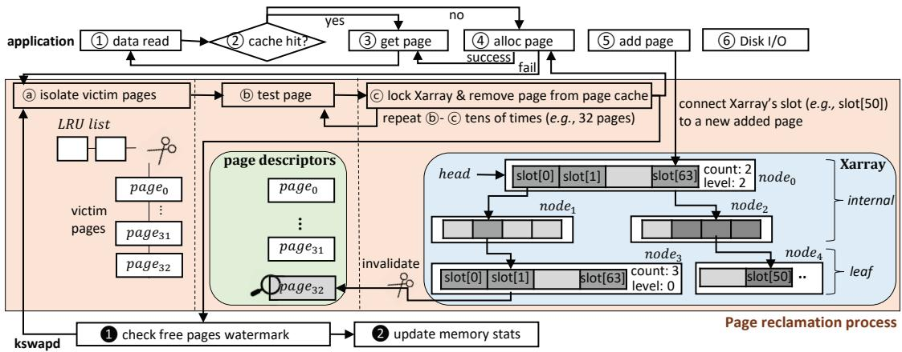  
Figure 1: Page reclamation and metadata access.

## 2.2 Linux Memory Management

Modern Linux manages physical memory by dividing it into fixed-size page frames, typically 4 KiB in size. In Linux, the page cache subsystem associates each page frame with a corresponding 64-byte page descriptor [49], which maintains metadata such as access frequency, mapping information, and file-related properties. These descriptors are used by the Linux kernel to track page status during accesses and evictions. The total memory footprint of page descriptors is 1.6% of the system’s physical memory, assuming 4 KiB pages and a 64-byte descriptor size, and must reside in system memory to ensure fast lookup and updates.

When an application performs file I/O operations with ofset within a given file, the accessed file data are loaded into memory, and the kernel instantiates page descriptors for each 4 KB chunk of that file. To eficiently locate a page descriptor within the page cache using a file ofset, Linux employs the Xarray data structure [52] as an index. Each file is associated with its own Xarray, and each Xarray node is 584 bytes, containing up to 64 entries that point to page descriptors. As the size of the file-backed memory working set grows, and as system memory scales up, the aggregate size of the Xarray nodes increases accordingly. These metadata structures are heavily accessed during memory reclamation.

When the host CPU runs data-intensive workloads, high memory demands can increase memory pressure. This causes the number of free pages to drop below the highwatermark threshold, prompting the Linux kernel to initiate page reclamation and free memory. To manage this process, the kernel spawns a kernel thread (kswapd) per NUMA node [48], with each thread bound to a dedicated CPU core to perform background reclamation. However, in scenarios where applications perform I/O operations across tens of

CPU cores, the rate of memory allocation can outpace that of memory reclamation. Once free pages drop below the lowwatermark threshold during execution of an application, the CPU core suspends its application process to carry out page reclamation, which is known as foreground reclamation [47].

Figure 1 illustrates how each type of metadata is accessed under both background and foreground reclamation scenarios. For example, when an application attempts to read file data ( 1 ), the kernel first checks whether the corresponding data page resides in the page cache ( 2 ). If the page exists (cache hit), it is returned directly to the application ( 3 ); otherwise (cache miss), a free page is allocated ( 4 ). If the system’s free page count exceeds the low watermark, the newly allocated page is inserted into the page cache ( 5 ), and disk I/O is performed to fetch the data ( 6 ). Conversely, when the allocation step ( 4 ) observes the free page count below the low watermark, memory reclamation runs in the application thread context (foreground reclamation). First, candidate pages are isolated from the system’s page list (e.g., LRU list) ( a ). Next, each page descriptor is inspected to evaluate its eviction suitability—verifying attributes such as validity, clean/dirty state, recency of access, reference count status, and other relevant flags ( b ). The kernel then traverses the Xarray structure down to the leaf node to remove the corresponding page index within the file from the page cache ( c )—for example, invalidating the pointer in slot[1] of ???????? , as shown in the Figure 1. To invalidate the pointer, the kernel stores a special shadow value [57] into the Xarray slot[1]. This action invalidates the original pointer and means that the corresponding page is no longer present in the page cache. In a single reclamation cycle ( a - c ), this process is repeated tens to hundreds of times depending on memory pressure.

In contrast, background reclamation is handled by the kernel thread kswapd, which is triggered under memory pressure. This thread executes a loop: as long as the free page count remains below the high watermark ( 1 ), it repeatedly performs the reclamation process ( a - c ) and maintains memory state (e.g., managing LRU lists and free/used page statistics) ( 2 ).

## 3 Impact of Deploying Large-Capacity CXL DRAM

In this section, we examine the impact of deploying largecapacity CXL DRAM on system performance, focusing on the capacity and performance overheads of managing kernel metadata. We show that metadata placement in CXL DRAM can significantly afect both memory utilization and the eficiency of memory reclamation.

## 3.1 Overhead of Managing Metadata in CXL-Enabled Memory Systems

Capacity overhead. In large-memory systems, the metadata for memory management can occupy a substantial portion of the physical memory, making it expensive to keep entirely within the host DDR DRAM. Consider a workload accessing a single 1.8 TiB file on a system with 120 GiB memory. Accessing the entire file requires indexing up to 483 million pages (1.8 TiB / 4 KiB), which, given 64 entries per Xarray node, corresponds to a maximum of 7.5 million leaf nodes and an Xarray footprint of approximately 4.1 GiB (= 7.5 millions × 584 B), assuming suficient memory to hold the entire Xarray. Furthermore, because each file maintains its own Xarray comprising both internal and leaf nodes, the total Xarray footprint grows with the number of files. Similarly, the page descriptor consumes around 2 GiB of memory space (= 120 GiB / 4 KiB × 64 B per descriptor).

For example, in our evaluation using the YCSB RocksDB [71] read-intensive workload [88] with a 1.8 TiB database and 120 GiB system memory comprised of 24 GiB DDR DRAM and real 96 GiB CXL DRAM, the Xarray metadata footprint reached 3.7 GiB. In total, metadata, including 2 GiB for page descriptors and 3.7 GiB for Xarray nodes, consumed approximately 5.7 GiB of system memory. Similarly, under a PostgreSQL [65] TPC‑B workload [64] with a 1 TiB dataset, the Xarray metadata was 3.3 GiB and page descriptors accounted for 2 GiB, collectively occupying around 5.3 GiB of the 120 GiB memory.

The problem is, in environments where the capacity of DDR DRAM is relatively smaller than the CXL DRAM, such metadata is too large to be fully stored within CXL DRAM. If CXL DRAM capacity is four times that of the DDR DRAM capacity, the total size of metadata can consume 24% of the DDR DRAM capacity (= 2 GiB + 3.7 GiB) / (120 GiB / 5). As the proportion of CXL DRAM increases, the relative share of metadata within DDR DRAM also grows. For instance, if CXL DRAM is eight times larger than DDR DRAM, metadata alone can occupy approximately 40% of DDR DRAM capacity.

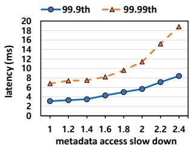  
(a)

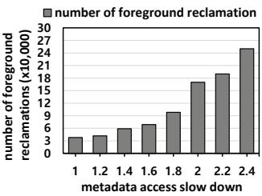  
(b)  
Figure 2: Impact of metadata access slowdown on application performance: (a) tail latency of application and (b) foreground reclamation frequency when running RocksDB with YCSB, 10M Read Ops with 100 threads, 1.8 TiB DB, 120 GiB DDR DRAM, and 32 CPU cores.

To avoid excessive consumption of DDR DRAM by page descriptors when installing memory devices like CXL DRAM, recent Linux kernels support placing these descriptors on the device itself [42]. Additionally, when allocating Xarray nodes, the kernel employs a fallback mechanism [43]: if no DDR DRAM is available, the allocation automatically shifts to CXL DRAM, preventing contention with application data in DDR DRAM and potential Out‑Of‑Memory (OOM) events.

Performance cost. Placing metadata in CXL DRAM, nevertheless, can adversely impacts the performance of latencysensitive applications. The page reclamation process traverses the Xarray and page descriptors repeatedly to remove tens or even hundreds of pages depending on the degree of memory pressure (as shown in the b - c of the Figure 1). Each time, the host CPU must access metadata residing in CXL DRAM, incurring the extra latency associated with remote memory accesses.

When the eficiency of metadata access by the Linux kernel’s background memory reclaimer (kswapd) is reduced due to slow remote memory accesses, the memory reclamation rate declines. This, in turn, forces applications to perform foreground reclamation directly, which can increase application’s tail latency considerably. To observe the efect of metadata access latency on application tail latency, we intentionally introduced delays in accessing metadata structures (specifically, the Xarray and page descriptors) during background reclamation. As shown in Figure 2(a), when metadata access latency increases by 2.4×, the 99.9th and 99.99thpercentile (p99.9 and p99.99) latencies increase by approximately 2.6× and 2.8×, respectively. The underlying reason, as shown in the Figure 2(b), is that the frequency of foreground reclamation, which lies on the critical path of the application I/O, increases by 6.5×. This demonstrates that placing memory metadata in CXL DRAM can substantially degrade application performance. Considering that latency sensitive hyperscale applications often require p99.99 read latencies within just a few milliseconds [75, 31, 78, 1, 90], the observed slowdown can pose a significant challenge.

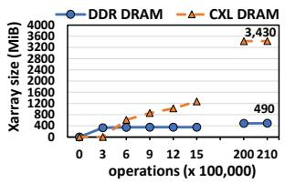  
(a)

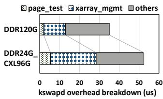  
(b)

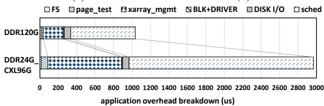  
(c)  
Figure 3: Impact of Xarray management on (a) per-node memory capacity, (b) kswapd performance, and (c) application performance overheads in a system equipped with large capacity CXL DRAM.

To verify the occurrence of metadata placement in CXL DRAM and the resulting tail-latency efects, we evaluated YCSB workload on RocksDB under realistic application conditions. As shown in Figure 3(a), at the start of execution (up to 400 thousand operations), the kernel allocates Xarray nodes in DDR DRAM to enable fast metadata access. However, as the free pages in DDR DRAM runs out, Xarray nodes begin to compete with application data for the free pages, causing them to spill over into CXL DRAM. During the later stages of execution, most Xarray nodes end up residing in CXL DRAM. This makes kswapd access remote memory while traversing the Xarray, the efect of which is shown in Figure 3(b). As a result, the Xarray access latency significantly increases. Furthermore, because page descriptors are also placed in CXL DRAM, page test time increases by 2.2×. Overall, these efects reduce kswapd ’s page reclamation eficiency by 42%. This, in turn, triggers foreground reclamation, which causes the application to experience frequent tail latency spikes, as depicted in Figure 2(a).

Figure 3(c) presents a breakdown of I/O overhead for application threads experiencing foreground reclamation. In systems using both DDR DRAM and CXL DRAM, page descriptor traversal overhead (page\_test in Figure 3(c)) during direct reclamation is 3.6× higher than in all-DDR systems, and Xarray traversal overhead (xarray\_mgmt in Figure 3(c)) is 3.9× higher. These diferences exceed the 2.4× higher access latency of CXL DRAM compared to DDR DRAM, indicating a deeper ineficiency in page reclamation. One main reason is that I/O operations often request data sizes larger than the 4 KiB page, which requires allocating multiple pages. Each page allocation ( 4 in the Figure 1) triggers a foreground reclamation if free pages are unavailable, substantially increasing I/O latency. Furthermore, these reclamation events consume the CPU core for long periods, allowing other threads to preempt the ofending core via scheduling [56, 50], which causes additional long latency spikes (sched in Figure 3(c)). As a result, Figure 3(c) shows that systems with CXL DRAM exhibit 2.8× more extreme latency spikes compared to those using DDR DRAM alone.

## 3.2 Suitability of Ofloading Kernel Metadata Management to CXL DRAM

The kernel’s page reclamation process involves simple yet repetitive operations. First, as shown in b of Figure 1, during page descriptor traversal, the kernel iteratively evaluates each victim page descriptor’s flag bits (e.g., valid, referenced, active, clean bits) using basic bitmask operations to determine whether pages are eligible for reclamation. Likewise, during Xarray traversal—as shown in c of Figure 1—the kernel descends from the Xarray head to a leaf node and replaces the pointer to the page descriptor in the target slot with a specific long integer ”shadow [57]” value. This descent process uses simple arithmetic: based on the page ofset in the file, the kernel selects the target slot (slot[0] of the ???????? in the Figure 1) in the current node’s slot array and computes the next node’s virtual address via pointer subtraction and shift. Overall, these operations are composed of basic bitmask checks, arithmetic, and shift operations. These operations are repeated for each batch multiple pages (at least 32), which constitutes the minimum unit of a single kernel’s page reclamation cycle.

Moreover, both page descriptors and Xarray structures reside within the kernel’s direct-mapped virtual address space [44]. Consequently, translating a kernel virtual address to its corresponding physical address requires no page table walk and can be accomplished using a simple arithmetic operation (e.g., via the \_\_pa() [39] macro). This lightweight translation enables an in-DRAM accelerator attached to CXL DRAM to eficiently access and process metadata without additional mapping logic. Since a single instance of kswapd handles each memory node (both DDR DRAM and CXL DRAM) reclamation, the compute resources provided by modern CXL DRAM controllers (e.g., 16‑core Arm processors [73]) are suficient to efectively manage these tasks.

Additionally, for pages that require extra work beyond the Xarray walk, we can significantly reduce page-reclamation time by letting the host CPU process those tasks in parallel. For instance, file-backed pages mapped via mmap must be unmapped from user PTEs before reclaim; the kernel performs this via reverse mapping (rmap [37]). Since rmap unmapping is control-flow–heavy and can proceed in parallel with the Xarray walk, the host CPU can execute it concurrently with the CXL DRAM-side walk to improve overall reclamation eficiency.

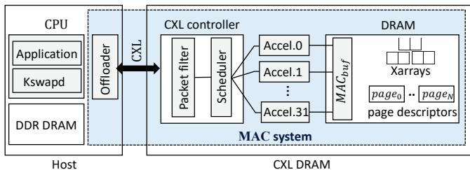  
Figure 4: An overview of MAC system.

## 4 Design

## 4.1 Overview

To ensure stable performance for latency-sensitive applications through eficient and swift memory reclamation, we propose Metadata Acceleration in CXL DRAM (MAC). By ofloading metadata processing during page reclamation into CXL DRAM, MAC enables rapid memory recovery and effectively eliminates frequent, long tail-latency events.

As shown in the Figure 4, the MAC system enables both applications and the kswapd —the primary triggers of page reclamation—to ofload metadata processing (page descriptor traversal and Xarray walks) to CXL DRAM. Accelerators in CXL DRAM then perform near‑data processing (NMP) to manage metadata eficiently. The ofloading workflow consists of two stages: (1) metadata information (including target page descriptors and head pointers of the Xarrays) is delivered to CXL DRAM, and (2) the accelerators traverse the metadata in parallel and execute the necessary operations. In the MAC system, both page descriptors and Xarray metadata are intentionally allocated to the capacity-rich, lowcontention CXL DRAM rather than the more limited DDR DRAM. This placement enables the accelerators to access metadata within CXL DRAM at high speed and with low contention, greatly enhancing metadata-processing eficiency. This design aligns with recent kernel mechanisms [42] that enable metadata placement directly into CXL DRAM, reducing DDR DRAM pressure.

## 4.2 Metadata Acceleration Launch in CXL DRAM

To ofload metadata access operations in page reclamation (traversing page descriptors to identify reclaimable pages and traversing Xarray to remove pages from the page cache), each task must support NMP launch capability. The host must deliver metadata information such as pointer addresses to target page descriptors and Xarray structures. This delivery must be lightweight and eficient.

One could modify the CXL.mem protocol to encode this data directly, but doing so would require hardware modifications to commodity CPU processors—an impractical approach in general-purpose environments [17, 69]. Instead, we introduce a memory-mapped [17] based command mechanism (MACcmd) and a shared bufer (MACbuf) for communication.

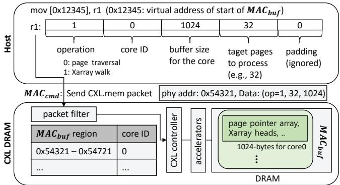  
Figure 5: NMP launch process in the MAC system (the virtual address 0x12345 of MACbuf corresponds to the physical address 0x54321 and is translated by the host.).

First, private memory in the CXL DRAM (MACbuf in the Figure 5) is reserved to deliver NMP information. The MACbuf contains the information required by the accelerators to perform NMP operations within CXL DRAM. The information includes head addresses of Xarray structures to be walked, file page indices targeted for removal from the Xarray, shadow values to be stored in the Xarray, and arrays of addresses to page descriptors. As shown in Figure 5, MACbuf allocates a dedicated work bufer per host CPU core at system boot.

Second, each host core issues MACcmd —a memorymapped command using the standard CXL.mem protocol— to initiate NMP. As shown in Figure 5, we pre-register the work-bufer address ranges of each host core (MAC regions) in a packet filter. Whenever NMP is needed, the host core writes its MACcmd to CXL DRAM. The MACcmd is not a new CXL protocol—it is simply a standard memory write operation using the existing CXL.mem request. The packet filter recognizes the memory writes within the registered address range as NMP commands, parses the command, and triggers metadata processing with the accelerator. The MACcmd encodes the type of operation (whether traversal of page descriptors or the Xarrays), the requesting host core’s ID, and the size of the MACbuf containing data required for the NMP. Although multiple processes (e.g., application threads, kswapds) may be scheduled per CPU core on the host, Linux disables core preemption during page reclamation. As a result, the process that initiates the NMP remains bound to a single core until reclamation completes. Consequently, allocating one MAC per core (rather than per process) is suficient to support all concurrent reclamation activities.

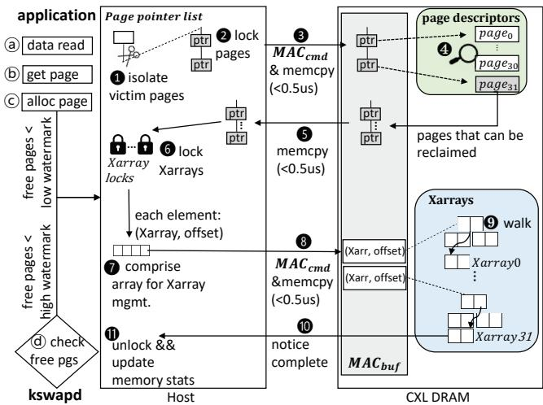  
Figure 6: An operational overview of MAC.

## 4.3 Metadata Acceleration (MAC) in Action

When page reclamation occurs on the host—whether triggered by foreground or background activity—our design leverages near‑data processing (NMP) in CXL DRAM to accelerate the process. Figure 6 illustrates the communication and acceleration between the host CPU and CXL DRAM under each reclamation scenario.

Background reclamation acceleration . Each memory node (e.g., host node and CXL DRAM node) runs a dedicated kswapd thread that continuously monitors system free memory and triggers page reclamation when free space drops below the high‑watermark ( d in Figure 6). At this point, kswapd first isolates a subset of candidate page pointers (e.g., 32 entries) from a page‑pointer list (such as the LRU list) ( 1 ). Next, kswapd acquires locks on these pages ( 2 ), collects their physical addresses into an array, delivers it into the CXL DRAM bufer MACbuf, and issues a MACcmd ( 3 ). Accelerators within CXL DRAM then access each page descriptor via the supplied addresses and inspect their flags across all pages ( 4 ). During this inspection, pages are classified into reclaimable (clean file pages) and non‑reclaimable (e.g., dirty, invalid, active, or recently referenced). Once the acceleration completes, the host CPU retrieves the results into host memory via memcpy ( 5 ). It then proceeds to evict the reclaimable pages from the page cache by first holding locks on the relevant Xarray structures ( 6 ). The CPU constructs an array of pairs containing each Xarray ’s head pointer and the target page index ( 7 ), delivers these into MACbuf, and issues another MACcmd ( 8 ). The accelerator uses this information to traverse each Xarray and invalidate the specified pages, repeating the process for the entire set of pages to be removed ( 9 ). Finally, once all invalidations have been performed, the host CPU releases all Xarray locks and updates memory and Xarray statistics (10-11).

Foreground reclamation acceleration . Foreground reclamation is triggered during an application’s I/O when free pages drops below the low-watermark. As illustrated in Figure 6, during I/O an application thread may allocate new pages from the kernel ( a – c ). If the number of free pages falls below the low-watermark, the page reclamation routine ( 1 –11) is repeatedly invoked in the kernel. Moreover, when an application allocates multiple pages—such as for I/O units larger than 4 KiB—the page reclamation routine ( 1 –11) may be invoked repeatedly for each individual page allocation attempt ( c ).

## 4.4 Metadata Synchronization between Host and CXL DRAM

Xarray updates on page insertions and evictions modify internal nodes, requiring synchronization between the host CPU cache and CXL DRAM. For example, when a new page is inserted ( 5 in Figure 1), the node data in the Xarray is updated to point to the newly inserted page (e.g., slot[50] of ???????? in Figure 1). To ensure accelerators in CXL DRAM observe up-to-date Xarray content, the host issues clwb to write back the modified cacheline, which costs about 30 ns in our experiments2. In contrast, when a page is evicted from the page cache ( c in Figure 1) by the CXL DRAM, the pointer to that page must be invalidated (e.g., slot[1] of ????????3 in Figure 1). This requires invalidating the corresponding cacheline in the host CPU cache. Starting with CXL 3.x, the memory device supports an invalidate protocol (BIsnp [6]) that allows the device to trigger cacheline invalidation directly, and this is expected to incur a latency of around 500 ns3

Accordingly, we integrated a delay model into the MAC system, which enforces that either a clwb instruction or the BIsnp protocol is invoked after the Xarray is updated by the host CPU, in order to guarantee data consistency between the host CPU and CXL DRAM.

However, if such synchronization occurs too frequently, it may degrade application performance. To assess this, we measured clwb/BIsnp rates in practice by counting Xarraynode modifications during insertions and evictions while running RocksDB with YCSB. First, we measured the number of clwb instructions issued per query and the corresponding overhead. As shown in Figure 7(a), the number of clwb operations is high during the early phase of the workload due to the creation of Xarray structures, as almost internal and leaf nodes are allocated at this stage. Over time, however, the number stabilizes to about 1–3 clwb instructions per query. This corresponds to the insertion of 1-3 pages fetched from SSD due to cache misses, each of which requires updating the slot array in a leaf node of the Xarray. The overhead of these operations is relatively small: as shown in Figure 7(b), two Xarray operations incur 60 ns (2 × 30 ns) on average, accounting for only 0.06% of the overall query lifetime.

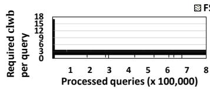

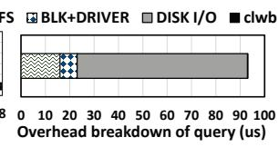  
(b)

(a)  
Figure 7: clwb overhead breakdown: (a) clwb operations required on cache-misses during application execution and (b) application performance when writeback cachelines.  
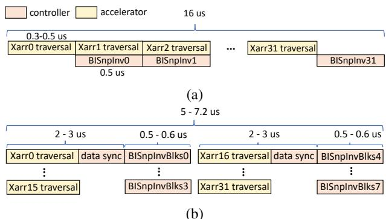  
Figure 8: Cooperative parallel page reclamation within the CXL DRAM: (a) overlapping BIsnp and Xarray walk and (b) parallel Xarray walk and bulk invalidation.

Second, in the case of page deletions, each reclaimed page requires a single cacheline back invalidation. Since pages are reclaimed in batches of 32, the accelerators in CXL DRAM perform 32 Xarray walks via NMP, which takes approximately 12.8 (0.4 us × 32) us on average as shown in Figure 8(a). If BIsnp operations are performed serially after each Xarray walk, they introduce an additional overhead of 16 us (0.5 us × 32), which is longer than the Xarray walks. We address this BIsnp-induced overhead using the techniques described in the following section 4.5.

On the other hand, for page-descriptor traversal, the small subset of descriptors that participate in reclamation (e.g., 32 pages) are not modified by the CXL DRAM; thus no backinvalidation is required. Furthermore, clwb is required only at step 3 in Figure 6. Issuing clwb in batches (e.g., for 32 pages) pipelines the writebacks asynchronously, and because victim pages are unlikely to have been recently accessed— and thus rarely reside in the CPU cache—the overhead is negligible.

## 4.5 Cooperative Parallel Page Reclamation

Parallel processing within CXL DRAM . Unlike the readonly descriptor traversal, when ofloading Xarray walk, the kernel must write a “shadow” value into the leaf slot of the Xarray (e.g., slot[1] of ???????? in Figure 1). This write requires maintaining coherence between host CPU caches and CXL DRAM. Since one shadow is stored per Xarray walk, on average, a single host CPU cacheline must be invalidated via Back Invalidation Snoop message (BIsnp [6]). If BIsnp messages are sent serially for each Xarray walk, their overhead can decrease page reclamation eficiency. To hide this BIsnp overhead, we parallelize the process: as shown in Figure 8(a), the CXL DRAM accelerator and controller perform Xarray walk and the back-invalidation (BIsnpInv in the Figure 8(a)) concurrently.

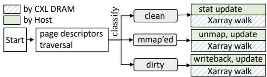  
Figure 9: Cooperative page reclamation between Host CPU and CXL DRAM.

Moreover, by exploiting accelerator parallelism, we further reduce total Xarray walk time. Because no structural changes (node allocation or deallocation in the Xarray) occur during the walk, we can process multiple traversals in parallel—up to the number of accelerators or ARM cores, as in Figure 8(b). After batching the Xarray walks, the device issues BIsnp invalidations; these transactions can be pipelined, allowing multiple invalidations to be in flight and overlapping the 500 ns coherence-handshake latency. In addition, CXL 3.x provides block invalidation (BIsnpInvBlks) that covers up to four consecutive cache lines per message, reducing the number of protocol messages by up to 4×. However, when multiple accelerators execute tasks in parallel, the controller must track each accelerator’s completion status, because accelerators finish at diferent times and there are atomically updated shared variables for each accelerator (e.g., the number of accelerators completed). To enable this, shared variables are maintained between the controller and the accelerators to monitor task progress and ensure synchronization. The overhead of this execution and data synchronization introduces an additional delay of approximately 1 us; consequently, as shown in Figure 8(b), executing 16 Xarray walks takes about 2–3 us. As a result, as shown in Figure 8(b), parallelism enables a further 55% reduction in Xarray walk overhead.

Cooperation between host and CXL DRAM . When the host CPU ofloads Xarray walks to CXL DRAM, it must hold the corresponding Xarray locks (as illustrated in 6 of Figure 6) and prohibit CPU preemption until the ofloaded operation completes to prevent deadlocks on the held Xarray locks. We exploit this idle interval by parallelizing reclamation: CXL DRAM performs metadata traversals while the host executes the remaining steps.

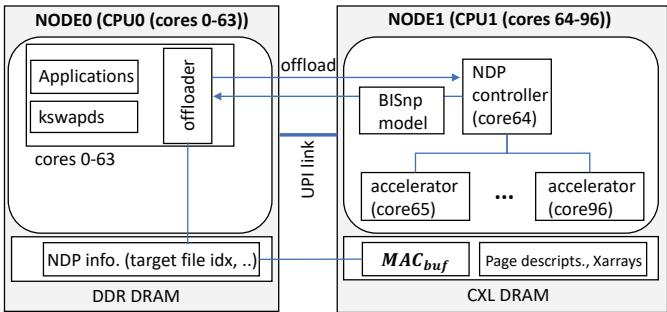  
Figure 10: MAC emulation environment.

Table 1: Emulation system configurations.  
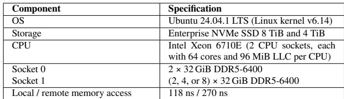

As shown in Figure 9, once page descriptors have been traversed, pages are classified as clean, dirty, or mapped. Clean pages can be immediately removed from the page cache, whereas mapped pages must first be unmapped from page tables before eviction. Dirty pages require a writeback operation before they can be reclaimed. Because writeback incurs costly I/O (via the block layer and device drivers), the kernel prioritizes reclaiming clean pages [81, 2, 50]; nevertheless, under write-excessive workloads (e.g., almost of the pages are dirty), dirty pages can still be reclaimed. To maximize parallelism and hide unmap/writeback costs, we employ a classification-based scheme: while CXL DRAM walks the Xarray, the host CPU concurrently either unmaps mapped pages or initiates writeback for dirty pages, and updates memory and Xarray statistics, as shown in Figure 9.

## 5 Evaluation

## 5.1 Setup

We evaluate the efectiveness of our MAC system through two complementary implementations. First, we built a software-based emulation using a dual-NUMA-node server to model CXL-attached NMP behavior. Second, we developed a hardware prototype on FPGA to demonstrate performance gains from accelerations. Our evaluation focuses on comparing tail-latency and analysis, with real-world datacenter workloads.

Emulated MAC system. We integrate MAC into Linux kernel 6.14; configuration parameters are in Table 1. As shown in Figure 10, the application and kswapd execute on NODE0 (64 cores), whereas NODE1 emulates a CXL device with 33 cores (one controller and 32 accelerators). To enable metadata processing within CXL DRAM, we allocate NODE1’s page-descriptor array via memory hotplug [45] and place Xarray-related slabs on NODE1 using NUMA-controlled allocation [11]. As shown in Figure 10, an ofloader lets the application or kswapd on NODE0 send NMP information to NODE1 via memcpy. We implement a BIsnp model to emulate protocol behavior and delay for coherence during metadata updates. Finally, to minimize cache efects in the emulation environment, we maintained the LLC cache size of NODE0 at 96 MiB and restricted the LLC cache size of NODE1 to the minimum allocatable unit of 8 MiB using Intel Cache Allocation Technology (Intel CAT) [26].

Evaluated systems. The evaluated systems are as follows:

• Baseline: Our baseline is the patched Linux 6.14 kernel that optimizes reclaim cycles and reduces tail latency [74]. Xarray nodes are preferentially allocated in CPU-local DDR DRAM, and fall back to CXL DRAM under memory pressure; page descriptors are split by node—NODE0 in NODE0 DRAM, NODE1 in NODE1 DRAM. This placement is a practical approach that eficiently leverages metadata locality and capacity in CXL DRAM systems.

• Baseline-P: Unlike the Baseline, we modified the kernel to pin metadata in CPU-local DDR DRAM by allocating metadata in DDR DRAM even when free space is scarce. Specifically, we implement kernel support for dynamic allocation of Xarray nodes by introducing a flag (GFP\_THISNODE) that enforces allocation on the DDR DRAM node when allocating metadata [46]. However, attempting to allocate metadata under extreme memory pressure (i.e., out-of-memory conditions) may lead to abnormal application termination [33]. To mitigate this issue, when an OOM condition is imminent, metadata allocation is redirected to CXL DRAM [51].

• MAC-S: MAC-S (corresponding to Figure 8(a)) accelerates metadata management using a single controller and four accelerators. The controller schedules ofloaded requests (e.g., 32 Xarray walks); two accelerators serve two background kswapds and two serve foreground reclamations. Page descriptors for DDR DRAM are allocated in DDR DRAM and traversed by the host CPU. Page descriptors for CXL DRAM and all Xarrays reside in CXL DRAM, with their traversal ofloaded to a accelerator.

• MAC-P: MAC-P (corresponding to Figure 8(b)) accelerates metadata management by exploiting the maximum available parallelism of CXL DRAM-resident accelerators, using one controller and thirty-two accelerators. Ofloaded tasks run in parallel; after each batch, the controller aggregates results and applies a modeled BIsnpInvBlks delay computed by the BIsnp delay model.

Hardware prototype for MAC system. We prototype MAC on FPGA to quantify the reduction in page descriptor traversal and Xarray-walk time from hardware ofload versus hostonly traversal in CXL DRAM. At initialization, the host allocates a host bufer and passes its physical address to the accelerator; this bufer carries inputs for Xarray walk and page-descriptor traversal, and later the results. Ofloading proceeds as follows: (1) the host writes inputs and triggers the accelerator via an MMIO write; (2) the accelerator fetches inputs with CXL.cache reads and distributes them to peroperation units whose state machines mirror the software logic; (3) the units issue device-biased memory requests that do not require updates4, but the final Xarray update is performed via a host-biased write, thereby keeping the update coherent with the CPU cache; (4) and the host is notified upon completion. To preserve correctness, when the host updates the Xarray, it flushes the modified cache lines to the device so the accelerator does not operate on stale data.

## 5.2 Workloads

We conducted evaluations across a diverse set of database workloads using systems that are widely adopted in practice:

• RocksDB with YCSB workloads: We deployed RocksDB [71] alongside YCSB [88] to evaluate behaviors under both read-intensive and write-intensive workloads. For this purpose, we generated two RocksDB databases (2.5 TiB and 2.0 TiB).

• PostgreSQL with OLTP workload: Using PostgreSQL [65]—an open-source, object-relational database management system—we evaluated transaction workload with the OLTP benchmark [64]. We created a 2.0 TiB database for the evaluation.

• Neo4j with LDBC SNB workloads: We evaluate Neo4j [15], a graph database, using the LDBC SNB benchmark tool [16]. We use two types of queries: Interactive Short (IS) workload and Interactive Complex (IC) workload [12]. To this end, we import a 1 TiB dataset (SF: 1,000) [14] into the database.

• LMDB with GET workload: We evaluate LMDB [55], a database that performs file I/O using mmap [41], with the ioarena [27] benchmark. We created a 1.7 TiB database.

## 5.3 Results

All reported results are collected after a warm-up phase, during which both DDR DRAM and CXL DRAM are fully populated. Logs used for CDF and box-plot analysis are flushed to a separate SSD to avoid interfering with application performance.

RocksDB with YCSB workloads. We first evaluate a YCSB read-only workload on a 2.5 TiB RocksDB database. To assess the impact of metadata spillover into CXL DRAM on page-reclamation eficiency, we vary the DDR:CXL capacity ratio by fixing host memory at 64 GiB and setting CXL to 64/128/256 GiB (1:1/1:2/1:4); for each configuration, the thread count is tuned to highest throughput. Figure 11 presents the latency distribution in the form of a CDF. Across all ratios, MAC-S and MAC-P exhibit lower tail latencies than Baseline. For example, at a DDR DRAM to CXL DRAM ratio of 1:2, MAC-S reduces the p99.99 latency by 97% compared to Baseline, while MAC-P achieves a 98% reduction. These improvements are closely tied to the page reclamation rate.

Table 2: Xarray distribution across DDR DRAM and CXL DRAM under Baseline at the end of the benchmark.  
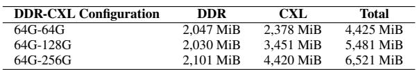

Table 2 shows Baseline sufers substantial Xarray spillover to CXL (e.g., 68% at 1:4), throttling kswapd. In contrast, MAC-S and MAC-P place metadata in CXL DRAM and accelerate its management via NMP, thereby maximizing the eficiency of kswapd. For example, compared to Baseline, MAC-S and MAC-P reduce Xarray walk overhead by 25% and 80%, respectively, and reduce page descriptor traversal overhead by 58%. As a result, the MAC-P increases free-page generation by 36%, despite incurring BIsnp (sync.) and host–device communication (comm.) overheads, as shown in Figure 12(b). Consequently, as shown in Figure 12(a), MAC-P reduces foreground reclamations by 66% at 1:2 compared to Baseline.

Compared to Baseline-P, both MAC-S and MAC-P also exhibit lower tail latency distributions. As shown in Figure 11(a), MAC-S and MAC-P reduce the p99.99 latency by 15% and 22%, respectively, relative to Baseline-P. In Baseline-P, most metadata resides in DDR DRAM, which reduces page reclamation overhead by 22% compared to Baseline, as shown in Figure 12(b). Despite this benefit, Baseline-P still sufers from latency spikes due to the high overhead of slab memory management [40].

When an application fetches data from SSD into memory, Xarray nodes are dynamically allocated from pages in slab memory pools [40], where each NUMA node (DDR DRAM or CXL DRAM) maintains its own pool. However, under Baseline-P, which allocates Xarray only on DDR DRAM, severe memory pressure significantly increases the overhead of managing the DDR DRAM node’s slab memory pool for metadata allocation. Specifically, application data and kernel metadata contend heavily for DDR DRAM space, as metadata allocations are restricted to the DDR DRAM despite the presence of separate slab pools in CXL DRAM. We observed that while slab allocation latency [46] ranges from 2–4 ??s in Baseline, MAC-S, and MAC-P, it increases to 10–600 ??s in Baseline-P.

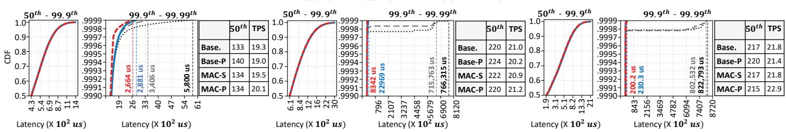  
(a)  
(b)  
(c)  
Figure 11: Latency CDFs and TPS (×1,000) across memory configurations for the RocksDB read-only workload: (a) DDR:CXL = 1:1 (90 threads), (b) DDR:CXL = 1:2 (200 threads), and (c) DDR:CXL = 1:4 (250 threads).

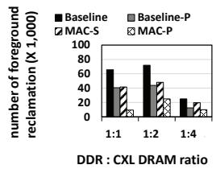  
(a)

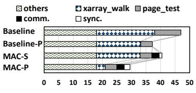  
(b)  
Figure 12: kswapd reclamation overhead and resulting foreground reclamations: (a) foreground reclamation frequency and (b) kswapd for CXL DRAM overhead breakdown when running RocksDB with YCSB read-only workload under DDR:CXL = 1:2 configuration.

Consequently, as shown in Figure 11, the increased slab allocation cost and resulting contention on shared resources cause Baseline-P to exhibit tail latencies comparable to Baseline.

In addition to the slab management overhead, the preferential allocation of large metadata to DDR DRAM forces application data to be allocated and served from CXL DRAM, thereby degrading application throughput. We observe that Baseline-P achieves lower TPS (transactions per second) than the other schemes. For example, as shown in Figure 11(c), Baseline-P delivers 6% lower TPS than MAC-P, which experiences the least memory pressure on DDR DRAM and achieves higher utilization of application data in DDR DRAM.

We next evaluate a YCSB workload with a 5:5 read-toupdate (read-modify-write) ratio on a 2.0 TiB RocksDB database. Updates trigger memory-intensive compactions; when compactions stall, the tail latency of writes and reads increases sharply [86]. As shown in Figure 13, across all memory configurations our MAC system delivers stable performance. For example, for read operations, as shown in Figure 13(a), MAC-P reduces the p99.9 latency by 24% and the p99.99 latency by an average of 27% compared to Baseline. For update operations, as shown in Figure 13(d), MAC-P reduces p99.99 latency by 52% compared to Baseline and by 48% compared to Baseline-P. Notably, by alleviating DDR

DRAM memory pressure caused by large metadata, MAC-P improves throughput by 10% over Baseline and 17% over Baseline-P. This result suggests that, for update workloads, higher utilization of fast DDR DRAM by application data leads to improved throughput.

PostgreSQL with OLTP. We evaluate an OLTP workload (SELECT-only) on a 2.0 TiB PostgreSQL database using pgbench [64]. We configure PostgreSQL ’s internal bufer (shared\_bufers [66]) to 25% of system memory following PostgreSQL ’s guidance [66], and for each memory setting, we increase the thread count to achieve the highest queriesper-second. As shown in Figure 14, our MAC-S and MAC-P deliver stable performance across all memory configurations compared to Baseline. For example, in a configuration with a DDR DRAM to CXL DRAM ratio of 1:2, MAC-P reduces the number of queries that experience foreground reclamation by 88% (Figure 14(e)), which in turn lowers the p99.99 latency by 92% (Figure 14(b)) and maintains stable latency during execution.

Moreover, as shown in Figure 14(d), MAC-S and MAC-P improve TPS by up to 5% across all memory configurations over Baseline and Baseline-P by more eficiently utilizing DDR DRAM.

Neo4j with LDBC SNB workloads. Graph processing in Neo4j can incur significant disk I/O under memory pressure when the dataset exceeds available memory, which in turn triggers frequent memory reclamation. We first evaluate our system using an IS workload that concurrently executes seven Interactive Short Queries (IS) [12], which exhibit OLTP characteristics. As shown in Figure 15(a), both MAC-S and MAC-P achieve lower tail latencies across all queries by enabling more eficient page reclamation under memory pressure. For example, for SQ6, MAC-P reduces p99.9 latency by 21% and p99.99 latency by 82% compared to Baseline, and further reduces p99.9 and p99.99 latencies by 11% and 24%, respectively, compared to Baseline-P.

Moreover, MAC-S and MAC-P achieve shorter overall benchmark runtimes than Baseline-P. As shown in Figure 15(b), they reduce the total runtime by 7% compared to Baseline-P, driven by faster metadata allocation as well as higher application data fetch and processing within DDR

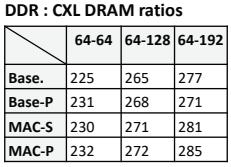

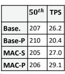

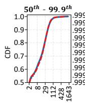

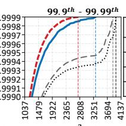

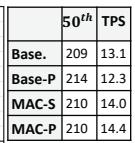

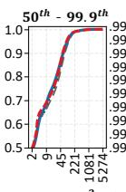

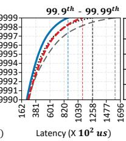

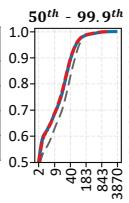

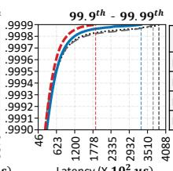

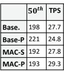

(a)  
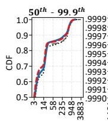

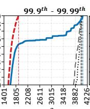  
(d)

(b)  
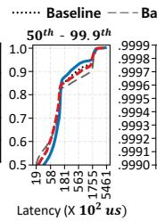  
(e)

(c)  
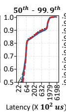

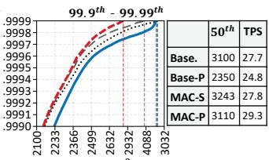

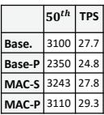  
(f)

Figure 13: Latency CDFs and TPS (×1,000) across memory configurations for the RocksDB 50/50 read–update workload: (a) DDR:CXL = 1:1 (READ, 100 threads), (b) DDR:CXL = 1:2 (READ, 230 threads), (c) DDR:CXL = 1:4 (READ, 250 threads), (d) DDR:CXL = 1:1 (UPDATE, 100 threads), (e) DDR:CXL = 1:2 (UPDATE, 230 threads), and (f) DDR:CXL = 1:4 (UPDATE, 250 threads).  
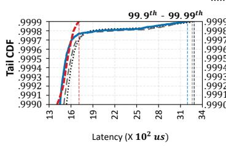  
(a)

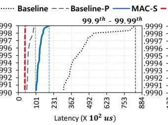  
(b)

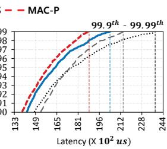  
(c)

(d)  
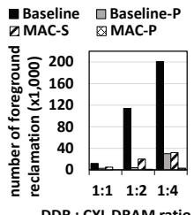  
(e)  
Figure 14: Latency CDFs, TPS, and foreground reclamation frequency across memory configurations for the OLTP workload with PostgreSQL: (a) DDR:CXL = 1:1 (100 threads), (b) DDR:CXL = 1:2 (160 threads), (c) DDR:CXL = 1:4 (250 threads), (d) TPS comparisons, and (e) foreground reclamation frequency.

DRAM.

Next, we evaluate our system using a hybrid workload that concurrently executes seven Interactive Short (IS) queries and eleven Interactive Complex (IC) queries [12] which exhibit OLAP characteristics. As shown in Figure 16(a), our system achieves lower p99.9 and p99.99 tail latencies for most queries. However, for some long-running, computation-bound queries (e.g., CQ1 and CQ2), the improvement is smaller. Nevertheless, in terms of overall runtime, both MAC-S and MAC-P still outperform Baseline-P, achieving an 11% reduction in total runtime, as shown in Figure 16(b).

LMDB with GET operations. We evaluate the GET workload on a 1.7 TiB LMDB database using ioarena [27]. Since LMDB [55] accesses the database via mmap [41], we assessed how the cooperative page reclamation scheme in Figure 9 afects performance. As shown in Figure 17(a), MAC-S and MAC-P reduce p99.9 latency by 62% and 35% on average over Baseline and Baseline-P, respectively, while maintaining stable performance.

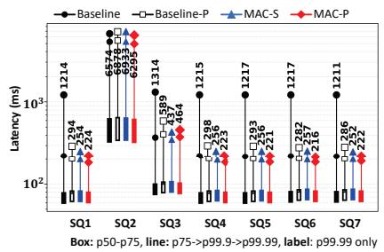  
(a)

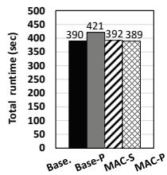  
(b)  
Figure 15: Latency distributions and total runtime under a 1:2 DDR DRAM:CXL DRAM configuration: (a) box plots for the Interactive Short (IS) workload (400K ops with 200 threads), (b) runtime across schemes.

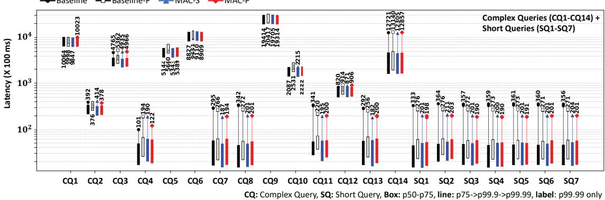  
(a)

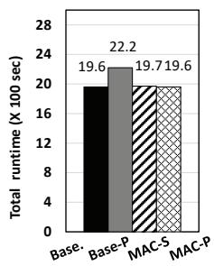  
(b)

Figure 16: Latency distributions and total runtime for the combination of the Interactive Short (IS) and Interactive Complex (IC) workload (13K ops with 200 threads) under a 1:2 DDR:CXL DRAM configuration: (a) box plots, (b) runtime across schemes.  
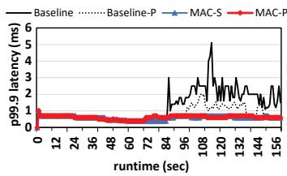  
(a)

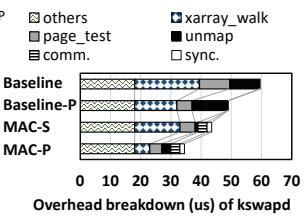  
(b)

Figure 17: Tail latency (updated every 1 s) under DDR:CXL = 1:2 configuration for the GET benchmark with LMDB (100 threads): (a) p99.9 and (b) kswapd overhead breakdown.  
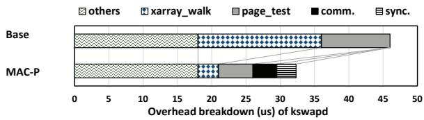  
Figure 18: FPGA-based validation of page reclamation acceleration.

This performance improvement stems from the fact that our MAC processes the unmapping of reclaimed mmap’ed pages from the process page table in parallel with the Xarray walk, as shown in Figure 9. As a result, as shown in Figure 17(b), in MAC-S and MAC-P the unmap operation is overlapped with the Xarray walk time, reducing page reclamation time by 26% and 42%, respectively, compared to Baseline. Compared to Baseline-P, MAC-S and MAC-P reduce reclamation time by 10% and 31%, respectively.

## Results with a prototype system.

To validate the fidelity of our emulation results, we measured the end-to-end latency of kswapd ’s page reclamation on real FPGA hardware. To do so, we synthesized the Linux kernel’s Xarray walk function [53] and pagedescriptor traversal logic [50] into an FPGA RTL design. We perform our FPGA evaluation on a server described in Table 3.

Table 3: Prototype system configurations.  
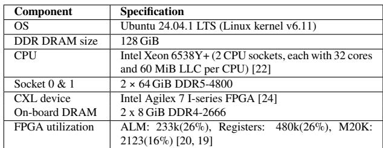

We benchmark the overhead of the page-reclamation process invoked by kswapd, using synthetic page descriptors and Xarray structures representative of file-sizes and tree depths observed in RocksDB and PostgreSQL (e.g., Xarray depth of 3 levels).

As shown in Figure 18, our MAC technique reduces the Xarray-walk overhead by 82% and the page descriptor traversal overhead by 48% by enabling pipelined and parallel execution of accelerators within CXL DRAM. While offloading work to CXL DRAM introduces additional costs— the time for the host CPU to transfer required information and trigger MMIO operations (comm. in Figure 18), and the overhead of notifying the host CPU of completion via polling and returning the computed values, along with cachecoherency overhead (sync. in Figure 18)—MAC still decreases the end-to-end runtime of kswapd page reclamation by 30%. This improvement is comparable to the performance of MAC-P in Figure 12(b), validating the results of the emulated architecture.

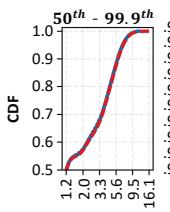

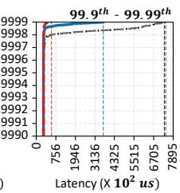  
(a)

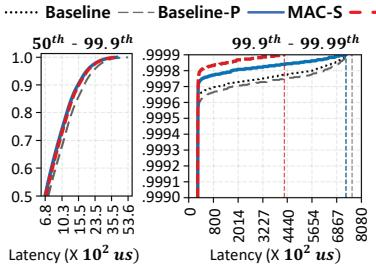  
(b)

  
(c)

  
(d)  
Figure 19: Latency CDFs and metadata size across memory configurations for the 3.5 TiB RocksDB read-only workload: (a) DDR:CXL = 1:1 (60 threads), (b) DDR:CXL = 1:4 (250 threads), (c) DDR:CXL = 1:8 (300 threads), and (d) metadata size.

## 6 Related Work

We organize related work into two areas: (1) metadata overhead reduction and (2) near-memory processing (NMP). Metadata management. Several studies [33, 13, 68, 63, 35, 87, 67] have improved system and application performance by reducing the overheads of kernel metadata management. For example, Radiant [33] tackles the performance degradation caused by long address translation when page tables spill over to high-latency non-volatile main memories [21] by migrating page tables. Hermit [68] mitigates tail-latency issues caused by remote memory accesses during application-page swapping in RDMA-connected clusters using multiple swap threads, but focuses on in-memory applications and does not consider the overheads of metadata structures. In contrast, our MAC system is distinguished in that there has been no prior characterization of the size or performance overhead of existing kernels’ memory management metadata in largecapacity, CPU-less CXL DRAM environments.

NMP with CXL DRAM. Many works [79, 28, 32, 62, 85, 89, 30] have improved application performance by leveraging CXL DRAM–based near-memory processing (NMP) to overcome performance bottlenecks. For example, [85] accelerates query processing with in-memory column scans and B+-tree operations, while [79] performs NMP-based memory profiling on CXL DRAM to reduce the host-CPU burden, improving both migration accuracy and performance. In contrast, our MAC system ofloads Linux’s page-reclamation path to CXL DRAM, showcasing a complementary NMP use case that targets OS-level memory-management overheads.

## 7 Discussion

While vendors typically consider DDR DRAM to CXL DRAM ratios ranging from 1:1 to 1:4, future systems may employ more aggressive configurations such as 1:8. As shown in Figure 19(d), under a 1:8 ratio, metadata occupies approximately 20 GiB, corresponding to 31% of DDR DRAM capacity. Consequently, Baseline and Baseline-P, which place metadata in DDR DRAM, experience 5-30% higher 50th-90th percentile latencies than MAC-S and

MAC-P due to increased contention for scarce DDR DRAM, as shown in Figure 19(c). These results show that, as CXL DRAM capacity scales, preserving DDR DRAM for application data becomes increasingly important for latencysensitive workloads [3].

Although we focus on CXL memory expanders, the same considerations apply to future CXL 3.0 memory-pooling systems [34] with multiple CXL DRAM devices. In this case, nodes belonging to the same Xarray should preferably reside in the same CXL DRAM device and migrate together when reassigned. Moreover, applications spanning multiple CXL DRAM devices could exploit device-level parallelism for metadata processing.

## 8 Conclusion

We have presented MAC, a near-memory processing approach that co-designs the OS and a CXL-resident accelerator to ofload the dominant metadata operations in the memory reclaim path—Xarray [52] walks and pagedescriptor [49] traversals. To our knowledge, this is the first paper to address the capacity and performance costs of kernel metadata in CXL DRAM systems from a sustainability perspective and to resolve them via NMP-based reclamation ofloading. Compared to a modern Linux kernel–based system equipped with CXL DRAM, MAC reduces the p99.99 latency by up to 98%, thereby ensuring sustained, stable application performance.

## Acknowledgments

This paper was result of the research project supported by SK hynix Inc. This work was supported in part by PRISM, one of the seven centers in JUMP 2.0, a Semiconductor Research Corporation (SRC) program sponsored by DARPA. This work was partly supported by Institute of Information & Communications Technology Planning & Evaluation (IITP) grant funded by the Korea government (MSIT) (RS-2025- 02214654 and RS-2024-00456287). The ICT at Seoul National University provided research facilities for this study.

## References

[1] Marc Brooker, Mike Danilov, Chris Greenwood, and Phil Piwonka. On-demand container loading in {AWS} lambda. In Proceedings of the USENIX Annual Technical Conference (ATC’23), pages 315–328, 2023.

[2] Chao Yang. The Page Cache and Page Writeback. ht tps://github.com/firmianay/Life-long-Learner/b lob/master/linux-kernel-development/chapter-16. md, 2022.

[3] Albert Cho, Anish Saxena, Moinuddin Qureshi, and Alexandros Daglis. Coaxial: A cxl-centric memory system for scalable servers. In SC24: International Conference for High Performance Computing, Networking, Storage and Analysis, pages 1–15. IEEE, 2024.

[4] COMPUTE EXPRESS LINK CONSORTIUM. DRAM Resource Scalability Enabled by CXL. https://computeexpresslink.org/blog/dram-resou rce-scalability-enabled-by-cxl-1071/, 2023.

[5] COMPUTE EXPRESS LINK CONSORTIUM. Compute Express Link (CXL). https://computeexpressli nk.org/wp-content/uploads/2024/02/CXL-2.0-S pecification.pdf, 2024.

[6] COMPUTE EXPRESS LINK CONSORTIUM. Compute express link (cxl) specification. https://comput eexpresslink.org/wp-content/uploads/2024/02/C XL-3.0-Specification.pdf, 2024.

[7] COMPUTE EXPRESS LINK CONSORTIUM. Opportunities and challenges for compute express link (cxl). https://computeexpresslink.org/wp-content/upl oads/2024/11/CR-CXL-101\_FINAL.pdf, 2024.

[8] COMPUTE EXPRESS LINK CONSORTIUM. About CXL. https://computeexpresslink.org/about-cxl/, 2025.

[9] COMPUTE EXPRESS LINK CONSORTIUM. Advantages of cxl memory sharing for emerging applications. https://computeexpresslink.org/wp-content /uploads/2025/06/CXL\_Q2-2025-Webinar\_FIN AL.pdf, 2025.

[10] COMPUTE EXPRESS LINK CONSORTIUM. FMS 2025 CXL Demos. https://computeexpresslink.org /fms-2025-cxl-demos/, 2025.

[11] Debian. Allocate an object on the specified node. https: //manpages.debian.org/testing/linux-manual-4.9 /kmem\_cache\_alloc\_node.9, 2017.

[12] Orri Erling, Alex Averbuch, Josep Larriba-Pey, Hassan Chafi, Andrey Gubichev, Arnau Prat, Minh-Duc Pham, and Peter Boncz. The LDBC social network benchmark: Interactive workload. In Proceedings of the ACM SIGMOD International Conference on Management of Data (SIGMOD’15), pages 619–630, 2015.

[13] Bin Gao, Qingxuan Kang, Hao-Wei Tee, Kyle Timothy Ng Chu, Alireza Sanaee, and Djordje Jevdjic. Scalable and efective page-table and tlb management on numa systems. In Proceedings of the USENIX Annual Technical Conference (ATC’24), pages 445–461, 2024.

[14] Graph Data Council. LDBC Social Network Benchmark (LDBC SNB). https://ldbcouncil.org/bench marks/snb/datasets/, 2022.

[15] Graph Data Council. Neo4j: Graphs for Everyone. ht tps://github.com/neo4j/neo4j, 2024.

[16] Graph Data Council. LDBC\_SNB\_INTERACTIVE. ht tps://github.com/ldbc, 2026.

[17] Hyungkyu Ham, Jeongmin Hong, Geonwoo Park, Yunseon Shin, Okkyun Woo, Wonhyuk Yang, Jinhoon Bae, Eunhyeok Park, Hyojin Sung, Euicheol Lim, and Gwangsun Kim. Low-overhead general-purpose neardata processing in cxl memory expanders. In Proceedings of the IEEE/ACM International Symposium on Microarchitecture (MICRO’24), pages 594–611. IEEE, 2024.

[18] Reece Hayden and Paul Schell. Opportunities and challenges for compute express link (cxl). ABI Research, 2024.

[19] Intel Corporation. Adaptive Logic Module (ALM) Definition. https://www.intel.com/content/www/us /en/programmable/quartushelp/17.0/reference/gl ossary/def\_alm.htm, 2017.

[20] Intel Corporation. M20K memory block Definition. ht tps://www.intel.com/content/www/us/en/progra mmable/quartushelp/17.0/reference/glossary/def m20k.htm, 2017.

[21] Intel Corporation. Intel Optane Persistent Memory. ht tps://www.intel.com/content/www/us/en/prod ucts/docs/memory-storage/optane-persistent-m emory/optane-dc-persistent-memory-brief.html, 2020.

[22] Intel Corporation. Intel Xeon Gold 6538Y+ Processor. https://www.intel.com/content/www/us/en/prod ucts/sku/237563/intel-xeon-gold-6538y-processor -60m-cache-2-20-ghz/specifications.html, 2023.

[23] Intel Corporation. The Intel Xeon 6 Product Family. https://www.intel.com/content/dam/www/cent ral-libraries/us/en/documents/2024-05/intel-xeo n-6-product-brief.pdf, May 2024.

[24] Intel Corporation. Agilex 7 FPGA I-Series Development Kit (2x R-Tile and 1x F-Tile). https://www.inte l.com/content/www/us/en/products/details/fpg a/development-kits/agilex/agi027.html, 2025.

[25] Intel Corporation. Intel Xeon 6 Processors. https:// www.intel.com/content/www/us/en/products/d etails/processors/xeon.html, 2025.

[26] Intel Corporation. Introduction to Cache Allocation Technology. https://www.intel.com/content/ww w/us/en/developer/articles/technical/introductio n-to-cache-allocation-technology.html, 2025.

[27] IOarena. IOarena. https://github.com/pmwkaa/io arena, 2022.

[28] Junhyeok Jang, Hanjin Choi, Hanyeoreum Bae, Seungjun Lee, Miryeong Kwon, and Myoungsoo Jung. {CXL-ANNS}:{Software-Hardware} collaborative memory disaggregation and computation for {Billion-Scale} approximate nearest neighbor search. In Proceedings of the USENIX Annual Technical Conference (ATC’23), pages 585–600, 2023.

[29] Houxiang Ji, Srikar Vanavasam, Yang Zhou, Qirong Xia, Jinghan Huang, Yifan Yuan, Ren Wang, Pekon Gupta, Bhushan Chitlur, Ipoom Jeong, et al. Demystifying a cxl type-2 device: A heterogeneous cooperative computing perspective. In Proceedings of the 57th IEEE/ACM International Symposium on Microarchitecture (MICRO’24), 2024.

[30] Houxiang Ji, Yifan Yuan, Yang Zhou, Ipoom Jeong, Ren Wang, Saksham Agarwal, and Nam Sung Kim. Re-architecting end-host networking with cxl: Coherence, memory, and ofloading. In Proceedings of the 58th IEEE/ACM International Symposium on Microarchitecture (MICRO’25), 2025.

[31] Saehoon Kim, Yuxiong He, Seung-won Hwang, Sameh Elnikety, and Seungjin Choi. Delayed-dynamicselective (dds) prediction for reducing extreme tail latency in web search. In Proceedings of the ACM International Conference on Web Search and Data Mining (WSDM’15), pages 7–16, 2015.

[32] Seoyoung Ko, Hyunjeong Shim, Wanju Doh, Sungmin Yun, Jinin So, Yongsuk Kwon, Sang-Soo Park, Si-Dong Roh, Minyong Yoon, Taeksang Song, et al. Cosmos: A cxl-based full in-memory system for approximate nearest neighbor search. IEEE Computer Architecture Letters, 24(1):173–176, 2025.

[33] Sandeep Kumar, Aravinda Prasad, Smruti R Sarangi, and Sreenivas Subramoney. Radiant: eficient page table management for tiered memory systems. In Proceedings of the ACM SIGPLAN International Symposium on Memory Management (ISMM’21), pages 66– 79, 2021.

[34] Huaicheng Li, Daniel S Berger, Lisa Hsu, Daniel Ernst, Pantea Zardoshti, Stanko Novakovic, Monish Shah, Samir Rajadnya, Scott Lee, Ishwar Agarwal, et al. Pond: Cxl-based memory pooling systems for cloud platforms. In Proceedings of the ACM International Conference on Architectural Support for Programming Languages and Operating Systems (ASPLOS’23), pages 574–587, 2023.

[35] Zhiyue Li and Guangyan Zhang. {StreamCache}: Revisiting page cache for file scanning on fast storage devices. In Proceedings of the USENIX Annual Technical Conference (ATC’24), pages 1119–1134, 2024.

[36] Linus. How to access I/O mapped memory from within device drivers. https://www.kernel.org/doc/html/ v5.9/core-api/bus-virt-phys-mapping.html.

[37] Linux Kernel. Reverse mapping. https://www.kern el.org/doc/gorman/html/understand/understand 006.html, 2003.

[38] Linux Kernel. Page Frame Reclamation. https://ww w.kernel.org/doc/gorman/html/understand/unde rstand013.html, 2004.

[39] Linux Kernel. Mapping Physical to Virtual Kernel Addresses. https://www.kernel.org/doc/gorman/ht ml/understand/understand006.html, 2005.

[40] Linux Kernel. Slab Allocator. https://www.kernel.o rg/doc/gorman/html/understand/understand011. html, 2005.

[41] Linux Kernel. Memory Mapping. https://linux-ker nel-labs.github.io/refs/heads/master/labs/memor y\_mapping.html, 2020.

[42] Linux Kernel. Memory hot(un)plug. https://www.ke rnel.org/doc/html/v6.6/admin-guide/mm/memo ry-hotplug.html, March 2021.

[43] Linux Kernel. What is numa? https://www.kernel.o rg/doc/html/v6.6/mm/numa.html?highlight=nu ma+node, 2021.

[44] Linux Kernel. Memory Management. https://www. kernel.org/doc/html/next/x86/x86\_64/mm.html, 2023.

[45] Linux Kernel. Memory Map. https://docs.kernel. org/driver-api/cxl/linux/memory-hotplug.html, 2023.

[46] Linux Kernel. filemap\_add\_folio. https://elixir.boo tlin.com/linux/v6.14.6/source/mm/filemap.c#L 859, 2025.

[47] Linux Kernel. Memory Allocation Guide. https://ww w.kernel.org/doc/html/v4.20/core-api/memory-a llocation.html, 2025.

[48] Linux Kernel. Physical Memory. https://www.kernel .org/doc/html/next/mm/physical\_memory.html, 2025.

[49] Linux Kernel. Physical Memory Model. https://docs .kernel.org/mm/memory-model.html, 2025.

[50] Linux Kernel. shrink\_folio\_list function. https://elix ir.bootlin.com/linux/v6.14.6/source/mm/vmscan. c#L1082, 2025.

[51] Linux Kernel. xa\_nomem. https://elixir.bootlin.com /linux/v6.14.6/source/lib/xarray.c#L377, 2025.

[52] Linux Kernel. Xarray. https://docs.kernel.org/core -api/xarray.html, 2025.

[53] Linux Kernel. xas\_alloc. https://elixir.bootlin.com /linux/v6.14.6/source/lib/xarray.c#L769, 2025.

[54] Bo Liu, Kaihao Bai, Pu Pang, Quan Chen, Yaoxuan Li, Zhuo Song, Baolin Wang, and Minyi Guo. Pmr: Priority memory reclaim to improve the performance of latency-critical services. In Proceedings of the IEEE International Conference on Parallel and Distributed Systems (ICPADS’23), pages 2452–2459, 2023.

[55] LMDB. LMDB: Lightning Memory-Mapped Database from Symas. https://github.com/LMDB, 2025.

[56] LWN. RCU, cond\_resched(), and performance regressions. https://lwn.net/Articles/603252/, 2014.

[57] Matthew Wilcox. Xarray. https://www.kernel.org/d oc/html/v6.6/core-api/xarray.html, 2023.

[58] MemVerge. At MemCon, MemVerge Demonstrates How Compute Express Link (CXL) Memory Expansion Will Close the Gap Between CPU and Memory Performance. https://www.prnewswire.com/new s-releases/at-memcon-memverge-demonstrates-h ow-compute-express-link-cxl-memory-expansion -will-close-the-gap-between-cpu-and-memory-per formance-301783895.html?utm\_source=chatgpt.c om, 2023.

[59] MemVerge. 50% less cost and 300% more capacity with cxl. https://memverge.com/cxl-use-case-slash-m emory-costs-and-expand-capacity/, 2024.

[60] MemVerge. The case for cxl memory expansion. https: //files.futurememorystorage.com/proceedings/20 24/20240806\_CXLT-102-1\_Tian.pdf, 2024.

[61] Micron. Micron’s perspective on impact of cxl on dram bit growth rate. https://assets.micron.com/adobe/ assets/urn:aaid:aem:b2e25f63-85a2-44c9-b46f-717 830deefa5/original/as/cxl-impact-dram-bit-growt h-white-paper.pdf, 2023.

[62] Sang-Soo Park, KyungSoo Kim, Jinin So, Jin Jung, Jonggeon Lee, Kyoungwan Woo, Nayeon Kim, Younghyun Lee, Hyungyo Kim, Yongsuk Kwon, et al. An lpddr-based cxl-pnm platform for tco-eficient inference of transformer-based large language models. In Proceedings of the IEEE International Symposium on High-Performance Computer Architecture (HPCA’24), pages 970–982. IEEE, 2024.

[63] Kiet Tuan Pham, Seokjoo Cho, Sangjin Lee, Lan Anh Nguyen, Hyeongi Yeo, Ipoom Jeong, Sungjin Lee, Nam Sung Kim, and Yongseok Son. Scalecache: A scalable page cache for multiple solid-state drives. In Proceedings of the European Conference on Computer Systems (EuroSys’25), pages 641–656, 2024.

[64] PostgreSQL. PostgreSQL Client Applications. https: //www.postgresql.org/docs/current/pgbench.ht ml, 2025.

[65] PostgreSQL. PostgreSQL: The World’s Most Advanced Open Source Relational Database. https://www.post gresql.org/, 2025.

[66] PostgreSQL. Server Configuration. https://www.po stgresql.org/docs/current/runtime-config-resourc e.html, 2025.

[67] Yingjin Qian, Marc-André Vef, Patrick Farrell, Andreas Dilger, Xi Li, Shuichi Ihara, Yinjin Fu, Wei Xue, and André Brinkmann. Combining bufered {I/O} and direct {I/O} in distributed file systems. In Proceedings of the USENIX Conference on File and Storage Technologies (FAST’24), pages 17–33, 2024.

[68] Yifan Qiao, Chenxi Wang, Zhenyuan Ruan, Adam Belay, Qingda Lu, Yiying Zhang, Miryung Kim, and Guoqing Harry Xu. Hermit:{Low-Latency},{High-Throughput}, and transparent remote memory via {Feedback-Directed} asynchrony. In Proceedings of the USENIX Symposium on Networked Systems Design and Implementation (NSDI’23), pages 181–198, 2023.

[69] Ragesh Thottathil. Cxl verification using portable stimulus. https://dvcon-proceedings.org/wp-content /uploads/1070.pdf, 2023.

[70] Rambus. Compute Express Link (CXL): All you need to know. https://www.rambus.com/blogs/compute -express-link/#protocols, 2024.

[71] RocksDB. RocksDB. https://rocksdb.org/, 2025.

[72] Samsung Electronics Co. Expanding the Limits of Memory Bandwidth and Density: Samsung’s CXL Memory Expander. https://semiconductor.sams ung.com/news-events/tech-blog/expanding-the-l imits-of-memory-bandwidth-and-density-samsu ngs-cxl-dram-memory-expander/, 2022.

[73] ServTheHome. 16 Arm Cores Marvell Structera-A. ht tps://www.servethehome.com/this-cxl-memory-c ontroller-has-16-arm-cores-marvell-structera-a/, 2024.

[74] ServTheHome. Limit IRQ holdof latency impact. ht tps://lore.kernel.org/lkml/235e470402ee86a6bf94c fe73543b0c0f5a42071.camel@gmx.de/, 2024.

[75] L Shalev, H. Ayoub, Bshara a N., Y. Fatael, O. Golan, A. llany, A. Levin, Z. Machulsky, K. Milczewski, M. Olson, V. Priescu, S. Rajagopal, and A. Saidi. The tail at amazon web services scale. IEEE Micro, 44(5):23–29, 2024.

[76] SMART Modular Technologies. FSMART Modular Technologies Introduces New Family of CXL Addin Cards for Memory Expansion in High Performance Servers. https://www.smartm.com/media/press -releases/SMART\_Modular\_Technologies\_Intro duces\_New\_Family\_of\_CXL\_Add-in\_Cards for\_Memory\_Expansion\_in\_High\_Performance Servers, 2025.

[77] SMART Modular Technologies. SMART’s CXA-8F2W. https://www.smartm.com/product/cxl -aic-cxa-8f2w, 2025.

[78] SQL Server Central. Understanding Cosmos DB. http s://www.sqlservercentral.com/blogs/understandi ng-cosmos-db, 2018.

[79] Yan Sun, Jongyul Kim, Zeduo Yu, Jiyuan Zhang, Siyuan Chai, Michael Jaemin Kim, Hwayong Nam, Jaehyun Park, Eojin Na, Yifan Yuan, et al. M5: Mastering page migration and memory management for cxl-based tiered memory systems. In Proceedings of the ACM International Conference on Architectural Support for

Programming Languages and Operating Systems (AS-PLOS’25), Volume 2, pages 604–621, 2025.

[80] Yan Sun, Yifan Yuan, Zeduo Yu, Reese Kuper, Chihun Song, Jinghan Huang, Houxiang Ji, Siddharth Agarwal, Jiaqi Lou, Ipoom Jeong, et al. Demystifying cxl memory with genuine cxl-ready systems and devices. In Proceedings of the Annual IEEE/ACM International Symposium on Microarchitecture (MICRO’23), pages 105– 121, 2023.

[81] SUSE Labs. Linux memory management. https://lp c.events/event/11/contributions/896/attachment s/793/1493/slides-r2.pdf, 2022.

[82] SUSE Labs. Tuning the memory management subsystem. https://documentation.suse.com/sles/15-SP6 /html/SLES-all/cha-tuning-memory.html, 2024.

[83] The Kernel Development Community. Memory Allocation Guide. https://www.kernel.org/doc/html/ v6.14-rc2/core-api/memory-allocation.html, 2023.

[84] The Linux Kernel. The memory management in linux. https://docs.kernel.org/admin-guide/mm/concep ts.html, 2025.

[85] Marcel Weisgut, Daniel Ritter, Pınar Tözün, Lawrence Benson, and Tilmann Rabl. Cxl memory performance for in-memory data processing. VLDB Endowment, 18(9):3119–3133, 2025.

[86] Giorgos Xanthakis, Antonios Katsarakis, Giorgos Saloustros, and Angelos Bilas. vlsm: Low tail latency and i/o amplification in lsm-based kv stores. arXiv preprint arXiv:2407.15581, 2024.

[87] Lingfeng Xiang, Zhen Lin, Weishu Deng, Hui Lu, Jia Rao, Yifan Yuan, and Ren Wang. Nomad:{Non-Exclusive} memory tiering via transactional page migration. In Proceedings of the USENIX Symposium on Operating Systems Design and Implementation (OSDI’24), pages 19–35, 2024.

[88] YCSB. Cloud Serving Benchmark (YCSB). https: //github.com/brianfrankcooper/YCSB/, 2025.

[89] Sungmin Yun, Hwayong Nam, Kwanhee Kyung, Jaehyun Park, Byeongho Kim, Yongsuk Kwon, Eojin Lee, and Jung Ho Ahn. Clay: Cxl-based scalable ndp architecture accelerating embedding layers. In Proceedings of the ACM International Conference on Supercomputing (ICS’24), pages 338–351, 2024.

[90] Timothy Zhu. Meeting tail latency SLOs in shared networked storage. PhD thesis, Google, 2015.