USENIX

THE ADVANCED COMPUTING SYSTEMS ASSOCIATION

# Safeguarding LLM Training at Scale: Online SDC Detection and Insights from 35 Million GPU Hours

Kinman Lei, Tsinghua University; Liyan Zheng, Xiang Li, Hongmin Chen,   
Yun Zhang, Gaohong Liu, Zuquan Song, and Zixuan Ma, ByteDance; Zhiyu Xue,   
Tsinghua University; Minghui Yu, Shuguang Wang, Wencong Xiao, and Haibin Lin, ByteDance; Yuyang Jin and Jidong Zhai, Tsinghua University; Bo Liu and Xin Liu, ByteDance

https://www.usenix.org/conference/osdi26/presentation/lei

# This paper is included in the Proceedings of the 20th USENIX Symposium on Operating Systems Design and Implementation.

July 13–15, 2026 • Seattle, WA, USA

ISBN 978-1-939133-55-7

Open access to the Proceedings of the 20th USENIX Symposium on Operating Systems Design and Implementation is sponsored by

# Safeguarding LLM Training at Scale: Online SDC Detection and Insights from 35 Million GPU Hours

Kinman Lei†,∗ Liyan Zheng∗ Xiang Li Hongmin Chen Yun Zhang Gaohong Liu Zuquan Song Zixuan Ma Zhiyu Xue† Minghui Yu Shuguang Wang Wencong Xiao Haibin Lin Yuyang Jin† Jidong Zhai† Bo Liu Xin Liu

†Tsinghua University

## Abstract

Silent Data Corruption (SDC) poses a critical threat to large-scale LLM training. Existing offline tests and online detection methods provide solutions for large-scale systems, yet they suffer from high overhead or low detection accuracy in LLM training. This paper presents AEGIS, an online SDC detection framework for large-scale LLM training. We introduce a two-stage cSensor-cVerifier abstraction that decouples SDC detection into lightweight corruption sensing and definitive corruption verification. Based on this abstraction, AEGIS codesigns new detection techniques by integrating the inherent features of LLM training with GPU characteristics, enabling practical online SDC detection. In a production deployment spanning 3.5 × 107 GPU-hours, AEGIS identified 18 realworld SDC incidents and 13 faulty GPUs while incurring only 0.86% performance overhead, enabling a systematic empirical characterization of SDCs in large-scale LLM training.

## 1 Introduction

Large language models (LLMs) have demonstrated impressive capabilities across a wide range of domains [2, 9, 15]. To further explore the potential, many efforts have been devoted to scaling model training to hundreds of billions or even trillions of parameters, using datasets with comparable numbers of tokens. While this scaling delivers gains in performance and generalization, it requires extraordinary computational resources, with training often lasting weeks or months on large-scale GPU clusters. For example, Llama 3 405B [15] is trained on up to 16K H100 GPUs. MegaScale [19] reported employing around 10,000 GPUs to train LLMs.

With the continuous scaling-up of LLM training tasks, a class of low-frequency faults, namely silent data corruption (SDC), has emerged as one of the most challenging and devastating system failures. An SDC occurs when hardware produces incorrect results without triggering any hardware or software alarms. Such faults can destabilize training, degrade

ByteDance

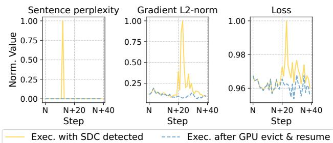  
Figure 1: The impact of an SDC incident detected in a training task with around 10,000 GPUs.

model quality, and even cause failures in LLM training tasks that cost millions of dollars. Figure 1 provides an example of GPU SDC incident in our in-house LLM training task involving around 10,000 GPUs. It causes pronounced gradient norm and loss spikes, indicating the model degrades significantly under the influence of SDC. Despite the severe consequences of SDC, the current understanding of SDC in LLM training—including its frequency, types, and root causes—remains extremely limited. This knowledge gap persists because the silent, low-frequency, and non-deterministic nature of SDC makes its detection and study exceedingly difficult.

Existing approaches fall into three broad categories, none of which is satisfactory for production LLM training. Offline diagnostics suites [3, 32] interrupt training and validate only a limited set of test workloads, leaving correctness during real production runs uncertain. Rerunning-based approaches [41] can provide strong confirmation, but typically require substantial duplicated computation and are therefore too expensive at LLM-training scale. Algorithm-based online detection [5, 6, 8, 21, 45] is attractive in principle, but directly applying it to modern low-precision training [23] is difficult: checksum mismatches can be dominated by ordinary floating-point error, causing false positives or triggering too many costly verifications [27]. As a result, existing methods either demand prohibitive computational resources or achieve unsatisfying detection efficacy. This makes them impractical for LLM training, where correctness is paramount but hardware resources (both computation and memory) are tightly constrained. Consequently, how to effectively detect SDCs and safeguard large-scale LLM training remains a significant open problem.

To address this challenge, we design AEGIS, an online SDC detection framework tailored for large-scale LLM training. Our key idea is a two-stage cSensor-cVerifier abstraction that reconciles two conflicting requirements: suspicious computations must be sensed immediately on the critical path, yet definitive confirmation must remain off the critical path. cSensor runs inline with training, performs lightweight detectorspecific sensing, captures the minimal verification context needed for later confirmation, and emits compact verification tasks before the training framework releases or overwrites the relevant state. cVerifier then consumes these tasks to perform definitive confirmation. Because replay-based confirmation can be expensive, AEGIS schedules verification into naturally occurring idle periods such as pipeline bubbles [16, 30], improving assurance without perturbing training throughput.

The cSensor-cVerifier abstraction turns online SDC detection into a common system interface rather than a collection of ad hoc detectors. Based on this abstraction, AEGIS instantiates two categories of SDC detection methods that exploit complementary opportunities exposed by modern LLM training systems and accelerator hardware.

Mixed-precision-aware Algorithmic Detection. While low-precision arithmetic undermines classical algorithmic detection, we observe that the tensor processing units in modern GPUs feature high-precision accumulation. Based on this characteristic, AEGIS adopts a mixed-precision checksum method to significantly distinguish SDCs from numerical errors. Beyond protecting Matmul, AEGIS leverages the inherent algebraic property of attention mechanism to enable a novel, low-overhead algorithmic detection. During cSensor, AEGIS records checksums and a small slice of inputs/outputs; during cVerifier, it lazily replays the highly suspicious computation and performs a bitwise comparison between two outputs, enabling deterministic SDC detection.

Self-equivalence-based Deterministic Detection. AEGIS also exploits inherently redundant computations in LLM training to enable low-overhead SDC detection. This selfequivalence arises both at the operator level (e.g., FlashAttention [10, 11, 35] recomputing forward intermediates in backward) and at the framework level (e.g., activation recomputation [42]). During cSensor, AEGIS records a compact fingerprint of outputs for each self-equivalent segment; during cVerifier, it cross-checks fingerprints in the two executions to flag mismatches as SDCs.

We implement AEGIS as a lightweight system on top of our in-house Megatron-LM [36] implementation, requiring minimal changes to the training pipeline. In a deployment spanning 3.5×107 GPU-hours on our in-house LLM training jobs, AEGIS identified 18 SDC incidents and 13 faulty GPUs while incurring only 0.86% performance overhead on training tasks of around 10,000 GPUs. After the deployment, only one additional SDC was observed through other methods in training tasks (e.g., periodical task replay test), indicating the effectiveness of AEGIS.

To expedite efforts toward improving the correctness and stability of LLM training, we present a systematic study of SDCs in large-scale LLM training based on AEGIS. Our research yields several intriguing and crucial observations (§3.1 and §8), such as 1) The majority of SDC incidents silently corrupted training correctness and escaped alarms in training frameworks (e.g., NaN and inf detection). 2) All observed SDC incidents occurred non-deterministically even with the same program. 3) All detected SDCs were identified as permanent SDCs, which stem from GPU faults and recur on the same devices.

In summary, this paper makes the following contributions.

• We propose an online SDC detection system for largescale LLM training, which decouples detection into time-critical corruption sensor and lazily-executable corruption verifier for both detection efficiency and accuracy.

• We share our experiences in deploying AEGIS in realworld large-scale LLM training and present insights gleaned from 35 million GPU hours, aiming to advance research in safeguarding the scaling of LLM training.

• We identify mathematically equivalent and selfequivalent features inherent to LLM training and leverage them for SDC detection. This substantially reduces the overhead of the primary sensing stage.

• We design and implement AEGIS based on the proposed techniques. We evaluate AEGIS on production-level training jobs over 3.5 × 107 GPU hours and detect 18 real-world SDCs.

## 2 Background

## 2.1 LLM Training at Scale

Transformer Architecture. The Transformer architecture serves as the foundational backbone for the majority of LLMs, consisting of stacked layers each with an attention and a feedforward network (FFN) module. Computation is dominated by matrix multiplications (Matmul): the attention block involves six Matmul operations (projections, scoring, and aggregation), while the FFN mainly includes two large up- and downprojections.

Distributed Infrastructure. Training state-of-the-art models involves hundreds of billions to trillions of parameters, typically requiring thousands of GPUs operating in parallel for weeks or even months. Such jobs are orchestrated by largescale distributed training frameworks that employ a variety of parallelism strategies to efficiently utilize cluster resources, including data parallelism [34], tensor parallelism [36], pipeline parallelism [16, 30, 31, 33], and sequence parallelism [17, 25]. Workloads are dominated by linear algebra kernels, and typically executed in bfloat16 alongside memory optimizations like activation recomputation [42].

SDCs in LLM Training. Despite the prohibitive cost of LLM training, reliability has received less attention than throughput optimization. SDCs pose a severe threat at scale; rare hardware faults can happen frequently in a large cluster and then cause catastrophic loss spikes or NaN values. However, SDCs can be masked by normal loss fluctuations, making loss monitoring unreliable. Moreover, distributed collective communication can rapidly propagate a single corrupted value across the cluster, jeopardizing the training run. In this work, we focus on detecting such infrequent, hardware-induced errors within large-scale GPU clusters.

## 2.2 Existing Approaches to Detect SDCs

Hardware Diagnostic Suites. One primary approach to fault localization is hardware diagnostic suites [3, 32], which relies on offline stress testing. This approach involves running expert-designed, stop-time test suites, such as NVIDIA Extended Utility Diagnostics (EUD) [32], to validate hardware health. However, this method has critical limitations for SDC detection. These test suites often miss non-deterministic SDCs, yielding low recall (about 70% in production [41]), and are costly and slow, taking over 8 hours and substantial cluster resources to identify a single faulty GPU.

Rerunning-based Testing. Another approach is rerunningbased testing, which attempts to locate faults within the real training environment [41]. The core idea is to compare two identical, deterministic executions. ByteRobust [41] proposes a dual-phase replay mechanism. This approach partitions the cluster into two dimensions (horizontally and vertically), and replays the deterministic workloads on each set to locate the faulty machine via intersection. While these methods are more efficient at reproducing live faults, they still incur significant extra overhead at scale.

Algorithm-based Online Detection. As an alternative to the offline approach, algorithm-based online detection [5, 6, 8, 21, 45] is a prominent online detection technique that utilizes algorithm-specific properties (e.g., checksums) for online SDC detection in matrix multiplication. Specifically, prior work [6] proposes adding a checksum to matrix multiplication to flag whether SDCs have occurred during computation by comparing the results of two equivalent computation paths, e.g., C1 = (AB)1 = A(B1), where 1 = [1, 1, . . . , 1]T, A, B are matrices. However, these classical techniques face a significant challenge in LLM training. As low-precision data types like bfloat16 are common to LLM training, accumulated floating-point errors can easily exceed the error bound E designed for float32, resulting in a high rate of false positives [27] or requiring prohibitively many computation

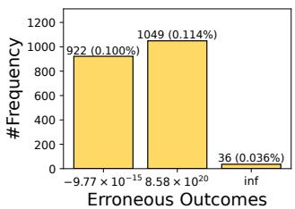  
(a)

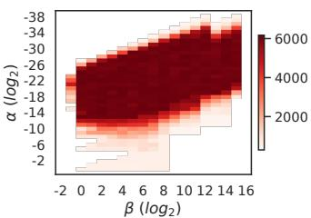  
(b)  
Figure 2: Some observations on SDC incidents. (a) Frequency of erroneous outcomes when replaying a faulty Matmul workload (9.2×105 replays; expected correct result −8.58×1020); and (b) SDC occurrence probability in matrix multiplication with varying inputs, simulated as C = αA × βB.

replays for verification.

As a result, existing approaches either require prohibitive computational resources or deliver unsatisfying detection accuracy. This limits their practicality in LLM training, where correctness is crucial but hardware resources—especially compute and memory—are severely constrained.

## 3 Observations and Motivation

## 3.1 Observations on SDC Incidents

Observation 1: Non-deterministic Reproducibility. In all SDC incidents we observed, their behavior was inherently non-deterministic: executing the same workload on the same faulty hardware did not always result in SDC. For instance, on a GPU where SDC had previously been observed, we repeatedly executed the nanoGPT [1] 50 times under identical settings; only one run showed divergent loss. Moreover, the numerical errors induced by SDC are also non-deterministic. By investigating this incident, we traced the fault to the Matmul operator. We re-executed this Matmul kernel 9.2 × 105 times and observed only three distinct erroneous outcomes, corresponding to an overall estimated error rate of 2×10−9. Figure 2(a) summarizes these erroneous outcomes. When the correct result should have been −8.58 × 1020, the faulty GPU instead returned either a nearzero value, a large but incorrect value with flipped sign, or inf. These observations indicate that a single execution of stress testing is insufficient to uncover all faulty GPUs, as SDCs may not be deterministically reproducible.

Observation 2: Workload Sensitivity. We observe that many SDC incidents are also input-sensitive, depending on both workload and numerical values, and often appearing only under specific conditions. For the SDC reported in Observation 1, we adjusted the input tensors A and B of the Matmul operation. Specifically, by introducing scaling factors α and β, we measured the probability of triggering SDC under different inputs of C = αA × βB. As shown in Figure 2(b), SDCs occur only within certain numerical ranges, while other ranges remain unaffected. Consequently, standardized diagnostic tools such as EUD and NCCL tests, or even bitwise alignment tests tailored to match the structure of the target training job, cannot exhaustively cover all input conditions and may therefore fail to identify all faulty GPUs. As a result, machines that pass offline stress testing may still exhibit SDC during training.

Observation 3: Diverse Fault Patterns. Our analysis of production data (Table 2) shows that SDC incidents do not expose a uniform signature across faulty GPUs. Different incidents can surface in different computations and expose different observable evidence, making it difficult for any single checker to cover them all reliably. Although offline diagnostic tools (e.g., NVIDIA EUD) achieve a recall of approximately 70%, each run typically requires several hours for a GPU. Moreover, the inherent non-determinism and input-sensitive nature of SDC make it impossible for offline stress testing to exhaustively cover the computations and input regimes that arise in production. Consequently, neither offline pre-screening nor any single online checker can reliably preclude SDCs in large-scale GPU clusters.

## 3.2 Motivation

The three observations above have an important implication for system design. Observation 1 and Observation 2 show that SDCs cannot be reliably excluded by offline pre-screening, because whether a fault manifests depends on the exact execution and numerical regime encountered during real training. Observation 3 further shows that no single online checker can cover all incidents, because different faults surface in different computations and expose different forms of evidence.

Practical SDC detection therefore must satisfy three requirements. First, it must perform lightweight in-situ sensing on the critical path, because only online monitoring can observe the real computations and inputs that trigger SDCs. Second, it must support multiple complementary sensing mechanisms under a common interface, because different parts of the training stack expose different low-cost checking opportunities and produce different evidence. Third, it must provide definitive confirmation before reporting incidents, because lightweight online signals alone are not trustworthy enough in low-precision training. Together, these requirements suggest a sense-then-verify architecture that separates fast sensing from definitive confirmation while allowing multiple sensing strategies to share the same detection workflow. Realizing such a design in modern LLM training raises the following key challenges:

Challenge 1: Reliable Sensing under Low Precision. Lowprecision data types such as bfloat16 [20, 29] and even float8 [23] are now standard in modern LLM training. In these regimes, ordinary floating-point round-off can obscure SDC-induced perturbations [27], causing naive checksumbased sensing to either flag too many benign computations as suspicious or miss real corruptions. The challenge is therefore to generate trustworthy online signals while keeping sensing lightweight on the critical path. The key question is whether modern training systems and hardware expose opportunities for reliable, low-cost sensing.

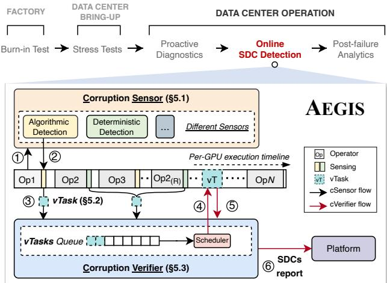  
Figure 3: AEGIS Overview.

Challenge 2: Unifying Diverse Detection Mechanisms. Large-scale LLM training does not expose a single reusable checking pattern [21, 26]. Practical detection must instead combine multiple mechanism-specific sensing strategies that produce evidence with different semantics and confidence. The challenge is to unify these heterogeneous signals under a common abstraction so they can share the same buffering, scheduling, and confirmation workflow, rather than requiring custom system support for each new mechanism.

Challenge 3: Efficient Verification. Definitive confirmation is expensive in large-scale LLM training because establishing a trusted reference often requires replaying suspicious computations. Such replay consumes GPU cycles, can accumulate backlog, and may introduce stragglers [22] unless its cost is carefully bounded and scheduled. The challenge is therefore to keep verification off the critical path and scale it with suspicious-event volume without degrading end-to-end training throughput.

## 4 Overview

To address the above challenges, we propose AEGIS, a twostage online SDC detection system for large-scale LLM training. As shown at the top of Figure 3, SDC detection is performed throughout the entire production and operational lifecycle of a GPU. AEGIS therefore targets the online stage with a sense-then-verify architecture that meets the three requirements identified in §3.2. Its lightweight corruption Sensor cSensor (§5.1) performs lightweight in-situ sensing on the critical path and unifies heterogeneous sensing outputs through the vTask abstraction (§5.2). Its lazy corruption

Verifier cVerifier (§5.3) performs definitive confirmation off the critical path. By decoupling fast sensing from expensive verification, AEGIS achieves low-overhead, high-coverage online protection without compromising training efficiency.

Workflow. Figure 3 illustrates AEGIS’s workflow using a snapshot of the operator timeline on one GPU during an LLM training run. AEGIS instruments selected computations with cSensor (step ⃝1 ). Immediately after a protected computation completes, cSensor applies the corresponding sensing strategy and records compact sensing evidence together with the minimal metadata needed for later verification (step ⃝2 ). If cSensor flags a computation as potentially corrupted, it creates a verification task (vTask) and enqueues it into cVerifier ’s vTask queue (step ⃝3 ). cVerifier ’s scheduler then dispatches vTasks to GPUs during naturally occurring idle periods to perform verification (step ⃝4 ). cVerifier then performs definitive confirmation: depending on the vTask type, it either compares fingerprints from self-equivalent executions or replays the suspicious computation and checks it against the recorded evidence (step ⃝5 ). When verification confirms an SDC, AEGIS reports the incident, together with the associated device and execution context, to the platform and users, enabling rapid restart and rollback to the previous checkpoint so training can resume with minimal wasted computation (step ⃝6 ).

## 5 AEGIS Design

This section details how AEGIS realizes the cSensor-cVerifier architecture introduced in §4. The design relies on a systemlevel prerequisite: a protected computation must be deterministic, producing the same result under the same inputs and execution configuration. This prerequisite gives cVerifier a deterministic reference for confirmation, obtained either by deferred replay or by self-equivalent execution. cSensor there fore focuses on capturing compact evidence immediately after protected computations, while cVerifier performs definitive confirmation off the critical path. We first describe the inline sensing mechanisms, then the vTask interface, and finally the verifier and its scheduling policy.

## 5.1 cSensor: Corruption Sensor

cSensor is the inline sensing stage of the cSensor-cVerifier framework. Its goal is to observe real training computations at the moment SDCs can manifest, while retaining only the evidence needed for later confirmation. To address the reliable-sensing challenge under low precision, AEGIS exploits opportunities exposed by modern LLM training systems and accelerator hardware. Based on this idea, AEGIS instantiates cSensor with two complementary strategies: (1) mixed-precision-aware algorithmic detection and (2) selfequivalence-based deterministic detection. cSensor also ap-

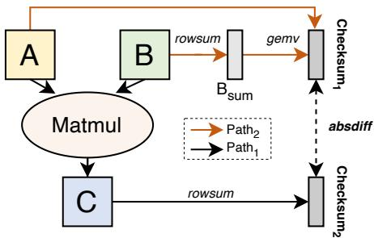  
Figure 4: Classic matrix multiplication checksum workflow.  
plies sensing-control policies that decide when an inline signal becomes a vTask and bound the resulting verification load.

## 5.1.1 Mixed-precision-aware Algorithmic Detection

Algorithmic detection is AEGIS’s answer to the low-precision reliability challenge: it keeps algebraic checks cheap enough for inline use by exploiting precision already present inside modern accelerator kernels. These sensors compress highdimensional tensors into compact checksum values and compute a checksum difference ∆ that indicates potential corruption. When ∆ exceeds the current runtime tolerance estimate Et, cSensor packages the suspicious computation into a vTask for later confirmation by cVerifier. We instantiate this approach for two dominant operators in LLM training. The key design point is to leverage the mixed-precision design feature of modern accelerators to overcome the floating-point error barrier in low-precision arithmetic.

Matrix Multiplication Checksum. AEGIS adopts the classic algorithmic scheme for matrix multiplication (Matmul), a key operation in LLM training. Specifically, this scheme validates Matmul by comparing two computationally equivalent paths encoded via checksums. As a simple example, we use a row checksum. Let 1 be a column vector of ones [1,1,...,1]T; right-multiplying by 1 performs a row-wise sum. We obtain two checksum values: C1 = (AB)1 and A(B1). In the classic formulation, a significant mismatch is indicated when ∆Matmul = ∥(AB)1 − A(B1)∥ > E, where E is the theoretical round-off error bound [5]. A concrete example is illustrated in Figure 4.

However, algorithmic detection for Matmul has been deemed unreliable for low-precision LLM training (e.g., bfloat16) [27], as this method often suffers from large checksum differences caused by floating-point round-off noise. To better understand this issue, we conduct a fault injection study on a healthy machine. We consider a Matmul with bfloat16 inputs and bfloat16 outputs, and apply a row checksum over output C. Specifically, we inject faults by randomly flipping a single bit of the bfloat16 input A.

Figure 5(a) shows the checksum differences obtained when checksums are accumulated from the final bfloat16 outputs. Here, a checksum difference is the absolute difference between the two checksums, and the max discrepancy is the maximum over all such values. The red cross in the figure marks the fault-induced discrepancy caused by the injected fault. In Figure 5(a), it is clear that the fault induced discrepancy is masked by larger round-off-induced discrepancies from bfloat16 floating-point noise, making it difficult to distinguish a genuine fault from ordinary round-off noise.

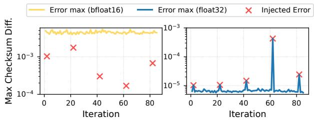  
(a)  
(b)

Figure 5: Fault injection study of checksum accumulation using bfloat16 outputs versus float32 accumulators.  
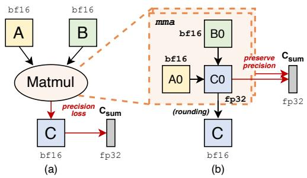  
Figure 6: (a) Directly accumulating the final bfloat16 output inherently introduces precision loss through truncation. (b) Accumulating directly from the float32 accumulator preserves precision.

To address this issue, our key insight is that Matmul operations in LLM training are typically executed using mixed-precision kernels (e.g., bfloat16 compute paired with float32 accumulation), a pattern inherent in modern accelerators (e.g., NVIDIA Tensor Core units). This creates an opportunity to compute the checksum of C in the float32 accumulator, preserving higher precision and avoiding the final bfloat16 truncation. In this way, we repeat the same fault injection experiment using the float32 accumulator to validate this idea, as shown in Figure 5(b). The difference in checksum difference between (a) and (b) stems solely from round-off effects. Figure 5(b) clearly shows that using float32 accumulator significantly reduces round-offinduced discrepancy, allowing each injected fault to produce a clear, pronounced peak that is easy to distinguish from the background numerical noise.

Based on this insight, AEGIS proposes a novel matrix multiplication checksum scheme tailored to low-precision computation. Specifically, AEGIS does not accumulate the result directly from the final bfloat16 outputs, which would inherently introduce precision loss through truncation from the kernel, as depicted in Figure 6(a). Instead, it leverages the mixed-precision execution provided by modern accelerators to accumulate checksums on-chip in float32, as shown in Figure 6(b). This higher precision accumulation significantly improves robustness to numerical noise, enabling reliable SDC detection for matrix multiplication in LLM training. In this case, the resulting vTask records the suspicious checksum together with the minimal replay context needed to re-execute the flagged computation during verification. The implementation details of the matrix multiplication checksum in AEGIS are described in §6.

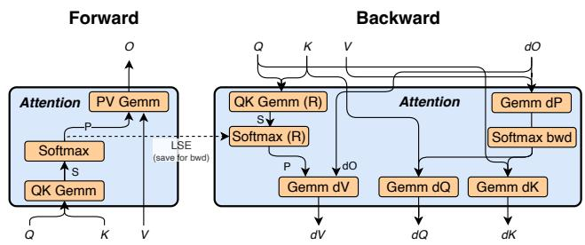  
Figure 7: The forward and backward pass of FlashAttention.

FlashAttention Checksum. AEGIS proposes a novel algorithmic detection method for the attention operation, tailored to FlashAttention [10, 11, 35]. This method is grounded in an inherent algebraic property in the backward computation of dV . By exploiting this property, AEGIS can verify the correctness of the attention operation without performing checksum checks within each internal matrix multiplication. The forward and backward passes of FlashAttention are illustrated in Figure 7.

Specifically, the backward pass computes dV as:

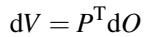

Each row of the attention matrix P sums to 1 since it is the output of a row-wise softmax function, thus representing the attention distribution for each token. Consequently, its transpose PT has columns that sum to 1.

Let 1T be a row vector of ones. By left-multiplying by 1T (which performs a column-wise sum), we observe:

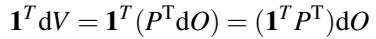

Given that PT has columns that sum to 1, the identity 1T PT = 1T holds. Therefore, we derive the mathematical invariant:

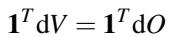

This relation asserts that the column-wise sum of the input gradient dO must equal the column-wise sum of the output gradient dV , and computing these sums incurs very low computational cost.

Furthermore, this novel checksum approach offers broad detection coverage. Beyond directly checking the invariant itself, the invariant implicitly protects a larger portion of the computation. Because it is conditional on 1TPT = 1T, any error that violates this condition will, in turn, cause the assertion to fail. Specifically, the matrix P in the backward pass is recomputed within the Softmax(R) operator using a recomputed S (which is calculated by the QKGemm(R)) and the LSE saved from the forward pass. The LSE itself is computed across the forward QKGemm and Softmax operators. Therefore, an error in any of these preceding computations will violate the condition 1TPT = 1T and consequently invalidate the invariant. Accordingly, AEGIS flags a potential SDC whenever ∆attn = ∥1TdV − 1TdO∥ > Et. In particular, the checksum in FlashAttention is also accumulated from the float32 accumulators enabled by the mixed-precision feature of modern accelerators. As with Matmul, a violated invariant is converted into a vTask that carries the compact evidence and replay metadata required by cVerifier.

## 5.1.2 Self-equivalence-based Deterministic Detection

Self-equivalence-based deterministic detection exploits redundancy that already exists in LLM training. When a computation is executed twice deterministically, such as an original execution and a later recomputation, the two outputs should be bitwise identical. AEGIS captures this property by recording a compact xorsum fingerprint over each output during cSensor and attaching the fingerprints to vTasks. cVerifier then verifies the task by comparing the fingerprints from the two executions; any mismatch indicates an SDC. This differs from algorithmic detection, which reasons about approximate arithmetic through algebraic invariants, whereas deterministic detection relies on exact equality created by inherent recomputation.

Framework-level. Deterministic redundant computations are common in LLM training frameworks. For instance, activation recomputation [7, 37] mitigates the heavy memory footprint of activations by trading additional computation for memory footprint. These optimization techniques, while essential for the efficiency of large-scale LLM training, naturally create a detection opportunity.

Specifically, AEGIS computes each fingerprint by applying an xorsum reduction to compress high-dimensional tensors. As illustrated in Figure 8, the Input is processed by the operator (Op) during the forward pass to produce the initial output (Output), which is later recomputed as the recomputed output (Output(R)) in the backward pass. The detection mechanism computes two fingerprints, xorsum1 and xorsum2, by applying the xorsum\_reduce function to the forward output Output and the recomputed output Output(R), respectively. cVerifier (§5.3) subsequently compares xorsum1 and xorsum2, and any mismatch between the two fingerprints is confirmed by cVerifier as an SDC incident. Furthermore, this approach is applicable to a wide range of operators, extending beyond common operations such as Matmul and attention to fault-prone operators such as RMSNorm and GeLU, as detailed in §7.

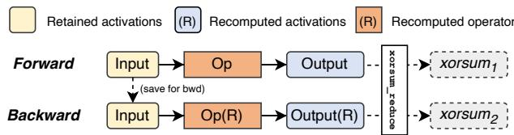  
Figure 8: The mechanism of deterministic detection.

Operator-level. Moreover, we identify and exploit similar inherent opportunities within individual operators. In AEGIS, we instantiate this detection mechanism in FlashAttention, and use it as a concrete example:

In FlashAttention, one primary optimization is selective recomputation in the backward pass, which avoids storing large intermediate matrices (S and P of size N × N) from the forward pass, thereby reducing activation memory usage and I/O overhead (Figure 7). Specifically, S and P are recomputed when input blocks (Q, K, V ) are loaded into SRAM. While this technique is fundamentally an optimization to improve computational efficiency and minimize memory footprint, it also creates a natural opportunity for deterministic selfchecking. Under deterministic execution, the recomputed values (e.g., S) in backward must be bitwise identical to the original forward results. Accordingly, AEGIS applies an xorsum reduction in both the forward and backward passes to obtain two fingerprints for later comparison.

Deterministic detection complements algorithmic detection for attention. While it does not cover the dV = PTdO path protected by our algorithmic method, it provides coverage for other self-equivalent segments. Together, the two methods offer complementary coverage for FlashAttention.

## 5.1.3 Sensing Control

Sensing control keeps cSensor useful as an online component rather than an unbounded generator of verification work. It decides when an inline signal is strong enough to become a vTask and how much evidence cSensor should retain for later confirmation. These policies bound verification workload while leaving the confirmation semantics of cVerifier unchanged.

Adaptive Threshold. For algorithmic detection, AEGIS employs a lightweight adaptive thresholding mechanism, rather than relying on the ideal tolerance E, to catch SDCs with small verification overhead, as illustrated in Figure 9. The core idea is to maintain a runtime tolerance estimate E for the checksum difference ∆ and dynamically calibrate it based on the historical distribution of ∆, which exhibits stability in training tasks. A key reason for this is that ∆, which essentially represents the numerical errors, is tightly correlated to the magnitude of the activations. Moreover, activation magnitudes do not change rapidly during training. Therefore, when the observed ∆ exceeds the current Et (indicating a potential SDC), AEGIS temporarily increases Et (e.g., by 2×) to adapt to the current error variance (step ⃝1 ). Conversely, if no potential SDCs are detected over a subsequent window of checks, AEGIS decays Et, gradually decreasing it (e.g., by halving) back toward its baseline (step ⃝2 ). This heuristic yields a practical, low-overhead and adaptive mechanism that tolerates round-off fluctuations while still preserving reliable SDC detection.

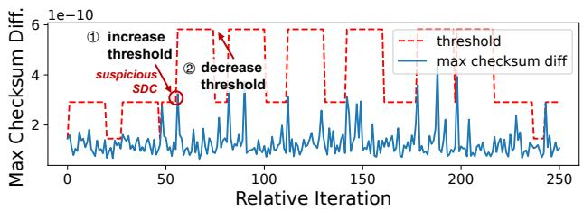

Figure 9: The adaptive thresholding mechanism.  
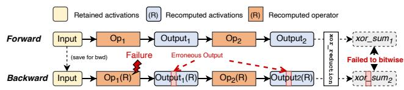  
Figure 10: Example of backward recomputation and fingerprint mismatch under an operator fault.

Selective Operator Instrumentation. Under deterministic computation, repeated executions of the same computation graph always produce bitwise-identical results. Therefore, on a deterministic computation graph, any computational error in an operator inevitably leads to a different result. As illustrated in Figure 10, we consider a deterministic computation graph with two operators, Op1 and Op2, whose outputs are recomputed during the backward pass (denoted as Op1(R) and Op2(R)). A fault in Op1(R) during the backward pass in turn corrupts the output of its successor Op2(R), causing the final fingerprint of Op2(R) to not be bitwiseidentical with that of Op2. Based on this insight, AEGIS’s deterministic detection only focuses on the final operator in a deterministic computation graph, rather than instrumenting every operator individually. This policy reduces the number of vTasks generated by deterministic detection while preserving coverage of the entire recomputation chain.

## 5.2 vTask Abstraction

To address the challenge of unifying diverse detection mechanisms, AEGIS uses vTasks as the common contract between heterogeneous cSensor sensors and the shared cVerifier backend. Every suspicious computation that survives cSensor’s local control is converted into a vTask that can be queued, scheduled, and processed uniformly by cVerifier. For algorithmic detection, a vTask records the minimal replay context and checksum evidence; for deterministic detection, it records the two fingerprints for later cVerifier comparison. This unified abstraction lets AEGIS reuse one shared buffering and scheduling path across detectors. To minimize memory overhead, cSensor retains only the minimal payload required for cVerifier to perform verification, as detailed in §6. In addition to the minimal context required for verification, AEGIS also retains auxiliary metadata such as operator names, row/column indices, and verification type to facilitate scheduling and subsequent diagnosis.

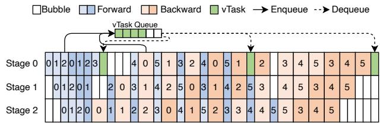  
Figure 11: An example of vTask scheduling with interleaved 1F1B pipeline.

## 5.3 cVerifier: Corruption Verifier

To address the efficient-verification challenge, AEGIS separates inline sensing from definitive confirmation. cVerifier consumes queued vTasks and turns inline evidence into confirmed SDC reports. Deterministic vTasks are checked by comparing fingerprints from self-equivalent executions, while algorithmic vTasks are checked by replaying the suspicious computation with the saved minimal context. An SDC is reported only after definitive confirmation is obtained, filtering out spurious alarms caused by benign numerical noise.

## 5.3.1 Lazy Verification and Scheduling

Lazy scheduling is the mechanism that makes definitive confirmation practical in production training. Because verification can be expensive, cVerifier treats vTasks as deferred work and executes them off-path by leveraging existing idle periods such as pipeline bubbles [16, 30].

As illustrated in Figure 11, we consider three-stage pipeline parallelism using the interleaved 1F1B pipeline schedule introduced in [31]. The cSensor creates and enqueues vTasks for both algorithmic and deterministic detection during the forward and backward passes. These vTasks are subsequently dequeued and processed by the cVerifier when workers are stalled waiting for tensor data from preceding or subsequent pipeline stages, i.e., during pipeline bubbles (shown as white cells in Figure 11). This scheduling strategy allows the cVerifier to perform the necessary verification without introducing additional synchronization stalls, thereby preserving the overall throughput of the LLM training process. In practice, scheduling follows a best-effort policy: vTasks are opportunistically executed during idle periods. Therefore, at the end of each training step, AEGIS reserves a small, fixed time slice to process vTasks that could not be handled during idle time.

## 5.4 Supplementary Outlier Warning

Outlier warning provides a separate reporting channel for useful signals that would otherwise be ignored, as they are not yet strong enough to trigger a vTask. As discussed earlier, AEGIS uses a set of mechanisms to selectively verify only the most suspicious computations. This design balances coverage and performance, but may leave tiny SDC-induced deviations unconfirmed. To address this gap, AEGIS also performs an outlier-based warning analysis that is intentionally kept separate from definitive confirmation.

Specifically, AEGIS performs a cross-rank statistical analysis of the checksum difference at the end of each training step within each data-parallel (DP) group. The key insight is that, for the same batch and operator, the distribution of checksum differences across DP ranks should be relatively stable; a genuine SDC can manifest as an out-of-distribution deviation. To establish a collective baseline for each operation, AEGIS computes the P90 (90th percentile) of the checksum differences across all DP ranks. This statistic is collected via an efficient allgather over compact checksum-difference data, incurring only modest communication overhead.

If the checksum difference of a specific operation on a particular DP rank significantly exceeds the P90 baseline by a large margin (e.g., 106 times), AEGIS raises an outlier warning. Unlike confirmed SDC reports, such warnings are heuristic signals rather than definitive proof; they indicate a high likelihood of genuine SDCs that may have been missed by selective verification. Our production experience further confirms that outlier analysis is a practical and effective complement to the detection pipeline.

## 6 Implementation

AEGIS is integrated as a lightweight system on top of our in-house Megatron-LM [36] implementation. This integration requires minimal changes to the training pipeline and follows the proposed design to support online SDC detection for largescale LLM training.

Verification Task Packing. Considering the severe memory constraints of LLM training, AEGIS retains only the minimal context required for verification. Specifically, only algorithm-based detection requires an additional recomputation step. Therefore, we describe the vTask packing design for algorithm-based detection in more detail.

For matrix multiplication, AEGIS adopts two checksum schemes: row checksums and row-and-column checksums. We apply them to different Matmul categories in LLM training, namely activation forward (fwd), input-gradient backward (dgrad), and weight-gradient backward (wgrad). For fwd and dgrad, AEGIS uses row checksums. The packing strategy is shown in Figure 12(a). In these cases, the input B corresponds to model weights that typically persist in GPU memory, whereas A and C are intermediate tensors that may be released before verification. Thus, the cSensor only needs to retain the row of A with the maximum numerical error and the corresponding row of C for later verification. For wgrad, AEGIS adopts row-and-column checksums to reduce the saved context, the packing strategy is shown in Figure 12(b). Since both inputs in wgrad are activations that may be released later by the framework, the cSensor retains the row of A and the column of B with the maximum numerical error, along with the corresponding elements of C needed for verification. For attention operation, verifying dV = PTdO would require replaying the entire backward kernel and retaining additional intermediates (e.g., LSE, dO, Q, and K).

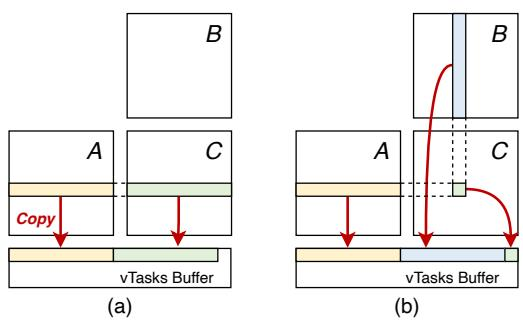  
Figure 12: Different matrix multiplication checksum vTask packing strategy (a) row checksum and (b) row-and-column checksum.

Dynamic Sampling Strategy. In addition to the aforementioned mechanisms, we further employ a dynamic sampling strategy during the production deployment to reduce system overhead. Such a strategy is particularly practical for our algorithm-based detection mechanisms, as the computational overhead of checksum calculation in cSensor is non-negligible. Specifically, we assign a sampling rate to an operator, meaning that the operator will execute the checksum validation with a certain probability.

## 7 Evaluation

## 7.1 Experimental Setup

TestBed. All experiments are conducted on production GPU clusters. Each node is equipped with 8 GPUs unless otherwise specified.

Model Configurations. The configuration of the models used in our overhead analysis is listed in Table 1, detailing the number of layers, hidden size (h), number of attention heads, FFN intermediate size (h f f n), number of experts, and top-k values.

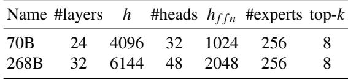  
Table 1: Model configurations in evaluation.

## 7.2 AEGIS in Production

We first validate AEGIS’s effectiveness in production through a deployment in our production clusters. During this time, AEGIS continuously monitors and detects SDCs in online large-scale LLM training jobs.

Detection Effectiveness. We first summarize the online SDC incidents detected by AEGIS. Over a deployment of 3.5 × 107 GPU-hours, AEGIS identified 18 SDC incidents involving 13 distinct faulty GPUs while incurring only 0.86% performance overhead. Among these incidents, only three incidents manifested as observable training failures (e.g., unexpected NaN loss); the rest were silent. This low overhead is achieved by enabling the dynamic sampling strategy described in §6, which balances detection coverage and performance in production.

Figure 13 plots the cumulative number of SDC incidents observed in our production environment after deploying AEGIS. For clarity, the figure shows only outlier warnings from GPUs that were repeatedly flagged and later confirmed faulty, reporting only the last warning for each such GPU. Initially, SDC incidents occur more frequently. Quantitatively, 13 SDC incidents were detected in the first half of the deployment period, whereas only 5 incidents occurred in the latter half. As faulty GPUs are detected and removed from the resource pool, the rate of SDC incidents gradually decreases. This marked reduction in SDC rate demonstrates the critical necessity of deploying online SDC detection in large-scale LLM training to protect training reliability and also validates the effectiveness of the AEGIS. Outlier warnings also serve as an early signal of latent risks; for example, a warning from a specific machine in Figure 13 was subsequently confirmed as a genuine SDC by AEGIS. We discuss outlier warning, false negative, and false positive problems in more detail in the discussion section (§8).

Coverage. The deterministic detection method detects more SDC incidents (12 times) than algorithmic detection and its outlier warnings (6 times). This observation can be attributed to two main factors: First, the broad operator coverage of deterministic approaches extends beyond Matmul and attention to include other components such as normalizations. Second, algorithmic detection is only sparingly sampled in production tasks to minimize overhead. Crucially, algorithmic detection remains essential as it offers a distinct detection scope and hence targets different SDCs. In particular, in training scenarios where recomputation is limited, algorithmic detection provides effective protection for computationally intensive operators that dominate the overall runtime. This complementarity further justifies AEGIS’s multi-sensor design for maximizing SDC detection coverage in production.

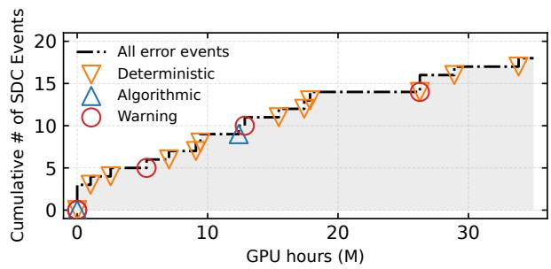  
Figure 13: Cumulative SDC count over time (in million GPUhours) in the production environment, as detected by AEGIS.

## 7.3 Analysis of Detection Capability

We conduct a capability study on eight available machines that had previously exhibited SDCs, as detailed in Table 2. For each machine, we run the training task 10 times to account for the inherent non-determinism of SDC manifestation during LLM training.

Compared with Offline Method. We compare AEGIS against the vendor-provided offline diagnostics tests. As shown in Table 2, AEGIS achieves a recall of 8 out of 8 faulty machines. In contrast, thorough diagnostic tests, which require hours to complete, detect only 25% of them (2 out of 8). We note that this recall is lower than the 70% reported in [41]. We attribute this discrepancy primarily to pre-screening bias in our operational environment. Prior to production training, all GPUs undergo strict offline stress testing to filter out visibly unhealthy machines. These eight GPUs were initially certified as healthy and then admitted into the LLM training cluster. Therefore, the low recall of offline stress testing underscores the difficulty of detecting such silent corruptions with conventional methods. This result highlights the practical value of our online approach in identifying hard-to-detect SDCs that escape offline screening.

Different Method Recall. Table 2 also breaks down the recall of individual methods across the eight faulty machines. A key observation is that no single method achieved 100% recall across all machines, indicating that online SDC detection in large-scale LLM training requires multiple complementary methods. This phenomenon aligns with our analysis in §7.2.

## 7.4 Overhead

We then evaluate the runtime overhead during training. We conduct experiments using two model sizes, 70B and 268B (as illustrated in Table 1), and scale up to 1,024 GPUs. Unless otherwise stated, the sequence length and global batch size are fixed at 8,192 and 768, respectively. We compare the periteration training time of AEGIS against a baseline without

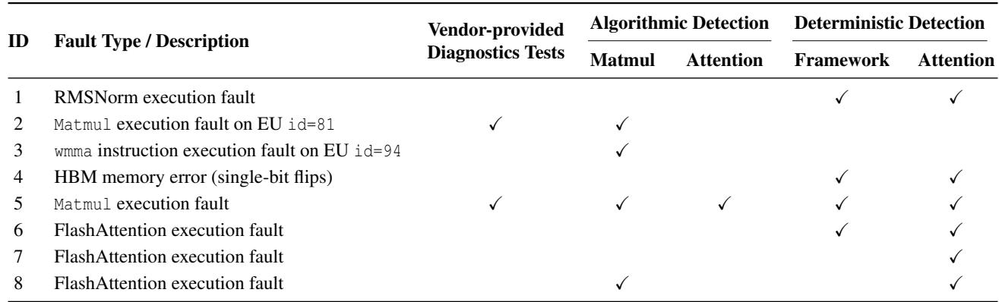  
Table 2: Summary of SDC detection capability of AEGIS and vendor-provided diagnostics tests on eight real-world faulty machines, with detailed fault descriptions.

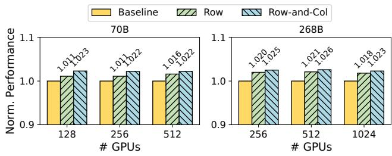  
Figure 14: Overhead of AEGIS with different checksum techniques.

SDC detection enabled to demonstrate its efficiency. All reported performance numbers are averaged over 10 stable iterations to ensure measurement reliability.

End-to-end Overhead. We evaluate two AEGIS configurations. The first enables only row checksums; in this configuration, wgrad is not fully covered. The second enables row-and-column checksums, providing coverage for all Matmul categories in LLM training. In both configurations, deterministic detection is enabled. Figure 14 summarizes the runtime overhead of AEGIS. Across all tested workloads, AEGIS incurs low overhead throughout training, averaging below 1.61% with row checksums and 2.35% with row-andcolumn checksums. The maximum slowdown is 2.1% for row checksums and 2.6% for row-and-column checksums. The primary sources of overhead can be divided into two stages: cSensor and cVerifier. In the cSensor stage, overhead mainly comes from checksum computation and minor memory operations needed to retain the minimal context for potential replay. In the cVerifier stage, overhead comes from executing vTasks to confirm whether it is a genuine SDC. The higher overhead of row-and-column checksums is primarily due to the extra memory copies (the column of input B) required to retain verification context compared to row checksums. In return, this configuration enables SDC verification for wgrad, trading minor overhead for broader coverage.

The results also indicate that AEGIS scales well to 1,024

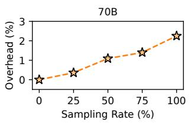

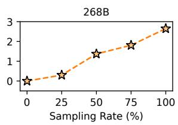  
Figure 15: Overhead of different dynamic sampling rate.

GPUs and to larger model sizes. Because AEGIS does not introduce additional communication, it remains effective as cluster size grows. We expect this design to scale to larger deployments, providing reliable SDC detection for future ultra-large-scale LLM training with minimal impact on throughput.

Dynamic Sampling. To evaluate AEGIS ’s dynamic sampling strategy (§6) and its impact on overhead, we conduct an ablation study under settings that mirror our end-to-end evaluation, except that both the 70B and 268B models are run on 128 GPUs. As shown in Figure 15, varying the sampling rate provides a simple and effective way to tune AEGIS ’s overhead, which scales approximately linearly with the sampling rate. In our production deployment, we use this strategy to select a sweet spot that balances overhead and online SDC detection capability. Specifically, AEGIS controls the sampling rate of algorithmic detection to meet a target overhead budget (e.g., 0.86% overhead in our production).

## 7.5 Ablation Study

Checksum Difference. We next evaluate the contribution of algorithmic detection during training, focusing on how checksum accumulation precision affects detection sensitivity. Because operators differ in output scale and numericalnoise profile, we collect checksum-difference distributions for bfloat16 and float32 accumulation across operators over 500 training iterations without injected faults. As shown in Figure 16(a), float32 produces substantially smaller checksum differences, making it more sensitive to small SDCinduced deviations.

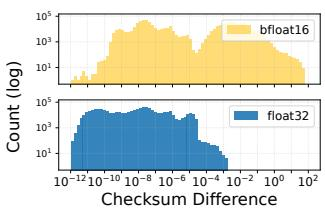  
(a)

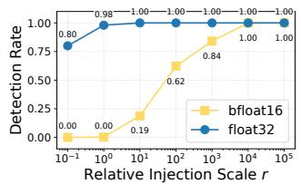  
(b)  
Figure 16: Ablation study of checksum precision in algorithmic detection. (a) Checksum difference distribution. (b) Detection rate vs. relative injection scale.

Detection Rate. We then perform a calibrated fault-injection analysis. Because operators have different checksumdifference scales, injecting the same absolute perturbation, or an uncalibrated random fault such as a bit flip, would confound the comparison across operators. We therefore normalize each injected perturbation by the corresponding operator’s float32 checksum-difference scale. For each operator, we use the median float32 checksum difference from this 500- iteration run as its reference scale. For a relative injection scale r, we inject a fault into a randomly selected element during the operator computation with probability 0.02%. The faulty element receives a signed perturbation with magnitude r · mo, where mo is the corresponding operator’s median float32 checksum difference. Each setting is repeated 100 times. Figure 16(b) shows that float32 checksums detect injected faults at the median reference scale with a near-100% detection rate. In contrast, bfloat16 checksums remain largely insensitive at this scale and require roughly 104× larger perturbations to reach comparable detection. This gap demonstrates that the higher-precision checksum design of our method provides stronger detection capability and enables finer-grained error detection.

## 7.6 Case Studies

Case 1: Detection of Matrix Unit Fault. In this case, the faulty GPU was detected during a matrix multiplication operation (corresponding to ID 3 in Table 2). We reproduced the SDC fault and analyzed its root cause.

We locate erroneous positions by comparing the faulty GPU’s output with the expected results, as shown in Figure 17. The output tensor from the faulty GPU, of size 768 × 2048, exhibits errors only at specific positions with a regular pattern, as illustrated on the right. Zooming in on this region reveals a clearer structure, with errors recurring at periodic intervals along both the x and y axes (middle). Further zooming in (left) shows that the errors predominantly appear as four consecutive incorrect elements within localized regions.

Given this spatial clustering and regular structure, we hypothesize that the SDC originates from a specific execution unit. By inserting the assembly instruction to retrieve the id at erroneous locations, we identify the faulty execution unit (EU), which in our experiments consistently reports id=94. For identical inputs, we observe computation errors only when the Matrix Multiply-Accumulate instruction (mma, e.g., wmma\_f32\_16x16x16\_bf16\_w32) is executed on the matrix cores of this EU, whereas the same inputs produce correct results on the vector cores within the same EU. These observations indicate that the SDC is localized to the matrix unit and is specifically triggered by mma execution.

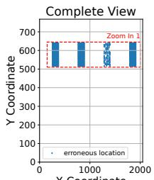

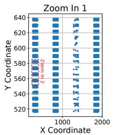

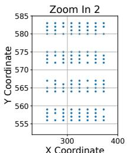  
Figure 17: The erroneous locations of output tensor.

This case underscores the importance of integrating SDC detection into matrix multiplication, given the heavy reliance of LLM training on matrix units for efficient acceleration across the execution stack.

Case 2: Detection of HBM Fault. Our second case involves an SDC caused by an HBM fault (corresponding to ID 4 in Table 2). This SDC was detected by our deterministic detection. In this case, a float32 intermediate value was saved during the forward pass and later read in the backward pass. Its value changed by a one-bit flip, from 1011111101101010010000111110111 to 1011111111101010010000111110111. This single-bit error causes the fingerprint of the recomputed result to be not bitwise-aligned with that of the original forward pass, and is therefore detected by AEGIS. An interesting observation is that this fault does not trigger the ECC protection mechanism, suggesting a potential ECC failure that exposes GPU memory to the risk of undetected errors.

## 8 Discussions and Experiences

Permanent vs. Transient SDC Incidents. SDC incidents can be categorized as permanent or transient. Permanent SDCs stem from persistent hardware faults, whereas transient SDCs are rare, occasional events on healthy hardware, often attributed to external factors such as cosmic rays [28] and temperature [43]. In our production environment, all SDC incidents detected by AEGIS were reproducible on the corresponding GPUs. The time between re-triggered incidents during training varied widely, ranging from seconds to days. We further performed a reboot experiment on one such GPU. Although the GPU had previously been flagged for a VRAM fault by the diagnostic tool, it passed all offline test suites immediately after a system reboot, suggesting that rebooting can temporarily mitigate SDC symptoms. However, one month later, the SDC reappeared; AEGIS detected it, and the diagnostic tool again reported the same underlying VRAM fault, indicating that reboot does not resolve the underlying hardware faults. These findings are similar with our in-house study [46], indicating that the observed SDC incidents predominantly stem from persistent hardware faults rather than sporadic transient events. Therefore, online SDC detection provides an efficient mechanism to identify and isolate faulty GPUs, preventing long-term degradation of LLM training caused by underlying hardware issues.

Software-induced SDCs. The correctness of AEGIS relies critically on bitwise comparison during computation replay. This property, however, can be violated not only by hardware faults but also by software bugs. During our deployment, AEGIS caught an SDC-like incident caused by a training framework bug. Specifically, the framework read illegal input data, which led to an out-of-bounds write in a kernel and triggered a recomputation mismatch alarm. This failure case highlights an additional benefit of AEGIS integrated into the training framework stack. Beyond hardware-induced SDCs typically targeted by offline testing, AEGIS can also identify software bugs within the training framework that manifest as SDCs, thereby offering further protection for training jobs.

False Negatives. To detect SDCs escaping from AEGIS, we screen for SDCs through several other methods. We periodically performed task-level replays using bitwise-deterministic, cluster-level training tasks to probe for undiscovered SDC issues. Across repeated runs, the losses remained aligned, providing additional confidence that no faulty GPUs were missed during the deployment. We also analyze unexpected task failures, including segmentation faults, NaN and inf values in the training task. Only one additional faulty GPU is detected, which caused an SDC that occurred outside the backbone of the Transformer network and hence beyond the protection region of AEGIS. This retrospective analysis demonstrates that AEGIS can detect most SDC incidents in LLM training, indicating its effectiveness. Nevertheless, we cannot completely rule out undetected SDCs, given their potentially low frequency and the inherent difficulty of observing silent corruptions in production LLM training.

Operator Coverage. The current AEGIS prototype focuses on dominant compute-intensive Transformer kernels, including Matmul and FlashAttention, while some lightweight or outside-backbone patterns, such as standalone element-wise operations, remain uninstrumented. This gap explains the remaining production false negative; extending coverage mainly requires adding the corresponding operator-specific sensor to the existing detection pipeline.

False Positives. Beyond these confirmed SDC reports, we ob served 21 warning alerts from the outlier-based analysis (§5.4)

during deployment. Among them, 11 alerts were attributed to reproducible faulty GPUs. Six alerts were repeatedly reported by a highly suspicious GPU over one month, yet could not be reproduced by existing offline diagnostic tools, highlighting the limitations of offline testing for identifying hard-toreproduce faults. Three alerts in the remainder occurred on different GPUs during the model warm-up phase, suggesting that outlier-based numerical checks can be sensitive to out-ofdistribution values in early LLM training.

Observing Only Compute- and Memory-Induced SDCs. In our deployment, we reproduced SDC incidents attributable to computation and memory, but did not observe communication-induced SDCs. A plausible explanation is that the communication stack is protected by multiple layers of error detection and correction (e.g., ECC and link-level checks), whereas compute paths on accelerators expose fewer built-in, end-to-end integrity checks. This asymmetry reinforces the importance of integrating lightweight SDC detection into compute-intensive operators in LLM training.

High Precision Accumulation Enables SDC Localization. During deployment, we did not successfully locate SDC incidents using checksums accumulated from bfloat16 outputs. Instead, all confirmed detections were achieved by accumulating checksums from float32 accumulators.

## 9 Related Work

SDC Detection in Training Systems. Existing research has explored various techniques to detect and mitigate the impact of SDC in AI training systems. [27] analyzes the effect of SDC in LLM training. ATTNChecker [21] uses ABFT to provide fault tolerance for the attention mechanism. Dr.DNA [26] proposes early-stage SDC detection and mitigation based on activation distributions. Gemini 2.5 [9] uses numerical analysis and rerun to identify suspicious SDCs. LongCat [38] introduces additional recomputation to verify the correctness of attention backward computation. However, these approaches often suffer from high overhead or limited detection efficacy. In contrast, AEGIS offers practical online SDC detection with low overhead and broad coverage for production-scale LLM training.

Fault-tolerant LLM Training. Some orthogonal efforts enhance the fault-tolerance of LLM training. GEMINI [44] and ByteCheckpoint [40] optimize checkpointing for faster recovery and reduced stall time. Other systems [14, 18, 39] exploit training redundancy to tolerate failures without disrupting training. Yet they do not study or address SDC issues. In contrast, AEGIS provides online SDC detection that promptly flags errors, which can then be combined with these fault-tolerance mechanisms to perform rapid rollbacks when necessary, thereby complementing these techniques.

SDC Detection in Other Applications. In other applications and hardware, [4] provides ultralight, application-agnostic data dynamic monitoring to detect SDC in extreme-scale MPI. [12] studies SDC incidence and survey hardware/software mitigation strategies; Farron [43] mitigates CPU SDCs via prioritized testing and temperature control; Orthrus [24] detects SDCs in the cloud through resource-adaptive validation; and Hardware Sentinel [13] monitors large data-center fleets using software failure indicators. However, these CPU- and application-centric techniques do not directly address the distinctive computational and communication characteristics of GPU-accelerated LLM training; while AEGIS provides a specialized solution tailored to this setting.

## 10 Conclusion

We present the online SDC detection system AEGIS for largescale LLM training, along with insights gleaned from 35 million GPU hours. Our findings demonstrate that online SDC detection should be established as a standard component of training frameworks to safeguard the scaling of LLM training.

## 11 Acknowledgment

We sincerely thank the anonymous reviewers and our shepherd for their valuable feedback on this paper. This work is supported by New Generation Artificial Intelligence-National Science and Technology Major Project under Grant 2025ZD0123801, NSFC for Distinguished Young Scholar under Grant 62225206, National Natural Science Foundation of China under Grants 62532006, 62495062, 62302251, and Beijing Natural Science Foundation under Grant L242017. Jidong Zhai and Xin Liu are the corresponding authors of this paper.

## References

[1] nanoGPT. https://github.com/karpathy/ nanoGPT.

[2] Josh Achiam, Steven Adler, Sandhini Agarwal, Lama Ahmad, Ilge Akkaya, Florencia Leoni Aleman, Diogo Almeida, Janko Altenschmidt, Sam Altman, Shyamal Anadkat, et al. Gpt-4 technical report. arXiv preprint arXiv:2303.08774, 2023.

[3] AMD. ROCm validation suite (RVS), 2025. https://rocm.docs.amd.com/projects/ ROCmValidationSuite.

[4] Leonardo Bautista-Gomez and Franck Cappello. Detecting silent data corruption for extreme-scale mpi applications. In Proceedings of the 22nd European MPI Users’ Group Meeting, pages 1–10, 2015.

[5] Jieyang Chen, Hongbo Li, Sihuan Li, Xin Liang, Panruo Wu, Dingwen Tao, Kaiming Ouyang, Yuanlai Liu, Kai Zhao, Qiang Guan, and Zizhong Chen. Fault tolerant one-sided matrix decompositions on heterogeneous systems with gpus. In Proceedings of the International Conference for High Performance Computing, Network ing, Storage, and Analysis, SC ’18. IEEE Press, 2019.

[6] Jieyang Chen, Xin Liang, and Zizhong Chen. Online algorithm-based fault tolerance for cholesky decomposition on heterogeneous systems with gpus. In 2016 IEEE International Parallel and Distributed Processing Symposium (IPDPS), pages 993–1002. IEEE, 2016.

[7] Tianqi Chen, Bing Xu, Chiyuan Zhang, and Carlos Guestrin. Training deep nets with sublinear memory cost. arXiv preprint arXiv:1604.06174, 2016.

[8] Zizhong Chen and Jack Dongarra. Algorithm-based fault tolerance for fail-stop failures. IEEE Transactions on Parallel and Distributed Systems, 19(12):1628–1641, 2008.

[9] Gheorghe Comanici, Eric Bieber, Mike Schaekermann, Ice Pasupat, Noveen Sachdeva, Inderjit Dhillon, Marcel Blistein, Ori Ram, Dan Zhang, Evan Rosen, et al. Gemini 2.5: Pushing the frontier with advanced reasoning, multimodality, long context, and next generation agentic capabilities. arXiv preprint arXiv:2507.06261, 2025.

[10] Tri Dao. Flashattention-2: Faster attention with better parallelism and work partitioning. arXiv preprint arXiv:2307.08691, 2023.

[11] Tri Dao, Dan Fu, Stefano Ermon, Atri Rudra, and Christopher Ré. Flashattention: Fast and memoryefficient exact attention with io-awareness. Advances in neural information processing systems, 35:16344– 16359, 2022.

[12] Harish Dattatraya Dixit, Sneha Pendharkar, Matt Beadon, Chris Mason, Tejasvi Chakravarthy, Bharath Muthiah, and Sriram Sankar. Silent data corruptions at scale. arXiv preprint arXiv:2102.11245, 2021.

[13] Rhea Dutta, Harish Dattatraya Dixit, Rik Van Riel, Gautham Vunnam, and Sriram Sankar. Hardware sentinel: Protecting software applications from hardware silent data corruptions. In Proceedings of the 30th ACM International Conference on Architectural Support for Programming Languages and Operating Systems, Volume 2, pages 482–497, 2025.

[14] Swapnil Gandhi, Mark Zhao, Athinagoras Skiadopoulos, and Christos Kozyrakis. Recycle: Resilient training of large dnns using pipeline adaptation. In Proceedings of the ACM SIGOPS 30th Symposium on Operating Systems Principles, pages 211–228, 2024.

[15] Aaron Grattafiori, Abhimanyu Dubey, Abhinav Jauhri, Abhinav Pandey, Abhishek Kadian, Ahmad Al-Dahle, Aiesha Letman, Akhil Mathur, Alan Schelten, Alex Vaughan, et al. The llama 3 herd of models. arXiv preprint arXiv:2407.21783, 2024.

[16] Yanping Huang, Youlong Cheng, Ankur Bapna, Orhan Firat, Dehao Chen, Mia Chen, HyoukJoong Lee, Jiquan Ngiam, Quoc V Le, Yonghui Wu, et al. Gpipe: Efficient training of giant neural networks using pipeline parallelism. Advances in neural information processing systems, 32, 2019.

[17] Sam Ade Jacobs, Masahiro Tanaka, Chengming Zhang, Minjia Zhang, Shuaiwen Leon Song, Samyam Rajbhandari, and Yuxiong He. Deepspeed ulysses: System optimizations for enabling training of extreme long sequence transformer models. arXiv preprint arXiv:2309.14509, 2023.

[18] Insu Jang, Zhenning Yang, Zhen Zhang, Xin Jin, and Mosharaf Chowdhury. Oobleck: Resilient distributed training of large models using pipeline templates. In Proceedings of the 29th Symposium on Operating Systems Principles, pages 382–395, 2023.

[19] Ziheng Jiang, Haibin Lin, Yinmin Zhong, Qi Huang, Yangrui Chen, Zhi Zhang, Yanghua Peng, Xiang Li, Cong Xie, Shibiao Nong, Yulu Jia, Sun He, Hongmin Chen, Zhihao Bai, Qi Hou, Shipeng Yan, Ding Zhou, Yiyao Sheng, Zhuo Jiang, Haohan Xu, Haoran Wei, Zhang Zhang, Pengfei Nie, Leqi Zou, Sida Zhao, Liang Xiang, Zherui Liu, Zhe Li, Xiaoying Jia, Jianxi Ye, Xin Jin, and Xin Liu. MegaScale: Scaling large language model training to more than 10,000 GPUs. In 21st USENIX Symposium on Networked Systems Design and Implementation (NSDI 24), pages 745–760, Santa Clara, CA, April 2024. USENIX Association.

[20] Dhiraj Kalamkar, Dheevatsa Mudigere, Naveen Mellem pudi, Dipankar Das, Kunal Banerjee, Sasikanth Avancha, Dharma Teja Vooturi, Nataraj Jammalamadaka, Jianyu Huang, Hector Yuen, et al. A study of BFLOAT16 for deep learning training. arXiv preprint arXiv:1905.12322, 2019.

[21] Yuhang Liang, Xinyi Li, Jie Ren, Ang Li, Bo Fang, and Jieyang Chen. Attnchecker: Highly-optimized fault tolerant attention for large language model training. In Proceedings of the 30th ACM SIGPLAN Annual Symposium on Principles and Practice of Parallel Programming, pages 252–266, 2025.

[22] Jinkun Lin, Ziheng Jiang, Zuquan Song, Sida Zhao, Menghan Yu, Zhanghan Wang, Chenyuan Wang, Zuocheng Shi, Xiang Shi, Wei Jia, Zherui Liu, Shuguang Wang, Haibin Lin, Xin Liu, Aurojit Panda, and Jinyang

Li. Understanding stragglers in large model training using what-if analysis. In 19th USENIX Symposium on Operating Systems Design and Implementation (OSDI 25), pages 483–498, Boston, MA, July 2025. USENIX Association.

[23] Aixin Liu, Bei Feng, Bing Xue, Bingxuan Wang, Bochao Wu, Chengda Lu, Chenggang Zhao, Chengqi Deng, Chenyu Zhang, Chong Ruan, et al. Deepseek-v3 technical report. arXiv preprint arXiv:2412.19437, 2024.

[24] Chenxiao Liu, Zhenting Zhu, Quanxi Li, Yanwen Xia, Yifan Qiao, Xiangyun Deng, Youyou Lu, Tao Xie, Huimin Cui, Zidong Du, et al. Orthrus: Efficient and timely detection of silent user data corruption in the cloud with resource-adaptive computation validation. In Proceedings of the ACM SIGOPS 31st Symposium on Operating Systems Principles, pages 286–304, 2025.

[25] Hao Liu, Matei Zaharia, and Pieter Abbeel. Ring attention with blockwise transformers for near-infinite context. arXiv preprint arXiv:2310.01889, 2023.

[26] Dongning Ma, Fred Lin, Alban Desmaison, Joel Coburn, Daniel Moore, Sriram Sankar, and Xun Jiao. Dr. dna: Combating silent data corruptions in deep learning using distribution of neuron activations. In Proceedings of the 29th ACM International Conference on Architectural Support for Programming Languages and Operating Systems, Volume 3, pages 239–252, 2024.

[27] Jeffrey Ma, Hengzhi Pei, Leonard Lausen, and George Karypis. Understanding silent data corruption in llm training. arXiv preprint arXiv:2502.12340, 2025.

[28] Sarah E Michalak, Andrew J DuBois, Curtis B Storlie, Heather M Quinn, William N Rust, David H DuBois, David G Modl, Andrea Manuzzato, and Sean P Blanchard. Assessment of the impact of cosmic-ray-induced neutrons on hardware in the roadrunner supercomputer. IEEE Transactions on Device and Materials Reliability, 12(2):445–454, 2012.

[29] Paulius Micikevicius, Sharan Narang, Jonah Alben, Gregory Diamos, Erich Elsen, David Garcia, Boris Ginsburg, Michael Houston, Oleksii Kuchaiev, Ganesh Venkatesh, and Hao Wu. Mixed precision training. In International Conference on Learning Representations, 2018.

[30] Deepak Narayanan, Aaron Harlap, Amar Phanishayee, Vivek Seshadri, Nikhil R Devanur, Gregory R Ganger, Phillip B Gibbons, and Matei Zaharia. Pipedream: Generalized pipeline parallelism for dnn training. In Proceedings of the 27th ACM symposium on operating systems principles, pages 1–15, 2019.

[31] Deepak Narayanan, Mohammad Shoeybi, Jared Casper, Patrick LeGresley, Mostofa Patwary, Vijay Korthikanti, Dmitri Vainbrand, Prethvi Kashinkunti, Julie Bernauer, Bryan Catanzaro, Amar Phanishayee, and Matei Zaharia. Efficient large-scale language model training on gpu clusters using megatron-lm. In Proceedings of the International Conference for High Performance Computing, Networking, Storage and Analysis, SC ’21, New York, NY, USA, 2021. Association for Computing Machinery.

[32] NVIDIA. Extended utility diagnostics (EUD), 2025. https://docs.nvidia.com/datacenter/ dcgm/latest/user-guide/dcgm-eud.html.

[33] Penghui Qi, Xinyi Wan, Guangxing Huang, and Min Lin. Zero bubble (almost) pipeline parallelism. In The Twelfth International Conference on Learning Representations, 2024.

[34] Samyam Rajbhandari, Jeff Rasley, Olatunji Ruwase, and Yuxiong He. Zero: memory optimizations toward training trillion parameter models. In Proceedings of the International Conference for High Performance Computing, Networking, Storage and Analysis, SC ’20. IEEE Press, 2020.

[35] Jay Shah, Ganesh Bikshandi, Ying Zhang, Vijay Thakkar, Pradeep Ramani, and Tri Dao. Flashattention-3: Fast and accurate attention with asynchrony and lowprecision. Advances in Neural Information Processing Systems, 37:68658–68685, 2024.

[36] Mohammad Shoeybi, Mostofa Patwary, Raul Puri, Patrick LeGresley, Jared Casper, and Bryan Catanzaro. Megatron-lm: Training multi-billion parameter language models using model parallelism. arXiv preprint arXiv:1909.08053, 2019.

[37] Zhenbo Sun, Huanqi Cao, Yuanwei Wang, Guanyu Feng, Shengqi Chen, Haojie Wang, and Wenguang Chen. Adapipe: Optimizing pipeline parallelism with adaptive recomputation and partitioning. In Proceedings of the 29th ACM International Conference on Architectural Support for Programming Languages and Operating Systems, Volume 3, pages 86–100, 2024.

[38] Meituan LongCat Team, Bei Li, Bingye Lei, Bo Wang, Bolin Rong, Chao Wang, Chao Zhang, Chen Gao, Chen Zhang, Cheng Sun, et al. Longcat-flash technical report. arXiv preprint arXiv:2509.01322, 2025.

[39] John Thorpe, Pengzhan Zhao, Jonathan Eyolfson, Yifan Qiao, Zhihao Jia, Minjia Zhang, Ravi Netravali, and Guoqing Harry Xu. Bamboo: Making preemptible instances resilient for affordable training of large DNNs. In 20th USENIX Symposium on Networked Systems Design and Implementation (NSDI 23), pages 497–513, Boston, MA, April 2023. USENIX Association.

[40] Borui Wan, Mingji Han, Yiyao Sheng, Yanghua Peng, Haibin Lin, Mofan Zhang, Zhichao Lai, Menghan Yu, Junda Zhang, Zuquan Song, Xin Liu, and Chuan Wu. ByteCheckpoint: A unified checkpointing system for large foundation model development. In 22nd USENIX Symposium on Networked Systems Design and Implementation (NSDI 25), pages 559–578, Philadelphia, PA, April 2025. USENIX Association.

[41] Borui Wan, Gaohong Liu, Zuquan Song, Jun Wang, Yun Zhang, Guangming Sheng, Shuguang Wang, Houmin Wei, Chenyuan Wang, Weiqiang Lou, et al. Robust llm training infrastructure at bytedance. In Proceedings of the ACM SIGOPS 31st Symposium on Operating Systems Principles, page 186–203, 2025.

[42] Linnan Wang, Jinmian Ye, Yiyang Zhao, Wei Wu, Ang Li, Shuaiwen Leon Song, Zenglin Xu, and Tim Kraska. Superneurons: Dynamic gpu memory management for training deep neural networks. In Proceedings of the 23rd ACM SIGPLAN symposium on principles and practice of parallel programming, pages 41–53, 2018.

[43] Shaobu Wang, Guangyan Zhang, Junyu Wei, Yang Wang, Jiesheng Wu, and Qingchao Luo. Understanding silent data corruptions in a large production cpu population. In Proceedings of the 29th Symposium on Operating Systems Principles, pages 216–230, 2023.

[44] Zhuang Wang, Zhen Jia, Shuai Zheng, Zhen Zhang, Xinwei Fu, TS Eugene Ng, and Yida Wang. Gemini: Fast failure recovery in distributed training with inmemory checkpoints. In Proceedings of the 29th Symposium on Operating Systems Principles, pages 364– 381, 2023.

[45] Kai Zhao, Sheng Di, Sihuan Li, Xin Liang, Yujia Zhai, Jieyang Chen, Kaiming Ouyang, Franck Cappello, and Zizhong Chen. Ft-cnn: Algorithm-based fault tolerance for convolutional neural networks. IEEE Transactions on Parallel and Distributed Systems, 32(7):1677–1689, 2020.

[46] Wenxin Zheng, Wenxiao Wang, Yun Zhang, Mingcong Han, Bin Xu, Jinyu Gu, Xingda Wei, Haibo Chen, Zuquan Song, Gaohong Liu, Yucheng Nie, Zhe Nan, Zhuolin Zheng, Huan Yu, Shuguang Wang, Ziming Zhou, Hang Zhu, Wencong Xiao, and Xin Liu. SDCs in the wild: Characterizing and diagnosing SDC-defective GPUs in production LLM training. In 20th USENIX Symposium on Operating Systems Design and Implementation, OSDI 2026, Seattle, WA, USA, July 13–15, 2026. USENIX Association, 2026.