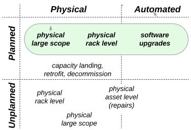
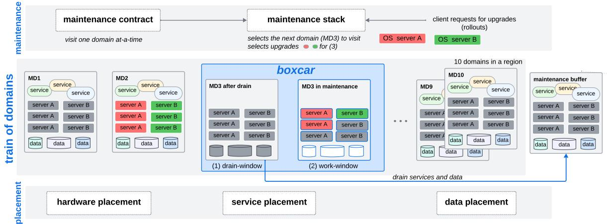
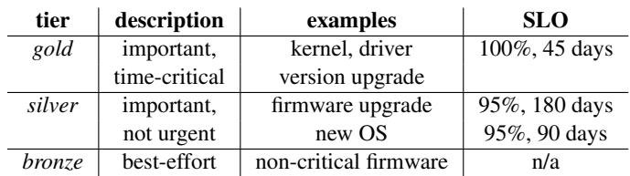
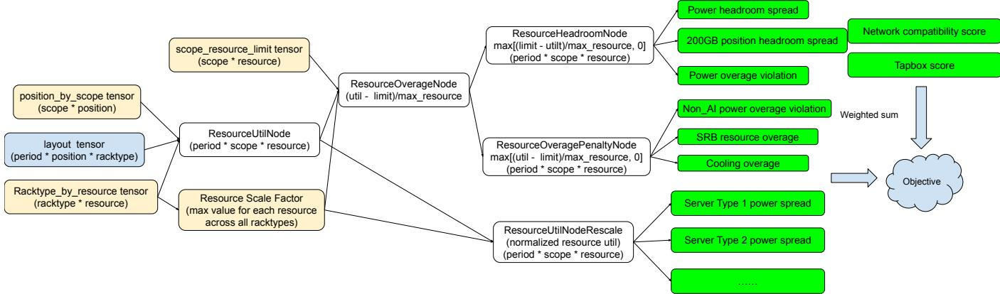
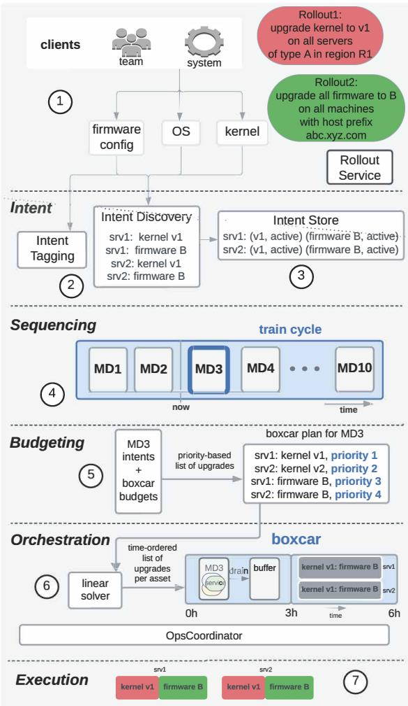
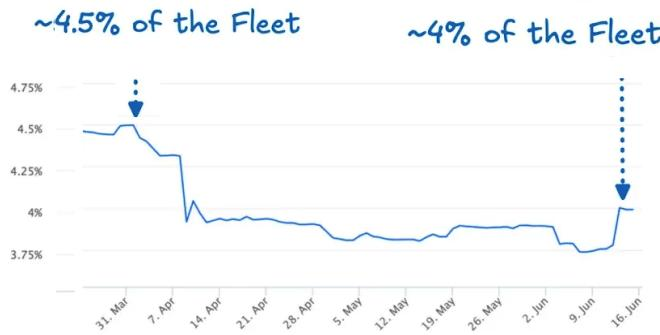
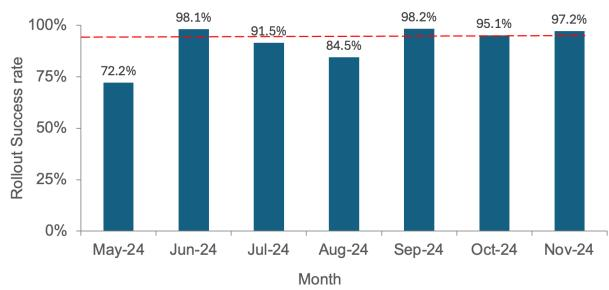
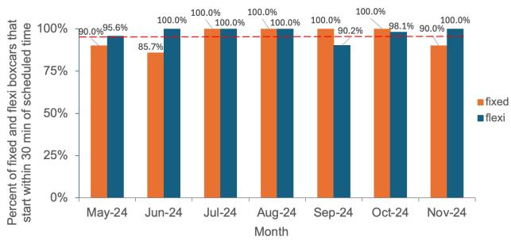
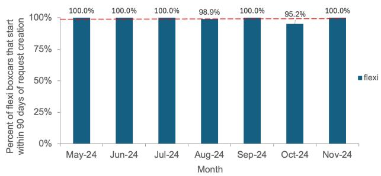
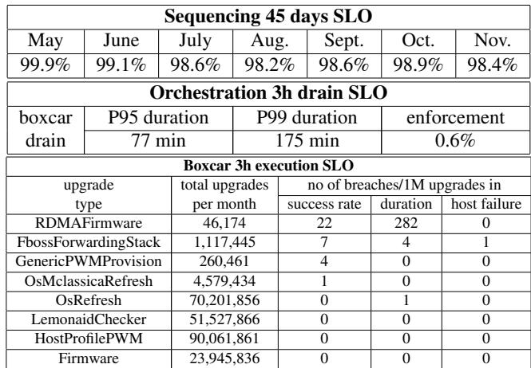

USENIX

THE ADVANCED COMPUTING SYSTEMS ASSOCIATION

# PIMS: Fleet-wide Datacenter Maintenance with Minimal Capacity Buffer and Predictable Latency (Operational Systems)

Benjamin Leonhardi, Meta Platforms; Evangelia Kalyvianaki, University of Cambridge; Yang Wang, Meta Platforms and The Ohio State University; Abdelrahman Adam, Agshin Nabiyev, Aleks Shirokov, Amitav Mohanty, Daniil Balenko, Elaine Zhao, and Essam Ewaisha, Meta Platforms; Hongbo Dong, NexGeMM LLC; Igor Marnat, Lev Novikov, and Min Zeng, Meta Platforms; Steven Shingler, Independent Researcher; Timofey Durakov, Wiliam de Abreu Pinho, Ben Christensen, Mayank Pundir, and Kaushik Veeraraghavan, Meta Platforms

https://www.usenix.org/conference/osdi26/presentation/leonhardi

This paper is included in the Proceedings of the 20th USENIX Symposium on Operating Systems Design and Implementation.

July 13–15, 2026 • Seattle, WA, USA

ISBN 978-1-939133-55-7

Open access to the Proceedings of the 20th USENIX Symposium on Operating Systems Design and Implementation is sponsored by

# PIMS: Fleet-wide Datacenter Maintenance with Minimal Capacity Buffer and Predictable Latency (Operational System)

Benjamin Leonhardi1, Evangelia Kalyvianaki2, Yang Wang1 3, Abdelrahman Adam1, Agshin Nabiyev1, Aleks Shirokov1, Amitav Mohanty1, Daniil Balenko1, Elaine Zhao1, Essam Ewaisha1, Hongbo Dong4, Igor Marnat1, Lev Novikov1, Min Zeng1, Steven Shingler5, Timofey Durakov1, Wiliam de Abreu Pinho1, Ben Christensen1, Mayank Pundir1, and Kaushik Veeraraghavan1

1 Meta Platforms   
2 University of Cambridge   
3 The Ohio State University 4 NexGeMM LLC   
5 Independent Researcher

## Abstract

Maintenance is a fundamental operation in datacenters to ensure that hardware and software operate correctly, efficiently and use up-to-date versions. We present Meta’s maintenance system in production over the last five years that provides continuous support to tens of thousands of services running on our fleet of millions of servers and seamlessly orchestrates this process. To our knowledge, this is the first paper to discuss predictable maintenance at scale.

The key challenge is how to minimize the capacity buffer—servers reserved to absorb capacity loss caused by maintenance—while providing a predictable latency to maintenance operations. This paper presents a series of strategies and techniques we use to accomplish this goal, such as aligning maintenance with fault domains, placing hardware evenly across fault domains, a maintenance contract among participating parties, etc. Indicatively, we observe that these techniques have helped us reduce the size of the capacity buffer by about 15% in one quarter of 2025 and allowed us to perform a fleet-wide deployment under targeted SLOs (e.g., 45 days for a new OS, 90 days for a new firmware).

## 1 Introduction

This paper presents Predictive Integrated Maintenance at Scale (PIMS), Meta’s approach to fleet-wide planned maintenance that includes software upgrades and physical maintenance of devices such as servers, network switches, and power components. Meta operates a hyperscale private cloud of millions of servers running tens of thousands of services and serving billions of users. Orchestrating maintenance at this scale is challenging as it has several conflicting goals.

To prevent service interruption due to loss of servers, Meta reserves additional servers, called a capacity buffer [11,27,31]. If a service loses servers due to maintenance or failures, it can use servers in the capacity buffer to continue its operation. PIMS considers three different types of events that require capacity buffers: a) a loss of servers due to scheduled maintenance; b) a loss of a fault domain (i.e., a group of servers sharing a single point of failure like a switch or a power supply) due to unexpected failures of the shared component; c) a loss of a fault domain due to scheduled physical maintenance of the shared component.

Intuitively, the bigger the buffers allocated to maintenance the more machines can be maintained in parallel and so maintenance can be completed faster. However, considering Meta is operating a hyperscale fleet with millions of servers, these buffers could represent a significant resource usage of the entire fleet. Therefore, the key challenge PIMS faces is how to minimize capacity buffers while keeping a predictable latency for maintenance operations.

Minimal capacity buffer. PIMS performs maintenance in each region (i.e., several datacenters close to each other) independently. This enforces us to define capacity buffers per region and so we allocate a capacity buffer at the size of a fault domain within a single region. Below, we explain the reasons for this and describe how a single capacity buffer can be efficiently used to cover for all three types of events described above towards minimizing its size.

First, since servers in a fault domain share either the power supply or the network switch, when the shared device is maintained, all servers in its domain become unavailable. This inevitably drives us to align maintenance with fault domains (i.e., maintain one fault domain at a time), which makes it possible to use a single buffer for events a) and c).

Second, we further use the same buffer to handle events b), i.e., the loss of a fault domain due to a shared device unexpected failure. The risk here is that if a domain fails during the maintenance of another domain, then we are losing two domains and the service may not have enough buffer. However, we can do this due to the following: for physical maintenance, which cannot be paused easily, due to its low frequency (9% of all maintenance operations), it is very unlikely for a domain failure and a physical maintenance to happen at the same time. Automated maintenance, such as kernel or firmware upgrades, is much more frequent, so the chance of both happening together is non-negligible. To address this problem, our strategy is to pause the automated maintenance quickly when another domain fails and gives back the capacity.

Third, naturally, smaller fault domains lead to a smaller capacity buffer. By applying redundancy to the shared components, we can shrink or even eliminate fault domains, but that would increase the resource usage and the complexity of our infrastructure. Meta takes a middle ground by applying redundancy to the top-level shared components and leave the lower-level components unreplicated. In this way, each of our fault domains contains about 20K servers. However, note that, shrinking fault domains does not automatically lead to smaller capacity buffer. Assuming that a service allocates servers from multiple fault domains, it needs a capacity buffer to account for the loss of the fault domain that holds the great est number of its servers. Therefore, to minimize the capacity buffer, it’s better for a service to allocate servers evenly from different fault domains.

Accomplishing this goal requires both an even distribution of each type of hardware across different fault domains and an algorithm to evenly distribute the machines allocated to a service across different fault domains. While the latter is well studied [1, 12, 21], we are not aware of practical solutions to achieve the former. In Meta, we have introduced a hardware placement algorithm that aims to minimize the uneven distribution of hardware across fault domains via rack movements. We use these outputs as suggestions and as appropriate we regularly relocate racks of machines across different positions. Concretely, the rack relocation moves suggested by the hardware placement algorithm has helped us reduce the size of our buffers by 15% in 2025 Q2 alone, which yields a saving of tens of thousands of servers.

Predictable end-to-end maintenance latency. Maintenance operations can have constraints about conflicts, dependencies, priorities, etc. To handle them, PIMS incorporates a centralized scheduler to schedule maintenance operations, with the following techniques.

First, maintenance latency involves the latency in PIMS to schedule a maintenance operation, the latency in the affected services to switch to the capacity buffer, and the latency of the maintenance operation itself. Achieving a predictable end-to-end latency inevitably requires collaboration among three parties The core of PIMS is a maintenance contract, which clearly defines the expectation for each party. Second, to meet its expectation, PIMS incorporates a layered design. Each layer operates with its own service-level objective (SLO) such that collectively all layers contribute to comply with the maintenance contract. Third, PIMS makes a balance between maintenance latency and throughput by combining batching, which executes multiple maintenance operations within a domain, and prioritized scheduling within a batch.

To the best of our knowledge, this is the first work to present fleet-wide datacenter maintenance operations. The contributions of this paper are as follows: 1. We present a holistic approach of planned maintenance covering hardware, software and data placement. The core is a maintenance contract to define the expectations for each participating party. 2. We present methods to minimize capacity buffers, by multiplexing the same buffers across different event types and minimizing their sizes through even hardware spread. 3. We present a maintenance stack to centrally manage shared capacity buffers and to carefully orchestrate fleet-wide predictable rollouts. 4. We present performance results of our system in production over the last five years.

## 2 Background

## 2.1 Maintenance operations

Maintenance operations, or maintenances, encapsulate a large and diverse set of required actions on our assets, i.e., all devices including compute and storage servers, network and power components, to keep an up-to-date and secure fleet for our services. We identify four categories of operations, shown in Figure 1, based on how they are initiated and whether they are executed by datacenter (DC) engineers or software workflows. We also distinguish between planned and unplanned maintenance. The latter is usually corrective. This paper is on planned maintenance shown with green in the figure.

First, planned automated maintenance involves software upgrades managed as rollouts. These operations keep our servers up-to-date and secure and some of these upgrades are required by law. Installation of all types of non applicationspecific software (e.g., kernels, drivers, etc) and firmware belongs in this category. Note that application-level software maintenance is managed differently, with Conveyor [15], and is not the focus of this paper.

Second, planned physical maintenance refers to periodic operations to support hardware health. For example, some hardware components have to be periodically shut down, taken apart and tested.

Third and fourth unplanned physical and automated operations refer to those executed when an unexpected problem is detected on a server or rack that requires urgent action. Depending on the nature of the problem and its trigger, e.g. automated alert or a ticket from a DC engineer, maintenance operation can be performed either automatically or manually.

For completion, there are also additional important DC maintenance operations which are not the focus of this paper. These include physical operations of large scope (e.g., busway replacement due to overheating); operations resulting in changes to fleet composition, at physical or logical levels, such as turning up new hardware and decommissioning old hardware or changing configuration of existing servers to run different kinds of service workloads; and even datacenter outages [32].

  
Figure 1: Maintenance operations. The focus of this paper is on planned maintenance operations shown in green.

To summarize, PIMS is responsible for scheduling the first two categories of planned automated and physical maintenance. The last two categories are more on-demand in nature, relying on a different set of expectations, and are therefore served differently. However, scheduling the first two categories requires PIMS to consider all categories of maintenance coherently, and we will illustrate this in later sections.

To provide context, about 91% of maintenance operations are automated maintenance and 9% are physical maintenance.

## 2.2 Fault domains

In Meta, a fault domain refers to the set of servers connected to the same power supply or network switch. In this case, if the shared device is down, all servers in the domain becomes unavailable. We continue to elaborate on the size of fault domains related to a power supply or a network switch.

Power distributions in DCs are composed of high, medium and low voltage equipment. An equipment with a higher voltage usually supports multiple equipments with a lower voltage, which means the unavailability of the former has a larger impact than the latter. As a result, Meta applies full redundancy to medium and high voltage equipments to avoid to take down too many servers. Natural disasters, like tornadoes or wildefires, can still take down those equipments, but such events are rare, and Meta has incorporated a separate buffer to absorb such loss. As a result, PIMS’s capacity buffer does not consider the loss of servers due to such rare major disasters. A Main Switch Board (MSB) is the low voltage component which supports the largest number of servers. It has partial redundancy (there are usually two reserve MSBs per DC; each DC has 36 to 72 MSBs) and this could power around O(10,000) servers. We observed high frequency of MSB faults which led us to the need of a capacity buffer to handle MSB faults.

We designed our network topology so that a switch and its associated servers use the same power supply. In this way, a network fault domain is always within a power fault domain, so that PIMS only needs to consider the power fault domain.

## 2.3 Maintenance buffer and others

As discussed in Section 1, PIMS uses one buffer, defined as bPIMS, to absorb loss caused by both unexpected domain faults and planned maintenance operations. In other words, PIMS aligns maintenance domains (MDs) with fault domains. The requirement to maintain the shared devices, e.g., MSBs and switches, is the primary reason to align maintenance domains with fault domains. In the rest of the paper, we will use MD to refer to a fault or maintenance domain.

Physically, PIMS maintains one bPIMS for each region and it includes servers spanning different MDs of the corresponding region. b should be able to absorb the loss of any MD. Since there are different types of hardware, which may be distributed unevenly across MDs, the size of bPIMS is typically larger than the size of the largest MD. Concretely, for each server type, its required buffer size is equal to the maximal number of this server type across all MDs. Then the size of bPIMS is equal to the sum of the required buffer size of each server type. For simplicity, we normalize different server types using their power consumptions. The size of bPIMS varies over time. As of May 2026, its size is about 3% of our fleet.

Meta internally maintains multiple kinds of buffers for different purposes. We present a few examples to clarify the scope of bPIMS. First, Meta maintains a buffer to absorb loss caused by random server failures, whose size is about 2% of our fleet. Second, Meta maintains a buffer to absorb loss caused by major disasters like a tornado disabling a whole region. Its size changes over time due to the addition of new regions. Third, as discussed above, each application maintains its own buffer for application-level maintenance. As a result, bPIMS does not need to consider loss caused by these events.

We have been considering the possibility to merge bPIMS and disaster recovery buffer to further reduce buffer size: to accomplish this, we will need to do maintenance region by region. This is possible since services in Meta are designed to be able to tolerate a region failure [32]. However, there are many complexities with HW and services affinity, services expectations, capacity tracking, traffic redirection, reliability expectations, etc, which are under discussion.

## 3 Design of PIMS

Figure 2 shows an overview of our system on Predictable Integrated Maintenance at Scale (PIMS). There are two independent streams of work, namely maintenance and placement, both targeting all Maintenance Domains (MDs) in a region and across all regions. The placement stream targets to make similar MDs of even spread of their hardware assets, services running and data stored. The maintenance stream is responsible to apply all maintenance requests from clients (i.e., Meta employee who submit maintenance requests), resolve conflicts and adhere to upgrades priorities. It operates on the assumption of even MDs as these are created by the placement stream.

## 3.1 Maintenance contract

In the maintenance stream we introduce the maintenance contract that describes important system guarantees for predictability. The maintenance contract has the following core four expectations among all parties involved including maintenance clients, components of the maintenance stack and services running on machines in our private cloud:

1. All services are expected to tolerate the loss of one MD at any given point in time so that services and data should be spread across different MDs, if necessary.

2. All services have to drain their hosted machines within one MD according to the agreed SLOs, e.g, within three hours. This is to ensure that the maintenance stack can safely schedule maintenance events on clean-state machines for predictability.

3. The buffer (bPIMS) supports a maximum unplanned fault domain of servers powered by a single MSB in the common case. Following the discussion on the selection of MDs in Section 2.2, this ensure that bPIMS occupies the minimum capacity buffer in our fleet that can support our maintenance contract.

4. In the event of an unplanned fault, any software upgrade operations using bPIMS will relinquish capacity within an SLO of 35 minutes so that the buffer can be used to mitigate the capacity loss due to the fault. This is a consequence of multiplexing buffers for maintenance and failures.

This simple but powerful contract allows us to design and build a system with the following characteristics on maintenance, services and failures: It offers a predictable maintenance cycle time for the entire region, reducing the variability of a software rollout duration; where previously some rollouts were very quick and others were very slow. It offers predictable start times for maintenance events and a predictable schedule of operations for DC technicians so they can plan corrective maintenances. Services don’t have to be aware of physical maintenances as long as the maintenances are contained within the MD. Exceptional cases can be handled with a regional disaster recovery strategy. Services can choose how to handle the loss of one MD. For example, stateful services can factor that into their state management control plane and quorum-based services can decide to ensure there is no loss of quorum. Service placement can be balanced across MDs. It allows us to support the failure of MSBs on the power path, which is our largest component without full physical redundancy. It enables DC designers to make decisions within the expectation of a maximum supported number of MDs. Finally, we can tolerate physical faults gracefully such that services remain unaware of them. As far as we know, this is the first system to provide these characteristics.

## 3.2 Scheduling in Maintenance Stream

The input to PIMS includes a list of maintenance requests, either submitted by clients or generated automatically. Each request asks for a software update or physical maintenance on all or a subset of servers in a region. Since preparing for a maintenance can take a long time (i.e., three hours to drain the traffic of an MD) and many types of maintenance requests themselves take shorter (e.g., tens of minutes to upgrade the OS), it is very inefficient to execute one maintenance request after each preparation. Instead, PIMS executes those requests in a batched manner at a single MD at a time: after it drains the traffic for one MD, it executes a batch of maintenance requests in that MD and then moves to the next MD.

We use the railroad metaphor to name the components of this workflow. The maintenance train is the overarching approach: a continuous cycle that visits MDs one at a time. A train cycle is one full pass through all MDs in a region. A boxcar is the atomic unit of maintenance work: a concrete, time-bounded plan for a specific MD, comprising a drain window followed by a work window. In the drain window all services of the selected MD are migrated to bPIMS. In the work window all required upgrades are installed in the MD’s assets and at the end of it services are un-drained back from the buffer to this MD.

In such a design, the scheduling algorithm of PIMS needs to answer two questions: 1. Which MD shall PIMS visit next? 2. Which maintenance requests shall PIMS execute in that MD? PIMS employs a two-step approach of first scheduling an MD and then the maintenance operations within the selected MD. However, all scheduling decisions are made in a way to align towards fleet-wide SLOs. This section provides a high-level description as follows. Section 4 provides more details about implementation and corner cases.

Ordering MDs. PIMS selects the next MD for maintenance according to the least recently visited (LRV) order, naturally due to the consideration that we do not want to leave some MDs unmaintained for long. It therefore determines the order within and the duration of the train cycle depending on the number of MDs per region and the time to spend per MD visit. Note that although a train cycle primarily determines the order of the scheduled MDs, in practice we also refer to the duration of a train cycle as the total time needed to maintain all MDs in region. For example, for regions with 72 MDs and MD visits of 12h, we need 36 days to visit each MD once. We also need to account time for revisits in case of failures. Our experiences have shown that an additional 9 days are sufficient to capture our needs. In this case, the SLO of this layer is to guarantee at least one visit for every MD in this region every 45 days. Over the years we have worked with different train cycles of like 30 or 45 days. Nowadays, we keep a train cycle of 45 days, 90 days, and so on regardless of how machines are located in the region.

  
Figure 2: PIMS overview. Figure shows an example of a region of 10 MDs where hardware, service and data are evenly spread across MDs. At any point a single MD is in maintenance leaving 9 MDs to run services. This figure shows a train of 10 MD and a rollout example in progress of two new OS versions (red and green) to be installed on server types A and B. The figure shows a snapshot in time when MD2 has already been updated and MD3 is being maintained. First, during drain-window, MD3’s services have been drained to the maintenance buffer. Then, at the work-window MD3’s servers are being updated while MD3’s services run from the maintenance buffer.

There are additional constraints to consider when ordering MDs in a train. For example, there is a constraint on working hours to capture that manual maintenance of small scope, such as of several racks, must be performed within working hours and this is normally scheduled as part of a scheduled MD visit in a train cycle. To address this, we create time slots for up to 90 days with fixed start and end times aligned with the region’s timezone which is necessary to enable manual operations alongside automated/planned operations. 90 days allows us to schedule MDs beyond the SLO of 45-days in cases where any time slots cannot be used. Then, we iterate over all slots in a chronological order starting from the earliest until all MDs are scheduled using the LRV order and other constraints. To accommodate preventative physical maintenances we periodically recalculate the order of MDs in the 90 days time slots although we fix the order of MDs for the next 3 working days for stability and predictability.

Note that LRV is not different from round robin scheduling if there is no constraint on when PIMS can maintain an MD. However, the additional constraints for manual maintenance as mentioned above and the occasional emergency maintenance (§4.2.3) may disrupt the round robin order and that’s why PIMS adopts LRV.

Planning within an MD. Typically, due to high demand, the time to run all requests for all assets in an MD exceeds the work-window time of its boxcar. Here we describe how PIMS prioritizes the requests in the boxcar plan such that all rollouts will finish according to their SLOs.

  
Table 1: Tiers of upgrades. In the first quarter of 2026, about 65% of the rollouts are gold tier, 35% are silver tier, and the number for bronze tier is negligible.

Our goal is to rank all requests and so we define three priority tiers shown in Table 1. The gold tier is for time-critical important maintenance workflows like kernel and driver upgrades that need to be scheduled as soon as possible. The silver tier is for less time-critical workflows that though still require frequent and deterministic rollout convergence such as firmware version upgrades. The bronze tier is for workflows that are not time-sensitive and include deep health checks and other housekeeping. We then fill the boxcar plan with as many maintenance operations as possible starting from the most important ones until we reach the duration of the MD visit for all servers.

A boxcar plan has a fixed duration: e.g., 6h out of which 3h for drain and 3h for effective maintenance work. Our goal is to allow equitable progress of rollouts based on their importance and their workflow expected duration. A rollout’s expected duration is typically estimated from its historical data. We split the 3h work window into a set of budgets where each budget has a target percent of hosts to represent the minimum set of hosts required to be successfully upgraded with a specific type of upgrade. For example, for gold-tier workflows we set the target budget percent to 100% since they typically take 15 to 30 min in total to execute so all such upgrades can easily fit in a single boxcar. Silver-tier workflows are often slower as they take one to two hours to execute and they are less critical, and so their budgets are proportional to their expected workflow duration. Bronze-tier upgrades are executed on a best-effort once gold- and silver-tier finish execution.

Using budgets, we define SLOs with clients. For example, the SLO with the kernel team is to upgrade every asset in the fleet within 45-days of the rollout creation. The SLO with the firmware team is to upgrade every asset in the fleet within 90-days of the rollout creation (50% budget). We further use the request creation timestamp as a second key of prioritization within the same upgrade type to prioritize new request over older ones. We then create the boxcar plan with scope, duration and priority per request.

## 3.3 Placement Stream

The goal of the placement stream is to create similar MDs of even spread of their hardware assets, services running, and data stored. As discussed in Section 1, this is fundamental to minimize the capacity buffer bPIMS.

Hardware placement. We formulate the placement problem as a mixed-integer linear programming problem (MILP) to minimize an objective function, which includes the spread of assets across MDs and some other factors. Although our formulations conform to traditional MILP representations that could be solved by known solvers, our problem size makes this approach hard to maintain and with scalability problems [8, 20]. Instead, we use a brute force greedy search algorithm for scalability and low latency reasons. This algorithm works in multiple iterations. In every iteration, it searches for one movement (i.e., move a rack of servers from one location to another) to minimize the objective value, and it repeats this process for multiple iterations until either it cannot find a beneficial movement or a limit is reached. This approach does not guarantee to find the global optimum, but it’s fast and can provide a reasonably good plan in our experience. We next describe the objective function and our greedy algorithm in more details. We begin by providing necessary terminology.

A rack holds a group of servers of the same type. There are a number of rack\_type, represented by the type and number of servers in a rack. A position is a physical location in a datacenter that can hold a rack. The goal of the placement algorithm is to determine which position should hold which rack. Our placement algorithm considers three types of resources: power supply, network bandwidth, and cooling capability. A scope is a group of positions that share a resource limit. For example, positions that are connected to the same MSB become a scope; positions that are connected to the same network switch also become a scope. A period is a time period (e.g., a week).

Figure 3 presents the detailed definition of our objective function, which is a weighted sum of multiple terms. For most of the terms, we represent decision variables and other inputs as tensors in PyTorch and define the objective terms as certain computations on those tensors. The benefit of this approach is that we can then use PyTorch to compute the gradient of those terms, which represent how the values of those terms would change if we moved a rack into or out of a position. There are a few terms we found challenging to represent as tensors and thus we use a different representation.

Concretely, on the left side of this figure, the layout tensor, which maps a rack\_type to a position, is the decision tensor. There are four input tensors: 1. The position\_by\_scope tensor records which positions each scope includes. Note that a position may be included in multiple scopes. 2. The scope\_resource\_limit tensor records the resource limit of each scope. 3. The racktype\_by\_resource tensor records the resource consumption of each rack\_type. 4. The resource\_scale factor records the max value for each resource across all rack\_types, used for normalization purpose.

On the right side, the objective function includes three groups of terms. The first group tries to encourage each scope to have enough unused resource (i.e., “headroom”) to accommodate future rack placement. This group considers power of MSB and network bandwidth of switches at this moment. The second group tries to penalize resource over-utilization. Note that we allow oversubscription of power and cooling but want to discourage that. The third group encourages an even distribution of different types of servers across different scopes. The other nodes in the middle represent intermediate tensors that are used to compute the objective terms from the input and decision tensors and how to compute them.

There are two additional terms: the network compatibility score determines how well a rack\_type fits with the position’s network configuration. There are generally three types: if it’s totally incompatible (e.g., a rack\_type requires Infiniband but that position does not have Infiniband), the score will be infinite; if it’s a perfect match (e.g., a rack\_type requires Infiniband and that position has Infiniband), the score will be 0; if it’s OK but not preferred (e.g., a rack\_type does not need Infiniband and that position has Infiniband), the score will be a positive value. The tapbox score determines the usage of tapbox, a power unit shared between adjacent positions.

Tuning the weight of each term has been a challenge. To this end, we set different values and we rely on feedback from the different clients to adjust accordingly. In practice and over the years, this approach has worked well for our cases.

Our placement algorithm executes iteratively. In each itera tion, it enumerates all the possibilities of moving one rack out of its current position and into a different position; it adopts the pair of (source position, destination position) which yields the lowest value of the objective function. The algorithm terminates when the benefit is smaller than a threshold.

  
Figure 3: Objective function of hardware placement.

PIMS runs the placement algorithm monthly to optimize hardware placement. Every run takes about 25 minutes, including data preparation, running the placement algorithm mentioned above, and postprocessing. One run typically performs a few to a few hundred iterations before it hits the termination condition. Each iteration takes about one second. Relocation is executed independently with software maintenance, since the relocation team reserves a small buffer independent of b . However, it needs to coordinate with hardware maintenance or decommission to avoid conflicts.

Note that reducing the buffer size is only one goal of this algorithm, represented by the third group of its objective terms (i.e., Server Type X power spread). It needs to consider many other factors, as expected in complex production systems.

In order for this whole idea to work efficiently, a fundamental assumption we make here is that different MDs within a region are balanced with similar power supply, network bandwidth, etc. Historically, Meta has incorporated new MD designs over time, but it only applies a new MD design in a new region to avoid unbalanced MDs within a region.

Service and Data Placement. Even when we distribute hardware evenly across the physical infrastructure in a DC, a software engineer could unknowingly deploy all instances of a service in a single MD, not only negating the benefits of balanced spread but also putting service availability under risk. Therefore, we provide placement libraries within our scheduler’s capacity management system to ensure that all deployments are spread across MDs. These libraries have been presented in prior papers like Twine [27] and RAS [27] and thus are not the focus of this paper. Additionally, we operate ShardMananger [21], an advanced data management system which may run many shard replicas in a region. It is important to spread shards across all MDs in a region to avoid the case that all replicas of a shard are placed on a given MD, making that MD skewed.

When we move a rack to a new MD due to hardware placement, there is a potential for heterogeneous software configurations to exist within an MD, which may be a problem for certain services. To eliminate such risk, we re-image the servers in the rack to be moved to match those in the destination MD.

## 3.4 Multiplexing Domain Failure Buffer and Maintenance Buffer

PIMS uses one buffer bPIMS, which has the size of an MD, to absorb loss caused by both domain failures and maintenance operations. To accomplish this, PIMS does not schedule new maintenance operations when an MD fails in the same region. However, the challenging case is that an MD fails after a maintenance operation already starts to run in the same region. In this case, we are losing two MDs, which exceed the capacity of bPIMS. This section discusses our analysis and strategy about such risks.

In 2025, Meta has experienced four MD failures in total. They spread across three different regions and the longest aggregated MD failure time in one region is five hours. Considering Meta has tens of regions, many do not experience any MD failures. It should be noted that such failure rate is not going to grow as our fleet grows: PIMS manages maintenance in each region independently. Meta mainly grows its fleet by adding new regions, not by adding machines or MDs within a region. As a result, the MD failure rate per region is not going to grow as our fleet grows. In fact, the failure rate has been dropping over the years due to improved hardware and software reliability.

For physical maintenance, since it accounts for about 9% of the total operations, the chance for it to happen together with a MD failure is low. For a simple analysis, if maintenance happens during X% of the time and MD failure happens during Y% of the time, then they happen together during

X% Y % of the time, assuming that they are independent. Following this calculation, physical maintenance and MD failure will happen together during 9% 5 = 0.005% of 24 365 the time, which translates to about 0.45 hours in one year. The actual number should be lower as 5 hours is the longest MD failure time among all regions, and PIMS will not schedule new maintenance operations when an MD failure happens.

For automated maintenance, which accounts for 91% of the total operations, the chance of a concurrent MD failure is not negligible (4.6 hours in one year using the above computation). To address this problem, when a MD fails during the automated maintenance, PIMS pauses maintenance and gives back the capacity back to this affected service as fast as possible. That is why PIMS sets an SLO in its contract that it should be able to return all capacity within 35 minutes, which strike a balance between effectiveness and feasibility. First, empirically, we find the 35-minute delay in returning capacity is generally acceptable in most cases. Second, we find the 35-minute delay is feasible: PIMS can naturally pause maintenance after one upgrade finishes. Many types of upgrades do not take long, but a few types can take significantly longer than average, often requiring multiple rounds of rebooting. For such long upgrades, we require the client who submits the request to split a long upgrade into multiple smaller ones. In addition, PIMS has a monitoring system, which will notify an on-call developer promptly if an upgrade gets stuck for unexpected reasons, and the developer can manually relinquish the capacity. Due to these optimizations, we have not seen a violation of the 35-minute SLO in the last five years.

Despite these strategies, the risk of concurrent failure still exists. In practice, a service may not be running at peak load when this happens, so it may be able to absorb such loss by itself. When the service is not able to absorb the loss, it can still turn to other capacity buffers (e.g., the buffer for major disasters) for temporary help, but this is very rare in our experience: in 2025, for each of the four MD failures mentioned above, we were able to relinquish capacity under 20 minutes and did not need the help of other buffers.

## 4 Implementation of Maintenance Stack

The overarching goal of PIMS is to implement fleet-wide maintenance in a scalable and predictable manner. To handle scalability, our system is region-based and operates maintenance decisions in parallel and independently across all regions. To be predictable, we employ a layered design composed of the Intent, Sequencing, Budgeting, Orchestration, and Execution layers. Each layer is expected to complete its goals according to its own SLOs towards the other layers. Collectively the layers handle the complexities of maintenance and provide rollout guarantees. Ultimately, maintenance decisions are performed in a region-based coordinated manner. Next, using Figure 4 we describe the steps taken by each layer to safely execute a maintenance request, referred to as the

maintenance workflow.

First, maintenance clients 1 submit their requests referred to as rollouts to the appropriate rollout configuration systems 1 1. Clients include different teams and systems generating maintenance requests. For example, teams like the Kernel Team periodically release new versions of the kernel.

Rollout requests contain different attributes including the request type, such as kernel, firmware version upgrades, and the rollout scope specifying the set of machines to execute the rollout request at, such as an entire region, or machines matching a certain host prefix. Figure 4 shows two example rollout requests. The Rollout Service monitors the status of the rollout progress on a server basis for all rollouts. At any given time we have thousands of rollouts in progress across our fleet.

The Intent layer continuously checks new rollouts and produces a list of intents to declare the upgrade that is needed for every machine matching the scope criteria 3 . It also maintains a list of all machines in the fleet with the state of their upgrades. The SLO of the Intent layer is to timely gather client rollout requests and to timely update the machine list with upgrade states within a few hours at the latest.

The Sequencing layer selects the next MD to schedule for maintenance and its SLO is to ensure at least one visit per MD in a cycle of a fixed number of days such as 30 or 45 4 . This layer also takes into account additional needs such as time constraints for physical maintenance, revisits due to failed upgrades, and more.

Given the next MD for maintenance, the Budgeting layer populates the list of intents to be executed during the visit of the next selected MD 5 . This layer operates on a single MD visit at-a-time. Its SLO is that required upgrades for the assets of this MD are given enough time to complete at the next boxcar according to their tiers as in Table 1.

The Orchestration layer coordinates execution of individual maintenance operations in a way that is safe for the fleet and predictable for the maintenance stack 6 . This involves creating a clean execution environment for every individual operation - ensuring that service workloads are migrated away (i.e. drained) from affected servers, and ordering execution to avoid interference between operations. The SLOs of this layer is about creating such an environment on time (e.g. 3h) to maintain predictable throughput. This is the only layer in the stack that is shared between planned, corrective, and fleet topology change maintenances, as it requires coherent view of all work in the DC to achieve its objective.

The Execution layer handles the execution of maintenances 7 . The SLO of this layer is based on three metrics: success rate of the upgrader, duration of it and host health rate after upgrades, e.g., for kernel it’s 99%, O(minutes) and 98% correspondingly. It is also responsible for identifying bad actors - maintenances that do not comply with the above requirements - and providing a signal to remove them from the system to maximize utilization of available maintenance time.

  
Figure 4: Maintenance stack overview.

Note that our system is not triggered by new rollout requests. Rather we keep two parallel threads of execution. The first keeps an up-to-date list of all upgrades per machine. The second is to pick the next MD for which the requested upgrades for all its assets are to be installed. These two threads run continuously. Despite the two asynchronous threads, our system relies on strict SLOs and performs efficiently and predictable as evaluation shows.

PIMS is backed up by a fault tolerant database to store incoming requests, intents, boxcar plans, etc. As a result, if PIMS process crashes for some reason, we just need to restart it, which will resume based on the information stored in the database.

## 4.1 Intent Layer

The Intent layer is composed of the Intent Store, the Intent Discovery and the Intent Tagging services to capture clients’ rollout requests and to generate upgrade intents per machines.

The Intent Discovery service operates continuously to collect all intents from services 2 where an intent denotes the desired maintenance action to be performed on assets. Intents are stored in the Intent Store 3 which keeps the up-to-date state of all clients’ intents. When an intent is published at the Intent Store, it is augmented with additional properties including state, priority, and more. An intent’s state can be either active or fulfilled. All intents are initially active and remain so until fulfilled. An intent priority represents the urgency of an intent and can be used by Budgeting to onboard upgrades to boxcars created in emergency situations. Once an active intent is in the Intent Store, it signifies that its upgrade should be installed. Scheduling and running the upgrade of an active intent is done asynchronously by the layers below described in the next sections.

There are gradual rollouts deployed in a stepwise fashion (i.e., after the pre-production testing, production rollouts are deployed first to 5% and then to 25% and 100% of servers of the global scope) to ensure safe and controlled upgrades similar to rolling upgrades [15, 26]. For such upgrades it is challenging to find the specific servers to upgrade to meet roll out scope quotas when we upgrade an MD at-a-time. To this end, the Intent Tagging service aims to find specific assets in the fleet across MDs for gradual rollouts. For this, it greedily assigns assets at the upcoming MDs with the target version to ensure that the rollout will happen in the shortest time possible while ensuring efficiency without compromising safety.

The Intent layer monitors upgrade reattempts so that when an upgrade fails, an intent is kept in the active state until the corresponding upgrade successfully puts the server in its desired state. This also allows us to count the number of upgrade retries and so we can identify problems in cases of many unsuccessful attempts.

## 4.2 Sequencing Layer

The Sequencing layer determines the order to visit MDs in a train. As described in Section 3.2, it mostly follows the Least Recently Visited (LRV) order. This section discusses more details.

## 4.2.1 Failed maintenance domain visits

Every MD visit contains upgrades that belong to multiple rollouts and some of them might fail to execute. We need to measure upgrade failures in a boxcar to decide whether the MD should be rescheduled again with the remaining failed and other non-completed upgrades, referred to as a MD revisit. For this we define the success rate of a boxcar as the ratio between successful completed upgrades and the total number of upgrades in the MD visit. If the success rate is below a threshold we schedule the MD to be revisited to retry failed upgrades. We can set this threshold with different values. According to our experience, an 80% threshold works well for our cases, because it achieves a good balance between success of individual rollouts versus the majority of rollouts that are executed in parallel in the same region.

Further, the Sequencing layer reschedules an MD after a failed visit. However, as a revisit requires an additional time slot there could be cases with not enough slots left to meet the 45-days SLO. To minimize this risk, the Sequencing layer monitors MD failures and in cases of subsequent failures of the same MD, it reschedules a visit after a configurable number of days in the future, which is similar to the exponential back-off mechanism. This enables us to continue to other MDs while issues in the problematic MD are being addressed.

## 4.2.2 Large-scale manual maintenance

In addition to running boxcars with automated upgrades, there is a need to schedule large-scale manual maintenance. Their scope is defined by power and network constraints, which can impact capacity maintained by different trains.

As discussed before, one of the scheduling constraints is that each capacity type under maintenance aggregated should not exceed an MD at-a-time. Because of this, once there is manual maintenance on a specific capacity type, we cannot perform any other maintenances on the scope of the same type. To solve this we place manual maintenances in a separate schedule called manual train. Trains are placed in order of priority, with the manual train being placed first so it does not face any conflicts and can schedule a boxcar on any day. When we place other trains, we search for conflicts with already placed boxcars. If any of the constraints are violated, the time slot of the boxcar of the train of less priority is skipped. In this way, automated trains are scheduled around manual trains.

The existence of manual trains could increase the chances of SLO violation, due to manual trains’ high priority and restricted scheduling constraints (e.g., a human engineer typically only works during of a workday). Historically, we have alleviated this problem by careful planning. Today, we observe that manual trains have no big impact in PIMS.

## 4.2.3 Emergency rollouts

There are cases when a specific upgrade needs to be rolled out faster than the usual 45 or 30 days. For instance, assume that a new GPU driver has been rolled out to 50% of machines across MDs in a region when we observe significant perfor mance degradation in the already upgraded machines. Instead of waiting for 45 days to recover the cluster we introduce emergency rollouts to roll back to the latest stable version.

There are two different cases: a) requiring upgrades are located in a few MDs; and b) a small number of machines require upgrades spread evenly across the region, for example only when a specific model is affected by buggy software. In the first case we use emergency trains that have the highest priority and are configured on demand. By placing emergency trains first, we can achieve automatic conflict resolution without manual intervention. The speed of the rollout by the emergency train is restricted by the number of MDs, drain time, and required work window. In the second case, for some capacity types that depend only on the number of machines available in the region (GPU training capacity), we can make a single visit that covers a few MDs and controls the number of machines on-boarded for maintenance. This approach can reduce the mitigation time from weeks to 1-2 days.

## 4.3 Budgeting Layer

Following the algorithm described in Section 3.2, The Budgeting layer takes all intents for every asset in an MD from the Intent Store and produces the boxcar plan which contains a priority list of upgrades for all assets that can run in the next visit of that MD.

This section reports on issues of safeguarding, fine-grain duration prediction and supercession. First, safeguarding ensures that all systems involved in upgrade operate correctly. To this end, we continuously monitor the reliability of workflows by checking for example whether an intent is successfully applied and the host is in a healthy and production-ready state after the upgrade. Once we detect an unreliable workflow, we stop its execution to investigate the problem. After the problem is fixed we then allow back the intent to boxcars.

Second, accurate workflow duration is important for the boxcar plan and to ensure workflow execution only when there is enough time left in the boxcar. We have developed an ML model to predict workflow duration based on historical data for workflows with high duration variation such as firmware upgrades [10].

Finally, there are cases where some of the workflows in higher priority tiers are applied out-of-the-box by other workflows in the lower priority tiers referred to as supercession. For example, OS reinstalling would automatically fetch and install the desired kernel version. To reduce duplication in boxcar plans, this layer further applies a step that detects and deduplicates supercession.

## 4.4 Orchestration and Execution Layers

The Orchestration layer coordinates the execution of all maintenance operations in the fleet, across categories, in a safe way for service workloads and predictable for maintenance operations. In the context of planned maintenances every train visit should start at a specific time and should finish within its predetermined duration for next MD visit. The OpsCoordinator system in Orchestration is responsible for guaranteeing that timeline: services drain on time and that a batch of operations in a boxcar can reach one of the terminal states on time.

This layer achieves its objectives by combining fleet-wide safety invariants, service workload drains, time-order and topology awareness, and coordination between maintenances under a single user-facing abstraction. It is guaranteed that once OpsCoordinator makes a decision to start execution, maintenance will operate in a clean execution environment - service workloads are migrated away and no other concurrent maintenances are being executed on the same hardware.

Safety Invariants. In context of planned maintenances OpsCoordinator assesses safety across three dimensions to ensure that the maintenance contract is upheld at all times. First, it ensures that not more than one MD of the same type is taken down for maintenance in a region. Then, it verifies that there’s enough buffer capacity to sustain the outage of the chosen MD. And finally, in case of a large sub-region failure event or buildup of organic failures, it will pause planned maintenance execution, and facilitate return of maintained capacity back to production so it can be used to absorb the impact.

Cross maintenance coordination. The main objective at this stage is to order incoming maintenance operations to avoid conflicts such that no two maintenances execute con currently on the same device, as well as ensure that their execution is not impacted by utility loss. This stage coordinates across different categories of maintenances (software upgrades, unplanned operations, retrofits, etc). In context of planned maintenances this means that execution of software upgrades on devices with ongoing corrective work will be avoided, as well as some ongoing planned maintenances may be cancelled to facilitate cleanup across execution call stack to make room for higher-priority work.

Drain. The main goal at this stage is to gracefully migrate service workloads on all affected servers into buffers. Fully bootstrapping a workload on a new machine can take anywhere between a few seconds (for compute) to a few days (for storage). To avoid disruption all affected service workloads should be migrated to buffer capacity ahead of time. OpsCoordinator initiates and monitors the drain process. Our cloud manager Twine [31] provides a mechanism to ask services to vacate their host machines and also drives workload reallocation. OpsCoordinator is responsible for interfacing with this mechanism on time, and provides the required metadata about the drain. OpsCoordinator further resolves any conflicts due to hardware topologies.

In context of planned maintenances, maintaining predefined schedule of boxcar execution is important for rollout SLOs. This is a secondary goal during this stage, as it favours service availability first. According to the maintenance contract, all service workloads have to be able to migrate within 3h to maintain predictable schedule. OpsCoordinator is responsible for enforcing this expectation by forcefully preempting service workloads if they do not drain on time, apart from the scenarios when a large-scale infrastructure failure is observed.

For stateful services, due to the need to replicate or rebuild data, 3h drain may not be enough to gracefully migrate their workload. Therefore, they also receive an 24h advance notice prior to the maintenance train visit, and can utilize this signal to kick off data replication or rebuild.

Execution. Once the previous stages complete upgrades are ready for execution. OpsCoordinator requires all maintenance executors to implement a standardized service interface that is used to dispatch callbacks, monitor progress of the work, and inject control signals such as preemption. Once the executor reports on completed work, OpsCoordinator handles transparent return of the maintained hardware back to production. For planned maintenances, it is possible that not all operations from the boxcar finish by the end of the predefined work-window. As trains need to follow the schedule from Sequencing to maintain the rollout SLO, PIMS will release those servers that have finished maintenance, keep doing maintenance on those unfinished ones, and move to the next MD. Our statistics show that about 0.5% servers cannot finish maintenance by the end of the window, and we assume that the buffer to absorb random failures can handle such 0.5% capacity loss, since many unfinished maintenances are indeed caused by random failures.

## 5 Evaluation

In this section we report performance results of PIMS in production to maintain millions of servers in Meta’s private cloud and thousands of rollouts. Section 5.1 reports the effectiveness of hardware placement on reducing buffer size. Section 5.2 evaluates predictability. In Section 5.3, we evaluate important SLOs of the maintenance stack. Section 5.4 evaluates the utilization of MDs and discusses related tradeoffs.

## 5.1 Buffer size reduction

As discussed in this paper, PIMS reduces buffer size in two ways. First, it uses one buffer to absorb the capacity loss caused by server maintenance, MD maintenance, and MD failures. If PIMS did not perform such multiplexing, the required buffer size may be trippled.

Second, PIMS applies the hardware placement algorithm to make MDs within a region balanced, because its buffer needs to accommodate the loss of the largest MD and thus balanced MDs help to reduce buffer size. Meta started to apply the hardware placement algorithm to reduce buffer size since 2022. We quantify its benefit with the size of bPMIS, estimated using the approach described in Section 2.2.

Typically, there are more movement activities following either a significant change to the algorithm or an installation or decommission of many servers, and there are fewer movement activities when the situation gets stable. During the second quarter of 2025, which is a rather active period, we moved a total of 15,716 racks under the suggestion of the hardware placement algorithm. As shown in Figure 5, such activities have helped Meta to reduce the size of b from about 4.5% of the fleet capacity to about 4%. Note that since the total fleet capacity was growing during this period, the actual reduction (15%) is larger than 4.5%↑4% . This can help us save tens of 4.5% thousands of servers every year. As of May 2026, the size of bPIMS has been reduced to about 3% of our fleet capacity.

  
Figure 5: Reduction of buffer size due to hardware placement algorithm in 2025 Q2.

Also note that, since Meta has been running the placement algorithm since 2022, 2025 Q2 already started with a reasonably optimized placement. If we applied this algorithm on a random placement plan, it is likely for this algorithm to achieve more reduction.

The problem of hardware placement is NP hard, so we do not know the optimal buffer size, but we can estimate its lower bound in the following way: if a region has n MDs, then the lower bound of the buffer size is 1 of the region capacity, assuming that MDs are perfectly balanced. Most Meta regions have 36 to 72 MDs, which means that the lower bound is about 1.4% to 2.8%. However, due to different server types, different resources to consider, and different goals to optimize (Figure 3), it is unlikely that we can reach this lower bound. Our speculation is that there might be some room for further reduction, but probably not a significant one.

## 5.2 Maintenance predictability

Planned software and firmware upgrades. First, we evaluate maintenance predictability for planned software and firmware upgrades. We measure the rollout success defined as the ratio of rollouts completed according to their SLOs (see Table 1) on a monthly basis. The rollout success rate is weighted by the number of assets in the rollout scope to align with our goal to get as many assets as possible upgraded to the desired software or firmware version. In six months in 2024, we rolled out more than 300 different versions in Kernel, Firmware and OS categories through 52 upgrade types totaling to an average of 2-3K rollouts globally every month.

Figure 6 illustrates the rollout success rate over six months. Results show 90% or higher rollout success rates for four months. Success rate only drops for May (72%) and Aug (84%) because of failures in upgrade logging caused by a configuration update and a system bug in discovering intents. Once discovered, these issues were immediately addressed and rollout success rate was back again to very high values in the next months. Very high rollout success rates show that PIMS works in a predictable manner according to the SLOs.

  
Figure 6: Rollout success rate.

To provide context on the importance to consistently meet SLOs consider OS freshness: 95% of our millions of servers have their OS provisioned every 45 days. In the past, before the current centralized maintenance system, we needed about 3 years for a fleet-wide OS upgrade. This corresponds to a 23x reduction in rollout time and the current 45-days SLO for OS provision ensures that we can maintain the latest OS version for fleet safety and compatibility.

Planned physical maintenance. Second, we evaluate predictability for planned physical maintenance in two cases. First, fixed-date maintenance is scheduled by DC engineers who provide the date and time to run such boxcars in the maintenance stack, which means the date is fixed for PIMS. Second, the flexi-date maintenance is scheduled by PIMS, which means the date is flexible for PIMS, and then DC engineers are given the date and time to run these boxcars. Depending on these two types of boxcars, we have two different contracts to ensure that we can start on time, and to limit the wait time.

First, we support the "start-on-time" SLO declared as 95% of both fixed- and flexi-date maintenance should start within 30 minutes of their scheduled time. Figure 7 shows the percent of both boxcar types in the six months that successfully start within 30 min of their scheduled time. Results show that we are above 95% in most cases. Second, we support the "limitthe-wait-time" SLO as 99% of flexi-date manual maintenance operations should start within 90 days of request creation. Figure 8 shows the percent of boxcars in the six months that successfully start within 90 days of request creation. Results show that we are compliant in 5 out of the past 6 months with this SLO. The two SLOs above were breached only to support the necessary hardware retrofit of network equipment in a flexible way which accounted for the delivery of parts and resources to fit them.

Figure 7: Percent of fixed- and flexi-date maintenances that start within 30 min of their scheduled time.  
  
Figure 8: Percent of flexi-date maintenances that start within 90 days of request creation.

## 5.3 Maintenance layers SLOs

Maintenance predictability depends on how well each layer in the stack meets its own SLOs. Here, we show results on how well the Sequencing and Orchestration layers meet their SLOs in Table 2. The performance of these two layers is instrumental for the maintenance contract to ensure the 45-days train cycle and the total boxcar duration of 6h respectively.

First, Table 2 shows that over the six months, the compliance rate of the 45-days SLO is very high and consistently above 95%. Second, we evaluate the SLO compliance in boxcar for both the drain- and work-window. Table 2 shows that the enforcement rate which is defined as percent of drains that fail to finish in 3h and so enforced by OpsCoordinator is very low at 0.6%. Drain enforcement impact depends on the asset type and service and thus is processed differently; it is either automated or an oncall engineer is notified to handle this.

Third, Table 2 shows the number of breaches of the upgrade success rate, upgrade duration and host failure rate SLOs per million of upgrades in one month for the work-window. Note that SLOs differ across upgrade types. For example, the Os-Refresh upgrade has a critical threshold of P80 duration of 50 min per boxcar. A violation of this SLO is a critical breach and requires immediate action, intervention and investigation. Results show that for most upgrade types breaches to these SLOs are rare with the exception of RDMAFirmware upgrades. Although RDMAFirmware has the smallest number of upgrades, it has the highest ratio of breaches likely due to a bug where a different, longer duration upgrade was incorrectly performed under the name of RDMAFirmware.

  
Table 2: Results on meeting maintenance SLOs.

## 5.4 Maintenance overhead and efficiency

The overall efficiency of our system is reflected at the speed at which we can execute rollouts while maintaining predictability. Rollout speed depends on how fast the train schedule can visit all MDs in a region which depends on the duration of a boxcar visit. We have used different drain-window and work-window durations from 1 to 2 and now to 4 boxcars/day.

To explore whether we can further reduce boxcar duration, we measure the drain- and work-window utilization in one month across all boxcars and regions. The drain-window utilization is 7% on average and 23% for the work-window. This data shows that most drain and upgrades finish early and their assets wait idle until the end of the windows. However, as shown in Table 2 the P95 duration of drains is 77min and the P99 duration is 175min (almost 3h) indicative of a long tail. Similar distributions are observed in the work-window. Further reducing the boxcar duration will increase the enforcement rate and the number of unfinished upgrades which will adversely impact rollout success. Beginning upgrade as soon as a drain completes is possible for automated upgrades, but not possible for those requiring manual effort, since engineer time must be scheduled in advance.

## 6 History, lesson, and future

In early days, maintenance was performed in isolation by different service teams, which fully managed the allocation and usage of their own buffers. It became challenging with our fleet growth, as we often needed to coordinate multiple maintenances due to resource and reliability reasons. This led to the development of PIMS as a centralized maintenance system in 2019 and the first major deployment in 2021.

As for the major components or ideas of PIMS, we have decided to use a single buffer since the beginning and incorporated the hardware placement algorithm to reduce buffer size in 2022. We created a maintenance contract at the beginning, but it only included the expectations that maintenance will take down one MD and we will reserve a buffer for that. We added the SLO expectations for different components and teams (i.e., 3 hours for draining and 35 minutes for relinquishing capacity during unplanned faults) in December 2021. Through the years, we have tested different boxcar durations and settled with our current setting.

Our most important lesson is that the maintenance contract is important to the success of PIMS, especially in a hyper-scale environment like Meta. Maintenance is a typical example of tasks that require close collaboration among multiple teams. By clearly defining the responsibility of each team, the contract allows each team to focus on its own goal and achieve the maintenance SLOs with a collective effort.

The recent development of AI clusters, especially the training clusters, has created new challenges to maintenance but it has also simplified maintenance in several other aspects.

1. Training clusters are mostly homogeneous, with the same type of servers and GPUs, so we do not need the hardware placement algorithm to balance MDs.

2. Training is not servicing user traffic, so it can tolerate capacity adjustment, as long as it is planned carefully.

3. Training systems provide fault tolerance capability through mechanisms like checkpoint, so PIMS could interrupt them for maintenance, though the interruption is costly for large-scale training like LLM pre-training [29].

4. The new generations of GPUs allow direct memory access from GPU to GPU across different hosts, which introduces a new kind of network domain. These network domains do not necessarily align with power domains.

In general, smaller maintenance domain means smaller buffer and thus more capacity for training in the common case, but it also means more frequent maintenances and interruptions, which lead to a higher interruption cost. Considering 3 and 4, we currently settle with performing maintenance at the granularity of the new network domains, which are smaller than power domains, for automated upgrades. For physical maintenances that need to take down power domains, we perform them less frequently and take out additional capacity, which is acceptable due to 2. We also try to avoid a physical maintenance during large-scale LLM pre-training. However, due to the fast evolvement of both training software and hardware, our design is subject to changes in the future.

## 7 Related work

To our best knowledge, this paper is the first to discuss fleetwide physical maintenance and software upgrades. More broadly, many works discuss the upgrades and maintenance of specific systems, such as ML Supercomputer [34], network devices [2, 3, 14, 23, 25], confidential virtual machines [7], and application-level software [9, 15, 17, 26, 33]. While PIMS shares some of their challenges and design principles, PIMS faces a unique challenge that it has to consider and optimize hardware placement to achieve its goal of minimizing capacity buffer, which leads to our design choices to align maintenance with failure domains and to physically relocate machines to achieve even spread. In addition, as a centralized scheduler, PIMS can schedule many upgrades at the same time, creating opportunities for improving efficiency, while most prior work consider one upgrade at a time.

There are works targeting specific problems during upgrades. For example, Azure’s Gandalf focuses on early capturing bad rollouts to prevent widespread outages [22]. Other works focus on classifying upgrades as sources of failures [14, 16, 18, 33]. We also find related work on reducing downtime during upgrade even without migrating running services [5, 6, 13, 19, 26, 28, 30] and tailored approaches to reduce drain time [4]. Finally, Hyrax [24] allows partiallyfailed servers to be used while waiting for maintenance. These works are largely orthogonal to our work, since our work may apply similar approaches to reduce the chance of failures or reduce down time, though in our experience, these works often work only for specific systems.

## 8 Conclusions

PIMS achieves small capacity buffer and predictable maintenance at the scale of millions of servers, with a collective effort of clear contract to define the expectation for each participant, optimized hardware placement, SLO-aware prioritized scheduling, and buffer sharing motivated by failure statistics. PIMS has been in production over the last five years in Meta’s hyperscale private cloud managing planned maintenance such as kernel and firmware updates. Production data shows that it can significantly reduce capacity buffer size, which yields an annual saving of tens of thousands of servers, and can achieve a reasonable SLO for regular maintenance tasks.

## Acknowledgments

This work would not have been possible without the sustained collaboration across many teams at Meta, including Capacity, Core Infra, Datacenter Operations, Network, Production Engineering, Site Operations, and many others. We thank those who have contributed to PIMS: Justin Boseant, Philip Harries, Scott Michelson, David Steere, Ivan Santa Maria Filho, Brian Spaulding, Grigory Turunov, Usman Sharif, Sajal Jain, Yang Xia, Ivan Cikic, Alexander Opeykin, Igor Tufanov, Richa Kala, Victoria Puscas, Maxim Kuthorenko, Andrei Darabanov, Artemiy Kolesnikov, Catherine Sweeney, Aileen McCabe, Konstantin Startsev, Cedric Van Goethem, Sahil Deshpande, Max Khodak, Michal Sedlak, Saranyan A Vigraham, Sudheer Vaddi, Surupa Biswas, and CQ Tang. We also thank all reviewers for their insightful comments.

## References

[1] Atul Adya, Daniel Myers, Jon Howell, Jeremy Elson, Colin Meek, Vishesh Khemani, Stefan Fulger, Pan Gu, Lakshminath Bhuvanagiri, Jason Hunter, Roberto Peon, Larry Kai, Alexander Shraer, Arif Merchant, and Kfir Lev-Ari. Slicer: Auto-Sharding for Datacenter Applications. In Proceedings of the 12th USENIX Conference on Operating Systems Design and Implementation, OSDI’16, page 739–753, USA, 2016. USENIX Association.

[2] Mohammad Al-Fares, Virginia Beauregard, Kevin Grant, Angus Griffith, Jahangir Hasan, Chen Huang, Quan Leng, Jiayao Li, Alexander Lin, Zhuotao Liu, Ahmed Mansy, Bill Martinusen, Nikil Mehta, Jeffrey C. Mogul, Andrew Narver, Anshul Nigham, Melanie Obenberger, Sean Smith, Kurt Steinkraus, Sheng Sun, Edward Thiele, and Amin Vahdat. Change Management in Physical Network Lifecycle Automation. In 2023 USENIX Annual Technical Conference (USENIX ATC 23), pages 635– 653. USENIX Association, July 2023.

[3] Omid Alipourfard, Jiaqi Gao, Jeremie Koenig, Chris Harshaw, Amin Vahdat, and Minlan Yu. Risk based Planning of Network Changes in Evolving Data Cen ters. In Proceedings of the 27th ACM Symposium on Operating Systems Principles, SOSP ’19, page 414–429. Association for Computing Machinery, 2019.

[4] George Amvrosiadis, Angela Demke Brown, and Ashvin Goel. Opportunistic Storage Maintenance. In Proceedings of the 25th Symposium on Operating Systems Principles, SOSP ’15, page 457–473. Association for Computing Machinery, 2015.

[5] Jeff Arnold and M. Frans Kaashoek. Ksplice: Auto matic Rebootless Kernel Updates. In Proceedings of the 4th ACM European Conference on Computer Systems, EuroSys ’09, page 187–198. Association for Computing Machinery, 2009.

[6] Andrew Baumann, Jonathan Appavoo, Robert W Wisniewski, Dilma Da Silva, Orran Krieger, and Gernot Heiser. Reboots Are for Hardware: Challenges and Solutions to Updating an Operating System on the Fly. In USENIX Annual Technical Conference, pages 337–350, 2007.

[7] Jiahao Chen, Zeyu Mi, Yubin Xia, Haibing Guan, and Haibo Chen. CPC: Flexible, Secure, and Efficient CVM Maintenance with Confidential Procedure Calls. In 2024 USENIX Annual Technical Conference (USENIX ATC 24), pages 1065–1082. USENIX Association, July 2024.

[8] Arnab Choudhury, Yang Wang, Tuomas Pelkonen, Kutta Srinivasan, Abha Jain, Shenghao Lin, Delia David,

Siavash Soleimanifard, Michael Chen, Abhishek Yadav, Ritesh Tijoriwala, Denis Samoylov, and Chunqiang Tang. MAST: Global scheduling of ML training across Geo-Distributed datacenters at hyperscale. In 18th USENIX Symposium on Operating Systems Design and Implementation (OSDI 24), pages 563– 580, Santa Clara, CA, July 2024. USENIX Association. URL: https://www.usenix.org/conference/ osdi24/presentation/choudhury.

[9] Olivier Crameri, Nikola Knezevic, Dejan Kostic, Ricardo Bianchini, and Willy Zwaenepoel. Staged Deployment in Mirage, an Integrated Software Upgrade Testing and Distribution System. In Proceedings of Twenty-First ACM SIGOPS Symposium on Operating Systems Principles, SOSP ’07, page 221–236. Association for Computing Machinery, 2007.

[10] Yi Ding, Aijia Gao, Thibaud Ryden, Michal Sedlak, Essam Ewaisha, Igor Marnat, and Henry Hoffmann. Costaware Duration Prediction for Software Upgrades in Datacenters. In Proceedings of the MLSys 2026 Conference, 2026.

[11] Marius Eriksen, Kaushik Veeraraghavan, Yusuf Abdulghani, Andrew Birchall, Po-Yen Chou, Richard Cornew, Adela Kabiljo, Ranjith Kumar S, Maroo Lieuw, Justin Meza, Scott Michelson, Thomas Rohloff, Hayley Russell, Jeff Qin, and Chunqiang Tang. Global Capacity Management With Flux. In 17th USENIX Symposium on Operating Systems Design and Implementation (OSDI 23), pages 589–606, Boston, MA, July 2023. USENIX Association.

[12] Sanjay Ghemawat, Howard Gobioff, and Shun-Tak Leung. The Google File System. In Proceedings of the Nineteenth ACM Symposium on Operating Systems Principles, SOSP ’03, page 29–43, New York, NY, USA, 2003. Association for Computing Machinery.

[13] Cristiano Giuffrida, Anton Kuijsten, and Andrew S. Tanenbaum. Safe and Automatic Live Update for Operating Systems. In Proceedings of the Eighteenth Interna tional Conference on Architectural Support for Programming Languages and Operating Systems, ASPLOS ’13, page 279–292. Association for Computing Machinery, 2013.

[14] Ramesh Govindan, Ina Minei, Mahesh Kallahalla, Bikash Koley, and Amin Vahdat. Evolve or Die: High-Availability Design Principles Drawn from Googles Net work Infrastructure. In Proceedings of the 2016 ACM SIGCOMM Conference, SIGCOMM ’16, page 58–72. Association for Computing Machinery, 2016.

[15] Boris Grubic, Yang Wang, Tyler Petrochko, Ran Yaniv, Brad Jones, David Callies, Matt Clarke-Lauer, Dan Kel-

ley, Soteris Demetriou, Kenny Yu, and Chunqiang Tang. Conveyor: One-Tool-Fits-All continuous software deployment at meta. In 17th USENIX Symposium on Operating Systems Design and Implementation (OSDI 23), pages 325–342, Boston, MA, July 2023. USENIX Association.

[16] Haryadi S. Gunawi, Mingzhe Hao, Riza O. Suminto, Agung Laksono, Anang D. Satria, Jeffry Adityatama, and Kurnia J. Eliazar. Why Does the Cloud Stop Computing? Lessons from Hundreds of Service Outages. In Proceedings of the Seventh ACM Symposium on Cloud Computing, SoCC ’16, page 1–16. Association for Computing Machinery, 2016.

[17] Hai Huang, Salman Baset, Chunqiang Tang, Ashu Gupta, K N Madhu Sudhan, Fazal Feroze, Rajesh Garg, and Sumithra Ravichandran. Patch Management Au tomation for Enterprise Cloud. In 2012 IEEE Network Operations and Management Symposium, pages 691– 705, 2012.

[18] Lexiang Huang, Matthew Magnusson, Abishek Bangalore Muralikrishna, Salman Estyak, Rebecca Isaacs, Abutalib Aghayev, Timothy Zhu, and Aleksey Charapko. Metastable Failures in the Wild. In 16th USENIX Symposium on Operating Systems Design and Implementation (OSDI 22), pages 73–90. USENIX Association, 2022.

[19] Sanidhya Kashyap, Changwoo Min, Byoungyoung Lee, Taesoo Kim, and Pavel Emelyanov. Instant OS Updates via Userspace Checkpoint-and-Restart. In 2016 USENIX Annual Technical Conference (USENIX ATC 16), pages 605–619. USENIX Association, June 2016.

[20] Neeraj Kumar, Pol Mauri Ruiz, Vijay Menon, Igor Kabiljo, Mayank Pundir, Andrew Newell, Daniel Lee, Liyuan Wang, and Chunqiang Tang. Optimizing Resource Allocation in Hyperscale Datacenters: Scalability, Usability, and Experiences. In 18th USENIX Symposium on Operating Systems Design and Implementation (OSDI 24), pages 507–528, Santa Clara, CA, July 2024. USENIX Association.

[21] Sangmin Lee, Zhenhua Guo, Omer Sunercan, Jun Ying, Thawan Kooburat, Suryadeep Biswal, Jun Chen, Kun Huang, Yatpang Cheung, Yiding Zhou, Kaushik Veeraraghavan, Biren Damani, Pol Mauri Ruiz, Vikas Mehta, and Chunqiang Tang. Shard Manager: A Generic Shard Management Framework for Geo-distributed Applications. In Proceedings of the ACM SIGOPS 28th Symposium on Operating Systems Principles, SOSP ’21, page 553–569. Association for Computing Machinery, 2021.

[22] Ze Li, Qian Cheng, Ken Hsieh, Yingnong Dang, Peng Huang, Pankaj Singh, Xinsheng Yang, Qingwei Lin, Youjiang Wu, Sebastien Levy, and Murali Chintalapati.

Gandalf: An Intelligent, End-To-End Analytics Service for Safe Deployment in Large-Scale Cloud Infrastructure. In 17th USENIX Symposium on Networked Systems Design and Implementation (NSDI 20), pages 389–402. USENIX Association, February 2020.

[23] Bingzhe Liu, Colin Scott, Mukarram Tariq, Andrew Ferguson, Phillipa Gill, Richard Alimi, Omid Alipourfard, Deepak Arulkannan, Virginia Jean Beauregard, Patrick Conner, P. Brighten Godfrey, Xander Lin, Joon Ong, Mayur Patel, Amr Sabaa, Arjun Singh, Alex Smirnov, Manish Verma, Prerepa V Viswanadham, and Amin Vahdat. CAPA: An Architecture For Operating Cluster Networks With High Availability. In 21st USENIX Symposium on Networked Systems Design and Implementation (NSDI 24), pages 1995–2010. USENIX Association, April 2024.

[24] Jialun Lyu, Marisa You, Celine Irvene, Mark Jung, Tyler Narmore, Jacob Shapiro, Luke Marshall, Savyasachi Samal, Ioannis Manousakis, Lisa Hsu, Preetha Subbarayalu, Ashish Raniwala, Brijesh Warrier, Ricardo Bianchini, Bianca Schroeder, and Daniel S. Berger. Hyrax: Fail-in-Place Server Operation in Cloud Platforms. In 17th USENIX Symposium on Operating Systems Design and Implementation (OSDI 23), pages 287–304. USENIX Association, July 2023.

[25] Ajay Mahimkar, Carlos Eduardo de Andrade, Rakesh Sinha, and Giritharan Rana. A Composition Framework for Change Management. In Proceedings of the 2021 ACM SIGCOMM 2021 Conference, SIGCOMM ’21, page 788–806. Association for Computing Machinery, 2021.

[26] Iulian Neamtiu and Tudor Dumitra¸s. Cloud Software Upgrades: Challenges and Opportunities. In 2011 International Workshop on the Maintenance and Evolution of Service-Oriented and Cloud-Based Systems, pages 1–10, 2011.

[27] Andrew Newell, Dimitrios Skarlatos, Jingyuan Fan, Pavan Kumar, Maxim Khutornenko, Mayank Pundir, Yirui Zhang, Mingjun Zhang, Yuanlai Liu, Linh Le, Brendon Daugherty, Apurva Samudra, Prashasti Baid, James Kneeland, Igor Kabiljo, Dmitry Shchukin, Andre Rodrigues, Scott Michelson, Ben Christensen, Kaushik Veeraraghavan, and Chunqiang Tang. RAS: Continuously Optimized Region-Wide Datacenter Resource Allocation. In Proceedings of the ACM SIGOPS 28th Symposium on Operating Systems Principles, SOSP ’21, page 505–520. Association for Computing Machinery, 2021.

[28] Shaya Potter and Jason Nieh. Reducing Downtime Due to System Maintenance and Upgrades. In 19th Large

Installation System Administration Conference (LISA 05). USENIX Association, December 2005.

[29] Omkar Salpekar, Rohan Varma, Kenny Yu, Vladimir Ivanov, Yang Wang, Ahmed Sharif, Min Si, Shawn Xu, Feng Tian, Shengbao Zheng, Tristan Rice, Ankush Garg, Shangfu Peng, Shreyas Siravara, Wenyin Fu, Rodrigo de Castro, Adithya Gangidi, Andrey Obraztsov, Sharan Narang, Sergey Edunov, Maxim Naumov, Chunqiang Tang, and Mathew Oldham. Training LLMs with Fault Tolerant HSDP on 100,000 GPUs, 2026. URL: https://arxiv.org/abs/2602.00277, arXiv:2602.00277.

[30] Maxim Siniavine and Ashvin Goel. Seamless Kernel Updates. In 2013 43rd Annual IEEE/IFIP International Conference on Dependable Systems and Networks (DSN), pages 1–12, 2013.

[31] Chunqiang Tang, Kenny Yu, Kaushik Veeraraghavan, Jonathan Kaldor, Scott Michelson, Thawan Kooburat, Aravind Anbudurai, Matthew Clark, Kabir Gogia, Long Cheng, Ben Christensen, Alex Gartrell, Maxim Khutornenko, Sachin Kulkarni, Marcin Pawlowski, Tuomas Pelkonen, Andre Rodrigues, Rounak Tibrewal, Vaish navi Venkatesan, and Peter Zhang. Twine: A Unified Cluster Management System for Shared Infrastructure. In 14th USENIX Symposium on Operating Systems Design and Implementation (OSDI 20), pages 787–803. USENIX Association, November 2020.

[32] Kaushik Veeraraghavan, Justin Meza, Scott Michelson, Sankaralingam Panneerselvam, Alex Gyori, David Chou, Sonia Margulis, Daniel Obenshain, Shruti Padmanabha, Ashish Shah, Yee Jiun Song, and Tianyin Xu. Maelstrom: Mitigating Datacenter-level Disasters by Draining Interdependent Traffic Safely and Efficiently. In 13th USENIX Symposium on Operating Systems Design and Implementation (OSDI 18), pages 373–389. USENIX Association, October 2018.

[33] Yongle Zhang, Junwen Yang, Zhuqi Jin, Utsav Sethi, Kirk Rodrigues, Shan Lu, and Ding Yuan. Understanding and Detecting Software Upgrade Failures in Distributed Systems. In Proceedings of the ACM SIGOPS 28th Symposium on Operating Systems Principles, SOSP ’21, page 116–131. Association for Computing Machinery, 2021.

[34] Yazhou Zu, Alireza Ghaffarkhah, Hoang-Vu Dang, Brian Towles, Steven Hand, Safeen Huda, Adekunle Bello, Alexander Kolbasov, Arash Rezaei, Dayou Du, Steve Lacy, Hang Wang, Aaron Wisner, Chris Lewis, and Henri Bahini. Resiliency at Scale: Managing Google’s TPUv4 Machine Learning Supercomputer. In 21st USENIX Symposium on Networked Systems Design and

Implementation (NSDI 24), pages 761–774. USENIX Association, April 2024.