USENIX

THE ADVANCED COMPUTING SYSTEMS ASSOCIATION

# Hetu v2: A General and Scalable Deep Learning System with Hierarchical and Heterogeneous Single Program Multiple Data Annotations

Haoyang Li, Peking University; Fangcheng Fu, Shanghai Jiao Tong University; Hao Ge, Sheng Lin, Xuanyu Wang, Jiawen Niu, and Yuming Zhou, Peking University; Xupeng Miao, Purdue University; Bin Cui, Peking University and Peking University (Qingdao)

https://www.usenix.org/conference/osdi26/presentation/li-haoyang

# This paper is included in the Proceedings of the 20th USENIX Symposium on Operating Systems Design and Implementation.

July 13–15, 2026 • Seattle, WA, USA

ISBN 978-1-939133-55-7

Open access to the Proceedings of the 20th USENIX Symposium on Operating Systems Design and Implementation is sponsored by

# Hetu v2: A General and Scalable Deep Learning System with Hierarchical and Heterogeneous Single Program Multiple Data Annotations

Haoyang Li§ Fangcheng Fu† Hao Ge§ Sheng Lin§ Xuanyu Wang§ Jiawen Niu§ Yuming Zhou§ Xupeng Miao§ Bin Cui§‡

§School of Computer Science & Beijing Key Laboratory of Software and Hardware Cooperative Artificial Intelligence Systems, Peking University †School of Artificial Intelligence, Shanghai Jiao Tong University ‡Institute of Computational Social Science, Peking University (Qingdao)

## Abstract

The Single-Program Multiple-Data (SPMD) paradigm provides a unified abstraction to annotate various parallel dimensions in distributed deep learning (DL) training. With SPMD, users can write training programs from the viewpoint of a single device, and the system will automatically deduce the tensor sharding and communication patterns. However, with the recent development in large-scale DL models, distributed training exhibits spatial and temporal workload heterogeneity, arising from both device disparities (e.g., mixed hardware, failures) and data variations (e.g., uneven sequence lengths). Such heterogeneity violates SPMD’s assumption of symmetric workload partitioning, which restricts its ability to express and optimize heterogeneous parallel strategies effectively.

To address this, we propose HSPMD within the Hetu v2 system to achieve general and scalable DL training. HSPMD extends SPMD’s declarative annotations to support asymmetric sharding and composes standard communication primitives for hierarchical communication, all while retaining the simplicity of a single-device programming model. HSPMD handles spatial heterogeneity through progressive graph specialization, enabling device-specific execution logic, and addresses temporal heterogeneity via dynamic graph switching. Evaluations on (a) heterogeneous devices, (b) unstable devices, and (c) mixed-length data scenarios show that HSPMD matches or outperforms specialized systems, providing a flexible and efficient solution for modern distributed DL training. Code is available: https://github.com/PKU-DAIR/Hetu.

## 1 Introduction

The rapid advancement of large-scale deep learning (DL) models, particularly large language models (LLMs) [17,34,83, 85, 89, 93], has pushed the boundaries of distributed training systems. Models like GPT [55], Gemini [64], and DeepSeek [15] routinely span billions of parameters, requiring a large number of devices working in concert for efficient training.

To meet this demand, parallel strategies have evolved from singular approaches to sophisticated hybrid schemes combining data [45, 91], sequence [5, 28, 47], tensor [37, 51, 60], and pipeline [27, 35, 50, 57] parallelism. Within this landscape, the Single-Program Multiple-Data (SPMD) paradigm has emerged as a dominant abstraction due to its simplicity and scalability. By augmenting a single program with declarative annotations, SPMD enables automatic parallelization while abstracting away low-level deployment details. For example, systems such as GSPMD [86] and Alpa [92] annotate tensors with sharding semantics like Split and Duplicate, while DeepSpeed [28,58] and Megatron [37,51,60] annotate model layers with distributed variants (e.g., extending Linear into ColumnParallelLinear and RowParallelLinear). This approach decouples parallel strategy specification from the DL model, facilitating more scalable distributed training.

At the core of this declarative SPMD paradigm lies a fundamental premise: the training workload should be uniformly partitioned and distributed. This is because SPMD primitives are built to symmetrically shard tensors or layers across devices, following the assumptions that (i) hardware resources are homogeneous and stable, and (ii) training burdens from all input data are equivalent. However, as DL training continues to scale, heterogeneous workloads have become increasingly prevalent. In practice, both hardware devices and input data introduce heterogeneity, as summarized in Table 1, leaving the standard SPMD design poorly suited to such scenarios.

Multifaceted heterogeneity. (i) From the device perspective, heterogeneous and unstable devices are common in real-world cluster/cloud environments. On the one hand, due to the GPU shortage problem [62,88], modern MLaaS platforms typically host mixed GPU generations [30,79], and the scarcity of highend GPUs (e.g., A100, H100) has led cloud providers to leverage heterogeneous GPUs with divergent capabilities (e.g., computation FLOPS, memory capacities, network bandwidth) for training [25, 63]. On the other hand, device instability like GPU/node failures [30] occurs frequently. For example, Llama 3’s training underwent 419 unexpected interruptions over 54 days, with 148 attributable to faulty GPUs [18]. (ii) From the data perspective, the symmetric design of SPMD is a good fit when all input data are associated with equivalent workloads (e.g., preprocessed tabular datasets). However, to achieve general intelligence, modern DL models are often trained with unstructured, raw data, which demonstrates inherent length variations (e.g., varying text lengths [38], diverse image resolutions [16], differing video/audio durations [10]).

Table 1: Example heterogeneous scenarios arising from device and data aspects, along with their characteristics and representative specialized SPMD training systems addressing each scenario.  
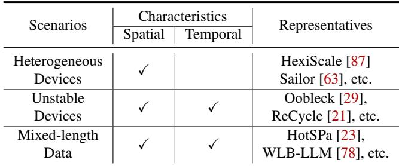

In short, these pervasive forms of heterogeneity fundamentally break the symmetry assumption of the standard SPMD paradigm and give rise to an urgent demand for asymmetric execution to effectively tackle heterogeneity.

Current solutions and limitations. As illustrated in Figure 1 (left), one alternative is the Multiple-Program Multiple-Data (MPMD) paradigm, which uses distinct programs to encode different execution logic. However, MPMD often suffers from limited scalability and user-friendliness, as discussed in §2.3. Consequently, most distributed DL training systems addressing heterogeneity still adhere to the SPMD paradigm. As summarized in Table 1, a wide array of recent studies have extended standard SPMD to specific heterogeneous scenarios, including: heterogeneous devices [31,41,61,63,71,84,87,90], unstable devices (i.e., elastic training) [3, 21, 29, 69], and mixed-length data [7, 22, 23, 33, 76, 78]. A common approach among them is to integrate custom schedulers (e.g., HexiScale’s heterogeneous pipeline scheduler [87], Oobleck’s elastic pipeline scheduler [29]) to enable asymmetric execution behaviors beyond standard SPMD, as shown in Figure 1 (middle). However, although these schedulers address heterogeneity in their respective scenarios, they are largely scenario-specific and built into the system with tight coupling to particular workloads. This design limits their flexibility and prevents them from serving as a general-purpose solution.

Our solution and contributions. Compared with prior caseby-case solutions, we propose HSPMD (Hierarchical and Heterogeneous SPMD) within Hetu v2, a system that addresses multifaceted heterogeneity from a more general and fundamental perspective. (i) Primitive-level extensions. As shown in Figure 1 (right), instead of layering extensive schedulerlevel efforts, HSPMD pushes extensibility down to the primitive level of declarative annotations. Specifically, we design the HSPMD sharding annotations (§4) and hierarchical communication resolution (§5), which enable asymmetric sharding and communication beyond SPMD’s inherent symmetry. While preserving SPMD’s core principle of separating the parallel strategy from a single programming view of the DL model, HSPMD’s primitives enable asymmetric execution natively, without the need for crafting scenario-specific schedulers. (ii) Characteristic-driven abstractions. Departing from prior work that categorizes solutions by application scenarios (Table 1), we revisit and disentangle heterogeneity through its intrinsic characteristics: spatial and temporal (detailed in §2.3). Spatial heterogeneity is due to the imbalanced workload and necessitates spatially heterogeneous parallel strategies (Figure 2), while temporal heterogeneity arises from dynamic workload changes and requires temporal reconfiguration across strategies (Figure 3). Accordingly, we introduce graph specialization (§6) and graph switching (§7), respectively. While these abstractions are scenario-agnostic individually, they serve as modular building blocks that can be composed into scenario-specific solutions, allowing HSPMD to generalize beyond single-purpose SPMD variants.

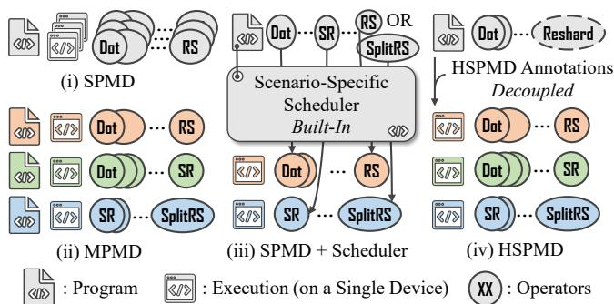  
Figure 1: Comparison of SPMD, MPMD, scheduler-enhanced SPMD variants, and HSPMD. While SPMD imposes strict symmetry, the others enable asymmetric execution to tackle heterogeneity.

In summary, this paper makes the following contributions.

• We introduce primitive-level extensions to break SPMD’s inherent symmetry, directly bridging single-device programming with heterogeneous parallelization.

• We present a general system design methodology that builds upward from fundamental heterogeneity characteristics, rather than starting from specific heterogeneous scenarios and customizing downward as in prior specialized systems.

• We evaluate HSPMD across diverse training scenarios, covering (a) heterogeneous devices, (b) unstable devices, and (c) mixed-length data. Empirical results show that HSPMD is at least on par with, and in most cases surpasses, state-ofthe-art SPMD systems and specialized SPMD variants.

## 2 Background and Motivations

## 2.1 Sharding and Communication in Training

As model sizes increase, the computational and memory resources of a single device become insufficient to support training, necessitating the adoption of distributed training. This introduces two critical challenges: (i) how to effectively manage the sharding of different training components across devices; and (ii) how to efficiently coordinate their communi-

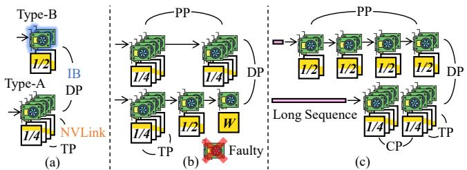  
Figure 2: Use spatially heterogeneous parallel strategies to tackle spatial heterogeneity in scenario (a)-(c). “DP, CP, TP, PP” represent Recfg. Recfg. Long Sequencedata, context, tensor, and pipeline parallelism, respectively. And DP DPscenarios (a), (b), and (c) refer to heterogeneous devices, unstable devices, and mixed-length data, respectively.

1/4 Faulty 1/2 W 1/4 1/4 1/4Next Stepcation. To address these challenges, a variety of parallelisms TP PP TP CPand distributed training techniques have been proposed.

Data sharding. Data parallelism (DP) [45, 91] shards the input data along the batch dimension, enabling different model replicas to process data simultaneously and synchronize gradients via all-reduce. For long sequences, techniques like sequence or context parallelism (SP [28] or CP [5, 47]) can be applied to further shard the sequence dimension. These require additional communication (e.g., all-to-all or ring-based send-receive) to ensure correctness of the attention [73].

Model sharding. Pipeline parallelism (PP) [24, 27, 35, 50, 57] shards model weights across layers, where activations are communicated between pipeline stages via send-receive. Besides, tensor parallelism (TP) [37, 51, 60] shards model weights along the hidden size dimension, requiring frequent all-gather and reduce-scatter on activations at each layer.

Optimizer states sharding. Optimizer states consume significant memory. ZeRO [58] fully shards them across devices, necessitating all-gather and reduce-scatter operations, while some other methods [8, 9, 43] use finer-grained sharding, balancing storage redundancy and communication costs.

These techniques are often combined [42,46,48,74,75,77], creating complex sharding and communication patterns that challenge system-level expression and handling at scale.

## 2.2 SPMD Training Systems

DL training can be modeled as a directed acyclic graph (DAG), where nodes represent operations and edges denote data dependencies. Tensors are the fundamental units flowing through the graph, carrying numerical values and metadata (e.g., shape, type). Operators transform input tensors into outputs (e.g., dot, attention). Following this, SPMD has emerged as a powerful paradigm (e.g., GSPMD [86], Alpa [92], Unity [72], DTensor [67,68]). As shown in Figure 4 (left), by specifying the DAG with declarative annotations, SPMD decouples the programming from the complexities of parallelization, enabling automatic derivation and accommodation for diverse sharding and communication patterns.

Limitations. Despite its advantages, the SPMD paradigm imposes strict symmetry constraints. First, existing SPMD annotations are confined to the uniform partitioning of tensors across regular device meshes. Additionally, SPMD-style collective communication primitives, such as all-reduce, allgather, and reduce-scatter, require symmetric participation from devices. These two constraints make it challenging for SPMD to handle asymmetric sharding and communication.

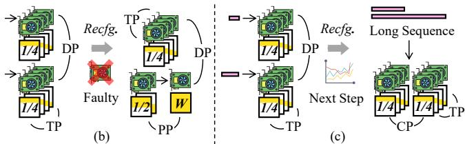  
Figure 3: For scenarios (b) and (c), beyond the spatial heterogeneity shown in Figure 2, heterogeneity may also evolve over time, demanding temporal reconfiguration between parallel strategies. (Scenario (a) is omitted because it exhibits only static spatial heterogeneity.)

## 2.3 Other Paradigms and Our Motivations

As mentioned earlier, both devices and data can induce heterogeneity, leading to scenarios such as: (a) heterogeneous devices, (b) unstable devices, and (c) mixed-length data.

MPMD vs. SPMD. Due to its symmetry constraints, SPMD is ill-suited for these diverse heterogeneous scenarios. As shown in Figure 1 (left), one alternative is the MPMD paradigm (e.g., Pathways [4], Ray [49]). However, MPMD is more suited for multi-task settings (e.g., RL for LLMs [44, 59]), where heterogeneity manifests across tasks. By contrast, in singletask training with intra-task heterogeneity, MPMD typically requires generating and managing thousands of distinct programs across a large cluster, incurring substantial compilation overheads [39] and leading to a poor user experience. As a result, the scalability and simplicity of the single-program paradigm in SPMD remain highly desirable at large scale.

Scheduler-enhanced SPMD variants. Consequently, many systems continue to build upon SPMD but integrate a highlevel scheduler to enable heterogeneous execution logic, as shown in Figure 1 (middle). While maintaining a single programming model, this approach requires workarounds to bypass SPMD’s inherent symmetry, which introduces extensive control and branching logic within the scheduler. More critically, these schedulers are built-in and scenario-specific, making such SPMD variants only applicable to a single scenario.

Motivations. This motivates a more principled approach beyond scheduler-level customization. Specifically, we ask: can SPMD itself provide intrinsic support for asymmetry? A natural direction is to extend its declarative annotations. Compared with built-in schedulers, this approach offers better decoupling, natively expresses asymmetric parallelization, and provides a unified substrate across diverse scenarios.

Moreover, prior work treats each heterogeneous scenario as an isolated case, requiring dedicated system mechanisms and ad hoc extensions, which is fundamentally unscalable. This motivates us to seek a more essential characterization that cuts across diverse scenarios. Specifically, we distill two fundamental dimensions underlying multifaceted heterogeneity: spatial heterogeneity and temporal heterogeneity (Table 1).

Spatial heterogeneity refers to workload imbalance at a given moment, calling for spatially heterogeneous parallel strategies. For example (Figure 2): (a) for heterogeneous devices, one can adopt a higher TP for memory-constrained GPUs and a lower TP for others; (b) for unstable devices, heterogeneous TP grouping and PP composition allow the remaining GPUs (e.g., 15 GPUs) to be fully utilized when one GPU fails; (c) for mixed-length data, GPUs can be partitioned into subgroups optimized for distinct sequence lengths (e.g., employing larger TP or CP for long sequences).

Temporal heterogeneity reflects workload variation over time, necessitating dynamic reconfiguration of parallel strategies. For example (Figure 3): (b) for unstable devices, when a GPU/node becomes unavailable, the overall parallel strategy must be reconfigured; (c) for mixed-length data, when the distribution of sequence lengths shifts across training steps (e.g., a step with very long sequences appears), reconfiguring to a strategy tailored for long sequences is essential to ensure better performance or to avoid out-of-memory (OOM) errors.

To this end, we introduce HSPMD within Hetu v2. (i) At the primitive level, as illustrated in Figure 4 (right), HSPMD extends SPMD to natively support asymmetric sharding (§4) and communication (§5), while preserving single-program semantics and collective operations. (ii) At the abstraction level, to address spatial and temporal heterogeneity, we propose graph specialization (§6) and graph switching (§7), enabling heterogeneous deployment and dynamic reconfiguration, respectively. Together, these innovations establish HSPMD as a general system for multifaceted heterogeneity.

## 3 HSPMD Design and Overview

In this section, we provide a walkthrough of HSPMD’s core design and workflow. As depicted in Figure 5 (left), following prior work [32, 45, 92], HSPMD adopts a graph-based representation. Users provide a single defined graph consisting of three types of operators: (i) Leaf operators (e.g., placeholders, parameters) that produce data, model parameters, or optimizer states; (ii) Reshard operators, introduced by HSPMD as ab stract markers to indicate potential resharding of intermediate results (e.g., gathering activations, resharding half-precision parameters); (iii) All other operators that encode the model’s computation logic. An annotation plan, either user-specified or generated by an external planner, is then associated with the defined graph. This plan assigns output sharding annotations (§4) to (i) leaf and (ii) Reshard operators, defining the initial sharding layout and resharding behavior of critical tensors, thereby collectively specifying the parallel strategy.

Given the defined graph and the annotation plan, HSPMD deduces the output sharding of (iii) all other operators and resolves how each Reshard operator can be concretely achieved by communication operators (e.g., reduce-scatter, all-gather) automatically (§5).1 Additionally, HSPMD will transparently handle the deployment and execution of parallel strategies, allowing users to write a single program by simply providing the defined graph (and optionally the annotation plan), without engaging in manual orchestration of distributed training.

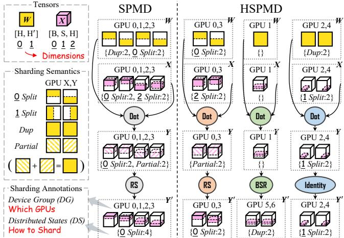  
Figure 4: Left: Standard SPMD-style sharding annotations (e.g., DTensor [67, 68]) and their deduction when employing DP and TP across GPU 0-3. They can only express symmetric sharding and communication. Right: An example of HSPMD expressing asymmetry: TP between GPU 0,3 and GPU 5,6; PP between GPU 1 and GPU 5,6; CP between GPU 2,4; and DP across them. “RS, BSR” represents reduce-scatter and batched-send-receive (§5.3), respectively.

HSPMD leverages two abstractions to tackle heterogeneity (Figure 5, middle). Firstly, to address spatial heterogeneity, where devices may require divergent execution logic, we introduce graph specialization (§6). Once the defined graph and annotation plan are in place, each device specializes its local operators, generating a device-specific executable graph for deployment and execution. Secondly, to address temporal heterogeneity, where the parallel strategy needs to be reconfigured, we introduce graph switching (§7). When a new annotation plan (e.g., changes in parameter sharding) is introduced, HSPMD facilitates seamless switching between parallel strategies by online resharding the necessary weights between executable graphs, without requiring a restart.

As illustrated in Figure 5 (middle and right), these two abstractions, graph specialization and switching, are modular building blocks that can be flexibly combined to accommodate diverse heterogeneous scenarios. (a) Heterogeneous devices (spatial heterogeneity only): An expert user or scenariospecific planner provides an annotation plan specifying a heterogeneous parallel strategy. Executable graphs are specialized once offline (line 1) and remain fixed throughout training (line 9). (b) Unstable devices (spatial + unknown temporal heterogeneity): The initial setup mirrors case (a). Upon triggering a reconfiguration (e.g., due to changes in device availability), an automatic planner generates a new annotation plan (line 5), and the system specializes new executable graphs at runtime (line 7). Graph switching then seamlessly transitions model and optimizer states (line 8), ensuring uninterrupted training (line 9). (c) Mixed-length data (spatial + predictable temporal heterogeneity): Users or planners prepare multiple annotation plans (line 0), each optimized for a particular sequence length distribution, with corresponding executable graphs pre-specialized offline (line 1). During training, the system dynamically selects and switches to the optimal plan when input distribution shifts (line 5-8).

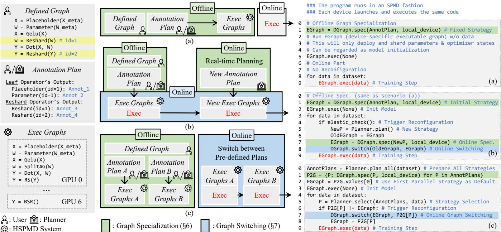  
Figure 5: HSPMD’s workflow and code snippets (DL operators align with Figure 4). Our system relies on two abstractions: graph specialization (§6), which generates device-specific executable graphs from a defined graph (provided by users) and an annotation plan (provided by users or planners); and graph switching (§7), which enables switching between arbitrary executable graphs. These two abstractions act as building blocks that can be flexibly applied to: (a) heterogeneous devices, (b) unstable devices, and (c) mixed-length data.

Although scenario-specific planners are needed (e.g., for annotation plan generation and selection), HSPMD is designed as a general framework to address diverse forms of heterogeneity, rather than to optimize automatic planning for a single scenario. Our focus is on introducing system core designs, while keeping the planner modular and easily replaceable. In the following, we first detail the sharding annotations (§4) and communication resolution (§5), which facilitate asymmetric sharding and communication, respectively. We then show how HSPMD addresses spatial heterogeneity with graph specialization (§6) and temporal heterogeneity via graph switching (§7). Finally, we briefly introduce HSPMD’s planners (§8).

## 4 Sharding Annotations

This section introduces HSPMD’s sharding annotations, which hierarchically extend SPMD-style annotations through a bottom-up approach to support asymmetric sharding. Compared to crafting high-level specialized schedulers on top of SPMD, this low-level extension enables SPMD itself to express asymmetry and generalize to diverse scenarios.

## 4.1 Basic SPMD-style Annotations

Following existing SPMD-style declarative annotations such as GSPMD [86] and DTensor [67, 68], we associate each tensor with two attributes: (i) Device Group (DG), which specifies the devices where the tensor resides; (ii) Distributed States (DS), which defines how the tensor is sharded across these devices. While some critical tensors (e.g., data, parameters, Reshard outputs) have their DG and DS explicitly specified by the annotation plan, others are deduced automatically.

As shown in Figure 4 (left), the DG is represented as an ordered list of GPU indices, and the DS is an ordered dictionary where the key dim corresponds to a logical distributed dimension (a virtual axis for sharding), and its corresponding value represents the number of shards along dim. Following previous works, there are three sharding semantics: (i) Split (dim ≥ 0), where the tensor is uniformly split along its physical shape dimension dim; (ii) Duplicate (dim = −1), where the tensor is fully replicated; (iii) Partial (dim = −2), where the tensor’s values are partially stored. These annotations come with inherent deduction rules. For instance in Figure 4 (left), given the annotations of W and X, the annotation of their Dot result can be derived: Y retains the same DG as the inputs, while its DS transforms the original split into partial.

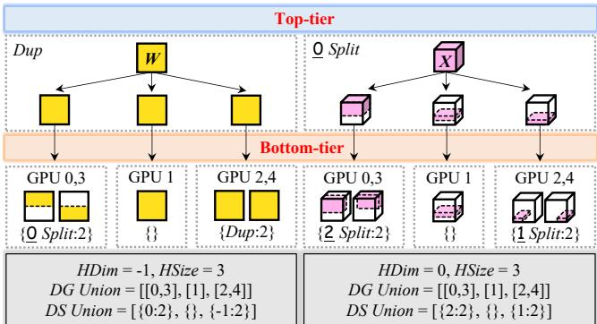  
Figure 6: HSPMD’s sharding annotations (aligned with Figure 4). The tensor is first sharded along the HDim dimension into HSize sharding subgroups. The devices in each sharding subgroup are given by the corresponding DG within the DG Union. And each sharding subgroup applies a DS from the DS Union. In this example, both W and X contain 3 sharding subgroups (HSize = 3).

## 4.2 Hierarchical & Heterogeneous Extensions

Building on basic SPMD annotations, we introduce hierarchical constructs to support asymmetric sharding, enabling heterogeneous execution logic as shown in Figure 4 (right).

(I) Device Group Union (DG Union) and Distributed States Union (DS Union). As illustrated in Figure 6, we generalize the single DG and DS associated with each tensor to multiple DG partitions and DS configurations, forming DG Union and DS Union. Each DS configuration in the union corresponds to a DG partition in the union, describing sharding within that particular device subgroup, referred to as a sharding subgroup.2 We term the sharding within each subgroup as bottom-tier sharding. This approach enables the simultaneous representation of multiple sharding patterns.

(II) Heterogeneous Dimension (HDim) and Heterogeneous Size (HSize). To model relationships between sharding subgroups in a union, we further introduce Heterogeneous Dimension (HDim) and Heterogeneous Size (HSize). As illustrated in Figure 6, HSize specifies the number of distinct sharding subgroups, while HDim describes the sharding across them. For instance, HDim = 0 for tensor X implies splitting the tensor’s first dimension across subgroups, while HDim = −1 for tensor W indicates full replication across subgroups. We refer to this as the top-tier sharding.

## 4.3 Discussions

HSPMD’s annotations can be viewed as a sharding extension layered atop standard SPMD annotations. Although this extension introduces additional system complexity, much of it remains hidden from the users’ view. For one thing, as introduced in §3, users only need to define a logical computation graph (defined graph) and optionally provide a small set of annotations (annotation plan), the rest can be automatically deduced by our system. For another, HSPMD’s annotation deduction can be decomposed into multiple standard SPMD deductions within each sharding subgroup, thereby simplifying the deduction procedure (this will be detailed in §6.1).

Readers might wonder whether it is more preferable to consider a more granular multi-tier hierarchy, or a simpler scheme that only shards data unevenly across devices. We discuss these two alternatives below.

• Why two-tier, not multi-tier: Introducing a multi-tier hierarchy is unnecessary. HDim and HSize at the top tier already suffice to express complex asymmetric shardings while keeping the added complexity minimal. Moreover, the twotier design matches how compute resources are organized in practice: a node or node group is internally load-balanced under SPMD, while heterogeneity exists across nodes or X: W:node groups. Adding further tiers would enlarge the planning space and deduction complexity without yielding additional expressiveness for today’s cluster deployment.

1 -Y:• Why not simply shard data unevenly: Sharding data alone, without a fundamental change at the annotation level, is insufficient. (i) For temporal heterogeneity, it is ineffective: when a GPU fails (Figure 3(b)), the TP/PP degrees must be reconfigured, which cannot be handled by data re-sharding alone. (ii) For spatial heterogeneity, it is suboptimal: under low inter-cluster bandwidth, heterogeneous DP requires exchanging full gradients, whereas heterogeneous PP only transfers activations for a single layer, with much smaller volume. Capturing such PP strategies requires annotationlevel support beyond simple data sharding.

Once tensor annotations are specified by the annotation plan or deduced by the system, HSPMD will determine the exact communication pattern for each Reshard operator and will instantiate it with device-specific communication operators that can be executed directly. The next section (§5) will describe how the asymmetric communication operators (e.g., BSR in Figure 4,5) are derived from the given annotations.

## 5 Hierarchical Communication Resolution

As depicted in Figure 7, to reshard from a source annotation to a destination one, we develop a comprehensive classification procedure to determine the appropriate communication operators. Aligning with the concepts of bottom-tier and toptier sharding, we classify communication into two categories: bottom-tier communication and top-tier communication. Bottom-tier communication operates independently within each sharding subgroup, determined solely by changes in bottom-tier sharding (§5.1). In contrast, top-tier communication requires interactions across sharding subgroups and is influenced by the entire annotation hierarchy (§5.2).

During this procedure, we prioritize the use of collective communication operators, decomposing asymmetric communication into multiple symmetric collective communications when possible. For one thing, collective communication libraries (CCLs) have been extensively optimized [13, 26, 40, 54], often achieving higher performance than hand-crafted kernels. For another, modern GPU cluster network topologies (e.g., Multi-rail [1, 2], Clos [80]) are typically organized into multiple tiers [19], which aligns well with our hierar chical design. Specifically, (i) bottom-tier communication within sharding subgroups is usually operated on homogeneous devices (intra-machine or inter-machine with uniform links, typically high bandwidth) and can exploit fast symmetric collective primitives, whereas (ii) top-tier communication handles potentially heterogeneous inter-subgroup links (e.g., IB/TCP mixtures, often slower). When collective communication is infeasible, we develop a batched-send-receive (BSR) operator (§5.3) to accomplish sophisticated communications.

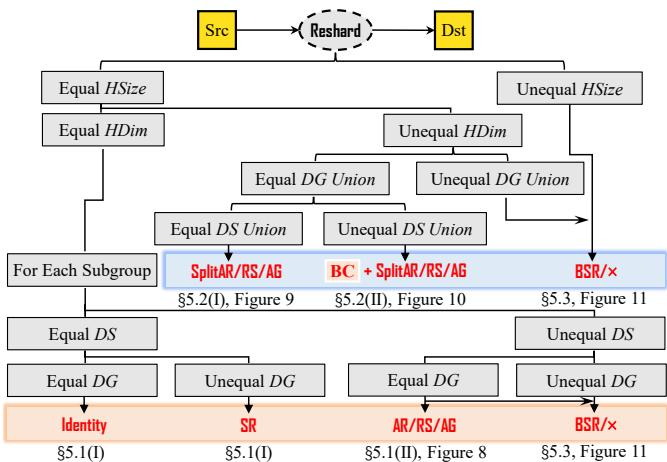  
Figure 7: HSPMD’s communication resolution. Orange denotes bottom-tier communication, executed independently within sharding subgroups; blue indicates top-tier communication, involving interactions between sharding subgroups. “SR”: send-receive; “AR, RS, AG”: all-reduce, reduce-scatter, all-gather; “BSR”: batched-send-receive; “×”: unsupported; “BC”: bottom-tier communication.

## 5.1 Bottom-tier Communication

When the source and destination annotations share the same HSize and HDim, it implies that the top-tier sharding remains unchanged. Consequently, all sharding subgroups can individually perform communication, typically reducing to standard SPMD resolution. As illustrated in Figure 7, for each sharding subgroup, we consider the following cases:

(I) Subgroup’s source DS equals destination DS. We then determine whether the DG changes from the source to the destination, in which case each corresponding device executes either an Identity or send-receive (SR) operator to directly transfer the local shard.

(II) Subgroup’s source DS does not equal destination DS. If the source and destination share the same DG, the device composition of the subgroup is unchanged, and only intra-subgroup resharding is required. As shown in Figure 8, we analyze the DS to select the appropriate collective operator, e.g., all-reduce (AR), reduce-scatter (RS), or all-gather (AG).

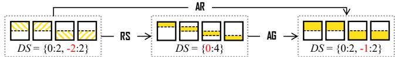  
Figure 8: Bottom-tier collective communication.

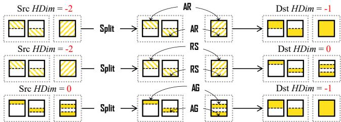  
Figure 9: Top-tier collective communication. In scenarios where only HDim is altered, each shard can be split to the finest granularity, followed by multiple collective communication operators.

BSR TablePU 9,2 GPU 1If these collective communication conditions are unmet, Owned Slice Required BSor if the DG differs, the system will instead employ batched-GPU 1,9 GPU 1Finest- Heuristic- Nsend-receive (BSR). Its mechanism will be detailed in §5.3.

## Slices GPU 1,25.2 Top-tier Communication

GPU 1,2 GPU 0 GPUNext, we examine the scenario where the HSize of the source matches that of the destination, but their HDim values differ. If the DG Union of the source is identical to that of the destination (i.e., every DG in the union is equivalent), the Src HDim = -2 Dst HDim = -1Mid HDim = -2transformation between the source and the destination can still be efficiently realized using collective communication SplitARDS = {-2:2} DS = {} DS = {0:2} DS = {}operators. We analyze the following two cases:

(I) Source DS Union equals destination DS Union. In RS Identitythis case, only the HDim changes between the source and destination. As depicted in Figure 9, the transformation can be achieved through three distinct operators: split-allreduce (SplitAR), split-reduce-scatter (SplitRS), and splitall-gather (SplitAG). The process starts by identifying the finest-grained slices of all sharding subgroups. Subsequently, based on the HDim change, collective communication is performed across these sharding subgroups for each slice, while maintaining the bottom-tier sharding within each subgroup.

(II) Source DS Union does not equal destination DS Union. As illustrated in Figure 10, in this case we first use bottom-tier communication (e.g., RS, Identity) to align the DS Union, reducing the problem to (I). We then apply top-tier communication (e.g., SplitAG) to align the HDim.

For scenarios where the DG Unions of the source and the destination are not identical, or where the HSize values differ, we once again resort to the BSR operator (§5.3).

## 5.3 Batched-Send-Receive Mechanism

When it does not involve Partial, any complex resharding can be decomposed into multiple send and receive operators, referred to as batched-send-receive (BSR), which is particularly useful for handling complex communication patterns that cannot be supported by collective communications.

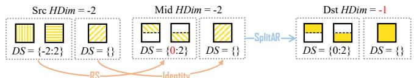  
Figure 10: Top-tier collective communication succeeded by bottomtier communication. In scenarios where both HDim and DS Union are modified, we first align the DS within each sharding subgroup, followed by aligning the HDim across different sharding subgroups.

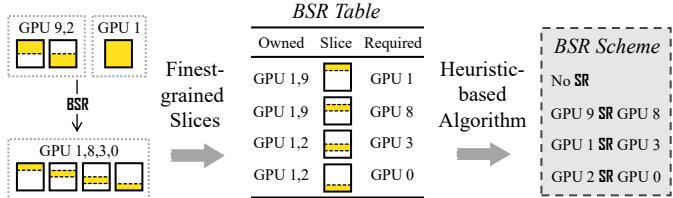  
Figure 11: Batched-Send-Receive (BSR) mechanism. Based on the annotations of the source and destination, we construct a BSR table and subsequently generate the BSR scheme for communication.

DS = {-2:2} DS = { } DS = {0:2} DS = { }DS = {0:2} DS = { }As depicted in Figure 11 (left), we begin by identifying the finest-grained slices, based on which we construct a BSR table that maps each slice to its owner devices and the devices that require it. Subsequently, a BSR scheme is generated to describe how the slices are transmitted. Particularly, as illustrated in Figure 11 (right), we generate the BSR scheme by sequentially scanning the BSR table and applying the following heuristics: (i) If the slice is already owned, we perform a direct copy without communication; (ii) We prefer links with higher bandwidth (e.g., GPU 9 sending to GPU 8 via NVLink); (iii) If bandwidths are equal, we balance the cumulative send load (e.g., GPU 1 and GPU 2 send alternately).

Discussions. Since each slice may have multiple senders (owner devices) and receivers (required devices), deriving the optimal BSR scheme necessitates solving a Generalized Assignment Problem (GAP) [81], which is NP-hard. Our heuristic approach reduces the solving complexity to O(pq), where p is the number of entries in the BSR table and q is the maximum number of receivers per entry. Here, p corresponds to the partition granularity of the finest-grained slices (e.g., p = 4 in Figure 11) and does not increase with cluster scale, since scaling is typically achieved by replication along the DP dimension rather than finer per-tensor partitioning. As a result, the solver remains tractable even at a large scale.

Our solver models only P2P bandwidth, which may be insufficient under highly heterogeneous network topologies. In such cases, a single P2P transfer may traverse multiple physical links, and the true bottleneck can reside in a specific link along the path. A more fine-grained model that captures per-link characteristics could better expose such intra-path bottlenecks. However, in practice, the BSR overhead is already small relative to computation (see §10), suggesting that further optimizing the solver would yield limited benefits. Overall, though our heuristic-based algorithm may not achieve the optimal, it is more practical and easier to implement, with strong performance and low overhead (see §10).

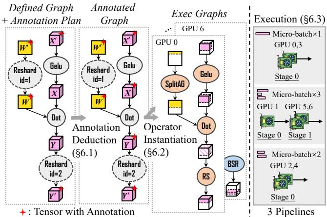  
Figure 12: HSPMD ’s graph specialization. We systematically deduce and parse annotations from a unified defined graph, transforming it into device-specific execution logic to support heterogeneous parallelization. The annotations remain consistent with Figure 4.

Last but not least, BSR is infeasible when Partial is involved. However, in practice, Partial tensors are typically intermediate results associated with collective communication, which can be handled by other top-tier or bottom-tier communication mechanisms. Given that complex resharding for Partial tensors is generally unnecessary, we omit such scenarios, yet our work can be easily extended by integrating BSR with allreduce (when source involves Partial) or numeric division (when destination involves Partial).

## 6 Progressive Graph Specialization

In this section, we detail the abstraction of graph specialization that tackles spatial heterogeneity. As shown in Figure 12, the process starts from a defined graph with initial annotations specified by the annotation plan (i.e., the output sharding of leaf and Reshard operators). We then propagate these annotations to all remaining tensors, resulting in a fully annotated graph (§6.1). Next, we resolve the concrete communication of Reshard (as detailed in §5) and instantiate device-specific operators to generate distinct executable graphs for each device (§6.2), which are then deployed for pipelined execution (§6.3). Starting from a single-program abstraction, this specialization process incrementally derives divergent execution logics across devices, enabling the expression of heterogeneous parallel strategies that address spatial heterogeneity.

## 6.1 Annotation Deduction

As shown in Figure 12, we start by deducing the unspecified annotations (e.g., the output tensor X of Gelu and the output tensor Y of Dot). For simple unary operators like Gelu, the input tensor’s annotation is straightforwardly propagated to the output. However, more complex operators, such as Dot, require a more intricate deduction process. Below, we outline the general methodology of annotation deduction.

DS (in DS Union) Deduction  
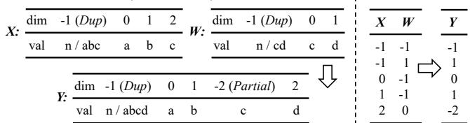  
Figure 13: The deduction rules of DS Union and HDim for a 3D × 2D Dot operator. n is the number of GPUs in the sharding subgroup and a-c are values along different sharding dimensions.

Deduction of DG Union and HSize. For any standard operator, the output tensors inherit the same DG Union and HSize as the inputs. This requirement stems from a semantic constraint enforced by HSPMD: all inputs and outputs of an operator must have matching DG Union and HSize, ensuring that the operator executes locally on its assigned device, consuming inputs to produce outputs without implicit crossdevice resharding. For multi-input operators with mismatched DG Union or HSize, users must explicitly insert Reshard operators before certain inputs to resolve the discrepancy.

Deduction of DS Union and HDim. The deduction of DS Union and HDim depends on the specific characteristics of each operator and is governed by the rules of distributed computation. To illustrate this process, we analyze the Dot operator, which takes a 3D tensor X and a 2D tensor W as inputs, as a concrete example. In the DS Union deduction process (Figure 13, left), since the DG Union and HSize are aligned, the deduction simplifies to sequentially deriving the DS for each sharding subgroup. This mirrors the SPMD deduction, where sharding values for X, W , and Y are derived using straightforward, rule-based logic. As for HDim deduction, top-tier sharding is essentially a simplified 1D sharding, following a similar rule-based logic. For example, as shown in Figure 13 (right), if X has a HDim of 0 and W has a HDim of -1, the output tensor Y retains a HDim of 0, preserving the heterogeneous top-tier Split after the Dot operator.

Discussions. We support annotation deduction for a wide range of operators. As shown in Table 2, for the vast majority, the annotation is propagated from inputs to outputs without modification. Deviations from this default behavior are limited: only Reshard may alter DG Union and HSize, while changes to DS Union and HDim are confined to a few specific operators (e.g., Dot) that inherently transform sharding patterns and thus employ custom deduction logic. This design, where most operators reuse a common propagation procedure, allows HSPMD’s deduction to be efficient and scalable.

## 6.2 Operator Instantiation

Upon obtaining the annotations for all tensors, we instantiate a unique executable graph for each device. This process primarily consists of two key steps.

Non-Local operator removal. First, operators whose inputs and outputs do not involve the local device in their DG Union are excluded from its executable graph. For instance in Figure 12, since no tensors prior to Y ′ are placed on GPU 6, all operators except Reshard (id=2) are removed. This pruning step is essential for enabling pipeline execution (§6.3).

Table 2: Operator annotation deduction behaviors.  
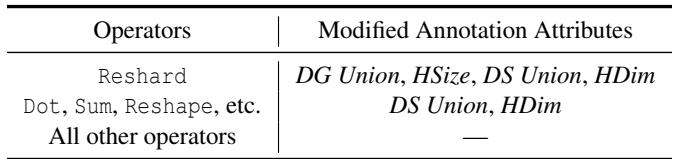

Reshard instantiation. For all remaining Reshard operators, we apply the hierarchical communication resolution (§5) to instantiate them with the exact communication operators.

(I) Bottom-tier communication. For bottom-tier communication, each sharding subgroup independently determines its communication operator and instantiates it accordingly: In Figure 12, Reshard (id=2) is classified as bottom-tier, leading GPU 0 and GPU 6 (belonging to different sharding subgroups) to instantiate it with RS and BSR, respectively.

(II) Top-tier communication. For operators classified as top-tier, all GPUs in the DG Union apply the same instantiation logic: In Figure 12, Reshard (id=1) is identified as SplitAG and uniformly instantiated on GPU 0–4.

## 6.3 Execution

At runtime, operators in the executable graphs are not invoked directly. Instead, they are organized into pre-/post-processing steps and forward/backward passes, which are repeatedly scheduled in a pipelined fashion. HSPMD supports various scheduling strategies (e.g., GPipe [27], 1F1B [50]) and allows pipelines to independently process different micro-batch counts and sizes (Figure 12, right). While the annotation plan defines the sharding patterns and indicates the Reshard behaviors (Figure 5, line 1), the concrete shapes of the input data and the intermediate tensors (e.g., tensors to be communicated) are determined dynamically on each device at runtime (Figure 5, line 9), independent of the static executable graphs. This decoupling between graph specialization and runtime execution enables flexible pipeline scheduling and supports variable-length inputs. Due to the space constraint, we refer interested readers to Appendix A.2 for more details.

## 6.4 Discussions

Below we summarize the data structures maintained per device (i.e., GPU). Following the SPMD paradigm, HSPMD runs one process per device, and each process independently maintains its own copy of: (i) a device-agnostic defined graph of the user program, (ii) a device-agnostic annotation plan, (iii) the corresponding device-specific executable graph derived via graph specialization, (iv) operator metadata, including the BSR tables for all BSR operators in its executable graph.

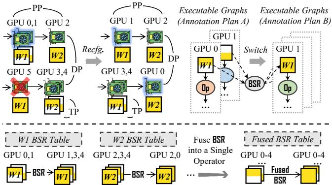  
Figure 14: Top: Online reconfiguration is achieved by transforming weight annotations using BSR across executable graphs. Bottom: Fusing BSR into a single operator further enhances efficiency.

Among these, (i) and (ii) are identical in content across processes, while (iii) and (iv) are unique to each process. Since these structures encode only parallelization and execution logic (excluding model parameters and activations), each process keeps them in the CPU DRAM of its host. In practice, they occupy only a few MiB per CPU host.

## 7 Dynamic Graph Switching

HSPMD’s graph specialization abstraction addresses spatial heterogeneity by generating device-specific parallel execution logic given an annotation plan. However, temporal heterogeneity, which evolves over time, demands dynamic reconfiguration of the overall parallelization. This necessitates switching from one annotation plan to another (Figure 5(b),(c)).

As illustrated in Figure 14 (top), to enable fast reconfiguration, we avoid reloading from checkpoints under the new sharding format. Instead, we reshard the weights from the old executable graphs by leveraging the high interconnect bandwidth among devices. Since weight annotations do not involve Partial, each weight can be directly resharded using the BSR operator (§5.3) to bridge the old and new plans.

To further optimize communication, rather than executing a separate BSR operator for each weight, we consolidate all BSR tables into a fused one (Figure 14, bottom), so that the corresponding fused BSR scheme can balance the communication load across all GPUs. Moreover, we fuse multiple send-receive operators between the same GPU pair into a single operator, significantly reducing kernel launch overhead. By executing this Fused BSR operator, the system can therefore efficiently transition to the new annotation plan and resume execution without restart or checkpoint reloading

Discussions. A natural concern is whether maintaining the data structures of different parallel strategies (i.e., multiple plans and graphs) incurs prohibitive overhead as the system scales to large and heterogeneous clusters. The answer is no.

A key observation is that the number of strategies is independent of cluster scale or heterogeneity. For unstable devices, only a single strategy is maintained at any time, as the previous one is discarded after each reconfiguration. For mixed-length data, we pre-generate a set of strategies, each optimized for a specific maximum sequence length (e.g., one for batches with maximum length up to 16K and another up to 32K), and select the appropriate strategy at runtime based on the actual maximum sequence length of each batch. As a result, the number of strategies scales only with the granularity of the maximum-sequence-length partitioning, rather than with the cluster itself. Consequently, the overall maintenance overhead remains bounded regardless of cluster scale or heterogeneity.

## 8 HSPMD’s Planner

This section presents the key implementation aspects of HSPMD’s planner, which automatically generates annotation plans and thus frees users from constructing them by hand. In HSPMD, the planner is treated as an external component that can be readily replaced by alternative implementations.

Cost model and plan generation. Following existing works on automatic parallelism [48, 72, 92], our default implementation adopts a profiling-based approach, building a cost model for each operator on each hardware resource: for example, a compute operator (e.g., Attention) on a specific device (e.g., H20 or H800 GPU), or a communication operator (e.g., AR, BSR) on a given interconnect (e.g., NVLink or IB). We profile representative configurations (e.g., model sizes, tensor parallel degrees, input lengths) and fit cost models. To evaluate a plan, the planner decomposes its dataflow into operators and aggregates their predicted costs. Based on these estimates, it generates optimized annotation plans using ILP, MINLP, or dynamic programming, implemented with PuLP [65] and Pyomo [6]. Details are deferred to Appendix A.1.

Overhead of the planner. An annotation plan is a JSON dictionary with negligible storage cost. The planning consists of an offline phase (pre-generation) and an online phase (generation or selection). As shown in Figure 5, the offline phase runs before the training loop and is therefore off the critical path, while the online phase depends on the scenario: (a) heterogeneous devices require no online planning, (b) unstable devices trigger only a single re-generation upon cluster changes; (c) mixed-length data uses pre-generated plans with lightweight online selection. The overhead is therefore well controlled, with a detailed breakdown provided in Appendix A.1.

Generalizability to evolving models and clusters. The cost model is operator-centric rather than configuration-specific, so it generalizes naturally across model architectures and cluster settings. Model structural properties (e.g., layer count) and cluster factors (e.g., device count and topology) therefore do not affect it. Re-profiling is only required when new operators or new hardware resources are introduced (e.g., a new

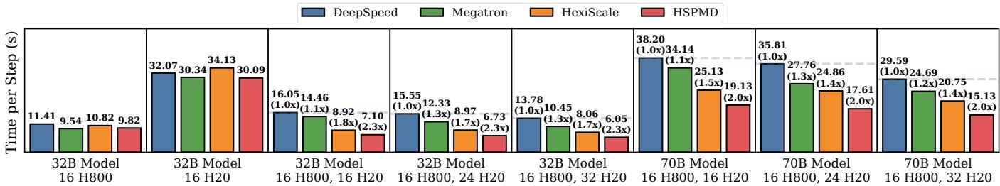  
Figure 15: Scenario (a): Training performance across different device configurations and model size.  
compute operator, a new GPU type, or a new interconnect).

Sensitivity to annotation plan quality. End-to-end performance is directly influenced by the quality of the annotation plan. Nevertheless, a clear lower bound is always guaranteed: in the extreme case, the planner can fall back to a fully homogeneous strategy, under which HSPMD reduces to standard SPMD execution. Since our goal is to establish HSPMD as a general and flexible framework for heterogeneous execution rather than to optimize scenario-specific planners, improving planner optimality is left to future work.

## 9 Evaluations

In this section, we evaluate HSPMD under three representative scenarios: (a) heterogeneous devices, (b) unstable devices, and (c) mixed-length data (the workflow of each is depicted in §3). Our evaluation aims to answer two central questions:

• How does HSPMD outperform standard SPMD in the presence of diverse spatial and temporal heterogeneity?

• Why does extending low-level declarative annotations, as in HSPMD, provide greater effectiveness than relying on high-level schedulers, as in other SPMD variants?

Baselines. As shown in Table 3, we select two categories of baselines. The first category includes standard SPMD training systems: (i) DeepSpeed [28, 58], which supports DP (with ZeRO-series) and SP; (ii) Megatron [37, 51, 60], which supports DP (with ZeRO-1), TP, PP, and CP. The second category consists of scenario-specific systems that enhance SPMD with dedicated schedulers: (iii) HexiScale [87], a framework built on top of Megatron, employing a heterogeneous GPipe [27] scheduler to support varying pipeline stages and TP degrees across stages; (iv) Oobleck [29], an elastic training framework that maintains fault tolerance with pre-defined pipeline templates, and features a scheduler for dynamic reconfiguration by merging and borrowing resources between pipeline templates; (v) HotSPa [23], which utilizes a hot-switchable scheduler to reconfigure between several pre-defined homogeneous strategies (DP, TP, PP) to handle sequences of varying lengths, without incurring the overhead of cold-start.

Experimental setup. Our testbed consists of 16 H800 and 32 H20 GPUs (detailed in Appendix C.1). Given that LLMs represent the most significant DL workload today, and that existing baselines predominantly focus on LLMs, our evaluation centers on them as well. We adopt the widely-used Llama architecture [70] in various model sizes, with a default context length of 4K and a global batch size of 64, measuring per-step training time. All baselines are carefully tuned to their optimal performance. For HSPMD, we employ profiling-based planners (detailed in Appendix A.1) to generate and select the annotation plan. Strategies are provided in Appendix C.

Table 3: Baselines: Two scenario-agnostic SPMD systems, and three scheduler-enhanced SPMD variants designed for specific scenarios.  
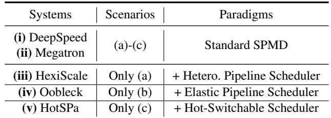

(a) Heterogeneous devices. We first evaluate performance under static spatial heterogeneity through experiments on heterogeneous devices. As shown in Figure 15, on homogeneous devices, all systems perform similarly, confirming that performance differences do not stem from engineering artifacts. On heterogeneous devices, however, HSPMD consistently outperforms the baselines. DeepSpeed and Megatron are constrained by symmetric sharding, which hinders workload balance on devices with varying capabilities. HexiScale, on the other hand, has two key limitations: (i) its built-in scheduler tightly couples the heterogeneous parallel strategy specification with execution, making it difficult to flexibly support complex pipeline scheduling schemes like 1F1B; and (ii) its scheduler lacks support for generalized asymmetric communication, relying instead on coarse-grained broadcasts. In contrast, HSPMD leverages declarative annotations, which decouple heterogeneous specifications from automatic pipeline execution (§6.3) and enable hierarchical communication con structs (§5), thus facilitating flexible pipeline scheduling and efficient communication, resulting in improved performance.

(b) Unstable devices. We next evaluate elastic training performance under spatial and unknown temporal heterogeneity. Notably, DeepSpeed and Megatron employ a checkpoint-andrestart approach upon reconfiguration and use optimal training strategies under each configuration. Both HSPMD and Oobleck [29] disable ZeRO-1 [58] to retain DP-dimension redundancy for recovery without checkpoint-and-restart. This design is common across fault-tolerant training systems (including other recent works like Recycle [21]). Thus, both our generalized system and the specialized baseline inherently trade some training performance for fault tolerance. As shown in Figure 16, we conduct experiments training a 32B model using two traces, each incorporating GPU and node failures.

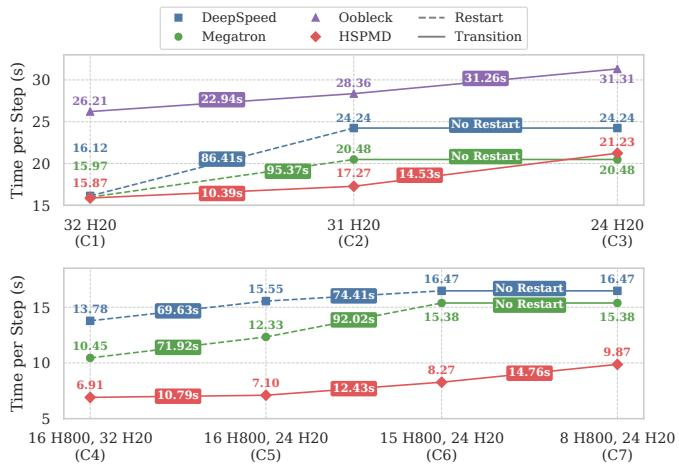

Figure 16: Scenario (b): Elastic training traces on homogeneous and heterogeneous clusters. We annotate the per-step training time for each configuration, along with the reconfiguration overhead.  
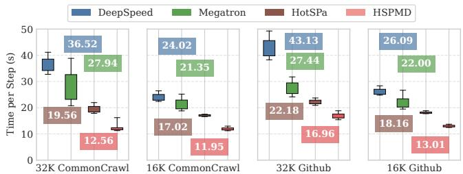  
Figure 17: Scenario (c): Training performance with mixed-length data using different context lengths and datasets on 32 H20 GPUs. Box plots show time distributions with mean values annotated.

Upon a GPU failure, DeepSpeed and Megatron are constrained by their symmetric sharding and must discard the entire node (spatial). In contrast, HSPMD can leverage all remaining GPUs, leading to improved performance (e.g., C2). Moreover, their significant restart overhead further makes them less suitable for elastic environments (temporal).

On the other hand, Oobleck enables restart-free reconfiguration but underperforms compared to other systems because its elastic pipeline scheduler confines fault tolerance strategies to predefined pipeline templates. By comparison, HSPMD employs tensor-level declarative annotations rather than rigid pipeline-level templates to specify parallelization, which enables exploration of a much broader strategy space. Furthermore, while Oobleck’s elastic scheduler only supports naïve model broadcasting during reconfiguration, HSPMD ’s declarative annotations allow more general per-tensor send-receive analysis to form a more balanced Fused BSR (as evaluated in §10), significantly reducing reconfiguration overhead.

(c) Mixed-length data. Finally, we evaluate the mixed-length data scenario to assess performance under spatial and predictable temporal heterogeneity. We train a 32B model for 100 steps on CommonCrawl and GitHub datasets using 32 H20 GPUs with a batch size of 200K tokens, testing different context lengths (32K and 16K). As baselines, DeepSpeed and Megatron pack mixed-length sequences into the fixed context window, truncating any excess [38]. HotSPa also employs data packing and additionally switches between pre-defined strategies for different length intervals. Results are shown in Figure 17, while Figure 18 illustrates a specific case: HSPMD pregenerates two heterogeneous strategies—Strategy A, which is slower but handles longer sequences, and Strategy B, optimized for shorter ones. HSPMD dynamically selects and switches between them across training steps (as depicted in Figure 5(c)). All reported per-step timings include strategy reconfiguration overhead for both HotSPa and HSPMD.

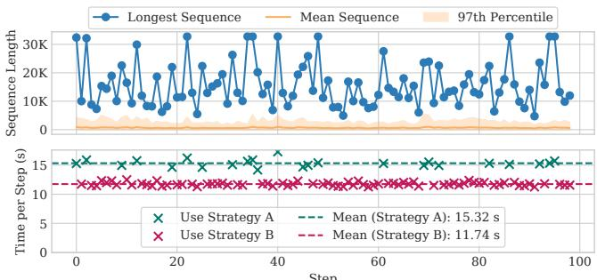  
Figure 18: Sequence length variation and strategies employed by HSPMD in the “32K CommonCrawl” case. HSPMD dynamically switches between heterogeneous strategies (A and B) across different steps to optimize performance when sequence lengths shift.

DeepSpeed and Megatron, constrained by the symmetric nature of SPMD to a fixed homogeneous strategy, perform poorly because most sequences are much shorter than the context limit (97% < 8K in Figure 18), making long-contextoriented strategies inefficient for packed short sequences. While HotSPa’s hot-switchable scheduler allows dynamic adjustment to length-tailored parallel strategies in the temporal dimension, it remains constrained by the symmetry of SPMD and cannot support spatially heterogeneous parallel strategies. This leads to lower performance compared to HSPMD, which addresses both spatial and temporal heterogeneity through a unified abstraction of extended declarative annotations.

Summary. Our evaluation across diverse scenarios reveals two findings: (i) standard SPMD is inadequate for tackling heterogeneity, and (ii) scheduler-enhanced SPMD variants can address specific scenarios but have intrinsic limitations. First, compared to primitive-level extensions, addressing heterogeneity at the scheduler level is coarse-grained, which constrains the design space of heterogeneous strategies and the flexibility of strategy reconfiguration (e.g., HexiScale cannot support flexible pipeline schedulers, Oobleck relies on fixed pipeline templates, and HotSPa uses rigid homogeneous strategies), thereby limiting their performance. More importantly, these approaches work around SPMD’s symmetry by building a top-down system stack tailored to particular scenarios, making them effective only in isolated cases. In contrast, HSPMD introduces low-level extensions on declarative annotations, directly bridging the gap between SPMD’s symmetric nature and the asymmetric demands of heterogeneous environments. This enables a versatile, bottom-up system stack that provides general solutions across diverse scenarios.

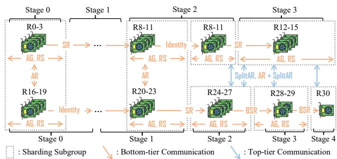  
Figure 19: Parallel strategy employed in C2. “R” represents rank.

## 10 Case Study

In this section, we provide an in-depth analysis of HSPMD’s components, using the C2 configuration and the C1-to-C2 reconfiguration process (in Figure 16) as key examples.

Strategy deployment and communication resolution. Figure 19 shows HSPMD ’s deployment and communication patterns under C2 (31 H20 GPUs), forming two independent pipelines. Most stages use 4 GPUs, except the last two in the second pipeline, which use 2 and 1 GPU(s). Within each stage, TP is applied via AG and RS (§5.1(II)). And inter-stage communication within a pipeline employs SR (§5.1(I)) or BSR (§5.3). For cross-pipeline gradient synchronization, AR (§5.1(II)), SplitAR (§5.2(I)), and subgroup-specific AR following SplitAR (§5.2(II)) are used. Besides, we also provide the loss curves of C1 and C2 in Appendix B, which further confirm that the heterogeneous strategy and the introduced communication operators do not affect convergence.

Strategy execution time breakdown. We then analyze the per-step computation and communication time for each rank in C2. Figure 20 (left) contrasts ranks 0 and 29, which follow asymmetric execution logic, against rank 0 in the homoge neous C1 as a reference. The results reveal that: (i) the heterogeneous strategy achieves balanced workload distribution across ranks; and (ii) similar to the homogeneous strategy, computation remains the dominant runtime component. The additional overhead introduced by SplitAR and BSR is minimal, indicating that HSPMD’s asymmetric communication does not incur significant performance degradation.

Strategy reconfiguration overhead. We eventually evaluate the overhead of reconfiguring from C1 to C2, which consists of three sequential phases (Figure 5(b)): planning (Appendix A.1), graph specialization (§6), and graph switching (§7). As shown in Figure 20 (right), the planner generates the annotation plan with minimal latency. Graph specialization then follows, dominated by operator instantiation (§6.2), which involves adjusting the graph and creating new CCL communication groups but typically completes within 10s, while the cost of annotation deduction (§6.1) is negligible.

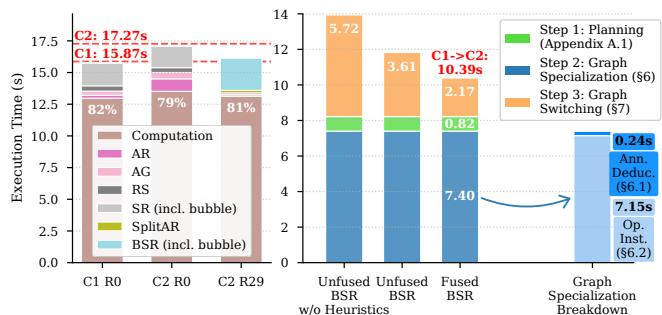  
Figure 20: Left: Time per step breakdown for homogeneous (C1) and heterogeneous (C2) parallel strategies. Right: Reconfiguration overhead from C1 to C2 with different BSR algorithms.

Table 4: Distribution of C1-to-C2 communication volume under different BSR algorithms. We show the total communication volume each rank sends via NVLink and InfiniBand (IB).  
Format: Sender Rank ID: NVLink Vol. (MB) | IB Vol. (MB)  
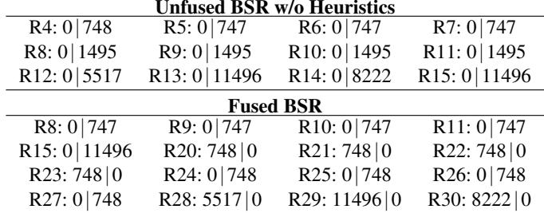

As for graph switching, we compare three BSR algorithms: (i) A baseline without heuristics (using minimal rank IDs for broadcasting); (ii) Non-fused per-tensor BSR with heuristics; (iii) Our fused BSR. Results show that our approach achieves the lowest end-to-end switching overhead despite maintaining the same total communication volume. As shown in Table 4, this improvement stems from evenly distributed traffic across ranks and better utilization of high-bandwidth NVLink.

## 11 Discussions and Future Work

In this section, we discuss two additional aspects of HSPMD: (i) its support for Mixture-of-Experts (MoE) models under expert imbalance, and (ii) its interoperability with existing SPMD frameworks. Both represent promising directions enabled by HSPMD’s design, which we leave to future work.

Support for MoE and expert imbalance. MoE models are typically trained with expert parallelism (EP) [39], which shards experts across devices, but they often suffer from load imbalance due to skewed token routing. A representative mitigation is EPLB [14], which replicates heavily loaded experts to distribute the workload. HSPMD naturally supports such strategies through its two-tier sharding annotations: at the top tier, HSPMD applies Split on the hidden-size dimension to split across different experts, and at the bottom tier, it uses different Dup degrees to replicate different loaded experts. When expert workloads shift substantially during training, HSPMD can reconfigure the overall annotation plan via graph switching, without requiring any further extension.

Interoperability with existing SPMD frameworks. Any prior annotation-based SPMD framework (e.g., Alpa [92], GSPMD [86], and DTensor [67, 68]) can be extended to support HSPMD’s annotations by adding one additional tier on top of its existing SPMD annotations, which amounts to introducing two extra attributes (HDim and HSize) and promoting the original annotation structure to a list of such structures. On top of this, HSPMD’s communication resolution, graph specialization, and graph switching mechanisms can be plugged in to enable heterogeneous parallelization, while the framework’s existing parallelization primitives (e.g., operator-level sharding rules, automatic annotation deduction, and its standard parallelism implementations such as DP, TP, PP, and CP) can be reused as-is. By contrast, frameworks that realize parallelism by specifying particular layers, such as Megatron [60] and DeepSpeed [58], are harder to build HSPMD on top of, since they do not expose a unified, operator-level annotation surface and instead rely on ad-hoc, per-layer specifications (e.g., ColumnParallelLinear).

## 12 Related Work

## 12.1 Tackling Workload Heterogeneity

Recent works have tackled workload heterogeneity in largescale DL training through scenario-specific optimizations.

(a) Heterogeneous devices. HAP [90] uses a sharding ratio to handle uneven TP partitioning. Whale [31] partitions workloads by splitting the global graph into heterogeneous task graphs. AMP [41] and HetHub [84] support heterogeneous layer partitioning in PP, while Metis [71] extends Alpa [92] for heterogeneous strategy search. HexiScale [87] enables more fine-grained heterogeneous 3D parallelism, and Sailor [63] further optimizes the search cost for such strategies.

(b) Unstable devices. Varuna [3] uses checkpoint restarts and adjusts DP and PP to find optimal strategies after failures. Bamboo [69] achieves fault tolerance via redundant storage on adjacent pipeline stages, Oobleck [29] employs multiple pipeline templates for fault tolerance and strategy tuning, and ReCycle [21] rebalances the workload from failed pipelines.

(c) Mixed-length data. FlexSP [76] uses dynamic SP for varied sequences, while ByteScale [22] and DCP [33] adopt dynamic CP. HotSPa [23] assigns homogeneous strategies to different length intervals. WLB-LLM [78] addresses load imbalance specifically in CP and PP, while Zeppelin [7] achieves finer-grained control over attention and NIC imbalance.

In contrast to these specialized solutions, HSPMD introduces a unified abstraction via low-level declarative annotations instead of high-level schedulers. This design offers greater generality and could serve as a foundational substrate for addressing diverse heterogeneity. Furthermore, prior works have proposed planning algorithms tailored to targeted scenarios, which can be seamlessly integrated with our work by encoding their strategies through our annotations.

## 12.2 SPMD and MPMD Training Systems

Beyond the SPMD training systems discussed above, another line of work adopts the MPMD paradigm, such as Pathways [4], JaxPP [82], and Piper [20]. One motivation behind their MPMD design is the observation that pipeline parallelism (PP) is not inherently SPMD, as different devices naturally execute different model stages. Nevertheless, SPMD remains the dominant paradigm in mainstream training systems for its scalability and simplicity (see §2.3), and PP is typically encoded in an SPMD style, where devices share a global program but diverge at runtime. For example, GSPMD [86] treats PP as layer-wise sharding, while Megatron [60] employs a light scheduler to execute subgraphs. HexiScale [87] and Oobleck [29] further introduce more advanced schedulers for heterogeneous execution. These approaches effectively encode PP within SPMD. HSPMD takes the same stance: rather than switching to MPMD, it extends SPMD with declarative annotations for asymmetry, preserving single-program simplicity while enabling the heterogeneous execution of various parallelism schemes including PP (see §6.3).

## 13 Conclusion

We present HSPMD, a novel system that extends the SPMD paradigm to support heterogeneous parallelization and dynamic reconfiguration, addressing both spatial and temporal heterogeneity. Through low-level sharding annotations and hierarchical communication, HSPMD bridges the gap between SPMD’s inherent symmetric constraints and the emerging demands of asymmetric execution in large-scale DL training. Extensive evaluation across (a) heterogeneous devices, (b) unstable devices, and (c) mixed-length data demonstrates HSPMD’s effectiveness and broad applicability.

## Acknowledgments

This work is supported by National Natural Science Foundation of China (U23B2048, 62402011), Fundamental and Interdisciplinary Disciplines Breakthrough Plan of the Ministry of Education of China (JYB2025XDXM108), and High-performance Computing Platform of Peking University. Fangcheng Fu and Bin Cui are the corresponding authors.

## References

[1] Y. Ajima, T. Kawashima, T. Okamoto, N. Shida, K. Hirai, T. Shimizu, S. Hiramoto, Y. Ikeda, T. Yoshikawa, K. Uchida, and T. Inoue. The tofu interconnect d. In IEEE International Conference on Cluster Computing (CLUSTER), pages 646–654. IEEE, 2018.

[2] Argonne Leadership Computing Facility. Thetagpu, 2024.

[3] Sanjith Athlur, Nitika Saran, Muthian Sivathanu, Ramachandran Ramjee, and Nipun Kwatra. Varuna: scalable, low-cost training of massive deep learning models. In Proceedings of the Seventeenth European Conference on Computer Systems, EuroSys ’22, page 472–487, New York, NY, USA, 2022. Association for Computing Machinery.

[4] Paul Barham, Aakanksha Chowdhery, Jeff Dean, Sanjay Ghemawat, Steven Hand, Daniel Hurt, Michael Isard, Hyeontaek Lim, Ruoming Pang, Sudip Roy, Brennan Saeta, Parker Schuh, Ryan Sepassi, Laurent Shafey, Chandu Thekkath, and Yonghui Wu. Pathways: Asynchronous distributed dataflow for ml. In D. Marculescu, Y. Chi, and C. Wu, editors, Proceedings of Machine Learning and Systems, volume 4, pages 430–449, 2022.

[5] William Brandon, Aniruddha Nrusimha, Kevin Qian, Zachary Ankner, Tian Jin, Zhiye Song, and Jonathan Ragan-Kelley. Striped attention: Faster ring attention for causal transformers, 2023.

[6] Michael L Bynum, Gabriel A Hackebeil, William E Hart, Carl D Laird, Bethany L Nicholson, John D Siirola, Jean-Paul Watson, David L Woodruff, et al. Pyomooptimization modeling in python, volume 67. Springer, 2021.

[7] Chang Chen, Tiancheng Chen, Jiangfei Duan, Qianchao Zhu, Zerui Wang, Qinghao Hu, Peng Sun, Xiuhong Li, Chao Yang, and Torsten Hoefler. Zeppelin: Balancing variable-length workloads in data parallel large model training, 2025.

[8] Qiaoling Chen, Diandian Gu, Guoteng Wang, Xun Chen, YingTong Xiong, Ting Huang, Qinghao Hu, Xin Jin, Yonggang Wen, Tianwei Zhang, and Peng Sun. Internevo: Efficient long-sequence large language model training via hybrid parallelism and redundant sharding, 2024.

[9] Qiaoling Chen, Qinghao Hu, Guoteng Wang, Yingtong Xiong, Ting Huang, Xun Chen, Yang Gao, Hang Yan, Yonggang Wen, Tianwei Zhang, and Peng Sun. Amsp: Reducing communication overhead of zero for efficient llm training, 2024.

[10] Rohan Choudhury, Guanglei Zhu, Sihan Liu, Koichiro Niinuma, Kris M. Kitani, and Laszlo Attila Jeni. Don’t look twice: Faster video transformers with run-length tokenization. In The Thirty-eighth Annual Conference on Neural Information Processing Systems, 2024.

[11] Tri Dao. Flashattention-2: Faster attention with better parallelism and work partitioning, 2023.

[12] Tri Dao, Daniel Y. Fu, Stefano Ermon, Atri Rudra, and Christopher Ré. Flashattention: Fast and memoryefficient exact attention with io-awareness. In Advances in Neural Information Processing Systems (NeurIPS).

[13] Daniele De Sensi, Tommaso Bonato, David Saam, and Torsten Hoefler. Swing: short-cutting rings for higher bandwidth allreduce. In Proceedings of the 21st USENIX Symposium on Networked Systems Design and Implementation, NSDI’24, USA, 2024. USENIX Association.

[14] DeepSeek-AI. EPLB: Expert parallelism load balancer. https://github.com/deepseek-ai/EPLB, 2025.

[15] DeepSeek-AI, Aixin Liu, Bei Feng, Bing Xue, et al. Deepseek-v3 technical report, 2025.

[16] Mostafa Dehghani, Basil Mustafa, Josip Djolonga, Jonathan Heek, Matthias Minderer, Mathilde Caron, Andreas Peter Steiner, Joan Puigcerver, Robert Geirhos, Ibrahim Alabdulmohsin, Avital Oliver, Piotr Padlewski, Alexey A. Gritsenko, Mario Lucic, and Neil Houlsby. Patch n’ pack: Navit, a vision transformer for any aspect ratio and resolution. In Thirty-seventh Conference on Neural Information Processing Systems, 2023.

[17] Fei Du, Xin-Jian Ma, Jing-Ru Yang, Yi Liu, Chao-Ran Luo, Xue-Bin Wang, Hai-Ou Jiang, and Xiang Jing. A survey of llm datasets: From autoregressive model to ai chatbot. Journal of Computer Science and Technology, 39(3):542–566, 2024.

[18] Abhimanyu Dubey, Abhinav Jauhri, et al. The llama 3 herd of models, 2024.

[19] Enfabrica. Scaling to 100k+ gpu ai clusters using flat 2-tier network designs, 2024.

[20] Megan Frisella, Arvin Oentoro, Xiangyu Gao, Gilbert Bernstein, and Stephanie Wang. Piper: Towards flexible pipeline parallelism for pytorch. In Proceedings of the 4th Workshop on Practical Adoption Challenges of ML for Systems, PACMI ’25, page 1–6, New York, NY, USA, 2025. Association for Computing Machinery.

[21] Swapnil Gandhi, Mark Zhao, Athinagoras Skiadopoulos, and Christos Kozyrakis. Recycle: Resilient training of large dnns using pipeline adaptation. In Proceedings

of the ACM SIGOPS 30th Symposium on Operating Systems Principles, SOSP ’24, page 211–228, New York, NY, USA, 2024. Association for Computing Machinery.

[22] Hao Ge, Junda Feng, Qi Huang, Fangcheng Fu, Xiaonan Nie, Lei Zuo, Haibin Lin, Bin Cui, and Xin Liu. Bytescale: Communication-efficient scaling of llm training with a 2048k context length on 16384 gpus. In Proceedings of the ACM SIGCOMM 2025 Conference, SIGCOMM ’25, page 963–978, New York, NY, USA, 2025. Association for Computing Machinery.

[23] Hao Ge, Fangcheng Fu, Haoyang Li, Xuanyu Wang, Sheng Lin, Yujie Wang, Xiaonan Nie, Hailin Zhang, Xupeng Miao, and Bin Cui. Enabling parallelism hot switching for efficient training of large language models. In Proceedings of the ACM SIGOPS 30th Symposium on Operating Systems Principles, SOSP ’24, page 178–194, New York, NY, USA, 2024. Association for Computing Machinery.

[24] Lei Guan, Dong-Sheng Li, Ji-Ye Liang, Wen-Jian Wang, Ke-Shi Ge, and Xi-Cheng Lu. Advances of pipeline model parallelism for deep learning training: An overview. Journal of Computer Science and Technology, 39(3):567–584, 2024.

[25] Runsheng Benson Guo, Utkarsh Anand, Arthur Chen, and Khuzaima Daudjee. Cephalo: Harnessing heterogeneous gpu clusters for training transformer models. In Proceedings of the 39th ACM International Conference on Supercomputing, ICS ’25, page 368–383, New York, NY, USA, 2025. Association for Computing Machinery.

[26] Mert Hidayetoglu, Simon Garcia de Gonzalo, Elliott Slaughter, Pinku Surana, Wen mei Hwu, William Gropp, and Alex Aiken. Hiccl: A hierarchical collective communication library, 2024.

[27] Yanping Huang, Youlong Cheng, Ankur Bapna, Orhan Firat, Mia Xu Chen, Dehao Chen, HyoukJoong Lee, Jiquan Ngiam, Quoc V. Le, Yonghui Wu, and Zhifeng Chen. GPipe: efficient training of giant neural networks using pipeline parallelism. Curran Associates Inc., Red Hook, NY, USA, 2019.

[28] Sam Ade Jacobs, Masahiro Tanaka, Chengming Zhang, Minjia Zhang, Shuaiwen Leon Song, Samyam Rajbhandari, and Yuxiong He. Deepspeed ulysses: System optimizations for enabling training of extreme long sequence transformer models, 2023.

[29] Insu Jang, Zhenning Yang, Zhen Zhang, Xin Jin, and Mosharaf Chowdhury. Oobleck: Resilient distributed training of large models using pipeline templates. In Proceedings of the 29th Symposium on Operating Systems Principles, SOSP ’23, page 382–395, New York, NY, USA, 2023. Association for Computing Machinery.

[30] Myeongjae Jeon, Shivaram Venkataraman, Amar Phanishayee, Junjie Qian, Wencong Xiao, and Fan Yang. Analysis of Large-Scale Multi-Tenant GPU clusters for DNN training workloads. In 2019 USENIX Annual Technical Conference (USENIX ATC 19), pages 947– 960, Renton, WA, July 2019. USENIX Association.

[31] Xianyan Jia, Le Jiang, Ang Wang, Wencong Xiao, Ziji Shi, Jie Zhang, Xinyuan Li, Langshi Chen, Yong Li, Zhen Zheng, Xiaoyong Liu, and Wei Lin. Whale: Efficient giant model training over heterogeneous GPUs. In 2022 USENIX Annual Technical Conference (USENIX ATC 22), pages 673–688, Carlsbad, CA, July 2022. USENIX Association.

[32] Zhihao Jia, Matei Zaharia, and Alex Aiken. Beyond data and model parallelism for deep neural networks. In A. Talwalkar, V. Smith, and M. Zaharia, editors, Proceedings of Machine Learning and Systems, volume 1, pages 1–13, 2019.

[33] Chenyu Jiang, Zhenkun Cai, Ye Tian, Zhen Jia, Yida Wang, and Chuan Wu. Dcp: Addressing input dynamism in long-context training via dynamic context parallelism. In Proceedings of the ACM SIGOPS 31st Symposium on Operating Systems Principles, SOSP ’25, page 221–236, New York, NY, USA, 2025. Association for Computing Machinery.

[34] Jared Kaplan, Sam McCandlish, Tom Henighan, Tom B. Brown, Benjamin Chess, Rewon Child, Scott Gray, Alec Radford, Jeffrey Wu, and Dario Amodei. Scaling laws for neural language models, 2020.

[35] Taebum Kim, Hyoungjoo Kim, Gyeong-In Yu, and Byung-Gon Chun. Bpipe: memory-balanced pipeline parallelism for training large language models. In Proceedings of the 40th International Conference on Machine Learning, ICML’23. JMLR.org, 2023.

[36] Diederik P. Kingma and Jimmy Ba. Adam: A method for stochastic optimization. In 3rd International Conference on Learning Representations (ICLR), 2015.

[37] Vijay Korthikanti, Jared Casper, Sangkug Lym, Lawrence McAfee, Michael Andersch, Mohammad Shoeybi, and Bryan Catanzaro. Reducing activation recomputation in large transformer models, 2022.

[38] Mario Michael Krell, Matej Kosec, Sergio P. Perez, and Andrew Fitzgibbon. Efficient sequence packing without cross-contamination: Accelerating large language models without impacting performance, 2022.

[39] Dmitry Lepikhin, HyoukJoong Lee, Yuanzhong Xu, Dehao Chen, Orhan Firat, Yanping Huang, Maxim Krikun,

Noam Shazeer, and Zhifeng Chen. Gshard: Scaling giant models with conditional computation and automatic sharding, 2020.

[40] Baojia Li, Xiaoliang Wang, Jingzhu Wang, Yifan Liu, Yuanyuan Gong, Hao Lu, Weizhen Dang, Weifeng Zhang, Xiaojie Huang, Mingzhuo Chen, Jie Chen, Chunzhi He, Yadong Liu, Xiaoyuan Hu, Chen Liu, Xuefeng Ji, Yinben Xia, Xiang Li, Zekun He, Yachen Wang, and Xianneng Zou. Tccl: Co-optimizing collective communication and traffic routing for gpu-centric clusters. In Proceedings of the 2024 SIGCOMM Workshop on Networks for AI Computing, NAIC ’24, page 48–53, New York, NY, USA, 2024. Association for Computing Machinery.

[41] Dacheng Li, Hongyi Wang, Eric Xing, and Hao Zhang. Amp: automatically finding model parallel strategies with heterogeneity awareness. In Proceedings of the 36th International Conference on Neural Information Processing Systems, NIPS ’22, Red Hook, NY, USA, 2022. Curran Associates Inc.

[42] Haoyang Li, Fangcheng Fu, Hao Ge, Sheng Lin, Xuanyu Wang, Jiawen Niu, Yujie Wang, Hailin Zhang, Xiaonan Nie, and Bin Cui. Malleus: Straggler-resilient hybrid parallel training of large-scale models via malleable data and model parallelization. Proc. ACM Manag. Data, 3(3), June 2025.

[43] Haoyang Li, Fangcheng Fu, Sheng Lin, Hao Ge, Xuanyu Wang, Jiawen Niu, Jinbao Xue, Yangyu Tao, Di Wang, Jie Jiang, and Bin Cui. Hydraulis: Balancing large transformer model training via co-designing parallel strategies and data assignment. Proc. ACM Manag. Data, 3(6), December 2025.

[44] Haoyang Li, Sheng Lin, Fangcheng Fu, Yuming Zhou, Xiaodong Ji, Yanfeng Zhao, Lefeng Wang, Jie Jiang, and Bin Cui. Unleashing efficient asynchronous rl posttraining via staleness-constrained rollout coordination, 2026.

[45] Shen Li, Yanli Zhao, Rohan Varma, Omkar Salpekar, Pieter Noordhuis, Teng Li, Adam Paszke, Jeff Smith, Brian Vaughan, Pritam Damania, and Soumith Chintala. Pytorch distributed: Experiences on accelerating data parallel training, 2020.

[46] Sheng Lin, Fangcheng Fu, Haoyang Li, Hao Ge, Xuanyu Wang, Jiawen Niu, Yaofeng Tu, and Bin Cui. Lobra: Multi-tenant fine-tuning over heterogeneous data. Proceedings of the VLDB Endowment, 18(8):2616–2625, April 2025.

[47] Hao Liu, Matei Zaharia, and Pieter Abbeel. Ringat tention with blockwise transformers for near-infinite

context. In The Twelfth International Conference on Learning Representations, 2024.

[48] Xupeng Miao, Yujie Wang, Youhe Jiang, Chunan Shi, Xiaonan Nie, Hailin Zhang, and Bin Cui. Galvatron: Efficient transformer training over multiple gpus using automatic parallelism. Proc. VLDB Endow., 16(3):470–479, November 2022.

[49] Philipp Moritz, Robert Nishihara, Stephanie Wang, Alexey Tumanov, Richard Liaw, Eric Liang, Melih Elibol, Zongheng Yang, William Paul, Michael I. Jordan, and Ion Stoica. Ray: a distributed framework for emerging ai applications. In Proceedings of the 13th USENIX Conference on Operating Systems Design and Implementation, OSDI’18, page 561–577, USA, 2018. USENIX Association.

[50] Deepak Narayanan, Aaron Harlap, Amar Phanishayee, Vivek Seshadri, Nikhil R. Devanur, Gregory R. Ganger, Phillip B. Gibbons, and Matei Zaharia. Pipedream: generalized pipeline parallelism for dnn training. In Proceedings of the 27th ACM Symposium on Operating Systems Principles, SOSP ’19, page 1–15, New York, NY, USA, 2019. Association for Computing Machinery.

[51] Deepak Narayanan, Mohammad Shoeybi, Jared Casper, Patrick LeGresley, Mostofa Patwary, Vijay Anand Korthikanti, Dmitri Vainbrand, Prethvi Kashinkunti, Julie Bernauer, Bryan Catanzaro, Amar Phanishayee, and Matei Zaharia. Efficient large-scale language model training on gpu clusters using megatron-lm, 2021.

[52] NVIDIA. cublas, 2025.

[53] NVIDIA. cutlass, 2025.

[54] NVIDIA. Nvidia collective communications library (nccl), 2025.

[55] OpenAI, Josh Achiam, Steven Adler, et al. Gpt-4 technical report, 2024.

[56] Adam Paszke, Sam Gross, Francisco Massa, Adam Lerer, James Bradbury, Gregory Chanan, Trevor Killeen, Zeming Lin, Natalia Gimelshein, Luca Antiga, Alban Desmaison, Andreas Köpf, Edward Z. Yang, Zachary DeVito, Martin Raison, Alykhan Tejani, Sasank Chilamkurthy, Benoit Steiner, Lu Fang, Junjie Bai, and Soumith Chintala. Pytorch: An imperative style, highperformance deep learning library. In Advances in Neural Information Processing Systems 32: Annual Conference on Neural Information Processing Systems 2019, NeurIPS 2019, December 8-14, 2019, Vancouver, BC, Canada, pages 8024–8035, 2019.

[57] Penghui Qi, Xinyi Wan, Guangxing Huang, and Min Lin. Zero bubble pipeline parallelism, 2023.

[58] Samyam Rajbhandari, Jeff Rasley, Olatunji Ruwase, and Yuxiong He. Zero: Memory optimizations toward training trillion parameter models, 2020.

[59] Guangming Sheng, Chi Zhang, Zilingfeng Ye, Xibin Wu, Wang Zhang, Ru Zhang, Yanghua Peng, Haibin Lin, and Chuan Wu. Hybridflow: A flexible and efficient rlhf framework. In Proceedings of the Twentieth European Conference on Computer Systems, EuroSys ’25, page 1279–1297, New York, NY, USA, 2025. Association for Computing Machinery.

[60] Mohammad Shoeybi, Mostofa Patwary, Raul Puri, Patrick LeGresley, Jared Casper, and Bryan Catanzaro. Megatron-lm: Training multi-billion parameter language models using model parallelism, 2020.

[61] Linghao Song, Jiachen Mao, Youwei Zhuo, Xuehai Qian, Hai Li, and Yiran Chen. Hypar: Towards hybrid parallelism for deep learning accelerator array. In 2019 IEEE International Symposium on High Performance Computer Architecture (HPCA), pages 56–68, 2019.

[62] Foteini Strati, Paul Elvinger, Tolga Kerimoglu, and Ana Klimovic. Ml training with cloud gpu shortages: Is crossregion the answer? In Proceedings of the 4th Workshop on Machine Learning and Systems, EuroMLSys ’24, page 107–116, New York, NY, USA, 2024. Association for Computing Machinery.

[63] Foteini Strati, Zhendong Zhang, George Manos, Ixeia Sánchez Périz, Qinghao Hu, Tiancheng Chen, Berk Buzcu, Song Han, Pamela Delgado, and Ana Klimovic. Sailor: Automating distributed training over dynamic, heterogeneous, and geo-distributed clusters. In Proceedings of the ACM SIGOPS 31st Symposium on Operating Systems Principles, SOSP ’25, page 204–220, New York, NY, USA, 2025. Association for Computing Machinery.

[64] Gemini Team, Rohan Anil, Sebastian Borgeaud, Jean-Baptiste Alayrac, et al. Gemini: A family of highly capable multimodal models, 2024.

[65] The PuLP Team. Optimization with pulp, 2009.

[66] The Pybind Team. pybind, 2025.

[67] The PyTorch Team. Distributedtensor – pytorch documentation, 2025. PyTorch stable documentation (v2.5).

[68] The TensorFlow Team. Dtensor overview – tensorflow documentation, 2025. TensorFlow Documentation (v2.16).

[69] John Thorpe, Pengzhan Zhao, Jonathan Eyolfson, Yifan Qiao, Zhihao Jia, Minjia Zhang, Ravi Netravali, and Guoqing Harry Xu. Bamboo: Making preemptible instances resilient for affordable training of large DNNs.

In 20th USENIX Symposium on Networked Systems Design and Implementation (NSDI 23), pages 497–513, Boston, MA, April 2023. USENIX Association.

[70] Hugo Touvron, Louis Martin, Kevin Stone, et al. Llama 2: Open foundation and fine-tuned chat models, 2023.

[71] Taegeon Um, Byungsoo Oh, Minyoung Kang, Woo-Yeon Lee, Goeun Kim, Dongseob Kim, Youngtaek Kim, Mohd Muzzammil, and Myeongjae Jeon. Metis: Fast automatic distributed training on heterogeneous GPUs. In 2024 USENIX Annual Technical Conference (USENIX ATC 24), pages 563–578, Santa Clara, CA, July 2024. USENIX Association.

[72] Colin Unger, Zhihao Jia, Wei Wu, Sina Lin, Mandeep Baines, Carlos Efrain Quintero Narvaez, Vinay Ramakrishnaiah, Nirmal Prajapati, Pat McCormick, Jamaludin Mohd-Yusof, Xi Luo, Dheevatsa Mudigere, Jongsoo Park, Misha Smelyanskiy, and Alex Aiken. Unity: Accelerating DNN training through joint optimization of algebraic transformations and parallelization. In 16th USENIX Symposium on Operating Systems Design and Implementation (OSDI 22), pages 267–284, Carlsbad, CA, July 2022. USENIX Association.

[73] Ashish Vaswani, Noam Shazeer, Niki Parmar, Jakob Uszkoreit, Llion Jones, Aidan N Gomez, Lukasz Kaiser, and Illia Polosukhin. Attention is all you need. In Advances in Neural Information Processing Systems (NeurIPS), pages 5998–6008, 2017.

[74] Xuanyu Wang, Fangcheng Fu, Haoyang Li, Hao Ge, Sheng Lin, Jiawen Niu, and Bin Cui. Elastor: Elastic and efficient model partitioning and checkpointing for fault-tolerant distributed training. In Proceedings of the 31st ACM SIGPLAN Annual Symposium on Principles and Practice of Parallel Programming, PPoPP ’26, page 398–412, New York, NY, USA, 2026. Association for Computing Machinery.

[75] Yujie Wang, Youhe Jiang, Xupeng Miao, Fangcheng Fu, Shenhan Zhu, Xiaonan Nie, Yaofeng Tu, and Bin Cui. Improving automatic parallel training via balanced memory workload optimization. IEEE Transactions on Knowledge and Data Engineering, 36(8):3906–3920, August 2024.

[76] Yujie Wang, Shiju Wang, Shenhan Zhu, Fangcheng Fu, Xinyi Liu, Xuefeng Xiao, Huixia Li, Jiashi Li, Faming Wu, and Bin Cui. Flexsp: Accelerating large language model training via flexible sequence parallelism. In Proceedings of the 30th ACM International Conference on Architectural Support for Programming Languages and Operating Systems, Volume 2, ASPLOS ’25, page 421–436, New York, NY, USA, 2025. Association for Computing Machinery.

[77] Yujie Wang, Shenhan Zhu, Fangcheng Fu, Xupeng Miao, Jie Zhang, Juan Zhu, Fan Hong, Yong Li, and Bin Cui. Spindle: Efficient distributed training of multi-task large models via wavefront scheduling. In Proceedings of the 30th ACM International Conference on Architectural Support for Programming Languages and Operating Systems (ASPLOS 2025), pages 1139–1155. ACM, 2025.

[78] Zheng Wang, Anna Cai, Xinfeng Xie, Zaifeng Pan, Yue Guan, Weiwei Chu, Jie Wang, Shikai Li, Jianyu Huang, Chris Cai, Yuchen Hao, and Yufei Ding. Wlb-llm: workload-balanced 4d parallelism for large language model training. In Proceedings of the 19th USENIX Conference on Operating Systems Design and Implementation, OSDI ’25, USA, 2025. USENIX Association.

[79] Qizhen Weng, Wencong Xiao, Yinghao Yu, Wei Wang, Cheng Wang, Jian He, Yong Li, Liping Zhang, Wei Lin, and Yu Ding. MLaaS in the wild: Workload analysis and scheduling in Large-Scale heterogeneous GPU clusters. In 19th USENIX Symposium on Networked Systems Design and Implementation (NSDI 22), pages 945–960, Renton, WA, April 2022. USENIX Association.

[80] Wikipedia. Clos network, 2025.

[81] Wikipedia. Generalized assignment problem, 2025.

[82] Anxhelo Xhebraj, Sean Lee, Hanfeng Chen, and Vinod Grover. Scaling deep learning training with mpmd pipeline parallelism, 2024.

[83] Zhiheng Xi, Wenxiang Chen, Xin Guo, Wei He, Yiwen Ding, Boyang Hong, Ming Zhang, Junzhe Wang, Senjie Jin, Enyu Zhou, Rui Zheng, Xiaoran Fan, Xiao Wang, Limao Xiong, Yuhao Zhou, Weiran Wang, Changhao Jiang, Yicheng Zou, Xiangyang Liu, Zhangyue Yin, Shihan Dou, Rongxiang Weng, Wenjuan Qin, Yongyan Zheng, Xipeng Qiu, Xuanjing Huang, Qi Zhang, and Tao Gui. The rise and potential of large language model based agents: a survey. Science China Information Sciences, 68(2):121101, Jan 2025.

[84] Si Xu, Zixiao Huang, Yan Zeng, Shengen Yan, Xuefei Ning, Quanlu Zhang, Haolin Ye, Sipei Gu, Chunsheng Shui, Zhezheng Lin, Hao Zhang, Sheng Wang, Guohao Dai, and Yu Wang. Hethub: A distributed training system with heterogeneous cluster for large-scale models, 2024.

[85] Weikai Xu, Chengrui Huang, Shen Gao, and Shuo Shang. Llm-based agents for tool learning: A survey. Data Science and Engineering, Jun 2025.

[86] Yuanzhong Xu, HyoukJoong Lee, Dehao Chen, Blake Hechtman, Yanping Huang, Rahul Joshi, Maxim Krikun, Dmitry Lepikhin, Andy Ly, Marcello Maggioni, Ruoming Pang, Noam Shazeer, Shibo Wang, Tao Wang, Yonghui Wu, and Zhifeng Chen. Gspmd: General and scalable parallelization for ml computation graphs, 2021.

[87] Ran Yan, Youhe Jiang, Xiaonan Nie, Fangcheng Fu, Bin Cui, and Binhang Yuan. Hexiscale: Accommodating large language model training over heterogeneous environment, 2025.

[88] Zongheng Yang, Zhanghao Wu, Michael Luo, Wei-Lin Chiang, Romil Bhardwaj, Woosuk Kwon, Siyuan Zhuang, Frank Sifei Luan, Gautam Mittal, Scott Shenker, and Ion Stoica. SkyPilot: An intercloud broker for sky computing. In 20th USENIX Symposium on Networked Systems Design and Implementation (NSDI 23), pages 437–455, Boston, MA, April 2023. USENIX Association.

[89] Huangzhao Zhang, Kechi Zhang, Zhuo Li, Jia Li, Yongmin Li, Yunfei Zhao, Yuqi Zhu, Fang Liu, Ge Li, and Zhi Jin. Deep learning for code generation: a survey. Science China Information Sciences, 67(9):191101, Aug 2024.

[90] Shiwei Zhang, Lansong Diao, Chuan Wu, Zongyan Cao, Siyu Wang, and Wei Lin. Hap: Spmd dnn training on heterogeneous gpu clusters with automated program synthesis. In Proceedings of the Nineteenth European Conference on Computer Systems, EuroSys ’24, page 524–541, New York, NY, USA, 2024. Association for Computing Machinery.

[91] Yanli Zhao, Andrew Gu, Rohan Varma, Liang Luo, Chien-Chin Huang, Min Xu, Less Wright, Hamid Shojanazeri, Myle Ott, Sam Shleifer, Alban Desmaison, Can Balioglu, Pritam Damania, Bernard Nguyen, Geeta Chauhan, Yuchen Hao, Ajit Mathews, and Shen Li. Pytorch fsdp: Experiences on scaling fully sharded data parallel, 2023.

[92] Lianmin Zheng, Zhuohan Li, Hao Zhang, Yonghao Zhuang, Joseph E. Gonzalez, and Ion Stoica. Alpa: Automating inter- and intra-operator parallelism for distributed deep learning. In Proceedings of the 14th USENIX Symposium on Operating Systems Design and Implementation (OSDI), pages 559–578, 2022.

[93] Xuanhe Zhou, Zhaoyan Sun, and Guoliang Li. Db-gpt: Large language model meets database. Data Science and Engineering, 9(1):102–111, Mar 2024.

## A Implementation Details

HSPMD is designed to accommodate diverse forms of heterogeneity, which requires additional computation graph representations and dynamic adjustments. However, extracting computation graph information in PyTorch [56] is non-trivial. To address this, we have developed a prototype framework comprising 87.9K lines of C++ code and 16.9K lines of CUDA code, supporting graph-based distributed DL training. The framework implements all major parallelism paradigms, including data parallelism (DP), tensor parallelism (TP), pipeline parallelism (PP), and context parallelism (CP), as well as complementary techniques such as ZeRO-1, offloading, activation recomputation, and mixed-precision training.

Within the total 87.9K lines of C++, 16.9K lines implement the core logic of HSPMD, covering sharding annotation, communication resolution, graph specialization, and graph switching. An additional 14.7K lines of C++, largely consisting of pybind [66] bindings, serve as glue code that exposes HSPMD APIs to Python. Together with 12.5K lines of Python, these APIs allow users to define tensors, operators, and training workflows, enabling seamless deployment and reconfiguration of heterogeneous strategies.

Our prototype system is optimized for large language models (LLMs) training, with collective communication primitives implemented via NCCL [54] and computation kernels accelerated using libraries such as FlashAttention [11, 12], cuBLAS [52], and cutlass [53]. When evaluated with homogeneous parallel strategies, HSPMD achieves performance comparable to Megatron [37, 51, 60] (as evaluated in §9(a)). While our current implementation and experiments focus on LLMs—due to their extreme model sizes and demand for massive GPU clusters—the proposed designs are broadly applicable to other deep learning workloads.

Below, we provide additional details on the implementation that are not covered in the main text.

## A.1 Scenario-specific Planning

In this section, we present our approach for automatically generating and selecting annotation plans (§3) for the three representative scenarios in §9. The primary focus of this paper is on the underlying system design rather than on optimizing the planning process. To that end, the planner is implemented as a modular component that users can readily replace or extend—for example, by incorporating algorithms from prior scenario-specific work. The implementation described here represents just one of many possible planning algorithms, provided to demonstrate HSPMD ’s flexibility in supporting diverse application settings.

Our approach starts by profiling execution time and memory usage for homogeneous parallelism configurations on a single model unit (e.g., an Attention operator), given the target model and workload specifications (i.e., context length and batch size). Based on these measurements, we develop a regression-based cost model to estimate per-device execution time and memory usage for any heterogeneous parallel strategy expressible in HSPMD. This is achieved by analyzing the dataflow and aggregating results from different sharding subgroups, each of which employs homogeneous parallelism and can be estimated individually. Below, we detail the algorithms used in each scenario.

(a) Heterogeneous devices. Using our cost model, we formulate a two-level optimization problem. The objective is to minimize the maximum estimated execution time across all devices while satisfying memory constraints:

• Pipeline configuration (first-level): We determine the num ber of pipelines (§6.3) along with their parallel methods, stage counts, and device-to-stage mappings. This is formulated as a Mixed-Integer Nonlinear Programming (MINLP) problem.

• Layer & micro-batch assignment (second-level): We assign model layers to different pipeline stages and calculate optimal micro-batch configurations (i.e., micro-batch size and count) for each pipeline, solved as multiple Integer Linear Programming (ILP) problems.

The combined solution yields a unique annotation plan for deployment.

While the ILPs can be solved efficiently, the MINLP remains computationally expensive. Instead of solving the original MINLP directly, we adopt a heuristic-guided greedy search to prune suboptimal solutions upfront, thereby shrinking the strategy space and reducing the solving overhead while preserving solution quality.

(b) Unstable devices. Our elastic training approach begins by generating an optimal initial annotation plan using the same planner as in (a). When reconfiguration is required, profiling is unnecessary since the model and workload remain unchanged. Moreover, we intelligently prune the MINLP search space using intermediate results from the initial planning phase. This optimization enables the first-level problem to be solved significantly faster during reconfigurations, while the secondlevel ILPs (remaining identical to the initial solution) continue to be resolved with minimal overhead.

(c) Mixed-length data. For datasets with variable sequence lengths, our methodology begins by analyzing the dataset distribution to obtain sequence length statistics. Based on these statistics, we employ a dynamic programming algorithm that jointly determines both the optimal sequence length intervals for partitioning variable-length sequences and the corresponding parallel method for each interval. Different pipelines, each tailored to a specific interval and parallel method, are then combined into a single heterogeneous parallel strategy. Recognizing that per-batch sequence length distributions may deviate from global dataset statistics, we prepare multiple parallel strategies optimized for different maximum sequence lengths. During execution, for each incoming batch, our system leverages the cost model again to distribute sequences among pipelines and dynamically select the strategy with the lowest estimated execution time. This data assignment and strategy selection process runs concurrently on CPU resources, carefully orchestrated to overlap with GPU training. By parallelizing the planning of upcoming steps (e.g., preparing the next 10 steps during the current step’s execution) across available CPU cores, our implementation effectively amortizes and hides the planner’s runtime overhead.

Table 5: Workflow and time breakdown of different scenarios. Step 1 (planning) is automated by our planner module (users may optionally provide the annotation plan manually), while Step 2 (graph specialization) and Step 3 (graph switching) are handled by HSPMD. The planner generates the annotation plan (offline/online) and may select the optimal plan if multiple candidates exist (online). Executable graphs are specialized upon receiving the annotation plan (offline/online), and different executable graphs can be switched on-the-fly (online). Note that all online overheads are included in §9’s end-to-end results.  
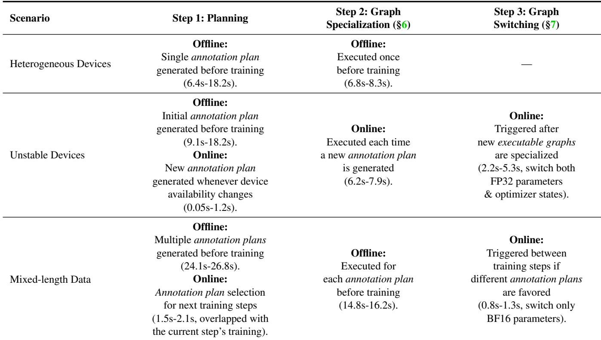

Across all scenarios, we leverage PuLP [65] for solving ILPs and Pyomo [6] for solving MINLPs. As detailed in Ta ble 5, we provide overhead measurements including planning, graph specialization (§6), and graph switching (§7) for each scenario, accompanied by thorough workflow descriptions. The results indicate that our planners either introduce minimal overhead or run offline, ensuring negligible impact on online training.

## A.2 Execution

In this section, we provide the details not covered in §6.3 on how to recognize heterogeneous pipelines and coordinate their execution, as well as how to support dynamic input shapes during execution without relying on the sharding annotation system.

Pipeline construction and scheduling. HSPMD supports various scheduling schemes, including GPipe [27] and 1F1B [50], while enabling independent pipelines to process micro-batches with different sizes and quantities. This functionality is achieved through two key steps: (i) determining the pipeline structure based on current sharing annotations (i.e., identifying device-to-stage and device-to-pipeline mappings); and (ii) coordinating device execution according to the selected pipeline scheduler (e.g., 1F1B).

As illustrated in Figure 21 (left), after executable graphs are specialized (§6), we further partition each device’s executable graph into four types of executable subgraphs:

• Pre-processing (Pre): Includes operators such as precision conversion (e.g., FP32 to BF16) for mixed-precision training, and parameter gathering (e.g., AG, SplitAG) for ZeRO [58] sharding.

• Post-processing (Post): Includes operators for gradient accumulation (e.g., Sum), gradient synchronization (e.g., RS, SplitRS), and optimizer updates (e.g., Adam [36]).

• Forward (F): Includes operators for the DL forward pass

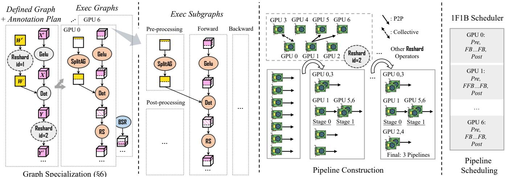  
Figure 21: Pipeline construction and scheduling. The executable graph associated with each device is divided into multiple executable subgraphs. Once the pipelines are constructed, each device is assigned a schedule that dictates the execution order of its executable subgraphs. This figure aligns with Figure 12.

(e.g., Dot, AttentionFwd).

• Backward (B): Includes operators for the DL backward pass (e.g., Dot, AttentionBwd).

These executable subgraphs serve as the scheduling units for subsequent execution given the pipeline scheduler.

Below, we describe the process of constructing pipelines, whereby each device identifies its stage number and pipeline number, ensuring that all devices are aware of their roles during pipeline scheduling. We design an algorithm for constructing pipelines in a step-by-step manner. As illustrated in Figure 21 (middle), we initially construct a separate pipeline for each device. Subsequently, we sequentially analyze all Reshard operators involved in the forward and backward executable subgraphs. In Figure 21, we identify that Reshard (id=1) is executed only once at the beginning, which belongs to the pre-processing executable subgraph and does not participate in forward or backward passes, so the first communication operator actually analyzed is Reshard (id=2). For this communication operator, we decompose its internal communication into two categories: collective communication and peer-to-peer (P2P) communication. All devices involved in collective communication are merged into the same pipeline, while devices involved in P2P communication are concatenated into subsequent stages of the pipeline. For example, in Figure 21 (middle), after processing Reshard (id=2), the pipelines containing GPU 0 and GPU 3 are merged into one, while GPU 5 and GPU 6 are appended to the pipeline containing GPU 1 as the next stage. Through iterative application of this process, all pipelines are eventually fully constructed.

After pipeline construction, the system orchestrates execution according to the pipeline structure during runtime. Each device is assigned a schedule that defines the execution order of its executable subgraphs. For instance, in Figure 21 (right), when using the 1F1B scheduler, GPU 0 (located at the final stage) follows the schedule Pre,FB. ..FB, Post, whereas GPU 1 (on the first stage) executes according to Pre, FFB . . . FB, Post. Here, Pre and Post denote the pre- and post-processing executable subgraphs, respectively, and F and B represent forward and backward executable subgraphs, respectively.

Symbolic shape extension. During execution, HSPMD dynamically adapts to variations in input tensor shapes across different pipelines (e.g., to facilitate load balancing, data packing, and other runtime optimizations). While static sharding annotations define the high-level sharding pattern, the concrete shapes of individual shards are resolved at runtime.

To support this dynamic behavior, HSPMD extends tensor metadata with symbolic variables, which represent unknown dimensions of the shape (e.g., S for sequence length). These variables are propagated through tensor operations on each device while maintaining dimensional constraints. For instance, splitting a tensor along its sequence dimension would generate the constraint S′ = S/2, preserving algebraic relationships between the symbols of the two tensors. The system resolves these symbols to concrete arithmetic values only when actual input tensors are provided at runtime to each device. This design allows different ranks to process dynamically shaped data. Additionally, HSPMD enforces both compiletime and runtime checks to detect invalid symbol usage. For example, defining S′ = S/2 without satisfying the constraint S ≡ 0 (mod 2) is illegal and may lead to shape mismatches during cross-rank communication.

## B Training Convergence

In this section, we present a comparative analysis of training loss under two configurations (C1 and C2, totally aligned with §10). In both configurations, a 32B Llama model is trained using HSPMD, yet they differ in GPU resources and parallel strategies:

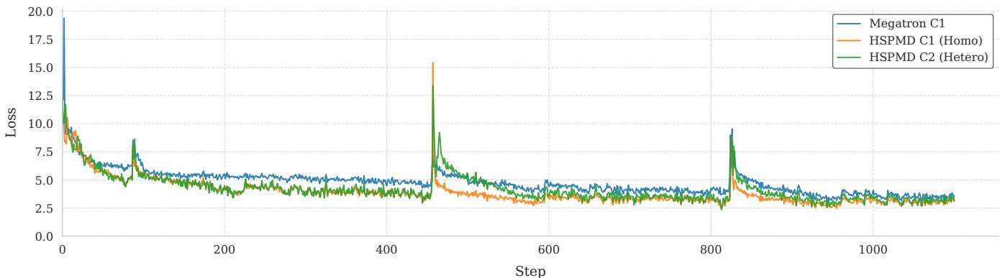  
Figure 22: Training loss comparison.

• C1: The model is trained on 32 H20 GPUs under a homogeneous parallel strategy.

• C2: The model is trained on 31 H20 GPUs under a heterogeneous parallel strategy.

Comprehensive descriptions of these parallel strategies are documented in Appendix C.3, while the full training setup is summarized in Table 6.

Table 6: Training setup.  
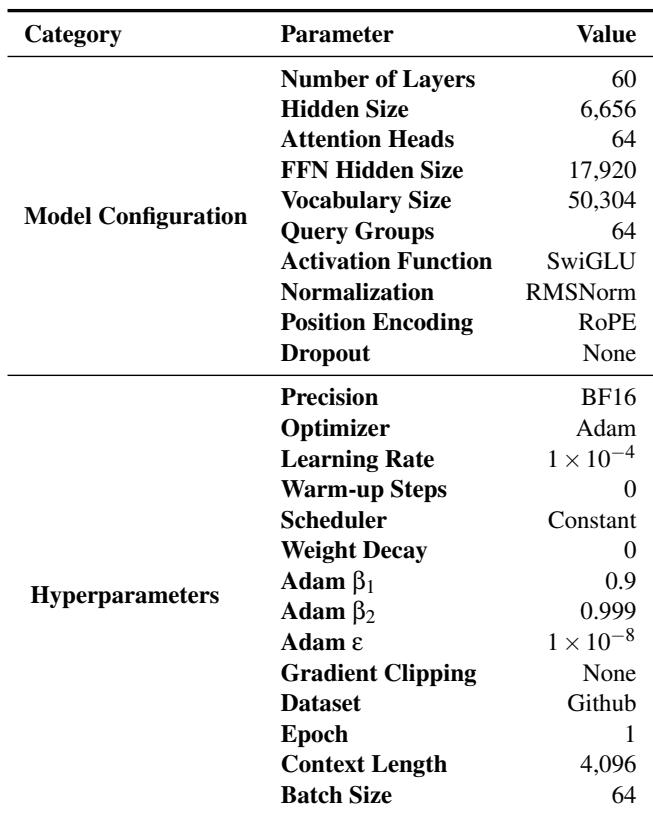

We also train a model using Megatron, employing the same homogeneous parallel strategy and training setup as in C1. As shown in Figure 22, the results show that HSPMD achieves good convergence under both homogeneous and heterogeneous settings. In the homogeneous setting (C1), the convergence behavior closely matches that of the Megatron baseline, with minor differences in absolute loss values attributable to framework-level implementation variations. Besides, the heterogeneous setting (C2) exhibits convergence nearly identical to C1, with only marginal fluctuations observed during training irregularities. These findings demonstrate that the introduction of asymmetric sharding and diverse asymmetric communication patterns does not compromise training convergence.

## C More Experimental Details

This section provides a comprehensive analysis of HSPMD’s heterogeneous parallel strategies across diverse scenarios and compares them against baseline methods. While these strategies (formulated as annotation plans) are automatically generated by scenario-specific planners (Appendix A.1), users also have the flexibility to define customized strategies by manually supplying their own annotation plan.

## C.1 Cluster Setup

Table 7 presents the configuration of our computing cluster. The H800 GPU offers higher computational power but lower intra-node (NVLink) communication bandwidth, whereas the H20 GPU provides lower computational performance but higher communication bandwidth. Additionally, the two GPUs differ slightly in memory capacity, posing challenges for heterogeneous parallel computing on this setup.

## C.2 Scenario (a): Heterogeneous Devices

Table 8 summarizes the optimal parallel strategies for Deep-Speed and Megatron, the two baselines, across different model sizes and heterogeneous device setups. These strategies were derived through an exhaustive search process, systematically evaluating various combinations of parallelisms and training optimizations to determine the most efficient ones.

Table 7: Heterogeneous GPU cluster.  
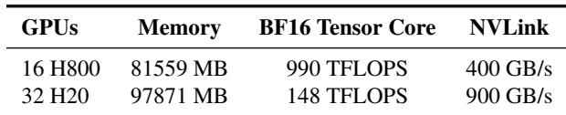

Table 8: Optimal parallel strategies for DeepSpeed and Megatron. “DP” refers to the data parallel degree, “TP” to the tensor parallel degree, “PP” to the pipeline parallel degree, and “SP” to the sequence parallel (Ulysses-SP) degree. “AC” signifies the use of activation checkpointing, while “bs” denotes micro-batch size. All DeepSpeed configurations employ ZeRO-3 optimization, whereas Megatron implementations utilize ZeRO-1.  
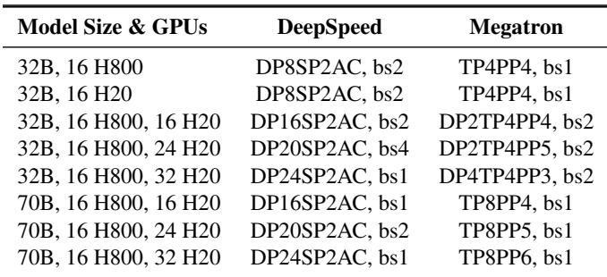

Next, as shown in Table 9, we sequentially present the optimal strategies for HSPMD across different heterogeneous device setups. These strategies are given by our static planner (as introduced in Appendix A.1). Each cell represents a tensor parallel group, detailing the assigned rank IDs (de noted as “R”) and the corresponding layer IDs (denoted as “L”). Yellow cells correspond to H800 GPUs, while white ones represent H20 GPUs. The leftmost column indicates the micro-batch size (denoted as “bs”) and the number of micro-batches (represented by the preceding coefficient) for each pipeline. Between pipelines, data parallelism is utilized to synchronize gradients.

Notably, across all strategies, we utilize ZeRO-1 to partition FP32 parameters and optimizer states across data parallel replicas. This memory optimization enables the adoption of more memory-intensive parallel strategies (i.e., those with higher data parallel degrees). While homogeneous parallel strategies use standard AG (all-gather) for parameter collection and RS (reduce-scatter) for gradient synchronization, our heterogeneous approach requires specialized operators. Specifically, when tensor parallel degrees differ across data parallel groups, the inserted Reshard operators (responsible for parameter collection and gradient synchronization) are in stantiated with SplitAG and SplitRS operators (detailed in §5.2). This adaptation facilitates the asymmetric communication required when integrating ZeRO-1 with heterogeneous pipelines.

Table 9: Optimal parallel strategies for HSPMD on different heterogeneous clusters. R0-15 are H800 GPUs and R16-47 are H20 GPUs.  
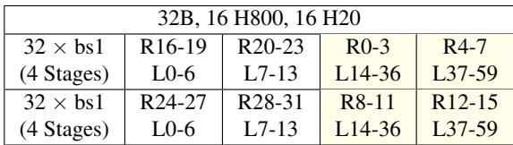

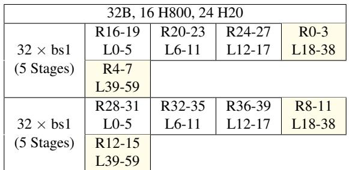

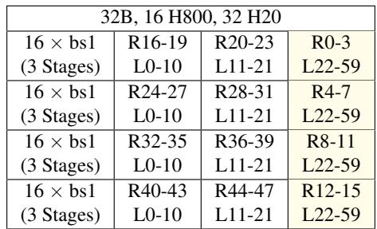

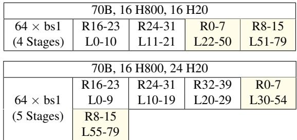

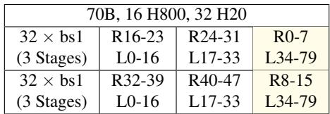

## C.3 Scenario (b): Unstable Devices

Table 10 presents the optimal strategies of DeepSpeed and Megatron after each reconfiguration in the unstable devices scenario. Notably, GPU failures occurred during the reconfigurations from C1 to C2 and from C5 to C6. However, due to the system’s inability to support non-uniform sharding, they failed to utilize the remaining seven functional GPUs in the machine. Consequently, the entire machine was treated as failed, which is why the strategy for C2 matches C3, and C6’s strategy aligns with C7’s.

Table 10: Optimal parallel strategies for DeepSpeed and Megatron. “DP” refers to the data parallel degree, “TP” to the tensor parallel degree, “PP” to the pipeline parallel degree, and “SP” to the sequence parallel (Ulysses-SP) degree. “AC” signifies the use of activation checkpointing, while “bs” denotes micro-batch size. All DeepSpeed configurations employ ZeRO-3 optimization, whereas Megatron implementations utilize ZeRO-1.

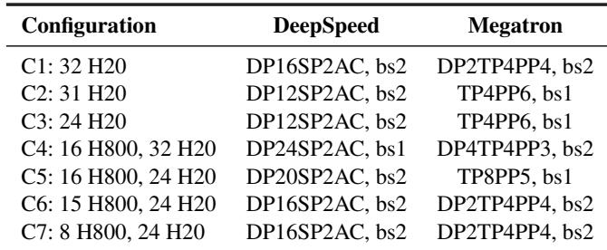

Upon changes in GPU availability, we invoke our online planner (Appendix A.1) to determine the optimal parallel strategy. Table 11 reports the strategies adopted by HSPMD on homogeneous clusters (C1–C3). In our setup, we deploy two pipelines and disable ZeRO-1 to ensure fault isolation. Failures in one pipeline do not cause permanent loss of model weights, eliminating the need for restarting. This setting is consistent with Oobleck, which also disables ZeRO-1 and achieves fault tolerance through data-parallel replication, making our comparison fair. Notably, the same design is followed by many elastic training systems (e.g., Recycle [21]).

Table 11: Parallel strategies for HSPMD during elastic training on homogeneous clusters.  
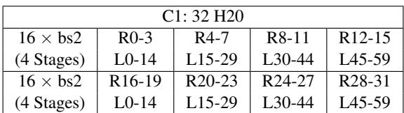

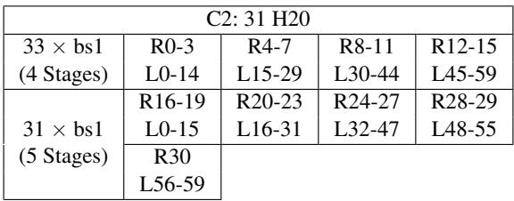

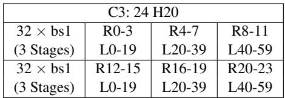  
In Table 12, we detail the strategies (C4–C7) adopted by

HSPMD on heterogeneous clusters, with yellow and white cells representing H800 and H20 GPUs, respectively. Following the homogeneous cluster approach, we disable ZeRO-1 and configure two pipelines to enable fault tolerance.

However, disabling ZeRO-1 increases memory overhead, precluding the use of the optimal parallel strategy. For instance, the strategy in C4: 16 H800, 32 H20 (with a data parallel degree of 2) differs from that in Table 9 for standard heterogeneous clusters (32B, 16 H800, 32 H20, with a data parallel degree of 4). Consequently, training performance degrades by approximately 15%, increasing the per-step training time from 6.05s to 6.91s (shown in Figure 15 and Figure 16).

Despite this performance degradation, HSPMD’s heterogeneous sharding effectively balances workloads, still maintaining superior performance compared to the homogeneous parallel strategies used in DeepSpeed and Megatron (shown in Figure 16).

Table 12: Parallel strategies for HSPMD during elastic training on heterogeneous clusters. R0-15 are H800 GPUs and R16-47 are H20 GPUs.  
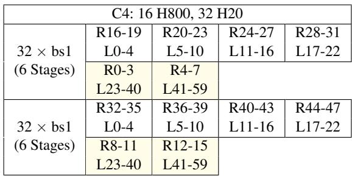

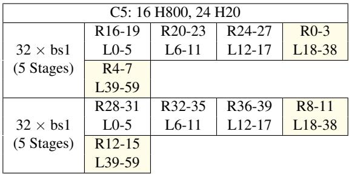

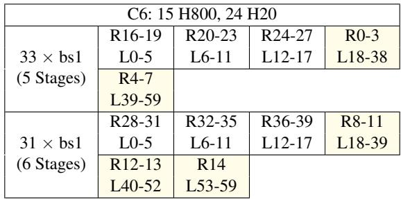

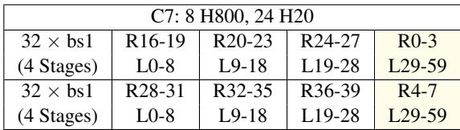

## C.4 Scenario (c): Mixed-length Data

Table 13 presents the optimal parallel training strategies for the mixed-length data scenario using DeepSpeed and Megatron, with context lengths of 32K and 16K (using the 32B model on 32 H20 GPUs). Due to the substantially longer context lengths, these frameworks must adopt larger sequence/- context or tensor parallelism. However, in practice, only a small fraction of sequences per training step actually reach the maximum context length. As a result, most shorter sequences are processed inefficiently, missing opportunities for more optimized training strategies.

Table 13: Optimal parallel strategies for DeepSpeed and Megatron. “DP” refers to the data parallel degree, “TP” to the tensor parallel degree, “PP” to the pipeline parallel degree, “CP” to the context parallel degree, and “SP” to the sequence parallel (Ulysses-SP) degree. “AC” signifies the use of activation checkpointing, while “bs” denotes micro-batch size. All DeepSpeed configurations employ ZeRO-3 optimization, whereas Megatron implementations utilize ZeRO-1.  
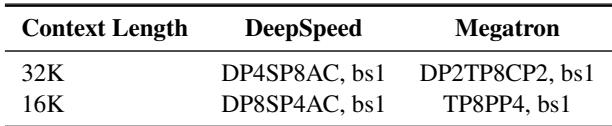

Table 14 presents the parallel strategies adopted by HotSPa across different sequence length intervals. By partitioning sequences into buckets based on length and processing them sequentially within a training step (with gradient accumulation before weight updates), this approach maintains mathematical equivalence to standard training while enabling lengthadaptive parallel strategies.

Although this method incurs frequent switching overhead within the step, such costs are substantially outweighed by the benefits of parallel strategies optimization, ultimately resulting in performance improvements.

Table 14: Optimal parallel strategies for HotSPa. “DP” refers to the data parallel degree, “TP” to the tensor parallel degree, and “PP” to the pipeline parallel degree. “bs” denotes micro-batch size. All configurations employ ZeRO-1 optimization.  
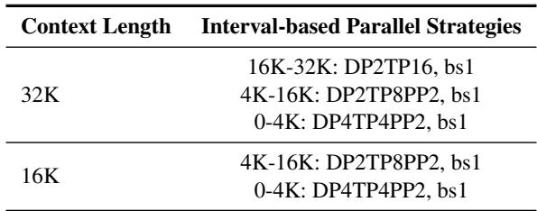  
Tables 15 and 16 further present the heterogeneous strategies adopted by HSPMD for context lengths of 32K and 16K, respectively. In Table 15, Strategy A and Strategy B correspond to those illustrated in Figure 18.

For HSPMD, steps with varying maximum sequence lengths are processed using either Strategy A or B, while sequences of different lengths within a step are distributed across multiple pipelines to balance the load based on the cost model we designed. Once all data within a step has been processed across the pipelines, gradients are synchronized to perform the step update. This approach further improves performance compared to HotSPa by eliminating frequent strategy switching within a step and more effectively addressing workload imbalance through the use of heterogeneous strategies, rather than homogeneous ones.

Table 15: Heterogeneous parallel strategies for HSPMD with 32K context length, where the strategy is dynamically selected based on the maximum sequence length (MaxSeqLen) at each processing step.  
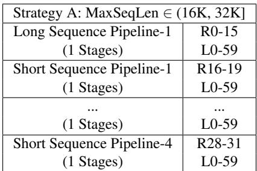

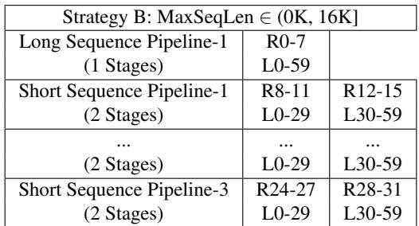

Table 16: Heterogeneous parallel strategies for HSPMD with 16K context length, where the strategy is dynamically selected based on the maximum sequence length (MaxSeqLen) at each processing step.  
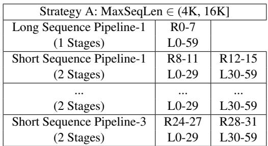

Strategy B: MaxSeqLen ∈ (0K, 4K] DP4TP4PP2