USENIX

THE ADVANCED COMPUTING SYSTEMS ASSOCIATION

# Merlin: An Efficient Adaptive Cache Eviction Algorithm via Fine-Grained Characterization

Liujia Li, Jinhao Guo, Yi Fan, and Jianyu Wu, Peking University; Zhenlin Wang, Michigan Tech; Jie Zhang, Peking University; Yuval Tamir, University of California, Los Angeles; Xiaolin Wang, Yingwei Luo, and Diyu Zhou, Peking University

https://www.usenix.org/conference/osdi26/presentation/li-liujia

# This paper is included in the Proceedings of the 20th USENIX Symposium on Operating Systems Design and Implementation.

July 13–15, 2026 • Seattle, WA, USA

ISBN 978-1-939133-55-7

Open access to the Proceedings of the 20th USENIX Symposium on Operating Systems Design and Implementation is sponsored by

# Merlin: An Eficient Adaptive Cache Eviction Algorithm via Fine-Grained Characterization

Liujia Li†, Jinhao Guo†, Yi Fan†, Jianyu Wu†, Zhenlin Wang§, Jie Zhang†, Yuval Tamir‡, Xiaolin Wang†, Yingwei Luo†, Diyu Zhou† †Peking University §Michigan Tech ‡UCLA

## Abstract

The diverse and complex modern workloads pose a major challenge for cache to remain efective across all scenarios, degrading the performance of critical systems such as web caches. Adaptive cache eviction algorithms promise to address this challenge by observing access patterns and adjusting their behavior accordingly. However, existing ones fail this promise, even underperforming static policies. Our analysis shows that this is because they adapt only to a few typical patterns, incurring poor performance on others. Moreover, they adapt by switching between supposedly complementary algorithms, which turn out to interfere with each other.

We present Merlin, an eficient adaptive algorithm that robustly handles diverse access patterns while maintaining low overhead and high multicore scalability. The eficiency of Merlin stems from a principled pattern characterization method that can express a wide spectrum of access patterns rather than a few typical ones. This is achieved by characterizing at the level of individual objects while accounting for both access locality and cache size. Furthermore, Merlin cleanly decouples responsibilities among its components, with each component performing a single task, thereby eliminating the costly interference between base algorithms. Our evaluation across 11 datasets with 5423 traces shows that Merlin achieves robust improvements in hit rate over existing algorithms, increasing throughput by 1.4× to 7.8×.

## 1 Introduction

To improve performance, modern computing systems widely employ software caches, such as in-memory key-value stores in data centers [3,8,9,13,30,58,59,68], edge caches in content delivery networks [3,7,12,16,33,43,52,61,68], and page caches in operating systems [14,15,27,35,42,46,48,78]. The eficiency of such caching systems largely depends on their eviction algorithms, which manage limited cache space to exploit access locality in the workload. The efectiveness of eviction algorithms, in turn, hinges on how well their underlying assumptions match the workload access patterns.

However, prior studies [12, 35, 45, 48, 67, 69, 70, 77] show that modern workloads exhibit diverse and varying access patterns. We confirm the above conclusion through an analysis of 11 real-world datasets (§3.1). To express workload diversity, prior work [48] classifies access patterns into four primitive types: 1) LFU-friendly (high-frequency access),

2) LRU-friendly (high-recency access), 3) Churn (objects accessed periodically), and 4) Scan (objects accessed only once). The workload’s access pattern is often a varied combination of these primitives, while also shifting rapidly over time.

The complex access patterns are a key challenge to eviction algorithms, as they must remain efective across all patterns. Nevertheless, decades of advancements in the field have mainly focused on static algorithms [8, 13, 17, 27, 35, 40, 71, 72, 78], which use fixed policies to manage cache regardless of access patterns. Despite many elegant proposals, the inherent rigidity of static algorithms limits their ability to deliver the best performance across diverse workloads, as our evaluation shows in §3.

To tame workload diversity, a general system design principle is to introduce adaptivity, which has seen great success across multiple domains, such as scheduling, resource allocation [23,24,75] and fuzzing [26,29,66]. In the context of cache eviction, an adaptive algorithm involves two key aspects: 1) Pattern characterization, i.e., observing and characterizing workload access patterns; and 2) Policy adjustment, dynamically changing its policy to suit the observed patterns. Such adaptivity promises an efective way to treat the diverse access patterns in modern workloads.

However, existing adaptive algorithms [6, 45, 48, 55] fail to fulfill this promise, to a degree that they often underperform their static counterparts across real-world workloads, as we measure in §3.2. Indeed, designing efective adaptive algorithms is challenging. Prior work [71] shows that a simple yet efective static algorithm already performs well on common workloads, while making itself adaptive only ofers marginal gains in the rare adversarial workloads. This suggests that the complexity cost of adaptivity may outweigh its benefits. Our work revisits this problem by studying how to design an efective adaptive algorithm with low complexity.

This paper presents Merlin1, a cache eviction algorithm that adapts to a broad spectrum of access patterns with low management overhead and high multicore scalability. To design Merlin, we begin with an in-depth analysis of the typical patterns where existing adaptive algorithms fail (§3.3).

Through the analysis, our key observation is that existing adaptive algorithms are designed to be efective for a few typical patterns, thereby incurring poor performance in many other cases. Algorithms like ARC [45] and CAR [6] adapt cache space for accesses dominated by 1) objects accessed only once recently, or 2) objects accessed multiple times recently. As both categories represent short-term accesses, they do not efectively capture long-term access patterns. Cacheus [48] adapts by switching between two complementary base algorithms, each efective for two of the four aforementioned primitive patterns. Thus, Cacheus fails to adapt when accesses deviate from these typical patterns.

To overcome the above limitations, Merlin advances in both key aspects of adaptivity. In pattern characterization, state-of-the-art mechanisms classify access sequences into only a few typical patterns, failing to extract the characteristics of many access traces. This is due to a failure to meet the challenge of devising an approach for accurately expressing the full spectrum of access patterns.

To address the above challenge, we identify three key requirements. The characterization must 1) be flexible, i.e., not limited to a small fixed set of access patterns, 2) reflect the degree of locality, the key to caching efectiveness, and 3) account for cache size, since the same access sequence can behave diferently under diferent cache sizes. Prior characterization approaches do not meet all these requirements, explaining their inefectiveness across diverse patterns.

Merlin’s principled characterization approach meets all the above requirements. Merlin characterizes by classifying objects based on two dimensions: hotness and popularity into four types: hot-popular, hot-rare, cold-popular, and cold-rare. Hotness and popularity denote short-term and longterm access counts, respectively, capturing both recency and frequency aspects of locality, therefore meeting the second requirement. To meet the third requirement, Merlin sets the total number of hot and popular objects to fit the cache, with an intuition that only the hottest and most popular items are stored. With this object-level classification, Merlin accurately captures a wide range of access patterns using counts of the four object types, satisfying the first requirement.

Regarding policy adjustment, prior work uses complementary base algorithms or data structures that turn out to interfere with each other when neither is particularly efective, leading to poor performance (§3.3). Thanks to its principled characterization, Merlin adapts using a simple policy that avoids such interference: prioritize hot-popular objects, then hot or popular objects, and filter out cold-rare objects, as the object type counts reflect the access pattern.

Merlin’s design is based on a unified and cohesive architecture that embraces recent advances in multi-queue FIFObased algorithms [71]. It consists of multiple components with cleanly decoupled responsibilities, each performing a single task. Merlin uses 1) a small FIFO queue to filter coldrare objects, 2) a core queue and a staging queue, two large FIFO queues to prioritize hot-popular objects, followed by hot or popular objects, 3) a ghost queue [6, 36, 45, 48, 71] to accurately identify hot-rare objects, and 4) a count-min sketch [21, 22, 27, 31] to spot cold-popular objects.

We evaluated Merlin with 16 algorithms on 5423 realworld traces from 11 datasets across various domains, including CDN, KV stores, and VM management/storage caching. Our evaluation shows that Merlin achieves robust improvements in hit rate over prior work, while incurring low management overhead and ofering high multicore scalability, improving throughput by 1.4× to 7.8×.

In summary, this paper makes the following contributions:

• Analysis. We show that prior adaptive algorithms fail to cover the wide spectrum of access patterns, mainly because of their overly simple pattern characterization.

• Pattern characterization. We identify the key requirements for access characterization and contribute a principled approach that expresses diverse patterns.

• Merlin. We design Merlin, an adaptive cache eviction algorithm with a unified, cohesive architecture. Merlin delivers robust performance across diverse patterns, while ofering low overhead and high scalability.

## 2 Cache Eviction Algorithms

A cache system’s eficiency hinges on its eviction algorithm, since it decides which objects2 utilize the scarce cache space. This section briefly reviews state-of-the-art cache eviction algorithms, covering both static (§2.1) and dynamic ones (§2.2).

## 2.1 Static Eviction Algorithms

A static algorithm always applies the same fixed set of rules for eviction, no matter the workload characteristics. Research over the past few decades has primarily focused on static algorithms. Early static algorithms, such as LFU, FIFO [10,53], and LRU [10, 25], use simple heuristics that perform well only for a narrow set of access patterns. For example, LRU favors accesses with high recency, but performs poorly for objects repeatedly accessed in a round-robin fashion.

Follow-up work aims to be more robust across diverse access patterns by using better ranking metrics [8,12,13,18,40] and/or combining multiple components (i.e., LRU lists, and FIFO queues) [6, 27, 34–36, 45, 71, 78]. Two notable examples are LIRS [35] and S3-FIFO [71], performing best on the datasets we evaluated (§7). As explained in §5, Merlin inherits the FIFO-based design from S3-FIFO, but generalizes it to: 1) be adaptive, 2) account for both recency and frequency, and 3) use a better characterization of one-hit wonders (§5.4).

## 2.2 Adaptive Eviction Algorithms

An adaptive eviction algorithm involves: 1) observing and characterizing workload access patterns, and 2) adjusting its policy (behavior) accordingly (by, e.g., automatically tuning internal parameters) to maximize performance.

Adaptive algorithms fall into two categories: 1) sizeadaptive and 2) policy-adaptive.

A size-adaptive algorithm partitions cache into multiple parts and adapts by adjusting each part’s size based on access patterns. The state-of-the-art is ARC [45] and CAR [6].

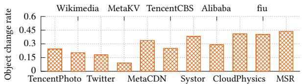  
Figure 1: The object change rate of 11 real-world datasets.

ARC divides cache into two lists: a one-hit list and a multihit list. A new object is first placed in the one-hit list and added to the multi-hit list on a second access. On a cache miss, ARC checks whether it has previously evicted the requested object by looking for it in the eviction history of both lists. If so, ARC expands that list’s size and correspondingly reduces the size of the other list. In this way, ARC adapts by dynamically adjusting the cache space partition to favor either 1) objects accessed only once recently (by expanding the one-hit list), or 2) objects accessed multiple times recently (by expanding the multi-hit list). CAR follows a similar design but notably replaces the LRU lists with FIFO queues.

A policy-adaptive algorithm adapts by switching between multiple base eviction algorithms depending on their efectiveness under observed access patterns [55].

Cacheus [48] is state-of-the-art, working by classifying access into four primitive patterns: 1) LFU-friendly: a small portion of objects are frequently accessed. 2) LRU-friendly: recently accessed objects are likely to be accessed again soon 3) Churn: all objects are repeatedly accessed with equal probability, and 4) Scan: all objects are accessed only once.

To adapt, Cacheus uses two complementary base algorithms: a scan-resistant LRU variant and a churn-resistant LFU variant, to cover all four primitive access patterns. Cacheus maintains a weight for each base algorithm. Upon a cache miss, Cacheus selects a base algorithm to perform eviction using probabilities proportional to the weights of the algorithms. Next, Cacheus checks whether it mistakenly evicted the requested object, and, if so, penalizes the responsible base algorithm by reducing its weight. Cacheus uses machine learning to control the rate at which weights change.

## 3 How Modern Algorithms Perform

This section analyzes the characteristics of modern cache workloads (§3.1), evaluates existing eviction algorithms on them (§3.2), and identifies remaining deficiencies (§3.3)

## 3.1 Characteristics of Modern Cache Workloads

It is well known that modern cache workloads 1) exhibit diverse access patterns and 2) that their access patterns change over time [48, 49, 56, 57, 70]. We confirm this by analyzing 11 real-world datasets with a total of 5423 traces (Table 2)

Figure 1 summarizes our analysis. As we have not found a prior metric to quantify the diversity and variability of access patterns, we propose a new metric3, the object change rate, which measures the fraction of change in uniquely accessed objects between consecutive time windows. As shown in the figure, using a time window of 1% of the trace length, all datasets exhibit a high object change rate, up to \~45% (i.e., nearly half of the accessed objects change in each window).

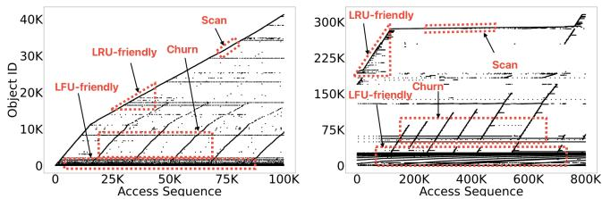  
Figure 2: Two examples of real-world access patterns. The x-axis is the access sequence number, and the y-axis is the object ID. Each point means that the object is accessed at that moment.

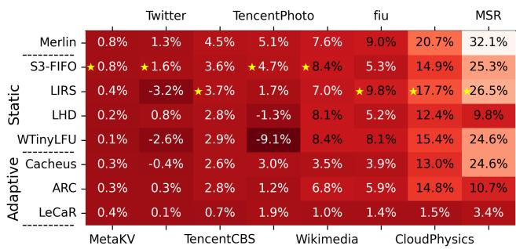  
Figure 3: The average hit rate improvement over LRU for 8 representative eviction algorithms on 8 real-world datasets. The cache size is 3% of the working set size. The larger the value, the higher the hit rate, with a star showing the best algorithm (excluding Merlin). Merlin achieves the highest hit rate in 5 datasets, with close to the best performance in 3 datasets.

Figure 2 visualizes two examples of diverse and varying access patterns. Following the classification in Cacheus (§2.2), all four patterns appear in two traces with frequent switches.

## 3.2 Performance of Existing Algorithms

We evaluate 16 state-of-the-art cache eviction algorithms on 11 real-world datasets. Figure 3 shows a subset of the results (full results in §7.2), including the top-performing algorithms in both the static and adaptive categories (§2).

We draw two conclusions. First, for static algorithms, there is no “silver bullet” that consistently outperforms others. S3-FIFO achieves the highest hit rate across 4 datasets (excluding Merlin), in some cases by a significant margin over the runner-up. In the remaining 4 datasets, LIRS is the best.

We analyze a few typical traces where LIRS and S3-FIFO underperform and find that their deficiencies stem from their static nature; a fixed set of rules is a poor match for the diverse and varying access patterns. Introducing adaptiveness enables the two algorithms to perform better on such traces. For example, LIRS may benefit from adjusting its promotion policy or the small FIFO queue’s size, and S3-FIFO could improve by adapting its reinsertion policy.

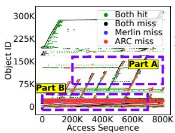

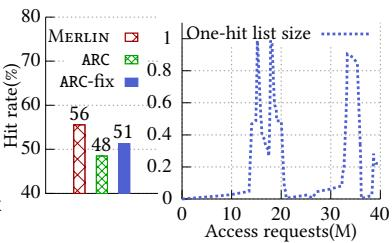  
Figure 4: The Alibaba [1] 742 trace. ARC-fix only caches objects in the two-hit list. Assuming the cache is in DRAM with 100ns access time and the backend is SSD with 10µs access time, Merlin improves performance by 8× over ARC. Merlin excels by caching both short- and long-term locality objects.

Second, adaptive algorithms consistently underperform the static ones. None of the adaptive algorithms 1) achieves the highest hit rate in any dataset; nor 2) matches the performance of the best static algorithms (i.e., S3-FIFO) and arguably the second-best one (i.e., LIRS) across all datasets.

This result is surprising, as adaptiveness should better match diverse and varying access patterns (§3.1), expectedly. Indeed, we view this as an anomaly in systems research, as adaptiveness succeeds widely in other domains (e.g., schedul ing and resource allocation [23,24,75] and fuzzing [26,29,66]), often resulting in significant performance gains over static counterparts. This provides strong motivation for Merlin, which advances the design of adaptive eviction algorithms.

## 3.3 Remaining Deficiencies in Adaptive Algorithms

We analyze several representative traces to reveal three limitations of existing adaptive algorithms.

Limitation #1: Failure to adapt to real-world patterns. An inherent limitation of prior mechanisms is that they only adapt to a small subset of access patterns. This is because their design assumes that a given access sequence will always conform to a few fixed patterns. This assumption is explicitly made in Cacheus (§2.2), which uses base algorithms to cover all primitive patterns. The assumption is also made implicitly in ARC and CAR, which model access sequences as dominated only by short-term locality. They thus forgo longterm locality, as we explained next. However, the diverse access patterns in real-world workloads often deviate from these fixed patterns. Therefore, in those cases, existing adaptive algorithms fail. As detailed in §4, the root cause of this limitation is their inaccurate characterization approach.

Figure 4 shows a trace where ARC fails. This trace exhibits a mix of accesses with high long-term locality (Part A) and high short-term locality (Part B). Specifically, Part A contains objects accessed repeatedly but often with long intervals (that exceed the cache size) between two accesses. Such objects are good candidates for caching. However, with ARC, they are often first placed in the one-hit list and then evicted before the second access. Thus, regardless of how ARC partitions the cache between the two lists, it fails to cache these objects, leading to poor performance.

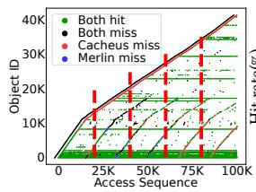

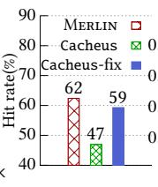

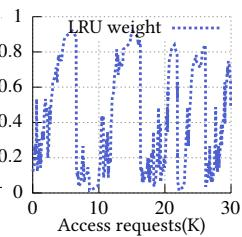  
Figure 5: The Alibaba 269 trace. As shown in the left-most figure, given a time window (data between vertical red lines), the access patterns do not fall into any one of the primitive patterns; LRU weight is the activation probability of the LRU variant. Cacheusfix only uses the LFU variant. Merlin improves by identifying the high-frequency objects in the churn pattern.

Figure 5 shows a trace where Cacheus fails. In this trace, for most of the time, the access sequences do not fall into any one of the primitive patterns (§2.2); rather, all four of them exist simultaneously. This renders both base algorithms inefective, and thus, no matter how Cacheus adjusts their weights, it cannot deliver good performance. We further analyze this trace in §5.4.

Limitation #2: Adversarial base algorithms/data structures. Related to the first limitation, another key limitation lies in the adaptiveness approach: if the access patterns do not fall within the assumed ones, due to the nature of their policy- or space-adaptive design, the supposedly complementary base algorithms or data structures end up working against each other, further reducing performance.

For space-adaptive algorithms, like ARC, with a mixed access pattern, accesses to objects in both partitions sufer excessive cache misses. In this case, we find that the algorithm blindly adjusts partition sizes (the right most in Figure 4), leading to thrashing that actually evicts useful objects. Similarly, in such a case, policy-adaptive algorithms like Cacheus, blindly adjust weights (the right most in Figure 5), causing one algorithm to evict useful objects cached by the other. Indeed, as shown in Figures 4 and 5, for these two traces, using a single base data structure (ARC-fix) or algorithm (Cacheus-fix) actually outperforms the full algorithm.

Limitation #3: Poor robustness across cache sizes. Existing adaptive algorithms fail to deliver robust performance across diferent cache sizes, as shown in Figure 11. Their design does not consider the impact of cache sizes on access patterns (§2.2). This is less inherent, as one can likely enhance these algorithms to overcome it. Nonetheless, Merlin also overcomes this limitation.

## 4 Characterizing Workload Access Patterns

We next show how Merlin addresses the inherent limitations of prior adaptive algorithms (§3.3) through its characterization approach. Later sections present Merlin’s design (§5) and implementation (§6), both enabled by this new way of characterizing access patterns.

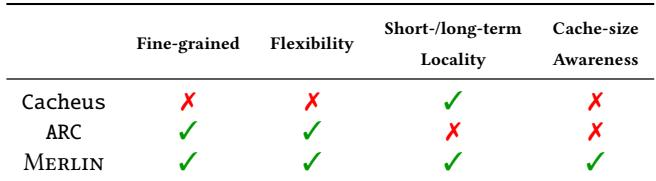  
Table 1: A summary of the characterization approach in state-ofthe-art adaptive algorithms. ✗: not considered; ✓: considered.

Challenge. Our key observation is that the inherent limitation of prior work (i.e., the inability to adapt to diverse access patterns) lies in their characterization approach. Their mechanism cannot accurately characterize the full spectrum of diverse and complex patterns.

Merlin overcomes this challenge by 1) identifying four key requirements, following general design principles in caching literature, and 2) introducing a new characterization approach that meets all these requirements (Table 1).

Requirements. The first requirement is fine granularity; characterization should not be at the level of access sequences, since a sequence may involve multiple patterns (Figure 5). The second requirement is flexibility, i.e., not assum ing a fixed set of access patterns, since such a fixed set is unlikely to match the diversity of real-world access patterns.

The third requirement is that the characterization should capture both short-term access locality (commonly referred to as recency) and long-term access locality (commonly referred to as frequency); as evident in much prior work [8, 13, 36], missing either one leads to high ineficiency.

The final requirement is a cache-size-aware characterization, since the same access sequence may require diferent handling under diferent cache sizes [48, 71]. For example, consider a sequence that repeatedly accesses five objects.4 With a cache size of less than five, an LRU policy does not work, as it thrashes the cache, leading to a zero hit rate. Yet, if the cache size is larger than five, an LRU policy works well. Object-level characterization. To meet the first requirement, Merlin characterizes at the object-level, the finest granularity possible. For an access sequence, Merlin characterizes by evaluating each accessed object using specific metrics (specifically, hotness and popularity, as detailed next).

Flexible characterization. For the second requirement, Merlin characterizes by using metric distributions (i.e., the number of objects falling into diferent ranges of the metrics). The continuous nature of metric distributions captures patterns that a fixed set cannot express.

Reflecting short and long-term locality. To meet the third requirement, Merlin first divides an access sequence into epochs, each containing as many unique object accesses as the cache size. Merlin measures the short-term locality of an object using hotness 5, the number of times an object is accessed in the current epoch. It measures long-term locality through popularity, the number of past epochs in which the object was accessed, excluding the current epoch.

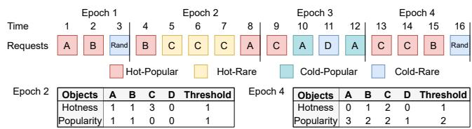  
Figure 6: An example of how Merlin characterizes access patterns. Rand denotes an access to an irrelevant object.

Using cache size to decide thresholds. For the last requirement, Merlin accounts for cache size with two steps. First, Merlin introduces a threshold for both hotness and popularity to classify objects. In the hotness dimension, an object is marked as hot or cold based on whether its hotness is above or below the hotness threshold. Likewise, in the popularity dimension, an object is marked as popular or rare by comparing its popularity with the popularity threshold.

Next, Merlin dynamically adjusts the thresholds by considering cache sizes. Suppose that the cache size is S, the hotness (and popularity) threshold is the hotness (and popularity) count of the current S-th hottest (and the most popular) object. The reason is intuitive: the cache should hold the hottest and the most popular objects to maximize hit rate.

Putting it together. With the above design rationale, Merlin’s characterization approach is perhaps surprisingly simple. Merlin characterizes workload access pattern by classifying each accessed object into one of the four access types based on its hotness and popularity: hot-popular, hotrare, cold-popular, and cold-rare. The cache size decides the thresholds for hotness and popularity, and the number of objects in each type reflects the access patterns.

Figure 6 shows an example with the cache size of 3. The access patterns change from LFU-friendly at the end of Epoch 2 to LRU-friendly at the end of Epoch 4. The change in access type for objects A and C captures this pattern change. Object A is hot-popular at the end of Epoch 2; its hotness is 1, due to an access in Epoch 2, and its popularity is 1, due to that Epoch 1 accesses it. However, at the end of Epoch 4, object A becomes cold-popular with a hotness of 0 (no access in Epoch 4) and a popularity of 3 (accessed in Epochs 1, 2, and 3). Object C changes from hot-rare to hot-popular, due to its frequent accesses in Epochs 3 and 4.

Discussion. In essence, the efectiveness of Merlin’s characterization approach lies in meeting all four requirements (Table 1). Among them, the first two are implicitly adopted by ARC. We make them explicit here as potentially useful guidelines for future algorithms. The last two are general caching design principles, but prior designs such as ARC and Cacheus do not fully incorporate them.

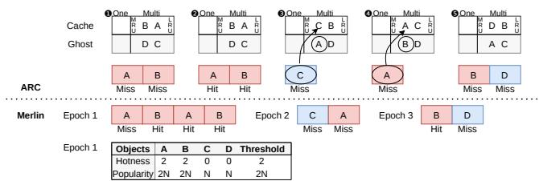  
Figure 7: An example of Merlin characterizing access patterns more accurately than ARC. The cache size is 2, with the access sequence repeating ABABCABD. With ARC, the initial cache state in Step 1 is identical to that in Step 5 (because the access sequence repeats). Thus, accessing A misses and evicts B, and accessing B misses and evicts D. In Step 3 , accessing C misses and evicts A. In Step 4 , accessing A misses and evicts B. In Step 5 , both accesses miss. For Merlin, the table shows the characterization at the end of Epoch 1. In Epoch 1, accessing A misses and evicts D. In Epoch 2, accessing C misses and evicts A, and accessing A misses and evicts C. In Epoch 3, accessing B hits, and accessing D misses and evicts A.

For the third requirement, there exist other metrics for short- and long-term locality, such as reuse distance for the former and total access count (with a decay factor) for the latter. Merlin uses count-based metrics mainly for their eficiency, as detailed in §5 and §6.

For the fourth requirement, Merlin contributes a new adaptive approach that dynamically adjusts the thresholds based on cache size. Adapting by changing thresholds departs from the prior approach that adapts by 1) changing component sizes (as in ARC) or 2) changing algorithm weights (as in Cacheus). As further explained in §5.1, this new approach is the key for Merlin to avoid the adversarial efect of base algorithms/data structures.

To complement the explanation with real-world traces in Figures 4 and 5, Figure 7 provides an illustrative example of why Merlin characterizes access patterns more accurately than ARC. In this example, as ARC does not consider longterm locality, it cannot distinguish poor-locality objects C and D and good-locality objects A and B. As a result, ARC is efectively reduced to LRU, leading to a 25% hit rate. In contrast, Merlin correctly finds that objects A and B have better locality than objects C and D. Hence, Merlin will keep one of the objects A and B in the cache for the subsequent accesses (object B in this example), leading to a 50% hit rate.

## 5 Merlin Design

This section presents the design of Merlin, an eficient eviction algorithm that adapts to a broad spectrum of patterns. We present the design overview (§5.1), its components (§5.2) and workflow (§5.3), concluding with examples of how Merlin adapts to various access patterns (§5.4).

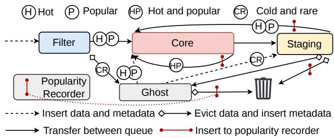  
Figure 8: An overview of Merlin’s key components and workflow.

## 5.1 Merlin Design Overview

With its principled characterization method (§4), Merlin’s design accomplishes two tasks: 1) track each object’s hotness and popularity over time to classify it into one of the four access types; and 2) prioritize keeping hot-popular objects (since they have the best locality), followed by hot-rare and cold-popular objects, while evicting cold-rare objects.

How Merlin adapts. As patterns vary over time, Merlin adapts by dynamically adjusting the hotness and popularity thresholds, which, in turn, changes the number of objects in each access type. As shown in Figure 6, when the pattern shifts from LRU-friendly to LFU-friendly, Merlin adjusts its thresholds, leading to more popular and fewer hot objects in Epoch 4 than in Epoch 2. In this way, Merlin correctly captures the shift from recency to frequency. Section 5.4 provides more examples of how Merlin adapts.

A cohesive architecture. As dynamic thresholds enable adaptiveness, Merlin’s caching architecture forgoes the use of complementary base algorithms/data structures. Merlin thus overcomes the limitation in the adaptiveness approach of prior works (i.e., Limitation #2 in §3.3).

Merlin achieves this cohesive architecture by embracing recent advances in FIFO-queue-based designs, as exemplified by S3-FIFO [71]. Specifically, as S3-FIFO, Merlin uses a small queue to filter out objects with poor locality (i.e., cold-rare objects), and a large queue to store main objects. Moreover, as S3-FIFO and other works [8, 35, 36, 45, 48, 55, 72], Merlin uses a ghost queue to signal and act upon poor evictions.

As detailed next, unlike S3-FIFO, Merlin is adaptive with the following key diferences: 1) Merlin admits objects to diferent caching components based on their access types (rather than fixed access counts); 2) Merlin tracks objects’ hotness and popularity, where the latter requires a new component, the popularity recorder, implemented as a count-min sketch (§6); and 3) Merlin adds a staging queue to prioritize hot-popular objects over hot-rare and cold-popular objects.

## 5.2 Merlin Components

Figure 8 shows Merlin’s components and workflow. The main part of Merlin consists of three FIFO queues: a filter queue, a core queue, and a staging queue. In addition, Merlin maintains a FIFO ghost queue and a popularity recorder.

The filter, core, and staging queues store objects and their metadata, which includes their hotness count and access type. The ghost queue stores only metadata, while the popularity recorder only stores the objects’ popularity count.

Task division. The filter queue is a small queue that quickly evicts likely cold-rare objects. The core queue consumes most of the cache space to store hot and/or popular objects. The ghost queue stores metadata for objects evicted by the filter queue, providing a second chance to correctly identify access types. This is necessary since the small filter queue may falsely filter out objects that are hot or popular. The staging queue verifies the object types before the final eviction. The filter, core, ghost, and staging queues also work together to track objects’ hotness; these four FIFO queues ensure an invariant that an object is observed for at least one epoch (§4).

The popularity recorder tracks the popularity of objects. Conceptually, it is a two-dimensional counter recording each object’s access numbers for past epochs. The actual realization of the popularity recorder is a count-min sketch (§6).

Space allocation. The filter queue, core queue, and the staging queue use 10%, 85%, 5% of the cache space, respectively. The ghost queue stores the metadata of one epoch, while the popularity recorder stores the popularity of all objects accessed in the past 16 epochs. We identify these values through sensitivity analysis (§7.5) and found that they work well across a wide range of real-world workloads.

## 5.3 Merlin Workflow

Overview. As shown in Figure 8, when an object is accessed for the first time, Merlin places it on the filter queue and starts observing its access type. Upon leaving the filter queue, if its access type is cold-rare, Merlin evicts its data and places its metadata in the ghost queue. Otherwise, Merlin promotes the object to the core queue.

As the core queue is FIFO, the oldest object leaves it when the queue becomes full. If the object is hot-popular, Merlin reinserts it to the core queue, since it has the best locality. Objects of other types are placed in the staging queue, which may lead to eviction.

For an object in the ghost queue, upon access, Merlin must bring it back into the cache. Merlin examines the object’s access type and promotes it to the core queue if it is hot or popular. Otherwise, Merlin promotes it to the staging queue. In the latter case, if the staging queue later evicts the object, Merlin places it back in the ghost queue to complete a full epoch of hotness observation.

As discussed earlier, the staging queue stores objects from the core and ghost queues. Upon object eviction, the staging queue verifies its access patterns and reinserts it into the core queue if its access pattern is not cold-rare.

The staging queue thus serves two purposes. For objects from the core queue, the staging queue maximizes the hit rate by retaining objects with good locality, following the spirit of FIFO-reinsertion [20]. For objects from the ghost queue, the staging queue provides yet another chance to verify their access types before eviction.

The popularity recorder tracks, for each object, its access count in the recent epochs. It operates when an object is reinserted into the core queue from 1) the core queue itself, 2) the staging queue, or 3) upon eviction from the ghost queue. On these events, the popularity recorder checks if the object was accessed in the last epoch and, if so, increments its access count for the last epoch.

Finally, with hotness counts tracked in the FIFO queues and popularity counts maintained by the popularity recorder, Merlin updates both thresholds based on their distributions.

Figure 9 shows the detailed algorithm of Merlin.

Cache hits. On a cache hit (L2), Merlin simply updates the hotness of the object (L3) and the hotness distribution (L4). Cache misses. Upon a cache miss (L5), Merlin first checks if the cache is full, and if so, evicts an object (L12-13). Next, Merlin checks if the object has been previously encountered and resides in the ghost queue (L14). If so, Merlin updates its hotness (L15-16), checks the object’s access type (L17), and inserts it into either the core queue (L18) or the staging queue (L20). If not, Merlin treats the object as a new object and inserts it into the filter queue (L23-24).

Object eviction. When the cache is full, Merlin first tries to evict from the filter queue (L28-34). If no object is evicted (i.e., all of them go to the core queue), Merlin evicts from the staging queue (L36). For this, Merlin first reinserts hot-popular objects to the core queue (L44-48) while moving the rest to the staging queue (L50). Upon reinsertion, Merlin updates the object’s hotness and popularity for a new epoch (L45- 47). Merlin does not directly set hotness to zero, since in practice such a drastic demotion can lead to thrashing. Next, Merlin evicts objects from the staging queue (L51-63). If an evicted object is from the ghost queue, Merlin inserts it back (L57-58). Otherwise, Merlin evicts it completely (L62).

The eviction guarantees to succeed, as objects reinserted to the core queue reduce their hotness and popularity, and thus eventually become cold-rare ones. In practice, we found that the eviction loop rarely iterates more than a few times.

Updating thresholds. Merlin amortizes the overhead of updating the hotness and popularity thresholds (L7-9) by every ADJUST\_INTERVAL (64 in our implementation) accesses.

Recording objects’ popularity. As discussed, Merlin updates popularity upon three events, as shown in L39, L46, L54. Merlin sets the access flag x.acc to True upon an access (L4, L6) and clears it after updating the popularity (L46, L54).

Deciding thresholds. Figure 10 presents Merlin’s remaining algorithm. To decide the thresholds, Merlin maintains the distribution of hotness and popularity counters (i.e., how many objects fall under each specific counter value) (L1-11). Afterward, Merlin scans the distributions from high to low, sums the counts until the total exceeds the cache size, and uses this value as the thresholds (L24–36). This threshold is the minimum hotness or popularity for an object to rank among the top S objects, where S is the cache size. Merlin uses the thresholds to classify objects (L38-44).

1 def access(x):   
2 if x in core or staging or filter: # cache hit   
3 oriH = x.hotness, x.hotness = min(oriH+1, MAX\_HOTNESS)   
4 updateHotDist(oriH, x.hotness), x.acc = True   
5 else: # cache miss   
6 x.acc = True, insert(x)   
7 insertCounter += 1   
8 if insertCounter == ADJUST\_INTERVAL:   
9 adjustThreshold(), insertCounter = 0   
10   
11 def insert(x):   
12 while Merlin is full:   
13 evict()   
14 if x in ghost: as g   
15 oriH = g.hotness, g.hotness = min(oriH+1, MAX\_HOTNESS)   
16 updateHotDist(oriH, g.hotness)   
17 if isHot(g) or isPopular(g):   
18 insert x to the head of core   
19 else:   
20 record x.posInG, insert x to the head of staging   
21 remove g from ghost   
22 else: #insert new data   
23 x.hotness = 0, updateHotDist(None, x.hotness)   
24 insert x to the head of filter   
25   
26 def evict():   
27 evicted = False   
28 while not evicted and filter exceeds limitF: #evict   
29 x ← tail of filter   
30 if isHot(x) or isPopular(x):   
31 insert x to the head of core   
32 else:   
33 insert x to the head of ghost   
34 evicted = True   
35 while not evicted:   
36 evicted = evictS()   
37 while ghostexceeds limitG: #evict   
38 remove tail obj of ghost   
39 updateHotDist(obj.hotness, None), recordPop(obj)   
40   
41 def evictS():   
42 while coreexceeds limitC:   
43 x ← tail of core   
44 if isHot(x) and isPopular(x):   
45 if x.acc: #update hotness and popularity for a new epo   
46 recordPop(x), x.acc = False   
47 x.hotness -= 1,updateHotDist(x.hotness+1, x.hotness)   
48 insert x to the head of core   
49 else:   
50 insert x to the head of staging   
51 while stagingexceeds limitS: #evict   
52 x ← tail of staging   
53 if x.acc: #update hotness and popularity for a new epoch   
54 recordPop(x), x.acc = False   
55 x.hotness -= 1, updateHotDist(x.hotness+1, x.hotness)   
56 if isHot(x) or isPopular(x):   
57 x.posInG = NULL, insert x to the head of core   
58 else: #evict   
59 if x.posInG:   
60 insert x to original position in ghost   
61 else:   
62 evict x completely   
63 return True  
Figure 9: The core algorithm of Merlin.

Progressing epochs. Merlin maintains a global counter, and when the number of inserted objects reaches the cache size (L20), Merlin enters a new epoch (L21-22) by clearing the popularity records of the oldest epoch. This is accurate because the rest of Merlin is FIFO queues, and thus each invocation of recordpop entails a new object access.

1 def updateHotDist(oriHotness,newHotness):   
2 if oriHotness:   
3 hotnessDistribution[oriHotness] -= 1   
4 if newHotness:   
5 hotnessDistribution[newHotness] += 1   
6   
7 def updatePopDist(oriPopU,newPopU):   
8 if oriPopU:   
9 popularityDistribution[oriPopU] -= 1   
10 if newPopU:   
11 popularityDistribution[newPopU] += 1   
12   
13 def recordPop(x):   
14 # sum up the access counts in all epochs for popularity   
15 oriPopU = sum(row[x.id] for row in popularityRecoder)   
16 popularityRecoder[currentEpoch][x.id]++   
17 updatePopDist(oriPopU, oriPopU + 1)   
18   
19 insertedObjects += 1   
20 if insertedObjects reaches CacheSize:   
21 insertedObjects = 0, currentEpoch += 1   
22 clear popularityRecoder of the oldest epoch   
23   
24 def adjustThreshold():   
25 counter = 0   
26 for hotness in reversed(hotnessDistribution):   
27 counter += hotness   
28 if counter > CacheSize:   
29 hotnessThreshold = hotness   
30 break   
31 counter = 0   
32 for popularity in reversed(popularityDistribution):   
33 counter += popularity   
34 if counter > CacheSize:   
35 popularityThreshold = popularity   
36 break   
37   
38 def isHot(x):   
39 return x.hotness >= hotnessThreshold   
40   
41 def isPopular(x):   
42 # sum up the access counts in all epochs for popularity   
43 PopU = sum(row[x.id] for row in popularityRecoder)   
44 return PopU >= popularityThreshold  
Figure 10: The helper functions for Merlin’s algorithm in Figure 9.

## 5.4 How Merlin Adapts to Access Patterns

With the design in place, this subsection demonstrates how Merlin adapts to diverse access patterns.

The primitive access patterns (§2.2). With an LRUfriendly pattern, Merlin tracks hotness and identifies that most objects are hot (hot-popular or hot-rare). The reinsertion behavior of the core and staging queues retains hot objects in the cache, similar to LRU. With an LFU-friendly pattern, most objects are popular (hot-popular or cold-popular), and the popularity recorder behaves like LFU by tracking objects’ popularity. A Scan pattern comprises mostly cold-rare objects, which the filter queue evicts.

The Churn pattern is interesting because Merlin behaves diferently depending on the cache size. When the cache is large enough to hold all repeatedly accessed objects, they become hot-popular, which Merlin caches to maximize performance. However, if the cache is too small to store all of them, some become cold-popular while the rest remain hotpopular; Merlin caches the latter to prevent thrashing.

Access patterns in prior work. S3-FIFO [71] evicts those objects that are accessed only once, i.e., one-hit wonders. Merlin more accurately characterizes one-hit wonders by classifying them as either 1) cold-rare objects that are never accessed again, or 2) cold-popular objects that are accessed again after the current epoch. For the former, as in S3-FIFO, Merlin quickly evicts them using the filter queue. For the latter, unlike S3-FIFO, Merlin keeps them due to their good frequency, thereby improving eficiency over S3-FIFO.

LIRS caches objects with low Inter-Reference Recency (IRR), i.e., a small number of requests between consecutive accesses and evicts those with high IRR. However, this policy is suboptimal, since some high IRR objects may still be frequently accessed and therefore good candidates for caching. Merlin identifies these objects as cold-popular and caches them, thereby improving over LIRS.

Complex access patterns. For more complex access patterns, such as those in Figures 4 and 5, Merlin identifies and caches objects with the highest hotness and/or popularity, thereby maximizing performance.

Next, we further explain how Merlin efectively handles the trace in Figure 5. Initially, Merlin sets the hotness threshold to 1, allowing objects hit once (or hit in the ghost-queue) to enter the core queue. This behavior filters out Scan (cold) objects. As the workload evolves and more reusable objects appear, Merlin increases the hotness threshold to 2, preventing objects hit once from entering the core queue. This adjustment filters out relatively cold objects, that are part of LRU-friendly or Churn patterns. Then, the threshold changes from 2 to 5 according to the pattern. Merlin preserves cache capacity for hot objects, thereby improving the hit rate.

In contrast, Cacheus faces a dilemma when workloads contain mixed patterns. It first inserts incoming objects into the cache and later evicts them using a weighted combination of scan-resistant LRU and churn-resistant LFU policies. For LRUfriendly objects, the churn-resistant LFU policy makes false eviction decisions, and Cacheus reduces its weight. Then, when the Churn pattern emerges, the scan-resistant LRU policy performs poorly, causing Cacheus to reduce its weight instead. As a result, Cacheus continuously shifts between policies and cannot adapt efectively to the full mixture of access patterns, resulting in lower hit rates.

## 6 Realizing Merlin

We implemented Merlin in both CacheLib [11], a development library for caching systems deployed at Facebook, and libCacheSim [2], an eficient cache simulator. We choose these two frameworks because many eviction algorithms (§7) are already implemented on them. We also contributed implementations of ARC and CAR to CacheLib, and an implementation of CAR to libCacheSim.

Realizing the popularity recorder. A challenge Merlin overcomes is minimizing the popularity recorder’s space overhead. A naive approach that records object names (e.g., block/page addresses, key values) and popularity counts would incur significant overhead.

Following W-TinyLFU [27], Merlin minimizes such overhead using a count-min sketch [21, 22, 31] with a sliding window. A count-min sketch operates similarly to a counting bloom filter [32, 54] with H hash functions. It also has H arrays of counters. Each hash function maps an object to one counter in a row. When an object arrives, the sketch increments all mapped counters. Upon query, the minimum counter value is used as the estimated count. Therefore, a count-min sketch forgoes the need to store an object’s name.

In addition, rather than using a count-min sketch for each epoch, Merlin uses a single sketch to reduce space and performance overhead. To approximate access counts in past epochs, Merlin maintains a global counter and increments it when an object arrives. Once the global counter reaches 16 (the number of epochs Merlin tracks) times the cache size, Merlin clears it and halves all counters in the sketch. W-TinyLFU [27] shows this approach is accurate, supported by both theoretical error bounds and evaluation results.

Common optimizations. Merlin applies several common performance and space optimizations in prior work. First, following CacheLib’s implementation, Merlin uses a hash table to index all cached objects, minimizing the lookup time.

Second, following [71], Merlin implements the ghost queue with a hash table. For each ghost object, Merlin stores its fingerprint, hotness counter, and a sequence number in the hash table, for a total of 8 bytes. Merlin uses the sequence number to identify if an object is still in the ghost queue, facilitating lazy object deletion. Merlin increments a global sequence number upon each insertion to the ghost queue. Thus, any object with a sequence number less than the global sequence number minus the ghost queue’s size has already been evicted from the ghost queue. Thanks to the sequence number, Merlin lazily removes an evicted ghost object from the hash table only upon its access.

Accounting for object sizes. For clarity, the discussion thus far assumes that all objects have a unit size of one. The actual implementation of Merlin handles variable-sized objects. For example, it counts epochs by the total size of unique objects accessed, not their count. It sets the hotness and popularity thresholds for the counts of the hottest and most popular objects whose total size matches the cache size.

Other optimization/implementation. Merlin’s current implementation uses a linked list to implement FIFO queues, while one can also implement them with ring bufers. Merlin performs an optimization to avoid deleting the object from the ghost queue upon its promotion to the staging queue (L20 in Figure 9). Therefore, Merlin does not need to record each object’s position in the ghost queue. This is possible since a stale object in the ghost queue does not afect the correctness of Merlin; Merlin only checks whether the object is in the ghost queue upon a cache miss (L6) in which case the object must not be in the staging queue.

Tradeof between cache hit rates and overhead. The count-min sketch and a hash table for the ghost queue may reduce the hit rates of Merlin. For the former, multiple ob jects may map to the same counter, and the reset operation is an estimation. For the latter, Merlin may falsely believe that an object is in the ghost queue due to fingerprint collisions. However, our evaluation shows that the impact is negligible.

## 6.1 Overhead Analysis

This section presents a qualitative analysis of Merlin’s overheads with quantitative analysis in §7.3.

Space overhead. The space overhead of Merlin mainly comes from 1) per-object metadata, 2) the ghost queue, and 3) the popularity recorder. Each metadata is 5 bits, consisting of a hotness counter (3 bits), a 1-bit flag recording if the object is from the ghost queue (L14 in §5.3), and a 1-bit access flag (L4). The ghost queue stores the same number of objects as the main cache, and each object consumes an additional 8 bytes. The count-min sketch uses, on average, one byte for each object with a false positive error rate of 1% [21, 22, 31, 32, 54]. Consider a typical object size of 4KB; the space overhead of Merlin is 0.31% of the cache size.

Management overhead. The ultimate goal of a cache is to deliver low latency and high throughput. However, a high hit rate does not guarantee either, since an algorithm may incur high management overhead, e.g., in metadata maintenance.

The management overhead in Merlin is low. Upon a cache access, Merlin searches the object in the hash table. A cache hit only requires updating the hotness counter (L3-4 in §5.3), the access flag, and the hotness map, incurring minimal overhead. On a cache miss, most of the processing time comes from evicting items from the filter or staging queues, involving reinsertion to the core queue. However, as discussed in §5.3, such reinsertion is rare. The rest of the operations (e.g., updates hotness distribution) incur minimal overhead.

Multicore scalability. Multicore scalability is increasingly important for modern caches, which rely on many CPUs to handle the large volumes of requests they receive [6,8,71,72].

Indeed, the design of Merlin is scalable. Following S3-FIFO [71] and SIEVE [72], Merlin builds on FIFO queues, which are scalable; unlike LRU lists, FIFO queues avoid locking the entire queue on every access. The rest of Merlin’s design also avoids coarse-grained locks; Merlin uses atomic operations for metadata updates, while the indexing hash table and the count-min sketch deliver good scalability.

Complexity. The complexity of Merlin is modest. While Merlin is more complex than algorithms like LRU, LFU, and SIEVE [72] for it uses multiple components, we argue that Merlin is simpler than machine-learning-based algorithms such as LRB [51] and HALP [52]. In addition, the complexity does not translate to high space or management overhead, as discussed earlier. We found that Merlin’s behavior is easy to reason about (§7.6) thanks to its intuitive pattern characterization and clean task division among components. Self-tuning. Tuning parameters is notoriously dificult for eviction algorithms [6, 45, 48, 55, 71]; Merlin adjusts the hotness and popularity thresholds with complete automation.

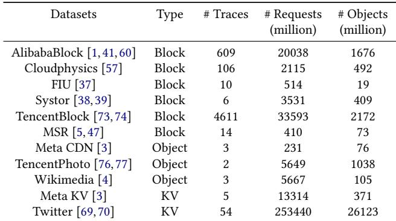  
Table 2: The datasets evaluated in this work.

## 6.2 Discussion

Dynamically adjusting component sizes further improves Merlin’s adaptiveness. The filter queue size decides how long a new object stays in the cache: a larger queue increases the chance of retaining objects with good locality, thereby improving performance, but it wastes space if the objects’ locality is poor. The staging queue reflects a similar tradeof for previously accessed objects that remain classified as cold-rare in the ghost queue, since they are promoted to the staging queue on access (§5.3).

However, how to adapt size remains an open challenge, as shown by the poor performance of existing size-adaptive algorithms (§3.3). Our view on the poor performance is that they lack a theoretical model to guide the adaptation. As future work, we plan to follow prior performance analysis work (§8) to develop a theoretical model for size adaptation.

Extremely small or large caches may degrade performance for Merlin. For extremely small caches, Merlin cannot rely on short-term access behavior as objects are evicted quickly. With extremely large caches, as a single epoch may span multiple phases with diferent access patterns, hotness may not accurately reflect the current phase’s access pattern.

Despite the above, with the configuration in §7.2, Merlin ranks first in 5 datasets under an extremely large cache (20% of WSS), and ranks first or second in 7 datasets under an extremely small cache (0.3% of WSS). Figures are not shown.

Dynamic memory budgets. Merlin assumes a fixed cache size, but in multi-tenant or elastic environments, cache capacity may change dynamically. Such changes can invalidate the hotness and popularity thresholds, since they depend on cache capacity. It requires Merlin to re-adjust these thresholds, which we left as future work.

## 7 Evaluation

Our evaluation answers the following questions:

• Does Merlin adapt to various real-world workloads across diferent cache sizes (§7.2)?

• Does Merlin achieve high throughput and scale with thread counts (§7.3)?

• Is Merlin friendly to flash-based cache systems (§7.4)?

• How sensitive is Merlin to diferent parameters (§7.5)?

• Why is Merlin robust and efective (§7.6)?

## 7.1 Evaluation Setup

Environment. Our evaluation platform is a 2-socket machine equipped with a 192-core AMD EPYC 9965 Processor. The system runs Debian 12 and Linux kernel 6.13.8. We disable hyperthreading, turbo boost to obtain stable results.

Workload. We used 11 open-source datasets with 5423 traces to evaluate Merlin, as shown in Table 2. These traces are diverse in both application domains, including key-value, object CDN, and block caches, and time periods, spanning from 2008 to 2023. In total, these datasets contain 338 billion requests, 33 billion objects, and 11 PB of trafic for a total of 1837.2 TB of data. The object size varies from 1 B to 4 GB across workloads. Following prior work [71], we split Tencent CBS [73] and Alibaba [1] into per-tenant traces.

To demonstrate the efectiveness of Merlin on diferent cache types, we evaluate both scenarios: fixed-size objects and variable-size objects. In total, we ran 38.5 trillion requests, using a million CPU hours.

Baseline. Merlin is compared with 16 eviction algorithms, including 1) classical algorithms: LRU, LFU, FIFO and 2Q [36], 2) recent static algorithms: S3-FIFO [71], LIRS [35], LHD [8], W-TinyLFU [27], GDSF [18], Hyperbolic [13], SIEVE [72], 3) existing adaptive algorithms: ARC [45], CAR [6], Cacheus [48], LeCaR [55]. and 4) a machine-learning-based algorithm: GL-Cache [68]. We follow the default configurations of these algorithms. Given the large number of baseline algorithms, presented figures show only the best performers for clarity.

Configuration. We evaluate for three aspects: hit rate, throughput (for management overhead and multicore scalability), and flash-friendliness (for applicability in flash caches). For hit rates, given the thousands of traces, we follow the conventional approach [8, 48, 68, 71, 72] to evaluate with a cache simulator: libCacheSim [2]. We evaluate throughput with Cachelib (§6). For flash-friendliness, we evaluate Merlin on an extension of libCacheSim.

## 7.2 Hit rate

Hit rate improvement. Figure 11 shows the hit rate of evaluated algorithms. Following [6, 27, 35, 45, 48], we report the improvement over LRU (i.e., HRalgo−HRlru ), since hit rate HRlru ranges widely given many traces and baselines. Merlin significantly outperforms others. On average, Merlin improves the hit rate over LRU by 10.4% when cache size is 10% of the working set size (WWS). In contrast, S3-FIFO, Cacheus, and ARC achieve 7.1%, 6.8%, and 6.1%, respectively. In terms of robustness, Merlin ranks first in 6 out of 11 datasets. As a comparison, S3-FIFO is the best runner-up, ranking first in 3 datasets. Merlin ranks second in another 3 datasets, closely matching the best performance with only 0.5% diference.

Furthermore, as shown in the figure, the performance of

Merlin remains robust across diferent cache sizes; Merlin is always the best in 6 out of 11 datasets and ranks second in another 3 datasets for all cache sizes. The performance of ARC and Cacheus varies significantly with cache size. (See Cloudphysics, Systor, FIU, and TencentPhoto datasets.)

Comparison to dominant algorithms. To further evaluate robustness, we compare Merlin to a dominant algorithm, defined as the best-performing algorithm for each trace under a given cache size.

Figure 13 shows the results of datasets with more than 100 traces, illustrating the robustness of Merlin. For example, in Tencent CBS dataset with a 10% WSS cache size, Merlin’s value at the 1% CDF point (P1) is roughly 88%. This means that, for 99% of traces, Merlin achieves at least 88% of the dominant algorithm’s hit rate (note that the dominant algorithm may vary across traces). In contrast, S3-FIFO, Cacheus, and ARC achieve only about 83%, 76%, and 76%, respectively. Among the 4,611 Tencent CBS traces, Cacheus and ARC have about 138 traces (P3) whose performance falls below 87% of the dominant algorithm, while Merlin achieves 92.5%.

Adversarial workloads for Merlin. To understand the limitations of Merlin, we analyze the traces where Merlin underperforms the best-performing algorithm by more than 5%. These adversarial traces account for 2.9% of all traces. Among them, we identify two representative classes.

The first class is unpredictable workloads, where the past access history does not reflect future reuse behavior. This breaks an inherent assumption of adaptive algorithms, making Merlin, other adaptive algorithms, as well as most static algorithms, underperform.

In particular, we observe three main patterns in this class of objects. First, the trace repeatedly accesses a small set of objects for a long period, but accesses these objects only rarely afterward. Second, the trace accesses a set of objects for a certain amount of time, and then accesses a mostly diferent set of objects. Third, the trace repeatedly alternates between two phases: (a) a scan phase that touches many objects once, and (b) a phase that repeatedly accesses a small set of hot objects, with the hot set changing in every iteration. In the above cases, Merlin may cache the wrong objects for a certain period of time (due to their hotness or popularity in the past), leading to a lower hit rate.

Another class is workloads that cause high false positives in the count-min sketch (§6), therefore making Merlin misclassify unpopular objects as popular. These workloads account for 1.1% of the total traces.

The small amount of adversarial workloads may potentially include correlated workloads, where objects that are semantically related are accessed together. For example, when a user visits a profile page, it may access a set of objects semantically related to that page, e.g., the user’s profile picture, recent posts, and friend list.

Merlin (and many prior algorithms) do not consider the semantics of objects, and thus cannot handle such workloads well. We did not report the portion of these correlated workloads, as it is dificult to manually identify them without a semantic-aware caching algorithm.

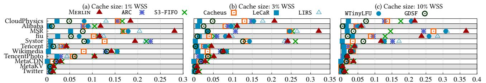  
Figure 11: Hit rate of evaluated algorithms. The x-axis shows hit rate improvement over LRU. Only the best-performing baselines are shown

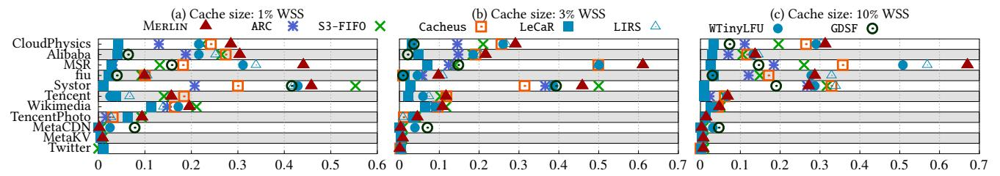  
Figure 12: Byte hit rate of evaluated algorithms The x-axis shows improvement over LRU. Only the best-performing baselines are shown.

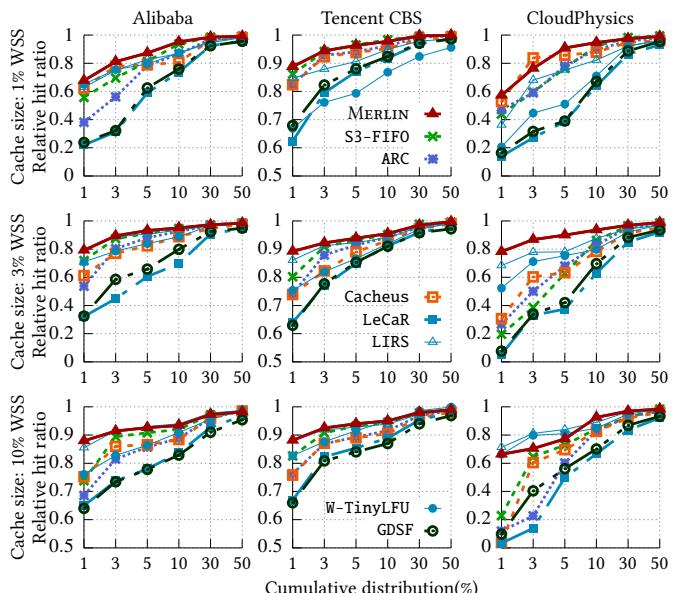  
Figure 13: Relative hit rate compared to the dominant algorithm. The y-axis reports the relative hit rate, and the x-axis presents the ascending-sorted cumulative distribution of traces.

Byte hit rate improvement. The hit rate measures the fraction of requests served from the cache, while another metric is the byte hit rate, i.e., the fraction of requested bytes served from the cache (or ∑(Ob jSizehit) ) This metric considers object ∑(Ob jSizeacc)   
sizes, and is important for CDN, which cares about bandwidth savings. Figure 12 shows the results, where Merlin exhibits trends similar to Figure 11.

## 7.3 Throughput

To evaluate the throughput and management overhead in complex scenarios, we identify typical diverse and shifting access patterns and generate a representative mixed trace, following prior work [8, 71]. We analyze thousands of traces across all datasets and find that most exhibit four primitive access patterns at scale (millions of requests).

We use four distributions to represent four primitive access patterns and randomly shufle them. They are 1) a Zipfian distribution, 2) a uniform distribution, 3) repeated sequential accesses, and 4) scan accesses. Then we randomly shufle them to approach the mixed access patterns in real traces, generating a 200M-request trace with 2M objects. We simulate a 10 µs backend latency when there are cache misses.

Multicore scalability. Figure 14 (a) shows the throughput of evaluated algorithms under thread counts from 1 to 32. Merlin outperforms others significantly, achieving 1.4× to 7.8× higher throughput than others at 32 threads. The reasons are twofold. First, Merlin achieves a high hit rate, reducing backend accesses. For this reason, Merlin outperforms S3-FIFO by around 1.4× across diferent thread counts. Second, Merlin demonstrates strong scalability due to its multi-FIFO queue design (§6.1), while LRU and ARC sufer from lock contention on the LRU list.

Management overhead. Figure 14 (b) removes backend latency to evaluate management overhead (§6.1). Merlin incurs low overhead, thanks to the optimizations in §6, and delivers 16% higher throughput than S3-FIFO. Both Merlin and S3-FIFO achieve 2-3× higher throughput compared to them with backend latency, showing that cache operations are not the bottleneck in real systems. In contrast, LRU and ARC continue to sufer from lock contention.

## 7.4 Flash-friendliness

Modern datacenters use both DRAM and flash devices for caching [28, 44, 50]. In this setup, a key metric is how much data is written to flash, since excessive writes reduce device lifetime. This subsection evaluates this scenario.

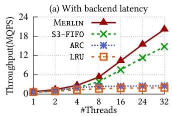

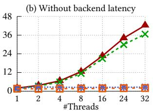

Figure 14: Throughput of the evaluated algorithms.  
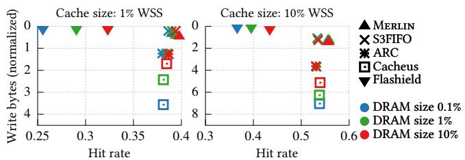  
Figure 15: Write bytes (normalized to trace size) and hit rate in Cloudphysics. The upper-right corner is the best.

Setup. Merlin naturally fits this setup due to its modular design (§5.2): its small filter queue and metadata sit in DRAM, while the staging and core queues reside in flash. We also evaluate several representative baselines. For Flashield [28] and S3-FIFO [71], we use their original designs. For ARC, we set its one-hit list into DRAM and frequency list in flash. For Cacheus, we split the SR-LRU list, keeping the SR portion in DRAM and the R portion in flash.

Adaptiveness in flash-friendliness. Figure 15 shows the flash-friendliness of evaluated algorithms, where we vary 1) the cache size from 1% to 10% of the WSS and 2) the DRAM size from 0.1% to 10% of the cache size. Merlin achieves the highest hit rate with low write bytes. Compared to adaptive algorithms, ARC and Cacheus, Merlin reduces write bytes by 70% and improves absolute hit rate by 1–2%. Compared with S3-FIFO, Merlin produces nearly the same write volume but has 1% absolute hit rate improvement. Flashield reduces write bytes but at the cost of a substantial drop in hit rate.

Merlin performs well in DRAM–Flash hierarchical caching due to both its task-division design (§5.2) and its accurate access-pattern characterization (§4). Compared to Cacheus and ARC, Merlin’s component separation avoids unnecessary flash writes. Compared to S3-FIFO, more accurate access-pattern identification further improves the hit rate.

## 7.5 Sensitivity Analysis

This subsection evaluates the sensitivity of Merlin’s tunable parameters, including 1) the sizes of the filter, staging, and ghost queue; 2) the length of epoch to decide popularity (§5.2); and 3) the size of the count-min sketch (§6).

Queue sizes. Figure 16 shows, across all datasets, how diferent queue sizes afect Merlin’s hit rates. We find that for the evaluated ranges of the filter (5% - 15%), staging (1% - 10%) queues, and ghost (50% - 200% of the cached objects) queues, the hit rate of Merlin is stable; only a few traces show more than 1% hit-rate variation. Among these configurations, the 10% filter, 5% staging, and 100% ghost queues achieve the best overall performance.

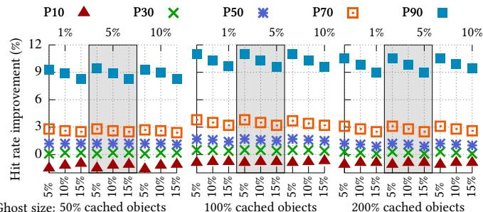  
Ghost size: 50% cached objects  
Bottom: Filter size, Upper: Staging size

Figure 16: Sensitivity evaluation of the filter, staging, and ghost queue sizes (%). The filter queue ranges 5%, 10%, and 15%; the staging queue is set to 1%, 5%, and 10%; and the ghost queue varies across 50%, 100%, and 200% of the cache size. Cache size is 10% of WSS  
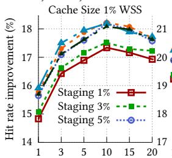  
Filter Size (%)

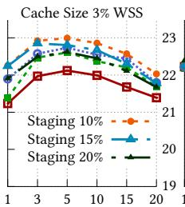  
Filter Size (%)

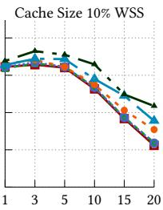  
Filter Size (%)  
Figure 17: Sensitivity evaluation of the filter and staging queue sizes (%) in Cloudphysics dataset. The queue sizes range from 1% to 20% of the cache size. Cache size ranges from 1% to 10% of WSS.

Sensitivity across diferent datasets. To further understand the impact of queue sizes, we evaluate 1) a wider range of queue sizes; and 2) the hit rates across diferent datasets.

Figure 17 shows the results of CloundPhysics, which represents the behavior of most datasets. Merlin’s hit rate is stable in a wide range of filter and staging queue sizes (5%- 15%) with all cache sizes. Merlin only underperforms in two extreme cases: 1) a small filter queue (<5%) under a small cache size (1% of WSS); and 2) a large filter or staging queue (>15%) under a large cache size (10% of WSS).

A few datasets show a slightly diferent behavior. Specifically, for Meta CDN and Tencent Photo with a 10% WSS cache size, a large filter queue increases the hit-rate improvement over LRU by up to 3%. For Wikimedia with a 1% WSS cache size, a small filter queue, and a large staging queue achieves up to 5% improvement.

The length of recorded epochs and the size of the countmin sketch. We evaluate the sensitivity of Merlin to the recorded epoch length (Figure 18) and the count-min sketch size (Figure 19) across all datasets. In summary, Merlin achieves robust performance across a wide range of configurations. For the recorded epoch length ranging from 4 to 128, the hit rate of Merlin is stable in most traces. For a wide range of count-min sketch sizes, corresponding to false positive rates from 0.1% to 5%, Merlin achieves a robust performance, with a few traces benefiting from larger sizes.

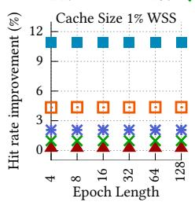

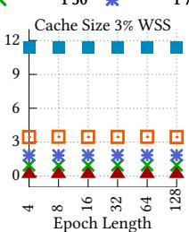

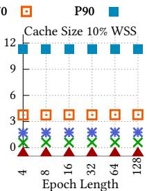  
Figure 18: Sensitivity evaluation of the recorded epoch length, which ranges from 4 to 128.

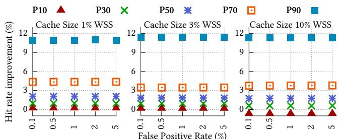  
Figure 19: Sensitivity evaluation of the count-min sketch size. We vary the false positive rate (FP) from 0.1% to 5%.

In a subset of workloads (8% of the total traces), the recorded epoch length and the count-min sketch cause more than 1% variation in hit rate improvement over LRU (figures not shown). This includes around 25% of CloudPhysics traces, 17% of Alibaba traces, 5% of Tencent CBS traces.

Epoch length. With Merlin, the epoch length is set to the cache size. We note that this is not a tunable parameter, as Merlin uses the properties of FIFO queues to track objects within an epoch (for hotness), as discussed in §5.2.

Therefore, to understand the sensitivity of epoch length, we use the ghost queue size to approximate it. Specifically, a small ghost queue approximates a shorter epoch, as Merlin observes hotness for a smaller amount of time. Vice versa, a large ghost queue approximates a longer epoch. As shown in Figure 16, varying ghost queue sizes has little impact, suggesting that Merlin is robust to diferent epoch lengths.

## 7.6 Why is Merlin efective?

To evaluate why Merlin is efective, we measure the precision and average hit count of objects promoted from ghost queues across diferent adaptive algorithms. The precision is the fraction of promoted objects that are later accessed again, indicating the decision accuracy. The average hit count captures how valuable these promoted objects actually are.

Figure 20 reports precision and average hit counts across Twitter and FIU traces. Merlin performs well on both metrics, demonstrating its accurate identification of hot and/or popular objects. In comparison, ARC and Cacheus show much lower precision and hit counts, demonstrating that they do not make good caching decisions.

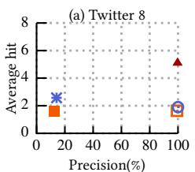

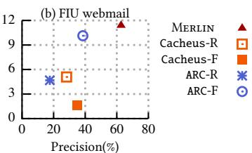  
Figure 20: Precision of access pattern identification.

## 8 Other Related Work

The most important related work (e.g., Cacheus and ARC) has been discussed throughout the paper.

Machine learning based algorithms. LRB [51] and HALP [52] model access sequences and feed object features (e.g., timestamps, gaps, and frequencies) into machine learning predictors to select eviction candidates. These approaches incur high management overhead due to their online training and inference costs.

Performance analysis. HOTL [65], Counter stack [62], and Footprint sampling [63, 64] provide theoretical analysis and approximation methods to predict the hit rate. SHARDS [57], Miniature [56], and Kosmo [49] build small-scale models to estimate cache performance for diferent configurations. Such work complements Merlin.

Clif removal. Ideal eviction policies yield convex hit-rate growth as cache size increases, but real-world policies often show non-convex “clifs.” Talus [9] and Clifhanger [19] mitigate this by segmenting the cache without modifying the underlying algorithm. This work is orthogonal to Merlin.

## 9 Conclusion

This paper presents Merlin, an adaptive cache eviction algorithm that achieves high hit rates across diverse real-world workloads. Merlin’s efectiveness stems from two key designs. First, Merlin proposes a principled fine-grained access characterization method that also accounts for locality and cache size. Specifically, Merlin classifies objects into four types based on hotness and popularity, where the cache size determines the thresholds, and the distribution of types reflects the access patterns. Such a classification allows Merlin to accurately capture a wide spectrum of access patterns beyond a few typical ones. Second, Merlin employs a unified and cohesive architecture that cleanly separates component responsibilities, thereby eliminating the interference seen in prior designs. Evaluations on 11 datasets and 5,423 traces show that Merlin achieves high eficiency, scalability, and low management overhead.

## 10 Acknowledgment

We thank our shepherd and the anonymous reviewers for their insightful comments. The work is supported by the National Key R&D Program of China under Grant No. 2023YFB4502303, and by the National Science Foundation of China (Nos. 62372011, 92582118, 62032001). Diyu Zhou is the corresponding author.

## References

[1] Alibaba block-trace. https://github.com/alibaba/blocktraces.

[2] libCacheSim: a high-performance cache simulator. https:// github.com/1a1a11a/libCacheSim.

[3] Running cachebench with the trace workload. https: //cachelib.org/docs/Cache ibrary ser uides/ CachebenchFBHWeval.

[4] Wikimedia: Analytics/data-lake/trafic/caching. https: //wikitech.wikimedia.org/wiki/Analytics/Data ake/ Traffic/Caching.

[5] Storage Networking Industry Association et al. MSR Cambridge Traces. http://iotta. snia. org/traces/388, 2010.

[6] Sorav Bansal, Dharmendra S Modha, et al. CAR: Clock with Adaptive Replacement. In 3rd USENIX Conference on File and Storage Technologies (FAST) (FAST 04), San Francisco, CA, March 2004.

[7] Soumya Basu, Aditya Sundarrajan, Javad Ghaderi, Sanjay Shakkottai, and Ramesh Sitaraman. Adaptive TTL-Based Caching for Content Delivery. IEEE/ACM transactions on networking, 2018.

[8] Nathan Beckmann, Haoxian Chen, and Asaf Cidon. LHD: Improving Cache Hit Rate by Maximizing Hit Density. In Proceedings of the 15th USENIX Symposium on Networked Systems Design and Implementation (NSDI), Renton, WA, March 2018.

[9] Nathan Beckmann and Daniel Sanchez. Talus: A Simple Way to Remove Clifs in Cache Performance. In Proceedings of the 21st IEEE Symposium on High Performance Computer Architecture (HPCA), San Francisco, CA, February 2015.

[10] Laszlo A. Belady. A Study of Replacement Algorithms for A Virtual Storage Computer. IBM Systems journal, 1966.

[11] Benjamin Berg, Daniel S Berger, Sara McAllister, Isaac Grosof, Sathya Gunasekar, Jimmy Lu, Michael Uhlar, Jim Carrig, Nathan Beckmann, Mor Harchol-Balter, et al. The CacheLib Caching Engine: Design and Experiences at Scale. In Proceedings of the 14th USENIX Symposium on Operating Systems Design and Implementation (OSDI), Virtual, October 2020.

[12] Daniel S Berger, Ramesh K Sitaraman, and Mor Harchol-Balter. Adapt-Size: Orchestrating the Hot Object Memory Cache in A Content Delivery Network. In Proceedings of the 14th USENIX Symposium on Networked Systems Design and Implementation (NSDI), Boston, MA, March 2017.

[13] Aaron Blankstein, Siddhartha Sen, and Michael J Freedman. Hyperbolic Caching: Flexible Caching for Web Applications. In Proceedings of the 2017 USENIX Annual Technical Conference (ATC), Santa Clara, CA, July 2017.

[14] Ali R Butt, Chris Gniady, and Y Charlie Hu. The Performance Impact of Kernel Prefetching on Bufer Cache Replacement Algorithms. In Proceedings of the 2005 ACM SIGMETRICS international conference on Measurement and modeling of computer systems, 2005.

[15] Miguel Castro, Atul Adya, Barbara Liskov, and Andrew C. Myers. HAC: Hybrid Adaptive Caching for Distributed Storage Systems. In Proceedings of the 16th ACM Symposium on Operating Systems Principles (SOSP), Saint-Malo, France, October 1997.

[16] Jiayi Chen, Nihal Sharma, Tarannum Khan, Shu Liu, Brian Chang, Aditya Akella, Sanjay Shakkottai, and Ramesh K Sitaraman. Darwin: Flexible Learning-based CDN Caching. In Proceedings of the 2023 ACM SIGCOMM, New York, NY, September 2023.

[17] Zhifeng Chen, Yuanyuan Zhou, and Kai Li. Eviction-based Cache Placement for Storage Caches. In Proceedings of the 2003 USENIX Annual Technical Conference (ATC), San Antonio, TX, June 2003.

[18] Ludmila Cherkasova. Improving WWW Proxies Performance with Greedy-Dual-Size-Frequency Caching Policy. Hewlett-Packard Laboratories Palo Alto, CA, USA, 1998.

[19] Asaf Cidon, Assaf Eisenman, Mohammad Alizadeh, and Sachin Katti. Clifhanger: Scaling Performance Clifs in Web Memory Caches. In Proceedings of the 13th USENIX Symposium on Networked Systems Design and Implementation (NSDI), Santa Clara, CA, March 2016.

[20] Fernando J Corbato. A Paging Experiment with the Multics System. Massachusetts Institute of Technology, 1968.

[21] Graham Cormode. Count-Min Sketch. Encyclopedia of Database Systems. Springer, 2003.

[22] Graham Cormode and Shan Muthukrishnan. An Improved Data Stream Summary: the Count-Min Sketch and Its Applications. Journal of Algorithms, 2005.

[23] Christina Delimitrou and Christos Kozyrakis. Paragon: QoS-aware scheduling for heterogeneous datacenters. In Proceedings of the 18th ACM International Conference on Architectural Support for Programming Languages and Operating Systems (ASPLOS), Houston, TX, March 2013.

[24] Christina Delimitrou and Christos Kozyrakis. Quasar: Resourceeficient and QoS-aware Cluster Management. In Proceedings of the 19th ACM International Conference on Architectural Support for Programming Languages and Operating Systems (ASPLOS), Salt Lake City, Utah, March 2014.

[25] Peter J Denning. The Working Set Model for Program Behavior. Communications of the ACM, 1968.

[26] Yingkai Dong, Xiangtao Meng, Ning Yu, Zheng Li, and Shanqing Guo. Fuzz-Testing Meets LLM-Based Agents: An Automated and Eficient Framework for Jailbreaking Text-to-Image Generation Models . In Proceedings of the 46th IEEE Symposium on Security and Privacy (Oakland), Los Alamitos, CA, May 2025.

[27] Gil Einziger, Roy Friedman, and Ben Manes. TinyLFU: A Highly Eficient Cache Admission Policy. ACM Transactions on Storage (ToS), 2017.

[28] Assaf Eisenman, Asaf Cidon, Evgenya Pergament, Or Haimovich, Ryan Stutsman, Mohammad Alizadeh, and Sachin Katti. Flashield: a Hybrid Key-value Cache that Controls Flash Write Amplification. In Proceedings of the 16th USENIX Symposium on Networked Systems Design and Implementation (NSDI), Boston, MA, February 2019.

[29] Shuitao Gan, Chao Zhang, Xiaojun Qin, Xuwen Tu, Kang Li, Zhongyu Pei, and Zuoning Chen. Collafl: Path Sensitive Fuzzing. In Proceedings of the 39th IEEE Symposium on Security and Privacy (Oakland), San Francisco, CA, May 2018.

[30] Yoann Ghigof, Julien Sopena, Kahina Lazri, Antoine Blin, and Gilles Muller. BMC: Accelerating Memcached Using Safe In-Kernel Caching and Pre-Stack Processing. In Proceedings of the 18th USENIX Symposium on Networked Systems Design and Implementation (NSDI), Boston, MA, April 2021.

[31] Xiangyang Gou, Yinda Zhang, Zhoujing Hu, Long He, Ke Wang, Xilai Liu, Tong Yang, Yi Wang, and Bin Cui. A Sketch Framework for Approximate Data Stream Processing in Sliding Windows. IEEE Transactions on Knowledge and Data Engineering, 2022.

[32] Deke Guo, Yunhao Liu, Xiangyang Li, and Panlong Yang. False Negative Problem of Counting Bloom Filter. IEEE transactions on knowledge and data engineering, 2010.

[33] Xiaojun Guo, Hua Wang, Ke Zhou, Hong Jiang, Yaodong Han, and Guangjie Xing. FLOWS: Balanced MRC Profiling for Heterogeneous Object-Size Cache. In Proceedings of the 19th European Conference on Computer Systems (EuroSys), Athens, Greece, April 2024.

[34] Song Jiang, Feng Chen, and Xiaodong Zhang. CLOCK-Pro: An Efective Improvement of the CLOCK Replacement. In Proceedings of the 2005 USENIX Annual Technical Conference (ATC), Anaheim, CA, April 2005.

[35] Song Jiang and Xiaodong Zhang. LIRS: An Eficient Low Inter-Reference Recency Set Replacement Policy to Improve Bufer Cache Performance. ACM SIGMETRICS Performance Evaluation Review, 2002.

[36] Theodore Johnson, Dennis Shasha, et al. 2Q: A Low Overhead High Performance Bufer Management Replacement Algorithm. In Proceedings of the 20th International Conference on Very Large Data Bases (VLDB), Santiago de Chile, Chile, September 1994.

[37] Ricardo Koller and Raju Rangaswami. I/O Deduplication: Utilizing Content Similarity to Improve I/O Performance. ACM Transactions on Storage (TOS), 2010.

[38] Chunghan Lee, Tatsuo Kumano, Tatsuma Matsuki, Hiroshi Endo, Naoto Fukumoto, and Mariko Sugawara. Systor’17 Traces (SNIA IOTTA Trace 5102). SNIA IOTTA Trace Repository. Storage Networking Industry Association, 2016.

[39] Chunghan Lee, Tatsuo Kumano, Tatsuma Matsuki, Hiroshi Endo, Naoto Fukumoto, and Mariko Sugawara. Understanding Storage Traffic Characteristics on Enterprise Virtual Desktop Infrastructure. In Proceedings of the 10th ACM International Systems and Storage Conference, Haifa, Israel, May 2017.

[40] Donghee Lee, Jongmoo Choi, Jong-Hun Kim, Sam H Noh, Sang Lyul Min, Yookun Cho, and Chong Sang Kim. LRFU: A Spectrum of Policies that Subsumes the Least Recently Used and Least Frequently Used Policies. IEEE Transactions on Computers, 2001.

[41] Jinhong Li, Qiuping Wang, Patrick PC Lee, and Chao Shi. An in-Depth Analysis of Cloud Block Storage Workloads in Large-Scale Production. In 2020 IEEE International Symposium on Workload Characterization (IISWC), Beijing, China, October 2020.

[42] Chao Lin, Da-Wei Chang, Wei-Jun Chen, Jian-Ting Ke, and Po-Han Huang. Global Clean Page First Replacement and Index-Aware Multistream Prefetcher in Hybrid Memory Architecture. IEEE Transactions on Computer-Aided Design of Integrated Circuits and Systems, 2019.

[43] Ke Liu, Kan Wu, Hua Wang, Ke Zhou, Peng Wang, Ji Zhang, and Cong Li. SLAP: Segmented Reuse-Time-Label Based Admission Policy for Content Delivery Network Caching. ACM Transactions on Architecture and Code Optimization, 2024.

[44] Sara McAllister, Benjamin Berg, Julian Tutuncu-Macias, Juncheng Yang, Sathya Gunasekar, Jimmy Lu, Daniel S. Berger, Nathan Beck mann, and Gregory R. Ganger. Kangaroo: Caching Billions of Tiny Objects on Flash. In Proceedings of the 28th ACM Symposium on Operating Systems Principles (SOSP), Koblenz, Germany, October 2021.

[45] Nimrod Megiddo and Dharmendra S Modha. ARC: A Self-Tuning, Low Overhead Replacement Cache. In 2nd USENIX Conference on File and Storage Technologies (FAST) (FAST 03), San Francisco, CA, March 2003.

[46] Antoine Murat, Clément Burgelin, Athanasios Xygkis, Igor Zablotchi, Marcos Kawazoe Aguilera, and Rachid Guerraoui. SWARM: Replicating Shared Disaggregated-Memory Data in No Time. In Proceedings of the 30th ACM Symposium on Operating Systems Principles (SOSP), Austin, TX, October 2024.

[47] Dushyanth Narayanan, Austin Donnelly, and Antony Rowstron. Write Of-Loading: Practical Power Management for Enterprise Storage. ACM Transactions on Storage (TOS), 2008.

[48] Liana V Rodriguez, Farzana Yusuf, Steven Lyons, Eysler Paz, Raju Rangaswami, Jason Liu, Ming Zhao, and Giri Narasimhan. Learning Cache Replacement with CACHEUS. In 19th USENIX Conference on File and Storage Technologies (FAST) (FAST 21), Virtual, February 2021.

[49] Kia Shakiba, Sari Sultan, and Michael Stumm. Kosmo: Eficient Online Miss Ratio Curve Generation for Eviction Policy Evaluation. In 22nd USENIX Conference on File and Storage Technologies (FAST) (FAST 24), Santa Clara, CA, February 2024.

[50] Zhaoyan Shen, Feng Chen, Yichen Jia, and Zili Shao. DIDACache: A Deep Integration of Device and Application for Flash Based Key-Value Caching. In 15th USENIX Conference on File and Storage Technologies (FAST) (FAST 17), Santa Clara, CA, February 2017.

[51] Zhenyu Song, Daniel S. Berger, Kai Li, and Wyatt Lloyd. Learning Relaxed Belady for Content Distribution Network Caching . In Proceedings of the 17th USENIX Symposium on Networked Systems Design and Implementation (NSDI), Santa Clara, CA, February 2020.

[52] Zhenyu Song, Kevin Chen, Nikhil Sarda, Deniz Altınbüken, Eugene Brevdo, Jimmy Coleman, Xiao Ju, Pawel Jurczyk, Richard Schooler, and Ramki Gummadi. HALP: Heuristic Aided Learned Preference Eviction Policy for YouTube Content Delivery Network. In Proceedings of the 20th USENIX Symposium on Networked Systems Design and Implementation (NSDI), Boston, MA, April 2023.

[53] FH Sumner. One-level Storage System. IEEE Transactions on Computers, 1962.

[54] Sasu Tarkoma, Christian Esteve Rothenberg, and Eemil Lagerspetz. Theory and Practice of Bloom Filters for Distributed Systems. IEEE Communications Surveys & Tutorials, 2011.

[55] Giuseppe Vietri, Liana V Rodriguez, Wendy A Martinez, Steven Lyons, Jason Liu, Raju Rangaswami, Ming Zhao, and Giri Narasimhan. Driving Cache Replacement with ML-based LeCaR. In 10th USENIX Workshop on Hot Topics in Storage and File Systems (HotStorage 18), 2018.

[56] Carl Waldspurger, Trausti Saemundsson, Irfan Ahmad, and Nohhyun Park. Cache Modeling and Optimization Using Miniature Simulations. In Proceedings of the 2017 USENIX Annual Technical Conference (ATC), Santa Clara, CA, July 2017.

[57] Carl A Waldspurger, Nohhyun Park, Alexander Garthwaite, and Irfan Ahmad. Eficient MRC Construction with SHARDS. In 13th USENIX Conference on File and Storage Technologies (FAST) (FAST 15), San Fran cisco, CA, February 2015.

[58] Kefei Wang and Feng Chen. Catalyst: Optimizing Cache Management for Large In-memory Key-value Systems. Proc. VLDB Endow., 2023.

[59] Kefei Wang, Jian Liu, and Feng Chen. Put an Elephant into a Fridge: Optimizing Cache Eficiency for In-Memory Key-Value Stores. Proceedings of the VLDB Endowment, 2020.

[60] Qiuping Wang, Jinhong Li, Patrick PC Lee, Tao Ouyang, Chao Shi, and Lilong Huang. Separating Data Via Block Invalidation Time Inference for Write Amplification Reduction in Log-Structured Storage. In 20th USENIX Conference on File and Storage Technologies (FAST) (FAST 22), Santa Clara, CA, February 2022.

[61] Yang Wang, Hao Dai, Xinxin Han, Pengfei Wang, Yong Zhang, and Chengzhong Xu. Cost-driven Data Caching in Edge-based Content Delivery Networks. IEEE Transactions on Mobile Computing, 2021.

[62] Jake Wires, Stephen Ingram, Zachary Drudi, Nicholas JA Harvey, and Andrew Warfield. Characterizing Storage Workloads with Counter Stacks. In Proceedings of the 11th USENIX Symposium on Operating Systems Design and Implementation (OSDI), Broomfield, Colorado, October 2014.

[63] Xiaoya Xiang, Bin Bao, Tongxin Bai, Chen Ding, and Trishul Chilimbi. All-Window Profiling and Composable Models of Cache Sharing. ACM SIGPLAN Notices, 2011.

[64] Xiaoya Xiang, Bin Bao, Chen Ding, and Yaoqing Gao. Linear-Time Modeling of Program Working Set in Shared Cache. In Proceedings of the 20th International Conference on Parallel Architectures and Compilation Techniques (PACT), Galveston, TX, October 2011.

[65] Xiaoya Xiang, Chen Ding, Hao Luo, and Bin Bao. HOTL: A Higher Order Theory of Locality. In Proceedings of the 18th ACM International Conference on Architectural Support for Programming Languages and Operating Systems (ASPLOS), Houston, TX, March 2013.

[66] Haoyu Xiao, Ziqi Wei, Jiarun Dai, Bowen Li, Yuan Zhang, and Min Yang. HouseFuzz: Service-Aware Grey-Box Fuzzing for Vulnerability Detection in Linux-Based Firmware. In Proceedings of the 46th IEEE Symposium on Security and Privacy (Oakland), Los Alamitos, CA, May 2025.

[67] Gala Yadgar, MOSHE Gabel, Shehbaz Jafer, and Bianca Schroeder. SSDbased Workload Characteristics and Their Performance Implications. ACM Trans. Storage, 2021.

[68] Juncheng Yang, Ziming Mao, Yao Yue, and KV Rashmi. GL-Cache: Group-Level Learning for Eficient and High-Performance Caching. In 21st USENIX Conference on File and Storage Technologies (FAST) (FAST 23), Santa Clara, CA, February 2023.

[69] Juncheng Yang, Yao Yue, and K. V. Rashmi. A Large Scale Analysis of Hundreds of In-Memory Cache Clusters at Twitter. In Proceedings of the 14th USENIX Symposium on Operating Systems Design and Implementation (OSDI), Virtual, October 2020.

[70] Juncheng Yang, Yao Yue, and KV Rashmi. A Large-Scale Analysis of Hundreds of in-Memory Key-Value Cache Clusters at Twitter. ACM Transactions on Storage (TOS), 2021.

[71] Juncheng Yang, Yazhuo Zhang, Ziyue Qiu, Yao Yue, and Rashmi Vinayak. FIFO Queues Are All You Need for Cache Eviction. In Proceedings of the 29th ACM Symposium on Operating Systems Principles (SOSP), Koblenz, Germany, October 2023.

[72] Yazhuo Zhang, Juncheng Yang, Yao Yue, Ymir Vigfusson, and KV Rashmi. SIEVE is Simpler than LRU: an Eficient Turn-Key Eviction Algorithm for Web Caches. In Proceedings of the 21st USENIX Symposium on Networked Systems Design and Implementation (NSDI), Santa Clara, CA, April 2024.

[73] Yu Zhang, Ping Huang, Ke Zhou, Hua Wang, Jianying Hu, Yongguang Ji, and Bin Cheng. Tencent Block Storage Traces (SNIA IOTTA Trace Set 27917). SNIA IOTTA Trace Repository. Storage Networking Industry Association, 2018.

[74] Yu Zhang, Ping Huang, Ke Zhou, Hua Wang, Jianying Hu, Yongguang Ji, and Bin Cheng. OSCA: An Online-Model Based Cache Allocation Scheme in Cloud Block Storage Systems. In Proceedings of the 2020 USENIX Annual Technical Conference (ATC), Virtual, July 2020.

[75] Laiping Zhao, Yanan Yang, Yiming Li, Xian Zhou, and Keqiu Li. Understanding, Predicting and Scheduling Serverless Workloads under Partial Interference. In Proceedings of the 2021 International Conference for High Performance Computing, Networking, Storage and Analysis (SC), St. Louis, MO, November 2021.

[76] Ke Zhou, Si Sun, Hua Wang, Ping Huang, Xubin He, Rui Lan, Wenyan Li, Wenji Liu, and Tianming Yang. Tencent Photo Cache Traces (SNIA IOTTA Trace Set 27476). SNIA IOTTA Trace Repository. Storage Networking Industry Association, 2016.

[77] Ke Zhou, Si Sun, Hua Wang, Ping Huang, Xubin He, Rui Lan, Wenyan Li, Wenjie Liu, and Tianming Yang. Demystifying Cache Policies For Photo Stores at Scale: A Tencent Case Study. In Proceedings of the 2018 International Conference on Supercomputing (ICS), Beijing, China, June 2018.

[78] Yuanyuan Zhou, James Philbin, and Kai Li. The Multi-Queue Replacement Algorithm for Second Level Bufer Caches. In Proceedings of the 2001 USENIX Annual Technical Conference (ATC), June 2001.