USENIX

THE ADVANCED COMPUTING SYSTEMS ASSOCIATION

# Harvesting Sub-Microsecond CXL Memory Stalls with LiteSwitch

Nanqinqin Li, Princeton University; Yuhong Zhong and Asaf Cidon, Columbia University; Michael J. Freedman, Princeton University https://www.usenix.org/conference/osdi26/presentation/li-nanqinqin

# This paper is included in the Proceedings of the 20th USENIX Symposium on Operating Systems Design and Implementation.

July 13–15, 2026 • Seattle, WA, USA

ISBN 978-1-939133-55-7

Open access to the Proceedings of the 20th USENIX Symposium on Operating Systems Design and Implementation is sponsored by

# Harvesting Sub-Microsecond CXL Memory Stalls with LITESWITCH

Nanqinqin Li Princeton University

Yuhong Zhong Columbia University

Asaf Cidon Columbia University

Michael J. Freedman Princeton University

## Abstract

Compute Express Link (CXL) offers a practical path to scale memory capacity and bandwidth available to a single host. However, CXL memory incurs sub-microsecond latency that is typically 3× or more compared to local memory, exacerbating memory-induced CPU stalls and degrading appli cation performance. This paper presents LITESWITCH, a lightweight hardware-software co-design that opportunistically harvests otherwise idle cycles caused by CXL memory accesses. LITESWITCH introduces: (1) a hardware mechanism that precisely identifies a CXL-induced memory stall and exposes it to software with near-perfect accuracy and min imal overhead; (2) an ultra-fast software path that switches to another ready thread for harvesting in under 20 nanoseconds, an order of magnitude faster than conventional context switches. Together, these mechanisms enable efficient harvesting of sub-µs-scale memory stalls (> 200 nanoseconds), without requiring changes to the application. The evaluation demonstrates that with a sufficient number of available threads per core, LITESWITCH recovers up to 80% of the performance lost due to CXL access latency, enabling the adoption of CXL memory without prohibitive slowdowns.

## 1 Introduction

Compute Express Link (CXL) has emerged as a promising technology to scale memory capacity and bandwidth at the server/rack levels beyond DDR limitations [48]. CXL is being evaluated in four concrete use cases: (1) capacity expansion via tiered or pooled memory, where CXL-attached DRAM/SSD extends host DRAM for memory-hungry services at lower TCO (total cost of ownership) [6, 10, 25, 33, 44, 63, 64, 66]; (2) utilization improvement by pooling across servers memory [44] and PCIe devices (NICs, SSDs) [67] over CXL; (3) bandwidth scaling by interleaving host DRAM and CXL memory to aggregate DDR and PCIe channels [30]; and (4) pod-level shared memory for distributed systems to reduce messaging overhead [31, 52].

However, these benefits come at a performance cost, as accessing CXL-attached memory incurs much higher latency compared to local DRAM. Measured CXL memory devices report load latencies of 214-394 ns (nanoseconds), compared to 81-117 ns for DRAM [48], while pooled CXL deployments can reach up to 1 µs (microsecond) depending on topology, device type, and multi-tenant interference [10, 44, 67]. This higher latency exacerbates memory-induced CPU stalls (i.e., backend stalls) that already dominate execution time even on systems with only local memory. Empirically, many memoryintensive and cloud-scale workloads spend the majority (20- 80%) of their cycles stalled on memory [21, 37, 50]. Under the same synchronous, blocking load/store interface, CXL’s higher latency therefore prolongs each stall by hundreds of nanoseconds, amplifying an already significant inefficiency.

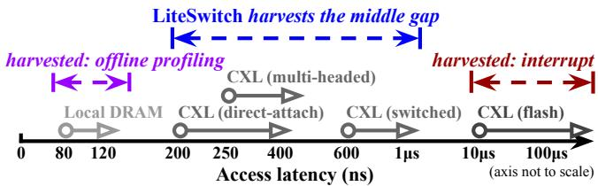  
Figure 1: Illustration of CXL memory latency and the scope of prior work. CXL expands memory access latency from roughly 200 ns with direct-attach CXL memory to tens of µs with flashbacked CXL memory. Prior work harvests memory-induced CPU stall cycles near local DRAM latencies and at flash-scale latencies, leaving a substantial sub-µs “middle gap” that LITESWITCH targets.

This problem can be mitigated if the system could still do useful work while a thread is blocked waiting for memory access: a mechanism termed stall cycles harvesting. Simultaneous multithreading (SMT) mitigates memory stall cycles by interleaving two independent hardware threads on a shared core: when one thread stalls, the other can continue issuing instructions. However, SMT’s concurrency is inherently limited: two hardware threads already saturate most cores’ backends without incurring excessive intra-core contention [23, 42, 59]. Under long CXL stalls, both hardware threads can easily stall simultaneously. Moreover, even when only one thread is stalling, SMT cannot ‘un-stall’ that thread, thus the core falls back to lower utilization achievable by a single thread.

Software-based approaches instead ‘un-stall’ a blocked thread in place when stall happens and invoke a software routine to run another ready context (termed a scavenger) [50,65]. MSH [50] relies on offline profiling to identify likely stall sites, while SkyByte [65] targets much higher (tens of µs) CXL-SSD latencies by using interrupts to preempt the blocked thread and then leveraging kernel-level scheduling. However, these designs face three fundamental obstacles when harvesting sub-µs CXL memory stalls (§3). (1) Detection. Software lacks advance knowledge (i.e., at compile time) of when a CXL stall occurs or how long it will last. Because CXL latency is highly variable and topology-dependent, offline profiling is unreliable in dynamic, multi-tenant environments. (2) Delivery. Traditional interrupt delivery is a costly hardware path that must drain the CPU’s speculative and out-of-order state and establish a precise architectural state, incurring sub-µs overhead that easily consumes the entire harvestable window. (3) Scheduling. Although user-level scheduling makes choosing the next runnable context cheap, switching between contexts remains expensive even in opti mized runtimes [22, 36], where saving and restoring CPU’s extended SIMD/FP state (xstate) alone costs tens to hundreads of nanoseconds.

This paper makes four key observations and insights to guide the design for efficiently harvesting CXL memory stalls:

• Any memory access targeting a CXL memory device can be meaningfully harvested, given the naturally large gap between local DRAM and CXL latencies (3× or more). This uniform treatment simplifies stall detection into two hardware operations already on the memory request path: a cache lookup (whether in L1/L2/LLC) and a routing decision (whether it targets a CXL memory device), achieving near-perfect accuracy with negligible extra overhead.

• Harvesting should occur within the same address space. This insight enables the possibility that stalls can be delivered to software via lightweight branching (i.e., control-flow jumps) than expensive interrupts.

• Any regular worker thread can act as a scavenger during harvesting, rather than dedicating separate best-effort threads. This enables simplified scavenger selection logic and avoids paying context switch cost twice per stall.

• Usage of CPU extended state (xstate) is uncommon in most code, thus saving and restoring xstate can be skipped safely when it is not actively used in a context.

This paper presents LITESWITCH, a lightweight hardwaresoftware co-design that opportunistically harvests sub-µs CXL memory stall cycles, without requiring changes to the application. On the hardware side, LITESWITCH proposes Location-Dependent Memory Branching (LDMB, §4.1), a simple and novel CPU mechanism that detects stall conditions online and per-access based on existing cache lookup and routing operations. Then, LDMB un-stalls the CPU hardware thread and delivers the notification to software via a direct control flow jump. LDMB revives the classic architectural idea of cache-miss-triggered software handling, which was previously shown to support low-overhead memory-performance monitoring and software-driven memory optimizations [28].

On the software side, LDMB’s control jump invokes the Bundled Handoff handler (§4.2), where a small set of user threads from the same user process (a “bundle”) is multiplexed on each hardware thread for fast scavenger selection and handoff, without interfering with the process’s regular scheduler. This design is further optimized by xstate-Aware Context Switch (§4.3) that safely skips unnecessary saving and restoring of SIMD/FP state (xstate), reducing context switch overhead to under 20 ns for non-compute-dense applications.

The observations and insights that guided LITESWITCH’s design are grounded in measurements on a real CXL hardware tiering system in Intel Flat Memory Mode [6, 66]. However, a physical LDMB prototype is not implemented mainly because FPGAs cannot accurately model modern CPU’s memory hierarchy. Instead, LITESWITCH uses emulation (§5.1) to reproduce realistic CXL memory stall behaviors and provide a software interface for running unmodified applications.

Together, LITESWITCH is a mechanism that can efficiently harvest memory stalls longer than 200 ns, making it effective even on the fastest, locally-attached CXL memory devices (Figure 1). The evaluation (§6) shows that LITESWITCH reduces performance slowdowns by up to 80% (multiplicatively) relative to the setup with 200-ns CXL access latency across diverse workloads. Crucially, LITESWITCH produces consistently low slowdowns even under more complex CXL configurations with higher latency and greater variability, highlighting its potential to enable practical adoption of CXL memory. The artifact of LITESWITCH is open-sourced [45].

LITESWITCH makes the following contributions:

• A characterization of unique challenges, observations, and insights for efficient harvesting of CXL memory stalls.

• A hardware proposal of LDMB for online, per-access stall detection and branch-based delivery that achieves nearperfect accuracy with negligible extra overhead.

• An ultra-lightweight software handler path that enables instant scavenger selection and minimal context switch overhead, without interfering with high-level scheduling policies or compromising correctness.

• A prototype emulation that runs unmodified applications to faithfully evaluate LITESWITCH, with comprehensive results showing it significantly reduces slowdowns.

## 2 Background and Motivation

CXL is a high-speed interconnect over the PCIe fabric that lets CPUs, accelerators, and device-attached memory participate in a unified memory space [17]. This paper focuses on the key use case of memory expansion via the CXL.mem protocol (Type-3 devices), which exposes device-attached memory to the CPU via load/store semantics.

The heterogeneity of CXL memory. As illustrated in Figure 1, CXL-attached memory spans a wide latency spectrum that is largely determined by device type and topology. Its inherent heterogeneity is shaped by device characteristics, CXL memory controller complexity, and topology. Recent measurements on production CXL memory expanders report load-to-use latencies of roughly 214–271 ns for locally attached, ASIC-based devices, only modestly higher than NUMA DRAM, while a single CXL switch or remote NUMA hop can push average latency toward 600 ns and beyond in multi-hop fabrics [48]. At the other extreme, CXL-attached flash devices incur tens or hundreds of µs when requests miss DRAM caches and access NAND, though DRAM-cache hits can be served in sub-µs time [47, 64, 65].

To mitigate the monetary cost and latency overheads of CXL switching, emerging multi-headed CXL devices expose multiple host links into a single DRAM-backed pool, enabling rack-scale shared memory without an external CXL switch; these devices are an appealing solution for multi-host memory sharing [10, 27, 31, 35, 67].

Availability and use cases of CXL memory. CXL memory is available through a growing hardware ecosystem and is being explored in several concrete use cases. 25+ vendors ship CXL-capable CPUs, memory, switches, and controllers [15]. Recent systems (e.g. Intel Xeon 6 and AMD 5th Gen EPYC) provide 64 CXL lanes per socket [1, 2], for an aggregate 200–240 GB/s of bandwidth per direction (each lane provides 3.12–3.75 GB/s in each direction). In late 2025, Microsoft Azure launched the industry’s first deployment of CXL-attached memory (in private preview) on its M-series VMs that leverages Intel Xeon 6 in Flat Memory Mode to support multi-terabyte in-memory workloads such as SAP HANA [33]. PNNL’s Crete project employs a large pool of CXL-attached coherent memory alongside local DRAM to enable scientific and AI workloads to operate on datasets far larger and more shared than is possible on traditional HPC architectures [55]. At SC’25, XConn demonstrated a CXL memory pool shared across two NVIDIA H100 servers, achieving up to 6.5× higher throughput than RDMA for LLM inference and drastically reducing time-to-first-token [57].

## 2.1 CXL Exacerbates Memory Stalls

Memory-induced CPU stalls are already a major inefficiency on DRAM-only systems. Empirical studies show that many memory-intensive and cloud-scale workloads spend a large fraction of their total cycles stalled on memory: 25-31% for inmemory key-value and analytics workloads such as Masstree and Sphinx [50], around 50% in warehouse-scale web and storage services [37], and up to 80% in classic scale-out workloads such as OLTP, social networking, and data-serving [21].

CXL’s higher access latency materially worsens this inef ficiency. Studies on real CXL tiering and pooling systems confirm application-visible slowdowns relative to DRAMonly systems: Memstrata observes performance degradation of up to 34% even with hardware-managed tiering under moderate interference [66], and Pond reports that 21% of evaluated workloads experience > 25% slowdown on an 8-socket, multi-tenant CXL fabric [44].

## 2.2 Stall Harvesting Meets CXL Memory

With the heterogeneity of CXL memory, the synchronous load/store interface meets far more variable and longer-latency access paths, yielding a unique profile: stalls are hundreds of nanoseconds with much higher latency variability.

On the high-latency end, SkyByte [65] targets stalls in CXL-SSDs that are tens of µs. When a request misses the device’s internal DRAM cache and thus falls through NAND, the device raises an interrupt to ‘un-stall’ the thread; the OS kernel then schedules and switches context. This path has µsscale overhead that is appropriate for misses in CXL-SSDs, but too costly to pay per event for sub-µs CXL memory stalls.

Offline profiling-based stall site identification can eliminate this cost altogether, but it assumes predictable stall locations. While this holds in some systems with only local DRAM [50], CXL introduces substantially greater variability: a memory page may reside on a direct-attach device, a multi-headed device, or behind a switch. Moreover, multi-tenant interference, which is common in CXL memory expansion use cases, further exacerbates unpredictability.

As a result, there is a substantial gap from ∼ 200 ns to ∼ 1 µs (Figure 1), in which stalls are common and harmful, yet existing solutions fall short. This gap calls for a harvesting mechanism that identifies stalls accurately and promptly in dynamic conditions and is ultra-lightweight in stall delivery and context switching.

## 3 Problem Statement and Challenges

The goal of LITESWITCH is to efficiently and transparently harvest CPU stall cycles on the order of hundreds of nanoseconds induced by CXL memory access, without application changes. LITESWITCH targets a harvestable budget of 200 ns per stall, representative of CXL access latency for the simple memory extension use case, while more complex configurations such as pooling typically exhibit even longer stalls.

The general problem of stall harvesting decomposes into three steps: detection, delivery, and scheduling. Stall detection refers to the timely and accurate identification of stall conditions long enough to harvest. Stall delivery then ‘unstalls’ the hardware thread and invokes a software handler, with low overhead. Finally, the stall handler rapidly selects and switches to a ready scavenger thread. For harvesting to be worthwhile, the combined overhead of the three steps must be well below the 200-ns budget.

Detection: CXL memory latency is more unpredictable and variable than local DRAM. The detection task’s goal is to decide, early in the memory access path, whether a request will incur a high latency so that harvesting can begin in time. As discussed, offline profiling based methods assume predictable memory behavior. CXL adds layers of variability on top of an already opaque memory hierarchy: memory pages can move transparently between L1/L2/LLC, local DRAM, direct-attach CXL devices, and locations deeper into the CXL fabric. For example, in Intel Flat Memory Mode, a memory load can take anywhere from 1 ns (L1 cache hit)

to ∼ 300 ns (local DRAM miss) [66], and software cannot know at compile time what latency the load will exhibit.

This motivates a runtime hardware hint that indicates, with sufficient lead time, that a request is on the high latency path. For example, a load reaching the memory controller has already missed the cache and is a candidate for harvesting; more informative hints (e.g., queueing delay) are available deeper in the path (e.g., at the device-side CXL controller), but observing them at that point delays detection and thus reduces the harvestable window. The design questions are: which hint yields high accuracy, and where along the access path should it originate from to balance timeliness and accuracy?

Delivery: the load/store interface lacks a lightweight mechanism to ‘un-stall’ a hardware thread. After a stall hint is raised, the hardware thread must be notified and control needs to be transferred to a software handler quickly. The closest mechanism today is hardware interrupt, but it is too costly for harvesting cycles in a sub-µs window. To deliver an interrupt safely, the CPU must squash speculative and out-oforder state and establish a precise architectural state before redirecting control. This path can cost hundreds of ns even when no privilege transition is needed (e.g., Intel User Inter rupts allow direct user-space delivery of interrupts) [8,26]. An interrupt delivery costs around 600 ns in LITESWITCH’s measurements, far exceeding the harvesting budget. Therefore, a hardware primitive that delivers a stall notification directly to a user-space handler, but at a much lower cost, is desired.

Scheduling: full context switching is too heavy for subµs stalls. After delivery, the software handler must choose a scavenger thread and switch to it with minimal overhead, without violating critical scheduling properties (e.g., fairness and responsiveness) and without application changes. Existing user-level, µs-scale scheduling designs have significantly optimized the logic for selecting the next runnable thread [22,32,36], but context switches still remain costly [46]. A full context switch saves and restores large architectural state, including general registers, extended SIMD/FP state, and ancillary metadata that could read and write KiBs of data, taking up to ∼ 300 ns in LITESWITCH’s experiments. Naively, through register liveness analysis, CPU state can be saved selectively because only a subset is actually live at any given context [50], but stalls are inherently arbitrary (i.e., any memory access could end up stalling). As a result, such analysis would either require costly online inspection or be infeasible to perform comprehensively offline. These costs necessitate a lightweight software handoff mechanism.

## 4 Design

Three principles guided the design of LITESWITCH: (1) while hardware changes are deemed necessary, LITESWITCH must incrementally build on existing hardware capabilities rather than introducing new ones; that is, the hardware mechanisms needed to support LITESWITCH should be trivially feasible on a real ISA platform; (2) unmodified applications should benefit from LITESWITCH across diverse workloads; and (3) the end-to-end overhead of detection, delivery, and scheduling must be as lightweight as possible to maximize harvesting.

Figure 2 demonstrates the overall architectural flow of LITESWITCH. At a high level:

• LITESWITCH detects stalls online and per-access in hardware to leverage first-hand hint of latency formation and performs detection as early as possible in the request path.

• LITESWITCH delivers stall notifications via lightweight control-flow jumps, confining harvesting activities within the same address space.

• LITESWITCH employs a simplified scavenger selection logic and performs context switch with the minimal execution state necessary for correctness.

For detection, LITESWITCH builds on the observation that any memory access targeting a CXL memory device can be meaningfully harvested. This intuition arises from the naturally large latency gap (typically 3× or more) between local DRAM and CXL memory. While more challenging to harvest, treating all CXL memory uniformly allows LITESWITCH to abstract away device and topology variability and simplify stall detection into two hardware operations already on the critical path for every memory request, a cache lookup (i.e., whether in L1/L2/LLC) and a routing decision (i.e., whether the target location resides on a CXL device), making detection trivially feasible. Critically, these operations occur entirely in the host CPU, avoiding the prohibitive delay of traversing the CXL fabric. With the two existing operations, LITESWITCH achieves per-access, online stall detection with near-perfect accuracy and adds negligible hardware overhead. Also, detection only applies to memory load, since memory store is either absorbed by CPU cache or triggers a read-for-ownership (RFO) and becomes a load anyways.

For delivery, LITESWITCH makes the design choice that harvesting should occur within the same address space. In OS terms, this typically means within the same user process, where the scavenger workers and the stall handler coexist with regular application threads. By restricting harvesting to a single address space, the handler becomes just another function and thus delivery avoids privilege transitions, CR3 changes, IDT lookup, and stack switching. Moreover, because harvestable stalls are tied to specific high-latency loads, the triggering condition is synchronous and precise: the CPU already knows the exact instruction boundary at which control must be redirected (similar to synchronous exceptions like page faults and divide errors) [34]. This further eliminates the need for establishing a precise state for asynchronous events like interrupts. Therefore, the hardware can enter the stall handler via a branch-like redirect that only needs to squash younger speculation, costing only tens of cycles [14, 18, 56].

To realize this, LITESWITCH introduces a new CPU mechanism called Location-Dependent Memory Branching (LDMB, §4.1), which detects stall conditions in the CPU’s memory controller based on L1 the cache residency and L2 a routing decision, and delivers the notification to the user process by L3 directly branching to LITESWITCH’s software stall handler within the same address space.

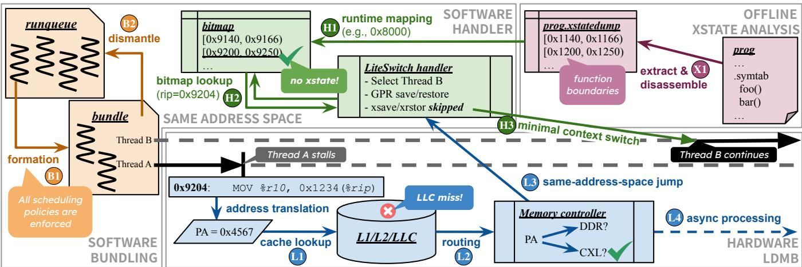  
Figure 2: Overall system architecture of LITESWITCH. This figure illustrates the key components and workflow during a stall harvesting event for a multi-threaded program prog. When Thread A executes a load (rip = 0x9204) that L1 misses the cache, the memory controller L2 routes it to CXL, triggers a stall, and transfers control to the LITESWITCH handler via L3 a jump while the load L4 is being processed asynchronously. The handler performs H2 a bitmap lookup (derived from X1 offline xstate analysis and H1 runtime bitmap mapping) and determines that the stall occurred in an xstate-free context, allowing it to skip xsave/xrstor during H3 the context switch. Thread B then executes to harvest the otherwise wasted cycles. Bundles are formed B1 and dismantled B2 dynamically by the application’s regular scheduler.

For scheduling, LITESWITCH adopts the design choice that any regular worker thread can act as a scavenger for harvesting, rather than dedicating separate best-effort threads. This leads to a mechanism called Bundled Handoff (§4.2), which multiplexes a small set of user threads, termed a bundle, on each CPU hardware thread. A bundle is B1 formed by the user process’s regular scheduler (the kernel scheduler or a userlevel one), which applies its normal policies when selecting threads, except that it groups multiple threads into a bundle than running a single thread. During the bundle’s lifetime, a stall notification from LDMB invokes LITESWITCH’s handler, which switches execution among threads within the bundle. Critically, bundle formation is dynamic: when the bundle is de-scheduled (e.g., a thread issued a blocking I/O), the bundle B2 breaks and all threads are returned to the regular scheduler for the next bundling, which will likely not be the same formation. Bundled Handoff does not require changes to the application and operates within the scope and capabilities of the user process’s regular scheduler than overshadowing it.

Finally, LITESWITCH minimizes context switch overhead by selectively skipping saving and restoring CPU’s extended SIMD/FP state (xstate), a mechanism termed H3 xstate-Aware Context Switch (§4.3). This is based on the observation that xstate takes up > 80% of total context switch overhead, but its live usage is sparse in most code paths. For each application, LITESWITCH performs X1 a one-time offline analysis to identify functions that do not use xstate at all, H2 allowing stalls triggered within these contexts to be harvested safely without doing xstate save and restore. This method reduces an impractical register liveness analysis problem to a static, binary lookup, avoids most unnecessary xstate save/restore, and preserves context switch correctness.

## 4.1 Location-Dependent Memory Branching

LDMB is a simple hardware mechanism that LITESWITCH uses for online, per-access stall detection with same-addressspace delivery. LDMB builds on the architectural principle in prior “cache-miss trap” mechanisms, which showed that miss-triggered, branch-like delivery to software handlers is feasible in both in-order and out-of-order processors [28]. LITESWITCH does not implement a physical LDMB prototype; instead, it emulates the mechanism’s behavioral effect (§5.1). The scope of this work is not to specify a circuit-level design, but to demonstrate that such a mechanism, if available in modern CPUs, enables useful software capabilities. FPGAs are fundamentally unable to reproduce the timing, concurrency, and microarchitectural behaviors of the memory hierarchy in modern server-grade CPUs [13, 38, 39]. This subsection therefore outlines the high-level LDMB design and argues that it is trivially feasible to implement in real CPUs. The design is grounded in modern Intel x86\_64, but the ideas should be generally portable to other ISAs.

Detecting CXL memory accesses and branch-based delivery. When a load misses in the LLC, the uncore memory subsystem routes the request to either DDR or CXL. In Intel Flat Memory Mode, CXL serves as a slower tier behind a direct-mapped DRAM cache; the memory controller reads the DRAM line and checks its tag to decide whether the access missed DRAM and must be re-issued over CXL. In setups where CXL devices are directly exposed to the software (e.g., software-managed tiering), the high-order bits of the physical address (PA) determine DDR versus CXL routing [16]. In both scenarios, cache lookup and routing are already on the standard path; LDMB simply reuses this logic.

After a CXL memory load is detected and a miss status holding register (MSHR) entry is allocated for it, the memory controller raises a short signal back to the core complex, analogous to existing core-interconnect notifications such as “data-return.” The signal triggers a brief microcode sequence that flushes younger micro-ops and transfers control to a preregistered handler address, akin to a branch-misprediction redirect. This redirect is same-privilege by construction: a user-mode LDMB enters a user-mode handler, while a kernelmode LDMB can only enter a kernel-mode handler. Because signaling occurs after MSHR allocation, the miss has already been issued and will be serviced asynchronously. Therefore, LITESWITCH’s handler does not need to explicitly prefetch or manage completion. Upon resumption, the software simply retries the load. By then the line will typically hit in cache. If not, the line buffer coalesces the retry with the outstanding miss, so the retry only waits for the remaining service time rather than incurring another full-latency stall.

Considerations for memory-level parallelism (MLP). In modern out-of-order (OoO) processors, MLP allows multiple outstanding misses to overlap before a data dependency forces the core to stall. Thus, not every CXL-bound LLC miss is a harvestable stall event, and LDMB should redirect only on a true stall. Inspired by prior switch-on-event (SOE) mechanisms [5, 11, 24, 53], a true stall can be defined as a CXL-bound miss that is blocking in-order retirement: the miss is unresolved and its corresponding entry is at the head of the reorder-buffer (ROB). This condition is simple to test because OoO cores already maintain the association between an outstanding miss and the instruction that produced it. Therefore, LDMB can follow the principle used in SOE: when the memory controller signals a CXL-bound miss, LDMB’s microcode compares that miss’s ROB entry with the ROB head. If the entry is already at the head and the miss remains unresolved, LDMB proceeds with the redirect; otherwise, LDMB simply drops the opportunity and lets OoO execution continue.

This one-shot policy avoids complex tracking, such as tagging the ROB entry and redirecting later if it eventually reaches the ROB head. The lost opportunities should be rare. From the time the load issues, the core continues decoding and dispatching while the request traverses the TLB and cache hierarchy, is classified as CXL-bound, and then sends a signal back to the core. This path is a full DDR access (∼100 ns) in Intel Flat Memory mode, and can be modeled as LLC-hitscale (∼20 ns) in direct-expose CXL configurations. Even at the shorter 20-ns timescale, prior studies show that modern OoO cores often exhaust their effective instruction window on real workloads [40, 41]. Therefore, by the time the LDMB signal arrives, the associated CXL-bound miss is likely already retirement-blocking. The ROB-head test captures these common cases while keeping LDMB’s hardware contract deliberately small but effective.

Software interface. LDMB exports a small set of control registers, collectively called LCR, modeled after conventional x86 model-specific registers (MSRs). Specifically, LCRc provides enable bits and optional control knobs (e.g., range masks for advanced features), while LCRh stores the address of the LITESWITCH stall handler entry stub that LDMB jumps to. LCRh is banked by privilege level, analogous to how the x86 TSS stores per-ring stack pointers RSP0–RSP2.

For resumption, LDMB pushes a minimal stall frame onto the user stack, containing only the instruction pointer and flags (rip and rflags). The handler later uses a single LRET return instruction to resume execution, analogous to an interrupt return (IRET and URET) but without privilege transitions.

Cost estimation. The cost consists of (1) the signaling delay from the memory controller back to the core complex and (2) the microcode-driven branch redirection. A conservative estimate is 10 ns for the signaling [61] and another 10 ns for the branch flush and redirection [14, 18, 56], totaling roughly 20 ns . This is an order of magnitude lower than a traditional interrupt and well within the 200 ns budget for harvesting.

## 4.2 Bundled Handoff

When LDMB delivers a stall notification, LITESWITCH transitions into its software handler to select another ready thread to execute. Bundled Handoff is the software runtime mechanism that performs this selection and in-process context switch. Its design follows one key principle: harvesting should operate within the scope of normal scheduling. The process’s regular scheduler retains full control over fairness, core assignment, etc., while Bundled Handoff merely redistributes execution opportunities at a much finer granularity.

Any regular worker thread is a scavenger. Instead of maintaining a separate pool of best-effort, low-priority threads, LITESWITCH lets any regular worker thread in the same process act as a scavenger. This design rests on two observations. First, threads of a process commonly execute the same hot paths and share frequently accessed data structures (e.g., task queues, metadata, synchronization variables) [29, 51, 62]. Reusing an existing worker therefore preserves locality: L1/L2 cache state and TLB entries remain largely valid across handoffs, minimizing cold starts and interference. By contrast, an unrelated best-effort pool perturbs caches and TLBs, undermining the very cycles being harvested. Second, best-effort tasks must explicitly yield back before the stall resolves to not delay the main tasks, which doubles the switching cost and consequently, wipes out most of the potential gain. Moreover, colocating unrelated tasks with regular worker threads introduces security concerns [50].

Dynamic bundling. When the process’s regular scheduler makes a decision, it picks a small bundle of ready threads (rather than a single one) from the runqueue. If a running thread triggers a CXL stall and LDMB branches into the handler, the handler selects another thread in the same bundle (in round-robin) and resumes its saved context. The handoff is one-way: the new thread runs until it incurs another stall. Bundles are dismantled at normal descheduling events, including explicit yield, blocking, time-slice expiration, and preemptive interrupts. When any thread in the bundle triggers one of these events, the bundle is torn down and all threads are returned to the regular scheduler. A subsequent scheduling decision forms a new bundle, which may differ due to fairness and load-balancing policies. Therefore, bundling is dynamic, not a static pre-assignment, and bundles contain only runnable threads, maximizing the utilization of harvestable stalls.

Bundled Handoff yields a two-tier scheduling hierarchy. The process’s regular scheduler forms bundles, enforcing fairness, priority, and load balancing. Within a bundle, LITESWITCH performs handoffs triggered by LDMB at a finer granularity. Because all threads in a bundle have already been admitted by the regular scheduler, Bundled Handoff can bypass policy checks for scavenger selection.

Bundle sizing. A larger bundle exposes more ready threads for harvesting but increases intra-bundle contention on CPU resources; a smaller bundle reduces such contention but risks under-utilization if all threads simultaneously stall. In practice, bundles of two threads are often sufficient: returning to the original thread requires two handoffs, by which time the original stall typically resolves; otherwise, the retry simply waits out the remaining stall time than a full stall.

Implementation scope and application transparency. Bundled Handoff naturally fits user-level threading models, where context frames and metadata are accessible without privilege transitions. Language runtimes and user-space schedulers register a stall handler via a write to LCRh and use their native threading primitives for intra-bundle handoff. Kernel models can adopt a hybrid interface such as Linux’s vDSO: the kernel scheduler manages bundling, while a vDSOmapped handler runs in user space, so normal scheduling remains in kernel space and stall harvesting occurs entirely in user space. Because Bundled Handoff operates within existing threading abstractions, it preserves application transparency.

Operating regime and workload suitability. Because LITESWITCH harvests stalls by diverting execution to sibling threads, its primary effect is higher aggregate core utilization rather than shorter request latency. In latency-critical services whose end-to-end latency is dominated by the slowest sub-request (e.g., fan-out queries), in-stall handoff may not translate to visible benefits. By contrast, throughput-oriented workloads naturally tolerate short stalls in one thread while others continue. In these settings, LITESWITCH’s ability to reclaim tens to hundreds of nanoseconds per stall raises effective instructions-per-core and, consequently, throughput.

How does Bundled Handoff compare to SMT. At a high level, both LITESWITCH and simultaneous multithreading (SMT) aim to improve CPU utilization by interleaving multiple threads on the same core, but they do so in fundamentally different ways. SMT exposes true hardware concurrency: multiple threads issue instructions in the same cycle, allowing more of a core’s heterogeneous functional units (issue queues, ALUs, load/store units, etc.) to be utilized than a single thread possibly could. This overlap also allows one thread to make forward progress when its sibling is stalled, but the stalled thread stays blocked, reducing aggregate utilization. By contrast, LITESWITCH turns a blocking wait into an asynchronous one by ‘un-stalling’ the hardware thread with LDMB, exposing more runnable cycles to the software that SMT would otherwise leave unexploited.

Therefore, the two mechanisms are orthogonal and complementary. when hardware threads are stalled, LITESWITCH can continue harvesting cycles independently within each SMT thread context, extending SMT’s ability to achieve higher aggregate core utilization under long CXL stalls (§6.1).

Cost estimation. The overhead has three parts. First, bundling happens at regular scheduling granularity and thus is amortized to negligible cost. Second, per-stall scavenger selection is lightweight and incurs no lock contention: the bundle metadata is small and strictly per-core and implemented via thread-local storage, so accesses are likely cache-hit with no cross-core sharing; empirically, selection takes about 4 ns.

## 4.3 xstate-Aware Context Switch

Context switch is the last step before a scavenger can begin harvesting, and it is also the dominant software cost due to unavoidable memory loads and stores. In this paper, context switch means saving the outgoing thread’s architectural state and restoring the incoming’s last saved state. LITESWITCH’s prototype targets Linux on Intel x86\_64, but the ideas apply to other ISAs with similar extended state handling.

Raw costs of context switch. Since LDMB appears a raw “interrupt” that can arrive at an arbitrary instruction boundary, the handler must treat the CPU’s entire architectural state as volatile and handle save and restore properly.

The complete set of CPU state comprises: (i) general state with 15 general-purpose registers (GPRs) plus rip, rsp, and rflags; (ii) extended state (xstate) including floating-point (FP) and single-instruction multiple-data (SIMD) registers (x87/SSE/AVX/AVX-512), opmasks, etc. Saving/restoring the general state is a handful of cache-line stores/loads when laid out contiguously; in LITESWITCH’s prototype, this path averages about 10 ns in real workloads. By contrast, xstate spans KiBs of data (up to 32 512-bit zmm registers plus ancillary state) and must be saved and restored using xsave and xrstor, whose latency grows with enabled features. In LITESWITCH’s prototype, one xsave followed by xrstor costs 70–300 ns across workloads, consuming most of a 200 ns harvestable window if paid on every handoff.

Observation: xstate usage is sparse in most code. Empirically, most application code paths do not touch xstate. Hot xstate usage concentrates in dense numerical kernels (e.g., linear algebra, ML inference, cryptography) and in a few library routines (e.g., memcpy) that are easy to identify. By contrast, control- and memory-centric paths (e.g., servers, iterator and graph logic, queue management) often run for long stretches without using xstate. Figure 12 shows the fraction of execution time spent in xstate-using functions across workloads: graph workloads are < 5% and most others are < 55%. This motivates a design that skips xsave and xrstor when the current execution point is known to be xstate-free.

Design: xstate-aware skipping via function-range metadata. LITESWITCH performs a one-time offline binary analysis to identify functions that contain no xstate-relevant instructions. The output, termed xstatedump, records the pre cise ranges of such functions that remain xstate-free after inlining and code generation, using function boundaries from the ELF symbol table (.symtab).

At process load time, LITESWITCH ingests xstatedump, maps these ranges to the process’s runtime addresses (via /proc/self/mappings), and builds a global, read-only code bitmap indexed at a fine granularity (e.g., 64-byte blocks). On each stall delivery, the handler uses the saved rip from the LDMB stall frame to index the bitmap, which translates to one shift and one lock-free, likely cache-resident load. If the current block is marked xstate-free, the handler skips the unnecessary xsave and xrstor and switches only the general state; otherwise it falls back to the full path, or simply gives up on this harvestable window if the workload’s xstate overhead generally exceeds the window, which can be easily analyzed offline as well.

However, this design assumes statically compiled, symbolrich binaries (e.g., C/C++, Rust, Go, Swift). Stripped binaries or JIT-managed runtimes (e.g., Python, Java) may not expose reliable function boundaries; supporting them require additional mechanisms and is left for future work.

Why function boundaries suffice for correctness. Under the Linux ABI [49], all xstate registers are caller-saved. A caller that needs xstate across a call must save and restore it explicitly; a callee may freely clobber volatile xstate. Consequently, xstate usage is strictly confined to the bodies of xstate-using functions and does not propagate implicitly along the call chain. Therefore, if a function’s body contains no xstate instructions, switching without xsave and xrstor is safe. For systems that differ, notably Windows x64, where a subset of xmm registers are callee-saved [54], those registers must be saved and restored explicitly on every context switch.

Importantly, the xstatedump analysis takes a conservative approach: a code block is marked xstate-free only if it lies entirely within xstate-free functions. All other blocks (e.g., thunks/PLTs, unknown code) are treated as xstate-present.

[70, 300]ns × non-xstate-free ratio  
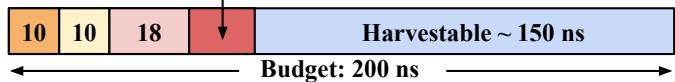  
Figure 3: Cost breakdown of LITESWITCH’s stall handling path. The costs for LDMB signaling and delivery are estimated. A fixed cost of 18 ns includes scavenger selection, bitmap lookup, and general registers save and restore. A variable cost is paid only when the current context is not xstate-free.

Practical considerations. xstatedump analyzes only the main program binary; libraries and other mappings default to conservative handling. A code-bitmap in 64-byte blocks balances accuracy and space, typically adding only KiBs of metadata, though some workloads are more sensitive and need a smaller block size to yield effective skipping. The bitmap is read-only and global, so lookup is lock-free. With these choices, the mechanism is simple to implement and effectively skips unnecessary xsave and xrstor operations (§6.2).

Cost estimation. The fixed per-handoff cost is the generalstate switch plus a bitmap lookup (14 ns on average). A variable cost (i.e., one round of xsave/xrstor) is paid only when in non-xstate-free blocks. Empirically, non-compute-dense kernels take the fast path for most handoffs (§6.2). Even when xsave/xrstor is needed in every handoff, the total cost remains within the 200 ns budget for some workloads.

## 4.4 Putting It Together

Figure 3 summarizes the estimated costs of LITESWITCH’s three core components: LDMB (detection and branching), Bundled Handoff, and xstate-Aware Context Switch. For workloads that require little xsave/xrstor (e.g., noncompute-dense) and with sufficient number of worker threads per core, the combined per-stall overhead is typically within 50 ns, leaving most of a 200-ns CXL stall window available for useful scavenger work.

## 5 Implementation

The prototype of LITESWITCH is implemented on an Intel Emerald Rapids platform running Linux 6.8.12. The LDMB mechanism is realized through a hybrid simulationemulation methodology (§5.1). The software components, Bundled Handoff and xstate-Aware Context Switch, are implemented within the Caladan user-level threading framework [22], which provides complete user-level scheduling and transparent threading semantics for unmodified applications. The resulting prototype is a software environment capable of running real, multithreaded workloads under controlled stall conditions. The artifact of LITESWITCH is open-sourced [45].

## 5.1 LDMB Emulation

The emulation of LDMB is implemented on a local-DRAM system using a hardware-assisted mechanism that injects stall events into a running workload. The goal is to reproduce two key properties of a real LDMB system. First, it needs to inject breakpoints into a running workload and divert execution to LITESWITCH’s stall handler upon injections, as if a hardware LDMB had delivered a stall notification. Second, these injections should match the timing, frequency and duration of CXL-induced stalls observed on real CXL systems.

Repurposing PMIs for stall injection with frequency empirically derived from a real CXL system. The emulation leverages Intel’s Performance Monitoring Unit (PMU), which can generate Performance Monitoring Interrupts (PMIs) upon counter overflows. Each core’s PMU counter is programmed to track LLC load misses (mem\_load\_retired.l3\_miss), a close proxy for DRAM-landing memory loads. The frequency at which these PMIs are triggered is the percentage of LLC load misses that would land on CXL memory, termed CXL access ratio (Table 2). This ratio is empirically derived perworkload on a CXL hardware-tiering system in Intel Flat Memory Mode with 50:50 DRAM-to-CXL ratio. For example, if the CXL access ratio is 20% for a given workload, the PMU counter overflow threshold is set such that a PMI is triggered for every 5 LLC load misses.

Upon a PMI, a kernel-space shim is invoked to inject an emulated stall, prepare an LDMB stall frame containing the user rip and rflags, and upcall the registered user-space LITESWITCH handler. The stall duration and handler stub are configured via ioctl. Since PMU operations are privileged, using a kernel shim as a relay is unavoidable, which introduces microarchitectural side effects (e.g., cache pollution and TLB flushes) absent in real hardware LDMB. To minimize this, the shim performs only minimal PMU bookkeeping and counter resets; its critical path is about 76 lines of code with a footprint of only a few instruction and data cache lines. Moreover, the shim disables Kernel Page Table Isolation (KPTI) and enables Process Context Identifiers (PCID), avoiding address-space switches and TLB invalidations on transitions.

Importantly, the shim’s overhead is measured and subtracted from reported workload results. Because PMIs (delivered as NMIs) are non-preemptible, per-invocation cost is computed as lost wall-clock time over equivalent work and normalized by the number of PMIs per run, ensuring fair comparison across configurations with different stall rates.

The emulation also configures PMIs to fire only in user mode, as kernel context is often vulnerable to rapid, arbitrary switching due to severe reentrancy and correctness problems.

PMIs closely mirror the behavior of Intel Flat Memory Mode. PMIs are asynchronous events that arrive after the triggering LLC miss has completed. This largely mirrors how CXL accesses are identified under Intel Flat Memory Mode: the memory controller first reads the corresponding

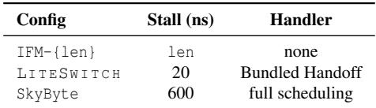

Table 1: System configurations. IFM stands for Intel Flat Memory Mode. Stall durations for LI T ESW I T C H and SkyByte are the cost of their delivery mechanisms.  
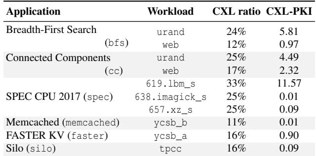  
Table 2: Applications and workloads. The CXL access ratios and CXL accesses per thousand instructions (CXL-PKI) are measured in Intel Flat Memory Mode.

DRAM line and checks its tag to determine a DRAM miss, then immediately re-issues the request over CXL. The key difference is timing: a PMI may arrive many instructions after the triggering LLC miss, whereas in Flat Memory Mode, the tag check and CXL issuance occur back-to-back.

Stall emulation. The shim uses Intel tpause to emulate stalls of specified lengths. tpause quiesces the hardware thread for a programmable number of cycles without microar chitectural side effects, providing a faithful approximation of a true memory stall. Importantly, tpause does not affect the sibling SMT hardware thread; the sibling continues to run while the other thread is tpause-d, enabling faithful evaluation of SMT under CXL-scale stalls (§6.1). The shim also enforces stall duration on a per-user-thread basis: if LITESWITCH resumes a thread too soon, the shim ensures the outstanding stall completes before that thread proceeds, for cases where a thread is switched back before its prior stall has resolved.

Emulating system configurations. The emulation uses three parameters to model diverse system configurations : (1) CXL access ratio (Table 2), the fraction of LLC misses generating injections; (2) stall duration (Table 1), the delay before the handler invocation, which could represent either the CXL access latency (without harvesting) or the cost for stall delivery (with harvesting); and (3) handler activation (Table 1), whether a software stall handler needs to be invoked.

LDMB’s emulation did not factor in memory-level parallelism (MLP). As discussed in §4.1, not every LLC miss induces a pipeline stall due to MLP, but LDMB’s emulation conservatively treats every CXL-bound LLC miss as a stall event, which overstates the frequency of harvestable stalls. As future work, one can measure the per-workload fraction of CXL-bound misses that overlap (i.e., a subsequent miss fires with out-of-order execution, while a prior miss is still in flight) and reduce the stall injection rate accordingly. For instance, if 10% of a workload’s CXL-bound misses overlap, the emulation should inject 10% fewer stalls.

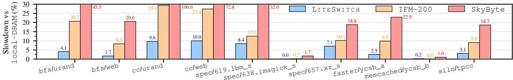  
Figure 4: End-to-end application performance slowdown. All slowdown numbers are relative to local-DRAM with no CXL stalls.

Modeling accuracy and limitations. The emulation injects stalls at a relatively flat rate and therefore does not model burstiness or short-term correlations in the miss stream. This abstraction aims at reporting end-to-end throughput under a given average CXL access ratio and stall duration. At this macro scale, the dominant factors are the total injected stall time and the fraction of that time LITESWITCH can harvest; preserving these factors should yield similar aggregate completed work even if the exact inter-stall timing differs.

This abstraction is less suitable for micro-scale timing questions. It does not faithfully model request latency, tail behavior, or concurrent misses under MLP. Studying those effects would require a methodology that preserves miss-stream burst structure and dependency behavior and is left for future work.

## 6 Evaluation

This section answers the following questions:

• How much performance loss induced by CXL access la tency can LITESWITCH recover (§6.1.1)?

• How does LITESWITCH perform with SMT (§6.1.2)?

• Can LITESWITCH still deliver meaningful gains if the cost of LDMB is higher than the estimated 20 ns (§6.1.3)?

• How does LITESWITCH’s effectiveness scale with increasing CXL latency (§6.1.4)?

• What is the runtime overhead of LITESWITCH’s software path (§6.2.1, §6.2.2)?

• How effective is LITESWITCH in avoiding unnecessary xsave and xrstor operations (§6.2.3)?

Target CXL memory use case. The evaluation models the hardware tiering use case exemplified by the Intel Flat Memory Mode [6, 66], which is a relatively simple use of CXL memory as single-host memory extension where local DRAM acts as a direct-mapped cache for CXL. The CXL access ratios per workload are measured on a real CXL system in Flat Memory Mode configured with a 50:50 DRAM-to-CXL ratio (Table 2). This setting represents the conservative “lower end” of CXL memory stalls, where more complex configurations like CXL memory pools likely exhibit higher CXL latencies. The emulation and evaluation of LITESWITCH runs on a different system with the Intel Xeon Gold 5512U and only local DRAM, using the empirically derived CXL ratios to reproduce realistic stall behavior.

Applications and workloads. The experiments cover a diverse set of memory-intensive workloads (Table 2) representative of several key domains: (1) sparse graph analytics from the GAP Benchmark Suite [9]; (2) dense numerical computation from SPEC CPU 2017 [4]; (3) in-memory key-value stores (Memcached [3] and FASTER KV [12]); and (4) inmemory databases (Silo [58]). Each application-workload pair is denoted as app/workload.

System configurations. Four system configurations are compared in end-to-end experiments (Table 1): (1) local-DRAM, an oracle baseline assuming infinite local DRAM capacity and no CXL stalls; (2) IFM-{len}, a tieredmemory configuration using Intel Flat Memory Mode, with CXL access latency of len nanoseconds; (3) LI T ESW I T C H, the proposed system with a 20 ns LDMB delivery cost; and (4) SkyByte, prior work that uses interrupts for stall delivery and takes a full scheduling path for stall handling [65].

All configurations disable SMT (unless specified otherwise) and use an equal number of physical cores. The number of worker threads per core is chosen independently for each configuration that yields the best performance. Throughput is used as the end-to-end metric, since LITESWITCH’s primary effect is improving aggregate CPU utilization.

## 6.1 End-to-End Performance

Overall, LITESWITCH consistently reduces end-to-end performance slowdowns across a variety of workloads, with or without SMT, and under higher LDMB cost and CXL latency.

## 6.1.1 End-to-End Slowdown Across Workloads

Figure 41 reports the performance slowdown of each configuration relative to the local-DRAM oracle across all evaluated workloads. LITESWITCH consistently reduces slowdown compared to IFM-200 for every workload, empirically validating that the mechanism can extract meaningful harvesting gains even at the lower end of real CXL latencies (200 ns).

LITESWITCH reduces slowdown by 30–80%2 relative to IFM-200 for most workloads: bfs sees a much smaller 1.7– 4.1% slowdown versus 8–21% under IFM-200; in-memory stores, faster and silo, see 2.5–3.1% versus 9–10%. These workloads all remain under 5% slowdown, enabling practical CXL memory adoption. memcached and 638.imagick\_s are particularly cache-friendly with negligible slowdowns for all configurations. cc is more sensitive to memory latency, exhibiting 9.6–10% slowdown in LITESWITCH, but still reduces slowdown by roughly 65% relative to IFM-200’s 27–29%.

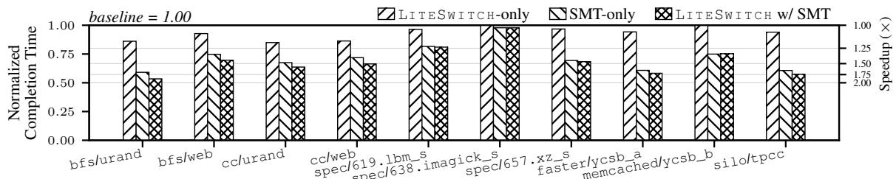  
Figure 5: Individual and combined effects of LI T ESW I T C H and SMT. Completion time measures the time to complete the same amount of work, and is normalized to the baseline without LI T ESW I T C H or SMT. All configurations use a 200-ns CXL latency setting. SMT uses a 2× hyperthreading factor. The right y-axis marks the corresponding speedup, with 2× being the perfect speedup from 2× hyperthreading.

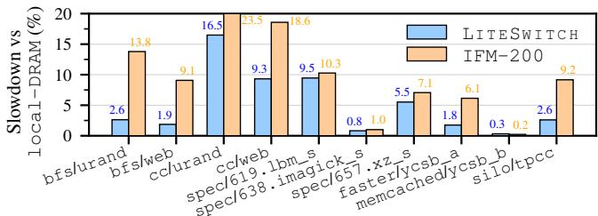  
Figure 6: End-to-end slowdown with SMT. All configurations are measured with SMT turned on. SkyByte is excluded from this figure because it yields consistently the worst slowdowns.

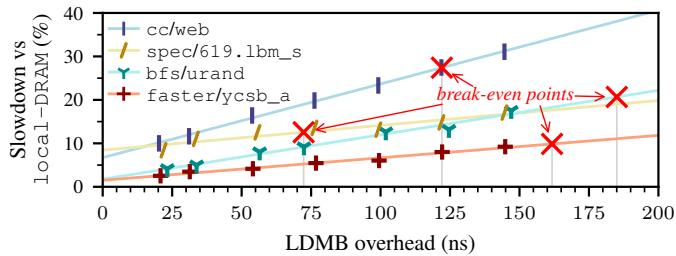  
Figure 7: LITESWITCH effectiveness under higher LDMB overhead, ranging roughly 20–150 ns at 200 ns CXL latency. The lines are linear fit. The red break-even points mark where each fit matches the corresponding workload’s IFM-200 slowdown.

SPEC workloads (619.lbm\_s, 657.xz\_s) show higher slowdowns of 8.4% and 7.1%, respectively, with a more modest 30% reduction over IFM-200. These benchmarks make heavy use of SIMD/FP instructions, preventing xstate-Aware Context Switch from skipping xsave/xrstor on most context switches. Even so, LITESWITCH remains beneficial. SkyByte exhibits the worst performance by a wide margin across all workloads. This is because its interrupt-based delivery incurs a ∼600 ns overhead inappropriate for harvesting CXL memory stalls.

## 6.1.2 LITESWITCH with SMT

Figure 6 reports slowdown with SMT enabled. LITESWITCH continues to provide substantial slowdown reduction: graph workloads and KV engines see comparable reduction (30– 80%) to the no-SMT case. By contrast, SPEC workloads 619.lbm\_s and 657.xz\_s show smaller reductions of 7% and 22%, versus 33% and 31% without SMT. The likely cause is higher intra-core contention inherent to SMT: by un-stalling hardware threads, LITESWITCH increases the fraction of time both SMT siblings are active contending for core resources. SMT alone also partially mitigates IFM-200 stalls. For example, cc workloads slow down by 27–29% without SMT and 18–23% with SMT. While SMT can hide some CXL memory stalls, the benefits of LITESWITCH are complementary to SMT, since LITESWITCH ‘un-stalls’ SMT hardware threads that are blocked on CXL access.

To quantify the individual and combined effects, Figure 5 compares the normalized completion time (and the corresponding speedup) under a baseline (no LITESWITCH, no SMT), LITESWITCH alone, SMT alone, and both combined.

LITESWITCH and SMT each improve performance independently, and their benefits largely compose when combined. For example, bfs/urand speeds up by 1.16× with LITESWITCH alone, 1.69× with SMT alone, and 1.87× when both are enabled. A similar pattern holds for graph workloads and KV engines. For most workloads, SMT alone provides higher speedup than LITESWITCH alone. This is expected: SMT enables true hardware concurrency at the instruction level, whereas LITESWITCH only opportunistically harvests stall cycles when CXL-bound misses occur. They both show considerable variation across workloads. 638.imagick\_s is the extreme case where SMT sees little speedup, likely due to intense contention between SMT siblings.

## 6.1.3 Effectiveness under Higher Cost of LDMB

Figure 7 isolates the effect of increasing LDMB delivery cost while holding the target CXL latency at 200 ns. Across workloads, higher LDMB overhead shifts LITESWITCH’s slowdown upward by a fairly fixed per-event penalty. It does not introduce a disproportionate or qualitatively different failure mode: the fitted lines remain close to linear, indicating that the added cost is paid per delivered stall event.

The marked break-even points indicate where each fitted LITESWITCH slowdown matches the corresponding workload’s IFM-200 slowdown. Beyond this point, increasing LDMB overhead starts to eliminate LITESWITCH’s net endto-end gain. The x-axis value varies substantially across workloads because the software-path overhead differs by workload (§6.2). For instance, spec/619.lbm\_s reaches breakeven near 72 ns, whereas bfs/urand remains beneficial until roughly 185 ns. This gap reflects their different software-path costs: bfs/urand rarely pays for expensive xsave/xrstor because it exercises much less xstate than spec/619.lbm\_s (§6.2.3). These break-even values can be interpreted as the available LDMB-overhead “headroom” for preserving positive end-to-end gains.

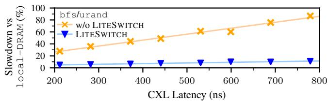  
Figure 8: LITESWITCH effectiveness under varying CXL latencies (bfs/urand), ranging roughly 200–800 ns. Lines are linear fit.

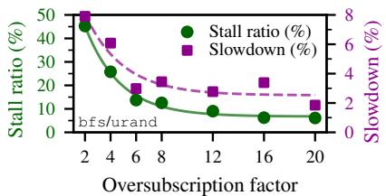  
Figure 9: Oversubscription reduces stall ratio and slowdown (bfs/urand). The curves are exponential fit.

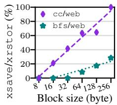  
Figure 10: Sensitivity of bitmap block size.

The fitted slopes also differ across workloads. A steeper slope means that slowdown is more sensitive to additional perevent cost, which largely tracks how sensitive the workload is to memory-access latency in the first place.

## 6.1.4 Effectiveness under Varying CXL Latency

Figure 8 examines how slowdown evolves as CXL latency increases from roughly 200 ns to 800 ns, using bfs/urand as a representative workload (all other workloads see the same qualitative pattern). Without LITESWITCH, slowdown grows roughly linearly with CXL latency: longer memory stalls inject proportionally more idle time per access.

With LITESWITCH, slowdown remains nearly flat across the tested range. The slight upward trend arises because a bundle can occasionally contain only one runnable thread, leaving no scavenger available; those stalls must be waited out in full. Empirically, such single-thread cases are mostly fewer than 10%, so the aggregate impact is small (§6.2.1).

The key observation is that overall, LITESWITCH pays a rather fixed per-stall cost per workload, largely independent of the underlying CXL latency. This highlights LITESWITCH’s potential to convert a wide range of CXL latencies into a fixed, per-invocation cost in perceived progress, yielding consistently low slowdowns even under greater CXL device variability and deeper topologies.

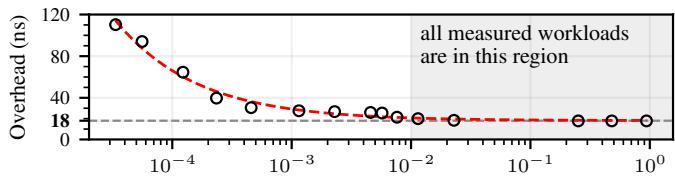  
CXL accesses per thousand instructions (CXL-PKI) in log scale  
Figure 11: Handler overhead (excluding xsave/xrstor). The data points are measured on a synthetic matrix multiplication workload where CXL-PKI can be easily tuned; The 18-ns stable cost is verified on all workloads. The curve is exponential fit.

## 6.2 Overhead of the Software Path

The per-invocation cost of LITESWITCH’s software path has three parts: (1) unharvestable stalls when the bundle has only one runnable thread (the stall is waited out); (2) a fixed handler cost, including scavenger selection, xstatedump bitmap lookup, and general-register save and restore; and (3) a variable cost for xsave and xrstor, paid only when the current context is not xstate-free.

## 6.2.1 Thread Oversubscription

A strong empirical correlation exists between the stall ratio (the fraction of LITESWITCH invocations with only one runnable thread in the bundle) and the thread oversubscription factor (total software worker threads divided by CPU hardware threads). For bfs/urand (Figure 9), at 2× oversubscription, 45% of invocations have only one runnable thread because workers frequently block on synchronization; as oversubscription increases, the stall ratio falls quickly (to 12– 14% at 6–8×) and then plateaus. Workload slowdown closely tracks this decline. In practice, about 4–8× oversubscription sharply reduces the stall ratio, and roughly 6–12× keeps a scavenger available for >90% of stalls for most workloads.

Oversubscription is a general multi-threaded tuning knob rather than a requirement specific to LITESWITCH: too little oversubscription risks under-utilization when threads block, while too much increases contention and scheduler overhead. LITESWITCH benefits when the workload provides enough runnable threads to exploit the exposed stall windows.

## 6.2.2 Handler Overhead Excluding xstate

Figure 11 reports the fixed overhead of LITESWITCH’s handler (scavenger selection, general-register save/restore, and xstatedump bitmap lookup) as a function of trigger rate, expressed as CXL accesses per thousand instructions (CXL-PKI). At very low rates (< 10−4), overhead exceeds 100 ns; it then drops sharply and plateaus near 18 ns once the rate reaches 10−2. The effect is due to cache residency: at higher frequencies, the handler’s memory footprint (bundle metadata, bitmap, context frames) stays hot between invocations. All evaluated workloads operate at or above 10−2 CXL-PKI (Table 2) and often much higher. Thus, 18 ns is the effective fixed handler cost in practice.

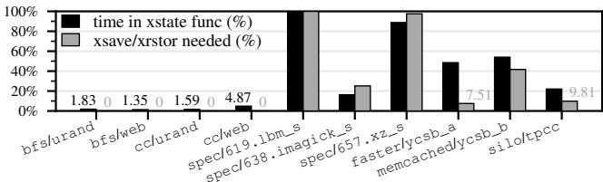  
Figure 12: Effectiveness of xstate-aware skipping. The left bar measures the execution time spent in xstate-using functions; the right bar measures the fraction of handoffs requiring xsave/xrstor.

## 6.2.3 Effectiveness of xstate-Awareness

Figure 12 compares time spent in xstate-using functions with the fraction of LITESWITCH context switches that require xsave/xrstor. Across workloads, these two measurements are largely equivalent, indicating that xstate-aware skipping is effective. A few cases deviate: faster/ycsb\_a requires far fewer xsave/xrstor than its time in xstate functions. This discrepancy is because xstate-heavy functions tend to be compute-bound with few memory loads, so stalls are disproportionately triggered in non-xstate code paths.

Figure 10 shows how the granularity of xstatedump bitmap impacts the fraction of context switches that require xsave/xrstor for two xstate-light workloads. For cc/web, the default 64-byte blocks still pay xsave/xrstor for more than half of the switches, whereas 8-byte blocks reduce this to near zero. This is likely because cc has a scattered xstate usage pattern that widely taints blocks when the granularity is coarse. bfs/web is less sensitive but follows the same trend. Empirically, 64 bytes suffices for most workloads.

## 7 Discussions and Limitations

The applicability of LITESWITCH. LDMB detects CXL accesses by relying on the CPU memory subsystem’s cachemiss and routing path. Regardless of topology (e.g., directattach, multi-headed, switched), on-chip routing is the earliest point in the request path that can reliably determine whether a load will go off-chip to CXL. Measurements show that LITESWITCH’s mechanisms are already effective for the simplest memory-expansion case with 200 ns CXL latency; as latencies grow (e.g., deeper fabrics, contention, heterogeneous devices), the recoverable stall window only increases. While there is ongoing debate about which CXL deployments are actually viable [43], LITESWITCH remains broadly useful and benefits more as stalls lengthen.

Considerations for Intel Flat Memory Mode. In this simple setup, the memory controller must read in the corresponding DRAM line first to determine whether an access missed DRAM. With this model, while LDMB can still make detection before a CXL access is issued, thus leaving the full latency window for harvesting, detection is still technically delayed by a full DRAM read. In deployments where CXL devices are directly exposed rather than a slower caching tier, detection does not need a full leading DRAM read and can use the high-order bits of the physical address. The speculation is that LITESWITCH could even outperform the oracle case (i.e., infinite local DRAM), because LITESWITCH’s detection and harvesting routine begin at roughly the same moment a DRAM or CXL request is sent off-chip. Therefore, if LITESWITCH can switch to a scavenger faster than a DRAM load completes, LITESWITCH observes stalls even shorter than DRAM in perceived progress, thus better performance.

Potential real-world effects of LITESWITCH on memorylevel parallelism (MLP). LDMB’s pipeline flush might reduce Out-of-Order (OoO) depth, thus decreasing MLP. As discussed in §4.1, however, LDMB’s return signal arrives only after a load traverses the cache hierarchy and is detected as CXL-bound; this path is at least LLC-hit-scale. During that interval, the core continues dispatching independent instructions, and prior studies show that OoO cores typically exhaust their instruction window within that timescale [40,41]. Consequently, data-independent loads that could exploit MLP have typically already been issued before LDMB can redirect, so the pipeline flush sacrifices little MLP opportunity. Critically, Bundled Handoff allows additional threads to issue their own independent memory loads while the original miss is in flight, effectively widening the core’s useful miss concurrency beyond what a single stalled thread could achieve.

Double-emulation methodology. LITESWITCH emulates both LDMB delivery and CXL memory latency, compounding uncertainty into the evaluation. Two discrepancies matter most. First, the emulation injects stalls at fixed intervals derived from each workload’s CXL access ratio. Real inter-miss intervals are more variable, and closely spaced misses can overlap through MLP rather than producing separate pipeline stalls. This can overstate the number of harvestable events and therefore modestly overstate LITESWITCH’s absolute gain. Second, the evaluation uses 200 ns CXL latency, representative of the simplest direct-attached CXL. Deeper topologies (e.g., multi-headed, switched) and systems under load (e.g., in Intel Flat Memory Mode, every DRAM miss doubles bandwidth demand) push real latencies higher. Because LITESWITCH pays a mostly fixed per-stall cost, longer stalls widen the harvestable window; in those settings, the 200 ns results likely understate potential gains.

## 8 Related Work

Switch-on-event (SOE) multithreading. SOE is a hardware scheme from earlier multithreaded processors that switches between hardware threads when a retirementblocking stall occurs [5, 11, 24, 53]. SOE shares the basic intuitions, but it always performs a costly full context switch with all architectural state. While this cost was acceptable for the more limited architectural state of older processors, modern CPUs continue to expand xstate (e.g., AVX-512 and beyond), making full-state switching increasingly prohibitive. LITESWITCH reduces this cost by selectively saving xstate only when needed. Besides, LITESWITCH triggers only when a CXL-bound miss is determined, which selects for stalls with a sufficiently long expected latency, rather than committing to potentially short stalls when the hardware does not distinguish the root cause of a retirement-blocking stall.

Software-based harvesting. MSH [50] harvests DRAMscale stalls within a single address space and uses fine-grained register-liveness analysis to minimize general-register save/restore. However, its reliance on offline profiling to place yield points is brittle in CXL. SkyByte [65] targets CXL-SSD latencies (tens-hundreds of µs) using device-provided hints delivered as interrupts so the OS can preempt and reschedule. That interrupt-driven path is appropriate at SSD timescales but is too costly for sub-µs CXL memory stalls. These limitations motivate LITESWITCH’s combination of reactive, per-access hardware detection with same-address-space handoff.

Mitigating SIMD/FP overhead in context switch. In µsscale user-level scheduling, context-switch overhead can also dominate. Shinjuku [36] made a similar observation that contexts that do not use SIMD/FP need not preserve xstate, and arranges its scheduler worker to be xstate-free so that switches between a user context and the worker omit FP save in one direction and FP restore in the other. However, an endto-end handoff between two user contexts still incurs a full round of xstate save and restore. LITESWITCH’s xstate-Aware Context Switch instead skips xsave/xrstor for direct handoffs between two user contexts.

Existing hardware capabilities for hiding memory stalls. Modern Intel server-class CPUs employ aggressive microarchitectural techniques such as out-of-order (OoO) execution, speculative execution, and prefetching to overlap backend stalls with useful work. These mechanisms can hide some memory latency, but are fundamentally limited by bounded resources such as the reorder buffer (ROB), issue queues, and the number of outstanding cache misses tracked by MSHRs. Long-latency DRAM accesses typically exceed what the ROB can cover, and prefetchers often fail on irregular access patterns or cause contention. Prior work has quantified these limitations and shown that cores still frequently stall despite deep speculation and scheduling windows [7, 20, 40, 41].

Asynchronous memory semantics. Asynchronous memory access instructions (AMIs) [60] decouple memory request issuance from completion in hardware, exposing explicit memory-level parallelism to the software but requiring a radical asynchronous execution model. Beehive [46] applies a similar principle in software for disaggregated memory, using compiler-generated Rust coroutines to overlap µs-scale remote accesses while preserving a synchronous-style programming model. At a high level, both AMI and Beehive hide memory latency by fitting in more concurrent outstanding memory requests through asynchrony. LITESWITCH is orthogonal: it targets cases where memory-level parallelism may still fall short, turning true pipeline stalls into useful work by intentionally switching to another worker thread.

## 9 Conclusions

LITESWITCH is a lightweight system for stall detection, delivery, and scheduling that effectively harvests sub-µs CXL memory stalls. LITESWITCH uses a combination of a simple hardware-based detection method with lightweight branching into the same user address space, together with fast scavenger selection while avoiding the cost of saving and restoring xstate registers when not necessary. Importantly, the ability to sustain consistently low workload slowdowns largely independent of CXL latency variability across diverse workloads highlights LITESWITCH’s broad applicability.

## Acknowledgements

The authors thank the anonymous shepherd and reviewers for their constructive feedback that greatly improved this paper. The authors also thank Leon Schuermann, Kaifeng Xu, Haoda Wang, Daniel S. Berger, Kostis Kaffes, and Brian Hirano for their helpful discussions and feedback on this work. The implementation and evaluation of LITESWITCH were conducted on resources generously provided by CloudLab [19].

## References

[1] 5th Gen AMD EPYC™ Processor Architecture. https://www.amd.com/content/dam/amd/en/ documents/epyc-business-docs/white-papers/ 5th-gen-amd-epyc-processor-architecturewhite-paper.pdf. Accessed: 2026-05-20.

[2] Intel® Xeon® 6 Processors. https:// www.intel.com/content/www/us/en/products/ details/processors/xeon/xeon6-e-cores.html. Accessed: 2026-05-20.

[3] memcached: A distributed memory object caching system. https://memcached.org/. Accessed: 2025-12- 09.

[4] SPEC CPU® 2017 Benchmark Suite. https://www. spec.org/cpu2017/, 2017. Standard Performance Evaluation Corporation.

[5] A. Agarwal, J. Kubiatowicz, D. Kranz, B.H. Lim, D. Yeung, G. D’Souza, and M. Parkin. Sparcle: an evolutionary processor design for large-scale multiprocessors. IEEE Micro, 13(3):48–61, 1993.

[6] Minseon Ahn, Thomas Willhalm, Donghun Lee, Norman May, Jungmin Kim, Daniel Ritter, and Oliver Rebholz. Exploiting Locality in Flat Memory with CXL for In-Memory Database Management Systems. In Proceedings of the 21st International Workshop on Data Management on New Hardware, DaMoN ’25, New York, NY, USA, 2025. Association for Computing Machinery.

[7] Newsha Ardalani, Clint Lestourgeon, Karthikeyan Sankaralingam, and Xiaojin Zhu. Cross-architecture performance prediction (xapp) using cpu code to predict gpu performance. In Proceedings of the 48th International Symposium on Microarchitecture, MICRO-48, page 725–737, New York, NY, USA, 2015. Association for Computing Machinery.

[8] Berk Aydogmus, Linsong Guo, Danial Zuberi, Tal Garfinkel, Dean Tullsen, Amy Ousterhout, and Kazem Taram. Extended User Interrupts (xUI): Fast and Flexible Notification without Polling, page 373–389. Association for Computing Machinery, New York, NY, USA, 2025.

[9] Scott Beamer, Krste Asanovic, and David A. Patterson. The GAP Benchmark Suite. arXiv, 1508.03619 [cs.DC], 2015.

[10] Daniel S. Berger, Yuhong Zhong, Fiodar Kazhamiaka, Pantea Zardoshti, Shuwei Teng, Mark D. Hill, and Rodrigo Fonseca. Octopus: Scalable Low-Cost CXL Memory Pooling. Microsoft Technical Report, 2025.

[11] J. M. Borkenhagen, R. J. Eickemeyer, R. N. Kalla, and S. R. Kunkel. A multithreaded PowerPC processor for commercial servers. IBM J. Res. Dev., 44(6):885–898, November 2000.

[12] Badrish Chandramouli, Guna Prasaad, Donald Kossmann, Justin Levandoski, James Hunter, and Mike Barnett. FASTER: A Concurrent Key-Value Store with In-Place Updates. In Proceedings of the 2018 International Conference on Management of Data, SIGMOD ’18, page 275–290, New York, NY, USA, 2018. Association for Computing Machinery.

[13] Derek Chiou, Dam Sunwoo, Joonsoo Kim, Nikhil A. Patil, William Reinhart, Darrel Eric Johnson, Jebediah Keefe, and Hari Angepat. FPGA-Accelerated Simu lation Technologies (FAST): Fast, Full-System, Cycle-Accurate Simulators. In Proceedings of the 40th Annual IEEE/ACM International Symposium on Microarchitecture, MICRO 40, page 249–261, USA, 2007. IEEE Computer Society.

[14] Jiho Choi, Thomas Shull, Maria J. Garzaran, and Josep Torrellas. ShortCut: Architectural Support for Fast Object Access in Scripting Languages. In Proceedings of the 44th Annual International Symposium on Computer Architecture, ISCA ’17, page 494–506, New York, NY, USA, 2017. Association for Computing Machinery.

[15] Compute Express Link Consortium. CXL Integrators List. https://www.computeexpresslink.org/ integrators-list, 2025. Accessed: 2025-12-09.

[16] Intel Corporation. CXL Type 3 Memory Device Software Guide, Rev. 1.1. https:// cdrdv2-public.intel.com/643805/643805\_CXL\_ Memory\_Device\_SW\_Guide\_Rev1\_1.pdf, August 2024.

[17] Debendra Das Sharma, Robert Blankenship, and Daniel Berger. An Introduction to the Compute Express Link (CXL) Interconnect. ACM Comput. Surv., 56(11), July 2024.

[18] Aniket Deshmukh, LingzheChester Cai, and Yale N. Patt. Timely, Efficient, and Accurate Branch Precomputation. In 2024 57th IEEE/ACM International Symposium on Microarchitecture (MICRO), pages 480–492, 2024.

[19] Dmitry Duplyakin, Robert Ricci, Aleksander Maricq, Gary Wong, Jonathon Duerig, Eric Eide, Leigh Stoller, Mike Hibler, David Johnson, Kirk Webb, Aditya Akella, Kuangching Wang, Glenn Ricart, Larry Landweber, Chip Elliott, Michael Zink, Emmanuel Cecchet, Snigdhaswin Kar, and Prabodh Mishra. The design and operation of CloudLab. In Proceedings of the USENIX Annual Technical Conference (ATC), pages 1–14, July 2019.

[20] Stijn Eyerman and Lieven Eeckhout. System-level performance metrics for multiprogram workloads. IEEE Micro, 28(3):42–53, May 2008.

[21] Michael Ferdman, Almutaz Adileh, Onur Kocberber, Stavros Volos, Mohammad Alisafaee, Djordje Jevdjic, Cansu Kaynak, Adrian Daniel Popescu, Anastasia Ailamaki, and Babak Falsafi. Clearing the clouds: a study of emerging scale-out workloads on modern hardware. In Proceedings of the Seventeenth International Conference on Architectural Support for Programming Languages and Operating Systems, ASPLOS XVII, page 37–48, New York, NY, USA, 2012. Association for Computing Machinery.

[22] Joshua Fried, Zhenyuan Ruan, Amy Ousterhout, and Adam Belay. Caladan: Mitigating Interference at Microsecond Timescales. In 14th USENIX Symposium on Operating Systems Design and Implementation (OSDI 20), pages 281–297. USENIX Association, November 2020.

[23] Justin R. Funston, Kaoutar El Maghraoui, Joefon Jann, Pratap Pattnaik, and Alexandra Fedorova. An SMT-Selection Metric to Improve Multithreaded Applications’ Performance. In 2012 IEEE 26th International Parallel and Distributed Processing Symposium, pages 1388–1399, 2012.

[24] Ron Gabor, Shlomo Weiss, and Avi Mendelson. Fairness enforcement in switch on event multithreading.

ACM Trans. Archit. Code Optim., 4(3):15–es, September 2007.

[25] Donghyun Gouk, Sangwon Lee, Miryeong Kwon, and Myoungsoo Jung. Direct Access, High-Performance Memory Disaggregation with DirectCXL. In 2022 USENIX Annual Technical Conference (USENIX ATC 22), pages 287–294, Carlsbad, CA, July 2022. USENIX Association.

[26] Linsong Guo, Danial Zuberi, Tal Garfinkel, and Amy Ousterhout. The benefits and limitations of user inter rupts for preemptive userspace scheduling. In 22nd USENIX Symposium on Networked Systems Design and Implementation (NSDI 25), pages 1015–1032, Philadelphia, PA, April 2025. USENIX Association.

[27] Vincent Haché and Jérôme Glisse. Introduction to CXL Multi-Headed Devices. OCP Global Summit, 2022.

[28] Mark Horowitz, Margaret Martonosi, Todd C. Mowry, and Michael D. Smith. Informing memory operations: providing memory performance feedback in modern processors. In Proceedings of the 23rd Annual International Symposium on Computer Architecture, ISCA ’96, page 260–270, New York, NY, USA, 1996. Association for Computing Machinery.

[29] Kaisong Huang, Tianzheng Wang, Qingqing Zhou, and Qingzhong Meng. The Art of Latency Hiding in Modern Database Engines. Proc. VLDB Endow., 17(3):577–590, November 2023.

[30] Wentao Huang, Mo Sha, Mian Lu, Yuqiang Chen, Bingsheng He, and Kian-Lee Tan. Bandwidth Expansion via CXL: A Pathway to Accelerating In-Memory Ana lytical Processing. In VLDB 2024 Workshop: Fifteenth International Workshop on Accelerating Analytics and Data Management Systems Using Modern Processor and Storage Architectures, 2024.

[31] Yibo Huang, Haowei Chen, Newton Ni, Yan Sun, Vijay Chidambaram, Dixin Tang, and Emmett Witchel. Tigon: A Distributed Database for a CXL Pod. In Proceedings of the 19th USENIX Conference on Operating Systems Design and Implementation, OSDI ’25, USA, 2025. USENIX Association.

[32] Jack Tigar Humphries, Neel Natu, Ashwin Chaugule, Ofir Weisse, Barret Rhoden, Josh Don, Luigi Rizzo, Oleg Rombakh, Paul Turner, and Christos Kozyrakis. ghOSt: Fast & Flexible User-Space Delegation of Linux Scheduling. In Proceedings of the ACM SIGOPS 28th Symposium on Operating Systems Principles, SOSP ’21, page 588–604, New York, NY, USA, 2021. Association for Computing Machinery.

[33] Elyse Ge Hylander and Phyllis Ng. Azure delivers the first cloud VM with Intel Xeon 6 and CXL memory - now in Private Preview. https://techcommunity.microsoft.com/blog/ SAPApplications/azure-delivers-the-firstcloud-vm-with-intel-xeon-6-and-cxl-memory---now-in-priv/4470067, November 2025. Accessed: 2025-12-04.

[34] Intel Corporation. Intel® 64 and IA-32 Architectures Software Developer Manuals. https:// www.intel.com/content/www/us/en/developer/ articles/technical/intel-sdm.html, October 2025.

[35] Sunita Jain, Nagaradhesh Yeleswarapu, Hasan Al Maruf, and Rita Gupta. Memory Sharing with CXL: Hardware and Software Design Approaches. In Proceedings of the 3rd Workshop on Heterogeneous Composable and Disaggregated Systems, HCDS 2024, 2024.

[36] Kostis Kaffes, Timothy Chong, Jack Tigar Humphries, Adam Belay, David Mazières, and Christos Kozyrakis. Shinjuku: Preemptive Scheduling for µsecond-scale Tail Latency. In 16th USENIX Symposium on Networked Systems Design and Implementation (NSDI 19), pages 345–360, Boston, MA, February 2019. USENIX Association.

[37] Svilen Kanev, Juan Pablo Darago, Kim Hazelwood, Parthasarathy Ranganathan, Tipp Moseley, Gu-Yeon Wei, and David Brooks. Profiling a warehousescale computer. SIGARCH Comput. Archit. News, 43(3S):158–169, June 2015.

[38] Sagar Karandikar, Howard Mao, Donggyu Kim, David Biancolin, Alon Amid, Dayeol Lee, Nathan Pemberton, Emmanuel Amaro, Colin Schmidt, Aditya Chopra, Qijing Huang, Kyle Kovacs, Borivoje Nikolic, Randy Katz, Jonathan Bachrach, and Krste Asanovic. FireSim: FPGA-Accelerated Cycle-Exact Scale-Out System Simulation in the Public Cloud. In 2018 ACM/IEEE 45th Annual International Symposium on Computer Architecture (ISCA), pages 29–42, 2018.

[39] Asif Imtiaz Khan. Cycle-Accurate Modeling of Multicore Processors on FPGAs. PhD thesis, Massachusetts Institute of Technology, USA, 2013. AAI0829707.

[40] Vladimir Kiriansky, Ilia Lebedev, Saman Amarasinghe, Srinivas Devadas, and Joel Emer. Dawg: A defense against cache timing attacks in speculative execution processors. In 2018 51st Annual IEEE/ACM International Symposium on Microarchitecture (MICRO), pages 974–987, 2018.

[41] Vladimir Kiriansky, Haoran Xu, Martin Rinard, and Saman Amarasinghe. Cimple: instruction and memory level parallelism: a dsl for uncovering ilp and mlp. In Proceedings of the 27th International Conference on Parallel Architectures and Compilation Techniques, PACT ’18, New York, NY, USA, 2018. Association for Computing Machinery.

[42] V. Krishnan and J. Torrellas. A clustered approach to multithreaded processors. In Proceedings of the First Merged International Parallel Processing Symposium and Symposium on Parallel and Distributed Processing, pages 627–634, 1998.

[43] Philip Levis, Kun Lin, and Amy Tai. A Case Against CXL Memory Pooling. In Proceedings of the 22nd ACM Workshop on Hot Topics in Networks, HotNets ’23, page 18–24, New York, NY, USA, 2023. Association for Computing Machinery.

[44] Huaicheng Li, Daniel S. Berger, Lisa Hsu, Daniel Ernst, Pantea Zardoshti, Stanko Novakovic, Monish Shah, Samir Rajadnya, Scott Lee, Ishwar Agarwal, Mark D. Hill, Marcus Fontoura, and Ricardo Bianchini. Pond: CXL-Based Memory Pooling Systems for Cloud Platforms. In Proceedings of the 28th ACM International Conference on Architectural Support for Programming Languages and Operating Systems, Volume 2, ASPLOS 2023, page 574–587, New York, NY, USA, 2023. Association for Computing Machinery.

[45] Nanqinqin Li. LiteSwitch Artifact. https://github. com/princeton-sns/liteswitch.

[46] Quanxi Li, Hong Huang, Ying Liu, Yanwen Xia, Jie Zhang, Mosong Zhou, Xiaobing Feng, Huimin Cui, Quan Chen, Yizhou Shan, and Chenxi Wang. Beehive: A Scalable Disaggregated Memory Runtime Exploiting Asynchrony of Multithreaded Programs. In 22nd USENIX Symposium on Networked Systems Design and Implementation (NSDI 25), pages 167–187, Philadelphia, PA, April 2025. USENIX Association.

[47] Shaobo Li, Yirui (Eric) Zhou, Hao Ren, and Jian Huang. ByteFS: System Support for (CXL-based) Memory-Semantic Solid-State Drives. In Proceedings of the 30th ACM International Conference on Architectural Support for Programming Languages and Operating Systems, Volume 1, ASPLOS ’25, page 116–132, New York, NY, USA, 2025. Association for Computing Machinery.

[48] Jinshu Liu, Hamid Hadian, Yuyue Wang, Daniel S. Berger, Marie Nguyen, Xun Jian, Sam H. Noh, and Huaicheng Li. Systematic CXL Memory Characterization and Performance Analysis at Scale, page

1203–1217. Association for Computing Machinery, New York, NY, USA, 2025.

[49] H.J. Lu, Michael Matz, Milind Girkar, Jan Hubicka, An-ˇ dreas Jaeger, and Mark Mitchell. System V Application Binary Interface: AMD64 Architecture Processor Supplement, March 2025.

[50] Zhihong Luo, Sam Son, Sylvia Ratnasamy, and Scott Shenker. Harvesting Memory-bound CPU Stall Cycles in Software with MSH. In 18th USENIX Symposium on Operating Systems Design and Implementation (OSDI 24), pages 57–75, Santa Clara, CA, July 2024. USENIX Association.

[51] Haoran Ma, Yifan Qiao, Shi Liu, Shan Yu, Yuanjiang Ni, Qingda Lu, Jiesheng Wu, Yiying Zhang, Miryung Kim, and Harry Xu. DRust: Language-Guided Distributed Shared Memory with Fine Granularity, Full Transparency, and Ultra Efficiency. In 18th USENIX Symposium on Operating Systems Design and Implementation (OSDI 24), pages 97–115, Santa Clara, CA, July 2024. USENIX Association.

[52] Teng Ma, Zheng Liu, Chengkun Wei, Jialiang Huang, Youwei Zhuo, Haoyu Li, Ning Zhang, Yijin Guan, Dimin Niu, Mingxing Zhang, and Tao Ma. HydraRPC: RPC in the CXL Era. In 2024 USENIX Annual Technical Conference (USENIX ATC 24), pages 387–395, Santa Clara, CA, July 2024. USENIX Association.

[53] C. McNairy and R. Bhatia. Montecito: a dual-core, dualthread Itanium processor. IEEE Micro, 25(2):10–20, 2005.

[54] Microsoft. Overview of x64 ABI conventions. https://learn.microsoft.com/en-us/cpp/ build/x64-software-conventions?view=msvc-170. Accessed: 2025-12-07.

[55] Pacific Northwest National Laboratory. Unique Active Memory Computer Purpose-Built for AI Science Applications. https://www.pnnl.gov/news-media/ unique-active-memory-computer-purposebuilt-ai-science-applications, August 2025. Accessed: 2025-12-04.

[56] Arthur Perais and André Seznec. Practical data value speculation for future high-end processors. In 2014 IEEE 20th International Symposium on High Performance Computer Architecture (HPCA), pages 428–439, 2014.

[57] XConn Technologies. Overcoming the AI Memory Wall: How CXL Memory Pooling Powers the Next Leap in Scalable AI Computing. https://computeexpresslink.org/blog/

overcoming-the-ai-memory-wall-how-cxlmemory-pooling-powers-the-next-leap-inscalable-ai-computing-4267/, November 2025. Accessed: 2025-12-04.

[58] Stephen Tu, Wenting Zheng, Eddie Kohler, Barbara Liskov, and Samuel Madden. Speedy transactions in multicore in-memory databases. In Proceedings of the Twenty-Fourth ACM Symposium on Operating Systems Principles, SOSP ’13, page 18–32, New York, NY, USA, 2013. Association for Computing Machinery.

[59] N. Tuck and D.M. Tullsen. Initial observations of the simultaneous multithreading pentium 4 processor. In 2003 12th International Conference on Parallel Architectures and Compilation Techniques, pages 26–34, 2003.

[60] Luming Wang, Xu Zhang, Songyue Wang, Zhuolun Jiang, Tianyue Lu, Mingyu Chen, Siwei Luo, and Keji Huang. Asynchronous memory access unit: Exploiting massive parallelism for far memory access. ACM Trans. Archit. Code Optim., 21(3), September 2024.

[61] Kaifeng Xu, Georgios Tziantzioulis, and David Wentzlaff. Evaluation of MindPalace for Chip Design Tradeoffs on Function-as-a-Service. In 2025 IEEE International Symposium on Performance Analysis of Systems and Software (ISPASS), pages 201–212, 2025.

[62] Juncheng Yang, Yao Yue, and Rashmi Vinayak. Segcache: a memory-efficient and scalable in-memory keyvalue cache for small objects. In 18th USENIX Sympo sium on Networked Systems Design and Implementation (NSDI 21), pages 503–518. USENIX Association, April 2021.

[63] Qirui Yang, Runyu Jin, Bridget Davis, Devasena Inupakutika, and Ming Zhao. Performance Evaluation on CXL-enabled Hybrid Memory Pool. In 2022 IEEE International Conference on Networking, Architecture and Storage (NAS), pages 1–5, 2022.

[64] Shao-Peng Yang, Minjae Kim, Sanghyun Nam, Juhyung Park, Jin yong Choi, Eyee Hyun Nam, Eunji Lee, Sungjin Lee, and Bryan S. Kim. Overcoming the Memory Wall with CXL-Enabled SSDs. In 2023 USENIX Annual Technical Conference (USENIX ATC 23), pages 601–617, Boston, MA, July 2023. USENIX Association.

[65] Haoyang Zhang, Yuqi Xue, Yirui Eric Zhou, Shaobo Li, and Jian Huang. SkyByte: Architecting an Efficient Memory-Semantic CXL-based SSD with OS and Hardware Co-design . In 2025 IEEE International Symposium on High Performance Computer Architecture (HPCA), pages 577–593, Los Alamitos, CA, USA, March 2025. IEEE Computer Society.

[66] Yuhong Zhong, Daniel S. Berger, Carl Waldspurger, Ryan Wee, Ishwar Agarwal, Rajat Agarwal, Frank Hady, Karthik Kumar, Mark D. Hill, Mosharaf Chowdhury, and Asaf Cidon. Managing Memory Tiers with CXL in Virtualized Environments. In 18th USENIX Symposium on Operating Systems Design and Implementation (OSDI 24), pages 37–56, Santa Clara, CA, July 2024. USENIX Association.

[67] Yuhong Zhong, Daniel S. Berger, Pantea Zardoshti, Enrique Saurez, Jacob Nelson, Dan R. K. Ports, Antonis Psistakis, Joshua Fried, and Asaf Cidon. Oasis: Pooling PCIe Devices Over CXL to Boost Utilization. In Proceedings of the ACM SIGOPS 31st Symposium on Operating Systems Principles, SOSP ’25, pages 101–119, New York, NY, USA, 2025. Association for Computing Machinery.