USENIX

THE ADVANCED COMPUTING SYSTEMS ASSOCIATION

# Hardware Lifecycle-Aware Power Planning in Commercial Hyperscale Datacenters (Operational Systems)

Ruihao Li, Meta and The University of Texas at Austin; Leonardo Piga, Wei Su, and   
Carlos Torres, Meta; Jovan Stojkovic, Meta and The University of Texas at Austin; Neeraja J. Yadwadkar and Lizy K. John, The University of Texas at Austin; Abhishek Dhanotia, Meta

https://www.usenix.org/conference/osdi26/presentation/li-ruihao

# This paper is included in the Proceedings of the 20th USENIX Symposium on Operating Systems Design and Implementation.

July 13–15, 2026 • Seattle, WA, USA

ISBN 978-1-939133-55-7

Open access to the Proceedings of the 20th USENIX Symposium on Operating Systems Design and Implementation is sponsored by

# Hardware Lifecycle-Aware Power Planning in Commercial Hyperscale Datacenters (Operational Systems)

Ruihao Li Meta & UT-Austin

Leonardo Piga Meta

Wei Su Meta

Neeraja J. Yadwadkar UT-Austin

Lizy K. John UT-Austin

Carlos Torres Meta

Jovan Stojkovic Meta & UT-Austin

Abhishek Dhanotia Meta

## Abstract

Modern commercial datacenters operate with heterogeneous hardware, deploying new servers to meet the growing com pute demands while retaining older servers due to budgetary and environmental constraints. Datacenter planners can use daily performance and power profiling data to continually refine power budgets for legacy hardware. By contrast, power planning for new hardware must begin as early as the presilicon stage of server development when such data is not yet available. This paper presents our practical experience in power planning for Meta’s datacenters over the past decade, emphasizing heterogeneous hardware, and shares strategies for future power planning and management.

To plan power more efficiently, we begin with a comprehensive power characterization study for hyperscale workloads in Meta’s datacenters, using live production traffic data spanning millions of servers across multiple hardware generations. Building on characterization insights, we present a hardware lifecycle-aware rack power budgeting methodology accounting for both the hardware and workload heterogeneity. This methodology has been deployed at scale in Meta’s datacenters for over a decade, enabling an average power oversubscription of approximately 20% across the fleet.

Though effective, the current power planning approach requires production-level power telemetry, which is typically unavailable during the early stages of hardware development. To address this challenge, we develop PowerSight, a machine learning-based model to predict system power without relying on power sensor data. We demonstrate practical use cases of PowerSight for improving power planning in future system deployments. To the best of our knowledge, this is the first comprehensive study to formally introduce the concept of hardware lifecycles in commercial datacenters, along with tailored power budgeting strategies for each phase.

## 1 Introduction

As the demand for digital services continues to rise, the power consumption of the datacenters to support them is growing rapidly [10, 44, 50, 51, 65]. To meet the growing demands, Meta – like other major datacenter operators such as Google [30, 56], Microsoft [25, 51], and Alibaba [73, 74] – continues to grow its server fleet by adding new hardware, while maintaining older systems to balance both budgetary and environmental constraints [24, 52, 68].

This mix of old and new hardware creates heterogeneity, making it necessary to account for hardware lifecycles when conducting power planning. A hardware lifecycle (§ 2) is the complete sequence of stages that a rack program goes through, from initial planning and acquisition, through deployment and operation in mass production, to eventual decommissioning and disposal. For older servers in mass production, a wealth of historical power and performance data is available across the fleet, enabling power planning methodologies based on past observations [23, 27, 34, 52, 64, 65, 77]. In contrast, when a new hardware generation is introduced, large-scale power sensor data typically becomes available only after mass production begins. However, the initial phase of rack installation demands power planning decisions before comprehensive data is available.

To address the challenges, we develop the hardware lifecycle-aware power budgeting methodology by answering the following questions:

• What are the power characteristics of heterogeneous datacenter hardware and workloads? What are the power trends across generations of hardware?

• How can power planning be adapted across hardware lifecycle stages at scale using these power insights?

• What are alternative power planning methods for early lifecycle phases when power sensors are unavailable?

Effective power planning for hyperscale datacenters – such as Meta’s, which deploy microservices across globally distributed infrastructure – requires in-depth workload characterization throughout the hardware lifecycle for power planning. To this end, we present a comprehensive analysis of system power based on live production traffic collected across multiple system types (Compute, Storage, AI) within Meta’s datacenters at the beginning of our study.

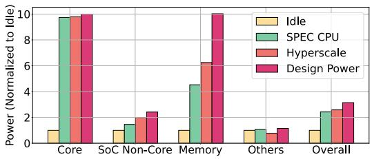

(a) Hyperscale vs. SPEC CPU.  
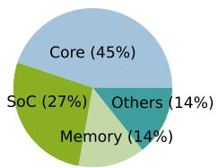  
(b) Power breakdown.

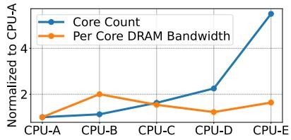  
(c) Server trend across time.  
Figure 1: (a) Core power approaches its design power, while memory power stays well below, especially for SPEC CPU. (b) System power breakdown of a hyperscale web service; core power is less than half of the total. (c) Server core counts have increased over CPU generations, whereas memory bandwidth per core has not kept pace.

Hyperscale workloads exhibit behaviors that differ significantly from those of standard benchmarks [22,33,61,62]. Figure 1a shows component-wise power contributions for an idle system, a SPEC CPU2017 workload (geometric mean of int rate), and a representative hyperscale web service. Both workloads achieve peak CPU utilization, while hyperscale workloads place substantially greater power demands on the memory subsystem and other non-core components than SPEC CPU2017 workloads. Furthermore, focusing solely on processor core power is insufficient, as it accounts for less than 50% of the system power (Figure 1b). Additionally, as illustrated by Figure 1c, server compute and memory capabilities differ across generations in Meta’s datacenters.

Building on insights from our characterization study, we have enabled the infrastructure to collect component-level performance counters and power sensor data across all machines in our fleet. This fleet-wide telemetry supports power planning that accounts for the heterogeneity of both workloads and hardware throughout the hardware lifecycle, capturing a critical reality: not all services or machines reach peak power simultaneously. Leveraging this heterogeneity, we have developed a power oversubscription methodology that has been deployed across Meta’s datacenters for over a decade. By aligning power budgeting with each stage of the hardware deployment lifecycle, this approach has enabled Meta to provision approximately 20% more racks in its global datacenter fleet without increasing the overall power footprint. Notably, this work is the first to introduce the concept of hardware life cycles in heterogeneous datacenter environments, along with phase-specific power budgeting strategies – an area not explored in prior datacenter power studies [27,34,52,59,64,77].

Finally, in the early stages of the hardware lifecycle, power planning must proceed without the production-level telemetry available in later phases. To address this challenge, we introduce PowerSight, a machine learning (ML)-based model that predicts system power consumption using performance counters1, which are available throughout all phases of the hardware lifecycle. PowerSight is a holistic power model capable of predicting the power consumption of compute, storage, and AI servers, as co-locating different types of servers within the same datacenter is essential to minimize cross-region communication overhead, which is particularly important for services such as AI training [15]. We also present case studies on how PowerSight facilitates power planning during the initial phases of the hardware lifecycle in datacenters.

In summary, our key contributions include:

• We conduct a comprehensive power characterization study using live production data at Meta, covering thousands of services deployed on multiple generations of compute, storage, and AI servers.

• We present the power oversubscription methodology that has been deployed in Meta’s datacenters for over a decade, which allows us to safely oversubscribe power by ∼20% on average in compute, storage, and AI racks.

• We introduce PowerSight, an ML-based model for earlystage datacenter power planning. PowerSight can be easily deployed at scale using existing datacenter infrastructure. We also plan to publicly release artifacts to benefit the broader community in the future.

## 2 Background

Our study begins by introducing the foundational concepts of power distribution in Meta’s datacenters.

Definition of hardware lifecycles: Commercial datacenters typically use a mix of old and new machines to handle a massive number of workloads [25, 30, 51, 52, 56, 68, 73, 74]. As service load increases over time, datacenters add new machines to increase capacity, but often keep older machines in operation due to cost and environmental concerns [4, 24, 72]. Introducing a new hardware generation into production is a multi-phase process, which we refer to as the hardware lifecycles (Table 1). The process begins with the pre-engineering validation test (pre-EVT) phase, which focuses on platform design and pre-silicon performance evaluation. In the engineering validation test (EVT) phase, where hardware is avail able, efforts shift to system bring-up and performance benchmarking. The subsequent design validation test (DVT) and production validation test (PVT) phases involve application testing, power planning, and production validation. During this period, servers are seamlessly equipped with baseboard management controllers (BMCs) to enable reliable power data collection through physical power sensors deployed at various system levels, as shown in Figure 2. After approximately nine months of extensive testing, the platform enters the mass production (MP) phase. Even during mass deployment, machine configurations – such as CPU frequency – are continuously tuned to maximize performance-per-Watt and overall energy efficiency (MP + 1 year).

Table 1: Hardware lifecycle of a server. It takes 18+ months before hardware moves into the mass production (MP) stage. Power sensors are usually equipped in the DVT/PVT stage.  
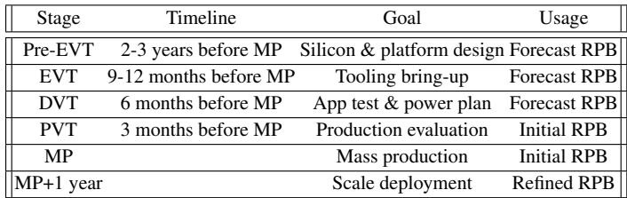

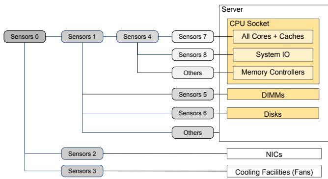  
Figure 2: Telemetry sensors in Meta’s datacenters. Sensors are deployed at different levels to measure power across different components and subsystems.

Datacenter power distribution hierarchy: Figure 3 shows the hierarchical power distribution architecture in Meta’s datacenters, which enables efficient power delivery and centralized management across the fleet. At the top, the main switch delivers up to ∼2.5 MW to IT equipment. Downstream, intermediate switchboards draw ∼1.25 MW each and feed multiple leaf-level panels, each sustaining up to ∼190 kW. These panels power tens of heterogeneous racks hosting diverse machine types hosting different services [27, 52].

Definition of design power: In datacenters, power control is typically managed at higher aggregation points, such as main switches, switchboards, or panels, rather than at individual racks [27, 52, 77]. This simplifies power management by reducing the number of monitored units. However, each rack still has a fixed power limit set by its electrical design, and the total power drawn by all components, including servers and the top-of-rack (TOR) switch, must stay within this limit. To enforce this constraint, datacenter operators define the concept of design power, denoted as D, which captures the peak power usage of all servers under the most demanding workload, plus overheads such as TOR switch power.

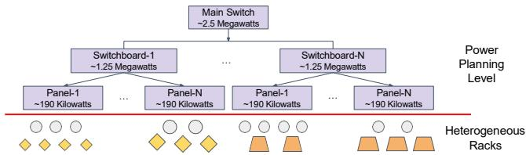  
Figure 3: Power distribution hierarchy of the fleet.

Definition of rack density: In datacenter power planning, an important metric alongside design power is rack density, defined as the maximum number of servers, denoted as n, that can be deployed without exceeding the design power of each rack. A typical method to calculate rack density involves three steps: (a) determine the peak server power, Ps, under the most power-intensive workload; (b) account for the power consumed by other rack components, such as TOR switch, PTOR; and (c) calculate n accordingly: n = (D − PTOR)/Ps.

Definition of rack power budget: In practice, the design power of a rack is often unattainable, as not all services can fully stress every server component simultaneously [27, 34, 64, 77]. To this end, we define the rack power budget (RPB) as the expected power draw of a given rack type during peak traffic, accounting for worst-case fleet-level failure scenarios. We routinely update RPB throughout the hardware lifecycle (see Table 1) to optimize overall datacenter power utilization. Additionally, accurate RPB planning is essential for new hardware during the early stages of its lifecycle, as these initial estimates play a key role in determining whether additional datacenters are needed to support increased fleet capacity. However, this process is challenging due to the lack of fleetwide power sensor data before massive production.

## 3 Understanding Power at Hyperscale

Leveraging fleet-wide performance counters and percomponent power sensors available on recent platforms, we characterize the power consumption of hyperscale workloads in Meta’s production datacenters. We cover experimental setup (§ 3.1), benchmarks vs. production services (§ 3.2), power variance across services (§ 3.3), cross-generational trends (§ 3.4), and performance-power correlations (§ 3.5).

Table 2: Machine configurations of all types of services (\* denotes a variant configuration).  
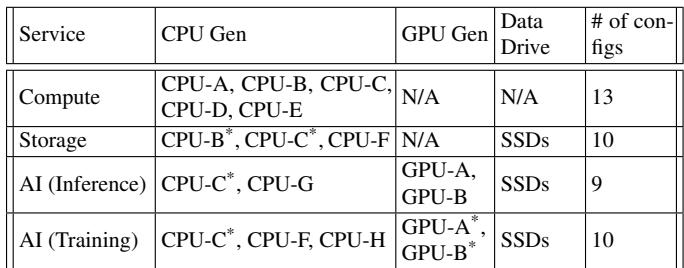

## 3.1 Experimental Setup

Our study focuses on hyperscale workloads running on millions of machines, encompassing thousands of services, from traditional web and network services [33, 34, 62, 63, 81] to AI-related workloads [50, 51, 65]. We specifically analyze the power consumption of in-production servers handling live production traffic spanning eight CPU generations (Intel Xeon and AMD EPYC architectures) and two GPU generations (GPU-A and GPU-B, corresponding to NVIDIA Ampere and Hopper architectures, respectively) running (general) compute, storage, and AI services2. We list machine configurations in Table 2 (further details are publicly available in the Open Compute Project [2]). Compute services run on nodes that have CPUs and boot drives (see Table 3). Storage services use servers equipped with flash devices. AI services, both inference and training, operate on hosts provisioned with GPUs. In total, we used 42 machine configurations with different combinations of core counts and socket counts, as well as cache and DRAM capacities to conduct our study3.

We measured each service in the production environment under its default deployment configuration and collected system-level performance counters by running a lightweight daemon process dynolog on each production server [1]. This infrastructure setup allows us to query historical performance metrics data from a massive database that contains information from millions of machines. We read system module power from Sensor 0 (measuring module input power), server power from Sensor 1 (measuring server power including CPU sockets, DIMMs, and disks), and CPU socket power from Sensor 4 (measuring processor die power) using an internal datacenter-wide power management system that monitors the entire fleet power hierarchy [77], as labeled in Figure 2, which shows the physical placement of each sensor in the power delivery path.

Table 3: CPU configs across compute server generations.  
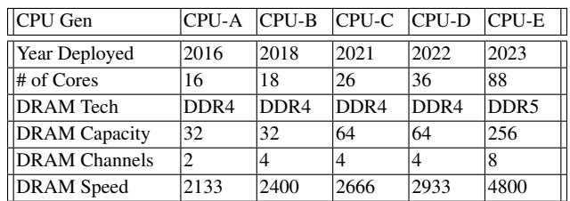

## 3.2 Benchmarks vs Production Services

In the early stages of power planning, benchmarks are commonly used as proxies for in-production services to estimate system design power. However, standard benchmark suites often underestimate design power, as they fail to match the power intensity of hyperscale workloads. This section examines the differences in power characteristics between hyperscale services and conventional benchmarks.

From the thousands of services in the fleet, we select representative ones4 to conduct in-depth case studies.

Compute Services: Web1 and Web2 are web servers implemented using HipHop Virtual Machine (HHVM) deployed across the fleet [5, 46, 61, 62, 81]. Feed is a key microservice for the News feed service [61, 62, 84]. Ads maintains user-specific data, ranks advertisements, and determines their retrieval order [61, 62]. Video is a service for video transcoding.

Storage Services: UDB is a user database service built on MySQL and deployed under a distributed data store architecture. ZippyDB is a distributed key-value store that builds on RocksDB to ensure data consistency and reliability [14].

Benchmarks: We use SPEC CPU2017 [13, 18] to compare its performance and power characteristics with hyperscale workloads. If not specified, we run int rate using n copies, where n represents the number of cores in the system.

While SPEC CPU2017 benchmarks are designed to represent a broad range of computing tasks, hyperscale workloads are tailored to specific applications and exhibit unique power consumption patterns. Figure 4 shows that SPEC workloads exhibit lower power consumption, whereas hyperscale workloads operate closer to the design power. On average, hyperscale workloads utilize 85.6% of design power, whereas SPEC workloads reach only 75.5%, approximately 11.8% lower in relative terms. In contrast, hyperscale workloads exhibit higher power consumption for (a) SoC non-core power, namely network-on-chip, system IO, and memory controller power; (b) memory power; and (c) other power such as network interface, rack top-of-switch power, and fan power. This is because hyperscale workloads typically have a larger instruction footprint, which places greater demands on the memory subsystem [33, 43, 62].

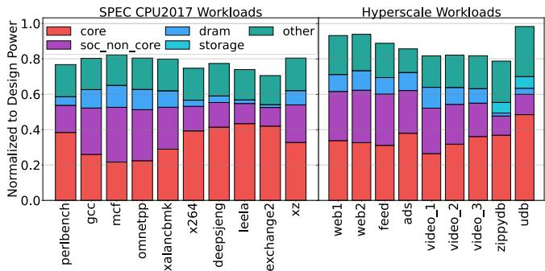  
Figure 4: Power breakdown of SPEC CPU2017 benchmarks and Hyperscale workloads. Hyperscale workloads consume similar core power but higher system power than SPEC benchmarks. On average, hyperscale workloads reach 85.60% of design power, whereas SPEC benchmarks reach only 75.51%.

Takeaway 1: (1) Conventional benchmarks, like SPEC CPU2017, can effectively measure core power consumption but often fail to capture the power profile of the whole system. (2) By leveraging live production data for power planning, we avoid underestimating design power by 11.8% compared to relying solely on standard benchmarks.

## 3.3 Power Variance Across Services

Instead of general-purpose benchmarks, we characterize the power consumption of production services. In Figure 5a, we show a snapshot of system power usage for thousands of live traffic services running on millions of machines in the fleet, including compute, storage, and AI services. Typically, services operate within 40-70% of their design power capacity. However, our analysis reveals that actual power consumption can fluctuate substantially, ranging from as low as 20% to as high as 90% of design power for different machine variants. The power variance shown in Figure 5a reflects both inter-service and intra-service differences. Different services can place varying demands on system components (e.g., a memory-intensive caching service vs. a compute-bound video transcoding service), and even instances of the same service can exhibit power variation due to regional load imbalances and hardware configuration differences. The significant variation in power consumption resulting from fluctuating system loads in commercial datacenters [27, 51, 52, 64, 65] highlights the importance of using data from the entire fleet to accurately characterize system power.

Takeaway 2: The system power varies significantly during runtime (varies between 20%-90% of the design power), which poses great challenges for datacenter RPB planning.

Challenges in RPB planning: Workload power consumption varies substantially, with different workloads using different proportions of their design power capacity (Figure 5a). Consequently, servers within a compute rack show considerable variation in power usage (Figure 5b). Notably, only about 85% of compute rack servers – similar to those in storage and AI racks – operate above 50% of their design power as shown in Figure 5b. This variability highlights a key limitation of relying solely on design power for datacenter power budgeting, as it can lead to underutilized power capacity and inefficient resource allocation. To address this, we continuously refine the RPB throughout the entire hardware lifecycle (§ 4).

## 3.4 Power Trend Across Machine Generations

The characterization results in the previous section show that each machine generation in the fleet has its unique power characteristics, but there is also a noticeable trend across generations that can provide valuable insights for hardware architects planning future datacenter capacity. For instance, as shown in Figure 5a, newer machine generations like CPU-E exhibit increased variability in system power consumption. This wider spread is driven by the broader diversity of workload profiles supported by newer platforms – with significantly more cores (e.g., 88 cores in CPU-E vs. 18 in CPU-B) and memory channels. As a result, some services run computebound while others are memory- or I/O-dominant, leading to a wider range of component utilization levels and thus a wider power distribution even when normalized to design power.

In addition to overall system power consumption, we also observe trends across machine generations for individual components within the system. Figure 6a shows the trend of CPU power consumption per unit of throughput (measured as committed instructions per time frame) across various machine generations. Our analysis reveals that as the number of cores increases across machine generations, the per-throughput socket power decreases. This trend is particularly prominent when comparing later machine generations, such as CPU-E, where we see nearly a 2× reduction in per-throughput CPU socket power compared to CPU-B (CPU-E has roughly 5× more cores than CPU-B and about 2.5× more cores than CPU-D). In contrast, components of the memory subsystem in servers did not improve at the same rate as cores (only 1.2× when comparing DDR5 versus DDR4, as shown in Figure 6b). As a result, there is a shift in power distribution across different system components over time.

Figures 7a (focus on compute servers) and Figures 7b (focus on AI training servers) illustrate the trend in system power breakdown for each component across machine generations. The proportion of memory components over system power has increased significantly over time5. Notably, the next-generation pre-production system, CPU-X and GPU-X (GPU-0 represents the previous decommissioned generation), exhibits an even more pronounced trend, indicating that memory components will continue to play an increasingly important role in overall system power usage.

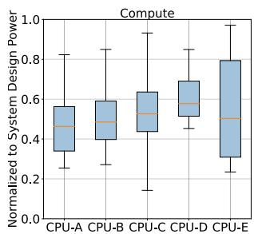

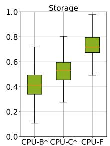  
(a) Fleet-wide service system power distribution for all machine generations.

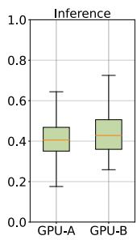

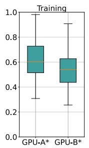

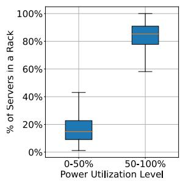  
(b) Server distribution within a rack.

Figure 5: (a) Service power distribution across the fleet shows significant variability across all service types. (b) Server distribution within a compute rack with different levels of design power utilization. 15%+ of servers have relatively low power utilization (less than 50% of design power).  
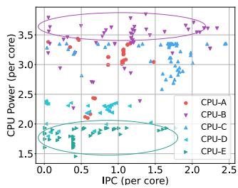  
(a) CPU power.

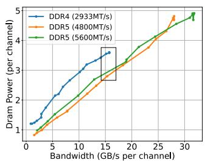  
(b) Memory power.

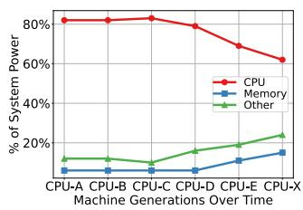  
(a) Components (Compute).

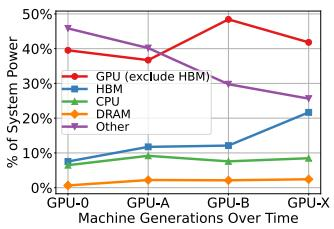  
(b) Components (AI Training).  
Figure 6: CPU core power and memory power trend across machine generations at different performance levels. Core power drops by ∼2× in newer systems at the same IPC level (CPU-E vs. CPU-B), while memory power shows a more modest reduction of ∼1.2× when delivering equivalent bandwidth (DDR5 vs. DDR4).  
Figure 7: System power breakdown across machine generations – (a) compute (Memory line) and (b) AI training servers (HBM line) – shows memory components contributing increasingly over time.

This trend has two competing effects on future power planning. On one hand, memory power exhibits a relatively stable relationship with bandwidth utilization (Figure 6b), which may simplify power prediction as a larger share of system power becomes more predictable. On the other hand, the growing memory power fraction suggests that memory-aware power management techniques will become increasingly important. The effectiveness of such techniques depends on workload characteristics, as different services place varying demands on the memory subsystem, and memory behavior of each workload may change over time [33, 43, 62]. This motivates program-phase-aware power management solutions that could, for example, dynamically reallocate power from the memory subsystem to CPUs or other components during memory-light phases, improving performance under the same power budget.

Takeaway 3: (1) The power efficiency of system components evolves at different rates. Over time, memory power has grown to form an increasing percentage of total system power (>20% in the latest generation), which presents both an opportunity (more predictable power fraction) and a challenge (need for memory-aware power management techniques) for datacenter power management. (2) Rather than focusing solely on CPU power, we include all system components in power planning across hardware lifecycles. In recent platform generations, we have added dedicated power sensors for the memory subsystem to account for the evolving hardware trend (see Figure 2).

## 3.5 Perf. Metrics – System Power Correlation

In addition to studying system power breakdown trends across machine generations, we analyze correlations between performance metrics and system power to gain deeper insights into the challenges of power modeling. We find that the system power is affected by multiple performance metrics, and this relationship differs across machine generations. For instance, in some generations like CPU-A, peak system power is reached at approximately 70% CPU utilization, whereas in others, such as CPU-E, peak power occurs at a much lower utilization level, around 40% (as shown in Figure 8a). One explanation for this is that newer CPUs optimize SoC power usage by maximizing frequency, which enables them to reach maximum power at lower utilization levels. The relationships between storage IO bandwidth, GPU SM utilization, and system power in storage and AI services also exhibit complex patterns, emphasizing the need for a multi-metric approach to accurately characterize system power.

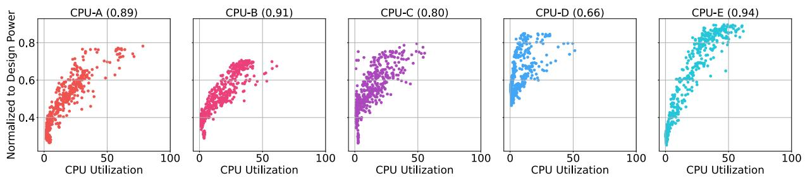

(a) Correlations between CPU utilization and system power.  
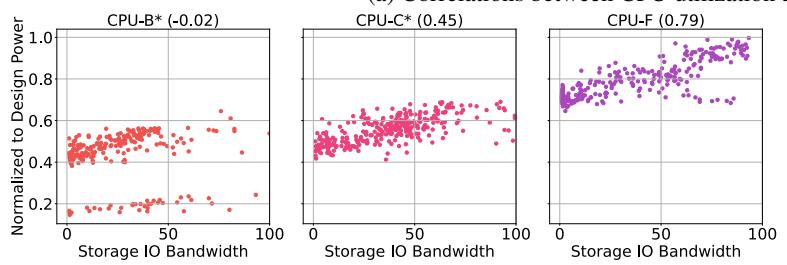  
(b) Correlations between storage IO utilization and system power.

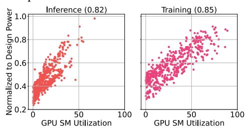  
(c) GPU utilization and system power.  
Figure 8: Fleet-wide correlations between CPU utilization, Storage IO bandwidth, GPU utilization, and system power. No single metric can decide the system power, and the correlation (listed in figure titles) changes across machine generations.

Takeaway 4: (1) Modeling the power of an entire system requires multiple inputs beyond just the metrics of the main components (e.g., CPUs/GPUs), and thus firmware-level readings, such as NVIDIA Nsight Systems reporting only GPU power, are insufficient. To address this, we deploy a lightweight daemon process dynolog [1] on each server to collect performance counters of all components in the system. (2) It is unreliable to directly extrapolate power models from current systems to future platforms. A holistic power model capable of predicting the power consumption of future compute, storage, and AI servers is necessary to support the hardware heterogeneity in datacenters [15, 52].

## 4 Hardware Lifecycle-aware Power Planning

Having characterized power at the individual machine level (§ 3), we turn to higher-level planning. Although each service and machine exhibits a distinct power profile, effective datacenter power planning requires decisions at coarser granularities, such as the rack. To address this, we have developed a methodology for oversubscribing rack power across the hardware lifecycle, accounting for both workload and hardware heterogeneity (§ 4.1). In early deployment stages, however, power sensors may not yet be available, necessitating a crossarchitecture model for power prediction (§ 4.2).

## 4.1 Oversubscribe RPB across Hardware Lifecycles

The wide variation in power consumption across machines and services (Figure 5a) demonstrates the drawbacks of relying solely on design power for capacity planning, as this results in stranded power capacity throughout the fleet. In practice, all machines within a rack rarely operate at their peak power simultaneously (Figure 5b). Consequently, datacenter planners can safely set the RPB below design power, which improves overall power utilization across the fleet. Setting the right RPB requires balancing multiple competing constraints. If the RPB is set too low, more racks are placed under each power device, and aggregate power draw may exceed upstream device limits (RPP, SB, MSB), which triggers power capping [23, 77] and degrades both performance and efficiency. Conversely, an RPB set too high leaves provisioned power capacity unused, requiring more datacenters to be built for the same total compute capacity, which raises costs and environmental impact. In this section, we present our RPB planning methodology, deployed at scale for over a decade, that spans the full hardware lifecycle from early design through production optimization.

Forecast RPB (Pre-EVT/EVT/DVT): In the early stages of hardware lifecycles, datacenter planners must estimate the RPB to anticipate future power demands as machines begin to arrive. Accurate forecasting is critical: (a) underestimating forecasted RPB means deployed racks may exceed the power provisioned for their location, forcing a late RPB increase that reduces rack density per power device and necessitating rack relocations to stay within device limits; (b) overestimating

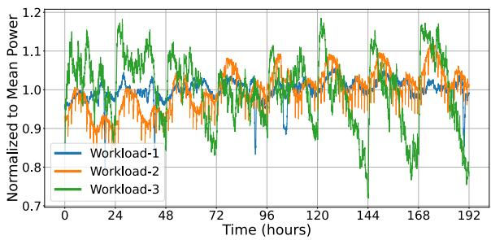  
Figure 9: Power variance of three top services over a week. Each workload reaches its peak power at different time.

RPB under-projects compute density, potentially triggering unnecessary datacenter construction. Without measured data, this projection relies on the maximum power ratings defined in the electrical specifications of each rack, adjusted using derating factors based on historical experience.

Initial RPB (PVT/MP): Once systems are delivered, we work with service owners, who have detailed knowledge of their workloads, to determine the RPB. Service owners first conduct load tests to identify the highest sustainable load before performance degradation occurs. They then measure the utilization of the most critical resource (e.g., CPU, GPU, or disk), referred to as the target utilization, for that specific rack type. We use values supplied by service owners to calculate the power budget for each service. By generating a power-versusutilization curve for every workload and applying the target utilization value, we determine the corresponding power demand, denoted as p . In addition to p , we also calculate a weighted average distribution of each workload within the rack, denoted as fw. Finally, we derive the RPB (Equation 1)6, where each w denotes a distinct workload, n indicates the number of hosts and P represents additional power consumed by TOR switches.

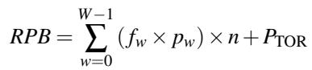

(1)

Refined RPB (MP+1 year): The initial RPB would be suffi cient if all services deployed within a rack reach their peak power consumption simultaneously. However, this rarely happens even during peak periods under worst-case failure scenarios due to the workload heterogeneity [27]. To illustrate this, Figure 9 presents the system power consumption of three key workloads over one week. The data shows that peak power periods for individual workloads typically do not overlap, enabling opportunities for power oversubscription and creating a “power buffer” that can be leveraged to optimize power allocation. This buffer cannot be identified during initial RPB planning, as only a limited number of services can be profiled and proxy data may have to be used in the absence of fleetwide production traffic. To quantify the size of this power buffer, we introduce a metric called the inter-workload max correlation score, denoted as CR (Equation 2).

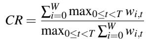

(2)

The numerator sums the worst-case power consumption of each workload (w) over a given time window (0 ≤ t < T ), without considering when these peaks occur. The denominator captures the maximum total power drawn by all workloads at any single point in time within that window. Because peak power demands of different workloads usually occur at different times, the CR is typically greater than one. A higher CR reflects a larger “power buffer”, introducing opportunities for power oversubscription without violating power constraints. We refine the RPB7 formula by including the CR as follows:

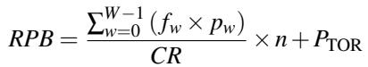

(3)

The refined RPB in Equation 3 incorporates the power oversubscription principles from Equation 1 and Equation 2. It first addresses spatial power oversubscription, which involves the distribution of power usage across various workloads operating on different servers (see Equation 1 and Figure 5b). Additionally, it accounts for temporal power oversubscription, considering the timing and occurrence of peak power consumption events (see Equation 2 and Figure 9).

The refined RPB methodology allows us to expand overall fleet capacity. As illustrated in Figure 10, we compare design power with both forecast RPB and refined RPB across various rack types. By using forecast RPB, the fleet can achieve a 13% power oversubscription compared to using only design power. Furthermore, the refined RPB enables safe power oversubscription by an additional 11% beyond the forecast power budget, across compute, storage, and AI racks. This increased power oversubscription unlocks additional datacenter capacity, so more racks can be installed within the constraints of the power devices (see Figure 3). As a result, this approach allows us to make better use of the existing power capacity within our current fleet and reduces the need to construct new datacenters in the future.

Notably, this methodology has proven robust even as the fleet’s workload mix evolved over time [16, 58, 69, 79]. The anticipated growth of AI training and inference workloads would not fundamentally alter our power planning methodology, but would introduce new rack types (AI training and inference) with distinct power profiles. The core refined RPB methodology applies uniformly across compute, storage, and

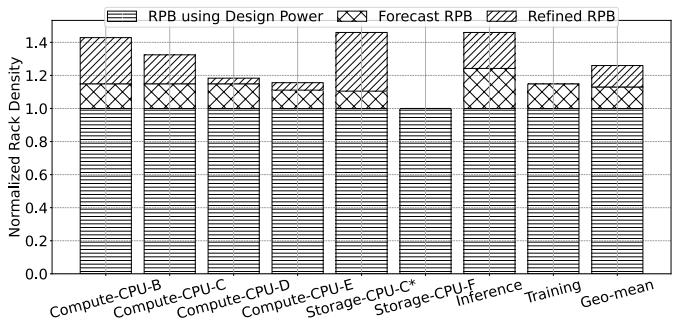  
Figure 10: Lifecyle-aware RPB planning expands the fleet capacity. Using the forecast RPB increases rack density by 13% compared to design power (middle shade), while the refined RPB provides an additional 11% gain over the forecast RPB (top shade).

AI racks. However, AI workloads introduce two main differences: (1) GPU-dominated racks may exhibit less temporal power variance than CPU-dominated racks as training jobs sustain high utilization for longer periods, resulting in lower CR values; and (2) the introduction of AI racks increased overall fleet heterogeneity, reinforcing the need for a crossarchitecture power model that can generalize across compute, storage, and AI servers (§ 5).

Beyond power budgeting, the refined RPB approach is also compatible with workload placement and scheduling strategies, such as SmoothOperator [27] and Twine [70]. In addition to initial workload placement, our refined RPB approach considers the entire hardware lifecycle. As service loads fluctuate over time, we periodically adjust the RPB, even after mass production (MP + 1 year), to ensure continued alignment with evolving workload demands. Additionally, by taking advantage of rack heterogeneity (each power device can accommodate different types of racks, as illustrated in Figure 3), the refined RPB allows each power panel to support more racks while reducing power fragmentation.

## 4.2 System Power Forecasting is Necessary

While the refined RPB has enabled provisioning of approximately 20% more racks in our global fleet (based on the weighted average of power oversubscription and rack power footprints), it has a key limitation: it requires (a) fleet-wide workload information to determine fw and (b) ground-truth power readings from sensors to determine pw, which would not be available at early stages of hardware lifecycles.

Accurate RPB estimation is essential for effective datacenter power planning, even during the early stages of the hardware lifecycle. Unlike service-demand variance, which determines how many servers are needed, RPB accuracy determines how many racks fit within fixed power infrastructure – even a few percentage points of overestimation can translate to thousands of fewer racks fleet-wide, making it a critical input to datacenter capacity planning. Currently, our power budget model requires power sensor data, which typically becomes available only in later phases (DVT/PVT). However, the RPB must be determined much earlier to guide datacenter layout and support decisions such as whether to build new datacenters, a process that takes years. We introduce PowerSight, a system that forecasts power consumption without power sensors during the early hardware lifecycle stages (§ 5).

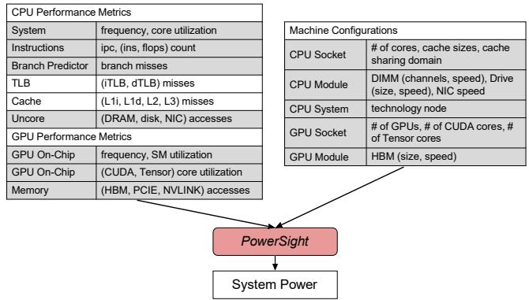  
Figure 11: Performance metrics and machine configurations (input) to predict system power (output) for PowerSight. High lights are representative input features (less than 0.1% accuracy loss compared using the full set).

## 5 Future Power Budgeting Practice

Commercial datacenter planners need to make early tradeoffs between power and performance of future systems to mitigate the risk of selecting a power-inefficient configuration. In this section, we present our practice on power budgeting for future machine generations at earlier phases of hardware lifecycles, where power sensor readings are generally not available (before DVT/PVT phases).

As discussed in Table 1, machine configurations are finalized at pre-EVT (2–3 years before mass production), while engineering samples with calibrated power sensors typically become available only at DVT (6 months before mass production). To bridge this 12–18 month gap, we introduce PowerSight (§ 5.1), an ML-based power model to predict system power consumption of compute, storage, and AI servers (§ 5.2). PowerSight can be easily deployed at scale, as it requires only machine configuration and performance counter data—both of which can be collected with minimal performance overhead using existing datacenter infrastructure [30, 31, 75], and are obtainable from early EVT samples before reliable power sensor data exists. PowerSight can also facilitate informed decision-making during future system power planning (§ 5.3).

## 5.1 PowerSight Overview

## 5.1.1 PowerSight Prediction Target

The primary objective of PowerSight is to accurately predict machine system power (a continuous numerical value). We formulate this as a regression problem and train ML-based models for prediction.

## 5.1.2 PowerSight Inputs and Outputs

PowerSight takes both workload and machine characteristics as inputs (as our characterization results in § 3.5 show that the system power is determined by multiple factors) to predict system power consumption as its output. Figure 11 shows the different machine characteristics and performance events that PowerSight is built upon, all of which can be collected efficiently with minimal overhead using existing datacenter performance monitoring infrastructures [1, 30, 31, 75]. To enable large-scale deployment in production environments, we excluded kernel-level GPU performance counters, as profiling such events incurs significant runtime profiling overhead [26, 66, 78]. To model system power more accurately, we include DRAM/HBM, drives, and network accesses in addition to core performance metrics used in prior studies [82]. For machine configurations, we consider a comprehensive range of features to include not only the core architecture characteristics but also other non-core properties. Using these inputs, PowerSight employs an ML-based regression model to predict system power as its output.

Input Feature Selection: To improve accuracy while keeping training effort manageable (retraining or fine-tuning Power-Sight can further enhance accuracy, more in § 5.2.5), we carefully choose the input features. Although incorporating more performance metrics into ML models can generally improve accuracy, prior research has shown that many performance counters are strongly correlated [12, 40, 54], indicating that not all features contribute equally to power prediction8. We apply principal component analysis-based clustering methods [38, 48, 54] to select a representative subset of input features (as highlighted in Figure 11). This approach achieves nearly the same accuracy – within 0.1% difference – as using the full set of input features.

## 5.1.3 PowerSight Machine Learning Formulation

To accurately predict system power using ML-based regression models, PowerSight requires selecting the most suitable regression model and training on high-quality datasets. ML Model Type: We evaluate six common ML models used in performance and power modeling to predict system power consumption [3, 7, 83], including Lasso Regression (Lasso), Ridge Regression (Ridge), SVM Regression (SVR), Decision Tree Regression (DT), Gradient Boosting Decision Tree Regression (GBDT), and MLP Regression (MLP). Our evaluation process consists of three stages. Initially, we evaluate each model by using it to predict system-level power for the same generation of hardware on which it was trained, providing a preliminary assessment of its accuracy. This initial evaluation helps us narrow down our selection to the top-performing models, specifically DT, GBDT, and MLP (§ 5.2.3). Next, we expand our evaluation to assess the performance of models across multiple generations for all compute, storage, and AI services. This step allows us to evaluate the robustness of PowerSight (§ 5.2.4). Finally, we conduct a rigorous test by evaluating the model on a machine generation it has never seen before. Based on this ultimate evaluation, we select MLP as the ML model for PowerSight (§ 5.2.5).

ML Model Training Dataset: We demonstrate the effectiveness of PowerSight by leveraging a vast dataset, collected by existing datacenter performance monitoring infrastructures [1, 30, 31, 75]. The dataset comprises real-world data from in-production services running on millions of diverse machines (more in § 5.2.2). This comprehensive dataset enables PowerSight to achieve good accuracy.

## 5.2 Training and Evaluating PowerSight

## 5.2.1 Training Methodology

To optimize the performance of each model, we use a grid search approach to select the most suitable model parameters that yield good accuracy. We train the models on live production data from actual measurements of performance counters and power sensors. At fleet scale, such data inevitably contains measurement noise–including temperature-related variance across server locations, manufacturing variability across silicon batches, and sensor calibration differences across BMC firmware versions. We mitigate these effects by aggregating across thousands of machines per configuration and applying standard data cleaning (e.g., removing outliers). As shown in § 5.2.2, the scale of our dataset provides inherent robustness against per-machine noise. To evaluate the accuracy of the models, we use data from separate days that was not used during training. This ensures that our evaluation is robust and unbiased, providing a true assessment of the predictive capability of each model.

## 5.2.2 PowerSight Training Dataset

The accuracy of a machine learning model depends heavily on the training dataset size. PowerSight leverages an extensive dataset consisting of millions of in-production data points collected from the entire datacenter fleet, which allows PowerSight to achieve high accuracy in predicting system power.

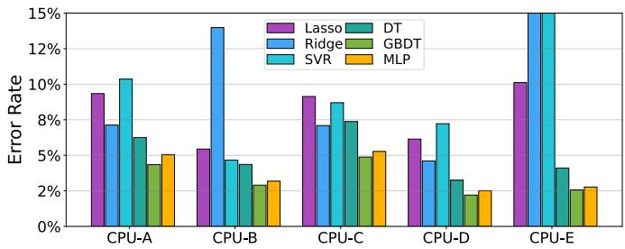  
(a) Single architecture.

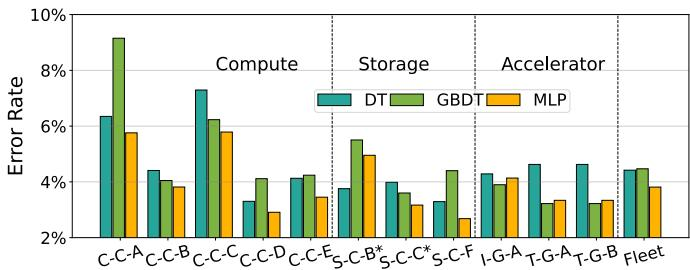  
(b) Multiple architectures.

Figure 12: System power prediction error rate (MAPE) of (a) trained and test on the same architecture; (b) train on all types of services and test on each architecture. DT, GBDT, and MLP achieve better accuracy than Lasso, Ridge, and SVM.  
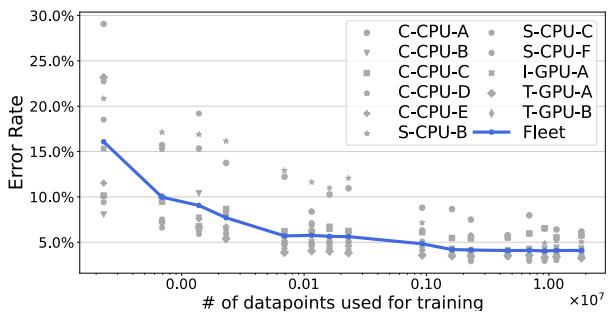  
Figure 13: System power prediction MAPE (on testing dataset) when training PowerSight using different number of data points. The accuracy improves with more data points.

To demonstrate the effect of dataset size on model accuracy, we train PowerSight using varying numbers of data points from our entire fleet and present the results in Figure 13. Our analysis reveals that expanding the training dataset leads to significant improvements in the accuracy of PowerSight. However, when the model is trained with relatively small datasets (tens of thousands of data points), it yields a system power prediction error rate of over 10%. To attain optimal performance, we recommend training the model with at least several million data points. This ensures PowerSight uses sufficient data to learn effectively and make accurate predictions.

## 5.2.3 Single-Architecture Power Prediction

We begin with the simplest evaluation scenario: predicting system-level power for a single architecture, where the model is trained and tested on the same generation. Figure 12a shows the prediction error rate for all machine generations running compute services.

Among the six ML models, DT, GBDT, and MLP consistently outperform Lasso, Ridge, and SVM across all machine generations. DT, GBDT, and MLP achieve above 95% system power prediction accuracy for all machine generations. This is because prior works have shown that the power model may exhibit non-linear correlations between performance metrics [12] and linear regression models are particularly sensitive to the variability introduced by multiple machine configurations [9, 11]. Although SVM achieves good accuracy, its training time complexity increases quadratically with the number of samples, making it difficult to scale to large datasets with millions of data points (we had to subsample only 1% of the data to train SVM for this evaluation). Given that the accuracy of PowerSight benefits from using a large dataset with millions of in-production data points (more in § 5.2.2), the scalability limitations of SVM make it less suitable for this application. Therefore, DT, GBDT, and MLP are more effective for power prediction compared to other linear and support vector models, and we use these three models for our later analysis in this section.

## 5.2.4 Multiple-Architecture Power Prediction

As DT, GBDT, and MLP demonstrate better accuracy for single-architecture power prediction, we evaluate these three ML models using the fleet-wide data for all machine generations. We show the mean absolute percentage error (MAPE) of each model for all types of services (Figure 12b).

When applying the three models for all compute, storage, and AI services, all three models achieve good system power prediction accuracy (MLP achieves 96.19% accuracy, while DT and GBDT achieve 95.59% and 95.53% accuracy, respectively). This is consistent with their robustness to outliers, as also observed when training on individual machine generations. The tens of machine configurations (Table 2) introduce additional noise into the data, but neural network methods (MLP) can improve generalization by reducing overfitting compared to tree-based methodologies (DT and GBDT) [12, 19, 82]. In addition, the good accuracy of MLP can be attributed to the large dataset, comprising millions of data points across thousands of services and tens of machine configurations.

## 5.2.5 Predicting the power of a new system

To further assess the effectiveness of PowerSight, we evaluate and compare the performance of DT, GBDT, and MLP by predicting the system power of an inference platform equipped with CPU-H and GPU-B. Notably, these components were not included in our training dataset, which makes this evaluation a robust assessment of the ability of Power-Sight to generalize to new scenarios. Specifically, CPU-H features significant upgrades compared to CPU-E, including more cores and increased memory bandwidth. Meanwhile, GPU-B also has different HBM configurations compared with GPU-B\*.

Table 4: Comparing ML models in predicting the power of existing architectures but new workload and new architectures unseen in the training set. MLP achieves the best accuracy.  
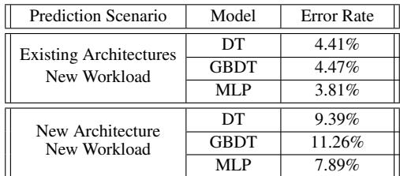

We compare the performance of different ML models in two scenarios: predicting power consumption for existing architectures (top part of Table 4) and predicting power consumption for a new, unseen system not included in the training data (bottom part of Table 4)9. The results indicate that MLP achieves the highest accuracy in both cases, as it is capable of learning complex, nonlinear relationships between features when provided with enough data [60]. Given its robust performance in predicting system power across different machine generations, including those not seen during training, we ultimately select MLP as the ML model for PowerSight. Its ability to generalize well across various architectures and workloads makes it an ideal choice for our system power prediction framework.

## 5.3 Use Cases of PowerSight

In this section, we present case studies demonstrating how PowerSight supports future power budget projections in dat acenters. PowerSight can be used to estimate the rack density (§ 5.3.1), estimate the rack power budget (§ 5.3.2), and identify optimal system configurations based on performanceper-Watt (Perf/W) metrics (§ 5.3.3) during the early phases of hardware lifecycles.

## 5.3.1 Rack Density

PowerSight can help estimate rack density during the preproduction phase, specifically before the availability of power telemetry in the DVT/PVT stage. Using PowerSight at this early stage allows datacenter planners to expedite rack demand projections and purchase planning, reducing the wait time by several months. We validate rack density prediction by training PowerSight on all machine generations except CPU-E and comparing its predictions against the current CPU-E planning. We use the vendor-labeled power for PTOR (defined in § 2) as prior knowledge. Eventually, PowerSight can predict the rack design power with an average error rate (MAPE) of 1.7%, which results in an estimate of n with an error of 8.7%.

Although PowerSight may overestimate or underestimate power, which results in fewer or more machines per rack than ideal, these estimates are sufficiently accurate to guide early-stage power planning. When power is overestimated and fewer servers are deployed than necessary, it is relatively straightforward to add more servers to a rack during the mass production phase10. Conversely, if power is underestimated, datacenter planners can utilize techniques such as DVFS or other methods to further expand the planned capacity [52, 62].

## 5.3.2 Rack Power Budget

In addition to rack density, PowerSight can also be used to estimate the RPB early in the PVT phase. Before power telemetry is available, PowerSight can predict the pw in the RPB formula RPB = ∑W−1w=0 ( fw × pw) × n + PTOR (details in § 4.1). We use the same PTOR and n as when predicting the rack density using PowerSight (§ 5.3.1). We use the fraction of hosts for a given workload, fw, based on the previous hardware generation as prior knowledge. With all information, PowerSight can predict pw for each of the workloads and eventually predict the RPB. Finally, PowerSight achieves an RPB prediction with a 2.5% error, demonstrating its capability to be incorporated into the production flow. This level of accuracy provides datacenter planners with reliable guidance, such as determining whether new datacenters need to be constructed.

## 5.3.3 System Configuration

PowerSight can also be used within the same machine generation to identify a more efficient system configuration, e.g., searching for the optimal core frequency to maximize Perf/W.

Within a fixed power budget per rack, datacenter planners can use Dynamic Voltage and Frequency Scaling (DVFS) to optimize energy efficiency [34, 52, 62, 64]. One approach to achieving this is to sweep through all frequencies of a workload to identify the most efficient one. However, given the thousands of services running in a datacenter fleet, it is impractical to perform such a sweep study for every case.

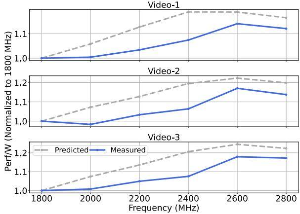  
Figure 14: PowerSight can predict most Perf/W efficient frequency. While the absolute power has errors, PowerSight effectively captures the trend across different frequencies.

To address this challenge, PowerSight can predict the Perf/W of each workload based on its performance metrics at its current frequency. We verify this capability by using the Video workload as an example. As shown in Figure 14, real mea surements indicate that 2.6 GHz is the most energy-efficient frequency for this workload. PowerSight predicts the most Perf/W efficient frequency as 2.4GHz-2.8GHz, closely aligning with the actual optimal value. In production environments, this prediction can serve as a starting point for fine-tuning frequency within a narrow range. This significantly streamlines the optimization process, enabling datacenter planners to efficiently identify the optimal frequency (or other system configurations) for each workload.

## 6 Related Work

Datacenter Power: Although prior studies have examined both machine-level [20, 28, 39, 41, 42, 62, 83] and racklevel [21, 55, 57, 59, 77, 80] power budgeting in datacenters, they largely focus on improving workload energy efficiency but overlook the impact of hardware and workload heterogeneity. Although some studies, such as SmoothOperator [27], have touched on workload heterogeneity, we are the first to introduce the concept of hardware lifecycles and a power budgeting methodology that can be adapted across different lifecycle phases.

Workload Coverage: Previous studies have primarily focused on power of specific workloads. For instance, works such as [23, 27, 34, 35, 64] studied general benchmarks and web services, while others [50, 65] targeted large language models. Our study encompasses thousands of AI and non-AI services, evaluated under live production traffic at scale across datacenters with millions of machines.

Power Modeling: Prior works have focused on predicting the power of either CPUs [17, 29, 37, 47, 49, 53, 71] or

GPUs [6, 32, 45, 76]. Though a few have discussed the entire system power, these analyses were limited to either smallscale systems or existing machine generations [12, 19, 82]. Although using Running Average Power Limit (RAPL) counters is another common approach to estimate power, RAPL is not supported by all vendors and may omit components such as system voltage regulators [8]. PowerSight takes a more holistic approach by considering the power of the entire system, including memory, storage, accelerator, and other components. Additionally, we are the first to demonstrate the real use cases of machine learning for power modeling by in corporating the context of hardware lifecycles in datacenters, particularly when power sensors are unavailable.

Our work is distinct from prior studies: we are the first to (a) present a comprehensive power characterization study across machine generations, showing how these insights can guide power planning at scale; (b) introduce the concept of hardware lifecycle in datacenters, showing how power planning is tailored to the specific characteristics of the heterogeneous hardware and workload in each phase; and (c) employ ML-based models for early-stage datacenter power budgeting before power sensor data is available, and provide case studies on future power budget strategies.

## 7 Conclusion

As commercial hyperscale datacenters continue to grow, power planning must account for multiple hardware generations and their lifecycles. In this paper, we first present a comprehensive power characterization on hyperscale workloads, based on measurements collected from thousands of services using live production traffic across generations of servers in Meta’s datacenters. We present our hardware lifecycle-aware datacenter power planning strategies leveraging characterization insights, enabling us to achieve large-scale power oversubscription. We also introduce PowerSight, which employs ML-based models to predict system power consumption for early-stage datacenter power budgeting, even before power sensor data is available. Our ultimate goal is to advance sustainable hyperscale datacenters that meet growing computing demands while minimizing environmental impact.

## Acknowledgment

The authors would like to thank the anonymous reviewers for their constructive feedback. We would like to thank the current and former Meta engineers who contributed to this project, especially Vjekoslav Svilan. We also thank Kalyan Subramanian, Shobhit Kanaujia, and Chunqiang (CQ) Tang for the management support.

## References

[1] Dynolog: a performance monitoring daemon for heterogeneous cpu-gpu systems, 2025.

[2] Open compute project, 2025.

[3] Cristinel Ababei and Milad Ghorbani Moghaddam. A survey of prediction and classification techniques in multicore processor systems. IEEE Transactions on Parallel and Distributed Systems, 30(5):1184–1200, 2018.

[4] Bilge Acun, Benjamin Lee, Fiodar Kazhamiaka, Kiwan Maeng, Udit Gupta, Manoj Chakkaravarthy, David Brooks, and Carole-Jean Wu. Carbon explorer: A holis tic framework for designing carbon aware datacenters. Proceedings of the 28th ACM International Conference on Architectural Support for Programming Languages and Operating Systems, Volume 2, 2022.

[5] Keith Adams, Jason Evans, Bertrand Maher, Guilherme Ottoni, Andrew Paroski, Brett Simmers, Edwin Smith, and Owen Yamauchi. The hiphop virtual machine. In Proceedings of the 2014 ACM International Conference on Object Oriented Programming Systems Languages & Applications, pages 777–790, 2014.

[6] Gargi Alavani, Jineet Desai, Snehanshu Saha, and San tonu Sarkar. Program analysis and machine learning– based approach to predict power consumption of cuda kernel. ACM Transactions on Modeling and Performance Evaluation of Computing Systems, 8(4):1–24, 2023.

[7] Erika S Alcorta and Andreas Gerstlauer. Learning-based workload phase classification and prediction using performance monitoring counters. In 2021 ACM/IEEE 3rd Workshop on Machine Learning for CAD (MLCAD), pages 1–6. IEEE, 2021.

[8] Lukas Alt, Anara Kozhokanova, Thomas Ilsche, Christian Terboven, and Matthias S Mueller. An experimental setup to evaluate rapl energy counters for heterogeneous memory. In Proceedings of the 15th ACM/SPEC International Conference on Performance Engineering, pages 71–82, 2024.

[9] David F Andrews. A robust method for multiple linear regression. Technometrics, 16(4):523–531, 1974.

[10] Ricardo Bianchini, Christian Belady, and Anand Sivasubramaniam. Datacenter power and energy management: past, present, and future. IEEE Micro, 2024.

[11] Nicholas H Bingham and John M Fry. Regression: Linear models in statistics. Springer Science & Business Media, 2010.

[12] William Lloyd Bircher and Lizy K John. Complete system power estimation using processor performance events. IEEE Transactions on Computers, 61(4):563– 577, 2011.

[13] James Bucek, Klaus-Dieter Lange, and Jóakim v. Kistowski. Spec cpu2017: Next-generation compute benchmark. In Companion of the 2018 ACM/SPEC International Conference on Performance Engineering, pages 41–42, 2018.

[14] Zhichao Cao, Siying Dong, Sagar Vemuri, and David HC Du. Characterizing, modeling, and benchmarking {RocksDB}{Key-Value} workloads at facebook. In 18th USENIX Conference on File and Storage Technologies (FAST 20), pages 209–223, 2020.

[15] Arnab Choudhury, Yang Wang, Tuomas Pelkonen, Kutta Srinivasan, Abha Jain, Shenghao Lin, Delia David, Siavash Soleimanifard, Michael Chen, Abhishek Yadav, et al. {MAST}: Global scheduling of {ML} training across {Geo-Distributed} datacenters at hyperscale. In 18th USENIX Symposium on Operating Systems Design and Implementation (OSDI 24), pages 563–580, 2024.

[16] Mike Chow, Yang Wang, William Wang, Ayichew Hailu, Rohan Bopardikar, Bin Zhang, Jialiang Qu, David Meisner, Santosh Sonawane, Yunqi Zhang, et al. {ServiceLab}: Preventing tiny performance regressions at hyperscale through {Pre-Production} testing. In 18th USENIX Symposium on Operating Systems Design and Implementation (OSDI 24), pages 545–562, 2024.

[17] Gilberto Contreras and Margaret Martonosi. Power prediction for intel xscale® processors using performance monitoring unit events. In Proceedings of the 2005 international symposium on Low power electronics and design, pages 221–226, 2005.

[18] Standard Performance Evaluation Corporation. Spec cpu2017 benchmark suite, 2017.

[19] Georges DA Costa, Jean-Marc Pierson, and Leandro Fontoura-Cupertino. Effectiveness of neural networks for power modeling for cloud and hpc: It’s worth it! ACM Transactions on Modeling and Performance Evaluation of Computing Systems (TOMPECS), 5(3):1–36, 2020.

[20] Bryan Donyanavard, Tiago Mück, Amir M Rahmani, Nikil Dutt, Armin Sadighi, Florian Maurer, and Andreas Herkersdorf. Sosa: Self-optimizing learning with selfadaptive control for hierarchical system-on-chip management. In Proceedings of the 52nd annual IEEE/ACM international symposium on microarchitecture, pages 685–698, 2019.

[21] Xiaobo Fan, Wolf-Dietrich Weber, and Luiz Andre Barroso. Power provisioning for a warehouse-sized computer. ACM SIGARCH computer architecture news, 35(2):13–23, 2007.

[22] Abraham Gonzalez, Aasheesh Kolli, Samira Khan, Sihang Liu, Vidushi Dadu, Sagar Karandikar, Jichuan Chang, Krste Asanovic, and Parthasarathy Ranganathan. Profiling hyperscale big data processing. In Proceedings of the 50th Annual International Symposium on Computer Architecture, pages 1–16, 2023.

[23] Sriram Govindan, Jeonghwan Choi, Bhuvan Urgaonkar, Anand Sivasubramaniam, and Andrea Baldini. Statistical profiling-based techniques for effective power provisioning in data centers. In Proceedings of the 4th ACM European conference on Computer systems, pages 317–330, 2009.

[24] Udit Gupta, Mariam Elgamal, Gage Hills, Gu-Yeon Wei, Hsien-Hsin S. Lee, David Brooks, and Carole-Jean Wu. Act: designing sustainable computer systems with an architectural carbon modeling tool. Proceedings of the 49th Annual International Symposium on Computer Architecture, 2022.

[25] Ori Hadary, Luke Marshall, Ishai Menache, Abhisek Pan, Esaias E Greeff, David Dion, Star Dorminey, Shailesh Joshi, Yang Chen, Mark Russinovich, et al. Protean:{VM} allocation service at scale. In 14th USENIX Symposium on Operating Systems Design and Implementation (OSDI 20), pages 845–861, 2020.

[26] Yueming Hao, Nikhil Jain, Rob Van der Wijngaart, Nirmal Saxena, Yuanbo Fan, and Xu Liu. Drgpu: A topdown profiler for gpu applications. In Proceedings of the 2023 ACM/SPEC International Conference on Performance Engineering, pages 43–53, 2023.

[27] Chang-Hong Hsu, Qingyuan Deng, Jason Mars, and Lingjia Tang. Smoothoperator: Reducing power fragmentation and improving power utilization in large-scale datacenters. In Proceedings of the Twenty-Third Inter national Conference on Architectural Support for Programming Languages and Operating Systems, pages 535–548, 2018.

[28] Chang-Hong Hsu, Yunqi Zhang, Michael A Laurenzano, David Meisner, Thomas Wenisch, Jason Mars, Lingjia Tang, and Ronald G Dreslinski. Adrenaline: Pinpointing and reining in tail queries with quick voltage boosting. In 2015 IEEE 21st International Symposium on High Performance Computer Architecture (HPCA), pages 271–282. IEEE, 2015.

[29] Leila Ismail and Huned Materwala. Computing server power modeling in a data center: Survey, taxonomy, and

performance evaluation. ACM Comput. Surv., 53(3), June 2020.

[30] Akanksha Jain, Hannah Lin, Carlos Villavieja, Baris Kasikci, Chris Kennelly, Milad Hashemi, and Parthasarathy Ranganathan. Limoncello: Prefetchers for scale. In Proceedings of the 29th ACM International Conference on Architectural Support for Programming Languages and Operating Systems, Volume 3, pages 577–590, 2024.

[31] Saurabh Jha, Archit Patke, Jim Brandt, Ann Gentile, Benjamin Lim, Mike Showerman, Greg Bauer, Larry Kaplan, Zbigniew Kalbarczyk, William Kramer, et al. Measuring congestion in {High-Performance} datacenter interconnects. In 17th USENIX Symposium on Networked Systems Design and Implementation (NSDI 20), pages 37–57, 2020.

[32] Vijay Kandiah, Scott Peverelle, Mahmoud Khairy, Junrui Pan, Amogh Manjunath, Timothy G. Rogers, Tor M. Aamodt, and Nikos Hardavellas. Accelwattch: A power modeling framework for modern gpus. In MICRO-54: 54th Annual IEEE/ACM International Symposium on Microarchitecture, MICRO ’21, page 738–753, New York, NY, USA, 2021. Association for Computing Machinery.

[33] Svilen Kanev, Juan Pablo Darago, Kim Hazelwood, Parthasarathy Ranganathan, Tipp Moseley, Gu-Yeon Wei, and David Brooks. Profiling a warehouse-scale computer. In Proceedings of the 42nd annual international symposium on computer architecture, pages 158–169, 2015.

[34] Svilen Kanev, Kim Hazelwood, Gu-Yeon Wei, and David Brooks. Tradeoffs between power management and tail latency in warehouse-scale applications. In 2014 IEEE International Symposium on Workload Characterization (IISWC), pages 31–40. IEEE, 2014.

[35] Harshad Kasture, Davide B Bartolini, Nathan Beckmann, and Daniel Sanchez. Rubik: Fast analytical power management for latency-critical systems. In Proceedings of the 48th International Symposium on Microarchitecture, pages 598–610, 2015.

[36] Kwiwook Kim and Myeong-jae Park. Present and future, challenges of high bandwith memory (hbm). In 2024 IEEE International Memory Workshop (IMW), pages 1–4. IEEE, 2024.

[37] Benjamin C Lee and David M Brooks. Accurate and efficient regression modeling for microarchitectural performance and power prediction. ACM SIGOPS operating systems review, 40(5):185–194, 2006.

[38] Ruihao Li, Andrew Jacob, Neeraja J Yadwadkar, and Lizy K John. Spec cpu2026: Characterization, representativeness, and cross-suite comparison. arXiv preprint arXiv:2605.03713, 2026.

[39] Shaohong Li, Xi Wang, Faria Kalim, Xiao Zhang, Sangeetha Abdu Jyothi, Karan Grover, Vasileios Kontorinis, Nina Narodytska, Owolabi Legunsen, Sreekumar Kodakara, et al. Thunderbolt:{Throughput-Optimized},{Quality-of-Service-Aware} power capping at scale. In 14th USENIX Symposium on Operating Systems Design and Implementation (OSDI 20), pages 1241–1255, 2020.

[40] Tao Li and Lizy Kurian John. Run-time modeling and estimation of operating system power consumption. In Proceedings of the 2003 ACM SIGMETRICS international conference on Measurement and modeling of computer systems, pages 160–171, 2003.

[41] David Lo, Liqun Cheng, Rama Govindaraju, Luiz André Barroso, and Christos Kozyrakis. Towards energy proportionality for large-scale latency-critical workloads. ACM SIGARCH Computer Architecture News, 42(3):301–312, 2014.

[42] David Lo, Liqun Cheng, Rama Govindaraju, Parthasarathy Ranganathan, and Christos Kozyrakis. Heracles: Improving resource efficiency at scale. In Proceedings of the 42nd Annual International Symposium on Computer Architecture, pages 450–462, 2015.

[43] Suyash Mahar, Hao Wang, Wei Shu, and Abhishek Dhanotia. Workload behavior driven memory subsystem design for hyperscale. arXiv preprint arXiv:2303.08396, 2023.

[44] Eric Masanet, Arman Shehabi, Nuoa Lei, Sarah Josephine Smith, and Jonathan Koomey. Recalibrating global data center energy-use estimates. Science, 367:984 – 986, 2020.

[45] Diksha Moolchandani, Anshul Kumar, and Smruti R Sarangi. Performance and power prediction for concurrent execution on gpus. ACM Transactions on Architecture and Code Optimization (TACO), 19(3):1–27, 2022.

[46] Guilherme Ottoni. Hhvm jit: A profile-guided, regionbased compiler for php and hack. In Proceedings of the 39th ACM SIGPLAN Conference on Programming Language Design and Implementation, pages 151–165, 2018.

[47] Kenneth O’brien, Ilia Pietri, Ravi Reddy, Alexey Lastovetsky, and Rizos Sakellariou. A survey of power and

energy predictive models in hpc systems and applications. ACM Comput. Surv., 50(3), June 2017.

[48] Reena Panda, Shuang Song, Joseph Dean, and Lizy K John. Wait of a decade: Did spec cpu 2017 broaden the performance horizon? In 2018 IEEE International Symposium on High Performance Computer Architecture (HPCA), pages 271–282. IEEE, 2018.

[49] George Papadimitriou, Athanasios Chatzidimitriou, and Dimitris Gizopoulos. Adaptive voltage/frequency scaling and core allocation for balanced energy and performance on multicore cpus. In 2019 IEEE International Symposium on High Performance Computer Architecture (HPCA), pages 133–146, 2019.

[50] Pratyush Patel, Esha Choukse, Chaojie Zhang, Íñigo Goiri, Brijesh Warrier, Nithish Mahalingam, and Ricardo Bianchini. Characterizing power management opportunities for llms in the cloud. In Proceedings of the 29th ACM International Conference on Architectural Support for Programming Languages and Operating Systems, Volume 3, pages 207–222, 2024.

[51] Pratyush Patel, Esha Choukse, Chaojie Zhang, Aashaka Shah, Íñigo Goiri, Saeed Maleki, and Ricardo Bianchini. Splitwise: Efficient generative llm inference using phase splitting. In 2024 ACM/IEEE 51st Annual International Symposium on Computer Architecture (ISCA), pages 118–132. IEEE, 2024.

[52] Leonardo Piga, Iyswarya Narayanan, Aditya Sundarrajan, Matt Skach, Qingyuan Deng, Biswadip Maity, Manoj Chakkaravarthy, Alison Huang, Abhishek Dhan otia, and Parth Malani. Expanding datacenter capacity with dvfs boosting: A safe and scalable deployment experience. In Proceedings of the 29th ACM International Conference on Architectural Support for Programming Languages and Operating Systems, Volume 1, pages 150– 165, 2024.

[53] Mihai Pricopi, Thannirmalai Somu Muthukaruppan, Vanchinathan Venkataramani, Tulika Mitra, and Sanjay Vishin. Power-performance modeling on asymmetric multi-cores. In 2013 International Conference on Compilers, Architecture and Synthesis for Embedded Systems (CASES), pages 1–10, 2013.

[54] Aleksandar Prokopec, Andrea Rosà, David Leopoldseder, Gilles Duboscq, Petr T˚uma, Martin Studener, Lubomír Bulej, Yudi Zheng, Alex Villazón, Doug Simon, et al. Renaissance: Benchmarking suite for parallel applications on the jvm. In Proceedings of the 40th ACM SIGPLAN Conference on Programming Language Design and Implementation, pages 31–47, 2019.

[55] Ramya Raghavendra, Parthasarathy Ranganathan, Vanish Talwar, Zhikui Wang, and Xiaoyun Zhu. No" power" struggles: coordinated multi-level power management for the data center. In Proceedings of the 13th interna tional conference on Architectural support for programming languages and operating systems, pages 48–59, 2008.

[56] Parthasarathy Ranganathan and Urs Holzle. Twenty five years of warehouse-scale computing. IEEE Micro, 2024.

[57] Parthasarathy Ranganathan, Phil Leech, David Irwin, and Jeffrey Chase. Ensemble-level power management for dense blade servers. ACM SIGARCH computer architecture news, 34(2):66–77, 2006.

[58] Alireza Sahraei, Soteris Demetriou, Amirali Sobhgol, Haoran Zhang, Abhigna Nagaraja, Neeraj Pathak, Girish Joshi, Carla Souza, Bo Huang, Wyatt Cook, et al. Xfaas: Hyperscale and low cost serverless functions at meta. In Proceedings of the 29th Symposium on Operating Systems Principles, pages 231–246, 2023.

[59] Varun Sakalkar, Vasileios Kontorinis, David Landhuis, Shaohong Li, Darren De Ronde, Thomas Blooming, Anand Ramesh, James Kennedy, Christopher Malone, Jimmy Clidaras, et al. Data center power oversubscription with a medium voltage power plane and priorityaware capping. In Proceedings of the Twenty-Fifth International Conference on Architectural Support for Programming Languages and Operating Systems, pages 497–511, 2020.

[60] Madan Somvanshi, Pranjali Chavan, Shital Tambade, and SV Shinde. A review of machine learning techniques using decision tree and support vector machine. In 2016 international conference on computing communication control and automation (ICCUBEA), pages 1–7. IEEE, 2016.

[61] Akshitha Sriraman and Abhishek Dhanotia. Accelerometer: Understanding acceleration opportunities for data center overheads at hyperscale. In Proceedings of the Twenty-Fifth International Conference on Architectural Support for Programming Languages and Operating Systems, pages 733–750, 2020.

[62] Akshitha Sriraman, Abhishek Dhanotia, and Thomas F Wenisch. Softsku: Optimizing server architectures for microservice diversity@ scale. In Proceedings of the 46th International Symposium on Computer Architec ture, pages 513–526, 2019.

[63] Jovan Stojkovic, Chunao Liu, Muhammad Shahbaz, and Josep Torrellas. µmanycore: A cloud-native cpu for

tail at scale. In Proceedings of the 50th Annual International Symposium on Computer Architecture, pages 1–15, 2023.

[64] Jovan Stojkovic, Pulkit A Misra, Íñigo Goiri, Sam Whitlock, Esha Choukse, Mayukh Das, Chetan Bansal, Jason Lee, Zoey Sun, Haoran Qiu, et al. Smartoclock: Workload-and risk-aware overclocking in the cloud. In 2024 ACM/IEEE 51st Annual International Symposium on Computer Architecture (ISCA), pages 437–451. IEEE, 2024.

[65] Jovan Stojkovic, Chaojie Zhang, Íñigo Goiri, Josep Torrellas, and Esha Choukse. Dynamollm: Designing llm inference clusters for performance and energy efficiency. In 2025 IEEE International Symposium on High Performance Computer Architecture (HPCA), pages 1348– 1362. IEEE, 2025.

[66] Foteini Strati, Xianzhe Ma, and Ana Klimovic. Orion: Interference-aware, fine-grained gpu sharing for ml applications. In Proceedings of the Nineteenth European Conference on Computer Systems, pages 1075–1092, 2024.

[67] Wei Su, Abhishek Dhanotia, Carlos Torres, Jayneel Gandhi, Neha Gholkar, Shobhit Kanaujia, Maxim Naumov, Kalyan Subramanian, Valentin Andrei, Yifan Yuan, et al. Dcperf: An open-source, battle-tested performance benchmark suite for datacenter workloads. In Proceedings of the 52nd Annual International Symposium on Computer Architecture, pages 1717–1730, 2025.

[68] Chunqiang Tang. Meta’s hyperscale infrastructure: Overview and insights. Communications of the ACM, 2025.

[69] Chunqiang Tang, Thawan Kooburat, Pradeep Venkatachalam, Akshay Chander, Zhe Wen, Aravind Narayanan, Patrick Dowell, and Robert Karl. Holistic configuration management at facebook. In Proceedings of the 25th symposium on operating systems principles, pages 328–343, 2015.

[70] Chunqiang Tang, Kenny Yu, Kaushik Veeraraghavan, Jonathan Kaldor, Scott Michelson, Thawan Kooburat, Aravind Anbudurai, Matthew Clark, Kabir Gogia, Long Cheng, et al. Twine: A unified cluster management system for shared infrastructure. In 14th USENIX Symposium on Operating Systems Design and Implementation (OSDI 20), pages 787–803, 2020.

[71] Matthew J. Walker, Stephan Diestelhorst, Andreas Hansson, Anup K. Das, Sheng Yang, Bashir M. Al-Hashimi, and Geoff V. Merrett. Accurate and stable run-time power modeling for mobile and embedded cpus. IEEE Transactions on Computer-Aided Design of Integrated Circuits and Systems, 36(1):106–119, 2017.

[72] Jaylen Wang, Daniel S Berger, Fiodar Kazhamiaka, Celine Irvene, Chaojie Zhang, Esha Choukse, Kali Frost, Rodrigo Fonseca, Brijesh Warrier, Chetan Bansal, et al. Designing cloud servers for lower carbon. In 2024 ACM/IEEE 51st Annual International Symposium on Computer Architecture (ISCA), pages 452–470. IEEE, 2024.

[73] Qizhen Weng, Wencong Xiao, Yinghao Yu, Wei Wang, Cheng Wang, Jian He, Yong Li, Liping Zhang, Wei Lin, and Yu Ding. {MLaaS} in the wild: Workload analysis and scheduling in {Large-Scale} heterogeneous {GPU} clusters. In 19th USENIX Symposium on Networked Systems Design and Implementation (NSDI 22), pages 945–960, 2022.

[74] Qizhen Weng, Lingyun Yang, Yinghao Yu, Wei Wang, Xiaochuan Tang, Guodong Yang, and Liping Zhang. Beware of fragmentation: Scheduling {GPU-Sharing} workloads with fragmentation gradient descent. In 2023 USENIX Annual Technical Conference (USENIX ATC 23), pages 995–1008, 2023.

[75] Lukasz Wesolowski, Bilge Acun, Valentin Andrei, Adnan Aziz, Gisle Dankel, Christopher Gregg, Xiaoqiao Meng, Cyril Meurillon, Denis Sheahan, Lei Tian, et al. Datacenter-scale analysis and optimization of gpu machine learning workloads. IEEE Micro, 41(5):101–112, 2021.

[76] Gene Wu, Joseph L Greathouse, Alexander Lyashevsky, Nuwan Jayasena, and Derek Chiou. Gpgpu performance and power estimation using machine learning. In 2015 IEEE 21st international symposium on high performance computer architecture (HPCA), pages 564– 576. IEEE, 2015.

[77] Qiang Wu, Qingyuan Deng, Lakshmi Ganesh, Chang-Hong Hsu, Yun Jin, Sanjeev Kumar, Bin Li, Justin Meza, and Yee Jiun Song. Dynamo: Facebook’s data centerwide power management system. ACM SIGARCH Computer Architecture News, 44(3):469–480, 2016.

[78] Siyu Wu, Hailong Yang, Xin You, Ruihao Gong, Yi Liu, Zhongzhi Luan, and Depei Qian. Proof: A comprehensive hierarchical profiling framework for deep neural networks with roofline analysis. In Proceedings of the 53rd International Conference on Parallel Processing, pages 822–832, 2024.

[79] Dong Young Yoon, Yang Wang, Miao Yu, Elvis Huang, Juan Ignacio Jones, Abhinay Kukkadapu, Osman Kocas, Jonathan Wiepert, Kapil Goenka, Sherry Chen, et al. Fbdetect: Catching tiny performance regressions at hyperscale through in-production monitoring. In Proceedings of the ACM SIGOPS 30th Symposium on Operating Systems Principles, pages 522–540, 2024.

[80] Chaojie Zhang, Alok Gautam Kumbhare, Ioannis Manousakis, Deli Zhang, Pulkit A Misra, Rod Assis, Kyle Woolcock, Nithish Mahalingam, Brijesh Warrier, David Gauthier, et al. Flex: High-availability datacenters with zero reserved power. In 2021 ACM/IEEE 48th Annual International Symposium on Computer Architecture (ISCA), pages 319–332. IEEE, 2021.

[81] Kaiyang Zhao, Kaiwen Xue, Ziqi Wang, Dan Schatzberg, Leon Yang, Antonis Manousis, Johannes Weiner, Rik Van Riel, Bikash Sharma, Chunqiang Tang, et al. Contiguitas: The pursuit of physical memory contiguity in datacenters. In Proceedings of the 50th Annual International Symposium on Computer Architecture, pages 1–15, 2023.

[82] Xinnian Zheng, Lizy K John, and Andreas Gerstlauer. Accurate phase-level cross-platform power and performance estimation. In Proceedings of the 53rd Annual Design Automation Conference, pages 1–6, 2016.

[83] An Zou, Karthik Garimella, Benjamin Lee, Christopher Gill, and Xuan Zhang. F-lemma: Fast learning-based energy management for multi-/many-core processors. In Proceedings of the 2020 ACM/IEEE Workshop on Machine Learning for CAD, pages 43–48, 2020.

[84] Mark Zuckerberg, Ruchi Sanghvi, Andrew Bosworth, Chris Cox, Aaron Sittig, Chris Hughes, Katie Geminder, and Dan Corson. Dynamically providing a news feed about a user of a social network, February 23 2010. US Patent 7,669,123.