USENIX

THE ADVANCED COMPUTING SYSTEMS ASSOCIATION

# Finding NEMO: Nimble and Expressive Memory Observability

Shihang Li and Matthew Giordano, University of Washington; Tushar Garg, Meta; Rohan Kadekodi, University of Washington; Daniel S. Berger, University of Washington and Microsoft Azure; Baris Kasikci, Thomas Anderson, and Simon Peter, University of Washington

https://www.usenix.org/conference/osdi26/presentation/li-shihang

# This paper is included in the Proceedings of the 20th USENIX Symposium on Operating Systems Design and Implementation.

July 13–15, 2026 • Seattle, WA, USA

ISBN 978-1-939133-55-7

Open access to the Proceedings of the 20th USENIX Symposium on Operating Systems Design and Implementation is sponsored by

# Finding NEMO: Nimble and Expressive Memory Observability

Shihang Li<sup>1,∗</sup> Matthew Giordano<sup>1,∗</sup> Tushar Garg<sup>2,†</sup> Rohan Kadekodi<sup>1</sup> Daniel S. Berger<sup>1,3</sup> Baris Kasikci<sup>1</sup> Thomas Anderson<sup>1</sup> Simon Peter<sup>1</sup> <sup>1</sup>University of Washington <sup>2</sup>Meta <sup>3</sup>Microsoft Azure

## Abstract

Modern datacenter servers increasingly deploy heterogeneous, multi-tier memory hierarchies. For these new architectures, OSes depend on measurements of memory usage to make intelligent placement and control decisions. However, existing hardware and software mechanisms for tracking memory usage on these systems require difficult tradeoffs between coverage, timeliness, granularity, flexibility, and overhead.

We present NEMO, a nimble and expressive hardware memory telemetry engine for server memory controllers (MCs) that gives OS subsystems policy-specific views of memory behavior. NEMO enables flexible telemetry rules that filter memory operations, map accesses to counters, and apply simple updates to per-counter state. We prototype NEMO on an FPGA-based CXL-attached memory expander. Evaluating three diverse use cases, we show that NEMO pro vides higher-fidelity signals at substantially lower CPU overhead across a range of state-of-the-art memory management systems: it speeds up HeMem’s reaction to hot-set changes by 5×, accelerates THP splitting in MEMTIS by 10.4×, and detects noisy neighbors in Linux with 350× lower overhead. These telemetry improvements yield up to 1.7× higher throughput and 23% lower latency across key-value stores and databases.

## 1 Introduction

Modern datacenter server memory hierarchies have become increasingly complex with cache-coherent multi-socket DRAM, accelerator unified virtual memory [19], and Compute Express Link (CXL)-attached memory expanders [23, 43, 56] that may themselves implement internal tiering [71], compression [15], and pooling [39, 72]. A cache miss or uncached streamed memory operation can experience very dif ferent latency and bandwidth depending on where and how it is served [62]. At the same time, memory has become an expensive server component requiring careful management, accounting for 40-50% of server costs [43, 57].

To use these various types of memory effectively, OSes and runtimes need to actively manage and control the placement and use of memory [17, 35, 36, 43, 48, 63, 64, 67, 71, 73]. CXL is now deployed in major cloud platforms [23], where multi-tenancy demands flexible and evolving memory policies: some tenants require hot-set tracking, others need to identify sparsely accessed regions inside huge pages, and operators must attribute bandwidth to catch noisy neighbors. Early operational experience confirms that the lack of efficient CXL runtime telemetry limits the ability of cloud providers to attribute slowdowns to individual tenants and mitigate interference [7]. Small changes in placement or migration decisions can produce large shifts in application performance and interference between co-located tenants [36, 62, 64, 67]. Finally, memory management must incur low overhead to leave more resources available to end users [49, 60].

Existing mechanisms for gathering memory usage information pose awkward tradeoffs to the OS developer. Page-level access bit tracking is flexible, but can be expensive when tracking usage across large memories and multiple memory tiers [48]. Hardware cache miss sampling can reduce overheads, but comes at the cost of reduced precision [2, 68]. Hardware counters on CPUs and memory controllers typically aggregate events at the level of channels, banks, or sockets, revealing overall pressure but not which virtual pages, objects, or tenants are responsible [46, 53]. In response, recent CXL/OCP specifications [15] and research systems [55, 73] have proposed fixed-function hotness tracking and bandwidth statistics, but these provide only rigid, design-time semantics that cannot adapt as datacenter policies and memory hierarchies evolve (§2.2).

This paper proposes NEMO, a hardware-software codesigned memory telemetry engine that addresses these problems. On the hardware side, NEMO is a lightweight extension to memory controllers (MCs): each MC is augmented with a small, off-data-path telemetry pipeline and a modest SRAM budget for telemetry state. NEMO pipelines let the OS define telemetry rules that filter relevant memory operations, map access sites via a small MC-resident table to telemetry state, and apply simple update operations to per-counter state. On the software side, NEMO exposes an OS-facing programming model and Linux driver that gives the OS flexible, policy-driven control over what telemetry to track, while preserving high fidelity and full coverage. OS kernel subsystems can install and evolve their own sets of rules via a common controller-side engine. The controller executes these rules on each memory operation to maintain policy-specific state over OS-chosen granularities and aggregates (e.g., page ranges, tenants, or allocation sites), as opposed to predefined aggregates offered by fixed-function hardware counters.

Designing NEMO raises three concrete challenges. First, MCs see requests at very high rates, forcing us to represent rich policies within a small, carefully managed SRAM state budget. Second, for flexibility, NEMO must support observations at multiple software-defined spatial granularities concurrently. Third, the OS must configure and read out NEMO state efficiently, without turning the memory controller into a new CPU bottleneck. We will show how NEMO’s match-update pipeline, translation scheme, and driver interface address these constraints while preserving full coverage.

We prototype NEMO in FPGA on a CXL-attached memory expander development kit [3] and integrate it with existing OS memory management mechanisms, anchoring our design in the CXL Type-3 deployment model that cloud providers are already rolling out today [23]. The prototype monitors every CXL memory operation and exports compact aggregates to the kernel, enabling near-real-time views of hot sets and sparse access patterns. An implementation in server integrated memory controllers (IMCs) would further reduce overheads by providing fast-tier coverage. Recent Xeon processors, for example, already support delivering memory responses to additional consumers without affecting cache performance (e.g., Direct2Core [26]).

NEMO sits at a practical vantage point in the memory hierarchy. MCs already host QoS and monitoring features, making them a natural place to host a small, flexible telemetry engine. In contrast, cache-centric designs such as täko [¯ 51] require intrusive changes to core microarchitecture, making them hard to deploy in existing processors, while in-DIMM approaches offer only very limited logic and vendor-specific control paths, making rich telemetry difficult. Because the NEMO pipeline runs alongside, rather than on, the memory datapath, it does not add latency to cache hits or DRAM/CXL accesses; it only observes request metadata and maintains aggregates in local SRAM. Compared to existing telemetry approaches, this hardware offload raises fidelity and reduces CPU overhead, allowing the OS to reason about complex, multi-tier memory hierarchies using precise, up-to-date signals within a tight compute and SRAM budget.

We make four contributions:

1. We characterize the challenges of memory observability in heterogeneous, multi-tier server memory systems and study the tension between fidelity, flexibility, and resource constraints (§2).

2. We present NEMO, a lightweight MC-resident memory telemetry engine that exposes filtering, translation, and ag gregation abstractions, enabling OS subsystems to install telemetry rules that express a wide range of policies within realistic compute and SRAM budgets (§3).

3. We build a working NEMO prototype<sup>1</sup> on a CXL-attached FPGA memory expander development kit and integrate it with existing OS memory management mechanisms in Linux, HeMem [48], and MEMTIS [36] (§4).

4. We evaluate NEMO on three diverse use-cases, showing that NEMO improves policy effectiveness and CPU efficiency over existing telemetry mechanisms (§5). Across these cases, NEMO-based policies improve tail latency, throughput, and isolation compared to state-of-the-art baselines that rely on sampled PMU data or coarse percore counters, while consuming a modest fraction of the CPU cycles used by host-only telemetry. In particular, the NEMO telemetry information provides 2-10× faster identification of hot (§5.1) and skewed (§5.2) pages than alternative approaches with similar CPU overhead, and provides bandwidth tracking within 0.1% of ground truth with \~350× lower overhead (§5.3), resulting in up to 1.7× throughput improvement with a 23% latency reduction across FlexKVS [31], FASTER KV [14], and Silo [59].

## 2 Background

We characterize memory observability into five dimensions that directly affect OS policy performance in the datacenter environment:

1. Coverage: the fraction of memory accesses that are directly observed.

2. Timeliness: the delay between a change in memory-access behavior and when telemetry reflects that change.

3. Granularity: the smallest unit to which memory accesses can be attributed (e.g., cache line, page, region, or tenant).

4. Flexibility: the degree to which the OS can define which accesses are tracked and how they are aggregated.

5. Overhead: the system resources consumed to collect, process, and export telemetry.

We use these dimensions to survey existing memory telemetry mechanisms. Software techniques provide flexibility but achieve limited coverage and timeliness at high CPU cost (§2.1), while hardware offloads offer efficient, high-coverage signals only at coarse granularities and with fixed semantics chosen before tape-out (§2.2). Prior to NEMO, no existing mechanism simultaneously delivers on all five.

## 2.1 Software Telemetry: Flexible but Costly

Many memory management policies must infer access behavior indirectly using software-based aggregation built on hardware signals. These approaches provide flexibility, but incur high CPU overhead while achieving limited coverage and timeliness.

One of the simplest techniques is soft page faults: the OS deliberately unmaps pages (or marks them read-only) and infers access patterns from the resulting faults [1,5,8,33,43,61]. This mechanism can, in principle, capture every access. However, fault handling has high CPU overhead in practice, and so systems can only apply it to a small subset of memory [43], limiting coverage. Granularity is also limited to hardwaredefined page sizes.

To reduce overhead, systems often rely on page-table scanning. The OS periodically walks page tables and inspects accessed and dirty bits to collect per-page read and write activity [1,17,29,42,67]. This eliminates the direct cost of faults but introduces two limitations. First, it sacrifices timeliness: accesses are only observed at each scan interval. For example, production systems limit the scan frequency to every 30 seconds [17]. Second, it lacks coverage and granularity: each page yields only one bit of information per interval, providing no notion of access intensity within the interval or at a granularity other than the page. Increasing scan frequency improves timeliness and coverage, but quickly drives CPU overhead to impractical levels [39, 48, 71]. CPU overhead can be decreased by mapping at a coarser page granularity, but this decreases fidelity.

A third approach combines hardware sampling with software aggregation. For example, Intel Processor Event-Based Sampling (PEBS) [27] supports sampling cache misses and lets the OS reconstruct access patterns from the sampled access locations [17, 36, 48]. This improves granularity but reintroduces a tradeoff between coverage and timeliness on one hand, and CPU overhead on the other. This occurs in two ways: 1) A higher sampling rate improves coverage but increases CPU cost for sample processing. 2) A higher sample collection frequency improves timeliness but also increases CPU cost due to increased interrupt rates. Prior work [73] shows that sampling 10% of all cache misses leads to an ap plication slowdown of more than 50%. In practice, systems sample at a much lower rate to limit CPU overhead [17, 48]. Being Performance Monitoring Unit (PMU)-based, PEBS also misses important DRAM traffic (cf. §2.2). Finally, PEBS does not support profiling VM guests from the host [66], making it non-viable for public cloud operators.

Across all three techniques, the same pattern emerges: flexibility is achieved via software processing. However, fidelity is limited by how much CPU overhead the system is willing to tolerate, forcing the OS to trade coverage, timeliness, and granularity against overhead. As a result, even state-of-the-art profilers that carefully manage sampling and multiplexing still pay non-trivial CPU overheads and cannot run continuously at high rates without perturbing the workload [37].

## 2.2 Hardware Offloads: Efficient but Rigid

Modern CPUs and memory controllers (MCs) expose hardware counters such as Intel’s Memory Bandwidth Monitoring (MBM) [46] and integrated MC statistics [27]. These provide low-overhead, timely, and high-coverage telemetry, but only at the coarse granularities and semantics chosen by hardware designers. For example, Intel’s PMU tracks per-core LLC misses and socket-level MC DRAM activity, missing important traffic such as prefetches, non-temporal accesses, or the ability to attribute memory activity to a core or process. Intel’s MBM hardware counters can attribute memory bandwidth to processes, but they have known accuracy issues [53] and does not offer options such as filtering reads or writes. Research approaches [55, 73] go further by tracking hot pages or cache lines in hardware, but they fix telemetry configuration, granularity, and coverage (e.g., top-5 hot pages and cache lines [55]) at hardware design time. As a result, hardware telemetry performs well for the specific use cases that it was built for, but sacrifices flexibility. When policy needs to evolve, the OS is forced to fall back to software aggregation.

## 3 NEMO: Nimble and Expressive

NEMO is a hardware-software co-designed memory telemetry engine that gives the OS a flexible, high-fidelity view of server memory traffic at the memory controller. On the hardware side, NEMO is a modest change: each MC is augmented with a small, off-data-path processing pipeline, coupled with a small SRAM state array, to enable tracking memory operations without adding latency. On the software side, the OS programs these pipelines via a narrow interface and retrieves pre-aggregated state, keeping CPU overhead low. NEMO’s goal is to provide high coverage, timely updates, fine-grained attribution, and OS-defined metrics, while incurring low CPU and MC overhead. We now describe the constraints this setting imposes and the abstractions NEMO provides to remain both expressive and practical.

Challenge: enabling flexibility with full coverage. Full coverage limits per-request computation: telemetry processing must keep up with controller bandwidth, ruling out designs with unbounded or data-dependent processing latency. It also restricts where telemetry state can reside: updates cannot add memory traffic or interfere with application access, yet every request may modify state. Storing telemetry in DRAM would require two extra accesses per update and severely reduce bandwidth, so all telemetry must fit within a small SRAM near the controller, requiring careful allocation across granularities and regions to support diverse OS needs. Lastly, modern servers interleave physical memory across MCs at fine granularity; to maintain full coverage, NEMO must track telemetries across MCs and provide OS-level aggregation. As a result, NEMO must create nimble abstractions that satisfy line-rate, SRAM, and aggregation constraints while still supporting diverse telemetry use cases.

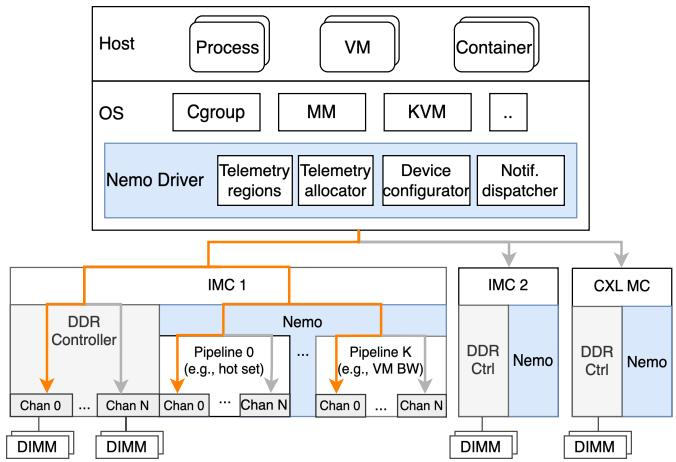  
Figure 1: NEMO augments each MC with a programmable telemetry engine. Each memory request is broadcast to all NEMO pipelines (monitoring only), while the memory operation itself is routed to a single channel (one possible route shown in orange). The NEMO driver orchestrates NEMO instances to track telemetries requested by OS subsystems.

System overview. Figure 1 shows NEMO’s architecture. Each memory controller is augmented with a small telemetry engine and exposes it to the OS through a driver. Each engine contains a number of telemetry pipelines, each of which can be configured for a different telemetry. As memory requests arrive, NEMO taps their headers off the data path and feeds them to all telemetry pipelines simultaneously, while the original requests are routed to DRAM. Each NEMO pipeline is capable of snooping all memory channels on the MC. The OS specifies and reads back specific telemetries via the NEMO driver. The driver programs per-controller pipelines, manages telemetry state in SRAM, and returns aggregated views to OS subsystems. For important signals, the OS installs predi cates that let NEMO raise interrupts. Memory management policies then act on these high-fidelity signals.

Running example. Consider a telemetry that tracks accesses to selected 2 MiB pages (hugepages). The OS asks NEMO to maintain one counter per tracked page. When a memory request for a tracked page reaches the memory controller, NEMO increments that page’s counter. The OS periodically reads these counters to estimate page hotness. This is the simplest use of NEMO’s pipeline. The same structure also supports different filters, granularities, update operations, and notification predicates.

## 3.1 NEMO Telemetry Pipeline

To maintain full coverage with predictable latency, NEMO leverages OS-configurable fixed-function pipelines inside each memory controller. As shown in Figure 2, NEMO telemetry pipelines follow a match-update-notify structure, inspired by the reconfigurable match table architecture [11] used in programmable network switches and interface cards. Each pipeline applies this structure to all memory channels. To carry out this work, each pipeline owns (1) a translation table that maps each incoming memory request via its physical address to a telemetry state index and (2) a set of telemetry states that hold its per-channel telemetry counters. First, a pipeline matches all or part of the physical memory address to produce an index into the telemetry state. If there is a match, the pipeline’s update stage updates the selected telemetry state using a configured operator and, optionally, any part of the memory request as operand. Finally, the pipeline’s notify stage may optionally trigger an interrupt to notify the host of notable state updates, using a comparison operator. For page hotness tracking, the match stage maps the request to the specific counter for its 2 MiB page, and the update stage increments that counter. The OS periodically reads the counter array for placement decisions.

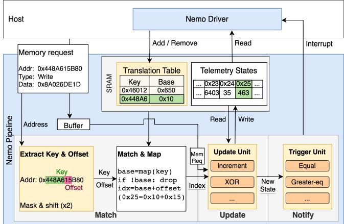  
Figure 2: NEMO pipeline and host interactions. Each pipeline implements a fixed match-update-notify structure; highlighted tiles are configured per telemetry.

NEMO restricts per-request telemetry updates to associative and commutative operations. This is for scalability within and across controllers. Commodity servers often need multiple MC instances (e.g., one or more per socket or SNC partition [24], as well as CXL memory controllers behind the PCIe root complex). Physical memory access is interleaved across controllers at fine granularity for performance. Within one MC, a telemetry may itself be implemented using multiple NEMO pipelines, and each channel within a pipeline owns some telemetry state SRAM banks. Associative and commutative updates let each NEMO instance combine concurrent updates locally and let the OS merge per-MC states in any order to reconstruct a global view. Each pipeline stage is replicated per memory channel in order to maintain full bandwidth within a pipeline.

We now describe each telemetry pipeline stage and the host interface for reading telemetry state.

Match stage. The match stage maps each memory request to the corresponding telemetry state index. The main design challenge is that the mapping must be flexible enough to support OS-defined granularities and semantics, yet simple enough to compute at line rate.

To address this challenge, NEMO adopts a mask-shiftadd design that uses simple, fixed-latency arithmetic and a compact translation table to support flexible aggregations (e.g., from cache line to multi-GiB regions, from per-page to per-tenant). At a high level, the match stage matches a request to a telemetry state index, identifying the state to update in the next stage. For page-hotness tracking, NEMO derives a key from the request’s physical address by masking and shifting away the offset within a 2 MiB page. The key indexes the translation table, which returns the counter index for that page. If the key is missing or invalid, NEMO drops the request.

The translation table is itself stored in banked SRAM and gives flexibility in indexing the telemetry state SRAM. In general, NEMO derives the key using two OS-specified parameters: (1) a bitmask that selects the relevant address range, and (2) a right shift that sets the primary region size. These two parameters let keys identify primary regions (e.g., a 2 MiB or 4 GiB region), which must have power-of-two sizes and be aligned to their size boundaries.

Keys index the translation table, which returns the base indices. Keys may map one-to-one to states (e.g., one counter per page) or many-to-one (e.g., all pages in a tenant share a telemetry state).

For simple telemetries such as per-page hotness, the base index is the final state index. For telemetries that subdivide a primary region, the translation table’s output—the base index—is added to an offset to produce the final state index. With offsets, a memory request matches on a sub-region within the request’s primary region. The OS supplies a secondary mask and right shift that determine sub-region size. NEMO takes the designated masked bits of the physical address, shifts them, and obtains the sub-region offset, which is added to the base index to get the final state index. When no subdivision is needed, the OS sets the secondary mask to zero. Figure 2’s Match Stage illustrates the full base-indexplus-offset arithmetic. This simple arithmetic lets the OS trade spatial fidelity for coverage: the same SRAM budget can either track a small region at fine granularity or maintain coarse-grained counters over large regions.

Lastly, different pipelines can filter and translate at different granularities. Pipelines can be configured to drop reads or writes, giving more flexibility to the OS.

Update stage. The update stage takes the telemetry state index and the memory request as input and performs a readmodify-write on the state selected by the match stage, using the update operator chosen for the telemetry (Table 1). The hotness telemetry uses addition: each request adds one to the selected counter. Operators use request fields as operands.

To store telemetry states while maintaining the bandwidth requirements of a memory controller, NEMO leverages banked SRAM. Each channel in each pipeline can be configured by the OS to exclusively own some number of banks. This ensures that bank conflicts never arise and avoids SRAM stranding. SRAM accesses do not stall the NEMO pipeline. Instead, we use value forwarding to protect against data hazards when updating the same SRAM telemetry state consecutively (cf. §4).

Telemetry state access. Each controller advertises a telemetry region: a physically contiguous range whose contents are backed by MC SRAM. The NEMO driver reserves these regions in the OS kernel so they are never used as anonymous memory, and knows to use this region to read telemetry states.

On a memory load from the telemetry region, the controller bypasses DRAM and the telemetry pipeline and instead returns the telemetry state from SRAM. To support efficient state resetting, NEMO allows the driver to configure an optional reset operation (any update operator in Table 1 or resetto-constant) that is executed immediately after returning the telemetry data. Reset-on-read makes each OS poll return perpage access counts for the latest placement interval.

Notify stage. Polling is sufficient for many policies, including page-hotness tracking. For urgent signals, the notify stage allows each pipeline to specify a simple predicate on updated state (e.g., comparison against a threshold). After an update, the notify logic evaluates the predicate and raises an interrupt if it holds. Each controller only sees its slice of traffic, but fine-grained interleaving makes per-controller patterns similar; alerts thus act as hints that the OS should re-check telemetries across controllers.

## 3.2 NEMO Control Plane

The NEMO driver is the control plane for all interactions with NEMO controllers. It installs telemetries, allocates telemetry state, manages translation entries, exposes telemetry regions, and dispatches notifications.

Telemetry installation. To install a telemetry, NEMO exposes a constrained per-request programming model. Each NEMO telemetry is installed by specifying:

1. Memory request filter: R/W type and address range;

2. Translation rule: maps addresses to telemetry states;

3. A telemetry update operation on the selected state;

4. Notify predicate: optional notification trigger;

5. Telemetry read side-effect: optional state reset.

When an OS service submits a telemetry specification to the NEMO driver, the driver first validates the telemetry, then allocates available pipelines on each relevant MC.

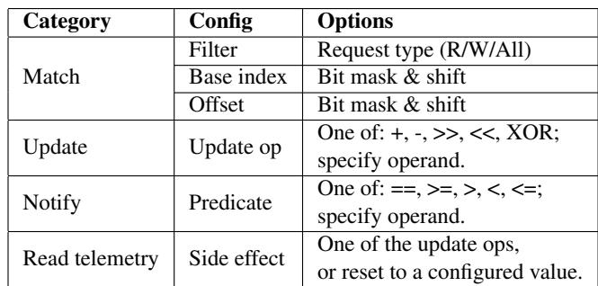  
Table 1: Configuration options in NEMO telemetry rules.

Telemetry state allocation and translation. The NEMO driver uses a slab allocator to allocate the appropriate number of pipelines and telemetry state banks, and then programs the translation table to map physical memory ranges to allocated telemetry state indices. For any allocated state, the OS can dynamically update which regions map to it by adding or removing translation entries. This is helpful for aligning the translation table with OS telemetry semantics (e.g., mapping only a process’s pages to telemetry states). The driver validates translation entries by only mapping addresses within the physical memory range that a controller serves. It also tracks how a telemetry’s states are allocated across multiple controllers to ensure correct aggregation on telemetry reads.

Reading telemetry. At boot, the NEMO driver discovers each controller’s telemetry region, maps it, and removes it from general use. The driver exposes an API to aggregate a telemetry’s states across controllers, applying the optionally configured read-side effect. For most metrics, OS services may simply periodically read telemetry state from controllers (polling).

When reading telemetry, the driver reconstructs a global view by reducing per-MC states using the update operator’s natural combine rule (e.g., sum per-MC values for addition, XOR for bitwise-XOR, and multiplication for right bit-shifts). Because all update operators are associative and commutative, the driver can compute a logical telemetry state by folding per-MC states.

Notification dispatch. OS services can also install predicates that let NEMO raise interrupts. When a NEMO controller raises an interrupt, it tags the corresponding pipeline. The driver resolves this to a telemetry and invokes its registered callback, delivering alerts to the OS subsystem.

## 3.3 Putting It Together

We now extend the hotness example with offsets, producing a concrete telemetry for access skew within selected hugepages.

Tracking within-page skew. To measure access skew within selected 2 MiB hugepages, NEMO maintains one counter per 4 KiB basepage. A hugepage-splitting policy can use these counters to find pages whose accesses concentrate in only a few basepages.

1 nemo\_telemetry\_t t = nemo\_register\_telemetry((nemo\_spec\_t)   
2 {   
3 .filter = {. type=R|W},   
4 . translation = {   
5 // Track hugepages across all physical memory   
6 .primary = {. mask=NEMO\_ALL\_MEM , .shift=HP\_SHIFT},   
7 // Offset: basepage number within the hugepage   
8 .sub = {. mask=HP\_BP\_MASK , .shift=BP\_SHIFT},   
9 },   
10 .update = {.op=NEMO\_OP\_ADD , .operand =1},   
11 .notify = {.op=NEMO\_OP\_NOOP},   
12 . read\_effect = {.op=NEMO\_OP\_RESET , .value =0},   
13 });   
14   
15 // Set translation table to track new hugepages   
16 void reprogram (uint64\_t hp\_paddr [], int npages) {   
17 for (int i = 0; i < npages; i++)   
18 nemo\_set\_translation(t,   
19 /∗key=∗/ hp\_paddr [i] >> HP\_SHIFT ,   
20 /∗region\_idx=∗/ i);   
21 }  
Listing 1: NEMO telemetry for basepage skewness within selected hugepages. The primary region is a 2 MiB hugepage; the sub-region is a 4 KiB basepage.

Listing 1 shows this telemetry. Lines 2–13 install the static telemetry rule t: match both reads and writes, compute a hugepage key from the physical address, compute a basepage offset within that hugepage, increment the selected counter, and reset counters on read. Resetting on read makes each poll return basepage access counts for only the last interval.

The OS then chooses which hugepages to track by calling reprogram(), which installs a translation entry for t per tracked hugepage with nemo\_set\_translation(t, key, region\_idx) (lines 15–21). The key is the hugepage frame number (paddr >> HP\_SHIFT), and the region index assigns this hugepage a distinct base index in the telemetry state array; the driver picks base indices so different hugepages 512-counter ranges do not overlap. As before, the basepage number within the hugepage forms the offset that NEMO adds to the base index to select the final per-basepage counter.

Listing 1 is one point in NEMO’s configuration space. Translation entries are dynamic: the OS can reprogram any entry to time-multiplex its slots across more regions than fit in SRAM. The per-basepage skewness telemetry in §5.2 uses this to track skewness across all of memory. Translation can be one-to-many, as in this example, where one hugepage maps to 512 basepage counters. Translation can also be manyto-one: the per-tenant bandwidth telemetry in §5.3 maps all of a tenant’s pages to a single state. Other telemetries vary request filters, state update operations, read-side effects, and notification predicates within the same match-update-notify structure.

What NEMO can and cannot express. NEMO’s perrequest semantics—an associative and commutative singlestep update to one memory location, optionally followed by a fixed-cycle predicate—cover the broad class of memory observability tasks that aggregate per-access events into perregion or per-tenant counters, including all three use cases in §5. NEMO does not support telemetries that need multiple arithmetic steps or multiple locations per request, unless they can be done by different pipelines operating independently and later combined. For example, computing the variance of a region’s access counts must maintain both a running sum and a running sum of squares of the differences from the running sum. Likewise, exact top-K tracking depends on history beyond a single SRAM-resident counter. §6.3 discusses extensions that lift these restrictions.

Summary. NEMO simultaneously provides high coverage, low overhead, flexibility, granularity, and timeliness for memory telemetry. Its off–data-path pipeline and SRAM-resident state avoid perturbing MC latency or bandwidth, while the fixed-function pipeline sustains full coverage at line rate with predictable latency. The pipeline’s configurable stages offer flexibility, and the translation table supports use-case-specific aggregations at OS-defined granularities. Finally, the driver’s memory-mapped telemetry region and optional alerts offer low-overhead state retrieval and timely reactions. Together, these mechanisms give the OS a flexible, high-fidelity telemetry mechanism that fits within the throughput and resource constraints of modern memory controllers.

## 4 Implementation

NEMO is prototyped on an Altera Agilex 7 FPGA I-Series Development Kit with CXL 2.0 Type-3 support in hard IP [3]. The FPGA is connected to our host machine via PCIe 5.0 x16, and has 16GiB of onboard DDR4 DRAM. It features 913k logic modules (ALMs), 3.7M ALM registers, and 13k M20K SRAM blocks, summing to 32MiB of usable SRAM blocks. Our design consists of the CXL IP, a DDR4 memory controller, and our NEMO logic, running at 400 MHz with resource usage described in Table 2. The host machine runs an Intel Xeon Gold 6430 CPU, with 32 physical cores and 64 hyperthreads. It contains 2MiB of L2 cache per core and 60MiB of shared LLC cache, and 256GiB DDR5 memory. The CXLattached DRAM is substantially slower than host DRAM. Using Intel MLC [28], we measure host DRAM at 114.1 ns loadto-use latency and 114.9 GiB/s bandwidth, while the CXL DRAM exhibits 380.3 ns latency and 16.4 GiB/s bandwidth, i.e., roughly 3.3× higher latency and 7× lower bandwidth.

NEMO pipeline. Our FPGA has 2 memory channels corresponding to the parity of a cache line address. Thus, each pipeline must support the match-update protocol on two channels in parallel. Since each channel can issue one read or one write on each FPGA cycle, maintaining an initiation interval of 1 on each channel is crucial to achieving full coverage.

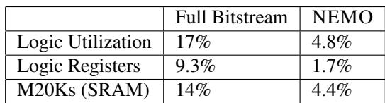  
Table 2: FPGA resource utilization. Full Bitstream refers to the utilization of the entire design, including CXL and DRAM controller logic, whereas NEMO refers to the NEMO logic overhead.

Match stage. The translation table is implemented as a dualport SRAM, with one port used to read and one used to modify the table. The translation table is currently replicated across each channel, though a true dual-port design could eliminate this extra duplicate. The translation table key is extracted from the memory operation’s address via a configurable subtraction and shift sequence. As a prefilter, we also implement range bounds before key lookup. Once the telemetry state base is retrieved, an offset computed from the address is added to get the final telemetry state index.

Update stage. Each channel in the pipeline features its own telemetry state SRAM, implemented via the M20K block RAM primitives on our board. In order to maintain coverage and keep up with memory controller bandwidth, it is crucial that we implement read-modify-write hazard protection without stalling the pipeline. The SRAM primitives offered on the board provide 1-cycle latency reads and writes, meaning that a 1-cycle update operation can use data forwarding as a hazard solution. All of our update operations fit this 1-cycle latency requirement, so forwarding is sufficient to avoid data hazards. If a future update operation takes more than 1 cycle to compute, we can double the clock speed and halve the initiation interval to ensure full line-rate. If that is not an option, we could further split the N existing channels into N × M virtual channels using a round robin load balancing strategy per physical channel, allowing an initiation interval of M cycles to perform update operations at the cost of M times the SRAM.

Notify stage. Notifications are not currently implemented, but are simulated by polling counters every 1 ms on a core until a counter threshold is met.

Telemetry State Access. We modify the provided memory controller instantiation to advertise a 32GiB address range instead of its 16GiB DDR capacity. The prototype intercepts requests to the upper half of the address space for telemetry state retrieval. The driver is responsible for ensuring that this address range is only used by the driver to read telemetry.

To extract telemetry, NEMO interposes on memory requests and intercepts those that belong to the state retrieval address range. Since we expose telemetry as a standard memory region rather than an MMIO region, the driver must be careful to invalidate old cached telemetry information. However, we chose this as it improves performance over MMIO, giving us prefetchable, 512 bits/cycle/channel of telemetry output, matching DRAM throughput. Our implementation does not yet fully pipeline telemetry state access.

To configure each pipeline, each pipeline exposes control registers to the host via MMIO, allowing the NEMO device driver to configure all aspects of its functionality. This operates at 64 bit/cycle data width. We chose MMIO because these operations are typically not performance-critical and simplify the implementation by not having to intercept writes.

Resource budget. Each pipeline carries an 8,192-entry translation table (\~14 KiB at 14 bits/entry) for the match stage and a per-channel 8,192 × 64-bit state array (128 KiB across the FPGA’s 2 channels) for the update stage, totaling \~150 KiB. Across the full bitstream, NEMO uses 4.4% of the FPGA’s M20K SRAM and 4.8% of its logic (cf. Table 2); the largest deployment we evaluate, MEMTIS-NEMO (§5.2), uses 8 such pipelines for \~1.2 MiB of telemetry SRAM. The headroom can support larger tables, deeper state, or more pipelines.

## 5 Evaluation

We evaluate NEMO by integrating it into three OS responsibilities that rely on memory telemetry: detecting application hot-set changes for tiering (§5.1), identifying transparent hugepage (THP) split candidates (§5.2), and detecting and throttling memory-bandwidth noisy neighbors (§5.3). Compared to state-of-the-art systems in each setting, NEMO delivers \~5× faster adaptation to hot set changes, accelerates THP splitting by 10.4×, and detects noisy neighbors in Linux with 350× lower overhead. These improvements yield up to 1.7× higher throughput and 23% lower latency across key-value stores and databases—core building blocks in modern clouds that are often deployed as large, memory-resident services that are both latency and cost-sensitive. Their access patterns stress exactly the phenomena our mechanisms target, making them representative workloads to evaluate.

For each use case, we describe a NEMO telemetry, the OS integration, and measure the resulting improvements in performance, reaction time, and CPU overhead compared to state-of-the-art telemetry approaches. Together, these results show that NEMO’s match-update-notify pipelines with OScontrolled translation can address diverse memory telemetry challenges across a wide range of memory management systems and applications.

1 nemo\_telemetry\_t t = nemo\_register\_telemetry((nemo\_spec\_t)   
2 {   
3 .filter = {. type=R|W},   
4 . translation = {   
5 .primary = {. mask=NEMO\_ALL\_MEM , .shift=HP\_SHIFT},   
6 // no sub−region: one counter per hugepage   
7 },   
8 .update = {.op=NEMO\_OP\_ADD , .operand =1},   
9 .notify = {.op=NEMO\_OP\_NOOP},   
10 . read\_effect = {.op=NEMO\_OP\_RESET , .value =0},   
11 });   
12   
13 // Map each tracked hugepage to its own counter slot   
14 for (i = 0; i < n\_hp; i++)   
15 nemo\_set\_translation(t,   
16 /∗key=∗/ hp\_paddr [i] >> HP\_SHIFT ,   
17 /∗region\_idx=∗/ i);  
Listing 2: NEMO telemetry for per-hugepage hot-set tracking. One counter per tracked hugepage; no sub-region offset.

## 5.1 Hot Set Phase Change Recovery

Detecting application hot set changes is crucial for application performance in tiered, memory-capacity-constrained environments. Existing systems rely on sampled memory telemetry, forcing a tradeoff between sample rate and CPU overhead; in contrast, NEMO captures a complete view of memory accesses, reacts to hot set changes 5× faster, and improves application throughput by up to 1.69×, all while maintaining similar CPU overhead.

NEMO integration. We integrate NEMO telemetry into HeMem [48], a userspace memory tiering system. HeMem uses Intel Processor Event-Based Sampling (PEBS) to track page hotness by sampling LLC misses at a 0.02% rate. Each second, HeMem processes new samples by locating the corresponding page struct and incrementing its access counter, before migrating hot data to the fast tier and cold data to the slow tier.

With NEMO, HeMem sets up NEMO to update a perhugepage counter on every LLC miss. This is shown in Listing 2. The counter is reset on read so each poll returns counts for the last interval. HeMem then scans the telemetry array to update each page struct’s access counter by the NEMOreported count.

Evaluation setup. We compare HeMem with NEMO telemetry (HeMem-NEMO) against HeMem with PEBS (HeMem-PEBS). As discussed in §4, NEMO only observes the slow memory tier, so both setups still use PEBS to sample the fast tier. To make hotness scores comparable across tiers, we scale NEMO access counts by the PEBS sampling rate and otherwise leave HeMem’s tiering policy unchanged.

We first evaluate HeMem-NEMO and HeMem-PEBS using FlexKVS [31], an in-memory key-value store. We run FlexKVS with 6 threads, 32B keys, 1024B values, and 1:2 fast:slow memory ratio (24 GiB total); 20% set of keys form a hot set which are accessed 90% of the time. To stress timeliness of hot-set detection, we engineer a complete hot-set shift: the initially hot keys become cold and a disjoint set of keys become hot. Since FlexKVS’s working set spans both fast and slow memory tiers, HeMem migrates pages between tiers based on its hotness estimates. We track FlexKVS per formance over time and compare how quickly each variant converges after the hot-set shift.

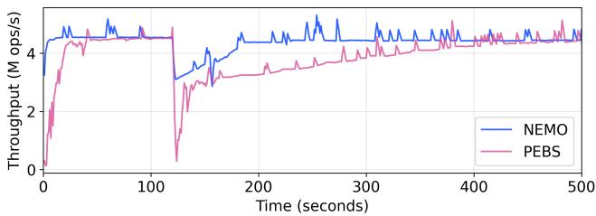  
Figure 3: FlexKVS timeline with hot set phase change, featuring HeMem’s default PEBS sample rate of 0.02%. NEMO is able to recover to steady state 5× faster than PEBS.

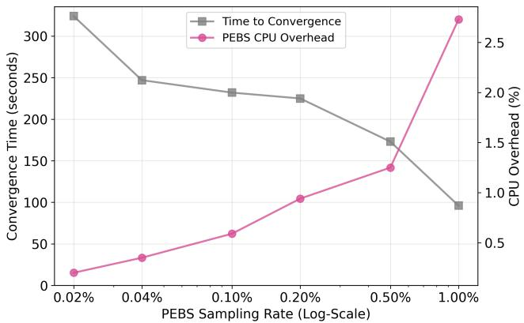  
Figure 4: Hot set migration time and CPU overhead with different PEBS sampling rates in HeMem. NEMO takes 67 seconds to converge with 0.89% CPU overhead.

We then study object-size sensitivity using FASTER KV [14], a concurrent key-value store and cache used in Azure Durable Functions [12]. We choose the number of items and value size so that each experiment fills both fast and slow memory: total memory used (keys, values, metadata) is 30 GiB with a 1:1 fast:slow ratio. FASTER KV runs with 16 client threads, each pinned to its own core, issuing operations according to YCSB workload B [16] (95% reads, 5% writes). We measure aggregate throughput over 5 minutes, reporting the median per-second throughput after a 5-minute warmup. Keys follow a Zipf distribution tuned to approximate an 80/20 rule (80% of accesses target the hottest 20% of keys), mimicking production KV stores [6].

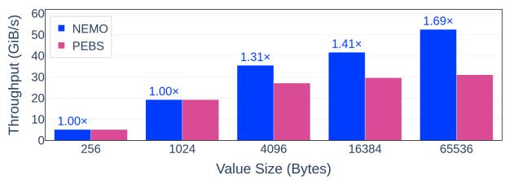  
Figure 5: FASTER KV throughput across various value sizes. HeMem-NEMO identifies the hot set with larger value sizes, which PEBS is unable to do because of the prefetcher. There is no hot set with smaller value sizes.

## 5.1.1 Results

Hot set churn. Figure 3 shows FlexKVS throughput when the entire hot set shifts two minutes into the run. HeMem-NEMO recovers within 67 s, bounded by HeMem’s migration bandwidth. HeMem-PEBS takes 324 s at HeMem’s default 0.02% sampling rate. With PEBS, time to convergence depends strongly on the sampling rate (Figure 4): low rates reduce CPU cost but delay detecting the new hot set, while high rates improve timeliness at the expense of substantial sampling overhead. Raising the sampling rate beyond 1% is not feasible because it degrades application performance, as shown by prior work [73]. Due to this tradeoff, the gap between HeMem-NEMO and HeMem-PEBS cannot be closed, even in the limit. NEMO eliminates the tradeoff by offloading observation to the memory controller, providing full-fidelity hotness signals at 0.89% CPU overhead.

Value size sensitivity. Figure 5 shows FASTER KV throughput as we vary value size. For small values, HeMem-NEMO and HeMem-PEBS perform similarly: many objects fit in each huge page, so accesses are effectively uniform at page granularity and there is little page-level hotset signal to exploit. As value sizes grow, HeMem-NEMO performance improves while HeMem-PEBS stagnates. Accesses to larger values become increasingly prefetch-friendly. These prefetches generate DRAM traffic but do not produce PEBS samples [27]. PEBS misses several types of traffic, including prefetches and non-temporal accesses; in contrast, NEMO captures all memory traffic.

With larger values with NEMO, a few hot values dominate each page. NEMO’s per-hugepage counters accurately capture this skew, allowing HeMem-NEMO to keep the working set in the fast tier. Overall, NEMO enables higher throughput for skewed, large-value workloads without tuning sample rates or incurring higher CPU overhead.

## 5.2 THP Page Split Candidate Selection

We next evaluate NEMO on a tiering system that supports transparent huge page splitting. Linux transparent huge page system (THP) [58] automatically coalesces base pages into 2 MiB huge pages to reduce TLB pressure and pagemanagement overheads. However, THP can cause hugepage bloat [35, 36, 38]: workloads that touch only a few base pages within each hugepage still pin the entire 2 MiB in the fast tier. In tiered memory, where fast-tier capacity is scarce, splitting a skewed hugepage, whose accesses are concentrated on a small subset of base pages, allows hot base pages to remain in the fast tier while demoting cold base pages to the slow tier, freeing space for other hot data. We evaluate the benefits of using NEMO to reduce hugepage bloat in a tiered memory system: NEMO finds 2× more page-split candidates with up to 10.4× reduction in detection time, with up to 1.13× better application performance.

NEMO integration. We integrate NEMO into MEMTIS [36], a memory tiering system that modifies Linux v5.15 to support hugepage splitting. Our integration uses the telemetry described in Section 3.3 to simultaneously track hugepage access counts and skewness. Instead of processing PEBS samples, MEMTIS-NEMO reads hugepage access counters directly from NEMO and applies its original policy: MEMTIS ranks pages by access count and classifies the highest-ranking pages that fit in the fast tier as hot. In our prototype, NEMO sees only CXL-attached memory, so we retain MEMTIS’s original PEBS-based mechanism for the local DRAM tier.

Because NEMO’s SRAM capacity limits the number of basepage counters, we time-multiplex skewness tracking across hugepages. Our telemetry instantiates eight NEMO pipelines: one tracks hugepage access counts and seven each track 16 hugepages at basepage granularity, allowing skewness tracking for 112 hugepages simultaneously. MEMTIS-NEMO extends MEMTIS’s mechanism of grouping hot and cold pages with Linux’s active/inactive LRU lists. Every 500ms, MEMTIS-NEMO reuses MEMTIS’s PEBS sampling thread to program NEMO to track the next 112 hugepages from one of the two lists, using reprogram() from Listing 1. Scanning the inactive list is necessary because a hugepage that looks cold overall can still contain hot basepages; consecutive scans alternate between the active and inactive lists. The basepage counters then feed MEMTIS’s skewness score. A full sweep takes (|active| + |inactive|)/112 × 500 ms; §6.1 analyzes how this time-multiplexing approach scales with memory size.

Evaluation setup. To stress fast-tier memory efficiency, we vary the fast-to-slow memory capacity ratio from 1:2 to 1:8. As the fast tier becomes more constrained, the penalty of not splitting skewed hugepages increases, since promoting an unsplit skewed hugepage consumes a disproportionately large share of fast-tier capacity. Our question is whether MEMTIS-NEMO’s benefit grows as the fast tier shrinks, because NEMO can identify skewed pages to split more accurately and quickly.

Our prototype can only observe telemetry over CXL memory, so memory allocated to the fast tier and never migrated would not be visible to NEMO. To give NEMO an opportunity to collect telemetry on all pages, we cap the application’s memory usage at 16 GiB (the CXL capacity in our prototype) and modify MEMTIS-NEMO to allocate from CXL first and pin memory on CXL for 180 seconds. This is a conservative setup for MEMTIS-NEMO: MEMTIS-PEBS allocates from the fast tier by default and begins migrating immediately, giving it a 180-second head start. Our experiment uses Silo [59], an in-memory database engine. Following prior work [36], we run the YCSB-C workload [16] with a Zipfian distribution, 90M keys, and key and value sizes of 64 B and 100 B, respectively. We confirm that Linux THP allocates over 99% of Silo’s memory on huge pages. We run Silo for 1,500 seconds on 20 CPU cores and report performance after a 500- second warmup period, allowing application performance to stabilize after migration and page splitting.

## 5.2.1 Results

Silo performance. Figure 6a shows Silo’s throughput speedup when using MEMTIS-NEMO. We also report the performance with page-splitting disabled (labeled NEMO-HugeOnly) to isolate the benefits of NEMO’s skewness telemetry from the benefits of its hugepage access count telemetry. The figure is normalized to MEMTIS-PEBS with page-splitting disabled (i.e., only uses transparent hugepages).

When fast tier memory is abundant (1:2), NEMO shows little benefit in page splitting, because NEMO’s high fidelity telemetry already identifies better page promotion candidates than PEBS due to the lack of sampling. The gap between NEMO and NEMO-HugeOnly widens as fast tier memory becomes smaller (1:4 to 1:8), showing that NEMO’s page splitting telemetry helps MEMTIS use fast tier memory more efficiently by splitting and promoting hot basepages. MEMTIS-NEMO outperforms the PEBS-based baseline across all fast-to-slow memory ratios, with larger performance improvements as fast tier memory becomes more constrained. This is because NEMO identifies more than 2× the number of skewed pages than PEBS, allowing MEMTIS to pack more hot basepages into the fast tier. At the 1:8 memory ratio, Silo on MEMTIS-NEMO outperforms Silo on MEMTIS-PEBS by 13%.

Figure 6b shows that Silo benefits from better page placement decisions in MEMTIS-NEMO. As fast tier capacity becomes smaller (1:2 vs. 1:8), both MEMTIS-PEBS and MEMTIS-NEMO see higher latencies due to more accesses to slow tier memory. However, because NEMO identifies pages to split more effectively, MEMTIS can use the fast tier more efficiently by packing more hot basepages into the fast tier. This lowers Silo’s latency across all percentiles compared to the PEBS baseline.

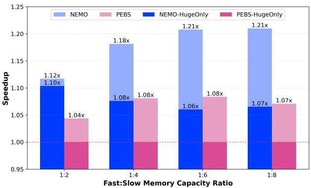

(a)  
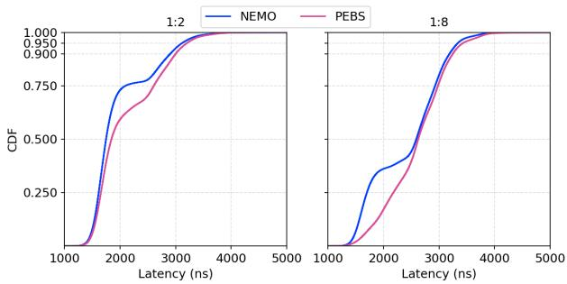  
(b)  
Figure 6: Silo performance under MEMTIS-NEMO and MEMTIS-PEBS across fast:slow memory ratios (1:2 to 1:8). Top: throughput speedup normalized to MEMTIS-PEBS without page splitting; NEMO-HugeOnly and PEBS-HugeOnly disable page splitting. Bottom: Silo latency CDF under 1:2 and 1:8 ratios.

Accuracy of page-split telemetry. Why is MEMTIS-NEMO’s page-split telemetry more effective than MEMTIS-PEBS’s sampling-based approach? MEMTIS ranks a huge page’s skewness using a score computed from its base-page access counts: the more uneven the accesses, the higher the skewness score; if none of a huge page’s base pages are hot, its skewness score is 0.

Figure 7a shows the distribution of skewness scores for all huge pages in Silo under the 1:8 fast-to-slow ratio, measured after each system reaches steady state. The distribution derived from PEBS is bimodal: most huge pages appear nonskewed (score = 0), while about 18% appear highly skewed (score ≥ 16). In contrast, NEMO yields a smoother distribution with far fewer zero-score pages and a broad spread of non-zero skewness values.

The PEBS distribution is distorted by sampling and cooling. MEMTIS periodically “cools” access counts by aging out old samples so that pages that no longer receive samples become cold, a standard technique in sample-based systems [36, 48]. Short cooling intervals improve responsiveness but give cold pages too few samples per interval, causing most hugepages to collapse to a zero skewness score; longer intervals allow counts to accumulate but hurt responsiveness to changes in access patterns, degrading application performance.

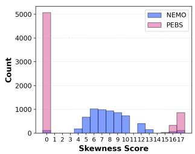  
(a)

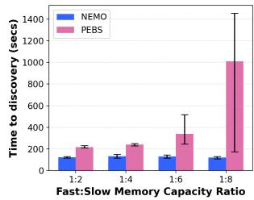  
(b)  
Figure 7: Left: distribution of per-hugepage skewness scores under 1:8 memory ratio. Right: median time to identify 95% of page-split candidates over 5 runs; error bars show min/max.

NEMO avoids this cooling trade-off. Since NEMO captures every cache miss to a tracked huge page, the policy can compute skewness directly from the per-basepage counts collected over a brief window (500 ms in our setup). The resulting telemetry reflects current access patterns without needing to age out stale observations. With NEMO, on this workload, skewness values span a wide range. NEMO enables MEMTIS to distinguish moderately from highly skewed pages and select splits more precisely.

Timeliness of finding page-split candidates. We now compare how quickly MEMTIS-PEBS and MEMTIS-NEMO discover split candidates. Using the same setup as the end-toend experiment, Figure 7b reports the median time to identify 95% of all page-split candidates over five runs. We see that MEMTIS-NEMO’s detection time is essentially independent of fast-tier size, because the number of candidates it can examine per unit time is tied to total physical memory, not to how much resides in the fast tier. In contrast, PEBS slows down and becomes more variable as the fast tier shrinks (e.g., 1:6 and 1:8 ratios). PEBS can quickly detect the most skewed hugepages (within roughly 250 seconds) but requires many more samples to classify moderately skewed pages. MEMTIS’s dynamic PEBS sample rate adjustment, aimed at maintaining CPU overhead below 3%, produces large variance observed in sample rates for moderately hot pages in the 1:8 configuration. In contrast, since NEMO counts every access to tracked pages, it can compute accurate skewness for all candidates within about 150 seconds, yielding up to 10.4× detection speedup from PEBS.

CPU overhead. MEMTIS-NEMO incurs 3% overhead across all fast-to-slow memory ratios: 1.67% from NEMO processing and the rest from hot-tier PEBS sample gathering. MEMTIS-PEBS incurs 2.89% overhead.

```c
1 nemo_telemetry_t t = nemo_register_telemetry((nemo_spec_t)
2 {
3 .filter = {. type=R|W},
4 . translation = {
5 .primary = {. mask=NEMO_ALL_MEM , .shift=HP_SHIFT},
6 // no sub−region: many hugepages −> one tenant state
7 },
8 .update = {.op=NEMO_OP_ADD , .operand =1},
9 .notify = {.op=NEMO_OP_GE , .operand=BW_CAP},
10 . read_effect = {.op=NEMO_OP_RESET , .value =0},
11 });
12
13 // Map every hugepage of tenant i to tenant i’s state
14 for (i = 0; i < n_tenants ; i++)
15 for (j = 0; j < tenant[i]. n_hp; j++)
16 nemo_set_translation(t,
17 /∗key=∗/ tenant[i]. hp_paddr[j] >> HP_SHIFT ,
18 /∗region_idx=∗/ i);
```

Listing 3: NEMO telemetry for per-tenant bandwidth estimation. Many hugepages map to one tenant state. The notify predicate triggers when the threshold is exceeded.

## 5.3 Noisy Neighbor Detection

We also evaluate NEMO on its ability to accurately detect noisy neighbor applications. We show that NEMO detects noisy neighbors with two orders of magnitude lower CPU overhead compared to the state-of-the-art.

Memory performance isolation remains challenging in virtualized environments. Tenants expect stable memory latency and bandwidth, but operators cannot observe VM-internal behavior. As a result, a background task such as garbage collection can temporarily saturate DRAM bandwidth and violate the SLOs of a colocated latency-sensitive service [18]. Achieving isolation first requires detecting when a tenant consumes excessive memory bandwidth—a noisy neighbor. Timely detection is crucial: any delay directly delays mitigation and exposes other tenants to performance loss. Existing approaches built on hardware performance counters suffer from imprecise measurements, limited programmability, and high CPU overhead (§2.2). In contrast, NEMO can be programmed to attribute exact DRAM throughput to each tenant, enabling precise and timely noisy-neighbor detection [54].

NEMO uses the translation table to map all huge pages of a tenant to a single telemetry state. On each memory access, hardware increments this state, yielding a per-tenant count of DRAM accesses. The OS polls each counter every ∆t milliseconds to compute bandwidth. When a tenant allocates or frees huge pages, the OS updates the translation table to preserve correct attribution. The administrator chooses ∆t based on isolation needs; it can range from milliseconds to minutes. Finally, the OS installs a notification condition that raises an interrupt when a tenant’s counter exceeds its bandwidth allocation. Listing 3 shows the telemetry: many-to-one translation maps every hugepage of a tenant to that tenant’s state, the update operator sums accesses, and a ≥ predicate raises an interrupt on bandwidth-cap violation.

NEMO integration. We integrate NEMO with Linux cgroups to throttle noisy neighbors in software. A userspace QoS controller, modeled after node-level Kubernetes agents [34], monitors each tenant’s NEMO bandwidth counter and adjusts its cgroup CPU quota to enforce a pertenant bandwidth cap. We use cgroups as the actuation mechanism because they are ubiquitous in modern OSes and cloud platforms; we avoid Intel Memory Bandwidth Allocation (MBA) [22], whose throttling behavior is inaccurate in our measurements and prior work [53, 65]. The controller implements a simple feedback loop: every epoch it reads per-tenant counters, maintains an exponentially weighted moving average of bandwidth, and proportionally increases or decreases CPU quota based on the gap to the target bandwidth, using a learning rate to dampen adjustments, similar to prior regulators [18, 65, 70]. To reduce detection latency and CPU overhead, it also relies on NEMO notifications to react immediately when a tenant exceeds its allocation. Our prototype currently tracks bandwidth only for CXL-attached memory, so we restrict allocations to CXL. Finally, we use emulated NEMO notifications as detailed in §4.

Evaluation setup. As a baseline, we use Intel Memory Bandwidth Monitoring (MBM) counters via the PQoS library [30]; PMU-based schemes are less suitable due to inaccuracy and limited virtualization support (§2.1). In both cases, a userspace controller periodically polls per-tenant bandwidth counters and adjusts Linux cgroup CPU quotas to enforce a per-tenant bandwidth cap, varying the polling interval to explore the tradeoff between CPU overhead and reaction time. Our workload consists of a latency-sensitive victim, FlexKVS [31], and a single-core synthetic noisy neighbor that uses non-temporal stores to saturate memory bandwidth. The noisy neighbor alternates every 0.5 s between high-bandwidth execution and sleep, and is configured with a target cap of 1 GiB/s (\~5% of our prototype’s peak bandwidth).

## 5.3.1 Results

Bandwidth telemetry accuracy. We first run the noisy neighbor in isolation and compare bandwidth reported by MBM and NEMO against an application-level estimate. We approximate the application’s true DRAM bandwidth by summing its non-temporal (NT) store volume. Across three 30- second runs, both NEMO and MBM closely match this NTderived ground truth, with reported bandwidths within 0.1%.

Noisy neighbor throttling efficacy. Next, we co-locate the victim and noisy neighbor, throttling the noisy neighbor using either NEMO or MBM telemetry, and compare against two baselines: the victim alone and the victim with an unthrottled noisy neighbor. Figure 8 shows the resulting FlexKVS latency CDFs. With an unthrottled noisy neighbor, FlexKVS p99 latency increases by \~22%. With throttling based on NEMO and MBM, the p99 increase shrinks to 5.2% and 5.5%, respectively. In both cases, efficacy is ultimately limited by cgroups actuation latency (\~10 ms).

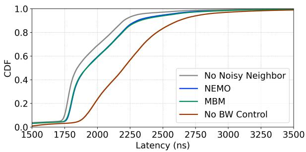  
Figure 8: FlexKVS latency CDF using different telemetries for noisy neighbor detection and throttling. NEMO and MBM show equivalent detection capabilities when MBM uses a 1000Hz polling frequency (consuming 30%+ CPU overhead).

CPU overhead. Polling more frequently improves reaction time but increases overhead, so for MBM we vary the polling interval from 1 ms to 100 ms. Figure 9 shows the trade-off. At a 100 ms polling interval, MBM consumes only 0.7% of a core but reacts slowly, leading to a 13% increase in p99 latency. At a 1 ms interval, MBM reduces the p99 increase to 5.5% but raises CPU overhead to 32%. In contrast, NEMO achieves similar throttling effectiveness with only 0.09% CPU overhead. NEMO’s notification mechanism triggers immediate reaction when a tenant exceeds its bandwidth allocation; the controller clears NEMO counters at a 50 ms interval in our setup.

## 6 Discussion

The preceding sections show that MC-resident telemetry can provide OS policies with timely, low-overhead memory signals. We now discuss three implications of the design: telemetry scalability with SRAM-backed state, the threat model under bare-metal and virtualized deployments, and how chained pipelines can extend NEMO to support more use cases.

## 6.1 Telemetry Scalability

The granularity of NEMO telemetries scales with on-chip SRAM, depending on the number of translation table entries and the amount of telemetry state. Many use cases rely primarily on one or the other resource, balancing SRAM utilization. Coarse telemetries (per-tenant bandwidth, §5.3) use many translation entries mapping into few states. Fine-grained telemetries (per-basepage skewness, §5.2) use fewer translation entries but many states per region.

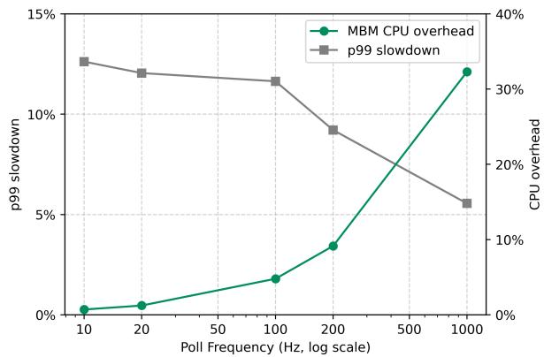  
Figure 9: MBM p99 slowdown and CPU overhead vs. polling frequency.

Telemetry time multiplexing. When regions of interest exceed the resident SRAM budget, the OS can time-multiplex telemetries by reprogramming translation table entries between scans. Below we compute the sweep time T<sub>sweep</sub>, the time to visit every telemetry region once under uniform coverage (the worst case; in practice, skewed access patterns and hot-region prioritization yield shorter effective sweeps). With P pipelines, S states of width W at G-byte granularity, and scan period τ, sweeping an M-byte region takes

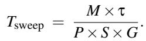

Substituting |SRAM| ≈ P × S × W to utilize all available SRAM, this becomes

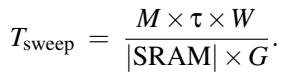

Scaling implications. The formula has two scaling implications. First, the DRAM (M) to SRAM (|SRAM|) ratio sets the area-vs-timeliness trade-off. Second, counter width W is a knob orthogonal to coverage. At a fixed SRAM budget, halving W doubles the number of states and proportionally halves T<sub>sweep</sub>. In our MEMTIS-NEMO prototype (P=7, S=8,192, G=4 KiB, τ=500 ms), 1.4 MiB of telemetry SRAM covers 16 GiB DRAM at T<sub>sweep</sub> ≈ 37 s. At constant ratio, a 1 TiB tier needs \~90 MiB, on the same order as on-die SRAM for datacenter SoCs [4, 25]. Unlike CPU caches, NEMO uses SRAM in less area-constrained sites like the uncore (for IMCs) or controller ASICs (for CXL MCs). The prototype’s W = 8 B is conservative for our 500 ms scan; 1–4 B counters would shrink either the SRAM or T<sub>sweep</sub> by 2–8×. Better encoding lowers the bit width W required per counter; for example, a saturating overflow bit for very hot data is sufficient to distinguish very hot counters, with remaining bits spent discriminating among warm and less-warm counters.

## 6.2 Security

NEMO’s trusted computing base consists of the MC hardware and the NEMO driver in the OS or hypervisor kernel. We assume that telemetries are configured by a privileged operator. The NEMO driver validates each translation entry against the MC’s physical address ranges, reusing the kernel’s page-ownership checks to decide which pages each telemetry covers. In a virtualized setting, a paravirtualized interface lets a guest OS request telemetries over its memory. The hypervisor validates each request against the guest’s allocated ranges and never exposes another guest’s pages.

The hardware path adds no observable timing channel. Under both bare-metal and virtualization, the MC observes only request metadata (address and R/W type) for OS-registered pages, and the match-update pipeline runs with fixed overhead off the data path, so memory access latency is independent of NEMO’s state. Side channels outside the MC (cache and DRAM timing) are unaffected.

## 6.3 Supporting Complex Telemetries

NEMO’s pipeline performs one bounded update per request, keeping hardware simple and at line rate but ruling out telemetries needing cross-state reads or multi-step computation. A natural extension chains pipelines so one’s output feeds the next (analogous to multi-stage match-action in RMT [11] switches) to express richer telemetries while preserving fixed cycle stages. For example, approximate frequency sketches such as count-min [69] help when per-region tracking exceeds the SRAM budget: each chained pipeline holds one of the sketch’s k counter arrays, and in its match stage a singlecycle hash (e.g., multiply-shift) projects each address onto that array, a small extension to the existing mask-shift key derivation. Querying a region’s frequency hashes its address k times and takes the minimum across arrays. Each chained pipeline retains bounded per-request work at line rate.

## 7 Related Work

Hardware memory telemetry. Recent works have explored gathering telemetry directly from the memory controller [40, 47, 50, 52, 55, 73], employing different techniques (e.g., count-min sketches [55, 73] or Majority Element Algorithm [47]) for different use cases (e.g., tiered memory [55,73], disaggregated memory [40]) and memory technologies (e.g., 3D-stacked [40, 55]). While these designs demonstrate the value of in-memory telemetry, they lack flexibility because the telemetry is fixed at hardware design time. In contrast, NEMO enables the OS to define and install custom telemetry to MCs, achieving both flexibility and coverage.

OS-inferred memory telemetry. The OS can infer memory access patterns from hardware-generated signals, such as page access tracking via soft page faults [1, 5, 8, 33, 43, 61], page table scanning [1,17,29,42,67] or sampling-based approaches using PMUs [17, 36, 48]. These approaches provide flexibility but necessarily are limited because of high CPU overhead. NEMO offers an alternative by allowing the OS to install usecase-specific telemetries to memory controllers, achieving flexibility and high coverage with low CPU overhead.

Memory programmability. Prior works have explored introducing programmability to memory controllers. These works can alter the memory request (address or data), the request schedule, or DDR commands to improve application performance [9, 13], energy efficiency [9], fault tolerance, QoS [41], or for prototype exploration [21]. Beyond the memory controller, täko [ ¯ 51] proposes a polymorphic cache hierarchy that executes software callbacks to transform data or alter traversal paths. Relative to these proposals, NEMO is simpler. It performs passive monitoring off the MC data path, making it lightweight and deployable.

Line-rate programmability. For network protocol stacks, the Reconfigurable Match-Action Table (RMT) architecture [11] and the P4 programming model [10] enable line-rate configurable dataplane actions. Operators often use these for telemetry [20, 32, 44, 45]. Inspired by these works, NEMO occupies a distinct design point: HW/SW codesign to provide high-fidelity telemetry on MCs for diverse OS use cases.

## 8 Conclusion

Server memory hierarchies demand high-fidelity, lowoverhead telemetry, but existing techniques are often heavyweight, coarse, noisy, or fixed-function. NEMO addresses this gap by augmenting memory controllers with a small, flexible, off-data-path match-update-notify pipeline and per-controller SRAM state. Together with an OS-facing programming model and driver, OS kernel subsystems can define what to track and at which granularity. Using our CXL-based FPGA prototype, we show that this model improves the efficiency, accuracy, and responsiveness of tiering, huge-page splitting, and noisyneighbor detection, outperforming state-of-the-art baselines within practical compute and SRAM budgets.

Acknowledgements. We thank our shepherd and the anonymous reviewers for their valuable feedback on the paper and artifact. This work is supported in part by the NSF CAREER Award 2333885; NSF grants 2105868, 2212580, and 2450086; the NSF Graduate Research Fellowship; PRISM, one of the seven centers in JUMP 2.0, a Semiconductor Research Corporation (SRC) program sponsored by DARPA; the University of Washington Center for the Future of Cloud Infrastructure (FOCI); as well as generous donations from NVIDIA, AMD, Intel, and Arm.

## References

[1] AGARWAL, N., AND WENISCH, T. F. Thermostat: Applicationtransparent page management for two-tiered main memory. SIGPLAN Not. 52, 4 (Apr. 2017), 631–644.

[2] AKIYAMA, S., AND HIROFUCHI, T. Quantitative evaluation of intel PEBS overhead for online system-noise analysis. In Proceedings of the 7th International Workshop on Runtime and Operating Systems for Supercomputers (ROSS ’17) (2017), ACM, pp. 1–8.

[3] ALTERA. Agilex™ 7 fpga i-series development kit (2× r-tile and 1× f-tile). https://www.altera.com/products/devkit/po-3012/ agilex-7-fpga-i-series-development-kit-2x-r-tile-and -1x-f-tile, 2024.

[4] AMD. 4th gen AMD EPYC processor architecture. https://www.am d.com/content/dam/amd/en/documents/products/epyc/4th-g en-epyc-processor-architecture-white-paper.pdf, 2022.

[5] ARCANGELI, A. Autonuma. https://blog.linuxplumbersconf .org/2012/wp-content/uploads/2012/09/2012-lpc-virt-aut onuma-arcangeli.pdf, 2012.

[6] BERG, B., BERGER, D. S., MCALLISTER, S., GROSOF, I., GU-NASEKAR, S., LU, J., UHLAR, M., CARRIG, J., BECKMANN, N., HARCHOL-BALTER, M., AND GANGER, G. R. The CacheLib caching engine: Design and experiences at scale. In 14th USENIX Symposium on Operating Systems Design and Implementation (OSDI 20) (Nov. 2020), USENIX Association, pp. 753–768.

[7] BERGER, D. S., KUMAR, K., VUPPALAPATI, M., DOUGLAS, C., SATHRE, J., ROBINSON, I., TANDON, P., AND HILL, M. D. CXL in Cloud Practice: Practical Lessons for Incrementally Scaling Deployment . IEEE Transactions on Computers 75, 04 (Apr. 2026), 1234–1246.

[8] BERGMAN, S., FALDU, P., GROT, B., VILANOVA, L., AND SILBER-STEIN, M. Reconsidering os memory optimizations in the presence of disaggregated memory. In Proceedings of the 2022 ACM SIGPLAN International Symposium on Memory Management (New York, NY, USA, 2022), ISMM 2022, Association for Computing Machinery, p. 1–14.

[9] BOJNORDI, M. N., AND IPEK, E. A programmable memory controller for the ddrx interfacing standards. ACM Trans. Comput. Syst. 31, 4 (Dec. 2013).

[10] BOSSHART, P., DALY, D., GIBB, G., IZZARD, M., MCKEOWN, N., REXFORD, J., SCHLESINGER, C., TALAYCO, D., VAHDAT, A., VARGHESE, G., AND WALKER, D. P4: programming protocol independent packet processors. SIGCOMM Comput. Commun. Rev. 44, 3 (July 2014), 87–95.

[11] BOSSHART, P., GIBB, G., KIM, H.-S., VARGHESE, G., MCKEOWN, N., IZZARD, M., MUJICA, F., AND HOROWITZ, M. Forwarding meta morphosis: fast programmable match-action processing in hardware for sdn. SIGCOMM Comput. Commun. Rev. 43, 4 (Aug. 2013), 99–110.

[12] BURCKHARDT, S., CHANDRAMOULI, B., GILLUM, C., JUSTO, D., KALLAS, K., MCMAHON, C., MEIKLEJOHN, C. S., AND ZHU, X. Netherite: Efficient execution of serverless workflows. Proc. VLDB Endow. 15, 8 (2022), 1591–1604.

[13] CARTER, J., HSIEH, W., STOLLER, L., SWANSON, M., ZHANG, L., BRUNVAND, E., DAVIS, A., KUO, C.-C., KURAMKOTE, R., PARKER, M., SCHAELICKE, L., AND TATEYAMA, T. Impulse: building a smarter memory controller. In Proceedings Fifth International Sympo sium on High-Performance Computer Architecture (1999), pp. 70–79.

[14] CHANDRAMOULI, B., PRASAAD, G., KOSSMANN, D., LEVANDOSKI, J., HUNTER, J., AND BARNETT, M. Faster: A concurrent key-value store with in-place updates. In Proceedings of the 2018 International Conference on Management of Data (New York, NY, USA, 2018), SIGMOD ’18, Association for Computing Machinery, p. 275–290.

[15] CHAUHAN, P., PETERSEN, C., MORRIS, B., AND GLISSE, J. Hyperscale tiered memory expander specification – for compute express link® (cxl®) revision 1. https://www.opencompute.org/docume nts/hyperscale-tiered-memory-expander-specification-f or-compute-express-link-cxl-1-pdf, 2023.

[16] COOPER, B. F., SILBERSTEIN, A., TAM, E., RAMAKRISHNAN, R., AND SEARS, R. Benchmarking cloud serving systems with ycsb. In Proceedings of the 1st ACM Symposium on Cloud Computing (New York, NY, USA, 2010), SoCC ’10, Association for Computing Machin ery, p. 143–154.

[17] DURAISAMY, P., XU, W., HARE, S., RAJWAR, R., CULLER, D., XU, Z., FAN, J., KENNELLY, C., MCCLOSKEY, B., MIJAILOVIC, D., MORRIS, B., MUKHERJEE, C., REN, J., THELEN, G., TURNER, P., VILLAVIEJA, C., RANGANATHAN, P., AND VAHDAT, A. Towards an adaptable systems architecture for memory tiering at warehouse-scale. In Proceedings of the 28th ACM International Conference on Architectural Support for Programming Languages and Operating Systems, Volume 3 (New York, NY, USA, 2023), ASPLOS 2023, Association for Computing Machinery, p. 727–741.

[18] FRIED, J., RUAN, Z., OUSTERHOUT, A., AND BELAY, A. Caladan: Mitigating interference at microsecond timescales. In 14th USENIX Symposium on Operating Systems Design and Implementation (OSDI 20) (Nov. 2020), USENIX Association, pp. 281–297.

[19] GANGULY, D., ZHANG, Z., YANG, J., AND MELHEM, R. Interplay between hardware prefetcher and page eviction policy in CPU–GPU unified virtual memory. In Proceedings of the 46th International Symposium on Computer Architecture (ISCA) (2019).

[20] GUPTA, A., HARRISON, R., CANINI, M., FEAMSTER, N., REXFORD, J., AND WILLINGER, W. Sonata: query-driven streaming network telemetry. In Proceedings of the 2018 Conference of the ACM Special Interest Group on Data Communication (New York, NY, USA, 2018), SIGCOMM ’18, Association for Computing Machinery, p. 357–371.

[21] HASSAN, H., VIJAYKUMAR, N., KHAN, S., GHOSE, S., CHANG, K., PEKHIMENKO, G., LEE, D., ERGIN, O., AND MUTLU, O. Softmc: A flexible and practical open-source infrastructure for enabling experi mental dram studies. In 2017 IEEE International Symposium on High Performance Computer Architecture (HPCA) (2017), pp. 241–252.

[22] HERDRICH, A. J., CORNU, M. D., AND ABBASI, K. M. Introduction to memory bandwidth allocation. https://www.intel.com/cont ent/www/us/en/developer/articles/technical/introductio n-to-memory-bandwidth-allocation.html, 2019.

[23] HYLANDER, E. G. Azure delivers the first cloud vm with intel xeon 6 and cxl memory - now in private preview, Nov. 2025. https://tech community.microsoft.com/blog/SAPApplications/azure-del ivers-the-first-cloud-vm-with-intel-xeon-6-and-cxl-m emory---now-in-priv/4470067.

[24] INTEL. Technical overview of the 4th gen intel® xeon® scalable processor family. https://www.intel.com/content/www/us/en/ developer/articles/technical/fourth-generation-xeon-s calable-family-overview.html, 2022.

[25] INTEL. Intel® xeon® 6 product brief (Granite Rapids). https: //www.intel.com/content/www/us/en/products/docs/xeon-6 -product-brief.html, 2024.

[26] INTEL CORPORATION. Intel® Xeon® Processor Scalable Memory Family Uncore Performance Monitoring Reference Manual, 2017. See Chapter 2.6: Intel UPI Link Layer Performance Monitoring. https: //www.intel.com/content/www/us/en/content-details/671 389/intel-xeon-processor-scalable-memory-family-uncor e-performance-monitoring-reference-manual.html.

[27] INTEL CORPORATION. Intel 64 and IA-32 Architectures Software Developer’s Manual, Volume 3: System Programming Guide, 2023. See Chapter 18: Performance Monitoring. https://www.intel.com/ content/www/us/en/developer/articles/technical/intel-s dm.html.

[28] INTEL CORPORATION. Intel® Memory Latency Checker. https: //www.intel.com/content/www/us/en/developer/articles/t ool/intelr-memory-latency-checker.html, 2025.

[29] KANNAN, S., GAVRILOVSKA, A., GUPTA, V., AND SCHWAN, K. Heteroos: Os design for heterogeneous memory management in datacenter. SIGARCH Comput. Archit. News 45, 2 (June 2017), 521–534.

[30] KANTECKI, T., CORNU, M. D., HETHERINGTON, A., ALEKSINSKI, M., ANDRALOJC, W., AND BOCZKOWSKI, A. pqos — intel(r) re source director technology / amd pqos monitoring and control tool, Apr. 2022. man page, version from Debian testing (intel-cmt-cat 25.04-1).

[31] KAUFMANN, A., PETER, S., SHARMA, N. K., ANDERSON, T., AND KRISHNAMURTHY, A. High performance packet processing with flexnic. SIGPLAN Not. 51, 4 (Mar. 2016), 67–81.

[32] KIM, C., SIVARAMAN, A., KATTA, N. P. K., BAS, A., DIXIT, A. A., AND WOBKER, L. J. In-band network telemetry via programmable dataplanes. In Proceedings of the 2015 ACM SIGCOMM Conference Posters and Demos (2015), SIGCOMM Posters and Demos ’15, Association for Computing Machinery.

[33] KIM, J., CHOE, W., AND AHN, J. Exploring the design space of page management for Multi-Tiered memory systems. In 2021 USENIX Annual Technical Conference (USENIX ATC 21) (July 2021), USENIX Association, pp. 715–728.

[34] Koordinator: Qos-based scheduling for efficient orchestration of mi croservices, ai, and big data workloads on kubernetes. https: //koordinator.sh/, 2025.

[35] KWON, Y., YU, H., PETER, S., ROSSBACH, C. J., AND WITCHEL, E. Coordinated and efficient huge page management with ingens. In Proceedings of the 12th USENIX Conference on Operating Systems Design and Implementation (USA, 2016), OSDI’16, USENIX Association, p. 705–721.

[36] LEE, T., MONGA, S. K., MIN, C., AND EOM, Y. I. Memtis: Efficient memory tiering with dynamic page classification and page size determination. In Proceedings of the 29th Symposium on Operating Systems Principles (New York, NY, USA, 2023), SOSP ’23, Association for Computing Machinery, p. 17–34.

[37] LI, A., SUDVARG, M., LI, Z., BARUAH, S., GILL, C., AND ZHANG, N. Tintin: a unified hardware performance profiling infrastructure to uncover and manage uncertainty. In Proceedings of the 19th USENIX Conference on Operating Systems Design and Implementation (USA, 2025), OSDI ’25, USENIX Association.

[38] LI, C., SHA, S., ZENG, Y., YANG, X., LUO, Y., WANG, X., WANG, Z., AND ZHOU, D. Taming hot bloat under virtualization with hugescope. In Proceedings of the 2024 USENIX Conference on Usenix Annual Technical Conference (USA, 2024), USENIX ATC’24, USENIX Association.

[39] LI, H., BERGER, D. S., NOVAKOVIC, S., HSU, L., ERNST, D., ZAR-DOSHTI, P., SHAH, M., RAJADNYA, S., LEE, S., AGARWAL, I., HILL, M. D., FONTOURA, M., AND BIANCHINI, R. Pond: CXL-based memory pooling systems for cloud platforms. In Proceedings of the 28th International Conference on Architectural Support for Programming Languages and Operating Systems (ASPLOS ’23) (2023), ACM, pp. 574–589.

[40] LI, H., LIU, K., LIANG, T., LI, Z., LU, T., YUAN, H., XIA, Y., BAO, Y., CHEN, M., AND SHAN, Y. Hopp: Hardware-software codesigned page prefetching for disaggregated memory. In 2023 IEEE International Symposium on High-Performance Computer Architecture (HPCA) (2023), pp. 1168–1181.

[41] MA, J., SUI, X., SUN, N., LI, Y., YU, Z., HUANG, B., XU, T., YAO, Z., CHEN, Y., WANG, H., ZHANG, L., AND BAO, Y. Supporting differentiated services in computers via programmable architecture for resourcing-on-demand (pard). SIGPLAN Not. 50, 4 (Mar. 2015), 131–143.

[42] MARUF, A., GHOSH, A., BHIMANI, J., CAMPELLO, D., RUDOFF, A., AND RANGASWAMI, R. Multi-clock: Dynamic tiering for hybrid memory systems. In 2022 IEEE International Symposium on High-Performance Computer Architecture (HPCA) (2022), pp. 925–937.

[43] MARUF, H. A., WANG, H., DHANOTIA, A., WEINER, J., AGARWAL, N., BHATTACHARYA, P., PETERSEN, C., CHOWDHURY, M., KANAU-JIA, S., AND CHAUHAN, P. Tpp: Transparent page placement for cxlenabled tiered-memory. In Proceedings of the 28th ACM International Conference on Architectural Support for Programming Languages and Operating Systems, Volume 3 (New York, NY, USA, 2023), ASPLOS 2023, Association for Computing Machinery, p. 742–755.

[44] MCKEOWN, N., ANDERSON, T., BALAKRISHNAN, H., PARULKAR, G., PETERSON, L., REXFORD, J., SHENKER, S., AND TURNER, J. Openflow: enabling innovation in campus networks. SIGCOMM Com put. Commun. Rev. 38, 2 (Mar. 2008), 69–74.

[45] NARAYANA, S., SIVARAMAN, A., NATHAN, V., GOYAL, P., ARUN, V., ALIZADEH, M., JEYAKUMAR, V., AND KIM, C. Languagedirected hardware design for network performance monitoring. In Proceedings of the Conference of the ACM Special Interest Group on Data Communication (New York, NY, USA, 2017), SIGCOMM ’17, Association for Computing Machinery, p. 85–98.

[46] NGUYEN, K. T. Introduction to memory bandwidth monitoring in the intel® xeon® processor E5 v4 family. https://www.intel.co m/content/www/us/en/developer/articles/technical/intro duction-to-memory-bandwidth-monitoring.html, 2016. Intel Technical Article.

[47] PRODROMOU, A., MESWANI, M., JAYASENA, N., LOH, G., AND TULLSEN, D. M. Mempod: A clustered architecture for efficient and scalable migration in flat address space multi-level memories. In 2017 IEEE International Symposium on High Performance Computer Architecture (HPCA) (2017), pp. 433–444.

[48] RAYBUCK, A., STAMLER, T., ZHANG, W., EREZ, M., AND PETER, S. Hemem: Scalable tiered memory management for big data applications and real nvm. In Proceedings of the ACM SIGOPS 28th Symposium on Operating Systems Principles (New York, NY, USA, 2021), SOSP ’21, Association for Computing Machinery, p. 392–407.

[49] REN, G., TUNE, E., MOSELEY, T., SHI, Y., RUS, S., AND HUNDT, R. Google-wide profiling: A continuous profiling infrastructure for data centers. IEEE Micro 30, 4 (July 2010), 65–79.

[50] RYOO, J. H., MESWANI, M. R., PRODROMOU, A., AND JOHN, L. K. Silc-fm: Subblocked interleaved cache-like flat memory organization. In 2017 IEEE International Symposium on High Performance Computer Architecture (HPCA) (2017), pp. 349–360.

[51] SCHWEDOCK, B. C., YOOVIDHYA, P., SEIBERT, J., AND BECKMANN, N. täko: a polymorphic cache hierarchy for general-purpose optimiza-¯ tion of data movement. In Proceedings of the 49th Annual International Symposium on Computer Architecture (New York, NY, USA, 2022), ISCA ’22, Association for Computing Machinery, p. 42–58.

[52] SIM, J., ALAMELDEEN, A. R., CHISHTI, Z., WILKERSON, C., AND KIM, H. Transparent hardware management of stacked dram as part of memory. In 2014 47th Annual IEEE/ACM International Symposium on Microarchitecture (2014), pp. 13–24.

[53] SOHAL, P., BECHTEL, M., MANCUSO, R., YUN, H., AND KRIEGER, O. A closer look at intel resource director technology (RDT). In 30th International Conference on Real-Time Networks and Systems (RTNS ’22) (2022), ACM, pp. 95–106.

[54] SOHAL, P., TABISH, R., DREPPER, U., AND MANCUSO, R. E-warp: A system-wide framework for memory bandwidth profiling and management. In 2020 IEEE Real-Time Systems Symposium (RTSS) (2020), pp. 345–357.

[55] SUN, Y., KIM, J., YU, Z., ZHANG, J., CHAI, S., KIM, M. J., NAM, H., PARK, J., NA, E., YUAN, Y., WANG, R., AHN, J. H., XU, T., AND KIM, N. S. M5: Mastering Page Migration and Memory Management for CXL-based Tiered Memory Systems. Association for Computing Machinery, New York, NY, USA, 2025, p. 604–621.

[56] SUN, Y., YUAN, Y., YU, Z., KUPER, R., SONG, C., HUANG, J., JI, H., AGARWAL, S., LOU, J., JEONG, I., WANG, R., AHN, J. H., XU, T., AND KIM, N. S. Demystifying cxl memory with genuine cxl-ready systems and devices. In Proceedings of the 56th Annual IEEE/ACM International Symposium on Microarchitecture (New York, NY, USA, 2023), MICRO ’23, Association for Computing Machinery, p. 105–121.

[57] THE NEXT PLATFORM. Cxl and gen-z iron out a coherent interconnect strategy. https://www.nextplatform.com/connect/2020/04/0 3/cxl-and-gen-z-iron-out-a-coherent-interconnect-str ategy/1644243, 2020.

[58] Transparent hugepage support. https://docs.kernel.org/mm/tra nshuge.html.

[59] TU, S., ZHENG, W., KOHLER, E., LISKOV, B., AND MADDEN, S. Speedy transactions in multicore in-memory databases. In Proceedings of the Twenty-Fourth ACM Symposium on Operating Systems Principles (New York, NY, USA, 2013), SOSP ’13, Association for Computing Machinery, p. 18–32.

[60] VERMA, A., PEDROSA, L., KORUPOLU, M., OPPENHEIMER, D., TUNE, E., AND WILKES, J. Large-scale cluster management at google with borg. In Proceedings of the Tenth European Conference on Com puter Systems (New York, NY, USA, 2015), EuroSys ’15, Association for Computing Machinery.

[61] VERMA, V. Tiering-0.8. https://git.kernel.org/pub/scm/l inux/kernel/git/vishal/tiering.git/log/?h=tiering-0.8, 2024.

[62] VUPPALAPATI, M., AND AGARWAL, R. Tiered memory management: Access latency is the key! In Proceedings of the 30th ACM Symposium on Operating Systems Principles (SOSP ’24) (2024), ACM, pp. 79–94.

[63] WEINER, J., AGARWAL, N., SCHATZBERG, D., YANG, L., WANG, H., SANOUILLET, B., SHARMA, B., HEO, T., JAIN, M., TANG, C., AND SKARLATOS, D. Tmo: transparent memory offloading in data centers. In Proceedings of the 27th ACM International Conference on Architectural Support for Programming Languages and Operating Systems (New York, NY, USA, 2022), ASPLOS ’22, Association for Computing Machinery, p. 609–621.

[64] XIANG, L., LIN, Z., DENG, W., LU, H., RAO, J., YUAN, Y., AND WANG, R. Nomad: Non-Exclusive memory tiering via transactional page migration. In 18th USENIX Symposium on Operating Systems Design and Implementation (OSDI 24) (Santa Clara, CA, July 2024), USENIX Association, pp. 19–35.

[65] XIANG, Y., YE, C., WANG, X., LUO, Y., AND WANG, Z. Emba: Efficient memory bandwidth allocation to improve performance on intel commodity processor. In Proceedings of the 48th International Conference on Parallel Processing (New York, NY, USA, 2019), ICPP ’19, Association for Computing Machinery.

[66] XU, L. Kvm: x86/pmu: Prevent any host user from enabling pebs for profiling guest. https://lore.kernel.org/all/6c4bd247-1 f81-4b43-9e21-012f831d26b8@linux.intel.com/T/, 11 2023. Linux Kernel Mailing List post, message ID <6c4bd247-1f81-4b43- 9e21-012f831d26b8@linux.intel.com>.

[67] YAN, Z., LUSTIG, D., NELLANS, D. W., AND BHATTACHARJEE, A. Nimble page management for tiered memory systems. In Proceedings of the 24th International Conference on Architectural Support for Programming Languages and Operating Systems (ASPLOS ’19) (2019), ACM, pp. 331–345.

[68] YI, J., DONG, B., DONG, M., AND CHEN, H. On the precision of precise event based sampling. In Proceedings of the 11th ACM SIGOPS Asia-Pacific Workshop on Systems (APSys ’20) (2020), ACM, pp. 89– 96.

[69] YU, M., JOSE, L., AND MIAO, R. Software defined traffic measurement with opensketch. In Proceedings of the 10th USENIX Conference on Networked Systems Design and Implementation (USA, 2013), nsdi’13, USENIX Association, p. 29–42.

[70] YUN, H., YAO, G., PELLIZZONI, R., CACCAMO, M., AND SHA, L. Memguard: Memory bandwidth reservation system for efficient performance isolation in multi-core platforms. In 2013 IEEE 19th Real-Time and Embedded Technology and Applications Symposium (RTAS) (2013), pp. 55–64.

[71] ZHONG, Y., BERGER, D. S., WALDSPURGER, C., WEE, R., AGAR-WAL, I., AGARWAL, R., HADY, F., KUMAR, K., HILL, M. D., CHOWDHURY, M., AND CIDON, A. Managing memory tiers with CXL in virtualized environments. In 18th USENIX Symposium on Operating Systems Design and Implementation (OSDI 24) (Santa Clara, CA, July 2024), USENIX Association, pp. 37–56.

[72] ZHONG, Y., KAZHAMIAKA, F., ZARDOSHTI, P., TENG, S., FONSECA, R., HILL, M. D., AND BERGER, D. S. Octopus: Enhancing CXL memory pods via sparse topology. In 23rd USENIX Symposium on Networked Systems Design and Implementation (NSDI 26) (Renton, WA, May 2026), USENIX Association, pp. 1303–1322.

[73] ZHOU, Z., CHEN, Y., ZHANG, T., WANG, Y., SHU, R., XU, S., CHENG, P., QU, L., XIONG, Y., ZHANG, J., AND SUN, G. NeoMem: Hardware/Software Co-Design for CXL-Native Memory Tiering . In 2024 57th IEEE/ACM International Symposium on Microarchitecture (MICRO) (Los Alamitos, CA, USA, Nov. 2024), IEEE Computer Society, pp. 1518–1531.