USENIX

THE ADVANCED COMPUTING SYSTEMS ASSOCIATION

# Heterogeneity at Hyperscale: Characterization and Scheduling of Large Production AI Clusters at Alibaba (Operational Systems)

Suyi Li, Hong Kong University of Science and Technology; Lingyun Yang, Hong Kong   
University of Science and Technology and Alibaba Group; Haoxuan Yu, Sheng Yao,   
Tianyuan Wu, Xiaoxiao Jiang, and Hanfeng Lu, Hong Kong University of Science   
and Technology; Kangjin Wang, Alibaba Group; Chenhao Wang, Fudan University;   
Shenglin Xu, Lun Wang, Qingyang Duan, Shenghao Liang, Xiu Lin, Meng Zhang, Wenchao Wu, Yinghao Yu, Guodong Yang, and Liping Zhang, Alibaba Group; Wei Wang, Hong Kong University of Science and Technology https://www.usenix.org/conference/osdi26/presentation/li-suyi

# This paper is included in the Proceedings of the 20th USENIX Symposium on Operating Systems Design and Implementation.

July 13–15, 2026 • Seattle, WA, USA

ISBN 978-1-939133-55-7

Open access to the Proceedings of the 20th USENIX Symposium on Operating Systems Design and Implementation is sponsored by

# Heterogeneity at Hyperscale: Characterization and Scheduling of Large Production AI Clusters at Alibaba (Operational Systems)

Suyi Li<sup>∗†</sup>, Lingyun Yang<sup>∗†‡</sup>, Haoxuan Yu<sup>†</sup>, Sheng Yao<sup>†</sup>, Tianyuan Wu<sup>†</sup>, Xiaoxiao Jiang<sup>†</sup>, Hanfeng Lu<sup>†</sup>, Kangjin Wang<sup>‡</sup>, Chenhao Wang<sup>⋄</sup>, Shenglin Xu<sup>‡</sup>, Lun Wang<sup>‡</sup>, Qingyang Duan<sup>‡</sup>, Shenghao Liang<sup>‡</sup>, Xiu Lin<sup>‡</sup>, Meng Zhang<sup>‡</sup>, Wenchao Wu<sup>‡</sup>, Yinghao Yu<sup>‡</sup>, Guodong Yang<sup>‡</sup>, Liping Zhang<sup>‡</sup>, Wei Wang<sup>†</sup>

<sup>†</sup>HKUST <sup>‡</sup> Alibaba Group <sup>⋄</sup> Fudan University

{slida, weiwa}@cse.ust.hk, yanglingyun.yly@alibaba-inc.com

## Abstract

The rapid scaling of generative AI (GenAI), alongside the continued reliance on classical deep neural networks (DNNs), has pushed production AI infrastructure toward massive, heterogeneous GPU fleets. We present a comprehensive characterization of Alibaba Serverless Infrastructure (ASI), a hyperscale production cluster, based on a six-month trace covering 155,410 GPUs of multiple vendors and generations and jobs from 81 departments, spanning ad-hoc development, training, and online and offline inference. Our central finding is that high GPU demand does not yield high effective utilization: idle GPUs frequently become unallocatable because free capacity is stranded across nodes, lacks matching CPUs, or violates network-locality constraints, and because users reserve ample headroom for production safety. Notably, fractional-GPU fragmentation, a focus of prior work, is now negligible, as GPU sharing is rarely used. We detail deployed solutions that recover this capacity: a practical GPU defragmentation algorithm that cuts the number of nodes with slack resources by 20.2%, and SpotGPU, a preemption-cost-aware scheduling framework that safely harvests idle resources and raises the GPU allocation ratio from 68% to 93%. We further surface open challenges in skewed multi-vendor GPU adoption, bandwidth bottlenecks between heterogeneous GPUs, and interference among colocated workloads. We release the ASI trace, the most comprehensive to date in workload diversity and cluster scale, to support future research.

## 1 Introduction

Production AI clusters are no longer built for a single class of ML workload. Large generative AI models have driven rapid growth in GPU demand, especially for LLMs and image/video generation [1, 7, 12, 57, 58, 62]. At the same time, classical DNNs and recommendation models remain central to latencycritical business services [5,51,59,66]. These workloads differ in model size, execution time, priority, resource shape, and sensitivity to communication and interference. As a result, modern production clusters must manage large GPU fleets as high-value shared infrastructure for heterogeneous workloads that are first-class citizens in production.

This paper studies Alibaba Serverless Infrastructure (ASI), a hyperscale shared production GPU cluster. We analyze a six-month trace from ASI that covers 155,410 GPUs and jobs submitted by 81 internal departments. The trace spans ad-hoc development, training, online inference, and offline inference, and includes LLMs [12, 57, 58], generative image/video models [1, 6, 7, 25, 41], DNNs [5, 51], and recommendation models [59,66]. Each job specifies the GPUs, CPUs, memory, and replicas it needs, which the cluster uses for allocation and billing. Unlike prior traces that mainly study homogeneous GPU fleets [16] or dated hardware generations [15, 51], our trace captures a recent heterogeneous fleet with multiple GPU generations and vendors (Table 1).

The central lesson from ASI is that high demand does not by itself imply high effective utilization. Our ASI cluster represents a large financial investment, so even a 1% utilization change has substantial operational impact. Yet idle GPUs can remain unutilizable because free resources are split across the wrong nodes, lack matching CPU capacity, violate network-locality requirements, or are held as headroom for time-varying production demand. Thus, the main resource-management problem is not simply to fill idle GPUs, but to match heterogeneous workload demands to heterogeneous hardware under topology, priority, and interference constraints. Our study follows this problem from measurement to practice: we first characterize why resources become unusable (fragmentation), then describe deployed mechanisms that recover part of the lost capacity, and finally identify remaining challenges that still require new system support.

Diagnosing GPU fragmentation. We first show that GPU fragmentation is a primary reason that idle GPUs become unallocatable in ASI [9, 43, 52]. Fragmentation arises from several sources: fractional GPU allocations, stranded GPUs left on multi-GPU nodes, insufficient CPU capacity on otherwise available GPU nodes, and network topology constraints. Although prior work has discussed the first three sources [52], our trace shows that fractional GPU fragmentation is now a minor contributor in ASI because GPU sharing is rarely used. Instead, stranded GPUs, CPU bottlenecks, and topology constraints dominate. The topology effect is especially impor tant for large GenAI training and serving jobs, which rely on parallelism strategies [34] and therefore need high-bandwidth placement across multiple GPU nodes.

To mitigate fragmentation, we developed IPC (iterative partitioned consolidation), a practical defragmentation algorithm for hyperscale GPU clusters. IPC uses fast partitioned search and ejection-chain scheduling to generate migration decisions that respect affinity rules and locked tasks. We also introduce an entropy-based metric for topology-aware allocation, which prefers placements concentrated within fewer access switches when possible (§4.1). In replay experiments, IPC makes migration decisions within minutes and reduces the number of nodes with slack resources by 20.2%.

Mitigating resource underutilization. We next show that production reservations create a second source of lost capacity. Users reserve capacity for diurnal traffic, failover redundancy, and peak-event headroom, leaving many GPUs idle during off-peak periods. Our trace shows that the peak amount of idle standby capacity can reach 10,000 GPU hours around midnight. This problem cannot be solved by ordinary best-effort packing alone: production jobs must retain guaranteed availability, while flexible jobs should use the idle capacity only when doing so does not endanger high-priority workloads.

ASI addresses this tension through two priority classes and a deployed preemptive scheduling framework called SpotGPU. High-Priority (HP) jobs receive guaranteed resources and can reclaim them from Low-Priority (LP) spot jobs, which run at a discounted rate on flexible capacity. Unlike prior workload characterizations, our trace includes job priority metadata, allowing us to study this policy directly. SpotGPU combines a “Standby” mechanism, through which HP users explicitly release temporarily idle resources, with a preemption-cost-aware scheduler that places LP jobs while minimizing wasted work when HP jobs reclaim capacity. Together, these mechanisms harvest idle resources while preserving HP resource availability (§4.2).

Understanding remaining heterogeneity challenges. Even with deployed mechanisms for fragmentation and underuti lization, several problems remain open because they stem from deeper heterogeneity in hardware, network topology, and workload behavior.

First, ASI uses GPUs from multiple vendors to reduce supply-chain risk, but users initially adopted XPU-A more slowly than NVIDIA GPUs. Although XPU-A has stronger theoretical specifications than NVIDIA H20, its out-of-thebox GenAI performance was only 80% of H20 because key kernels did not yet match the hardware’s execution patterns. Our preliminary XPU-A optimizations for LLM serving improve performance by up to 43% and increase HP demand for

XPU-A by 2.5×, but supporting diverse model architectures across heterogeneous accelerators remains an open problem.

Second, hardware heterogeneity interacts poorly with network locality. Systems can use heterogeneous GPUs to match different phases of a workload to different hardware capabilities [14, 18, 33, 39, 61, 65]. In ASI, however, heterogeneous GPUs are often located under different access switches (ASW); in our benchmark, same-ASW placement improves allreduce bandwidth by 27% relative to cross-ASW placement. For communication-sensitive workloads such as Prefill Decode (PD) disaggregation [14, 39, 65], the scheduler must balance hardware specialization against the cost of placing communicating instances further apart.

Third, online inference leaves substantial room for colocation, but current isolation mechanisms do not yet make this opportunity easy to exploit. Online inference has a median GPU SM utilization of only 6%. GenAI serving often exhausts GPU memory while leaving compute resources idle, whereas classical DNN serving tends to underutilize both memory and compute. Although co-locating these workloads could improve efficiency, existing GPU sharing techniques such as static partitioning [36] and time-sharing [2, 53, 56, 60] either partition resources too rigidly or fail to provide the latency isolation needed by online services. Similarly, ASI co-locates CPU-only jobs with GPU jobs to harvest idle CPU cycles, but this can reduce the P90 SM utilization of GPU training workloads by 18%.

We believe the observations from ASI are useful beyond our deployment because they expose resource-management problems that arise when large-scale AI infrastructure combines heterogeneous workloads, accelerators, priorities, and topologies. By releasing the sanitized ASI trace<sup>1</sup> and sharing the mechanisms and open challenges from our production experience, we hope to support follow-up research on more efficient GPU cluster management.

## 2 Background

ASI cluster. ASI is a shared, multi-tenant GPU cluster that provides infrastructure services to dozens of internal departments whose businesses span e-commerce, advertising, local services, logistics, fintech, and content platforms. These departments rent compute resources from ASI to develop and deploy ML services without operating separate GPU clusters. To ensure fairness in resource allocation, ASI allocates resources on a quota basis: a tenant cannot request more resources than its assigned quota. Since its inception in 2022, ASI has supported critical business operations across these departments.

Fig. 1 shows the cluster organization. ASI adopts a fattree network [26, 40] in which 8-GPU nodes attach to access switches (ASW) that are in turn interconnected through aggregation switches (AGG). Each ASW aggregates 32–64 nodes, so a single ASW domain spans roughly 256–512 GPUs, and the GPUs under one ASW are homogeneous. Because the network is not fully non-blocking, a job placed within one ASW communicates at full bandwidth, whereas a job spread across ASWs traverses additional switch layers and loses ef fective bandwidth. This topology directly shapes placement: communication-sensitive jobs request ASW-local allocations, which in turn constrains how freely the scheduler can pack the cluster. We quantify this effect on fragmentation in §4.1.

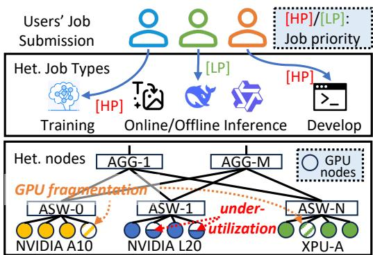  
Figure 1: Overview of ASI as a shared GPU infrastructure service. ASW: access switch; AGG: aggregation switch.

Workload scope. ASI must serve two workload classes at once: rapidly growing GenAI models and mature classical DNNs. GenAI models such as LLMs and diffusion-based image/video generation [1, 12, 48, 57, 58] can claim very large allocations; the largest single GenAI job in our trace used over 2,000 high-end GPUs simultaneously and consumed more than 800,000 GPU hours. Classical DNNs remain central to high-throughput production services such as Click-Through Rate (CTR) prediction, recommendation, and optical character recognition (OCR) [51, 59, 66]: they still account for roughly 70% of online-inference GPU hours in our trace (Fig. 3). Co-locating these classes forces ASI to manage workloads with sharply different resource shapes, execution times, priorities, and placement constraints. The trace covers large-scale training and inference in this shared cluster, but excludes the pre-training of hyperscale foundation models, which typically runs on dedicated clusters with cutting-edge hardware [47].

Trace. ASI records the metadata needed to study these production resource-management problems, including job types, priorities, model information, hardware types, utilization metrics, and network topology that prior public traces do not expose together. As shown in Table 1, the ASI trace surpasses prior studies by up to two orders of magnitude in both job volume and cluster size, while spanning a far more heterogeneous GPU fleet. These fields connect the workload characterization in §3.1 to the later analyses of fragmentation (§4.1), priority-based resource harvesting (§4.2), and hardware/topology heterogeneity (§5).

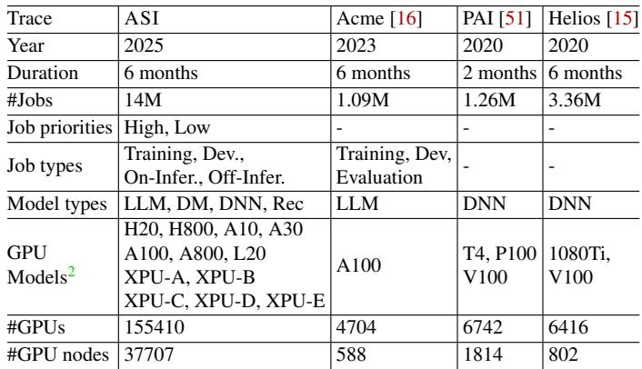  
Table 1: Comparison between the ASI trace and public GPU cluster traces in prior analysis works. Dev.: development; On-Infer.: online inference; Off-Infer.: offline inference.

## 3 Workload Characterization

This section characterizes the ASI workload. We first give an overview of the trace—the units of work it records, along with job types, priorities, models, and hardware—and then analyze the temporal and spatial patterns of resource demand and usage.

## 3.1 Trace Overview

Trace information. The ASI trace records a mix of training, inference, and development jobs running diverse ML models across mainstream frameworks [10,24,45,64]. For each job, it details resource requests, execution durations, scheduling delays, and utilization of GPUs, CPUs, GPU memory, and main memory at job, task, and instance granularity. We further enrich the trace with user-provided application metadata, such as job and model types, and with machine-level telemetry—GPU specifications, node capacities, and time-varying utilization— collected by daemon agents that periodically query the Linux kernel and GPU drivers (e.g., NVML [35]).

Jobs, tasks, and instances. Similar to prior studies [16, 51], users submit jobs as the primary unit of work. Each job consists of one or more tasks that perform distinct computational roles, and each task runs as one or more instances, each encapsulated in a Kubernetes pod (one or more co-scheduled containers). We manage these pods with a customized Kubernetes that lets users specify fine-grained resource requests and limits [21, 22].

Job types. Jobs in ASI span the entire lifecycle of ML model development and deployment, and fall into four broad types:

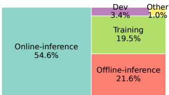

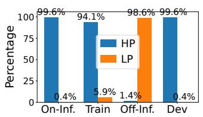  
Figure 2: Left: Job type distribution. Right: Distribution of job priority within each job type.

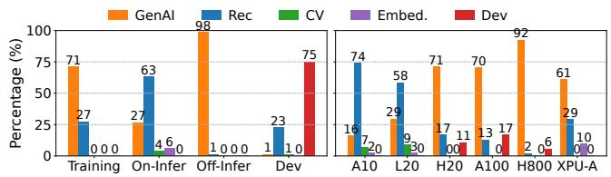  
Figure 3: Model type distribution grouped by job types (left) and GPUs (right).

• Dev jobs are typically interactive, ad-hoc sessions used for model prototyping and debugging via coding interfaces.

• Training jobs execute iterative optimization algorithms to update model parameters. The duration of these jobs varies from thousands of hours when training from scratch to much shorter periods for fine-tuning tasks.

• Offline-inference jobs perform batch model inference tasks, such as model evaluation and data generation [50]. These jobs are generally not latency-sensitive.

• Online-inference jobs support user-facing or latencycritical model serving applications.

Fig. 2-Left illustrates the distribution of these job types within our cluster. Online-inference constitutes the largest proportion, accounting for over 50% of the workload.

Job priorities. We allow users to specify job priorities, enabling the scheduler to differentiate between workloads. In our trace, we coarsely classify jobs into high-priority (HP) jobs and low-priority (LP) spot jobs for desensitization purposes. HP resources command higher prices but provide guaranteed availability without preemption. Conversely, LP jobs are cheaper but may be preempted by HP jobs.

As shown in Fig. 2-Right, Online-inference and Training jobs are predominantly HP: Online-inference requires high availability for latency-critical services, while training needs long, stable allocations to support iterative optimization. Offline-inference jobs, by contrast, are typically LP, since they are latency-insensitive and well-suited to lower-priority execution that maximizes economic efficiency. Notably, Dev jobs are almost exclusively HP: developers need stable environments and must avoid sudden termination so that intermediate state can be checkpointed.

Various models are deployed. Models executing in ASI can be broadly classified into five categories: GenAI (generative AI, including text, image, and video generation), Rec (recommendation models, such as CTR prediction [66]), CV (computer vision models, e.g., OCR), Embedding models, and Dev (models under development). We observe several popular model families, including Qwen [57, 58], TBStars [1, 7], WanX [48], DeepSeek [12], and BERT [5].

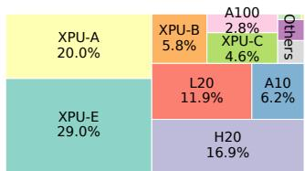

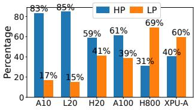  
Figure 4: Left: Distribution of GPUs. Right: Job priority distribution in terms of the GPU hours they run.

Fig. 3-Left shows the model type distribution within each job type. GenAI workloads dominate both Training (71%) and Offline-inference (98%), reflecting heavy demand for large-scale training, model evaluation, and data generation. Online-inference, by contrast, is primarily Rec models (63%), matching the low-latency demands of user-facing services.

Fig. 3-Right breaks down workloads across GPU types. Older or mid-tier GPUs such as the A10 and L20 mostly run classical DNN models, including recommendation and CV models, whereas newer high-end accelerators such as the H800 are dedicated almost entirely to GenAI. This pronounced specialization suggests that users deliberately match hardware capability to workload requirements to control cost.

Various GPU types to choose from. We offer a heterogeneous set of GPUs (Table 1) and let users request a specific GPU type for their tasks. Strikingly, over 99% of jobs explicitly pin a required GPU model, in sharp contrast to the 6% reported by an earlier study [51].

Fig. 4-Left shows the distribution of GPU types in our inventory, which spans hardware from NVIDIA and other vendors. Fig. 4-Right then shows how HP and LP jobs adopt these types, revealing that job priority correlates with an accelerator’s compute capability. Earlier-generation or mid-tier accelerators such as the A10 (83% HP) and L20 (85% HP) are dominated by HP production-critical workloads, partly because they mainly serve mature traditional DNN models that have anchored our businesses for years (see Fig. 3-Right).

Conversely, LP jobs favor newer, more powerful hardware such as the H800, since most of them run GenAI models (Fig. 3-Left), and offline-inference, being latency-insensitive, is cost-effective to run at low priority. Finally, the vast majority of jobs request homogeneous GPUs; fewer than 1% use heterogeneous GPUs.

## 3.2 Temporal Pattern

Diurnal request and utilization patterns. GPU demand in ASI follows strong diurnal cycles. Fig. 5-Top shows the volume of GPUs requested over a representative week: both Training and Online-inference jobs request substantially more GPUs during the day than late at night.

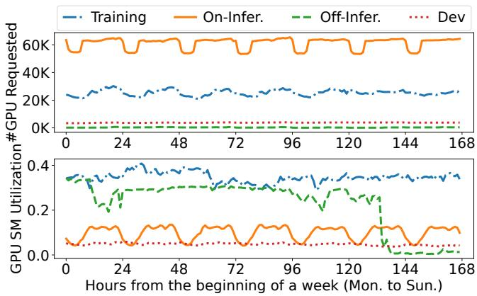  
Figure 5: Top: number of requested GPUs over one week; Bottom: GPU SM utilization over the same week.

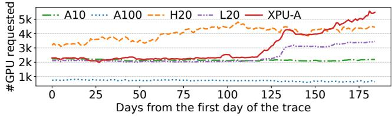  
Figure 6: #GPUs requested for different GPU types.

GPU SM utilization, however, tells a more nuanced story (Fig. 5-Bottom). Online-inference utilization stays diurnal because it tracks immediate user demand, whereas Training utilization does not, since long-running iterations keep GPUs busy around the clock. Offline-inference instead exhibits a weekly cycle, with SM utilization dropping sharply over the weekend.

GPU adoption. GPU adoption in ASI has shifted as we diversified our hardware supply. NVIDIA GPUs have been deployed for years and see relatively stable demand. To ease supply-chain constraints and build a more sustainable infrastructure, we recently began sourcing GPUs from other vendors; these non-NVIDIA devices, which we call XPUs, now make up a significant portion of our fleet (see Fig. 4-Left). Users were initially reluctant to adopt XPU-A because its out-of-the-box performance fell short of their expectations. Starting around Day 120, however, XPU-A adoption rises sharply (Fig. 6), following our release of a dedicated optimization suite that markedly improves model performance on XPU-A (§5.1).

Task instance run-time. Fig. 7 shows the CDF of task execution time, grouped by job type and by model type. Dev tasks run the longest, since developers keep long-lived interactive coding sessions open. Excluding Dev, Online-inference and Training tasks have comparable execution times, both longer than Offline-inference tasks. By model type, Rec and CV models accordingly run the longest, as they are dominated by Online-inference workloads, whereas GenAI models, which dominate Offline-inference, run shorter than CV and Rec models.

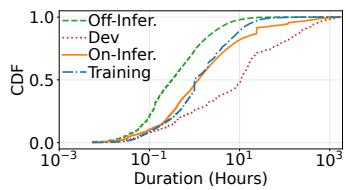

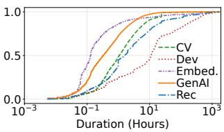  
Figure 7: Task execution time grouped by job type (Left) and by model type (Right).

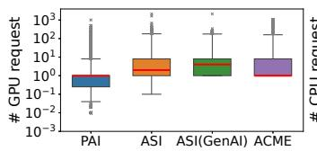

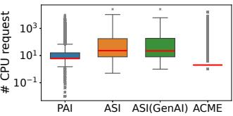  
Figure 8: Jobs’ #GPU and #CPU requested in different traces.

Overall, the median job execution time in ASI is 5 hours— far longer than the 23 minutes in PAI [51] and the 2 minutes in Acme [16]. We attribute this to ASI’s mix of long-running online serving and large-scale training: PAI covers only DNN jobs, while Acme is dominated by short-running evaluation jobs (93%). Scheduling latency, in contrast, is low: the median is just 1 second, and even the P90 for HP tasks is 101 seconds— negligible against their P90 execution time of 24 hours.

## 3.3 Spatial Pattern

We now turn to spatial patterns—how tasks request and use resources across the cluster. ASI samples telemetry for every running task at 20-second intervals.

GPU and CPU request. Jobs in ASI request markedly more GPUs per job than in older traces. Fig. 8 compares the distribution of requested GPUs and CPUs against PAI [51] and Acme [16] using boxplots; for ASI, we report both the full dataset (ASI) and the GenAI-only subset (ASI(GenAI)). The median and mean GPU request grow from 1 and 2.6 in PAI to 2 and 11.0 in ASI, and to 4 and 11.0 in ASI(GenAI), driven in part by GenAI models that PAI predates. Acme, which targets LLM training, has a median and mean of 1 and 5.0; its low values arise because short-running evaluation jobs dominate its job count yet consume few resources [16], which also explains the outliers in the CPU plot. CPU requests show a similar PAI-to-ASI trend.

GPU allocation. We measure the GPU allocation ratio— the fraction of total GPU capacity claimed by jobs—which reflects how effectively resources are claimed and directly affects revenue. We further differentiate the allocation ratio attributed to HP jobs from that of combined HP and LP jobs (HP+LP) to illustrate the effectiveness of LP workloads in boosting utilization. As Fig. 9 shows, LP jobs raise the allocation ratio for all GPU types, and especially for high-end GPUs: the cluster average rises from 68% with HP jobs alone to 93% with HP and LP combined. We detail how we enable LP spot jobs in §4.2.

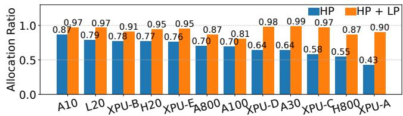  
Figure 9: GPU allocation ratio by GPU type. HP: HP jobs only. HP+LP: HP and LP jobs combined.

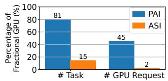

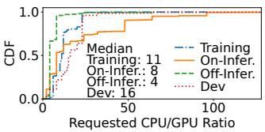  
Figure 10: Left: Percentage of GPU sharing (fractional GPU) usage. Right: Ratio of #CPU/#GPU requested for tasks.

Rare GPU sharing. GPU sharing lets multiple jobs that request fractional GPUs (< 1.0) multiplex a single device, and prior systems treat it as a key efficiency lever [51–53]. In ASI, however, GPU sharing is now rarely used, for reasons we discuss in §4.2. Fig. 10-Left reports both the share of tasks that claim fractional GPUs and the share of total GPUs they request; compared with PAI, both are negligible in ASI.

CPU/GPU ratio. Although ML workloads train and run inference on GPUs, much of their data processing—fetching and sampling, for example—runs on CPUs, which can become a bottleneck [51]. Fig. 10-Right shows the ratio of requested CPUs to requested GPUs per task, the CPU/GPU ratio. Most tasks have moderate ratios, but some are extreme, because ASI’s GPU servers span a wide range of CPU/GPU configurations: an 8-GPU H20 server may have 192 CPU cores, whereas a 1-GPU A10 server may have 128. To keep requests feasible, we cap each request’s CPU/GPU ratio according to its target server type.

Resource utilization. Fig. 11 shows task-level resource utilization by job type. Dev tasks have the lowest utilization across all metrics, reflecting their ad-hoc nature, while Training tasks have the highest, reflecting their compute intensity. Online-inference and Offline-inference use host memory similarly but differ sharply in CPU and GPU SM utilization, because Online-inference is driven by interactive user requests whereas offline-inference runs as batch jobs. Online-inference also uses less GPU memory than offlineinference, as it mainly runs standard DNN models while offline-inference predominantly runs GenAI models.

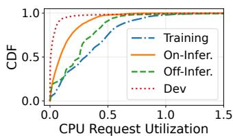

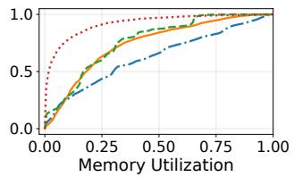

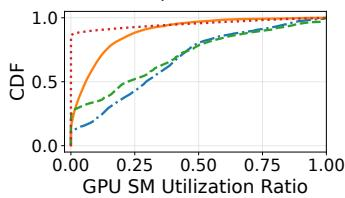

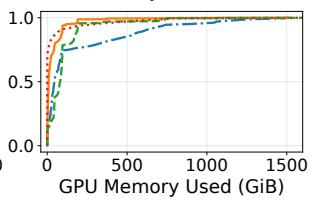  
Figure 11: Task-level resource utilization.

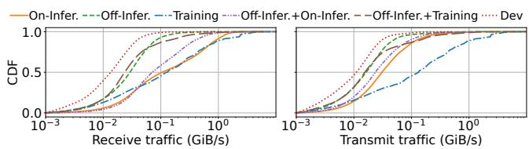  
Figure 12: Node-level network utilization.

We next examine node-level network utilization (receive and transmit bandwidth). Because tasks of different job types can share a node, we group nodes by the mix of tasks they host and show the six most common mixes. As Fig. 12 shows, nodes running only training tasks have the highest network utilization, since most ASI training uses GenAI models that rely on parallelism and thus heavy inter-node communication.

## 3.4 Case Study

We close the characterization with three case studies of online LLM serving in ASI.

PD-disaggregated LLM serving. Adoption of prefilldecode (PD) disaggregation [14, 39, 65] for LLM serving has surged in ASI: the daily average GPU count for these workloads grew 3.7× over the trace period, from 1,041 to 3,841. Yet, contrary to strategies that pair heterogeneous GPUs with the distinct compute profiles of prefill and decode [65], our users request homogeneous GPUs, citing deployment complexity and network degradation when spanning heterogeneous GPU types (see §5.2).

Smaller LLMs are favored. Among one month of onlineinference tasks running Qwen-family LLMs [57, 58], smaller models dominate usage. Grouped by parameter count, the 0–30B, 30–100B, and 100B+ tiers consume 60.9%, 35.0%, and 4.1% of GPU hours, respectively. Users favor smaller models because they cost less and, after fine-tuning, perform well enough in their target domains.

Comparison between representative LLMs and DNNs. We compare the three most popular models in onlineinference tasks: BERT [5], Qwen [57, 58], and CTR prediction [66]. CTR, BERT, and Qwen request a median of 24, 8, and 4 CPU cores, respectively—consistent with prior reports that recommendation models are more CPU-heavy [51, 59]. As for GPU compute, Qwen’s median GPU SM utilization of 26% is 2.7× that of CTR and 9.6× that of BERT.

## 4 Improving Resource Utilization

In this section, we describe two resource-management challenges observed in the ASI cluster, GPU fragmentation and resource underutilization, and present the production mechanisms we deploy to address them.

## 4.1 Tackling GPU Fragmentation

GPU fragmentation breaks idle GPU resources into pieces that cannot be allocated as a whole to satisfy a resource request [43, 52], shrinking the effective capacity of the cluster. We first diagnose the causes of fragmentation in ASI and then present two mechanisms that address its dominant causes: IPC defragmentation, which consolidates jobs to recover stranded GPUs and relieve CPU bottlenecks, and topology-aware allocation, which mitigates the fragmentation induced by networktopology requirements.

Causes of GPU fragmentation. Prior work [52] identifies three common causes of GPU fragmentation:

1) Fractional GPU fragmentation. ML models in production can be small. For example, a ResNet-152 model only has 60 million parameters, which cannot occupy a whole GPU. Therefore, we allow users to request a fractional GPU, e.g., 0.25 GPU, such that multiple small ML models can collocate in a single GPU for resource-efficient GPU sharing [51]. Despite the benefits, fractional GPU can cause intra-GPU fragmentation, as fractional allocations can leave unusable residual capacity on individual GPUs, especially preventing the placement of jobs that require whole GPU cards.

2) Stranded GPU fragmentation. For multi-GPU nodes, GPU fragmentation can appear when a job does not request all GPUs in the node, making the remaining GPU cards stranded. For example, assigning a 2-GPU task to an 8-GPU node results in intra-node fragmentation, leaving the remaining six GPUs as stranded resources that cannot satisfy a subsequent request for a full-node (8-GPU) allocation.

3) Insufficient CPUs. While GenAI models heavily use GPUs, we observe CPUs can be the bottleneck for GPU allocation. This happens when a node can satisfy the GPU requests but fails to meet associated CPU requests, typically due to extreme CPU/GPU ratios (see Fig. 10-Right). Exhausting CPUs in a node can cause GPU fragmentation.

In ASI, fragmentation is rarely caused by fractional GPUs but is instead driven by two bottlenecks: stranded GPUs and insufficient CPUs. Fig. 13 diagnoses this by measuring fragmentation, in unallocatable idle GPUs, under varying resource request configurations. That fractional GPUs barely contribute echoes Fig. 10-Left, where GPU sharing is rare. For requests with high CPU/GPU ratios (e.g., 1G8C and 8G128C), the dominant bottleneck is “Insufficient CPU”: GPUs cannot be allocated because CPUs are exhausted. For mid-sized configurations (e.g., 4G32C through 8G64C), “Stranded GPUs” (orange bars) dominate: aggregate GPU capacity exists but is fragmented across nodes, preventing the scheduling of jobs that require contiguous multi-GPU allocations.

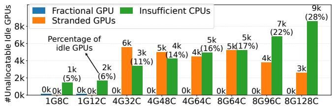  
Figure 13: GPU fragmentation with varying resource requests. 8G128C: request 8 GPUs and 128 CPUs.

Beyond these three known causes, we observe a new cause of GPU fragmentation when users submit a multi-GPU request with network-topology requirements.

4) Network topology. Very large ML models, such as LLMs, often demand aggregate GPU memory exceeding that of a single GPU server, so the standard practice is to partition the model into chunks distributed across multiple GPU nodes [34]. Both training and inference of such models entail intensive cross-node communication. To reduce this communication bottleneck, users often request topology-aware placement; for example, requiring all allocated GPUs to reside under the same ASW. As described in §2, the ASI fat-tree network is not fully non-blocking, so a job placed across multiple ASWs traverses additional switch layers and loses effective bandwidth; our benchmark shows that colocating all GPUs under a single ASW improves allreduce bandwidth by 27% relative to cross-ASW placement.

However, strictly enforcing such topology requirements introduces a new form of fragmentation: GPUs scattered across different switches become ineligible for a single job, substan tially shrinking the effective pool of available resources. To illustrate its severity within ASI, we constructed two largescale configurations—jobs requesting 128 and 256 GPUs, respectively, each GPU requiring 12 CPUs—and measured how many such requests ASI could fulfill. Fig. 14 reports the impact of these ASW constraints on allocation.

The comparison between the baseline (across ASW) and the ASW-enforced configuration (within ASW) shows that enforcing ASW constraints significantly reduces the number of fulfillable jobs. This reduction is particularly severe when requesting large sets of homogeneous NVIDIA GPUs, where capacity drops to near zero, indicating that strict topological requirements disproportionately impact these high-demand resources. Conversely, for less popular XPU-A, the impact is less pronounced. Furthermore, when heterogeneous GPU allocations are permitted, the cluster retains higher capacity for large-scale requests. Therefore, promoting the use of less popular GPUs alongside heterogeneous GPUs can effectively alleviate the bottlenecks caused by topology requirements.

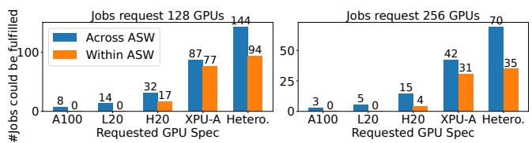  
Figure 14: Impact of network topology on GPU allocation.

GPU defragmentation. To recover stranded GPUs and relieve CPU bottlenecks, ASI runs GPU defragmentation as a routine maintenance task that consolidates jobs occupying only a fraction of a server, freeing whole-machine GPU capacity for incoming workloads that demand both multiple GPUs and substantial CPUs.

Challenges. Such consolidation is achieved by migrating running jobs to pack them onto fewer servers, yet performing these migrations in a live production cluster raises three challenges. First, new jobs can be submitted to the cluster at any time, which dynamically alters resource availability and allocation. As a result, the decision-making of GPU job migration must be fast, ensuring that migration and scheduling decisions can be completed within a few minutes, which poses a chal lenge given the large scale of our cluster. Second, migrating workloads across nodes must satisfy practical cluster-level constraints [28], including adhering to existing affinity and anti-affinity rules [20], which define if tasks can run on a certain node or if a set of tasks can be colocated. Besides, 40% of tasks in ASI are labeled as “locked”, indicating that they are business critical and cannot be moved. Third, GPU job migration and defragmentation must remain transparent to users. This means we cannot impose constraints on the underlying machine learning frameworks used by the jobs, nor can these operations introduce any service downtime [29].

IPC Algorithm. We design and deploy IPC (iterative partitioned consolidation), a practical defragmentation algorithm that takes a snapshot of the current node and task states and generates a set of task migration decisions whose objective is to vacate as many nodes as possible. Each of the three challenges above maps to a design choice in IPC: divide-andconquer keeps decision-making fast at cluster scale, ejectionchain scheduling respects affinity, anti-affinity, and locked task constraints during migration, and an iterative process drives the number of vacated nodes higher across rounds. To keep migration transparent to users, IPC adopts a makebefore-break approach: it brings up a new instance on the target node before terminating the old one, eliminating service downtime.

1) Divide-and-conquer. To generate migration decisions quickly, IPC randomly partitions the cluster’s nodes into disjoint groups, each an independent subproblem within which IPC tries to vacate as many nodes as possible. These subproblems run embarrassingly in parallel, accelerating decisionmaking at cluster scale.

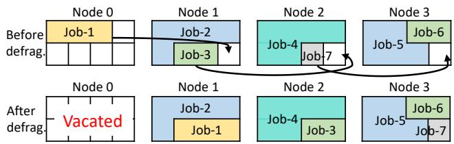  
Figure 15: Illustration of the ejection chain in IPC. To evacuate Node 0, Job-1 must first be migrated off the node. Before defragmentation, none of Nodes 1–3 individually has sufficient GPU slots to host Job-1, even though they collectively provide three idle GPU slots. With an ejection chain: Job-3 is moved from Node 1 to Node 2, which first requires shifting Job-7 to Node 3; Job-1 is then moved from Node 0 to Node 1, vacating Node 0 after defragmentation. CPUs are omitted for clarity.

2) Ejection chain scheduling. Within each group, IPC scores every node by priority and heuristics, e.g., the number of pods it hosts, and selects higher-priority (fewer-pod) nodes first as they are easier to vacate; Algorithm 1 gives the pseudocode for a partition. As illustrated in Fig. 15, IPC builds an ejection chain recursively (Eject(·) at line 6): if a destination node cannot accommodate a task, it recursively moves tasks off that destination node until all pods are placed or the recursion-depth limit K (line 6) is reached. In practice, we set K to 3.

Algorithm 1: Ejection Chain Scheduling   
Input: Node partition N , Max depth K   
Output: Set of migration actions M   
1 M ← 0/; L ← Sort(N ) // sort nodes in the partition   
2   
3 foreach n ∈ L do   
4 Mn ← 0/; feasible ← true   
5 foreach τ ∈ n.tasks do   
// Eject() recursively searches a feasible   
ejection chain C that satisfies the   
practical constraints and resource   
requests and is shorter than K   
6 C ← Eject(τ, K)   
7 if C ̸= 0/ then   
8 M ←M ∪C   
9 else   
10 feasible ← false; break   
11 if feasible then   
12 M ←M ∪M   
13 else   
14 Mark n as non-migratable   
15 return M

3) Iteration. To vacate as many nodes as possible, the IPC algorithm iteratively runs the process of divide-and-conquer and ejection chain scheduling for several rounds, attempting to vacate nodes in each round. We empirically observe that the marginal benefit becomes small after the third round, so we cap the maximum number of rounds at five.

Effectiveness of IPC. IPC has run stably in our scheduler for years, making a migration decision in under 2 minutes; on a two-month trace replay, it reduces the number of not-fullyoccupied nodes by 20.2%. It replaced our earlier reliance on Kubernetes [21] eviction, which redistributes evicted jobs randomly across the cluster. We use a heuristic rather than an optimal plan because optimal defragmentation is impractical online: the optimization is expensive to solve, and an optimal plan may demand large-scale pod migrations that production cannot absorb. Formulating defragmentation as an integer linear program (ILP), a 25-node cluster yields 4,000 binary variables and 800 constraints that Gurobi [13] solves to optimality in roughly 5 minutes on a 16-CPU node, whereas a 100-node cluster takes two days—yet in practice each IPC partition holds 500 nodes.

Topology-aware GPU allocation. To address the topologyinduced fragmentation of Fig. 14, ASI deploys an allocation policy that consolidates the GPUs of a large-scale request into as few ASWs as possible. We describe the deployed single-job policy here; its optimal multi-job generalization remains an open challenge (§5), so we report no aggregate benefit number for it. We introduce entropy to quantify the distribution of the allocated GPUs of a job. Suppose that the GPUs requested by a job are distributed across n ASWs. Let g<sub>1</sub>,g<sub>2</sub>,...,g<sub>n</sub> denote the number of GPUs in each ASW, and let G denote the total number of GPUs (G = ∑<sup>n</sup><sub>i=1</sub> g<sub>i</sub>). The GPU entropy of the job is defined as

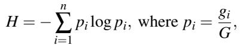

(1)

where higher entropy indicates a more uniform distribution, whereas lower entropy indicates concentration within a small number of ASWs. Our allocation policy seeks to consolidate the GPUs assigned to the job within as few ASWs as possible; accordingly, lower entropy is preferred.

The process of generating a GPU allocation plan for a large-scale job is shown in Algorithm 2. For each iteration, we decide which ASW to use by iterating over all ASWs, and for each ASW, we calculate the GPU-topology distribution if we allocate as many of its GPUs to the job as possible. Then we select one that yields the minimum entropy, allocate that ASW’s idle GPUs to the job, and proceed to the next iteration.

This greedy algorithm is optimal for a single job, but not across multiple jobs, where the scheduling order matters and the problem becomes combinatorial. In practice, we sort jobs by size in descending order and schedule the largest first; cross-ASW migration reuses IPC, with network topology added as a practical constraint. We leave large-scale topologyaware allocation as an open challenge in §5.

Algorithm 2: Topology-aware GPU allocation   
Input: Number of requested GPUs G; available ASWs N   
Output: Allocation Plan P   
1 P ← 0/; Grem ← G   
2 while G > 0 and N ̸= 0/ do   
// Find ASW s that minimizes entropy if added   
3 s<sup>∗</sup> ←   
argmin<sub>s∈</sub> Entropy(P ∪ {min(Cap(s),Grem) GPUs of s})   
4 n ← min(Cap(s<sup>∗</sup>), G<sub>rem</sub>)   
5 P ← P ∪ {(s<sup>∗</sup>,n)}; Grem ← Grem − n   
6 N ← N \ {s<sup>∗</sup>}   
7 end   
8 return P

## 4.2 Addressing Resource Underutilization

Our characterization reveals substantial temporal and spatial resource underutilization in the cluster (Fig. 5 and Fig. 11). Discussions with our users trace this primarily to a common practice: users over-provision GPU capacity to absorb diurnal traffic peaks, maintain failover redundancy, and reserve headroom for peak events. Such defensive reservation leaves a sizable fraction of resources idle for long periods, degrading cluster-wide efficiency.

GPU sharing as a strawman solution. A natural way to reclaim underutilized resources is GPU sharing: co-locating multiple jobs on one GPU so they time-multiplex it and fill idle cycles [51, 52, 55]. Although ASI supports GPU sharing, adoption remains low (Fig. 10-Left), for two reasons. First, GPUs offer weaker isolation than CPUs, so colocated jobs interfere; even virtualization mechanisms such as MPS (Multi-Process Service) [37] and MIG (Multi-Instance GPU) [36] provide only coarse-grained, inflexible partitioning. Second, emerging GenAI models consume large amounts of GPU memory for parameters and intermediate state (e.g., KV-Cache) [24], making it infeasible to share a single GPU across jobs. Consequently, in ASI fractional GPU requests come almost exclusively from classical CV and recommendation models, which reserve GPUs with MPS enabled to serve small models. GPU sharing therefore reclaims idle capacity only within a single device; to reclaim the much larger pool of reserved-but-idle capacity across jobs, we instead operate at job granularity through SpotGPU.

SpotGPU. SpotGPU is designed to achieve two objectives. First, it reclaims reserved-but-idle GPU capacity and returns it to productive use, raising cluster-level utilization. Second, it offers this reclaimed capacity, together with other idle resources, to users with flexible workloads at a discounted spot rate. Concretely, SpotGPU safely oversubscribes the reserved capacity of HP jobs and allocates the resulting idle capacity to LP spot jobs. Because resources granted to LP jobs are not guaranteed, they are priced lower; when HP jobs reclaim their reserved resources, SpotGPU preempts the running LP jobs in near real-time.

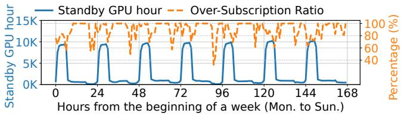  
Figure 16: Temporal pattern of GPU hours of “Standby” tasks and the over-subscription ratio of the “Standby” GPU hours.

“Standby” HP tasks. To reclaim reserved capacity from HP jobs without disrupting them, SpotGPU offers a “Standby” mechanism and incentivizes participation with financial rebates. Through an API, a user labels an HP task as “Standby” for a chosen window, e.g., by updating the labels of its Kubernetes pods [23], signaling willingness to temporarily release the task’s allocated resources to LP spot jobs. Fig. 16 shows that “Standby” GPU hours follow a pronounced diurnal pattern, surging at midnight to as much as 10,000 hours.

A Standby task must reactivate quickly, so SpotGPU does not tear down its container. Instead, it detaches the task’s request traffic and replaces the container’s main service process with a sleep command, releasing the CPUs and GPUs while keeping the container warm; reactivation then skips the costly steps of rescheduling and image pulls. When an HP task must resume, SpotGPU first triggers a graceful eviction of the co-located spot job and then signals the HP task to resume, preserving HP SLOs. The eviction proceeds as follows: (i) the node agent observes the HP pod arriving on its node, (ii) it sends SIGTERM to the co-located spot pod, (iii) the in-container graceful shutdown runs, executing user-defined logic, bounded by a 60-second termination period, and (iv) the container exits and the GPU is reclaimed. Steps (i), (ii), and (iv) are platform-side and complete quickly and determin istically, so eviction latency is dominated by the user-defined step (iii). In our deployment, the average eviction time is 13 seconds (P95 of 48 seconds), well within the 60-second window; containers that do not exit within this window are forcibly terminated via SIGKILL, affecting fewer than 5% of evictions. To resume the HP task, SpotGPU restores its original command in place of the sleep. As shown in Fig. 16, on average, 90% of “Standby” GPU hours are harvested.

Preemptive task scheduling. For newly submitted jobs, ASI uses a preemptive scheduling policy that prefers nonpreemptive allocation for stability but, when it must reclaim resources from LP spot jobs, accounts for the resulting preemption cost. Since GPU tasks commonly checkpoint during execution [31, 46], a preempted task can resume from its last checkpoint rather than restart. ASI lets users specify a checkpoint interval, and we define the preemption cost of a task as its wasted computation, i.e., the work performed since its last

successful checkpoint.

We formulate the preemptive scheduling decision as a mixed-integer linear program (MILP), detailed in Appendix A. Because the MILP is intractable for online scheduling, we instead use an efficient heuristic. The algorithm first attempts non-preemptive allocation for an HP task on available GPUs. If this fails, it switches to preemptive mode and evicts selected LP spot tasks to reclaim their resources for the HP task. New spot tasks, in contrast, are scheduled strictly nonpreemptively.

1) Non-preemptive scheduling. For an HP or spot task, the scheduler first filters nodes that meet the task’s GPU requirements to form a candidate set. It then ranks the node candidates by three criteria applied in order, each breaking ties left by the previous one:

• Task packing: prioritize nodes with the least idle GPU capacity, packing tasks onto fewer nodes to limit fragmentation.

• Homogeneous co-location: place HP tasks on nodes hosting other HP tasks, and assign spot tasks to spotdedicated nodes. This strategy insulates and prioritizes HP tasks, allowing for efficient future scheduling via preempting spot tasks when necessary.

• Eviction history: assign a new spot task to the node with the lowest historical eviction count so it is less likely to be preempted, and a new HP task to the node with the highest eviction count. This strategy concentrates future preemptions on already-volatile nodes and leaves stable nodes for long-running spot tasks, reducing repeated evictions of the same spot tasks.

2) Preemptive scheduling. When a new HP task cannot be placed non-preemptively, the scheduler preempts spot tasks. Because preemption disrupts a spot task’s progress, the sched uler chooses victims so as to minimize wasted computation: it identifies the nodes that could host the HP task if their spot tasks were removed, scores each by its preemption cost, and selects the node with the lowest cost.

Concretely, consider an HP task arriving at time τ<sub>now</sub> that requires G<sub>hp</sub> GPUs. For a running spot task t using G GPUs with its last checkpoint at τ , we define its preemption cost as the lost work weighted by resource usage, C<sub>t</sub> = G<sub>t</sub> · (τ<sub>now</sub> − τ<sub>ck</sub>). To score a node, the scheduler sorts its spot tasks by ascending preemption cost and takes the smallest prefix {t<sub>1</sub>, . . . ,t<sub>k</sub>} such that their combined resources meet the HP task’s demand, i.e., ∑<sup>k</sup><sub>j=</sub> G<sub>t</sub> ≥ G<sub>hp</sub>. The node’s total preemption cost is hence given by ∑<sup>k</sup><sub>j=1</sub> C<sub>tj</sub> . Having all nodes scored, the scheduler then places the HP task on the one with the minimum preemption cost and evicts the selected spot tasks there. For heterogeneous GPUs, G<sub>hp</sub> and G<sub>t</sub> become resource vectors whose elements give the required quantity of each GPU type.

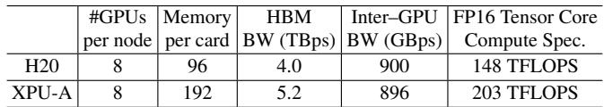  
Table 2: Hardware specifications of H20 and XPU-A.

Benefits of SpotGPU. SpotGPU raises the average GPU allocation ratio from 68% to 93% (Fig. 9), meaning a substantially larger fraction of resources is put to productive use, and Fig. 16 shows that users actively release reserved capacity through “Standby”, shortening idle periods. To isolate the preemptive scheduler’s contribution, we compare it against a baseline that disables co-location and eviction awareness in non-preemptive scheduling and replaces preemptive scheduling with random victim selection. Our scheduler reduces LP task completion time by 24% without affecting HP task performance, a gain that stems from accounting for preemption cost to avoid discarding spot tasks’ near-complete work.

## 5 Open Challenges

The mechanisms in §4 address resource-management problems that we have largely brought under control in production. We now turn to problems that remain open. We first examine the imbalanced adoption of heterogeneous GPUs, an increasingly pressing issue as we diversify beyond a single vendor, together with our preliminary efforts to close the resulting performance gap (§5.1). We then discuss three further challenges in allocation and colocation that we have yet to fully resolve (§5.2).

## 5.1 Imbalanced Adoption of Heterogeneous GPUs

The adoption gap. Meeting the growing demand for highend GPUs while avoiding the risks of single-vendor dependency has led us to diversify our hardware. We recently integrated XPU-A from another vendor as a primary alternative, attracted by its large memory capacity and competitive compute. Adoption, however, is heavily skewed: we observe an imbalanced adoption of heterogeneous GPUs, in which HP jobs request NVIDIA GPUs and other XPUs far more than XPU-A (Fig. 9). Closing this gap would do more than load balancing. Because most XPU-As can satisfy strict network-topology requirements that NVIDIA GPUs often cannot (Fig. 14), broader XPU-A adoption would also relieve the topology-induced fragmentation of §4.1.

This imbalance stems from performance, not capacity. On paper, XPU-A surpasses the NVIDIA H20, its closest counterpart in FP16 compute, offering larger memory and higher bandwidth (Table 2). In practice, however, it underdelivers on GenAI models: Fig. 17-Left shows XPU-A trailing H20 when serving DeepSeek-R1. Profiling and discussions with the XPU team trace this to a single root cause—standard kernel implementations are mismatched to XPU-A’s hardwarespecific features—which motivates the optimizations below.

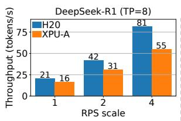

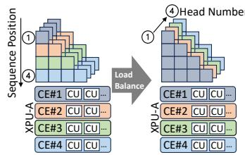  
Figure 17: Left: Throughput of Deepseek-R1 [12]. Right: Optimized prefill. CE: Compute Engine. CU: Compute Unit.

Optimizing XPU-A for LLMs. Guided by this diagnosis, we have benchmarked and optimized XPU-A for Qwen-family LLMs on vLLM [24] and RTP-LLM [10], a production-grade inference engine developed by Alibaba. For brevity, we describe two representative optimizations, one for the prefill phase and one for decoding.

Prefill. In the prefill phase, the Flash Attention kernel in XPU-A’s official library distributes work poorly under the causal mask, the mechanism that lets each token attend only to preceding tokens. The mask imposes a triangular computation in which per-token load grows linearly with a token’s position in the sequence (Fig. 17-Right). The existing kernel maps thread blocks to the logical grid along the sequence-length dimension and dispatches them to Compute Engines (CEs) of XPU-A in rigid round-robin order, causing severe load imbalance: the CE handling the tail of the sequence becomes a bottleneck while the others finish early and idle. We instead parallelize CE assignment along the attention-head dimension, which evens out the load across CEs. Simple as it is, this change yields a 1.58× speedup in prefill computation for a 4k-token sequence with 64 heads.

Decoding. During decoding, most serving engines use Paged Attention (PA) kernels [24], which are memory-bound because decoding each token requires reading the entire KVcache history from GPU memory. To saturate Compute Units (CUs) of an XPU, PA adopts a SplitKV strategy that partitions the KV-cache into chunks processed in parallel across CUs. When we port PA to XPU-A with Triton [38], however, the compiler inverts the thread-block layout, so every thread subgroup redundantly recomputes the full matrix instead of dividing the work, wasting most of the compute. We fix this by injecting custom compiler passes into Triton that enforce the correct parallelism, and have contributed the fix back to the Triton ecosystem.

Effectiveness. We have integrated these and further optimizations into RTP-LLM [10], with two effects. First, user demand for XPU-A has risen sharply: HP jobs request 2.5× more XPU-A GPUs after the optimizations (Fig. 6). Second, the optimizations close the performance gap: on Qwen LLMs of varying sizes [57, 58], optimized XPU-A matches H20 and far outperforms the unoptimized baseline (Fig. 18). Benchmarking the same suite on vLLM [24, 44], optimized XPU-A improves request latency by 33% and 43% at one and two requests per second (RPS) over unoptimized XPU-A, surpassing H20 by 2% and 21%; the larger margin at RPS=2 comes from XPU-A’s larger memory, which holds a bigger KV-cache and reduces queuing delay.

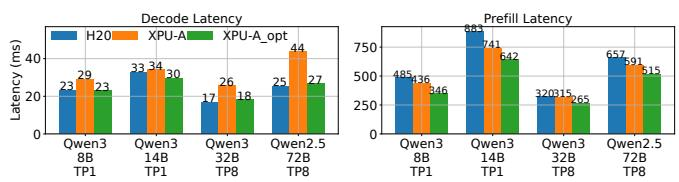  
Figure 18: Performance of Qwen LLMs on varying GPUs with tensor parallelism (TP). XPU-A\_opt: XPU-A with optimization. Left: Decoding performance at batch size=64. Right: Prefill performance (batch size=1).

```python
1 # Original FlashAttention import
2 import flash_attn
3
4 # Replace it with our drop -in optimized implementation
5 import asi . api . flash_attn as flash_attn
```  
Figure 19: An example of integrating our optimizations.

Programming interface. To make these optimizations easy to adopt, we expose them through drop-in APIs. In PyTorch, a user enables an optimization by changing a single import (Fig. 19); the frontend API preserves compatibility with exist ing code, and the API layer handles all remaining adaptation transparently.

Beyond LLMs. Our broader goal is to deliver highperformance services across heterogeneous GPUs, so that balanced GPU usage improves resource management and widens the range of viable hardware choices. The optimizations above target LLMs; substantial challenges remain for multimodal models, e.g., Qwen Next [42], and generative im age/video models, whose distinct architectures and attention mechanisms demand separate hardware-specific tuning [30].

## 5.2 Additional Resource-Management Challenges

Topology-aware allocation under heterogeneity. In §4.1, we showed how network-topology constraints limit GPU allocation; these constraints also collide with hardware heterogeneity. In ASI, GPUs under the same ASW are homogeneous, so enforcing ASW-level locality precludes mixing heterogeneous GPUs within a single job—precisely when heterogeneity is becoming a key GenAI optimization [39]. The PD-disaggregation paradigm, for instance, is now widely used in LLM serving and accounts for up to 12,000 GPUs per day in ASI: prefill is compute-bound and favors highperformance GPUs, whereas decoding is memory-bound and needs high bandwidth [65]. Such heterogeneous matching is more cost-effective, but it places the KV-cache transfer between disaggregated nodes on the critical path—decoding cannot begin until the KV cache arrives—making network performance the bottleneck. Cost-efficiency therefore hinges on balancing hardware specialization against topology constraints, a tension that extends beyond LLM serving to any system built on heterogeneous GPUs [8, 18, 33, 49, 61].

Underutilization of online-inference jobs. Onlineinference jobs dominate ASI yet run highly inefficiently: aggregated across all such jobs, median SM utilization is only 6% and median GPU-memory utilization only 30%. This low overall utilization masks two distinct workload patterns. GenAI inference is memory-bound, consuming 94% of GPU memory but only 5% of SM, so it exhausts memory while leaving compute idle. Conventional DNN inference, in contrast, is light on both resources, using just 20% of memory and 6% of SM. The two patterns are complementary: a DNN job needs little memory and could run on the compute that a memory-bound GenAI job leaves idle, raising SM utilization without contending for memory. Realizing this colocation in practice, however, is difficult. GPU sharing falls short under latency-sensitive online inference and lacks large-scale support [56]; hardware partitioning such as MIG [36] is too static for dynamic workloads; and GPU time-sharing violates strict latency SLOs because of weak isolation [51, 53].

Interference between colocated CPU and GPU jobs. Like Acme [16], ASI nodes show low CPU utilization (median 31%). We mitigate this by colocating pure-CPU jobs with GPU workloads, which makes 80% of nodes CPU-jobdominant, i.e., their CPU-job core usage exceeds that of GPU jobs. This colocation, however, interferes with GPU training: median and P90 SM utilization fall by 10% and 18% on CPU-job-dominant nodes relative to GPU-job-dominant ones, showing that our naive colocation is suboptimal. Prior approaches that exploit idle CPUs on GPU nodes [4,27] target specific model architectures (e.g., LoRA adapters) and require high-end CPUs, limiting their applications. Closing this gap calls for a multi-resource scheduler that jointly accounts for GPUs and associated resources such as CPUs, together with new isolation techniques to contain interference.

## 6 Limitations and Related Work

We close by clarifying the scope of the ASI trace and situating it among prior workload-characterization studies. Our goal is not to cover every AI cluster workload, but to expose the resource-management issues that arise in a large shared production cluster with heterogeneous workloads, priorities, accelerators, and topology constraints.

Limitations. The ASI trace does not cover large-scale foundation-model pretraining, which typically runs on dedicated clusters with the most advanced GPUs. It also does not distinguish fine-grained subcategories within each job type; for example, training jobs may include both supervised finetuning and LoRA fine-tuning, but the trace does not separate them. Finally, although we collect utilization data across CPU, memory, network, and GPU resources, space constraints lead us to focus mainly on GPU workloads and leave CPU-only jobs to future analysis.

Related work. Workload characterization has long informed cluster management, but existing public traces capture only part of the setting faced by modern production AI clusters. Table 1 compares ASI with the closest public GPU-cluster traces, Acme [16] and PAI [51]. Other recent studies focus on narrower slices of the AI infrastructure stack: ServeGen [54] provides granular request-level data for LLM serving, while ByteRobust and Megascale [19, 47] study stability issues in foundation-model training on tens of thousands of NVIDIA GPUs. In contrast, ASI exposes a shared production infrastructure that combines heterogeneous workloads, priorities, GPU types, and topology constraints in one cluster. Earlier DNN workload studies [3, 11, 15, 17, 32, 55, 63] remain useful references, but their reliance on older GPU generations makes them less representative of today’s GPU cluster management problems.

## 7 Conclusion

We have characterized six months of production workloads in ASI, a shared AI cluster with 155,410 GPUs and 81 internal departments. The trace showed that modern AI clusters must manage heterogeneity in both workloads and hardware: classical DNN services, GenAI training, and GenAI serving coexist on GPU fleets spanning multiple generations and vendors. Our key lesson was that high GPU demand did not imply high effective utilization. Idle GPUs often remained unusable because capacity was stranded across nodes, blocked by CPU shortages, constrained by network locality, or reserved as production headroom. We also showed how these observations shaped production mechanisms. The remaining challenges point beyond simple packing: heterogeneous accelerators required software optimization before users adopted them, online inference left substantial compute idle, and CPU/GPU colocation recovered CPU cycles but interfered with GPU training. By releasing the sanitized ASI trace, we hope to sup port future work on GPU cluster management under coupled workload, hardware, topology, and priority heterogeneity.

## Acknowledgments

We thank our shepherd and the anonymous reviewers of OSDI 2026 for their invaluable comments that help improve the quality of this work. We are also grateful to Dongqing Bao, Yujie

Deng, Zhiwei Han, Wenhu Hu, and Zhuo Yuan at Alibaba Group for their helpful discussions. This work was supported in part by the HKUST-Alibaba Joint Laboratory on Big Data and AI, RGC CRF Grant (Ref. #C6015-23G), RGC GRF Grant (Ref. #16217124), and NSFC/RGC CRS Grant (Ref. #CRS\_HKUST601/24).

## References

[1] AIBase. Ali Mama launches Taobao Star video generation model and image-to-video application. https: //news.aibase.com/news/14705, 2025.

[2] AliyunContainerService. gpushare-scheduler-extender. https://github.com/AliyunContainerService/ gpushare-scheduler-extender, 2025.

[3] Shubham Chaudhary, Ramachandran Ramjee, Muthian Sivathanu, Nipun Kwatra, and Srinidhi Viswanatha. Balancing efficiency and fairness in heterogeneous GPU clusters for deep learning. In Proc. ACM EuroSys, 2020.

[4] Hongtao Chen, Weiyu Xie, Boxin Zhang, Jingqi Tang, Jiahao Wang, Jianwei Dong, Shaoyuan Chen, Ziwei Yuan, Chen Lin, Chengyu Qiu, Yuening Zhu, Qingliang Ou, Jiaqi Liao, Xianglin Chen, Zhiyuan Ai, Yongwei Wu, and Mingxing Zhang. KTransformers: Unleashing the full potential of CPU/GPU hybrid inference for MoE models. In Proc. ACM SOSP, 2025.

[5] Jacob Devlin, Ming-Wei Chang, Kenton Lee, and Kristina Toutanova. BERT: Pre-training of deep bidirectional transformers for language understanding. In Jill Burstein, Christy Doran, and Thamar Solorio, editors, Proc. ACL, June 2019.

[6] Patrick Esser, Sumith Kulal, Andreas Blattmann, Rahim Entezari, Jonas Müller, Harry Saini, Yam Levi, Dominik Lorenz, Axel Sauer, Frederic Boesel, Dustin Podell, Tim Dockhorn, Zion English, and Robin Rombach. Scaling rectified flow transformers for high-resolution image synthesis. In Proc. ICML, 2024.

[7] Hao Fang, Zechao Zhan, Weixin Feng, Ziwei Huang, Xubin Li, and Tiezheng Ge. TBStar-Edit: From image editing pattern shifting to consistency enhancement. arXiv preprint arXiv:2510.04483, 2025.

[8] Hao Ge, Fangcheng Fu, Haoyang Li, Xuanyu Wang, Sheng Lin, Yujie Wang, Xiaonan Nie, Hailin Zhang, Xupeng Miao, and Bin Cui. Enabling parallelism hot switching for efficient training of large language models. In Proc. ACM SOSP, 2024.

[9] Robert Grandl, Ganesh Ananthanarayanan, Srikanth Kandula, Sriram Rao, and Aditya Akella. Multiresource packing for cluster schedulers. Proc. ACM SIGCOMM, 2014.

[10] Alibaba Group. RTP-LLM. https://github.com/ alibaba/rtp-llm, 2025.

[11] Juncheng Gu, Mosharaf Chowdhury, Kang G. Shin, Yibo Zhu, Myeongjae Jeon, Junjie Qian, Hongqiang Liu, and Chuanxiong Guo. Tiresias: A GPU cluster manager for distributed deep learning. In Proc. USENIX NSDI, 2019.

[12] Daya Guo, Dejian Yang, Haowei Zhang, Junxiao Song, Peiyi Wang, Qihao Zhu, Runxin Xu, Ruoyu Zhang, Shirong Ma, Xiao Bi, et al. DeepSeek-R1 incentivizes reasoning in LLMs through reinforcement learning. Nature, 2025.

[13] Gurobi Optimization, LLC. Gurobi optimizer reference manual. https://www.gurobi.com/ documentation/, 2024.

[14] Cunchen Hu, Heyang Huang, Liangliang Xu, Xusheng Chen, Chenxi Wang, Jiang Xu, Shuang Chen, Hao Feng, Sa Wang, Yungang Bao, Ninghui Sun, and Yizhou Shan. ShuffleInfer: Disaggregate LLM inference for mixed downstream workloads. ACM Trans. Archit. Code Optim., 2025.

[15] Qinghao Hu, Peng Sun, Shengen Yan, Yonggang Wen, and Tianwei Zhang. Characterization and prediction of deep learning workloads in large-scale GPU datacenters. In Proc. ACM/IEEE SC, 2021.

[16] Qinghao Hu, Zhisheng Ye, Zerui Wang, Guoteng Wang, Meng Zhang, Qiaoling Chen, Peng Sun, Dahua Lin, Xiaolin Wang, Yingwei Luo, Yonggang Wen, and Tianwei Zhang. Characterization of large language model development in the datacenter. In Proc. USENIX NSDI, 2024.

[17] Myeongjae Jeon, Shivaram Venkataraman, Amar Phanishayee, Junjie Qian, Wencong Xiao, and Fan Yang. Analysis of large-scale multi-tenant GPU clusters for DNN training workloads. In Proc. USENIX ATC, 2019.

[18] Youhe Jiang, Ran Yan, Xiaozhe Yao, Yang Zhou, Beidi Chen, and Binhang Yuan. Hexgen: generative inference of large language model over heterogeneous environment. In Proc. ICML, 2024.

[19] Ziheng Jiang, Haibin Lin, Yinmin Zhong, Qi Huang, Yangrui Chen, Zhi Zhang, Yanghua Peng, Xiang Li, Cong Xie, Shibiao Nong, Yulu Jia, Sun He, Hongmin Chen, Zhihao Bai, Qi Hou, Shipeng Yan, Ding Zhou, Yiyao Sheng, Zhuo Jiang, Haohan Xu, Haoran Wei, Zhang Zhang, Pengfei Nie, Leqi Zou, Sida Zhao, Liang Xiang, Zherui Liu, Zhe Li, Xiaoying Jia, Jianxi Ye, Xin Jin, and Xin Liu. MegaScale: Scaling large language model training to more than 10,000 GPUs. In Proc. USENIX NSDI, 2024.

[20] Kubernetes. Assigning pods to nodes. https://kubernetes.io/docs/concepts/ scheduling-eviction/assign-pod-node/, 2025.

[21] Kubernetes. Kubernetes: Production-grade container orchestration. https://kubernetes.io/, 2025.

[22] Kubernetes. Resource management for pods and containers. https://kubernetes.io/docs/concepts/ configuration/manage-resources-containers/, 2025.

[23] Kubernetes Documentation. Labels and selectors. https://kubernetes.io/docs/concepts/ overview/working-with-objects/labels/, 2026.

[24] Woosuk Kwon, Zhuohan Li, Siyuan Zhuang, Ying Sheng, Lianmin Zheng, Cody Hao Yu, Joseph Gonzalez, Hao Zhang, and Ion Stoica. Efficient memory management for large language model serving with pagedattention. In Proc. ACM SOSP, 2023.

[25] Black Forest Labs. FLUX. https://github.com/ black-forest-labs/flux, 2024.

[26] Charles E. Leiserson. Fat-trees: Universal networks for hardware-efficient supercomputing . IEEE Transactions on Computers, 1985.

[27] Suyi Li, Hanfeng Lu, Tianyuan Wu, Minchen Yu, Qizhen Weng, Xusheng Chen, Yizhou Shan, Binhang Yuan, and Wei Wang. TOPPINGS: CPU-assisted, rankaware adapter serving for LLM inference. In Proc. USENIX ATC, 2025.

[28] Suyi Li, Luping Wang, Wei Wang, Yinghao Yu, and Bo Li. George: Learning to place long-lived containers in large clusters with operation constraints. In Proc. ACM SoCC, 2021.

[29] Suyi Li, Wei Wang, Jun Yang, Guangzhen Chen, and Daohe Lu. Golgi: Performance-aware, resource-efficient function scheduling for serverless computing. In Proc. ACM SoCC, 2023.

[30] Suyi Li, Lingyun Yang, Xiaoxiao Jiang, Hanfeng Lu, Dakai An, Zhipeng Di, Weiyi Lu, Jiawei Chen, Kan Liu, Yinghao Yu, Tao Lan, Guodong Yang, Lin Qu, Liping Zhang, and Wei Wang. Katz: Efficient workflow serving for diffusion models with many adapters. In Proc. USENIX ATC, 2025.

[31] Xinyu Lian, Sam Ade Jacobs, Lev Kurilenko, Masahiro Tanaka, Stas Bekman, Olatunji Ruwase, and Minjia Zhang. Universal checkpointing: A flexible and efficient distributed checkpointing system for Large-Scale DNN training with reconfigurable parallelism. In Proc. USENIX ATC, 2025.

[32] Kshiteej Mahajan, Arjun Balasubramanian, Arjun Singhvi, Shivaram Venkataraman, Aditya Akella, Amar Phanishayee, and Shuchi Chawla. Themis: Fair and efficient GPU cluster scheduling. In Proc. USENIX NSDI, 2020.

[33] Yixuan Mei, Yonghao Zhuang, Xupeng Miao, Juncheng Yang, Zhihao Jia, and Rashmi Vinayak. Helix: Serving large language models over heterogeneous GPUs and network via max-flow. In Proc. ACM ASPLOS, 2025.

[34] Deepak Narayanan, Mohammad Shoeybi, Jared Casper, Patrick LeGresley, Mostofa Patwary, Vijay Korthikanti, Dmitri Vainbrand, Prethvi Kashinkunti, Julie Bernauer, Bryan Catanzaro, Amar Phanishayee, and Matei Zaharia. Efficient large-scale language model training on GPU clusters using megatron-LM. In Proc. ACM/IEEE SC, 2021.

[35] NVIDIA. NVIDIA Management Library (NVML). https://developer.nvidia.com/ management-library-nvml, 2025.

[36] NVIDIA. NVIDIA multi-instance GPU. https://www.nvidia.com/en-us/technologies/ multi-instance-gpu/, 2025.

[37] NVIDIA. NVIDIA multi-process service. https:// docs.nvidia.com/deploy/mps/index.html, 2025.

[38] OpenAI. Triton. https://github.com/ triton-lang/triton, 2025.

[39] Pratyush Patel, Esha Choukse, Chaojie Zhang, Aashaka Shah, Íñigo Goiri, Saeed Maleki, and Ricardo Bianchini. Splitwise: Efficient generative LLM inference using phase splitting. In Proc. ACM/IEEE ISCA, 2024.

[40] F. Petrini and M. Vanneschi. k-ary n-trees: high perfor mance networks for massively parallel architectures. In Proc. IPPS, 1997.

[41] Dustin Podell, Zion English, Kyle Lacey, Andreas Blattmann, Tim Dockhorn, Jonas Müller, Joe Penna, and Robin Rombach. SDXL: Improving latent diffusion models for high-resolution image synthesis. In Proc. ICLR, 2024.

[42] Qwen Team. Qwen3-Next revolutionary AI model architecture. https://qwen3-next.com/, 2025.

[43] Abhishek Verma, Madhukar Korupolu, and John Wilkes. Evaluating job packing in warehouse-scale computing. In Proc. IEEE CLUSTER, 2014.

[44] vLLM. Benchmark CLI. https://docs.vllm.ai/ en/stable/benchmarking/cli/, 2025.

[45] Patrick von Platen, Suraj Patil, Anton Lozhkov, Pedro Cuenca, Nathan Lambert, Kashif Rasul, Mishig Davaadorj, Dhruv Nair, Sayak Paul, William Berman, Yiyi Xu, Steven Liu, and Thomas Wolf. Diffusers: Stateof-the-art diffusion models. https://github.com huggingface/diffusers, 2022.

[46] Borui Wan, Mingji Han, Yiyao Sheng, Yanghua Peng, Haibin Lin, Mofan Zhang, Zhichao Lai, Menghan Yu, Junda Zhang, Zuquan Song, Xin Liu, and Chuan Wu. ByteCheckpoint: A unified checkpointing system for large foundation model development. In Proc. USENIX NSDI, 2025.

[47] Borui Wan, Gaohong Liu, Zuquan Song, Jun Wang, Yun Zhang, Guangming Sheng, Shuguang Wang, Houmin Wei, Chenyuan Wang, Weiqiang Lou, Xi Yang, Mofan Zhang, Kaihua Jiang, Cheng Ren, Xiaoyun Zhi, Menghan Yu, Zhe Nan, Zhuolin Zheng, Baoquan Zhong, Qin long Wang, Huan Yu, Jinxin Chi, Wang Zhang, Yuhan Li, Zixian Du, Sida Zhao, Yongqiang Zhang, Jingzhe Tang, Zherui Liu, Chuan Wu, Yanghua Peng, Haibin Lin, Wencong Xiao, Xin Liu, and Liang Xiang. Robust LLM training infrastructure at ByteDance. In Proc. ACM SOSP, 2025.

[48] Team Wan, Ang Wang, Baole Ai, Bin Wen, Chaojie Mao, Chen-Wei Xie, Di Chen, Feiwu Yu, Haiming Zhao, Jianxiao Yang, Jianyuan Zeng, Jiayu Wang, Jingfeng Zhang, Jingren Zhou, Jinkai Wang, Jixuan Chen, Kai Zhu, Kang Zhao, Keyu Yan, Lianghua Huang, Mengyang Feng, Ningyi Zhang, Pandeng Li, Pingyu Wu, Ruihang Chu, Ruili Feng, Shiwei Zhang, Siyang Sun, Tao Fang, Tianxing Wang, Tianyi Gui, Tingyu Weng, Tong Shen, Wei Lin, Wei Wang, Wei Wang, Wenmeng Zhou, Wente Wang, Wenting Shen, Wenyuan Yu, Xianzhong Shi, Xiaoming Huang, Xin Xu, Yan Kou, Yangyu Lv, Yifei Li, Yijing Liu, Yiming Wang, Yingya Zhang, Yitong Huang, Yong Li, You Wu, Yu Liu, Yulin Pan, Yun Zheng, Yuntao Hong, Yupeng Shi, Yutong Feng, Zeyinzi Jiang, Zhen Han, Zhi-Fan Wu, and Ziyu Liu. Wan: Open and advanced large-scale video generative models. arXiv preprint arXiv:2503.20314, 2025.

[49] Yujie Wang, Shiju Wang, Shenhan Zhu, Fangcheng Fu, Xinyi Liu, Xuefeng Xiao, Huixia Li, Jiashi Li, Faming Wu, and Bin Cui. FlexSP: Accelerating large language model training via flexible sequence parallelism. In Proc. ACM ASPLOS, 2025.

[50] Yuxin Wang, Duanyu Feng, Yongfu Dai, Zhengyu Chen, Jimin Huang, Sophia Ananiadou, Qianqian Xie, and Hao Wang. HARMONIC: Harnessing LLMs for tabular data synthesis and privacy protection. In Proc. NeurIPS, 2024.

[51] Qizhen Weng, Wencong Xiao, Yinghao Yu, Wei Wang, Cheng Wang, Jian He, Yong Li, Liping Zhang, Wei Lin, and Yu Ding. MLaaS in the wild: Workload analysis and scheduling in large-scale heterogeneous GPU clusters. In Proc. USENIX NSDI, 2022.

[52] Qizhen Weng, Lingyun Yang, Yinghao Yu, Wei Wang, Xiaochuan Tang, Guodong Yang, and Liping Zhang. Beware of fragmentation: Scheduling GPU-sharing workloads with fragmentation gradient descent. In Proc. USENIX ATC, 2023.

[53] Bingyang Wu, Zili Zhang, Zhihao Bai, Xuanzhe Liu, and Xin Jin. Transparent GPU sharing in container clouds for deep learning workloads. In Proc. USENIX NSDI, 2023.

[54] Yuxing Xiang, Xue Li, Kun Qian, Wenyuan Yu, Ennan Zhai, and Xin Jin. ServeGen: Workload characterization and generation of large language model serving in production. In Proc. USENIX NSDI, 2026.

[55] Wencong Xiao, Shiru Ren, Yong Li, Yang Zhang, Pengyang Hou, Zhi Li, Yihui Feng, Wei Lin, and Yangqing Jia. AntMan: Dynamic scaling on GPU clusters for deep learning. In Proc. USENIX OSDI, 2020.

[56] Jiarong Xing, Yifan Qiao, Simon Mo, Xingqi Cui, Gur Eyal Sela, Yang Zhou, Joseph Gonzalez, and Ion Stoica. Towards efficient and practical GPU multitasking in the era of LLM. arXiv preprint arXiv:2508.08448, 2025.

[57] An Yang, Anfeng Li, Baosong Yang, Beichen Zhang, Binyuan Hui, Bo Zheng, Bowen Yu, Chang Gao, Chengen Huang, Chenxu Lv, Chujie Zheng, Dayiheng Liu, Fan Zhou, Fei Huang, Feng Hu, Hao Ge, Haoran Wei, Huan Lin, Jialong Tang, Jian Yang, Jianhong Tu, Jianwei Zhang, Jianxin Yang, Jiaxi Yang, Jing Zhou, Jingren Zhou, Junyang Lin, Kai Dang, Keqin Bao, Kexin Yang, Le Yu, Lianghao Deng, Mei Li, Mingfeng Xue, Mingze Li, Pei Zhang, Peng Wang, Qin Zhu, Rui Men, Ruize Gao, Shixuan Liu, Shuang Luo, Tianhao Li, Tianyi Tang, Wenbiao Yin, Xingzhang Ren, Xinyu Wang, Xinyu Zhang, Xuancheng Ren, Yang Fan, Yang Su, Yichang Zhang, Yinger Zhang, Yu Wan, Yuqiong Liu, Zekun Wang, Zeyu Cui, Zhenru Zhang, Zhipeng Zhou, and Zihan Qiu. Qwen3 technical report. arXiv preprint arXiv:2505.09388, 2025.

[58] An Yang, Baosong Yang, Beichen Zhang, Binyuan Hui, Bo Zheng, Bowen Yu, Chengyuan Li, Dayiheng Liu, Fei Huang, Haoran Wei, Huan Lin, Jian Yang, Jianhong Tu, Jianwei Zhang, Jianxin Yang, Jiaxi Yang, Jingren Zhou, Junyang Lin, Kai Dang, Keming Lu, Keqin Bao, Kexin Yang, Le Yu, Mei Li, Mingfeng Xue, Pei Zhang, Qin Zhu, Rui Men, Runji Lin, Tianhao Li, Tianyi Tang, Tingyu Xia, Xingzhang Ren, Xuancheng Ren, Yang Fan,

Yang Su, Yichang Zhang, Yu Wan, Yuqiong Liu, Zeyu Cui, Zhenru Zhang, and Zihan Qiu. Qwen2.5 technical report. arXiv preprint arXiv:2412.15115, 2025.

[59] Lingyun Yang, Yongchen Wang, Yinghao Yu, Qizhen Weng, Jianbo Dong, Kan Liu, Chi Zhang, Yanyi Zi, Hao Li, Zechao Zhang, Nan Wang, Yu Dong, Menglei Zheng, Lanlan Xi, Xiaowei Lu, Liang Ye, Guodong Yang, Binzhang Fu, Tao Lan, Liping Zhang, Lin Qu, and Wei Wang. GPU-disaggregated serving for deep learning recommendation models at scale. In Proc. USENIX NSDI, 2025.

[60] Shan Yu, Jiarong Xing, Yifan Qiao, Mingyuan Ma, Yangmin Li, Yang Wang, Shuo Yang, Zhiqiang Xie, Shiyi Cao, Ke Bao, Ion Stoica, Harry Xu, and Ying Sheng. Prism: Unleashing GPU sharing for cost-efficient multi-LLM serving. arXiv preprint arXiv:2505.04021, 2025.

[61] Binhang Yuan, Yongjun He, Jared Quincy Davis, Tianyi Zhang, Tri Dao, Beidi Chen, Percy Liang, Christopher Re, and Ce Zhang. Decentralized training of foundation models in heterogeneous environments. In Proc. NeurIPS, 2022.

[62] Susan Zhang, Stephen Roller, Naman Goyal, Mikel Artetxe, Moya Chen, Shuohui Chen, Christopher Dewan, Mona Diab, Xian Li, Xi Victoria Lin, et al. OPT: Open pre-trained transformer language models. arXiv preprint arXiv:2205.01068, 2022.

[63] Hanyu Zhao, Zhenhua Han, Zhi Yang, Quanlu Zhang, Fan Yang, Lidong Zhou, Mao Yang, Francis C.M. Lau, Yuqi Wang, Yifan Xiong, and Bin Wang. HiveD: Sharing a GPU cluster for deep learning with guarantees. In Proc. USENIX OSDI, 2020.

[64] Lianmin Zheng, Liangsheng Yin, Zhiqiang Xie, Chuyue Sun, Jeff Huang, Cody Hao Yu, Shiyi Cao, Christos Kozyrakis, Ion Stoica, Joseph E. Gonzalez, Clark Barrett, and Ying Sheng. SGLang: Efficient execution of structured language model programs. In Proc. NeurIPS, 2024.

[65] Yinmin Zhong, Shengyu Liu, Junda Chen, Jianbo Hu, Yibo Zhu, Xuanzhe Liu, Xin Jin, and Hao Zhang. Dist-Serve: Disaggregating prefill and decoding for goodputoptimized large language model serving. In Proc. USENIX OSDI, 2024.

[66] Guorui Zhou, Xiaoqiang Zhu, Chenru Song, Ying Fan, Han Zhu, Xiao Ma, Yanghui Yan, Junqi Jin, Han Li, and Kun Gai. Deep interest network for click-through rate prediction. In Proc. ACM SIGKDD, 2018.

## A MILP Formulation

Here, we present the MILP formulation of the preemptive scheduling problem described in §4.2.

Consider a set of tasks T = {τ<sub>1</sub>, τ<sub>2</sub>, · · · , τ<sub>|T |</sub>} submitted to a cluster of M nodes G = {n<sub>1</sub>, n<sub>2</sub>, · · · , n<sub>M</sub>}, where each node n<sub>j</sub> possesses S<sub>j</sub> GPUs. Each task is defined as a tuple τ<sub>i</sub> = ⟨w<sub>i</sub>, g<sub>i</sub>, ζ<sub>i</sub>, ψ<sub>i</sub>, ι<sub>i</sub>⟩, requesting w<sub>i</sub> pods with g<sub>i</sub> GPUs each. The task type is denoted by ζ<sub>i</sub> ∈ {0, 1} (representing LP/spot and HP, respectively), and the task includes D checkpoint milestones ψ<sub>i</sub> = {c<sub>i,1</sub>, · · · , c<sub>i,D</sub>}.

Additionally, let ι<sub>i</sub> = {⟨t<sup>s</sup><sub>i,1</sub>, t<sup>e</sup><sub>i,1</sub>, f<sub>i,1</sub>⟩, · · · , ⟨t <sup>s</sup><sub>i,E</sub> , t<sup>e</sup><sub>i,E</sub> , f<sub>i,Ei</sub> ⟩} represent the set of E<sub>i</sub> runtime logs for task τ<sub>i</sub>. Each log corresponds to the k-th execution run, starting at t<sup>s</sup><sub>i,k</sub>, ending at t<sup>e</sup><sub>i,k</sub>, and achieving the f<sub>i,k</sub>-th checkpoint. The scheduler aims to optimize the following dual objectives, formulated as a mixed-integer linear programming problem over a discrete time horizon t ∈ {1,...,T }:

min

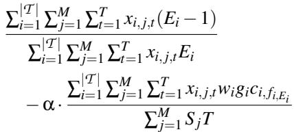

(2a)

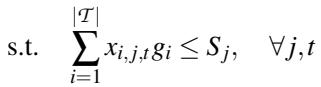

(2b)

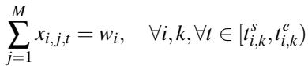

(2c)

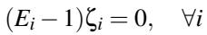

(2d)

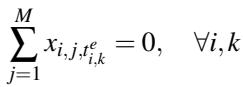

(2e)

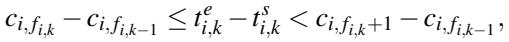

∀i, k

(2f)

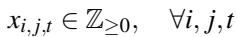

(2g)

where x<sub>i,j,t</sub> is a decision variable representing the number of pods assigned to task τ<sub>i</sub> on node n <sub>j</sub> at time t, and α is a weighting factor. Constraint (2b) enforces physical GPU limits per node. Constraint (2c) ensures gang-scheduling requirements during each active run. Constraints (2d) and (2e) enforce strict priority, restricting evictions and interruptions to spot tasks only. Constraint (2f) correlates task duration with completed checkpoints; by convention we set f<sub>i,0</sub> <sup>≜</sup> 0 and c<sub>i,0</sub> <sup>≜</sup> 0 so that the constraint is well-defined for k = 1. Finally, Constraint (2g) restricts the decision variables to nonnegative integers.