USENIX

THE ADVANCED COMPUTING SYSTEMS ASSOCIATION

# Distributed Speculative Execution for Resilient Cloud Applications

Tianyu Li, MIT CSAIL; Badrish Chandramouli and Philip A. Bernstein, Microsoft Research; Sam Madden, MIT CSAIL

https://www.usenix.org/conference/osdi26/presentation/li-tianyu

# This paper is included in the Proceedings of the 20th USENIX Symposium on Operating Systems Design and Implementation.

July 13–15, 2026 • Seattle, WA, USA

ISBN 978-1-939133-55-7

Open access to the Proceedings of the 20th USENIX Symposium on Operating Systems Design and Implementation is sponsored by

# Distributed Speculative Execution for Resilient Cloud Applications

Tianyu Li MIT CSAIL

Badrish Chandramouli

Microsoft Research

Philip A. Bernstein

Microsoft Research

Samuel Madden MIT CSAIL

## Abstract

Fault-tolerance is critically important in highly distributed modern cloud applications. Solutions such as Temporal, Azure Durable Functions, and Beldi hide fault-tolerance complexity from developers by automatically persisting execution state and resuming seamlessly after failure. This pat tern, often called durable execution, usually forces frequent and synchronous persistence, resulting in significant latency overheads. In this paper, we propose distributed speculative execution (DSE), a technique for implementing the durable execution abstraction without incurring this penalty. With DSE, developers write code assuming synchronous persistence, and a DSE runtime is responsible for transparently eliding per sistence and reactively repairing application state on failure. We present libDSE, the first DSE application framework that achieves this vision. To hide speculation from application code, we design a novel programming model centered around message-passing, atomic code blocks, and lightweight threads, and show that it allows developers to build a variety of speculative services, including write-ahead logs, key-value stores, event brokers, and fault-tolerant workflows. Our evaluation shows that libDSE reduces end-to-end latency by up to an order of magnitude for persistence-bound applications compared to current durable execution systems with minimal runtime overhead and complexity.

## 1 Introduction

Modern cloud applications are more distributed than ever. Companies have long adopted microservice-oriented architectures, splitting their applications into hundreds of loosely coupled, independently deployed distributed components [2, 43]. Recent proposals, such as serverless and granular computing [49, 55], have pushed for even more distribution at a finer granularity. Benefits aside, this makes every modern cloud application inherently distributed and fault tolerance a key challenge, leading to a new class of Durable Execution [10] systems (e.g., Azure Durable Functions [8], Temporal [30]).

These systems automatically persist application state where necessary and transparently recover from failures to resume execution. Today, they are widely used to orchestrate microser vices or serverless workers [12–14,16,17,20,22,27,32,48,76, 78]. Despite growing popularity, however, durable execution engines often must perform frequent and synchronous state persistence for correctness, which results in high latency overhead (Section 2). Worse, this persistence amplification scales with the degree of distribution — as the application is split into more distributed components, synchronous persistence becomes more frequent and expensive.

In this paper, we propose distributed speculative execution (DSE), which decouples the abstraction of durable execution from its physical execution pattern. DSE bypasses synchronous persistence on the failure-free path, allowing services to communicate speculatively. To ensure correctness, the runtime acts as a speculation sandbox, buffering outputs to external systems (e.g., the user, legacy databases) until the underlying state is durable. This dramatically reduces perceived latency on the common path, in exchange for more complex failure recovery. This trade-off is worthwhile as long as the unit of speculation (e.g., an RPC request) is more likely to succeed than to be interrupted by a failure.

Speculation is not a new idea. Prior work in hardware [70], databases [39, 44], and file systems [35, 62, 63] used similar techniques to hide latency. However, applying speculation to modern cloud applications introduces new challenges.

Many previous systems assume a canonical shared state (e.g., main memory, distributed file system). Participants locally speculate on the outcome of operations on that shared state without committing speculative state. In contrast, many modern cloud applications adopt a shared-nothing, messagepassing architecture (e.g., microservices, event-driven architecture). This requires speculation across multiple independent, failure-prone entities (i.e., on both sides of a message channel). Consequently, DSE must correctly orchestrate distributed rollbacks across multiple participants when failures occur. Additionally, such rollbacks can interleave and race with client logic unless the client rigorously protects itself by synchronizing against possible rollbacks at any time, resulting in significant conceptual and engineering complexity.

To solve these challenges, we build libDSE, a speculative programming framework for message-passing applications. For the first challenge, orchestrating distributed rollbacks, libDSE adapts the Distributed Prefix Recovery (DPR) protocol [57], a distributed cache recovery scheme, to our messagepassing setting. LibDSE automatically instruments messages (e.g., RPC calls) between services to build and maintain a recovery dependency graph. The graph is used to determine when results are safe to expose externally, and to compute a consistent snapshot for every affected component to roll back to after failure. Component services are required to expose hooks, enabling the libDSE runtime to force persistence/rollback when necessary and prevent unbounded growth of the dependency graph.

For the second challenge, synchronizing against possible rollbacks, libDSE provides a speculation-native programming model centered around two intuitive primitives, actions and sthreads. Actions are user-defined atomic blocks that are guaranteed by libDSE not to overlap with persist/recovery/rollback invocations. Sthreads are stateless and lightweight threads of execution that allow libDSE to guarantee correctness for long-running or asynchronous operations that cannot execute atomically. Advanced developers exercise fine-grained control over speculation behavior through speculation barriers, analogous to memory barriers [26], which allow libDSE services to co-exist with non-speculative components by only exposing non-speculative results.

Using libDSE, developers can build speculative messagepassing services while relying on the framework to manage the complexities of distributed dependency tracking and concurrent rollback/recovery. We demonstrate the benefits and trade-offs of DSE by building three representative applications: a travel reservation workflow, a high-throughput event processor, and a transaction processing system. We evaluate our libDSE-based implementation against state-of-the-art production and research systems, including Temporal [30], DARQ [56], and Microsoft Orleans [29], showing that it can reduce end-to-end latency by up to an order of magnitude. We also quantify the engineering effort of adopting libDSE and discuss the practical implications of its programming model. In summary, our contributions are:

• We propose a new distributed speculative execution (DSE) scheme that dramatically reduces fault-tolerance overhead in durably executed applications.

• We present the design and implementation of libDSE, the first DSE programming framework for modern sharednothing message-passing cloud applications.

• We present a detailed evaluation of libDSE on a diverse set of cloud applications, showing up to an order of magnitude latency savings compared to current, non-speculative implementations.

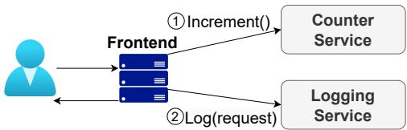  
Figure 1: A Simple Running Example

## 2 Background and Motivation

Running Example. Consider a toy example of an application that consists of a frontend layer, a counter service, and a logging service. Users issue requests to the frontend to increment the counter. Each request and its result are then sent to the logging service for bookkeeping purposes. Failures can result in a number of anomalies even in this simple scenario. Each service can crash and lose data. The frontend server can crash after a successful increment but fail to log the incremented value. Naive attempts to solve this may retry the operation, and cause the services to increment or log too many times. While these anomalies appear innocuous in the toy example, they are highly undesirable in real-world scenarios. If an ecommerce company uses a similar architecture to connect their payment and fulfillment services, such anomalies can lead to double charging or unfulfilled orders. Developers often resort to principled solutions like durable execution to prevent such anomalies.

## 2.1 Current Solution

Durable execution creates an illusion of uninterrupted, failurefree execution by persisting application state at every step and automatically retrying execution after failure. The goal of durable execution is to ensure that users cannot distinguish between executions of the application with failures, and ones without (except perhaps through performance degradation) [4]. Today’s cloud architect might achieve durable execution in our running example by first making each service durable (e.g., by persisting to a database before returning), and then using a resilient workflow engine (e.g., Temporal) to orchestrate the frontend calls.

To protect against frontend failure, the workflow engine automatically persists operation intents [69] and intermediate results, and retries on failure. Each stateful service must be programmed for idempotency – retried requests must have no visible effects beyond their first execution, e.g., by attaching a unique ID to each request and de-duplicating on the service side. In our running example, the workflow engine would execute an increment call by first persisting the intent to increment and generate a unique request ID, retry until successful, and persist the result. Under the hood, the workflow system maintains (sometimes implicitly) a directed acyclic graph (DAG) of stateful tasks, and ensures at-least-once execution (which is equivalent to exactly-once if tasks are idempotent).

b) Distributed Speculative Executio  
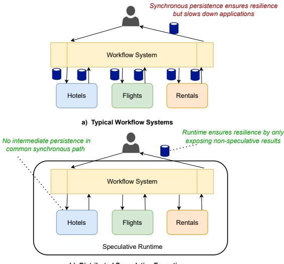  
Figure 2: DSE optimizes durable execution by transparently eliding synchronous persistence and waiting in parallel

Most such systems today must synchronously persist each task’s output before starting the next task. Otherwise, if tasks are non-deterministic, a replay may yield different outputs and spawn different downstream tasks. The divergent tasks may then conflict and cause anomalies. Consequently, almost all of today’s durable execution systems have cumulative latency overheads that scale with the depth of the task graph.

Our Solution. In contrast, DSE forges ahead before operation intents, effects, or intermediate results are durable, greatly reducing latency. This inevitably leads to anomalies upon failures. To maintain the same durable execution guarantees, DSE applications must detect such inconsistencies, repair them, and prevent external users from observing them. In other words, the requirements of correct DSE are:

• Recoverability. Inconsistencies are eventually repaired.

• Failure Transparency. External entities (e.g., clients) never observe failure-induced inconsistencies.

Fundamentally, this means that DSE systems are rollbackbased recovery systems [42]. Any solution must design protocols that correctly track recovery dependencies between participants, determine when state becomes recoverable, and roll back unrecoverable state on failure. On failure, the system determines the extent of failure based on collected dependencies and orchestrates rollback across participants to restore the application to a consistent state. Such schemes support non-determinism, as non-deterministic operations are either restored from persisted state and never replayed, or all their effects are rolled back. The key trade-off is that on failure, DSE systems lose speculative work and must coordinate rollback, which adds complexity.

## 2.2 System Model and Assumptions

Before we proceed, we discuss the system model and assumptions made for DSE that set it apart from earlier work.

Failure Model. Each component has fail-restart semantics [56], meaning it may fail at any point and lose its volatile in-memory state. However, it is guaranteed to restart in bounded time and recover from state that it has explicitly persisted before failure. Multiple incarnations of the same component may temporarily co-exist due to network partitions. We do not consider Byzantine failures.

Network. We assume reliable point-to-point communication channels (e.g., TCP/IP), meaning messages are not lost or corrupted. Network partitions can occur, temporarily preventing services from communicating.

Storage and Persistence. Each component has access to its own private durable storage that persists across failures, such as a local log, remote replicas, or a backend database. However, to enforce loose coupling between components, components cannot directly access each other’s storage.

## 2.3 Targeted Workloads and Boundaries

DSE is broadly applicable to applications dominated by serial persistence overheads. Beyond microservice orchestration, DSE naturally targets:

Event-driven Processing. Many modern cloud systems use event-driven pipelines to process streams of data. While the initial ingestion may be durably logged upfront for reliability, the state of each processing operator in the pipeline must also be fault-tolerant. In conventional systems like Kafka Streams [73], this requires each operator to synchronously persist its intermediate state before passing results to the next stage, incurring a persistence penalty at each step. DSE can optimize this by allowing intermediate states to be managed speculatively, eliminating synchronous I/O between stages.

Distributed Transactions. Many applications require atomic updates across multiple microservices (e.g., orchestrating checkout between inventory, payment, and shipping). This is often achieved using distributed transaction protocols (e.g., two-phase commit [54, 60]), which rely on frequent, synchronous logging to a durable medium. DSE can transparently hide the latency of these synchronous log writes from the critical path without requiring changes to the core protocol logic.

Conversely, DSE’s benefits diminish when applied to workloads where persistence is not the primary bottleneck. For compute-heavy applications, such as agentic exploration or a video transcoding pipeline, task execution time vastly overshadows persistence latency. In these scenarios, the latency saved by DSE can be negligible to the end-to-end execution time, as compute cost dominates. Similarly, for shallow, CRUD-heavy applications, the latency savings are proportionally smaller due to shorter execution chains. However, even for these simple applications, traditional durable execution engines typically persist execution history (e.g., intent to execute, task start, and task completion) to guarantee deterministic replay. This turns single logical operations into multiple synchronous persistence operations. Consequently, DSE still provides measurable improvements for shallow workloads by bypassing these framework-injected persistence roundtrips, though the absolute savings are less dramatic than in deep workflows.

## 3 libDSE Design

DSE application developers build speculative services by encapsulating application state into StateObjects. Appli cation developers define StateObjects by implementing a set of methods to persist or restore application state and using libDSE’s primitives to protect state access. It is the responsibility of libDSE to manage the complexity of speculation and failure recovery; it 1) persists, recovers, or rolls back StateObjects when necessary by invoking developersupplied methods, 2) instruments application messages to establish dependencies, drop rolled back messages, or delays speculative messages where necessary for safety, and 3) implements concurrency control primitives to protect application logic against rollbacks. Application developers do not need to implement the distributed recovery protocol logic or reason about speculation beyond specifying atomicity boundaries using libDSE. The rest of this section focuses on these primitives (Table 1). We discuss the details of how libDSE orchestrates speculative execution in Section 4.

## 3.1 StateObjects and Actions

Users create StateObjects by implementing the abstract StateObject API shown in Table 1. We show an example implementation of the counter service from our running example using cloud storage files in Figure 3. The framework ensures that Persist and Restore are not concurrently invoked. For performance, the Persist API is asynchronous; users may return from the call once the persistence operation is issued (e.g., flush the log at a specific offset), but before it is completed. While conceptually simple, Restore encapsulates two different use cases, one where the StateObject has failed and must reload state from persistent storage, and another where the StateObject responds to a rollback. For both cases, the example loads persistent state. This is correct for the latter, but potentially slow and inefficient. Develop ers are therefore encouraged to distinguish between these two cases (e.g., by checking if value == default in the example) and apply application-specific optimizations (e.g., by leveraging built-in multi-versioning [34, 65, 67]). If the StateObject crashes, the runtime uses ListVersions to identify unpruned Persist calls. This API easily allows for alternative implementations of persistence and recovery. For

```cs
1 class CounterStateObject : StateObject {
2 int value;
4 void Persist(long ver , byte[] m, Action c) {
5 var content = Marshall(ver , m);
6 // async write to cloud storage
7 Task.Run (() => {
8 WriteFile(GetName(v), content );
9 c();
10 });
11 }
13 byte[] Restore(long ver) {
14 content = ReadFile(GetName(ver ));
15 var v, metadata = Unmarshall(content );
16 this.value = v;
17 return metadata;
18 }
19
20 }
```

## Figure 3: Example StateObject Implementation

1 class CounterService {   
2 CounterStateObject so;   
4 // Handler for RPC call to increment counter   
5 IncrementResponse Increment(   
6 IncrementRequest r) {   
7 if (!so. StartAction(r.header )) throw;   
8 response = new IncrementResponse ();   
9 response.result =   
10 AtomicInc(so.value , r. incrementBy );   
11 response.header = so.EndAction ();   
12 return response;   
13 }   
14   
15 }

## Figure 4: Example CounterService Implementation

example, one can implement the counter service via either logging and replay or a replicated state machine.

libDSE organizes operations on StateObjects as a series of atomic execution units called actions. Each action’s effects are either entirely persisted or entirely lost due to recovery or rollback. libDSE achieves this by ensuring actions never interleave with Persist or Restore operations. However, actions may execute concurrently with each other to allow for parallelism. Messages are consumed as part of actions or produced as a result of actions. libDSE provides users with flexibility on how best to deliver messages between StateObjects, relying on users to pass opaque headers rather than mandating a specific messaging implementation.

We present an example in Figure 4 that implements our counter service using gRPC [21]. Each message is instrumented with a .header field that holds metadata for libDSE (more on this later). If StartAction returns false, the message’s sender was rolled back, and the message must be discarded. Otherwise, libDSE protects execution after line 7 from libDSE-triggered persists and restores. Users still need to guard against multiple concurrent requests, and hence use the thread-safe version of increment in line 10. Finally, it ends the action, obtaining a header to pass back to the caller.

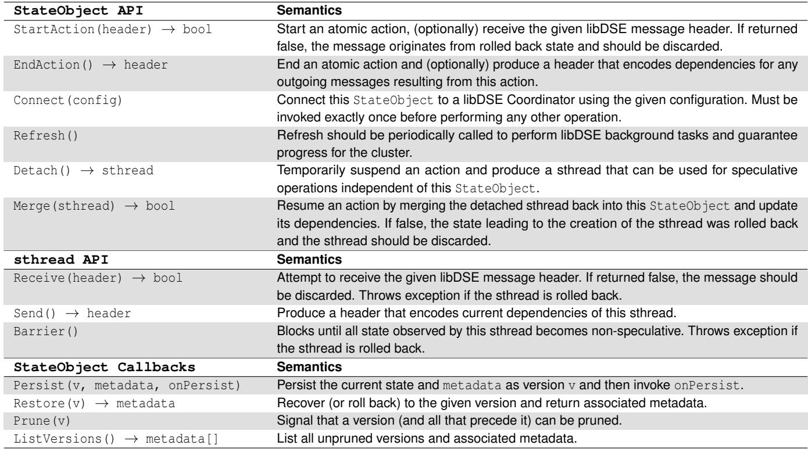  
Table 1: Summary of libDSE API

## 3.2 Handling Asynchrony

Long-running actions can block persistence until finished and halt persistence progress across the cluster. For example, the frontend server in our running example issues RPCs that may complete asynchronously and automatically retry in the background. In some settings, long running actions may even block each other and cause a deadlock. libDSE introduces sthreads to prevent this from happening. A sthread is essentially a lightweight thread of execution within a StateObject that encodes the speculative state of its parent StateObject at the time of sthread creation.

We show an example in Figure 5. Here, the frontend workflow orchestrator calls Detach after marking the start of workflow (line 7), but before executing the step (i.e., calling the service) (line 10). After line 8, application code no longer runs in an atomic block, and may go to sleep, retry, or otherwise perform long-running operations without blocking the StateObject. Thus, in the event of a rollback, the sthread may still temporarily continue to execute. It is therefore essential that sthreads are treated as independent, standalone participants of the system and interact with other participants, including their parent StateObjects, exclusively through libDSE-instrumented message passing. For example, on line

1   
2 WorkflowEngineStateObject so;   
3   
4 // Handler for RPC call to execute workflow   
5 async Task ExecWorkflow ( WorkflowRequest r) {   
6 if (!so. StartAction(r.header )) throw;   
7 so. MarkWorkflowStart (r);   
8 var t = so.Detach ();   
9 // Request executes outside atomic block   
10 cReq = ComposeRequest (r, t.Send ());   
11 var cRes =   
12 await CallCounterServiceAsync (cReq );   
13 if (!so.Merge(t)) throw;   
14 // Back in an atomic block   
15 so. UpdateWorkflow (cRes );   
16   
17 // Finally, return after barrier to   
18 // hide speculation from caller   
19 await so.Detach (). Barrier ();   
20 return response;   
21 }  
Figure 5: Example Workflow Implementation with libDSE

12, we obtain the result of an asynchronous action, but cannot yet consume its result; this must happen after the sthread is merged to start a new action (line 13), which logically send a message from sthread that StateObject receives. If the system experiences a rollback while the asynchronous action runs, StateObject rejects the message and the sthread can simply terminate. The sthread represents state derived from its parent, which will recover independently and respawn the sthread if necessary.

Finally, sthreads support barriers, which provide finegrained control over speculative behavior. Similar to a memory fence, a barrier blocks until everything the sthread received becomes non-speculative, thus preventing speculation across the barrier. Only sthreads are allowed to invoke barri ers, as they are, by definition, blocking. Barriers are useful when interacting with external entities. For example, in line 19 of Figure 5, by detaching and calling barrier, execution of line 20 will be delayed until the response becomes nonspeculative, thereby only sending non-speculative results to users. In many cases, barriers can be automatically inserted (e.g., at the end of an RPC handler processing an external user request), but advanced users may also use barriers to prevent speculative dependencies between parts of their applications. For example, inserting a barrier before line 7 prevents the system from logging workflow starts speculatively.

## 4 Speculative Protocol

## 4.1 Inspiration: DPR

Distributed Prefix Recovery (DPR) [57] is a recently proposed technique for causal consistency across sharded cache-stores – storage units spanning volatile memory and durable storage. For example, a shard within a partitioned database with an accompanying Redis caching layer can be considered a (logical) cache-store. Often in such an architecture, the caches are write-through: clients read from the cache, but write directly to the backend storage. In contrast, DPR is write-back: writes directly update the cache for increased throughput and immediate visibility, and cached entries are asynchronously flushed to storage. This leads to lost writes if caches fail, which may cause application anomalies as readers may have acted on lost updates. DPR presents a lightweight protocol for addressing this problem. First, operation completion and persistence are decoupled using two acknowledgements. Second, DPR clients interact with cache-stores explicitly through sessions. Each session is a (linearizable) sequence of operations and DPR guarantees that any surviving state corresponds to session prefixes. This ensures that no surviving operation depends on a lost operation when a cache node fails.

Our Insights. We identify two key mismatches between DPR and modern microservices. First, DPR has a rigid client-server formulation. DPR clients are first-class citizens but do not participate in rollbacks; they are responsible for discovering rollbacks and resuming (potentially replaying) operations. This complexity is compounded by possible client failures, as a recovered (amnesiac) client may lack the information needed to handle a rollback. libDSE eliminates this distinction by treating every component as a stateful, message-passing peer, correctly modeling that application control flow (e.g., in a workflow orchestrator) is itself state that must participate in rollbacks. Second, the original DPR relies on a stateful coordinator backed by an external database. Consequently,

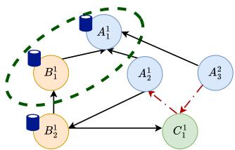  
Figure 6: Example Dependency Graph

DPR requires an additional synchronous persist on the failurefree path before writes are recoverable. We improve upon this with a deterministic and stateless coordinator design where the ground truth is the collective persistent state of participants, thereby removing this overhead.

## 4.2 Protocol Details

The libDSE protocol centers on an explicit recovery dependency graph that all participants jointly maintain. We first define this graph, then describe the sub-protocols that operate on it: instrumentation populates the graph as the application runs, boundary-finding identifies regions of the graph that are safely committed and may be externally exposed, and recovery uses the graph to coordinate rollback on failure.

Dependency Graph. We show an example dependency graph in Figure 6. Each vertex of the graph is a recoverable point that can be loaded via Restore, and is uniquely identified by a combination of a StateObject id, a global failure counter (more details on this later), and a local persistence counter. For example, A<sup>1</sup> is the recoverable point from StateObject A with local persistence counter 2 and global failure counter 1. Vertices start off volatile, but become persistent as the underlying StateObject persists their state. In the example, A<sup>1</sup> is persistent, but A<sup>1</sup> is not yet. Edges of the dependency graph represent recovery dependencies – an edge from u to v iff u recovering without v results in an inconsistency. By definition of consistency [53], such a dependency is established either implicitly by precedence (i.e., u is later than v in the same StateObject), or if u received a message originating from state captured by v. Because each recoverable point captures multiple state transitions and messages, the dependency graph may have cycles. Because libDSE tracks dependencies at the granularity of recoverable points, rolling back a recoverable point wipes out all state updates and messages captured, even if only one was poisoned. This false sharing is a deliberate design choice. Per-message dependency tracking would impose substantial bookkeeping overhead on the failure-free path and require multi-round communication on failure to disambiguate causality. Another subtle but important property of this formulation is that recovery dependencies are established at message consumption, not at data read or write. This is what allows libDSE to handle indirect, control-flow dependencies uniformly with the data dependencies that prior work focuses on. Consider a workflow orchestrator that receives a confirmation from service A and, based on the confirmation, conditionally invokes service B. The orchestrator never reads or writes A’s state directly — but its decision to branch toward B causally depends on having consumed A’s message. By tracking dependencies at message consumption, libDSE correctly classifies the invocation of B as recoverable only if A’s confirmation is recoverable, even though the data flow between them is opaque.

Instrumentation Protocol. libDSE tags each message with its originating vertex on the dependency graph (the content of the aforementioned libDSE headers). If a StateObject receives a message from v when its current (not yet persisted) recoverable point is u, it adds an edge from u to v in the depen dency graph. Each StateObject accumulates dependency graph updates and sends them periodically to the libDSE coordinator after persistence.

Boundary Protocol. A Recoverable Boundary is a cut of the graph where no future failure will cause vertices within the boundary to roll back. Messages originating from within the boundary are therefore not speculative and safe to expose externally. Recoverable boundaries manifest on the graph as closures, i.e., sets of vertices that 1) are all recoverable and 2) have no edge leading to non-recoverable vertices. For example, in Figure 6, A<sup>1</sup> and B<sup>1</sup> form a closure, but A<sup>1</sup>, B<sup>1</sup>, and B<sup>1</sup> do not because B<sup>1</sup> depends on C<sup>1</sup>, which is not yet persistent. The coordinator finds boundaries by periodically searching the graph. However, a naïve implementation is susceptible to the domino effect [42], where frequent communications cause a node to always transitively depend on future, uncommitted versions, and there is no way to bound the blast radius of a rollback. To prevent this:

Definition 4.1. (Commit Ordering Rule) A<sup>x</sup> is allowed to receive a message from B<sup>m</sup><sub>n</sub> only if y ≥ n.

For example, under this scheme, there cannot be an edge (red dotted arrow) from C<sup>1</sup> to A<sup>1</sup>. The libDSE runtime would block an action from starting if the message it consumes has a larger persistence counter. Meanwhile, libDSE transparently issues Persist, which advances the local counter (e.g., from C<sup>1</sup> to C<sup>1</sup>); the action can start immediately after the call without waiting for actual persistence. Intuitively, this scheme prevents the domino effect by guaranteeing that for any vertex A<sup>x</sup>, the set of vertices with persistence number ≤ y is a closure that includes A<sup>x</sup>. As a trade-off, participants that communicate frequently passively synchronize and will tend to issue persists on similar schedules.

Recovery Protocol. Failures lead to vertex loss on the dependency graph, and the system state is inconsistent iff any surviving vertex has an edge into a lost vertex. To recover, the system must roll back vertices until no such violations exist. The primary challenge here is that the system must achieve consensus on rollbacks; otherwise, overlapping failures or out-of-sync views of the dependency graph may result in different parts of the system recovering to different closures and creating inconsistency in the process. The global failure counter from before is how we encode consensus – upon failure, a leader assigns a monotonically increasing and unique failure sequence number to the rollback. Each participant of the rollback then recovers to the prescribed state at their own pace. In the example, A<sup>2</sup> signals that A has recovered from a failure and is now operating in the post-recovery world. Crucially, while every participant must eventually acknowledge recovery, they do not necessarily actively roll back if they are not impacted. A node like C<sup>1</sup> does not depend on any external nodes, and therefore can simply rename itself to C<sup>1</sup> without active recovery work. However, during recovery, there is a temporary divergence in the cluster between pre-recovery and post-recovery halves (or more if there are multiple concurrent failures). libDSE disallows communication across failure counters for safety:

Definition 4.2. (Recovery Partition Rule) A<sup>x</sup> is allowed to receive a message from B<sup>m</sup> only if x = m. If m < x, the message is discarded; otherwise, its receipt must be delayed.

In the example, if post-recovery A now receives a message from C<sup>1</sup>, it again cannot receive the message (red dotted arrow), because otherwise, it would have potentially acted on a message from pre-recovery world that will be rolled back in the post-recovery world, polluting it. Instead, A would reply to C telling it about the failure and the action the cluster took to resolve it, allowing C to reconcile its view of the cluster state.

Supporting sthreads. Unlike StateObjects, sthreads are derived state and never appear as vertices in the dependency graph, but they do carry a dependency set that is updated as the sthread executes. On receiving a message tagged v, the sthread inserts v into its set. On send, the full set is attached to the header, so a sthread-originated message carries a set of triples rather than a single triple. The set is merged into the receiving StateObject’s in-memory vertex, producing the corresponding incoming edges as if the sthread’s predecessors had sent directly. At every barrier or merge, the set is cleared, preventing unbounded growth. This is safe because a barrier is a quiescence point: any speculative work the sthread is carrying either commits past the barrier or is abandoned on rollback, and either way is no longer the sthread’s dependency to track.

## 4.3 Coordinator Design

We now describe the design of our coordinator. Unlike DPR’s, the libDSE coordinator is backed by a persistent log (either through distributed consensus like Raft [64] or reliable cloud storage) that encodes changes to the cluster state, such as membership changes and recoveries.

Finding Boundaries. LibDSE automatically persists fragments of the dependency graph as part of StateObjects using the metadata parameter on Persist. This establishes the distributed components as the ground truth; the coordinator maintains a (potentially stale) view of the actual graph. Newly persistent versions and in-flight operations may be missing from the coordinator’s view. That said, the persistent part of the graph is immutable. Future operations may add vertices, but cannot change dependencies in the past. This makes it safe for the coordinator to declare recoverable boundaries on the coordinator’s view, because any recoverable boundaries the coordinator finds on its present view must also be recoverable on a later view. Consequently, the coordinator does not persist its decisions on the failure-free path – restarted coordinators instead recompute the boundary on a more up-to-date view to find the same (or larger) recoverable boundary. To find recovery boundaries, the coordinator runs a standard graph BFS over its in-memory view of the graph and publishes its results immediately.

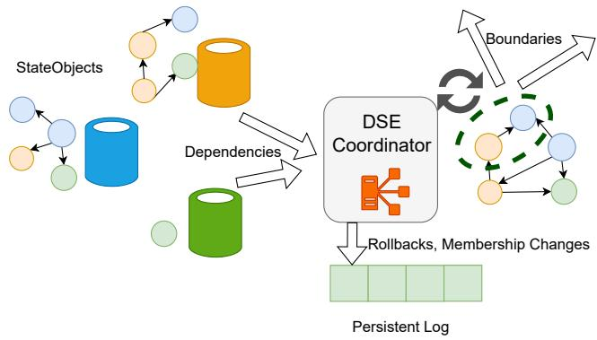  
Figure 7: libDSE Coordinator Design

Orchestrating Rollback. A rollback is triggered when one of the StateObjects fails, and the coordinator computes the extent of data loss by removing any vertices on the dependency graph not reported as persistent by the restarting StateObject. Then, it iteratively removes vertices from the graph until no surviving vertex has a dangling edge. As discussed in Section 4.2, on failure, the coordinator must achieve consensus between StateObjects on what the final state of the graph is in response to the restart. This is achieved by synchronously persisting the failure (by assigning it a failure sequence number) and the rollback actions proposed, before releasing the decision to the rest of the cluster on the log.

Coordinator Recovery. Even though the coordinator is ephemeral, when a coordinator fails, the system must still perform some necessary steps to ensure correctness. On recovery, the new coordinator needs to reconstruct the cluster state, including previous rollback decisions and the list of active participants by replaying the persistent log. It then resends recent rollback decisions and asks for every participant to send locally stored dependency graph segments, which guarantees a view of the dependency graph that is more up-todate than before the failure. The coordinator cannot answer queries about the current recovery boundary until every participant has responded to ensure a complete view of the graph.

## 4.4 Correctness Sketch

A full formal proof is out of scope for this paper. We sketch the informal argument here, addressing safety (the protocol never externally exposes inconsistent state), liveness (the protocol always makes progress), and the rollback bound.

Safety. Our libDSE protocol guarantees that external entities do not observe rollback-induced anomalies. Because the system exposes a message externally only after its originating vertex lies within a declared recoverable boundary B. By def inition, every out-edge of u ∈ B points to another vertex in B, and every vertex in B has been reported persistent. A future failure can only invalidate vertices not yet persistent, which will not affect any vertex in B. The Recovery Partition Rule additionally prevents participants from acting on or communicating across different pre/post-recovery splits for all failures, so recovery will not introduce additional anomalies.

Liveness. Given liveness of local persistence and recovery, libDSE guarantees to eventually declare every message nonspeculative or rolled back. In the failure-free path, this is because 1) local persistence advances independently of each other and does not block on the progress of others (i.e., no deadlock), and 2) the Commit Ordering Rule guarantees finite closure for every recoverable point, which will eventually all become persistence given local liveness. On the failure path, each failure receives a strictly increasing sequence number on the coordinator’s persistent log, and by assumption each induced rollback completes in finite time. A message m originating from u is therefore, in finite time, either (i) rolled back, if u lies in the lost set of some failure, or (ii) preserved across the failures u experiences, in which case the failure-free argument applies during any subsequent quiescent interval.

Bounded Rollback. As argued previously, the Commit Ordering Rule ensures {v : counter(v) ≤ k} is a closure for any k. Therefore, when a StateObject loses state past counter k, the rollback at every other participant is bounded by that participant’s own persistence progress past k.

## 5 Implementation and Discussion

## 5.1 Putting it Together: libDSE Runtime

The libDSE runtime implements the aforementioned programming model, and connects each StateObject to the coordinator. The core libDSE and coordinator implementation consists of approximately 4000 lines of C# code.

gRPC Integrations. libDSE has built-in integration with gRPC [21] and ASP.NET [6]. To create a speculative service, users first write the service API using vanilla gRPC, encapsulate the state with a StateObject, and implement the gen erated gRPC stub using the libDSE API. During runtime, a libDSE gRPC interceptor [23] automatically injects action boundaries before and after RPC handlers execute, and uses the HTTP headers to transparently pass libDSE headers. The presence of the special header is also used to infer whether the endpoint has speculation enabled (e.g., an external user would believe the speculative service is just another gRPC endpoint and send requests without libDSE headers), and automatically apply barriers to hide speculation. Advanced users can disable the interceptor and manually call libDSE APIs where necessary. Finally, all background logic of libDSE is pack aged as an ASP.NET managed service, and users can start an ASP.NET-based speculative service simply by declaring these dependencies and leaving the rest to the ASP.NET framework. Cluster Orchestrator Integrations. When starting an application, StateObjects first Connect to the coordinator to report its presence with a predetermined unique ID. If a StateObject that has already reported starting does so again, libDSE treats this as indicative of a failure. We observe that this model aligns well with current practices – for example, a user using Kubernetes to manage microservices expects Kubernetes to detect down services and replace them by relaunching in a new container. The relaunched service, upon its Connect call, will set off failure handling logic. When Connect returns, libDSE has registered the calling StateObject as the legitimate incarnation which may start sending and receiving messages. libDSE guarantees that any messages received from or sent to the previous incarnation will eventually be rolled back, but it is up to service implementers to ensure that two incarnations do not simultaneousl update persistent state (e.g., with a Persistent Volume Claim in Kubernetes). It is not necessary for a service to explicitly disconnect from a libDSE coordinator, as long as it persists all of its outstanding state before becoming inactive. The coordinator sends periodic heartbeat/boundary update messages to participants, which includes instructions for garbage collecting dependency graphs and outdated recoverable points.

Action Synchronization. To guarantee atomicity of actions, each action executes under a shared lock while Persist and Restore execute under an exclusive lock. Because actions are far more common than Persist and Restore, we use biased locking [40, 58, 59, 68] to improve scalability.

## 5.1.1 Pattern: Speculative Log

A foundational pattern for stateful services is to treat a durable, append-only log as the source of truth, with the service’s inmemory state acting as a materialized view over that log. Many systems, including databases, key-value stores, and workflow engines, fall under this model. This model is an excellent fit for libDSE, as it provides a principled way to adapt a wide range of applications to speculative execution by first building a speculative log. The most significant change required from a standard log implementation is attaching custom metadata with Persist calls. We achieve this by designing special commit records that hold metadata, and appending them to the end of a log at the beginning of Persist. To restore, we scan the log until the requested commit record and truncate the tail. When rolling back, we cache the offsets of speculative commit records in-memory to avoid the scan. On top of the log, service implementers are free to maintain arbitrary in-memory state that can be reconstructed by replaying the log’s entries. While this model is powerful, reconstructing in-memory state from replaying can be prohibitively expensive. This is a well-studied problem in prior literature from database systems [60] addressed by periodic checkpointing of an in-memory state and log truncation.

## 5.1.2 Applying the Speculative Log Pattern

With the speculative log, implementing other complex stateful services is equivalent to maintaining different materialized views over it. This approach demonstrates the versatility of the pattern, allowing us to adapt libDSE to a wide range of common services. We describe three examples below.

Key-Value Store. We implement a speculative key-value store based on the open-source FASTER key-value store [18], which powers production systems such as Orleans [29], Durable Functions [8], and Garnet [24]. FASTER uses Faster-Log as its backend and mostly maintains an in-memory hash index over the log to serve key-value workloads. To make FASTER speculative, we only need to make its underlying log speculative and access it using libDSE clients. We reuse most of FASTER’s sophisticated storage and checkpointing schemes [36, 65] without modification.

Speculative Workflows. We base our speculative workflow orchestration system on the DARQ system [33, 56], which is itself a wrapper around a log. At a high-level, the DARQ log records the entire history of workflow events and commands, and relies on replay and deduplication to ensure exactly-once execution. Our implementation replaces DARQ’s backend log with the speculative version, and triggers replay of the workflow system when the log is rolled back.

Event Broker. We implement a speculative event broker system similar to Kafka [52] and EventHubs [7], with a collection of producers and consumers interacting through disjoint topics. Each topic is fundamentally just a log, which we have replaced with a speculative log. We leave creation, deletion, and management of topics non-speculative, as they are usually not on the critical path.

Transactional Store. Lastly, we implement a transactional store with the standard two-phase commit protocol [60] and strict two-phase locking. Tuples are stored in main memory. We rely on a speculative log as write-ahead log for recoverability and persistence, and libDSE thread primitives for synchronization.

## 5.2 Limitations and Discussion

Developer Burden. LibDSE is not a transparent, drop-in solution for existing applications. It requires developers to adopt its programming model, encapsulating application state within the StateObject abstraction and using actions and sthreads for concurrency control. This may require significant refactoring for legacy applications lacking clear state management boundaries. That said, in our experience, most of these changes align with modern best practices for building correct and scalable microservices. Furthermore, libDSE naturally promotes the creation of highly reusable, foundational components, such as the services we discussed above, which can be implemented once and reused across many applications, amortizing the initial development cost. Adoption can be fur ther simplified with integration with programming languages, but we leave this for future work.

Data Loss. From the external user’s perspective, DSE does not introduce data loss, as speculative state is withheld from users, and only speculative state is lost on failure. However, our DSE recovery protocol is designed for simplicity and speed during failure, as it avoids complex, multi-round consensus protocols between participants. The trade-off is that this can lead to coarser-grained rollbacks than are strictly necessary, sacrificing speculative throughput (i.e., work loss instead of data loss) to minimize recovery latency. Because the coordinator’s view of the dependency graph may be slightly stale, it must conservatively roll back all speculative work that could have depended on a failed component’s lost state. We mitigate this in practice by allowing a service to skip a rollback if it can prove locally that it has no dependencies on the speculative state in question. We study the effects of rollback in more detail in Section 6.

Coordination Overhead. Relying on a centralized coordinator creates a potential bottleneck for scalability. libDSE mitigates this risk by decoupling coordination from the execu tion critical path. StateObjects communicate peer-to-peer and do not contact the coordinator during standard message processing. Dependency graph updates are batched and transmitted asynchronously only upon local persistence (e.g., every 10ms), independent of operations, resulting in control traffic that is proportional to the group commit frequency rather than application throughput. Furthermore, the coordinator finds recovery boundaries as a background process. A saturated coordinator may delay the visibility of results to external clients (by advancing the boundary less frequently), but it does not throttle the internal execution throughput of the speculative cluster. We observe that a single coordinator instance is usu ally enough to handle the metadata traffic of high-throughput workloads without saturation, but coordinator compute can also be parallelized if necessary.

Compatibility with Replicated Systems. The fail-restart semantics of a StateObject are a natural fit for services that use single-primary replication (e.g., State Machine Replication or Primary-Backup), where the volatile state exists on the primary node, and recovery is achieved by switching to a backup. However, the model is a poor fit for eventually consistent systems (e.g., Dynamo-style databases [38]). These systems lack a clear, linearizable notion of "restarting" from a single consistent point in time, making them difficult to model as a StateObject. That said, persistence is often cheaper in such systems, making speculation less critical and applicable. Compatibility with External Infrastructure. libDSE assumes that participants in a speculative group are DSE-aware and implement the StateObject API. Real applications, however, frequently interact with infrastructure that is not, such as a shared SQL database or an external payment API. We support two strategies for these cases. When the external component is fully external to the speculative group (e.g., a payment API whose side effects cannot be rolled back), services interact with it through the Barrier() primitive, which blocks until all upstream speculative dependencies have committed. This forfeits speculation across the barrier but is always safe, and importantly allows libDSE to be adopted incrementally: speculation is enabled only between DSE-capable components, while legacy components continue to participate behind barriers. When the external component is a shared data store that all speculative participants access (e.g., a shared relational database used for coordination among speculative services), the external component can participate in speculation by internally tracking speculative dependencies—an arrangement equivalent to schemes like early lock release [46] on the shared store.

## 6 Evaluation

Our evaluation studies the following research questions:

• Does DSE help applications reduce end-to-end latency?

• What overhead does libDSE impose on applications?

• Does libDSE scale to high throughput and/or concurrency?

Experimental Setup. We run all of our experiments on the Azure public cloud. For end-to-end experiments, we build the applications using the popular gRPC + ASP.NET stack and deploy them onto a managed Azure Kubernetes Service (AKS) cluster [28]; all workloads are scheduled onto a pool of 10 Standard\_D8s\_v3 machines [15] with attached premium locally redundant storage SSDs [9]. Unless otherwise specified, all libDSE services run with a group commit interval of 10ms. For microbenchmarks, we use a pair of D32s\_v3 machines [15], each with 32 vCPUs and 128 GB of RAM.

Engineering Effort. Table 2 summarizes the engineering effort required to build the evaluated services. We implement the speculative log by modifying the open-source FasterLog project from Microsoft [19], which involved no modification of the log itself and only ∼200 lines of wrapper logic to expose it as a speculative service. Similarly, porting the

Table 2: Engineering effort for libDSE-based services.  
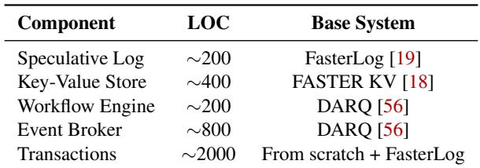

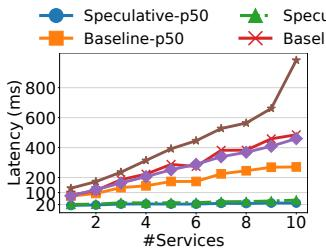  
(a) Varying #Services

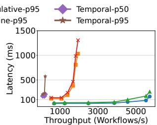  
(b) Varying Load  
Figure 8: TravelReservations

FASTER Key-Value store [18] and the DARQ system (which is an event processing framework built on FasterLog) [56] required minimal code changes (∼400 and ∼200 LOC, respectively), primarily to wrap state objects and implement service-level logic. The Event Broker required slightly more glue code (∼800 LOC) for the gRPC streaming API. The Transactions benchmark is the largest component (∼2000 LOC) because it implements the 2PL + 2PC transaction processing and the TPC-C benchmark [72] as stored procedures from scratch on top of our speculative log, rather than modifying an existing codebase. However, this logic is largely orthogonal to speculative execution, and in our experience, is not further complicated by libDSE. These figures demonstrate that libDSE effectively abstracts the complexity of distributed dependency tracking, allowing developers to adopt speculative execution with minimal engineering overhead.

## 6.1 End-to-End Benchmarks

TravelReservations. We first assemble a travel reservation system based on DeathStarBench [43], where a workflow engine reserves a series of items, one from each service (e.g., hotel, flight, car-rental) backed by our speculative KV store using sagas [31]. We focus on the write portion of the workload. We exclude read operations as they are typically served from local cache in both baselines, exhibiting identical performance; focusing on writes allows us to isolate the overhead and latency benefits of libDSE’s persistence mechanism. Note that this does not mean libDSE does not help read-only workloads: many durable execution engines log reads for correctness (e.g., to ensure deterministic replay during recovery), effectively turning reads into writes that libDSE also accelerates. We compare our implementation with the open-source version of Temporal [30], an industry-standard workflow-engine, deployed over an Azure-managed Cassandra cluster and using Azure CosmosDB for application logic. Additionally, we evaluate our system with speculation disabled to isolate the performance gains from speculative execution vs. implementation and tool stack. All benchmarks run for 120 seconds.

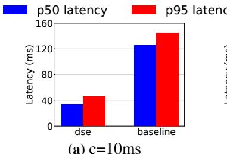

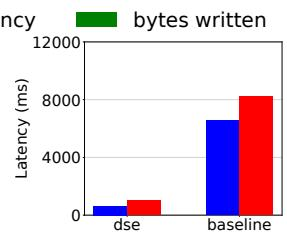  
(b) c=500ms

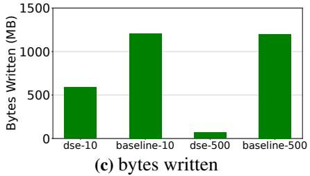  
Figure 9: EventProcessing

Figure 8 shows the result of our experiment. The left panel reports average and 95th-percentile latency as the number of participating services increases, using a steady rate of 10 workflows/s to avoid queuing delays. As the service chain grows, baseline latency increases linearly due to cumulative synchronous persistence costs. In contrast, libDSE incurs only minor latency increases due to RPC overhead, effectively bypassing persistence bottlenecks and achieving an order of magnitude lower latency for long workflows. We further demonstrate scalability by fixing the chain length to three services and varying the workflow arrival rate. As shown in the right panel of Figure 8, speculation significantly improves throughput capacity. Traditional workflow engines become CPUbound under high load because they manage many concurrent workflow instances simultaneously blocked on synchronous persistence, each consuming non-trivial context-management overhead (thread state, stack frames, runtime bookkeeping, etc.). libDSE completes workflows rapidly, sharply reducing the number of in-flight blocked contexts and thus the associated CPU pressure—enabling higher sustained throughput on identical hardware.

Event Processing. We evaluate the search trend alert workload described in the DARQ paper [56] (available in opensource [33]) using our speculative event broker. The workload consists of three processing stages communicating via streaming events. We compare our implementation against the origi nal, non-speculative version of DARQ. Figure 9 presents the results of processing a pre-generated event trace at a steady rate of 50k events/s for 120 seconds, while varying the group commit interval (c). Note that c governs the persistence of intermediate stream-processing state. While a larger c implies a wider window, meaning more intermediate results are lost during cluster failures that must be replayed, it does not lead to additional loss of user data, which can be persisted eagerly at ingestion. The first two plots demonstrate that libDSE drastically reduces end-to-end latency compared to the baseline. The bottom graph illustrates the volume of bytes written to storage; libDSE achieves significant reductions in storage bandwidth because it prunes short-lived intermediate results that are generated and consumed entirely within the speculative window, preventing them from ever reaching storage. Consequently, these storage savings are more pronounced with larger group commit intervals, which increase the likelihood that intermediate state is pruned before disk I/O occurs. Two-Phase Commit. Finally, we evaluate our transactional store. The benchmark cluster consists of four shared-nothing shards, each maintaining its own (speculative) log. We evaluate a modified TPC-C workload [72] consisting of 100% distributed transactions, comparing our implementation against Microsoft Orleans’s optimized transactional framework [29, 41]. To ensure fair comparison, we manually place Orleans grains to have the same sharding with our system, and run Orleans purely in-memory to eliminate the throughput limitations of its standard Azure Table Storage backend.

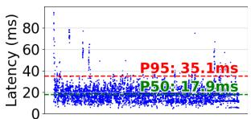  
(a) speculative

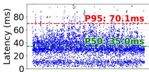

(b) non-speculative  
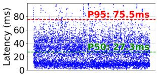  
(c) Orleans (In-Memory)  
Figure 10: TwoPhaseCommit

Figure 10 illustrates the commit latency distribution. Nonspeculative latencies cluster around multiples of the 10ms group commit interval, as most transactions must wait for the next persistence window. There are a few “lucky” transactions that complete the first round of messages at the end of the last group commit and therefore finish close to 10ms, but most transactions wait longer. In contrast, speculative execution eliminates sequential waiting between phases, allowing the protocol to overlap communication with I/O. The plots show most transactions finishing under 20 ms (essentially one round of group commit + RPC overheads). Consequently, our speculative implementation significantly outperforms both the non-speculative baseline and the in-memory Orleans setup.

## 6.2 Recovery

Event Processing. We evaluate realistic recovery scenarios using the EventProcessing workload by terminating a Kubernetes event handling node at the 30-second mark. Kubernetes automatically provisions a replacement container, triggering libDSE’s recovery protocol upon startup. During this interval, gRPC requests to the affected node time out and are retried, temporarily halting processing for that partition. Figure 11 shows that recovery takes approximately 10 seconds for both speculative and non-speculative versions, a duration dominated by container orchestration latency rather than protocol overhead. To isolate the overhead of libDSE’s rollback mechanism from orchestration delays, we also introduce simulated failures that trigger immediate rollback across all participants without container restarts. This configuration represents the theoretical best-case recovery performance, exposing only the latency induced by speculative state restoration. We inject four independent failures and observe that the system stabilizes rapidly, resulting in latency spikes of 100s of milliseconds.

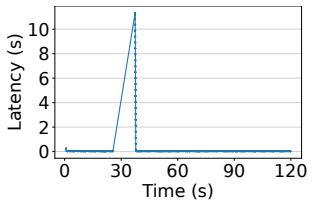  
(a) speculative-killed

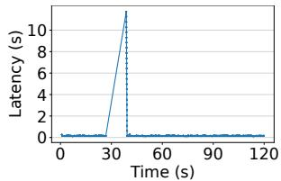  
(b) non-speculative-killed

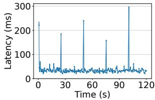  
(c) speculative-simulated

Figure 11: EventProcessing-recovery  
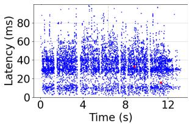  
(a) non-speculative

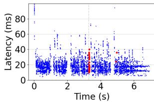  
(b) speculative  
Figure 12: TwoPhaseCommit-recovery

Two Phase Commit. Similarly, we evaluate recovery in the transaction benchmark using simulated failures, comparing against a failure-free non-speculative baseline. Figure 12 plots the results, where red dots indicate aborted transactions. The primary trade-off of speculative execution is a temporary spike in user-visible aborts during rollback; to ensure safety, our implementation aggressively aborts all in-flight transactions that may depend on invalidated state. However, this effect is minimal in practice. Quantitatively, speculative recovery increases the overall abort rate by only 0.3% compared to the baseline. Because these transactions can be immediately retried, the aggregate impact on system throughput is negligible. Note that the measurement gaps visible in both plots correspond to standard server GC pauses. The gaps in the speculative version appear longer because of the different scale on the x-axis (speculative baseline finishes the workload much faster due to higher throughput).

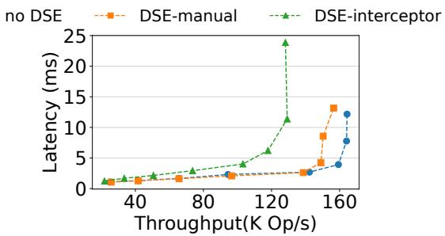  
Figure 13: Overhead of libDSE instrumentation

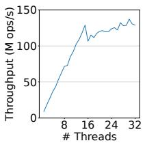  
(a) local-action

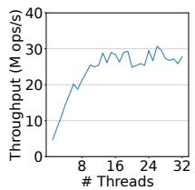  
(b) send-receive

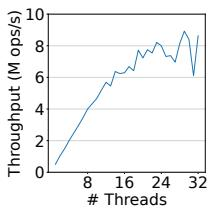  
(c) detach-merge  
Figure 14: Thread scalability of libDSE Primitives

## 6.3 Microbenchmarks

Finally, we present a series of microbenchmarks to study the overhead of various libDSE mechanisms.

Overhead of libDSE Instrumentation. We first study the latency and throughput overhead of libDSE’s message instrumentation protocol on a service. We study three versions of the FASTER-based key-value store from the hotel reservation benchmark, two with libDSE (DSE), and another as a thin RPC wrapper around the vanilla FASTER code (no DSE). To study the effects of the interceptor mechanisms vs. the instrumentation protocol itself, we also build one version that processes libDSE headers in user code (DSE-manual) and another that does so transparently with gRPC interceptors (DSEinterceptor). We vary the request issue rate for each configuration to investigate the resulting latency-throughput trade-off. Figure 13 shows that libDSE with interceptors has slightly higher latency when the system is not saturated and about 25% lower maximum throughput. This is mostly due to the additional work entailed by the gRPC interceptor mechanism (e.g., HTTP header manipulation). In contrast, the libDSE protocol itself causes a negligible increase in latency and a less than 5% reduction in throughput. This shows that the libDSE instrumentation adds only a small overhead to applications.

Thread Scalability of libDSE Primitives. Recall that libDSE users must protect their operations with libDSE threading primitives for correct speculative execution. It is therefore important that libDSE primitives be scalable and not introduce new bottlenecks in an application. To measure this, we design a simple microbenchmark where threads acquire protection under a tight-loop concurrently, reporting throughput as the number of concurrent threads increases. A background thread periodically performs (empty) checkpoints to advance versions. We measure three sets of primitives: local-action, where libDSE users mark blocks of code as atomic with respect to checkpointing and recovery; send-receive, where libDSE users start an action using a (randomly pre-populated) header and write the resulting dependencies to another header at the end of the action; and detach-merge, where libDSE users create a new sthread from the current dependencies and then merge it with the state object. As shown in Figure 14, our implementation of the action primitive (based on [58]) is scalable up to 16 threads with no performance degradation. As expected, send-receive is more expensive than local-action, and detach-merge is more expensive than send-receive, due to the amount of computation involved. However, all three primitives can sustain millions of operations per second on a single server, making them unlikely to be bottlenecks in typical RPC-oriented workloads that only see 100s of thousands of operations per second per node.

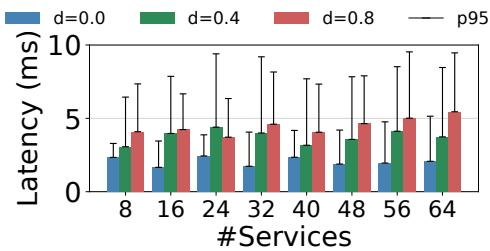  
Figure 15: libDSE Coordinator Scalability

Coordinator Performance. Finally, we study the libDSE coordinator, which is responsible for identifying messages that are no longer speculative so their effects can be exposed externally. We design a microbenchmark in which simulated participants submit versions to a real coordinator on a predetermined schedule, and measure the latency between submission and commit. Each version depends on each other participant’s current version independently with probability d. Participants run on a Kubernetes cluster, communicate with the coordinator over real intra-datacenter network connections, and refresh their cluster view every 5ms. Figure 15 reports median commit latency (bars) with the 95th-percentile tail as whiskers. A local-commit fast path lets versions with no speculative dependencies commit almost immediately, so the d = 0.0 bars sit near 2ms across the entire range and the corresponding p remains within one 5 ms refresh interval. In the general case, both median and p scale smoothly from 8 to 64 services: medians stay below a single refresh interval. Graph connectivity has only a modest impact, as in-memory traversal is cheap relative to network and refresh delays.

## 7 Related Work

Durable Execution and Workflows. Durable Execution, as a term, was first coined by Temporal [10], and is widely ac cepted in industry [8, 13, 14, 16, 17, 20, 22, 27, 32], although it is similar to earlier concepts of virtual resiliency [4, 45] and reliable workflows [5, 11, 25]. Most of these systems achieve resilience guarantees by modeling the application as a directed acyclic graph (DAG) of tasks and synchronously persisting execution state before starting new steps; external effects of execution are wrapped in special abstractions (e.g., activities in Temporal and DF, impulses in Ambrosia) and required to be idempotent for resilience. ExoFlow [78] is a recent workflow system that allows developers to take advantage of determinism and rollbacks within the workflow for better performance. Developers mark parts of their workflow as deterministic or rollback-capable, and ExoFlow will bypass synchronous persistence where possible, using replay and roll back to recover when necessary. In contrast, libDSE allows true inter-service speculation without relying on determinism. Cross-Service Transactions. Other systems, such as Olive [69], co-locate service state and orchestration state onto one unified storage layer, providing exactly-once guarantees without requiring idempotency, but also forcing developers to migrate to their storage engine. While Olive used exist ing database services (e.g., Azure Tables), Boki [48] showed that a shared log abstraction can provide more performance and usability benefits, and Halfmoon [66] further optimizes Boki to reduce the amount of information logged. More re cently, SpecLog [35] applies speculation within the shared-log setting itself: it introduces fix-ante ordering, which predeter mines the global record order via per-shard quotas so that applications can begin processing records before the final global cut is committed. libDSE is complementary in that it speculates across the synchronous persistence of independent message-passing services (i.e., between independent logs) rather than inside the ordering layer of a single log. Other systems support distributed transactions in the unified stor age layers [71, 76]. Orleans, of particular note, implemented early lock release [3, 39, 41, 44] to reduce latency. While conceptually similar to DSE, their implementation only ap plies to Orleans’ transactional workers. In contrast, libDSE is designed to work for heterogeneous participants and per component private storage. While some transactional pro tocols allow distributed transactions across heterogeneous storage engines [1, 51, 77], they are not widely used currently to our knowledge. Finally, DBOS [12, 50] proposes to build all services and runtime layers on top of a distributed transac tional DBMS, but would require an even more radical rewrite of existing technology stacks than libDSE.

Other Related Work. Fault-tolerance in microserviceoriented cloud applications can be viewed as a modern instantiation of asynchronous recovery in message-passing systems, which was heavily studied in prior work [42]. Dataflow systems are conceptually similar to workflow systems and compose distributed components, but usually have the benefit of known application semantics (i.e., composed components are operators such as filter and map, rather than blackbox code). Consequently, dataflow systems predominantly use lineage-based techniques to reconstruct application state on failure [61, 74, 75]. libDSE is, at its core, a checkpoint-based recovery scheme, which assumes no such domain-specific knowledge. The DSE protocol bears similarity to classic distributed snapshot algorithms [37], but is redesigned for an online setting where checkpoints happen continuously. The idea of a performant distributed rollback system reliant on logical time is similar to the well-known time warp operating system [47], which employs speculative execution to handle out-of-order simulation actions (synchronization). In contrast, libDSE employs the algorithm to hide persistence latency (durability). Finally, Speculator [62] and xsyncfs [63] similarly use speculative execution to speed up file system operations transparently. However, they assume a shared state model and implement client-centric speculation, whereas libDSE specializes for message-passing scenarios.

## 8 Conclusion

We presented distributed speculative execution (DSE), a novel approach to reduce persistence overhead in durably executed cloud applications. Through our framework, libDSE, we demonstrate that DSE is both practical and beneficial for performance, and that its complexities can be effectively hidden from most developers through the use of abstractions. Our results show that DSE significantly reduces latency. We envision DSE to be a key technique in building future highly distributed cloud applications.

## Acknowledgments

This research was sponsored by the United States Air Force Research Laboratory and the Department of the Air Force Artificial Intelligence Accelerator and was accomplished underCooperative Agreement Number FA8750-19-2-1000. The views and conclusions contained in this document are those of the authors and should not be interpreted as representing the official policies, either expressed or implied, of the Department of the Air Force or the U.S. Government. The U.S. Government is authorized to reproduce and distribute reprints for Government purposes notwithstanding any copyright notation herein. Additionally, our work has been supported by contributions from Amazon, Google, and Intel as part of the MIT Data Systems and AI Lab (DSAIL). We also thank Frans Kaashoek for his helpful comments and suggestions.

## References

[1] Technical standard – distributed transaction processing: the xa specification. https://pubs.opengroup.org/ onlinepubs/009680699/toc.pdf, 1991.

[2] Decomposing twitter: Adventures in service-oriented architecture. https://qconnewyork.com/ny2013/ node/231.html, 2013. QCon New York 2013.

[3] Orleans transactions for middle-tier stateful applications. https://hpts.ws/papers/2019/ PhilBernsteinHPTS2019.pdf, 2019.

[4] Ambrosia: Robust distributed programming made easy and efficient. https://microsoft.github.io/ AMBROSIA/, 2024.

[5] Apache airflow. https://airflow.apache.org/, 2024.

[6] Asp.net core. https://dotnet.microsoft.com/enus/apps/aspnet, 2024.

[7] Azure event hubs: A real-time data streaming platform with native apache kafka support. https://learn.microsoft.com/en-us/azure/ event-hubs/event-hubs-about, 2024.

[8] Azure functions overview. https:// learn.microsoft.com/en-us/azure/azurefunctions/functions-overview, 2024.

[9] Azure storage redundancy. https:// learn.microsoft.com/en-us/azure/storage/ common/storage-redundancy, 2024.

[10] Building reliable distributed systmes in node.js. https://temporal.io/blog/building-reliabledistributed-systems-in-node, 2024.

[11] Cloud composer. https://cloud.google.com/ composer, 2024.

[12] Dbos – transactional serverless platform for typescript. https://www.dbos.dev/, 2024.

[13] Durable execution explained – how conductor delivers resilient systems out of the box. https:// orkes.io/blog/durable-execution-explainedhow-conductor-delivers-resilient-systems/, 2024.

[14] Durable execution: Justifying the bubble. https://temporal.io/blog/building-reliabledistributed-systems-in-node, 2024.

[15] Dv3 and dsv3-series. https:// learn.microsoft.com/en-us/azure/virtualmachines/dv3-dsv3-series, 2024.

[16] Everything wrong with databases and why their complexity is now unnecessary. https: //blog.redplanetlabs.com/2024/01/09/ everything-wrong-with-databases-and-whytheir-complexity-is-now-unnecessary/, 2024.

[17] Fairy tales of workflow orchestration. https: //stealthrocket.tech/blog/fairy-tales-ofworkflow-orchestration, 2024.

[18] Faster: A fast concurrent persistent key-value store and log. https://microsoft.github.io/FASTER/, 2024.

[19] Fasterlog basics. https://microsoft.github.io/ FASTER/docs/fasterlog-basics/, 2024.

[20] Flawless. https://flawless.dev/, 2024.

[21] grpc: A high performance, open source universal rpc framework. https://grpc.io/, 2024.

[22] How convex works. https://stack.convex.dev/ how-convex-works, 2024.

[23] Interceptors. https://grpc.io/docs/guides/ interceptors/, 2024.

[24] Introducing garnet – an open-source, next-generation, faster cache-store for accelerating applications and services. https://www.microsoft.com/enus/research/blog/introducing-garnet-anopen-source-next-generation-faster-cachestore-for-accelerating-applications-andservices/, 2024.

[25] Kubeflow. https://www.kubeflow.org/, 2024.

[26] Linux kernel memory barriers. https: //git.kernel.org/pub/scm/linux/kernel/git/ torvalds/linux.git/tree/Documentation/ memory-barriers.txt, 2024.

[27] Littlehorse: Workflow-driven microservices. https: //littlehorse.dev/, 2024.

[28] Managed kubernetes service (aks). https: //azure.microsoft.com/en-us/products/ kubernetes-service, 2024.

[29] Microsoft orleans. https://learn.microsoft.com/ en-us/dotnet/orleans/overview, 2024.

[30] Open source durable execution | temporal technologies. https://temporal.io/, 2024.

[31] Saga distributed transaction pattern. https: //learn.microsoft.com/en-us/azure/storage/ common/storage-redundancy, 2024.

[32] Why we built restate. https://restate.dev/blog/ why-we-built-restate/, 2024.

[33] Darq source code. https://github.com/microsoft/ FASTER/tree/research/cs/research, 2025.

[34] H. Berenson, P. Bernstein, J. Gray, J. Melton, E. O’Neil, and P. O’Neil. A critique of ansi sql isolation levels. SIGMOD Rec., 24(2):1–10, may 1995.

[35] S. G. Bhat, T. Hong, X. Luo, J. Hu, A. Ganesan, and R. Alagappan. Low end-to-end latency atop a speculative shared log with fix-ante ordering. In Proceedings of the 19th USENIX Conference on Operating Systems Design and Implementation, OSDI ’25, USA, 2025. USENIX Association.

[36] B. Chandramouli, G. Prasaad, D. Kossmann, J. Levandoski, J. Hunter, and M. Barnett. Faster: A concurrent key-value store with in-place updates. In Proceedings of the 2018 International Conference on Management of Data, SIGMOD ’18, page 275–290, New York, NY, USA, 2018. Association for Computing Machinery.

[37] K. M. Chandy and L. Lamport. Distributed snapshots: determining global states of distributed systems. ACM Trans. Comput. Syst., 3(1):63–75, Feb. 1985.

[38] G. DeCandia, D. Hastorun, M. Jampani, G. Kakulapati, A. Lakshman, A. Pilchin, S. Sivasubramanian, P. Vosshall, and W. Vogels. Dynamo: amazon’s highly available key-value store. In Proceedings of Twenty-First ACM SIGOPS Symposium on Operating Systems Principles, SOSP ’07, page 205–220, New York, NY, USA, 2007. Association for Computing Machinery.

[39] D. J. DeWitt, R. H. Katz, F. Olken, L. D. Shapiro, M. R. Stonebraker, and D. A. Wood. Implementation techniques for main memory database systems. SIGMOD Rec., 14(2):1–8, jun 1984.

[40] D. Dice and A. Kogan. BRAVO—Biased locking for Reader-Writer locks. In 2019 USENIX Annual Technical

Conference (USENIX ATC 19), pages 315–328, Renton, WA, July 2019. USENIX Association.

[41] T. Eldeeb, S. Burckhardt, R. Bond, A. Cidon, J. Yang, and P. A. Bernstein. Cloud actor-oriented database transactions in orleans. Proc. VLDB Endow., 17(12):3720–3730, Aug. 2024.

[42] E. N. M. Elnozahy, L. Alvisi, Y.-M. Wang, and D. B. Johnson. A survey of rollback-recovery protocols in message-passing systems. ACM Comput. Surv., 34(3):375–408, sep 2002.

[43] Y. Gan, Y. Zhang, D. Cheng, A. Shetty, P. Rathi, N. Katarki, A. Bruno, J. Hu, B. Ritchken, B. Jackson, K. Hu, M. Pancholi, Y. He, B. Clancy, C. Colen, F. Wen, C. Leung, S. Wang, L. Zaruvinsky, M. Espinosa, R. Lin, Z. Liu, J. Padilla, and C. Delimitrou. An open-source benchmark suite for microservices and their hardwaresoftware implications for cloud & edge systems. In Proceedings of the Twenty-Fourth International Conference on Architectural Support for Programming Languages and Operating Systems, ASPLOS ’19, page 3–18, New York, NY, USA, 2019. Association for Computing Machinery.

[44] D. Gawlick and D. Kinkade. Varieties of concurrency control in ims/vs fast path. IEEE Database Eng. Bull., 8:3–10, 01 1985.

[45] J. Goldstein, A. Abdelhamid, M. Barnett, S. Burckhardt, B. Chandramouli, D. Gehring, N. Lebeck, C. Meiklejohn, U. F. Minhas, R. Newton, R. Ghosh Peshawaria, T. Zaccai, and I. Zhang. A.m.b.r.o.s.i.a: Providing performant virtual resiliency for distributed applications. Technical Report MSR-TR-2018-40, Microsoft, December 2018. This paper describes the main ideas and research behind the open source Ambrosia platform for writing resilient distributed applications.

[46] G. Graefe, M. Lillibridge, H. Kuno, J. Tucek, and A. Veitch. Controlled lock violation. In Proceedings of the 2013 ACM SIGMOD International Conference on Management of Data, SIGMOD ’13, page 85–96, New York, NY, USA, 2013. Association for Computing Machinery.

[47] D. Jefferson, B. Beckman, F. Wieland, L. Blume, and M. Diloreto. Time warp operating system. In Proceedings of the Eleventh ACM Symposium on Operating Systems Principles, SOSP ’87, page 77–93, New York, NY, USA, 1987. Association for Computing Machinery.

[48] Z. Jia and E. Witchel. Boki: Stateful serverless computing with shared logs. In Proceedings of the ACM SIGOPS 28th Symposium on Operating Systems Principles, SOSP ’21, page 691–707, New York, NY, USA, 2021. Association for Computing Machinery.

[49] E. Jonas, J. Schleier-Smith, V. Sreekanti, C.-C. Tsai, A. Khandelwal, Q. Pu, V. Shankar, J. Carreira, K. Krauth, N. Yadwadkar, J. E. Gonzalez, R. A. Popa, I. Stoica, and D. A. Patterson. Cloud programming simplified: A berkeley view on serverless computing, 2019.

[50] P. Kraft, Q. Li, K. Kaffes, A. Skiadopoulos, D. Kumar, D. Cho, J. Li, R. Redmond, N. Weckwerth, B. Xia, P. Bailis, M. Cafarella, G. Graefe, J. Kepner, C. Kozyrakis, M. Stonebraker, L. Suresh, X. Yu, and M. Zaharia. Apiary: A dbms-integrated transactional function-as-a-service framework, 2023.

[51] P. Kraft, Q. Li, X. Zhou, P. Bailis, M. Stonebraker, M. Zaharia, and X. Yu. Epoxy: Acid transactions across diverse data stores. Proc. VLDB Endow., 16(11):2742–2754, jul 2023.

[52] J. Kreps, N. Narkhede, J. Rao, et al. Kafka: A distributed messaging system for log processing. In Proceedings of the NetDB, volume 11, pages 1–7. Athens, Greece, 2011.

[53] L. Lamport. Time, clocks, and the ordering of events in a distributed system. Commun. ACM, 21(7):558–565, jul 1978.

[54] B. W. Lampson. Atomic transactions. In B. W. Lampson, M. Paul, and H. Siegert, editors, Distributed Systems - Architecture and Implementation, An Advanced Course, volume 105 of Lecture Notes in Computer Science, pages 246–265. Springer, 1980.

[55] C. Lee and J. Ousterhout. Granular computing. In Proceedings of the Workshop on Hot Topics in Operating Systems, HotOS ’19, page 149–154, New York, NY, USA, 2019. Association for Computing Machinery.

[56] T. Li, B. Chandramouli, S. Burckhardt, and S. Madden. Darq matter binds everything: Performant and composable cloud programming via resilient steps. Proc. ACM Manag. Data, 1(2), jun 2023.

[57] T. Li, B. Chandramouli, J. M. Faleiro, S. Madden, and D. Kossmann. Asynchronous prefix recoverability for fast distributed stores. In Proceedings of the 2021 International Conference on Management of Data, SIGMOD

’21, page 1090–1102, New York, NY, USA, 2021. Association for Computing Machinery.

[58] T. Li, B. Chandramouli, and S. Madden. Performant almost-latch-free data structures using epoch protection. In Proceedings of the 18th International Workshop on Data Management on New Hardware, DaMoN ’22, New York, NY, USA, 2022. Association for Computing Machinery.

[59] T. Li, B. Chandramouli, and S. Madden. Performant almost-latch-free data structures using epoch protection in more depth. The VLDB Journal, 2024.

[60] C. Mohan, B. Lindsay, and R. Obermarck. Transaction management in the r\* distributed database management system. ACM Trans. Database Syst., 11(4):378–396, dec 1986.

[61] D. G. Murray, F. McSherry, R. Isaacs, M. Isard, P. Barham, and M. Abadi. Naiad: a timely dataflow system. In Proceedings of the Twenty-Fourth ACM Symposium on Operating Systems Principles, SOSP ’13, page 439–455, New York, NY, USA, 2013. Association for Computing Machinery.

[62] E. B. Nightingale, P. M. Chen, and J. Flinn. Speculative execution in a distributed file system. SIGOPS Oper. Syst. Rev., 39(5):191–205, oct 2005.

[63] E. B. Nightingale, K. Veeraraghavan, P. M. Chen, and J. Flinn. Rethink the sync. ACM Trans. Comput. Syst., 26(3), Sept. 2008.

[64] D. Ongaro and J. Ousterhout. In search of an understandable consensus algorithm. In 2014 USENIX Annual Technical Conference (USENIX ATC 14), pages 305–319, Philadelphia, PA, June 2014. USENIX Association.

[65] G. Prasaad, B. Chandramouli, and D. Kossmann. Concurrent prefix recovery: Performing cpr on a database. In Proceedings of the 2019 International Conference on Management of Data, SIGMOD ’19, page 687–704, New York, NY, USA, 2019. Association for Computing Machinery.

[66] S. Qi, X. Liu, and X. Jin. Halfmoon: Log-optimal faulttolerant stateful serverless computing. In Proceedings of the 29th Symposium on Operating Systems Principles, SOSP ’23, page 314–330, New York, NY, USA, 2023. Association for Computing Machinery.

[67] D. P. Reed. Naming and synchronization in a decentralized computer system. Technical report, USA, 1978.

[68] K. Russell and D. Detlefs. Eliminating synchronizationrelated atomic operations with biased locking and bulk rebiasing. In Proceedings of the 21st Annual ACM SIG PLAN Conference on Object-Oriented Programming Systems, Languages, and Applications, OOPSLA ’06, page 263–272, New York, NY, USA, 2006. Association for Computing Machinery.

[69] S. Setty, C. Su, J. R. Lorch, L. Zhou, H. Chen, P. Patel, and J. Ren. Realizing the Fault-Tolerance promise of cloud storage using locks with intent. In 12th USENIX Symposium on Operating Systems Design and Implementation (OSDI 16), pages 501–516, Savannah, GA, Nov. 2016. USENIX Association.

[70] J. E. Smith. A study of branch prediction strategies. In Proceedings of the 8th Annual Symposium on Computer Architecture, ISCA ’81, page 135–148, Washington, DC, USA, 1981. IEEE Computer Society Press.

[71] V. Sreekanti, C. Wu, S. Chhatrapati, J. E. Gonzalez, J. M. Hellerstein, and J. M. Faleiro. A fault-tolerance shim for serverless computing. In Proceedings of the Fifteenth European Conference on Computer Systems, EuroSys ’20, New York, NY, USA, 2020. Association for Computing Machinery.

[72] Transaction Processing Performance Council (TPC). TPC Benchmark™C, Standard Specification (Revision 5.11). Technical Report, February 2010.

[73] G. Wang, L. Chen, A. Dikshit, J. Gustafson, B. Chen, M. J. Sax, J. Roesler, S. Blee-Goldman, B. Cadonna, A. Mehta, V. Madan, and J. Rao. Consistency and completeness: Rethinking distributed stream processing

in apache kafka. In Proceedings of the 2021 International Conference on Management of Data, SIGMOD ’21, page 2602–2613, New York, NY, USA, 2021. Association for Computing Machinery.

[74] S. Wang, J. Liagouris, R. Nishihara, P. Moritz, U. Misra, A. Tumanov, and I. Stoica. Lineage stash: fault tolerance off the critical path. In Proceedings of the 27th ACM Symposium on Operating Systems Principles, SOSP ’19, page 338–352, New York, NY, USA, 2019. Association for Computing Machinery.

[75] M. Zaharia, M. Chowdhury, T. Das, A. Dave, J. Ma, M. McCauley, M. J. Franklin, S. Shenker, and I. Stoica. Resilient distributed datasets: a fault-tolerant abstraction for in-memory cluster computing. In Proceedings of the 9th USENIX Conference on Networked Systems Design and Implementation, NSDI’12, page 2, USA, 2012. USENIX Association.

[76] H. Zhang, A. Cardoza, P. B. Chen, S. Angel, and V. Liu. Fault-tolerant and transactional stateful serverless workflows. In 14th USENIX Symposium on Operating Systems Design and Implementation (OSDI 20), pages 1187–1204. USENIX Association, Nov. 2020.

[77] J. Zhang, K. Huang, T. Wang, and K. Lv. Skeena: Efficient and consistent cross-engine transactions. In Proceedings of the 2022 International Conference on Management of Data, SIGMOD ’22, page 34–48, New York, NY, USA, 2022. Association for Computing Machinery.

[78] S. Zhuang, S. Wang, E. Liang, Y. Cheng, and I. Stoica. ExoFlow: A universal workflow system for Exactly-Once DAGs. In 17th USENIX Symposium on Operating Systems Design and Implementation (OSDI 23), pages 269–286, Boston, MA, July 2023. USENIX Association.

## A Artifact Appendix

## Abstract

The artifact provides libDSE, our distributed speculative execution (DSE) framework, together with the speculative services and end-to-end benchmarks used in the paper. It contains the core libDSE runtime and coordinator (the StateObject/sthread programming model, message instrumentation, and the rollback-recovery protocol), the four specu lative services built on the speculative-log pattern (a key-value store, a workflow engine, an event broker, and a two-phasecommit transactional store), and the benchmark drivers for the TravelReservations, EventProcessing, and TwoPhaseCommit workloads. It also includes the plotting scripts and the raw experiment results needed to regenerate every figure and table in the evaluation (Section 6).

## Scope

The artifact substantiates the paper’s central claim that DSE reduces end-to-end latency for persistence-bound cloud applications by up to an order of magnitude relative to nonspeculative durable execution, while adding only modest runtime overhead. Concretely, it allows one to reproduce: the latency and scalability results for the travel reservation workflow against Temporal and a non-speculative baseline (Figure 8); the latency and storage-bandwidth results for event processing against DARQ (Figure 9); the commit-latency distributions for distributed transactions against Microsoft Orleans (Figure 10); the recovery behavior under injected and real failures (Figure 11, Figure 12); the instrumentation, threading, and coordinator microbenchmarks (Figure 13, Figure 14, Figure 15); and the engineering-effort summary (Table 2).

## Contents

The artifact is organized as follows:

• libDSE runtime and coordinator — the core library (approximately 4000 lines of C#) implementing actions, sthreads, speculation barriers, message instrumentation, the dependency-graph protocol, and the stateless coordinator, with built-in gRPC and ASP.NET integration.

• Speculative services — the speculative log and the four services layered on it: a key-value store (built on FASTER), a workflow engine (built on DARQ), an event broker, and a 2PL+2PC transactional store.

• Benchmarks — drivers and workload generators for Travel-Reservations (DeathStarBench-style sagas), EventProcessing (DARQ search-trend-alert), and TwoPhaseCommit (a modified TPC-C), plus the baseline deployments (Temporal, DARQ, Orleans).

• Figure reproduction — plots.py regenerates all figures from the raw measurement files under data/.

## Hosting

The artifact is publicly available and permanently archived on Zenodo at doi.org/10.5281/zenodo.20059348 (version v2), which provides a self-contained snapshot of the libDSE implementation, the speculative services and benchmarks, and the experiment data. The implementation builds on the open-source FASTER project [18], hosted on GitHub at github.com/microsoft/FASTER. The artifact’s README documents the build and run procedure.

## Requirements

The end-to-end experiments were developed and tested on Microsoft Azure.

• Cluster. A managed Azure Kubernetes Service (AKS) cluster with a pool of 10 Standard\_D8s\_v3 nodes, each with attached premium locally-redundant-storage SSDs.

• Microbenchmarks. A pair of Standard\_D32s\_v3 machines (32 vCPUs, 128 GB RAM each).

• Software. The .NET SDK and C# toolchain, gRPC, and ASP.NET for the services; Python 3.12 with matplotlib for plots.py; and the Azure CLI (az) for download.sh. Reproducing the baselines additionally requires Temporal (over Azure-managed Cassandra and Azure Cosmos DB), DARQ, and Microsoft Orleans.

Reproducing the exact numbers requires comparable Azure hardware; the framework and microbenchmarks themselves build and run on a single multi-core machine.