USENIX

THE ADVANCED COMPUTING SYSTEMS ASSOCIATION

# TypeCraft: A Lightweight Data Type Profiler with High Resolution

Zecheng Li, North Carolina State University; Xu Liu, Namhyung Kim, Blake Jones, and Alexey Alexandrov, Google; Jiajia Li, North Carolina State University https://www.usenix.org/conference/osdi26/presentation/li-zecheng

# This paper is included in the Proceedings of the 20th USENIX Symposium on Operating Systems Design and Implementation.

July 13–15, 2026 • Seattle, WA, USA

ISBN 978-1-939133-55-7

Open access to the Proceedings of the 20th USENIX Symposium on Operating Systems Design and Implementation is sponsored by

# TypeCraft: A Lightweight Data Type Profiler with High Resolution

Zecheng Li<sup>∗</sup> North Carolina State University

Xu Liu

Google

Namhyung Kim Google

Blake Jones Google

Alexey Alexandrov Google

Jiajia Li North Carolina State University

## Abstract

Improving software efficiency often involves optimizing data locality to reduce memory stalls. However, identifying such optimization opportunities, particularly in complex production software like the Linux kernel, is challenging. Existing profiling tools typically provide metrics such as cache and TLB misses for instructions, loops, functions, or heap allocations, still requiring substantial manual efforts to identify optimization opportunities. To overcome this, we introduce TYPECRAFT, a lightweight, high-resolution data type profiler, integrated into the Linux perf tool, that annotates individual memory access instructions with their associated data types and fields. TYPECRAFT provides detailed type-centric telemetry such as access counts, CPU cycle costs, cache or TLB misses, which helps identify optimization opportunities around the expensive types. Applying TYPECRAFT to the Linux kernel, we gain insights that guide us in implementing simple yet effective optimizations. These optimizations, including reordering structure fields and removing pointer chasing patterns, result in significant performance improvements for both benchmarks and real-world workloads.

## 1 Introduction

Memory access latency has consistently posed a critical performance bottleneck in contemporary data centers. Past research conducted within Google’s data centers indicates that a substantial 40-60% of CPU cycles are consumed during data retrieval from memory [37]. This bottleneck has intensified in recent years [57]. To mitigate the lengthy latencies associated with memory accesses, modern CPU processors utilize a cache system for storing frequently accessed data. A common optimization strategy is to improve data locality, which involves staging data into caches and thoroughly accessing it before eviction [24, 31], thereby reducing memory stalls.

The analysis and optimization of data locality have been a subject of extensive research for decades, leading to the development of various profiling tools. Examples include Linux perf [67], Intel VTune [21], OProfile [44], SCALENE [9], HPCToolkit [5], Witch [84], and RDX [81], which gather performance metrics from hardware performance monitoring units (PMUs). These tools associate performance metrics, such as cache and TLB misses, with instructions/loops/- functions (aka code-centric view) and data object allocations (aka data-centric view). These tools are able to identify the hotspots in functions and object allocations that are worthy of further investigation. However, they fail to provide a holistic view to connect memory layouts of data types and their access patterns for effective optimization guidance.

We introduce TYPECRAFT, a new profiler designed to enhance memory inefficiency analysis. TYPECRAFT annotates performance profiles with data type information, offering a more detailed, higher-dimensional view of performance. TYPECRAFT aggregates performance costs based on data types and their fields, and then ranks them to prioritize optimization efforts. This capability facilitates two key optimizations on data locality: (1) optimizing memory layouts to minimize the number of cache lines required in hot paths and (2) optimizing access patterns to reduce memory transactions.

TYPECRAFT is designed to be both lightweight and highresolution, making it suitable for integration into current data center profilers [2, 6, 33, 70, 71] without adding an online data collection burden. This integration allows TYPECRAFT to deliver a comprehensive, type-centric profile view of the entire data center. Consequently, this enables effective optimization strategies for common libraries across the data center, moving beyond optimizations tailored only to individual workloads. Furthermore, TYPECRAFT provides high-resolution analysis by identifying data types for individual memory instructions and concentrating on the type field level. This detailed focus allows TYPECRAFT to offer specific optimization guidance regarding data type layouts and memory access patterns.

TYPECRAFT artifact and availability TYPECRAFT is open source and available as part of Linux perf tool [67], which is released together with Linux kernel. Kim [38, 77] developed the first version of TYPECRAFT with integration into Linux perf tool. Multiple patch series [39–41, 46, 47] have been upstreamed to enable high accuracy and coverage of TYPECRAFT for production usage.

```c
- unsigned int clock_update_flags;
- u64 clock;
+ /*The following fields of clock data are frequently
+ *referenced and updated together, and should go
+ *on their own cache line.*/
u64 clock_task ____cacheline_aligned;
u64 clock_pelt;
+ u64 clock;
unsigned long lost_idle_time;
+ unsigned int clock_update_flags;
u64 clock_pelt_idle;
u64 clock_idle;
```  
Listing 1: The part of patch for reordering the fields of rq.

## 1.1 Motivation

The Linux kernel is the de-facto operating system used by most data centers. Prior studies [37] show that the Linux kernel functions account for a significant amount of CPU cycles and cache misses. TYPECRAFT profiles the Linux kernel v6.17 with the scheduler stressed on a 24-core Intel machine. TYPECRAFT reports a list of expensive types that account for the majority of CPU cycles and last-level cache (LLC) misses. The structure rq is among the top of the list, accounting for more than 1% of kernel CPU cycles to access it in our environment (detailed in Section 7). TYPECRAFT shows the expensive fields of rq and their affinities.

By using this information, we can concentrate on optimizing the layout of rq by strategically placing frequently accessed fields (hot fields) with high affinity near each other. For instance, Listing 1 shows a patch that groups the clock\_update\_flags and clock fields alongside other clock-related fields because they are often accessed concurrently. The enhanced cacheline utilization resulted in a 5.1% rise in instructions per cycle (IPC) for the microbenchmark stressing rq. Section 7.1 elaborates on this optimization.

It is worth noting that existing tools make it challenging to find such opportunities and design optimization strategies because they do not provide performance insights about data types and their fields.

## 1.2 TYPECRAFT Overview

Figure 1 overviews TYPECRAFT. TYPECRAFT accepts fully optimized binary executables and profiles gathered by Linux perf as input. It then uses DWARF debugging information and static binary code analysis to determine types for memory instructions. The final output is the profiles, which are annotated with the resolved types. TYPECRAFT is specifically engineered to address the following challenges, ensuring its suitability for production use.

• DWARF records are focused on debugging rather than performance analysis, making it challenging to precisely link type information to individual memory access instructions. TYPECRAFT addresses this challenge in Section 3.

• Aggressive optimizations, such as automatic feedbackdirected optimization (AutoFDO) [16], link-time optimization (LTO) [35] and post-link optimizations, e.g., BOLT [64] and Propeller [75], often compromise DWARF quality. This hinders TYPECRAFT’s ability to achieve high accuracy and coverage in type resolution. TYPECRAFT addresses this challenge in Section 4.

• Introducing a new profiler into a modern data center is complex, requiring careful management of production code and the need to maintain low overhead. TYPECRAFT addresses this challenge in Section 5.

## 1.3 Contributions

This paper makes four major contributions as follows:

• We introduce TYPECRAFT, the first profiler capable of attributing data types and fields to individual memory access instructions.

• We employ novel data-flow analysis to ensure high accuracy and coverage, especially for highly optimized binaries with limited DWARF information.

• We validate TYPECRAFT using real-world workloads, including the off-the-shelf Linux kernel, and demonstrate its suitability for use in data center environments.

• We utilize TYPECRAFT to guide several Linux kernel optimizations, resulting in notable performance gains. These patches have been submitted for inclusion upstream.

## 2 Background

Precise PMU sampling Performance Monitoring Units (PMUs) are an indispensable component in modern CPU processors, which are able to monitor various events (aka, metrics), such as cycles, retired instructions, and cache misses. Existing profilers [5, 21, 67] typically configure PMUs via the kernel driver to sample interesting events to enjoy both lightweight measurement and insightful profiles. Although traditional PMUs are powerful, they suffer from skid [17], causing them to fail to accurately attribute metrics to the corresponding program counters (PC). Fortunately, most CPU vendors support precise PMUs in their latest CPU generations. Intel’s Precise Event-Based Sampling (PEBS) [82], AMD’s Instruction-Based Sampling (IBS) [7], and ARM’s Statistical Profiling Extension (SPE) [8, 48] are typical examples. These advanced PMUs deliver precise, unskidded profiles, which allows TYPECRAFT’s insightful per-PC type resolution.

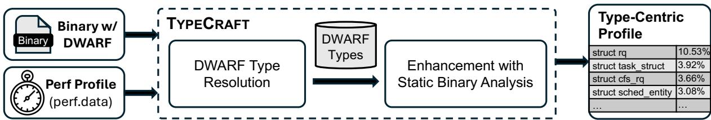  
Figure 1: TYPECRAFT takes as input an unedited, fully optimized binary file that includes DWARF debug data and a profile generated by Linux perf. TYPECRAFT utilizes DWARF and static code analysis to determine the types associated with individual instructions. The final output is a type-annotated profile, which enables metrics to be grouped by specific types and fields.

DWARF debugging information Debugging With Attribute Record Format (DWARF) [19] is the standardized format for embedding debugging metadata within binary files. DWARF provides rich debugging information, such as line mapping from instructions to source code, call frame information, and variable/type names in different lexical scopes. DWARF is widely used in debuggers and profilers to obtain source code insights and determine call paths. It is worth noting that while debuggers (like gdb [78]) can resolve variable names and types—a capability comparable to TYPE CRAFT’s—TYPECRAFT offers three key advantages: (1) TYPECRAFT maps from program counters to types, while debuggers do not provide such mapping; (2) TYPECRAFT aims to handle all memory access instructions in the code, unlike debuggers which process a limited subset upon user request; (3) TYPECRAFT functions on fully optimized binaries, which can have reduced DWARF quality due to various optimizations, whereas debuggers are most effective on unoptimized binaries and require DWARF with high quality.

## 3 Type Resolution with DWARF

This section shows how TYPECRAFT leverages the standard DWARF information to resolve the data type for a given memory instruction at a program counter (PC). Although this ap proach may not achieve high accuracy and coverage, it serves as the foundation of TYPECRAFT. The enhancement of TYPE CRAFT with static code analysis is described in Section 4.

Figure 2 overviews the workflow of TYPECRAFT’s type resolution based on DWARF. TYPECRAFT first identifies a series of nested lexical scopes that enclose the input memory instruction. From DWARF, TYPECRAFT extracts the variables defined and used in these scopes. TYPECRAFT then decodes the memory instruction for its memory addressing mechanism, which typically includes a base register and a displacement; TYPECRAFT uses this information to locate the accessed variable at this instruction and resolve its type. Finally, TYPECRAFT handles conflicts when resolving types in different scopes. TYPECRAFT uses a heuristic method to produce the deterministic results.

## 3.1 Identify Lexical Scopes

As shown in Figure 2, DWARF records the lexical scopes and their ranges for a given binary. Such scopes, determined by the PC ranges, include compilation units, subprograms, and (inlined) function frames. For a given PC, TYPECRAFT is able to identify a series of nested scopes that encloses this PC. TYPECRAFT limits its analysis to these nested scopes because the input PC can only reference the variables and their types in these scopes. It is worth noting that TYPECRAFT handles instructions that access global variables by recording global variables from all compilation units.

## 3.2 Match the Variables and Types

TYPECRAFT uses the memory addressing formula embedded in the instruction to determine the variable (e.g., local/global variables and function parameters) and type information from all enclosing lexical scopes. The fundamental element for this association is the location descriptions recorded by DWARF. A DWARF location description specifies a variable’s data location at a particular PC. This location can be a dedicated register, an offset on the stack, or a complex expression involving memory access, arithmetic, and several registers. We classify the resulting type matches into two categories based on whether the instruction interacts with a value or a pointer.

Interacting with values This scenario arises when an instruction accesses variables by value. The DWARF location description stores the memory address where the variable value is located. For example, a local variable defined as struct A a is usually positioned at a specific stack address. This memory address is calculated using the DWARF baseplus-offset operator (e.g., DW\_OP\_fbreg or DW\_OP\_bregN plus an offset). If the instruction’s base register aligns with this calculation, and the difference between the instruction’s displacement and the DWARF offset is within the size bounds of struct A, it signifies that the instruction is directly accessing a field of the variable a.

Interacting with pointers This scenario arises when an instruction accesses variables by dereferencing pointers. Specifically, this happens when the DWARF location description indicates that the variable’s value is stored at the location, and the variable itself is a pointer type (e.g., struct A a\*). If the instruction dereferences a’s value, the access is resolved to its pointed-to type, struct A. This mechanism primarily appears in two configurations:

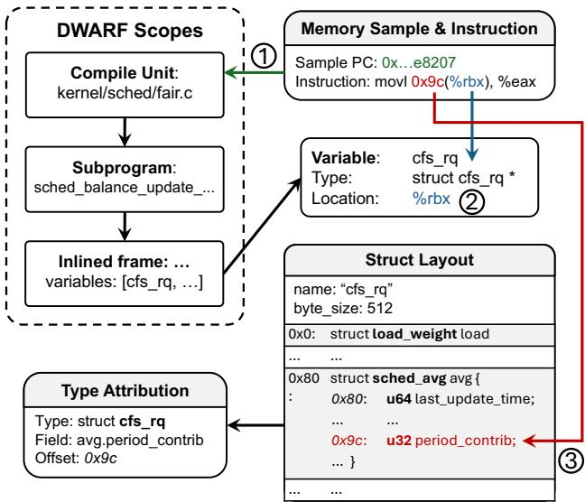  
Figure 2: Workflow of type resolution with DWARF. The process involves three steps: ⃝1 TYPECRAFT finds candidate scopes by resolving the PC to the nested scope chain. ⃝2 TYPECRAFT scans these scopes to link the instruction’s base register (%rbx) to a variable cfs\_rq whose location is %rbx. ⃝3 TYPECRAFT resolves the offset (0x9c) against the struct cfs\_rq layout to identify the field avg.period\_contrib.

• Register location (DW\_OP\_regN): The pointer variable (e.g., a\*) is stored directly in a register (like %rbx). The instruction then performs a memory access operation, such as mov 0x9c(%rbx), %eax in Figure 2.

• Base-plus-offset with value tag (DW\_OP\_bregN + offset + DW\_OP\_stack\_value): The variable’s value (i.e., the memory address that stores the pointed-to object) is calculated by adding an offset to a register. The presence of the DW\_OP\_stack\_value tag explicitly signifies that the result is the variable’s value, distinguishing it from an address calculation. This pattern often occurs due to compiler optimizations where a register might point to an internal part of a structure rather than its start.

Handling complex addressing modes Some instructions use more than one register for addressing in x86. In this case, DWARF location descriptions store complex expressions, which make the type matching impossible without a precise symbolic execution engine. To make the system simpler and more robust, we devise a method based on the fact that one register typically acts as the base register while the other acts as an index register. In fully optimized code, DWARF may treat either register as the base register and store it in the location description. Thus, TYPECRAFT attempts to use each register plus the displacement for the type resolution and reports the valid type match.

## 3.3 Match the Fields inside Types

Once the variable and its fundamental data type are identified, the subsequent step is to precisely locate the specific field being accessed within that type. For composite types (such as structs or classes), fields dictate the internal layout, with their positions defined by either constants or expressions. TYPE CRAFT uses the displacement from the instruction to select the member whose offset matches the access point. The output includes the type name, the specific field, and its offset. For primitive types, TYPECRAFT does not further identify fields. If the total size of the data type is available, TYPE CRAFT performs a validation check to ensure the access offset remains within the type’s memory boundaries. If the size is undetermined (e.g., due to flexible array member [34]), we deduce the field location using other fields whose offsets are known. In cases involving union types, the tool will report the type names and offsets. For bit fields, the tool reports the field that aligns with the byte boundary being accessed.

## 3.4 Resolve Conflicts

Given the fact that multiple scopes can record the type and field information for a given instruction, we may see conflict analysis results from different scopes. For example, a function passes a->b as a parameter to its inlined callee for access. In the caller scope, we are able to resolve the type of a and its field b, while in the callee scope, we can only obtain the field b, as the type information of a is not stored in the callee scope. When such a conflict occurs, TYPECRAFT prefers to report the one with richer information. In this example, the type and field resolved from the caller’s scope are desired.

It is worth noting that the outer scope does not always produce the desired type and field information. For example, the Linux kernel frequently uses the container\_of macro to extract the data type for a given field. If this macro is called by a callee, the type information is stored in the callee’s scope, rather than the caller’s scope. Thus, TYPECRAFT uses the following heuristic method to resolve the conflict and report the deterministic type/field information.

• If TYPECRAFT resolves a composite type in one scope and a primitive type in another scope, TYPECRAFT reports the composite type with a primitive type as its field.

• If TYPECRAFT resolves different types with offsets in different scopes, TYPECRAFT reports the one with the largest offset or within the largest composite type. This typically happens for nested composite types (i.e., a struct is a field of another struct). This heuristic helps TYPECRAFT report the outermost type with more optimization opportunities.

## 4 Enhancement with Static Binary Analysis

Relying exclusively on DWARF for type resolution presents two main challenges in maintaining high coverage and accuracy. (1) DWARF cannot handle pointer chasing patterns with a chain of pointer dereferences because of missing variable information. For instance, in the statement int i = foo->bar->baz, the DWARF format lacks a record for bar to access baz. This is because there is no variable corresponding to the intermediate field bar explicitly defined in the lexical scopes. This results in the failure of the type resolution for these memory accesses. (2) Another major challenge is that DWARF’s accuracy can significantly degrade [45] on heavily optimized code with various optimization passes such as automatic feedback-directed optimization (AutoFDO) [16], link-time optimization (LTO) [35] and post-link optimizations, e.g., BOLT [64] and Propeller [75].

To address these two challenges, TYPECRAFT analyzes the control and data flows of binary code statically to recover missing type information from neighboring instructions. TYPE CRAFT combines local analysis on the basic block level and global analysis on the function level. With this effort, TYPE CRAFT can significantly improve the coverage and accuracy, which is evaluated in Section 6.

## 4.1 Abstract Domain

TYPECRAFT structures the static analysis as a forward dataflow analysis, a direction chosen to enable the propagation of type data from variable definitions to subsequent memory accesses not covered by DWARF. This simultaneously allows for monitoring any arithmetic modifications to offsets. The execution state at any point in the program is represented by an abstract store σ. This store maps storage locations to abstract values that are sourced from a lattice L, with data types serving as the abstract values used in this analysis.

We partition the domain of storage locations into two categories: Data Registers (DReg) and Stack Frame Locations (SFL). While the x86-64 notation is used here, this model is applicable to any ISA. DReg is a subset of general-purpose registers designed to hold a machine word, such as a quadword held by rax/rdi. DReg excludes stack pointer (rsp), instruction pointer (rip), and base pointer (rbp) when acting as a frame pointer. SFL encompasses memory locations situated within the active stack frame. These locations are referenced using offsets relative to the frame base. To ensure coherence between the base and stack pointers, all stack-relative addressing is normalized to offsets originating from the DWARF Canonical Frame Address (CFA) [19]. The mapping for the

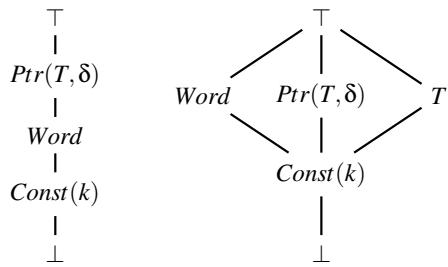  
Figure 3: Lattices for DReg (on the left) and SFL (on the right).

abstract store is defined as:

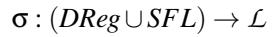

An update to the store σ is denoted by σ[x 7→ v], which results in a new store identical to σ, except that the location x is mapped to the value v:

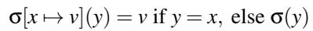

The distinction between these domain partitions is based on their unique addressing semantics. Registers within DReg typically correspond to a single data object (e.g., a pointer or scalar) over its live range, requiring the tracking of their states for type resolution. In contrast, the registers supporting SFL (specifically, rsp/rbp) act as base pointers for a memory region containing multiple objects (e.g., local variables and register spills). Consequently, type resolution is achieved by monitoring the state of individual stack locations rather than the rsp/rbp registers themselves. Thus, DReg and SFL possess distinct lattice structures as shown in Figure 3.

DReg lattice The hierarchy of the abstract states for the DReg lattice (left in Figure 3) is defined as follows:

• ⊥ (Uninitialized): The location has not been initialized or has become invalid.

• Const(k): The location contains a known integer constant k. This is tracked primarily for resolving pointer offsets.

• Word: The location holds a defined machine word (e.g., a 64-bit integer or a memory address on a 64-bit machine), but whether it refers to a memory address is unknown.

• Ptr(T, δ) (Pointer to type): The location is interpreted as a pointer to a composite type T at a byte offset δ from the type’s starting point.

• ⊤ (Conflict): The location has conflict definitions (e.g., pointers to different types) originating from different paths.

The ordering Word ⊑ Ptr is used to enforce an optimistic promotion policy for attributing memory accesses. This policy means that if two control-flow paths suggest that a register holds a generic Word on one path and a specific Ptr(T ) on the other, their join results in Ptr(T ) instead of Word. This is a sound heuristic because TYPECRAFT only resolves types at memory dereference instructions. Consequently, if a path holds a non-pointer value (e.g., a loop counter), it will never execute a dereference and cannot cause a false positive type resolution. This optimistic promotion prevents false positives while significantly decreasing false negatives caused by com piler register reuse and the conservative merging of potentially infeasible control-flow paths.

SFL lattice We use a flatter lattice (right in Figure 3), where Word, Ptr(T, δ), and T are treated as siblings. Note that T appears in this lattice because the object of type T can be directly stored on the stack. Given a stack frame location, we cannot distinguish these states so we treat the join result among them as Conflict (⊤).

## 4.2 Local Type Analysis

Local type analysis determines the state at the end of each basic block. It tracks the flow of type information including register moves, memory loads, and stack spills at every program counter (PC), beginning from the entry state. DWARF injections are used to source the data-flow analysis and transfer functions are applied for each instruction.

DWARF injection The analysis incorporates DWARF debug data as an external source of information. An injection function, I<sub>pc</sub>(σ), is applied to the current state before processing a given program counter (pc). This DWARF injection serves to restore reliable type information, particularly after instructions like function calls that cause context loss. For example, if DWARF specifies that a variable of a composite type T resides in register r at pc, the state σ is updated to σ[r 7→ Ptr(T, 0)]. However, injecting DWARF information indiscriminately introduces noise. Therefore, we only apply DWARF injection for variables where the offset δ is 0. The rationale for this constraint is as follows:

• If offset = 0, the register points to a variable so we safely set the register to Ptr(T, 0), where T is the variable’s type.

• If offset ̸= 0, ambiguity arises as DWARF may provide an inner type but we expect to resolve for an outer one.

Transfer functions for instructions We model the transfer function for each assembly instruction f<sub>instr</sub> : σ → σ<sup>′</sup>, and Table 1 summarizes these transfer functions in four categories.

• Data transfer instructions: The preservation of type infor mation is consistent for values moved between memory and registers. Register-to-register operations replicate the exact state of the source register, and memory loads retrieve the specific field type based on the calculated offset. Stores to the stack are mapped to normalized stack frame locations using DWARF’s CFA.

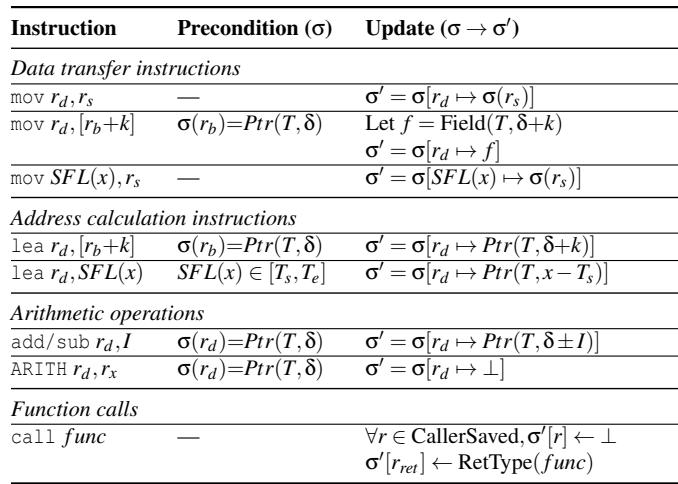  
Table 1: Transfer functions for different types of instructions. SFL(x) denotes the stack frame location at CFA offset x, k is an integer constant, and I is an immediate or constant register.

• Address calculation instructions: The lea instruction is primarily used for pointer arithmetic and creation. When applied to a register base (lea r<sub>d</sub>, [r<sub>b</sub> + k]), it modifies the pointer offset δ. If the instruction references the stack, we must determine if the offset falls within the boundary of a known local variable of type T ; if so, a pointer is generated to T , adjusted by the relative offset.

• Arithmetic operations: Integer arithmetic instructions, such as add or sub, alter a register’s value. When constant arithmetic is applied to a pointer, the offset δ is updated. This principle holds for both immediate values and registers classified as Const(k) in the lattice. However, other arithmetic operations, such as and, or non-constant modifications, lead to the invalidation of the destination state. TYPECRAFT adopts a conservative strategy of invalidating the state to prevent the assignment of incorrect types.

• Function calls: The call instruction serves as a boundary, invalidating all caller-saved registers by setting them to ⊥. If DWARF provides the callee’s return type, the state of the return register (e.g., rax for x86) is updated to this type.

Transfer functions for basic blocks The transfer function F for a basic block is defined as the composition of instruction transfers and DWARF injections for the instruction sequence i<sub>1</sub>, . . . , i<sub>n</sub>:

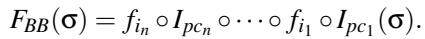

This composition guarantees that instruction semantics are always interpreted considering the presence of available debug facts. To ensure that the subsequent data-flow analysis terminates, these transfer functions must be monotone with respect to the lattice order ⊑; specifically, if σ<sub>A</sub> ⊑ σ<sub>B</sub>, then f (σ<sub>A</sub>) ⊑ f (σ<sub>B</sub>). Our transfer functions satisfy this monotonicity property for two key operation types:

Algorithm 1 The Worklist algorithm used by TYPECRAFT.   
1: Input: CFG G = (V,E), DWARF information D   
2: Output: Exit states OUT [b] for all b ∈ V   
3: Initialize: ∀b ∈ V,OUT [b] ← ⊥   
4: Ipc ← BuildFromDWARF(D) ▷ Build DWARF inject function   
5: Worklist ← {b | Pred(b) = 0/ } ▷ Initialize with entry   
6: while Worklist ̸= 0/ do   
7: b ← Worklist.pop()   
8: σ<sub>in</sub> ← F<sub>p∈Pred(b)</sub> OUT [p] ▷ Join predecessors   
9: σ<sub>out</sub> ← F<sub>BB</sub>(σ<sub>in</sub>) ▷ Apply local analysis   
10: if σ<sub>out</sub> ̸= OUT [b] then   
11: OUT [b] ← σ<sub>out</sub>   
12: Worklist.push(Succ(b))   
13: end if   
14: end while

• Overwrites are monotone because the final destination state is set to a fixed abstract value regardless of the source state.

• Updates also preserve the lattice order. For example, applying a constant addition to ⊥ results in ⊥, and applying a constant addition to Ptr(T, δ) results in Ptr(T, δ<sup>′</sup>). Crucially, no operation based on the incoming state can refine a less specific state (like ⊤) into a more specific one (like Ptr(T, δ)).

## 4.3 Global Type Analysis

To approximate the meet-over-all-paths (MOP) solution [36], a standard worklist algorithm is used, which ensures the analysis spans all basic blocks in a procedure, incorporating control flow merges (joins) and loops during global propagation. Iteration continues until a fixpoint is achieved for the abstract state at the beginning of every block.

Algorithm 1 describes the worklist algorithm for global analysis. We define OUT [b] as the abstract store upon exiting basic block b. The process begins by setting all states to ⊥ and taking the DWARF injection. It then initializes a worklist with all entry blocks, which addresses disjoint control flow graph (CFG) components often found in optimized binaries. For each block, the entry state is calculated by joining the exit states of all its predecessors (Line 8). Subsequently, the basic block transfer function F<sub>BB</sub>, derived in Section 4.2, is applied (Line 9). If the resulting output state changes, the successors of the block are then added to the worklist to process in the next iteration.

Join operator (⊔) The analysis centers on the join operator, which is utilized to reconcile potentially contradictory states inherited from predecessor nodes. The join mechanism, σ<sub>out</sub> = σ<sub>A</sub> ⊔ σ<sub>B</sub>, applies the lattice hierarchy on a pointwise basis for every location, x. The join operation on two comparable states in the lattice (i.e., when s<sub>1</sub> ⊑ s<sub>2</sub>) defined in Section 4.1 yields the greater element with respect to ⊑. This behavior is key for several functions: managing initialization by overwriting ⊥, processing Word over Const types, and implementing optimistic promotion for registers, which upgrades a generic Word to a specific Ptr type. We handle the following disagreement raised at the join point.

• Constant disagreement: When a location contains different constant values (for instance, Const(0) versus Const(8)), the outcome is generalized to the overall Word type.

• Pointer disagreement: When a location is associated with pointers to different types (such as Ptr(A, δ<sub>A</sub>) versus Ptr(B,δ<sub>B</sub>)), the conflict is resolved by checking the relationship between the two types (to be described later). If one type is structurally contained within the other, the state is unified to the composite pointer that encloses it.

• Other disagreement: Any other kind of disagreement yields ⊤. For example, merging two pointers, Ptr(T,δ<sub>1</sub>) and Ptr(T, δ<sub>2</sub>), with different offsets results in ⊤, which guarantees that loops involving pointer arithmetic will eventually terminate.

Check relationship between types A problem arises during the merging of two pointer states that refer to the identical memory region but have conflicting type definitions. Consider the scenario where two execution paths converge at block B: Path 1: Register R contains Ptr(A, 0); Path 2: Register R contains Ptr(B, −k). A simple approach would result in a Conflict (⊤) because A ̸= B. This specific pattern, however, frequently occurs when one path handles a composite type pointer and the other provides a pointer to a distinct member of that type, accompanied by certain offsets. To resolve this, we recursively examine the structure of the larger candidate type to confirm whether the smaller type is a member at offset k. If struct B is confirmed to be the type of a member of struct A at offset k, the paths are unified as pointing to the same type: Ptr(A, 0) ⊔ Ptr(B, −k) = Ptr(A, 0). The enclosing type is prioritized because data layout optimizations (such as field reordering) are most effectively applied to the outermost composite type (struct A).

## 4.4 Discussions

Algorithm termination Termination of the analysis is guaranteed because the lattice has finite height, and both the transfer function F<sub>BB</sub> and the join operator ⊔ are monotonic. Consequently, the state of any location progresses strictly upward from ⊥ to Word/Ptr until it reaches ⊤, thereby assuring that the worklist algorithm converges to a maximal fixed point that approximates the MOP solution.

Algorithm soundness The analysis utilizes a conservative methodology to ensure the soundness of the algorithm. This approach dictates that if any ambiguity or lack of certainty is encountered during a join operation, the resulting value is explicitly marked as Conflict.

## 5 System Implementation

TYPECRAFT is implemented as an extension to the Linux perf ecosystem [67]. TYPECRAFT is able to annotate any profile generated by perf by sampling precise PMUs. Like perf, TYPECRAFT requires no instrumentation to the target workloads. The type resolution component of TYPECRAFT is entirely offline, which does not incur any online profiling overhead. TYPECRAFT has been successfully deployed in a commodity data center and produced unique insights. This section shows the engineering challenges when TYPECRAFT handles complex production codebases, especially the Linux kernel. We then discuss some limitations of TYPECRAFT.

## 5.1 Engineering Challenges

TYPECRAFT is designed to address various challenges inherent in real-world workloads, specifically those arising from language features and compiler optimizations.

Fragmented data types Scalar Replacement of Aggregates (SROA) [54] is a standard compiler optimization that transforms a composite variable into its constituent, independent scalar fields. This technique improves performance but complicates debugging, as the original composite variable is no longer located at one continuous memory address. TYPE CRAFT addresses this by reconstructing the variable’s value from its fragmented locations, which are identified using the DW\_OP\_piece DWARF tag.

KASLR and relocation Kernel Address Space Layout Randomization (KASLR) [26] improves security by randomizing the location of the kernel image at boot time. To overcome the challenges this poses, TYPECRAFT employs a twopronged strategy: it leverages the kernel’s kallsyms and utilizes perf to match build-IDs. By combining these methods, TYPECRAFT successfully computes the difference between runtime and static addresses, allowing it to accurately link program counters sampled at runtime back to their original static DWARF offsets, thus ensuring that address randomization does not interfere with our type resolution.

Per-CPU and segment addressing The Linux kernel frequently uses per-CPU variables accessed via segment registers, such as mov %gs:0x10, %rax. TYPECRAFT resolves the type for this kind of instructions with a segment-aware analysis pass that successfully handles these accesses. The overall process includes: identifying segment-relative addressing patterns; separating structural data, such as fixed-offset stack canaries, from actual data accesses; mapping the offset to the \_\_per\_cpu\_offset array or this\_cpu\_off symbols; and promoting the destination register to a specialized per-CPU pointer type. This approach ensures subsequent accesses are correctly attributed to the specific per-CPU instance of a structure.

Type aliases In production code, typedef is commonly used to create type aliases, which enhances readability. These newly defined types, identified by the DWARF DW\_TAG\_typedef tag, function as symbolic links to specific concrete types but lack their own type layout definitions. To resolve this, TYPECRAFT is designed to traverse the chain of typedef-defined types until it locates a concrete type, whose information is then used for type resolution.

## 5.2 System Limitations

First, while TYPECRAFT generally works for any binary with DWARF, TYPECRAFT yields the best type resolution for C programs. TYPECRAFT has a relatively low coverage for Go and C++ programs because of additional language features such as structure embedding in Go and class inheritance in C++. TYPECRAFT needs to handle extra DWARF information to support these features, which will be our future work. Second, TYPECRAFT currently works for the x86 ISA. It is straightforward to extend TYPECRAFT to other architectures, such as ARM, by integrating the necessary ISA decoders. Third, TYPECRAFT cannot resolve the types that are not recorded in any DWARF scope. This occurs when special pointer encoding [32] and obfuscation [20] are in use. Fortunately, this case is uncommon in practice.

## 6 Evaluation

We evaluate TYPECRAFT for the type resolution coverage and overhead. All the experiments are run on a workstation with a 24-core, 48-thread Intel w7-2495X processor with 2.5 GHz frequency, 48KB L1 data cache, 2MB L2 cache, 45MB shared L3 cache, and 128 GB DDR5 memory. We evaluate off-the-shelf Linux 6.17 [80], memcached 1.6.39 [60], Redis 8.4 [69], Git 2.51.1 [29], FFmpeg 8.0 [27], and system software such as Binutils 2.45 [28]. All these workloads are built with GCC 13.3 -O3 -gdwarf-5. Moreover, we evaluate CachyOS kernel 6.17 [1], a highly optimized Linux kernel with ThinLTO [35] enabled.

Coverage We evaluate TYPECRAFT’s coverage in two modes. (1) We analyze the entire binary executable and try to resolve types for every memory access instruction. The coverage is computed as the percentage of memory instructions

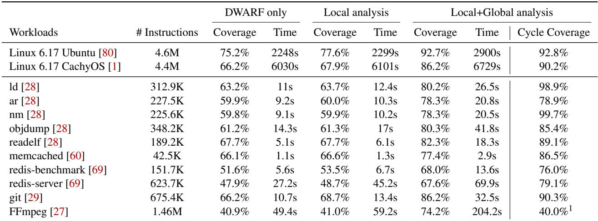  
<sup>1</sup> For the H.264 decoding workload, 96% of the uncovered memory cycles are attributed to functions with hand-written SIMD assembly codes that operate on raw character buffers. The type information is not available in the DWARF debugging information for such codes. However, TYPE CRAFT still recovers the dominant decoder structures to guide optimization as decribed in Section 7.4.

Table 2: Coverage and overhead of TYPECRAFT.

with type annotations relative to the total number of memory instructions. (2) We resolve types for memory instructions that have profiling metrics and compute the coverage for these important instructions. We use standard workloads for profil ing and measure CPU cycles via Intel PEBS PMUs. Table 2 shows the results, which indicate that TYPECRAFT can yield high coverage, especially for instructions with profiling metrics. While TYPECRAFT yields more than 90% coverage for the Linux kernel, TYPECRAFT achieves 70-80% coverage for userspace workloads. The reduced coverage is caused by userspace workloads utilizing a higher number of unnamed literals and constants. These are stored in the .rodata section without DWARF information.

TYPECRAFT offers reliable type profiles as its coverage typically exceeds 80%. For example, TYPECRAFT covers memory instructions with 92% CPU cycles in the Ubuntu Linux kernel. The highly optimized CachyOS also shows 90% coverage. Note that compared to Ubuntu, the DWARF quality of CachyOS is noticeably reduced (66% vs. 75% coverage with DWARF only), but the cycle coverage is comparable thanks to TYPECRAFT’s data-flow analysis. We observe a similar coverage in the production kernel fully optimized with AutoFDO [16], ThinLTO [35], and Propeller [75].

Overhead As a unique advantage, TYPECRAFT does not incur any online overhead because the type resolution occurs offline. We measure TYPECRAFT’s overhead when resolving types for all memory instructions, which serves as the overhead upper bound. Table 2 shows that TYPECRAFT has a reasonable processing time across workloads. Note that TYPECRAFT’s overhead can be amortized by reusing the type resolution for different profiles of the same binary executable.

## 7 Case Studies

This section demonstrates the efficacy of TYPECRAFT. By employing TYPECRAFT, we successfully pinpointed costly types within the Linux kernel 6.17 and developed practical solutions to address them. Our analysis and subsequent optimizations were derived from performance profiles gathered in a production data center environment. While the specific data center profiles cannot be shared due to confidentiality, we have replicated the observed data center behaviors using carefully configured microbenchmarks and open-source workloads. Crucially, internal measurements performed in Google’s data center confirmed substantial performance improvements resulting from these optimizations. The optimization patches are currently awaiting upstream review. Besides the Linux kernel optimization, we also show several case studies on the userspace workloads at the end of this section.

Environment setup We use the same system as described in Section 6 for the case study. To stress on the Linux kernel, we run MySQL Server 8.0.44 [3], a popular, open-source relational database management system. We enable up to 256 servers in a 4-width and 5-depth cgroup hierarchy. We place the 75% MySQL servers in throttled cgroups that utilize 50% machine resources at most, which simulates the batch jobs in data centers. We place the remaining 25% MySQL servers in unlimited cgroups with no resource constrains, which simulates latency sensitive jobs in data centers. We run the Sysbench OLTP read-only benchmark [42] in the unlimited cgroup creating the requests to all the MySQL servers. We run four threads per server. The database size is set to two tables with 10k rows each for each server. We run the experiment for 30 seconds for 10 times to report the average

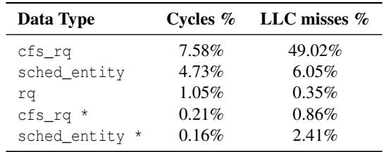  
Table 3: Hot type reported by TYPECRAFT in Linux kernel. The percentages of these metrics are relative to the total metrics consumed in the kernel.

and standard deviation.

Profiles and insights We collect the metrics—CPU cycles, retired instruction counts, and last-level cache (LLC) misses— via TYPECRAFT. The top expensive types in the Linux kernel are structures rq, cfs\_rq, and sched\_entity. Table 3 shows the percentage of these metrics caused by accessing these types over the total metrics consumed in the kernel. All these types are from the kernel scheduling subsystem, which aligns with the prior study [37] that shows the scheduling subsystem is a major bottleneck in modern data centers.

Optimizations and validation We devise two optimizations (Sections 7.1 and 7.2) for these expensive data types guided by TYPECRAFT. We use microbenchmarks to validate the effectiveness of these optimizations and also quantify the throughput improvement across all MySQL servers (Section 7.3).

## 7.1 Reordering Fields for Expensive Types

Field reordering [22] is a well-known optimization technique to improve cacheline utilization, which rearranges the fields of a given data type according to the following rules.

• Group the hot fields together. Hot fields are defined as the fields that are frequently accessed.

• Group the fields of high affinity together. Fields of high affinity mean they are frequently accessed together.

• Separate the read- and write-intensive fields as placing them together may result in false sharing.

Insights from TYPECRAFT The fields of data type T are ranked by TYPECRAFT using retired instruction counts to determine their hotness. Specifically, one can choose the top several hot fields within T that have the highest instruction counts to access them. For each hot field, TYPECRAFT provides all the monitored PCs that access it. For each PC, TYPE CRAFT analyzes all the adjacent memory instructions in the same function to obtain other fields of type T accessed. TYPE CRAFT treats these fields as of high affinity and weighted by their hotness. By analyzing these instructions, TYPECRAFT is able to determine whether the access is a load or a store. Thus, TYPECRAFT can provide all the information necessary to guide the field reordering optimization.

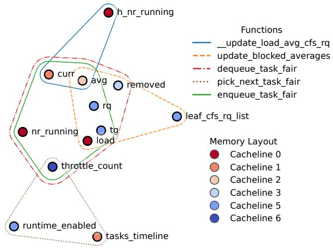  
Figure 4: Field affinity of cfs\_rq reported by TYPECRAFT. This graph only shows the hot fields in cfs\_rq.

TYPECRAFT outputs a hypergraph that visualizes the affinity of hot fields for a given data type. Figure 4 shows an example for cfs\_rq. Each point denotes a field with its name and the color reflects the cacheline number it resides relative to the start of the struct. Each line scope defines a function, meaning the fields are accessed together in this function. From the figure, we observe that field affinity varies in different functions. For example, in the blue line scope, h\_nr\_running affinities with curr and avg but not in the brown and orange line scopes. Since we optimize a type layout for the whole software rather than individual functions, we define fields of high affinity if they are accessed together in contexts with high instruction counts. For cfs\_rq, we place the curr, throttle\_count, rq, tg fields to the same cacheline to improve data locality in hot paths. Although fields such as leaf\_cfs\_rq\_list and tasks\_timeline are also frequently accessed, they are only used in one function. Thus, we place them in a different cacheline from other hot fields.

Performance impact With the guidance of TYPECRAFT, we optimize all rq (as shown in Section 1.1), cfs\_rq, and sched\_entity. For rq, a microbenchmark was utilized. This benchmark generates 960 tasks that execute a loop, sleeping for 1ms per iteration. This resulted in a 5.1% reduction in kernel cycles. To evaluate cfs\_rq, we configure schbench [4], a kernel scheduling benchmark designed to stress the hot paths associated with these types. Our configuration creates 1024 cgroups and 1024 tasks, showing a 26.4% reduction in kernel LLC misses.

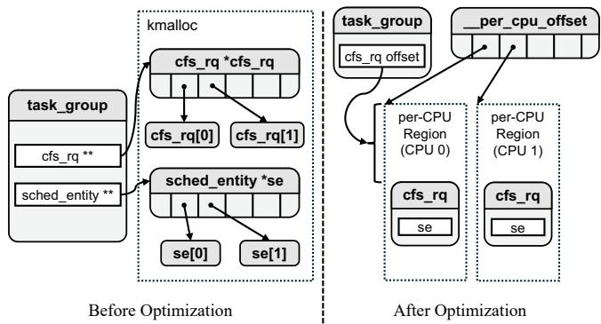  
Figure 5: Memory layout before vs. after pointer chasing optimization, which matches the access patterns to avoid ex pensive pointer chasing.

## 7.2 Avoiding Pointer Chasing

Pointer chasing [18] is a well-known access pattern in which a memory load depends on the result of its prior memory load. Due to such dependency, the two loads cannot overlap in the pipeline, resulting in long exposed memory latency.

Insights from TYPECRAFT TYPECRAFT pinpoints 0.4% of kernel CPU cycles and 3.3% of kernel LLC misses for accessing sched\_entity\* and cfs\_rq\* pointers themselves, resulting in even more costs to access the objects via these pointers. This suggests that expensive pointer chasing is occurring. Furthermore, the tool provides the associated program counters that are mapped to the source code with a typical access pattern: cfs\_rq->tg->se[cpu]. There are multiple pointer indirections from cfs\_rq to access a sched\_entity object se[cpu], confirming the pointer chasing pattern.

To eliminate pointer chasing, we employ two optimizations: (1) embedding sched\_entity objects into cfs\_rq and (2) changing the allocations for cfs\_rq objects. Figure 5 highlights the memory layout changes with our optimizations. With the new memory layout, accessing sched\_entity from cfs\_rq does not incur pointer chasing.

Embedding sched\_entity As shown in Figure 5, all sched\_entity objects are allocated randomly in the memory and managed by an array of pointers (i.e., sched\_entity \*\*) owned in task\_group. We observe that both cfs\_rq and sched\_entity objects are allocated per core and have the same life ranges. Thus, we are able to embed sched\_entity object as a field in cfs\_rq with a constant offset. With this optimization, the original pointer chasing pattern can be optimized to avoid pointer indirections, i.e., cfs\_rq + offset.

Per-CPU allocation for cfs\_rq objects Similarly, each task\_group object (i.e., tg) stores cfs\_rq pointers in an array. Hot functions such as tg\_throttle\_down and tg\_unthrottle\_up traverse the list of task groups and repeatedly access a cfs\_rq object for a given cpu. Our optimization is to use the per-CPU allocator for cfs\_rq objects rather than maintaining them in an array of pointers. When accessing the cfs\_rq object for a given cpu, we use an efficient per-CPU addressing via \_\_per\_cpu\_offset. This optimization enjoys a more efficient addressing strategy and avoids the costly pointer chasing on struct cfs\_rq \*.

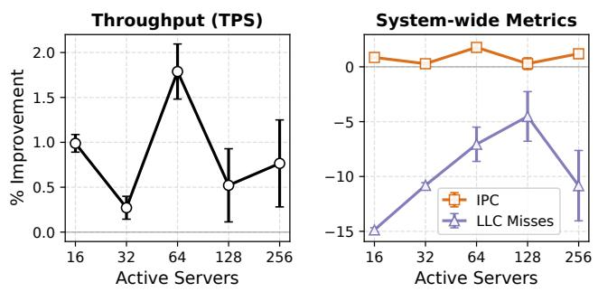  
Figure 6: TPS and PMU metric improvement for MySQL. Error bar shows the standard deviation across 10 runs.

Performance impact We reuse the cfs\_rq microbenchmark described in Section 7.1. Eliminating pointer chasing generally reduces cache misses and saves CPU cycles. However, our optimization on embedding sched\_entity shows a significant performance regression in microbenchmarks— the LLC misses are increased by more than 50% when accessing cfs\_rq. The reason is that the optimized cfs\_rq type is enlarged by embedding a sched\_entity object. This makes the kernel slab allocator align all cfs\_rq objects to the 1024-byte boundary. When we traverse different cfs\_rq objects, we can have power-of-two strided accesses that incur conflict cache misses. Fortunately, our follow-up optimization of per-CPU allocator for cfs\_rq objects can avoid cache conflicts because the per-CPU allocator does not force a power-of-two overalign for cfs\_rq objects. The combination of these two optimizations further reduces kernel LLC misses by 33% on our microbenchmark on top of the reordering optimizations. Intel kernel test robot also confirms this improvement, showing 8.8% improvement on the stress-ng.session.ops\_per\_sec benchmark.

## 7.3 Performance Impact on MySQL

Figure 6 demonstrates the effects of our kernel optimizations on MySQL’s throughput (TPS) and microarchitectural metrics. A consistent reduction in LLC misses is observed across all setups, with the most significant reduction, 14.9%, occurring when 16 servers are active. This enhanced data locality directly boosts execution efficiency. Consequently, throughput improves at every concurrency level, reaching a peak TPS increase of 1.8% (along with a 1.8% rise in IPC) when running on 64 active servers. As the number of active servers increases, so does the scheduling contention, resulting in greater variability in these performance indicators. We also see a throughput improvement of the same magnitude for the Google data center with our optimizations. Note that even a 1% improvement for a data center means saving millions of dollars.

## 7.4 Analysis of Other Workloads

In addition to the Linux kernel, we evaluate TYPECRAFT on several prevalent and highly optimized user-space applications. Through profiling FFmpeg, Git, and Binutils using realistic workloads, TYPECRAFT discovers various prospects for improving data layout. Note that though we obtain nontrivial improvement in memory subsystems on the function level, we do not see obvious end-to-end improvement for FFmpeg and Git. The potential reason is that isolated benchmark runs face much less cache and memory pressure than the datacenter, where contention for the shared L3 cache and memory bandwidth could amplify the benefit of our data layout optimization.

FFmpeg During H.264 decoding in FFmpeg, TYPECRAFT identifies H264SliceContext as a significant consumer of CPU cycles (3.4%). This 35KB structure contains a 2KB set of frequently accessed fields (per-macroblock inner loop) that are separated by pwt, a 20KB sub-struct written only once per-slice outer loop and rarely read in the inner loop. By moving the cold fields, such as pwt to the end of the structure, we cluster the hot fields into a contiguous memory region. This reorganization prevents hot fields from spanning disjoint cachelines and multiple memory pages, leading to a 4.8% reduction in L1-dcache misses and a 2.5% decrease in dTLB misses.

Git For the git log --stat workload, TYPECRAFT highlights the 112B xdlclassifier\_t structure. Despite its compact size, its hot fields are split across two cachelines. By consolidating these hot fields into the first cacheline and shifting cold fields to the second, we minimize unnecessary cacheline fetches. This change reduces L1-dcache misses by 24% in the hot xdl\_prepare\_env function and 4% for the overall Git stat execution.

Binutils (nm) When running nm on a Linux kernel binary, TYPECRAFT finds that the 48-byte asymbol structure accounts for nearly 10% of cycles. Although it fits in one cacheline, asymbol objects are fragmented in memory. This causes pointer-chasing patterns in functions like qsort and binary search, resulting in significant cache misses. To address this, we implement structure splitting for asymbol. We introduce a dense slots[] array containing only the critical sorting keys—name, section, and value—extracted from the original structure. This allows sorting and searching routines to leverage better spatial locality by processing contiguous, packed data. This optimization yields a 32.1% reduction in L1-dcache misses and a 55.4% drop in dTLB misses, ultimately improving end-to-end execution time by 2.7%.

## 8 Related Work

There are substantial efforts [49, 61, 62, 76, 87, 90, 91] in the security domain to reverse engineer the binary code for types. Typically, these approaches assume DWARF is not available, which is different from TYPECRAFT. This section only reviews the performance analysis tools that target CPU memory subsystems. We categorize existing approaches into codecentric, data-centric, and type-centric profilers.

## 8.1 Code-Centric Profilers

Code-centric profilers associate performance metrics with code regions, such as instructions, loops, and functions. Tools such as Linux perf [67], HPCToolkit [5], VTune [21], OProfile [44], SCALENE [9], CodeAnalyst [25], and a variety of data center profilers [2, 6, 30, 33, 70, 71] collect PMU events or OS timers with low overhead. Many of these tools are used in production and provide insights on the code level. These tools can identify the hot code that worth optimization but provide limited guidance on optimization.

Some advanced tools provide additional metrics beyond PMU events. CPROF [43], MemSpy [58], SLO [10], DrC-CTProf [92], and MACPO [68] collect memory reuse distance [23, 59] to guide the optimization of capacity cache misses. HOTL [86] calculates the memory footprint to complement the reuse distance. RVN [85], DeadSpy [14], RedSpy [83], ZeroSpy [88], and LoadSpy [79] identify redundant memory transactions with value profiling [13]. CacheGrind [74] simulates cache behaviors and identifies cacheline fragmentation [22]. SHERIFF [50] analyzes multithreaded programs to identify false sharing. These tools pinpoint a series of instructions that are involved in the memory inefficiencies and give insightful guidance to optimize the code. These tools instrument memory accesses with compilers or binary engines such as Pin [56], DynamoRIO [11], and Valgrind [73]. Thus, they typically incur high overhead, which are not used in production environment.

Furthermore, some lightweight tools aim to collect these advanced metrics. ThreadSpotter [55, 65], Witch [84], Feather [15], Cheetah [51], and RDX [81] use PMUs, debug registers, or OS page protection to pinpoint redundant memory transactions, identify false sharing, and compute reuse distances. None of these code-centric profilers provides the type information. Actually, TYPECRAFT can complement these profilers by annotating their assembly profiles.

## 8.2 Data-Centric Profilers

The data-centric profilers associate metrics with global/static data symbols or heap data allocations. Cache Scope [12], HPCToolkit [52], MemPerf [93], and Oracle Developer Studio [63] are the typical profilers in this category. Advanced analyses based on these tools, such as LWPTool [89], Array-Tool [53], and StructSlim [72], guide array regrouping and structure splitting to reduce cache misses.

The optimization guidance shared between data-centric profilers and TYPECRAFT centers on memory layout optimization. However, TYPECRAFT distinguishes itself from data-centric profilers in three key areas. First, TYPECRAFT offers a global perspective on data types to inform memory layout optimization; while data types can be allocated across various contexts, TYPECRAFT can aggregate them, whereas data-centric profilers demand significant manual analysis of allocation call sites to determine types. Second, TYPECRAFT directly examines memory access instructions, eliminating the need to intercept memory allocators as is required by data-centric profilers. Third, TYPECRAFT provides detailed information at the type field level, in contrast to existing datacentric profilers, which provide information only for the entire allocated data object.

## 8.3 Type-Centric Profilers

Perhaps DProf [66] is the most relevant work to TYPECRAFT. DProf leverages PMUs to identify memory inefficiencies in the Linux kernel. DProf offers limited type resolution for dynamically allocated objects. DProf relies on (1) a modified allocator to record the type of each allocation and (2) pertype memory pools that record the types for the allocations from these pools. Moreover, DProf requires manual efforts to resolve some types. TYPECRAFT differs in three aspects.

• TYPECRAFT uses DWARF to resolve data types without depending on any customized allocators or manual efforts.

• TYPECRAFT offers fine-grained type resolutions on the fields, so it can guide the field-level optimization.

• TYPECRAFT works on an off-the-shelf Linux kernel, while DProf requires a customized kernel and necessary modules.

## 9 Conclusions and Future Work

This paper introduces TYPECRAFT, a lightweight, highresolution data type profiler. TYPECRAFT utilizes the standard DWARF information embedded in the binary executable to determine the type and field details for memory instructions. To boost the coverage of type resolution in highly optimized binaries, TYPECRAFT employs a novel data-flow analysis to disseminate type information to memory instructions missing DWARF records due to various optimizations. Our assessment of the latest off-the-shelf Linux kernel indicates that TYPE

CRAFT successfully resolves types for over 90% of memory instructions. Moreover, we have employed TYPECRAFT to direct several optimizations within the Linux kernel, resulting in considerable performance gains in benchmarks and the production data center at Google. All resulting optimization patches are currently awaiting upstream inclusion. TYPE CRAFT will be released with the Linux perf tool for public access.

Our future development strategy focuses on three key areas. First, we plan to enhance support for languages beyond C, specifically targeting C++, Go, and Rust by addressing the DWARF extensions necessary for their unique language features. Second, we aim to enable support for the ARM archi tecture, which is becoming prevalent in modern data centers. Third, we will work on improving DWARF generation for mainstream compilers to further increase the coverage and effectiveness of TYPECRAFT.

## Acknowledgement

We are grateful for Namhyung Kim’s contributions to this project. In addition to reviewing all patch series for the upstreaming of TYPECRAFT into the Linux perf tool, Namhyung Kim was responsible for developing the initial version of TYPECRAFT built upon Linux perf. We also thank our shepherd and all reviewers for their valuable comments. This work is partially supported by the National Science Foundation (NSF) under Grants No. CISE-2316201.

## References

[1] Optimizing the Kernel with AutoFDO on CachyOS. ht tps://cachyos.org/blog/2411-kernel-autofdo, Nov 2024.

[2] Datadog Profilers. https://docs.datadoghq.com/p rofiler/, 2025.

[3] MySQL Reference Manual. https://dev.mysql.co m/doc, 2025.

[4] schbench: A Linux scheduler benchmark. https://ke rnel.googlesource.com/pub/scm/linux/kernel /git/mason/schbench/, 2025.

[5] L. Adhianto, S. Banerjee, M. Fagan, M. Krentel, G. Marin, J. Mellor-Crummey, and N. R. Tallent. Hpctoolkit: tools for performance analysis of optimized parallel programs http://hpctoolkit.org. Concurr. Comput.: Pract. Exper., 22(6):685–701, April 2010.

[6] Amazon Web Services, Inc. Amazon CodeGuru Profiler User Guide, 2025.

[7] AMD and the Linux Community. perf-amd-ibs(1) - Support for AMD Instruction-Based Sampling (IBS) with perf tool. Linux Manual Pages, 2025.

[8] Arm and the Linux Community. perf-arm-spe - Support for Arm Statistical Profiling Extension within perf tools. Linux Manual Pages, 2025.

[9] Emery D. Berger, Sam Stern, and Juan Altmayer Pizzorno. Triangulating python performance issues with SCALENE. In 17th USENIX Symposium on Operating Systems Design and Implementation (OSDI ’23), pages 51–64. USENIX Association, 2023.

[10] Kristof Beyls and Erik H. D’Hollander. Refactoring for data locality. Computer, 42(2):62–71, February 2009.

[11] Derek Bruening, Saman Amarasinghe, et al. DynamoRIO: Dynamic instrumentation tool platform. https://dynamorio.org/, 2024.

[12] Bryan R. Buck and Jeffrey K. Hollingsworth. Data centric cache measurement using hardware and software instrumentation. PhD thesis, USA, 2004. AAI3123989.

[13] Brad Calder, Peter Feller, and Alan Eustace. Value profiling and optimization. Journal of Instruction-Level Parallelism, 1:94–112, 1999.

[14] Milind Chabbi and John Mellor-Crummey. Deadspy: a tool to pinpoint program inefficiencies. In Proceedings of the Tenth International Symposium on Code Generation and Optimization, CGO ’12, page 124–134, New York, NY, USA, 2012. Association for Computing Machinery.

[15] Milind Chabbi, Shasha Wen, and Xu Liu. Featherlight on-the-fly false-sharing detection. In Proceedings of the 23rd ACM SIGPLAN Symposium on Principles and Practice of Parallel Programming, PPoPP ’18, page 152–167, New York, NY, USA, 2018. Association for Computing Machinery.

[16] Dehao Chen, David Xinliang Li, and Tipp Moseley. Autofdo: automatic feedback-directed optimization for warehouse-scale applications. In Proceedings of the 2016 International Symposium on Code Generation and Optimization, CGO ’16, page 12–23, New York, NY, USA, 2016. Association for Computing Machinery.

[17] Dehao Chen, Neil Vachharajani, Robert Hundt, Shih-wei Liao, Vinodha Ramasamy, Paul Yuan, Wenguang Chen, and Weimin Zheng. Taming hardware event samples for fdo compilation. In Proceedings of the 8th Annual IEEE/ACM International Symposium on Code Generation and Optimization, CGO ’10, page 42–52, New York, NY, USA, 2010. Association for Computing Machinery.

[18] Jamison Collins, Suleyman Sair, Brad Calder, and Dean M Tullsen. Pointer cache assisted prefetching. In 35th Annual IEEE/ACM International Symposium on Microarchitecture, 2002.(MICRO-35). Proceedings., pages 62–73. IEEE, 2002.

[19] DWARF Committee. DWARF Debugging Information Format Version 5 Standard. The DWARF Standards Committee, 2017.

[20] Kees Cook. mm: Add slub free list pointer obfuscation. Linux Kernel Mailing List, August 2017. https://lo re.kernel.org/all/20170802180609.GA66807@b east/.

[21] Intel Corporation. Intel® vtune™ profiler. https: //www.intel.com/content/www/us/en/docs/vtu ne-profiler/user-guide/, 2025.

[22] Chen Ding and Ken Kennedy. Improving cache performance in dynamic applications through data and computation reorganization at run time. ACM SIGPLAN Notices, 34(5):229–241, 1999.

[23] Chen Ding and Yutao Zhong. Predicting whole-program locality through reuse distance analysis. In Proceedings of the ACM SIGPLAN 2003 Conference on Programming Language Design and Implementation, PLDI ’03, page 245–257, New York, NY, USA, 2003. Association for Computing Machinery.

[24] Ulrich Drepper. What every programmer should know about memory. Technical report, Red Hat, Inc., Nov 2007.

[25] Paul Drongowski, Lei Yu, Frank Swehosky, Suravee Suthikulpanit, and Robert Richter. Incorporating instruction-based sampling into amd codeanalyst. In 2010 IEEE International Symposium on Performance Analysis of Systems & Software (ISPASS), pages 119– 120, 2010.

[26] Jake Edge. Kernel address space layout randomization. LWN.net, October 2013. https://lwn.net/Articl es/569635/.

[27] FFmpeg Developers. FFmpeg source code. https: //git.ffmpeg.org/ffmpeg.git, 2026.

[28] Free Software Foundation, Inc. GNU Binutils. https: //www.gnu.org/software/binutils, 2025.

[29] Git Developers. Git source code. https://github.c om/git/git, 2026.

[30] Brendan Gregg. Visualizing system latency. Communications of the ACM, 53(7):48–54, 2010.

[31] John L. Hennessy and David A. Patterson. Computer Architecture, Fifth Edition: A Quantitative Approach. Morgan Kaufmann Publishers Inc., San Francisco, CA, USA, 5th edition, 2011.

[32] Liam Howlett. The maple tree: Storing ranges and dumping the tree. Oracle Linux Blog, June 2024. https: //blogs.oracle.com/linux/post/maple-tree-s toring-ranges.

[33] Microsoft Inc. Profiling live Azure web apps with Application Insights. https://learn.microsoft.com/en -us/azure/azure-monitor/app/profiler, 2025.

[34] ISO/IEC. ISO/IEC 9899:1999(E) – Programming Languages – C. International Organization for Standardization/International Electrotechnical Commission, 1999. The C99 Standard, which introduced the Flexible Array Member (FAM).

[35] Teresa Johnson, Mehdi Amini, and Xinliang David Li. Thinlto: scalable and incremental lto. In Proceedings of the 2017 International Symposium on Code Generation and Optimization, CGO ’17, page 111–121. IEEE Press, 2017.

[36] John B. Kam and Jeffrey D. Ullman. Monotone data flow analysis frameworks. Acta Inf., 7(3):305–317, September 1977.

[37] Svilen Kanev, Juan Pablo Darago, Kim Hazelwood, Parthasarathy Ranganathan, Tipp Moseley, Gu-Yeon Wei, and David Brooks. Profiling a warehouse-scale computer. In Proceedings of the 42nd Annual International Symposium on Computer Architecture, ISCA ’15, page 158–169, New York, NY, USA, 2015. Association for Computing Machinery.

[38] Namhyung Kim. perf tools: Introduce data type profil ing, December 2023. https://lore.kernel.org/al l/20231213001323.718046-1-namhyung@kernel .org/.

[39] Namhyung Kim. perf annotate-data: Update data-type profiling quality (v2), August 2024. https://lore.k ernel.org/all/20240821232628.353177-1-nam hyung@kernel.org/.

[40] Namhyung Kim. perf mem: Basic support for data type profiling (v1), July 2024. https://lore.kernel.or g/all/20240731235505.710436-1-namhyung@ke rnel.org/.

[41] Namhyung Kim. perf annotate: Add –code-with-type option, March 2025. https://lore.kernel.org/al l/20250310224925.799005-1-namhyung@kernel .org/.

[42] Alexey Kopytov and The Sysbench Community. Sysbench: Scriptable database and system performance benchmark. https://github.com/akopytov/sy sbench, 2025.

[43] A.R. Lebeck and D.A. Wood. Cache profiling and the spec benchmarks: a case study. Computer, 27(10):15– 26, 1994.

[44] John Levon, Philippe Elie, et al. Oprofile: A system profiler for linux. https://oprofile.sourceforge .io, 2023.

[45] Yuanbo Li, Shuo Ding, Qirun Zhang, and Davide Italiano. Debug information validation for optimized code. In Proceedings of the 41st ACM SIGPLAN Conference on Programming Language Design and Implementation, PLDI 2020, page 1052–1065, New York, NY, USA, 2020. Association for Computing Machinery.

[46] Zecheng Li. perf tools: Some improvements on data type profiler, September 2025. https://lore.kerne l.org/all/20250917195808.2514277-1-zecheng @google.com/.

[47] Zecheng Li. perf tools: Improvements to data type profiler, March 2026. https://lore.kernel.org/al l/20260309175546.916039-1-zli94@ncsu.edu/.

[48] Linaro Limited. Arm statistical profiling extension (spe) overview. Linaro Forge Documentation, 2021.

[49] Zhiqiang Lin, Xiangyu Zhang, and Dongyan Xu. Automatic reverse engineering of data structures from binary execution. In Proceedings of the 11th Annual Information Security Symposium, CERIAS ’10, West Lafayette, IN, 2010. CERIAS - Purdue University.

[50] Tongping Liu and Emery D. Berger. Sheriff: precise detection and automatic mitigation of false sharing. SIG PLAN Not., 46(10):3–18, October 2011.

[51] Tongping Liu and Xu Liu. Cheetah: Detecting false sharing efficiently and effectively. In 2016 IEEE/ACM International Symposium on Code Generation and Optimization (CGO), pages 1–11, 2016.

[52] Xu Liu and John Mellor-Crummey. A data-centric profiler for parallel programs. In SC ’13: Proceedings of the International Conference on High Performance Computing, Networking, Storage and Analysis, pages 1–12, 2013.

[53] Xu Liu, Kamal Sharma, and John Mellor-Crummey. Arraytool: a lightweight profiler to guide array regrouping. In Proceedings of the 23rd International Conference on Parallel Architectures and Compilation, PACT ’14, page 405–416, New York, NY, USA, 2014. Association for Computing Machinery.

[54] LLVM Project. LLVM Passes: Scalar Replacement of Aggregates (SROA), 2025.

[55] Royd Lüdtke and Chris Gottbrath. Cache-related performance analysis using rogue wave software’s threadspot ter. In Tools for High Performance Computing 2012, pages 75–93. Springer, 2013.

[56] Chi-Keung Luk, Robert Cohn, Robert Muth, Harish Patil, Artur Klauser, Geoff Lowney, Steven Wallace, Vi jay Janapa Reddi, and Kim Hazelwood. Pin: building customized program analysis tools with dynamic instrumentation. SIGPLAN Not., 40(6):190–200, June 2005.

[57] Zhihong Luo, Sam Son, Sylvia Ratnasamy, and Scott Shenker. Harvesting memory-bound CPU stall cycles in software with MSH. In 18th USENIX Symposium on Operating Systems Design and Implementation (OSDI 24), pages 57–75, Santa Clara, CA, July 2024. USENIX Association.

[58] Margaret Martonosi, Anoop Gupta, and Thomas Anderson. Memspy: analyzing memory system bottlenecks in programs. SIGMETRICS Perform. Eval. Rev., 20(1):1–12, June 1992.

[59] R.L. Mattson, J. Gecsei, D. R. Slutz, and I. L. Traiger. Evaluation techniques for storage hierarchies. IBM Systems Journal, 9(2):78–117, 1970.

[60] Memcached project team. Memcached: a distributed memory object caching system. https://memcached. org/, 2025. Accessed on 10 December 2025.

[61] Daniel Mercier, Aziem Chawdhary, and Richard Jones. dynstruct: An automatic reverse engineering tool for structure recovery and memory use analysis. In 2017 IEEE 24th International Conference on Software Analysis, Evolution and Reengineering (SANER), pages 497– 501, 2017.

[62] Matt Noonan, Alexey Loginov, and David Cok. Polymorphic type inference for machine code. In Proceedings of the 37th ACM SIGPLAN Conference on Programming Language Design and Implementation, PLDI ’16, page 27–41, New York, NY, USA, 2016. Association for Computing Machinery.

[63] Oracle Corporation. Oracle Developer Studio, 2025.

[64] Maksim Panchenko, Rafael Auler, Bill Nell, and Guilherme Ottoni. Bolt: a practical binary optimizer for data centers and beyond. In Proceedings of the 2019 IEEE/ACM International Symposium on Code Generation and Optimization, CGO 2019, page 2–14. IEEE Press, 2019.

[65] ParaTools, Inc. ParaTools ThreadSpotter User Manual, 2025.

[66] Aleksey Pesterev, Nickolai Zeldovich, and Robert T. Morris. Locating cache performance bottlenecks using data profiling. In Proceedings of the 5th European Conference on Computer Systems, EuroSys ’10, page 335–348, New York, NY, USA, 2010. Association for Computing Machinery.

[67] Mauro Petazzoni and the Linux Community. perf-record - Run a command and record its profile into perf.data. Linux Manual Pages, 2024.

[68] Ashay Rane and James Browne. Performance optimiza tion of data structures using memory access characterization. In 2011 IEEE International Conference on Cluster Computing, pages 570–574, 2011.

[69] Redis Community. Redis, In-memory Data Structure Store. https://redis.io, 2025.

[70] Gang Ren, Eric Tune, Tipp Moseley, Yixin Shi, Silvius Rus, and Robert Hundt. Google-wide profiling: A continuous profiling infrastructure for data centers. IEEE Micro, 30(4):65–79, 2010.

[71] Jordan Rome. Strobelight: A profiling service built on open source technology. https://engineering.fb .com/2025/01/21/production-engineering/str obelight-a-profiling-service-built-on-ope n-source-technology/, Jan 2025.

[72] Probir Roy and Xu Liu. Structslim: a lightweight profiler to guide structure splitting. In Proceedings of the 2016 International Symposium on Code Generation and Optimization, CGO ’16, page 36–46, New York, NY, USA, 2016. Association for Computing Machinery.

[73] Julian Seward and Nicholas Nethercote. Valgrind: A framework for heavyweight dynamic binary instrumentation. ACM SIGPLAN Notices, 42(6):94–105, June 2007.

[74] Julian Seward and Nicholas Nethercote. Cachegrind: a cache and branch profiler. Valgrind User Manual, Chapter 5, 2025.

[75] Han Shen, Krzysztof Pszeniczny, Rahman Lavaee, Snehasish Kumar, Sriraman Tallam, and Xinliang David Li. Propeller: A profile guided, relinking optimizer for warehouse-scale applications. In Proceedings of the 28th ACM International Conference on Architectural Support for Programming Languages and Operating Systems, Volume 2, ASPLOS 2023, page 617–631, New York, NY, USA, 2023. Association for Computing Machinery.

[76] Ian Smith. Binsub: The simple essence of polymorphic type inference for machine code. In Static Analysis: 31st International Symposium, SAS 2024, Pasadena, CA, USA, October 20–22, 2024, Proceedings, page 425–450, Berlin, Heidelberg, 2024. Springer-Verlag.

[77] Julian Squires. Data-type profiling for perf. LWN.net, December 2023. https://lwn.net/Articles/955 709/.

[78] Richard Stallman, Roland Pesch, Stan Shebs, et al. Debugging with gdb. Free Software Foundation, 675, 1988.

[79] Pengfei Su, Shasha Wen, Hailong Yang, Milind Chabbi, and Xu Liu. Redundant loads: a software inefficiency indicator. In Proceedings of the 41st International Conference on Software Engineering, ICSE ’19, page 982–993. IEEE Press, 2019.

[80] The Linux Kernel Community. Linux Kernel Release 6.17. https://www.kernel.org/, 2025.

[81] Qingsen Wang, Xu Liu, and Milind Chabbi. Featherlight reuse-distance measurement. In 2019 IEEE International Symposium on High Performance Computer Architecture (HPCA), pages 440–453, 2019.

[82] Vincent Weaver. Advanced hardware profiling and sampling (pebs, ibs, etc.): Creating a new papi sampling interface. Technical report, University of Maine, 2015.

[83] Shasha Wen, Milind Chabbi, and Xu Liu. Redspy: Exploring value locality in software. In Proceedings of the Twenty-Second International Conference on Architectural Support for Programming Languages and Operating Systems, ASPLOS ’17, page 47–61, New York, NY, USA, 2017. Association for Computing Machinery.

[84] Shasha Wen, Xu Liu, John Byrne, and Milind Chabbi. Watching for software inefficiencies with witch. In Proceedings of the Twenty-Third International Conference on Architectural Support for Programming Languages and Operating Systems, ASPLOS ’18, page 332–347, New York, NY, USA, 2018. Association for Computing Machinery.

[85] Shasha Wen, Xu Liu, and Milind Chabbi. Runtime value numbering: A profiling technique to pinpoint redundant computations. In Proceedings of the 2015 International Conference on Parallel Architecture and Compilation (PACT), PACT ’15, page 254–265, USA, 2015. IEEE Computer Society.

[86] Xiaoya Xiang, Chen Ding, Hao Luo, and Bin Bao. Hotl: a higher order theory of locality. In Proceedings of the Eighteenth International Conference on Architectural Support for Programming Languages and Operating Systems, ASPLOS ’13, page 343–356, New York, NY, USA, 2013. Association for Computing Machinery.

[87] Danning Xie, Zhuo Zhang, Nan Jiang, Xiangzhe Xu, Lin Tan, and Xiangyu Zhang. Resym: Harnessing llms to recover variable and data structure symbols from stripped binaries. In Proceedings of the 2024 on ACM SIGSAC Conference on Computer and Communications Security, CCS ’24, page 4554–4568, New York, NY, USA, 2024. Association for Computing Machinery.

[88] Xin You, Hailong Yang, Zhongzhi Luan, Depei Qian, and Xu Liu. Zerospy: exploring software inefficiency with redundant zeros. In Proceedings of the International Conference for High Performance Computing, Networking, Storage and Analysis, SC ’20. IEEE Press, 2020.

[89] Chao Yu, Probir Roy, Yuebin Bai, Hailong Yang, and Xu Liu. Lwptool: A lightweight profiler to guide data layout optimization. IEEE Transactions on Parallel and Distributed Systems, 29(11):2489–2502, 2018.

[90] Junyuan Zeng and Zhiqiang Lin. Towards automatic inference of kernel object semantics from binary code. In Proceedings of the 18th International Symposium on Research in Attacks, Intrusions, and Defenses - Volume 9404, RAID 2015, page 538–561, Berlin, Heidelberg, 2015. Springer-Verlag.

[91] Zhuo Zhang, Yapeng Ye, Wei You, Guanhong Tao, Wenchuan Lee, Yonghwi Kwon, Yousra Aafer, and Xiangyu Zhang. Osprey: Recovery of variable and data structure via probabilistic analysis for stripped binary. In 2021 IEEE Symposium on Security and Privacy (SP), pages 813–832, 2021.

[92] Qidong Zhao, Xu Liu, and Milind Chabbi. Drcctprof: a fine-grained call path profiler for arm-based clusters. In Proceedings of the International Conference for High Performance Computing, Networking, Storage and Analysis, SC ’20. IEEE Press, 2020.

[93] Jin Zhou, Sam Silvestro, Steven (Jiaxun) Tang, Hanmei Yang, Hongyu Liu, Guangming Zeng, Bo Wu, Cong Liu, and Tongping Liu. Memperf: Profiling allocatorinduced performance slowdowns. Proc. ACM Program. Lang., 7(OOPSLA2), October 2023.