USENIX

THE ADVANCED COMPUTING SYSTEMS ASSOCIATION

# RT: Regular Types for the Streaming Shell

Zekai Li, Lukas Lazarek, Evangelos Lamprou, and George Kapetanakis, Brown University; Konstantinos Mamouras, Rice University; Nikos Vasilakis, Brown University

https://www.usenix.org/conference/osdi26/presentation/li-zekai

# This paper is included in the Proceedings of the 20th USENIX Symposium on Operating Systems Design and Implementation.

July 13–15, 2026 • Seattle, WA, USA

ISBN 978-1-939133-55-7

Open access to the Proceedings of the 20th USENIX Symposium on Operating Systems Design and Implementation is sponsored by

# RT: Regular Types for the Streaming Shell

Zekai Li<sup>\*</sup> Brown University

Lukas Lazarek<sup>\*</sup> Brown University

Konstantinos Mamouras Rice University

Evangelos Lamprou Brown University

George Kapetanakis Brown University

Nikos Vasilakis Brown University

## Abstract

This paper presents an overlay type system, RT, for statically checking streaming shell programs or fragments before their execution. RT’s regular types offer expressiveness appropriate for capturing a command’s standard input and output streams, support computationally tractable and efficient type checking, and provide an interface encoded as regular expressions—i.e., annotations and error messages familiar to developers versed in the Unix environment. RT’s extensions around type polymorphism, finite-state transductions, environment concretization, and syntactic primitives offer additional expressiveness and improved precision. Applying RT to hundreds of programs from various sources including StackOverflow, GitHub, and prior literature indicates efficient type checking (0.02s on average), effectiveness at discovering serious bugs (91% accuracy), and key benefits from RT’s extensions (up to 83% reduction in false negatives).

## 1 Introduction

The type systems of modern programming languages offer significant benefits [28, 37, 39, 54]: fast pre-execution checks for computations that may take days; detection of misbehaviors by a program’s developer, not its user; improved error messages, including counter-examples; whole-program optimization opportunities, such as dead-code removal; and elimination of entire classes of bugs.

Unfortunately, these benefits are absent from the Unix shell—a pervasive environment used for a variety of tasks, ranging from system administration to data processing [24, 33, 36, 50, 55, 64]. Shell programs often combine commands developed in a variety of languages, interact in an untyped bytestream fashion, and are composed using the shell’s intricate composition primitives. Coupled with the myriad of command flags and options, the implicit assumptions about the structure of certain file contents (e.g., /etc/passwd), and the ease by which stream contents are manipulated, these characteristics routinely lead to errors that with current practices can only be discovered after the execution of shell programs. Such errors, arising when programming-in-the-large and inthe-small, can have devastating effects—at best crashing the execution of a long-running task and at worst silently, irreversibly corrupting entire filesystems [23, 51, 61, 62].

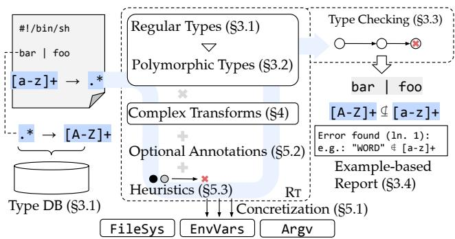  
Fig. 1: RT overview. A shell program is parsed into RT, which assigns types to commands from a database of type declarations (§3.1). It models command behavior with simple regular types (§3.1), extends expressiveness through polymorphism (§3.2) and custom regular operations (§4), and detects composition errors with counterex amples (§3.4). Optional extensions—concretization (§5.1), annotations (§5.2), and heuristics (§5.3)—boost precision.

This paper proposes a new type system and associated implementation, RT, for statically checking shell programs before their execution (Fig. 1). RT’s novel regular types offer expressiveness appropriate for capturing the structure of a command’s input, output, and other streams, support computationally tractable and efficient type checking, and provide an interface encoded as regular expressions—i.e., annotations and error messages familiar to developers versed in the Unix environment. With regular types, RT allows expressing, propagating, and checking constraints over the values of interprocess communication streams and the commands operating on them. RT targets shell fragments and scripts whose correctness depends on the line-level structure of streams passed between commands. This focus enables RT to catch bugs such as path-shape and argument-splitting mistakes, incompatible record formats between stages, text field mismatches, filters that eliminate output unintentionally, and malformed streams supplied to dangerous side-effectful commands.

```shell
1 find . | # Find files ε → \.(/.+)?
2 grep -E 'book[0-9]+\.txt' | # Filter by name → .*book[0-9]+\.txt.*
3 xargs cat | # Concat files [^ \t]+|".+"|'.+' → .*
4 tr -cs A-Za-z '\n' | # Split words .* → [A-Za-z]*
5 tr '[:lower:]' '[:upper:]' | # Normalize [A-Za-z]* → [A-Z]*
6 grep -fw dict.txt | # Filter words ...
7 sort | uniq -c | sort -rn # Freq sort *[-+]?[0-9]+.* → *[-+]?[0-9]+.*
```  
Fig. 2: Left: A shell program with subtle composition mistakes. Right: Regular types for each line in the left script; the last corresponds to sort -rn . These are not the only types that could accurately summarize each invocation’s behavior—in general, there may be infinitely many possible types for any given invocation, all of which may be correct (if not precise); see §3.

These benefits of regular types come with (deliberately) constrained expressiveness: not all command behaviors are directly representable. With carefully designed extensions that maintain regularity, RT demonstrates that regular types are sufficiently expressive to capture many interesting properties of command behavior. It also reasons about many commands via useful approximations and regular subsets of their domains, including handling commands manipulating data such as CSV or JSONL. RT’s regular-type reasoning allows it to identify bugs in computations that directly lead to dangerous side effects, such as pipelines computing path names to delete. By identifying bugs in such input-output manipulations, RT can prevent a wide array of bugs relating to dangerous sideeffects without reasoning about those effects directly.

RT’s type system (§3) and checking algorithm (§3.3) are extended with polymorphic types (§3.2) aimed at improving precision while maintaining tractability. Additional extensions such as compositional regular-type operators and finite-state transducers further improve expressiveness and accuracy (§4). The RT implementation is parameterized over a database of type declarations for every supported command invocation, akin to a typed standard-library in other languages. RT can optionally be configured to leverage developer annotations, additional heuristics, and environment concretization to improve its results (§5).

Evaluated on hundreds of shell programs, including dozens of real-world bugs collected from GitHub and StackOverflow, RT achieves 91% accuracy (864 out of 954) at classifying programs as correct or buggy. It uncovers 87 bugs ignored by state-of-the-art systems, including newly discovered bugs on production shell programs previously considered correct. RT’s extensions offer valuable benefits in several cases—for example, finite-state transducers drop RT’s false positive rate from 20% to 4%. And it is fast: RT typechecks 954 programs in 20s, averaging 0.02s per program.

The paper starts by exemplifying the kinds of composition problems often found at the streaming core of the shell and how RT exposes them ahead of time (§2). Sections 3–5 highlight RT’s key contributions:

• Regular types: A type system targeting stream contents and commands operating on them, along with an efficient type checking algorithm that automatically detects composition errors in shell programs (§3).

• Compositional regular-type operators: An extended set of regular-type operations for common input-output transformations implemented efficiently via automata constructions (§4).

• Extensions and optimizations: Extensions and optimizations improving RT’s precision—including a concretization subsystem for probing the current runtime context, a lightweight annotation language for expressing additional constraints, and heuristics for subtle composition errors (§5).

The paper continues with RT’s evaluation (§6), discussion of related work (§7), and conclusion (§8). Appendix A contains examples of RT’s optional syntax sugar, and Appendix B summarizes the open-source RT artifact:

https://github.com/atlas-brown/rt

## 2 Motivating Example

Consider the shell script in Fig. 2, a modern equivalent to McIlroy’s classic one-liner [6]. It counts frequencies of correctly spelled words across all book files anywhere within the file tree rooted at the user’s current directory. This example illustrates RT’s target setting: a shell fragment whose behavior depends on whether each stage receives and emits lines in the shape expected by downstream.

Unfortunately, it does not work right: it produces an error saying that some files do not exist, and nothing on standard out. While ShellCheck—a state-of-the-practice linter [22]— reports no warnings, RT uncovers several issues causing the undesired behavior. Applied to spell.sh, its output begins:

\$ rt spell.sh   
Error (ln. 2):   
> grep -E 'book[0-9]+\.txt' | xargs cat ...   
grep -E > (\.(/.+)?)&(.\*book[0-9]+\.txt.\*)   
maybe incompatible w/   
xargs cat > [^ \t]+|".+"|'.+'   
Counter-example: "./ book0.txt" ...

RT reports that the output of grep may be incompatible with xargs cat. To make the issue concrete for the developer, RT gives an incompatibility witness: "./ book0.txt" is a line that the upstream command may produce and cause the downstream command to misbehave because xargs splits the path at the space.

Regular types: RT reasons about composition mistakes by specifying the contents of communication channels with regular types. Regular stream types describe the language of the lines in the stream—e.g., find . outputs paths relative to the current directory, one per line, so its output type is \.(/.+)?. Regular command types describe the languages of input-output streams—e.g., find . :: ε → \.(/.+)?

To reason about Fig. 2’s pipeline, RT leverages the corresponding command types listed on the right of Fig. 2. By checking that the output language of every stage is included in the expected input of the following, RT reasons that the output language of grep (ln. 2) is not included in the expected input of xargs cat (ln. 3):

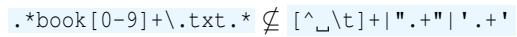

This is because filenames with spaces (e.g., my book1.txt) are problematic inputs for xargs cat, as they are split into multiple arguments leading them to be misinterpreted as separate files (as in cat my book1.txt). The fix: grep’s pattern should be stricter to eliminate unexpected paths (grep -E '^\./book[0-9]+\.txt\$').

Configurability: Unfortunately, RT cannot reason precisely about the output stream type of grep -fw dict.txt without the contents of dict.txt. Absent that information, RT can only say that the patterns could be anything, therefore the invocation’s output could be any subset of its input type ([A-Z]\*)—not enough information to determine a problem.

However, RT can perform environment-specific concretization by reading the contents of dict.txt and computing a highly precise type for the command capturing every word in the file. The intersection of the input type of the grep -fw dict.txt invocation ([A-Z]\*) with the disjunction of every word in the file simplifies to the empty type (i.e., the patterns can never match any input lines), thereby identifying another error.

With that information from RT, the problem and corre sponding fix are apparent. The arguments of line 5’s tr are swapped: it should normalize words to lowercase, not upper. The fixed line 5 is: tr '[:upper:]' '[:lower:]'.

Extensions: Fig. 2 omits simple regular types for sort and uniq on purpose. They pose a problem: what are their appropriate types? Consider sort, which only reorders lines, and therefore by the definition of stream types, accepts any type and produces output of the same type. Hence, the most precise input type for sort would be whatever grep -fw dict.txt produces; similarly for its output.

The trouble with sort reveals a general concern, shared by grep, uniq, and others: the most precise type for a particular use of command depends on its context. To enable succinctly expressing types with this property, RT supports two extensions to regular types: polymorphic command types and domain-specific type transformation operations. With these extensions, RT’s type database can provide equivalent or more precise versions of all of the types in Fig. 2 as well as (for the final program): [a-z]\* → [a-z]\* for sort, and [a-z]\* → \*[0-9]+ [a-z]\* for uniq -c.

Results: RT identifies all composition mistakes in 0.02s.   
Once corrected, the program triggers no RT warnings.

## 3 Core Regular Types

RT summarizes stream contents using regular stream types, and command input/output behavior using regular command types. This section details the nature of these types, and how RT uses them to automatically identify composition mistakes.

A regular stream type is a regular language, written as a regular expression, that describes the set of all possible contents of each line in a stream, mirroring the line-oriented nature of most UNIX commands. The regular stream type is therefore line-oriented: it can precisely capture regular structures such as the formats of /etc/passwd entries and IPv6 addresses, and can approximate line-delimited formats such as CSV and text search results. For example, a regular stream type describing the output of find . is \.(/.+)?, capturing that every line of output is a relative path—i.e., either . itself, or ./ followed by any non-empty string.

At its core, RT describes commands by combining two stream types: an input and an output stream type. Intuitively, a regular command type describes a transformation from a language of input to the language of output of the command. For example, the regular command type .\* → [0-9]+ describes how wc -l transforms the input language (anything) to the output language (decimal digits).

## 3.1 Regular Types and Commands

RT summarizes byte-stream contents using stream types— regular languages defined via extended regular expressions (EREs) [63] (T defined in Fig. 3). These include standard ERE features such as concatenation, alternation (|), repetition (\*, +, ?), grouping with parentheses, character classes (e.g., [A-Z], [:digit:]), anchors (ˆ, \$), and bounded quantifiers (e.g., a{2,5}).

T ::= literal | character class | . | ˆ | \$   
| T T | T \* | T + | T ? | (T ) | T |T   
T {n} | T {n,} | T {n,m}   
| !T | T&T   
n ∈ N   
C ::= T → T  
Fig. 3: Base regular types accepted by RT. The grammar is a superset of POSIX ERE, with the addition of negation (!) and intersection (&). Regular stream types T are closed under regular languages. Command types C pair an input and output stream type.

RT does not support lookaround assertions (see, e.g., [12,40,47]). It also does not support non-regular features such as backreferences (found in PCRE [3]) so that language inclusion remains decidable [20]. To improve expressiveness while retaining regularity, RT adds two operators: intersection (&) and negation (!). For instance, [a-z]+ & err.\* matches all lowercase words with an “err” prefix, and !(abc) matches any string not matching abc. All supported operations are closed under regular languages.

RT defines a regular stream type as sound if it accepts all possible stream contents, and precise if it accepts only those that can actually occur. For example, if the possible lines in a stream are exactly foo and bar, then the regular stream type foo is unsound because it misses bar; .\* is sound but not precise because it also accepts lines such as baz; and foo|bar is precise.

Command types: RT summarizes a command’s input/output behavior using command types (C defined in Fig. 3), which pair stream types for each stream. A command type is sound if its input type is a subset of the command’s safe domain— the set of inputs guaranteed not to cause crashes and misbehaviors—and its output type is a superset of the command’s possible outputs. A command type is precise if for every input type satisfying the input constraints, the output type is exactly the language of possible outputs.

Although many UNIX commands do not correspond di rectly to regular-type transformations, most can be approximated with sufficient accuracy. For instance, grep’s output is the intersection of its input with a search-pattern. In contrast, commands such as sort exceed the expressiveness of regular types, but can still be usefully approximated—e.g., by assigning identical input-output types that abstract over line contents, as the set of lines remains unchanged.

Commands such as tee, paste, or comm involve multiple streams; RT assigns each a separate type. RT also instantiates a type to the error streams of commands. For simplicity, this paper discusses commands in terms of a single input and single output stream unless otherwise noted.

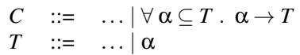

Fig. 4: Polymorphic regular type extensions. Polymorphic regular types have an input type constraint, and an input type variable α that may be used anywhere in the range type. This grammar extends the regular types of Fig. 3.

The type database: RT is parameterized over a database of command type declarations for supported invocations, much like how the type system of a typical programming language requires a manually-crafted base type environment declaring the types of primitive runtime functions. In general, RT’s type database could be a literal mapping from invocations to command types, or arbitrary functions that produce a command type given an invocation.

RT strikes a middle-ground, with manually-written configuration files that define (1) how to parse relevant invocations and (2) how to construct a command type given an invocation (useful for example for grep, whose output type can be constructed from its argument regular expression). The higher-order command constructor xargs is not typed individually: an invocation such as xargs cat is handled as a single command. For commands not found in the database, RT defaults to the command type that is trivially correct for all command invocations: .\* → .\* . In total, RT’s starting database covers 71/106 GNU coreutils (Cf.§6).

RT’s type database is available for systems and users to inspect and modify the types of individual commands during development and use. It is integrated into the UNIX environment through the rti command. To inspect the type of a specific invocation, a user runs:

```batch
$ rti wc -l
wc -l :: .* → [0-9]+
```

Conversely, to add or update the regular type of a command in the type database, a user—or a system synthesizing regular types—runs:

\$ rti word-stem :: '[A-Za-z]+' → '[A-Za-z]+'

## 3.2 Polymorphic Regular Types

A finite type database that maps each command invocation to a simple type struggles with commands whose most precise type depends on the input type. For example, cat copies its input stream, so its precise output type should be exactly the input type. Enumerating every possible cat type is impossible, while using a broad type such as .\* → .\* is sound but not precise. RT overcomes this challenge by introducing polymorphic command types. In particular, command types may be parameterized over type variables, which stand in for arbitrary regular types and may appear as the input type and anywhere within the output type. Fig. 4 defines the syntax

Algorithm 1: RT type checking algorithm. RT iterates over pipeline stages (commands), checking if the output of each stage is compatible with the following stage’s input type. An example application is shown in Fig. 5. The algorithm generalizes naturally to directed acyclic command graphs by processing commands in topological order.

```javascript
1 Function CheckPipeline(c<sub>1</sub>|c<sub>2</sub>| ... |c<sub>n</sub>, in):
2 input ← in;
3 for i ← 1 to n do
4 type ← GetTypeAnnotation(c<sub>i</sub>);
5 if not CheckInput(type, input) then
6 ReportMismatch(type, input);
7 input ← InstantiateOutput(type, input);
8 Function CheckInput(type, input):
9 if type is simple then
10 return IsSubset(input, type.input);
11 else
// Polymorphic type annotation
12 return IsSubset(input, type.constraint);
13 Function InstantiateOutput(type, input):
14 if type is simple then
15 return type.output;
16 else
17 return type.output[type.var 7→ input];
```

as an extension of simple command and stream types C and T ; as a notational convenience, the input bound type can be omitted (equivalent to a bound of .\*). The polymorphic type of cat, for example, can be written ∀α . α → α—capturing the fact that the output type of cat is the same as its input.

While some commands, such as cat, impose no expectations on their input, many commands with polymorphic types do: they are polymorphic over a constrained set of regular types (analogous to bounded polymorphism [11]). For instance, sort -n copies its input to its output (abstracting across all lines), but its numeric sorting expects each input line to begin with decimal digits. Polymorphic command types can express constraints over polymorphic variables, such as the following type for sort -n: ∀α ⊆ [ \t]\*[-+]?[0-9]+.\* . α → α.

Polymorphic command types do not introduce any chal lenges for type checking. RT reasons about polymorphic command types after instantiating them into simple types, so that type compatibility checks are always over simple stream types. For a fixed command invocation and input type, RT uses the unique most-precise instantiation. For example, when the input type is [0-9]+, RT instantiates the polymorphic type of cat, ∀α . α → α, by substituting [0-9]+ for α, yielding the simple type [0-9]+ → [0-9]+.

## 3.3 Type Checking with Regular Types

Alg. 1 outlines the core of RT’s type checking algorithm. The algorithm is shown for pipelines, but generalizes naturally to directed acyclic command graphs by processing commands in topological order. At a high level, for pipelines, RT iterates over stages (commands), checking if the output of each stage is compatible with the following stage’s input type.

In detail, the main CheckPipeline procedure accepts the pipeline of commands c<sub>1</sub>|c<sub>2</sub>|...|c<sub>n</sub> and an input stream type for the pipeline in. It iterates over each stage (command), keeping track of the intermediate stream types between each stage in the input local variable. The initial value of input is in, the assumed input to the pipeline; absent any specific information, in could be either the type that only accepts the empty string ε—assuming the pipeline receives no input—or .\* assuming it could receive any input. The choice between these two assumptions is easily configurable alongside other aspects of RT (Cf.§5).

For each stage of the pipeline, the algorithm performs four steps. First, it retrieves the command type for the stage’s command invocation (c<sub>i</sub>) with GetTypeAnnotation. Then, it checks if the current intermediate stream type is a valid input according to the input stream type of the command with CheckInput; if not, it calls ReportMismatch to report an error (see §3.4). Otherwise, the algorithm computes the next intermediate stream type based on the command type and its input using InstantiateOutput, and then proceeds with the rest of the pipeline.

The CheckInput and InstantiateOutput helpers check type compatibility and compute output types respectively. CheckInput consists of two cases: (1) if the command type is not polymorphic, then it checks if the input is a subset of the command type’s input stream type, i.e., regular language inclusion; (2) if the command type is polymorphic, then it checks if the input is a subset of the constraint bound on the command type’s polymorphic input type. Similarly, InstantiateOutput mirrors the same structure with two cases: (1) if the command type is simple, then it returns the literal output stream type of the command; (2) if the command type is polymorphic, then it instantiates the output of the command type to obtain a simple stream type. Instantiating the polymorphic type means syntactically substituting the type variable with the actual input type. For example, for a polymorphic command type ∀α.α → hi α, and input type [a-z]+, the substitution in the output type results in the concrete type hi [a-z]+.

## 3.4 Error message generation

If the type checking algorithm detects type incompatibility between a stream and the input type of a command consuming it, it generates error messages to help users understand and fix the composition error. The error message includes a counterexample witness x that demonstrates the type incompatibility, where x belongs to the input type but not to the expected type (for simple annotations) or the constraint type (for polymorphic annotations). Equivalently, RT looks for a string that L<sub>1</sub> accepts and L<sub>2</sub> rejects. By the set-theoretic equivalence x ∈ L<sub>1</sub> ∧ x ∈/ L<sub>2</sub> ↔ x ∈ L<sub>1</sub>\L<sub>2</sub>, RT finds such a witness from the automaton for L<sub>1</sub>\L<sub>2</sub>.

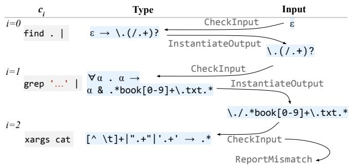  
Fig. 5: Type-checking example. Applying Alg. 1 to Fig. 2’s pipeline, step by step. Columns (left to right) are the command in the pipeline, the type produced by GetTypeAnnotation, and the intermediate stream type assigned to input after each iteration. Rows (top to bottom) show iterations 1–3 of the loop in CheckPipeline.

## 4 Complex Transformations

While simple and polymorphic types suffice to precisely model many commands—and approximate others—some approximated commands perform fine-grained manipulations that are (1) critical for reasoning about program correctness and (2) amenable to precise modeling. To capture such behaviors, RT leverages finite-state transducers to express complex regular-type transformations corresponding to common command semantics.

RT exposes these transformations as new primitive operations that extend regular types beyond standard operations such as union, intersection, and negation. These operations enable precise modeling of commands such as tr, cut, and grep -o whose behaviors are regular but not expressible using standard regular operations alone.

For instance, grep '[A-Z]' can be precisely typed using intersection and polymorphism, but tr A-Z a-z cannot— its transformation, while regular, lies outside the expressive power of standard operations. Naive approximations using only standard operations can be unsound: modeling tr -s ' as ∀α.α → α &!(.\* .\*) underapproximates its output. With input ( b )\* , this results in ( b )? , whereas the actual output is ( (b )+)?. Unsound command types can lead to false negatives, since downstream checks then reason about an output type that omits streams the command can actually produce. Imprecise command types can lead to false positives, since downstream checks must also account for streams that the command will never produce.

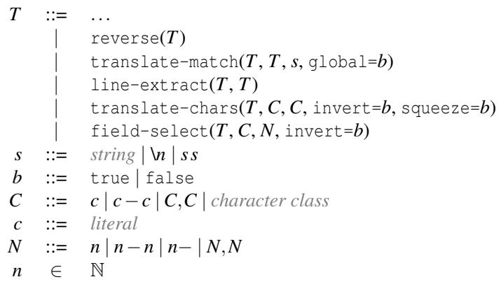  
Fig. 6: The full RT types. The full syntax of regular stream types, extending regular expressions with five new primitive operations (extending Fig. 3 and Fig. 4).

## 4.1 New Regular-Type Operations

To improve precision while maintaining soundness, RT supports concisely expressing regular types for these kinds of transformations via a novel set of regular-type operations that, alongside standard operations, make up a domain-specific language of regular types. Fig. 6 shows the now-extended language of regular types.

The semantics of each operation is that of a type-level transformation of regular languages. The reverse(T<sub>i</sub>) operator transforms language T<sub>i</sub> into the reverse language, as recognized by the reversed DFA. The translate-match(T<sub>i</sub>, T<sub>p</sub>, s, global=b) operator transforms input type T<sub>i</sub> into a type where all leftmost-longest<sup>1</sup> occurrences of T<sub>p</sub> are replaced with s (if b is true, otherwise only the first)—and s may include group references (not to be confused with backreferences in patterns). The line-extract(T<sub>i</sub>, T<sub>p</sub>) operator transforms T<sub>i</sub> into the sublanguage which also matches T<sub>p</sub>. The translate-chars(T<sub>i</sub>, C<sub>f</sub> , C<sub>t</sub>, invert=b<sub>v</sub>,

squeeze=b<sub>s</sub>) operator transforms T<sub>i</sub> into a type where all characters in C<sub>f</sub> are replaced with the same-position character in C (where positions beyond the end of C translate to the last character of C<sub>t</sub> , as in tr ); if b<sub>v</sub> is true, the set of characters to be replaced is the complement of C<sub>f</sub> ; if b<sub>s</sub> is true, the result type also compresses repeated occurrences of each individual character in C<sub>t</sub> to a single occurrence. The field-select(T<sub>i</sub>, c, N, invert=b) operator transforms T into the type of just fields at indices N (or all other fields, if b is true), separated by c; fields that are absent come out empty in the transformed type.

The translate-chars and field-select operations are specializations of the more general translate-match construct; these specializations correspond to commonly-used commands and admit more precise and efficient modeling than the fully general translate-match.

Tab. 1: Soundness and precision of operations. Each row describes a regular type operation, whether RT can compute the output type soundly and precisely, and an example command that is described with the operation. The last column describes the type of FST used to compute the output type, which can be a functional non-deterministic FST (FN-FST), a deterministic FST (DFST), or a non-deterministic FST (NFST).  
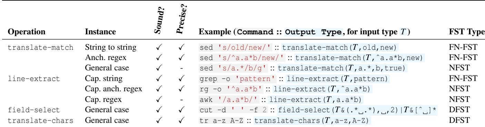

To illustrate the operations concretely, Tab. 1 lists example command invocations and corresponding command types demonstrating each operation. For instance, sed uses translate-match, and tr uses translate-chars.

The behavior of cut has three cases: (1) if the input line lacks the delimiter entirely, it outputs the whole line, (2) if the input line includes the delimiter but fewer fields than those requested, it outputs the empty string for the missing fields, and (3) otherwise it outputs the requested fields separated by the delimiter and in ascending order of index. To capture this complex behavior, cut’s type performs field selection according to field-select’s stricter semantics for the sublanguage of inputs that contains the delimiter, and then unions with the sublanguage of inputs that do not contain the delimiter.

While some common commands map directly to one operation, others compose multiple. For example, the type of awk '{print \$2}' in RT’s database is:

```csv
∀α.α →
field-select(
translate-chars(
translate-match(α,"ˆ[ \t]+", ""),
" ,\t", " ", squeeze=true),
" ", 2)
```

## 4.2 Finite-State Transducers

RT implements the regular type operations shown in Fig. 6 by constructing finite-state transducers (FSTs) and composing them with the input automata representing regular types. An FST is a finite-state machine that not only recognizes input strings but also emits output strings along transitions [48]. This allows RT to define type-level string transformations that preserve regularity: the output of an FST applied to a regular language is itself regular.

Each new regular type operation that RT supports corresponds to its own FST construction. Once constructed, the FST is composed with the input automaton (corresponding to the input stream regular type) to produce a new automaton representing the transformed language (the output regular type). These constructions do not complicate type checking: they essentially contribute one new step to InstantiateOutput in Alg. 1, which computes the result of any operations; hence, type checks remain in terms of simple regular languages.

To more concretely understand how RT constructs the FST for a given regular type operation, consider the translate-chars operation with squeeze=true, which transforms an input type A by collapsing consecutive occurrences of characters in the translated-to set into a single instance. At a high level, RT computes the translate-chars operation over regular types by constructing the operation’s FST for the particular arguments, computing its product with the input language automata, and constructing a resulting NFA. Fig. 7 illustrates this process in detail for the input type ( b )\*, with space as the character being squeezed. Starting from the DFA of the input (a) and the FST representing the translate-chars operation (b), RT computes their product (c) and derives an NFA over the FST’s outputs (d), yielding the transformed type.

Different operations require different classes of FSTs depending on their complexity and the structure of their patternmatching logic. Tab. 1 summarizes the operations supported by RT, including whether their output types are computed soundly and precisely, and the class of FST used. Deterministic FSTs (DFSTs) are transducers with exactly one possible transition per input symbol in each state. They are used for transformations that are positionally local and unambiguous. Functional non-deterministic FSTs (FN-FSTs) allow multiple accepting paths for a given input, but all such paths produce the same output. This enables more expressive transformations while preserving precision. General non-deterministic FSTs (NFSTs) may produce multiple outputs for the same input and are used for the most general forms of pattern-based transformations. These transducers remain sound but may sacrifice precision—the result of computing the corresponding operation may be a larger language than necessary.

Tab. 2: RT heuristics. Each row describes a heuristic that RT uses to identify likely mistakes in command compositions, its description, and an example command composition that triggers the heuristic.  
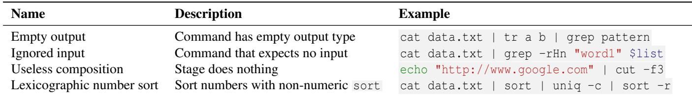

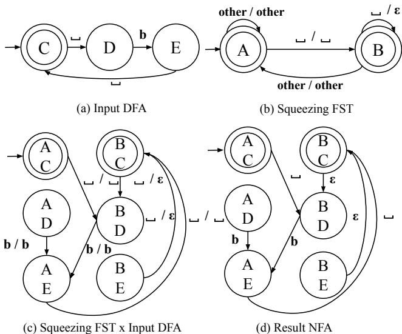  
Fig. 7: FST construction example. RT constructs the FST translate-chars(( b )\*, , , squeeze=true) by constructing the DFA for the regular type ( b )\* (a) and then taking its product with the translate-chars FST (b). Taking the output of each transition of the resulting FST (c) produces the output NFA corresponding to the transformation of the input type (d).

Precision of transformation: Not all operations can be implemented perfectly precisely. Some instantiations of the operations are not regular transformations: consider the invocation sed -E "s/(.\*)/\1\1/", corresponding to translate-match(A, (.\*), \1\1), which duplicates input strings. The image of input type .\* under this duplication operation is not a regular language [31]. On the other hand, other instantiations do perform regular transformations, but the transformations do not admit precise modeling. RT supports sound approximations in all such cases, even while supporting precise modeling for simple common cases; Tab. 1 breaks down which cases RT can and cannot support precisely.

RT precisely computes the output type for operations field-select and translate-chars. They are implemented using deterministic FSTs, which contain no ambiguous transitions. However, line-extract and translate-match operations are challenging to implement because determining exact match positions often requires nondeterministic guesses. Specific cases of translate-match

string matching and anchored patterns—are addressed with special transitions in the FST that recover from failed partial matches, which results in functional non-deterministic FSTs. Similarly, for the precise cases of line-extract such as capturing an anchored regex pattern, RT relies on non-deterministic FSTs. In the general cases of line-extract and translate-match, however, RT constructs non-deterministic FSTs that over-approximate the actual output type. These non-deterministic structures ensure soundness by covering all possible outputs but sacrifice precision. For instance, RT computes translate match("abab", "a.\*b", c, global=true) as c?c, an over-approximation of the precise output c. If a downstream command expects strictly c , this can lead to false positives.

## 5 Configurability and Concretization

RT optionally performs environment-specific concretization, inferring input types based on the contents of input files at the time of analysis, to provide more precise information (§5.1). Two types of annotations provide a way for developers to describe the specific shape of unknown inputs, or assert expectations about the type of desired outputs (§5.2).

Also configurably, RT can warn about composition mistakes that do not strictly violate any command’s input constraints, but rather behave in ways that are almost always undesirable. For instance, a common bug is a pipeline that never produces output due to incorrect command composition. Using regular type information, RT can warn developers about such mistakes ahead-of-time based on a set of heuristics about typical input and output types (§5.3).

## 5.1 Environment-based Concretization

RT can be configured to leverage information from the environment during analysis to obtain information about actual inputs to reason precisely about program behavior within the local system context. For instance, by analyzing the content of an input file, RT can infer a regular type capturing the current contents, and then use that type to be able to notify developers that a program will certainly be problematic if executed using that particular file. This can help developers stay ahead of typical mistakes that slow down development, such as using cut to select fields but forgetting to specify the field delimiter.

RT leverages concretization as part of a secondary specialization pass when type checking programs. After performing normal type checking (i.e., making no assumptions refining the range of possible values) and reporting any general issues with a program, RT then attempts concretization to offer finergrained information. Specifically, if there are concrete inputs that are accessible at analysis-time on the local machine, including files or environment variables, RT reads the input and uses the entire contents verbatim as the input type in the same way as assumption annotations.

## 5.2 Type Annotations

Type annotations let developers configure how RT checks command compositions, enabling more precise validation. While some compositions may seem unsafe for arbitrary inputs, they can be valid for specific input formats. For example, using grep to filter out NA lines before passing data to a command expecting numbers is safe when the input contains only numbers or NA. By annotating such expectations, develop ers help RT suppress irrelevant warnings and provide more accurate feedback.

Annotations also help developers use RT to catch bugs beyond unsafe compositions. For instance, a program’s output may need to meet specific correctness properties—e.g., not containing newlines before being sent over the network. With output annotations, developers can encode such expectations, allowing RT to verify them.

Developers can provide annotations using comments in a script’s source, such as the following:

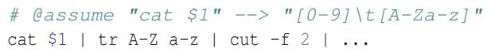

In general, annotations appear as comments that begin with @ and a keyword identifying the kind of annotation. Corresponding to the different kinds of information developers can offer, there are five distinct kinds of annotations. The first two are assumptions that RT should use while reasoning instead of computing the corresponding information: assume assumes the type of an invocation’s output, and input assumes the type of input to the entire program. The remaining three are assertions that RT checks in addition to confirming inputoutput type compatibility: assert checks that the computed output type of an invocation is a subset of the annotated type, expect checks that the input received by an invocation is a subset of the annotated type, and output checks that the program’s output is a subset of the annotated type.

To help developers write annotations when necessary, RT supports human-friendly definitions for a variety of types that desugar behind the scenes. These definitions capture common patterns such as ip-addresses, numbers in a floating-point decimal format, urls, and more (appendix A lists the full set of definitions RT supports, which is also extendable).

RT incorporates annotations into the type-checking process at different points for each kind of annotation. For assumption annotations, RT simply replaces the corresponding type with the assumed one at the relevant stage of the pipeline. For assertions, RT first computes the actual regular type at the relevant stage, and then checks if that actual type is included in the asserted type—if so, it proceeds with the computed type, and otherwise raises an error reporting the failure.

## 5.3 Heuristics

RT includes several heuristics identifying compositions that do not strictly violate any command’s input constraints, and hence are well-typed, but correspond to likely mistakes. That is, the circumstances identified by the heuristics are not necessarily problematic, but they capture common mistakes and undesirable behavior.

Tab. 2 lists the four heuristics RT considers, each of which describes a criterion for rejecting a program. The first heuristic is command invocations in pipelines that have an empty output type—therefore are guaranteed to have no output. The second is providing input to commands that expect none, such as echo. The third is pipeline stages that are guaranteed to have no effect on the pipeline contents. This heuristic applies only to filter-like commands such as grep, selector-like commands such as cut, and transformer-like commands such as tr. The fourth is using the sort command in lexicographic mode (without -n ) on numeric inputs. Critically, the heuristics describe properties of compositions that depend on input and output type information. Hence, the heuristics capture common mistake patterns at a more semantic level than syntactic matching, which is not robust to syntactic variation.

## 6 Evaluation

We evaluate RT on hundreds of real-world programs, investigating the following questions: Q1) What is the effectiveness of RT? and Q2) What is the analysis performance of RT?

Overview of Results: RT’s overall accuracy across all programs is 91%. Fig. 8 breaks this down into accuracy on buggy programs (72%) and correct ones (96%)—and when programs include extra type annotations to inform RT, its accuracy rises to 94% and 98% respectively. In comparison to state-of-theart systems, RT is 52% more accurate than LADDERTYPES and ShellCheck on buggy programs. Furthermore, RT provides confidence information indicating whether approximations may lead it to warn about a program, and for programs with definite confidence RT exhibits 100% accuracy (and 86% accuracy for possible-bug reports). RT analyzes every program in the set in under 1s (avg. 0.02s).

Tab. 3: Benchmark summary. Correct (#C) and buggy (#B) columns show the number of programs that are correct or include one or more composition mistakes, respectively.  
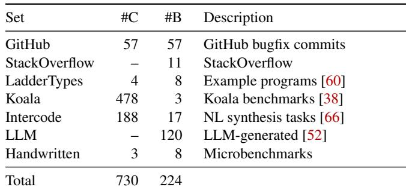

## 6.1 Benchmark Suite

We use a comprehensive suite of both correct and buggy programs to answer these research questions. Since no established suite meeting both of these criteria already exists, we have collected and curated a new set of benchmarks.

Tab. 3 summarizes our benchmark suite, consisting of 7 different evaluation sets drawn from a variety of sources. The sets in rows three through five are drawn directly from the literature and community. The first is examples of both buggy and correct programs from Sippel and Schirmeier’s pipeline typing system, LadderTypes [60] (Cf.§7); second is all scripts in the Koala benchmark suite [38]; and third is the full set of programs from the Intercode evaluation suite for naturallanguage-to-code-synthesis systems [66]. These three sets come with explicit and implicit labels; some of the Ladder-Types programs are provided as buggy examples, and all of the other programs are intended to be correct. However, in the process of collecting these sets, we identified two other bugs in the LadderTypes programs, three in the Koala benchmarks, and 17 in the Intercode suite, and therefore labeled these particular programs buggy.

The remaining benchmark sets focus on buggy programs from four sources: (1) GitHub scripts, extracted from bugfix commits; (2) StackOverflow bugs identified via manual search and inspection; (3) LLM-generated programs, prompted to produce common shell mistakes; (4) Handwritten tests targeting specific composition patterns.

We collected the GitHub programs using a partially automated process. First, we selected the top twenty repositories with shell code on GitHub (according to number of stars) using the GitHub query API. For each such repository, we filtered the history of commits (total 47080) to those which (1) modify a file ending with .sh|.bash|.zsh and (2) the modified line contains the pipe character |. For every such commit (total 1028), we prompt gpt-4o-mini to identify which commits fix a bug relating to the contents of a pipeline. We manually inspected the resulting 328 commits to check their relevance, discarding commits that do not fix bugs, or for which the bug is unrelated to pipeline contents—ending up with 57 relevant commits. Each such commit provides two programs in our suite: the pre-commit script, which contains a bug (included in the buggy set), and the post-commit script, which fixes the bug (included in the correct set).

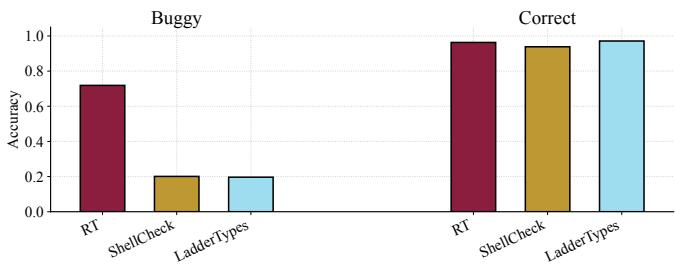  
Fig. 8: Accuracy results. The bars depict the accuracy of RT, ShellCheck, and LADDERTYPES on buggy and correct programs.

We collected the StackOverflow scripts manually, using both web search (with phrases such as “shell”, “bash”, and “pipeline”), and the StackExchange API, filtering for questions containing the keywords “error”, “bug”, “pipeline”, or “unexpected” in the core site and Unix & Linux Stack Exchange sub-domain. We manually reviewed the results and included only buggy programs, as these posts rarely provided corrected versions.

## 6.2 Q1: Effectiveness

To answer Q1, we calculate RT’s accuracy in identifying composition mistakes across all benchmark sets. Accuracy is defined as the proportion of correct categorizations RT makes relative to the whole population; a system that always flags buggy programs and never correct ones is 100% accurate. We evaluate RT configured with its included type database— which covers 71/106 of the GNU coreutil commands and 86% of the command invocations in the GitHub set (Cf.§3.1).

Big picture: At a high level, RT has an overall accuracy of 91% (90 false positive/negatives), and identifies 87 bugs that state-of-the-art systems fail to detect. Fig. 8 breaks this down into accuracy on buggy programs (72%) and correct ones (96%)—and for programs with extra type annotations, its accuracy rises to 94% and 98% respectively. Breaking RT’s judgments down into definite and possibly-buggy warning levels, RT’s definite warnings are 100% accurate, while its possibly-buggy warnings are 86%—the drop in accuracy reflecting the use of approximations and heuristics in its reasoning. In a comparison across RT, ShellCheck, and LADDER-TYPES, RT significantly outperforms both baseline systems on buggy programs (by 52 percentage points) while maintaining comparable accuracy on correct programs.

Detailed Analysis: Tab. 4 breaks down RT’s accuracy across correct and buggy benchmark subsets, reporting true positives and negatives based on whether RT correctly signals warnings for buggy programs or refrains from warning on correct ones.

Tab. 4: Breakdown of configurations. Each column represents a different configuration of RT. The leftmost is RT with all features enabled, and following columns disable one feature: without heuristics, without FSTs, and without concretization. Rows indicate RT’s true result under each configuration on correct and buggy scripts.  
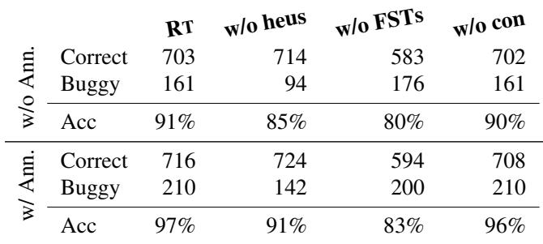

The leftmost column reports results for the full configuration of RT. The remaining columns list results for a version of RT with one or more features disabled, thereby quantifying the benefits offered by each feature in isolation or combination. Overall, RT has 91% accuracy in the evaluation suite, with 27 false positives on correct scripts and 63 false negatives on incorrect ones. With annotations, RT has 97% accuracy on the programs, with 14 false positives on correct scripts and 14 false negatives on incorrect ones.

Sources of inaccuracy: To better understand RT’s inaccurate results, Tab. 5a breaks down their causes for the maximal configuration without annotations. RT produces 11 false positives due to programs that violate heuristics, but are actually correct (Cf.§5.3). RT reports 16 false positives due to over-approximations in type inference. For instance, the file referenced by \${input} in the pipeline cat \${input} | sort -n is unknown ahead of time. Consequently, RT conservatively infers the output of cat as .\*, which is sound but imprecise. RT produces 14 false negatives for programs that are well-typed, but whose behavior is incorrect according to the program’s original source (i.e., the bug is not of a nature that RT could detect). RT produces 49 false negatives due to the absence of expected output specifi cations. Without user-provided assertion annotations to define the required format, the programs are well-typed.

Tab. 5b shows the false results for the full configuration of RT evaluated on the benchmark set with annotations. RT eliminates all false negatives caused by the absence of expected output specifications with annotations. However, RT still produces 6 false positives related to over-approximations. These are invocations that RT models soundly but imprecisely due to inherent complexity of the commands—such as complex uses of awk and sed. Properly supporting all possible invocations of these commands demands a specialized language analysis (in the case of awk); sed invocations with complex capture groups, however, pose fundamental challenges (§4.2).

Comparison with state-of-the-art systems: We compare

RT’s accuracy to that of LADDERTYPES and ShellCheck. Like RT, LADDERTYPES classifies programs as buggy or correct. However, LADDERTYPES by default comes with a smaller set of type declarations than RT. To enable fair comparison we manually add reasonable versions of all RT’s simple type declarations and a fallback type declaration mirroring RT’s. ShellCheck differs from RT and LADDERTYPES in that it emits a wide range of warnings—many irrelevant. To bring it into parity for comparison, we consider a program buggy under ShellCheck if it produces any warning related to pipelines or output stream contents,<sup>2</sup> and correct otherwise.

The Euler diagram on the right compares the effectiveness of these systems, showing the number of buggy programs each identifies. Overlaps indicate agreement across systems. RT is evaluated without annotations, as neither

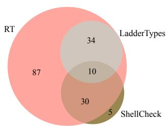

ShellCheck nor LADDERTYPES benefits from developersupplied information. RT uniquely detects 87 bugs, compared to 5 unique to ShellCheck and 0 to LADDERTYPES. Notably, 58 bugs remain undetected by all three systems in the absence of type annotations.

Digging into the nature of the buggy programs that ShellCheck identifies but RT does not reveals that all are generic warnings that are not relevant for the particular bug at hand. While the error code ShellCheck issues is potentially relevant for composition mistakes, and hence conservatively counted in the evaluation metrics, manual inspection reveals that in every case, the bug is unrelated to ShellCheck’s warning. For example, in several of the cases ShellCheck warns about irrelevant quoting in an unrelated pipeline stage.

## 6.3 Q2: Analysis Performance

Experimental setup: All evaluations were performed on a single machine running Ubuntu 20.04, equipped with an AMD Ryzen 7 4800H processor (2.9 GHz, 8-core) and 16 GB of RAM, using OpenJDK 17.0.2, Python 3.10, and the automaton package dk.brics.automaton (version 1.12-4).

Results: RT analyzes each program in 0.020s on average (0.009–0.903s), which is comparable to ShellCheck’s 0.018s average (0.010–0.038s). In contrast, LADDERTYPES averages 3.081s per program (0.234–14.861s), roughly two orders of magnitude slower than RT; this is primarily due to an inefficient type lookup using an external shell script to search for command invocations in its type database.

Tab. 5: Breakdown of false results. The tables break down the false results for the full configuration of RT evaluated on the benchmark set with and without annotations.  
(a) Without annotations  
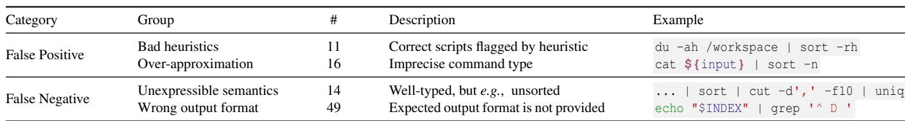

(b) With annotations  
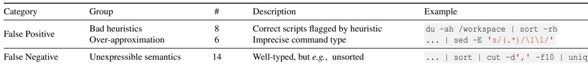

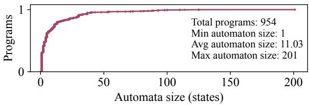  
Fig. 9: Automata size across evaluated programs. The CDF plot shows the fraction of evaluated programs where the largest automaton representing a type has at most the number of states on the x-axis. The average automaton size across all programs is 11.03 states, minimum is 1, and maximum is 201.

RT’s overall performance is dependent on the complexity of the types it reasons about, one proxy for which is the size of minimal automata representing the types. Fig. 9 shows the cumulative distribution of automata sizes RT constructs for the types in the evaluation suite, where each recorded automaton size corresponds to the largest DFA within a given program. Most programs contain minimal DFAs with fewer than 10 states. However, several programs include large DFAs; this occurs primarily when input or variable annotations involve lengthy regular expressions, resulting in complex DFAs even without additional transformation. Indeed, all but one of the programs taking more than 0.2s to analyze are annotated with relatively complex, large input types. The longest time is for a 5-stage pipeline at 0.90s, which has an input annotation requiring a minimal DFA with 105 states.

## 7 Related Work

Static analyses for the shell: Other kinds of static analyses have been proposed for the shell. ABash [44] analyzes scripts for expansion and word-splitting-related bugs, with a particular emphasis on code-injection style vulnerabilities. The CoLiS shell [34] includes a static analyzer that identifies dangerous or undesirable filesystem actions. Prior work [56] statically infers filesystem pre-conditions for file manipulation scripts. These analyses target different kinds of bugs and script behaviors than RT.

Semantic models of the shell: Semantic models of the shell provide critical underpinnings for understanding and reasoning about the semantics of shell scripts ahead of execution. Smoosh [26] defines the first mechanized formal semantics for the POSIX shell. The CoLiS language includes a formally verified interpreter [35], thereby defining the semantics of the (similar, but not POSIX shell) language. Such models inform how static analyses like RT should reason about shell programs, but are not analyses themselves.

Regular expressions for stream processing: Prior works [4, 42] have considered the use of unambiguous regular expressions to describe the hierarchical decomposition of streams into finite windows for computing quantitative queries. The restriction of unambiguity is imposed to ensure that streaming queries have a uniquely determined output. In these works, regular expressions are not used to express correctness properties or data invariants for streams.

Types for POSIX shell pipelines: LadderTypes [60] models pipeline contents using types familiar from statically typed programming languages (e.g., Int or Sequence[Byte]), encoding hierarchies of types (dubbed ladders) connected by a “represented as” relationship. Hence, it is a fundamentally different type system design, with a stricter notion of compatibility: two ladder types are compatible only if the full interpretation of a downstream consumer is included in the representation of the upstream producer’s output.

Regular languages for static string reasoning: Regular languages provide a well-known formalism for statically reasoning about string-like values and their formats. Prior works [7,32] extend XML-oriented type systems with Kleenealgebraic operators. Boomerang uses regular languages to refine the basic string type into precise format types [9]. Prior work also uses automata or regular-language abstractions to analyze string expressions in Java [14], jQuery [53] and dynamic languages [5]. String solvers and decision procedures further reason about path feasibility for programs with rich string operations [13]. Prior work [56] also uses an automata-based representation of file paths, and leverages FSTs to manipulate them. RT differs from these analyses in (1) domain—POSIX shell streams—and (2) defining regular languages as the primitive type of its type system.

Shell replacements: Both the literature and open-source community abound with shell-like scripting languages. These include traditional-looking shells with features drawn from typical general-purpose languages [15, 19]; libraries and embeddings in general purpose languages which maintain the essential design of byte-level communication streams [1, 8, 16,21,23,25,27,57,65]; languages that introduce higher level structure in at least some process communication [2, 29, 46, 58]; languages that also feature a type system that can catch some composition mistakes [30,43,59]; and languages that offer security monitoring in shell programming [49]. Unlike this direction of work, RT is a static analysis tool for the POSIX shell rather than a new language.

Linters for the shell and shell-wrapping systems: Several shell linting tools have been developed to analyze shell scripts. Checkbashisms [10] mainly focuses on identifying the usage of shell syntax that is exclusive to the bash shell environment. PSScriptAnalyzer [45] specializes in detecting common syntax issues and code smells in PowerShell scripts, while ShellCheck [22] does a similar job for various popular shells such as Bash and zsh. SecureCode [17] extracts shell code embedded in DevOps orchestration frameworks like Ansible in order to analyze them with ShellCheck. DRIVE [67] similarly extracts shell code from Dockerfiles and applies rule-based patterns to identify code-smells and possible bugs. These tools rely on syntax-based pattern matching, which limits their analysis to syntactic issues. In contrast, RT models stream contents, enabling semantic analysis beyond predefined syntactic rules.

Automated program repair for the shell: NoFAQ is a rulebased command-repair tool [18]. It matches the given command and error message with bugfix examples in a database and suggests the corresponding fixes. RT does not aim to suggest fixes, and identifies bugs semantically rather than with rules/patterns over syntax or error messages.

## 8 Conclusion

RT demonstrates that regular types provide an effective and efficient basis for statically detecting input-output composition mistakes in the UNIX shell. Regular types capture significant structure in stream contents while remaining faithful to the byte-oriented nature of shell communication, leverage the rich literature around regular languages and automata, and lean into the familiarity of regular expressions that are already ubiquitous in UNIX environments.

## Availability

RT’s implementation, alongside all benchmarks in this paper, is available as MIT-licensed open-source software:

https://github.com/atlas-brown/rt

## Acknowledgements

We are thankful to the anonymous OSDI reviewers, Brown CS2952R (Fall’24) participants, Michael Greenberg, and the Brown Systems group for their input. This material is based upon research supported by NSF awards CCF-2525351, CCF-2340479, CNS-2247687, and CNS-2312346, DARPA contract no. HR001124C0486, an Amazon Research Award (Fall 2024), a Google ML-and-Systems Junior Faculty Award, a seed grant from Brown University’s Data Science Institute, and a BrownCS Faculty Innovation Award.

## References

[1] Eshell: The emacs shell. https://www.gnu.org/software/ emacs/manual/html\_node/eshell/, 2025. Accessed: 2025- 03-22.

[2] Nushell: A new type of shell. https://www.nushell.sh/, 2025. Accessed: 2025-03-22.

[3] PCRE - Perl compatible regular expressions. PCRE.org, https://www.pcre.org/, 2025.

[4] Rajeev Alur, Dana Fisman, and Mukund Raghothaman. Regular programming for quantitative properties of data streams. In Peter Thiemann, editor, Proceedings of the 25th European Symposium on Programming (ESOP ’16), volume 9632 of Lecture Notes in Computer Science, pages 15–40, Berlin, Heidelberg, 2016. Springer.

[5] Vincenzo Arceri and Isabella Mastroeni. Static program analysis for string manipulation languages. Electronic Proceedings in Theoretical Computer Science, 299:19–33, August 2019.

[6] Jon Bentley, Don Knuth, and Doug McIlroy. Programming pearls: a literate program. Commun. ACM, 29(6):471–483, June 1986.

[7] Véronique Benzaken, Giuseppe Castagna, and Alain Frisch. CDuce: an XML-centric general-purpose language. SIGPLAN Not., 38(9):51–63, August 2003.

[8] Joel Berger, Jaap Karssenberg, and R.L. Zwart. Zoidberg: A modular perl shell. https://metacpan.org/pod/Zoidberg, 2025. Accessed: 2025-03-22.

[9] Aaron Bohannon, J. Nathan Foster, Benjamin C. Pierce, Alexandre Pilkiewicz, and Alan Schmitt. Boomerang: resourceful lenses for string data. In Proceedings of the 35th Annual ACM SIGPLAN-SIGACT Symposium on Principles of Programming Languages, POPL ’08, pages 407–419, New York, NY, USA, 2008. Association for Computing Machinery.

[10] R Braakman, J Rodin, J Gilbey, and M Hobley. Checkbashisms. https://sourceforge.net/projects/checkbaskisms/, 2015. Accessed: 2024-11-26.

[11] Luca Cardelli and Peter Wegner. On understanding types, data abstraction, and polymorphism. ACM Computing Surveys (CSUR), 17(4):471–523, 1985.

[12] Agnishom Chattopadhyay, Angela W. Li, and Konstantinos Mamouras. Verified and efficient matching of regular expressions with lookaround. In Proceedings of the 14th ACM SIG-PLAN International Conference on Certified Programs and Proofs, CPP ’25, pages 198–213, New York, NY, USA, 2025. ACM.

[13] Taolue Chen, Matthew Hague, Anthony W. Lin, Philipp Rümmer, and Zhilin Wu. Decision procedures for path feasibility of string-manipulating programs with complex operations. Proc. ACM Program. Lang., 3(POPL), January 2019.

[14] Aske Simon Christensen, Anders Møller, and Michael I Schwartzbach. Precise analysis of string expressions. In International Static Analysis Symposium, pages 1–18. Springer, 2003.

[15] Andy Chu. Oils: Our upgrade path from bash to a better language and runtime. https://oils.pub/, 2025. Accessed: 2025-03-22.

[16] David Crawshaw. Neugram: scripting language integrated with go. https://github.com/neugram/ng, 2025. Accessed: 2025-03-22.

[17] Ting Dai, Alexei Karve, Grzegorz Koper, and Sai Zeng. Automatically detecting risky scripts in infrastructure code. In Proceedings of the 11th ACM Symposium on Cloud Computing, SoCC ’20, pages 358–371, New York, NY, USA, 2020. Association for Computing Machinery.

[18] Loris D’Antoni, Rishabh Singh, and Michael Vaughn. NoFAQ: synthesizing command repairs from examples. In Proceedings of the 2017 11th Joint Meeting on Foundations of Software Engineering, ESEC/FSE 2017, pages 582–592, New York, NY, USA, 2017. Association for Computing Machinery.

[19] Elvish Developers. Elvish shell. https://elv.sh/, 2025. Accessed: 2025-03-22.

[20] Mark Jason Dominus. Perl regular expression matching is nphard. https://perl.plover.com/NPC/. Accessed: 2025- 04-15.

[21] Dundalek. Closh: Bash-like shell based on clojure. https: //github.com/dundalek/closh, 2025. Accessed: 2025-03- 22.

[22] Vidar Holen et al. Shellcheck: A shell script static analysis tool. https://www.shellcheck.net/, 2012. Accessed: 2024-10- 14.

[23] Tomer Filiba. Plumbum: Shell combinators and more. https: //plumbum.readthedocs.io/en/latest/, 2025. Accessed: 2025-03-22.

[24] Inc. GitHub. The state of open source software. https://octoverse.github.com/ #top-languages-over-the-years, 2024. Accessed: 2024-11-01.

[25] Gabriel Gonzalez. Turtle: Shell programming, haskell style. https://hackage.haskell.org/package/turtle, 2025. Accessed: 2025-03-22.

[26] Michael Greenberg and Austin J. Blatt. Executable formal semantics for the POSIX shell. PACMPL, 4(POPL):43:1–43:30, December 2019.

[27] Li Haoyi. Ammonite: Scala scripting. https://ammonite. io/, 2025. Accessed: 2025-03-22.

[28] Robert Harper. Practical Foundations for Programming Languages. Cambridge University Press, 2 edition, 2016.

[29] William Gallard Hatch and Matthew Flatt. Rash: from reckless interactions to reliable programs. ACM SIGPLAN Notices, 53(9):28–39, 2018.

[30] Alec Heller and Jesse A. Tov. Caml-shcaml: an ocaml library for unix shell programming. In Proceedings of the 2008 ACM SIGPLAN Workshop on ML, ML ’08, pages 79–90, New York, NY, USA, 2008. Association for Computing Machinery.

[31] John E. Hopcroft, Rajeev Motwani, and Jeffrey D. Ullman. Introduction to Automata Theory, Languages, and Computation. Pearson Education, 3rd edition, 2006.

[32] Haruo Hosoya, Jérôme Vouillon, and Benjamin C. Pierce. Regular expression types for xml. In Proceedings of the Fifth ACM SIGPLAN International Conference on Functional Programming, ICFP ’00, page 11–22, New York, NY, USA, 2000. Association for Computing Machinery.

[33] Jeroen Janssens. Data science at the command line. O’Reilly Media, Sebastopol, CA, October 2014.

[34] Nicolas Jeannerod. Verification of Shell Scripts Performing File Hierarchy Transformations. PhD thesis, University of Paris, 2021.

[35] Nicolas Jeannerod, Claude Marché, and Ralf Treinen. A Formally Verified Interpreter for a Shell-like Programming Language. In 9th Working Conference on Verified Software: Theories, Tools, and Experiments, volume 10712, Heidelberg, Germany, July 2017.

[36] Igibek Koishybayev, Aleksandr Nahapetyan, Raima Zachariah, Siddharth Muralee, Bradley Reaves, Alexandros Kapravelos, and Aravind Machiry. Characterizing the security of github {CI} workflows. In 31st USENIX Security Symposium (USENIX Security 22), pages 2747–2763, 2022.

[37] Shriram Krishnamurthi. Programming Languages: Application and Interpretation. 3 edition, 2003.

[38] Evangelos Lamprou, Ethan Williams, Georgios Kaoukis, Zhuoxuan Zhang, Michael Greenberg, Konstantinos Kallas, Lukas Lazarek, and Nikos Vasilakis. The Koala benchmarks for the shell: Characterization and implications. In Proceedings of the 2025 USENIX Annual Technical Conference (USENIX

ATC ’25), pages 449–64, Boston, MA, July 2025. USENIX Association.

[39] Lukas Lazarek, Seong-Heon Jung, Evangelos Lamprou, Zekai Li, Anirudh Narsipur, Eric Zhao, Michael Greenberg, Konstantinos Kallas, Konstantinos Mamouras, and Nikos Vasilakis. From ahead-of- to just-in-time and back again: Static analysis for Unix shell programs. In 2025 Workshop on Hot Topics in Operating Systems, HotOS ’25, pages 88–95, New York, NY, USA, 2025. Association for Computing Machinery.

[40] Konstantinos Mamouras and Agnishom Chattopadhyay. Efficient matching of regular expressions with lookaround assertions. Proceedings of the ACM on Programming Languages, 8(POPL):Article 92, 31 pages, 2024.

[41] Konstantinos Mamouras, Alexis Le Glaunec, Wu Angela Li, and Agnishom Chattopadhyay. Static analysis for checking the disambiguation robustness of regular expressions. Proceedings of the ACM on Programming Languages, 8(PLDI):Article 231, 25 pages, 2024.

[42] Konstantinos Mamouras, Mukund Raghothaman, Rajeev Alur, Zachary G. Ives, and Sanjeev Khanna. StreamQRE: Modular specification and efficient evaluation of quantitative queries over streaming data. In Proceedings of the 38th ACM SIG-PLAN Conference on Programming Language Design and Implementation, PLDI ’17, pages 693–708, New York, NY, USA, 2017. ACM.

[43] Kouji Matsui. A proposal for an interactive shell based on a typed lambda calculus. https://arxiv.org/abs/2104. 03678, 2021.

[44] Karl Mazurak and Steve Zdancewic. ABash: Finding bugs in bash scripts. In PLAS, pages 105–114, San Diego California USA, June 2007. ACM.

[45] Microsoft. Psscriptanalyzer. https://github.com/ PowerShell/PSScriptAnalyzer, 2020. Accessed: 2024-11- 26.

[46] Microsoft. What is powershell? https://learn.microsoft. com/en-us/powershell/scripting/overview, 2025. Accessed: 2025-03-22.

[47] Takayuki Miyazaki and Yasuhiko Minamide. Derivatives of regular expressions with lookahead. Journal of Information Processing, 27:422–430, 2019.

[48] Mehryar Mohri. Finite-state transducers in language and speech processing. Computational Linguistics, 23(2):269–311, 1997.

[49] Scott Moore, Christos Dimoulas, Dan King, and Stephen Chong. {SHILL}: A secure shell scripting language. In 11th USENIX Symposium on Operating Systems Design and Implementation (OSDI 14), pages 183–199, 2014.

[50] Jason Morris, Chris McCubbin, and Raymond Page. Hands-On Data Science with the Command Line. Packt Publishing, Birmingham, England, January 2019.

[51] Shaun Nichols. Scary code of the week: Steam cleans linux pcs. https://www.theregister.com/2015/01/17/ scary\_code\_of\_the\_week\_steam\_cleans\_linux\_pcs/, January 2015. Accessed: 2025-03-06.

[52] OpenAI. Gpt-4o system card. https://arxiv.org/abs/ 2410.21276, 2024.

[53] Changhee Park, Hyeonseung Im, and Sukyoung Ryu. Precise and scalable static analysis of jquery using a regular expression domain. In Proceedings of the 12th Symposium on Dynamic Languages, DLS 2016, pages 25–36, New York, NY, USA, 2016. Association for Computing Machinery.

[54] Benjamin C. Pierce. Types and Programming Languages. The MIT Press, 1st edition, 2002.

[55] Deepti Raghavan, Sadjad Fouladi, Philip Levis, and Matei Zaharia. POSH: A Data-Aware shell. In 2020 USENIX Annual Technical Conference (USENIX ATC 20), pages 617–631. USENIX Association, July 2020.

[56] Rodney Rodriguez and Xiaoyin Wang. Understanding execution environment of file-manipulation scripts by extracting pre-conditions. In 2021 IEEE/ACM 29th International Conference on Program Comprehension (ICPC), pages 406–410. IEEE, 2021.

[57] Anthony Scopatz. Xonsh: Python-powered shell. https: //xon.sh/, 2025. Accessed: 2025-03-22.

[58] Olin Shivers. Scsh manual 0.6.7. https://scsh.net/docu/ html/man.html, 2006.

[59] Jon Shultis. A functional shell. In Proceedings of the 1983 ACM SIGPLAN Symposium on Programming Language Issues in Software Systems, SIGPLAN ’83, pages 202–211, New York, NY, USA, 1983. Association for Computing Machinery.

[60] Michael Sippel and Horst Schirmeier. Process composition with typed unix pipes. In Proceedings of the 12th Workshop on Programming Languages and Operating Systems, pages 34–40, 2023.

[61] Slashdot. itunes 2.0 installer deletes hard drives. https://apple.slashdot.org/story/01/11/04/ 0412209/itunes-20-installer-deletes-hard-drives, 2001. Accessed: 2025-03-06.

[62] Valve Software. Moved /.local/share/steam. ran steam. it deleted everything on system owned by user. https://github.com/ValveSoftware/ steam-for-linux/issues/3671, 2023. Accessed: 2023-10-04.

[63] The Open Group. Regular expressions – posix basic regular expressions. https://pubs.opengroup.org/onlinepubs/ 9699919799/basedefs/V1\_chap09.html, 2018. Accessed: April 15, 2025.

[64] Nikos Vasilakis, Konstantinos Kallas, Konstantinos Mamouras, Achilles Benetopoulos, and Lazar Cvetkovic. PaSh: Light-´ touch data-parallel shell processing. In Proceedings of the Sixteenth European Conference on Computer Systems, EuroSys ’21, page 49–66, New York, NY, USA, 2021. Association for Computing Machinery.

[65] Greg Weber, Petr Rockai, Andreas Abel, John Wiegley, Michael Snoyman, and psibi. Shelly: Shell-like (systems) programming in haskell. https://hackage.haskell.org/ package/shelly, 2025. Accessed: 2025-03-22.

[66] John Yang, Akshara Prabhakar, Karthik Narasimhan, and Shunyu Yao. Intercode: Standardizing and benchmarking interactive coding with execution feedback, 2023.

[67] Yu Zhou, Weilin Zhan, Zi Li, Tingting Han, Taolue Chen, and Harald Gall. Drive: Dockerfile rule mining and violation detection. ACM Trans. Softw. Eng. Methodol., 33(2), 2023.

## A Syntactic Sugar Definitions

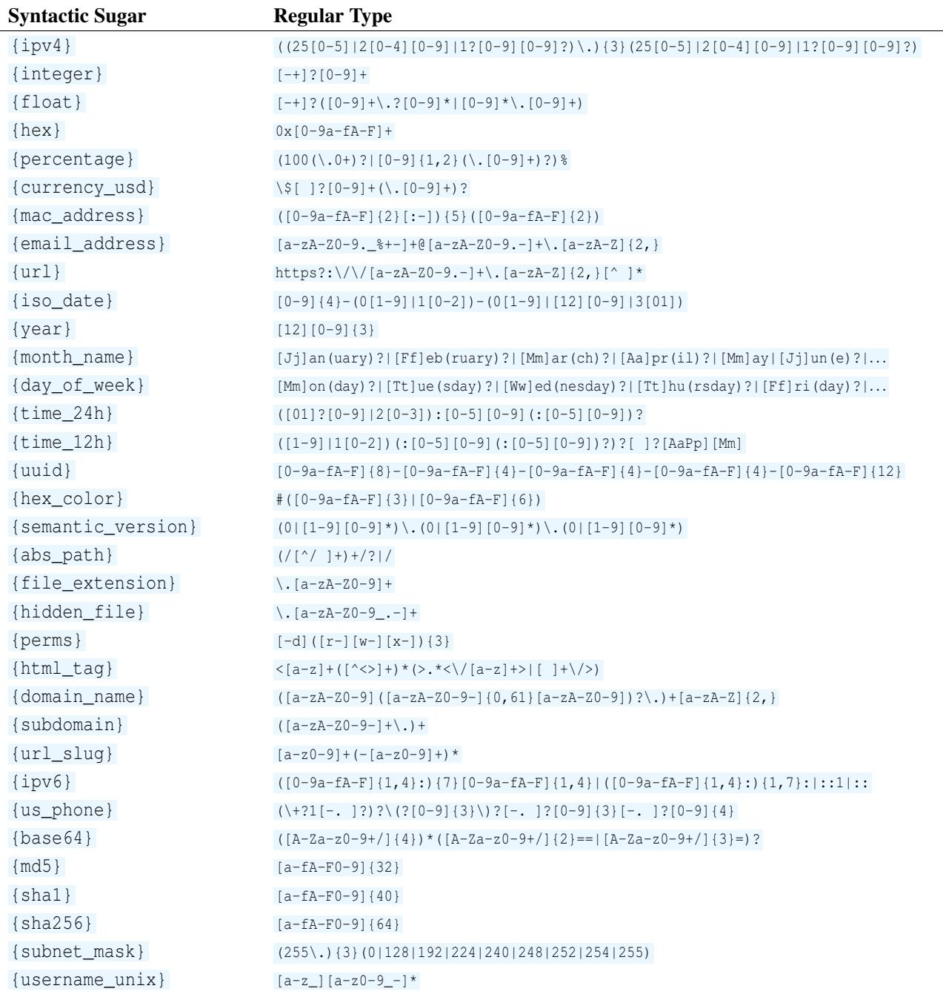

## B Artifact Appendix

## Abstract

The artifact for RT packages the prototype checker, command specifications, documentation, tests, benchmark inputs, and reproduction scripts used for the evaluation in §6. It is organized to support three tasks: inspecting how the implementation realizes the regular-type analysis described in the paper, running functional checks for the core analyzer, and regenerating the principal evaluation artifacts, including the accuracy summaries, ablation and false-result breakdowns, bug-detection comparison, timing table, and automata-size plots.

## Scope

The artifact supports the paper’s design and evaluation claims. In particular, it covers: (1) the RT implementation of regular stream and command types from §3, the type-checking procedure in §3.3, and the regular-language operators and FST machinery from §4; (2) the configurable mechanisms in §5, including environment concretization, annotations, and heuristics; (3) the motivating example and the seven benchmark sets discussed in §2 and §6; and (4) the automation for reproducing the main tables and figures reported in §6.

## Contents

The artifact includes the following components:

• the RT checker implementation and command type database;

• support code for regular-language operations, finite-state transducers, annotations, concretization, and heuristics;

• documentation, including the top-level README and artifact-evaluation instructions;

• functional tests and smoke-test examples, including the motivating example from §2;

• the benchmark suites used in the paper’s evaluation and the configuration needed to run baseline comparisons against ShellCheck and LADDERTYPES; and

• scripts for checking the artifact, reproducing the full evaluation, and generating the resulting tables and plots.

## Hosting

The artifact is publicly available as a GitHub repository at https://github.com/atlas-brown/rt.