USENIX

THE ADVANCED COMPUTING SYSTEMS ASSOCIATION

# hS: Speculative Script Reordering at Subprocess Granularity

Georgios Liargkovas and Di Jin, Brown University; Tianyu (Ezri) Zhu and Dan Liu, Stevens Institute of Technology; A. Bolun Thompson, University of California, Los Angeles; Anirudh Narsipur, Seong-Heon Jung, and Siddhartha Prasad, Brown University; Diomidis Spinellis, Athens University of Economics and Business and TU Delft; Michael Greenberg, Stevens Institute of Technology; Konstantinos Kallas, University of California, Los Angeles; Nikos Vasilakis, Brown University

https://www.usenix.org/conference/osdi26/presentation/liargkovas

# This paper is included in the Proceedings of the 20th USENIX Symposium on Operating Systems Design and Implementation.

July 13–15, 2026 • Seattle, WA, USA

ISBN 978-1-939133-55-7

Open access to the Proceedings of the 20th USENIX Symposium on Operating Systems Design and Implementation is sponsored by

# hS: Speculative Script Reordering at Subprocess Granularity

Georgios Liargkovas<sup>∗,†</sup> Brown University

Dan Liu Stevens Institute of Technology

Siddhartha Prasad Brown University

Di Jin<sup>∗</sup> Brown University

Diomidis Spinellis AUEB & TU Delft

A. Bolun Thompson UCLA

Tianyu (Ezri) Zhu Stevens Institute of Technology

Anirudh Narsipur Brown University

Michael Greenberg Stevens Institute of Technology

Seong-Heon Jung Brown University

Konstantinos Kallas UCLA

Nikos Vasilakis Brown University

## Abstract

Shell scripts are pervasive, acting as the glue between commands and subprocesses that are written in a variety of languages and perform complex, system-wide effects. Given the black-box nature of these subprocesses, all work that optimizes script performance until now has relied on handwritten annotations that describe subprocess effects. In this paper we introduce hS, a system that brings out-of-order, speculative execution to scripts that invoke subprocesses without requiring any user input or annotations about them. hS speculatively executes command instances—typically simple commands, pipelines, or small synchronization regions—dynamically detecting their effects: blocking unsafe ones, like network accesses, and selectively committing independent effects, like file writes, given no conflicts. On a wide range of real-world scripts, hS offers up to 9.3× speedups compared to bash, and up to 7× speedups over PaSh—all while not requiring any developer involvement or command annotations.

## 1 Introduction

Shell programming is as prevalent as ever, consistently rank ing among the top ten programming languages and growing in popularity more quickly than other established languages such as C and Python [24]. Shell programs are often used for various analytics [50, 61], bioinformatics [8, 23], and other performance reliant applications [4, 55, 63]. This has recently led to significant academic activity aimed at accelerating shell scripts through parallelization [29, 54, 62], distri bution [42, 50], and other forms of scaleout [18, 35, 55]. This academic work on the shell relies on command annotations to optimize commands, which are either crowd-sourced or baked into each system. Unfortunately, existing approaches face two significant challenges: (1) annotations are restrictive, and (2) they focus primarily on data parallelism.

Existing tools such as PaSh [29, 62] and POSH [50] only optimize fragments of shell programs for which their command annotations fully specify the parallelizability, input order, and side effects of each command. While it is plausible to have a blessed set of annotations for GNU Coreutils or util-linux, we cannot hope to have annotations for every command a script might invoke. Some scripts compile and run their own commands—it is unreasonable to assume that those commands will be annotated! Relying on annotations significantly reduces the scope and applicability of shell tooling, which is the main way to compose tools written in different languages and frameworks [23, 49]. The usage of shell to compose domain-specific programs are precisely where existing tooling falls short.

Furthermore, existing tools are limited to order-preserving data parallelization to avoid introducing concurrency bugs— for example, PaSh and POSH explicitly treat composition primitives, like ; and if, as synchronization barriers and will not typically optimize across any control flow.<sup>1</sup> However, not all order need be preserved! A standard optimization that is done by many modern compilers and architectures is outof-order execution, where code is reordered, sometimes in a speculative way, and dependencies are dynamically tracked to guarantee that the out-of-order execution will have the same semantics as the original.

In this paper, we propose hS, a novel system that enables out-of-order optimizations in the shell in a fully transparent way: hS executes script regions speculatively out-of-order without any developer input or annotations. These regions are the executable units exposed by the shell program’s structure— typically simple commands or pipelines, rather than individual Unix processes. In contrast to all prior work, this enables hS to support scripts that compose arbitrary binaries, like bioinformatics tools. hS achieves this: (1) by dynamically capturing each region’s file-system dependencies and other effects using system-call tracing, reordering the region in the script speculatively at runtime; and (2) by conditionally committing or reverting the effects of a region using lightweight sandboxing techniques.

Orchestrator (§3): Out-of-order execution is challenging to apply correctly as subtle changes can alter the behavior of the original script. The relevant soundness property is observational equivalence: the original program and the reordered program must behave the same from the perspective of the user. To ensure that hS’s reordering is sound, it implements a novel state-machine-based algorithm that tracks and respects conflicting command dependencies. We use the Alloy [27] model checker to ensure that our algorithm yields observationally equivalent runs that are safe (no deadlocks; dependencies are respected) and sound (speculated commands are commit ted in the correct, sequential order).

Executor (§4): Speculative execution requires controlling a command’s effects on the surrounding system. hS achieves that using a combination of process-level sandboxing and tracing that can contain, block, and selectively defer an individual command’s effects. If all of a commands effects are deferrable, e.g., file writes and shell variable assignments, hS can speculate it, containing all its reads and writes, and later commit its effects if it doesn’t depend on other previous commands. Even though commands with non-deferrable effects, e.g., network accesses, cannot be speculated, hS still guarantees correct execution by blocking their effects and executing the commands exactly once, without speculation.

Optimizations (§5): Speculative execution can lead to redundant recomputation when mis-speculating, i.e., if a dependency indicates that some speculative run of a command is invalid, we must throw away its results. To improve efficiency, hS introduces a set of domain-specific optimizations that reduce the number of mis-speculations by predicting the starting state from which to speculate commands. First, hS reasons about the shell language directly, eagerly and efficiently evaluating pure assignments without any need to speculate. Second, hS is optimistic, speculating each command in the freshest, potentially uncommitted file-system state, while eagerly stopping speculations that have conflicts.

hS is able to optimize the execution time of arbitrary shell scripts without any user input or command annotations. On a diverse set of 49 real-world shell scripts, some of which have already been optimized to exploit command independencies by their authors, hS achieves a geomean 2.6× speedup (up to 9.3×) over Bash. hS also achieves significant speedups over the prior state of the art, PaSh [29, 62] (geomean: 2.4×, max: 7×), while not requiring any command annotations to enable optimizations, thus being able to support a wider variety of scripts with custom and domain specific commands and utilities. Finally, to show that our techniques are applicable more broadly to scripts that use subprocesses, we develop a Python frontend for hS that can optimize a restricted fragment of Python programs that invoke subprocesses (§6). On a set of 5 real-world Pythons programs hS manages to achieve speedups of up to 8.4× over standard Python execution.

```shell
SAMPLES="ERR1233.1 ERR2445.1 ERR3771.1 ERR4462.1 ..." # (a)
# (1) Sanitize FASTQ file headers
for SM in $SAMPLES; do
fastq-sanitize-header --input $SM |
gzip > $SM/1.sanitize.fastq.gz # (b)
done
# (2) Genome alignments with minimap2
for SM in $SAMPLES; do
# Alignment to transcriptome and genome
minimap2 -ax splice -t 6 ... $SM/1.sanitize.fastq.gz |
samtools sort -o $SM/Genome.sorted.bam - # (c)
minimap2 -ax map-ont -t 6 ... $SM/noribo.fastq.gz |
samtools sort -o $SM/Transcriptome.sorted.bam - # (d)
done
# (3) Index genome alignment and convert to SQLite
./prep_db.sh $dbdir/sqlite.db # (e)
for SM in $SAMPLES; do
dbdir=$SAMPLE_DIR/$SM # (f)
samtools index $SM/Genome.sorted.bam # (g)
samtools view $SM/Genome.sorted.bam |
sam_to_sqlite --db $dbdir/sqlite.db --table genome # (h)
# ... same for Transcriptome.sorted.bam
done
```  
Figure 1: The core of a bioinformatics script for RNA sequence processing [23].

Availability: hS is open source and available at https:// github.com/binpash/hs.

## 2 Speeding Up Everyday Data Processing

We first explain how hS speeds-up shell scripts using an example: a bioinformatics script that processes RNA sequencing data from mouse samples, taken from the TERA-Seq toolkit [23] (Fig. 1). The script preprocesses genomics data (1), aligns RNA samples to reference genomes or transcriptomes (2), and conducts post-alignment analysis (3).

The script leaves a lot of performance on the table by not taking advantage of various optimization opportunities. First, each sample could be processed independently: for example, alignment’s (2) two steps (c, d) are independent and can be performed in parallel. Additionally, some processing could start earlier: the script starts building the SQLite databases (3) only after all alignments complete (c, d), even though it would be safe to start building the database for a sample (g, h) as soon as that sample is aligned.

Optimization Challenges: Identifying independent execution optimization opportunities in shell programs is not trivial. One must accurately understand each command’s behavior and the implicit data dependencies between commands. Individual shell commands are black boxes, written in arbitrary languages, sometimes with unavailable or inscrutable source code. Often, commands have implicit dependencies; for example, samtools index generates an index file that is not mentioned in its arguments, but whose name is based on the input file’s name. Even if programmers know all commands dependencies, independent execution has to be embedded in the script logic, a process that is tedious, error-prone, and complicates development and maintenance.

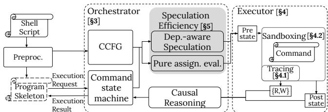  
Figure 2: High-level architecture of hS.

The state-of-the-art tools for parallelization of shell scripts, PaSh [29] and POSH [50], cannot exploit these opportunities— neither offers any benefits on this script (PaSh takes 7918s vs Bash’s 7914s). In their default configuration, neither tool can reason about or optimize invocations to domain-specific tools like fastq-sanitize-header, minimap2, and samtools as there are no annotations to characterize their behavior. As we show in §7.2, even conservative annotations for a representative TERA-Seq workflow are insufficient to expose substantial PaSh speedups without domain-specific split/merge support.

## 2.1 Overview of hS

To understand how hS is able to correctly and effectively optimize scripts, we overview the system architecture (Fig. 2) in the context of a single iteration of a fragment of the analysis stage of the bioinformatics script (Fig. 1(3)). Before any iterations, the analysis stage runs ./prep\_db.sh (e). Then, for each iteration’s sample, it will index that sample’s alignment (g) and generate a SQLite database for that sample (h).

Preprocessing: hS uses script rewriting [29] to transform the input script into two objects: a program skeleton and a command control-flow graph (CCFG). The program skeleton is run by the real shell interpreter, while the CCFG is managed by hS’s orchestrator. The program skeleton preserves the original script’s control structure, but replaces executable regions with stubs that communicate with hS’s orchestrator. We call each concrete execution of such a region a command instance. Despite the name, a command instance is not necessarily a single Unix process: it may be a simple command, a pipeline, or a small shell region needed to preserve explicit synchronization. The CCFG abstracts the script by tracking these regions and how they relate with respect to control flow. In our example, the CCFG (Fig. 1 (top left)) puts (e) first, followed by a loop that contains sequences (g) and (h). Regions in loops can map to multiple command instances in the concrete execution—one per loop iteration.

Command Control Flow Graph (§3 Orchestrator): hS’s orchestrator is a server that responds to execution requests from the hooks in the program skeleton. The orchestrator manages the CCFG to decide which command instances to execute, possibly speculatively. Sequential execution would run the next instance in the CCFG once the prior instance completes; hS’s orchestrator speculates by executing instances further ahead in the CCFG.

Shell construct handling: hS’s preprocessing pass is syntaxdirected: it keeps the shell in charge of the script’s control structure, and exposes executable regions to the orchestrator. A pipeline such as A | B | C is one command instance: shell pipe semantics are preserved inside the sandbox, while hS tracks and commits the aggregate dependencies and effects of the whole pipeline. Similarly, a background/wait pattern such as A & B & wait is treated as a shell-synchronization region, so hS does not reorder A and B with respect to each other or check their internal conflicts separately; only the region’s combined effects are checked against earlier and later command instances.

Control constructs determine which command instances are reached. Conditionals, cases, loops, short-circuit operators, groups, subshells, and redirections remain in the program skeleton and are evaluated by the shell in the original order. The CCFG exposes possible future instances to the orchestrator, including loop iterations, but a speculative result is committed only when the skeleton later requests that concrete instance and its shell and file-system starting states are compatible. Commands that cannot safely be executed outside the skeleton—for example shell control-flow builtins such as break, continue, return, and exit, or commands with non-deferrable effects—are marked unsafe and executed once by the skeleton, acting as speculation barriers. Finally, a nested hS invocation is treated like any other subprocess by the outer hS: the outer execution remains governed by the same dependency and effect checks, but it may expose less parallelism than a single run with one global CCFG.

Command dependencies and effects (§4 Executor): Instead of running each command in order, hS’s orchestrator speculatively executes subsequent commands (like (g) and (h)) earlier than in sequential execution. Correct execution depends on only committing the results of commands unaffected by out-of-order execution. The orchestrator commits the effects of speculative executions if previous commands did not affect their execution—i.e., if the speculated commands didn’t depend on effects of prior commands. hS is able to speculatively execute commands without jeopardizing execution correctness by tracking each command’s dependencies—i.e., what it reads from—and by containing and deferring its effects—i.e., what it writes to. hS does that using its executor (§4), which tracks dependencies and effects on two types of state: (i) the shell state (incl. environment variables and shell configuration), and (ii) the file system state (incl. files, terminals, and file descriptors). The executor identifies command dependencies in a completely black-box manner using system call tracing (§4.1) and contains effects using lightweight sandbox techniques, namely OverlayFS and namespaces (§4.2). While hS is able to optimize the execution of commands with effects that are deferrable, e.g., file writes and shell variable assignments, it guarantees correct execution even in the presence of non-deferrable effects, e.g., network accesses—when a command performs such an effect, hS blocks it and marks the command as unsafe for speculation, later issuing it for normal execution.

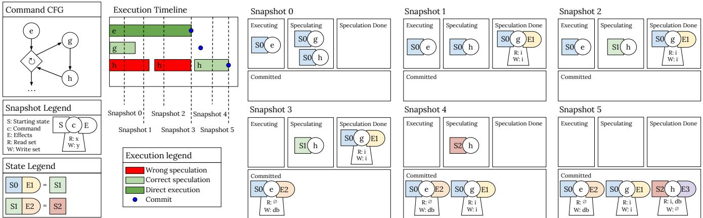  
Figure 3: Example hS execution on fragment (3) (Fig. 1). Top left: Command control-flow graph and execution timeline; CCFG nodes denote executable script regions, and each concrete execution of such a region is a command instance. Bottom left: Legends. Right: Each snapshot represents the state of the orchestrator (§3) at a point in the execution timeline.

## 2.2 Speeding up the Script

We will now walk through an execution of hS on a fragment of the RNA processing script (Fig. 1(3)). Figure 3 shows a sequence of execution snapshots and the timeline. Execution starts with snapshot 0, where (e) is issued for normal execution while (g and h) are issued for speculative execution.

Execution snapshot 1: For this example, we assume that building the index (g) completes before the database preparation (e) (Fig. 3, Snapshot 1). When a command completes execution, the executor passes the command’s traced dependencies and contained effects to the orchestrator. Here, (g)’s dependencies are the files that it read from, including \$SM/Genome.sorted.bam, and its effects are that it generates the index file (abbreviated to i in Fig. 3) in either \$SM/Genome.sorted.bam.bai or \$SM/Genome.sorted.bam.csi. Note that these files aren’t explicitly referenced in the command arguments, but implicitly chosen by samtools index—which one is chosen depends on the size of the input genome.

Execution snapshot 2: In the meantime, the samtools view command (h) has been speculatively executing in a state that does not include the indices generated by (g). At some point, hS will observe a system call by (h) that tries to read these indices and fails, since its computation implicitly relies on them.

Upon discovering this dependency between (g) and (h)—(g) writes a file that (h) reads—the orchestrator determines that (h) has been mis-speculated, since (h) would only run after (g) in a sequential execution, but hS has run it earlier. The orchestrator then drops the effects of (h), and re-speculates it on top of the (as yet uncommitted) effects generated by g.

Execution snapshot 3: After the database preparation completes (e), the orchestrator can immediately commit the results of (e) to the live system—(e) was the first command, so there can be no mis-speculation or dependency violations. Even so, (e)’s effects are still recorded for later reasoning.

Execution snapshots 4 and 5: The effects of (e) include writes to \$dbdir/sqlite.db, meaning that (h) will need to be re-speculated once more—the second command in its pipeline reads from \$dbdir/sqlite.db. The orchestrator observes that (e) and (g) are completely independent, and it can immediately commit the speculated results of index building (g) (Fig. 3, Snapshot 4). Since every prior command has committed when (h)’s third execution completes, the orchestrator can directly commit (h) when it completes (Fig. 3, Snapshot 5).

Pure assignments (§5.1): Note that the assignment (f) between (e) and (g) is not part of the CCFG. While assignments can have dependencies (globbing) or external effects (e.g., command substitutions \$(...)), many of them do not. hS identifies assignments without effects—i.e., pure assignments—and simply includes them in the starting speculation state of all following commands. This optimization significantly reduces CCFG size and speculation overhead.

Zooming out: Having examined a single iteration of the for loop, we now consider the entirety of the post-processing stage (Fig. 1(3)). Again, we assume that (g) completes before (e). hS uses a configurable speculation window to limit how many commands can be speculated at any time. For example, with a speculation window of two, we will have three commands in execution: (e) executing directly, and (g) and (h) in speculation. When (e) commits, a slot in the speculation window opens up and the orchestrator continues speculation following the would-be sequential execution of the program, by speculating (g) in the next iteration of the loop, even though the prior iteration has not completed.

Dependency-aware speculation (§5.2): When two commands in speculation have recorded dependencies, such as (g) and (h), they should not be speculated starting from the same state. hS avoids such mis-speculations by employing a dependency-aware speculation strategy (§5.2): we only start commands speculation after all the (discovered) dependencies finish, and we create a speculative starting state that combines the effects of all previously speculated commands.

Summary: Through speculative execution and the aforementioned optimizations, hS optimizes shell programs by executing independent script segments out-of-order, trying to take advantage of the latent parallelization opportunities. In our example script, hS achieves a 4.5× speedup over sequential execution using Bash (§7).

## 3 Orchestrator

The orchestrator (Figure 2, middle) manages speculation by keeping track of the command control-flow graph (CCFG) and all command instances in the script. The orchestrator uses the CCFG to look ahead and speculate commands, such that it can return pre-computed results to the program skeleton, achieving effective parallelization. At the same time, it keeps track of commands with unsafe behavior and dependencies across command instances to make sure that they are executed and committed in a safe order. In this section we describe the orchestration algorithm, which uses a state machine (Figure 4) to track the execution state of each command instance.

## 3.1 Orchestration Algorithm

The orchestrator manages two data structures: the command control-flow graph (Fig. 3, top left) and the set of command instances (Fig. 3, snapshots). The CCFG is generated from the source program, relating each executable region back to its position in the program skeleton. As introduced in §2, each command instance corresponds to one concrete execution of such a region. In loops, a single CCFG region may therefore have several command instances in the set, one per iteration. A command instance keeps track of: (1) the command’s current speculation state (§3.1); (2) the results of speculation, if any; and (3) the command’s read and write sets.

State machine without speculation ( R , E , C ): Each command instance is associated with a command state (Fig. 4). To explain command states, we start by considering a sequential orchestrator that doesn’t speculate but simply executes a command instance whenever the program skeleton requests its execution. At first, every command instance is in R , the ‘ready’ state. When execution begins, the program skeleton requests the execution of the first command instance in the script. The orchestrator then sends the first command instance to the executor, marking it as E , the ‘direct-execution’ state. When the first command instance terminates, the orchestrator commits its saved results, moving the command to C , the ‘committed’ state, responding to the skeleton that it is done. As the program skeleton continues, it makes another execution request—this time, for the second command instance. The orchestrator executes it, running it in the most recent state, i.e., the state after the first command instance has committed, and then commits the results, at which point the skeleton requests the execution of another command until all of them are done executing in the correct, original, sequential order.

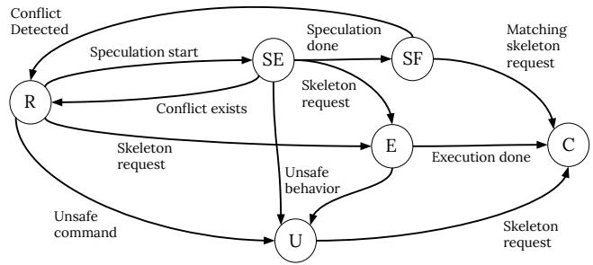  
Figure 4: State machine for each command instance.

Unsafe commands ( U ): Some commands—shell controlflow utilities, like break, or commands with non-deferrable effects, like network accesses—cannot be speculated and need to be run exactly once by the program skeleton. The orchestrator dynamically detects such commands (§4) and moves them to U , the ‘unsafe’ state. When a command C is determined to be unsafe, the orchestrator waits until the program skeleton requests the execution of C, at which point it informs it to execute the command itself, in the context of the original script. Upon receiving the next execution request, the orchestrator will move the U node into C , indicating the command has been executed and its effects are globally visible.

Speculative states (SE, SF): Having understood a sequential orchestrator, we now introduce speculation and the remaining states. A speculating orchestrator finds the next command in the CCFG in the R state, sends it for speculative execution (§4), and transitions it to SE, the ‘speculatively executing state. An instance in SE can make one of three transitions: it can complete its execution, in which case the orchestrator records the result and moves it to SF, ‘speculation finished’; it can be marked as unsafe and transition to U ; or, the program skeleton can send a request for this instance after speculation has started. When the skeleton sends a request for a command in SE or SF, the execution takes a different path depending on whether the speculation starting state is equivalent to the current, real system state or not.

System states and compatibility: Before describing the two paths, we describe what system states are. The system state contains two components: (1) the shell state (incl. shell variables, functions, etc.), and (2) the filesystem state (incl. all files, directories, metadata, etc.). The shell state a set of keyvalue pairs [17, 29] and so comparing two of them amounts to checking for differences point-wise. Comparing filesystem state involves two challenges: (1) representing and storing the entire contents of the filesystem is not efficient, and (2) even though there might exist a difference between two states, it might not be relevant for the command instance in question.

File system states as write sets: To address the first challenge, hS represents the FS state as the effects of a command on the file system, namely only the values of the files in its write set (instead of the FS complete contents). For example, the resulting file system state for the command echo "hello" >f1.txt only contains the value of file f1.txt. hS manages to get such a fine-grained representation of the file system state through its executor (§4).

State equivalence: For the second challenge, consider script echo "hello" >f1.txt; touch f2.txt. Even though the output filesystem states after executing these two commands differ—the former has an updated f1.txt and the latter read f2.txt—there is no dependency between them. To address this, the orchestrator keeps track of all commands reads and writes through the executor (§4) and continuously checks if there are any dependencies. Suppose we are executing a two-command program where the second command reads the results of the first, e.g., echo "hi" >f1.txt; cat f1.txt. If we speculatively start executing both programs in the initial filesystem state, cat will not see the final correct state of f1.txt. When the orchestrator discovers that echo writes to f1.txt and cat reads from f1.txt, the dependency is recorded and the orchestrator cancels cat’s speculative execution (SE or SF), and moves it back to R .

Handling conflicts during speculation: When the orchestrator receives a request for a command instance in SE or SF, it checks if the starting speculation state conflicts with the current real-system state, given the command instance’s dependencies. If there is a state conflict, we have mis-speculated and the command instance needs to transition back to R . If the states are compatible, we can commit the results of the command instance. An instance in SE will transition to E and keep executing until it hits C ; an instance in SF can be committed immediately, transitioning to C directly.

Avoiding speculation across U commands: hS does not generate tracing directly in program skeletons (§4.1), so it is impossible to determine the write sets of U commands. To ensure that execution is correct, every execution of a U command invalidates all later command speculations, transitioning them back to the R state.

Orchestrator correctness: We built a model of the orchestrator’s core logic in Alloy [27], and we used its bounded model checking capabilities to check several key properties: (1) the orchestrator eventually terminates (no deadlocks); (2) file system dependencies are respected, i.e., a command will be rerun if a command preceding it writes to a file it reads from; and (3) the final command commit order is equivalent to the sequential execution order. The checks are performed over a bounded model with a finite number of files and commands, under the assumption that all commands eventually terminate with arbitrary read/write dependencies.

Speculation policy: hS uses a configurable speculation window to limit the amount of speculation. When the window is full, i.e., the number of commands in the SE or SF state are equal to the window size, the orchestrator cannot issue new command instances for speculative execution. Finally, there are points where hS has to pick between more than one command instance to speculate next, e.g., branches of a conditional—a problem akin to branch prediction. This choice does not affect correctness, but it affects performance. hS currently has a fixed policy for these predictions, e.g., loops will keep iterating and conditionals will take the else branch, and we leave a better policy as future work.

## 4 Executor

The executor’s main goal is to identify, contain, and when possible defer effects that commands make to the surrounding state to enable speculation. Before we describe the two key orchestrator components, tracing and sandboxing, we describe which events can be deferred and which can only be blocked.

Deferrable: These effects can be identified by the executor, contained, and deferred to enable speculative execution. These effects include shell state changes (i.e., variables, current working directory, shell options, and open file descriptors), as well as changes to regular files, directories, and a small set of pseudo-files without state (e.g., /dev/null).

Non-deferrable: These effects cannot be deferred, but can be detected and blocked, allowing the orchestrator to mark the culprit command as unsafe for speculation and execute it normally without speculation—the rest of the commands can still be safely executed as described in Section 3.1. These effects include network interactions, IPC, and signals.

## 4.1 Tracing

hS’s executor traces system calls to detect all effects. For deferrable effects it traces all path-related system calls and returns a list of paths that the command reads from and writes to. This information is then used by the orchestrator to determine the file-system dependencies. To improve efficiency, hS does not trace all read and write calls, but considers a file to be accessed the moment it is acquired, i.e., when its path is passed as a parameter to system calls like open, and rename. hS uses seccomp-BPF for strace [40] to avoid context switching on untraced system calls.

Path dependencies: hS determines read and write dependencies over paths and not files. For example, an ENOENT (no such file) error on a stat system call counts as a read to the path even though it didn’t read any file. This is because if any previous command creates a file in that path, the result of stat will change, affecting the command.

Parent directories: Parent directories require special handling due to the way modifications affect their children. More specifically, a write effect (e.g., rename) at the parent direc tory may alter the child paths without specifically targeting them. Therefore, the tracer treats any effect on a path as read effects on all its parent directories as well, such that the readwrite conflict can correctly capture this indirect influence.

Symbolic links: Special care needs to be taken when tracing the creation and use of symbolic links. A symbolic link involves two paths: a link path and a target path. The creation of a symbolic link (symlink, symlinkat) is not affected by the file-system state at the target path. Therefore, although the target path is an argument to the system call, it does not count as either read or write to the path. The use of symbolic links, on the other hand, should be treated as reading the link path in addition to the effect on the target path. This is because changing to the link path will lead to changes in the outcome of the system call (i.e., opening a different file).

## 4.2 Sandboxing

hS’s sandbox supports two types of deferrable effects: filesystem effects and shell-state effects. It handles file-system effects with OverlayFS [7], creating a private view of the file system and storing side effects into separate directories. The shell-internal states are handled by creating a separate shell process and running additional setup and recording utilities at the start and end of the command. Non-deferrable effects are blocked using Linux namespaces [38]; after they are detected with tracing, hS marks such commands as unsafe.

Shell state handling: The shell state includes the (1) current directory, (2) variable and function definitions, (3) shell options, (4) active trap handlers, and (5) opened file descriptors. The executor needs to correctly set up these components when executing any command instance. At the beginning of each runtime hook invocation in the program skeleton, the shell state is recorded, and sent to the orchestrator, which then passes it to the executor. After a command instance finishes execution, the shell state is recorded and sent back to the program skeleton, which then applies the new shell state at the end of the runtime hook invocation.

File system effects: OverlayFS is a union file system that stacks one or more lower layers (i.e., ‘lowerdirs’) and an upper layer (i.e., ‘upperdir’) into a single, merged view. OverlayFS searches for a path starting from the highest layer, meaning that each higher layer shadows lower ones by adding or removing files from them hS isolates commands by setting their root directory to be OverlayFS’s merged view using unshare [41]. The upperdir records all file-system writes in the sandbox and isolates them from the surrounding system. To commit a write, hS traverses the upperdir and copies the changes back to the real file system. A subtle challenge that hS needs to address is that OverlayFS disallows any pre-existing mount point that cannot be unmounted by the current user to be part of a lowerdir [28]. hS addresses this issue by using mergerfs [1] to shadow these mount points.

Challenge: file descriptors: A challenge that hS needs to address is tracking changes to open file descriptors, i.e., stdin, stdout, stderr, and other files opened with the exec command. This differs from the individual command’s output redirections, which are already handled by the sandbox’s overlay. These file descriptors are opened for the shell program itself, and usually stay opened until the entire program exits. Capturing and controlling the state of file descriptor for every kind of file is beyond the scope of this work, especially those that interact with users or devices. hS supports file descriptors if they are sequentially read from or written to. When recording the state of the file descriptors, hS reads from /proc to determine the file descriptor’s permission, file path, and current offset. For stdin and read-only file descriptors, hS re-opens the corresponding files and uses lseek to set the correct offset. For stdout, stderr, and write-only file descriptors, hS opens a new empty file for each to record the written content. When committing, hS appends the newly written content to the corresponding opened files. Since all the files are re-opened inside the overlay in a separate process, their effects are also isolated from the rest of the system.

If two file descriptors are aliases of each other (e.g., the shell program is run with 2>&1), their write effects should not be recorded separately; otherwise the intended interleaving of output will be broken. In such cases, hS detects aliasing of file descriptors with the kcmp system call, and sets up the aliasing inside the sandbox with proper exec redirection, instead of opening separate record files.

Blockable effects: hS uses namespaces and unshare to disallow all blockable effects. Linux namespaces [38] are designed to isolate any globally visible state changes introduced by a process. Under a non-malicious setting it is reasonable to assume that no unintended effects escape their namespace. hS sets up fresh network, pid, and user namespaces so speculated processes cannot interfere with the outside world through network, signals, and other process control features provided by the operating system. The /proc filesystem and a limited set of /dev devices are remounted within the namespace to avoid exposing control to other processes or devices.

## 5 Improving Speculation Efficiency

A key challenge that needs to be addressed by hS is managing mis-speculation. To address that, hS deploys two optimization techniques, pure assignment evaluation (§5.1) and dependency-aware speculation scheduling (§5.2).

## 5.1 Pure Assignment Evaluation

hS treats any difference in shell state as a conflict, meaning that all shell state changes invalidate all speculated SE and SF commands. This leads to significant wasted resources, especially in programs with multiple variable assignments.

To address this challenge, and avoid re-executing commands unnecessarily, hS identifies and evaluates pure assignments on the starting shell state. Pure assignments are just variable assignments where the right-hand side does not perform side effects, e.g., (f) in Fig. 1. The insight that hS exploits is that pure assignments do not need to be speculated at all, they can simply be run. Furthermore, they can be identified using a simple syntactic pass, ahead of time, during preprocessing. By evaluating pure assignments, the speculator both reduces the number of failed speculations (since the starting shell state of commands is computed correctly), and increases the number of speculated commands that take more time to execute (since pure assignments are no longer considered candidates for speculation).

## 5.2 Dependency-aware Speculation

To maximize the possibility of correct speculation and min imize resources spent on mis-speculation, we deploy a twopart strategy to make smart speculation decisions about filesystem states in hS.

Eager conflict detection and timely restart: Instead of receiving the read-write sets of a command instance after it has completed execution, hS consumes tracing information (§4.1) in a streaming fashion, continuously checking for file-system conflict between executing and speculating commands. Whenever such conflict is discovered, the target command, which is always in SE or SF state, will be stopped, and reset into R state. On top of that, such dependency is recorded by hS. Whenever a command finishes speculation, hS looks up the recorded dependencies, and restarts any commands that have a dependency to the finished one. At this point the following strategy comes into effect.

Opportunistic speculation chaining: Since conflicted speculations are reset to R state eagerly, preceding commands that are able to stay in SF state are more likely to be committed. Therefore it is beneficial to take their state changes into consideration when launching new speculation. More specifically, suppose a command C<sub>2</sub>’s only file-system dependency is another command C<sub>1</sub>, which just finished speculation. Instead of starting from the current file-system state S, hS starts new speculations on a “predicted” state that contains the effects of C . In the case that C is successfully committed, C<sub>2</sub>’s speculation will not have conflict with the new real filesystem state, which will be equivalent to its starting state. In the general case, hS chains all preceding uncommitted effects in SF states into the starting states of new speculations. hS implements this state chaining, by layering multiple lower directories into the overlay 4.2, allowing commands to run on an environment with the freshest file-system state available to hS, without it yet being committed in the underlying system.

## 6 Implementation

The hS implementation comprises 2.4k lines of Python for the preprocessor, orchestrator, executor, 478 lines of shell code for the sandboxing and wrappers, and 285 lines of Alloy for the orchestrator model (§3.1).

Python frontend: As a proof of generality beyond the shell, we also prototype a Python frontend for hS, targeting Python programs that invoke subprocesses, e.g., using subprocess.run, to implement their functionality. The frontend is the only thing that changes to support Python, and the orchestrator (§3) and executor (§4) can be used as is. The frontend is not meant to be comprehensive and is currently only able to optimize a limited fragment of Python applications for which (1) the subprocess calls can be easily extracted, i.e., they can be syntactically identified in the program execution, and (2) the subprocess arguments can be easily computed without any side-effects. The frontend currently assumes that a Python program does not include any control flow that affect which external commands run besides for loops, that all the functionality happens in a single main function, and that all file system effects go through an external command rather than builtin functions like sys.write. Supporting the optimization of arbitrary Python applications goes beyond the scope of this paper and would require significant improvements on Python program analysis that are not possible with the current state-of-the-art. The implementation of the Python frontend consists of an additional 547 lines for a Python-specific preprocessor and runtime.

## 7 Evaluation

To evaluate hS, we have collected a wide variety of shell scripts from the wild (§7.1), on which we run experiments highlighting various dimensions of hS’s performance and correctness. We examine hS’s overall performance (§7.2), by comparing it to Bash and PaSh [29, 62] on all the scripts in our suite. We also measure the amount of redundant resource usage of hS due to mis-speculations (§7.3). We then evaluate the overheads of hS’s executor using various benchmarks (§7.4), as well as its performance under varying window sizes (§7.5). Finally, we evaluate the performance of hS’s Python frontend comparing it to standard Python execution on a set of real-world Python programs (§7.6).

Table 1: Summary of all benchmarks used to evaluate hS, showing the number of scripts, lines of code, input size, execution time with bash, and source.  
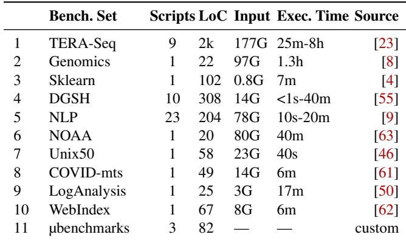

Setup: All experiments were conducted on CloudLab [13] r6525 machines equipped with two 32-core AMD EPYC 7543 CPUs running at 2.8GHz with 256GB of DDR4 RAM, and NVMe SSD storage. The OS was Ubuntu 22.04.2 LTS was kernel version 5.15.0-122-generic, Bash version 5.1.16, PaSh version 0.12.2, and Python version 3.10.12. Docker (27.3.1) was used for the experimental environment. hS is configured with a speculation window of 30 unless noted otherwise, and PaSh is configured with width of 30.

## 7.1 Benchmarks

For our evaluation we have collected a variety of real-world scripts from the wild (Table 1). Our benchmark selection is complementary to recent shell benchmark characterization efforts such as Koala [33]; we include benchmarks used by prior shell-optimization systems and add domain-specific, long-running workflows such as TERA-Seq to stress scripts with custom tools and implicit dependencies.

TERA-Seq [23] consists of real-world workflows for RNA sequencing that use domain-specific tools and are applied to a multi-GB dataset. These applications run for multiple hours and are on the critical path of bioinformatics research so the authors have already optimized them using & and wait to exploit command independence and parallelization.

Genomics [8] is a single script that processes 97GB of NGS data, producing chromosome-specific, indexed BAM files, making use of nested loops to iterate across samples.

Sklearn [4] runs a regression model on the kdd99 [57] datasets using custom commands that wrap Scikit-Learn [48].

DGSH [55] contains a collection of shell scripts for text processing, compression, code metrics, log analysis, and git repository analysis. We transliterate the original scripts from the dgsh-dialect to be POSIX-compliant.

NLP [9] contains 23 shell scripts from UNIX-for-poets that perform various text processing tasks using UNIX and Linux utilities. Their input is a set of 120 books amplified to 100× their original size.

NOAA [63] processes multi-year temperature data across the US during the 2000s, consisting of more than 100k compressed files with up to 500MB size. We replace instances of iterations using seq and xargs with equivalent for loops.

Unix50 [46] includes classic and recent (circa 2019) scripts making heavy use of UNIX and Linux built-in commands. We evaluate hS on a cumulative script that contains all 36 scripts together on an input of 21GB.

COVID-mts [61] analyzes public transit data during the COVID-19 pandemic, consisting of five pipelines that process 10GB of input data (originally 3.4GB) using UNIX and Linux utilities. We combine the five pipelines into a single script.

LogAnalysis [50] analyzes 2.8GB of web server logs from the World Cup ’98 website [2] over a period of 53 days. We extended the original pipeline [50] to handle compressed data and to process multiple log files.

WebIndex [62] is a large, multi-stage script for crawling and indexing Wikipedia. The script uses various utilities like pandoc [34] and awk to convert HTML to text and extract metrics. We evaluate the script on a fraction of the original input (7280 files, out of approximately 1.5 million).

## 7.2 Overall Performance and Correctness

Results (Fig. 5): We evaluate hS compared to Bash and PaSh on the 10 benchmark sets, totaling 49 shell scripts and 2.9k LOC. We omit PaSh bars for the full TERA-Seq suite because a meaningful PaSh comparison requires workflowspecific annotations and, for the dominant stages, domainspecific split and merge operators. To investigate this, we manually annotated a representative TERA-Seq workflow, 5TERA3, with conservative PaSh input/output annotations and ran a comparison. PaSh produced output matching Bash, but did not improve performance. Profiling showed that the safely annotatable FASTQ preprocessing work accounts for only 1.6% of profiled time, while SQLite/database mutation and SAM/BAM processing dominate; accelerating those stages would require database partition/merge support or SAM/BAM-aware splitters, not just command annotations. Each bar shows the speedup of hS and PaSh over bash. Across all benchmark sets, hS achieves a geomean speedup of 2.6× over Bash, (min: 0.14×, max: 9.3×). Across all benchmarks other than TERA-Seq, PaSh achieves a geomean speedup of 1.2× (min: 0.2×, max: 10.8×). hS slows down 7 scripts compared to bash (DGSH 3, 4, 6, 9, 10, NLP 9, WebIndex), out of which 5 take less than 10 seconds to execute with Bash (DGSH 3, 4, 9, 10, NLP 9). hS is slower than PaSh for only 4 scripts that take more than 10 seconds to execute (DGSH 5, 6,

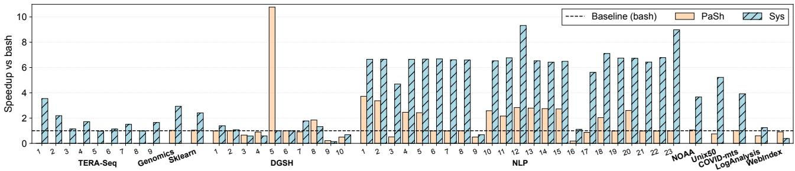  
Figure 5: hS performance. hS and PaSh speedup over Bash for Tab. 1 rows 1–10.

8, and WebIndex). For all compared runs, we check that hS’s output and exit status match Bash and, when included, PaSh.

Discussion: hS improves execution time on most scripts compared to Bash and PaSh, without any static knowledge about commands and without any input from the user. Importantly, hS manages to improve the performance of 7 out of 9 TERA-Seq scripts (geomean: 1.5×, max: 3.5×) even though their developers had already attempted to optimize them by uncovering parallelization and out-of-order execution opportunities using &. This shows that hS can be useful even for scripts that have already been optimized to exploit command independence. The scripts that hS slows down compared to Bash or PaSh either (1) have a short sequential running time below 10s and therefore hS’s overheads dominate execution time (DGSH 3, 4, 9, 10, NLP 9), (2) perform many file accesses (WebIndex) (details in §7.4.2), or (3) exhibit strict dependencies across commands and pipelines (DGSH 5, 6, 8). For example, the DGSH 5 script performs a fully-dependent workflow, it finds words in a document (tokenizing, sorting, and removing duplicates) and then spellchecks them against a dictionary, leaving no room for out-of-order execution and so hS performs similarly to Bash (522s vs 523s, respectively). In contrast, PaSh manages to accelerate this script by leveraging its command annotations to exploit data parallelism in the same document, which is not in hS’s scope. hS manages to accelerate scripts by exploiting available command invocation independence (across commands that read from or write to different files), for example in Genomics it manages to exploit the fact that different chromosomes can be processed independently. hS achieves that without any static knowledge about the commands in a script, and therefore can also accelerate scripts with domain-specific tools that PaSh cannot optimize.

## 7.3 Mis-speculation Statistics

We evaluate the amount of redundant resources that hS uses when it mis-speculates a command instance and then has to reexecute it. We measure the time spent on a command by recording the start and end time of each command instance (speculative) execution, then compute the time spent on misspeculations over the total execution time of all commands.

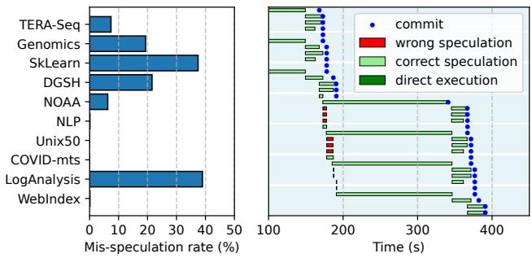  
Figure 6: Left: Rate of mis-speculation. Percentage of how much execution time hS spends on reexecutions. Right: Fragment (100-450s) of Genomics execution in hS. Each row represents a command being executed, different blue regions are different iterations of a loop.

Note that the measured time is not equivalent to CPU time, since a command might have internal parallelization and potential resource contention with other commands.

Results (Fig. 6, left) and Discussion: Wasted execution time due to mis-speculation ranges from 0–39%, with an average of 17% across all scripts. Some scripts (Unix50, COVID-mts, NLP) have minimal dependencies and therefore observe minimal mis-speculation. Some scripts (TERA-Seq, NOAA, WebIndex) have dependencies but mis-speculations can be determined quickly due to eager dependency detection (§5.2), leading to a small amount of wasted execution time 0.1–8%. Finally, some scripts (Genomics, DGSH, LogAnalysis, Sklearn) have dependencies that can only be determined after spending significant time executing their commands, leading to more wasted execution time 19–39%. Sklearn and LogAnalysis both lead to significant mis-speculation because they introduces file-system writes at the end of some of their commands, preventing hS from detecting conflicts earlier.

Zooming in (Fig. 6, right): We show a trace from a Genomics execution with hS. After a quick setup, the script enters a loop, where iterations are independent, but for each iteration the first command is a dependency for all the rest. As the figure shows, subsequent commands in each iteration start as mis-speculation at first, but are quickly terminated since hS can eagerly detect dependencies (§5.2) hS only reschedules these commands after the first command finishes. All in all, hS is able to speed up this script by 2.9× while only wasting 8% of its total execution time in mis-speculations.

## 7.4 Executor Overheads

We evaluate the executor’s overheads using our benchmark suite and various microbenchmarks.

Constant overheads: We evaluate the constant overheads of hS’s executor (incl. sandboxing, tracing, and parsing) by executing 1024 echo commands with and without sandboxing. On average hS’s executor adds an overhead of 217ms per command, out of which 120ms is from sandboxing, a modest overhead considering that it focuses on optimizing programs with long executing commands.

## 7.4.1 hS overheads

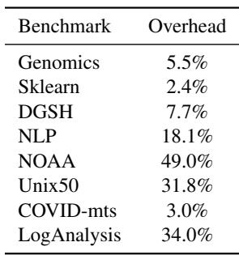

We evaluate the overall overheads of hS’s tracing, sandboxing, and orchestration by executing 8 benchmark sets (Tab. 1, rows 2–9) with speculation window 0, meaning that hS executes one command at a time.

Results and Discussion: Overheads of hS compared to Bash range from 2.4% to 49.0%, with

an average of 23% across all scripts. Some benchmarks like Unix50, and LogAnalysis have high overheads because they execute a large number of short commands, which are more expensive to sandbox. Tracing and sandboxing introduce higher overheads for I/O intensive workloads (e.g., NOAA) and lower overheads for CPU-intensive ones (Sklearn and COVID-mts).

## 7.4.2 I/O-heavy overheads

We evaluate hS on two artificial, I/O-heavy workloads to stress test its overheads: one workload writes a large file using dd [36], and the other creates a large number of small files.

Results (Fig. 7): For a large output file, hS’s performance is 3.2–3.4× slower than Bash, most of which comes from sandboxing (3.0–3.4×), while tracing and parsing add negligible overhead. For many small files, hS’s performance is 6.2–7.2× slower than Bash, with tracing causes 310% overhead, while parsing and sandboxing incur smaller part of the overhead 120–130% and 140–200%, respectively. hS’s running time is slightly faster than the sandboxing time because tracing and parsing are pipelined.

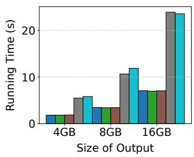

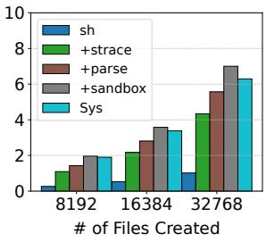  
Figure 7: hS overheads on two I/O-heavy workloads.

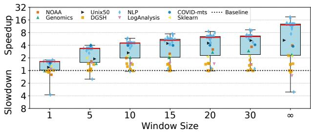  
Figure 8: hS performance with varying window sizes.

Discussion: hS can incur substantial overheads on I/O-heavy workloads, both with the increasing size of written output, as well as the increasing number of accessed files. These are due to (1) the additional I/O overhead of moving the files out of the sandbox (between drives), and (2) the overhead of tracing a large number of open system calls.

## 7.5 Varying Window Sizes

We finally evaluate how different speculation window sizes, i.e., how many commands can be speculated concurrently, influence hS’s performance. We run the scripts that take longer than 20 seconds out of 8 benchmark sets (Tab. 1, rows 2–9). We vary the speculation window size from 1 to an infinite window size (speculate all subsequent commands).

Results (Fig. 8): Increasing the window size from 1 to 15 improves performance across all sets, from 1.6× to 5.24× on average. Beyond this, benchmarks exhibit distinct behaviors: NLP continues scaling, reaching up to 9.1× on average at infinite window size; LogAnalysis peaks and then degrades due to excessive speculation (33% at infinite window size); and the rest initially benefit but quickly plateau.

Discussion: Optimal window size depends on script complexity, parallelizability, and available CPU cores. Several of our benchmarks benefit from larger windows due to abundant parallelism, e.g., NLP scripts with completely independent loop iterations. The benchmarks that plateau execute fewer commands or are inherently less parallelizable. Finally, some scripts with many short-running commands do not benefit from larger window sizes due to resource saturation, e.g., LogAnalysis invokes more than 700 commands, saturating the 128 threads of the execution machine.

Table 2: Summary of all Python benchmarks used to evaluate hS and their characteristics. Exec. Time indicates the execution time of the script with standard Python and Speedup indicates the speedup of hS.  
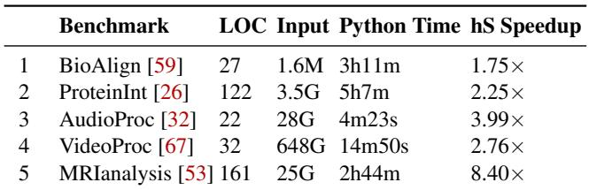

## 7.6 Performance on Python programs

We evaluate the performance of hS and its Python frontend by comparing its execution time with standard Python execution on a set of real-world Python scripts. We configure hS with a speculation window of 16.

Benchmarks: We use a set of 5 real-world Python programs to evaluate hS’s Python frontend (see Tab. 2 for a summary). The programs perform a variety of tasks, two bioinformatics workflows, an MRI image analysis, and audio and video processing; and are taken from a variety of sources including a textbook, an online forum, and a serverless benchmark suite. We did minor modifications to the programs to simplify the frontend: (1) invocations to external processes through a wrapper were inlined to directly call subprocess.run; (2) filemanipulation functions, e.g., sys.write were replaced with external processes calls so hS’s executor could track their sideeffects; and (3) user defined functions were inlined in main. BioAlign was also modified to disable JVM’s performance logging to enable parallelization (see “Discussion”).

Results (Tab. 2): We show the performance of hS compared to standard Python execution. Scripts have varying execution times, ranging from 4m to 5h when executed without hS. hS achieves a geomean speedup of 3.26× (min: 1.75×, max: 8.40×) across the benchmarks.

Discussion: hS improves the execution time across all Python scripts against baseline Python without any user input. For example, in MRIanalysis, hS manages to identify the speculation opportunity across independent loop iterations and achieves a speedup of 8.4×. In ProteinInt hS only achieves a 2.25× speedup because the script is bottlenecked by indexing a reference genome before the parallelizable loop.

Furthermore, hS’s dependency tracking enables safe optimizations and performance debugging for target applications. When we first ran BioAlign with hS, we observed a .5% slowdown compared to the baseline. Inspecting hS’s dependency logs allowed us to identify and fix a hidden but unnecessary write-write conflict (all JVM instances write perf. monitoring data in /tmp/hsperfdata) by passing a JVM flag that disables these logs. This experience shows that hS’s tracking facilitates performance debugging and achieves benefits without risking changing a program’s behavior—which could happen if one manually reordered invocations that were mistakenly thought to be independent.

## 8 Related Work

Performance optimizations for shell scripts: Recent work achieves significant speedups on shell scripts through parallelization [20, 29, 55, 62] and distribution [42, 50]. A key component of all these systems is a just-in-time compilation infrastructure [19, 29] that optimizes scripts at the right time, despite them being highly dynamic. hS builds on this justin-time infrastructure, but extends it with context-passing, side-effect-management, and dependency reasoning to enable speculative execution. All of these systems require annotations for all commands present in a pipeline to enable optimization; hS, on the other hand, can optimize scripts without any user input, by understanding command behavior at runtime through tracing and isolation.

Runtime frameworks for shell scripts: Recent work that improves various aspects of shell scripts has identified the benefit of harnessing runtime execution information through tracing. Riker [11] enables incremental execution for shell scripts that describe software builds by tracing their execution and using the trace to identify the minimal set of commands to re-execute when the script changes. Dozer [22] translates shell scripts to Ansible commands for better maintainability by tracing the system calls of a target script and finding comparable traces in its library of Ansible commands. Autobash [58] helps users debug system configuration errors by tracing command execution to infer state deltas, with which it is able to detect predicate violations and perform rollbacks [44].

Explicit dependency encoding: Workflow and build systems [15, 21, 25, 31, 56] explicitly express dependency graphs by manually encoding all input and output dependencies of each step. Encoding dependencies statically and ahead-oftime yields better program schedules, but (1) requires users to provide all dependencies or suffer from stale or incorrect results, and (2) cannot express the high dynamism prevalent in shell scripts. Our approach addresses both these challenges.

Speculative execution: Speculation and rollback are not new ideas, with an extensive history from computer architecture to the application level, e.g., for system configuration [44] or security checks [45]. In some of these proposals speculation is enabled by modifying the application (e.g., Undo [6]), while others support arbitrary black-box applications [44, 45, 58]. Thread-level speculation is a widely studied technique for extracting parallelism from applications at runtime by speculatively executing parts of them in different threads and rolling them back if dependencies are violated [14, 60]. Spidermine [64] optimizes programs through speculative prefetching by dynamically identifying sites of frequent reads. We build on these ideas, tightly coupling with the shell’s language and semantics reducing overhead and the amount of tracked information: instead of considering the whole script as a black-box application, we use the script semantics to separate it into logical application components (command invocations).

Containment and tracing: There has been significant work on extending filesystems with sandboxing and transactions, some examples include: MBOX [30], a sandboxing mechanism; Amino [65], a transactional filesystem; SandFS [3], a filesystem with sandboxing support; filesystems that support snapshots, such as ZFS [5] and BTRFS [51]; and TotalCOW [66], which aims to improve the treatment of copyon-write pages in Linux. All of this work is orthogonal and complementary to hS, since it could be used instead of or in addition to OverlayFS to improve hS’s performance.

Shell script semantics: Finally, recent work has tried to study the semantics of shell scripts, either through collection of real-world shell uses [12], or through formalization [16, 17]. hS draws inspiration from these works to reason about the correctness of its optimizations and uses the parsing infrastructure developed by Smoosh [10].

## 9 Discussion

Limitations: There are some effects that hS’s executor cannot currently identify, block, or revert precisely. First, our implementation blocks, but does not precisely detect, IPC, signals, and effects through device files [43]. These effects are restricted by IPC, pid, and mount namespaces respectively, but precisely classifying them requires more elaborate system-call tracing and, for device-file accesses, comparison with mount structures. Second, hS cannot detect, block, or revert effects through memory-mapped I/O or file systems with external effects, such as NFS [52]. Third, hS does not currently support pseudo-files for GPU devices. Although GPU runtimes typically provide process-level memory isolation, they rely on ioctl calls that create persistent state and perform IPC between GPU-using processes, which is not straightforward to detect and block [47]. hS also does not support scripts whose core logic depends on time, including wall-clock time or file access times [39]; executing such scripts with hS may change their results.

hS’s dependency abstraction is path-based. It handles parent-directory effects and symbolic-link use conservatively, but it does not canonicalize all path aliases, such as hard links, complex bind mounts, or /proc/self/fd-style paths, into a single inode-level identity. Scripts whose correctness depends on such aliases being recognized as the same underlying file are therefore outside hS’s current guarantees.

A separate limitation concerns scripts that impose higherorder semantic requirements on file accesses, e.g., apt’s use of files as locks [37], or programs that coordinate through shared on-disk caches such as compiler caches, package-manager state, SQLite databases, or generated bytecode caches. These cases can require application-specific merge or locking semantics that are not captured by bulk OverlayFS commit.

hS also does not provide opacity for speculative executions: a speculated command may observe a state that is not globally reachable in the sequential execution, and could therefore crash, loop, or generate excessive output before being discarded. Production deployments could add explicit time, memory, and output quotas to bound such behavior.

## 10 Conclusion

This paper proposes hS, a system that can automatically exploit latent parallelism in shell scripts using out-of-order speculative execution. hS represents a significant improvement over the state of the art because it can support and optimize scripts with arbitrary executables without any form of user input or command annotations.

## Acknowledgments

We are thankful to the anonymous OSDI’26 and AEC reviewers; the Brown, UCLA, and Columbia systems groups; and the many PaSh workshop participants. This material is based upon research supported by NSF awards CNS-2247687, CNS-2312346, and CNS-2312347; DARPA contracts no. HR001120C0191 and HR001124C0486; an Amazon Research Award (Fall 2024); a Google ML-and-Systems Junior Faculty Award; a seed grant from Brown University’s Data Science Institute; and a Brown CS Faculty Innovation Award.

## References

[1] mergerfs: a featureful union filesystem. https:// github.com/trapexit/mergerfs.

[2] Martin Arlitt, Tai Jin, Greg Oster, and Balachander Krishnamurthy. 1998 world cup web site access logs, 1998. Available at https://ita.ee.lbl.gov/html/contrib/WorldCup.html.

[3] Ashish Bijlani and Umakishore Ramachandran. A lightweight and fine-grained file system sandboxing framework. In Proceedings of the 9th Asia-Pacific Work shop on Systems, APSys ’18, New York, NY, USA, 2018. Association for Computing Machinery.

[4] binpash. Scikit-learn benchmark. https://github. com/binpash/benchmarks/tree/main/sklearn, 2024.

[5] Jeff Bonwick, Matt Ahrens, Val Henson, Mark Maybee, and Mark Shellenbaum. The zettabyte file system. In Proc. of the 2nd Usenix Conference on File and Storage Technologies, volume 215, 2003.

[6] Aaron B Brown and David A Patterson. Undo for operators: Building an undoable e-mail store. In USENIX Annual Technical Conference, General Track, pages 1– 14, 2003.

[7] Neil Brown, Miklos Szeredi, Amir Goldstein, Vivek Goyal, Randy Dunlap, Linus Torvalds, Pavel Tikhomirov, Kevin Locke, Sargun Dhillon, Chengguang Xu, and Deming Wang. The overlay filesystem. The Linux Kernel documentation, 2022. Started in 2014.

[8] Enrico Cappellini, Frido Welker, Luca Pandolfi, Jazmín Ramos-Madrigal, Diana Samodova, Patrick L Rüther, Anna K Fotakis, David Lyon, J Víctor Moreno-Mayar, Maia Bukhsianidze, et al. Early pleistocene enamel proteome from dmanisi resolves stephanorhinus phylogeny. Nature, 574(7776):103–107, 2019.

[9] Kenneth Ward Church. Unix™ for poets, 1994. Notes of a course from the European Summer School on Language and Speech Communication, Corpus Based Methods.

[10] Github Contributors. libdash, 2024. Accessed 2024-04- 19.

[11] Charlie Curtsinger and Daniel W Barowy. Riker: Always-Correct and fast incremental builds from simple specifications. In 2022 USENIX Annual Technical Conference (USENIX ATC 22), pages 885–898, 2022.

[12] Yiwen Dong, Zheyang Li, Yongqiang Tian, Chengnian Sun, Michael W. Godfrey, and Meiyappan Nagappan. Bash in the wild: Language usage, code smells, and bugs. ACM Transactions on Software Engineering and Methodology, 32(1):1–22, January 2023.

[13] Dmitry Duplyakin, Robert Ricci, Aleksander Maricq, Gary Wong, Jonathon Duerig, Eric Eide, Leigh Stoller, Mike Hibler, David Johnson, Kirk Webb, Aditya Akella, Kuangching Wang, Glenn Ricart, Larry Landweber, Chip Elliott, Michael Zink, Emmanuel Cecchet, Snigdhaswin Kar, and Prabodh Mishra. The design and operation of CloudLab. In Proceedings of the USENIX Annual Technical Conference (ATC), pages 1–14, July 2019.

[14] Alvaro Estebanez, Diego R Llanos, and Arturo Gonzalez-Escribano. A survey on thread-level speculation techniques. ACM Computing Surveys (CSUR), 49(2):1–39, 2016.

[15] Sadjad Fouladi, Francisco Romero, Dan Iter, Qian Li, Shuvo Chatterjee, Christos Kozyrakis, Matei Zaharia, and Keith Winstein. From laptop to lambda: Outsourcing everyday jobs to thousands of transient functional containers. In USENIX Annual Technical Conference, pages 475–488, 2019.

[16] Michael Greenberg. The POSIX shell is an interactive DSL for concurrency, 2018. DSLDI.

[17] Michael Greenberg and Austin J. Blatt. Executable formal semantics for the POSIX shell. Proc. ACM Program. Lang., 4(POPL):43:1–43:30, 2020.

[18] Michael Greenberg, Konstantinos Kallas, and Nikos Vasilakis. The future of the shell: Unix and beyond. In Proceedings of the Workshop on Hot Topics in Operating Systems, HotOS ’21, pages 240–241, New York, NY, USA, 2021. Association for Computing Machinery.

[19] Michael Greenberg, Konstantinos Kallas, and Nikos Vasilakis. Unix shell programming: The next 50 years. In Proceedings of the Workshop on Hot Topics in Operating Systems, HotOS ’21, pages 104–111, New York, NY, USA, 2021. Association for Computing Machinery.

[20] Shivam Handa, Konstantinos Kallas, Nikos Vasilakis, and Martin Rinard. An order-aware dataflow model for extracting shell script parallelism. Proc. ACM Program. Lang., 4(ICFP), August 2021.

[21] Bas P Harenslak and Julian de Ruiter. Data pipelines with Apache Airflow. Simon and Schuster, 2021.

[22] Eric Horton and Chris Parnin. Dozer: migrating shell commands to ansible modules via execution profiling and synthesis. In Proceedings of the 44th International Conference on Software Engineering: Software Engineering in Practice, ICSE-SEIP ’22, page 147–148, New York, NY, USA, 2022. Association for Computing Machinery.

[23] Fadia Ibrahim, Jan Oppelt, Manolis Maragkakis, and Zissimos Mourelatos. TERA-Seq: true end-to-end sequencing of native RNA molecules for transcriptome characterization. Nucleic Acids Research, 49(20):e115– e115, 08 2021.

[24] Github Inc. The top programming languages. https://octoverse.github.com/2022/ top-programming-languages, 2022.

[25] Google Inc. Bazel, 2015.

[26] Hamid D. Ismail. Bioinformatics of Autoimmune Diseases. CRC Press, 1st edition, 2026. Under publishing.

[27] Daniel Jackson. Alloy: a lightweight object modelling notation. ACM Transactions on software engineering and methodology (TOSEM), 11(2):256–290, 2002.

[28] Jonathan Corbet. Unprivileged filesystem mounts, 2018 edition. https://lwn.net/Articles/755593/, 2018.

[29] Konstantinos Kallas, Tammam Mustafa, Jan Bielak, Dimitris Karnikis, Thurston H.Y. Dang, Michael Greenberg, and Nikos Vasilakis. Practically correct, just-intime shell script parallelization. In 16th USENIX Sym posium on Operating Systems Design and Implementation (OSDI 22), pages 1–18. USENIX Association, July 2022.

[30] Taesoo Kim and Nickolai Zeldovich. Practical and effective sandboxing for non-root users. In 2013 USENIX Annual Technical Conference (USENIX ATC 13), pages 139–144, San Jose, CA, June 2013. USENIX Association.

[31] Johannes Köster and Sven Rahmann. Snakemake—a scalable bioinformatics workflow engine. Bioinformat ics, 28(19):2520–2522, 2012.

[32] Oleksii Kuchaiev, Somshubra Majumdar, Eric Harper, et al. Nemo: a toolkit for conversational ai and large language models, 2024.

[33] Evangelos Lamprou, Ethan Williams, Georgios Kaoukis, Zhuoxuan Zhang, Michael Greenberg, Konstantinos Kallas, Lukas Lazarek, and Nikos Vasilakis. The koala benchmarks for the shell: Characterization and implica tions. In 2025 USENIX Annual Technical Conference (USENIX ATC 25), pages 449–464, Boston, MA, July 2025. USENIX Association.

[34] John MacFarlane. Pandoc: a universal document converter. https://pandoc.org/. Accessed: 2025-04-15.

[35] Aurèle Mahéo, Pierre Sutra, and Tristan Tarrant. The serverless shell. In Proceedings of the 22nd International Middleware Conference: Industrial Track, pages 9–15, 2021.

[36] Linux man-pages project. dd(1) – linux manual page.

[37] Linux man-pages project. lockf(2) — linux manual page.

[38] Linux man-pages project. namespaces(7) – linux manual page.

[39] Linux man-pages project. stat(3type) — linux manual page.

[40] Linux man-pages project. strace(1) – linux manual page.

[41] Karel Zak Mikhail Gusarov. unshare - run program in new namespaces. Linux manual page, 2022.

[42] Tammam Mustafa, Konstantinos Kallas, Pratyush Das, and Nikos Vasilakis. DiSh: Dynamic Shell-Script distribution. In 20th USENIX Symposium on Networked Systems Design and Implementation (NSDI 23), pages 341–356, Boston, MA, April 2023. USENIX Association.

[43] Binh Nguyen. Linux Filesystem Hierarchy: /dev. https://tldp.org/LDP/ Linux-Filesystem-Hierarchy/html/dev.html. Accessed: 2025-04-15.

[44] Edmund B Nightingale, Peter M Chen, and Jason Flinn. Speculative execution in a distributed file system. ACM SIGOPS operating systems review, 39(5):191–205, 2005.

[45] Edmund B Nightingale, Daniel Peek, Peter M Chen, and Jason Flinn. Parallelizing security checks on commodity hardware. ACM SIGARCH Computer Architecture News, 36(1):308–318, 2008.

[46] Nokia Bell Labs. The unix game—solve puzzles using unix pipes, 2019. Accessed: 2020-03-05.

[47] Nvidia. CUDA C++ Programming Guide: Interprocess Communication. Accessed 2025-04-15.

[48] F. Pedregosa, G. Varoquaux, A. Gramfort, V. Michel, B. Thirion, O. Grisel, M. Blondel, P. Prettenhofer, R. Weiss, V. Dubourg, J. Vanderplas, A. Passos, D. Cournapeau, M. Brucher, M. Perrot, and E. Duchesnay. Scikit-learn: Machine learning in Python. Journal of Machine Learning Research, 12:2825–2830, 2011.

[49] Nikos Perdikopanis. Bioinformatics analysis of next generation sequencing (ngs) data with r, 2023. Accessed: 2024-04-19.

[50] Deepti Raghavan, Sadjad Fouladi, Philip Levis, and Matei Zaharia. POSH: A data-aware shell. In 2020 USENIX Annual Technical Conference (USENIX ATC 20), pages 617–631, 2020.

[51] Ohad Rodeh, Josef Bacik, and Chris Mason. BTRFS: The linux B-tree filesystem. ACM Transactions on Storage (TOS), 9(3):1–32, 2013.

[52] Russel Sandberg. The sun network file system: Design, implementation and experience. In in Proceedings of the Summer 1986 USENIX Technical Conference and Exhibition, 1986.

[53] Derek Schettler. Captk brats preprocessing - [cleaned & commented], 2021. Kaggle Notebook.

[54] Jiasi Shen, Martin Rinard, and Nikos Vasilakis. Automatic synthesis of parallel unix commands and pipelines with kumquat. In Proceedings of the 27th ACM SIG-PLAN Symposium on Principles and Practice of Parallel Programming, PPoPP ’22, pages 431–432, New York, NY, USA, 2022. Association for Computing Machinery.

[55] Diomidis Spinellis and Marios Fragkoulis. Extending unix pipelines to dags. IEEE Transactions on Comput ers, 66(9):1547–1561, 2017.

[56] Richard M Stallman, Roland McGrath, and Paul Smith. Gnu make. Free Software Foundation, Boston, 1988.

[57] Salvatore Stolfo, Wei Fan, Wenke Lee, Andreas Prodromidis, and Philip Chan. KDD Cup 1999 Data. UCI Machine Learning Repository, 1999. DOI: https://doi.org/10.24432/C51C7N.

[58] Ya-Yunn Su, Mona Attariyan, and Jason Flinn. Autobash: Improving configuration management with operating system causality analysis. ACM SIGOPS Operating Systems Review, 41(6):237–250, 2007.

[59] ta2007. Multiprocessing in python with subprocess to align several files with coding dna sequences, 2016. Biostars Forum Post.

[60] Josep Torrellas. Speculation, thread-level. In David Padua, editor, Encyclopedia of Parallel Computing, pages 1894–1900. Springer US, Boston, MA, 2011.

[61] Eleftheria Tsaliki and Diomidis Spinellis. The real statistics of buses in athens. https://bit.ly/3s112R5, 2021.

[62] Nikos Vasilakis, Konstantinos Kallas, Konstantinos Mamouras, Achilles Benetopoulos, and Lazar Cvetkovic.´ Pash: Light-touch data-parallel shell processing. In Proceedings of the Sixteenth European Conference on Computer Systems, pages 49–66, New York, NY, USA, 2021. Association for Computing Machinery.

[63] Tom White. Hadoop: The Definitive Guide. O’Reilly Media, Inc., 4th edition, 2015.

[64] Jiwoong Won, Sangwoon Yun, Ahn Jemin, Jong-Chan Kim, and Kyungtae Kang. Spidermine: Low overhead user-level prefetching. In Proceedings of the 38th ACM/SIGAPP Symposium on Applied Computing, SAC ’23, page 1332–1341, New York, NY, USA, 2023. Association for Computing Machinery.

[65] Charles P. Wright, Richard Spillane, Gopalan Sivathanu, and Erez Zadok. Extending acid semantics to the file system. ACM Trans. Storage, 3(2):4–es, jun 2007.

[66] Xingbo Wu, Wenguang Wang, and Song Jiang. Totalcow: Unleash the power of copy-on-write for thinprovisioned containers. In Proceedings of the 6th Asia-Pacific Workshop on Systems, APSys ’15, New York, NY, USA, 2015. Association for Computing Machinery.

[67] Tianyi Yu, Qingyuan Liu, Dong Du, Yubin Xia, Binyu Zang, Ziqian Lu, Pingchao Yang, Chenggang Qin, and Haibo Chen. Characterizing serverless platforms with serverlessbench. In Proceedings of the 11th ACM Symposium on Cloud Computing, SoCC ’20, page 30–44, New York, NY, USA, 2020. Association for Computing Machinery.

## A Artifact Appendix

## Abstract

The artifact for hS is an archived release of the implementation and evaluation materials for speculative shell execution. It includes the code, artifact-evaluation instructions, automation scripts, precomputed paper results, and dataset manifest.

## Scope

The OSDI ’26 evaluation grants only the Artifacts Available badge. The artifact therefore first supports checking that the implementation and supporting materials are public and permanently archived. The same instructions also describe optional functional and reproducibility paths: installing hS, running tests, regenerating plots from precomputed results, and rerunning selected benchmarks on suitable hardware.

## Contents

The archived release of hS contains the source tree (hs, scheduler/, executor/, preprocessor/, jit\_runtime/, model-checking/, test/, report/, and python\_hs/); the try submodule; setup/archive helper scripts; precomputed results and plotting inputs under artifact/paper-results/; and dataset locations in artifact/datasets.md, as well as detailed instructions to set up and use the artifact.

## Hosting

The stable artifact URL is the Zenodo archive: https: //doi.org/10.5281/zenodo.19832407. The corresponding GitHub artifact-evaluation branch is https://github. com/binpash/hs/tree/osdi26-ae. The main development repository is https://github.com/binpash/hs.

## Requirements

The quickstart in INSTRUCTIONS.md targets an Ubuntu-like Linux host (Ubuntu 20.04 or newer preferred), Python 3.12 or newer, permission to install APT packages, and sudo/root access for the tracing, cgroup, OverlayFS, and filesystem facilities used by hS and try. The setup script initializes dependencies and builds helper binaries. Full benchmark reruns require multicore machines with at least 1TB of disk space, and optionally privileged Docker access.