0

USENIX

THE ADVANCED COMPUTING SYSTEMS ASSOCIATION

# ECO: An AI-Driven Code Efficiency Optimizer for Warehouse Scale Computers (Operational Systems)

Hannah Lin and Martin Maas, Google DeepMind; Maximilian Roquemore, Google; Arman Hasanzadeh, Google DeepMind; Fred Lewis, Yusuf Simonson, Ameya Shringi, and Hongwen Dai, Google; Patrick Musau, Google DeepMind;   
Tzu-Wei Yang, Google; Amir Yazdanbakhsh and Deniz Altinbüken, Google DeepMind;   
Florin Papa, Maggie Nolan Edmonds, Aditya Patil, Don Schwarz, Satish Chandra, and Chris Kennelly, Google; Milad Hashemi, Google DeepMind; Parthasarathy Ranganathan, Google

https://www.usenix.org/conference/osdi26/presentation/lin-hannah

# This paper is included in the Proceedings of the 20th USENIX Symposium on Operating Systems Design and Implementation.

July 13–15, 2026 • Seattle, WA, USA

ISBN 978-1-939133-55-7

Open access to the Proceedings of the 20th USENIX Symposium on Operating Systems Design and Implementation is sponsored by

# ECO: An AI-Driven Code Efficiency Optimizer for Warehouse Scale Computers (Operational Systems)

Hannah Lin<sup>∗1</sup> Martin Maas<sup>∗1</sup> Maximilian Roquemore<sup>†2</sup> Arman Hasanzadeh<sup>1</sup> Fred Lewis<sup>2</sup> Yusuf Simonson<sup>2</sup> Ameya Shringi<sup>2</sup> Hongwen Dai<sup>2</sup> Patrick Musau<sup>1</sup> Tzu-Wei Yang<sup>2</sup>   
Amir Yazdanbakhsh<sup>1</sup> Deniz Altinbüken<sup>1</sup> Florin Papa<sup>2</sup> Maggie Nolan Edmonds<sup>2</sup> Aditya Patil<sup>2</sup>   
Don Schwarz<sup>2</sup> Satish Chandra<sup>‡2</sup> Chris Kennelly<sup>2</sup> Milad Hashemi<sup>1</sup> Parthasarathy Ranganathan<sup>2</sup> <sup>1</sup>Google DeepMind, <sup>2</sup>Google

## Abstract

Large Language Models (LLMs) have shown significant promise in automating code efficiency optimization. While prior work demonstrates these techniques on artificial datasets such as programming competitions or small benchmarks, deploying these techniques at scale in production has remained an open problem. Arguably, two challenges have prevented the adoption in large-scale real-world systems: opportunity localization and reliability. First, applying an LLM to every line across a large code base is expensive and prone to generating an overwhelming number of low-quality suggestions, placing unsustainable cognitive load on human code reviewers. Second, the inherent unreliability of LLM-generated code risks introducing errors that can lead to production incidents. These challenges are largely orthogonal to the ML techniques prior work has focused on; they are real-world systems problems.

This paper introduces ECO, a system that automatically modifies source code to improve performance at scale. ECO overcomes the localization problem by combining fleet-wide continuous profiling to identify performance-critical code with an embedding-based search to pinpoint specific optimization candidates, guided by a mined dictionary of performance anti-patterns. It overcomes the reliability problem through a multi-stage verification approach that uses automated testing, LLM-based self-review, and post-deployment monitoring to ensure changes are both correct and effective. Fully productionized and deployed within Google’s hyperscale production fleet, ECO has successfully landed over 6,400 commits, changing more than 25,000 lines of production code. Incorrect changes are caught before they are submitted to production, and 99.5% of the submitted commits did not cause any rollbacks. These optimizations have resulted in savings equivalent to several hundred thousand normalized CPU cores, showing that ECO makes LLM-based optimization both prac tical at scale and highly impactful in real-world settings.

## 1 Introduction

Over the past few years, an increasing amount of work has shown the potential of Large Language Models (LLMs) to analyze and optimize code for performance [1–10]. By automating a task that traditionally requires extensive and costly manual engineering, LLMs promise to unlock significant efficiency gains, particularly in the long tail of workloads. A study of Google’s data centers has shown that a large fraction of CPU cycles in warehouse-scale computers are spent on workloads that are individually too small to justify manual optimization effort [11]. Automating this process could therefore yield substantial resource and energy savings.

However, while these LLM-based approaches show promise on benchmarks such as programming competitions [2, 5, 7, 9, 12, 13], directly applying them in a large-scale, production environment presents significant challenges that hinder their practical adoption. The challenges are not with the LLMs alone (where existing work has focused), but with making them practical in the context of real-world systems:

• Opportunity Localization: LLM-based methods need to be provided the code to optimize. In production environments with millions or billions of lines of code, naively running an LLM across the entire repository is computationally prohibitive and generates an overwhelming number of false positives. A practical system must first find and localize high-impact optimization opportunities before attempting to apply a fix.

• Reliability: State-of-the-art LLM methods often report success as the best result out of many attempts (e.g., top-K accuracy) [13]. In a real-world production setting, however, precision is paramount. Any incorrect change can cause outages, and the high rate of subtly buggy or non-performant suggestions from an unguided LLM creates a large verification burden.

In addition, benchmarks fail to capture system integration and attribution. In complex, large-scale systems, attributing a performance inefficiency to a specific piece of code is difficult [14]. Furthermore, AI-based optimization must integrate with existing engineering workflows, including testing, code review, and deployment, aspects absent in benchmarks.

We present ECO (Engine for Code Optimization), a system that makes LLM-based optimization practical at scale by introducing novel techniques for targeted localization and robust verification. ECO begins by mining historical commits to create a database of performance anti-patterns. These antipatterns are then used to guide a large-scale vector similarity search [15] across the codebase. To focus this search, we combine it with data from a fleet-wide continuous profiling system, allowing ECO to identify code that is both costly and a likely candidate for a known optimization.

Once a candidate is localized, ECO uses a fine-tuned LLM to generate a code transformation. To ensure the reliability of this edit, it is passed through a multi-stage verification pipeline that includes automated build and unit testing, LLMbased self-review to detect common errors, and finally, human review. Once deployed, the change is continuously monitored to measure its performance impact and avoid regressions.

This paper makes the following contributions:

1. An approach for identifying and localizing performance optimization opportunities by combining continuous profiling with an embedding-based similarity search guided by a mined database of anti-patterns.

2. A methodology for making unreliable LLM-generated edits reliable for production use through automated testing, self-review, and post-deployment monitoring.

3. The design, implementation, and evaluation of ECO, a fully deployed system that embodies these techniques and successfully integrates AI-driven changes into a large-scale, human-in-the-loop engineering workflow.

4. A study focusing on human adoption of code edits, in cluding a human evaluation of 960 code edits to assess the quality of changes, and an at-scale production study of how human engineers adopt ECO-generated changes in Google’s production setting.

5. An analysis of ECO’s deployment at Google, showing it has successfully landed over 6,400 commits, changing over 25k lines of code and saving the equivalent of several hundred thousand normalized CPU cores. By filtering out and discarding incorrect changes before they are submitted to production, >99.5% of the 6,400 commits did not have to be reverted.

While there has been a substantial amount of prior work on LLM-based code optimization, ECO is largely orthogonal to this work. Instead, it solves the systems problems required to turn these capabilities into scalable impact in a large-scale system infrastructure deployment. We believe it is the first operational system to achieve this.

## 2 Background & Overview

The use of LLMs in code optimization has seen a large amount of research in the past several years [1]. We begin with an overview of how our approach improves upon the state of the art to solve problems that have prevented adoption of automated optimization in real-world systems.

## 2.1 Why LLMs for Code Optimization?

Automated code optimization is well-studied, but existing approaches have limitations. Compiler optimizations must be provably correct, preventing them from making semantic changes that a programmer knows are safe in a given context. Static analysis tools like Clang-Tidy [16], Facebook Infer [17], or Semantic Patch [18] can apply rule-based edits to perform such changes, but struggle with the high syntactic variability of real-world code. These tools require narrowly defined patterns and often fail on complex control flow. For example, Clang-Tidy can suggest adding vector<T>::reserve to a sim ple, single-statement loop [19], but cannot handle common real-world cases where a vector is populated across multiple loops, conditional branches, or helper functions (Figure 3b). Writing heuristics for every variant is often more work than fixing the instances manually. Further, many optimizations require domain knowledge that static tools lack, such as when a sorted map can be replaced with a faster, unsorted one.

LLMs overcome these limitations in two ways. First, they can generalize from a few examples to recognize and fix antipatterns across a wide range of syntactic variations, reducing the need for hand-crafted heuristics. Second, they can often infer developer intent and domain-specific context from the surrounding code and comments, enabling semantic optimizations that are out of reach for traditional tools. Figure 3 shows several examples. While LLMs are more computationally expensive than static checkers, we show in Section 7.4 that the cost of inference is negligible compared to the fleet-wide savings they unlock.

## 2.2 High-Level Approach

Figure 1 shows an overview of ECO’s approach. We start by mining decades of code changes across Google’s billions of lines of code spanning over 100,000 packages and thousands of projects [20], to identify a set of canonical code optimizations. Each consists of an anti-pattern and a corresponding optimization that fixes it. Two examples<sup>1</sup> of these anti-patterns, pre-sizing a vector at allocation time and removing redundant accesses to data structures, are shown in Figure 3. We group similar anti-patterns together into categories. Table 1 shows several of the anti-pattern categories in our database.

Using this anti-pattern database, we identify candidate locations in the codebase for similar optimizations. This problem is challenging, as exact matching fails to surface these locations due to differences in variable names and code structure. We find this problem is well-suited to machine learning and develop a code similarity search technique based on vector similarity [15] to identify a set of candidates similar to a given anti-pattern. To focus this search, we leverage fleet-wide continuous profiling to rank candidates based on resource consumption, identifying the best opportunities.

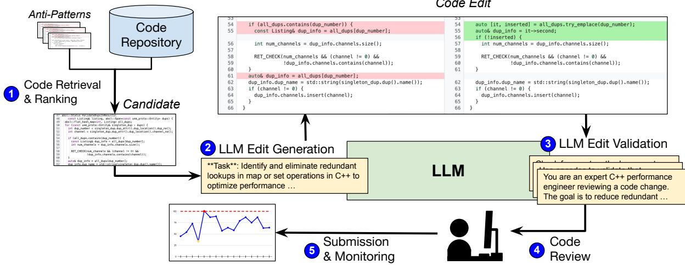  
Figure 1: An end-to-end example of ECO, demonstrating the cycle from anti-pattern mining to deployed fix.

Table 1: Anti-Pattern Categories  
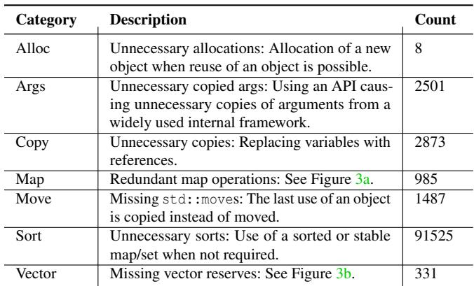

Subsequently, we use a fine-tuned LLM to generate code that implements the optimization. To mitigate the risk of LLM hallucinations, we improve ECO’s reliability by using diverse prompting strategies and a multi-stage verification pipeline. To ensure correctness, we use the LLM to self-review its generated code, similar to [21], run automated tests, and perform checks tailored to each project. We then submit the generated changes for human code review. After submission, we monitor the change in production to detect regressions and measure its performance impact.

ECO’s optimization discovery approach results in a database of anti-patterns that can grow over time. Figure 2 outlines the end-to-end process from an operational point-ofview. A small team of engineers operates ECO, beginning by selecting anti-patterns to target. The team ranks known anti-patterns according to observed frequency and savings potential, supported by the data and statistics gathered in the creation of the database. After selecting anti-patterns, they launch ECO to automatically identify optimization candidates from existing examples. The team ranks these candidates (described in Section 4), and uses a library of prompt recipes (evaluated in Section 7) to have ECO automatically apply an optimization across all identified locations, submitting the resulting commits for code review.

Actions by ECO are automated, with engineers directing the system and intervening only when necessary. Most human involvement appears during the review and submission phase. However, this is required for any change generated at Google, regardless of whether or not it is AI-generated. Code changes fail if performance regressions appear in production and they need to be rolled back. ECO’s validation process has kept the rate of rollbacks extremely low (Section 7.4). As such, ECO greatly scales up human productivity compared to manually searching for optimization opportunities, writing patches and shepherding them through code review.

## 3 Performance Optimization Datasets

We now describe how we mine historical commits to create a dataset of efficiency anti-patterns and optimizations.

## 3.1 A Dataset of Efficiency Anti-Patterns

To enable ECO to drive interpretable and consistent changes, we begin by identifying and categorizing performance antipatterns from historical data. Google’s codebase contains billions of lines of code. It is structured as a monorepo (similar to [22–25]), but the approach would be the same if it was spread across smaller, disparate GitHub repos. While this work targets C++, ECO is not fundamentally limited to it. Despite being organized as a monorepo, this setup covers over 100,000 packages and a wide variety of projects [20], including mirrors of open-source repositories [26]. This diversity and scale demonstrates ECO’s scalability and generalizability across many different kinds of projects.

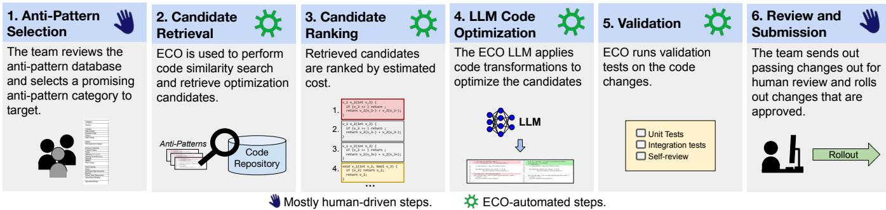  
Figure 2: Operational timeline of ECO.

All code in the repository is searchable, with a complete history of all past commits, including messages, code review comments, and code changes. This is the same setup that a typical organization or open source project building on top of GitHub would encounter. It lets us implement textual search techniques to find historical commits that improved perfor mance. We use two search types: First, we search commit messages for keywords indicating performance improvements (e.g., "speed up", benchmark results), performance-related hashtags, and links to performance-related documentation. Second, we search curated sources like internal newsletters that publicize efficiency improvements. This process is guided by human experts who curate the anti-pattern categories, de fine relevant search keywords, and set up the data processing pipelines. While our coding culture encourages single-issue commits, ECO is robust to commits with multiple changes.

We run this data extraction on a large-scale distributed computation framework, akin to Apache Beam [27], and maintain a database of these performance-related optimizations and the anti-patterns that they solved. We then use it as the foundation of our optimization approach. Appendix A provides a full list of anti-patterns in our dataset.

## 3.2 LLM Fine-Tuning Datasets

In addition to using our anti-pattern dataset to identify optimization candidates (Section 4), we also combine it with other data sources to fine-tune an LLM to improve its performance on these specific code refactorings [28]. For the examples and evaluation provided in this paper, we use ECO with Gemini Pro 1.0 [29], which supports fine-tuning via Google’s Vertex AI service [30]. Our fine-tuning dataset is highly proprietary and includes source code, selected code commits, metadata of code and commits, and the performance-specific dataset derived from our anti-pattern database (≈ 55k commits). The fine-tuning mechanisms are similar to prior work [31, 32].

While we describe a particular LLM here, ECO’s architecture is agnostic to the specific model. We have regularly updated our model and continued to use ECO with more recently released LLMs. However, for consistency, all evaluations in this paper were performed with the original Gemini Pro 1.0 model described above. We note that it is not the goal of this paper to evaluate the capabilities of LLMs at producing code efficiency optimizations, and models continue to rapidly improve in this area, which ECO directly benefits from.

## 4 Optimization Opportunity Localization

While our anti-patterns dataset contains examples of past optimizations, a key challenge is identifying new candidates across our codebase. Naively applying an LLM to all of Google’s code is computationally expensive with an observed high false-positive rate. In addition, incremental, localized changes are favored to minimize global disruption and facilitate testing and review processes. Therefore, we introduce a search technique based on vector similarity search [15] to identify new potential instances of anti-patterns.

## 4.1 Performance IR

To search for optimization opportunities, we first design an intermediate representation (IR) of functions across our codebase. We operate at the function level, as functions provide a stable and practical unit of code to track and compare across the millions of daily changes in our repository. This granularity strikes a balance between providing sufficient context for optimization and maintaining tractability. Using the Apache Beam framework [27], we crawl C++ code, parse each file with Clang, and divide it into functions. We annotate each function with its AST-derived types (e.g., of arguments and local variables), which are good indicators for certain optimizations. Figure 4 shows an example. To avoid processing millions of functions that are not performance-critical, we filter this set to focus only on costly functions.

## 4.1.1 Continuous Profiling

To identify costly functions, we leverage Google Wide Profiling (GWP), a fleet-wide continuous profiling framework that (a) Redundant Map Operations: Performing duplicated key lookups and reinitializing map values can waste CPU cycles. Here, the LLM had to detect that [] may add a missing key, and that for a map with integer values, it gets initialized to 0; the optimization only works in that case and is not sound in general.

bool new\_entry = false;   
if (s.current\_shard.find(name) == s.current\_shard.end()) {   
s.current\_shard[name] = 1;   
new\_entry = true;   
} else {   
++s.current\_shard[name];   
+ int64\_t value = ++s.current\_shard[name];   
+ bool new\_entry = (value == 1);

+ result.reserve(reader->NumRecords());   
for (;;) {   
Info info;   
bool has\_msg = reader->ReadToMessage(&info).ValueOrDie()   
if (has\_msg) {   
result.push\_back(info);   
} else {   
break;   
}   
}   
return result;

+ error\_list.reserve(3);   
int total\_error\_count = 0;   
for (int i = 0; i < vec1.size(); ++i) {   
const double diff = fabs(vec1[i] - vec2[i]);   
if (diff > abs\_error) {   
total\_error\_count++;   
if (error\_list.size() < 3) {   
error\_list.push\_back(Error(i, diff));   
}   
}   
}

(b) Missing Vector Reserves: Vectors are a common data structure but can cause unnecessary memory reallocations that pre-allocating space can avoid. In the first case, reader is a file API and the LLM had to determine that it can query the full number of entries with NumRecords. It also needed the domain-specific context that has\_msg is rarely false. In the second example, it had to conclude that the list will only have up to 3 entries.

periodically samples performance metrics from all running applications [33]. For each sample, it collects the program counter, stack trace, and performance counters. These profiles are aggregated into a global database. We use this data to identify costly functions as optimization targets. In addition, correlating it with code versions allows us to evaluate changes in resource usage linked to specific commits. This helps us both identify past optimizations and also measure the impact of ECO’s commits after deployment.

## 4.1.2 Code Annotations with Performance Metrics

To find good optimization candidates, we annotate our IR with performance metrics such as CPU usage, memory allocations, and LLC misses from our profiler. A naive attribution of CPU usage is often unhelpful, as cycles are frequently spent in common, shared library functions (e.g., vector<T>::push\_back ) rather than application-specific code. These shared libraries are not generally profitable targets for optimization at ECO’s level, as they are usually already heavily optimized. Therefore, we re-attribute resource usage to the parent functions in the call stack that are most meaningful for optimization.

Figure 3: Examples of ECO performance optimizations.  
```jsonl
{"definition":
"string GetTimeLabel(time_t timestamp) {
int year, month;
getYearMonth(timestamp, &year, &month);
string label;
bool success = toLabel(year, &label);
if (!success) return getError(year, month);
return label;
}",
...
"variables": [
{ "name": "year", "type": "int" },
{ "name": "month", "type": "int" },
{ "name": "label", "type": "string" },
{ "name": "success", "type": "bool" }
],
"performance": [
{ "instructions": 43052 },
{ "cycles": 109572 },
{ "llc_misses": 501 }
]}
```  
Figure 4: A performance-annotated function in the dataset.

Algorithm 1: Retrieving costly functions.   
Input: A function F and its parent function P   
Output: Costly functions under F’s call tree   
Function GetCostlyFns(F, P)   
if GetCallees(F) is empty then   
if ShouldPrune(F, P) then return [] ;   
return [F] ;   
costly\_fns ← [];   
for callee in GetCallees(F) do   
extend costly\_fns with GetCostlyFns(callee, F) ;   
end   
if costly\_fns is empty and not ShouldPrune(F, P) then return [F] ;   
return costly\_fns;   
Function ShouldPrune(F, P)   
if getCyclesOfTree(P) > C<sub>max</sub> then return false;   
if isSharedFn(F) then return true ;   
if getCyclesOfTree(F) < C<sub>min</sub> or getCyclesOfTree(F) > C<sub>max</sub>   
then return true ;   
return false

## 4.1.3 Identifying Costly Functions

We take per-binary function call trees from profiler samples and apply a pruning and attribution step, outlined in Algorithm 1 and depicted in Figure 5. We traverse the call trees to find the lowest-node application-specific functions that are responsible for significant cost. We define application-specific functions as those common to fewer than a threshold of binaries. We recursively prune sub-trees and attribute their cost to their caller. Note that this has no effect on the caller’s code representation and only affects its accounted resource consumption for the purpose of identifying costly functions. A sub-tree of shared functions is pruned and its cost attributed upwards, unless the caller is already too large (exceeding C<sub>max</sub> of total binary cycles). Application-specific sub-trees are also pruned upwards until a caller accounts for at least C<sub>min</sub> and at most C<sub>max</sub> of the binary’s cycles. The upper threshold prevents aggregation at too high a level (e.g., a binary’s main function), which is unproductive for localized optimizations. Through empirical tuning, we set C<sub>min</sub> to 0.1% and C<sub>max</sub> to 25%. This analysis yields over 10M potential optimization candidates, which form our search space.

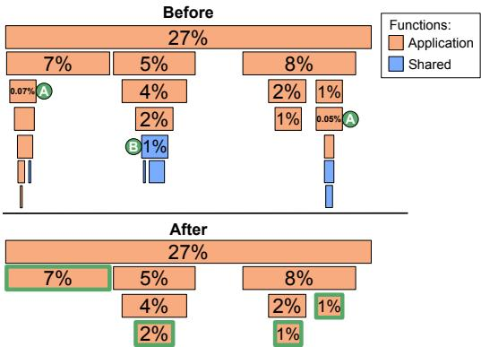  
Figure 5: Pruning function call graphs (annotated by percent of the application’s total cycles and represented as a flame graph [34], not drawn to scale). Unlabeled functions consume less than 0.01% of the application’s cycles. Orange represents application-specific code, blue represents shared code. A labels pruned sub-trees roots that form less than C<sub>min</sub>=0.1% of the app. B labels the root of a pruned shared code sub-tree. Boxes outlined green after pruning (bottom) are the leaf nodes of the pruned call graph targeted for optimization.

## 4.2 Code Retrieval

Given our anti-pattern dictionary and a search space of costly functions, we need to find all candidates that likely match a particular anti-pattern. This is challenging, as instances of an anti-pattern can be textually and structurally diverse (e.g., Figure 3a). Manual heuristics like regular expressions or ASTbased techniques such as CodeQL [35] cannot usually capture this diversity. We therefore use a code retrieval technique that discovers new instances of an anti-pattern from past examples.

We first form a database of vector representations (embeddings) of each function in our search space (Figure 6). We then take examples from our anti-patterns database and look for similar functions in our search space using approximate nearest neighbor (ANN) search, a method proven effective in other code recommendation contexts [36]. We use ScaNN [15], an open-source vector similarity search library developed at Google, for this task. Given a vector representation of a query (the "before" function state or a code diff embodying an antipattern), ScaNN returns an approximate set of similar vectors from the database. To focus on high-impact changes, we only search within the set of costly functions identified previously. For each query, we retrieve the top-K (K = 500) candidates. We then normalize the query and candidates by removing custom names, static strings, and comments, and rank the candidates by a syntactic similarity score (Section 4.2.2).

## 4.2.1 Embedding Design for Semantic Similarity

We explore two strategies for vector embeddings:

(a) Bag of Words (BOW). This approach involves creating embeddings based on a BOW representation. Our intermediate representations provide textual tokens for each function after parsing. The embedding vector of a function is created by forming a token-frequency vector, excluding comments, common keywords (e.g., return), and punctuation tokens.

(b) Deep Embedding Models. We use a 1B-parameter dualencoder deep text embedding model [37], originally trained on English query-document pairs, and fine-tune it on 25M samples of: (1) semantically similar function pairs and (2) code diffs and their corresponding "before" function states. Fine-tuning on similar functions allows us to query for similar code snippets. Fine-tuning on diffs allows us to search for specific optimization patterns, focusing the query on the relevant lines of code rather than the entire function. This matches how we later use the deep embedding model (querying it using both code snippets and code diffs) and is similar to how others use diffs or Git commits for training models [38–40].

## 4.2.2 Ranking Performance Opportunities

After retrieving the approximate top candidates through ANN, we use a syntactic similarity score for further, more detailed ranking. The score S between a query Q and a candidate C is defined as (higher is better):

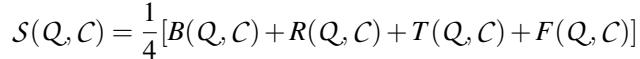

Each component of S is from 0 to 1 and defined as follows:

• B(Q ,C ),R(Q ,C ): BLEU [41] and ROUGE-L [42] score are text similarity metrics. B and R are calculated after normalizing the code (Q and C ) to remove custom names, static strings, and comments.

• T (Q , C ) = (|T<sub>Q</sub> ∩ T<sub>C</sub>|)/max(|T<sub>Q</sub> ∪ T<sub>C</sub>|, 1), where T<sub>Q</sub>, T<sub>C</sub> are types present in Q and C from our code representation (Section 4.1.2).

• F(Q , C ): Cosine similarity of control flow-related keywords (e.g., for , while ) in the functions’ BOW vectors.

The inclusion of B and R captures textual similarity, while T and F incorporate information about types and control flow, improving the representation of semantic similarity and helping further refine the set of candidates, after the approximate match provided by ANN.

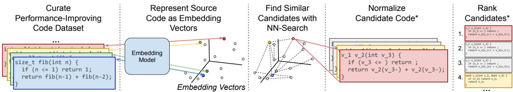  
Figure 6: ECO’s code retrieval approach. Source code is represented as vectors and ScaNN [15] is used to find nearest neighbors in the vector space. After retrieving nearest neighbors, we optionally rank code by similarity; these steps are marked by (\*).

## 5 Code Edit Generation Strategies

After identifying candidates, we generate code transformations by prompting an LLM (Section 3.2). Since generation quality is highly dependent on the prompt, we explore a variety of prompting strategies, or prompting recipes, for engineers using ECO to build upon [43, 44].

LLM prompting is a well-studied area [45]. The simplest approach, zero-shot prompting, directly instructs the model to perform a task without giving it any examples. This works for simple edits but struggles with complexity. Since token gen eration is when the model applies logic, zero-shot prompting leaves few steps for the model to apply complex operations. It also relies on the LLM correctly interpreting the instructions.

Several techniques address this. Few-shot prompting includes examples of the desired input-output behavior (e.g., before/after code pairs) in the prompt to help the model with pattern matching, a technique shown to be effective for code [46]. Chain-of-Thought (CoT) prompting instructs the model to first output a plan or reasoning steps before generating the final output [43]. This encourages more structured reasoning and works well for code transformation [47]. Finally, agentic ReAct-style prompting enables multi-step reasoning by having the model cycle through generating a thought, an action (e.g., a command to execute in an external environment such as, in our case, a shell), and then feeding the output of the command back into the model, allowing it to interactively refine its work [44]. The prompting recipes below apply these paradigms to ECO’s code editing task.

## 5.1 Prompting Recipes

Zero-Shot prompting. Our prompts follow the format in Figure 7a. The LLM response is a code diff compatible with the patch command. To improve performance, our fine-tuning data (Section 3.2) includes examples in a similar instructionfollowing format.

Few-shot prompting. This variant uses a small set of example edits in the prompt to guide the model, as shown in Figure 7b. We select examples of a target optimization type from our database and prompt the model to perform a similar transformation on the target code.

Chain-of-Thought (CoT) prompting. This style elicits intermediate "thoughts" from the model to trace its reasoning [43]. By asking the model to provide ideas for improving code “step by step” (Figure 7c), we guide it to identify and then implement a specific optimization strategy.

ReAct prompting. This combines reasoning with action through an iterative loop of thought, action, and observation [44] until a goal is met (Figure 7d). This mimics how humans break down complex tasks. For code editing, this allows the model to examine code, propose a patch, and observe the result, providing a way to navigate ambiguity.

As we show in our evaluation, all four approaches are effective for certain tasks, but no single recipe is universally superior. We therefore maintain a library of these prompting strategies, and engineers select the most appropriate one on a case-by-case basis. Appendix B provides concrete examples of these recipes and their corresponding LLM outputs.

## 6 Verification, Submission, & Monitoring

Code generated by ECO must meet production standards and achieve a high success rate to minimize the burden on human reviewers. Our edit verification process starts with automated testing. We leverage Google’s continuous integration pipelines, which run unit and integration tests, to check the correctness of ECO’s edits. We automatically identify and run all tests in our entire monorepo that are affected by a change. If a change causes a build or test failure, we first attempt automated fixes for trivial errors like missing include directives. For more complex errors, we use our fine-tuned LLM to attempt a fix. If the code still fails, the edit is abandoned.

Due to imperfect test coverage, passing automated tests is not a guarantee of correctness. Furthermore, most tests do not evaluate performance and cannot detect neutral or negative efficiency impacts. We therefore incorporate LLM self-review to further improve edit quality. We prompt the model with a checklist of questions about common coding errors, antipatterns, and optimization goals (see Appendix D). An edit proceeds to human review only after it passes this self-review step. Following Google’s policies, all changes are reviewed by code owners, who make the final decision.

Management of these commits is automated using a tool called Rosie [48]. Rosie allows ECO to generate a large number of commits (called a Large-Scale Change or LSC in Google parlance) and then automatically identifies the correct code owners and requests reviews from them. As with any code change at Google, the commits must be reviewed and approved by code owners before they can be submitted. Google engineers are used to these kinds of reviews and perform them carefully [20,49]. This review load is accepted and generally fades into the background. ECO is no different.

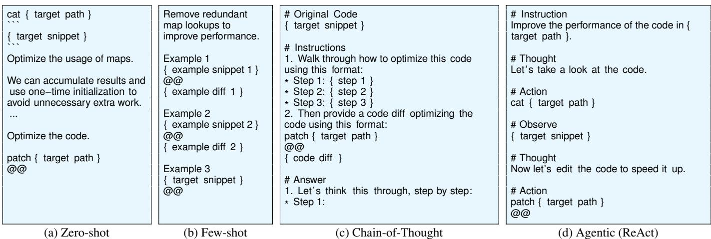  
Figure 7: Templates for different prompting strategies used by ECO.

A range of Google tools monitor changes in production and automatically roll them back if they cause regressions [50]. After a change is committed, we use our GWP continuous profiler (Section 4.1.1) to monitor its impact. This is non-trivial, since different projects have very different deployment strategies, and services usually roll out gradually over time. We therefore correlate the uptake of a particular commit in binaries measured by GWP with changes in metrics. We track key performance metrics to detect regressions and use monitoring alerts on performance-sensitive functions to notify us of any issues, allowing for prompt investigation. If a change correlates with a performance regression, it can be reverted. This is rare, occurring for <0.5% of ECO’s commits (Section 7).

## 7 Evaluation

We evaluate ECO through measurements from its deployment within our production fleet, and controlled experiments using examples from a small subset of our anti-patterns. We note that while we characterize ECO’s code generation abilities, the goal is not to compare LLM generation quality across models (which has been the focus of most prior work [1–10]). Instead, we show how ECO transforms a particular level of carefully characterized LLM capabilities into production impact as measured in end-to-end optimizations landing in production. As LLM capabilities are rapidly improving over time, ECO can directly take advantages of these improvements.

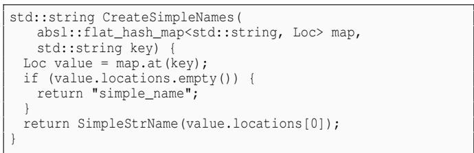

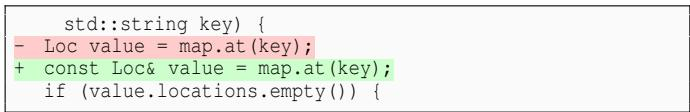

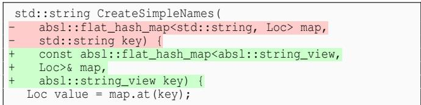  
(c) Sample of a rejected code diff. The proposed type change requires updating the file includes but this was not added by the LLM.  
Figure 8: Code optimization samples generated by ECO.

## 7.1 Microbenchmark Evaluation

We use controlled microbenchmarks to evaluate prompting strategies under conditions not feasible in production, such as testing multiple alternative edits for the same code. These experiments run on dedicated, isolated machines with many repetitions to ensure low-noise measurements. We use three hand-written C++ benchmarks, covering the Copy, Map and Vector anti-patterns in Table 1, and test with zero-shot, fewshot, CoT, and ReAct prompts. Each prompt asks the model to produce code diffs to optimize the benchmark (Figure 8). For each benchmark and prompting strategy, we sample the model five times and track the number of lines modified and whether the edits are valid (i.e., the diff hunks apply cleanly).

Table 2: Microbenchmark edits. We sample the model five times for each prompt type: zero-shot (ZS), few-shot (FS), chain-ofthought (CoT), and ReAct. CodeBLEU scores and speedup compare against unoptimized baselines. We report the number of avg. modified lines (ModLn); avg. generated valid/invalid code diff hunks (ValEd/InvEd); avg. rejected code diffs that broke code (Rej); avg. CodeBLEU score against baselines (CodeBL); Min, Med, and Max speedups; and the speedup of the highest CodeBLEU-scoring sample (CBS). If a generated edit is invalid, we leave the code unchanged when measuring speedup (leading to a speedup of 1).  
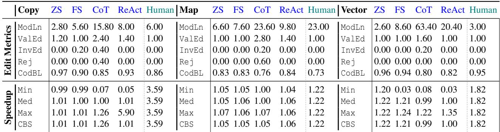

To assess the impact of different prompting techniques, we want to obtain a diverse set of model outputs with a given prompt. However, the higher the variance of the output, the less predictable the approach. LLMs configure this trade-off through a parameter called temperature. Its value is usually between 0 and 1, where 0 is most predictable. We pick a temperature of 0.3, which we find strikes a good balance.

In all microbenchmarks, we compare against a human baseline where an expert hand-optimizes the code. Since these benchmarks are specifically written for this evaluation, none of them are in the training set of our model. One challenge in a real-world setting is that we do not know which edit performs best until we deploy it. Since it is not generally feasible to try multiple candidate edits in production, we need a way to pick a good edit prior to deploying or measuring it. This impacts the efficacy of an approach. For example, a prompting approach that occasionally provides a better optimization than other strategies does not help us if we cannot identify this optimization among its outputs. We thus need a reliable approach to pick an output to use.

To pick an output, we compare each edit with the unoptimized baseline microbenchmarks using CodeBLEU scores which measure syntactic and semantic similarity using code based n-gram matching [51]. The lower the score the more an edit changed the baseline’s code. While this does not directly indicate the quality of an edit, it can be used to pick the output that represents the most conservative (i.e., highest) of the generated edits, which we will see is a good strategy.

If a proposed code edit results in a benchmark that still builds, we accept the edit and mark it as valid. If it breaks the build, the edit is marked as invalid. Figure 8 shows examples of accepted and rejected microbenchmark code edits from ECO. After generating edits, we apply accepted edits to the benchmarks and measure the performance in cycles per operation across 10 runs. We calculate speedup as speedup = <sup>new</sup> <sup>speed</sup><sub>baseline</sub> <sub>speed</sub> . Since edits that result in build failures are rejected and result in unchanged code, they lead to a speedup of 1. We report the minimum (Min), median (Med), and maximum (Max) speedup from the five prompt samples, as well as the speedup from the most conservative edit (i.e., highest CodeBLEU score). Table 2 shows the results.

The edit metrics reveal that different prompting techniques yield varying results. CoT, for example, generates the most line changes but also more invalid edits, suggesting it is better for exploration than for generating immediately submittable changes. ReAct prompting most closely mimics how programmers edit code, and achieves higher Max speedups, except in the case of the Map microbenchmark. This confirms that there is no single best prompting recipe; the choice depends on the specific optimization task.

Speedup statistics also indicate that in a third of the cases, the edits achieve maximum speedups from the most conservative edits (when Max equals CBS, the speedup of the highest CodeBLEU-scoring sample). In nearly all cases (except Map/FS), CBS meets or exceeds median speedup, highlighting that small, conservative changes can significantly improve efficiency. We thus see that conservatively picking candidates that perform a minimum amount of semantic changes to the original code selects edits that lead to good efficiency improvements. While humans still outperform the AI, superhuman capability is not required for ECO, since the key benefit of AI is its ability to cover much more code.

## 7.2 Candidate Retrieval

We now evaluate the effectiveness of ECO’s candidate retrieval methods (Section 4.2). We create a test set comprising 63 pairs of code diffs and corresponding “before” functions. This set includes 21 pairs each for unnecessary copies, redundant map lookups, and missing vector reserves.

To assess retrieval performance, we build a database of

Table 3: Comparison of Bag of Words (BOW), Deep Text Embedding (DTE), and Deep Code Embedding (DCE), with and without ranking, for identifying optimization opportunities.  
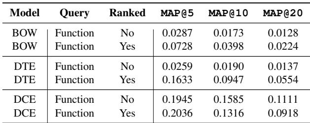

Table 4: Prompting strategy edit metrics. Modified lines (ModLn), valid/invalid/exact edits (ValEd/InvEd/ExtEd), and CodeBLEU (CodBL) and quality scores (QualS) are shown as averages per prompting technique.  
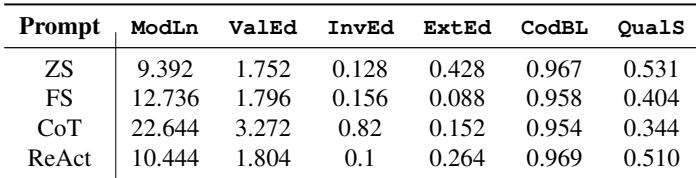

1803 functions, including functions from the 63 test pairs and an additional 1740 functions without known opportunities for the targeted optimizations. For each of the 63 test functions, we use its code embedding to query the database. A successful retrieval model would rank functions of the same anti-pattern higher when queried with a function of that antipattern. We compare the retrieval models in terms of mean average precision (MAP), a standard measure for evaluating retrieval models [52]. A query and a function are deemed “relevant” if they share the same optimization opportunity.

Table 3 presents the performance of these retrieval models using different query types. MAP@K quantifies retrieval quality by considering the top-K results for each query. When K = 5, bag of words (BOW) only achieves low MAP@K scores even after functions are ranked by syntactic similarity scores (Section 4.2.2). The MAP scores drop even further when K increases to 10 and 20. In contrast, MAP@5 more than doubles from 0.0728 to 0.1633 with function rankings on the deep text embedding model (DTE) and 0.2036 with the deep code embedding model (DCE).

Deep text embeddings show significant improvements over BOW, despite their lack of explicit code training. This suggests that text embedding models inherently capture some code semantics. Deep code embeddings show further improvements over deep text embeddings, which is expected from models trained on semantically similar function pairs.

Finally, applying a second-step syntactic ranking boosts performance for the BOW and text embedding models, underscoring the value of syntactic comparison when a model lacks full code understanding. The deep code model, however, shows little benefit from this re-ranking, suggesting that its end-to-end training already captures the necessary semantic and syntactic information. These findings validate the effectiveness of our embedding-based approach for retrieving optimization candidates.

These findings show the efficacy of ECO’s embeddingbased approach to code optimization candidate retrieval.

## 7.3 Edit Generation on Production Code

While microbenchmarks allow easy measurement of performance improvements, they do not capture the complexity of a large-scale production code base. We now assess the quality of generated edits on production code. We focus on the four prompting strategies applied to 48 performance-improving commits from our real code repository (not used to fine-tune our LLM). We aim to determine how accurately each prompt replicates the chosen code edits.

Contrary to the microbenchmark study, we cannot perform isolated performance tests on each generated edit. We thus evaluate these edits along multiple dimensions, each of which captures a different aspect of correctness. First, validity captures whether the code compiles (i.e., is syntactically correct). Second, exact match to the original edit is a very strong signal for correctness when there is a match, but provides little signal otherwise. Third, CodeBLEU scoring with respect to the original edit provides a signal how close the edit is syntactically, but small syntactic changes can make a large difference for correctness (e.g., including an additional & or \*). To capture these subtleties, we also obtain a quality score for each edit through human scoring. While work-intensive, the human scoring is critical to provide ground truth, as automated scoring strategies can only provide limited insights in this evaluation setting. This is in line with best practices [53].

Given a target performance-improving commit, we use zero-shot, few-shot, CoT, and ReAct prompts to provide the model with the original source code and instructions to optimize the code. For each prompt, we sample our model five times. Each generated edit is then evaluated using CodeBLEU scores and by humans. Figure 9 breaks down the CodeBLEU and human-reviewed code quality scores for each commit, while Table 4 shows averages across the generated edits.

Zero-shot and ReAct prompting achieve the highest Code-BLEU and human-scored quality scores. In contrast, CoT provides the lowest CodeBLEU and quality scores. Figure 9 indicates that CodeBLEU scores generally align with human scores, trending higher with better code quality scores. However, discrepancies arise when the model proposes minor, non-performance-improving changes (e.g., altering variable names or formatting — commits 47 and 48) in which the edit receives a high CodeBLEU score but a low quality score. On the other hand, if the model generates performance-improving changes but also adds extensive documentation (e.g., commit 25), the edit receives a low CodeBLEU score but high quality score. These results suggest that CodeBLEU can provide a weak signal for performance quality when comparing against known performance-improving edits. This study also reveals that insights from microbenchmarks hold true for production edits. CoT prompts produce larger edits but do not always result in the highest quality while targeted approaches like ReAct prompting tend to be more accurate.

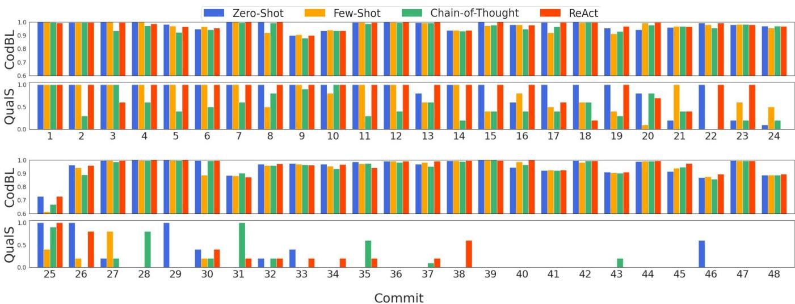  
Figure 9: Quality of generated edits by prompting strategy. CodeBLEU scores (CodBL) show comparison to true historical changes. Quality scores (QualS) show code edit quality as scored by human experts reviewing whether the code edit is correct and performance-improving (Rubric: 1 = Yes, 0.5 = Partially, 0 = No). In total, human raters scored 960 examples.

Table 5: Feedback from human and automated code-review.  
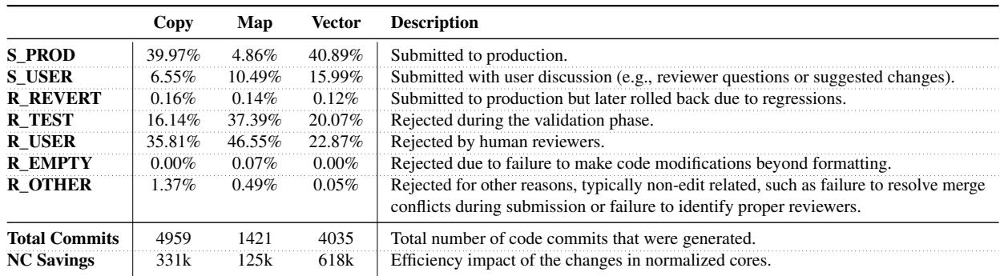

## 7.4 Production Impact Evaluation

We now analyze ECO’s production impact and its interactions with Google’s infrastructure and processes. ECO has generated thousands of edits to date. We measure compute savings in normalized cores (NC), defined as the MIPS provided by a single core on a specific hardware platform [54]. In production, our approach employs a mix of zero-shot, few-shot, CoT, and ReAct prompting strategies on a case-by-case basis. We focus once again on the Copy, Map and Vector anti-patterns.

Edit Quality We quantify the quality of ECO-generated edits at scale by analyzing their code reviews and deployment, which includes human feedback, reverts due to production issues or incorrect changes, and resultant performance improvements using our fleet-wide performance profiler. For every change generated by ECO, a human code owner is asked to review the change before the change is submitted to production. For 40%, 5%, and 41% of Copy, Map and Vector changes, respectively, ECO-generated changes were directly approved and submitted to production without the human reviewers leaving any feedback that had to be resolved.

Table 5 shows a breakdown of additional actions required (see Appendix E for concrete reviewer interactions). Oftentimes, users left comments that were extraneous to the optimization in the code change (S\_USER). These comments had to be addressed before the code change was submitted. Other times, users rejected changes (R\_USER) and the changes were not submitted. This could be due to the reviewer judging the change to not be performance enhancing or wanting the code to be untouched for other reasons (e.g., style preferences).

Failure Modes The reasons why optimizations failed were multi-faceted. For example, Map has a comparatively low success rate. While Copy and Vector changes are relatively localized, Map changes typically require restructuring and reasoning about large pieces of code while also dealing with subtle semantics of C++ maps. Examples of errors include:

• Control Flow: Rewrites often caused subtle changes in behavior along some execution paths (e.g., adding an element too early or too late, confusing the behavior of the [] operator vs. try\_emplace, contains, etc.).

• Pointer Stability: The model sometimes assumed that a pointer to a map entry remains valid throughout map modifications even if a flat\_hash\_map is used.

• Corner Cases: E.g., if (!a.contains(k)) { a[k] = v } else { a[k] = min(v, a[k]) } and a[k] = min(v, a[k]) are not equivalent.

• Not a Map: Sometimes the model thought that something that was not a map was a map (e.g., a proto).

• No Change: The change was semantically equivalent or did not improve performance (e.g., replacing a single [] with a try\_emplace).

Our automated pre-screening filters a significant portion of these before they reach human reviewers, reducing the review burden. Sometimes, we found that it was the reviewer who was mistaken. For example, we saw a case where the model added a v.reserve(2), causing the reviewer to reject the change as erroneous. However, later in the code, there was an assertion ASSERT\_EQ(2, v.size()), indicating that the change, while unexpected, would have been correct. In one case, a correct ECO code change optimizing a redundant map lookup was sent to a reviewer who suggested using try\_emplace instead (Appendix E). The reviewer’s suggestion was applied instead of the original ECO change. This led to large increases in CPU utilization and had to be reverted (R\_REVERT). This highlights the subtleties of human-AI collaboration.

Resource Savings Figure 10 shows the savings achieved. Savings per line of code also vary by anti-pattern. Complex Map changes require more lines of code and yield lower savings per line than simple Copy or Vector changes. In contrast, Vector edits are often single-line changes but have a high impact, as they can prevent many reallocations of a large data structure.

Over a period of one year, ECO has sent commits covering many anti-patterns (Section 3), worth over several hundred thousand normalized CPU cores. Figure 10 shows the volume of code changes successfully submitted, with a rollback rate of less than 0.5%. In total, ECO has submitted over 25k lines of code across 6.4k commits. The majority of these changes modify or add lines, and some edits also remove lines. These results demonstrate the potential of ECO to achieve fleet-wide performance improvements with minimal human effort.

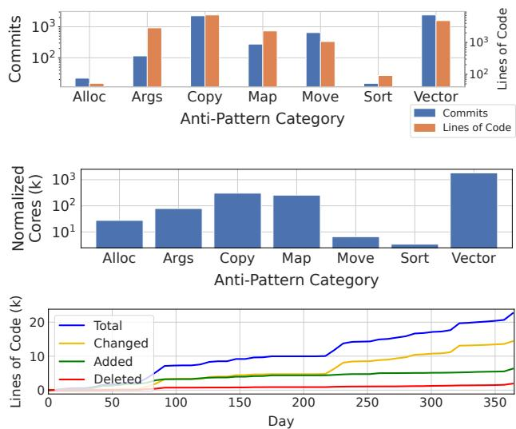  
Figure 10: Statistics on landed code edits. Top: submitted code edits. Middle: performance savings. Bottom: landed code edits in production over time.

Cost Analysis An important question is whether the benefits of ECO justify its operational costs. Conservatively using prices for Gemini 3.1 Pro Preview, the most expensive Google model at the time of writing (\$2-12 per 1M tokens [55]) and conservatively assuming 10k tokens (90% input) per invocation and 10 invocations per commit (including self-review and refinement), generating 10k commits costs \$3,000.

Engineering and infrastructure costs for code review are not unique to ECO and similar to the background review load generated by other automated tools [20], which is generally accepted at Google. Overall, the additional human and infrastructure load for submitting changes from ECO was negligible. While we cannot share the exact number, it represented less than 0.1% of overall resources. This is a one-off cost, while the resource savings are realized on an ongoing basis.

## 8 Related Work

Code optimization Automatic code optimization has a long history. Stochastic superoptimization [56] explores instruction sequences to find optimal solutions, operating below the source code level. More recently, AlphaTensor [57] and AlphaDev [58] use reinforcement learning for algorithm discovery for specific problems. The Scalene profiler [3] interfaces with ChatGPT to optimize Python code. PIE [2] extends the CodeNet Benchmark [4] and designs evaluation methodologies and prompting techniques for performance improvements. Chen et al. [5] used VAE-based models on Google Code Jam data, while Supersonic [6] applies Seq2Seq models to Codeforces [59] and the CodeNet dataset [4].

Some works attempt to scale these methods beyond competition datasets. Aroma [36] provides general code recommendations across a code base but does not focus on performance. Garg et al. [60] train models on C# performance-improving edits and evaluate on open-source repositories, but focus less on scalability and real-world deployments. Other work like EditLord [61] also fine-tunes LLMs on code edits, but this improves an LLM’s capability at code editing as opposed to solving localization and reliability. To the best of our knowledge, ECO is the first to demonstrate and evaluate code optimizations at scale, applying them to billions of lines of code. Unlike prior work, we emphasize automation and the warehouse-scale setting, resulting in thousands of real-world performance improvements.

Table 6: Static Analysis vs. ECO vector reserve optimizations. Speedup ranges represent empirical CPU time reductions from micro-benchmarks (\* denotes qualitative analysis where no runnable artifact was available).  
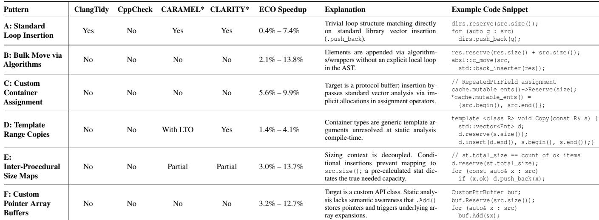

Code transformations Mining and applying code transformations in existing code is not a new problem. Meng et al. [62] build a sophisticated custom algorithm to generalize from an example and then apply the “same” transformation to other locations. More recently, Miltner et al. [63] present an algorithm to synthesize a script from repetitive changes and enable automated propagation of those changes. In our setting, examples of changes are already provided as anti-patterns, and we find that modern LLMs are capable enough to apply these changes at other locations, with no need for custom algorithms. Overall correctness must be verified, but this is also true of these prior AST-based techniques. Finally, Uber’s DR.FIX system [64] also uses LLMs for edits, but applies them to data races in Go, a very different problem.

Repository-level refactoring Our work also relates to recent work in rolling out repository-level code changes, such as CodePlan [65]. While superficially similar, the primary commonality is that the actual transformation is carried out by LLMs. However, the emphasis of CodePlan is to apply a precisely specified edit that requires modifications to multiple files, such as changing a function signature or type, leveraging static analysis to identify additional locations that need to be changed. In contrast, our work focuses on identifying opportunities for code optimization across a repository of billions of lines of code, and generalizing existing edits to these new contexts. Our work is carried out at a much larger scale—CodePlan’s largest repository had ≈ 20k lines of code.

## 9 Discussion & Future Work

Deployed SOTA Google relies on compilers for optimization, which cannot apply semantics-altering changes like ECO. We also deploy LLVM’s Clang-Tidy [16], which uses heuristics to detect errors, including performance issues. However, we found it has notable limitations.

Static Analysis We compare ECO to static analysis tools. Table 6 summarizes vector reserve patterns—a primary antipattern category for both static tools and ECO—and whether tools can optimize them. We include Clang-Tidy [16] and CppCheck [66], two widely deployed static analysis tools. We also perform a qualitative comparison to CARAMEL [67] and CLARITY [68], two published static analysis techniques that target performance optimizations (but have no artifacts).

We group common code sequences that can be optimized with vector reserve operations into 6 patterns. For each pattern, we run microbenchmarks spanning 8 to 4,096 container elements and report the resulting speedups, confirming that these changes represent real and significant optimization opportunities. Out of the 6 patterns, Clang-Tidy reliably optimizes only 1, and CppCheck optimizes none, whereas ECO successfully optimizes all 6. The reason is that the first pattern is explicitly encoded in Clang-Tidy as the standard “performanceinefficient-vector-operation” [19] check, which identifies simple patterns such as for (auto e : data) v.push\_back(e);.

In those cases, Clang-Tidy adds a call to v.reserve, but this only works if the control flow and structure are trivial.<sup>2</sup>

To determine if this is a shortcoming of specific tools or a fundamental static analysis limitation, we examine CARAMEL [67] and CLARITY [68], two static analysis tools that specifically target loop-related performance opti mizations. Directly applying either tool would find none of the 6 patterns, since they are not the target of their analyses. CARAMEL [67] focuses on wasted loop iterations and CLARITY [68] identifies redundant traversal bugs, neither of which are present in the examples in Table 6. We hence only focus on the key ideas of these papers and try to adapt them.

Patterns B, C, and F are out of reach for static analysis since they rely on external functions and domain specific knowledge that are not available to the static analyzer. Pattern D requires templates to have been fully resolved by the time static analysis is applied; they may be within reach with LTO [69]. Pattern E may be within reach for either approach if the x.ok field matches one of the patterns it is searching for.

This points to a fundamental limitation of all static analysis tools – they can only identify the specific optimizations that they were designed for. Just like Clang-Tidy and CppCheck, CLARITY and CARAMEL only target specific optimizations. However, within this context, they have a key advantage: It is easier for them to perform inter-procedural analysis that spans disparate locations in the code, a task that used to be challenging for LLMs. Recent work proposed combining static analysis and LLMs to achieve the best of both worlds [70].

Expanding static analysis via custom rules for all corner cases requires prohibitive human engineering effort, quickly surpassing potential resource savings. CodeQL [35] facilitates this but does not solve it. In contrast, ECO is designed to expand beyond a specific optimization. and can perform diverse optimizations via examples, eliminating the need to implement new analysis passes for each optimization.

Deployment Insights One of the early challenges for ECO was to build trust with engineers. We thus prioritized our validation pipelines early on and picked initial edits carefully.

ECO’s production success rate exceeded initial expectations, and reviewing changes from ECO helped shift some of our perspectives on the viability of optimizing code at Google with LLMs. Historically, LSCs were generated using deterministic tools, which restricted them to rigid, highly repetitive patterns. ECO helped us expand what we could optimize with automation. However, the increased diversity of commits meant that the team had to carefully monitor and iterate on the review feedback. This feedback loop was critical.

ECO depends heavily on the capabilities of the underlying model. Early on, we developed an evaluation to track the model capabilities on a set of canonical commits and understand what capabilities we could expect. We found it impor tant to expand capabilities incrementally. Some optimization patterns were out of reach initially but later became feasible. E.g., optimizations such as proto arenas (Appendix C) require modifications across many files, which was not possible in early versions of ECO but became feasible over time.

While there are many prompting strategies, we found no clear rule on which works best when. Selecting strategies was highly empirical and sometimes combined techniques.

Some anti-pattern categories are much harder than they appear, e.g., Sort. Determining whether a sorted map or set can be replaced with an unsorted version requires judgement and significant context that early LLMs struggled at.

The embedding-based retrieval approach, when scaled to the scale of Google’s multi-billion line code base, required careful calibration. There is a trade-off between precision and recall, and getting this balance wrong risks wasting significant reviewer time or missing important opportunities. We found that the most problematic candidates are those that seem plausible but are false positives.

As ECO has been successfully optimizing simple inefficiencies, the remaining opportunities have shifted toward more complex refactorings. These targets yield higher false-positive rates during candidate retrieval (e.g., heap-allocated protobufs that are candidates for arena migration can look semantically similar to code that is not, such as when an external pointer lifetime prohibits safe migration). To catch these false positives, we have begun deploying agent-based LLM validators during opportunity localization.

Future Work Our approach has several potential extensions. Currently, we use a top-down approach, leveraging an antipattern database to find optimization candidates. A complementary bottom-up approach could start from profiling data and then use an LLM to diagnose and fix bottlenecks. Further, our current reactive approach improves performance postdeployment. A similar framework could be used proactively to suggest edits to developers as they write code.

We believe ECO’s core techniques can be replicated elsewhere using openly available tools and LLMs (Appendix F) and apply to smaller and decentralized codebases. We think the primary challenges to wider adoption are often organizational rather than technical, requiring integration with existing developer workflows and review processes.

## 10 Conclusion

We described ECO, a system for automatic code optimization at data center scale. By assembling a dataset of over 55k performance-improving edits from our code repository, we use code similarity search to identify similar patterns, and LLMs to apply changes automatically. Deployed in production at Google, ECO has changed more than 25k lines of code, saving hundreds of thousands of normalized CPU cores.

## Acknowledgements

We would like to especially thank Chandu Thekkath, David Lo, Fredrik Kjolstad, James Laudon, Liqun Cheng, Mangpo Phothilimthana, Niranjan Tulpule, Steve Blackburn, Tipp Moseley and the anonymous reviewers for their feedback. We would also like thank our shepherd for their help in improving the final version of the paper.

## References

[1] Jingzhi Gong, Vardan Voskanyan, Paul Brookes, Fan Wu, Wei Jie, Jie Xu, Rafail Giavrimis, Mike Basios, Leslie Kanthan, and Zheng Wang. Language models for code optimization: Survey, challenges and future directions, 2025.

[2] Alexander G Shypula, Aman Madaan, Yimeng Zeng, Uri Alon, Jacob R. Gardner, Yiming Yang, Milad Hashemi, Graham Neubig, Parthasarathy Ranganathan, Osbert Bastani, and Amir Yazdanbakhsh. Learning performance-improving code edits. In ICLR, 2024.

[3] Emery D. Berger, Sam Stern, and Juan Altmayer Piz zorno. Triangulating python performance issues with Scalene. In OSDI, 2023.

[4] Ruchir Puri, David S. Kung, Geert Janssen, Wei Zhang, Giacomo Domeniconi, Vladimir Zolotov, Julian Dolby, Jie Chen, Mihir Choudhury, Lindsey Decker, Veronika Thost, Luca Buratti, Saurabh Pujar, Shyam Ramji, Ulrich Finkler, Susan Malaika, and Frederick Reiss. Codenet: A large-scale ai for code dataset for learning a diversity of coding tasks, 2021.

[5] Binghong Chen, Daniel Tarlow, Kevin Swersky, Martin Maas, Pablo Heiber, Ashish Naik, Milad Hashemi, and Parthasarathy Ranganathan. Learning to improve code efficiency, 2022.

[6] Zimin Chen, Sen Fang, and Martin Monperrus. Supersonic: Learning to generate source code optimizations in c/c++, 2023.

[7] Dong Huang, Yuhao Qing, Weiyi Shang, Heming Cui, and Jie M. Zhang. Effibench: benchmarking the efficiency of automatically generated code. In Proceedings of the 38th International Conference on Neural Information Processing Systems, NeurIPS ’24, Red Hook, NY, USA, 2024. Curran Associates Inc.

[8] Jiawei Liu, Songrun Xie, Junhao Wang, Yuxiang Wei, Yifeng Ding, and LINGMING ZHANG. Evaluating language models for efficient code generation. In First Conference on Language Modeling, 2024.

[9] Mingzhe Du, Luu Anh Tuan, Bin Ji, Qian Liu, and See-Kiong Ng. Mercury: A code efficiency benchmark for code large language models. Advances in Neural Information Processing Systems, 37, 2024.

[10] Dong Huang, Guangtao Zeng, Jianbo Dai, Meng Luo, Han Weng, Yuhao Qing, Heming Cui, Zhijiang Guo, and Jie Zhang. EffiCoder: Enhancing code generation in large language models through efficiency-aware finetuning. In Aarti Singh, Maryam Fazel, Daniel Hsu, Simon Lacoste-Julien, Felix Berkenkamp, Tegan Maharaj, Kiri Wagstaff, and Jerry Zhu, editors, Proceedings of the 42nd International Conference on Machine Learning, volume 267 of Proceedings of Machine Learning Research, pages 26058–26076. PMLR, 13–19 Jul 2025.

[11] Svilen Kanev, Juan Pablo Darago, Kim Hazelwood, Parthasarathy Ranganathan, Tipp Moseley, Gu-Yeon Wei, and David Brooks. Profiling a warehouse-scale computer. In Proceedings of the 42nd Annual International Symposium on Computer Architecture, ISCA ’15, page 158–169, New York, NY, USA, 2015. Association for Computing Machinery.

[12] F. Agakov, E. Bonilla, J. Cavazos, B. Franke, G. Fursin, M.F.P. O’Boyle, J. Thomson, M. Toussaint, and C.K.I. Williams. Using machine learning to focus iterative optimization. In CGO, 2006.

[13] Spandan Garg, Roshanak Zilouchian Moghaddam, Colin B. Clement, Neel Sundaresan, and Chen Wu. Deepdev-perf: a deep learning-based approach for improving software performance. In ESEC/FSE, 2022.

[14] Dong Young Yoon, Yang Wang, Miao Yu, Elvis Huang, Juan Ignacio Jones, Abhinay Kukkadapu, Osman Kocas, Jonathan Wiepert, Kapil Goenka, Sherry Chen, Yanjun Lin, Zhihui Huang, Jocelyn Kong, Michael Chow, and Chunqiang Tang. Fbdetect: Catching tiny performance regressions at hyperscale through in-production monitoring. In Proceedings of the ACM SIGOPS 30th Symposium on Operating Systems Principles, SOSP ’24, page 522–540, New York, NY, USA, 2024. Association for Computing Machinery.

[15] Ruiqi Guo, Philip Sun, Erik Lindgren, Quan Geng, David Simcha, Felix Chern, and Sanjiv Kumar. Accelerating large-scale inference with anisotropic vector quantization. In ICML, 2020.

[16] Clang-tidy. https://clang.llvm.org/extra/cla ng-tidy/.

[17] Dominik Harmim, Vladimır Marcin, and Ondrej Pavela. Scalable static analysis using facebook infer. I, VI-B, 2019.

[18] Lucas Serrano, Van-Anh Nguyen, Ferdian Thung, Lingxiao Jiang, David Lo, Julia Lawall, and Gilles Muller. SPINFER: Inferring semantic patches for the linux kernel. In 2020 USENIX Annual Technical Conference (USENIX ATC 20), pages 235–248. USENIX Association, July 2020.

[19] Performance inefficient vector operation. https://cl ang.llvm.org/extra/clang-tidy/checks/perfo rmance/inefficient-vector-operation.html.

[20] Eric Christopher, Kevin Crossan, Wolff Dobson, Chris Kennelly, Drew Lewis, Kun Lin, Martin Maas, Parthasarathy Ranganathan, Emma Rapati, and Brian Yang. Instruction set migration at warehouse scale, 2025.

[21] Xinyun Chen, Maxwell Lin, Nathanael Schärli, and Denny Zhou. Teaching large language models to self debug, 2023.

[22] Rachel Potvin and Josh Levenberg. Why google stores billions of lines of code in a single repository. Commun. ACM, 59(7):78–87, jun 2016.

[23] Brian Harry. Scaling git (and some back story). https: //devblogs.microsoft.com/bharry/scaling-git -and-some-back-story/, 2017.

[24] Dorothy Ordogh. Pants and monorepos. https://ty pelevel.org/event/2018-03-summit-boston/, 2018.

[25] Zhongpeng Lin. Building uber’s go monorepo with bazel. https://www.uber.com/blog/go-monorep o-bazel/, 2020.

[26] Google. Google open source: Third party. https: //opensource.google/documentation/referenc e/thirdparty.

[27] Aizhamal Nurmamat kyzy, Aljoscha Krettek, Ahmet Altay, Ankur Goenka, Anton Kedin, Bruno Volpato, Charles Chen, Chad Dombrova, Chamikara Jayalath, Danny McCormick, David Cavazos, Davor Bonaci, Dan Halperin, Emily Ye, Frances Perry, Harshit Dwivedi, Heejong Lee, Henry Suryawirawan, Ismaël Mejía, James Malone, Jesse Anderson, John Casey, Julien Phalip, Jack R. McCluskey, Kiley Sok, Kenneth Knowles, Leonid Kuligin, Mark Liu, Mikhail Gryzykhin, Robert Bradshaw, Tyler Akidau, Thomas Groh, Thomas Weise, Eugene Kirpichov, Jean-Baptiste Onofré, Anand Iyer, Alexey Romanenko, Pablo Estrada, Rafael Fernández, Matthias Baetens, Reza Rokni, Tanay Tummalapalli, Udi Meiri, Boyuan Zhang, Rui Wang, Maximilian Michels, Ning Kang, Pedro Galvan, Rion Williams, Saavan Nanavati, Brian Hulette, Robert Burke, Valentyn Tymofieiev, Andrew Pilloud, Kyle Weaver, Daniel Oliviera,

Robin Qiu, Mark Zeng, Yifan Zou, Artur Khanin, Ilya Kozyrev, Alex Kosolapov, Brittany Hermann, Svetak Sundhar, Israel Herraiz, Yichi Zhang, Danielle Syse, Ritesh Ghorse, Yi Hu, Pablo Rodriguez Defino, Namita Sharma, and Talat Uyarer. Apache beam: An advanced unified programming model. https://beam.apache. org, 2012.

[28] Aditya Kini, Satish Chandra, Milad Hashemi, Saksham Thakur, Aditya Pandey, Vincent Nguyen, Marc Brockschmidt, Franjo Ivanciˇ c, Danny Tarlow,´ Parthasarathy Ranganathan, Petros Maniatis, Ahmed Omran, Zaheer Abbas, Anita Gergely, Martin Sevenich, Gufeng Zhang, Amy Hua, and Alexander Frömmgen. Customizing an llm for enterprise software engineering, 2026.

[29] Gemini-Team, Rohan Anil, Sebastian Borgeaud, Yonghui Wu, Jean-Baptiste Alayrac, Jiahui Yu, Radu Soricut, Johan Schalkwyk, Andrew M Dai, Anja Hauth, et al. Gemini: a family of highly capable multimodal models. arXiv preprint arXiv:2312.11805, 2023.

[30] Generative ai on vertex ai: Overview of model tuning for gemini. https://cloud.google.com/vertex-a i/generative-ai/docs/models/tune-gemini-o verview, 2024.

[31] Petros Maniatis and Daniel Tarlow. Large sequence models for software development activities. https: //research.google/blog/large-sequence-mod els-for-software-development-activities/, 2023.

[32] Baptiste Rozière, Jonas Gehring, Fabian Gloeckle, Sten Sootla, Itai Gat, Xiaoqing Ellen Tan, Yossi Adi, Jingyu Liu, Romain Sauvestre, Tal Remez, Jérémy Rapin, Artyom Kozhevnikov, Ivan Evtimov, Joanna Bitton, Manish Bhatt, Cristian Canton Ferrer, Aaron Grattafiori, Wenhan Xiong, Alexandre Défossez, Jade Copet, Faisal Azhar, Hugo Touvron, Louis Martin, Nicolas Usunier, Thomas Scialom, and Gabriel Synnaeve. Code llama: Open foundation models for code, 2024.

[33] Gang Ren, Eric Tune, Tipp Moseley, Yixin Shi, Silvius Rus, and Robert Hundt. Google-wide profiling: A continuous profiling infrastructure for data centers. IEEE Micro, pages 65–79, 2010.

[34] Brendan Gregg. The flame graph. Commun. ACM, 59(6):48–57, May 2016.

[35] Dongjun Youn, Sungho Lee, and Sukyoung Ryu. Declarative static analysis for multilingual programs using codeql. Software: Practice and Experience, 53(7):1472– 1495, 2023.

[36] Sifei Luan, Di Yang, Celeste Barnaby, Koushik Sen, and Satish Chandra. Aroma: code recommendation via structural code search. OOPSLA, 2019.

[37] Jinhyuk Lee, Zhuyun Dai, Xiaoqi Ren, Blair Chen, Daniel Cer, Jeremy R. Cole, Kai Hui, Michael Boratko, Rajvi Kapadia, Wen Ding, Yi Luan, Sai Meher Karthik Duddu, Gustavo Hernandez Abrego, Weiqiang Shi, Nithi Gupta, Aditya Kusupati, Prateek Jain, Siddhartha Reddy Jonnalagadda, Ming-Wei Chang, and Iftekhar Naim. Gecko: Versatile text embeddings distilled from large language models, 2024.

[38] Raymond Li, Loubna Ben Allal, Yangtian Zi, Niklas Muennighoff, Denis Kocetkov, Chenghao Mou, Marc Marone, Christopher Akiki, Jia Li, Jenny Chim, Qian Liu, Evgenii Zheltonozhskii, Terry Yue Zhuo, Thomas Wang, Olivier Dehaene, Mishig Davaadorj, Joel Lamy-Poirier, João Monteiro, Oleh Shliazhko, Nicolas Gontier, Nicholas Meade, Armel Zebaze, Ming-Ho Yee, Logesh Kumar Umapathi, Jian Zhu, Benjamin Lipkin, Muhtasham Oblokulov, Zhiruo Wang, Rudra Murthy, Jason Stillerman, Siva Sankalp Patel, Dmitry Abulkhanov, Marco Zocca, Manan Dey, Zhihan Zhang, Nour Fahmy, Urvashi Bhattacharyya, Wenhao Yu, Swayam Singh, Sasha Luccioni, Paulo Villegas, Maxim Kunakov, Fedor Zhdanov, Manuel Romero, Tony Lee, Nadav Timor, Jennifer Ding, Claire Schlesinger, Hailey Schoelkopf, Jan Ebert, Tri Dao, Mayank Mishra, Alex Gu, Jennifer Robinson, Carolyn Jane Anderson, Brendan Dolan-Gavitt, Danish Contractor, Siva Reddy, Daniel Fried, Dzmitry Bahdanau, Yacine Jernite, Carlos Muñoz Ferrandis, Sean Hughes, Thomas Wolf, Arjun Guha, Lean dro von Werra, and Harm de Vries. Starcoder: may the source be with you!, 2023.

[39] Daoguang Zan, Ailun Yu, Bo Shen, Bei Chen, Wei Li, Yongshun Gong, Xiaolin Chen, Yafen Yao, Weihua Luo, Bei Guan, Yan Liu, Yongji Wang, Qianxiang Wang, and Lizhen Cui. Diffcoder: Enhancing large language model on api invocation via analogical code exercises. Proc. ACM Softw. Eng., 1(FSE), July 2024.

[40] Zhiyu Li, Shuai Lu, Daya Guo, Nan Duan, Shailesh Jannu, Grant Jenks, Deep Majumder, Jared Green, Alexey Svyatkovskiy, Shengyu Fu, and Neel Sundaresan. Automating code review activities by large-scale pre-training. In Proceedings of the 30th ACM Joint European Software Engineering Conference and Symposium on the Foundations of Software Engineering, ESEC/FSE 2022, page 1035–1047, New York, NY, USA, 2022. Association for Computing Machinery.

[41] Kishore Papineni, Salim Roukos, Todd Ward, and Wei-Jing Zhu. Bleu: a method for automatic evaluation of machine translation. In ACL, 2002.

[42] Chin-Yew Lin. Rouge: A package for automatic evaluation of summaries. In Text summarization branches out, pages 74–81, 2004.

[43] Jason Wei, Xuezhi Wang, Dale Schuurmans, Maarten Bosma, Fei Xia, Ed Chi, Quoc V Le, Denny Zhou, et al. Chain-of-thought prompting elicits reasoning in large language models. NeurIPS, 2022.

[44] Shunyu Yao, Jeffrey Zhao, Dian Yu, Nan Du, Izhak Shafran, Karthik Narasimhan, and Yuan Cao. React: Synergizing reasoning and acting in language models. arXiv preprint arXiv:2210.03629, 2022.

[45] Xinyi Hou, Yanjie Zhao, Yue Liu, Zhou Yang, Kailong Wang, Li Li, Xiapu Luo, David Lo, John Grundy, and Haoyu Wang. Large language models for software engineering: A systematic literature review. ACM Trans. Softw. Eng. Methodol., September 2024. Just Accepted.

[46] Noor Nashid, Mifta Sintaha, and Ali Mesbah. Retrievalbased prompt selection for code-related few-shot learning. In 2023 IEEE/ACM 45th International Conference on Software Engineering (ICSE), pages 2450–2462, 2023.

[47] Jia Li, Ge Li, Yongmin Li, and Zhi Jin. Structured chainof-thought prompting for code generation. ACM Trans. Softw. Eng. Methodol., August 2024. Just Accepted.

[48] Titus Winters, Tom Manshreck, and Hyrum Wright. Software engineering at google: Lessons learned from programming over time. " O’Reilly Media, Inc.", 2020.

[49] Google LLC. How to do a code review. https://goog le.github.io/eng-practices/review/reviewer /.

[50] Betsy Beyer, Niall Richard Murphy, David K Rensin, Kent Kawahara, and Stephen Thorne. The site reliability workbook: practical ways to implement SRE. " O’Reilly Media, Inc.", 2018.

[51] Shuo Ren, Daya Guo, Shuai Lu, Long Zhou, Shujie Liu, Duyu Tang, Neel Sundaresan, Ming Zhou, Ambrosio Blanco, and Shuai Ma. Codebleu: a method for automatic evaluation of code synthesis. CoRR, abs/2009.10297, 2020.

[52] Hinrich Schütze, Christopher D Manning, and Prabhakar Raghavan. Introduction to information retrieval, volume 39. Cambridge University Press Cambridge, 2008.

[53] Rachel L. Thomas and David Uminsky. The problem with metrics is a fundamental problem for AI. CoRR, abs/2002.08512, 2020.

[54] Muhammad Tirmazi, Adam Barker, Nan Deng, Md Ehtesam Haque, Zhijing Gene Qin, Steven Hand, Mor Harchol-Balter, and John Wilkes. Borg: the next generation. In EuroSys’20, Heraklion, Crete, 2020.

[55] Google. Gemini developer api pricing. https://ai.g oogle.dev/gemini-api/docs/pricing.

[56] Eric Schkufza, Rahul Sharma, and Alex Aiken. Stochastic superoptimization. ACM SIGARCH Computer Architecture News, 41(1):305–316, 2013.

[57] Alhussein Fawzi, Matej Balog, Aja Huang, Thomas Hubert, Bernardino Romera-Paredes, Mohammadamin Barekatain, Alexander Novikov, Francisco J R Ruiz, Julian Schrittwieser, Grzegorz Swirszcz, et al. Discovering faster matrix multiplication algorithms with reinforcement learning. Nature, 610(7930):47–53, 2022.

[58] Daniel J Mankowitz, Andrea Michi, Anton Zhernov, Marco Gelmi, Marco Selvi, Cosmin Paduraru, Edouard Leurent, Shariq Iqbal, Jean-Baptiste Lespiau, Alex Ahern, et al. Faster sorting algorithms discovered using deep reinforcement learning. Nature, 618(7964):257– 263, 2023.

[59] Codeforces. https://codeforces.com/.

[60] Spandan Garg, Roshanak Zilouchian Moghaddam, Colin B. Clement, Neel Sundaresan, and Chen Wu. Deepdev-perf: a deep learning-based approach for improving software performance. In ESEC/FSE, 2022.

[61] Weichen Li, Albert Jan, Baishakhi Ray, Junfeng Yang, Chengzhi Mao, and Kexin Pei. Editlord: Learning code transformation rules for code editing. In Forty-second International Conference on Machine Learning, 2025.

[62] Na Meng, Miryung Kim, and Kathryn S. McKinley. Systematic editing: generating program transformations from an example. In Proceedings of the 32nd ACM SIGPLAN Conference on Programming Language Design and Implementation, PLDI ’11, page 329–342, New York, NY, USA, 2011. Association for Computing Machinery.

[63] Anders Miltner, Sumit Gulwani, Vu Le, Alan Leung, Arjun Radhakrishna, Gustavo Soares, Ashish Tiwari, and Abhishek Udupa. On the fly synthesis of edit suggestions. Proc. ACM Program. Lang., 3(OOPSLA), October 2019.

[64] Farnaz Behrang, Zhizhou Zhang, Georgian-Vlad Saioc, Peng Liu, and Milind Chabbi. Dr.fix: Automatically fixing data races at industry scale. Proc. ACM Program. Lang., 9(PLDI), June 2025.

[65] Ramakrishna Bairi, Atharv Sonwane, Aditya Kanade, Vageesh D. C., Arun Iyer, Suresh Parthasarathy, Sriram Rajamani, B. Ashok, and Shashank Shet. Codeplan: Repository-level coding using llms and planning. Proc. ACM Softw. Eng., 1(FSE), July 2024.

[66] Daniel Marjamäki. Cppcheck. https://www.cppche ck.com.

[67] Adrian Nistor, Po-Chun Chang, Cosmin Radoi, and Shan Lu. Caramel: Detecting and fixing performance problems that have non-intrusive fixes. In 2015 IEEE/ACM 37th IEEE International Conference on Software Engineering, volume 1, pages 902–912, 2015.

[68] Oswaldo Olivo, Isil Dillig, and Calvin Lin. Static detection of asymptotic performance bugs in collection traversals. In Proceedings of the 36th ACM SIGPLAN Conference on Programming Language Design and Implementation, PLDI ’15, page 369–378, New York, NY, USA, 2015. Association for Computing Machinery.

[69] Teresa Johnson, Mehdi Amini, and Xinliang David Li. Thinlto: Scalable and incremental lto. In 2017 IEEE/ACM International Symposium on Code Generation and Optimization (CGO), pages 111–121, 2017.

[70] Patrick J. Chapman, Cindy Rubio-González, and Aditya V. Thakur. Interleaving static analysis and llm prompting. In Proceedings of the 13th ACM SIGPLAN International Workshop on the State Of the Art in Program Analysis, SOAP 2024, page 9–17, New York, NY, USA, 2024. Association for Computing Machinery.

[71] Google LLC. Protobuf. https://protobuf.dev/.

[72] DeepSeek-AI. Deepseek llm: Scaling open-source language models with longtermism. arXiv preprint arXiv:2401.02954, 2024.

[73] AI @ Meta Llama Team. The llama 3 herd of models, 2024.

[74] Albert Q. Jiang, Alexandre Sablayrolles, Arthur Mensch, Chris Bamford, Devendra Singh Chaplot, Diego de las Casas, Florian Bressand, Gianna Lengyel, Guillaume Lample, Lucile Saulnier, Lélio Renard Lavaud, Marie-Anne Lachaux, Pierre Stock, Teven Le Scao, Thibaut Lavril, Thomas Wang, Timothée Lacroix, and William El Sayed. Mistral 7b, 2023.

[75] karpathy. nanogpt. https://github.com/karpathy/ nanoGPT.

[76] Hugging Face. Peft. https://github.com/hugging face/peft.

[77] PyTorch. torchtune. https://github.com/pytorch /torchtune.

[78] Daniel Han and Michael Han. unsloth. https://unsl oth.ai/.

[79] Daniel Gomez Blanco. Practical OpenTelemetry. Springer, 2023.

[80] Martín Abadi, Ashish Agarwal, Paul Barham, Eugene Brevdo, Zhifeng Chen, Craig Citro, Greg S. Corrado, Andy Davis, Jeffrey Dean, Matthieu Devin, Sanjay Ghemawat, Ian Goodfellow, Andrew Harp, Geoffrey Irving, Michael Isard, Yangqing Jia, Rafal Jozefowicz, Lukasz Kaiser, Manjunath Kudlur, Josh Levenberg, Dandelion Mané, Rajat Monga, Sherry Moore, Derek Murray, Chris Olah, Mike Schuster, Jonathon Shlens, Benoit Steiner, Ilya Sutskever, Kunal Talwar, Paul Tucker, Vin cent Vanhoucke, Vijay Vasudevan, Fernanda Viégas, Oriol Vinyals, Pete Warden, Martin Wattenberg, Martin Wicke, Yuan Yu, and Xiaoqiang Zheng. TensorFlow: Large-scale machine learning on heterogeneous systems, 2015. Software available from tensorflow.org.

[81] Tensorflow. Github: tensorflow/tensorflow - pull request #74770. https://github.com/tensorflow/tensor flow/pull/74770, 2024.

## Supplementary Material

In this appendix, we provide additional details to the main paper, expanding on key areas such as a comprehensive list of anti-patterns identified, full LLM trajectory examples showcasing various querying approaches, multi-file edit considerations, LLM self-validation examples, human code reviewer interactions, and a discussion on the reproducibility of this work. This appendix is provided to offer a deeper understanding of the methodology, challenges, and outcomes of ECO’s approach to automating code efficiency optimization.

## A Anti-Patterns

Figure 11 summarizes how ECO takes historical code commits and other code sources and turns them into an anti-patterns dataset (Section 3). This provides additional context and examples for the description in the main paper.

We also provide a full list of anti-pattern categories extracted in the dataset in Table 7. Note that in the main paper, we provide more details on a subset of these categories, but include the full table here for completeness. As new anti-patterns are discovered, the table can grow over time.

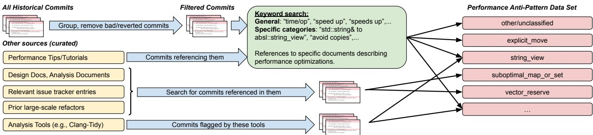  
Figure 11: The approach and processing pipeline used to mine performance anti-patterns from our repository’s commit history and a number of curated additional data sources.

Table 7: List of all Anti-Pattern Categories  
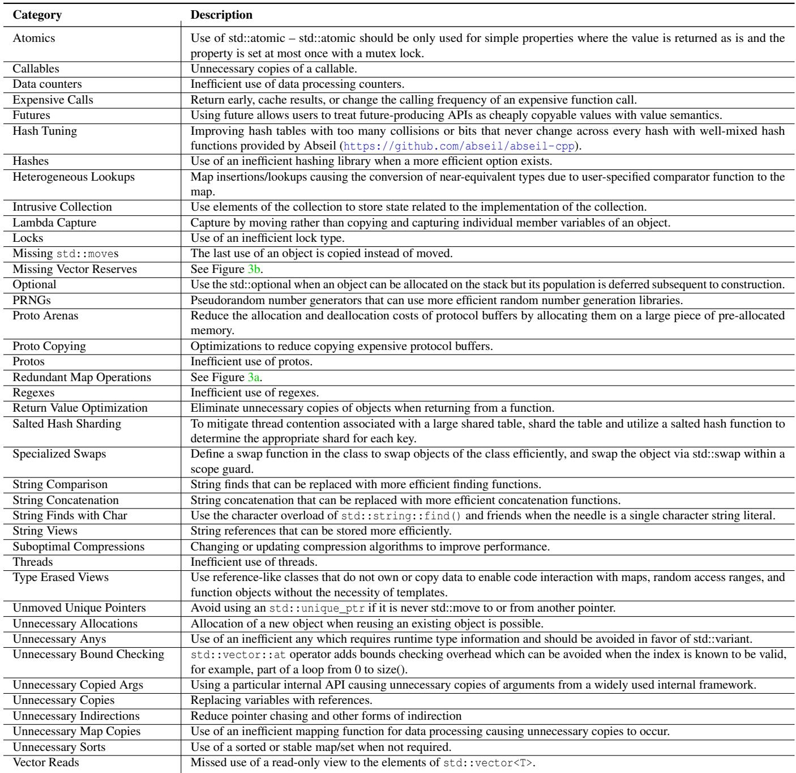

## B LLM Trajectory Examples

This section provides examples of end-to-end LLM trajectories using the various prompting mechanisms described in Section 5. The prompts in blue show the query that is given to the LLM, and the LLM’s responses are shown in grey, with additional syntax highlighting (added by us) to make the generated diff more readable. In the prompts, we added a placeholder for the target code that the prompt is applied to (the responses are based on calling the prompt with a representative example input).

## B.1 Zero-Shot

This prompt format only includes the requested optimization, as well as the input code that it should be applied to. The model will respond with a snippet, based on its training.

Prompt 1: Example zero-shot prompt.  
Reuse object allocations when possible to avoid allocating in a loop   
{ target snippet }

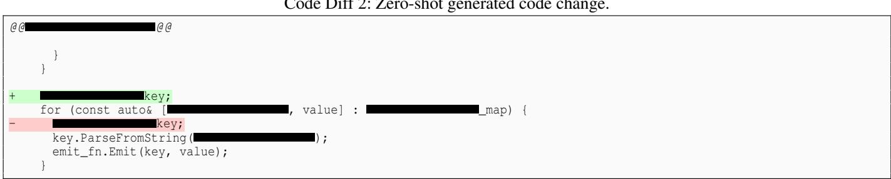

## B.2 Few-Shot

Here, we provide the model with specific positive and negative examples of an optimization. Just like before, the prompt then closes with the input code to optimize, and the model outputs a code diff when prompted.

Code Diff 3: Example few-shot prompt.   
Task : As a C++ expert, you are required to analyze the use of the reserve method for std :: vector. Ensure that vectors are pre−allocated ONLY when the   
size can be statically computed in advance.   
Guidelines :   
1. Avoid using reserve for trivial sizes; i .e., don’t reserve space for just a few elements.   
2. Avoid possible overallocations .   
3. Consider special scenarios where reserve might be unnecessary or problematic.   
4. The goal is to optimize memory usage without sacrificing runtime performance.   
Negative Examples :   
− <sub>\*\*</sub>Example<sub>\*\*</sub>:   
\`cpp   
std :: vector<AutomatedRuns> failed\_runs;   
std :: vector<AutomatedRuns> successful\_runs;   
successful\_runs.reserve(Runs.size());   
failed\_runs.reserve(Runs.size());   
for (auto Run : Runs) {   
if (Run.status == ::SUCCESS) {   
successful\_runs.push\_back(Run);   
} else {   
failed\_runs.push\_back(Run);   
}   
}   
Issue : Overallocation by reserving space for all Runs.   
Example :   
\`cpp   
.reserve( .size());   
for (const (   
if .date >= start\_date &&   
.date <= end\_date) {   
.push\_back( );   
}   
return

```cpp
Issue : clears the output vector and calls reserve on it.
Positive Examples :
− Example :
`cpp
std :: vector<std :: pair<int , int >> ranges;
ranges.reserve(num_ranges);
//... ( rest of the code)
return ranges;
− Example :
` ` `cpp
std :: vector<std :: pair<int , int >> ranges;
ranges.reserve(num_ranges);
int last_added = 0;
for ( int i = 0; i < num_ranges; i++) {
const int start = last_added;
const int end = start + elements_per_range + (i < remainder ? 1 : 0);
ranges.push_back(std::make_pair(start, end));
last_added = end;
return ranges;
Task : Given the above examples and guidelines, determine if we can improve the following code by adding reserve:
{ target snippet }
```

Code Diff 4: Few-shot generated code change.  
@@ @@   
absl::Status s;   
if (expr.union\_\_size() > 0) {   
std::vector< \*> children;   
children.reserve(expr.union\_\_size());   
for (const auto& child : expr.union\_()) {   
children.push\_back( (child, parent\_ref, context,   
relation\_config, policy, source));

## B.3 Chain-of-Thought

The key part of of this prompt if the last sentence – “Let’s think this through step by step”. This induces the model to generate a chain-of-thought sequence as opposed to directly outputting the answer.

Prompt 5: Example chain-of-thought prompt.  
You’re a software engineer and you have identified the destructor associated with { proto name } in { class name } to be very expensive.   
Optimize { class name } by using proto arenas. There are following rules to follow :   
1. Declare an instance of proto2::Arena before any instance of { proto name }.   
2. Replace any instance of { proto name } with proto2::ArenaSafeUniquePtr<{ proto name }>   
3. Every object associated with proto2::ArenaSafeUniquePtr<{ proto\_name }> would be constructed using proto2::MakeArenaSafeUnique<{ proto name }>.   
4. Ensure that the same arena object is shared across the different instances of proto2::ArenaSafeUniquePtr<{ proto name }>.   
5. Use pointer semantics for every object associated with proto2::ArenaSafeUniquePtr<{ proto name }>.   
{ target snippet }   
Let’s think this through step by step.

Okay, let’s analyze the provided code and apply the requested   
changes to optimize using proto arenas.   
\*\*Understanding the Problem\*\*   
The destructor for is expensive, indicating   
that it is not being allocated in an efficient way. Proto arenas   
are a way to manage the allocation and deallocation of protocol   
buffer messages in a more efficient way, especially in   
high-throughput applications.   
\*\*Code Changes\*\*   
Here’s the diff of the necessary code changes in   
:   
\*\*Explanation of Changes:\*\*   
1. \*\*Include arena\_safe\_unique\_ptr.h:\*\* We need to include the   
header file that provides proto2::ArenaSafeUniquePtr.   
2. \*\*Declare proto2::Arena:\*\* We declare an proto2::Arena   
object named arena\_ before the declaration of   
This arena object will be used to allocate the   
proto.   
3. \*\*Replace with   
proto2::ArenaSafeUniquePtr< >:\*\*   
The member is now of type   
proto2::ArenaSafeUniquePtr<   
4. \*\*Allocate on the arena:\*\* We use   
proto2::MakeArenaSafeUnique< >(   
&arena\_) to allocate the proto on the arena when   
setting or swapping a new   
5. \*\*Use pointer semantics:\*\* We use pointer semantics (\* or ->)   
to access the underlying proto. We now check   
if the pointer is not null and use the pointer   
to access the proto.   
6. \*\*Clear :\*\* Use .reset() instead of =   
std::nullopt to clear the pointer.   
\*\*Impact of Changes\*\*   
\*\*Improved destructor performance:\*\* The destructor of   
will be faster because the arena will   
deallocate all the allocated objects at once,   
avoiding the need to recursively call destructors.   
\* \*\*Potentially reduced memory fragmentation:\*\* Arena   
allocation can reduce memory fragmentation, as all   
arena-allocated objects are released together.   
\* \*\*Reduced allocation overhead:\*\* Arena-based allocation is   
faster than standard new and delete.   
\*\*Additional Notes\*\*   
\* It is important to note that if is used   
in a context where the is frequently set and   
cleared, then the arena might grow significantly, and it might   
be advantageous to reset the arena periodically.   
The provided solution assumes that does

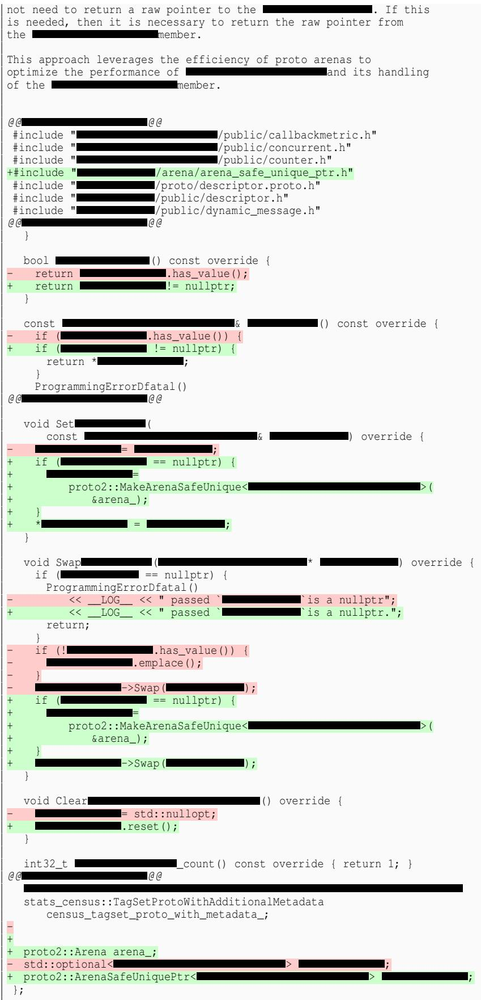

## B.4 ReAct

When using ReAct, the LLM is invoked multiple times. In each step, it is given the full trajectory of the execution so far. The given prompt format will induce the model to follow a particular structure that results in it generating a “Thought” followed by an “Action”, which is an executable command. The model knows this structure from its pre-training data, which included ReAct examples (an alternative approach would be to provide examples of the desired structure as few-shot examples in the prompt itself). The action is then executed, the output of the action is copied back into the prompt, and the next iteration begins. The final action results in the generation of a diff.

Prompt 7: Example ReAct prompt.  
```markdown
# Instruction :
Make a performance enhancing code edit that accomplishes the following:
Restricts the lambda capture scope
# Thought:
We need to first take a look at the source code.
# Action:
cat { target path }
# Observe:
` ` `C++
{ target snippet }
# Thought:
Now we can write a code diff that will improve the source code’s performance.
# Action:
```

Code Diff 8: ReAct generated code change.  
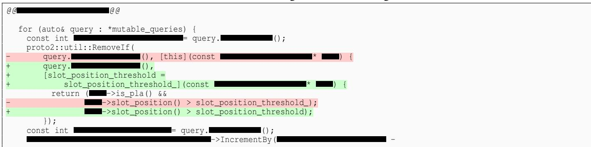

## C Multi-File Edits

Although the bulk of this paper uses examples with single-function edits, ECO is not restricted to function-level edits. ECO uses an LLM fine-tuned with multi-file code changes and the techniques used in ECO apply to multi-file edits as well: e.g., localizing through code embeddings; targeted prompting for generating code optimizations; and validation through testing, self-review, and code reviews.

We recently expanded ECO to apply more multi-file code changes and we have found that the primary difference between multi-file and function-level edits is a necessity for descriptive prompting. For example, one of our anti-patterns involves optimizing usage of protocol buffers [71]. These protocol buffer edits are particularly complex because they can involve changes across multiple files (often >5 files at a time). Providing more detailed instructions in the prompts for these edits allows us to ensure that all multi-file dependencies/references are captured in the generated edit.

Prompt 5 shows a prompt that allowed us to effectively generate multi-file protocol buffer edits, and Code Diffs 9 and 10 show edits generated with the prompt.

Code Diff 9: File 1 of a change generated with Prompt 5.  
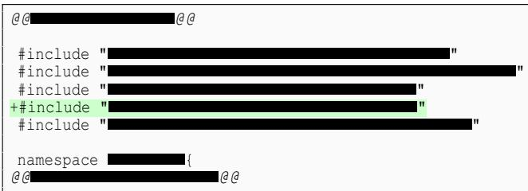

Code Diff 10: File 2 of a change generated with Prompt 5.  
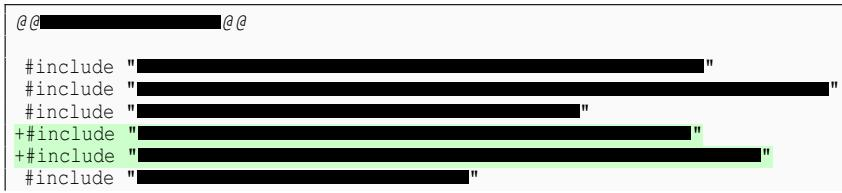

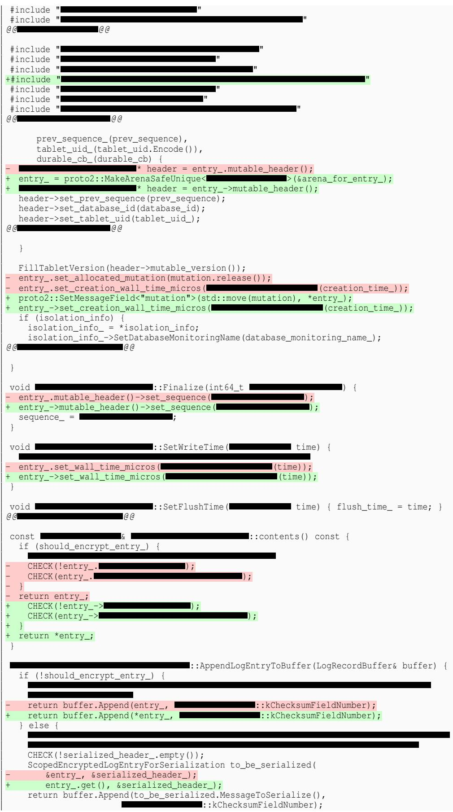

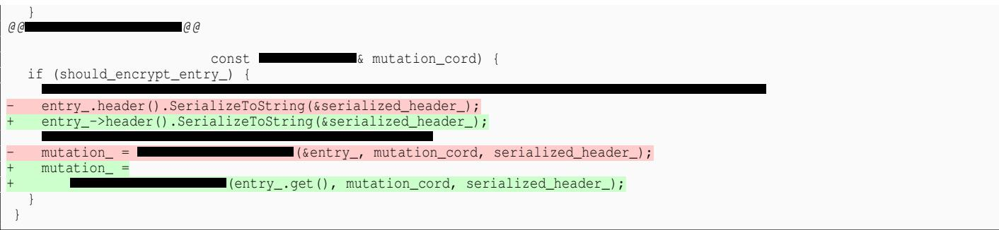

## D Self-Validation

We provide an example of LLM self-validation for edits generated to fix missing vector reserves (Figure 3b). For evaluation of these edits, we prompt the LLM to answer several questions:

1. Is the reserved amount in the vector appropriate?

2. Is the push\_back of elements in the vector happening within the scope of a conditional block like if? (We want to avoid reserving when we cannot pre-determine the vector size.)

3. Is the vector being modified in the surrounding code and are there push\_backs happening outside the context of a for-loop? (If yes, we want to avoid reserving to avoid miscalculations.)

4. Does the reserve count in vector depend on nested for-loops? (We want to avoid reserving when we cannot easily compute the nested loop values.)

Prompt 11 provides an example of a self-validation prompt template for the first question. When given Code Snippet 12, the LLM validation returns “No” as shown in Response 13. An example code snippet that receives the opposite response (“Yes”) is shown in Code Snippet 14 and Response 15.

Prompt 11: Example of a self-validation prompt.  
You are an expert C++ performance engineer tasked with reviewing code. Your goal is to assess the quality of a code snippet which seeks to preallocate a   
vector to avoid reallocations when elements are continuously added in a for loop. You will be presented with a code and a question.   
Code:   
\`cpp   
{ target snippet }   
Question:   
Is the reserved amount in the vector { target vector } appropriate (only reserve when we know the exact size in advance)? (Yes or No)

Code Snippet 12: Example input code for Prompt 11.  
```cpp
<std::vector<std::string>> (
const & <const std::string> input_full_names) {
std::vector<std::string> input_paths;
input_paths.reserve(input_full_names.size());
std::vector<std::string> missing_full_names;
<std::string, std::string> _map;
for (const auto& data : .inputs()) {
_map[data.full_name()] = data.path();
}
for (const std::string& input_full_name : input_full_names) {
if (auto it = _map.find(input_full_name);
it != _map.end()) {
input_paths.push_back(it->second);
} else {
missing_full_names.push_back(input_full_name);
}
if (!missing_full_names.empty())
return Error(
("No paths found in input data for below full names: ",
StrJoin(missing_full_names, ",")));
return input_paths;
```

Response 13: LLM response to Prompt 11 with input Code 12.  
Okay, let ’s analyze the \`reserve\` call in the provided C++ code snippet.   
Analysis:   
The code aims to find matching paths from a \`based on a list of \`input\_full\_names\`. It builds a hash map for quick lookup and then iterates   
through the \`input\_full\_names\`. If a name is found in the map, its corresponding path is added to the \`input\_paths\` vector. If not, the name is added to a   
\`missing\_full\_names\` vector, and if this vector is non−empty at the end of the iteration , an error will be returned.   
The relevant line is :   
\` \` \`c++   
input\_paths.reserve(input\_full\_names.size()) ;   
Here’s a breakdown of whether the \`reserve\` is appropriate:   
Worst−Case Scenario: The code reserves space for \`input\_full\_names.size()\` elements. This is the maximum number of paths that could be added   
to \`input\_paths\`. This happens only when all \`input\_full\_names\` exist in \` .inputs()\`.   
Likely Scenario: It ’s possible (and perhaps even probable) that some of the \`input\_full\_names\` will not be found in the   
\_map\`. In this case, the \`reserve\` call will have allocated more space than necessary.   
Exact size unknown : We do not know the exact size of the vector in advance.   
Conclusion and Explanation:   
The \`reserve\` call is not perfectly appropriate because it reserves the maximum possible size, not the exact size. The exact size is not known   
beforehand, because not all names in \`input\_full\_names\` are guaranteed to be found in .inputs()\`. A more precise \`reserve\` would be impossible   
without iterating through \`input\_full\_names\` and checking the map first, which would duplicate the work of the main loop.   
The current \`reserve\` is a reasonable optimization, as it avoids reallocations in the best−case/worst−case scenario where all names are found. However,   
it may lead to over−allocation in other cases. The performance benefit of the current approach likely outweighs the potential cost of over−allocation in most   
realistic scenarios, especially if the expected number of missing names is small compared to the total number of names. If we knew, for instance, that   
99% of names were always present, the current approach would be very efficient.   
Answer:   
No

Code Snippet 14: Example input code for Prompt 11.  
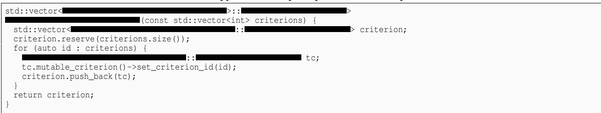

Response 15: LLM response to Prompt 11 with input Code 14.  
Okay, let ’s analyze the code snippet and answer the question.   
Code Analysis   
The code aims to create a vector of objects. It takes a vector of integers (\`   
criterions\`) as input. For each integer in the input vector, it creates a \` \`object, sets its \`criterion\_id\`, and then adds it to the output   
vector \`criterion\`. The core of the question is the use of \`criterion.reserve(criterions.size());\`.   
Explanation and Answer   
\`reserve()\` vs. \`resize () \` : It ’ s crucial to distinguish between \`reserve()\` and \`resize () \`   
\`reserve(n)\`: Allocates enough memory to hold \`n\` elements without changing the size of the vector (i .e., \`vector.size () \` remains unchanged).   
Future \`push\_back()\` operations (up to \`n\` elements) will not trigger reallocations , which are expensive.   
\`resize(n)\` : Changes the size of the vector to \`n\`. If \`n\` is larger than the current size, the vector is expanded, and new elements are value   
initialized (or default−constructed for objects) . If \`n\` is smaller, the vector is truncated.   
Appropriateness of \`reserve()\` in this case: The code correctly uses \`reserve( criterions .size () )\` . The loop iterates exactly \` criterions .size ()   
times, and each iteration adds one element to the \` criterion \` vector. Therefore, we know the final size of the \` criterion \` vector in advance: it will be   
equal to \` criterions .size () \` . Using \`reserve()\` is the optimal approach here. It prevents any reallocations during the loop, leading to better   
performance, especially when \`criterions .size () \` is large.   
Why not \`resize()\`? Using \`resize( criterions .size () ) \` would be incorrect and potentially less efficient . \`resize () \` would create \` criterions .size   
() \` default−constructed \` \`objects before the loop. The loop would then copy into these existing objects. The initial default   
construction is wasteful, and depending on the compiler and standard library implementation, might even be less efficient than the reserve−then−copy   
approach, as resize can also call the copy constructor to grow the container. \`resize\` also affects the \`size () \` of the vector, which is not the intent . We   
want the size to grow naturally with the \`push\_back\` calls.   
Worst case scenario with no \`reserve()\` : Without the \`reserve()\` call , the \`std :: vector\` would start with a small allocated capacity. As elements   
are added via \`push\_back()\`, the vector would need to reallocate its internal storage multiple times. Each reallocation involves:   
1. Allocating a new, larger memory block.   
2. Copying all existing elements from the old memory block to the new one.   
3. Deallocating the old memory block.   
This reallocation process is O(N) in time complexity, and if it happens repeatedly, the overall performance degrades to O(N^2) in the worst case (   
though \`std::vector\` implementations typically use an exponential growth strategy to mitigate this ) .   
Conclusion   
The use of \`reserve()\` is appropriate and beneficial in this code. We know the exact size of the vector in advance, and \`reserve()\` is used to allocate the   
memory upfront, preventing costly reallocations .   
Answer to the Question:   
Yes

## E Interactions of ECO and Code Review

For every change generated by ECO, a human code owner is asked to review the change before the change is submitted to production. For 40%, 5%, and 41% of copy, map, and vector changes, respectively, ECO-generated changes were directly approved and submitted to production without the human reviewers leaving any feedback that had to be resolved. Table 5 in the main portion of the paper shows a breakdown of when additional action was required. We now provide a few examples of these specific reviewer interactions below.

Oftentimes, users left comments that were extraneous to the efficiency optimization on the code change (S\_USER in Table 5). These comments had to be addressed before the code change was submitted to production. Figure 12a shows an example of feedback provided for a change that was submitted to production after reviewer comments were resolved.

Other times, users rejected changes (R\_USER in Table 5) and the changes were not submitted to production. This could be due to the human reviewer judging the code change to actually not be performance enhancing or the human reviewer wanting the code to be untouched for other reasons (e.g., style preferences). Figure 12b provides an example of such feedback.

ECO has also encountered code changes where feedback from human reviewers has caused regressions not initially present. For example, ECO generated the change in Code Diff 16. This change attempts to remove the redundant map lookups on opt\_out\_handler\_. The reviewer for this change suggested using try\_emplace instead, and in response to the reviewer’s comments, the code was modified as reflected in Code Diff 17.

However try\_emplace evaluates its argument expression every time, regardless of whether an insertion has occurred. This led to many calls to make\_unique and caused a large increase in CPU consumption. Due to the regression, the change had to be reverted (R\_REVERT in Table 5).


(a) Feedback that had to be resolved before ECO’s change was submitted to production.  
  
(b) Feedback rejecting change due to reasons unrelated to code performance.  
Figure 12: Examples of reviewer feedback.

Code Diff 16: Initial ECO-generated code diff.  
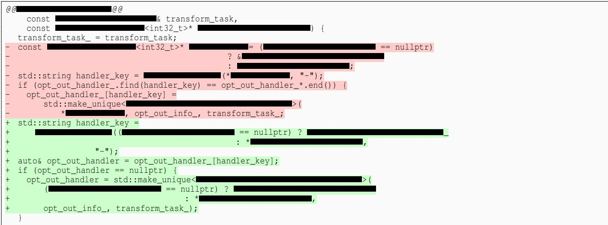

Code Diff 17: ECO-generated code diff after reviewer’s feedback.  
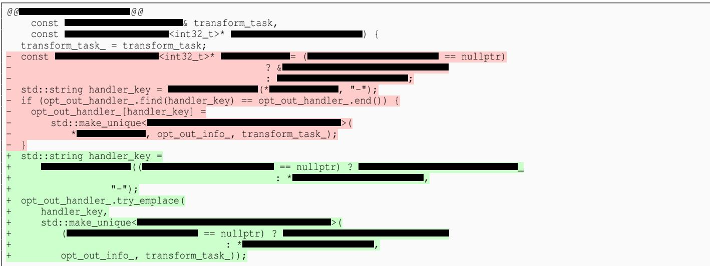

## F Reproducibility

Since ECO is built for Google, the majority of ECO-generated changes shown in this paper have been targeted at Google’s code base. However, ECO’s techniques can be applied in the context of other organizations’ systems infrastructure and code bases. Today, there are many open-source LLMs [72–74] that can be fine-tuned with open-source libraries or with LLM offerings [75–78]. Our methods for identifying performance opportunities and localizing candidate code can also be replicated using various open-source performance profiling tools [79] and similarity-search libraries like ScaNN [15], with required resources scaling with the size of the organization’s code base.

Additionally, ECO has generated code changes not only on Google’s code base but also on open-source code. Code Diff 18 shows an example of a change generated by ECO on TensorFlow (https://github.com/tensorflow/tensorflow) [80]. This change removes a redundant map lookup and was committed into TensorFlow’s upstream repository [81]

Code Diff 18: Example of a code change generated on open-source code.

```diff
@@ -346,8 +346,9 @@
fanouts_[output].emplace(node, -1);
} else {
max_input_port = i;
max_regular_output_port_[output.node] =
std::max(max_regular_output_port_[output.node], output.port_id);
+ int& max_regular_output_port = max_regular_output_port_[output.node];
max_regular_output_port =
std::max(max_regular_output_port, output.port_id);
fanouts_[output].emplace(node, i);
}
```

## G Comparison With Static Analysis

Table 6 describes 6 different common sub-optimal vector-reserve patterns and lists whether or not static analysis are able to resolve them. 5 out of the 6 are not resolvable with Clang-Tidy and none are optimized by CppCheck, whereas ECO is able to optimize each one. The table also shows speedup results from ECO optimizations on microbenchmarks, run against varying container sizes (from 8 to 4096 elements). Here we describe each vector-reserve pattern in more detail.

Pattern A: Standard Loop Insertion Clang-Tidy and ECO are both able to optimize loops using standard library vector insertions such as .push\_back.

Code Snippet 19: Optimization example for Pattern A.  
dirs.reserve(groups\_.size());   
for (Group g : groups\_) {   
dirs.push\_back(GroupDir(g));   
}

Pattern B: Bulk Move via Algorithms This pattern moves elements into a destination vector using an algorithm wrapper (e.g., absl::c\_move with std::back\_inserter).

Code Snippet 20: Optimization example for Pattern B.

```cpp
result_entities.reserve(result_entities.size() + source_entities.size());
absl::c_move(source_entities, std::back_inserter(result_entities));
```

Clang-Tidy fails here because the insertion is encapsulated inside an algorithm wrapper and iterator adapter, leaving no explicit loop in the local AST. ECO is able to recognize the element transfer semantics and recommends reserving.

Pattern C: Iterator-based Assignment on Custom Containers In production, developers frequently populate proprietary containers, such as a protocol buffers in a RepeatedPtrField. In the example below, cache\_value is a protocol buffer.

Code Snippet 21: Optimization example for Pattern C.

cache\_value.mutable\_entities()->Reserve(result.entities.size());   
\*cache\_value.mutable\_entities() = {result.entities.begin(), result.entities.end()};

Clang-Tidy fails because its analysis rules are hardcoded for standard library types (mainly std::vector). It cannot reason about custom APIs or allocations triggered implicitly via assignment operators and initializer lists. By using an LLM, ECO can leverage learned API signatures to suggest the custom container’s Reserve() method.

Pattern D: Generic Template Sizing & Iterators Generic, templated code is commonly used to write reusable copy utilities.

Code Snippet 22: Optimization example for Pattern D.

```cpp
template <typename Range>
std::vector<Entity> Copy(const Range& source) {
std::vector<Entity> destination;
destination.reserve(source.size());
destination.insert(destination.end(), source.begin(), source.end());
return destination;
}
```

At analysis time, Clang-Tidy cannot resolve the exact type of the template parameter Range. It systematically ignores uninstantiated parameters to avoid risking broken code or generating complex fallback rule paths. LLMs are able to infer the range properties of abstract types and apply block insertions.

Pattern E: Inter-Procedural / Multi-file Size Mappings In complex systems, sizing information is often decoupled and evaluated across functional or compilation unit boundaries.

Code Snippet 23: Optimization example for Pattern E.

```cpp
// Sub-optimal Implementation
void PopulateStats(const std::vector<Entity>& src, std::vector<Entity>& dest) {
for (const auto& item : src) {
if (item.isValid) { dest.push_back(item); }
}
}
// Optimized Implementation
void PopulateStats(const std::vector<Entity>& src, const CollectionStats& stats, std::vector<Entity>& dest) {
dest.reserve(stats.total_size);
for (const auto& item : src) {
if (item.isValid) { dest.push_back(item); }
}
}
```

Clang-Tidy is limited to single-file compilation units and cannot trace size constraints spanning inter-procedural boundaries. Additionally, conditional loops prevent direct mapping of src.size(). With an LLM, ECO can map dependencies across compilation boundaries to recommend a .reserve() utilizing the pre-calculated size member (stats.total\_size).

Pattern F: Custom Pointer Array Buffers This pattern involves custom logging or cache buffers that store object pointers instead of copying full structures. In this case, buffer is a custom, dynamically sized data structure that holds a set of pointers, which can be added to it using Add.

Code Snippet 24: Optimization example for Pattern F.  
buffer.Reserve(source.size());   
for (auto& item : source) { buffer.Add(&item); }

Similar to Pattern B, Clang-Tidy ignores this loop because the container is a custom class and uses a non-standard insertion method (.Add()). Clang-Tidy has no semantic awareness that .Add() triggers underlying array expansions. LLMs can identify the custom buffer’s memory semantics and suggest a Reserve() call.