USENIX

THE ADVANCED COMPUTING SYSTEMS ASSOCIATION

# ValScope: Value-Semantics-Aware Metamorphic Testing for Detecting Logical Bugs in DBMSs

Li Lin, Liehang Chen, and Rongxin Wu, Xiamen University https://www.usenix.org/conference/osdi26/presentation/lin-li

# This paper is included in the Proceedings of the 20th USENIX Symposium on Operating Systems Design and Implementation.

July 13–15, 2026 • Seattle, WA, USA

ISBN 978-1-939133-55-7

Open access to the Proceedings of the 20th USENIX Symposium on Operating Systems Design and Implementation is sponsored by

# ValScope: Value-Semantics-Aware Metamorphic Testing for Detecting Logical Bugs in DBMSs

Li Lin   
School of Informatics   
Xiamen University   
linli1210@stu.xmu.edu.cn

Liehang Chen School of Informatics Xiamen University 2320415112@qq.com

Rongxin Wu   
School of Informatics   
Xiamen University   
wurongxin@xmu.edu.cn

## Abstract

Database Management Systems (DBMSs) are crucial for data processing in many large-scale applications. However, detecting logical bugs in DBMSs remains challenging, as defining what constitutes a correct query result is inherently difficult. Metamorphic testing (MT) addresses this issue by checking relations between systematically transformed queries. However, existing MT approaches mainly rely on equivalent or set-semantic relations, and thus fail to detect subtle bugs that preserve the result set while corrupting value semantics, such as faulty aggregation, ordering, or numeric computation.

In this paper, we propose a unified SQL query approximation model that integrates set-semantic and value-semantic reasoning. Beyond result set inclusion or equivalence, our model captures how value-level changes affect query correctness. Based on this model, we develop VALSCOPE, which generates and mutates SQL queries using predefined mutators and performs approximation propagation analysis to reason about global semantic effects. We evaluate VALSCOPE on 6 widely used DBMSs and uncover 67 unique logical bugs, many of which were missed by prior approaches. The results show that VALSCOPE substantially broadens the spectrum of detectable logical bugs beyond existing MT techniques.

## 1 Introduction

Database Management Systems (DBMSs) play a critical role in applications such as online banking and e-commerce [14, 44]. Like other large-scale systems, DBMSs involve complex code logic and a wide range of functionalities, making them prone to bugs [4, 19, 22]. Among these, logical bugs are particularly critical as they silently lead to incorrect query results in DBMSs [23, 34]. To detect logical bugs, existing approaches [12, 17, 21, 34–36, 38–40] generate SQL queries to test DBMSs and check whether the produced results follow the expectations. One of the fundamental technical challenges in this process is to define what constitutes a correct result for a given query, which is a classical problem in software testing—known as the test oracle problem [18]. To address the test oracle problem, many approaches have been proposed, including differential testing [8, 37], oracle-guided synthesis [36] and metamorphic testing (MT) [12, 17, 21, 34–36, 38–40]. Differential testing cannot reveal bugs that manifest only in a single DBMS implementation and is often inapplicable when queries contain dialect-specific features [17]. Similarly, oracle-guided synthesis provides limited coverage because it reasons about only one pivot row at a time, causing it to miss many logical bugs [17]. These limitations have led to the increasing adoption of MT, which overcomes the oracle challenge by establishing expected semantic relations between pairs of systematically transformed queries [17, 27].

Although MT has become the most effective paradigm for detecting logical bugs in DBMSs, existing MT approaches [12, 17, 21, 34–36, 38–40] still struggle to capture many subtle semantic inconsistencies. Current MT approaches can be broadly divided into two categories: those based on equivalent metamorphic relations and those based on approximation metamorphic relations. The first category, represented by NOREC [34] and TLP [35], defines the MR as strict output equivalence between the original and transformed queries. NOREC transforms an optimizable query into a non-optimizable form to verify that both forms produce identical results, while TLP partitions query predicates into multiple subqueries whose combined outputs are expected to equal the original result. While these equivalencebased frameworks have proven effective in detecting optimizer and predicate-related inconsistencies, they remain insufficient to expose many deeply hidden bugs [17]. This limitation arises because, under a constrained mutation space, the pair of equivalent queries often still share the same buggy operators or functions, ultimately producing identical yet incorrect results [17]. Consequently, such approaches are restricted to surface-level correctness and fail to uncover deeper semantic flaws that preserve structural equivalence yet violate relational semantics internally.

The second category, exemplified by PINOLO [17], generalizes this paradigm through set-semantic approximation.

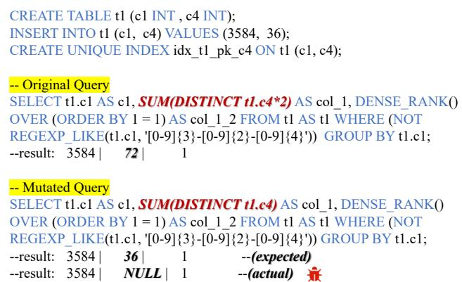  
Figure 1: An example of a logical bug detected by VALSCOPE in MySQL (Bug #119321).

Instead of requiring exact equality, PINOLO relaxes query predicates to generate over- and under-approximate variants and checks whether the resulting sets satisfy inclusion or containment relations. This relaxation significantly expands the detectable bug space, allowing the detection of subtle semantic inconsistencies that equivalence-based approaches often overlook. However, set-semantic approximation reasons about inclusion or containment relations among result tuples, rather than how tuple values are computed. Operations such as aggregation or arithmetic collapse a (multi-)set of input values into scalar results, whose correctness depends on numeric computation rather than tuple membership. When such value-level computation is corrupted but the underlying tuple set remains unchanged, the resulting outputs can still satisfy the same set relations. Consequently, inconsistencies that arise from value semantics fall outside the expressive scope of set-semantic approximation.

Figure 1 shows a real bug from MySQL (Bug #119321) [2], where the DBMS incorrectly handles SUM(DISTINCT) during aggregation. The original query computes SUM(DISTINCT t1.c4 \* 2) and returns 72. After applying a semanticspreserving mutation by removing the arithmetic multiplication and evaluating SUM(DISTINCT t1.c4) directly, the expected result should be 36, since both queries operate on the same tuple set and the distinct value remains unchanged. However, MySQL wrongly returns NULL, indicating a silent value-level corruption in numeric computation and aggregation. However, set-level approximation approaches PINOLO fail to detect this bug. Although PINOLO’s predicate relaxation effectively captures inconsistencies caused by set expansion or contraction, its checking mechanism focuses solely on tuple-set containment. Since this bug arises entirely within the value semantics of aggregation—while the tuple set remains unchanged—no containment relation is violated, causing the error to fall outside PINOLO’s detection capability.

A significant portion of logical bugs manifest not through changes to the result set, but through subtle corruption of value semantics in the computed output. To effectively detect these hidden inconsistencies, we introduce the notion of valuesemantic approximation, which models value-level behavior through the monotonic direction and magnitude of expected changes. This perspective complements set-semantic approximation: when a mutation preserves the tuple set but alters an aggregation or arithmetic expression, the result should follow a predictable monotonic relationship. By seamlessly integrating set-semantic and value-semantic approximation, we establish a unified SQL query approximation model capable of reasoning about both structural and value semantics. This unified model allows us to predict how local mutations propagate through the AST and how the final result should change. Any violation of these predicted approximation relations reveals a semantic inconsistency—precisely the class of deeply hidden logical bugs that existing MT frameworks fundamentally cannot capture.

Based on the proposed SQL query approximation model, we design a novel approach, VALSCOPE which detects logical bugs in DBMSs by jointly reasoning about both set-semantic and value-semantic approximation. VALSCOPE follows a gen erate–mutate–verify paradigm. It first generates syntactically valid and semantically diverse SQL queries and then systematically mutates them according to the defined approximation mutators. For each pair of original and mutated queries, VALSCOPE performs approximation propagation analysis to determine how local semantic mutations (e.g., changing MAX to MIN or relaxing predicates) affect global query behavior along the SQL abstract syntax tree (AST). Finally, both queries are executed on the target DBMS, and their outputs are compared against the predicted approximation relation. Any violation of the expected set- or value-level relationship indicates a potential logical bug.

We implement our approach as a practical DBMS testing tool and evaluate it on 6 widely-used and extensively-tested DBMSs, MySQL, MariaDB, OceanBase, Percona, PolarDB and TiDB. In total , VALSCOPE find 67 logical bugs, including 23 in MySQL, 10 in MariaDB, 7 in OceanBase, 10 in Percona, 12 in PolarDB and 5 in TiDB. Among these bugs, 57 are confirmed. These results demonstrate the effectiveness of VALSCOPE in finding logical bugs in DBMSs. Overall, we make the following contributions:

• We propose a unified model, SQL query approximation, that combines set-semantic and value-semantic reasoning to detect logical bugs in DBMSs.

• We implement a novel MT framework, VALSCOPE, which systematically generates, mutates, and verifies SQL queries based on the proposed approximation relations, effectively identifying logical bugs in DBMSs.

• We evaluate VALSCOPE on 6 real-world DBMSs. In total, we found 67 logical bugs. To further facilitate research on DBMS testing, we open-source the tool at https://github.com/linli1724647576/ValScope

## 2 Background

## 2.1 Database Management Systems and SQL

Database Management Systems. Database Management Systems (DBMSs) are fundamental to modern software ecosystems, offering systematic mechanisms for storing, organizing, and accessing large volumes of structured data. This work focuses on relational DBMSs, which manage data according to the relational model [11]. In such systems, data is organized into tables, each containing tuples (records) that represent real-world entities.

SQL. Structured Query Language (SQL) [9] is the standard interface for interacting with relational DBMSs. It provides a unified syntax for defining, manipulating, and querying data, and can be broadly classified into four categories: Data Definition Language (DDL), Data Manipulation Language (DML), Data Query Language (DQL), and Data Control Language (DCL). Among them, DQL, represented primarily by the SELECT statement, forms the core of data retrieval in relational DBMSs. The SELECT statement supports rich semantics including filtering, grouping, aggregation, and joining across multiple relations, making it the most fundamental yet semantically complex component of SQL. In this work, we focus on detecting logical bugs in DQL, as they constitute the majority of real-world query workloads and are crucial to ensuring the correctness and reliability of DBMS query processing.

## 2.2 Logical Bugs in DBMSs

Logical Bugs. Logical bugs are one of the most critical types of bugs in DBMSs, silently causing incorrect query results without triggering system crashes [17, 27]. Unlike crash bugs that exhibit obvious failures, logical bugs corrupt query outputs in subtle ways, posing serious risks to data integrity and application reliability.

Existing Logical Bug Detection Approaches. Existing research on detecting logical bugs mainly relies on automated testing techniques. However, designing an effective testing framework is challenging due to the test oracle problem—it is difficult to determine the correct result of a complex SQL query for comparison. To address this issue, researchers have explored three main categories of approaches [17]. The first is differential testing [8, 37], which executes the same query across multiple DBMSs and compares their outputs; inconsistencies reveal potential logic flaws, but dialect differences and heterogeneous semantics often limit its applicability. The second, oracle-guided synthesis [36], generates queries expected to return a specific pivot row and reports an error when the row is missing, but it only captures localized issues and fails to expose deeper semantic inconsistencies. The third and most prominent category is metamorphic testing, which establishes expected semantic relations between pairs of systematically transformed queries. This approach enables oracle-free verification, offering better scalability and generality. We will provide an in-depth analysis in the following section.

## 2.3 Metamorphic Testing

In recent years, metamorphic testing (MT) has become the most effective and widely adopted approach for detecting logical bugs in DBMSs [17, 27]. The core idea of MT is to construct multiple SQL statements whose results are expected to satisfy a specific relation, known as a metamorphic relation (MR). When the actual query results violate this relation, it indicates that at least one query triggers a logical bug in the tested DBMS.

Equivalent MR. Traditional MT, such as NOREC [34] and TLP [35], define the metamorphic relation as strict equivalence between the outputs of the original and transformed queries. Although this equivalence-based strategy effectively bypasses the lack of ground truth, it constrains the search space of test cases: the transformations typically preserve all operators, functions, and predicates of the original query, merely changing structural forms. As a result, such approaches are limited to verifying surface-level correctness and often fail to reveal deeper semantic errors—particularly those that do not produce directly inconsistent result sets but still violate relational semantics internally [17].

Approximation MR. To overcome the over-restrictive nature of equivalence-based testing, PINOLO [17] introduces the concept of set-semantic approximation relations, relaxing the equivalence assumption. By expanding or constraining query predicates, it generates over- and under-approximate queries and judges correctness through inclusion or containment relations between result sets. This relaxation enables the detection of a broader spectrum of logical bugs, uncovering deeper semantic inconsistencies that equivalence-based approaches often miss [17].

However, approximation at the set level still overlooks subtle semantic shifts that occur at the value level, such as incorrect aggregations, ordering, or numeric deviations that preserve the same tuple set but alter the meaning of the result. Building on this insight, our work extends MT from set semantics to value semantics. We propose a new class of value-semantic approximation relations that reason about the direction and magnitude of result changes while maintaining structural consistency. By integrating set-semantic approximation with value-semantic approximation, our framework establishes a unified, multi-dimensional criterion for logical bug detection—enabling the discovery of more nuanced and deeply hidden semantic faults that existing MT frameworks cannot capture.

## 3 SQL Query Approximation

In this section, we introduce a comprehensive notion of SQL Query Approximation, which unifies two complementary perspectives of query behavior: the set-semantic and valuesemantic dimensions. The set-semantic dimension characterizes differences in the returned tuple sets, while the valuesemantic dimension captures monotonic variations in the computed or aggregated values over those tuples. Together, these two dimensions form a unified framework for expressing and reasoning about semantic consistency, enabling the construction of more expressive test oracles that can detect both set-level and value-level inconsistencies in DBMS behavior.

## 3.1 Set-Semantic Approximation

We first formalize the notion of approximation at the set level. This relation captures inclusion or containment among query result sets.

Definition 3.1 (Set-Semantic Approximation Relation). Given a database D, let q<sub>1</sub> and q<sub>2</sub> be two SQL queries whose result sets are R(q<sub>1</sub>, D) and R(q<sub>2</sub>, D), respectively. We say that q is the set-level under-approximation of q over D, denoted by q<sub>1</sub> ⪯<sup>s</sup><sub>D</sub> q<sub>2</sub>, if and only if:

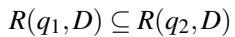

Conversely, q<sub>1</sub> is the set-level over-approximation of q<sub>2</sub> over D, denoted by q<sub>1</sub> ⪰<sup>s</sup> q<sub>2</sub>, if and only if:

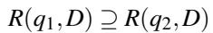

Here, R(q, D) represents the multi-set returned by evaluating query q on database D, and ⊆ and ⊇ denote inclusion and containment relations between two multi-sets.

Intuitively, the set-semantic approximation forms a partial order over queries: q<sub>1</sub> ⪯<sup>s</sup> q<sub>2</sub> means that q<sub>1</sub> produces a narrower or more restrictive result than q<sub>2</sub>, while q<sub>1</sub> ⪰<sup>s</sup><sub>D</sub> q<sub>2</sub> means that q<sub>1</sub> yields a broader or less restrictive result. These two relations are inverses of each other and together define the lattice of set-level approximations.

Example 3.1. Consider a database D = {t<sub>1</sub>}, where t<sub>1</sub>(c<sub>1</sub>) = {−1, 0, 1}. Now consider the following queries:

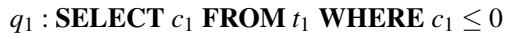

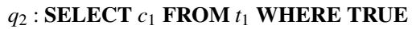

The corresponding query results are:

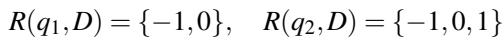

Clearly,

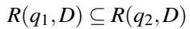

which establishes the set-semantic approximation relation:

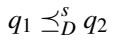

Intuitively, q<sub>1</sub> is a restricted version of q<sub>2</sub>; relaxing the selection predicate expands the result set and induces a containment relation between their outputs.

## 3.2 Value-Semantic Approximation

To overcome the limitation of purely set-level inclusion, we extend the approximation relation from the set-level to the value-level. Unlike the set-level relation that focuses on tuple inclusion, the value-semantic relation captures monotonic changes in target columns—columns whose values depend on value-level computation semantics (e.g., aggregation, arithmetic, or other scalar transformations), rather than on tuple membership. This allows the framework to detect logical bugs where queries return identical tuples but diverge in their value semantics.

Definition 3.2 (Value-Semantic Approximation Relation). Given a database D, let q and q be two SQL queries whose result sets are R(q , D) and R(q , D), respectively. Let C<sub>t</sub> ⊆ Cols(R(q<sub>1</sub>, D)) ∩ Cols(R(q<sub>2</sub>, D)) denote the target columns whose values will be compared. Let G denote the grouping or ordering basis, determined as follows:

If the query contains a GROUP BY clause, G corresponds to the group-by keys. Otherwise, G represents a deterministic ordering over non-target columns (e.g., primary key or lexicographic ordering of attributes) to align tuples for comparison.

We say that q<sub>1</sub> is the value-level over-approximation of q<sub>2</sub> over D, denoted by q<sub>1</sub> ⪰<sup>v</sup> q<sub>2</sub>, if and only if:

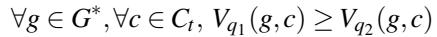

where G<sup>∗</sup> is the set of all comparable tuple groups under G, and V<sub>q</sub>(g, c) denotes the value of column c in group g (or tuple position) produced by query q.

Conversely, q<sub>1</sub> is the value-level under-approximation of q<sub>2</sub>, denoted by q<sub>1</sub> ⪯<sup>v</sup> q<sub>2</sub>, if and only if:

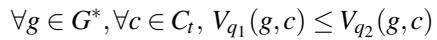

This definition unifies two cases: group-wise comparison for aggregation queries, and order-aligned comparison for nonaggregated results. The comparison operators ≥ and ≤ are interpreted under the total order induced by the SQL data type of column c, following standard SQL comparison semantics.

Intuitively, the set-semantic approximation (⪯<sup>s</sup><sub>D</sub>) describes inclusion of tuples, while the value-semantic approximation (⪯<sup>v</sup> ) reflects monotonicity among the values of corresponding tuples.

Example 3.2. Consider a table t<sub>1</sub>(c<sub>1</sub>, c<sub>2</sub>) as follows:

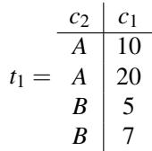

Let the following two queries be defined:

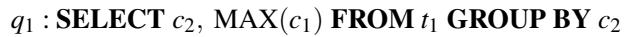

q<sub>2</sub> : SELECT c<sub>2</sub>, MIN(c<sub>1</sub>) FROM t<sub>1</sub> GROUP BY c<sub>2</sub> The results are:

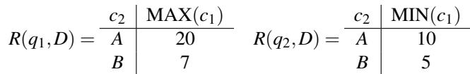

Under the grouping basis G = {c<sub>2</sub>} and target column C<sub>t</sub> = {c<sub>1</sub>}, we have for each g ∈ G<sup>∗</sup> = {A, B}:

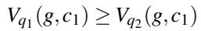

Hence, q<sub>1</sub> ⪰<sup>v</sup><sub>D</sub> q<sub>2</sub>. Intuitively, both queries return identical group sets (thus q<sub>1</sub> ≡<sup>s</sup> q<sub>2</sub>), but differ monotonically in their value semantics: the aggregated value of q<sub>1</sub> in each group is no smaller than that of q<sub>2</sub>.

## 3.3 Approximation Propagation

The approximation relations introduced in the previous section capture the semantic correspondence between two complete SQL queries by comparing their result sets or value outputs. However, in practical DBMS testing, a mutation usually affects only a local part of the query—for instance, a predicate, an operator, or an aggregation function—rather than the entire query. To describe and reason about such finegrained changes, we first define the concept of an approximate mutator, which serves as the smallest structural unit that can induce a local approximation within a query.

Definition 3.3 (Approximate Mutator). Let q denote an SQL query represented as an abstract syntax tree (AST) and n ∈ q a node of this tree. An approximate mutator µ is an operator that transforms n into a semantically related variant n<sup>′</sup> such that the two nodes satisfy an approximation relation n ⪯<sup>α</sup><sub>D</sub> n<sup>′</sup> or n ⪰<sup>α</sup><sub>D</sub> n<sup>′</sup>, where α ∈ {s, v} indicates the set-semantic or value-semantic level. Each mutator µ is characterized by:

• Scope: the AST node type it applies to, such as predicate, arithmetic expression, aggregation function, or subquery.

• Transformation rule: the syntactic or semantic change performed on the node (e.g., <→<=, MAX→MIN, adding a conjunct condition).

• Approximation type: the type of approximation induced by the mutation, determined by both the direction and the semantic level of the change. The direction can be either under-approximation or over-approximation, while the semantic level can be either set-semantic approximation or value-semantic approximation.

We denote the application of a mutator as n<sup>′</sup> = µ(n), and the resulting local approximation relation as n ⪯<sup>α</sup><sub>D</sub> n<sup>′</sup> (or its inverse).

An approximate mutator represents the atomic semantic deviation within a query that can propagate through its parent operators and affect the overall query result. To understand how such a local change influences the final query output, we extend the discussion from the semantic level of fullquery comparison to the structural level of SQL. Specifically, we define the concept of approximation propagation, which describes how a local approximation relation established at one node of the query’s AST can be transmitted through its parent operators and clauses, thereby determining how a single mutation impacts the overall approximation behavior of the query.

Definition 3.4 (Approximation Propagation). Let D be a database, and let n<sub>1</sub>,n<sub>2</sub> denote two semantically comparable nodes (e.g., subqueries, predicates, or expressions) in the SQL AST. These nodes may correspond directly to a mutation site introduced by an approximate mutator (n<sub>2</sub> = µ(n<sub>1</sub>) for some mutator µ), or they may represent ancestor nodes whose semantics are indirectly affected by the propagation of such a local mutation. We use the unified notation n<sub>1</sub> ⪯<sup>α</sup> n<sub>2</sub> to represent an approximation relation of type α ∈ {s, v} where s and v correspond to the set-semantic and value-semantic levels, respectively. The relations defined in §3.1 and §3.2 describe query-level approximations between complete queries. In contrast, approximation propagation extends these relations to the structural level, capturing how local approximations between AST nodes can influence or induce approximations at higher layers of the query.

At the higher layers of the query, operators (such as aggregation functions or filtering conditions) are applied to the nodes and affect the overall query’s approximation behavior. Formally, each operator op is characterized by two semantic properties. First, a mapping (α<sub>in</sub> → α<sub>out</sub>) specifies how op transforms the approximation level between the set dimension (α = s) and the value dimension (α = v). Second, a direction indicator σ(op) ∈ {+1,−1} specifies whether op preserves or reverses the approximation order. Specifically, σ(op) = +1 indicates that the operator is order-preserving, i.e., it maintains the direction of approximation , whereas σ(op) = −1 indicates that the operator is order-reversing, i.e., it flips the approximation direction . Based on these two attributes, the propagation of a local relation n<sub>1</sub> ⪯<sup>α</sup><sub>D</sub> n<sub>2</sub> through an operator op can be organized into four canonical forms:

• (Set → Set): Let two nodes n<sub>1</sub> and n<sub>2</sub> satisfy a set-semantic approximation n<sub>1</sub> ⪯<sup>s</sup><sub>D</sub> n<sub>2</sub>. When both nodes are uniformly embedded under a set-level operator op<sub>s</sub> , the resulting parent nodes op<sub>s</sub>(n<sub>1</sub>) and op<sub>s</sub>(n<sub>2</sub>) satisfy:

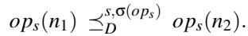

Here, σ(op<sub>s</sub>) = +1 for monotone set operators such as EXISTS that preserve tuple inclusion, and σ(op<sub>s</sub>) = −1 for antitone operators like NOT or NOT EXISTS that reverse tuple inclusion.

• (Set → Value): Given n<sub>1</sub> ⪯<sup>s</sup> n<sub>2</sub>, let f be an aggregation or set-to-value mapping operator. Applying f to both nodes induces a value-semantic approximation:

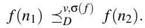

Here, σ( f ) = +1 for aggregation functions whose outputs grow monotonically with the input set (e.g., MAX, SUM, COUNT), and σ( f ) = −1 for antitone ones (e.g., MIN).

• (Value → Value): Let two value-producing nodes satisfy n<sub>1</sub> ⪯<sup>v</sup> n<sub>2</sub>. For a scalar operator op<sub>v</sub> applied to both nodes, the resulting values satisfy:

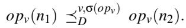

Here, σ(op<sub>v</sub>) = +1 if op<sub>v</sub> is order-preserving with respect to the value-semantic approximation (e.g., x + c with c ≥ 0), and σ(op<sub>v</sub>) = −1 if op<sub>v</sub> reverses the order (e.g., negation).

• (Value → Set): Let two value expressions satisfy n<sub>1</sub> ⪯<sup>v</sup> n<sub>2</sub>. If both expressions are consumed by a predicate or filtering operator op<sub>s</sub>, the induced result sets satisfy:

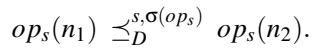

Here, σ(op<sub>s</sub>) = +1 for monotone-increasing predicates (e.g., x > c, where larger values of x make the condition more likely to hold and thus expand the result set), and σ(op<sub>s</sub>) = −1 for monotone-decreasing ones (e.g., x < c, where larger values of x make the condition less likely to hold, causing the result set to shrink).

Remark. In this definition, n and n are not restricted to complete queries. They can represent corresponding subqueries, expressions, or predicates within a single query or across two query variants. The relation ⪯<sup>σ</sup> thus captures how a local semantic approximation propagates through SQL operators according to their monotonic behavior, bridging the valueand set-level semantics within the same unified framework.

Intuitively, the propagation mechanism provides the semantic bridge between tuple-level inclusion and value-level monotonicity. Set-level approximations can trigger value changes through monotone o perators, while value level changes can, in turn, alter the query result set when the affected values participate in predicates. This bidirectional propagation enables comprehensive reasoning over multi-layer SQL dependencies.

Example 3.3 (Set → Value Propagation). Consider two queries over a table t<sub>1</sub>(c<sub>1</sub>, c<sub>2</sub>):

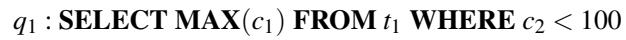

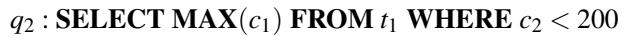

In the query structure, let n and n denote the WHERE clause nodes of q and q , respectively. The condition c < 100 in n is stricter than c < 200 in n , so the rows selected by n form a subset of those selected by n . The parent node of these filters is the aggregation operator MAX, which is monotone increasing: when more rows are included, the maximum value of c<sub>1</sub> can only increase or remain the same. As a result, the difference at the set level (fewer or more tuples) propagates upward to a difference at the value level (smaller or larger aggregated value).

Intuitively, n<sub>1</sub> and n<sub>2</sub> illustrate how a local change in the filter condition at the set level can influence the aggregated result value, demonstrating the propagation from Set to Value.

Example 3.4 (Value → Set Propagation). Consider two semantically related queries over a table t<sub>1</sub>(c<sub>1</sub>):

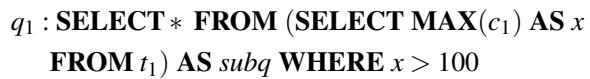

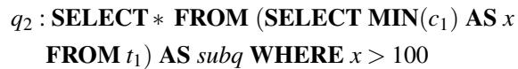

The two queries differ only in the inner aggregation. Let n<sub>1</sub> and n<sub>2</sub> denote the aggregation nodes MAX(c\_1) and MIN(c\_1), respectively. Changing MAX to MIN decreases the derived value x. Since the outer predicate x > 100 is monotone increasing in x, smaller x values make the condition harder to satisfy, resulting in fewer output tuples. Consequently, the result of q<sub>2</sub> becomes a subset of q<sub>1</sub>, showing a typical Value → Set propagation.

These propagation behaviors connect the two approximation dimensions, allowing a single mutation at any AST node (e.g., MAX→MIN) to yield predictable, analyzable effects on both result structure and result values. The unified propagation model forms the semantic foundation of our framework.

## 4 Approach

Based on the SQL Query Approximation model proposed in Section 3, we present a novel approach VALSCOPE for detecting logical bugs in DBMSs. Our approach leverages both set-semantic and value-semantic approximations to identify discrepancies in query results that traditional methods often overlook. In the following, we will provide detailed explanations of our approach.

## 4.1 Overview

We illustrate the overall workflow of our approach in Figure 2. The entire process follows a generate–mutate–verify paradigm designed to uncover logic bugs in DBMSs. In the pre-processing phase, we randomly populate multiple tables in a test database, following standard DBMS random testing practices [36]. This randomized setup provides a diverse and unbiased data distribution for subsequent query evaluations. Next, our system generates a syntactically valid SQL query that serves as the original query. It then parses the query and traverses its AST to identify which grammatical constructs can be safely mutated. Based on the SQL query approximation models defined in Section 3, the system automatically synthesizes several approximate queries by mutating the original queries. After the mutated queries are constructed, the framework performs approximation propagation analysis to reason how local semantic changes at the mutated node propagate through the SQL AST. This analysis establishes the global query-level approximation relation (either at the set level or the value level) between the original and mutated queries. Finally, both queries are executed on the tested DBMS instance, and their outputs are compared against the predicted approximation relation. Any violation of this expected relation indicates a potential logical inconsistency in the DBMS.

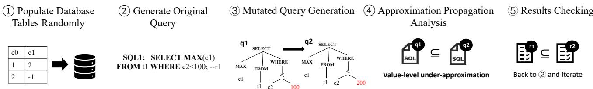  
Figure 2: Overview of our approach.

In the following sections, we introduce each core component in detail, including the construction of the original query (Section 4.2), the design of approximate mutators (Section 4.3), the propagation algorithm (Section 4.4), and the result checking procedure (Section 4.5).

## 4.2 Construction of the Original Query

To support diverse SQL structures in testing, our framework constructs original queries based on a compact yet expressive SQL grammar, as illustrated in Figure 3. This grammar extends the baseline adopted in PINOLO [17] by incorporating a richer set of syntactic components, enabling the generation of more varied queries. Compared with PINOLO, which mainly focuses on basic SELECT-FROM-WHERE statements, our implementation supports a broader range of SQL features, including comprehensive JOIN types and conditions, WITH-clause based common table expressions (CTEs), and row-level locking modes such as FOR UPDATE. It also introduces extended functionalities such as GROUP BY with HAVING filters and ORDER BY clauses, nested function calls with type casting and CASE expressions. These extensions collectively allow our system to generate queries that better reflect the syntactic and semantic richness of real-world DBMS workloads.

A key difference between our design and PINOLO lies in the handling of aggregation-related query constructs. PINOLO is built upon set-level approximation relations defined over tuple-level query results, which fundamentally limits its applicability to queries whose outputs preserve monotonic inclusion. As a result, queries involving aggregation—such as those with GROUP BY or HAVING clauses—are not supported, since aggregation collapses sets of tuples into computed values and breaks the set-level monotonicity assumed by its model. By contrast, our approach introduces value-semantic approximation relations (Section 3) that explicitly capture how aggregated and computed values evolve under localized semantic perturbations, thereby enabling systematic testing of queries with aggregation and grouping.

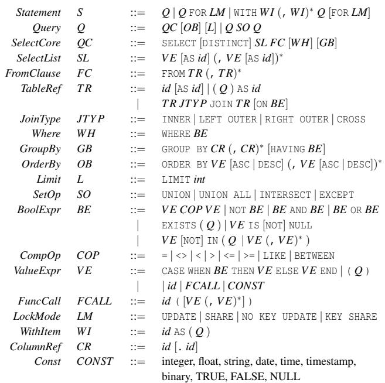  
Figure 3: Compact SQL syntax supported by our approach.

## 4.3 Approximate Mutators

To instantiate the SQL Query Approximation model proposed in Section 3, we design a collection of approximate mutators that introduce controlled semantic deviations into an SQL query. Each mutator corresponds to a localized modification applied to a specific node of the query’s AST. The design goal is to cover both set-level and value-level aspects of SQL semantics, enabling the discovery of a broad range of logical bugs in DBMSs. We have designed a total of 26 mutators, including 17 set-semantic mutators and 9 value-semantic mutators. Due to space limitations, we only present some representative mutators in Table 1. The complete set of mutators can be accessed in our Github repository [1]. Now we provide more explanations on the approximate mutators.

Table 1: Representative Approximate Mutators. Transforming C1 into C2 achieves the over-approximation; the inverse achieves the under-approximation.  
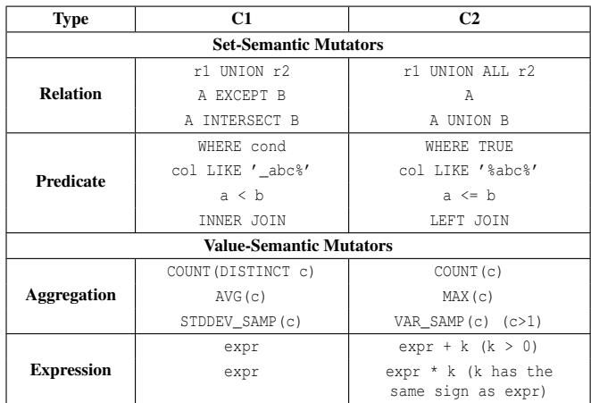

• Mutating Relations: These mutators change how data sets are combined or excluded. For example, replacing UNION with UNION ALL allows duplicates, while replacing INTERSECT with UNION alters set inclusion behavior. These mutations affect the breadth of the result set.

• Mutating Predicates: These mutators modify the query conditions. For instance, changing a WHERE condition to TRUE includes all rows, while FALSE excludes all. Modifying comparison operators (e.g., < to <=) broadens the results.

• Mutating Aggregations: These mutators alter aggregation behavior. For example, switching COUNT(DISTINCT c) to COUNT(c) affects duplicate handling, and replacing AVG(c) with MAX(c) changes the nature of the result.

• Mutating Expressions: These mutators modify arithmetic or logical expressions, such as adding or multiplying by a constant. These changes impact the computed values and affect the final query output.

## 4.4 Approximation Propagation Analysis

In this section, we further develop an executable algorithm to determine how local semantic changes propagate through the SQL AST. The main purpose of this algorithm is to formalize the top-down reasoning process introduced in Definition 3.4 into a systematic, bottom-up propagation procedure that connects local node mutations with their global semantic consequences at the query level.

q1: SELECT COUNT(\*) FROM (SELECT MAX(c1) AS x FROM t1) WHERE x > 100;   
q2: SELECT COUNT(\*) FROM (SELECT MIN(c1) AS x FROM t1) WHERE x > 100;

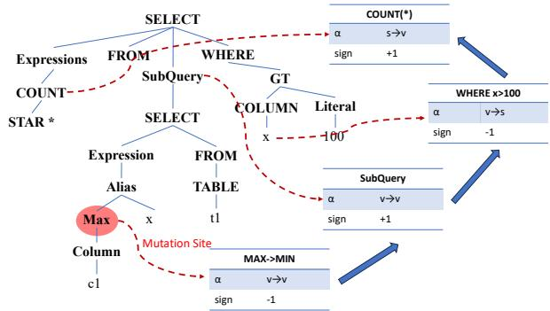  
Figure 4: Example of how the proposed algorithm propagates local semantic changes across the SQL AST.

Algorithm 1 presents the overall propagation process. Initially (Line 1–3), the algorithm receives the mutated node information node\_in f o and the complete AST of the query. It first identifies the mutated node n<sub>mut</sub> and constructs its ancestor chain from the mutation site to the query root, represented as list = [n<sub>mut</sub> , . . . , n<sub>root</sub> ]. This structure enables the algorithm to traverse each parent operator sequentially and reason about how the mutation propagates upward. The algorithm then initializes the local semantic level of the mutation (Line 5–7): if the mutated node involves predicates or subqueries, it starts at the set level (α(n<sub>mut</sub> ) = s); otherwise, for expressions or aggregations, it starts at the value level (α(n<sub>mut</sub> ) = v). A direction accumulator sign is also initialized to +1 to indicate that propagation initially preserves directionality. In the propagation stage (Line 9–17), the algorithm iteratively traverses each parent node of n<sub>mut</sub> in a bottom-up manner. Before propagating, the algorithm invokes DEPENDSON(n<sub>i</sub>,n<sub>i−1</sub>) to check whether the parent node semantically depends on the mutated child node—by referencing its output column (for value-level nodes) or embedding it as a subquery or relation (for set-level nodes). Only dependent nodes are considered for propagation. For each parent operator op<sub>i</sub> (Line 9), it consults Table 2 to retrieve the corresponding semantic mapping (α<sub>in</sub> → α<sub>out</sub>) and its monotonic direction σ(op ) ∈ {+1,−1} (Line 13). The semantic level α is updated according to the operator’s input-output mapping (e.g., Set→Value for aggregation or Value→Set for predicate filters), while the cumulative direction sign is updated multiplicatively (sign ← sign · σ(op )), preserving or reversing the relation based on operator polarity (Line 14–16). This recursive process effectively tracks the path of semantic transformation from the mutation site to the query output. Finally, at the root node (Lines 19–25), the algorithm materializes the final query-level approximation relation between the original and mutated queries, returning either a set-level or a value-level approximation, depending on the semantic level of the root and the accumulated propagation direction.

Algorithm 1 Approximation Propagation across SQL AST   
Input: Mutated node info node\_in f o, SQL AST AST   
Output: Final query-level approximation between original and mu   
tated queries   
1: // Step 1: Initialization   
2: Identify mutated node n<sub>mut</sub>.   
3: Build ancestor chain list = [n<sub>mut</sub> , . . . , n<sub>root</sub> ].   
4: // Step 2: Local relation at mutation site   
5: Decide initial level α(n<sub>mut</sub>) ∈ {s, v} by node type.   
6: Set local relation R (nmut ) ← (⪯<sup>α(nmut)</sup>).   
7: Initialize direction accumulator sign ← +1.   
8: // Step 3: Bottom-up propagation   
9: for each parent node n in list (from child to root) do   
10: Determine operator type op<sub>i</sub> at n<sub>i</sub>.   
11: if not DEPENDSON(n<sub>i</sub>,n<sub>i−1</sub>) continue   
12: end if   
13: Lookup rule of op<sub>i</sub> in Table 2 to get (α<sub>in</sub> → α<sub>out</sub>, σ(op<sub>i</sub>)).   
14: Update level: α(n<sub>i+1</sub>) ← α<sub>out</sub> .   
15: Update direction: sign ← sign · σ(op<sub>i</sub>).   
16: Propagate symbolically: R (n<sub>i+1</sub>) ← R (n<sub>i</sub>) with sign ap   
plied.   
17: end for   
18: // Step 4: Materialize root-level relation   
19: if α(n<sub>root</sub> ) = s   
20: return q<sub>1</sub> ⪯<sup>s</sup><sub>D</sub> q<sub>2</sub> with sign +,   
21: or q<sub>1</sub> ⪰<sup>s</sup> q<sub>2</sub> with sign −.   
22: else   
23: return q<sub>1</sub> ⪯<sup>v</sup> q<sub>2</sub> with sign +,   
24: or q<sub>1</sub> ⪰<sup>v</sup> q<sub>2</sub> with sign −.   
25: end if   
26: function DEPENDSON(parent, child)   
27: if α(child) = v   
28: return parent.exprs contains column or alias from child   
29: else if α(child) = s   
30: return parent.references(child) as subquery or table   
31: else   
32: return false   
33: end if   
34: end function

As illustrated in Figure 4, the mutation occurs at the aggregation node where MAX(c1) is replaced by MIN(c1), initializing a value-level relation (α = v) with reversed monotonicity (σ = −1). Following Algorithm 1, the algorithm then traverses its ancestor chain list = [n<sub>MAX</sub>, n<sub>subq</sub>, n<sub>WHERE</sub>, n<sub>COUNT</sub>] to evaluate how this local change propagates upward through the query structure. When the propagation reaches the subquery node (SELECT ... AS x), the semantics are lifted from the value level to the set level (α : v → s, σ = +1). According to Table 2, a subquery appearing in the FROM clause acts as a data source that preserves tuple inclusion—expanding the underlying relation results in a superset of tuples, thus maintaining positive monotonicity. The subsequent WHERE x>100 clause applies a filtering operator that preserves the set level but reverses direction (α : s → s, σ = −1). Finally, the outer COUNT(\*) operator aggregates the resulting set back to a value-level (α : s → v, σ = +1). The cumulative sign is therefore (−1)×(+1)×(−1)×(+1) = +1, yielding a final value-level approximation q<sub>1</sub> ⪯<sup>v</sup><sub>D</sub> q<sub>2</sub>, which indicates that the output of q<sub>1</sub> forms a value-level underapproximation of q<sub>2</sub>.

## 4.5 Results Checking

The primary purpose of results checking is to verify whether the outputs of the original and mutated SQL queries align with the predicted approximation relations, as defined in the previous section. Unlike traditional methods that rely on strict equivalence or set inclusion checks, which often miss subtle semantic differences, our approach incorporates both setsemantic and value-semantic approximation relations. This allows us to detect a wider range of logical inconsistencies in DBMS query results. In our approach, after executing both queries, we compare their results based on the expected approximation relation (set or value). Specifically, for setsemantic approximation, we check if the result set of the mutated query is a subset or superset of the original query’s result set, as predicted by the approximation relation. For value-semantic approximation, we compare the values in the target columns of both queries, ensuring that they satisfy the expected monotonic relationship (either increasing or decreasing). A violation of this relation signals a logical inconsistency in the DBMS’s query processing.

## 5 Implementation

We implemented our approach VALSCOPE as a DBMS testing system, which was written in Python with 13,455 lines of code. The following describes the important implementation details.

Database Population. We adopt the approach PINOLO [17] to generate random database instances from scratch, while also covering most of the data types as specified in the SQL documentation. Unlike existing methods of random database instance generation, VALSCOPE also takes into account type-specific behaviors and boundary cases. For each column, values are generated according to the constraints of the respective data type to ensure validity. This helps prevent common runtime errors such as INSERT failures caused by out-of-range or incorrectly formatted values. To increase the likelihood of triggering type-related errors, we also introduce boundary values, including extremely large or small numbers, as well as text with mixed case. Additionally, to test specific arithmetic operations and function-related mutation operators, we explicitly specify the sign (positive or negative) for certain columns.

Test Case Generation and Parsing. Similar to SQL generators like SQLSMITH [5] and GO-RANDGEN [32], we implement VALSCOPE from scratch to generate original queries. VALSCOPE ensures the consistency of data dependencies, function dependencies, and expression dependencies in query generation. It carefully selects tables and columns based on their usage patterns, applies the correct functions with compatible argument types, and maintains type compatibility across operations, ensuring semantic correctness. This allows VALSCOPE to achieve higher semantic accuracy than existing generators such as SQLSMITH and GO-RANDGEN, particularly in handling complex queries with multiple nested subqueries. To apply the approximate mutators to original queries, we use SQLGLOT [28], which accepts the same context-free grammar used in seed query generation, to generate ASTs of original queries for mutation.

Table 2: Operator types and semantic propagation rules.  
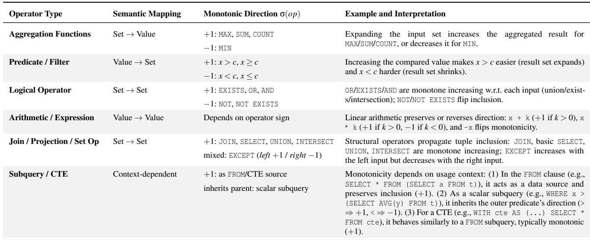

Bug Report Post-processing. VALSCOPE evaluates queries in the tested DBMS to obtain query results. It is important to note that inconsistent query results often arise during our testing process. To avoid repetitive bug reports and make the test results easier to understand, we first use SQLESS [26] to simplify the bugs and pinpoint their root causes. Specifically, SQLESS applies a delta-debugging [41] reduction by iteratively removing clauses, expressions, or subqueries from the original query pair, while repeatedly re-executing the reduced queries to check whether the violation still persists. Additionally, we follow the approach from PINOLO [17] to remove duplicates. Concretely, we associate each simplified query pair with the earliest bug-involved version of the tested DBMS in which the violation can be reproduced, and group query pairs that share the same bug-involved version as one bug. Finally, we manually inspect the post-processed results to ensure that each reported bug is minimized and dedupli cated before submitting a clear bug report to developers for confirmation.

Supported DBMSs and Adaptation. VALSCOPE is primarily designed around the MySQL syntax, ensuring robust support for MySQL-based databases, such as TiDB and OceanBase. The architecture of VALSCOPE is modular and decoupled, which facilitates easy adaptation to different DBMS dialects. To integrate support for additional DBMS dialects, users only need to modify the relevant components to accommodate the specific syntax, data types, and operations of the target DBMS. This adaptation is similar to extending SQLSMITH [5] and can be achieved with just a few hundred lines of code. A more streamlined approach is to leverage the latest extension tool, QTRAN [27], which automates the process of adapting metamorphic-oracle-based logical bug detection techniques for multi-DBMS dialect support.

## 6 Evaluation

Our evaluation aims to answer the following questions to demonstrate the effectiveness of VALSCOPE:

Q1 Can VALSCOPE find real logical bugs in widely used and extensively tested DBMSs? (Section 6.2)

Q2 Can VALSCOPE find logical bugs that are missed by existing approaches? (Section 6.3)

## 6.1 Experimental Setup

Tested DBMS. We evaluate VALSCOPE on 6 widely used DBMSs, as summarized in Table 3. These DBMSs were chosen based on their popularity and extensive use in realworld applications. MySQL, MariaDB, TiDB, and Ocean-Base are widely used, with MySQL ranking second in the DB-Engines ranking, while MariaDB ranks 13th, and TiDB and OceanBase are also prominent players. Percona, a derivative of MySQL, and PolarDB, a cloud-native database, were selected to represent a broader spectrum of DBMSs. All of these DBMSs have undergone extensive testing for both logical [12, 17, 21, 23, 27, 34–36, 38, 40, 42] and crash bugs [5,19,32,43]. Although finding new bugs in such widely tested systems is challenging, it serves to validate the effec tiveness of VALSCOPE. In our experiments, VALSCOPE tests the latest versions of each DBMS. When updates are made to any DBMS, new tests are initiated on the updated versions. The whole experiment takes about one month.

Table 3: The demographics of the DBMSs under test  
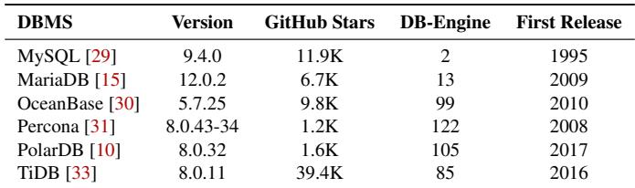

Environment. We conduct the experiments on one server with 104-cores Intel(R) Xeon(R) Gold 6230R CPU @2.10GHz and 500 GB memory. The server operates under the Ubuntu 20.04 OS, with the 5.4.0-135-generic version of the Linux kernel.

## 6.2 Bug Detection

Table 4 summarizes the status of the logical bugs found by VALSCOPE for each DBMS. In total, we reported 67 unique logical bugs across six DBMSs, including 23 in MySQL, 10 in MariaDB, 7 in OceanBase, 10 in Percona, 12 in PolarDB, and 5 in TiDB. Notably, all of these bugs were previously unknown, highlighting the effectiveness of VALSCOPE in uncovering hidden logical inconsistencies. Of these, 57 bugs have been confirmed, and 10 are still pending verification.

Bug Importance. Although anecdotal, developer feedback is an important indicator of an approach’s effectiveness and the found bugs’ importance. Two DBMS companies reached out to us about our testing efforts; both were interested in how we found the bugs, and one invited us to help them find more bugs. For example, a developer from PolarDB commented: “Outstanding work, this tool looks very useful, and we will fully support any technical requirements you may need." Additionally, we received positive feedback on public bug tracking platforms. Among the confirmed bugs, one in MySQL was labeled as a serious bug, indicating it is a high-impact and difficult-to-resolve issue; furthermore, in MariaDB, 10 bugs were labeled as “Major", which represents the highest severity level in the system.

Bug Diversity. We further analyzed the characteristics of the queries that triggered the logical bugs. Among the 57 confirmed bugs, 45 involve subqueries, 17 are related to aggregation functions, and 6 stem from numeric computations within expressions. In addition, 19 bugs are associated with join operations, 22 with GROUP BY and HAVING clauses. Since a single query may contain multiple constructs, these categories are not mutually exclusive; rather, they show that VALSCOPE can uncover logical bugs arising from rich combinations of subqueries, aggregations, arithmetic expressions, joins, and grouping clauses, instead of being confined to a narrow class of query templates.

Table 4: Status of logical bugs found by VALSCOPE  
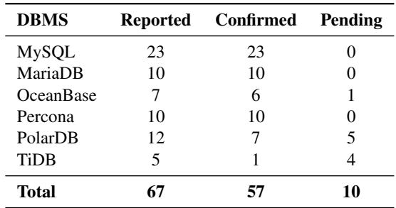

Bug Detected via Approximation Relations. All reported bugs were uncovered through our SQL query approximation framework. Among all confirmed bugs, 43 ultimately violate value-semantic approximation, while 32 require reasoning about cross-dimension propagation between set and value semantics. These results demonstrate the effectiveness of VALSCOPE in jointly modeling set-semantic and valuesemantic, enabling the detection of subtle logical bugs that are beyond the reach of prior MT techniques based solely on equivalence or set semantic approximation.

Bug Triggering Rules. To better understand the effectiveness of different mutators, we analyze which mutators are involved in triggering the confirmed logical bugs found by VALSCOPE. Figure 5 shows the top-10 mutators ranked by the number of confirmed bugs they trigger. We observe that the distribution is skewed rather than uniform: a small number of mutators contribute to a large portion of the confirmed bugs. In particular, rule R1 (removing DISTINCT) and R18 (transforming COUNT(DISTINCT c) into COUNT(c)) are the most effective, indicating that duplicate handling and aggregation semantics are common sources of confirmed logical bugs in DBMSs. Several other mutators, such as predicate relaxation (R5) and join transformation (R17), also consistently trigger bugs. At the same time, the fact that multiple mutators contribute to bug discovery suggests that the bug space is diverse, and incorporating a rich set of mutators is necessary to achieve broad coverage. This observation further suggests that extending the mutator set could potentially uncover additional bugs. Due to space limitations, we provide a complete mapping between confirmed bugs and their triggering mutation rules, along with detailed frequency statistics, in our Github repository [25].

Query Generation Efficiency. We evaluate query generation efficiency by measuring the number of test cases generated per second, where each test case consists of an original query and its corresponding mutated query. VALSCOPE achieves query generation throughput comparable to existing methods [5,13,32]. Specifically, the generation rates are 2000 queries/sec for MySQL, 1923 for MariaDB, 2000 for Ocean-Base, 1960 for Percona, 1960 for PolarDB, and 1960 for TiDB.

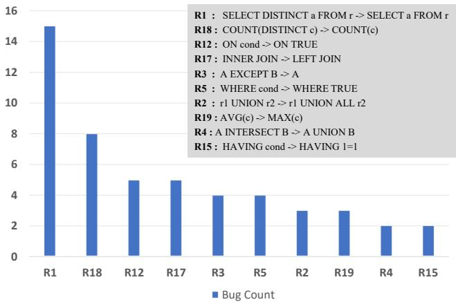  
Figure 5: Top-10 mutators ranked by the number of 57 confirmed logical bugs they trigger.

In addition to competitive throughput, VALSCOPE achieves high execution success rates across most DBMSs. The execution success rates are 93% for MySQL, 88% for MariaDB, 87% for OceanBase, 91% for Percona, 72% for PolarDB, and 87% for TiDB. These results indicate that VALSCOPE can generate structurally complex queries with nested constructs and inter-query dependencies, while preserving data consistency, functional dependencies, and expression-level correctness. Although the testing campaign lasted for nearly one month, the majority of logical bugs were uncovered at an early stage, with 61 out of the 67 reported bugs (over 90%) detected within the first 24 hours. This observation demonstrates that VALSCOPE is effective at rapidly exposing potential logical flaws, making it well suited for efficient and practical DBMS testing.

Case Study. Figure 6 shows a logical bug in MariaDB [3] found by VALSCOPE, where inconsistent metadata propagation across query branches leads to incorrect result representation. The original query uses MAX(1) in the first branch of a UNION ALL, while the mutated query replaces it with AVG(1). Under the given database state, both expressions evaluate to the same logical value 1, so the expected result remains (1), (2025-10-17). However, the mutated query instead returns (0x312E...) and (0x32303235...)—the outputs are silently converted into binary-encoded hex strings. The root cause lies in the implementation of the AVG() aggregate function, where the result collation is not properly initialized. Unlike MAX() and MIN(), which explicitly inherit type and collation metadata from their input via set\_collation, the Item\_sum\_avg class omits this step, leaving its metadata incomplete. During UNION ALL type unification, this missing collation forces the engine to fall back to a binary supertype, leading to incorrect encoding of all result values. The fix restores consistency by adding the missing metadata initialization in AVG(), ensuring correct type resolution and human-readable outputs across query branches.

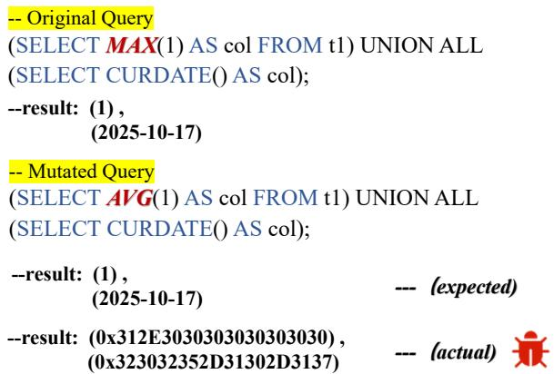  
(a) Bug Manifestation: Metadata Erosion and Collation Dissonance in Aggregate-to-Union Projection

```c
if (init_sum_func_check(thd))
return TRUE;
collation= DTCollation_numeric();
decimals=0;
set_maybe_null(sum_func() != COUNT_FUNC);
```  
(b) Fix : Integral Restoration of Metadata Attributes in Sum-item Resolution  
Figure 6: MariaDB Bug #37888: unexpected type changing after changing MAX to AVG.

## 6.3 Comparative Study

To demonstrate that VALSCOPE detects logical bugs missed by existing methods, we compare VALSCOPE with state-ofthe-art DBMS testing approaches from two perspectives: testing tools and timing of bug detection.

Tool Comparison. At the tool level, we selected six stateof-the-art logical bug detection approaches for comparison: PQS [36], NOREC [34], TLP [35], DQP [7], PINOLO [17] and EET [21]. Since the implementation of TQS [40] is not publicly available, and it belongs to the same class of approaches as DQP [7], we include only DQP as a representative for comparison. We run each tool on the latest version of each supported DBMS, with a testing duration of 24 hours. Since the baseline methods do not support all DBMSs tested by VALSCOPE our comparison is limited to the DBMSs commonly supported by VALSCOPE and each baseline method.

Table 5 shows that VALSCOPE outperforms the other tools in detecting logical bugs across all DBMSs, especially in MySQL. Specifically, VALSCOPE found 28,10,20,36,40 and 23 more bugs than PQS, NOREC, TLP, DQP, PINOLO and EET. Note that the increments are calculated based only on the DBMSs commonly supported by both approaches. The other approaches were less effective in our experiments because we tested the latest versions of the DBMSs. The advantage of VALSCOPE mainly comes from its unified reasoning over both set-semantic and value-semantic approximation. In contrast, prior approaches are limited to equivalence-based checking, set-level approximation, or narrower oracle assumptions, and therefore cannot effectively capture value-level corruptions or cross-dimension semantic violations. We further study whether existing oracles can detect the logical bugs found by VALSCOPE. For each bug-triggering query found by VALSCOPE, we manually construct the corresponding transformed queries required by each baseline oracle and check whether the bug can still be exposed under that testing pattern. Among the 61 logical bugs found by VALSCOPE within 24 hours, PINOLO can detect 12, TLP can detect 4, NOREC can detect 2, and DQP can detect 6, while VALSCOPE uniquely detects 48 of them (78.9%). This result shows that a substantial portion of the bugs found by VALSCOPE are beyond the detection scope of existing oracles, further demonstrating that VALSCOPE complements prior techniques and is particularly effective at exposing logical bugs involving value-level and cross-dimension semantic inconsistencies.

Table 5: Number of logical bugs triggered in 24 hours.  
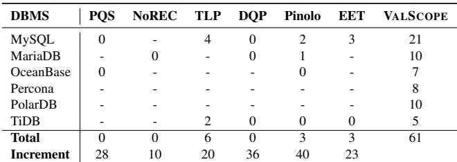  
Note.“-” indicates that the tool does not support the DBMS. “Increment” is computed on the commonly supported DBMSs between the baseline tool and VALSCOPE.

Temporal Comparison. We also present a comparative study from a temporal perspective following EET [21], aiming to evaluate whether VALSCOPE can uncover logical bugs missed by prior approaches. We analyze the earliest bug involved version of each of the 57 confirmed logical bugs discovered by VALSCOPE, and examine whether these versions predate the publication of existing approaches [7, 12, 17, 21, 34–36, 38–40]. This enables us to assess the effectiveness of VALSCOPE in identifying long-standing issues overlooked by earlier techniques.

As shown in Table 6, among the 57 confirmed bugs, 48 bugs originated before 2020, indicating that all post-2020 approaches (e.g., PQS [36], TLP [35], NOREC [34]) failed to detect these long-standing issues in their extensive evaluations. In addition, 5 bugs were already present between 2020 and 2023, yet were not identified by testing approaches introduced after 2023, such as EET [21], PINOLO [17], TQS [40] and DQP [7]. These findings show that existing approaches indeed missed a substantial number of long-lived logical bugs. These missed bugs can be attributed to fundamental limitations of existing approaches. First, equivalence-based techniques such as TLP [35] apply coarse-grained querylevel mutations that reuse the same faulty operators, causing both queries to return identical—yet incorrect—results. Second, approximation-based methods such as PINOLO [17] rely solely on set semantics and therefore cannot detect valuelevel corruptions that occur without modifying the tuple set. However, VALSCOPE jointly reasons about set- and valuesemantic behaviors and performs fine-grained mutations, enabling it to expose subtle errors that all prior approaches fundamentally overlook.

Furthermore, we investigate the longest latency of the confirmed bugs for each DBMS. As reported in Table 6, VALSCOPE identifies at least one bug with a latency exceeding three years in every tested DBMS, with the longest latency reaching 20 years. These results demonstrate that VALSCOPE is highly effective at discovering long-standing, previously unknown logical bugs across diverse DBMSs.

Table 6: Latency of the confirmed logical bugs found by VALSCOPE  
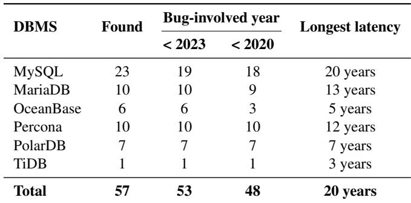

## 7 Discussion

False Positives. False positives in our approach mainly stem from spec-dependent behaviors rather than true logical bugs, including floating-point imprecision, NULL semantics, and vendor-specific implementations. For floating-point computations (e.g., in SUM or AVG), minor numerical deviations may arise due to rounding, execution order, or precision differences; we therefore adopt a tolerance-based comparison, where two values a and b are considered consistent if |a − b| ≤ ε<sub>abs</sub> or |a − b|/ max(1, |a|, |b|) ≤ ε<sub>rel</sub>. For NULL semantics, discrepancies may result from SQL’s three-valued logic and special aggregation behavior (e.g., COUNT(\*) vs. COUNT(col)); we address this via NULL-aware comparison rules that treat NULL as a distinct semantic category and avoid comparing it as a regular scalar. Finally, certain inconsistencies originate from vendor-specific behaviors (e.g., implicit type conversions or function semantics), for which we perform manual validation. These strategies effectively reduce spurious violations, and in practice we did not observe persistent false positives among the confirmed bugs.

Limitations. Our approach relies on value-semantic monotonicity to reason about expected result changes, which limits its applicability to certain classes of SQL queries. In particular, non-monotonic functions (e.g., SIN, ABS, ROUND, or complex CASE-based expressions) do not exhibit a consistent directional behavior, making it difficult to derive reliable approximation relations. For such functions, small input changes may lead to unpredictable output variations, preventing effective value-level reasoning. In addition, queries involving non-deterministic functions (e.g., RAND(), NOW()) may produce different results across executions, violating the stability assumption required by our checking mechanism. While nonmonotonic but deterministic functions are difficult to reason about directly at the function level, they can still be treated as an atomic expression exp and tested through monotonic outer transformations such as exp + 2 or exp \* k, which still induce predictable value-level changes. In contrast, queries involving non-deterministic functions are currently out of scope, since their results may vary across executions and thus violate the stability assumption required by our checking mechanism.

## 8 Related Work

Metamorphic Testing for Logical Bug Detection in DBMSs. A variety of MT approaches have been proposed to detect logical bugs in DBMSs [7,12,17,20,21,34–36,38–40]. For example, NOREC [34] transforms an optimizable query into a non-optimizable form and detects semantic inconsis tencies by comparing their outputs. TLP [35] divides query predicates into multiple subqueries and verifies that the union of their results is equivalent to the original query. PQS [36] constructs queries expected to retrieve a specific pivot row, while DQE [38] detects logical bugs by comparing whether different SQL queries with the same predicate access the same rows in the database. PINOLO [17] generalizes this paradigm through set-level approximation, where predicates are relaxed or restricted to generate over- and under-approximate queries, and correctness is judged by inclusion or containment relations between result sets.

As discussed in Section 1 and Section 2, existing MT approaches are primarily limited to equivalence-based testing or set-level approximations. In contrast, our work extends MT by jointly modeling set- and value-semantic approximation, enabling the detection of logical bugs that remain undetectable under prior frameworks.

DBMS Test-Case Generation. A variety of approaches have been proposed for generating diverse test cases for DBMSs, with the aim of improving coverage and revealing potential bugs. These techniques [5, 16, 19, 27, 43] typically focus on generating valid and varied SQL queries, but may not specifically target logical bugs. SQLSMITH [5] is a grammarbased DBMS fuzzer that embeds SQL grammar rules to generate complex SQL queries. It uses a random walk approach to explore the SQL syntax and generate a wide range of queries. SQUIRREL [43] is a mutation-based DBMS fuzzer which introduces an intermediate representation for SQL queries and models dependencies between SQL statements, enabling the generation of queries that contain multiple SQL operations.

GRIFFIN [16] uses a grammar-free mutation approach, where it mutates SQL queries based on DBMS state information encapsulated in a metadata graph. QTRAN [27] is a LLMbased approach that can automatically translate test cases from other DBMSs. DYNSQL [19] takes a dynamic approach by interacting with the DBMS to capture the latest state information, allowing for the incremental generation of valid and complex queries. These techniques aim to prevent semantic errors and improve the diversity of generated queries. In addition to general query generation, some approaches have been specifically designed to aid in bug detection. SQLRIGHT [24] leverages code coverage feedback to enhance test-case generation. QPG [6] takes a different approach by recording the query plans covered during DBMS testing and prioritizing the mutation of queries that trigger new query plans.

These general query generation approaches complement VALSCOPE. While approaches like SQLSMITH, SQUIR-REL, and GRIFFIN focus on generating diverse queries, VALSCOPE can help identify logical bugs hidden in complex or rarely executed query logic. Conversely, the test cases generated by these methods can provide VALSCOPE with high-quality and varied queries, expanding its ability to uncover bugs. Together, these approaches offer a comprehensive strategy for DBMS testing, improving both query coverage and the detection of logical bugs.

## 9 Conclusion

In this paper, we propose a unified SQL query approximation model that integrates set-semantic and value-semantic reasoning for detecting logical bugs in DBMSs. Based on this model, we develop VALSCOPE, a metamorphic testing framework that mutates SQL queries and propagates semantic approximations to uncover deep logical inconsistencies. Our evaluation on 6 widely used DBMSs discovers 67 logical bugs, 57 of which have been confirmed at the time of submission. We believe the effectiveness of VALSCOPE can inspire more follow-up research on DBMS testing.

## Acknowledgements

We thank the anonymous reviewers and shepherd for their valuable and insightful feedback. We also thank the DBMS developers for triaging and fixing our reported bugs. This research was supported by the Natural Science Foundation of China (Grant No. 62272400), the Fujian Provincial Natural Science Foundation of China (Grant No. 2025J010002), and Xinmiao Project of ZheJiang Provincial Applied Basic Research Program (Grant No. 2026XMZD032). Li Lin began this work while affiliated with Xiamen University. Now he is a Ph.D. student at Zhejiang University. Rongxin Wu is the corresponding author and works as a member of Fujian Engineering Research Center of High-Performance Intelligent Computing Systems in Xiamen University.

## References

[1] Valscope mutation documentation. https: //github.com/linli1724647576/ValScope/ blob/main/mutation.md. Accessed Dec 2025.

[2] Mysql bug #119321: Unexpected null after changing sum to sum(x \* 2). https://bugs.mysql.com/bug. php?id=119321, 2025. Accessed Dec 2025.

[3] Mdev-37888: Unexpected type changing after changing avg to max. https://jira.mariadb.org/browse/ MDEV-37888, 2026. Accessed Mar 2026.

[4] Atul Adya. Weak consistency: a generalized theory and optimistic implementations for distributed transactions. 1999.

[5] Anse1. Sqlsmith: A random sql query generator. https://github.com/anse1/sqlsmith, 2020. Accessed Dec 2025.

[6] Jinsheng Ba and Manuel Rigger. Testing database engines via query plan guidance. In 2023 IEEE/ACM 45th International Conference on Software Engineering (ICSE 23), pages 2060–2071. IEEE, 2023.

[7] Jinsheng Ba and Manuel Rigger. Keep it simple: Testing databases via differential query plans. Proceedings of the ACM on Management of Data, 2(3):1–26, 2024.

[8] Hardik Bati, Leo Giakoumakis, Steve Herbert, and Aleksandras Surna. A genetic approach for random testing of database systems. In Proceedings of the 33rd in ternational conference on Very large data bases, pages 1243–1251, 2007.

[9] Donald D Chamberlin and Raymond F Boyce. Sequel: A structured english query language. In Proceedings of the 1974 ACM SIGFIDET (now SIGMOD) workshop on Data description, access and control, pages 249–264, 1974.

[10] Alibaba Cloud. Polardb product overview. https://help.aliyun.com/zh/polardb/ product-overview/, 2023. Accessed Dec 2025.

[11] Edgar F Codd. A relational model of data for large shared data banks. Communications of the ACM, 13(6):377–387, 1970.

[12] Wenqian Deng, Jie Liang, Zhiyong Wu, Jingzhou Fu, and Yu Jiang. Detecting logic bugs in dbmss via equivalent data construction. Proceedings of the ACM on Management of Data, 3(6):1–25, 2025.

[13] SQLancer developers. Sqlancer: Automated testing to find logic and performance bugs in database systems. https://github.com/sqlancer/sqlancer, 2025. Accessed Dec 2025.

[14] Daniela Florescu, Alon Levy, and Alberto Mendelzon. Database techniques for the world-wide web: A survey. ACM Sigmod Record, 27(3):59–74, 1998.

[15] MariaDB Foundation. Mariadb, 2023. Accessed Dec 2025.

[16] Jingzhou Fu, Jie Liang, Zhiyong Wu, Mingzhe Wang, and Yu Jiang. Griffin: Grammar-free dbms fuzzing. In Proceedings of the 37th IEEE/ACM International Conference on Automated Software Engineering (ASE 22), pages 1–12, 2022.

[17] Zongyin Hao, Quanfeng Huang, Chengpeng Wang, Jian feng Wang, Yushan Zhang, Rongxin Wu, and Charles Zhang. Pinolo: Detecting logical bugs in database management systems with approximate query synthesis. In 2023 USENIX Annual Technical Conference (USENIX ATC 23), pages 345–358, 2023.

[18] William E Howden. Theoretical and empirical studies of program testing. IEEE Transactions on Software Engineering, (4):293–298, 2006.

[19] Zu-Ming Jiang, Jia-Ju Bai, and Zhendong Su. {DynSQL}: Stateful fuzzing for database management systems with complex and valid {SQL} query generation. In 32nd USENIX Security Symposium (USENIX Security 23), pages 4949–4965, 2023.

[20] Zu-Ming Jiang, Si Liu, Manuel Rigger, and Zhendong Su. Detecting transactional bugs in database engines via {graph-based} oracle construction. In 17th USENIX Symposium on Operating Systems Design and Implementation (OSDI 23), pages 397–417, 2023.

[21] Zu-Ming Jiang and Zhendong Su. Detecting logic bugs in database engines via equivalent expression transformation. In 18th USENIX Symposium on Operating Systems Design and Implementation (OSDI 24), pages 821–835, 2024.

[22] Jinho Jung, Hong Hu, Joy Arulraj, Taesoo Kim, and Woonhak Kang. Apollo: Automatic detection and diagnosis of performance regressions in database systems. Proceedings of the VLDB Endowment, 13(1):57–70, 2019.

[23] Matteo Kamm, Manuel Rigger, Chengyu Zhang, and Zhendong Su. Testing graph database engines via query partitioning. In Proceedings of the 32nd ACM SIGSOFT International Symposium on Software Testing and Analysis (ISSTA 23), pages 140–149, 2023.

[24] Yu Liang, Song Liu, and Hong Hu. Detecting logical bugs of {DBMS} with coverage-based guidance. In 31st USENIX Security Symposium (USENIX Security 22), pages 4309–4326, 2022.

[25] Li Lin. Valscope: Trigger bug rules. https: //github.com/linli1724647576/ValScope/blob main/trigger%20bug%20rules.md, 2026. Accessed Mar 2026.

[26] Li Lin, Zongyin Hao, Chengpeng Wang, Zhuangda Wang, Rongxin Wu, and Gang Fan. Sqless: Dialectagnostic sql query simplification. In Proceedings of the 33rd ACM SIGSOFT International Symposium on Software Testing and Analysis (ISSTA 24), pages 743–754, 2024.

[27] Li Lin, Qinglin Zhu, Hongqiao Chen, Zhuangda Wang, Rongxin Wu, and Xiaoheng Xie. Qtran: Extending metamorphic-oracle based logical bug detection techniques for multiple-dbms dialect support. In Proceedings of the 34nd ACM SIGSOFT International Sympo sium on Software Testing and Analysis (ISSTA 25), pages 731–752, 2025.

[28] Toby Mao. Sqlglot: A no-dependency sql parser, transpiler, optimizer, and engine, 2024. Accessed Dec 2025.

[29] MySQL. Mysql, 2023. Accessed Dec 2025.

[30] OceanBase. Oceanbase open source, 2023. Accessed Dec 2025.

[31] Percona. Percona - open source database software and services, 2023. Accessed Dec 2025.

[32] PingCap. go-randgen, 2022. Accessed Dec 2025.

[33] PingCAP. Tidb, 2023. Accessed Dec 2025.

[34] Manuel Rigger and Zhendong Su. Detecting optimiza tion bugs in database engines via non-optimizing reference engine construction. In Proceedings of the 28th ACM Joint Meeting on European Software Engineering Conference and Symposium on the Foundations of Software Engineering, pages 1140–1152, 2020.

[35] Manuel Rigger and Zhendong Su. Finding bugs in database systems via query partitioning. Proceedings of

the ACM on Programming Languages, 4(OOPSLA):1– 30, 2020.

[36] Manuel Rigger and Zhendong Su. Testing database engines via pivoted query synthesis. In 14th USENIX Symposium on Operating Systems Design and Implementation (OSDI 20), pages 667–682, 2020.

[37] Donald R Slutz. Massive stochastic testing of sql. In VLDB, volume 98, pages 618–622, 1998.

[38] Jiansen Song, Wensheng Dou, Ziyu Cui, Qianwang Dai, Wei Wang, Jun Wei, Hua Zhong, and Tao Huang. Testing database systems via differential query execution. In 2023 IEEE/ACM 45th International Conference on Software Engineering (ICSE 23), pages 2072–2084. IEEE, 2023.

[39] Jiansen Song, Wensheng Dou, Yu Gao, Ziyu Cui, Yingying Zheng, Dong Wang, Wei Wang, Jun Wei, and Tao Huang. Detecting metadata-related logic bugs in database systems via raw database construction. Proceedings of the VLDB Endowment, 17(8):1884–1897, 2024.

[40] Xiu Tang, Sai Wu, Dongxiang Zhang, Feifei Li, and Gang Chen. Detecting logic bugs of join optimizations in dbms. Proceedings of the ACM on Management of Data, 1(1):1–26, 2023.

[41] Andreas Zeller. Why programs fail: a guide to systematic debugging. Morgan Kaufmann, 2009.

[42] Chi Zhang and Manuel Rigger. Constant optimization driven database system testing. Proceedings of the ACM on Management of Data, 3(1):1–24, 2025.

[43] Rui Zhong, Yongheng Chen, Hong Hu, Hangfan Zhang, Wenke Lee, and Dinghao Wu. Squirrel: Testing database management systems with language validity and coverage feedback. In Proceedings of the 2020 ACM SIGSAC Conference on Computer and Communications Security, pages 955–970, 2020.

[44] Xuanhe Zhou, Chengliang Chai, Guoliang Li, and Ji Sun. Database meets artificial intelligence: A survey. IEEE Transactions on Knowledge and Data Engineering, 34(3):1096–1116, 2020.

## A Artifact Appendix

## Abstract

The artifact for VALSCOPE packages the implementation of the SQL generation, seed-query extraction, and mutationbased checking framework described in the paper, together with runnable scripts for six DBMS dialects. It enables users to execute end-to-end testing campaigns, inspect generated SQL workloads and mutation logs, and reproduce representative logical bug reports produced by the system.

## Scope

The artifact supports validation of the paper’s core systems claims: VALSCOPE combines set-semantic and valuesemantic metamorphic testing in one framework, works across multiple MySQL-family DBMSs, and can generate concrete bug evidence including schema setup, original queries, mutated queries, and mismatch or failure logs. The artifact is intended for reproducing the testing workflow and representative bug-finding results rather than re-running every 24-hour campaign reported in the full evaluation.

## Contents

The artifact repository contains the VALSCOPE source code, dependency manifest, dialect-specific execution scripts, example generated SQL outputs, mutation logs, and documentation. The main entry points are main.py for the core workflow and scripts/<dialect>/run.sh for automated evaluation on MySQL, MariaDB, Percona, TiDB, OceanBase, and PolarDB. Generated schemas, queries, and seed queries are written to generated\_sql/; execution logs are written to logs/; and mutation mismatch records are stored under invalid\_mutation/.

## Hosting

The artifact is hosted at https://github.com/ linli1724647576/ValScope-AE. The evaluated version is the public master branch at commit ee89ac36840252063e951c5cbb61e430970f5241 (published on May 21, 2026).

## Requirements

The artifact requires Python 3.8 or newer and the Python packages listed in requirements.txt. The automated evaluation scripts additionally require Docker and a POSIX-compatible shell environment (for example Linux, macOS, or WSL on Windows). The artifact has been prepared and tested with the following DBMS versions: MySQL 9.4.0, MariaDB 12.0.2, Percona Server 8.0.43-34, TiDB 8.0.11, OceanBase 5.7.25, and PolarDB X-Cluster 8.0.32.

## Getting Started

Install dependencies with pip install -r requirements.txt. A typical short run can be launched with bash scripts/mysql/run.sh -mutator-type both -run-hours 0.5. Each script starts the target DBMS, waits for readiness, bootstraps a schema, runs SQL generation and seed-query extraction, and then invokes the value and/or set mutators. Evaluators can inspect the resulting logs and mutation records to verify bug evidence, including mismatching query results and DBMS failures.