USENIX

THE ADVANCED COMPUTING SYSTEMS ASSOCIATION

# ECHO: Efficient KV Cache Offloading with Lossless Prefetching for Serving Native Sparse Attention LLMs

Guangda Liu, Wenhao Chen, Chengwei Li, and Zhenyu Ning, Shanghai Jiao Tong University; Jing Lin and Yiwu Yao, Huawei; Quan Chen, Shixuan Sun, and Jieru Zhao, Shanghai Jiao Tong University; Minyi Guo, Guizhou University and Shanghai Jiao Tong University

https://www.usenix.org/conference/osdi26/presentation/liu-guangda

This paper is included in the Proceedings of the 20th USENIX Symposium on Operating Systems Design and Implementation.

July 13–15, 2026 • Seattle, WA, USA

ISBN 978-1-939133-55-7

Open access to the Proceedings of the 20th USENIX Symposium on Operating Systems Design and Implementation is sponsored by

# ECHO: Efficient KV Cache Offloading with Lossless Prefetching for Serving Native Sparse Attention LLMs

Guangda Liu<sup>1</sup> Wenhao Chen<sup>1</sup> Chengwei Li<sup>1</sup> Zhenyu Ning<sup>1</sup> Jing Lin<sup>2</sup> Yiwu Yao<sup>2</sup> Quan Chen<sup>1</sup> Shixuan Sun<sup>1</sup> Jieru Zhao<sup>1∗</sup> Minyi Guo<sup>3,1</sup>

<sup>1</sup>School of Computer Science, Shanghai Jiao Tong University <sup>2</sup>Huawei <sup>3</sup>Guizhou Provincial Laboratory of Big Data, College of Computer Science and Technology, Guizhou University

## Abstract

Native sparse attention has emerged as a promising approach for efficient long-context LLM inference without compromising accuracy. While it significantly reduces the attention computation and KV cache access costs, the KV cache size exhibits steeper linear growth with the context length. As a result, GPU HBM capacity becomes the bottleneck, limiting the concurrency of long-context requests and leading to poor hard ware utilization and low generation throughput. We introduce ECHO, a serving system designed for native sparse-attention LLMs that employs KV cache offloading to overcome GPU HBM capacity limits. ECHO incorporates a graph-friendly cache manager that enables efficient dynamic KV cache eviction and recall entirely within GPU graphs, minimizing management overhead. Furthermore, by exploiting the numerical predictability of index scores and the sequential processing of queries, ECHO enables lossless intra-query prefetching for decoding and inter-query prefetching for prefill. By applying a fully pipelined fused GPU kernel, ECHO overlaps the recall overhead with indexer computation. Experiments show that ECHO delivers up to 2.1× higher generation throughput than state-of-the-art systems such as SGLang and vLLM under long-context workloads, while maintaining comparable latency under light load.

## 1 Introduction

Large language models (LLMs) have gained remarkable prominence for their ability to excel across diverse tasks and have been widely deployed in a variety of applications, such as chatbots, agents, and coding copilots [10, 24, 33]. To han dle increasingly complex tasks such as multi-turn dialogue, long-horizon planning, and repository-level code understanding, the context windows of LLMs are rapidly expanding to accommodate longer inputs and maintain longer memory. Mainstream LLMs now typically support context windows of 128K tokens [15, 41], and frontier models can reach up to

1 million tokens [11, 57]. As a result, long-context inference has become a critical workload in production LLM serving.

Although extended context windows unlock powerful capabilities, processing long-context requests incurs significant efficiency issues because the cost of self-attention increases quadratically with context length. While KV cache is introduced to avoid recomputation, it does not change the quadratic complexity. Leveraging the inherent sparsity of attention computation, sparse attention has been extensively studied and employed to reduce the costs of attention [26, 49]. Typically, sparse attention methods first estimate the attention scores of tokens, prune less critical tokens, and then compute attention only over the top-k tokens with the highest scores.

These methods are training-free, making them simple to deploy. However, they often lead to accuracy degradation, which can impair model performance, particularly on complex tasks. To this end, recent works propose applying sparse attention during pre-training or post-training to mitigate or eliminate accuracy degradation [32, 65, 68]. For example, the recently released DeepSeek-V3.2 incorporates training-time sparse attention, employing a lightweight indexer to identify and select important tokens [13]. It shows comparable or better performance against state-of-the-art full attention models on various complex, long-context tasks [18], demonstrating the promising potential of native sparse attention models.

Sparse attention, whether training-free or training-time, significantly reduces the computation cost of long-context processing; however, it does not shrink the KV cache itself, and the memory footprint still grows linearly with context length. Consequently, GPU HBM capacity can be quickly exhausted even with a modest number of concurrent longcontext requests. For instance, with DeepSeek-V3.2 deployed on 8 NVIDIA H200 GPUs (141 GB each), a single worker can accommodate only up to 655K tokens, allowing at most six concurrent requests of 100K tokens each. The resulting low request concurrency directly degrades hardware utilization, and the intrinsically lower arithmetic intensity of sparse attention kernels further exacerbates this under-utilization.

To overcome the limitations imposed by GPU HBM capacity, recent works propose offloading the KV cache to host memory during inference with sparse attention, thereby alleviating GPU memory pressure and enabling higher request concurrency [6, 26]. Only KVs of selected tokens are loaded or recalled from the host to GPU memory for sparse attention computation. However, few KV cache offloading systems are designed for realistic serving scenarios. Most existing offloading approaches rely on inefficient cache-management strategies that introduce substantial overhead and are incompatible with graph execution such as CUDA Graphs, thereby limiting their practical applicability.

Moreover, the limited bandwidth of host-GPU interconnects such as PCIe can impose substantial overhead during KV recall operations. Several studies attempt to mitigate this overhead by pre-selecting important tokens and prefetching their KVs, exploiting inter-layer or inter-step similarity [26, 30, 62]. However, such prefetching introduces ad ditional accuracy degradation beyond that inherent to sparse attention, undermining model reliability on complex tasks and limiting adoption in production deployments.

To address these issues, we present ECHO, a serving system for native sparse attention LLMs under long-context workloads through efficient KV cache offloading. Note that ECHO can also serve models with training-free sparse attention. Since these methods inherently incur accuracy degradation, we focus on more challenging native sparse attention LLMs with higher model performance in this work. ECHO improves serving efficiency along two axes. First, ECHO introduces a graph-friendly cache manager that eliminates variable-length tensors and updates cache states using fully parallel operations. This design enables all management tasks to execute entirely within the GPU graph, thereby minimiz ing management overhead. Second, to mitigate recall overhead without compromising accuracy, ECHO exploits the numerical predictability of index scores to break the top-k dependency, enabling intra-query prefetching during indexer execution in the decoding phase. For prefill, ECHO leverages the sequential processing of queries to enable inter-query prefetching. Both prefetching operations in ECHO are lossless, with guaranteed recall that preserves model accuracy. In addition, ECHO fuses prefetching into the indexer kernels using software pipelining, enabling prefetching to overlap with indexer computation.

In summary, this paper makes the following contributions:

• We identify the GPU memory-capacity limitations inherent in serving native sparse attention LLMs and present ECHO, an efficient long-context serving system with KV cache offloading.

• We design a graph-friendly cache manager that enables the entire decoding path to execute within a single graph, minimizing cache-management overhead.

• We reveal the numerical predictability of index scores, enabling lossless intra-query prefetching during decoding, and exploit the sequential processing of queries to enable lossless inter-query prefetching for prefill.

We implement ECHO atop the state-of-the-art serving framework SGLang [69] and kernel library DeepGEMM [12]. Experimental results show that ECHO delivers up to 2.1× generation throughput improvement over SGLang when serving DeepSeek-V3.2 under long-context workloads, while maintaining comparable latency under light load. Code is available at https://github.com/sjtu-zhao-lab/ECHO.

## 2 Background and Motivation

## 2.1 LLM Inference and KV Cache

Transformer LLMs comprise multiple Transformer layers, each with an attention module and a feed-forward network (FFN). In attention, the hidden states X ∈ <sup>RL×D</sup> are projected into query, key and value tensors (Q, K, V ∈ <sup>RL×d</sup>), where L is the context length and D, d are the model and attention dimen sions, and the output is Attn(Q, K, V) = softmax <sup>QK⊤</sup>√ V. d To scale model capacity at low computational cost, modern LLMs augment FFNs with a Mixture-of-Experts (MoE) architecture of sparsely activated expert FFNs [9]. MoE parameters can reach hundreds of billions or even a trillion, imposing substantial GPU memory demands during inference [17, 50].

KV Cache LLMs generate tokens in an autoregressive manner, appending each newly produced token to the input sequence to generate the next. Mainstream LLMs adopt a decoder-only architecture in which a causal mask is applied to QK<sup>⊤</sup> during attention computation. Consequently, the K and V tensors depend only on preceding tokens and can be cached to avoid redundant computation, a mechanism known as KV cache. With KV cache, LLM inference proceeds in two stages: prefill and decoding. The prefill stage processes the entire input sequence, computes the KV cache, and produces the first output token. During decoding, the query vector of the most recently generated token, together with the cached KV tensors from all previous tokens, is used to compute attention for generating subsequent tokens. Prefill efficiency is typically evaluated using time-to-first-token (TTFT) and input-token throughput, whereas decoding performance is assessed using inter-token latency (ITL) and output-token throughput.

Attention Variants The original Transformer utilizes multihead attention (MHA) with Q,K,V ∈ <sup>RH×L×d</sup>, where H is the number of heads [53]. The attention of each head is computed independently, and outputs of all heads are concatenated and projected for later computation. To reduce the memory cost of KV cache and increase the arithmetic density, grouped-query attention (GQA) is adopted by many LLMs [2]. In GQA, K,V ∈ <sup>RH</sup>kv<sup>×L×d</sup> contain fewer heads than Q, and a group of G = <sup>H</sup><sub>H</sub> query heads share a single KV head. While multi-query attention (MQA) further improves efficiency by setting H = 1, it introduces substantial accuracy degradation, which has limited its broader adoption [47]. To strike a better balance between accuracy and efficiency, multi-head latent attention (MLA) employs low-rank compression to KV tensors [16]. Specifically, MLA first downprojects the hidden states to compressed latent vectors, i.e., C = W<sup>DKV</sup> X ∈ <sup>RL×dc</sup>, and then reconstructs the KV tensors for attention computation by up-projecting the latent vectors, namely (K,V) = (W<sup>UK</sup>C,W<sup>UV</sup> C). The up-projections can be further absorbed, and only the latent vectors C need to be cached during inference. Compared to GQA, MLA is both more mathematically expressive and more efficient [34], lead ing to its adoption in recent models [21, 50].

## 2.2 Sparse Attention in LLMs

The context windows of LLMs are rapidly expanding to support increasingly complex tasks, reaching 128K and even 1M tokens in state-of-the-art models [11]. To alleviate the quadratic growth of attention computation with context length, a variety of sparse-attention methods have been proposed. These approaches compute attention only over the KV tensors of the selected k tokens, reducing computational cost from O(L<sup>2</sup>) to O(Lk).

Training-free Sparse Attention Most sparse attention methods are training-free, requiring no training or finetuning of the original models. Early methods select tokens statically, leveraging sliding window or vertical-slash patterns in attention [23, 58]. However, static sparsity typically incurs substantial accuracy degradation. To address this, dynamic methods determine sparsity patterns at inference time based on approximated attention scores (i.e., approximations of QK<sup>⊤</sup>). For efficient score approximation, Quest [49] compresses each K block into two label vectors and estimates block importance from those labels to select important blocks for attention. Alternatively, InfiniGen [26] identifies critical channels of Q and K and approximates attention scores using only the retained channels. In general, dynamic sparse attention methods follow one of two strategies to reduce approximation cost: compressing along the context dimension or pruning along the channel dimension [6, 31, 60].

Training-time Sparse Attention To eliminate the accuracy degradation associated with training-free sparse attention, recent works explore training-time sparse attention. By incorporating sparsity during pre-training or post-training, model parameters are adapted to sparse-attention outputs, allowing the model to preserve its native accuracy at inference time. Sliding window attention (SWA) is one of the simplest forms of training-time sparse attention [22]. Following the blockwise paradigm, MoBA [32], NSA [65], and InfLLM-v2 [68] compress K blocks into label vectors using direct pooling or learnable MLPs.

DeepSeek Sparse Attention (DSA) Building on MLA, DSA implements training-time sparse attention by introducing a lightweight indexer [13]. The indexer is an MQA-like module, computing token-importance scores that are used to select the most relevant tokens for sparse MLA. Specifically, given a query token t, the importance, namely the index score, of token s is measured by

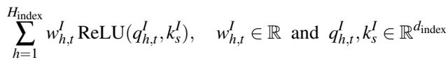

where H is the number of indexer heads, d is the indexer dimension, w<sup>I</sup><sub>h,t</sub>,q<sup>I</sup><sub>h,t</sub> are weights and query vector of indexer head h and token t, while k<sup>I</sup> is the key vector of token s shared by all indexer heads, respectively. Tokens with the top-k highest importance are selected for sparse MLA computation. To ensure indexer efficiency, H<sub>index</sub> and d<sub>index</sub> are set much smaller than their counterparts in MLA. For example, in DeepSeek-V3.2, the indexer uses H<sub>index</sub> = 64 and d<sub>index</sub> = 128, whereas MLA employs H = 128 and d<sub>c</sub> = 512. Moreover, DSA applies low-precision FP8 formats for q<sup>I</sup> and k<sup>I</sup> to further improve indexer efficiency, and the ReLU is also more efficient than the original softmax. To the best of our knowledge, DSA is currently the only training-time sparse attention method that has been validated on large scale models and realistic complex tasks [18], and it has since been adopted by other models such as the GLM-5 series [20].

## 2.3 KV Cache Offloading

While sparse attention reduces the computational cost of attention and the amount of KV data accessed, the total size of the KV cache still grows linearly with context length. To support extremely long contexts and large batch sizes under limited GPU HBM capacity, recent works propose offloading the KV cache to host DRAM and loading back, i.e., recall, only the selected KVs needed for sparse-attention computation [6, 26, 30, 31, 48, 62, 66, 72]. During inference, KV tensors for individual tokens or token blocks are dynamically evicted and recalled, enabling long-context execution within constrained GPU memory budgets. To reduce the substantial recall overhead caused by the limited bandwidth between host DRAM and GPU, InfiniGen [26] and FreeKV [30] propose to pre-select important tokens and prefetch their KVs, leveraging inter-layer and inter-step similarity, respectively.

Beyond dynamic token-level offloading, static request-level KV cache offloading has also been adopted in general LLM serving systems [8,19,39,59,64]. Unlike token-level schemes, request-level offloading loads the entire KV cache of a prior context into GPU HBM when a request arrives, and no eviction or recall occurs during inference. KVs are evicted only after the corresponding request completes. These systems focus on improving request-level hit rates to reduce TTFT.

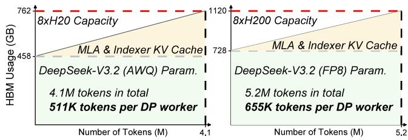  
Figure 1: GPU HBM usage of DeepSeek-V3.2 (AWQ) on 8×H20 (96GB) and DeepSeek-V3.2 (FP8) on 8×H200 (141GB). Space for MLA KV cache and indexer K cache increases linearly with the number of tokens.

## 2.4 Motivation and Challenges

Efficiently serving sparse attention models is becoming increasingly important with the emergence of native sparse attention LLMs. However, existing systems struggle to efficiently serve these models under long-context workloads, due to the following limitations and challenges.

Motivation 1: GPU HBM capacity becomes a primary bottleneck for hardware utilization and generation throughput when serving native sparse attention LLMs under long-context workloads. While sparse attention significantly reduces the computation and KV cache access costs, it increases the KV cache size due to storing additional K cache of the indexer, resulting in a steeper linear growth with the context length. Consequently, for long-context requests, GPU HBM capacity constrains the achievable batch size or request concurrency, directly limiting hardware utilization and generation throughput. This bottleneck is further exacerbated by the substantial HBM consumption of MoE parameters and the intrinsic inefficiencies of current sparse attention kernels.

Figure 1 shows the GPU HBM usage of the DeepSeek-V3.2 model as the number of tokens increases. The left plot presents the 4-bit quantized model using AWQ [29] on 8 NVIDIA H20 (96GB) GPUs, and the right plot shows the original FP8 model on 8 NVIDIA H200 (141GB) GPUs. Model parameters are sharded across GPUs using tensor parallelism (TP8). In both configurations, parameters consume more than 60% of the available GPU HBM, leaving room for only ∼4.1M and ∼5.2M tokens, respectively. Although these numbers appear sufficient, the KV cache of MLA cannot be partitioned via tensor parallelism. Instead, data parallelism (DP) is typically used for the MLA module; as a result, each worker can support only ∼511K tokens (AWQ) and ∼655K tokens. In practice, the space for KV cache is even smaller due to runtime overheads such as CUDA graph metadata. For DeepSeek-V3.2 (AWQ) running on 8×H20 GPUs with SGLang configured with TP8 and DP8 for MLA [43], we observe that each DP worker can accommodate at most 380K tokens. This implies that, for requests with ∼100K tokens, each DP worker can serve only 3–4 concurrent requests, severely limiting hardware utilization and generation throughput.

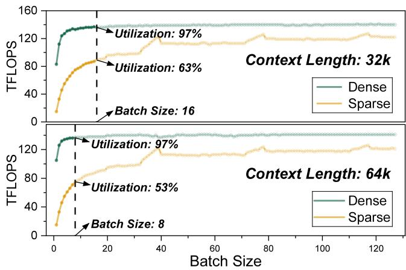  
Figure 2: Hardware utilization in TFLOPS of the sparse and dense FlashMLA kernels across different batch sizes.

Intrinsic inefficiencies in sparse attention kernels exacerbate the under-utilization problems. Figure 2 shows the hardware utilization (TFLOPS) of sparse and dense FlashMLA [27] decoding kernels on NVIDIA H20, across varying batch sizes and context lengths. Benefiting from high arithmetic density, dense MLA kernels can fully exploit the hardware even at small batch sizes, where a batch size of 8 is adequate for 64K contexts. However, due to non-continuous memory access of the sparse attention kernel, its utilization is much lower than the dense kernel, requiring much larger batch sizes to saturate the hardware. Therefore, the limitation from HBM capacity is more severe for sparse kernels and models. Considering the full DeepSeek-V3.2 (AWQ) model deployed on 8×H20 GPUs, the capacity of 511K tokens can accommodate up to 8 requests of 64K tokens, and the corresponding kernels suffer from under-utilization issues (only 53% utilization), as marked in Figure 2.

As described in Section 2.3, KV cache offloading has been widely studied for long-context inference with limited GPU HBM. However, none of them achieves efficient long-context serving for native sparse attention models in realistic scenarios. We summarize the characteristics of representative KV cache offloading systems in Table 1. First, static request-level offloading such as Strata requires the entire KV cache of requests to be stored in GPU HBM during inference, thus cannot reduce the runtime HBM usage or improve concurrency. While ArkVale, InfiniGen, FreeKV and CLO support dynamic token-level offloading, they are not serving systems and do not support techniques such as continuous batching [63] or multi-GPU inference.

While SparseServe supports serving scenarios with dynamic offloading, its cache management is inefficient and cannot support graph execution, which captures execution flow as a deterministic graph and eliminates kernel launch overhead. Graph execution is almost necessary in practical serving frameworks to eliminate significant kernel launch overhead at the decoding stage [54, 55]. The effect of graph execution is even more pronounced for native sparse attention LLMs with more operators and kernels. Figure 3(a) shows the normalized generation throughput for DeepSeek-V3.1 with dense attention and DeepSeek-V3.2 with sparse attention, using SGLang with graph execution (CUDA graph) and without (Eager). As shown, for DeepSeek-V3.1, graph execution improves throughput by 1.2×, while the improvement for DeepSeek-V3.2 is 1.5×.

Table 1: Comparison of representative KV cache offloading systems.  
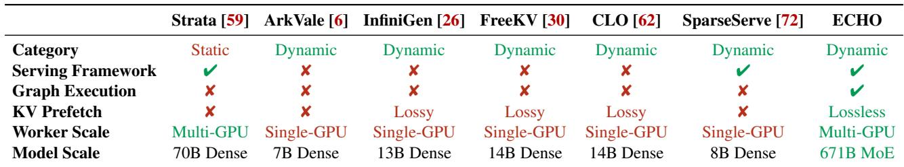

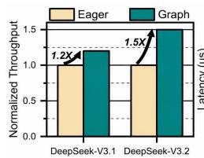  
(a)

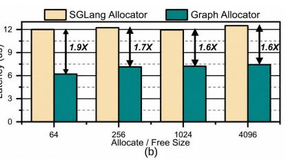  
Figure 3: (a) Normalized generation throughput of DeepSeek-V3.1 (dense attention) and DeepSeek-V3.2 (sparse attention) under eager and graph execution. (b) Allocation and free latency of the SGLang allocator and our graph-friendly allocator across different sizes.

Furthermore, for dynamic offloading where eviction and recall can happen at each decoding step and model layer, cache management can incur significant overhead, especially at the compute-light decoding stage. Graph execution can also reduce the management overhead, however, it requires the captured graph completely running on GPU, without any CPU control or synchronization. Cache managers and allocators in existing serving systems typically rely on dynamic tensor slicing or concatenation, which cannot be captured by graph execution and can introduce nontrivial overhead. To quantify this cost, we compare the allocation and free latency of the SGLang allocator with the graph-friendly allocator used by ECHO (Section 4), using a KV pool of 300K tokens. As shown in Figure 3(b), one allocation followed by one free takes about 12 µs with the SGLang allocator, whereas the graph-friendly allocator reduces this cost to 6–8 µs, achieving

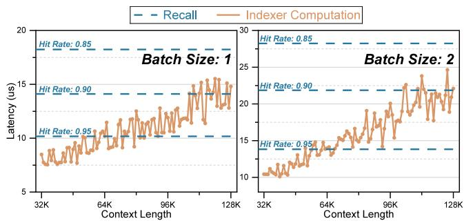  
Figure 4: Latency of indexer computation across different context lengths, and latency of recall across different hit rates, profiled using DeepSeek-V3.2 on NVIDIA H20 GPU.

1.6–1.9× lower latency. Moreover, the SGLang allocator relies on dynamic CPU-side control, which prevents the decoding path from being captured as a graph. Its impact therefore extends beyond the allocator’s own management overhead, eliminating the graph execution benefits for end-to-end decoding shown in Figure 3(a). An alternative is piecewise graph execution [55], which runs dynamic operations eagerly while capturing the static computation into graph pieces. However, since eviction and recall occur at every layer in each decoding step, the graph would break at all layers, reintroducing frequent CPU control and kernel launches at the compute-light decoding stage. In contrast, ECHO keeps the entire decoding path within a single full graph, eliminating these per-layer overheads. All existing offloading systems in Table 1 cannot support graph-friendly cache management, incurring significant management and kernel launch overhead.

In summary, building an efficient, practically usable dynamic KV cache offloading serving system demands graphfriendly cache management.

Motivation 2: Recall overhead can be substantial, while the indexer computation provides an opportunity for prefetching. Compared with GPU HBM bandwidth, host–GPU interconnect bandwidth is typically one to two orders of magnitude lower. Consequently, KV recall introduces significant overhead and degrades inference efficiency, as all selected tokens’ KV tensors must be transferred to the GPU before the subsequent attention computation. To mitigate this recall overhead, InfiniGen, FreeKV, and CLO propose pre-selection and prefetching of important tokens. However, these approaches rely on inter-layer or inter-step similarity to approximate attention scores, which introduces accuracy degradation on complex tasks due to imperfect prediction.

Prefetching without compromising accuracy appears infeasible due to the sequential dependence among indexer, recall, and attention. However, a key observation that enables breaking this sequential constraint is that indexer computation has complexity O(L<sup>2</sup>), whereas recall requires only O(Lk). Specifically for decoding, the indexer must access the K cache and compute index scores for all L preceding tokens, whereas recall requires loading the KV cache for at most k selected tokens, where k is a fixed constant (e.g., 2048) and L grows with context length. In practice, offloading systems maintain a cache for KV of selected tokens on GPU, thus the actual number of recalled tokens is typically less than k.

We present the latency of indexer computation across varying context lengths and the latency of MLA KV recall across varying hit rates during decoding in Figure 4, profiled on NVIDIA H20 GPU which connects with the host via 64GB/s PCIe Gen5. As the context length and hit rate increase, the latency of indexer computation can eventually exceed that of recall, for example, when the context approaches 100K tokens and the hit rate reaches 90%. Recall overhead can be further reduced when using higher-bandwidth interconnects such as NVLink or SXM, which provide 600–900 GB/s of throughput [35]. Because indexer computation and recall contend for distinct hardware resources (GPU compute versus PCIe or other interconnect bandwidth), the recall latency can, in principle, be partially or even fully overlapped through prefetching performed concurrently with indexer computation.

However, similar to other sparse attention methods, DSA selects tokens with top-k highest scores, which can only be determined after computing the index scores for all previous tokens. Consequently, the recall can only be launched after the indexer computation.

To summarize, the second challenge is that the top-k selection hinders prefetching during indexer computation, leaving PCIe bandwidth idle and preventing the recall latency from being overlapped with indexing.

To overcome all these challenges, we present ECHO, an efficient LLM serving system with host-side KV cache offloading. To resolve Challenge 1, ECHO incorporates a graphfriendly cache manager that uses tensor-based metadata and parallel in-graph update operations, enabling graph execution while minimizing cache management overhead. To re solve Challenge 2, ECHO introduces lossless intra-query and inter-query prefetching, leveraging numerical predictability of index scores and deeply fused pipelining kernels to enable prefetching and overlap the recall overhead.

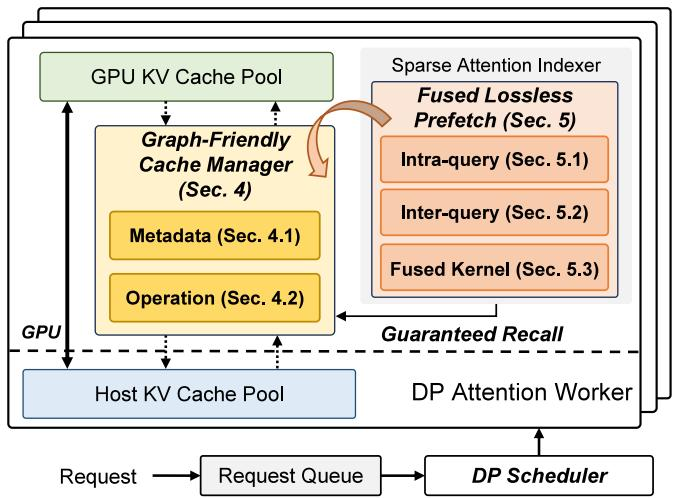  
Figure 5: Overview of the ECHO design.

## 3 Overview of ECHO

The overview of ECHO is presented in Figure 5. As shown, each DP attention worker maintains KV cache pools on GPU and host memory, where the host pool can be much larger than the GPU pool to support more requests and higher concurrency. The DP scheduler routes requests to the selected DP worker. During inference, the K cache of sparse attention indexer is persistently stored in the GPU pool, while the generated MLA KV cache is stored in both the host and GPU pools, where the GPU pool serves as a cache for selected tokens in sparse attention.

The graph-friendly cache manager maintains metadata for the status of the host and GPU pools, which is updated upon recall or eviction. All metadata is on GPU and all update operations can be captured and replayed for graph execution in decoding, executing completely within the GPU graph and minimizing the management overhead. During indexer computation, ECHO prefetches a subset of important tokens, with prefetching fused into the indexer kernel and softwarepipelined to hide its overhead. After the indexer computation, a guaranteed recall is launched for the selected tokens that are not yet in the GPU pool. The token eviction priority is then adjusted based on the index scores from the indexer.

Prefill-Decoding (PD) Disaggregation PD disaggregation is a widely applied deployment paradigm [38, 70] that eliminates interference between prefill and decoding, yielding better SLO attainment and optimization flexibility. ECHO is a general system that supports both PD disaggregation and mixed execution. While mixing prefill and decoding requests achieves better throughput in some scenarios [1, 56], we suggest deploying ECHO and other dynamic offloading systems with PD disaggregation for the following reasons. First, for prefill, the number of selected tokens in sparse attention can be substantial, as the selection of each token is independent and the total selection is the union set of all prefill tokens. In the worst cases, a prefill request accesses KV cache of all previous tokens, which requires a huge number of tokens in the GPU pool and evicts lots of tokens from other requests, significantly degrading the overall throughput. Second, a substantial amount of KV cache needs to be transferred to the host memory during prefill. While ideally the PCIe bandwidths between host-to-GPU and GPU-to-host are independent, we observed that the transfer during prefill interferes with recall, degrading efficiency.

In the PD disaggregation setting, ECHO disables offloading on prefill instances, because prefill has limited concurrency and utilization issues as long as GPU HBM can accommodate a single long-context request (up to 128K tokens for DeepSeek-V3.2). On decoding instances, ECHO stores the KV cache transferred from prefill instances in host memory, and then launches decoding to prefetch and recall KV cache of selected tokens. This ensures that only KV cache selected during decoding is transferred to GPU, avoiding unused KV loads and maximizing HBM utilization.

## 4 Graph-Friendly Cache Manager

## 4.1 Management Metadata

Besides common metadata such as block tables in existing systems [25], ECHO maintains additional status metadata of KV cache pools for efficient dynamic eviction and recall. All metadata is stored as integer tensors on GPUs and updated in parallel to minimize overhead. Specifically, the metadata includes the following tensors:

• GPUTokenFree: A bitmap indicating whether each slot in the GPU pool is currently free.

• GPUTokenPriority: Per-slot eviction priority for the GPU pool. Tokens with lower priorities are evicted first; free slots are initialized with priority −1.

• GPUIndicesBuffer: A buffer holding GPU pool indices produced by the allocate and free operations.

• GPUTokenToHost: A mapping from each GPU pool slot to its corresponding host pool index, initialized to ∞ to denote an empty slot.

• HostTokenToGPU: A mapping from each host pool slot to its corresponding GPU pool index, initialized to ∞ to indicate the token is not currently cached on GPU.

All these metadata tensors are statically pre-allocated and fixed-length because graph execution does not allow dynamically created or variable-length tensors.

In existing systems, the KV cache pool is managed in a per-model manner, where KV slots are allocated or freed consistently across all model layers. However, dynamic eviction and recall in sparse attention produce divergent cache states across layers, as each layer selects different tokens. Therefore, ECHO manages the GPU pool per-layer, with metadata maintained independently for each layer. The host pool remains per-model, as it is unaffected by dynamic eviction and recall.

Storage Overhead of Metadata Let N and N denote the number of tokens in the host and GPU pools, respectively. The length of HostTokenToGPU is N<sub>H</sub>, and the lengths of all other tensors are N . GPUTokenFree stores boolean elements and other tensors store 32-bit integers. Therefore, the storage cost of all metadata is 4N + 13N bytes. Given N = 2M and N<sub>G</sub> = 200K in our setting, the metadata size is about 10MB per layer, totaling 610MB for DeepSeek-V3.2.

## 4.2 Parallel In-Graph Update Operations

The cache manager updates the status of KV cache pools and metadata using three basic operations: allocate, free, and recall. Compared to the per-model management, which requires only one update per model forward pass, the per-layer management requires updating for each model layer. To minimize management costs, ECHO introduces parallel in-graph update operations. All operations are processed efficiently and entirely in parallel on GPU, and are captured and executed in the graph during decoding, eliminating host interference and minimizing overhead.

Allocate The allocate operation is used to allocate slots from the GPU pool, which is required when (i) accommodating newly-generated KV cache and (ii) preparing slots for tokens to be recalled. It first calls free to ensure there are enough free slots. Allocation in existing systems introduces variable-length tensors through dynamic tensor slicing [69], making it incompatible with graph execution. ECHO designs an efficient, parallel allocation operation, addressing this limitation. As shown in Figure 6, the GPU threads read the GPUTokenFree in parallel, and threads with free slots launch atomicAdd to a global counter. The return value of atomicAdd is the old value of the counter, determining which threads should allocate their slots. For the example in Figure 6, slots for thread 1 and thread 5 are allocated. Correspondingly, the metadata tensors are updated by: (i) incrementing the priorities of the newly allocated tokens, and (ii) establishing a mutual mapping between the GPU slots (1,4) and the host slots (3, 4). Finally, the indices of the allocated GPU slots are output to a buffer for later use. The allocate operation is fully parallel and processed entirely on the GPU, achieving compatibility with graph execution by avoiding the introduction of variable-length tensors.

Free The free operation releases GPU pool slots when the available space is not adequate, providing room for: (i) newlygenerated KV cache, and (ii) the KV cache of tokens being recalled from the host pool. Tokens with the lowest priorities are evicted first, forming an LRU-like eviction policy, and eviction requires only updating the metadata. Notably, there is no need to transfer KV cache to the host pool during eviction, because the KV cache of all tokens has already been backed up to the host pool during generation.

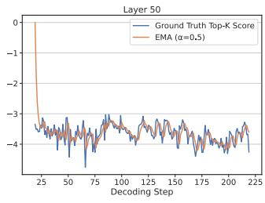

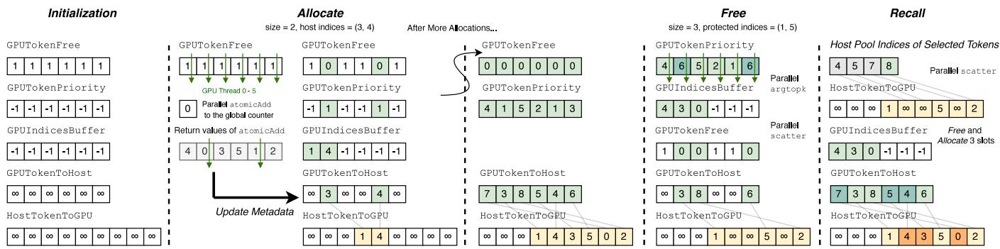  
Figure 6: The metadata and update operations in the graph-friendly cache manager of ECHO.

Similar to allocation, free in existing systems relies on dynamic tensor concatenation, which is inefficient and not compatible with graph execution. To overcome this limitation, ECHO designs an efficient parallel free operation. As shown in Figure 6, it first increments the priorities of protected GPU slots to avoid releasing those slots. Specifically, the selected tokens of the sparse indexer are protected to prevent them from being evicted. Following the protection phase, a parallel argtopk operation is launched to obtain the indices of the GPU slots with the lowest priorities. The result indices are output to the GPUIndicesBuffer, thereby avoiding the creation of dynamic variable-length tensors that conflict with graph execution. A parallel scatter is then used to update GPUTokenFree and GPUTokenToHost using the output indices. HostTokenToGPU is also updated accordingly, where ∞ indicates that the corresponding token in the host pool is not present in the GPU pool. Tokens in the host pool are only freed upon request completion, which is managed by the per-model block tables.

Recall As shown in Figure 6, the cache manager obtains the host pool indices of the selected tokens from the sparse attention indexer, and uses a parallel scatter on HostTokenToGPU to identify which tokens are missing from the GPU pool. It then calls free and allocate to prepare GPU pool slots for the recalled tokens. Using the allocated GPU slot indices in GPUIndicesBuffer and the host pool indices of the missing tokens, the cache manager (i) updates GPUTokenToHost and HostTokenToGPU accordingly, and (ii) transfers the corresponding KV cache from the host pool to the GPU pool. The KV transfer is performed by accessing host memory directly in GPU kernels via unified virtual memory [59,72], which eliminates host-side interference, improves PCIe bandwidth utilization, and preserves graph execution.

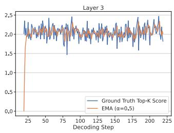

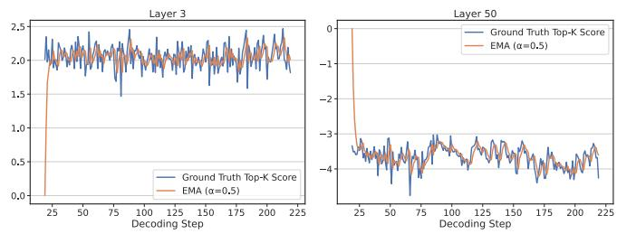  
Figure 7: The 2048-th highest index scores in layers 3 and 50 of DeepSeek-V3.2 and prediction using EMA with α = 0.5 during decoding.

## 4.3 Implementation

The implementation of ECHO is based on SGLang [69]. The cache manager utilizes PyTorch tensors [4] to maintain metadata, and the efficient parallel update operations are implemented with custom Triton [52] kernels. While management overhead can be further reduced through specialized CUDA kernels on NVIDIA GPUs, the Triton implementation offers better compatibility, enabling efficient dynamic offloading across a wider range of hardware backends.

## 5 Fused Lossless Prefetching

## 5.1 Intra-query Prefetching for Decoding

As discussed in Section 2.4, the top-k selection hinders prefetching during indexer computation. In contrast, top-p selection, which has been well studied in training-free sparse attention, allows a token to be selected as soon as its score exceeds a threshold p [28, 71]. Under a top-p scheme, during indexer computation, any token whose score surpasses p can be recalled immediately, enabling intra-query prefetching. Therefore, prefetching becomes feasible if the top-k selection can be reformulated to top-p selection.

A key numerical property we identify is that the k-th highest score at the current decoding step exhibits strong predictability from historical indexer scores. In Figure 7, we present the k-th (k = 2048) highest score of layers 3 and 50 in DeepSeek

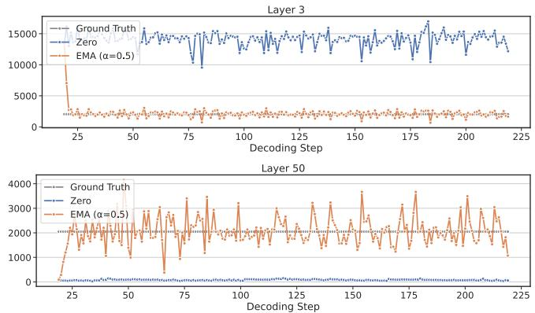  
Figure 8: The number of candidate tokens for prefetching in layers 3 and 50 of DeepSeek-V3.2. The blue line uses 0 as the prediction, while the yellow line uses EMA with α = 0.5.

V3.2 during decoding, using a 20K-token request from the ShareGPT dataset [42]. We predict the k-th highest score using exponential moving average (EMA). Specifically, let s<sub>t</sub> denote the k-th highest score at step t. The k-th highest score at step t + 1 is predicted with sˆ<sub>t+1</sub> = α · sˆ<sub>t</sub> + (1 − α) · s<sub>t</sub> , where α ∈ (0, 1) is the smoothing factor. As shown in Figure 7, EMA can predict the k-th highest score of the next step accurately. Therefore, leveraging this prediction, ECHO can prefetch tokens whose scores exceed the predicted threshold during indexer computation, enabling efficient intra-query prefetching without violating top-k semantics.

In Figure 8, we present the number of tokens whose scores are larger than the predicted value, i.e., the candidate tokens for prefetching. As shown, the number of candidate tokens is close to k = 2048 at most decoding steps, indicating the effectiveness of our EMA prediction.

At some decoding steps, the number of candidate tokens exceeds 2048 as the predicted threshold may underestimate the true 2048-th highest score. Since prefetching too many tokens can slow down indexer computation, we set an upper bound on the number of prefetched tokens and enforce it using a global counter, as detailed in Section 5.3.

## 5.2 Inter-query Prefetching for Prefill

Compared to decoding, prefill natively offers the opportunity for inter-query prefetching. During prefill, the indexer partitions the input Q into multiple blocks and processes them sequentially. Since prefill sequences are typically long and span many Q blocks, once the scores for Q block i are computed, ECHO can prefetch the selected tokens for Q block i concurrently with the score computation for Q block i+1.

However, we find that obtaining the exact top-k for selec tion during indexer computation can significantly degrade indexer performance. Therefore, ECHO uses an approximate top-k to obtain a subset of top-k tokens for prefetching. Specifically, our approximate top-k builds on the radix select top-k algorithm [46], which constructs histograms of scores and filters higher scores in multiple rounds. Instead of applying all the filter rounds, we only build a coarse histogram and filter by one round to get a subset of top-k tokens with highest scores. The scores are mapped to the histogram with 256 bins based on their most significant 8 bits, and tokens within the largest bins are candidates for prefetching. Denote the size of bins as S<sub>0</sub>, S<sub>1</sub>, ..., S<sub>255</sub>. Selecting the highest j bins implies that S = S<sub>255</sub>− <sub>j+1</sub> + ... + S<sub>255</sub> ≤ k and S<sub>255</sub>− <sub>j</sub> + ... + S<sub>255</sub> > k. The bin 255 − j is referred to as the threshold bin, and its size determines the lower bound of the number of selected tokens, since S = S<sub>255</sub>− <sub>j+1</sub> + ... + S<sub>255</sub> > k − S<sub>255</sub>− <sub>j</sub>.

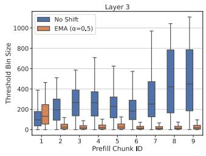

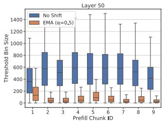  
Figure 9: Threshold bin sizes of prefill chunks when computing approximate top-k with and without score shifts, profiled using DeepSeek-V3.2. The boxes and whiskers show the distribution of threshold bin sizes for tokens in the corresponding prefill chunk.

Therefore, to approximate top-k as accurately as possible, we need to minimize the size of the threshold bin. Similar to intra-query prefetching, we use the EMA of the k-th highest score from the ending tokens of the previous prefill chunk to predict the threshold for the current chunk. During histogram construction, scores are shifted by subtracting the predicted kth highest score to minimize the size of the threshold bin. As shown in Figure 9, shifting scores with the EMA prediction significantly reduces the size of the threshold bin, enhancing the accuracy of the top-k approximation.

## 5.3 Fused Prefetching Kernels with Pipelining

To hide overhead and benefit from prefetching, ECHO fuses prefetching operations into indexer computation kernels, leveraging warp specialization and software pipelining.

Warp Specialization Warp specialization is an advanced kernel optimization technique for modern GPUs [5]. Traditionally, GPUs follow the Single-Instruction Multiple-Thread (SIMT) programming model, where all threads within a warp execute the same instructions. However, modern GPUs increasingly feature specialized hardware units such as tensor cores and tensor memory accelerators (TMAs), which the SIMT model alone cannot fully exploit. Warp specialization addresses this by assigning distinct roles to different warp groups within a Cooperative Thread Array (CTA) [3]. For example, some warps load data from global memory via TMA, while others focus on computation with tensor cores.

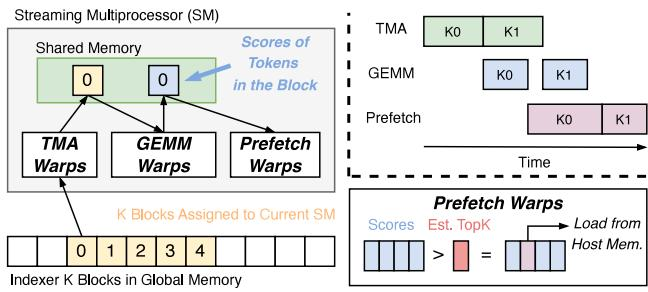  
Figure 10: Data flow and timeline of the fused intra-query prefetching kernel for decoding.

Software Pipeline To further improve hardware utilization, asynchronous barriers allow the execution of different warp groups to overlap, forming a multi-stage software pipeline [5]. Software pipelining has been widely applied to overlap matrix multiplication with softmax or KV cache loading in attention computation [45, 61].

The fused prefetching kernels in ECHO are built based on the indexer computation kernels from DeepGEMM [12]. Specifically, the original kernel employs a two-stage pipeline, with producer TMA warps loading data from the global memory to shared memory, and consumer GEMM warps comput ing index scores using data in shared memory.

Figure 10 illustrates the fused intra-query prefetching kernel for decoding. Since the number of query tokens can be small during decoding, the indexer computation is partitioned by splitting the K cache of indexer. Each streaming multiprocessor (SM) computes index scores between a query vector and a part of indexer K cache. The query vector is persistent in shared memory, while the TMA warps iteratively load indexer K blocks from global memory to shared memory. The GEMM warps consume the K blocks, compute index scores and output to the shared memory. The scores are then consumed by the prefetch warps, which compare them with the estimated top-k score and identify tokens that can be prefetched. As shown, the kernel employs a three-stage pipeline of TMA, GEMM and prefetch. To prevent prefetching from blocking indexer computation, we allocate more pipeline stages to prefetching and use a global counter to control the number of prefetched tokens. The maximum number is proportional to context length, because indexer computation time is also proportional to context length.

The fused inter-query prefetching kernel for prefill is illustrated in Figure 11. Different from decoding, the indexer computation for prefill is partitioned by splitting on query. Each SM computes index scores between assigned Q blocks and all the corresponding K blocks. The TMA warps load Q blocks in the outer loop and K blocks in the inner loop, respectively. The GEMM warps output score blocks to shared memory, which are consumed by the prefetch warps. Scores are shifted using the estimated top-k scores as offsets, and scanned to build a histogram. Once computation of the current Q block is finished, the prefetch warps consult the histogram and load tokens with scores above the threshold. Meanwhile, TMA and GEMM warps continue computing scores for the next Q block, forming a software pipeline that overlaps computation and prefetching.

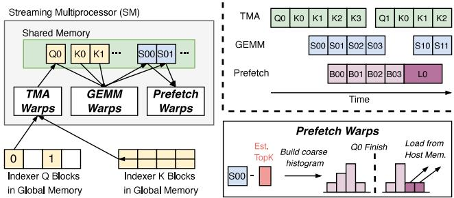  
Figure 11: Data flow and timeline of the fused inter-query prefetching kernel for prefill.

## 6 Evaluation

## 6.1 Setup

Testbed All experiments are conducted on a single node equipped with 8 NVIDIA H20 (96GB) GPUs connected to the host via 64GB/s PCIe Gen5. The node features a 224-core Intel Xeon Platinum 8480+ CPU with 1.5TB DRAM.

Baselines and Configurations We compare ECHO with the state-of-the-art LLM serving systems, including vLLM (v0.11.1) and SGLang (v0.5.4), with CUDA 12.9 and Py-Torch 2.8. Both ECHO and SGLang are deployed using data parallelism (DP8) for attention and tensor parallelism (TP8) for MoE. vLLM is deployed using TP8 for both attention and MoE because vLLM does not support the DP+TP combination, and using expert parallelism (EP) for MoE incurs substantial GPU HBM costs and fails to launch on our 8×H20 node. We set the size of chunked prefill to 2048 for all the frameworks. CUDA graph during decoding is enabled for all the frameworks. The host KV cache pool in ECHO is set to 1.8M tokens, consuming about 1000GB of host memory.

Workloads Since the original FP8 DeepSeek-V3.2 cannot fit in the HBM of 8×H20, we evaluate using the 4-bit quantized DeepSeek-V3.2-Exp model [40], with the indexer and layers 0, 1, 2 and 60 left unquantized to preserve accuracy. For the long-context workload, we sample a subset of 318 requests with 80K–100K tokens from InfiniteBench [67], amounting to about 26M input tokens in total. For the short-context workload, we sample requests from the ShareGPT [42] dataset.

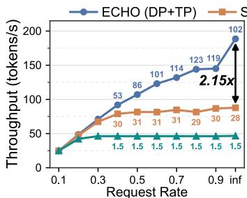  
(a) Limit output to 256 tokens

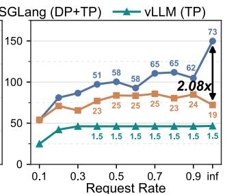  
(b) No output length limitation

Figure 12: Generation throughput on InfiniteBench under varying request rates on 8×H20, with each system configured to use all available GPU HBM. Annotated numbers denote the effective batch size.  
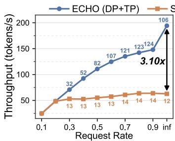  
(a) 200K tokens

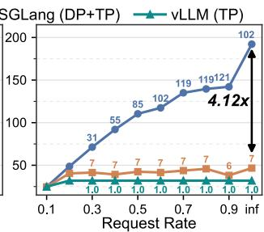  
(b) 110K tokens  
Figure 13: Generation throughput on InfiniteBench under constrained GPU HBM capacity, with output length limited to 256 tokens. Annotated numbers denote effective batch size.

## 6.2 Token Generation Throughput

In this section, we evaluate the token generation throughput in a PD disaggregated setting. The 8×H20 node is launched as a decoding instance, and we pre-compute the KV cache of requests, which can be directly loaded by the decoding instance during inference. SGLang requires a pseudo prefill instance to work properly, incurring some GPU memory overhead.

Maximum Throughput We first evaluate the maximum throughput that can be achieved on the 8×H20 node by allocating all available GPU HBM. We set a fixed output length of 256 tokens for all requests to reduce variance from long-tail generations and ensure that all DP workers are saturated. As shown in Figure 12(a), ECHO achieves comparable generation throughput with SGLang and vLLM at low request rates, and scales more effectively as request rates increase. At Inf request rate, where all requests are sent to the serving systems at the same time, ECHO achieves up to 2.15× and 4.1× throughput improvements against SGLang and vLLM, respectively. The throughput improvement achieved by ECHO is enabled by offloading the KV cache to the host pool, which yields larger effective batch sizes, i.e., the average number of active requests processed per decoding step, and higher hardware utilization. On the 8×H20 node, SGLang’s 325K-token GPU KV pool supports only 3 to 4 concurrent InfiniteBench requests per GPU, yielding an effective batch size of about 30 across DP workers. vLLM’s TP deployment further limits its total KV pool across 8 GPUs to 180K tokens due to duplicated MLA KV cache, reducing its effective batch size to about 1.5. However, vLLM partly offsets this limitation because TP deployment lowers per-step latency, so its throughput does not decrease in proportion to its effective batch size. In contrast, ECHO’s host KV cache pool can accommodate 1.8M tokens and sustains much larger effective batch sizes.

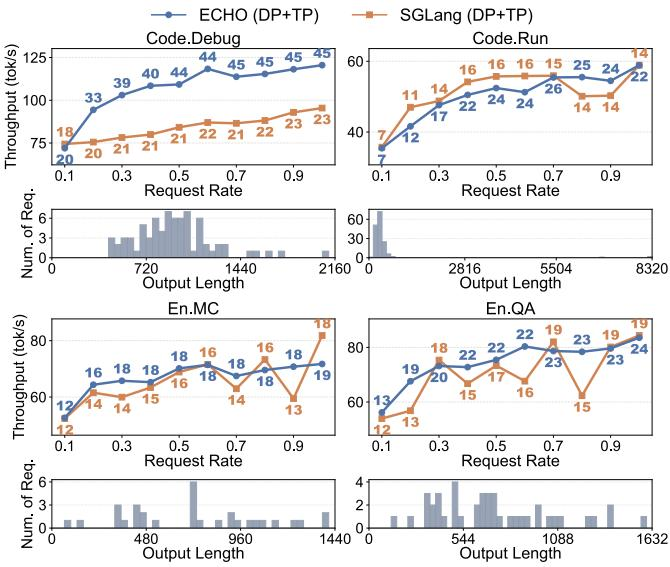  
Figure 14: Per-task generation throughput on InfiniteBench without capping output length. The histograms below each task show the corresponding output-length distribution.

Throughput without Output Length Limit Figure 12(b) reports generation throughput without imposing a fixed output-length cap. Compared with Figure 12(a), longer generations improve DP worker utilization at low request rates, increasing the throughput of both ECHO and SGLang. At higher request rates, however, long-tail generations introduce load imbalance across DP workers, leaving some workers idle and reducing the throughput of both systems. In contrast, vLLM uses pure TP and is not affected by DP load imbalance. Moreover, for long-tail requests, end-to-end throughput is dominated by inter-token latency, thus the higher ITL of ECHO narrows its throughput advantage over SGLang.

Throughput with Constrained GPU HBM Usage We further evaluate the generation throughput when the constraints on GPU HBM capacity are more severe, which can arise from larger MoE parameters. We set a fixed output length of 256 tokens to measure maximum throughput and compare with Figure 12(a). With a 200K-token GPU KV cache pool for both ECHO and SGLang, ECHO’s throughput advantage increases to 3.10× at the Inf request rate (Figure 13(a)). When the GPU pool is further limited to 110K tokens for all three systems, SGLang and vLLM degrade substantially since their effective batch sizes are bounded by GPU pool size. In contrast, ECHO maintains high throughput by relying on host KV cache pool for a larger effective batch size, achieving up to 4.12× higher throughput than SGLang (Figure 13(b)). ECHO also slightly improves under constrained GPU HBM due to lower management overhead from the smaller GPU pool.

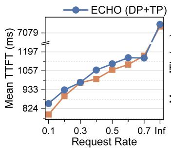

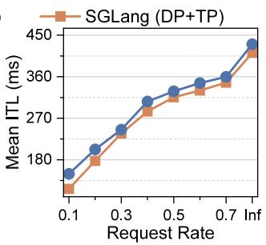

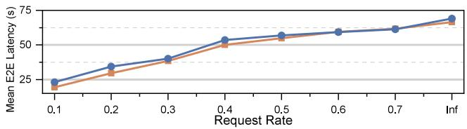  
Figure 15: Mean TTFT, ITL, and end-to-end latency of ECHO and SGLang on the ShareGPT dataset.

Per-task Throughput of InfiniteBench We further evaluate ECHO on individual InfiniteBench tasks without output length limit. As shown in Figure 14, ECHO improves average output throughput by 27.07% on Code.Debug, 2.83% on En.MC, and 7.11% on En.QA, while slightly underperforming SGLang by 1.74% on Code.Run. The gains are less consistent than in Figure 12 for two reasons. First, the pertask workloads contain relatively few requests (75, 160, 31, and 42, respectively), which limits the available concurrency and prevents them from saturating all DP workers. Second, as shown by the histograms, per-task output lengths are more skewed, causing a few long-tail requests to dominate task runtime and allowing SGLang’s lower inter-token latency to offset ECHO’s higher effective batch size.

## 6.3 Inference Latency

In this section, we evaluate inference latency in a mixed PD setting. We randomly sample 100 requests from the ShareGPT [42] dataset as a short-context, light-load workload.

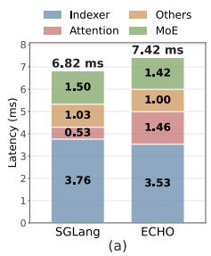

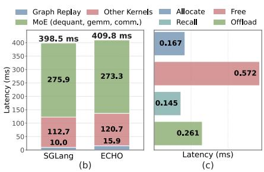  
Figure 16: Latency breakdown of ECHO and SGLang. (a) Perlayer prefill latency. (b) All-layer decoding latency, decomposed into graph replay and kernel execution. (c) All-layer offloading overhead of ECHO in one decoding step, including allocate, free, recall, and KV cache offload.

The mean TTFT, ITL, and end-to-end latency of ECHO and SGLang are presented in Figure 15. Overall, ECHO maintains latency close to SGLang while enabling higher long-context throughput. The TTFT changes by at most +7.9% across request rates, mainly due to the overhead of backing up the generated KV cache to host memory during prefill. The ITL overhead is more visible because decoding performs per-layer cache management and KV recall, ranging from +2.7% to +27.8%. This overhead is largest under light load because each decoding step processes fewer concurrent requests, leaving less computation to amortize the fixed cache-management and recall costs; it drops to 2.7–7.7% for request rates of 0.3 and above. As a result, the end-to-end latency overhead is 15.9–19.2% at low request rates of 0.1–0.2, but decreases to at most 7.2% for request rates of 0.3 and above, and remains below 4.6% from 0.5 to Inf. The results suggest that although ECHO minimizes the overhead of dynamic KV cache offload ing, it still introduces a latency tradeoff and is most beneficial for throughput-oriented long-context serving.

Latency Breakdown Figure 16 presents a detailed latency breakdown of ECHO on the ShareGPT workload under the Inf request rate. For prefill, ECHO increases per-layer latency from 6.82 ms to 7.42 ms, an 8.8% increase. The increase mainly appears in the attention component, reflecting the KV cache management and offload overhead introduced by ECHO. For decode, Figure 16(b) reports the all-layer latency, which ECHO increases by 2.8% over SGLang. We decompose the latency into graph replay, MoE and other kernels. MoE accounts for about 70% of the all-layer latency, including dequantization, GEMM, and AllReduce communication. ECHO adds 5.9 ms to graph replay, mainly due to CPU-side launch and metadata overhead. The offloading-specific overhead remains small, as shown in Figure 16(c), where allocation, free, recall, and KV offload take 0.167 ms, 0.572 ms, 0.145 ms, and 0.261 ms across all layers, respectively, totaling 1.15 ms, or only 0.28% of the all-layer decoding latency. Specifically, allocation and free operate on the recalled KV slots, averaging 37 tokens per decoding step, while KV offload writes one newly generated token per active request, averaging 13 tokens per DP worker. These results show that graph-friendly cache management keeps dynamic offloading overhead modest, while high GPU-pool hit rates further reduce recall traffic. The remaining 6.8 ms increase mainly comes from ReduceScatter synchronization across DP workers, due to ECHO’s larger concurrency and communication jitter.

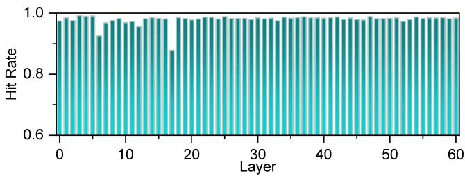  
Figure 17: Per-layer GPU pool hit rates of DeepSeek-V3.2 (AWQ) on InfiniteBench, averaged across decoding steps.

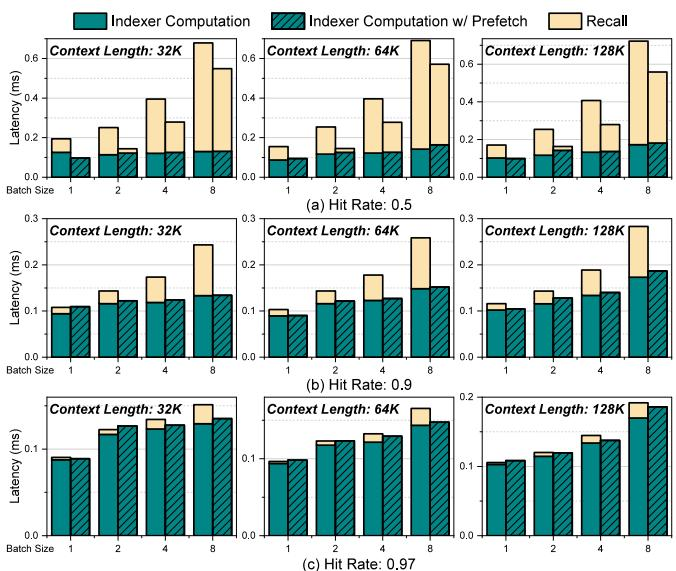  
Figure 18: Latency comparison between disabling and enabling intra-query prefetching.

## 6.4 In-Depth Performance Analysis

## 6.4.1 Hit Rates of the GPU Pool

We collect and dump the hit rates of selected tokens in the GPU pool of each layer when serving the InfiniteBench in Section 6.2, and present the hit rates averaged across decoding steps in Figure 17. As shown, the hit rates for most layers are consistently high, ranging from 0.97 to 0.99. The hit rates of layer 12 and layer 17 are at 0.95 and 0.88, respectively. The high hit rates are consistent with the observation of vertical lines in the attention pattern [23], or similar token selection of adjacent query tokens [30].

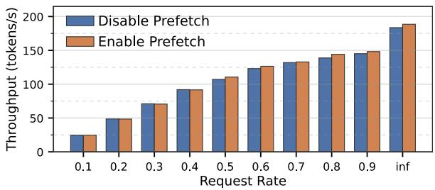  
Figure 19: End-to-end generation throughput comparison between disabling and enabling intra-query prefetching.

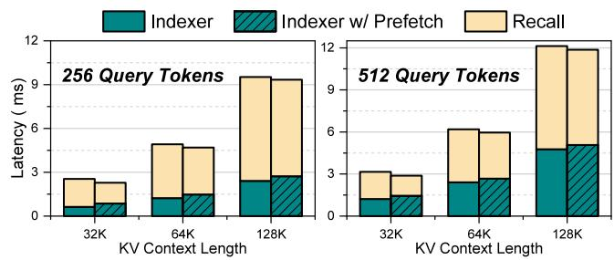  
Figure 20: Latency comparison between disabling and enabling inter-query prefetching.

## 6.4.2 Intra-query Prefetching for Decoding

In Figure 18, we present the latency of indexer computation with and without intra-query prefetching across different context lengths, batch sizes and GPU pool hit rates, along with the latency of their corresponding guaranteed recall. As shown, intra-query prefetching achieves significant total latency reduction for hit rates of 0.5 and 0.9, up to 1.29× and 1.51×, respectively. Specifically, the recall overhead can be almost completely overlapped for hit rate 0.9. The improvements for hit rate 0.97 are modest given that most of selected tokens are already available in the GPU pool and do not require recall.

We further evaluate its end-to-end impact under the same setting as Sec. 6.2. As shown in Figure 19, enabling intraquery prefetching improves generation throughput by up to 4%. This gain is smaller than the microbenchmark improvement since the GPU pool hit rate remains high on InfiniteBench, thus only a small fraction of selected tokens need to be recalled and can benefit from prefetching. In addition, as demonstrated in Figure 16(c), MoE layers account for a large share of end-to-end decoding time, limiting the impact of reducing recall overhead. Using expert parallelism or a more efficient MoE kernel would reduce this bottleneck and make the end-to-end benefit of prefetching more pronounced.

## 6.4.3 Inter-query Prefetching for Prefill

In Figure 20, we present the latency of indexer computation with and without inter-query prefetching across different KV context lengths and batch sizes, using 256 and 512 query tokens, respectively. Compared to decoding, the recall overhead during prefill is much higher because the selection for each query token is independent, resulting in up to number of query tokens × k tokens being selected in total. Consequently, the benefits of prefetching are limited, yielding at most a 1.1× improvement. We do not include a separate end-to-end throughput ablation for inter-query prefetching, since the PD-disaggregated evaluation in Sec. 6.2 uses precomputed KV cache. Moreover, the microbenchmark suggests that its end-to-end gain would be modest under our conservative assumptions. However, this result underestimates the potential of inter-query prefetching, as our evaluation assumes that the top-k tokens selected by different query tokens are randomly distributed, whereas prior work has observed substantial overlap across query tokens [30]. Exploiting this overlap could reduce redundant recall traffic and further improve inter-query prefetching, which we leave to future work.

## 7 Discussion

Generalizability to Other Sparse Attention Since DSA is currently the only publicly available native sparse attention validated on large-scale models, ECHO mainly targets DSA and MLA. Nonetheless, the graph-friendly cache manager of ECHO is compatible with both training-time and training-free sparse attention, since it addresses the general system problem of managing dynamic sparsity patterns where selected KV entries must be evicted and recalled during decoding. It is naturally suited to token-wise sparse attention such as DSA, and can also support block-wise sparse attention by changing the metadata granularity and extending the kernels with the KV-head dimension used in GQA-based models. Overall, the cache manager of ECHO should be viewed as a system substrate for dynamic sparse-attention serving rather than a design tied only to DSA, although DSA remains the most compelling target today because of its native model support and strong long-context accuracy. In contrast, intra-query and inter-query prefetching rely on properties of the DSA indexer, including a selection boundary that is numerically predictable across decoding steps and a prefill procedure that exposes a sequence of query blocks whose candidate KV entries can be identified before the exact selection finishes. Other sparse attention mechanisms can benefit from the same prefetching framework when they expose similar early-selection signals, such as threshold-based selection or multi-stage top-k selection. This also suggests an opportunity to co-design trainingtime or training-free sparse attention with prefetch-friendly selection mechanisms, which we leave to future work.

Throughput-Latency Tradeoff and Practical Deployment As discussed in Section 6.3, offloading introduces latency overhead from cache management and data transfer, making

ECHO most attractive for throughput-oriented long-context serving. Recent offloading systems make a throughput-first tradeoff, using dual-batch execution to overlap offload overhead with computation, but may further increase the latency [7]. Although this makes offloading a throughput-first technique today, we believe its additional latency can be substantially narrowed. Specifically, cache-management overhead can be reduced through more dedicated kernel optimizations [44], while transfer overhead will benefit from faster host-GPU interconnects. For example, NVLink-C2C provides 900GB/s on Grace-based systems and is expected to reach 1.8TB/s on Vera-based systems [36]. These trends suggest that offloading can remain practical even for latency-sensitive deployments, while its main advantage today is still in improving throughput under long-context pressure.

Applicability when KV Cache is More Plentiful Although recent models reduce per-token KV-cache cost through quantization and hybrid attention [14,37,51], and newer accelerators provide 200GB or more of HBM, we believe KV-cache capacity will remain an important bottleneck and that offloading will continue to matter. On one hand, long-context inference is becoming increasingly common in agentic workloads, where context lengths of 1M tokens are already entering mainstream use, and the demand for even longer context is likely to continue growing. On the other hand, model parameters, especially MoE parameters, continue to scale toward and beyond the trillion-parameter regime, leaving less HBM available for KV cache under a fixed hardware budget. As a result, improvements in KV cache efficiency and HBM capacity are likely to be offset by simultaneous growth in context length and model size, making efficient offloading and hierarchical KV cache management a persistent system concern.

## 8 Conclusion

ECHO is a serving system for native sparse attention models under long-context workloads, built around efficient KV cache offloading. ECHO incorporates a graph-friendly cache manager that minimizes management overhead. To reduce recall overhead, ECHO introduces lossless intra-query prefetching based on the numerical predictability of index scores, as well as inter-query prefetching based on the sequential processing of queries. Experimental results demonstrate that ECHO delivers up to 2.1× generation throughput improvement over the state-of-the-art LLM serving system SGLang on DeepSeek-V3.2 under long-context workloads, breaking the GPU memory capacity bottleneck.

## Acknowledgments

This work is sponsored by the National Natural Science Foundation of China (62472273, 62232015).

## References

[1] Amey Agrawal, Nitin Kedia, Ashish Panwar, Jayashree Mohan, Nipun Kwatra, Bhargav Gulavani, Alexey Tumanov, and Ramachandran Ramjee. Taming Throughput-Latency tradeoff in LLM inference with Sarathi-Serve. In 18th USENIX Symposium on Operating Systems Design and Implementation (OSDI 24), pages 117–134, Santa Clara, CA, July 2024. USENIX Association.

[2] Joshua Ainslie, James Lee-Thorp, Michiel de Jong, Yury Zemlyanskiy, Federico Lebron, and Sumit Sang hai. GQA: Training generalized multi-query transformer models from multi-head checkpoints. In Houda Bouamor, Juan Pino, and Kalika Bali, editors, Proceedings of the 2023 Conference on Empirical Methods in Natural Language Processing, pages 4895–4901, Singapore, December 2023. Association for Computational Linguistics.

[3] Michael Andersch, Greg Palmer, Ronny Krashinsky, and Nick Stam. Nvidia hopper architecture indepth. https://developer.nvidia.com/blog/nv idia-hopper-architecture-in-depth/, 2022.

[4] Jason Ansel, Edward Yang, Horace He, Natalia Gimelshein, Animesh Jain, Michael Voznesensky, Bin Bao, Peter Bell, David Berard, Evgeni Burovski, Geeta Chauhan, Anjali Chourdia, Will Constable, Alban Desmaison, Zachary DeVito, Elias Ellison, Will Feng, Jiong Gong, Michael Gschwind, Brian Hirsh, Sherlock Huang, Kshiteej Kalambarkar, Laurent Kirsch, Michael Lazos, Mario Lezcano, Yanbo Liang, Jason Liang, Yinghai Lu, C. K. Luk, Bert Maher, Yunjie Pan, Christian Puhrsch, Matthias Reso, Mark Saroufim, Marcos Yukio Siraichi, Helen Suk, Shunting Zhang, Michael Suo, Phil Tillet, Xu Zhao, Eikan Wang, Keren Zhou, Richard Zou, Xiaodong Wang, Ajit Mathews, William Wen, Gregory Chanan, Peng Wu, and Soumith Chintala. Pytorch 2: Faster machine learning through dynamic python bytecode transformation and graph compilation. In Pro ceedings of the 29th ACM International Conference on Architectural Support for Programming Languages and Operating Systems, Volume 2, ASPLOS ’24, pages 929– 947, New York, NY, USA, 2024. Association for Computing Machinery.

[5] Hongzheng Chen, Bin Fan, Alexander Collins, Bastian Hagedorn, Evghenii Gaburov, Masahiro Masuda, Matthew Brookhart, Chris Sullivan, Jason Knight, Zhiru Zhang, and Vinod Grover. Tawa: Automatic warp specialization for modern gpus with asynchronous references, 2025.

[6] Renze Chen, Zhuofeng Wang, Beiquan Cao, Tong Wu, Size Zheng, Xiuhong Li, Xuechao Wei, Shengen Yan,

Meng Li, and Yun Liang. Arkvale: Efficient generative llm inference with recallable key-value eviction. In A. Globerson, L. Mackey, D. Belgrave, A. Fan, U. Paquet, J. Tomczak, and C. Zhang, editors, Advances in Neural Information Processing Systems, volume 37, pages 113134–113155. Curran Associates, Inc., 2024.

[7] Xinhang Chen, Chao Zhang, Jiahuan He, Wei Liu, Jianming Zhang, Wenlong Zhou, Xiao Li, Pai Zeng, Shiyong Li, Yuanpan Qian, Dong Li, and Zhaogeng Li. Ess: An offload-centric latent-cache management architecture for deepseek-v3.2-exp, 2025.

[8] Yihua Cheng, Yuhan Liu, Jiayi Yao, Yuwei An, Xiaokun Chen, Shaoting Feng, Yuyang Huang, Samuel Shen, Kuntai Du, and Junchen Jiang. Lmcache: An efficient kv cache layer for enterprise-scale llm inference, 2025.

[9] Damai Dai, Chengqi Deng, Chenggang Zhao, R. X. Xu, Huazuo Gao, Deli Chen, Jiashi Li, Wangding Zeng, Xingkai Yu, Y. Wu, Zhenda Xie, Y. K. Li, Panpan Huang, Fuli Luo, Chong Ruan, Zhifang Sui, and Wenfeng Liang. Deepseekmoe: Towards ultimate expert specialization in mixture-of-experts language models, 2024.

[10] Sumit Kumar Dam, Choong Seon Hong, Yu Qiao, and Chaoning Zhang. A complete survey on llm-based ai chatbots, 2024.

[11] Google DeepMind. Gemini 2.5: Our most intelligent ai model, March 2025.

[12] DeepSeek-AI. Deepgemm: Clean and efficient fp8 gemm kernels with fine-grained scaling, 2025.

[13] DeepSeek-AI. Deepseek-v3.2-exp: Boosting longcontext efficiency with deepseek sparse attention, 2025.

[14] DeepSeek-AI. Deepseek-v4: Towards highly efficient million-token context intelligence. https://huggingface.co/deepseek-ai/Dee pSeek-V4-Pro/blob/main/DeepSeek\_V4.pdf, 2026. Technical report.

[15] DeepSeek-AI, Daya Guo, Dejian Yang, Haowei Zhang, Junxiao Song, Ruoyu Zhang, Runxin Xu, Qihao Zhu, Shirong Ma, Peiyi Wang, Xiao Bi, Xiaokang Zhang, Xingkai Yu, Yu Wu, Z. F. Wu, Zhibin Gou, Zhihong Shao, Zhuoshu Li, Ziyi Gao, Aixin Liu, Bing Xue, Bingxuan Wang, Bochao Wu, Bei Feng, Chengda Lu, Chenggang Zhao, Chengqi Deng, Chenyu Zhang, Chong Ruan, Damai Dai, Deli Chen, Dongjie Ji, Erhang Li, Fangyun Lin, Fucong Dai, Fuli Luo, Guangbo Hao, Guanting Chen, Guowei Li, H. Zhang, Han Bao, Hanwei Xu, Haocheng Wang, Honghui Ding, Huajian Xin, Huazuo Gao, Hui Qu, Hui Li, Jianzhong Guo, Jiashi Li, Jiawei Wang, Jingchang Chen, Jingyang Yuan, Junjie Qiu, Junlong Li, J. L. Cai, Jiaqi Ni, Jian Liang,

Jin Chen, Kai Dong, Kai Hu, Kaige Gao, Kang Guan, Kexin Huang, Kuai Yu, Lean Wang, Lecong Zhang, Liang Zhao, Litong Wang, Liyue Zhang, Lei Xu, Leyi Xia, Mingchuan Zhang, Minghua Zhang, Minghui Tang, Meng Li, Miaojun Wang, Mingming Li, Ning Tian, Panpan Huang, Peng Zhang, Qiancheng Wang, Qinyu Chen, Qiushi Du, Ruiqi Ge, Ruisong Zhang, Ruizhe Pan, Runji Wang, R. J. Chen, R. L. Jin, Ruyi Chen, Shanghao Lu, Shangyan Zhou, Shanhuang Chen, Shengfeng Ye, Shiyu Wang, Shuiping Yu, Shunfeng Zhou, Shuting Pan, S. S. Li, Shuang Zhou, Shaoqing Wu, Shengfeng Ye, Tao Yun, Tian Pei, Tianyu Sun, T. Wang, Wangding Zeng, Wanjia Zhao, Wen Liu, Wenfeng Liang, Wenjun Gao, Wenqin Yu, Wentao Zhang, W. L. Xiao, Wei An, Xiaodong Liu, Xiaohan Wang, Xiaokang Chen, Xiaotao Nie, Xin Cheng, Xin Liu, Xin Xie, Xingchao Liu, Xinyu Yang, Xinyuan Li, Xuecheng Su, Xuheng Lin, X. Q. Li, Xi angyue Jin, Xiaojin Shen, Xiaosha Chen, Xiaowen Sun, Xiaoxiang Wang, Xinnan Song, Xinyi Zhou, Xianzu Wang, Xinxia Shan, Y. K. Li, Y. Q. Wang, Y. X. Wei, Yang Zhang, Yanhong Xu, Yao Li, Yao Zhao, Yaofeng Sun, Yaohui Wang, Yi Yu, Yichao Zhang, Yifan Shi, Yiliang Xiong, Ying He, Yishi Piao, Yisong Wang, Yixuan Tan, Yiyang Ma, Yiyuan Liu, Yongqiang Guo, Yuan Ou, Yuduan Wang, Yue Gong, Yuheng Zou, Yujia He, Yunfan Xiong, Yuxiang Luo, Yuxiang You, Yuxuan Liu, Yuyang Zhou, Y. X. Zhu, Yanhong Xu, Yanping Huang, Yaohui Li, Yi Zheng, Yuchen Zhu, Yunxian Ma, Ying Tang, Yukun Zha, Yuting Yan, Z. Z. Ren, Zehui Ren, Zhangli Sha, Zhe Fu, Zhean Xu, Zhenda Xie, Zhengyan Zhang, Zhewen Hao, Zhicheng Ma, Zhigang Yan, Zhiyu Wu, Zihui Gu, Zijia Zhu, Zijun Liu, Zilin Li, Ziwei Xie, Ziyang Song, Zizheng Pan, Zhen Huang, Zhipeng Xu, Zhongyu Zhang, and Zhen Zhang. Deepseek-r1: Incentivizing reasoning capability in llms via reinforcement learning, 2025.

[16] DeepSeek-AI, Aixin Liu, Bei Feng, Bin Wang, Bingxuan Wang, Bo Liu, Chenggang Zhao, Chengqi Dengr, Chong Ruan, Damai Dai, Daya Guo, Dejian Yang, Deli Chen, Dongjie Ji, Erhang Li, Fangyun Lin, Fuli Luo, Guangbo Hao, Guanting Chen, Guowei Li, H. Zhang, Hanwei Xu, Hao Yang, Haowei Zhang, Honghui Ding, Huajian Xin, Huazuo Gao, Hui Li, Hui Qu, J. L. Cai, Jian Liang, Jianzhong Guo, Jiaqi Ni, Jiashi Li, Jin Chen, Jingyang Yuan, Junjie Qiu, Junxiao Song, Kai Dong, Kaige Gao, Kang Guan, Lean Wang, Lecong Zhang, Lei Xu, Leyi Xia, Liang Zhao, Liyue Zhang, Meng Li, Miaojun Wang, Mingchuan Zhang, Minghua Zhang, Minghui Tang, Mingming Li, Ning Tian, Panpan Huang, Peiyi Wang, Peng Zhang, Qihao Zhu, Qinyu Chen, Qiushi Du, R. J. Chen, R. L. Jin, Ruiqi Ge, Ruizhe Pan, Runxin Xu, Ruyi Chen, S. S. Li, Shanghao Lu, Shangyan Zhou, Shanhuang Chen, Shaoqing Wu, Shengfeng Ye, Shirong

Ma, Shiyu Wang, Shuang Zhou, Shuiping Yu, Shunfeng Zhou, Size Zheng, T. Wang, Tian Pei, Tian Yuan, Tianyu Sun, W. L. Xiao, Wangding Zeng, Wei An, Wen Liu, Wenfeng Liang, Wenjun Gao, Wentao Zhang, X. Q. Li, Xiangyue Jin, Xianzu Wang, Xiao Bi, Xiaodong Liu, Xiaohan Wang, Xiaojin Shen, Xiaokang Chen, Xiaosha Chen, Xiaotao Nie, Xiaowen Sun, Xiaoxiang Wang, Xin Liu, Xin Xie, Xingkai Yu, Xinnan Song, Xinyi Zhou, Xinyu Yang, Xuan Lu, Xuecheng Su, Y. Wu, Y. K. Li, Y. X. Wei, Y. X. Zhu, Yanhong Xu, Yanping Huang, Yao Li, Yao Zhao, Yaofeng Sun, Yaohui Li, Yaohui Wang, Yi Zheng, Yichao Zhang, Yiliang Xiong, Yilong Zhao, Ying He, Ying Tang, Yishi Piao, Yixin Dong, Yixuan Tan, Yiyuan Liu, Yongji Wang, Yongqiang Guo, Yuchen Zhu, Yuduan Wang, Yuheng Zou, Yukun Zha, Yunxian Ma, Yuting Yan, Yuxiang You, Yuxuan Liu, Z. Z. Ren, Zehui Ren, Zhangli Sha, Zhe Fu, Zhen Huang, Zhen Zhang, Zhenda Xie, Zhewen Hao, Zhihong Shao, Zhiniu Wen, Zhipeng Xu, Zhongyu Zhang, Zhuoshu Li, Zihan Wang, Zihui Gu, Zilin Li, and Ziwei Xie. Deepseek-v2: A strong, economical, and efficient mixture-of-experts language model, 2024.

[17] DeepSeek-AI, Aixin Liu, Bei Feng, Bing Xue, Bingxuan Wang, Bochao Wu, Chengda Lu, Chenggang Zhao, Chengqi Deng, Chenyu Zhang, Chong Ruan, Damai Dai, Daya Guo, Dejian Yang, Deli Chen, Dongjie Ji, Erhang Li, Fangyun Lin, Fucong Dai, Fuli Luo, Guangbo Hao, Guanting Chen, Guowei Li, H. Zhang, Han Bao, Hanwei Xu, Haocheng Wang, Haowei Zhang, Honghui Ding, Huajian Xin, Huazuo Gao, Hui Li, Hui Qu, J. L. Cai, Jian Liang, Jianzhong Guo, Jiaqi Ni, Jiashi Li, Jiawei Wang, Jin Chen, Jingchang Chen, Jingyang Yuan, Junjie Qiu, Junlong Li, Junxiao Song, Kai Dong, Kai Hu, Kaige Gao, Kang Guan, Kexin Huang, Kuai Yu, Lean Wang, Lecong Zhang, Lei Xu, Leyi Xia, Liang Zhao, Litong Wang, Liyue Zhang, Meng Li, Miaojun Wang, Mingchuan Zhang, Minghua Zhang, Minghui Tang, Mingming Li, Ning Tian, Panpan Huang, Peiyi Wang, Peng Zhang, Qiancheng Wang, Qihao Zhu, Qinyu Chen, Qiushi Du, R. J. Chen, R. L. Jin, Ruiqi Ge, Ruisong Zhang, Ruizhe Pan, Runji Wang, Runxin Xu, Ruoyu Zhang, Ruyi Chen, S. S. Li, Shanghao Lu, Shangyan Zhou, Shanhuang Chen, Shaoqing Wu, Shengfeng Ye, Shengfeng Ye, Shirong Ma, Shiyu Wang, Shuang Zhou, Shuiping Yu, Shunfeng Zhou, Shuting Pan, T. Wang, Tao Yun, Tian Pei, Tianyu Sun, W. L. Xiao, Wangding Zeng, Wanjia Zhao, Wei An, Wen Liu, Wenfeng Liang, Wenjun Gao, Wenqin Yu, Wentao Zhang, X. Q. Li, Xiangyue Jin, Xianzu Wang, Xiao Bi, Xiaodong Liu, Xiaohan Wang, Xiaojin Shen, Xiaokang Chen, Xiaokang Zhang, Xiaosha Chen, Xiaotao Nie, Xiaowen Sun, Xiaoxiang Wang, Xin Cheng, Xin Liu, Xin Xie, Xingchao Liu, Xingkai Yu, Xinnan Song, Xinxia Shan, Xinyi Zhou, Xinyu Yang,

Xinyuan Li, Xuecheng Su, Xuheng Lin, Y. K. Li, Y. Q. Wang, Y. X. Wei, Y. X. Zhu, Yang Zhang, Yanhong Xu, Yanhong Xu, Yanping Huang, Yao Li, Yao Zhao, Yaofeng Sun, Yaohui Li, Yaohui Wang, Yi Yu, Yi Zheng, Yichao Zhang, Yifan Shi, Yiliang Xiong, Ying He, Ying Tang, Yishi Piao, Yisong Wang, Yixuan Tan, Yiyang Ma, Yiyuan Liu, Yongqiang Guo, Yu Wu, Yuan Ou, Yuchen Zhu, Yuduan Wang, Yue Gong, Yuheng Zou, Yujia He, Yukun Zha, Yunfan Xiong, Yunxian Ma, Yuting Yan, Yuxiang Luo, Yuxiang You, Yuxuan Liu, Yuyang Zhou, Z. F. Wu, Z. Z. Ren, Zehui Ren, Zhangli Sha, Zhe Fu, Zhean Xu, Zhen Huang, Zhen Zhang, Zhenda Xie, Zhengyan Zhang, Zhewen Hao, Zhibin Gou, Zhicheng Ma, Zhigang Yan, Zhihong Shao, Zhipeng Xu, Zhiyu Wu, Zhongyu Zhang, Zhuoshu Li, Zihui Gu, Zijia Zhu, Zijun Liu, Zilin Li, Ziwei Xie, Ziyang Song, Ziyi Gao, and Zizheng Pan. Deepseek-v3 technical report, 2025.

[18] DeepSeek-AI, Aixin Liu, Aoxue Mei, Bangcai Lin, Bing Xue, Bingxuan Wang, Bingzheng Xu, Bochao Wu, Bowei Zhang, Chaofan Lin, Chen Dong, Chengda Lu, Chenggang Zhao, Chengqi Deng, Chenhao Xu, Chong Ruan, Damai Dai, Daya Guo, Dejian Yang, Deli Chen, Erhang Li, Fangqi Zhou, Fangyun Lin, Fucong Dai, Guangbo Hao, Guanting Chen, Guowei Li, H. Zhang, Hanwei Xu, Hao Li, Haofen Liang, Haoran Wei, Haowei Zhang, Haowen Luo, Haozhe Ji, Honghui Ding, Hongxuan Tang, Huanqi Cao, Huazuo Gao, Hui Qu, Hui Zeng, Jialiang Huang, Jiashi Li, Jiaxin Xu, Jiewen Hu, Jingchang Chen, Jingting Xiang, Jingyang Yuan, Jingyuan Cheng, Jinhua Zhu, Jun Ran, Junguang Jiang, Junjie Qiu, Junlong Li, Junxiao Song, Kai Dong, Kaige Gao, Kang Guan, Kexin Huang, Kexing Zhou, Kezhao Huang, Kuai Yu, Lean Wang, Lecong Zhang, Lei Wang, Liang Zhao, Liangsheng Yin, Lihua Guo, Lingxiao Luo, Linwang Ma, Litong Wang, Liyue Zhang, M. S. Di, M. Y Xu, Mingchuan Zhang, Minghua Zhang, Minghui Tang, Mingxu Zhou, Panpan Huang, Peixin Cong, Peiyi Wang, Qiancheng Wang, Qihao Zhu, Qingyang Li, Qinyu Chen, Qiushi Du, Ruiling Xu, Ruiqi Ge, Ruisong Zhang, Ruizhe Pan, Runji Wang, Runqiu Yin, Runxin Xu, Ruomeng Shen, Ruoyu Zhang, S. H. Liu, Shanghao Lu, Shangyan Zhou, Shanhuang Chen, Shaofei Cai, Shaoyuan Chen, Shengding Hu, Shengyu Liu, Shiqiang Hu, Shirong Ma, Shiyu Wang, Shuiping Yu, Shunfeng Zhou, Shuting Pan, Songyang Zhou, Tao Ni, Tao Yun, Tian Pei, Tian Ye, Tianyuan Yue, Wangding Zeng, Wen Liu, Wenfeng Liang, Wenjie Pang, Wenjing Luo, Wenjun Gao, Wentao Zhang, Xi Gao, Xiangwen Wang, Xiao Bi, Xiaodong Liu, Xiaohan Wang, Xiaokang Chen, Xiaokang Zhang, Xiaotao Nie, Xin Cheng, Xin Liu, Xin Xie, Xingchao Liu, Xingkai Yu, Xingyou Li, Xinyu Yang, Xinyuan Li, Xu Chen, Xuecheng Su, Xuehai Pan, Xuheng Lin, Xuwei Fu, Y. Q. Wang, Yang Zhang, Yanhong Xu, Yanru Ma, Yao Li, Yao Li, Yao Zhao, Yaofeng Sun, Yaohui Wang, Yi Qian, Yi Yu, Yichao Zhang, Yifan Ding, Yifan Shi, Yiliang Xiong, Ying He, Ying Zhou, Yinmin Zhong, Yishi Piao, Yisong Wang, Yixiao Chen, Yixuan Tan, Yixuan Wei, Yiyang Ma, Yiyuan Liu, Yonglun Yang, Yongqiang Guo, Yongtong Wu, Yu Wu, Yuan Cheng, Yuan Ou, Yuanfan Xu, Yuduan Wang, Yue Gong, Yuhan Wu, Yuheng Zou, Yukun Li, Yunfan Xiong, Yuxiang Luo, Yuxiang You, Yuxuan Liu, Yuyang Zhou, Z. F. Wu, Z. Z. Ren, Zehua Zhao, Zehui Ren, Zhangli Sha, Zhe Fu, Zhean Xu, Zhenda Xie, Zhengyan Zhang, Zhewen Hao, Zhibin Gou, Zhicheng Ma, Zhigang Yan, Zhihong Shao, Zhixian Huang, Zhiyu Wu, Zhuoshu Li, Zhuping Zhang, Zian Xu, Zihao Wang, Zihui Gu, Zijia Zhu, Zilin Li, Zipeng Zhang, Ziwei Xie, Ziyi Gao, Zizheng Pan, Zongqing Yao, Bei Feng, Hui Li, J. L. Cai, Jiaqi Ni, Lei Xu, Meng Li, Ning Tian, R. J. Chen, R. L. Jin, S. S. Li, Shuang Zhou, Tianyu Sun, X. Q. Li, Xiangyue Jin, Xiaojin Shen, Xiaosha Chen, Xinnan Song, Xinyi Zhou, Y. X. Zhu, Yanping Huang, Yaohui Li, Yi Zheng, Yuchen Zhu, Yunxian Ma, Zhen Huang, Zhipeng Xu, Zhongyu Zhang, Dongjie Ji, Jian Liang, Jianzhong Guo, Jin Chen, Leyi Xia, Miaojun Wang, Mingming Li, Peng Zhang, Ruyi Chen, Shangmian Sun, Shaoqing Wu, Shengfeng Ye, T. Wang, W. L. Xiao, Wei An, Xianzu Wang, Xiaowen Sun, Xiaoxiang Wang, Ying Tang, Yukun Zha, Zekai Zhang, Zhe Ju, Zhen Zhang, and Zihua Qu. Deepseek-v3.2: Pushing the frontier of open large language models, 2025.

[19] Bin Gao, Zhuomin He, Puru Sharma, Qingxuan Kang, Djordje Jevdjic, Junbo Deng, Xingkun Yang, Zhou Yu, and Pengfei Zuo. Cost-Efficient large language model serving for multi-turn conversations with CachedAttention. In 2024 USENIX Annual Technical Conference (USENIX ATC 24), pages 111–126, Santa Clara, CA, July 2024. USENIX Association.

[20] GLM-5-Team. Glm-5: from vibe coding to agentic engineering, 2026.

[21] Shengding Hu, Yuge Tu, Xu Han, Chaoqun He, Ganqu Cui, Xiang Long, Zhi Zheng, Yewei Fang, Yuxiang Huang, Weilin Zhao, et al. Minicpm: Unveiling the potential of small language models with scalable training strategies. arXiv preprint arXiv:2404.06395, 2024.

[22] Albert Q. Jiang, Alexandre Sablayrolles, Arthur Mensch, Chris Bamford, Devendra Singh Chaplot, Diego de las Casas, Florian Bressand, Gianna Lengyel, Guillaume Lample, Lucile Saulnier, Lélio Renard Lavaud, Marie-Anne Lachaux, Pierre Stock, Teven Le Scao, Thibaut Lavril, Thomas Wang, Timothée Lacroix, and William El Sayed. Mistral 7b, 2023.

[23] Huiqiang Jiang, Yucheng Li, Chengruidong Zhang, Qianhui Wu, Xufang Luo, Surin Ahn, Zhenhua Han, Amir H. Abdi, Dongsheng Li, Chin-Yew Lin, Yuqing Yang, and Lili Qiu. Minference 1.0: Accelerating prefilling for long-context llms via dynamic sparse attention, 2024.

[24] Juyong Jiang, Fan Wang, Jiasi Shen, Sungju Kim, and Sunghun Kim. A survey on large language models for code generation, 2024.

[25] Woosuk Kwon, Zhuohan Li, Siyuan Zhuang, Ying Sheng, Lianmin Zheng, Cody Hao Yu, Joseph Gonzalez, Hao Zhang, and Ion Stoica. Efficient memory management for large language model serving with pagedattention. In Proceedings of the 29th Symposium on Operating Systems Principles, SOSP ’23, page 611–626, New York, NY, USA, 2023. Association for Computing Machinery.

[26] Wonbeom Lee, Jungi Lee, Junghwan Seo, and Jaewoong Sim. InfiniGen: Efficient generative inference of large language models with dynamic KV cache management. In 18th USENIX Symposium on Operating Systems Design and Implementation (OSDI 24), pages 155–172, Santa Clara, CA, July 2024. USENIX Association.

[27] Jiashi Li and Shengyu Liu. Flashmla: Efficient multihead latent attention kernels. https://github.com/d eepseek-ai/FlashMLA, 2025.

[28] Chaofan Lin, Jiaming Tang, Shuo Yang, Hanshuo Wang, Tian Tang, Boyu Tian, Ion Stoica, Song Han, and Mingyu Gao. Twilight: Adaptive attention sparsity with hierarchical top-p pruning, 2025.

[29] Ji Lin, Jiaming Tang, Haotian Tang, Shang Yang, Wei-Ming Chen, Wei-Chen Wang, Guangxuan Xiao, Xingyu Dang, Chuang Gan, and Song Han. Awq: Activationaware weight quantization for llm compression and acceleration, 2024.

[30] Guangda Liu, Chengwei Li, Zhenyu Ning, Minyi Guo, and Jieru Zhao. Freekv: Boosting kv cache retrieval for efficient llm inference, 2025.

[31] Guangda Liu, Chengwei Li, Jieru Zhao, Chenqi Zhang, and Minyi Guo. Clusterkv: Manipulating llm kv cache in semantic space for recallable compression, 2024.

[32] Enzhe Lu, Zhejun Jiang, Jingyuan Liu, Yulun Du, Tao Jiang, Chao Hong, Shaowei Liu, Weiran He, Enming Yuan, Yuzhi Wang, Zhiqi Huang, Huan Yuan, Suting Xu, Xinran Xu, Guokun Lai, Yanru Chen, Huabin Zheng, Junjie Yan, Jianlin Su, Yuxin Wu, Neo Y. Zhang, Zhilin Yang, Xinyu Zhou, Mingxing Zhang, and Jiezhong Qiu. Moba: Mixture of block attention for long-context llms, 2025.

[33] Junyu Luo, Weizhi Zhang, Ye Yuan, Yusheng Zhao, Junwei Yang, Yiyang Gu, Bohan Wu, Binqi Chen, Ziyue Qiao, Qingqing Long, Rongcheng Tu, Xiao Luo, Wei Ju, Zhiping Xiao, Yifan Wang, Meng Xiao, Chenwu Liu, Jingyang Yuan, Shichang Zhang, Yiqiao Jin, Fan Zhang, Xian Wu, Hanqing Zhao, Dacheng Tao, Philip S. Yu, and Ming Zhang. Large language model agent: A survey on methodology, applications and challenges, 2025.

[34] Fanxu Meng, Pingzhi Tang, Xiaojuan Tang, Zengwei Yao, Xing Sun, and Muhan Zhang. Transmla: Multihead latent attention is all you need, 2025.

[35] NVIDIA. Datasheet of nvidia h100 gpu, 2025.

[36] NVIDIA. Nvidia vera cpu delivers high performance, bandwidth, and efficiency for ai factories. https://developer.nvidia.com/blog/nvidia-v era-cpu-delivers-high-performance-bandwi dth-and-efficiency-for-ai-factories/, 2026. NVIDIA Technical Blog.

[37] OpenAI. gpt-oss-120b & gpt-oss-20b model card, 2025.

[38] Pratyush Patel, Esha Choukse, Chaojie Zhang, Aashaka Shah, Inigo Goiri, Saeed Maleki, and Ricardo Bianchini. Splitwise: Efficient generative llm inference using phase splitting. In ISCA, June 2024.

[39] Ruoyu Qin, Zheming Li, Weiran He, Jialei Cui, Feng Ren, Mingxing Zhang, Yongwei Wu, Weimin Zheng, and Xinran Xu. Mooncake: Trading more storage for less computation — a KVCache-centric architecture for serving LLM chatbot. In 23rd USENIX Conference on File and Storage Technologies (FAST 25), pages 155–170, Santa Clara, CA, February 2025. USENIX Association.

[40] QuantTrio. Deepseek-v3.2-exp-awq. https://hugg ingface.co/QuantTrio/DeepSeek-V3.2-Exp-AWQ, 2025.

[41] Qwen, :, An Yang, Baosong Yang, Beichen Zhang, Binyuan Hui, Bo Zheng, Bowen Yu, Chengyuan Li, Dayiheng Liu, Fei Huang, Haoran Wei, Huan Lin, Jian Yang, Jianhong Tu, Jianwei Zhang, Jianxin Yang, Jiaxi Yang, Jingren Zhou, Junyang Lin, Kai Dang, Keming Lu, Keqin Bao, Kexin Yang, Le Yu, Mei Li, Mingfeng Xue, Pei Zhang, Qin Zhu, Rui Men, Runji Lin, Tianhao Li, Tianyi Tang, Tingyu Xia, Xingzhang Ren, Xuancheng Ren, Yang Fan, Yang Su, Yichang Zhang, Yu Wan, Yuqiong Liu, Zeyu Cui, Zhenru Zhang, and Zihan Qiu. Qwen2.5 technical report, 2025.

[42] RyokoAI. Sharegpt52k. https://huggingface.co/d atasets/RyokoAI/ShareGPT52K, 2023.

[43] SGLang Team. Sglang documentation: Deepseek v3.2 usage, 2025. Accessed: 2025-12-04.

[44] SGLang Team. Hisparse: Turbocharging sparse attention with hierarchical memory. https://www. lmsys.org/blog/2026-04-10-sglang-hisparse/, 2026. Blog post.

[45] Jay Shah, Ganesh Bikshandi, Ying Zhang, Vijay Thakkar, Pradeep Ramani, and Tri Dao. Flashattention-3: Fast and accurate attention with asynchrony and lowprecision, 2024.

[46] Anil Shanbhag, Holger Pirk, and Samuel Madden. Efficient top-k query processing on massively parallel hardware. In Proceedings of the 2018 International Con ference on Management of Data, SIGMOD ’18, page 1557–1570, New York, NY, USA, 2018. Association for Computing Machinery.

[47] Noam Shazeer. Fast transformer decoding: One writehead is all you need, 2019.

[48] Hanshi Sun, Li-Wen Chang, Wenlei Bao, Size Zheng, Ningxin Zheng, Xin Liu, Harry Dong, Yuejie Chi, and Beidi Chen. Shadowkv: Kv cache in shadows for highthroughput long-context llm inference, 2025.

[49] Jiaming Tang, Yilong Zhao, Kan Zhu, Guangxuan Xiao, Baris Kasikci, and Song Han. Quest: Query-aware sparsity for efficient long-context llm inference. ICML, 2024.

[50] Kimi Team, Yifan Bai, Yiping Bao, Guanduo Chen, Jiahao Chen, Ningxin Chen, Ruijue Chen, Yanru Chen, Yuankun Chen, Yutian Chen, Zhuofu Chen, Jialei Cui, Hao Ding, Mengnan Dong, Angang Du, Chenzhuang Du, Dikang Du, Yulun Du, Yu Fan, Yichen Feng, Kelin Fu, Bofei Gao, Hongcheng Gao, Peizhong Gao, Tong Gao, Xinran Gu, Longyu Guan, Haiqing Guo, Jianhang Guo, Hao Hu, Xiaoru Hao, Tianhong He, Weiran He, Wenyang He, Chao Hong, Yangyang Hu, Zhenxing Hu, Weixiao Huang, Zhiqi Huang, Zihao Huang, Tao Jiang, Zhejun Jiang, Xinyi Jin, Yongsheng Kang, Guokun Lai, Cheng Li, Fang Li, Haoyang Li, Ming Li, Wentao Li, Yanhao Li, Yiwei Li, Zhaowei Li, Zheming Li, Hongzhan Lin, Xiaohan Lin, Zongyu Lin, Chengyin Liu, Chenyu Liu, Hongzhang Liu, Jingyuan Liu, Junqi Liu, Liang Liu, Shaowei Liu, T. Y. Liu, Tian wei Liu, Weizhou Liu, Yangyang Liu, Yibo Liu, Yiping Liu, Yue Liu, Zhengying Liu, Enzhe Lu, Lijun Lu, Shengling Ma, Xinyu Ma, Yingwei Ma, Shaoguang Mao, Jie Mei, Xin Men, Yibo Miao, Siyuan Pan, Yebo Peng, Ruoyu Qin, Bowen Qu, Zeyu Shang, Lidong Shi, Shengyuan Shi, Feifan Song, Jianlin Su, Zhengyuan Su, Xinjie Sun, Flood Sung, Heyi Tang, Jiawen Tao, Qifeng

Teng, Chensi Wang, Dinglu Wang, Feng Wang, Haiming Wang, Jianzhou Wang, Jiaxing Wang, Jinhong Wang, Shengjie Wang, Shuyi Wang, Yao Wang, Yejie Wang, Yiqin Wang, Yuxin Wang, Yuzhi Wang, Zhaoji Wang, Zhengtao Wang, Zhexu Wang, Chu Wei, Qianqian Wei, Wenhao Wu, Xingzhe Wu, Yuxin Wu, Chenjun Xiao, Xiaotong Xie, Weimin Xiong, Boyu Xu, Jing Xu, Jinjing Xu, L. H. Xu, Lin Xu, Suting Xu, Weixin Xu, Xinran Xu, Yangchuan Xu, Ziyao Xu, Junjie Yan, Yuzi Yan, Xiaofei Yang, Ying Yang, Zhen Yang, Zhilin Yang, Zonghan Yang, Haotian Yao, Xingcheng Yao, Wenjie Ye, Zhuorui Ye, Bohong Yin, Longhui Yu, Enming Yuan, Hongbang Yuan, Mengjie Yuan, Haobing Zhan, Dehao Zhang, Hao Zhang, Wanlu Zhang, Xiaobin Zhang, Yangkun Zhang, Yizhi Zhang, Yongting Zhang, Yu Zhang, Yutao Zhang, Yutong Zhang, Zheng Zhang, Haotian Zhao, Yikai Zhao, Huabin Zheng, Shaojie Zheng, Jianren Zhou, Xinyu Zhou, Zaida Zhou, Zhen Zhu, Weiyu Zhuang, and Xinx ing Zu. Kimi k2: Open agentic intelligence, 2025.

[51] Qwen Team. Qwen3.5: Accelerating productivity with native multimodal agents, February 2026.

[52] Philippe Tillet, H. T. Kung, and David Cox. Triton: an intermediate language and compiler for tiled neural network computations. In Proceedings of the 3rd ACM SIGPLAN International Workshop on Machine Learning and Programming Languages, MAPL 2019, page 10–19, New York, NY, USA, 2019. Association for Computing Machinery.

[53] Ashish Vaswani, Noam Shazeer, Niki Parmar, Jakob Uszkoreit, Llion Jones, Aidan N. Gomez, Lukasz Kaiser, and Illia Polosukhin. Attention is all you need, 2023.

[54] vLLM Team. vllm documentation: Acl graphs, 2025.

[55] vLLM Team. vllm documentation: Cuda graphs, 2025.

[56] Chao Wang, Pengfei Zuo, Zhangyu Chen, Yunkai Liang, Zhou Yu, and Ming-Chang Yang. Prefill-decode aggregation or disaggregation? unifying both for goodputoptimized llm serving, 2025.

[57] xAI. Grok 3 beta — the age of reasoning agents, February 2025.

[58] Guangxuan Xiao, Yuandong Tian, Beidi Chen, Song Han, and Mike Lewis. Efficient streaming language models with attention sinks. ICLR, 2024.

[59] Zhiqiang Xie, Ziyi Xu, Mark Zhao, Yuwei An, Vikram Sharma Mailthody, Scott Mahlke, Michael Garland, and Christos Kozyrakis. Strata: Hierarchical context caching for long context language model serving, 2025.

[60] Shuo Yang, Ying Sheng, Joseph E. Gonzalez, Ion Stoica, and Lianmin Zheng. Post-training sparse attention with double sparsity, 2024.

[61] Zihao Ye, Lequn Chen, Ruihang Lai, Wuwei Lin, Yineng Zhang, Stephanie Wang, Tianqi Chen, Baris Kasikci, Vinod Grover, Arvind Krishnamurthy, and Luis Ceze. Flashinfer: Efficient and customizable attention engine for llm inference serving, 2025.

[62] Jiawei Yi, Ping Gong, Youhui Bai, Jiaqi Ruan, Shengnan Wang, Pengcheng Wang, Haibo Wang, Weiguang Wang, Xia Zhu, Feng Wu, and Cheng Li. Clo: Efficient llm inference system with cpu-light kvcache offloading via algorithm-system co-design, 2025.

[63] Gyeong-In Yu, Joo Seong Jeong, Geon-Woo Kim, Soojeong Kim, and Byung-Gon Chun. Orca: A distributed serving system for Transformer-Based generative models. In 16th USENIX Symposium on Operating Systems Design and Implementation (OSDI 22), pages 521–538, Carlsbad, CA, July 2022. USENIX Association.

[64] Lingfan Yu, Jinkun Lin, and Jinyang Li. Stateful large language model serving with pensieve. In Proceedings of the Twentieth European Conference on Computer Sys tems, EuroSys ’25, page 144–158. ACM, March 2025.

[65] Jingyang Yuan, Huazuo Gao, Damai Dai, Junyu Luo, Liang Zhao, Zhengyan Zhang, Zhenda Xie, Y. X. Wei, Lean Wang, Zhiping Xiao, Yuqing Wang, Chong Ruan, Ming Zhang, Wenfeng Liang, and Wangding Zeng. Native sparse attention: Hardware-aligned and natively trainable sparse attention, 2025.

[66] Hailin Zhang, Xiaodong Ji, Yilin Chen, Fangcheng Fu, Xupeng Miao, Xiaonan Nie, Weipeng Chen, and Bin Cui. Pqcache: Product quantization-based kvcache for long context llm inference, 2025.

[67] Xinrong Zhang, Yingfa Chen, Shengding Hu, Zihang Xu, Junhao Chen, Moo Khai Hao, Xu Han, Zhen Leng Thai, Shuo Wang, Zhiyuan Liu, and Maosong Sun. ∞bench: Extending long context evaluation beyond 100k tokens, 2024.

[68] Weilin Zhao, Zihan Zhou, Zhou Su, Chaojun Xiao, Yux uan Li, Yanghao Li, Yudi Zhang, Weilun Zhao, Zhen Li, Yuxiang Huang, Ao Sun, Xu Han, and Zhiyuan Liu. Infllm-v2: Dense-sparse switchable attention for seamless short-to-long adaptation, 2025.

[69] Lianmin Zheng, Liangsheng Yin, Zhiqiang Xie, Chuyue Sun, Jeff Huang, Cody Hao Yu, Shiyi Cao, Christos Kozyrakis, Ion Stoica, Joseph E. Gonzalez, Clark Barrett, and Ying Sheng. Sglang: Efficient execution of structured language model programs, 2024.

[70] Yinmin Zhong, Shengyu Liu, Junda Chen, Jianbo Hu, Yibo Zhu, Xuanzhe Liu, Xin Jin, and Hao Zhang. Dist-Serve: Disaggregating prefill and decoding for goodputoptimized large language model serving. In 18th USENIX Symposium on Operating Systems Design and Implementation (OSDI 24), pages 193–210, Santa Clara, CA, July 2024. USENIX Association.

[71] Qihui Zhou, Peiqi Yin, Pengfei Zuo, and James Cheng. Progressive sparse attention: Algorithm and system codesign for efficient attention in llm serving, 2025.

[72] Qihui Zhou, Peiqi Yin, Pengfei Zuo, and James Cheng. Sparseserve: Unlocking parallelism for dynamic sparse attention in long-context llm serving, 2025.

## A Artifact Appendix

## Abstract

This artifact provides the source code, pre-built environment, scripts, and datasets to reproduce the main results of ECHO, a KV cache offloading system with lossless prefetching for serving native sparse attention LLMs, implemented on top of SGLang. It supports running ECHO and the SGLang baseline on DeepSeek-V3.2 and reproducing the end-to-end throughput, end-to-end latency, fused prefetch kernel, and top-k analysis results reported in the paper.

## Scope

The artifact validates the central claims of the paper, namely that ECHO improves generation throughput over the SGLang baseline under long-context workloads, both when all GPU HBM is allocated to the KV cache and under constrained GPU pool sizes, while preserving competitive latency. Specifically, it reproduces: end-to-end generation throughput (Figures 12– 13), per-task throughput on InfiniteBench (Figure 14), end-toend latency on ShareGPT (Figure 15), the fused intra-/interquery prefetch kernel microbenchmarks (Figures 18–19), and the top-k analysis (Figures 7–9).

## Contents

The artifact is distributed in two complementary forms:

• echo-v0.tar.zst — a pre-built Docker image with all dependencies (including compiled sglang and DeepGEMM) and the InfiniteBench test dataset, recommended for reproducing the end-to-end experiments.

• ECHO.tar.gz — a lightweight source-only package (sglang and DeepGEMM not pre-compiled) convenient for browsing the code.

Both forms include the end-to-end experiment scripts, the fused-kernel microbenchmark, and the top-k analysis pipeline (detailed in the experiment workflow below). Two configurations are compared throughout: no-offload (the SGLang baseline) and offload (ECHO).

## Hosting

The artifact is hosted as a Zenodo record at https://zeno do.org/records/20376436, which contains both packages above, this guide, and the integrity checksum for the Docker image.

## Requirements

A single server with 8 NVIDIA H20 GPUs (96 GB HBM each), 1.5 TB CPU memory, and GPUs connected to the host via PCIe Gen5. The software environment requires docker with GPU support and zstd; all dependencies are otherwise bundled in the Docker image. A large local disk (≥400 GB) is needed to store the downloaded DeepSeek-V3.2 (W4 AWQ) model.

## Experiment Workflow

The full procedure is summarized below; all commands except setup are run inside the container. Each end-to-end script runs the SGLang baseline (no-offload) followed by ECHO (offload) on the same deployment, sweeping request rates and writing one log per rate to its output directory. By default the scripts sweep ten request rates (0.1–0.9 and inf); passing --request-rates 0.8,0.9,inf yields a faster run.

1. Set up the environment. Load and launch the Docker image, then download the W4 AWQ DeepSeek-V3.2 weights and activate the prepared environment (all later commands run inside the container):

```shell
zstd -dc echo-v0.tar.zst | docker load
docker run --privileged --gpus=all -it \
-v /a_large_disk:/data1 --network host \
--shm-size=128g --name echo-container echo:v0
modelscope download --local_dir \
/data1/dsv32awq QuantTrio/DeepSeek-V3.2-AWQ
source /workspace/ECHO/.venv/bin/activate
```

2. End-to-end throughput and latency (Figures 12–15). From /workspace/ECHO/sglang, run the four sweeps below: full-HBM throughput (Figure 12), constrainedpool throughput (Figure 13), per-task throughput (Figure 14), and ShareGPT latency (Figure 15). Results are written under infini-318/, infini-task/, and sharegpt-100/, each split into no-offload-<MMDD>/ and offload-<MMDD>/:

```shell
cd /workspace/ECHO/sglang
bash e2e_test_pd_infini.sh
bash e2e_test_pd_infini.sh \
--no-offload-max-total-tokens 200_000 \
--offload-nsa-dev-cache-size 200_000
bash e2e_test_pd_infini_task.sh
bash e2e_test_mix_sharegpt.sh
```

3. Fused prefetch kernels (Figures 18–19). From /workspace/ECHO/DeepGEMM, run the kernel microbenchmarks for intra- and inter-query prefetch:

```shell
cd /workspace/ECHO/DeepGEMM
python test_fuse.py decode_prefetch
python test_fuse.py prefill_prefetch
```

4. Top-k analysis (Figures 7–9). Regenerate the analysis figures from the bundled logits tensors; final PDFs appear under echo/pdfs/:

```shell
cd /workspace/ECHO/top-k-figures
pip install -r requirements.txt
./run_pipeline.sh
```

If a server fails to start, inspect the per-phase logs (e.g., decode.log, router.log) in the working directory, and run scripts/killall\_sglang.sh to clear any leftover processes between runs.