USENIX

THE ADVANCED COMPUTING SYSTEMS ASSOCIATION

# ADAngel: Accelerating Arbitrary-Precision Quantized LLMs with Adaptive Computing Mapping

Yao Liu, Wenjie Wang, Yifei Feng, Bo Peng, Jianguo Yao, and Haibing Guan, Shanghai Jiao Tong University

https://www.usenix.org/conference/osdi26/presentation/liu-yao

# This paper is included in the Proceedings of the 20th USENIX Symposium on Operating Systems Design and Implementation.

July 13–15, 2026 • Seattle, WA, USA

ISBN 978-1-939133-55-7

Open access to the Proceedings of the 20th USENIX Symposium on Operating Systems Design and Implementation is sponsored by

# ADAngel: Accelerating Arbitrary-Precision Quantized LLMs with Adaptive Computing Mapping

Yao Liu, Wenjie Wang, Yifei Feng, Bo Peng, Jianguo Yao, Haibing Guan Shanghai Jiao Tong University

## Abstract

Arbitrary-Precision Quantization (APQ), which uses asymmetric bit-widths for weights and activations (e.g., W4A8), is a prevalent technique for LLM inference because of its excellent accuracy-performance balance. APQ transforms the general matrix multiplications (GEMM), the core of LLM computation, into mixed-precision GEMM (mpGEMM) whose two operand matrices have different quantization bit-widths. However, we identify that the computation paradigms of mpGEMM in current APQ LLM inference systems are suboptimal because the shapes and bit-widths of mpGEMM tasks in APQ LLM are highly variable, whereas existing static and workload-unaware paradigms can only accelerate mpGEMM tasks with the same or similar shapes and bit-widths.

Based on this finding, we propose ADAngel, a framework for creating a workload-adaptive mpGEMM computation core for target LLMs. The theoretical foundation of ADAngel is the DPR (Decomposition-Partial Product-Reconstruction) computation model, which enables systematic generation of a diverse portfolio of mpGEMM algorithms by specifying different bit-partition schemes. Guided by this model, ADAngel constructs a Computation Strategy Set comprising several highly optimized mpGEMM kernels, and exhaustively analyzes the strategy set to create an Oracle Policy Map, which enables a lightweight dispatcher to select and execute the optimal kernel for runtime mpGEMM tasks with negligible overhead. Our evaluation shows that the ADAngel-specialized engine achieves up to a 5.10× speedup in decode through put over llama.cpp; while in the prefill stage, it demonstrates its adaptivity by delivering speedups ranging from 1.17× to 2.38× over TensorRT-LLM in Time-To-First-Token (TTFT).

## 1 Introduction

Large Language Models (LLMs) [9, 21, 30, 35] are increasingly being deployed on edge devices [19, 20, 25] to enhance the capabilities of edge intelligent tasks and agents. Unfortunately, edge devices are constrained by design limitations in chip area, power consumption, and cost, resulting in significantly inferior computing and memory/storage capabilities compared to cloud-scale infrastructure. Deploying full-scale LLMs on edge devices is inefficient or often infeasible because of limited hardware resources. Post-training quantization (PTQ) [15, 31, 33, 36] is a mainstream model compression technique that is widely adopted for edge-side LLM deployment. It quantizes the weights or activations of trained LLMs to reduce data bit-width and computational complexity, thereby enabling efficient inference on edge devices. Arbitrary-Precision Quantization (APQ) [3, 14, 26] quantizes weights and activations into different bit-widths, such as W4A8 (4-bit weights and 8-bit activations), thereby achieving a fine-grained trade-off between inference speed and quality. APQ results in LLMs’ general matrix-matrix multiplication (GEMM) or general matrix-vector multiplication (GEMV) having operands with different bit-widths (mixedprecision bit-widths). However, existing edge computing units or accelerators lack native hardware support for operations with asymmetric bit-width operands.

To enable existing edge devices to support inference for APQ LLMs, padding [11,17], lookup table (LUT) [18,22,32], and bit-disaggregation [39] techniques have been proposed. Padding techniques upcast low-bit-width weights to match the bit-width of activations, ensuring compatibility with existing edge computing units (e.g., executing W4A8 operations on INT8 Tensor Cores by upcasting weights to 8-bit). LUT-based approaches precompute the products of high-bit-width activations and low-bit-width weights, storing them in a lookup table. During inference, results are directly fetched from the LUT to avoid asymmetric GEMM and GEMV operations. Bit-disaggregation decomposes weights and activations of varying bit-widths into 1-bit representations, reconstructing the mixed-precision computation using 1-bit GEMM and GEMV kernels. Zeng et al. [39] leverage 1-bit Tensor Cores of NVIDIA Ampere GPUs to accelerate bit-level GEMM and GEMV. Due to the memory overhead and hardware support requirements, LUT-based methods exhibit lower efficiency than padding and bit-disaggregation on edge devices.

However, our investigation reveals that relying solely on padding or bit-disaggregation fails to accommodate the computational heterogeneity in LLM inference, thereby hindering the inference speed of APQ LLMs on edge devices. Specifically, (1) Computational heterogeneity between prefill and decode: LLM inference consists of two phases, prefill and decode. Prefill processes long-sequence prompts, and compute-intensive GEMM is the primary workload. Decode generates tokens sequentially based on Key-Value Cache (KV Cache), and memory-bound GEMV is the dominant operation. Padding and bit-disaggregation techniques demonstrate suboptimal adaptability for the computational and memory patterns of these two stages, resulting in unstable inference performance.

(2) Intra-Prefill computational heterogeneity: The arithmetic intensity of GEMM in the prefill phase increases with the sequence length. Our analysis indicates that bitdisaggregation incurs lower overhead for short sequences, while padding demonstrates superior efficiency for long sequences. A static strategy fails to adapt to these dynamic workload variations.

(3) Intra-Decode computational heterogeneity: Batching is a typical method adopted to improve decode parallelism. We observe that with increasing decode batch size, the Linear layers transition towards higher arithmetic intensity, thus requiring adaptive strategy selection.

(4) Computational heterogeneity in quantization bitwidth: The quantization bit-widths of weights and activations affect the GEMM’s arithmetic intensity. Bit-disaggregation outperforms padding at ultra-low bit-widths. Conversely, padding proves more effective for higher bit-widths.

The root cause of these suboptimal behaviors of existing algorithms is the fundamental mismatch between the static, onesize-fits-all nature and the computational heterogeneity inherent in APQ LLM inference. Essentially, this heterogeneity stems from both runtime dynamics and intrinsic model struc tures. Most importantly, dynamic shifts in sequence length and batch size drastically alter the M dimension. As shown in Figure 1, for a given N and K, the optimal algorithm changes as M varies. Furthermore, variations in N and K also significantly affect the optimal strategy, as they change the arithmetic intensity and workload characteristics of GEMM. In practice, these effects are further shaped by the tiling mechanisms used in existing GEMM algorithms. Existing static paradigms fail because they cannot adapt to the shifting operational characteristics.

To this end, we propose ADAngel, an adaptive computing mapping system designed to accelerate APQ LLM inference on edge devices. At the heart of ADAngel lies the DPR (Decomposition-Partial Product-Reconstruction) computation model, a unified theoretical abstraction that formalizes diverse software adaptation algorithms (e.g., padding, bit-disaggregation) of mixed-precision GEMM (mpGEMM) into a single, generalized description. Guided by DPR, we systematically derive a diverse Computation Strategy Set to cover the spectrum of computational heterogeneity comprehensively. Then, in an offline phase, ADAngel exhaustively profiles these DPR-derived strategies across the target workload space defined by the target LLM to construct an Oracle Policy Map. This map is then embedded into a lightweight dispatcher, enabling the engine to dynamically select and execute the optimal kernel for every mpGEMM task at runtime with negligible overhead. For Arbitrary-Precision Quantized Models (e.g., W4A8), ADAngel natively accelerates the underlying mpGEMM operations, delivering maximum performance.

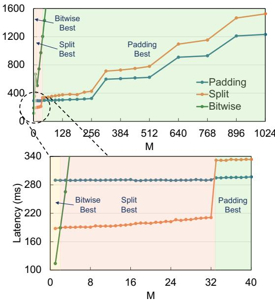  
Figure 1: The performance of three static computation strategies (Split is our novel strategy, and Bitwise is based on bit-disaggregation) under different M for a typical W4A8 mpGEMM task in LLMs (N = 4096, K = 6144).

In summary, our main contributions are as follows:

(1) We are the first to perform a systematic analysis and characterization of the computational heterogeneity in APQ LLM inference, revealing the fundamental sub-optimality of static approaches.

(2) We propose the DPR (Decomposition-Partial Product-Reconstruction) computation model, a unified theoretical abstraction that establishes bit-level decomposition as a first principle to systematically generate a series of computation strategies for effective mpGEMM acceleration.

(3) We design and implement ADAngel, a methodology for constructing a workload-adaptive computation core for any given LLM through exhaustive offline profiling on several computation strategies derived by the DPR model.

(4) We conduct an extensive evaluation demonstrating that the ADAngel-specialized engine consistently outperforms state-of-the-art frameworks on both edge and data-center GPUs, with particularly large gains in long-prefill cases.

## 2 Background

## 2.1 LLM Quantization

The rapid advancement in LLMs (Figure 2, left) enhances model accuracy while substantially increasing computing and storage requirements. For example, deploying DeepSeek-R1- 70B with FP16 precision consumes over 140GB of memory, requiring at least two modern high-performance NVIDIA H100 [4] GPUs with 80GB capacity. This poses significant challenges for deploying LLMs on low-cost edge devices with limited computing and memory/storage resources. Posttraining quantization (PTQ) [15, 31, 33, 36] reduces memory/storage and computing costs by converting weights or activations from high-precision (FP32/FP16) to low-precision (INT8/INT4). It has become a mainstream approach for edgeside LLM deployment. Although quantizing model weights or activations enables LLM inference on edge devices, lowbit-width precision reduces model accuracy.

Existing studies [27, 37, 42] demonstrate that LLM weights exhibit high redundancy, making them amenable to low-bit width quantization. In contrast, quantizing activations is more challenging, as low-bit-width activation representation signif icantly degrades LLM’s quality. Arbitrary-precision quantization (APQ) [3, 14, 26] preserves LLM quality while minimiz ing resource demands by quantizing weights to low-bit-width representations and maintaining high-precision formats for activations, as shown in Figure 2 (Middle). In this paper, APQ refers to arbitrary weight-activation bit-width combinations, such as W4A4, W4A8, and W3A8. This usage differs from recent any-precision LLM approaches that support multiple model sizes or precision configurations from a shared representation [23]. However, APQ introduces asymmetric bit-widths between weights and activations. Current edge devices generally lack native or efficient support for asymmetricbit-width GEMM/GEMV, requiring padding [11, 17], LUT [18, 22, 32], or bit-disaggregation [39].

Existing studies [27, 37, 42] demonstrate that LLM weights exhibit high redundancy, making them amenable to low-bitwidth quantization. In contrast, quantizing activations is more challenging, as low-bit-width activation representation signif icantly degrades LLM’s quality. In this paper, APQ refers to arbitrary-precision quantization, where weights and activations may use arbitrary and potentially asymmetric bit-widths within a deployed model, such as W4A8. This usage focuses on the execution of mixed-bit-width GEMM/GEMV operators. It differs from recent any-precision LLM approaches, which aim to support the deployment of multiple models or multiple bit-width configurations from a shared representation [23]. APQ preserves LLM quality while reducing resource demands by quantizing weights to low-bit-width representations and keeping activations at relatively higher precision, as shown in Figure 2 (Middle).

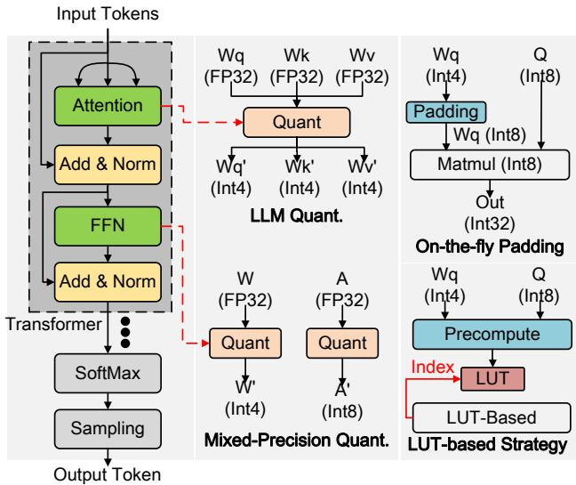  
Figure 2: (1) Left: Decoder-only LLM architecture; (2) Middle: LLM quantization and Arbitrary-Precision Quantization (APQ); (3) Right: Padding and the LUT-based strategy in APQ LLM inference.

## 2.2 Padding and LUT in APQ LLM Inference

As shown in Figure 2 (Right), existing solutions [11, 17] widely adopt padding to implement APQ LLM inference on edge devices. It transforms low-bit-width weights to match activation bit-widths, then performs computation using conventional GEMM/GEMV operators. Although padding enables APQ LLM inference on edge devices, it introduces additional overheads: (1) the weight padding operation incurs additional cost: If it is performed online, it introduces runtime bit manipulation overhead that reduces the achievable effective compute throughput; If it is performed offline and the padded weights are stored in global memory, it leads to extra storage and memory access overhead; (2) it still executes computation on expanded high-bit-width weight representations rather than the original compact low-bit-width weights, thereby increasing computational cost.

Some researchers [18, 22, 32] propose the LUT-based strategy for direct asymmetric-bit-width GEMM/GEMV execution to avoid padding. Specifically, it precomputes the products of high-bit-width activations and multiple low-bit-width weights, and stores them in the LUT. Results are retrieved directly from the LUT instead of performing actual computations during LLM inference. However, constructing a LUT for each weight-activation bit-width combination introduces a significant memory footprint. Therefore, this paper focuses on padding and bit-disaggregation as the main software mapping strategies for GEMM/GEMV in APQ.

## 2.3 Bit-Disaggregation GEMM and GEMV

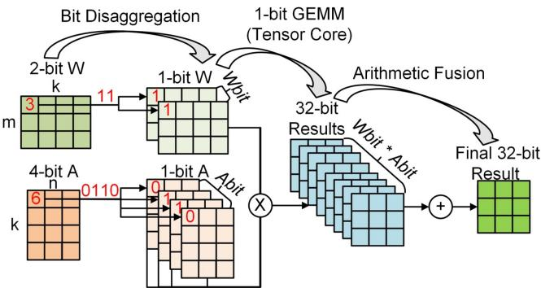  
Figure 3: W2A4 GEMM bit-disaggregation workflow.

Bit-disaggregation is a mathematical approach for directly executing GEMM and GEMV with asymmetric bit-widths. As shown in Figure 3, it first disaggregates the weight matrix [K, N] and the activation matrix [M, K] into WBit × [K, N] and ABit × [M, K] 1-bit matrices (bitplanes) via bit-level disag gregation, where WBit and ABit represent the bit-width of weights and activations. Next, pairwise multiplications are performed between the 1-bit weight and activation matrices, yielding WBit × ABit result matrices. Finally, the WBit × ABit result matrices are combined into the final output. Equation 1 formally captures the bit-disaggregation process described above. It increases the number of GEMM and GEMV op erations by a factor of WBit × ABit, while also introducing additional combination overhead. Zeng et al. [39] leverage 1-bit Tensor Cores in NVIDIA Ampere architecture GPUs to accelerate 1-bit GEMM and GEMV, thereby optimizing the inference speed of APQ LLMs that adopt the bit-disaggregation strategy.

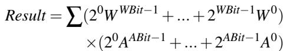

(1)

## 3 Motivation

Although padding and bit-disaggregation enable APQ LLM inference on existing edge devices, our measurements show that using either alone fails to effectively capture the computational heterogeneity in LLM inference, which leads to suboptimal inference performance. To better understand this, we next analyze this heterogeneity along four dimensions.

We deploy Llama-2-7B on the edge GPU of NVIDIA Jetson AGX Orin [20] using FasterTransformer [6]. The model adopts W4A8 quantization (4-bit weights and 8-bit activations). To support W4A8, FasterTransformer’s GEMM and GEMV operators are reimplemented using padding and bitdisaggregation. In particular, to avoid the runtime overhead of on-the-fly weight format conversion, padded weights are precomputed and stored in global memory.

Computational Heterogeneity Between Prefill And Decode. Figure 4a presents the prefill and decode latency of the model when using padding and bit-disaggregation approaches, under the following configuration: prefill length = 32, generated sentence length = 10, and batch size = 1. Prefill latency is measured as Time To First Token (TTFT), while decode latency is recorded as Time Between Tokens (TBT).

The results show that TTFT with the padding method achieves lower TTFT than bit-disaggregation during prefill. In contrast, the decode TBT with bit-disaggregation is better than padding. The underlying reason is that prefill is typically more compute-intensive, where computation tends to dominate the performance. Bit-disaggregation significantly increases computational overhead, leading to poor performance. In contrast, decode corresponds to an I/O-intensive regime, where performance is primarily limited by memory traffic. In this case, bit-disaggregation achieves better performance mainly because it preserves a compact low-bit-width weight representation and reduces effective memory traffic. Observation 1: Using only padding or bit-disaggregation fails to address the computational heterogeneity between prefill and decode, leading to suboptimal APQ LLM inference performance.

Intra-Prefill Computational Heterogeneity. We increase the prefill length from 4 to 64 and measure the TTFT for Llama-2-7B’s prefill. As shown in Figure 4b, the TTFT exhibits a monotonic increase with growing prefill lengths for both padding and bit-disaggregation approaches. We observe a crossover at a prefill length of 8: bit-disaggregation achieves a lower TTFT for short lengths (≤ 8), while padding demonstrates superior efficiency beyond this threshold. This crossover reflects the same compute-memory tradeoff observed between prefill and decode, but now within the prefill phase itself. For short prefills, the workload remains small, so the overhead introduced by loading expanded weights cannot be sufficiently amortized, making bit-disaggregation more favorable. As the prefill length increases, the GEMM becomes increasingly compute-intensive and the extra computation overhead of bit-disaggregation becomes its bottleneck. In this regime, padding achieves better TTFT because it incurs lower runtime computational overhead. Although the crossover point appears at prefill length = 8 in our experiments, it is not universal and can vary across model architectures, quantization bit-widths, and batch sizes. Observation 2: Relying solely on padding or bit-disaggregation individually cannot fully account for the computational heterogeneity within prefill in APQ LLM inference.

Intra-Decode Computational Heterogeneity. Next, we investigate the computational heterogeneity within decode. Figure 4c presents the TBT of Llama-2-7B decode with padding and bit-disaggregation for batch sizes 1∼64. The performance crossover point between padding and bit-disaggregation occurs at batch size = 16 in our experiments, although this point is not universal and can vary across model architectures and quantization bit-widths. The underlying reason is the workload heterogeneity within decode. As the batch size increases, the decode workload gradually shifts from a memorysensitive regime toward a more compute-intensive regime. For small batch sizes, performance is primarily limited by memory traffic, making bit-disaggregation more favorable because it preserves a compact low-bit-width weight representation and reduces memory access overhead. As the batch size increases, the computational overhead introduced by bit-disaggregation becomes increasingly significant, and padding achieves lower TBT due to its lower runtime processing overhead. Observation 3: Using only padding or bit-disaggregation cannot fully adapt to the workload heterogeneity within decode in APQ LLM inference.

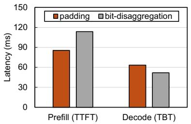  
(a) Prefill and Decode

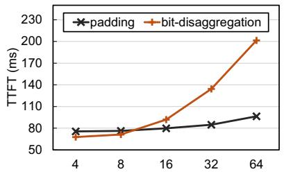  
(b) Prompt Length

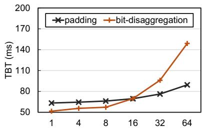  
(c) Decode Batch Size  
Figure 4: The computational heterogeneity between prefill and decode, intra-prefill computational heterogeneity, and intra-decode computational heterogeneity.

Computational Heterogeneity in Quantization Bit-Width. Finally, with the activation bit-width fixed at 8 bits and the weight bit-width varying from 2 to 8 bits, we evaluate the prefill TTFT and decode TBT at prefill length = 32, generated sentence length = 10, and batch size = 1 for both padding and bit-disaggregation methods. Figure 5 demonstrates that TTFT and TBT remain stable with the padding method as the weight bit-width increases. This stability occurs because the padding method follows a similar execution pattern across different weight bit-widths in these settings. In contrast, bitdisaggregation progressively introduces more accesses to the weights and 1-bit matrix computations as weight bit-width increases, resulting in increased TTFT and TBT. Observation 4: Neither padding nor bit-disaggregation alone can capture the computational heterogeneity introduced by the quantization bit-width in APQ LLMs.

## 4 Design

## 4.1 Overall Architecture

Our preceding analysis reveals that workload-unaware computation paradigms are fundamentally suboptimal for APQ LLM inference, failing to address the widespread computational heterogeneity of mpGEMM in LLM inference. To achieve highperformance inference, therefore, a new workload-adaptive paradigm for mpGEMM is needed, whose adaptivity is predicated on two core principles: (1) Optionality, the availability of a diverse portfolio of kernels that leverage hardware resources differently, and (2) Optimality, the capability to select the optimal kernel for each specific task.

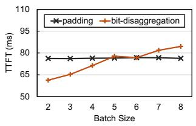  
(a) Prefill

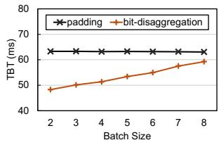  
(b) Decode  
Figure 5: Computational heterogeneity in quantization bitwidth. The activations are fixed at 8-bit quantization, while the weights vary from 2-bit to 8-bit. The x-axis represents the weight quantization bit-width.

To realize this paradigm, we propose ADAngel, a workloadaware framework, which is designed to accelerate APQ LLM inference, as shown in Figure 6. The theoretical foundation of ADAngel is the ❶ DPR (Decomposition–Partial Product– Reconstruction) computation model, which provides a unified form to both express and implement a diverse spectrum of mixed-precision GEMM strategies. Guided by the DPR model and hardware characteristics, we first define a set of three canonical strategies (Padding, Split, Bitwise) and perform deep, manual optimizations on their kernel implementations to form the high-performance ❷ Computation Strategy Set. Subsequently, the ❸ Strategy Dispatcher exhaustively evaluates these strategies offline on every potential workload within any given target LLM. This yields an oracle policy map which maps workloads to strategies, enabling the Strategy Dispatcher to perform zero-overhead, adaptive strategy selection at runtime when the LLM inference engine needs to execute mpGEMM/mpGEMV.

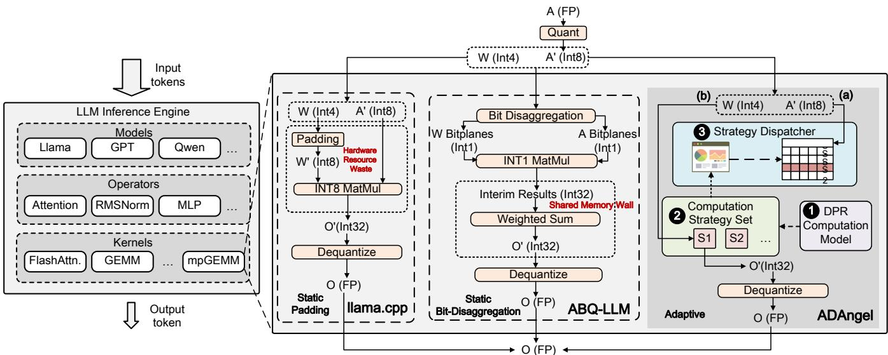  
Figure 6: The Overview of ADAngel. In contrast to traditional static approaches, namely llama.cpp (which incurs hardware resource waste due to weight upcasting) and ABQ-LLM (which hits a shared memory wall during prefill due to bit-disaggregation, detailed in Section 6.2), ADAngel is built upon the ❶ DPR Computation Model. By analyzing hardware architecture, ADAngel constructs a ❷ Computation Strategy Set based on DPR constructs and employs a ❸ Strategy Dispatcher to map each mpGEMM task to the optimal computation strategy during APQ LLM inference. As indicated by the dashed paths (offline stage), ADAngel designs the strategy set under DPR guidance and evaluates these strategies on the target LLM to generate a dispatch table. As indicated by the solid arrows (runtime stage), ADAngel (a) retrieves the appropriate strategy based on the problem size and bit-width of the mpGEMM task, and (b) invokes the corresponding kernel to complete the computation.

## 4.2 DPR Framework

The performance upper bound of an adaptive system is fundamentally determined by the quality and diversity of its available strategies. Based on this principle, our framework requires a rich portfolio of high-performance computation strategies to be effective. The DPR (Decomposition–Partial Product–Reconstruction) computation model serves as the theoretical cornerstone for this task. That is, the strategies in our Computation Strategy Set are designed under the guidance of the DPR model, and the computation kernels dispatched and executed at runtime are concrete instantiations of it. DPR formally deconstructs any mixed-precision matrix multiplication into three logical stages: the framework first decomposes the input matrices into multiple components based on their bitlevel representation; next, it performs matrix multiplication on these components to obtain a series of partial products; finally, it accurately reconstructs the final result via a weighted summation.

We now formally define this three-stage process. Given an activation matrix X ∈ ZM×K with bit-width XBIT S and a weight matrix W ∈ ZK×N with bit-width WBIT S, our DPR framework computes the mpGEMM result Y = XW ∈ ZM×N as follows:

Decomposition. Its goal is to transform matrices X and W to corresponding physical tensors {Xi,phys} and {Wj,phys}, which are uniformly typed and ready for computation by hardware accelerators like Tensor Cores in the next stage. It encapsulates two sub-steps: logical bit-partitioning and physical representation mapping.

We begin with defining an operation logical bit-partition: For a matrix A with ABIT S bit-width, based on a given bitpartitioning scheme:

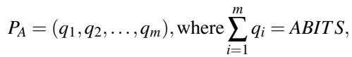

(2)

the value of any element x in A is precisely expressed as a weighted sum of the corresponding elements xi:

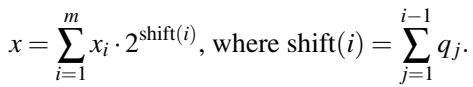

(3)

Thus matrix A can be precisely expressed as a weighted sum of matrices Ai:

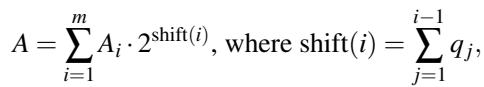

(4)

then {Ai} is the logical bit-partition of A based on the given bit-partitioning scheme PA.

In the logical bit-partitioning step, respectively, PX = (qX1, qX2, . . . , qXm) and PW = (qW1, qW2, . . . , qWn) are applied to X and W , generating their logical partitions {Xs}ms= and {Wt }nt= . By applying different bit-partitioning schemes, this step provides a high degree of flexibility, allowing us to conceptually decompose matrices into logical components of arbitrary bit-widths. However, the underlying hardware acceleration units, particularly Tensor Cores, are not generalpurpose multipliers. They are highly specialized computation engines, optimized for a fixed set of symmetric input precision pairs. This creates a mismatch between the flexibility of the logical decomposition at the software level and the rigid constraints of the hardware execution units. For instance, a 4-bit logical component and an 8-bit logical component cannot be multiplied directly by any single, native Tensor Core instruction.

To bridge this gap, the Physical Representation Mapping stage is an essential step. Its core mission is to unify all potentially heterogeneous logical matrices onto a single, homogeneous computation data type that is natively supported by the hardware. This is achieved through our Hardware-Aware Promotion Principle. The process first determines the maximum bit-width across all logical partitions, bmax. It then promotes this value to the smallest, natively supported hardware precision that can accommodate it. Let H denote the set of natively supported hardware precisions on the target platform (e.g., H = {1,4,8} on our target platform), then the final target bit-width can be expressed as

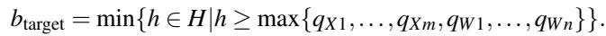

(5)

Subsequently, every logical matrix Ai (representing any Ws or Xt ) is physically realized into a tensor Ai,phys by promoting it to this target bit-width. This ensures that all tensors entering the computation stage are of a uniform, hardware-supported precision.

The resulting physical tensors from the decomposition stage are stored contiguously in memory, which maximizes bandwidth through coalesced accesses and allows us to fuse multiple partial product computations into a single kernel launch (e.g., computing X1 ×W1 and X2 ×W1 simultaneously), significantly reducing dispatch overhead.

Partial Product Computation. The output of the Decomposition stage is a set of hardware-ready physical tensors, Xs,phys} and {Wt,phys}, which all share a uniform bit-width, btarget. Therefore, each partial-product computation operates on operands with the same physical bit-width, allowing it to directly invoke symmetric-precision matrix-computation units, such as INT1, INT4, or INT8 Tensor Cores. The goal of the Partial Product Computation stage is to perform the actual matrix multiplication on these prepared tensors. Specifically, this stage executes m × n multiplications on the pairs of physical tensors to yield a series of partial product matrices, Yst :

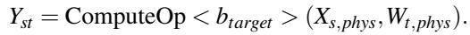

(6)

This stage’s computational homogeneity ensures all operations are mapped to a single type of native hardware instruction (e.g., IMMA or BMMA) on the Tensor Cores, which facilitates mapping to a uniform hardware path.

It generates m × n partial product matrices, each of dimension M × N. Crucially, the elements of these matrices are 32-bit integers (int32). This high precision is dictated by the architecture of the Tensor Cores, and exposes a fundamental performance trade-off: a more fine-grained decomposition (larger m or n) results in a proportionally larger memory foot print for these int32 intermediate results. This increased pressure on on-chip resources (especially shared memory) can constrain the achievable parallelism and occupancy of the GPU, a cost that can completely offset the inherent latency and throughput advantages of lower-precision Tensor Cores.

Reconstruction. In the final stage, our objective is to compute the result matrix Y . With the distributive property of multiplication, the product Y = XW can be expanded from their logical decompositions into a weighted sum of partial products:

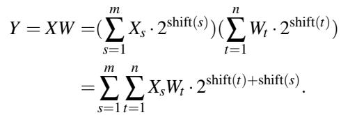

(7)

In summary, the DPR computation model provides a formal and principled foundation for mixed-precision GEMM. It establishes a clear methodology to deconstruct a complex, heterogeneous computation into a series of simple, hardwarealigned homogeneous operations.

## 4.3 Computation Strategy Set

The purpose of the Computation Strategy Set is to provide ADAngel with a broad and high-performance portfolio of computation strategies. Although the representational capacity of our DPR model provides a vast theoretical design space for this set, a significant portion of these strategies are practically inefficient. This inefficiency stems from the redundant promotion overhead introduced by our Hardware-Aware Promotion Principle when a strategy’s logical bit-width does not align with the discrete precisions natively supported by the GPU’s Tensor Cores.

To make this concrete, consider a W4A8 matrix multiplication where the activation partition is fixed at PA = (8). A weight decomposition of PW = (2,2) is provably suboptimal compared to the trivial P = (4) scheme, because the (2,2) scheme decomposes the work into two separate W8A8 GEMM operations, effectively doubling the computational workload.

Therefore, our method is to prune the design space by minimizing the promotion overhead, which is achieved by aligning the decomposed bit-widths with the native Tensor Core precisions. Based on this principle, we designed three families of computation strategies.

Throughput-Oriented: Padding. This strategy’s philosophy is to achieve the highest possible computational throughput. It is formally expressed in our DPR model by a trivial partitioning scheme (i.e., PA = (ABIT S)) which maps the computation to the lowest-precision native hardware unit capable of accommodating the largest operand (e.g., INT8 Tensor Cores). Since it corresponds to a trivial partitioning scheme, the computation is not decomposed into multiple logical components, and no explicit reconstruction of partial products is required at runtime, resulting in lower overhead and higher effective throughput closer to the hardware peak.

Memory-Oriented: Bitwise. This strategy prioritizes memory efficiency. It corresponds to the finest-grained decomposition scheme in our DPR model (i.e., P = (1, 1, . . . , 1)), replacing conventional arithmetic with a large number of simple bit-logic operations. This avoids the expansion overhead of padding, but introduces massive additional partial products and reconstruction overhead. Since it does not incur the extra weight memory traffic caused by padded operand representations, it is often more efficient in memory-bound scenarios.

Balanced: Split. On hardware platforms that provide native INT4 acceleration, there exists an intermediate alternative between Padding and Bitwise. Instead of using trivial partitioning or 1-bit decomposition, the weights and activations can be partitioned into a small number of hardware-aligned chunks that are as large as possible while not exceeding 4 bits (e.g., PW = (x), PA = (4, 4) for WxA8, where x ≤ 4).

This strategy achieves a middle ground: compared to Padding, while both of them increase memory traffic by widening operand representations, Split incurs less overhead by using narrower widths (e.g., 4-bit vs. 8-bit in W2A8); compared to Bitwise, it reduces the number of partial products, and lowers both the reconstruction overhead and the intermediateresult memory footprint. The advantage of Split over Bitwise primarily stems from the reduced intermediate memory footprint. In Bitwise, a WbA8 GEMM is decomposed into 8Wb bit-plane pairs, so the intermediate int32 storage for an out put tile of size TM × TN scales as 4 · (8Wb) · TMTN bytes. In contrast, Split uses a much coarser partitioning (e.g., decomposing the activation into two 4-bit components), resulting in only 4 · 2 · T T bytes. Thus, Split reduces the intermediateresult footprint by a factor of 4W ; for W4A8, this corresponds to a 16× reduction, from 32 int32 partial products to 2. Since these intermediate int32 results typically need to be buffered (e.g., in shared memory) before the Reconstruction stage, this reduction directly lowers shared-memory pressure, improves resident CTA count and effective memory bandwidth, and thereby enables better performance than Bitwise under middle-M workloads.

To make the application of our three strategies concrete, we now instantiate them for a W4A8 mixed-precision task. The selection of the bit-partitioning scheme for each archetype, and the resulting hardware computation path dictated by our DPR model, are summarized in Figure 7.

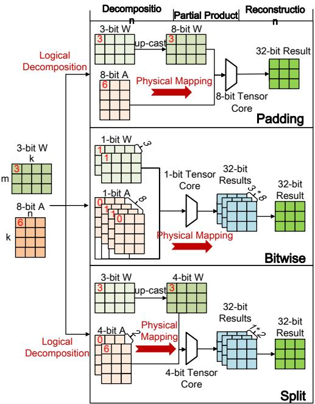  
Figure 7: Visualizing the DPR Framework. For a canonical W4A8 task, how different Logical Decompositions and Physical Mappings, guided by our DPR model, result in three distinct hardware-aligned computation strategies.

For the above three strategy prototypes, high performance in practice also depends on efficient kernel-level implementations. We highly optimize all kernels in our strategy set, as detailed in Section 5.

In summary, guided by the theoretical principles of our DPR computation model, we have designed and implemented three distinct, highly optimized computation strategies that constitute our Computation Strategy Set. This portfolio of kernels provides the rich and diverse action space that is the essential foundation for ADAngel’s adaptivity.

## 4.4 Strategy Dispatcher

The final component of the ADAngel framework is responsible for fulfilling the Optimality requirement: selecting the best-performing kernel from our Strategy Set for any given task. Our approach is grounded in a key insight: for a specific LLM, the variety of its constituent GEMM operations is highly constrained. This observation makes an exhaustive offline profiling approach not only feasible but also optimal. Therefore, our design consists of two phases: an offline policy construction phase that performs the analysis to generate an oracle policy map, and a lightweight online table-driven dispatch phase that executes mpGEMM tasks with the best strategy selected by the policy map.

We analyze the GEMM workload space within a target LLM. While the M dimension of a GEMM is dynamic, the N and K dimensions are static, determined by the model’s architecture (e.g., hidden dimension). Consequently, the number of unique GEMM "types" (defined by static N and K dimensions) is small and finite. For instance, our analysis shows that an entire Llama-3-8B model inference involves only about 4 unique types of GEMM operations.

This bounded problem space makes an exhaustive, offline profiling approach conceivable, but its practical feasibility depends on the storage cost of the resulting lookup table. We quantify this cost as follows: storing function pointers for 4 unique GEMM types across a comprehensive range of M = 1 ∼ 8192 (requiring 8 bytes per pointer) results in a total size of approximately 256 KB. This trivial memory footprint confirms that our empirical performance oracle approach is not only theoretically sound but also eminently practical.

The oracle policy map is constructed through an exhaustive, empirical profiling process executed once per target LLM and hardware platform. To achieve this, we first define the complete workload space by performing a static analysis of the target model’s architecture to identify its finite set of unique GEMM "types", and then sweeping across a comprehensive range of the dynamic M dimension. For every point in this space, we benchmark each kernel from our Computation Strategy Set, using high-precision timers after a sufficient warm-up period to ensure accuracy. The kernel with the lowest average latency for each specific task is recorded, creating the oracle policy map: a simple key-value structure that maps a workload to a function pointer for its empirically proven optimal kernel.

The runtime behavior of the Strategy Dispatcher is simple and efficient. Upon receiving a GEMM task, it performs a direct lookup in the pre-computed oracle policy map using the task’s shape as a key. This retrieves and immediately invokes a pointer to the empirically proven optimal kernel.

This dispatch mechanism, being a simple table lookup, is what provides ADAngel’s two decisive advantages: guaranteed optimality (relative to our offline analysis) and negligible runtime overhead.

## 5 Implementation

We implemented the ADAngel framework in C++ and CUDA 12.6 with over 15k LOC. Our implementation first involved engineering the Computation Strategy Set: a portfolio of kernels where Padding and Split are built upon CUTLASS [8], and Bitwise is a custom BMMA-based implementation. With this optimized portfolio established, we then constructed the Strategy Dispatcher’s policy through an automated, exhaustive offline profiling process. Finally, we integrated these components as an mpGEMM backend into FasterTransformer for end-to-end evaluation.

High-Performance Kernel Engineering. To ensure our strategy portfolio is highly competitive, we engineered each kernel family for maximum performance. The Padding and

Split strategies were built on top of the CUTLASS 3.1.0 library. In our implementation, we restrict Split to weight bitwidths ≤ 4, since it no longer reduces weight memory traffic relative to Padding when the weight bit-width exceeds 4. In Split, weights are offline promoted to 4-bit and stored in a packed layout. At runtime, the 8-bit activation is decomposed into two 4-bit components and packed into a stacked 2M × K matrix. Then, it is multiplied with the offline-packed weights via a single (2M, N, K) CUTLASS GEMM, yielding a stacked (2M,N) int32 intermediate. A lightweight merge kernel then completes the Reconstruction stage and dequantization. In contrast, the Bitwise strategy was implemented as a custom CUDA kernel based on BMMA instructions. We inherited the highly optimized weight layout from ABQ-LLM [39] to maximize memory coalescing, and applied selective kernel fusion (e.g., fusing the activation quantization and Decomposition stage) to reduce global memory traffic.

Offline Policy Construction. The Strategy Dispatcher’s policy was constructed by an automated Python script that orchestrates the entire profiling workflow. It benchmarked every kernel in our strategy set across a comprehensive range of sequence lengths in the target LLM, using CUDA events for precise latency measurement. By selecting the lowest-latency kernel for each potential workload, this process generated the Oracle Policy Map. In FasterTransformer, we observed that Llama-3-8B involves 4 distinct (N,K) combinations. To construct the dispatch table on the NVIDIA Jetson AGX Orin for W4A8-quantized Llama-3-8B, we profiled these (N, K) combinations over M ∈ [1, 8192] to cover the potential workloads. This incurs a one-time profiling cost of about 5.7 hours and a peak memory footprint of about 1.7 GB. This time cost can be further reduced by pruning the search space, since Figure 1 shows that Padding exhibits a clear advantage in the large-M regime. In addition, previously profiled entries can be reused across the same models or layers that share the same hardware platform.

End-to-End Framework Integration. To evaluate realworld performance, we integrated our ADAngel computation core into NVIDIA’s FasterTransformer. We further implemented support for the widely used model Llama-3-8B within our FasterTransformer-based testbed. The integration is modular, requiring only redirecting the framework’s standard mpGEMM calls to our ADAngel dispatcher.

## 6 Evaluation

## 6.1 Experiment Setup

Platform. Experiments were conducted on an NVIDIA Jetson AGX Orin Development Kit 64GB, featuring an Amperearchitecture GPU (sm\_87) and 64GB unified memory. We used the NVIDIA JetPack 6.1 [7] software stack (CUDA 12.6). The power mode of Orin is MODE\_50W. Our entire testbed is built upon FasterTransformer, and we implemented W2A8,

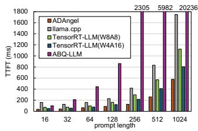  
(a) Llama-3-8B, batch size = 1

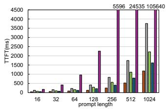  
(b) Llama-3-8B, batch size = 2

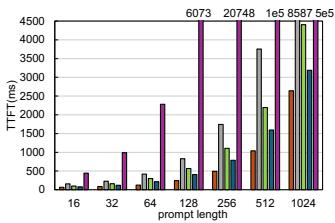  
(c) Llama-3-8B, batch size = 4

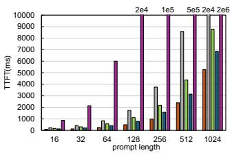  
(d) Llama-3-8B, batch size = 8

Figure 8: Prefill Stage Performance Comparison. ADAngel significantly reduces the TTFT across various input sequence lengths, demonstrating its superiority in compute-bound scenarios.  
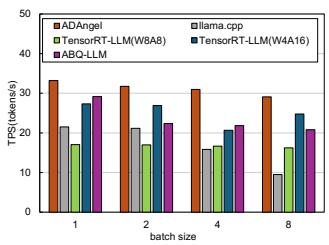  
(a) Llama-3-8B, pl = 128

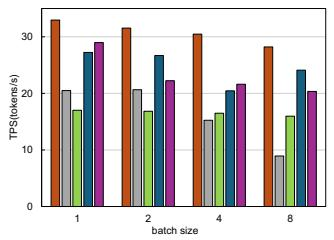  
(b) Llama-3-8B, pl = 256

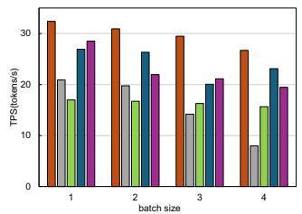  
(c) Llama-3-8B, pl = 512

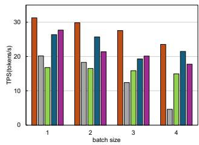  
(d) Llama-3-8B, pl = 1024

Figure 9: Decode Stage Performance Comparison. ADAngel achieves substantially higher TPS during the auto-regressive generation phase, showcasing its efficiency in memory-bound, low-latency operations.

W3A8, W4A8 and W5A8 versions of Llama-3 within this testbed. To validate the generality of the ADAngel method ology, we applied ADAngel to a data-center-class NVIDIA A100 GPU [5], generating a new, A100-specific engine.

Models. We used a representative modern LLM: Llama-3- 8B.

Baselines and Our System: (1) ABQ-LLM [39], serves as a representative framework for bit-disaggregation-based mpGEMM. (2) llama.cpp [17]. This serves as an optimized, end-to-end baseline utilizing online padding mpGEMM routines. (3) TensorRT-LLM. As a recognized high-performance inference framework, TensorRT-LLM serves as a strong baseline. Since the current version for the Orin platform lacks native W4A8 support, we employ W8A8 (SmoothQuant) and W4A16 (AWQ) quantization methods for a comprehensive comparison. (4) QServe. Its W4A8KV4 configuration is a powerful solution for cloud inference but is currently unsupported on Orin. To address this, we compare ADAngel with QServe on an A100 80GB GPU to evaluate the scalability of our approach. (5) ADAngel. This is our main proposal. All mpGEMM operations in our testbed are handled by our ADAngel-specialized computation core.

Evaluation Metrics: We report (1) Time-To-First-Token (TTFT) to measure the latency of the Prefill stage, and (2) Tokens Per Second (TPS) per request to measure the throughput of the Decode stage. All presented results are the average of multiple runs following a warm-up period to ensure stable and accurate measurements.

## 6.2 End-to-end Evaluation

Prefill. Figure 8 illustrates the end-to-end prefill latency (TTFT) across varying prompt lengths from 16 to 1024. ADAngel consistently establishes superior performance, achieving a peak speedup of 448.69× over ABQ-LLM and a speedup ranging from 1.17× to 2.38× over TensorRT-LLM.

Compared to TensorRT-LLM configurations, ADAngel surpasses the W4A16 baseline by leveraging the superior arithmetic throughput of INT8 Tensor Cores over FP16, and exceeds the W8A8 baseline by virtue of a lightweight system architecture that eliminates the significant runtime overheads inherent in the TensorRT-LLM framework.

In the short-prompt regime, the workload remains memorysensitive. However, the mpGEMM kernel in llama.cpp exposes only limited CTA-level parallelism under its persistent stream-k scheduling, and does not implement an asynchronous global-to-shared-memory pipeline. As a result, memory latency cannot be effectively hidden, making the kernel substantially less efficient in this regime. In contrast, our Bitwise and Split kernels contain asynchronous pipelining to overlap memory accesses with computation, thereby achieving higher efficiency. For instance, at bs = 1 and pl = 32, ADAngel reduces latency by 65.9% compared to llama.cpp (43 ms vs. 126 ms).

As the workload transitions to the compute-bound longsequence regime, the bit-disaggregation approach (ABQ-LLM) consumes up to 32× more shared memory per thread block compared to padding-based approaches. This bottleneck, identified as the Shared Memory Wall, severely restricts

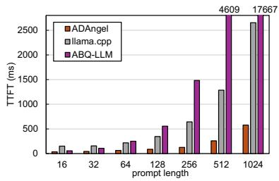  
(a) W2A8, batch size = 1

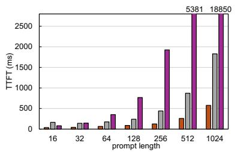  
(b) W3A8, batch size = 1

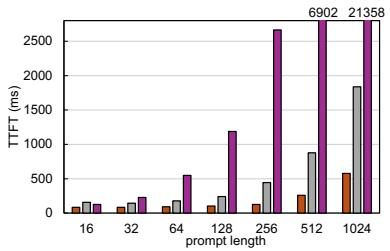  
(c) W5A8, batch size = 1

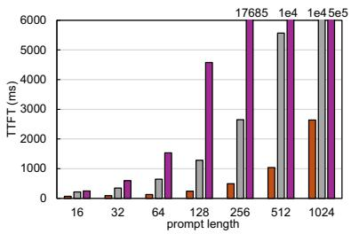  
(d) W2A8, batch size = 4

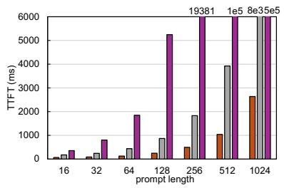  
(e) W3A8, batch size = 4

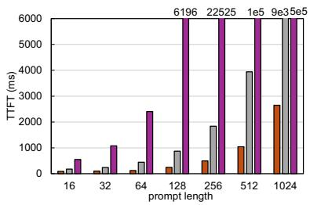  
(f) W5A8, batch size = 4

Figure 10: Cross-precision prefill performance on Jetson AGX Orin. TTFT comparison under W2A8, W3A8, and W5A8 across representative batch sizes.  
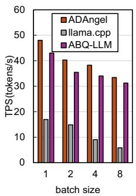  
(a) W2A8, pl = 256

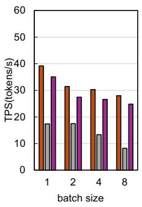  
(b) W3A8, pl = 256

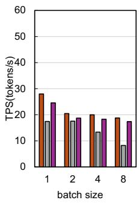  
(c) W5A8, pl = 256

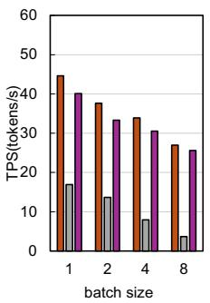  
(d) W2A8, pl = 1024

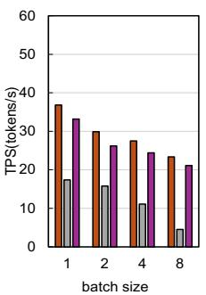  
(e) W3A8, pl = 1024

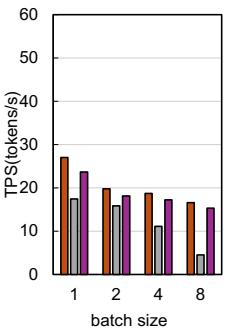  
(f) W5A8, pl = 1024  
Figure 11: Cross-precision decode performance on Jetson AGX Orin. TPS comparison under W2A8, W3A8, and W5A8 across representative prompt lengths.

GPU occupancy due to excessive intermediate accumulation states. Consequently, although ABQ-LLM is the SOTA framework for decoding and short-sequence prefill, it becomes practically unusable in this setting: at bs = 8 and pl = 1024, its TTFT surges to approximately 39.4 minutes. The root cause of the Shared Memory Wall is induced by the storage of int32 intermediate states. Our profiling reveals that this heavy shared memory consumption saturates the SM resources, restricting the hardware scheduler to launch only 3 thread blocks per SM, with each thread block computing only an 8 × 48 output tile. Such low occupancy effectively nullifies the massive parallelism advantage of the GPU. In contrast, ADAngel adaptively switches to the appropriate kernel to circumvent this latency explosion, maintaining the latency within seconds (5.27 s) and achieving a substantial 448.69× speedup.

ADAngel performs well across the evaluated representative sequence lengths. Since it covers all potential M values induced by sequence-length variations within the target range, we infer it to handle sequence length oscillations effectively.

Decode. Figure 9 reports the decode throughput (TPS, tokens per second) across batch sizes from 1 to 8, where ADAngel consistently establishes superior performance. In the critical single-batch regime (M = 1), ADAngel achieves a 1.95× speedup over TensorRT-LLM W8A8 by eliminating two fundamental inefficiencies: it bypasses the physical bandwidth redundancy of using 8-bit weights, and simultaneously removes computational redundancy, where static padding ker nels constrained by fixed INT8 Tensor Core shapes (typically M = 16) leave 15 (93.75%) of compute cycles idle due to zero-padding. As the batch size scales (M = 2 ∼ 8), while pure bit-disaggregation (ABQ-LLM) also circumvents these redundancies, it does so at the cost of excessive shared memory usage and instruction bloat; in contrast, ADAngel’s Split strategy strikes an optimal balance between eliminating redundancy and minimizing memory cost, thereby avoiding the resource bottlenecks encountered by bitwise methods and ultimately surpassing TensorRT-LLM W8A8 by 1.82× on average.

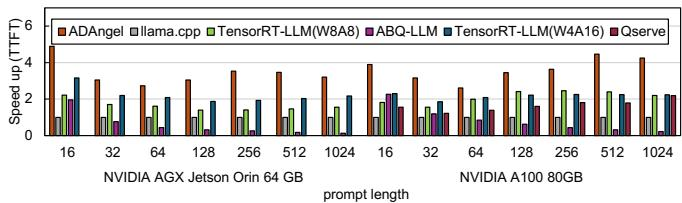  
(a) Llama-3-8B, batch size = 1

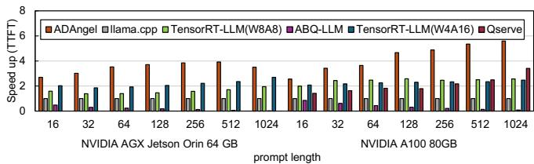  
(b) Llama-3-8B, batch size = 4

Figure 12: Prefill Stage Performance Speedup Across Hardware Platforms. All results are normalized to the llama.cpp baseline on each respective platform (i.e., llama.cpp = 1.0×). ADAngel consistently outperforms both baselines.  
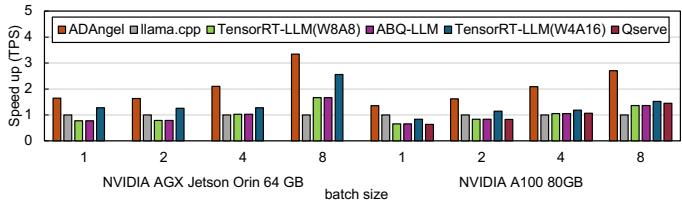  
(a) Llama-3-8B, prompt length = 64

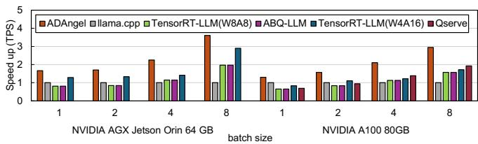  
(b) Llama-3-8B, prompt length = 512  
Figure 13: Decode Stage Performance Speedup Across Hardware Platforms. All results are normalized to the llama.cpp baseline on each respective platform. ADAngel maintains its performance leadership on both the Orin and the A100 across al tested batch sizes.

We further analyze the memory footprint of ADAngel to understand its resource trade-offs. Under a setting of bs = 8, prompt length = 1024, and generating 128 tokens per sequence, ADAngel achieves a peak memory usage of 18.80 GiB (≈ 31.5% of the device memory on Orin). This includes 14.96 GiB for model weights, 1.125 GiB for the KV cache, and 896 MiB for the ADAngel GEMM workspace, with the remaining memory attributed to runtime buffers and framework overhead. We materialize all decomposed weights in global memory to trade additional memory usage for inference performance, particularly in regimes where memory capacity is not the primary bottleneck.

## 6.3 Cross-Precision Evaluation

To demonstrate the generality of ADAngel across different precision combinations, we extend our evaluation to W2A8, W3A8, and W5A8 configurations. As shown in Figure 10, ADAngel consistently delivers superior prefill performance, outperforming both llama.cpp (by an average of 3.43× in TTFT) and ABQ-LLM (achieving up to 200.00× speedup in TTFT) across all evaluated bit-width combinations, confirming its robust adaptivity.

As weight bit-width increases, pure bit-disaggregation methods (ABQ-LLM) suffer from a severe TTFT expansion during long-sequence prefilling due to the proportional growth in bit-level matrix operations. ADAngel effectively curtails this latency by dynamically dispatching heavy compute workloads to the Padding strategy. Simultaneously, it maintains optimal decode throughput (TPS) by leveraging the Bitwise and Split strategies in memory-bound regimes, achieving a peak speedup of 7.35× over llama.cpp in TPS, representing the best end-to-end performance.

Notably, under the W5A8 configuration, the Split strategy becomes no longer effective. Consequently, ADAngel’s TTFT speedup on short prompt lengths is less pronounced than in the W2A8 and W3A8 regimes (e.g., 92 ms in W5A8 vs. 65 ms in W2A8 at pl = 64). Nevertheless, ADAngel still yields significant performance gains over ABQ-LLM by adaptively switching away from Bitwise in large-M regimes.

## 6.4 Generality Evaluation

Although ADAngel is primarily designed for resourceconstrained edge scenarios, such as intelligent cockpits and robotics, the increasing adoption of arbitrary-precision quanti zation in cloud inference highlights its potential contribution to server-grade GPU efficiency. Figures 12 and 13 demonstrate this platform scalability by extending our evaluation to the NVIDIA A100 GPU (80GB). While QServe could not be executed on the Jetson AGX Orin due to a lack of support, we successfully deployed it on the A100 to enable a direct comparison. QServe employs strategies such as progressive group quantization tailored for high-throughput optimization; while the associated overheads of these strategies are effectively hidden by massive parallelism in large-batch scenarios, they remain exposed in small-batch regimes. In contrast, ADAngel’s adaptive approach successfully identifies performance bottlenecks in these specific scenarios and dispatches more suitable computation strategies, achieving speedups of 2.12× in TTFT and 1.72× in TPS relative to QServe. Furthermore, thanks to its hardware-aware adaptive mechanism, ADAngel maintains its performance advantage over TensorRT-LLM, llama.cpp, and ABQ-LLM on the A100 platform.

## 6.5 Ablation Study

To evaluate the specific contributions of our fine-grained dispatching mechanism and diverse strategy portfolio, we constructed three distinct ablation baselines:

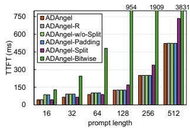

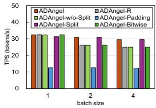  
(b) Decode Stage, pl = 512

(a) Prefill Stage, bs = 2  
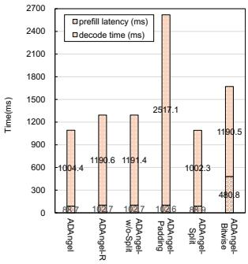

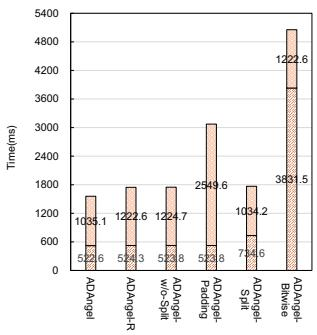  
(c) Total Time, bs = 2, pl = 64 (d) Total Time, bs = 2, pl = 512

Figure 14: Performance breakdown and ablation study of ADAngel compared with different variants. (a) Time to First Token (TTFT) across varying prompt lengths with batch size bs = 2. Note that ADAngel-Bitwise suffers from high latency in longer sequences. (b) Generation throughput (TPS) across different batch sizes with pl = 512. (c) & (d) Breakdown of total end-to-end latency (prefill latency vs. decode time) for short sequences (pl = 64) and long sequences (pl = 512) at bs = 2, with 32 tokens generated. ADAngel achieves the lowest total latency by balancing prefill and decode efficiency.

(1) ADAngel-\*: To disentangle the contribution of our core adaptive methodology from the benefits of low-level kernel optimizations, we evaluated systems using a single static strategy, denoted as ADAngel-\*, where (\*) represents the specific fixed strategy used (e.g., ADAngel-Padding). This serves as a control group to isolate the gains attributed solely to dynamic scheduling.

(2) ADAngel-R: To assess the necessity of our fine-grained dispatcher, we compared ADAngel against a strong rule-based baseline. This variant employs a static heuristic based solely on M: mapping tasks with M ∈ [1, 8] to Bitwise, M ∈ (8, 32] to Split, and M > 32 to Padding.

(3) ADAngel-w/o-Split: To evaluate the criticality of our diverse strategy portfolio, we implemented an ablated variant that excludes the Split strategy from the candidate pool.

As shown in Figure 14, ADAngel maintains a consistent performance advantage across all ablation settings. In extreme regimes where the optimal strategy is static such as longsequence prefilling, ADAngel correctly identifies the optimal kernel with negligible dispatch overhead (total < 3 ms).

Specifically, ADAngel-R achieves gains over static Padding by selecting Split at pl = 16 during prefill and Bitwise during decode; however, due to ignoring the dimensional heterogeneity introduced by N and K, it underperforms the full ADAngel system in decode scenarios (bs = 2 ∼ 4), highlighting the critical need for fine-grained kernel selection that considers the full (M, N, K) for every GEMM.

Furthermore, ADAngel-w/o-Split, operating on a restricted strategy set, defaults to Padding behavior in prefill to avoid the latency explosion of the Bitwise strategy, yet sacrifices the significant speedup opportunities at pl = 16 ∼ 64 provided by Split. Similarly, in the decode phase (bs = 2 ∼ 4), although it outperforms static Padding, it still lags behind ADAngel due to the absence of the Split strategy.

Since the benefits of ADAngel manifest across different phases, we conducted an end-to-end evaluation simulating typical intelligent cockpit scenarios (instruction parsing and short QA: generating 32 tokens with bs = 2 and pl = 64/512). The measured total latency demonstrates that ADAngel outperforms almost all ablation baselines across all scenarios, leveraging its effective fine-grained adaptive mechanism and a rich set of computational strategies.

## 7 Related Work

Post-Training Quantization (PTQ) is a key technique for compressing LLMs. Seminal methods like GPTQ [12] use second-order information for error compensation, a direction refined by works like HQQ [1]. To handle outliers, AWQ [16] protects salient weights via scaling, while other works preprocess weights via smoothing (MagR [40]) or orthogonal transformations (e.g., QuIP [2]), learn the error with adapters (e.g., QLoRA [10]), or dynamically correct errors at runtime (DecDEC [24]). To further enable integer-only hardware, another line of work performs weight-activation quantization. SmoothQuant [34] pioneered this by migrating activation difficulty to the weights, paving the way for advanced methods that reorder activations (RPTQ [38]) or reshape distributions with learnable transformations (FlatQuant [29]). While these methods produce accurate quantized models, ADAn gel addresses the critical downstream challenge of executing the resulting complex GEMM workloads with maximum, workload-adaptive efficiency.

Kernel-Level Acceleration for mixed-precision GEMM is the domain most directly related to our work. Prior art in this domain has primarily explored two major directions: software adaptation for general-purpose hardware, and the design of direct hardware accelerators. The majority of work focuses on software adaptation, which aims to optimally map these complex operations onto existing hardware. One prominent approach is to develop highly-specialized, static kernels for specific precision pairings, as exemplified by Marlin [13], which provides a state-of-the-art W4A16 GEMM kernel for NVIDIA GPUs. A different software approach, seen in frameworks like llama.cpp [11, 17], performs on-the-fly data transformation; its kernels employ techniques like online padding and native integer vectorization, where low-precision weights are unpacked and converted to a compatible format just-intime for computation. Alternative software methods reframe the problem entirely, either leveraging bit-logic operations as in ABQ-LLM [39], or replacing multipliers with memory lookups as seen in LUT-based methods like T-MAC [32]. In contrast, the direct hardware design approach proposes new accelerator architectures. For instance, MixPE [41] designs specialized multiplier-less processing units using shift-andadd operations, while BitFusion [28] introduces a methodology to dynamically fuse bit-level processing elements.

## 8 Conclusion

In this paper, we identified and characterized the fundamental computation heterogeneity in arbitrary-precision LLM inference, revealing the inherent limitations of static, workloadunaware approaches. To address this, we proposed ADAngel, a framework that leverages our DPR computation model and an exhaustive offline analysis to construct a specialized, workload-adaptive computation core for any given LLM. Our extensive evaluation demonstrates that the ADAngelspecialized engine significantly outperforms state-of-the-art inference frameworks, establishing that principled, workloadadaptive specialization is an essential paradigm for unlocking the full performance potential of low-precision hardware in edge LLM inference.

## Acknowledgements

We thank our shepherd and the anonymous reviewers for their valuable insights and constructive feedback. This research was supported by NSFC (No. 62402317) and STCSM (No. 24ZR1435500 and No. 25LN3200900). The corresponding author is Bo Peng (pengbo\_michael@sjtu.edu.cn).

## References

[1] Hicham Badri and Appu Shaji. Half-quadratic quantization of large machine learning models. Dan Hendrycks, Collin Burns, Steven Basart, Andy Zou, Mantas Mazeika, Dawn Song, and Jacob, 2023.

[2] Jerry Chee, Yaohui Cai, Volodymyr Kuleshov, and Christopher M De Sa. Quip: 2-bit quantization of large language models with guarantees. In A. Oh, T. Naumann, A. Globerson, K. Saenko, M. Hardt, and S. Levine, editors, Advances in Neural Information Processing Systems, volume 36, pages 4396–4429. Curran Associates, Inc., 2023.

[3] Huancheng Chen and Haris Vikalo. Mixed-precision quantization for federated learning on resourceconstrained heterogeneous devices. In Proceedings of the IEEE/CVF Conference on Computer Vision and Pattern Recognition (CVPR), pages 6138–6148, June 2024.

[4] Jack Choquette. Nvidia hopper h100 gpu: Scaling performance. IEEE Micro, 43(3):9–17, May 2023.

[5] Jack Choquette and Wish Gandhi. NVIDIA A100 GPU: Performance & Innovation for GPU Computing . In 2020 IEEE Hot Chips 32 Symposium (HCS), pages 1–43, Los Alamitos, CA, USA, August 2020. IEEE Computer Society.

[6] NVIDIA Corporation. Fastertransformer. https:// github.com/NVIDIA/FasterTransformer, 2022. Accessed: 2025-05-21.

[7] NVIDIA Corporation. Jetpack 6.1 release notes. https: //docs.nvidia.com/jetson/archives/jetpack-a rchived/jetpack-61/release-notes/index.htm l, 2024. Accessed: 2025-03-18.

[8] NVIDIA Corporation. Cutlass 4.1.0. https://github .com/NVIDIA/cutlass, 2025. Accessed: 2025-07-18.

[9] DeepSeek-AI, Aixin Liu, Bei Feng, Bing Xue, Bingxuan Wang, Bochao Wu, Chengda Lu, Chenggang Zhao, Chengqi Deng, Chenyu Zhang, Chong Ruan, Damai Dai, Daya Guo, Dejian Yang, Deli Chen, Dongjie Ji, Erhang Li, Fangyun Lin, Fucong Dai, Fuli Luo, Guangbo Hao, Guanting Chen, Guowei Li, H. Zhang, Han Bao, Hanwei Xu, Haocheng Wang, Haowei Zhang, Honghui Ding, Huajian Xin, Huazuo Gao, Hui Li, Hui Qu, J. L. Cai, Jian Liang, Jianzhong Guo, Jiaqi Ni, Jiashi Li, Jiawei Wang, Jin Chen, Jingchang Chen, Jingyang Yuan, Junjie Qiu, Junlong Li, Junxiao Song, Kai Dong, Kai Hu, Kaige Gao, Kang Guan, Kexin Huang, Kuai Yu, Lean Wang, Lecong Zhang, Lei Xu, Leyi Xia, Liang Zhao, Litong Wang, Liyue Zhang, Meng Li, Miaojun Wang, Mingchuan Zhang, Minghua Zhang, Minghui Tang, Mingming Li,

Ning Tian, Panpan Huang, Peiyi Wang, Peng Zhang, Qiancheng Wang, Qihao Zhu, Qinyu Chen, Qiushi Du, R. J. Chen, R. L. Jin, Ruiqi Ge, Ruisong Zhang, Ruizhe Pan, Runji Wang, Runxin Xu, Ruoyu Zhang, Ruyi Chen, S. S. Li, Shanghao Lu, Shangyan Zhou, Shanhuang Chen, Shaoqing Wu, Shengfeng Ye, Shengfeng Ye, Shi rong Ma, Shiyu Wang, Shuang Zhou, Shuiping Yu, Shunfeng Zhou, Shuting Pan, T. Wang, Tao Yun, Tian Pei, Tianyu Sun, W. L. Xiao, Wangding Zeng, Wanjia Zhao, Wei An, Wen Liu, Wenfeng Liang, Wenjun Gao, Wenqin Yu, Wentao Zhang, X. Q. Li, Xiangyue Jin, Xianzu Wang, Xiao Bi, Xiaodong Liu, Xiaohan Wang, Xiaojin Shen, Xiaokang Chen, Xiaokang Zhang, Xiaosha Chen, Xiaotao Nie, Xiaowen Sun, Xiaoxiang Wang, Xin Cheng, Xin Liu, Xin Xie, Xingchao Liu, Xingkai Yu, Xinnan Song, Xinxia Shan, Xinyi Zhou, Xinyu Yang, Xinyuan Li, Xuecheng Su, Xuheng Lin, Y. K. Li, Y. Q. Wang, Y. X. Wei, Y. X. Zhu, Yang Zhang, Yanhong Xu, Yanhong Xu, Yanping Huang, Yao Li, Yao Zhao, Yaofeng Sun, Yaohui Li, Yaohui Wang, Yi Yu, Yi Zheng, Yichao Zhang, Yifan Shi, Yiliang Xiong, Ying He, Ying Tang, Yishi Piao, Yisong Wang, Yixuan Tan, Yiyang Ma, Yiyuan Liu, Yongqiang Guo, Yu Wu, Yuan Ou, Yuchen Zhu, Yuduan Wang, Yue Gong, Yuheng Zou, Yujia He, Yukun Zha, Yunfan Xiong, Yunxian Ma, Yuting Yan, Yuxiang Luo, Yuxiang You, Yuxuan Liu, Yuyang Zhou, Z. F. Wu, Z. Z. Ren, Zehui Ren, Zhangli Sha, Zhe Fu, Zhean Xu, Zhen Huang, Zhen Zhang, Zhenda Xie, Zhengyan Zhang, Zhewen Hao, Zhibin Gou, Zhicheng Ma, Zhigang Yan, Zhihong Shao, Zhipeng Xu, Zhiyu Wu, Zhongyu Zhang, Zhuoshu Li, Zihui Gu, Zijia Zhu, Zijun Liu, Zilin Li, Ziwei Xie, Ziyang Song, Ziyi Gao, and Zizheng Pan. Deepseek-v3 technical report, 2025.

[10] Tim Dettmers, Artidoro Pagnoni, Ari Holtzman, and Luke Zettlemoyer. Qlora: Efficient finetuning of quantized llms. In A. Oh, T. Naumann, A. Globerson, K. Saenko, M. Hardt, and S. Levine, editors, Advances in Neural Information Processing Systems, volume 36, pages 10088–10115. Curran Associates, Inc., 2023.

[11] Boyuan Feng, Yuke Wang, Tong Geng, Ang Li, and Yufei Ding. Apnn-tc: accelerating arbitrary precision neural networks on ampere gpu tensor cores. In Proceedings of the International Conference for High Performance Computing, Networking, Storage and Analy sis, SC’21, New York, NY, USA, 2021. Association for Computing Machinery.

[12] Elias Frantar, Saleh Ashkboos, Torsten Hoefler, and Dan Alistarh. Gptq: Accurate post-training quantization for generative pre-trained transformers, 2023.

[13] Elias Frantar, Roberto L. Castro, Jiale Chen, Torsten Hoefler, and Dan Alistarh. Marlin: Mixed-precision auto-regressive parallel inference on large language

models. In Proceedings of the 30th ACM SIGPLAN Annual Symposium on Principles and Practice of Parallel Programming, PPoPP ’25, page 239–251, New York, NY, USA, 2025. Association for Computing Machinery.

[14] Ziyi Guan, Hantao Huang, Yupeng Su, Hong Huang, Ngai Wong, and Hao Yu. Aptq: Attention-aware posttraining mixed-precision quantization for large language models. In Proceedings of the 61st ACM/IEEE Design Automation Conference, New York, NY, USA, 2024. As sociation for Computing Machinery.

[15] Wei Huang, Yangdong Liu, Haotong Qin, Ying Li, Shiming Zhang, Xianglong Liu, Michele Magno, and Xiaojuan Qi. Billm: Pushing the limit of post-training quantization for llms, 2024.

[16] Ji Lin, Jiaming Tang, Haotian Tang, Shang Yang, Wei-Ming Chen, Wei-Chen Wang, Guangxuan Xiao, Xingyu Dang, Chuang Gan, and Song Han. Awq: Activationaware weight quantization for on-device llm compression and acceleration. In P. Gibbons, G. Pekhimenko, and C. De Sa, editors, Proceedings of Machine Learning and Systems, volume 6, pages 87–100, 2024.

[17] The llama.cpp team. llama.cpp: Llm inference in c/c++. https://github.com/ggml-org/llama.cpp, 2025. Accessed: 2025-06-18.

[18] Saeed Maleki. Look-up mai gemm: Increasing ai gemms performance by nearly 2.5x via msgemm, 2023.

[19] NVIDIA. Nvidia jetson nano. https://developer.nv idia.com/embedded/jetson-nano, 2025. Accessed: 2025-07-18.

[20] NVIDIA. Nvidia jetson orin. https://www.nvidia.c om/en-us/autonomous-machines/embedded-sys tems/jetson-orin/, 2025. Accessed: 2025-07-18.

[21] OpenAI, Josh Achiam, Steven Adler, Sandhini Agarwal, Lama Ahmad, Ilge Akkaya, Florencia Leoni Aleman, Diogo Almeida, Janko Altenschmidt, Sam Altman, Shyamal Anadkat, Red Avila, Igor Babuschkin, Suchir Balaji, Valerie Balcom, Paul Baltescu, Haiming Bao, Mohammad Bavarian, Jeff Belgum, Irwan Bello, Jake Berdine, Gabriel Bernadett-Shapiro, Christopher Berner, Lenny Bogdonoff, Oleg Boiko, Madelaine Boyd, Anna Luisa Brakman, Greg Brockman, Tim Brooks, Miles Brundage, Kevin Button, Trevor Cai, Rosie Campbell, Andrew Cann, Brittany Carey, Chelsea Carlson, Rory Carmichael, Brooke Chan, Che Chang, Fotis Chantzis, Derek Chen, Sully Chen, Ruby Chen, Jason Chen, Mark Chen, Ben Chess, Chester Cho, Casey Chu, Hyung Won Chung, Dave Cummings, Jeremiah Currier, Yunxing Dai, Cory Decareaux, Thomas Degry, Noah Deutsch, Damien Deville, Arka Dhar, David Dohan, Steve Dowling, Sheila

Dunning, Adrien Ecoffet, Atty Eleti, Tyna Eloundou, David Farhi, Liam Fedus, Niko Felix, Simón Posada Fishman, Juston Forte, Isabella Fulford, Leo Gao, Elie Georges, Christian Gibson, Vik Goel, Tarun Gogineni, Gabriel Goh, Rapha Gontijo-Lopes, Jonathan Gordon, Morgan Grafstein, Scott Gray, Ryan Greene, Joshua Gross, Shixiang Shane Gu, Yufei Guo, Chris Hallacy, Jesse Han, Jeff Harris, Yuchen He, Mike Heaton, Jo hannes Heidecke, Chris Hesse, Alan Hickey, Wade Hickey, Peter Hoeschele, Brandon Houghton, Kenny Hsu, Shengli Hu, Xin Hu, Joost Huizinga, Shantanu Jain, Shawn Jain, Joanne Jang, Angela Jiang, Roger Jiang, Haozhun Jin, Denny Jin, Shino Jomoto, Billie Jonn, Heewoo Jun, Tomer Kaftan, Łukasz Kaiser, Ali Kamali, Ingmar Kanitscheider, Nitish Shirish Keskar, Tabarak Khan, Logan Kilpatrick, Jong Wook Kim, Christina Kim, Yongjik Kim, Jan Hendrik Kirchner, Jamie Kiros, Matt Knight, Daniel Kokotajlo, Łukasz Kondraciuk, Andrew Kondrich, Aris Konstantinidis, Kyle Kosic, Gretchen Krueger, Vishal Kuo, Michael Lampe, Ikai Lan, Teddy Lee, Jan Leike, Jade Leung, Daniel Levy, Chak Ming Li, Rachel Lim, Molly Lin, Stephanie Lin, Mateusz Litwin, Theresa Lopez, Ryan Lowe, Patricia Lue, Anna Makanju, Kim Malfacini, Sam Manning, Todor Markov, Yaniv Markovski, Bianca Martin, Katie Mayer, Andrew Mayne, Bob McGrew, Scott Mayer McKinney, Chris tine McLeavey, Paul McMillan, Jake McNeil, David Medina, Aalok Mehta, Jacob Menick, Luke Metz, An drey Mishchenko, Pamela Mishkin, Vinnie Monaco, Evan Morikawa, Daniel Mossing, Tong Mu, Mira Mu rati, Oleg Murk, David Mély, Ashvin Nair, Reiichiro Nakano, Rajeev Nayak, Arvind Neelakantan, Richard Ngo, Hyeonwoo Noh, Long Ouyang, Cullen O’Keefe, Jakub Pachocki, Alex Paino, Joe Palermo, Ashley Pan tuliano, Giambattista Parascandolo, Joel Parish, Emy Parparita, Alex Passos, Mikhail Pavlov, Andrew Peng, Adam Perelman, Filipe de Avila Belbute Peres, Michael Petrov, Henrique Ponde de Oliveira Pinto, Michael, Pokorny, Michelle Pokrass, Vitchyr H. Pong, Tolly Powell, Alethea Power, Boris Power, Elizabeth Proehl, Raul Puri, Alec Radford, Jack Rae, Aditya Ramesh, Cameron Raymond, Francis Real, Kendra Rimbach, Carl Ross, Bob Rotsted, Henri Roussez, Nick Ryder, Mario Saltarelli, Ted Sanders, Shibani Santurkar, Girish Sastry, Heather Schmidt, David Schnurr, John Schulman, Daniel Selsam, Kyla Sheppard, Toki Sherbakov, Jessica Shieh, Sarah Shoker, Pranav Shyam, Szymon Sidor, Eric Sigler, Maddie Simens, Jordan Sitkin, Katarina Slama, Ian Sohl, Benjamin Sokolowsky, Yang Song, Natalie Staudacher, Felipe Petroski Such, Natalie Summers, Ilya Sutskever, Jie Tang, Nikolas Tezak, Madeleine B. Thompson, Phil Tillet, Amin Tootoonchian, Elizabeth Tseng, Preston Tuggle, Nick Turley, Jerry Tworek, Juan Felipe Cerón Uribe, Andrea Vallone, Arun Vijayvergiya,

Chelsea Voss, Carroll Wainwright, Justin Jay Wang, Alvin Wang, Ben Wang, Jonathan Ward, Jason Wei, CJ Weinmann, Akila Welihinda, Peter Welinder, Jiayi Weng, Lilian Weng, Matt Wiethoff, Dave Willner, Clemens Winter, Samuel Wolrich, Hannah Wong, Lauren Workman, Sherwin Wu, Jeff Wu, Michael Wu, Kai Xiao, Tao Xu, Sarah Yoo, Kevin Yu, Qiming Yuan, Wojciech Zaremba, Rowan Zellers, Chong Zhang, Marvin Zhang, Shengjia Zhao, Tianhao Zheng, Juntang Zhuang, William Zhuk, and Barret Zoph. Gpt-4 technical report, 2024.

[22] Gunho Park, Baeseong Park, Minsub Kim, Sungjae Lee, Jeonghoon Kim, Beomseok Kwon, Se Jung Kwon, Byeongwook Kim, Youngjoo Lee, and Dongsoo Lee. Lut-gemm: Quantized matrix multiplication based on luts for efficient inference in large-scale generative language models, 2024.

[23] Yeonhong Park, Jake Hyun, Sanglyul Cho, Bonggeun Sim, and Jae W. Lee. Any-precision LLM: Lowcost deployment of multiple, different-sized LLMs. In Ruslan Salakhutdinov, Zico Kolter, Katherine Heller, Adrian Weller, Nuria Oliver, Jonathan Scarlett, and Felix Berkenkamp, editors, Proceedings of the 41st International Conference on Machine Learning, volume 235 of Proceedings of Machine Learning Research, pages 39682–39701. PMLR, 21–27 Jul 2024.

[24] Yeonhong Park, Jake Hyun, Hojoon Kim, and Jae W Lee. Decdec: A systems approach to advancing lowbit llm quantization. In 19th USENIX Symposium on Operating Systems Design and Implementation (OSDI 25), pages 803–819, 2025.

[25] Inc. Qualcomm Technologies. Qualcomm® sa8155p product brief. https://www.qualcomm.com/con tent/dam/qcomm-martech/dm-assets/document s/qul7413\_sa8155\_productbrief\_r4.pdf, 2019. Accessed: 2025-03-18.

[26] Mariam Rakka, Mohammed E. Fouda, Pramod Khargonekar, and Fadi Kurdahi. A review of state-of-theart mixed-precision neural network frameworks. IEEE Transactions on Pattern Analysis and Machine Intelligence, 46(12):7793–7812, 2024.

[27] Rajarshi Saha, Naomi Sagan, Varun Srivastava, Andrea J. Goldsmith, and Mert Pilanci. Compressing large language models using low rank and low precision decomposition. In A. Globerson, L. Mackey, D. Belgrave, A. Fan, U. Paquet, J. Tomczak, and C. Zhang, editors, Advances in Neural Information Processing Systems, volume 37, pages 88981–89018. Curran Associates, Inc., 2024.

[28] Hardik Sharma, Jongse Park, Naveen Suda, Liangzhen Lai, Benson Chau, Joon Kyung Kim, Vikas Chandra, and Hadi Esmaeilzadeh. Bit fusion: Bit-level dynamically composable architecture for accelerating deep neural network. In 2018 ACM/IEEE 45th Annual International Symposium on Computer Architecture (ISCA), pages 764–775, 2018.

[29] Yuxuan Sun, Ruikang Liu, Haoli Bai, Han Bao, Kang Zhao, Yuening Li, Jiaxin Hu, Xianzhi Yu, Lu Hou, Chun Yuan, Xin Jiang, Wulong Liu, and Jun Yao. Flatquant: Flatness matters for llm quantization, 2025.

[30] Hugo Touvron, Thibaut Lavril, Gautier Izacard, Xavier Martinet, Marie-Anne Lachaux, Timothée Lacroix, Baptiste Rozière, Naman Goyal, Eric Hambro, Faisal Azhar, Aurelien Rodriguez, Armand Joulin, Edouard Grave, and Guillaume Lample. Llama: Open and efficient foundation language models, 2023.

[31] Changyuan Wang, Ziwei Wang, Xiuwei Xu, Yansong Tang, Jie Zhou, and Jiwen Lu. Q-vlm: Post-training quantization for large vision-language models. In A. Globerson, L. Mackey, D. Belgrave, A. Fan, U. Pa quet, J. Tomczak, and C. Zhang, editors, Advances in Neural Information Processing Systems, volume 37, pages 114553–114573. Curran Associates, Inc., 2024.

[32] Jianyu Wei, Shijie Cao, Ting Cao, Lingxiao Ma, Lei Wang, Yanyong Zhang, and Mao Yang. T-mac: Cpu renaissance via table lookup for low-bit llm deployment on edge. In Proceedings of the Twentieth European Conference on Computer Systems, EuroSys’25, page 278–292, New York, NY, USA, 2025. Association for Computing Machinery.

[33] Junyi Wu, Haoxuan Wang, Yuzhang Shang, Mubarak Shah, and Yan Yan. Ptq4dit: Post-training quantization for diffusion transformers. In A. Globerson, L. Mackey, D. Belgrave, A. Fan, U. Paquet, J. Tomczak, and C. Zhang, editors, Advances in Neural Information Processing Systems, volume 37, pages 62732–62755. Curran Associates, Inc., 2024.

[34] Guangxuan Xiao, Ji Lin, Mickael Seznec, Hao Wu, Julien Demouth, and Song Han. Smoothquant: Accurate and efficient post-training quantization for large language models. In Andreas Krause, Emma Brunskill, Kyunghyun Cho, Barbara Engelhardt, Sivan Sabato, and Jonathan Scarlett, editors, Proceedings of the 40th International Conference on Machine Learning, volume 202 of Proceedings of Machine Learning Research, pages 38087–38099. PMLR, 23–29 Jul 2023.

[35] An Yang, Anfeng Li, Baosong Yang, Beichen Zhang, Binyuan Hui, Bo Zheng, Bowen Yu, Chang Gao, Chen gen Huang, Chenxu Lv, Chujie Zheng, Dayiheng Liu,

Fan Zhou, Fei Huang, Feng Hu, Hao Ge, Haoran Wei, Huan Lin, Jialong Tang, Jian Yang, Jianhong Tu, Jianwei Zhang, Jianxin Yang, Jiaxi Yang, Jing Zhou, Jingren Zhou, Junyang Lin, Kai Dang, Keqin Bao, Kexin Yang, Le Yu, Lianghao Deng, Mei Li, Mingfeng Xue, Mingze Li, Pei Zhang, Peng Wang, Qin Zhu, Rui Men, Ruize Gao, Shixuan Liu, Shuang Luo, Tianhao Li, Tianyi Tang, Wenbiao Yin, Xingzhang Ren, Xinyu Wang, Xinyu Zhang, Xuancheng Ren, Yang Fan, Yang Su, Yichang Zhang, Yinger Zhang, Yu Wan, Yuqiong Liu, Zekun Wang, Zeyu Cui, Zhenru Zhang, Zhipeng Zhou, and Zihan Qiu. Qwen3 technical report, 2025.

[36] Zhewei Yao, Xiaoxia Wu, Cheng Li, Stephen Youn, and Yuxiong He. Exploring post-training quantization in llms from comprehensive study to low rank compensation. In Proceedings of the AAAI Conference on Artificial Intelligence, volume 38, pages 19377–19385, 2024.

[37] Lu Yin, Ajay Jaiswal, Shiwei Liu, Souvik Kundu, and Zhangyang Wang. Junk dna hypothesis: Pruning small pre-trained weights irreversibly and monotonically impairs "difficult" downstream tasks in llms, 2025.

[38] Zhihang Yuan, Lin Niu, Jiawei Liu, Wenyu Liu, Xinggang Wang, Yuzhang Shang, Guangyu Sun, Qiang Wu, Jiaxiang Wu, and Bingzhe Wu. Rptq: Reorder-based post-training quantization for large language models, 2023.

[39] Chao Zeng, Songwei Liu, Yusheng Xie, Hong Liu, Xiaojian Wang, Miao Wei, Shu Yang, Fangmin Chen, and Xing Mei. Abq-llm: Arbitrary-bit quantized inference acceleration for large language models. In Proceedings of the AAAI Conference on Artificial Intelligence, volume 39, pages 22299–22307, 2025.

[40] Aozhong Zhang, Naigang Wang, Yanxia Deng, Xin Li, Zi Yang, and Penghang Yin. Magr: Weight magnitude reduction for enhancing post-training quantization. In A. Globerson, L. Mackey, D. Belgrave, A. Fan, U. Paquet, J. Tomczak, and C. Zhang, editors, Advances in Neural Information Processing Systems, volume 37, pages 85109–85130. Curran Associates, Inc., 2024.

[41] Yu Zhang, Mingzi Wang, Lancheng Zou, Wulong Liu, Hui-Ling Zhen, Mingxuan Yuan, and Bei Yu. Mixpe: Quantization and hardware co-design for efficient llm inference, 2024.

[42] Yilong Zhao, Chien-Yu Lin, Kan Zhu, Zihao Ye, Lequn Chen, Size Zheng, Luis Ceze, Arvind Krishnamurthy, Tianqi Chen, and Baris Kasikci. Atom: Low-bit quantization for efficient and accurate llm serving. In P. Gibbons, G. Pekhimenko, and C. De Sa, editors, Proceedings of Machine Learning and Systems, volume 6, pages 196–209, 2024.