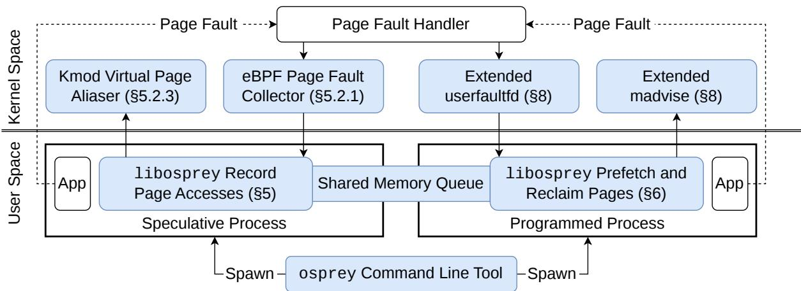
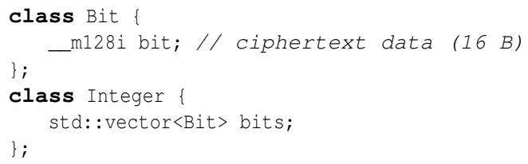
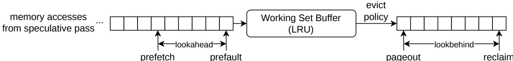
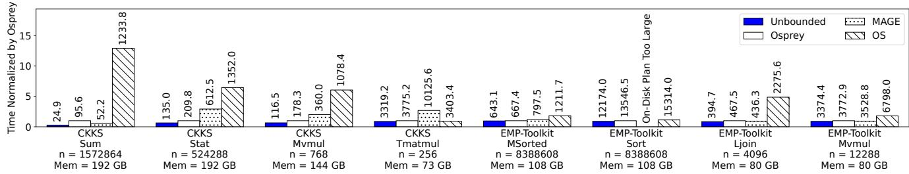
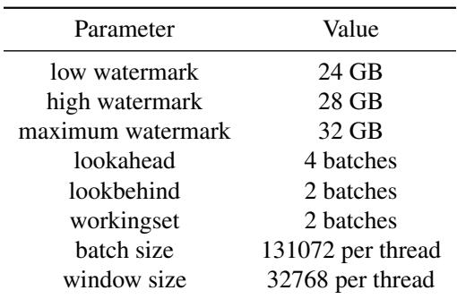
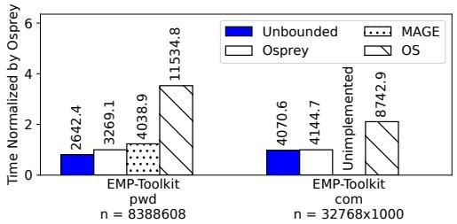
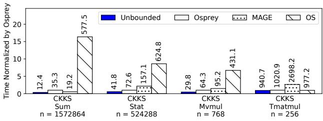
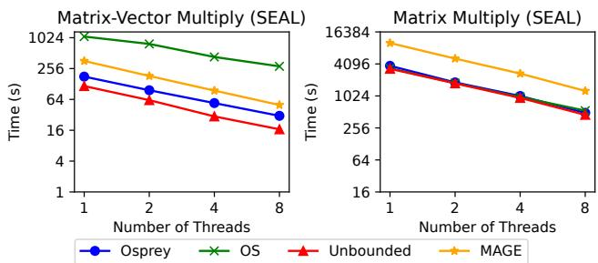
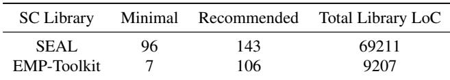
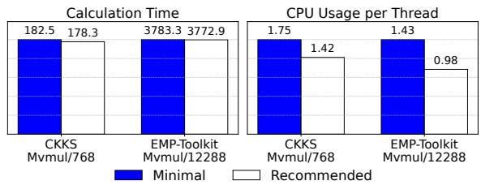

USENIX

THE ADVANCED COMPUTING SYSTEMS ASSOCIATION

# Osprey: Transparent and Efficient Virtual Memory for Secure Computation

Yicheng Liu, University of California, Los Angeles; Alice Yeh, University of California, Berkeley; Harry Xu, University of California, Los Angeles; Raluca Ada Popa, University of California, Berkeley; Sam Kumar, University of California, Los Angeles

https://www.usenix.org/conference/osdi26/presentation/liu-yicheng

# This paper is included in the Proceedings of the 20th USENIX Symposium on Operating Systems Design and Implementation.

July 13–15, 2026 • Seattle, WA, USA

ISBN 978-1-939133-55-7

Open access to the Proceedings of the 20th USENIX Symposium on Operating Systems Design and Implementation is sponsored by

# Osprey: Transparent and Efficient Virtual Memory for Secure Computation

Yicheng Liu UCLA

Alice Yeh UC Berkeley

Harry Xu UCLA

Raluca Ada Popa UC Berkeley

Sam Kumar UCLA

## Abstract

There is increasing interest in privacy-preserving data analytics applications. These applications rely on Secure Computation (SC), a family of cryptographic techniques for computing on encrypted data. Unfortunately, SC amplifies the memory overhead of data-intensive data analytics applications, presenting a serious obstacle to their widespread deployment.

Osprey is a memory management framework that enables SC to efficiently page to an SSD. It works at runtime and is transparent to SC applications, similar to classical OS virtual memory. This resolves a serious limitation in prior SC-aware memory management, which requires up-front planning and rewriting applications in a new programming framework.

Osprey achieves this using speculative execution. While speculative execution is powerful, it normally requires complex and error-prone in-kernel support, and therefore is not widely deployed for OS processes. Our central observation in Osprey is that, by carefully leveraging SC’s obliviousness, we can make speculative execution for SC workloads practical and efficient. Osprey requires changing < 200 lines of code in each SC library that we tested, and no lines of code in SC applications written against those libraries.

## 1 Introduction

Data analytics is pervasive across applications and industries. But security and privacy concerns are a significant obstacle. For example, an organization may be hesitant to outsource its sensitive data to the cloud for data analytics. As another example, hospitals may want to combine their patient datasets to do research on rare diseases, or financial institutions may wish to combine their customers’ data for fraud detection [14]—but privacy concerns prevent them from directly sharing their data with each other. These concerns have led to research on secure/private data analytics systems [2, 43, 47, 52, 57, 65, 66].

A compelling approach to secure data analytics systems is Secure Computation (SC). SC is a collection of techniques for computing on encrypted data, including Secure Multi-Party

Computation (SMPC) and Homomorphic Encryption (HE). Google and Meta use SC in their advertising products [23, 46, 58], an industry consortium has formed around SMPC [40], researchers have used SC to facilitate secure data sharing for clinical research [2, 47], and Web3 wallets use SC to secure billions of dollars’ worth of digital assets [16, 50].

Still, SC is not widely used for data-intensive analytics [2, 23, 57]. One reason is that SC is very resource-intensive (e.g., in CPU, memory, and network usage). In particular, SC can introduce a significant expansion factor on all encrypted data. For example, when using garbled circuits (a type of SMPC), each bit of plaintext takes up 16 B in encrypted form—a 128× expansion factor. As a result, SC-based data analytics systems run out of memory on even moderately-sized datasets [44, 57, 67, 69]. For example, the authors of Conclave report that SMPC “in practice only scales to a few thousand input records” (e.g., 30,000 records per party for a join) [57]. Once memory is exhausted, these workloads become infeasibly slow because the OS starts paging to secondary storage [44].

State of the Art. A promising direction is to make paging more efficient for SC workloads. There exist two approaches for this, memory programming and speculative execution. Both have significant downsides, which we now explain.

The first approach, memory programming, is to calculate the SC program’s memory access pattern in advance, to pre-plan memory management [28]. This is possible because SC protocols are oblivious—that is, their memory access patterns are independent of the input data. Unfortunately, it requires changing applications to use a particular DSL/programming framework—a serious limitation because the SC ecosystem has a huge diversity of DSLs/frameworks [10, 12, 13, 20, 25, 29, 31, 42, 51, 56, 60], and it is not feasible to port all of them and their applications to a single DSL framework and runtime. Furthermore, this planner-based approach cannot respond to memory pressure at runtime, and produces a memory management plan that can be very large (e.g., gigabytes for a program that runs in just a few seconds).

The second approach, speculative execution, is to run the program speculatively [7, 8, 17, 30, 32, 41], concurrently with the actual execution, to inform memory management [17]. If done by running a full duplicate execution, speculation incurs the program’s memory overhead again, requiring more paging and worsening the problem. To address this, existing approaches use heuristics to skip I/Os and drop pages from memory when speculating. Unfortunately, this means that speculation may make mistakes—that is, “misspeculate.” Process state must then be rolled back, which is complex and errorprone (e.g., implemented by “re-forking” processes [17]). Due to this complexity, no mainstream operating system, to our knowledge, uses speculative execution. It is only used in cases where the cost of a full duplicate execution is acceptable—for example, for straggler tasks in Hadoop and Spark [54, 63].

Main Insight. Our work uses an observation regarding obliviousness, a core property of SC, to overcome the challenges of speculative execution. There are actually two important aspects of SC’s obliviousness. The first aspect, leveraged by prior work, is that access patterns remain unchanged regardless of program inputs, a property referred to as “inputoblivious” (IO). We identify a second aspect that prior work has largely missed: overwriting ciphertext data with arbitrary bytes during execution does not alter the program’s memory access pattern. We refer to this as “content-oblivious” (CO).

The key insight behind our approach is that CO enables us to eliminate misspeculation entirely, making speculative execution practical. Traditional speculation requires dropping pages to control memory overhead, which inevitably leads to misspeculation. In SC, however, we can safely drop any data that is CO. Since ciphertexts, which dominate memory usage, are CO, discarding them dramatically reduces memory overhead without risking misspeculation.

Normally, speculative execution requires executing the program twice—speculatively and then concretely—doubling the CPU load. Yet, we circumvent this by leveraging CO again. We omit operations on ciphertexts during speculation and instead only record their would-be memory accesses. Because the dominant CPU cost arises from cryptographic operations on ciphertexts, this greatly reduces CPU usage of speculation.

By dropping CO data from memory and skipping computation on CO data, our approach addresses both the memory overhead and compute overhead of speculative execution. The result is a highly efficient speculative engine that provides timely guidance to the actual execution at a very low cost.

Design. Leveraging this insight, we design Osprey,<sup>1</sup> the first memory-management framework that runs SC workloads with exceptionally low overhead while being transparent to SC workloads. By “transparent” we mean application-level transparency: SC applications written against an SC library require zero source changes to use Osprey. SC library maintainers, however, must perform a small one-time port (< 200 LoC in each library we tested, discussed in §3.2 and §9.7) to annotate memory allocations of CO data and computations over CO data. Osprey depends on these annotations for perfor mance, not correctness, and it can bring substantial benefits even if the developer’s annotations are not complete. Osprey uses speculative execution to predict an SC program’s future memory accesses, and then uses those predictions to manage memory in the concrete execution, issuing madvise syscalls to prefetch and reclaim pages. We next describe four key challenges in realizing Osprey.

First, how and when should Osprey drop CO data during speculation? Prior speculation systems use complex heuristics to determine when to drop pages [17, §6.1]. We observe that Osprey can instead take a simple approach: it maps all virtual pages containing only CO data to a single physical page from the beginning, to avoid having to drop pages later. To do this, and to skip computations on CO data, we rely on changes/annotations in source code. However, these annotations can be confined to the SC library that defines the objects/classes for ciphertexts and provides functions to operate on them; this requires changing only a few lines of library code. The SC programs that use an SC library remain unmodified, making Osprey a transparent approach for legacy programs.

The second challenge is that each page may contain a mix of CO and non-CO data, preventing Osprey from being able to drop those pages when speculating. For example, pointers are not CO, so using malloc to allocate CO data mixes non-CO data (from malloc’s data structures) with CO data. To prevent mixing CO and non-CO data, Osprey uses a two-step solution. The first step is to use a dedicated section of its address space for CO data. The second step is to use a new kind of memory allocator that can allocate space in the CO region, while keeping the memory allocator’s own pointerrich data structures outside of the CO region. Non-CO data is duplicated between the speculative and concrete executions, so we design this memory allocator to have low memory overhead regardless of the allocation pattern.

Third, Osprey relies on the OS virtual memory system for flexibility (e.g., reacting to memory pressure, etc.), but this raises challenges for performance. Prior approaches achieve good performance via significant kernel changes—for example, by making policy decisions in the kernel [4] or modifying the page migration datapath [1]. However, we observe that most of the overhead of OS virtual memory comes from one operation: deciding which pages to reclaim from a process, for cgroup accounting. We remove this overhead by extending the madvise syscall with an option to reclaim specific pages. We also extend userfaultfd to support private anonymous segments. These simple, general-purpose extensions to Linux enable Osprey to run in user space with good performance.

Fourth, multithreaded applications are a special challenge, because the memory access patterns may differ between speculation and true execution. Furthermore, Osprey relies on page faults to trigger prefetching; multithreading complicates this because a different thread than intended may fault in a page. We address this problem with a novel use of Memory

Protection Keys (MPK) [21, 55]. We use MPKs to trigger page faults independently in each thread, so that each thread gets the same page faults regardless of the schedule.

We implemented Osprey in C++ and applied it to two SC protocol libraries: CKKS homomorphic encryption in SEAL [51] and garbled circuits in EMP-Toolkit [28]. We evaluated Osprey with 8 workloads. Osprey outperforms the operating system’s virtual memory for all of the workloads, by up to 12× in the best case. For 7 workloads, Osprey performs comparably to or better than MAGE [28], the state-of-the-art SC-aware memory management system—but unlike MAGE, Osprey does not require developers to rewrite SC applications in a new DSL and is not limited to planning memory management in advance. For 6 workloads, Osprey performs within 60% of having enough memory to fit the entire computation. Osprey required changing less than 200 lines of code in each SC protocol library, and required no source code instrumentation in SC applications written against these libraries.

Our implementation of Osprey is available on GitHub at https://github.com/mpc-systems/osprey-project.

## 2 Background

## 2.1 Secure Computation

Secure Computation (SC) refers to techniques for computing on encrypted data. Below, we discuss two SC protocols that we use in our evaluation: CKKS and garbled circuits.

## 2.1.1 CKKS Homomorphic Encryption

CKKS [9] is a scheme for Homomorphic Encryption (HE). A party can directly compute on HE ciphertexts to obtain an encrypted result, without ever decrypting the ciphertexts or having access to the decryption key. The input and output of the computation are both in ciphertext form (i.e., encrypted).

In the CKKS scheme, a ciphertext represents a vector of numbers. A party can compute element-wise addition and multiplication directly on the ciphertexts. The maximum depth in multiplications is limited by a level parameter chosen during key generation. Specifically, each ciphertext has a level, and each time a multiplication is performed, the result’s level is one less than the operands’ level (both operands must be the same level). Once the level reaches 0, no more multiplications can be performed. A procedure called bootstrapping can sidestep this limitation, but it is computationally expensive.

## 2.1.2 Garbled Circuits

Garbled circuits [61] are a protocol for Secure Multi-Party Computation (SMPC). SMPC enables multiple parties to compute a program over their private data and learn the result, without revealing each party’s data to the others. To compute the function, the parties must communicate over the network.

Garbled circuits enable SMPC between two parties, called the garbler and the evaluator. The program to compute is represented as a circuit of AND and XOR gates. The garbler computes an encryption of the circuit, called the garbled circuit, and sends it to the evaluator. The evaluator obtains encrypted inputs of both parties, using a protocol called oblivious transfer for the garbler’s input. The evaluator then executes each gate of the circuit—given the encryption of a gate, and the encrypted values of its input wires, the evaluator can compute the encrypted value of its output wire. In this way, they compute the encrypted values of all wires of the circuit. Then, they decrypt the output with the help of the garbler.

## 2.2 Memory Overhead

The memory overhead is a key factor that degrades the performance of SC protocols. Below, we discuss the memory demand in CKKS and garbled circuits.

For CKKS homomorphic encryption, the size of the ciphertext is determined by its level and the dimension of the vector. The higher the level, the larger the ciphertext, and the larger the dimension, the larger the ciphertext. For a vector with 8192 elements, the size of the ciphertext is around tens of kilobytes when the level is between 0 and 2.

For garbled circuits, the size of the garbled circuit is determined by the number of wires and gates in the circuit. While gates consume memory, they can be generated by the garbler and consumed by the evaluator in a streaming fashion, without ever all being materialized at once [22]. Additionally, only the wires that correspond to in-scope variables of the program being executed must be kept in memory; the values of outof-scope or not-yet-computed wires may be discarded. Thus, the memory overhead of garbled circuits, for both garbler and evaluator, is dominated only by the program’s variables that are live at any instant [27]. This can be large due to garbled circuits’ large expansion factor; each bit of plaintext (i.e., a single wire) corresponds to a 128-bit ciphertext.

As we discuss in §10, prior work explores reducing the memory overhead of SC using approaches such as improving the cryptographic protocol, enhancing the SC framework, or finding ways to perform parts of the computation in plaintext. These techniques do not guarantee that memory will fit within a given limit. Memory programming and speculative execution (explained in §1) optimize performance given limited memory, and are complementary to the above approaches.

## 3 System Overview

Osprey is a memory management framework for SC workloads, with two goals. The first goal is to make virtual memory efficient, so that SC applications that do not fit in main memory can very efficiently page to an SSD. The second goal is to be transparent to applications, so that SC applications written against an SC library require no code changes to use Osprey. The SC library, however, must be annotated (i.e., lightly modified) to mark allocations of CO memory (e.g., ciphertexts) and computation on CO data (§3.2). These annotations enable Osprey’s performance gains, but are not required for correctness; Osprey brings substantial performance benefits even with incomplete annotations (results in §9.7).

  
Figure 1: Osprey’s system architecture. Osprey’s components are marked blue.

As shown in Fig. 1, Osprey executes an SC program as two concurrent user space processes. The first process executes a speculative pass, which transparently records the program’s memory accesses; the second process executes a programmed pass, which uses the recorded memory accesses to manage memory. Both processes link against the same lightly ported SC library and use Osprey’s CO allocator (§4) to place ciphertext data in a dedicated CO region of the virtual address space. Most of Osprey, including its core prefetching and speculation algorithms, lives in user space, within these two processes. To support these algorithms efficiently, Osprey also includes some extensions to the kernel. Osprey’s kernel-side extensions comprise three components: (1) an eBPF program that forwards page-fault addresses to user space, (2) a very simple (124 LoC) kernel module that allows virtual pages to be efficiently aliased to the same physical page, and (3) general-purpose extensions to userfaultfd and madvise, which we anticipate could be mainlined.

## 3.1 Making Speculation Simple and Efficient

Naïvely running a speculative pass concurrently with the programmed pass would effectively double the program’s memory usage and CPU usage. Osprey’s main insight is to make the speculative pass very efficient, in both memory usage and CPU usage, by exploiting a property of SC called content obliviousness (CO). CO is the property that overwriting ciphertext data with arbitrary bytes at runtime does not change the memory access pattern. We refer to memory that can be so altered without affecting the access pattern as contentoblivious (CO) memory. For example, ciphertext data is CO.

  
Figure 2: Structure for an encrypted integer in EMP-Toolkit.

In the speculative pass, Osprey uses CO in two ways. First, Osprey maps all virtual pages containing ciphertext data to the same physical page. This eliminates most of the speculative pass’s memory usage, because ciphertext data normally dominates memory usage (its expansion factor is the reason why SC programs are so memory-intensive). Second, Osprey skips computations on ciphertext data, instead recording their would-be memory accesses. This eliminates most of the speculative pass’s CPU usage, because cryptographic routines for computing on the ciphertexts normally dominate CPU time. Crucially, CO means that these changes will not affect the access pattern recorded by the speculative pass.

## 3.2 Annotating SC Libraries

An important challenge in realizing Osprey is that not all of the memory in an SC program is CO. In particular, any memory containing a pointer is not CO! For example, stack memory is not CO, since the return addresses pushed to the stack constitute pointers and cannot be safely overwritten. As another example, SC libraries often provide “ciphertext” types to an application that contain metadata about the ciphertext, and a pointer to the actual ciphertext data allocated elsewhere. In Fig. 2, for example, the memory storing the Bit class is CO, because it directly contains ciphertext data. However, the memory backing an instance of the Integer class, which represents an encrypted integer, is not CO, because its memory contains (within the std::vector instance) the length of the integer in bits and a pointer to the actual ciphertext data, and changing these fields would affect the memory access pattern.

```cpp
// (a) Annotate CO Memory
class Integer {
std::vector<Bit, COAllocator> bits;
};
// (b) Annotate Operations
Integer add(Integer a, Integer b) {
Integer res;
OSPREY_TOUCH(a, b, res);
return res;
}
Figure 3: An example porting EMP-Toolkit to Osprey.
```

Osprey relies on annotations in the SC library to identify CO memory. Concretely, Osprey provides a memory allocator for CO memory that allocates all CO memory in a dedicated region of the virtual address space called the CO region. The SC library should use Osprey’s CO memory allocator for ciphertext data. This is designed not to require modifications to the SC application, only to the type declarations in the SC library. In Fig. 3(a), for example, the only required change is to pass Osprey’s COAllocator as the allocator template argument to the std::vector that holds an Integer’s bits. After this one-line change, the Bit elements stored in any Integer—no matter how the application constructs or uses it—reside in the CO region. The Bit class itself is unchanged.

Osprey reduces CPU overhead of speculation by skipping computations on CO memory. To enable this, we designed a one-line annotation API, OSPREY\_TOUCH (Fig. 3(b)). In the programmed pass, OSPREY\_TOUCH does nothing, but in the speculative pass it does the following: it (1) touches the memory region provided as an argument, and then (2) returns from the calling function. The idea is that by placing a call to OSPREY\_TOUCH at the start of a function that im plements a cryptographic operation, one skips the computation when speculating and simply records which memory the operation would have touched. It is not mandatory to use OSPREY\_TOUCH, but more complete OSPREY\_TOUCH annotations generally lead to greater CPU savings during speculation. We optimize this process further in §5.2.2.

Any non-CO memory, and computations on non-CO memory, are duplicated between the speculative and programmed passes. For SC programs, where ciphertexts dominate memory usage (due to their expansion factor) and cryptographic operations dominate CPU usage, this duplication is a tiny cost compared to running the SC program.

## 3.3 Transparent Interface

Osprey is implemented as two components: osprey, a command-line tool, and libosprey, a runtime library. Osprey-enabled SC libraries must be linked with libosprey, which makes Osprey’s annotation APIs available to the SC library developer and adds a runtime component (e.g., threads) to execute Osprey’s logic in the speculative and programmed passes. The osprey command-line tool is a frontend, allowing applications to be invoked as osprey ./a.out. It spawns the speculative and programmed passes as child processes, and it sets up a shared-memory buffer to transfer predicted memory accesses from the speculative pass to the programmed pass.

Osprey requires the source code of the SC library—but not the SC application that uses it—to be annotated, by way of calls into libosprey. Osprey is designed to make these annotations as minor and lightweight as possible (i.e., requiring very few changes to the SC library source code).

## 3.4 Comparison with Prior Approaches

Prior work on memory programming, like Osprey, predicts future memory accesses and exploits the obliviousness of SC. In this sense, Osprey combines ideas from both speculative execution and memory programming—it may be considered “speculative memory programming.” However, by leveraging CO, Osprey overcomes the shortcomings of both approaches.

The state-of-the-art speculative execution system for memory management [17] can misspeculate, hurting performance and requiring complex in-kernel support (e.g., checkpointing or re-forking). In contrast, Osprey leverages CO in a way that ensures that the speculative pass will never misspeculate, improving performance and avoiding complexity.

The state-of-the-art memory programming system, MAGE [28], exploits only the weaker notion of input obliviousness (IO)—the property that changing an SC program’s inputs does not change the program’s memory access pattern. This leads to three shortcomings: (1) MAGE requires SC applications to be rewritten in a DSL, (2) MAGE requires SC libraries to be rewritten to work with MAGE’s backend, and (3) MAGE’s planner materializes a memory management plan in a file that is concretely very large, and proportional in length to the program’s execution time. By exploiting CO and not merely IO, Osprey addresses all three shortcomings: (1) it avoids changes to SC applications, (2) it requires only minor annotations to SC libraries, and (3) the speculative pass runs “on the fly,” concurrently with the programmed pass, so no “plan” must be materialized.

## 4 Content-Oblivious Memory Allocator

In Osprey, we design a new memory allocator that is suitable for allocating memory in the CO region. We refer to it as the “CO allocator.” The CO allocator keeps all of its data structures in regular memory. The reason for this is that a memory allocator’s structures (pointers, bitmaps, etc.) are not CO and therefore cannot be kept in the CO region.

Existing memory allocators are unsuitable for allocating CO memory because they place their own pointer-rich data structures in or next to the blocks that they allocate. Hoard [3], tcmalloc, and mimalloc use linked lists for each allocation size, storing a pointer—which is not CO—on each free block. jemalloc [15], which uses a bitmap instead of a list, is a step in the right direction, as the bitmap is not mixed with the data. But jemalloc still relies on the metadata and data for each run<sup>2</sup> being nearby in the address space, to easily find the metadata for a data block (e.g., when free’ing it).

For Osprey’s memory allocator, we use a slab allocator design, to minimize the space overhead of our allocator. Unlike existing slab allocators, we store slab data in the CO region, but slab metadata in regular memory. Whereas prior allocators depend on the data and metadata being nearby (e.g., adjacent) in the address space, our design requires a way to “link” the two. To get from the metadata for a slab to its data, we can simply include a pointer in the metadata. However, getting from a slab’s data to its metadata—necessary to free an object—is tricky, as we cannot place a pointer in CO memory.

A simple way to map from slab data to slab metadata is to create a hash table in regular memory for this purpose. An early version of Osprey did this, but we found that it measurably impacted performance. Therefore, Osprey uses an array-based mapping instead. We treat the CO region as an array of slabs, and keep a parallel array in regular memory that stores, for each slab, a pointer (8 B) to its corresponding slab metadata (or nullptr if unallocated). We set the slab size to 2 MiB and the CO region to 1 TiB; for these parameters, our array-based mapping is only 4 MiB, which is negligible compared to the actual data of an SC application.

## 5 Speculative Pass

## 5.1 Collecting Memory Accesses

To collect memory accesses, a straightforward solution is binary instrumentation [33]: inserting instructions around each memory access instruction to record the address. This strawman is known to be very inefficient and produces memory access traces that are impractically large [4, 28].

For Osprey’s purpose, memory management, it is sufficient to collect a more coarse-grained access trace, at page granularity. To achieve this goal, we rely on page faults to detect accesses to new pages so their addresses can be recorded [4,6]. The lazy allocation strategy used by kernels like Linux ensures that a page fault is triggered on the first access to each page, giving Osprey a chance to record its address. This can be achieved without modifying the target program.

So far, this approach records only the first access to each page. To address this, we limit the number of pages that can be mapped simultaneously, by unmapping pages that were mapped in on prior page faults. This causes subsequent accesses to those pages to trigger page faults, allowing us to detect and record subsequent accesses to those pages. Allowing few pages to be mapped at a time allows for a more precise trace, at the cost of making the tracer bigger and longer to collect. Allowing many mapped pages makes the trace shorter and faster to collect, but makes it less precise.

Multiple solutions have been proposed for choosing which pages to unmap in this scheme, including FIFO [6]. Osprey defaults to the microset strategy from 3PO [4], which unmaps all mapped pages once the number of mapped pages reaches a threshold; we call that threshold the window size. We use this strategy because it allows the access trace to be interpreted as a sequence of working sets of the program.

## 5.2 Making Collection Efficient

3PO uses a similar page-fault-based approach to trace collection, but implements it entirely in the kernel for efficiency and performs it during a preparation/planning phase where performance is not critical. We now contribute techniques to perform trace collection without significant changes to the kernel source, and to make trace collection efficient enough to be run alongside the program’s main execution.

## 5.2.1 Avoiding Kernel Source Changes

An intuitive solution is to use userfaultfd [62], a Linux feature that allows an application to register a custom page fault handler in user space. However, this approach adds overhead to each page fault, requiring additional user-kernel mode switches and thread scheduling operations.

Instead, our approach is to inject minimal logic into the kernel using eBPF, hooking into a pre-handler in the page fault handler. When a page fault occurs, Osprey’s eBPF module writes the address and relevant error information into a ring buffer shared between kernel space and user space. In user space, a separate thread asynchronously reads page fault addresses and metadata from the ring buffer, and performs the remaining parts of the collection logic as described in §5.1. This hybrid approach balances performance with flexibility, avoiding kernel source changes while achieving faster performance than userfaultfd.

## 5.2.2 Accelerating Collection with OSPREY\_TOUCH

We use OSPREY\_TOUCH (§3.2) to not only skip the cryptographic computations, but also accelerate trace collection. Annotating the data touched by cryptographic operations with OSPREY\_TOUCH completely bypasses the faulting mechanism and explicitly provides the tracing algorithm with the addresses that would have been accessed.

Note that Osprey collects memory accesses using eBPF and OSPREY\_TOUCH at the same time. To maintain their order, it timestamps each access when it is recorded and then uses these timestamps to correctly order them during aggregation.

## 5.2.3 Aliasing Memory Efficiently

As described in §3.1, Osprey maps all content-oblivious memory to a single physical page in the speculative pass. The most straightforward approach is to create a 4 KiB in-memory file and repeatedly use the mmap system call to map each virtual page to this file. However, each such mapping creates a separate Virtual Memory Area (VMA) in the Linux kernel. An excessive number of VMAs leads to two major issues: 1. Increased overhead for the kernel to search VMAs, which are organized as a red-black tree. 2. Unnecessary memory overhead from maintaining metadata for each VMA.

Our solution is to implement a simple (124 LoC) kernel module providing a virtual device, /dev/aliased. In the speculative pass, Osprey creates the CO region by using open and mmap on /dev/aliased. In our kernel module, we implement a custom mmap handler for this device, so that the memory region produced by mmap (i.e., the CO region) has all virtual pages mapped to a single 4 KiB physical page, while using only a single VMA for the whole region.

## 5.3 Isolating Side Effects

For speculation, isolation of side effects is just as critical as performance optimization. In particular, interactions with external systems—such as disk and network I/O—must be isolated during speculative execution.

For disk isolation, we utilize overlayfs to achieve transparent separation. By creating a read-only mapping of the existing working directory, the program under speculative execution observes a file system view identical to that of normal execution. Any modifications to existing files or creation of new files are transparently redirected to newly created files in the upper layer of the overlay. With the help of overlayfs, we achieve seamless and effective disk isolation.

For SMPC protocols (e.g., garbled circuits; see §2.1.2), it is also necessary to isolate the network interactions of the speculative pass. We observe that SMPC typically only involves network communication in the following scenarios: (1) during initialization, to establish network connections; (2) during teardown, to disconnect from the network; and (3) during arithmetic or boolean operations on ciphertexts, which involve data exchange over the network.

For the first two cases, we achieve isolation with minimal changes by inserting OSPREY\_TOUCH without providing address ranges to bypass the network connection setup and teardown phases. For the third case, since OSPREY\_TOUCH is already present in the computation logic—as described in §5.2.2—and inherently includes the ability to skip operations, it naturally avoids triggering this type of network interaction. Through our APIs, we provide a lightweight and minimally invasive mechanism for achieving complete network isolation during speculative execution.

## 6 Programmed Pass

## 6.1 Page-Fault-Based Synchronization

In the programmed pass, the memory programmer is responsible for processing the memory access sequence streamed from the speculative pass, in order to prefetch and evict pages. To do so, the memory programmer must keep track of the program’s execution position within the memory access sequence. This is crucial so that Osprey can prefetch each page in the future memory access sequence at the right time.

Inspired by 3PO [4], we use a mechanism based on page faults to synchronize memory access processing and program execution. In short, we periodically select a key page every fixed-size batch of memory accesses along the predicted memory access sequence. We ensure that, once a key page is selected, the next access to that page triggers a page fault. 3PO ensured this property by always selecting, as the key page, a page that is not currently mapped in the page table. In Osprey, our approach is instead to first select a key page, and then alter its page table entry so that a page fault occurs the next time it is accessed; we explain this mechanism in §7.3. When a page fault is triggered, the memory programmer can accurately determine the current execution position within the memory access sequence (i.e., the execution position is at the chosen key page). Based on this position, it prefetches the next batch of pages along the memory access sequence and designates the next key page. This repeats on each key page, giving the memory programmer a chance to periodically execute at known positions along the memory access sequence, until the entire memory access sequence is processed.

Whereas 3PO places its prefetcher entirely in the kernel, we use userfaultfd to implement the memory programming logic purely in user space. When a page fault occurs, it is captured by userfaultfd, giving the memory programmer in user space a chance to run. We contribute an eviction codepath and the requisite user/kernel APIs so that the memory programmer can efficiently prefetch and evict pages.

## 6.2 Asynchronous Swapping Mechanism

The batching optimization described above reduces userkernel mode switches, but does not mask disk I/O. To deliver satisfactory performance, the missing piece is asynchrony.

To this end, we carefully design the logic for handling a batch of memory accesses as two decoupled steps: (1) Issuing I/O requests to asynchronously load the pages corresponding to the memory access sequence from disk into memory. (2)

  
Figure 4: Workflow for Osprey’s programmed pass. Each box represents a batch of memory accesses.

Waiting for completion of the I/O requests, ensuring the pages are fully loaded into memory and ready for access.

The time gap (in batches) between Step 1 and Step 2 is controlled by a tunable parameter called lookahead. By appropriately setting the lookahead value, we can ensure that memory pages are prefetched and ready by the time they are needed by the program—thus achieving a nearly wait-free memory swap-in mechanism.

While the above supports prefetching pages into memory, we still need a swap-out strategy to complement it. Initially, we tried relying on cgroups to limit memory usage, relying on OS mechanisms to swap out pages. Unfortunately, this resulted in poor performance due to the swap-out mechanism in the kernel: on every kernel-to-user transition, the system checks the cgroup’s configured memory limits, and when the limit is exceeded, it synchronously selects and then swaps out pages. This takes significant time and ultimately becomes a performance bottleneck.

To address this, and to complement our asynchronous swapin mechanism, we implement a fully asynchronous swap-out mechanism as well. This process consists of two steps: (1) Issuing disk I/O requests to begin swapping out a batch of memory pages. (2) Polling for completion to ensure the pages are safely backed up to disk, after which they are unmapped from the virtual address space. The time gap (in batches) between Step 1 and Step 2 is controlled by a tunable parameter called lookbehind.

## 6.3 Swap-Out Policy Design

Osprey’s speculation approach provides only a limited window of future accesses, precluding MAGE’s approach of using Belady’s algorithm. Different swap-out policies have only lim ited impact on overall performance. We therefore implement a simple, intuitive, and lightweight strategy that is well-suited to our system design. Our policy addresses two key questions:

• When should the system begin swapping out?

• Which pages should be selected to be swapped out?

## 6.3.1 When to Swap Out

Inspired by Linux cgroups, we define three memory thresholds to control swap-out behavior:

• mem-limit-low (“low watermark”): Indicates low memory pressure. No swap-out operations are triggered.

• mem-limit-high (“high watermark”): Memory usage has reached a high watermark. The system begins asynchronous swap-out operations to reduce usage to the low watermark.

• mem-limit-max (“maximum watermark”): Memory usage has reached the maximum allowable limit. The system halts speculative execution (stop-the-world) and immediately evicts all content-oblivious memory pages.

## 6.3.2 Which Pages to Swap Out

Our page selection strategy is guided by two eligibility conditions: First, the page must have resided in memory for at least a certain amount of time. This duration is controlled by the parameter execnow. Second, the page must be known to not be accessed again in the near future, based on the window of future accesses. Among the candidate pages satisfying the above conditions, we apply the following eviction priorities:

• Priority 1: Prefer evicting pages that are likely to be nondirty, based on read/write information provided by the speculative pass. Evicting non-dirty pages does not require disk writes, so their eviction incurs less overhead.

• Priority 2: Among remaining pages, select those that have stayed in memory the longest since being swapped in—this follows an LRU-like strategy.

This policy enables efficient and controlled swap-out while minimizing interference with program execution.

## 7 Multithreaded Applications

Because SC applications must have CO access patterns, it is generally possible to write them in such a way that each thread operates on a fixed, predetermined partition of the input data, in order to avoid most multithreading issues. Prior work [28] leveraged this fact, and this property holds in our evaluation.

Still, the partitions assigned to the threads may partially overlap. For example, when parallelizing a matrix-vector multiplication, the matrix may be split among the threads, but the vector is shared (i.e., the vector is in every thread’s partition). Therefore, we design support for multithreaded SC applications that can work even if threads share data.

## 7.1 CO Allocator with Multithreading

We provide each thread with its own CO region for its allocations and its own CO allocator. This ensures that, although different executions may interleave the threads’ allocations differently, they will still have the same memory layout. We separately collect the memory access trace for each thread in the speculative pass, and run a separate instance of the memory programmer per thread in the programmed pass. This “one trace per thread” design helps eliminate scheduling-induced nondeterminism and synchronization overhead.

## 7.2 Speculative Pass with Multithreading

Thread scheduling nondeterminism impacts the page-faultbased memory access collection and the memory programming strategy. We illustrate this with two concrete scenarios: Scenario 1: Fault Skipping. Suppose two threads access a shared data segment sequentially. The first thread accesses the data and triggers a page fault. When the second thread accesses the same data later, no fault will be triggered. This results in incomplete memory access logs during the speculative phase. A high degree of such omissions significantly degrades the performance of the memory programmer.

Scenario 2: Out-of-Order Access. Assume thread 1 and thread 2 access memory regions A and B respectively. During speculative execution, the collected memory access sequence is [A, B]. However, due to nondeterministic scheduling during actual execution, thread 2 may run ahead and access region B before thread 1 accesses region A, resulting in the real access sequence [B,A]. The memory programmer, still operating under the assumption of the [A,B] sequence, designates key page 1 in region A and key page 2 in region B. When key page 1 triggers a page fault, it swaps in region B next, expecting key page 2 to be the next fault trigger. However, since region B has already been accessed, no fault occurs. This breaks the synchronization between the memory programmer and the actual program execution.

A simple solution, as employed by prior work [4], is to bind all threads to a single CPU core when collecting the access trace, effectively serializing the multithreaded execution. While this approach guarantees determinism, it imposes a severe performance penalty—particularly unacceptable for Osprey, where the speculative pass occurs at runtime.

Instead, two of Osprey’s key design choices enable Osprey to sidestep these challenges and run the threads in the speculative pass on separate cores. First, because the OSPREY\_TOUCH APIs enable collecting the memory access trace without triggering page faults, it decouples the memory access trace from thread scheduling. Thus, if the SC library is fully annotated with OSPREY\_TOUCH APIs, a fully deterministic memory access sequence can be collected for each thread. Second, because we use a separate trace for each thread, the threads memory access patterns are processed separately regardless of their interleaving.

## 7.3 Programmed Pass with Multithreading

As explained in §6.1, in the programmed pass, Osprey uses page faults on key pages for synchronization purposes. Therefore, it is essential that, once a key page is selected, the next access to that page triggers a page fault. The multithreaded setting makes this significantly more challenging to achieve. Below, we first describe how we achieve this in the singlethreaded setting, and then discuss the additional challenges due to multithreading and our approach to overcoming them.

## 7.3.1 Single-Threaded Setting

After selecting a key page, a natural approach is to use madvise to ask the kernel to unmap the page. Unfortunately, this approach does not work reliably—the kernel may not immediately take the advice. To address this, our approach for the single-threaded setting is instead to use mprotect to set page permissions to PROT\_NONE. This strategy is attractive because it is lightweight, deterministic, and synchronous.

## 7.3.2 Multithreaded Setting

In the multithreaded setting, additional nondeterminism arises from interleaving of threads. Osprey’s prefetcher must remain synchronized with each thread. But page faults, which Osprey uses for synchronization, occur at a per-process level—a page fault on a given page fires at most once (until the page is evicted again), regardless of which thread caused it.

As a concrete example, consider matrix-vector multiplication, in which the matrix is partitioned row-wise across threads but the vector is shared by all threads. Suppose the memory programmer for thread A picks a page backing the shared vector as A’s next key page, and evicts that page so A’s upcoming access will fault. If another thread B accesses the page first—a likely event, since every thread also scans the vector—the access faults and userfaultfd delivers it to the handler. But this fault belongs to B, not A: the handler sees an unexpected access and simply maps the page in. When thread A later reaches the page, the access no longer faults (the page is already resident), so A’s expected key-page fault never arrives, and the memory programmer for A loses synchronization for the remainder of the run.

The root cause of this issue is that all of the threads share the same page table, so that a page fault that occurs in one thread prevents page faults on that page from occurring in other threads. In principle, this could be solved by changing the kernel to have a separate page table for each thread, but this would be a complex and serious change.

Instead, we observe that we can get the intended effect entirely in user space by using Intel Memory Protection Keys (MPKs) in a novel way. Our use of MPKs solves all three issues, producing a robust solution for Osprey to support multithreaded applications. The idea is to trigger page faults using the MPK bits in the page table entry. Each thread is assigned an MPK ID, and a page can be marked as the “key page” for a thread in such a way that only that thread would get a page fault on that page. If another thread were to page fault on a thread’s key page and map it into the address space, the MPK field would still guarantee that the intended thread will get a page fault when accessing it.

This MPK-based approach (i.e., using pkey\_mprotect instead of mprotect) brings efficiency advantages, and our Osprey implementation uses it even in the single-threaded case.

## 8 Kernel Modifications

To support efficient and reliable memory programming, we implemented several new APIs and kernel-level extensions based on Linux 5.15.0. These extensions fill critical functionality gaps in the existing Linux kernel interface and significantly broaden the applicability of our system.

We introduced a new madvise operation, MADV\_RECLAIM, which synchronously writes the specified pages to the swap space and removes their mapping from memory.

• Extending userfaultfd: PRIVATE\_ANON Memory The Linux kernel’s userfaultfd interface has traditionally only supported monitoring both minor and major page faults for SHARED\_ANON memory regions. However, writebacks on SHARED memory pages are conservative and always trigger I/O regardless of dirtiness, due to ambiguity introduced by multiple PTEs. We extended userfaultfd to support PRIVATE\_ANON memory as well, enabling precise and efficient tracking of faults without unnecessary disk I/O.

• Extending userfaultfd: Handling Access Violations Accessing pages marked as PROT\_NONE using mprotect results in access violation faults (SEGV\_ACCERR). The original Linux userfaultfd interface does not forward such faults to user space for handling, breaking the ability to programmatically respond to controlled faults used in our key page strategy. We extended userfaultfd to intercept and forward access errors caused by protection violations, enabling full support for page-fault-driven progress tracking.

These kernel modifications support our design goals while being general enough to be potentially mainlined.

## 9 Evaluation

## 9.1 SC Protocols

We evaluate Osprey using two types of SC: homomorphic encryption (HE) and SMPC. For HE, we use CKKS [9] as implemented in the Microsoft SEAL library [51]. For SMPC, we focus on Yao’s Garbled Circuits [61] with the HalfGates optimization [64], provided by EMP-Toolkit [60].

## 9.2 Workloads

For evaluation, we use workloads representing data-intensive “kernels” that could be part of larger SC applications, like data analytics or ML/linear algebra applications. Using the same workloads as MAGE allows for a convenient comparison of MAGE and Osprey. To use them with Osprey, we re-implemented them to directly use the SC libraries instead of using MAGE’s DSL; in cases where the SC libraries supported slightly different primitive operations, we sometimes modified the implementations of the MAGE workloads to keep the computational work similar between the two.

For CKKS (SEAL), we use the following workloads:

• Sum: Sum a list of numbers and store it as a new ciphertext.

• Statistics: Calculate the mean and the variance of a list of numbers and store it in two new ciphertexts.

• Matrix-vector multiply: Multiply a matrix with a vector and store the result in a new vector.

• Tiled matrix multiply: Matrix multiply with manual tiling optimizations.

CKKS ciphertexts can encrypt vectors of numbers and operate on them in a SIMD fashion. In Osprey, we treat each ciphertext as a single element, so that our workloads could be applied to many instances of each problem (one per slot in the vector) without additional overhead. While techniques exist to use the vectorized nature of these protocols to accelerate a single problem instance, they are out of scope for our study.

For garbled circuits (EMP-Toolkit), we use the workloads:

• Merge sorted: Merge two sorted lists into a larger list.

• Full sort: Sort a list in place.

• Loop join: Join two tables into a larger table.

• Matrix-vector multiply: Multiply a matrix with a vector and store the result in a new vector.

We do not include the binfclayer workload from MAGE [28]. The reason is that binfclayer calls the SC library at a very fine granularity (e.g., processing one bit at a time), calling OSPREY\_TOUCH very frequently. Though the final access trace is small, the speculative pass takes a long time, even longer than the programmed pass. The programmed pass still achieves good performance for this workload (e.g., if the speculative pass is run separately in advance).

## 9.3 Empirical Methodology

We compare Osprey’s performance to three baselines:

1. Unbounded. We run the original program with enough memory to fit the whole program, without any cgroup. This gives a lower bound on the program’s runtime.

2. OS Swapping. We run the program with a cgroup that limits the available memory, resulting in OS swapping. This is an upper bound on time that Osprey should beat.

3. MAGE. We use MAGE, which plans paging in advance, to execute a version of the program written in MAGE’s DSL.

Since MAGE performs its planning in advance, whereas Osprey performs paging on the fly, we expect MAGE to, in general, outperform Osprey. Note that our measurements for Unbounded and OS Swapping are not comparable to those presented in MAGE’s evaluation [28, §8] because we use a program written directly against the SC library for these baselines. In contrast, MAGE’s evaluation, for these baselines, uses MAGE’s own interpreter to run the SC protocols, to normalize for differences in performance between MAGE’s protocol backend and SC libraries [28, §8.3]. As a result, MAGE’s “Unbounded” and “OS” baselines incur additional costs that our baselines do not, like serialization/deserialization costs for SEAL ciphertexts (explained in §9.4).

  
Figure 5: Performance of Unbounded, OS Swapping, MAGE, and Osprey, normalized by the time for Osprey. Each x-axis label gives the protocol, workload name, problem size n, and the workload’s approximate unbounded memory consumption (e.g., CKKS, Sum, n = 1572864, Mem = 192 GB); under the bounded configurations, all workloads are capped at 32 GB (Table 1).

  
Table 1: Configuration for Osprey in our evaluation.

We ran experiments on rack servers with INTEL(R) XEON(R) GOLD 5520+ @ 2.20 GHz in an 8 × 32 GB @ 4800 MT/s memory configuration. We configured swap space on a 4 TB Micron 7450 PRO SSD, with theoretical read and write speeds of 6800 MB/s and 5300 MB/s, respectively. For SMPC workloads, we run the two parties on two servers connected via a direct bidirectional 200 Gbit/s link, using the Linux network stack; our actual network bandwidth usage was much less, likely ≈ 10 Gbit/s or less. While SMPC is often run with a wide-area network, previous experiments [28, §8.7 and §8.8] using MAGE suggest that, with appropriate TCP tuning, a wide-area network is not a significant performance bottleneck for HalfGates compared to a local network like we used in our experiments.

Across all experiments, Osprey uses the same set of configurations, shown in Table 1. All runtimes reported in this section are end-to-end and include Osprey’s warm-up: spawning the speculative and programmed passes as child processes, attaching the eBPF page-fault pre-handler, initializing the custom kernel module that backs the CO region, allocating the shared-memory access-trace ring buffer, and filling the first batch of the trace before the programmed pass begins prefetching. Warm-up is a fixed, one-time cost: it does not grow with workload size and therefore is amortized over longer runs.

We do not run Osprey in a cgroup, since we observed that the OS would swap out pages even though Osprey stays within the limit. Instead, we rely on Osprey’s own internal mechanisms (low watermark, high watermark, etc.) to bound its memory usage; to check that the memory usage is as intended, we poll the RSS inside Osprey, and also check memory usage externally using htop. For the other configurations— Unbounded, OS, and MAGE—we limited memory to 32 GB.

## 9.4 Performance Comparison

We compare performance across our workloads in Fig. 5.

Osprey consistently improves performance compared to OS and is often competitive with Unbounded. For many work loads it provides nearly the same performance as Unbounded while using a fraction of the memory. For workloads that are less compute-intensive, like the Sum and Stat workloads with SEAL, Osprey outperforms OS by up to 12×.

For CKKS/SEAL workloads, MAGE performs worse than Osprey in most workloads. This is because MAGE’s CKKS backend requires each SEAL ciphertext to be serialized and deserialized on each operation, adding computational overhead [28, §7.4 and §8.3]. For the tiled matrix multiplication workload, for example, this serialization/deserialization in MAGE’s backend accounts for ≈ 40% of the overall runtime. In contrast, Osprey and OS can work with programs that are directly written against the SEAL library, and therefore do not have these overheads. The only workload where MAGE outperforms Osprey is the Sum workload. The reason for this is that this workload is so memory-intensive that the overhead from madvise dominates the total runtime. MAGE avoids this cost because its memory management happens entirely in user space via async I/O operations, bypassing the kernel’s virtual memory system.

For EMP-Toolkit workloads, MAGE uses its own reimplemented version of EMP-Toolkit to remove overheads caused by memory-irrelevant inefficiencies, such as frequent virtual function calls through a vTable and a small network buffer that underutilizes available throughput. We applied the same optimizations used by MAGE to the baseline EMP-Toolkit so that their unbounded performance becomes comparable (within 5% across the evaluated workloads). Under memory constraints, the performance difference between Osprey and MAGE remains below 10%. This at-most 10% gap provides an upper bound on the overhead introduced by Osprey’s use of a suboptimal eviction policy. In particular, unlike MAGE, which plans offline with full knowledge of the entire memory access trace and can apply Belady’s algorithm, Osprey must make decisions online and only sees a limited window of future accesses.

The performance of the matrix multiplication workload is dependent on the tiling optimization. Without tiling, Osprey performs worse than OS. The reason is that Osprey’s speculative pass produces much more output for a naïvely written matrix multiplication, as the microset strategy for compressing the output is far less effective; this causes the programmed pass to spend extra time prefetching pages already in memory. Even so, the performance degradation is small, within 2× of the tiled case (and still better than MAGE).

## 9.5 End-to-End Applications

The workloads above are data-intensive kernels; we now turn to end-to-end SC applications drawn from prior work [2, 28, 44, 59]: password reuse detection (“pwd”) and comorbidity analysis (“com”). The password reuse detection workload uses EMP-Toolkit’s HalfGates implementation to check, in two-party SMPC, whether any of the n users in one party’s dataset appears with a matching password hash in the other party’s dataset. Each dataset contains user IDs and password hashes. We use n = 8388608 (2<sup>23</sup>), for which the workload’s unbounded memory footprint is approximately 163 GB. The comorbidity analysis workload checks whether patients in a cohort with a specified diagnosis also jointly have other diag noses. It takes as input a cohort table containing the patients with the given diagnosis and a diagnosis table containing diagnosis records for all patients. The task is to join the cohort patients with the diagnosis table, count the occurrences of each diagnosis among the cohort, and return the top-10 most common diagnoses. We use n = 32768 × 1000: the cohort table contains 32768 rows, and the diagnosis table is 1000× larger. The workload’s unbounded memory footprint is approximately 91.9 GB. All bounded configurations are capped at 32 GB (Table 1). Fig. 6 reports end-to-end runtime.

For password reuse detection, Osprey achieves nearunbounded performance under the memory cap. For comorbidity analysis, Osprey substantially outperforms OS because the workload has a highly structured, phase-by-phase memory access pattern. The first phase linearly scans patient IDs; the second phase performs a bitonic sort on the valid bit; and from the third phase onward, the computation primarily focuses on the leading n rows of the large table. Without application-level hints, the OS replacement policy preserves data that is not accessed again in the future. Osprey identifies the phase structure and preserves the useful working set, thereby achieving performance close to the unbounded configuration.



Figure 6: SC applications’ end-to-end runtime.  
  
Figure 7: Multithreaded performance with four threads.

## 9.6 Impact of Parallelism

To evaluate Osprey’s support for multithreaded programs, we focus only on SEAL. The reason is that, whereas SEAL allows applications to use HE from multiple threads, the EMP-Toolkit framework only supports single-threaded applications.

Fig. 7 shows the results using four threads. Fig. 8 shows the results as we vary the number of threads for the matrix-vector multiply and tiled matrix multiply workloads.

The performance gap between OS Swapping and Osprey grows under multithreading, reaching up to 16×, because OS Swapping is bottlenecked by I/O latency. Osprey avoids this bottleneck through prefetching.

For matrix-vector multiply, Osprey scales linearly with the number of threads and consistently outperforms both MAGE and OS Swapping. For matrix-matrix multiply, Osprey is slightly slower than OS Swapping when using 1, 2, or 4 threads because the workload is highly compute-intensive. However, when the thread count increases to 8, Osprey becomes faster than OS Swapping. As compute resources grow, the bottleneck shifts from computation to memory, a scenario that Osprey handles more efficiently.



Figure 8: Multithreaded performance.  
  
Table 2: Lines of code changed for Osprey.

## 9.7 Source Code Modifications to SC Library

With Osprey, we aim to require no source code changes to SC applications, and minimal changes to SC libraries. We count the lines of code we changed using git diff --stat and show the results in Table 2. The “Minimal” column shows the number of lines changed to use Osprey’s CO memory allocator and isolate side effects in the speculative pass. The “Recommended” column includes both the “Minimal” changes and OSPREY\_TOUCH annotations in the cryptographic routines to get the best performance. Overall, Osprey requires changing only a few lines of code in each SC library, compared to the total size of these libraries (“Total Library LoC”).

In contrast, MAGE requires developers to rewrite the application in a special DSL. MAGE also requires integrating new SC libraries via implementing new protocol drivers, which can add significant overheads (e.g., serialization costs described in §9.4) or require significant rewriting effort.

## 9.8 Benefits of Data Annotations

Fig. 9 shows the performance difference between the two levels of Osprey integration in SC libraries explained in §9.7: “Minimal” (using CO memory allocator and isolating side effects in the speculative pass) and “Recommended” (using the OSPREY\_TOUCH API, in addition to the “Minimal” changes). We evaluate both CKKS and EMP-Toolkit using the singlethreaded matrix-vector multiplication workload.

From the “Calculation Time” graph, we see that “Minimal” and “Recommended” integration lead to almost identical runtime performance. This result shows that it is very easy to adopt Osprey in an SC library when the main goal is simply to preserve performance.

“CPU Usage per Thread” represents the average CPU consumption of each thread in an SC workload. Since Osprey creates two background threads for every application thread, i.e., one speculative thread and one programming thread, the average CPU usage per application thread can exceed 1. From the “CPU Usage per Thread” graph, we observe that “Recommended” integration significantly reduces CPU usage, by up to 45%. This means that for users who care not only about performance but also about reducing resource consumption, adding data annotations can be very helpful. Importantly, data annotations are not an all-or-nothing feature but are gradual: the more complete the annotations are, the more resource savings the system achieves.

  
Figure 9: Comparison between “Minimal” and “Recommended” changes for single-threaded workloads.

A notable case is EMP-Toolkit: under “Recommended” integration, its CPU usage per thread drops below 1. This result shows that EMP-Toolkit can achieve over 90% of the unbounded performance while using only about 30% of the memory and the same amount of CPU (at most 1 CPU per application thread).

## 10 Related Work

Much research has focused on developing faster or better cryptographic protocols for SC by improving the underlying theory [9, 11, 18, 48]. Prior research has also developed efficient implementations of SC [22, 26, 53] and programming frameworks to make SC accessible to non-experts [12, 20]. Osprey aims to improve the performance of SC without introducing a new DSL/programming framework, and without requiring the SC protocols to be re-implemented or new SC protocols to be designed. Thus, Osprey is complementary to these existing lines of research.

An existing line of work focuses on making SMPC scale to large data analytics workloads by identifying portions of an analytics query that can be safely executed at a single party or a subset of parties [2, 44, 47, 57]. Another line of work performs similar analysis for workloads like cooperative machine learning—in effect, developing custom SC protocols for particular tasks of interest [24, 36, 37]. Osprey is complementary to these efforts as well—one can first apply techniques from these lines of work to minimize the size of the SC computation, and then apply Osprey to execute the resulting computation efficiently.

In one line of work, the compiler analyzes the program and inserts prefetch and release directives in the generated code [5, 38, 39]. This approach is mostly limited to matrix computations consisting of array accesses in a loop, and does not generalize easily to cases where the computation is recursively structured or where the access patterns are in an SC library removed from the looping array accesses. Later work used software speculation to remove such assumptions about the structure of the computation [17]. However, software speculation adds additional overhead and complexity in the kernel due to the need to recover from misspeculation.

Some recent systems focus on oblivious workloads. One such prior work is MAGE [28], to which we have already compared Osprey extensively. Another such work is 3PO [4], which has to run the speculative pass separately to get memory accesses beforehand. Osprey’s main improvement over 3PO is that it leverages content obliviousness to make the speculative pass efficient enough to be run together with the main execution. Osprey makes two additional improvements compared to 3PO: (1) whereas 3PO requires all of the program’s heap accesses to be oblivious, Osprey allows program annotations to mark content-oblivious memory, and (2) whereas Osprey is implemented mostly in user space with minimally extended user/kernel interfaces, 3PO is implemented almost entirely in the kernel with significant changes to the page fault handler. Another difference is that Osprey focuses on paging to secondary storage, while 3PO focuses on prefetching from far memory. In §5 and §6, we explained how we build on 3PO’s techniques and the new techniques that we contribute.

There is also a growing body of research on far memory [1, 19,34,45,49,68]. Some of these approaches rely on significant application modifications, which Osprey avoids. Others aim to work transparently, using paging. None of these systems leverage the obliviousness or content obliviousness of SC applications for memory management, as Osprey does.

## 11 Discussion

## 11.1 Misspeculation Tolerance

Our earlier claim that “CO enables us to eliminate misspeculation entirely” (§1) deserves a more precise statement. In a certain case, Osprey’s speculative pass may “miss” some accesses, and Osprey tolerates this. Osprey eliminates misspeculation in the sense that the speculative pass never predicts “incorrect” accesses that the program does not actually make.

If the SC library does not have complete OSPREY\_TOUCH annotations, then the speculative pass may miss some accesses. In this setting, the speculative pass’s trace is (at least partially) collected from page faults via the eBPF handler (§5). If thread A is the first to access a page, then the eBPF handler records the access; if thread B later accesses the same page before it is swapped out, then B’s access does not fault and therefore does not appear in the trace. As a result, the programmed pass may not prefetch the page in time, but the program runs correctly, with (perhaps) a small loss in performance.

Osprey does not tolerate phantom accesses, where the speculative pass predicts an access that does not actually occur in the programmed pass. Such accesses cannot arise in our setting: the speculative pass’s trace is derived only from real page faults and from OSPREY\_TOUCH calls on cryptographic operations the application will actually execute.

## 11.2 Speculation Cost

It is a deployment choice whether, for a multithreaded workload, to run the speculative passes for the threads on a single core or on multiple cores. The trade-off is that consolidating speculative threads onto fewer cores may cause speculation to become CPU-bottlenecked and generate predictions more slowly, which could slow down the programmed pass. As a concrete example, with full OSPREY\_TOUCH annotations (Fig. 9), the speculative pass uses approximately 42% of the programmed pass’s CPU per thread for SEAL/CKKS’s matrixvector multiplication, but under 10% for EMP-Toolkit’s matrix-vector multiplication. This means that co-locating many speculative threads on a single core may be viable for EMP-Toolkit’s matrix-vector multiplication.

## 11.3 Swap Backends

Because Osprey pages aggressively to an SSD, a natural concern is that the resulting write traffic may shorten the SSD’s lifetime. This is a real cost, but two points put it in perspective. First, this is a trade-off that the industry accommodates: major cloud providers offer general-purpose VM instance families with local NVMe SSDs (e.g., AWS m5d, Azure Ddsv6), and swap space is one of the recommended uses of this local storage [35]. Second, Osprey’s techniques could be generalized to swap backends beyond SSD: its paging design is agnostic to the backing store, so its techniques could be applied using backends without write-endurance limits, such as far memory or CXL-attached memory.

## 12 Conclusion

We presented Osprey, a system for addressing the high memory overhead of SC by very efficiently paging to secondary storage. By leveraging speculative execution, it achieves transparency—it does not require applications to be rewritten. We observe that SC has a property called content obliviousness, which is a different aspect of obliviousness than what prior work has explored. We leverage this property to make speculative execution simpler and more efficient.

Osprey’s observations and techniques can also potentially be applied to certain non-SC workloads like neural network training/inference and oblivious database engines. This could be an interesting direction for future work.

## Acknowledgments

We would like to thank David E. Culler for formative conversations in the early stages of this research project. We would also like to thank the anonymous reviewers and shepherd for their constructive feedback, and members of the systems group at UCLA for their feedback on a draft of this paper. This work was supported in part by the U.S. National Science Foundation under the grants CNS-2403254, CNS-2330831, CNS-2106838, IIS-2546642, and CNS-1943347. Any opinions, findings, and conclusions or recommendations expressed in this material are those of the authors and do not necessarily reflect the views of the National Science Foundation.

## References

[1] Emmanuel Amaro, Christopher Branner-Augmon, Zhihong Luo, Amy Ousterhout, Marcos K. Aguilera, Aurojit Panda, Sylvia Ratnasamy, and Scott Shenker. Can far memory improve job throughput? In EuroSys. ACM, 2020.

[2] Johes Bater, Gregory Elliott, Craig Eggen, Satyender Goel, Abel Kho, and Jennie Rogers. SMCQL: Secure querying for federated databases. VLDB, 10(6), 2017.

[3] Emery D. Berger, Kathryn S. McKinley, Robert D. Blumofe, and Paul R. Wilson. Hoard: a scalable memory allocator for multithreaded applications. In ASPLOS. ACM, 2000.

[4] Christopher Branner-Augmon, Narek Galstyan, Sam Kumar, Emmanuel Amaro, Amy Ousterhout, Aurojit Panda, Sylvia Ratnasamy, and Scott Shenker. 3PO: Programmed far-memory prefetching for oblivious applications, 2022.

[5] Angela Demke Brown and Todd C. Mowry. Taming the memory hogs: Using compiler-inserted releases to manage physical memory intelligently. In OSDI. USENIX, 2000.

[6] Ariel N. Burton and Paul H. J. Kelly. Performance prediction of paging workloads using lightweight tracing. In IPDPS. IEEE Computer Society, 2003.

[7] Fay Chang and Garth A. Gibson. Automatic I/O hint generation through speculative execution. In OSDI. USENIX, 1999.

[8] Yong Chen, Surendra Byna, Xian-He Sun, Rajeev Thakur, and William Gropp. Hiding I/O latency with pre-execution prefetching for parallel applications. In SC. IEEE, 2008.

[9] Jung Hee Cheon, Andrey Kim, Miran Kim, and Yongsoo Song. Homomorphic encryption for arithmetic of approximate numbers. In ASIACRYPT, 2017.

[10] Ilaria Chillotti, Nicolas Gama, Mariya Georgieva, and Malika Izabachène. TFHE: Fast fully homomorphic encryption library. https://tfhe.github.io/tfhe/, 2016.

[11] Ivan Damgård, Valerio Pastro, Nigel Smart, and Sarah Zakarias. Multiparty computation from somewhat homomorphic encryption. Cryptology ePrint Archive, Report 2011/535, 2011. https://eprint.iacr.org/20 11/535.

[12] Roshan Dathathri, Blagovesta Kostova, Olli Saarikivi, Wei Dai, Kim Laine, and Madan Musuvathi. EVA: An encrypted vector arithmetic language and compiler for efficient homomorphic computation. In PLDI. ACM, 2020.

[13] Daniel Demmler, Thomas Schneider, and Michael Zohner. ABY – a framework for efficient mixedprotocol secure two-party computation. In NDSS. Internet Society, 2015.

[14] Erez Eizenman. Scotiabank’s chief risk officer on the state of anti-money laundering. https://www.mcki nsey.com/capabilities/risk-and-resilience/ our-insights/scotiabanks-chief-risk-offic er-on-the-state-of-anti-money-laundering, 2019. Accessed: June 23, 2025.

[15] Jason Evans. A scalable concurrent malloc(3) implementation for FreeBSD. https://people.freebsd.org /\~jasone/jemalloc/bsdcan2006/jemalloc.pdf, BSDCan, April 2006. Accessed: December 10, 2025.

[16] Fireblocks. Secure multi-party computation framework | Fireblocks. https://www.fireblocks.com/sec ure-multi-party-computation-framework/. Accessed: April 9, 2025.

[17] Keir Fraser and Fay Chang. Operating system I/O speculation: How two invocations are faster than one. In ATC. USENIX, 2003.

[18] Craig Gentry, Shai Halevi, and Nigel P. Smart. Fully homomorphic encryption with polylog overhead. In EUROCRYPT. Springer, Berlin, Heidelberg, 2012.

[19] Juncheng Gu, Youngmoon Lee, Yiwen Zhang, Mosharaf Chowdhury, and Kang Shin. Efficient memory disaggregation with Infiniswap. In NSDI. USENIX, 2017.

[20] Marcella Hastings, Brett Hemenway, Daniel Noble, and Steve Zdancewic. SoK: General purpose compilers for secure multi-party computation. In S&P. IEEE, 2019.

[21] Mohammad Hedayati, Spyridoula Gravani, Ethan Johnson, John Criswell, Michael L. Scott, Kai Shen, and Mike Marty. Hodor: Intra-process isolation for high throughput data plane libraries. In ATC. USENIX, 2019.

[22] Yan Huang, David Evans, Jonathan Katz, and Lior Malka. Faster secure two-party computation using garbled circuits. In USENIX Security. USENIX, 2011.

[23] Mihaela Ion, Ben Kreuter, Ahmet Erhan Nergiz, Sarvar Patel, Mariana Raykova, Shobhit Saxena, Karn Seth, David Shanahan, and Moti Yung. On deploying secure computing: Private intersection-sum-with-cardinality protocols. In EuroS&P. IEEE, 2020.

[24] Chiraag Juvekar, Vinod Vaikuntanathan, and Anantha Chandrakasan. GAZELLE: A low latency framework for secure neural network inference. In USENIX Security. USENIX, 2018.

[25] Marcel Keller. MP-SPDZ: A versatile framework for multi-party computation. In CCS. ACM, 2020.

[26] Ben Kreuter, Benjamin Mood, abhi shelat, and Kevin Butler. PCF: A portable circuit format for scalable two-party secure computation. In USENIX Security. USENIX, 2013.

[27] Benjamin Kreuter, Abhi Shelat, and Chih hao Shen. Billion-Gate secure computation with malicious adversaries. In USENIX Security. USENIX, 2012.

[28] Sam Kumar, David E. Culler, and Raluca Ada Popa. MAGE: Nearly zero-cost virtual memory for secure computation. In OSDI. USENIX, 2021.

[29] Lattigo v6. https://github.com/tuneinsight/l attigo, August 2024. EPFL-LDS, Tune Insight SA.

[30] Tong Li, Carla S. Ellis, Alvin R. Lebeck, and Daniel J. Sorin. Pulse: A dynamic deadlock detection mechanism using speculative execution. In ATC. USENIX, 2005.

[31] Chang Liu, Xiao Shaun Wang, Kartik Nayak, Yan Huang, and Elaine Shi. ObliVM: A programming frame work for secure computation. In S&P. IEEE, 2015.

[32] Michael E. Locasto and Angelos D. Keromytis. Specula tive execution as an operating system service. Technical Report CUCS-024, Columbia University, 2006.

[33] Chi-Keung Luk, Robert Cohn, Robert Muth, Harish Patil, Artur Klauser, Geoff Lowney, Steven Wallace, Vijay Janapa Reddi, and Kim Hazelwood. Pin: Building customized program analysis tools with dynamic instrumentation. In PLDI. ACM, 2005.

[34] Hasan Al Maruf and Mosharaf Chowdhury. Effectively prefetching remote memory with leap. In ATC. USENIX, 2020.

[35] Drew McDaniel. Virtual machines best practices: Single VMs, temporary storage and uploaded disks. https: //azure.microsoft.com/en-us/blog/virtual-m achines-best-practices-single-vms-tempora ry-storage-and-uploaded-disks/.

[36] Pratyush Mishra, Ryan Lehmkuhl, Akshayaram Srinivasan, Wenting Zheng, and Raluca Ada Popa. Delphi: A cryptographic inference service for neural networks. In USENIX Security. USENIX Association, 2020.

[37] Payman Mohassel and Yupeng Zhang. SecureML: A system for scalable privacy-preserving machine learning. In S&P. IEEE, 2017.

[38] Todd C. Mowry, Angela K. Demke, and Orran Krieger. Automatic compiler-inserted I/O prefetching for out-ofcore applications. In OSDI. USENIX, 1996.

[39] Todd Carl Mowry. Tolerating latency through softwarecontrolled data prefetching. PhD thesis, Stanford University, 1994.

[40] MPC alliance. https://www.mpcalliance.org/. Accessed: June 30, 2023.

[41] Edmund B. Nightingale, Peter M. Chen, and Jason Flinn. Speculative execution in a distributed file system. In SOSP. ACM, 2005.

[42] Doni Setio Pambudi, Hudan Studiawan, Baskoro Adi Pratomo, and Diana Purwitasari. Performance analysis of leading homomorphic encryption libraries: A benchmark study of SEAL, HElib, OpenFHE, and Lattigo. In CSAIDE. ACM, 2025.

[43] Antonis Papadimitriou, Ranjita Bhagwan, Nishanth Chandran, Ramachandran Ramjee, Andreas Haeberlen, Harmeet Singh, Abishek Modi, and Saikrishna Badrinarayanan. Big data analytics over encrypted datasets with Seabed. In OSDI. USENIX, 2016.

[44] Rishabh Poddar, Sukrit Kalra, Avishay Yanai, Ryan Deng, Raluca Ada Popa, and Joseph M. Hellerstein. Senate: A Maliciously-Secure MPC platform for collaborative analytics. In USENIX Security. USENIX, 2021.

[45] Yifan Qiao, Chenxi Wang, Zhenyuan Ruan, Adam Belay, Qingda Lu, Yiying Zhang, Miryung Kim, and Guoqing Harry Xu. Hermit: Low-latency, high-throughput, and transparent remote memory via feedback-directed asynchrony. In NSDI. USENIX, 2023.

[46] James Reyes. Building the next generation of digital advertising with MPC. Real World Crypto, 2022. http s://youtu.be/6Gb0xO8csVU?t=2533.

[47] Jennie Rogers, Elizabeth Adetoro, Johes Bater, Talia Canter, Dong Fu, Andrew Hamilton, Amro Hassan, Ashley Martinez, Erick Michalski, Vesna Mitrovic, Fred Rachman, Raj Shah, Matt Sterling, Kyra Van-Doren, Theresa L. Walunas, Xiao Wang, and Abel Kho. VaultDB: A real-world pilot of secure multi-party computation within a clinical research network, 2022.

[48] Mike Rosulek. A brief history of practical garbled circuit optimizations. https://simons.berkeley. edu/talks/mike-rosulek-2015-06-09, https: //www.youtube.com/watch?v=FTxh908u9y8, 2015. Accessed: April 27, 2020.

[49] Zhenyuan Ruan, Malte Schwarzkopf, Marcos K. Aguilera, and Adam Belay. AIFM: High-performance, application-integrated far memory. In OSDI. USENIX, 2020.

[50] Safeheron. Safeheron MPC self-custody. https:// safeheron.com/products/mpc-self-custody/. Accessed: April 9, 2025.

[51] Microsoft SEAL. https://github.com/Microsoft /SEAL, January 2023. Microsoft Research, Redmond, WA.

[52] Mahdi Soleimani, Grace Jia, and Anurag Khandelwal. Weave: Efficient and expressive oblivious analytics at scale. In OSDI. USENIX, 2025.

[53] Ebrahim M. Songhori, Siam U. Hussain, Ahmad-Reza Sadeghi, Thomas Schneider, and Farinaz Koushanfar. TinyGarble: Highly compressed and scalable sequential garbled circuits. In S&P. IEEE, 2015.

[54] Mounika Tarigopula. Understanding speculative execution. https://kb.databricks.com/scala/unders tanding-speculative-execution, November 2022.

[55] Anjo Vahldiek-Oberwagner, Eslam Elnikety, Nuno O. Duarte, Michael Sammler, Peter Druschel, and Deepak Garg. ERIM: Secure, efficient in-process isolation with protection keys (MPK). In USENIX Security. USENIX, 2019.

[56] Alexander Viand, Patrick Jattke, and Anwar Hithnawi. SoK: Fully homomorphic encryption compilers. In S&P. IEEE, 2021.

[57] Nikolaj Volgushev, Malte Schwarzkopf, Ben Getchell, Mayank Varia, Andrei Lapets, and Azer Bestavros. Conclave: secure multi-party computation on big data. In EuroSys. ACM, 2019.

[58] Amanda Walker, Sarvar Patel, and Moti Yung. Helping organizations do more without collecting more data. Google Security Blog, 2019. https://security.goo gleblog.com/2019/06/helping-organizations -do-more-without-collecting-more-data.html.

[59] Ke Coby Wang and Michael K. Reiter. How to end password reuse on the web. In NDSS. Internet Society, 2019.

[60] Xiao Wang, Alex J. Malozemoff, and Jonathan Katz. EMP-toolkit: Efficient MultiParty computation toolkit. https://github.com/emp-toolkit, 2016.

[61] Sophia Yakoubov. A gentle introduction to Yao’s garbled circuits. http://web.mit.edu/sonka89/www/ papers/2017ygc.pdf, 2017.

[62] Anil Yelam, Stewart Grant, Enze Liu, Radhika Niranjan Mysore, Marcos K. Aguilera, Amy Ousterhout, and Alex C. Snoeren. Limited access: The truth behind far memory. In WORDS. ACM, 2023.

[63] Matei Zaharia, Andy Konwinski, Anthony D. Joseph, Randy Katz, and Ion Stoica. Improving MapReduce performance in heterogeneous environments. In OSDI. USENIX, 2008.

[64] Samee Zahur, Mike Rosulek, and David Evans. Two halves make a whole: Reducing data transfer in garbled circuits using half gates. In EUROCRYPT. Springer, Berlin, Heidelberg, 2015.

[65] Wenting Zheng, Ankur Dave, Jethro G. Beekman, Raluca Ada Popa, Joseph E. Gonzalez, and Ion Stoica. Opaque: An oblivious and encrypted distributed analytics platform. In NSDI. USENIX, 2017.

[66] Wenting Zheng, Ryan Deng, Weikeng Chen, Raluca Ada Popa, Aurojit Panda, and Ion Stoica. Cerebro: A platform for multi-party cryptographic collaborative learning. In USENIX Security. USENIX, 2021.

[67] Wenting Zheng, Raluca Ada Popa, Joseph E. Gonzalez, and Ion Stoica. Helen: Maliciously secure coopetitive learning for linear models. In S&P. IEEE, 2019.

[68] Yang Zhou, Hassan M. G. Wassel, Sihang Liu, Jiaqi Gao, James Mickens, Minlan Yu, Chris Kennelly, Paul Turner, David E. Culler, Henry M. Levy, and Amin Vahdat. Carbink: Fault-tolerant far memory. In ATC. USENIX, 2022.

[69] Ruiyu Zhu, Darion Cassel, Amr Sabry, and Yan Huang. NANOPI: Extreme-scale actively-secure multi-party computation. In CCS. ACM, 2018.