の

USENIX

THE ADVANCED COMPUTING SYSTEMS ASSOCIATION

# No Buffer, No Bottleneck: Efficient Zero-Copy KV Cache Offloading for Long-Context LLMs

Shutian Luo and Haiying Shen, University of Virginia https://www.usenix.org/conference/osdi26/presentation/luo

# This paper is included in the Proceedings of the 20th USENIX Symposium on Operating Systems Design and Implementation.

July 13–15, 2026 • Seattle, WA, USA

ISBN 978-1-939133-55-7

Open access to the Proceedings of the 20th USENIX Symposium on Operating Systems Design and Implementation is sponsored by

# No Buffer, No Bottleneck: Efficient Zero-Copy KV Cache Offloading for Long-Context LLMs

Shutian Luo Haiying Shen Department of Computer Science, University of Virginia

## Abstract

Long-context large language models (LLMs) store computed attention key and value (KV) matrices from previous decoding steps to avoid full-sequence recomputation. While this reuse reduces computation, the KV cache grows linearly with sequence length, exerting significant pressure on GPU memory capacity. Existing offloading stores KV blocks in CPU memory but requires extra GPU buffers, wasting GPU memory and doubling CPU–GPU transfers, which creates capacity and bandwidth bottlenecks.

We present DirectKV, to our knowledge, the first zerocopy KV cache offloading system for modern heterogeneous CPU–GPU platforms such as NVIDIA GH200/GB200 with high-bandwidth NVLink-C2C interconnects. By leveraging NVLink-C2C instead of PCIe, DirectKV makes CPU memory a practical extension of GPU KV-cache capacity during long-context inference. DirectKV eliminates the GPU staging buffer (no buffer) by enabling GPU kernels to directly access CPU-resident KV cache, and substantially reduces the CPU– GPU data-movement bottleneck (no bottleneck) through CPUmemory-aware CUDA kernels tailored for heterogeneous CPU–GPU platforms. It further fuses KV generation with attention computation into a single CUDA kernel and employs warp-level pipelining to overlap KV fetching, computation, and write-back, thereby hiding stalls caused by CPU memory access. On GH200, DirectKV reduces CPU–GPU transfer volume by up to 50%, cuts GPU memory usage by 43%, and improves end-to-end performance by up to 1.2× compared to existing solutions.

## 1 Introduction

Large language models (LLMs) with long-context capabilities underpin applications such as multi-turn dialogue, in-context learning, and long-horizon code generation [18, 35, 50, 51]. To sustain throughput, modern inference engines maintain a key–value (KV) cache that stores previously computed K/V tensors [37]. During attention, each new query Q must attend to all prior K and V entries; caching avoids recomputation and reduces compute cost from quadratic to linear in sequence length. However, this efficiency comes at the expense of memory: KV cache size grows linearly with both sequence length and model dimension. For billion-parameter LLMs with 128K tokens, the cache alone can demand hundreds of gigabytes [28], far exceeding high-bandwidth GPU memory (HBM) capacity.

To address this issue, existing systems explore several CPU offloading strategies. Swap-based approaches [46, 53–55] place KV blocks in CPU memory (or SSD) and use large GPU staging buffers to overlap transfers with computation. Other systems store KV in remote or disaggregated memory and fetch it on demand [39, 42], but still follow a swap-like model in which storage and computation are separated: KV must be staged into GPU memory before attention. Crucially, all of these designs still stage KV cache into GPU memory along the critical path and depend on extra GPU-resident buffers during attention computation, because their attention kernels assume that all operands (including KV) reside in HBM. A third line of work partially offloads attention computation and KV cache to CPUs [27, 34, 41, 57], or moves the entire attention computation onto CPUs to avoid repeated PCIe transfers [31], but in doing so sacrifices the full compute capability of the GPU.

In short, none of these systems strikes the ideal balance of using CPU memory as low-cost KV storage without additional HBM-resident KV buffers while fully exploiting GPU compute for high-performance attention. They remain fundamentally limited by the large bandwidth gap between CPU–GPU interconnects (40–60 GB/s over PCIe) and HBM (3–4 TB/s), which leaves GPU compute units underutilized and exacerbates the GPU memory wall [30].

Recent CPU–GPU superchips such as NVIDIA GH200 and GB200 [14, 15] provide up to 900 GB/s bidirectional bandwidth via NVLink-C2C—7× higher than PCIe Gen5 [16]. This creates new opportunities for efficient KV cache offloading. However, existing systems such as Pie [53] still depend on staging buffers in HBM, consuming scarce GPU memory and preventing full exploitation of this capability.

A more promising direction is zero-copy, where GPU kernels directly access CPU-resident KV tensors [2, 4]. Zerocopy eliminates staging buffers and reduces HBM usage, but naive application performs poorly: matrix multiplication kernels are tuned for HBM-resident tensors, so repeatedly fetching operands from CPU memory exposes the bandwidth gap and further lowers GPU L2 hit rate. Our measurements show that naïve zero-copy can be over 20× slower on PCIe and still 2× slower on NVLink-C2C (see § 2.3).

Our key observation is that shared memory (SMEM) within each streaming multiprocessor (SM) can be leveraged to make zero-copy practical. Acting as a fast on-chip buffer, SMEM enables flexible tiling strategies that restructure data access in matrix multiplication. By tiling through SMEM, we shift bandwidth pressure from the CPU–GPU interconnect to HBM, fully exploiting NVLink-C2C while maintaining GPU compute efficiency. This makes near-HBM performance achievable without staging buffers, moving closer to the ideal design: CPU memory for cheap storage, GPU for high-performance computation.

Building on this insight, we propose DirectKV, to our knowledge the first efficient zero-copy KV cache offloading system for NVIDIA GH200 Superchips. DirectKV targets long-context, latency-sensitive decoding workloads that require large effective batch sizes under tight GPU memory budgets. To relieve GPU memory pressure and fully exploit host DRAM, DirectKV centers on a CPU-memory-aware tiling strategy for matrix multiplication that deliberately shifts bandwidth demand from the CPU–GPU interconnect to HBM, using shared memory to stream CPU-resident tensors efficiently and reuse them across tiles. This design allows zero-copy access to CPU-resident KV to approach HBM-resident performance without relying on GPU staging buffers.

Beyond optimized tiling, DirectKV integrates two complementary techniques: (i) fine-grained warp-level pipelining that overlaps data transfer with computation, and (ii) kernel fusion of KV projection and attention that keeps K/V tensors in SMEM rather than round-tripping them through CPU memory. Together, these optimizations eliminate redundant KV transfers, hide interconnect latency, conserve HBM capacity, and deliver high throughput.

We build DirectKV<sup>1</sup> on FlashAttention-3 [44], but fundamentally extend it from GPU-resident execution to heterogeneous CPU–GPU settings on GH200, where interconnect bottlenecks emerge as the key challenge. Compared to prior offloading approaches [34, 46, 53], DirectKV reduces CPU–GPU transfer volume by up to 50%, lowers GPU memory usage by 43%, and improves end-to-end performance by up to 1.2×, all while maintaining full attention accuracy. In summary, this paper makes the following contributions:

• A new design for KV cache offloading. We propose DirectKV, to our knowledge the first zero-copy offloading system for NVIDIA superchips. DirectKV eliminates staging buffers (no buffer) and substantially reduces the dominant CPU–GPU data-movement bottleneck (no bottleneck).

• Kernel–memory co-design. We identify why naïve zerocopy underperforms—repeated CPU-memory fetches and poor L2 locality—and introduce three optimizations: (i) CPU-memory-aware tiling to shift the bottleneck to HBM, (ii) warp-level pipelining to overlap transfer and compute, and (iii) kernel fusion to eliminate redundant KV refetching.

## 2 Background and Motivations

## 2.1 Attention Module in LLM Inference

LLM inference consists of multiple Transformer blocks, each containing an attention mechanism followed by a feedforward network [28, 50, 51, 56]. The input to a Transformer block is a tensor X ∈ R<sup>N×D</sup>, where N is the number of tokens and D is the model dimension. The attention module projects X into three matrices: query (Q), key (K), and value (V ), using separate weight matrices W <sup>Q</sup>, W <sup>K</sup>, and W<sup>V</sup> :

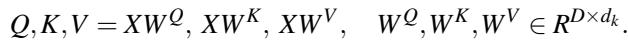

For multi-head attention [45], Q, K, and V are reshaped into R<sup>H×N×d</sup>, where H is the number of heads and d = D/H is the per-head dimension. A common variant is grouped-query attention (GQA) [20], where multiple query heads share the same key and value heads to improve efficiency.

For LLM models that incorporate rotary positional embeddings (e.g., LLaMA [28, 50]), the queries and keys are further augmented with rotary transformations:

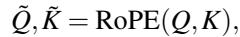

where RoPE applies position-dependent rotations in the query/key space to encode relative positional information. In contrast, other models (e.g., OPT [56]) omit this step and rely on alternative positional encodings.

Finally, for each head, the scaled dot-product attention is computed as:

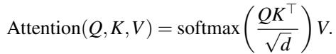

LLM inference proceeds in two phases [59]: the prefill phase, where the full input sequence is processed in parallel to initialize the KV cache, and the decode phase, where tokens are generated autoregressively, each new query attending to all cached K/V .

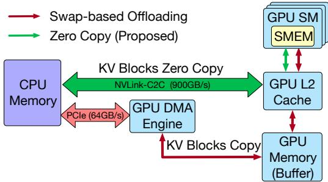  
Figure 1: KV cache offloading via swapping and zero copy.

## 2.2 KV Cache Offloading

During autoregressive inference, the KV cache stores K and V tensors from prior decoding steps, reducing attention cost from quadratic to linear in sequence length. Yet the cache grows linearly with context length and model dimension, quickly exhausting GPU memory. Existing systems offload KV blocks to CPU memory through HBM staging buffers.

## 2.2.1 Swap-based KV Cache Offloading

As shown by the red path in Fig. 1, KV blocks are stored in CPU memory and are copied to GPU memory before use via a GPU copy engine [13]. To reduce stalls, systems overlap these transfers with computation. However, PCIe bandwidth (64 GB/s) is far lower than HBM bandwidth (4 TB/s), making data movement a bottleneck. To hide transfer latency, a large GPU buffer is required, wasting valuable GPU memory. Even then, poor prefetch coordination can still cause GPU stalls. Moreover, swap-based designs perform layer-by-layer swapin and swap-out of KV blocks, doubling interconnect traffic and further constraining scalability.

Swap-based offloading can prevent CUDA Graphs from being replayed unchanged. CUDA Graphs reduce per-token launch overhead by capturing and replaying a fixed sequence of GPU operations. However, swap-based KV offloading introduces explicit cudaMemcpyAsync [17] operations for KV swap-in/out, whose addresses vary across decoding steps as different KV blocks are selected. These dynamic transfer addresses can force graph updates or re-capture, reducing the benefits of CUDA Graphs in practical serving systems.

## 2.2.2 Zero-Copy KV Cache Offloading

As shown by the green path in Fig. 1, zero-copy KV cache offloading [4] allows GPU kernels to directly access CPUresident KV blocks. This eliminates explicit transfers and HBM staging buffers. Once KV blocks are device-accessible, the attention kernel can fetch them directly and use asynchronous tiled data movement to bring KV tiles into SMEM for computation.

Compared with swap-based offloading, zero-copy is better suited for CUDA Graph execution. Because KV blocks are loaded inside the attention kernel rather than through explicit memory-copy operations, dynamic KV-block selection changes only the kernel inputs or internal address resolution, not the captured graph topology. This allows the graph to be replayed without per-step updates or re-capture.

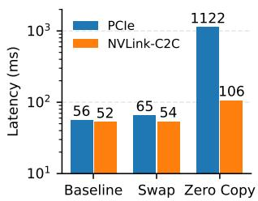  
(a) Latency comparison.

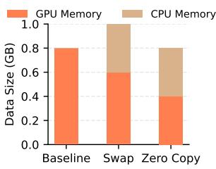  
(b) Memory usage.  
Figure 2: Comparison among three mechanisms for matrix multiplication.

The effectiveness of zero-copy primarily depends on CPU– GPU bandwidth rather than access latency. KV-cache access in long-context attention is naturally coarse-grained: each SM fetches KV tiles of around 100 KB, aligned with its SMEM capacity, and more than 100 SMs can fetch such tiles concurrently. This creates MB-scale aggregate data movement from CPU memory to the GPU. In this regime, sustained CPU–GPU bandwidth becomes the dominant bottleneck. Recent CPU–GPU platforms such as NVIDIA GH200 make this direction practical with NVLink-C2C, which provides up to 900 GB/s bidirectional bandwidth and allows CPU memory to act as an effective extension of GPU KV-cache capacity.

## 2.3 Challenges in KV Cache Offloading

Even with NVLink-C2C, a significant bandwidth gap remains between the CPU–GPU interconnect (900 GB/s bidirectional) and HBM bandwidth (4 TB/s). In the GEMM case study, repeated operand reuse across the O(n<sup>3</sup>) computation amplifies remote-memory traffic. In attention, a similar effect appears when CPU-resident KV tiles are repeatedly fetched across query, head, and batch dimensions.

To illustrate this challenge, we conduct a case study comparing swap-based and zero-copy KV cache offloading using a matrix multiplication benchmark, C = A × B, where A, B, and C are square matrices of size n×n (n = 10240, each 400 MB). We evaluate three configurations: (i) Baseline, where both A and B reside entirely in GPU memory; (ii) Swap, where a 200 MB GPU buffer is allocated to temporarily store portions of B transferred from CPU memory via PCIe or NVLink-C2C during multiplication; and (iii) Zero-Copy, where B resides entirely in CPU memory and is accessed directly by the GPU over PCIe or NVLink-C2C without intermediate buffering. Experiments are conducted on two hardware platforms: an NVIDIA H100 connected to the host via PCIe and an NVIDIA GH200, where an H100 GPU is tightly coupled to a Grace

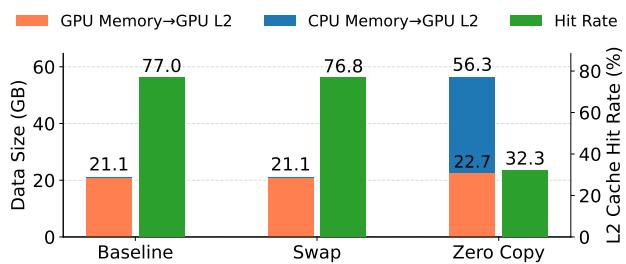  
Figure 3: Data fetching and L2 cache hit rate.

## CPU via NVLink-C2C.

Zero-Copy saves GPU memory but still incurs performance penalties. As shown in Fig. 2(a), the Swap configuration adds less than 10% overhead on PCIe and about 5% on NVLink C2C due to asynchronous data transfer. In contrast, Zero-Copy incurs over a 20× slowdown on PCIe (1122 ms vs. 56 ms) and a 2× slowdown on NVLink-C2C (106 ms vs. 52 ms). This penalty arises because Zero-Copy repeatedly fetches B from CPU memory throughout the O(n<sup>3</sup>) computation, fully exposing the bandwidth gap between CPU–GPU interconnects and HBM. While costly in performance, Zero-Copy eliminates the need for a large GPU buffer, reducing memory usage by 50% compared to Baseline and by 33% compared to Swap, as shown in Fig. 2(b).

Zero-Copy further reduces GPU L2 cache efficiency. To quantify this effect, we measure data traffic and L2 hit rate on GH200 (Fig. 3). Baseline and Swap perform similarly since both A and B reside in GPU memory, achieving high L2 hit rates (∼77%) and 21.1 GB of HBM-to-L2 traffic—well above the matrix size due to repeated accesses in the O(n<sup>3</sup>) computation. In contrast, Zero-Copy suffers frequent stalls because CPU–GPU transfers (900 GB/s, 450 GB/s per direction) are much slower than HBM-to-L2 transfers (4 TB/s), increasing CPU-to-GPU traffic to 22.7 GB while reducing the L2 hit rate to 32.3%—a 58% drop compared to Baseline/Swap. This shows that reduced cache locality, in addition to limited bandwidth, compounds the performance gap of naïve zero-copy offloading.

## 2.4 Opportunity: Kernel-memory Co-Design

GPU kernels support flexible data access patterns, enabling customized CUDA implementations that can optimize zerocopy KV cache access from CPU memory. This flexibility creates opportunities to mitigate the challenges discussed above. In particular, we focus on two key techniques — tiling and warp-level pipelining — to improve data locality, reduce redundant transfers, and better exploit the available CPU–GPU bandwidth.

## 2.4.1 Tiling Technology for Asymmetric Bandwidth

To better understand optimization opportunities, we revisit matrix multiplication with a focus on tiling technology. Modern

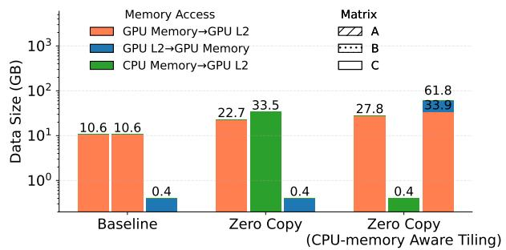  
Figure 4: Data movement breakdown across three matrix multiplication strategies.

GPUs have much smaller cache capacity than global memory but provide high-bandwidth shared memory within each streaming multiprocessor (SM). CUDA kernels can explicitly control shared memory usage, enabling computation to be organized in tiles: small submatrices of A and B are fetched from global memory into shared memory, multiplied to produce a partial tile of C, and the partial results are accumulated in shared memory before writing the final output to global memory. This tiling mechanism reduces global memory accesses and provides flexibility to redesign the computation pattern for cases where one input matrix resides in CPU memory.

Figure 4 shows the baseline access pattern. In Baseline (both A and B in GPU memory), the bottleneck is fetching A and B from GPU memory to L2 cache, each at 10.6 GB, while writing only 0.4 GB of C back to GPU memory. CUTLASSbased matrix multiplication iterates over tiles of A and B independently to compute each tile of C, with no data dependency between tiles. However, in Zero-Copy, where B resides in CPU memory, the asymmetric bandwidth between NVLink-C2C (900 GB/s, 450 GB/s per direction) and HBM (4 TB/s) causes the data fetched from CPU memory to be amplified by repeated accesses, reaching 33.5 GB—over 3× the original tile size—making CPU-to-GPU transfers the bottleneck.

To address this, we develop a CPU-memory-aware tiling strategy for matrix multiplication (details in § 5.1). The key idea is to shift bandwidth pressure away from the CPU–GPU interconnect onto on-device HBM. Instead of iterating over tiles of A and B, our optimized kernel iterates over tiles of A and C, while keeping the current B tile resident in SM shared memory. This reduces CPU-to-GPU traffic for B from 33.5 GB to just 0.4 GB, directly attacking the main bottleneck, since HBM bandwidth is roughly an order of magnitude higher than CPU–GPU interconnect bandwidth. The tradeoff is that C must now be read from and written to HBM more frequently for accumulation, increasing HBM traffic by about 2× (from 33.5 GB over the CPU–GPU interconnect to 61.8 GB + 33.9 GB in HBM). However, this extra load can be absorbed by HBM’s higher bandwidth while substantially relieving the CPU–GPU bottleneck. As shown in Fig. 5, this optimization reduces latency from 106 ms to 54 ms (a 49% performance improvement) and increases the L2 cache hit

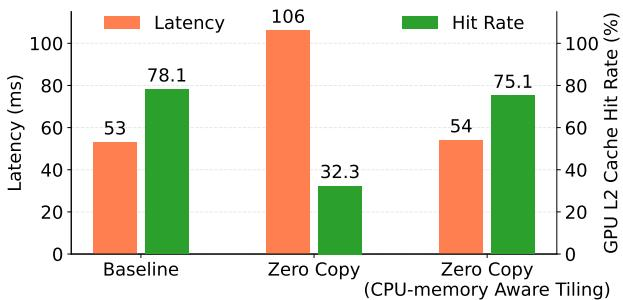  
Figure 5: Performance and GPU L2 cache hit rate across three matrix multiplication strategies.

rate from 32.3% to 75.1%.

Takeaway: By leveraging tiling, we can design a CPUmemory-aware Zero-Copy scheme that accommodates asymmetric bandwidth. Iterating over GPU-resident matrices rather than CPU-resident ones shifts bandwidth demand to HBM, fully exploiting its capacity and improving L2 cache efficiency for significantly better performance.

## 2.4.2 Warp-Level Pipelining for Communication and Computation Overlapping

Modern GPUs such as NVIDIA’s Hopper architecture (H100/GH200) support multiple warp groups within a thread block that can execute distinct tasks concurrently. This capa bility enables warp-level pipelining, where different warps overlap communication (data fetching) and computation (matrix multiplication) to hide memory latency (§ 5).

To quantify its impact, we compare matrix multiplication with and without pipeline fetching. In the baseline (no over lap), the kernel fetches one tile at a time, synchronizes all threads, performs computation, and then repeats. In contrast, pipeline fetching allows the SM to prefetch the next tile while simultaneously computing on the current tile. As shown in Fig. 6, both approaches transfer nearly identical data volumes. However, warp-level pipelining sustains 4.3× higher HBM throughput (1.3 TB/s vs. 0.3 TB/s) and reduces latency by 11% (48 ms vs. 54 ms), demonstrating effective communication–computation overlap.

Takeaway: Warp-level pipelining effectively hides memory latency by overlapping data transfer and computation, yield ing significantly higher throughput and lower latency without increasing data movement.

## 2.4.3 Fused Kernel for High Throughput

In conventional implementations, projection and attention score computation are launched as separate CUDA kernels. This separation forces the K and V tensors generated by the projection kernel to be written back to CPU memory (to update the KV cache) and then re-read by the attention kernel — creating redundant CPU–GPU transfers and exacerbating the bandwidth gap between NVLink-C2C (900GB/s aggregate,

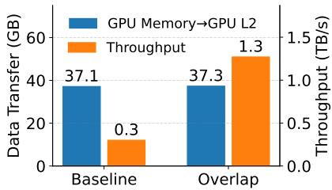  
(a) Data fetching & HBM throughput.

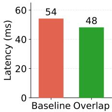  
(b) Performance.

Figure 6: Data fetching and performance under baseline (no overlap) vs. warp-level overlap.  
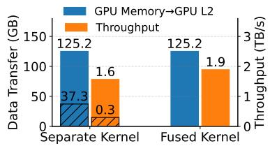  
(a) Data fetching & HBM throughput.

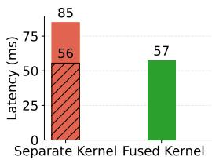  
(b) Performance.  
Figure 7: Data fetching and performance under separate kernel vs. fused kernel. Hatched bars (bottom) denote the first kernel.

450GB/s per direction) and HBM (4 TB/s per direction). This motivates us to fuse the projection and attention score computation into a single CUDA kernel to improve the throughput of data transfer (details in § 5.3 and § 5.4).

We evaluate this idea using a simplified case study. Specifically, the first kernel generates K via a matrix multiplication K = XW and the second kernel consumes K for another matrix multiplication P = QK<sup>⊤</sup>. Rather than separate it into different kernels, we fuse them into one kernel using two stages. The first stage fetches X and W<sub>k</sub> from HBM, generates K in registers, and writes the newly generated K back to CPU memory for KV-cache updates. The second stage immediately consumes K for QK<sup>⊤</sup> score computation. The tensor X, W<sub>k</sub> and Q reside in the SMEM. This design breaks the strict read–write dependency in traditional Zero-Copy, minimizes stalls, and increases effective throughput utilization.

As shown in Fig.7(a), the separate-kernel design transfers a similar amount of data as the fused kernel but sustains 15.8% lower HBM throughput due to redundant writes of K back to CPU memory and the subsequent re-fetching in the next kernel. In contrast, the fused kernel eliminates these redundant transfers, achieving 1.9TB/s throughput. This directly translates to performance gains: latency drops from 85ms to 57 ms, a 49% speedup as shown in Fig.7(b), by improving memory locality and bandwidth utilization.

Takeaway: Kernel fusion eliminates redundant memory transfers and improves data locality, further delivering higher throughput and performance.

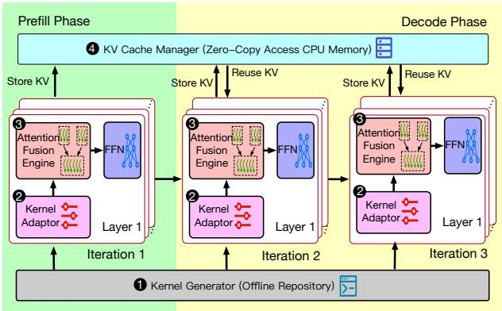  
Figure 8: The system architecture of DirectKV.

## 3 Overview of DirectKV Architecture

This section outlines the overall architecture of DirectKV, a KV cache decoding system for LLM serving by reducing GPU memory pressure and improving runtime efficiency. DirectKV integrates zero-copy KV cache offloading with fused projection-attention kernels, dynamically adapting to input precision and execution phases (prefill or decode) as shown in Fig. 8. Both phases utilize a shared kernel execution framework that includes the following core components:

The Kernel Generator <sup>❶</sup> compiles a rich set of CUDA kernel candidates offline, specialized for different tensor precisions (e.g., FP16, BF16), tiling configurations, and execution modes (prefill vs. decode). It serves as an offline repository, ensuring that optimized kernels are pre-built and ready for runtime dispatch.

The Kernel Adaptor <sup>❷</sup> dynamically selects an appropriate CUDA kernel at runtime based on tensor precision (e.g., FP16, BF16), head dimension, and current execution phase (multitoken prefill vs. single-token decode). It allows the system to flexibly dispatch to optimized implementations without manual intervention or recompilation.

The Attention Fusion Engine <sup>❸</sup> fuses K/V projection and attention computation into a single CUDA launch to eliminate redundant KV cache transfers. It leverages shared memory within the SM and warp-level programming to overlap KV cache transfer with attention score computation.

The KV Cache Manager <sup>❹</sup> stores the key and value tensors in host-pinned memory using zero-copy access. Rather than using explicit cudaMemcpyAsync to move KV tensors between host and device, we utilize pinned memory to allow direct GPU access to host-resident tensors within SM. This design avoids redundant transfers and supports long-sequence inference without increasing GPU memory usage.

## 4 Kernel Generation and Adaptation

Typically, CUDA requires kernel specialization for input precision and tiling to fully exploit hardware, so multiple kernels must be compiled offline and selected at runtime. Accordingly, DirectKV introduces a Kernel Generator to generate candidate kernels offline and Kernel Adaptor a runtime component that chooses the most efficient kernel online.

## 4.1 SMEM Partitioning and Reuse

In DirectKV, SMEM serves as the on-chip buffer for matrix multiplications in the attention module. Its limited capacity is a primary hardware constraint that directly shapes kernel design. To balance projection and attention workloads, the SMEM within each SM is logically divided into two regions:

1. Projection buffers: used to store tiles of the input X and projection weights W<sub>k</sub> and W<sub>v</sub> during KV projection.

2. Attention buffers: used to store intermediate K, V , the query Q, and the output O during attention computation.

To alleviate SMEM pressure, DirectKV overlaps the usage of these two regions. Specifically, K reuses the buffer originally allocated for W , and V reuses the buffer allocated for W<sub>v</sub>. Phase-specific optimizations further reduce demand: in the decode phase, O is written directly from registers to HBM (see § 5.3), while in the prefill phase, O reuses the buffer allocated for W<sub>v</sub> in shared memory (see § 5.4). This partitionand-reuse strategy maximizes SMEM utilization and enables larger tiles under fixed hardware limits.

By default, DirectKV adopts two pipeline stages to overlap computation and communication at the warp level, which doubles the buffering requirement. Since SMEM is carved from the unified L1/SMEM pool (e.g., 256 KB on GH200) [7], we conservatively reserve a fraction α (80% by default) for SMEM and leave the remainder to L1 cache. The SMEM allocation must therefore satisfy:

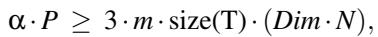

(1)

where P is the total L1/SMEM pool size, the factor 3 accounts for buffering three tensors in projection and attention, m is the number of pipeline stages (2 by default), T is the tensor data type with size(T ) denoting its element size in bytes, Dim is the KV head dimension, and N is the tile size.

Given a specific configuration <T, Dim, N>, we compute the maximum feasible N that satisfies this constraint. These valid configurations are collected into a candidate set that guides kernel pre-building.

## 4.2 Offline Kernel Pre-Building

From this candidate set, the Kernel Generator pre-compiles fused kernels (details in § 5) using C++ template instantiations. Listing 1 illustrates the prefill kernel; the decode kernel is constructed analogously but specialized for its execution phase. Template syntax allows kernels to be specialized at compile time with respect to <T, Dim, N>, ensuring each variant is fully optimized by the compiler while avoiding run time code generation overhead. This approach also keeps the codebase maintainable, as the same kernel logic can be reused across multiple configurations. All such instantiations are compiled offline into a candidate pool of fused kernels.

```c
Listing 1: Offline Kernel Pre-building using C++ Templates.
template <typename T, int Dim, int N>
__global__ void prefill_kernel(
T* X, const T* Wq, const T* Wk,
const T* Wv, T* Q, T* O, int seq_len);
// Offline instantiations
template __global__ void prefill_kernel<int, 128,
64>(...);
template __global__ void prefill_kernel<float, 64,
64>(...);
```

## 4.3 Online Kernel Choosing

At runtime, the Kernel Adaptor selects the most suitable kernel for the current phase (prefill or decode) by matching the requested <T, Dim, N> configuration to the closest available instantiation in the candidate pool. This process is lightweight, as it only requires substituting the template parameters with the pre-compiled kernels. As a result, DirectKV can dynamically adapt to workload characteristics while guaranteeing that each kernel execution leverages a carefully tuned, hardwareefficient implementation.

## 5 Kernel–Memory Co-Design Attention

We design the CUDA kernel to fully exploit tiling and warplevel programming, adapting the data access pattern to efficiently support zero-copy KV cache offloading. In this section, we detail how these techniques enable a high-performance fused kernel tailored for tightly coupled CPU–GPU superchip architectures.

## 5.1 CPU-Memory Aware Matrix Multiplication

To exploit HBM bandwidth and relieve pressure on the CPU– GPU interconnect, our key idea is to shift data-fetching overhead from host to device memory. This requires rethinking matrix multiplication access patterns, which conventionally assume all operands reside in GPU memory. Tiling techniques [5, 26] offer a natural solution: by decomposing large matrices into smaller submatrices (tiles) that fit within SMEM, CUDA kernels can flexibly control data movement, maximize reuse and minimize redundant accesses. Building on this, we design a CPU-memory aware tiling strategy that reuses CPUfetched tiles efficiently while leveraging HBM’s bandwidth for repeated accesses.

```c
Algorithm 1: Tiled data-fetching patterns for matrix
multiplication (Native vs. CPU-aware).
1 Procedure NativeTiling(A∈R<sup>M×K</sup>, B∈R<sup>K×N</sup>, C∈R<sup>M×N</sup>):
2 Initialize C<sub>i, j</sub> ;
3 for k ← 1 to T do
4 Load A<sub>i,k</sub> ; /* HBM → SMEM */
5 Load B<sub>k, j</sub> ; /* HBM → SMEM */
6 C<sub>i,j</sub> ← C<sub>i,j</sub> + A<sub>i,k</sub>×B<sub>k,j</sub> ; /* reuse stationary C */
7 Store C<sub>i, j</sub> ; /* registers/SMEM → HBM */
8 Procedure CpuAwareTiling(A∈R<sup>M×K</sup>, B∈R<sup>K×N</sup>, C∈R<sup>M×N</sup>):
9 Load B<sub>k, j</sub> ; /* CPU Memory → SMEM (zero copy) */
10 for i ← 1 to T<sub>M</sub> do
11 Load A<sub>i,k</sub> ; /* HBM → SMEM */
12 Load C<sub>i, j</sub> ; /* HBM → SMEM */
13 C<sub>i,j</sub> ← C<sub>i,j</sub> + A<sub>i,k</sub>×B<sub>k,j</sub> ; /* reuse stationary B */
14 Store C<sub>i, j</sub> ; /* registers/SMEM → HBM */
```

We use a matrix multiplication kernel C = A × B to illustrate the distinction between conventional tiling and our CPU-aware tiling as shown in Algorithm 1. The key difference lies in which operand is reused and, consequently, where the bandwidth pressure is concentrated within the memory hierarchy. In NativeTiling (Step 1), both A and B tiles are repeatedly fetched from GPU HBM into shared memory, while C remains stationary in registers or SMEM until the final write-back. This design is efficient when all operands reside in GPU memory but requires frequent HBM accesses for both A and B. In particular, each multiplication step reloads B tiles for every (i, j, k) triple, so the data movement on B scales with the O(n<sup>3</sup>) computation. In contrast, CpuAwareTiling (Step 8) adapts to zero-copy offloading by treating B as stationary: each B tile is fetched once per (k, j) pair and reused across all i, reducing the traffic from O(n<sup>3</sup>) to O(n<sup>2</sup>). The trade-off is that C must be reloaded and updated from HBM at every step, increasing its traffic cost from 2 · O(n<sup>3</sup>) in NativeTiling to 3 · O(n<sup>3</sup>) in CpuAwareTiling. This design shifts bandwidth demand away from the constrained CPU–GPU interconnect and onto HBM, where the additional overhead can be efficiently absorbed.

This trade-off directly influences the design of attention score computation. Since SMEM is insufficient to hold all tensors, there are two possible iteration strategies: (i) iterate over Q for each (K,V ) pair, or (ii) iterate over (K,V ) for a given Q. In our design, we adopt the first strategy during the prefill phase (§ 5.3), where the KV cache resides in CPU memory and is expensive to reload, making it preferable to iterate over Q stored in HBM. This scheme corresponds to CpuAwareTiling. In contrast, during the decode phase (§ 5.4), the length of Q is only a single token, so we instead iterate over (K,V ) to avoid repeatedly reading intermediate output scores. This scheme corresponds to NativeTiling.

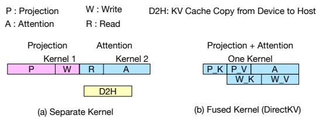  
Figure 9: KV Projection and attention fusing.

## 5.2 Warp-Level Parallelism for Overlapping

On NVIDIA’s Hopper architecture [22], SM threads can be divided into multiple warp groups, with each group independently handling tasks such as computation or communication. To maximize efficiency in the fused kernel, we employ warp-level pipelining for both projection and attention: while one set of warps fetches the next tiles from memory, others concurrently compute on the current tiles. This overlap hides memory latency and sustains high throughput, akin to asynchronous data copy in swap-based KV offloading where host–device transfers overlap with computation. On Hopper GPUs, this mechanism is further reinforced by the Tensor Memory Accelerator (TMA) [10], a hardware copy engine within each SM that supports asynchronous data movement and frees compute warps to focus on arithmetic.

## 5.3 Fused Kernel for Prefill Phase

Rather than launching separate kernels for each projection followed by a standalone attention kernel, our fused approach executes the entire sequence in a single pass (Fig. 9). The key insight is that the generated K and V tiles are retained in SMEM and immediately consumed by the subsequent attention computation, eliminating redundant writes to and reads from CPU memory.

Algorithm 2 outlines the design of the fused prefill kernel. The kernel initializes three specialized warp groups—producer, consumer, and storer (Step 3). The producer warps fetch tiles from HBM, the consumer warps perform the computation, and the storer warps handle writing intermediate results (e.g., K/V ) back to CPU memory when required. This division enables overlap between data movement and computation.

The projection stage is decomposed into two suboperations that generate K and V tiles, respectively. For each sub-operation, we employ pipeline parallelism across warp groups. For example, during K tile generation, while consumer warps compute on the current tile (Step 7), producer warps simultaneously prefetch the next tile from HBM (Step 6), thereby overlapping computation with data movement. Once the projection of K and V for a given tile is complete, the storer warps transfer the results to CPU memory, while the consumer warps proceed with attention computation on previously generated tiles. After generating the K tiles, we optionally apply rotary position embeddings (RoPE) [28, 48] (Step 8). Because RoPE relies only on precomputed sine and cosine functions determined by token positions, each K tile can be transformed independently, enabling efficient parallelization across SMs without inter-tile dependencies.

```csv
Algorithm 2: Fused Prefill Kernel
Input: Input embeddings X ∈ R<sup>N×D</sup>, projection
weights W<sub>k</sub>,W<sub>v</sub> ∈ R<sup>D×d</sup>, query Q ∈ R<sup>S×d</sup>, head
dimension d, sequence length S, tile sizes B<sub>kv</sub>
and B for KV cache and query, respectively.
1 Initialize output tensor O ∈ R<sup>S×d</sup>
2 Initialize streaming-softmax state (ℓ = 0, m = −∞)
3 Initialize three Warp Groups including Producer,
Consumer and Storer
4 for j ← 1 to T<sub>s</sub> = <sup>S</sup><sub>Bkv</sub> do
/* KV Projection Stage */
5 for i ← 1 to T<sub>d</sub> =  <sup>D</sup>  do
6 Producer: Load X ,W<sup>k</sup> from HBM
7 Consumer: K<sub>j</sub> = X<sub>i</sub> <sub>j</sub>W <sup>k</sup> + K<sub>j</sub>
8 if use_rope then
9 K<sub>j</sub> ← RoPE(K<sub>j</sub>)
10 Storer: Zero-copy write K<sub>j</sub> to CPU Memory
11 for i ← 1 to T<sub>d</sub> =  <sup>D</sup>  do
12 Producer: Load X<sub>i</sub> <sub>j</sub>,W <sup>v</sup> from HBM
13 Consumer: V<sub>j</sub> = X<sub>i</sub> <sub>j</sub>W<sup>v</sup> +V<sub>j</sub>
14 Storer: Zero-copy write V<sub>j</sub> to CPU Memory
/* Attention Stage */
15 for i ← 1 to T<sub>s</sub> = <sup>S</sup><sub>B</sub> do
16 Producer: Load Q<sub>i</sub>, O<sub>i</sub>, m<sub>i</sub>, ℓ<sub>i</sub> from HBM ;
17 Consumer:
18 S<sub>i</sub> <sub>j</sub> ← Q<sub>i</sub>K <sup>⊤</sup><sub>j</sub>
19 (m<sub>i</sub>, ℓ<sub>i</sub>, O<sub>i</sub>) ←
StreamSo f tmax(m, ℓ<sub>i</sub>, O<sub>i</sub>, S<sub>i</sub> <sub>j</sub>,V<sub>j</sub>)
20 Write O , m back to HBM
```

For attention score computation, we adopt the strategy of iterating over Q (Step 15), which is precomputed before launching the fused attention kernel and resides in HBM. For each (K,V ) tile, this design allows SMs to process different tiles independently, thereby maximizing parallelism. A trade-off of this design is that intermediate outputs O<sub>i</sub> and auxiliary statistics m , ℓ must be repeatedly fetched for accumulation and streaming softmax updates [26, 36, 40] (Step 19). These updates are standard in long-sequence attention to ensure numerical stability and are retained without modification. Importantly, the additional HBM traffic introduced by these updates remains modest compared to CPU–GPU transfers, and thus does not become the dominant bottleneck. To avoid write– read dependencies on O<sub>i</sub> across SMs, we assign different attention heads and batches to different SMs. Since the product of the number of heads (e.g., 8) and batch size (e.g., 32) typically exceeds the number of SMs (e.g., 132 on GH200), this scheduling ensures that no two SMs simultaneously operate on the same head–batch pair with different (K,V ) tiles. Finally, similar to the projection stage, we employ pipeline parallelism: producer warps prefetch the next Q tiles from HBM (Step 16), while consumer warps concurrently perform computations on the current tiles (Step 18), thereby overlapping data movement with computation.

## 5.4 Fused Kernel for Decode Phase

In contrast to the prefill phase, where avoiding repeated KV cache fetching from CPU memory dominates the cost, the decode phase reuses the cached K,V heavily while comput ing projections and attention scores for only a single newly generated query token. To fully utilize parallelism in this setting, we adopt the complementary strategy of iterating over all cached (K,V ) given the single query q<sub>t</sub>. Since only one token is processed, each (K,V ) pair needs to be traversed just once, avoiding additional CPU–GPU memory transfers. Furthermore, this design eliminates redundant reloads of the output attention scores: o<sub>t</sub> can be retained in registers and reused across iterations, rather than repeatedly fetched from HBM. This optimization minimizes overhead while preserving high throughput as illustrated in Algorithm 3.

The fused decode kernel requires only two warp groups, producer and consumer, since only a single newly generated (K,V ) pair is written back to CPU memory. In this case, a dedicated storer group is unnecessary, and the consumer warps handle the write-back after completing the new (K,V ) projection. Specifically, the producer first fetches the query q<sub>t</sub> from HBM (Step 2) to prepare for subsequent iterations. During the attention stage, the producer loads (K,V ) tiles from CPU memory into SMEM via zero-copy, while the consumer performs computation over these tiles. Pipeline parallelism is employed to overlap communication and computation: while the producer fetches the next tile (Step 5), the consumer concurrently computes on the current tile (Step 6), thereby sustaining throughput and reducing stalls.

## 6 Efficient KV Cache Management

The KV cache grows linearly with sequence length and quickly exceeds GPU capacity. To address this, we introduce the KV Cache Manager, which offloads KV tensors to CPU memory and enables direct GPU access via zero-copy.

The manager allocates CPU buffers with cudaHostAlloc as pinned memory [9], making host memory page-locked and directly accessible to the GPU without staging. Once written, KV tensors remain in pinned buffers and are reused across iterations without recomputation or redundant transfers.

```csv
Algorithm 3: Fused Decode Kernel (token-by-token)
Input :New token x<sub>t</sub> ∈ R<sup>1×d</sup>model , weights W<sub>k</sub>,W<sub>v</sub>,
head dim d, cached KV length S<sub>kv</sub>, flags
use_rope, tile sizes B for KV cache.
1 Initialize output tensor o
2 Initialize streaming-softmax state (ℓ = 0, m = −∞)
3 Producer: Load q from HBM
/* Attention over cached KV */
4 for j ← 1 to T = S<sub>kv</sub> B<sub>kv</sub> do
5 Producer: zero-copy load cached tiles (K<sub>j</sub>,V<sub>j</sub>)
from CPU memory
6 Consumer:
7 S<sub>j</sub> ← q<sub>t</sub>K<sup>⊤</sup><sub>j</sub>
8 (m, ℓ, o<sub>t</sub> ) ← StreamSo f tmax(m, ℓ, o<sub>t</sub> , S <sub>j</sub>,V<sub>j</sub>)
/* Project current token’s KV */
9 for i ← 1 to T<sub>d</sub> =  D do
10 Producer: Load X ,W<sup>k</sup>,W<sup>v</sup> from HBM
11 Consumer: k<sub>t</sub> = X<sub>i</sub>W <sup>k</sup> + k<sub>t</sub>, v<sub>t</sub> = X<sub>i</sub>W <sup>v</sup> + v<sub>t</sub>
12 if use_rope then
13 Consumer: k<sub>t</sub> ← RoPE(k<sub>t</sub>)
14 Consumer: Append (k , v ) to KV cache in CPU
memory
/* Attention with new KV */
15 Consumer:
16 s<sub>t</sub> ← q<sub>t</sub>k<sup>⊤</sup>
17 (m, ℓ, o<sub>t</sub> ) ← StreamSo f tmax(m, ℓ, o<sub>t</sub> , s<sub>t</sub> , v<sub>t</sub> )
18 Write o back to HBM
```

During prefill, the manager stores the initial K,V entries from each layer in CPU memory. During decode, the GPU reuses these cached entries directly, while only appending new K,V for the latest token.

Integrated with the Kernel Adaptor and Attention Fusion Engine (Fig. 8), the KV Cache Manager reduces interconnect traffic, relieves GPU memory pressure, and enables scalable long-context generation beyond GPU-only caching.

## 7 Implementation and Evaluation

## 7.1 System Implementation

Prototype. We implement DirectKV in CUDA 12.4, building on NVIDIA’s CUTLASS library for matrix multiplication [12] and extending FlashAttention-3 [44]. The implementation integrates three key techniques: (i) CPU-aware matrix multiplication, (ii) warp-level pipelining, and (iii) kernel fusion of projection and attention. In total, our prototype contributes roughly 5,300 lines of CUDA/C++ code on top of FlashAttention-3, with additional Python bindings to enable integration into PyTorch 2.2. For kernel-level analysis, we use NVIDIA Nsight Compute to report hardware metrics, including L2 cache hit rate and memory throughput, in order to quantify efficiency gains.

KV cache management. DirectKV includes a lightweight KV cache manager (<sup>❹</sup> in Fig. 8) to support direct attention over CPU-resident KV blocks. The manager allocates KV buffers in pinned host memory using cudaHostAlloc [9]. Since these buffers are page-locked and GPU-accessible, DirectKV kernels can access CPU-resident KV blocks through device-visible pointers without staging them in GPU memory. Once generated, KV tensors remain in the pinned buffers and are reused across decoding iterations, avoiding recomputation and redundant CPU–GPU transfers.

## 7.2 Evaluation Setup

Server Configurations. We evaluate DirectKV on an NVIDIA GH200 Grace–Hopper Superchip with a Hopper GPU, 96 GB of HBM3, and LPDDR5X CPU memory [15]. The system runs CUDA 12.4 and PyTorch 2.3, and our custom kernels are implemented using CUTLASS 3.0+ with Hopper support via CuTe. For baseline comparison, we use the H100 (PCIe Gen5) to quantify the benefits of NVLink-C2C ( § 7.4.3), since both GH200 and H100 employ the same H100 GPU architecture.

LLM models. We evaluate Llama-3.1-8B [11] and OPT [56] models with 13B and 30B parameters.

Workloads. Following prior work on LLM serving [37], we evaluate on real-world datasets including ShareGPT [6, 8] (user-shared ChatGPT conversations) and Alpaca [49, 52] (instruction-following data generated by GPT-3.5). Since request timestamps are not provided, we generate arrivals as a Poisson process parameterized by the request rate [37].

Our main experiments use request rates up to 30 req/s and context lengths from 1k to 32K tokens, representing a stable operating region where systems can be compared under reasonable latency. We further add stress-case workloads with higher request rates and longer context lengths to evaluate behavior under saturation and memory pressure. These workloads show when baseline systems run out of GPU mem ory or experience severe latency degradation from KV-cache movement and staging overheads. We also vary batch size to cover both latency-critical interactive serving and throughputoriented batch scenarios.

Baseline schemes: We compare DirectKV against three KV cache offloading systems:

• SGLang [58] is a high-performance serving framework for large language and multimodal models. We use SGLang as an HBM-resident baseline, where the KV cache is stored in GPU memory.

• Pie [53] uses a large GPU staging buffer to swap KV blocks from CPU memory to GPU via NVLink-C2C, overlapping transfers with compute.

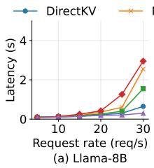

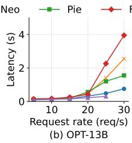

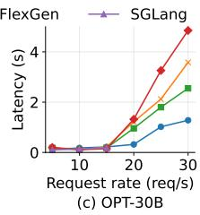  
Figure 10: Per-token latency under varying request rate for different models.

• FlexGen [46] uses GPU, CPU memory, and disk with a cost-model search and 4-bit compression to reduce memory footprint and enable LLM inference under tight GPU memory constraints.

• Neo [34] offloads part of attention computation and KV cache to CPUs, using asymmetric GPU–CPU pipelining and load-aware scheduling to increase throughput.

## 7.3 End-to-end Performance

## 7.3.1 Per-token Latency

We evaluate three models under varying request rates, as shown in Fig. 10. SGLang achieves the lowest latency when the model and KV cache fit entirely in GPU memory, as it serves both parameters and KV cache from HBM without offloading overhead. However, this design is constrained by GPU memory capacity: SGLang supports all request rates for Llama-3.1-8B, but runs out of memory at the highest request rate for OPT-13B and beyond low request rates for OPT-30B. DirectKV achieves the lowest latency among offloadingbased systems and remains close to SGLang when SGLang is feasible. On Llama-3.1-8B, DirectKV is slightly slower than SGLang but substantially faster than Neo, Pie, and Flex-Gen, reducing latency at 30 req/s from 1.55–2.95s to 0.75s. For OPT-13B, DirectKV remains competitive with SGLang at moderate loads and continues to support 30 req/s, where SGLang OOMs; at this load, DirectKV achieves 0.75s latency, compared with 1.55–3.95s for other offloading systems. For OPT-30B, SGLang only supports low request rates, while DirectKV scales to 30 req/s and maintains much lower latency than Neo, Pie, and FlexGen under high load.

These results show that SGLang provides the best performance when sufficient HBM is available, whereas DirectKV offers a better performance–capacity tradeoff. By using zerocopy KV offloading, DirectKV avoids staging buffers and redundant CPU–GPU copies, reducing offloading overhead and enabling graceful scaling when GPU-resident systems exceed HBM capacity.

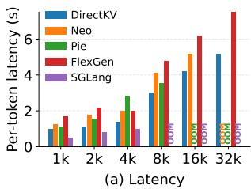

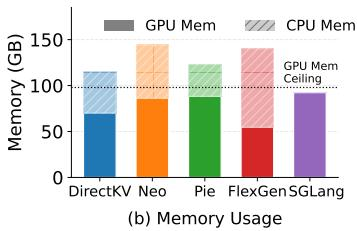  
Figure 11: Performance and memory usage under different sequence length.

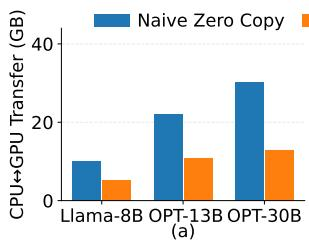

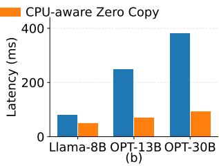  
Figure 12: Data fetching and latency per token comparison between naive zero-copy and CPU-aware zero-copy.

## 7.3.2 Impact of Context Length on Latency

We evaluate average GPU and CPU memory usage under varying sequence lengths across different LLM models on GH200, which has 96GB of GPU memory as shown in Fig.11(b). SGLang keeps both model parameters and KV cache in GPU memory, consuming 92GB on average and approaching the GPU memory limit as the sequence length grows. Although Neo, Pie, and FlexGen offload data to CPU memory, they still consume substantial GPU memory due to additional runtime buffers for KV-cache movement, using 86GB, 88GB, and 74 GB, respectively. In contrast, DirectKV uses only 47GB of GPU memory, saving 35GB on average compared with these offloading-based systems, which corresponds to a 43% reduction in GPU memory usage. This saving comes from storing the KV cache in CPU-pinned memory and allowing the attention kernel to directly consume CPU-resident KV blocks. As a result, DirectKV stays well below the 96 GB GPU memory ceiling and avoids SGLang’s OOM behavior while achieving lower latency than other offloading-based systems.

We evaluate per-token latency under different sequence lengths, as shown in Fig. 11(a).DirectKV consistently achieves the lowest latency among systems that support each context length, with a 1.2× average speedup. Its advantage increases as the sequence length grows: at 16k tokens, DirectKV is about 1.3× faster than Neo and Pie and about 1.7× faster than FlexGen. At 32k tokens, DirectKV remains efficient, while Neo, Pie, and SGLang run out of memory and FlexGen incurs much higher latency. SGLang is fast when all data fits in GPU memory, but fails at longer contexts due to GPU memory pressure. FlexGen supports longer contexts but suffers from explicit data movement and multi-tier offloading overhead. By keeping KV cache in CPU memory and directly accessing it through zero-copy execution, DirectKV reduces GPU memory usage while sustaining low latency for long-context serving.

## 7.3.3 GPU and CPU Memory Savings

## 7.4 Component-Level Evaluation

## 7.4.1 Benefits of CPU-Memory-Aware Matrix Multiplication

Naïve zero-copy attention performs matrix multiplications directly on KV blocks fetched from CPU memory, leading to repeated transfers of the same operands and excessive communication overhead. We evaluate our CPU-aware zero-copy mechanism, which reorganizes data access so that each KV block fetched from CPU memory is maximally reused in GPU registers and HBM before eviction. This design shifts the dominant pressure from the CPU-GPU interconnect to the GPU-side memory hierarchy, where HBM bandwidth is much higher and can better absorb the additional traffic. As shown in Fig. 12(a), CPU-aware zero-copy reduces CPU–GPU transfer volume by up to 50% compared with naive zero-copy. This reduction translates into up to 70% lower inference latency across LLaMA-8B, OPT-13B, and OPT-30B, as shown in Fig. 12(b). Overall, CPU-aware zero copy consistently improves end-to-end throughput by reducing communication cost and fully exploiting GPU compute.

## 7.4.2 Advantage of Fused Kernel

In existing offloading approaches K, and V projections are launched as separate kernels, followed by an attention kernel. This separation forces repeated refetching of KV blocks from CPU memory, inflating interconnect traffic and underutilizing GPU bandwidth. Our fused kernel addresses this inefficiency by combining QKV projection and attention into a single pass. Projected tensors remain in shared memory and are immediately consumed by attention, eliminating redundant global memory accesses. As shown in Fig. 13, the fused design sustains up to 3.5× higher HBM throughput and delivers 2.5–3.0× lower latency across Llama-8B, OPT-13B, and OPT-30B. These results demonstrate that kernel–memory codesign is essential to making zero-copy offloading practical and efficient on heterogeneous CPU–GPU platforms.

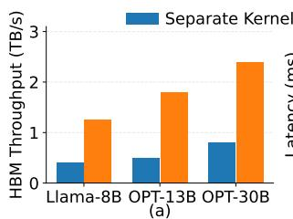

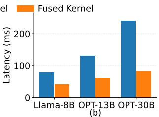  
Figure 13: HBM throughput and latency per token comparison between separate kernel and fused kernel.

## 7.4.3 Impact of High-bandwidth Interconnection

The efficiency of zero-copy offloading is fundamentally limited by the bandwidth of the CPU–GPU interconnect. With PCIe, KV blocks must traverse a lower-bandwidth channel, which can quickly become the system bottleneck and cause GPUs to stall while waiting for data. In contrast, NVLink-C2C provides much higher bandwidth, allowing DirectKV to sustain higher HBM utilization and better overlap communication with computation. Thus, on PCIe, DirectKV should be viewed primarily as a capacity-extension mechanism: it eliminates GPU staging buffers, but its performance advantage remains bounded by CPU–GPU interconnect bandwidth.

As shown in Fig. 14, DirectKV consistently achieves the lowest latency on both interconnects, with the gap especially pronounced under NVLink-C2C. Relative to PCIe, NVLink C2C reduces attention latency by up to 4.2× and improves throughput stability under long contexts. Competing systems such as Neo, Pie, and FlexGen remain bottlenecked by staging overheads, yielding only modest improvements under NVLink-C2C.

## 8 Discussion

## 8.1 Integration with Existing Serving Systems

DirectKV is intended to complement, rather than replace, fullfeatured LLM serving systems such as vLLM and SGLang. These systems already provide mature mechanisms for continuous batching, prefix reuse, eviction, and hierarchical KV caching [23, 24, 32, 37, 58]. Such mechanisms determine how requests are scheduled, which KV blocks are reused or shared, and when blocks are retained, evicted, or promoted across memory tiers. DirectKV addresses a separate concern: how to execute attention efficiently once the relevant KV blocks reside in CPU memory.

This separation makes DirectKV naturally compatible with existing serving stacks. DirectKV does not change scheduling, batching, or KV-management policies; instead, it provides an efficient execution path for CPU-resident KV blocks. A serving system can integrate DirectKV by extending its KV allocator to support CPU-pinned storage for offloaded blocks, while leaving the scheduler, model execution graph, and frontend API unchanged. Therefore, DirectKV can directly benefit existing KV-cache optimizations that already place KV blocks in CPU memory, including prefix caching, eviction, and hierarchical KV management, by avoiding the copy back to HBM before attention.

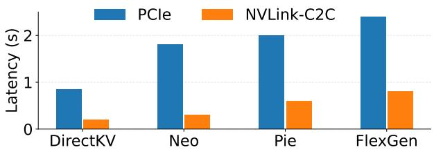  
Figure 14: Latency per-token under 512 sequence length when using PCIe and NVLink-C2C.

## 8.2 Hardware Applicability

DirectKV is best suited to CPU–GPU platforms with high-bandwidth interconnects, such as NVLink-C2C on GH200/GB200. Its coarse-grained access pattern—∼100 KB KV blocks accessed concurrently by over 100 SMs—creates MB-scale aggregate transfers, making performance primarily limited by sustained CPU–GPU bandwidth rather than individual remote-load latency. Thus, on PCIe-only platforms, DirectKV may still reduce GPU memory usage, but throughput benefits are often limited by interconnect bandwidth.

Importantly, this bandwidth-oriented design does not rely on platform-specific coherence mechanisms. DirectKV uses zero-copy pinned memory rather than GH200’s unified page table (UPT). Although UPT provides a coherent CPU–GPU virtual address space, DirectKV does not require coherence because KV blocks are not concurrently updated by the CPU. In our setting, zero-copy achieves comparable NVLink-C2C bandwidth while relying only on standard pinned host memory and device-visible pointers, making DirectKV applicable beyond UPT-specific platforms.

## 8.3 Scalability and Distributed Serving

DirectKV is primarily a node-local heterogeneous-memory optimization, but it composes with common LLM-serving parallelism strategies and distributed KV layouts. Under tensor parallelism, each GPU maintains its own attention-head shard and CPU-pinned KV pool; under pipeline parallelism, KV pools partition naturally by layer. When KV cache is partitioned across servers, each server can apply DirectKV to its local CPU-resident KV blocks, while the distributed runtime still handles query and partial-output communication. Thus, DirectKV improves per-server KV capacity, but does not eliminate inter-server communication costs.

DirectKV also benefits disaggregated prefill–decode serving because CPU-pinned KV blocks can be transferred via

RDMA without GPU staging. Its main limitations are contextparallel scale-out and host-memory pressure: coordinating remotely owned KV blocks or integrating with a multi-tier KV hierarchy would require additional runtime support, and zero-copy benefits diminish once accesses fall back to pageable or disk-backed tiers. We leave these extensions to future work.

## 9 Related Work

Efficient LLM Inference. A rich line of work has optimized transformer inference for latency and throughput. Systems such as TensorRT-LLM [3], vLLM [37], and DeepSpeed-Inference [21] accelerate execution through operator fusion, batching, and kernel optimizations. DistServe [59] disaggregates prefill and decode to reduce interference, while TurboTransformers [29] and HuggingFace [1] provide widely adopted runtimes. Sarathi-Serve [19] dynamically allocates prefill/decode resources, ZeRO-Offload [43] shifts optimizer states to CPU memory, PowerInfer [47] exploits activation sparsity, SGLang [58] optimizes multi-turn interaction, and FlashDecoding++ [33] provides low-latency decoding kernels. While effective within GPU memory constraints, none address KV cache offloading across CPU–GPU memory, the focus of DirectKV.

KV Cache Offloading. Many recent systems propose offload ing the KV cache from GPU to CPU memory to support longer contexts. FlexGen [46] formulates tensor placement as a linear programming problem across GPU, CPU, and disk, using compression to increase throughput under resource con straints. NEO [34] employs asymmetric GPU–CPU pipelining and load-aware scheduling to balance computation and memory usage, achieving higher throughput under batch-serving settings. Pie [53] adopts a swap-based design, staging KV blocks in large GPU buffers transferred over NVLink-C2C. Infinite-LLM [38] orchestrates all available GPU and CPU memories across the data center to store the KV cache, but applications may experience degraded performance when data resides in CPU or remote memory. FastDecode [31] offloads the entire attention computation onto CPUs to avoid repeated PCIe transfers, but is constrained by limited CPU throughput. HeteGen [57] adopts heterogeneous parallelism with asynchronous overlap to mitigate I/O bottlenecks and reduce inference latency. While effective, these approaches either incur staging overhead, depend on software-level scheduling, or expose applications to unpredictable performance when CPU memory is involved. DirectKV instead eliminates staging buffers through a kernel–memory co-design, making zerocopy practical for attention computation.

GPU Kernels Optimization for Attention. FlashAttention-1 and 2 [25,25] optimize GPU kernel execution by tiling data in HBM, substantially reducing memory traffic and improving throughput. FlashAttention-3 [44] further improves performance on Hopper GPUs with advanced pipelining strategies.

FlashInfer [54] targets heterogeneous KV-cache layouts with specialized CUDA kernels, leveraging block-sparse and composable formats to enhance memory efficiency and minimize redundancy. However, all of these optimizations assume that KV caches reside entirely in GPU memory and are not designed for zero-copy access to CPU-resident KV without HBM-resident buffers. When applied naively in a zero-copy setting (i.e., directly pointing K/V to host memory), these kernels suffer severe performance degradation because they do not account for the large bandwidth gap between CPU–GPU interconnects and HBM.

In contrast, DirectKV adapts FlashAttention-3-style kernels to heterogeneous CPU–GPU settings in which KV caches are stored in CPU memory, and mitigates the interconnect bottleneck through a kernel–memory co-design.

## 10 Conclusion

We proposed DirectKV, an efficient zero-copy KV cache offloading system for heterogeneous CPU–GPU architectures. Naïve zero-copy exacerbates the bandwidth gap between CPU–GPU interconnects and HBM, severely limiting performance. DirectKV addresses this by redesigning matrix multiplication access patterns to shift the bottleneck to HBM, while further improving efficiency through warp-level pipelining that overlaps communication with computation and fused kernels that eliminate redundant KV refetching. Evaluated on NVIDIA GH200, DirectKV reduces GPU memory usage by 43% and improves end-to-end performance by up to 1.2× over state-of-the-art systems.

## Acknowledgements

We sincerely thank the anonymous reviewers and the shepherd, for their valuable feedback and suggestions. This work was supported in part by U.S. NSF grants NSF-2421782, NSF-2350425, NSF-2319988, and NSF-2206522; Microsoft Research Faculty Fellowship 8300751; an Amazon Research Award; AWS Cloud Credits for Research; and cloud computing credits provided by Lambda, Voltage Park and Vultr.

## References

[1] Hugging face accelerate. https://huggingface.co/docs/ accelerate/index, 2022.

[2] Nvidia pinned memory. https://docs. nvidia.com/cuda/cuda-c-programming-guide/ #page-locked-host-memory, 2022.

[3] Nvidia tensorrt-llm. https://github.com/NVIDIA/ TensorRT-LLM, 2022.

[4] Nvidia zero copy memory. https://docs. nvidia.com/cuda/cuda-c-programming-guide/ #zero-copy-memory, 2022.

[5] Cuda tiling. https://docs.nvidia.com/cuda/ cuda-c-programming-guide/index.html# programming-interface, 2023.

[6] Huggingface dataset. https://huggingface.co/datasets, 2023.

[7] Nvidia l1/smem. https://developer.nvidia.com/blog/ nvidia-hopper-architecture-in-depth/, 2023.

[8] Sharegpt. https://sharegpt.com/, 2023.

[9] Cuda memory management. https://docs.nvidia. com/cuda/cuda-runtime-api/group\_\_CUDART\_ \_MEMORY.html, 2025.

[10] Hopper tensor memory accelerator. https://developer. nvidia.com/blog/nvidia-hopper-architecture-in-depth/, 2025.

[11] Meta llama-3-8b. https://huggingface.co/meta-llama/ Meta-Llama-3-8B, 2025.

[12] Nvidia cutlass. https://github.com/NVIDIA/cutlass, 2025.

[13] Nvidia direct memory access engine tensor. https://docs.nvidia.com/gpudirect-storage/ design-guide/index.html, 2025.

[14] Nvidia gb200. https://www.nvidia.com/en-us/ data-center/gb200-nvl72, 2025.

[15] Nvidia gh200. https://www.nvidia.com/en-us/ data-center/grace-hopper-superchip/, 2025.

[16] Nvidia h100. https://www.nvidia.com/en-us/ data-center/h100/, 2025.

[17] Nvidia cuda copy operation. https://docs.nvidia.com/ cuda/parallel-thread-execution/, 2026.

[18] Josh Achiam, Steven Adler, Sandhini Agarwal, Lama Ahmad, Ilge Akkaya, Florencia Leoni Aleman, Diogo Almeida, Janko Altenschmidt, Sam Altman, Shyamal Anadkat, et al. Gpt-4 technical report. arXiv preprint arXiv:2303.08774, 2023.

[19] Amey Agrawal, Nitin Kedia, Ashish Panwar, Jayashree Mohan, Nipun Kwatra, Bhargav Gulavani, Alexey Tumanov, and Ramachandran Ramjee. Taming {Throughput-Latency} tradeoff in {LLM} inference with {Sarathi-Serve}. In Proceedings of OSDI, 2024.

[20] Joshua Ainslie, James Lee-Thorp, Michiel De Jong, Yury Zemlyanskiy, Federico Lebrón, and Sumit Sanghai. Gqa: Training generalized multi-query transformer models from multi-head checkpoints. arXiv preprint arXiv:2305.13245, 2023.

[21] Reza Yazdani Aminabadi, Samyam Rajbhandari, Ammar Ahmad Awan, Cheng Li, Du Li, Elton Zheng, Olatunji Ruwase, Shaden Smith, Minjia Zhang, Jeff Rasley, et al. Deepspeed-inference: enabling efficient inference of transformer models at unprecedented scale. In Proceedings of IEEE SC, 2022.

[22] Hopper GPU Architecture. https://docs.nvidia.com/ cuda/hopper-tuning-guide/index.html, 2025.

[23] Automatic Prefix Caching. https://docs.vllm.ai/en/v0. 18.0/features/automatic\_prefix\_caching/, 2026.

[24] Yihua Cheng, Yuhan Liu, Jiayi Yao, Yuwei An, Xiaokun Chen, Shaoting Feng, Yuyang Huang, Samuel Shen, Kuntai Du, and Junchen Jiang. Lmcache: An efficient kv cache layer for enterprise-scale llm inference. arXiv preprint arXiv:2510.09665, 2025.

[25] Tri Dao. Flashattention-2: Faster attention with better parallelism and work partitioning. 2024.

[26] Tri Dao, Dan Fu, Stefano Ermon, Atri Rudra, and Christopher Ré. Flashattention: Fast and memoryefficient exact attention with io-awareness. 2022.

[27] Weishu Deng, Yujie Yang, Peiran Du, Lingfeng Xiang, Zhen Lin, Chen Zhong, Song Jiang, Hui Lu, and Jia Rao. Hgca: Hybrid gpu-cpu attention for long context llm inference. arXiv preprint arXiv:2507.03153, 2025.

[28] Abhimanyu Dubey, Abhinav Jauhri, Abhinav Pandey, Abhishek Kadian, Ahmad Al-Dahle, Aiesha Letman, Akhil Mathur, Alan Schelten, Amy Yang, Angela Fan, et al. The llama 3 herd of models. arXiv e-prints, 2024.

[29] Jiarui Fang, Yang Yu, Chengduo Zhao, and Jie Zhou. Turbotransformers: an efficient gpu serving system for transformer models. In Proceedings of PPoPP, 2021.

[30] Amir Gholami, Zhewei Yao, Sehoon Kim, Coleman Hooper, Michael W Mahoney, and Kurt Keutzer. Ai and memory wall. IEEE Micro, 2024.

[31] Jiaao He and Jidong Zhai. Fastdecode: High-throughput gpu-efficient llm serving using heterogeneous pipelines. arXiv preprint arXiv:2403.11421, 2024.

[32] Hierarchical KV Caching (HiCache). https://docs. sglang.io/docs/advanced\_features/hicache, 2026.

[33] Ke Hong, Guohao Dai, Jiaming Xu, Qiuli Mao, Xiuhong Li, Jun Liu, Kangdi Chen, Yuhan Dong, and Yu Wang. Flashdecoding++: Faster large language model inference with asynchronization, flat gemm optimization, and heuristics. Proceedings of MLSys, 2024.

[34] Xuanlin Jiang, Yang Zhou, Shiyi Cao, Ion Stoica, and Minlan Yu. Neo: Saving gpu memory crisis with cpu offloading for online llm inference. 2025.

[35] Jared Kaplan, Sam McCandlish, Tom Henighan, Tom B Brown, Benjamin Chess, Rewon Child, Scott Gray, Alec Radford, Jeffrey Wu, and Dario Amodei. Scaling laws for neural language models. arXiv preprint arXiv:2001.08361, 2020.

[36] Nikita Kitaev, Łukasz Kaiser, and Anselm Levskaya. Reformer: The efficient transformer. 2020.

[37] Woosuk Kwon, Zhuohan Li, Siyuan Zhuang, Ying Sheng, Lianmin Zheng, Cody Hao Yu, Joseph Gonzalez, Hao Zhang, and Ion Stoica. Efficient memory management for large language model serving with pagedattention. In Proceedings of SOSP, 2023.

[38] Bin Lin, Chen Zhang, Tao Peng, Hanyu Zhao, Wencong Xiao, Minmin Sun, Anmin Liu, Zhipeng Zhang, Lanbo Li, Xiafei Qiu, et al. Infinite-llm: Efficient llm service for long context with distattention and distributed kvcache. arXiv preprint arXiv:2401.02669, 2024.

[39] Yuhan Liu, Hanchen Li, Yihua Cheng, Siddhant Ray, Yuyang Huang, Qizheng Zhang, Kuntai Du, Jiayi Yao, Shan Lu, Ganesh Ananthanarayanan, et al. Cachegen: Kv cache compression and streaming for fast large language model serving. In Proceedings of SIGCOMM, 2024.

[40] Maxim Milakov and Natalia Gimelshein. Online normalizer calculation for softmax. arXiv preprint arXiv:1805.02867, 2018.

[41] Daon Park and Bernhard Egger. Improving throughputoriented llm inference with cpu computations. In Proceedings of PACT, 2024.

[42] Ruoyu Qin, Zheming Li, Weiran He, Jialei Cui, Feng Ren, Mingxing Zhang, Yongwei Wu, Weimin Zheng, and Xinran Xu. Mooncake: Trading more storage for less computation—a {KVCache-centric} architecture for serving {LLM} chatbot. In Proceedings of FAST, pages 155–170, 2025.

[43] Jie Ren, Samyam Rajbhandari, Reza Yazdani Aminabadi, Olatunji Ruwase, Shuangyan Yang, Minjia Zhang, Dong Li, and Yuxiong He. {Zero-offload}: Democratizing {billion-scale} model training. In Proceedings of ATC, 2021.

[44] Jay Shah, Ganesh Bikshandi, Ying Zhang, Vijay Thakkar, Pradeep Ramani, and Tri Dao. Flashattention-3: Fast and accurate attention with asynchrony and lowprecision. 2024.

[45] Noam Shazeer. Fast transformer decoding: One writehead is all you need. arXiv preprint arXiv:1911.02150, 2019.

[46] Ying Sheng, Lianmin Zheng, Binhang Yuan, Zhuohan Li, Max Ryabinin, Beidi Chen, Percy Liang, Christopher Ré, Ion Stoica, and Ce Zhang. Flexgen: High-throughput generative inference of large language models with a single gpu. In Proceedings of ICML, 2023.

[47] Yixin Song, Zeyu Mi, Haotong Xie, and Haibo Chen. Powerinfer: Fast large language model serving with a consumer-grade gpu. In Proceedings of SOSP, 2024.

[48] Jianlin Su, Murtadha Ahmed, Yu Lu, Shengfeng Pan, Wen Bo, and Yunfeng Liu. Roformer: Enhanced transformer with rotary position embedding. Neurocomputing, 2024.

[49] Rohan Taori, Ishaan Gulrajani, Tianyi Zhang, Yann Dubois, Xuechen Li, Carlos Guestrin, Percy Liang, and Tatsunori B. Hashimoto. Stanford alpaca: An instruction-following llama model. https://github.com/ tatsu-lab/stanford\_alpaca, 2023.

[50] Hugo Touvron, Thibaut Lavril, Gautier Izacard, Xavier Martinet, Marie-Anne Lachaux, Timothée Lacroix, Baptiste Rozière, Naman Goyal, Eric Hambro, Faisal Azhar, et al. Llama: Open and efficient foundation language models. arXiv preprint arXiv:2302.13971, 2023.

[51] Ashish Vaswani, Noam Shazeer, Niki Parmar, Jakob Uszkoreit, Llion Jones, Aidan N Gomez, Łukasz Kaiser, and Illia Polosukhin. Attention is all you need. Advances in neural information processing systems, 30, 2017.

[52] Yizhong Wang, Yeganeh Kordi, Swaroop Mishra, Alisa Liu, Noah A. Smith, Daniel Khashabi, and Hannaneh Hajishirzi. Self-instruct: Aligning language model with self generated instructions, 2022.

[53] Yi Xu, Ziming Mao, Xiangxi Mo, Shu Liu, and Ion Stoica. Pie: Pooling cpu memory for llm inference. arXiv preprint arXiv:2411.09317, 2024.

[54] Zihao Ye, Lequn Chen, Ruihang Lai, Wuwei Lin, Yineng Zhang, Stephanie Wang, Tianqi Chen, Baris Kasikci, Vinod Grover, Arvind Krishnamurthy, et al. Flashinfer: Efficient and customizable attention engine for llm inference serving. 2025.

[55] Chengye Yu, Tianyu Wang, Zili Shao, Linjie Zhu, Xu Zhou, and Song Jiang. Twinpilots: A new computing paradigm for gpu-cpu parallel llm inference. In Proceedings of Systor, 2024.

[56] Susan Zhang, Stephen Roller, Naman Goyal, Mikel Artetxe, Moya Chen, Shuohui Chen, Christopher Dewan, Mona Diab, Xian Li, Xi Victoria Lin, et al. Opt: Open pre-trained transformer language models. arXiv preprint arXiv:2205.01068, 2022.

[57] Xuanlei Zhao, Bin Jia, Haotian Zhou, Ziming Liu, Shenggan Cheng, and Yang You. Hetegen: Efficient heterogeneous parallel inference for large language models on resource-constrained devices. In Proceedings of MLSys, 2024.

[58] Lianmin Zheng, Liangsheng Yin, Zhiqiang Xie, Chuyue Livia Sun, Jeff Huang, Cody Hao Yu, Shiyi Cao, Christos Kozyrakis, Ion Stoica, Joseph E Gonzalez, et al. Sglang: Efficient execution of structured language model programs. 2024.

[59] Yinmin Zhong, Shengyu Liu, Junda Chen, Jianbo Hu, Yibo Zhu, Xuanzhe Liu, Xin Jin, and Hao Zhang. {DistServe}: Disaggregating prefill and decoding for goodput-optimized large language model serving. In Proceedings of OSDI, 2024.