USENIX

THE ADVANCED COMPUTING SYSTEMS ASSOCIATION

# Shaving the Peaks: Taming Tail Latency for Managed Workloads via Disaggregated Garbage Collection

Hongtao Lyu, Yuhan Li, and Mingyu Wu, Shanghai Jiao Tong University https://www.usenix.org/conference/osdi26/presentation/lyu

# This paper is included in the Proceedings of the 20th USENIX Symposium on Operating Systems Design and Implementation.

July 13–15, 2026 • Seattle, WA, USA

ISBN 978-1-939133-55-7

Open access to the Proceedings of the 20th USENIX Symposium on Operating Systems Design and Implementation is sponsored by

# Shaving the Peaks: Taming Tail Latency for Managed Workloads via Disaggregated Garbage Collection

Hongtao Lyu Yuhan Li Mingyu Wu∗

Institute of Parallel and Distributed Systems, Shanghai Jiao Tong University

## Abstract

Language runtimes are essential systems commonly used in multi-tenant cloud scenarios, such as interactive web services and other cloud workloads. They usually provide memory management services, or garbage collection (GC), to automatically reclaim memory and reduce the labor work of application developers. Recent concurrent collectors allow GC to co-run with application threads (mutators), which reduces application pauses and intends to improve the applications’ tail latency. However, this work observes that periodic GC workloads remain a primary source of long tail latency, particularly in resource-constrained multi-tenant environments. In such settings, GC threads consume significant CPU resources, leading to severe performance contention with mutators.

To resolve the contention, this work presents DGC, a disaggregated GC architecture that exposes GC as an external service. DGC decouples the most costly marking phase in concurrent GC and ofloads it to a disaggregated marking engine. Through a co-design of the GC marking algorithm and an RDMA-based software paging mechanism, DGC’s disaggregated marking engine achieves performance on par with local execution while ofloading marking to a remote node. To improve resource utilization, DGC introduces a global GC orchestrator to serve multiple runtimes while minimizing the conflicts due to the overlapping of individual GC triggering points. DGC is implemented on the OpenJDK HotSpot Java virtual machine, and the evaluation results on representative latency-sensitive applications show that DGC reduces P99 latency by up to 64.4% under moderate workloads and improves the peak goodput by up to 24.0%.

## 1 Introduction

Language runtimes provide execution environments for highlevel programming languages, including OpenJDK HotSpot (Java), V8 (JavaScript), ART (Kotlin), etc. Such runtimes power a wide range of mission-critical workloads in modern data centers, including cloud services, large-scale distributed systems, and enterprise management platforms such as enterprise resource planning (ERP). One of the most important features in language runtimes is their automatic memory management module (namely garbage collection or GC), which helps identify unused memory resources and reclaim them for later reuse. Recent garbage collectors usually embrace a concurrent design, allowing GC threads to execute simultaneously with application threads (or mutators). Compared with other collectors inducing stop-the-world (STW) pauses, concurrent collectors do not require mutators to pause during GC and are designed for latency-sensitive applications.

However, the advantages of concurrent collectors are severely compromised in modern multi-tenant cloud environments, where applications are typically containerized with strict CPU resource limits to maximize resource utilization and optimize overall infrastructure cost. In such scenarios, the concurrent execution model creates a fundamental conflict: CPU-intensive GC marking threads must compete directly with mutators for the CPU resources. Our analysis confirms that this resource contention causes application-side CPU starvation. For instance, under the SPECjbb2015 benchmark, Shenandoah (a representative concurrent collector in Open-JDK) introduces a severe latency spike when GC marking is active: as the application’s available CPU share drops to 60% of its normal demand, its average latency rises by more than an order of magnitude. However, once GC threads become inactive, the CPU becomes underutilized under the same workload.

To address the issues of resource utilization fluctuations and tail latency caused by periodic GC tasks, this work proposes a novel architecture that decouples GC tasks from the original runtime and abstracts them into a dedicated service. This approach significantly reduces interference with mutators in the original runtimes (referred to as served runtimes). Additionally, the service can be time-shared by multiple runtimes; a dedicated scheduler staggers their GC bursts to avoid overlap, smoothing peak demand and improving overall system resource utilization. Thanks to recent high-performance interconnection technologies, the service can also be initiated remotely and serve language runtimes running on diferent physical machines. Inspired by the concept of resource pooling and disaggregation, we name this architecture as disaggregated GC (DGC).

The design of DGC mainly faces two challenges:

How to achieve correct and eficient remote marking? Cross-machine concurrent marking inherently introduces consistency and data plane overheads typical of distributed systems. To address these challenges, DGC proposes a disaggregated marking engine. It first employs a lightweight Snapshotat-the-Beginning (SATB) protocol, which minimizes the synchronization overhead between GC markers and application threads. Second, to address data plane ineficiencies, it introduces a co-design of the marking logic and the paging subsystems. DGC utilizes the runtime’s coarse-grained memory management unit (namely regions) to construct a software-based RDMA paging system, which reduces the address translation cost associated with software page tables. Furthermore, DGC proposes a marking algorithm to operate on incomplete object graphs, which ensures overlapping between object marking and RDMA-based data retrieving and thus achieves marking performance comparable to local execution.

How to serve multiple runtime instances simultaneously? Existing language runtimes schedule GC assuming it monopolizes the computation resources. However, the assumption does not hold with DGC, where the computation resources are shared by multiple runtimes, and relying on the original scheduling leads to suboptimal results. To address this, DGC employs lightweight memory allocation monitors embedded within each runtime to formulate a forward-looking DGC orchestration plan. This design enables DGC to fully utilize the marking ofload capabilities to accelerate participating runtimes, all while avoiding contention between concurrent DGC tasks.

DGC is implemented on OpenJDK HotSpot, a widely used JVM. It is based atop Shenandoah, a concurrent garbage collector whose SATB marking design is representative and can be easily migrated to other collectors [12, 59]. The evaluation results on various latency-sensitive applications show that DGC can achieve significant (up to 64.4%) P99 latency reduction against two state-of-the-art collectors with identical CPU resource budgets. Despite the network overhead, its remote version can reach 60.3% P99 latency reduction under moderate workloads.

To summarize, the contribution of this work includes the following:

• A comprehensive analysis to illustrate the periodic resource contention between GC and application threads, especially for multi-tenant cloud scenarios. (§ 3)

• DGC, a disaggregated GC architecture to elastically serve GC tasks in an external instance to reduce GC-mutator conflicts. (§ 4-6)

• Experiments on various latency-critical workloads to show how DGC improves applications’ tail latency (§ 8).

## 2 Background

Garbage Collection. Garbage Collection (GC) automates memory management by dynamically tracking object liveness and reclaiming unused resources. This mechanism relieves developers from low-level manual administration and prevents memory-related bugs, such as leaks, which are prevalent in complex software systems.

The mainstream GC algorithm is tracing, which identifies live objects by traversing the object graph and marking all reachable ones. During marking, GC threads start with root objects (referred to as GC roots) known to be alive (e.g., used by on-stack references) and traverse the heap (or a part of the heap) to locate live objects. After marking, non-moving collectors reclaim areas consumed by dead objects and organize them into free lists, while moving collectors copy live objects to adjacent locations (known as evacuation) to create a large and contiguous free space.

Concurrent Marking. Performance overhead is a key concern of GC. Owing to the consistency issues between GC threads and application threads (referred to as mutators), early garbage collectors relied on stop-the-world (STW) pauses, suspending all application threads during object marking, which significantly afects the application latency. In contrast, modern garbage collectors employ advanced techniques such as barriers and sophisticated algorithmic designs, enabling concurrent execution with mutators, especially for the marking phase (namely concurrent marking). Nowadays, many language runtimes (OpenJDK HotSpot [41], V8 [17], Go runtime [16], ART [15], etc.) have shifted towards concurrent marking. The reduced pause times achieved through concurrent marking are crucial for latency-critical applications, such as databases and web services, which are mostly written in high-level languages [19].

Marking Algorithm. Marking algorithms rely on the tri-color abstraction to reason about graph traversal correctness. Objects are categorized into three states:

• White: Unvisited candidates. Any object remaining white upon termination is unreachable and eligible for reclamation.

• Grey: Live objects that have been discovered but not yet scanned for outgoing references. These reside in the collector’s work bufers (e.g., queues) and represent the active wavefront of the traversal.

• Black: Fully processed objects whose direct children have all been identified.

The marking process proceeds iteratively: the collector pops a grey object, marks its children grey, and colors the object black. To guarantee convergence and idempotency, modern collectors (e.g., Shenandoah) utilize a global mark bitmap. This atomic side-table ensures that each reachable object transitions from white to grey exactly once, preventing redundant processing of cycles or shared references.

Managed Application Clusters and Multi-tenancy. Modern cloud-native deployments are increasingly organized as clusters of managed application instances such as microservices, FaaS handlers, and partitioned monoliths. These instances share host resources and operate under strict per-instance bud gets. Unlike traditional monoliths that rely on vertical scaling (scale-up) of massive, singular instances, modern hyperscale applications are decomposed into thousands of loosely coupled, fine-grained service units. This architectural decomposition is primarily driven by the need for horizontal scalability (scale-out). By breaking down complex logic into smaller components, operators can dynamically provision or terminate replicas of standardized service instances to match real-time trafic fluctuations, ensuring agility and fault tolerance.

Table 1: Results of SPECjbb2015 for diferent GCs  
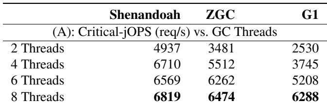

(B): Pause Metrics (under Critical-jOPS, 8 Threads)  
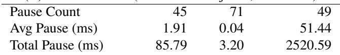

Consequently, the deployment strategy has shifted towards co-locating high densities of these smaller service instances to maximize cluster-wide resource utilization. To achieve eficient bin-packing, these instances are typically constrained to moderate specifications (According to a recent report, 82.8% of monitored JVMs use between 1 and 8 cores, and 76.2% are allocated less than 4 GB of memory [39].) While this model optimizes infrastructure costs, it fundamentally constrains language runtimes’ execution environment: the surplus CPU cycles previously relied upon for background maintenance tasks are largely eliminated, creating contention between application logic and runtime services like GC.

## 3 Motivation

In this section, we use a set of experiments to quantitatively demonstrate (1) how concurrent marking competes with application threads for CPU resources in resource-constrained environments and leads to performance fluctuations, and (2) why existing configuration adjustments cannot efectively solve these issues.

Experiment Setup. We conducted our experiments using SPECjbb2015 (abbreviated as SPECjbb), a benchmark representing typical online shopping workloads, across three GCs in OpenJDK 17. We provisioned the SPECjbb instance with 8 cores and 4 GB of RAM to reflect a resource-limited, multitenant environment. Notably, the 4 GB limit provides twice the minimum memory required by the workload, guaranteeing adequate space for allocation and garbage collection. SPECjbb incorporates a built-in load-probing mechanism that automatically evaluates latency characteristics under varying loads and reports the maximum throughput satisfying its latency constraints (referred to as critical-jOPS).

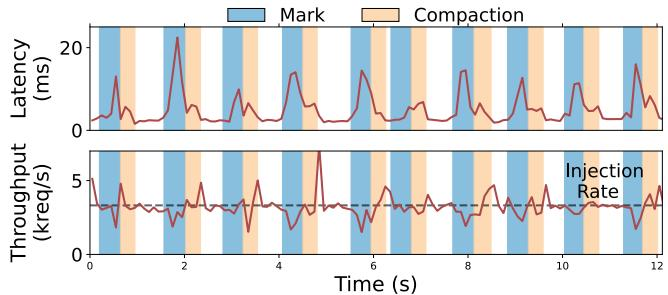  
(a) SPECjbb2015 latency and throughput details. Note that SPECjbb2015 employs a queue for unhandled requests, which leads to rebounds in throughput after CPU contention finishes.

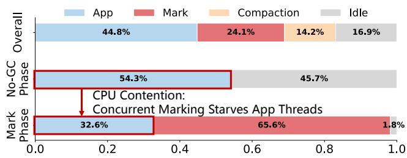  
(b) CPU utilization breakdown during diferent GC stages.  
Figure 1: Performance degradation caused by concurrent GC.

Three collectors are selected for evaluation. G1 serves as the mostly-STW baseline, utilizing a generational design with frequent pauses for young-generation reclamation. In contrast, Shenandoah and ZGC represent the concurrent category; they leverage sophisticated consistency protocols to achieve a “pause-less” execution model, confining STW interruptions strictly to sub-millisecond phase transitions.

Performance Analysis. The results presented in Table 1 reveal a counterintuitive phenomenon: although concurrent collectors succeed in reducing STW pauses, they yield only marginal improvements in critical-jOPS (3-8%) compared to G1. To investigate the root cause of this phenomenon, we conducted a detailed performance analysis of Shenandoah (selected over ZGC due to its lighter-weight concurrent algorithm and better critical-jOPS) under the IR=6819 configuration (IR = injection rate, in requests/s). In order to get the performance details, we instrumented SPECjbb to collect fine-grained performance metrics during testing, correlating them with system resource utilization statistics (summarized in Figure 1).

The results uncover a critical pattern: during non-GC periods, CPU utilization remains consistently low (45.7% Idle), indicating CPU underutilization. However, during concurrent marking, total CPU usage spikes to 98.2% as the application’s CPU share drops from 53.3% to 32.6%, resulting in a sharp drop in application throughput (47%) and increased average latency (10.5×). This observation suggests an explanation for the limited critical-jOPS improvement: while traditional STW collectors completely hand over CPU resources to either application or GC threads at diferent phases, concurrent GCs periodically introduce heavy GC tasks colocated with mutators. Although pauses have been reduced, those GC tasks still interfere with application threads, inducing recurring resource contention. These observations also align with prior reports [60, 66].

Why not overprovisioning? The most straightforward solution to this issue is CPU overprovisioning—allocating suficient cores to accommodate peak demand from both application and GC threads. This approach would prevent performance fluctuations caused by CPU contention when GC activates, as incidentally observed in our Figure 1 experiment, where the system automatically settled at 6,819 req/s, a moderate load level that balanced jOPS and P99 latency. However, while CPU overprovisioning is simple and efective, it introduces significant eficiency concerns. As demonstrated in our earlier results, this method leads to severe underutilization during non-GC periods,with CPU utilization dropping below 50%—a substantial resource waste. A common variant is to pin GC threads to dedicated cores. This avoids contention but inherits the same idleness: the pinned cores must be sized for peak marking demand and sit idle outside marking windows.

An alternative overprovisioning solution is to grant extra memory to the application. For garbage-collected applications, expanding memory quotas can reduce GC frequency and consequently mitigate its performance impact. However, this approach also has its limitations. The CPU-to-memory ratio of current machines is essentially fixed in existing public clouds or private data centers, where memory capacity is already the primary bottleneck during resource allocation[19, 46]. Therefore, adding more idle memory to the application only for GC frequency reduction is not an efective solution.

Why not reduce GC Threads? GC Thread number is one of the most important parameters for GC performance tuning. Given that the root cause of CPU load fluctuations lies in the periodic activation of GC tasks, one possible solution is to reduce GC threads to stretch GC execution time, thereby smoothing overall system load. Table 2 presents performance data from SPECjbb tests under four diferent GC thread configurations.

Reducing GC threads from 8 to 6 and 4 initially demonstrates a decline in GC throughput (defined as live object size divided by marking time), confirming the ability to stretch GC duration through this method. However, the system exhibits an 11% increase in GC frequency (8 to 4), while P99 latency remains statistically unchanged and P50 latency even increases by 20%. This counterintuitive result is caused by floating garbage. Modern concurrent collectors such as Shenandoah and ZGC take a logical snapshot of the heap at the start of each marking cycle and treat any object that dies mid-cycle as live. Reducing the number of GC threads stretches the marking phase, enlarging this window so that more short-lived objects survive the cycle as floating garbage. Because each cycle reclaims less memory, the collector must run cycles more frequently to keep up with allocation. The CPU savings from fewer GC threads are thus ofset by the higher GC frequency.

Table 2: Tail latency with diferent numbers of marker threads. Tested on SPECjbb2015 (PRESET mode, IR=6819 req/s).  
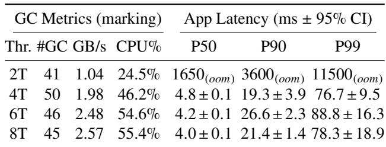

Opportunities. While local tuning falls short, modern cloud infrastructure presents two key opportunities to resolve GCinduced contention: (1) Utilizing Idle Clusters Cycles. In multitenant environments, GC bursts are rarely synchronized across all co-located runtimes. While a single runtime struggles with CPU deficits during its GC phase, neighboring runtimes may possess underutilized CPU cycles. This asymmetry creates an opportunity to aggregate these fragmented, idle resources into a shared pool. By ofloading GC tasks to this isolated pool, we can achieve agile concurrent marking without contending with local application threads. (2) The Bandwidth-Compute Gap. The emergence of high-performance interconnects (e.g., RDMA, CXL) has fundamentally shifted the bottleneck. As shown in Table 2, concurrent marking is often bound by random memory access latency and synchronization overheads, yielding a modest scan speed of 2.6 GB/s in our tests. In contrast, modern 400 Gbps RDMA networks ofer bandwidth orders of magnitude higher—theoretically suficient to sustain trafic for 20 diferent marking tasks simultaneously. This vast bandwidth headroom makes it feasible to decouple GC to remote nodes, trading abundant network bandwidth for scarce local CPU resources.

Takeaway. Concurrent garbage collectors in multi-tenant environments compromise application stability primarily through CPU contention. Viewing the runtime holistically, this contention manifests as drastic, periodic fluctuations in CPU demand, making precise resource provisioning notoriously dificult. Consequently, the theoretically optimal solution requires elasticity: the runtime can access burstable CPU resources during GC phases (marking in particular) to reduce floating garbage, yet these resources should not be statically provisioned to avoid wastage during non-GC phases. This necessitates a consolidated approach: ofloading GC tasks from multiple runtimes onto a shared, dedicated resource pool, where GC tasks are explicitly orchestrated to ensure eficient, interference-free execution.

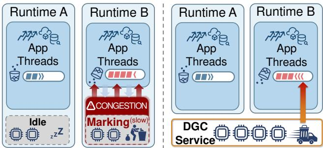  
Figure 2: Overview of the baseline (left) and DGC (right).

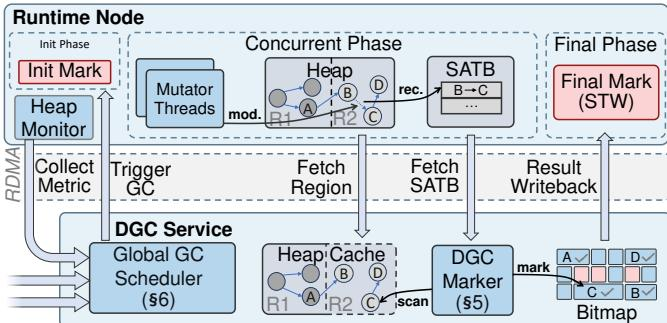  
Figure 3: The workflow of DGC’s disaggregated marking.

## 4 Disaggregated GC Service

## 4.1 Architecture Overview

This work presents Disaggregated Garbage Collection (DGC), a system designed to consolidate concurrent marking tasks from multiple runtimes onto a dedicated, isolated compute pool. By decoupling the marking workload from the application, DGC eliminates contention on CPU resources and accelerates marking throughput (Figure 2). The architecture comprises two core subsystems: a Disaggregated Marking Engine and a Global GC Orchestrator.

A strawman design for pooling would be adaptively increasing/decreasing the number of available cores for each language runtime, but this design faces two disadvantages. First, it contradicts the horizontal scaling mechanism used for fine-grained services and complicates resource management. Second, it cannot scale to a distributed environment. DGC instead employs a data-centric ofloading strategy: its disaggregated marking engine accesses the runtime’s heap through two distinct data planes for concurrent marking.

(1) Co-located Mode: For runtimes residing on the same physical host, the DGC service utilizes shared memory (SHM) as the data plane. By registering heap ranges and GC-related data structures into a memory segment visible only to DGC, the DGC service can directly access the runtime’s state. This architecture enables the direct adaptation of standard concurrent marking algorithms, where intermediate metadata is exchanged via zero-copy SHM mechanisms and control signals are managed through simple RPCs. Notably, while currently implemented for single-host co-location, this SHMbased design conceptually extends to Hyper-Node systems providing shared memory semantics(e.g. CXL [30], UB [29]).

(2) Distributed Mode: For runtimes across physical boundaries, DGC employs RDMA-based Remote Marking, leveraging high-performance networking to traverse remote heaps eficiently (details in Section 5).

To serve multiple participating runtimes using a shared resource pool, the DGC system employs a Global GC Orchestrator. This component is composed of lightweight monitors embedded in each runtime and a centralized optimization solver. Using allocation-related profiles collected by monitors, the solver optimizes GC resource scheduling to ensure memory availability of all participating runtimes (details in Section 6).

## 4.2 Deployment Model and Assumptions

Operator-managed JVM stack. DGC is intended to be deployed as part of an operator-managed JVM stack. In this model, the JVM build, the DGC service, and the surrounding deployment infrastructure are owned by a single platform organization. Two industry practices fit this model. The first is the vendor-curated JVM distribution, exemplified by Alibaba Dragonwell [1], Amazon Corretto [3], and Azul Platform Prime [5]; these builds are produced and maintained by the same organization that supports their consumers.

The second is the internal Java platform operated by large enterprises, where a dedicated infrastructure organization maintains both the JVM runtime and the cluster management stack while application teams contribute only standard Java workloads. This practice is widely documented across major internet companies [8, 19, 23, 37, 48, 50, 60, 64]. In both practices, the JVM provider and the cluster operator share a single trust boundary, which allows DGC to read heap state across the operator’s components and motivates a unified rather than per-tenant GC accelerator.

Knowledge required from the tenant application. DGC treats each served application as a black box and consumes only JVM-level metrics. The information includes heap free size, allocation rate, live-object size, and estimated marking duration. All of these metrics are already collected by Shenandoah’s current monitoring infrastructure.

Hardware assumptions. The SHM data plane requires only that the served runtime and the DGC service share a host address space, or an address space that behaves like one (e.g., CXL [30] or UB [29] fabrics). The RDMA data plane requires that the DGC host and the served host both attach to an RDMAcapable fabric. Such fabrics are already standard in modern data centers; representative examples include AWS Elastic Fabric Adapter [47], and Microsoft Azure RDMA storage networks [6]. DGC therefore depends only on commodity data-center hardware.

## 5 RDMA-based Remote Marking

## 5.1 SATB-based Marking Algorithm

To address consistency maintenance in disaggregated marking, the remote marking engine adopts the Snapshot-at-the-Beginning (SATB) algorithm. SATB ensures correctness by efectively taking a logical snapshot of the heap at the start of the cycle. Any references overwritten during the concurrent marking phase are recorded by SATB write barriers to ensure that objects live at the start of the cycle remain reachable. Crucially, these barriers are active only during the marking phase, so DGC adds no steady-state overhead when GC is inactive. Prior work [31, 54] has shown that SATB barriers can ensure the correctness of marking even when GC threads are operating on a stale object graph.

Workflow. Figure 3 illustrates the workflow of the DGC’s remote marking algorithm. The cycle begins with a lightweight Stop-The-World (STW) phase, during which the runtime records heap states and the GC root set to establish the logical SATB snapshot. Upon the resumption of the application, the DGC service receives an RPC to start data copying and concurrent marking. DGC adopts a configurable heap cache ratio on the GC node, which allows a tradeof between marking performance and memory consumption. Throughout the marking phase, the accumulated SATB roots are periodically fetched from the runtime node and processed by the GC marker. Once the scanning converges, the liveness bitmap is returned to the runtime, which then enters a final, brief STW pause to process the small number of remaining SATB roots that were not yet synchronized, ensuring strictly consistent marking results.

Correctness. SATB correctness rests on a single invariant: every reference live in the snapshot is eventually visited by the marker, via heap traversal for unmodified edges or via the write-barrier bufer for overwritten ones. Since marking reclaims nothing, correctness depends only on the union of the two sources covering the snapshot, not on the completeness of either source alone. In the disaggregated setting, the DGC marker always observes a transient intermediate heap rather than a true snapshot. Under DGC-RDMA, it may further see an internally inconsistent view assembled from regions cached at diferent points in real time. The bufered SATB stream still supplies precisely the edges the marker’s traversal might miss, so the marker converges to the same live-object set as an in-process collector.

## 5.2 Heap Cache Management

The heap cache manages a (partial) local copy of the served runtime’s memory states, which can be directly accessed by GC threads of DGC. The heap cache is a copy system instead of a swap system, so it never afects the application’s reads, writes, or execution. The cache originally supports two primitives: retrieving to fetch more memory states from the served runtime, and eviction to replace existing cached states with newly retrieved ones. A RDMA control thread is responsible for managing the heap cache, issuing RDMA read requests according to the primitives. A strawman design would be relying on existing OS-level remote memory paging systems [2, 45] to support those two primitives, but this design is intrusive to operating systems and remains unaware of the memory management behaviors inside language runtime systems, leading to frequent page faults and unacceptable overhead. To this end, DGC adopts a user-space software paging system and manages cached memory in a region granularity, which aligns with that in runtimes. The software paging approach also reduces the overhead of RDMA registration: during initialization, DGC pre-registers a fixed memory range as a local heap cache and employs a software address translation layer operating at the granularity of regions.

Region-based software paging. The region serves as the fundamental unit of memory management in mainstream collectors [12, 13, 63]. By aligning the cache management granularity with regions, DGC ofers two advantages. First, it aligns seamlessly with the runtime’s allocation patterns. Specifically, mainstream collectors like G1 and Shenandoah enable a per-region bump-pointer-style allocator, which induces strong temporal locality by grouping related objects to the same region. The locality is also analyzed by prior work, which indicates the number of inter-region references is usually limited [59]. Consequently, retrieving the whole region can improve the “hit rate” of local memory accesses compared with a page-based approach. Second, this approach is highly cache-eficient. For instance, in a 4GB SPECjbb heap with 2MB default region size, the software page table shrinks to merely 4KB (properly compressed based on alignment). This compact footprint allows the table to fit entirely within a modern CPU’s L1d cache (48KB in our testbed), significantly reducing address translation overhead.

## 5.3 Handling Partial Object Graphs

Since the heap cache is empty at the beginning of marking, naively waiting for data copying would introduce significant overhead. Meanwhile, the size of heap cache may not accommodate the whole heap in the runtime node. To this end, DGC refines the original SATB-based GC algorithm to conduct marking when the cached memory states are not complete. The basic idea is to memorize pending references for uncached regions. During marking, DGC’s GC threads identify those references by checking the status of regions and push them into a thread-local per-region pending queue. Once the region has been copied, DGC uses the RDMA control thread to aggregate pending queues for this region and dispatch them to a single GC thread, according to the current load. This design is aimed at preventing bitmap contention: concurrent scanning of the same region by multiple GC threads would trigger frequent cache coherence trafic on the shared marking bitmap.

Concurrency control. The switch point on the region state should be specially designed to ensure consistency between GC threads and the RDMA control thread. For example, if GC threads do not realize that a region is being evicted, they may introduce wrong marking results after the region has been replaced by RDMA read operations issued by the control thread. To this end, DGC introduces an 8-byte per-region entry for inter-thread synchronization: the high bits store the state tags (NotCached, OnTrans, Cached, and OnEvict) while the low bits store a counter serving as a reentrant read lock. Each state tag records the current status of DGC’s local cache for the corresponding served-runtime region. When accessing an object, a GC thread first issues an atomic increment to the region entry to register its presence, and then validates whether the state tag is Cached. Similarly, it decrements the counter when finish processing the object. The RDMA control thread only changes the state tags when the corresponding counter is zero and leverages compare-and-swap operations to ensure the atomicity of its mutation operation. This concurrency control mechanism allows GC threads to safely initiate tasks with simple atomic instructions while ensuring that critical RDMA overwrites never interrupt an ongoing object scanning.

Running example. Figure 3 traces the following scenario step by step. Consider 𝐴 ∈ 𝑅1 (Cached) and 𝐵,𝐶, 𝐷 ∈ 𝑅2 (NotCached), with references 𝐴 → 𝐵 → 𝐶 → 𝐷. The marker scans 𝐴, defers 𝐴 → 𝐵 into 𝑅2’s pending queue; the RDMA control thread later copies 𝑅2, flips its tag to Cached, and dispatches the queue to a single marker, which then scans 𝐵. If a mutator modifies 𝐵 and overwrites 𝐵 → 𝐶 before 𝑅2 is copied, the marker would not see 𝐶 from 𝐵 alone in the heap cache; the SATB barrier records the original 𝐵 → 𝐶 at the moment of modification (upper part of Fig. 3), and the DGC service fetches this record over RDMA (middle part), so the marker still reaches 𝐶, follows 𝐶 → 𝐷, and sets all four objects in the bitmap (lower part).

## 5.4 Hotness-driven Paging Policies

To minimize RDMA trafic and avoid frequent retrieving on the same region, DGC uses hotness scores to determine which region should be retrieved and evicted. The score is calculated by the aggregate size of underprocessed objects (grey) within each region, which is grounded in our observation that larger objects typically encapsulate a higher density of outgoing references. Therefore, caching them exposes more work to GC threads, sustaining high throughput and preventing thread starvation. For regions not cached, DGC initially estimates the score using the number of pending references and the application’s average object size, which can be profiled during each collection cycle. The score can be calibrated to the precise value once the region is retrieved. Furthermore, to prevent thrashing where regions are repeatedly swapped, DGC remains conservative on eviction and enforces a strict hysteresis threshold: A non-resident region is eligible for retrieval only if its score exceeds that of the eviction candidate by a configurable multiplicative factor.

Additionally, to mitigate thread starvation during the initialization phase, DGC introduces a prefetch window. This mech anism allows the RDMA controller to proactively populate the local bufer before marking threads start, strictly prioritizing those containing GC roots. Crucially, marking threads remain dormant during this interval. From the perspective of the global GC orchestrator, no CPU resources are allocated for the duration of the prefetch window, thereby preventing idle cycles and maximizing overall resource utilization.

## 5.5 Class Information Sharing

In addition to heap data, class information is also required during marking, as it stores the locations of all references inside an object. To minimize the cost of sharing this information, DGC embraces OpenJDK’s application class data sharing mechanism (APPCDS [40]), which packs the in-memory Klass structures of all loaded classes into a single archive file, along with the reference-ofset tables that GC uses to scan each object. When a served runtime first attaches, DGC preloads this archive at the same virtual address as the runtime, so that Klass pointers resolve identically on both sides without per-object translation.

Beyond the archive, Java runtimes can define new classes at runtime through reflection, custom class loaders, or lambda metafactories. Since every such class must be registered with the JVM’s system dictionary before it becomes usable, DGC hooks this process: each newly defined Klass triggers a notification, and before the next GC cycle begins, the marker reads the new Klass data through SHM in co-located mode or one-sided RDMA in distributed mode. The marker therefore sees the full type system at the start of every collection.

## 6 Multi-Runtime GC Orchestration

The disaggregated marker of Section 4 solves only half of the problem. Concurrent GC is bursty: marking takes over the cycle for a short, busy interval, then stays idle until enough garbage accumulates to trigger the next cycle. A GC pool dedicated to a single served runtime would therefore sit idle most of the time, splitting the runtime’s total CPU usage rather than reducing it. DGC recovers this eficiency by timedivision multiplexing a single shared GC pool across many colocated runtimes. However, naive sharing would reintroduce the very contention that disaggregation was meant to eliminate: overlapping marking phases from diferent runtimes compete for GC threads and drag each other’s tail latency back up.

To make sharing safe, DGC introduces a centralized global GC orchestrator that decides when each runtime’s next GC cycle should start and with how many GC threads it should run. Three logical roles compose the orchestrator. A lightweight monitor embedded in each served runtime exposes its freememory level, allocation rate, and the marking duration of historical cycles. A single coordinator reads the monitor state across all runtimes and emits trigger decisions by solving the joint scheduling problem. A trigger hook on each served runtime’s GC-trigger path applies the coordinator’s decisions. The remainder of this section describes the design objectives that guide these decisions, the resulting scheduling problem, and how robustness is maintained when the system departs from steady state.

## 6.1 Design Objectives

Deferring marking as late as possible. As analyzed before, if the trigger point of SATB marking can be deferred, more objects can be included in the snapshot, resulting in less floating garbage and improved GC eficiency. Therefore, DGC’s scheduler is designed to defer marking for all GC tasks without encountering any OOM issues.

Adjustable GC thread numbers. The number of GC threads is statically configured in state-of-the-art concurrent collectors to strike a balance between collection throughput and interference with mutators. In DGC’s case, since the disaggregated GC tasks are running with dedicated computation resources, the static configuration approach is no longer viable. DGC thereby proposes to dynamically configure the number of GC threads for each task, according to its urgency and the system’s resource availability. When a GC task starts late and requires finishing soon to avoid OOM issues, DGC can maximize its computation resources to improve the marking speed. However, since the SATB marking algorithm (graph traversal) does not scale well (see Table 2), the marginal benefit of adding more threads diminishes beyond a certain threshold. Therefore, when multiple GC tasks require serving simultaneously, the computation resources granted for each should be controlled to improve the overall CPU eficiency.

Avoiding Resource Contention. Since the memory footprint of marking is large, co-locating multiple GC threads into the same core leads to severe interference. To this end, the total number of active GC threads should not exceed the available core number at any moment.

## 6.2 Problem Formulation

According to the principles above, we formulate the scheduling algorithm as a constrained optimization problem below.

Decision Space: (1) GC Trigger Time: The time when the GC task should be triggered. (2) DGC Thread Number: The number of GC threads to be allocated for the task.

Constraints: (1) Time Constraint: Each GC should complete before the mutators exhaust all the available memory (i.e., OOM errors). (2) Resource Constraint: The total number of active GC threads should not exceed the number of available cores at any moment.

Algorithm Input: (1) GC Completion Deadline: The estimated GC completion deadline for each served runtime, calculated as the available free memory divided by its allocation rate. (2) Estimated DGC Duration: The estimated marking duration of each task under DGC, with diferent number of GC threads. (3) Ongoing DGC Task Information: The information of all ongoing GC tasks served by DGC, including the estimated completion time and the number of GC threads.

Optimization Goal: Defer the GC start time as long as possible. Since the start time can be represented as a monotone timestamp, the goal can be transformed to the sum of the GC start timestamps for all tasks.

Discussion: the estimated inputs. The input of algorithms relies on several estimated numbers, which are collected from runtime profiles in the served runtimes. The allocation rate has already been estimated by the runtime’s statistical methods and thus can be directly reused by DGC. As for the estimated GC duration, it can be modeled as a linear function of the size of live objects. The function incorporates a thread-numberspecific coeficient and a constant term, both of which vary across applications. Given that an application’s live object set typically remains stable over short time periods, the number of live objects can be estimated by the historical marking results.

## 6.3 Eficient Solving Strategy

To address this optimization problem eficiently, we adopt a constraint programming (CP) approach that discretizes all parameters and integrates a dedicated CP-SAT solver. The resulting solving time is typically around 5 ms for single-instance scenarios, well within practical limits given the runtime’s 10 ms allocation-rate monitoring tick.

For homogeneous workloads, scheduling decisions can be encoded as a small set of static priorities, because all served runtimes share comparable allocation rates and marking durations. Heterogeneous workloads break this assumption: GC deadlines, allocation rates, and marking durations all diverge across applications, and a static heuristic tuned for one combination typically fails on another. We therefore adopt CP-SAT as a general-purpose solver and leave the designing of simpler heuristics to future work.

## 6.4 Scheduling Robustness

The scheduler described so far operates in steady state. In practice, three non-steady states could arise: a freshly started runtime with no historical data, a sudden shift in allocation behavior, and an unreachable DGC service. We discuss each in turn.

Cold start. A freshly started runtime lacks the per-application information CP-SAT needs. DGC directly inherits Shenandoah’s existing learning-phase convention: while the local heuristic itself is still warming up, the runtime triggers conservative local concurrent GC at default thresholds and DGC remains inactive. Once warmup completes, DGC takes over with conservative initial values for the linear duration coeficients in Section 6.2, refining them online by fitting against each subsequent completed DGC cycle.

Workload drift. Workload behavior may shift—a trafic surge, for instance, inflates the runtime’s allocation rate and brings its GC deadline forward—and reusing a stale plan would risk OOM. The coordinator therefore re-solves the CP-SAT problem at every 10 ms scheduling tick against the latest memory state and allocation rate, possibly reordering pending GC tasks. The formulation also reserves deadline headroom to absorb moderate rises within a tick. When this headroom is exhausted, the runtime falls back to local concurrent Shenandoah for the afected cycle: CPU contention with mutators reappears, but worst-case performance stays bounded by baseline Shenandoah rather than risking OOM.

Fault Tolerance. When the DGC service becomes unreachable—whether crashed, slow, or partitioned—failures manifest in two ways depending on timing. If DGC dies while a marking task is in flight, the runtime simply sees the GC miss its deadline: memory keeps filling until OOM, the DGC call is cancelled, and the host falls through to Shenandoah’s degenerated (STW) GC path, incurring a roughly 100 ms pause in our SPECjbb2015 experiments. Subsequent cycles no longer receive trigger signals from the coordinator and silently revert to local Shenandoah concurrent GC. Each trigger signal carries a version tag, so stale signals from a crashed coordinator are discarded rather than acted on. Recovery resembles a fresh startup: the new DGC service re-acquires each served runtime’s memory layout and class information, after which the coordinator resumes issuing commands and the runtimes rejoin the DGC path.

## 7 Implementation

DGC is mainly implemented atop the Shenandoah garbage collector of OpenJDK 17 (version: jdk-17+35) in C/C++ and can support any unmodified Java applications. Our implementation has 10,383 LOC, including 946 lines specifically for the local version (referred to as DGC-SHM), 3,601 lines specifically for the remote version (referred to as DGC-RDMA), 959 lines for the GC scheduler, and the rest are for the common parts (e.g., class data sharing, GC workflow integration, RPC and RDMA support, etc.).

DGC’s disaggregated GC service is implemented as a stripped-down version of OpenJDK’s Java virtual machine (JVM). This enables DGC to reuse critical JVM components, including APPCDS and the class information resolution mechanism. The low-frequency control flow between the disaggregated marker instance and the served JVM is implemented with RPC, while the data flow is implemented with SHM or RDMA. To reach ideal marking performance, DGC reuses the well-optimized data structures in Shenandoah GC, including its work-stealing task queue, lock-free marking bitmaps, etc.

The GC scheduler is implemented with the CP-SAT solver [43] provided by Google OR-Tools [44]. The CP-SAT solver achieves high-performance solving by automatically reducing Constraint Programming (CP) problems to Boolean

Satisfiability Problems (SAT). This capability enables its use for real-time GC scheduling in language runtime scenarios.

## 8 Evaluation

In this section, we evaluate DGC by answering five questions about its benefit and cost:

Q1. how does DGC cut tail latency and raise throughput across applications (§8.2)?

Q2. do the gains hold for heterogeneous runtimes sharing one marker pool (§8.3)?

Q3. what overhead does disaggregation incur, and how does DGC-RDMA perform under a tight budget (§8.4)?

Q4. does the benefit scale with the runtime count (§8.5)?

Q5. how much does each mechanism contribute (§8.6)?

The results show that, at an equal CPU budget, DGC raises critical-jOPS by 24% over Shenandoah and cuts tail latency by 64% on SPECjbb2015, with these gains holding under co-location and scaling at modest cost.

## 8.1 Experiment Setup

We ran experiments in a cluster of 2 servers with dual Intel Xeon Gold 6430 CPUs (32 physical cores each) and 128 GB of memory. Hyper-threading was disabled, and all servers were configured to performance mode to prevent CPU frequency fluctuation. Each server has a 200Gbps Nvidia BlueField-3 DPU working as an RDMA NIC, which is connected to the host via PCIe 4.0×16 connection.

Test Applications. We leverage the following applications to evaluate DGC:

• SPECjbb2015 [11] serves as the de facto standard for assessing Java server performance, particularly in relation to garbage collection [13]. It simulates an online supermarket handling diverse requests, and the evaluated version is 1.0.4. SPECjbb2015 supports a multi-backend deployment mode, which natively enables distributed deployment with multiple JVMs. In our evaluation, we utilize this multi-backend mode to simulate a real-world scenario.

• HBase [4] is a distributed database designed for nonrelational big data storage. The evaluated HBase version is 2.5.11. We use YCSB’s two diferent mixed workloads (<50% read, 50% update> and <50% read, 50% insert>) [10] to evaluate the performance of DGC in HBase. HBase also supports a native distributed mode, which partitions the data into multiple regions and distributes them across multiple JVMs. In our evaluation, we utilize this multi-RegionServer mode to evaluate the performance of DGC.

• DaCapo Bench [7] provides a broad collection of Java applications. We evaluate DGC on the nine workloads in DaCapo 23.11-chopin that natively report per-request latency: h2, tradesoap, tradebeans, lusearch, tomcat, spring, kafka, cassandra, and jme, covering OLTP databases, online stock trading, text search, HTTP servers, messaging, and a 3D game engine. Following Jade [59]’s DaCapo throttle test suite [58], we cap each workload’s request rate at configurable target throughputs and measure per-request tail latency at each load level. We exclude DaCapo’s remaining batch workloads. DGC’s benefit comes from stabilizing the per-request CPU supply each served runtime receives over time, but this efect is invisible in end-to-end completion times—the only metric these batch benchmarks report.

Baseline GCs. Our evaluation mainly compares DGC (both DGC-SHM and DGC-RDMA) with Shenandoah and G1. Shenandoah is a concurrent collector integrated in OpenJDK 17. It serves as the codebase for DGC and thus has many implementation similarities. As shown in Table 1, Shenandoah also demonstrates the highest critical-jOPS performance in SPECjbb2015. Therefore, we selected Shenandoah as a representative state-of-the-art concurrent garbage collector to clearly illustrate the performance benefits of DGC.

G1 is currently the default garbage collector in JDK 17. It is a generational collector that is largely stop-the-world (STW): both young-generation collections and the compaction phase during full-heap GC (mixed GC) require STW pauses. Only the marking phase during mixed GC is designed to be concurrent. Although this design leads to frequent application pauses, it results in higher garbage collection eficiency. Due to its widespread adoption in various production scenarios, we used G1 as another baseline.

Memory configurations. For all applications, we first evaluate the minimum heap size that can run them with Shenandoah, then set the evaluation JVM heap size to be 2× of the min imum, to simulate a medium workload. DGC-SHM incurs negligible additional memory overhead and can be deployed directly. Conversely, DGC-RDMA relies on a local heap cache to store object graphs. In our primary evaluation, we assume suficient remote memory availability and thus do not constrain DGC-RDMA’s memory usage. We evaluate the impact of stricter memory configurations separately in Section 8.4, demonstrating that capping memory usage does not significantly compromise DGC-RDMA’s performance gains.

CPU configurations. To ensure a fair comparison, baseline and DGC configurations consume the same total CPU budget. Baseline runs 𝑁 JVMs, each allocated 8 + 𝑐 cores. DGC runs the same 𝑁 JVMs each restricted to 8 application cores, plus one shared DGC service occupying 𝑁 × 𝑐 cores. Both deployments therefore consume 𝑁 × (8 + 𝑐) physical cores in total.

The value of 𝑐 matches each workload’s GC pressure under the 2×-minimum heap convention above. SPECjbb2015 and HBase have minimum heaps of several gigabytes; the 2× heap leaves ample allocation headroom, GC triggers are infrequent, and 𝑐 = 2 cores per JVM are suficient to absorb the marking demand. DaCapo benchmarks, by contrast, have minimum heaps of only tens to hundreds of megabytes; their 2× heap leaves only a thin allocation bufer, so the application reaches its GC trigger frequently and needs 𝑐 = 4 cores per JVM to keep up. This accounting holds across all our experiments, so any throughput or latency improvement DGC demonstrates below stems from the change in GC mechanism rather than from extra CPU resources.

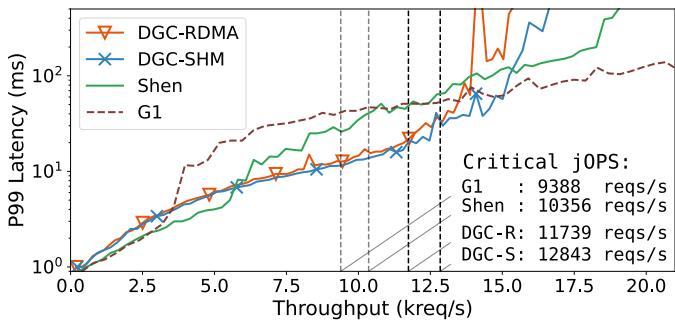  
Figure 4: SPECjbb2015’s P99 latency curve and Critical jOPS

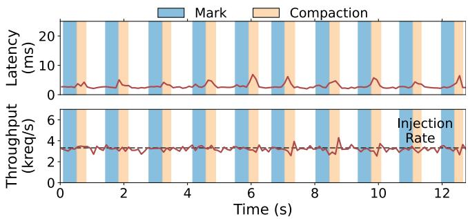  
Figure 5: Latency details of SPECjbb2015 with DGC-SHM

## 8.2 Macro Benchmarks

We first demonstrate DGC’s end-to-end performance improvements using macro-benchmarks. Since DGC enhances application performance by time-multiplexing CPU resources across instances to mitigate interference, we establish a minimal experimental setup: each application is deployed with two instances, paired with a DGC service.

SPECjbb2015. We first evaluate the performance of DGC on SPECjbb2015 with its default mode (HBIR\_RT). which measures the latency under diferent issue rates, calculates the critical-jOPS (maximum achievable issue rate within an SLO limit) and reports a curve. The reported throughput and latency are the summary of the two backend clusters, which leads to a diference with previous results in Section 2.

As shown in Figure 4, DGC-SHM achieves the highest critical-jOPS, with 24.0% and 36.8% higher than Shenandoah and G1, respectively. The DGC-RDMA achieves the second highest critical-jOPS, 8.6% lower than DGC-SHM, but 13.4% higher than Shenandoah and 25.0% higher than G1.

From the P99 curve in Figure 4, it can be observed that G1 exhibits higher latency than other low-pause collectors due to its STW pauses. In contrast, both DGC-SHM and DGC-RDMA maintain lower P99 latency than Shenandoah when the issue rate is between 6k and 13k. In this range, the baseline Shenandoah sufers from high CPU contention between mutator and marker threads, whereas DGC mitigates this by utilizing dedicated physical cores for markers. Consequently, at Shenandoah’s critical jOPS (10356 req/s), DGC-SHM and DGC-RDMA reduce P99 latency by 64.4% and 60.3%, respectively.

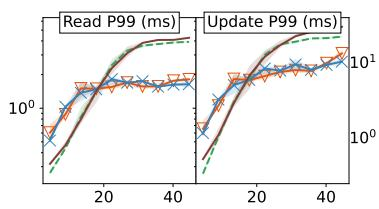  
(a) HBase Read+Update

DGC-RDMA → DGC-SHM --- G1  Shen  
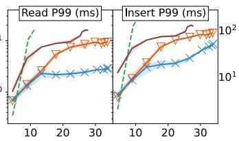  
(b) HBase Read+Insert

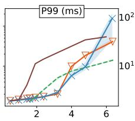  
(c) H2

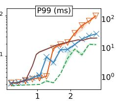  
(d) Tradesoap

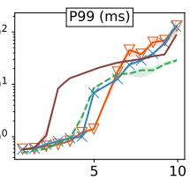  
(e) Tradebeans

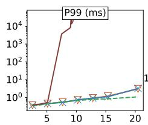  
(f) Lusearch

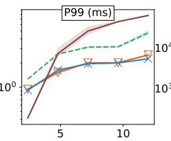  
(g) Kafka

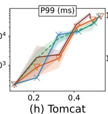

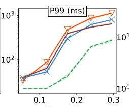  
(i) Spring

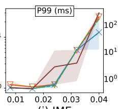  
(j) JME

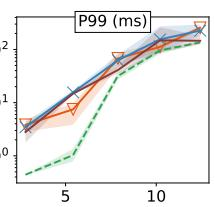  
(k) Cassandra  
Figure 6: Throughput-latency curves on 2-host homogeneous deployments. (a)(b) HBase YCSB read-update / read-insert workloads, each pair sharing a y-axis. (c)–(k) DaCapo latency-reporting benchmarks. Bands show (min, max) across 3 reps.

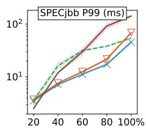

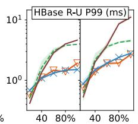  
(a) SPECjbb + HBase Read/Update mix

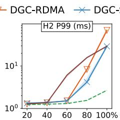

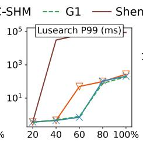

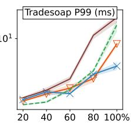  
(b) DaCapo 4-app heterogeneous mix: h2, lusearch, tradesoap, tradebeans

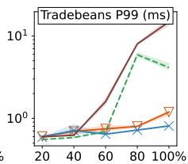  
Figure 7: Mixed-workload P99 latency under diferent load levels; each mix shares one DGC service. (a) SPECjbb + HBase mix, with HBase Read/Update sharing a y-axis. (b) DaCapo 4-app heterogeneous mix. Bands show (min, max) across 3 reps.

Additionally, it can be seen on the right side of the figure that DGC-SHM and DGC-RDMA trend towards P99 divergence earlier than the baseline GC. This behavior is attributed to the fact that, in our experimental setup, the DGC runtime operates with two fewer cores compared to the baseline runtime. As a result, DGC’s performance degrades faster than the baseline under extremely high loads. This is the trade-of accepted by DGC to optimize application performance under moderate loads.

To identify the source of this performance improvement, we examined the phase-wise latency behavior of DGC under the same configuration used in Figure 1. As observed in Figure 5, the performance fluctuations during the marking phase are significantly smoothed out with DGC. Residual latency fluctuations appear only during the compaction phase, which are attributed to Shenandoah’s load barriers.

HBase. We use HBase to further evaluate the performance of DGC in database scenarios. In this experiment, YCSB’s two mixed workloads (<50% read, 50% update> and <50% read, 50% insert>) [10] are running on a two-RegionServer configuration, while the RegionServers are equipped with diferent collectors to evaluate the improvement of DGC.

As shown in Figure 6 (a) and (b), DGC-SHM and DGC-RDMA both achieve lower P99 latency than baselines under most of the issue rates. For the <read, update> workload, DGC-SHM’s P99 read and update latencies are 58.3% and 40.3% lower than G1 under peak throughput, while DGC-RDMA’s are 53.8% and 29.1% lower than G1. (G1 is the better one of the two baselines.) For the <read, insert> workload, DGC-SHM’s P99 read and insert latency are 81.8% and 55.7% lower than Shenandoah under peak throughput, while DGC-RDMA’s P99 read and insert latency are 41.4% and 28.5% lower than Shenandoah. G1 fails to achieve a similar peak throughput as Shenandoah or DGC, mainly due to frequent STW full GC (a fallback mechanism triggers when the concurrent marking in mixed GC fails to meet the allocation rate). In contrast, although Shenandoah induces shorter and fewer stop-the-world pauses, its concurrent GC phases cause a consistently slower request processing speed. This afects a much larger number of requests and leads to worse P99 latency compared to G1. DGC not only maintains the low-pause advantage of Shenandoah but also resolves the CPU contention issue during concurrent GC. As a result, it demonstrates significantly improved tail latency.

DaCapo. Panels (c)–(k) of Figure 6 report P99 latency versus achieved request rate for the nine latency-reporting Da-Capo benchmarks, each run as two homogeneous instances of the same workload. Five benchmarks (h2, tradesoap, tradebeans, lusearch, kafka) show a clear DGC-versus-Shenandoah separation: at the highest request rate each bench mark sustains under Shenandoah, DGC-SHM reduces P99 by 88.6%, 73.1%, 92.8%, four orders of magnitude, and 71.0% respectively. The remaining four benchmarks (tomcat, spring, jme, cassandra) show no meaningful separation between DGC and Shenandoah at any rate we tested. G1, by contrast, enjoys a sizable advantage on tradesoap, spring (i) and cassandra (k), where its sub-millisecond young-generation pauses dominate the tail; on the other seven benchmarks G1 is comparable to Shenandoah and DGC.

On these five benchmarks Shenandoah’s concurrent marker runs on cores it shares with mutators, and the resulting interference shows up as P99 pressure on the application. The severity varies across the group. On h2, tradesoap, and tradebeans the application drives up to 1.8 GB/s of allocation, the marker stays active for 10 to 27% of wall-clock under high load, and Shenandoah throttles mutators with application side pauses to keep heap occupancy bounded. This shows up in panels (c)–(e) as a P99 clif: under Shenandoah, the tail transitions from a flat baseline to a sharp climb once IR crosses a benchmark-specific threshold. At the same IR, DGC SHM keeps P99 2.3× to 2.7× lower than Shenandoah, and pushes the clif IR itself out by 1.4× to 2.4×. On lusearch above ∼5k req/s Shenandoah cannot keep up and falls back to several hundred stop-the-world Degenerated GC cycles per run, producing the multi-second P99. Shenandoah’s achieved throughput saturates around 9.5k req/s under this fallback, whereas DGC-SHM scales smoothly up to 20k req/s while keeping P99 within the low-millisecond range. On kafka at 12k req/s Shenandoah’s marker stays idle for over 98% of wall-clock, but kafka’s P99 is sub-millisecond, so even brief marker activity is visible in the tail. As result, DGC-SHM reduces P99 by 71.0% versus Shenandoah and 52.4% versus G1.

The other four benchmarks share a single property the first five lack: GC pressure stays low at every rate we tested. These benchmarks either keep most of their working set ofheap (cassandra), run with on-heap working sets of only tens of megabytes (spring, tomcat), or barely trigger GC at the achievable rates (jme). With so little allocation pressure, P99 is dominated by application-logic latency rather than by GC behavior, leaving DGC no contention to remove and Shenandoah none to sufer. G1’s young-generation collector benefits from the same property: on a tens-of-megabyte young space its STW pauses are sub-millisecond and invisible in the tail. Shenandoah and DGC instead pay the constant cost of SATB write barriers and concurrent bookkeeping, a fixed tax that is unfavorable when there is little allocation to amortize against, which is why G1 takes the lead on spring and cassandra.

## 8.3 Mixed Workloads

The macro benchmarks above each evaluate a single application. We now stress DGC with two heterogeneous co-location scenarios in which multiple JVMs share a single DGC service, directly evaluate the multi-runtime orchestration described in Section 6. Figure 7 sweeps the ofered load of every co-located runtime synchronously from 20% to 100% of a per-application target IR calibrated for this mix.

SPECjbb + HBase mix. Panel (a) of Figure 7 co-locates two SPECjbb backends with two HBase RegionServers (YCSB workload A) on a single host, reflecting a common enterprise pattern in which an online service shares hardware with a database. At 100% load, DGC-SHM reduces SPECjbb P99 from 142 ms (Shenandoah) to 46 ms (a 67.6% reduction), YCSB read P99 from 4.64 ms to 1.51 ms (-67.5%), and YCSB update P99 from 11.1 ms to 2.80 ms (-74.8%). DGC-RDMA achieves comparable reductions of 51.5%/58.5%/75.9% on the same three metrics. G1 is the second baseline, it stays 1.4–3× above DGC at the upper half of the IR range.

DaCapo 4-app mix. Panel (b) co-locates the four latencyreporting DaCapo benchmarks (h2, lusearch, tradesoap, tradebeans) on a single host. The mix amplifies the DGCversus-Shenandoah gap relative to the homogeneous case in Figure 6. lusearch under Shenandoah collapses to a 64-second P99 already at 60% mix-load, whereas DGC-SHM holds the same workload at 708 𝜇s; tradebeans and tradesoap at 100% load achieve 94.6% and 66.1% P99 reductions over Shenandoah. DGC-SHM also outperforms G1 by 80.5% on tradebeans and 60.0% on tradesoap at the same load point, but ofers no significant advantage over G1 at other load levels, primarily because G1’s generational design achieves higher collection eficiency on these smaller DaCapo workloads.

## 8.4 RDMA and Memory Eficiency

Figure 8 illustrates the SPECjbb2015 tail latency and corresponding RDMA trafic of DGC-RDMA with varying local heap cache sizes. To eliminate the noise caused by drastic load fluctuations in the HBIR mode, we configured SPECjbb2015 to the fixed-throughput (Preset) mode. The Injection Rate (IR) was fixed at 10,356, corresponding to the best Critical jOPS of the baseline Shenandoah collector (as shown in Figure 4), to explicitly demonstrate the performance uplift enabled by DGC. Additionally, the coordinator enforces strict time-multiplexing of the four GC cores between two Runtimes to prevent simultaneous DGC triggers and avoid doubling peak heap cache usage. Among the four evaluated configurations, even the most constrained setting (1/4 cache) achieves a 51.5% improvement in P99 latency over Shenandoah, since its RDMA trafic is still within the bandwidth limit. Notably, the 1/2 cache configuration strikes an optimal balance between memory overhead and RDMA trafic cost. Compared to the baseline of two 4GB heaps, it requires only 2GB of additional remote memory (a 25% overhead) to serve as the DGC node’s local cache. Furthermore, it incurs an average RDMA trafic of only 5.52GB per GC cycle, representing a moderate 37% amplification relative to the 4GB full heap size.

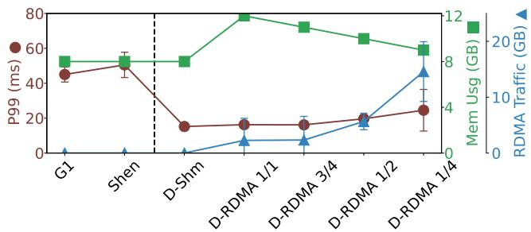  
Figure 8: DGC-RDMA’s P99 latency, memory usage, and RDMA trafic under diferent local cache settings.

## 8.5 Scalability Test

SPECjbb2015 homogeneous workload. To evaluate the performance of DGC as the number of runtimes increases, we conducted a series of experiments running SPECjbb2015 with varying numbers of backends in a distributed setup. The experiment adhered to the core allocation policy established earlier. To simplify the testing process, we used SPECjbb2015’s PRE-SET mode, in which the benchmark runs at a fixed throughput and reports P99 latency. The average load per backend was set to 6819 req/s, as measured in Table 1, and the total system load was scaled proportionally with the number of backends.

The results are shown in Figure 9. DGC consistently demonstrated better P99 latency than Shenandoah across all scales, with the improvement of up to 43.3% and 50.9% at 6 backends. Since DGC-SHM requires the served JVM and the disaggregated marker to reside on the same node, it was limited to 6 backends (7 backends would require at least 70 cores per node, exceeding the 64 cores limit in our physical machines). DGC-RDMA mode was tested up to 12 backends, but the performance improvement began to diminish. Analysis of the GC logs indicates that the RDMA NIC bandwidth became a bottleneck at this point.

During the test, we also recorded the time taken by the CP-SAT solving process. The solving time remained eficient, taking only 11.1 ms even in the 12-backend scenario, which is suficient for scheduling the GC tasks that last for hundreds of milliseconds.

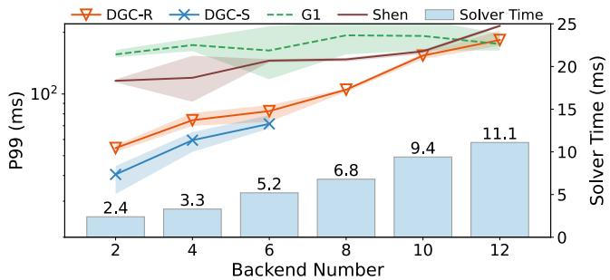  
Figure 9: Scalability test results on SPECjbb2015 PRESET.

Table 3: Performance breakdown on SPECjbb2015 PRESET  
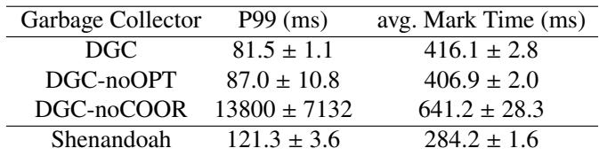

## 8.6 Ablation Study

We evaluated the individual contributions of our two primary optimizations using SPECjbb2015’s PRESET mode. Given the limited configurability of DGC-SHM, this ablation study focuses on DGC-RDMA, with results detailed in Table 3.

Impact of Pipelined Co-design. The “noOPT” configuration disables the pipelined marker-transfer co-design described in Section 5.2. Instead of concurrent execution, the marker is forced to wait for the entire heap to be copied before starting. This serialization raises P99 latency by only 6.7% over the full configuration (87 ms vs 81.5 ms). This gap confirms that our design efectively masks the majority of data transfer costs.

Impact of Global Scheduling. The “noCOOR” configuration removes the global GC scheduler, relying instead on local JVM heuristics. Without cross-JVM coordination, the percycle marking time exhibits a much wider spread. The local heuristic depends on a stable marking-time estimate to predict the next trigger point, so it can no longer place triggers accurately. As triggers diverge, free space is repeatedly exhausted before marking completes, and the system periodically falls back into degenerated GC. The served JVMs can no longer sustain the target injection rate, and end-to-end latency itself diverges (Table 3).

## 9 Discussion

Generalizability to other collectors. DGC’s core mechanism— ofloading concurrent marking under an SATB snapshot—is not specific to Shenandoah. It integrates directly with any SATB-style collector, including G1, Generational Shenandoah, LXR [67], and Jade [59], with only data-plane-level changes to the bitmap and SATB-bufer layouts; the correctness argument in Section 5.1 is collector-agnostic. Colored-pointer collectors such as ZGC can be supported by adding a lightweight SATBstyle bufer purely to feed the remote marker, while the coloredpointer machinery used for evacuation and remapping remains on the local collector.

Trust and cross-tenant isolation. DGC’s orchestrator, marker, and served runtimes sit inside a single operator-managed trust boundary (Section 4.2); cross-tenant isolation between colocated runtimes is enforced by the same cgroup, NUMA, and namespace mechanisms that already isolate co-located JVMs. Within the DGC instance, the orchestrator serializes marking tasks across tenants on the shared marker pool (Section 6), so one tenant’s marking cannot co-run with—and steal CPU from—another’s.

Future work. DGC does not currently enforce memorybandwidth or PCIe-level isolation between concurrent marking tasks; under sustained fan-in to a single NIC, RDMA-mode clients can mildly interfere through shared PCIe bandwidth, which finer-grained mechanisms such as MBA or per-queuepair rate limiting would tighten. A second extension concerns the scheduler. DGC adopts CP-SAT to remain general across heterogeneous workloads (Section 6.2); identifying when a solver-free heuristic sufices would remove the external optimization dependency and shorten the scheduling tick.

## 10 Related Work

## 10.1 Concurrent garbage collection

Concurrent garbage collection (GC) is a critical component in modern Java Virtual Machines (JVMs) to ensure eficient memory management without significant pause times. Several state-of-the-art concurrent marking algorithms have been developed, including those used in the JDK’s G1, Shenandoah, and ZGC collectors.

Other research works also focus on optimizing the concurrent marking GC algorithm. C4 [49] builds on Pauseless GC by incorporating a generational approach, while Collie [21] suggests leveraging hardware transactional memory (HTM) for atomic object relocation. Compressor [25] employs hand-overhand compaction to maintain minimal physical memory usage. Block-free GC [42] introduces non-blocking handshakes for concurrent stack scanning and object copying. Jade [59] provides a group-wise collection mechanism to improve the performance of low-pause GC. Some other concurrent collectors, like LXR [67], use reference counting to discover dead objects but still need to conduct concurrent marking periodically.

## 10.2 Externalized Garbage Collection

Due to the increasing demand for high-performance computing and data processing, the use of specialized hardware to accelerate applications has become increasingly popular [22, 24, 26, 38, 52, 53, 57, 61, 62, 65, 69].

Previous research has also explored the idea of externalizing GC processes with specialized hardware. Martin Maas et al. [35] proposed a hardware accelerator that is located close to the memory controller, which can significantly improve the GC performance. Andrés Amaya et al. [14] further extended the idea in real-time scenarios. Thomas et al. [51] proposed to optimize the garbage collection with recently developed near-memory processing (NMP) hardware. DGC difers in two ways: it ofloads GC onto commodity server CPUs over RDMA or shared memory, and it shares those GC resources across multiple runtimes rather than reserving them exclusively.

Maas et al. [33, 34, 36] also coordinate GC across multiple JVMs, but target cooperating workers of a single distributed application (e.g., Spark, Cassandra) by exploiting applicationlevel events to decide when each node collects. DGC instead targets unrelated, black-box JVMs co-located by an operator, staggers their GC windows purely from JVM-level metrics, and additionally ofloads the marking computation itself into a shared compute pool.

## 10.3 Disaggregation and Resource Pooling

Resource pooling, particularly memory pooling, has been widely studied [2, 9, 18, 20, 27, 28, 32, 45, 46, 56, 68].

Some works also focus on building a garbage collector for memory-disaggregated systems. Semeru [54] and Mako [31] are memory-disaggregated managed runtimes with a distributed garbage collector that is located on the memory node to minimize the memory swapping overhead. MemLiner [55] further reduces the memory swapping overhead by locating the garbage collector on the CPU node and prioritizing the marking task of objects in the CPU Node’s local memory. These eforts primarily focus on leveraging disaggregated memory to address memory utilization issues. Their goals are orthogonal to those of DGC, which is chiefly concerned with mitigating CPU load fluctuations during garbage collection and improving CPU utilization through decoupled GC execution.

## 11 Conclusion

This work presents DGC, a disaggregated architecture to serve GC tasks of language runtimes in an external instance. DGC supports externalizing the costly marking task in GC to idle CPU cores locally or remotely and allowing multiple runtimes to share the GC service with minimal conflicts. The evaluation results on representative latency-sensitive applications show that DGC can significantly improve the application latency and goodput.

## Acknowledgments

We thank the anonymous OSDI reviewers and our shepherd for their insightful feedback. We also thank Haibo Chen for refining the presentation of this paper. This research was supported in part by National Key Research & Development Program of China (No. 2023YFB3308501), National Natural Science Foundation of China (No. 62572306, 62132014), and the CCF-Huawei Populus Grove Fund.

## References

[1] Alibaba. 2024. Alibaba Dragonwell: A Friendly Downstream Distribution of OpenJDK. GitHub repository. https://gith ub.com/dragonwell-project/dragonwell17

[2] Emmanuel Amaro,Christopher Branner-Augmon,Zhihong Luo, Amy Ousterhout, Marcos K Aguilera, Aurojit Panda, Sylvia Ratnasamy, and Scott Shenker. 2020. Can far memory improve job throughput?. In Proceedings of the Fifteenth European Conference on Computer Systems. 1–16.

[3] Amazon Web Services. 2024. Amazon Corretto: No-Cost, Multiplatform, Production-Ready Distribution of OpenJDK. AWS product page. https://aws.amazon.com/corretto/

[4] Apache. 2022. Apache HBase. https://hbase.apache.o rg/.

[5] Azul Systems. 2024. Azul Prime: an award-winning enhanced build of OpenJDK for superior application performance, responsiveness and eficiency. Azul product page. https://www.azul.com/products/prime/

[6] Wei Bai,Shanim Sainul Abdeen,Ankit Agrawal,Krishan Kumar Attre, Paramvir Bahl, Ameya Bhagat, Gowri Bhaskara, Tanya Brokhman, Lei Cao, Ahmad Cheema, et al. 2023. Empowering azure storage with {RDMA}. In 20th USENIX Symposium on Networked Systems Design and Implementation (NSDI 23). 49–67.

[7] Stephen M Blackburn, Zixian Cai, Rui Chen, Xi Yang, John Zhang, and John Zigman. 2025. Rethinking Java Performance Analysis. In Proceedings of the 30th ACM International Conference on Architectural Support for Programming Languages and Operating Systems, Volume 1, ASPLOS 2025, Rotterdam, Netherlands, 30 March 2025 - 3 April 2025. ACM. doi:10.1145/3669940.3707217

[8] ByteDance. 2024. CompoundVM: An Optimized JDK with High Compatibility and Performance. GitHub repository. ht tps://github.com/bytedance/CompoundVM

[9] Lei Chen, Shi Liu, Chenxi Wang, Haoran Ma, Yifan Qiao, Zhe Wang, Chenggang Wu, Youyou Lu, Xiaobing Feng, Huimin Cui, et al. 2024. A Tale of Two Paths: Toward a Hybrid Data Plane for Eficient {Far-Memory} Applications. In 18th USENIX Symposium on Operating Systems Design and Implementation (OSDI 24). 77–95.

[10] Brian F Cooper, Adam Silberstein, Erwin Tam, Raghu Ramakrishnan, and Russell Sears. 2010. Benchmarking cloud serving systems with YCSB. In Proceedings of the 1st ACM symposium on Cloud computing. 143–154.

[11] Standard Performance Evaluation Corporation. 2021. The specjbb2015 benchmark. https://www.spec.org/jbb2015 /.

[12] David Detlefs, Christine H. Flood, Steve Heller, and Tony Printezis. 2004. Garbage-first garbage collection. In Proceedings

of the 4th International Symposium on Memory Management, ISMM 2004, Vancouver, BC, Canada, October 24-25, 2004. ACM, 37–48. doi:10.1145/1029873.1029879

[13] Christine H Flood, Roman Kennke, Andrew Dinn, Andrew Haley, and Roland Westrelin. 2016. Shenandoah: An opensource concurrent compacting garbage collector for openjdk. In Proceedings of the 13th International Conference on Principles and Practices of Programming on the Java Platform: Virtual Machines, Languages, and Tools. 1–9.

[14] Andrés Amaya García, David May, and Ed Nutting. 2021. Integrated hardware garbage collection. ACM Transactions on Embedded Computing Systems (TECS) 20, 5 (2021), 1–25.

[15] Google. 2025. Android Open Source Project. https://sour ce.android.com/docs/core.

[16] Google. 2025. The Go Programming Language. https: //go.dev.

[17] Google. 2025. V8 JavaScript engine. https://v8.dev.

[18] Juncheng Gu, Youngmoon Lee, Yiwen Zhang, Mosharaf Chowdhury, and Kang G Shin. 2017. Eficient memory disaggregation with infiniswap. In 14th USENIX Symposium on Networked Systems Design and Implementation (NSDI 17). 649–667.

[19] Jing Guo, Zihao Chang, Sa Wang, Haiyang Ding, Yihui Feng, Liang Mao, and Yungang Bao. 2019. Who limits the resource eficiency of my datacenter: An analysis of alibaba datacenter traces. In Proceedings of the international symposium on quality of service. 1–10.

[20] Zhiyuan Guo, Zijian He, and Yiying Zhang. 2023. Mira: A program-behavior-guided far memory system. In Proceedings of the 29th Symposium on Operating Systems Principles. 692– 708.

[21] Balaji Iyengar, Gil Tene, Michael Wolf, and Edward Gehringer. 2012. The collie: a wait-free compacting collector. In Proceedings of the 2012 international symposium on Memory Management. 85–96.

[22] Houxiang Ji, Mark Mansi, Yan Sun, Yifan Yuan, Jinghan Huang, Reese Kuper, Michael M Swift, and Nam Sung Kim. 2023. {STYX}: Exploiting {SmartNIC} capability to reduce datacenter memory tax. In 2023 USENIX Annual Technical Conference (USENIX ATC 23). 619–633.

[23] Jesse Jie. 2022. LinkedIn’s Journey to Java 11. LinkedIn Engineering Blog. https://www.linkedin.com/blog/ engineering/infrastructure/linkedin-s-journey-t o-java-11

[24] Xin Jin, Xiaozhou Li, Haoyu Zhang, Robert Soulé, Jeongkeun Lee, Nate Foster, Changhoon Kim, and Ion Stoica. 2017. Netcache: Balancing key-value stores with fast in-network caching. In Proceedings of the 26th symposium on operating systems principles. 121–136.

[25] Haim Kermany and Erez Petrank. 2006. The Compressor: concurrent, incremental, and parallel compaction. In Proceed ings of the 27th ACM SIGPLAN Conference on Programming Language Design and Implementation. 354–363.

[26] Jongyul Kim, Insu Jang, Waleed Reda, Jaeseong Im, Marco Canini, Dejan Kostić, Youngjin Kwon, Simon Peter, and Emmett Witchel. 2021. Linefs: Eficient smartnic ofload of a distributed file system with pipeline parallelism. In Proceedings of the ACM SIGOPS 28th Symposium on Operating Systems Principles. 756–771.

[27] Andres Lagar-Cavilla, Junwhan Ahn, Suleiman Souhlal, Neha Agarwal, Radoslaw Burny, Shakeel Butt, Jichuan Chang, Ashwin Chaugule, Nan Deng, Junaid Shahid, et al. 2019. Softwaredefined far memory in warehouse-scale computers. In Proceedings of the Twenty-Fourth International Conference on Architectural Support for Programming Languages and Operating Systems. 317–330.

[28] Quanxi Li, Hong Huang, Ying Liu, Yanwen Xia, Jie Zhang, Mosong Zhou, Xiaobing Feng, Huimin Cui, Quan Chen, Yizhou Shan, et al. 2025. Beehive: A Scalable Disaggregated Memory Runtime Exploiting Asynchrony of Multithreaded Programs. In 22nd USENIX Symposium on Networked Systems Design and Implementation (NSDI 25). 167–187.

[29] Heng Liao, Bingyang Liu, Xianping Chen, Zhigang Guo, Chuanning Cheng, Jianbing Wang, Xiangyu Chen, Peng Dong, Rui Meng, Wenjie Liu, et al. 2025. UB-Mesh: a Hierarchically Localized nD-FullMesh Datacenter Network Architecture. arXiv preprint arXiv:2503.20377 (2025).

[30] Compute Express Link. 2025. Compute Express Link (CXL) Specification 4.0. https://computeexpresslink.org/w p-content/uploads/2025/11/CXL\_4.0-Specification -Release\_FINAL\_Website-Copy.pdf.

[31] Haoran Ma, Shi Liu, Chenxi Wang, Yifan Qiao, Michael D Bond, Stephen M Blackburn, Miryung Kim, and Guoqing Harry Xu. 2022. Mako: A low-pause, high-throughput evacuating collector for memory-disaggregated datacenters. In Proceedings of the 43rd ACM SIGPLAN International Conference on Programming Language Design and Implementation. 92–107.

[32] Haoran Ma, Yifan Qiao, Shi Liu, Shan Yu, Yuanjiang Ni, Qingda Lu, Jiesheng Wu, Yiying Zhang, Miryung Kim, and Harry Xu. 2024. {DRust}:{Language-Guided} Distributed Shared Memory with Fine Granularity, Full Transparency, and Ultra Eficiency. In 18th USENIX Symposium on Operating Systems Design and Implementation (OSDI 24). 97–115.

[33] Martin Maas. 2018. Hardware and Software Support for Managed-Language Workloads in Data Centers. Ph. D. Dissertation. University of California, Berkeley. https: //www2.eecs.berkeley.edu/Pubs/TechRpts/2018/EECS -2018-152.html UC Berkeley EECS Tech Report UCB/EECS-2018-152; covers both cluster-wide GC coordination (Taurus) and hardware GC ofload.

[34] Martin Maas, Krste Asanović, Tim Harris, and John Kubiatowicz. 2016. Taurus: A holistic language runtime system for coordinating distributed managed-language applications. Acm SIGPLAN Notices 51, 4 (2016), 457–471.

[35] Martin Maas, Krste Asanović, and John Kubiatowicz. 2018. A hardware accelerator for tracing garbage collection. In 2018 ACM/IEEE 45th Annual International Symposium on Computer Architecture (ISCA). IEEE, 138–151.

[36] Martin Maas, Tim Harris, Krste Asanović, and John Kubiatowicz. 2015. Trash day: Coordinating garbage collection in distributed systems. In 15th Workshop on Hot Topics in Operating Systems (HotOS {XV}).

[37] Meituan Technical Team. 2020. Exploration and Practice of the New-Generation Garbage Collector ZGC at Meituan. Meituan Tech Blog. https://tech.meituan.com/2020/08/06/ne w-zgc-practice-in-meituan.html

[38] Young Gyoun Moon, Ilwoo Park, Seungeon Lee, and Kyoung Soo Park. 2018. Accelerating flow processing middleboxes with programmable NICs. In Proceedings of the 9th Asia-Pacific Workshop on Systems. 1–3.

[39] New Relic. 2024. 2024 State of the Java Ecosystem. Technical Report. New Relic. https://newrelic.com/sites/defau lt/files/2024-04/new-relic-state-of-the-java-e cosystem-report-2024-04-30.pdf Accessed: 2024-05- 20.

[40] OpenJDK. 2018. JEP 310: Application Class-Data Sharing. https://openjdk.java.net/jeps/310

[41] OpenJDK. 2025. OpenJDK HotSpot. https://openjdk.or g/groups/hotspot/.

[42] Erik Österlund and Welf Löwe. 2016. Block-free concurrent GC: stack scanning and copying. In Proceedings of the 2016 ACM SIGPLAN International Symposium on Memory Management. 1–12.

[43] Laurent Perron and Frédéric Didier. 2024. CP-SAT. Google. https://developers.google.com/optimization/cp/cp \_solver/

[44] Laurent Perron and Vincent Furnon. 2024. OR-Tools. Google. https://developers.google.com/optimization/

[45] Yifan Qiao, Chenxi Wang, Zhenyuan Ruan, Adam Belay, Qingda Lu, Yiying Zhang, Miryung Kim, and Guoqing Harry Xu. 2023. Hermit:{Low-Latency},{High-Throughput}, and Transparent Remote Memory via {Feedback-Directed} Asynchrony. In 20th USENIX Symposium on Networked Systems Design and Implementation (NSDI 23). 181–198.

[46] Zhenyuan Ruan, Malte Schwarzkopf, Marcos K Aguilera, and Adam Belay. 2020. {AIFM}:{High-Performance},{Application-Integrated} far memory. In 14th USENIX Symposium on Operating Systems Design and Implementation (OSDI 20). 315–332.

[47] Leah Shalev, Hani Ayoub, Nafea Bshara, and Erez Sabbag. 2020. A cloud-optimized transport protocol for elastic and scalable hpc. IEEE micro 40, 6 (2020), 67–73.

[48] Tencent. 2024. TencentKona-17: Tencent Kona JDK17 – A No-Cost, Production-Ready Distribution of OpenJDK. GitHub repository. https://github.com/Tencent/TencentKona -17

[49] Gil Tene, Balaji Iyengar, and Michael Wolf. 2011. C4: The continuously concurrent compacting collector. In Proceedings of the international symposium on Memory management. 79– 88.

[50] Danny Thomas and Netflix Technology Blog. 2024. Bending Pause Times to Your Will with Generational ZGC. Netflix Tech Blog. https://netflixtechblog.com/bending-p ause-times-to-your-will-with-generational-zgc-2 56629c9386b

[51] Samuel Thomas, Jiwon Choe, Ofir Gordon, Erez Petrank, Tali Moreshet, Maurice Herlihy, and R Iris Bahar. 2022. Towards Hardware Accelerated Garbage Collection with Near-Memory Processing. In 2022 IEEE High Performance Extreme Computing Conference (HPEC). IEEE, 1–6.

[52] Maroun Tork, Lina Maudlej, and Mark Silberstein. 2020. Lynx: A smartnic-driven accelerator-centric architecture for network servers. In Proceedings of the Twenty-Fifth International Conference on Architectural Support for Programming Languages and Operating Systems. 117–131.

[53] Lluís Vilanova, Lina Maudlej, Shai Bergman, Till Miemietz, Matthias Hille, Nils Asmussen, Michael Roitzsch, Hermann Härtig, and Mark Silberstein. 2022. Slashing the disaggregation tax in heterogeneous data centers with fractos. In Proceedings of the seventeenth european conference on computer systems. 352–367.

[54] Chenxi Wang, Haoran Ma, Shi Liu, Yuanqi Li, Zhenyuan Ruan, Khanh Nguyen, Michael D Bond, Ravi Netravali, Miryung Kim, and Guoqing Harry Xu. 2020. Semeru: A {Memory-Disaggregated} managed runtime. In 14th USENIX Symposium on Operating Systems Design and Implementation (OSDI 20). 261–280.

[55] Chenxi Wang, Haoran Ma, Shi Liu, Yifan Qiao, Jonathan Eyolfson, Christian Navasca, Shan Lu, and Guoqing Harry Xu. 2022. {MemLiner}: Lining up Tracing and Application for a {Far-Memory-Friendly} Runtime. In 16th USENIX Symposium on Operating Systems Design and Implementation (OSDI 22). 35–53.

[56] Chenxi Wang, Yifan Qiao, Haoran Ma, Shi Liu, Wenguang Chen, Ravi Netravali, Miryung Kim, and Guoqing Harry Xu. 2023. Canvas: Isolated and adaptive swapping for {Multi-Applications} on remote memory. In 20th USENIX Symposium on Networked Systems Design and Implementation (NSDI 23). 161–179.

[57] Xingda Wei, Rongxin Cheng, Yuhan Yang, Rong Chen, and Haibo Chen. 2023. Characterizing of-path {SmartNIC} for accelerating distributed systems. In 17th USENIX Symposium on Operating Systems Design and Implementation (OSDI 23). 987–1004.

[58] Mingyu Wu. 2024. H2 Throttle. https://github.com/SJT U-IPADS/jade-artifacts/tree/master/h2-throttle.

[59] Mingyu Wu, Liang Mao, Yude Lin, Yifeng Jin, Zhe Li, Hongtao Lyu, Jiawei Tang, Xiaowei Lu, Hao Tang, Denghui Dong, et al. 2024. Jade: A High-throughput Concurrent Copying Garbage Collector. In Proceedings of the Nineteenth European Conference on Computer Systems. 1160–1174.

[60] Mingyu Wu, Ziming Zhao, Yanfei Yang, Haoyu Li, Haibo Chen, Binyu Zang, Haibing Guan, Sanhong Li, Chuansheng Lu, and Tongbao Zhang. 2020. Platinum: A CPU-Eficient Concurrent Garbage Collector for Tail-Reduction of Interactive Services. In USENIX ATC. 159–172.

[61] Tong Xing, Hesam Tajbakhsh, Israat Haque, Michio Honda, and Antonio Barbalace. 2022. Towards portable end-to-end network performance characterization of smartnics. In Proceedings of the 13th ACM SIGOPS Asia-Pacific Workshop on Systems. 46–52.

[62] Zhaoqi Xiong and Noa Zilberman. 2019. Do switches dream of machine learning? toward in-network classification. In Proceedings of the 18th ACM workshop on hot topics in networks. 25–33.

[63] Albert Mingkun Yang and Tobias Wrigstad. 2022. Deep dive into zgc: A modern garbage collector in openjdk. ACM Transactions on Programming Languages and Systems (TOPLAS) 44, 4 (2022), 1–34.

[64] Fangxi Yin, Denghui Dong, Sanhong Li, Jianmei Guo, and Kingsum Chow. 2018. Java performance troubleshooting and optimization at Alibaba. In ICSE-SEIP. 11–12. doi:10.1145/ 3183519.3183536

[65] Zhuolong Yu, Yiwen Zhang, Vladimir Braverman, Mosharaf Chowdhury, and Xin Jin. 2020. Netlock: Fast, centralized lock management using programmable switches. In Proceedings of the Annual conference of the ACM Special Interest Group on Data Communication on the applications, technologies, architectures, and protocols for computer communication. 126– 138.

[66] Junxian Zhao, Aidi Pi, Xiaobo Zhou, Sang-Yoon Chang, and Chengzhong Xu. 2022. Improving Concurrent GC for Latency Critical Services in Multi-tenant Systems. In Proceedings of the 23rd ACM/IFIP International Middleware Conference. 43–55.

[67] Wenyu Zhao, Stephen M Blackburn, and Kathryn S McKinley. 2022. Low-latency, high-throughput garbage collection. In Proceedings of the 43rd ACM SIGPLAN International Confer ence on Programming Language Design and Implementation. 76–91.

[68] Yang Zhou, Hassan MG Wassel, Sihang Liu, Jiaqi Gao, James Mickens, Minlan Yu, Chris Kennelly, Paul Turner, David E Culler, Henry M Levy, et al. 2022. Carbink:{Fault-Tolerant} far memory. In 16th USENIX Symposium on Operating Systems Design and Implementation (OSDI 22). 55–71.

[69] Hang Zhu, Kostis Kafes, Zixu Chen, Zhenming Liu, Christos Kozyrakis, Ion Stoica, and Xin Jin. 2020. {RackSched}: A {Microsecond-Scale} scheduler for {Rack-Scale} computers. In 14th USENIX Symposium on Operating Systems Design and Implementation (OSDI 20). 1225–1240.

## A Artifact Appendix

## Abstract

This artifact reproduces the figures and tables of the paper by running the DGC-enabled OpenJDK 17 fork against SPECjbb2015, HBase + YCSB, and DaCapo workloads under the four GC variants compared in the paper: G1, Shenandoah, DGC-SHM, and DGC-RDMA.

## Scope

The artifact lets the evaluator validate the central latency and throughput claims of the paper, namely that disaggregating the concurrent marking phase to dedicated cores (via SHM or RDMA) reduces tail latency on managed workloads compared to G1 and Shenandoah at the same total core budget.

## Contents

The artifact tree is rooted at dgc-artifacts/ and contains:

• jdk17-snic-gc/ — the bundled OpenJDK 17 fork implementing DGC-SHM and DGC-RDMA.

• osdi26-scripts/ — per-figure / per-table top-level driver scripts, analyzers, and parsers.

• conf/gc/ and conf/workloads/ — GC profiles (G1, Shenandoah, DGC-SHM, DGC-RDMA) and workload knobs.

• lib/ — shared shell libraries for CPU/NUMA pinning, isolation, and per-suite runners.

• hbase-conf/ — HBase + YCSB drop-in config.

• plot/ — Python plotting scripts.

## Hosting

The artifact is publicly hosted on GitHub at https://gith ub.com/SJTU-IPADS/dgc-artifacts on the main branch.

## Requirements

Hardware. A NUMA Intel x86\_64 server with hyperthreading disabled. The paper’s core-budget settings assume dual-socket Intel Xeon Gold 6430 (32 physical cores per socket; even cores on NUMA node 0, odd cores on node 1) with 128 GB of RAM. DGC-RDMA additionally requires an RDMA NIC; the paper uses a 200 Gbps NVIDIA BlueField-3 DPU. Operating system. Ubuntu 22.04 LTS.

External dependencies. The artifact tree expects the following sibling directories: the prebuilt DGC JDK image, SPECjbb2015 v1.0.4 (commercial; SPEC license required), HBase 2.5.11 + YCSB 0.18.0, the DaCapo 23.11-chopin throttle fork (built in-tree), and Google OR-Tools v9.10. The repository README documents the exact layout, download URLs, and build commands.

## B CP-SAT Problem Description

To address the challenge of scheduling multiple GC tasks that can execute with diferent thread configurations, the following problem is formulated.

Let J = {1, 2, . . . , 𝑁} represent the set of garbage collection tasks, and M = {1, 2, . . . , 𝑀} denote the available thread configurations for each GC operation. For each task 𝑖 ∈ J and thread configuration 𝑛 ∈ M, we define the following parameters:

• 𝑑𝑖,𝑛: duration of GC task 𝑖 when using 𝑛 threads

• 𝑟𝑖,𝑛: number of threads required by task 𝑖 in configuration 𝑛

• 𝛿𝑖: GC deadline for task 𝑖 (latest safe completion time)

The total available GC threads in the system is constrained by 𝐶, representing the maximum concurrent GC threads the system can support.

## B.1 Decision Variables

The mathematical model employs several decision variables to capture the scheduling decisions:

𝑠𝑖 ∈ Z+ start time of GC task 𝑖

𝑒𝑖 ∈ Z+ end time of GC task 𝑖

𝑥𝑖,𝑛 ∈ {0, 1} binary variable indicating whether task 𝑖 uses thread configuration 𝑛

## B.2 Constraints

The scheduling must satisfy several hard constraints to ensure system stability and prevent out-of-memory conditions. Each GC task must be assigned exactly one thread configuration:

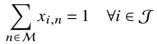

(1)

The completion time of each task is determined by its start time and the duration of the selected thread configuration:

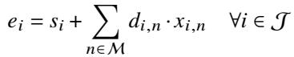

(2)

To prevent out-of-memory errors, each garbage collection must complete before its safety deadline:

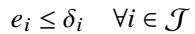

(3)

The most critical constraint ensures that the total number of active GC threads never exceeds system capacity 𝐶 at any time instant:

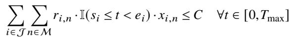

(4)

where I(·) is the indicator function and 𝑇max is the maximum time horizon.

## B.3 Objective Function

The optimization aims to maximize the sum of start times to provide scheduling flexibility while discouraging ineficient thread configurations (particularly the configuration that falls back to native concurrent GC):

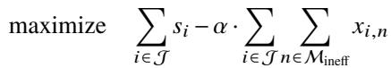

(5)

where 𝛼 is a penalty coeficient and Minef ⊂ M represents the set of ineficient configurations.