USENIX

THE ADVANCED COMPUTING SYSTEMS ASSOCIATION

# vBOIDs: Taming Chaos via Coarse-grained Scheduling Abstraction for Containers

Kaesi Manakkal, The University of Texas at Arlington; Nathan Daughety, Air Force Research Laboratory (AFRL); Yu Sun, Binghamton Unversity; Marcus Pendleton, Air Force Research Laboratory (AFRL); Hui Lu, The University of Texas at Arlington

https://www.usenix.org/conference/osdi26/presentation/manakkal

# This paper is included in the Proceedings of the 20th USENIX Symposium on Operating Systems Design and Implementation.

July 13–15, 2026 • Seattle, WA, USA

ISBN 978-1-939133-55-7

Open access to the Proceedings of the 20th USENIX Symposium on Operating Systems Design and Implementation is sponsored by

# vBOIDs: Taming Chaos via Coarse-grained Scheduling Abstraction for Containers

Kaesi Manakkal⋆, Nathan Daughety†, Yu Sun∗, Marcus Pendleton†, Hui Lu⋆

⋆The University of Texas at Arlington, †Air Force Research Laboratory (AFRL), ∗Binghamton University

## Abstract

Today’s high-density container deployment often descends into scheduling chaos, where fne-grained, per-thread scheduling decisions lead to thrashing and unpredictable performance. We present VBOIDS, a container scheduling system that tames this chaos with two key techniques: a coarse-grained BOID abstraction and a two-level balancing scheme. The BOID abstraction groups tasks into larger units to dramatically reduce scheduling churn, while two-level balancing coordinates global and local scheduling to ensure effcient resource utilization without oscillation. Our evaluation shows that VBOIDS improves the throughput of containerized mi croservices with thousands of threads by up to 3× under highly dynamic workloads compared with existing approaches, while incurring minimal overhead and yielding negligible performance impact even in high parallel workloads. VBOIDS effectively restores order to container scheduling, delivering high performance even under chaotic conditions.

## 1 Introduction

Cloud runtimes now deploy thousands of containers per machine [9, 18, 33, 50]. Production systems like Alibaba’s RunD host over 2,500 containers on a single node [33], and kernelbypass runtimes like Junction pack more than 3,000 instances on a 128 GB node [18]. This growth refects the trend of fnergrained microservices, expanding core counts, and increasingly aggressive multi-tenant consolidation [14, 20, 29, 48].

However, despite being “lightweight”, container-based deployments often perform even worse than full-fedged VMs – e.g., by more than 80% (\$2). This counter-intuitive result reveals a fundamental abstraction breakdown: Containers leak their internal concurrency directly to the host kernel – a single containerized microservice can expand into hundreds of hostvisible scheduling entities, forcing Linux’s Completely Fair Scheduler (CFS) [41] to manage large, dynamic runqueues. For instance, the Hotel Reservation application [21], comprising 24 microservices, generates over 500 processes/threads 1 when containerized, compared to only 50 vCPUs for VMs.

To understand the consequences, we analyze container and VM deployments under identical loads (\$2). We fnd that while the rates of intra-core switching (i.e., time-sharing a single core) are comparable, high-density containers incur substantially higher rates of inter-core migration (i.e., moving tasks across cores for load balancing) – by an order of magnitude. Because every container thread appears directly on the host’s runqueues, CFS sees frequent queue-length imbalances and performs aggressive load-balancing routines that constantly scan cores and migrate tasks to equalize state.

Each inter-core switch forces the kernel and hardware to reconstruct execution state on a new core – by issuing TLB shootdowns (via IPIs), invalidating L1/L2 caches, perturbing LLC locality, and disrupting branch-predictor and prefetching. These penalties quickly accumulate when containers generate large numbers of runnable tasks, causing the scheduler to move threads faster than hardware locality can converge – a phenomenon we term scheduling chaos, where a modest increase in migration rates can trigger a breakdown of hardware locality, leading to severe system ineffciency.

Existing approaches mitigate this issue through resource partitioning and smarter scheduling. Techniques such as thread pinning, cache partitioning, and CPU frequency tuning [17, 31, 32, 35, 54] carve up shared resources, while advanced scheduling and learning-based systems infer sensitivity or demand at runtime and place tasks accordingly [13, 15, 19, 26, 34, 34, 43, 53]. These techniques often reduce tail latency and noisy-neighbor effects but do not reduce the number of host-visible scheduling entities. At large scales, thousands of container threads still compete for CPU, and the resulting scheduling complexity remains a key bottleneck.

These fndings reveal a core tension in high-density container deployments: Containers achieve lightweight isolation by exposing internal threads to the host, forcing fne-grained per-thread scheduling, but per-thread scheduling triggers aggressive load balancing, destroying hardware locality at scale.

In this paper, we introduce VBOIDS, a coarse-grained container scheduling abstraction paired with an intermediate balancing layer embedded in the kernel scheduler. Rather than exposing hundreds of threads to the host scheduler, VBOIDS bundles each container’s threads into a small number of scheduling units, i.e., BOIDS, that act as virtual CPUs. By allowing the kernel to schedule only a few BOIDS per container, VBOIDS restores a stable scheduling hierarchy, sharply reducing cross-core thrashing and preserving cache locality. In addition, a lightweight, two-level balancing mechanism coordinates load at both the global and intra-container levels: the host scheduler migrates BOIDS across cores based on aggregate pressure, while an internal balancer redistributes threads among a container’s BOIDS to avoid internal hotspots. VBOIDS operates entirely within the kernel and is fully compatible with existing container frameworks, requiring no changes to applications or orchestration systems (e.g., Kubernetes [5]). As a result, containers retain their agility while gaining the stability of coarse-grained scheduling.

We implemented VBOIDS in the Linux kernel and evaluated it on representative cloud-native microservices [21, 22]. For workloads that suffer from severe scheduling chaos, VBOIDS sharply reduces migration storms and cache disruption seen under the default Linux scheduler, achieving up to 3× higher throughput while still meeting SLOs. It yields stable throughput and latency on par with the ideal – yet impractical – pinned-core setup. In highly parallel workloads that demand rapid execution across many cores, VBOIDS incurs negligible overhead: it remains lightweight while matching the throughput of the fastest unpinned confguration, demonstrating that coarse-grained scheduling does not compromise parallelism. Overall, VBOIDS restores VM-like stability to containerized execution while preserving container effciency.

## 2 Motivation

Modern cloud applications increasingly consist of dozens of fne-grained microservices communicating over lightweight RPCs [8, 23, 27, 38]. This decomposition enables independent deployment, rapid iteration, and elasticity at scale, and has fueled widespread adoption of container-based execution across platforms such as Borg [52], Kubernetes [5], and ECS [11]. Containers have thus become the dominant unit of computation: they package application code, dependencies, and runtime state while sharing the host OS for isolation, scheduling, and resource management.

However, this shift toward microservice granularity creates an unprecedented amount of host-visible concurrency. Even a modest service graph can expand into thousands of runnable threads once containerized. Crucially, containers expose this internal concurrency directly to the host scheduler. Unlike VMs, which virtualize CPU resources behind a small, stable set of vCPUs, containers allow the kernel to see every runnable thread. At high density, this forces the CPU scheduler to manage thousands of scheduling entities, exercise aggressive load balancing, and migrate tasks across cores at a rate far beyond its intended operating regime.

This pattern is widespread in production. Meta operates over 18,500 active microservices across 12M+ service instances, with deep service graphs that fan out into many short RPC handlers per user request [28]. Alibaba’s microservice trace covers ∼20,000 services across 10,000+ bare-metal nodes [38], and its RunD runtime hosts over 2,500 secure containers per 384 GB node, starting more than 200 per second [33]; Junction similarly packs 3,000+ kernel-bypass instances on a single 128 GB node [18]. Standard runtime stacks further infate these counts. Microservices commonly adopt thread-per-request or thread-pool models on top of gRPC, where each blocking RPC handler occupies an entire worker for its lifetime and concurrent fan-out forces pool sizes to scale with request concurrency [49]; service-mesh sidecars (e.g., Envoy/Istio) further add a multi-threaded proxy to every pod [27]. The result is that even a single co-located service contributes tens to hundreds of host-visible threads to the kernel scheduler, independent of application logic. In addition, Function-as-a-Service (FaaS) workloads exhibit the same pattern at a fner granularity – Azure Functions’ production trace reports that 50% of functions execute in under one second, with invocation rates spanning eight orders of magnitude [48]; Caladan reports up to 230,000 core reallocations/second under microsecond-scale RPCs [19], and the same scheduling chaos has independently motivated the “Wasted Cores” study [36], Google’s ghOSt [26], and the upstreaming of sched\_ext [24].

## 2.1 Scheduling Chaos

We frst illustrate the scheduling chaos problem using the Hotel Reservation application from DeathStarBench [21] that models a simplifed online hotel booking platform. It consists of 24 interconnected microservices that collectively implement key functionalities such as user authentication, room availability search, reservation booking, payment processing, and customer account management. Each microservice is deployed independently and communicates with others via lightweight RPCs, making the application representative of real-world, latency-sensitive, multi-tier microservices.

We compared two deployment setups: Docker containers [1] and Firecracker micro-VMs [10]. In both setups, we ensured suffcient CPU resources per microservice. For containers, we constrained CPU allocations using cgroups [6], assigning 1 to 4 cores based on utilization; for micro-VMs, we similarly allocated 1 to 4 vCPUs. Note that the number of

DISTRIBUTION STATEMENT A. Approved for public release: Distribution unlimited. Case Number AFRL-2026-0584. Dated 09 Feb 2026 allocated CPU cores or vCPUs for each microservice was determined by (pre-)measuring its CPU utilization and rounding up to the nearest whole number to ensure suffcient resources.

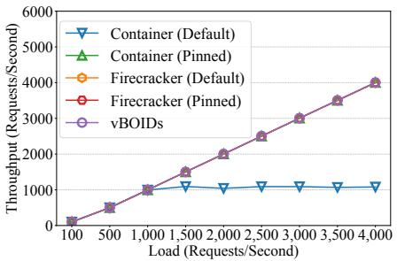  
Figure 1: The throughput of Hotel Reservation as the load increases.

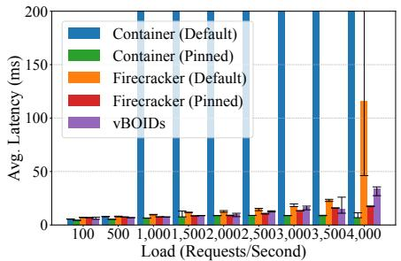

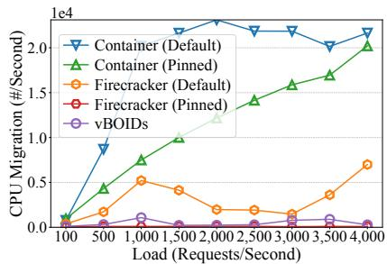  
Figure 3: Process migrations of Hotel Reservation under varying workloads.

We evaluated two scheduling schemes. In the Default scheme, the CPU scheduler, i.e., Linux CFS, freely schedules container threads or vCPUs on any available core, enabling system-wide load balancing. In the Pinned scheme, we manually pinned each thread or vCPU to a specifc core or group of cores using CPU affnity. Although static pinning hinders load balancing, our manual pinning made sure that CPU resources remained suffcient for all microservices. It is important to note that manually pinning hundreds or thousands of shortlived threads is impractical in real deployments due to the highly dynamic nature of real-world workloads. The application ran on a server machine, equipped with two NUMA nodes, each with 32 cores (more details in §6).

Figure 1 and Figure 2 present the throughput and average latency of the Hotel Reservation application under increasing request rates. Under Default scheduling, the container-based deployment exhibits sharp latency spikes even at moderate load, eventually failing to meet SLOs (e.g., 200ms) as request rates increase – beyond 1k requests/second (RPS). Applying Pinned scheduling to containers substantially reduces latency growth and preserves stable performance across the full load range, enabling much higher sustainable throughput. In contrast, both micro-VM confgurations (Default and Pinned) maintain consistently low and stable latencies across nearly all loads, with divergence appearing only at the highest request rates (around 4k RPS) – where the Default micro-VM confguration eventually violates SLOs.

These results highlight a clear and interesting contrast that containers are highly sensitive to CPU placement and beneft signifcantly from explicit core pinning, whereas micro-VMs maintain stable latency even under the default scheduler. Note that, in this paper, we chose two publicly available, widelyused microservices benchmarks – DeathStarBench [21] and Online Boutique [22] – to study the scheduling chaos problem. Both serve as conservative proxies for the production deployment – as discussed earlier, real-world deployments expose even higher host-visible concurrency, with correspondingly stronger migration storms, than what we report here.

## 2.2 Root Cause Analysis

To understand why containerized microservices exhibit unstable latency under Default scheduling while micro-VMs remain stable, we analyze microarchitectural metrics, contextswitch behavior, and migration patterns at a load of 1k requests/second (Table 1), as this is the highest load on our system where all cases meet the SLO reliably.

First, Table 1 shows that Default-scheduled containers incur substantially higher TLB, L1-dcache, and LLC miss rates than any other confguration. In contrast, Pinned containers reduce misses across all levels of the cache hierarchy (e.g., L1 and LLC) as well as both dTLB and iTLB MPKI (Misses Per Kilo Instructions). Yet, micro-VMs exhibit a different pattern: although their virtualization stack introduces overhead (refected in slightly higher LLC and TLB activity), the gap between Default and Pinned cases is small.

To further narrow down the cause, we examine contextswitch behavior. An intra-core switch occurs when the scheduler time-slices runnable tasks on the same physical core. Microservice workloads naturally generate many such switches: short, bursty RPCs frequently block on I/O or remote calls and quickly wake up again, producing constant turnover among runnable tasks. Table 1 shows that both containers and micro VMs exhibit similarly high intra-core switch rates, refecting the fact that intra-core switching is driven primarily by the application’s I/O-driven blocking and wake-up patterns; even in micro-VMs, the hypervisor delivers these events to the vC-PUs (via VM Exits/Entries), resulting in comparable on-core scheduling activity at the host. Because these switches occur on the same core, they preserve L1/L2 cache warmth and TLB residency and avoid cross-core coordination. As a result, while intra-core switches contribute to overall scheduling volume, they impose low locality overhead.

In stark contrast, Figure 3 shows that Default scheduling causes containerized workloads to incur a disproportionately high number of inter-core migrations, and the rate grows

DISTRIBUTION STATEMENT A. Approved for public release: Distribution unlimited. Case Number AFRL-2026-0584. Dated 09 Feb 2026 rapidly with load. Each migration moves execution to a different core (or NUMA node in the worst-case scenario), scattering working sets across cores and repeatedly discarding accumulated locality. This behavior directly elevates L1/L2 cache misses, perturbs LLC residency, and triggers TLB shootdowns, as refected in Table 1. In addition, every cross-core move requires coordination between cores (e.g., updating runqueue state, enforcing memory-protection changes, and acquiring shared scheduler locks), further amplifying overhead. As load increases, the frequency of these migrations outpaces the hardware’s ability to re-establish locality, producing the unstable execution behavior we term scheduling chaos. Under this, even moderate increases in request rate lead to rising tail latency and SLO violations when the system CPU utilization remains low – less than 30%.

Table 1: Running statistics for the Hotel Reservation application under the load of 1,000 requests/second. Note that cache and TLB miss numbers are reported as values normalized to the Container (Default) case.  
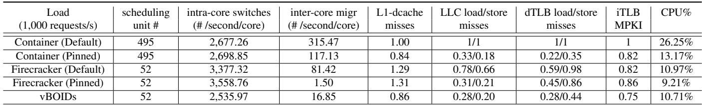

As expected, Pinned scheduling substantially reduces intercore migrations for containers – by roughly 60% at a load of 1k RPS (Figure 3) – stabilizing hardware locality and lowering cache and TLB miss rates (Table 1). This reduction manifests directly in the improved latency observed in Figure 2. However, because a container can expose hundreds of runnable threads and threads, it is diffcult and impractical to pin each one to a specifc physical core. Note that the existing affnity-based approach instead pins a container’s all threads to a designated subset of cores. While this restricts scheduling freedom, it does not eliminate inter-core migrations: imbalances within the pinned core subset still trigger load balancing, particularly under heavy load.

Finally, micro-VMs exhibit different behavior. Rather than exposing hundreds of runnable entities to the host, micro-VMs present a small number of long-lived vCPUs (e.g., 52 total for this workload). Because the host scheduler sees far fewer host-visible scheduling units, runqueues remain stable and load-balancing routines have little opportunity, or need, to migrate vCPUs between cores. Consequently, both Default and Pinned micro-VM confgurations incur very few migrations in Figure 3, and their cache/TLB profles remain stable across scheduling modes. Without migration-induced disruption, micro-VMs sustain lower latencies than containerized workloads under Default, despite additional virtualization overhead of the guest kernel and hypervisor.

## 2.3 Insights

The analysis shows that the primary source of performance degradation across different confgurations is excessive intercore migrations (rather than the necessary, workload-driven intra-core switches). Like many existing approaches attempting to mitigate interference [17, 31, 32, 35, 54], thread pinning reduces migrations and restores locality but sacrifces fexibility or requires manual tuning. In contrast, micro-VMs expose only a handful of long-lived vCPUs, allowing runqueues to remain stable and maintaining hardware locality, but at the cost of full virtualization overhead.

This exposes a long-standing tension: stable placement is essential for maintaining low and consistent latency, but enforcing stability restricts dynamic load balancing, which is necessary for high resource utilization. It further raises a research question: can we decouple the granularity of threadlevel execution from that of host-level migrations, thereby enabling containers to present only a handful of migrationstable units to the host while retaining their inherent fexibility and avoiding the costs of full virtualization?

## 3 Background

We focus on Linux’s CFS, the default and widely deployed scheduler in production datacenters [37]. The core idea behind our approach – interposing a virtual scheduling abstraction between threads and physical cores – is general and can extend to emerging frameworks such as EEVDF [2] or BPF-based sched\_ext [24]. However, we center our design, implementation, and evaluation on CFS, as it remains the practical substrate for most containerized cloud workloads today [52]. In the following, we provide the necessary background on CFS before introducing our solution.

Thread-granularity mismatch. The fundamental unit of execution in Linux is the thread (task\_struct), represented in the scheduler as a scheduling entity. CFS operates on a strictly 1:1 threading model: It schedules individual threads onto physical cores based on their virtual runtime (vruntime). While effective for general-purpose computing, this model ignores the logical boundaries of modern containerized cloud applications. A container is simply a namespace grouping

DISTRIBUTION STATEMENT A. Approved for public release: Distribution unlimited. Case Number AFRL-2026-0584. Dated 09 Feb 2026 of hundreds of threads [6]. To the scheduler, these threads are independent actors; CFS has no structural concept of a “container” as an executable unit and cannot naturally enforce concurrency bounds – it cannot dynamically limit a container to executing on exactly N cores simultaneously (only static pinning), nor can it prevent the “split-brain” scattering of a container’s threads across disjoint cores or NUMA nodes.

Task groups. In the Linux kernel, the abstract concept of a container is materialized as a task\_groups (cgroups [6]). Container runtimes like Docker [1] map each container to a distinct task\_groups. The task\_groups aggregates the weights of its member threads to ensure proportional fairness at the group level. To limit CPU usage, the task\_groups utilizes a “bandwidth control” mechanism. This is a temporal throttle: the kernel tracks aggregate usage and throttles all threads in the group once a global quota is exceeded. Crucially, the task\_groups enforces temporal isolation (how much time a group gets) but lacks spatial isolation (where and how many cores a group occupies). Accordingly, cfs\_quota\_us is not a direct substitute for VBOIDS: it bounds CPU time over an interval, but not the number of cores a container can occupy concurrently. For example, a container with a quota of 2.0 CPUs can legally execute on 100 cores for 20ms (a massive burst) before being throttled. This bursty behavior degrades cache locality and induces tail latency for neighbors as we have discussed in \$2. While a shorter quota period could approximate some of VBOIDS behavior, doing so would require workload-specifc tuning; unless otherwise noted, our experiments use the default CFS quota and period settings.

Load balancing and PELT. For multicore systems, Linux invokes the load balancer periodically on scheduler ticks (e.g., every 1ms), whenever a CPU becomes idle, during task wakeups, or constraint changes to maintain fairness and minimize load imbalance. Migration decisions are driven by Per-Entity Load Tracking (PELT) [51], a geometric decay algorithm that implements an Exponentially Weighted Moving Average (EWMA) with a 32 ms half-life. PELT tracks the time each entity spends executing or waiting (runnable load) and aggregates these signals hierarchically – summing the load of individual threads into their parent task\_group. During load balancing, the scheduler selects pairs of source and destination cores beyond certain load imbalances (e.g., ∼15% within a NUMA node and ∼30–50% across NUMA nodes). Then, the scheduler pulls threads from the source core runqueue to the destination core runqueue – a process called migration. While PELT provides an accurate view of container load, the standard load balancer still iterates over individual threads to resolve imbalances. In high-density environments, this O(N) search space (i.e., total number of threads) becomes costly.

## 4 Design of VBOIDS

The design goal of VBOIDS is to address the fundamental mismatch between the massive thread-level concurrency exposed by containers and the much coarser physical parallelism of modern multicore hardware. Our design is guided by three principles: (1) Restore placement stability through coarse granularity: The root cause of scheduling chaos is that containers expose too many independent migration candidates. Restoring locality requires substantially reducing the scheduler’s decision space with coarser-grained placement. (2) Minimize hot-path interference: The Linux scheduler’s hot path must remain fast and wait-free; any design that introduces per-thread coordination, shared locking, or complex data-structure traversals in this path is untenable. (3) Preserve work conservation and fairness: Coarse-grained placement must not strand resources. The design must maintain work conservation while avoiding static pinning (underutilization) and bandwidth throttling (temporal idling).

VBOIDS satisfes these principles by introducing a new scheduling abstraction, the BOID, along with a new scheduling layer that decouples a container thread-level execution from the kernel’s core-level placement. In the reminder of this section, we frst formalize the BOID abstraction (§4.1), then present the scheduling hierarchy (§4.2), and fnally describe the dual-path load balancing mechanisms (§4.3).

## 4.1 BOID Abstraction

As shown in Figure 4, we introduce BOID, Bound Object Integrated Dispatch 2, as a coarse-grained scheduling abstraction for containers. Conceptually, a BOID functions as a containerlevel vCPU, aggregating the container’s threads into a single, logical entity that the host scheduler treats as a schedulable unit. To operate on BOIDS, VBOIDS adds an intermediate layer to the scheduling hierarchy. Instead of scheduling individual threads, the host scheduler (CFS) schedules BOIDS onto physical cores, while each BOID acts as a vehicle for the execution of its associated threads. Structurally, a BOID is a frst-class kernel scheduling entity (i.e., backed by struct boid in Figure 4) that maintains a runqueue of its assigned threads. While this resembles the hierarchical scheduling of Linux task groups (cgroups), BOIDS enforce a strict serial execution invariant: regardless of how many threads are queued in a BOID, at most one may execute on a physical core.

This serialization makes the BOID the basic unit of concurrency for a container. The number of BOIDS assigned to a container dictates its maximum degree of parallelism. A container provisioned with N BOIDS is therefore limited to N simultaneous execution contexts – mirroring the behavior of a VM with N vCPUs. This yields a deterministic concurrency bound that eliminates the need for reactive, latency-inducing mechanisms such as CPU bandwidth quotas. Consequently, VBOIDS provides strong performance isolation by construction. In an unconstrained environment, a container with N BOIDS can utilize up to N physical cores when it has suf fcient work. Under contention, the host scheduler balances load across runnable BOIDS, ensuring proportional CPU sharing at the granularity of the “virtual core” (i.e., BOIDS) rather than individual threads. Note that, VBOIDS preserves CFS’s existing fairness machinery and applies it at BOID granularity: The load balancer treats BOIDS as the proportional-share entities, and per-core vruntime ordering still governs scheduling among threads sharing the same core. Two-level fairness properties therefore continue to hold under VBOIDS: (i) intercontainer fairness – containers receive CPU shares proportional to their cgroup weights, summed across their BOIDS; and (ii) intra-BOID fairness – threads sharing a BOID’s core compete via standard CFS vruntime ordering. By default BOIDS carry equal weight; they can be assigned heterogeneous weights to support fractional reservations or priorities.

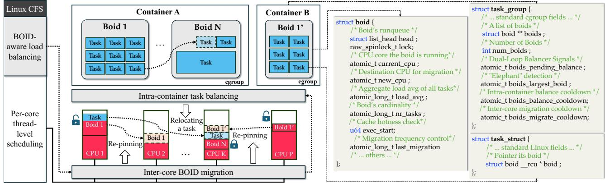  
Figure 4: Architecture overview of VBOIDS (left). Key kernel data structures materializing the boid abstraction (right). The boid acts as the virtual cores (vCPUs) of containers, while task\_group and task\_struct are augmented to support the hierarchy.

## 4.2 Scheduling Hierarchy

While standard Linux CFS handles per-core execution and cross-core load balancing over the same set of threads, VBOIDS separates these concerns through a two-level hierarchy (Figure 4): the per-core scheduler time-shares threads assigned to each BOIDS (i.e., intra-BOID execution) on a single core, while VBOIDS’s load balancer places BOIDS across cores to equalize system load (i.e., inter-BOID placement).

Intra-BOIDS execution (thread-level): At the lowest level, a BOID forms a strict execution boundary. Each BOID enforces this boundary through dynamic affnity binding: When a thread is assigned to a BOID (via boids\_add\_task), the kernel restricts its allowed CPU only to the physical core currently hosting that BOID. All threads whose BOIDS are mapped to a given core still compete in that core’s runqueue under standard scheduling policies (e.g., vruntime ordering). This ensures that the hardware parallelism of a container is bounded by the number of BOIDS it is provisioned with – regardless of how many runnable threads it contains – while still preserving proportional fairness among threads sharing the same core. Notably, enforcing this invariant requires no changes to the scheduler’s hot path; the per-core scheduler continues to select the next runnable entity on the core, guaranteed to belong to the resident BOID 3

Inter-BOID placement (system-level): The core innovation of VBOIDS lies at the inter-BOID level, where the kernel’s load balancer is extended to treat BOIDS as the atomic units of migration. VBOIDS frst introduces a hierarchical loadtracking mechanism that aggregates the PELT signals (§3) of all threads within a BOID into a single, cohesive load metric (its aggregated load\_avg). These aggregated metrics are then fed into the scheduler’s existing load-balancing logic (§3), allowing the balancer to evaluate system-wide imbalance at the granularity of BOIDS rather than individual threads.

When the scheduler determines that migration is needed to equalize load, it invokes VBOIDS’s atomic migration approach (§4.3). Instead of peeling off individual threads, the scheduler migrates the entire BOID by frst atomically updating its target CPU. This operation informs the scheduler that all threads belonging to the BOID should execute on the destination core. Such BOID-level re-pinning is extremely lightweight and does not stall the scheduler’s hot path. Threads are migrated lazily: they are removed from the source

3By updating each thread’s allowed-CPU mask – when a thread is created or migrated – to refect the core hosting its BOID, VBOIDS relies on the scheduler’s existing CPU-selection logic. The built-in per-task CPUadmission check (is\_cpu\_allowed()), invoked during task placement (e.g., in select\_task\_rq\_fair()), naturally enforces the execution boundary without requiring any changes to scheduler internals.

DISTRIBUTION STATEMENT A. Approved for public release: Distribution unlimited. Case Number AFRL-2026-0584. Dated 09 Feb 2026 core’s runqueue and enqueued on the destination core only when they are subsequently scheduled or context-switched. Because the threads of a BOID are executed sequentially by design, the overhead of migrating the entire BOID is naturally constrained and amortized across its constituent threads.

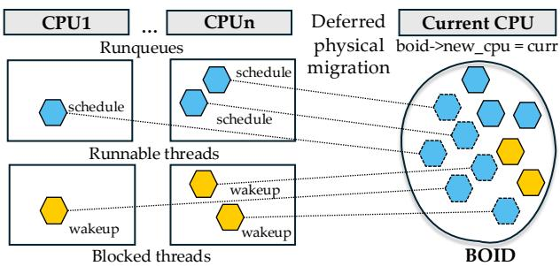  
Figure 5: BOID fock-like migration.

This group-wise, atomic relocation is what gives BOIDS their fock-like behavior: placement decisions act on the collective, and individual threads simply follow the group’s movement without independent negotiation. By treating the BOID as the indivisible unit of migration, the scheduler avoids the scheduling chaos of split-brain execution. The resulting hierarchy aligns the scheduler’s placement decisions with the application’s logical structure (i.e., BOIDS): the scheduler positions a container’s BOIDS, and each BOID, once placed, carries its instruction stream on a single core.

## 4.3 Load Balancing

The introduction of BOIDS transforms the Linux load balancing problem from an O(T ) search over global threads to an O(N) search over aggregate entities, i.e., BOIDS, where N represents the number of BOIDS and T denotes the number of threads – i.e., N ≪ T . This reduction in dimensionality simplifes the scheduler’s state space and yields more stable global placement decisions. VBOIDS augments Linux’s default balancer with a complementary two-part migration mechanism: the inter-core balancer (§4.3.1) distributes BOIDS across cores to balance system-wide load, while the intracontainer balancer (§4.3.2) distributes threads across a container’s BOIDS to balance load within that container.

## 4.3.1 Inter-Core BOID Migration

Algorithm 1 illustrates the inter-core BOID migration logic. Traditionally, when the kernel load balancer detects a load imbalance between a source CPU (CPUsrc) and a destination CPU (CPUdst) – i.e., when load(CPUsrc) - load(CPUdst) exceeds the imbalance limit determined by PELT (§3) – the balancer begins scanning the runnable threads on CPUsrc. It then migrates each movable thread (i.e., by relocating it to CPUdst’s runqueue) to reduce the difference, stopping when the loads converge or no additional movable threads remain. VBOIDS augments this path by evaluating BOIDS as the basic migration units, involving three main steps.

Algorithm 1 Inter-core BOID migration.   
Require: X: source CPU; Y : destination CPU   
Require: L(X), L(Y ): load of CPUs X and Y   
Require: θimbalance = L(X) − L(Y ): load imbalance   
Require: θimbalance > θimbalance\_t (determined by PELT §3)   
Require: L(b): load of BOID b   
Require: NRTasks(b): # tasks associated with BOID b   
Require: NRBoids: # BOIDS in the taskgroup   
Require: R(b, X): residency time of BOID b on X   
Require: θ : cache-hot residency threshold   
1: for all BOIDS b on CPU X do   
2: if θ ≤ 0 then   
3: break   
4: if R(b,X) < θ then   
5: continue ▷ Skip cache-hot BOIDS   
6: if L(b) > θimbalance then   
7: if NRTasks(b) ≥ 2 and NRBoids ≥ 2 then   
8: CALL INTRA-CONTAINER-BALANCE   
9: if L(X) − L(b) > L(Y ) + L(b) then   
10: b.new\_cpu ← Y ▷ If imbalance is improved, perform migration   
asynchronously   
11: θimbalance− = L(b)

(1) Candidate selection and locality (line 4). The balancer frst flters BOIDS based on execution history to avoid unnecessary cache disruption. For each BOID b, VBOIDS computes its residency time, tres = tnow − b.exec\_start. If tres is below the confgured hotness limit θ (e.g., 500 µs), the BOID is considered cache-hot – its threads have recently populated the local L1/L2 caches. This BOID is thus skipped. The search is also topology-aware: a BOID is considered for migration only when CPUdst lies within the same NUMA node as CPUsrc or within the BOID’s preferred node (a confgurable parameter). This constraint enforces locality-preserving placement and avoids migrations that would incur unnecessary cache invalidation and NUMA penalties.

(2) The “elephant” condition and delegation (lines 6–8). A key challenge in coarse-grained balancing is the “elephant” BOID, i.e., an entity whose aggregate load L(b) exceeds the imbalance gap between CPUsrc and CPUdst (i.e., L(b) > θimbalance). Migrating such a BOID would only invert the imbalance, rather than resolve it, triggering the pingpong effect. Instead of simply skipping these candidates, VBOIDS interprets them as a signal of internal skew. If an elephant BOID contains multiple runnable threads, the scheduler delegates the task-level balancing to the intra-container balancer (§4.3.2), which redistributes the BOID’s internal threads across other, less-loaded BOIDS in the same container. This delegation enables VBOIDS to address fne-grained imbalance alongside the global BOID placement decisions.

(3) Atomic actuation and convergence (line 9-10). If a BOID satisfes the anti-thrashing condition – which guarantees that migrating it will reduce, rather than invert, the load

DISTRIBUTION STATEMENT A. Approved for public release: Distribution unlimited. Case Number AFRL-2026-0584. Dated 09 Feb 2026 gap – the scheduler commits to the move. The commitment is achieved using a lazy, state-based migration protocol that avoids taking multiple runqueue locks: Instead of immediately relocating all threads to the destination runqueue, the load balancer performs a single atomic CAS updating the BOID’s target CPU state (boid->new\_cpu). This completes the logical migration without touching per-task state.

Algorithm 2 Intra Container Load Re-balancing.   
Require: Taskgroup T ▷ Current task group   
Require: BOID E: Elephant BOID   
Require: BOID S: Smallest BOID in taskgroup   
Require: task t: Current task in BOID E   
Require: L(t): Load of task t   
Require: NRTasks(E): tasks associated with BOID E   
Require: IB(E, S): Imbalance between BOIDS E, S   
Require: θimbalance: Minimum load gap to trigger balancing   
1: if (E == S) or   
2: (IB(E, S) < θ ) or   
3: (L(t) > IB(E, S)) then   
4: return   
5: boids\_remove\_task(E, t)   
6: boids\_add\_task(S, t) ▷ Move task t from BOID E to S

Figure 5 illustrates this focking-like behavior. The physical migration of threads is deferred to the context-switch path: runnable threads stay on their current runqueues, and blocked threads remain in their wakeup queues until they execute again. Upon scheduling or wakeup, each thread observes its BOID’s new CPU state and migrates, causing the BOID to converge and ensuring that a thread always executes on the CPU assigned to its BOID. This two-phase mechanism allows the BOID to move atomically from the scheduler’s perspective while its threads migrate asynchronously and incrementally, amortizing the cost and avoiding heavy runqueue locking. This behavior closely mirrors a VM’s vCPU model, where threads execute only on the vCPU’s assigned core, but differs in that BOID threads migrate lazily and independently rather than being moved as a preemptible virtual core.

Finally, the algorithm re-evaluates the load difference between CPUsrc and CPU (for each BOID on CPU X). If the imbalance has been neutralized (θimbalance ≤ 0), the search terminates (line 2), ensuring that the system performs the minimum number of migrations to restore equilibrium.

## 4.3.2 Intra-Container Task Balancing

By default, VBOIDS distributes threads evenly across BOIDS of a container at its initialization and when new threads are created during execution. However, as threads block, wake, and execute with varying intensity, the runnable load across BOIDS can drift over time. This imbalance breaks work conservation at the container level – an overloaded BOID stalls progress while underloaded BOIDS remain idle.

To address this internal skew, VBOIDS incorporates an intra-container balancer. Unlike VMs, which rely on a guest scheduler, VBOIDS performs this directly within the host scheduler. Unlike the default balancer, which migrates threads across arbitrary cores, VBOIDS confnes redistribution strictly within the container’s BOIDS. Hence, it does not reintroduce the “scheduling chaos” (§2). This intra-container balancer operates periodically or opportunistically during lifecycle events (e.g., task creation or resizing), and more importantly, cooperates with the inter-core BOID balancer.

Specifcally, when a BOID is too “heavy” to migrate atomically, the inter-core balancer invokes intra-container redistribution (line 8, Algorithm 1). As Algorithm 2 further shows, once triggered, the intra-container balancer attempts to move a runnable task from the elephant BOID to the least-loaded BOID, provided two key conditions hold: (a) the load imbalance between the two BOIDS is signifcant enough to warrant intervention (IB > θimbalance); and (b) the task is not too large, ensuring that migrating it reduces the gap rather than overshooting it (L(t) ≤ IB). When these guards are met, the scheduler updates the task’s BOID assignment (i.e., p->boid); the task physically migrates to the runqueue of the target BOID’s core on its next wakeup or schedule event.

This pairing lets VBOIDS make progress on two fronts at once: it smooths/balances runnable load across a container’s BOIDS while also reducing the size of an elephant BOID that the inter-core balancer cannot move. By shedding just enough tasks to another BOID – without overshooting – the mechanism both improves internal parallelism and turns an elephant BOID back into a migratable unit. This way, containers use their allocated BOIDS more effciently, and BOID-level migration remains effective even under skewed workloads.

## 4.4 Putting It All Together

In summary, the VBOIDS architecture yields four key properties. First, it decouples thread execution from core placement: thread-level scheduling is handled locally preserving L1/L2 cache warmth, while expensive cross-core migrations are restricted to low-frequency and effcient structural load shifts. Second, it compresses the balancing state space from O(T ) threads to O(N) BOIDS (N ≪ T ), dampening the “noise” of massive host-visible scheduling tasks and making placement decisions tractable. Third, its dual-path balancing approach – the inter-core balancer handles coarse-grained load drift by migrating BOIDS across cores, while the intra-container balancer corrects fne-grained skew by redistributing tasks within a container – forms a feedback system that maintains balanced utilization with minimal disruption to locality. Finally, it resolves the tension between isolation and utilization: unlike static pinning, which strands resources (i.e., low utilization), BOIDS remain work-conserving through the dual-path balancing mechanism; unlike bandwidth quotas, which enforce fairness through throttling (i.e., idling runnable tasks and in-

DISTRIBUTION STATEMENT A. Approved for public release: Distribution unlimited. Case Number AFRL-2026-0584. Dated 09 Feb 2026 creasing bursty latency), VBOIDS’s concurrency bounding enforces fairness without throttling.

It is worth noticing that existing Linux task-group mechanisms control how much CPU time a container receives, but not the scheduler-visible unit of placement and migration. In contrast, BOIDS are introduced as a distinct abstraction to provide that unit: a small set of container-level virtual cores that bound concurrency and prevent thread-granularity balancing from reintroducing scheduling chaos.

## 5 VBOIDS Implementation

We implemented VBOIDS as a patch to the Linux 6.15 kernel, adding ∼2,000 lines of code 4 that touch the core kernel scheduler components (e.g., fair.c, pelt.c, and cgroup.c).

As depicted in Figure 4 (right), we integrate BOIDS directly into the kernel by augmenting the task\_group structure. Each task\_group maintains a dynamically allocated array of struct boid pointers. The BOID itself is a refcounted kernel object that tracks its aggregate load, current CPU, and a linked list of member tasks. To map threads to BOIDS, we modify task\_struct to include a direct pointer to its assigned BOID. This pointer is managed via Read-Copy-Update (RCU) to allow lockless dereferencing during the scheduler’s hot loop (is\_cpu\_allowed). Further, the management plane is exposed via a new cgroup interface fle, cpu.boids. Writing an integer N to this fle triggers a resizing operation that reallocates the BOID array and redistributes existing tasks round-robin – the existing processes within the container are distributed evenly across the new BOIDS. We determine the initial CPU affnity for a BOID based on the CPU where its frst assigned process was previously resident. While integrating these data structures establishes the structural hierarchy of VBOIDS, enforcing the BOID abstraction within the scheduler’s highly concurrent hot path required overcoming several challenges related to concurrency, complexity, and stability.

(1) Tunable hysteresis and locality preservation. Workloads often exhibit conficting scheduling requirements, e.g., highparallel tasks beneft from immediate dispatch to idle cores to minimize queuing delay, whereas latency-sensitive applications often require preserving cache locality and minimizing rebalancing overhead. To allow administrators to optimize for these conficting goals, we introduce two tunable parameters. First, boids\_migrate\_cooldown prevents tasks from bounc ing between cores during rapid interactions (by enforcing a minimum interval between migrations), which preserves cache locality. Further, boids\_balance\_cooldown stops the scheduler from overreacting to short load spikes (by throttling the frequency of load balancing events), ensuring we do not waste cycles rebalancing BOIDS for work that fnishes before the migration is even complete. These parameters are enabled at the per-container level (struct task\_group), enabling the scheduler to enforce custom migration and balancing for different workloads running on the same machine. By default, they are set to zero (i.e., no delays), which works well in most cases observed in our experiments (§6).

(2) Lazy, state-based BOID migration. A major hurdle was enforcing atomic migration without holding the runqueue locks of multiple cores simultaneously, which would induce prohibitive contention. We solved this by implementing a two-phase, fock-like lazy migration. In the load balancing path (detach\_tasks), we do not physically move tasks. Instead, we perform a lightweight atomic CAS on the BOID’s metadata (boid->new\_cpu). The physical migration is deferred to the context switch path: we inserted a hook, boids\_post\_migrate, into finish\_task\_switch. When a thread is scheduled in, it checks its BOID’s state; if the BOID has moved, the thread updates its own runqueue (cfs\_rq) and the current cpu pointers (current\_cpu) immediately. This allows the BOID to logically move instantly while its threads physically catch up asynchronously, eliminating the need for global runqueue locking.

(3) Zero-cost hierarchical PELT. Accurate load balancing requires aggregating the load of all threads in a BOID, but iterating over thread lists during balancing is O(N). We modifed the PELT update in the current PELT (§3) to perform differential aggregation (\_\_update\_load\_avg\_se). Whenever a thread’s load average changes, the delta is atomically propagated to its parent BOID (atomic\_long\_add). This ensures a mathematically consistent view of aggregate demand in O(1) time, without ever traversing the member threads.

(4) Lockless affnity and RCU synchronization. Enforcing strict BOID affnity (is\_cpu\_allowed) requires accessing shared BOID state during the scheduler’s most performancesensitive loops. We used RCU heavily to manage the lifecycle of BOID structures (rcu\_dereference(p->boid)), ensuring that task placement (select\_task\_rq\_fair) remains wait-free. Further, updating BOID affnity from atomic contexts (e.g., during detach\_tasks) prevents the use of locks (boid->lock). Instead, we use an atomic integer to specify a BOID’s current core. This primitive allows us to update a BOID’s affnity atomically, ensuring no lock contention, and that the operation cannot stall the CPU.

(5) Provisioning and lightweight resizing. Provisioning BOIDS is conceptually analogous to provisioning vCPUs for a VM: the number N of BOIDS per container is workloadand deployment-dependent, and we set N to each container’s expected concurrent CPU demand – the same value an operator would pick for a VM’s vCPU count. Unlike VM vCPUs, however, VBOIDS allows N to be resized at runtime: the BOID array is reallocated in place, threads are re-pinned via RCU, and the operation requires neither a container restart nor thread recreation. As a result, N becomes a tunable runtime parameter rather than a deployment-time constant, and vertical scaling [45] – i.e., growing or shrinking a container’s effective parallelism in place – becomes a lightweight operation. This makes N amenable to dynamic, load-driven adaptation; we leave a full study of such policies to future work.

Table 2: Characteristics of the four microservices in Death-StarBench [21] and Google Online Boutique [22].  
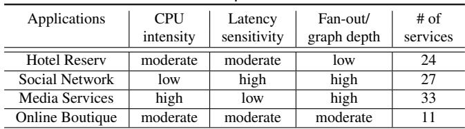

## 6 Evaluation

Our evaluation answers a key question: to what extent does VBOIDS restore placement stability and improve end-to-end performance for high-density containerized microservices? We compared VBOIDS against various Linux confgurations across a broad suite of microservice benchmarks.

Testbed. All experiments were conducted on a two-socket server equipped with two Intel Xeon Gold 6430 processors, 64 GB of DDR5 memory, and a Micron 7450 NVMe SSD formatted with ext4. Hyperthreading was disabled to avoid SMT-induced interference with a total of 64 physical cores, 32 each NUMA node. All system resources were provisioned to eliminate non-CPU bottlenecks. The machine ran Ubuntu 22.04 and our modifed Linux 6.15.0 kernel, with and without VBOIDS enabled. Container experiments used Docker [1] as the container runtime; comparisons to micro-VM isolation employed Firecracker [10] confgured with matching constraints for CPU and memory resources.

Workloads. We used both DeathStarBench [21] and Google Online Boutique [22] – widely used benchmarks for studying end-to-end performance in cloud-native microservices applications. DeathStarBench captures realistic service-graph compositions, request fan-out, and cross-service communication patterns typical of large-scale online services. Our experiments focus on three representative applications – Hotel Reservation, Social Network, and Media Services. Boutique [22], on the other hand, features 10 stateless services connected via synchronous RPCs and multiple aggregation points in the frontend. They collectively exercise a spectrum of CPU intensity, branching factors, and latency sensitivities, as summarized in Table 2.

Baselines for comparison. We evaluated VBOIDS against four baselines. (1) Containers (Default): each microservice runs as a Docker container, with CPU allocations constrained using cgroups and typically assigned 1–4 cores based on measured utilization; threads can execute on any available physical core (no pinning). (2) Firecracker (Default): each microservice runs inside a Firecracker micro-VM [10], provisioned with 1–4 vCPUs to match the container allocations; vC-PUs can freely migrate across cores. (3) Containers (Pinned) and (4) Firecracker (Pinned): container threads or Firecracker vCPUs are manually pinned to specifc cores or core groups using CPU affnity, ensuring the same CPU resources as those in (1) and (2). (5) VBOIDS: our approach, confgured with the same number of BOIDS as the number of cores allocated to each container or vCPU count in the Firecracker confgurations. These baselines are referenced throughout the evaluation for brevity. We collected workload- and system-level performance metrics – e.g., throughput, average and tail latency, CPU utilization, scheduling frequency, and cache activity.

## 6.1 End-to-End Performance

We frst demonstrate the end-to-end performance using Hotel Reservation, Social Network, and Media Services under various confgurations. We generated load to them using wrk2 confgured with an exponential inter-arrival distribution for requests, 20 threads, and a total of 60 connections. Each experiment ran for 60 seconds after a brief warm-up. Unless otherwise noted, we set boids\_balance\_cooldown and boids\_migrate\_cooldown to 0 to allow unthrottled balancing activity; cooldown effects are explored separately in our sensitivity analysis. To ensure fairness, resource provisioning is normalized across all confgurations: the number of BOIDS, vCPUs, and physical cores is matched for VBOIDS, micro-VMs, and Docker containers, respectively.

Hotel Reservation was our motivating case (§2), where Container (Default) triggered the migration storms and locality destruction. We return to this workload to evaluate whether VBOIDS eliminates these effects in a real deployment.

Figure 1 reports end-to-end throughput under increasing RPS load (requests per second), measured only within the range where latency satisfes a 200ms SLO. As load increases, Container (Default) collapses early, saturating before 1k RPS. Container (Pinned) and both Firecracker confgurations extend beyond 4k RPS due to reduced inter-core migration. VBOIDS sustains high throughput up to 4k RPS. Figure 2 shows the corresponding latency trends. Container (Default) exhibits sharp spikes around 1k RPS, while VBOIDS remains close to the manually pinned case, maintaining low latency through 4k RPS.

These performance trends align with the inter-core migration data in Figure 3 and micro-architectural data in Table 1, collected using perf over a 10-second steady-state window (for 1k RPS). First, Container (Default) incurs the highest inter-core migrations and cache/TLB miss rates, whereas VBOIDS dramatically reduces migration frequency and increases cache effciency. Further, VBOIDS matches the migration behavior of Firecracker (Default), recreating vCPU-like

DISTRIBUTION STATEMENT A. Approved for public release: Distribution unlimited. Case Number AFRL-2026-0584. Dated 09 Feb 2026 execution using BOIDS. Last, VBOIDS incurs even fewer inter-core migrations than Container (Pinned), where threads remain confned to a subset of cores and still migrate frequently within that group, especially when load is high.

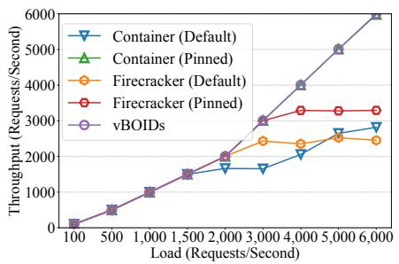  
Figure 6: Throughput of Social Network as the load increases.

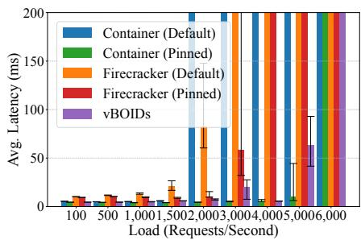  
Figure 7: Average latency of Social Network under varying workloads.

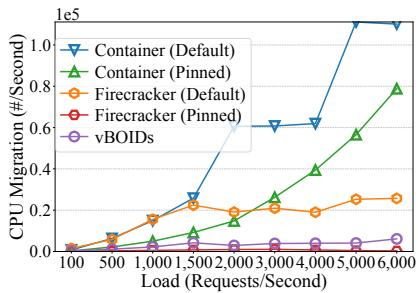  
Figure 8: Process migrations of Social Network under varying workloads.

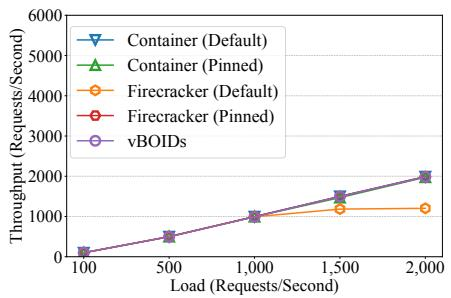  
Figure 9: Throughput of Media Microservices as the load increases.

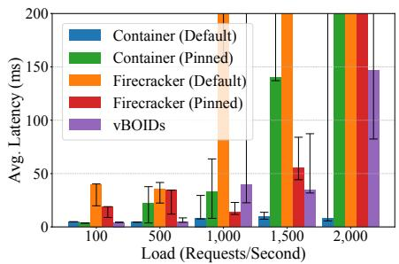

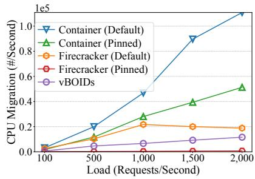  
Figure 11: CPU Migrations for Media Microservices under varying workloads.

Overall, VBOIDS improves throughput by over 3× compared to Container (Default) and matches the performance of Container (Pinned) and Firecracker (Pinned) – all without manual pinning and while preserving full container fexibility. VBOIDS is lightweight: its overall CPU% (Table 1) is 40% of Container (Default) and 80% of Container (Pinned).

Social Network, compared to Hotel Reservation, features a deeper, more highly branched service graph and generates a larger runnable thread set when containerized.

For throughput, as reported in Figure 6, Container (Default) saturates early, fattening near 2k RPS. Both VBOIDS and Container (Pinned) perform substantially better, sustaining close to 5k RPS, still meeting the SLO, while both Firecracker confgurations follow the pinned curve till up to 3k RPS. Figure 7 captures the latency behavior. Consistent with its early saturation, Container (Default) experiences sharp latency spikes around 2k RPS while both Firecracker confgurations can sustain till 3k RPS. In contrast, VBOIDS and Container (Pinned) remain stable and low-latency up to 5k RPS. Figure 8 and Table 3 explain this behavior: At 1k RPS, Container (Default) exhibits extremely high inter-core migrations and elevated cache/TLB miss rates, whereas VBOIDS cuts migrations by 85% and with lower cache/TLB misses.

This demonstrates that VBOIDS’s coarse-grained scheduling remains effective even for deep, fan-out–heavy service graphs – not only outperforming Container (Default) but also surpassing both pinned and default Firecracker confgurations. VBOIDS behaves just like Container (Pinned) in terms of performance (both throughput and latency), yet achieves this without any manual pinning. Meanwhile, VBOIDS maintains low CPU utilization, again underscoring its effciency.

Media Services differs from the previous two workloads in that it is substantially more CPU-intensive and issues far fewer fne-grained RPCs. During execution, it rapidly spawns many short-lived threads that aim to run immediately on any available core. Hence, this workload benefts from maximizing hardware parallelism, making Container (Default) – with its unconstrained access to all cores – particularly effective.

Figure 9 shows that all, except Firecracker (Default), scale up to 2k RPS. In Figure 10, as Media Services benefts from maximal hardware parallelism, the unpinned cases, Container (Default) and VBOIDS, outperform the pinned ones, Container (Pinned) and Firecracker (Pinned), refected in the lower latencies. VBOIDS achieves this by adaptively issuing more inter-core migrations (Figure 11 and Table 3) than those in Hotel Reservation and Social Network, enabling it to better exploit available hardware parallelism. These results show that VBOIDS delivers performance on par with the most ef-

DISTRIBUTION STATEMENT A. Approved for public release: Distribution unlimited. Case Number AFRL-2026-0584. Dated 09 Feb 2026 fective confgurations, even when high inherent parallelism reduces the advantage of migration control.

Table 3: Running statistics for Social Network and Media Services under the load of 1,000 requests/second.  
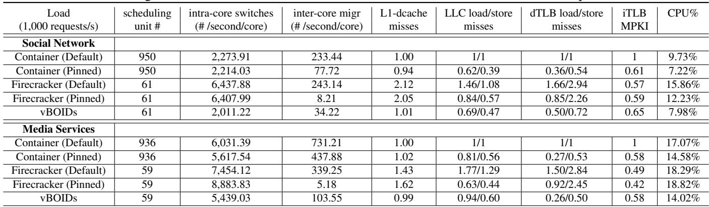

In summary, for workloads dominated by scheduling chaos (Hotel Reservation and Social Network), VBOIDS’ coarsegrained BOID abstraction sharply reduces destructive intercore migrations and preserves locality, achieving performance comparable to pinned confgurations. In workloads with high inherent parallelism (Media Services), VBOIDS remains lightweight while matching the fastest unpinned confguration. These results show that VBOIDS delivers VM-like stability while retaining container fexibility and effciency.

## 6.2 CPU Balancing and Stability

In Figure 12 (bottom), because the CPU scheduler now schedules at BOID granularity, VBOIDS exhibits VM-like percore average CPU utilization – naturally uneven across cores due to the smaller number of schedulable units. Figure 12 (top) shows that VBOIDS’s focking-like migration behavior – where BOIDS move logically atomically but physically asynchronously – produces container-like total CPU stability, maintaining smooth, steady utilization comparable to threadlevel container scheduling and avoiding the sharp oscillations seen in VMs. Together, it shows that VBOIDS combines the most desirable behaviors of VMs and native containers.

Figure 15 further presents a per-core view of CPU utilization over time under VBOIDS, with each line representing a single physical core. Individual cores exhibit natural variability driven by BOID migrations and intra-container task balancing, yet most cores remain stably clustered around 50% utilization, showing that VBOIDS maintains healthy load diffusion and remains fully work-conserving rather than creating persistent hotspots or underutilized cores. Consistent with this pattern, VBOIDS performs only a modest number of BOID migrations (e.g., roughly 600 over 60 s), relying instead on more frequent fne-grained intra-container task redistribu tions (e.g., about 16k events). This confrms that VBOIDS preserves global stability through coarse-grained BOID placement while using intra-container balancing to smooth local fuctuations without inducing system-wide oscillation.

## 6.3 Sensitivity and Scalability

We evaluated the impact of the inter-container balancing cooldown (boids\_balance\_cooldown) and inter-core migration cooldown (boids\_migrate\_cooldown) on two distinct workload profles: Social Network (RPC-heavy) and Media Services (CPU-bound), as shown in Figure 13.

Sensitivity. For RPC-heavy workloads like Social Network, active intra-container balancing is essential. Because the workload is not fork-heavy, tasks are initially well distributed across BOIDS but remain long-lived, causing substantial load drift over time. Disabling balancing (boids\_balance\_cooldown=-1) or delaying it via a large cooldown degrades performance as BOIDS gradually become imbalanced. In contrast, the migration cooldown has little effect: the workload’s moderate CPU intensity results in fewer inter-core migrations, leaving system behavior largely insen sitive to migration throttling. Consequently, a low balancing cooldown is ideal, ensuring that VBOIDS aggressively corrects internal skew as it emerges.

In contrast, Media Services exhibit high-frequency forking of short-lived, CPU-intensive threads. This workload is largely insensitive to parameter tuning for two reasons. First, VBOIDS’s placement policy assigns new forks to the least-loaded BOID, ensuring the container remains inherently balanced without requiring reactive intervention from the intra-container balancer. Second, because the workload is CPU-bound, BOIDS often remain heavy ("elephants"), which naturally suppresses inter-core migration regardless of the cooldown setting. Consequently, performance variance in this test is driven more by the high load intensity (1.5k RPS) and run-to-run noise than by specifc scheduling parameters.

Scalability. We subjected the Social Network workload (fxed at 2k RPS) to increasing levels of background containers, simulating a high container deployment environment. We intro-

DISTRIBUTION STATEMENT A. Approved for public release: Distribution unlimited. Case Number AFRL-2026-0584. Dated 09 Feb 2026 duced up to 1,000 “noise” containers, each provisioned with a single BOID and running a light workload (1–2% single core utilization). We compared VBOIDS against both default and pinned container baselines (i.e., we only pinned Social Network BOIDS, not the background container ones). As shown in Figure 14, both VBOIDS and the pinned confguration successfully maintain the target throughput even as background noise scaled to 1,000 containers, where the average latency under VBOIDS starts to increase.

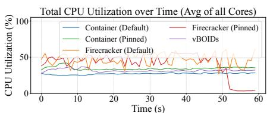

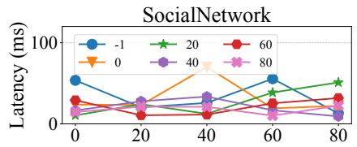

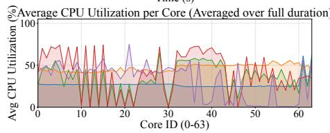

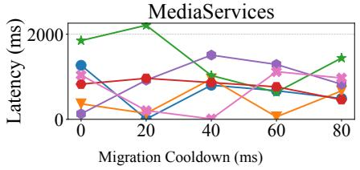

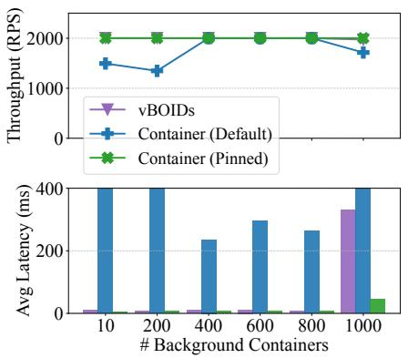  
Figure 13: Sensitivity. Media Services at 1.5 RPS. Social Network at 4.5 RPS. Each line is a different balance cooldown.

Figure 12: CPU% for Social Network under 5k RPS: total CPU% over time (top) and average CPU% per core (bottom).  
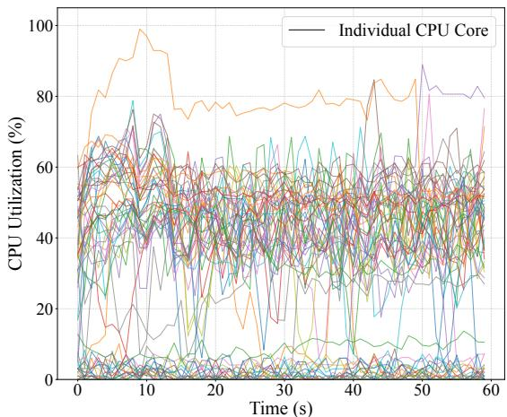  
Figure 14: Scalability test using Social Network (at 2k RPS) with increasing number of background containers.  
Figure 15: Per-core CPU% over time for Social Network under load of 5k RPS.

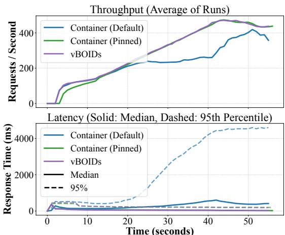  
Figure 16: Performance of Boutique with linear ramp-up of 50 users per second.

## 6.4 Kubernetes

To evaluate VBOIDS in a production setting, we deployed the Google Online Boutique benchmark on Kubernetes [5], ramping load to 2k concurrent users via Locust [7]. The Locust workload emulates randomized user actions in the store, including product browsing, currency changes, cart views, add-to-cart operations, and checkout; these actions generate a realistic mix of read-heavy requests (e.g., /, /product/<id>, /cart) and state-mutating requests (e.g., /cart, /cart/checkout). In our setup, Online Boutique exposes 359 scheduler-visible units in the standard containerized deployment, which VBOIDS reduces to 31 BOIDS. We compared VBOIDS (2 BOIDS/pod) against standard unpinned pods and manually pinned pods (2 CPUs/pod). While average latencies were comparable, the unpinned baseline suffered severe tail latency degradation (p95 exceeding 4000ms). Conversely, VBOIDS matched the throughput and tail latency (under 500 ms) of the pinned confguration, achieving pinninggrade stability without manual intervention.

## 7 Related Work

Resource partitioning and QoS-aware scheduling. To mitigate interference in co-located environments, prior work [13, 15–17, 31, 32, 35, 39, 55] has largely focused on resource partitioning and sensitivity-aware placement. Systems such as Heracles [35] and PARTIES [13] rely on feedback loops to

DISTRIBUTION STATEMENT A. Approved for public release: Distribution unlimited. Case Number AFRL-2026-0584. Dated 09 Feb 2026 dynamically partition resources and protect latency-critical services from best-effort batch jobs. Similarly, Paragon [15] and Quasar [16] use collaborative fltering to classify work loads and avoid placing contentious applications on the same node. While these approaches reduce "noisy neighbor" interference via hardware isolation, they do not address the scheduling overhead itself. In contrast, VBOIDS fundamentally alters how the scheduler perceives container concurrency to prevent scheduling thrashing.

User-space and extensible scheduling. A growing body of work [18,19,24,26,29,30,42–44] argues for moving scheduling logic out of the kernel to support the high-frequency requirements of microservices. Systems such as Caladan [19], Shinjuku [30] and Arachne [44] implement user-space schedulers that bypass the kernel entirely to achieve microsecondscale tail latency. More recently, Google’s GhOSt [26] and the Linux sched\_ext [24] framework utilize eBPF to delegate scheduling policies to userspace agents, allowing for rapid policy modifcations. While effective, these approaches impose signifcant adoption barriers: they often require recompiling applications against custom libraries (e.g., Arachne and Caladan) or managing complex userspace agents (e.g., GhOSt). VBOIDS acts as a middle-ground: it retains the transparent, drop-in nature of the standard kernel scheduler, while introducing schemes to mitigate scheduling chaos.

Lightweight virtualization. Micro-VMs, such as Firecracker [10] and Kata Containers [4] address multi-tenancy by enforcing strong isolation boundaries [3, 4, 10, 12, 25, 33, 40, 47]. They expose a fxed set of vCPUs to the host scheduler, rather than all guest processes/threads, which naturally mitigates scheduling chaos and stabilizes load balancing. However, they also introduce full virtualization overhead and reduce fexibility in resource over-subscription. VBOIDS effectively extends the vCPU abstraction to native containers, providing the stability of a vCPU without the performance penalty of full virtualization or the rigidity of fxed resource constraints.

## 8 Discussions

VBOIDS bridges the gap between spatial partitioning (pinning) and temporal throttling (CFS quotas). VBOIDS adopts spatial concurrency bounding – by mapping threads onto a fxed set of migratable BOIDS, it bounds a container’s parallelism – while preserving temporal fexibility through a two-level scheduling hierarchy. This provides pinning-like isolation benefts and quota-like fairness benefts.

However, short-lived microservices that rely on rapid forking pose unique placement challenges. Placing child threads on the parent’s BOID maximizes locality but can temporarily bottleneck execution on a single core. Because these tasks are short-lived, they may complete before the kernel’s load balancer can detect and correct the imbalance. VBOIDS mit igates this issue by adopting a parallelism-frst placement policy: newly created threads are assigned to the least-loaded

BOID in the taskgroup, enabling immediate load spreading and reducing transient hotspots. This design is particularly effective for bursty workloads with enough available BOIDS to absorb short-term parallelism. However, VBOIDS may be less benefcial for extremely short-lived, highly parallel workloads whose execution time is too brief to amortize placement and cache-warming effects, or when the number of provisioned BOIDS is signifcantly lower than the workload’s instantaneous parallelism. In such cases, load spreading can be constrained by BOID availability, and the latency beneft may be reduced.

This can be further addressed via custom policies. The stable execution provided by VBOIDS offers an ideal substrate for delegating fne-grained scheduling decisions to userspace frameworks, like GhOSt [26] or sched\_ext [24]. Future work could leverage this to implement custom, application-specifc policies atop their assigned BOIDS, effectively insulating their internal logic from the host placement. While we currently implemented VBOIDS by modifying the kernel code (5), we are also exploring the use of eBPF or sched\_ext for a more modular and easily deployable implementation.

## 9 Conclusion

We presented VBOIDS, a container scheduling system that restores stability to high-density container deployments by raising the scheduler’s placement granularity from individual threads to BOIDS. By introducing BOIDS as container-level virtual scheduling units, VBOIDS decouples thread-level execution from host-level placement, allowing the kernel to make fewer, more stable, and more locality-preserving scheduling decisions. VBOIDS combines this coarse-grained abstraction with a two-level balancing mechanism. The inter-core balancer migrates BOIDS as aggregate units to reduce global imbalance, while the intra-container balancer redistributes tasks across a container’s BOIDS to preserve work conservation and avoid internal hotspots. This design provides VM-like place ment stability without requiring full virtualization, manual pinning, or rigid CPU partitioning, meanwhile preserving the fexibility and effciency of containers that are attractive for cloud-native deployment. Our evaluation shows that VBOIDS substantially reduces migration-induced locality disruption and improves end-to-end performance for chaos-prone microservice workloads. VBOIDS’s abstraction provides a practical foundation for future adaptive policies, including dynamic BOID provisioning and user-extensible scheduling.

## 10 Acknowledgments

We thank our shepherd and the anonymous reviewers for their helpful feedback. This work was supported by the Air Force Research Laboratory (AFRL) under Award FA8750-25-C-B038, and by the National Science Foundation (NSF) under Awards CCF-2415473 and CNS-2415774.

DISTRIBUTION STATEMENT A. Approved for public release: Distribution unlimited. Case Number AFRL-2026-0584. Dated 09 Feb 2026

## References

[1] The docker container. Accessed: 2025-11-04. URL: https://www.docker.com/.

[2] Eevdf scheduler. Accessed: 2025-12-03. URL: https://www.kernel.org/doc/html/latest/ scheduler/sched-eevdf.html.

[3] Google gvisor. Accessed: 2025-11-15. URL: https: //github.com/google/gvisor.

[4] Kata containers. Accessed: 2025-12-03. URL: https: //github.com/kata-containers.

[5] Kubernetes. Accessed: 2025-11-15. URL: https:// kubernetes.io/.

[6] Linux control groups. Accessed: 2025-12-05. URL: https://www.kernel.org/doc/Documentation/ cgroup-v1/cgroups.txt.

[7] Locust: An open source load testing tool. Accessed: 2025-11-15. URL: https://locust.io/.

[8] Microservices adoption statistics. Accessed: 2025-11-15. URL: https://codeit.us/blog/ microservices-use-cases.

[9] Overview of azure service fabric. Accessed: 2025-11-15. URL: https://learn. microsoft.com/en-us/azure/service-fabric/ service-fabric-overview.

[10] Alexandru Agache, Marc Brooker, Alexandra Iordache, Anthony Liguori, Rolf Neugebauer, Phil Piwonka, and Diana-Maria Popa. Firecracker: Lightweight virtualization for serverless applications. In 17th USENIX Symposium on Networked Systems Design and Implementation (NSDI 20), pages 419–434, Santa Clara, CA, February 2020. USENIX Association. URL: https://www.usenix.org/conference/ nsdi20/presentation/agache.

[11] Amazon Web Services. Amazon elastic container service developer guide. Accessed: 2025-04-26. URL: https://docs.aws.amazon.com/AmazonECS/ latest/developerguide/Welcome.html.

[12] Adam Belay, Andrea Bittau, Ali Mashtizadeh, David Terei, David Mazières, and Christos Kozyrakis. Dune: Safe user-level access to privileged CPU features. In 10th USENIX Symposium on Operating Systems Design and Implementation (OSDI 12), pages 335–348, Hollywood, CA, October 2012. USENIX Association. URL: https://www.usenix.org/conference/osdi12/ technical-sessions/presentation/belay.

[13] Shuang Chen, Christina Delimitrou, and José F. Martínez. Parties: Qos-aware resource partitioning for multiple interactive services. In Proceedings of the Twenty-Fourth International Conference on Architectural Support for Programming Languages and Operating Systems, ASPLOS ’19, page 107–120, New York, NY, USA, 2019. Association for Computing Machinery. doi:10.1145/3297858.3304005.

[14] Yue Cheng, Ali Anwar, and Xuejing Duan. Analyzing alibaba’s co-located datacenter workloads. In 2018 IEEE International Conference on Big Data (Big Data), pages 292–297. IEEE, 2018.

[15] Christina Delimitrou and Christos Kozyrakis. Paragon: Qos-aware scheduling for heterogeneous datacenters. SIGPLAN Not., 48(4):77–88, March 2013. doi:10. 1145/2499368.2451125.

[16] Christina Delimitrou and Christos Kozyrakis. Quasar: resource-effcient and qos-aware cluster management. SIGARCH Comput. Archit. News, 42(1):127–144, February 2014. doi:10.1145/2654822.2541941.

[17] Christina Delimitrou and Christos Kozyrakis. Bolt: I know what you did last summer... in the cloud. In Proceedings of the Twenty-Second International Conference on Architectural Support for Programming Languages and Operating Systems (ASPLOS), pages 599–613, 2017. doi:10.1145/3037697.3037743.

[18] Joshua Fried, Gohar Irfan Chaudhry, Enrique Saurez, Esha Choukse, Inigo Goiri, Sameh Elnikety, Rodrigo Fonseca, and Adam Belay. Making kernel bypass practical for the cloud with junction. In 21st USENIX Sympo sium on Networked Systems Design and Implementation (NSDI 24), pages 55–73, Santa Clara, CA, April 2024. USENIX Association. URL: https://www.usenix. org/conference/nsdi24/presentation/fried.

[19] Joshua Fried, Zhenyuan Ruan, Amy Ousterhout, and Adam Belay. Caladan: Mitigating interference at microsecond timescales. In 14th USENIX Symposium on Operating Systems Design and Implementation (OSDI 20), pages 281–297. USENIX Association, November 2020. URL: https://www.usenix.org/ conference/osdi20/presentation/fried.

[20] Alexander Fuerst, Stanko Novakovic, Íñigo Goiri, Go-´ har Irfan Chaudhry, Prateek Sharma, Kapil Arya, Kevin Broas, Eugene Bak, Mehmet Iyigun, and Ricardo Bian chini. Memory-harvesting VMs in cloud platforms. In Proceedings of the 27th ACM International Conference on Architectural Support for Programming Languages and Operating Systems (ASPLOS), 2022.

DISTRIBUTION STATEMENT A. Approved for public release: Distribution unlimited. Case Number AFRL-2026-0584. Dated 09 Feb 2026

[21] Yu Gan, Yanqi Zhang, Dailun Cheng, Ankitha Shetty, Priyal Rathi, Nayan Katarki, Ariana Bruno, Justin Hu, Brian Ritchken, Brendon Jackson, Kelvin Hu, Meghna Pancholi, Yuan He, Brett Clancy, Chris Colen, Fukang Wen, Catherine Leung, Siyuan Wang, Leon Zaruvinsky, Mateo Espinosa, Rick Lin, Zhongling Liu, Jake Padilla, and Christina Delimitrou. An open-source benchmark suite for microservices and their hardware-software im plications for cloud & edge systems. In Proceedings of the Twenty-Fourth International Conference on Architectural Support for Programming Languages and Operating Systems, ASPLOS ’19, page 3–18, New York, NY, USA, 2019. Association for Computing Machinery. doi:10.1145/3297858.3304013.

[22] Google Cloud Platform. Online boutique (microser vices demo), 2020. Accessed: 2025-04-26. URL: https://github.com/GoogleCloudPlatform/ microservices-demo.

[23] Carlos Henríquez, Jarol Derley Ramón Valencia, and Germán Sánchez Torres. Architectural evolution at netfix: A case study on microservices and the transformation from monolithic to scalable systems. Prospectiva, 23(1), 2025.

[24] Daniel Hodges. Scheduling at scale: eBPF schedulers with Sched\_ext. Dublin, October 2024. USENIX Association.

[25] Hang Huang, Jiangshan Lai, Jia Rao, Hui Lu, Wenlong Hou, Hang Su, Quan Xu, Jiang Zhong, Jiahao Zeng, Xu Wang, Zhengyu He, Weidong Han, Jiang Liu, Tao Ma, and Song Wu. Pvm: Effcient shadow paging for deploying secure containers in cloud-native environment. In Proceedings of the 29th Symposium on Operating Systems Principles, SOSP ’23, page 515–530, New York, NY, USA, 2023. Association for Computing Machinery. doi:10.1145/3600006.3613158.

[26] Jack Tigar Humphries, Neel Natu, Ashwin Chaugule, Ofr Weisse, Barret Rhoden, Josh Don, Luigi Rizzo, Oleg Rombakh, Paul Turner, and Christos Kozyrakis. ghost: Fast & fexible user-space delegation of linux scheduling. In Proceedings of the ACM SIGOPS 28th Sym posium on Operating Systems Principles, SOSP ’21, page 588–604, New York, NY, USA, 2021. Association for Computing Machinery. doi:10.1145/3477132. 3483542.

[27] Darby Huye, Yuri Shkuro, and Raja R. Sambasivan. Lifting the veil on Meta’s microservice architecture: Analyses of topology and request workfows. In 2023 USENIX Annual Technical Conference (USENIX ATC 23), pages

419–432, Boston, MA, July 2023. USENIX Association. URL: https://www.usenix.org/conference/ atc23/presentation/huye.

[28] Darby Huye, Yuri Shkuro, and Raja R. Sambasivan. Lifting the veil on Meta’s microservice architecture: Analyses of topology and request workfows. In 2023 USENIX Annual Technical Conference (USENIX ATC 23), pages 419–432, Boston, MA, July 2023. USENIX Association. URL: https://www.usenix.org/conference/ atc23/presentation/huye.

[29] Zhipeng Jia and Emmett Witchel. Nightcore: effcient and scalable serverless computing for latency-sensitive, interactive microservices. In Proceedings of the 26th ACM International Conference on Architectural Support for Programming Languages and Operating Systems, ASPLOS ’21, page 152–166, New York, NY, USA, 2021. Association for Computing Machinery. doi:10.1145/ 3445814.3446701.

[30] Kostis Kaffes, Timothy Chong, Jack Tigar Humphries, Adam Belay, David Mazières, and Christos Kozyrakis. Shinjuku: preemptive scheduling for µsecond-scale tail latency. In Proceedings of the 16th USENIX Conference on Networked Systems Design and Implementation, NSDI’19, page 345–359, USA, 2019. USENIX Association.

[31] Harshad Kasture, Davide B. Bartolini, Nathan Beckmann, and Daniel Sanchez. Rubik: Fast analytical power management for latency-critical systems. In Proceedings of the 48th Annual IEEE/ACM International Symposium on Microarchitecture (MICRO), pages 598– 610. IEEE Computer Society, 2015. doi:10.1145/ 2830772.2830797.

[32] Harshad Kasture and Daniel Sanchez. Ubik: Effcient cache sharing with strict qos for latency-critical workloads. In Proceedings of the 19th International Conference on Architectural Support for Programming Languages and Operating Systems (ASPLOS), pages 729– 742. ACM, 2014. doi:10.1145/2541940.2541943.

[33] Zijun Li, Jiagan Cheng, Quan Chen, Eryu Guan, Zizheng Bian, Yi Tao, Bin Zha, Qiang Wang, Weidong Han, and Minyi Guo. RunD: A lightweight secure container runtime for high-density deployment and high-concurrency startup in serverless computing. In 2022 USENIX Annual Technical Conference (USENIX ATC 22), pages 53–68, Carlsbad, CA, July 2022. USENIX Association. URL: https://www.usenix.org/conference/ atc22/presentation/li-zijun-rund.

[34] Lei Liu, Xinglei Dou, and Yuetao Chen. Intelligent resource scheduling for co-located latency-critical tion unlimited. Case Number AFRL-2026-0584. Dated 09 Feb 2026

services: A Multi-Model collaborative learning approach. In 21st USENIX Conference on File and Storage Technologies (FAST 23), pages 153–166, Santa Clara, CA, February 2023. USENIX Association. URL: https://www.usenix.org/conference/ fast23/presentation/liu.

[35] David Lo, Liqun Cheng, Rama Govindaraju, Parthasarathy Ranganathan, and Christos Kozyrakis. Heracles: Improving resource effciency at scale. In Proceedings of the 42nd Annual International Symposium on Computer Architecture (ISCA), pages 450–462. IEEE Computer Society, 2015. doi:10.1145/2749469.2749475.

[36] Jean-Pierre Lozi, Baptiste Lepers, Justin Funston, Fabien Gaud, Vivien Quéma, and Alexandra Fedorova. The linux scheduler: a decade of wasted cores. In Proceedings of the Eleventh European Conference on Computer Systems, EuroSys ’16, New York, NY, USA, 2016. Association for Computing Machinery. doi: 10.1145/2901318.2901326.

[37] Jean-Pierre Lozi, Baptiste Lepers, Justin Funston, Fabien Gaud, Vivien Quéma, and Alexandra Fedorova. The linux scheduler: a decade of wasted cores. In Proceedings of the Eleventh European Conference on Computer Systems, EuroSys ’16, New York, NY, USA, 2016. Association for Computing Machinery. doi: 10.1145/2901318.2901326.

[38] Shutian Luo, Huanle Xu, Chengzhi Lu, Kejiang Ye, Guoyao Xu, Liping Zhang, Yu Ding, Jian He, and Chengzhong Xu. Characterizing microservice dependency and performance: Alibaba trace analysis. In Proceedings of the ACM Symposium on Cloud Computing, SoCC ’21, page 412–426, New York, NY, USA, 2021. Association for Computing Machinery. doi: 10.1145/3472883.3487003.

[39] Jonathan Mace, Peter Bodik, Rodrigo Fonseca, and Madanlal Musuvathi. Retro: Targeted resource management in multi-tenant distributed systems. In Proceedings of the 12th USENIX Conference on Networked Systems Design and Implementation, NSDI’15, page 589–603, USA, 2015. USENIX Association.

[40] Filipe Manco, Costin Lupu, Florian Schmidt, Jose Mendes, Simon Kuenzer, Sumit Sati, Kenichi Yasukata, Costin Raiciu, and Felipe Huici. My vm is lighter (and safer) than your container. In Proceedings of the 26th Symposium on Operating Systems Principles, SOSP ’17, page 218–233, New York, NY, USA, 2017. Association for Computing Machinery. doi:10.1145/3132747. 3132763.

[41] Ingo Molnar. Modular Scheduler Core and Completely Fair Scheduler (CFS). https: //www.kernel.org/doc/html/latest/scheduler/ sched-design-CFS.html, 2007. Accessed: 2025-04- 02.

[42] Amy Ousterhout, Joshua Fried, Jonathan Behrens, Adam Belay, and Hari Balakrishnan. Shenango: Achieving high CPU effciency for latency-sensitive datacenter workloads. In 16th USENIX Symposium on Networked Systems Design and Implementation (NSDI 19), pages 361–378, Boston, MA, February 2019. USENIX Association. URL: https://www.usenix.org/ conference/nsdi19/presentation/ousterhout.

[43] George Prekas, Marios Kogias, and Edouard Bugnion. Zygos: Achieving low tail latency for microsecondscale networked tasks. In Proceedings of the 26th Symposium on Operating Systems Principles, SOSP ’17, page 325–341, New York, NY, USA, 2017. Association for Computing Machinery. doi:10.1145/3132747. 3132780.

[44] Henry Qin, Qian Li, Jacqueline Speiser, Peter Kraft, and John Ousterhout. Arachne: core-aware thread management. In Proceedings of the 13th USENIX Conference on Operating Systems Design and Implementation, OSDI’18, page 145–160, USA, 2018. USENIX Association.

[45] Gourav Rattihalli, Madhusudhan Govindaraju, Hui Lu, and Devesh Tiwari. Exploring potential for nondisruptive vertical auto scaling and resource estimation in kubernetes. In 2019 IEEE 12th International Conference on Cloud Computing (CLOUD), pages 33–40, 2019. doi:10.1109/CLOUD.2019.00018.

[46] Craig W. Reynolds. Flocks, herds and schools: A distributed behavioral model. In Proceedings of the 14th Annual Conference on Computer Graphics and Interactive Techniques, SIGGRAPH ’87, page 25–34, New York, NY, USA, 1987. Association for Computing Machinery. doi:10.1145/37401.37406.

[47] Vasily A. Sartakov, Lluís Vilanova, David Eyers, Takahiro Shinagawa, and Peter Pietzuch. CAP-VMs: Capability-Based isolation and sharing in the cloud. In 16th USENIX Symposium on Operating Systems Design and Implementation (OSDI 22), pages 597– 612, Carlsbad, CA, July 2022. USENIX Association. URL: https://www.usenix.org/conference/ osdi22/presentation/sartakov.

[48] Mohammad Shahrad, Rodrigo Fonseca, Inigo Goiri, Go har Chaudhry, Paul Batum, Jason Cooke, Eduardo Laureano, Colby Tresness, Mark Russinovich, and Ricardo

DISTRIBUTION STATEMENT A. Approved for public release: Distribution unlimited. Case Number AFRL-2026-0584. Dated 09 Feb 2026

Bianchini. Serverless in the wild: Characterizing and optimizing the serverless workload at a large cloud provider. In 2020 USENIX Annual Technical Conference (USENIX ATC 20), pages 205–218. USENIX Association, July 2020. URL: https://www.usenix.org/ conference/atc20/presentation/shahrad.

[49] Akshitha Sriraman and Thomas F. Wenisch. µTune: Auto-Tuned threading for OLDI microservices. In 13th USENIX Symposium on Operating Systems Design and Implementation (OSDI 18), pages 177– 194, Carlsbad, CA, October 2018. USENIX Association. URL: https://www.usenix.org/conference/ osdi18/presentation/sriraman.

[50] Kun Suo, Yong Zhao, Wei Chen, and Jia Rao. An analysis and empirical study of container networks. In IEEE INFOCOM 2018 - IEEE Conference on Computer Communications, pages 189–197, 2018. doi: 10.1109/INFOCOM.2018.8485865.

[51] Paul Turner, Ben Segall Rao, and Nikhil Levin. Perentity load tracking, Jan 2013. Accessed: 2025-12-03. URL: https://lwn.net/Articles/531853/.

[52] Abhishek Verma, Luis Pedrosa, Madhukar Korupolu, David Oppenheimer, Eric Tune, and John Wilkes. Largescale cluster management at google with borg. In Proceedings of the Tenth European Conference on Computer Systems, EuroSys ’15, New York, NY, USA, 2015. Association for Computing Machinery. doi:10.1145/ 2741948.2741964.

[53] Bo Wang, Zhiguang Chen, and Nong Xiao. A survey of system scheduling for hpc and big data. In Proceedings of the 2020 4th International Conference on High Performance Compilation, Computing and Communications, HP3C 2020, page 178–183, New York, NY, USA, 2020. Association for Computing Machinery. doi:10.1145/3407947.3407977.

[54] Cong Xu, Karthick Rajamani, Alexandre Ferreira, Wesley Felter, Juan Rubio, and Yang Li. dcat: Dynamic cache management for effcient, performance-sensitive infrastructure-as-a-service. In Proceedings of the Thirteenth EuroSys Conference, pages 1–13, 2018.

[55] Xiao Zhang, Eric Tune, Robert Hagmann, Rohit Jnagal, Vrigo Gokhale, and John Wilkes. Cpi2: Cpu performance isolation for shared compute clusters. In Pro ceedings of the 8th ACM European Conference on Computer Systems, EuroSys ’13, page 379–391, New York, NY, USA, 2013. Association for Computing Machinery. doi:10.1145/2465351.2465388.

DISTRIBUTION STATEMENT A. Approved for public release: Distribution unlimited. Case Number AFRL-2026-0584. Dated 09 Feb 2026