の

USENIX

THE ADVANCED COMPUTING SYSTEMS ASSOCIATION

## UEP: Portable Expert-Parallel Communication

Ziming Mao, University of California, Berkeley; Yihan Zhang, University of California, Davis; Chihan Cui, University of Wisconsin–Madison; Zhen Huang, AMD; Kaichao You, Independent Researcher; Zhongjie Chen, Tsinghua University; Zhiying Xu, Amazon Web Services; Zhenyu Gu, AMD; Scott Shenker, University of California, Berkeley, and ICSI; Costin Raiciu, Broadcom and Politehnica of Bucharest; Yang Zhou, University of California, Davis; Ion Stoica, University of California, Berkeley

https://www.usenix.org/conference/osdi26/presentation/mao-ziming-uep

# This paper is included in the Proceedings of the 20th USENIX Symposium on Operating Systems Design and Implementation.

July 13–15, 2026 • Seattle, WA, USA

ISBN 978-1-939133-55-7

Open access to the Proceedings of the 20th USENIX Symposium on Operating Systems Design and Implementation is sponsored by

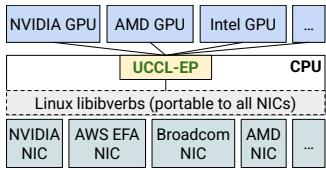

# UEP: Portable Expert-Parallel Communication

Ziming Mao† Yihan Zhang‡ Chihan Cui§ Zhen Huang¶ Kaichao You♣ Zhongjie Chen♡ Zhiying Xu♠∗ Zhenyu Gu¶ Scott Shenker†⋄ Costin Raiciu⋆ Yang Zhou‡ Ion Stoica†

†UC Berkeley ‡UC Davis §UW–Madison ¶AMD ♣Independent Researcher ♡Tsinghua University

♠Amazon Web Services ⋄ICSI ⋆Broadcom & University Politehnica of Bucharest

## Abstract

Modern Mixture-of-Experts (MoE) workloads rely on expert parallelism (EP) to achieve high GPU efficiency. State-of-the-art EP communication libraries, such as DeepEP, rely on GPU-initiated RDMA communication. Although performant, they have poor portability across heterogeneous GPU and NIC hardware. The poor portability is rooted in its architecture: GPU-initiated RDMA communication requires tight vertical integration between GPUs and NICs, e.g., GPU writing to NIC driver/MMIO interfaces.

We present UEP, a portable EP communication system that delivers high performance across heterogeneous GPU and NIC hardware. UEP replaces GPU-initiated RDMA with a high-throughput GPU-CPU control channel: compact token-routing commands are transferred to multithreaded CPU proxies, which then issue GPUDirect RDMA operations on behalf of GPUs. UEP further emulates various ordering semantics required by specialized EP communication modes using RDMA immediate data, enabling correctness on NICs that lack such ordering, e.g., AWS EFA. We implement UEP on NVIDIA and AMD GPUs with EFA and Broadcom NICs. On EFA, it outperforms the best existing EP solution by 2.1× for dispatch and combine throughput. UEP also improves token throughput on SGLang by up to 40% on the NVIDIA+EFA platform, and improves DeepSeek-V3 training throughput over the AMD Primus/Megatron-LM framework by up to 45% on a 16-node AMD+Broadcom platform.

## 1 Introduction

State-of-the-art large language models (LLMs), such as DeepSeek-V3 [12,30], OpenAI gpt-oss [45], Google Gemini-3 Pro [16], and Meta Llama 4 [2], are increasingly based on the Mixture-of-Experts (MoE) architecture. In a MoE layer, a gating network running on GPUs selects a small subset of experts for each token activation, dispatches the token activation to those experts, and then aggregates their output activations. Modern MoE models typically instantiate hundreds of experts that specialize in different input patterns, so that only a few experts are active for each token. This sparsity allows MoE models to achieve accuracy comparable to large dense models while using only a fraction of the per-token inference cost, making them the de facto choice for many frontier LLMs.

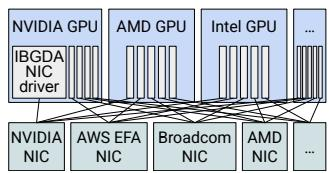  
(a) IBGDA-style.  
(b) UEP.  
Figure 1: Assuming m GPU vendors and n NIC vendors, UEP enables O(m) effort, instead of IBGDA’s O(m × n), to support GPU-initiated token-level communication for expert parallelism.

Training and serving large MoE models require expert parallelism (EP), which places different experts on different GPUs and communicates token activations among GPUs in an all-toall manner. By sparsely sharding experts on different GPUs, EP leaves enough GPU memory for matrix multiplication on large batch sizes (e.g., 4096 in DeepSeek-V3 [30]), thus enabling high GPU resource efficiency. Expert-parallel communication plays a pivotal role in the EP efficiency [30, 63], because token activations are small (e.g., 7KB), dispatch and combine operations are frequent (e.g., selecting 8 experts per token), and routing destinations are only determined at runtime in GPUs (§2.1).

GPU-initiated token-level (fine-grained) communication (§2.2) is an emerging and key communication pattern for efficient token dispatch and combine at runtime, where DeepEP [64] by DeepSeek is a popular communication system implementing it. Different from CPU-initiated bulk-transfer (coarse-grained) communication in NCCL/RCCL [3, 41], DeepEP leverages the advanced NVIDIA IBGDA (InfiniBand GPUDirect Async) [43] technique that enables GPUs to directly operate RDMA NICs (network interface cards) to write out small activations. DeepEP has been widely adopted by various training and serving frameworks such as Megatron-LM [6], vLLM [59], and SGLang [58] with state-of-the-art performance.

Although GPU-initiated token-level communication leads to high performance, its design unfortunately results in poor portability. There are two key reasons: GPUs directly issuing RDMA operations to NICs prevent interoperability across different GPUs and NICs, as it requires the GPU to write to NIC-defined MMIO interfaces typically requiring proprietary register layouts and tight hardware-level co-design between the NICs and GPUs [26,44,51]; GPU kernels also impose strict ordering and delivery semantics assumptions on the underlying network, which are often misaligned with the capabilities and semantics of heterogeneous NICs. As shown in Figure 1a, ML infrastructure developers need to vertically integrate the GPU and NIC software ecosystems. This involves complex and subtle code migration and maintenance that are both NIC vendor-specific and GPU vendor-specific. Assume there are m types of GPU ac celerators and n types of NICs. Developers need to pay O(m× n) effort to enable such communication on heterogeneous hardware. Because of this portability issue, the official DeepEP [64] only supports NVIDIA GPUs and NICs, creating severe vendor lock-in and high portability effort for alternative GPU and NIC devices. For example, at the time of writing, it remains impossible to run DeepEP on any AWS GPU instances with AWS EFA RDMA NICs; it is also challenging to run DeepEP on AMD GPUs with Broadcom NICs, the second-biggest GPU and NIC vendors, respectively. At a high level, such vertical integration is somewhat reminiscent of mainframe servers, which get replaced by less-coupled and more portable commodity servers from heterogeneous vendors in modern cloud computing.

This paper introduces a new portable expert-parallel communication architecture for GPU-initiated token-level communication with high performance. We envision that with our architecture, developers only need to pay m times effort to enable systems like DeepEP on heterogeneous GPU and NIC hardware, as shown in Figure 1b.

Our key insight is to leverage the host CPU to help break the tight coupling between GPUs and NICs, where the CPU is essentially portable to any GPUs and NICs via the libibverbs library [48] maintained by the Linux community and NIC vendors. Unlike traditional CPU-driven approaches, communication is still initiated by the GPU: the library passes only small control information from the GPU to the CPU, while the data payload is transferred directly between GPUs. GPUs and CPUs are connected through high-throughput, low-latency interconnects such as PCIe or even faster NVLink-C2C [42], which allows efficient transferring of small control data from GPUs to CPUs. By embedding the token dispatching information, such as source and destination address, into the control data, CPUs directly issue GPUDirect RDMA to write out the activations on behalf of GPUs. We note that modern GPU servers usually have hundreds of CPU cores, which are often heavily underutilized, e.g., 20%-45% CPU utilization reported by several industry companies in their GPU clusters [19, 23]; From discussion with a model training team inside a major GPU vendor, their model training using Megatron-LM [40] yields on average 14.5% CPU utilization.

Moreover, flexible host CPUs can help bridge the semantic gap between the guarantees required by specialized EP communication systems and the primitives actually provided by heterogeneous NICs. For example, EP communication libraries often require a specific write-then-atomic ordering to inform remote GPUs of data arrival, but such a requirement is typically not enforced by all RDMA NICs, such as AWS EFA NICs, which do not guarantee ordering.

To realize these insights, we need to address two challenges:

i) how to efficiently transfer control data from GPUs to CPUs so that the CPU does not become the bottleneck. This is challenging, especially given the frequent token dispatch/combine operations as high as 7Mop/s/GPU under 7KB activations [30] and a 400G network. ii) How to use CPUs to express and enforce various delivery semantics (e.g., write-then-atomic) in CPU to accommodate heterogeneous NICs that do not support them on their own.

We present UEP, a portable expert-parallel communication system with GPU-initiated token-level communication. UEP decouples communication initiation from communication execution: it keeps GPUs initiating communication for fine-grained token transfer, and delegates the communication tasks to the host CPU. UEP addresses the first challenge with an efficient multithreaded, lock-free FIFO communication channel between GPUs and CPUs. This channel minimizes the PCIe traversing overhead and allows multiple CPU proxy threads to forward and execute the GPU-generated token routing decisions, achieving millions of messages per second from GPUs to CPUs. To address the second challenge, UEP leverages the immediate data feature that is widely available in RDMA NICs (this immediate data field has been standardized into the RoCEv2 packet header [1]). UEP embeds sequence information into this immediate data and lets the receiver hold messages (e.g., atomic updates) until all previous corresponding writes have finished. We show how host CPUs can flexibly bridge the delivery guarantees that GPUs require and the ones actually provided by the networking layer.

We have implemented UEP and enabled it on various heterogeneous platforms, including NVIDIA GPUs + AWS EFA NICs, and AMD GPUs + Broadcom NICs. On the NVIDIA+EFA platform, compared to the second-best EP solution PPLX [29], UEP achieved up to 2.1× higher throughput. On the AMD+Broadcom platform, UEP achieves comparable performance to the original DeepEP on the NVIDIA-only platform. UEP supports drop-in replacement for DeepEP-compatible applications without any line of code change. It speeds up serving throughput in the SGLang framework by up to 40% on the NVIDIA+EFA platform, and improves DeepSeek-V3 training throughput in the AMD Primus/Megatron-LM framework by up to 45% on a 16-node AMD+Broadcom platform. To the best of our knowledge, UEP is the first work that enables running GPU-initiated token-level communication on non-NVIDIA platforms. UEP is open-sourced.1

## 2 Background

## 2.1 Expert-parallel communication

Mixture-of-Experts (MoE) architectures have emerged as a leading architectural pattern for building state-of-the-art LLMs as they provide massive parameter capacity while keeping per-token compute low by activating only a small subset of experts. This sparsity enables specialization—experts learn domain-specific behaviors—while preserving generalpurpose performance. As a result, many frontier models now adopt MoE designs, including OpenAI’s gpt-oss [45], Google’s Gemini-3 Pro [16] and GLaM [14], Mistral’s Mixtral 8×7B [21], DeepSeek’s DeepSeekMoE [8] and DeepSeek V3 [12, 30] family, the Allen Institute’s OLMoE [34], and Meta’s Llama 4 [33], all of which use MoE to push model capacity and quality without the prohibitive compute costs of dense models. These systems power a wide range of applications—from interactive agents and large-scale pretraining to multimodal reasoning and domain-specialized tasks.

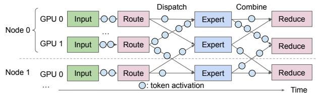  
Figure 2: The MoE communication pattern consists of the dispatch phase and the combine phase. In the dispatch phase, the router sends each token’s input activations to one or more selected experts. In the combine phase, expert activations are collected and aggregated back to the sender. The dispatch and combine phases feature irregular, fine-grained communication.

MoE models introduce a distinctive communication pattern that differs fundamentally from dense all-reduce or pipelineparallel patterns found in other models. In a MoE layer, each input token activation is dynamically routed to a small subset of experts based on a learned gating function. This induces a sparse all-to-all pattern: Every GPU holds a subset of experts, so token activations must be dispatched from the originating GPU to the GPUs that host the selected experts and then gathered back to their origin (Figure 2). The destination GPUs are determined based on the learned gating function during runtime. Every MoE layer’s forward pass has two communication phases: dispatch, where activations are sent to expert GPUs, followed by a combine phase, where expert outputs are returned and merged in the original token order. Expert-parallel communication has several new characteristics:

Fine-grained token-level2 transfers. In MoE dispatch and combine, each token activation is small, on the order of 7KB (e.g., FP8, hidden size of 7168 [30]), so a naive implementation issues a large number of tiny GPU-GPU transfers. Unlike traditional collective communication (e.g., large, batched allreduces or all-to-alls) that aggregates data into large bandwidthefficient messages, MoE communication is naturally fragmented. Traditional approaches must therefore either push many small work-queue entries to the NIC, or first pack activations into contiguous per-expert buffers on the GPU, which consume SM cycles and add packing latency on the critical path.

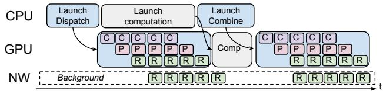  
Figure 3: GPU-initiated token-level communication in DeepEP (High-throughput mode, single batch for illustration). C stands for intra-node data copying via NVLink, P stands for processing, and R stands for RDMA communication. Different phases (computation, communication, and copying) interleave.

Irregular communication. The number of tokens routed to each expert also varies every iteration, because routing decisions are computed at runtime by the MoE gating network. In contrast, traditional collectives assume a fixed set of participants and largely predictable, symmetric message sizes, which allows for static, precomputed communication schedules. However, MoE communication breaks these assumptions: dynamic routing creates significant load imbalance and introduces substantial overhead from fine-grained, data-dependent transfers [11, 15]. This irregularity makes it hard to precompute efficient communication schedules or reuse static buffer layouts, forcing implementations to dynamically size and route messages every step and amplifying the overheads of the already fine-grained transfers. Communication is the bottleneck of MoE training and serving. Expert-parallel communication is already a major performance bottleneck in production systems: it can consume 43.6% of the forward pass and 32% of end-to-end training time on GPUs [24]. Serving faces the same challenge, with inter-device communication accounting for up to 47% of total execution time across popular MoE models and frameworks [61].

## 2.2 Expert-parallel communication requires GPUinitiated token-level communication

Given the central role of MoE communication, recent specialized systems—notably DeepEP [64]—have introduced GPU-initiated token-level communication, as illustrated in Figure 3. This design involves GPU threads directly submitting transfer commands to the NIC, using NVIDIA IBGDA (InfiniBand GPUDirect Async) [43].

GPU-initiated communication enables fine-grained and pipelined overlap on a token basis, where transfer for a single token or a chunk of tokens can overlap with other phases of communication, such as data copying (denoted "C") between application tensor buffers and RDMA transport buffers, token forwarding from the scale-out domain to the scale-up domain, and necessary computation (denoted "P") such as the reduce during the combine phase, or data type conversion such as from BF16 to FP8 to reduce communication volume. By breaking communication into these smaller GPU-triggered units (e.g., a few tokens), the system can better utilize both network and compute resources and significantly reduce end-to-end communication latency.

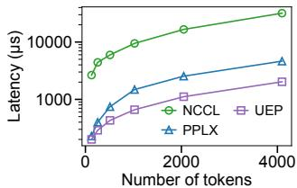  
Figure 4: GPU-initiated token-level communication outperforms coarse-grained bulk transfer (e.g., packing tokens into a contiguous buffer on GPU then CPU initiating a single contiguous transfer) on NV\_EFA3 (testbed details listed in Table 2). The overhead of packing becomes high as the number of tokens increases. The y-axis is in log scale.

GPU-initiated token-level communication also enables many optimization opportunities, such as message deduplication: if the token activation is routed to experts residing on multiple GPUs on the same node, the communication library can only send the token activation once with RDMA, and rely on intra-node forwarding to multiple experts for maximal speed. A second optimization enabled by GPU-initiated token-level communication is hierarchical reduce: an intra-node reduce (weighted sum) is performed on each node for a chunk of tokens, the result is sent back to the sender rank for another inter-node reduce: all of which is pipelined with background network transfer. Such optimization techniques were previously not feasible without GPU-initiated token-level communication, and have enabled a significant reduction in the amount of traffic needed to send over the network, and improvement in end-to-end performance.

To compare, some inference and training frameworks adopt coarse-grained transfer, such as with NCCL [41] or RCCL [3], or other general-purpose collective libraries. They require either the application packing tokens into a contiguous per-destination-rank transfer buffer or transferring small tokens one by one. The former incurs a high overhead of packing the token; the latter suffers from limited transfer throughput with small messages. For example, PPLX [29] adopts CPU-initiated communication with on-GPU token packing without fine-grained token deduplication and hierarchical reduce, and it does not scale as the number of tokens increases. The evaluation in Figure 4 shows that such approaches suffer from poor performance.

## 2.3 Existing GPU-initiated solutions couple GPUs and NICs, harming portability

While GPU-initiated token-level communication has been shown to improve performance, unfortunately, it compromises portability by tightly coupling GPUs and NICs. The reasons are two-fold:

Lack of hardware interoperability. The mainstream mechanism of GPU-initiated token-level communication is GPU threads directly posting to the RDMA NICs, or known as IBGDA [43]. IBGDA requires InfiniBand-capable NICs that support GPUDirect RDMA so the GPU can directly write to the NIC driver-defined MMIO interface. It also depends on a compatible software stack, typically including NVSHMEM and the necessary CUDA/RDMA drivers, to enable GPU-initiated network operations. Unfortunately, this makes it difficult, if not impossible, to support such communication patterns for non-NVIDIA GPUs or non-InfiniBand-capable NICs.

GPUs impose strict delivery semantics on NICs. While GPU threads are good for massive parallelism, they are limited in terms of the ability to control and manage the transfer. These communication libraries typically expect strict delivery semantics (e.g., “write-then-atomic” patterns, applying an atomic only after x number of writes have been delivered). This requires the networking layer to respect such delivery semantics, such as providing ordering guarantees. Furthermore, GPU threads lack the flexibility to manage communication. For example, DeepEP issues one-sided writes and relies on the receiver to busy poll a flag to detect incoming transfer. Flow control (such as pacing the sender’s rate of communication) becomes an issue since the sender is unaware of the message delay or any potential congestion.

Taken together, this means that the GPU-initiated communication introduces strict requirements on the underlying networking layer, relying on it to provide reliability, ordering, as well as efficient network control. Unfortunately, maintaining them not only restricts a narrow selection of networking devices, as well as increasing the necessary fixed cost of enforcing these guarantees in hardware.

As a result, GPU-initiated token-level communication cannot be supported on cloud NICs (e.g., AWS EFA [52] with SRD transport [54]) that lack ordering guarantees, as well as non-NVIDIA GPUs, which lack a hardware mechanism to directly issue commands from the GPU to NICs. As GPU threads have little visibility into transfer delays and network congestion, this also poses significant challenges to practical deployment, as the networking environment needs to be carefully tuned to ensure congestion does not occur [64].

Importance of portability. Portability is essential for cost efficiency and avoiding vendor lock-in. Prior works have demonstrated significant performance and cost benefits of using heterogeneous hardware [17, 20, 22, 28, 32, 62]. Contemporary large-language-model systems increasingly rely on heterogeneous hardware: different data-centers and cloud providers deploy different NICs with distinct transport protocols (e.g., RC vs. SRD) and capabilities. As such, achieving portability in the communication layer is critical to reduce cost and improve performance, simplify integration into existing inference or training engines, and make efficient expert-parallel communication usable for a wide range of users.

## 2.4 The challenges of designing a portable and performant expert-parallel communication system

Designing a portable expert-parallel communication system requires breaking the coupling between GPUs and NICs. We describe the main challenges in the following.

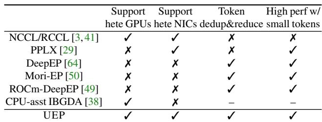  
Table 1: Comparison of major existing EP communication systems. “Hete.” denotes support for heterogeneous (multi-vendor) GPUs or NICs.

Heterogeneous GPUs and NICs. Both GPUs and NICs are heterogeneous, coming from different vendors with different software ecosystems, e.g., NVIDIA, AMD, AWS EFA, Broadcom, Intel. To enable the GPU to directly initiate communication to the NIC (without involving the CPUs) often requires GPU knowing and accessing proprietary register layouts and tight hardware-level co-design between the NICs and GPUs. This is, at best, error-prone and difficult to do cross-vendor, and more often simply not supported.

Delivery semantics guarantees. Hardware transports differ in whether they guarantee in-order delivery of messages. For example, the ConnectX [37] RC transport offers in-order semantics, while the EFA SRD protocol offers reliable but unordered delivery. When the GPU kernel assumes ordering guarantees from the networking layer (for instance, issuing operations in a strict sequence without additional synchronization) or requiring a certain group of messages to arrive before a control message is delivered, moving to a transport that delivers out-of-order breaks correctness. A portable communication architecture, therefore, must assume minimal guarantees on the networking layer, or better, allow easy configuration in the software layer to adapt to the heterogeneous networking layer. Existing solutions remained specific to each GPU-NIC. We observe that existing GPU-initiated communication libraries have remained largely ad hoc and involve one-time solutions on a particular combination of GPUs and NICs. We summarize existing systems in Table 1. Concurrent works MORI-EP [50] and the ROCm port of DeepEP [49] are specialized libraries for RDMA and GPU integration that work primarily on AMD GPUs with NVIDIA NICs. CPU-assisted IBGDA [27] relies on a single CPU proxy to relay transfer commands from NVIDIA GPUs, suffering from scalability issues, and it can only work on NVIDIA NICs that provide strict ordering guarantees. These solutions require a ported solution for each GPU and NIC vendor pair, inflating the development cost. We provide a more exhaustive discussion on related work in §7. Existing systems either preserve portability by falling back to coarse-grained CPU-initiated communication (e.g., Perplexity Kernels [29] pack tokens on the GPU into contiguous per-destination buffers and issue one RDMA transfer per destination rank), or achieve state-of-the-art performance by specializing to a specific GPU-NIC stack.

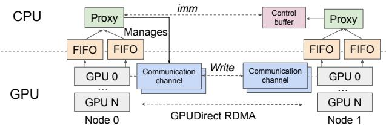  
Figure 5: UEP-architecture. Control buffer temporarily buffers control messages (e.g., atomics) until the conditional check specified by the message is passed, upon which the values carried by these control messages are applied. Multiple communication channels are used for moving the data payloads (e.g., tokens) via GPUDirect RDMA.

We argue that the expert-parallel communication system should be portable by design - and UEP is based on a set of simple primitives that ease portability across various hardware, as well as supporting new future GPUs and NICs with minimal additional overhead.

## 3 Design

The key observation of UEP is that the GPU only needs to initiate token-level transfers for maximal performance with fine-grained overlapping with other phases of communication (e.g., data copying and computation), while the responsibility for monitoring and managing those transfers does not need to remain on the GPU. CPU, on the other hand, is portable to any GPUs via CUDA/ROCm and any NICs via the libibverbs library [48] maintained by the Linux community and NIC vendors, and CPU is also flexible in terms of enforcing various delivery semantics expected by the GPU.

In UEP (Figure 5), GPUs initiate the fine-grained datamovement (e.g., of expert token activations) by delegating the transfer tasks to CPU proxies. In effect, GPU threads issue lightweight control messages over PCIe to the CPU; the CPU proxies then intercept these control messages and issue tokenlevel data communication on behalf of the GPU threads. This separation gives us the best of both worlds: the GPU retains token-level and pipelined data communication necessary for high performance, while the CPU proxy abstracts away heterogeneous NIC semantics with portability across platforms.

We discuss two high-level primitives proposed in UEP—an efficient CPU-GPU communication channel (§3.1) and a multithreaded CPU proxy to delegate and manage GPU-initiated communication (§3.2 and 3.3).

## 3.1 Efficient CPU-GPU communication channel

UEP employs a lightweight, fixed-size command descriptor, termed TransferCmd, that the GPU threads enqueue into shared, lock-free FIFO channels with the CPU proxy as consumers (Figure 6). The GPU acts as the producer: it reserves space by advancing the head and then writes the command into the queue. The CPU proxy acts as the consumer: after processing a command, it advances the tail to make the entry available for reuse. After the GPU side writes to the head of the FIFO channel, it then proceeds with data packing and forwarding, while the CPU side reads from the tail of the FIFO buffer and issues the corresponding RDMA work request to the NIC.

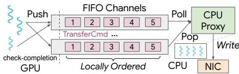  
Figure 6: CPU-GPU FIFO channel. The FIFO channel transmits 128-bit TransferCmd. The GPU threads (left) enqueue commands to the FIFO channel. The CPU proxy threads (right) either read the commands with Poll or dequeue the command with Pop. UEP employs multiple FIFO channels per GPU, and each CPU proxy uses multiple threads to read from FIFO channels for scalability.

Each TransferCmd bundles control information necessary for initiating GPU-direct communication, such as destination peer, buffer address, length, and sequence number. This leaves the data payload still residing on the GPU memory. This approach decouples communication initiation (by the GPU) from communication execution (CPU posting the actual RDMA commands).

UEP FIFO channels. Inspired by MSCCL++ [53], UEP uses a 128-bit (16 bytes) descriptor per command to improve the speed of each transfer, as 16 bytes can be written with a single GPU instruction and MMIO doorbell, aligning with PCIe’s natural transaction and payload granularity. Since MSCCL++ does not target EP and it assumes strict ordering for the NICs, UEP is significantly different: UEP uses multi-threaded proxies and multiple parallel FIFO channels to make it scalable for small messages (§5.4); UEP further leverages the CPU proxy to enforce delivery semantics among TransferCmds among a subset of FIFO channels as specified by the GPU threads (§3.3) for heterogeneous NICs.

The CPU-GPU channel exposes both CPU-side APIs and GPU-side APIs. UEP bounds the channel size with a parameter kMaxInflight. A message can be enqueued from the GPU only if there is space in the buffer (the number of outstanding messages is equal to or smaller than kMaxInflight) – otherwise, it will have to wait for the message to be dequeued by the CPU. Therefore, the channel size serves as a way to enforce control onto the GPU-initiated communication; this is important for pacing the GPU sender rate. The GPU threads can also, through checking the FIFO channel, know the completion of a prior message (e.g., important for implementing a barrier).

UEP’s CPU-GPU communication channel is one-sided: communication only flows from GPU to CPU. However, the CPU can rate-limit the GPU by controlling how quickly the messages are consumed from the FIFO buffer. Delaying consumption of the transfer command will make the buffer full, making the GPU thread pause on enqueueing more messages onto the FIFO channel.

The communication channel is split between the host and GPU memory to place each portion of the metadata (e.g., head of the FIFO channel on CPU and tail of the FIFO channel on

GPU) where it is most frequently read: the head is set by the GPU but polled by the CPU. The tail is set by the CPU but polled by the GPU. An alternative design is placing both head and tail on either GPU memory or host memory. However, one side (e.g., CPU or GPU) has to incur repeated access over PCIe when busy polling, incurring multiple PCIe crossings and hence heavy latency cost.

Memory consistency. Memory consistency is a key challenge for an efficient CPU-GPU communication channel. If the GPU sees stale data, this can lead to incorrect decisions (e.g., being stalled on a barrier). If the CPU sees stale data, it might read a stale value in the channel (leading to incorrectness). UEP ensures that when the GPU accesses the channel, it will bypass its hardware caches. CPU-side also ensures that the writes are flushed to the host memory rather than buffered in its L2 cache. Alternatively, the cache-coherent C-C interconnect (e.g., in GH200 [42]) can mitigate this issue (Figure 13 in evaluation). Impact of GPU-side contention. Due to the large number of GPU threads, multiple threads of the same GPU SM naively pushing commands into the same FIFO channel can cause severe contention. To reduce contention, UEP uses multiple FIFO channels and carefully routes each GPU thread to push to the relevant FIFO channel. Cross-FIFO channels ordering is not guaranteed, though commands enqueued within the same FIFO channels are guaranteed to be ordered as they are read sequentially. UEP ensures that the sequence of messages that the GPU kernel requires ordering from the GPU side is mapped to the same FIFO channel.

Channel APIs. We next discuss APIs exposed at both the CPU-side and GPU-side to enable GPU-initiated token-level expert-parallel communication.

CPU-side:

• Poll: CPU proxy reads the TransferCmd from the channel, without dequeueing the command from the channel.

• Pop: CPU proxy removes the TransferCmd from the channel, indicating that the TransferCmd has been consumed.

GPU-side:

• Push: GPU thread enqueues a TransferCmd into the FIFO channel and gets a Idx for the command.

• Check-completion(Idx): The GPU thread checks whether the TransferCmd with Idx has been popped from the CPU side.

UEP decouples between initiating the transfer and finishing the transfer. The proxy first becomes aware of the transfer when calling Poll, reading the message from the FIFO queue. This allows the CPU proxy thread to initiate a particular operation. For example, the CPU proxy thread can issue an RDMA write after polling a Write TransferCmd (described later).

The FIFO queue exposes an API for the GPU thread to check completion. This is important for GPU-side operations. For example, the GPU-side might need to wait for a prior dispatch or combine operation to finish to proceed (so as not to overwrite the transport buffer); this logic often requires the communication layer to initiate a barrier across a subset of participating ranks. In this example, the GPU-side needs to wait for the barrier operation to finish by checking completion on the Barrier TransferCmd.

Types of TransferCmd. We added four types of TransferCmds to support GPU-initiated token-level communication. These types are not meant to be an exhaustive list for expert-parallel communication. However, they suffice in our example to support expert-parallel communication in both training and serving.

Write: GPU thread delegates a write request to the CPU proxy thread to execute. We pass in the addr offset on the source rank, addr offset on the destination rank, the number of bytes to transmit, and the destination rank. Only offsets are needed, rather than a global address, as UEP CPU proxies exchange each other’s base address during initiation (§3.2). The write command can optionally piggyback an atomic message to signal completion. This can be useful when GPU threads both want to deliver a data payload to the destination memory address, as well as incrementing a related counter (e.g., the number of the tokens received) at the receiver.

Atomics: GPU thread delegates an atomic operation to the CPU proxy thread to execute. The request contains destination offset, atomic value, and destination rank. This operation should execute atomically with concurrent operations sent by senders from multiple ranks. The atomic operations serve two logical purposes. First, they act as a remote doorbell with a memory-barrier semantics to ensure that previous writes have completed. For example, an atomic write to a flag bit following three token writes can establish that these three writes have been delivered. Second, atomics can also act as a way for the receiver to track how many tokens each expert has received in total. For example, suppose expert 5 on rank 2 receives 2 tokens from rank 5 and 5 tokens from rank 7. A counter for expert 5 must be maintained and updated by both ranks to reflect the total of 7 tokens. Different networking vendors have varying support for atomics; we describe one example in §4.1 on EFA.

Drain: Delegates a CPU proxy thread to drain the RDMA completion queue and ensure that all outstanding RDMA operations have completed. This is critical to ensure that the GPU threads can safely proceed without having their local states overwritten by unfinished requests from previous iterations of dispatch and combine. UEP optionally allows the GPU threads to pass a parameter in the Drain command to drain in-flight messages up to a certain TransferCmd index Idx.

Barrier: Barrier message delegates the CPU proxy thread to establish a synchronization barrier: the barrier message can support an all-peer barrier (where all participating peers need to enter the barrier), or a same-rail barrier that, under a rail-optimized topology, synchronizes only the peers mapped to the same rail (typically same GPU index across different nodes). For the former, the UEP Proxy thread creates an intra-node shared memory to enforce a hierarchical barrier—synchronization among local peers first, then across nodes. A per-node leader is established for intra-node barrier, and a cross-node leader (e.g., typically the first node) is established then for inter-node synchronization. For the latter, UEP relies on the RDMA immediate data to signal the leader rank that a barrier request is received, then the leader rank replies with the immediate data to signal the other ranks that a barrier has been successfully established.

Both Barrier and Drain are blocking on the GPU side, meaning that the GPU thread will need to check completions with the correct TransferCmd Idx before it can proceed with the Check-completion(Idx) API. While more message types can be supported, UEP supports the above four as they are adequate to cover the communication patterns for GPU-initiated EP communication.

## 3.2 Flexible CPU proxy to delegate communication

UEP keeps one CPU proxy per GPU, and each CPU proxy has multiple threads. While the use of CPU threads is common in collective transfers, such as in NCCL [41] and CPU-assisted IBGDA [38], UEP differs fundamentally from these approaches in three key aspects. First, the communication pattern is GPU-initiated and token-level, posing challenges for CPU proxy threads to quickly handle and process messages from GPUs. Second, as the message size is smaller, the number of messages needed to saturate network bandwidth is substantially higher; UEP uses more CPU threads for scalability. Third, UEP’s CPU proxy is tasked with bridging the delivery semantics expected by the GPU (§2.4) and provided by the networking layer, and efficiently expressing these requirements without hurting performance is a non-trivial problem.

Multiple threads for each CPU proxy UEP uses up to 4 CPU threads per proxy. Each CPU thread is pinned to a CPU core. We note that modern GPU servers usually have hundreds of CPU cores, which are often heavily underutilized, e.g., 20%-45% CPU utilization reported by several industry companies in their GPU clusters [19, 23].

Establishing connection. With multiple threads in a CPU proxy, UEP bounds the number of connections by only allowing the i-th thread of a CPU proxy to establish connections with the i-th threads of remote CPU proxies. Communication is bidirectional: each thread is in charge of both polling the sender’s completion queue for any successful outgoing write or atomic message, and polling the receiver’s completion queue to handle any remote incoming requests.

Symmetric memory. The CPU proxy thread maintains the semantics of symmetric memory, as symmetric memory has been noted to be useful by prior works [35, 47, 64]. This enables the GPU thread to only notify CPU threads of the offsets of the transfer. CPU threads then handle the address translation, bounds checking before issuing RDMA writes, and atomic messages. Each CPU proxy registers a memory region during initialization, and exchanges the base address during handshake. Using offsets in symmetric memory reduces the number of bits needed in control messages, compared to passing full addresses. For example, if each GPU exposes only a 2 GB transport buffer for RDMA, and the address is 16-byte aligned, a 27-bit offset is sufficient to identify any byte within the buffer, whereas passing a full virtual address would require 64 bits per transfer, taking up more bits in the TransferCmd. This also eliminates the need to use vendor-specific shared memory libraries, such as NVSHMEM [35] and rocSHMEM [56], improving portability. Addressing delivery semantics. Heterogeneous NICs exhibit different delivery semantics: for example, some NICs may deliver RDMA writes out of order. To handle this, the CPU proxies embed a sequence number in each RDMA write via immediate data; the receiver uses the sequence number to reorder or delay processing the control messages until all prior writes have arrived. Immediate data is a 32-bit piece of data that RDMA send/write operations can piggyback in the packet header and deliver to remote CPUs over the network. Immediate data field has been standardized into the RoCEv2 packet header [1]. By having CPU proxy interprets this immediate data and enforce guarantees, the system remains correct even when the transport does not guarantee strict delivery guarantees. For comparison, in IBGDA, all transfers completely bypass the CPU. We delve into the details of this design next.

## 3.3 Expressing GPU communication requirements with CPU proxy

Similar to DeepEP [64], UEP presents two modes: low latency (LL) mode and high-throughput (HT) mode. The LL and HT kernels are not specific to one model or UEP itself; they correspond to two general expert-parallel communication modes. LL mode targets decode-style workloads with small batches, where tokens should be sent as soon as routing decisions are available. HT mode targets prefill/training-style workloads with larger batches that benefit from higher bandwidth. LL mode immediately sends the token activation initiated by the GPU via the CPU proxy, requiring no synchronization between transfers. HT mode implements message deduplication, intranode token forwarding, as well as batching multiple tokens before sending. These optimizations can significantly improve throughput; however, they can have higher latency compared to the LL mode. High-throughput kernel employs multiple communication channels (Figure 5), a set of ring buffers per GPU that temporarily buffer tokens to send in the granularity of chunks (a configurable parameter, typically 32 tokens).

In the remainder of the subsection, we use UEP’s lowlatency (LL) kernel and high-throughput (HT) kernel as two illustrative examples of UEP’s proxy threads enforcing delivery semantics required by GPU kernels. Note that RDMA writes are still immediately applied, though the receiver CPU proxy is notified of any delivered writes through polling the RDMA completion queue. The CPU proxy tracks metadata about these delivered writes, such as the number of writes delivered for a particular expert. Atomic is implemented via the immediate data and is not immediately applied: CPU proxy thread extracts the offset and value for the atomic itself from the 32-bit immediate data, buffers them in the control buffer (Figure 5) if needed, and selectively applies them based on the delivery semantics expected of these atomics.

Low-latency kernel requires partial completion fence. Atomic messages are used to signal token delivery (e.g., X number of writes have completed), requiring that the receiver wait until the required number of writes for a specific expert has finished. This requires completion fence semantics: if atomic arrives before X tokens, it should not be applied. However, it does not matter if these X tokens are delivered in order or out-of-order. This guarantee is partial: completions of writes to other experts do not affect updating the number of delivered tokens of this expert. Similarly, the arrival order of these X tokens does not matter; so long as these X tokens arrived before applying the atomic.

Solution: UEP lets the CPU proxy temporarily buffer the atomic message in the control buffer until the required number of tokens for a destination expert has been received. To achieve that, UEP packs the destination offset and the expert index into the 32-bit immediate data, and the receiving CPU thread will parse the immediate data, extract the expert index as well as the source rank of the connection. Each subsequent atomic message will go through a lightweight conditional check (has X number of writes to the specified expert being received?): UEP only applies the atomic update when the conditional check has passed to enforce the delivery requirements of these atomic messages.

High-throughput kernel requires partial ordering. The high-throughput kernel employs multiple ring buffers as communication channels per GPU to temporarily buffer and batch tokens to send. Batching improves throughput; however, it also means the GPU should communicate to maintain the head and tail of these ring buffers on remote ranks. Each token is written to a slot in the destination ring buffer, and by carefully controlling the head and tail values of the ring buffer, UEP ensures that no token will overwrite other yet-to-be-read tokens on the same slot of the ring buffer.

A write message is typically followed by an atomic operation to increment either the head or tail values of the ring buffer. If the write and atomic become reordered with other writes and atomics, this can lead to the receiver reading stale data from the communication channel, or the sender overwriting data written by a prior transfer. For example, consider two writes. The first write is issued to slot 4 on the receiver. The second write is issued to slot 5 on the receiver. Both writes carry an atomic to increment the head value of the receiving ring buffer to indicate to the remote kernel that a new message has been delivered. However, if the atomic for the second write arrives first before the atomic for the first write, the remote GPU kernel can read the slot 4, before the delivery of the write to slot 4, leading to reading wrong results.

Similar to LL mode, enforcing ordering only needs to be partial. The ordering guarantees only need to be done for each communication channel, rather than globally across all messages, which is expensive if not done in hardware.

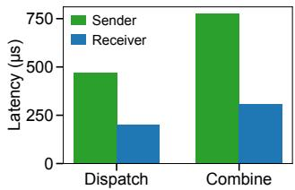  
Figure 7: Sender-side vs. receiver-side on enforcing delivery semantics (on testbed NV\_EFA3 detailed in Table 2). Receiver-side gives better performance compared to sender-side.

Solution: UEP ensures that per-channel communication is locally ordered. It achieves this by enqueueing messages from the same communication channel into the same GPU-to-CPU FIFO queue. Similar to the low low-latency kernel, the receiver CPU proxy thread will extract the sequence number from the immediate data; if the received message arrives out-of-order, it will temporarily buffer these atomic messages (that are outof-order with writes) in the control buffer. Only after the prior writes and atomics have been applied (e.g., message 1−5 from communication channel i has been applied), the receiver thread will sequentially apply the next buffered atomic message (e.g., atomic with index 6 from communication channel i).

Where to enforce the delivery semantics. An alternative approach is for the sender, as opposed to the receiver, to delay sending the atomic messages only after it has received the completion queue entry for the writes sent for that token. This approach is typically used by the NIC hardware to guarantee strict ordering when adaptive routing is used in the network and packet reordering happens [13]. It has the advantage of saving hardware SRAM resources without tracking per-packet states. However, compared to tracking at the receiver, this approach makes the sender wait for one extra RTT for the atomic messages sent, as in this approach, the sender can only issue atomic messages after it polls the completion entry for the prior writes. We have observed suboptimal performance (Figure 7), as the latency penalty of waiting for token completion accumulates.

In summary, the networking layer typically provides either a stronger or weaker guarantee in hardware than what is typically required by the application, e.g., ensuring that all messages are strictly ordered, or guaranteeing none at all. From discussing with industry practitioners, installing various guarantees comes at a hardware cost trade-off: supporting strong guarantees at the NIC hardware typically means that the hardware NICs are more expensive to make. In comparison, CPU is flexible in customizing and enforcing various delivery semantics. The minimal requirement for UEP is reliable delivery of RDMA operations (e.g., as commonly provided by RC or SRD protocol), and a way to carry small control metadata to the receiver, such as RDMA immediate data. These requirements are typically provided by existing RDMA NICs.

## 4 Implementation

We implement UEP by extending DeepEP with 20.8K lines of C++ (including 2.4K lines of CUDA/ROCm C++) and 1K lines of Python, while remaining API-compatible with DeepEP. UEP significantly extends DeepEP in two ways: i) supporting heterogeneous GPUs and NICs, including NVIDIA and AMD GPUs, and NVIDIA, AWS EFA, Broadcom, and Intel NICs (other NIC vendors should be naturally supported via the portable libibverbs); and ii) supporting token-level and customizable communication requirements across NICs and EP modes (i.e., LL or HT), as described in §3.3. UEP is architecturally portable: porting to AMD GPUs and AWS EFA NICs is done with only 3 person-months, requiring relatively less effort compared to supporting such communication across every NIC and GPU pair, which typically requires dedicated teams.

Removing GPU-vendor-specific software stack. Existing GPU-driven communication stacks often rely on NVSHMEM for device-side synchronization, memory ordering, and GPU-initiated one-sided operations. However, such a software stack assumes a specific GPU vendor and depends on hardware features that may not exist on AMD GPUs or non-IB NICs. UEP instead manages symmetric memory with CPU proxy threads, and expresses NVSHMEM-related GPU-initiated communication APIs via its own CPU proxy.

Queue Pair (QP) load balancing. Each proxy thread for a particular GPU is in charge of managing a set of NICs in the same NUMA group as the GPU (e.g., there are 2×200G EFA NICs per H200 GPU on AWS). In low-latency (LL) mode, each thread creates an RDMA queue pair for a given destination rank; in high-throughput (HT) mode, each thread creates multiple QPs (corresponding to the number of communication channels, §3.3) between pairs of ranks. Depending on communication requirements, the GPU might require a set of messages to be sent out from a single QP, or it does not impose any requirements on which QPs to send, where the CPU thread round-robins among the QPs it manages.

Aggregating NICs of different bandwidths. Beyond QP load balancing, UEP aggregates bandwidth across multiple NICs per GPU: e.g., one ConnectX-7 NIC may deliver 400 Gbps, but achieving similar bandwidth with EFA NICs may require aggregating two 200 Gbps NICs per GPU. UEP relies on CPU threads to load balance across different NICs. We omit the details for brevity.

Interfaces for adding support of new NIC or GPU To add a new NIC, UEP requires the NIC to expose a standard host-side RDMA interface, ideally through libibverbs or a compatible verbs provider. This is common for most, if not all, RDMA-capable NICs. For new NICs, UEP provides a modular interface that allows CPU proxy threads to translate TransferCmd into NIC work requests, manage QPs/CQs, exchange base addresses, and handle NIC-specific limits such as maximum in-flight writes. To add support for a new

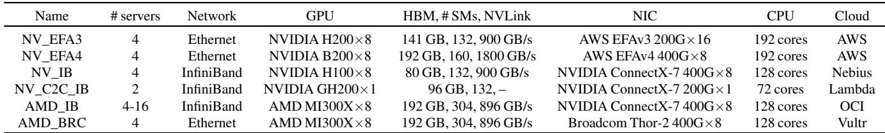  
Table 2: Evaluation testbeds. All testbeds are rented from public cloud providers.

GPU, UEP requires translating GPU-side kernels (e.g., from NVIDIA to AMD) and having the kernel call UEP transport channel APIs (e.g., supporting various TransferCmd types as in §3.1). We next present two case studies to illustrate this.

## 4.1 Supporting EFA

Emulating atomics with CPU proxy threads. EFA NICs currently do not provide hardware RDMA atomics (e.g., global counters). UEP implements software-based atomics: the sender issues a payload write followed by a small RDMA write carrying an immediate value encoding the new counter or flag; the CPU proxy or receiver thread updates local completion counters allocated on the host memory (e.g., via cudaMallocHost()) upon detection of the immediate data. UEP carefully ensures that the GPU observes the host-allocated counter and uses it for control decisions. This ensures the correctness of completion notification without relying on vendor-specific atomic support.

## 4.2 Supporting AMD

UEP generalizes the expert-parallel communication kernels so that they no longer assume NVIDIA-style warps, NVIDIAspecific PTX intrinsics, and hardware engine. In particular, UEP does the following changes:

• Migrating CUDA-specific PTX intrinsics to use ROCm alternatives, including atomics, memory fences, and timers.

• Migrating CUDA warp-based programming to support AMD wavefront, including switching WARP\_SIZE from 32 to 64, using AMD wavefront-level synchronizations.

• Migrating NVIDIA TMA-based data copy [5] to support AMD CU-based (i.e., compute units, like NVIDIA SMs).

• UEP uses wavefront (i.e., warp in NVIDIA’s term) specialization for AMD. For the HT kernel, UEP merges its coordinator-role wavefronts into receiver-role wavefronts [10], as AMD GPUs usually support fewer wavefronts than NVIDIA warps but more threads per wavefront.

Note that to support AMD GPUs with heterogeneous NICs, only GPU kernels need to be ported, rather than the CPU-side code to operate on heterogeneous NICs; UEP’s approach allows us to immediately run on AMD platforms with heterogeneous NICs after AMD GPU-side changes, without having to do independent development between AMD GPU and each individual NIC. This shows that UEP enables O(m) effort, instead of IBGDA’s O(m×n), to support GPU-initiated token-level communication for expert parallelism.

## 5 Evaluation

Our evaluation aims to answer the following questions:

• How does UEP improve MoE model training? (§5.2.1, §5.2.2)

• How does UEP improve MoE model serving? (§5.2.3)

• How does UEP’s performance compare to baselines on heterogeneous devices? (§5.3.1 and §5.3.2)

• How does UEP’s performance compare to DeepEP on NVIDIA GPUs and NICs? (§5.3.1)

• How do different design choices (e.g., number of CPU threads) impact UEP performance? (§5.4)

## 5.1 Methodology

Experimental setups. A list of testbeds can be found in Table 2. We used testbeds from a variety of GPU vendors (NVIDIA and AMD) and NIC vendors (AWS, NVIDIA, Broadcom) to show that UEP is portable across platforms and benchmark UEP’s performance.

Baselines.

• NCCL [41] / RCCL [3]. We use collective communication libraries as a baseline for the EP communication stack on NVIDIA (NCCL) and AMD (RCCL) GPUs.

• DeepEP [64]. DeepEP is a state-of-the-art, GPU-initiated RDMA communication system for expert-parallel MoE.

• Perplexity Kernels (PPLX) [29]. We evaluate against Perplexity’s custom MoE communication kernels (denoted PPLX), which are highly optimized for low-latency decode.

• CPU-assisted IBGDA [38]. We emulate a CPU-assisted IBGDA design using a single UEP proxy thread, similar to the existing CPU-assisted IBGDA approach.

• Mori [50]. Mori is a modular RDMA library; we include it to compare against a ROCm-native RDMA stack.

• Theoretical Best: Theoretical results for HT mode derived from available RDMA bandwidth.

To ensure a fair comparison, we use the same amount of GPU resources (e.g., the same number of SMs per GPU as DeepEP, and the same number of CUs as Mori). UEP is designed as a drop-in replacement for DeepEP-style applications. It has already supported various inference frameworks, such as vLLM and SGLang, and training frameworks such as MegatronLM and AMD Primus, with no application-level changes.

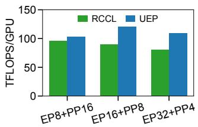  
(a) TFLOPS/GPU.

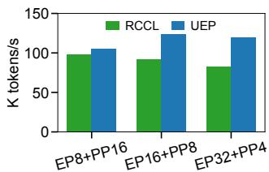  
(b) Tokens/s.  
Figure 8: Training throughput of DeepSeek-V3 (downscaled to 32 layers and 379B parameters) under AMD Primus/Megatron-LM [4]. We scale AMD\_IB to 16 nodes temporarily for this experiment.

Table 3: MoE training throughput (in TFLOPS/GPU) on NV\_EFA3 (32×H200, EFAv3) with Megatron-LM.  
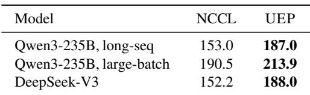

## 5.2 Application performance

## 5.2.1 Training on AMD Primus/Megatron-LM

Figure 8 reports end-to-end Megatron-LM training performance in TFLOPS and tokens per second for DeepSeek-V3 [30] over 16 servers. Across all models, UEP matches or exceeds the TFLOPS (by 7-36%) and throughput achieved by RCCL (by 7-45%). These results show that UEP leads to performance benefits compared to RCCL for Megatron-LM training on AMD.

## 5.2.2 Training on H200/EFA with Megatron-LM

Table 3 reports end-to-end Megatron-LM training performance in TFLOPS per GPU on NV\_EFA3 with 4 servers (32 H200 GPUs over EFAv3). We evaluate three configurations: Qwen3-235B, long-seq runs Qwen3-235B-A22B [60] with seq=49152, GBS=8, EP=16, TP=4, PP=2, CP=2; Qwen3-235B, large-batch uses the same model with seq=20480, GBS=128, EP=16, TP=4, PP=2, CP=2; and DeepSeek-V3 [30] truncated to 12 layers (∼135B total, ∼5B activated; 256 experts, top-k=8, hidden=7168) with EP=32. Across all three settings, UEP exceeds the TFLOPS achieved by NCCL by 12–24%: 22% for Qwen3-235B, long-seq, 12% for Qwen3-235B, large-batch, and 24% for DeepSeek-V3. UEP improves Megatron-LM training throughput without modifications to the model code.

## 5.2.3 Inference on SGLang with EFA

We evaluate UEP in SGLang v0.5.3 with EP set to either 16 or 32 on a prefill-heavy workload (input length 4096, output length 5) using deepseek-ai/DeepSeek-R1-0528 [18] and Qwen/Qwen3-235B-A22B-FP8 [60]. The results are presented in Figure 9. We compare against NCCL, as DeepEP does not run on EFA; at the time of writing, PPLX had not been integrated into any open-sourced inference engine. For

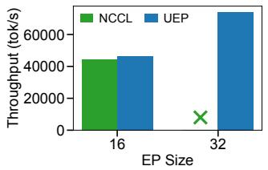  
(a) DeepSeek R1 (671B)

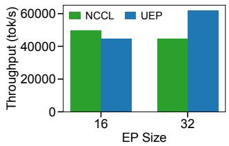  
(b) Qwen3 (235B)

Figure 9: SGLang throughput comparison across two MoE models using DeepEP and NCCL on NV\_EFA3.  
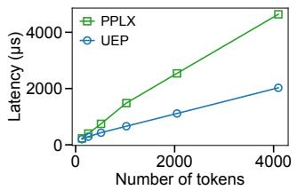  
(a) Dispatch.

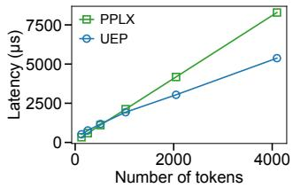  
(b) Combine.  
Figure 10: EP32 comparison when varying numbers of tokens on NV\_EFA3. UEP uses the minimum of HT and LL latency, while PPLX only has one mode.

DeepSeek R1 at EP=16, UEP reaches an input throughput of 46K tok/s, about 5% higher than NCCL. Scaling to EP=32, UEP further improves to 74K tok/s input, a 1.6× speedup over its own EP=16 run. NCCL cannot yet run [9, 57] on EP=32 (confirmed with SGLang maintainers). For Qwen3, at EP=32, UEP reaches 62K tok/s throughput versus 44K tok/s for NCCL (about 40% higher). We also observe that CPU utilization increases modestly with UEP, from an average 8% CPU utilization to 22% utilization.

## 5.3 Microbenchmark

In this subsection, we compare the dispatch and combine latency on NVIDIA GPUs (§5.3.1) as well as AMD GPUs (§5.3.2). Under each GPU vendor, we compare different NIC setups, including AWS EFA, CX7 with IB, and Broadcom Thor-2 NICs. UEP is able to run across all testbeds. In each testbed, we compare UEP against the available baselines that are specifically optimized for each setup.

## 5.3.1 On NVIDIA GPUs

Comparison on AWS EFA. Figure 10 and Figure 11 show EP32 dispatch and combine latency on NV\_EFAv3 (on AWS p5en instances) as we vary the number of tokens. As we increase the number of tokens, UEP outperforms PPLX and the gap widens: for medium and large batches, UEP consistently delivers substantially lower dispatch (2.3×) and combine latency (1.1-1.5×), demonstrating better scalability as token counts increase.

We would like to make two observations on the LL mode comparison between PPLX and UEP: First, PPLX does not support in-kernel BF16-to-FP8 conversion, assuming that the input data is already passed in as the FP8 data type. This makes comparison tricky, as the original DeepEP and many large-scale MoE models use BF16 as input and BF16-to-FP8 conversion is consequently a key step to save communication traffic. To be favorable to PPLX, in the figures of this paper, we ignore the PPLX data-type conversion latency and directly compare the PPLX dispatch latency (assuming FP8 input) versus UEP dispatch latency (assuming BF16 input), where UEP does an additional step of converting BF16 to FP8 in the GPU kernel. We present a comparison in Table 4. If we add the data type conversion time to PPLX, PPLX’s dispatch time rises to 266.9 µs from 232.3 µs. Second, the latest UEP additionally supports best-effort per-expert token batching in the low-latency kernel. On 2 nodes of NV\_EFA3, best-effort token batching improves the UEP latency from 216.6 µs to 177.7 µs. Unfortunately, as our rented AWS VMs run out of time, we are not able to further measure these optimizations on a larger scale (EP=32).3

Table 4: Dispatch performance on NV\_EFA3. w/ Conv additionally adds a small data conversion latency (from BF16 to FP8) for PPLX.  
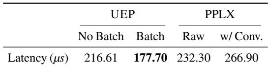

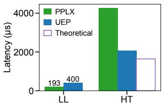  
(a) Dispatch.

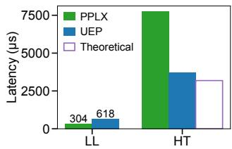  
(b) Combine.  
Figure 11: EP32 comparison on NV\_EFA4.

Comparison on CX7 with IB. Figure 12 compares EP32 dispatch and combine latency on CX7 with InfiniBand for both low-latency (LL, small tokens) and high-throughput (HT, large tokens) modes. In LL mode, UEP incurs slightly higher latency than DeepEP and PPLX due to the overhead of its CPU proxy on small messages. However, in HT mode, UEP achieves latency comparable to the original DeepEP (within 5% for dispatch) while outperforming PPLX for both dispatch (2.1×) and combine (1.6×), showing that UEP preserves high performance on throughput-oriented workloads.

Comparison on GH200 with NVLink-C2C. Figure 13 reports latency on a single-GPU GH200 node with NVLink-C2C between the CPU and GPU. The HT (high-throughput) mode of DeepEP requires an 8-GPU NVLink/NVSwitch topology and therefore cannot run on this platform, so we only compare LL mode. In this setting, UEP achieves lower transfer latency than the original DeepEP, demonstrating that UEP operates efficiently over a cache-coherent C2C CPU–GPU interconnect, which we believe to be a future trend. We hypothesize that this benefit comes from two reasons. First, different from DeepEP, which issues a write operation followed by an atomic operation, UEP piggybacks an atomic operation over a write operation with the remote CPU proxy applying the immediate data carried along the write operation, saving one extra message (§5.4). Second, UEP removes the NVSHMEM dependency and its associated software overheads.

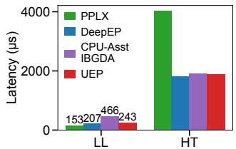

(a) Dispatch.  
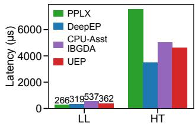  
(b) Combine.

Figure 12: EP32 comparison on NV\_IB.  
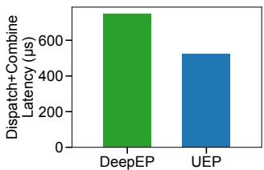  
Figure 13: EP2 LL comparison on two GH200 nodes. While EP2 is a less practical setting, it shows the current trend of unified memory between GPUs and CPUs (e.g. with NVLink-C2C) enables us to obtain better performance by enabling fast CPU-GPU communication.

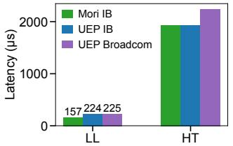  
(a) Dispatch.

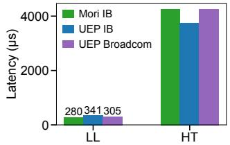  
(b) Combine.  
Figure 14: EP32 comparison on AMD\_IB and AMD\_BRC.

## 5.3.2 On AMD GPUs

Figure 14 shows EP32 dispatch and combine latency on AMD GPUs when using Broadcom NICs (UEP Broadcom) and NVIDIA InfiniBand NICs (UEP IB and Mori IB). At the time of writing, Mori only officially supported NVIDIA NICs. The results demonstrate that UEP runs efficiently across heterogeneous NICs, achieving similar performance on Broadcom and IB in both LL and HT modes. On InfiniBand, UEP IB even outperforms Mori IB in the HT (high-throughput) configuration for combine, while Mori IB has a slightly lower latency than UEP IB in LL mode.

## 5.4 Design drill-down

Stress testing UEP FIFOs. Figure 15 benchmarks how the latency of the FIFO queue compares to network latency with increasing 7KB message load. The latency incurred along the

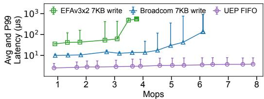  
Figure 15: UEP FIFO performance. We run 8 FIFOs simultaneously on NV\_EFA3 (each for one GPU) and report the first FIFO’s result. Note that the y-axis is in log scale.

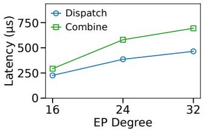  
(a) LL

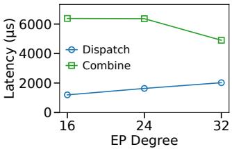  
(b) HT

Figure 16: Sensitivity to EP size. We measure the UEP HT and LL mode latency as we increase the EP size from 16 to 32.  
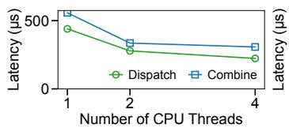  
(a) LL

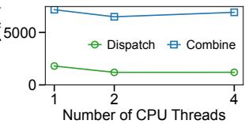  
(b) HT

Figure 17: Sensitivity to number of CPU threads (NV\_EFA3).  
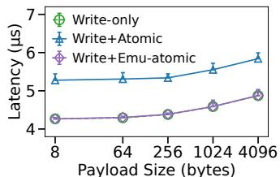  
Figure 18: Comparing the latency of emulated atomics across different payload sizes.

FIFO queue is an order of magnitude smaller than the network latency. Furthermore, UEP FIFO queues are able to scale to large QPS (e.g., 8 Mops), capable of handling modern MoE workloads. Compared to the latency of typical dispatch and combine (∼200 µs for LL, and > 2000 µs for HT), CPU proxy (3∼5 µs) introduces negligible latency overhead compared to native GPU-initiated RDMA with IBGDA. Note that this benchmark does not batch requests from GPUs to CPUs; we believe that with lightweight batching, it is feasible to handle the next-generation 800G network [7].

Varying EP degrees. Figure 16 shows that UEP’s dispatch and combine latency increases modestly as we increase the EP size from 16 to 32. The trend holds in both LL and HT modes; under the HT mode, combine latency stays flat (and even dropping at EP=32). Overall, UEP scales gracefully across the 16–32 EP range we evaluated.

Varying number of proxy threads. Figure 17 shows that LL and HT kernels suffer from suboptimal performance when the number of CPU threads is 1. The performance significantly improves when we add more CPU threads (e.g., to 4). With more threads per CPU proxy, UEP is able to use more cores to drive higher-throughput communication. We note that CPU utilization is typically low, as GPU servers typically have a large number of CPU cores (Table 2); we observe that even with 4 CPU threads, the CPU utilization only increases modestly.

Latency impact of using emulated atomics. Figure 18 quantifies the latency impact of UEP’s emulated atomics, compared against a plain RDMA write and a write followed by an RDMA atomic operation (e.g., in DeepEP). All three paths are issued in a chain RDMA doorbell with the data write unsignaled, so the receiver never waits between operations. Across the write payload sizes from 8 B to 4 KiB, the emulated path follows closely to the write-only baseline: the atomic update by the CPU proxy is essentially free compared to the network delay. In contrast, the write followed by an RDMA atomic costs a roughly ∼1 µs extra, because the atomic is an additional operation that the responder NIC must execute. UEP avoids the additional message by piggybacking the atomic update on the immediate data and letting the remote CPU proxy apply it upon polling the receiver work completion entry.

## 6 Discussion and Future Work

Congestion control with CPU proxy. We observe that the number of outstanding requests can have a significant impact on various NICs, affecting tail latency [46, 66]. This becomes increasingly significant as the number of destinations increases, where having one straggler can significantly slow down dispatch and combine time. Software-based flow control is challenging to implement with IBGDA, as GPU threads typically are not flexible enough for implementing network-level policies.

Instead, UEP delegates control decisions to the flexible CPU proxy, which could easily support request tracking and pacing. If the outstanding requests become high, the CPU proxy thread temporarily buffers the messages at the sender, so that the messages will not cause an incast at the receiver side. The CPU proxy also bears responsibility for multi-QP management: because each GPU may be connected to multiple NICs or mul tiple QPs, the proxy can throttle or shard the outgoing requests across NICs and QPs to avoid congestion [65], and adapt to NIC-specific characteristics (e.g., maximum outstanding write requests) without burdening the GPU kernel logic. This separation allows exploiting multiple NICs transparently and optimizing throughput while still keeping the GPU’s logic simple. Elastic EP with CPU proxy. NVSHMEM, including IBGDA, CPU-assisted IBGDA, and IBRC, does not expose error handling to GPU kernels and assumes RDMA operations always succeed. However, events such as GPU failure, scale up, and down can happen in practical scenarios, where

NVSHMEM would need to restart the existing cluster. UEP could achieve elastic EP by using the flexible CPU proxy to handle failure and scaling events, transparently masking them from the GPU kernel.

More efficient low-latency kernel. DeepEP’s low-latency kernel (without token deduplication or hierarchical reduce) could be further optimized. This would particularly benefit AWS EFA NICs that cannot process small message transfers efficiently (see Figure 15). UEP currently extends DeepEP LL kernels, which we plan to further improve as future work. We deem these optimizations as orthogonal to UEP’s contribution in a portable expert-parallel communication architecture by decoupling NICs and GPUs.

Intended deployment mode for UEP. UEP is primarily designed for platforms where IBGDA is unavailable or impractical, such as non-NVIDIA GPUs or NICs without the required GPU-initiated RDMA support. However, UEP can also run on IBGDA-capable platforms, where the CPU proxy can provide additional flexibility for communication management.

Failure semantics. In practice, the CPU and GPU on the same server often fate-share: CPU processes are already responsible for launching GPU kernels, and widely used systems such as NCCL also rely on host CPU threads to initiate and coordinate communication. Thus, UEP does not introduce a separate failure domain.

## 7 Related Work

EP communication systems mainly have two categories.

CPU-initiated. CPU-initiated communication, such as NCCL [41], RCCL [3] (for AMD GPUs), and PPLX [29] relies on the CPU to initiate communication, including constructing and posting RDMA work requests, polling completion queues, and managing QP state transitions. Nearly all MoE training and serving frameworks support NCCL/RCCL for MoE communication. However, as mentioned in §2.2, they would require either re-packing tokens or transferring small tokens, and do not support token deduplication and hierarchical reduce, both leading to low performance as the number of tokens increases. Recent efforts such as UCCL-Tran [65] and NCCLX [55] preserve NCCL/RCCL’s CPU-driven design, with various performance optimizations: UCCL-Tran focuses on CPU-driven collective transport optimizations such as software packet spraying, while UEP targets expert-parallel GPU-initiated token-level communication. NCCLX introduces topology-aware collective algorithms, zero-copy, and SM-free transfers. Both are orthogonal to UEP.

GPU-initiated. GPU-initiated communication, by contrast, issues network transfers directly from the GPU, enabling fine-grained token-level operations like deduplication and hierarchical reduce that are critical to EP communication efficiency. DeepEP [64], Mooncake-EP [25], Mori-EP [50], and ROCm-DeepEP [49] (based on rocSHMEM [56]) belong to this category. Although providing high performance, they only work for either NVIDIA GPUs or AMD GPUs, and require strict ordering for the underlying NICs. NVIDIA’s recent HybridEP [39] atop of DeepEP supports intra-node and multi-node NVLink scenarios with reduced SM usage, while UEP focuses on inter-node RDMA scenarios.

MSCCL++ [53] adopts the GPU-initiated approach to implement NCCL/RCCL collectives such as all-reduce and reducescatter, but does not support irregular EP communication. The CPU-assisted IBGDA [38] and IBRC [31] transports from NVSHMEM [35] could theoretically support non-NVIDIA GPUs via their CPU proxy designs. But they suffer from lower performance for small token activations due to single-threaded proxies and assume strict ordering for the NICs. The EFA transport [36] from NVSHMEM supports AWS EFA NICs, but suffers from poor performance [29] by using a single-threaded proxy. Compared to them, UEP supports both heterogeneous GPUs and NICs, enables fine-grained token-level operations, and provides high performance even with small tokens.

## 8 Conclusion

Modern MoE workloads require fast and scalable expertparallel communication, yet existing systems that support token-level GPU-initiated communication remain tied to NVIDIA-specific GPU-initiated RDMA, limiting portability across the increasingly heterogeneous accelerators and NICs. Such an approach results in brittle systems: the communication kernel requires strict delivery semantics from the underlying networking stack, and with limited visibility into error handling, congestion control, and network management. This paper introduces UEP, a portable EP communication system that achieves DeepEP-level performance without relying on specialized GPU–NIC integrations. Our implementation across NVIDIA and AMD GPUs and multiple NIC vendors shows that UEP outperforms the best existing EP solution by 2.1×. UEP is a drop-in replacement for DeepEP-compatible applications such as SGLang and AMD Primus/Megatron-LM, improving token throughput by up to 40% on an NVIDIA+EFA platform, and DeepSeek-V3 training throughput by up to 45% on a 16-node AMD+Broadcom platform.

## Acknowledgement

We sincerely thank the anonymous reviewers and our shepherd for their insightful comments. We would also like to thank Chon Lam Lao for helpful discussions. This work is in part supported by gifts from Accenture, AMD, Anyscale, Broadcom, Cisco, Google, IBM, Intel, Intesa Sanpaolo, Lambda, Lightspeed, Mibura, Microsoft, NVIDIA, Samsung SDS, and SAP. We additionally acknowledge AWS, in particular Jun Wu, Yida Wang, Brian Barrett, and Nafea Bshara, for their sponsorship and partnership in this research. Costin Raiciu was partly funded by HRIA (project no. 351416).

## References

[1] Infiniband trade association — ibta specification portal. Accessed 2025.

[2] M. AI. Introducing llama 4: Advancing multimodal intelligence. https://ai.meta.com/blog/llama-4-multimodal-intelligence/, 2025. Accessed: 2025-12-08.

[3] AMD. ROCm Communication Collectives Library (RCCL). https://github.com/ROCm/rccl, 2025.

[4] AMD-AGI/Primus. AMD Primus training framework for large-scale foundation model training and inference on AMD GPUs. https://github.com/AMD-AGI/Primus.

[5] Andersch, Michael and Palmer, Greg and Krashinsky, Ronny and Stam, Nick and Mehta, Vishal and Brito, Gonzalo and Ramaswamy, Sridhar. Nvidia hopper architecture in-depth. https://developer.nvidia.com/blog/ nvidia-hopper-architecture-in-depth/, Mar. 2022. NVIDIA Developer Blog; Accessed: 2025-12-06.

[6] N.-L. Contributors. Benchmarking deepep guide #1721. https://github.com/nvidia/megatron-lm/ issues/1721, 2025. GitHub issue, accessed 2025.

[7] N. Corporation. NVIDIA Ethernet SuperNICs: Next-generation networking for the next wave of AI. https://www.nvidia.com/en-us/networking/ products/ethernet/supernic/, 2025.

[8] D. Dai, C. Deng, C. Zhao, R. Xu, H. Gao, D. Chen, J. Li, W. Zeng, X. Yu, Y. Wu, Z. Xie, Y. Li, P. Huang, F. Luo, C. Ruan, Z. Sui, and W. Liang. Deepseekmoe: Towards ultimate expert specialization in mixture-of-experts language models. In Proceedings of the 62nd Annual Meeting of the Association for Computational Linguistics (Long Papers), pages 1280–1297. Association for Computational Linguistics, 2024. DeepSeekMoE model paper.

[9] DavideHe. [usage]: deepseek v3 cannot set tensor\_parallel\_size=32 (issue #12256). https: //github.com/vllm-project/vllm/issues/12256, Jan. 2025. GitHub issue on the vllm-project/vllm repository. Accessed: 2025-12-10.

[10] deepseek ai. DeepEP: internode.cu at commit b57e5e212ab75350f53c72064333e4fe1076b1da. https://github.com/deepseek-ai/DeepEP/blob/ b57e5e212ab75350f53c72064333e4fe1076b1da/ csrc/kernels/internode.cu#L1741, 2023. Accessed: 2025-12-09.

[11] deepseek-ai. Eplb: Expert parallelism load balancer. https://github.com/deepseek-ai/EPLB, 2025. GitHub repository, last accessed YYYY-MM-DD.

[12] DeepSeek-AI, A. Liu, A. Mei, B. Lin, B. Xue, B. Wang, B. Xu, B. Wu, B. Zhang, C. Lin, C. Dong, C. Lu, C. Zhao, C. Deng, C. Xu, C. Ruan, D. Dai, D. Guo, D. Yang, ...,

Z. Gu, Z. Zhu, Z. Li, and Z. Zhang. Deepseek-v3.2: Pushing the frontier of open large language models. arXiv, abs/2512.02556, 2025.

[13] J. Dong, B. Luo, J. Zhang, P. Zhang, F. Feng, Y. Zhu, A. Liu, Z. Chen, Y. Shi, H. Jiao, et al. Boosting Large-Scale Parallel Training Efficiency with C4: A Communication-Driven Approach. arXiv preprint arXiv:2406.04594, 2024.

[14] N. Du, Y. Huang, A. M. Dai, S. Tong, D. Lepikhin, Y. Xu, M. Krikun, Y. Zhou, A. Wei Yu, O. Firat, B. Zoph, L. Dixon, Z. Chen, and C. Cui. Efficient scaling of language models with mixture-of-experts. arXiv preprint arXiv:2112.06905, 2022. GLaM (Generalist Language Model) introduced by Google as a sparse MoE model.

[15] T. Gale, D. Narayanan, C. Young, and M. Zaharia. Megablocks: Efficient sparse training with mixture-ofexperts. Proceedings of Machine Learning and Systems, 5:288–304, 2023.

[16] G. D. . Google. Gemini 3 pro, 2025. Released November 18, 2025.

[17] T. Griggs, X. Liu, J. Yu, D. Kim, W.-L. Chiang, A. Cheung, and I. Stoica. M\’elange: Cost efficient large language model serving by exploiting gpu heterogeneity. arXiv preprint arXiv:2404.14527, 2024.

[18] D. Guo, D. Yang, H. Zhang, J. Song, R. Zhang, R. Xu, Q. Zhu, S. Ma, P. Wang, X. Bi, et al. Deepseek-r1: Incentivizing reasoning capability in llms via reinforcement learning. arXiv preprint arXiv:2501.12948, 2025.

[19] Q. Hu, Z. Ye, Z. Wang, G. Wang, M. Zhang, Q. Chen, P. Sun, D. Lin, X. Wang, Y. Luo, et al. Characterization of large language model development in the datacenter. In Proceedings of USENIX NSDI, pages 709–729, 2024.

[20] S. Jaiswal, K. Jain, Y. Simmhan, A. Parayil, A. Mallick, R. Wang, R. St Amant, C. Bansal, V. Rühle, A. Kulkarni, et al. Serving models, fast and slow: optimizing heterogeneous llm inferencing workloads at scale. arXiv e-prints, pages arXiv–2502, 2025.

[21] A. Q. Jiang, A. Sablayrolles, A. Roux, A. Mensch, B. Savary, C. Bamford, D. S. Chaplot, D. de las Casas, E. Bou Hanna, F. Bressand, G. Lengyel, G. Lample, L. R. Lavaud, L. Saulnier, M.-A. Lachaux, P. Stock, and S. Subramanian. Mixtral of experts. arXiv preprint arXiv:2401.04088, 2024. Mixtral 8×7B sparse Mixture-of-Experts model by Mistral AI.

[22] Y. Jiang, R. Yan, and B. Yuan. Hexgen-2: Disaggregated generative inference of llms in heterogeneous environment. arXiv preprint arXiv:2502.07903, 2025.

[23] Y. Jiang, Y. Zhu, C. Lan, B. Yi, Y. Cui, and C. Guo. A unified architecture for accelerating distributed {DNN} training in heterogeneous {GPU/CPU} clusters. In Proceedings of USENIX OSDI, pages 463–479, 2020.

[24] C. Jin, Z. Jiang, Z. Bai, Z. Zhong, J. Liu, X. Li, N. Zheng, X. Wang, C. Xie, Q. Huang, W. Heng, Y. Ma, W. Bao, S. Zheng, X. Zheng, Y. Peng, H. Lin, X. Liu, X. Jin, and X. Liu. Megascale-moe: Large-scale communicationefficient training of mixture-of-experts models in production. In Proceedings of the 21st European Conference on Computer Systems, pages 366–382. ACM, 2026.

[25] kvcache ai. Mooncake-ep: Expert-parallel extension of mooncake. https://github.com/kvcache-ai/ Mooncake/tree/main/mooncake-ep, 2025. Accessed: 2025-12-11.

[26] kvcache-ai/Mooncake contributors. mlx5\_ifc.h mooncake ibgda mlx5 interface header. https://github.com/kvcache-ai/Mooncake/blob/ main/mooncake-ep/include/mooncake\_ibgda/ mlx5\_ifc.h, 2025. Accessed: 2025-12-11.

[27] A. Langer, S. Howell, A. Goel, P. Markthub, H. Petty, and F. Oh. Enhancing application portability and compatibility across new platforms using nvidia magnum io nvshmem 3.0. NVIDIA Technical Blog, Sept. 06 2024.

[28] R. Li, R. Du, Z. Chu, S. Zhao, C. Han, Z. Shi, Y. Shao, H. Han, L. Huang, Z. Liu, et al. Taming the chaos: Coordinated autoscaling for heterogeneous and disaggregated llm inference. arXiv preprint arXiv:2508.19559, 2025.

[29] N. Licker, K. Hu, V. Zaytsev, and L. Chen. Rdma point-to-point communication for llm systems. arXiv preprint arXiv:2510.27656, 2025.

[30] A. Liu, B. Feng, B. Xue, B. Wang, B. Wu, C. Lu, C. Zhao, C. Deng, C. Zhang, C. Ruan, et al. DeepSeek-V3 Technical Report. arXiv preprint arXiv:2412.19437, 2024.

[31] P. Markthub, J. Dinan, S. Potluri, and S. Howell. Improving network performance of hpc systems using nvidia magnum io, nvshmem and gpudirect async, Nov 22 2022.

[32] Y. Mei, Y. Zhuang, X. Miao, J. Yang, Z. Jia, and R. Vinayak. Helix: Serving large language models over heterogeneous gpus and network via max-flow. In Proceedings of the 30th ACM International Conference on Architectural Support for Programming Languages and Operating Systems, Volume 1, pages 586–602, 2025.

[33] Meta AI. Introducing llama 4: Multimodal intelligence with mixture-of-experts. https://ai.meta.com/blog/ llama-4-multimodal-intelligence/, 2025. Meta’s official announcement of LLaMA 4 Scout and Maverick.

[34] N. Muennighoff, L. Soldaini, D. Groeneveld, et al. Olmoe: Open mixture-of-experts language models. arXiv preprint arXiv:2409.02060, 2024. Open Mixture-of-Experts models by the Allen Institute.

[35] NVIDIA. Nvshmem. https:// developer.nvidia.com/nvshmem, 2025. Accessed: 2025-12-06.

[36] NVIDIA. Nvshmem: Libfabric transport backend (efa support). https: //github.com/NVIDIA/nvshmem/blob/ 9cc869bc28e565e6944c4ddf76976ada4a1ebbf7/ src/modules/transport/libfabric/ libfabric.h#L192, 2025. Implements NVSHMEM support for AWS EFA via the Libfabric transport layer. Commit: 9cc869bc28e565e6944c4ddf76976ada4a1ebbf7.

[37] NVIDIA Corporation. ConnectX-7 400G Adapters. https://resources.nvidia.com/enus-accelerated-networking-resource-library/ connectx-7-datasheet, 2024.

[38] NVIDIA Corporation. CPU-assisted InfiniBand GPU Direct Async. https://developer.nvidia.com/ blog/enhancing-application-portabilityand-compatibility-across-new-platformsusing-nvidia-magnum-io-nvshmem-3-0/#cpuassisted\_infiniband\_gpu\_direct\_async%C2%A0, 2024.

[39] NVIDIA Corporation. Hybridep for high-performance intra-node token dispatching. https://github.com/ deepseek-ai/DeepEP/tree/hybrid-ep, 2024. Technical documentation published within the DeepEP repository.

[40] NVIDIA Corporation. Megatron-LM & Megatron-Core. https://github.com/NVIDIA/Megatron-LM, 2025.

[41] NVIDIA Corporation. NVIDIA Collective Communications Library (NCCL). https: //github.com/NVIDIA/nccl, 2025.

[42] NVIDIA Corporation. Nvidia gh200 grace hopper superchip. https://www.nvidia.com/en-us/datacenter/grace-hopper-superchip/, 2025. Accessed: 2025-12-08.

[43] NVIDIA Corporation. Using the NVSH-MEM InfiniBand GPUDirect Async Transport. https://docs.nvidia.com/nvshmem/api/ using.html#using-the-nvshmem-infinibandgpudirect-async-transport, 2025.

[44] NVIDIA/nvshmem contributors. mlx5\_ifc.h — nvshmem mlx5 transport interface header. https: //github.com/NVIDIA/nvshmem/blob/devel/src/ modules/transport/common/mlx5\_ifc.h, 2025. Accessed: 2025-12-11.

[45] OpenAI. Introducing gpt-oss: Openai’s open-weight reasoning models. https://openai.com/index/ introducing-gpt-oss/, 2025. Accessed: 2025-12-08.

[46] Perplexity AI. Enabling trillion-parameter models on aws efa. https://research.perplexity.ai/ articles/enabling-trillion-parametermodels-on-aws-efa, November 2025. Accessed: 2025-12-10.

[47] PyTorch. Symmetric memory. https: //docs.pytorch.org/docs/stable/ symmetric\_memory.html, 2025. Accessed: 2025- 12-06.

[48] RDMA Consortium. libibverbs: RDMA Userspace Verbs API. Linux RDMA Project, 2024. Accessed: 2025-12-06.

[49] ROCm. Deepep: a high-performance expert-parallel communication library. https://github.com/ROCm/ DeepEP, 2025. Accessed: 2025-12-05.

[50] ROCm. MORI: Modular rdma interface. https:// github.com/ROCm/mori, 2025. Accessed: 2025-12-05.

[51] ROCm/mori contributors. bnxt\_re\_hsi.h — mori rdma provider bnxt hsi header. https://github.com/ROCm/ mori/blob/main/include/mori/core/transport/ rdma/providers/bnxt/bnxt\_re\_hsi.h, 2025. Accessed: 2025-12-11.

[52] A. W. Services. Elastic Fabric Adapter. https://aws.amazon.com/hpc/efa/, 2025.

[53] A. Shah, A. Jangda, B. Li, C. Rocha, C. Hwang, J. Jose, M. Musuvathi, O. Saarikivi, P. Cheng, Q. Zhou, R. Dathathri, S. Maleki, and Z. Yang. Msccl++: Rethinking gpu communication abstractions for cutting-edge ai applications, 2025.

[54] L. Shalev, H. Ayoub, N. Bshara, and E. Sabbag. A Cloud-Optimized Transport Protocol for Elastic and Scalable HPC. IEEE micro, 40(6):67–73, 2020.

[55] M. Si, P. Balaji, Y. Chen, C.-H. Chu, A. Gangidi, S. Hasan, S. Iyengar, D. Johnson, B. Liu, J. Ren, et al. Collective communication for 100k+ gpus. arXiv preprint arXiv:2510.20171, 2025.

[56] A. R. Team. rocSHMEM: Gpu-centric openshmem runtime for amd rocm. https://github.com/ROCm/ rocSHMEM, 2025. Accessed: 2025-12-07.

[57] TexasRangers86. [bug] deepseek-r1 with 4\*a100 got error (issue #3491). https://github.com/sglproject/sglang/issues/3491, Feb. 2025. GitHub issue on the sgl-project/sglang repository. Accessed: 2025-12-10.

[58] The SGLang Team. Deploying deepseek with pd disaggregation and large-scale expert parallelism on 96 h100 gpus. https://lmsys.org/blog/2025-05-05- large-scale-ep/, 2025. Accessed 2025.

[59] vLLM Documentation Team. Expert parallel deployment. https://docs.vllm.ai/en/latest/serving/ expert\_parallel\_deployment/, 2025. Accessed 2025.

[60] A. Yang, A. Li, B. Yang, B. Zhang, B. Hui, B. Zheng, B. Yu, C. Gao, C. Huang, C. Lv, et al. Qwen3 technical report. arXiv preprint arXiv:2505.09388, 2025.

[61] S. Zhang, N. Zheng, H. Lin, Z. Jiang, W. Bao, C. Jiang, Q. Hou, W. Cui, S. Zheng, L.-W. Chang, et al. Comet: Fine-grained computation-communication overlapping for mixture-of-experts. arXiv preprint arXiv:2502.19811, 2025.

[62] Y. Zhang, H. Shen, R. Yang, D. Tian, Y. Luo, M. Zhang, L. Li, C. Hu, T. Wo, C. Song, et al. Cauchy: A cost-efficient llm serving system through adaptive heterogeneous deployment. 2025.

[63] C. Zhao, C. Deng, C. Ruan, D. Dai, H. Gao, J. Li, L. Zhang, P. Huang, S. Zhou, S. Ma, et al. Insights into deepseek-v3: Scaling challenges and reflections on hardware for ai architectures. In Proceedings of the 52nd Annual International Symposium on Computer Architecture, pages 1731–1745, 2025.

[64] C. Zhao, S. Zhou, L. Zhang, C. Deng, Z. Xu, Y. Liu, K. Yu, J. Li, and L. Zhao. Deepep: an efficient expert-parallel communication library. https://github.com/deepseek-ai/DeepEP, 2025.

[65] Y. Zhou, Z. Chen, Z. Mao, C. Lao, S. Yang, P. G. Kannan, J. Gao, Y. Zhao, Y. Wu, K. You, et al. An extensible software transport layer for gpu networking. arXiv preprint arXiv:2504.17307, 2025.

[66] R. Zhu, Z. Jiang, C. Jin, P. Wu, C. A. Stuardo, D. Wang, X. Zhang, H. Zhou, H. Wei, Y. Cheng, et al. Megascaleinfer: Efficient mixture-of-experts model serving with disaggregated expert parallelism. In Proceedings of the ACM SIGCOMM 2025 Conference, pages 592–608, 2025.