USENIX

THE ADVANCED COMPUTING SYSTEMS ASSOCIATION

# WriteGuards: Distributed Storage Support for Strongly Consistent Caches

Ziming Mao, University of California, Berkeley; Atul Adya and Jonathan Ellithorpe, Databricks; Rishabh Iyer and Matei Zaharia, University of California, Berkeley; Scott Shenker, University of California, Berkeley, and ICSI; Ion Stoica, University of California, Berkeley

https://www.usenix.org/conference/osdi26/presentation/mao-ziming-writeguards

# This paper is included in the Proceedings of the 20th USENIX Symposium on Operating Systems Design and Implementation.

July 13–15, 2026 • Seattle, WA, USA

ISBN 978-1-939133-55-7

Open access to the Proceedings of the 20th USENIX Symposium on Operating Systems Design and Implementation is sponsored by

# WriteGuards: Distributed Storage Support for Strongly Consistent Caches

Ziming Mao† Atul Adya‡ Jonathan Ellithorpe‡

Rishabh Iyer† Matei Zaharia† Scott Shenker†⋄ Ion Stoica†

†UC Berkeley ‡Databricks ⋄ICSI

## Abstract

This paper presents a set of in-process and remote distributed caches for datacenter environments, CLINK and CRINK respectively, that provide linearizable reads entirely from memory without contacting storage. These caches remain loosely coupled to the storage layer and achieve high performance, scale, and availability by cooperating with auto-sharders and by tracking consistency metadata at the granularity of key ranges rather than individual keys. To our knowledge, CLINK is the first distributed linked cache that delivers scalable, linearizable reads from memory while remaining loosely coupled with storage.

At the heart of these caches is a lightweight storage primitive called WriteGuards that can be easily added to a distributed store. WriteGuards prevent a subtle race we call the delayed-writes anomaly arising during changes in ownership of key ranges. Each write carries a small fencing value tied to the current owner, and the storage system checks this value to reject delayed writes. WriteGuards apply to key ranges instead of individual keys for scalability, add only a conditional check on the write path, and require no coordination on reads.

We implemented our cache designs on TiDB. The inprocess cache CLINK cuts tail read latency by three orders of magnitude, and the remote cache CRINK reduces it by 2.2 − 2.4× relative to direct storage access and existing strongly consistent remote caches.

## 1 Introduction

Many large-scale cloud services in datacenter environments require low-latency access to the latest state on the critical path. For example, a data governance service at Databricks must retrieve current permissions before every request, and a query coordination service must track up-to-date session state to ensure correct SQL execution. These requirements are widespread: major companies such as Dropbox [81], Google [20], and Meta [39] report similar needs. Furthermore, recent work [64] highlights the necessity of linearizable reads in latency-critical domains like financial trading [17, 29] and online ad bidding [96].

While distributed storage systems provide strong consistency, they incur high overheads. Each read involves network round trips, serialization, and transaction processing [31, 44, 79], resulting in multi-millisecond tail latencies [34]. To avoid this cost, large-scale services rely on distributed lookaside caches to serve frequently accessed data from memory. These caches are particularly effective for serving workloads, where reads dominate and writes are relatively infrequent [18, 67]. However, these caches generally provide only eventual consistency and cannot guarantee that reads reflect the latest committed state.

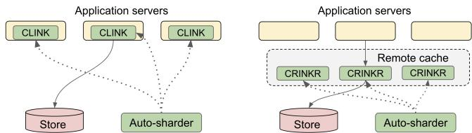  
Figure 1: CLINK (in-process) and CRINK-R (remote) architectures.

A distributed write-through cache can provide linearizable reads, but several challenges must be addressed. First, to be usable as a general solution it must remain loosely coupled with storage so each layer can evolve independently. Second, it must scale to hundreds of millions or billions of keys. Third, for high performance and availability, the cache must handle dynamic resharding of keys, e.g. to move keys from unhealthy to healthy pods or for load balancing purposes.

Finally, the most significant challenge, which serves as the primary focus of this paper, is a subtle race condition we term the delayed-writes problem. When resharding occurs and a key is reassigned, the previous owner may still have writes in flight to storage. If the new owner reads and caches values before those writes arrive, the late writes can update storage and render the new owner’s cache stale. This puts the new owner at risk of serving stale data. The delayed-writes problem is not a hypothetical possibility. Write operations have been observed in production systems [18, 67] to stall for extended periods, with GitHub reporting packets remaining in flight for approximately ninety seconds during an outage [82]. Such slowdowns can cause writes to arrive at the storage layer long after key ownership has changed in the application. Preventing delayed writes from committing after ownership changes is therefore essential for serving linearizable reads.

To address the delayed-writes problem, we introduce Write-Guards, a scalable and lightweight fencing mechanism that also enables loose coupling. Storage maintains WriteGuards as soft state: a small map from key ranges to opaque tokens checked on each write. On cache key ownership changes, the new cache pod owner installs WriteGuards over key ranges in storage to block delayed writes from prior owners. Write-

Guards enable decoupling of ownership logic in the cache layer from storage, allowing both systems to evolve indepen dently. Because WriteGuards are simple, efficient, and broadly applicable, we recommend that providers of distributed storage systems expose them as a standard write-fencing primitive.

We leverage WriteGuards to construct in-process and remote caches that serve linearizable reads directly from memory. In these designs, new owners install guards in storage to block delayed writes. Our in-process solution, CLINK (Consistent Linked In-memory Key-value cache, Figure 1), keeps data in the application address space. A read from CLINK is equivalent to a linearizable read from storage, making it a transparent cache over the underlying store. For shared or multi-tenant scenarios, we present a remote strongly consistent cache, CRINK (Consistent Remote In-memory Key-value cache), with two architectures: CRINK-R (Figures 1 and 9) stores versions and values in a remote tier, whereas CRINK-L (Figure 10) stores only versions, allowing it to be paired with any lookaside cache (e.g., Redis). In all our designs, the cache is write-through; all writes flow through it to storage. The write throughput remains bounded by the storage system, ensuring the cache adds no new write bottleneck.

Like other modern cache systems, we address the third challenge of high performance and availability via an autosharder [7, 9, 53]. Improving over static placement schemes such as consistent hashing, auto-sharders dynamically reshard key ranges to handle autoscaling, pod failures, rolling upgrades, and load imbalance. They scale by tracking sharding metadata at the range rather than key level and can ensure that all pods agree on the key-to-pod assignment, which CLINK and CRINK rely on to support linearizable cached reads.

Both caches handle hot keys by letting the auto-sharder isolate a key and create replicas, with one acting as primary. Reads for a key can be served from storage by any pod, or directly from the in-memory cache of the pod currently assigned that key. All writes flow through the primary and follow a two-phased inval idation protocol. This could suggest reduced write availability during pod restarts. However, because unplanned failures are rare and the auto-sharder performs proactive resharding during planned restarts, the observed write unavailability remains extremely low (below 0.001%, see §2.3.2). Hence, CLINK and CRINK provide scalable, low latency linearizable reads across replicas while preserving high write availability.

Our approach extends to cross-datacenter environments, where caching offers significant benefits for geo-distributed applications using global stores like Spanner [30] by reducing expensive WAN traffic. However, we limit the scope of this paper to single-datacenter environments.

We implemented WriteGuards in TiDB [44] and built CLINK and CRINK in C++. Using production traces from Meta [5, 15], Twitter [88], and an internal workload from Unity Catalog at Databricks, we show CLINK reduces P read latency by orders of magnitude relative to accessing storage (from 10.3ms to 4.2µs). For shared data access or multi-tenant deployments, our remote caches CRINK-R/CRINK-L achieve up to 3.6 − 5.2× lower P90 read latency than direct storage access, and 2.2−2.4× lower latency compared to alternative consistent remote caches.

This paper makes three contributions:

• WriteGuards: a lightweight storage-level fencing mechanism that operates on dynamic ranges to prevent delayed writes from previous owners after resharding, and which can be easily added to a distributed store.

• Strongly consistent caches: CLINK, the first strongly consistent distributed cache that serves scalable, linearizable reads directly from application memory while remaining independent of storage, and its variants CRINK-R and CRINK-L which can be deployed remotely.

• Implementation & evaluation: we have integrated WriteGuards in TiDB and demonstrated their use in building performant linked and remote caches.

## 2 Background

In this section, we introduce the application, storage, caching, and auto-sharding model that motivates our design choices, providing the architectural context needed for the later sections on supporting linearizable cached reads.

## 2.1 Application and storage model

Many large-scale datacenter services process requests keyed by logical identifiers across billions of keys. Each request issues reads and writes for a specific identifier, such as a CustomerID. Underlying systems like DynamoDB [76], FoundationDB [100], and TiKV [44] support these per-key operations. The identifier often prefixes the full storage key (e.g., CustomerID in <CustomerID, WorkspaceID>); we denote this key as C.

## 2.2 Distributed caching for latency and scale

Remote lookaside caches (Figure 3) like Memcached or Redis offload storage but incur network latencies, serialization, and queuing costs [8]. In contrast, linked in-process caches like CLINK (Figure 1) store objects in native formats, avoiding remote lookups for significantly lower latency [8, 9].

This efficiency is critical for services storing large values (MBs–GBs). Remote caches struggle with partial reads of these values: returning the entire object causes overreads [8], while partial fetching often amplifies one API call into 10–30 network requests. Linked caches eliminate this overhead, turning expensive network operations into cheap local function calls.

## 2.3 Auto-sharders

To scale caches, modern systems partition keys across pods using auto-sharders [9, 53] rather than using static schemes like consistent hashing. At Databricks, auto-sharding serves more than half of all services and nearly all critical ones. These systems dynamically split, merge, and reassign contiguous key ranges, or slices, to handle load imbalance, hot keys, crashes, and to support high performance and availability. Auto-sharders also coordinate with cluster managers for planned restarts and migrate state during reassignment [53] to avoid storage reads. Figure 2 illustrates a sample mapping.

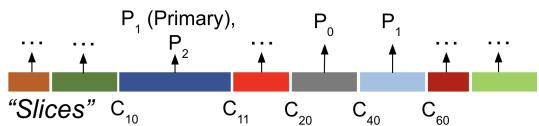  
Figure 2: An example assignment of slices to pods. Each slice is assigned to one or more replicas, with one as primary for writes.

Auto-sharding is also integral to storage systems. For example, Bigtable’s master and TiDB’s Placement Driver place and rebalance tablets, which are key ranges with associated records, across storage servers, also called tablet servers.

Figure 3 shows how auto-sharders route requests across the cache and storage layers. A request for customerC45 is directed to cache pod P , which owns slice [C ,C ). A cache hit returns immediately. On a miss, the pod issues a lookup to tablet server S1, which hosts tablet [C30,C50), retrieves the value, populates the cache, and responds to the client. Linked caches follow the same routing logic except that the request goes directly to the application pod that owns the slice and stores the cached data locally. The caching layer and the storage layer are loosely coupled and sharded differently based on their respective load.

## 2.3.1 Features for scalability and strong consistency

Modern auto-sharders provide mechanisms that help services handle skewed workloads, scale under heavy demand, and achieve exclusive ownership over keys.

Hot key detection and replication: Many large-scale systems experience load imbalance driven by hot keys, which attract far more traffic than others in domains such as social media, ML serving, and content platforms [9, 43, 55, 59, 66, 67, 90]. Auto-sharders detect these hotspots and isolate the hot key onto its own slice and pod [9, 53]. When even a dedicated pod cannot meet demand for the hot key, the auto-sharder employs asymmetric replication, creating multiple replicas of only the hot key and assigning one to be the primary to handle writes. This approach scales throughput in proportion to key popularity. For example, Figure 2 shows key C10 isolated and replicated across P1 and P2, with P1 acting as the primary.

Strong ownership guarantees: Auto-sharders [7, 9, 53] support ensuring that at most one pod holds authoritative ownership of a key at any time. Our auto-sharder generalizes this model by producing assignments that all pods agree on, including which pods act as primaries when replicas exist, a property we call Assignment Consistency. To implement this efficiently at scale, the auto-sharder grants leases over key ranges rather than individual keys, amortizing coordination overhead across many keys while preserving consistent ownership semantics. The server library exposes the following API:

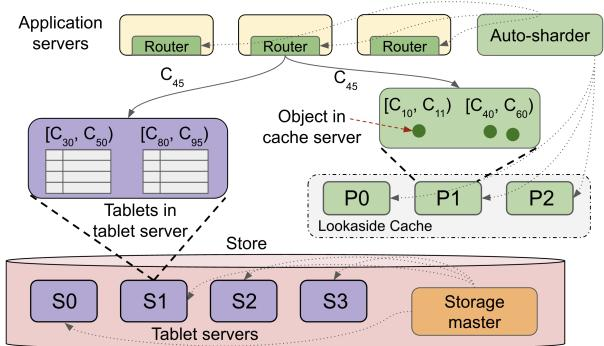  
Figure 3: Auto-sharders assign and rebalance key ranges across cache or tablet servers to maintain performance and high availability.

GetSliceHandle(KeyRange) → SliceHandle   
IsStillAssigned(SliceHandle) → Bool   
IsPrimary(SliceHandle) → Bool

The GetSliceHandle API returns a SliceHandle for a key range [lowInclusive, highExclusive) where a single key is simply a singleton range. The IsStillAssigned API verifies that the GetSliceHandle’s range has remained continuously assigned to the pod since the handle was acquired, acting as a lightweight lease check implemented internally by the auto-sharder. When the auto-sharder assigns key K to pod P, the time interval until K is reassigned defines P’s period of ownership. If a key is replicated, IsPrimary says whether the pod is the primary replica for that SliceHandle’s range.

## 2.3.2 Availability impact of restarts and crashes

Strong ownership allows a cache implementation such as CLINK to let the pod that owns a key K serve linearizable reads directly from memory, since all writes on K are guaranteed to route through that pod. Ensuring strong ownership, however, necessarily introduces an availability tradeoff when ownership must move, for example during pod restarts or crashes.

In the common case of planned restarts, auto-sharders integrate with the cluster manager to receive advance notice and proactively migrate affected key ranges before the restart occurs. In systems enforcing strong ownership, this involves transferring leases for those key ranges from the restarting pod to other pods. In the common case, these transfers complete within milliseconds, resulting in minimal availability impact.

In rare cases, however, restarts are unplanned, for example due to a segfault or OOM. In these situations, the old owner’s lease must expire before another pod can safely assume ownership, which in practice results in order tens of seconds of unavailability for the key range. Though this may seem disastrous for availability, Figure 4 shows that such unplanned failures in production occur only once in roughly 750 to 2000 restarts, consistent with industry observations that critical services are engineered for robustness [80,84]. In a 100 pod ser vice, this corresponds to roughly one crash every two months. Even if a single pod becomes unavailable for 30 seconds and temporarily affects 1% of keys, overall daily availability still exceeds 99.999%, making the practical impact negligible.

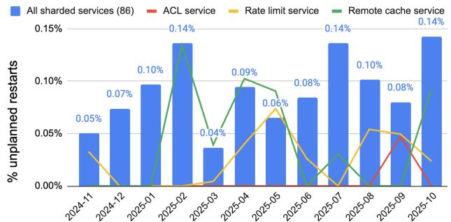  
Figure 4: Global % of unplanned restarts across 86 sharded services in production by month. Critical path services for caching, ACLs, and rate limiting generally have few to no crashes in a given month.

## 3 Motivation

Large scale services increasingly need both low latency and strong consistency, yet existing storage and caching layers struggle to provide both efficiently.

## 3.1 Low-latency reads are critical

Low tail latency is essential in serving scenarios [18, 67] as well as for interactive and data-intensive services. In practice, reads often suffer 1–5 ms tails due to queuing and concurrency, despite sub-millisecond network RTTs. Because requests fan out into many key-value RPCs, small delays compound into tail amplification [34, 35, 41, 51], impacting systems like Facebook’s web search [18, 67], Google Search [34], Zanzibar [46], Presto [38], Michelangelo [1], and TFX [14]. This forces substantial overprovisioning to meet strict SLOs (e.g., DynamoDB [4], Cosmos DB [3], TAO [2]). Research systems [37, 50, 57] report tens of microseconds, but rely on dedicated hardware and limited multi-tenancy rather than production environments.

## 3.2 The need for linearizable reads

Many large-scale services require that reads reflect the latest committed value. Systems such as Spanner [31], CosmosDB [3], and Dropbox [81] provide linearizable reads. Such guarantees are also essential in domains like financial trading [19] and ad bidding [72]. Stale reads introduce subtle, hard-to-diagnose anomalies, such as stale permissions in Zanzibar [46], outdated metadata in Presto [38], or inconsistent features in TFX [14]. Similarly, our internal governance and query routing systems require these guarantees to prevent incorrect permission checks and session-dependent execution.

## 3.3 Storage is slow and costly for reads

Transactional stores (e.g., Spanner [31], CockroachDB [79], TiDB [44]) provide strong semantics but incur protocol overheads and serialization costs. This results in multi-millisecond tail latency and high variability, making them unsuitable for latency-critical paths. Storage is also costly at high request rates, offering limited throughput and requiring significantly more compute than in-memory caches [62]. Consequently, services offload read-heavy workloads: Facebook’s Memcache fleet handles massive latency-sensitive volumes [67], and TAO [18] optimizes for social graph lookups. Serving such traffic directly from storage would impose prohibitive operational costs.

## 3.4 Caches are fast but typically not consistent

Distributed caches reduce latency and cost by serving hot data with sub-millisecond performance and high throughput [18, 67]. However, they provide only eventual consistency: values become stale immediately after a write and are later refreshed via timeout (TTLs), polling, or explicit invalidation. This occurs because remote lookaside caches (e.g., Memcached) sit off the write path, while linked caches see only local writes unless ownership is coordinated across pods. As a result, achieving low latency, linearizable reads, and high availability together remains difficult.

## 4 The Delayed-Writes Anomaly

To achieve low-latency linearizable reads, we consider a write-through in-process cache, loosely coupled with the storage system, in which applications issue both reads and writes through the cache. An auto-sharder provides ownership over keys (§2.3.1). However, despite this exclusive ownership, a subtle but important anomaly can still occur, causing the pod to serve stale reads:

Delayed-write anomaly. A delayed write for key K is a write that commits in the storage system after a new owner has already assumed ownership of K in storage.

Ownership at the caching layer is not enough. A pod must also become the owner in the storage layer before assuming that no other writes can succeed. Otherwise, a write from a previous owner may commit after ownership has changed at the caching layer, and cause the cache to return stale values. Preventing delayed writes is therefore essential for any strongly consistent cache.

## 4.1 Example: Delayed writes

We now show a resharding scenario in Figure 5 where the delayed-writes problem can occur. The sequence unfolds in the following steps:

1. Pod P1, which has exclusive ownership over slice [C ,C ) issues a write with an OCC check: “Write key C45 with version V2 if its current version is V1.”

2. The auto-sharder reshards [C40,C60), assigning [C40,C50) to pod P0 and [C50,C60) to P2 .

3. Pod P0 reads C45 from the database and observes the latest committed version V1.

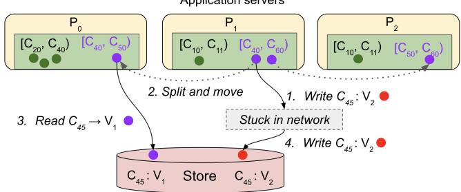  
Figure 5: A delayed write of Write(C ,V ) that comes in after P has read version V1 of C and cached it in memory.

4. The delayed write from P1 arrives, passes the version check, and commits version V2 for C45.

The store now contains V2, yet P0 may still cache and serve V , violating linearizability. P assumes exclusive ownership of key C when caching V , but this is incorrect because it never established ownership in storage, allowing a delayed write from P to commit. The same issue can occur after a pod restart in a statically sharded cache (e.g., via consistent caching), where a new instance rebuilds its cache but an old in-flight write later commits and leaves the cache stale.

Although seemingly rare, long in-flight delays are well documented. Large systems suffer network anomalies where packets linger for minutes due to corrupted NICs or aggressive TCP retransmission backoffs [12]; GitHub similarly reported packets delayed for ninety seconds [82]. Delays need not be network-related: stop-the-world GC pauses and runtime stalls [49, 77] can last minutes in production workloads [58], and a buffered write may be released only after ownership has moved. In comparison, key reassignment is fast (e.g. 20ms). These real-world anomalies confirm that strongly consistent caches must explicitly guard against delayed writes.

## 4.2 Existing delayed-write prevention methods

Delayed writes can be prevented, but current mechanisms are slow, inefficient, or unscalable.

## 4.2.1 Version check on every read

One option is verifying each read against storage before serving, e.g., in Figure 5, the pod will not return C45’s stale value if V2 is already committed in storage. This ensures correctness but forces a remote version check on every read, adding latency and load which significantly reduces caching benefits [63].

## 4.2.2 Convert reads into metadata-writes

Alternatively, the first read for each key after ownership transfer can perform a write to advance the version (e.g., P bumps C45 to V ′), ensuring prior delayed writes fail their OCC check. However, this places a write on the critical read path, increasing latency and storage load.

## 4.2.3 Sequencer-based fencing in Chubby

Another approach to preventing delayed writes uses a lease management system such as Chubby [20] in conjunction with a storage system such as Bigtable [26]. Chubby provides a mechanism called sequencers. At any time, an application holding a lease can request the lease’s sequencer, an opaque byte string that captures the state of the lock immediately after acquisition.

When an application performs a Bigtable write, it can attach a sequencer. Bigtable can then use the sequencer to verify that the application still holds the lease or that the sequencer is newer than the most recent one observed by the server. However, this approach requires application servers to acquire leases for every key they cache and requires the storage system to maintain per-key lease or sequencer state. In large multitenant deployments, applications may cache tens or hundreds of millions of keys, making this approach prohibitively expensive for the lease service, application servers, and storage backend. Consequently, sequencer-based fencing does not scale well for fine-grained caching systems. In our experience, this usage pattern was uncommon in production and discouraged by Chubby SREs because of the operational overhead it imposed. Additionally, it tightly couples the storage system and lease service by introducing an external dependency on the write path.

## 4.2.4 Synchronized clocks (e.g., TrueTime)

One possible solution to the delayed writes problem is to leverage synchronized clocks such as TrueTime in Spanner [31]. In this design, the storage system must provide timestamp-based write fencing, rejecting writes whose timestamps exceed a configured threshold T. When ownership of a key changes, the new owner waits for T seconds before serving requests, ensuring that delayed writes from the previous owner can no longer be accepted.

In this approach, choosing T involves a tradeoff. A value that is too small may reject legitimate writes under transient delays, while a value that is too large increases the unavailability period during ownership transitions. Moreover, the approach depends on specialized clock synchronization hardware that is often unavailable in public cloud environments, making it unsuitable for many general-purpose deployments.

## 4.2.5 Approximate correctness via timeouts

Given the rarity of unplanned pod failures, one might consider coordinating ownership transfer directly with the source pod. Under this approach, a slice is not reassigned until the source pod has drained all outstanding writes and explicitly acknowledges that ownership can be transferred.

While appealing in the common case, this design tightly couples the autosharder to application-specific logic and requires additional mechanisms to ensure liveness when the source pod crashes, becomes unreachable, or fails to respond. One possible approach is to assume bounded write delays and delay ownership transfer until the worst-case write latency has elapsed. Unlike leases, however, which derive their correctness from hardware-based bounds on local clock rates, this approach relies on a bound on write latency as measured across machines. Since no such bound exists in an asynchronous distributed system, the approach cannot provide formal correctness guarantees and instead only decreases the likelihood of stale writes.

## 5 The WriteGuard Primitive

We now present WriteGuards, which enable a loosely coupled cache to support linearizable cached reads. It does so by allowing the owning pod upon assignment of a new slice to establish ownership of the corresponding key range in storage. Unlike per-key approaches, WriteGuards scale to handle applications with millions to billions of keys efficiently by operating on key ranges. This requires only two storage operations: installing a guard and checking incoming writes against it.

## 5.1 WriteGuard installation

The storage system exposes a SetGuard(range, guardValue) call that associates an opaque guard value (denoted by WG) with a key range. If a newly assigned slice spans multiple tablets, the caller must split it into subranges and issue the SetGuard call to the appropriate tablet servers either through the client library or a higher-level layer. Figure 6 shows a case where CLINK splits the range [C40,C60) into two calls to the relevant two tablets since C50 is a splitpoint: SetGuard([C40,C50), WG5) and SetGuard([C50, C60), WG6). Splitpoints or tablet boundaries can be discovered by periodically probing the storage layer using standard APIs available in existing systems [31,44]. An up-to-date view improves efficiency but is not required for correctness: if the tablet layout changes, servers return a status code indicating the change, and the caller can then obtain the new boundaries and retry the SetGuard calls.

Tablet servers maintain an in-memory interval map that associates non-overlapping key ranges with their guard values. This metadata is soft state and not persisted. On startup, a tablet initializes its full key range with an empty guard (lazy initialization is possible, but we assume eager initialization for clarity). When a SetGuard(R, WG) request arrives, the tablet intersects R with its owned ranges and updates the corresponding entries in the interval map, overwriting any existing guards in that region. In Figure 6, the two tablets install WG5 on [C40,C50) and WG6 on [C50,C60), while [C30,C40) and [C60,C80) keep their previous guards. Each tablet then acknowledges the request.

Stale splitpoint maps cause SetGuard calls to hit the wrong tablet server and return a TabletLayoutChanged error. CLINK catches this error to refresh the map and retry the call.

## 5.2 WriteGuards and tablet resharding

Storage-layer reshardings are relatively infrequent and typically triggered only under sustained load over minutes, since splitting or migrating tablets is expensive in systems such as Bigtable, Spanner, and HBase [21, 25, 31]. WriteGuards must be updated correctly during these operations.

When a tablet is split, each resulting tablet inherits the guard

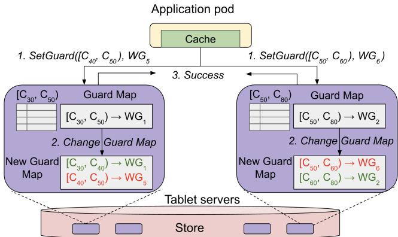

Figure 6: Installing a WriteGuard across two tablets. Upon receiving two slices, [C40,C50) and [C50,C60), the application pod generates two guard values (WG , WG ) for each slice, and issues SetGuard to two tablets based on the cached splitpoints of tablets at the tablet servers.

values of the original tablet. After a merge, the new tablet keeps the distinct guard values for the subranges contributed by each source tablet. (In practice, systems may need to bound the number of retained guards to avoid excessive metadata, though we did not explore this in our prototype.) For simplicity, our prototype drops guard metadata during tablet migrations rather than transferring it. This does not affect correctness, and we found that retaining guards across migrations offers negligible benefit relative to the complexity of moving guard state between tablet servers.

## 5.3 Checking writes with WriteGuards

The storage system is also extended to validate a write’s supplied WriteGuard against the installed WriteGuard for the key’s corresponding range. A tablet server accepts writes only if the guards match, thereby rejecting delayed requests from previous owners. For example, in Figure 6, the tablet server would reject a delayed write for C carrying WG1 because the WriteGuard in storage has been updated to WG5. This design also ensures backward compatibility. Applications not using WriteGuards omit guard values, resulting in matching empty guards that trivially pass validation. This allows the storage system to enforce checks uniformly without requiring application changes.

## 5.4 Example: Preventing delayed writes

We now revisit the example from Section 4.1 to illustrate how WriteGuards prevent delayed writes. In that scenario (Figure 5), pod P1 issued a write that updated key C45 from version V to V . The write became delayed in the network while the slice [C ,C ) was resharded, causing the subrange [C ,C ) to be reassigned to pod P .

Under our approach, P first installs a new WriteGuard, Wnew, on the tablet server(s) responsible for the reassigned range and then reads key C45, observing version V1. Later, when the delayed write carrying version V2 arrives at the tablet server, the write is rejected because its WriteGuard, W , does not match the currently installed WriteGuard,W . As a result, the stale write cannot overwrite data owned by the new pod.

## 6 CLINK: Serving linearizable cached reads

In this section we present CLINK, an auto-sharded cache linked directly into application pods that scales to handle millions to billions of keys. It provides linearizable reads while remaining loosely coupled to storage. CLINK allows reads to access storage from any pod to preserve high availability, but only pods assigned the key may serve reads directly from their local cache. CLINK uses WriteGuards to avoid delayed writes and scales by operating on key ranges rather than individual keys. To ensure linearizable cached reads, CLINK maintains the following invariant:

Latest State Invariant (LSI). A key K may be served from   
the cache only if it equals the latest committed value of K   
in storage.

This invariant makes the cache transparent to applications, since serving from memory is indistinguishable from serving from storage. A direct consequence is: when a pod issues a write on K, its cached value cannot be returned until that write has fully committed.

Note that we focus solely on LSI and linearizable reads. All other aspects of storage correctness are handled by the storage system’s own transactional or consistency model, which operates independently of the mechanisms we introduce. For clarity, we defer optimizations such as buffering repeated reads and rejecting writes during a SetGuard call to §6.6. The remote variants of CLINK is discussed in §7. Detailed steps for various aspects of ownership, reads and writes are presented in Algorithms 1, 2 and 3.

## 6.1 Types and data structures

Each CLINK pod uses two main types. The first, GuardHandle, tracks a WriteGuard, the key range it covers, and the Slice-Handle for that range. The second, OpHandle, captures the GuardHandle in effect when a request was issued to the store, the operation type (RD or W R), and a boolean flag writeOverlap indicating if any write overlapped with that operation.

GuardHandle = (KeyRange, WriteGuardID, SliceHandle)   
OpHandle = (opType, writeOverlap, GuardHandle)

Each CLINK pod maintains three data structures. The CacheMap stores cached values. The GuardMap maps WriteGuard ranges to their associated GuardHandles and supports lookups by key or by range. The OpMap tracks all pending operations to storage. Together, these structures enable CLINK to serve linearizable reads while being auto-sharded. We write GuardMap[K] to denote a lookup of the GuardHandle for key K.

GuardMap : KeyRange → GuardHandle   
CacheMap : Key → (GuardHandle, Value)   
OpMap : Key → Array[OpHandle]

## 6.2 Preventing delayed writes via WriteGuards

We now describe how WriteGuards are installed on ownership changes via Algorithm 1 and how they prevent delayed writes.

## 6.2.1 Handling ownership change

Upon receiving a new assignment, CLINK acquires a SliceHandle for each newly assigned slice S, intersects S with the tablet ranges, and generates a unique WriteGuard value (e.g., a UUID) for each intersected sub-interval Ri (lines 7–9). These sub-ranges are precisely the key ranges in the storage layer that must be protected from delayed writes before CLINK can assume ownership of S. CLINK periodically refreshes tablet split points from the store to keep this mapping current. For each R , the pod issues a SetGuard call and installs the resulting GuardHandle in the GuardMap if the call succeeds and ownership has remained continuous (lines 11–13) – checking whether the slice S has been assigned to the current pod since the SliceHandle’s creation. Figure 8 illustrates this process for a newly assigned slice [C40,C60), resulting in two SetGuard calls for the tablet ranges [C40,C50) and [C45,C60).

If the store reports a tablet-layout change, CLINK refreshes its cached split points and restarts the procedure (lines 14–15). If a SetGuard call times out, it is retried with a fresh unique WriteGuard value (lines 16–17). If ownership has been lost, CLINK aborts creation of the GuardHandle for Ri.

Algorithm 1 Assignment Handling (Red means critical section)   
1: procedure HANDLENEWASSIGNMENT(Asn)   
2: for each new/removed slice X in Asn do   
3: Clear GuardMap[X]   
4: for each new slice S in Asn do   
5: HANDLENEWSLICE(S)   
6: end procedure   
7: procedure HANDLENEWSLICE(S)   
8: for each range Ri in intersection of S and store splitpoints do   
9: Obtain SliceHandle SH   
10: Create unique WriteGuard WG   
11: status ← SETGUARD(Ri, WGi)   
12: if ISSTILLASSIGNED(SH ) then   
13: if status == Success then   
14: GuardMap[Ri] ← GuardHandle(WGi, Ri, SHi)   
15: else if status == TabletLayoutChanged then   
16: Refetch store splitpoints and retry from line 8   
17: else ▷ SetGuard call had a timeout   
18: Retry from line 10 with a new WriteGuard   
19: end procedure

## 6.2.2 WriteGuard ordering

CLINK enforces the following rules on SetGuard calls:

1. Ownership-contained. CLINK creates GuardHandles only for WriteGuards whose SetGuard calls both started and finished within a single ownership period.

2. Non-overlapping. Within any ownership period and for any key K, CLINK allows at most one outstanding SetGuard call whose range covers K.

3. Unique-valued. Every SetGuard call issued by CLINK (including retries) uses a fresh WriteGuard value.

Figure 7 illustrates these rules with four GuardHandles, G1 through G4, created across three exclusive ownership periods E , E , and E established by leveraging the strong ownership guarantees of the auto-sharder (§2.3). Each SetGuard call installs a unique WriteGuard value (WG , WG , WG , WG , and the delayed WGDELAY ED described later). The GuardHandles are created only when the corresponding SetGuard call both begins and ends within the same ownership interval. In ownership interval E2, the calls that produce G2 and G3 are nonoverlapping. In contrast, WGDELAY ED comes from a SetGuard call that either timed out or returned so late that it violated the ownership containment rule and thus has no GuardHandle.

Mutually exclusive periods of ownership  
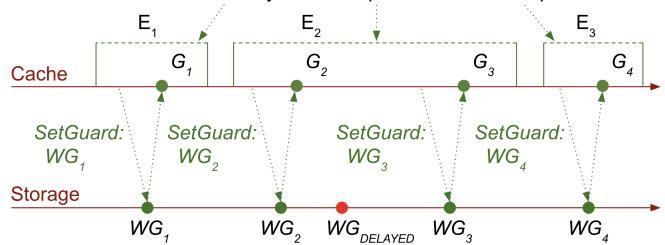  
Figure 7: Relevant WriteGuards (green) are ownership-contained and non-overlapping.

We next show how the first two rules induce, for each key, a total order on GuardHandles that aligns with the per key installation order of their WriteGuards in storage. The importance of the last rule is discussed in the next section.

First, because ownership periods are totally ordered by the auto-sharder, the ownership-contained rule ensures that any GuardHandle created in a later ownership period follows all GuardHandles from earlier ones. Further, each WriteGuard is installed between the start and end of its SetGuard call, and that call lies entirely within a single ownership period, so the WriteGuards inherit the same total order. In the figure, WG2 and WG3 (for G2 and G3) follow WG1 (for G1).

Second, within a single ownership period, the non-overlapping rule ensures that each SetGuard call must finish (or time out) before the next one begins. Again because each WriteGuard is installed at some moment during its SetGuard call, the WriteGuards appear in storage in the exact order of those calls. The corresponding GuardHandles are created in the same order (for example, WG3 appears after WG2).

Therefore, we have the following property:

WriteGuard Ordering. All GuardHandles form a total order, and their corresponding WriteGuards in storage follow the same order. We call the WriteGuards associated with these handles relevant. All others are irrelevant.

## 6.2.3 Why relevant WriteGuards prevent delayed writes

Relevant WriteGuards prevent delayed writes since once a new owner creates a GuardHandle, its relevant WriteGuard is installed strictly after all relevant WriteGuards from prior owners. Furthermore by the unique-valued rule for WriteGuard values (rule 3), all WriteGuards in storage (relevant or not) are unique. Thus any delayed write from a previous owner has a WriteGuard that cannot match the new owner’s relevant WriteGuard, so such writes are rejected. This guarantees that all future reads by the new owner are protected.

## 6.3 Handling writes and reads

We now present the handling of write (Algorithm 2) and read operations (Algorithm 3).

## 6.3.1 Write operations

Upon a write to K, CLINK rejects the request if the WriteGuard is missing or ownership is lost (lines 2–6). The latter is an optimization, as the write would likely fail anyway due to the new owner’s WriteGuard. CLINK then evicts K to preserve LSI, as the pending write renders the storage value unknown. Finally, it flags pending operations as overlapping (lines 8–9) and sets the request’s writeOverlap bit if another write is in flight (line 10). Figure 8 phase (b) shows the case of a write for C which overlaps for a read for the same key and thus sets the read operation’s writeOverlap bit, causing the result of the read to be uncacheable (see §6.3.3).

Algorithm 2 Write Operation (Red means critical section)   
1: procedure WRITE(K, V)   
2: if GuardMap[K] is empty then   
3: return error ▷ Reject: no WriteGuard protection   
4: guardHandle ← GuardMap[K]   
5: if not ISSTILLASSIGNED(guardHandle.SliceHandle) then   
6: return error ▷ Reject: lost continuous ownership   
7: Evict CacheMap[K] ▷ Writes invalidate the cache   
8: for each op X in OpMap[K] do   
9: X.writeOverlap ← true ▷ Prior ops overlap w/ write   
10: writeOverlap ← (OpMap[K] contains write?)   
11: opHandle ← OpHandle(WR, writeOverlap, guardHandle)   
12: Add opHandle to OpMap[K]   
13: status, result ← SENDWRITE(K, V)   
14: if status == Success then   
15: CacheMap[K] ← (guardHandle, result)   
16: if not SATISFIESLSI(opHandle) then   
17: Evict CacheMap[K] ▷ Unsafe value, LSI not guaranteed   
18: return result   
19: else if status == Timeout || WriteGuardMismatch then   
20: if not ISSTILLASSIGNED(guardHandle.SliceHandle) then   
21: return error ▷ Reject: lost continuous ownership   
22: Clear GuardMap[K]   
23: Install new GuardHandle   
24: Restart at step 1 ▷ retry with fresh guard   
25: else   
26: return error   
27: end procedure

CLINK then executes the storage write. Successful results are cached only if they satisfy the LSI (lines 15–17). A timeout (line 19) signals a potential self-inflicted delayed write. To resolve this, or if a delayed WriteGuard error occurs, CLINK clears the GuardHandle, installs a fresh guard, and retries if it still owns K (lines 20–24).

## 6.3.2 Read operations

Read handling differs from writes because reads may be handled by any pod. When a pod owns K and the key is present in the cache, it may serve the cached value as long as ownership has been continuous since the entry was installed (lines 2–5 of the READ procedure). Figure 8 shows a case where C was read by a pod from storage and later served from the cache since it has continuous ownership and no writes have invalidated the cached value.

If a continuously owned value was not found, CLINK proceeds by evicting any entry if present (line 6) and reads from storage, setting writeOverlap if needed (lines 7–11). The result is returned to the caller and cached if it satisfies LSI.

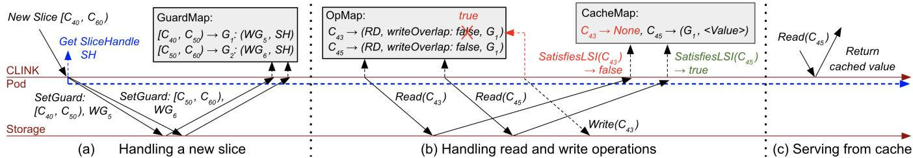  
Figure 8: Life of a slice assignment and serving reads and writes in CLINK. Details described in the text.

Algorithm 3 Read Operation (Red means critical section)   
1: procedure READ(K)   
2: if CacheMap[K] not empty then   
3: value ← CacheMap[K].value   
4: sliceHandle ← CacheMap[K].GuardHandle.SliceHandle   
5: if ISSTILLASSIGNED(sliceHandle) then return value   
6: Evict CacheMap[K] ▷ invalidate any stale cached value   
7: writeOverlap ← (OpMap[K] contains write?)   
8: guardHandle ← GuardMap[K] or null   
9: opHandle ← OpHandle(RD, writeOverlap, guardHandle)   
10: Add opHandle to OpMap[K]   
11: result ← SENDREAD(K)   
12: CacheMap[K] ← (guardHandle, result)   
13: if not SATISFIESLSI(opHandle) then   
14: Evict CacheMap[K] ▷ Unsafe value, LSI not guaranteed   
15: return result   
16: end procedure

## 6.3.3 Cacheability

CLINK caches results only if they satisfy LSI. It does this by ensuring no storage mutations occurred during execution. SATISFIESLSI (Algorithm 4) uses the OpHandle to rule out three mutation sources: (1) previous owners, by checking for WriteGuard protection (line 3); (2) the current owner, by ensuring no writes overlapped (line 4) which is checked with writeOverlap and (3) future owners, by verifying continuous ownership since WriteGuard installation (line 6). If these conditions hold, the value matches storage and is safe to cache.

Figure 8 phase (b) shows SATISFIESLSI returns false for the read of C43 since it was concurrently mutated by the current owner, but SATISFIESLSI returns true for the read of C45 (in phase (c)) as it was free of mutations from previous, current, or future owners (was continuously owned).

Algorithm 4 Check for cacheability (Red is critical section)   
1: procedure SATISFIESLSI(opHandle)   
2: guardHandle ← opHandle.GuardHandle   
3: if guardHandle == null then return false ▷ prev owner   
4: if opHandle.writeOverlap then return false ▷ current owner   
5: sliceHandle ← guardHandle.SliceHandle   
6: return ISSTILLASSIGNED(sliceHandle) ▷ future owner   
7: end procedure

## 6.4 Why CLINK serves linearizable reads

In this section, we demonstrate that CLINK guarantees linearizability. Since direct storage reads inherit storage guarantees, we focus on proving that cached reads satisfy LSI. CLINK achieves this by enforcing two invariants:

1. LSI-at-entry: The value satisfies LSI upon insertion into the cache.

2. LSI-at-serve: The value remains unchanged in storage between insertion and serving.

Algorithms 2 and 3 enforce LSI-at-entry by caching the operation’s return value and immediately checking LSI (with SatisfiesLSI, Algorithm 4), evicting the entry if the check fails.

To guarantee LSI-at-serve, CLINK employs two mechanisms. First, it evicts cached values on every local write (Algorithm 2, line 7), ruling out mutations by the current owner. Sec ond, it verifies continuous ownership before returning a cache hit, ruling out mutations by future owners (if the ownership is temporarily transferred to a different owner after the read initiates, the key will not be continuously owned when it returns). Mutations by previous owners are already precluded by LSIat-entry (via WriteGuards). Consequently, any value returned from the cache matches storage, ensuring linearizability.

## 6.5 Serving reads from multiple pods for scale

To support high-traffic keys, CLINK employs asymmetric replication (§2.3.1). A designated primary handles all writes and maintains the WriteGuard; upon leadership change, a new WriteGuard is installed to reject delayed writes.

Initialization and Ownership: Replicas initialize ranges as uncacheable. Once the primary installs an ownership-aligned WriteGuard, it notifies replicas to mark ranges cacheable and provides identifiers for the current ownership epoch so they can acquire the correct SliceHandles. Serving reads requires continuous group ownership: all pods in the replica set must remain assigned without interruption. Any membership change (notified by the autosharder and detected via SliceHandles) breaks this invariant, forcing replicas to evict cached entries, though reads may proceed directly to storage.

Write Protocol: Writes utilize a two-phase invalidation process. (1) The primary sends invalidation messages; replicas evict the key K and mark it uncacheable. (2) Upon receiving all acknowledgments, the primary writes to storage. (3) The primary sends a finish message (optionally piggybacking the new value), allowing replicas to restore K’s cacheability.

Failure Handling: If a write fails, the finish message restores cacheability. Timeouts trigger a new WriteGuard installation and retry (§6.3.1). If membership changes mid-protocol, Assignment Consistency (§2.3.1) ensures replicas detect the loss of group ownership and drop the corresponding ranges and mark the range uncacheable. Because resharding is infrequent, this simple rule is sufficient.

This design significantly increases read throughput and availability. While invalidating replicas adds slight write latency (§9.5), the impact on write availability is negligible due to the rarity of crashes (§2.3.2) and the auto-sharder’s rapid removal of unhealthy pods (§2.3.1).

## 6.6 Potential Optimizations

CLINK admits several future optimizations. First, request gating can buffer repeated reads on the same key so that only one storage fetch is issued. Second, storing value versions in the cache would enable finer cachability decisions. For example, if concurrent writes produce v8 and v9 while the cache holds v7, CLINK currently caches neither; checking versions would allow safely caching v9. Third, when a write fails, CLINK could install a new WriteGuard for only the affected key instead of the entire key range, though this risks creating many entries in the GuardMap. Finally, tagging reads with their WriteGuard would allow early detection of guard changes in storage (e.g., after a delayed SetGuard call), enabling timely refreshes.

## 7 CRINK: Strongly consistent remote caches

While CLINK provides linearizable reads at local memory latency, there are cases where a remote cache is the better fit. First, some environments cannot host stateful components because of serverless or stateless runtimes, memory limits, or operational restrictions. Second, service owners generally avoid exposing internal schemas, which means any shared dataset must be served through the owning service’s API, forcing that service to scale just to proxy reads. Third, some workloads do not shard cleanly. A single request may touch multiple keys, and forwarding these fanout RPCs through the owning service is undesirable [83].

A remote cache sidesteps these issues. The owning service retains exclusive control of writes and schema evolution while the cache absorbs read traffic, improving latency, increasing read throughput, and reducing demand on storage. A platform team can even operate this tier as shared infrastructure, though the owning service must grant it controlled read/write access.

We present a remote cache CRINK (Consistent Remote In-memory Key-value cache) with two possible architectures, CRINK-R and CRINK-L. Like other remote caches they cannot match CLINK’s performance because each access incurs network transfer, serialization overheads, and overreads [8]. They do, however, provide strong consistency, which traditional lookaside caches do not.

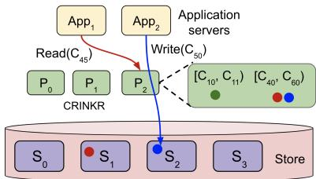  
Figure 9: CRINK-R: Remote deployment of CLINK. CRINK-R is a sharded strongly consistent remote write-through cache.

## 7.1 CRINK-R

CRINK-R (CRINK - Regular) deploys the CLINK architecture as a standalone caching service using a write-through pattern. It retains the auto-sharder and WriteGuard mechanisms to enforce ownership and consistency. Writes flow through CRINK-R to storage, and subsequent reads are served from memory. This setup runs CLINK out-of-process and allows downstream services to share a strongly consistent cache. Figure 9 shows an application writing key C50 through CRINK-R and reading C from the cache.

## 7.2 CRINK-L

CRINK-L (CRINK - Layered) decouples consistency metadata from value storage (Figure 10). A lightweight version service maintains auto-sharded assignment consistency while values reside in a generic lookaside cache like Redis that need not be consistent.

For reads the client queries both the version service and the cache in parallel. Once both fetches complete, if the versions match then it returns the cached value, as with C45 in Figure 10. If they differ it falls back to storage and may refresh the cache. For writes the client commits through the version service and pushes the value to the cache asynchronously, as with C50 in Figure 10. Any delay in this propagation is harmless because a version mismatch always triggers a storage read. A small client library can hide these details from applications.

CRINK-L improves on the monolithic CRINK-R design by enabling independent scaling, layered consistency, and flexible consistency. Independent scaling lets the value cache (e.g., Redis) replicate for scale while a separate service supplies small consistent versions. Because the approach is layered, it can add linearizability to existing eventually consistent caches. It is flexible since it allows applications to read from the cache for eventual consistency or consult the version service for linearizability. Note that Chrono offers similar capabilities but has several issues including temporary blocking of cached reads after each write (§4.2).

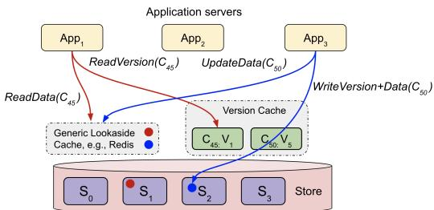  
Figure 10: CRINK-L: The version service maintains consistent versions, while values reside in an ordinary lookaside cache.

## 8 System implementation

Auto-sharder with strong ownership: We implemented an auto-sharder with strong ownership, inspired by Centrifuge [7]. When an assignment changes, the previous owner explicitly relinquishes its lease to ensure consistent transitions. The autosharder supports asymmetric replication as discussed in §2.3.1. It guarantees that all pods agree on the assignments; it supports the API to check continuous assignment of a key at the application pod without coordination with the auto-sharder. The assigner logic is implemented in about 12000 lines of Scala.

Cache: The cache is implemented in approximately 6000 lines of C++. We implemented the protocols and the data structures described in §6, i.e., GuardMap, CacheMap and OpMap. Storage splitpoints are obtained by periodically probing the underlying storage system (TiDB). We implement CLINK, CRINK-R, and CRINK-L as described above.

Storage: We used TiDB [44] as a representative distributed database. TiKV is the storage engine that TiDB uses. We add a new API (SetGuard) to TiDB (Version 7.5.1). The TiDB placement driver (PD) is responsible for splitting and migrating key ranges that are stored on TiKV. We modified TiDB (↑ 717 lines of Rust for TiKV, ↑ 229 lines of Go for TiDB SQL layer, and ↑ 57 lines of Go for PD) to add the support for WriteGuard installation and checking. WriteGuards are implemented as in-memory state, and are cleared upon storage pod restart or failure without affecting correctness. The entire TiDB modification took roughly 1 person-month, showing that changes are fast and lightweight.

## 9 Evaluation

Our evaluation addresses four questions:

• Per-core throughput: Does CLINK scale per-pod? Our unoptimized prototype reaches about 1M ops per core.

• WriteGuard overhead: What latency and throughput cost do WriteGuards introduce? WriteGuards add negligible overhead.

• Read performance: How do CLINK and CRINK compare to other strongly consistent caches? CLINK reduces read tail latency by three orders of magnitude, and CRINK improves tail latency by 2.2–2.4×.

• Multi-replica writes: What is the cost of serving a hot key from multiple pods? Additional replicas introduce modest coordination overhead on writes.

## 9.1 Methodology

Experimental setup All experiments run on production clusters. For storage, we use 9 TiKV pods, 6 TiDB pods, and 3 PD pods. Each TiKV pod is provisioned with 15GB of memory and 30 vCPUs. We use 6 pods for application servers, each is provisioned with 16 vCPUs and 16GB of memory. As is the case in most prior work [10, 36, 37, 47, 54, 60, 67, 68, 85, 91, 98–100], we measure latency from the application server’s perspective which is using the cache. The internal cluster runs on cloud networks with single-digit-millisecond latency.

Workloads We evaluate CLINK and CRINK using public Meta [5, 15] and Twitter [88] traces, plus an internal Unity Catalog (UC) production trace. While Meta and Twitter are simple key-value workloads, Unity Catalog reflects a complex serving workload where each request requires 6–8 storage fetches to compose the value. The traces differ significantly in read-write ratios and object sizes: Meta is ≈ 70% reads with ≈ 10B median values; Twitter varies from read-heavy (82– 99%) to write-heavy (31–50%) with 230B values; and Unity Catalog is read-heavy (99.4%) with large ≈ 23KB values. We present performance comparisons across all three traces in §9.4.1. Due to space constraints, the remaining focused evaluations use only Unity Catalog and synthetic workloads.

Baselines We compare our linked (CLINK) and remote (CRINK-R, CRINK-L) caches against several baselines. Chrono [81] (§4.2) uses the 5s attempt timestamp given in [81]. Version performs a storage version check on every read, while Storage accesses the underlying store directly.

## 9.2 CLINK throughput

We measured CLINK’s throughput as we increased the number of cores. Figure 11a shows that CLINK scales near linearly, sustaining approximately one million read operations per second per core, reaching 22.8 million QPS at 24 cores. Because all reads come directly from memory and require no cross-machine coordination, throughput grows proportionally with available CPUs.

Our throughput results are not intended to represent state-ofthe-art cache performance. The prototype focuses on validating the WriteGuard primitive rather than maximizing raw efficiency, so it omits optimizations such as lock-free indexing, advanced eviction strategies, CPU-cache-optimized data layouts, and kernel-bypass or co-designed network stacks [10,24,57,60, 61,91]. Even without these techniques, CLINK achieves reasonable CPU performance, and the experiments below show that caches using WriteGuards can provide practical and efficient linearizable reads without the penalties of prior approaches.

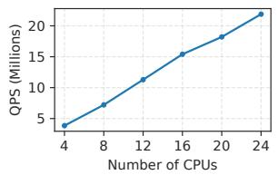

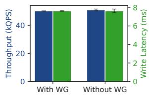  
Figure 11: (a) Throughput scalability of CLINK over increasing number of CPU cores (b) Overhead of WriteGuards (WG) on the storage layer, comparing both the throughput (kQPS) and the write latency (ms).

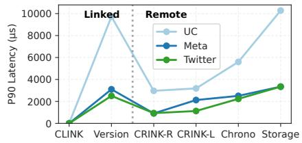

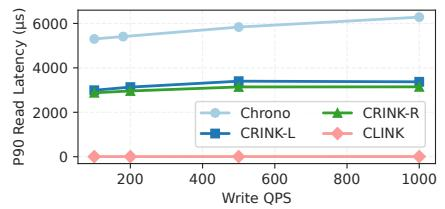

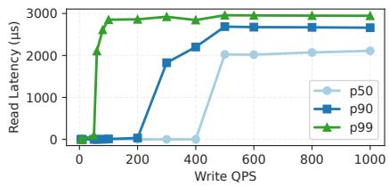  
Figure 12: Read latency analysis. (a) P90 read latency comparison across Unity Catalog (UC), Meta, and Twitter traces, comparing both the linked and remote deployments. (b) Performance comparison of CLINK against baselines with increasing write QPS over Unity Catalog traces. We adjust the write QPS by converting reads to writes in the trace. (c) CLINK read latency over a synthetic workload of increasing write QPS on a single key to stress test the impact on read latency.

## 9.3 Overhead of WriteGuards

To quantify the overhead of WriteGuards in the storage layer, we measured throughput and latency under a write-only workload designed to maximally stress the WriteGuard mechanism. Figure 11b presents the throughput and latency results at 75% storage layer CPU utilization. We observe that neither throughput nor latency is adversely affected by WriteGuards, as they introduce only a lightweight conditional check. Furthermore, SetGuard operations occur per assignment change (which is infrequent, as shown in Figure 14) rather than per write, thereby imposing minimal overhead on the storage layer.

## 9.4 Read latency evaluation

We now compare CLINK and CRINK against existing solutions, and analyze how write traffic and resharding affect read latency.

## 9.4.1 Performance on production traces

Figure 12a summarizes steady-state read latency. We omit P50 latency, as it follows a similar trend, and P99 latency, which primarily reflects cache misses. Across all systems and percentiles, CLINK demonstrates the lowest latency (P of 0.5µs–4.2µs), remaining well below remote caches and signifi cantly outperforming Storage (P90 of 4.8ms–10.3ms). Version (P90 of 3.3 ms-9.0 ms) offers only marginal improvement over Storage, as the latency is dominated by the overhead of accessing storage. By storing values in the application address space and leveraging WriteGuards to bypass coordination on the read path, CLINK achieves latencies orders of magnitude lower than the alternatives.

For remote caching architectures, Figure 12a demonstrates that CRINK-R/CRINK-L (P90 of 0.65ms–3.2ms) outperform Chrono (P90 of 2.3ms–5.5ms) across all workloads. This performance gap arises because Chrono writes use an attempt timestamp 5s in the future (the default recommended in [81]), preventing reads from being served from the cache for that duration after every write. Our measurements show that Chrono has a lower hit rate due to this; consequently, its P90 latency partially reflects storage access times. Chrono also adds additional latency on every read and write path, by requiring a concurrent timestamp check to the remote Chrono service that tracks timestamp bound per-key, adding some variability to read latency.

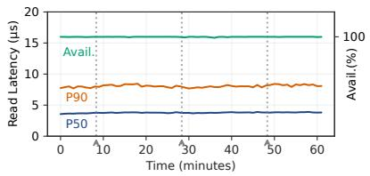

## 9.4.2 Sensitivity to write traffic

We next measure read latency sensitivity to write traffic. Figure 12b varies write QPS for the Unity Catalog trace (by converting reads to writes in the trace), comparing CLINK against CRINK-R, CRINK-L, and Chrono. Latency remains stable as in-flight writes increase, except for Chrono, where frequent timestamp updates narrow the cacheable read window. Since writes are distributed and few keys see high write QPS, the overall impact on read latency is minor.

Figure 12c shows an adversarial microbenchmark for CLINK varying concurrent write QPS on a single key. Since CLINK prevents cache population during writes, latencies rise to storage levels (2ms–2.8ms) when hit rates drop below the target percentile. Specifically, P99 spikes at 80 write QPS, while P90 and P50 spike at 200 and 400 QPS. These thresholds significantly exceed observed production rates for write QPS on a single key.

## 9.4.3 Sensitivity to resharding

Figure 13a shows that even during resharding events (with 0.5% traffic churn), CLINK maintains 100% availability and low latency. This is because key assignment is adjusted quickly (< 20 ms, small enough for retries to succeed), which results in negligible impact on read latency and availability. Figure 14 shows the percentage of load moved per minute for load balancing purposes for three production services, indicating that churn is typically < 0.2%. This means that resharding and the subsequent SetGuard operations triggered for the newly assigned slices have negligible impact on read latency.

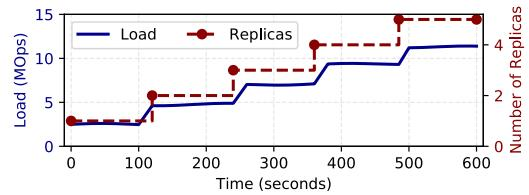

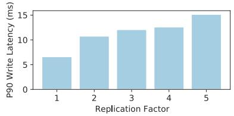  
Figure 13: CLINK characteristics. (a) CLINK maintains high availability and low latency during resharding events. (b) the auto-sharder increases replicas as load increases. (c) more replicas increases write tail latency by a small amount.

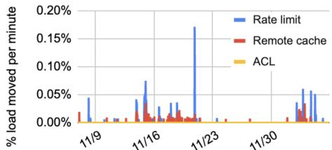  
Figure 14: Minimal churn observed in practice. Figure shows the percentage of load moved per minute for load balancing over 30 days for 3 critical services.

Similarly, upon rolling restart, the auto-sharder can proactively migrate the slices to the new pod with state transfer between old and new pod [53], ensuring minimal impact on latency.

Depending on the workload, the storage layer (e.g., TiDB) may also undergo resharding (Figure 15). However, the impact on service availability and write latency is negligible, as WriteGuards are preserved across ownership changes (§6.2.1).

## 9.5 Asymmetric replication

CLINK manages hot keys by first isolating the target key on a single pod, then asymmetrically replicating it across additional pods when load exceeds the capacity of a single pod. Figure 13b demonstrates the auto-sharder dynamically adding replicas as the read QPS increases. Figure 13c shows that write latency increases only modestly with additional replicas due to coordination overhead. We artificially lowered pod capacity for this experiment, as triggering 5 replicas on standard 16-core pods normally requires 80M+ QPS on a single key. Note that though 5 replicas incurs some overhead for writes, in our experience such workloads are dominated almost entirely by reads.

## 10 Related Work

To the best of our knowledge, loosely coupled caches that provide linearizable reads of state in storage remain largely unexplored. We summarize the most relevant approaches below.

## 10.1 Strongly consistent caches

The primary systems that support linearizable cached reads are Chrono [81] and Chubby [20]. Chubby introduces tight coupling, and per-key leases limit scalability. Chrono is remote, requires an additional round trip on each operation, and blocks cached reads for a period after every write.

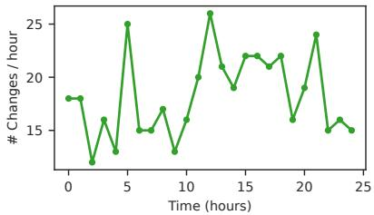  
Figure 15: Frequency of resharding events in the TiDB storage layer. The changes capture either the addition or removal of at least one shard. This shows resharding happens over tens of minutes of granularity.

## 10.1.1 Chrono

Chrono [81] provides linearizable reads from a remote cache by tracking, for each key, an upper bound on the commit timestamps that could have been assigned by the storage system, and then using storage-provided read timestamps to determine whether a cached value is guaranteed to reflect the latest possible write. Chrono assumes an underlying storage system with two properties. First, the storage system must support specifying maximum commit timestamp bounds on writes. Second, it must return read timestamps on reads that respect transaction ordering and that track current time.

More specifically, to perform a write, a client first proposes a new maximum commit timestamp bound for the key to Chrono. If the proposed bound is greater than the current bound, Chrono accepts it and the client issues the write to storage tagged with that bound. The storage system processes the write only if it can assign the write a commit timestamp less than the provided bound.

The cache stores values read from storage together with their corresponding read timestamps. On a cache lookup, clients read both the cached value and the latest timestamp bound for the key from Chrono in parallel. If the cached value’s read timestamp is greater than the latest bound returned by Chrono, the cached value is guaranteed to reflect all writes that completed before the read began, and is therefore linearizable. Otherwise, linearizability cannot be guaranteed from the cache and the read must be served by the storage layer.

This design has several drawbacks. First, unlike CLINK, the cache is remote, so all accesses incur remote cache latency. Second, clients must choose write timestamp bounds far enough into the future for writes to succeed, but larger bounds delay when storage reads become cacheable. For example, with the recommended threshold of 5 seconds, a write on a key K prevents cached reads of K for the next 5 seconds; any write rate higher than one every 50 seconds on a key yields a hit rate under 90%. Third, both reads and writes require an extra round trip to Chrono, adding latency and creating an additional availability dependency. Finally, the storage layer must support rejecting writes that exceed a maximum timestamp and must return read timestamps that are guaranteed to be greater than the last committed write. We believe these requirements are more invasive than our WriteGuard approach.

## 10.1.2 Synchronous invalidation (e.g. Chubby)

Another approach to strong consistency relies on reader leases and synchronous invalidation such as those provided by Chubby [20]. In such systems, a cache pod may serve a cached value only while it holds a lease for the corresponding key or object. Before committing a write, the storage system must synchronously revoke or invalidate all outstanding reader leases to ensure that no cache can subsequently serve stale data.

This approach tightly couples the cache and storage layers because the storage system must track cache ownership and coordinate invalidations across cache instances. It also scales poorly for distributed caches serving millions to billions of keys, as the storage system must maintain lease state for every cached key. In discussions with Chubby production engineers, we learned that synchronous invalidations increased load on the service because writes were forced to wait for lease recalls and invalidation acknowledgements. Slow, stalled, or crashed clients could delay writes until lease expiration, leading to high write tail latency and reduced throughput. To the best of our knowledge, no modern general-purpose scalable storage system exposes distributed reader leases or synchronous invalidation as a client-facing primitive.

Note that CLINK also uses synchronous invalidation when a hot key is replicated across multiple pods (§6.5). However, unlike lease-recall schemes that apply broadly across all keys, this mechanism is used only for the small subset of hot keys that require replication, substantially reducing the amount of coordination required in practice. In addition, invalidations are exchanged directly between application pods, rather than requiring the storage system to participate in lease recall from application servers.

## 10.2 Storage-layer caches

Many storage systems natively support automatic block or row caching of popular tables and rows for fast lookups [32, 45, 56, 69, 73–75, 86]. While such caches provide linearizable reads, the storage layer quickly becomes a performance bottleneck [88, 92, 93], causing practitioners to explore solutions based on external caches.

## 10.3 Caches with weak read consistency

Many caches [11, 13, 16, 18, 23, 27, 28, 33, 40, 42, 48, 65, 71, 78, 87, 89, 92, 94] are based on TTLs, providing eventually-consistent and not linearizable reads. Cache invalidation [6, 22, 52, 67, 95, 97] has been explored. However, none of these caches provide linearizable reads. TxCache [70] provides transactional consistency for in process caches by validating cached objects against a central database, but it differs from our approach in several key aspects. First, it does not guarantee that reads return the latest committed value. Second, it is not designed for auto-sharded or dynamically rebalanced systems and therefore does not address correctness under shifting key ownership. Third, it targets a single relational database rather than a distributed, sharded storage layer.

## 11 Conclusion

This work introduced WriteGuards, a lightweight storage mechanism that prevents delayed writes from previous owners and enables loosely coupled caches to serve linearizable reads from memory. Using this primitive, we presented CLINK, the first in-process datacenter cache that provides linearizable cached reads with low latency, and CRINK-R and CRINK-L, two remote variants that offer the same guarantees for shared and multi-tenant deployments. Our caches are performant: CLINK reduces tail latency of reads by up to three orders of magnitude. CRINK-R and CRINK-L also significantly cut tail latency compared to direct storage access. These results show that linearizable reads at low latency are achievable in large-scale, auto-sharded datacenter services through a simple write-fencing abstraction. We argue that distributed stores should adopt WriteGuards to allow loosely coupled caches such as CLINK and CRINK to serve linearizable reads directly from memory. More broadly, supporting WriteGuards would open the door to a general ecosystem of strongly consistent caches layered on top of these stores.

## Acknowledgement

We sincerely thank the anonymous reviewers and our shepherd for their insightful feedback. We also thank Ray Matharu for his assistance in obtaining production workload traces for Unity Catalog, and Ge Gao for his help with TiDB. This work is in part supported by gifts from Accenture, AMD, Anyscale, Broadcom, Cisco, Google, IBM, Intel, Intesa Sanpaolo, Lambda, Lightspeed, Mibura, Microsoft, NVIDIA, Samsung SDS, and SAP.

## References

[1] Introducing Michelangelo: Uber’s Machine Learning Platform. Uber Engineering Blog, 2017. https:// eng.uber.com/michelangelo/.

[2] Scaling the TAO Social Graph System. Meta Engineering Blog, 2022. https://engineering.fb.com.

[3] Consistency Levels in Azure Cosmos DB. Microsoft Azure Documentation, 2023. https: //learn.microsoft.com/azure/cosmos-db/ consistency-levels.

[4] DynamoDB Performance Guidance. AWS Documentation, 2023. https://docs.aws.amazon.com/ amazondynamodb/latest/developerguide/ Performance.html.

[5] Evaluating SSD hardware for Facebook workloads. https://cachelib.org/docs/ Cache\_Library\_User\_Guides/cachebench-fbhw-eval, 2024. Accessed: 2024-06-22.

[6] Bahman Abolhassani, John Tadrous, Atilla Eryilmaz, and Edmund Yeh. Fresh caching for dynamic content. In IEEE INFOCOM 2021-IEEE Conference on Computer Communications, pages 1–10. IEEE, 2021.

[7] Atul Adya, John Dunagan, and Alec Wolman. Centrifuge: Integrated Lease Management and Partitioning for Cloud Services. In NSDI, volume 10, pages 1–16, 2010.

[8] Atul Adya, Robert Grandl, Daniel Myers, and Henry Qin. Fast key-value stores: An idea whose time has come and gone. In Proceedings of the Workshop on Hot Topics in Operating Systems, pages 113–119, 2019.

[9] Atul Adya, Daniel Myers, Jon Howell, Jeremy Elson, Colin Meek, Vishesh Khemani, Stefan Fulger, Pan Gu, Lakshminath Bhuvanagiri, Jason Hunter, et al. Slicer:{Auto-Sharding} for datacenter applications. In 12th USENIX Symposium on Operating Systems Design and Implementation (OSDI 16), pages 739–753, 2016.

[10] Ahmed Alquraan, Sreeharsha Udayashankar, Virendra Marathe, Bernard Wong, and Samer Al-Kiswany. LoLKV: The Logless, Linearizable, RDMA-based Key-Value Storage System. In 21st USENIX Symposium on Networked Systems Design and Implementation (NSDI 24), Santa Clara, CA, 2024. USENIX Association.

[11] Microsoft Azure. Azure Cache Pricing - Microsoft Azure, 2025. Accessed: 2025-01-12.

[12] Peter Bailis and Kyle Kingsbury. The Network is Reliable: An Informal Survey of Real-World Communications Failures. ACM Queue, 12(7), 2014. Accessed: 2025-03-19.

[13] Soumya Basu, Aditya Sundarrajan, Javad Ghaderi, Sanjay Shakkottai, and Ramesh Sitaraman. Adaptive TTL-based caching for content delivery. IEEE/ACM transactions on networking, 26(3):1063–1077, 2018.

[14] David Baylor et al. TFX: A TensorFlow-Based Production-Scale Machine Learning Platform. In Proceedings of the 25th ACM SIGKDD International Conference on Knowledge Discovery & Data Mining, 2019.

[15] Benjamin Berg, Daniel S Berger, Sara McAllister, Isaac Grosof, Sathya Gunasekar, Jimmy Lu, Michael Uhlar, Jim Carrig, Nathan Beckmann, Mor Harchol-Balter, et al. The {CacheLib} caching engine: Design and experiences at scale. In 14th USENIX Symposium on Operating Systems Design and Implementation (OSDI 20), pages 753–768, 2020.

[16] Daniel S Berger, Philipp Gland, Sahil Singla, and Florin Ciucu. Exact analysis of TTL cache networks. Performance Evaluation, 79:2–23, 2014.

[17] Laura Bright and Louiqa Raschid. Using latencyrecency profiles for data delivery on the web. In VLDB’02: Proceedings of the 28th International Conference on Very Large Databases, pages 550–561. Elsevier, 2002.

[18] Nathan Bronson, Zach Amsden, George Cabrera, Prasad Chakka, Peter Dimov, Hui Ding, Jack Ferris, Anthony Giardullo, Sachin Kulkarni, Harry Li, et al. {TAO}:{Facebook’s} distributed data store for the social graph. In 2013 USENIX Annual Technical Conference (USENIX ATC 13), pages 49–60, 2013.

[19] Eric Budish, Peter Cramton, and John Shim. The High-Frequency Trading Arms Race. Quarterly Journal of Economics, 2015.

[20] Mike Burrows. The Chubby lock service for looselycoupled distributed systems. In Proceedings of the 7th symposium on Operating systems design and implementation, pages 335–350, 2006.

[21] Michael Cafarella, Matteo Interlandi, and et al. HBase: A Distributed, Scalable, Big Data Store. In IEEE Data Engineering Bulletin, 2010.

[22] Pei Cao and Chengjie Liu. Maintaining strong cache consistency in the world wide web. IEEE Transactions on Computers, 47(4):445–457, 1998.

[23] Damiano Carra, Giovanni Neglia, and Pietro Michiardi. TTL-based cloud caches. In IEEE INFOCOM 2019-IEEE Conference on Computer Communications, pages 685–693. IEEE, 2019.

[24] Badrish Chandramouli, Guna Prasaad, Donald Kossmann, Justin Levandoski, James Hunter, and Mike Barnett. Faster: A concurrent key-value store with in-place updates. In Proceedings of the 2018 International Conference on Management of Data, pages 275–290, 2018.

[25] Fay Chang, Jeffrey Dean, Sanjay Ghemawat, Wilson C Hsieh, Deborah A Wallach, Mike Burrows, Tushar Chandra, Andrew Fikes, and Robert E Gruber. Bigtable: A Distributed Storage System for Structured Data. In OSDI, volume 6, pages 205–218, 2006.

[26] Fay Chang, Jeffrey Dean, Sanjay Ghemawat, Wilson C Hsieh, Deborah A Wallach, Mike Burrows, Tushar Chandra, Andrew Fikes, and Robert E Gruber. Bigtable: A distributed storage system for structured data. ACM Transactions on Computer Systems (TOCS), 26(2):1–26, 2008.

[27] Yue Cheng, Aayush Gupta, and Ali R Butt. An in-memory object caching framework with adaptive load balancing. In Proceedings of the Tenth European Conference on Computer Systems, pages 1–16, 2015.

[28] Asaf Cidon, Daniel Rushton, Stephen M Rumble, and Ryan Stutsman. Memshare: a dynamic multitenant memory key-value cache. arXiv preprint arXiv:1610.08129, 2016.

[29] James Cipar. Trading freshness for performance in distributed systems. Technical report, Citeseer, 2014.

[30] James Corbett et al. Spanner: Google’s globallydistributed database. OSDI, 2012.

[31] James C Corbett, Jeffrey Dean, Michael Epstein, Andrew Fikes, Christopher Frost, Jeffrey John Furman, Sanjay Ghemawat, Andrey Gubarev, Christopher Heiser, Peter Hochschild, et al. Spanner: Google’s globally distributed database. ACM Transactions on Computer Systems (TOCS), 31(3):1–22, 2013.

[32] Oracle Corporation. Introducing Oracle True Cache, 2023.

[33] Henggang Cui, James Cipar, Qirong Ho, Jin Kyu Kim, Seunghak Lee, Abhimanu Kumar, Jinliang Wei, Wei Dai, Gregory R Ganger, Phillip B Gibbons, et al. Exploiting bounded staleness to speed up big data analytics. In 2014 USENIX Annual Technical Conference (USENIX ATC 14), pages 37–48, 2014.

[34] Jeffrey Dean and Luiz André Barroso. The tail at scale. Commun. ACM, 56(2):74–80, February 2013.

[35] Jeffrey Dean and Sanjay Ghemawat. Designs, Lessons and Advice from Building Large Distributed Systems. In LADIS, 2009.

[36] Giuseppe DeCandia, Deniz Hastorun, Madan Jampani, Gunavardhan Kakulapati, Avinash Lakshman, Alex Pilchin, Swaminathan Sivasubramanian, Peter Vosshall, and Werner Vogels. Dynamo: Amazon’s highly available key-value store. ACM SIGOPS operating systems review, 41(6):205–220, 2007.

[37] Aleksandar Dragojevic et al. FaRM: Fast Remote ´ Memory. In USENIX NSDI, 2014.

[38] Facebook Engineering. Presto: Interacting with Petabytes of Data at Facebook. https: //engineering.fb.com/2013/11/06/core-infra/ presto-interacting-with-petabytes-of-dataat-facebook/, 2013. Accessed: 2025-11-21.

[39] Facebook Engineering. Cache Made Consistent: Improving Cache Efficiency and Data Freshness. Facebook Engineering Blog, June 2022.

[40] Nicaise Choungmo Fofack, Philippe Nain, Giovanni Neglia, and Don Towsley. Performance evaluation of hierarchical TTL-based cache networks. Computer Networks, 65:212–231, 2014.

[41] Rodrigo Fonseca et al. The Mystery Machine: End-to-End Performance Analysis of Large-Scale Internet Services. In USENIX OSDI, 2014.

[42] Alexander Fuerst and Prateek Sharma. FaasCache: keeping serverless computing alive with greedy-dual caching. In Proceedings of the 26th ACM International Conference on Architectural Support for Programming Languages and Operating Systems, pages 386–400, 2021.

[43] Y. J. Hong and et al. Understanding and Mitigating the Impact of Load Imbalance in Large-Scale Key-Value Stores. In Proceedings of ACM Symposium on Cloud Computing (SoCC ’13), pages 1–13, 2013.

[44] Dongxu Huang, Qi Liu, Qiu Cui, Zhuhe Fang, Xiaoyu Ma, Fei Xu, Li Shen, Liu Tang, Yuxing Zhou, Menglong Huang, et al. TiDB: a Raft-based HTAP database. Proceedings of the VLDB Endowment, 13(12):3072–3084, 2020.

[45] Murtadha AI Hubail, Ali Alsuliman, Michael Blow, Michael Carey, Dmitry Lychagin, Ian Maxon, and Till Westmann. Couchbase analytics: NoETL for scalable NoSQL data analysis. Proceedings of the VLDB Endowment, 12(12):2275–2286, 2019.

[46] Tianyin Jin et al. Zanzibar: Google’s Consistent, Global Authorization System. In USENIX ATC, 2019.

[47] Xin Jin, Xiaozhou Li, Haoyu Zhang, Robert Soulé, Jeongkeun Lee, Nate Foster, Changhoon Kim, and Ion

Stoica. Netcache: Balancing key-value stores with fast in-network caching. In Proceedings of the 26th symposium on operating systems principles, pages 121–136, 2017.

[48] Jaeyeon Jung, Arthur W Berger, and Hari Balakrishnan. Modeling TTL-based Internet caches. In IEEE INFO-COM 2003. Twenty-second Annual Joint Conference of the IEEE Computer and Communications Societies (IEEE Cat. No. 03CH37428), volume 1, pages 417–426. IEEE, 2003.

[49] Flavio P. Junqueira and Benjamin Reed. ZooKeeper: Distributed Process Coordination. O’Reilly Media, 2013.

[50] Anuj Kalia et al. eRPC: A Fast, General Purpose, RPC Library for RDMA Networks. In USENIX NSDI, 2019.

[51] Suparna Kotra et al. TailBench: A Benchmark Suite and Evaluation Methodology for Latency Critical Applications. In USENIX ATC, 2016.

[52] Alexandros Labrinidis and Nick Roussopoulos. Balancing performance and data freshness in web database servers. In Proceedings 2003 VLDB Conference, pages 393–404. Elsevier, 2003.

[53] Sangmin Lee, Zhenhua Guo, Omer Sunercan, Jun Ying, Thawan Kooburat, Suryadeep Biswal, Jun Chen, Kun Huang, Yatpang Cheung, Yiding Zhou, et al. Shard manager: A generic shard management framework for geo-distributed applications. In Proceedings of the ACM SIGOPS 28th Symposium on Operating Systems Principles, pages 553–569, 2021.

[54] Bojie Li, Zhenyuan Ruan, Wencong Xiao, Yuanwei Lu, Yongqiang Xiong, Andrew Putnam, Enhong Chen, and Lintao Zhang. Kv-direct: High-performance in-memory key-value store with programmable nic. In Proceedings of the 26th Symposium on Operating Systems Principles, pages 137–152, 2017.

[55] Mu Li, David G. Andersen, Jun Woo Park, Alexander J. Smola, Amr Ahmed, Vanja Josifovski, James Long, Eugene J. Shekita, and Bor-Yiing Su. Scaling Distributed Machine Learning with the Parameter Server. In 11th USENIX Symposium on Operating Systems Design and Implementation (OSDI’14), pages 583–598. USENIX Association, 2014.

[56] Shuang Liang, Ke Chen, Song Jiang, and Xiaodong Zhang. Cost-aware caching algorithms for distributed storage servers. In Distributed Computing: 21st International Symposium, DISC 2007, Lemesos, Cyprus, September 24-26, 2007. Proceedings 21, pages 373–387. Springer, 2007.

[57] Hyeontaek Lim et al. MICA: A Holistic Architecture for High-Performance Servers. In USENIX NSDI, 2014.

[58] Todd Lipcon. Avoiding Full GCs in Apache HBase with MemStore-Local Allocation Buffers: Part 1, February 2011. Available at https://blog.cloudera.com/ avoiding-full-gcs-in-apache-hbase-withmemstore-local-allocation-buffers-part-1/.

[59] Zaoxing Liu, Zhihao Bai, Zhenming Liu, Xiaozhou Li, Changhoon Kim, Vladimir Braverman, Xin Jin, and Ion Stoica. DistCache: Provable Load Balancing for Large-Scale Storage Systems with Distributed Caching. In USENIX Conference on File and Storage Technologies (FAST ’19), pages 287–301, 2019.

[60] Xuchuan Luo, Jinhong Li, Pengyu Lyu, and Yangfan Zhou. CHIME: A Cache-Efficient and High-Performance Hybrid Index on Disaggregated Memory. In Proceedings of the 30th Symposium on Operating Systems Principles (SOSP ’24), pages 110–126, New York, NY, USA, 2024. ACM.

[61] Yandong Mao, Eddie Kohler, and Robert Tappan Morris. Cache craftiness for fast multicore key-value storage. In Proceedings of the 7th ACM european conference on Computer Systems, pages 183–196, 2012.

[62] Ziming Mao, Jonathan Ellithorpe, Atul Adya, Rishabh Iyer, Matei Zaharia, Scott Shenker, and Ion Stoica. Rethinking the Cost of Distributed Caches for Datacenter Services. In Proceedings of the 24th ACM Workshop on Hot Topics in Networks (HotNets ’25), pages 1–9, 2025.

[63] Ziming Mao, Jonathan Ellithorpe, Atul Adya, Rishabh Iyer, Matei Zaharia, Scott Shenker, and Ion Stoica. Rethinking the Cost of Distributed Caches for Datacenter Services. In Proceedings of the 24th ACM Workshop on Hot Topics in Networks, pages 317–325, 2025.

[64] Ziming Mao, Rishabh Iyer, Scott Shenker, and Ion Stoica. Revisiting Cache Freshness for Emerging Real-Time Applications. In Proceedings of the 23rd ACM Workshop on Hot Topics in Networks, HotNets ’24, page 335–342, New York, NY, USA, 2024. Association for Computing Machinery.

[65] Microsoft. Azure Cosmos DB Integrated Cache - Overview, 2024. Accessed: 2025-04-10.

[66] Muhammad Anis Uddin Nasir, Gianmarco De Francisci Morales, Nicolas Kourtellis, and Marco Serafini. When Two Choices Are Not Enough: Balancing at Scale in Distributed Stream Processing. In IEEE International Parallel Distributed Processing Symposium (IPDPS ’15), pages 998–1007, 2015.

[67] Rajesh Nishtala, Hans Fugal, Steven Grimm, Marc Kwiatkowski, Herman Lee, Harry C Li, Ryan McElroy, Mike Paleczny, Daniel Peek, Paul Saab, et al. Scaling memcache at facebook. In 10th USENIX Symposium on Networked Systems Design and Implementation (NSDI 13), pages 385–398, 2013.

[68] John Ousterhout, Arjun Gopalan, Ashish Gupta, Ankita Kejriwal, Collin Lee, Behnam Montazeri, Diego Ongaro, Seo Jin Park, Henry Qin, Mendel Rosenblum, et al. The RAMCloud storage system. ACM Transactions on Computer Systems (TOCS), 33(3):1–55, 2015.

[69] Percona. MySQL Caching Methods and Tips, 2023.

[70] Dan R.K. Ports, Irene Zhang, Samuel Madden, and Barbara Liskov. Transactional Consistency and Automatic Management in an Application Data Cache. In Proceedings of the 9th USENIX Symposium on Operating Systems Design and Implementation (OSDI ’10), Vancouver, BC, October 2010. USENIX Association.

[71] Ziyue Qiu, Juncheng Yang, Juncheng Zhang, Cheng Li, Xiaosong Ma, Qi Chen, Mao Yang, and Yinlong Xu. Frozenhot cache: Rethinking cache management for modern hardware. In Proceedings of the Eighteenth European Conference on Computer Systems, pages 557–573, 2023.

[72] H. Ramasamy et al. Improving the Performance of Real-Time Bidding Using Edge Compute. In NSDI, 2021.

[73] RavenDB. Caching Data: Automatic Database Caching, 2023.

[74] Mohit Saxena, Michael M Swift, and Yiying Zhang. Flashtier: a lightweight, consistent and durable storage cache. In Proceedings of the 7th ACM european conference on Computer Systems, pages 267–280, 2012.

[75] Amazon Web Services. Database Caching Strategies Using Redis, 2023.

[76] Swaminathan Sivasubramanian. Amazon dynamoDB: a seamlessly scalable non-relational database service. In Proceedings of the 2012 ACM SIGMOD Interna tional Conference on Management of Data, pages 729–730, 2012.

[77] Enis Söztutar. HBase and HDFS: Understanding filesystem usage in HBase. Presented at HBaseCon, June 2013.

[78] Sari Sultan, Kia Shakiba, Albert Lee, Paul Chen, and Michael Stumm. TTLs matter: Efficient cache sizing with TTL-aware miss ratio curves and working set sizes. In Proceedings of the Nineteenth European Conference on Computer Systems, pages 387–404, 2024.

[79] Rebecca Taft, Irfan Sharif, Andrei Matei, Nathan VanBenschoten, Jordan Lewis, Tobias Grieger, Kai Niemi, Andy Woods, Anne Birzin, Raphael Poss, et al. Cockroachdb: The resilient geo-distributed sql database. In Proceedings of the 2020 ACM SIGMOD international conference on management of data, pages 1493–1509, 2020.

[80] Chunqiang Tang, Thawan Kooburat, Pradeep Venkatachalam, Akshay Chander, Zhe Wen, Aravind Narayanan, Patrick Dowell, and Robert Karl. Twine: A Unified Cluster Management System for Shared Infrastructure. In 14th USENIX Symposium on Operating Systems Design and Implementation (OSDI 20), pages 787–803, 2020.

[81] Dropbox Tech Team. Meet Chrono: Our Scalable, Consistent Metadata Caching Solution. Dropbox Tech Blog, 2023. Accessed: 2025-03-19.

[82] GitHub Engineering Team. Downtime Last Saturday: What Happened? GitHub Blog, 2024. Accessed: 2025-03-19.

[83] Mike Ulrich. Addressing Cascading Failures. In Site Reliability Engineering: How Google Runs Production Systems. O’Reilly Media, Inc., 2016. Chapter 22.

[84] Abhishek Verma, Luis Pedrosa, Madhukar Korupolu, David Oppenheimer, Eric Tune, and John Wilkes. Large-scale cluster management at Google with Borg. In Proceedings of the 10th European Conference on Computer Systems (EuroSys), pages 1–17, 2015.

[85] Xingda Wei, Rong Chen, Haibo Chen, and Binyu Zang. Xstore: Fast rdma-based ordered key-value store using remote learned cache. ACM Transactions on Storage (TOS), 17(3):1–32, 2021.

[86] Wikipedia. List of In-Memory Databases, 2023.

[87] Juncheng Yang, Ziming Mao, Yao Yue, and KV Rashmi. {GL-Cache}: Group-level learning for efficient and high-performance caching. In 21st USENIX Conference on File and Storage Technologies (FAST 23), pages 115–134, 2023.

[88] Juncheng Yang, Yao Yue, and KV Rashmi. A largescale analysis of hundreds of in-memory key-value cache clusters at twitter. ACM Transactions on Storage (TOS), 17(3):1–35, 2021.

[89] Juncheng Yang, Yao Yue, and KV Rashmi. A largescale analysis of hundreds of in-memory key-value cache clusters at twitter. ACM Transactions on Storage (TOS), 17(3):1–35, 2021.

[90] Juncheng Yang, Yao Yue, Shivaram Venkataraman, Wyatt Lloyd, Michael Kaminsky, and David G. Andersen. A Large-Scale Analysis of Hundreds of In-Memory Key-Value Cache Clusters at Twitter. In Proceedings of the 14th USENIX Symposium on Operating Systems Design and Implementation (OSDI), 2020.

[91] Juncheng Yang, Yao Yue, and Rashmi Vinayak. Segcache: A Memory-Efficient and Scalable In-Memory Key-Value Cache for Small Objects. In 18th USENIX Symposium on Networked Systems Design and Implementation (NSDI 21), pages 503–518. USENIX Association, 2021.

[92] Juncheng Yang, Yao Yue, and Rashmi Vinayak. Segcache: a memory-efficient and scalable in-memory key-value cache for small objects. In 18th USENIX Symposium on Networked Systems Design and Implementation (NSDI 21), pages 503–518, 2021.

[93] Juncheng Yang, Yazhuo Zhang, Ziyue Qiu, Yao Yue, and Rashmi Vinayak. FIFO queues are all you need for cache eviction. In Proceedings of the 29th Symposium on Operating Systems Principles, pages 130–149, 2023.

[94] Juncheng Yang, Yazhuo Zhang, Ziyue Qiu, Yao Yue, and Rashmi Vinayak. FIFO queues are all you need for cache eviction. In Proceedings of the 29th Symposium on Operating Systems Principles, pages 130–149, 2023.

[95] Haobo Yu, Lee Breslau, and Scott Shenker. A scalable web cache consistency architecture. ACM SIGCOMM Computer Communication Review, 29(4):163–174, 1999.

[96] Shuai Yuan, Jun Wang, and Xiaoxue Zhao. Real-time bidding for online advertising: measurement and analysis. In Proceedings of the seventh international workshop on data mining for online advertising, pages 1–8, 2013.

[97] Haoran Zhang, Konstantinos Kallas, Spyros Pavlatos, Rajeev Alur, Sebastian Angel, and Vincent Liu. {MuCache}: A General Framework for Caching in Microservice Graphs. In 21st USENIX Symposium on Networked Systems Design and Implementation (NSDI 24), pages 221–238, 2024.

[98] Irene Zhang, Naveen Kr. Sharma, Arvind Krishnamurthy, and Henry M. Levy. Building Consistent Transactions with Inconsistent Replication. In Proceedings of the 25th ACM Symposium on Operating Systems Principles (SOSP), pages 263–279, 2015.

[99] Kai Zhang, Kaibo Wang, Yuan Yuan, Lei Guo, Rubao Li, Xiaodong Zhang, Bingsheng He, Jiayu Hu, and Bei Hua. A distributed in-memory key-value store

system on heterogeneous CPU–GPU cluster. The VLDB Journal, 26(5):729–750, 2017.

[100] Jingyu Zhou, Meng Xu, Alexander Shraer, Bala Namasivayam, Alex Miller, Evan Tschannen, Steve Atherton, Andrew J Beamon, Rusty Sears, John Leach, et al. Foundationdb: A distributed unbundled transactional key value store. In Proceedings of the 2021 International Conference on Management of Data, pages 2653–2666, 2021.