USENIX

THE ADVANCED COMPUTING SYSTEMS ASSOCIATION

# Duhu: Shared Disaggregated Memory for Distributed Data Processing Frameworks

Qiutong Men and Tao Wang, New York University; Jongryool Kim and Hane (Stella) Yie, SK hynix; Emmanuel Amaro, Microsoft; Marcos K. Aguilera, NVIDIA; Aurojit Panda, New York University

https://www.usenix.org/conference/osdi26/presentation/men

# This paper is included in the Proceedings of the 20th USENIX Symposium on Operating Systems Design and Implementation.

July 13–15, 2026 • Seattle, WA, USA

ISBN 978-1-939133-55-7

Open access to the Proceedings of the 20th USENIX Symposium on Operating Systems Design and Implementation is sponsored by

# Duhu: Shared Disaggregated Memory for Distributed Data Processing Frameworks

Qiutong Men† Tao Wang† Jongryool Kim⋆ Hane Yie⋆ Emmanuel Amaro‡ Marcos K. Aguilera⋄ Aurojit Panda† † NYU ⋆ SK Hynix ‡ Microsoft ⋄ NVIDIA

## Abstract

Today’s distributed data processing frameworks (DDFs) have large memory and network transfer overheads because these frameworks require that each node (server or VM) copy objects into local memory before processing. Emerging shared disaggregated memory (SDM) clusters enable an alternate approach because they allow nodes to access data in a shared memory. However, using SDMs for DDFs is challenging: cur rent SDM clusters provide weak coherence guarantees, and even for emerging SDMs coherence poses a scalability and complexity challenge. Thus, to adopt SDMs, a DDF would need to modify its logic and implement software coordination. In this paper, we describe Duhu, an SDM-based object store that is designed to allow DDFs to use SDMs without these changes, simplifying their adoption. We have integrated Duhu with Ray, and evaluated our system on an SDM cluster with a prototype CXL-attached memory pool. We show that Duhu can improve job completion time (JCT) by up to 3.39× on a shuffle workload.

## 1 Introduction

Distributed data processing frameworks (DDFs), including Ray [38] and Spark [60], play a crucial role in data analytics and machine learning. These frameworks make it easy to distribute program logic across multiple nodes (servers or VMs), making it feasible to process large datasets.

Performance, scheduling flexibility, and fault tolerance have long been concerns for these frameworks, and most frameworks address these concerns by using in-memory object stores to transfer immutable intermediate data between nodes. These data stores decouple tasks that produce data from those that consume them, thus allowing for more flexibility in when (and where) tasks are scheduled and reducing the amount of recomputation required when a node fails. By storing objects in memory rather than on disk, performance is greatly improved.

However, in-memory object stores incur significant overheads because, prior to access, they require that a node copy the object into local memory. This copying consumes CPU cycles (for serialization and deserialization) and network capacity (for the transfer). Furthermore, it increases the memory required to execute a job so that it far exceeds the job’s memory footprint (i.e., the size of the job’s inputs, outputs, and intermediate data).

Copying objects into local memory before access—a paradigm we refer to as pass-by-value—is needed because, until recently, processors could only access data in local mem ory. However, as the amount of data being processed by DDFs increases, this paradigm is increasingly unsustainable. Thus, we need to develop an alternative paradigm that eliminates these overheads without compromising the performance, fault tolerance, or scheduling flexibility of today’s DDFs.

Emerging shared disaggregated memory (SDM) clusters provide an opportunity to move away from the pass-by-value paradigm used by DDFs today. These clusters consist of several memory blades that are connected to cluster nodes via a dedicated fabric running protocols such as CXL [10] or Open-CAPI [42]. Here, processors can use load-store instructions to directly access data in the memory blades, and thus SDM allows multiple nodes to share access to the same data. In the DDF context, this potentially allows multiple nodes to access the same copy of an object—rather than having to create local copies—enabling a paradigm that we refer to as passby-reference. Thus, the pass-by-reference paradigm alleviates memory pressure by reducing the number of object copies, without affecting fault tolerance or scheduling flexibility.

Prior work [38, 56] has suggested moving to a pass-byreference-like approach where remote procedure calls (RPCs) include references (keys) to objects rather than the objects themselves. However, because these proposals did not target SDM clusters, servers still create a local copy (by fetching the object from the store) before access. Therefore, these proposals do not reduce network transfer overheads, nor do they reduce memory footprint. We detail these differences in §9, and our evaluation (§8) shows that our proposed approach improves on Ray.

In this paper, we describe Duhu, a pass-by-reference approach that targets SDM systems—specifically SDMs that do not implement global cache coherence protocols and hence do not guarantee cache coherence across servers. As we explain in §2.3, although emerging standards (e.g., CXL 3.0) include support for global cache coherence, this support carries a coherence tax [21] that limits scalability and performance, which Duhu avoids. Additionally, this choice allows Duhu to be deployed on existing memory blades [8, 22, 24] that do not provide global cache coherence.

The lack of coherence posed the most significant challenge when designing Duhu: it required that nodes coordinate and synchronize caches when accessing shared data stored on the SDM. The need to coordinate adds performance overhead and makes it harder to integrate with existing DDFs, which were designed without awareness of SDMs. Our core contribution is our design (§3) that addresses both challenges.

Reducing Coordination Overheads. Our approach to reducing coordination leverages differences in mutability and access frequency for DDF objects and metadata. Specifically, our approach builds on the observation that object metadata is mutable (e.g., changes when other nodes get access to objects) but object data is immutable (it is only written when the object is first created). Furthermore, in most workloads, access to an object’s data is more frequent and voluminous than to its metadata.

Our design requires inter-node coordination when accessing metadata. We reduce overheads for this coordination by partitioning the SDM into segments and associating each segment with an owner—a node responsible for sequencing and performing metadata operations on objects in the segment. This partitioning eliminates cross-node contention and reduces the cost of metadata operations.

Partitioning metadata into segments necessitates inter-node communication for metadata operations. To reduce communication overheads for these operations, we use Duhu-Channels (§5), a low-latency inter-node RPC mechanism that we designed to work over SDM. A Duhu-Channel uses SDM to send RPC requests and receive responses, and uses the network to signal the other endpoint. This combination enables low-latency communication.

Data access in Duhu does not necessitate communication or coordination. This is because objects are immutable, and thus the data changes only when an object is created. When creating an object, nodes use non-temporal writes to ensure that SDM contains a consistent version of the object. Ad ditionally, nodes flush the corresponding cache lines before reading an object for the first time. This combination of nontemporal writes and cache flushes before first access ensures that readers always access the last consistent version of an object from SDM.

Simplifying DDF Integration. Our design simplifies integration with existing DDFs in two ways. First, Duhu provides a key-value store API that is similar to the API of object stores used by DDFs like Ray. Duhu implements its coordination logic within these API calls, thus ensuring that DDF logic need not change when using Duhu.

Second, Duhu implements reference counting to eliminate safety problems due to the garbage collector implemented by existing DDFs. Pass-by-value DDFs include a garbage col lector that deletes the local copy of an object to regain space. This is safe, even if another node is concurrently accessing the object, because each node operates on its own copy. However, this is not true for Duhu or other pass-by-reference object stores that use a single copy of the object. We address this by tracking which nodes have references to the object, and freeing the object only when it is safe to do so, without requiring changes to DDF logic.

We implemented Duhu and integrated it with Ray [38]. We evaluated the Duhu version of Ray on an SDM cluster with four nodes and a prototype CXL-attached memory pool. The pass-by-reference semantics open up new possibilities; our evaluation (§8) describes FlexShuffle, a new shuffle approach enabled by Duhu. We show that, by replacing the physical transfer of shuffle data with only metadata reorganization, FlexShuffle improves job completion time for a multi-stage shuffle job by up to 3.39×. Further, in this case, Duhu can reduce an individual shuffle stage’s runtime by 3.59–13.81×. Finally, we evaluated its impact on existing applications by modifying Modin [44] to use Duhu, and show that Duhu improves TPC-H query completion time for Modin by 1.08×.

## 2 Background

## 2.1 Distributed Data-Processing Frameworks

A Distributed Data Processing Framework (DDF) is a framework that allows users to process large amounts of data by distributing computation across multiple nodes (servers or VMs). These frameworks play an important role in data analytics and machine learning, and frameworks such as Spark [60, 61], TensorFlow [1], and Ray [38, 57] are widely used for this purpose.

In these frameworks, the nodes that implement the processing logic need to communicate with each other by sending intermediate values of the computation. These intermediate values are immutable data chunks that are written once and consumed one or more times, possibly by other nodes, depending on the workflow and scheduling of the computation. Most frameworks use object stores for this inter-node communication. The use of object stores provides several benefits: it increases scheduler flexibility by decoupling data producers and consumers, it allows intermediate data to be reused multiple times, and it enables fault tolerance because backup nodes can retrieve and operate on a failed worker’s inputs and intermediate results.

Early DDFs, including Google’s MapReduce [11] and Hadoop, used disk-based object stores (GFS [15] and HDFS [50], respectively). But the use of disk-based object stores was a performance bottleneck. Therefore, recent DDFs including Spark and Ray use in-memory immutable object stores: Spark stores intermediate data in RDDs [60], which are managed by a centralized block store, and Ray stores intermediate data in the Plasma store [43].

However, the pass-by-value paradigm used by in-memory object stores causes DDFs to experience a performance and scalability wall. Because processors can traditionally only operate on local DRAM, each node must copy an object from the object store into local memory before processing. This creates multiple physical copies of the same immutable object across the cluster. In turn, this copying wastes limited memory capacity, imposes serialization and deserialization

CPU overheads, and consumes valuable memory bandwidth and network resources that could otherwise support compute.

Our goal in this paper is to build an immutable object store that enables an alternative paradigm: pass-by-reference that does not copy objects into local memory. To do so, we need a mechanism that allows processes running on different nodes to directly access data. Thus, we target shared disaggregated memory (SDM) clusters, which we describe next.

## 2.2 Shared Disaggregated Memory

Duhu is designed to run on shared disaggregated memory (SDM) clusters, where memory blades [8, 22, 24] are decoupled from compute nodes and accessed via a highperformance fabric supporting load/store semantics, such as CXL [10] or OpenCAPI [42].

Modern and future SDM systems rely on one of two coherence implementations: Hardware-coherent systems (e.g., future CXL 3.0 SDMs) enforce global cache coherence via directory-based protocols. In contrast, software-defined coherent systems only provide coherence within a compute node; they do not coordinate accesses from different nodes. Duhu specifically targets the latter, and for our implementation we use CXL 2.0 memory expanders. Concretely, we use Type 3 devices that provide memory expansion but do not implement global coherence [10]. As we discuss below, this is to reduce performance overheads, improve scalability, and enable compatibility with today’s memory blades.

Performance. These memory blades allow servers to access memory at a byte granularity. Prior work [28, 32] has reported expected latencies approximately 3–6× higher than local DRAM, and bandwidth approximately 4–16× lower than the total bandwidth of a local CPU socket, and our SDM prototype achieves 600–800ns latency and ≈10GB/s bandwidth (details in §8).

Failure domains. We assume memory blades are deployed in groups called memory units. Each unit has its own power supply and fabric connection. Thus, when a memory unit fails, the data in its blades is lost, but other units remain unaffected. We detail Duhu’s assumed failure model in §3.

## 2.3 The Coherence Tax

While hardware coherence simplifies programming, it imposes significant overheads for cost, performance, and complexity. We refer to these overheads as the Coherence Tax, and discuss them below.

Straggler penalty. In directory-based protocols (e.g., MESI), writing to shared memory requires collecting invalidation acknowledgments from sharers. Thus, in the worst case, the write latency is bounded by the tail latency of the slowest sharer in the cluster.

Bandwidth tax. Hardware cache coherence adds protocol overhead (e.g., state updates) to data transfers. For bulk transfer of immutable objects, this incurs unnecessary overheads for every cache line written and fetched.

Complexity barrier. Scaling hardware coherence to petabytes of memory faces a storage wall. Directory structures (e.g., snoop filters) must track state for every cache line. Scaling to disaggregated capacities would require untenable amounts of on-chip SRAM and complex lookup and update logic in the fabric.

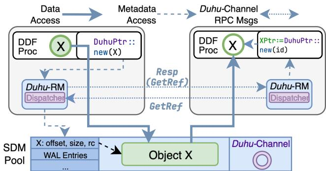  
Figure 1: Architecture of Duhu integrated with a DDF. Duhu-RM provides the same pointer view in address space for nodes to load and store (solid arrows) as native local memory objects. DDF processes call the Duhu API to perform metadata operations (dashed arrows). The API calls are handled by the local Duhu-RM, which uses the in-SDM Duhu-Channel mechanism to coordinate operations for remote objects (dotted arrows).

## 3 Duhu Overview

Duhu is a pass-by-reference object store for in-memory DDFs running on SDM clusters that do not provide hardware cache coherence between nodes (§2.2). It improves DDF performance by reducing network overheads and decreases memory usage by eliminating redundant object copies. Duhu (Figure 1) stores two types of information in SDM: (1) metadata indicates where objects are stored and which nodes have access, and tracks information for failure recovery; (2) data consists of the actual content of an object.

Beyond enabling pass-by-reference semantics, our design aims to meet four requirements:

1. Simplify integration with existing DDFs. Our design ensures that core DDF logic does not need to change when integrating Duhu. We accomplish this by providing an API (§4) that is similar to what is provided by the immutable data stores [43] used by DDFs today. However, as we explain below, to meet our remaining goals, we limit the choice of keys (unlike standard key-value stores). Through the API, frameworks can put objects, get references, and drop references with a key, while directly reading bytes in SDM without copying the object to a local variable.

2. Minimize coordination overheads. Cross-node coordination is required to ensure the correctness of operations that read or modify object metadata. For example, coordination is required when allocating an object (so that the memory for any two objects does not overlap) and freeing an object (to ensure an object is freed only if no nodes plan to access it). Our design minimizes coordination overheads for these operations by partitioning the object store into segments, each of which is owned by a single node. When other nodes need to access the object, they issue an RPC to the owner. To reduce the overhead of contacting the owner, we provide an efficient

RPC mechanism, Duhu-Channel (§5), that uses the SDM for data transfer with the help of the network for signaling.

3. Efficient but consistent access to shared object data. DDFs allow multiple nodes to access the same object stored in an object store, and assume that all nodes get a consistent version of this object. Our design leverages object immutability to provide efficient, consistent object access from multiple nodes: when creating an object, a node uses non-temporal instructions to ensure that all updates are written to the SDM, and before reading an object for the first time, nodes flush cache lines to ensure that they read data from the SDM. Nodes need to flush cache lines before they read the object for the first time because an object might reuse SDM memory that was previously allocated to a different (now freed) object.

4. Avoid resource leaks. Current DDFs assume that each node accesses a locally stored copy of the object and can garbage collect that copy independently (in response to the node being done or local memory pressure). Duhu’s passby-reference model violates the assumption made by these frameworks because multiple nodes can access the same copy stored in disaggregated memory. This in turn renders the garbage collection logic implemented by these frameworks incorrect.To address this, Duhu asks its user (the DDF) to indicate when it drops references to an object, so Duhu can track outstanding references (§4.2). This is usually straightforward, since most DDFs already have a local garbage collection mechanism where they drop references. With this information, Duhu ensures that a shared object is freed only after no nodes have references to it.

Failure model. Duhu is designed for use with DDFs that can reconstruct objects lost due to failures, using lineage or other recomputation mechanisms. Nearly all commonly used DDFs, including Ray and Spark, meet this requirement because alternative approaches such as object replication require significant additional memory.

We further assume that Duhu and the DDF that uses it are deployed in a cluster with multiple memory units and multiple nodes. The cluster is monitored by an orchestrator that notifies Duhu when a memory blade or node fails. Further, we assume that node failure does not affect the contents of the SDM; that is, data written by a node to the SDM remains available even after the node fails.

Duhu places all data and metadata for an object in the same memory unit to limit the blast radius. Under this model, our failure mechanisms (§6) ensure that a DDF that uses Duhu continues to function as long as enough nodes are available (dictated by the DDF) and the available memory units provide sufficient memory (dictated by the workload).

## 3.1 Duhu Design Principles

1. Share data, but not metadata. Sharing read-only data— such as the contents of immutable objects—is relatively easy even with incoherent memory. But metadata is constantly changing, so we keep it private: a single node is responsible for reading and writing it (possibly on behalf of other nodes).

This node may change if there are failures.

2. Streamline coordination using the SDM. Cross-node coordination requires communication, and cross-node communication adds latency. Duhu reduces this latency by implementing Duhu-Channel, an RPC channel that communicates over SDM. The lack of coherence means that one node cannot be notified about SDM writes made by another node, i.e., MWAIT and similar instructions cannot be used with SDM. Therefore, when necessary, Duhu-Channel uses the network to signal nodes. This combination enables low-overhead cross-node communication, thus reducing coordination overheads.

## 3.2 Architecture Overview

Duhu provides an object store that DDFs use to store and access objects. The Duhu API (§4) provides a key-value-storelike API that DDFs can use to allocate objects, gain access to an existing object, and release references. Our design requires that objects be immutable: they are written once when allocated and are not modified subsequently. This assumption holds for most common DDFs, including Ray and Spark. Note that the Duhu API is called by DDFs, rather than applications. Application code does not need to change when using Duhu. Duhu-RM. The Duhu API is implemented by a Duhu Reference Manager or Duhu-RM (§4). A Duhu-RM instance runs on each node and implements all of the coherence and coordination logic required to safely access the SDM. Duhu-RM is also responsible for updating and maintaining object metadata. Any node may wish to modify an object’s metadata, and thus metadata maintenance requires coordination between Duhu-RMs running on different nodes. For performance and scalability, each Duhu-RM instance runs multiple threads.

The Duhu-RM also maintains the write-ahead log (WAL) that is used for failure recovery (§6): each thread writes an entry to the WAL before making changes to the SDM.

Duhu-Channel. Duhu-RMs coordinate with each other using a Duhu-Channel (§5), an RPC channel that allows nodes to communicate over SDM. Each Duhu-Channel provides clientserver style communication. Multiple threads on the client Duhu-RM can issue RPC calls by writing to the same channel, and any thread on the server Duhu-RM can execute an RPC received on a channel. Furthermore, multiple RPC calls received on a single channel can be processed concurrently by different threads on the server Duhu-RM. Duhu-Channels are designed for small messages of less than 63 bytes in size. The restriction on small messages does not impact our design: all current inter-node requests in Duhu are smaller than 63 bytes; if larger payloads are required in the future they can be accommodated by passing SDM references.

When communicating over a Duhu-Channel, clients might need to notify the server about pending requests, or servers might need to notify clients about pending responses. The lack of global coherence prevents us from using SDM for notifications: a node receives no communication when another node modifies an SDM location. Therefore, we rely on messages sent over a traditional network for notifications.

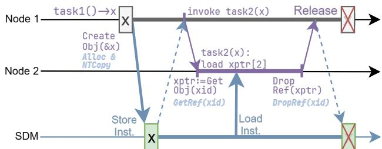  
Figure 2: A timeline view of object lifecycle events when integrating distributed computing frameworks with Duhu. DDF elements are purple, and Duhu elements are blue. Duhu-RM internal calls are specified under corresponding DuhuPtr API invocations.

Dispatcher. Each Duhu-RM includes a dispatcher that is responsible for assigning requests received on a Duhu-Channel to a Duhu-RM thread. For correctness, the recovery logic requires that operations on a single object must be performed in the same order as recorded in the WAL. To ensure this, all requests to the same object are dispatched to the same thread: all RPCs issued by Duhu-RMs include an object ID that the dispatcher uses to select the appropriate thread. The dispatcher is also responsible for sending and processing channel notifications.

## 3.2.1 Illustrative Example

We illustrate how DDFs integrate with Duhu below by describing how a version of Ray that is integrated with Duhu creates an object, gains access to an object, and eventually releases its reference to an object (Figure 2).

Referencing objects. DDFs use two types of references, ID and DuhuPtr, to refer to objects stored in Duhu. An ID is meaningful for the entire cluster and serves as a reference that can be shared between different nodes. The ID encodes the segment in which an object is stored, which is used to route calls to the appropriate node.

However, an ID cannot be used to access object data. On the other hand, a DuhuPtr is node-specific and can be dereferenced to access object data. Duhu’s reference counting keeps track of which nodes have valid DuhuPtrs to each object. DDFs can convert between the two types: the GetObj function (Table 1) returns a DuhuPtr given an ID, and the GetID function does the opposite.

Object creation. A DDF worker on node 1 creates and initializes a copy of object x in local memory. Once the object is initialized, the worker calls CreateObj to allocate and place object x in the object store. Once this call completes, x is stored in the SDM and is immutable. The call also returns a DuhuPtr through which node 1 can read x. Finally, node 1 can use the GetID API to get an ID that other nodes can use to get a reference to x.

Getting an object reference. A DDF worker on node 2 executing a newly launched task with a reference to x can gain access by calling the GetObj API. The GetObj and CreateObj calls update object metadata to track what nodes have out standing references, thus ensuring that space allocated to an object cannot be reclaimed while a valid reference exists.

  
Figure 3: Duhu-RM’s memory layout in SDM pool.

Releasing a reference. To enable space reclamation, a DDF worker must eventually release its reference to object x and does so by calling the DropRef method. To simplify integration, we invoke DropRef automatically from the DuhuPtr destructor when the reference goes out of scope. The object is freed and space is reclaimed once no node has a reference to x.

## 4 Duhu Reference Manager

Next, we detail the design of Duhu-RM. Our design partitions the SDM into segments to reduce coordination overheads for metadata operations. Furthermore, it leverages the immutability of objects to allow DDF workers to directly access object data while maintaining data consistency (§4.1).

The Duhu-RM implements the API (Table 1). DDFs use this API to create and gain access to objects, and to eventually release a reference as described in §3.2.1. The API itself closely resembles those of existing object stores, making it easier for DDFs to integrate with Duhu.

Internally, each Duhu-RM instance requires consistent access to object metadata, despite the metadata being stored in incoherent memory. Consequently, Duhu-RM instances must coordinate among themselves. Duhu simplifies and distributes this coordination by partitioning the data structures in SDM into segments (Figure 3).

Each segment has an owner, a node that has exclusive access to the metadata in the segment. Limiting metadata access to a single node ensures consistency. If a non-owner node wishes to access metadata in the segment, it issues an RPC to the owner’s Duhu-RM. Table 2 shows the RPC interface exposed by Duhu-RMs. The RPCs require cross-node communication over a Duhu-Channel (§5).

Duhu guarantees that a segment has at most one owner. If a segment’s owner fails, the Duhu recovery mechanism (§6) reassigns ownership to a different node and ensures that the segment’s metadata is consistent.

Partitioning memory into segments whose ownership is distributed provides the benefits of centralized coordination without the scalability bottleneck of a central metadata manager, and without the locking complications of schemes where all nodes can access the metadata concurrently. In fact, we tried to design such concurrent schemes and found that the lack of cache coherence created overhead and complexity. Conceptually, Duhu shifts this complexity into the Duhu-Channel.

Segment layout. Each Duhu segment consists of four regions: (a) a Duhu-Channel region, containing data structures of channel used by the owner to send RPC requests to other nodes; (b) a write-ahead log (WAL) that is used during failure recovery to ensure metadata consistency; (c) a metadata region, containing a hash-map that maps object identifiers to object metadata including the object’s address, its size, and a bitmap recording nodes that hold references to the object; and (d) a data region, containing the data of objects. An object’s metadata and data are co-located in the same segment. Co-location simplifies failure recovery because an object’s data and metadata share fate, and avoids coordination for object allocation and reclamation, as updates to the object metadata and free list are performed by the same node.

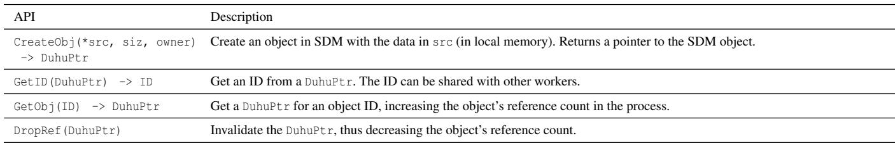  
Table 1: The API that DDFs use to interface with Duhu.

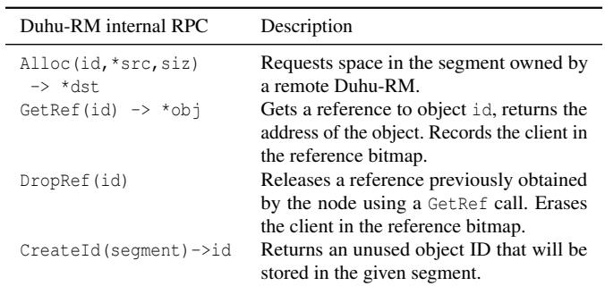  
Table 2: The Duhu-RM internal RPC endpoints that Duhu-RMs use to talk to each other.

Implementing the Duhu API. DDFs that use Duhu are unaware of segments, and the API they use (Table 1) exposes object IDs (which are recorded as a part of the object’s metadata) and references to the object data (wrapped in a DuhuPtr type, which includes the ID).

API calls made by the DDF worker are handled by the local Duhu-RM running on the same node. Most of these API calls require manipulating object metadata, and the Duhu-RM uses RPCs (described below) for this if the object metadata is stored in a segment that it does not own.

API calls are cheaper when handled by the node that owns the segment containing the target object’s metadata because no communication is required. Therefore, object placement can impact performance, and the CreateObj call allows DDFs to use the owner parameter to specify object placement.

RPCs to manipulate metadata. As we mentioned above, nodes must use RPCs (Table 2) to modify the metadata for any segment they do not own. To aid in failure recovery (§6), all RPC operations are idempotent. Furthermore, we require that, before executing a metadata operation, a node write (and flush) operations to the segment’s WAL. The WAL entry includes all arguments, the Duhu-Channel ID, and additional metadata (including slot ID and version) that are required for the recovery logic to safely respond to the request.

Figure 4 illustrates API handling and RPC calls in Duhu:

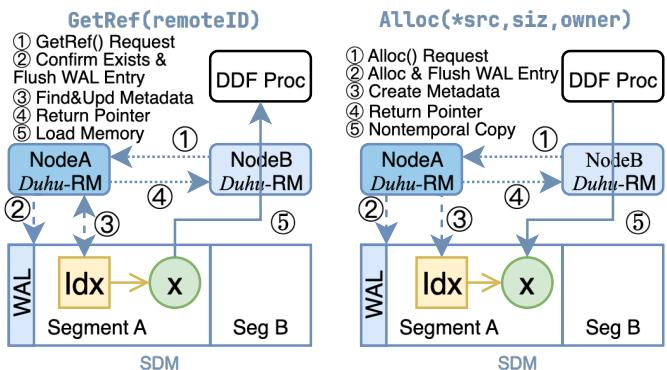  
Figure 4: The detailed protocol of GetRef and Alloc internal RPCs.

the DDF worker running on node B issues an API call that is processed by the local Duhu-RM. The API call requires changing metadata in a segment owned by node A, and node B sends an RPC request to node A. Node A first writes the RPC request to its WAL, then performs the necessary operations and sends the response to node B. Communication between the two nodes is performed over a Duhu-Channel (§5).

## 4.1 Safe and Direct Data Access

A DDF can access data objects by dereferencing a DuhuPtr. Duhu implements this by having all nodes map SDM segments to the same virtual address, thus ensuring that no additional address translation is necessary. While this ensures direct data access, additional mechanisms are necessary to ensure that all nodes access consistent data, i.e., to ensure safety. Object immutability helps Duhu ensure consistency.

Immutable objects and consistency. As an immutable object store, Duhu requires that nodes first create and populate objects in local memory before adding them to Duhu. DDFs add objects to Duhu by calling the CreateObj API and providing a reference to the object in their local memory. Duhu then allocates space in the appropriate SDM segment and copies the object to this location. We copy the object asynchronously to allow pipelining and further reduce Duhu overheads.

The immutability of objects almost solves the problem of data consistency in the face of incoherent memory, but not quite: objects are eventually freed and new objects are created in the same locations in SDM. Thus, the actual data in an SDM location is not immutable; if not handled carefully, a node could potentially access stale data from a previous object that remains in the node’s processor cache. To address this problem, nodes in Duhu carefully manage their processor caches as we explain next.

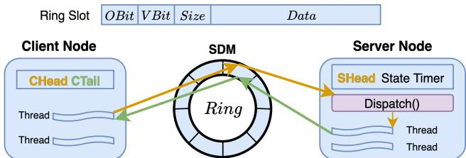  
Figure 5: Duhu-Channel Architecture Overview

Low-overhead cache synchronization. With Duhu, the data in SDM changes infrequently and at well-defined points, namely when new objects are allocated in the same place in SDM as previously deleted objects. As observed by prior work [2, 18], this pattern allows us to use cache synchronization instructions sparingly to avoid their overhead, while ensuring consistency of access at all times.

More specifically, objects are cache-line aligned, and the object’s creator uses non-temporal instructions (e.g., the \_mm512\_stream\_si512 intrinsic [23]) to ensure that writes are flushed to the SDM. This ensures that after the writer is done, any reads from the SDM return a consistent version of the object. Because no other worker can gain access before the writer finishes and no mutations are performed after CreateObj, reads from other workers can be safely served from the SDM without worrying about data inconsistency. To ensure that nodes access the SDM copy, the GetObj function invalidates the appropriate cache lines before returning a pointer to the object’s data.

## 4.2 Reclaiming SDM Memory

Nodes allocate SDM memory when they invoke CreateObj. Duhu uses reference counting to safely reclaim an object’s memory. Initially, an object’s creator holds a reference to the object, and the reference count is 1. Subsequent calls to GetObj by other nodes increment the reference count. Nodes (regardless of whether they are the object’s creator or not) can signal that they are done accessing the object by calling Duhu’s DropRef function. It is unsafe for a node to access object data after calling DropRef without invoking GetObj again. Duhu reclaims the object’s memory when the reference count reaches 0.

## 5 Duhu-Channel

A Duhu-Channel is an RPC channel that Duhu-RMs use for inter-node communication and coordination. A Duhu-Channel uses SDM to transfer RPC requests, arguments, and responses, and a network connection to signal Duhu-RM dispatchers when required. A Duhu-Channel connects a client Duhu-RM—which issues RPC requests—to a server Duhu-RM—which executes and responds to requests. Note that a channel is used by only two nodes (the client and the server).

## 5.1 Architecture and Functioning

A Duhu-Channel (Figure 5) has components in the SDM, and at the client and server Duhu-RMs:

1. SDM: Each channel allocates a ring-buffer (i.e., an array which is indexed using modulo arithmetic) consisting of n cache-line sized (64-byte sized) slots in the SDM, allowing up to n − 1 RPC requests to be issued simultaneously. We ensure that slots are cache-line aligned, which in addition to them being cache-line sized means that nodes can read or write the slots atomically. Clients write to slots to issue an RPC, and servers write their responses back into the same slot.

Algorithm 1: Client Request Submission   
Input: size, data // Payload size and data   
Output: result // Slot index or error   
1 if CHead + 1 = CTail then return E\_NO\_SPACE   
2 do   
3 slot ← CHead.load()   
4 next ← (slot + 1) mod RingSize   
5 until next ̸= CTail.load()   
6 while CHead.CompareSwap(slot,next) fails   
7 Msg ← PackedMsg{S;V ;size;data}   
// S: set OBit to server.   
// V: current version.   
8 WriteToSDM(Ring[slot] ← Msg)

2. Client: At the client Duhu-RM, a Duhu-Channel maintains a client head (CHead), the index of the slot that the client should use for the next RPC it issues. The client also maintains a client tail (CTail) which tracks the index of the slot beyond which all slots are unused. The CTail ensures that the client does not overwrite a slot being used by an in-flight RPC.

3. Server: At the server Duhu-RM, a Duhu-Channel maintains a server head (SHead) that tracks the next slot that a request will arrive on; and a variable tracking the state (State) of the server and a timer (Timer) that are used to switch between polling and using notifications for requests.

In addition to these components, each Duhu-RM maintains a network connection to every other Duhu-RM, and the dispatcher uses this to notify other nodes.

Slot structure. Figure 5 shows the structure of a channel slot: it contains metadata indicating message size, an ‘ownership’ bit (OBit) that indicates which endpoint (i.e., the client or the server) can access the slot, and a version bit (V Bit) that the failure recovery logic (§6) uses to ensure correct re-execution. Initially, the OBit is set to C, indicating that the client owns the slot, and V Bit is set to 0.

The slot also contains a data section: the client Duhu-RM issues an RPC by writing the request (and all required arguments) to this section, and similarly, the server responds to an RPC by writing the return value to this portion of the slot.

Observe that we use a single Duhu-Channel to carry both requests (from client to server) and responses: we chose this design in order to minimize Duhu’s working set size, and thus reduce cache pressure on the nodes.

## 5.1.1 Submitting an RPC Request

Algorithm 1 shows the procedure that a thread running on the client Duhu-RM invokes to submit a request to a Duhu-Channel. The client thread uses atomic operations to reserve a slot (lines 1–6); then it prepares a local copy of the message (line 8); and finally it writes the message to SDM (line 9).

When preparing the message (line 8), the client thread updates the slot’s OBit to indicate that a request has been issued and the server Duhu-RM should take ownership.

Algorithm 2: Server Dispatch Loop   
Input: Timer   
Input: ChannelID   
1 while State ̸= EXIT do   
2 do   
3 if State = EXIT then return   
4 if State = IDLE then block until notified   
5 InvalidateCacheline(Ring[SHead])   
6 OBit ← Ring[SHead].owner   
7 while OBit ̸= S   
8 Timer.Reset()   
9 slot ← SHead   
10 size, data ←Load(Ring[slot])   
11 SHead ← (SHead + 1) mod RingSize   
12 Dispatch(ChannelID, slot, size, data)

The WriteToSDM function (line 9) atomically writes the message to SDM. It does so by using non-temporal write instructions that invalidate and flush the cache line containing Ring[slot] to SDM. It follows the non-temporal write with a store-fence to ensure that the write cannot be reordered with respect to other store operations.

Finally, the client increments the slot’s V Bit (thus flipping it) upon receiving an RPC response.

## 5.1.2 Dispatching an RPC Request

Algorithm 2 shows the server side logic for receiving and dispatching RPC requests: The server polls the slot pointed to by SHead to check if its OBit is set to S, i.e., if the slot is owned by the server (lines 2–7). Once it owns the slot, the server copies the data from SDM into local memory (line 10), and then calls the Duhu-RM dispatcher which dispatches the request to a thread. Recall that the Duhu-RM dispatcher ensures that requests to the same object are dispatched to the same thread. Once a thread has finished processing the request, it writes a response to the same slot and changes the slot’s OBit to C to indicate that a response is available. We omit this response logic in the interest of space. We also omit the logic of how the client receives this response, except to note that it is similar to the RPC request dispatch logic discussed here.

For safety and efficiency, the server must consider a few factors when polling for the slot to change ownership:

First, frequent polling affects the performance of other nodes (and threads) accessing the SDM. We address this using a backoff mechanism: the server uses a timer (Timer) to track time since an RPC request was last received. When the timer expires, the server marks the channel as IDLE, which causes the poll loop to block (line 4). Clients send a network message when sending a request over an IDLE channel (not shown), and on receiving this message the Duhu-RM dispatcher notifies (and thus unblocks) the poll loop. The server resets the timer each time it receives a message (line 8).

Second, while polling the server must ensure it is reading the value from SDM rather than from the local cache. To do so, it uses the InvalidateCacheline function (line 5) to invalidate the cacheline before the read. This function uses a memory fence to ensure that load reordering does not result in the poll loop reading a stale value.

## 6 Failure Recovery

Duhu depends on an orchestrator1 to detect failed memory blades and nodes, and implements a failure recovery algorithm to deal with both. Below, we describe the core invariants used by both protocols, and then describe the protocols themselves.

## 6.1 Invariants

Duhu’s mechanism for recovering from memory blade failures builds on the assumption that DDFs include mechanisms, e.g., lineage-based mechanisms, to recover lost data.

The mechanism for recovering from node failures depends on the following three invariants:

1. The Duhu-RM records all RPC requests to a write-ahead log (WAL) before executing them. WAL entries are used to ensure metadata consistency by re-executing operations that were interrupted by node failure.

2. The Alloc() logic ensures that updates to the segment’s metadata hashmap have been flushed to SDM (by using nontemporal writes and an sfence) before returning a reference to the newly allocated memory. This ensures that all allocations are tracked in SDM, and prevents in-use memory from being reallocated after recovering from node failures.

3. Duhu-Channels allow at most k requests to be outstanding at a time; as we explain below, this helps ensure idempotent re-execution of incomplete operations.

## 6.2 Memory Blade Failure

Memory blade failure results in object data and metadata being lost. Duhu relies on the lineage-based fault-tolerance mechanisms implemented by DDFs to reconstruct this lost data on available blades. This recovery mechanism uses the object store APIs we provide, and thus implicitly recovers the lost metadata. We rely on these existing DDF-specific mechanisms because they can be better optimized.

However, Duhu’s pass-by-reference paradigm does add one complication when memory blades fail: a node might hold a reference that points to an address on the failed blade. We address this by requiring that the node’s operating system generate a SIGBUS signal when the DDF accesses memory on a failed blade, and Duhu catches this signal and invokes the DDF routine responsible for handling unavailable objects.

## 6.3 Node Failures

The failure of a node affects Duhu in two ways: (a) The metadata for any segments that the node owns might be inconsistent because of partially completed operations; and (b) References held by the failed node and Duhu-Channels created by it will never be freed, leading to resource leaks. Duhu uses different recovery algorithms for each effect. The orchestrator triggers both when a node failure is detected.

## 6.3.1 Metadata Consistency

A Duhu metadata operation requires at least two accesses to SDM: one to read (or update) the metadata, and a second to write the return value to the appropriate channel slot. Many require more than one update. Consequently, node n crash ing can render the metadata for any segment s owned by n inconsistent. Furthermore, no node can perform metadata operations on s until the segment is assigned a new owner. Our metadata consistency logic addresses both these problems.

During normal operation, each Duhu-RM thread records operations to a per-segment write-ahead log (WAL). The WAL entry records the request, the channel on which it was received, the channel slot, and the slot’s V Bit.

When the orchestrator detects that node n has failed, it assigns each segment owned by n to a different node (e.g., segment s to node n′) and broadcasts this change.

Upon taking ownership of segment s, n′ iterates through the metadata hashmap to reconstruct what portions of the segment memory have already been allocated, and to which objects. This process allows node n′ to reconstruct (a) the set of objects in segment s; and (b) information required to reconstruct local allocator state. The latter is required to ensure that subsequent allocations (including those required during the recovery process) do not overlap existing objects, preserving data consistency.

Next, n′ inspects the segment’s WAL entries in descending timestamp order to find the last k entries for each Duhu-Channel, and re-executes them. Dropping all other entries is safe because a Duhu-Channel can only hold k outstanding requests, and thus older entries have already been processed. However, note that a previous owner (e.g., n) might already have processed and responded to some of the last k entries. Therefore, for correctness, Duhu needs to ensure that (a) responses generated during replay do not lead to bugs; and (b) replayed operations are idempotent.

Our use of in-band responses can be a problem when replaying and responding to operations: a previous owner might already have responded to a re-executed request before crash ing, and the client (who issued the request) might already have reused the slot to issue a different request. We address this problem by restricting the number of requests re-executed from each ring and using the per-slot version bit. Before replaying a WAL entry, n′ first reloads the Duhu-Channel slot for the request and compares the slot’s version bit to that recorded in the WAL entry. If the channel slot and WAL entry have the same version, then the client has not reused the slot, and is still awaiting a response. The recovery logic re-executes the entry in this case, and discards it otherwise. Checking that version bits match suffices because we replay at most k WAL entries, and the version bit can change at most once in k entries.

A previous owner might have failed while processing a request, and thus ensuring idempotence during replay is necessary despite the Duhu-Channel slot version check described above. Ensuring idempotence during replay is simple for GetRef() and DropRef() calls, since they manipulate a bitmap using bitwise operations and are thus inherently idempotent. Similarly, for CreateId(), Duhu records the generated key in the WAL, and replay merely returns the recorded key, thus ensuring idempotence. Idempotence for Alloc() calls is slightly more involved: the replay logic first checks if the object ID is present in the segment’s metadata hashmap. If so, the object has already been allocated, and the recovery logic uses the metadata entry to find the appropriate location. On the other hand, if the object ID is not present, it allocates space for the object.

Finally, the recovery procedure needs to ensure that any references held by n to objects on other nodes are released, thus avoiding resource leaks. To this end, on detecting that node n has failed, the orchestrator broadcasts a failure message to all other nodes. On receiving a failure message, node m finds and releases any references n holds to objects in segments owned by m by clearing the corresponding bit in each object’s reference bitmap.

In sum, the use of a write-ahead log and idempotent operations ensures that replay can correctly restore metadata consistency.

## 6.3.2 Recovery Time

Finally, we analyze recovery time for node failures when using Duhu. As we show in §8, our current cluster has relatively high SDM access latency (600–800 ns) and 10GB/s bandwidth. In addition, the lack of coherence means that a newly assigned segment owner must invalidate the appropriate cache line before reading a slot or metadata. Lastly, for consistency, we need to use non-temporal writes and an sfence when writing to SDM. The net result is that recovery time is dominated by SDM access time rather than by computation, and we use SDM accesses as a way to estimate recovery time. Metadata dictionary scan. The new owner of a segment needs to iterate over the segment’s metadata hashmap to reconstruct local allocator state. The metadata hashmap can be quite large, and the recovery logic cannot make progress until this is completed. This stage tends to be a significant contributor to recovery time.

WAL scan. Next, the recovery logic needs to read the last k WAL entries for each channel. The layout of the write-ahead log means that newer entries are towards the beginning of the WAL and can be scanned sequentially. In the common case, where all Duhu-Channels are used at the same rate, only O(p × k) entries need to be read (where p is the number of channels) to find the last k WAL entries for each channel.

Replay of WAL entries. During replay, each operation requires at least one SDM access to check the version bit in the corresponding Duhu-Channel slot. Additional accesses are necessary during re-execution, e.g., to update metadata and write responses. These writes need to be synchronized with sfences. Therefore, in most cases, this step is a significant contributor to recovery time.

Releasing references held by the failed node. This step has nearly no impact on recovery time because it runs concurrently with the rest of the recovery protocol and requires fewer SDM accesses than the other steps.

Thus, recovery time in Duhu is dominated by the metadata dictionary scan and operation replay. Changing the layout of the metadata dictionary might help improve both, though this might affect performance in the non-failure case.

## 7 Implementation and Integration

We implemented Duhu in C++ and integrated it with Ray, a popular open-source DDF. Integrating Duhu with Ray only required changes to Ray’s object manager logic: we modified Ray’s PushLocalObject method (which is used to transmit data from the local store to the remote one) to lazily allocate and move objects to the Duhu SDM. Similarly, we modified Ray’s GetRef method so that it no longer allocated a local copy of the object, and instead (when appropriate) called Duhu’s GetRef method to get a pointer to the object in SDM. Finally, we modified the FreeObject method to call DropRef when necessary. All of these changes were contained in a single module, demonstrating that our API simplifies integration.

During integration, we observed that many Ray objects are only accessed by the node that creates them. Copying objects that are only accessed locally to SDM adds significant overheads. Therefore, our implementation lazily copies objects: we delay calling Alloc on a sealed object until either (a) a remote node tries accessing the object, which causes Ray’s object manager to try to send a copy over the network; or (b) the node that created the object encounters memory pressure.

Our implementation uses a standard free-list-based allocator to manage memory within each segment.

## 8 Evaluation

We evaluated Duhu by comparing the performance of a Duhu-integrated Ray (denoted as DR in the graphs) to a baseline Ray without Duhu (denoted as Ray in the graphs). Our evaluation answers the following questions:

1. Does Duhu enable new compute paradigms? Do they improve application performance? (§8.2.1)

2. Do our gains translate to future SDM implementations that have higher bandwidth and lower access latency? (§8.2.1)

3. Can Duhu improve the performance of Ray jobs? (§8.2.2) Our results show the benefits of the pass-by-reference strategy enabled by Duhu, which reduces both memory usage and redundant data movement, albeit with additional overheads when accessing SDM.

In addition, we present results from microbenchmarks (§8.3) that quantify the benefit of Duhu-Channel, Duhu’s im pact on intermediate-data transfer time, and its benefits for applications whose tasks only randomly access a portion of the intermediate data they are provided.

## 8.1 Evaluation setup

Our evaluation was run on an SDM cluster that consists of four servers connected to an external disaggregated memory pool over CXL. Each server has four Intel Xeon Gold 6530 processors, 512 GB of memory, and runs Linux (kernel version 6.6.0). Each server is equipped with a ConnectX NIC, and all servers can communicate with each other over a 100Gbps network. We disabled hyperthreading and power saving features on the servers.

The disaggregated memory is an early FPGA-based research prototype with 128GB of RAM, with memory bandwidth of ≈10GB/s and access latency of 600–800 ns. The memory was partitioned into 16 segments, and in each segment we reserved 65536 WAL slots. The WAL slots and metadata region for each segment consumed 8MB of space, and in total ≈128MB of space was used by the WAL and metadata.

Our experiments use containers to partition server resources: each container is provided 12 cores and 30GB of memory. In each container, 8 cores are used for computation, and the remaining are used for communication (and other auxiliary functions). Local memory was not a bottleneck in any of our experiments.

To avoid cross-container interference, each container is placed on a different NUMA node and is allocated node local memory. Containers on the same server communicate over the Linux bridge, and we use tc to limit inter-container bandwidth within the server to 5Gbps (except in §8.3). This ensures that the aggregate bandwidth over the network is the same as SDM bandwidth (i.e., 10GB/s or 80Gbps), enabling fair comparison. Finally, for inter-server communication, containers are bound to the physical NIC using macvlan.

Even when using Duhu, Ray requires a local object store (whose size is specified using the object-store-memory flag). We specify the local object-store size used for this when describing individual experiments.

## 8.2 End-to-end Applications

We use two workloads based on existing DDFs to answer the three evaluation questions: shuffle-based workloads, for which we implement a new approach and compare to Exoshuffle [34]; and database workloads, for which we use Modin [44], a distributed dataframe library to run TPC-H [54].

## 8.2.1 Duhu’s Impact on Shuffle

Duhu can improve the performance of distributed shuffle jobs by enabling new approaches. Below, we describe and compare Exoshuffle, an existing approach for distributed shuffle; and FlexShuffle, an approach enabled by Duhu.

Exoshuffle [34]. Exoshuffle is a state-of-the-art efficient distributed shuffle architecture built atop Ray. Like other passby-value shuffle architectures, Exoshuffle requires map tasks (data producers) to partition intermediate data using a userdefined partitioning scheme. These partitions are written to each mapper’s local object store. Reduce tasks are assigned partitions that they copy from the mappers’ object store and then combine to produce their output.

FlexShuffle. FlexShuffle is an architecture that we developed to target pass-by-reference implementations, e.g., Duhu. The core difference is that in FlexShuffle, map tasks do not partition their output. Instead, map tasks write the unpartitioned output to Duhu, and produce a slice for each partition.

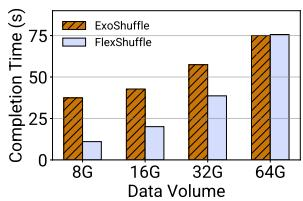  
Figure 6: Job-completion time for a four-stage shuffle job when using FlexShuffle and Exoshuffle.

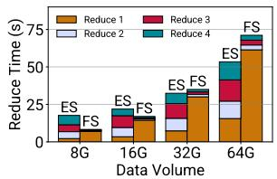  
Figure 7: Breakdown for each stage of the jobs shown in Figure 6.

A partition’s slice contains the set of offsets (and length) within the intermediate data that belong to the partition.

Reduce tasks use the slices and references to the mappers output to access inputs and compute their output.

Thus, FlexShuffle replaces data movement with metadata reorganization. This change is particularly beneficial for jobs with multiple shuffle stages: after the first shuffle stage, only the set of slices changes, and thus no additional data transfer is required for these stages. Multiple shuffle stages are common for many applications including implementations of optimization algorithms like stochastic gradient descent [20, 41, 55].

FlexShuffle improves multi-stage shuffle performance. We evaluated FlexShuffle and Exoshuffle using 32 map tasks and 32 reduce tasks (2 per instance). We tested four scenarios where we varied the amount of shuffle data and the size of the local store: (1) 8GB data and 0.75GB object store; (2) 16GB data and 1.5GB object store; (3) 32GB data and 3GB object store; and (4) 64GB data and 6GB object store. In all scenarios, the intermediate data is split uniformly across 32 partitions, one for each reduce task.

Figure 6 shows job completion time (JCT) for a job with four shuffle stages in each scenario. Observe that FlexShuffle can improve JCT by up to 3.39×. However, we also observe a slight slowdown with large reduce size: FlexShuffle takes 1.01× longer than Exoshuffle. Figure 7 explains this performance difference: the first reduce stage takes longer under FlexShuffle than under Exoshuffle, because all intermediate data needs to be copied over to the SDM. In subsequent reduce stages, FlexShuffle outperforms Exoshuffle (by 3.59–13.81×) because no additional data movement is required. In the 64GB scenario, the initial data copy onto SDM dominates, leading to the slight slowdown.

FlexShuffle is impractical without SDM and Duhu. Next, we consider an implementation of FlexShuffle without SDM: in this case all workers keep a copy of the intermediate data in their local object store, and thus reduce inputs require only slices. The significant increase in local memory requirements is a problem in this case, since the data must be spilled into SSDs and reloaded from there. Figure 8 shows that without Duhu (and SDM), the JCT for a job with a single shuffle stage is 13.34–24.69× higher.

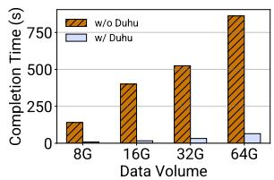  
Figure 8: JCT for a job with one shuffle stage when using FlexShuffle with and without Duhu.

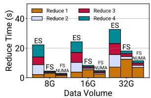  
Figure 9: JCT for a four-stage shuffle job on Exoshuffle, FlexShuffle, and FlexShuffle on NUMA.

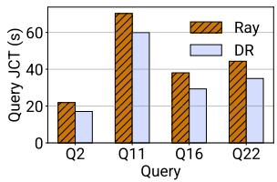  
Figure 10: Query execution time for the four most improved TPC-H queries.

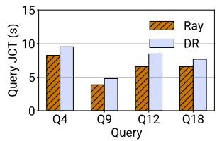  
Figure 11: Query execution time for the four slowest TPC-H queries when executed using Duhu-Ray.

FlexShuffle’s benefits increase with newer hardware. Finally, we considered how these improvements would translate to a better SDM implementation. As we noted above, our results are from using an FPGA-based SDM prototype, which likely has lower bandwidth and higher access latencies. Actual ASIC-based implementations are likely to perform better, and we use an approach inspired by Pond [28] to evaluate FlexShuffle’s performance on these future implementations.

For this experiment, we emulated a faster SDM using NUMA nodes on a single server. The server had the same specifications as what we used for the experiments so far, and we used NUMA nodes 0 and 1 as servers, and reserved 100GB of memory attached to NUMA node 2 for use as SDM. Because we used a smaller number of servers, we only used up to 32GB of reduce data.

In Figure 9, we compare the performance of FlexShuffle on this NUMA setup (FS NUMA) to (a) FlexShuffle on a 2-node SDM cluster (FS); and (b) Exoshuffle on a 2-node cluster. As expected, the NUMA setup improves performance, and the biggest gains are in the first reduce stage where data movement costs dominate. In this setup, FlexShuffle with NUMA improves over FlexShuffle running on CXL by 1.10×. Furthermore, FlexShuffle on NUMA always outperforms Exoshuffle (it is 2.43–5.79× faster), leading us to conclude that FlexShuffle’s benefits will increase as better SDM implementations become available.

## 8.2.2 TPC-H Benchmark on Modin

Next, we evaluate Duhu’s impact on existing jobs, by measuring its impact on TPC-H [54] performance when the benchmark is executed using Modin [44].

For this evaluation, we used a scale factor of 10, which produced a 3.4GB compressed Parquet file as input. We set the per-node object-store size for each node to 5GB. As expected, this led to memory pressure in the Ray object store for some join queries. We found that running four containers on each server led to significant slowdowns for both unmodified Ray and Duhu because of redundant data transfers to each server. Therefore, we ran only one container per physical server. Furthermore, we found that unmodified Ray workers frequently crashed due to memory exhaustion when running query 5, so we omitted it in our evaluation.

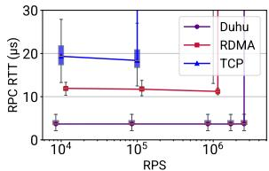  
Figure 12: Duhu RPC performance compared to RDMA and TCP.

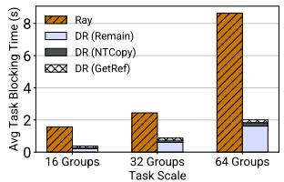  
Figure 13: Fan-out Microbench mark: Time consumer waits for intermediate data by task scale

On average, across queries, Duhu-Ray had 1.08× better query time than vanilla Ray. However, the degree of improvement depended on the queries’ intermediate data size and access patterns. Duhu seems to be particularly helpful for ‘big’ queries where each worker accesses a significant amount of data which is unlikely to fit in the worker’s local object store. In this case, Duhu-Ray’s ability to store objects in SDM is a significant benefit: Figure 10 shows query processing time for the four queries where we observed the most benefits, and we observe that at best Duhu-Ray can improve query completion time by 1.26× on average and by 1.30× at most.

However, for small queries that often run in less than 10 seconds and access a small amount of data, the use of Duhu can worsen performance. This is because each worker accesses only a limited amount of data in this case, and the objects being accessed can fit in the local object store for vanilla Ray. On the other hand, Duhu-Ray places objects in SDM by default, and the additional access latency leads to a slowdown. Figure 11 shows query execution times for the four slowest queries where Duhu-Ray is 1.2× slower.

Our results show that Duhu is most helpful when a query’s intermediate data size exceeds a node’s object store capacity. For smaller queries, SDM’s increased access latency reduces Duhu’s benefits, suggesting that a hybrid policy that keeps small or frequently reused objects on a server could improve Duhu-Ray’s performance.

## 8.3 Microbenchmarks

Finally, we use microbenchmarks to evaluate Duhu’s RPC and object transfer performance, the impact of accessing a portion of an object, and the impact of workload characteristics. All microbenchmarks use a producer-consumer pattern, and to ensure fair comparison, we increase network bandwidth for producers so that the aggregate bandwidth across producers is 80Gbps, matching write-bandwidth to SDM.

## 8.3.1 RPC Performance

First, we evaluate the benefits of using Duhu-Channel as compared to using network-based RPCs. We consider both RPCs implemented over TCP (using the kernel network stack), and implemented using the RDMA WriteImm operator. To fairly evaluate across these settings, our RDMA implementation has one outstanding request at a time.

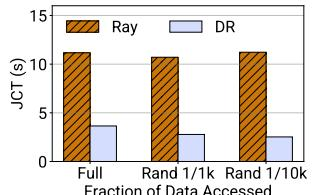  
Fraction of Data Accessed  
Figure 14: Partial intermediate access: Job Completion Time by frac tion of data accessed.

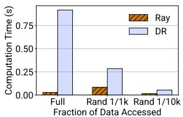  
Figure 15: Partial intermediate access: Computation Time by fraction of data accessed.

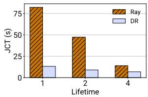  
Figure 16: JCT as object lifetimes change.

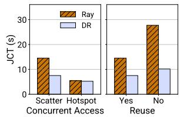  
Figure 17: JCT as the number of concurrent processes and object reuse change.

In Figure 12, we report latency as we change the request rate. Our results show that Duhu-Channels have lower latency and higher throughput than either TCP or RDMA: they can achieve a latency of 3.8µs while supporting 3 million RPS. By comparison, RDMA achieves a latency of 11.74µs at 1 million RPS.

## 8.3.2 Object Transfer Performance

Next, we evaluate the benefits of transferring objects over SDM (as enabled by Duhu) rather than over the network. We do so using a fan-out benchmark, where we run a varying number of fan-out task groups.

A fan-out task group consists of a producer task that creates a 200MB array of floats, and four consumer tasks. Each consumer task is run on its own server, and computes the sum of all elements in the array. Observe that this setup means that three out of the four consumer tasks are remote, i.e., they are on a different server than the producer. In both Ray and Duhu-Ray, remote consumers need to wait for data transfer before they can begin computation, i.e., they are blocked. In Ray, tasks are blocked so that the remote worker can access a local copy of the data, while in Duhu-Ray tasks are blocked due to our lazy-copy optimization (§7).

In Figure 13 we report average blocking time when running 16, 32, and 64 fan-out task groups. Increasing the number of task groups increases the amount of data produced from 3.2GB to 12.8GB. We observe that Duhu-Ray’s average blocking times are 2.80–4.29× smaller than Ray’s. This is because Ray needs to transfer 3× more data, since the array must be copied into each server’s local memory.

Furthermore, we analyzed where Duhu-Ray’s blocking time went, by measuring time spent by the producer copying data into SDM, time spent by a consumer getting a reference, and the remainder. We found that allocating and putting data into SDM (done by the producer) comprises 18.83% of the blocking time, and getting a remote reference and getting access at the consumer takes 10.96%. This is expected because the producer portion requires more data movement.

## 8.3.3 Accessing Partial Intermediate Data

Tasks that access a small portion of a large amount of data can benefit significantly from Duhu’s pass-by-reference semantics. We evaluated this benefit using a benchmark where 128 tasks (8 on each of the 16 containers) read portions of a 6.4GB array of floats and computed the sum of the portions they read. We report on three scenarios while varying the portion of the array read by each task: (a) whole array; (b) 1 th of the array; and (c) 1 th of the array. For the latter two scenarios, each task chose elements at random.

Figure 14 shows JCT for all three scenarios: as expected, Duhu-Ray’s benefits increase as a smaller portion of the array 1 th is accessed. JCT when reading 10000 of the array is 4.45× smaller than when reading the entire array. By contrast, Ray’s performance does not change significantly because data transfer costs dominate computation time.

However, the high access latency and low bandwidth of SDM (compared to local memory) might be a concern for computation. In Figure 15 we report compute time (averaged across the 128 tasks) for the experiment above. We observe 1 th that Ray always spends less time computing: for the 1000 and 1 th scenarios, Ray takes approximately 0.29× the compute time of Duhu-Ray. The compute difference is higher when summing over the entire array, because tasks then perform sequential access and can benefit from prefetching and caching. Nevertheless, our results show that the reduced data transfer time leads to lower overall JCT.

## 8.3.4 Impact of Workload Characteristics

The previous evaluations report on how data size affects Duhu-Ray’s performance. We also measured the impact of three other workload characteristics: object lifetimes; number of tasks concurrently accessing an object; and access pattern.

We relied on the same benchmark for all three: we started 4 producer tasks (one on each server), and 128 consumer tasks (evenly distributed across the whole cluster). Producers and consumers ran for four iterations. Every few iterations (specified as a parameter), each producer created 8 float arrays, each 200MB in size. In each batch, a consumer was assigned an array and summed a randomly selected 1% of its elements. Object lifetimes. As object lifetimes increase, objects are more likely to be re-accessed by some task on a server, and thus less likely to incur data movement for both Ray and Duhu-Ray. We measured this effect by varying the number of iterations after which a producer creates new arrays, e.g., if lifetime is 2, producers create 8 new arrays every other iteration (i.e., new objects will be created in iterations 1 and 3).

Figure 16 shows JCT as we vary lifetime from 1 to 4. As expected, both Ray and Duhu-Ray have better performance as the lifetime increases because data transfer costs are amortized. The benefit is more pronounced for Ray because later batches access objects from local memory, encountering significantly lower latency. By contrast, for Duhu-Ray, SDM access latency and bandwidth limit gains for later batches.

For the rest of the workload evaluation we set object lifetime to 4, i.e., arrays are allocated once for each experiment. Concurrent access. The number of objects being accessed also has an effect on data transfer, and thus performance: data transfer can be amortized if all tasks access the same object. We evaluate this by comparing the performance in two scenarios: (a) scatter, where each consumer accesses a different array; and (b) hotspot, where all consumers access the same array. Figure 17 (left) shows the result. As expected, hotspot has better performance than scatter for both Ray and Duhu-Ray. Furthermore, we also observed that for the hotspot scenario, Ray and Duhu-Ray have similar performance. This is because each array is small, thus requiring minimal time for data transfer.

Task access pattern. Finally, task access patterns can affect the amount of data movement, and thus performance. We evaluated this by implementing two scenarios: (a) same, where each consumer accesses the same array for all four iterations; and (b) random, where each consumer accesses a different array in each iteration. Figure 17 (right) reports job-completion time for this experiment, and as one would expect, same has lower job-completion time for both Ray and Duhu-Ray.

## 9 Related Work

The idea of a hardware-based disaggregated memory predates CXL and was first proposed in [31]. However, that work does not consider using the shared memory as a means of communication (data sharing) among clients.

Recently, CXL has attracted the attention of the research community and several papers have appeared to address different aspects of this technology, including memory pooling, memory tiering, and performance. With memory pooling [16, 28], external CXL memory is dynamically assigned to hosts to improve memory utilization. A given chunk of memory is assigned to at most one host, so hosts do not use CXL memory to share data. With memory tiering [27, 35, 51, 58, 62, 64], the CXL memory is viewed as a slower tier of memory compared to local memory, and the system tries to place frequently accessed hot data in the faster tier, while moving colder data to the slower (CXL) tier. Other work provides a performance characterization of CXL memory and its implications for applications [17, 28, 32, 52, 53]. None of these works considers CXL memory as a medium to share data across hosts.

There is significant prior work on building distributed object stores and key-value stores on disaggregated memory accessible via RDMA (e.g., [12,13,25,30,33,37,49]). Similar to our setting, one or more memory servers store the key-value data. But unlike our setting, clients use RDMA operations to access the data in the memory server(s). RDMA is a different mechanism to access remote data compared to memory operations in SDM: RDMA requires submitting IO operations, so there are no problems of hardware coherence of client caches; RDMA has lower performance on small transfers (say 64 bytes) due to the overhead of issuing IOs; and RDMA servers typically have some computation power, which many systems use to run client operations (e.g., RPCs). By contrast, we are focused on SDM, which is accessible by processors via loads and stores without cache coherence across nodes, and without the ability to run code at the memory. Therefore, our techniques differ from prior work.

Work on far memory systems (e.g., [4, 14, 19, 46, 59, 63]) aims to augment local memory with additional external memory. Early work assumes the external memory is accessible over the network, while more recent work considers CXL.

We are not the first to consider sharing data in CXL without full coherence [8, 22, 24]. Prior work differs from ours in two ways. First, they make a different hardware assumption: the CXL memory has a coherent and a non-coherent region, and applications can use both. Second, they target a different problem. Pasha [22] aims to build a database system using CXL shared memory, while [24] proposes general high-level ideas and directions of how to use this hybrid coherence model, without targeting specific applications.

Systems without cache coherence have been explored in both research [9, 26] and industry [6, 36]. The general consensus is that it is hard to program with such systems.

Using pass-by-reference instead of pass-by-value for efficiency is an idea that goes back to early work in programming languages. Recent distributed systems such as Ray [38, 56], Ciel [39], and Distributed PyTorch [45] use pass-by-reference in remote procedure calls (RPCs), whereby data gets stored in an object store, and applications use the key rather than the value as the parameters (or results) of the RPC; the RPC handler (or caller) later fetches the parameters (or results) from the object store. These systems differ from ours because their references are keys in an object store rather than addresses in SDM, and ultimately nodes still create copies of the object by fetching it from the object store, which is pass-by-value. As a result, these systems do not address the problem of memory and network transfer overheads in DDFs that we address (they solve a different problem), and they are not faced with the SDM cache-coherence issues that we tackle.

Lightning [65] is an in-memory object store that allows multiple threads to directly address objects in local memory without requiring inter-process communication or a mediating daemon. Thus, Lightning implements pass-by-reference semantics within a single node, but cannot be extended to the distributed setting we target because it requires cache coherence and does not consider cross-node synchronization.

There is a long line of work on distributed shared memory (e.g., [3,5,7,29,40,47,48]), which seek to implement a shared memory abstraction on top of a message-passing system, in cluding both software and hardware-based implementations.

Our goal is not to build shared memory but rather to use it.

## 10 Discussion

Support for copies. Duhu reduces unwanted copies of the data in DDFs by keeping objects in SDM. However, in some cases it is desirable to have copies to avoid bottlenecks. For example, a small immutable object may need to be accessed frequently by all nodes. We observe that Duhu can be used to provide copies—and can do so in a controlled manner. The DDF can put many objects with the same content in Duhu, and these objects can be given to different nodes. The DDF scheduler can decide how many objects (replicas) to create, including having a replica per node if desired.

Creating objects in SDM. Currently in Duhu, an object needs to be fully initialized in local memory before putting it in SDM. It could be useful to create the object directly in SDM to support large objects that do not fit in the remaining local memory, and to avoid the cost of copying the object from local memory to SDM. We can extend Duhu to support this functionality by adding a function that allocates space in a segment’s data region and returns a pointer to SDM. Then, the DDF uses this pointer to populate the object. Finally, the DDF can use Put, augmented with a flag to indicate the object is already in SDM, to make it accessible by other nodes.

Loading objects from disk to Duhu. A DDF job often takes as input data from disk; currently, Duhu incurs some overhead in loading from disk, because objects must first be loaded into local memory before putting them into Duhu. Instead, it would be useful to extend Duhu with a function that loads data from disk by directly performing IO on buffers in SDM.

## 11 Conclusion

Duhu is an immutable object store designed for use with current and future shared disaggregated memory systems. It stores data in SDMs, which may not offer full cache coherence guarantees. Duhu is targeted at distributed data processing frameworks, which often copy data from the node that produces it to the nodes that wish to consume it; these copies incur significant memory and network transfer overheads. With Duhu, such frameworks avoid these copies by placing data in a common shared space. We integrate Duhu with Ray and evaluate the resulting system, Duhu-Ray, on a prototype CXL disaggregated memory system. We find that Duhu-Ray can outperform Ray by up to 3.39× on a shuffle workload.

## Acknowledgments

We thank Stephanie Wang for initial discussions about the technical direction explored in this work, and the anonymous OSDI reviewers for comments that greatly improved its presentation. This work was funded in part by gifts from the Stellar Foundation and Google.

## References

[1] M. Abadi, P. Barham, J. Chen, Z. Chen, A. Davis, J. Dean, M. Devin, S. Ghemawat, G. Irving, M. Isard, M. Kudlur, J. Levenberg, R. Monga, S. Moore, D. G.

Murray, B. Steiner, P. Tucker, V. Vasudevan, P. Warden, M. Wicke, Y. Yu, and X. Zheng. Tensorflow: A system for large-scale machine learning. In USENIX OSDI, 2016.

[2] R. Abrahamse, Á. Hadnagy, and Z. Al-Ars. Memorydisaggregated in-memory object store framework for big data applications. In IEEE International Parallel and Distributed Processing Symposium Workshops, 2022.

[3] A. Agarwal, R. Bianchini, D. Chaiken, K. L. Johnson, D. Kranz, J. Kubiatowicz, B.-H. Lim, K. Mackenzie, and D. Yeung. The MIT Alewife machine: Architecture and performance. ACM SIGARCH Computer Architecture News, 23(2):2–13, 1995.

[4] E. Amaro, C. Branner-Augmon, Z. Luo, A. Ousterhout, M. K. Aguilera, A. Panda, S. Ratnasamy, and S. Shenker. Can far memory improve job throughput? In ACM EuroSys, pages 1–16, Apr. 2020.

[5] C. Amza, A. L. Cox, S. Dwarkadas, P. Keleher, H. Lu, R. Rajamony, W. Yu, and W. Zwaenepoel. TreadMarks: Shared memory computing on networks of workstations. IEEE Computer, 29(2):18–28, Feb. 1996.

[6] ARM922T Technical Reference Manual. https: //developer.arm.com/documentation/ddi0184/ b/caches--write-buffer--and-physicaladdress-tag--pa-tag--ram/cache-coherence.

[7] J. K. Bennett, J. B. Carter, and W. Zwaenepoel. Munin: Distributed shared memory based on type-specific memory coherence. In Symposium on Principles and Practice of Parallel Programming, pages 168–176, Mar. 1990.

[8] D. S. Berger. Realistic expectations for CXL memory pools. Keynote talk at the 2nd Workshop on Disrup tive Memory Systems (DIMES’24) in conjunction with the ACM Symposium on Operating Systems Principles (SOSP’24), 2024. 2025-01-14.

[9] N. P. Carter, A. Agrawal, S. Borkar, R. Cledat, H. David, D. Dunning, J. Fryman, I. Ganev, R. A. Golliver, R. Knauerhase, et al. Runnemede: An architecture for ubiquitous high-performance computing. In 2013 IEEE 19th International Symposium on High Performance Computer Architecture (HPCA), pages 198–209. IEEE, 2013.

[10] Compute Express Link. computeexpresslink.org.

https://

[11] J. Dean and S. Ghemawat. MapReduce: simplified data processing on large clusters. Communications of the ACM, 2008.

[12] A. Dragojevic, D. Narayanan, M. Castro, and O. Hodson.´ FaRM: Fast remote memory. In USENIX NSDI, pages 401–414, Apr. 2014.

[13] A. Dragojevic, D. Narayanan, E. Nightingale, M. Ren-´ zelmann, A. Shamis, A. Badam, and M. Castro. No compromises: distributed transactions with consistency, availability, and performance. In ACM SOSP, pages 54–70, Oct. 2015.

[14] E. Felten and J. Zahorjan. Issues in the implementation of a remote memory paging system. Technical Report CSE TR 91-03-09, University of Washington, Mar. 1991.

[15] S. Ghemawat, H. Gobioff, and S.-T. Leung. The Google file system. In ACM SOSP, 2003.

[16] D. Gouk, M. Kwon, H. Bae, S. Lee, and M. Jung. Memory pooling with CXL. IEEE Micro, 43(2):48–57, Mar. 2023.

[17] D. Gouk, S. Lee, M. Kwon, and M. Jung. Direct access, high-performance memory disaggregation with DirectCXL. In USENIX ATC, July 2022.

[18] P. Groet, J. Hoozemans, A. Grapentin, F. Eberhardt, Z. Al-Ars, and H. P. Hofstee. Leveraging apache arrow for zero-copy, zero-serialization cluster shared memory, 2024.

[19] J. Gu, Y. Lee, Y. Zhang, M. Chowdhury, and K. G. Shin. Efficient memory disaggregation with Infiniswap. In USENIX NSDI, pages 649–667, Mar. 2017.

[20] J. Haochen and S. Sra. Random shuffling beats SGD after finite epochs. In International Conference on Machine Learning, pages 2624–2633. PMLR, 2019.

[21] J. Hong, M. K. Aguilera, E. Amaro, V. Liu, A. Panda, and I. Stoica. The dawn of disaggregation and the coherence conundrum: A call for federated coherence. https://arxiv.org/abs/2504.16324, Apr. 2025.

[22] Y. Huang, N. Ni, V. Chidambaram, E. Witchel, and D. Tang. Pasha: An efficient, scalable database architecture for CXL pods. In CIDR, 2025.

[23] Intel. Intrinsics for integer load and store operations. https://www.intel.com/content/www/ us/en/docs/cpp-compiler/developer-guidereference/2021-10/intrinsics-for-integerload-and-store-operations.html, 2021.

[24] S. Jain, N. Yeleswarapu, H. A. Maruf, and R. Gupta. Memory sharing with CXL: Hardware and software design approaches. https://arxiv.org/abs/ 2404.03245, 2024.

[25] A. Kalia, M. Kaminsky, and D. G. Andersen. Using RDMA efficiently for key-value services. In ACM SIG-COMM, Aug. 2014.

[26] W. Kim, S. Tavarageri, P. Sadayappan, and J. Torrellas. Architecting and programming a hardware-incoherent multiprocessor cache hierarchy. In 2016 IEEE International Parallel and Distributed Processing Symposium (IPDPS), pages 555–565. IEEE, 2016.

[27] T. Lee, S. K. Monga, C. Min, and Y. I. Eom. MEMTIS: Efficient memory tiering with dynamic page classification and page size determination. In ACM SOSP, pages 17–34, Oct. 2023.

[28] H. Li, D. S. Berger, S. Novakovic, L. Hsu, D. Ernst, P. Zardoshti, M. Shah, S. Rajadnya, S. Lee, I. Agarwal, M. D. Hill, M. Fontoura, and R. Bianchini. Pond: CXLbased memory pooling systems for cloud platforms. In ACM ASPLOS, Mar. 2023.

[29] K. Li and P. Hudak. Memory coherence in shared virtual memory systems. ACM Transactions on Computer Systems (TOCS), 7(4):321–359, 1989.

[30] P. Li, Y. Hua, P. Zuo, Z. Chen, and J. Sheng. A highperformance RDMA-oriented learned key-value store for disaggregated memory systems. ACM Transactions on Storage, 19(4):1–30, Oct. 2023.

[31] K. Lim, J. Chang, T. Mudge, P. Ranganathan, S. K. Reinhardt, and T. F. Wenisch. Disaggregated memory for expansion and sharing in blade servers. In ACM/IEEE ISCA, pages 267–278, June 2009.

[32] J. Liu, H. Hadian, Y. Wang, D. S. Berger, M. Nguyen, X. Jian, S. H. Noh, and H. Li. Systematic CXL memory characterization and performance analysis at scale. In ACM ASPLOS, pages 1203–1217, Mar. 2025.

[33] Y. Liu, M. Xie, S. Shi, Y. Xu, H. Litz, and C. Qian. Outback: Fast and communication-efficient index for key-value store on disaggregated memory. Proceedings of the VLDB Endowment, 18(2):335–348, Oct. 2024.

[34] F. S. Luan, S. Wang, S. Yagati, S. Kim, K. Lien, I. Ong, T. Hong, S. Cho, E. Liang, and I. Stoica. Exoshuffle: An extensible shuffle architecture. In ACM SIGCOMM, 2023.

[35] H. A. Maruf, H. Wang, A. Dhanotia, J. Weiner, N. Agarwal, P. Bhattacharya, C. Petersen, M. Chowdhury, S. Kanaujia, and P. Chauhan. TPP: Transparent page placement for CXL-enabled tiered-memory. In ACM ASPLOS, page 742–755, 2023.

[36] A. Maximo, G. Cox, C. Bentes, and R. Farias. Unleashing the power of the Playstation 3 to boost graphics

programming. In 2009 Tutorials of the XXII Brazilian Symposium on Computer Graphics and Image Processing, pages 45–58. IEEE, 2009.

[37] C. Mitchell, Y. Geng, and J. Li. Using one-sided RDMA reads to build a fast, CPU-efficient key-value store. In USENIX ATC, June 2013.

[38] P. Moritz, R. Nishihara, S. Wang, A. Tumanov, R. Liaw, E. Liang, M. Elibol, Z. Yang, W. Paul, M. I. Jordan, and I. Stoica. Ray: A distributed framework for emerging ai applications. In USENIX OSDI, 2018.

[39] D. G. Murray, M. Schwarzkopf, C. Smowton, S. Smith, A. Madhavapeddy, and S. Hand. CIEL: A universal execution engine for distributed data-flow computing. In USENIX NSDI, 2011.

[40] J. Nelson, B. Holt, B. Myers, P. Briggs, L. Ceze, S. Kahan, and M. Oskin. Latency-tolerant software distributed shared memory. In USENIX ATC, pages 291–305, July 2015.

[41] T. T. Nguyen, F. Trahay, J. Domke, A. Drozd, E. Vatai, J. Liao, M. Wahib, and B. Gerofi. Why globally reshuffle? revisiting data shuffling in large scale deep learning. In 2022 IEEE International Parallel and Distributed Processing Symposium (IPDPS), pages 1085– 1096. IEEE, 2022.

[42] OpenCAPI (Open Coherent Accelerator Processor Interface). https://docs.kernel.org/userspace-api/ accelerators/ocxl.html.

[43] The Plasma in-memory object store. https: //arrow.apache.org/blog/2017/08/08/plasmain-memory-object-store.

[44] M. Project. Modin: Speed up your pandas workflows by changing one line of code. https://github.com/ modin-project/modin, 2025.

[45] Pytorch - remote reference protocol. https:// pytorch.org/docs/stable/notes/rref.html.

[46] Z. Ruan, M. Schwarzkopf, M. K. Aguilera, and A. Belay. AIFM: High-performance, application-integrated far memory. In USENIX OSDI, pages 315–332, Nov. 2020.

[47] D. J. Scales, K. Gharachorloo, and C. A. Thekkath. Shasta: A low overhead, software-only approach for supporting fine-grain shared memory. In ACM ASPLOS, pages 174–185, Oct. 1996.

[48] I. Schoinas, B. Falsafi, A. R. Lebeck, S. K. Reinhardt, J. R. Larus, and D. A. Wood. Fine-grain access control for distributed shared memory. In ACM ASPLOS, pages 297–306, Oct. 1994.

[49] J. Shen, P. Zuo, X. Luo, T. Yang, Y. Su, Y. Zhou, and M. R. Lyu. FUSEE: A fully memory-disaggregated key-value store. In Proceedings of the 21st USENIX Conference on File and Storage Technologies, FAST ’23, pages 81–98, Berkeley, CA, USA, 2023. USENIX Association.

[50] K. Shvachko, H. Kuang, S. Radia, and R. Chansler. The Hadoop distributed file system. In IEEE MSST, 2010.

[51] Y. Sun, J. Kim, Z. Yu, J. Zhang, S. Chai, M. J. Kim, H. Nam, J. Park, E. Na, Y. Yuan, R. Wang, J. H. Ahn, T. Xu, and N. S. Kim. M5: Mastering page migration and memory management for CXL-based tiered memory systems. In ACM ASPLOS, pages 604–621, Mar. 2025.

[52] Y. Sun, Y. Yuan, Z. Yu, R. Kuper, C. Song, J. Huang, H. Ji, S. Agarwal, J. Lou, I. Jeong, R. Wang, J. H. Ahn, T. Xu, and N. S. Kim. Demystifying CXL memory with genuine CXL-ready systems and devices. In IEEE MICRO, pages 105–121, Dec. 2023.

[53] Y. Tang, P. Zhou, W. Zhang, H. Hu, Q. Yang, H. Xiang, T. Liu, J. Shan, R. Huang, C. Zhao, C. Chen, H. Zhang, F. Liu, S. Zhang, X. Ding, and J. Chen. Exploring performance and cost optimization with ASIC-based CXL memory. In ACM EuroSys, pages 818–833, Apr. 2024.

[54] T. P. P. C. (TPC). TPC benchmark H (TPC-H). http: //www.tpc.org/tpch.

[55] S. Venkatraman, A. Panda, G. Ananthanarayanan, M. Franklin, and I. Stoica. The power of choice in data-aware cluster scheduling. In USENIX OSDI, pages 301–316, 2014.

[56] S. Wang, B. Hindman, and I. Stoica. In reference to RPC: it’s time to add distributed memory. In ACM HotOS, 2021.

[57] S. Wang, E. Liang, E. Oakes, B. Hindman, F. S. Luan, A. Cheng, and I. Stoica. Ownership: A distributed futures system for fine-grained tasks. In USENIX NSDI, 2021.

[58] L. Xiang, Z. Lin, W. Deng, H. Lu, J. Rao, Y. Yuan, and R. Wang. NOMAD: non-exclusive memory tiering via transactional page migration. In USENIX OSDI, pages 19–35, July 2024.

[59] A. Yelam, S. Grant, S. Deshpande, N. Amit, R. N. Mysore, A. Ousterhout, M. K. Aguilera, and A. C. Snoeren. Eden: Developer-friendly application-integrated far memory. In USENIX NSDI, Apr. 2025.

[60] M. Zaharia, M. Chowdhury, T. Das, A. Dave, J. Ma, M. McCauley, M. J. Franklin, S. Shenker, and I. Stoica. Resilient distributed datasets: a fault-tolerant abstraction

for in-memory cluster computing. In USENIX NSDI, 2012.

[61] M. Zaharia, M. Chowdhury, M. J. Franklin, S. Shenker, and I. Stoica. Spark: cluster computing with working sets. In USENIX HotCloud, 2010.

[62] Y. Zhong, D. S. Berger, C. Waldspurger, R. Wee, I. Agarwal, R. Agarwal, F. Hady, K. Kumar, M. D. Hill, M. Chowdhury, and A. Cidon. Managing memory tiers with CXL in virtualized environments. In USENIX OSDI, pages 37–56, July 2024.

[63] Y. Zhou, H. M. Wassel, S. Liu, J. Gao, J. Mickens, M. Yu, C. Kennelly, P. Turner, D. E. Culler, H. M. Levy, et al. Carbink: Fault-tolerant far memory. In USENIX OSDI, pages 55–71, July 2022.

[64] Z. Zhou, Y. Chen, T. Zhang, Y. Wang, R. Shu, S. Xu, P. Cheng, L. Qu, Y. Xiong, J. Zhang, and G. Sun. Neomem: Hardware/software co-design for CXL-native memory tiering. In IEEE MICRO, pages 1518–1531, Nov. 2024.

[65] D. Zhuo, K. Zhang, Z. Li, S. Zhuang, S. Wang, A. Chen, and I. Stoica. Rearchitecting in-memory object stores for low latency. Proceedings of the VLDB Endowment, 15(3):555–568, Nov. 2021.

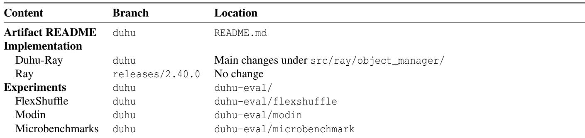  
Table 3: The contents of our artifact.

## A Artifact Appendix

## Abstract

This paper’s artifact includes the code for Duhu, and a version of Ray that is integrated with it. It builds on Ray branch releases/2.40.0, and most of the modifications are in the object\_manager. These changes include logic to allocate, get (and drop) references, and delete objects in a Duhumanaged SDM.

The repository also includes the workloads we used in our evaluation.

## Scope

When run in the same setup as described in the paper, the artifact reproduces the workload-performance results reported in §8.

## Contents

The artifact is within a single repository, with (1) a branch forked from the original Ray repository, (2) a modified Ray with Duhu integrated, and (3) a set of workloads we run to evaluate the performance of Ray and Duhu-Ray, including FlexShuffle, TPC-H on Modin, and microbenchmarks. Table 3 lists the contents of the artifact in detail.

## Hosting

The artifact is hosted in a GitHub repository (https://github.com/nyu-systems/duhu-ray), with all contents listed above.