の

USENIX

THE ADVANCED COMPUTING SYSTEMS ASSOCIATION

# Arctic: a practical lock-free adaptive radix tree

Newton Ni, Nicolas Garza, Jenny Stinehour, and Michael Goppert, The University of Texas at Austin; Michal Friedman, ETH Zürich; Emmett Witchel, The University of Texas at Austin

https://www.usenix.org/conference/osdi26/presentation/ni

# This paper is included in the Proceedings of the 20th USENIX Symposium on Operating Systems Design and Implementation.

July 13–15, 2026 • Seattle, WA, USA

ISBN 978-1-939133-55-7

Open access to the Proceedings of the 20th USENIX Symposium on Operating Systems Design and Implementation is sponsored by

# ARCTIC: a practical lock-free adaptive radix tree

Newton Ni, Nicolas Garza, Jenny Stinehour, Michael Goppert, Michal Friedman∗, Emmett Witchel The University of Texas at Austin ∗ETH Zürich

## Abstract

Indexing data structures are vital to the modern systems ecosystem, but there are no indexes that offer high performance, lock freedom, and range scans. ARCTIC is a lock-free adaptive radix tree that achieves all three: ARCTIC outcompetes lock-based indexes, including a concurrent hash map, on many YCSB configurations, guarantees non-blocking operation through careful metadata layout and an (eponymous) freezing-based coordination protocol, and offers non-linearizable range and prefix scans. ARCTIC also contributes a novel safe memory reclamation scheme that uses operation keys to approximate reachable pointers. We integrate ARCTIC into RocksDB and Turso, improving throughput up to 40% and 12% on their write-heavy benchmarks relative to their default skiplist indexes.

## 1 Introduction

Indexing structures are a fundamental component of modern systems infrastructure: they underpin persistent key-value stores [10,26], distributed caches [9], and databases [18,41,59]. In these settings, index operations are frequently on the critical path of request processing and must scale across many cores and sockets. We focus on three properties that such indexes should provide. First, performance: indexes must offer high throughput and low tail latency on real hardware. Second, lock-freedom: indexes should provide strong progress guarantees and scale under high contention without relying on coarse-grained locks. Lock-freedom is important when systems have more threads than physical cores: a thread suspended inside a lock-based index’s critical section stalls other threads waiting on that lock, while a lock-free index makes progress regardless of scheduling (§ 4.1). Third, range scans: many workloads require efficient range and prefix scans. For example, LSM trees [46] in key-value stores rely on range scans for fast compaction, and databases use range scans to accelerate range queries and index-only plans. We claim that no existing index satisfies all three of these properties, a conclusion supported by previous studies [27, 42].

We group index structures into a few families: hash maps, skiplists, B+-trees, prefix trees, and hybrids. Hash maps achieve excellent performance and admit highly concurrent and even lock-free implementations [39], but they do not support efficient range scans. Skiplists [58] are ordered, but suffer from poor cache locality and high contention at higher levels of the list. B+-trees are the default choice for most databases, but lock-based B+-trees using optimistic lock coupling [36] perform far better than the state-of-the-art lock-free Bw-tree [54]. In the prefix-tree family, the lock-based adaptive radix tree (ART) [35, 37] is a widely used ordered index, while the lockfree SMART [38] struggles with memory usage and reclamation (§5). We are not aware of any lock-free hybrid or trie-based data structure that consistently outperforms these lock-based alternatives while also supporting efficient range scans.

ARCTIC is an adaptive radix tree based on ART that provides all three properties. (1) ARCTIC out-performs ART on almost every YCSB [24] workload we evaluated (§4.1); at 80 threads, the throughput increase over ART (geomean across seven key distributions) ranges from 1.3× on YCSB-C to 7.7× on YCSB-A. (2) ARCTIC’s new metadata layout and (eponymous) freezing-based [14, 15] coordination protocol enable it to achieve lock-freedom at minimal performance cost: ARCTIC introduces no additional pointer indirection relative to ART, and updates nodes in-place (as opposed to read-copy-update), reducing both cache and allocator pressure. (3) ARCTIC provides wait-free (but non-linearizable [31]) range and prefix scans, as well as wait-free reads.

ARCTIC also integrates a novel safe memory reclamation (SMR, §2.5) scheme, which we call hazard keys, that correlates logical operations with physical pointers. We start with hazard pointers (HP) [43], which guarantee bounded unreclaimed memory [48] by announcing the exact set of pointers an operation is accessing, but add overhead to every pointer dereference as a result. In §3.9, we show how we can instead approximate protected pointers “for free” by correlating an operation’s key with the tree structure, enabling us to protect all pointers by announcing just the key, up front, once per operation. Our evaluation (§4.3) explores how hazard key reclamation efficiency is sensitive to request distribution, but less sensitive to thread stalls or oversubscription.

In return for performance, lock-freedom, and range scans, ARCTIC requires 128-bit atomic compare and swap (CAS) for correctness, and 128-bit atomic loads for reasonable performance. ARCTIC’s memory overhead varies with the key distribution, but is generally higher relative to ART for integer keys (0.97×-1.5×), and lower for string keys (0.19×-0.61×).

In summary, this paper makes the following contributions.

• We present the design of ARCTIC, the first lock-free ordered index to surpass lock-based alternatives in performance, and sketch proofs of its correctness and lock-freedom.

• We contribute a novel SMR scheme—hazard keys—and evaluate its sensitivity to request distribution and thread count.

• We demonstrate the real-world potential of ARCTIC by replacing concurrent skiplists in RocksDB [16] and

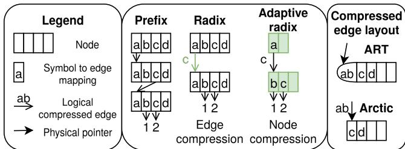  
Figure 1: The midddle panel shows the evolution of prefix trees, with fixed nodes and height, to radix trees, which compress shared symbols into edges, to adaptive radix trees, which compress nodes into smaller partial mappings. All three trees represent the map {acb = 1,acc = 2}. The right panel shows two physical layouts of a logical compressed edge: ART stores the bytes in child node headers, while ARCTIC stores them alongside child pointers.

Turso [11], resulting in end-to-end speedups up to 40% and 12% on their write-heavy benchmarks.

• ARCTIC is open-source and available at https://github.com/nwtnni/arctic.

## 2 Background

This section provides technical background on lock-freedom, prefix trees, and safe memory reclamation.

## 2.1 Lock-freedom

An object is lock-free if, in every execution where operations are continually invoked, some operation always completes in a finite number of steps. A data structure is lock-free if, regardless of schedule, threads make progress in every execution. Even if some threads halt or crash, other threads will be able to continue executing their operations on the object, as no thread may block another. As a result, an operation on a lock-free object always keeps the memory in a consistent state.

Lock-free data structures are most commonly implemented using compare-and-swap (CAS) as a hardware synchronization primitive, which can atomically load, compare, and store up to 16B. The x86 has a 16B CAS instruction (CMPXCHG16B), as does ARM in the LSE extension (the CASP instruction).

## 2.2 Prefix and radix trees

A prefix tree is an associative data structure composed of nodes and edges that maps keys—sequences of symbols—to values. Each node is a total map from symbol to edge (typically a fixed size array). Each edge has one child, which can be a value or a node (which can be null). A simple example is shown in Figure 1. Prefix trees provide point operations in time complexity linear to the key size, and admit efficient range scans due to their lexicographically ordered structure. In practice, however, prefix trees suffer from (a) high time overhead when keys are long, due to following one pointer per symbol, and (b) high space overhead when keys are sparse, due to fixed size nodes.

Radix trees. Radix trees are a variant of prefix trees. Radix trees still use fixed size nodes, with the radix r determining the node size 2r. The radix is commonly chosen as 8 so that symbols are bytes, which is efficient for hardware; we assume byte symbols in this paper. Radix trees reduce overhead through edge compression, i.e., labelling edges with shared bytes, which reduces the height of the tree and eliminates nodes with one child. Two physical representations of these edge bytes are shown in Figure 1: ART [35] stores them in child node headers, while ARCTIC stores them inline with child pointers.

Judy arrays [1] and the adaptive radix tree [35] (ART) additionally reduce space overhead through node compression, i.e., choosing different node representations depending on how many children the node has, which reduces the size of sparsely populated nodes. Both of these optimizations are displayed in Figure 1.

Important properties. We will briefly describe some properties that help us reason about correctness. First, every prefix tree element (node, edge, value) can be labeled inductively with a prefix:

Definition 1 (Prefix). The root edge has the empty prefix. If an edge has prefix p and bytes [b1,b2,...], then its child has prefix p+[b1,b2,...]. If a node has prefix p and maps byte b to edge e, then edge e has prefix p+[b].

Prefix trees must satisfy two invariants: for a given prefix, there is at most one node in the tree, and for a given node in the tree, it has exactly one prefix. Second, we point out a major precondition of prefix trees:

## Precondition 1. No key is a prefix of any other key.

This precondition avoids a vexing case where the same key maps to both a node and a value, and the restriction is easy to satisfy in practice. Fixed-size integers and C-style null-terminated strings both have this property; other dynamically-sized keys can append a sentinel byte. ARCTIC and all other prefix tree-based data structures we are aware of have this restriction.

## 2.3 Structural modification operations (SMOs)

SMOs are operations that modify the physical state of a data structure without modifying its logical state, and are typically necessary to maintain data structure invariants. For example, tree rotation maintains balance in a binary search tree, and resizing maintains load factor in a hash map. We will focus on SMOs because they are often the most challenging part of designing lock-free data structures, especially when they require writes to multiple memory locations. For example, a B+-tree node split requires writing both parent and child.

Naive prefix trees have very simple SMOs (bottom of Figure 2) that only write to the parent. Once we introduce edge compression and node compression, however, the number and complexity of SMOs also increase; they are necessary to manage edge bytes and node representations, respectively. We will reference these SMOs extensively, as our design is grounded in implementing SMOs atomically without extra indirection or locking (§3.3).

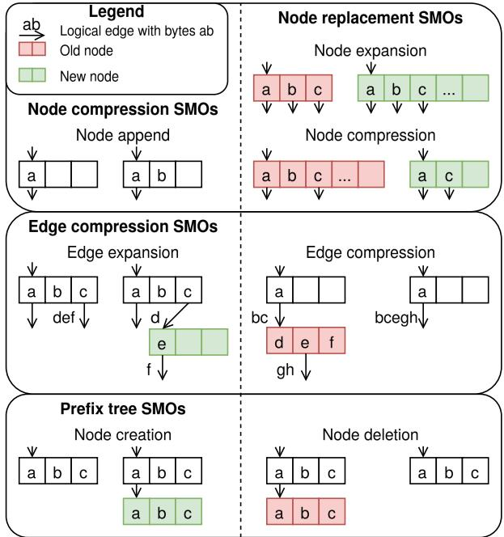  
Figure 2: SMOs in prefix tree variants. Prefix trees (bottom) only have two SMOs: node creation and deletion. Edge compression (middle) requires two new SMOs to expand and compress edge bytes. Node compression (top) requires three new SMOs to append to node partial mappings and change the representation of a node. SMOs on the right side require unlinking (Figure 3); we refer to them collectively as node replacement SMOs.

## 2.4 Node life cycle

Figure 3 illustrates the life cycle of a ARCTIC node: the states a node can occupy and the transitions between them. Informally, we say a node is reachable if there exists some path to it from the root. Linking makes a node reachable, and unlinking makes it unreachable; in ARCTIC, these transitions are implemented atomically by CASing a pointer to the node. We will introduce freeze next, and reclaim in §2.5.

Freezing [14, 15] addresses a specific race between unlinking a node and concurrently accessing that same node. Depending on the data structure, it may still be correct to read an unreachable node, but it is generally incorrect to write to an unreachable node. For example, if thread A loads a pointer to node n, thread B unlinks n, and thread A writes to n, then thread A’s write is not observable.

At a high level, freezing prevents unlink-write races by requiring unlinking threads to set a frozen bit on every CASable location in a node before unlinking; on the other side, a writing thread promises to CAS only when the frozen bit is clear. This provides a mechanism for writers to detect when the node they are writing may be unreachable—it could be frozen but still reachable. For reading threads, it is usually safe to restart when reading a location whose frozen bit is set, but this could be quite slow.

ARCTIC uses freezing as a primitive coordination mechanism, but there are many edge cases that must be specialized for our data structure: for example, what does a writing thread do when it fails to CAS? When is it safe for a reader to read an unreachable node? Our design (§3) answers these questions and we sketch a correctness proof (§3.8).

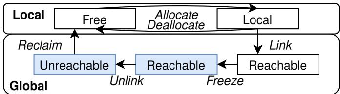  
Figure 3: The life cycle of a node in ARCTIC. The top two states are local, meaning that there is at most one thread that can access the node. The bottom three states are global, meaning there may be any number of threads accessing the node. We use freezing to coordinate unlinking (§2.4); a frozen node may be reachable or unreachable. Our hazard key protocol (§3.9) determines when an unreachable node becomes safe to reclaim (§2.5).

## 2.5 Safe memory reclamation (SMR)

Any concurrent data structure that allows optimistic traversal (in other words, loading and dereferencing pointers without acquiring a lock) must be especially careful to avoid useafter-free errors. This is the safe memory reclamation (SMR) problem: determining when a pointer will never be dereferenced again, so it can be freed. In managed languages like Java or Go, SMR is handled by the language runtime’s garbage collector. In languages with manual memory management like C, C++, or Rust, SMR falls to the programmer.

SMR algorithms make a fundamental trade-off between precision—how closely they can estimate the set of pointers that will no longer be dereferenced—and performance—how much runtime overhead they incur. Hazard pointers [43] keep track of the exact set of pointers being accessed, which bounds unreclaimed memory, but the cost is overhead for every pointer access. On the high performance end of the trade-off, epoch-based reclamation (EBR) [29] tracks quiescent periods between operations. EBR is popular for its consistently high performance, but even a single stalled thread can prevent all memory reclamation.

## 3 Design

To develop some high-level intuition for our design, and how it differs from ART, we walk through of a series of insertions (§3.1). Then we will go over:

• ARCTIC’s metadata layout (§3.2)

• How to perform SMOs atomically (§3.3)

• How to traverse (§3.4) and insert (§3.5)

• How to reclaim memory (§3.9)

• Why ARCTIC is correct, linearizable, and lock-free (§3.8)

• How to optimize ARCTIC (§3.10)

## 3.1 Walkthrough

Figure 4 illustrates a series of insertion operations on ARCTIC and ART, starting from an empty tree.

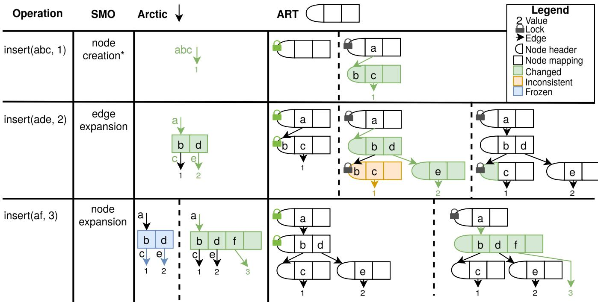  
Figure 4: Walkthrough showing a series of insertions in ARCTIC and ART, starting from empty trees. Each insertion requires a different SMO (except the first insertion, which ARCTIC handles without an SMO). Each data structure undergoes atomic transitions between globally visible states, both between rows, and from left to right within a row (separated by dashed lines). To save space, we merge ART’s locking and omit its unlocking.

Empty. ARCTIC is rooted at an edge, while ART is rooted at a node because: (1) ARCTIC stores edge bytes alongside edges, (2) ART stores edge bytes in child node headers, and (3) Precon dition 1 precludes empty keys. Therefore, ART needs at least one node to represent a non-empty key, while ARCTIC does not.

Insert(abc, 1) (Row 1). ARCTIC can store a value with a non-empty key directly under the root edge, so no SMO is required. ART creates an intermediate node and locks the root node to install it.

Insert(ade, 2) (Row 2). This insertion requires edge expansion. ARCTIC requires only one CAS, but this SMO is painful for ART because ART stores edge bytes in child node headers. As a result, ART takes two locks to update the parent’s edge and the child’s node header, exposing an inconsistent state in between that readers must detect.

Insert(af, 3) (Row 3). We illustrate this insertion as if it requires a node expansion, though in practice, ARCTIC’s smallest node can accommodate 3 entries, and ART can accommodate 4. Node expansion requires unlinking an old node. ARCTIC handles this case by using a freezing-based (§2.4) node replacement protocol (§3.3) that is expensive, but maintains consistency and supports in-place updates. ART takes two locks to prevent updates to the child while updating the parent’s child pointer.

Summary. ARCTIC has clear performance benefits just from avoiding locking and unlocking, both in the common case of updates, where ART requires one lock, and in the rarer case of SMOs, where ART requires two locks.

More importantly, by removing ART’s node-level locking, ARCTIC achieves much finer-grained concurrency, both vertically—between different levels of the tree—and horizontally—between different edges in a single node. As an example of vertical concurrency, consider two consecutive nodes, where both undergo node expansion. In ARCTIC, these two node expansion SMOs happen fully in parallel (§3.3), while in ART, they conflict on a lock on the second node. As an example of horizontal concurrency, consider updating two edges in a node. In ARCTIC, these two updates also happen in parallel, while in ART, they conflict on the node-level lock.

## 3.2 Metadata layout

Figure 5 shows the layout of ARCTIC’s intermediate node types (Node3, Node15, Node47) which are based on ART’s [35] (Node4, Node16, Node48), but ARCTIC (1) reorganizes edge and node metadata to enable atomic SMOs (Figure 2), and (2) ensures all node types have power-of-two sizes to make more efficient use of hardware. We will explain how this layout follows naturally from our constraints.

The biggest constraint on ARCTIC’s layout is the edge expansion SMO. As shown in Figure 4, ART’s placement of edge bytes in child node headers means edge expansion requires two writes, which is difficult to do atomically without locks. ARCTIC shifts these edge bytes upward into the parent edge. While our design still works with 8B edges and atomics, to fit more edge bytes, we make our edges 16B and require the system to support 16B atomic operations.

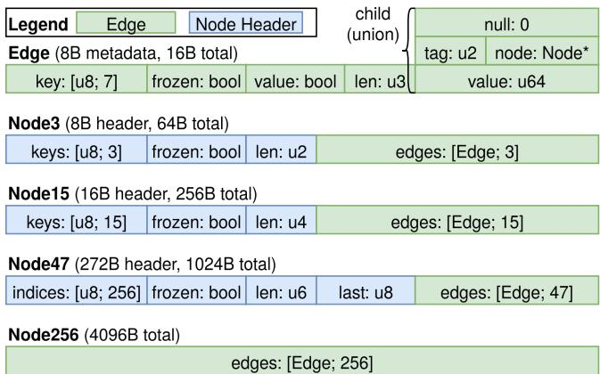  
Figure 5: The memory layout of ARCTIC’s edge and node types. The child of an edge is a union between a user value (if the value bit is set), null, or a node pointer with its type tag in the lower two bits, which are zero due to alignment. We ensure that all types have power-of-two sizes, which works well with hardware and memory allocators, and that our smallest node type (Node3) occupies exactly one cache line to avoid false sharing between different nodes.

With 16B edges in place, our next constraint is Node256, which must contain an array of 256 edges, exactly 4KiB. We cannot fit any metadata without causing Node256 to span two pages (bad for memory allocator, page table, TLB); luckily, the only metadata Node256 needs is a node type tag, so we shift node type tags into parent edges as well. (As a side benefit, this eliminates a cache miss: ART unconditionally loads child node headers to determine the type, but ARCTIC avoids this load when the child is a Node256).

Our final constraints come from node replacement and node append SMOs. Our node replacement protocol (§3.3) requires every edge and node header to have a frozen bit (§2.4). For node append, Node3 and Node15 need no additional changes, because their headers fit into 16B and can be CASed atomically, but Node47’s header is too large. We add a field—(last, the last appended key byte)—and explain how we use it to achieve atomic node appends in §3.3.

## 3.3 SMOs

We now revisit our adaptive radix tree SMOs (Figure 2) and ex plain how ARCTIC’s layout enables us to implement each SMO atomically. We focus on successful SMOs for now, as failed SMOs are handled at a higher abstraction level (e.g., insertion or deletion). Failed SMOs have no globally visible effects.

Edge expansion. ARCTIC places edge bytes in edges, which makes this SMO straightforward. Following the example in Figure 2, we expand an edge with bytes def to some child c. This can be done atomically as follows: (1) create a new Node3 n that maps byte e to edge with bytes f and child c, and (2) CAS the original edge to bytes d and child n.

Node replacement. Four SMOs—node expansion, node compression, edge compression, and node deletion, displayed on the right side of Figure 2—are similar in that they (1) scan an old reachable node to determine the contents of the new replacement node, (2) construct the new node in local memory, and (3) CAS to atomically unlink the old node and link the new node. However, this becomes complicated in the presence of in-place node updates: any number of concurrent updates to the old node may take place between steps (1) and (3), which may not be reflected in the new node when it is successfully linked in step (3).

We address this race condition in two ways. First, we prevent the old node from being updated between steps (1) and (3) through freezing (§2.4): we iterate over every CASable location in the node (header, edges) and CAS to set the frozen bit. The node is frozen once every frozen bit is set, and guaranteed to be immutable. Second, we avoid stale SMOs—for example, one thread starts freezing a full node in order to expand it, but every child is removed before freezing completes—by unifying all four SMOs into a single node replacement SMO. Threads may initiate a node replacement for any reason, but the new node (and SMO) is a deterministic function of the node’s contents after freezing, instead of being decided up-front. Revisiting the previous example, the thread now deletes the node instead of expanding to a larger node type with zero children.

We wish to highlight some nice properties of freezing and node replacement. Freezing is infallible, as each CAS is retried while the frozen bit is not set (it could be set by another thread concurrently freezing). Freezing is idempotent, and every thread that freezes a node, potentially concurrently, will see the same node contents after freezing. Finally, node replacement is symmetric: every thread that concurrently replaces a node will construct a logically identical replacement node, because the replacement is determined solely by the immutable contents of the old node after freezing.

Node append. Node256 is a total map from byte to edge; it does not need a node append SMO to create more byte to edge mappings. But smaller node types (Node3, Node15, Node47) are partial maps, and do require an SMO to create new mappings.

We note that node append operations always append an edge with a null child, which does not change the tree’s logical contents. Updating this newly appended edge is a separate oper ation. We also note that, like ART, our partial maps grow monotonically (which is why there is only a node append SMO). Unnecessary mappings are removed during node replacement.

Node3 and Node15 are similar: their headers comprise an array mapping from edge index to key byte, and the length, i.e., number of valid mappings. Because their headers are less than 16B, we can atomically CAS the header to update the mapping and the length.

Node47 is different; while its header also contains the length, it uses an array mapping from key byte to edge index (this inverse mapping avoids sorting during range operations). This is too large to be updated in one CAS, yet requires writing both the array and the length atomically to maintain consistency. Naively performing two CASes does not work: CASing the array first can result in two key bytes mapping to the same edge index, while CASing the length first can result in the same key byte being assigned two edge indices.

We solve this by introducing a last field containing the last appended key byte, adjacent to len. Now, before inserting, a thread first helps [17] ensure consistency of the len and last fields. These fields are consistent if the array entry at index last is equal to len − 1; if they are not consistent, then the thread CASes the array itself. This helping is infallible: if the CAS fails, it is safe to ignore, as another thread must have helped. After helping, the thread appends its own mapping by CASing len and last, and finishes by helping itself.

This Node47 append algorithm requires some scrutiny: unlike the other SMOs we have discussed, it requires two CASes (one to update len/last, and one to update the array) and is not obviously atomic. Intuitively, this SMO completes after the second CAS, when the array is updated: readers do not check len and last at all, and writers ensure the array is always consistent, including before freezing. This means that the intermediate state between two CASes is not observable by any other operation or SMO, and our append is atomic.

## 3.4 Traversal

Algorithm 1 Traversal algorithm   
1: root: &Edge   
2: key: &[u8]   
3: i ← 0   
4: j ← i+LEN(root.bytes)   
5: while key[i..j] == root.bytes do   
6: match root.child? with   
7: Value(value) ⇒ return Some(value)   
8: Node(node) ⇒   
9: root ←node[key[j]]?   
10: i ← j   
11: j ←i+LEN(root.bytes)   
return None

Without loss of generality, we focus on traversal to a full key. (Traversal to a key prefix is analogous, except it may end at an intermediate edge or node.) We present pseudocode in Algorithm 1; the ? operator is Rust syntax for returning early if None. Traversal is wait-free, never back-tracks, and does not interact with freezing. Traversal can terminate unsuccessfully in three different ways: (1) when key[i..j] does not match root.bytes in line 5, (2) when root has no child in line 6, and (3) when node has no mapping for byte key[j] in line 9 (note that j is a valid index into key here due to Precondition 1).

## 3.5 Insertion

The happiest path for insertion is when all intermediate edges, nodes, and node mappings for a key already exist—in other words, traversal proceeds until terminating at an edge with no child, which we will call the final edge. To insert, we atomically CAS the final edge from null to the new value.

Now, let us consider all the ways in which the happy path might become sad. We will distinguish between two levels of sadness: the first level is when an SMO is necessary to continue traversal, but we still assume all of our CASes succeed. The second level considers when any CAS may fail; thankfully, this level is recursive, so we will not need more.

A little sad. In §3.4, we list the three ways traversal can terminate unsuccessfully. In each case, we perform an SMO, and then continue traversal: (1) if the key bytes do not match the edge bytes, perform edge expansion; (2) if there is no child, and the remaining key bytes do not fit in one edge, perform node creation; (3) if there is no node mapping for the key byte, perform node append, or node replacement if the node is full.

Very sad. We now consider what happens when CASes fail, recalling that the only locations we CAS in ARCTIC are node headers (node append SMO) and edges (everything else). The first thing we do on CAS failure is to deallocate any new node that was created (SMOs with new nodes in Figure 2). This does not require SMR, as these nodes are still local (Figure 3). Then our response depends on whether or not the CAS failed due to freezing.

Case CAS-UF (CAS failure, unfrozen) Somewhat surprisingly, we can handle all of these failures the same way, regardless of what SMO or operation the CAS is a part of, by simply continuing traversal from the current edge. To understand why this works, we can look at some concrete examples. If the CAS failure was due to a concurrent (1) edge expansion, we will match the new edge bytes and child and traverse into the new intermediate node; (2) insert or delete, we will match the same edge bytes and child and retry our operation; (3) node append, we will match the same edge bytes and child and retry our node append.

Case CAS-F (CAS failure, frozen) We can infer in this case that the node that contains this edge or node header is undergoing node replacement, since that is the only time we freeze. We cannot just wait for the node replacement to finish, since that would violate lock-freedom (suppose the thread that started node replacement died), so we help by performing node replacement ourselves.

This case may require back-tracking, which we implement by keeping a stack of edges during traversal: if we failed to CAS an edge, we need to go up to the containing node, and then up to the node’s parent edge; if we instead failed to CAS a node header, we do not need to back-track, as we are already at the node’s parent edge. Then we perform node replacement, handling CAS failures recursively according to CAS-UF and CAS-F. Intuitively, this algorithm is correct because node replacement is always safe (§3.3), so even if the current edge has changed since we first traversed it (e.g., a concurrent edge expansion SMO created a new node in between), node replacement will at worst be a no-op. We can tell if the current edge is now unreachable because its frozen bit will be set, in which case we recurse, potentially all the way to the root—but no further, because the root edge is never frozen; it is not inside a node.

In practice, we almost never hit case CAS-F, let alone recursively. Backtracking more than one level requires multiple node replacement SMOs to occur simultaneously at consecutive levels of the tree. For perspective, we present some numbers from our YCSB insert-only workload (§ 4.1) with 100M random 8B integer keys and 80 threads, which induces the highest number of SMOs and conflicts. Only 324 of these 100M inserts reach case CAS-F, and none of them backtrack more than one level. We have never observed more than two levels of backtracking.

## 3.6 Deletion

Deletion itself is straightforward due to our update-in-place design: traverse to the value and CAS the final edge to null. The difficulty comes from garbage collecting empty nodes. There is a spectrum of viable options, ranging from fast—assume deletion is rare and do no garbage collection—to slow—scan node after deletion and perform node replacement if it can be deleted or compressed, recursing upward if deleted. Garbage collection can require more memory as garbage builds, while node scanning insures that only in-use nodes occupy allocated memory.

A node scan is required because we have no counter of non-null children, because having one would create a single contention point for each node (node header mappings are orthogonal to whether the edges have non-null children). Scanning small nodes (Node3, Node15) is cheap, but it is expensive to scan large ones (Node47, Node256). Another option is to asynchronously scan the tree and perform node replacement, which can be done at any time by any thread.

## 3.7 Scan

Like most concurrent indexes [18, 37, 38, 57], ARCTIC’s range (and prefix) scans are not linearizable [31]. This is acceptable in many use-cases; for example, LSM trees [46] in key-value stores [26] scan when there are no writers, and databases can use multi-version concurrency control [11, 25]. ARCTIC does guarantee some weaker properties: a scan observes keys at most once, in lexicographic order, and observes all keys (within range) that were inserted before the scan starts, and not removed before the scan ends.

## 3.8 Correctness

We first show that our SMOs preserve the prefix tree invariants (§2.2), namely that for a given prefix there is at most one node in the tree and that each node in the tree has exactly one prefix. We also show that we preserve the freezing invariants (§2.4), i.e., frozen CAS locations are immutable, and nodes are frozen before unlinking.

For prefix tree invariants, we first observe that the only way to violate the uniqueness of node prefixes is for a node to contain an inconsistent mapping, i.e., mapping the same byte to more than one edge. As explained in §3.3, Node3 and Node15 prevent this because their mappings fit within a single

CASable header and are updated atomically. Node47 maintains consistency through its helping protocol and Node256’s mapping is trivially consistent. A node can only have more than one prefix if it is reachable from multiple parents. This is impossible because ARCTIC SMOs either allocate new nodes or copy existing children while preserving their prefixes.

For freezing invariants, every CASable location contains a frozen bit in headers and edges (§3.2), and all update operations respect it. Furthermore, node replacement freezes all CASable locations before unlinking, ensuring that no node can become unreachable before it is fully frozen. Once a node is fully frozen, no further updates to its CASable locations can succeed, and therefore its contents become immutable. Consequently, invariants (§2.4) are satisfied.

Claim 1 (Locality). SMOs in ARCTIC preserve the reachability and prefixes of their parents and non-null children.

Sketch proof. No SMO modifies memory above its containing node, so parents are unaffected. Node append and node creation only make new mappings visible. Edge expansion introduces a new intermediate node and edge while preserving the reachability and prefix of the existing child. Node replacement copies all non-null mappings from the frozen node into the replacement node before unlinking the original node. Since the node is fully frozen beforehand, its contents cannot change during replacement and no reachable mapping can be lost. Therefore every non-null child remains reachable with the same prefix.

This property allows us to reason locally about operations and ignore interference from concurrent SMOs occurring elsewhere in the tree.

## 3.8.1 Linearizability

Claim 2. A successful insert of key k+[b]+k′ linearizes at the successful CAS that changes the child of the reachable edge with prefix k + [b] and key k′ from null to the inserted value. If a value for the same key already exists, then the failed insert linearizes at the load that observes the existing non-null value.

Sketch proof. After traversal and any required SMOs (§3.5), insertion reaches an unfrozen reachable edge whose prefix matches the key.

The successful CAS makes the value reachable from the root and therefore inserts the key into the logical map. By the prefix-tree invariants, e is unfrozen and therefore reachable, and no other reachable edge can correspond to the same key, so this CAS is the linearization point.

If the child of e is already a non-null value, insertion fails without modification. Therefore the failed insert linearizes at the load that reads the existing value.

Claim 3. A successful delete of key k + [b] + k′ linearizes at the successful CAS that changes the child of the reachable edge with prefix k + [b] and key k′ from a value to null. If no value or key exist, then the failed delete linearizes at the load that observes the longest matching prefix and determines that traversal cannot continue or the value does not exist.

Sketch proof. The argument is identical to insertion. The edge is reachable and uniquely identified by the key prefix. The successful CAS atomically removes the value and therefore serves as the linearization point.

If traversal instead observes that the key has no associated value, either because traversal terminates unsuccessfully or because the final edge contains a null child, then deletion fails without modification. The operation linearizes at the load that observes this absence. □

Claim 4. A get of key k+[b]+k′ linearizes at the load of the matching edge when traversal reaches an unfrozen reachable edge with prefix k+[b] and key k′. If no such edge exists, the linearization point is when the operation observes the longest matching prefix and determines that traversal cannot continue. Otherwise, the traversal reaches a frozen matching edge, and the linearization point is the latest point between when the edge was frozen and when the get operation starts.

Sketch proof. If the edge is not frozen, the claim follows from the same logic as insert (without executing any SMO operations). In the second case, traversal terminates at the first point where the searched key diverges from the tree structure, either due to a byte mismatch, a missing child, or a missing node mapping. If the edge is frozen, the reasoning is more delicate. We know the containing node is reachable (because we reached it through traversal). The edge is immutable after being frozen (freezing invariants). This edge must be the only reachable edge with prefix k+[b] until the containing node is replaced (prefix tree invariants). Then we have a window between when the edge is frozen and when the containing node is replaced where the value under this edge cannot change; we choose the earliest time in this window as our linearization point. □

## 3.8.2 Lock freedom

We prove by contradiction. Assume there is some execution for which no executing operation terminates after a certain point α. In this case, we assume that no operation is invoked after this point, and given a finite number of running processes, the set of running operations is also finite. Then:

Claim 5. There is a finite number of freezings of reachable nodes after α.

Proof. A traversal operation must terminate after finding the closest prefix of the searched key traversing from the root, an insert operation must terminate after inserting the relevant key, or updating the value of that key if it already exists, and a delete operation terminates once updating the value of the relevant key edge to null, if it exists. The freezing happens when a node needs to be expended or compressed during an insertion or deletion. Therefore, since we have a finite number of inserted and deleted nodes after α, and since freezing is sequentialized on a node level and irreversible, we can conclude that the number freezings of reachable nodes after α is finite as well. □

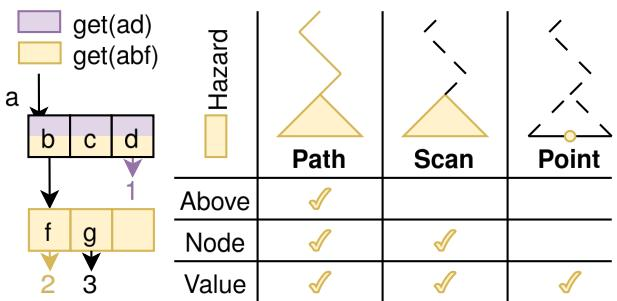  
Figure 6: On the left, we show a concrete example of how an operation’s key can be correlated with the structure of the tree; the two get operations in the top left will only access the nodes and values of their color. On the right, we show how a hazard key could be refined after traversal to a subtree for a scan operation, or a value for a point operation.

Claim 6. There is a finite number of reachable node and edges changes after α.

Proof. The nodes and edges only change along the insertion or deletion paths. They are caused due to SMOs or edge updates. We always keep traversing down the tree, even when CAS operations fail, unless we spot a freeze. Since freezing is finite (by Claim 5), we will backtrack up the tree a finite number of steps, and keep traversing down again. As the number of nodes and edges in the tree is finite, there is a finite number of reachable node and edge changes after α. □

## Claim 7. ARCTIC is lock-free.

Proof. From Claims 5 and 6, after a certain point, there are no freezings or node and edge changes in the tree. Therefore, we consider the continuation of the execution that contains no state or pointer changes of reachable nodes and edges. From this point, ARCTIC does not change anymore. Since ARCTIC is finite, every traversal operation eventually ends. Furthermore, every insert and delete operation must be unsuccessful since no changes were applied, and so they also terminate. We get a contradiction and therefore, the implementation is lock-free.

## 3.9 Hazard keys

We propose a new class of safe memory reclamation schemes by exploiting the correlation between prefix tree operations and structure. We will briefly introduce the key idea before discussing tradeoffs relative to existing schemes.

Recall that each node in ARCTIC is labelled with a prefix p (§2.2). A point operation on key k will only access nodes where p is a prefix of k; contrapositively, if a node’s prefix p is not a prefix of k, then operation k will not access that node. The left side of Figure 6 shows a simple example: here, we can see that no operation on key “ad” will access the bottom node (prefix “ab”), value 2 (prefix “abf”), or value 3 (prefix “abg”). Similarly, no operation on key “abf” will access value 1 (prefix “ad”).

With this observation in mind, we propose the following SMR scheme: (1) include a prefix along with retired nodes or values, (2) publish a hazard key before each operation, and (3) reclaim allocations that are not protected by a hazard key, where an allocation with prefix p is protected by a hazard key k if p is a prefix of k. In other words, hazard keys use logical operations to cheaply approximate a set of physical hazard pointers [43].

The unique property of hazard keys is that their reclamation efficiency—how tightly an SMR scheme can bound the number of retired but unreclaimed allocations—is dependent on the request and key distribution. Hazard keys can tolerate thread stalls or oversubscription more gracefully than epoch-based schemes [29, 47], because a stalled thread prevents reclamation of a subset of allocations rather than all allocations. The same distribution-dependence is a liability under skew: a prefix is unlikely to be protected for long by uniformly random hazard keys, but could be protected indefinitely if the hazard keys are heavily skewed (so hazard keys, unlike their namesake hazard pointers, are not robust; they admit unbounded unreclaimed memory).

Hazard keys have lower overhead than hazard pointers, as a single hazard key can be published before an operation, whereas a hazard pointer must be published (and validated) before each pointer load. But hazard keys have higher overhead than epoch-based reclamation, as each retired allocation prefix must be matched against O(thread count) hazard keys, whereas an epoch comparison allows an entire batch to be freed.

We demonstrate these tradeoffs in our evaluation (§4.3), which suggests that hazard keys provide a reasonable balance of throughput and reclamation efficiency for low to moderately skewed workloads. There are many extensions outside the scope of this paper: for example, the right side of Figure 6 depicts how a hazard key could be refined at runtime to protect a subtree or single pointer, reducing the chance of false positives. Hazard keys could be hybridized with epochs to improve reclamation efficiency under high skew. And hazard keys could be adapted to comparison-based data structures like skiplists, with retired allocations associated with a key range, and protection determined by key comparison rather than prefix matching.

ABA problem. ARCTIC contains pointers to nodes and values. For nodes, we only CAS node pointers during node replacement (§3.3), after we have traversed into the node and while we hold a reference to the node, so any SMR scheme is sufficient to prevent the ABA problem. For values, the value could similarly be protected by SMR before CASing.

## 3.10 Optimization

Optimistic traversal. Back-tracking up the tree requires maintaining a stack of edge pointers during traversal. But a thread only needs to back-track in the rare case that it fails a CAS due to freezing. So we always try to perform operations first without keeping a stack; if we need to back-track, we restart the operation from the beginning with a stack.

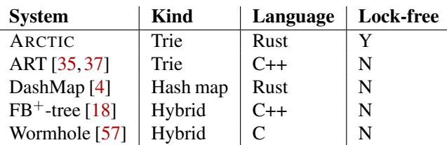  
Table 1: Properties of the baseline systems in our evaluation.

Native integer support. Most radix tree implementations note that the memory representation of little-endian integers is not lexicographically ordered, and proceed to byte swap integers at their API boundary so they work well with internal byte arrays. Because integer keys are ubiquitous, we instead implement edge bytes as 8-byte integers, with endianness matching the key type. Integer keys store bytes from MSB to LSB independent of endianness, using a big-endian edge, while string keys use the system endianness. Integer edge bytes allow for branchless prefix matching, using XOR to diff the bits and counting leading or trailing zeros.

SIMD. We apply SIMD acceleration in two new places relative to ART: bitonic sorting [19] of Node15 headers, and iterating over Node47 headers. We also use SIMD within a register (SWAR) [34] for branchless lookup in Node3 headers.

## 4 Evaluation

Our evaluation seeks to answer the following questions:

• How does ARCTIC perform under different key distributions?

• How does ARCTIC affect the end-to-end performance of larger systems?

• When are hazard keys a viable option for safe memory reclamation?

• How effective are ARCTIC’s optimizations?

We will present performance on YCSB [24] workloads under a variety of key distributions, performance on RocksDB [26] and Turso [11] benchmarks after integrating ARCTIC, memory reclamation efficiency on allocationintensive workloads, and an ablation study on basic operations.

Experimental setup. We evaluate on a Chameleon [32] compute\_icelake\_r650 instance running Ubuntu 22.04.5 LTS and Linux kernel version 5.15. These instances have two Intel Xeon Platinum 8380 CPUs; each CPU runs at 2.30 GHz and has 40 cores, 120 MiB LLC, and 128 GiB of DDR4 3200 DRAM.

For reproducibility, we disable hyper-threading and turbo boost, set the CPU scaling governor to performance, and pin threads to cores.

Baselines. We compare against the latest ordered indexes we could find in the literature, along with the best-performing indexes in their evaluation, summarized in Table 1. ART [35] is the adaptive radix tree that ARCTIC is based on, using

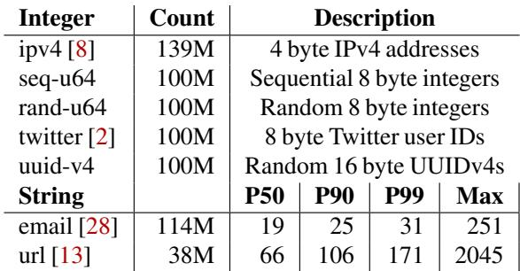  
Table 2: Key distributions, with length distributions for string keys.

ROWEX [37] for synchronization. DashMap [4] is a concurrent hash map written in Rust with consistently high throughput in open-source benchmarks [56]. FB+-tree is a hybrid B+-tree and trie that supports wait-free search and lock-free update, but requires locks for SMOs. Wormhole is a hybrid B+-tree, trie, and hash map with O(logL) search complexity (where L is the key length). We exclude RDMA indexes ( [38,51,52]) because their optimizations do not make sense for local shared memory.

## 4.1 YCSB

We run six YCSB [24] workloads across six key distributions (Table 2). Our YCSB workloads are standard: Load is 100% insert, YCSB-A is 50% read and 50% update, YCSB-B is 95% read and 5% update, YCSB-C is 100% read, YCSB-D is 95% read and 5% insert (skewed toward latest insertions), and YCSB-E is 95% scan and 5% insert. We use the default Zipfian request distribution with skew factor 0.99 and execute 100M operations. For values, we use 8-byte integers to reduce noise from memory allocation. In order to demonstrate ARCTIC’s scalability, we evenly interleave memory and cores across NUMA nodes; in order to demonstrate scalable performance and lock-freedom, we evaluate at thread counts up to double the physical core count. We will briefly describe some of the key distributions (summarized in Table 2) before analyzing the YCSB results.

IPv4. We use 139M IPv4 addresses from the Stanford Internet Research Data Repository [50], extracted from the saddr field of trial1\_http\_stanford64\_zmap.json.lz4.

Twitter. We use 100M Twitter user IDs from a public Kaggle dataset [3], extracted from the ID field of twitter\_users\_20[0-9].idscreenname.csv. Twitter user IDs (snowflake IDs [2]) are 63 bits, and can be generated without global coordination while providing a meaningful total order. An ID consists of—from most significant bit to least—a 41-bit timestamp, 10-bit machine ID, and a 12-bit machine-local sequence number.

Email. We use 100M emails from a public dataset [28], which we clean by matching against a regex [7], and preprocess by reversing the domain [38].

Url. We use 38M URLs from a public dataset [13], which we clean by removing URL query parameters.

For each combination of YCSB workload and key distribution, Figure 7 presents throughput vs. thread count (left columns) and peak memory usage (right-most column). ARC-TIC excels at operations on integer keys, only losing a few times to DashMap. For string keys, ARCTIC provides competitive throughput on write-heavy workloads, but its read performance falls off as tree depth grows linearly with key length. Note that seq-u64 keys are optimal for ARCTIC structure (minimal depth, maximal Node256 count) and performance; we established with perf that YCSB-Load and YCSB-A with seq-u64 keys bottleneck on kernel-level page table contention (allocating new Node256 nodes) and hardware-level cache line contention (CASing final edges), respectively.

ARCTIC performs notably well on YCSB-A because updates modify minimal shared memory, only CASing the final edge to a value. We estimate cache line contention with hardware performance counters for hit modified events (mem\_load\_l3\_hit\_retired.xsnp\_fwd + mem\_load\_l3\_miss\_retired.remote\_hitm): ARCTIC averages 0.5 events per YCSB-A operation across all keys, which is consistent with a single CAS per update, and is a geomean reduction of 2.6× relative to DashMap, 3.0× relative to FB+- tree, 3.8× relative to Wormhole, and 1.2× relative to ART.

ARCTIC achieves high throughput on YCSB-C in part through native integer key support, replacing memcpy and memcmp with efficient register moves and branchless prefix matching (§3.10), respectively. For example, for uuid-v4 keys, ARCTIC averages just 0.17 branch misses per operation, which is an increase of 1.14× relative to DashMap, but a decrease of 12× relative to FB+-tree, 7.8× relative to Wormhole, and 2.5× relative to ART.

ARCTIC maintains throughput when threads are oversubscribed (past 80 threads), demonstrating its lock-free progress guarantees. Lock-based baselines exhibit some noticeable throughput losses, like ART in YCSB-B, and DashMap and Wormhole (which uses spinlocks) in YCSB-D. FB+-tree locks for insertion and removal, but not reads or updates; its throughput is stable because its SMOs are infrequent and its spinlocks implement backoff.

ARCTIC’s memory overhead is highly dependent on the key distribution, but generally comparable to ART and higher than other indexes. ARCTIC has low memory overhead for seq-u64 keys due to its dense Node256 nodes, and for string keys due to key bytes being shared along edges. ARCTIC has higher memory overhead for integer keys because its nodes and edges are large relative to the key size.

## 4.2 RocksDB and Turso

RocksDB [26] is a widely used persistent key-value store backed by an LSM tree [46]. LSM trees typically have an in-memory index component (memtable in RocksDB). RocksDB’s default memtable is a lock-free concurrent skiplist, which we swap out for ARCTIC. We run RocksDB’s bulk load benchmark, which inserts 100M randomly generated 20-byte keys and 400-byte values with write-ahead logging disabled.

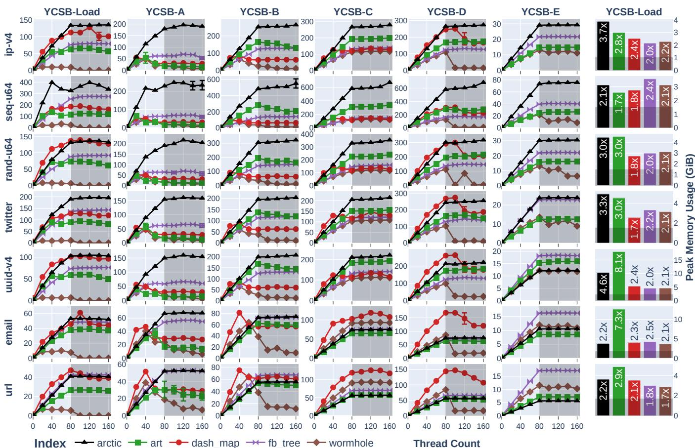  
Figure 7: Throughput on YCSB workloads across different key distributions. Each row is a key distribution, and each column is a YCSB workload. The right-most column indicates the peak memory usage (measured by mimalloc) after loading with 80 threads. For the throughput graphs, the shaded area indicates thread oversubscription. For the memory graphs, the shaded area indicates the baseline size of inserted keys and values, and the text indicates memory usage relative to this baseline.

RocksDB Throughput (ops/sec)  
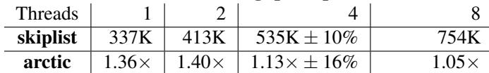

Turso Throughput (ops/sec)  
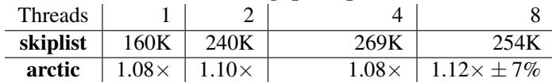  
Table 3: Average end-to-end throughput of RocksDB and Turso bulk load benchmarks when using original skiplist indexes vs. ARCTIC. Standard deviations under 5% are omitted.

Turso [11] is an open-source rewrite of SQLite in Rust. Turso supports concurrent writes via multi-version concurrency control (MVCC). The MVCC index uses a lock-free skiplist [6] to (1) map 16B row IDs to lock-synchronized row version data, and (2) map 8B transaction IDs to transaction metadata. We substitute these skiplists for ARCTIC and run Turso’s multi-writer benchmark, which transactionally inserts 100K batches of 100 rows (one sequential integer and one short string per row).

Table 3 displays the end-to-end throughput of these two benchmarks using the original skiplists, and the relative throughput after switching to ARCTIC. On these workloads, ARCTIC improves RocksDB throughput by up to 1.40×, and Turso throughput by up to 1.12×. To better understand these results, we run RocksDB with internal performance counters enabled, and Turso with perf record. Figure 8 shows how ARCTIC consistently reduces time spent in index operations at all thread counts, but has less impact on end-to-end throughput at higher thread counts due to other system bottlenecks.

## 4.3 Hazard keys

To explore how hazard key reclamation efficiency varies with request distribution (§3.9), we run some SMR-intensive workloads—YCSB-A and YCSB-B with rand-u64 keys and 8-byte allocated values—and measure the peak number of retired but unreclaimed allocations. As baselines, we substitute hazard keys with crossbeam-epoch [5], a popular implementation of epoch-based reclamation [29] (EBR), and seize [12], a third-party implementation of Hyaline [45] (a hybrid of EBR and reference counting). For fairness, we configure all three with a retired batch size of 256 (crossbeam-epoch defaults to

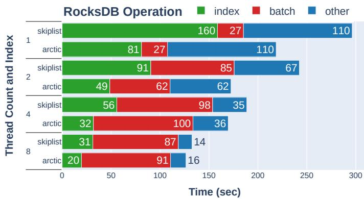

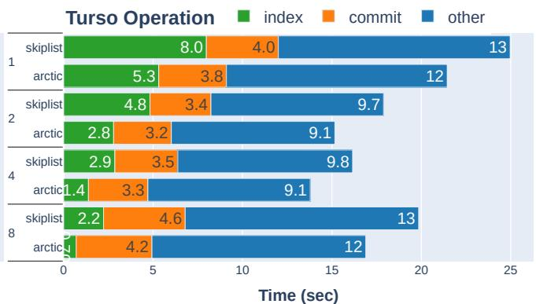  
Figure 8: Performance breakdown of RocksDB and Turso bulk load benchmarks, showing how switching to ARCTIC reduces time spent in index-related operations. RocksDB measurements use internal timer metrics; Turso measurements use perf record.

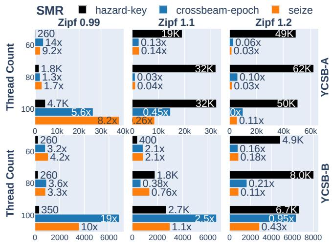  
Peak Unreclaimed Retired Allocations per Thread  
Figure 9: Reclamation efficiency of safe memory reclamation (SMR) schemes on SMR-intensive YCSB workloads with rand-u64 keys and allocated 8-byte values, varying skewness (Zipfian constant) and thread count. At Zipf 0.99, 17% of requests hit the top 10 (of 100M) keys, increasing to 33% and 48% at Zipf 1.1 and Zipf 1.2, respectively.

64, and seize to 32). (On YCSB-A at 80 threads, this batch size improves throughput by a geomean of 9.5% and 2.8× for crossbeam-epoch and seize, respectively, and affects peak garbage by -24% and +38%.)

Figure 9 shows that hazard keys can reclaim memory more efficiently than epoch-based alternatives when threads are oversubscribed, but only if the skew is low. At Zipf 0.99 and 100 threads, hazard keys reduce peak garbage by 5.6×-19× relative to baselines while retaining throughput close to crossbeam-epoch (+1.3% for YCSB-A, -12% for YCSB-B). Hazard keys can tolerate higher skew as the read proportion increases. The gap widens with thread count: EBR and Hyaline leave progressively more garbage as threads are added, and especially once they oversubscribe physical cores, because a single stalled thread blocks reclamation globally.

Under ideal conditions for all SMR schemes (Zipf 0.99, 80 threads), hazard keys incur throughput decreases of 7.2% and

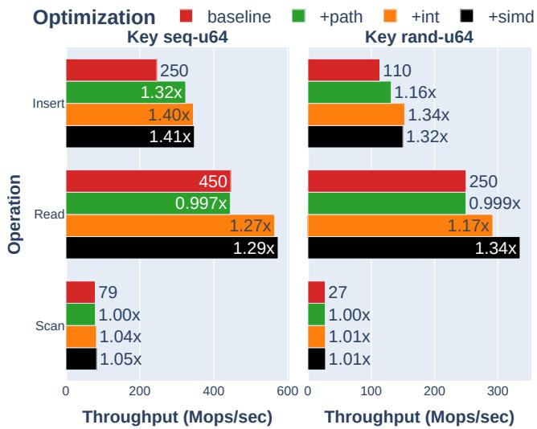  
Figure 10: Effect of optimizations on ARCTIC operation throughput at 80 threads. Reads and scans use the default Zipf 0.99 skew from YCSB. baseline disables all optimizations; +path is optimistic traversal, which avoids maintaining a stack during insertion; +int is native integer support, as opposed to treating integer keys as byte arrays; and +simd uses SIMD for node header lookups and scans. The baseline is annotated with the absolute throughput; other bars are annotated with throughput relative to the baseline.

6.3% relative to crossbeam-epoch for YCSB-A and YCSB-B, respectively, which is similar to seize (12% and 8.4%).

## 4.4 Ablation study

Figure 10 shows the effect of ARCTIC’s optimizations (§3.10), applied cumulatively. Optimistic traversal (+path) helps only insertion (1.3× for seq-u64 keys, 1.2× random), as reads never back-track; the effect is larger for seq-u64 keys as threads insert disjoint key ranges, and almost never take the pessimistic path. Native integer keys (+int) reduce branches and instructions in the critical path of traversal, benefiting all operations and both keys. SIMD (+simd) has little effect on seq-u64 keys—these trees are primarily composed of dense Node256s that can be directly indexed by key bytes—but rand-u64 keys see more benefit due to SWAR acceleration of

Node3 header lookup. Scans, bounded by memory bandwidth, are insensitive to all three optimizations (under 1.05×).

## 5 Related Work

Lock-free adaptive radix trees. To the best of our knowledge, there are three other ART variants that claim lockfreedom: DART [61] (published concurrently with ARCTIC) and SMART [38] target remote direct memory access (RDMA), while HEART [44] targets persistent memory (PM). SMART side-steps read-unlink races at the cost of memory usage: it uses a single (maximally sized) layout for all nodes, and does not reclaim empty nodes. DART and HEART make a similar observation to ARCTIC that edge expansion SMOs can be made atomic by shifting edge bytes from child node headers to parent edges, but neither takes advantage of 128-bit atomics, and neither system is truly lock-free. HEART embeds versions in parent edges to coordinate unlinking of child nodes, but writers can block between version changes. DART similarly uses parent edges to coordinate, but embeds a frozen bit instead of a version. DART also introduces a grace period mechanism to allow progress in the common case, but writers can still block if node replacement stalls. The key distinction between ARCTIC and DART, which both nominally freeze nodes, is that ARCTIC freezes the contents of a node, while DART freezes the parent edge of a node. ARCTIC ensures every future update to a node will fail, guaranteeing immutability, whereas DART (and HEART) have a fundamental race condition between updating a node and loading its parent edge. ARCTIC also proposes a deterministic node replacement algorithm that any thread can use to help complete an in-progress node replacement without blocking.

Lock-based and lock-free designs. Concurrent ordered indexes have a long history of trading performance for progress guarantees. Classic high-performance trees such as Masstree [40] and other B+-tree variants rely on fine-grained locking or optimistic lock coupling: they scale well in practice on read-heavy workloads, but contended updates can still block, and careful engineering is required to avoid deadlock and priority inversion. Lock-free designs such as Bw-tree [55] reduce blocking by replacing in-place updates with delta records and indirection through mapping tables, but this complicates traversal and increases pointer chasing.

Other index families like skiplists and binary search trees are typically composed of smaller nodes relative to B+-trees, which makes lock-freedom easier to achieve, but ultimately limits their performance on modern hardware.

ARCTIC provides lock-freedom while preserving the cache efficiency of non-concurrent adaptive radix trees.

Safe memory reclamation (SMR). Safe memory reclamation (SMR) for lock-free data structures is vital for high performance. Hazard pointers [43] provide portable lock-free reclamation but incur per-access pointer publishing and global scans, imposing performance overheads on read-heavy workloads [23]. Epoch-based reclamation (EBR) amortizes costs by tracking quiescent states, but can leak memory in the presence of stalled threads [21, 30]. New SMR schemes like Optimistic Access [23] and AOA [22] automate or streamline reclamation for normalized lock-free algorithms. Hyaline attains near-EBR throughput with hazard-pointer-like robustness and bounded memory usage [45].

SMR and persistent memory. Several systems co-design their data structures with safe memory reclamation (SMR) and persistent memory (PM) constraints in mind. NBTree [60] introduces a lock-free B+-tree tailored to eADR-enabled PM. Elimination (a,b)-trees [49] (OCC-ABtree and Elim-ABtree) feature publishing elimination so concurrent inserts and deletes on the same key can cancel each other, dramatically cutting writes. These trees are durably linearizable and still nearly as fast as the volatile versions. Jiffy [33] is a lock-free skiplist–based ordered index that supports batch updates and linearizable snapshots. UPSkipList [20] provides a recoverable lock-free skiplists by adding epoch tags to nodes so that after a crash, threads can distinguish in-progress updates from stale, inconsistent state and repair accordingly, preserving correctness and scalability on NUMA PMEM machines. Easy Lock-Free Indexing in NVM [53] uses a persistent multi-word CAS primitive to build both a lock-free Bw-tree and a lock-free skiplist record store on PM.

## 6 Conclusion

ARCTIC is a lock-free adaptive radix tree that supports range and prefix scans while preserving a cache-friendly, low-indirection layout. By reorganizing its metadata to accommodate 128-bit atomic operations, ARCTIC maintains its structural invariants without extra pointer chasing or readcopy-update, making it practical to deploy in latency-sensitive, highly concurrent software.

## 7 Acknowledgements

We thank our shepherd, Tim Harris, and our anonymous reviewers for their thoughtful suggestions. Our work is supported in part by PRISM, one of the seven centers in JUMP 2.0, a Semiconductor Research Corporation (SRC) program sponsored by DARPA. We used the Chameleon testbed [32] supported by the National Science Foundation for development and artifact evaluation.

## References

[1] Judy arrays web page. https://judy.sourceforge .net/, 2004.

[2] twitter-archive/snowflake. https://github.com/twi tter-archive/snowflake/tree/b3f6a3c6ca8e1b 6847baa6ff42bf72201e2c2231, 2012.

[3] Twitter: 2.8 billion id screenname cross reference. https://www.kaggle.com/datasets/samanthuel /twitter3, 2022.

[4] Dashmap. https://github.com/xacrimon/dashma p/tree/v6.1.0, 2024.

[5] Crossbeam epoch. https://github.com/crossbeam -rs/crossbeam/tree/master/crossbeam-epoch, 2025.

[6] crossbeam-skiplist. https://github.com/crossbe am-rs/crossbeam/tree/983d56b6007ca4c22b5 6a665a7785f40f55c2a53/crossbeam-skiplist, 2025.

[7] Html living standard. https://html.spec.whatwg .org/multipage/input.html#valid-e-mail-add ress, 2025.

[8] Macroscopic internet topology data kit (itdk). https: //www.caida.org/catalog/datasets/internet-t opology-data-kit/#itdk-datasets, 2025.

[9] Redis. https://redis.io/, 2025.

[10] Tikv. https://tikv.org/, 2025.

[11] Turso. https://turso.tech/, 2025.

[12] seize. https://github.com/migopp/seize/tree /863ff99645223c778ae20ec8fee5e0f20f324391, 2026.

[13] Paolo Boldi, Bruno Codenotti, Massimo Santini, and Sebastiano Vigna. Ubicrawler: A scalable fully distributed web crawler. Software: Practice & Experience, 34(8):711–726, 2004.

[14] Anastasia Braginsky and Erez Petrank. Localityconscious lock-free linked lists. In Proceedings of the 12th international conference on Distributed computing and networking, ICDCN’11, page 107–118, Berlin, Heidelberg, January 2011. Springer-Verlag.

[15] Anastasia Braginsky and Erez Petrank. A lock-free b+tree. In Proceedings of the twenty-fourth annual ACM symposium on Parallelism in algorithms and architectures, SPAA ’12, page 58–67, New York, NY, USA, June 2012. Association for Computing Machinery.

[16] Zhichao Cao, Siying Dong, Sagar Vemuri, and David H.C. Du. Characterizing, modeling, and benchmarking RocksDB Key-Value workloads at facebook. In 18th USENIX Conference on File and Storage Technologies (FAST 20), pages 209–223, Santa Clara, CA, February 2020. USENIX Association.

[17] Keren Censor-Hillel, Erez Petrank, and Shahar Timnat. Help! PODC ’15, page 241–250, New York, NY, USA, 2015. Association for Computing Machinery.

[18] Yuan Chen, Ao Li, Wenhai Li, and Lingfeng Deng. Fb+ -tree: A memory-optimized b+ -tree with latchfree update. Proceedings of the VLDB Endowment, 18(6):1579–1592, February 2025.

[19] Jatin Chhugani, Anthony D. Nguyen, Victor W. Lee, William Macy, Mostafa Hagog, Yen-Kuang Chen, Akram Baransi, Sanjeev Kumar, and Pradeep Dubey. Efficient implementation of sorting on multi-core simd cpu architecture. Proc. VLDB Endow., 1(2):1313–1324, August 2008.

[20] Sakib Chowdhury and Wojciech Golab. A scalable recoverable skip list for persistent memory. In Proceedings of the 33rd ACM Symposium on Parallelism in Algorithms and Architectures (SPAA ’21), pages 426–428, 2021.

[21] Nachshon Cohen. Every data structure deserves lockfree memory reclamation. Proceedings of the ACM on Programming Languages, 2(OOPSLA):143:1–143:24, 2018.

[22] Nachshon Cohen and Erez Petrank. Automatic memory reclamation for lock-free data structures. In Proceedings of the 2015 ACM SIGPLAN International Conference on Object-Oriented Programming, Systems, Languages, and Applications, OOPSLA ’15, pages 260–279. ACM, 2015.

[23] Nachshon Cohen and Erez Petrank. Efficient memory management for lock-free data structures with optimistic access. In Proceedings of the 27th ACM Symposium on Parallelism in Algorithms and Architectures, SPAA ’15, pages 254–263. ACM, 2015.

[24] Brian F Cooper, Adam Silberstein, Erwin Tam, Robert Eagle, Anmol Thakar, Omar Battikhi, Makoto Tatebe, Russell Smith, Julian Pignataro, Robert James, et al. Benchmarking cloud serving systems with YCSB. In Proceedings of the 1st ACM symposium on Cloud Computing. ACM, 2010.

[25] Cristian Diaconu, Craig Freedman, Erik Ismert, Per-Ake Larson, Pravin Mittal, Ryan Stonecipher, Nitin Verma, and Mike Zwilling. Hekaton: Sql server’s memoryoptimized oltp engine. In Proceedings of the 2013 ACM SIGMOD International Conference on Management of Data, page 1243–1254, New York New York USA, June 2013. ACM.

[26] Siying Dong, Andrew Kryczka, Yanqin Jin, and Michael Stumm. Rocksdb: Evolution of development priorities in a key-value store serving large-scale applications. ACM Transactions on Storage, 17(4):1–32, November 2021.

[27] Jose M Faleiro and Daniel J Abadi. Latch-free synchronization in database systems: Silver bullet or fool’s gold? CIDR, 2017.

[28] fonxat. 300 million email database, 01 2018.

[29] Keir Fraser. Practical lock-freedom. Number 579. 2004.

[30] Keir Fraser. Practical Lock-Freedom. PhD thesis, University of Cambridge, Cambridge, UK, 2004. Technical Report UCAM-CL-TR-579.

[31] Maurice P. Herlihy and Jeannette M. Wing. Linearizability: a correctness condition for concurrent objects. ACM Transactions on Programming Languages and Systems, 12(3):463–492, 1990.

[32] Kate Keahey, Jason Anderson, Zhuo Zhen, Pierre Riteau, Paul Ruth, Dan Stanzione, Mert Cevik, Jacob Colleran, Haryadi S. Gunawi, Cody Hammock, Joe Mambretti, Alexander Barnes, François Halbach, Alex Rocha, and Joe Stubbs. Lessons learned from the chameleon testbed. In Proceedings of the 2020 USENIX Annual Technical Conference (USENIX ATC ’20). USENIX Association, July 2020.

[33] Tadeusz Kobus, Maciej Kokocinski, and Paweł T. Woj-´ ciechowski. Jiffy: A lock-free skip list with batch updates and snapshots. In Proceedings of the 27th ACM SIG-PLAN Symposium on Principles and Practice of Parallel Programming (PPoPP ’22), pages 401–414, 2022.

[34] Leslie Lamport. Multiple byte processing with full-word instructions. Communications of the ACM, 18(8):471–475, August 1975.

[35] V. Leis, Alfons Kemper, and T. Neumann. The adaptive radix tree: Artful indexing for main-memory databases. In 2013 IEEE 29th International Conference on Data Engineering (ICDE), page 38–49, Brisbane, QLD, April 2013. IEEE.

[36] Viktor Leis, Michael Haubenschild, and Thomas Neumann. Optimistic lock coupling: A scalable and efficient general-purpose synchronization method. IEEE Data Eng. Bull., 2019.

[37] Viktor Leis, Florian Scheibner, Alfons Kemper, and Thomas Neumann. The art of practical synchronization. In Proceedings of the 12th International Workshop on Data Management on New Hardware, page 1–8, San Francisco California, June 2016. ACM.

[38] Xuchuan Luo, Pengfei Zuo, Jiacheng Shen, Jiazhen Gu, Xin Wang, Michael R Lyu, and Yangfan Zhou. Smart: A high-performance adaptive radix tree for disaggregated memory. OSDI, 2023.

[39] Tobias Maier, Peter Sanders, and Roman Dementiev. Concurrent hash tables: Fast and general(?)! ACM Transactions on Parallel Computing, 5(4):1–32, December 2018.

[40] Yandong Mao, Eddie Kohler, and Robert Tappan Morris. Cache craftiness for fast multicore key-value storage. In Proceedings of the 7th ACM european conference on Computer Systems, page 183–196, Bern Switzerland, April 2012. ACM.

[41] Yoshinori Matsunobu, Siying Dong, and Herman Lee. Myrocks: LSM-tree database storage engine serving facebook’s social graph. Proceedings of the VLDB Endowment, 13(12):3217–3230, 2020.

[42] Syed Akbar Mehdi, Deukyeon Hwang, Simon Peter, and Lorenzo Alvisi. Scaledb: A scalable, asynchronous in-memory database. OSDI, 2023.

[43] Maged M. Michael. Hazard pointers: Safe memory reclamation for lock-free objects. IEEE Transactions on Parallel and Distributed Systems, 15(6):491–504, 2004.

[44] Liangxu Nie, Shengan Zheng, Bowen Zhang, Jinyan Xu, and Linpeng Huang. Heart: a scalable, high-performance art for persistent memory. In 2023 IEEE 41st International Conference on Computer Design (ICCD), page 487–490, Washington, DC, USA, November 2023. IEEE.

[45] Ruslan Nikolaev and Binoy Ravindran. Snapshot-free, transparent, and robust memory reclamation for lockfree data structures. In Proceedings of the 42nd ACM SIGPLAN International Conference on Programming Language Design and Implementation (PLDI), 2021.

[46] Patrick O’Neil, Edward Cheng, Dieter Gawlick, and Elizabeth O’Neil. The log-structured merge-tree (lsm-tree). Acta Informatica, 33(4):351–385, June 1996.

[47] Shangyu Qian, Tian Zhou, Xuanhe Liu, Yue Wu, et al. Massively parallel multi-versioned transaction processing. In 18th USENIX Symposium on Operating Systems Design and Implementation (OSDI ’24). USENIX Association, 2024.

[48] Ajay Singh, Trevor Alexander Brown, and Ali José Mashtizadeh. Simple, fast and widely applicable concurrent memory reclamation via neutralization. IEEE Transactions on Parallel and Distributed Systems, 35(2):203–220, February 2024.

[49] Anubhav Srivastava and Trevor Brown. Elimination (a,b)-trees with fast, durable updates. In Proceedings of the 27th ACM SIGPLAN Symposium on Principles and Practice of Parallel Programming (PPoPP ’22), pages 1–15, 2022.

[50] Gerry Wan, Liz Izhikevich, David Adrian, Katsunari Yoshioka, Ralph Holz, Christian Rossow, and Zakir Durumeric. On the origin of scanning: The impact of location on internet-wide scans. In Proceedings of the ACM Internet Measurement Conference, IMC ’20,

page 662–679, New York, NY, USA, October 2020. Association for Computing Machinery.

[51] Jing Wang, Qing Wang, Yuhao Zhang, and Jiwu Shu. Deft: A scalable tree index for disaggregated memory. In Proceedings of the Twentieth European Conference on Computer Systems, page 886–901, Rotterdam Netherlands, March 2025. ACM.

[52] Qing Wang, Youyou Lu, and Jiwu Shu. Sherman: A write-optimized distributed b+tree index on disaggre gated memory. (arXiv:2112.07320), December 2021. arXiv:2112.07320 [cs].

[53] Tianzheng Wang, Justin Levandoski, and Per-Åke Larson. Easy lock-free indexing in non-volatile memory. In 2018 IEEE 34th International Conference on Data Engineering (ICDE), pages 461–472, 2018.

[54] Ziqi Wang, Andrew Pavlo, Hyeontaek Lim, Viktor Leis, Huanchen Zhang, Michael Kaminsky, and David G. Andersen. Building a bw-tree takes more than just buzz words. In Proceedings of the 2018 International Conference on Management of Data, page 473–488, Houston TX USA, May 2018. ACM.

[55] Ziqi Wang, Andrew Pavlo, Hyeontaek Lim, Viktor Leis, Huanchen Zhang, Michael Kaminsky, and David G. Andersen. Building a bw-tree takes more than just buzz words. In Proceedings of the 2018 International Conference on Management of Data, page 473–488, Houston TX USA, May 2018. ACM.

[56] Joel Wejdenstål. conc-map-bench, 06 2024.

[57] Xingbo Wu, Fan Ni, and Song Jiang. Wormhole: A fast ordered index for in-memory data management. In Proceedings of the Fourteenth EuroSys Conference 2019, page 1–16, Dresden Germany, March 2019. ACM.

[58] Lu Xing, Venkata Sai Pavan Kumar Vadrevu, and Walid G. Aref. The ubiquitous skiplist: A survey of what cannot be skipped about the skiplist and its applications in data systems. ACM Comput. Surv., 57(11):297:1–297:37, June 2025.

[59] Wen Yang, Tao Li, Gai Fang, and Hong Wei. PASE: Postgresql ultra-high-dimensional approximate nearest neighbor search extension. In Proceedings of the 2020 ACM SIGMOD International Conference on Management of Data, pages 2241–2253. ACM, 2020.

[60] Bowen Zhang, Shengan Zheng, Zhenlin Qi, and Linpeng Huang. NBTree: a lock-free pm-friendly persistent B+-tree for eadr-enabled PM systems. Proceedings of the VLDB Endowment, 15(6):1187–1200, 2022.

[61] Bowen Zhang, Shengan Zheng, Shi Shu, Jingxiang Li, Zhenlin Qi, Weiquan Huang, Jianguo Wang, Linpeng Huang, and Hong Mei. Dart: A lock-free two-layer hashed art index for disaggregated memory. Proceedings of the ACM on Management of Data, 4(1):1–25, April 2026.