USENIX

THE ADVANCED COMPUTING SYSTEMS ASSOCIATION

# Svalinn: Overload Control in Large-Scale Servers with Multiple Resource Bottlenecks

Bhaskar Subhash Pardeshi, Peidi Song, and Ahmed Saeed, Georgia Institute of Technology

https://www.usenix.org/conference/osdi26/presentation/pardeshi

# This paper is included in the Proceedings of the 20th USENIX Symposium on Operating Systems Design and Implementation.

July 13–15, 2026 • Seattle, WA, USA

ISBN 978-1-939133-55-7

Open access to the Proceedings of the 20th USENIX Symposium on Operating Systems Design and Implementation is sponsored by

# Svalinn: Overload Control in Large-Scale Servers with Multiple Resource Bottlenecks

Bhaskar Pardeshi Peidi Song Ahmed Saeed Georgia Tech

## Abstract

Modern overload controllers treat application binaries as monoliths and react to aggregate performance, a misconception we call the single-queue fallacy. Real applications have diverse, data-dependent execution paths that stress different resources. Reacting to overall performance forces the controller to focus on the most bottlenecked resource while leaving others underutilized.

We present Svalinn, a modular overload controller designed to maximize utilization across multiple potential bottlenecks such as CPU, memory bandwidth, and contended locks. Svalinn separates throughput control and latency control. A credit-based admission controller regulates offered load to maximize a user-defined utility function. Per-bottleneck controllers then enforce latency targets using Active Queue Management (AQM) policies. While AQM is straightforward for resources with explicit software queues, managing memorybandwidth-intensive operations is challenging due to the absence of such queues. To handle this case, we introduce m\_semaphore, which adaptively limits the number of concurrent memory-bandwidth-intensive requests to achieve high memory-bandwidth utilization using the minimum necessary CPU cores. We integrate Svalinn into four applications and two runtimes and show that it improves goodput by up to 6.51× without compromising latency.

## 1 Introduction

Modern datacenter applications have strict performance and cost-efficiency requirements. Thus, applications attempt to maximize resource utilization while meeting strict Service Level Objectives (SLOs). Historically, packing has meant maximizing the utilization of CPU, measured as the percentage of active CPU time out of total elapsed time, and memory capacity, measured in bytes. However, as datacenter operators push server utilization to higher levels, other resources such as memory bandwidth, network bandwidth, and storage IOPS have become bottlenecks that limit overall server utilization [2, 21, 39]. In particular, a single application can produce requests with heterogeneous resource requirements (e.g., CPU, network, or memory bandwidth). Such bottlenecks can cause hard-to-debug packet drops [2, 3], receive livelock scenarios where a server is busy processing incoming requests instead of serving already received requests [9, 10, 37], and transaction failures [32]. To that end, overload control systems are employed to balance utilization and latency, maximizing the utilization of all resources while avoiding SLO violations.

Despite the heterogeneity in per-request resource requirements, modern admission controllers typically treat applications as a monolith, reacting to overall server performance (e.g., latency) [9, 31, 55, 59] or limiting the maximum number of requests in flight to a certain replica [50, 52, 56]. These approaches implicitly assume that all requests are constrained by the most congested resource on the server. We refer to this assumption as the single-queue fallacy. Under this false assumption, once the most congested resource becomes overloaded, aggregate signals such as end-to-end latency or requests in flight immediately reflect that state. As a result, the controller reduces admitted load, leaving uncongested resources stranded. We show in several applications that this behavior can lead to severe underutilization, corresponding to a loss of up to 83% in aggregate machine throughput.

The challenge of balancing the utilization of multiple resources is exacerbated by the fact that the resource requirements of a request can be data-dependent, and may only be precisely known during its execution. For example, a request to a cache server will be CPU-intensive when fetching a small value, memory-bandwidth-intensive when fetching a large value, and lock-intensive when accessing hot, lockprotected data. Thus, typical approaches of resource isolation [7, 19, 25, 41] are insufficient as they operate at the granularity of an application, not a request. Moreover, prioritizationbased techniques fail because they assume prior knowledge of the resource requirements of each request. Finally, it is particularly challenging to manage resources that can be accessed implicitly from any part of the code (e.g., memory bandwidth). Intra-application isolation [22] and prioritization [13, 20, 29, 30] techniques conflate congestion of such resources and CPU congestion.

In this paper, we present Svalinn, a novel overload controller that can handle heterogeneous requests with diverse resource requirements. Svalinn can balance the utilization of multiple resources by separating throughput control from latency control. In particular, throughput control is performed by a credit-based admission controller that admits more load as long as a user-defined utility function improves. This utility function may be as simple as aggregate system throughput or as complex as a weighted combination of throughput, loss rate, and resource utilization. Separately, latency control is performed in a distributed fashion at each resource, based on the state of the resource at the time it is accessed. Latency con trol is particularly challenging for memory, which is accessed implicitly. To that end, we present the memory semaphore (m\_semaphore), a lightweight API that limits the number of concurrent threads that can execute memory-bandwidthintensive code paths. Developers can profile parts of their code and call m\_semaphore.try\_wait() conditionally based on the nature of the request (e.g., before reading a large value from memory). m\_semaphore adaptively adjusts the number of concurrent threads allowed to consume memory bandwidth based on the observed memory bandwidth utilization using a Multi-Armed Bandit (MAB) algorithm. If a request cannot access a resource, it is queued or dropped, following userdefined Active Queue Management (AQM) policies.

We evaluated Svalinn using synthetic workloads and three real applications: Memcached, RocksDB, and DataFrame. To demonstrate the robustness and generality of Svalinn, we evaluate Svalinn on two different hardware setups. Moreover, we implement it in two runtimes: Shenango’s runtime exemplifying a low-latency environment and Go exemplifying a runtime common to modern microservices. We compare Svalinn with SEDA [55], a latency-based overload controller that reacts to the overall performance of an application, and Protego [10], a state-of-the-art overload controller that reacts to a large number of bottlenecks, tailored for lock contention. We observe that Svalinn can improve the goodput of applications by up to 6.51× compared to SEDA without compromising latency. Compared to Protego, Svalinn improves the goodput by up to 6.49× for the same application.

The contributions of this paper are as follows:

• We present Svalinn, a novel overload controller that can balance the utilization of multiple resources by separating throughput control from latency control.

• We present m\_semaphore, a lightweight API that allows developers to limit the number of concurrent threads accessing memory-bandwidth-intensive code paths.

• We evaluate Svalinn using a synthetic workload as well as by integrating it into three real-world applications: Memcached, RocksDB, and DataFrame.

Svalinn is available as open-source software for Shenango at github.com/GT-ANSR-Lab/svalinn-shenango and for Go at github.com/GT-ANSR-Lab/svalinn-go.

## 2 Background and Motivation

## 2.1 Problem Context

Modern applications are typically broken into microservices, each exposing a large number of entrypoints (APIs) [26]. Each of these entrypoints may have different resource requirements. For example, a data processing service may have some APIs that are CPU-intensive, while others are memory-bandwidthintensive. Both types of requests can be processed by the same binary and share the same pool of resources. However, the resource requirements and usage patterns of each request type are different. Moreover, the same request type can be bottlenecked on a different resource based on the size of its working set or the data it requires.

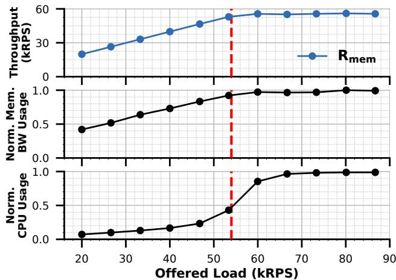  
Figure 1: Throughput, normalized memory-bandwidth usage, and normalized CPU usage when the application receives only memory-intensive requests (Rmem). The red line marks the load at which throughput and memory bandwidth saturate, and indicates the minimum CPU required to reach peak throughput and memory-bandwidth utilization.

Existing overload controllers typically ignore request heterogeneity and treat all traffic uniformly. They operate under a common assumption, which we call the single-queue fallacy, that a single, shared bottleneck queue constrains all requests. Consequently, congestion at this bottleneck triggers a global load reduction, even when underutilized resources could safely serve a subset of incoming requests.

The single-queue fallacy manifests in two distinct ways. First, some controllers react to aggregate server-level signals, such as end-to-end latency [31, 32, 55] or requests-inflight [50, 52, 56], without distinguishing which specific resource is overloaded. Second, others react exclusively to a fixed resource, such as CPU [9, 59] or storage [21, 35]. Consequently, both approaches prematurely throttle overall machine load when one resource peaks, failing to exploit idle capacity elsewhere. Furthermore, fixed-resource controllers suffer from the additional vulnerability of being entirely blind to congestion in unmonitored resources.

## 2.2 Modern Multi-Resource Overload Control

To illustrate the impact of the single-queue fallacy, consider a service with two types of requests: Rcpu is CPU-intensive and Rmem is memory-intensive.1 For simplicity, each request type in this example performs a completely different set of operations and does not share any common code paths. Rcpu requests perform square root computations for 25µs, while the Rmem requests perform non-temporal stores on a 32KB buffer, leading to a service time of 100µs. We run this example in experimental SETUPB, discussed in Section 5.1.

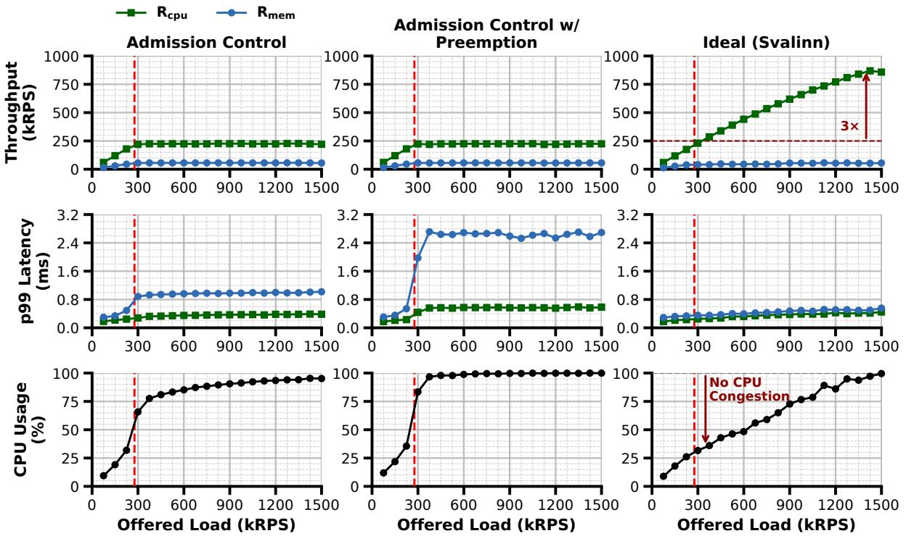  
Figure 2: Throughput, tail latency, and CPU usage for an application receiving two types of requests: a CPU-intensive request (Rcpu) and a memory-intensive request (Rmem). The first column shows performance with an admission controller. The second column shows performance with an admission controller and a preemption-based scheduler. The third column shows the ideal or expected performance of the application. The red line marks the incoming load at which memory bandwidth saturates.

We start by profiling the machine capacity for each request type. Rcpu requests can achieve a maximum throughput of 1M requests per second (RPS) when a client issues only that type of request, while the Rmem requests can achieve a maximum throughput of roughly 55K RPS. Rmem requests can saturate the memory bandwidth of the machine while using 50% of the cores. On the other hand, Rcpu requests consume a negligible fraction of the memory bandwidth of the machine. Figure 1 shows the performance of the system when clients only issue Rmem requests at different offered load values. At low load, CPU utilization and memory bandwidth utilization grow linearly with load. As the system becomes bottlenecked on memory bandwidth, CPU utilization grows superlinearly with load, reflecting the fact that different threads are competing for memory bandwidth, leading to excessive stalling that manifests as high CPU utilization. It is obvious from this experiment that in such scenarios, a replica will seem fully utilized when, in fact, the CPU is underutilized.

Per-replica overload control. Next, we mix the two request types by having clients generate a load that is made of 80% Rcpu and 20% Rmem requests. We vary the total offered load to the service and measure overall throughput, tail latency, and CPU and memory bandwidth utilization. To keep latency bounded, we rely on a simple admission-control mechanism that limits the number of requests in flight based on the observed overall latency of the service [9, 55, 59]. Results are shown in the first column of Figure 2. We observe that the overall throughput peaks at around 300K RPS.

At first glance, this behavior seems reasonable. In particular, resource usage at peak throughput is high: CPU utilization is between 60-90% and memory bandwidth utilization is near 100%. However, consider that the throughput of Rcpu requests plateaus when Rmem requests saturate the memory bandwidth of the machine. At that point, we observe that CPU utilization grows superlinearly with the offered load, leading to a situation where the CPU becomes the bottleneck of the system. This behavior is due to the fact that Rmem requests consume CPU cycles stalling due to memory bandwidth congestion, which lowers the effective CPU capacity available to serve Rcpu requests. As a result, the CPU becomes a bottleneck, although it is effectively underutilized. This suggests that if Rmem requests are restricted to the number of cores required to fully utilize memory bandwidth, they do not stall excessively because their aggregate memory bandwidth demand no longer congests memory bandwidth. The remaining cores can then be used by Rcpu requests, enabling up to 3× higher R goodput, as shown in the third column of Figure 2.

The challenge of this scenario is exacerbated by the fact that memory bandwidth is a resource accessed implicitly through LOAD and STORE instructions, not through an explicit queue. Unlike network, disk, and locks, which have their own queues, enabling monitoring and control [3, 10, 21, 32, 38], memory bandwidth is shared implicitly among all requests running on the machine. Access to hardware-level queues is not always feasible and can complicate the design and operation of applications. Thus, simple extensions to existing admission control mechanisms that monitor and control explicit queues are not sufficient. Moreover, memory access is spread throughout the whole application, and high utilization requires simultaneous access by multiple threads within a single application. Thus, precise tracking of memory bandwidth consumption might require tracking the behavior of all the instructions executed by an application, an untenable objective.

Preemption-based scheduling. A natural question is whether effective multiplexing of shared resources can mitigate this problem. To test that hypothesis, we repeat the same experiment but enable preemption. In particular, we use Aspen, a lightweight interrupt-based preemption mechanism [20]. The objective of preemption in this scenario is to improve CPU utilization by preempting Rmem requests when they are stalling, replacing them with Rcpu requests. This choice comes at the expense of increased latency for Rmem requests and added context switching overhead. The results are shown in the second column of Figure 2. Surprisingly, we observe that only the preemption overhead manifests without any significant improvement in throughput.

Preemption does not help because it is based on the assumption that multiplexing the use of resources leads to higher overall utilization. However, in this scenario, we do not only need to multiplex resources; we need to limit the resource usage of a specific type of resource by a specific type of request. In particular, Rmem requests in this example saturate the memory bandwidth of the machine using only 24 cores out of the available 45 cores. Thus, any Rmem request that is scheduled on the remaining cores will still waste CPU cycles. Moreover, preemption does not differentiate between different types of requests, nor does it react to specific resource usage patterns. As a result, preemption ends up being ineffective as it does not reduce the amount of wasted CPU cycles. Another downside of preemption is that it might be harmful if the service time of Rcpu requests is longer than the service time of Rmem requests.

Atropos [23], a recent overload system, attempts to address this gap through targeted task cancellation, judiciously aborting requests to maximize resource release. However, this approach relies on the assumption that congestion is driven by a small number of disproportionately heavy requests, a condition that does not hold in the scenario described above. Furthermore, Atropos is limited in its scope: it neither supports memory bandwidth regulation nor provides a framework for proactive admission control.

Inter-application interference vs. intra-replica resource contention. While in this example the two request types can be separated into their own binaries, which can be allocated separate resources and isolated from each other using OSsupported primitives [19, 25, 41, 44], this approach is not always feasible. First, separating request types into different binaries increases the operational complexity of the service, as it requires managing multiple deployments and scaling policies. Second, in many cases, different request types share significant portions of the code path, making it impractical to separate them into different binaries without code duplication. The difference can even lie in their working set size, which would make it impossible to separate them without significant code changes. Finally, separating request types into different binaries can lead to resource fragmentation, as resources allocated to one binary may be underutilized while other binaries are overloaded. Thus, there is a need for an admission control mechanism that can effectively manage the resource usage of different request types within the same binary, avoiding the single-queue fallacy.

## 2.3 Objectives and Challenges

The single-queue fallacy can lead to significant underutilization of resources in modern data centers, especially as applications become more complex and diverse. To address this issue, we propose Svalinn, an admission control mechanism that aims to maximize the utilization of all resources in a system without affecting latency. Such an ambitious objective requires Svalinn to be extensible, allowing the incremental addition of new resource controllers as new bottlenecks are identified. Another key requirement is that Svalinn functionality should introduce minimal changes to the application logic. Thus, the realization of Svalinn requires overcoming the following challenges:

• Nondeterministic behavior / unprofilable workloads. Requests of the same type may have different resource requirements based on their input data or other dynamic factors. This variability makes it difficult to identify the resource requirements of a request before it actually starts to run on the server. Moreover, workload characteristics can change dynamically, requiring the system to adapt to such changes without reconfiguration.

• Balancing performance objectives. Maximizing utilization typically corresponds to an improvement in throughput. However, Svalinn should achieve that objective without increasing latency. Moreover, the fact that some requests will need to be executed in order to identify their resource requirements implies that some requests will be dropped after they start executing because of resource congestion. Thus, Svalinn must balance multiple performance objectives, including throughput, latency, and drop rate.

• Minimal changes to application logic and added overhead. Tracking and controlling resource usage of different request types within the same binary may require changes to the application logic. This challenge is significant given that memory access is typically performed implicitly through

LOAD and STORE instructions. Tracking such accesses may require changes to the application code or the use of specialized libraries or frameworks. However, such changes should be minimal to avoid increasing the complexity of the application and hindering adoption. Moreover, the added overhead of tracking and controlling resource usage should be minimal to avoid negating the benefits of improved resource utilization.

• Scalability. Modern data centers host services that handle millions of requests per second from hundreds or even thousands of clients. Thus, any admission control mechanism needs to be scalable to handle such high request rates and number of clients without becoming a bottleneck itself.

## 3 The Design of Svalinn

We design Svalinn as a modular system that separates through put and latency control. Each of the controllers is designed to be configurable to meet the requirements of the application. The modular design ensures extensibility and minimizes the amount of changes needed to application logic.

Throughput is controlled through a credit-based admission controller. A single credit indicates that the client can send one request to the server. The total number of issued credits is determined based on a user-defined utility function that balances different performance objectives (e.g., throughput, drop rate, or utilization level of a specific resource). This user-defined utility function enables operators to customize application behavior according to their needs; however, the resulting admission decisions may be independent of the status of individual bottlenecks. Consequently, an admitted request can still incur high latency when it competes for a bottlenecked resource.

Latency is minimized by distributed controllers, each independently applying an Active Queue Management (AQM) policy to the queue of a single bottleneck. For example, a latency controller can drop requests at risk of violating SLOs. This modular design allows for extensibility, as latency controllers can be independently designed and incrementally deployed as new bottlenecks are detected.

We focus on memory bandwidth as a bottleneck that is accessed implicitly, building a latency controller for this unique bottleneck. In particular, we present the memory semaphore (m\_semaphore) to limit the number of concurrent threads performing memory-intensive operations. The m\_semaphore has two functions. First, it minimizes the number of CPU cycles wasted on stalling by only allowing a limited number of threads to concurrently consume memory bandwidth, maximizing memory bandwidth utilization without wasting CPU cycles. Second, it allows for building a queue of threads awaiting to consume memory bandwidth. That queue enables latency control by applying AQM policies, turning an implicit bottleneck to an explicit bottleneck. Our proposed design is shown in Figure 3.

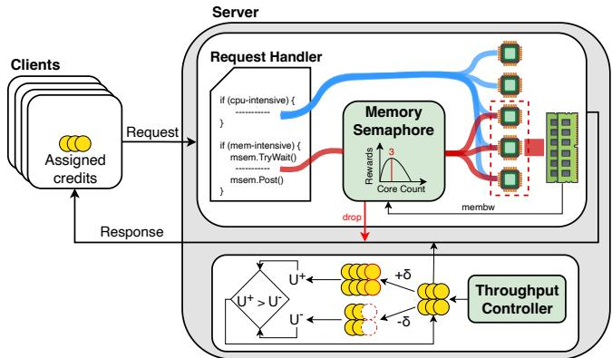  
Figure 3: Svalinn system architecture.

## 3.1 Utility-Based Throughput Control

The throughput controller admits requests to optimize a userdefined utility function that captures different performance metrics (e.g., throughput, drop rate, resource utilization). The controller optimizes the utility function by exploring different levels of admitted load through micro-experiments, adapting to changing workload characteristics over time. Our approach is inspired by innovations in network congestion control, particularly the PCC family of algorithms [14, 15]. Unlike recent proposals that use fixed heuristics to regulate load based on low-level signals (e.g., queueing delay [9] or efficiency [10]), our controller admits general convex utility functions. A server regulates incoming load by controlling the size of a single credit pool (i.e., the maximum number of credits it can issue at a given time). In other words, different request types use the same credits which are issued indiscriminately to clients. When a client wishes to issue a request, it first reports its demand to the server. The server replies with credits, if available, and the client may only send a request if it has sufficient credits. The controller attempts to identify the credit pool size that maximizes the user-defined utility function through micro-experiments.

A micro-experiment is a short test interval during which the controller evaluates the application’s performance under a perturbed credit-pool size. In each control cycle, the controller runs two micro-experiments: a credit-increase experiment, denoted by δ+, and a credit-decrease experiment, denoted by δ . During each micro-experiment, the controller either increases or decreases the credit pool by δ credits, monitors the application for ∆ tmonitor interval, and records relevant performance metrics. Monitored metrics include the number of received requests, the number of successfully sent responses, the number of dropped requests, queueing delay, and the duration of the experiment. The controller calculates utility values utility + and utility − for the two micro-experiments. After both micro-experiments finish, the controller increases the pool size if experiments show that utility + is higher than utility − , or vice versa. This process repeats continuously.

While this micro-experiment framework is conceptually sound, realizing it in practice introduces a key complication: increasing the credit pool size does not guarantee a higher re quest arrival rate when clients are not backlogged. Because a credit represents only permission to send a request, the actual arrival rate during a δ+ experiment can inadvertently fall below that of a δ− experiment. In such cases, if utility + exceeds utility − , the controller would incorrectly attribute the higher utility to the larger pool size and expand it further. To address this, we leverage the insight that the controller ultimately cares about the request arrival rate, for which the credit pool size is merely a proxy. When the arrival rate during the δ+ experiment is lower than that of the δ experiment, we swap their metrics, computing utility + using the higher-arrival data and vice versa. This relabeling ensures the controller evaluates the perturbations against actual traffic variations rather than nominal pool adjustments.

Compounding the issue of accurate utility computation is the physical propagation delay between modifying the credit pool and observing its impact on the incoming traffic rate. This propagation delay can be comparable to individual request execution times. For instance, a network RTT of ten microseconds is on par with a key-value store request processing time of a few microseconds. Consequently, the controller must enforce a warmup interval (∆ twarmup) immediately following each pool adjustment. This allows the new configuration to stabilize across the network before the controller attributes any subsequent performance metrics to the perturbation. The complete controller algorithm is detailed in Appendix A.1.

A final challenge remains at low to medium loads: clients may hold onto issued credits indefinitely without utilizing them. If the server strictly limits the total issued credits to its exact processing capacity, this credit retention prevents the expected load from fully materializing, leaving the server underutilized. To bridge this gap between nominal credit allocation and actual resource utilization, the controller safely overcommits credits. This ensures the server pipeline remains fully saturated even when a subset of clients retains their credits, mirroring the overcommitment strategies employed by other receiver-driven, credit-based transport and admission control systems [9, 10, 38].

## 3.2 Making Memory Bandwidth Access Explicit Using m\_semaphore

Our objective is simple: determine the minimum number of concurrently executing memory-intensive requests required to saturate the available memory bandwidth. While the objective is simple, achieving it in practice is challenging due to the dynamic nature of real workloads and their constituent requests. As demand and request mix evolve over time, the optimal concurrency level changes, necessitating a mechanism that can adjust this level dynamically and be applied selectively to specific requests. To address these challenges, we introduce m\_semaphore, a semaphore whose capacity is dynamically adjusted based on the available memory bandwidth and the per-request memory bandwidth demand. The m\_semaphore is used by developers to protect access to memory-intensive sections of their code. Requests that cannot acquire m\_semaphore are held outside the section, making access to memory bandwidth explicit and moving excess memory-intensive requests into an explicit queue. m\_semaphore is implemented as a singleton, so all instrumented sections share the same underlying semaphore instance. We discuss how developers identify and instrument such sections in Section 3.4.

Algorithm 1: m\_semaphore Capacity Controller.   
1 corescurrent: Current m\_semaphore capacity   
2 coresmax: Maximum possible m\_semaphore capacity   
3 membwmax: Maximum memory bandwidth seen so far   
4 Ravg[coresmax]: Average reward at each core count   
5 τlast : Last time corescurrent was updated   
6 Parameter α: Weight given to memory bandwidth usage   
over CPU usage in reward computation   
7 Parameter ω: Weight assigned to the latest reward sample   
when updating each core’s average reward   
8 Parameter ε: Probability of exploration   
9 Parameter ∆ tmsem: Interval at which corescurrent is   
recomputed   
10 Function UpdateCapacity():   
// Run once every control cycle   
11 if now − τlast < ∆ tmsem then   
12 return;   
// Get memory bandwidth usage   
13 membwcurrent ← GetMemoryBandwidthUsage();   
14 membwmax ← Max(membwmax,membwcurrent);   
// Calculate reward for current capacity   
15 R ← α · membwcurrentmembw − (1 − α) · corescurrentcores ;   
16 Ravg[corescurrent ] ← ω · R + (1 − ω) · Ravg[corescurrent ];   
// Find best performing capacity   
17 coresbest ← arg max1≤i≤coresmax Ravg[i];   
// Update the capacity   
18 u ∼ Uniform(0,1);   
19 if u < ε then   
// Explore   
20 explore\_direction ← RandomChoice(−1,+1);   
21 corescurrent ← coresbest + explore\_direction;   
22 else   
// Exploit   
23 corescurrent ← coresbest ;   
24 τlast ← now;

The semaphore dynamically adjusts its capacity using a Multi-Armed Bandit (MAB) controller (Algorithm 1). The MAB controller treats each possible semaphore capacity as an arm. Once an arm is pulled, the system runs with that configuration for ∆ tmsem duration, during which we observe the resulting performance. At the end of this control cycle, we compute a reward associated with the chosen capacity and update the average reward for that arm. Our objective is to identify the minimum semaphore capacity that can saturate memory bandwidth. Consequently, we design a reward function that increases with memory bandwidth utilization but penalizes CPU usage.

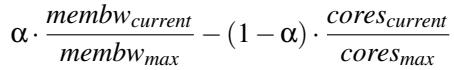

This function encourages configurations that achieve high memory bandwidth utilization with minimal CPU utilization. The parameter α ∈ [0,1] controls the balance between memory-bandwidth utilization and CPU utilization. We discuss the choice of our reward function and its sensitivity to the parameter α in Appendix B.3 and B.4 respectively.

The controller balances exploration and exploitation using an ε-greedy strategy [6, 48, 51]. In each control cycle, with probability (1 − ε), it selects the capacity with the highest reward, which under our reward design corresponds to high memory bandwidth utilization with minimal core usage. With probability ε, it explores an alternative capacity. Rather than exploring uniformly over all possible capacities, we restrict exploration to capacities adjacent to the current best one. This keeps exploration local, reduces performance noise, and avoids erratic jumps in concurrency.

Continued exploration is important because the workload properties can be non-stationary. For example, a key-value store can experience significant variation in the sizes of values being read, which changes the per-request demand for mem ory bandwidth, shifting the optimal capacity of the semaphore over time. A controller that only exploits past observations can therefore remain stuck at a capacity that was previously good but is no longer appropriate. We use ε-greedy because it provides this continued exploration explicitly. In contrast, more sophisticated MAB strategies, such as softmax, upper confidence bound, or Thompson sampling, are typically used in stationary settings, and their exploration naturally narrows over time. As a result, under regime changes they may not explore enough to reach the new operating point.

## 3.3 AQM at Bottleneck Queues

Distributed latency control is achieved by deploying AQM policies at each identified bottleneck. It is possible for a single request to face multiple bottlenecks along its execution path. Therefore, we avoid having a different per-bottleneck AQM policy configuration. Instead, all bottlenecks make AQM decisions using a single per-request property: queueing-delay budget, similar to Protego [10]. Specifically, each request is tagged with an SLO-derived queueing-delay budget when it enters the system. As the request traverses the execution path, latency controllers at subsequent bottlenecks dynamically compute the remaining budget by deducting the time the request spent waiting in each bottleneck’s queue. If the remaining budget is less than the bottleneck’s instantaneous queueing delay, the request is proactively dropped before being enqueued.

Handling dropped requests. The proposed approach implies that requests may be dropped after being partially executed. When a request is dropped, the server can issue a failure message to the client so that the client can issue the request to another replica of the application. Another potential approach is to have the server spillover the dropped request to another replica directly, similar to load balancing behavior in some sidecars [18]. Moreover, developers have to specify a “cleanup” callback function to be invoked when a request is dropped. This function allows developers to perform any necessary cleanup actions, such as releasing resources or reverting any state changes. Recent work shows that such cleanup support is already common in practice: 76% of 151 popular open-source applications support task cancellation and already provide handlers to clean up request state on abrupt termination [23]. Developers also have the option to label requests as “non-droppable.” Such requests are not dropped and treated as high-priority requests by the AQM logic to minimize their queueing delay.

## 3.4 Svalinn Deployment Guidelines

Identifying bottlenecks. Explicitly accessed bottlenecks can be identified using profilers such as LDB [8] and GigiProfiler [24], which provide function-level latency information and help locate the code paths responsible for bottleneckinduced delay. For memory-intensive bottlenecks, developers can use tools such as Intel VTune [27], HiresPerf [33], or perf [34] to identify memory-intensive functions. These tools also expose the call paths leading to such functions, which helps determine where m\_semaphore should be placed in the request execution path.

Instrumenting explicit bottlenecks. System designers expose resource contention points to the application through new APIs that serve as enforcement points for latency control. For system- or runtime-level bottlenecks, these APIs can be implemented by interposing the underlying system or runtime calls, as in Protego [10]. For application-internal bottlenecks, these APIs are instrumentation APIs that expose the relevant resource usage needed to estimate queueing delay and perform AQM [22, 23]. In both cases, developers update the application to use these APIs and incorporate custom cleanup logic to handle request drops.

Instrumenting memory-intensive bottlenecks. Developers leverage the runtime-managed singleton m\_semaphore object to instrument the call path leading to the memory-intensive code region. This explicitly isolates the critical region and exposes a queue for AQM enforcement. In practice, such bottlenecks are rare; for instance, Memcached and RocksDB each require only a single instrumented call path, terminating at the memcpy that copies keys into the response buffer. Consequently, while explicit annotation is required, the modification scope remains minimal across our evaluated applications.

## 4 Implementation

We implement Svalinn in two runtimes: Shenango [41] and Go. Our Shenango implementation builds on the RPC layer originally implemented for Breakwater [9] and Protego [10]. Our Go implementation adds Svalinn to a bare-bones RPC layer. Both RPC layers follow the dispatcher model: a dispatcher thread parses incoming packets into requests and spawns a worker thread for each request. The throughput controller is implemented as an event-driven state machine and runs inline when each worker finishes executing a request. As a result, workers update controller state on the fast path, eliminating the need for dedicated control threads. For each micro-experiment, the controller records the number of received requests, completed responses, and dropped requests, along with queueing delay, energy consumed, memory bandwidth consumed, and experiment duration, and passes these metrics to a user-defined utility function.

m\_semaphore is implemented as a C++ library with C bindings for Shenango applications, and as a separate Go library for Go-based applications. It exposes three methods: try\_wait(), wait\_if\_uncongested(), and post(). Using try\_wait() mimics a non-blocking semaphore and thus enforces an AQM policy that maintains a zero-length queue. It returns true if admitting the request to the memoryintensive section does not exceed the permitted concurrency, and false otherwise. In contrast, wait\_if\_uncongested() allows requests that exceed the permitted concurrency to be enqueued, provided they have sufficient remaining SLOderived budget, and returns true if the request is enqueued and later granted access to the region, and false otherwise. By default, all workloads in our evaluation use try\_wait(). The UpdateCapacity() routine is invoked inline with try\_wait(), wait\_if\_uncongested(), and post(), but a capacity update takes effect only once per control cycle. m\_semaphore reads memory bandwidth counters using Intel PCM [28]. Since fetching memory bandwidth usage can introduce noticeable overhead at small timescales, we move this operation off the request fast path. In Shenango, we modify the IOKernel scheduler, which runs every 5–10 µs, to collect memory bandwidth usage periodically. In Go, we dedicate a logical core to collect performance metrics, including memory bandwidth, once every 5 µs.

The utility-based throughput controller in Shenango extends the existing Breakwater [9, 10] RPC library and adds 1815 LoC. The m\_semaphore library for Shenango contributes 961 LoC, and the modifications to the Shenango IOK ernel needed to expose host memory bandwidth readings add another 631 LoC. Integrating the RPC library into applications required 1462 LoC for DataFrame and 1668 LoC for RocksDB. We reuse Memcached and the synthetic application from Protego, adding 1082 LoC and 812 LoC, respectively, to support heterogeneous request types. Each application required only 4–10 LoC to wrap memory-intensive paths with m\_semaphore and handle dropped requests.

The Go implementation of the admission-controllerenabled RPC library adds 5696 LoC. Exposing thread queueing delay from the Go runtime required 93 LoC in SysMon. We add a perf goroutine pinned to a logical core that periodically refreshes memory bandwidth usage, thread queueing delay in the Go runtime, and TCP RX buffer delay, which adds 1502 LoC. The Go version of m\_semaphore adds 454 LoC, and the Go synthetic application adds 961 LoC.

## 5 Evaluation

Our evaluation answers the following key questions:

1. Does Svalinn deliver high utilization and bounded latency across heterogeneous bottlenecks?

2. Can Svalinn improve application performance even when resources are overprovisioned?

3. Does Svalinn accommodate and optimize different userdefined utility functions?

4. How sensitive is Svalinn to retransmissions, dynamic workloads, parameter changes, and request mixes?

5. Do Svalinn’s benefits persist across different machines and runtimes?

## 5.1 Evaluation Setup

Testbed. We evaluate Svalinn on two testbeds: SETUPA and SETUPB. SETUPA consists of eleven CloudLab [17] xl170 nodes, each equipped with a 10-core (20-logical-core) Intel E5-2640v4 @ 2.4 GHz, 64 GB ECC RAM, and a Mellanox ConnectX-4 25 GbE NIC. The memory bandwidth of each node is approximately 45 GB/s. Nodes are connected via a Mellanox 2410 switch, with an average RTT of 10 µs. All machines run Ubuntu 24.04 with Linux 6.8, and our applications use 18 logical cores per node. SETUPB consists of two machines, each with dual-socket Intel Xeon Gold 6442Y processors (24 local cores per socket @ 2.6 GHz), 128 GB ECC RAM, and Mellanox ConnectX-7 200 Gb/s NICs connected back-to-back. Each machine provides roughly 180 GB/s of memory bandwidth. We use a single socket per machine for the application and observe a 40 µs RTT. Both machines run Ubuntu 22.04 with Linux 6.0, and applications use 45 logical cores per machine. Unless otherwise noted, all applications run on Caladan [19] and are linked with its runtime. For Gobased tests, we run all experiments on SETUPA with Go runtime version 1.25.3. In both setups, one node acts as the server and the remaining nodes act as clients. We use an open-loop load generator based on a Poisson arrival process, with a total of 100 client threads distributed across the client machines. Each thread maintains one connection to the server and generates requests of different types according to the target mix. We disable TurboBoost, frequency scaling, and c-states as done in other works using similar systems [9, 10, 20, 41].

Workloads. We evaluate Svalinn using synthetic workloads and three real applications: Memcached [1], RocksDB [16], and Dataframe [36]. Each application implements up to three request types: Rcpu (a CPU-intensive), Rmem (a memoryintensive), and Rlock (a mutex-intensive) request.

The synthetic workload represents applications whose requests have different resource requirements but comparable processing times.2 In particular, an Rcpu request performs 7500 square-root computations in a loop. An Rmem request issues 25 non-temporal stores over a 32 KB buffer. An Rlock acquires a global mutex and executes 5000 square-root computations in a loop. On SETUPA, the average processing times are 40 µs for Rcpu, 80 µs for Rmem, and 40 µs for Rlock.

RocksDB and Memcached are widely used key-value stores in datacenter applications. In both, Rcpu requests issue GET operations on small values, with sizes drawn uniformly between 5 B and 1000 B, while Rmem requests issue GET operations on large values, with sizes drawn uniformly between 800 KB and 1200 KB. In Memcached, Rlock requests issue SET operations on small values using the same size distribution as Rcpu. Small values represent the common case of caching text objects, whereas large values represent the less common case of caching media objects. For Memcached, the average processing times are 15 µs for Rcpu, 20 µs for Rlock, and 275 µs for Rmem on SETUPA. For RocksDB, the average processing times are 20 µs for Rcpu and 230 µs for Rmem on SETUPA, and 40 µs for Rcpu and 230 µs for Rmem on SETUPB.

DataFrame is a C++ column store. We run an instance operating on a 370K-row EUR–USD FX dataset [11]; its Rcpu request computes the maximum of the Closing price column, while its Rmem request applies a decay-based smoothing operation to the same column and writes the smoothed values back. On SETUPA, the average processing times are 15 µs for Rcpu and 750 µs for Rmem.

In the Go-based synthetic application, the Rcpu request performs 1000 square-root computations in a loop, while the R request performs stores to a 1 MB in-memory buffer. On SETUPA, the average processing times are 200 µs for Rcpu and 462 µs for Rmem.

Baselines: We compare Svalinn against SEDA [55] and Protego [10]. We choose these baselines because SEDA represents the classic approach of using overall server performance to determine how much load to admit.3 SEDA controls server load by rate-limiting clients, with each client adjusting its sending rate based on the 99th-percentile end-to-end latency it observes. Protego optimizes overall server throughput while performing per-lock AQM. As such, its objective and design are the closest to Svalinn. Protego regulates load at the server through a credit-based mechanism, dynamically adjusting the credit-pool size based on the observed efficiency of request processing. We do not compare against Atropos [23] or pBox [22], as neither provides an admission controller or a technique for handling memory bandwidth contention, making Protego the closest comparison point.

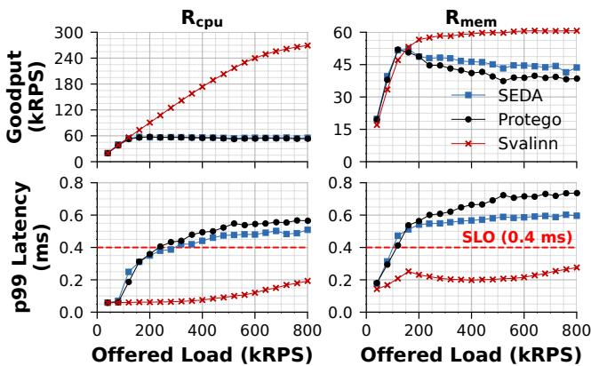  
Figure 4: Performance of SEDA, Protego, and Svalinn for synthetic application on SETUPA.

Parameter configuration. We tune each system to operate at its best configuration. Most parameters are a function of the application SLO. We set the SLO to 5 · (mean service time + mean RTT). This is consistent with recent work [9, 10, 12, 46]. Since our applications have multiple request types, we use the service time of the longest request type when computing the SLO. In almost all applications, this corresponds to the Rmem request.

For SEDA, we set the target delay and timeout according to the application SLO. We further tune ad ji (rate increase factor) and ad jd (rate decrease factor) for each application to achieve high throughput while keeping latency under control. We use the default configuration from [55] for all other parameters.

For Protego, we tune the control-loop period according to the application’s service time and configure the per-request queueing-delay budget for each workload. We compute this budget as SLO − p99 service time − p99 RTT, using the service time of the longer request type. We use the default configuration from [10] for all other parameters.

For Svalinn, the throughput controller uses a utility function based on overall server throughput. We set δ to 1 for all applications, since this worked well across all workloads. We set ∆ twarmup and ∆ tmonitor based on the application’s service time and the RTT between clients and servers. Svalinn uses the same per-request queueing-delay budget as Protego. For m\_semaphore, we set ∆ tmsem, α, ω, and ε to 500µs, 0.7, 0.8, and 0.3, respectively. These settings are shared across all workloads and setups. As a result, the only Svalinn parameters whose configuration varies across applications are the throughput controller’s ∆ twarmup and ∆ tmonitor.

Evaluation metrics. For each application, we report goodput and 99th-percentile tail latency. Goodput is the throughput of requests that complete within the configured SLO. We report these metrics separately for each request type. In select experiments, we also report the drop rate, defined as the fraction of received requests that are dropped.

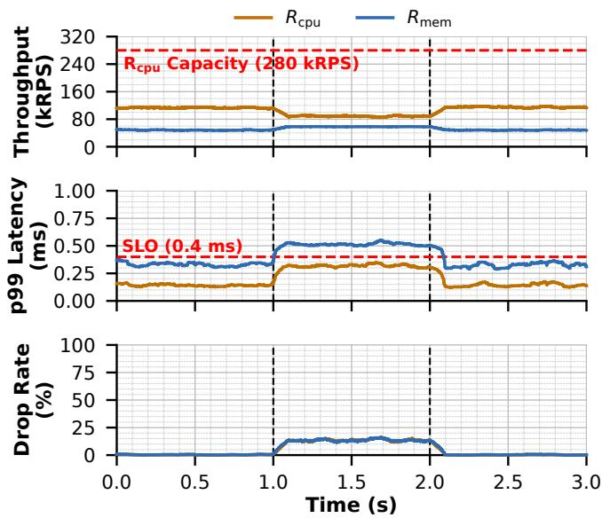  
Figure 5: Performance of an overprovisioned server under an Rmem burst when using Protego on SETUPA

## 5.2 End-to-End Performance

We start by studying the performance of Svalinn in a single setup (SETUPA) across multiple applications. We study the robustness of Svalinn across different setups and configurations later.

Synthetic workload. Since the service times of Rcpu and Rmem are comparable, clients generate a 50/50 mix of Rcpu/Rmem requests. On SETUPA, six concurrently running Rmem requests saturate the available memory bandwidth (Figure 4). SEDA reacts to end-to-end client delay, unaware of the distinct CPU and memory bandwidth bottlenecks at the server. SEDA applies its rate limit based on the state of the most congested resource (memory bandwidth in this scenario), wasting CPU cycles that could have been used to serve Rcpu requests (i.e., leads to low throughput). SEDA also suffers from high tail latency that exceeds the SLO due to incast scenarios.

Protego aims to avoid the pitfalls of SEDA by admitting load until all request-execution paths appear fully utilized. In principle, Protego should achieve high throughput for both Rcpu and Rmem requests. In practice, we observe that Rcpu throughput collapses once memory bandwidth saturates, similar to SEDA. This behavior arises because Rmem requests stall when memory bandwidth saturates, wasting CPU cycles and eliminating any capacity that could have been used by Rcpu requests. Moreover, Protego does not provide any mechanisms to limit the latency of requests bottlenecked by memory bandwidth, leading to tail latency that exceeds the SLO.

Svalinn avoids the pitfalls of both systems. Its m\_semaphore limits the number of concurrently running R requests to the smallest number of cores that saturate memory bandwidth (six on SETUPA). Thus, Rmem requests can achieve their maximum throughput while leaving plenty of CPU capacity for Rcpu requests. Svalinn’s throughputoriented admission controller then admits additional load until this CPU headroom is fully utilized. As a result, Svalinn improves the goodput of Rcpu and Rmem requests by up to 5.06× and 1.60× without compromising latency. Svalinn achieves up to 5.48× and 5.95× lower p99 latency for Rcpu requests compared to SEDA and Protego, and 2.87× and 3.49× lower latency for Rmem requests.

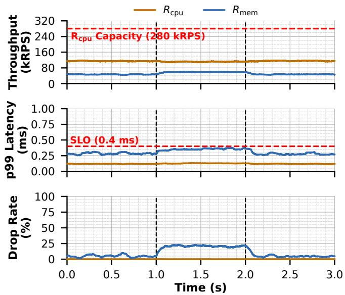  
Figure 6: Performance of an overprovisioned server under an Rmem burst when using Svalinn on SETUPA

Performance when CPU is overprovisioned. We evaluate how memory bandwidth congestion can undermine an operator’s provisioning assumptions, and demonstrate how Svalinn enables the server to fully realize its provisioned CPU capacity. We run the synthetic workload on a SETUPA server with a steady load of 115 kRPS Rcpu requests and 50 kRPS Rmem requests for 3 seconds. The server can process up to 280 kRPS Rcpu and 60 kRPS Rmem requests (Figure 4), so the steady demand does not overload either bottleneck. At the 1 second mark, we add a 25 kRPS Rmem burst for 1 second, increasing total Rmem demand to 75 kRPS and overloading memory bandwidth.

As shown in Figure 5, Protego sustains the steady-state demand prior to the burst. However, during the burst, excess Rmem requests saturate the memory bandwidth and stall the CPU. This interference severely diminishes the CPU capacity available for useful Rcpu execution, despite the server being nominally overprovisioned for Rcpu demand. Consequently, Rcpu throughput plummets from 115 kRPS to approximately 90 kRPS (a 21.7% reduction), while tail latencies for both request types spike. Driven by memory bandwidth contention, Rmem latency violates its SLO, causing both workloads to experience a roughly 20% drop rate during the burst. These results demonstrate that a server provisioned adequately for steady-state workloads can still fail under resource contention.

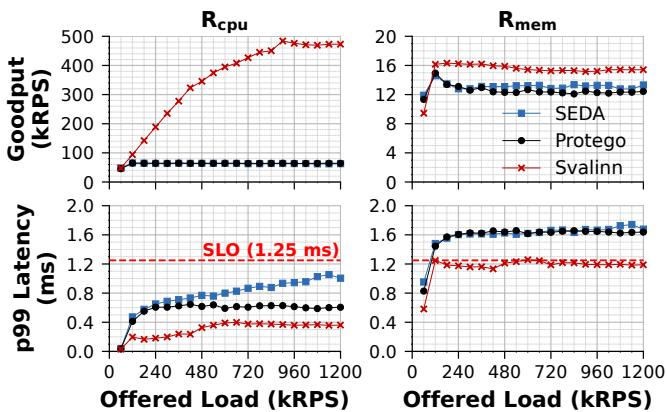  
Figure 7: Performance of SEDA, Protego, and Svalinn for RocksDB on SETUPA.

In contrast, Svalinn prevents this hidden capacity degradation by explicitly managing memory bandwidth (Figure 6). Rather than allowing the burst to saturate the CPU, the m\_semaphore restricts Rmem concurrency and drops excess Rmem requests before they can occupy CPU cores and waste CPU cycles by stalling. This proactive isolation enables Svalinn to fully sustain the 115 kRPS Rcpu demand, maintaining stable R tail latencies and achieving a 0% drop rate throughout the burst. Concurrently, Rmem tail latency increases only moderately, remaining well within its SLO bounds. To maintain this uncongested state, Svalinn sheds approximately 25% of Rmem requests during the peak of the burst. One note about Svalinn’s behavior is that outside of the burst window, while nominal Rmem demand remains safely below the server’s total memory bandwidth, transient arrival spikes can still briefly saturate the m\_semaphore capacity, resulting in a baseline Rmem drop rate of roughly 5%.

RocksDB. Due to the difference in the service time between the different request types, clients generate an 80/20 mix of Rcpu and Rmem requests. The results are shown in Figure 7. On SETUPA, 13–14 concurrent Rmem requests saturate memory bandwidth. Once this happens, SEDA stops admitting additional load, causing Rcpu goodput to plateau together with Rmem goodput. SEDA also exceeds the configured SLO because of request incast. Protego admits load until all request paths are saturated but performs no AQM for memory bandwidth, resulting in high tail latencies and no throughput gain for Rcpu requests, similar to the synthetic workload.

Svalinn constrains Rmem requests to the minimum number of cores needed to saturate memory bandwidth, avoiding memory bandwidth congestion. Moreover, it allows Rcpu requests to utilize the remaining CPU. This yields up to 1.26× higher Rmem goodput and up to 7.62× higher Rcpu goodput than the baselines. Svalinn also reduces Rcpu and Rmem p99 latency by up to 2.95× and 1.47× relative to the baselines.

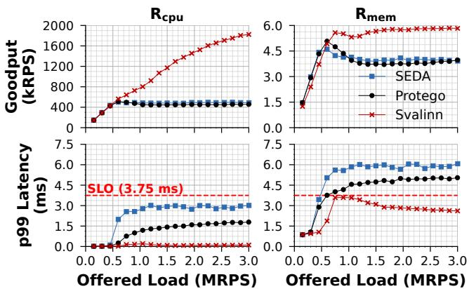  
Figure 8: Performance of SEDA, Protego, and Svalinn for Dataframe on SETUPA.

DataFrame. Due to the very high variation in request service time, clients issue a 99/1 mix of Rcpu and Rmem requests. On SETUPA, 7–8 concurrent Rmem requests saturate memory bandwidth. Figure 8 shows that SEDA stops admitting additional load as soon as memory bandwidth becomes the bottleneck, while Protego continues admitting load but cannot prevent Rmem requests from stalling once memory bandwidth is congested. As a result, both systems limit Rcpu goodput and suffer high Rmem tail latency, due to request incasts in SEDA and the lack of AQM for Rmem requests in Protego.

Svalinn restricts the number of concurrent Rmem operations to avoid memory bandwidth congestion and continues admitting additional Rcpu operations until CPU capacity is fully utilized. As a result, Svalinn reduces Rcpu p99 latency by up to 42.77× relative to SEDA and 21.17× relative to Protego, and reduces Rmem p99 latency by 2.33× and 1.93×, respectively. At high load, uncontrolled bandwidth contention causes SEDA and Protego to deliver only 0.67× the Rmem goodput of Svalinn. Overall, Svalinn achieves up to 3.99× higher Rcpu goodput than both baselines.

We observe similar behavior in Memcached, where clients generate Rcpu, Rmem, and Rlock requests. There, Svalinn improves overall goodput by up to 2.47× relative to the baselines without compromising latency; detailed results are provided in Appendix B.2.

## 5.3 Microbenchmark

Versatility of the throughput controller. The default utility function used by Svalinn’s throughput controller is purely throughput oriented: Utilityt put = stats.duration stats.respsout . We compare it against Utilitydrop, which balances throughput and drop rate by enforcing a maximum drop-rate of 10%. Specifically, Utilitydrop is computed as follows:

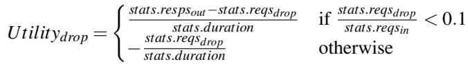

Figure 9 compares the performance of the two utility functions under a synthetic workload consisting of an 80/20 mix of

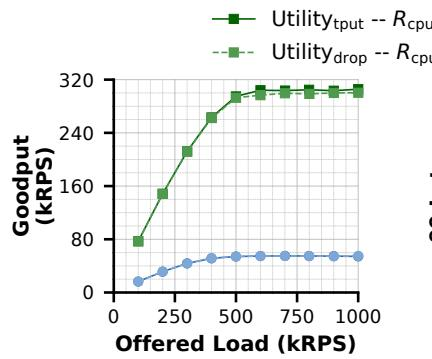

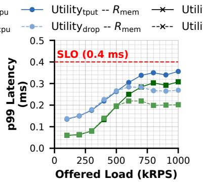

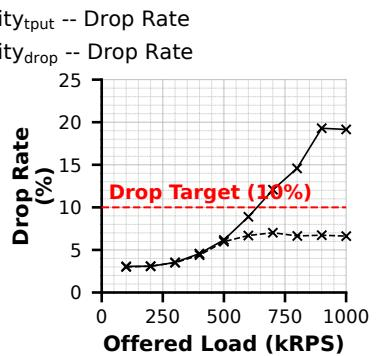  
Figure 9: Comparison of throughput-oriented and drop-oriented admission utility functions on SETUPA.

Rcpu and Rmem requests. Compared to Utilitydrop, Utilityt put yields up to 1.03× and 1.01× higher Rcpu and Rmem goodput, respectively. However, this gain comes at the expense of elevated tail latencies and drop rates reaching 19%. Conversely, Utilitydrop strictly enforces the 10% drop-rate target, capping actual drops at 7%, while simultaneously reducing Rcpu and Rmem p99 latencies by up to 1.52× and 1.32×. These results demonstrate that Svalinn ’s configurable utility function provides operators with flexible control to effectively balance trade-offs among throughput, latency, and drop rates. The tradeoff becomes sharper at more memory-intensive mixes. For example, with a 50/50 Rcpu/Rmem mix, memory bandwidth saturates earlier than in the 80/20 case, causing m\_semaphore to begin dropping requests sooner. As a result, Utilitydrop favors a lower drop rate over higher throughput, leading to significant throughput degradation while keeping drop rate and latency low. More generally, Svalinn’s performance gains vary with the request mix, and we provide a detailed study of this effect in Appendix B.5.

Latency of retransmitted requests. When overload controllers drop requests, clients often retransmit them to an alternate replica. To evaluate whether Svalinn rejects dropped requests quickly enough to prevent inflating end-to-end latency, we execute a synthetic workload (70/30 Rcpu/Rmem mix) on SETUPA using a two-server configuration. Clients initially direct all traffic to Server 1; if Server 1 drops a request due to overload, the client retransmits it to Server 2 [10, 40]. We drive Server 1 beyond its processing capacity to deliberately induce drops and retransmissions. To accommodate the additional network hop, we scale the workload SLO to twice the single-server baseline defined in Section 5.1.

Figure 10 illustrates the resulting performance. Across all offered loads, the tail latency for both Rcpu and Rmem requests remains safely within the adjusted SLO, and even tracks below the single-server latency target. This efficiency stems from m\_semaphore maintaining a zero-length queue for threads attempting to enter the memory-intensive section. Consequently, excess requests are rejected near-instantaneously rather than enduring queuing delays at the congested Server 1, a behavior confirmed by the rapid failure-delivery times highlighted in red in Figure 10. Server 2 then seamlessly absorbs this shed load, as evidenced by the sustained goodput plots.

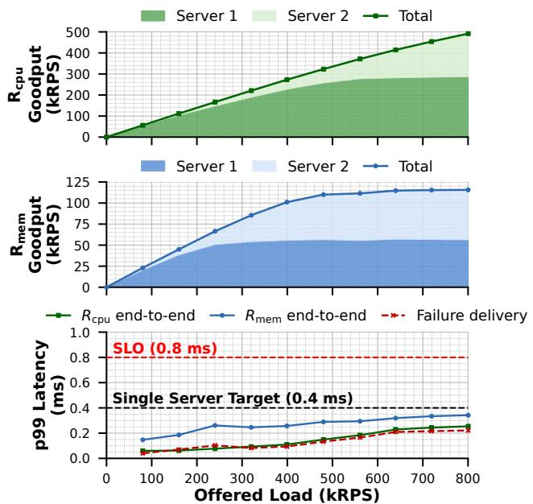  
Figure 10: Multi-server performance of Svalinn for synthetic workload with retransmission on SETUPA.

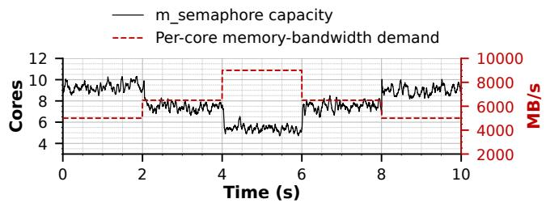  
Figure 11: Memory semaphore’s ability to adapt to changing per-request memory-bandwidth demand on SETUPA.

Adaptability of m\_semaphore to workload dynamics. The per-request demand for memory bandwidth can vary, requiring the m\_semaphore to be able to adapt its capacity quickly. We evaluate this using a synthetic workload with three Rmem request types: a low-demand request performing 25 non-temporal stores on a 3 KB buffer, a medium-demand request performing 500 such stores on a 3 KB buffer, and a high-demand request performing 26 stores on a 128 KB buffer. Their approximate per-core bandwidth demands are 5000, 6500, and 9000 MB/s, respectively. We fix the offered load and switch the request type every two seconds (low to medium to high to medium to low). As shown in Figure 11, m\_semaphore rapidly converges to the correct capacity after each shift. On average it takes 50 ms for the controller to converge to the new optimal capacity. This adaptability stems from the periodic exploration performed by our ε-greedy MAB algorithm.

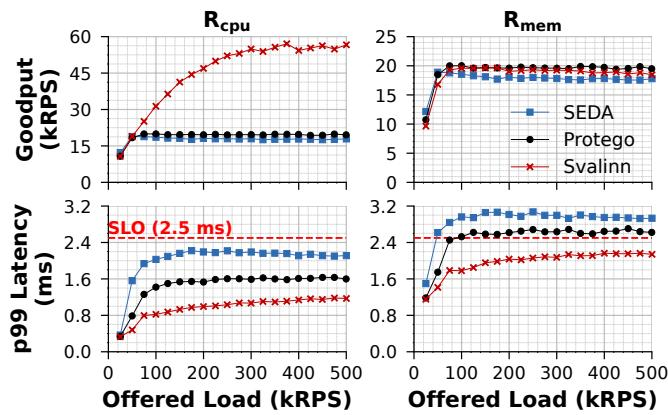

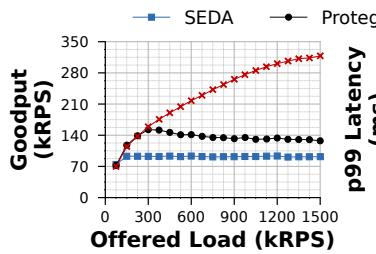

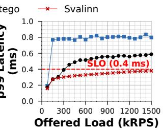  
Figure 12: Performance of SEDA, Protego, and Svalinn for synthetic application with multiple bottlenecks on SETUPA.

Performance under multiple bottlenecks. We evaluate Svalinn’s ability to manage multiple concurrent bottlenecks using a synthetic workload that generates a 25/25/50 mix of Rcpu/Rmem/Rlock requests on SETUPA. In this scenario, the global mutex acts as the primary point of contention, causing Rlock requests to saturate first at approximately 180 kRPS of offered load (Figure 12). This behavior clearly exposes the single-queue fallacy: SEDA reacts exclusively to this initial bottleneck and halts further admission, leaving the remaining capacity of the Rcpu and Rmem execution paths entirely unexploited.

Protego mitigates this specific failure mode by applying AQM directly at the global mutex, which enables it to continue admitting traffic beyond the Rlock saturation threshold. However, as observed in previous experiments, Protego lacks a mechanism for memory bandwidth latency control. Consequently, once memory bandwidth saturates at roughly 300 kRPS, stalled Rmem requests monopolize CPU cores and degrade the capacity available for the Rcpu workload.

Svalinn successfully navigates both bottlenecks simultaneously: its mutex AQM isolates Rlock latency, while m\_semaphore bounds Rmem concurrency to prevent memory bandwidth congestion from stalling the CPU cores. This joint enforcement allows Svalinn to continuously harvest the remaining CPU capacity for Rcpu execution. As a result, Svalinn improves overall application goodput by up to 3.46× and 2.50× compared to SEDA and Protego, respectively, while simultaneously reducing p99 tail latency by up to 2.80× and 1.61×. A detailed per-request breakdown of these metrics is provided in Appendix B.1.

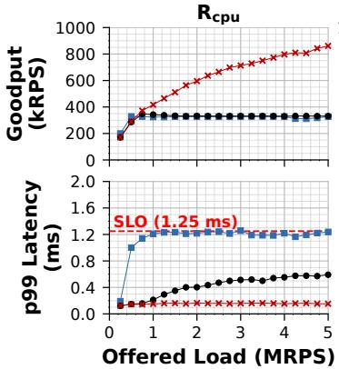

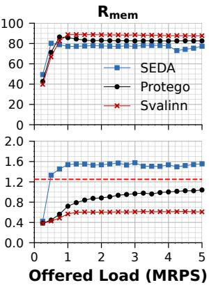  
Figure 13: Performance of SEDA, Protego, and Svalinn for RocksDB on SETUPB.  
Figure 14: Performance of SEDA, Protego, and Svalinn for synthetic application in Go on SETUPA.

Performance with different machines. We run RocksDB on SETUPB (Figure 13). Svalinn’s relative performance persists in this setup. Compared to SEDA, Svalinn reduces tail latency by up to 8.09× for Rcpu requests and 2.58× for Rmem requests. Compared to Protego, Svalinn reduces tail latency by up to 3.87× for Rcpu requests and 1.71× for Rmem requests. Svalinn improves the goodput of Rcpu requests by 2.65× over both SEDA and Protego without harming Rmem requests.

Svalinn in Go. We test a synthetic workload in Go with an 80/20 Rcpu/Rmem request mix, and observe that the benefits of Svalinn continue to hold across runtimes. As shown in Figure 14, Svalinn achieves up to 3.21× higher Rcpu request goodput. Moreover, Svalinn delivers up to 3.25× and 1.85× lower tail latency for Rcpu and Rmem requests, respectively, than the baselines.

## 6 Related Work

Receiver-driven admission control. Receiver-driven admission control regulates load at the server using the most accurate view of local capacity. Transport-level schemes such as Homa [38] and SIRD [45] operate on packets to reduce switch congestion. RPC-level systems such as Breakwater [9], CoreSync [42], and Protego [10] control request admission at the host. These approaches are particularly effective for handling incast. Svalinn follows this receiver-driven model while overcoming the single-queue fallacy in prior work.

Overload control. The importance of the overload problem has led to a wide range of solutions. Some solutions attempt to optimize performance across microservice chains [43, 49, 57, 59]. Other solutions consider the performance of a single host, focusing on a single resource (e.g., CPU [9, 55], locks [10, 23], and storage [21, 35]). Most existing controllers are designed primarily for their narrow set of bottlenecks. Atropos [23] particularly is the most general purpose technique. However, its focus is still on resources that applications can explicitly track (i.e., memory buffers, locks, and queues). Moreover, it does not offer an admission controller, offloading the responsibility of deciding the precise load per replica to a separate system. Svalinn handles implicitly accessed memory bandwidth bottleneck and introduces an admission control scheme that integrates with its per-resource latency controller.

Resource isolation. Another approach to improve resource utilization is to perform isolation between different requests. Typical approaches perform coarse-grained isolation at the binary level [7,19,47,58]. Recently, pBox [22] proposed intraapplication isolation, focusing on explicitly visible resources (i.e., it is nontrivial to deal with memory bandwidth contention in pBox). However, pBox does not drop any of the competing requests, leading to potentially high latencies for executing requests. Moreover, it does not provide an admission control technique. Another common technique for dealing with potential intra-application interference or head-of-line blocking is preemption [20, 29, 30]. We demonstrate that such techniques do not address problems solved by Svalinn. Among existing systems, Persephone [13] is closest to Svalinn as it explicitly limits the number of cores allocated to long-running requests. However, Persephone bases this allocation strictly on execution service times, a strategy that can inadvertently assign more cores to memory-intensive requests and thereby exacerbate memory-bandwidth contention. Furthermore, while Persephone relies on the assumption that request types are classified and known a priori, Svalinn requires no such prior knowledge, dynamically adapting to heterogeneous workloads on the fly.

Memory and interconnect congestion. Recently, there has been growing interest in congestion within the host interconnect [2, 3, 39, 53]. Solutions typically operate at the packet level, tackling the host interconnect as an extension of the network path between a client and a server. In particular, HostCC [3] assumes interference between a lowpriority memory-intensive application and a high-priority latency-sensitive application, and mitigates it by throttling the memory-intensive application’s cores using Intel MBA. Svalinn addresses a different setting: heterogeneous requests within the same application. In our setting, throttling memoryintensive requests with MBA would only cause them to stall longer on the CPU, exacerbating the very inefficiency that Svalinn seeks to eliminate.

Learning-based control. Learning-based controllers are widely used for dynamic optimization, including network congestion control [4, 14, 15], overload control [43, 54], and isolation [47, 58]. Svalinn follows this direction, relying on interpretable algorithms that can accommodate a wide range of user-defined utility functions.

## 7 Conclusion

This paper demonstrates that traditional, monolithic overload control systems are fundamentally limited by the single-queue fallacy. By treating modern server binaries as homogeneous black boxes and reacting solely to aggregate metrics like endto-end latency, state-of-the-art controllers prematurely throttle inbound load and leave vast swaths of machine capacity stranded. We present Svalinn, a modular overload control architecture that structurally decouples throughput optimization from distributed, per-resource latency management. Through the introduction of the m\_semaphore abstraction, Svalinn successfully converts the implicit memory bandwidth bottleneck into explicitly managed, observable software entities, optimizing resource execution paths without the need for intrusive application re-architecting. Our evaluation across diverse runtimes and applications proves that Svalinn achieves substantial goodput improvements (up to 6.51×) while strictly preserving latency guarantees.

Beyond its immediate performance gains, Svalinn provides a fundamental architectural blueprint for the future of microsecond-scale infrastructure. As modern hardware trends continue toward massive core parallelism coupled with complex, non-uniform memory and interconnect topolo gies, the intersection of data-dependent application paths and shared hardware constraints will only intensify. By rejecting the single-queue assumption, Svalinn demonstrates how a resource-agnostic admission controller, guided by a multidimensional utility function, can be composed with resourceaware, per-bottleneck latency control. Svalinn establishes an extensible foundation for a new generation of overload control systems capable of harvesting the full potential of nextgeneration cloud architectures.

## Acknowledgments

We thank our shepherd and the anonymous reviewers. We also thank CloudLab [17] for providing us with the infrastructure to run our experiments. This work was funded in part by NSF grants CNS-2212098 and IIS-2542973 and a Google Research Award.

## References

[1] Memcached: High-performance, distributed memory object caching system. https://memcached.org/. Accessed: 2025-02-01.

[2] Saksham Agarwal, Rachit Agarwal, Behnam Montazeri, Masoud Moshref, Khaled Elmeleegy, Luigi Rizzo, Marc Asher de Kruijf, Gautam Kumar, Sylvia Ratnasamy, David Culler, and Amin Vahdat. Understanding host interconnect congestion. In Proceedings of the 21st ACM Workshop on Hot Topics in Networks, HotNets ’22, page 198–204, New York, NY, USA, 2022. Association for Computing Machinery.

[3] Saksham Agarwal, Arvind Krishnamurthy, and Rachit Agarwal. Host congestion control. In Proceedings of the ACM SIGCOMM 2023 Conference, ACM SIGCOMM ’23, page 275–287, New York, NY, USA, 2023. Associ ation for Computing Machinery.

[4] Venkat Arun and Hari Balakrishnan. Copa: Practical Delay-Based congestion control for the internet. In 15th USENIX Symposium on Networked Systems Design and Implementation (NSDI 18), pages 329–342, Renton, WA, April 2018. USENIX Association.

[5] Berk Atikoglu, Yuehai Xu, Eitan Frachtenberg, Song Jiang, and Mike Paleczny. Workload analysis of a large-scale key-value store. In Proceedings of the 12th ACM SIGMETRICS/PERFORMANCE Joint International Conference on Measurement and Modeling of Computer Systems, SIGMETRICS ’12, page 53–64, New York, NY, USA, 2012. Association for Computing Machinery.

[6] Peter Auer, Nicolò Cesa-Bianchi, and Paul Fischer. Finite-time analysis of the multiarmed bandit problem. Machine Learning, 47(2–3):235–256, 2002.

[7] Shuang Chen, Christina Delimitrou, and José F Martínez. Parties: Qos-aware resource partitioning for multiple interactive services. In Proceedings of the Twenty-Fourth International Conference on Architectural Support for Programming Languages and Operating Systems (ASP-LOS ’19), pages 107–120, 2019.

[8] Inho Cho, Seo Jin Park, Ahmed Saeed, Mohammad Alizadeh, and Adam Belay. LDB: An efficient latency profiling tool for multithreaded applications. In 21st USENIX Symposium on Networked Systems Design and Implementation (NSDI 24), pages 1497–1510, Santa Clara, CA, April 2024. USENIX Association.

[9] Inho Cho, Ahmed Saeed, Joshua Fried, Seo Jin Park, Mohammad Alizadeh, and Adam Belay. Overload control for µs-scale RPCs with breakwater. In 14th USENIX Symposium on Operating Systems Design and Implementation (OSDI 20), pages 299–314. USENIX Association, November 2020.

[10] Inho Cho, Ahmed Saeed, Seo Jin Park, Mohammad Alizadeh, and Adam Belay. Protego: Overload control

for applications with unpredictable lock contention. In 20th USENIX Symposium on Networked Systems Design and Implementation (NSDI 23), pages 725–738, Boston, MA, April 2023. USENIX Association.

[11] Siddharth D. Eur/usd 1min dataset, 2023.

[12] Alexandros Daglis, Mark Sutherland, and Babak Falsafi. Rpcvalet: Ni-driven tail-aware balancing of µs-scale rpcs. In Proceedings of the Twenty-Fourth International Conference on Architectural Support for Programming Languages and Operating Systems, ASPLOS ’19, page 35–48, New York, NY, USA, 2019. Association for Computing Machinery.

[13] Henri Maxime Demoulin, Joshua Fried, Isaac Pedisich, Marios Kogias, Boon Thau Loo, Linh Thi Xuan Phan, and Irene Zhang. When idling is ideal: Optimizing tail-latency for heavy-tailed datacenter workloads with perséphone. In Proceedings of the ACM SIGOPS 28th Symposium on Operating Systems Principles, SOSP ’21, page 621–637, New York, NY, USA, 2021. Association for Computing Machinery.

[14] Mo Dong, Qingxi Li, Doron Zarchy, P. Brighten Godfrey, and Michael Schapira. PCC: Re-architecting congestion control for consistent high performance. In 12th USENIX Symposium on Networked Systems Design and Implementation (NSDI 15), pages 395–408, Oakland, CA, May 2015. USENIX Association.

[15] Mo Dong, Tong Meng, Doron Zarchy, Engin Arslan, Yossi Gilad, Brighten Godfrey, and Michael Schapira. PCC vivace: Online-Learning congestion control. In 15th USENIX Symposium on Networked Systems Design and Implementation (NSDI 18), pages 343–356, Renton, WA, April 2018. USENIX Association.

[16] Siying Dong, Andrew Kryczka, Yanqin Jin, and Michael Stumm. Rocksdb: Evolution of development priorities in a key-value store serving large-scale applications. ACM Trans. Storage, 17(4), October 2021.

[17] Dmitry Duplyakin, Robert Ricci, Aleksander Maricq, Gary Wong, Jonathon Duerig, Eric Eide, Leigh Stoller, Mike Hibler, David Johnson, Kirk Webb, Aditya Akella, Kuangching Wang, Glenn Ricart, Larry Landweber, Chip Elliott, Michael Zink, Emmanuel Cecchet, Snigdhaswin Kar, and Prabodh Mishra. The design and operation of CloudLab. In 2019 USENIX Annual Technical Conference (USENIX ATC 19), pages 1–14, Renton, WA, July 2019. USENIX Association.

[18] Envoy Project Authors. Envoy proxy. https://www. envoyproxy.io/, 2025.

[19] Joshua Fried, Zhenyuan Ruan, Amy Ousterhout, and Adam Belay. Caladan: Mitigating interference at microsecond timescales. In 14th USENIX Symposium on Operating Systems Design and Implementation (OSDI 20), pages 281–297. USENIX Association, November 2020.

[20] Linsong Guo, Danial Zuberi, Tal Garfinkel, and Amy Ousterhout. The benefits and limitations of user interrupts for preemptive userspace scheduling. In 22nd USENIX Symposium on Networked Systems Design and Implementation (NSDI 25), pages 1015–1032, 2025.

[21] Mingzhe Hao, Levent Toksoz, Nanqinqin Li, Edward Edberg Halim, Henry Hoffmann, and Haryadi S. Gunawi. LinnOS: Predictability on unpredictable flash storage with a light neural network. In 14th USENIX Symposium on Operating Systems Design and Implementa tion (OSDI 20), pages 173–190. USENIX Association, November 2020.

[22] Yigong Hu, Gongqi Huang, and Peng Huang. Pushing performance isolation boundaries into application with pbox. In Proceedings of the 29th Symposium on Operating Systems Principles (SOSP ’23), pages 247–263, 2023.

[23] Yigong Hu, Zeyin Zhang, Yicheng Liu, Yile Gu, Shuangyu Lei, Baris Kasikci, and Peng Huang. Mitigating application resource overload with targeted task cancellation. In Proceedings of the ACM SIGOPS 31st Symposium on Operating Systems Principles (SOSP ’25), pages 270–285, 2025.

[24] Yigong Hu, Haodong Zheng, Yicheng Liu, Dedong Xie, Youliang Huang, and Baris Kasikci. gigiprofiler: Diagnosing performance issues by uncovering application resource bottlenecks, 2025.

[25] Jack Tigar Humphries, Neel Natu, Ashwin Chaugule, Ofir Weisse, Barret Rhoden, Josh Don, Luigi Rizzo, Oleg Rombakh, Paul Turner, and Christos Kozyrakis. ghost: Fast & flexible user-space delegation of linux scheduling. In Proceedings of the ACM SIGOPS 28th Symposium on Operating Systems Principles, pages 588–604, 2021.

[26] Darby Huye, Yuri Shkuro, and Raja R Sambasivan. Lifting the veil on {Meta’s} microservice architecture: Analyses of topology and request workflows. In 2023 USENIX Annual Technical Conference (USENIX ATC 23), pages 419–432, 2023.

[27] Intel Corporation. Intel vtune profiler, 2025. Accessed: 2026-05-25.

[28] Intel PCM Project Contributors. Intel ® performance counter monitor (pcm). https://github.com/intel/ pcm, 2025.

[29] Rishabh Iyer, Musa Unal, Marios Kogias, and George Candea. Achieving microsecond-scale tail latency efficiently with approximate optimal scheduling. In Proceedings of the 29th Symposium on Operating Systems Principles, SOSP ’23, page 466–481, New York, NY, USA, 2023. Association for Computing Machinery.

[30] Kostis Kaffes, Timothy Chong, Jack Tigar Humphries, Adam Belay, David Mazières, and Christos Kozyrakis. Shinjuku: Preemptive scheduling for usecond-scale tail latency. In 16th USENIX Symposium on Networked Systems Design and Implementation (NSDI 19), pages 345–360, Boston, MA, February 2019. USENIX Association.

[31] Gautam Kumar, Nandita Dukkipati, Keon Jang, Hassan M. G. Wassel, Xian Wu, Behnam Montazeri, Yaogong Wang, Kevin Springborn, Christopher Alfeld, Michael Ryan, David Wetherall, and Amin Vahdat. Swift: Delay is simple and effective for congestion control in the datacenter. In Proceedings of the Annual Conference of the ACM Special Interest Group on Data Communication on the Applications, Technologies, Architectures, and Protocols for Computer Communication, SIGCOMM ’20, page 514–528, New York, NY, USA, 2020. Association for Computing Machinery.

[32] Bradley C. Kuszmaul, Matteo Frigo, Justin Mazzola Paluska, and Alexander (Sasha) Sandler. Everyone loves file: File storage service (FSS) in oracle cloud infrastructure. In 2019 USENIX Annual Technical Conference (USENIX ATC 19), pages 15–32, Renton, WA, July 2019. USENIX Association.

[33] Yizhuo Liang, Ramesh Govindan, and Seo Jin Park. Granular resource demand heterogeneity. In Proceedings of the 2025 Workshop on Hot Topics in Operating Systems, HotOS ’25, page 187–194, New York, NY, USA, 2025. Association for Computing Machinery.

[34] Linux perf Wiki Contributors. perf: Linux profiling with performance counters, 2025. Accessed: 2026-05-25.

[35] Jaehong Min, Ming Liu, Tapan Chugh, Chenxingyu Zhao, Andrew Wei, In Hwan Doh, and Arvind Krishnamurthy. Gimbal: enabling multi-tenant storage disaggregation on smartnic jbofs. In Proceedings of the 2021 ACM SIGCOMM 2021 Conference, pages 106– 122, 2021.

[36] Hossein Moein. Dataframe: A high-performance, mod ern c++ data analysis library. https://github.com/ hosseinmoein/DataFrame. Accessed: 2025-02-01.

[37] Jeffrey C Mogul and KK Ramakrishnan. Eliminating receive livelock in an interrupt-driven kernel. ACM Transactions on Computer Systems, 1997.

[38] Behnam Montazeri, Yilong Li, Mohammad Alizadeh, and John Ousterhout. Homa: a receiver-driven lowlatency transport protocol using network priorities. In Proceedings of the 2018 Conference of the ACM Special Interest Group on Data Communication, SIGCOMM ’18, page 221–235, New York, NY, USA, 2018. Association for Computing Machinery.

[39] Rolf Neugebauer, Gianni Antichi, José Fernando Zazo, Yury Audzevich, Sergio López-Buedo, and Andrew W. Moore. Understanding pcie performance for end host networking. In Proceedings of the 2018 Conference of the ACM Special Interest Group on Data Communication, SIGCOMM ’18, page 327–341, New York, NY, USA, 2018. Association for Computing Machinery.

[40] Rajesh Nishtala, Hans Fugal, Steven Grimm, Marc Kwiatkowski, Herman Lee, Harry C. Li, Ryan McElroy, Mike Paleczny, Daniel Peek, Paul Saab, David Stafford, Tony Tung, and Venkateshwaran Venkataramani. Scaling memcache at facebook. In 10th USENIX Symposium on Networked Systems Design and Implementation (NSDI 13), pages 385–398, Lombard, IL, April 2013. USENIX Association.

[41] Amy Ousterhout, Joshua Fried, Jonathan Behrens, Adam Belay, and Hari Balakrishnan. Shenango: Achieving high CPU efficiency for latency-sensitive datacenter workloads. In 16th USENIX Symposium on Networked Systems Design and Implementation (NSDI 19), pages 361–378, Boston, MA, February 2019. USENIX Association.

[42] Bhaskar Pardeshi, Eric Stuhr, and Ahmed Saeed. Coresync: A protocol for joint core scheduling and overload control of µs-scale tasks. In 2025 IEEE 33rd International Conference on Network Protocols (ICNP), pages 1–11. IEEE, 2025.

[43] Jinwoo Park, Jaehyeong Park, Youngmok Jung, Hwijoon Lim, Hyunho Yeo, and Dongsu Han. Topfull: An adaptive top-down overload control for slo-oriented microservices. In Proceedings of the ACM SIGCOMM 2024 Conference, ACM SIGCOMM ’24, page 876–890, New York, NY, USA, 2024. Association for Computing Machinery.

[44] Yajuan Peng, Shuang Chen, Yi Zhao, and Zhibin Yu. {UFO}: The ultimate {QoS-Aware} core management for virtualized and oversubscribed public clouds. In 21st USENIX Symposium on Networked Systems Design and Implementation (NSDI 24), pages 1511–1530, 2024.

[45] Konstantinos Prasopoulos, Ryan Kosta, Edouard Bugnion, and Marios Kogias. SIRD: A Sender-Informed, Receiver-Driven datacenter transport protocol. In 22nd USENIX Symposium on Networked Systems Design and Implementation (NSDI 25), pages 451–471, Philadelphia, PA, April 2025. USENIX Association.

[46] George Prekas, Marios Kogias, and Edouard Bugnion. Zygos: Achieving low tail latency for microsecond-scale networked tasks. In Proceedings of the 26th Symposium on Operating Systems Principles, SOSP ’17, page 325–341, New York, NY, USA, 2017. Association for Computing Machinery.

[47] Haoran Qiu, Subho S. Banerjee, Saurabh Jha, Zbigniew T. Kalbarczyk, and Ravishankar K. Iyer. FIRM: An intelligent fine-grained resource management framework for SLO-Oriented microservices. In 14th USENIX Symposium on Operating Systems Design and Implementation (OSDI 20), pages 805–825. USENIX Association, November 2020.

[48] Herbert Robbins. Some aspects of the sequential design of experiments. Bulletin of the American Mathematical Society, 58(5):527–535, 1952.

[49] Lalith Suresh, Peter Bodik, Ishai Menache, Marco Canini, and Florin Ciucu. Distributed resource management across process boundaries. In Proceedings of the 2017 Symposium on Cloud Computing (SoCC ’17), pages 611–623, 2017.

[50] Lalith Suresh, Marco Canini, Stefan Schmid, and Anja Feldmann. C3: Cutting tail latency in cloud data stores via adaptive replica selection. In 12th USENIX Symposium on Networked Systems Design and Implementation (NSDI 15), pages 513–527, 2015.

[51] Richard S Sutton and Andrew G Barto. Reinforcement learning: An introduction. The MIT Press, 2 edition, 2018.

[52] Twitter Engineering. Deterministic aperture: A distributed, load balancing algorithm. https://blog.twitter.com/engineering/ en\_us/topics/infrastructure/2019/ daperture-load-balancer, 2019. Accessed: 2025-12-07.

[53] Midhul Vuppalapati, Saksham Agarwal, Henry Schuh, Baris Kasikci, Arvind Krishnamurthy, and Rachit Agarwal. Understanding the host network. In Proceedings of the ACM SIGCOMM 2024 Conference, ACM SIG-COMM ’24, page 581–594, New York, NY, USA, 2024. Association for Computing Machinery.

[54] Zibo Wang, Pinghe Li, Chieh-Jan Mike Liang, Feng Wu, and Francis Y. Yan. Autothrottle: A practical Bi-Level approach to resource management for SLO-Targeted microservices. In 21st USENIX Symposium on Networked Systems Design and Implementation (NSDI 24), pages 149–165, Santa Clara, CA, April 2024. USENIX Association.

[55] Matt Welsh, David Culler, and Eric Brewer. Seda: an architecture for well-conditioned, scalable internet services. In Proceedings of the Eighteenth ACM Symposium on Operating Systems Principles, SOSP ’01, page 230–243, New York, NY, USA, 2001. Association for Computing Machinery.

[56] Bartek Wydrowski, Robert Kleinberg, Stephen M Rum ble, and Aaron Archer. Load is not what you should balance: Introducing prequal. In 21st USENIX Symposium on Networked Systems Design and Implementation (NSDI 24), pages 1285–1299, 2024.

[57] Jiali Xing, Akis Giannoukos, Paul Loh, Shuyue Wang, Justin Qiu, Henri Maxime Demoulin, Konstantinos Kallas, and Benjamin C. Lee. Rajomon: Decentralized and coordinated overload control for Latency-Sensitive microservices. In 22nd USENIX Symposium on Networked Systems Design and Implementation (NSDI 25), pages 21–36, Philadelphia, PA, April 2025. USENIX Association.

[58] Yanqi Zhang, Weizhe Hua, Zhuangzhuang Zhou, G Edward Suh, and Christina Delimitrou. Sinan: Ml-based and qos-aware resource management for cloud microservices. In Proceedings of the 26th ACM international conference on architectural support for programming languages and operating systems (ASPLOS ’21), pages 167–181, 2021.

[59] Hao Zhou, Ming Chen, Qian Lin, Yong Wang, Xiaobin She, Sifan Liu, Rui Gu, Beng Chin Ooi, and Junfeng Yang. Overload control for scaling wechat microservices. In Proceedings of the ACM Symposium on Cloud Computing, SoCC ’18, page 149–161, New York, NY, USA, 2018. Association for Computing Machinery.

Algorithm 2: Svalinn’s Utility-Based Throughput Con  
troller.   
1 credits: Current credit pool size   
2 Parameter δ: Credit pool change for every   
micro-experiment   
3 Parameter ∆ twarmup: Time interval before monitoring the   
micro-experiment   
4 Parameter ∆ tmonitor: Time interval for which the   
micro-experiment is monitored   
5 Function UpdateCredits():   
// Save original credit pool   
6 creditsorig ← credits;   
// Admit more load   
7 credits ← creditsorig + δ;   
8 Wait(∆ twarmup );   
9 StartStatsCollection(stats + );   
10 Wait(∆ tmonitor );   
11 EndStatsCollection(stats +);   
// Admit less load   
12 credits ← creditsorig − δ;   
13 Wait(∆ twarmup );   
14 StartStatsCollection(stats − );   
15 Wait(∆ tmonitor );   
16 EndStatsCollection(stats − );   
// Calculate utilities   
17 utility + ← CalculateUtility(stats + );   
18 utility − ← CalculateUtility(stats − );   
// Relabel utilities based on actual load   
19 if stats + .reqsin ≤ stats − .reqsin then   
20 Swap( utility + , utility − );   
// Update the credit pool   
21 if utility + > utility − then   
22 credits ← creditsorig + δ;   
23 else   
24 credits ← creditsorig − δ;

## A Additional Design Discussion

## A.1 Utility-Based Throughput Controller Al gorithm

The throughput controller continuously runs the UpdateCredits() routine, shown in Algorithm 2, while the application is running. In each iteration, the controller performs two micro-experiments (lines 7–11 and 12–16). During each micro-experiment, the controller either increases or decreases the credit pool by δ. To allow the newly set credit pool value to take effect, the controller waits for ∆ twarmup period before attributing observed performance to the new credit pool value. Finally, the controller monitors the application for ∆ tmonitor, and records relevant performance metrics. The controller computes a utility value from these metrics for each micro-experiment (lines 17–18). To handle cases in which perturbing the credit pool does not produce the expected change in incoming request rate, we relabel the micro-experiments using the actually observed incoming request rate (lines 19–20). After both micro-experiments complete, it updates the credit pool in the direction that yields higher utility (lines 21–24).

## B Additional Evaluation Results

## B.1 Request-level Performance with Multiple Bottlenecks

Figure 15 shows a detailed breakdown of the experiment in Figure 12 on SETUPA. Clients issue three request types: Rcpu, Rmem, and Rlock. As soon as the Rlock path saturates at around 180 kRPS of offered load, SEDA stops admitting additional load. As a result, the goodput of both Rcpu and Rmem also plateaus at that point. SEDA also suffers from high tail latency due to request incasts at the most congested bottleneck, namely the global mutex. In contrast, the Rcpu and Rmem paths remain unsaturated and continue to exhibit low tail latency.

Protego continues admitting load past the global-mutex saturation point. It controls Rlock tail latency by performing AQM at mutex access points and continues increasing load as long as throughput improves. Consequently, its goodput rises until memory bandwidth saturates at around 300 kRPS. Beyond this point, Rmem requests stall on the CPU, causing CPU congestion and leaving no capacity for Rcpu requests. As a result, Rcpu goodput saturates together with Rmem goodput. The R goodput declines at higher loads because client bursts can still enqueue many Rlock requests at the global mutex. Since Protego’s AQM uses an instantaneous queueingdelay estimate [10], requests arriving in the same short burst can observe a low estimate and be enqueued together, only to incur high delay later.

Svalinn behaves similarly to Protego until memory bandwidth becomes congested. At that point, m\_semaphore limits the concurrency of Rmem requests and prevents the resulting CPU congestion. This allows Svalinn’s throughput-driven admission controller to admit more load and use the remaining CPU capacity. As a result, Svalinn achieves up to 8.71× and 4.18× higher Rcpu goodput than SEDA and Protego, respectively. Throughout the experiment, Svalinn keeps tail latency within the configured SLO, although it is still affected by Rlock bursts at high load.

## B.2 Memcached Performance

Clients generate a modified VAR [5] workload in which 82% of requests are Rlock, 9% are Rcpu, and the remaining 9% are Rmem on SETUPA. In Memcached, the Rmem path is the most congested and saturates at around 300 kRPS of offered load. As seen in Figure 16, both SEDA and Protego stop admitting additional load beyond this point, leaving the Rcpu and Rlock paths underutilized. SEDA suffers from extremely high Rlock tail latency because of request incasts, whereas Protego keeps tail latency much better controlled.

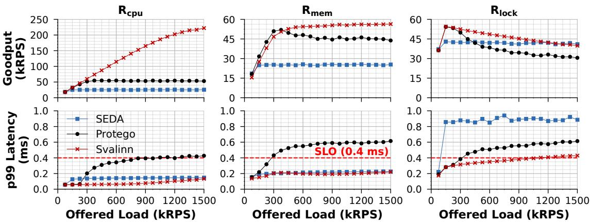  
Figure 15: Request-level performance of SEDA, Protego, and Svalinn for synthetic application on SETUPA.

Svalinn addresses the most congested bottleneck, memory bandwidth, using m\_semaphore. By limiting Rmem concurrency, m\_semaphore preserves CPU capacity for Rcpu and Rlock requests. As a result, Svalinn achieves up to 2.53× higher Rcpu goodput than SEDA and Protego, and up to 2.58× higher Rlock goodput than both baselines. Svalinn also achieves up to 13.57×, 1.74×, and 17.32× lower tail latency for Rcpu, Rmem, and Rlock requests, respectively. These gains come from performing AQM at both bottlenecks: memory bandwidth and the global slabs lock on the SET path. Tail latencies remain well below the SLO because m\_semaphore uses an aggressive AQM policy that tolerates no queueing and drops requests as soon as a queue is about to form. This slightly increases drops, but achieves the lowest possible latency.

## B.3 Choice of m\_semaphore Reward Function

In Svalinn, we introduced an MAB-based controller to dynamically update the m\_semaphore capacity and outlined the reward function that best meets our objective. To design an appropriate reward, we built a simulator that runs the ε- greedy MAB algorithm for our specific problem: finding the minimum number of cores needed to saturate memory bandwidth. We model SETUPB, where 16 cores saturate memory bandwidth, and design reward functions that (i) increase with achieved bandwidth and (ii) penalize using more cores than necessary. We define the normalized memory bandwidth at a given m\_semaphore capacity as mˆ = membwcapacity and the membwmax   
normalized core count as cˆ = corescapacity . We evaluate three coresmax   
variants shown below:

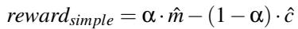

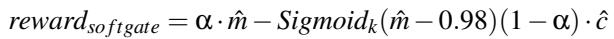

We simulate a simple bandwidth model that increases linearly up to 16 cores and plateaus thereafter, running experiments with and without Gaussian noise (3 GB/s). As shown in Figure 17, all three reward functions converge near the optimal core count when the readings are noise-free: rewardsimple converges exactly to 16, while the other two settle at 15.

With noise, however, rewardhardgate and rewardso ftgate converge to core counts much larger than the optimum. Because noise frequently masks whether mˆ exceeds 0.98, the penalty condition rarely triggers, allowing high-core configurations to appear equally good or better. Their learned reward curves reflect this by assigning maximal rewards to all core counts beyond the true optimum, preventing stable convergence. In contrast, rewardsimple consistently converges to the correct core count, and its learned reward curve peaks at the true optimal arm. For this reason, we adopt rewardsimple in Svalinn.

## B.4 Sensitivity to Reward Function Parameter

Our reward function includes a parameter α ∈ [0, 1] that controls the tradeoff between maximizing memory bandwidth and minimizing CPU usage. We evaluate different α values using the same simulator. We disable the memory bandwidth noise in this experiment. As shown in Figure 18, when α ≤ 0.3, the learned rewards favor core counts below the optimal value. For α between 0.3 and 0.9, the reward peaks exactly at the true optimal core count. At α = 1.0, all core counts above the optimal receive the same reward, leading to oscillatory behavior similar to rewardhardgate and rewardso ftgate.

## B.5 Performance with Different Request Mixes

We use the synthetic workload with Rcpu and Rmem requests on SETUPA. We configure the offered load so that the Rmem path is overloaded by 20%, 60%, or 100%. For each overload level, we vary the request mix by increasing the Rcpu fraction from 10% to 70%, while keeping the Rmem overload level fixed. This lets us evaluate whether Svalinn’s benefit holds across different workload mixes, rather than only for one engineered mix.

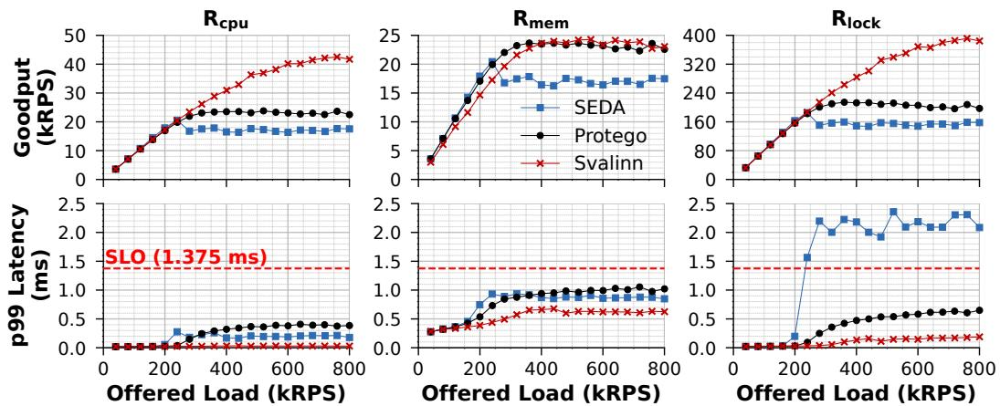  
Figure 16: Request-level performance of SEDA, Protego, and Svalinn for Memcached on SETUPA.

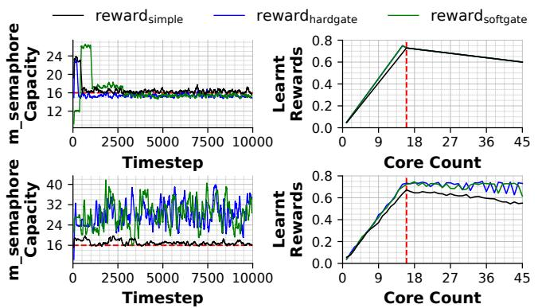  
Figure 17: Simulation of ε-greedy MAB controller comparing different reward functions without memory-bandwidth noise (top) and with memory-bandwidth noise (bottom). The red line indicates the optimal core count.

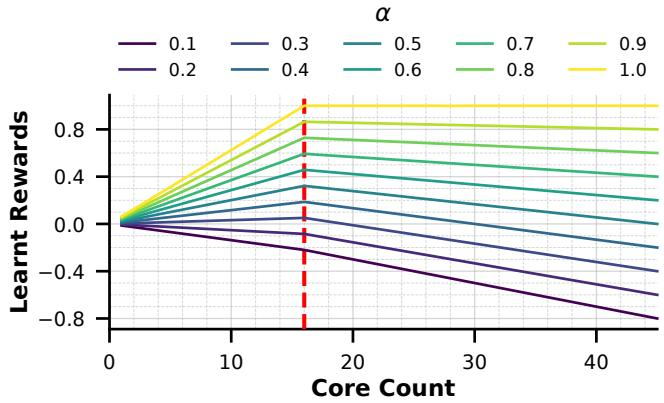  
Figure 18: Simulation of ε-greedy MAB controller to analyze the sensitivity to parameter α. The red line shows the optimal core count.

Figure 19 shows the goodput gain of Svalinn over Protego. Svalinn achieves the largest gains when the workload is dominated by Rmem requests. In this regime, Protego saturates memory bandwidth early. The stalled Rmem requests

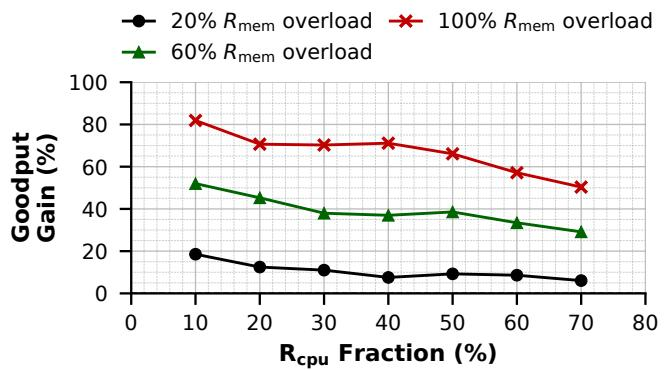  
Figure 19: Goodput gain of Svalinn over Protego across different Rcpu/Rmem request mixes and Rmem overload levels on SETUPA.  
then occupy CPU cores and leave less capacity for useful Rcpu work. Svalinn avoids this by limiting Rmem concurrency with m\_semaphore, preserving CPU capacity for Rcpu requests. As the Rcpu fraction increases, memory bandwidth becomes congested later, allowing Protego to achieve more Rcpu goodput before Rmem stalls dominate. Consequently, the gap between Svalinn and Protego narrows at higher Rcpu fractions. Overall, Svalinn’s goodput gains persist across a range of Rcpu/Rmem mixes and Rmem overload levels.