USENIX

THE ADVANCED COMPUTING SYSTEMS ASSOCIATION

# MDK: Rethinking the data center memory reclamation problem

Shaurya Patel, Google and University of British Columbia; Suli Yang and   
Yawen Wang, Google; Kan Wu, xAI; Alexandra (Sasha) Fedorova, University of   
British Columbia and MongoDB; Margo Seltzer, University of British Columbia; Kimberly Keeton, Google

https://www.usenix.org/conference/osdi26/presentation/patel

# This paper is included in the Proceedings of the 20th USENIX Symposium on Operating Systems Design and Implementation.

July 13–15, 2026 • Seattle, WA, USA

ISBN 978-1-939133-55-7

Open access to the Proceedings of the 20th USENIX Symposium on Operating Systems Design and Implementation is sponsored by

# MDK: Rethinking the data center memory reclamation problem

Shaurya Patel<sup>1,2</sup> Suli Yang<sup>1</sup> Yawen Wang<sup>1</sup> Kan Wu<sup>3</sup> Alexandra (Sasha) Fedorova<sup>2,4</sup> Margo Seltzer<sup>2</sup> Kimberly Keeton<sup>1</sup>

<sup>1</sup>Google <sup>2</sup>University of British Columbia <sup>3</sup>xAI <sup>4</sup>MongoDB

## Abstract

The traditional memory management problem maximizes application performance when constrained by a fixed-size memory. Today’s data centers face a different problem: their goal is to maximize the number of jobs on a server without violating performance Service Level Objectives (SLOs). Since a key constraint for placing additional jobs is memory, data center systems proactively reclaim memory from running jobs to create space for new jobs. This difference fundamentally flips the optimization problem that memory management policies need to address.

Designing practical policies requires a set of tools: 1) an optimal policy that provides a bound on what any policy can achieve, 2) metrics to compare policies, and 3) efficient techniques for evaluating potential policies. However, we find that foundational tools from the traditional setting, such as the optimal policy OPT, Miss Ratio Curves (MRCs), and efficient ways to generate MRCs, do not apply in this new setting. The data center setting demands a new set of tools.

We present the Memory Designer’s Kit, MDK, a framework for designing and evaluating data center memory management policies. MDK includes an offline provably optimal policy; Memory Performance Curves (MPCs), which show how mem ory savings vary when constrained by performance; and an efficient technique that is up to 208× faster than simulation for producing MPCs. We demonstrate MDK’s utility by developing three data center policies that improve average memory savings by up to 10% relative to a state-of-the-art policy.

## 1 Introduction

Memory management, especially policies for effective eviction of pages from caches, has long been a cornerstone of operating systems [4, 8, 9, 15, 19, 32, 33, 35, 47, 48]. These policies focus on managing the memory of a single computer (node) and can be framed as an optimization problem with the goal of maximizing application performance while constrained by the node’s limited memory capacity. Page replacement policies, such as LRU, evict pages in reaction to memory pressure (i.e., when the memory is full and new pages need to be allocated). In this setting, application performance is tracked using a performance proxy, the cache miss rate, which is defined as the ratio of the number of cache misses to the total number of memory accesses, measured over the application’s lifetime. Replacement policies minimize the miss ratio under the assumption that doing so will maximize application performance.

Optimizing memory usage in data centers has become increasingly important, due to the high cost of DRAM [14,21, 34, 38, 45, 63]. In a data center, each server operates as part of a cluster, and jobs can be placed on or migrated between servers. The goal is to run as many jobs as possible on each server, while satisfying application performance targets [5, 6]. Maximizing server utilization allows data center operators to reduce their total cost of ownership (TCO). Data center operators deploy reclamation policies that proactively evict cold pages from memory before facing memory pressure, in order to reduce DRAM usage and make space for scheduling additional jobs. Evicted pages are either demoted to a cheaper byte-addressable memory tier over CXL [1], or swapped to disks [66] or to compressed memory [37].

Like traditional reactive replacement policies, proactive data center reclamation policies track performance using performance proxies; the main differences are how the proxies are measured and the choice of specific metrics. A replacement policy measures the overall miss ratio across an application’s lifetime, whereas a reclamation policy measures a performance proxy in discrete time windows. This windowed approach is better aligned with data center application performance SLOs, which are enforced in a statistical manner over time intervals. Reclamation performance proxy metrics are defined at the OS level to provide consistency across the diverse set of data center workloads. Some modern examples of performance proxy metrics used for reclamation include Google’s promotion rate, defined as the ratio of faulting pages to the number of unique pages accessed within a time interval [37], and Meta’s Pressure Stall Information (PSI), defined as the percentage of compute potential that is unproductive over a time window due to resource stalls [66].

These differences in the data center environment create a new optimization problem that flips the traditional goal and constraint: the goal is to maximize memory savings whenever an application can relinquish memory to allow more jobs to be run, and the constraint is to maintain target performance proxies over all time windows to comply with application SLOs. We focus on maximizing average memory savings, subject to a target promotion rate; we discuss the broader problem space in §2.

Designing a new policy requires several tools, as shown in Figure 1. Traditional replacement policy development benefits from an established set of tools, developed over decades. The optimal policy OPT [47] is used to understand policy performance headroom, the best any policy can perform. Poli cies are compared using Miss Ratio Curves (MRCs) [47], which plot the miss ratio as a function of cache size. Numerous algorithms have been developed to efficiently generate MRCs (e.g., [47,57,64]) based on the inclusion property [47], which makes it possible to calculate miss ratios for multiple cache sizes in a single iteration over a trace. Unfortunately, these well-established tools for evaluating replacement policies do not apply to the data center reclamation problem. As we demonstrate in §2, OPT [47], the well-known optimal policy that minimizes miss ratio, violates time-window performance proxy targets, making it non-optimal for the data center reclamation problem. Further, since the data center reclamation problem formulation flips the optimization goal and constraint, and uses a diverse set of metrics [6, 37, 62, 66] other than the miss ratio, MRCs and their generation techniques are not applicable.

We present the Memory Designer’s Kit, MDK, an offline framework for designing new data center reclamation policies. MDK consists of four components: 1) the Memory Performance Curve (MPC): the data center equivalent of conventional MRCs, which plots a memory optimization goal (e.g., average memory savings) as a function of a performance proxy (e.g., promotion rate). 2) the Optimal Performance Proxy (OPP) policy: an offline, provably optimal policy for maximizing average memory savings subject to a performance proxy, the promotion rate constraint. It can be generalized to maximizing average memory savings subject to any performance constraint that is computable on a trace of accesses. 3) theoretical properties: properties that relate a reclamation policy’s performance proxy and memory savings as a function of different policy settings. Analogous to the inclusion property in the traditional setting, these properties, eviction decisions and eviction times, make it possible to efficiently calculate MPCs. 4) an efficient MPC generation framework: a method that lets us efficiently generate MPCs for multiple performance proxy values in a single pass. MDK’s MPC generation is linear in time complexity, 12.5× to 208× faster than our simulator depending on the number of page access events in a trace.

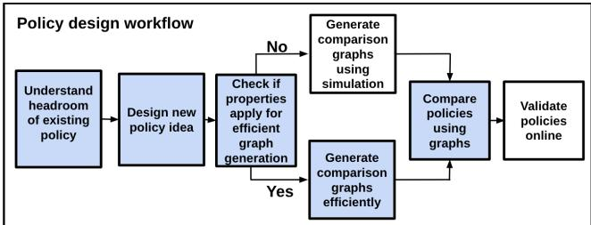  
Figure 1: Typical workflow for designing new replacement and reclamation policies. MDK contributions are required for multiple reclamation policy development steps (blue squares).

We demonstrate how MDK can be used to analyze and develop policies for the data center reclamation problem. First, we examine the age-based reclamation policy (AGE, an approximation of the working set policy [17]) used in gswap [37] and evaluate its effectiveness in the data center setting. We compare it to MDK’s optimal policy, OPP, using MPCs and show that a significant gap exists between the two, indicating substantial room for improvement.

Second, we use MDK to develop three policies. Two are history-based heuristics: the single-parameter Prior Age with Wait (PAW) and the two-parameter Prior Age and Current Elapsed (PACE). The third is a learned policy that imitates OPP. Our heuristic policies reclaim a page as soon as it’s accessed rather than waiting for the page to cool off (as done in AGE). Using MDK, we analyze the performance of these policies, compared to AGE, on offline traces. PAW, PACE, and AGE have tunable parameters dependent on trace charac teristics. We measure their maximum potential performance achieved by tuning their parameters using complete evaluation trace information. PAW generates slightly better average memory savings than AGE at lower promotion rates for workloads that exhibit repeating access patterns (four out of eight benchmarks). We validate PAW’s performance by implementing it on Linux and confirm that PAW achieves 4% higher memory savings than AGE for a graph processing workload without any performance loss. However, for workloads without any repeating patterns, AGE performs significantly better. Given a representative trace, our second policy PACE performs as well as AGE for any workload by design, and improves performance by 10% for a subset of workloads. Evaluating policy tuning in MDK with training and testing phases, or tuning the policies online, are valuable topics of future research.

MDK is generalizable beyond the problem we study in this paper. We selected two metrics out of a set of many possible metrics used in data centers [20, 39, 66, 75]. MDK is designed to support different memory saving targets and performance proxies, and we describe the additional work required to apply MDK to an even broader context. The rest of the paper is organized as follows: First, we discuss the requirements for data center memory reclamation and motivate the new problem formulation (§2). Then we introduce MDK, a toolkit for evaluating policies under the new problem formulation (§3)

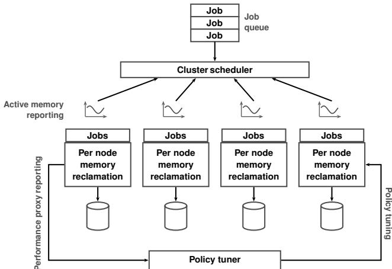  
Figure 2: Data center system architecture. Reclamation poli cies run on individual nodes and proactively reclaim application memory and swap it to disk or compressed memory.

and discuss our implementation (§4). We outline our evaluation methodology and demonstrate the design workflow for developing new policies using MDK (§5). Finally, we review related work (§6) and conclude (§7).

## 2 Data center memory reclamation

We begin by describing the architecture of existing data center reclamation systems, the selection of memory savings targets, and performance constraint metrics in existing systems. We then identify the requirements and intuition for what constitutes a good metric. Finally, we motivate why designing new reclamation policies demands new tools, illustrating this with specific metrics. Because the space of reasonable metrics is vast, we focus our discussion on the metrics used throughout the rest of the paper, mentioning others as areas for further research.

## 2.1 Data center reclamation architecture

Data center operators use memory reclamation policies to reduce applications’ memory usage, so they can run more jobs on servers, thus maximizing server utilization and minimizing TCO [37, 39, 66]. Figure 2 shows a typical data center architecture, which includes a complex ecosystem of feedback loops that operate across multiple timescales and influence the design of memory reclamation. Cluster schedulers manage and place jobs on nodes [62] and periodically track resource usage to predict future demands and place new jobs [6, 54].

Memory reclamation policies, operating on individual nodes, decide when to reclaim pages, which pages to reclaim, and how many to reclaim. They proactively free up DRAM by moving cold application data to slower and cheaper storage, such as compressed memory [37], and SSDs [66]. Recent systems [20, 39, 43, 75] also use byte-addressable CXL [1] memory pools to store cold data.

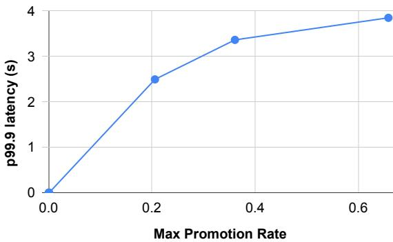  
Figure 3: Promotion rate versus tail latency for Cassandra running YCSB. Promotion rate increases as tail latency across windows increases.

Reclamation policies use a proactive operating mode in which they reclaim memory alongside application execution, using a tuner that determines how many pages to reclaim. The tuner determines the number of pages to reclaim based on the observed performance degradation of the application. It measures performance degradation in discrete time windows over seconds or minutes, which allows the system to maximize memory savings while satisfying application SLOs. Applications evaluate their SLOs (e.g., query rate or tail latency) over discrete periods, not over their entire execution; therefore, satisfying application SLOs requires that a system promptly measure, report, and respond to degradation. For instance, TMO’s Senpai [66] measures the performance for ten-second windows, while g-swap [37] measures two-minute windows. If performance suffers, the system reclaims memory less aggressively; if performance is acceptable, it reclaims memory more aggressively.

A policy’s control parameter determines if a page should be reclaimed. For example, g-swap [37] uses page age, reclaiming every page that is unused after a time T, while TMO uses a page’s position in LRU ordering to determine which pages to reclaim.

Although the reclamation system design dictates the overall optimization problem, system designers must still decide meaningful ways to measure performance degradation and memory savings.

## 2.2 SLO-aligned performance proxy metrics

Systems track application performance degradation using performance proxies that the operating system (not the application) can easily evaluate. This is analogous to what systems have historically done, i.e., identify the page to evict by minimizing the number of page faults. In either setting, a performance proxy should: 1) be easy for the OS to monitor (despite hardware heterogeneity), 2) be meaningful for the diverse application mix hosted in the data center, and 3) correlate with application performance metrics commonly used in data centers.

Traditional performance proxy metrics such as cache miss rate and page fault rate are not a good match for data centers. Cache miss rate (defined as total misses divided by total accesses) cannot be accurately measured in the data center. Miss rate can be computed in the OS as the number of page faults divided by the number of page accesses, which requires observing every page access, but typical OS telemetry doesn’t provide exact counts of repeated accesses to pages already in memory. Page fault rate (the total number of page faults normalized by time) is used by earlier work [15, 55], since it can be easily measured by the OS. However, as shown by TMO [66], page fault rate isn’t a good data center metric: it doesn’t account for hardware heterogeneity, and it fails to account for the total number of application memory accesses in a time interval.

Because traditional proxies lack applicability, reclamation system designers have developed their own. g-swap [37] uses the promotion rate per time window, which Google’s deploy ment defines as the number of non-compulsory page faults normalized by the number of unique pages accessed in that window [37]. g-swap monitors this metric every two minutes and ensures it does not exceed a threshold [37]. This metric proves especially effective if page faults have a relatively uniform cost; we found that it tracks application performance well. Figure 3 illustrates that as Cassandra’s (described in §5) tail latency increases, it also leads to a higher promotion rate. Additionally, checking page table entry (PTE) access bits reliably measures the number of unique pages accessed across different hardware platforms without introducing CPU caching or security concerns.

TMO uses Pressure Stall Information (PSI) [66]. PSI measures the time tasks spend waiting for page faults, thus measuring the impact of each page fault. Page faults have different performance costs on hardware with different performance characteristics (e.g., compressed memory or SSD); promotion rate might not capture this difference. PSI addresses this memory tier heterogeneity and provides a more direct indication of performance degradation due to memory contention; however, because PSI is a function of system load, it is harder to use in offline settings over memory access traces.

Recent byte-addressable systems use still other proxies [20, 46] such as Secondary Tier Access Ratio (STAR). STAR calculates the total accesses directed to a secondary tier (e.g., CXL memory) relative to the total number of accesses. STAR is a good match for byte-addressable memory because data can be accessed directly without promotion. Ultimately, the system architecture and hardware heterogeneity determine the proxy choice.

## 2.3 Memory savings optimization targets

Optimizing for a memory savings target should enable running more jobs on a node, which decouples memory reclamation and cluster scheduling. Higher level feedback loops guide the design of the memory savings target: a cluster scheduler can leverage memory savings only if those savings last long enough to allow newly scheduled applications to amortize the overhead of job placement. For example, Google data centers use a threshold of at least five minutes [54].

In addition to increasing overall efficiency, optimization targets might encode other goals such as minimizing page migration traffic between memory tiers. For example, if a page is reclaimed and migrated to a slower memory tier and then accessed again a short time later, it produces unnecessary page migrations, which harm application performance.

An effective metric must therefore lead to meaningful savings that increase utilization, while satisfying other goals such as keeping page migration activity low. TMO and g-swap maximize the average memory savings of an application over time. Another metric worth exploring is tail memory usage, which measures the 95<sup>th</sup>%ile (or higher) memory usage of a node (i.e., machine memory capacity minus memory savings) and can serve as an effective indicator of future peak memory usage [6], which is helpful for capacity planning [12].

## 2.4 The data center reclamation problem

The data center reclamation problem space offers many possible optimization problems, defined by the choice of memory savings metric and performance proxy. Having determined the desirable characteristics of these metrics, we focus on one specific problem formulation to understand how to design reclamation policies and to demonstrate the use of MDK.

We adopt average memory savings as the memory savings target, as is currently done in several existing systems [37,66]. We adopt g-swap’s promotion rate per time window as the performance proxy. We choose promotion rate because it’s easier to compute on offline traces than PSI, making it a practical choice for understanding how to design reclamation policies.

The specific problem we explore is: maximize average memory savings subject to the constraint that the promotion rate (measured every time window T<sub>proxy</sub>) does not exceed a specified threshold (the target promotion rate). Here, T<sub>proxy</sub> defines the time scale for monitoring and reacting to performance violations.

## 2.5 The need for a new design toolkit

Unfortunately, foundational tools designed for replacement policy design workflow shown in Figure 1, don’t translate directly to the reclamation problem.

First, policies deemed optimal for the traditional problem are suboptimal for data center reclamation. Consider Mattson’s OPT [47], the optimal policy for minimizing miss ratio for a cache of a fixed size M, and VMIN [50], the optimal policy for minimizing miss ratio in a variably-sized cache of average size M. OPT evicts the resident page that will be accessed farthest into the future. VMIN proactively reclaims a page immediately after access, if its next access is greater than a given preset parameter TF. Figure 4 shows how the promotion rate varies over time for a Cassandra workload (described in §5), with the target promotion rate set to 2% (shown as a horizontal red line). We see that both OPT and VMIN violate the target promotion rate when measured over discrete time intervals, while Optimal Performance Proxy (OPP. the optimal policy we define in §3.2) satisfies this constraint throughout.

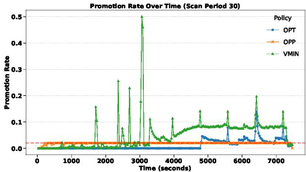  
Figure 4: Promotion rate over time for a Cassandra server running YCSB with 50% read and 50% update operations. The red line depicts the target promotion rate. Both OPT and VMIN violate the target promotion rate.

Mattson's MRC construction algorithm [47] allows researchers to compare policies in the traditional setting. It relies on a theoretical property called the the inclusion property that states that a cache of size C1 > C2, implies C1 always contains all elements contained in C2. Therefore, if a memory access causes a miss in C1, it also causes a miss in C2. Researchers define the largest cache size that experiences a miss as the critical capacity Ct; caches larger than Ct will not experience the miss. Mattson's algorithm uses this in sight to compute the critical cache capacity for each access in a trace. This allows the algorithm to compute Miss Ratio Curves (MRCs) in log-linear time complexity. This approach falls short for reclamation policies, because they do not use the same control parameters, i.e., cache size C. Additionally the memory size used by the application is implicit for replacement policies, but not for reclamation policies, where it changes as we reclaim memory over time, requiring us to compute the memory size alongside the performance proxy. Clearly, new approaches are needed for developing practical reclamation policies.

## 3 MDK: a toolkit for the new problem

We present the Memory Designer's Kit (MDK), the data center memory reclamation analog to the policy development tools and techniques used for traditional cache replacement. MDK consists of four components: 1) the Memory Performance Curve (MPC) (§3.1): the data center equivalent of conventional MRCs to illustrate policy tradeoffs. 2) the Optimal Performance Proxy (OPP) policy (§3.2): an offline, provably optimal policy for maximizing average memory savings subject to a promotion rate constraint. 3) theoretical properties (§3.3): properties that relate a reclamation policy's promotion rate and memory savings as a function of different policy settings. 4) an efficient MPC generation framework (§3.4): a method that leverages the theoretical properties to efficiently generate MPCs for multiple performance proxy values in a single pass. We also discuss MDK's generality (§3.5)

## 3.1 Memory Performance Curves (MPCs)

Memory Performance Curves (MPCs), shown in Figure 7 and Figure 8, plot how the average memory savings (on the y-axis) changes as a function of the target promotion rate (on the x-axis). Since both metrics are dependent values driven by the policy control parameter, Rt, (described in §3.3), their relationship is not surjective, meaning that the achievable memory savings do not map to the entire spectrum of performance values. We present MPCs as scatter plots because drawing lines between points would falsely imply that these intermediate performance proxy values can be achieved when in fact, they cannot. Just like MRCs, MPCs help us understand how to trade performance for memory savings under a given policy and answer questions such as: if we can tolerate a certain level of performance degradation (e.g., a 2% promotion rate instead of 1%), what additional memory savings can we achieve? MPCs also provide a consistent way to compare the performance of different policies: under the same performance constraint (e.g., a 1% target promotion rate), which policy achieves greater memory savings? §5 demonstrates using MPCs for these purposes.

## 3.2 Optimal Performance Proxy (OPP) policy

A provably optimal policy is an important tool for developing practical policies for a given problem, even if it requires future knowledge and is impractical to implement. It allows system designers to compare policies to the optimal to determine how much performance might be gained by designing a better practical policy. It often inspires more practical policies; for example, S3FIFO [2] used OPT to conclude that, at smaller cache sizes, most objects are accessed only once. For learningbased policies, it also serves as ground truth for training [29, 40,42,44,52,56,58–60,65,68,71,76].

We present an optimal policy for the data center reclamation problem. We begin by illustrating the intuition behind an optimal policy for this setting (§3.2.1) and then formally present the Optimal Performance Proxy (OPP) policy and discuss key insights (§3.2.2).

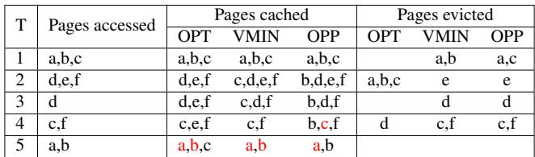  
Table 1: Non-optimality of OPT and VMIN. Both OPT (cache size 3) and VMIN (forward reuse distance 3) evict pages that violate future promotion rates. Page promotions for previously accessed pages, i.e., page faults, appear in red. A violation of the target promotion rate occurs in a period where the ratio of page faults to accesses is greater than 50%.

## 3.2.1 Non-optimality: an example

To understand the key requirements of an optimal policy for data center reclamation, it’s helpful to first examine why traditional optimal replacement policies such as OPT and VMIN fail. Table 1 provides an example: for a given access trace, it shows accessed, cached, and evicted<sup>1</sup> pages for OPT, VMIN, and OPP and highlights (in red) violations of the target pro motion rate (set at 50%). A violation occurs in a time period when the promotion rate (the number of page faults for previously accessed pages relative to the total number of pages accessed) is greater than the target.

All three policies begin by caching a, b, and c. During time T 2, OPT for a cache of size 3 evicts a, b, and c, to make room for d, e, and f . No eviction happens during T 3 as the only accessed page (d) is already cached. During T 4, OPT evicts d, which will never be accessed again, to accommodate c. Finally, during T 5, accesses to both a and b produce cache misses, leading to a promotion rate of 100%, which exceeds the 50% target and constitutes a violation.

VMIN with a forward reuse distance of 3 (i.e., pages not accessed during the next 3 windows should be reclaimed) has the same initial cache state as OPT. However, at the end of T 1, VMIN retains c, which is used again in T 4 for a reuse distance of only 2, but evicts a and b proactively, because they are not used again until T 5 for a reuse distance of 3. VMIN’s cache state at the end of T 2 contains four pages, as VMIN does not impose a fixed cache size. During T 3, VMIN retains c and f , but evicts e as it will never be accessed again. During T 4, only d is evicted, because it is never accessed again. However, during T 5, accesses to both a and b cause misses, resulting in a 100% promotion rate, violating the constraint.

As we can see, both OPT and VMIN perform reclamation without considering the future promotion rate. They may be optimal in terms of the total promotions, but not the rate in time windows. As a result, they may cause promotions to be clustered in a single time window rather than spread out, which may violate SLOs.

Key insight: An optimal policy whose goal is to maintain a target promotion rate should treat the number of promotion events relative to the number of unique elements accessed in a given time window as a constraint during reclamation.

## 3.2.2 Optimal Performance Proxy (OPP) policy

OPP is a two-pass algorithm that takes a trace of page-level accesses and produces a set of page reclamation decisions for each time window, defined by a parameter window\_size. During the first pass, it determines the set of pages accessed in each time window. During the second pass, at the end of each window, OPP reclaims all pages, p, that will not generate a page fault that violates the target promotion rate in the future window in which they are accessed.

More formally, given a trace of accesses A at times T to a set of all uniformly-sized pages P, A ⊆ T × P, where each access is represented as a tuple ht, pi with t ∈ T and p ∈ P. Given W = {1, 2, . . . , N } a set of measurement windows, each of a uniform time duration D, OPP maintains U = {U<sub>w</sub> | w ∈ W }, the count of (unique) pages accessed in each window w, calculated during the first pass of the trace, and F = {F | w ∈ W }, a set of F<sub>w</sub>, the running count of promotions (page faults) in each window w. ∀ht, pi ∈ A, OPP will reclaim p, accessed at time t with known future access t in window B, where the window index B is computed as t<sub>b</sub>/D, as long as the promotion rate generated by p’s next access will not exceed the target promotion rate (i.e., F<sub>B</sub>/U<sub>B</sub> ≤ target promotion rate). If p is reclaimed, then the number of future promotions (F<sub>B</sub>), is incremented.

Let us now return to the example in Table 1. Starting with the same initial state as VMIN and OPT, OPP reclaims a at the end of interval T 1, but not b (unlike VMIN, which reclaims both), as both a and b are accessed during T 5, and reclaiming them both will violate the target promotion rate of 50%. For the same reason, OPP avoids reclaiming b in future intervals, but OPP reclaims c at T 1 as c’s next access in T 4 does not violate the target promotion rate.

Key insight: OPP reclaims page as soon as possible, such that the future accesses of reclaimed pages are spread across time windows instead of clustered together. This approach allows it to meet the performance constraint for promotion rate while maximizing average memory savings. We present the proof of OPP’s optimality in Appendix C.

## 3.3 MDK theoretical properties

We next explore the properties of reclamation policies, with the goal of identifying properties analogous to the inclusion property in the traditional setting that, when present, will enable efficient MPC production.

Consider policies with one control parameter, R<sub>t</sub>. The tuple he, T i is an eviction tuple indicating that page e is evicted at time T . Let S<sub>R</sub> = (he<sub>1</sub>, T<sub>1</sub>i, he<sub>2</sub>, T<sub>2</sub>i, ...he<sub>n</sub>, T<sub>n</sub>i) be the sequence of all eviction tuples for a given policy configured with parameter R<sub>t</sub>. The eviction sequence E<sub>R</sub> = (e<sub>1</sub>,e<sub>2</sub>,. . . ,e<sub>n</sub>) is an ordered sequence of evictions extracted from S<sub>R</sub> without timestamps.

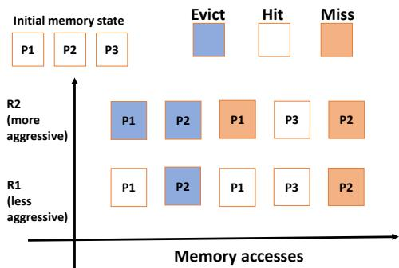  
Figure 5: Decisions of a hypothetical reclamation policy that follows both eviction decisions and eviction times properties. Blue blocks depict a page reclamation after that page is accessed. The more aggressive control parameter, R2, always evicts everything that R1 evicts, at the same time.

Definition 1: A policy configured with parameter R<sub>2</sub> is more aggressive than R<sub>1</sub> if |E<sub>R2</sub>| ≥ |E<sub>R1</sub>|, i.e., a policy with a larger number of evictions is more aggressive.

Definition 2: The critical parameter, R<sub>C</sub> is the least aggressive parameter that causes an eviction, i.e., if R<sub>C</sub> is the critical parameter for an eviction e, then e is an element of E<sub>R</sub> , and for all configurations R<sub>x</sub>: e ∈ E<sub>R</sub> ⇐⇒ |E<sub>R</sub> | ≥ |E<sub>R</sub> | This is analogous to the inclusion property’s critical capacity, where R is a critical parameter if it is the least aggressive parameter for which an eviction happens.

Property: Eviction decisions. If |E<sub>R2</sub>| ≥ |E<sub>R1</sub>| then E<sub>R1</sub>  E<sub>R2</sub>, i.e., E<sub>R1</sub> is a subsequence of E<sub>R2</sub>.

The eviction decision property states that if parameter R<sub>2</sub> is more aggressive than parameter R<sub>1</sub> for a policy, then every eviction made with R is also made with R . Figure 5 illustrates this for a hypothetical policy where R2, which is more aggressive than R1, evicts every page evicted by R1. Note that this property applies to E<sub>R</sub> and not S<sub>R</sub> , which means that it does not impose a restriction that caches contain the same elements at all times T , only that their eviction sequences are ordered subsequences.

Property: Eviction times. If |S<sub>R2</sub>| ≥ |S<sub>R1</sub>| then S<sub>R1</sub>  S<sub>R2</sub>.

The eviction times property states that if a policy can be configured with two parameters R<sub>2</sub> and R<sub>1</sub>, and R<sub>2</sub> is more aggressive than R<sub>1</sub>, then every eviction tuple with R<sub>1</sub> also occurs with R , i.e., evictions happen at the same time. The policy in Figure 5 illustrates this: for both control parameters R1 and R2, P2 is evicted at the same time. The eviction times property can be satisfied only if eviction decisions is satisfied.

These properties enable efficient MPC generation. If a policy follows both the properties, then, for any given page fault, we need to track only promotion and savings caused by this fault for the critical parameter, as values for all more aggressive parameters must experience this fault and can be computed using the critical parameters’ value.

We can prove that VMIN adheres to the eviction decisions and eviction times properties. VMIN takes a reuse distance T as input. If an element’s next-access distance exceeds T (determined using future access knowledge), it is reclaimed immediately after access. If a reuse distance parameter T<sub>F</sub> induces a page fault for a memory access, all reuse distance parameters smaller than T<sub>F</sub> must also induce page faults, as the next-access distance must exceed them as well. Further, since a page is reclaimed immediately after being accessed, all parameters that cause a page to be reclaimed, must do so at the same time. Thus, VMIN follows both properties. We omit proofs for other policies implemented in MDK, but they can be derived by construction.

## 3.4 Efficient MPC generation

The MDK MPC generation framework provides the building blocks to efficiently construct MPCs for various reclamation policies that adhere to the MDK properties. Efficient MPC generation is important, as simulating policies can take a long time.

```python
def generate_mpc(A):
2 savings = [0] * GetParamSpaceSize()
3 promotions = [0] * GetParamSpaceSize()
4
5 for t, p in A:
6 R_C = GetCriticalParam(t, p)
7 promotions[R_C] += 1
8 access_savings = GetMemorySavings(t, p)
9 savings[R_C] += access_savings
10
11 cumulative_promotions = 0
12 cumulative_savings = 0
13
14 # Iterate through parameters sorted by their aggression
level order
15 param_order = GetParamAggressionOrder()
16 for R_t in param_order:
17 cumulative_promotions += promotions[R_t]
18 cumulative_savings += AccumulateSavings(savings[
R_t])
19
20 print(R_t, cumulative_promotions, cumulative_savings
)
```  
Listing 1: Efficient MPC generation template. Users need to manually implement five policy-specific functions.

## 3.4.1 Understanding the MPC template

Listing 1 presents a high-level approach for constructing MPCs for policies that operate with a single control parameter. It takes as input a trace of page accesses and their access times and requires that the user provide five policy-specific functions. We first explain the core ideas of the approach and then discuss how to use this implementation by detailing the policy-specific functions required for VMIN [50].

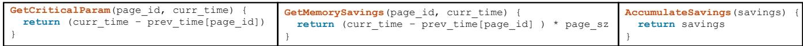  
Figure 6: Policy specific function examples for MPC generation of the VMIN policy. GetCriticalParam computes the critical parameter, which is the least aggressive future reuse distance for which a page access causes a page fault. GetMemorySavings returns the time-multiplied savings associated with each page, assuming it was migrated back into DRAM for the current access. AccumulateSavings iteratively computes the memory savings associated with all control parameters of a policy.

The generator leverages the fact that all memory accesses cause a page fault under a sufficiently aggressive control parameter setting. For each access, we compute the critical parameter R<sub>C</sub> (line 6), the least aggressive setting where that access causes a page fault. In traditional systems, this is the largest cache size for a miss: any cache size smaller than this critical size will also experience a miss if the policy follows the inclusion property. Similarly, in our context, any parameter that is more aggressive than R will also experience a given page fault if the policy follows the eviction decisions property. Computing R<sub>C</sub> depends on the policy and the control parameter: g-swap uses page age threshold, VMIN uses future reuse distance, etc. Thus, we implement a policy-specific GetCriticalParam function.

Page faults create memory savings for the time a page is removed from memory. The key idea for efficient memorysaving computation of all parameters is that the generator tracks savings from reclaiming page P only for the critical parameter R<sub>C</sub> (line 9). If the policy follows the eviction times property, more aggressive settings will save the same amount, because they will reclaim the page at the same time as R<sub>C</sub>. We easily calculate savings: if a page is reclaimed at T<sub>1</sub> and faulted in at T<sub>2</sub> (for the current access), the saving is (T<sub>2</sub> − T<sub>1</sub>) × page\_size. The policy-specific function Get-MemorySavings determines T<sub>1</sub>, as different policies reclaim pages at different times. For example, g-swap reclaims once a duration of age has elapsed since the page was last accessed, while VMIN reclaims immediately after a page is accessed.

The algorithm’s last step builds the full MPC. It recursively calculates promotion rate and average memory savings for all possible policy parameters. For the sake of exposition, we simplify promotion rate calculation here, but our algorithm computes it per time window. First, we determine the order of parameter iteration from least aggressive to most aggressive. The order of aggressiveness is also policy specific, e.g., largest age to smallest for g-swap, smallest to largest promotion rate for OPP. Assuming policies follow eviction decisions, we cumulatively add page faults to more aggressive settings (line 17) to get the promotion rate for all parameters. Accumulate-Savings recursively computes average memory savings. For policies following eviction times, we add savings from less aggressive parameters to more aggressive ones. This generates the entire MPC.

## 3.4.2 Using the generator with policy specific functions

We used MDK to implement several policies; we include the policy-specific functions for these policies in Appendix A. Here we illustrate how to use MDK’s MPC generator using VMIN [50] in Figure 6. Recall that VMIN reclaims any page whose next access occurs more than than T<sub>F</sub> time period in the future.

GetParamSpace and GetParamAggressionOrder (omitted from Figure 6) define the template’s invariant for building the MPC from least to most aggressive parameters. The least aggressive parameter for VMIN is the largest reuse distance in a trace, and the most aggressive value is 1, so we order these parameters from high to low.

GetCriticalParam takes the page ID and access time of the page access and calculates the critical parameter R<sub>C</sub>. For VMIN, R<sub>C</sub> is simply the current page’s reuse distance, i.e., the largest possible T<sub>F</sub> setting for which this page would have been reclaimed by the policy when the page was previously accessed. Because VMIN reclaims on access, the currently accessed page would cause a page fault only if VMIN immediately reclaimed this page after its last access. Suppose the current time is T<sub>2</sub> and the previous time the page was accessed was T . At T , the policy finds the next access, which occurs at T<sub>2</sub>, and reclaims the page for any T<sub>F</sub> < (T<sub>2</sub> − T<sub>1</sub>), with R<sub>C</sub> being T<sub>2</sub> −T<sub>1</sub>. In the generator, we can directly compute R<sub>C</sub> at T<sub>2</sub> by looking at the last time the page was accessed. Therefore, we do not need to maintain future data. As shown in Figure 6, we compute this by subtracting the last access time from the current one, T . Because VMIN follows eviction decisions, any T<sub>F</sub> < T<sub>C</sub> will also experience this page fault, and the template counts faults for all T < T<sub>C</sub> to construct the MPC.

GetMemorySavings takes the same input as GetCritical-Param and calculates the memory saved by a reclamation, when a promotion happens. The value will be determined by the time between when a page is reclaimed and the time of its next access. In VMIN, pages are reclaimed immediately after access, so the savings are the number of windows between a page’s reclaimed access and its next access.

AccumulateSavings adds up memory savings for all settings as the MPC is constructed. For policies such as VMIN that follow eviction times, we simply add the savings of less aggressive settings to more aggressive ones as we go through the settings in the template, as shown in Figure 6. If a policy does not follow eviction times (e.g., the AGE policy), this function lets designers create custom recursive calculations.

## 3.5 Generality of MDK

We present MDK in the context of one specific problem, characterized by the metrics average memory savings and promotion rate. However, as discussed in §2, there is a large problem space for data center memory reclamation, with different choices of memory savings targets and SLO-aligned performance proxies. The tools provided by MDK generalize well to this broader problem space, enabling researchers to explore beyond the specific problem presented here: (1) An MPC, by definition, accommodates any memory-saving metric and performance proxy, making it applicable to any problem in the space. (2) The optimal policy will vary by problem formulation; however, the development of OPP provides key insights into designing optimal policies for other problems: the performance constraint should always be treated as a first-class consideration, regardless of which proxy defines the constraint. (3) The eviction decisions and eviction times properties allow us to categorize policies with one control parameter, R<sub>t</sub>, based on whether they satisfy these properties, regardless of the specific problem they address. (4) The MPC generation template works with any single parameter policy that satisfies the eviction decisions property, regardless of the specific problem formulation. With the PACE generator (Appendix B), we demonstrate that it is possible to apply our properties to two-parameter policies as well; generalizing them to multiple parameters is future work. (5) We focus on metrics that can be computed using page access traces. Run time metrics such as PSI require an analytical model that can approximate PSI values offline; developing and incorporating such a model in MDK is future work.

## 4 Implementation

MDK consists of a collection of C++ tools and libraries to simulate data-center memory reclamation policies and generate MPCs efficiently.

Trace collection and format: We collect page access traces on Linux using a kernel thread similar to kstaled from g-swap [37]. Applications run with all their data in DRAM and hugepages disabled, and the kernel thread periodically (every 30 seconds in our experiments) walks the page table, writes a trace record for each page accessed, and clears the access bits. The trace record contains the page ID and an access period counter value. The performance metric that we use in the paper, promotion rate, is evaluated on a per-application basis as described in g-swap; we focus on collecting perapplication traces instead of traces for applications competing against each other. This periodic algorithm does not capture multiple accesses to a page in the same period. This omission is problematic for frequency-focused policies or performance metrics. However promotion rate is resilient to this omission as long as a page is not faulted multiple times within a time window (which is unlikely).

Policy simulation: Simulation provides ground truth for evaluating the accuracy of MPCs generated using MDK, but existing simulators do not implement variable-sizedmemory policies, so we implemented our own, similar to libcachesim [72]. Our simulation framework takes as input the traces described in the previous section and simulates both fixed- and variable-sized-memory eviction algorithms. At the end of each time period, the simulator selects pages to reclaim according to the policy.

We simulate eight different policies: two fixed-sizedmemory policies (LRU and OPT) and six variable-sizedmemory policies (VMIN, AGE, PAW, PACE, L-OPP, and OPP). LRU was faithfully implemented based on prior work, and OPT follows the algorithm described by Mattson et al. [47]. VMIN was implemented as described by Prieve et al. [50], and our AGE policy follows the description from Lagar-Cavilla et al. [37]. Finally, we implemented new policies PAW, PACE, and L-OPP that are described in §5.4. We implemented OPP as described in §3.2.2.

Efficient MPC construction: Our MPC construction library takes as input a trace and a policy and outputs a collection of performance proxy, memory saving pairs that together express an MPC. We implemented MPC generators for AGE, OPP, VMIN, PAW, and PACE as case studies. Singleparameter policies were implemented in MDK in fewer than 87 lines of code. All single-parameter policies follow the eviction decisions property, and all but the AGE policy follow the eviction times property. Policies that follow the eviction times property can use the same AccumulateSavings function. However, the GetCriticalParam and GetMemorySavings functions require policy-specific data structures and computation, such as the one described for VMIN in §3.4.2. The framework supports only integer control parameters, so we currently generate only integer promotion rates for OPP. For PACE, our new two-parameter policy (§5.4), we implemented a specialized MPC generator described in Appendix B.

## 5 Evaluation

We evaluate the individual components of MDK and demonstrate MDK’s use in Figure 1’s policy design workflow. To evaluate MDK’s components, we compare the accuracy and speed of its MPC generation relative to simulation and compare its OPP policy to VMIN. To illustrate MDK’s use in designing new policies, we show how it can be used to understand the headroom of existing policies, inspire the creation of new policy ideas, and efficiently generate MPCs to compare policy alternatives.

Table 2: Workloads used to evaluate MDK. Execution time (in seconds) for MDK’s MPC generator and simulation for the OPP policy, which is the slowest. MDK generates the plot for all parameters; for simulation, we conduct separate simulations for 10 control parameters to populate the MPC.  
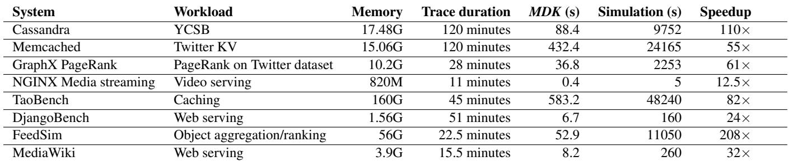

## 5.1 Methodology

We evaluate MDK using page access traces generated from eight workloads in the CloudSuite [49] and DCPerf [61] benchmark suites, as listed in Table 2. All workloads were configured with the default parameters specified in the CloudSuite Docker images and DCPerf documentation. We collected all our page traces and ran our end-to-end case study on Linux kernel version 5.10 on a machine with an Intel Xeon CPU E5-2696 with 256 GB of RAM. We used a 64-core AMD EPYC 7B13 machine with 128GB of RAM for benchmarking MDK’s simulator and MPC generator.

## 5.2 MDK MPC generation

We evaluate the accuracy and speedup of MDK’s MPC generation relative to that of simulation for the workloads in Table 2.

MPC generation accuracy: MDK includes MPC generation algorithms for policies enabled by our theoretical properties. To validate the accuracy of MDK’s MPC generation, we compare MDK MPCs to MPCs created via simulation. We confirm that the simulator and MPC produce similar average memory savings and promotion rates for all policies. For one-parameter policies, we compared ten different parameter settings, and for the two-parameter policy PACE, we compared 15 different parameter settings. The mean absolute errors of all MPCs are within 1% of the simulation (due to rounding inconsistencies).

MPC generation time: Our goal in pursuing fast MPC generation is to enable rapid evaluation of new policies and/or parameter settings for those policies, rather than relying on simulation or in-kernel implementations. Table 2 shows the runtime for generating MPCs using MDK versus simulation for the OPP policy, the slowest policy in both the MDK framework and our simulator. OPP MPC construction takes twice the time of both VMIN and AGE, as OPP needs to process the trace twice, first to gather the number of pages accessed in each window and second to compute reclamation decisions. The time that we report for simulation is for simulating ten different parameter settings, run sequentially. The simulation time is dependent on the number of page access events in each trace. Memcached and TaoBench have the highest number of page access events, leading to the slowest simulation time. MDK’s MPC generation algorithms outperform simulation by 12.5× to 208×. MDK’s MPC generation is faster due to the linear time complexity of the MPC generation algorithms compared to the quadratic time complexity of simulation. The simulation time can be reduced by running simulations in parallel; however, the simulator would still be limited by its time complexity.

## 5.3 Comparing optimal policies

Figure 4 shows the promotion rate over time for Cassandra. Recall that VMIN and OPT violate the promotion rate. OPP maintains a target promotion rate for the duration of the entire workload, due to it considering both the accesses per time interval and the reclamations. Although VMIN and OPT maximize system throughput and can lead to better average memory savings when the performance proxy is measured over the entire execution of a program [18], they make suboptimal decisions that lead to promotion rate violations in time windows, likely leading to application SLO violations.

## 5.4 Using MDK

We show how we use the policy development workflow (Figure 1) for new policies. First, we use MDK to understand AGE’s performance compared to OPP. Then, leveraging insights from OPP, we describe how we design two heuristic policies and a learned policy. We then describe the generation of their MPCs and discuss our policies’ performance compared to AGE. Finally, we validate one of our heuristic policies on Linux.

## 5.4.1 Understanding headroom:

Figure 7 shows the average memory savings as a function of the promotion rate for our workloads. We expect that memory savings should increase as the promotion rate constraint increases (i.e., policy becomes more aggressive). MPCs tell us what parameters of a policy perform best under an operating regime. We use our MPC results to answer questions about operating regimes, i.e., “what is the best memory saving that can be achieved under a certain promotion rate?". Although not directly visible in our MPCs, the generation algorithm also helps answer “what is the control parameter setting that we should use to achieve a certain promotion rate?" as shown in Listing 1 (line 20). Our MPCs show that for multiple applications, tuning practical policies cannot achieve certain operating regimes. This can be observed in Memcached, where policies do not have any parameters that lead to a promotion rate higher than 2.5%. Collections of vertical points (often called "cliffs" for MRCs) are desirable, as they represent an increase in memory savings for a small increase in promotion rate (e.g., the AGE and VMIN policies for Memcached and MediaWiki). In other words, these vertical patterns indicate that slightly more aggressive policies improve average memory savings nearly “for free". In contrast, horizontal plateaus are undesirable: they represent cases in which increasing the promotion rate constraint does not increase memory savings, as can be observed in the case of Mediawiki. In all cases the MPCs quantify the policy operating range by showing how a given promotion rate impacts average memory savings, enabling the selection of a reasonable target promotion rate. MPCs also provide insights about what promotion rate must be tolerated to achieve a desired average memory savings.

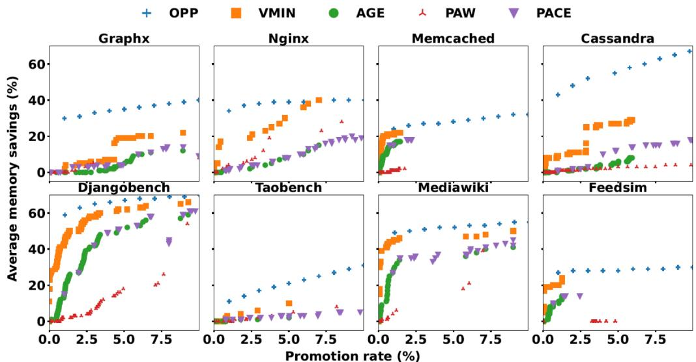  
Figure 7: MPC for various policies supported by MDK. We show results only at lower, more practical, promotion rates. OPP and VMIN are offline optimal policies, while AGE is a practical one. PriorAgeWithWait (PAW) is a new practical heuristic policy that we introduced. As expected, OPP always has the best average memory savings for any promotion rate. PAW can perform better than AGE for workloads with predictable access pattern, while AGE performs better than PAW for unpredictable workloads. PACE, a new two-parameter policy that combines PAW and AGE, always performs as well as AGE and has the potential to outperform AGE for workloads such as Cassandra

We compare the performance of the optimal policies, comparing OPP to VMIN. We omit OPT from discussion, because it is a fixed-sized memory policy that VMIN consistently outperforms. Understanding the performance of the optimal policy for a given setting is important, as it provides an upper bound on what can be achieved by a practical implementation. As expected, OPP (blue plus) consistently has the highest average memory savings. Varying the promotion rate constraint for workloads such as Cassandra and TaoBench can lead to better average memory savings, as indicated by the slope of the MPC. For Cassandra, OPP achieves 40% average memory savings under a 1% promotion rate, while VMIN cannot achieve the same savings even under a 10% promotion rate. For workloads such as FeedSim and MediaWiki, the average memory savings for OPP is relatively flat, indicating that it is not possible to increase savings via more aggressive reclamation (i.e., by tolerating further performance degradation). This provides insight into the performance ceiling for each workload, given different promotion rates.

Now that we understand optimal performance, we examine the performance of AGE policy that approximates Google's gswap [37] (green circles in Figure 7) compared to OPP. AGE is a simple policy that reclaims a page if a certain time period has elapsed since its last access, and it hasn't been accessed since. This mandated waiting period prevents unnecessary reclamations, but it also prevents AGE from reclaiming pages quickly, foregoing savings. As a result, compared to OPP the AGE policy does significantly worse. This suggests that there is ample headroom to develop a better policy. For many workloads (such as Memcached and DjangoBench), the best memory savings that the AGE policy achieves under different operating regimes scale similarly to VMIN; this is expected since page fault characteristics are theoretically identical for these policies [18], while savings are not. Further, the AGE policy is often conservative, as shown in the GraphX workload; the AGE policy never exceeds ∼10% average memory savings, even on the most aggressive settings, as it waits for a minimum number of time windows before reclaiming pages, making it impossible to reap the full potential savings.

## 5.4.2 Designing and evaluating new policies

We use the insights revealed in Figure 7 to propose policies that bridge the gap between AGE and OPP. The steps for designing a policy shown in Figure 1 are: coming up with a new policy idea, generating its MPC, which entails understanding whether MDK properties apply, and if they do, implementing their MPC generators in MDK, and comparing the new policies’ performance to AGE. We describe the steps per policy for three new policies.

## Prior Age with Wait (PAW)

Design: First, we develop a simple heuristic policy that reclaims pages after access, similar to OPP, by using historical reuse distances. This policy, Prior Age with Wait (PAW), reclaims a page if its prior age, the distance between a page’s last two accesses, is greater than a threshold P, and at least one minute has elapsed since its last access. Waiting one minute addresses potential issues for frequently used pages: if a page is recently accessed, it is likely to be accessed again, so the policy waits briefly before reclaiming it to increase confidence in the reclamation.

Generating MPC: PAW follows the eviction decisions and eviction times properties, so we implemented its generator in MDK. Writing the policy-specific functions took fewer than 65 LOC. For the GetCriticalParam function, we reused the AGE policy’s implementation, as the only difference is looking at the current reuse distance versus the previous one. The other two memory functions are identical to VMIN’s, as both policies follow the eviction times property.

Comparing performance to AGE: Figure 7 illustrates the MPC for comparing AGE with PAW. PAW outperforms AGE on workloads with predictable access patterns: it saves up to 10% more memory than AGE on GraphX, NGINX, and TaoBench. However, for workloads such as Memcached and FeedSim, where past behavior is not a good indicator of future accesses, AGE’s conservative approach is better. As our results clearly show, for certain workloads where reuse distances are not a good indication for reclaiming a page, AGE outperforms PAW significantly.

## Prior Age and Current Elapsed (PACE)

```python
1 def PACE(page, P, A):
2 alpha = get_prior_age(page) # Last reuse distance
3 beta = get_current_age(page) # Time elapsed since last
4 active reference
5 evict = False
6 if alpha > P:
7 evict = True
8 if beta > A:
9 evict = True
10 return Evict
```  
Listing 2: The PACE two parameter policy. PACE evicts pages immediately if their reuse distance is greater than a control parameter P. If the reuse distance is small, then PACE waits until time A has elapsed, similar to AGE. to reclaim a page.

Design: The Prior Age and Current Elapsed (PACE), detailed in Listing 2, is a simple two-parameter policy that combines the aggressiveness of PAW with the conservative nature of AGE. PACE directly addresses the shortcomings of PAW for workloads where reuse distances are not enough to make good decisions. For each page, PACE checks if its reuse distance, i.e., the difference between its prior two accesses, is greater than a prior age threshold P; if so, it evicts the page immediately. Unlike PAW, PACE does not wait for one minute before reclaiming a page. If the reuse distance is not greater than P, then PACE waits a time period A after a page’s last access before reclaiming it. PACE has two control parameters, P and A. Tuning P allows PACE to evict pages immediately upon access, similar to PAW, and for pages where P is not a good indication for eviction, PACE reclaims a page after it is not accessed for A time intervals, similar to g-swap’s current AGE policy.

It is trivial to see that under the correct (P, A) setting PACE must always perform as well as, if not better than AGE. If P is set to infinity, no page would ever satisfy the prior age condition; therefore PACE can always fall back to AGE. The challenging part is determining the best parameter combination for a given application. Simulating all parameters for PACE is prohibitively expensive due to many possible (P,A) values; our traces have more than 10,000 unique (P,A) combinations. Additionally, there is no intuition that allows us to guess good (P,A) combinations.

Generating MPC: We present a novel specialized algorithm for efficiently generating the MPC for the PACE policy, rooted in our theoretical properties. Although we cannot compare the aggressiveness of two arbitrary parameter combinations (P ,A ) and (P ,A ), because these parameter combinations don’t follow the eviction decisions and eviction times properties, P and A individually follow these properties, implying that both E<sub>(P+1,A)</sub> and E<sub>(P,A+1)</sub> would be subsequences of E<sub>(P,A)</sub>. This fact allows us to generate the MPC for PACE efficiently using the dynamic programming solution to the suffix sum problem. We describe the algorithm that we implemented in about 300 loc, in detail in Appendix B.

Comparing performance to AGE: In Figure 7, we report the top three performing configurations for PACE for each 1% promotion rate increments, such as 1-2%, 2-3%. The results show the maximum potential benefit (an upper bound) when the optimal parameters are chosen on the same trace used for evaluation. As expected, PACE’s best configurations always perform as well as AGE’s best configurations. For most workloads, PACE obtains modest memory savings improvement of 1-4% across different promotion rates. For workloads such as Cassandra and GraphX, PACE ’s best configurations outperform AGE by 8-10%; PACE increases savings by evicting pages earlier. Since AGE, PAW, and PACE have parameters dependent on application characteristics, a tuner would need to observe application characteristics online and then set P or A parameters for all three policies. Note that with more tunable parameters, the results are more susceptible to overfitting when using the exact same trace for tuning and evaluation; tuning without a priori trace knowledge for unseen traces is left for future work.

## Learned OPP (L-OPP)

Design: OPP demonstrates significant headroom over AGE, however it requires future information. Inspired by prior work on learned policies in the traditional problem [29, 42, 59], we investigate whether a learned policy that imitates OPP, L-OPP, can improve upon AGE without needing future information. Our intent is to illustrate that OPP can be used more directly to derive a new policy, rather than to create the perfect learned policy. We frame page reclamation as a binary classification problem: given a page access and its re-access history, the model predicts whether to reclaim the page. We train a gradient boosted tree model for this task, using the open-source YDF library [24] with default hyperparameters. To build the training dataset, we first use periodic page table access bit scans to collect page access traces for the DCPerf benchmarks [61]. Then, we use our simulator to run OPP on these traces with a target promotion rate of 2% and log every reclaim/not reclaim decision along with the historical reuse distances of each page. Our goal is that L-OPP will achieve the same promotion rate. We then train a separate model for each workload on the first 80% of the dataset, using six past reuse distances for each page as features. We use the last 20% of the dataset for validation. The final L-OPP policy uses AGE to reclaim first-use pages (i.e., those that have no reuse features); for all other pages, it queries the trained model at the end of the time interval in which they have been accessed.

Generating MPCs: We implement L-OPP in our simulator, because it does not obey the eviction decisions and eviction times properties, because it doesn’t have any tunable parameters. We incorporate the C++ implementation [24] of L-OPP as a new policy in our simulator to generate MPCs. For simulator testing, we use a completely different trace than the one used for training; we collect this trace by running access bit scans on a second execution of the same workload.

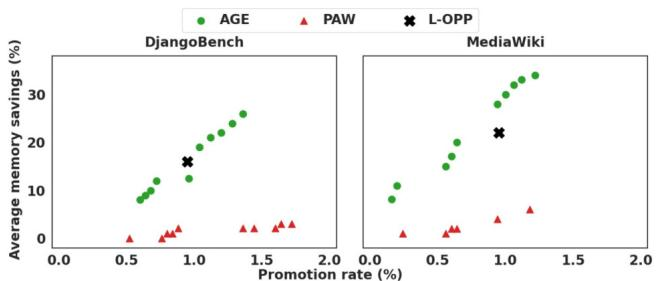  
Figure 8: MPC for AGE and our learned policy, L-OPP.

Comparing policies to L-OPP: Figure 8 compares AGE, PAW, and L-OPP for the DCPerf benchmarks. L-OPP has better average memory savings than PAW for both workloads and is modestly better than AGE for DjangoBench. L-OPP is conservative and the number of per-window reclamations it makes are small, so we need to have longer workloads such as DjangoBench to accumulate savings over time to show benefit. (Similar observations have been reported for conservative non-learned policies [66].) L-OPP maintains a 1% promotion rate constraint, demonstrating that the learned policy maintains the promotion rate for which it was trained. For TaoBench and FeedSim (results omitted), L-OPP’s low offline precision results in a high promotion rate, showcasing that high precision models are important to meet the promotion rate constraint. Although these initial results suggest the need for feature engineering and training at different target promotion rates to improve L-OPP’s performance (a topic for future work), L-OPP demonstrates OPP’s utility for policy creation, in addition to headroom analysis.

## 5.4.3 Validating policy end-to-end in Linux:

We evaluate MDK’s findings by implementing PAW and AGE in Linux. Both policies reclaim pages every 30 seconds: AGE reclaims pages that are unused for 10 minutes, and PAW reclaims pages with reuse distance greater than 2.5 minutes. We use an SSD as the swap backend and turn off hugepages. Table 3 shows the average memory consumption and swap usage of both policies for running the Page Rank benchmark on GraphX. We choose parameter settings to operate under a 4% promotion rate threshold based on our offline MPC results.

As predicted by our MPC, PAW saved 4% more memory without compromising performance. The savings are as expected, because AGE is cautious and reclaims late, while PAW reclaims pages shortly after access, increasing the average memory savings as shown in our results. The promotion rate of both policies was around 1.5%, significantly lower than the 4% threshold we expected. For promotion rate to match the simulation and our framework, policies need to observe page accesses at similar times. However, both policies ran faster than our offline trace, and the promotion rate is directly dependent on the runtime of the application. The fact that the policies run in less time than our original trace shifts the windows in which reclamations occur, changing the observed promotion rate. There are several avenues of future work to explore to analyze and mitigate this effect: (1) Implementing MDK MPC generators in a self-tuning system similar to Senpai [66], would allow for accurate estimation of promotion rate while applications are running, (2) Running an analytical analysis that develops confidence bounds of the offline MPC results for online use.

Table 3: Policy Comparison on Linux for GraphX. We measure the mean and standard deviation of memory and swap usage.  
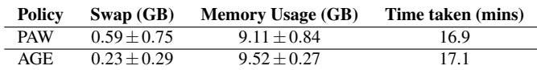

## 6 Related work

MDK builds upon concepts from prior work on optimal algorithms, variable-sized cache policies, approaches for generating MRCs, and memory reclamation metrics.

Optimality: Several prior works focus on optimal policies for fixed-sized memories for uniform object sizes [8, 47], non-uniform object sizes [10], variable-sized memories [50], and for non-uniform memory access cost [30]. These policies do not consider performance constraints that the data center context requires. Optimal policies have been adapted to various domains including databases [13, 31, 69], cache-oblivious algorithms [22], tiered memory systems [73], and confidential applications [36]. These prior works on fixed-sized memories could be extended to the data center formulation.

Several works use optimal algorithms to train ML models [29, 40, 42, 44, 52, 56, 58–60, 65, 68, 71, 76]. We explore training a learned policy L-OPP using OPP, that demonstrates OPP’s utility for policy creation.

Variable-sized policies: Working set [17] provided a theory to model applications by their memory behavior. Replacement policies inspired by this model optimize for miss ratio without a fixed-sized memory constraint [18] and generate better average memory savings than OPT while using statistical future knowledge [41]. These works are complementary to our work. Prior work explored adapting cache size based on performance metrics [3,25], and modern application frameworks also exploit variable-sized allocation by forcing applications to shrink their internal cache footprints under pressure [23, 51]; our work focuses on variable-sized policies instead of adapting the size.

Miss ratio curves: MDK extends the work of Mattson et al. [47] and later work on MRC construction for algorithms other than LRU [7, 18], by introducing new theoretical properties that apply to a larger set of policies. Additional related work uses approximation to speed up Mattson’s approach, including Shards [64], KOSMO [57], AET [28], and Counter Stacks [67]. MDK produces exact MPCs, and we leave approximate concepts for MDK algorithms as future work. Several systems use online MRC generation to guide cache size allocation (e.g., Memshare [11] and OSCA [74]) and tune policies (e.g., Cliffhanger [16, 27, 77]). We leave using MDK MPCs to tune data center systems for future work.

Memory reclamation metrics: Prior work used metrics other than miss ratio, such as fault rate [15, 55], pressure stall information (PSI) [66], promotion rate failures [70], frequency of access [53], amortized offcore latency [43], and throughput [26]. MDK is designed to be extensible in order to accommodate a diverse set of metrics.

## 7 Conclusion

Data center memory reclamation has a goal of maximizing memory savings to allow more jobs to be scheduled on servers, while maintaining application performance targets. This formulation leads to a different optimization problem than the traditional one, and the tools required to address this problem are lacking. We introduced MDK, an offline framework for data center policy exploration that includes a new optimal policy OPP, MPCs to evaluate policy performance, theoretical properties, and efficient algorithms to construct MPCs. Using MDK, we show that existing policies leave ample room for improvement. We develop new practical and learned policies by leveraging OPP insights and evaluate these policies using MDK, demonstrating MDK’s utility and the potential to improve upon existing policies. Ultimately, we hope researchers will use MDK to develop better memory reclamation policies for the data center problem.

## Acknowledgements

The authors thank David Culler, Kathryn McKinley, John Wilkes, Hank Levy, our shepherd, and the anonymous reviewers of OSDI’26 for their feedback on the draft. The authors thank Vinay Banakar, Rajath Shashidhara, and Anil Yelam for their insights and help in collecting the page access traces required for this work.

## References

[1] Homepage - Compute Express Link — computeexpresslink.org. https://computeexpresslink.org/. [Accessed 11-04-2025].

[2] FIFO queues are all you need for cache eviction. In Proceedings of the Twenty-ninth Symposium on Operating Systems Principles, SOSP ’23, pages 130–149. Association for Computing Machinery, 2023.

[3] Raphael Alonso and Andrew W. Appel. An advisor for flexible working sets. In Proceedings of the 1990 ACM SIGMETRICS Conference on Measurement and Modeling of Computer Systems, SIGMETRICS ’90, page 153–162. Association for Computing Machinery, 1990.

[4] Sorav Bansal and Dharmendra S. Modha. CAR: Clock with adaptive replacement. In 3rd USENIX Conference on File and Storage Technologies (FAST 04), San Francisco, CA, March 2004. USENIX Association.

[5] Luiz André Barroso, Jimmy Clidaras, and Urs Hölzle. The Datacenter as a Computer: An Introduction to the Design of Warehouse-Scale Machines, Second Edition. 2013.

[6] Noman Bashir, Nan Deng, Krzysztof Rzadca, David Irwin, Sree Kodak, and Rohit Jnagal. Take it to the limit: peak prediction-driven resource overcommitment in datacenters. In Proceedings of the Sixteenth European Conference on Computer Systems, EuroSys ’21, page 556–573. Association for Computing Machinery, 2021.

[7] Nathan Beckmann and Daniel Sanchez. Modeling cache performance beyond LRU. In 2016 IEEE International Symposium on High Performance Computer Architecture (HPCA), pages 225–236, 2016.

[8] L. A. Belady. A study of replacement algorithms for a virtual-storage computer. IBM Systems Journal, 5(2):78– 101, 1966.

[9] A. Bensoussan, C. T. Clingen, and R. C. Daley. The multics virtual memory. In Proceedings of the Second Symposium on Operating Systems Principles, SOSP ’69, page 30–42, New York, NY, USA, 1969. Association for Computing Machinery.

[10] Daniel S. Berger, Nathan Beckmann, and Mor Harchol-Balter. Practical bounds on optimal caching with variable object sizes. Proc. ACM Meas. Anal. Comput. Syst., 2(2), June 2018.

[11] Daniel Byrne, Nilufer Onder, and Zhenlin Wang. mpart: miss-ratio curve guided partitioning in key-value stores. ISMM 2018, page 84–95, June 2018.

[12] Marcus Carvalho, Walfredo Cirne, Francisco Brasileiro, and John Wilkes. Long-term slos for reclaimed cloud computing resources. In Proceedings of the ACM Symposium on Cloud Computing, SOCC ’14, page 1–13. Association for Computing Machinery, 2014.

[13] Audrey Cheng, David Chu, Terrance Li, Jason Chan, Natacha Crooks, Joseph M. Hellerstein, Ion Stoica, and Xiangyao Yu. Take out the TraChe: Maximizing (tra)nsactional ca(che) hit rate. In 17th USENIX Sympo sium on Operating Systems Design and Implementation (OSDI 23), pages 419–439, July 2023.

[14] Jeongku Choi. Memory prices surge up to 90% from Q4 2025. https:// counterpointresearch.com/en/insights/ Memory-Prices-Surge-Up-to-90-From-Q4-2025, February 2026.

[15] Wesley W. Chu and Holger Opderbeck. The page fault frequency replacement algorithm. In Proceedings of the December 5-7, 1972, Fall Joint Computer Conference, Part I, AFIPS ’72 (Fall, part I), page 597–609, 1972.

[16] Asaf Cidon, Assaf Eisenman, Mohammad Alizadeh, and Sachin Katti. Cliffhanger: Scaling performance cliffs in web memory caches. In 13th USENIX Symposium on Networked Systems Design and Implementation (NSDI 16), pages 379–392, Santa Clara, CA, March 2016. USENIX Association.

[17] Peter J. Denning. The working set model for program behavior. Commun. ACM, 11(5):323–333, May 1968.

[18] Peter J. Denning. Working set analytics. ACM Comput. Surv., 53(6), February 2021.

[19] Peter J. Denning and Kevin C. Kahn. A study of program locality and lifetime functions. SIGOPS Oper. Syst. Rev., 9(5):207–216, November 1975.

[20] Padmapriya Duraisamy, Wei Xu, Scott Hare, Ravi Rajwar, David Culler, Zhiyi Xu, Jianing Fan, Christopher Kennelly, Bill McCloskey, Danijela Mijailovic, Brian Morris, Chiranjit Mukherjee, Jingliang Ren, Greg Thelen, Paul Turner, Carlos Villavieja, Parthasarathy Ranganathan, and Amin Vahdat. Towards an adaptable systems architecture for memory tiering at warehousescale. In Proceedings of the 28th ACM International Conference on Architectural Support for Programming Languages and Operating Systems, Volume 3, ASPLOS 2023, page 727–741. Association for Computing Machinery, 2023.

[21] Jacob Fox. Looks like memory prices are set to keep increasing over 2026 before falling. https://finance.yahoo.com/news/ looks-memory-prices-set-keep-152000968. html, December 2025.

[22] M. Frigo, C.E. Leiserson, H. Prokop, and S. Ramachandran. Cache-oblivious algorithms. In 40th Annual Symposium on Foundations of Computer Science (Cat. No.99CB37039), pages 285–297, 1999.

[23] Megan Frisella, Shirley Loayza Sanchez, and Malte Schwarzkopf. Towards increased datacenter efficiency with soft memory. In Proceedings of the 19th Workshop on Hot Topics in Operating Systems, HotOS ’23, page 127–134, New York, NY, USA, 2023. Association for Computing Machinery.

[24] Google. Ydf: Yggdrasil decision forests. https://ydf.readthedocs.io/en/stable, 2025.

[25] Anupam Gupta, Ravishankar Krishnaswamy, Amit Kumar, and Debmalya Panigrahi. Elastic Caching, pages 143–156. Proceedings of the 2019 Annual ACM-SIAM Symposium on Discrete Algorithms (SODA).

[26] Xiangpeng Hao, Xinjing Zhou, Xiangyao Yu, and Michael Stonebraker. Towards buffer management with tiered main memory. Proc. ACM Manag. Data, 2(1), March 2024.

[27] Taekyung Heo, Yang Wang, Wei Cui, Jaehyuk Huh, and Lintao Zhang. Adaptive page migration policy with huge pages in tiered memory systems. IEEE Transac tions on Computers, 71(1):53–68, 2022.

[28] Xiameng Hu, Xiaolin Wang, Lan Zhou, Yingwei Luo, Zhenlin Wang, Chen Ding, and Chencheng Ye. Fast miss ratio curve modeling for storage cache. ACM Trans. Storage, 14(2), April 2018.

[29] Akanksha Jain and Calvin Lin. Back to the future: Leveraging Belady’s algorithm for improved cache replacement. In 2016 ACM/IEEE 43rd Annual International Symposium on Computer Architecture (ISCA), pages 78–89, 2016.

[30] J. Jeong and M. Dubois. Cache replacement algorithms with nonuniform miss costs. IEEE Transactions on Computers, 55(4):353–365, 2006.

[31] Zhaoxuan Ji, Zhongle Xie, Yuncheng Wu, and Meihui Zhang. LBSC: A Cost-Aware Caching Framework for Cloud Databases . In 2024 IEEE 40th International Con ference on Data Engineering (ICDE), pages 4911–4924, Los Alamitos, CA, USA, May 2024. IEEE Computer Society.

[32] Song Jiang and Xiaodong Zhang. Lirs: an efficient low inter-reference recency set replacement policy to improve buffer cache performance. SIGMETRICS Perform. Eval. Rev., 30(1):31–42, June 2002.

[33] Theodore Johnson and Dennis Shasha. 2q: A low overhead high performance buffer management replacement algorithm. In Proceedings of the 20th International Conference on Very Large Data Bases, VLDB ’94, page 439–450, San Francisco, CA, USA, 1994. Morgan Kaufmann Publishers Inc.

[34] Uksong Kang, Hak-Soo Yu, Churoo Park, Hongzhong Zheng, John Halbert, Kuljit Bains, and Joo Sun Choi. Co-architecting controllers and dram to enhance dram process scaling. In The Memory Forum, 2014.

[35] T. Kilburn, D. B. G. Edwards, M. J. Lanigan, and F. H. Sumner. One-level storage system. IRE Transactions on Electronic Computers, EC-11(2):223–235, 1962.

[36] Sam Kumar, David E. Culler, and Raluca Ada Popa. MAGE: Nearly zero-cost virtual memory for secure computation. In 15th USENIX Symposium on Operating Systems Design and Implementation (OSDI 21), pages 367–385. USENIX Association, July 2021.

[37] Andres Lagar-Cavilla, Junwhan Ahn, Suleiman Souhlal, Neha Agarwal, Radoslaw Burny, Shakeel Butt, Jichuan Chang, Ashwin Chaugule, Nan Deng, Junaid Shahid, Greg Thelen, Kamil Adam Yurtsever, Yu Zhao, and Parthasarathy Ranganathan. Software-defined far memory in warehouse-scale computers. In Proceedings of the Twenty-Fourth International Conference on Architectural Support for Programming Languages and Operating Systems, ASPLOS ’19, page 317–330. Association for Computing Machinery, 2019.

[38] Seok-Hee Lee. Technology scaling challenges and opportunities of memory devices. In 2016 IEEE International Electron Devices Meeting (IEDM), pages 1–1. IEEE, 2016.

[39] Huaicheng Li, Daniel S. Berger, Lisa Hsu, Daniel Ernst, Pantea Zardoshti, Stanko Novakovic, Monish Shah, Samir Rajadnya, Scott Lee, Ishwar Agarwal, Mark D. Hill, Marcus Fontoura, and Ricardo Bianchini. Pond: Cxl-based memory pooling systems for cloud platforms. In Proceedings of the 28th ACM International Conference on Architectural Support for Programming Languages and Operating Systems, Volume 2, ASPLOS 2023, page 574–587. Association for Computing Machinery, 2023.

[40] Pengcheng Li and Yongbin Gu. Learning forward reuse distance, 2020.

[41] Pengcheng Li, Colin Pronovost, William Wilson, Benjamin Tait, Jie Zhou, Chen Ding, and John Criswell. Beating opt with statistical clairvoyance and variable size caching. In Proceedings of the Twenty-Fourth International Conference on Architectural Support for Programming Languages and Operating Systems, ASPLOS ’19, page 243–256. Association for Computing Machinery, 2019.

[42] Evan Zheran Liu, Milad Hashemi, Kevin Swersky, Parthasarathy Ranganathan, and Junwhan Ahn. An imitation learning approach for cache replacement. CoRR, abs/2006.16239, 2020.

[43] Jinshu Liu, Hamid Hadian, Hanchen Xu, and Huaicheng Li. Tiered memory management beyond hotness. In 19th USENIX Symposium on Operating Systems Design and Implementation (OSDI 25), pages 731–747. USENIX Association, July 2025.

[44] Ke Liu, Kan Wu, Hua Wang, Ke Zhou, Ji Zhang, and Cong Li. Slap: An adaptive, learned admission policy for content delivery network caching. In 2023 IEEE International Parallel and Distributed Processing Symposium (IPDPS), pages 457–467, 2023.

[45] Tobias Mann. DRAM prices expected to double in Q1 as AI ambitions push memory fabs to their limit. https://www.theregister.com/2026/ 02/02/dram\_prices\_expected\_to\_double/, February 2026.

[46] Hasan Al Maruf, Hao Wang, Abhishek Dhanotia, Johannes Weiner, Niket Agarwal, Pallab Bhattacharya, Chris Petersen, Mosharaf Chowdhury, Shobhit Kanaujia, and Prakash Chauhan. Tpp: Transparent page placement for cxl-enabled tiered-memory. In Proceedings of the 28th ACM International Conference on Architectural Support for Programming Languages and Operating Systems, Volume 3, ASPLOS 2023, page 742–755. Association for Computing Machinery, 2023.

[47] R.L. Mattson, J. Gecsei, D. R. Slutz, and I. L. Traiger. Evaluation techniques for storage hierarchies. IBM Systems Journal, 9(2):78–117, 1970.

[48] Nimrod Megiddo and Dharmendra S. Modha. ARC: A Self-Tuning, low overhead replacement cache. In 2nd USENIX Conference on File and Storage Technologies (FAST 03), San Francisco, CA, March 2003. USENIX Association.

[49] Tapti Palit, Yongming Shen, and Michael Ferdman. Demystifying cloud benchmarking. In 2016 IEEE Interna tional Symposium on Performance Analysis of Systems and Software (ISPASS), pages 122–132, April 2016.

[50] Barton G. Prieve and R. S. Fabry. Min—an optimal variable-space page replacement algorithm. Commun. ACM, 19(5):295–297, May 1976.

[51] Yifan Qiao, Zhenyuan Ruan, Haoran Ma, Adam Belay, Miryung Kim, and Harry Xu. Harvesting idle memory for application-managed soft state with midas. In 21st USENIX Symposium on Networked Systems Design and Implementation (NSDI 24), pages 1247–1265, Santa Clara, CA, April 2024. USENIX Association.

[52] Shuting Qiu, Qilin Fan, Xiuhua Li, Xu Zhang, Geyong Min, and Yongqiang Lyu. Oa-cache: Oracle approximation-based cache replacement at the network

edge. IEEE Transactions on Network and Service Management, 20(3):3177–3189, 2023.

[53] Jie Ren, Dong Xu, Junhee Ryu, Kwangsik Shin, Daewoo Kim, and Dong Li. Mtm: Rethinking memory profiling and migration for multi-tiered large memory. In Proceedings of the Nineteenth European Conference on Computer Systems, EuroSys ’24, page 803–817. Association for Computing Machinery, 2024.

[54] Krzysztof Rzadca, Paweł Findeisen, Jacek Swiderski,<sup>´</sup> Przemyslaw Zych, Przemyslaw Broniek, Jarek Kusmierek, Paweł Krzysztof Nowak, Beata Strack, Piotr Witusowski, Steven Hand, and John Wilkes. Autopilot: Workload autoscaling at google scale. In Proceedings of the Fifteenth European Conference on Computer Systems, 2020.

[55] E. Sadeh. An analysis of the performance of the page fault frequency (pff) replacement algorithm. In Proceedings of the Fifth ACM Symposium on Operating Systems Principles, SOSP ’75, page 6–13, New York, NY, USA, 1975. Association for Computing Machinery.

[56] Ishan Shah, Akanksha Jain, and Calvin Lin. Effective mimicry of Belady’s min policy. In 2022 IEEE International Symposium on High-Performance Computer Architecture (HPCA), pages 558–572, 2022.

[57] Kia Shakiba, Sari Sultan, and Michael Stumm. Kosmo: Efficient online miss ratio curve generation for eviction policy evaluation. In 22nd USENIX Conference on File and Storage Technologies (FAST 24), pages 89–105, Santa Clara, CA, February 2024. USENIX Association.

[58] Zhan Shi, Xiangru Huang, Akanksha Jain, and Calvin Lin. Applying deep learning to the cache replacement problem. In Proceedings of the 52nd Annual IEEE/ACM International Symposium on Microarchitecture, MICRO ’52, page 413–425. Association for Computing Machinery, 2019.

[59] Zhenyu Song, Daniel S. Berger, Kai Li, and Wyatt Lloyd. Learning relaxed Belady for content distribution network caching. In 17th USENIX Symposium on Networked Systems Design and Implementation (NSDI 20), pages 529–544, Santa Clara, CA, February 2020. USENIX Association.

[60] Zhenyu Song, Kevin Chen, ikhil Sarda, Deniz Altınbüken, Eugene Brevdo, Jimmy Coleman, Xiao Ju, Pawel Jurczyk, Richard Schooler, and Ramki Gummadi. HALP: Heuristic aided learned preference eviction policy for YouTube content delivery network. In 20th USENIX Symposium on Networked Systems Design and Implementation (NSDI 23), pages 1149–1163, Boston, MA, April 2023. USENIX Association.

[61] Wei Su, Abhishek Dhanotia, Carlos Torres, Jayneel Gandhi, Neha Gholkar, Shobhit Kanaujia, Maxim Naumov, Kalyan Subramanian, Valentin Andrei, Yifan Yuan, and Chunqiang Tang. Dcperf: An open-source, battletested performance benchmark suite for datacenter workloads. In Proceedings of the 52nd Annual International Symposium on Computer Architecture, ISCA ’25, page 1717–1730. Association for Computing Machinery, 2025.

[62] Muhammad Tirmazi, Adam Barker, Nan Deng, Md Ehtesam Haque, Zhijing Gene Qin, Steven Hand, Mor Harchol-Balter, and John Wilkes. Borg: the next generation. In EuroSys’20, Heraklion, Crete, 2020.

[63] TrendForce. DRAM Industry Analysis–1Q26. https://www.trendforce.com/research/ download/RP260305JB, March 2026.

[64] Carl A. Waldspurger, Nohhyun Park, Alexander Garthwaite, and Irfan Ahmad. Efficient MRC construction with SHARDS. In 13th USENIX Conference on File and Storage Technologies (FAST 15), pages 95–110, Santa Clara, CA, February 2015. USENIX Association.

[65] Peng Wang, Hong Jiang, Yu Liu, Zhelong Zhao, Ke Zhou, and Zhihai Huang. Beyond Belady to attain a seemingly unattainable byte miss ratio for content delivery networks. IEEE Transactions on Parallel and Distributed Systems, 35(11):1949–1963, 2024.

[66] Johannes Weiner, Niket Agarwal, Dan Schatzberg, Leon Yang, Hao Wang, Blaise Sanouillet, Bikash Sharma, Tejun Heo, Mayank Jain, Chunqiang Tang, and Dimitrios Skarlatos. Tmo: transparent memory offloading in datacenters. In Proceedings of the 27th ACM Interna tional Conference on Architectural Support for Programming Languages and Operating Systems, ASPLOS ’22, page 609–621. Association for Computing Machinery, 2022.

[67] Jake Wires, Stephen Ingram, Zachary Drudi, Nicholas J. A. Harvey, and Andrew Warfield. Characterizing storage workloads with counter stacks. In 11th USENIX Symposium on Operating Systems Design and Implementation (OSDI 14), pages 335–349, Broomfield, CO, October 2014. USENIX Association.

[68] Daniel Lin-Kit Wong, Hao Wu, Carson Molder, Sathya Gunasekar, Jimmy Lu, Snehal Khandkar, Abhinav Sharma, Daniel S. Berger, Nathan Beckmann, and Gre gory R. Ganger. Baleen: ML admission & prefetching for flash caches. In 22nd USENIX Conference on File and Storage Technologies (FAST 24), pages 347–371, Santa Clara, CA, February 2024. USENIX Association.

[69] Junyi Xie, Jun Yang, and Yuguo Chen. On joining and caching stochastic streams. In Proceedings of the 2005 ACM SIGMOD International Conference on Management of Data, SIGMOD ’05, page 359–370. Association for Computing Machinery, 2005.

[70] Dong Xu, Junhee Ryu, Kwangsik Shin, Pengfei Su, and Dong Li. FlexMem: Adaptive page profiling and migration for tiered memory. In 2024 USENIX Annual Technical Conference (USENIX ATC 24), pages 817– 833, Santa Clara, CA, July 2024. USENIX Association.

[71] Juncheng Yang, Ziming Mao, Yao Yue, and K. V. Rashmi. GL-Cache: Group-level learning for efficient and high-performance caching. In 21st USENIX Conference on File and Storage Technologies (FAST 23), pages 115–134, Santa Clara, CA, February 2023. USENIX Association.

[72] Juncheng Yang, Yao Yue, and K. V. Rashmi. A largescale analysis of hundreds of in-memory cache clusters at twitter. In 14th USENIX Symposium on Operating Systems Design and Implementation (OSDI 20), pages 191–208. USENIX Association, 2020.

[73] Lei Zhang, Reza Karimi, Irfan Ahmad, and Ymir Vigfusson. Optimal data placement for heterogeneous cache, memory, and storage systems. Proc. ACM Meas. Anal. Comput. Syst., 4(1), May 2020.

[74] Yu Zhang, Ping Huang, Ke Zhou, Hua Wang, Jianying Hu, Yongguang Ji, and Bin Cheng. OSCA: An Online-Model based cache allocation scheme in cloud block storage systems. In 2020 USENIX Annual Technical Conference (USENIX ATC 20), pages 785–798. USENIX Association, July 2020.

[75] Yuhong Zhong, Daniel S. Berger, Carl Waldspurger, Ryan Wee, Ishwar Agarwal, Rajat Agarwal, Frank Hady, Karthik Kumar, Mark D. Hill, Mosharaf Chowdhury, and Asaf Cidon. Managing memory tiers with CXL in virtualized environments. In 18th USENIX Symposium on Operating Systems Design and Implementation (OSDI 24), pages 37–56, Santa Clara, CA, July 2024. USENIX Association.

[76] Giulio Zhou and Martin Maas. Learning on distributed traces for data center storage systems. In 4th Conference on Machine Learning and Systems (MLSys 2021), 2021.

[77] Pin Zhou, Vivek Pandey, Jagadeesan Sundaresan, Anand Raghuraman, Yuanyuan Zhou, and Sanjeev Kumar. Dynamic tracking of page miss ratio curve for memory management. In Proceedings of the 11th International Conference on Architectural Support for Programming Languages and Operating Systems, ASPLOS XI, page 177–188. Association for Computing Machinery, 2004.

## A MPC constructors for OPP and AGE policies

We discuss the MPC constructors for AGE and OPP for exposition.

## MPC construction for AGE

AGE policy only adheres to the eviction decisions and not the eviction times property.

The AGE policy accepts a parameter R representing the threshold age of a page. Any page not used for R<sub>A</sub> time intervals is reclaimed. This policy follows the eviction times property as any age that is less than R<sub>A</sub> (i.e. more aggressive) would also reclaim the same page, thus incurring the same fault. However, this policy doesn’t follow the eviction times property, as the more aggressive age would reclaim the page earlier than a less aggressive one. The page would reach that age sooner, which means that the eviction times property can’t be satisfied. The critical parameter R<sub>c</sub> computation (shown in Table 4 for AGE eviction policy is similar to VMIN’s. The key difference lies in the parameter: AGE policy waits R<sub>A</sub> time intervals for eviction, making the critical parameter one less than the reuse distance. However, it’s memory savings function differs significantly from that of VMIN’s. The memory savings is always the size of the element because the critical parameter (the age) of AGE is always 1 less than the reuse distance. For example, if an element is accessed at times 10 and 20, the critical age parameter would be 9, and the page would be evicted at time 19 for one time unit by the critical parameter. When accumulating memory savings, the less aggressive parameter’s savings must be adjusted to account for the earlier evictions (as the eviction times property is violated). This adjustment involves adding the difference between the two age parameters (assumed to be 1 here) multiplied by the number of pages evicted by the less aggressive parameter, as these pages would have been evicted one time unit earlier by the more aggressive policy.

## MPC construction for OPP

OPP adheres to the eviction decisions and the eviction times property.

The OPP policy that we presented follows both the theoretical properties we introduced. OPP accepts a target promotion rate, to maintain in each time window. It evicts elements as soon as they are accessed similar to VMIN adhering to the eviction times property. An aggressive target promotion rate will always evict the pages from the less aggressive promotion rate first. For example, all the evictions under a target promotion rate of 1% would also happen under a target promotion rate of 2% as all the pages that cause page faults under 1% setting would also be included in the 2% setting.

In the case of OPP, the size of the integer parameter space is 100, the max possible target promotion rate assuming integer promotion rates. Floating promotion rates can be configured using the GetParamSpace and GetParamAggressionOrder functions. The parameter traversal order is increasing as the least aggressive parameter (target promotion rate) is 1% and the most aggressive is 100%. This is the opposite case of VMIN and the AGE policy.

OPP MPC construction requires additional data structures. It requires maintaining the future accesses for a given page and the number of pages accessed in all windows. We construct this by first pre-processing the trace in linear time and computing the number of unique pages accessed in each time window and maintaining a per-page vector of windows in which it is accessed. Once the trace is pre-processed, the template computes the MPC. OPP’s GetCriticalParameter function first updates the promotion rate that the page’s next access will cause, by computing the expected number of future faults divided by the total accesses in the future period. The reason to do that is identifying the promotion rate associated with a memory access by looking at the past is not feasible efficiently, so we must update future promotion rates before the access occurs. The critical promotion rate R then is simply read from the same data structure that was written on the page’s previous access.

OPP’s memory savings is the same as VMIN as it follows the eviction times property, this simplifies it’s memory savings computation.

## B MPC construction for PACE

Listing 3 details the MPC constructor for the PACE policy. Our algorithm takes as input a page access trace, and outputs the memory savings and promotion rate associated with every (P,A) combination. The core logic relies on using suffix sum for computing the MPC. The algorithm first computes Raw<sub>(p,a)</sub>, counting the number of pages with exact reuse distance p and elapsed age a. We then compute a Co-Age threshold matrix, denoted as C<sub>(p,a)</sub>, that counts pages that would be evicted for reuse distance greater than P and elapsed time greater than A as C<sub>(p,a)</sub> = Raw<sub>(p,a)</sub> +C<sub>(p+1,a)</sub> + C<sub>(p,a+1)</sub> −C<sub>(p+1,a+1)</sub>. This counts instances where pages meet or exceed thresholds p and a simultaneously; a summation of the pages that exactly have a reuse distance and elapsed time of P and A and all the pages that satisfy less aggressive parameters, i.e.,(P + 1, A) and (P, A + 1), subtracting the evictions due to (P + 1, A + 1), the intersection of the two settings to avoid double counting the same evictions. The correctness of this recursion lies in the fact that P and A follow eviction decisions and eviction times individually, allowing us to use the well-known dynamic programming solution to the suffix sum problem for solving this recursion efficiently.

PACE evicts pages if they satisfy the reuse distance P or the current idle limit A. We use the Co-Age threshold matrix

Table 4: Policy details for MDK MPC generator that allows for easy implementation of MPC algorithms  
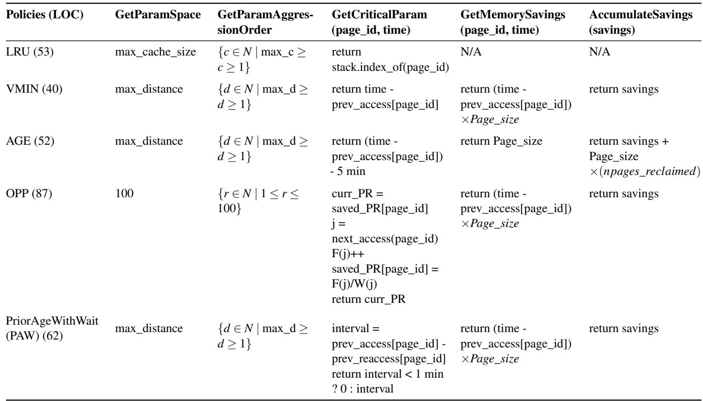

C to compute the final promotion rate, Promotion\_rate<sub>(P,A)</sub> as Promotion\_rate<sub>(P,A)</sub> = C<sub>(P,1)</sub> +C<sub>(0,A)</sub> −C<sub>(P,A)</sub>. Here, C<sub>(P,1)</sub> computes promotions arising due to pages that have a reuse distance greater than P and are going to elapse at least one time interval after their eviction, i.e., their age would be at least 1 on reaccess. C<sub>(0,A)</sub> captures age-based promotions due to pages that would have an elapsed time greater than A. Finally, subtracting the intersection C<sub>(P,A)</sub> corrects the overlapping promotions that both conditions would satisfy.

The memory savings Savings<sub>(P,A)</sub> computation uses the same logic as the promotion rate. However, it requires an adjustment. Pages would be evicted at different times based on the condition they satisfy. Suppose a page with reuse distance α = T<sub>2</sub> − T<sub>1</sub> accessed at time T<sub>1</sub>, with next access at T<sub>2</sub>. When the page is refaulted at T<sub>2</sub>, we need to evaluate the savings generated. If α > P, then the page is removed from memory immediately at T<sub>1</sub>, and the savings generated by this eviction would be (T<sub>2</sub> − T<sub>1</sub>) × page\_size. If α < P, then the page has to stay idle for a time period A before it is evicted; in this case, the savings generated would be (T<sub>2</sub> − T<sub>1</sub> − A) × page\_size. The savings need to be adjusted for this waiting period. To handle this, along with Raw<sub>(p,a)</sub>, we also compute Gap<sub>(p,a)</sub>, which computes the maximum time a page stays out of memory for every two accesses to it; in our example, it is (T<sub>2</sub> − T<sub>1</sub>) × page\_size. The Co-Age Threshold matrix for memory savings is computed as C\_sv<sub>(p,a)</sub> = Gap<sub>(p,a)</sub> + C\_sv<sub>(p+1,a)</sub> + C\_sv<sub>(p,a+1)</sub> −

C\_sv <sub>p a</sub> . For the final savings, we subtract the adjustment required to accurately count the savings for the AGE policy using, Savings<sub>(P,A)</sub> = C\_sv<sub>(P,1)</sub> +C\_sv<sub>(0,A)</sub> −C\_sv<sub>(P,A)</sub> − (num\_pages\_age × A), we achieve this by keeping track of the number of pages evicted due to the AGE condition in our algorithm.

## C Proof of Optimality for OPP

We first focus on a trace collected by reading accessed bits similar to existing data center systems, where all accesses within a time window W are assumed to have occurred at the exact same time, t<sub>start</sub> (W<sub>n</sub>), the start time of the window. The kernel can only observe accesses to pages by reading the access bit at regular time intervals, only allowing it to assign that time interval as the time of access when the tracing happens.

We prove the optimality of the OPP algorithm by contradiction using a "first difference" argument. An optimal schedule maximizes total memory savings while adhering to all constraints.

Definition of Memory Saving: Let the saving from a single eviction of page p at time t<sub>evict</sub> be defined as:

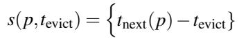

where t<sub>next</sub>(p) is the time of the next access to page p. The

Listing 3: MPC generator for the PACE policy

def pace\_mpc\_generator(trace, scan\_period, page\_size):   
min\_t, max\_t = min(t for pid, t in trace), max(t for pid   
, t in trace)   
num\_windows = (max\_t - min\_t) / scan\_period   
dim = num\_windows + 1   
Raw, Gap = [[[]]], [[[]]] # 3d array dimensions (dim,   
dim, num windows)   
prev\_w, prev\_prev\_w = {}, {}   
for page\_id, t\_now in trace:   
8 w = (t\_now - min\_t) / scan\_period   
9 if prev\_w.get(page\_id, -1) != -1:   
10 p = prev\_w[page\_id] - prev\_prev\_w.get(page\_id,   
prev\_w[page\_id])   
11 a = w - prev\_w[page\_id] - 1   
12 Raw[min(p, dim-1), min(a, dim-1), w] += 1   
13 Gap[min(p, dim-1), min(a, dim-1), w] += (w -   
prev\_w[page\_id]) \* page\_size   
14 prev\_prev\_w[page\_id], prev\_w[page\_id] = prev\_w.get(   
page\_id, -1), w   
15 C, C\_sv = [[[]]], [[[]]] # 3d array dimensions (dim, dim   
, windows)   
16 for p in range(dim - 1, -1, -1):   
17 for a in range(dim - 1, -1, -1):   
18 for w in range(num\_windows):   
19 C[p, a, w] = Raw[p, a, w] + C[p+1, a, w] + C   
[p, a+1, w] - C[p+1, a+1, w]   
20 C\_sv[p, a, w] = Gap[p, a, w] + C\_sv[p+1, a,   
w] + C\_sv[p, a+1, w] - C\_sv[p+1, a+1, w   
]   
21 results = []   
22 for P in range(1, dim):   
23 for A in range(1, dim):   
24 total\_promotions, total\_savings = 0, 0   
25 for w in range(num\_windows):   
26 total\_promotions += C[P, 1, w] + C[0, A, w]   
- C[P, A, w]   
27 num\_pages\_age = C[0, A, w] - C[P, A, w]   
28 total\_savings += C\_sv[P, 1, w] + C\_sv[0, A,   
w] - C\_sv[P, A, w] - (num\_pages\_age \* A   
\* page\_size)   
29 results.append(Result(P, A, total\_savings,   
total\_promotions))   
30 return results

total memory saving for a schedule S is the sum over all its evictions assuming uniform page size:

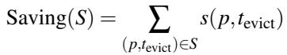

Let S be the schedule from the OPP algorithm. Assume there exists a hypothetical optimal schedule S<sub>opt</sub> with Saving(S<sub>opt</sub>) > Saving(S<sub>OPP</sub>). This implies the schedules must differ.

Let’s consider the first access event in the trace, (P,t<sub>p</sub>), where the decisions of the two schedules diverge as both schedules cannot be identical if Saving(S<sub>opt</sub>) > Saving(S<sub>OPP</sub>). Both schedules were identical for all accesses prior to t<sub>p</sub>, their internal states (e.g., fault counts for future windows) are identical at this point. One theoretical way for them to differ is if S<sub>opt</sub> evicts P at t<sub>p</sub>, but S<sub>OPP</sub> does not. However, this is impossible. If S<sub>opt</sub> evicts P, the eviction must be valid, i.e., the fault slot in the future window W<sub>n</sub> is available and this eviction doesn’t violate the promotion rate. Because the states are identical, the eviction would also be valid for S<sub>OPP</sub>. The OPP algorithm is maximally greedy by definition: it always performs an eviction if it is valid. Therefore, S would also have evicted P, which contradicts our premise that the schedules differ.

Thus, the first point of divergence can only be the other way around:

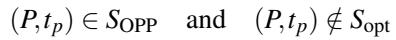

For OPP to evict P, the eviction must be valid, contributing a saving of s(P,t<sub>p</sub>) > 0. Let the next access to P be in window W<sub>n</sub>, which means this eviction consumes one fault from W<sub>n</sub>’s budget.

Now, consider why S<sub>opt</sub> would not evict P. There are two possibilities for how S<sub>opt</sub> uses the fault budget in window W<sub>n</sub>:

Case A: S<sub>opt</sub> never uses the fault slot in W<sub>n</sub> that P’s eviction would have taken. In this case, S<sub>opt</sub> simply forgoes the savings s(P,t ) by not reclaiming this page. We could construct a new schedule S<sup>′</sup> = S<sub>opt</sub> ∪ {(P,t<sub>p</sub>)}. This schedule is valid because the required fault slot in W<sub>n</sub> was available in S<sub>opt</sub>. The savings of this new schedule would be Saving(S<sup>′</sup>) = Saving(S<sub>opt</sub>) + s(P,t<sub>p</sub>), which is strictly greater than the savings of S<sub>opt</sub>. This contradicts the assumption that S<sub>opt</sub> is optimal.

Case B: S<sub>opt</sub> uses the same fault slot in W<sub>n</sub> for another page, Q. For S<sub>opt</sub> to use the fault slot on a different page, it must evict a page Q at some time t<sub>q</sub>, where Q’s next access is also in window W<sub>n</sub>. Since we are at the first point of difference at time t<sub>p</sub>, it must be that t<sub>p</sub> ≤ t<sub>q</sub>. Let’s construct a new schedule S<sup>′</sup> from S<sub>opt</sub> by swapping the decision for Q with the decision for P:

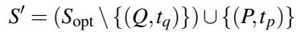

This new schedule S<sup>′</sup> is valid. It uses the same fault slot in W<sub>n</sub> that S<sub>opt</sub> used, just for a different page.

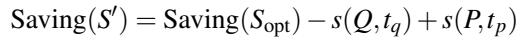

The saving for each eviction is s(p,t<sub>evict</sub>) = t<sub>next</sub>(p) − t<sub>evict</sub>. Under our assumption, both P and Q are re-accessed at the exact same time, so t<sub>next</sub>(P) = t<sub>next</sub>(Q) = t<sub>start</sub> (W<sub>n</sub>).

Therefore, the difference in savings becomes:

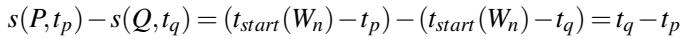

Since we established that t<sub>p</sub> ≤ t<sub>q</sub>, it follows that t<sub>q</sub> − t<sub>p</sub> ≥ 0. Thus, Saving(S<sup>′</sup>) ≥ Saving(S<sub>opt</sub>). We have transformed S<sub>opt</sub> into a schedule that agrees with OPP’s first decision without decreasing the total savings. By repeating this argument for all points of difference, we can show that Saving(S<sub>OPP</sub>) ≥ Saving(S<sub>opt</sub>), which contradicts our initial assumption. Therefore, under this setting, OPP is optimal.

## D Investigating OPP optimality for traces with exact timestamps

Now, we relax the assumption and allow accesses to be spread within a window given a trace with exact time stamps for each memory access. The below counter-example demonstrates that OPP is not optimal in this case.

## Parameters:

• Window Size (W ): 100 time units. (W<sub>1</sub> : [1, 100],W<sub>2</sub> : [101,200])

• Target Promotion Rate (ρ<sub>target</sub>): 0.5 (50%)

• Durable Threshold (T<sub>durable</sub>): 50

Access Trace (T ):

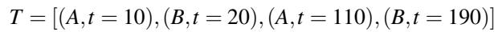

There are two accesses in W , so its fault budget is 0.5 × 2 = 1.

## OPP’s Sub-Optimal Schedule:

1. At t = 10, OPP considers evicting page A. The next access is at t = 110. The eviction is valid (110 − 10 = 100 ≥ T ) and a fault slot is available in W . OPP evicts A and uses the only fault slot for W<sub>2</sub>. The saving is 110 − 10 = 100.

2. At t = 20, OPP considers evicting page B. While the eviction is valid (190 − 20 = 170 ≥ T<sub>durable</sub>), the fault budget for W is now full. OPP cannot evict B.

The total saving for the OPP schedule is 100.

Optimal schedule for exact trace: An optimal algorithm would compare the potential savings. Evicting A yields a saving of 100, while evicting B yields a saving of 170. Knowing it only has one fault slot, the optimal schedule would forgo evicting A to save the slot for the more profitable eviction of B. The total saving would be 170.

Since 170 > 100, OPP is not optimal for this scenario.

## Proof of Bounded Gap for OPP schedule

We prove that the total gap between the savings of ideal S<sub>opt</sub> for this scenario and S<sub>OPP</sub> is bounded.

Let E<sub>n</sub>(S) be the set of pages evicted by schedule S that fault in window W<sub>n</sub>, and let F<sub>n</sub> be the fault budget for that window. The number of such evictions is bounded, so |E<sub>n</sub>(S)| ≤ F<sub>n</sub>. Because OPP is maximally greedy, it will always make at least as many valid evictions for a given window as any other valid schedule. Thus, |E<sub>n</sub>(S<sub>OPP</sub>)| ≥ |E<sub>n</sub>(S<sub>opt</sub>)|. Let m<sub>n</sub> = |E<sub>n</sub>(S<sub>OPP</sub>)| and k<sub>n</sub> = |E<sub>n</sub>(S<sub>opt</sub>)|, where m<sub>n</sub> ≥ k<sub>n</sub>.

The total savings gap is the sum of the gaps from each fault window:

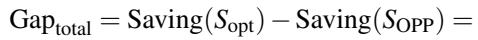

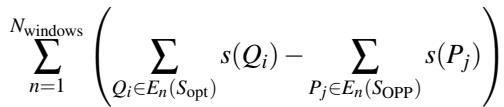

Let’s analyze the gap for a single window n. Since m<sub>n</sub> ≥ k<sub>n</sub> and all savings s(P<sub>j</sub>) are non-negative, we can find an upper bound by dropping the extra m<sub>n</sub> − k<sub>n</sub> terms from OPR’s savings:

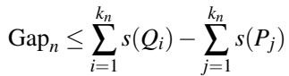

where {P<sub>j</sub>} represents the first k<sub>n</sub> pages chosen by OPP for window n (i.e., those with the earliest access times).

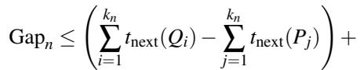

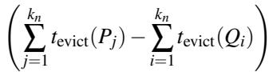

Now we bound the two parenthesized terms.

1. Bounding the t term: The set {P } contains the k valid evictions with the earliest possible eviction times. The set {Q<sub>i</sub>} is another set of k<sub>n</sub> valid evictions. By definition, the sum of the earliest eviction times must be less than or equal to the sum for any other set of the same size. Therefore, ∑t<sub>evict</sub>(P<sub>j</sub>) ≤ ∑t<sub>evict</sub>(Q<sub>i</sub>), which implies the second term is non-positive and can be dropped for an upper bound:

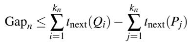

2. Bounding the t<sub>next</sub> term: For any page X in these sets, t<sub>next</sub>(X ) must fall within window W<sub>n</sub>. Let t<sub>start</sub> (W<sub>n</sub>) be the start time of this window. We can establish firm bounds: t<sub>start</sub> (W<sub>n</sub>) ≤ t<sub>next</sub>(X ) < t<sub>start</sub> (W<sub>n</sub>) + W . To maximize the gap, we maximize the sum for Q<sub>i</sub> and minimize the sum for P<sub>j</sub>:

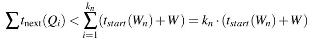

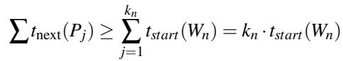

Substituting these into our inequality for Gap<sub>n</sub>:

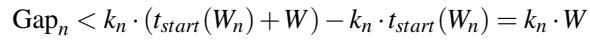

Since k<sub>n</sub> = |E<sub>n</sub>(S<sub>opt</sub>)| ≤ F<sub>n</sub>, we can conclude that Gap<sub>n</sub> < F<sub>n</sub> ·W . The gap for a single window is strictly bounded by its fault budget multiplied by the window size.

3. Bounding the Total Gap: The total gap is the sum of the per-window gaps. Let F<sub>total</sub> = ∑ F<sub>n</sub> be the sum of all fault budgets over the entire trace.

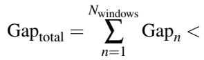

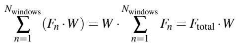

Thus, the total savings gap is strictly bounded by the total fault budget multiplied by the window size. This proves the algorithm is near-optimal.