USENIX

THE ADVANCED COMPUTING SYSTEMS ASSOCIATION

# Seer: Online Context Learning for Fast Synchronous LLM Reinforcement Learning

Ruoyu Qin, Moonshot AI and Tsinghua University; Weiran He, Weixiao Huang, Yangkun Zhang, Yikai Zhao, Bo Pang, and Xinran Xu, Moonshot AI; Yingdi Shan, Yongwei Wu, and Mingxing Zhang, Tsinghua University https://www.usenix.org/conference/osdi26/presentation/qin

# This paper is included in the Proceedings of the 20th USENIX Symposium on Operating Systems Design and Implementation.

July 13–15, 2026 • Seattle, WA, USA

ISBN 978-1-939133-55-7

Open access to the Proceedings of the 20th USENIX Symposium on Operating Systems Design and Implementation is sponsored by

# Seer: Online Context Learning for Fast Synchronous LLM Reinforcement Learning

Ruoyu Qin†♢ Weiran He† Weixiao Huang† Yangkun Zhang† Yikai Zhao† Bo Pang† Xinran Xu† Yingdi Shan♢ Yongwei Wu♢ Mingxing Zhang♢1 †Moonshot AI ♢Tsinghua University

## Abstract

Reinforcement Learning (RL) has emerged as a critical technique for advancing modern Large Language Models (LLMs), yet existing synchronous RL systems face severe performance bottlenecks. The rollout phase, which dominates end-to-end iteration time, suffers from substantial long-tail latency and poor resource utilization due to inherent workload imbalance. We present SEER, a novel context learning RL system that addresses these challenges through a key observation: requests sharing the same prompt exhibit strong similarities in output lengths and response patterns. Leveraging this insight, SEER introduces three coordinated techniques: (1) divided rollout for dynamic load balancing, (2) context-aware scheduling to mitigate long-tail request delays, and (3) adaptive grouped speculative decoding to accelerate generation. These mechanisms work in concert to markedly reduce long-tail latency and improve resource efficiency during rollout. Evaluations on production-grade RL workloads demonstrate that SEER achieves up to 2.04× end-to-end rollout throughput improvement compared to the state-of-the-art synchronous RL systems, while notably reducing long-tail latency by 72–94%.

## 1 Introduction

Reinforcement Learning (RL) has become a cornerstone in the development of state-of-the-art Large Language Mod els (LLMs), enabling significant breakthroughs in complex reasoning and problem-solving capabilities [9, 38, 39]. The iterative RL training process alternates between a rollout phase for data generation and a training phase for updating model parameters. However, the rollout phase consistently emerges as the dominant bottleneck, consuming approximately 80% of the total iteration time (see Table 1). Therefore, improving the efficiency of the rollout phase represents one of the most pressing challenges in modern LLM development.

The primary challenge in RL rollout arises from severe resource inefficiency driven by the increasing demand for longgeneration capabilities, especially in tasks requiring complex chain-of-thought (CoT) reasoning. These workloads create two fundamental bottlenecks. First, long-generation requests exhibit highly unpredictable and rapidly increasing memory footprints: a CoT request may begin with only a few hundred megabytes of KVCache usage but expand to tens of gigabytes as decoding progresses. This volatility forces the system to shrink batch sizes dynamically or to preempt running requests; both outcomes reduce hardware efficiency, and preemptions are particularly costly because they trigger expensive re-prefills, ultimately degrading rollout throughput.

Table 1: Time distribution across RL training phases for different workloads. Detailed configurations given in §4.1.  
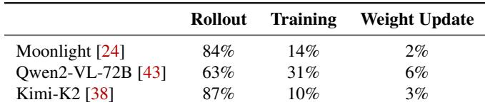

Second, long-generation requests produce a heavy-tailed distribution of output lengths, resulting in pronounced load imbalance. Toward the end of a rollout iteration, only a small number of disproportionately long-running requests remain active, leaving most accelerators underutilized. The inefficiency is so severe that attempting to use idle nodes to accelerate these long-tail requests often yields little benefit and can even harm performance due to increased inter-node communication overhead.

To improve hardware utilization, recent works have explored asynchronous rollout systems [5, 10, 11, 29, 33, 51], which overlap the rollout and training phases. While this approach can reduce end-to-end iteration time, it comes at the cost of algorithmic fidelity. By nature, these systems introduce a degree of off-policy learning, as data generated with model parameters from step i may be used to train the model at step i + 1 or beyond. Furthermore, asynchronous or nonstrictly synchronous [8, 53] RL systems often suffer from distributional skew, where faster-to-generate short samples disproportionately populate early training batches [40]. These off-policy effects can diminish final model performance and complicate debugging and reproducibility [49]. Consequently, synchronous (or “on-policy”) rollout remains critical in many settings for ensuring methodical evaluation, reproducibility, and strict adherence to the underlying algorithm’s assumptions. This paper, therefore, focuses on optimizing the synchronous case, although we note that our techniques can also be adapted to improve asynchronous settings.

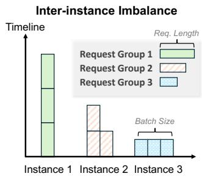

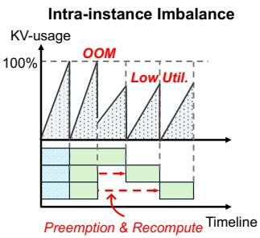

(a) Group-level rollout.  
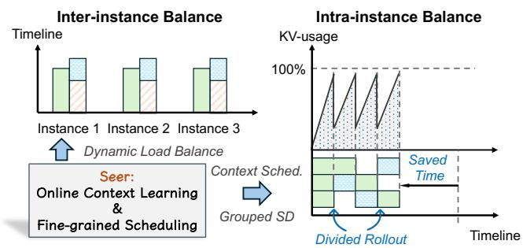  
(b) SEER’s rollout.  
Figure 1: Challenges and SEER’s solution for long-generation rollout.

Speculative decoding [17] (SD) presents another promising direction for accelerating memory-bound generation, as its parallel verification mechanism can utilize more computational resources to accelerate individual requests. However, conventional SD methods struggle to simultaneously achieve high draft accuracy and low draft overhead in RL settings, where both the request workload and the target model itself evolve dynamically. This motivates the need for adaptive SD techniques tailored to the unique characteristics of RL rollout.

To address these challenges, we introduce SEER, a novel system for synchronous RL rollout that dynamically exploits contextual information within the workload to maximize resource efficiency. SEER is built upon a key observation: Group Relative Policy Optimization (GRPO) [31] and its growing family of variants (DAPO [48], GSPO [50], Dr.GRPO [25], etc.), which have become the dominant paradigm for LLM post-training, generate G (typically 8–16) responses per prompt, and responses within a group tend to exhibit similar length profiles and recurring local token patterns, which represent a rich structure that existing schedulers and inference engines leave untapped. For instance, generating an early “probe” response per prompt provides a strong, online estimator of that prompt group’s remaining work (i.e., expected output length and KVCache footprint), enabling more informed scheduling decisions than static heuristics. SEER leverages this latent intra-group context to make three key contributions:

1) Divided Rollout with Global KVCache: SEER departs from conventional group-level scheduling, where all requests within a prompt group are treated as a single, inseparable unit. This traditional approach causes pronounced inter-instance and intra-instance load imbalance. As illustrated in Figure 1, SEER instead performs Divided Rollout, splitting each group not only into G independent requests but further into smaller chunks that are scheduled incrementally. This fine-grained decomposition lets the scheduler pack many short requests together early in rollout to fully utilize VRAM, and later, when long requests dominate, adjust concurrency based on KVCache budgets to avoid preemptions. SEER’s global scheduler continuously monitors KVCache usage across instances and can migrate a request to a less-loaded worker when its next chunk is scheduled. This migration is efficient because SEER uses a global KVCache pool adapted from Mooncake [30] and shared across all instances, eliminating the cost of prefill recomputation.

2) Context-Aware Scheduling: SEER leverages a “speculative request” from each GRPO group to estimate that group’s remaining workload—specifically its likely generation length and KVCache footprint. These lightweight online estimates allow SEER to approximate a longest-job-first scheduling policy that pairs long requests with short ones to maintain dense batches throughout rollout. Experiments in §4.5.1 show that this approach significantly reduces the time spent in the long-tail phase by 89%.

3) Adaptive Grouped Speculative Decoding: To leverage speculative decoding for rollout acceleration while overcoming the acceptance rate collapse of traditional SD, SEER introduces a context-learning-based speculative mechanism. SEER deploys a Distributed Grouped Draft Server (DGDS) that maintains a Compressed Suffix Tree [45] (CST) for each group, aggregating token sequences from all requests within the same group. This approach creates a highly accurate, dynamic “draft model” that is inherently synchronized with the target model. Additionally, DGDS introduces a Marginal-Benefit-Aware Adaptive Speculation policy that balances overall throughput with the latency of high-priority requests. Our ablation experiments in §4.5.2 demonstrate the effectiveness of the SD components. Our adaptive grouped speculative decoding outperforms multiple SD strategies, achieving up to 1.3× performance improvement. Compared to vanilla CST-based SD without group context, it increases the mean acceptance length by 0.22.

Beyond RL rollout, the components and design principles of SEER are broadly applicable to other large-scale parallel generation workloads. Divided Rollout addresses KVCache bloat and load imbalance that arise in any high-concurrency, long-form generation serving scenario. Similarly, Context-Aware Scheduling and Adaptive Grouped Speculative Decoding generalize to any multi-sample setting or generation task whose requests exhibit recurring structural similarities.

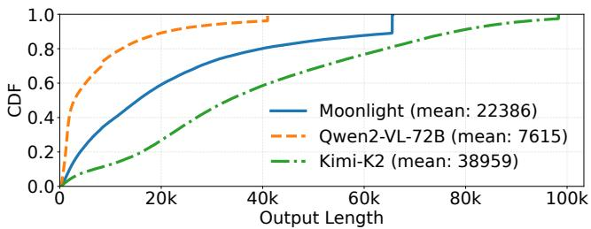  
Figure 2: Distribution of output lengths during rollout across three reasoning tasks.

We have implemented SEER and conducted an extensive evaluation on 256 H800 GPUs across multiple productiongrade RL workloads, encompassing models ranging from tens of billions to over one trillion parameters. Our experiments demonstrate that SEER consistently improves end-to-end roll out throughput by 44–104% and cuts long-tail latency by 72–94% relative to a highly optimized synchronous baseline. Through detailed ablations, we isolate the contributions of divided rollout, context-aware scheduling, and adaptive grouped speculative decoding, showing that each component provides substantial and complementary gains. We further compare SEER against state-of-the-art rollout optimization approaches, including a non-strictly synchronous system [53], as well as multiple speculative decoding strategies [17, 22, 28]. We find that SEER achieves the best overall performance while preserving strict on-policy training semantics.

## 2 Background and Motivation

Reinforcement learning (RL) for LLMs progresses through a repeated iterative loop. In each iteration, the model generates responses for a batch of prompts (rollout), evaluators assign quality scores to those responses (reward computation), these scores are transformed into supervision signals (experience construction), and the model is updated accordingly (training). The updated parameters are then distributed to inference workers to initiate the next iteration (weight update). A series of recent systems aim to accelerate this loop by improving coordination across stages. veRL [34] colocates rollout and training to reduce data movement, RLHFuse [52] overlaps reward computation with experience construction, and Kimi-K2 [38] further optimizes checkpoint conversion and weight distribution. However, Table 1 makes clear that such non-rollout phase optimizations are insufficient: across three representative production workloads, rollout alone occupies 63–87% of total iteration time, overwhelmingly dominating all other stages.

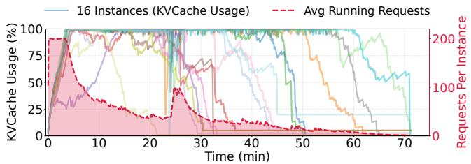

(a) KVCache utilization and average number of running requests across instances.  
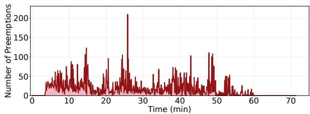  
(b) Request preemption count.  
Figure 3: KVCache utilization, number of running requests, and preemption count during a synchronous rollout phase of the Qwen2-VL-72B task. In the early stage of rollout, insufficient KVCache capacity causes frequent request preemptions; in the later stage, a small number of extremely long request groups contribute to a long-tail period that accounts for nearly half of the total rollout time.

This imbalance is structural and rooted in the nature of training reasoning models. RL increasingly relies on chainof-thought (CoT) supervision, which encourages models to produce longer and more detailed reasoning traces. As a result, rollout exhibits two defining characteristics: long average output lengths and extremely high variance across requests. Figure 2 shows that generations range from a few hundred tokens to as many as 96k tokens. Long average outputs exert heavy pressure on memory because KVCache consumption scales with request length, while the extreme variance produces severe long-tail effects: a small number of exceptionally long requests monopolize GPU resources near the end of rollout. Figure 3 illustrates how these properties cause substantial resource underutilization and imbalance, motivating the two challenges discussed next.

## 2.1 Challenge #1: Request Scheduling Dilemma

During the rollout process of long-CoT models, the KVCache memory of requests undergoes dramatic changes, from negligible in the early phase to several gigabytes per request in the final stage. This varying memory consumption creates a dilemma in concurrency management. If concurrency is not controlled, the increasing request length leads to memory exhaustion, resulting in massive request preemption, where the KVCache of some running requests is evicted to allow a few requests to complete inference. This introduces huge overhead for KVCache recomputation. Conversely, if concurrency is controlled to avoid preemption, requests in their early generation phase (with only a few hundred tokens) may occupy the entire memory space for hundreds of seconds, leading to severe resource underutilization. Furthermore, this memory footprint is amplified by a factor of G in GRPO-like algorithms, where G responses are generated for each prompt within the same group, further exacerbating the inter-instance imbalance.

To address the inter-instance imbalance caused by grouplevel scheduling, a concurrent work Roll Flash [26] proposes prompt replication, which splits request groups into independent requests for separate scheduling, thereby resolving the amplified imbalance caused by scheduling entire request groups. However, this does not address the dilemma of intra instance concurrent scheduling, and still suffers from uneven request distribution across instances, leading to inter-instance imbalance. The root cause of these issues is treating individual (or groups of) requests as indivisible monolithic units, even though rollout scenarios impose no strict latency constraints on individual requests. This persistent scheduling dilemma motivates our design of divided rollout (detailed in §3.2), which schedules requests at the chunk level with little overhead, enabling fine-grained scheduling and dynamic load balancing.

## 2.2 Challenge #2: Severe Long-tail Effect

The long-tail problem is another critical issue in rollout, widely noted in prior work [8, 11, 53]. As shown in Figure 3a, the long-tail phase can account for nearly 50% of the total rollout time. This phenomenon arises from two factors: (1) In GRPO-like algorithms, requests within the same group tend to have similar lengths. Groups with extremely long average lengths form “monolithic” batches that cause severe load imbalance across instances when scheduling is performed at the group granularity. (2) Under memory constraints, requests may be preempted or delayed, causing extremely long requests to be blocked and further exacerbating tail latency.

To mitigate the long-tail effect, recent works [5, 10, 11, 33, 51] have proposed asynchronous RL. Unlike synchronous methods, where all training experiences must originate from the current policy iteration, asynchronous methods allow training on stale rollout data from previous policy iterations, introducing off-policyness. Other works [8, 53], while nominally maintaining synchrony, allow deferring a portion of requests to subsequent iterations, thereby sacrificing iteration-level consistency compared to strict synchronous RL systems. Although asynchronous or non-strictly synchronous RL can reduce the long-tail impact, many RL practitioners still prefer synchronous training to achieve the best convergence and maintain reward stability.

Speculative decoding (SD) [2, 6, 14, 17–20, 22, 28] offers a promising approach to accelerate the long-tail phase while preserving synchronous RL training guarantees. SD consists of two stages: Draft and Verification. In the draft stage, a lightweight mechanism proposes candidate tokens, which are then verified in parallel by the target model in the verification stage. Since parallel verification of n tokens by the LLM is faster than serial generation of n tokens due to reduced memory access, SD can improve the generation speed for individual requests. Draft tokens can be produced by a smaller auxiliary model [17–20], which offer high acceptance rates but incur significant draft overhead, or by retrieval-based methods such as n-gram matching, which look up a request’s recent tokens in its own generation history and extend the longest match. SuffixDecoding [14, 28] optimizes n-gram matching with a Compressed Suffix Tree (CST), a space-efficient suffix index that supports longest-match lookup and draft-token generation in linear time. However, when only the request’s own history serves as the reference corpus, the acceptance rate remains low. RL rollout scenarios further exacerbate these limitations: batch sizes fluctuate dramatically, and the target LLM undergoes continuous updates, causing rapid “model drift”. Existing SD strategies suffer from either high draft overhead or low draft token accuracy, resulting in marginal or even negative performance gains in rollout scenarios.

## 2.3 Opportunity: Shared Contextual Information in Group Sampling

In LLM reinforcement learning practice, the most widely adopted algorithm is Group Relative Policy Optimization (GRPO) [31]. GRPO performs group-based preference optimization by sampling G candidate responses for each prompt, computing rewards for these responses, and then normalizing the rewards within the group to obtain advantages. Several recent works [25, 48, 50] refine GRPO to improve generalization, but they all preserve the core principle of generating multiple responses for the same prompt. Other efforts, such as BroRL [12] and Knapsack RL [21], even scale G to 512 or more to enhance exploration. As a result, GRPO and its variants establish group sampling as a dominant training paradigm, in which each prompt is associated with a set of responses generated by the same policy.

This group sampling paradigm naturally introduces strong and stable contextual signals during rollout. Since all responses in a group are conditioned on the same prompt and produced by the same model, they exhibit notable similarity in semantics, structural templates, and generation length. However, existing RL systems typically treat each prompt group as a monolithic unit during rollout, overlooking the potential to externalize and exploit such intra-group similarity as shared contextual information. Our statistical analysis shows that this shared context is sufficiently rich to support both scheduling and inference optimizations.

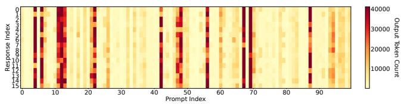  
Figure 4: Length correlation within response groups. Each column represents a prompt group in the GRPO rollout, and each cell corresponds to an individual response. The color intensity indicates output length.

Table 2: Mean acceptance length in n-gram speculative decoding with grouped pattern references under different draft strategies. Linear generates one draft sequence per step, while multi-path generates multiple candidate sequences with top-k branching. Values represent mean acceptance length (including bonus token).  
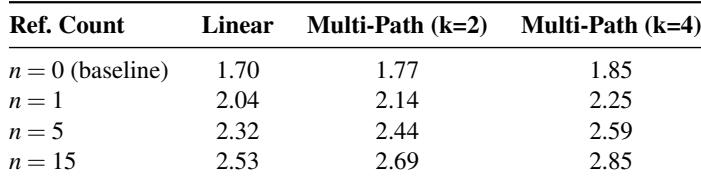

First, at the length level, responses within the same group have highly correlated generation lengths. Prior work [3,7,51] has shown that response length is predictable from prompt and model characteristics. Our measurements on real RL workloads, summarized in Figure 4, further confirm that most prompt groups in GRPO rollout exhibit strong length correlation. We observe that responses within the same group tend to have similar lengths, forming visually consistent columns. This length context can be obtained cheaply via speculative sampling and used to inform global scheduling policies, such as approximate longest-first scheduling, which prioritizes groups likely to produce very long responses. Such length- and memory-aware scheduling is a promising direction for mitigating the long-tail effect while respecting device memory constraints.

Second, at the pattern level, grouped responses share recurring semantic and syntactic structures that can be exploited to accelerate inference. Instead of relying solely on each request’s own history, we can aggregate previously generated tokens from other responses in the same group into a shared pattern dictionary (e.g., via compressed suffix trees) and use it as an n-gram reference for speculative decoding. To quantify this opportunity, we sample 20 prompt groups from a Qwen2-VL-72B task and simulate n-gram speculative decoding under different draft strategies. Table 2 reports the mean acceptance length (including bonus tokens) for varying numbers of grouped references n and different drafting modes. Compared to the self-referencing baseline with no grouped references (n = 0), incorporating even a small number of intragroup references (e.g., n = 1 or n = 5) consistently increases the mean acceptance length, and using more references (e.g., n = 15) together with multi-path drafting yields the largest gains. In the later stage of rollout, speculative decoding with full grouped pattern references can improve the number of accepted draft tokens by up to 119% compared to a baseline that only uses per-request history.

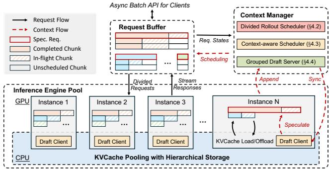  
Figure 5: The overview of SEER.

In summary, group sampling in GRPO-like algorithms provides rich shared contextual information, both in terms of length correlation and pattern similarity, that is currently underutilized by existing RL systems. Our statistical data indicates that this contextual signal can be harnessed to enable length- and memory-aware scheduling and grouped speculative decoding, offering a promising opportunity to mitigate long-tail inefficiency and improve rollout throughput in synchronous LLM RL training.

## 3 Design of SEER

## 3.1 Overview

SEER is a synchronous, colocated RL system designed to substantially reduce rollout long-tail latency and improve overall system throughput without compromising algorithmic fidelity. The broader pipeline remains standard: training uses Megatron [35] for distributed optimization, rollout uses vLLM [16] for generation, reward computation is handled by an indepen dent server that runs in parallel with generation, and Moonshot Checkpoint Engine [1] ensures rapid movement of updated model weights. SEER’s contributions therefore layer onto a conventional architecture without imposing additional integration overhead.

Within rollout, as motivated by the workload analysis in §2.3, SEER introduces a unifying idea that drives its three innovations: Online Context Learning. SEER continuously learns the intra-group shared properties and uses them to guide scheduling and decoding. Length similarities become signals for estimating whether upcoming generations are likely to be long-running; pattern similarities reveal opportunities to construct group-level draft predictions that accelerate decoding without a separate draft model. In addition to these optimizations, SEER also incorporates efficient memory management, load balancing, and asynchronous reward computation.

To support this context-driven approach at scale, the rollout subsystem is organized into three tightly connected components as illustrated in Figure 5. An Inference Engine Pool hosts multiple model-serving instances backed by a distributed KVCache pool, enabling KVCache migration across nodes without recomputation. A Request Buffer provides a global view of all pending and in-progress rollout work, allowing the system to coordinate concurrency precisely. Atop these components, a logically centralized Context Manager maintains group-level contextual views and drives scheduling and draft generation decisions.

On this foundation, SEER introduces three techniques that address the underlying challenges of long-CoT rollout. Divided Rollout (§3.2) resolves the concurrency–memory dilemma by breaking each request into smaller schedulable units and enabling fine-grained placement across instances. Context-Aware Scheduling (§3.3) then leverages learned length context to approximate a longest-first policy that reduces tail latency. Finally, Adaptive Grouped Speculative Decoding (§3.4) exploits shared token-pattern structure to build speculative decoding at the group level and dynamically adjusts draft lengths to maximize throughput. Despite these performance enhancements, SEER maintains logical consistency across all stages of the synchronous RL pipeline, thereby achieving an algorithmically lossless reinforcement learning process.

## 3.2 Divided Rollout

As illustrated in Figure 1, conventional group-level request scheduling mechanisms lead to severe load imbalance both within and across inference instances. Divided Rollout ad dresses this core tension by rethinking what constitutes a schedulable unit. Rather than binding any request group to a single execution slot, SEER not only decomposes it into individual requests but further divides each request into a sequence of generation chunks, each representing a bounded segment of progress. A request that would previously monop olize an instance for thousands of tokens becomes a pipeline of shorter units that can be interleaved and redistributed as the system’s load evolves. This change in granularity enables continuous rebalancing: after each chunk completes, the next chunk can be scheduled on whichever instance currently has the most available memory and compute.

However, Divided Rollout poses significant challenges to the KVCache system. When requests are rescheduled at the chunk level, all KVCache will be recomputed, and this overhead can even negate the benefits of load balancing. Although existing inference frameworks [4, 41] support offloading request KVCache to DRAM within instances, the dynamic load balancing scheduling policy may reschedule requests to other instances, leading to cache misses. Therefore, Divided Rollout requires a globally shared, high-capacity cache system to support chunk-level request scheduling with minimal overhead.

To address this challenge, SEER builds upon Mooncake [30] to construct a globally shared KVCache pool distributed across inference nodes. The KVCache of all active requests is stored in a hierarchical global storage spanning DRAM and SSD, with RDMA enabling rapid KVCache transfer between nodes. From the perspective of the upper-level scheduling system, request chunk scheduling can be treated as stateless, eliminating the need to consider KVCache distribution. To further improve cache utilization and reduce the migration overhead, SEER layers a cache-aware policy on top of this pool. Using the number of in-flight requests as a load signal, the scheduler routes each incoming request to the node holding the longest matching cache prefix as long as the load remains balanced across instances. Once the spread of in-flight counts exceeds an imbalance threshold, the scheduler switches to a load-first decision and dispatches the request to the least-loaded node. Whenever this load-driven placement leaves a cache-affinity gap larger than a configurable margin such as 512 tokens, the chosen node proactively pulls the missing KVCache from the best-affinity node so that the corresponding prefix is not recomputed. The pool itself further exploits the predictable access pattern of a rollout iteration. Rather than relying solely on LRU, the KVCache of a request is released the moment that request finishes, which maximizes the DRAM capacity available to active requests.

What distinguishes Divided Rollout from prior offloading or preemption-based approaches is that cache movement is no longer a reactive measure taken only when memory pressure becomes intolerable. Instead, since chunk-level work units have well-defined memory footprints, the scheduler can proactively place and move them to optimize global system balance rather than merely avoiding out-of-memory events. This shift from reactive eviction to proactive, mobility-aware scheduling is the key novelty that allows SEER to resolve the concurrency–memory dilemma that has long constrained synchronous RL rollout. Compared with live migration systems for online serving (e.g., Llumnix [37]), it offers greater scheduling flexibility due to the absence of strict per-request latency constraints.

## 3.3 Context-Aware Scheduling

Long-CoT rollout inevitably runs into memory limits, which means some requests must wait. When the scheduler cannot anticipate which requests will run long, these delays occur arbitrarily, creating unnecessary congestion in the tail. As shown in §2.3, requests within the same GRPO group tend to exhibit similar output lengths. SEER leverages this structure to predict which requests are likely to be long-running and schedules them more intelligently. The goal is to approximate a longest-first scheduling (LFS) policy (known to reduce tail latency) without needing to know true output lengths in advance.

SEER’s key idea is to designate one request per group as a speculative request. This request serves as an online probe: by observing how quickly it completes during generation, SEER can infer the approximate length of the other requests in the group. To surface these signals early, speculative requests are placed in a high-priority path and scheduled according to a shortest-first strategy (SFS). Because short requests complete quickly while long ones linger, this “length filtering” step exposes potential long-tail groups early in the rollout, giving SEER time to react before those long generations dominate system resources.

Specifically, the scheduling process unfolds in three conceptual phases. First, speculative requests are executed promptly so that length information can be gathered with minimal delay. Second, the Context Manager maintains and continually updates an estimated output length for each group. This estimate is simply the maximum generation length observed among completed requests in the group, an approach that naturally converges toward the true length as more information becomes available. For groups in which no request has finished yet, SEER conservatively assumes they may be long-tail cases and initializes their estimate to the upper bound on generation length. Third, with group-level length estimates in place, the scheduler shifts to an approximate LFS policy: groups predicted to be long are prioritized so that their requests begin making progress early, rather than being deferred until system load is already high. The detailed scheduling algorithm is provided in §A.1.

SEER also incorporates safeguards to mitigate inaccuracies in early predictions. It occasionally schedules requests from underserved groups to avoid starvation and updates group length estimates conservatively to reflect the longest sample observed so far. These mechanisms ensure stability even when speculative signals are noisy. As shown later in §4.5.1, this context-aware scheduling policy approaches the performance of an oracle LFS scheduler that has perfect knowledge of request lengths.

## 3.4 Adaptive Grouped Speculative Decoding

To further improve resource utilization during the rollout phase, especially in the long-tail stage, SEER implements Adaptive Grouped Speculative Decoding, which adaptively adjusts draft lengths based on computational intensity and exploits the grouped pattern context (as analyzed in Table 2) to enhance acceptance rates.

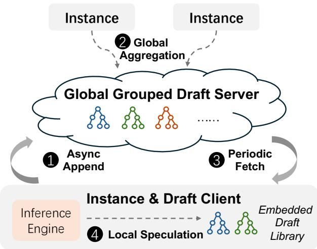  
Figure 6: The distributed grouped draft server.

## 3.4.1 Challenges of Speculative Decoding in Rollout

Speculative decoding (SD) benefits from underutilized computational resources when batch sizes are small, enabling faster parallel verification compared to serial generation. However, rollout scenarios feature dynamically varying batch sizes that start large and rapidly decrease as long requests dominate. Fixed-length SD methods often incur excessive draft or verification overhead, degrading overall throughput. We now model SD throughput [17] in the rollout scenario to identify the key factors affecting performance. Let α denote the acceptance rate, where α = E(β) and β is the acceptance probability at each position. Let γ represent the number of draft tokens predicted by the draft model per step, B denote the current batch size, D(B, γ) represent the forward time of the draft model, and T (B, γ) represent the forward time of the target model.

The expected number of tokens generated per request in each forward is 1−αγ+1− . The expected time for SD to generate one token per request is:

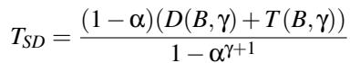

SD provides a benefit when TSD is less than the forward time of the target model T (B, 1).

When B is small, D(B, γ) + T (B, γ) is approximately equal to T (B, 1), making SD clearly beneficial. However, when B is large, D(B, γ) becomes non-negligible and T (B, γ) increases rapidly with γ as the target model becomes compute-bound, potentially resulting in negative gains from SD. In rollout scenarios, B dynamically varies and can range from 1 to several hundred. Conventional static SD strategies with fixed draft lengths suffer from either underutilization of computational resources with small γ or excessive verification overhead with large γ, resulting in marginal or even negative performance gains. Furthermore, to optimize SD performance, the draft system should minimize D(B, γ) while maximizing α. In rollout scenarios dominated by large batches, conventional SD methods suffer from either high D(B, γ) (e.g., using a separate draft model) or low α (e.g., naive n-gram methods). Therefore, an efficient draft system specifically tailored to the characteristics of rollout workloads is required.

## 3.4.2 Adaptive Speculation with Disaggregated Architecture

SEER introduces the Distributed Grouped Draft Server (DGDS), a disaggregated SD framework specifically designed for rollout scenarios. As illustrated in Figure 6, DGDS aggregates response pattern context across requests and instances through an independent draft server, which asynchronously distributes the context to the embedded draft client within each inference instance. As shown in Table 2, multi-reference and multi-path n-gram methods can significantly improve the acceptance rate; however, a naive implementation incurs prohibitive overhead. To address this, DGDS employs a distributed draft service and adopts an asynchronously updated Compressed Suffix Tree (CST) to minimize speculative decoding latency D(B, γ) on the critical path. The detailed workflow is provided in §A.2. Compared with prior CST implementa tions [28, 41], DGDS is optimized for rollout scenarios with support for highly concurrent access and dynamic updates. Its distributed architecture enables cross-instance context sharing, substantially improving both the efficiency and acceptance rate of speculative decoding.

To ensure that SD consistently provides positive gains throughout the rollout process, it is necessary to dynamically adjust γ based on the current batch size according to the throughput model. Furthermore, as described in §3.3, requests are classified into high-priority and low-priority categories. High-priority speculative requests are used to probe the length distribution of requests within the same group and should complete faster, thus requiring higher draft budgets. However, acceptance rates decrease rapidly with increasing draft length, making overly disparate budget allocations between high priority and low-priority requests wasteful. To address this challenge, we propose a Marginal-Benefit-Aware (MBA) Adaptive Speculation policy inspired by classical utility maximization and marginal-utility scheduling principles widely used in resource allocation systems [15], which dynamically balances overall throughput with the latency of high-priority requests.

Algorithm 1 presents the MBA strategy. Using offlineprofiled T models and online-collected acceptance rates and batch sizes, the algorithm determines draft lengths (γh, γl) for high-priority and low-priority requests. The algorithm is invoked periodically during rollout, as request characteristics remain relatively stable over short time intervals. Given the draft lengths, the embedded draft client in DGDS generates the corresponding number of draft tokens based on the grouped CSTs for each request. The basic single-path speculation algorithm follows SuffixDecoding [28], where each candidate path is assigned a confidence score computed from suffix probabilities. Building on this foundation, SEER uses these scores to filter low-probability candidates and is capable of returning multiple candidate paths via a beam search that retains the top-k highest-scoring branches at each fork.

Algorithm 1 Marginal-Benefit-Aware Adaptive Speculation   
Require: High-priority and low-priority batch sizes B and B ; per  
position acceptance probabilities β[1], β[2], . . .; maximum token   
budget per request γmax; priority factor λ ∈ [1, ∞) (e.g., λ = 2).   
Ensure: Draft token counts γh and γl.   
1: B ← Bh + Bl   
2: γ∗ ← arg min TSD(B, γ) ▷ optimal draft length for batch size B   
3: Γ∗ ← γ∗ · B ▷ total token budget   
4: if Γ∗ < B then   
5: return (γh = 0,γl = 0) ▷ disable speculation   
6: ▷ Allocate budget based on marginal benefit   
7: γ ← 1, γ ← 0,remaining ← Γ∗ − B   
8: while remaining > 0 do   
9: benefith ← Bh · (β[γh] − β[γh + 1])   
10: benefitl ← Bl · (β[γl] − β[γl + 1])   
11: if benefith > λ · benefitl and γh < γmax and remaining ≥ Bh   
then   
12: γ ← γ + 1 ▷ allocate to high-priority   
13: remaining ← remaining − Bh   
14: else if B > 0 and γ < γmax and remaining ≥ B then   
15: γl ← γl + 1 ▷ allocate to low-priority   
16: remaining ← remaining − Bl   
17: else   
18: break ▷ cannot allocate further   
19: return (γh, γl)

For long-tail requests, adaptive grouped speculative decoding offers two particular advantages. First, during the long-tail stage, concurrency is minimal, allowing larger draft lengths to increase the number of accepted tokens per request. SEER also implements multi-path speculative decoding to further improve the acceptance length in the long-tail stage. Second, as more requests in the same group complete over time, the CST aggregates richer contextual information. As demonstrated in Table 2, this enables long-tail requests to achieve substantially longer acceptance lengths.

## 4 Evaluation

In this section, we evaluate SEER’s performance advantages during the rollout phase, particularly in improving throughput and reducing tail latency (§4.2). In the ablation study (§4.3), we provide a detailed analysis of how each technique in SEER contributes to improving end-to-end performance. In §4.4, we compare SEER against non-strictly synchronous RL in both rollout performance and training quality, demonstrating that SEER achieves lossless acceleration. Finally, we present extended studies (§4.5) on scheduling, speculative decoding, and the global KVCache pool to demonstrate the effectiveness of our techniques.

Table 3: Model configurations and RL workload characteristics.  
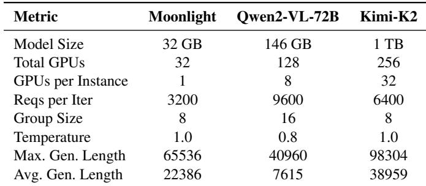

## 4.1 Setup

Testbed. Our experimental infrastructure consists of 32 high-performance compute nodes, each equipped with 8×H800 GPUs, 224 CPU cores, 2TB DRAM, and 4TB NVMe storage, providing sufficient hardware support for the global KVCache pool and distributed grouped draft server. For deployment, we adopt a strategy that balances task performance with resource efficiency by configuring different numbers of GPUs and parallelization strategies to serve models based on their size and architecture.

Models and Workloads. To validate the generalizability of SEER’s design, we evaluate three models with diverse sizes and output characteristics: Moonlight [24], Qwen2-VL-72B [43], and Kimi-K2 [38]. All models are trained as reasoning models with chain-of-thought capabilities, where Moonlight and Kimi-K2 are trained on mathematical datasets, while Qwen2-VL-72B is trained on language-vision-mixed reasoning tasks using the LLM-as-a-Judge [36] reward model. Their configurations and RL workload characteristics are shown in Table 3. We employ Qwen2-VL-72B with tensor parallelism (TP8) and Kimi-K2 with data parallelism (DP32) and expert parallelism (EP32).

Settings. We use the GRPO [31] algorithm in our experiments. The group size (i.e., the number of requests per prompt) follows RL training conventions unless otherwise specified: we use a smaller group size (8) for mathematical problems and a larger group size (16) for open-ended tasks with LLM-as-a-Judge evaluation. For SEER’s SD hyperparameters described in §3.4.2, we set γmax = 8 and λ = 2.

Baselines. We evaluate SEER against a set of strong and representative baselines that capture the best available techniques for synchronous rollout scheduling, skewness mitigation, and speculative decoding.

(1) veRL [34]: veRL is a state-of-the-art synchronous RL system that supports efficient colocation of training and rollout. It provides a well-engineered baseline for measuring SEER’s end-to-end improvements because it already incorporates optimized model execution pipelines and a production-grade rollout subsystem.

(2) StreamRL-Oracle: Although StreamRL [51] is designed as a disaggregated asynchronous RL framework, its pro posed Skewness-Aware Scheduling directly targets the same long-tail latency issues that appear in synchronous rollout. StreamRL’s scheduling relies on a small auxiliary model that predicts prompt lengths and uses those predictions to perform bucketing and LFS-style scheduling. To ensure a fair and stringent comparison, we evaluate against StreamRL-Oracle, which uses the groundtruth prompt lengths obtained from veRL’s rollout traces rather than model predictions. This removes the confounding effects of prediction errors and reflects the bestcase performance achievable by the StreamRL scheduling approach.

(3) Vanilla Speculative Decoding (SD): To benchmark against modern decoding accelerators, we implement strong speculative decoding baselines tailored to each model family. For Moonlight, we use SuffixDecoding [28] with a maximum draft length of γmax = 16. For Qwen2-VL-72B, we adopt a dedicated Qwen2-7B-VL draft model with γmax = 3. For Kimi-K2, we apply Multi Token Prediction (MTP) [22] with γmax = 1. Each of these SD methods is integrated into both veRL and StreamRL-Oracle pipelines, enabling direct comparisons across scheduling regimes and decoding strategies.

To isolate the effect of scheduling and speculative mechanisms, all baselines (including SEER) use a unified in-house implementation of vLLM [16] as the inference engine. This ensures that differences in performance arise solely from the scheduling and decoding techniques under evaluation, not from underlying infrastructure discrepancies.

Metrics. For the end-to-end experiments, we measure the average rollout throughput across 5 iterations, which is defined as the average number of output tokens generated per second in each rollout iteration.

## 4.2 End-to-End Performance

In our end-to-end experiments, we conduct three RL tasks based on the aforementioned models, with workload configurations detailed in Table 3. We provide a comprehensive comparison of SEER’s end-to-end performance against different baselines in §4.2.1. To validate SEER’s effectiveness in mitigating tail latency, we analyze the tail latency phenomenon in our experiments and compare the tail latency between SEER and the baseline system veRL in §4.2.2.

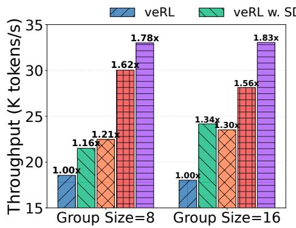  
(a) Moonlight

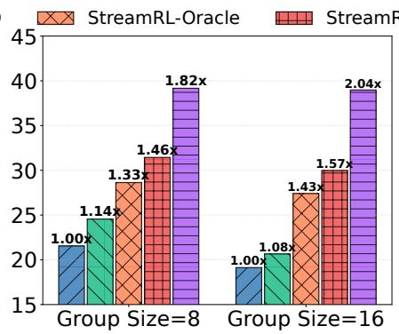  
(b) Qwen2-VL-72B

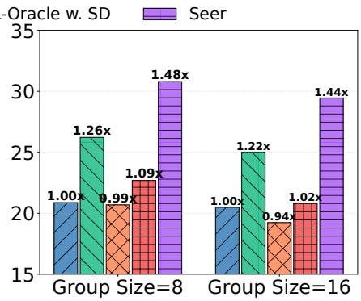  
(c) Kimi-K2  
Figure 7: End-to-end rollout throughput of RL systems across different tasks and group sizes.

## 4.2.1 Rollout Throughput

We compare the throughput performance of SEER against state-of-the-art baselines across different workloads and group sizes, as shown in Figure 7. Despite significant variations in model size and workload characteristics across different RL tasks, SEER consistently achieves substantial speedups across all tasks, with throughput improvements ranging from 44% to 104% over veRL.

SEER also outperforms StreamRL-Oracle and multiple SD strategies. StreamRL sets buckets with smaller concurrency for long-request groups to minimize latency. However, it still treats each request group as an atomic, non-preemptible unit and cannot dynamically adjust instance loads at runtime. Consequently, its performance is heavily dependent on the accuracy of the preset bucketing algorithm. When encountering out-of-distribution workloads such as Kimi-K2, StreamRL Oracle even underperforms veRL, which uses a simple roundrobin scheduling strategy. For vanilla SD methods, although we have implemented adaptive draft length, these SD methods still suffer from either excessive overhead or low average acceptance length, resulting in inferior performance compared to our adaptive grouped speculative decoding. A detailed comparison is provided in §4.5.2.

Across different workloads, SEER achieves greater performance improvements on memory-constrained tasks (Moonlight and Qwen2-VL-72B), where SEER’s divided rollout mit igates load imbalance and context-aware scheduling reduces long request delays. Furthermore, as the group size increases, the load imbalance caused by veRL’s group-level scheduling becomes more severe, leading to throughput degradation. In contrast, SEER addresses the monolithic request group problem through divided rollout and dynamic load balancing, and leverages group context to optimize both scheduling and speculative decoding. As a result, when the group size increases from 8 to 16, SEER achieves an average performance improvement of 5%.

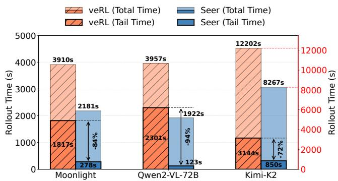  
Figure 8: Tail time and total time of three RL tasks.

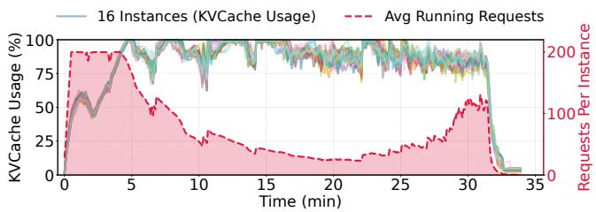  
Figure 9: KVCache utilization and average running requests with SEER during a rollout iteration of the Qwen2-VL-72B task.

## 4.2.2 Long-Tail Time

To analyze SEER’s performance advantages, we examine tail latency in the rollout process. We define tail requests as the last 10% of requests to complete in a synchronous system rollout, and tail time as the time spent solely processing these tail requests. Figure 8 shows the tail time and total rollout completion time, averaged across all iterations. The results demonstrate severe tail latency for memory-constrained tasks like Moonlight and Qwen2-VL-72B, where the last 10% of requests consume up to 50% of total time.

Table 4: Performance improvement breakdown across three RL tasks. Context Sched. denotes context-aware scheduling (§3.3), and Grouped SD denotes adaptive grouped speculative decoding (§3.4).  
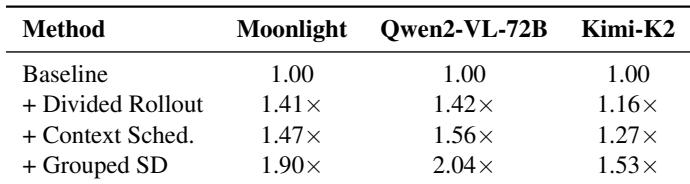

The tail latency problem stems from two primary causes. First, request queuing and preemption lead to delayed scheduling of long-output requests. Second, monolithic request groups result in load imbalance across instances. We provide quantitative evidence using the Qwen2-VL-72B task on veRL, shown in Figure 3. In this rollout iteration, a total of 13,686 preemption events occurred. The last 5% of completed requests have an average length in the top 15th percentile, yet their average execution start time is at 42% of the total time. The load imbalance across instances is even more pronounced: the completion time difference between the earliest and latest instances accounts for 70% of the total time, with each instance idle for an average of 1,580 seconds, representing 37% of the total time. These scheduling and load imbalances result in severe tail latency and throughput degradation.

By leveraging online context learning and fine-grained request scheduling, SEER significantly reduces tail latency by 72% to 94%, thereby substantially improving system throughput. Figure 9 illustrates the impact of these techniques, showing that SEER substantially reduces the tail phase duration compared to the baseline shown in Figure 3a.

## 4.3 Improvement Breakdown

We present a systematic ablation study to quantify the con tribution of each optimization component to SEER’s overall performance. Table 4 demonstrates the cumulative end-to-end speedup obtained by incrementally integrating each major optimization component, where each set of experiments is executed on the 5th rollout iteration.

First, SEER’s divided rollout mechanism enables dynamic, fine-grained load balancing across instances, mitigating tail latency caused by inter-instance load imbalance and reducing preemption overhead within instances due to varying KV-Cache memory consumption. This optimization yields significant improvements for memory-constrained tasks, achieving up to 42% throughput improvement. Building upon divided rollout, context-aware scheduling leverages learned intra-group length distributions to guide scheduling, providing up to 14% additional throughput improvement. To further address the computational underutilization inherent in tail requests, SEER incorporates adaptive grouped speculative decoding, which contributes an additional 26–48% performance improvement over the scheduling optimizations alone.

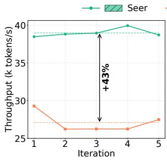  
(a) Rollout throughput.

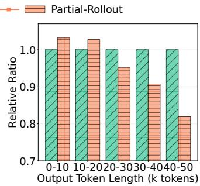  
(b) Output length distribution.  
Figure 10: Rollout experiments comparing SEER and Partial Rollout on the Qwen2-VL-72B workload.

## 4.4 Comparison with Non-Strictly Synchronous RL

Some RL training systems [8, 39, 53] employ non-strictly synchronous RL, which defers or reschedules long-tail requests to subsequent iterations. While non-strictly synchronous RL can improve resource utilization, it introduces some degree of inconsistency with synchronous training algorithms. Partial Rollout [39, 53] is a popular non-strictly synchronous method that over-issues requests during rollout and terminates the rollout phase once a predetermined number of requests are completed, with remaining requests executed with high priority in the next rollout iteration. In this section, we compare SEER against Partial Rollout. Following the experimental setup from APRIL [53], which applies Partial Rollout, each rollout iteration issues 2× the original number of requests and terminates once the original number of request groups have fully completed.

## 4.4.1 Rollout Performance

We first compare SEER and Partial Rollout on the Qwen2- VL-72B workload over five rollout iterations. As shown in Figure 10a, SEER achieves 43% higher average throughput than Partial Rollout. This advantage stems from two factors. First, in memory-constrained long-CoT scenarios, Partial Rollout’s doubling of request volume exacerbates preemption issues, preventing it from fully leveraging its higher degree of parallelism. Second, SEER’s adaptive grouped speculative decoding further enhances throughput for long-generation requests. Additionally, Figure 10b shows the output length distributions of SEER and Partial Rollout. Compared to the synchronous method, Partial Rollout generates a significantly lower proportion of requests with longer output lengths. This bias may negatively impact RL training and degrade model performance, as we examine in detail in §4.4.2.

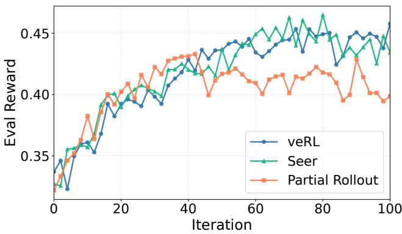  
Figure 11: Reward curves of end-to-end RL training.

## 4.4.2 End-to-End Reward

As stated in §3.1, SEER is designed to be algorithmically lossless with respect to strictly synchronous RL. To validate this property and compare the training quality of strictly and non-strictly synchronous RL, we evaluate three systems endto-end: veRL as the strictly synchronous ground truth, SEER, and Partial Rollout. All three systems train Moonlight for 100 iterations under identical hyperparameters and data, and we evaluate checkpoints every two iterations on a fixed prompt set sampled with a shared random seed.

Figure 11 reports the resulting reward curves. The curves of veRL and SEER track each other closely throughout the run, indicating that SEER preserves the training quality of synchronous RL while delivering substantial performance gains. Partial Rollout, by contrast, falls measurably behind both synchronous baselines after roughly 50 iterations and stays below them thereafter. We attribute this divergence to Partial Rollout’s bias against long-output requests, which skews the onpolicy training data toward shorter trajectories. While recent work has explored algorithmic remedies such as bounding staleness [5, 10, 26] or adjusting the training objective via importance sampling and modified clipping [5, 26, 29], synchronous RL remains necessary in many scenarios due to its algorithmic stability.

## 4.5 Extended Studies

## 4.5.1 Context-Aware Scheduling

To validate the effectiveness of length context, we conduct an ablation study by varying the length information available to SEER’s scheduler, as shown in Figure 12. Specifically, we compare: (1) No-Context, which applies only divided rollout without using length context to guide scheduling, and (2) Oracle, which obtains the actual output lengths of all requests in advance and replays the rollout iteration using these precise lengths to guide scheduling.

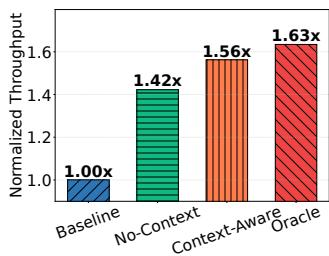  
(a) Normalized throughput.

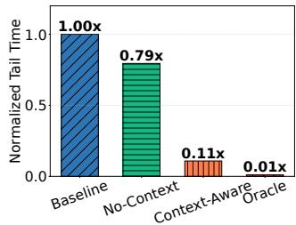  
(b) Normalized tail latency.

Figure 12: Impact of length context on improving throughput and reducing tail latency (defined in §4.2.2). No-Context applies only divided rollout without using length context to guide scheduling. Oracle obtains all output lengths in advance and applies the LFS strategy.  
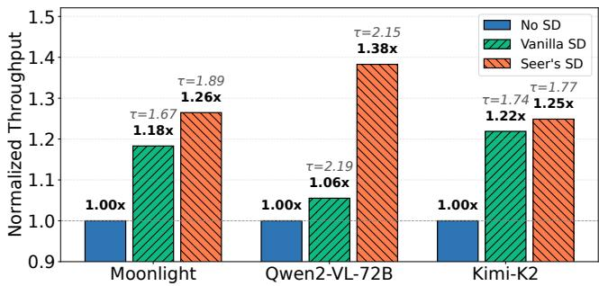  
Figure 13: Normalized throughput and mean acceptance length (τ) of SD strategies across three tasks.

While divided rollout significantly improves throughput through dynamic load balancing, the tail latency problem persists, with tail latency reduced by only 21% compared to the baseline. In contrast, context-aware scheduling leverages length prediction information from speculative requests to implement approximate longest-first scheduling, substantially reducing tail latency by 89% compared to the baseline. Compared to Oracle, context-aware scheduling achieves 96% of its throughput performance. This demonstrates that despite some performance degradation from prediction errors, context-aware scheduling still provides substantial benefits.

## 4.5.2 Adaptive Grouped Speculative Decoding

As discussed in §3.4, the benefits of speculative decoding during rollout depend on multiple factors including batch size, draft model overhead, and draft accuracy. We conduct ablation experiments on different SD strategies based on a single rollout iteration executed on veRL. As shown in Figure 13, SEER’s adaptive grouped SD consistently outperforms vanilla SD in throughput across all tasks, achieving up to 1.3× speedup. Furthermore, by leveraging group context, our approach improves the mean acceptance length by 0.22 compared to the CST-based SD method [28], and exceeds MTP’s performance. While vanilla SD with a small draft model achieves slightly higher mean acceptance length than our adaptive grouped SD, its excessive draft model overhead results in the lowest overall throughput gain.

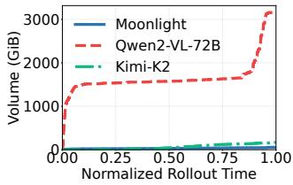

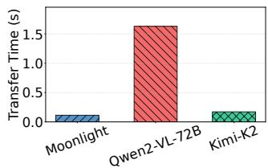  
(a) Cumulative KVCache migra- (b) Per-node time spent on KVtion volume. Cache migration.

Figure 14: Quantitative analysis of the overhead introduced by the Mooncake-based global KVCache pool used in divided rollout.  
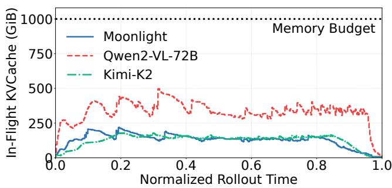  
Figure 15: Peak KVCache storage footprint across nodes for in-flight requests during a rollout iteration, reported for the most loaded node in the rollout. Memory budget denotes the DRAM capacity allocated per node for KVCache storage.

## 4.5.3 Global KVCache Pool

SEER adopts the Mooncake global KVCache pool to share KVCache across inference nodes and thereby eliminate the re-prefill cost that divided rollout would otherwise introduce. We now quantify the migration traffic and storage occupancy of this pool to assess its impact on system performance. As described in §3.2, SEER layers a cache-aware policy on top of the global KVCache pool to improve cache locality. In the experiments reported below, the scheduler declares load imbalance whenever the spread of in-flight requests across instances exceeds 32, and triggers a KVCache migration whenever the cache hit length gap between the chosen node and the best-affinity node exceeds 512 tokens.

Figure 14a reports both the frequency and the cumulative volume of KVCache migrations observed during a full rollout iteration. The cache-aware scheduling policy keeps migrations sparse throughout the rollout. Even for Qwen2-VL-72B, which carries the largest per-token KVCache among the evaluated workloads, the total migration volume reaches only about 3 TB. This volume is negligible relative to the 8×400 Gbps RDMA fabric provisioned on each node. Figure 14b further reports that the average per-node time spent on KVCache transfer remains below 0.1% of the corresponding rollout duration, and these transfers can be overlapped with GPU computation. Taken together, the migration cost of the global KVCache pool has no measurable impact on end-to-end performance.

Another concern is the storage capacity of the global KV-Cache pool. Should the pool be unable to hold the KVCache of all active requests, the resulting cache misses would force divided requests to re-prefill and degrade end-to-end performance. Figure 15 reports the aggregate KVCache footprint of in-flight requests, namely requests that have been scheduled but not yet completed. The measurement is taken at the granularity of an 8-GPU node and aggregated over the most loaded node across the rollout cluster. Even under the heaviest load observed in our workloads, the footprint never exceeds half of the allocated DRAM budget. This headroom indicates that the request-aware eviction policy keeps the working set of all active requests resident within the global pool, so capacityinduced cache misses do not arise in practice.

## 5 Related Work

RL Frameworks for LLM Post-Training. Numerous opensource RL frameworks [13, 32, 34, 42, 44, 47, 54] have been proposed to achieve both efficiency and usability, providing robust infrastructure support for both research and production RL workloads. OpenRLHF [13] and veRL [34] seamlessly integrate training and inference engines, supporting various parallelism strategies to improve RL training efficiency. ROLL [44] targets large-scale RL training optimization, enabling flexible resource allocation and heterogeneous task scheduling. Slime [54] balances high performance with flexibility, supporting highly customizable data generation pipelines. These works primarily focus on overall RL training workflow orchestration, while the long-tail problem in the rollout phase remains unaddressed. SEER complements these frameworks by providing a system-level optimization for the rollout phase, which can be integrated into existing RL frameworks to further enhance their performance.

On-Policy RL Optimization. Some efforts have been made to optimize the RL workflow at both the system and algorithmic levels. RealHF [27] dynamically reallocates model parameters and memory budgets to optimize utilization. RL-HFuse [52] proposes stage fusion to overlap reward and experience computation with the rollout long tail, thereby improving resource utilization. RLBoost [46] utilizes preemptible fragmented GPU resources to accelerate rollout at low cost.

Nevertheless, these approaches do not adequately address the long-tail latency problem. For the long-tail problem, speculative decoding [2, 6, 14, 17–20, 22, 28] is regarded as an effective optimization technique. However, these methods suffer from either high draft overhead or low accuracy in RL rollout scenarios due to dynamically changing batch sizes and continuously evolving target LLM weights. RhymeRL [11] and SPEC-RL [23] propose utilizing historical sequences generated from previous RL iterations as references to accelerate decoding. However, in most state-of-the-art model rollout scenarios, different iterations sample different data to improve generalization, leaving no historical sequences to reuse. SEER systematically elevates online group-level context as a first-class citizen in RL rollout optimization, eliminating the reliance on repeated sequences across iterations. Meanwhile, it employs an adaptive speculation policy atop a disaggregated architecture, achieving higher acceptance rates while maintaining low draft overhead.

Off-Policy RL Optimization. Recently, many works [5, 8, 10, 11, 26, 29, 33, 51, 53] have proposed RL workflows that do not maintain complete logical synchronization, trading a degree of off-policy behavior for improved RL efficiency. StreamRL [51], Areal [5], RhymeRL [11], and Laminar [33] propose asynchronous training approaches to improve resource utilization. In asynchronous RL, training and rollout are completely decoupled: rollout workers continuously generate new outputs without waiting, while training workers update the model whenever a batch of samples is collected. Other works relax the synchronization constraints of synchronous RL to achieve speedup, referred to as non-strictly synchronous RL. Partial Rollout [39, 53] defers long-tail requests to continue execution in the next rollout iteration. RollPacker [8] proposes tail batching, which schedules long-tail requests into a few designated long iterations, effectively reducing GPU idle time. While these techniques improve RL efficiency, the off-policyness inherent in these algorithms introduces risks of instability and accuracy degradation, limiting their applicability in research and production environments where algorithmic fidelity is critical. SEER significantly reduces rollout tail latency through fine-grained scheduling within the rollout phase, while maintaining consistency with on-policy algorithms.

## 6 Conclusion

In this paper, we present SEER, a synchronous RL system that accelerates the rollout process through online context learning. With divided rollout, a fine-grained and dynamically load-balanced scheduling approach, SEER leverages the similarity among requests within the same group in GRPO-like algorithms to achieve efficient scheduling and speculative decoding, while strictly maintaining consistency with on-policy RL algorithms. Experimental results demonstrate that SEER achieves up to 2.04× throughput improvement and up to 94% reduction in long-tail latency compared to the current stateof-the-art RL framework. Beyond RL rollout, SEER’s design principles constitute a system-level optimization paradigm for grouped inference that generalizes to other large-scale parallel LLM generation scenarios.

## Acknowledgments

We thank the anonymous reviewers and our shepherd for their valuable feedback. The authors affiliated with Tsinghua University are all in the Department of Computer Science and Technology, Beijing National Research Center for Information Science and Technology (BNRist), Tsinghua University, China. This work was supported in part by the Beijing Natural Science Foundation(Grant No.L252014).

## References

[1] Moontshot AI. Checkpoint engine. https://github. com/MoonshotAI/checkpoint-engine, 2025.

[2] Tianle Cai, Yuhong Li, Zhengyang Geng, Hongwu Peng, Jason D Lee, Deming Chen, and Tri Dao. Medusa: Simple llm inference acceleration framework with multiple decoding heads. arXiv preprint arXiv:2401.10774, 2024.

[3] Ke Cheng, Wen Hu, Zhi Wang, Peng Du, Jianguo Li, and Sheng Zhang. Enabling efficient batch serving for lmaas via generation length prediction. In 2024 IEEE International Conference on Web Services (ICWS), pages 853–864. IEEE, 2024.

[4] LMSYS Corp. Sglang. https://github.com/ sgl-project/sglang, 2025.

[5] Wei Fu, Jiaxuan Gao, Xujie Shen, Chen Zhu, Zhiyu Mei, Chuyi He, Shusheng Xu, Guo Wei, Jun Mei, Jiashu Wang, et al. Areal: A large-scale asynchronous reinforcement learning system for language reasoning. Advances in Neural Information Processing Systems, 38:36256–36282, 2026.

[6] Yichao Fu, Peter Bailis, Ion Stoica, and Hao Zhang. Break the sequential dependency of llm inference using lookahead decoding. arXiv preprint arXiv:2402.02057, 2024.

[7] Yichao Fu, Siqi Zhu, Runlong Su, Aurick Qiao, Ion Stoica, and Hao Zhang. Efficient llm scheduling by learning to rank. Advances in Neural Information Processing Systems, 37:59006–59029, 2024.

[8] Wei Gao, Yuheng Zhao, Dakai An, Tianyuan Wu, Lunxi Cao, Shaopan Xiong, Ju Huang, Weixun Wang, Siran Yang, Wenbo Su, et al. Rollpacker: Mitigating long-tail

rollouts for fast, synchronous rl post-training. arXiv preprint arXiv:2509.21009, 2025.

[9] Daya Guo, Dejian Yang, Haowei Zhang, Junxiao Song, Peiyi Wang, Qihao Zhu, Runxin Xu, Ruoyu Zhang, Shirong Ma, Xiao Bi, et al. Deepseek-r1 incentivizes reasoning in llms through reinforcement learning. Nature, 645(8081):633–638, 2025.

[10] Zhenyu Han, Ansheng You, Haibo Wang, Kui Luo, Guang Yang, Wenqi Shi, Menglong Chen, Sicheng Zhang, Zeshun Lan, Chunshi Deng, et al. Asyncflow: An asynchronous streaming rl framework for efficient llm post-training. arXiv preprint arXiv:2507.01663, 2025.

[11] Jingkai He, Tianjian Li, Erhu Feng, Dong Du, Qian Liu, Tao Liu, Yubin Xia, and Haibo Chen. History rhymes: Accelerating llm reinforcement learning with rhymerl. arXiv preprint arXiv:2508.18588, 2025.

[12] Jian Hu, Mingjie Liu, Ximing Lu, Fang Wu, Zaid Harchaoui, Shizhe Diao, Yejin Choi, Pavlo Molchanov, Jun Yang, Jan Kautz, et al. Brorl: Scaling reinforcement learning via broadened exploration. arXiv preprint arXiv:2510.01180, 2025.

[13] Jian Hu, Xibin Wu, Zilin Zhu, Weixun Wang, Dehao Zhang, Yu Cao, et al. Openrlhf: An easy-to-use, scalable and high-performance rlhf framework. arXiv preprint arXiv:2405.11143, 2024.

[14] Yuxuan Hu, Ke Wang, Xiaokang Zhang, Fanjin Zhang, Cuiping Li, Hong Chen, and Jing Zhang. Sam decoding: Speculative decoding via suffix automaton. In Proceedings of the 63rd Annual Meeting of the Association for Computational Linguistics (Volume 1: Long Papers), pages 12187–12204, 2025.

[15] Frank P Kelly, Aman K Maulloo, and David K Tan. Rate control for communication networks: shadow prices, proportional fairness, and stability. Journal of the Operational Research Society, 49(3):237–252, 1998.

[16] Woosuk Kwon, Zhuohan Li, Siyuan Zhuang, Ying Sheng, Lianmin Zheng, Cody Hao Yu, Joseph E. Gonzalez, Hao Zhang, and Ion Stoica. Efficient memory management for large language model serving with pagedattention. In Proceedings of the ACM SIGOPS 29th Symposium on Operating Systems Principles, 2023.

[17] Yaniv Leviathan, Matan Kalman, and Yossi Matias. Fast inference from transformers via speculative decoding. In International Conference on Machine Learning, pages 19274–19286. PMLR, 2023.

[18] Yuhui Li, Fangyun Wei, Chao Zhang, and Hongyang Zhang. Eagle-2: Faster inference of language models with dynamic draft trees. arXiv preprint arXiv:2406.16858, 2024.

[19] Yuhui Li, Fangyun Wei, Chao Zhang, and Hongyang Zhang. Eagle: Speculative sampling requires rethinking feature uncertainty. arXiv preprint arXiv:2401.15077, 2024.

[20] Yuhui Li, Fangyun Wei, Chao Zhang, and Hongyang Zhang. Eagle-3: Scaling up inference acceleration of large language models via training-time test. arXiv preprint arXiv:2503.01840, 2025.

[21] Ziniu Li, Congliang Chen, Tianyun Yang, Tian Ding, Ruoyu Sun, Ge Zhang, Wenhao Huang, and Zhi-Quan Luo. Knapsack rl: Unlocking exploration of llms via optimizing budget allocation. arXiv preprint arXiv:2509.25849, 2025.

[22] Aixin Liu, Bei Feng, Bing Xue, Bingxuan Wang, Bochao Wu, Chengda Lu, Chenggang Zhao, Chengqi Deng, Chenyu Zhang, Chong Ruan, et al. Deepseek-v3 technical report. arXiv preprint arXiv:2412.19437, 2024.

[23] Bingshuai Liu, Ante Wang, Zijun Min, Liang Yao, Haibo Zhang, Yang Liu, Anxiang Zeng, and Jinsong Su. Specrl: Accelerating on-policy reinforcement learning via speculative rollouts. arXiv preprint arXiv:2509.23232, 2025.

[24] Jingyuan Liu, Jianlin Su, Xingcheng Yao, Zhejun Jiang, Guokun Lai, Yulun Du, Yidao Qin, Weixin Xu, Enzhe Lu, Junjie Yan, et al. Muon is scalable for llm training. arXiv preprint arXiv:2502.16982, 2025.

[25] Zichen Liu, Changyu Chen, Wenjun Li, Penghui Qi, Tianyu Pang, Chao Du, Wee Sun Lee, and Min Lin. Un derstanding r1-zero-like training: A critical perspective. In Second Conference on Language Modeling.

[26] Han Lu, Zichen Liu, Shaopan Xiong, Yancheng He, Wei Gao, Yanan Wu, Weixun Wang, Jiashun Liu, Yang Li, Haizhou Zhao, et al. Part ii: Roll flash–accelerating rlvr and agentic training with asynchrony. arXiv preprint arXiv:2510.11345, 2025.

[27] Zhiyu Mei, Wei Fu, Kaiwei Li, Guangju Wang, Huanchen Zhang, and Yi Wu. Real: Efficient rlhf training of large language models with parameter reallocation. arXiv preprint arXiv:2406.14088, 2024.

[28] Gabriele Oliaro, Zhihao Jia, Daniel F Campos, and Aurick Qiao. Suffixdecoding: Extreme speculative decoding for emerging ai applications. In The Thirty-ninth Annual Conference on Neural Information Processing Systems, 2025.

[29] Alexandre Piché, Ehsan Kamalloo, Rafael Pardinas, Xiaoyin Chen, and Dzmitry Bahdanau. Pipelinerl: Faster on-policy reinforcement learning for long sequence generation. arXiv preprint arXiv:2509.19128, 2025.

[30] Ruoyu Qin, Zheming Li, Weiran He, Jialei Cui, Feng Ren, Mingxing Zhang, Yongwei Wu, Weimin Zheng, and Xinran Xu. Mooncake: Trading more storage for less computation—a KVCache-centric architecture for serving LLM chatbot. In 23rd USENIX Conference on File and Storage Technologies (FAST 25), pages 155– 170, 2025.

[31] Zhihong Shao, Peiyi Wang, Qihao Zhu, Runxin Xu, Junxiao Song, Xiao Bi, Haowei Zhang, Mingchuan Zhang, YK Li, Yang Wu, et al. Deepseekmath: Pushing the limits of mathematical reasoning in open language models. arXiv preprint arXiv:2402.03300, 2024.

[32] Gerald Shen, Zhilin Wang, Olivier Delalleau, Jiaqi Zeng, Yi Dong, Daniel Egert, Shengyang Sun, Jimmy Zhang, Sahil Jain, Ali Taghibakhshi, et al. Nemo-aligner: Scalable toolkit for efficient model alignment. arXiv preprint arXiv:2405.01481, 2024.

[33] Guangming Sheng, Yuxuan Tong, Borui Wan, Wang Zhang, Chaobo Jia, Xibin Wu, Yuqi Wu, Xiang Li, Chi Zhang, Yanghua Peng, et al. Laminar: A scalable asynchronous rl post-training framework. arXiv preprint arXiv:2510.12633, 2025.

[34] Guangming Sheng, Chi Zhang, Zilingfeng Ye, Xibin Wu, Wang Zhang, Ru Zhang, Yanghua Peng, Haibin Lin, and Chuan Wu. Hybridflow: A flexible and efficient rlhf framework. In Proceedings of the Twentieth European Conference on Computer Systems, pages 1279–1297, 2025.

[35] Mohammad Shoeybi, Mostofa Patwary, Raul Puri, Patrick LeGresley, Jared Casper, and Bryan Catanzaro. Megatron-lm: Training multi-billion parameter language models using model parallelism. arXiv preprint arXiv:1909.08053, 2019.

[36] Guijin Son, Hyunwoo Ko, Hoyoung Lee, Yewon Kim, and Seunghyeok Hong. Llm-as-a-judge & reward model: What they can and cannot do. arXiv preprint arXiv:2409.11239, 2024.

[37] Biao Sun, Ziming Huang, Hanyu Zhao, Wencong Xiao, Xinyi Zhang, Yong Li, and Wei Lin. Llumnix: Dynamic scheduling for large language model serving. In 18th USENIX symposium on operating systems design and implementation (OSDI 24), pages 173–191, 2024.

[38] Kimi Team, Yifan Bai, Yiping Bao, Guanduo Chen, Jiahao Chen, Ningxin Chen, Ruijue Chen, Yanru Chen,

Yuankun Chen, Yutian Chen, et al. Kimi k2: Open agentic intelligence. arXiv preprint arXiv:2507.20534, 2025.

[39] Kimi Team, Angang Du, Bofei Gao, Bowei Xing, Changjiu Jiang, Cheng Chen, Cheng Li, Chenjun Xiao, Chenzhuang Du, Chonghua Liao, et al. Kimi k1.5: Scaling reinforcement learning with llms. arXiv preprint arXiv:2501.12599, 2025.

[40] Meituan LongCat Team. Introducing longcatflash-thinking: A technical report. arXiv preprint arXiv:2509.18883, 2025.

[41] vLLM Team. vllm. https://github.com/ vllm-project/vllm, 2025.

[42] Leandro von Werra, Younes Belkada, Lewis Tunstall, Edward Beeching, Tristan Thrush, Nathan Lambert, Shengyi Huang, Kashif Rasul, and Quentin Gallouédec. Trl: Transformer reinforcement learning. https:// github.com/huggingface/trl, 2020.

[43] Peng Wang, Shuai Bai, Sinan Tan, Shijie Wang, Zhihao Fan, Jinze Bai, Keqin Chen, Xuejing Liu, Jialin Wang, Wenbin Ge, et al. Qwen2-vl: Enhancing vision-language model’s perception of the world at any resolution. arXiv preprint arXiv:2409.12191, 2024.

[44] Weixun Wang, Shaopan Xiong, Gengru Chen, Wei Gao, Sheng Guo, Yancheng He, Ju Huang, Jiaheng Liu, Zhendong Li, Xiaoyang Li, et al. Reinforcement learning optimization for large-scale learning: An efficient and user-friendly scaling library. arXiv preprint arXiv:2506.06122, 2025.

[45] Peter Weiner. Linear pattern matching algorithms. In 14th Annual Symposium on Switching and Automata Theory (swat 1973), pages 1–11. IEEE, 1973.

[46] Yongji Wu, Xueshen Liu, Haizhong Zheng, Juncheng Gu, Beidi Chen, Z Morley Mao, Arvind Krishnamurthy, and Ion Stoica. Rlboost: Harvesting preemptible resources for cost-efficient reinforcement learning on llms. arXiv preprint arXiv:2510.19225, 2025.

[47] Zhewei Yao, Reza Yazdani Aminabadi, Olatunji Ruwase, Samyam Rajbhandari, Xiaoxia Wu, Ammar Ahmad Awan, Jeff Rasley, Minjia Zhang, Conglong Li, Connor Holmes, et al. Deepspeed-chat: Easy, fast and affordable rlhf training of chatgpt-like models at all scales. arXiv preprint arXiv:2308.01320, 2023.

[48] Qiying Yu, Zheng Zhang, Ruofei Zhu, Yufeng Yuan, Xiaochen Zuo, Yu Yue, Weinan Dai, Tiantian Fan, Gaohong Liu, Lingjun Liu, et al. Dapo: An open-source llm reinforcement learning system at scale. arXiv preprint arXiv:2503.14476, 2025.

[49] Chujie Zheng, Kai Dang, Bowen Yu, Mingze Li, Huiqiang Jiang, Junrong Lin, Yuqiong Liu, An Yang, Jingren Zhou, and Junyang Lin. Stabilizing reinforcement learning with llms: Formulation and practices. arXiv preprint arXiv:2512.01374, 2025.

[50] Chujie Zheng, Shixuan Liu, Mingze Li, Xiong-Hui Chen, Bowen Yu, Chang Gao, Kai Dang, Yuqiong Liu, Rui Men, An Yang, et al. Group sequence policy optimization. arXiv preprint arXiv:2507.18071, 2025.

[51] Yinmin Zhong, Zili Zhang, Xiaoniu Song, Hanpeng Hu, Chao Jin, Bingyang Wu, Nuo Chen, Yukun Chen, Yu Zhou, Changyi Wan, et al. Streamrl: Scalable, heterogeneous, and elastic rl for llms with disaggregated stream generation. arXiv preprint arXiv:2504.15930, 2025.

[52] Yinmin Zhong, Zili Zhang, Bingyang Wu, Shengyu Liu, Yukun Chen, Changyi Wan, Hanpeng Hu, Lei Xia, Ranchen Ming, Yibo Zhu, et al. Optimizing RLHF training for large language models with stage fusion. In 22nd USENIX Symposium on Networked Systems Design and Implementation (NSDI 25), pages 489–503, 2025.

[53] Yuzhen Zhou, Jiajun Li, Yusheng Su, Gowtham Ramesh, Zilin Zhu, Xiang Long, Chenyang Zhao, Jin Pan, Xiaodong Yu, Ze Wang, et al. April: Active partial rollouts in reinforcement learning to tame long-tail generation. arXiv preprint arXiv:2509.18521, 2025.

[54] Zilin Zhu, Chengxing Xie, Xin Lv, and slime Contributors. slime: An llm post-training framework for rl scaling. https://github.com/THUDM/slime, 2025. GitHub repository. Corresponding author: Xin Lv.

## A Implementation Details of SEER

## A.1 Context-Aware Scheduling Algorithm

Algorithm 2 presents the context-aware scheduling workflow built on top of divided rollout. The algorithm is invoked continuously by SEER’s global scheduler, each time returning a scheduling decision (r⋆, i⋆) that assigns the selected request r⋆ to an inference instance i⋆, until all requests are completed.

Algorithm 2 Context-Aware Scheduling based on Divided   
Rollout   
Require: Active requests R = {rg,i} grouped by prompt g; group  
level length estimates {L }; inference instances I with KV  
usage telemetry.   
Ensure: A scheduling decision (r⋆, i⋆) with r⋆ ∈ R and i⋆ ∈ I .   
1: for all rg,i ∈ R do   
2: if rg,i is finished then   
3: Lg ← UPDATEESTIMATE(Lg,Lg,i)   
4: remove rg,i from R   
5: else if rg,i is the group’s speculative request then   
6: keep in high-priority queue Qspec   
7: else   
8: add to low-priority candidate set Crest   
9: r⋆ ← None   
10: if ¬ISEMPTY(Qspec) then   
11: r⋆ ← PICKSFS(Qspec) ▷ smallest generated length first   
12: else if ¬ISEMPTY(Crest) then   
13: r⋆ ← PICKLFS(Crest) ▷ largest Lg first   
14: else   
15: return all requests are finished   
r⋆.max\_tokens ← minchunk\_size,   
16:   
r⋆.ori\_max\_tokens − r⋆.generated\_tokens   
17: i⋆ ← SELECTINSTANCE(I ,r⋆.max\_chunk\_tokens,KV-usage)   
18: if i⋆ ̸= None then   
19: return (r⋆, i⋆)   
20: return no available instance for this cycle

## A.2 Workflow of Distributed Grouped Draft Server

To minimize speculative decoding latency in the critical path, Distributed Grouped Draft Server (DGDS) adopts asynchronous updates and employs a distributed master-worker architecture for global sharing of grouped context, as illustrated in Figure 6. The system operates through four key steps, with core APIs listed in Table 5 and Table 6:

1) Asynchronous Append: Each inference instance runs an independent process to handle output tokens. When newly generated tokens are produced, the instance invokes the update\_cst API to send them to DGDS, identified by group\_id. To reduce communication overhead, each request batches a fixed number of tokens before sending updates, which has negligible impact on draft token quality.

2) Global Aggregation: DGDS aggregates token updates from requests belonging to the same group. To prevent crossrequest interference, DGDS isolates updates by request\_id, mapping each new token only to the corresponding local path in the CST.

3) Periodic Fetch: Each inference instance embeds a draft client as a library component that periodically synchronizes the latest CST from DGDS. The client registers active request groups via register\_group and then periodically invokes fetch\_cst to retrieve the latest CSTs for these groups. To reduce communication overhead, the client supports incremental synchronization based on local cache states.

4) Local Speculation: Inference instances perform speculation based on their local CSTs by invoking the batch\_speculate API. The local CSTs aggregate paths from all requests within the same group, enabling instances to share contextual statistics and obtain higher-quality draft tokens.

Table 5: Grouped draft server API.  
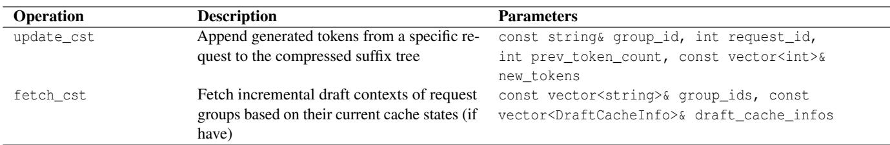

Table 6: Draft client API.  
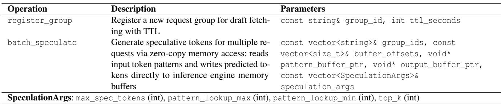