USENIX

THE ADVANCED COMPUTING SYSTEMS ASSOCIATION

# All Along the Watchtower: Achieving the Trinity of Observability in Cloud with DiTing

Zhenyu Ren and Shuzhi Feng, Alibaba Group; Erci Xu, Shanghai Jiaotong University; Changsheng Niu, Haoyu Mao, Beibei Wang, Chong Gao, Zhenshan Zhang, Xinrui Yu, Jiangwei Huang, Jiesheng Wu, and Hong Tang, Alibaba Group

https://www.usenix.org/conference/osdi26/presentation/ren

# This paper is included in the Proceedings of the 20th USENIX Symposium on Operating Systems Design and Implementation.

July 13–15, 2026 • Seattle, WA, USA

ISBN 978-1-939133-55-7

Open access to the Proceedings of the 20th USENIX Symposium on Operating Systems Design and Implementation is sponsored by

# All Along the Watchtower: Achieving the Trinity of Observability in Cloud with DiTing

Zhenyu Ren1, Shuzhi Feng1, Erci Xu2\*, Changsheng Niu1, Haoyu Mao1, Beibei Wang1, Chong Gao1, Zhenshan Zhang1, Xinrui Yu1, Jiangwei Huang1, Jiesheng Wu1, Hong Tang

1 Alibaba Group

2 Shanghai Jiao Tong University

## Abstract

Observability is crucial for diagnosing and troubleshooting cloud systems as they grow in scale and complexity. However, telemetry data are often stored and processed in siloed systems, leading to high latency, redundant data movement, and low operational efficiency. To address these challenges, we present DiTing, an observability framework that unifies the storage and processing of heterogeneous telemetry data, including logs, metrics, and traces. The key idea of DiTing is to harvest underutilized cloud resources for cost-effective processing while relying on centralized storage systems for reliable data persistence and failover. We have deployed DiTing in production at scale, and DiTing can achieve subsecond data ingestion, high-throughput query processing, and up to 65× lower CapEx than existing solutions.

## 1 Introduction

Modern cloud computing has been advancing in scale (e.g., globally distributed data centers) [7, 11, 2], heterogeneity (e.g., diverse workloads and new hardware) [19, 37, 31], and disaggregation (i.e., compute-to-storage architectures) [45, 29]. As cloud systems evolve, software bugs [30, 42], performance issues [44, 28], and hardware failures [24, 23, 21] have become more prevalent and harder to diagnose.

Observability via telemetry is crucial for diagnosing and troubleshooting cloud systems. Typical telemetry data include traces [38], logs [20], and metrics [33]. Specifically, traces provide detailed information about execution, logs record events that occur during execution, and metrics summarize quantitative measurements of system behavior.

These three types of telemetry are complementary and often used together for diagnosis. For example, consider a site reliability engineer (SRE) investigating a performance issue such as slow I/Os in a cloud virtual disk. The SRE may first be alerted by abnormal metrics. The SRE then examines endto-end traces (e.g., from the user’s VM to the physical disks) to narrow down the problematic component. Finally, after locating a likely culprit (e.g., a misbehaving switch), the SRE can cross-check device logs to determine the root cause and apply a fix.

The example highlights the need for multiple perspectives on observability, yet it also reveals a bleak reality. In today’s cloud environments, SREs often have to use multiple systems with different query languages and manually correlate data sources with custom scripts for a single investigation. This friction stems from the fact that telemetry datasets are typically stored and processed in separate infrastructures, such as Dapper [38] for traces, LogStore [20] for logs, and Prometheus [33] for metrics. Such siloing not only creates operational barriers for SREs but can also degrade performance due to high latency and excessive data transfer.

It is therefore tempting to host and process different types of telemetry data in a single system. Such a trinity of logs, traces, and metrics would eliminate much of the manual effort and allow users to query telemetry with a holistic view of an incident. Inspired by this vision, we explored several paths toward unified observability.

We first unified query processing while leaving data in their original storage systems, for example by adopting a data-lake approach (e.g., Iceberg [5] and Delta Lake [17]). While this provides a unified interface without moving the data, it falls short in performance because the different types of telemetry remain scattered, incurring substantial data-transfer overhead. Second, hyperscalers (e.g., Kraken [26], Monarch [15], and Scuba [14]) have built inmemory NewSQL databases to enable fast queries. Although these systems deliver strong performance by keeping processing in memory, they are impractical for us: the total cost of ownership (TCO) is prohibitively high given the volume of logs and traces that would need to be processed and stored in memory. Finally, we attempted to build our observability framework on an open-source OLAP system, ClickHouse, and managed to deploy it on around 600 physical nodes. However, when scaling to serve the entire cloud, CPU and memory quickly became bottlenecks. Simply provisioning more CPU and memory would increase infrastructure CapEx by more than 20%.

Our initial explorations, though unsuccessful, led to several observations. First, when building a centralized system to unify observability, the main bottleneck is not storage capacity but limited CPU and memory for processing. Second, as a cloud vendor, our server fleet is often underutilized, leaving substantial resources available for harvesting.

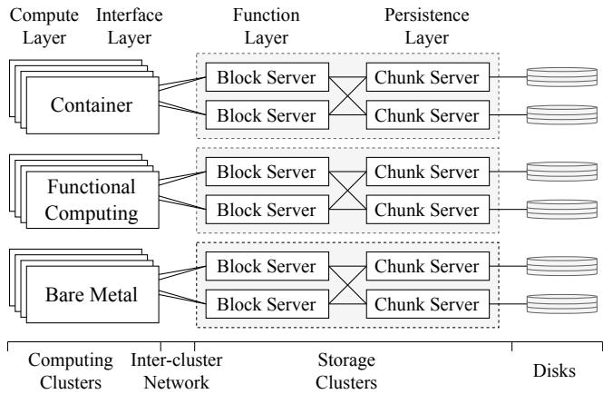  
Figure 1: Overview of our cloud architecture (§2.1).

However, a fully harvested design is infeasible because end nodes may become unavailable during traffic bursts or failures. Third, telemetry queries exhibit strong temporal locality (i.e., most queries target recently generated data) and spatial locality (i.e., processing queries close to where the data are generated to minimize data transfer).

Based on these lessons, we propose DiTing, an observability infrastructure that unifies the storage and processing of heterogeneous telemetry data. DiTing is a hybrid query framework that combines AZ-level centralized services with node-level resource harvesting. DiTing has three layers: a global layer that serves as the entry point for SREs, an availability-zone (AZ) layer that provides centralized storage and fallback execution, and a node layer that processes queries using harvested resources. On top of this architecture, DiTing incorporates a set of optimizations, including multi-level indexing and pre-aggregation.

Our evaluation shows that DiTing achieves sub-second data ingestion, 2K QPS using a single CPU core, and 3-65× lower capital expenditure (CapEx) than existing solutions. DiTing has been deployed at production scale, serving millions of servers with millions of QPS and storing up to hundreds of PiB of data.

## 2 Background

## 2.1 Our Cloud Architecture

Our cloud offers various services such as computing (e.g., virtual machines), storage (e.g., object storage), and SaaS (e.g., MySQL). At a high level, our cloud spans the globe. Each region consists of multiple availability zones (AZs), and each AZ is a separate data center with multiple clusters.

In Figure 1, we highlight the compute-to-storage architecture across clusters. The computing layer consists of physical servers that provide a variety of services, such as containers, serverless functions, and bare-metal instances. The interface layer comprises clients in the compute-node hypervisor which receives users’ requests (to remote storage) and packages them into network packets. The function layer consists of servers that process incoming requests and interact with the persistence layer to store or retrieve data. The persistence layer is a distributed storage system. The network between the interface and function layers is inter-cluster, whereas the network between the function and persistence layers is intra-cluster.

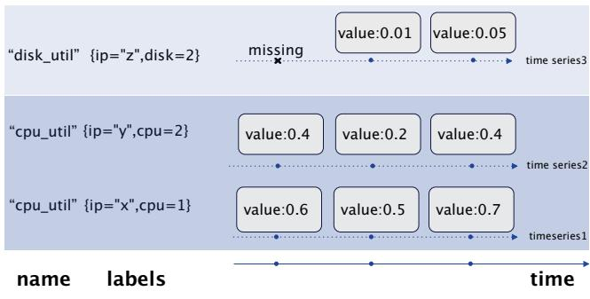  
Figure 2: An example metric record (§2.2).

## 2.2 Metrics

Metrics record quantitative measurements of a system, such as health, performance, and behavior. A metric typically includes a name, a set of labels, and one or more values. The name specifies the type of measurement (e.g., CPU utilization), and labels encode contextual information such as location (e.g., CPU #1 on a node with IP address 192.154.123.77). Values form a time series (e.g., 60% at 00:10). Due to their simplicity and broad coverage, metrics often serve as the first-line signal for detecting system anomalies in the field.

Metrics do not consume an exceedingly large amount of storage. As of today, the total compressed size of stored metrics in our cloud is only several PB. However, metrics are often challenging to query. Besides common metrics, each service may export its own attributes, resulting in a highdimensional space (i.e., many distinct metric types, such as CPU, memory, and NIC utilization). Moreover, users often query across multiple dimensions and over long time ranges (hours to days), which requires scanning and aggregating substantial amounts of data. Therefore, maintaining high queries per second (QPS) at low latency for metric workloads remains challenging.

## 2.3 Logs

Logging records events across the software, hardware, and network stack. A log entry typically contains a timestamp, a severity level (e.g., INFO or CRITICAL), and a message. In Figure 3, we show an example log entry from a network library. Traditionally, logs are unstructured, but we have recently adopted structured logging (e.g., JSON) to facilitate parsing and querying.

In our cloud, logs are widely used for debugging and troubleshooting. In practice, system reliability engineers (SREs) are often first alerted by abnormal metrics and then inspect logs to identify the root cause. Log volume is large: the daily ingestion rate is at the PB scale, and the total stored log data reaches hundreds of PB. Note that most logs are generated by users and thus cannot be discarded.

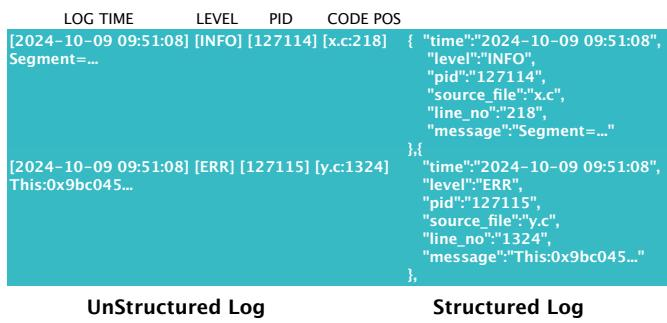  
Figure 3: An example log record (§2.3).

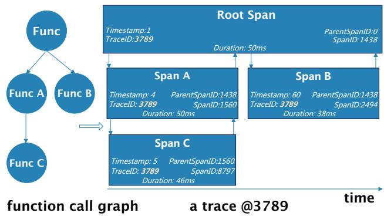  
Figure 4: An example chain of trace records (§2.4).

## 2.4 Traces

In contrast to point-in-time event records such as logs, tracing provides a fine-grained view of system behavior by recording sequences of events together with timing information. For example, Figure 4 shows a trace of a function call that triggers three sub-procedures. An end-to-end trace consists of multiple spans, each representing a procedure (e.g., Functions A, B, and C).

In our cloud, we primarily use tracing to understand complex call relationships within and across services. Trace data are typically large, with PB-scale daily ingestion, and the total stored volume has reached nearly one hundred PB. To minimize overhead on critical components, we often use static instrumentation (i.e., embedding tracing APIs into source code) to collect traces, making them schema-based. Trace queries usually have low QPS (e.g., tens per second), are range-based (e.g., querying traces within a time window), and focus on short intervals (e.g., up to 30 minutes).

## 3 Motivation

## 3.1 A Day in SRE’s Life

Maintaining high observability in the cloud is crucial but challenging. Unlike single nodes or small clusters, diagnosing bugs in a geo-distributed service can span multiple layers (e.g., interface and persistence) and involve different clusters (e.g., compute and storage), protocols (e.g., TCP and RDMA), and types of telemetry (e.g., logs, metrics, and traces). Next, we use a recent real-world case for demonstration (with certain details redacted for confidentiality).

Liam is an SRE on our Elastic Block Storage (EBS) team. He receives an alert from the metrics monitoring system indicating a surge of slow requests in a cluster hosting over 4,000 virtual disks. The slowness is worsening and may trigger failures (e.g., I/O hangs), potentially impacting several large customers and thousands of smaller ones.

Liam first double-checks the metrics by logging into the monitoring service ( 1 in Figure 5). After confirming severe latency degradation in virtual disks ( 2 ), he scans other metrics (e.g., network throughput and disk IOPS) and finds that cluster-level metrics remain normal, but the top-of-rack switch reports CRC errors ( 3 ). To further narrow down the culprit, he switches to the tracing service to follow the request path along the network topology ( 4 ) and cross-checks logs from each component ( 5 ). Finally, he identifies a BGP down event on a second-layer switch (i.e., PSW), caused by a power failure ( 6 ). He then applies a hotfix to the PSW to prevent escalation ( 7 ).

This incident highlights the complexity of debugging in the cloud. SREs often need to correlate telemetry sources— metrics, logs, and traces—across layers and clusters to confirm symptoms, delineate the blast radius, and identify the root cause. While SREs can develop scripts to assist analysis, these scripts are often ad hoc and hard to reuse across different incidents.

## 3.2 Why Not Use or Adapt Existing Solutions?

Ideally, SREs would like a unified system that handles both the processing and storage of telemetry data from different sources. With such a system, SREs would no longer need to switch between observability platforms (e.g., Prometheus and Monarch) and correlate results using ad hoc scripts. Moreover, integrating processing with persistence can reduce data-transfer overhead, enabling better query performance and storage efficiency. Next, we discuss why existing solutions are infeasible to port to our cloud. In particular, we describe a failed attempt in which we deployed more than 600 nodes but could not scale further.

Unifying computation only. One intuitive approach is to adopt a data lake solution (e.g., Iceberg [5], Hive [40], Hudi [4], and Doris [3]). This approach keeps different data sources (e.g., logs, traces, and metrics) in their original systems while providing a unified processing interface (e.g., via

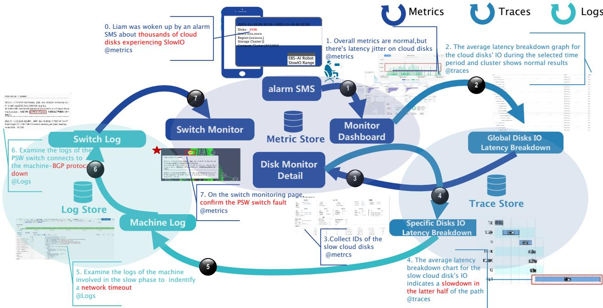  
Figure 5: A Day in SRE’s Life.(§3.1).

Apache Spark). While this is inexpensive to implement because it largely reuses existing ingestion and storage infrastructure, it can lead to high query latency. For example, a typical diagnosis in our cloud may require scanning more than 100 GB of data, which can take tens of seconds (or even minutes) due to network transfers [18]—far slower than the sub-second latency that SREs expect.

Unified storage in memory. For high performance, an alternative is to adopt an in-memory solution, which is common among hyperscalers (e.g., Scuba [14] and Kraken [26] at Meta, and Google’s Monarch [15]). These systems are essentially in-memory time-series databases and primarily target metric workloads. On the one hand, they provide fast queries and low ingestion latency (e.g., hundreds of milliseconds in Kraken/Monarch). On the other hand, they are prohibitively expensive at our scale, especially when storing hundreds of PB of telemetry data. Therefore, we do not adopt an in-memory-only design.

ClickHouse: a failed attempt. The above analysis led us to build an OLAP-based solution on top of a set of geo-distributed dedicated clusters, aiming to unify processing and storage with high performance. We chose Click-House [35], an open-source OLAP system with strong community support, and started building the service in 2022. At that time, we scaled the deployment to eight clusters across multiple availability zones (AZs), totaling more than 600 nodes (detailed node configuration is listed in §5). The system stored about 8 PB of observability data, including traces and metrics from multiple services.

When attempting to scale ClickHouse further, we encountered several critical challenges. First, ClickHouse bottlenecks when hosting more than one million partitions for a single service [1]; monitoring data from many components across a large fleet can easily exceed this limit. Second, ClickHouse’s memory usage grows with the number of columns. Many of our servers produce metric data with thousands of columns, and the per-node memory usage in several clusters reached around 85%, even causing out-of-memory (OOM) events when scanning large amounts of data. These issues indicate that the main constraints are CPU and memory rather than storage capacity. Simply provisioning more CPU and memory is not feasible: our estimates suggest that doing so would account for more than 20% of the cloud infrastructure CapEx.

Alternative-1: a cloud-backed system. One possibility is to use a cloud database (e.g., Snowflake [22] or Amazon Redshift [25]) and adopt a serverless computing model. This disaggregates compute and storage, allowing us to elastically allocate CPU and memory while using object storage as the backend. In principle, this can improve cost efficiency by reducing over-provisioning. However, it introduces a circular dependency (i.e., relying on the cloud to monitor the cloud) and is therefore not feasible in practice.

Alternative-2: harvesting the cloud. Clouds often have abundant idle resources, which makes harvesting appear attractive. In this approach, we push queries to the nodes where observability data are generated and use on-node resources (e.g., CPU and disk) for processing and temporary storage, reducing both data transfer and CapEx. However, end nodes are not always available (e.g., node crashes or insufficient resources during traffic bursts). Worse, failures and busy periods are often exactly when SREs need observability the most. Moreover, unlike centralized storage where data can be replicated easily, end nodes are more susceptible to data loss due to disk failures or software-induced corruption.

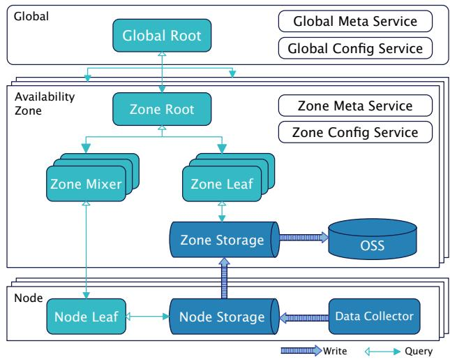  
Figure 6: Overview of DiTing (§4.1).

## 4 DiTing

Key idea. We now present the key idea behind DiTing, a unified framework for processing and storing telemetry data at cloud scale. Our failed attempt to scale a centralized ClickHouse deployment, together with the limitations of relying solely on idle end-node resources, motivates a hybrid design that combines a centralized system with node-level resource harvesting. We refer to this design as Central–Node Collaboration (CNC). After receiving a query, CNC first attempts to push it down to the relevant nodes for in-situ processing. If this fails (e.g., due to node crashes), CNC falls back to the centralized system to execute the query.

Benefits. CNC leverages both spatial and temporal locality in observability workloads. Spatially, it pushes queries to the nodes where the target data are generated. Temporally, SREs most often query recently generated data (e.g., from the last hour or week). CNC therefore keeps recent data on nodes and periodically uploads them to the centralized system for long-term storage. As a result, most queries can be served in situ using harvested resources (e.g., CPU and memory), reducing data transfer overhead and infrastructure CapEx. Meanwhile, the centralized system provides durable storage and serves as a reliable fallback when target nodes are unreachable, improving availability.

## 4.1 Architecture.

These benefits lead to two design goals: (1) accurate query pushdown and (2) minimizing the use of centralized resources for query processing. To achieve these goals,

DiTing adopts a three-layer architecture consisting of the Global, Availability Zone (AZ), and Node layers, as shown in Figure 6. Note that DiTing serves multiple cloud services (e.g., Elastic Block Service, Object Store Service, and Elastic Compute Service) using the same set of clusters, rather than maintaining service-specific dedicated fleets; this also enables cross-service debugging.

Global. This layer serves as the entry point for queries. Requests that do not specify a target AZ are sent to Global Root, which locates the corresponding AZs for execution. To sustain high QPS, Global Root neither processes queries nor stores data; it only forwards requests. Routing relies on the Global Meta Service, which maintains mappings (e.g., from a virtual disk ID to the physical nodes and disks that store its data). DiTing also uses the Global Config Service to manage configurations such as node-level resource limits and the upload interval for node telemetry to AZ-level centralized storage. To balance load and avoid a single point of failure, we deploy multiple Global Root instances across AZs.

AZ. In this layer, DiTing maintains an AZ-level centralized system, typically consisting of 20–100 dedicated physical machines for query processing and observability-data storage. All nodes share the same configuration. The system usually includes three dedicated zone-root nodes that form a Raft group for high availability. The remaining nodes act as zone-mixer and zone-leaf nodes, which are interchangeable. Upon receiving queries from the global layer, DiTing builds a query tree, partitions the query via zone-root and zonemixer (i.e., non-leaf) nodes, and pushes sub-queries down to node-level leaf nodes for execution. If pushdown fails (e.g., due to an error or timeout), DiTing falls back to executing the query on an AZ-level leaf node. Periodically, the AZ layer receives observability data uploaded from underlying nodes for long-term persistence. These data are stored on non-root nodes (i.e., zone-mixer and zone-leaf nodes). For higher reliability, DiTing can optionally store an additional copy in the Object Store Service (OSS) within the same AZ. To support different deployment scenarios, the AZ layer manages metadata and configuration through the AZ Metadata Manager and the AZ Configuration Manager.

Node. Subject to the resource limits enforced by the Global or AZ layer, DiTing harvests idle resources on each node to execute pushed-down queries. Typically, after queries are split and scheduled by the upper layers, sub-queries are pushed down to the node layer for processing. Each node also runs an agent, called the Data Collector, which collects observability data including metrics, traces, and logs. DiTing caches recently ingested data, persists it locally on harvested disks, and periodically uploads it to the AZ layer.

## 4.2 Data Model: co-Log

co-Log format. We now describe DiTing’s data format. For metrics, traces, and logs, we use a unified format called co-Log. To provide a familiar and simple query interface, DiTing supports standard SQL; therefore, telemetry data are organized as relational tables.

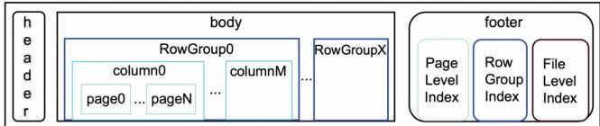  
Figure 7: co-Log data format (§4.2).

• Metrics. We adopt a multi-value model in which each timestamp is associated with multiple measurements. In a metric table, the first column is the timestamp, and the second column stores labels, i.e., location information (e.g., IP address, hostname, and cluster ID) of the node producing the data. Columns 3 onward store different measurement types (e.g., CPU and memory utilization). A node typically reports 10K–20K metric types. Every 15 seconds, a new row is appended.

• Traces. Traces are stored as spans. In a trace table, the first column is the span ID, the second is the timestamp, the third is the parent span ID, the fourth is the trace ID (assigned by the root span), and the last column is the span duration. Each span inserts one row. In Figure 4, there would be four tables corresponding to the root, A, B, and C spans.

• Logs. Logs are stored as table entries. Columns include timestamp, location (as in metrics), log severity level, and message body.

Each table is stored as a co-Log file. Similar to Parquet [41] and ORC [6], co-Log uses a PAX (partitionattributes-across) layout: it splits a co-Log file into fixed-size row groups, each containing multiple columns, resulting in a hybrid of row and columnar storage. Each column is further divided into pages to facilitate lookup. To avoid ambiguity in query results [15], we enforce schemas for metrics and traces. For logs, DiTing allows users to specify regular expressions or rules to extract structured fields from unstructured log messages.

We also extend co-Log to store metadata. In DiTing, metadata map telemetry data to their physical locations, enabling accurate query pushdown. co-Log stores metadata in a header and a footer: the header records file size and compression type, and the footer stores indexing information at multiple granularities (file, row group, column, and page).

co-Log features. Beyond standard columnar-storage features, co-Log is tailored to observability workloads. First, SRE queries heavily depend on temporal and spatial attributes. For example, when debugging performance issues, SREs often correlate metrics, traces, and logs within a specific time range and location (see §3.1). Hence, co-Log indexes temporal and spatial fields by default during ingestion.

Second, our dataset exhibits a wide-table pattern: while the number of columns can be very large (up to tens of thousands), most queries touch only a small subset (typically around ten columns). Moreover, the hot columns can change over time (e.g., focusing on IOPS and latency during peak events and shifting to failure-related signals during normal periods). To support efficient indexing and adapt to such changes, co-Log stores multi-level indexes (file, row group, column, and page) together in the file footer. For the same reason, schema access is highly skewed and random, with a small set of columns being queried frequently. Unlike Parquet/ORC, we therefore avoid using ProtoBuf [13] or Thrift [39] for metadata serialization; instead, we use a raw format to enable faster access. The larger metadata size is acceptable in our high-speed datacenter networks.

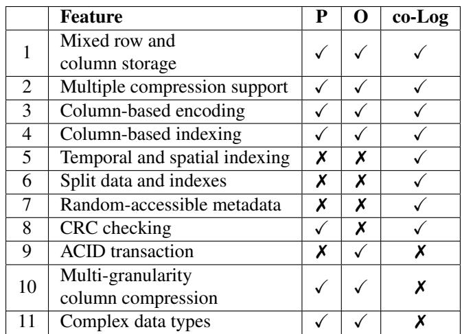  
Table 1: Comparison between co-Log and parquet/ORC. P refers to parquet and O refers to ORC (§4.2).

Third, to accommodate frequent hardware changes and software upgrades, co-Log supports schema evolution (e.g., adding new columns) without breaking existing queries. For reliability, we also enforce CRC checking (Table 1, row 8) on both metadata and data to detect silent corruption.

co-Log intentionally omits several features to reduce complexity and overhead. For example, it does not provide strong ACID guarantees (Table 1, row 9), since telemetry workloads can tolerate short-term unavailability and minor inconsistencies. We also do not implement “multigranularity”column-level compression: given modern highcapacity SSDs, we trade space for query performance. Finally, we do not support complex types (e.g., arrays and maps), which are rarely needed for observability and incur high processing overhead.

## 4.3 Optimizing Querying

Procedure. We now walk through the query execution flow in DiTing. SREs can either send a query to a global root for cross-AZ lookup or directly to a target AZ. After receiving the query, the zone root in the corresponding AZ first estimates the load (i.e., how many nodes the query should be pushed to), builds a query tree, and asks zone mixers to identify the specific nodes that hold the target data. DiTing then pushes sub-queries down to these nodes, which execute them using harvested CPU and memory. If pushdown fails (e.g., due to inaccessible nodes or timeouts), DiTing reroutes the query to an AZ-level zone-leaf node for execution. In production, only about 1% of queries fall back to zone-leaf execution. Finally, the zone root aggregates the results and returns them to the user. Next, we highlight key optimizations.

Building the query tree. After receiving a query (either forwarded by the global root or submitted directly by an SRE), DiTing constructs a zone-level query tree consisting of three node types: root, mixer (internal), and leaf. Two key parameters are the tree height and the fan-out. Prior work proposes heuristic policies for choosing these parameters. For example, Monarch [15] uses a fixed height of 3, whereas Kraken [26] dynamically adjusts fan-out to balance parallelism (higher fan-out) against straggler impact (i.e., by lowering fan-out).

A recent study [35] shows that query latency, while largely insensitive to fan-out, scales logarithmically with the number of leaf nodes involved. Based on this insight, DiTing first determines whether a query requires aggregation. If so (e.g., an AZ-level aggregation), and the query needs to be pushed to N nodes, DiTing sets the fan-out to min(N,1000). Otherwise (e.g., scan queries), it sets the fan-out to N. This is because, unlike Monarch and Kraken, DiTing must support aggregation-heavy queries that span multiple telemetry types (logs, traces, and metrics) and potentially involve millions of nodes. Such queries can impose substantial aggregation load on mixer nodes; we therefore cap fan-out at 1000.

Query pushdown. Pushing query processing to where the target data reside is a classic approach. Prior systems such as Monarch [15] reuse schema fields (e.g., location) to select target nodes by matching them against query predicates. They also employ Bloom-filter-like indexes (e.g., Monarch’s Field Hints Index (FHI) [15]) to speed up target selection.

DiTing does not follow this practice due to precision requirements. If a query is pushed to the wrong nodes (e.g., due to Bloom-filter false positives), the resulting latency penalty and traffic amplification are significant and unacceptable at scale. Instead, DiTing achieves accurate query pushdown by aligning its hierarchy (global, AZ, and node) with the cloud’s physical infrastructure (region, AZ, cluster, and node; see §2.1). Each node has an IP address, and its hostname encodes the cluster name. DiTing therefore uses IP and cluster information, together with metadata, to precisely locate target data. For example, hardware components (e.g., NICs and SSDs) have fixed physical locations (e.g., installed on a specific node). For logical entities (e.g., a virtual disk in EBS), DiTing maintains mapping tables (e.g., from a virtual-disk ID to the physical nodes and disks that store its data) and periodically refreshes these mappings from the corresponding services (e.g., EBS block masters).

Query pushdown is not always successful because target nodes may be temporarily unavailable (e.g., due to network partitions or traffic bursts). DiTing therefore provides three fallbacks. First, if a node is deemed unavailable before pushdown (e.g., missing heartbeats), DiTing directly executes the query on AZ-level leaf nodes. Second, if a node becomes unavailable after pushdown, a configurable timeout triggers rerouting to AZ-level leaf nodes. Third, if a node is responsive but overloaded, DiTing switches the node to a fetchonly mode (Figure 6), where the node returns only the latest data and AZ-level leaf nodes complete the computation.

Metadata pushdown. DiTing stores metadata at the global and AZ layers to enable query pushdown. However, node-level execution may still require metadata for joins and filters. For example, a query may join disk traces with disk metadata (e.g., user ID) that would otherwise reside at the global or AZ layer, forcing additional round trips and increasing latency and network overhead.

To avoid this, DiTing slices metadata by node IP and pushes the relevant partitions down to nodes. We first allow users to declare which metadata fields can be associated with nodes. DiTing then combines these metadata with the physical-location table to construct a spatial partitioning scheme, partitions the metadata accordingly, and pushes each partition to the corresponding nodes. This reduces query latency by 33% and lowers node-side CPU utilization from about 45% to 16%, while incurring only a small additional memory overhead (a few MB per node).

Limiting node-level resource usage. DiTing harvests idle node resources for query processing and temporary storage, which requires resource management to avoid interfering with tenant workloads. DiTing therefore enforces userconfigurable limits (set at the global and AZ layers) on CPU, memory, and disk usage. To tolerate traffic bursts, users can also specify a short grace period during which resource usage may exceed the thresholds. Severe or sustained limit violations trigger termination of the node-level DiTing agent.

## 4.4 Optimizing Ingestion

Procedure. All types of observability data—metrics, traces, and logs—are generated on end nodes and formatted as co-Log files. Node-level agents insert metric entries by computing the corresponding statistics every 15 seconds (e.g., average or maximum). Trace and log entries are appended upon function calls and log events. Periodically, node-level agents merge co-Log files and upload them to the AZ layer for persistence. Optionally, the AZ layer can also send a copy of the uploaded data to the object store service for higher reliability.

Node-level in-memory buffer. User access exhibits strong temporal locality: most queries target recently generated data. We therefore implement a fixed-size, node-level inmemory buffer to cache the latest data, prioritizing low latency and low cost. AZ-level leaf nodes do not maintain such a buffer because temporal/spatial locality are weaker there.

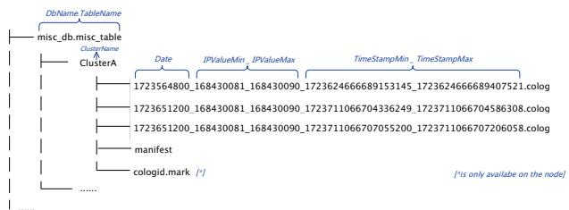  
Figure 8: co-Log file layout (§4.4).

Surprisingly, for a server that produces 20K distinct metrics (an extreme case), a 900 MiB per-node buffer achieves cache hits for over 99.9% of queries. Even on nodes with fewer idle resources, we find that a 100 MiB buffer is sufficient to reach a hit ratio of around 90%. This effectively provides an in-memory-database experience for most queries.

Pre-aggregation for metrics. Beyond short-term monitoring, SREs often query metrics over long time ranges (e.g., weeks or months) to understand trends. Returning raw 15- second-granularity data would incur high storage and processing overhead while providing limited additional insight. For example, querying a VM’s CPU utilization over the past 30 days at 15-second granularity yields 172,800 points, placing a heavy burden on node resources and network traffic. DiTing therefore supports pre-aggregation for metrics, computing aggregates such as average, sum, max, and min at coarser granularities (e.g., 1 minute, 5 minutes, and 1 hour). This optimization applies only to metrics.

File merge. In DiTing, because end nodes periodically upload co-Log files to the AZ layer (every 1 minute by default), the AZ layer must provide durable storage for a massive number of co-Log files (e.g., billions). This creates a substantial maintenance burden. However, we cannot simply merge all files into large ones, because doing so would erase spatial information (i.e., metadata used to enable accurate query pushdown). DiTing therefore employs a twostep merging strategy. First, we merge row groups (Figure 8) from files produced by the same server, and attach the server IP to each row group’s metadata. Next, we merge row groups from servers in the same cluster into a single co-Log file, sort the row groups by IP address, and append cluster information and an IP-to-zone map to the file footer. This design also guides the folder structure in Figure 8: the directory structure is flat, and the file layout and naming conventions are explicit and easy to manage.

## 4.5 Consistency, Integrity, and Availability

We intentionally do not build DiTing as a database because supporting transactions (i.e., strong ACID guarantees) is too costly and unnecessary for telemetry workloads. Nevertheless, DiTing employs several mechanisms to improve consistency, integrity, and availability.

Consistency. We make several observations. First, most observability data are append-only and produced by a single writer (i.e., the per-node agent). Second, data are replicated by being uploaded from the node layer to the AZ layer and then backed up to the object store. Third, SREs do not directly query nodes: if pushdown fails, DiTing reroutes the query to AZ-level leaf nodes. This avoids consistency issues caused by multiple clients reading from and writing to different replicas. Finally, in observability scenarios, results from node-level and AZ-level execution may differ slightly due to freshness. DiTing estimates this potential staleness from the query results and notifies users, who can optionally re-run the query against the centralized copy.

Based on these observations, DiTing adopts a simplified Raft-like protocol for each replicated unit spanning node storage, AZ storage, and object-store storage. For example, with 1K nodes, we form 1K independent Raft groups. The key idea is to always treat the node as the leader (i.e., no leader election as in standard Raft): because each node is the sole writer, if it goes down, no new telemetry data will arrive for that group. SREs can still query replicas in the AZ layer or object store. This design substantially simplifies engineering and operations, which is critical at DiTing’s scale.

Integrity. DiTing uses CRC to verify data integrity from generation, through network transmission, to persistence on disk. We learned two lessons in practice. First, we still need to periodically scrub data and cross-check against the object store to detect corruption. At hundreds of PB (or more), bit flips are inevitable. Second, when computing CRCs over nested data blocks, we leverage the compositional properties of CRC (i.e., combining precomputed CRCs for sub-blocks) to avoid repeated reads and recomputation. This reduces overhead and helps detect corruption that might otherwise be missed due to inconsistent results across repeated reads.

Availability. The two replicas in DiTing (node-level and AZ-level) already provide approximately nine nines of availability based on our failure-rate analysis. With an additional backup in the object store, DiTing can provide roughly twelve nines. Note that the object store is an independent service rather than a third DiTing replica tier. It is also more cost-effective than other storage options (e.g., EBS and cloud databases), which helps meet our CapEx requirements.

## 5 Evaluation

We organize our evaluation into three parts. First, we evaluate DiTing on a microbenchmark, focusing on query latency and queries per second (QPS). Second, we present deployment statistics from DiTing’s large-scale production rollout. Finally, we compare capital expenditure (CapEx) against existing solutions.

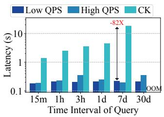  
(a) Server-level latency on metrics.

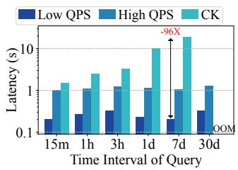  
(b) Cluster-level latency on metrics.

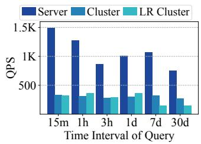  
(c) QPS on metrics.

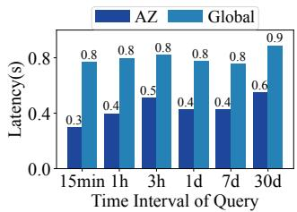  
(d) Large-scale query latency on metrics.

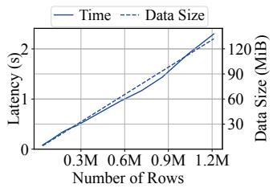  
(e) Latency on querying traces.

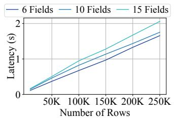  
(f) Latency on querying logs.

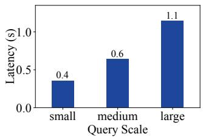  
(g) Latency on trinity querying.

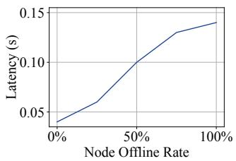  
(h) Latency on failover tests.  
Figure 9: The performance of DiTing on various circumstances. (§5.1)

## 5.1 Microbenchmark

We evaluate DiTing using a microbenchmark that issues queries over metrics, logs, traces, a mixture of all three, and metadata. We additionally run failover experiments to assess DiTing’s robustness under node unavailability.

Metrics. We construct the metrics microbenchmark as follows. First, we use real-world production metrics from an 80-server cluster in our object store service. For each query, we randomly select 12 fields from a table with more than 1,000 fields. This matches field-access statistics in production: on average, a query touches 11.2 fields, and no more than 1% of all fields are accessed by any single query.

Second, we query metrics over a range of time windows: the most recent 5 minutes, 1 hour, 3 hours, 1 day, 7 days, and 30 days. This reflects common SRE workflows, where recent data are used for real-time monitoring and historical data are used for trend analysis. For long-range queries, DiTing serves data pre-aggregated at 5-minute or 1-hour granularity.

Third, we set the benchmark concurrency to 400, simulating 400 SREs continuously issuing queries to the cluster. We compare against ClickHouse, deployed on an 18-node cluster where each node has 96 CPU cores, 256 GB RAM, 12 × 14 TB QLC SSDs, and 2 × 1 TB PMEM devices. In contrast, the AZ-level DiTing deployment uses three nodes, each with 64 CPU cores, 128 GB RAM, and 12 × 3.5 TB QLC SSDs.

Figure 9(a) reports query latency and QPS for DiTing and a centralized-only variant of DiTing when targeting a single server. For 5-minute, 1-hour, and 3-hour windows, metrics are not pre-aggregated. At around 1K QPS, DiTing achieves about 0.2 s latency, whereas the centralized-only variant is

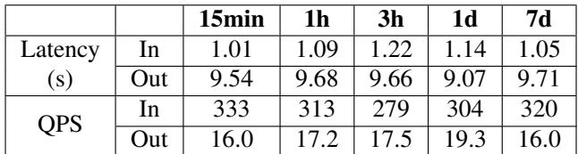  
Table 2: Comparison between queries in and out of cache.

7–82× slower. The gap widens for longer time ranges (e.g., 0.2 s vs. 18.1 s) because DiTing can pre-aggregate metrics on nodes and thus reduce processing overhead. Somewhat surprisingly, the centralized-only variant may even fail to return results for 30-day queries due to out-of-memory (OOM) errors. Note that we do not enable pre-aggregation in the centralized-only variant because it would introduce additional CPU overhead and write latency.

When extending the target from a single IP to an entire cluster, Figure 9(b) shows consistent results, although latency may increase under high QPS due to higher network traffic. Moreover, Figure 9(c) shows that DiTing reaches about 1,500 QPS while using only one CPU core in our microbenchmark. Even on low-resource machines with a 300 MB memory limit, DiTing can achieve similar QPS in many cases.

Table 2 further compares DiTing with and without the inmemory cache under a concurrency of 400. The results highlight the importance of caching recent metric data in memory, since metrics require high-QPS reads. Without caching, leaf nodes cannot sustain such high-rate disk reads, leading to substantial performance degradation and potentially affecting system stability.

We further scale metric queries to the region and global levels. Specifically, we randomly select 10 fields from the same table but target (i) one region of the object store service (∼20K nodes) and (ii) multiple regions (∼60K nodes). Figure 9(d) shows that even at these scales, latency increases only modestly to about 0.5 s and 0.8 s, respectively. This demonstrates the effectiveness of query pushdown.

Traces. Trace workloads typically have fewer columns but many more rows (with millisecond-level granularity). To evaluate trace queries, we use production trace data from an Elastic Block Service (EBS) server and issue queries that read 10 columns sampled from different column ranges. As shown in Figure 9(e), latency increases linearly with the amount of data read, indicating that DiTing scales well for trace workloads.

Logs. Compared to metrics and traces, logs have much larger volume. Due to their unstructured nature, logs are often inspected manually and thus have a lower query rate. Recall that we adopt schema-on-read for logs, converting them to the unified format only at query time; we therefore focus on the throughput of reading and filtering.

We use production log data and apply a 30% selectivity filter, meaning that out of every 100 lines read, 30 lines are returned. We query 6, 10, and 15 fields over log datasets ranging from 10K to 250K rows. Figure 9(f) shows that processing time grows linearly with the amount of data scanned.

Trinity. A key feature of DiTing is the ability to query and correlate metrics, traces, and logs in a single request. We construct a trinity microbenchmark that follows production field-access patterns and includes three scales (small, medium, and large):

• Metric table: ∼500 columns, one row every 15 s. Small (last 5 min), medium (last 30 min), large (last 1 h).

• Trace table: ∼30 columns, ∼2K rows every 15 s. Small (65K rows), medium (210K rows), large (460K rows).

• Log table: ∼20 columns, ∼25 rows every 15 s. Small (4.5K rows), medium (5K rows), large (5.5K rows).

Under this setup, each query first retrieves server CPU usage, then joins with a trace table for a cloud component, and finally joins with the component’s error logs on the time field. Figure 9(g) shows that latency increases with the amount of queried data; most of the time is spent retrieving trace data due to its larger volume.

Failover. Node-level leaf nodes may be unavailable during failures or traffic bursts. To evaluate robustness, we select a 200-node cluster and vary the fraction of unavailable nodelevel leaf nodes from 0% to 100% in a single-threaded setup. We query metrics over the most recent 1-hour window. Figure 9(h) shows that latency increases gradually as node unavailability increases.

Metadata. Metadata in DiTing map logical entities and fields to physical locations. To evaluate metadata lookup, we query all virtual disks (VDs) subscribed by a major customer.

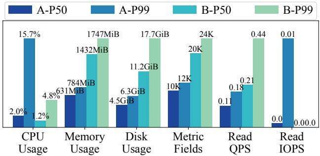  
Figure 10: Deployment statistics of DiTing.

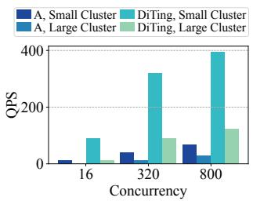  
(a) Cluster-level qps on metrics.

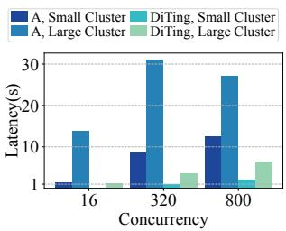  
(b) Cluster-level latency on metrics.  
Figure 11: The performance of DiTing on production environments, compared with solution A. (§5.2)

These VDs (about 430K) are distributed across regions and AZs. We then query the total traffic for these VDs. Without metadata, the query would need to scan the entire dataset (∼1.4 PiB) to locate the disks, taking tens of minutes. With metadata-assisted pushdown, the query completes in 2 s.

## 5.2 Deployment Statistics

At the time of writing, we have deployed DiTing for multiple services (e.g., OSS and EBS) on more than one million nodes across multiple regions worldwide. Next, we report deployment statistics for two services in a single region. Service A emits a typical metrics workload (about 10K metrics per node), whereas Service B emits a larger workload (about 20K metrics per node). The statistics are collected from more than 300 clusters and 36K nodes. The AZ-level monitoring data stored in this region reach about 600 TB. Our AZ-level nodes serve about 1,200 QPS on average, and node-level leaf agents collectively serve about 40K QPS. Figure 10 summarizes node-level overhead (CPU, memory, and disk consumed by DiTing) and per-node QPS, reported at the 50th and 99th percentiles.

Overall, the node-level resource overhead of DiTing remains low. On average, DiTing consumes GB-scale memory per node (about 0.5% of total DRAM), uses fewer than 2% of CPU cores, and requires only 10–20 GB of local disk for short-term persistence. Even for Service B, our implementation occupies only about 0.55% of memory and 7% of the system disk on average. However, when amortized over a large fleet (36K nodes across Services A and B), the aggregate memory footprint reaches about 34 TB. This large distributed cache is a key reason for DiTing’s low query latency, resembling the behavior of a distributed in-memory database. At the global scale, DiTing runs on millions of nodes and stores tens to hundreds of PiB of compressed data.

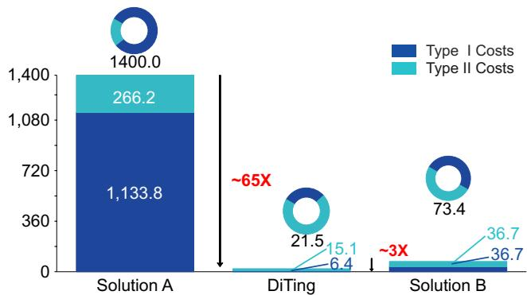  
Figure 12: CapEx comparison of DiTing, Solution A, and Solution B.

Figure 11 further compares DiTing with Solution A in production. Solution A is a classic time-series highperformance DB developed by our company (serving a wide range of users for over a decade). We run experiments on a small deployment (50 nodes) and a large deployment (400 nodes), varying concurrency from 16 to 800. Each experiment queries a single metric over the most recent 1.5 hours. As shown in the figure, DiTing improves QPS by 4–9× while reducing latency to 1/10–1/4 of Solution A.

## 5.3 CapEx Analysis

We compare the CapEx of DiTing against two baselines, anonymized as Solution A and Solution B. Solution A corresponds to the system used in the deployment study above, and Solution B is our internal distributed logging service with EB-scale capacity. Both represent state-of-the-art production systems and provide Prometheus-like functionality. We choose internal services as baselines because we can obtain detailed CapEx numbers that have been strictly audited by our finance department. Due to confidentiality constraints, we cannot disclose absolute costs. Instead, we report normalized comparisons to highlight DiTing’s CapEx reduction in the field.

We categorize CapEx into two types, following common accounting practice: Type I (persistence) and Type II (ingestion). Type I captures long-term storage costs. DiTing primarily relies on the Object Store Service (OSS), built on top of our internal distributed file system. Both Solution A and Solution B use the same underlying file system directly. Thus, the three systems have similar cost per stored GB. Even so, DiTing incurs only about 1/180 and 1/6 of the Type I cost compared to Solutions A and B, respectively. This reduction comes from DiTing’s multi-value data model and the co-Log format (see §4.2), which efficiently stores and queries high-cardinality, high-dimensional metrics.

Type II captures ingestion cost and can be decomposed into three factors: (1) Physical cost, including hardware depreciation, power, and datacenter (IDC) expenses; (2) Selling rate, defined as the fraction of provisioned resources that are actually subscribed/serving; and (3) Other overheads, including software licensing and additional infrastructure fees. We summarize this as:

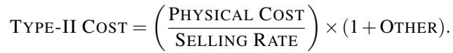

Note that DiTing does not attribute Type II cost to harvested node resources, since those nodes are already paid for by the services. Hence, DiTing mainly incurs Type II cost in the centralized (AZ-level) cluster. Overall, DiTing reduces Type II cost by about 17.6× and 2.4× compared to Solutions A and B, respectively. In total, DiTing achieves about 65× and 3× CapEx reduction relative to Solutions A and B.

## 6 Lessons Learned

Unifying is not equal to identical handling. In hindsight, “unified” does not mean “handled identically.” Although DiTing uses one storage format (co-Log) and one processing interface to cover metrics, traces, and logs, each data type still needs its own engineering focus.

For traces, the biggest operational lesson is that the SDK matters as much as the backend. If the instrumentation is unstable or too heavyweight, the system fails exactly when it is needed most: abnormal paths are often rare, time sensitive, and the first to be dropped under pressure. For metrics, high cardinality and long-range queries are the primary cost driver. We repeatedly hit cases where adding a few highcardinality dimensions (or expanding a monitoring scope) silently multiplied storage footprint and query cost. Our experience suggests the only sustainable approach is to continuously watch growth signals and proactively apply summarization (e.g., pre-aggregation) and retention controls. For logs, we learned to optimize for lossless and fast ingestion first. Heavy preprocessing (parsing, extraction, normalization) is best treated as a best-effort or asynchronous step. Keeping the write path simple makes the system far more robust under bursty incidents.

Stability comes first. DiTing relies on a per-node agent for data collection, local persistence, pushdown execution, and metadata handling. This consolidation improves locality and reduces CapEx, but it also enlarges the blast radius. A regression in the agent can affect an entire fleet within hours.

Operationally, the most effective measures were not sophisticated algorithms, but disciplined rollout and guardrails. For example, we implemented canary releases with clear success criteria, staged expansion across clusters/regions, and automated rollback when key SLOs regress. We also found it necessary to bake “self-protection” into the agent and the control plane—rate limits, circuit breakers, backpressure, and load shedding—because at cloud scale, rare corner cases happen daily, if not hourly. Finally, we intentionally keep the consistency design simple (our Raft-like variant with a fixed leader) so that failure behavior is always predictable and easy to operate.

CapEx! CapEx! CapEx! Our early prototypes focused on making a centralized DiTing work for more services and more data types, because that was the fastest way to validate functionality. As deployment scaled, we learned the hard way that a centralized architecture has a steep cost curve for telemetry: ingestion grows continuously, and a design that looks “reasonable per node” can become unsustainable once multiplied by millions of machines.

Two practical lessons stood out. First, cost regressions often come from small, local changes: adding an index, increasing a sampling rate, enabling a new dimension, or extending retention by a few days. Each change is easy to justify in isolation, but the fleet-wide effect can be enormous. Second, the only way to keep costs under control is to make them visible and reviewable. In our deployment process, every major feature must come with an explicit cost model (e.g., added bytes per node per day, incremental write amplification, and extra CPU for ingestion/query), and we routinely run “what-if” analyses during design reviews.

This is also why the final architecture embraces Central– Node Collaboration: we use harvested resources to flatten the steady-state cost curve, while keeping the AZ-level centralized clusters as a bounded, reliable fallback. In practice, treating cost to serve as a continuous optimization target— alongside latency and availability—was essential to making DiTing viable at cloud scale.

## 7 Related Work

TSDB. Time-series databases (TSDBs), such as OpenTSDB [12], BlueFlood [32], KairosDB [10], Graphite [8], InfluxDB [9], and Prometheus [33], are designed for storing and querying time-series data and are therefore widely used as building blocks for observability. However, traditional TSDBs primarily optimize for time-partitioned access and often provide limited support for spatial attributes (e.g., region/AZ/cluster/node) that are fundamental in cloud telemetry. At large scale, this mismatch can lead to skewed placements and I/O hotspots (e.g., many operators concurrently scanning recent windows for the same AZ or service). Recent in-memory TSDBs, such as Scuba [14], Kraken [26], and Monarch [15], demonstrate that real-time querying can scale to very large datasets with low latency, but their in-memory designs make them expensive to operate at the hundreds-of-PB scale.

OLAP. Online analytical processing (OLAP) systems, such as Druid [43], ClickHouse [35], and Napa [16], provide fast interactive analytics and are widely adopted in practice.

Their columnar storage and vectorized execution are a good fit for many observability queries (e.g., scans with filters and aggregations). However, in cloud observability deployments, OLAP systems can become cost-inefficient due to high CPU and memory consumption, especially for wide tables, highcardinality dimensions, and massive partition counts. Moreover, many existing deployments target PB-scale datasets, whereas cloud-scale observability can accumulate data at the EB scale, making the “scale-up more clusters” approach financially and operationally challenging.

SQL Engines. Modern SQL engines, such as Impala [27], Presto [36], and F1 Query [34], commonly adopt a storage– compute disaggregated architecture and provide full SQL support over large datasets. This model is attractive for flexibility and ecosystem integration. However, complex joins and global aggregations typically require runtime data reshuffling (e.g., repartitioning/shuffles), which can introduce substantial network overhead and sensitivity to stragglers. These characteristics make it difficult to achieve predictable low-latency, high-QPS performance for global observability, where queries frequently target “recent windows” and must remain responsive during incidents.

Cloud-native Data Warehouses. Cloud data warehouses, such as Snowflake [22] and Redshift [25], move the warehouse stack to managed cloud infrastructure to gain elasticity and simplified operations. To mitigate write throughput and query latency challenges, these systems often incorporate intermediate caching/buffering layers and rely on object storage as the durable backend. Nevertheless, they may incur additional data redundancy (e.g., multiple copies for performance) and provide limited flexibility for real-time observability analysis under heavy ingestion. Moreover, using a managed cloud warehouse as the foundation of observability introduces a circular dependency: the cloud service is relied upon to monitor itself, complicating failure diagnosis.

## 8 Conclusion

The complexity of modern cloud environments calls for a unified observability infrastructure. DiTing leverages underutilized resources and a layered architecture to streamline telemetry processing and storage. Beyond improving performance and reducing cost, DiTing also enhances reliability and scalability for cloud-scale observability.

## Acknowledgments

We sincerely thank the OSDI’25 reviewers for their constructive feedback, which significantly improved both the technical content and the presentation. We also thank the OSDI’26 organizers for their help and support throughout the process. In addition, we are grateful to the EBS, ECS, and OSS teams for their long-term support in deploying and running DiTing at scale. Finally, we acknowledge the support of the Alibaba Research Fellow (ARF) program.

## References

[1] How many maximum databases, tables, partitions, or parts are recommended in a ClickHouse cluster? https://clickhouse.com/docs/knowledgebas e/maximum\_number\_of\_tables\_and\_databases, 2019.

[2] Alibaba cloud. https://www.alibabacloud.com/, 2024.

[3] Apache Doris. https://hudi.apache.org/, 2024.

[4] Apache Hudi. https://hudi.apache.org/, 2024.

[5] Apache Iceberg. https://iceberg.apache.org/, 2024.

[6] Apache Orc. https://orc.apache.org/, 2024.

[7] Google cloud. https://cloud.google.com/, 2024.

[8] Graphite. https://graphiteapp.org/, 2024.

[9] Influxdata: Influxdb time series data platform. http s://www.influxdata.com/, 2024.

[10] Kairosdb. https://kairosdb.github.io/, 2024.

[11] Microsoft azure. https://azure.microsoft.com/, 2024.

[12] Opentsdb. https://opentsdb.net/, 2024.

[13] Protocol Buffers - Google’s data interchange format. https://protobuf.dev/, 2024.

[14] Lior Abraham, John Allen, Oleksandr Barykin, Vinayak Borkar, Bhuwan Chopra, Ciprian Gerea, Daniel Merl, Josh Metzler, David Reiss, Subbu Subramanian, et al. Scuba: Diving into data at facebook. Proceedings of the VLDB Endowment, 6(11):1057– 1067, 2013.

[15] Colin Adams, Luis Alonso, Benjamin Atkin, John Banning, Sumeer Bhola, Rick Buskens, Ming Chen, Xi Chen, Yoo Chung, Qin Jia, et al. Monarch: Google’s planet-scale in-memory time series database. Proceedings of the VLDB Endowment, 13(12):3181– 3194, 2020.

[16] Ankur Agiwal, Kevin Lai, Gokul Nath Babu Manoharan, Indrajit Roy, Jagan Sankaranarayanan, Hao Zhang, Tao Zou, Min Chen, Zongchang Chen, Ming Dai, et al. Napa: Powering scalable data warehousing with robust query performance at google. Proceedings of the VLDB Endowment, 14(12):2986–2997, 2021.

[17] Michael Armbrust, Tathagata Das, Liwen Sun, Burak Yavuz, Shixiong Zhu, Mukul Murthy, Joseph Torres, Herman van Hovell, Adrian Ionescu, Alicja Łuszczak, et al. Delta lake: high-performance acid table storage over cloud object stores. Proceedings of the VLDB Endowment, 13(12):3411–3424, 2020.

[18] Haoqiong Bian and Anastasia Ailamaki. Pixels: An efficient column store for cloud data lakes. In 2022 IEEE 38th International Conference on Data Engineering (ICDE), pages 3078–3090. IEEE, 2022.

[19] Matias Bjørling, Abutalib Aghayev, Hans Holmberg, Aravind Ramesh, Damien Le Moal, Gregory R Ganger, and George Amvrosiadis. {ZNS}: Avoiding the block interface tax for flash-based {SSDs}. In 2021 USENIX Annual Technical Conference (USENIX ATC 21), pages 689–703, 2021.

[20] Wei Cao, Xiaojie Feng, Boyuan Liang, Tianyu Zhang, Yusong Gao, Yunyang Zhang, and Feifei Li. Logstore: A cloud-native and multi-tenant log database. In Proceedings of the 2021 International Conference on Management of Data, pages 2464–2476, 2021.

[21] Brian Choi, Randal Burns, and Peng Huang. Understanding and dealing with hard faults in persistent memory systems. In Proceedings of the 16th European Conference on Computer Systems, EuroSys ’21, April 2021.

[22] Benoit Dageville, Thierry Cruanes, Marcin Zukowski, Vadim Antonov, Artin Avanes, Jon Bock, Jonathan Claybaugh, Daniel Engovatov, Martin Hentschel, Jiansheng Huang, et al. The snowflake elastic data warehouse. In Proceedings of the 2016 International Conference on Management of Data, pages 215–226, 2016.

[23] Haryadi S Gunawi, Mingzhe Hao, Riza O Suminto, Agung Laksono, Anang D Satria, Jeffry Adityatama, and Kurnia J Eliazar. Why does the cloud stop computing? lessons from hundreds of service outages. In Proceedings of the Seventh ACM Symposium on Cloud Computing, pages 1–16, 2016.

[24] Haryadi S Gunawi, Riza O Suminto, Russell Sears, Casey Golliher, Swaminathan Sundararaman, Xing Lin, Tim Emami, Weiguang Sheng, Nematollah Bidokhti, Caitie McCaffrey, et al. Fail-slow at scale: Evidence of hardware performance faults in large production systems. ACM Transactions on Storage (TOS), 14(3):1–26, 2018.

[25] Anurag Gupta, Deepak Agarwal, Derek Tan, Jakub Kulesza, Rahul Pathak, Stefano Stefani, and Vidhya Srinivasan. Amazon redshift and the case for simpler data warehouses. In Proceedings of the 2015 ACM SIGMOD international conference on management of data, pages 1917–1923, 2015.

[26] Stavros Harizopoulos, Taylor Hopper, Morton Mo, Shyam Sundar Chandrasekaran, Tongguang Chen, Yan Cui, Nandini Ganesh, Gary Helmling, Hieu Pham, and Sebastian Wong. Meta’s next-generation realtime monitoring and analytics platform. Proceedings of the VLDB Endowment, 15(12):3522–3534, 2022.

[27] Marcel Kornacker, Alexander Behm, Victor Bittorf, Taras Bobrovytsky, Casey Ching, Alan Choi, Justin Erickson, Martin Grund, Daniel Hecht, Matthew Jacobs, et al. Impala: A modern, open-source sql engine for hadoop. In Cidr, volume 1, page 9. Asilomar, CA, 2015.

[28] Chi Li, Shu Wang, Henry Hoffmann, and Shan Lu. Statically inferring performance properties of software configurations. In Proceedings of the Fifteenth European Conference on Computer Systems, pages 1– 16, 2020.

[29] Feifei Li. Modernization of databases in the cloud era: Building databases that run like legos. Proceedings of the VLDB Endowment, 16(12):4140–4151, 2023.

[30] Chang Lou, Peng Huang, and Scott Smith. Understanding, detecting and localizing partial failures in large system software. In Proceedings of the 17th USENIX Symposium on Networked Systems Design and Implementation, NSDI ’20, Santa Clara, CA, February 2020. USENIX.

[31] Jiaqi Lou, Xinhao Kong, Jinghan Huang, Wei Bai, Nam Sung Kim, and Danyang Zhuo. Harmonic: Hardware-assisted {RDMA} performance isolation for public clouds. In 21st USENIX Symposium on Networked Systems Design and Implementation (NSDI 24), pages 1479–1496, 2024.

[32] Beshr Al Nahas, Antonio Escobar-Molero, Jirka Klaue, Simon Duquennoy, and Olaf Landsiedel. Blueflood: Concurrent transmissions for multi-hop bluetooth 5—modeling and evaluation. ACM Transactions on Internet of Things, 2(4):1–30, 2021.

[33] Björn Rabenstein and Julius Volz. Prometheus: A Next-Generation monitoring system (talk). Dublin, May 2015. USENIX Association.

[34] Bart Samwel, John Cieslewicz, Ben Handy, Jason Govig, Petros Venetis, Chanjun Yang, Keith Peters, Jeff Shute, Daniel Tenedorio, Himani Apte, et al. F1 query: Declarative querying at scale. Proceedings of the VLDB Endowment, 11(12):1835–1848, 2018.

[35] Robert Schulze, Tom Schreiber, Ilya Yatsishin, Ryadh Dahimene, and Alexey Milovidov. Clickhouselightning fast analytics for everyone. Proceedings of the VLDB Endowment, 17(12):3731–3744, 2024.

[36] Raghav Sethi, Martin Traverso, Dain Sundstrom, David Phillips, Wenlei Xie, Yutian Sun, Nezih Yegitbasi, Haozhun Jin, Eric Hwang, Nileema Shingte, et al. Presto: Sql on everything. In 2019 IEEE 35th International Conference on Data Engineering (ICDE), pages 1802–1813. IEEE, 2019.

[37] Nimish Shah, Laura Isabel Galindez Olascoaga, Shirui Zhao, Wannes Meert, and Marian Verhelst. Dpu: Dag

processing unit for irregular graphs with precisionscalable posit arithmetic in 28 nm. IEEE Journal of Solid-State Circuits, 57(8):2586–2596, 2021.

[38] Benjamin H. Sigelman, Luiz André Barroso, Mike Burrows, Pat Stephenson, Manoj Plakal, Donald Beaver, Saul Jaspan, and Chandan Shanbhag. Dapper, a largescale distributed systems tracing infrastructure. Technical report, Google, Inc., 2010.

[39] Mark Slee, Aditya Agarwal, and Marc Kwiatkowski. Thrift: Scalable cross-language services implementation. Facebook white paper, 5(8):127, 2007.

[40] Ashish Thusoo, Joydeep Sen Sarma, Namit Jain, Zheng Shao, Prasad Chakka, Suresh Anthony, Hao Liu, Pete Wyckoff, and Raghotham Murthy. Hive: a warehousing solution over a map-reduce framework. Proceedings of the VLDB Endowment, 2(2):1626– 1629, 2009.

[41] Deepak Vohra and Deepak Vohra. Apache parquet. Practical Hadoop Ecosystem: A Definitive Guide to Hadoop-Related Frameworks and Tools, pages 325– 335, 2016.

[42] Haoze Wu, Jia Pan, and Peng Huang. Efficient exposure of partial failure bugs in distributed systems with inferred abstract states. In Proceedings of the 21st USENIX Symposium on Networked Systems Design and Implementation, NSDI ’24, April 2024.

[43] Fangjin Yang, Eric Tschetter, Xavier Léauté, Nelson Ray, Gian Merlino, and Deep Ganguli. Druid: A real-time analytical data store. In Proceedings of the 2014 ACM SIGMOD international conference on Management of data, pages 157–168, 2014.

[44] Junwen Yang, Cong Yan, Chengcheng Wan, Shan Lu, and Alvin Cheung. View-centric performance optimization for database-backed web applications. In 2019 IEEE/ACM 41st International Conference on Software Engineering (ICSE), pages 994–1004. IEEE, 2019.

[45] Weidong Zhang, Erci Xu, Qiuping Wang, Xiaolu Zhang, Yuesheng Gu, Zhenwei Lu, Tao Ouyang, Guanqun Dai, Wenwen Peng, Zhe Xu, et al. What’s the story in {EBS} glory: Evolutions and lessons in building cloud block store. In 22nd USENIX Conference on File and Storage Technologies (FAST 24), pages 277– 291, 2024.