USENIX

THE ADVANCED COMPUTING SYSTEMS ASSOCIATION

# Timelock Drive: Isolated Time-Based Defense for Storage Systems

Jonah Rosenblum, Juechu Dong, Peter Chen, and Satish Narayanasamy, University of Michigan

https://www.usenix.org/conference/osdi26/presentation/rosenblum

# This paper is included in the Proceedings of the 20th USENIX Symposium on Operating Systems Design and Implementation.

July 13–15, 2026 • Seattle, WA, USA

ISBN 978-1-939133-55-7

Open access to the Proceedings of the 20th USENIX Symposium on Operating Systems Design and Implementation is sponsored by

# Timelock Drive: Isolated Time-Based Defense for Storage Systems

Jonah Rosenblum University of Michigan

Juechu Dong University of Michigan

Peter M. Chen University of Michigan

Satish Narayanasamy University of Michigan

## Abstract

Data is one of the most critical assets for organizations and individuals, yet its integrity is increasingly threatened by ransomware, data tampering, sabotage, and intentional data vandalism. While most organizations rely on backups, backups themselves are also vulnerable. Even a fully secure software system may be insufficient, as nearly two-thirds of attacks exploit human errors to steal access credentials.

We present Timelock Drive (TD), which allows users to timelock a physical disk block for a duration during which the stored data cannot be modified by anyone, including credentialed users. We show that this enables a secure backup system where the versioning system itself is not part of the TCB. Only a small, isolated checker remains in the TCB, and we formally verify it. A critical challenge we address is maintaining metadata without overwriting prior state using a pure append-only design. We solve the performance problem of scanning logs to retrieve metadata by offloading metadata management to the untrusted host while ensuring security through integrity checks.

Our experiments show that TD incurs negligible space, performance, and storage I/O overheads compared to conventional versioning systems.

## 1 Introduction

Data is one of the most precious commodities owned by businesses and consumers, and safeguarding it is paramount. Unfortunately, the integrity1 of critical data is under attack by ransomware [39, 51], data tampering and sabotage [2], and data vandalism. Ransomware in particular has become pervasive: in 2024, 67% of hospital organizations were hit [51], and ransomware attacks are projected to cost victims \$265 billion annually by 2031 [39].

The most common way to defend against integrity attacks is to keep regular backups using a versioning system (VS) [8, 9, 14, 33]. Unfortunately, this defense has proven insufficient in practice because the backup system itself often shares the same vulnerabilities as the host: bugs in backup software, compromised administrator credentials, and insider attacks all allow adversaries to corrupt or delete backups [51]. In fact, recent surveys show that 95% of ransomware-hit organizations reported that attackers attempted to compromise their backups, and two-thirds of those attempts succeeded [51].

To defend against these vulnerabilities, researchers have proposed adding retention policies that prevent recently created versions from being deleted for some fixed period of time [18, 45]. Similar to the timelocked safes used in banks, such policies force attackers to wait before damaging recently written data. While a patient attacker could wait out the retention interval, forcing such delays increases the chance of detecting the intrusion before damage occurs and makes opportunistic attacks far less attractive.

Unfortunately, adding a timelock policy to a backup or versioning system is insufficient, as the VS itself may be compromised. Bugs or stolen administrator credentials allow an attacker to override or bypass the retention policy—an issue made concrete by recent trimming attacks that bypass timelock logic inside storage-side VS systems [36].

In this paper, we propose a more fundamental approach: a Timelock Drive (TD) that enforces timelocks directly on physical disk blocks. The TD exposes a simple storage interface but provides a strong security guarantee called transient immutability: each block becomes immutable for a fixed period after it is written to the drive, and no software component, including a fully compromised VS or administrator, can override this protection.

All accesses to TD pass through a small, isolated microcontroller, called the TD checker, which enforces the timelock constraints. The TD provides a simple storage interface that supports reads, writes, and timelock operations, while the versioning system (VS) runs on the untrusted host and is entirely outside the trusted computing base. This separation provides a clear division of responsibility: the TD guarantees that blocks cannot be modified for the timelocked duration, while the VS is free to manage data in any way as long as it does not attempt to overwrite data before its timelock expires (as such attempts will fail). Decoupling the two components greatly reduces the amount of trusted code required on the TD, and as a result, the TD checker is only about 400 lines of code. Its small size allowed us to formally verify the correctness of

the timelock mechanism.

A critical constraint of the TD is that it forbids overwrit ing any physical block during its timelock. Yet existing file systems and versioning systems depend on metadata overwrites to maintain version indices, free space, and consistency state. For example, LFS periodically updates its checkpoint region [41], and systems such as FlashGuard and S4 overwrite version metadata [18, 45]. A VS running on top of TD cannot perform these updates, since any metadata overwrites would violate timelock immutability and be rejected, creating a fundamental mismatch between traditional VS design and the non-overwriting constraint imposed by a TD.

In fact, even the TD system itself is not allowed to overwrite any timelocked physical blocks; it must instead maintain and update its own metadata state without overwriting timelocked physical blocks. This leads to the central question of this paper: Can we build both a usable TD checker and a performant versioning system on top of a storage device that forbids all overwrites for a fixed period, including overwrites of their own metadata?

Our solution is to store TD metadata as a purely appendonly log, the TD-log, on the drive. Every update creates a new log entry, which are coalesced and written at the block granularity. Each TD-log entry includes a timelock field that protects the physical addresses referenced in the entry, including the log block itself, eliminating the need for additional metadata about the metadata. While this design is non-overwriting, retrieving TD metadata from the drive requires scanning the entire log – an approach with an unacceptable overhead.

To address this, we use a delegate-but-verify strategy. The untrusted host maintains a full, in-DRAM cache of TD metadata, along with a cryptographic BLAKE3 hash generated by the TD checker. On each write, the host supplies the relevant metadata and hash; the TD checker verifies integrity before proceeding. The checker itself stores only a small set of freshness counters (\~ 2 MB per 1 TB disk), enabling a scalable design. Because the host provides all metadata during normal operation, the TD checker never needs to read TD-log entries from disk. The on-disk TD-log is read only during recovery, which is infrequent and can tolerate a full scan. This approach yields an efficient metadata solution by trading rare recovery-time cost for non-overwrite property.

We build a secure, non-overwriting versioning system (VS) on top of an isolated TD. The VS runs entirely on the untrusted host; even if it is fully compromised, the system can always recover to a pre-intrusion state. This is because TD’s transient immutability ensures that checkpoints created before the intrusion remain unmodified until their timelocks expire.

To respect TD’s no-overwrite constraint, the VS records all of its metadata in TD as append-only logs. For performance, it maintains an in-memory logical-to-physical map on the host. From the TD’s perspective, VS metadata and data are indistinguishable and subject to the same timelock protection.

During recovery, the only trusted input is the content stored on the TD. For each logical address, the system retrieves the most recent version written before the suspected attack time and discards those written after, thereby neutralizing spoofed entries. To make this possible, the TD provides a time-oflock security guarantee: recovery can reliably determine the time-of-lock for every block, as the TD checker records each block’s time-of-lock in the TD metadata log.

We implement the VS as a block device driver that can be mounted by ext4, formally verify the TD checker in Dafny [24], and prototype the TD on a Raspberry Pi interposed between the host and a storage device. Reads incur no overhead, and writes benefit from secure host-side metadata caching. Across a variety of storage traces and filesystem workloads [46], TD introduces negligible overhead (0.4% execution, 0.5% throughput for SSDs).

Our paper makes the following contributions:

• We design and implement a secure Timelock Drive (TD) that guarantees transient immutability for a physical block. All information (data and its metadata) are timelocked for the duration specified by the host (user).

• We design and evaluate a TD and VS system that does not require overwrites to timelocked data and metadata.

• We isolate the TD checker from the rest of the system, including the versioning system. It has a narrow interface and a small TCB (∼400 LoC), which enables formal verification.

• We demonstrate that TD incurs negligible performance and space overhead by securely caching TD metadata on the untrusted host.

## 2 Background and Threat Model

In this section, we describe a threat model for data integrity attacks and the requirements for secure backups.

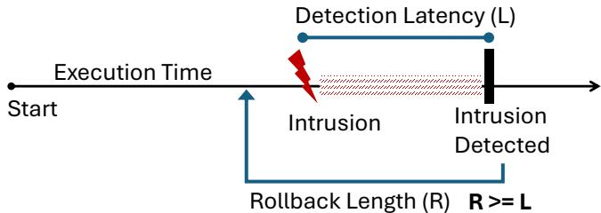  
Figure 1: Recover by restoring state before the intrusion.

Figure 1 illustrates a simplified timeline of a data integrity attack and recovery using a continuous backup system. Before an intrusion, a VS periodically checkpoints data on a storage device. After intrusion, we assume that an attacker has complete control over the host software stack, including privileged users, the OS, filesystem, drivers, and the versioning system.

At some point, the intrusion is detected (in the worst case, after the attack is completed). We define the latency between intrusion and detection as intrusion detection latency (L), as shown in Figure 1.

The fundamental property of secure backups is the ability to roll back, restoring the storage state to before the time of the intrusion. We refer to this as rollback length (R). To defend against intrusions, the rollback length must exceed the expected intrusion-detection latency (L).

Need for time-based defenses: A timelock adds a significant hurdle to an attacker who compromises the host system. The value of a timelock is threefold: (1) attackers are forced to wait much longer before asking for a ransom, and during this waiting period they risk being detected before they can damage stored data [3, 28, 32], (2) a safety window provides administrators with more time to discover exploits and deploy patches, (3) expensive deep scans that detect intrusions, invalid/corrupted data, etc. can run less frequently and analyze changes in system state over time. Timelocks allow administrators to trade extra storage space for greater security guarantees. With unlimited storage capacity, an infinite timelock will indefinitely prevent overwrites of protected data; more realistically, having enough capacity to store six months of old data poses a massive challenge for ransomware. Accord ing to a recent report [1] from Google, the median intrusion detection latency in 2024 was only five days, and ≥ 99% of intrusions are detected within 5 months.

Isolation for Security: Isolation is a well-known security concept that reduces attack surfaces and minimizes the impact of software bugs. For example, in OpenSSH, isolating authentication logic from pseudo-terminal management and running them at different privilege levels prevents privilege escalation attacks [35]. Another example is Page Table Isolation, which separates user and kernel page-table mappings to protect against Meltdown attacks [26, 47]. Isolation is a key design principle in microkernels [5,25], web browsers [37,38], and hypervisors/VMs [4, 42].

Prior S4 systems [18, 45, 50] integrate time-based security checks into a VS on the storage device. Recent work has shown that vulnerabilities in version management can bypass timelock checks and delete old versions, violating the timebased defenses [36]. Our work aims to simplify the timelock primitive to the smallest TCB possible and isolate it from all other components of the secure backup system.

Orthogonal threats: Data exfiltration happens when an attacker can siphon off sensitive data, which they can use for their own gain or threaten to release for a ransom. Such attacks only require read permission. The proposed defenses [15, 27, 40] against data exfiltration are orthogonal to Timelock Drive and thus can be used in conjunction with each other. For example, time-release encryption schemes [27, 40] can prevent plaintext leakage while Timelock Drive guarantees the ciphertext can’t be overwritten.

Another threat model includes physical access to the storage system. These powerful adversaries can steal the physical storage device and/or damage it beyond repair. Our work focuses on defending against digital security threats.

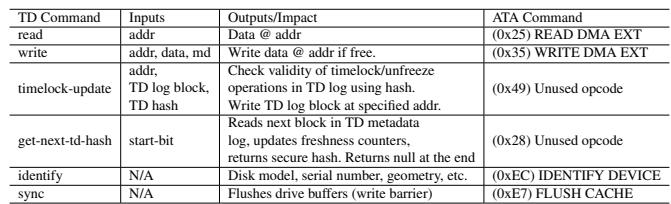  
Table 1: TD-checker Controller’s Modified ATA Interface

Clock Assumptions: In this work, we assume our TDchecker has a monotonically non-decreasing clock, even across restarts/crashes. This is similar to non-volatile secure counters in trusted platform modules (TPMs) [30]. If the checker loses power, the clock stops, so all timelock mutability countdowns simply pause until power is restored. This does not weaken the immutability guarantee; it only delays deletion. This assumption is not unique to our work; all S4 systems [18, 45, 50] make the same assumptions about clocks.

## 3 Timelock Drive

This section presents the Timelock Drive (TD), a standard SSD or HDD whose accesses pass through a lightweight, formally verified, TD-checker controller. The TD augments traditional credential-based security with a temporal protection mechanism: once a user writes to an address and issues a timelock, that block cannot be modified by anyone, including privileged software, until the lock expires.

This section addresses the core challenge of building a performant TD checker on a storage device that blocks all overwrites for a fixed period, even of its own metadata. Section 4 describes how we build a secure backup system on top of Timelock Drive.

## 3.1 Timelock Drive Interface

A conventional storage device is enhanced with a formally verified TD-checker controller (Fig. 2a), which guards and mediates all access. We refer to this augmented device as the Timelock Drive (TD). It presents a narrow command interface to the host, listed in Table 1.

The read and identify commands behave like their conventional counterparts and carry no additional TD constraints.

The TD-checker permits a write command to a block only when the timelock constraint is satisfied. The additional parameters (md, md-hash) enable the TD-checker to validate this constraint (described later in Section 3.4).

The timelock operation allows users to protect a block for a duration δ, enforcing a transient immutability guarantee that prevents modification of the block for at least δ time.

A key interface question is when the timelock countdown should begin. If the countdown starts at the moment of timelock, the user must somehow predict how long the data will remain useful. In practice, users rarely know this. For instance, the lifetime of a versioned block lasts until the next version is written; a timing that cannot be known in advance.

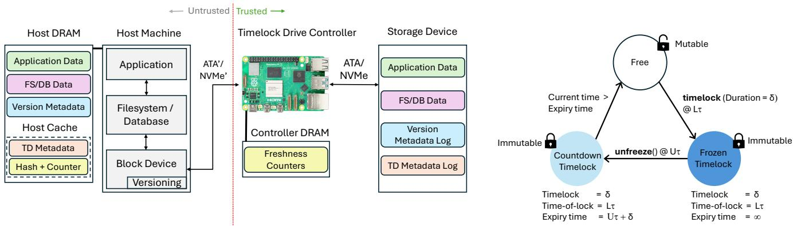  
Figure 2a. Timelock Drive system overview.  
Figure 2b. States of a storage block.

A simple workaround is to refresh timelocks for all live blocks before they expire, but doing so would impose heavy performance overhead. Instead, TD uses two states for a timelocked block. After a block is timelocked, it enters a frozen state in which it is protected indefinitely. Later, the user may explicitly unfreeze the block. Once unfrozen, TD prevents writes for the duration specified at the original timelock (δ).

This design preserves transient immutability: the block remains protected for the full timelock interval after being released. Even if an adversary gains control immediately after a write and attempts to unfreeze the block, they must still wait out the timelock before making any modification.

Figure 2b illustrates the finite-state machine for a disk block. A timelocked block transitions from free to frozen, disallowing further writes. When unfrozen, it moves to the countdown state, where writes remain disallowed. Once the timelock duration expires, the block returns to the free state and can be written again. The timelock operation records a time-of-lock timestamp in the block’s metadata, which helps prevent adversarial spoofing during recovery (Section 4.7).

The timelock-update command applies timelock/unfreeze operations on a host-specified list of addresses. The motivation for bulk update is further explained in Section 3.3.

Finally, the get-next-td-hash command rebuilds the host’s TD metadata cache after a checker reset or intrusion recovery. With the start bit set, the checker begins scanning the TD metadata log from the beginning; each subsequent call processes the next log block, updates the checker freshness counters, and returns the corresponding secure TD hash, returning null at the end of the log. The purpose of this command is discussed in Section 3.4.

## 3.2 Verified Trusted TD-Checker Controller

The TD-Checker controller is a small microcontroller that natively executes the timelock logic. Its inputs are storageinterface commands; in our prototype, we use the “TD-ATA” command set shown in Table 1. The controller approves or rejects each command based on the addressed block’s timelock state, allowing only those that satisfy the current timelock constraints to pass through. TD is agnostic to the underlying storage medium (HDD or SSD). We adopt the ATA command interface for its simplicity and widespread use, though the design can be extended to other interfaces, including NVMe.

To support TD commands, the controller has a clock that retains its state across power cycles. The assumptions about this clock are stated in Section 2.

Small and Isolated TCB: The controller and its state (clock and metadata) are isolated from the host system, interacting only through the verified TD-ATA interface. We formally verify (Section 6) that our controller implementation satisfies TD’s security guarantees, ensuring that the timelock constraint holds even if the host is compromised. All higher-system components—privileged users, the filesystem, versioning software, drivers, and the OS—are excluded from the TCB. Our verified implementation in Dafny consists of roughly ∼400 lines of code, excluding ghost statements used solely to assist verification.

## 3.3 Non-Overwrite TD Metadata

TD-checker relies on per-block metadata—timelock state, timelock duration, time-of-lock, and expiry time—to enforce its checks. If no metadata exists for a block, we assume it is in the free state, as is true for all blocks initially.

When a block is timelocked, its metadata is updated and persisted on the drive. This metadata must itself be timelocked; otherwise, an adversary could tamper with it and subvert future TD checks.

A natural design is to store TD metadata along with data within a disk block to timelock it. However, the TD metadata must change when the block transitions from the frozen state to the countdown state, since the recorded state and expiry time change. The controller does not continuously update metadata during the countdown; it only checks, on a later write, whether the recorded expiry time has passed. Still, the frozen-to-countdown transition requires a metadata update, which would be forbidden if the metadata block itself were timelocked. Thus, TD needs a way to update metadata state without overwriting timelocked metadata.

We address this challenge by representing TD metadata as an append-only log. When a block is timelocked, a metadata entry is appended to the log; when the block is unfrozen, a new entry is appended rather than modifying the old one. Logically, the latest valid entry for a block determines its current TD metadata state. During recovery, the log can be replayed to reconstruct this state; during normal operation, TD avoids expensive log scans by delegating metadata caching to the untrusted host and verifying the supplied metadata, as explained in Section 3.4.

Each log entry stores the TD metadata for a timelocked disk block, and the entry is protected under the same timelock duration as the block it corresponds to. Since writes to disk are at block granularity, each log entry would require an entire block, which is space-inefficient. We solve this problem by extending the TD interface to support bulk timelock-update. This allows the user to apply the timelock or unfreeze transition to a list of addresses rather than a single address. While the list size could be 1, for a versioning system, bulk operations work well, as they timelock/unfreeze a set of blocks at the end of a checkpoint interval.

## 3.4 Delegating TD Metadata Management to Untrusted Host

TD metadata for a block must be read on every write to perform the timelock check. A pure append-only log incurs high latency overhead, since locating the latest metadata for a block requires an expensive scan of the entire log.

We can reduce this overhead by adding a metadata cache inside the TD-checker, but TD metadata exhibits poor temporal locality, so the cache would need to hold nearly all metadata to be effective. This significantly increases controller complexity, and any cache miss still triggers an expensive log scan. Storing all metadata (one metadata block per 512 addresses) consumes roughly 1 of total device capacity – impractical for a small controller.

Instead, we let the untrusted host maintain the TD metadata cache and secure it using cryptographic mechanisms. The TD-checker computes a BLAKE3 HMAC over the metadata, the TD address, a freshness counter, and a 256-bit secret key, and gives it to the host. When writing to a block, the host (user) supplies its corresponding metadata and HMAC to the controller, which verifies the hash and freshness counter.

In fact, we let the host propose metadata updates when issuing a timelock or unfreeze command. The TD-checker’s role is to validate the integrity of old metadata and the correctness of new/updated metadata, both supplied by the host.

To maintain freshness, the controller maintains a 4-byte counter for each TD metadata block and includes it in the HMAC. The host locally caches the latest TD metadata and corresponding hashes and supplies them with TD commands. This cache is not trusted: if the host supplies stale metadata or an old hash, the checker recomputes the HMAC using its current freshness counter and rejects the command.

The controller’s memory requirement remains modest: it stores only the freshness counters, requiring approximately 1525,312 of disk capacity, or about 2 MB per 1 TB of storage. Assuming a disk write latency of 10 ms, nonstop writes to a single block would take 1.36 years to overflow a 4-byte counter, making overflows rare.

The TD metadata log is read-only when the cache must be rebuilt, such as after a power reset, a freshness-counter overflow, or intrusion recovery. In these cases, the checker generates a new secret key, disables writes, and reconstructs its freshness counters by scanning the append-only TD metadata log. The host initiates this scan by issuing get-next-td-hash with the start bit set. Each subsequent get-next-td-hash command causes the checker to read the next TD metadata log block, apply the metadata updates in that block to its freshness counters, and return the resulting secure TD hash to the host. When the end of the log is reached, the checker returns null; at that point, the host has rebuilt its cache of TD metadata and corresponding hashes.

If multiple log entries refer to the same address, the scan may return multiple hashes for that address. Only the hash corresponding to the latest processed metadata state remains valid, because each subsequent metadata update advances the checker freshness counter. Thus, a host that later supplies an intermediate metadata entry and hash will be rejected as stale.

A random-access command, such as get-td-hash(addr), would be inefficient: the checker would have to scan the TD log to find the latest metadata for that address. Rebuilding all hashes after a reset would therefore require one log scan per address, yielding quadratic recovery time. In contrast, get-next-td-hash streams through the log once and rebuilds both the checker’s freshness counters and the host’s valid hashes in linear time.

## 3.5 Timelock Drive Policy and Use Cases

Prior solutions that embed timelock policy within the versioning system (VS) [18, 45, 50] offer weaker security guarantees due to a large TCB and lack user-controlled timelocking to prevent overwrites of a physical block. Because the timelock mechanism is intertwined with the VS, users are bound to predefined policies, and any change requires modifying an already large TCB—risking new vulnerabilities.

TD is fundamentally different. It enforces timelocks directly on physical disk blocks and exposes this capability to users through a minimal interface. The VS is built on top of this abstraction and is therefore excluded from the TCB. This separation allows users to implement their own versioning policies without affecting the TCB.

We outline several use cases for Timelock Drive, beyond conventional versioning, that are enabled only due to TD abstraction. Users with highly sensitive data (e.g., cryptocurrency keys) can store them in TD with an infinite timelock. An

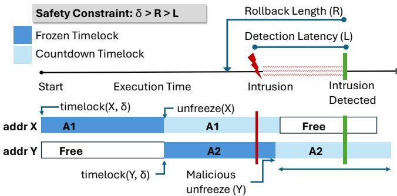  
Figure 3: Secure backups using Timelock Drive

OS or middleware can automatically identify important files (based on content or type) and timelock them with durations tailored to importance. Organizations can timelock records to ensure regulatory compliance. TD can also protect logs during an attack, enabling accurate forensic reconstruction and intrusion analysis [10, 11].

While many applications are possible, we focus on one crucial use case for Timelock Drive: secure backups, which we discuss in the next section.

## 4 Secure Backups Using Timelock Drive

We build a secure, non-overwriting versioning system (VS) atop the isolated Timelock Drive, with the VS running entirely on the untrusted host. Even if the VS is fully compromised, TD’s transient immutability preserves all pre-intrusion versions long enough to guarantee recovery to a pre-intrusion state (Section 2).

## 4.1 Overview

The TD-checker controller exposes an unchanged view of the physical address space to the VS (Figure 4). The VS, running on the untrusted host, then exposes a subset of the physical address space to the client filesystem2 as the logical address space. The VS manages the placement of TD-metadata, VSmetadata, and the filesystem’s data. The TD-checker does not distinguish between VS data and VS-metadata.

When the filesystem writes to a logical address, the VS allocates a free physical block, writes the new version, and timelocks it. It then unfreezes the old version so that, once its countdown timelock expires, the corresponding physical block can be reclaimed.

The VS maintains metadata mapping each logical address to its sequence of physical blocks. Conventional VS designs overwrite metadata on every disk write, but in an untrusted VS, such overwrites could allow an adversary to corrupt or erase version history during an intrusion. Thus, VS metadata must also be timelocked, requiring a design that avoids overwriting during the timelock interval. This section discusses how our

VS achieves this using a pure append-only, non-overwriting log; conceptually similar to the TD-log.

A trusted recovery process reconstructs a pre-intrusion system state using only the contents of TD. Finally, we show how standard optimizations such as incremental checkpointing can still be implemented despite the constraints imposed by TD.

## 4.2 Secure Untrusted Version System

When the filesystem issues a write, the VS stores the data in a free block in TD and secures it with a timelock set to the rollback length (R). Even if an intrusion happens immediately after the write, the worst an adversary can do is attempt to unfreeze the data. However, due to the timelock, TD ensures the data are protected for the duration of R. Therefore, if the intrusion is detected in less than R, the data can be recovered.

Once data are written to a physical address and timelocked, that physical address remains immutable until unfrozen. VS unfreezes that physical address only when the filesystem writes a new version to the corresponding logical address.

Figure 3 shows an example. When the filesystem writes to a logical address (A), the VS stores the data in a free block (X) in the TD, and applies a timelock of duration R. On a subsequent write to the same logical address (A), the VS writes the new version (A2) to another free physical address (Y), timelocks it, and immediately unfreezes the old version (A1) stored in physical address X. The unfrozen physical address then enters a countdown timelock state, and stays protected for the duration of R.

Version Integrity Guarantee: To establish that we will always be able to safely recover the latest pre-intrusion version for a logical address, let us consider all possible storage states at the time of intrusion for an address.

First, for physical addresses in a free state, there is no valid data and therefore no guarantee is needed.

Second, we consider addresses in a countdown timelocked state. For instance, in Figure 3, physical address X is in this state at the time of an intrusion. This physical block was unfrozen by our VS before the intrusion. While the VS is untrusted, its behavior before an intrusion is benign. Therefore, it would have issued an unfreeze command for block X only after writing a newer version (A2) to another physical block (Y). As a result, even if block X expires after the attack and loses protection, a more recent version (A2 in Y) can still be recovered for the corresponding logical address.

Finally, a physical address (Y) could be in the frozen timelock state, implying that it contains the most up-to-date version for a logical address and was not unfrozen before the intrusion. In this state, the worst an adversary can do is unfreeze the physical address shortly after the intrusion, as shown in Figure 3. This would only transition the physical address into a countdown timelock state, where it remains protected for the duration of the timelock (R). Therefore, as long as the timelock duration is set long enough to outlast the time needed to detect the intrusion, we can recover a valid version for A.

## 4.3 Incremental Checkpoint on TD

Creating a version for every write can greatly increase storage overhead. A conventional solution is to divide execution into epochs and take a copy of the checkpoint at the end of each epoch. An incremental checkpoint [16, 34] typically only maintains the most recent version of a logical address written within its epoch. If an address was not written within an epoch, then the checkpoint has no versions for it.

Our VS implements incremental checkpoints as follows. For each write to a logical address within an epoch, the VS allocates a new TD block and stores the version without a timelock. At the end of the epoch, the VS timelocks (for duration R) the set of blocks containing the most recent versions of all logical addresses written during that epoch. It also unfreezes old versions corresponding to these logical addresses.

The only limitation of incremental checkpointing is that, rather than always recovering to the last write before the intrusion, we roll back to the most recent checkpoint/epoch before the intrusion. We use small epoch intervals (one hour), which is negligible compared to the intrusion detection latency (weeks). Given that we may lose all versions produced after an intrusion, incremental checkpointing would additionally lose at most one epoch’s worth of data, which is again negligible.

## 4.4 Non-Overwriting Version Metadata

We assume that an attacker can gain full control over the VS after an intrusion. To enable safe recovery, we must apply the same timelock protection to both data and the version metadata. This is a novel challenge, as all prior VS we are aware of, including “append-only” systems [9, 14, 33, 41], modify version metadata. For example, LFS periodically overwrites checkpoint regions every 30 seconds [41].

Our VS metadata maps logical addresses to physical addresses. Since we cannot overwrite the map during updates, a naive solution is to track changes in version metadata by adding additional versioning. However, to do this, we would need a second layer of metadata on top of our version metadata. Future updates encounter the same issues, necessitating the addition of a third layer of metadata, followed by a fourth, and so on. This becomes an infinite recursion problem.

We solve this recursive problem by using an append-only log that tracks the chronological updates of versions. When the filesystem writes to a logical address, the VS will create a new version and store it in a free physical address. At the same time, a new metadata entry is added to the end of the log that describes the mapping between the logical and physical addresses. When enough log entries are created (or enough time has passed), a block of log entries is stored in TD with a timelock greater than or equal to the underlying data. Each log block is linked together through a series of forward pointers with the head of the log stored at a predetermined location in the physical address space. This data structure allows us to track all changes to our metadata (versions of versions) without triggering the recursive update problem [41].

## 4.5 Bulk Metadata Update

Each VS metadata log entry is small, so we aggregate multiple log entries into a metadata disk block during an epoch. At the end of an epoch, the VS metadata are written to the drive. When the VS is under heavy write load, the metadata block may fill up quickly before an epoch ends. In that case, more than one metadata disk block would be written at the end of that epoch.

At the end of an epoch, VS timelocks and unfreezes a set of blocks in bulk (Section 3.3). This aggregates TD metadata and writes it to the disk only at the end of each epoch.

## 4.6 Crash Safety

Users rely on crash safety to recover a valid system state after sudden crashes, such as power loss [29]. Prior systems that embed timelocks into the VS do not provide explicit crash-safety guarantees or require a battery backup for each device [18, 19, 50]. This means that even with a crash-safe filesystem, prior solutions can still lose data and/or timelock protections after a crash.

A write barrier, implemented through synchronization operations such as fsync or disk flushes, provides a persistence ordering point: writes issued before the barrier must reach stable storage before writes issued after the barrier are allowed to become durable. TD preserves the crash-safety guarantees of the client filesystem by forwarding filesystem writes and write barriers (ATA sync) to the underlying disk in the same order in which they are received. However, the VS also creates additional persistent state, including version metadata and TD metadata, and this state must be ordered carefully with respect to the data it describes.

For each committed epoch, the VS persists updates in three ordered steps. First, it writes the data blocks. It then inserts a write barrier before writing the corresponding version metadata. This ordering is required in any versioning system: recovery must never observe version metadata that points to data blocks that were not durably written. Second, after writing the version metadata, the VS inserts another write barrier before writing the TD metadata and timelock records. This ordering is specific to TD: recovery must not observe timelock metadata for an epoch unless the version metadata for that epoch is also durable. Otherwise, a crash could leave TD metadata durable while the corresponding version metadata is missing or stale, causing recovery to associate timelock state with stale data. Finally, after writing the TD metadata, the VS issues a final write barrier to commit the epoch. If a crash occurs before this final barrier completes, the incomplete epoch is discarded during recovery.

## 4.7 Spoof-free Guarantee for Recovery

Prior systems [18, 45, 50] implicitly trust their versioning software to behave correctly after an intrusion. We cannot make this assumption, as our VS is untrusted. Consequently, recovery must remain correct even under adversarial VS behavior, including spoofing attacks carried out after the intrusion.

We assume that the intrusion time can be identified through forensic analysis, which is outside the scope of this work. Prior research provides techniques for reconstructing and analyzing intrusions [10, 11, 53]. Alternatively, one may attempt recovery under several candidate intrusion times and validate each resulting system state.

The only input our trusted recovery software depends on is the content of the timelock drive. The first step in recovery is to identify data written after the intrusion, so that it can be discarded. This immediately defeats spoofing attempts in which an intruder fabricates a new state after compromise.

We considered adding per-write “time-of-write” metadata to the TD. However, this would force a metadata update on every write, which is unnecessary because only one version per checkpoint interval is protected by a timelock.

Instead, we use time-of-lock as a proxy for determining whether a version predates the intrusion. Time-of-lock is recorded when the timelock command is issued. Any version protected by that timelock must have been written before its time-of-lock. Thus, if a block’s time-of-lock precedes the intrusion time, its stored version must also precede the intrusion and is therefore valid for recovery.

As discussed in Section 4.2, versioning integrity is guaranteed for the most recent version of every logical address. During recovery, we scan the version metadata linked list (Section 4.4) to identify the most recent version for each logical address. Each log entry stores a logical address and a pointer to a physical block containing one of its versions. We determine the latest valid log entry by reading its time-of-lock. This entry provides the physical address of the most recent pre-intrusion version of that logical address.

After fully resetting all untrusted components, the VS is reinitialized using the logical-to-TD mapping constructed during recovery. The system can then resume operation safely.

## 4.8 Versioning System with Multiple Drives

Our work constructs a versioning system (VS) using a single Timelock Drive (TD). However, deploying this system across multiple drives managed by a single host requires additional design considerations. Because each TD maintains its own unique, unsynchronized clock, there is no universal timestamp for system-wide recovery.

To overcome this, the host VS must periodically log "recovery barriers" across all drives. To safely log a barrier, the host first issues a synchronization barrier (write barrier) to each drive. Next, it writes a special sentinel block containing a unique identifier to each drive and timelocks it. Finally, the host issues a second synchronization barrier to all drives before resuming normal execution.

With recovery barriers in place, multi-drive recovery proceeds securely. First, the intrusion time is determined with respect to a specific drive, say D. The recovery process then subtracts a small guard window from this timestamp to account for the maximum possible clock drift across the system. It then locates the last recovery barrier, B, written to drive D prior to this adjusted intrusion time. Finally, the process retrieves B’s time-of-lock on every other drive. Since B is a synchronized event, its time-of-lock on each drive provides a safe, localized pre-intrusion timestamp, allowing the host to accurately roll back the state for every drive in the system.

## 5 Implementation

## 5.1 System Organization

Users create and modify files through a standard Linux ext4 filesystem. To persist these updates, ext4 issues block I/O requests to a block device driver. We implement a new block device driver using the BDUS framework [13]. This driver implements our untrusted VS and manages all version metadata. It communicates with the TD controller over sockets using the interface shown in Table 1.

We implement the TD controller logic in Dafny and formally verify the properties described in Section 6. The verified Dafny specification is transpiled to Rust and compiled with rustc to produce the executable TD-checker.

Our target design is a hardware microcontroller that runs the TD-checker natively and intercepts storage-interface commands directly. Because we were unable to find a commercial device that exposes this programmable interception layer, we prototype the TD controller on a Raspberry Pi.

## 5.2 TD Interface

TD exposes a modified ATA command interface, TD-ATA, derived from the ATA specification. TD-ATA (Table 1) extends ATA by adding fields for timelock durations to write commands—reusing reserved and obsolete bits—and by introducing two additional operations: timelock-update and scan-td-log. We include only the commands needed for our experiments, though additional ATA commands (e.g., powermanagement, SMART, and streaming-configuration operations) can be incorporated once proven safe.

The controller interprets each TD-ATA command, along with its supplied parameters and the current timelock state of the addressed block, to determine whether to accept or reject the command. Accepted commands are forwarded unchanged to the underlying storage device.

## 5.3 Metadata Layout

Our VS issues sequential writes to storage, preserving spatial locality: each new write is placed in the next free disk block, typically adjacent to the previous one. VS and TD metadata are persisted at the end of each epoch. To maintain spatial write locality, we interleave VS and TD metadata blocks as shown in Figure 4.

TD metadata log: Each metadata entry is 8 bytes. Four bytes are dual-purpose, storing either the timelock (for frozen state) or the expiry time (for countdown state). The remaining four bytes encode the time-of-lock in the upper 31 bits, with the lowest bit indicating whether frozen or unfrozen. We store metadata for adjacent addresses together, allowing BlockSize8 entries per metadata block. With a 4KB block size, exactly 512 TD metadata entries fit in one block. Each block contains a forward pointer to the next TD metadata block.

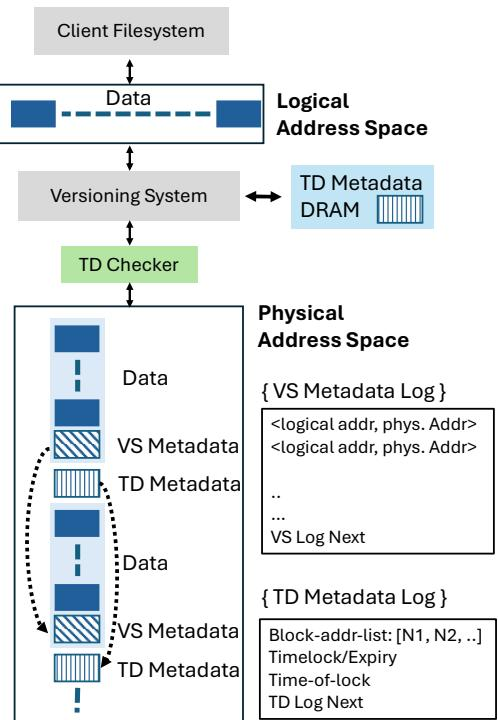  
Figure 4: Address space layout.

VS metadata log: Each log entry is also 8 bytes. Thus, a 4KB metadata block stores BlockSize−8 entries (511 entries), 8 reserving 8 bytes for a forward pointer to the next VS metadata block.

## 5.4 VS Append-Only Metadata Log

VS metadata maps each logical address to a set of TD addresses that contain its versions. We maintain this mapping using an append-only log (Section 4).

VS reserves a physical block (the home node) that stores the head pointer of a linked list of VS metadata blocks. Within each metadata block, we reserve 8 bytes for a pointer to the next block in the list. Before writing a metadata block, the VS preallocates a TD address for the next metadata block and records this pointer in the block currently being written.

This design introduces a subtle challenge: the current metadata block points to a future block that has not yet been written, and thus contains no valid metadata. If a crash or power failure occurs at this point, naïvely following the pointer chain would encounter an invalid block. We address this issue by relying on the time-of-lock. Metadata blocks in the linked list are written in chronological order, except for the final preallocated (but unwritten) block. During recovery, if a metadata block’s time-of-lock indicates it was written before its parent, we conclude that we have reached the true end of the list.

## 5.5 Garbage Collecting VS Metadata Logs

We must periodically garbage-collect the VS metadata log. The VS performs this operation infrequently (user-defined, e.g., once per month). Before unfreezing the old list, the VS constructs a condensed log that contains only the most recent version entry for each logical address. It computes this condensed log by scanning its in-memory copy of the metadata. The VS then stores the new log in TD and timelocks it with the same duration as its underlying data. The head of the new list is written to a second predefined head-pointer location in the home node. The garbage collector alternates between these two locations.

Note that TD is agnostic to whether a block contains data or version metadata; it is isolated from versioning logic and protects both using the same mechanisms. The garbage collector responsible for freeing the old VS metadata list is itself part of the untrusted VS. To free the old list, it issues timelock-update commands to the TD addresses that store the old metadata, but only after writing the new log to a separate location. The old list remains immutable during its countdown timelock state. Consequently, even a fully compromised host cannot corrupt VS metadata stored on TD until its timelock expires.

## 5.6 Garbage Collecting TD Metadata Logs

TD metadata logs are maintained using a solution similar to the VS metadata log. The mechanism for garbage-collecting TD metadata logs is also similar to that for VS logs, with one key difference. Unlike VS metadata, a TD metadata log entry cannot be unfrozen until its corresponding data block is also unfrozen. The VS unfreezes a data block only after the application creates a new version for its corresponding logical address.

To address this constraint during garbage collection, the VS issues a write that copies the current version of a logical address to a new physical block. This action enables the VS to treat the original version as the “old version” and unfreeze its TD block. Once the data block is unfrozen, the corresponding TD metadata entry can also be unfrozen, allowing the TD metadata log to be reclaimed safely.

## 5.7 TD-aware Disk Block Management in VS

The VS maintains a list of physical blocks that are in the free state. Initially, this list contains all blocks. When the filesystem writes to a logical address, the VS allocates a free TD block to store the new version. The TD block holding the previous version for that logical address is then unfrozen and moved to a countdown list. Periodically, the VS scans this countdown list and returns any TD blocks whose timelocks have expired back to the free list.

Defragmentation: The VS preserves high write perfor mance by issuing sequential writes; however, over time, the available sequential region becomes fragmented, reducing opportunities for long, efficient writes—a well-known limitation of log-structured filesystems [41]. Periodic cleaning restores sequential space by relocating live data and reclaiming fragmented segments. Unlike LFS, our VS must wait for each segment’s timelock to expire before reclaiming it. A timelockaware defragmentation daemon performs this cleaning while preserving future sequential write performance. Because all reclamations in the VS must respect timelocks, and the TDs clock remains idle while not powered on (Section 2), we note that defragmentation and garbage collection cannot make progress unless the TD is powered on.

## 6 Formally Verified Security Guarantees

We formally verified the following two strong guarantees for the metadata state of TD: (1) There is no way to bypass the immutability guarantee of a timelock. (2) In the event of a power outage, replaying the TD log of transactions correctly reconstructs the metadata state. To formally prove properties about TD we create a model of it in Dafny. Dafny is a programming language that supports proofs about functional correctness of code [24].

## 6.1 Timelock Guarantees

To guarantee timelock protections cannot be bypassed, we prove that our code exactly implements the state machine in Figure 2b. We first create an abstract model of the state machine, then prove our executable code (which operates on metadata encoded as bytes) correctly follows all states and transitions. This process, known as refinement, guarantees our code is free of exploits that allow an attacker to bypass states (e.g. skipping from Frozen Timelock directly to Free).

Proof sketch: (1) We model abstract states A and transitions from Figure 2b with the function transition(A). (2) We create a function abstract(B) that converts a sequence of bytes B to an abstract state. (3) We implement transition(B) which performs byte-level operations to encode the next state. Our proof shows that transitioning at the byte level and then abstracting is equivalent to transitions at the abstract level. Formally, for any byte sequence B: abstract(transition(B)) = transition(abstract(B)).

## 6.2 Recovery Guarantees

If the system loses power, we must correctly reconstruct the timelock metadata state from the log stored on the drive. We achieve this by persisting each metadata transaction to form a transaction log. Our proof demonstrates that scanning and replaying this log produces a metadata state equivalent to the original execution.

Proof sketch: assume that replaying the log up to transaction n produces an identical metadata state to performing those n transactions. When we perform transaction n+1 during normal execution, we update the metadata state and append the transaction to the end of the log. Since (1) the replay is correct through transaction n, and (2) the replay and real-time execution of a transaction apply the same updates, appending transaction n+1 to the end of the log preserves correctness. Thus, given the same initial state, both execution paths will always produce the same final state.

Table 2: Workloads Used for Evaluating TD.  
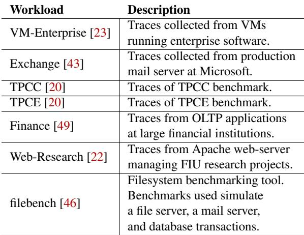

## 6.3 Proof Assumptions

Since Dafny does not natively support raw ATA commands, we use a trusted but unverified Rust function to pass commands through to the drive. We model the transaction log on disk as a data structure containing a sequence of 4KB blocks. Each time the Rust function is invoked, Dafny updates the transaction log. As such, we assume this model accurately reflects blocks as persisted on disk. As with all computer-aided proofs, we also rely on the correctness of the theorem provers verifying our Dafny code.

## 7 Evaluation

Our evaluation demonstrates the efficiency of TD across a variety of workloads. We show that, for latency, bandwidth, and I/O, TD incurs negligible overhead compared to a baseline solution. Additionally, we demonstrate the value of our hostside cache by evaluating an alternative design that scans the TD log to compute the current metadata state. Lastly, we compare our solution to the widely used backup/snapshotting solution, LVM [17], to explore the storage overhead and recoverytime implications of TD .

## 7.1 Experimental Setup

To measure TD performance, we use the workloads in Table 2. These include a mixture of traces and benchmarking workloads that capture the behavior of enterprise software [23], mail servers [43, 46], web servers [22], file servers [46], and database OLTP workloads [20, 46, 49]. We compare runtime performance against a baseline log-structured block device. This baseline has no security or versioning features and uses the log-structure to improve random-write performance.

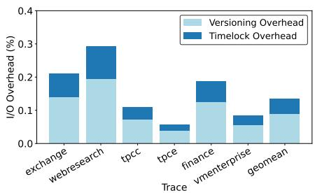  
Figure 5a. Disk IO overhead.

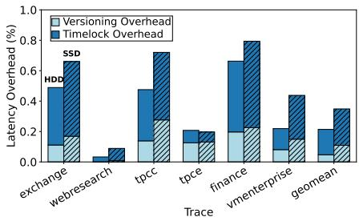  
Figure 5b. Latency overhead.

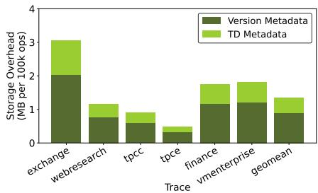  
Figure 5c. Space overhead.

In production, we envision the checker logic integrated directly into the drive’s controller silicon, with a negligible footprint. For our experiments, we use two configurations: one for security testing and one for performance evaluation.

The first configuration involves a prototype implementation of the TD checker on a low-end controller (a Raspberry Pi 5). The host driver communicates with the controller via Ethernet. This emulates the physical isolation between the host and checker and is used for the experiment in Section 7.2.

The second configuration collates the controller logic with the host machine. The host driver communicates with the controller logic via shared memory IPC. This is done to eliminate any potential bandwidth or latency limitations of the Ethernet connection, thus more closely measuring the overhead of TD. We use this configuration for all other experiments.

The primary storage device used in our evaluation is a 4TB Seagate ST4000DMZ04 hard disk. In experiments that explicitly mention SSD performance, we use a 1 TB Samsung MZ-77E1T0B drive.

## 7.2 Security Analysis

Our formal verification of the TD controller in Section 6 proves our transient immutability guarantee. To validate our secure backup system, we deploy 18 ransomware samples from well-known "families" of ransomware attacks [21]. TD successfully recovered the filesystem state for every sample.

## 7.3 Performance Analysis

## 7.3.1 Trace Evaluation:

We evaluate the latency and I/O overhead of TD via I/O traces collected from a variety of workloads found in Table 2. Before each workload, we write 1GB of data to the driver to warm up the system. We run the first 100,000 commands from each trace as quickly as possible to stress-test the I/O latency of TD. We also measure the performance of just versioning, with no timelock protections, to learn the performance breakdown.

I/O Overhead: I/O overhead is due to VS and TD metadata reads and writes. As noted earlier, these metadata are also delegated to the host, and therefore, they are only read in uncommon scenarios during recovery.

In our experiments, we conservatively version and timelock all writes. Even so, the I/O overhead stays low as seen in Figure 5a. Write-heavy traces, such as Web-Research and Exchange, incur the highest I/O overhead due to additional version and timelock metadata that must be persisted to protect the data.

Because the metadata cache is managed by the host, we do not incur additional metadata reads at runtime. Without this optimization, the I/O overhead of TD grows considerably, which we explore in Section 7.3.4.

Latency Overhead: Compared to the baseline system, the latency overhead of TD is composed of the I/O overhead, the ordering of new I/O, the cost of managing the host metadata cache (computing hashes and transferring cache blocks), and the overhead of checking the state of each block address before it is written.

As seen in Figure 5a, the I/O overhead is negligible, which is due to host-side caching. The order of I/O (contiguous versus random) can have significant performance implications. As explained in Section 5.3, VS writes version and timelock metadata contiguously with data during write-heavy periods. As a result, the additional I/O incurred by TD has minimal performance impact. Looking at the breakdown in Figure 5b, we see that the bulk of overhead in TD is due to timelock checks (ensuring blocks are free) and managing the host metadata cache. Even with the cost of timelocks/metadata management, TD achieves negligible overhead over the baseline.

We found that TD performs significantly better than LVM in terms of latency across all benchmarks, except Web-Research. LVM does not structure its data writes sequentially in a log [41], and thus suffers from random-write latency. The Web-Research benchmark is write-heavy; however, most of its writes are naturally sequential, which neutralizes the performance gap between TD and LVM.

## 7.3.2 Filesystem Benchmarks

To evaluate the performance of real-time workloads, we mount an ext4 filesystem onto the VS driver and run several write-intensive filebench [46] workloads. The filesystem used is the same for both TD and the baseline, so it does not add new overhead compared to the trace evaluation. We find, as shown in Figure 6, that, much like latency, TD incurs negligible throughput overhead.

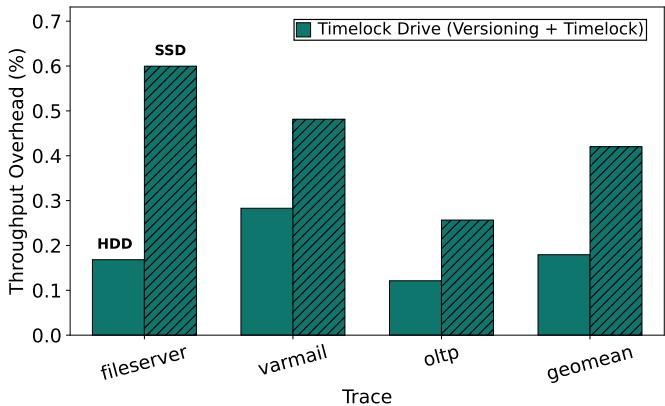

Figure 6: Throughput overhead for filebench workloads.  
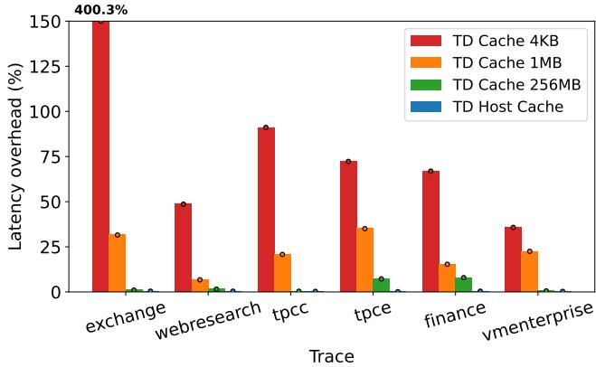  
Figure 7: Cache sensitivity analysis for traces in Table 2.

## 7.3.3 Performance on HDD vs SSD

We perform all trace and filesystem benchmark experiments twice, once on an HDD and once on an SSD. Read and write operations are considerably faster on an SSD. While the absolute cost of managing versions and doing timelock related computations stays the same, they become a larger proportion of the overall runtime. As a result we see increased overhead of TD, especially in workloads with a large volume of writes. While TD is less performant on SSDs, it still maintains a modest overhead (<1%) in all workloads.

## 7.3.4 Delegating Caching Metadata to Host

To motivate our host-managed metadata cache design from Section 3.4, we explore an alternative design for TD that manages its own cache on the gatekeeper. In a gatekeepermanaged cache design, every cache miss requires scanning the entire timelock metadata log to compute the most upto-date metadata state. To evaluate the performance of this design, we perform a sensitivity study with three different cache sizes (small/4K, medium/1M, and large/256M).

Due to the timelock constraint, there is no temporal locality for TD metadata. As a result, for write-intensive traces, we observe frequent cache misses, each of which requires an expensive log scan. This is true even for a medium-sized cache (1 MB), resulting in over 30% overhead. Even for nonwrite-intensive workloads, triggering a scan moves the seek head away from the most recently read/written data. As a result, cache misses increase the amount of random disk I/O. To avoid missing the cache entirely, we need 2GB of cache for every 1 TB of storage. This is prohibitive for a microcontroller design, which is why we opt for the host-managed cache.

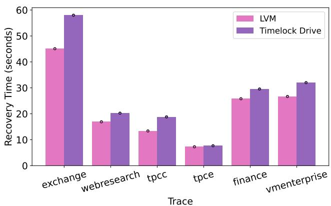  
Figure 8: Recovery time for traces in Table 2 compared to LVM.

## 7.4 Efficiency of Data Recovery

We run each trace to completion, take a snapshot, overwrite every address in the trace to simulate an integrity attack, and measure recovery time for both TD and LVM. We compared our performance against LVM’s snapshot feature.

Recovery in TD is proportional to the length of the version log, which is proportional to the number of writes. This scanning method is modestly slower than LVM, as shown in Figure 8. This is one of the two costs of TD’s append-only log design compared to a conventional backup system.

## 7.5 Storage Space Overhead

TD introduces two sources of storage space overhead. The first is from TD metadata. The TD log grows dynamically as more data is timelocked. One TD metadata log block can track updates to 1020 data blocks. A second form of space overhead is version metadata. Like TD metadata, the version log grows over time as more versions are created. One version log block can track 511 logical-to-physical mappings. Both logs grow proportionally to the number of writes.

As explained in Sections 5.5 and 5.6, we perform delayed defragmentation of the log and reclaim space once the timelock protecting it expires. Looking at Figure 5c, we can see that per 100k operations, the space overhead incurred by TD is modest. The highest space overhead comes to just over 3MB for both version and TD metadata combined. We observe that for most traces, one-quarter to one-third of the log can be reclaimed, freeing up more space in the future.

LVM, on the other hand, tracks a constant amount of metadata per snapshot, which we observed to be about 2MB. Most of our traces stay under this size for the 100k operations; however, for long-running workloads with frequent writes, LVM’s constant overhead is lower than ours. This is a cost we pay for a non-overwriting pure append-only system.

## 8 Related Work

This paper is the first to propose a versioning system while using a storage device that forbids overwrites for a fixed period. TD constructs a secure backup solution on top of an isolated timelock primitive, which was not previously known to be possible. This is challenging as the timelock drive forbids all overwrites, including metadata, for a fixed period. We also formally verify the security guarantees of TD.

Backups and Versioning. The traditional ransomware defense is data backups. Common policies include versioning [9, 14, 33], snapshotting [7], and delta backups [6, 8, 54]. These solutions are implemented in software and are thus vulnerable to common malware attacks that compromise the OS [18, 31], and are thus inadequate for ransomware defense. However, the versioning policies and optimizations they use can be implemented in TD’s untrusted VS.

Several prior works use the intrinsic out-of-place write structure of an SSD to implement data versioning that defends against ransomware without trusting the OS [18,19,50]. These works modify garbage collection in the flash translation layer (FTL) to retain old versions of data and enable rollbacks. BVSSD [19] retains all versions indefinitely, which implements a continuous data protection policy [52, 55] inside an SSD. Storage on an SSD is finite, which is why RSSD [36] modifies FTL garbage collection to back up flash blocks to the cloud via NVMe over Ethernet before erasing them, providing the illusion of infinite capacity. To truly address capacity limitations, we must eventually reclaim space. FlashGuard [18] and Project Almanac [50] allow for garbage collection and modify the FTL to add time-delayed versioning.

The use of time as a defense in FlashGuard and Project Almanac is similar to our work, however, we differ in several key ways. Both works use time retention as a security policy in their versioning logic. Notably, these prior works include a versioning system in their TCB and overwrite metadata, whereas we do not. We are the first to show that time retention can be decoupled from versioning, and that untrusted versioning software can use the TD interface to build a secure backup system. Additionally, because both prior works implement versioning in the FTL, the entire modified firmware is included in the TCB. Verifying that changing the FTL does not introduce vulnerabilities is a significant challenge. Tripathy et al. formally verify several, but not all, properties of a ransomware-resistant FTL [48], improving confidence in the correctness of FTL-based solutions.

RSSD shows that prior S4 works, including FlashGuard and Project Almanac, are vulnerable to a "trimming attack" that bypasses security checks in the FTL to erase data [36]. In contrast, our work decouples versioning from the TCB, which is a non-trivial feat as explained in Section 4.4. Our isolated TD is only responsible for enforcing timelock guarantees and is separated from the FTL, making it easier to prove strong security guarantees. We prove that TD has no equivalent to the "trimming attack" [36].

Integrating versioning and timelock checks into SSD firmware makes versioning and timelock policies less flexible, thereby restricting their use cases. By excluding versioning from the TCB, our approach enables easy updates to versioning policies and optimizations in untrusted software, without altering TCB code. As a result, TD enables several uses beyond encryption ransomware, as detailed in Section 3.5. Commercial products, such as ExaGrid and Oracle, implement “retention timelocks” by enforcing retention periods in application- or service-level backup logic [12, 44]. In contrast, our solution timelocks physical blocks on disk. It isolates timelocks from versioning logic, resulting in a minimal TCB that improves security and flexibility.

Ransomware Detection and Prevention. Another line of defense is ransomware detection, which monitors I/O and data patterns to flag malicious behavior [3, 28, 32]. But even when attacks are caught early, some data is already damaged [36], and attackers can adapt to evade known heuristics. Detection accelerates recovery, but it cannot prevent data loss; it must be paired with secure backups.

## 9 Conclusion

While significant advancements have been made to address hardware and software security vulnerabilities, solutions targeting human errors remain limited. Given that nearly twothirds of ransomware attacks exploit human weaknesses, there is a pressing need for defenses that do not rely solely on managing data access through user credentials.

Timelock Drive (TD) is a significant step toward achieving this goal. It is the first work to completely isolate the timelock defense, enabling the construction of a secure backup system with the smallest known TCB — one that doesn’t trust the user or the VS. The TD interface is simple enough to allow formal verification, yet flexible enough to support a wide range of versioning optimizations and data retention policies. These benefits come with negligible performance and storage overhead, making TD an efficient and robust solution.

## Acknowledgments

We thank our shepherd and the anonymous OSDI reviewers for their constructive feedback. This work was supported by the National Science Foundation grant 2403119.

## Availability

Our artifact is publicly available on GitHub under the GNU Affero General Public License v3.0. We have also registered our artifact on Zenodo with the DOI 10.5281/zenodo.20647469.

## References

[1] M-trends 2024 special report. Technical report, Mandiant, 2024.

[2] Steve Alder. Ascension ransomware attack hurts financial recovery. 2024. https://www.hipaajournal. com/ascension-cyberattack-2024/.

[3] SungHa Baek, Youngdon Jung, Aziz Mohaisen, Sungjin Lee, and DaeHun Nyang. Ssd-insider: Internal defense of solid-state drive against ransomware with perfect data recovery. In 2018 IEEE 38th International Conference on Distributed Computing Systems (ICDCS), pages 875– 884. IEEE, 2018.

[4] Paul Barham, Boris Dragovic, Keir Fraser, Steven Hand, Tim Harris, Alex Ho, Rolf Neugebauer, Ian Pratt, and Andrew Warfield. Xen and the art of virtualization. ACM SIGOPS operating systems review, 37(5):164–177, 2003.

[5] Simon Biggs, Damon Lee, and Gernot Heiser. The jury is in: Monolithic os design is flawed: Microkernel-based designs improve security. In Proceedings of the 9th Asia-Pacific Workshop on Systems, pages 1–7, 2018.

[6] Randal C Burns and Darrell DE Long. Efficient distributed backup with delta compression. In Proceedings of the fifth workshop on I/O in parallel and distributed systems, pages 27–36, 1997.

[7] Hoi Chan and Trieu Chieu. An approach to high availability for cloud servers with snapshot mechanism. In Proceedings of the industrial track of the 13th ACM/IFIP/USENIX international middleware conference, pages 1–6, 2012.

[8] Ann Chervenak, Vivekenand Vellanki, and Zachary Kurmas. Protecting file systems: A survey of backup techniques. In Joint NASA and IEEE Mass Storage Conference, volume 99. Citeseer, 1998.

[9] Brian Cornell, Peter A Dinda, and Fabián E Bustamante. Wayback: A user-level versioning file system for linux. In Proceedings of Usenix Annual Technical Conference, FREENIX Track, pages 19–28, 2004.

[10] David Devecsery, Michael Chow, Xianzheng Dou, Jason Flinn, and Peter M Chen. Eidetic systems. In 11th

USENIX Symposium on Operating Systems Design and Implementation (OSDI 14), pages 525–540, 2014.

[11] George W Dunlap, Samuel T King, Sukru Cinar, Murtaza A Basrai, and Peter M Chen. Revirt: Enabling intrusion analysis through virtual-machine logging and replay. ACM SIGOPS Operating Systems Review, 36(SI):211–224, 2002.

[12] ExaGrid. Retention time-lock for ransomware recovery. https://www.exagrid.com/wp-content/ uploads/ExaGrid-Retention\_Time-Lock\_for\_ Ransomware\_Recovery\_DS.pdf, 2023.

[13] Alberto Faria, Ricardo Macedo, José Pereira, and João Paulo. Bdus: implementing block devices in user space. In Proceedings of the 14th ACM International Conference on Systems and Storage, pages 1–11, 2021.

[14] Michail Flouris and Angelos Bilas. Clotho: Transparent data versioning at the block i/o level. In MSST, pages 315–328. Citeseer, 2004.

[15] Roxana Geambasu, Tadayoshi Kohno, Amit A Levy, and Henry M Levy. Vanish: Increasing data privacy with self-destructing data. In USENIX security symposium, volume 316, pages 10–5555, 2009.

[16] Roberto Gioiosa, Jose Carlos Sancho, Song Jiang, and Fabrizio Petrini. Transparent, incremental checkpointing at kernel level: a foundation for fault tolerance for parallel computers. In SC’05: Proceedings of the 2005 ACM/IEEE conference on Supercomputing, pages 9–9. IEEE, 2005.

[17] Michael Hasenstein. The logical volume manager (lvm). White paper, 2001.

[18] Jian Huang, Jun Xu, Xinyu Xing, Peng Liu, and Moinuddin K Qureshi. Flashguard: Leveraging intrinsic flash properties to defend against encryption ransomware. In Proceedings of the 2017 ACM SIGSAC conference on computer and communications security, pages 2231– 2244, 2017.

[19] Ping Huang, Ke Zhou, Hua Wang, and Chun Hua Li. Bvssd: Build built-in versioning flash-based solid state drives. In Proceedings of the 5th Annual International Systems and Storage Conference, pages 1–12, 2012.

[20] Swaroop Kavalanekar and Bruce Worthington. Microsoft enterprise traces (SNIA IOTTA trace set 131). In Geoff Kuenning, editor, SNIA IOTTA Trace Repository. Storage Networking Industry Association, October 2007.

[21] Mohsen Khashei. Ransomware-samples. https:// github.com/kh4sh3i/Ransomware-Samples, 2022.

[22] Ricardo Koller and Raju Rangaswami. I/o deduplication: Utilizing content similarity to improve i/o performance. ACM Trans. Storage, 6(3), September 2010.

[23] Chunghan Lee, Tatsuo Kumano, Tatsuma Matsuki, Hiroshi Endo, Naoto Fukumoto, and Mariko Sugawara. Understanding storage traffic characteristics on enterprise virtual desktop infrastructure. In Proceedings of the 10th ACM International Systems and Storage Conference, pages 1–11, 2017.

[24] K Rustan M Leino. Dafny: An automatic program verifier for functional correctness. In International conference on logic for programming artificial intelligence and reasoning, pages 348–370. Springer, 2010.

[25] Jochen Liedtke. On micro-kernel construction. ACM SIGOPS Operating Systems Review, 29(5):237–250, 1995.

[26] Moritz Lipp, Michael Schwarz, Daniel Gruss, Thomas Prescher, Werner Haas, Stefan Mangard, Paul Kocher, Daniel Genkin, Yuval Yarom, and Mike Hamburg. Meltdown. arXiv preprint arXiv:1801.01207, 2018.

[27] Jia Liu, Tibor Jager, Saqib A Kakvi, and Bogdan Warinschi. How to build time-lock encryption. Designs, Codes and Cryptography, 86:2549–2586, 2018.

[28] Donghyun Min, Donggyu Park, Jinwoo Ahn, Ryan Walker, Junghee Lee, Sungyong Park, and Youngjae Kim. Amoeba: An autonomous backup and recovery ssd for ransomware attack defense. IEEE Computer Architecture Letters, 17(2):245–248, 2018.

[29] Edmund B Nightingale, Kaushik Veeraraghavan, Peter M Chen, and Jason Flinn. Rethink the sync. ACM Transactions on Computer Systems (TOCS), 26(3):1–26, 2008.

[30] Justin D Osborn and David C Challener. Trusted plat form module evolution. Johns Hopkins APL Technical Digest (Applied Physics Laboratory), 32(2):536–543, 2013.

[31] Harun Oz, Ahmet Aris, Albert Levi, and A Selcuk Uluagac. A survey on ransomware: Evolution, taxonomy, and defense solutions. ACM Computing Surveys (CSUR), 54(11s):1–37, 2022.

[32] Jisung Park, Youngdon Jung, Jonghoon Won, Minji Kang, Sungjin Lee, and Jihong Kim. Ransomblocker: A low-overhead ransomware-proof ssd. In Proceedings of the 56th Annual Design Automation Conference 2019, pages 1–6, 2019.

[33] Zachary Peterson and Randal Burns. Ext3cow: A timeshifting file system for regulatory compliance. ACM Transactions on Storage (TOS), 1(2):190–212, 2005.

[34] James S Plank, Jian Xu, and Robert HB Netzer. Compressed differences: An algorithm for fast incremental checkpointing. Technical report, Citeseer, 1995.

[35] Niels Provos, Markus Friedl, and Peter Honeyman. Preventing privilege escalation. In 12th USENIX Security Symposium (USENIX Security 03), 2003.

[36] Benjamin Reidys, Peng Liu, and Jian Huang. Rssd: Defend against ransomware with hardware-isolated network-storage codesign and post-attack analysis. In Proceedings of the 27th ACM International Conference on Architectural Support for Programming Languages and Operating Systems, pages 726–739, 2022.

[37] Charles Reis and Steven D Gribble. Isolating web programs in modern browser architectures. In Proceedings of the 4th ACM European conference on Computer systems, pages 219–232, 2009.

[38] Charles Reis, Alexander Moshchuk, and Nasko Oskov. Site isolation: Process separation for web sites within the browser. In 28th USENIX Security Symposium (USENIX Security 19), pages 1661–1678, 2019.

[39] John Riggi. A look at 2024’s health care cybersecurity challenges. 2024. https://www.aha.org/news/ahacyber-intel/2024-10-07-look-2024s-health-carecybersecurity-challenges.

[40] Ronald L Rivest, Adi Shamir, and David A Wagner. Time-lock puzzles and timed-release crypto. 1996.

[41] Mendel Rosenblum and John K Ousterhout. The design and implementation of a log-structured file system. ACM Transactions on Computer Systems (TOCS), 10(1):26– 52, 1992.

[42] Reiner Sailer, Enriquillo Valdez, Trent Jaeger, Ronald Perez, Leendert Van Doorn, John Linwood Griffin, Stefan Berger, Reiner Sailer, Enriquillo Valdez, Trent Jaeger, et al. shype: Secure hypervisor approach to trusted virtualized systems. Techn. Rep. RC23511, 5, 2005.

[43] Vishal Sharda, Swaroop Kavalanekar, and Bruce Worthington. Exchange server traces (SNIA IOTTA trace 134). In Geoff Kuenning, editor, SNIA IOTTA Trace Repository. Storage Networking Industry Association, December 2007.

[44] Kelly Smith. Retention lock your cloud database backups for increased ransomware protection. https://blogs.oracle.com/maa/post/retention-lock-forincreased-ransomware-protection, 2023.

[45] John D Strunk, Garth R Goodson, Michael L Scheinholtz, Craig AN Soules, and Gregory R Ganger. Selfsecuring storage: Protecting data in compromised systems. In OSDI, pages 165–180, 2000.

[46] Vasily Tarasov, Erez Zadok, and Spencer Shepler. Filebench: A flexible framework for file system benchmarking. login Usenix Mag., 41, 2016.

[47] The Linux Kernel Documentation. Page Table Isolation (PTI). Documentation for PTI (Page Table Isolation) on x86.

[48] Shivani Tripathy, Debiprasanna Sahoo, Manoranjan Satpathy, and Madhu Mutyam. Formal modeling and verification of security properties of a ransomware-resistant ssd. IEEE Transactions on Computer-Aided Design of Integrated Circuits and Systems, 42(8):2766–2770, 2022.

[49] University of Massachusetts. OLTP trace from UMass trace repository. https://traces.cs.umass.edu/ docs/traces/storage/, 2002.

[50] Xiaohao Wang, Yifan Yuan, You Zhou, Chance C Coats, and Jian Huang. Project almanac: A time-traveling solidstate drive. In Proceedings of the Fourteenth EuroSys Conference 2019, pages 1–16, 2019.

[51] Sophos Whitepaper. The state of ransomware in healthcare 2024. Technical report, 2024. https://assets.sophos.com/ X24WTUEQ/at/4bk9xt4h7gsm4xs6mfzh3k/ sophos-state-of-ransomware-healthcare-2024. pdf.

[52] Weijun Xiao, Jin Ren, and Qing Yang. A case for continuous data protection at block level in disk array storages. IEEE Transactions on Parallel and Distributed Systems, 20(6):898–911, 2008.

[53] Yulai Xie, Dan Feng, Zhipeng Tan, and Junzhe Zhou. Unifying intrusion detection and forensic analysis via provenance awareness. Future Generation Computer Systems, 61:26–36, 2016.

[54] Yucheng Zhang, Ye Yuan, Dan Feng, Chunzhi Wang, Xinyun Wu, Lingyu Yan, Deng Pan, and Shuanghong Wang. Improving restore performance for in-line backup system combining deduplication and delta compression. IEEE Transactions on Parallel and Distributed Systems, 31(10):2302–2314, 2020.

[55] Ningning Zhu and Tzi-cker Chiueh. Portable and efficient continuous data protection for network file servers. In 37th Annual IEEE/IFIP International Conference on Dependable Systems and Networks (DSN’07), pages 687–697. IEEE, 2007.