USENIX

THE ADVANCED COMPUTING SYSTEMS ASSOCIATION

# Unleash All Cores: Asymmetry-aware Scalable DNN Inference on Mobile CPUs

Qianlong Sang, Puyi He, Huanghuang Liang, and Yili Gong, Wuhan University; Chuang Hu and Xiaobo Zhou, University of Macau; Dazhao Cheng, Wuhan University

https://www.usenix.org/conference/osdi26/presentation/sang

# This paper is included in the Proceedings of the 20th USENIX Symposium on Operating Systems Design and Implementation.

July 13–15, 2026 • Seattle, WA, USA

ISBN 978-1-939133-55-7

Open access to the Proceedings of the 20th USENIX Symposium on Operating Systems Design and Implementation is sponsored by

# Unleash All Cores: Scalable Asymmetry-aware DNN Inference on Mobile CPUs

Qianlong Sang School of Computer Science Wuhan University

Yili Gong School of Computer Science Wuhan University

Puyi He School of Computer Science Wuhan University

Chuang Hu   
IOTSC   
University of Macau

Huanghuang Liang School of Computer Science Wuhan University

Xiaobo Zhou   
IOTSC   
University of Macau

Dazhao Cheng<sup>∗</sup> School of Computer Science Wuhan University

## Abstract

Asymmetric Multiprocessing (AMP) CPUs are now central to mobile devices, but exploiting them for efficient Deep Neural Network (DNN) inference remains challenging. Naive scheduling across heterogeneous cores often triggers a performance-collapse paradox: adding LITTLE cores degrades throughput due to workload imbalance. Existing approaches rely on static partitioning, which partially mitigates imbalance but fails to adapt to runtime interference, incurs extra task acquisition overhead, and ignores core–kernel affinities—leaving substantial performance untapped.

We present SANI, a scalable, asymmetry-aware inference framework that unleashes the full potential of AMP architectures. SANI introduces three key mechanisms: (1) an affinity aware kernel issuer that selects cluster-optimal kernels to exploit core–kernel efficiency from the outset; (2) an adaptive granularity scheduler that dynamically merges or splits tasks, balancing load under runtime interference by mapping smaller tasks to slower cores and larger ones to faster cores; and (3) an on-demand kernel switcher that efficiently transforms kernels during workload migration, preserving affinity across clusters. We implement SANI atop Arm-CL and evaluate it on five mobile SoCs. SANI reduces DNN inference latency by 17.6%–23.7% on average (up to 29.5% on some models) while lowering energy consumption by up to 39% compared to state-of-the-art baselines, scaling efficiently across both symmetric and asymmetric CPU configurations.

## 1 Introduction

On-device deep neural network (DNN) inference has become a cornerstone of modern mobile applications [21, 51, 56, 61]. While GPUs and NPUs provide high throughput, they are not always available across devices or workloads. In contrast, CPUs remain the most broadly deployable platform for mobile inference: they offer predictable performance when accelerators are absent and enable flexible scheduling for diverse application needs [2, 11, 12, 17, 30, 36, 48].

To meet the dual demands of performance and energy efficiency, modern mobile system-on-chips (SoCs) increasingly adopt AMP CPUs designs. These architectures integrate a mix of high-performance big cores for compute-intensive tasks and energy-efficient LITTLE cores for lighter workloads [4, 5, 26, 44]. This heterogeneity provides a powerful substrate for efficient inference—but also introduces new challenges for scheduling and workload balance.

A natural way to exploit AMP CPUs for DNN inference is to partition an operator’s output tensor into smaller chunks and distribute them across all available cores for parallel execution. Intuitively, this should improve throughput. In practice, however, the asymmetry between big and LITTLE cores undermines this strategy. Our measurements reveal a performance-collapse paradox: adding LITTLE cores can increase end-to-end latency by up to 37%. The root cause is workload imbalance: faster threads on big cores frequently stall at synchronization barriers, waiting for slower LITTLEcore threads to complete. These latencies dominate execution time, erasing the benefits of using additional cores.

Existing mainstream solutions for DNN inference on AMP CPUs fall into three categories, each with inherent limitations. First, symmetry-only execution (e.g., Arm Compute Library (Arm-CL) [6]) confines computations to big cores, sidestepping asymmetry but leaving LITTLE cores idle and wasting available resources. Second, proportional static partitioning (e.g., MNN [25]) divides work according to fixed big-to-LITTLE performance ratios. This strategy reduces imbalance under ideal conditions but is brittle in the presence of runtime interference—ubiquitous on mobile devices—causing significant wait latencies. Third, fine-grained dynamic dispatch, such as AsyMo [49], partitions work into many small tasks guided by cost models. While more adaptive, the fine granularity introduces high task acquisition overhead due to the frequency of dequeue operations.

Beyond scheduling, core–kernel affinity plays a critical but underexplored role. Big and LITTLE cores have distinct microarchitectures that favor different operator implementations (kernels). Existing frameworks typically select a single default kernel per operator and apply it uniformly across clusters, ignoring these affinities. When workloads migrate between clusters, performance often deteriorates. Our measurements show that aligning kernel choice with cluster affinity can yield over 30% performance improvement.

In short, prior methods lack two critical capabilities: (1) runtime control of workload granularity to maintain balance under interference, and (2) mechanisms to exploit core–kernel affinity for efficient execution. These limitations leave significant performance headroom untapped.

To overcome these limitations, we present SANI, a Scalable Asymmetry-aware Neural Inference framework, which is designed to exploit asymmetric mobile CPUs fully. SANI introduces two key innovations. First, an affinity-aware execution strategy that selects the most efficient kernel for each CPU cluster and preserves affinity even during workload migration. Second, an adaptive granularity scheduler that dynamically adjusts task sizes, assigning smaller tasks to slower cores and larger ones to faster cores, thereby sustaining load balance under unpredictable runtime interference.

Firstly, SANI employs a holistic approach to maintain core–kernel affinity throughout the inference pipeline. At initialization, it proactively selects cluster-specific kernels for each operator using a hardware-aware cost model that considers microarchitectural features such as SIMD width and cache hierarchy. This ensures that both big and LITTLE cores are issued their most efficient kernel from the outset, avoiding the one-size-fits-all choices made by existing frameworks. To preserve this efficiency under dynamic execution, SANI performs on-demand kernel transformations, remapping workload indices between the layouts of source and target kernels when workloads migrate across clusters. Unlike prior systems that suffer penalties after migration, this reactive step guarantees that cores continue executing their most-affine kernel, sustaining high performance even in the presence of runtime interference and rescheduling.

Secondly, SANI introduces an adaptive granularity scheduler to combat workload imbalance from core asymmetry and runtime interference. Unlike prior approaches that rely on fixed partitions or excessively fine-grained dispatch, SANI continuously monitors lightweight runtime feedback from each thread to guide scheduling decisions. Based on this feedback, it dynamically adjusts task granularity through two fundamental operations, Merge and Split. Faster threads are assigned larger, merged workloads to reduce task acquisition overhead, while slower threads receive smaller, split workloads to prevent them from becoming bottlenecks. This adaptive mechanism enables SANI to maintain balanced execution even under unpredictable interference from background processes, sustaining throughput while minimizing synchronization stalls and queueing costs.

Together, these mechanisms make SANI inherently scalable across heterogeneous CPU configurations, from symmetric big-core execution to fully asymmetric deployments with LITTLE cores.

In summary, the contributions of this paper are:

• We conduct a measurement study showing that adding LITTLE cores for DNN inference on asymmetric CPUs can paradoxically increase end-to-end latency, and we analyze workload imbalance as the root cause of this performance-collapse phenomenon.

• We design an affinity-aware kernel issuer to proactively select cluster-specific kernels, and an on-demand kernel switcher to transform workloads during migration; together, these components preserve core–kernel affinity and maximize execution efficiency.

• We propose an adaptive granularity scheduler that dynamically adjusts task sizes at runtime using merge and split operations, effectively balancing workloads and mit igating bottlenecks of runtime interference.

• We demonstrate that SANI scales efficiently across various CPU configurations, sustaining performance and energy efficiency on five commercial SoCs.

We implemented SANI atop the Arm-CL. Evaluated on five distinct mobile devices across six representative neural networks, SANI delivers average latency reductions of 17.6%–23.7% and up to 39% lower energy consumption, while demonstrating robust performance and significantly lower wait latency under runtime interference. Notably, SANI is the first inference framework designed to holistically address both the inherent compute asymmetry and runtime interference characteristic of mobile AMP CPUs. This work targets operator-level parallelizable workloads and is not designed for large-scale on-device LLM inference, where NPUs are the more suitable target. The core abstractions are operator-shape rather than model-class specific, and we discuss the carry-over to transformer workloads in § 5.5.

## 2 Background and Motivation

## 2.1 DNN Inference on AMP

Modern mobile SoCs increasingly employ AMP architectures that combine heterogeneous CPU clusters on a single die [4,5, 26, 44]. A typical big.LITTLE configuration integrates highperformance cores with energy-efficient ones [5], offering a flexible trade-off between performance and power efficiency. These clusters share a unified physical address space and remain cache-coherent through the on-chip interconnect. Each cluster keeps its own private L1 and L2 caches, while the lastlevel L3 cache and main memory are shared across clusters. As a result, big and LITTLE cores can collaborate on DNN inference without explicit data movement.

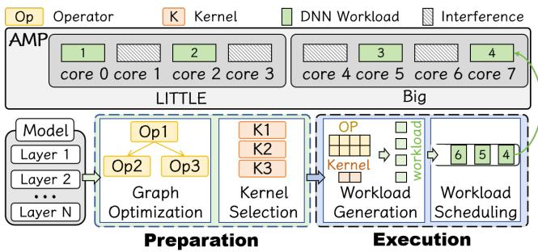  
Figure 1: The process of DNN inference on AMP.

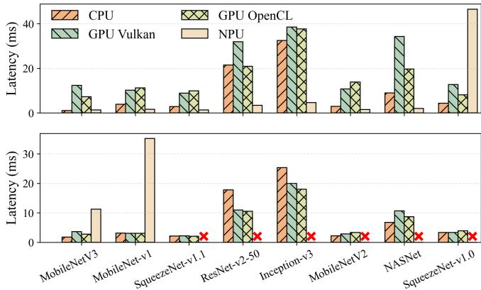  
Figure 2: Inference latency comparison across CPU, GPU (Vulkan/OpenCL), and NPU backends on Google Pixel 9 (top) and OnePlus 12 (bottom). Missing bars indicate unsupported models or execution failures.

However, unlike dedicated servers, mobile environments are subject to runtime interference. Foreground applications, background services, and system daemons frequently contend for shared cores [53], leading to volatile compute availability [52, 57]. In this complex runtime environment, DNN in ference pipelines translate a network’s design into efficient execution flows. As shown in Fig. 1, the process begins with graph optimization, translating high-level layers into mathematical operators, followed by kernel selection, where hardware-tuned kernels are chosen to realize each operator. During execution, operators are partitioned into fine-grained workloads that are placed in task queues and fetched by CPU threads. Specifically, each workload is the schedulable unit handed to one inference thread, consisting of a contiguous sub-region of the operator’s output tensor and a pointer to the kernel that executes it. These workloads collaboratively apply the chosen kernel to compute the operator’s output tensor.

Why CPU Inference Matters. While mobile GPUs and NPUs are often considered preferred accelerators, CPU-based execution remains indispensable. As shown in Fig. 2, we benchmarked DNNs across CPU, GPU, and NPU backends using MNN [25] on the Google Pixel 9 [19] and OnePlus

12 [39]. Well-optimized CPU inference outperforms mobile GPUs for lightweight models such as MobileNetV3 [23] by 6–11× due to GPU kernel launch overhead and data transfer costs [58]. Moreover, mobile GPUs employ FIFO scheduling, causing inference tasks to compete with rendering and degrade user experience [20]. NPUs, while efficient for supported models, suffer from compatibility limitations: on the Pixel 9, SqueezeNetV1.0 [24] falls back to CPU with 10× slowdown (46.5 ms vs. 4.4 ms), while on the OnePlus 12, most tested models including ResNet-50 [22] and Inception-V3 [47] fail entirely due to vendor-specific operator support gaps. These observations underscore that CPUs are the only universally available and reliable backend for on-device inference, making CPU efficiency essential on AMP architectures.

## 2.2 Analysis of Existing DNN Inference on AMP

While many DNN inference frameworks exist for homogeneous multi-core systems [37, 54] and heterogeneous SoCs (CPU/GPU/NPU) [1, 9, 15, 27, 35], they face significant performance constraints on AMP architectures. Their limitation stems from an implicit assumption of core symmetry in multi-threaded execution. This prevents the effective use of asymmetric cores and results in suboptimal performance. Therefore, developing frameworks that efficiently utilize all cores is critical for on-device AI. To this end, we perform a measurement study to quantify the performance gap and identify its root causes.

Measurement Setup. We evaluated four convolutional neural networks: MobileNet [23], SqueezeNet, ResNet-50, and Inception-V3, on a Google Pixel 9 equipped with an asymmetric octa-core CPU (1×Cortex-X4, 3×Cortex-A720, 4×Cortex-A520) at their maximum frequencies. To streamline core-type comparisons, Cortex-X4 and Cortex-A720 were categorized as “big” cores throughout the experiments. All measurements were conducted without concurrent foreground or background applications. The baseline implementation leveraged the Arm-CL [6], Arm’s official inference framework optimized for mobile architectures. Subsequently, we conducted a systematic analysis of inference latency scaling to thread number increments across heterogeneous core configurations.

Performance Gap and Causes. Fig. 3 illustrates a pronounced performance collapse, revealing a significant discrepancy between the observed Native performance and a theoretical Expected baseline. We established the Expected baseline to serve as a theoretical upper bound on performance. First, we profiled each model to characterize the proportion of its workload that can be parallelized. Then, based on Amdahl’s Law [3], we projected the ideal latency scaling. This projection incorporates the fixed performance ratios between big and LITTLE cores, which are specified by chip manufacturers in configuration files [8]. The Expected curve, therefore, represents an ideal scenario that assumes perfect scaling without accounting for real-world factors like scheduling overhead or interference.

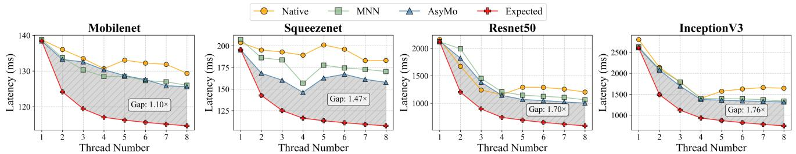  
Figure 3: Performance Collapse Paradox: DNN inference throughput degradation with the introduction of LITTLE cores on AMP architectures. The first 4 threads run on different big cores. Others run on different LITTLE cores.

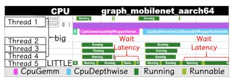  
(a) A real trace of thread execution timeline showing (b) Latency Break-LITTLE cores becoming bottlenecks down

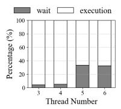  
Figure 4: Bottleneck analysis and latency breakdown for MobileNet inference on Google Pixel 9.

Contrary to this theoretical expectation, our analysis reveals a paradox. Integrating LITTLE cores, despite increasing the total number of available threads, markedly increases the overall inference latency.

To pinpoint the cause, we decompose latency into two components in multi-threaded DNN inference: execution latency, which measures time spent on computation, and wait latency, which quantifies synchronization delays due to imbalanced task distribution and scheduling interference. We employed Perfetto [18], the Android’s official performance tracing tool, to monitor thread behavior during MobileNet inference. As depicted in Fig. 4(a), on a configuration with 4 big cores and 1 LITTLE core, the thread on the LITTLE core requires substantially more time to complete identical workloads. This arises because the default scheduler in Arm-CL evenly distributes tasks across threads, disregarding core performance disparities and thereby transforming LITTLE cores into bottlenecks. The latency breakdown in Fig. 4(b) confirms this analysis, showing that introducing LITTLE cores increases wait latency from roughly 5% to 30% of the total inference time, as faster big cores remain idle waiting for slower LITTLE cores to complete their workloads.

To address this issue, current approaches can be categorized into three strategies. First, symmetry-only execution as employed by Arm-CL, which defaults to use only homogeneous cores (typically just one core in a common 1+3+4 CPU core set), sacrificing potential computational resources to avoid asymmetry complications. Using only big cores forgoes the energy efficiency that LITTLE cores can deliver for sustained inference, while using only LITTLE cores wastes the throughput that big cores can deliver on the critical path. Second, proportional workload partition that allocates tasks according to computational capability ratios between asymmetric processors, exemplified by MNN [25]. Third, fine-grained partitioning with dynamic scheduling, as in AsyMo [49], which divides computation into smaller tasks and balances load distribution with memory access efficiency.

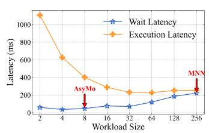

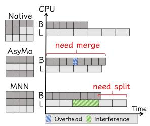  
(a) Impact of workload size on latencies (b) An illustration of inefficiency in for GemmAssembly kernel. static workload size.  
Figure 5: Analysis of static workload size inefficiencies on AMP architecture.

As shown in Fig. 3, implementing these partitioning strategies in Arm-CL yield speedups of approximately 1.2× to 1.25× for complex models like ResNet-50 and Inception-V3 when using all cores.

Nonetheless, these improvements fall substantially short of theoretical expectations, highlighting a significant performance gap. This gap is particularly critical for on-device inference, which is highly latency-sensitive. Many real-time mobile applications operate under strict per-frame latency budgets (e.g., 8.3 ms for 120 FPS [53]), making even millisecondscale improvements for DNN models highly significant in closing the gap to the theoretical optimum.

Key Observations. Through the measurement conducted on the same Pixel 9 setup as the earlier experiments, we have the following two key observations:

Observation 1: Static workload size becomes particularly inefficient in AMP architectures operating under interferenceprone systems. Mobile devices concurrently run numerous system and user applications, creating a dynamic execution environment where inference threads compete for shared resources and face frequent preemption. Consequently, the effective compute speed of any core can fluctuate unpredictably. Existing frameworks that rely on static workload partitioning are ill-equipped to handle this volatility. Specifically, an operator’s computation is partitioned into fixed-size workloads that are dispatched to inference threads, and threads wait at a synchronization barrier once their workloads complete. The workload size here refers to the sub-region of the operator’s output tensor that a single workload covers, determined by its extents along multiple dimensions. As shown in Fig. 5(a), their fixed-size workloads create a fundamental trade-off, where larger workloads reduce overhead but increase wait latency under interference, while smaller workloads do the opposite. A larger workload size amplifies wait latency, since the slow thread holding the final workload forces the others to idle at the barrier for its entire duration. A smaller workload size yields more workloads in total, adding task-acquisition overhead to the execution latency. This dilemma is illustrated in Fig. 5(b). Fine-grained partitioning, as used by AsyMo, incurs extra task acquisition overhead as faster cores (e.g., the big core) must fetch tasks multiple times, an issue that could be mitigated by merging workloads. Conversely, coarsegrained proportional partitioning, as used by MNN, leads to severe wait latency when interference slows down a core (e.g., the LITTLE core), a problem that could be solved by splitting its large workload for other cores to share.

Observation 2: Different core types perform optimally with distinct kernel implementations, creating core-kernel affinity patterns. The optimal code implementation for an operator is not universal across an AMP CPU, as different core types show distinct performance preferences. To quantify this, we benchmarked representative Convolution and DepthWiseC onvolution operators on big and LITTLE cores using various kernel implementations. As detailed in Table 1, the results reveal clear affinities. The best-performing kernel for a GEMM operator on big cores is 9.1% faster than the alternative, while on LITTLE cores, the preference is reversed. This effect is even more pronounced for DepthWise convolutions, where using a suboptimal kernel can degrade performance by over 34%. Current frameworks, however, are blind to this. They select a single kernel for an operator during initialization and use it universally. This static choice inevitably leads to missed optimization opportunities, as one of the two core clusters is forced to execute a non-affine kernel. Moreover, when workloads migrate between clusters at runtime, the affinity mismatch persists, resulting in suboptimal performance and preventing the system from reaching its full potential.

Opportunities. These observations highlight a clear path toward optimization. The core challenge from observation 1 is that any static workload size is inherently suboptimal in dynamic mobile environments. This necessitates an adaptive granularity scheduler that can dynamically adjust task sizes to balance execution efficiency and wait latency under interference. Similarly, observation 2 presents a two-fold challenge related to core-kernel affinities. An effective solution must both proactively identify and prepare the optimal kernel for each cluster, which calls for an affinity-aware kernel issuer. It must also reactively handle workload migrations at runtime, requiring an on-demand kernel switcher to perform efficient, on-the-fly transformations. Together, these three components form the holistic SANI framework, designed to systematically address these challenges and achieve near-optimal performance on AMP architectures.

Table 1: Kernel execution time (ms) across core types. h1: hybrid\_6 × 16, sg: sgemm\_8 × 12, d1: depth f irst\_2 × 2, d2: depth f irst\_3 × 3. B/W: Best/Worst ratio.  
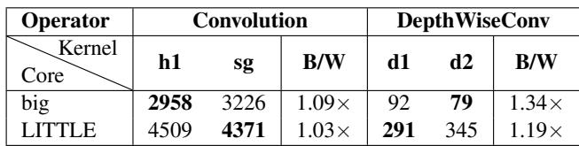

## 3 SANI Design

## 3.1 System Overview

As shown in Fig. 6, SANI’s architecture is composed of three synergistic components designed to maximize inference performance on asymmetric multi-core processors.

The workflow begins with the Affinity-Aware Kernel Issuer. This module evaluates operators within a neural network to identify opportunities for a dual-kernel issue, where distinct, cluster-specific kernel implementations are prepared for both big and LITTLE cores based on their hardware affinity. It then standardizes all workloads into a uniform ’block’ format and organizes them into separate queues for each processor cluster (e.g., a big-core queue and a LITTLE-core queue). Here, a block is a kernel-agnostic partition unit over the operator’s output tensor. Its tile dimensions are set to the least common multiple of the native output sizes of the big- and LITTLE-affine kernels. Blocks are designed as the uniform abstraction above workloads with which the scheduler organizes parallel dispatch. Next, the Adaptive Granularity Scheduler manages the runtime execution. It assigns threads to pull workload blocks from their corresponding cluster’s queue. By monitoring the completion time of each block, the scheduler dynamically adjusts task granularity using two core operations: Merge and Split. Merging combines smaller blocks into larger ones to reduce acquisition overhead for faster threads, while splitting breaks down large blocks to prevent slower threads from creating bottlenecks, thus ensuring a balanced load. Finally, the On-Demand Kernel Switcher is triggered when the scheduler decides to migrate a workload between asymmetric CPU clusters to maintain workload balance. If the source and target clusters have different optimal kernels for that workload, the switcher performs the kernel transformation. It uses a pre-computed map to correctly convert the workload’s indices from the source kernel’s layout to the destination’s. This ensures the new kernel executes on the same computational region, preserving correctness while maximizing performance on the target core. This tightly integrated workflow, from multi-kernel preparation to dynamic scheduling and on-demand transformation.

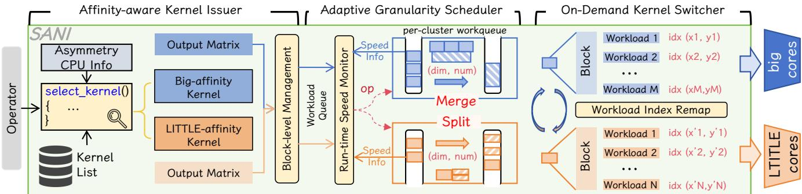

Figure 6: SANI architecture.  
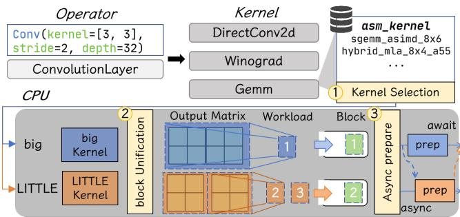  
Figure 7: Workflow of affinity-aware kernel issuer.

## 3.2 Affinity-Aware Kernel Issuer

The affinity-aware kernel issuer prepares operators for efficient heterogeneous execution. Its primary role is to select optimal, cluster-specific kernels and unify their workload representations into a standardized format, all while hiding preparation overhead. As shown in Fig. 7, this process involves three key steps.

Kernel Selection. For each operator O <sub>j</sub> in the neural network, the issuer selects the most suitable kernel implementation for a given CPU cluster H by predicting its performance. It leverages a cost model that calculates an affinity score, A(O <sub>j</sub>, K<sub>i</sub>, H), for each available kernel variant K<sub>i</sub>:

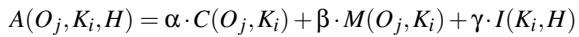

(1)

where C(O ,K ) represents the computational cost, which estimates the total number of arithmetic operations based on the operator’s tensor shapes and the kernel’s logic. M(O <sub>j</sub>, K<sub>i</sub>) is the memory cost, estimating the total data movement by analyzing the kernel’s specific data access pattern for the given operator shapes.

Finally, I(K<sub>i</sub>, H) is an instruction compatibility score that quantifies how well the kernel’s instruction mix (e.g., specialized SIMD instructions) aligns with the target cluster’s micro-architecture. The affinity score is designed to be inversely proportional to execution latency. The cluster-specific weighting factors α, β, and γ are pre-determined by fitting the model to empirical latency measurements using linear regression during an offline profiling stage. The selection process is thus formalized as finding the optimal kernel K<sup>∗</sup> for operator O <sub>j</sub> on cluster H:

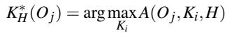

(2)

This process allows the issuer to identify the optimal kernel pair—one for big cores and one for LITTLE cores—for each operator that can benefit from a dual-kernel strategy.

Block Unification. Different kernel implementations often have distinct output shapes and compute orders, which complicates scheduling and workload migration. To address this heterogeneity, we introduce a standardized ‘block‘ abstraction for a consistent workload interface. This unification process involves two key steps. First, to align the computational sequence, we define a unified partitioning and iteration strategy. The operator’s total output tensor is partitioned along its height and width dimensions based on the kernel’s native tile size, and we enforce a height-first iteration order. This ensures that all kernel variants process workloads in a predictable and consistent sequence. Second, to harmonize the different output shapes, we define the unified block’s dimensions using the Least Common Multiple (LCM) of the candidate kernels output tile dimensions. For example, if a big-core kernel has a 2×4 output tile and a LITTLE-core kernel has a 2×2 tile, the unified block size becomes 2 × 4. The entire operator’s output tensor is then logically partitioned into these blocks. This process establishes a clear mapping between a single block’s index and the corresponding workload indices for both the big-core and LITTLE-core kernels, which is critical for subsequent scheduling and migration. For the initial dispatch, these blocks are distributed to the cluster-specific queues, with the number of blocks for each queue proportional to the cluster’s relative compute capacity. Using cluster-specific queues instead of a single global queue serves two purposes. First, threads on each cluster pull blocks that have been preloaded with the affine kernel and act on data already warm in that cluster’s private caches, preserving locality. Second, separating the queues avoids the contention that a single global queue would impose on all inference threads at every dequeue.

```c
struct W { 13 vector<W> split(W w, int n, int d) {
2 int split_dim; 14 vector<W> w_v;
3 int start[MAX_DIM]; 15 W t_w = w;
4 int end[MAX_DIM]; 16 int k = (w.end[d] - w.start[d]) / n;
5 void (* kernel)(); 17 for (int i = 0; i < n; i++) {
6 }; 18 t_w.start[d] = w.start[d] + i*k;
7 W merge(vector<W> w) { 19 t_w.end[d] = w.start[d] + (i+1)*k;
8 int dim = w[0].split_dim; 20 t_w.split_dim = d;
9 W w_m = w[0]; // initialize 21 w_v.emplace_back(t_w);
10 w_m.end[dim] = w.back().end[dim]; 22 }
11 return w_m; 23 return w_v;
12 } 24 }
```  
Figure 8: Merge and Split APIs in SANI.

Asynchronous Preparation. Preparing distinct kernels for each cluster could introduce significant latency if performed sequentially, as each requires setup tasks like memory allocation and weight pre-transpose. Concretely, preparation covers per-operator memory allocation for the dual-kernel pair, weight pre-transposition into each kernel’s native layout, and construction of the index map used by block unification. It runs once at model load and is not repeated during online inference. To mitigate this overhead, SANI employs an asynchronous preparation strategy. The preparation tasks for multiple kernels are submitted to a thread pool concurrently. Since these preparation stages are typically single-threaded, this parallelism effectively utilizes available multi-core resources, hiding the latency of the additional kernel variants. A synchronization barrier ensures all preparations are complete before the online inference phase begins. The overhead introduced by this strategy will be quantified in our overhead analysis (§ 5.4).

## 3.3 Adaptive Granularity Scheduler

The primary goal of our adaptive granularity scheduler is to balance wait latency and execution latency to maximize overall system performance in AMP environments.

Design Rationale. Observation 1 shows that static workload size cannot fit all execution scenarios, so we propose an adaptive granularity scheduler that adjusts workload size and distribution. Our design philosophy follows the principle: “With great power comes great responsibility”. Threads demonstrating higher execution speed should handle larger workloads, as they are less likely to become performance bottlenecks even under system interference. Conversely, slower threads should process smaller workloads to prevent them from becoming system-wide bottlenecks.

Workload Operations. As shown in Fig. 8, we define a struct W to represent a workload, encapsulating both the computational region and the kernel to be executed. It contains start and end indices for each dimension, the dimension used for partitioning, and a pointer to its assigned kernel. Based on this structure, we define two fundamental operations: Merge and Split. The Merge operation takes a vector of contiguous workloads and a dimension as input, combining them into a single, larger workload. It creates a new workload that spans from the first workload to the last one along the specified dimension. Conversely, the Split operation takes a workload and divides it into multiple smaller sub-workloads along the dimension. Each resulting sub-workload maintains identical boundaries in all other dimensions. Both operations adjust workload size within a single cluster queue and preserve the kernel pointer carried by each workload.

Algorithm 1: Adaptive Granularity Scheduling   
Input: W : Workloads Queue; T : Number of threads;   
k: Number of threads to adjust per round;   
Output: Completed execution of all workloads   
1 Initialize counter C<sub>i</sub> = 1 for each thread i ∈ {1,2,..., T }   
2 Initialize round counter r = 0   
3 while W is not empty do   
4 r ← r + 1   
5 for each thread i ∈ {1,2,...,T } in parallel do   
6 if C<sub>i</sub> ≥ 1 then   
7 Fetch C<sub>i</sub> workloads {w<sub>1</sub>,w<sub>2</sub>,...,w<sub>C</sub> } from W   
8 w<sub>i</sub> ← Merge({w<sub>1</sub>, w<sub>2</sub>, . . . , w<sub>C</sub> })   
9 else   
10 Fetch one workload w from W   
11 Find the smallest d in dim such that w[d] > T .   
{w<sub>1</sub>, w<sub>2</sub>, . . . , w<sub>T</sub> } ← Split(w, T, d)   
12 Execute w with w .kernel   
13 Record completion time t<sub>i</sub> for thread i in round r   
14 Sort threads by completion time {t<sub>1</sub>,t<sub>2</sub>, . . . ,t<sub>T</sub> }   
15 for the k fastest threads i do   
16 C<sub>i</sub> ← C<sub>i</sub> +1   
17 for the k slowest threads i do   
18 C<sub>i</sub> ← C<sub>i</sub> −1

Adaptive Scheduling. Algorithm 1 implements our core scheduling strategy. The algorithm operates in rounds, processing workloads until the queue is empty. In each round, after all threads complete their tasks (Lines 6–15), they are sorted by completion time (Line 16). Following our design principle, the k fastest threads are rewarded with larger workloads for the next round by incrementing their counters, enabling them to merge more blocks (Line 8). Conversely, the k slowest threads are penalized by decrementing their counters. If a thread’s counter drops below one, it must split its next workload (Lines 10-13). To prevent creating excessively small tasks, the split logic first identifies the smallest dimension whose iteration count is still larger than the number of threads before partitioning (Line 11). This adaptive approach gradually aligns task granularity with each thread’s true runtime capacity, inherently accounting for both system interference and processor asymmetry.

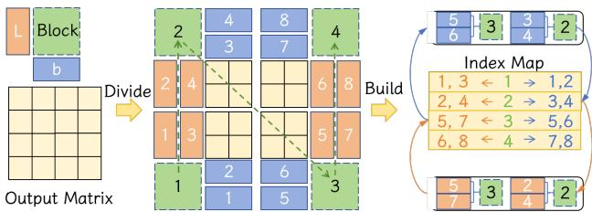  
Figure 9: Workflow of on-demand kernel switcher.

With N workloads and T threads, each workload is dequeued once, giving a base cost O(N). Moreover, merges across rounds sum to Θ(N). Splits add only a constant-factor overhead since each event produces at most T sub-workloads. The per-round sort over T completion times is O(1). Therefore, the overall time complexity is O(N).

## 3.4 On-Demand Kernel Switcher

To maintain workload balance when a cluster’s workload queue is depleted, the adaptive granularity scheduler initiates workload migration from another cluster, which creates a challenge for exploiting core-kernel affinity. A core receives a workload prepared for a different architecture, leading to suboptimal performance if executed with a non-affine kernel. The on-demand kernel switcher addresses this by performing an efficient, on-the-fly transformation of the workload.

To ensure transformations are fast and effective, the ondemand kernel switcher incorporates three key optimization strategies. First, to accelerate the index mapping, it pre-builds and stores a direct-mapped lookup table. enabling constanttime lookups at runtime. Second, it employs a threshold-based filter. Workloads smaller than a pre-defined size are exempt from transformation, avoiding overhead where the potential performance gain is negligible. Third, it implements a specialized policy for merged workloads introduced by the scheduler. To handle the larger aggregated workloads efficiently, the switcher uses a columnar transformation strategy. It leverages the start and end indices of the merged block to retrieve the entire range of corresponding target workload indices from the pre-built map in a single operation, which avoids costly individual lookups for each sub-block and is further optimized by the height-first data layout.

When a workload is migrated at runtime, the switcher executes a kernel transform that leverages these optimizations, a process illustrated in Fig. 9. For instance, consider an operator where the selected big-affine kernel has a 1x2 tile size and the LITTLE-affine kernel has a 2x1 tile. Based on the LCM rule, this necessitates a unified 2x2 block for management. Consequently, a 4x4 output tensor for this operator is partitioned into four such logical blocks. The switcher’s pre-built index map links each block index to the corresponding workload indices for both kernel types, following a height-first iteration order. Therefore, block index 2 corresponds to workload indices 3 and 4 for the big-affine kernel. Through the map, the switcher finds that this same computational region corresponds to workload indices 2 and 4 for the LITTLE-affine kernel. After passing the size threshold check, the switcher performs a constant-time lookup to retrieve these target indices. Finally, it updates the workload’s payload, replacing the kernel pointer with the target cluster’s affine kernel and setting the new workload index, which is then passed to the target kernel for execution. This process guarantees that the migrated workload computes the identical output region, preserving correctness while maximizing performance on the new host core.

## 3.5 Scalability by Design

SANI is designed to scale naturally across heterogeneous CPU configurations, rather than optimizing for a fixed device or core count. The affinity-aware kernel issuer ensures each cluster always executes its most efficient kernel, decoupling operator efficiency from the number or type of cores. The adaptive granularity scheduler rebalances workloads by merging or splitting tasks, which allows the system to maintain balance as concurrency increases or runtime interference fluctuates. Finally, the on-demand kernel switcher preserves affinity under workload migration by transforming kernels at runtime, preventing the penalties that usually arise when workloads shift between clusters.

Together, these mechanisms make SANI inherently scalable: it can seamlessly leverage both big and LITTLE cores across diverse SoCs without hardware-specific retuning. This scalability-by-design principle distinguishes SANI from prior approaches; in evaluation, we demonstrate its ability to sustain efficiency as the number of heterogeneous cores grows.

## 4 Implementation

We implemented SANI with approximately 11.6k LoC atop Arm-CL (tag v52.3) [6] and plan to publish the code. Our implementation addresses the following key areas:

Scheduler Integration. To maintain backward compatibility, we implement SANI as a custom scheduler that overrides Arm-CL’s schedule\_common() function, allowing it to intercept the execution flow without requiring user-code modifications. Our adaptive granularity scheduler maintains separate queues for each core cluster and implements thread affinity control to bind threads to specific big or LITTLE cores, leveraging standard pthread APIs to interact correctly with the Linux scheduler.

Kernel Issue and Transformation. For the affinity-aware kernel issuer, we re-implement Arm-CL’s estimate\_cycles()

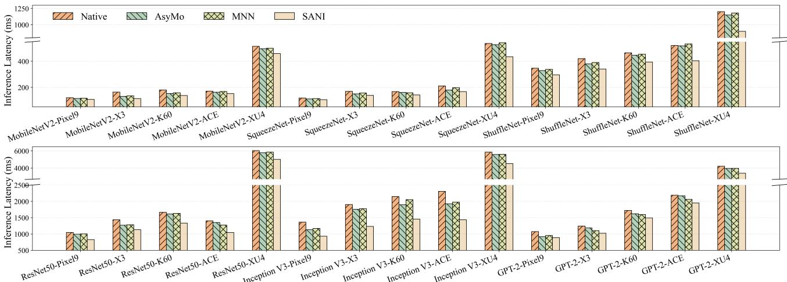  
Figure 10: End-to-end latency on Pixel9, X3, K60, ACE, XU4 with Native, AsyMo, MNN, and our work.

Table 2: Device specifications.  
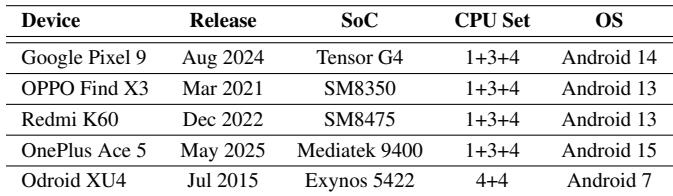

function. This allows us to feed the distinct hardware profiles of big and LITTLE cores into our cost model to determine the optimal kernel for each cluster. If the resulting affine kernels are different, SANI initiates a dual-kernel issue and utilizes an asynchronous mechanism to prepare them in parallel via a thread pool. For the on-demand kernel switcher, when a kernel transformation is required, SANI utilizes the pre-computed index map to retrieve the target workload’s index with minimal latency, then generates a new workload to compute the same computational region for the new kernel.

## 5 Evaluation

## 5.1 Methodology

Testbed. To evaluate the effectiveness and generalizability of SANI, we conduct experiments on four smartphones and one development board, featuring a variety of SoCs from different manufacturers. These devices include the Google Pixel 9 [19], OPPO Find X3 Pro [41], Redmi K60 [55], OnePlus Ace 5 Ultra [40], and the Odroid XU4 development board [38]. Detailed specifications are provided in Table 2. Additionally, the OPPO Find X3 Pro was modified to support the use of Monsoon Power Monitor [34] for precise power consumption measurement.

Workloads. We evaluate SANI with five widely-used DNN models: MobileNetV2 [33], ResNet-50 [22], SqueezeNet [24],

ShuffleNet [60], Inception-V3 [47], and one transformer model: GPT-2 [43]. All experiments use pre-trained models in FP32 precision with NEON acceleration enabled. For model compatibility, we deploy GPT-2 using the Arm NN [7] framework with its TensorFlow Lite parser, as Arm-CL lacks support for transformer architectures. Arm NN provides a highlevel neural network API built atop Arm-CL while maintaining equivalent computational performance. For vision models, we use standard ImageNet-resolution inputs (224×224) that match common mobile deployment settings. For GPT-2, we use fixed-length 20-token prompts generated randomly, which stress both prefill and decode under a controlled setting.

Baselines. We compare SANI with three state-of-the-art approaches: Native (default configuration of Arm-CL [6]), AsyMo [49], and MNN [25], as detailed in Section 2.2. Our preliminary measurements show that other mainstream frameworks such as TensorFlow Lite [28], ONNX Runtime [13], and PyTorch Mobile [42] exhibit similar inefficiencies on AMP CPUs due to their static, symmetry-assuming workload partitioning. We therefore adopt AsyMo as the primary asymmetry-aware baseline, which has been shown to outperform these frameworks [49]. All implementations are based on Arm-CL, Arm’s official open-source framework optimized for Arm architectures. For AsyMo, which offers both latency first and energy-first modes, we implement its latency-first configuration for performance comparison and port its core algorithms to Arm-CL. Similarly, rather than directly comparing with MNN, which would introduce unfair comparison due to different framework-specific optimizations, we implement its scheduling strategy within Arm-CL to ensure consistent evaluation.

Metrics. We use three metrics to evaluate performance: 1) Inference Latency, measuring end-to-end execution time, 2) Energy Consumption, calculated from power measurements during inference, and 3) Scaling Efficiency, computed as the speedup relative to the execution on 4 big cores only.

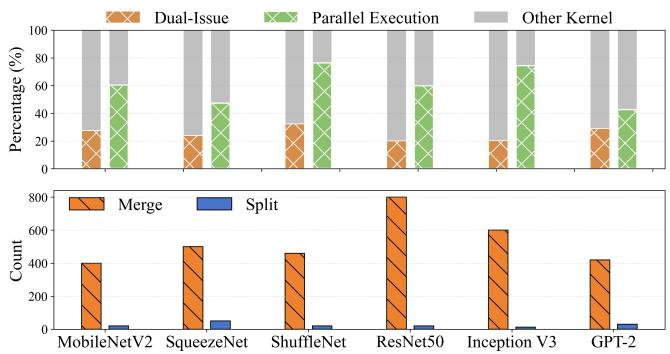  
Figure 11: Model analysis: Dual-issue and parallel execution potential (top) and merge-split operation frequency (bottom).

## 5.2 Overall Performance

Fig. 10 illustrates the end-to-end inference latency of SANI compared with three baseline approaches across different neural network architectures and mobile devices. SANI con sistently outperforms all baselines across all tested models and hardware platforms. On Pixel 9, SANI achieves average latency reductions of 17.6%, 9.8%, and 12.0% compared to Native, AsyMo, and MNN, respectively. The performance gains are even more pronounced on other platforms, with average latency reductions of 23.7%, 14.4%, and 15.0% on the Find X3 Pro; 19.9%, 13.7%, and 15.0% on the Redmi K60; and 21.4%, 15.7%, and 16.7% on the OnePlus Ace. On the Odroid XU4 development board, the improvements are also substantial, with latency reductions of 19.0%, 15.5%, and 16.6% against the same baselines. These results demonstrate that SANI effectively addresses the performance collapse paradox in AMP architectures through its three integrated modules.

Model Difference. The performance gains vary across different model architectures. Compared to the Native baseline, SANI reduces average latency by 15.7% for MobileNetV2, 17.7% for SqueezeNet, 21.0% for ShuffleNet, 19.3% for ResNet-50, 29.5% for Inception-V3, and 16.1% for GPT-2. To understand this variation, we analyzed the potential for the dual kernel issue and dynamic scheduling. As shown in Fig. 11, models like ShuffleNet and Inception-V3 have a higher percentage of kernels that can be parallelized and benefit from dual-kernel implementations. This allows our affinity-aware kernel issuer to select core-affine kernels from the outset, while the adaptive granularity scheduler optimizes workload distribution at runtime, leading to significant performance gains. Furthermore, we observed that ResNet-50 exhibits the highest frequency of merge operations. This significantly reduces task acquisition overhead, contributing to its substantial performance improvement.

We take Inception-V3, which shows the most significant improvement, as an example for a more detailed analysis. As shown in Fig. 12(a), its performance is dominated by Permute kernels. A key challenge within Inception-V3 is that the Permute Kernel instance has a primary dimension of only 7, which severely limits the degree of parallelism. This results in poor scaling for baselines, as shown in Fig. 12(b). While AsyMo attempts to solve this with multi-dimensional partitioning, but creates excessively fine-grained workloads, which incur significant task acquisition overhead and thus diminish the parallelization benefits. SANI overcomes this with a more balanced approach. The affinity-aware kernel issuer’s block unification strategy creates a pool of coarser-grained, manageable blocks. This provides sufficient parallelism to saturate the cores without introducing prohibitive overhead. Then, the adaptive granularity scheduler dynamically adjusts these block-level workloads , achieving a superior balance between wait and execution latency.

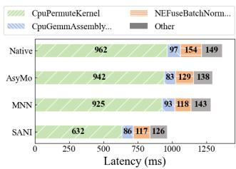  
(a)

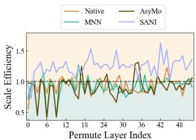  
(b)  
Figure 12: Performance over Inception-V3: (a) Execution time breakdown by kernel types, (b) Scaling efficiency across baselines for Permute kernels.

Hardware Difference. The performance variation across hardware platforms reveals a strong correlation between pro cessor asymmetry and SANI’s optimization potential. To quantify this, we benchmarked single-threaded performance using the neon\_sgemm kernel from Arm-CL, revealing asymmetry ratios ranging from 2.6:1 to 3.4:1 across our testbeds. SANI’s benefits are most pronounced on devices with higher asymmetry. For instance, it achieves a 23.7% average latency reduction on the Find X3 Pro (3.2:1 ratio) and 19.9% on the Redmi K60 (3.4:1 ratio), compared to a more moderate 17.6% on the Pixel 9 with its lower 2.6:1 ratio. This is because greater architectural asymmetry amplifies the inefficiencies of baseline schedulers, creating more optimization opportunities for SANI. This pattern suggests that SANI’s advantages become increasingly valuable as processor asymmetry grows. Scalability Analysis. Fig. 13 illustrates how SANI and baseline approaches scale across different thread numbers on ShuffleNet and ResNet-50. The results show different behaviors in symmetric configurations using only big cores versus asymmetric configurations incorporating LITTLE cores.

In symmetric scenarios, SANI offers improvements through its adaptive granularity scheduler that adaptively adjusts workload granularity based on runtime execution patterns. On Pixel 9 with ResNet-50 using two big cores, SANI reduces latency by 12.5% versus Native and 9.4% versus

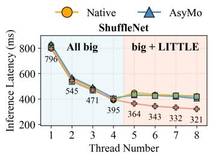

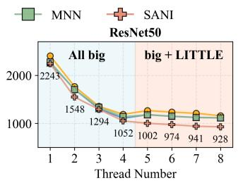

(a) Google Pixel 9  
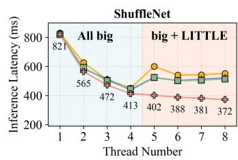

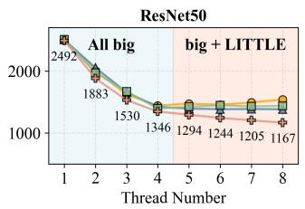  
(b) OPPO Find X3 Pro  
Figure 13: Performance comparison with increasing thread number on ShuffleNet and ResNet-50.

AsyMo. This improvement primarily stems from the scheduler’s ability to dynamically balance task sizes, optimizing the trade-off between execution efficiency and synchronization overhead rather than relying on fixed partitioning schemes.

The performance difference becomes more pronounced in asymmetric configurations where baseline implementations face the performance collapse paradox. When LITTLE cores are introduced, SANI shows improved performance across all tested models and devices through the coordinated oper ation of all three components. On Pixel 9 with ShuffleNet using four big cores plus one LITTLE core, SANI reduces latency by 19.3% versus Native and 15.3% versus AsyMo. As more LITTLE cores are added, SANI continues to show good scaling behavior, with performance improving on both devices. For ResNet-50, SANI achieves 19.4% latency reduction versus Native on Find X3 when using all available cores. In comparison, baseline approaches tend to show diminishing returns or performance degradation with additional LITTLE cores. This scaling efficiency highlights the synergy of SANI’s modules. Beyond the gains from the adaptive granularity scheduler, SANI’s advantage in asymmetric settings is magnified by its two other components. The affinity-aware kernel issuer selects the most efficient kernel for each core type, while the on-demand kernel switcher handles the neces sary transformations for migrated workloads at runtime. This comprehensive strategy allows SANI to effectively utilize all cores and avoid the performance collapse paradox.

Dynamic loads. We evaluated SANI’s robustness to runtime interference by running MobileNetV2 under four scenarios: idle system (“CPU-Null”), moderate CPU stress (“CPU-Stress (50%)”) with 4 threads running sqrt() calculations, heavy CPU stress (“CPU-Stress (100%)”) with 8 threads, and real application interference from YouTube video playback (“CPU-APPS”). We used a controllable load generator stress [32] to create compute threads. Fig. 14 presents the results decomposed into thread wait and execution latencies.

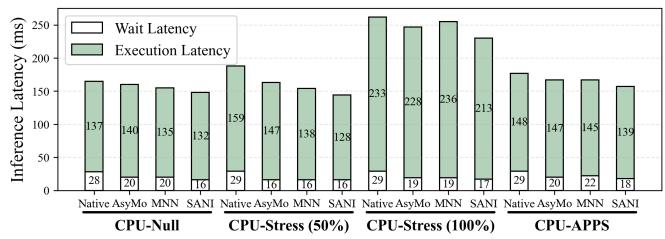  
Figure 14: Performance of MobileNetV2 inference under varying system loads on Google Pixel 9.

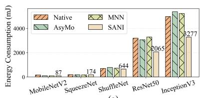  
(a)

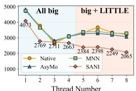  
(b)  
Figure 15: Energy consumption analysis on OPPO Find X3 Pro: (a) Comparison across different models using all cores, (b) Energy scaling behavior of ResNet-50.

SANI consistently maintains lower wait times across all scenarios compared to baselines with 20%-40% reduction. This improvement stems from the adaptive granularity scheduler, which continuously adjusts task granularity based on measured thread execution speeds, thereby preventing performance bottlenecks caused by slow or blocked threads. The execution latency remains 7%-10% lower than baselines under interference due to our on-demand kernel switcher, which performs efficient kernel transformations when workloads migrate.

It should be noted that wait latency in moderate stress scenarios decreases slightly compared to idle conditions, as stress threads predominantly occupy big cores, effectively reducing the performance gap between asymmetric cores.

Energy Consumption. Fig. 15(a) demonstrates that SANI reduces energy usage across most models using all cores. For computation-intensive networks, SANI achieves significant improvements: 34.1%-35.3% versus Native, 32.5%-39.0% versus AsyMo, and 37.1%-37.3% versus MNN for ResNet-50 and Inception-V3. Lighter models show moderate gains with MobileNetV2 and ShuffleNet achieving 5.5%-30.5% reductions compared to baselines.

To analyze scaling behavior, Fig. 15(b) shows ResNet-50’s energy consumption across thread configurations. Energy consumption decreases as thread number increases due to both reduced inference latency and the higher energy efficiency of

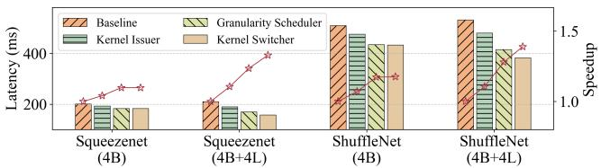  
Figure 16: The overall performance breakdown of SANI.

LITTLE cores. Beyond the aggregate savings, these results clarify when the LITTLE cluster is worth using at all. For background or latency-tolerant DNN tasks, LITTLE-only execution remains a valid mode and is the most energy-favorable option. For interactive workloads, big-only execution leaves the LITTLE cores idle and forgoes their lower energy per operation, while naive all-core execution triggers the performancecollapse paradox of § 2.2. SANI’s contribution is making the mixed regime both correct and efficient, so that the latency benefit of big cores and the energy benefit of LITTLE cores compound rather than cancel.

## 5.3 Ablation Study

We conducted experiments to evaluate the contribution of each SANI component to the overall performance improvement. Fig. 16 illustrates the incremental latency reductions achieved by sequentially enabling our three key techniques on SqueezeNet and ShuffleNet using different configurations. Analysis on Symmetric Cores (4B). In the symmetric setting, adding the affinity-aware kernel issuer alone reduces latency by 4.0% on SqueezeNet and 6.7% on ShuffleNet. Although no dual-kernel selection is performed in this homogeneous environment, this improvement stems from its block unification strategy. Enabling multi-dimensional partitioning creates more parallelizable tasks than the baseline, especially for operators with challenging dimension sizes. Further enabling the adaptive granularity scheduler brings an additional 5.2% and 8.6% improvement, respectively. Even on homogeneous cores, runtime interference from background system processes can cause threads to execute at different speeds, and our scheduler’s ability to dynamically adjust workload granularity is crucial for maintaining load balance. As expected, finally adding the on-demand kernel switcher provides negligible benefit (0.0%-0.2%), as no heterogeneous kernel transformations are triggered. These symmetric gains indicate that Arm-CL’s single-kernel, fixed-partition pipeline leaves measurable parallelism on the table even when all cores are identical, with block unification recovering parallelism on awkward dimensions and the adaptive scheduler absorbing background interference. The same mechanisms that target AMP asymmetry thus continue to pay off in homogeneous configurations.

Analysis on Asymmetric Cores (4B+4L). In the asymmetric setting, the benefits of each module are magnified. The issuer’s contribution increases to 9.5% on SqueezeNet and 9.6% on ShuffleNet, as it now performs dual-kernel issue, selecting the most hardware-affine kernel for both big and LITTLE cores. The scheduler becomes even more critical, delivering further improvements of 10.5% and 13.5% by effectively managing the significant performance disparities between the heterogeneous cores. Finally, the on-demand kernel switcher delivers a substantial 7.1% and 8.0% gain. When workload migration occurs, its ability to transform kernels on the fly prevents cores from executing a non-affine kernel. This study validates that all components are essential for achieving optimal performance, with their synergy being most pronounced in complex and asymmetric environments.

Table 3: Runtime overhead (ms) of SANI operations  
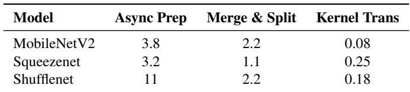

## 5.4 Overhead Analysis

We analyze the overhead introduced by SANI in terms of both CPU latency and memory footprint.

CPU Latency. Table 3 quantifies the primary sources of SANI’s runtime CPU overhead: the asynchronous preparation of dual kernels, the Merge and Split operations, and on-the-fly kernel transformations. The data shows that these operations are highly efficient. For example, on the complex ShuffleNet model, the cumulative overhead from these operations is well under 3 ms. This constitutes a small fraction of the model’s total inference latency, which is typically in the hundreds of milliseconds. As demonstrated in our evaluation, the significant performance improvements delivered by SANI far outweigh this minimal computational overhead.

Memory Footprint. SANI introduces a minor memory overhead. This stems from two main sources: the additional working space required when the affinity-aware kernel issuer prepares a dual-kernel implementation for an operator, and the memory needed to store the pre-computed index maps for the on-demand kernel switcher. Evaluation results show that the peak additional memory footprint across all tested models is less than 2MB. Considering that typical neural network models require 60MB to 100MB of memory for execution, this additional footprint is negligible. That says SANI achieves its performance improvements without imposing a meaningful memory burden on the system. The footprint does not grow linearly with model depth. Index maps are kept per dual-kernel operator-shape pair, so repeated layer patterns such as stacked Conv-BN-ReLU blocks reuse the same map template. The peak therefore tracks the number of distinct operator shapes in the network rather than the raw layer count, which is why even deep models stay well below the 2 MB ceiling.

## 5.5 Discussion

Our evaluation targets operator-level parallelizable workloads where mobile CPU execution is the dominant or fallback path, including the five CNN-family models and the GPT-2 transformer case study in Section 5.2. Large-scale on-device LLM inference is not the focus of this work. Our own profiling on a Google Pixel 9 shows that Qwen-1.5-4B sustains only 22.78 prefill tokens/s and 6.10 decode tokens/s on four big cores, far short of an interactive experience. Recent on-device NPU stacks such as llm.npu [56] report over 1000 tokens/s prefilling with substantially better energy per token, making NPUs the more suitable target for production-grade LLM serving on phones. The core abstractions of SANI, dual-kernel issue and adaptive granularity scheduling over a unified block interface, are operator-shape rather than model-class specific. The 16.1% latency reduction already observed on GPT-2 in § 5.2 comes from the same MatMul and GEMM kernels that dominate larger transformers, so we expect the design to carry over whenever CPU-side LLM execution becomes the right trade-off.

## 6 Related Work

Early on-device frameworks like TensorFlow Lite [28], Arm-CL [6], and NCNN [35] focused on general optimizations such as thread-level parallelism and cache affinity, primar ily assuming core symmetry. As AMP architectures became prevalent, MNN [25] introduced a static task allocation strategy based on the compute power of different core types. AsyMo [49] advanced this with cost-model-guided block partitioning for asymmetric scheduling. However, these approaches remain static and fail to adapt to the dynamic mobile environment, where interference can alter a core’s performance. In contrast, SANI’s adaptive granularity scheduler adjusts workload sizes at runtime to maintain balance.

Workload scheduling on AMPs. While scheduling for DNN workloads on AMPs is an emerging area, general-purpose AMP scheduling has been widely studied [14, 16, 45, 46, 50]. Works like COLAB [59] and WATS [10] use predictive models and work-stealing to improve performance and load balancing. However, these OS-level schedulers are applicationagnostic. They operate on coarse-grained OS threads, lacking the ability to partition work at the finer, operator-specific level. Furthermore, they cannot dynamically adjust the granularity of the workload. SANI overcomes these issues by being an application-aware framework that manages fine-grained workloads tailored to DNN operators.

Kernel selection optimizations. Kernel selection is critical for performance, and prior works have focused on making the best static choice. NeoCPU [31] adapts kernel parameters to different CPU architectures, NNV12 [58] selects kernels to optimize cold-start latency, and FlexNN [29] chooses implementations to maximize performance under memory constraints. The fundamental limitation of these approaches is that their selection is static, made once before and after execution. SANI addresses this with a two-part strategy: the affinity-aware kernel issuer prepares the best kernel for each core type, while the on-demand kernel switcher transforms workloads during migration, ensuring cores execute their most affine kernel.

## 7 Conclusion

In this paper, we explored the performance-collapse paradox in DNN inference on AMP architectures and introduced SANI, a scalable, asymmetry-aware framework. SANI combines three mechanisms—an affinity-aware kernel issuer, an adaptive granularity scheduler, and an on-demand kernel switcher—to preserve efficiency across heterogeneous cores. Evaluation on commercial SoCs shows that SANI scales efficiently, consistently outperforms existing approaches, lowers energy consumption, and sustains robust efficiency under interference across heterogeneous cores.

Looking ahead, we envision extending SANI’s scalability principles to future mobile SoCs that integrate CPUs with GPUs and NPUs.

## Acknowledgments

We sincerely thank our shepherd and the anonymous OSDI’26 reviewers for their insightful suggestions. This work was supported by the National Key Research and Development Program of China (Grant No. 2023YFE0205700), the National Natural Science Foundation of China (Grant Nos. 62341410 and 62302348), the General Program of the China Postdoctoral Science Foundation (Grant No. 2025M781507), and the Science and Technology Development Fund, Macao S.A.R (FDCT) projects 0078/2023/AMJ, 0056/2025/RIB2, 001/2024/SKL and SKL-IoTSC(UM)/ORP05/2025. Contact author at the University of Macau: Chuang Hu (chuanghu@um.edu.mo).

## References

[1] Martin Abadi, Paul Barham, Jianmin Chen, Zhifeng Chen, Andy Davis, Jeffrey Dean, Matthieu Devin, Sanjay Ghemawat, Geoffrey Irving, Michael Isard, Manjunath Kudlur, Josh Levenberg, Rajat Monga, Sherry Moore, Derek G. Murray, Benoit Steiner, Paul Tucker, Vijay Vasudevan, Pete Warden, Martin Wicke, Yuan Yu,

and Xiaoqiang Zheng. Tensorflow: A system for largescale machine learning. In 12th USENIX Symposium on Operating Systems Design and Implementation, OSDI ’16, pages 265–283. USENIX, 2016.

[2] Ahmed Abouelhamayed, Susanne Balle, Deshanand Singh, and Mohamed Abdelfattah. Beyond Inference: Performance Analysis of DNN Server Overheads for Computer Vision. In Proceedings of the 61st ACM/IEEE Design Automation Conference, DAC ’24, pages 1–6. ACM/IEEE, November 2024.

[3] Gene M. Amdahl. Validity of the single processor approach to achieving large scale computing capabilities. In Proceedings of the April 18-20, 1967, Spring Joint Computer Conference, AFIPS ’67, pages 483–485. ACM, April 1967.

[4] Apple. Apple unleashes m1, 2020.

[5] Arm. big.LITTLE: Balancing Power Efficiency and Performance, 2011.

[6] Arm. Compute library, 2017.

[7] Arm. Arm NN, 2018.

[8] Arm. Arm device tree bindings for cpu capacity, 2023.

[9] Baidu. Paddle-Lite, March 2025.

[10] Quan Chen, Yawen Chen, Zhiyi Huang, and Minyi Guo. WATS: Workload-Aware Task Scheduling in Asymmetric Multi-core Architectures. In 2012 IEEE 26th International Parallel and Distributed Processing Symposium, IPDPS ’12, pages 249–260. IEEE, May 2012.

[11] Tianshi Chen, Yunji Chen, Marc Duranton, Qi Guo, Atif Hashmi, Mikko Lipasti, Andrew Nere, Shi Qiu, Michèle Sebag, and Olivier Temam. BenchNN: On the broad potential application scope of hardware neural network accelerators. In 2012 IEEE International Symposium on Workload Characterization, IISWC ’12, pages 36–45. IEEE, November 2012.

[12] Long Cheng, Yan Gu, Qingzhi Liu, Lei Yang, Cheng Liu, and Ying Wang. Advancements in Accelerating Deep Neural Network Inference on AIoT Devices: A Survey. IEEE Transactions on Sustainable Computing, 9(6):830–847, November 2024.

[13] ONNX Runtime developers. Onnx runtime. https: //onnxruntime.ai/, 2025. Version: 1.22.1.

[14] Hamza Djigal, Linfeng Liu, Jian Luo, and Jia Xu. BUDA: Budget and Deadline Aware Scheduling Algorithm for Task Graphs in Heterogeneous Systems. In 2022 IEEE/ACM 30th International Symposium on Quality of Service, IWQoS ’22, pages 1–10. IEEE/ACM, June 2022.

[15] Facebook. Caffe2, March 2025.

[16] Yu Feng and Yuhao Zhu. PES: proactive event scheduling for responsive and energy-efficient mobile web computing. In Proceedings of the 46th International Symposium on Computer Architecture, ISCA ’19, pages 66–78. ACM, June 2019.

[17] Zhangxiaowen Gong, Houxiang Ji, Christopher W. Fletcher, Christopher J. Hughes, Sara Baghsorkhi, and Josep Torrellas. SAVE: Sparsity-Aware Vector Engine for Accelerating DNN Training and Inference on CPUs. In 2020 53rd Annual IEEE/ACM International Symposium on Microarchitecture, MICRO ’20, pages 796–810. IEEE/ACM, October 2020.

[18] Google. Perfetto, 2018.

[19] Google. Google pixel 9, 2024.

[20] Lixiang Han, Zimu Zhou, and Zhenjiang Li. Pantheon: Preemptible multi-dnn inference on mobile edge gpus. In Proceedings of the 22nd Annual International Conference on Mobile Systems, Applications and Services, MOBISYS ’24, page 465–478. Association for Computing Machinery, 2024.

[21] Wei Hao, Zixi Wang, Lauren Hong, Lingxiao Li, Nader Karayanni, AnMei Dasbach-Prisk, Chengzhi Mao, Junfeng Yang, and Asaf Cidon. Nazar: Monitoring and Adapting ML Models on Mobile Devices. In Proceedings of the 30th ACM International Conference on Architectural Support for Programming Languages and Operating Systems, ASPLOS ’25, pages 746–761. ACM, March 2025.

[22] Kaiming He, Xiangyu Zhang, Shaoqing Ren, and Jian Sun. Deep residual learning for image recognition. In 2016 IEEE Conference on Computer Vision and Pattern Recognition, CVPR ’16, pages 770–778. IEEE, 2016.

[23] Andrew G. Howard, Menglong Zhu, Bo Chen, Dmitry Kalenichenko, Weijun Wang, Tobias Weyand, Marco Andreetto, and Hartwig Adam. MobileNets: Efficient Convolutional Neural Networks for Mobile Vision Applications. April 2017.

[24] Forrest N. Iandola, Song Han, Matthew W. Moskewicz, Khalid Ashraf, William J. Dally, and Kurt Keutzer. SqueezeNet: AlexNet-level accuracy with 50x fewer parameters and <0.5MB model size. November 2016.

[25] Xiaotang Jiang, Huan Wang, Yiliu Chen, Ziqi Wu, Lichuan Wang, Bin Zou, Yafeng Yang, Zongyang Cui, Yu Cai, Tianhang Yu, Chengfei Lyu, and Zhihua Wu. MNN: A Universal and Efficient Inference Engine. In Proceedings of Machine Learning and Systems, MLSys ’20, pages 1–13, March 2020.

[26] Shubham Kamdar and Neha Kamdar. big. LITTLE Architecture: Heterogeneous Multicore Processing. International Journal of Computer Applications, 119:35–38, June 2015.

[27] Seyyed Salar Latifi Oskouei, Hossein Golestani, Matin Hashemi, and Soheil Ghiasi. CNNdroid: GPU-Accelerated Execution of Trained Deep Convolutional Neural Networks on Android. In Proceedings of the 24th ACM international conference on Multimedia, MM ’16, pages 1201–1205. ACM, October 2016.

[28] Juhyun Lee, Nikolay Chirkov, Ekaterina Ignasheva, Yury Pisarchyk, Mogan Shieh, Fabio Riccardi, Raman Sarokin, Andrei Kulik, and Matthias Grundmann. On-Device Neural Net Inference with Mobile GPUs. July 2019.

[29] Xiangyu Li, Yuanchun Li, Yuanzhe Li, Ting Cao, and Yunxin Liu. FlexNN: Efficient and Adaptive DNN Inference on Memory-Constrained Edge Devices. In Proceedings of the 30th Annual International Conference on Mobile Computing and Networking, MobiCom ’24, pages 709–723. ACM, May 2024.

[30] Zhuojin Li, Marco Paolieri, and Leana Golubchik. A Benchmark for ML Inference Latency on Mobile Devices. In Proceedings of the 7th International Workshop on Edge Systems, Analytics and Networking, EdgeSys ’24, pages 31–36. ACM, April 2024.

[31] Yizhi Liu, Yao Wang, Ruofei Yu, Mu Li, Vin Sharma, and Yida Wang. Optimizing cnn model inference on CPUs. In 2019 USENIX Annual Technical Conference, ATC ’19, pages 1025–1040. USENIX, 2019.

[32] m ric. stress-android, July 2024.

[33] Sandler Mark, Howard Andrew, Zhu Menglong, Zhmoginov Andrey, and Liang-Chieh Chen. Mobilenetv2: Inverted residuals and linear bottlenecks. March 2019.

[34] Monsoon. High Voltage Power Monitor, 2025.

[35] Hui Ni and The NCNN contributors. Ncnn, June 2017.

[36] Anant V. Nori, Rahul Bera, Shankar Balachandran, Joydeep Rakshit, Om J. Omer, Avishaii Abuhatzera, Belliappa Kuttanna, and Sreenivas Subramoney. Proximu\$: Efficiently Scaling DNN Inference in Multi-core CPUs through Near-Cache Compute. December 2020.

[37] Anant V. Nori, Rahul Bera, Shankar Balachandran, Joydeep Rakshit, Om J. Omer, Avishaii Abuhatzera, Belliappa Kuttanna, and Sreenivas Subramoney. REDUCT: Keep it Close, Keep it Cool! : Efficient Scaling of DNN Inference on Multi-core CPUs with Near-Cache Com pute. In 2021 ACM/IEEE 48th Annual International

Symposium on Computer Architecture, ISCA ’21, pages 167–180. ACM/IEEE, June 2021.

[38] Odroid. Odroid xu4, 2015.

[39] OnePlus. Oneplus 12, 2025.

[40] OnePlus. Oneplus ace 5 ultra, 2025.

[41] OPPO. OPPO Find X3 series, 2021.

[42] PyTorch Team. Pytorch mobile. https://pytorch. org/mobile/home/, 2025. Version: 0.7.0.

[43] Alec Radford, Jeff Wu, Rewon Child, David Luan, Dario Amodei, and Ilya Sutskever. Language models are unsupervised multitask learners. OpenAI Blog, 2019.

[44] Aravind Srinivasa Raghavan. Heterogeneous Computing for your Demanding Apps, 2020.

[45] Bagher Salami, Hamid Noori, and Mahmoud Naghibzadeh. Fairness-Aware Energy Efficient Scheduling on Heterogeneous Multi-Core Processors. IEEE Transactions on Computers, 70(1):72–82, January 2021.

[46] Elham Shamsa, Anil Kanduri, Pasi Liljeberg, and Amir M. Rahmani. Concurrent Application Bias Scheduling for Energy Efficiency of Heterogeneous Multi-Core Platforms. IEEE Transactions on Computers, 71(4):743–755, April 2022.

[47] Christian Szegedy, Vincent Vanhoucke, Sergey Ioffe, Jon Shlens, and Zbigniew Wojna. Rethinking the inception architecture for computer vision. In 2016 IEEE Conference on Computer Vision and Pattern Recognition, CVPR ’16, pages 2818–2826. IEEE, 2016.

[48] Xiaohu Tang, Yang Wang, Ting Cao, Li Lyna Zhang, Qi Chen, Deng Cai, Yunxin Liu, and Mao Yang. LUT-NN: Empower Efficient Neural Network Inference with Centroid Learning and Table Lookup. In Proceedings of the 29th Annual International Conference on Mobile Computing and Networking, MobiCom ’23, pages 1–15. ACM, October 2023.

[49] Manni Wang, Shaohua Ding, Ting Cao, Yunxin Liu, and Fengyuan Xu. AsyMo: scalable and efficient deeplearning inference on asymmetric mobile CPUs. In Proceedings of the 27th Annual International Conference on Mobile Computing and Networking, MobiCom ’21, pages 215–228. ACM, September 2021.

[50] Siqi Wang, Gayathri Ananthanarayanan, Yifan Zeng, Neeraj Goel, Anuj Pathania, and Tulika Mitra. Highthroughput cnn inference on embedded arm big.little multicore processors. IEEE Transactions on Computer-Aided Design of Integrated Circuits and Systems, 39(10):2254–2267, September 2020.

[51] Xubin Wang, Zhiqing Tang, Jianxiong Guo, Tianhui Meng, Chenhao Wang, Tian Wang, and Weijia Jia. Empowering Edge Intelligence: A Comprehensive Survey on On-Device AI Models. March 2025.

[52] Carole-Jean Wu, David Brooks, Kevin Chen, Douglas Chen, Sy Choudhury, Marat Dukhan, Kim Hazelwood, Eldad Isaac, Yangqing Jia, Bill Jia, Tommer Leyvand, Hao Lu, Yang Lu, Lin Qiao, Brandon Reagen, Joe Spisak, Fei Sun, Andrew Tulloch, Peter Vajda, Xiaodong Wang, Yanghan Wang, Bram Wasti, Yiming Wu, Ran Xian, Sungjoo Yoo, and Peizhao Zhang. Machine Learning at Facebook: Understanding Inference at the Edge. In 2019 IEEE International Symposium on High Performance Computer Architecture, HPCA ’19, pages 331– 344. IEEE, February 2019.

[53] Yuanpei Wu, Dong Du, Chao Xu, Yubin Xia, Ming Fu, Binyu Zang, and Haibo Chen. D-vsync: Decoupled rendering and displaying for smartphone graphics. In Proceedings of the 30th ACM International Conference on Architectural Support for Programming Languages and Operating Systems, ASPLOS ’25, page 326–341. ACM, 2025.

[54] Yunyi Xiang, Zheng Wu, Haidong Yao, Xiankui Xiong, and Fan Yang. Aries: A DNN Inference Scheduling Framework for Multi-core Accelerators. In Proceedings of the 2024 5th International Conference on Computing, Networks and Internet of Things, CNIOT ’24, pages 186– 191. ACM, July 2024.

[55] Xiaomi. Redmi k60, 2022.

[56] Daliang Xu, Hao Zhang, Liming Yang, Ruiqi Liu, Gang Huang, Mengwei Xu, and Xuanzhe Liu. Fast On-device LLM Inference with NPUs. In Proceedings of the 30th ACM International Conference on Architectural Support for Programming Languages and Operating Systems, ASPLOS ’25, pages 445–462. ACM, March 2025.

[57] Luting Yang, Bingqian Lu, and Shaolei Ren. A note on latency variability of deep neural networks for mobile inference, 2020. arXiv:2003.00138.

[58] Rongjie Yi, Ting Cao, Ao Zhou, Xiao Ma, Shangguang Wang, and Mengwei Xu. Boosting DNN Cold Inference on Edge Devices. In Proceedings of the 21st Annual International Conference on Mobile Systems, Applications and Services, MobiSys ’23, pages 516–529. ACM, June 2023.

[59] Teng Yu, Pavlos Petoumenos, Vladimir Janjic, Hugh Leather, and John Thomson. Colab: A collaborative multi-factor scheduler for asymmetric multicore processors. In Proceedings of the 18th ACM/IEEE International Symposium on Code Generation and Optimiza-

tion, CGO ’20, pages 268–279. ACM/IEEE, February 2020.

[60] Xiangyu Zhang, Xinyu Zhou, Mengxiao Lin, and Jian Sun. ShuffleNet: An Extremely Efficient Convolutional Neural Network for Mobile Devices. In Proceedings of the IEEE Conference on Computer Vision and Pattern Recognition, CVPR ’18, pages 6848–6856. IEEE, June 2018.

[61] Yue Zheng, Yuhao Chen, Bin Qian, Xiufang Shi, Yuanchao Shu, and Jiming Chen. A Review on Edge Large Language Models: Design, Execution, and Applications. ACM Computing Surveys, 57(8):1–35, February 2025.