USENIX

THE ADVANCED COMPUTING SYSTEMS ASSOCIATION

# DPA-Store: An Ordered Network Data Path Key-Value Store

Frederic Schimmelpfennig, Johannes Gutenberg-Universität Mainz; Jan Sass,   
Saarland University; Reza Salkhordeh, Johannes Gutenberg-Universität Mainz; Martin Kröning and Stefan Lankes, RWTH Aachen University; André Brinkmann, Saarland University

https://www.usenix.org/conference/osdi26/presentation/schimmelpfennig

# This paper is included in the Proceedings of the 20th USENIX Symposium on Operating Systems Design and Implementation.

July 13–15, 2026 • Seattle, WA, USA

ISBN 978-1-939133-55-7

Open access to the Proceedings of the 20th USENIX Symposium on Operating Systems Design and Implementation is sponsored by

# DPA-STORE: An Ordered Network Data Path Key-Value Store

Frederic Schimmelpfennig Johannes Gutenberg University Mainz

Jan Sass   
Saarland University   
Saarbrücken\*

Reza Salkhordeh Johannes Gutenberg University Mainz

Martin Kröning RWTH Aachen University

Stefan Lankes RWTH Aachen University

André Brinkmann Saarland University Saarbrücken

\*Work was done while affiliated with Johannes Gutenberg University Mainz.

## Abstract

Remote in-memory key–value (KV) stores are fundamental to a wide range of applications, many of which depend on effi cient range operations. However, existing designs fall short of simultaneously providing high performance, low complexity, and full range-query support. Host-based systems like REDIS and MEMCACHED are constrained by the kernel network stack and NIC–host interactions. Implementations of hash-based structures that bypass the OS kernel or serve directly from SmartNICs demonstrate upper performance limits but cannot support range queries. Distributed RDMA systems offer high throughput and range functionality when using stateful clients, but these clients increase the risk of faults and complicate scaling. Finally, SmartNICs traversing host-memory trees suffer from high numbers of DMA round-trips.

This paper presents DPA-Store, which uses the on-path Data Path Accelerators (DPAs) of the BlueField-3 SmartNIC to circumvent OS overheads while supporting stateless clients and range queries. The DPAs fetch incoming requests directly from the NIC buffers and traverse a lock-free learned index tree within the DPA memory. Values are fetched from a hostside replica of the tree when reaching the leaf level. Writes are buffered in DPA memory and transferred in batches to the host. Compute-heavy structural operations are executed on the host and transactionally stitched back to the Smart-NIC. Complemented with a read cache directly on the NIC, DPA-Store sustains 33 million operations per second (MOPS) for lookups and 13 MOPS for range queries. Our evaluation shows that DPA-Store is already faster than or competitive with state-of-the-art solutions, and we demonstrate how small changes to the BlueField-3 hardware could additionally increase performance.

## 1 Introduction

Many modern workloads rely on remote key-value (KV) stores that support lookups, inserts, and range queries. However, remote performance is often limited by transport bottlenecks. Traditional remote KV stores such as REDIS [38] and

MEMCACHED [33] are accessed over TCP/IP sockets, commonly over Ethernet. Their reliance on the operating system (OS) kernel network stack, together with PCIe bottlenecks between the network interface card (NIC) and the host, limits throughput and increases latencies.

To mitigate OS overhead, some approaches use the Data Plane Development Kit (DPDK) [12] to bypass the network stack via direct user-space access. MICA reaches nearly 100 million operations per second (MOPS) on a single server node [28]. Other works like KV-DIRECT achieve even higher throughput by removing host involvement and serving requests directly from an FPGA SmartNIC [23]. This reduces latencies because the KV store is closer to the network. However, to achieve these results, KV-DIRECT is constrained in the complexity and capacity of the underlying data structures. Both MICA and KV-DIRECT use hash-based point lookups and lack range queries. Recent works apply similar offload designs to newer SmartNIC generations and are affected by the same shortcomings [15, 37]. Approaches like HONEYCOMB [29] traverse data structures in host memory and support range queries. However, their performance falls behind because they issue frequent DMA round-trips.

Clients of KV stores that use remote direct memory access (RDMA) can access host memory directly [25, 26, 39, 47– 49, 57]. These approaches introduce architectural challenges because every client eventually needs to know the remote addresses of the data on the server to access it. SHERMAN minimizes round-trips for writes but requires client caches for tree traversals [25]. Similarly, ROLEX [26] maintains metadata indexes on the clients and optimizes accesses using learned indexes. These systems can deliver high performance but their dependence on client-side logic and resources raises scaling complexities, introduces consistency concerns, and requires additional failure handling.

In this paper, we present DPA-Store, an ordered in-memory KV store that uses the BlueField-3 SmartNIC [36] and its Data Path Accelerators (DPAs) [35] to bypass OS overheads and to allow stateless clients. DPAs are highly parallel, programmable compute units embedded in the network data path.

DPAs have direct access to NIC buffers and NIC-side DRAM, and can perform DMA operations to access host memory, enabling low-latency and flexible request processing [7].

DPA-Store is built around the high level of concurrency of the DPA subsystem, which consists of 16 cores, each with 16 threads, for a total of 256 threads. When receiving requests, these threads traverse a learned index tree [20], stored in NIC memory, without involving the host. To circumvent memory capacity restrictions of the NIC, values are stored in a replica of the tree on the host. As a result, point and range lookups, at most, need to issue DMA operations at the leaf level. This keeps the number of DMA operations, and thus PCIe crossings, to a minimum.

When an insert request is received, the responsible DPA thread appends the entry to an insert buffer at the leaf level on the NIC side. These entries are immediately visible to subsequent lookups. The insert buffers are transferred in batches to the host when they are full. The host, with its greater compute capabilities, performs expensive structural updates to its tree replica using concurrent patcher threads that apply the inserts to the host-side tree, retrain affected subtrees, and prepare new nodes. Stitcher threads then copy the new nodes into the NIC-side tree and make them available via pointer swaps. This guarantees consistency while keeping the NIC-side traversal path lock-free.

We employ a NIC-side read cache for hot entries to reduce the number of tree traversals and DMA operations. Requests are routed to DPA threads based on a hash of their key, so that small Bloom filters that guard cache accesses fit within each thread’s unused cache-line space. These cache-lines are rarely evicted from the L1 caches of the DPA threads, allowing efficient caching of hot key-value pairs.

Our learned index allows fine-grained optimizations for the DPA subsystem’s memory characteristics, scheduling, and concurrency. We design the traversal logic around optimal cache-line accesses and employ fixed-point calculations to compensate for the lack of floating-point units on the DPAs. Our contributions are as follows:

• We show that it is possible to build a KV store supporting lookups, inserts, and range queries on a BlueField-3 Smart-NIC that is already competitive, for most operations, with state-of-the-art RDMA-based KV stores without relying on stateful clients. DPA-Store achieves 33 MOPS for GET and 13 MOPS for RANGE operations.

• Our extensive experiments to evaluate DPA-Store reveal in-depth performance characteristics of the BlueField-3, going beyond what prior works have reported. These insights also explain DPA-Store’s low INSERT performance of only 1.7 MOPS.

• We demonstrate how modest modifications to the BlueField-3 hardware, without changing the overall programming model, could unlock substantial performance gains, which would easily surpass the performance of today’s fastest RDMA-based KV stores.

The paper is structured as follows. Section 2 provides background and surveys related work. Section 3 details the DPA-Store architecture and implementation. Section 4 evaluates DPA-Store with a sensitivity analysis and comparison benchmarks. Finally, Section 5 concludes the paper.

## 2 Background & Related Work

In this section, we summarize the background on learned indexes and the BlueField-3 DPU, and position DPA-Store relative to kernel-bypass, NIC-assisted, and RDMA-based remote KV systems.

## 2.1 Classical & Learned Index Structures

Key-value (KV) stores expose a compact interface, providing GET, INSERT, UPDATE, DELETE, and optionally RANGE operations. Typically, KV stores rely on either hash tables or, if range operations are required, ordered tree structures. Modern, non-remote in-memory KV stores serve node-local processes using optimized variants of traditional data structures such as B+-trees, tries, or hash maps, with highly optimized traversals and concurrency control [3, 21, 22, 30, 52]. However, traditional data structures often suffer from suboptimal memory access patterns [20].

To address this issue, learned indexes [9, 11, 13, 19, 20, 24, 27, 32, 51, 54] capture the key distribution using lightweight models. This allows lookup operations to jump directly to the relevant region inside a node, followed by a short scan, and requires only a few cache-line accesses per tree level (see Figure 1). A common choice for approximating the key distribution is a piecewise linear approximation (PLA). Short linear segments are fitted to the cumulative key distribution, enabling a linear prediction p = a · k + b of the target position of key k using parameters a and b with an error of at most ε.

Thus, instead of O(logn) memory accesses per node of size n, with potentially many independent cache-line accesses (e.g., in a B+-tree), lookup operations in a learned index are aggregated in a small contiguous window [p − ε, p + ε], trading relatively slow memory accesses for fast CPU cycles.

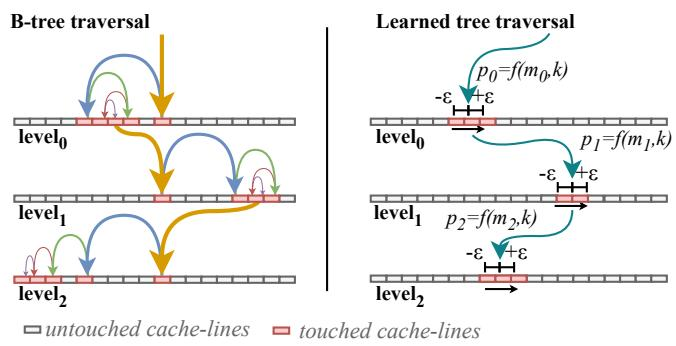  
Figure 1: Access patterns in B+-trees vs. learned index trees.

The error bound ε balances capacity efficiency against scan effort. Smaller bounds reduce the scan range but increase the number of models, whereas larger bounds keep more data in continuous segments, requiring larger regions to be scanned. Therefore, choosing a suitable parameter ε is important when mapping learned indexes to accelerators like SmartNICs with their limited memory access performance.

Insert and model rebuild strategies further impact runtime behavior. ALEX [9], for example, stores keys in gapped arrays with small buffers and does not require relearning until gaps are full. HYPER [54] combines bottom-up and top-down strategies and uses overflow buffers to limit memory overheads, while XINDEX [43] targets highly concurrent workloads. In all cases, buffer layout, size, and update policies govern retraining cost and concurrency characteristics.

## 2.2 Remote KV Stores

Remote KV stores introduce additional complexity by allowing access over network protocols. Widely deployed Ethernetbased KV stores [10, 17, 33, 38] serve general-purpose workloads. However, their request throughput is limited by the host networking stack and related OS components, such as network sockets and context switches, as well as the NIC-host PCIe boundary [4, 34, 40].

To address these issues, RDMA-based KV stores bypass the OS and networking stack [6, 14, 57]. They are based on either traditional tree architectures [25, 47, 48] or learned indexes [26, 49] and offer the full set of KV operations, including range queries.

SHERMAN [25] is a write-optimized distributed B+-tree over disaggregated memory that employs hierarchical NIC onchip locking, client-side index caching, and lock-free reads to increase write throughput. SMART [39] optimizes this approach by addressing RDMA-NIC scale-up bottlenecks. XSTORE [49] couples a server-side B+-tree with a learned cache on the client, which the client uses to predict the location of the KV pair on the server, saving RDMA roundtrips. This allows range queries to complete with as few as two RDMA operations. The server retrains models in the background. ROLEX [26] addresses dynamic workloads by strictly controlling data movement within a learned tree, allowing asynchronous retraining of models. A leaf-atomic shift scheme keeps leaves sorted and minimizes interference.

These systems demonstrate that low-latency serving of ordered range queries can achieve high throughput. However, they either rely on stateful client logic or on multiple RDMA round-trips per request.

The discussed bottlenecks can also be overcome by minimizing the impact of the operating system or by using Smart-NICs. MICA combines DPDK user-space networking with parallel data partitioning to bypass kernel overheads, allowing a single server to sustain nearly 100 MOPS [12, 28]. KV-DIRECT offloads the KV store to FPGA-programmable NICs by extending RDMA primitives [23]. It serves NIC-resident point lookups that scale with multiple NICs per server and reach microsecond tail latencies even at high throughput, albeit with constrained capacity. Both MICA and KV-DIRECT use hash-based data structures that achieve very high through put but do not support range queries.

Some recent works [15, 37, 50, 55] also lack support for range operations but contribute detailed insights into the capabilities of current SmartNICs, which can offload increasingly complex KV-store mechanisms [16, 18, 41, 42, 45].

HONEYCOMB [29] implements a B-tree traversal within an FPGA on a SmartNIC that accesses a tree in host memory via DMA. It provides a KV-store interface, including ranges, but requires multiple expensive DMAs for uncached KV pairs. HIDPU [56] performs address translation for disaggregated storage and uses the Huawei Hi1823 SmartNIC’s DPAs to map partially continuous address areas. HIDPU stores those mappings in specialized segments, accessed through learned models within the 4 MB NIC-side memory. This work is orthogonal to a general-purpose KV store in terms of features and requirements, relies on hashed segments, and does not support range queries across multiple mappings. Nevertheless, its performance benefits motivate offloading KV stores to SmartNICs. DALDEX, on the other hand, uses SmartNICs to offload the training of a learned index for persistent memory to save host overheads, rather than for network serving [46].

## 2.3 BlueField-3 and DPA Subsystem

The BlueField-3 SmartNIC is a ConnectX-based network adapter. In addition to high-speed network functions, it offers an off-path ARM CPU and an on-path DPA cluster, as well as 16 GB DDR5 memory (see Figure 2). The ARM CPU allows the BlueField-3 to run a dedicated operating system, e.g., for control plane management, and to access accelerator engines on the SmartNIC (e.g., de/encryption engines).

The DPA subsystem consists of 16 physical RISC-V cores, each running at 1.8 GHz and featuring 16 threads. Currently, only 189 of the 256 available threads can be used by application code [7]. DPA threads are hardware-scheduled at fine granularity, enabling high concurrency and packet-processing

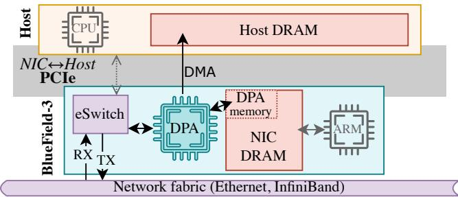  
Figure 2: NVIDIA BlueField-3 architecture configured in NIC mode, allowing DMA access to host memory.

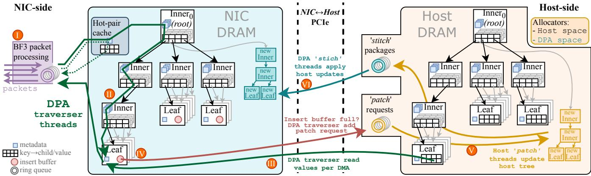  
Figure 3: DPA-Store architecture: (I) Request packets are assigned on-path to a DPA traverser thread, which (II) walks a NIC-side learned index. (III) Values are fetched per DMA using leaf-level models, and (IV) inserts are placed in leaf-level insert buffers. (V) The host performs structural updates that are (VI) transactionally stitched back to the NIC without interrupting traversers.

pipelining.

Each DPA thread has a private L1 cache and shares 1.5 MiB L2 and 3 MiB L3 caches. The cache hierarchy is backed by a dedicated 1 GiB region of the BlueField-3 DDR5 memory, termed DPA memory. Additionally, the DPAs can access either the remainder of the BlueField-3 memory or the host memory, depending on the configuration. If the BlueField-3 is configured for DPA DMA access to the host, the ARM CPU is disabled [7].

DPA thread invocation can be controlled by applications on the host or on the ARM, or by defining a Transport Interface Receive (TIR) target for incoming network packets. For the latter, packet matching rules on hardware-defined fields (e.g., source or destination addresses, ports, or VLAN tags) can be used to filter relevant packets at line rate. Matched packets are placed directly into the L2 cache of the DPAs, allowing low-latency access to packet data. Unmatched packets are transparently placed on the default network path.

The BlueField-3 aims for a broad range of applications by featuring on-path and off-path compute, specialized accelerator engines, and dedicated memory. However, developing high-performance applications requires an in-depth understanding of the limitations of the architecture. For example, memory accesses to DPA memory induce a latency of nearly 500 ns and are significantly slower than DRAM accesses of a standard CPU [7]. In the context of this work, it is therefore important to minimize the number of memory accesses to the tree-based data structure, motivating the use of learned indexes with their limited number of memory accesses per tree level.

## 3 DPA-Store: Architecture & Implementation

In this section, we present DPA-Store, our remote KV store that supports range queries and allows stateless clients. DPA-Store uses the DPA subsystem of the BlueField-3 DPU to process incoming requests, avoiding all OS overheads and leveraging the high degree of parallelism of the DPAs.

We selected a learned index tree to reduce the number of accesses to the latency-constrained DPA memory. A DPAmemory access averages 465 ns [7], which is about five times the latency of a host DRAM access from a standard CPU. Therefore, the number of cache-line accesses per level dominates compute time and impacts performance as much as tree depth. A B+-tree with the same fan-out as a learnedindex tree uses binary search inside each node and accesses O(log n) cache-lines per level (see Figure 1). In contrast, a piecewise-linear learned index with error bound ε searches only a contiguous window [p−ε, p+ε], which we bound to at most two DPA-memory cache-lines in inner nodes and at most three DMA-accessed cache-lines at the leaf level. We quantify this trade-off relative to a B+-tree baseline in Section 4.2.5 and with a closed-form memory model in Section 4.2.6.

Given the restricted 1 GiB capacity of DPA memory, DPA-Store uses the high-capacity host memory to store values in a tree replica. Each lookup retrieves a value with a minimum number of DMA operations between NIC and host. Furthermore, the host is used for compute-heavy or blocking tree operations, such as model retraining and node splits. The host propagates tree updates to the NIC side via read-copy-update (RCU) semantics, enabling the DPAs to traverse the index tree without locks and maintaining consistency at all times.

DPA-Store employs thread-local caches for hot KV pairs. Insert and update operations are batched in a leaf-level insert buffer, reducing the number of tree updates propagated to the host. Figure 3 shows the overall architecture, which is discussed in detail in this section. We start with the NICside request path (Sec. 3.1), including the learned index and caching details, and then continue with the update cycle involving the host (Sec. 3.2).

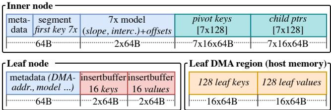  
Figure 4: Layout of NIC-side nodes and leaf DMA regions.

## 3.1 Request Processing in the DPA Subsystem

DPA-Store uses the User Datagram Protocol (UDP) over Ethernet for transporting requests, with each request consisting of a single UDP packet. All requests are terminated on the DPA threads of the BlueField-3. We have defined packet matching rules to map each of the listening UDP ports to a designated DPA thread, effectively utilizing hardware steering rules to distribute requests over available DPAs. While every request can be served from every DPA thread, the port selection can be used by clients to facilitate load balancing or to improve cache utilization. By default, clients use a shared key hashing function so that the load is distributed uniformly across all DPA threads.

Incoming requests are consumed by the responsible traverser threads (176 in total), which descend the learned index tree until reaching the appropriate leaf node. Inner nodes contain seven learned models, where each model consists of a PLA over its interval, pivot keys, and pointers to the respective children (see Figure 4). We limit the number of pivot keys and child pointers to 128 per segment, chosen to match our selected ε values.

Partitioning inner nodes into seven segments allows us to fit the segments’ first keys and node metadata into a single cache-line. While the traverser thread performs a binary search, comparing the operation key with the segment keys, the segment models are prefetched, overlapping compute with memory access. Having found the target segment for a key, the traverser thread evaluates the segment’s model to obtain the predicted position. Again, during the computation, we prefetch the cache-lines containing the pivot keys of the cur rent segment. The prediction is used to scan the pivot array to find the index and the pointer to the designated child node before the traverser thread moves to the next level. We store pivots and child pointers separately to compare more pivots per cache-line before incurring a single access to the child.

Once a traverser thread reaches a leaf node, it performs the requested operation. Leaf nodes contain a single learned model and an insert buffer with space for 16 key-value pairs. INSERT, UPDATE, and DELETE requests operate only on the insert buffer. The key-value pair (or key-delete marker for deletes) is appended using two atomic counters: one atomic increment takes place before and the other after the data write, allowing concurrent writers. We ensure that concurrent lookups read values before the corresponding key to guarantee correct mappings.

When a traverser writes into the last slot of the insert buffer, it sends a patch request to the host via DMA. The host can then perform the required tree operations and propagate the tree updates via stitcher threads back to the NIC-side tree (see Section 3.2). During this period, the NIC-side still has readonly access to the corresponding insert buffer. If a traverser cannot append to an insert buffer because it is full, the traverser re-enqueues the request for later processing.

GET requests must first scan the insert buffer, since it holds the most recent version of any updated or inserted KV pair. Each leaf node has a separate insert buffer, which is unlikely to be cached by the DPA thread. We prefetch it in parallel with the model computation, so a predicted position is ready for the DMA fallback in case of a miss. If the insert buffer contains the requested KV pair, the traverser exits early. Otherwise, the traverser scans the leaf keys array in host memory around the predicted position. To further reduce DMA latency, we also prefetch the keys before final scan range clamping. Once the key position in the array is found, the value is read from host memory via DMA.

RANGE requests reach the leaf node with the target key kmin in the same way as GET requests. Then, the insert buffer is scanned, and all values within the requested range are added to a temporary buffer, which later becomes the response. The traverser then scans the leaf keys array in host memory. When the scan reaches the end of a leaf, the traverser resumes at the next leaf by re-descending for the smallest key strictly larger than the last key returned.

Once the DPA thread finishes the request, it sends a response packet to the client. Response packets mirror the request layout but extend the type field with a status code and populate the value or range fields. For range responses, each packet carries at most 64 KV pairs to stay within a 1500-byte maximum transmission unit (MTU).

Tree traversal by DPAs is always lock-free because the tree structure is only changed on the host side, with changes being stitched back to the NIC via RCU semantics (see Section 3.2). Therefore, DPA threads do not stall during tree traversal, and the tree maintains consistency at all times.

## 3.1.1 Learned Index Parameters

We employ PLAs with slope a, intercept b, and prediction p(k) = a · k + b. For inner nodes, each segment’s model predicts the index of the child node at the next level. For leaf nodes, the model predicts the location of the value. After prediction, the linear search visits at most 2ε keys in [p − ε, p + ε]. We enforce an error bound of εinner = 4 for inner nodes (resulting in at most two cache-line accesses) and εleaf = 8 for leaf nodes (resulting in at most three DMA-accessed cache-lines).

We use the greedy algorithms provided by PGM [11] to compute model parameters from sorted keys. The selected ε values are fixed and enforced during training. To optimize for node allocation overheads during updates, we restrict the size of inner node segments and leaf nodes equally to hold at most 128 pivot keys and child pointers.

BlueField-3 DPAs do not offer floating-point operations [35]. Hence, all arithmetic operations use fixed-point numbers for slopes and intercepts. To maintain precision over the full 64-bit key space, we temporarily expand operands to 128-bit during the calculations (see also [56]).

## 3.1.2 Hot Entry Caching on the NIC

Accesses to KV stores often follow a skewed distribution [1,5, 8,53], so caching hot entries can save tree traversals and DMA fetches. Therefore, each DPA traverser thread maintains a cache (see Figure 5) consisting of (i) a three-way Bloom filter and (ii) a hash table composed of an array of buckets containing four KV pairs each. Each bucket is cache-line sized for better memory utilization. In this section, we detail the cache implementation.

Key-based per-thread caching. To ensure that the same keys are always processed by the same DPA thread, clients send packets to a designated DPA thread by selecting its UDP port via shared key hashing. Each key, therefore, has a single home traverser that owns its cache slot, so no cross-thread invalidation traffic is required when a key is mutated. The client also adds data needed for cache lookups, such as the Bloom hash index and the hash bucket index, to reduce the effort required for DPA computations. Each Bloom filter contains 256 bits, which is the maximum size that fits into the remaining cache-line of the traverser’s thread context. The same cache-line also contains important metadata for controlling RX/TX queues and is therefore unlikely to be evicted from the thread’s L1 cache. Thus, the Bloom filter incurs no additional memory access cost.

We set the cache capacity to 96 entries per traverser thread, leading to an average false-positive rate of 31%. A false positive only triggers one additional cache-line probe in the per-thread hash table and can never return an incorrect value because both keys and values are stored in the cache. With 176 traverser threads, a total of 16,896 entries can be cached. Assuming a dataset of 200M entries and an access pattern following a Zipfian distribution for α = 1, these cached entries make up more than 50% of all requests.

Mutations and working-set shifts. UPDATE and DELETE requests on a cached key invalidate the corresponding cache slot before the response is sent. We deliberately do not update the Bloom filter on invalidation as removing a key would require either re-hashing all remaining keys in the affected bits or maintaining a counting Bloom filter. Both techniques would undermine our performance goals. We tolerate the resulting residual false-positive rate because its cost is bounded by a single extra hash-table probe. INSERTs of new keys are not actively admitted to the cache. A new key enters the cache only after a GET operation. This approach keeps INSERTs from polluting the cache with cold data. Since admission and replacement are local to the home traverser, working-set shifts are handled opportunistically, since new GET misses may replace old entries. Furthermore, a reset of a single traverser’s cache and Bloom filter is safe and requires no cross-thread coordination.

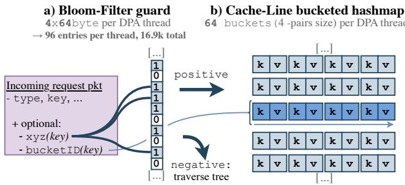  
Figure 5: DPA-side hot-entry cache.

In the case of rerouting overloaded keys to a non-home traverser (see Section 3.1.3), GET requests bypass the cache, whereas UPDATE and DELETE requests, as an exception, perform the required cross-thread invalidations.

Cache admission strategy. On receiving a GET request, the DPA thread randomly decides to admit the requested key, yielding an overall hit ratio of 25% on the workload with α = 1. The chance of selection can be adjusted based on the workload characteristics to adjust adoption speed for new values. We treat this as a deliberate lightweight design choice under DPA constraints, leaving more sophisticated admission strategies for future work. We note that the Bloom filter and bucket array are highly optimized for cache-line access and any non-trivial admission policy must pay the cost of additional DPA-memory accesses on the hot path. To emphasize this, we evaluated a lightweight variant of the Space-Saving heavy-hitter algorithm [44] per traverser to drive cache admission. We scaled it to achieve hit ratios of up to 50% under a test workload with α = 1.1. Due to the additional read and write per request, the overall GET throughput could not exceed that of the random admission strategy. With wider per-thread caches in future BlueField generations, the ability to use the full range of the 256 DPA threads, or a shared DPA-cluster admission service, we expect more sophisticated admission strategies and hotness tracking to become attractive.

## 3.1.3 Maximizing Delivery Rate

DPA-Store receives requests and sends responses as distinct UDP packets via Ethernet. We do not implement a connectionoriented transport such as TCP on the DPA. DPA threads are invoked on packet arrival and run with a tight per-invocation compute budget. Additionally, they have only a few cachelines of effective per-thread context (see Section 3.1.2). A full TCP proxy implementation would require per-flow session windows, retransmission buffers, sequence tracking, and timedriven retransmissions, all of which fit poorly into the eventdriven execution model. It would also multiply per-thread state well beyond the L1 cache capacity of the DPAs. We consider the implementation of such a flow and congestion control framework overall unfit for DPA-Store and out of the scope of this work. We note that network-intercepting designs such as KV-DIRECT and MICA [23, 28] utilize UDP for similar reasons.

Retries and Idempotence. We assume that NIC-based KV stores are ill-suited to ensure reliable request transport. For example, DPA-Store has no knowledge about requests that were lost in transit due to the UDP-based transport. Therefore, DPA-Store expects a client to resend a request if it does not receive a response within a configurable time frame.

DPA-Store does not keep information about duplicate requests since doing so would require extensive metadata at every traverser and would work against the stateless-client design. We argue that the resulting transport semantics therefore permit duplicates. GET and RANGE requests are always safe to retry. Repeated DELETEs, UPDATEs, or INSERTs with identical arguments are handled by the host-side patcher, which ignores them in the insert buffers when recreating the respective leaf (Section 3.2). However, DPA-Store does not provide exactly-once semantics for write requests: if a write is delayed and interleaves with a conflicting write to the same key, the duplicate may be ordered after the conflicting write. If the application requires a specific ordering, including between UPDATEs or INSERTs on different keys, the client must serialize them.

A write is acknowledged to the client as soon as it has been appended to the leaf-level insert buffer, which is its linearization point in the delivered-request history. The written KV pair is then immediately visible to all subsequent GET and RANGE requests, irrespective of whether the updated subtree has already been stitched into the NIC-side index. Because every read consults the insert buffer prior to traversing the tree, and because stitches are atomic, the design of DPA-Store leaves no observable consistency gap for delivered requests.

Per-thread queues and overload. Each traverser has a 256- packet DPA receive queue, giving the DPA an aggregate capacity of 45,056 queued requests across 176 traverser threads. Whether queues fill up is a function of offered load relative to per-thread service time, not of the absolute number of clients: a single client that issues more in-flight requests than a thread can drain produces the same effect as many clients that collectively over-subscribe the same thread. In practice, we observe two regimes in which the queues fill up: (i) extreme key skew, where a single hot key is routed to its home traverser and a single thread becomes the bottleneck, and (ii) aggregate bursts that briefly exceed the average per-thread service rate of ∼187,500 GETs/s (33 MOPS / 176 threads).

To reduce loss in these regimes, clients can monitor their own response-to-request ratio as a local overload heuristic. For GET requests whose responses time out, a client may retry with an alternative hash that maps the affected key to a nonhome traverser. The client may then throttle the rate of its outgoing requests. Each key has a single home thread that owns its cache slot (Section 3.1.2), so requests served by a non-home thread deliberately bypass the hot-entry cache. We understand this as a lightweight mitigation and leave the implementation of full congestion control for future research.

## 3.2 Update Cycle

This subsection explains how buffered writes become structural updates without blocking traverser threads. We introduce concurrent patcher threads on the host and stitcher threads in the DPA subsystem. DPA-Store guarantees that the NICside tree is consistent at all times by employing RCU semantics, so nodes are never modified in-place but exchanged via atomic pointer swaps. More complex tree updates are executed bottom-up until the procedure reaches the last node to be modified. Its address is updated in its parent via a pointer swap. This stitching procedure is transparent to all traverser threads.

The cache consistency protocols of the DPA subsystem guarantee that a node’s address is always consistent over all DPA threads [35]. However, a traverser may descend an outdated subtree. To maintain overall consistency, epochbased garbage collection reclaims outdated nodes and hostside DMA locations only after every traverser has moved on to its next request.

## 3.2.1 Host-Side Patching

The DPA traverser threads append insert, delete, and update operations to the per-leaf insert buffers. When an insert buffer becomes full, the corresponding traverser enqueues a patch request to its dedicated host-memory queue via DMA. Only the traverser that fills an insert buffer is allowed to emit a patch request, ensuring at most one patch request per buffer. On the host, a small number of patcher threads (four by default) process the patch requests and update the host-side tree. Patcher threads are not pinned to specific host CPU cores. Under sustained update load, they poll their queues to minimize patch-to-stitch latency. Under low update activity, the patcher threads sleep and are therefore subject to the OS scheduler. For read-only workloads, no patch requests are emitted, and host CPU involvement is therefore negligible.

If the patch request contains only UPDATE operations, the patcher modifies the values accordingly. In this case, the patcher thread notifies the DPA-side stitcher threads to clear the insert buffer and perform no further action. If the patch contains INSERT or DELETE operations, the patcher first merges the key-value pairs with the existing leaf contents into a temporary, sorted array. The resulting array is then partitioned using PLA segmentation with error bound εleaf, where each segment becomes a new leaf node. This results in either a single segment that fits within the leaf capacity or multiple segments. When splitting becomes necessary, we limit segment sizes by a retrain bound (0.25×capacity). The resulting leaf nodes are sparsely populated, and future patch requests may be absorbed without another split, reducing the overall number of split operations.

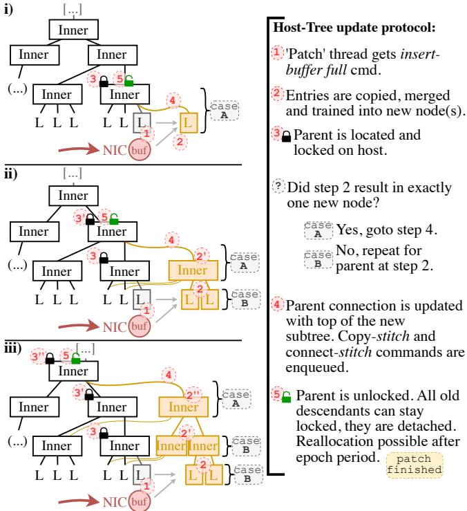  
Figure 6: Host-side patching protocol.

After the leaf nodes are updated on the host, the patcher thread locates the parent of the original leaf by descending from the root. It then locks the parent for exclusive access, so that concurrent updates from sibling nodes must wait for the current one to finish. We avoid explicit parent pointers be cause maintaining bidirectional references under concurrency requires complex synchronization schemes.

If the retraining produced exactly one leaf, a single pointer swap in the parent is sufficient. Otherwise, the parent must also be rebuilt. We merge the new child pivots with the parent entries and apply PLA segmentation with εinner. PLA ranges in this step represent the inner-node segments. If the segmentation yields more ranges than the maximum allowed per node, multiple inner nodes are created, each containing a balanced number of segments. Similarly to splitting leaf nodes, we limit the number of segments within inner nodes using the retrain bound. Overall, this process is iterated bottom-up for every level of the tree, stopping only when the parent node does not need to be split or the root node has been reached.

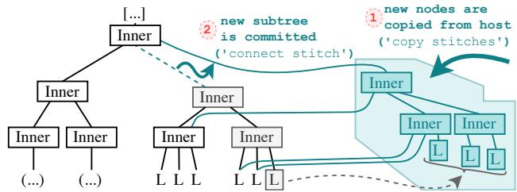  
Figure 7: The NIC-tree stays valid while stitches are applied.

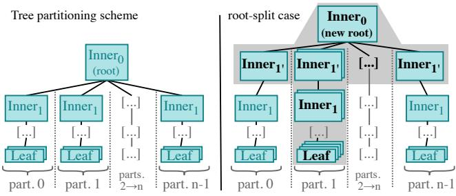  
Figure 8: Tree partitioning to allow concurrent stitches.

Once the host tree contains the new nodes, we propagate the changes to the NIC-side tree using our stitcher threads. We enqueue the individual node updates to the stitcher queues as COPY stitches. Afterward, a single CONNECT stitch command is issued that translates to a single pointer swap, making previous COPY stitches effective (see Figure 6).

## 3.2.2 NIC-Side Stitching

The NIC-side DPA stitcher threads apply stitch commands submitted through stitcher thread queues. Stitcher threads process incoming COPY and CONNECT stitches in order, redoing the host-tree changes on the NIC side (Figure 7). The host has pre-calculated every destination address in the DPA memory space, and the stitcher threads do not have to allocate any memory. Instead, they execute the provided commands on the pointers passed from the host. To enable concurrent stitching, we partition the tree beneath the first level of inner nodes (Figure 8, left). Each parallel stitcher thread (four by default) works on a dedicated partition of the tree. The host is aware of the mapping of stitcher threads to partitions and assigns stitch commands accordingly.

Ordering of stitches and single-thread ownership eliminate most race conditions. However, root-level updates can produce conflicting stitches: (i) a CONNECT could reference a node that has not yet been installed by a corresponding COPY stitch, or (ii) newly copied and connected nodes could reference child nodes that are not yet available on the NIC-side tree. Therefore, we have implemented two safeguards. First, we delay the execution of stitches targeting nodes originating directly from a root split until their destination is available. We do this by using unique identifiers (UIDs) to probe whether the target node of a CONNECT stitch is already in place. Second, the stitch that installs an updated root node is blocked by a queue fence until earlier updates have completed. To preserve the partitioning scheme, the host ensures that root splits maintain balanced partitions and distribute new top-level nodes across all partitions (Figure 8, right-hand side).

## 3.2.3 Memory Reclamation

NIC-side subtrees become obsolete after a new version is installed using COPY and CONNECT stitches, in which case the leaf memory must eventually be freed. However, traverser threads may still descend into subtrees containing the affected nodes. Therefore, we perform epoch-based reclamation of obsolete nodes, using all DPA threads’ incoming and outgoing packet counters to compute a global epoch value.

## 3.2.4 Bulk Loading

Bulk loading partitions a set of sorted KV pairs into PLA segments for the configured leaf error bound εleaf on the host. Each PLA segment becomes a leaf node. Once all leaf nodes are available, their first keys form the scaffolding for building upper levels. We then apply the same PLA construction bottom-up. The first keys of child nodes serve as input for constructing the nodes at the next-higher level, with an error bound of εinner to regulate tree fan-out. This recursive process continues until a single inner node remains, which becomes the root node.

Throughout bulk loading, the host enqueues COPY and CONNECT stitch commands to the stitcher queues. The stitcher threads assemble the initial tree following the enqueued host commands, ending with a final root-pointer stitch that makes the structure visible to traverser threads. As the host implicitly determines the tree partitions by selecting a stitcher queue for every tree update, no further actions on the NIC side are necessary.

## 4 Evaluation

In this section, we first provide an overview of the experimental setup before presenting an in-depth analysis of DPA-Store. Finally, we compare DPA-Store with ROLEX [26], a state-ofthe-art RDMA-based KV store.

## 4.1 Experimental Setup

Unless stated otherwise, our test environment consists of one server and six client machines connected through a 100 Gb/s

Dell PowerSwitch S5232F. The switch is Ethernet-based and supports RDMA over Converged Ethernet (RoCE). The clients use dual-socket AMD EPYC 7301 CPUs (32 cores) with Mellanox ConnectX-5 NICs. Clients use DPDK [12] for request transmission, bypassing OS bottlenecks. The server uses a BlueField-3 B3140L on a system with a 32-core AMD EPYC 9354P and 128 GB of DDR5 memory. In all experiments, including DPA-Store, the BlueField-3 operates in NIC mode, i.e., with DPA DMA access to the host and disabled ARM cores. When the DPA subsystem is not in use, the BlueField-3 behaves like a ConnectX-7 NIC. This allows us to evaluate related work on a conventional host/NIC setup. At the same time, DPA-Store executes on the same hardware and software stack, ensuring a fair comparison.

Many learned indexes are sensitive to key distributions. We ensure rigorous testing of our learned index by using the common SOSD datasets [2, 31]. They consist of the synthetic sparse and dense datasets, as well as real-world datasets derived from Facebook (face), Amazon (amzn), Wikipedia (wiki), and OpenStreetMap (osmc) workloads. The sparse dataset randomly selects keys from the full 64-bit range, while our dense4x selects 50M keys from a consecutive range keys four times that large. Unless stated otherwise, we bulk load 25M entries before each experiment and use a value of α = 0.99 for skewed key popularities according to Zipf’s Law. Similar to most related work, we use 64-bit keys and 64-bit values.

We averaged throughput values over four runs for longrunning benchmarks (e.g., GET) and eight runs for shortrunning ones (e.g., inserts of new keys). Latency measurements were gathered from all clients and combined. Client start times were synchronized via MPI. Measurements showed a standard deviation of less than 5% for throughput and less than 9% for latencies.

## 4.2 DPA-Store Evaluation

In this section, we first investigate the memory consumption of DPA-Store. We then analyze the effects of the learnedindex parameters, client parameters, and DPA/host thread counts on throughput and latency. Using our findings, we deduce default values for DPA-Store. Furthermore, we analyze whether different BlueField-3 models or changes to the BlueField-3 hardware influence performance.

## 4.2.1 Memory Consumption

We evaluated the overheads of the index structure compared to the raw KV data on the host side for 50M inserted KV pairs (Table 1). Since face and osmc show the highest memory consumption and overheads for values of εinner = 4 and εleaf = 8, we demonstrate that their memory impact can be significantly reduced with ε = 16 for both, inner and leaf nodes. In the following benchmarks, we select the larger values for ε for

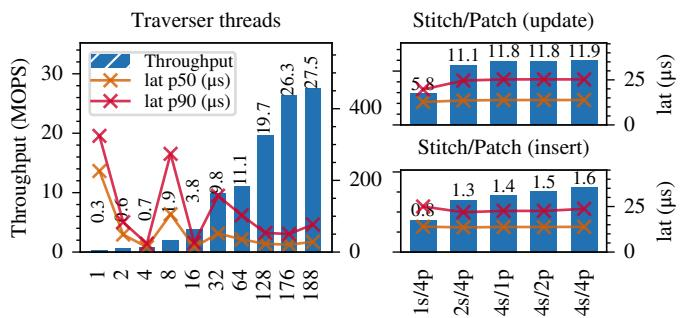

Table 1: Relative overhead and NIC-side memory consumption for 64-bit key distributions and 50M entries.  
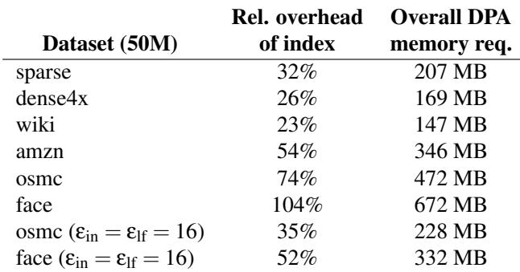

those datasets.

Compared to other learned indexes, DPA-Store chooses small ε values to minimize the cost of searching for the key around the predicted position in latency-constrained DPA memory. For example, ROLEX uses ε ∈ {128,256}, allowing it to maintain much larger nodes and thus reducing per-node memory overheads. ROLEX reports a metadata overhead of 6.5% for cache data on a 500 M dataset, assuming 16 B KV pairs [26]. However, it requires all clients to hold a separate cache, increasing memory overhead proportionally to the number of clients in addition to the number of keys.

## 4.2.2 DPA and Host Thread Counts

In this subsection, we evaluate the impact of a varying number of traverser, patcher, and stitcher threads on the performance of DPA-Store. Figure 9 (left) shows the throughput and latencies of a GET-only workload with uniform key popularity on the sparse dataset. We observe that the throughput scales proportionally to the number of traverser threads. Latencies exhibit higher variance with few traverser threads but stabilize with a larger number of threads. This is because these few threads are overwhelmed by the number of incoming packets, causing them to fail to process requests in a timely manner. For values larger than 16, multiple DPA hardware cores are used, resulting in lower latencies.

Throughput increases slightly beyond 176 threads, which fully occupy eleven hardware DPA cores. The remaining usable 13 DPA threads reside on the next, partially-used physical core. We found that using the last available hardware core for both traverser and stitcher threads leads to worse throughput for INSERT operations. This is a result of the hardware scheduler that prioritizes NIC doorbell events. These events invoke traverser threads and therefore stall the execution of stitchers. We observed a 14% degradation in throughput for INSERT when mixing both types of DPA threads on one core. For both INSERT and UPDATE workloads, throughput flattens beyond four patcher threads and four stitcher threads. We note that the throughput of host-side patcher threads is limited by the NIC-side stitcher threads (see Section 4.2.8 for details).

Figure 9: DPA-store throughput and latencies for different numbers of traverser, patcher, and stitcher threads. The left plot shows the number of traverser threads for GET requests. The right plot varies patcher/stitcher thread count for INSERTand UPDATE-only workloads with 176 traversers.  
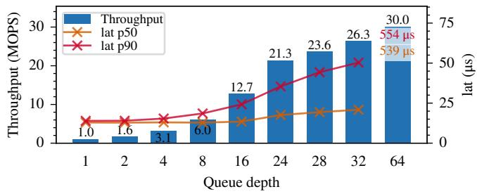  
Figure 10: DPA-Store GET throughput and latency using different client-side queue depths.

Lessons learned: Prioritizing NIC doorbell events by the BlueField-3 requires partitioning the 189 available DPA threads into 176 traverser threads on 11 physical cores and four stitcher threads on a dedicated core, leaving nine threads unused. Furthermore, we configure DPA-Store to run four host-side patcher threads.

## 4.2.3 Client-Side Queue Depth

In the following, we investigate the impact of the client-side queue depth and the resulting total number of in-flight requests on throughput and latencies. Each of the six client nodes is running 31 threads. Threads issue between 1 and 64 concurrent requests. NIC-side hash tables ensure that outgoing and corresponding incoming packets are handled by the same thread and that requests lacking an acknowledgment are resent after a timeout. Figure 10 shows how client-side queue depth affects GET performance under a uniform key distribution.

Throughput increases significantly up to a client queue depth of 32 with a maximum of 5,952 in-flight requests. After this point, throughput continues to rise; however, latency increases beyond acceptable levels because the processing rate of DPA-Store cannot keep pace with the request submission rate. Accordingly, a queue depth of 32 is used for GET requests throughout all subsequent experiments. We similarly set a queue depth of 18 for INSERT and RANGE workloads. Integrating adaptive flow control is left as future work.

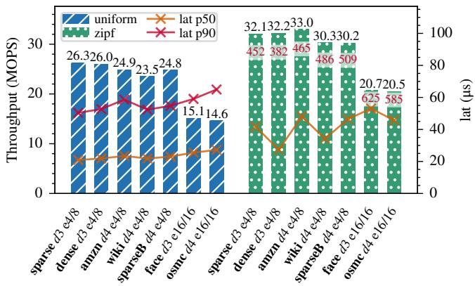  
Figure 11: Results of DPA-Store using GET-only workloads.

## 4.2.4 Effect of Tree Depth and Index Error Bound

We evaluate the effect of tree depth and the error bound ε on the throughput and latency of DPA-Store. To demonstrate the effect of the tree depth, we include the sparseBig dataset in this section. Bulk loading sparseBig (consisting of 50M KV pairs) results in a tree depth of four, whereas sparse has a depth of three. Figure 11 shows GET performance for different datasets under uniform and skewed key popularity. Under uniform access, we observe a slight reduction in throughput for deeper trees because of the extra accesses to an additional inner node. For the datasets face and osmc, choosing a larger ε value causes a more significant performance degradation. This illustrates the impact of additional cache-line accesses required when verifying the model predictions (see also the DPA-Store performance model in Section 4.2.6).

With skewed key popularity, the hot-entry cache increases throughput by up to 30%, which meets our expectations in Section 3.1.2. However, tail latencies increase because some traverser threads receive a disproportionate share of requests, leading to longer wait times in the DPA queues.

## 4.2.5 B+-tree Comparison

We chose a learned index as the fundamental data structure behind DPA-Store. To motivate this decision, we compare the GET throughput and latencies of the learned index tree against a B+-tree baseline, measured directly after bulk-loading the data. For the B+-tree we set ε = ∞ during construction, leading to fully packed 2 KiB nodes with 128 entries each. For lookups inside nodes, the B+-tree uses standard binary search starting from the middle of the node; it does not extrapolate the start position from split keys in the parent. We deliberately keep the baseline at this canonical form because adding parentkey interpolation would itself constitute a partial learned index and blur the comparison. We use 176 traverser threads for both variants, matching the DPA-Store configuration. The corresponding B+-tree metadata overhead is about 145%.

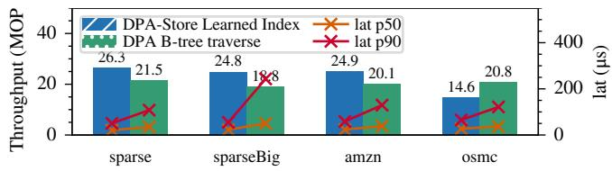  
Figure 12: Comparing B+-tree and learned DPA traversals.

Figure 12 shows that latencies are mostly higher for the B+- tree than for the learned index. With the default ε, the learned index achieves higher throughput on the sparse, sparseBig, and amzn datasets, even though the more densely populated nodes in the B+-tree yield lower tree depths. The osmc dataset is, in our default configuration, trained with ε = 16 to keep the metadata footprint manageable (see Table 1). At this setting the B+-tree wins on raw throughput because the cost of scanning a 32-key learned window approaches that of binary search over a packed node, although median latency remains slightly worse due to a suboptimal balance between compute and memory accesses. Using εinner = 4 and εleaf = 8 here increases NIC-side metadata substantially. The tradeoff is therefore governed by ε and the resulting in-node scan length. Small ε exploits the contiguous-window property of the learned index, while larger ε reduces the effect, making a compact B+-tree competitive.

## 4.2.6 Analysis of GET Operations and Memory Accesses

The previous two subsections have shown that DPA-Store depends heavily on the performance of the memory subsystem, particularly the access latency of the DPA-addressable DDR5 memory. Prior work [7] reports average memory access times of 465 ns for DPA memory, compared with 910 ns for DMA accesses to host memory. In the following, we model the minimal duration of a full tree traversal, assuming our default parameters of εinner = 4 and εleaf = 8.

The first cache-line accessed in every inner node includes the node’s metadata and the segments’ first keys. The second cache-line contains each segment’s model. The next one or two cache-lines (depending on the node fullness) contain the pivots, and the fifth cache-line contains the child pointer. Assuming nodes are 50% full on average, this results in an average of 4.5 cache-lines per inner node. Similarly, leaf nodes require one cache-line for metadata, up to three DMA operations to fetch the key, and one DMA operation to fetch the value. Note that we assume insert buffers to be empty in this analysis, requiring no additional memory accesses.

For a tree of depth 3, we access two inner nodes and one leaf node, resulting in overall memory access times of

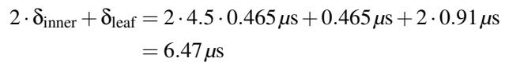

Note that the cache-lines for the leaf key are sequential on the host and collapse into a single DMA. Assuming DPA scheduling overlaps one thread’s computation with an other thread’s memory accesses, the maximum throughput is 176/(6.47µs) = 27.2 MOPS, provided none of the relevant cache-lines are cached.

If we further assume the root node’s first cache-lines (node metadata, segment keys, and models) are cached for all DPA threads, and the two memory accesses are replaced by L3 access times of 64ns each, we compute δroot = 1.2905µs and obtain a maximum throughput of 31.05 MOPS. While this model is an approximation, our evaluation of DPA-Store achieves similar results (e.g., Figure 9).

As detailed in Section 3.1, we optimized the traverser path to prefetch cache-lines optimistically, overlapping memory access with compute. Due to the relatively weak per-thread compute capabilities, we measured an improvement of 19% for this optimization.

Lessons learned: GET performance is limited by the access latencies to DPA memory and could increase significantly if memory access latencies were comparable with latencies of standard CPUs. For memory latencies of 100 ns, GET latencies could decrease to less than 2.82µs and throughput could increase to more than 62 MOPS. Decreased memory latencies would also allow increasing ε values and becoming more memory efficient.

## 4.2.7 Bulk Load Performance

We evaluated the bulk load throughput using a 50M sparse dataset and four stitcher threads. Traverser threads are disabled during bulk loading. The full bulk load is finished on the host after an average runtime of 1,643 ms. The copying and processing of stitch requests accumulates to 1,605 ms. The bulk load copies 192 MB of tree data into DPA memory, resulting in a host-to-DPA memory bandwidth of only 120 MByte/s. This low bandwidth arises because fine-grained writes targeting scattered addresses cannot be issued efficiently from the host directly to DPA memory. Instead, the stitcher threads have to poll for incoming stitches via DMA and then first load the data into the stitcher thread’s local context before writing it into DPA memory.

Lessons learned: Bulk load performance and, as shown in the following section, insert performance could be greatly increased if the BlueField-3 supported efficient transfers from host memory to DPA memory.

## 4.2.8 INSERT/UPDATE Performance

We evaluate throughput and latency for INSERT and UPDATE operations, mixed varying proportions of GET operations, using the sparse, amzn, and osmc datasets (see Figure 13).

Stitch requests for UPDATE-only patches require no data to be copied to DPA memory. Instead, only the host-side values are updated, and a stitch command resets the original DPA leaf’s insert buffer. Here we reach up to 12.1 MOPS. We observe particularly low throughput for INSERT operations across all three datasets, with at most 1.7 MOPS. As soon as nodes are retrained on the host side from the leaf upward, COPY stitches are transferred. For leaves, only model parameters and DMA addresses are transferred, while inner nodes copy their complete pivots and child pointers. As we already saw for the bulk load performance, which uses the same stitching method as runtime updates, we are heavily constrained by the BlueField-3’s inability to efficiently write data from host to device. The stitching bandwidth during runtime in an INSERT-heavy scenario cannot exceed the low rate measured for bulk loading. Although the polling stitchers perform below our expectations, future SmartNIC generations with a stronger host-to-DPA write path could address this limitation.

To rule out that the host-to-DPA bandwidth limit is an artifact of our DPA-pull stitching design, we also investigated a host-initiated copy-stitching path implemented with NVIDIA’s FlexIO APIs [35, 36]. In this variant, the host directly pushes stitch payloads into DPA memory rather than enqueueing pointers that DPA stitcher threads pull via DMA. This removes the polling stitcher and one DPA-side memory hop from the critical path. The host-pushed path delivered comparable, but not better, host-to-DPA throughput, and INSERT performance did not improve. This suggests that the limiting factor is the underlying host-to-DPA write path on BlueField-3 rather than the direction of the copy, so we retain the simpler DPA-pulled stitching protocol.

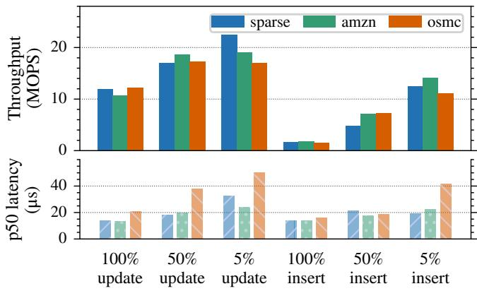  
Figure 13: DPA-Store performance of UPDATEs and INSERTs.

## 4.2.9 BlueField-3 Model Comparison

We ran tests on an additional setup to evaluate the B3220 model of the BlueField-3 family. Unlike the B3140L with single-channel memory and one network port, the B3220 features dual-channel DPA memory and two network ports. The number and type of DPA cores, however, remain the same. Unfortunately, comparable client nodes were unavailable, and we had to generate requests with another BlueField-3 B3220 NIC via DPA programs. This allowed us to saturate the throughput of DPA-Store, but the client card lacked the compute performance to evaluate response latencies. We also disabled the restriction on the number of in-flight requests for the B3140L. Therefore, the throughput of DPA-Store was saturated for both models, enabling a fair comparison.

Figure 14 shows GET-only workloads on different datasets with uniform and skewed key popularities, for both NICs. We observe that throughput for the sparse dataset with a uniform key distribution is nearly identical for both NICs. This shows that GET throughput is dominated by DPA memory latencies and that moving from single- to dual-channel memory has no direct effect on DPA-Store. DPA-Store’s INSERT, UPDATE, and RANGE throughputs also do not differ significantly.

However, with a skewed key distribution for GET-only workloads, The B3220 shows higher throughput than the B3140L, reaching 48.5 MOPS compared to the B3140L’s 39.9 MOPS. Additionally, we ran ping tests in which the receiving DPA thread returns packets without any memory access. For ping, the B3140L model reached 44.9 MOPS, whereas the B3220 delivered 69% higher throughput. Since cached requests trigger only a single memory access and uniform accesses remain unchanged, these results demonstrate that the dual-port B3220 features stronger packet-matching hardware and therefore can process small requests faster.

## 4.3 Comparison with ROLEX

We compared DPA-Store against ROLEX [26], the fastest RDMA KV store that runs on modern hardware and is available for comparison, to highlight the effects of different architectural choices. We evaluated ROLEX in the same configuration as DPA-Store. This led to better throughput results for ROLEX compared to its own published results but also increased its latencies. We evaluated both solutions using YCSB workloads [8] consisting of six scenarios: A (50% reads, 50% updates), B (95% reads, 5% updates), C (100% reads), D (95% reads, 5% inserts), E (95% range, 5% inserts), and F (50% reads, 50% read-modify-update). Additionally, we include experiments for 100% inserts and 100% range queries covering 10 adjacent keys. The experiments were executed using sparse, amzn, and osmc datasets, which resulted in different tree depths and error-bound configurations for DPA-Store (see Figure 11). We measured with a uniform key distribution to reduce the effect of the hot-entry cache.

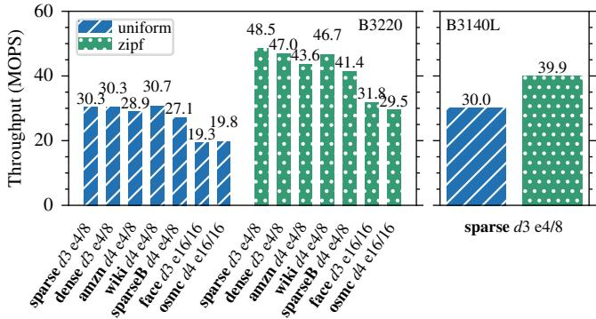  
Figure 14: GET throughput for different BlueField-3 models.

Figure 15 shows that DPA-Store exceeds the throughput of ROLEX for the amzn and osmc datasets for YCSB-A and for all RANGE-only workloads. For GET-only workloads, DPA-Store achieves higher throughput and lower latencies compared to ROLEX on sparse and amzn. However, ROLEX achieves better results on osmc, where its larger values of ε are more suitable.

ROLEX shows higher throughput for INSERT workloads. Its clients can issue INSERT requests via one-sided RDMA writes directly into large server memory buffers and lazily decouple model retraining, so the structural update cost is spread over the client side instead of being concentrated in a host-to-DPA copy path. This is an effective design for insert-heavy workloads, but it relies on stateful clients that maintain learned-cache metadata and issue one-sided RDMA operations. The client-side cache also scales with the number of clients. DPA-Store makes the opposite trade-off. Clients only select a DPA traverser by hashing the key and sending a request packet, while the SmartNIC and host maintain the index. As a result, DPA-Store’s INSERT throughput is limited by copying new node contents from the host back into DPA memory (see Section 4.2.8). The INSERT-only workload is therefore a worst-case comparison.

In workloads where inserts of new keys are infrequent compared to GET or RANGE requests, such as YCSB-D and YCSB-E, DPA-Store nearly reaches ROLEX’s performance. Updating existing keys is less restricted by the host-to-DPA bottleneck because raw updates do not change inner nodes, and no additional copy stitches are sent. Consequently, even for high update ratios, as in YCSB-A, DPA-Store can surpass ROLEX for amzn and osmc.

Figure 15 shows lower latencies for DPA-Store compared to ROLEX in all experiments. While DPA-Store may cross the relatively slow PCIe bus to the host for DMA access during GET operations, the hot cache and insert buffer reduce the number of DMA operations on the lookup path. ROLEX requires RDMA operations for every request and, in uncached or mispredicted cases, additional round-trips. This difference is particularly visible for higher numbers of in-flight requests, where the extra RDMA traffic causes contention delays.

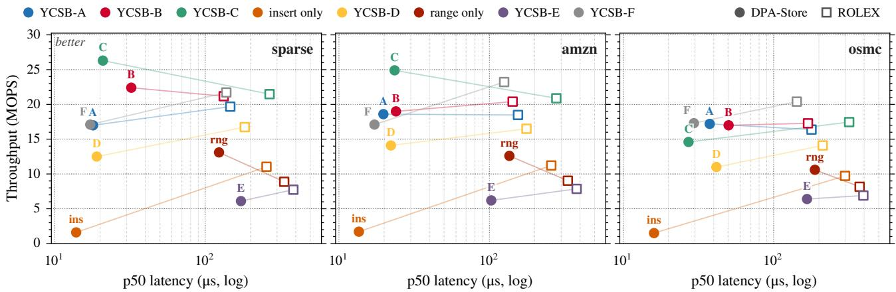  
Figure 15: YCSB workloads on sparse, amzn, and osmc datasets. Each of the three subplots shows the throughput and latency for all workloads as 2D scatter. Connected points represent DPA-Store’s and ROLEX’s performance for the same workload.

Lessons learned: DPA-Store is, at the cost of more complex NIC-side hardware, faster for most workloads than the state-of-the-art ROLEX KV store while keeping clients stateless. Its main weakness is lower INSERT throughput, which is bounded by the BlueField-3 host-to-DPA write path. A future BlueField generation with a better DPA memory interface and efficient host-to-DPA transfers could remove this bottleneck without changing DPA-Store’s client model.

## 5 Conclusion

We have proposed DPA-Store, a KV store residing on a Smart-NIC that removes OS latencies from all operations while keeping clients stateless. By carefully analyzing the internal hardware of the BlueField-3, we have designed DPA-Store to maximize operation throughput. We have offloaded computation-heavy learned-index maintenance to the host while keeping tree traversal lock-free and highly concurrent. We have shown that DPA-Store is competitive with ROLEX and that a better DPA memory interface and host-to-DPA transfer path could significantly improve these results.

## Acknowledgement

This work has been supported by the project Big Data in Atmospheric Physics (BINARY) (funded by the Carl Zeiss Foundation, P2018-02-003) and the project ScalNEXT: Optimierung des Datenmanagements und des Kontrollflusses von Rechenknoten für Supercomputing (16ME0688). This work was partly performed in the framework of the PUNCH4NFDI consortium supported by DFG fund “NFDI 39/1”, Germany. Further, this research was conducted using hardware of the Institute for Automation of Complex Power Systems at RWTH Aachen University.

## References

[1] Berk Atikoglu, Yuehai Xu, Eitan Frachtenberg, Song Jiang, and Mike Paleczny. Workload analysis of a large-scale key-value store. In ACM SIGMET-RICS/PERFORMANCE Joint International Conference on Measurement and Modeling of Computer Systems (SIGMETRICS), London, United Kingdom, June 11-15, pages 53–64, 2012. doi:10.1145/2254756.2254766.

[2] Lorenzo Bellomo, Giuseppe Cianci, Luca de Rosa, Paolo Ferragina, and Mattia Odorisio. A comparative study of compressed, learned, and traditional indexing methods for integer data. In 23rd International Symposium on Experimental Algorithms (SEA), Venice, Italy, July 22-24, pages 5:1–5:23, 2025. doi: 10.4230/LIPICS.SEA.2025.5.

[3] André Brinkmann, Reza Salkhordeh, Florian Wiegert, Peng Wang, Xin Yao, Renhai Chen, Keji Huang, and Gong Zhang. Hln-tree: A memory-efficient b+-tree with huge leaf nodes and locality predictors. ACM Trans. Storage, 21(2):14:1–14:27, 2025. doi:10. 1145/3707641.

[4] Qizhe Cai, Shubham Chaudhary, Midhul Vuppalapati, Jaehyun Hwang, and Rachit Agarwal. Understanding host network stack overheads. In ACM SIGCOMM Conference, Virtual Event, USA, August 23-27, pages 65–77, 2021. doi:10.1145/3452296.3472888.

[5] Zhichao Cao, Siying Dong, Sagar Vemuri, and David H. C. Du. Characterizing, modeling, and benchmarking rocksdb key-value workloads at facebook. In 18th USENIX Conference on File and Storage Technologies (FAST), Santa Clara, CA, USA, February 24-27, pages 209–223, 2020.

[6] Haibo Chen, Rong Chen, Xingda Wei, Jiaxin Shi, Yanzhe Chen, Zhaoguo Wang, Binyu Zang, and Haibing Guan. Fast in-memory transaction processing using RDMA and HTM. ACM Trans. Comput. Syst., 35(1):3:1–3:37, 2017. doi:10.1145/3092701.

[7] Xuzheng Chen, Jie Zhang, Ting Fu, Yifan Shen, Shu Ma, Kun Qian, Lingjun Zhu, Chao Shi, Yin Zhang, Ming Liu, and Zeke Wang. Demystifying datapath accelerator enhanced off-path smartnic. In 32nd IEEE International Conference on Network Protocols (ICNP), Charleroi, Belgium, October 28-31, pages 1–12, 2024. doi:10.1109/ICNP61940.2024.10858560.

[8] Brian F. Cooper, Adam Silberstein, Erwin Tam, Raghu Ramakrishnan, and Russell Sears. Benchmarking cloud serving systems with YCSB. In Proceedings of the 1st ACM Symposium on Cloud Computing (SoCC), Indianapolis, Indiana, USA, June 10-11, pages 143–154, 2010. doi:10.1145/1807128.1807152.

[9] Jialin Ding, Umar Farooq Minhas, Jia Yu, Chi Wang, Jaeyoung Do, Yinan Li, Hantian Zhang, Badrish Chandramouli, Johannes Gehrke, Donald Kossmann, David B. Lomet, and Tim Kraska. ALEX: an updatable adaptive learned index. In Proceedings of the International Conference on Management of Data (SIGMOD), online conference, June 14-19, pages 969–984, 2020. doi:10.1145/3318464.3389711.

[10] Dragonfly. Dragonfly - An In-Memory Data Store without Limits. Accessed: 2025-08-14. URL: https: //www.dragonflydb.io/.

[11] Paolo Ferragina and Giorgio Vinciguerra. The pgmindex: a fully-dynamic compressed learned index with provable worst-case bounds. Proc. VLDB Endow., 13(8):1162–1175, 2020. doi:10.14778/3389133. 3389135.

[12] Linux Foundation. Data Plane Development Kit (DPDK), 2015. URL: http://www.dpdk.org.

[13] Jiake Ge, Huanchen Zhang, Boyu Shi, Yuanhui Luo, Yunda Guo, Yunpeng Chai, Yuxing Chen, and Anqun Pan. SALI: A scalable adaptive learned index framework based on probability models. Proc. ACM Manag. Data, 1(4):258:1–258:25, 2023. doi: 10.1145/3626752.

[14] Anuj Kalia, Michael Kaminsky, and David G. Andersen. Using RDMA efficiently for key-value services. In ACM SIGCOMM Conference, Chicago, IL, USA, August 17-22, pages 295–306, 2014. doi:10.1145/2619239. 2626299.

[15] Arjun Kashyap, Yuke Li, and Xiaoyi Lu. DPU-KV: on the benefits of DPU offloading for in-memory keyvalue stores at the edge. In Proceedings of the 34th International Symposium on High-Performance Parallel and Distributed Computing (HPDC), Notre Dame, IN, USA, July 20-23, pages 11:1–11:14, 2025. doi:10. 1145/3731545.3731571.

[16] Arjun Kashyap, Yuke Li, Darren Ng, and Xiaoyi Lu. Understanding the idiosyncrasies of emerging bluefield dpus. In Proceedings of the 39th ACM International Conference on Supercomputing (ICS), Salt Lake City, UT, USA, June 8-11, pages 807–821, 2025. doi:10. 1145/3721145.3725780.

[17] KeyDB. KeyDB - The Faster Redis Alternative. Accessed: 2025-11-22. URL: https://docs.keydb. dev.

[18] Elie F. Kfoury, Samia Choueiri, Ali Mazloum, Ali AlSabeh, Jose Gomez, and Jorge Crichigno. A comprehensive survey on smartnics: Architectures, development models, applications, and research directions. IEEE Access, 12:107297–107336, 2024. doi: 10.1109/ACCESS.2024.3437203.

[19] Andreas Kipf, Ryan Marcus, Alexander van Renen, Mihail Stoian, Alfons Kemper, Tim Kraska, and Thomas Neumann. Radixspline: a single-pass learned index. In Proceedings of the Third International Workshop on Exploiting Artificial Intelligence Techniques for Data Management (aiDM@SIGMOD), Portland, Oregon, USA, June 19, pages 5:1–5:5, 2020. doi: 10.1145/3401071.3401659.

[20] Tim Kraska, Alex Beutel, Ed H. Chi, Jeffrey Dean, and Neoklis Polyzotis. The case for learned index structures. In Proceedings of the International Conference on Management of Data (SIGMOD), Houston, TX, USA, June 10-15, pages 489–504, 2018. doi: 10.1145/3183713.3196909.

[21] Viktor Leis, Alfons Kemper, and Thomas Neumann. The adaptive radix tree: Artful indexing for mainmemory databases. In 29th IEEE International Conference on Data Engineering (ICDE), Brisbane, Australia, April 8-12, pages 38–49, 2013. doi:10.1109/ICDE. 2013.6544812.

[22] Viktor Leis, Florian Scheibner, Alfons Kemper, and Thomas Neumann. The ART of practical synchronization. In Proceedings of the 12th International Workshop on Data Management on New Hardware (DaMoN), San Francisco, CA, USA, June 27, pages 3:1–3:8, 2016. doi:10.1145/2933349.2933352.

[23] Bojie Li, Zhenyuan Ruan, Wencong Xiao, Yuanwei Lu, Yongqiang Xiong, Andrew Putnam, Enhong Chen, and Lintao Zhang. Kv-direct: High-performance in-memory key-value store with programmable NIC. In Proceedings of the 26th Symposium on Operating Systems Principles (SOSP), Shanghai, China, October 28-31, pages 137–152, 2017. doi:10.1145/3132747.3132756.

[24] Pengfei Li, Yu Hua, Jingnan Jia, and Pengfei Zuo. Finedex: A fine-grained learned index scheme for scalable and concurrent memory systems. Proc. VLDB Endow., 15(2):321–334, 2021. doi:10.14778/3489496. 3489512.

[25] Pengfei Li, Yu Hua, Pengfei Zuo, Zhangyu Chen, and Jiajie Sheng. A high-performance rdma-oriented learned key-value store for disaggregated memory systems. ACM Trans. Storage, 19(4):30:1–30:30, 2023. doi:10.1145/3620674.

[26] Pengfei Li, Yu Hua, Pengfei Zuo, Zhangyu Chen, and Jiajie Sheng. ROLEX: A Scalable RDMA-oriented Learned Key-Value Store for Disaggregated Memory Systems. In 21st USENIX Conference on File and Storage Technologies (FAST), Santa Clara, CA, USA, February 21-23, pages 99–114, 2023.

[27] Pengfei Li, Hua Lu, Rong Zhu, Bolin Ding, Long Yang, and Gang Pan. DILI: A Distribution-Driven Learned Index. Proc. VLDB Endow., 16(9):2212–2224, 2023. doi:10.14778/3598581.3598593.

[28] Hyeontaek Lim, Dongsu Han, David G. Andersen, and Michael Kaminsky. MICA: A Holistic Approach to Fast In-Memory Key-Value Storage. In Proceedings of the 11th USENIX Symposium on Networked Systems Design and Implementation (NSDI), Seattle, WA, USA, April 2-4, pages 429–444, 2014.

[29] Junyi Liu, Aleksandar Dragojevic, Shane T. Fleming, Antonios Katsarakis, Dario Korolija, Igor Zablotchi, Ho-Cheung Ng, Anuj Kalia, and Miguel Castro. Honeycomb: Ordered Key-Value Store Acceleration on an FPGA-Based SmartNIC. IEEE Trans. Computers, 73(3):857–871, 2024. doi:10.1109/TC.2023. 3345173.

[30] Yandong Mao, Eddie Kohler, and Robert Tappan Morris. Cache craftiness for fast multicore key-value storage. In European Conference on Computer Systems, Proceedings of the Seventh EuroSys Conference 2012 (EuroSys), Bern, Switzerland, April 10-13, pages 183–196, 2012. doi:10.1145/2168836.2168855.

[31] Ryan Marcus, Andreas Kipf, Alexander van Renen, Mihail Stoian, Sanchit Misra, Alfons Kemper, Thomas Neumann, and Tim Kraska. Benchmarking learned

indexes. Proc. VLDB Endow., 14(1):1–13, 2020. doi:10.14778/3421424.3421425.

[32] Ryan Marcus, Emily Zhang, and Tim Kraska. Cdfshop: Exploring and optimizing learned index structures. In Proceedings of the International Conference on Management of Data (SIGMOD), online conference, June 14-19, pages 2789–2792, 2020. doi: 10.1145/3318464.3384706.

[33] Memcached. Memcached - A distributed memory object caching system. Accessed: 2025-08-14. URL: https://memcached.org.

[34] Rolf Neugebauer, Gianni Antichi, José Fernando Zazo, Yury Audzevich, Sergio López-Buedo, and Andrew W. Moore. Understanding pcie performance for end host networking. In Proceedings of the Conference of the ACM Special Interest Group on Data Communication (SIGCOMM), Budapest, Hungary, August 20-25, pages 327–341, 2018. doi:10.1145/3230543.3230560.

[35] NVIDIA. NVIDIA BlueField-3 data-path accelerator (DPA). Accessed: 2025-08-14. URL: https://docs.nvidia.com/doca/sdk/dpa+ subsystem/index.html.

[36] NVIDIA. NVIDIA BlueField Networking Platform. Accessed: 2025-08-14. URL: https://www.nvidia.com/en-us/networking/ products/data-processing-unit/.

[37] Boris Pismenny, Liran Liss, Adam Morrison, and Dan Tsafrir. The benefits of general-purpose on-nic memory. In 27th ACM International Conference on Architectural Support for Programming Languages and Operating Systems (ASPLOS), Lausanne, Switzerland, pages 1130– 1147, 2022. doi:10.1145/3503222.3507711.

[38] Redis. Redis - The Real-time Data Platform. Accessed: 2025-08-14. URL: https://redis.io.

[39] Feng Ren, Mingxing Zhang, Kang Chen, Huaxia Xia, Zuoning Chen, and Yongwei Wu. Scaling up memory disaggregated applications with SMART. In Proceedings of the 29th ACM International Conference on Architectural Support for Programming Languages and Operating Systems, Volume 1 (ASPLOS), La Jolla, CA, USA, pages 351–367, 2024. doi:10.1145/3617232. 3624857.

[40] Henry N. Schuh, Arvind Krishnamurthy, David E. Culler, Henry M. Levy, Luigi Rizzo, Samira Manabi Khan, and Brent E. Stephens. CC-NIC: a cachecoherent interface to the NIC. In Proceedings of the 29th ACM International Conference on Architectural Support for Programming Languages and Operating

Systems, Volume 1 (ASPLOS), La Jolla, CA, USA, pages 52–68, 2024. doi:10.1145/3617232.3624868.

[41] Shangyi Sun, Chunpu Huang, Rui Zhang, Lulu Chen, Yukai Huang, Ming Yan, and Jie Wu. A comprehensive study on optimizing systems with data processing units. CoRR, abs/2301.06070, 2023. doi:10.48550/ARXIV. 2301.06070.

[42] Shangyi Sun, Rui Zhang, Ming Yan, and Jie Wu. SKV: A smartnic-offloaded distributed key-value store. In IEEE International Conference on Cluster Computing (CLUSTER), Heidelberg, Germany, September 5- 8, pages 1–11, 2022. doi:10.1109/CLUSTER51413. 2022.00016.

[43] Chuzhe Tang, Youyun Wang, Zhiyuan Dong, Gansen Hu, Zhaoguo Wang, Minjie Wang, and Haibo Chen. Xindex: a scalable learned index for multicore data storage. In 25th ACM SIGPLAN Symposium on Principles and Practice of Parallel Programming (PPoPP), San Diego, California, USA, February 22-26, pages 308– 320, 2020. doi:10.1145/3332466.3374547.

[44] Justin Thaler, Michael Mitzenmacher, and Thomas Steinke. Hierarchical heavy hitters with the space saving algorithm. In 14th Meeting on Algorithm Engineering & Experiments (ALENEX), The Westin Miyako, Kyoto, Japan, January 16, pages 160–174, 2012. doi:10.1137/1.9781611972924.16.

[45] Lasse Thostrup, Daniel Failing, Tobias Ziegler, and Carsten Binnig. A dbms-centric evaluation of bluefield dpus on fast networks. In International Workshop on Accelerating Analytics and Data Management Systems Using Modern Processor and Storage Architectures (ADMS@VLDB), Sydney, Australia, September 5, pages 1–10, 2022.

[46] Aoyang Tong, Yu Hua, and Menglei Chen. Daldex: A dpu-accelerated persistent learned index via incremental learning. In Proceedings of the 39th ACM International Conference on Supercomputing (ICS), Salt Lake City, UT, USA, June 8-11, pages 535–549, 2025. doi:10. 1145/3721145.3725750.

[47] Jing Wang, Qing Wang, Yuhao Zhang, and Jiwu Shu. Deft: A scalable tree index for disaggregated memory. In Proceedings of the Twentieth European Conference on Computer Systems (EuroSys), Rotterdam, The Netherlands, pages 886–901, 2025. doi:10.1145/3689031. 3696062.

[48] Ruihong Wang, Jianguo Wang, Prishita Kadam, M. Tamer Özsu, and Walid G. Aref. dlsm: An lsmbased index for memory disaggregation. In 39th IEEE International Conference on Data Engineering (ICDE),

Anaheim, CA, USA, April 3-7, 2023, pages 2835–2849, 2023. doi:10.1109/ICDE55515.2023.00217.

[49] Xingda Wei, Rong Chen, Haibo Chen, and Binyu Zang. Xstore: Fast rdma-based ordered key-value store using remote learned cache. ACM Trans. Storage, 17(3):18:1– 18:32, 2021. doi:10.1145/3468520.

[50] Xingda Wei, Rongxin Cheng, Yuhan Yang, Rong Chen, and Haibo Chen. Characterizing off-path smartnic for accelerating distributed systems. In 17th USENIX Symposium on Operating Systems Design and Implementation (OSDI), Boston, MA, USA, July 10-12, pages 987–1004, 2023.

[51] Jiacheng Wu, Yong Zhang, Shimin Chen, Yu Chen, Jin Wang, and Chunxiao Xing. Updatable learned index with precise positions. Proc. VLDB Endow., 14(8):1276– 1288, 2021. doi:10.14778/3457390.3457393.

[52] Xingbo Wu, Fan Ni, and Song Jiang. Wormhole: A fast ordered index for in-memory data management. In Proceedings of the Fourteenth EuroSys Conference (EuroSys), Dresden, Germany, March 25-28, pages 18:1– 18:16, 2019. doi:10.1145/3302424.3303955.

[53] Juncheng Yang, Yao Yue, and K. V. Rashmi. A large-scale analysis of hundreds of in-memory keyvalue cache clusters at twitter. ACM Trans. Storage, 17(3):17:1–17:35, 2021. doi:10.1145/3468521.

[54] Shunkang Zhang, Ji Qi, Xin Yao, and André Brinkmann. Hyper: A high-performance and memory-efficient learned index via hybrid construction. Proc. ACM Manag. Data, 2(3):145, 2024. doi:10.1145/ 3654948.

[55] Yiwen Zhang, Guokuan Li, Jiguang Wan, Junyue Wang, Jun Li, Ting Yao, Huatao Wu, and Daohui Wang. Dowkv: A dpu-offloaded and write-optimized key-value store on disaggregated persistent memory. In IEEE International Conference on Cluster Computing (CLUS-TER), Santa Fe, NM, USA, October 31 - Nov. 3, pages 271–283, 2023. doi:10.1109/CLUSTER52292.2023. 00030.

[56] Wenbin Zhu, Zhaoyan Shen, Qian Wei, Renhai Chen, Xin Yao, Dongxiao Yu, and Zili Shao. Hidpu: A dpuoriented hybrid indexing scheme for disaggregated storage systems. In 23rd USENIX Conference on File and Storage Technologies (FAST), Santa Clara, CA, February 25-27, pages 271–285, 2025.

[57] Tobias Ziegler, Sumukha Tumkur Vani, Carsten Binnig, Rodrigo Fonseca, and Tim Kraska. Designing distributed tree-based index structures for fast rdmacapable networks. In Proceedings of the International

Conference on Management of Data (SIGMOD), Amsterdam, The Netherlands, June 30 - July 5, pages 741– 758, 2019. doi:10.1145/3299869.3300081.