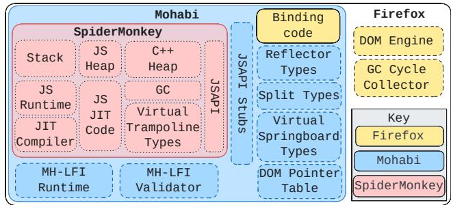
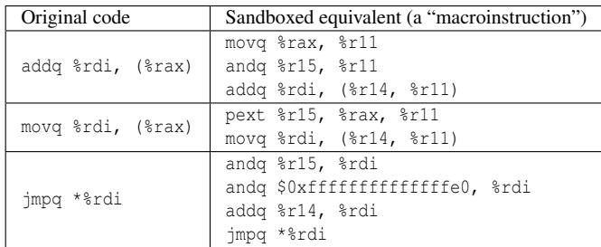
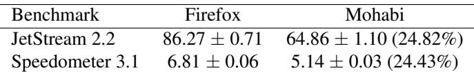
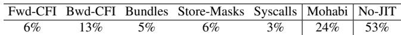
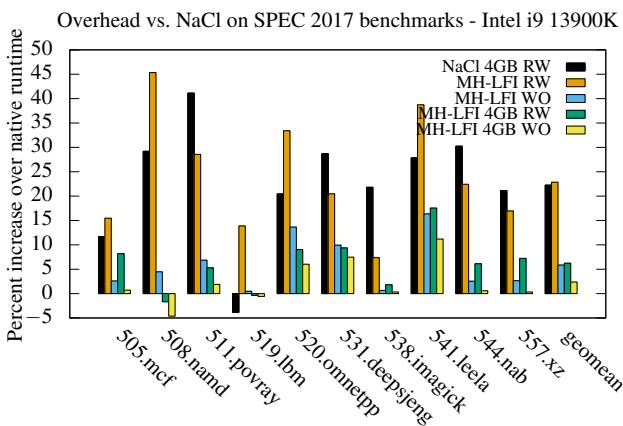
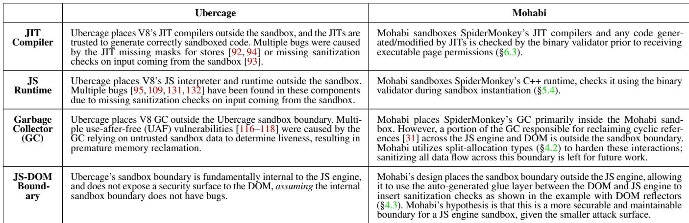
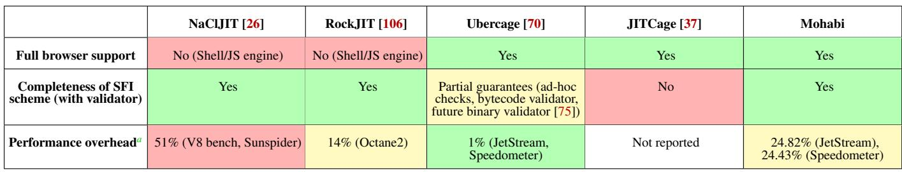
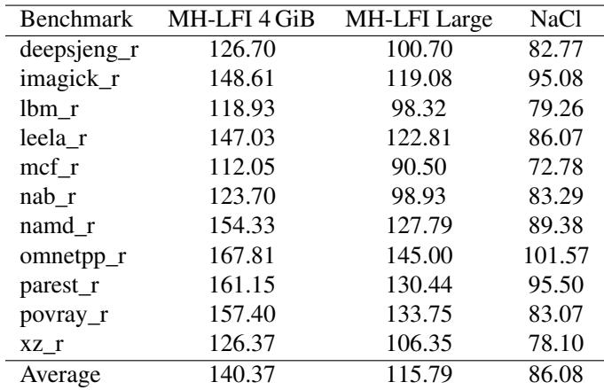
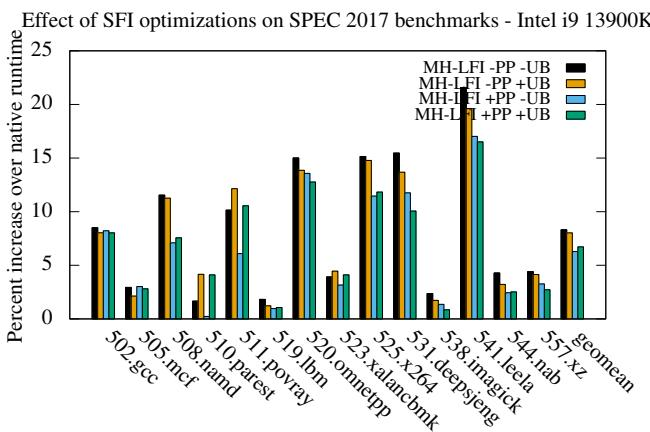
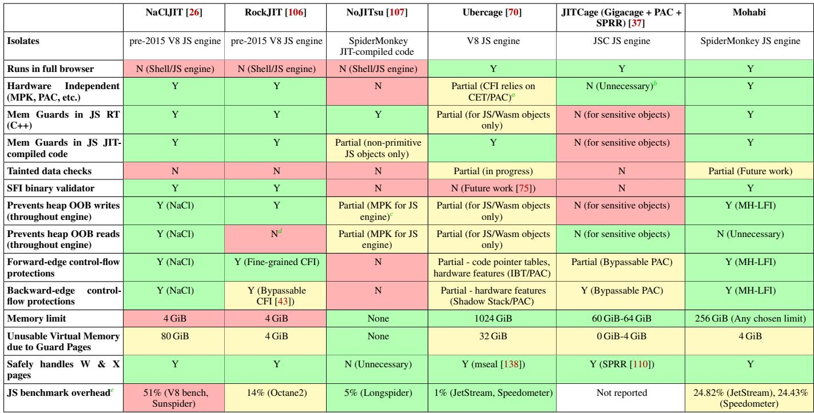

USENIX

THE ADVANCED COMPUTING SYSTEMS ASSOCIATION

# Mohabi: Disaggregating and Sandboxing the Firefox JavaScript Engine

Abhishek Sharma and Anand Balaji, The University of Texas at Austin; Zachary Yedidia, Stanford University; Anthony Du and Taehyun Noh, The   
University of Texas at Austin; Iain Ireland, Jan de Mooij, and Matthew Gaudet,   
Mozilla; Tal Garfinkel, Google; Deian Stefan and Hovav Shacham, University of California, San Diego; Shravan Narayan, The University of Texas at Austin

https://www.usenix.org/conference/osdi26/presentation/sharma

# This paper is included in the Proceedings of the 20th USENIX Symposium on Operating Systems Design and Implementation.

July 13–15, 2026 • Seattle, WA, USA

ISBN 978-1-939133-55-7

Open access to the Proceedings of the 20th USENIX Symposium on Operating Systems Design and Implementation is sponsored by

# Mohabi: Disaggregating and Sandboxing the Firefox JavaScript Engine

Abhishek Sharma UT Austin

Iain Ireland Mozilla

Anand Balaji UT Austin

Jan de Mooij Mozilla

Zachary Yedidia Stanford University

Matthew Gaudet Mozilla

Anthony Du UT Austin

Taehyun Noh UT Austin

Tal Garfinkel Google

Deian Stefan UC San Diego

Hovav Shacham UC San Diego

## Abstract

We present Mohabi—a modern Firefox browser with a securely sandboxed JavaScript engine. Mohabi leverages software-based fault isolation (SFI) to ensure JavaScript engine bugs cannot affect the rest of the browser. To achieve this, we disaggregated the JavaScript engine (SpiderMonkey) from the rest of the browser, and developed techniques that leverage the type system and automatic code generation to make this complex transformation—that spans numerous data structures and deeply intertwined control flow across tens of thousands of functions—safe and tractable with reasonable engineering effort.

We then sandboxed SpiderMonkey using an optimized SFI toolchain we developed to meet the unique challenges of JavaScript engines, such as efficient support for large memory footprints. Mohabi only incurs modest overheads on common benchmarks—24.82% on JetStream and 24.43% on Speedometer. Mohabi is the most ambitious case study in retrofitting in-process sandboxing in a large system to date, and our x86-64 SFI toolchain is the fastest to date, imposing overheads between 5.9%–6.6% in SPEC 2017.

## 1 Introduction

Modern JavaScript engines are a seemingly inexhaustible source of critical memory-safety vulnerabilities [73]. In the past decade, these have become a major vector for in-the-wild attacks on browsers [58,90,130]. This problem is fundamental to the design of modern JavaScript engines, and there are several reasons for this.

First, production JavaScript engines like SpiderMonkey, V8 and JavaScriptCore rely on an intricate system of code genera tion and execution engines including interpreters, just-in-time compilers, and profile-based code optimizers. JavaScript engines dynamically juggle these different engines to achieve an optimal balance of startup latency and efficiency. This makes them incredibly complex (§2).

Next, their inputs—JavaScript, WebAssembly, and various Web APIs—are quite complex; as a result, the compiler and

Shravan Narayan UT Austin

optimization stages have a very large attack surface. Further, this attack surface is not static, and continues to change and grow as Web standards evolve.

The final and perhaps most damning element that makes this situation intractable is that memory safety bugs in JavaScript engines are often not directly in the compilers or interpreters, but rather in runtime-generated code. For example, while JavaScript requires all array accesses to be bounds checked, JavaScript JITs produce code without these bounds checks when range analysis proves they can be safely elided. However, bugs in the range analysis [18, 19, 40] result in memory-unsafe code that can perform out-of-bounds array accesses. Consequently, our most powerful tool for preventing memory safety bugs—language-level type systems, e.g., in Rust—cannot address this problem.

Operating system and browser vendors have tacitly acknowledged that this is not a solvable problem in the near term, and introduced new modes that enhance security by disabling the JIT. In 2022 Apple introduced Lockdown Mode— an optional feature across their mobile, desktop, and wearable platforms—that disables the JIT in Safari [27]. Microsoft introduced Enhanced Security Mode [98] that similarly disables the JIT, and Android recently announced Advanced Protection Mode that “disables the JavaScript optimizer” [25].

This solution comes at a high cost. For example, in Spider-Monkey, JITs offer a 3.5×–7× speedup [52] for JavaScript. Even worse, disabling JITs doesn’t offer a complete solution. For example, 5 of the 12 exploits in Chrome’s JavaScript engine in 2025 would not be prevented by disabling the JIT [62], while a recent study found 23 remote-code execution vulnerabilities in the interpreter used in Edge’s enhanced-security mode [135]. Browsers need a better solution.

Our solution. To address this challenge, we present Mohabi<sup>1</sup>, the first sound sandbox relying on software-based fault isolation (SFI [134]) applied to JavaScript (JS) engines in a modern web browser.

Mohabi sandboxes SpiderMonkey JS engine instances in the Mozilla Firefox browser. Thus, even if the JS engine is compromised, it is confined, and cannot arbitrarily corrupt memory in the rest of the browser or invoke disallowed system calls to escalate privileges.

In contrast, prior academic work [26, 106, 107] on JIT sandboxing (§9) has only sandboxed standalone JS engines in isolation, while industry-developed sandboxes (e.g., V8’s Ubercage [70] and Safari’s JITCage [37]) have so far been unsound and frequently bypassed (§7.4).

To build Mohabi, we have developed two new capabilities. First, we needed tools to allow disaggregating Spider-Monkey from Firefox, i.e., to separate out the JS engine, and then securely and efficiently re-enable control and data flow with minimal engineering effort. Second, we needed an SFI toolchain that could meet the challenges of sandboxing SpiderMonkey in production with low overhead—something that no existing SFI toolchain could do.

To enable disaggregation, we developed a set of C++ types and tools that allow us to securely express common patterns for sharing and control flow. For example, split-allocation types (§4.2) enable us to shard an object across separated (sandboxed and unsandboxed) allocators—based on what needs to be shared, and what needs to remain isolated. We also observed that modern browsers rely heavily on automatic code generation [5,15,17,39] and wrapper types [63,100,104] to integrate components together; we hook into and modify these tools to simplify disaggregation. Without these tricks, disaggregating SpiderMonkey would be a massive engineering effort—the JS engine itself supports well over 2,000 API calls, with an order of magnitude more call sites into the engine scattered over Firefox’s considerable codebase. Once disaggregated, we needed a way to efficiently sandbox SpiderMonkey instances in memory—as the high memory and context switch costs of process sandboxing would have been a non-starter.

To address this challenge of scalable SFI, we developed MH-LFI. MH-LFI’s key differentiating features are (1) its efficient support for large sandboxes—sandboxes with memory pools greater than 4 GiB, and (2) its safe handling of JIT-compiled code. The former is a necessity for modern browser features like ArrayBuffers and WebAssembly instances<sup>2</sup>, while the latter is needed for all modern JS engines. MH-LFI works by rewriting assembly files to insert SFI-style guard checks into binaries, and is (mostly) independent from the choice of C/C++ compilers used to compile the browser— only a small amount of MH-LFI is implemented with compiler changes.

MH-LFI provides a separate validator to check that all sandboxed code has been correctly instrumented. This allows us to ensure that SFI instrumentation added by the JIT and AOT compilers is correct, removing the compilers from the trusted computing base (TCB). We also found that the validator was essential to catching edge cases of missing SFI checks that would otherwise have been overlooked (§6.3).

Mohabi’s performance & security. We evaluate Mohabi on Speedometer [11]—the industry-standard full browser benchmark that tests both JavaScript and overall browser performance—and observe overheads of 24.43%. We break down the individual sources of overheads in §7.1. We also evaluate Mohabi on a pure JavaScript benchmark (Jet-Stream [9]) to compare to prior work that sandboxed standalone JS engines [26,106,107]—and observe an overhead of 24.82%. We compare MH-LFI to Native Client (NaCl)—the SFI toolchain used in prior work sandboxing JS engines [26] and show how MH-LFI outperforms NaCl in §7.2. All modified AOT and JIT compilers pass all tests in the LLVM and SpiderMonkey codebases respectively, and based on our analysis, MH-LFI is the fastest x86-64 SFI toolchain to date.

In §7.3, we analyze how Mohabi defends against commonly used JS engine exploitation techniques and highlight some JS engine bugs that Mohabi would have mitigated—specifically, recent bugs reported by Anthropic’s Mythos LLM [81] several months after Mohabi was developed. Additionally, we contrast Mohabi with Ubercage (V8’s partial JavaScript sandbox) to highlight the differences between the two systems in §7.4. We analyze a subset of prior Ubercage sandbox bypasses and show how Mohabi prevents them.

Artifacts. All source code, prototypes, and benchmarks from this paper are available at https://github.com/UT-Secu rity/jitsbx-root.

## 2 Why JavaScript Engine Security is Hard

Modern JavaScript (JS) engines have an extremely high bar for performance—they must begin executing code instantly to avoid introducing latency during page loads, while also efficiently executing modern websites that can be as complex as full-fledged desktop applications using JIT compilation.

To achieve this, they rely on a range of complex JITs and interpreters. This complexity has led to numerous vulnerabilities [69]. SpiderMonkey—the JS engine in Firefox that we sandbox in Mohabi—consists of 9 different code executionengines [101]. JavaScript alone consists of a C++ bytecode interpreter, an optimized interpreter, along with non-optimizing and optimizing JIT compilers. These compilers are organized as tiers—at each tier the compiler takes longer to start executing, but applies more optimizations for greater efficiency. Additionally, there are interpreters and JITs for WebAssembly (Wasm) and regular expressions [83]. Other JS engines such as V8 (Chrome) and JavaScriptCore (Safari) use similar tiered architectures, although their internals differ.

JS engines use these different tiers by dynamically changing compilation strategies at runtime, switching execution tiers based on how often a piece of code is executed. SpiderMonkey supports this with the help of on-stack replacement, allowing code to tier-up in the middle of execution— switching from being interpreted to executed as JITted code.

SpiderMonkey also supports switching from executing a JITted version of JavaScript code to interpreting it, through bailouts. This is necessary because the optimizing tiers employ speculative optimization [113], meaning that they optimize code based on type information collected during runtime—which is required for dynamically typed languages like JavaScript. This information is used along with other optimizations to specialize code, for instance, by eliding security checks (e.g., array bounds checks), if they are deemed redundant. The specialized code includes checks to ensure that assumptions hold on inputs to functions; if inputs are found to not be of the expected types, the result is a bailout from optimized tiers to the interpreter.

This complex architecture means that bugs in any of the above components—e.g., the JavaScript interpreters [69], the JavaScript compilers [20, 40, 66], the WebAssembly runtime [108]—result in vulnerabilities affecting the entire JS engine [76] and browser. These vulnerabilities are a common part of real-world exploit chains [58, 90] where JavaScript engine vulnerabilities are used to obtain initial code execution in the browser’s renderer. This is then chained with privilege escalation vulnerabilities to take over a victim’s machine.

Browsers have historically resorted to process-based isolation to address security concerns. The multi-process architecture [35] separated the browser into a privileged parent process and content processes. Site isolation [102, 119] extended this further by ensuring that tabs belonging to different top-level sites never share a content process. However, applying the same approach here—separating the JS engine— is a non-starter. The JS engine is tightly coupled with the DOM engine, event loop, and other browser subsystems, with extremely frequent interactions. Introducing an additional process boundary would require IPC for each of these interactions, resulting in prohibitive overhead.

In this paper, we present Mohabi—a sound, in-process sandbox for JS engines that can address this problem.

## 3 Mohabi: Securing the JavaScript Engine

Mohabi secures the JS engine by placing it in a sandbox implemented using software-based fault isolation (SFI). SFI works by isolating all memory (code and data) used by the JS engine in a dedicated portion of the process’ address space called the sandbox memory, and restricting all memory-access and control-flow operations to this memory. Consequently, memory corruption resulting from JS engine bugs is restricted to sandbox memory and cannot affect the rest of the browser.

  
Figure 1: Mohabi’s design. Mohabi disaggregates Spider-Monkey from Firefox and places it in a high-performance MH-LFI sandbox. Disaggregation and secure interactions are mediated by custom types such as Reflector types. Systemcalls are checked by MH-LFI’s runtime and code pages are checked by MH-LFI’s validator to preserve security.

Mohabi relies on our new SFI toolchain, MH-LFI (§5), that scales to a JS engine’s unique requirements. MH-LFI is implemented in two parts: (1) an external rewriter that modifies the binaries produced by C/C++ compilers to ensure they follow SFI rules, and (2) a modified JIT compilation pipeline to ensure that all JITted code produced follows SFI rules. To exclude these compilers from Mohabi’s TCB, MH-LFI comes with a binary validator that checks that all executable code pages within the sandbox comply with SFI rules.

Mohabi’s design (Figure 1) is based on several observations about modern browsers that allow JS engine sandboxing without significant performance or engineering costs.

Browsers employ site isolation. Browsers implement site isolation [102, 119] to ensure different top-level sites are rendered in separate processes. This model ensures that a site’s process does not contain any secrets about other sites visited by the browser. Consequently, Mohabi sandboxes JS engines in the site’s process using write-only sandboxing—it does not restrict any reads of data. This is sufficient to prevent a compromised JS engine from escalating privileges.

Browser JITs share a compiler backend. The various JIT compilers used by JS engines produce native code through a shared architecture-specific emission backend [8, 12, 14]. Additionally, these backends tend to be stable over long periods of time; e.g., SpiderMonkey’s backend last received a major update 10 years ago [2]. Mohabi uses this shared backend as a choke point for enforcing SFI—enabling instrumentation regardless of the specific JIT optimizations or the IRs used.

Browsers auto-generate glue code. All browsers autogenerate the glue code layer [1, 5, 17] between the JS engine and DOM—the primary browser component that interacts with the JS engine. Mohabi augments this code generation as a location to include safety checks on data output by the JS engine APIs—a necessary step to prevent confused deputy attacks on the DOM engine by a compromised JS engine.

Mohabi leverages these insights along with the new MH-

LFI SFI tool to sandbox the SpiderMonkey engine used by the Firefox browser. We note that Mohabi’s design is general and can be applied to any modern browser.

## 4 Disaggregating SpiderMonkey from Firefox

The first step in Mohabi is to separate or “disaggregate” SpiderMonkey’s code from Firefox code as sandboxing restrictions should only be applied to the former. This involves disaggregating control flow and data structures.

We disaggregate control flow by first isolating control flow, and then explicitly permitting safe control flow from SpiderMonkey to Firefox, e.g., for functions that are explicitly passed to the JS engine as callbacks. This is challenging as control flow can get arbitrarily nested. We then disaggregate data structures between Firefox and SpiderMonkey by placing only data that must be shared in the sandbox’s memory.

Fortunately, we found this task was tractable across the large and complex Firefox codebase due to the presence of a handful of repeated patterns in how control flow and data sharing occur. We developed tools to handle these patterns, and thus enable safe and sometimes automated disaggregation.

These tools include split-allocation types (§4.2), which enable selective sharing of object fields across trust boundaries, as well as Reflector (§4.3), Virtual Trampoline, and Virtual Springboard types (§4.5), which enable safe and structured control flow between browser and sandbox. Additionally, we developed a stub library generator to wrap the SpiderMonkey interface (§4.4), which exposes 2,250 unique functions, and is used at an order of magnitude more call sites across Firefox.

We next explain our process of disaggregating SpiderMonkey, i.e., separating it from the browser and then safely reintegrating it back into the browser using the above tools.

## 4.1 Breaking out the JavaScript Engine

Firefox uses SpiderMonkey by directly linking it with browser code. We began by modifying the browser build process to compile SpiderMonkey separately using our Ahead-of-Time MH-LFI SFI toolchain (§5). Additionally, since SpiderMonkey’s JITs compile code within the sandbox, we modify them to produce code conforming to our SFI scheme (§6).

To ensure SpiderMonkey does not share any data structures or symbols with the rest of Firefox, it is compiled as a standalone binary with its own private libc. This library must be explicitly loaded and assigned a memory region it can use— the sandbox memory. We refer to the produced library as the sandboxed SpiderMonkey instance—having all its control flow and stores restricted to a sandbox memory region.

Next, we modify each Firefox process that uses the JS engine to create a per-process sandbox instance. These processes include: the browser’s UI (managed using JavaScript), each Content Process (handles JavaScript from the web), and the Proxy Auto-Config Process (configures the browser’s proxy

template <typename T>   
struct Rooted {   
Rooted<T>\*\* stack; // pointer to stack top   
Rooted<T>\* prev; // previous root in stack   
T ptr; // pointer to GC'd JS object   
explicit Rooted(RootingContext\* cx) : ptr(...) {   
this->prev = ...; // point to prev root   
<sub>\*</sub>this->stack = this;   
}   
\~Rooted() { ... }   
};

Figure 2: The Rooted<T> Type. One of the types used for JS object references in the browser that need to be registered with the GC. We implement this in Mohabi as a split-allocation type, with select fields moved into the sandbox.

settings using JavaScript). When a sandboxed SpiderMonkey instance is loaded, our SFI validator (see §5.4) confirms that it is sandboxed correctly, then instantiates the sandbox instance. All threads spawned by the process (e.g., Web Workers in the Content Process) use the same sandbox instance, but receive their own per-thread sandbox context for stack, thread-local storage and registers.

## 4.2 Safe Garbage Collector Support

SpiderMonkey provides a moving garbage collector (GC) that moves JavaScript (JS) object allocations to optimize tracing and reduce fragmentation on the heap. Moving a JS object requires the GC to update all references to the object to the new location; this includes any references from Firefox code.

SpiderMonkey tracks such references by requiring Firefox to use custom types like Rooted<T> in Figure 2 to declare references to JS objects. On construction, Rooted<T> automatically adds itself as a node in a LIFO linked-list of GC roots. SpiderMonkey uses this LIFO linked-list to trace the active roots when a GC is triggered.

However, disaggregating SpiderMonkey means that the GC can no longer directly update such references to JS objects that come from Firefox code. To restore functionality, we must allow the GC to modify Rooted references when object migration or heap compaction occurs. Concretely, this means that the GC should be permitted to modify the ptr field from Figure 2, but not other fields in the object such as the LIFO link-list. To allow secure updates to the ptr field, we introduced split-allocation types.

Split-allocation types. These types split a single logical object across two locations. Some fields are stored in sandbox memory, to enable updates by sandboxed code—other fields are allocated outside of the sandbox—to protect their integrity. This separation and management of multiple allocations for different fields is hidden from the user of the type.

A split version of Rooted<T> is one use of split-allocation types. Other GC types such as Heap<T>—which captures long-term references from Firefox’s heap to SpiderMonkey objects—were also migrated to split-allocation types. Overall, these types were applied to thousands of sites in the browser.

```cpp
1 // this is called when 'window.location' is modified
2 static bool
3 set_location(JSContext* cx_, JS::Handle<JSObject*> obj,
4 . , JSJitSetterCallArgs args) {
5 BindingCallContext cx(cx_, "Window.location setter");
6
7 JS::Rooted<JSObject*> targetObj(cx, &v.toObject());
8 return JS_SetProperty(cx, targetObj, "href", args[0]);
9 }
10 // defines set_location as a JSObject property setter
11 static const JSJitInfo location_setterinfo = {
12 { set_location }, ... ,JSJitInfo::Setter, ...};
13 static const JSPropertySpec sUnforgeableAttributes_spec[]
14 = { JSPropertySpec::nativeAccessors(
15 "location", JSPROP_ENUMERATE | JSPROP_PERMANENT,
16 ..., &location_setterinfo), ...};
```  
Figure 3: The DOM-JS Engine binding layer. All production browsers use automatic code generation to create a binding layer between the JS engine and the DOM. Here the code shows a setter function on the window DOM reflector object.

## 4.3 Supporting Firefox’s DOM reflectors

The Document Object Model (DOM) specification and associated web platform specifications [3, 6] list APIs that JS engines can use to interact with the browser. Beyond HTML manipulation, these APIs support Web Workers (background threads), Web Storage (key/value storage), and Geolocation. These APIs are exposed to the JS runtime with the help of DOM reflectors, which are projections of DOM functionality as JS objects.

For example, the window object in Figure 3 is a DOM reflector that has several attributes—one of which is location. When executing JS code that sets the window.location property, SpiderMonkey invokes the set\_location function at line 3. This function forwards the write to the window object’s href property (line 8), requiring a nested invocation to the JS engine at the JS\_SetProperty call.

However, disaggregation would mean that such callbacks cannot directly be invoked by SpiderMonkey, as the code is outside the sandbox memory (in Firefox’s code). Mohabi instead requires SpiderMonkey to register all such callback functions as legitimate callback targets via a provided API. When registered functions are invoked as callbacks, Mohabi permits this control-flow securely through a trusted routine called a trampoline (described in §4.4).

We modify Firefox to explicitly register each callback function with the sandbox runtime at the time of creating a DOM reflector object. An instance of this is when defining the setter function (line 12) for the location property (line 15) before wrapping the browser’s window object in a DOM reflector.

To apply this modification automatically across multiple data types, we introduced sandboxed reflector types.

Sandboxed reflector types. These types build on the observation that all browsers use API specifications written in WebIDL (an interface definition language) to auto-generate binding code [1, 5, 17, 39] to set up DOM reflector types. We modify this code generator to be sandbox-aware. For each DOM reflector type that it previously generated, we instead generate a sandboxed reflector type. When the first reflector object instance corresponding to a sandboxed reflector type is created, the browser functions exposed to JS are automatically registered as callbacks with the sandbox.

We needed a systematic solution to this because this approach applies not just to the Window reflector type but for the over 1,075 other reflector types automatically generated from WebIDL. These reflector types could potentially register up to 15,700 callbacks—if JavaScript code causes an instance of every single DOM reflector type to be created at least once.

## 4.4 Safe JS Engine Calls from the Browser

The browser can make function calls into the JS engine, for example, to modify the properties of a DOM reflector object as discussed in §4.3. These functions are exposed to Firefox through SpiderMonkey’s library interface (the JSAPI). By building and linking SpiderMonkey separately from the browser, we have blocked direct calls into this code. We now focus on securely permitting these function calls.

Mohabi requires that all control-flow transfers from Firefox into the sandboxed JS engine use a piece of trusted code called the springboard. Springboards perform a safe contextswitch on the way into the sandbox—they are responsible for switching stacks, saving callee-saved registers and setting the contents of reserved registers used by the SFI scheme (§5.1). Trampolines do the inverse for control-flow transfers in the other direction, when SpiderMonkey code returns to the browser, for example, through a callback registered with the sandbox runtime (§4.3).

To automatically re-allow safe JSAPI calls in Firefox via springboards, we build a stub-library generator.

Stub-Library Generator. The generated stub-library helps us account for the now dynamic location of the sandbox instance being invoked. This is done with the help of (1) an indirectjump table with an entry for the resolved sandbox address of each JSAPI symbol and (2) a unique springboard routine corresponding to each JSAPI symbol.

Linking the browser to the SpiderMonkey stub-library statically resolves all JSAPI symbol references to a springboard. When the MH-LFI runtime instantiates the SpiderMonkey sandbox instance, it populates the indirect-jump table in the stub-library, allowing calls from Firefox to the JS engine.

The support provided by our automatically generated stub library is essential as the JSAPI exposes over 2,250 functions and Firefox contains an order of magnitude more unique references to them, making explicit modification at each call site in the code impractical.

## 4.5 Interactions with the Browser Event Queue

JavaScript provides support for programming with asynchronous tasks using Promise objects. For example, the Fetch API, which is the modern JS interface to make HTTP requests, returns a Promise object. The Promise.then method allows a user to specify continuation code, which is scheduled for execution once the fetch request completes.

```javascript
const promise = fetch("https://example.org/products.json");
promise.then((response) => ..., (error) => ...);
```

Support for scheduling these asynchronous jobs is provided by the browser rather than the JS engine. Concretely, the browser provides a JobQueue object (shown below), allowing SpiderMonkey to schedule jobs on the browser’s job queue:

```cpp
class JobQueue {
// Enqueue a resolution job for promise
virtual bool enqueuePromiseJob(JSContext* cx,
JS::HandleObject promise, JS::HandleObject job,
...) = 0;
};
```

However, this is a problem when separating SpiderMonkey from Firefox. As this abstract class is implemented within the browser, the virtual functions are located outside the sandbox and must be explicitly registered as allowed callbacks (similar to the DOM reflectors in §4.3) to be callable by the JS engine. However, since vtable entries are automatically populated by the C++ compiler, there is no easy way to do this.

To address this, we introduce virtual trampoline and virtual springboard types, which help mediate dynamic dispatch across the sandbox boundary in both directions.

Virtual Trampoline Types. These are types within the sandbox that inherit from another underlying type, then override its virtual method implementations to redirect the call through a function pointer table instead. The user of a virtual trampoline type is expected to initialize the function pointer table with valid callback functions (§4.3).

Virtual Springboard Types. These are types outside the sandbox that help transfer control-flow into the sandbox. They expose the same interface as the underlying sandbox type, and act as wrappers. Each virtual method implementation forwards the call through a corresponding function exposed by the sandbox; this performs the actual virtual dispatch on the underlying instance within the sandbox.

In addition to job scheduling for Promises, we use virtual trampoline and springboard types in SpiderMonkey’s implementation of JavaScript Proxy Objects, External DOM Strings and GC tracing, among others. In total, we expose these types for around 20 classes in the JSAPI.

```cpp
1 // Binding code before tainting
2 bool get_width(..., JS::Handle<JSObject*> obj,
3 void* void_self, ...) {
4
5 auto* self = static_cast<mozilla::dom::ImageData*>
6 (void_self); }
7
8 // Binding code after tainting
9 bool get_width(..., JS::Handle<JSObject*> obj,
10 MC::OpaquePointer<void*> void_self, ...) {
11
12 auto* self = MC::dom::DOMPointerTable::sanitize
13 <mozilla::dom::ImageData*>(void_self); }
```  
Figure 4: Adding Sanitization Checks to the Boundary. Firefox’s binding code auto-generation is modified to insert sanitization checks before using the DOM pointer retrieved from the sandbox. This example shows the generated binding code for returning the width of an image.

## 4.6 Type Safety at the Binding Layer

Secure disaggregation requires sanitizing any data received by Firefox that comes from SpiderMonkey. This is needed to prevent the sandboxed code from compromising Firefox via confused-deputy attacks [45, 82, 104]. We illustrate this using DOM reflectors as an example.

When DOM reflectors are passed to JavaScript, a pointer to the underlying C++ DOM object that it reflects is stored within it. When JS engines invoke a permitted DOM reflector callback (§4.3), this pointer is extracted and used to call meth ods on the underlying DOM object. However, this pointer could have been corrupted by compromised JS code to induce memory-safety errors in Firefox when the reflector is used.

To address this, we introduce pointer tables.

DOM Pointer Table. This is a table where each entry stores a valid DOM pointer, along with the type of the object. To make sure DOM code remains safe, we augment binding code generation to sanitize the incoming pointer, by making sure it exists within the table and is of the right type. Figure 4 illustrates one such example—the code at line 5 unsafely uses the pointer, whereas the augmented code at line 12 sanitizes the pointer before using it. To support this, we modify DOM reflector initialization to add an entry to the pointer table. As multiple reflector objects may point to the same underlying DOM object, each table entry also maintains a reference count, which is decremented on DOM reflector finalization.

While this case study serves as an example of how we can automate boundary checks, a more complete handling of boundary checks requires more work, and is discussed in §8.

## 5 Sandboxing SpiderMonkey Code

We now discuss how Mohabi can sandbox a disaggregated SpiderMonkey engine from Firefox using software-based fault isolation (SFI) [134]. SFI modifies compilers to insert guards prior to all memory accesses and control-flow instructions to restrict them to the sandbox memory; additionally, all system calls are rewritten to function calls on a trusted runtime that blocks calls which may compromise the sandbox [47].

In order to scale to a production system like SpiderMonkey, an SFI toolchain must satisfy the following requirements:

No artificial memory limits. Almost all SFI toolchains [53, 80,97,105,123,139] impose a limit of 4 GiB on the sandbox memory for efficient sandboxing. This is entirely impractical for browser features like ArrayBuffers, WebAssembly, etc. The rare SFI toolchains that don’t impose this limit today (e.g., Wasm-64 toolchains [121]) lose efficiency and have impractically high performance overheads [126].

V Support concurrent JIT code generation. The SFI runtime must allow safe additions, removals, and modifications to sandbox code—even under concurrent execution by multiple threads<sup>3</sup>. This is necessary to support sandboxing of the JIT compilers used by JS engines.

Support binary validation. While the JIT compiler itself is sandboxed, safely running code produced by it requires the SFI scheme to support binary validation [134]—to ensure that all SFI checks are present in the generated code. Binary validation has the added benefit of moving a buggy AOT SFI compiler [89, 99] out of the TCB.

Use the native ABI. SFI tools such as NaCl [140] and Wasm [80] use sandbox-relative pointers (offsets) rather than native pointers—requiring translation between these representations at the sandbox boundary. While improving a sandbox’s memory footprint [124], this significantly complicates retrofitting [104].

<sup>▶</sup> No reliance on hardware extensions. While allowing efficient sandboxing [133, 137], browser users have a variety of different hardware and operating systems [4], without consistent support for such features.

▶ No compiler “hard forks”. SFI compilers are often implemented as bespoke forks of GCC/clang [54, 123, 140]. This imposes a long-term maintenance burden and often means SFI tools are stuck as forks of outdated compiler versions.

We designed MH-LFI (building on the LFI [139] SFI compiler) to meet all these requirements—requirements that no existing SFI toolchain satisfies. MH-LFI’s SFI scheme and supporting runtime are described in §5.1 and §5.2.

Even beyond these requirements, large applications like SpiderMonkey contain code patterns that add slowdowns not observed in standard benchmarks where SFI tools are tested. We describe several new optimizations that we needed to develop to address this in §5.3. Finally, we describe how MH-LFI can meet the above requirements when implemented as a simple assembly rewriter operating on the output of compilers (§5.4)—allowing Firefox to continue to support multiple compiler toolchains and frequently upgrade versions.

  
Table 1: Rewrites needed to conform to MH-LFI’s data access and control-flow policies. Instructions on the left are rewritten into a macroinstruction—a collection of instructions that must all reside within the same bundle (to guarantee their execution as a unit). Note that the movq example preserves flags by using pext rather than and.

MH-LFI allows us to sandbox SpiderMonkey’s ahead-oftime code written in C/C++. We defer the discussion of adapting MH-LFI’s scheme to SpiderMonkey’s JITs to §6.

## 5.1 MH-LFI’s SFI Scheme

MH-LFI’s rewriter enforces a sandboxing scheme reminiscent of prior SFI tools (e.g., Native Client’s x86-64 implementation [123]), but designed for sandboxes with large memory pools and augmented with additional optimizations (§5.3).

MH-LFI assumes that sandbox memories are contiguous, have a size that is a power of two, and are also aligned to the same power of 2. Within the sandbox memory, all pages are either non-writable for code or non-executable for data (enforced via mmap protections), with additional special handling for JITs (§6.2) which require writable and executable pages.

Like prior classic SFI schemes, MH-LFI comes with a binary validator that analyzes executable machine code to determine whether such code is guaranteed to maintain the sandbox’s security guarantees. We now describe these requirements along with the associated rewrites that must be applied to compiler output to allow it to pass this validator.

MH-LFI’s rewriter applies three security policies: the data access policy, which ensures that all memory writes are restricted to the sandbox region; the control-flow policy, which ensures that all control flow stays within the sandbox region (except to specific entry points in host code); and the systemcall policy, which ensures that system-call instructions are rewritten to function calls in the trusted runtime. The rewriter uses three reserved registers—r14 (sandbox base), r15 (sandbox mask) and r11 (scratch)—to enforce these policies, as illustrated by the examples in Table 1.

Data access policy. Memory writes are prefixed with guard instructions that (1) Compute the original effective destination address into the scratch register; (2) Mask out the top bits of the scratch register to restrict the address to a specified size—256 GiB for Mohabi; and (3) Add the 64-bit sandbox base address to produce the final address that is used for the write. As Mohabi’s sandbox memory is an aligned, contiguous allocation of 256 GiB (§5.2), this transformation guarantees that memory writes to the stack or heap are within the sandbox memory. MH-LFI optionally allows memory reads to be restricted in the same way, but this is unnecessary for Mohabi when site isolation [102, 119] is present.

Stack operations that operate directly on the stack pointer register, %rsp (e.g., push, pop, etc.) are handled by ensuring that the %rsp register always points to sandbox memory—for performance, this is enforced any time %rsp is updated [134] (rather than prior to each stack operation). As Mohabi’s sandbox memory is surrounded by guard regions (§5.2)— unmapped memory pages—sequences of stack push/pops will fault if they go past the ends of sandbox memory.

Control-flow policy. To enforce that control transfers remain within the sandbox region, we use a similar mask sequence before indirect jumps. However, we must additionally enforce that indirect jumps do not target the middle of another instruction, as this may execute alternate instruction streams. To prevent this, we use bundling [97].

Bundling requires that individual instructions and macroinstructions (e.g., the sandbox-equivalent transformation of instructions shown in the second column of Table 1)—be contained within a single 32-byte bundle. If a (macro) instruction spans a bundle boundary, the rewriter injects padding using no-op (NOP) instructions to move the instruction into the next bundle. The rewriter ensures that the control-flow mask zeroes the bottom 5 bits of the control-flow targets prior to jumps—forcing all jumps to land on the start of bundles.

Return instructions (ret) are transformed to a pop-maskjump sequence so that we can mask the address in a register— directly masking this on the stack would allow a concurrent thread to modify a return address after it has been guarded.

System-call policy. Allowing arbitrary system calls can allow sandboxed code to effectively break out of the sandbox [47]. Thus, similar to prior work, system calls are rewritten into function calls to a trusted runtime (§5.2) which checks if the system call can be safely permitted [84, 88, 122].

## 5.2 MH-LFI Runtime

MH-LFI also provides a runtime for Firefox to safely interact with the sandboxed SpiderMonkey instance. Such runtimes are a standard part of sandboxing toolchains [16, 84, 88, 96, 122, 123, 139, 140], so we only offer a brief description here. The MH-LFI runtime offers the following features.

The runtime provides binary (ELF) loaders and sandbox memory initialization routines that allocate a contiguous memory space, copy the binary code into this space, and initialize a new stack for the sandboxed code in order to support code execution in a sandboxed context.

The runtime provides springboards and trampolines— assembly routines that allow safe transitions into and out of sandboxed code. These routines switch the location of the program stack (sandboxed code requires stacks inside the sandbox memory), enforce caller/callee-save register expectations to preserve security [91], and set reserved registers (e.g., r14 sandbox base) to expected values prior to transferring control-flow. MH-LFI’s springboards and trampolines are standard and resemble those used in prior SFI tools [123,140].

Finally, the runtime interposes on all system calls made by sandboxed code (with help from the rewriter (§5.1)), and permits only system calls that don’t compromise the sandbox. These include the system calls used to manage executable code pages (§6.2)—to allow safe addition, removal and modification of JIT-compiled code within the sandbox.

## 5.3 Optimizing MH-LFI

In addition to implementing known SFI optimizations [105], we implemented several novel optimizations in MH-LFI. The first optimization is implemented in an LLVM pass, while the other two are implemented directly in the rewriter.

Prefix Padding. Bundles require inserting NOP instructions to prevent instructions from crossing bundle boundaries. Such NOPs may increase frontend stalls in the CPU pipeline. As a remedy, we replace NOPs by distributing their padding length across other non-NOP instructions within the bundle using x86 instruction prefixes [10]. We do this by adding one or more cs segment prefixes to instructions that immediately precede a NOP within the same bundle, limiting the total number of prefixes to 5, to avoid CPU decoding overheads.

Thread Local Storage (TLS) Operations. On Linux, TLS is supported using the FS segment base register. In the context of SFI, since the FS segment register is already used by the host, sandbox code must access TLS in a different way. Our original implementation of MH-LFI followed prior work, locating TLS using a call to the sandbox runtime—while reasonably performant for most domains, we found that this was extremely slow for browsers. We optimized these TLS operations by leveraging the observation from [105]—to make use of the unused GS segment register on x86-64.

Flags Preserving Masking. MH-LFI uses bitwise and instructions to ensure that memory accesses remain in the sandbox memory. However, the x86-64 and instruction modifies the processor flags; in cases where this is an issue for subsequent instructions, we use the pext instruction instead, which does not modify the flags. Since pext is slow compared to and, we only use it when the assembly rewriter determines that the flags must be preserved across the memory access.

## 5.4 Implementing MH-LFI

MH-LFI is implemented on top of LFI [139] and is a standalone assembly rewriter operating on the output of (mostly) standard clang/LLVM compilation with specific flags and a minor patch to clang/LLVM to support optimizations.

The rewriter. The rewriter consumes object files output by compilers and transforms the GNU assembly into the bundled macroinstructions described previously. These new object files can then be linked and used as normal. The rewriter relies on minor changes to the compiler that we discuss next.

Compiler patch. Since Firefox uses clang/LLVM as its compiler by default, we focus on this toolchain (although our approach also works with GCC). MH-LFI relies on three minor changes to the compiler, which we expose under a new compiler target (target triple x86\_64\_mohabi-linux-musl). First, MH-LFI’s scheme utilizes guard instructions that require a scratch register for intermediate computations, a base register and a mask register (§5.1). Since we have to transform code after register allocation, we instruct the compiler to leave these registers unused during compilation. Second, we enable the use of instruction alignment directives—an off-by-default feature supported by LLVM—to align instructions into bundles. Third, we add an LLVM backend pass that optimizes assembly for our SFI scheme (§5.3). These changes account for only ≈ 600 lines in clang/LLVM. As a proof point of easy maintenance, we began the project in LLVM 19, but shifted to LLVM 22 partway, with less than 3 days of work.

Validating the SpiderMonkey binary. Similar to other SFI toolchains such as Native Client (NaCl) [140], MH-LFI includes a binary validator to ensure that all code within sandboxed binaries follows the control-flow and data-access policies specified in §5.1. Our validator, however, supports a largesandbox model and uses a modern decoder (Fadec [55]) to enhance performance (making it faster than NaCl’s validator (Table 3)). The verifier is written as a C program that checks all requirements of the SFI scheme, similar to prior work [89, 99, 140].

## 6 Sandboxing the JIT

SpiderMonkey uses a complex hierarchy of JIT compilers to speed up execution (§2). We need to modify these JITs so that the generated code is securely sandboxed. Concretely, this takes two steps: (1) modifying JIT compilers to generate MH-LFI-compliant code, and (2) using new secure APIs to manage modification of code pages—a unique challenge for JITs as this is very performance-sensitive code. We discuss this next followed by examples of easy-to-miss edge cases.

## 6.1 Modifying JIT Compilers

SpiderMonkey uses an abstraction layer called MacroAssembler (MASM) for all dynamically generated code. All of its JIT compilers emit code as sequences of MASM operations, each of which gets lowered to native code by an architecturespecific backend. We modify MASM’s x86-64 backend to enforce MH-LFI’s data access and control-flow SFI policies.

Implementing the SFI scheme. Like we did for AOT code, we reserve registers r14 and r15 for SFI by marking them as unallocatable in the MASM register allocator. We modify MASM operations that perform memory-access or indirect control-flow to emit the appropriate masked macroinstructions, and modify MASM’s x86-64 instruction assembler to insert NOPs to prevent (macro) instructions from crossing bundle boundaries. Finally, we identify all valid indirect targets in the code emitted by each of the JIT compilers and ensure that they are bundle aligned. A difference compared to the AOT case is that we don’t reserve r11 since SpiderMonkey’s JITs used this as an internal scratch register; we opted instead to share the scratch register (for JIT and SFI) to reduce the register pressure on this code.

Disentangling JIT-compiled Code and Data. As an optimization, JITs emit data such as floating point constants and relocation tables—used to trace and update references to garbage collected data in the JIT-compiled code—in executable memory. Unfortunately, this results in JIT-compiled code containing code-gadgets (random constants that are interpreted as instructions) that violate the SFI scheme. To prevent this, we modify MASM to emit constants in 32-byte bundles where constants are placed in bytes 1 to 31, and byte 0 is fixed as the byte for an x86 HLT instruction, meaning any attempt to jump here would fault. Where possible, we also used a more direct approach of moving data outside code sections.

## 6.2 Managing JIT Code Pages

The sandboxed JIT compiler must update executable code pages to both add new JIT code and modify existing JIT code (for instance, to perform bailouts (§2)). However, this is a major performance challenge for an SFI tool, because the safe way to update code pages in a multi-threaded environment is a prohibitively slow three-step process: (1) the code page must be made read-write and the JIT compiler modifies the part of the code page it wants, (2) the code page must be made read-only and the validator must check the entire code page as any part of the previously writable page could have been tampered with by a concurrent thread, and (3) the code page must be made read-exec after the validator has finished. Any deviation from this recipe would introduce opportunities for a malicious concurrent thread to execute unvalidated code or tamper with code page contents to remove SFI checks.

Our solution: Dual Mapping. To avoid the overheads of having to reverify entire code pages any time code is updated, Mohabi uses an alternate approach called Dual Mapping. Here, MH-LFI’s runtime uses its system-call interposition (§5.2) to support writing to sandboxed code pages in two steps: First, when an executable page is made writable, the runtime creates a shadow virtual page with read-write permissions to the same underlying physical page outside the sandbox. Second, MH-LFI offers a trusted-runtime call to safely and efficiently perform updates to this shadow mapping. This trusted call takes the following steps: (1) it makes the code page mapped in the sandbox read-only, (2) it updates the externally mapped writable page with the new code and validates only the new code, (3) it restores the code page in the sandbox to executable. This approach is much faster as it reduces page permission updates from 3 to 2, and requires only validating new code. The latter optimization makes a huge difference in practice—safe code updates went from doubling our overheads to adding negligible overheads in our evaluations. While dual-mapping with multiple processes was explored by prior work [128] and prior production browsers [56], we see that MH-LFI’s in-process isolation makes this much more practical.

## 6.3 Why Validating SFI Code Matters

Using a binary validator, beyond being necessary for secure JIT compilation, also helped uncover cases of missed SFI checks in the JIT in early prototypes. We discuss this below.

Case study 1: Zero-padding code pages. Wasm and JavaScript JIT compilers do not always fill the entirety of allocated executable memory with code. The unused space at the end of an allocation is filled with the byte 0x00, which decodes to the addb %al,(%rax) instruction, violating the memory isolation properties of MH-LFI. Upon discovery, we modified the trusted-runtime call used to manage JIT code pages (§6.2) to instead pad inserted code with the 0xcc byte— a safe interrupt instruction on x86.

Case study 2: Missing Indirect Jump Masks. We modified MASM to mask the target of all indirect jumps. However, in certain instances, the JIT compiler directly uses the lowlevel assembler to emit indirect jump instructions, which are unmasked and therefore insecure. The validator found these errors, allowing us to fix this.

Case study 3: Clobbering of Reserved Registers. The Wasm compiler generates code that may trigger traps as a form of error handling. To support recovery from the trap, Wasm saves any register it uses when the trap occurs and restores it upon resuming. However, since Wasm code is not trusted, it should not be permitted to restore reserved registers like the sandbox base r14. The validator flagged these errors, and we made changes to ensure that these registers were never modified.

## 7 Evaluation

In this section, we evaluate Mohabi’s performance and security. Mohabi’s performance is evaluated on a machine with an Intel Raptor Lake i9-13900K, 32 GiB RAM, Ubuntu 24.04 on Linux 6.14.0. For browser and JS benchmarks, we use Firefox ESR-115 (with and without Mohabi) pinned to two isolated CPU cores whose frequency is fixed at 2.2 GHz with hyperthreading disabled. SPEC benchmarks run isolated on one CPU core fixed at 2.2 GHz with hyper-threading disabled.

  
Table 2: Comparison of Firefox and Mohabi scores on the JetStream 2.2 and Speedometer 3.1 benchmarks. Results characterize the median score across 15 runs of vanilla Firefox and Firefox with Mohabi on each benchmark. For both benchmarks, a higher score is better.

## 7.1 Performance of Mohabi

We evaluated Mohabi on the industry-standard browser benchmark, Speedometer 3.1 [11]. Speedometer measures end-toend browser performance using simulated user interactions with web applications—modeling real-world web use.

While our focus is on full-browser performance, prior academic work [26, 106, 107] only sandboxed standalone JS engines and thus relied on JavaScript and Wasm benchmark suites like JetStream 2.2 [9]. We also evaluate this to enable a more direct comparison with prior work.

Finally, we isolate the cost of each element of the sandbox: memory masks, instruction bundling, forward-edge controlflow checks, backward-edge control-flow checks, system call mediation, trampolines and springboards. As a reference point, we also show the browser performance when disabling the JIT—to estimate overheads of the hardened no-JIT modes as used in Edge, Safari, and Chrome.

Results. Mohabi’s Speedometer and JetStream results are shown in Table 2. We see total overheads of 24.43% and 24.82% respectively. While not negligible, these are extremely modest compared to partial security wins of disabling the JIT altogether. Mohabi also imposed no noticeable slowdown in routine use on sites like YouTube and Reddit.

While a full apples-to-apples comparison with prior work is impossible as JS engines and benchmark suites differ and continually evolve, we nevertheless look at the rough trends (Figure 8). Compared to prior work, Mohabi is not as expensive as previous attempts at a fully sandboxed JavaScript engine, e.g., NaClJIT [26], but more expensive than unsound SFI mitigations used by production browsers like Ubercage [70].

We show the performance overheads of the individual components of Mohabi in Figure 5. Broadly, backward-edge control-flow checks are the dominant source of overhead. Other costs are smaller, but they still add up. However, as noted by prior work [26], the costs of the individual components do not add up linearly, as each component has an impact on others when enabled together.

## 7.2 Performance of MH-LFI

To evaluate MH-LFI, we compare its performance with the Native Client (NaCl) SFI toolchain [123]. We chose this for two reasons. First, this was the toolchain used by Na-

  
Figure 5: Mohabi decrease in Speedometer score by SFI component. We observe that each security check from SFI adds some overheads, with the largest overheads coming from backward-edge control-flow protections. For reference, we also show the overheads of disabling JS JITs.

  
Figure 6: SFI overheads on SPEC 2017 benchmarks that are compatible with NaCl. We observe that MH-LFI 4 GiB outperforms NaCl (6.6% vs. 22.3%) on the compatible sandbox configuration.

ClJIT [26]—the closest prior work to this paper. Second, despite newer standards for sandboxing such as WebAssembly [80], prior work has shown that these toolchains incur significant overheads [87, 104] (in part, because they use a simple platform-agnostic intermediate representation). NaCl still remains the fastest x86-64 SFI baseline available today.

To ensure a fair comparison, we run MH-LFI both as used by Firefox, but also in a configuration that matches NaCl—a 4 GiB sandbox that guards read and write operations. NaCl does not support larger sandboxes and no longer supports write-only sandboxes. Since MH-LFI and NaCl are built on different baseline compiler versions (clang 22 and clang 3.7.0 respectively), we measure overheads normalized with respect to their own baseline clang versions for fairness and report these on the subset of SPEC 2017 that NaCl supports.

Beyond this, we report the benefit of Mohabi’s optimizations (§5.3), the speed of Mohabi’s validator, and overheads of Mohabi on the full SPEC 2017 benchmark in the Appendix.

Results. Figure 6 shows overheads on SPEC 2017. Comparing 4 GiB sandboxes, we see that MH-LFI imposes 6.6% overhead vs NaCl’s 22.3%. For a large-memory, write-only sandboxing as we use in Mohabi, we see 5.9% overhead. The Appendix shows that Mohabi optimizations were able to speed up Mohabi by 6%–8% (Figure 9) and Mohabi’s validator outperforms NaCl’s validator (Table 3).

## 7.3 Security Analysis of Mohabi

Ideally, the security of systems like Mohabi can only be eval uated with extended production use. As a basic assessment, we discuss how Mohabi blocks common JS engine exploit techniques, give examples of mitigatable JS engine bugs discovered after its implementation, and finally discuss its TCB.

Common JS attack techniques. We discuss how Mohabi blocks common JS attack techniques used in exploits—both in-the-wild and in competitions like Pwn2Own.

Code pointer hijacking: Exploits can corrupt control flow by attacking code-pointers on the forward edge [115] or the backward edge [48]. MH-LFI’s CFI scheme ensures that jump and return targets remain within the sandboxed region, and that they are bundle-aligned, as described in §5.1. MH-LFI is also not vulnerable to control-flow bending [43]-style attacks, as it does not rely on a fine-grained CFI to provide guarantees.

Overwriting Executable Memory: Some exploits take advantage of the fact that not all browsers implement Write Xor Execute for JIT executable memory [41,69]. Mohabi prevents this by construction with the dual-mapping scheme (§6.2).

JIT spray attacks: Exploits may try to fill code pages with shellcode/gadgets by either leveraging existing JITted code or by crafting code that uses floating point constants that encode gadgets [115, 120]. The MH-LFI validator prevents such attacks by making sure that JITted code cannot contain gadgets that bypass SFI guarantees.

Corruption through concurrent threads: Exploits may leverage the presence of JS engine threads (in the form of Web Workers [7]), to use one thread to overwrite code in the JIT compilation buffer of another thread [77, 78]. MH-LFI prevents this by ensuring that the runtime always checks compiled code using the binary validator before it is copied into an executable page. TOCTOU issues with validation are prevented through the dual mapping scheme (§6.2).

Unsafe syscalls: Exploits may invoke syscalls as part of a privilege escalation [42, 49, 129]. The MH-LFI runtime prevents this as it intercepts all syscalls from within the sandbox, and allows only a safe subset of syscalls with checked parameters.

Evaluating new JS bugs. In April 2026 (after Mohabi’s prototype was complete), Firefox shipped their largest batch of security fixes in monthly updates [65], to fix bugs discovered through Anthropic’s Mythos LLM including several bugs in the SpiderMonkey JS engine [81]. We examined a few of these bugs and saw cases of memory corruption in the JIT compiler [21], GC [24], inline caches [22], and the JS runtime [23]. Mohabi would mitigate all these bugs by confining the memory corruption to within the sandbox’s memory. Attacks leveraging these bugs would only be possible via confused-deputy attacks on missing boundary checks (consistent with the threat model of Mohabi).

TCB. The unsandboxed SpiderMonkey engine contains ≈ 784,000 lines of code (≈ 50% from the JIT compiler and

Wasm runtime)—all of which are a part of its TCB; further, any JITted code emitted at runtime is also part of the TCB. In contrast, Mohabi has a relatively small TCB consisting of the MH-LFI runtime, MH-LFI validator and data sanitiz ers at the sandbox boundary. The MH-LFI runtime is imple mented in 6,200 lines of C. The MH-LFI validator relies on the Fadec [55] x86 decoder which uses a 1,894 line x86-64 instruction encoding lookup table generated at build time and 1,276 lines of C. The validator itself consists of 991 lines of C. SFI runtimes and validators have been shown to be formally verifiable by prior work [88, 89, 99], and could enable further TCB reduction. Our data sanitization layer only implements a limited set of boundary checks at this time and does not cover the full JSAPI interface; it currently consists of 650 lines of C++ definitions for various wrapper types and 80 lines of C++ to maintain the DOM reflector table.

## 7.4 Comparison with Ubercage

We contrast Mohabi with Ubercage. Although Ubercage is only a partial sandbox, it is still the most significant deployment of SFI techniques for JS engines currently in use.

Ubercage Design. Ubercage takes a fundamentally different approach to sandboxing vs. Mohabi. Rather than choosing a sandbox boundary and performing disaggregation all at once, it is building one incrementally and at a different layer than Mohabi—between the JS heap (and by extension, the Wasm heap), and the rest of the JS engine. While this has greatly simplified its deployment as performance overhead is very low (≈ 1% [71]), its security guarantees are weaker.

Ubercage works by requiring JITted code to include SFIstyle masks to restrict memory operations to a 1 TiB sandbox<sup>4</sup>, using a code-pointer table to restrict forward-edge control flow to safe locations, and an external-pointer table to secure access to sensitive data outside the sandbox. Any AOT compiled JS runtime code relies on a type system to prevent confused deputy attacks, with different types used to access sandboxed pointers, code-pointer tables, and external-pointer tables. However, Ubercage being a partial SFI scheme, does not protect data on the stack (including return addresses), and does not employ a binary validator, which is critical given the size of its TCB as discussed below. Ubercage treats the JS engine’s AOT code (the GC, the JIT compiler, etc.), as well as JIT-compiled code, as trusted and within its TCB.

Ubercage has proposals to address some of this—a binary validator [75] (similar to Mohabi’s) that ensures JIT-compiled code can never violate sandboxing guarantees, and prototypes for hardware-based isolation schemes (for hardware that supports it) to eliminate sandbox bypasses [72]. Like Mohabi, Ubercage must also apply sanitization checks to data origi nating from the sandbox; for Ubercage, this is any data from the JS heap. Importantly, given the size and complexity of

Ubercage’s chosen boundary, we believe that it is much more challenging to manually secure in comparison to the boundary chosen by Mohabi (which can leverage the auto-generated nature of DOM-JS glue code §4.3).

Ubercage Bypasses. Ubercage’s phased rollout over multiple years has resulted in over 150 bugs to date [13], originating from both rigorous testing [34,74] and real-world attacks [92]. While the number of such bugs has trended down as development progressed and bug-bounty programs helped identify missed checks, bugs still arise as a direct consequence of Ubercage’s current design and choice of complex sandbox boundary. We highlight some of these bugs<sup>5</sup> in Figure 7 according to the JS engine component that was targeted, and contrast this with how such bugs would be mitigated by Mohabi. We analyze a few of these in detail below.

Case study 1: Bug 350292240 [93]. This is a vulnerability in Wasm function signature validation, caused by attackers being able to corrupt type metadata located in the sandbox. Wasm type signatures rely on runtime type checks to guarantee correctness, but these checks operate on sandboxed data, making them vulnerable to corruption. Unlike Mohabi, Ubercage considers the JIT compiler trusted, meaning that it must validate data coming from the untrusted JS heap. Ubercage misses a sanitization check here, allowing an attacker to generate buggy JIT code that accesses memory outside the sandbox.

Case study 2: Bug 338381304 [109]. This bug displays how attackers can corrupt the number of expected parameters in a JS function’s stack frame, resulting in a miscomputation of stack size, and subsequent improper stack access. The bug is a result of Ubercage storing a trusted field for parameter count on the sandboxed heap, and not sanitizing it on use. This field is referenced when attempting to de-optimize a JIT-compiled function, to read the number of stack parameters it uses. When this value is corrupted, the stack frame is shrunk by the wrong size, and subsequent accesses use unintended values, causing type confusion. In contrast, Mohabi’s design means that the entire C++ runtime is untrusted, ensuring that such mistakes are constrained to within the sandbox.

Case study 3: Bug 462217236 [116]. This bug describes how attackers can induce a use-after-free in the host as V8’s GC relies on in-sandbox data to determine liveness of an object outside the sandbox. Specifically, the trusted JS runtime creates an object called a dispatch entry as part of the trusted stack-unwinding support for (asm.js) exceptions. In some execution paths, the only strong reference to the dispatch entry is from an object inside the sandbox. If the untrusted JS code uses in-sandbox memory corruption to remove the reference to this dispatch entry, the dispatch entry can get cleaned up by the GC. In this scenario, any subsequent exceptions thrown by JS code would be handled by the trusted runtime and use the stale dispatch entry pointer from the stack. This UaF can result in an attacker obtaining control over the stack pointer.

  
Figure 7: Comparison of the Ubercage and Mohabi sandbox boundaries. Ubercage’s sandbox contains only the JavaScript heap-data memory region leaving the V8 JIT compilers, JavaScript runtime, and GC as trusted code outside the sandbox. In contrast, Mohabi places the entire SpiderMonkey engine in the sandbox. To guarantee security, both Ubercage and Mohabi must sanitize untrusted data crossing their respective sandbox boundaries. However, Mohabi presents a smaller attack surface, which we illustrate using examples of past Ubercage sandbox bypasses at the boundary of each component.

## 8 Discussion and Future Work

Securing the JS Engine boundary. An important next step for Mohabi is to build a system that can check that all required boundary security checks have been added. While Mohabi illustrates how to secure this boundary with case studies such as the DOM reflector objects (§4.3), building and guaranteeing full coverage remains an open challenge. This is because the boundary between the browser and JS engine was not originally engineered with JS engine isolation in mind—it exposes low-level interfaces and makes pervasive use of shared data structures that are implicitly trusted by the browser. While we believe this next step is tractable (e.g., by automatically generating sanitizations in the glue layer), redesigning this boundary to be narrower can greatly simplify this task.

Taking Mohabi beyond x86-64. We focus on x86-64 in this paper as it dominates Firefox deployments on desktop devices [4]. However, RISC architectures such as ARM64 and RISC-V have gained usage on other platforms. Prior work [139] has shown that RISC ISAs lend themselves to efficient SFI schemes due to the availability of more general purpose registers and a fixed-length instruction encoding. However, as in the case of x86-64, prior SFI tools have mostly targeted 4 GiB sandboxes for ahead-of-time compiled code.

Optimizing SFI with Hardware Features. Modern CPUs provide hardware extensions [28, 29, 85, 86] for control-flow integrity and memory isolation that can be used by SFI schemes to reduce overheads [44,133]. However, limited hardware availability and inconsistent operating system support make it impractical to rely entirely on these features alone. Systems that use JIT compilation, such as JS engines, can— in principle—partially overcome this by dynamically using the available hardware support for just-in-time code, while relying on software enforcement for ahead-of-time code.

## 9 Related Work

Prior work [26, 57, 70, 106, 107] has tried to secure JS engines with SFI. We analyze these attempts on two aspects: (1) Full browser support—does the design handle the complexities of integration with JS engines in production browsers? (2) SFI completeness—is the SFI scheme sound and does it come with a binary validator to minimize the TCB? We summarize our findings in Figure 8 and give more details in Figure 10 in the Appendix.

Broadly, academic work has made good progress on adapting sandboxing tools for JS engines; however, these cannot be applied to production browsers as they do not address the challenges discussed in §1. Industry efforts, in contrast, have optimized overhead by selectively applying some SFI techniques; however, being partial schemes, they are frequently bypassed. Thus, the challenge of a full sandbox for JS engines in a production-scale browser has not been tackled yet.

NaClJIT. NaClJIT [26] first demonstrated sandboxing JS engines by sandboxing the V8 engine. They compiled V8’s runtime code using the Native Client (NaCl) SFI compiler [123, 140] and modified the V8 JavaScript JIT to only emit code that followed NaCl’s SFI rules, along with an SFI validator to ensure that no checks were missing. While Na-ClJIT demonstrated the changes needed in SFI compilers to support sandboxing JIT engines, they found that their approach had high overheads of 51%–60% due to (1) the added

  
<sup>a</sup>Different browsers, versions, benchmarks (Sunspider, JetStream, V8) used. This column is included only so readers can get a rough idea.

Figure 8: Prior efforts to sandbox JavaScript engines. Academic efforts have focused on sandboxing JavaScript engines in shells/standalone JavaScript engines. Efforts from the industry, in production browsers, have focused on partial security mitigations. Mohabi, to our knowledge, is the first effort that overcomes all of these downsides.

SFI runtime checks, (2) the longer compilation times of JITs that enforce SFI, and (3) time needed to run the SFI validator.

RockJIT. RockJIT [106] enforced a different security invariant—fine-grained control-flow integrity in the V8 JS engine. However, their approach required ensuring memory writes from the JS engine did not corrupt the data structures maintaining valid CFI targets. They also included a binary validator for this. The resulting system only imposed a 14% overhead on JavaScript engine performance. However, Rock-JIT (like NaClJIT) operated on the pre-2015 (i.e., single JIT), standalone V8 JS engine rather than in a browser, and thus did not have to address support for complex tiering or disaggregation. It also imposed a 4 GiB memory limit, making it inapplicable to present-day browsers.

Ubercage. In 2021, Chrome implemented partial SFI-style restrictions in Chrome’s V8 JavaScript engine in the Ubercage [70] project. It represents the largest use of these techniques in a production JS engine today. We contrast Mohabi and Ubercage in detail in §7.4. Ubercage continues to evolve, and includes plans to leverage hardware support [64] (e.g., Intel MPK) to provide more robust security (as guaranteed by Mohabi using SFI) and incorporate a binary validator to check correctness [75] (similar to Mohabi). However, it is not clear that this incremental approach to adopting SFI will ultimately result in sandboxes that cannot be bypassed (§7.4).

JITCage. Safari’s JavaScriptCore (JSC) employs a few SFIstyle restrictions to stop specific attacks that leverage type confusions [69]. For example, attackers try to forge fake pointers to ArrayBuffers in JavaScript as it allows them to access large regions of memory. JSC combats this by placing some sensitive objects like ArrayBuffers in dedicated memory re gions called Gigacages [57], with guarded memory accesses to these regions. JSC also relies on hardware features like SPRR [110, 125] to enforce Write Xor Execute protections, and Pointer Authentication Codes (PAC) [30] and recently Memory Tagging [114] for best-effort [36, 68] control-flow and memory-safety protections. However, these mitigations are partial, not directly attempting to constrain the effects of vulnerabilities. Attackers have been able to show that Safari’s protections are all bypassable [90, 130] in multiple real-world exploit chains. [37,38] offer more details on these mitigations.

Other hardening approaches. Formal verification has been used to prove the correctness of specific JS JIT optimizations [40, 127], or used to build (simpler) verified JS JITs [32, 33, 79, 103]—however more work is needed to scale these techniques to production browsers. NoJITSu [107] separates data types in JS engines into a handful of pools for which write-permissions can be selectively enabled as needed (leveraging Intel MPK for efficiency). Similar to Gigacage, V8 uses the hardened PartitionAlloc [46] to isolate sensitive objects such as ArrayBuffers [61]. JSC also previously used a best-effort [67, 136] StructureID randomization to prevent attackers from being able to forge fake objects in the heap. JS engines have historically used Write Xor Execute memory for some code-overwrite protections [50]; however, browsers have started to remove these for performance [51] and are opting to instead use hardware features such as SPRR and MPK where available [59, 60, 111]. JS engines may also implement constant blinding [112] to mitigate JIT spray attacks.

## 10 Conclusion

Browser vendors today are scrambling to fix the firehose of bugs found in JavaScript engines including those recently found by LLMs like Anthropic’s Mythos. What’s clear from this chaos is that modern JavaScript engines are notoriously complex systems that, while fast, are a seemingly inexhaustible source of memory-safety vulnerabilities. This is not fundamental though: Mohabi shows that browsers can isolate JavaScript engines using in-process sandboxing with modest performance overhead to eliminate the large JavaScript engine security surface that browsers are exposed to today.

Acknowledgments. We thank the reviewers for their insightful feedback, Samuel Groß for feedback on the Ubercage section of this work. This work was supported in part by NSF grants #2120696, #2120642, #2327337, #2146755, #2155235, #2327336, and gifts from Mozilla, Qualcomm, and Stanford FDCI and IOG Research Hub.

## References

[1] Blink-V8 bindings generator. https://source.c hromium.org/chromium/chromium/src/+/main: third\_party/blink/renderer/bindings/script s/bind\_gen/README.md.

[2] Clean-up: Move MacroAssemblerSpecific::call to the MacroAssembler. https://bugzilla.mozilla.o rg/show\_bug.cgi?id=1178770.

[3] DOM specification. https://dom.spec.whatwg.or g/.

[4] Firefox Public Data Report. https://data.firefox .com/dashboard/hardware.

[5] Firefox-SpiderMonkey bindings generator. https: //searchfox.org/firefox-main/source/dom/bi ndings/Codegen.py.

[6] HTML specification. https://html.spec.whatwg .org/.

[7] HTML specification for web workers. https://html .spec.whatwg.org/multipage/#toc-workers.

[8] JavaScriptCore x86-64 MacroAssembler backend. ht tps://github.com/WebKit/WebKit/blob/main/S ource/JavaScriptCore/assembler/MacroAssemb lerX86\_64.h.

[9] JetStream JavaScript and WebAssembly benchmark. https://browserbench.org/JetStream2.2/.

[10] Optimizing subroutines in assembly language: An optimization guide for x86 platforms. https://www.ag ner.org/optimize/optimizing\_assembly.pdf.

[11] Speedometer browser benchmark. https://browse rbench.org/Speedometer3.1/.

[12] SpiderMonkey x86-64 MacroAssembler backend. ht tps://searchfox.org/firefox-main/source/ js/src/jit/x64/MacroAssembler-x64.h.

[13] V8 sandbox bug tracker. https://issues.chrom ium.org/issues?q=hotlistid:4802478%20type: vulnerability%20-status:(duplicate%20%7C% 20inactive%20%7C%20infeasible%20%7C%20inte nded\_behavior%20%7C%20not\_reproducible%20% 7C%20obsolete).

[14] V8 x86-64 MacroAssembler backend. https://gith ub.com/v8/v8/blob/main/src/codegen/x64/mac ro-assembler-x64.h.

[15] Web IDL specification. https://webidl.spec.wh atwg.org/#.

[16] WebAssembly system interface. https://wasi.dev.

[17] WebKit-JSCore bindings generator. https://github .com/WebKit/WebKit/blob/main/Source/WebCor e/bindings/scripts/generate-bindings.pl.

[18] V8: incorrect type information on Math.expm1. http s://project-zero.issues.chromium.org/iss ues/42450781, 2018.

[19] Exploiting the Math.expm1 typing bug in V8. https: //abiondo.me/2019/01/02/exploiting-mathexpm1-v8/, 2019.

[20] CVE-2024-29943. https://bugzilla.mozilla.o rg/show\_bug.cgi?id=1886849, 2024.

[21] Bug 2029801. https://github.com/mozillafirefox/firefox/commit/7c09940954fe5cbc235 efcdf2f1ebeaf607ef6d8, 2026.

[22] Bug 2024916 - pass arguments array object through variant. https://github.com/mozilla-firefox/ firefox/commit/dc1d45f126a06166709ad659f1b 862795484c75a, 2026.

[23] Bug 2029735 - handle utf8 vs latin1 comparisons correctly in utf8equalschars. https://github.com/moz illa-firefox/firefox/commit/1ce59f141a1fe 03e880e1a7ba723206b5b3126ba, 2026.

[24] Bug 2029754 - check chunk to be decommitted is still in the empty chunks list. https://github.com/moz illa-firefox/firefox/commit/13cc6379c0164 7796db0dc6868d7bc47b6b0a349, 2026.

[25] Android. Advanced Protection Mode. https://supp ort.google.com/android/answer/16339980.

[26] Jason Ansel, Petr Marchenko, Úlfar Erlingsson, Elijah Taylor, Brad Chen, Derek L. Schuff, David Sehr, Cliff L. Biffle, and Bennet Yee. Language-independent sandboxing of Just-in-Time compilation and selfmodifying code. In PLDI. ACM, 2011.

[27] Apple. Lockdown mode. https://support.apple. com/en-us/105120.

[28] The Guarded Control Stack. https://developer. arm.com/documentation/ddi0487/mb/-Part-D-The-AArch64-System-Level-Architecture/- Chapter-D11-The-Guarded-Control-Stack.

[29] Pointer Authentication on ARM. https://learn. arm.com/learning-paths/servers-and-cloudcomputing/pac/pac.

[30] Brandon Azad. Examining Pointer Authentication on the iPhone XS. https://googleprojectzero. blogspot.com/2019/02/examining-pointerauthentication-on.html, 2019.

[31] David F Bacon and Vadakkedathu T Rajan. Concurrent cycle collection in reference counted systems. In European Conference on Object-Oriented Programming, pages 207–235. Springer, 2001.

[32] Aurèle Barrière, Sandrine Blazy, Olivier Flückiger, David Pichardie, and Jan Vitek. Formally verified speculation and deoptimization in a JIT compiler. In POPL. ACM, 2021.

[33] Aurèle Barrière, Sandrine Blazy, and David Pichardie. Formally verified native code generation in an effectful JIT: Turning the CompCert backend into a formally verified JIT compiler. In POPL. ACM, 2023.

[34] Nils Bars, Lukas Bernhard, Moritz Schloegel, and Thorsten Holz. Empirical security analysis of softwarebased fault isolation through controlled fault injection. In Proceedings of the 2025 ACM SIGSAC Conference on Computer and Communications Security, pages 2639–2652, 2025.

[35] Adam Barth, Collin Jackson, Charles Reis, TGC Team, et al. The security architecture of the Chromium browser. In Technical report. Stanford University, 2008.

[36] Ian Beer. Blasting past Webp - an analysis of the NSO BLASTPASS iMessage exploit. https://googlepr ojectzero.blogspot.com/2025/03/blastingpast-webp.html, 2025.

[37] Eloi Benoist-Vanderbeken and Fabien Perigaud. Wen eta jb? a 2 million dollars problem. https://ww w.sstic.org/media/SSTIC2019/SSTIC-actes/ WEN\_ETA\_JB/SSTIC2019-Article-WEN\_ETA\_JBbenoist-vanderbeken\_perigaud.pdf, 2019.

[38] Eloi Benoist-Vanderbeken and Fabien Perigaud. An apple a day keeps the exploiter away. https://ww w.sstic.org/media/SSTIC2022/SSTIC-actes/ an\_apple\_a\_day/SSTIC2022-Article-an\_apple \_a\_day-benoist-vanderbeken\_perigaud.pdf, 2022.

[39] Fraser Brown, Shravan Narayan, Riad S Wahby, Dawson Engler, Ranjit Jhala, and Deian Stefan. Finding and preventing bugs in JavaScript bindings. In 2017 IEEE Symposium on Security and Privacy (SP), pages 559–578. IEEE, 2017.

[40] Fraser Brown, John Renner, Andres Noetzli, Sorin Lerner, Hovav Shacham, and Deian Stefan. Towards a verified range analysis for JavaScript JITs. In PLDI. ACM, 2020.

[41] Amy Burnett, Patrick Biernat, and Markus Gaasedelen. Weaponization of a JavaScriptCore vulnerability. http s://blog.ret2.io/2018/07/11/pwn2own-2018- jsc-exploit/, 2018.

[42] Lee Campbell. Exploiting NVMAP to escape the Chrome sandbox - CVE-2014-5332. https://pr ojectzero.google/2015/01/exploiting-nvmapto-escape-chrome.html, 2015.

[43] Nicholas Carlini, Antonio Barresi, Mathias Payer, David Wagner, and Thomas R Gross. Control-Flow bending: On the effectiveness of Control-Flow integrity. In 24th USENIX Security Symposium (USENIX Security 15), pages 161–176, 2015.

[44] Xiangdong Chen, Zhaofeng Li, Tirth Jain, Vikram Narayanan, and Anton Burtsev. Limitations and opportunities of modern hardware isolation mechanisms. In 2024 USENIX Annual Technical Conference (USENIX ATC 24), pages 349–368, 2024.

[45] Yi Chien, Vlad-Andrei Badoiu, Yudi Yang, Yuqian ˘ Huo, Kelly Kaoudis, Hugo Lefeuvre, Pierre Olivier, and Nathan Dautenhahn. Civscope: Analyzing potential memory corruption bugs in compartment interfaces. In Proceedings of the 1st Workshop on Kernel Isolation, Safety and Verification, KISV ’23, page 33–40, New York, NY, USA, 2023. Association for Computing Machinery.

[46] Chromium. Efficient and safe allocations everywhere! https://blog.chromium.org/2021/04/efficien t-and-safe-allocations-everywhere.html.

[47] Emma Connor, Tyler McDaniel, Jared M Smith, and Max Schuchard. PKU pitfalls: Attacks on PKU-based memory isolation systems. In 29th USENIX Security Symposium (USENIX Security 20), pages 1409–1426, 2020.

[48] Jack Dates. 32 bits, 32 gigs, 1 click... https://bl og.ret2.io/2021/06/02/pwn2own-2021-jscexploit/, 2021.

[49] Jack Dates. Exploiting Intel graphics kernel extensions on macOS. https://blog.ret2.io/2022/06/29/ pwn2own-2021-safari-sandbox-intel-graphi cs-exploit/, 2022.

[50] Jan de Mooij. WX JIT-code enabled in Firefox.<sup>ˆ</sup> https: //jandemooij.nl/blog/wx-jit-code-enabledin-firefox/, December 2019.

[51] Jan de Mooij. Consider disabling code memory protection in the content process. https://bugzilla.moz illa.org/show\_bug.cgi?id=1835876, May 2023.

[52] Jan de Mooij, Matthew Gaudet, Iain Ireland, Nathan Henderson, and J Nelson Amaral. CacheIr: The benefits of a structured representation for inline caches. In Proceedings of the 20th ACM SIGPLAN International Conference on Managed Programming Languages and Runtimes, pages 34–46, 2023.

[53] Liang Deng, Qingkai Zeng, and Yao Liu. ISboxing: An instruction substitution based data sandboxing for x86 untrusted libraries. In IFIP International Information Security and Privacy Conference, pages 386–400. Springer, 2015.

[54] Alan Donovan, Robert Muth, Brad Chen, and David Sehr. PNaCl: Portable native client executables. Google White Paper, 2010.

[55] Alexis Engelke. Fadec — fast decoder for x86-32 and x86-64 and encoder for x86-64. https://github.c om/aengelke/fadec.

[56] Ivan Fratric. Bypassing mitigations by attacking JIT server in Microsoft Edge. https://raw.githubus ercontent.com/google/p0tools/master/JITSer ver/JIT-Server-whitepaper.pdf#page=13.

[57] Gigacage. https://phakeobj.netlify.app/pos ts/gigacage/, 2019.

[58] Sergei Glazunov. Project zero - in-the-wild series: Chrome exploits. https://googleprojectzero.bl ogspot.com/2021/01/in-wild-series-chromeexploits.html, January 2021.

[59] Google Chrome. enable pkey protections for js heap. https://chromium-review.googlesource.com/ c/v8/v8/+/4793851.

[60] Google Chrome. Support fast WX permission switch-<sup>ˆ</sup> ing on apple silicon. https://chromium-review.g ooglesource.com/c/v8/v8/+/3579303.

[61] Google Chrome. Use PA for ArrayBufferAllocator when malloc is PA. https://chromium-review.g ooglesource.com/c/v8/v8/+/6651069.

[62] Google Chrome. V8 Exploit Tracker. https://do cs.google.com/document/d/1njn2dd5\_6PB7oZGT mkmoihYnVcJEgRwEFxhHnGoptLk. Accessed: Nov 2025.

[63] Google Chrome. Use-after-freedom: MiraclePtr. ht tps://security.googleblog.com/2022/09/us e-after-freedom-miracleptr.html, September 2022.

[64] Google Chrome. V8 hardware support. https:// docs.google.com/document/d/12MsaG6BYRBjQWNkZiuM3bY8X2B2cAsCMLLdgErvK4c, February 2024.

[65] Brian Grinstead, Christian Holler, and Frederik Braun. Behind the scenes hardening Firefox with Claude Mythos Preview. https://hacks.mozilla.or g/2026/05/behind- the- scenes- hardeningfirefox/, May 2026.

[66] Samuel Groß. JITSploitation i: A JIT bug. https: //googleprojectzero.blogspot.com/2020/09/j itsploitation-one.html, 2020.

[67] Samuel Groß. JITSploitation ii: Getting read/write. https://googleprojectzero.blogspot.com/202 0/09/jitsploitation-two.html, 2020.

[68] Samuel Groß. PAC and JIT hardening bypass. https: //project-zero.issues.chromium.org/issues/ 42451144/, 2020.

[69] Samuel Groß. Attacking JavaScript engines - a case study of JavaScriptCore and CVE-2016-4622. https: //phrack.org/issues/70/3, 2021.

[70] Samuel Groß. V8 sandbox - high-level design doc. https://docs.google.com/document/d/1FM4fQm IhEqPG8uGp5o9A-mnPB5BOeScZYpkHjo0KKA8, July 2021.

[71] Samuel Groß. The V8 sandbox. https://v8.dev/b log/sandbox, April 2024.

[72] Samuel Groß. Experiment with hardware support for the V8 sandbox. https://issues.chromium.org/ issues/350324877, May 2025.

[73] Samuel Groß. JS engine security in 2025: New bugs, new defenses. https://powerofcommunity.net/2 025/slide/s-92443.pdf, November 2025.

[74] Samuel Groß. V8: pkey-based sandbox fuzzer. https: //chromium-review.googlesource.com/c/v8/v 8/+/7580844, April 2026.

[75] Samuel Groß. The V8 sandbox from compiler correctness to runtime containment. https://popl26.sig plan.org/details/prisc-2026-papers/1/The-V8-Sandbox-From-Compiler-Correctness-to-Runtime-Containment, January 2026.

[76] Samuel Groß and Amy Burnett. Attacking JavaScript engines in 2022. https://saelo.github.io/pres entations/offensivecon\_22\_attacking\_javasc ript\_engines.pdf, 2022.

[77] Qihoo 360 Guang Gong of Alpha Team. Security: race condition lead to many fatal Error D in WebAssembly.validate. https://issues.chromium.org/issu es/40089891, 2017.

[78] Qihoo 360 Guang Gong of Alpha Team. V8 type confusion in web assembly. https://issues.chrom ium.org/issues/40088842, 2017.

[79] Shu-yu Guo and Jens Palsberg. The essence of compiling with traces. In POPL. ACM, 2011.

[80] Andreas Haas, Andreas Rossberg, Derek L Schuff, Ben L Titzer, Michael Holman, Dan Gohman, Luke Wagner, Alon Zakai, and JF Bastien. Bringing the web up to speed with WebAssembly. Communications of the ACM, 61(12):107–115, 2018.

[81] Bobby Holley. The zero-days are numbered. https: //blog.mozilla.org/en/privacy-security/aisecurity-zero-day-vulnerabilities/, April 2026.

[82] Hong Hu, Zheng Leong Chua, Zhenkai Liang, and Prateek Saxena. Identifying arbitrary memory access vulnerabilities in privilege-separated software. In European Symposium on Research in Computer Security, pages 312–331. Springer, 2015.

[83] Iain Ireland. A new regexp engine in SpiderMonkey. https://hacks.mozilla.org/2020/06/a-newregexp-engine-in-spidermonkey/.

[84] Bumjin Im, Fangfei Yang, Chia-Che Tsai, Michael LeMay, Anjo Vahldiek-Oberwagner, and Nathan Dautenhahn. The endokernel: Fast, secure, and programmable subprocess virtualization. arXiv preprint arXiv:2108.03705, 2021.

[85] Intel<sup>®</sup> 64 and IA-32 architectures software developer’s manual, 2020.

[86] Intel Corporation. A technical look at Intel® Controlflow Enforcement Technology. https://www.inte l.com/content/www/us/en/developer/articl es/technical/technical-look-control-flowenforcement-technology.html, 2020.

[87] Abhinav Jangda, Bobby Powers, Emery D Berger, and Arjun Guha. Not so fast: Analyzing the performance of WebAssembly vs. native code. In 2019 USENIX Annual Technical Conference (USENIX ATC 19), pages 107–120, 2019.

[88] Evan Johnson, Evan Laufer, Zijie Zhao, Dan Gohman, Shravan Narayan, Stefan Savage, Deian Stefan, and Fraser Brown. WaVe: a verifiably secure WebAssembly sandboxing runtime. In 2023 IEEE Symposium on

Security and Privacy (SP), pages 2940–2955. IEEE, 2023.

[89] Evan Johnson, David Thien, Yousef Alhessi, Shravan Narayan, Fraser Brown, Sorin Lerner, Tyler McMullen, Stefan Savage, and Deian Stefan. Довер´яй, но про- вер´яй: SFI safety for native-compiled Wasm. In NDSS. Internet Society, 2021.

[90] Kaspersky. Operation triangulation. https://secure list.com/operation-triangulation-catchingwild-triangle/110916/, October 2023.

[91] Matthew Kolosick, Shravan Narayan, Evan Johnson, Conrad Watt, Michael LeMay, Deepak Garg, Ranjit Jhala, and Deian Stefan. Isolation without taxation: near-zero-cost transitions for WebAssembly and SFI. Proceedings of the ACM on Programming Languages, 6(POPL):1–30, 2022.

[92] Clement Lecigne and Benoît Sevens of Google Threat Analysis Group. [0-day] V8 sandbox bypass via turbofan. https://issues.chromium.org/issues/420 637585, 2025.

[93] Seunghyun Lee. V8 sandbox bypass: Aar/w via generic function table call-indirect rtt check bypass. https://issuetracker.google.com/issues/350 292240, 2025.

[94] Seunghyun Lee. V8 sandbox bypass: Aaw via clobbered i32 high word on return value in liftoff. https: //issuetracker.google.com/issues/4214032 61, 2025.

[95] Seunghyun Lee. V8 sandbox bypass: Control flow hijack via switch-case over corrupted messagetemplate enum value. https://issuetracker.google.com/ issues/390816209, 2025.

[96] Hugo Lefeuvre, Nathan Dautenhahn, David Chisnall, and Pierre Olivier. Sok: Software compartmentalization. In 2025 IEEE Symposium on Security and Privacy (SP), pages 3107–3126. IEEE, 2025.

[97] Stephen McCamant and Greg Morrisett. Evaluating SFI for a CISC architecture. In USENIX Security Sym posium, volume 10, pages 209–224, 2006.

[98] Microsoft. Enhanced Security Mode. https://www. microsoft.com/en-us/edge/features/enhance d-security-mode.

[99] Greg Morrisett, Gang Tan, Joseph Tassarotti, Jean-Baptiste Tristan, and Edward Gan. RockSalt: better, faster, stronger SFI for the x86. In Proceedings of the 33rd ACM SIGPLAN conference on Programming Language Design and Implementation, pages 395–404, 2012.

[100] Mozilla. GC rooting guide. https://developer.mo zilla.org.cach3.com/en-US/docs/SpiderMonk ey/GC\_Rooting\_Guide.

[101] Mozilla. SpiderMonkey — Firefox source docs. http s://firefox-source-docs.mozilla.org/js/in dex.html.

[102] Project Fission. https://wiki.mozilla.org/Pro ject\_Fission, 2019.

[103] Magnus O. Myreen. Verified just-in-time compiler on x86. In POPL. ACM, 2010.

[104] Shravan Narayan, Craig Disselkoen, Tal Garfinkel, Nathan Froyd, Eric Rahm, Sorin Lerner, Hovav Shacham, and Deian Stefan. Retrofitting fine grain isolation in the firefox renderer. In Proceedings of the 29th USENIX Conference on Security Symposium. USENIX Association, 2020.

[105] Shravan Narayan, Tal Garfinkel, Evan Johnson, Zachary Yedidia, Yingchen Wang, Andrew Brown, Anjo Vahldiek-Oberwagner, Michael LeMay, Wenyong Huang, Xin Wang, et al. Segue & colorguard: Optimizing SFI performance and scalability on modern architectures. In Proceedings of the 30th ACM International Conference on Architectural Support for Programming Languages and Operating Systems, Volume 1, pages 987–1002, 2025.

[106] Ben Niu and Gang Tan. RockJIT: Securing Just-in-Time compilation using modular control-flow integrity. In CCS. ACM, 2014.

[107] Taemin Park, Karel Dhondt, David Gens, Yeoul Na, Stijn Volckaert, and Michael Franz. NoJITsu: Locking down JavaScript engines. In NDSS. Internet Society, 2020.

[108] Manfred Paul. CVE-2024-2887: A Pwn2Own winning bug in Google Chrome. https://www.zerodayini tiative.com/blog/2024/5/2/cve-2024-2887-apwn2own-winning-bug-in-google-chrome, 2024.

[109] pazdnikov2005@gmail.com. V8 sandbox bypass: stack corruption due to parameter count mismatch. https://issuetracker.google.com/issues/338 381304, 2024.

[110] Sven Peter. Apple silicon hardware secrets: Sprr and guarded exception levels (gxf). https://blog.sve npeter.dev/posts/m1\_sprr\_gxf/, 2021.

[111] Nicolas B. Pierron. Firefox pkey-enabled prototype. https://github.com/nbp/gecko-dev/tree/bug zilla\_1886557\_prototype, 2024.

[112] Nicolas B. Pierron. Make JIT spraying implausible. https://bugzilla.mozilla.org/show\_bug.cgi? id=1886557, 2024.

[113] Filip Pizlo. Speculation in JavaScriptCore. https: //webkit.org/blog/10308/speculation-injavascriptcore/, 2020.

[114] Marcus Plutowski. [libpas] implement primary support for MTE. https://github.com/WebKit/WebKit/p ull/50687, 2025.

[115] Vignesh S Rao. Writeup for CVE-2019-11707. https: //vigneshsrao.github.io/posts/writeup/, 2019.

[116] Krishna Ravishankar. V8 sandbox bypass: Aaw/pc control via dispatch entry uaf during instantiateasmjs by hijacking start. https://issues.chromium.or g/issues/462217236, 2025.

[117] Krishna Ravishankar. V8 sandbox bypass: Aaw/pc control via jsdispatchentry uaf. https://issues.c hromium.org/issues/443772809, 2025.

[118] Krishna Ravishankar. V8 sandbox bypass: Referencing non-shared heap data across isolates leads to uaf -> aaw/pc control. https://issues.chromium.org/ issues/444865195, 2025.

[119] Charles Reis, Alexander Moshchuk, and Nasko Oskov. Site isolation: process separation for web sites within the browser. In Proceedings of the 28th USENIX Conference on Security Symposium. USENIX Association, 2019.

[120] ESET Research. Romcom exploits Firefox and windows zero days in the wild. https://www.weli vesecurity.com/en/eset-research/romcomexploits-firefox-and-windows-zero-daysin-the-wild/, 2024.

[121] Andreas Rossberg. Memory64 proposal for WebAssembly. https://github.com/WebAssembly/m emory64, 2020.

[122] David Schrammel, Samuel Weiser, Richard Sadek, and Stefan Mangard. Jenny: Securing syscalls for PKUbased memory isolation systems. In 31st USENIX Security Symposium (USENIX Security 22), pages 936– 952, 2022.

[123] David Sehr, Robert Muth, Cliff Biffle, Victor Khimenko, Egor Pasko, Karl Schimpf, Bennet Yee, and Brad Chen. Adapting software fault isolation to contemporary CPU architectures. In SEC. USENIX, 2010.

[124] Igor Sheludko and Santiago Aboy Solanes. Pointer compression in V8. https://v8.dev/blog/pointe r-compression, March 2020.

[125] Siguza. APRR. https://blog.siguza.net/APRR/, 2019.

[126] Ben Smith. Wasm memory64: Bounds-checking strategies. https://github.com/WebAssembly/memor y64/issues/3, April 2020.

[127] Naomi Smith, Abhishek Sharma, John Renner, David Thien, Fraser Brown, Hovav Shacham, Ranjit Jhala, and Deian Stefan. Icarus: Trustworthy Just-in-Time compilers with symbolic meta-execution. In Proceedings of the ACM SIGOPS 30th Symposium on Operating Systems Principles, pages 473–487, 2024.

[128] Chengyu Song, Chao Zhang, Tielei Wang, Wenke Lee, and David Melski. Exploiting and protecting dynamic code generation. In NDSS, 2015.

[129] Maddie Stone. Bad binder: Android in-the-wild exploit. https://projectzero.google/2019/11/badbinder-android-in-wild-exploit.html, 2019.

[130] Maddie Stone. 2022 0-day in-the-wild exploitation. . . so far. https://googleprojectzero.bl ogspot.com/2022/06/2022- 0- day- in- wildexploitationso-far.html, 2022.

[131] v8sbxfuzz. V8 sandbox bypass: UB in WebAssemblyMemoryGrow because AddressType is constructed from on-heap data. https://issuetracker.googl e.com/issues/390453039, 2025.

[132] v8sbxfuzz. V8 sandbox bypass: UB in WebAssemblyTableGet because AddressType is constructed from on-heap data. https://issuetracker.google.co m/issues/390441099, 2025.

[133] Anjo Vahldiek-Oberwagner, Eslam Elnikety, Nuno O Duarte, Michael Sammler, Peter Druschel, and Deepak Garg. ERIM: Secure, efficient in-process isolation with protection keys (MPK). In 28th USENIX Security Symposium (USENIX Security 19), pages 1221–1238, 2019.

[134] Robert Wahbe, Steven Lucco, Thomas E Anderson, and Susan L Graham. Efficient software-based fault isolation. In Proceedings of the fourteenth ACM symposium on Operating systems principles, pages 203–216, 1993.

[135] Nan Wang and Chen Ziling. Enhanced Insecurity Mode: 23 RCEs in Edge’s “Safe” WebAssembly interpreter. https://www.offensivecon.org/speaker s/2026/nan-wang-and-ziling-chen.html, 2026.

[136] Yong Wang. Thinking outside the JIT compiler: Understanding and bypassing StructureID randomization with generic and old-school methods. https: //i.blackhat.com/eu- 19/Thursday/eu- 19- Wang-Thinking-Outside-The-JIT-Compiler-Understanding-And-Bypassing-StructureID-Randomization-With-Generic-And-Old-Scho ol-Methods.pdf.

[137] Robert NM Watson, Jonathan Woodruff, Peter G Neumann, Simon W Moore, Jonathan Anderson, David Chisnall, Nirav Dave, Brooks Davis, Khilan Gudka, Ben Laurie, et al. Cheri: A hybrid capability-system architecture for scalable software compartmentalization. In 2015 IEEE Symposium on Security and Privacy, pages 20–37. IEEE, 2015.

[138] Jeff Xu. Introduce mseal. https://lwn.net/Arti cles/960465/, 2024.

[139] Zachary Yedidia. Lightweight Fault Isolation: Practical, efficient, and secure software sandboxing. In Proceedings of the 29th ACM International Conference on Architectural Support for Programming Languages and Operating Systems, Volume 2, pages 649–665, 2024.

[140] Bennet Yee, David Sehr, Gregory Dardyk, J Bradley Chen, Robert Muth, Tavis Ormandy, Shiki Okasaka, Neha Narula, and Nicholas Fullagar. Native client: A sandbox for portable, untrusted x86 native code. Communications of the ACM, 53(1):91–99, 2010.

## Appendix

We include some additional performance and security evaluations beyond what is in the paper below.

We report the speed of Mohabi’s validator in Table 3, the benefit of Mohabi’s optimizations and overheads of Mohabi on the full SPEC 2017 benchmark in Figure 9—the body of the paper only reports performance on the NaCl supported subset of benchmarks (§7.2).

Results. Broadly, we see that Mohabi’s validator outperforms NaCl’s validator. While this is in part due to careful optimizations we included, we attribute this speedup primarily because we rely on a modern high-performance x86-64 decoder [55]. We also see that Mohabi optimizations were able to speed up Mohabi by 6%–8%.

  
Table 3: Validator throughput comparison (MiB/s)

  
Figure 9: Breakdown of benefits from SFI optimizations. PP is prefix padding and UB is unaligned branches. Unaligned branches are primarily a binary size optimization as they have little-to-no positive effect for runtime performance.

We also provide a more detailed comparison of prior work and existing industry efforts to secure JS engines using SFIstyle techniques in Figure 10.

  
<sup>a</sup>Ubercage relies on a few hardware features such as PAC and CET for completeness of their SFI scheme.  
<sup>b</sup>JITCage is designed solely for Apple machines running ARM64, so it is not expected to be backwards compatible  
<sup>c</sup>Protections exist only within the JS engine.  
<sup>d</sup>Pre-2015 V8 did not have site isolation and had in-process secrets.  
<sup>e</sup>Different browsers, versions, benchmarks (Sunspider, JetStream, V8) used. This column is included only so readers can get a rough idea.

Figure 10: Prior efforts to sandbox JavaScript engines. Academic efforts have focused on sandboxing JavaScript engines in shells/standalone JavaScript engines. Efforts from the industry, in production browsers, have focused on partial security mitigations. Mohabi, to our knowledge, is the first effort that overcomes all of these downsides. For the industry efforts, we note that this represents the state of defenses at the time of the paper, and these may continue to evolve.