USENIX

THE ADVANCED COMPUTING SYSTEMS ASSOCIATION

# Optimal Software Pipelining and Warp Specialization for Tensor Core GPUs

Rupanshu Soi, Rohan Yadav, Fredrik Kjolstad, and Alex Aiken, Stanford University; Maryam Mehri Dehnavi, Michael Garland, and Michael Bauer, NVIDIA

https://www.usenix.org/conference/osdi26/presentation/soi

# This paper is included in the Proceedings of the 20th USENIX Symposium on Operating Systems Design and Implementation.

July 13–15, 2026 • Seattle, WA, USA

ISBN 978-1-939133-55-7

Open access to the Proceedings of the 20th USENIX Symposium on Operating Systems Design and Implementation is sponsored by

# Optimal Software Pipelining and Warp Specialization for Tensor Core GPUs

Rupanshu Soi∗† Stanford University

Rohan Yadav∗† Stanford University

Maryam Mehri Dehnavi NVIDIA

Fredrik Kjolstad Stanford University

Michael Garland NVIDIA

Alex Aiken† Stanford University

Michael Bauer NVIDIA

## Abstract

GPU architectures have continued to grow in complexity, with recent incarnations introducing increasingly powerful fixed-function units for matrix multiplication and data movement to accompany highly parallel general-purpose cores. To fully leverage these machines, software must use sophisticated schedules that maximally utilize all hardware resources. Since realizing such schedules is complex, both programmers and compilers routinely employ program transformations, such as software pipelining (SWP) and warp specialization (WS), to do so in practice. However, determining how best to use SWP and WS in combination is a challenging problem that is currently handled through a mix of brittle compilation heuristics and fallible human intuition, with little insight into the space of solutions. To remedy this situation, we introduce a novel formulation of SWP and WS as a joint optimization problem that can be solved holistically by off-the-shelf constraint solvers. We reify our approach in Twill, the first system that automatically derives optimal SWP and WS schedules for a large class of iterative programs. Twill is heuristic-free, easily extensible to new GPU architectures, and guaranteed to produce optimal schedules. We show that Twill can rediscover, and thereby prove optimal, the SWP and WS schedules manually developed by experts for Flash Attention on both the NVIDIA Hopper and Blackwell GPU architectures.

## 1 Introduction

Driven by the insatiable appetite of machine learning for performance, recent GPUs continue to expand the scale and capabilities of fixed-function units for matrix multiplication (GEMM), called Tensor Cores (TCs) on NVIDIA GPUs, and bulk data movement. As these fixed-function units become more powerful, the relative performance ratios of data movement and FLOPS between general-purpose and fixed-function matrix units change dramatically, often by multiplicative factors. Additionally, the interfaces for targeting fixed-function units routinely undergo significant alterations across generations, ranging from modifications to where data can be placed, to how many threads are required to issue operations, and even to the model of asynchronous execution. Consequently, every program targeting TC GPUs may have a different optimal schedule for each architecture generation to fully leverage the available general-purpose and fixed-function units [26,32,38].

A common solution to this performance portability problem for iterative programs is software pipelining (SWP) [6, 7, 24]. SWP permits programmers to write a simple loop to describe a computation, which a compiler can then automatically transform to exploit instruction-level parallelism within and across iterations to derive a schedule that maximizes utilization of all the functional units. Importantly, when compiling the same loop for different machines, the compiler will tailor a custom schedule based on the underlying constraints for each architecture to ensure that the same program runs efficiently in all settings [6]. To realize a particular SWP schedule, the compiler must synthesize a new loop, but the requirements imposed by new TC GPUs, such as the need for many threads to cooperatively issue TC operations [2, 3], preclude the use of a standard sequential loop to express most schedules.

To realize SWP schedules for TC GPUs, both compilers [5, 13,25,35–37] and developers [27,33] have adopted warp specialization (WS) [10,11] as a programming paradigm. Instead of the standard data-parallel style of GPU programming that assigns the same computation to each thread, in WS, subsets of threads called warps collaboratively execute different parts of a program, exchanging data through common memories and synchronizing where necessary. While WS is a necessary program transformation for achieving SWP schedules for TC GPUs, it comes with performance trade-offs (e.g., extra communication and synchronization) that obscure how best to deploy it in practice.

Currently, approaches for both SWP and WS on TC GPUs are derived either by human intuition [27, 32, 38] or through compiler heuristics [13, 35, 37]. Moreover, the interaction between SWP and WS is poorly understood, with no technical framework for reasoning about the optimality of combined solutions. The hazards of this situation can be observed in the case of Flash Attention [17, 18], where a year transpired between the release of Hopper and the development of Flash Attention 3 [32], which proposed a custom SWP schedule and WS strategy for Hopper, wasting countless compute cycles on critical inference workloads in the interim.

To rectify this situation, we show that the problems of determining the best SWP schedule and WS strategy can and should be solved simultaneously. We observe that determining a SWP schedule to maximize resource utilization can be reduced to a traditional modulo scheduling problem [24,31], that can be solved optimally [21,34], yielding the maximum possible throughput for any given machine model. We then explain why WS is a dependent program transformation that must be jointly considered to compute realizable SWP schedules for recent TC GPU architectures. We extend the approach of modulo scheduling to formulate the problem of determining an optimal SWP schedule and WS strategy as a unified constraint satisfaction problem that can be solved holistically by off-theshelf Satisfiability Modulo Theories (SMT) solvers [9].

To demonstrate our approach, we introduce Twill1, a system that automatically discovers optimal SWP schedules and WS strategies from high-level, tile-based descriptions of loops with simple control flow. Twill generates optimal schedules for different GPU architectures simply by altering machinespecific constraints corresponding to the easily quantifiable costs of various GPU operations. In contrast to all existing systems that perform SWP and WS of which we are aware [13, 35–37], our implementation is heuristic-free, easily extensible to new GPU architectures, and guaranteed to yield an optimal schedule for a large and important class of iterative programs (i.e., singly-nested loops without additional control flow). The specific contributions of this work are:

• A mapping of the problem of constructing a SWP schedule for TC GPUs to modulo scheduling.

• A constraint-based formulation of SWP and WS as a joint optimization problem.

• Twill, a system that implements our approach and discovers optimal SWP schedules and WS strategies for real programs.

We evaluate Twill by applying it to the Flash Attention algorithm and derive schedules for both the NVIDIA Hopper and Blackwell architectures. We show that Twill can automatically generate schedules that match the proposed algorithms in Flash Attention 3 [32] and Flash Attention 4 [38] from a high-level description of attention. We then implement these schedules and show that the resulting programs can come within 1% of the performance of hand-tuned implementations from libraries like cuDNN and Flash Attention.

## 2 Background on GPU Architecture

NVIDIA GPUs consist of a number of independent processors called streaming multiprocessors (SMs). Each SM contains independent functional units to support general-purpose floating-point or integer arithmetic, as well as load and store units for memory operations. SMs also contain several kinds of memory including a register file for storing thread-local data, a software-managed scratchpad called shared memory that can be accessed by all threads on an SM, and an off-chip global memory that can be accessed from any SM.

An SM executes groups of 32 threads called warps. Warps execute in a single instruction, multiple threads (SIMT) model: every thread in a warp has its own instruction stream, but only a subset of threads that agree on a common instruction to execute will issue in a given cycle, while the remaining threads are masked off and prevented from executing. Each thread executes in-order: if a thread’s next instruction is blocked on an unresolved dependency or synchronization, it cannot issue any further instructions. Hopper and Blackwell SMs have four execution contexts that can host active warps, so at most four warps can issue instructions each cycle. When there are more warps than execution contexts, the SM’s warp scheduler dynamically selects up to four ready warps from which to issue instructions.

Modern GPUs augment this architecture by incorporating asynchronous accelerators for operating on entire tiles of data. Tensor Cores (TCs) for accelerating the performance of GEMM operations were first introduced in the Volta architecture [4]. More recently, the Hopper architecture [3] introduced the Tensor Memory Accelerator (TMA) unit for asynchronously moving tiles of data between global and shared memory. Since they operate over large tiles, a single TMA or TC instruction may execute for thousands of clock cycles, in stark contrast to most floating-point or integer arithmetic instructions which often only execute for tens of cycles.

The Blackwell architecture [2] is similar to Hopper, but with two important enhancements. The Blackwell TC supports larger tile sizes with higher throughput, and each SM contains a new kind of memory called Tensor Memory where inputs to the TC may be sourced and accumulators stored. Performing general computations on Blackwell TC accumulators requires explicit data movement from the Tensor Memory into the register file. While conceptually straightforward, these modifications induce large perturbations in how programs must be structured for peak performance on Blackwell.

## 3 Scheduling for Tensor Core GPUs

Software pipelining (SWP) [7] reorders the operations in a sequential program to maximize utilization of the available functional units by exploiting instruction-level parallelism (ILP) within and across loop iterations. We use modulo scheduling [24,31] to compute pipelined SWP schedules, and

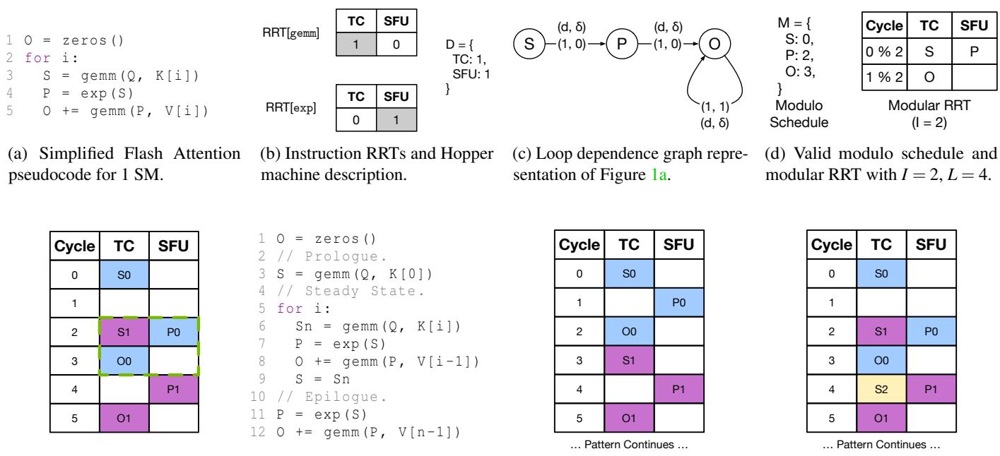  
(f) Code generated from Figure 1e with a steady-state loop.  
(e) ⌈L/I⌉ copies of Figure 1d’s schedule placed I cycles apart.  
(g) In-order execution, achieving 1/3 its. per cycle.  
(h) Pipelined execution, achieving 1/2 its. per cycle after prologue.  
Figure 1: Modulo scheduling a simplified Flash Attention expressed in a tile-based manner. The machine costs are for Hopper, where GEMM and EXP on a tile have roughly the same cost. Modulo scheduling recovers the Flash Attention 3 [32] pipeline.

Section 3.1 introduces standard terminology using the running example shown in Figure 1. The figure shows how to pipeline a simplified version of Flash Attention [18]. The code (Figure 1a), instruction cost information (Figure 1b), and a dependency graph (Figure 1c) go through two intermediate steps (Figures 1d and 1e) before yielding the pipelined code in Figure 1f. In this example, SWP is necessary for maximal TC utilization because the program exposes the latency of the exponential due to the data dependence on the result prior to the second matrix multiplication (Figure 1g). However, as we discuss in Section 3.2, it may not be possible on recent architectures for a single thread of execution to manifest this pipelined schedule. To address this issue, we describe in Section 3.3 how to realize an optimal pipelined schedule by distributing operations across multiple executing threads using WS, and the compilation challenges it induces.

## 3.1 Modulo Scheduling

Modulo scheduling [21,24,31] is a popular class of algorithms for SWP that transforms a given loop such that it achieves maximum throughput (iterations finishing per unit time) while simultaneously abiding by the data dependencies of the input program and capacities of the underlying machine. In modulo scheduling, the input loop is described as a dependence graph G = (V, E) where V is the set of instructions in the loop and E defines dependencies between the instructions. We assume that G describes a singly-nested loop without control flow. In

Twill, each instruction represents a tile-level operation that utilizes resources from the entire SM; dependence graphs of this form can be extracted from standard tile-based programming models (see Section 5).

Associated with each v ∈ V is a resource reservation table (RRT) that indicates the functional unit(s) used during the execution of v. RRT[v] is a 2-D integer array where each column corresponds to a kind of functional unit, each row corresponds to a clock cycle in the execution of v, and the entry gives the number of instances of f that are occupied by v at that clock cycle of its execution. The total number of instances of f on the machine, called the capacity of f , is given by a machine description D. RRTs for each operation in the running example and a machine description D are shown in Figure 1b; both instructions take a single cycle to execute, but they occupy different functional units. For simplicity we assume each functional unit can be scheduled and execute an instruction every cycle; on a real machine, functional units often take longer to execute some instructions than others and have limits on how often they accept new instructions. For TC GPUs that operate on large tiles of data, the abstraction of an RRT is still valid at a coarser granularity of computation, where a “cycle” might represent a coarser granularity of time. We describe how to cope with the problem of determining time granularity in Section 5.2.

Every edge e ∈ E is a tuple (u, v, d, δ), where u is the source and v is the sink of the data dependence. The clock cycle delay d ≥ 0 indicates that v must be issued at least d cycles after u is issued. Finally, δ ≥ 0 is the iteration delay, indicating that the instance of v from loop iteration i must be issued at least d cycles after the instance of u from iteration i − δ. For example, an edge with δ = 1 indicates that the dependence between u and v is loop carried to the very next iteration. The dependence graph for the attention example is shown in Figure 1c, where the edges from S and P have d = 1 (from the corresponding RRTs) and δ = 0, while the loop-carried dependence on O has δ = 1. To simplify the exposition, we use variable names (which are unique) instead of instruction names in the figures. Together, the RRTs of each instruction (Figure 1b) and the dependence graph G (Figure 1c) are the inputs to modulo scheduling.

When run on a given loop, modulo scheduling finds an initiation interval I and modulo schedule M, from which the pipelined loop is constructed. I corresponds to the rate at which new loop iterations are issued (or finished), and is thus inversely related to the throughput; I = 1 is the minimum possible and means that a new loop iteration is launched every cycle. M maps each instruction to the clock cycle at which it must be issued, counting from the beginning of its iteration (hence the name “modulo”). If M(v) = k, then v will be issued at clock cycles k, I + k, 2I + k, . . . in the pipelined loop. A choice of M and I is valid when it ensures that the pipelined loop satisfies all dependence edges in E and keeps all functional units within capacity.

A valid modulo schedule for the running example is shown in Figure 1d. It is accompanied by the modular RRT, a data structure similar to the RRT that indicates the functional unit usage in the steady state of the pipelined loop. In the modulo schedule, both P and O were delayed one cycle later than an optimal schedule for just a single iteration. M(P) = 1 and M(O) = 2 would be valid per the data dependencies but invalid per the modulo RRT because O would conflict with S for the TC since 0 ≡ 2 (mod 2). A variety of algorithms have been developed to construct M and I for a given dependence graph G, including greedy [24, 31] algorithms and optimal [21, 34] algorithms that leverage Integer Linear Programming (ZLP). Optimal algorithms yield modulo schedules with the smallest possible I, and thus the highest possible throughput.

Once a modulo schedule M and initiation interval I have been found, they can be used to synthesize a program that executes the schedule. A standard way [6] to realize a mod ulo schedule is with a sequential loop that consists of: 1) a prologue that primes the loop, 2) a steady state containing the repeatedly executing loop body, and 3) an epilogue that drains the loop. To construct these three components, we let L be the length of M, i.e., the number of cycles in M. The softwarepipelined loop is constructed by overlapping ⌈L/I⌉ copies of M, each copy offset by I cycles from the previous copy. The pipelined loop can then be read off from this staggered schedule: the first (⌈L/I⌉ − 1) · I cycles correspond to the prologue, the next I cycles correspond to the looping steady state, and the remaining cycles are the epilogue that drains the pipeline.

Placing the modulo schedule for the running attention example is shown in Figure 1e, where blue and purple correspond to different copies of the schedule, and the dashed box gives the steady state. Once the schedule has been constructed, it can be used to generate code. Generated pseudocode for the running example is shown in Figure 1f. An in-order execution as written in Figure 1a completes 1 loop iteration every 3 cycles (Figure 1g), while the pipelined execution completes 1 iteration every 2 cycles after the prologue (Figure 1h).

Applying modulo scheduling to the running Flash Attention example yields the exact pipeline developed by experts in Flash Attention 3 [32] from only a high-level description of the algorithm and machine.

## 3.2 Code Generation Challenges

For GPUs prior to Hopper, the modulo scheduled tile-level program in Figure 1f could be lowered to single-threaded code executing in a SIMT fashion, where each data-parallel thread would execute the same program on disjoint subsets of the tile of data. Unfortunately, most modulo schedules computed for the functional units of a Hopper or a Blackwell GPU cannot be realized as a single-threaded program in the standard style. There are four confounding factors that regularly thwart single-threaded code generation. First, and most commonly, the scale of TCs in recent GPUs requires multiple warps to cooperatively issue large GEMM computations. Most GPU compilers are built on sequential intermediate representations (e.g., LLVM and PTX) and are therefore ill-equipped to generate code for cooperative warps.

A second issue stems from the propensity of modulo schedules to increase the working set size of computations to keep live variables from multiple iterations of a program on-chip concurrently. The combination of this natural memory pressure of modulo schedules in conjunction with the larger quantities of data needed to feed bigger TCs makes it challenging to keep the working set of a computation on-chip. Most GPUs have a strict upper bound of 255 registers per thread and spilling data out of the register file often incurs a significant performance penalty as the spilled data is unlikely to remain in cache. Many single-threaded realizations of modulo schedules for recent GPUs struggle to achieve peak performance due to the cost of spilling.

A third complication is that some operations, such as transfers through the multi-tiered GPU memory hierarchy, have high variability in their execution times. While traditional modulo scheduling suggests using an upper bound on such costs [6], there is an implicit assumption that this upper bound is roughly the same order of magnitude as other operations in the schedule. However, operations like TMA transfers that move tiles of data between global and shared memory may have more than an order of magnitude difference between the fastest and slowest possible execution times for the same transfer. While these operations are performed asynchronously, the high dynamic range of potential latencies can foil attempts to place synchronization instructions during code generation. In particular, overestimation results in under-utilization, while underestimation results in pipeline stalls during execution.

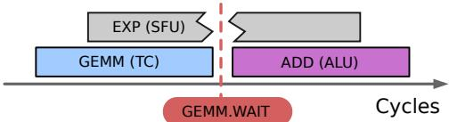  
Figure 2: Visualization of three operations using different functional units scheduled on the same warp. The blocking sync after GEMM interrupts the concurrent issue of EXP.

Finally, the fixed-function units on Hopper and Blackwell have asynchronous interfaces that require explicit blocking synchronization to consume results. Since GPU threads have in-order instruction issue, blocking synchronization interrupts the instruction issue of any concurrently scheduled operations on the same warp. An example is in Figure 2, where a modulo schedule requires an addition to consume the result of a GEMM, while executing an independent EXP concurrently. Note that all three occupy independent functional units. Executing all operations from the same warp suffers degraded performance as the GEMM.WAIT interrupts instruction issue for EXP.

Each of these four factors influence code generation for modulo schedules to differing degrees depending on the properties of the particular program. Combating them in practice necessitates a new approach to code generation.

## 3.3 Warp Specialization

Warp specialization [10,11] (WS) is a programming paradigm that offers a solution to the code generation challenges encountered when trying to realize a modulo schedule on GPUs. A warp-specialized program assigns operations to different warps while ensuring that the warps cooperatively execute the entire computation. WS is possible due to the hierarchical grouping of threads within an SM. Since warps are SIMT, a warp’s performance is maximized when all threads in the warp issue the same instruction, and minimized when the threads diverge. However, unlike threads, warps are independent from each other and pay no penalty for control divergence.

While WS is commonly viewed as a separate optimization, our insight is that WS is useful precisely because it directly addresses all of the code generation problems for SWP presented in Section 3.2. First, WS naturally reasons about warps cooperating and can ensure that subsets of warps cooperatively issue TC operations. Second, by splitting the computation across many warps, the computation can access the register resources of many threads, yielding greater flexibility for fitting the large working sets demanded by SWP on-chip. Third, variable-latency operations can be separated onto dedicated warps, instead of needing to be statically scheduled alongside (and interfering with) fixed-latency operations. Finally, splitting operations across warps allows some warps to issue instructions while others are blocked on synchronization.

Since WS addresses the challenges of generating code for SWP, it has gained significant adoption by both compilers [5, 13, 25, 35–37] and programmers [27, 32, 38]. However, there are two complications. First, WS is not free and comes with trade-offs involving communication of data between warps and synchronizing access to both shared data and hardware resources. Currently, all automated approaches that we are aware of depend upon ad-hoc heuristics to decide these tradeoffs [13,35,37]. These heuristics often involve canonical warp “roles” (e.g., loader and compute warps), or treat warps as parallel “agents” to whom work can be dispatched. Without a technical framework for understanding the optimality of these heuristics, it is difficult to know if programs generated using them are achieving peak performance.

The other significant complication to this approach is that, even with WS, it might not be possible to synthesize a program that actually achieves a modulo schedule. For example, despite spreading a computation across as many warps as possible in an SM, it still might be impossible to fit the working set demanded by a modulo schedule in the register file. Consequently, treating the computation of the modulo schedule and code generation using WS as two independent steps in compiling a program can lead to sub-optimal code in practice. To ensure that a modulo schedule can actually be realized, the constraints for code generation using WS need to be directly incorporated into the optimization process in conjunction with those for traditional modulo scheduling.

## 4 Joint Optimization Problem

We now demonstrate how to solve the optimization problem of finding a modulo schedule and a WS strategy simultaneously. The joint optimization problem is to take an input program G = (V, E) and produce a modulo schedule with the minimum initiation interval along with a WS strategy capable of realizing the schedule. The result is a modulo schedule M∗, initiation interval I∗ and warp assignment A∗, where A∗ is an assignment of every v ∈ V to a warp (or warps).

We approach this problem in two main steps. First, modulo scheduling is used to derive an initial modulo schedule M and initiation interval I that achieve the maximum throughput while respecting the data dependence and functional unit constraints. Then, M and I are used to seed a system of constraints that are supplemented with constraints for WS. The system of constraints can then be solved by an SMT solver to discover an M∗ and A∗ with the same I that respect the requirements of both modulo scheduling and WS.

We use M and I to define an initial straight-line program Q over which the constraint system is formulated. Q is obtained using the code-generation procedure of modulo scheduling from Section 3.2. Recall that ⌈L/I⌉ copies of M are overlapped, each offset I cycles from the previous, resulting in a prologue, steady state and epilogue. Our insight is that we can assume that the steady state executes exactly once, allowing us to treat the three parts as a straight-line program with length T . This assumption is sound, because it is permissible for the steady state to execute exactly once, and complete, because steady state executions are identical, and greatly simplifies the constraints by obviating the need for any loop analysis. An example program Q derived from the modulo scheduled example in Figure 1 is shown in the right half of Figure 3.

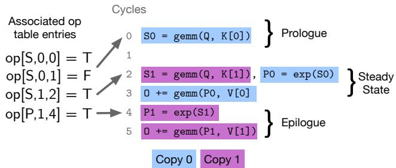  
Figure 3: Straight-line code analyzed by Twill’s joint formulation. Sample op table entries are to the left.

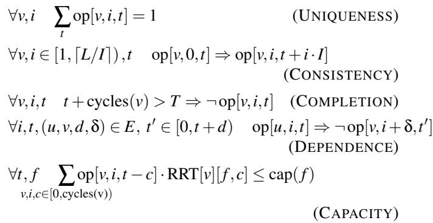  
Figure 4: Constraints enforcing a valid modulo schedule.

## 4.1 Modulo Scheduling with Constraints

The goal of the joint problem is to find a modulo schedule M∗ that may be distinct from M but achieves the same initiation interval. To do so, Twill must be able to modify M, necessitating a reimplementation of modulo scheduling in the form of SMT constraints. Instead of modifying M directly, this reimplementation allows the modification of Q to Q∗ such that Q∗ has the same initiation interval and length as Q, but may be the result of a different modulo schedule. The constraints to do so are given in Figure 4. We define a 3-D boolean array such that op[v, i,t] indicates that operation v ∈ V of iteration i ∈ [0,⌈L/I⌉) was scheduled at clock cycle t ∈ [0,T ) in Q∗. The uniqueness constraint enforces that every operation is scheduled exactly once. The consistency constraint ensures that Q∗ is obtainable from some modulo schedule. The completion constraint requires all operations to finish before the last clock cycle T of Q∗. Finally, the dependence and capacity constraints function identically to the corresponding constraints in modulo scheduling. We elide guards for brevity, but assume that constraints referencing i ̸∈ [0, ⌈L/I⌉) are not emitted. Additionally, references to t ̸∈ [0, T ) of op are mapped to false. A satisfying assignment of op induces a valid Q∗ and M∗, where M∗(v) = t iff op[v, 0,t].

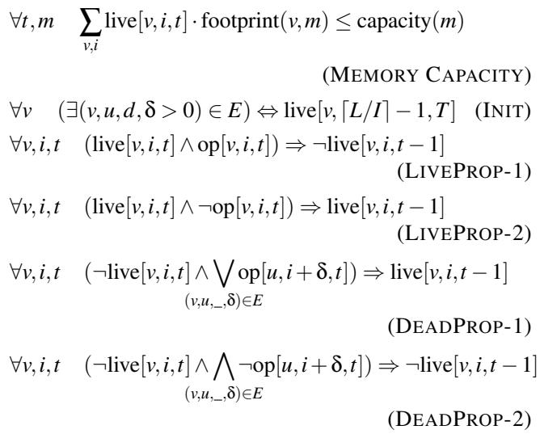

## 4.2 Memory Aware Constraints

To ensure that the working set of a modulo schedule can remain on-chip, we introduce additional constraints that enforce memory capacity, narrowing the set of valid instances of Q∗. These constraints assume that Q∗ is in static single assignment form (SSA) [8,16], where variables are defined once and have lifetimes that end at the last use. We define a second boolean array live[v, i, t], where live[v, i, t] = 1 when the result of the i’th instance of v is live at time t. Using live, defining the memory capacity constraint is straightforward and shown in Figure 5, where the memory footprints and capacities are defined by the input graph and machine model. The non-trivial component of memory capacity is setting up the constraints defining live[v, i,t]; this component cannot be discharged to an external analysis, because changes to Q∗ affect when different values are live. These constraints are shown in Figure 5, and are derived from classic backwards dataflow algorithms for liveness [6]. There are three groups of liveness constraints: initial conditions, propagation of liveness, and propagation of deadness. Initially, only the loop-carried results of the last copy of each instruction are live at the last clock cycle of Q∗, i.e. at time T . Liveness is then propagated backwards through the straight-line program: if an operation’s result is live at time t, it is live at time t − 1 unless it was scheduled at time t. Deadness is propagated in a similar way, where if the result of an operation is dead at time t, it stays dead at time t − 1 unless a user of the operation is scheduled at time t.

∀v ∑opw[v,w] = 1 (WARP UNIQUENESS)   
w   
∀v variable\_latency(v) ⇔ opw[v,Wvl]   
(VARIABLE LATENCY)   
∀t, w ∑ live[v, i, t] · opw[v, w] · regs(v) ≤ reg\_limit()   
v,i   
(REGISTER LIMIT)   
∀(u, v, d, δ) ∈ E,t, i, w, w′ ̸= w, s ∈ [0, spillcost(u))   
op[u,i,t] ∧ opw[u,w] ∧ opw[v,w′] ⇒   
¬op[v, i + δ,t + d + s]   
(CROSS-WARP SPILLS)   
∀(u, v, \_, \_) ∈ E , t, w, i, o ̸= v   
op[v,i,t] ∧ opw[v,w] ∧ blocking(u,v) ⇒   
∀i′, t′ ∈ [t − (cycles(o) − 1), t], ¬(op[o, i′, t′] ∧ opw[o, w])   
(CONCURRENCY)  
Figure 6: Warp Assignment Constraints.

## 4.3 Warp Assignment Constraints

Finally, we introduce constraints that influence WS decisions, shown in Figure 6. We define another boolean array opw[v, w], indicating whether operation v has been assigned to warp w; opw directly defines the final warp assignments A∗. Similar to op, we define a uniqueness constraint, stating that every operation must be assigned to exactly one warp. This constraint is naturally extended to operations that span multiple warps, such as the warp-group level operations on Hopper and Blackwell.

The first constraint is the assignment of operations with variable and statically-unknown latencies. These operations are assigned to a designated warp Wvl, separating them from the scheduling and placement of instructions with staticallyknown and fixed latencies. The second constraint enforces the register limit on each warp; the constraint is similar to the capacity constraint in Figure 5, but scopes the summation to each warp. This constraint forces a partitioning of V to stay within register limits. However, data in the registers of warp w cannot be accessed on warp w′ unless the data is transferred (or spilled) through the shared memory. When data is spilled across warps, a valid schedule must include the cost of the transfer when scheduling the consuming operation; this additional delay is captured by the cross-warp spill constraint. We assume the cost of cross-warp communication is provided as an annotation on nodes in G. This constraint forces a trade-off between memory capacity, latency and the costs of cross-warp spills. The final constraint is the concurrency constraint, which captures the effects of blocking synchronization interrupting the issue of concurrently scheduled operations. Certain edges (u, v) are designated as blocking edges, indicating that blocking synchronization is required by v before the results of u are accessible. The concurrency constraint states that if an operation v, assigned to warp w and scheduled at time t, requires blocking synchronization from an incoming dependence, then no other operation can be scheduled to run on w when v starts; this forces concurrent operations to either be placed onto different warps or scheduled at different times. While elided for brevity, the implementation includes a similar constraint for cross-warp spills, as transferring register data through shared memory requires blocking synchronization.

The entire system of constraints captures all the challenges presented in Section 3 that can make a desired modulo schedule impossible to implement in practice for recent GPUs. By describing the space of solutions holistically with a unified system of general constraints, we force the constraint solver to reckon with all aspects of the scheduling problem simultaneously. Furthermore, as new machines are released, constraints can easily be added, removed, and modified to reflect the challenges presented in future architectures. Therefore our approach provides a flexible framework for finding optimal solutions to the joint problems of modulo scheduling and WS.

## 5 Implementation

To reify our approach, we introduce Twill, a system that computes joint SWP and WS strategies for Triton [35] programs. Twill extracts dependence graphs from a mid-level Triton intermediate representation (IR) called TTGIR, which is a tile-based, SSA IR with arithmetic on tiles and explicit data movement. These graphs serve as the input program to Twill’s optimization process as described in Section 4. Users of Twill must also inform it of the target GPU architecture. The target architecture is used to estimate costs of instructions and data movement (discoverable via documentation [1] or direct measurement), and to enable architecture-specific modeling, such as declaring available memories or denoting operations that require blocking synchronization.

As described in Section 4, Twill computes an initial modulo schedule by formulating it as an ZLP problem [34] and dispatching it to the CBC solver [20]. Twill then uses the resulting modulo schedule and initiation interval to seed the system of SMT constraints. Twill discharges SMT queries to the quantifier-free linear integer arithmetic (QFLIA) theory of the Yices2 SMT solver [19]. Once a modulo schedule and warp assignment have been discovered, Twill uses standard code generation techniques to emit software-pipelined IR, annotating each instruction with the warp (or warps) that should execute it. The resulting IR can either be consumed by downstream compilers that implement a specified WS strategy (e.g., Tawa [13] or Cypress [37]), or used by an expert as reference for a manual implementation.

Algorithm 1 Twill’s Search Procedure   
1: procedure TWILL(G)   
2: I ← 0   
3: while true do   
4: I ← I + 1   
5: M ← OPTIMAL-MODULO-SCHEDULE(G,I)   
6: if M = failure then   
7: continue   
8: L ← LEN(M)   
9: while ⌈L/I⌉ = ⌈LEN(M)/I⌉ do   
10: (M∗, A∗) ← SWP-AND-WS(G, M, I, L)   
11: if (M∗, A∗) = failure then   
12: L ← L +1   
13: continue   
14: return (M∗, I, A∗)

## 5.1 Handling Unsatisfiability

Twill must handle the case when the constraint system is unsatisfiable. Unsatisfiability indicates that some resource limitation or concurrent interaction is preventing a modulo schedule with the initial initiation interval I from being achieved. Similar to standard approaches in modulo scheduling [24], if the constraints are unsatisfiable, Twill uses modulo scheduling to find a new candidate schedule M′ with initiation interval I + 1, which is then used to seed the system of constraints for another solution attempt. By searching monotonically from the smallest possible initiation interval, we ensure discovery of the highest throughput schedule that solves the constraints. In addition to searching over candidate values of I, Twill also searches over increasing values of L (the total schedule length) that do not affect ⌈L/I⌉ at a given I. This search is depicted in Algorithm 1.

## 5.2 Cost Normalization

A critical component of Twill’s implementation is cost normalization, which renders the optimization problems solved by Twill tractable. Consider the cycle counts computed from publicly available documentation [1] for a 128x128x128 GEMM on Hopper—roughly 1000 cycles. A reasonable dependence graph G = (V,E) may contain many instructions with similar cycle counts. Optimal algorithms for modulo scheduling and Twill’s joint formulation are not just exponential in |G|, but exponential in ∑(u,v,d,δ)∈E d. Therefore, directly using estimated cycle counts results in intractable ZLP and SMT problems.

Our solution relies on the observation that multiplying every cycle count in a SWP problem by a positive integer results in a new problem isomorphic to the original. It is not the cycle counts that matter, but the ratios between cycle counts. Therefore, we want to obtain new, smaller cycle counts whose ratios are as close as possible to ratios of the original cycle counts. Cost normalization encodes this intuition as an ZLP problem (separate from the one for modulo scheduling).

Let the list of integers C be the original cycle counts. We want to derive a new list of integers C′ such that C[i]/C[ j] ≈ C′[i]/C′[ j] for all i, j. This is formalized as a constraint by introducing a variable F that bounds the change in ratios. We also bound the sum of C′ from above and below, the latter to avoid the degenerate solution of all zeros:

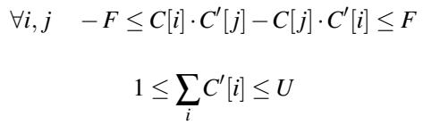

U is a user-defined integer parameter that controls the exact trade-off between resolution of costs and running time of the subsequent algorithm that actually calculates a modulo schedule. Smaller values of U result in lower resolution (i.e., larger change in ratios) and lower running times. Finally, the ZLP objective is to minimize F. Twill uses the SCIP solver [22] to find solutions because it was considerably faster than the CBC solver [20] at such problems. In our experiments, we pick U = 300 and find that SCIP is able to find the global minima in under 500 ms in all cases. Early in the development of Twill, we relied on an ad-hoc approach that divided each cycle count by a fixed integer, followed by rounding to obtain integer values. We found it difficult to keep this approach consistent, even for the same program on different GPUs. In contrast, framing cost normalization as an ZLP problem offers a principled solution and is necessary for discovering optimal schedules.

## 5.3 Variable Latency Optimizations

As discussed in Section 3.2, approximating the execution time of variable-latency operations with a high dynamic range can cause imprecision in static scheduling. While Twill offloads variable-latency operations onto separate warps so they may be dynamically scheduled, further optimizations are possible for variable-latency operations in the target loop dependence graph that have no incoming data dependencies. We refer to these variable-latency operations as streaming operations. On separate warps, streaming operations can run ahead of the main software pipeline and complete several iterations before their results are needed. To reflect this, we assign streaming operations zero latency in our cost models, allowing dependent operations with statically-known latencies to be precisely scheduled. We then expose the pipeline depths for these streaming operations as parameters that may be tuned by an external auto-tuning system; exposing such parameters for dynamic tuning is commonplace among existing TC GPU programming systems [5, 15, 27, 33, 35, 37]. Many critical compute-bound kernels contain streaming variablelatency operations (like TMA loads of input tiles), warranting optimization of this important case.

## 5.4 Limitations and Future Work

Currently, our implementation of Twill only supports singlynested loops without additional control flow. This limitation could be lifted through the use of hierarchical reduction techniques from the software pipelining literature [24], which we leave as future work. While Twill derives an optimal pipeline with respect to the constraints presented so far, the tile size is not automatically determined by Twill, and must therefore be selected by a human or a higher-level auto-tuning system. As we will see in Section 6.4, the solution times of Twill’s joint problem range from tens of seconds to a few minutes. Fast solution times are a non-goal of our approach; we trade-off solution times for an optimality guarantee. We envision a system like Twill serving as a developer aid or as an offline optimization tool used prior to deployment, rather than being run continuously during interactive development. Despite this being a non-goal, in practice we find the solvers used by Twill to be highly optimized and capable of producing competitive search times as we will demonstrate.

## 6 Evaluation

We do a thorough evaluation on two important kernels from the machine learning literature, and show that Twill is able to derive SWP and WS strategies for multiple generations of NVIDIA GPUs automatically and from first principles. Twill is the only system we are aware of that is capable of doing so without heuristics tailored for each GPU generation. We then implement these strategies and show the achieved performance is competitive with hand-tuned implementations (Sections 6.2 and 6.3). Finally, we discuss the search times of Twill (Section 6.4).

## 6.1 Methodology

Kernel selection. We focus our evaluation efforts on compute-bound kernels that require utilizing both the TC and general-purpose functional units on the SM. Hence, we focus on the critically important forward and backward passes of Fused Multi-Head Attention, which have received significant human effort in developing SWP and WS strategies [32, 38]. The backward pass requires a significantly different loop structure than the forward pass and thus demonstrates Twill’s flexibility in discovering different strategies.

Evaluation Platforms. We evaluate Twill on NVIDIA Hopper and Blackwell GPUs. We use a NVIDIA H100 SXM5 80 GB and a NVIDIA B200 180 GB. All experiments use CUDA 13.0. Search times were recorded on a single core of a Intel Xeon Platinum 8570.

Experimental Setup. Twill schedules dependence graphs extracted from Triton programs. Initially, we intended to use

Twill within Triton and let Triton generate code from Twill’s SWP and WS strategies. However, there are many additional (and orthogonal to Twill) critical decisions and optimizations that must be performed correctly to achieve high performance on modern GPUs. We found that Triton made many incorrect decisions during code generation, such as in memory allocation, data layout conversions or synchronization placement. As a result, Triton was either unable to successfully compile Twill’s pipelines, or resulted in poorly performing code. To demonstrate the performance of schedules found by Twill, we instead “hand-compile” Twill’s pipelines into CUDA C++. This process involved translating the pipelined and warp-annotated IR emitted by Twill into CUDA that implemented the specified strategy while allowing us to correctly make the remaining (and orthogonal) lowering steps. Automating all of these remaining steps in an optimal manner requires significant engineering and further research; as such, it is out of scope for this work.

## 6.2 Attention Forward Pass

The forward pass of FMHA has been the focus of significant optimization over multiple generations of GPU hardware through the Flash Attention (FA) algorithms [17, 18, 32, 38]. We focus on FMHA on Hopper and Blackwell, targeted by Flash Attention 3 (FA3) [32] and Flash Attention 4 (FA4) [38] respectively. For both architectures, novel SWP and WS strategies were required for peak performance and were discovered by humans months after each architecture was released. We demonstrate that Twill automatically rediscovers the same strategies across different architecture generations.

We started with the Triton tutorial [29] implementation of FA, a high-level implementation of FA without additional optimizations. A Triton program describes the decomposition of work for each SM. For Twill’s joint approach to SWP and WS, we sub-tile the computation for the TC instruction sizes of the target hardware. This sub-tiling allows Twill to control scheduling and warp assignments at the appropriate level of granularity; Triton’s IR only implicitly reasons about the decomposition of tiles onto multiple warps. We discuss these results in depth, focusing on each architecture in turn.

## 6.2.1 Hopper

FA3 [32] introduced two main techniques for optimizing FMHA on Hopper. The first technique was a software pipelining schedule for the main loop that extracts one GEMM into the loop’s prologue so that latency of the exponential is not exposed (seen in Figure 1). The second technique was called ping-pong scheduling, which schedules the GEMM from one sub-tile while the exponential from another sub-tile executes, again increasing TC utilization. We show how Twill automatically derives both optimizations.

Figure 7 contains results for different implementations of forward FMHA on Hopper. The bars “Triton” and “Triton-Tiled” report the performance of Triton executing the tutorial implementation of FA and the sub-tiled version. As discussed in Section 6.1, Triton makes many suboptimal decisions during compilation. The “CUDA-Default” bar reports the performance of our “hand-compilation” of Triton IR into CUDA C++, which yields a moderate speedup over Triton. The first Twill result we discuss is the “Twill-SWP” bar, which just uses Twill’s modulo scheduling (i.e., only running OPTIMAL-MODULO-SCHEDULE in Algorithm 1) to software pipeline the main loop and applies Triton’s WS strategy, which puts loads from global memory on a separate warp than the rest of the computation. This results in a significant performance boost, coming within 1% of the official FA3 implementation at the 16384 sequence length. If algorithms like modulo scheduling were used within systems like Triton, this component of FA3 would not have needed human discovery. Finally, the “Twill” result uses Twill’s joint formulation of SWP and WS (i.e., running the entirety of Algorithm 1). Twill’s functional unit capacity constraints recover the ping-pong scheduling strategy described in FA3: since only one operation may use the TC at a time, Twill skews groups of warps so that one issues exponentials while the other uses the TC. Twill discovers the software pipeline used in FA3, but applies it only to one warp group, determining this to be sufficient to saturate the functional units. While the final implementation of this version performed slightly worse than Twill-SWP, the two initially performed equivalently (roughly 645 TFLOPS), but an orthogonal optimization (TMA multicasting) benefited the modulo-scheduled implementation more. On Hopper, multiple warps are interleaved dynamically to issue work into the TC and other functional units, naturally gaining ILP and lessening the burden on the quality of static instruction scheduling. We will see next that this is no longer true on Blackwell.

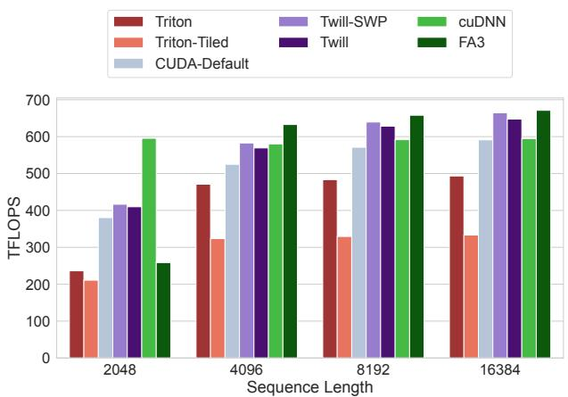  
Figure 7: Hopper FP16 Non-Causal Forward Attention. (BATCH=4, NUM\_HEADS=32, HEAD\_DIM=128)

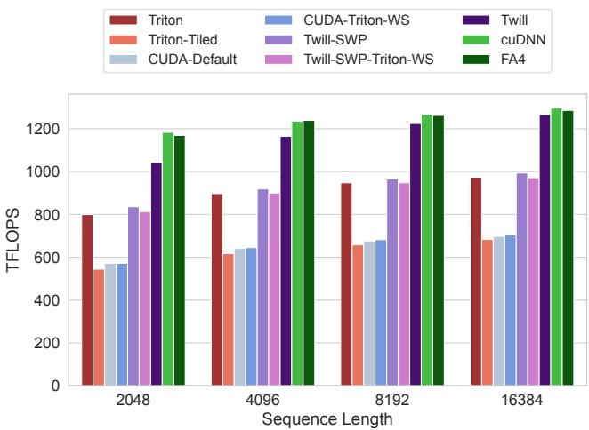  
Figure 8: Blackwell FP16 Non-Causal Forward Attention. (BATCH=4, NUM\_HEADS=32, HEAD\_DIM=128)

## 6.2.2 Blackwell

Blackwell requires substantially different SWP and WS strategies than Hopper due to a faster TC and a larger set of required synchronization operations (Tensor Memory loads and stores). The set of Blackwell results is shown in Figure 8.

As for Hopper, we include Triton results for the tutorial and sub-tiled versions. Our direct translation of Triton IR to CUDA performs worse than Triton on Blackwell because Triton’s Blackwell backend heuristically applies the FA3 SWP strategy. When we apply modulo scheduling and Triton’s WS strategy for Hopper, we match Triton’s performance, but are far from the best implementations.

Twill’s joint optimization of SWP and WS finds a strategy that performs significantly better than Triton and competitively with cuDNN and FA4. In fact, the discovered strategy is exactly the same as proposed by FA4 [38]! Twill’s strategy combines a different software pipeline than Hopper with specific warp assignments and cross-warp communication. Twill’s WS strategy is shown in Figure 9, using a visualization generated by Twill for the actual dependence graph obtained from Triton IR for this program. Twill places variable-latency operations (green) and TC GEMMs (pink) onto separate warps, softmax calculations for each sub-tile onto two different groups of warps (blue and orange), and accumulator rescaling operations for both sub-tiles onto a third group of warps (yellow).

This strategy does not comport to conventional warp roles like “loader” and “compute” warps. The reasoning behind this strategy is opaque without considering the associated software pipeline. The pipeline hoists the first GEMM for each sub-tile out of the loop like FA3. In the main loop, the pipeline schedules the exponential for one sub-tile during the GEMMs for the other sub-tile (like ping-pong scheduling), all while the sub-tile’s accumulator is being rescaled. The rescaling is moved to a third group of warps because reading accumulators from Tensor Memory requires blocking synchronization; placing it on the warp issuing exponentials disrupts the pipeline. However, moving the rescaling to a third group of warps incurs cross-warp communication, as it needs data produced by the softmax warps — Twill schedules around this latency and synchronization. Our implementation of this schedule comes within 2% of FA4 on the 16384 sequence length.

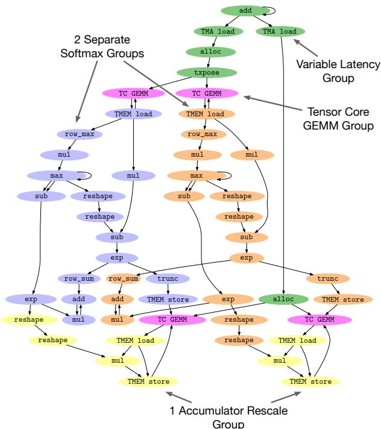  
Figure 9: Twill’s dependence graph showing the discovered forward WS strategy for Blackwell. Colors indicate instructions assigned to the same group of warps.

We now return to other kernel variants in Figure 8. Triton has heuristics to replicate the FA4 strategy by moving accumulator rescaling to a separate group of warps. Applying these heuristics to our purely software-pipelined implementation (“Twill-SWP-Triton-WS”) or our default translation (“CUDA-Triton-WS”) yields no benefit, showing that jointly considering SWP and WS is critical for peak performance.

The final compelling component of our Blackwell results are modifications which render the SMT problem unsatisfiable for the smallest I which makes the ZLP succeed in Algorithm 1, forcing a search over larger values of I and L. These modifications include:

• Reducing the number of warps.

• Using the tutorial Triton implementation directly. Without sub-tiling, the instruction granularity is not fine enough for interleaving.

• Prohibiting cross-warp communication.

The variety of unsatisfiable configurations demonstrates the complexity of the search space for finding high performance SWP and WS strategies. Twill provides a technical framework for reasoning about and navigating this complex search space

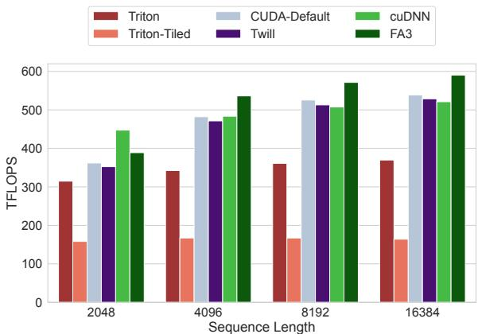  
Figure 10: Hopper FP16 Non-Causal Backward Attention. (BATCH=4, NUM\_HEADS=32, HEAD\_DIM=128)  
while guaranteeing optimal results.

## 6.3 Attention Backward Pass

We now move to the backward pass of FMHA. The backward pass is significantly different from the forward pass, requiring different SWP and WS strategies. We did not use the Triton tutorial implementation of the backward pass, as it uses a work-inefficient two-pass algorithm. Instead, we implemented the single-pass backward algorithm as described in FA3 [32] in Triton, allowing us to directly compare against cuDNN and the reference FA implementations. The single-pass algorithm consists of five GEMMs and one exponential, followed by an atomic reduction into global memory. Similar to the forward pass, we also implement a sub-tiled version of the algorithm.

## 6.3.1 Hopper

Hopper results are shown in Figure 10. Similar to forward on Hopper, our port of Triton IR into CUDA achieves a performance boost over Triton and performs competitively with cuDNN on the highest sequence length. Backward attention on Hopper is register constrained, and thus FA3 [32] does not construct a software pipeline that exploits ILP across iteration boundaries. Twill found a similar schedule: it exploited ILP within a loop iteration but could not do so across iterations due to register capacity. Twill’s findings confirm that the developers of FA3 did not miss potential performance with their software pipelining strategy. We believe the reference FA3 implementation beats ours by 11% on the 16384 sequence length by using a slightly larger tile size (80x128), allowing for the use of larger GEMMs. Triton only supports power-oftwo tile sizes, so we were not able to construct IR with the same tile size, but there is no fundamental reason that Twill cannot handle tile sizes that are not powers of two.

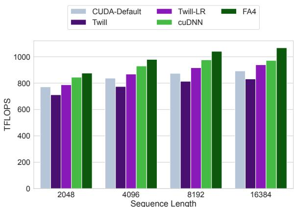  
Figure 11: Blackwell FP16 Non-Causal Backward Attention. (BATCH=4, NUM\_HEADS=32, HEAD\_DIM=128)

## 6.3.2 Blackwell

Blackwell results are shown in Figure 11. Triton was unable to generate code for Blackwell, as it is currently unable to construct Tensor Memory allocation strategies that contain aliasing. The FA4 strategy for Blackwell [38] uses three groups of warps: two groups read accumulators from Tensor Memory to apply exponentials, and the last group stages accumulators in shared memory for the outgoing atomic reduction. Twill finds a different strategy using only two groups of warps which ping-pong between performing exponentials and staging reduction data (“Twill”). Despite our own inspection confirming the schedule should fit within the register-per-thread budget, ptxas was unable to register allocate this code without significant register spilling in the main loop, degrading performance. We then ran Twill with a reduced register-per-thread budget and three groups of warps, and it found the essentially same strategy as FA4. ptxas succeeded register allocating this version, yielding the small speedup over the default implementation (“Twill-LR”). Additionally, this configuration achieved a smaller initiation interval (Table 1) than the first strategy. This example shows the tightly-knit nature of the optimization space. It is difficult to reason about the usage of registers and warps in a separable manner; the necessary joint reasoning is best performed by automatic solvers.

The overall difference between Blackwell backward implementations is relatively small; the high throughput of the Blackwell TC renders the single-pass algorithm bandwidthbound, limited by the completion of the atomic reduction at each iteration. However, Twill finds a similar SWP and WS strategy that hides some exposed latency present in a direct port of the Hopper backward strategy. We believe the remaining performance differences to be from orthogonal optimizations around memory layouts and instruction selection in the well-tuned reference implementations.

## 6.4 Search Time

While optimizing search time is not a primary goal of Twill, we measured it to demonstrate that solutions can be found in reasonable intervals of time that are comparable with existing solutions. Search times for all experiments are shown in Table 1 along with the minimum and final values of I and L. “SWP time” and “SWP-and-WS time” in the table refer to the total time spent in calls to OPTIMAL-MODULO-SCHEDULE and SWP-AND-WS in Algorithm 1 respectively. Twill’s search times range from tens of seconds to a few min utes, which is reasonable for an offline system that provides an optimality guarantee for performance-critical kernels that will ultimately be deployed at scale. These times are competitive with existing solutions such as PipeThreader [14], which exhaustively searches a proposed space of SWP schedules. PipeThreader reports discovering the Hopper strategy for the forward pass in 315 seconds while Twill discovers the same strategy in 28 seconds, an order of magnitude faster. Our speedup over PipeThreader demonstrates that, despite their generality, modern ILP and SMT solvers are highly efficient at searching over and pruning large search spaces rapidly. We contrast PipeThreader with Twill in more detail in Section 7.2.

One final interesting observation is the difference in minimum and final values of I discovered by Twill for the backward B100 kernel. The larger final value of I demonstrates the existence of a kernel on a particular machine for which it was impossible to discover a WS strategy for the initiation interval predicted purely by modulo scheduling. This validates our claim from Section 3.3 that SWP and WS should always be handled jointly when determining an optimal schedule, as combinations of kernels and target machines clearly exist that necessitate a holistic approach and it is impossible to predict in advance when they might occur.

## 7 Related Work

## 7.1 Tensor Core GPU Programming

The combination of widely varying expertise in GPU programming and the desire for diverse and high-performance machine learning computations has led to a large ecosystem of programming systems for targeting TC GPUs. We provide a survey of this space of systems.

Below deep-learning frameworks like PyTorch [30] or JAX [12], domain-specific languages (DSLs) like Triton [35], Pallas [5] and CUDA Tile [15] provide abstractions for operating on tiles of data. The compilers for each language are then responsible for generating efficient code, often achieving moderate to high performance. Slightly lower-level DSL’s like TLX [25] and TileLang [36] also expose tile-based programming models, but provide more control over optimizations. Gluon [28] is a Triton extension that exposes the Triton low-level intermediate representation (IR) to the programmer. Gluon programmers gain some automation from further lowering of this IR, but retain control over optimizations like memory allocation and WS. Cypress [37] is a task-based programming model that allows programmers to express the decomposition of computation and data across the GPU. Cypress provides a separate mapping interface to control performance-sensitive decisions without affecting correctness. Finally, systems like ThunderKittens [33] and CUT-LASS [27] provide the developer complete control, leaving no performance-sensitive decisions to an automated system.

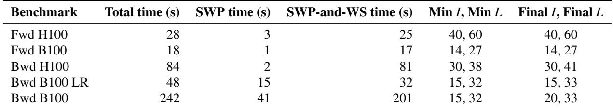  
Table 1: Twill search time and results. Note: values of I, L are incomparable across programs due to cost normalization.

## 7.2 Software Pipelining

Pipelining for CPUs. Software pipelining is a classic and well-understood optimization for CPUs, critical for extracting enough instruction level parallelism to saturate the machine. Even for modern out-of-order processors, software pipelining can improve instruction throughput by filling the processor’s reorder buffer with independent instructions. Compactionbased [7] pipelining algorithms logically unrolled the target loop until a fixed-point pipeline is discovered. Modulo scheduling [24, 31] pipelining algorithms model steady state resource usage with a modulo table data structure. Modulo scheduling algorithms are amenable to the derivation of optimal solutions through the use of Integer Linear Programming [21, 34]. Twill shows how to adapt traditional modulo scheduling techniques for Tensor Core GPUs.

Pipelining for Tensor Core GPUs. ALCOP [23] does SWP of loads with compute, and is therefore insufficient to derive pipelines that overlap compute operations, like FA3.

PipeThreader [14] finds an SWP strategy by defining a space of programs and then searching over it, profiling each candidate to find the fastest. In contrast, Twill takes a constraint-based approach where the space is implicitly defined by the constraints and the search is executed by highlyoptimized solvers. Moreover, Twill does not rely on profiling— our approach is static and instead relies on publicly available specifications to estimate operation latencies. A compari son of the search times of Twill and PipeThreader is presented in Section 6.4. Apart from higher search times, because PipeThreader relies on the conventional, heuristic approach to WS involving the creation of producer and consumer warps, it cannot derive the Blackwell warp specialization strategy.

Finally, perhaps the most important distinction between Twill and PipeThreader is that PipeThreader cannot provide any optimality guarantees for the schedules it finds.

## 7.3 Warp Specialization

The GPU programming technique of WS was introduced before NVIDIA GPUs contained TCs. CUDA-DMA [10] leveraged WS to separate data movement between global and shared memory from computation, achieving higher memory bandwidth. Singe [11] partitioned combustion chemistry computations across warps to shrink the register-level working set of each warp, allowing large chemical reactions to be simulated without spilling.

Since Hopper, WS has become ubiquitous in highperformance TC kernels. Programming systems for TC GPUs offer many different layers of control around WS. High-level systems like Triton [35], Cypress [37] or Tawa [13] heuristically define a WS strategy, and then automatically transform the source program to implement chosen strategy. Mid-level systems like TLX [25] allow specifying a WS strategy through source-level annotations, and then implement the strategy through transformation algorithms within the compiler. Finally, low-level systems like Gluon [28], ThunderKittens [33] or CUDA C++ require users to both define a WS strategy and realize it in low-level code. Twill focuses specifically on the problem of defining a WS strategy, which all other existing systems perform through machine-specific heuristics or by relying on programmer intuition.

## 8 Conclusion

We presented Twill, a system that discovers optimal SWP and WS strategies for Tensor Core GPUs. Twill presents a novel joint formulation of SWP and WS that can be offloaded to ZLP and SMT solvers, deriving the complex strategies that experts have found by hand for multiple generations of GPUs. We additionally show that approaches that consider these optimization strategies separately are unable to achieve peak performance.

## Acknowledgments

We thank Duane Merrill for discussions about GPU architecture and inspiring our view of warp specialization; Vinod Grover for discussions about SWP and WS; Evghenii Gaburov, Masahiro Masuda and Jason Knight for their support with Triton development and Triton’s warp specialization infrastructure; Pradeep Ramani and Cameron Shinn for help with performance debugging of Hopper and Blackwell kernels; Benjamin Driscoll for suggesting the acronym ZLP; Atharva Chougule, Chris Gyurgyik, Konstantinos Kallas, Katherine Mohr, Sai Gautham Ravipati, AJ Root and Shiv Sundram for providing feedback on a draft of this manuscript.

## References

[1] CUDA C++ Best Practices Guide; CUDA C++ Best Practices Guide 13.0 documentation — docs.nvidia.com. https://docs.nvidia.com/cuda/cuda- c- bestpractices- guide/index.html. [Accessed 11-26- 2025].

[2] Inside NVIDIA Blackwell Ultra: The Chip Powering the AI Factory Era. https://developer.nvidia. com/blog/inside-nvidia-blackwell-ultra-thechip-powering-the-ai-factory-era/. [Accessed 12-03-2025].

[3] NVIDIA H100 Tensor Core GPU Architecture. https://resources.nvidia.com/en-us-hopperarchitecture/nvidia-h100-tensor-c. [Accessed 12-03-2025].

[4] NVIDIA Tesla V100 GPU Architecture. https : / / images . nvidia . com / content / volta - architecture / pdf / volta - architecture - whitepaper.pdf. [Accessed 12-03-2025].

[5] Pallas: a JAX kernel language; JAX documentation — docs.jax.dev. https://docs.jax.dev/en/latest/ pallas/index.html. [Accessed 11-26-2025].

[6] Alfred V. Aho, Monica S. Lam, Ravi Sethi, and Jeffrey D. Ullman. Compilers: Principles, Techniques, and Tools (2nd Edition). Addison-Wesley Longman Publish ing Co., Inc., USA, 2006.

[7] A. Aiken and A. Nicolau. Optimal loop parallelization. SIGPLAN Not., 23(7):308–317, June 1988.

[8] Andrew W. Appel. Modern Compiler Implementation: In ML. Cambridge University Press, USA, 1st edition, 1998.

[9] Clark Barrett and Cesare Tinelli. Satisfiability Mod ulo Theories, pages 305–343. Springer International Publishing, Cham, 2018.

[10] Michael Bauer, Henry Cook, and Brucek Khailany. CudaDMA: Optimizing GPU Memory Bandwidth via Warp Specialization. In Proceedings of 2011 International Conference for High Performance Computing, Networking, Storage and Analysis, SC ’11, New York, NY, USA, 2011. Association for Computing Machinery.

[11] Michael Bauer, Sean Treichler, and Alex Aiken. Singe: Leveraging Warp Specialization for High Performance on GPUs. In Proceedings of the 19th ACM SIGPLAN Symposium on Principles and Practice of Parallel Programming, PPoPP ’14, page 119–130, New York, NY, USA, 2014. Association for Computing Machinery.

[12] James Bradbury, Roy Frostig, Peter Hawkins, Matthew James Johnson, Chris Leary, Dougal Maclaurin, George Necula, Adam Paszke, Jake VanderPlas, Skye Wanderman-Milne, and Qiao Zhang. JAX: composable transformations of Python+NumPy programs, 2018.

[13] Hongzheng Chen, Bin Fan, Alexander Collins, Bastian Hagedorn, Evghenii Gaburov, Masahiro Masuda, Matthew Brookhart, Chris Sullivan, Jason Knight, Zhiru Zhang, and Vinod Grover. Tawa: Automatic Warp Specialization for Modern GPUs with Asynchronous Refer ences. arXiv preprint arXiv:2510.14719, 2025.

[14] Yu Cheng, Lei Wang, Yining Shi, Yuqing Xia, Lingxiao Ma, Jilong Xue, Yang Wang, Zhiwen Mo, Feiyang Chen, Fan Yang, Mao Yang, and Zhi Yang. PipeThreader: Software-Defined Pipelining for Efficient DNN Execution. In Proceedings of the 19th USENIX Conference on Operating Systems Design and Implementation, OSDI ’25, USA, 2025. USENIX Association.

[15] NVIDIA Corporation. NVIDIA CUDA Tile. https: //developer.nvidia.com/cuda/tile, 2025. [Accessed 10-12-2025].

[16] R. Cytron, J. Ferrante, B. K. Rosen, M. N. Wegman, and F. K. Zadeck. An efficient method of computing static single assignment form. In Proceedings of the 16th ACM SIGPLAN-SIGACT Symposium on Principles of Programming Languages, POPL ’89, page 25–35, New York, NY, USA, 1989. Association for Computing Machinery.

[17] Tri Dao. FlashAttention-2: Faster Attention with Better Parallelism and Work Partitioning. arXiv preprint arXiv:2307.08691, 2023.

[18] Tri Dao, Daniel Y. Fu, Stefano Ermon, Atri Rudra, and Christopher Ré. FlashAttention: Fast and Memory-Efficient Exact Attention with IO-Awareness. In Proceedings of the 36th International Conference on Neural Information Processing Systems, NIPS ’22, Red Hook, NY, USA, 2022. Curran Associates Inc.

[19] Bruno Dutertre. Yices 2.2. In Armin Biere and Roderick Bloem, editors, Computer Aided Verification, pages 737– 744, Cham, 2014. Springer International Publishing.

[20] John Forrest and Robin Lougee-Heimer. CBC user guide. In Emerging Theory, Methods, and Applications, pages 257–277. INFORMS, September 2005.

[21] R. Govindarajan, E.R. Altman, and G.R. Gao. Minimizing register requirements under resource-constrained rate-optimal software pipelining. In Proceedings of MICRO-27. The 27th Annual IEEE/ACM International Symposium on Microarchitecture, pages 85–94, 1994.

[22] Christopher Hojny, Mathieu Besançon, Ksenia Bestuzheva, Sander Borst, Antonia Chmiela, João Dionísio, Leon Eifler, Mohammed Ghannam, Ambros Gleixner, Adrian Göß, Alexander Hoen, Rolf van der Hulst, Dominik Kamp, Thorsten Koch, Kevin Kofler, Jurgen Lentz, Stephen J. Maher, Gioni Mexi, Erik Mühmer, Marc E. Pfetsch, Sebastian Pokutta, Felipe Serrano, Yuji Shinano, Mark Turner, Stefan Vigerske, Matthias Walter, Dieter Weninger, and Liding Xu. The SCIP Optimization Suite 10.0. Technical report, Optimization Online, November 2025.

[23] Guyue Huang, Yang Bai, Liu Liu, Yuke Wang, Bei Yu, Yufei Ding, and Yuan Xie. ALCOP: Automatic Load-Compute Pipelining in Deep Learning Compiler for AI-GPUs. In D. Song, M. Carbin, and T. Chen, editors, Proceedings of Machine Learning and Systems, volume 5, pages 680–694. Curan, 2023.

[24] M. Lam. Software pipelining: an effective scheduling technique for VLIW machines. In Proceedings of the ACM SIGPLAN 1988 Conference on Programming Language Design and Implementation, PLDI ’88, page 318–328, New York, NY, USA, 1988. Association for Computing Machinery.

[25] Meta. TLX language. https : / / github . com / facebookexperimental / triton / tree / tlx, 2025. [Accessed 30-11-2025].

[26] NVIDIA. CUTLASS Blackwell Forward Attention Main Loop. https : / / github . com / NVIDIA / cutlass / blob / a2439551c765c5393aebe557ee75d3a0412d2211 examples / 77\_blackwell\_fmha / collective / sm100\_fmha\_fwd\_mainloop\_tma\_warpspecialized. hpp. [Accessed 20-11-2025].

[27] NVIDIA Corporation. CUTLASS: CUDA Templates for Linear Algebra Subroutines. https : / / docs . nvidia.com/cutlass/, 2025. Accessed: November 29, 2025.

[28] OpenAI. Gluon language. https : / / github . com / triton - lang / triton / blob / main / python / examples/gluon/01-attention-forward.py, 2025. [Accessed 30-11-2025].

[29] OpenAI. Triton tutorial attention implementation. https://github.com/triton-lang/triton/blob/ fc9e3a637cd883a411a77459e15c2466aa9d3b7c python / tutorials / 06 - fused - attention . py, 2025. [Accessed 30-11-2025].

[30] Adam Paszke, Sam Gross, Francisco Massa, Adam Lerer, James Bradbury, Gregory Chanan, Trevor Killeen, Zeming Lin, Natalia Gimelshein, Luca Antiga, Alban Desmaison, Andreas Köpf, Edward Yang, Zach DeVito, Martin Raison, Alykhan Tejani, Sasank Chilamkurthy, Benoit Steiner, Lu Fang, Junjie Bai, and Soumith Chintala. PyTorch: An Imperative Style, High-Performance Deep Learning Library. arXiv preprint arXiv:1912.01703, 2019.

[31] B. Ramakrishna Rau. Iterative modulo scheduling: an algorithm for software pipelining loops. In Proceedings of the 27th Annual International Symposium on Microarchitecture, MICRO 27, page 63–74, New York, NY, USA, 1994. Association for Computing Machinery.

[32] Jay Shah, Ganesh Bikshandi, Ying Zhang, Vijay Thakkar, Pradeep Ramani, and Tri Dao. FlashAttention-3: Fast and Accurate Attention with Asynchrony and Low-precision, 2024.

[33] Benjamin F. Spector, Simran Arora, Aaryan Singhal, Daniel Y. Fu, and Christopher Ré. ThunderKittens: Simple, Fast, and Adorable AI Kernels. arXiv preprint arXiv:2410.20399, 2024.

[34] Artour Stoutchinin. An integer linear programming model of software pipelining for the MIPS R8000 processor. In Victor Malyshkin, editor, Parallel Computing Technologies, pages 121–135, Berlin, Heidelberg, 1997. Springer Berlin Heidelberg.

[35] Philippe Tillet, H. T. Kung, and David Cox. Triton: an intermediate language and compiler for tiled neural network computations. In Proceedings of the 3rd ACM SIGPLAN International Workshop on Machine Learning and Programming Languages, MAPL 2019, page 10–19, New York, NY, USA, 2019. Association for Computing Machinery.

[36] Lei Wang, Yu Cheng, Yining Shi, Zhengju Tang, Zhiwen Mo, Wenhao Xie, Lingxiao Ma, Yuqing Xia, Jilong Xue, Fan Yang, and Zhi Yang. TileLang: A Composable Tiled Programming Model for AI Systems, 2025.

[37] Rohan Yadav, Michael Garland, Alex Aiken, and Michael Bauer. Task-Based Tensor Computations on Modern Gpus. Proc. ACM Program. Lang., 9(PLDI), June 2025.

[38] Ted Zadouri, Markus Hoehnerbach, Jay Shah, Timmy Liu, Vijay Thakkar, and Tri Dao. Flashattention-4: Algorithm and kernel pipelining co-design for asymmetric hardware scaling, 2026.