USENIX

THE ADVANCED COMPUTING SYSTEMS ASSOCIATION

# When DDIO Meets Page Coloring: Revisiting DDIO Performance with Sepia

Changwoo Song, Sanghyun Kim, and Jinhyeok Oh, Sungkyunkwan University; Qizhe Cai, University of Virginia; Joonsung Kim and Jaehyun Hwang, Sungkyunkwan University

https://www.usenix.org/conference/osdi26/presentation/song

# This paper is included in the Proceedings of the 20th USENIX Symposium on Operating Systems Design and Implementation.

July 13–15, 2026 • Seattle, WA, USA

ISBN 978-1-939133-55-7

Open access to the Proceedings of the 20th USENIX Symposium on Operating Systems Design and Implementation is sponsored by

# When DDIO Meets Page Coloring: Revisiting DDIO Performance with Sepia

Changwoo Song†, Sanghyun Kim†, Jinhyeok Oh†, Qizhe Cai∗, Joonsung Kim†, and Jaehyun Hwang† †Sungkyunkwan University ∗University of Virginia

## Abstract

In modern host network stacks, Direct Cache Access (DCA) technology, such as Intel’s Data Direct I/O (DDIO), plays a crucial role in packet processing by allowing received packet data to be accessed directly from the last-level cache (LLC) instead of host memory. However, DDIO performance is often constrained by the leaky DMA problem, where the packet data is evicted from the LLC before processing completes due to the limited capacity of the DDIO-reserved portion.

In this study, we revisit this issue and reveal that conflict misses, rather than capacity limitations alone, are the primary co-contributor to LLC misses in DDIO. Our in-depth analysis indicates that introducing page coloring to DDIO can increase the effective LLC capacity by 77.8–94.4% over Linux. Motivated by this insight, we present Sepia, a color-aware page allocator that reduces LLC misses during packet processing (including copy-to-user) by leveraging a deeper understand ing of LLC behavior. Under configurations that jointly avoid capacity and conflict misses, our Linux kernel prototype saturates a 200Gbps link using only 3.5 CPU cores, 2.5 fewer than the default Linux stack, while maintaining low LLC miss rates (∼0.4%). This improves total throughput per unit of core utilization by ∼1.51× across diverse setups and real-world applications.

## 1 Introduction

Prior studies on Intel’s Direct Cache Access (DCA) implementation, Data Direct I/O (DDIO) [33], have highlighted both its strengths and limitations [9, 14, 22, 24, 41, 58, 60]. On the positive side, for example, DDIO can improve network throughput by ∼1.4×, on top of well-established TCP optimizations such as TCP Segmentation Offload (TSO), Generic Receive Offload (GRO) and Jumbo Frames, by reducing CPU cycles required for data copy between the kernel and user space [14]. Tail latencies can also be improved by ∼21.5% with extended operations during DDIO [25]. On the other hand, the DDIO-reserved portion of the LLC is highly constrained, which limits DDIO’s effectiveness, as packet-related cache lines are often evicted before processing completes. For example, Intel’s default configuration reserves only two LLC ways for DDIO, corresponding to 3–8MB in Intel Ice Lake microarchitectures [35]. Our experiments show that CPU efficiency (i.e., total throughput per unit of CPU utilization) drops by ∼46% as the number of concurrent TCP connections con tending the same LLC increases from 1 to 6 on a 200Gbps link, with ∼60.4% LLC miss rates (§3). This phenomenon, commonly known as the leaky DMA problem, has also been reported in prior studies [14, 24, 40, 51, 52, 58, 60, 64]. While conventional wisdom suggests that it stems from the limited DDIO-reserved capacity, we find this explanation to be incomplete. Our key findings are:

What “capacity” means depends on traffic load. Memory pages are loaded into the LLC via DDIO writes or CPU reads. On a DDIO write hit, DDIO updates the corresponding cache line; on a DDIO write miss, it allocates a new line into one of the DDIO-reserved ways. In contrast, CPU reads bring data into the LLC only on read misses, and newly allocated lines may be placed in arbitrary ways according to the cache’s replacement policy. Therefore, when the LLC can hold the active page working set (i.e., the memory pages used for NIC DMA and network processing), DDIO tends to hit and update existing lines, even if they reside outside the DDIOreserved ways. Thus, capacity misses occur when the working set exceeds the full LLC capacity. Under high load, however, when the LLC cannot hold the increased working set, DDIO write misses become more frequent, allocating new lines into the reserved ways. As a result, capacity misses occur when incoming traffic exceeds the DDIO-reserved capacity (§3.2).

Cache conflicts reduce the effective capacity. Our analysis further reveals that even when load stays within capacity, LLC miss rates can still increase. This is because the page working set constructed by the default Linux memory allocator is not evenly distributed across the LLC sets, leading to significant cache conflict misses (§3.3). Moreover, today’s sliced LLC architecture (de facto standard in modern CPUs; Figure 2) can make this skewed distribution even worse. Our experiments with real page-address traces on our sliced LLC indicate that cache conflicts can occur even when the page working set

## size is only 46.2% of the full LLC capacity! (§4.2)

Based on these observations, we adopt the page coloring technique to reduce conflict misses and increase the effective LLC capacity. While integrating page coloring into real systems has been viewed as challenging [12, 59], we find that applying it to DDIO scenarios presents new opportunities in the fol lowing aspects. First, prior studies [13, 42, 63, 66, 67] often rely on complex coloring as applications may have irregu lar memory access patterns, which significantly increases its logic complexity. In contrast, network stacks show highly deterministic behavior; for example, in the kernel, page sequences for DMA are dictated by device drivers, and payload pages are typically accessed during copy-to-user operations and then recycled (userspace stacks exhibit similar behavior). This predictability simplifies the coloring logic and enables a simple, uniform policy for all page working sets across cores. Second, coloring in virtual address space may suffer from poor efficiency as physical pages are scattered across memory. However, pages for NIC DMA can be pre-allocated over a large contiguous region in advance, enabling effective page coloring. In combination, these properties make DDIO-oriented, color-aware page allocations more effective. Building on these insights, we design Sepia, a color-aware page allocator that realizes practical page coloring for CPUefficient network I/O processing. Sepia consists of two simple design components (§4.3):

Sepia Manager: The manager pre-allocates a large contiguous memory chunk and models it as a two-dimensional page array based on the cache structure, such that pages in the same row share the same color (i.e., the same cache sets). The manager then constructs per-core colored page pools1 in a way that ensures page colors are evenly distributed and conflicts are avoided. This design also allows each core to operate independently without tracking other cores’ status, minimizing management overhead while keeping colors balanced across cores on average. It also tracks page availability within each pool, as page-recycle timing naturally varies.

Sepia Allocator: Given that contiguous pages have different colors in our page pools, the Sepia Allocator adopts a simple stride-1 allocation pattern, selecting colors sequentially (§4.1). Even when Sepia encounters unavailable pages (not yet recycled into the pool), it preserves sequential ordering to balance utilization across colors, selecting the next available page with the same color. This strategy enables low-conflict allocations from the pools. When wrapping around in the color sequence, it prefers the earliest available pages in each color, helping reduce the active working set size at low load.

We implement our Sepia prototype in the Linux kernel 6.6 (§5) and evaluate its performance across diverse experimental setups and real-world applications, including SPDK, Nginx, and Memcached (§6). Our implementation is available at ht tps://github.com/skku-syslab/sepia. We outline several key benefits of Sepia as follows:

• Sepia increases the effective LLC capacity theoretically by 77.8% over Linux, utilizing 82.1% of the total LLC even under an imbalanced slice-hashing configuration.

• Sepia saturates a 200Gbps link using 3.5 cores while keeping near-zero LLC miss rates in the best-case scenario; the default Linux network stack requires 6 cores.

• Sepia is fully compatible with existing network applications, requiring no modifications. Our experiments demonstrate that Sepia improves CPU efficiency (throughput per core) by ∼1.51× compared to the default Linux network stack.

While Sepia is effective for applications that benefit from DDIO, our study comes with two caveats. First, building Sepia’s page pools relies on LLC architectural details, such as the width of the set-index field (Figure 2). Although we provide a detailed methodology for color-aware page allocations through §4, we tested it on a limited set of recent Intel processors, including Intel Xeon Gold 6354 (Ice Lake) and Xeon 6526Y (Emerald Rapids). Thus future CPU models may require updates to this methodology. Nonetheless, our study focuses more on a comprehensive, end-to-end understanding of network processing, spanning NIC drivers, the LLC, the network stack, and applications, under DDIO. Second, Sepia’s performance gains may depend on system configurations; for instance, the benefits diminish when excessive traffic from multiple cores contends for a small LLC capacity, as capacity misses are not the focus of our design. Instead, Sepia fills a missing piece by complementing prior work on capacity-miss issues—e.g., LLC architectural redesigns [24, 64], workingset reduction [51, 52], and traffic shaping [58]. Therefore, our goal is to show how Sepia, along with these solutions, enables further CPU-efficiency gains.

## 2 Background

This section provides a brief review of the page lifecycle in Rx packet processing, the modern LLC architecture, and DDIO operations. We focus on the ConnectX-series NIC driver, though most modern NICs follow a similar design.

Lifecycle of pages in Rx packet processing. Modern datacenter NICs expose multiple Rx queues, typically one per CPU core, so each queue is mapped to a particular core. Packet processing is therefore distributed across cores by steering packets to the corresponding queues using policies such as Receive Side Scaling (RSS) and accelerated Receive Flow Steering (aRFS). The Linux kernel maintains per-queue Rx ring buffers and page pools (see Figure 1), enabling lockfree per-core processing for multi-queue NICs. At initialization, ring-buffer entries (descriptors) are associated with pages and posted/synchronized with the NIC, allowing the device to locate available descriptors and the corresponding page addresses for DMA writes when packets arrive. In ConnectX, Rx descriptors are implemented via multi-packet work queue elements (MPWQEs) [1], where each element consists of 64 pages to efficiently serve multiple packets arriving at high line rates. Network operators can tune the number of WQEs by adjusting the ring-buffer size and MTU using Ethtool [4]. Internally, drivers convert these two parameters into the WQE count proportionally. For example, in a default Linux setup with 1024 Rx ring entries and jumbo frames (9000-byte MTU), the driver initializes 64 WQEs per ring, corresponding to 16MB of pages per core.

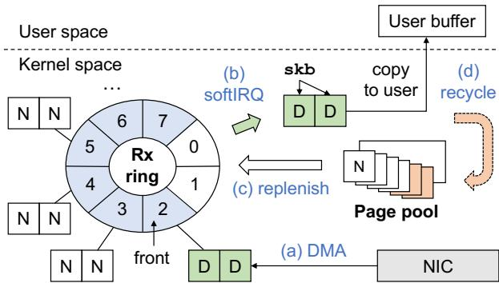  
Figure 1: Page lifecycle with Rx ring and page pool (N=new pages, D=DMAed pages): (a) the NIC DMAs incoming packets into the corresponding ring-buffer pages; (b) the softIRQ handler allocates skbs, detaches the DMAed pages from the Rx ring, and hands them off to the skbs; (c) consumed ring entries are replenished with new pages from the page pool; (d) after network processing (including data copy), the pages are returned to the page pool for reuse. See §2 for more details.

After packets are DMAed into the descriptor pages, the softIRQ handler allocates socket buffers (skbs, the Linux packet representation) and maps the DMAed pages into those skbs for subsequent packet processing. Meanwhile, the driver refills the Rx ring by drawing new pages from the per-core page pool2. Once processing completes—including data copy to userspace—the pages are returned to the page pool.

Modern LLC architecture. With DDIO support [33], incoming Rx packets are steered to the LLC rather than to DRAM. Thus, a solid understanding of modern LLC architecture is essential for explaining DDIO behavior. Unlike the monolithic private caches (L1/L2), modern CPUs adopt a sliced LLC architecture [47, 61]. Each LLC slice is shared across multiple cores and connected via a high-speed interconnect, enabling parallel access and improving overall memory bandwidth. Figure 2 illustrates a high-level view of the typical LLC architecture and its physical address mapping mechanism. For each memory reference, a slice-hash function takes both the tag and set bits as input to select a target slice; once the slice is determined, the set index is derived from the set bits (as in a monolithic cache), and the remaining tag bits are used to identify the matching cache line. Note that LLC microarchitectural details (e.g., the slice-hash function, the width of the set bits, the set mapping policy) are undocumented and vary across CPU platforms, necessitating in-depth analysis and re verse engineering with carefully designed microbenchmarks. Following well-known methodologies [47], our experiments reveal that, for our Intel Ice Lake system, the LLC comprises 2048 sets (11-bit index), 12-way associativity, and 26 slices. We further confirm that the slice-hash function uses the entire tag and set bits, and that the set index is derived directly from the set bits without any additional hashing.

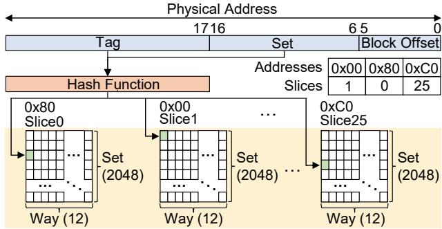  
Figure 2: LLC architecture and physical address mapping for Intel Ice Lake. When address 0xC0 is accessed, the slice hash (from the full set of tag and set bits) maps the address to a slice (e.g., slice 25). Given a set index of 3, the access targets the cache line in set 3 of slice 25. See §2 for more details.

DDIO write hits and misses. DDIO uses way partitioning, reserving a subset of cache ways for DDIO writes (i.e., deviceinitiated writes to the LLC), typically two ways per set, with behavior similar to CPU store instructions: when the cache lines for the descriptor-page addresses are already present in the corresponding LLC slices (in any way, not only the DDIO-reserved ones), they are updated in place (DDIO write hit); otherwise, DDIO allocates new lines within the DDIOreserved ways (DDIO write miss) [24, 33, 48, 60]. In either case, subsequent CPU reads (data copy) can hit in the LLC and avoid cold misses unless those lines have been evicted.

## 3 Revisiting Leaky DMA Problem

This section analyzes DDIO performance trends in modern Linux kernel stacks and identifies the underlying cause of the leaky DMA problem, focusing on Rx-side processing where CPU bottlenecks arise. We first describe our measurement setup (§3.1) and revisit the leaky DMA behavior with DDIO. We then present key observations and insights (§3.2), which lead to our motivation (§3.3).

## 3.1 Measurement Setup

Following the measurement methodology of prior studies [14, 15], we use a testbed consisting of two physical machines directly connected via a 200Gbps link to focus on CPU-bottleneck scenarios. Each machine has a 2-socket Intel Xeon Gold 6354 3.0GHz processor (18 cores per socket),

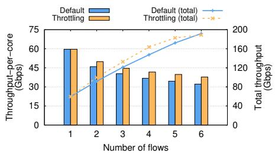  
(a) Throughput-per-core (Gbps).

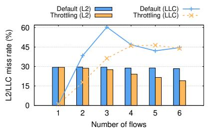  
(b) L2/LLC miss rate (%).

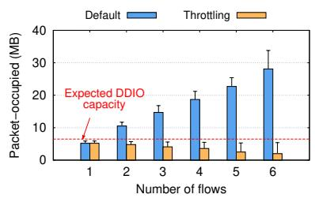  
(c) Total packet-occupied (MB).  
Figure 3: Leaky DMA performance with DDIO. (Default setting) Traditionally, the leaky DMA problem has been attributed to cases where the volume of incoming packets exceeds the DDIO capacity, causing packets stored in DDIO-reserved cache ways to be evicted before processing completes. This results in reduced throughput-per-core and increased LLC miss rates. (Throttling setting) However, throttling incoming traffic to stay within the DDIO capacity is insufficient to fully resolve the issue. See §3.2 for more details.

1.25MB per-core L2, 12-way 39MB LLC, 256GB DRAM, and an NVIDIA ConnectX-6 (200Gbps) NIC. Both machines run Ubuntu 20.04 with the Linux kernel 6.6. We enable TCP Segmentation Offload (TSO), Generic Receive Offload (GRO), Jumbo frames (9000B), Dynamically-Tuned Interrupt Moderation (DIM), and aRFS to maximize receiver-side CPU efficiency during network processing. We disable hyperthreading, IOMMU, and irqbalance, since these settings maximizes performance in our measurements. Unless stated otherwise, we use default values for all system parameters.

We use iperf [21] to generate long-lived TCP flows and measure total throughput, overall CPU utilization, L2 and LLC miss rates. Throughput-per-core is calculated as total throughput divided by total CPU utilization, representing the throughput achievable by one fully utilized core. This metric serves as an indicator of CPU efficiency in network processing. In addition, we measure the packet-occupied memory, the total memory consumed by incoming packets that have not yet completed processing (i.e., in-flight bytes); this metric allows us to estimate whether total in-flight bytes exceed the expected DDIO-reserved LLC capacity (hereafter, DDIO capacity). In our testbed, the DDIO capacity is approximately 6.5MB (39MB×2/12). We instrument the Linux kernel to measure packet-occupied memory in both the Rx socket buffer and the backlog queue, which holds packets when the corresponding socket is temporarily locked by user-level system calls [14]. To minimize overhead, we sample every 100 softIRQ events and record both the mean and the maximum with error bars (Figure 3(c)).

## 3.2 Understanding DDIO Miss Behaviors

We begin by reproducing the leaky DMA phenomenon observed with DDIO. Specifically, we measure throughput as the number of TCP flows increases, with each flow running on a separate core that shares the same LLC. Figure 3(a) shows that the Linux network stack (labeled “Default”) benefits from the LLC with a single flow but experiences a ∼46% drop in throughput-per-core as the number of flows increases from 1 to 6, primarily due to high LLC contention; correspondingly, the LLC miss rate rises to ∼60.4%, as shown in Figure 3(b).

(1) Single-flow case: Near-zero miss rates due to a small working set (DDIO write-hit regime). In the single flow case (one core), the NIC driver holds 16MB of pages by default (§2). We further observe that ∼6MB of additional pages are needed to replenish page-consumed Rx descriptors after the DMAed pages are handed to skbs (matching the maximum TCP Rx buffer memory size), so a single-flow replenishment cycle spans approximately 22MB in total. The key LLC behavior is that, even if DMAed pages are evicted from the DDIO-reserved ways (e.g., when more than two lines contend for the same set and slice), they are eventually reloaded into the LLC (likely into non-DDIO ways) by the CPU during the copy-to-user operation. Therefore, if the LLC can accommodate the entire page working set (∼22MB), subsequent DDIO writes tend to hit in the LLC, as DDIO can leverage all LLC ways rather than only the two DDIO-reserved ways. This explains why the single-flow case sees near-zero miss rate (0.9%) in Figure 3(b). To support this observation, we rerun the single-flow experiment while reducing the number of LLC ways available to that core from 12 (LLC mask: 0xFFF) to 2 (LLC mask: 0x003), as shown in Figure 4(a). With fewer ways, the reloaded pages are more likely to be evicted from the LLC, resulting in more DDIO write misses.

→Yet keeping the working set within the LLC capacity isn’t enough. To clarify the impact of working set size, we increase the ring buffer to 2048 (32MB) in the single-flow experiment, making the total working set ∼38MB, close to but below the LLC capacity (Figure 4(b)). Despite this, the LLC miss rate increases to 16.5% as shown in Figure 4(c) (while throughput drops by 11%). This indicates that simply keeping the page working set under the LLC capacity is insufficient to suppress LLC misses.

(2) Multi-flow case: High miss rates due to small DDIO capacity (DDIO write-miss regime). With two or more flows, the LLC cannot hold the entire page working set, so even CPU-reloaded pages are likely evicted before DDIO can reuse them on later writes. This shifts DMA traffic into a DDIO write-miss regime, where new lines are allocated in the DDIOreserved ways. However, because the aggregate incoming traffic (i.e., packet-occupied memory in Figure 3(c)) far exceeds the DDIO capacity in multi-flow cases, those new lines are rapidly displaced by subsequent DDIO writes, which in turn increases the LLC miss rate during the CPU reads.

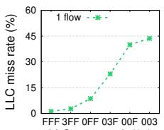  
LLC way mask (0x)

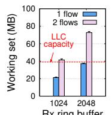  
Rx ring buffer

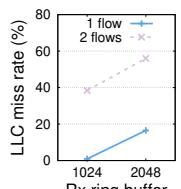  
Rx ring buffer  
(a) Limiting LLC ways. (b) Working set (MB). (c) LLC miss rate (%).  
Figure 4: DDIO write behavior. (a) Limiting the number of avail able LLC ways increases DDIO write misses even in the single-flow case, indicating that DDIO write hits drive low LLC miss rates. (b–c) The write-hit regime can collapse even with working sets near the LLC capacity, raising LLC miss rates. See §3.2 for more details.

→Yet throttling traffic below the DDIO capacity isn’t enough. Prior work suggests limiting in-flight bytes to fit within the DDIO capacity [58], so that CPU reads ideally hit in the LLC. Surprisingly, we find this is not sufficient by itself to keep LLC miss rates low. In Figure 3(c), we throttle the incoming rates of individual TCP connections (labeled “Throttling”) by adjusting the TCP receive buffer size, ensuring that total packet-occupied memory remains within the DDIO capacity even with multiple flows. However, Figure 3(b) reveals that Throttling does not suppress LLC misses; instead, the miss rate rises to as high as 46.4%.

Despite similarly high LLC miss rates at 4–6 flows (Figure 3(b)), Throttling still offers a slight improvement compared to Default (Figure 3(a)); our measurements indicate that, beyond three flows, its L2 miss rate decreases while Default’s remains unchanged, which is evidence of the improvement. This behavior is likely due to increased L2 hits on frequently recycled objects (e.g., skb) as the per-core throttled traffic (i.e., packet-occupied memory) approaches the L2 capacity. We also note that the average packet-occupied memory under Throttling decreases as the number of flows increases in Figure 3(c). This is because, given the same total incoming traffic, increasing the number of cores accelerates packet processing, which in turn reduces the average amount of packet-occupied memory before subsequent packets arrive.

## 3.3 Motivation: Conflict Misses Matter

To dive deeper into DDIO miss behavior, we analyze how the page working set is distributed across the LLC. Specifically, we compare the 1-flow and 2-flow cases under Throttling in Figure 3, configured so that both the Rx ring buffer and inflight bytes fit within the LLC capacity (22MB vs. 38MB), yet the LLC miss rates differ (0.9% vs. 18%). Our methodology is as follows: First, by leveraging well-known reverseengineering techniques [47], we identify the LLC details of our processor, including its slice hash function (§2). This allows us to compute the slice and set for any physical memory address. Second, we collect page-address traces while rerunning the two cases and examine the slice/set distribution over a working-set window. To quantify cache contention, we define a violation when the number of mappings to a particular slice/set exceeds the LLC associativity (i.e., 12 ways); the violation ratio is the fraction of such violations over all slice/set combinations.

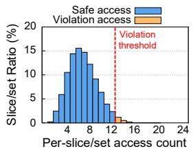  
(a) Working set size: 22MB.

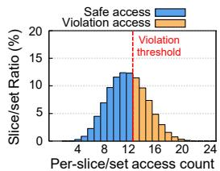  
(b) Working set size: 38MB.  
Figure 5: Violation ratio comparison (22MB vs. 38MB). For given page footprints: (a) when per-slice/set access counts stay at or below the violation threshold (i.e., ≤associativity), accesses are safe (blue bars), so evictions are unlikely; (b) counts above this threshold are violations (orange bars), indicating potential conflict misses and LLC underutilization. See §3.3 for more details.

Skewed page addresses lead to conflict misses and LLC underutilization. Figure 5(a) shows that, in the 22MB workingset case, mappings to any slice/set mostly stay below the associativity limit, yielding a violation ratio (orange bars) of only 1.97%. In contrast, the 38MB working-set case in Figure 5(b) jumps to 39.3% even though the working set still fits within the LLC. This indicates that parts of the LLC are underutilized because page addresses are skewed across slice/set mappings, which can lead to conflict misses. We note that a high violation ratio does not necessarily result in a high LLC miss rate; since tracing precise CPU access timing is prohibitively expensive, our analysis in Figure 5(b) does not reveal whether evictions occur before or after CPU reads. Nonetheless, a high violation ratio is necessary for high miss rates, whereas near-zero violation implies conflict misses are unlikely. In our measurements, we observe a clear correlation between violations and actual LLC misses.

Avoiding conflict misses is key. Revisiting the leaky DMA problem, we draw two key insights. First, expanding the DDIO allocation beyond two LLC ways [24, 64] is insufficient: in the DDIO write-hit regime, DDIO already exploits LLC ways outside the reserved portion. Although this provides DDIO with access to more LLC space, conflict misses still prevent full utilization of that space (Figure 5(b)). Second, throttling traffic to stay within the DDIO capacity [58] also falls short: our analysis reveals that capacity pressure is driven more by the page working-set size than by the amount of incoming traffic (Figure 3), while conflict misses further reduce the effective LLC capacity available to that working set (Figure 5(b)). These findings motivate a new design that actively reduces conflict misses to make DDIO effective, particularly for the applications that benefit from DDIO.

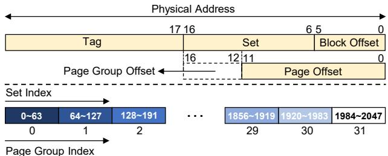  
Figure 6: Page group allocation. The set index and block offset fields span 17 bits in total. Of these, 12 bits are used as the 4KB page offset. Thus, five upper set index bits remain available for page grouping, which we refer to as the page group offset. Accordingly, the 2048 LLC sets in the system can be partitioned into 32 page groups, each consisting of 64 sets. See §4.1 for more details.

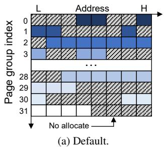

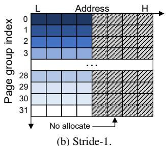  
Figure 7: Memory allocation behavior. (a) The default Linux buddy allocator ignores set indexing, resulting in uneven page distribution across page groups and set-level imbalance. (b) Stride-1 enforces set balance by allocating an equal number of pages to each of the 32 page groups. See §4.1 for more details.

## 4 Sepia: DDIO Meets Page Coloring

To tackle conflict misses, we bring a classical yet effective technique—“page coloring”—into the DDIO context, adapting it to the packet I/O path. In this section, we introduce Sepia, a color-aware page allocator for DDIO. We first outline our page-coloring methodologies (§4.1). We then evaluate how coloring improves the effective capacity of modern sliced LLCs in both DDIO write-hit and write-miss regimes (§4.2). Finally, we present our Sepia design that makes page coloring practical in real DDIO-enabled systems (§4.3).

## 4.1 Page Coloring Methodology

As modern processors employ a sliced LLC architecture (re call §2), we must design our coloring mechanism by considering its structural characteristics. Figure 6 shows the bit-level structure of a physical address. Under page-granularity allocation, the lower set index bits overlap with the page offset, so we can use only the upper five bits (e.g., bits 12–16 in Figure 6) for page coloring. We use these specific bits to partition memory into 32 page groups, where each group consists of pages sharing the same upper set index (i.e., page group offset). Accordingly, we employ this page group as the basic unit of our page coloring technique.

Baseline: Stride-1. We first observe that the default Linux page allocator (i.e., buddy allocator) operates in both set- and slice-agnostic ways, leading to significant conflict misses in the LLC. As illustrated in Figure 7(a), the allocator does not consider the set-index mapping, resulting in imbalanced pagegroup usage: it allocates more pages on some page groups, increasing pressure on the corresponding sets and causing frequent conflict misses. Likewise, the allocator ignores the slice mapping, leading to imbalanced slice usage as well. Thus, the default allocator suffers from both set- and slicelevel imbalance, directly degrading effective LLC capacity.

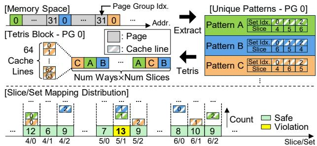  
Figure 8: Construction of a Tetris Block. First, unique slice/set mapping patterns are extracted from the physical memory space for each page group (e.g., PG 0). Then, these patterns are assembled (i.e., Tetris) into a Tetris block to maximize the balance of the slice/set mapping. However, due to the finite number of unique patterns, violations inevitably occur in the mapping distribution.

To address this issue, we introduce Stride-1, a practical page-coloring technique that improves effective LLC capacity by balancing both set and slice usage (Figure 7(b)). Stride-1 first achieves set balance by allocating the same number of pages to each of the 32 page groups. Within each page group, it then allocates physical pages sequentially in ascending address order, leveraging an inherent behavior of modern LLC slice-hash functions (i.e., contiguous physical addresses tend to be distributed across slices), which is shown in prior work [46] and also confirmed by our own reverse engineering. By combining set-balanced allocation with this intrinsic slice-spreading behavior, Stride-1 successfully eliminates set conflicts and substantially reduces slice conflicts.

We observe that, while Stride-1 substantially reduces slice conflicts, it cannot fully eliminate slice-level imbalance due to an inherent hardware constraint. Modern processors often employ a non–power-of-two number of LLC slices (e.g., 26 in our system), which introduces modulo bias in the slice-hash function [47]. As a result, slice mappings are not uniformly distributed, creating hotspots on specific slices even when pages are allocated contiguously. This slice imbalance represents a fundamental limitation that prevents Stride-1 from achieving perfectly balanced slice usage.

Tetris: Slice-balanced Stride-1. To quantify how much performance potential remains beyond Stride-1, we further introduce Tetris, a theoretically optimal page-allocation sequence designed to minimize slice conflicts. Unlike Stride-1’s sequential allocation, Tetris leverages reverse-engineered slice/set mappings to construct an allocation order that achieves nearperfect slice balance. As illustrated in Figure 8, Tetris first extracts all unique patterns (i.e., distinct per-page slice/set mappings). For each page group, it then assembles these patterns into a Tetris block, a carefully arranged sequence that balances slice usage within that group. We use this Tetris block as the allocation unit, allowing us to achieve an optimally balanced slice distribution under page-granularity constraints. Tetris therefore serves as an upper bound, revealing how much headroom remains if Stride-1 were to run under a perfectly slice-balanced distribution in a system with a nonpower-of-two number of LLC slices. In the following section, we rigorously evaluate the effective LLC capacity of three allocation mechanisms: Default (slice/set-imbalanced), Stride-1 (set-balanced and partially slice-balanced), and Tetris (setbalanced and fully slice-balanced).

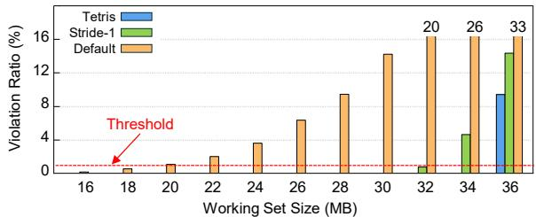  
Figure 9: Evaluation of effective LLC capacity. Comparison of violation ratio across working set sizes. We define the effective LLC size as the working set size at which the violation ratio remains negligible (< 1%) (Default: 18MB, Stride-1: 32MB, Tetris: 35MB (0.04%, not shown)). See §4.2 for more details.

## 4.2 Validation of Coloring Effectiveness

This subsection quantifies the gain in effective LLC capacity achieved by coloring compared to Default.

Experimental setup. We evaluate the three schemes across a range of allocation sizes to examine their sensitivity under different working set sizes. We use the violation ratio (defined in §3.3) as our metric, as we observe that it strongly correlates with cache miss rates. To control page allocation patterns, we use a large physical memory chunk for all three schemes. To quantify their effectiveness, we employ the effective LLC size, defined as the maximum working set size where the violation ratio remains negligible (< 1%).

Analysis of effective LLC size (Write-hit regime). Figure 9 illustrates how the violation ratio changes as the working set size increases. First, we observe that Default fails to utilize the cache efficiently, limiting its effective LLC size to only 18MB (46.2% of capacity). In contrast, Stride-1 significantly shifts the point at which the violation threshold (1%) is reached, extending the effective LLC size to 32MB. This represents a 77.8% expansion in effective capacity compared to the baseline, allowing Stride-1 to utilize 82.1% of the total LLC. Tetris further pushes this limit to 35MB (89.7% of capacity). However, although Tetris represents the theoretical optimum, it does not reach 100%. As shown in Figure 8, this gap arises from the finite number of unique mapping patterns; since memory allocation operates at page granularity, the reuse of patterns inevitably causes set collisions on specific slices, thereby bounding the maximum achievable capacity.

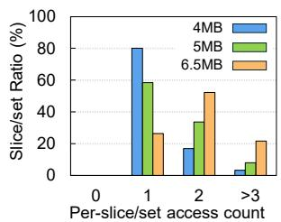  
(a) Violation analysis of Stride-1.

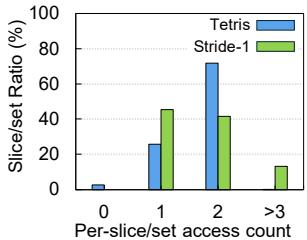  
(b) Tetris vs Stride-1 (5.5MB).  
Figure 10: Comparison of slice/set distributions. (a) The effective DDIO capacity of Stride-1 is limited to 3MB (not shown), where the violation ratio remains 0%. (b) Tetris extends the effective DDIO capacity up to 5.5MB while maintaining a 0% violation ratio through optimized slice/set mapping. See §4.2 for more details.

We note that Tetris’s violation ratio spikes from 0.04% to 9.43% beyond 35MB, exposing a critical dependency on a perfectly predefined allocation order. Given that this order is inevitably disrupted in real systems (detailed in §4.3), Tetris is practically infeasible.

Analysis of effective DDIO capacity (Write-miss regime). To verify whether the benefits of coloring observed in the full LLC carry over to the restricted DDIO region, we repeat the analysis with 2-way DDIO associativity. Figure 10 shows that coloring effectiveness is notably reduced compared to the full LLC results. While Stride-1 and Tetris utilized 82.1% and 89.7% of the total LLC, their efficiency in the 6.5MB DDIO region drops significantly to 46.2% (3MB) and 84.6% (5.5MB), respectively. This degradation highlights the impact of non-uniform mapping (i.e., modulo bias detailed in §4.1); the restricted 2-way associativity provides insufficient buffer to tolerate skewed load distributions among slices. Therefore, DDIO performance can be limited if we rely on coloring exclusively within such a restricted LLC region.

## 4.3 Sepia Design

We now present Sepia, which realizes the Stride-1 coloring over DDIO-enabled CPU cores; as discussed in §1, applying page coloring to DDIO scenarios creates new opportunities for CPU-efficient packet processing. However, two design challenges remain: inter-core and intra-core interference. First, since CPU cores share the LLC, colors must be balanced across cores to maximize effective LLC capacity while minimizing coordination overhead among per-core page pools. Second, although network processing behavior is deterministic, page recycling times can still vary within the same page pool, paced by application read calls. Thus, the allocator must choose the best color from the (recycled) pages currently available in the pool when replenishing the Rx ring. Once pages are submitted to the NIC, the corresponding ring entries are fixed and cannot be recolored until those entries are replenished. From these insights, our design goal is simple: keep a per-core, color-aware page pool robust to cross-core conflicts and uneven page recycling speeds. To this end, we introduce two design components: (1) Sepia Manager, which builds per-core colored page pools and tracks page availability; and (2) Sepia Allocator, which selects the best available page at allocation time.

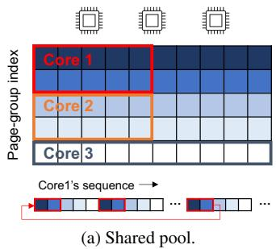

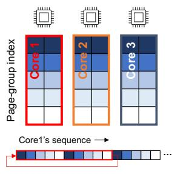  
(b) Per-core pool.  
Figure 11: Sepia Manager constructs per-core page pools, which is the right design that reduces working-set reconstruction overhead. See §4.3 for more details.

Sepia Manager. The Sepia Manager organizes the Rx-ring working set as a two-dimensional page array (see Figure 7(b)), which enables the Stride-1 allocation strategy. This page array is modeled after the structure of the LLC: vertically, there are N page-groups, and horizontally, M pages per group; pages within the same group share the same color. The value of N is determined by the LLC specification (§4.1); M is then set by the total number of pages required by each Rx ring. For example, if we provision 16MB per ring with 32 page groups, then M = 128 pages per group (32 × 128 × 4KB= 16MB).

For scenarios where multiple cores contend for the LLC via DDIO writes, we consider two options for constructing the colored page pool: (1) assign a subset of page groups to each core while sharing a single pool (Figure 11(a)); or (2) provision a separate per-core pool that permits access to all page groups (Figure 11(b)). The first option reduces cross-core conflicts but raises management costs: we must track which cores are active to assign page groups preferentially to busy cores for better LLC utilization. Moreover, since pages already submitted to the NIC cannot be recolored, any working-set rebuild triggered by changes in active-core counts must wait for a full recycle turn, consuming the previously colored pages in the meantime. Finally, color distribution can become unfair depending on the number of active cores and the value of N. For example, in Figure 11(a), Core 3 is assigned a single page group while others receive two. Sepia avoids this overhead by building per-core colored page pools (Figure 11(b)), allowing each core to operate independently without tracking other cores’ status. While the per-core pool design accepts some cross-core interference as a trade-off, each core can draw from the full set of page groups, which helps keep per-group page counts balanced across cores on average.

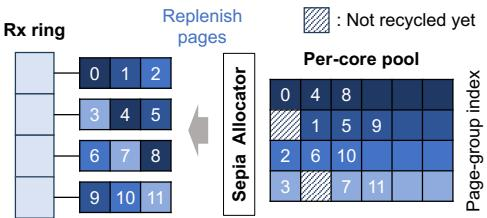  
Figure 12: Sepia Allocator selects pages one by one from each page-group index, choosing the earliest page within the group. The numbers inside the pool illustrate an example allocation order. When previously unavailable pages are recycled, they become eligible for selection in subsequent rounds. See §4.3 for more details.

Sepia Allocator. The Sepia Allocator is responsible for providing pages from the per-core page pools. Ideally, allocation cycles through page groups sequentially in a wraparound manner—i.e., the Stride-1 pattern over a contiguous memory chunk, as illustrated in Figure 11(b) (see “Core 1’s sequence”). This ideal ordering is attainable at initialization; however, as pages are recycled, the order in which they return for Rxring replenishment may diverge from the original allocation, creating gaps—or “page holes”—in the pool, as shown in Figure 12. Given that the recycle timing of individual pages is outside our control, Sepia prioritizes preserving sequential color ordering during Rx-ring replenishment. If the Sepia Allocator encounters a page hole during sequential allocation, it selects the next available page within the same group (and thus the same color). This ensures that Rx descriptor pages are filled in page-group order and preserves the low-conflict allocation pattern. A simplified example of this scenario is illustrated in Figure 12. Additionally, the allocator prefers the earliest available page per group, which helps minimize the active working set at light load. Lastly, if a particular page group reaches the right boundary (M) earlier than others due to page holes, the Sepia Allocator skips that group until pages become available. Once the pool is exhausted, it falls back to the standard Linux allocator. Although this may temporarily introduce non-colored pages into the pool, Sepia continues to manage and prioritize colored pages. As the load decreases and colored pages are recycled, Sepia can naturally restore the effectiveness of page coloring (§6.3).

## 5 Sepia Implementation

We implement the Sepia prototype in the Linux kernel 6.6. Although our current implementation is integrated with a specific network device driver (ConnectX), our goal is to provide a generic API for network drivers, thereby minimizing the effort required to port Sepia to other network drivers. This portability is enabled by the fact that Sepia’s implementation is decoupled from any driver-specific logic.

Page working set management. Sepia requires a carefully constructed working set of well-aligned, consecutive pages to minimize cache conflicts. Since the default Linux memory allocator does not provide this level of control, we leverage the Contiguous Memory Allocator (CMA) [18] to obtain large, physically contiguous memory regions suitable for coloringaware allocation. Specifically, we pre-allocate 16MB of pages per core (4MB for the Rx ring and 12MB for descriptor replenishment). Given that our testbed has 18 DDIO-enabled cores, this results in a total allocation of 288MB of contiguous memory, comparable to the default Linux footprint for Rx rings (excluding packet-occupied memory). When additional pages are further needed, Sepia falls back to the standard Linux allocator as discussed in §4.3.

Sepia interfaces. To facilitate driver integration, we introduce Sepia interfaces, for example, sepia\_init() to initialize percore colored page pools. The function sepia\_alloc() can be invoked by network drivers when new pages are needed for Rx descriptor replenishment. Initially, the network drivers populate Rx descriptors using the default Linux allocator. However, once Sepia detects that a core is actively consuming Rx descriptors and a colored page pool has been created, Sepia seamlessly switches the replenishment source to the Sepia Allocator. This implementation design allows Sepia to operate transparently alongside existing kernel infrastructure while optimizing memory placement and minimizing cache conflicts during high-throughput packet processing. Note that Sepia recognizes colored pages by verifying that their addresses lie within the CMA-allocated range, which ensures they are correctly returned to Sepia’s pools during recycling.

Handling capacity misses in Sepia. While Sepia focuses on reducing conflict misses, CPU efficiency is typically maximized when both capacity and conflict misses are effectively avoided. In the write-hit regime, Sepia expands the effective working set by 77.8% over Linux (Figure 9); thus, if the aggregate working set is kept beneath this effective LLC budget, both types of misses can be avoided. Prior proposals shrink the working set by cross-core Rx-ring sharing [51, 52], but they operate in user space [2] or on the device. We instead tune the per-core Rx ring (we plan to integrate the prior approach [51] into Sepia as future work). Considering that, in our default setup, the NIC’s DIM [3] is configured to coalesce up to 128 packets (∼1.1MB at 9000B MTU) before triggering softIRQ and ring sizes are powers of two, we set Sepia’s default to 4MB per core (ring size 256) as our baseline configuration to constrain the working set. In our evaluation, this setup successfully replenishes the consumed ring entries before the next DMA arrivals; for comparison, we also evaluate the default ring in §6.2. In addition, reducing TCP Rx buffer further helps shrink the working set; for example, combining 4MB per-core rings with 4MB TCP Rx buffer (tcp\_rmem) per core keeps Sepia’s working set within the effective LLC capacity (32MB; Figure 9) up to 4 cores (∼8MB per core), saturating 200Gbps with ∼4 cores (§6.1). We use this configuration for Sepia in our microbenchmarks to evaluate the best-case regime.

In the write-miss regime (aggregate working set > LLC capacity), the key is to keep total in-flight bytes below the effective DDIO capacity. On our platform, two DDIO ways yield only ∼3MB effective capacity (Figure 10). Although system-wide TCP tuning (as in §3) could enforce this, throttling every connection under such a tight budget is impractical: per-flow traffic monitoring and rate regulation typically incur high overhead as flow loads vary over time [30]3. Accordingly, we use the write-hit regime to represent the best case (we also evaluate excessive working-set scenarios).

## 6 Evaluation

This section evaluates Sepia’s effectiveness across diverse experimental setups and real-world applications. We first perform microbenchmarks, comparing it with default Linux (§6.1). Next, we provide a performance breakdown of Sepia in terms of throughput-per-core to understand the performance gains in the best-case regime (§6.2). Finally, we evaluate Sepia with real-world applications, including SPDK, Nginx, and Memcached (§6.4). We describe each setting in place. Unless stated otherwise, we use the same evaluation setup described in §3.1.

## 6.1 Microbenchmarks

We use iperf [21] for our microbenchmarks, varying the number of flows with one flow per core as we did in §3. Specifically, we use two configurations of Sepia discussed in §5 to evaluate it under (1) the write-hit regime, where capacity and conflict misses are avoided (best case), and (2) the write-miss regime, where capacity misses occur (worst case).

Write-hit regime. Our goal is to understand how increasing the effective LLC capacity translates into improved CPU efficiency. In Figure 13(a), we first observe that Sepia improves throughput-per-core by ∼1.51× compared to Default, saturat ing the 200Gbps link with 3.5 cores, whereas Linux requires 6 cores to reach link saturation (Figure 13(b)). This is because DDIO’s benefits are maximized with near-zero LLC miss rates (∼0.4%) up to 6 flows (cores) (Figure 13(c)). To further investigate how Sepia achieves this, we plot its working set size corresponding to Figure 13, as shown in Figure 14. As discussed earlier, each working set consists of per-core Rx descriptor pages and packet-occupied memory (i.e., in-flight bytes controlled by TCP). Consequently, the Rx descriptor portion of the working set increases linearly with the number of cores (i.e., 4MB per core), as shown in Figure 14. On top of this, the packet-occupied memory increases to ∼7.8MB up to 3 cores, and then decreases as the link becomes saturated (we discussed this phenomenon in §3.2). Since Sepia increases the effective LLC capacity from 18MB to 32MB via the color-aware allocations (Figure 14), it can avoid both capacity and conflict misses up to 6 cores (and also 7 cores;

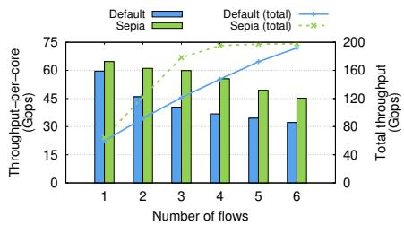  
(a) Throughput (Gbps).

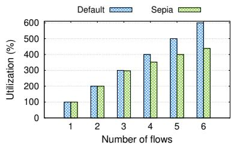  
(b) CPU utilization (%).

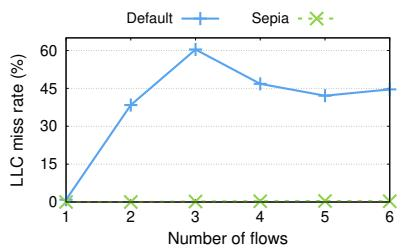  
(c) LLC miss rate (%).

Figure 13: DDIO write-hit regime: Sepia’s benefits are maximized as both capacity and conflict misses are avoided. (a) Sepia achieves up to 1.51× improvement in terms of throughput-per-core, compared to Default, reaching the link saturation (200Gbps) using (b) 2.5 fewer cores than Default, (c) while keeping near-zero LLC miss rates (∼0.4%). See §6.1 for more details.  
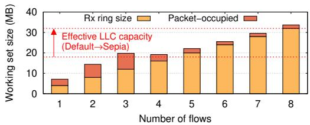  
Figure 14: Sepia’s working set trend (write-hit regime). Our color aware allocation expands the effective LLC capacity from 18MB to 32MB, accommodating the page working sets of up to 7 cores.

results not shown). These results also confirm that our analysis in §4.2 matches real-world experiments. Note that if our LLC were fully slice-balanced (so that the effective capacity would become 35MB in our system), LLC misses would be suppressed up to 8 cores.

Write-miss regime. In Figure 15, we further increase the number of flows from 8 to 18 using all available DDIO-enabled cores. Sepia’s working set starts to exceed the effective LLC capacity at 8 flows (Figure 14), thus shifting to the write miss regime and showing a 1.5% LLC miss rate (> 1%). As the number of flows grows to 18, Sepia’s LLC miss rates increase up to 16.4% (Figure 15(b)). We find that after 8 flows, Sepia’s packet-occupied memory fluctuates between 2.6–3.7MB; given that the effective DDIO capacity for Sepia is around 3MB (Figure 10), this can lead to high LLC miss rates. Nonetheless, Sepia still shows lower LLC miss rates than Default, achieving better CPU efficiency overall (Figure 15(a)) even in the worst-case scenarios, where capacity misses are unavoidable.

## 6.2 Understanding Performance Gains

To understand how Sepia improves CPU efficiency and to quantify the contribution of each technique, we perform an ablation study by enabling our mechanisms one at a time under the best-case scenario shown in Figure 13. Starting from the baseline Linux allocator (Default), we first replace Linux’s page allocator with our Sepia Allocator (Stride-1). Next, we reduce the default Linux Rx ring size by throttling the number of ring entries to 256 while retaining the baseline Linux allocator (Ring Throttling). This setup evaluates the effect of working set reduction, following a similar approach to SHRing [51]. Lastly, We evaluate Sepia, which incorporates both Stride-1 and our working-set throttling techniques (i.e., limiting the number of ring entries and the TCP buffer size). Figure 16 shows the performance breakdown across different configurations, where the x-axis denotes the number of concurrent flows and the y-axis reports throughput-per-core.

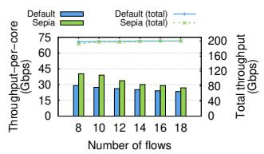  
(a) Throughput (Gbps).

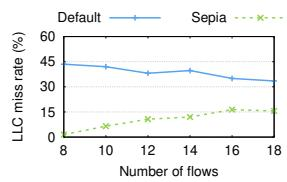  
(b) LLC miss rate (%).  
Figure 15: DDIO write-miss regime: Sepia’s benefits shrink as capacity misses become unavoidable. (a) Even in this worst-case scenario, Sepia still improves throughput-per-core, and (b) reduces LLC miss rates compared to Default. See §6.1 for more details.

Stride-1. Overall, Stride-1 improves per-core throughput by up to 11.4% (8.62% on average) by increasing the effective LLC capacity through reduced conflict misses compared to the default Linux memory allocator. With a single flow, the total working set size (21.2MB on average), including Rx ring and TCP buffers, exceeds the baseline’s effective LLC capacity (18MB) but fits within that of Stride-1 (32MB). Here, Stride-1 reduces unnecessary LLC conflicts and lowers the LLC miss rate (from 0.9% to 0.1%), yielding a modest but measurable throughput improvement. As the number of flows increases, the working set exceeds the effective capacity of both Default and Stride-1, making both cases operate in the DDIO write miss scenario. In this case, efficient use of the DDIO-reserved ways becomes critical. Note the leaky DMA problem becomes even more severe with fewer available ways, making it difficult for the baseline to utilize the DDIO-reserved ways efficiently. On the other hand, Stride-1 can mitigate this problem, so DDIO write misses are more uniformly distributed across LLC slices and sets, improving overall efficiency even under high flow counts.

Ring Throttling. The results show that throttling the Rx ring also provides meaningful performance benefits. With a single flow, its performance is comparable to Default because the Default’s working set size is already small and fits within the effective LLC capacity. However, as the number of flows increases, Rx ring throttling provides substantial performance improvements over both Default and Stride-1. This is because its reduced working set improves the LLC efficiency, resulting in lower LLC miss rate. To quantify this effect, we additionally measure the memory bandwidth consumption for each configuration at 4 flows (Table 1). The results show that Ring Throttling reduces memory bandwidth usage by 47.0% and 44.7% compared to Default and Stride-1, respectively.

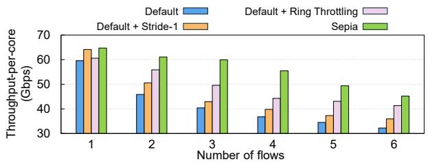  
Figure 16: Sepia performance breakdown. This result indicates that Sepia’s color-aware allocation (together with Ring Throttling) allows the network stack to utilize the LLC more efficiently during DDIO. See §6.2 for more details.

Table 1: Memory bandwidth consumption for the 4-flow case in Figure 16. This result indicates that Sepia is more cache-friendly, requiring less memory bandwidth than the other configurations.  
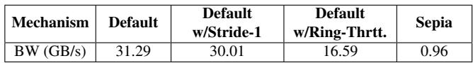

Sepia. On top of Stride-1, Sepia adopts working-set throttling techniques: limiting both the number of active ring entries and the TCP buffer size. For lower flow counts (1–4 flows), the working set can fit within the effective LLC capacity because Sepia reduces the working set size compared to the baseline. This allows additional flows to continue operating in the DDIO write hit scenario. Here, the combination of Stride-1 (larger effective capacity) and memory throttling (smaller working set) produces a clear synergistic effect, yielding substantial throughput improvements by up to 50.8%. For higher flow counts (5–6 flows), the working set again exceeds the LLC effective capacity, placing all cases in the DDIO write miss scenario. Here, Sepia shows consistent performance improvement over Default and Stride-1. This is because Sepia can improve L2 cache efficiency by constraining the number of active descriptor pages per core. This reduces the overall load-miss stall cycles, leading to higher throughput.

In summary, Sepia delivers significant performance improvement across all flow counts by reducing the working set size, amplifying the benefits of color-aware page allocation, and improving L2 efficiency.

## 6.3 Performance under Bursty Workloads

We now evaluate Sepia under an extreme scenario where its page pool is exhausted by bursty DMA requests, causing the default Linux allocator to introduce non-colored pages into the pool. To generate this bursty workload, we increase the number of flows on a single core, each using a 6MB TCP Rx buffer, to consume Sepia’s per-core page pool more aggressively. Figure 17(a) shows the non-colored page ratio (i.e., the fraction of non-colored pages in the pool), along with the corresponding average LLC miss rate for different numbers of flows. With 4 flows, non-colored pages account for 35% of the pool, increasing the LLC miss rate to 3.5% and reducing total throughput from 64Gbps to 55Gbps compared to the 1-flow case. Based on these static measurements, we then alternate between 1 and 4 flows every 20 seconds, as shown in Figure 17(b). The results demonstrate that Sepia effectively recovers from colored-page depletion as soon as enough colored pages become available.

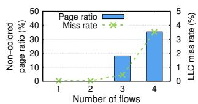  
(a) Page ratio and miss rate (%).

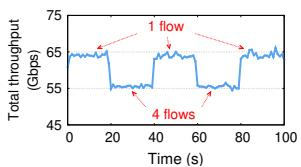  
(b) Total throughput (Gbps).  
Figure 17: Sepia performance under bursty workloads. (a) Pagepool exhaustion can introduce non-colored pages from the default allocator, increasing LLC miss rates. (b) Sepia quickly recovers once enough colored pages become available. See §6.3 for more details.

## 6.4 Real-world Applications

SPDK. We evaluate Sepia using SPDK, a high-performance userspace storage stack. Specifically, we use NVMe-over-TCP, which connects host and target machines through the Linux network stack [28, 29, 62]. The host NVMe initiator generates SPDK read requests with two block sizes (64KB, 128KB) and a queue depth of 16. For the NVMe remote target, we deploy 36 SPDK polling threads pinned to 36 cores, so that the initiator with Sepia becomes the bottleneck. We use a NULL block device [8] for a backend storage medium to eliminate the storage bottlenecks. We measure the average I/O bandwidth across different numbers of NVMe-over-TCP connections (five runs for each configuration), as shown in Figure 18. The results show that Sepia improves I/O bandwidth by up to 26.7% for 64KB blocks and 51.1% for 128KB blocks. Notably, Sepia shows huge performance improvement over the default Linux kernel when the working set is kept within the effective LLC capacity. The benefit becomes much larger with 128KB blocks, where each request spans more packets and enlarges the working set size. In this case, the default Linux quickly encounters conflict misses and LLC capacity pressure (due to higher portion of packet occupied), leading to significant performance degradation. On the other hand, Sepia achieves stable link-saturating throughput without any performance degradation at higher connection counts (>6). These results demonstrate that Sepia substantially improves real-world I/O performance.

Nginx. We evaluate Sepia using Nginx [7], a widely used web server, running all worker processes over DDIO-enabled cores.

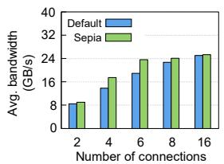  
(a) Block size: 64KB.

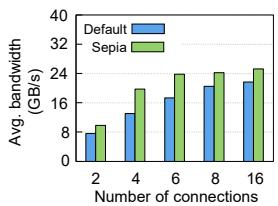  
(b) Block size: 128KB.

Figure 18: Evaluation results with SPDK. Sepia achieves up to 1.27× and 1.51× improvements in average bandwidth over the default Linux with 64KB and 128KB block sizes, respectively.  
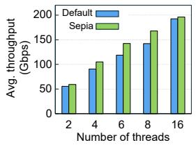  
(a) Web page size: 2MB.

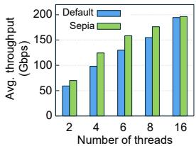  
(b) Web page size: 4MB.  
Figure 19: Evaluation results with Nginx. Sepia achieves up to 1.2× and 1.27× improvements in average throughput over default Linux with 2MB and 4MB web page sizes, respectively.

For input traffic, we use the wrk benchmark [27] to generate HTTP POST requests, so that the Nginx server with Sepia becomes the bottleneck on the receiver side. We configure one TCP connection per wrk thread and increase the number of threads to scale the request concurrency. We compute upload bandwidth (requests/sec × payload size) and report the average upload bandwidth over five runs for each configuration (Figure 19). Following prior work that reports the average size of modern webpages to be around 2MB [32], we evaluate two payload (web page) sizes: 2MB (Figure 19(a)) and 4MB (Figure 19(b)). With 2MB payload, Sepia improves the upload bandwidth by up to 20% at six wrk threads. With 4MB payload, Sepia achieves up to 27.1% bandwidth improvement at four wrk threads. Larger payloads increase the number of packets per HTTP request and enlarge the descriptor working set, making the default Linux allocator more susceptible to LLC capacity pressure. In contrast, Sepia can keep their working set compact, allowing Nginx to sustain higher upload bandwidth over Default across all configurations.

Memcached. We evaluate Sepia using Memcached, one of the most widely used in-memory key-value applications [5]. We use four Memcached worker threads and pin them to four CPU cores to evaluate how efficiently each scheme can handle incoming requests under constrained resources. On the client side, we use Memtier benchmark [6] configured to issue 100% SET requests to ensure the Memcached server with Sepia becomes the bottleneck. Similar to Nginx evaluation, we create one TCP connection per client thread, and use a pipeline depth of four. We measure the average throughput by varying the number of client threads (Figure 20). Here, we use four different value sizes: 4KB, 64KB, 512KB, and 1MB. The 4KB value size represents a workload with limited

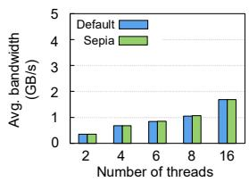  
(a) Value size: 4KB.

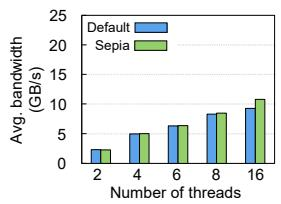  
(b) Value size: 64KB.

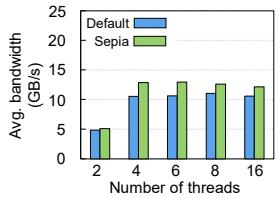

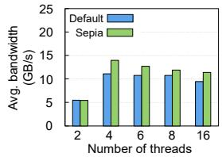  
(c) Value size: 512KB.  
(d) Value size: 1MB.  
Figure 20: Evaluation results with Memcached. For workloads with limited DDIO benefit (e.g., 4KB values), Sepia matches the performance of default Linux. As the value size increases to 512KB and 1MB, where DDIO efficiency becomes more important, Sepia improves average bandwidth by up to 1.26× over default Linux.

DDIO benefits, because each request touches only a small amount of data. As shown in Figure 20(a), Sepia does not degrade performance compared to Default even for this workload, indicating that it can remain safely enabled when DDIO benefit is limited. Starting from 64KB, Sepia begins to show modest benefits (Figure 20(b)). For larger value sizes, where DDIO efficiency becomes more important, Sepia provides clearer improvements: up to 22% with 512KB values (Figure 20(c)) and up to 25.9% with 1MB values (Figure 20(d)). Note that Sepia sustains higher throughput once the server becomes core-saturated (more than four threads), indicating that Sepia processes requests more efficiently under resourceconstrained environment. This throughput improvement is also aligned with latency results. With 512KB, Sepia reduces average latency from 0.74ms to 0.60ms. With 1MB, Sepia provides more latency reduction from 1.40ms to 1.12ms.

## 7 Discussion

This section further discusses how Sepia complements existing solutions and can be extended to future architectures.

Sepia’s benefits with shared ring buffer schemes. Our work shows that conflict misses are another key contributor to high LLC miss rates in DDIO operations, making Sepia complementary to existing shared ring buffer schemes such as SHRing [51]. SHRing reduces cache capacity misses by sharing DMA buffers across flows, while Sepia reduces conflict misses by allocating colored pages. Two aspects of the cache footprint are particularly important. First, the TCP Rx buffer contributes to the total cache footprint in addition to Rx ring pages, so the total working set size can increase beyond the ring size, imposing higher cache capacity pressure. By increasing effective cache capacity, Sepia can also improve the effectiveness of SHRing. Second, under heavy incoming traffic, SHRing’s single shared ring may need to allocate more pages to accommodate concurrent DMA requests. In this case, SHRing can benefit from a larger effective ring size because Sepia reduces conflicts among DMA target pages.

Sepia’s benefits with zero-copy receive. DDIO efficiency remains important even when zero-copy is enabled, because applications may still read or write network data after it has been received. Sepia can therefore benefit such applications by allowing them to access received data from the LLC instead of main memory. One possible extension is to expose an application-level allocation interface that returns pages from the Sepia Manager rather than from the standard memory allocation datapath. This would ensure that the NIC can directly DMA into page-colored application buffers.

Sepia’s benefits with different and future architectures. While Stride-1 can utilize 82.1% of the total LLC capacity in our hardware configuration (§4.2), our additional simulations suggest that power-of-two slice counts (e.g., 16 slices [47]), would allow Stride-1 to utilize 100% of the LLC capacity by eliminating slice-hash imbalance. However, this architectural property alone is not sufficient: without color-aware allocations, cache utilization remains similar to Figure 5(b), even under power-of-two slice configurations. We also found that, for non-power-of-two slice counts, using only tag bits in the slice hash function can make Tetris more feasible, as all sets within the same page map to the same slice, making it easier to find alternative Tetris blocks for unrecycled pages. These observations provide useful insights for hardware vendors designing future architectures that better support cache-friendly network processing with Sepia, while applying Sepia to other CPU architectures, such as AMD, remains future work.

## 8 Related Work

Improving cache efficiency. Prior work has found that direct cache access (e.g., DDIO) becomes inefficient as network bandwidth increases across both user-space and kernel network stacks [14, 23, 58]. Intel Cache Allocation Tech nology (CAT) can isolate cache usage across applications; however, it cannot isolate I/O traffic, so I/O operations still contend for DDIO-reserved cache ways [58]. To reduce this contention, prior work either limits the buffer size to match the DDIO cache capacity [58] or ensures that the I/O working set fits within the LLC capacity [51, 52]. Nevertheless, we show that avoiding capacity misses alone is insufficient. NeBuLa reduces network queuing and improves RPC tail latency by pushing RPC payloads directly into the processor’s L1 cache [57]. Finally, NanoPU [31] extends NeBuLa’s scheme to transfer data directly from the NIC into CPU registers.

Page/cache coloring. Prior work has shown that page/cache coloring can improve cache performance by reducing cache contention and conflict misses [42, 59, 63, 66, 67], but these benefits have primarily been explored for application memory accesses. For example, Memstrata [67] treats Compute Express Link (CXL) memory as a second tier and local memory as a cache to extend memory capacity with Intel Flat Memory mode; to avoid inter-virtual machine (VM) interference in local memory, it uses page coloring to provide performance isolation across VMs. With DCA support, NIC-induced cache conflicts can also degrade performance, while Sepia mitigates them with page coloring to improve CPU efficiency (§6).

Improving CPU efficiency. Hardware-based solutions [17, 55] achieve zero-copy processing by allowing applications to provide their buffer addresses directly to the NIC, so the NIC can DMA data straight into application memory. Recently, Linux has added support for TCP zero-copy send and receive [19, 20], which may require hardware features such as header–data split. Cornflakes leverages the NIC’s scatter-gather capability to aggregate small messages into a single packet, achieving zero-copy processing to reduce latency [54]. Beyond zero-copy, there are works aiming to reduce other packet processing overhead. For example, NetChannel reduces CPU load by recycling pages—after data copies—into Rx descriptor memory pools, thus avoiding expensive slow-path memory allocations [15]. Sepia is orthogonal to these approaches and can further boost CPU efficiency alongside them as discussed in §7.

Network stacks for scaling/scheduling resources. NetChannel [15] disaggregates network processing into multiple layers, enabling each layer to scale and schedule independently; this allows the Linux network stack to saturate terabit network links. Similarly, FlexToE [56] parallelizes the TCP processing pipeline into multiple processing units within smartNICs to scale the performance. And also, there has been a lot of recent work on userspace network stacks [11, 26, 36, 37, 38, 39, 43, 44, 45, 49, 50, 53, 65]. Integrating Sepia with these userspace stacks would be interesting future work.

## 9 Conclusion

In this paper, we revisit DDIO’s leaky DMA problem and show that conflict misses are a missing piece in understanding high LLC miss rates in DDIO. By introducing page coloring into DDIO, we demonstrate that the effective LLC capacity can increase by up to 77.8–94.4% over Linux, substantially improving cache utilization. Building on this insight, we design Sepia, a color-aware page allocator that reduces LLC conflict misses during packet processing. Our Sepia prototype implemented in the Linux kernel saturates a 200Gbps link with 3.5 cores (2.5 fewer cores than Linux), while maintaining near-zero LLC miss rates in the best-case scenarios.

## Acknowledgments

We would like to thank the anonymous OSDI reviewers for their insightful feedback. This work was supported by Institute of Information & communications Technology Planning & Evaluation (IITP) grant funded by the Korea government (MSIT) (RS-2024-00459026, RS-2024-00405128, RS-2024- 00349594, RS-2024-00395134, RS-2025-02217106). The corresponding authors are Jaehyun Hwang and Joonsung Kim.

## References

[1] net/mlx5e: Support RX multi-packet WQE (Striding RQ). https://patchwork.ozlabs.org/project/net dev/patch/1460928725-18741-6-git-send-email-s aeedm@mellanox.com/, 2016.

[2] SHRing - DPDK. https://github.com/BorisPis/sh Ring-dpdk, 2025.

[3] Dynamically-Tuned Interrupt Moderation (DIM). ht tps://enterprise-support.nvidia.com/s/article/ dynamically-tuned-interrupt-moderation--dim-x, 2026.

[4] Ethtool. https://linux.die.net/man/8/ethtool, 2026.

[5] Memcached - a distributed memory object caching system. https://memcached.org, 2026.

[6] memtier\_benchmark. https://github.com/redis/mem tier\_benchmark, 2026.

[7] nginx. https://nginx.org/en/, 2026.

[8] Null block device driver. https://docs.kernel.org/ block/null\_blk.html, 2026.

[9] Mohammad Alian, Yifan Yuan, Jie Zhang, Ren Wang, Myoungsoo Jung, and Nam Sung Kim. Data Direct I/O Characterization for Future I/O System Exploration. In IEEE ISPASS, 2020.

[10] Tom Barbette. DDIOTune Element Documentation. https://github.com/tbarbette/fastclick/wiki/DD IOTune, 2022.

[11] Adam Belay, George Prekas, Ana Klimovic, Samuel Grossman, Christos Kozyrakis, and Edouard Bugnion. IX: A Protected Dataplane Operating System for High Throughput and Low Latency. In USENIX OSDI, 2014.

[12] Jacob Bramley. Page Colouring on ARMv6 (and a bit on ARMv7). https://developer.arm.com/communit y/arm-community-blogs/b/architectures-and-pro cessors-blog/posts/page-colouring-on-armv6-a nd-a-bit-on-armv7, 2013.

[13] Edouard Bugnion, Jennifer M. Anderson, Todd C. Mowry, Mendel Rosenblum, and Monica S. Lam. Compiler-Directed Page Coloring for Multiprocessors. In ACM ASPLOS, 1996.

[14] Qizhe Cai, Shubham Chaudhary, Midhul Vuppalapati, Jaehyun Hwang, and Rachit Agarwal. Understanding host network stack overheads. In ACM SIGCOMM, 2021.

[15] Qizhe Cai, Midhul Vuppalapati, Jaehyun Hwang, Christos Kozyrakis, and Rachit Agarwal. Towards µs tail latency and terabit ethernet: Disaggregating the host network stack. In ACM SIGCOMM, 2022.

[16] Intel Community. tuning 0xc8b register by wrmsr command. https://community.intel.com/t5/Intel-X eon-Processor-and-Server/tuning-0xc8b-registe r-by-wrmsr-command/m-p/1641012, 2024.

[17] RDMA Consortium. Architectural specifications for RDMA over TCP/IP. http://www.rdmaconsortium.o rg/.

[18] Jonathan Corbet. A reworked contiguous memory allocator. https://lwn.net/Articles/447405/, 2011.

[19] Jonathan Corbet. Zero-copy networking. https://lwn. net/Articles/726917/, 2017.

[20] Jonathan Corbet. Zero-copy TCP receive. https://lw n.net/Articles/752188/, 2018.

[21] Jon Dugan, Seth Elliott, Bruce A. Mah, Jeff Poskanzer, and Kaustubh Prabhu. iPerf - The ultimate speed test tool for TCP, UDP and SCTP. https://iperf.fr/, 2026.

[22] Alireza Farshin, Tom Barbette, Amir Roozbeh, Gerald Q. Maguire Jr., and Dejan Kostic. PacketMill: Toward Per-´ Core 100-Gbps Networking. In ACM ASPLOS, 2021.

[23] Alireza Farshin and Adrien Mahieux. ddio-bench: Understanding Intel Data Direct I/O Technology. https: //github.com/aliireza/ddio-bench, 2021.

[24] Alireza Farshin, Amir Roozbeh, Gerald Q. Maguire Jr., and Dejan Kostic. Reexamining Direct Cache Access to´ Optimize I/O Intensive Applications for Multi-hundredgigabit Networks. In USENIX ATC, 2020.

[25] Alireza Farshin, Amir Roozbeh, Gerald Q. Maguire, and Dejan Kostic. Make the Most out of Last Level Cache´ in Intel Processors. In ACM Eurosys, 2019.

[26] Joshua Fried, Zhenyuan Ruan, Amy Ousterhout, and Adam Belay. Caladan: Mitigating Interference at Microsecond Timescales. In USENIX OSDI, 2020.

[27] Will Glozer. wrk HTTP benchmark. https://github .com/wg/wrk, 2021.

[28] Jaehyun Hwang, Qizhe Cai, Ao Tang, and Rachit Agar wal. TCP ≈ RDMA: CPU-efficient Remote Storage Access with i10. In USENIX NSDI, 2020.

[29] Jaehyun Hwang, Midhul Vuppalapati, Simon Peter, and Rachit Agarwal. Rearchitecting Linux Storage Stack for µs Latency and High Throughput. In USENIX OSDI, 2021.

[30] Jaehyun Hwang, Joon Yoo, and Nakjung Choi. Deadline and Incast Aware TCP for cloud data center networks. Computer Networks, 68:20–34, 2014.

[31] Stephen Ibanez, Alex Mallery, Serhat Arslan, Theo Jepsen, Muhammad Shahbaz, Changhoon Kim, and Nick McKeown. The nanoPU: A Nanosecond Network Stack for Datacenters. In USENIX OSDI, 2021.

[32] Jamie Indigo, Dave Smart, Chris Steele, Danielle Rohe, and Barry Pollard. Page Weight, chapter 21. HTTP Archive, 2022.

[33] Intel. Intel Data Direct I/O Technology (Intel DDIO): A Primer. https://www.intel.com/content/dam/www/ public/us/en/documents/technology-briefs/data -direct-i-o-technology-brief.pdf, 2012.

[34] Intel. User space software for Intel(R) Resource Director Technology. https://github.com/intel/intel-cmt -cat, 2025.

[35] Intel. 3rd Gen Intel(R) Xeon(R) Scalable Processors. https://www.intel.com/content/www/us/en/ark/pr oducts/series/204098/3rd-gen-intel-xeon-scala ble-processors.html, 2026.

[36] EunYoung Jeong, Shinae Woo, Muhammad Asim Jamshed, Haewon Jeong, Sunghwan Ihm, Dongsu Han, and KyoungSoo Park. mTCP: a highly scalable userlevel TCP stack for multicore systems. In USENIX NSDI, 2014.

[37] Anuj Kalia, Michael Kaminsky, and David Andersen. Datacenter rpcs can be general and fast. In USENIX NSDI, 2019.

[38] Rishi Kapoor, George Porter, Malveeka Tewari, Geoffrey M. Voelker, and Amin Vahdat. Chronos: Predictable Low Latency for Data Center Applications. In ACM SoCC, 2012.

[39] Antoine Kaufmann, Tim Stamler, Simon Peter, Naveen Kr. Sharma, Arvind Krishnamurthy, and Thomas Anderson. TAS: TCP Acceleration as an OS Service. In ACM Eurosys, 2019.

[40] Reese Kuper, Ipoom Jeong, Yifan Yuan, Ren Wang, Narayan Ranganathan, Nikhil Rao, Jiayu Hu, Sanjay Ku mar, Philip Lantz, and Nam Sung Kim. A Quantitative Analysis and Guidelines of Data Streaming Accelerator in Modern Intel Xeon Scalable Processors. In ACM ASPLOS, 2024.

[41] Michael Kurth, Ben Gras, Dennis Andriesse, Cristiano Giuffrida, Herbert Bos, and Kaveh Razavi. NetCAT: Practical Cache Attacks from the Network. In IEEE Symposium on Security and Privacy, 2020.

[42] Haifeng Li, Tianyue Lu, Yuhang Liu, and Mingyu Chen. Make Page Coloring more Efficient on Slice-Based Three-Level Cache. In IEEE ICPADS, 2019.

[43] Ilias Marinos, Robert N.M. Watson, and Mark Handley. Network Stack Specialization for Performance. In ACM SIGCOMM, 2014.

[44] Ilias Marinos, Robert N.M. Watson, Mark Handley, and Randall R. Stewart. Disk|Crypt|Net: Rethinking the Stack for High-Performance Video Streaming. In ACM SIGCOMM, 2017.

[45] Michael Marty, Marc de Kruijf, Jacob Adriaens, Christopher Alfeld, Sean Bauer, Carlo Contavalli, Michael Dalton, Nandita Dukkipati, William C. Evans, Steve Gribble, Nicholas Kidd, Roman Kokonov, Gautam Kumar, Carl Mauer, Emily Musick, Lena Olson, Erik Rubow, Michael Ryan, Kevin Springborn, Paul Turner, Valas Valancius, Xi Wang, and Amin Vahdat. Snap: a Microkernel Approach to Host Networking. In ACM SOSP, 2019.

[46] Clémentine Maurice, Nicolas Scouarnec, Christoph Neu mann, Olivier Heen, and Aurélien Francillon. Reverse Engineering Intel Last-Level Cache Complex Addressing Using Performance Counters. In RAID, 2015.

[47] John D. McCalpin. Mapping addresses to l3/cha slices in intel processors. 2021.

[48] Rolf Neugebauer, Gianni Antichi, José Fernando Zazo, Yury Audzevich, Sergio López-Buedo, and Andrew W. Moore. Understanding PCIe performance for end host networking. In ACM SIGCOMM, 2018.

[49] Amy Ousterhout, Joshua Fried, Jonathan Behrens, Adam Belay, and Hari Balakrishnan. Shenango: Achieving High CPU Efficiency for Latency-sensitive Datacenter Workloads. In USENIX NSDI, 2019.

[50] Simon Peter, Jialin Li, Irene Zhang, Dan R. K. Ports, Doug Woos, Arvind Krishnamurthy, Thomas Anderson, and Timothy Roscoe. Arrakis: The operating system is the control plane. In OSDI, 2014.

[51] Boris Pismenny, Adam Morrison, and Dan Tsafrir. ShRing: Networking with Shared Receive Rings. In USENIX OSDI, 2023.

[52] Boris Pismenny, Adam Morrison, and Dan Tsafrir. Disentangling the Dual Role of NIC Receive Rings. In USENIX OSDI, 2025.

[53] George Prekas, Marios Kogias, and Edouard Bugnion. ZygOS: Achieving Low Tail Latency for Microsecondscale Networked Tasks. In ACM SOSP, 2017.

[54] Deepti Raghavan, Shreya Ravi, Gina Yuan, Pratiksha Thaker, Sanjari Srivastava, Micah Murray, Pedro Henrique Penna, Amy Ousterhout, Philip Levis, Matei Zaharia, and Irene Zhang. Cornflakes: Zero-copy serialization for microsecond-scale networking. In ACM SOSP, 2023.

[55] Hugo Sadok, Nirav Atre, Zhipeng Zhao, Daniel S. Berger, James C. Hoe, Aurojit Panda, Justine Sherry, and Ren Wang. Enso: A Streaming Interface for NIC Application Communication. In USENIX OSDI, 2023.

[56] Rajath Shashidhara, Tim Stamler, Antoine Kaufmann, and Simon Peter. FlexTOE: Flexible TCP offload with Fine-Grained parallelism. In USENIX NSDI, 2022.

[57] Mark Sutherland, Siddharth Gupta, Babak Falsafi, Virendra Marathe, Dionisios Pnevmatikatos, and Alexandros Daglis. The NEBULA RPC-optimized architecture. In ACM/IEEE ISCA, 2020.

[58] Amin Tootoonchian, Aurojit Panda, Chang Lan, Melvin Walls, Katerina Argyraki, Sylvia Ratnasamy, and Scott Shenker. ResQ: Enabling SLOs in Network Function Virtualization. In USENIX NSDI, 2018.

[59] Linus Torvalds. Page coloring and cache coloring on linux. https://yarchive.net/comp/linux/cache\_co loring.html, 2003.

[60] Minhu Wang, Mingwei Xu, and Jianping Wu. Understanding I/O Direct Cache Access Performance for End Host Networking. Proceedings of the ACM on Measurement and Analysis of Computing Systems, 6(1):1–37, 2022.

[61] Zhipeng Wei, Zehan Cui, and Mingyu Chen. Cracking Intel Sandy Bridge’s Cache Hash Function. arXiv preprint arXiv:1508.03767, 2015.

[62] Ziye Yang, James R. Harris, Benjamin Walker, Daniel Verkamp, Changpeng Liu, Cunyin Chang, Gang Cao, Jonathan Stern, Vishal Verma, and Luse E. Paul. SPDK: A Development Kit to Build High Performance Storage Applications. In IEEE CLOUDCOM, 2017.

[63] Ying Ye, Richard West, Zhuoqun Cheng, and Ye Li. COLORIS: A Dynamic Cache Partitioning System Using Page Coloring. In PACT, 2014.

[64] Yifan Yuan, Mohammad Alian, Yipeng Wang, Ren Wang, Ilia Kurakin, Charlie Tai, and Nam Sung Kim. Don’t Forget the I/O When Allocating Your LLC. In ACM/IEEE ISCA, 2021.

[65] Irene Zhang, Amanda Raybuck, Pratyush Patel, Kirk Olynykr, Jacob Nelson, Omar S. Navarro Leija, Ashlie Martinez, Jing Liu, Anna Kornfeld Simpson, Sujay Jayakar, Pedro Henrique Penna, Max Demoulin, Piali Choudhury, and Anirudh Badam. The Demikernel Datapath OS Architecture for Microsecond-scale Datacenter Systems. In ACM SOSP, 2021.

[66] Xiao Zhang, Sandhya Dwarkadas, and Kai Shen. Towards Practical Page Coloring-based Multi-core Cache Management. In ACM EuroSys, 2009.

[67] Yuhong Zhong, Daniel S. Berger, Carl Waldspurger, Ryan Wee, Ishwar Agarwal, Rajat Agarwal, Frank Hady, Karthik Kumar, Mark D. Hill, Mosharaf Chowdhury, and Asaf Cidon. Managing Memory Tiers with CXL in Virtualized Environments. In USENIX OSDI, 2024.