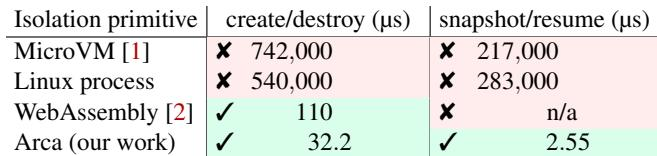
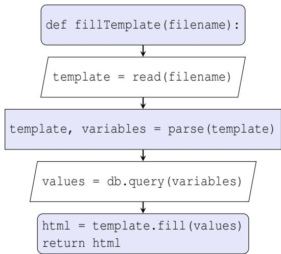
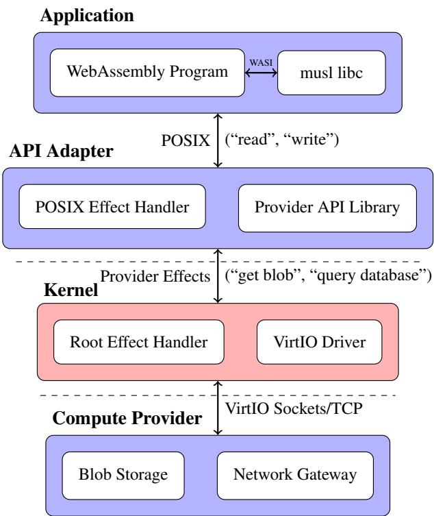
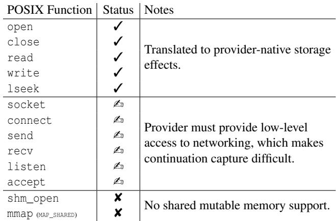
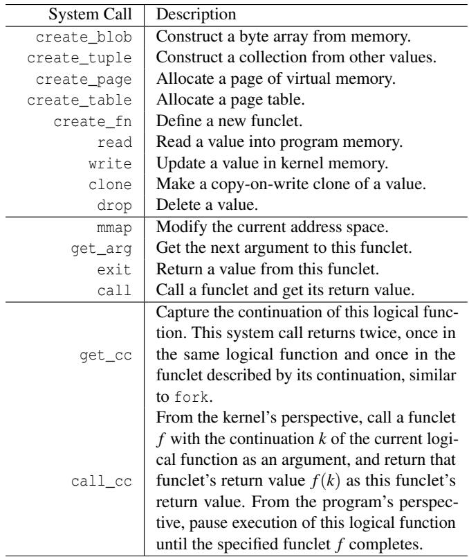
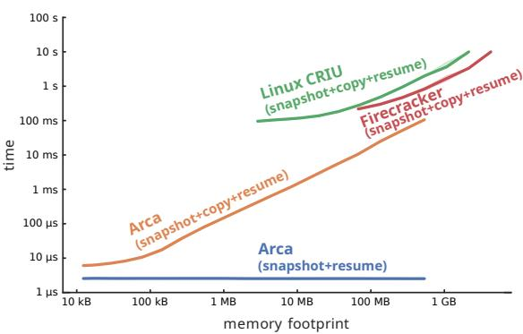
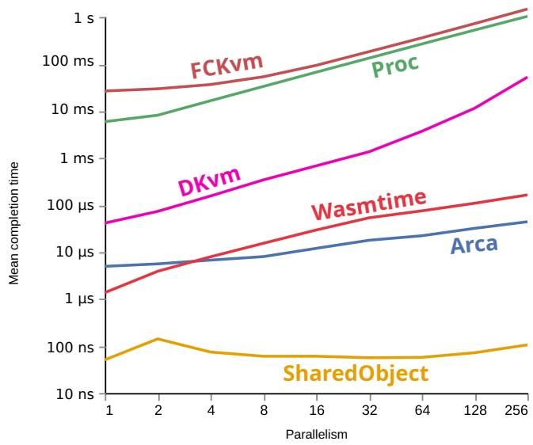
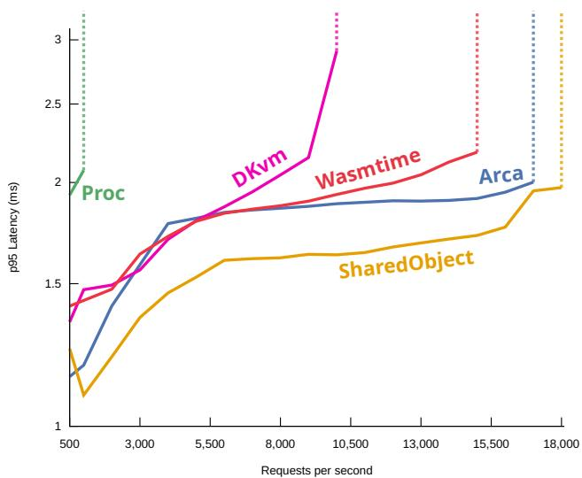
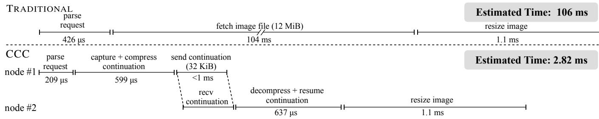
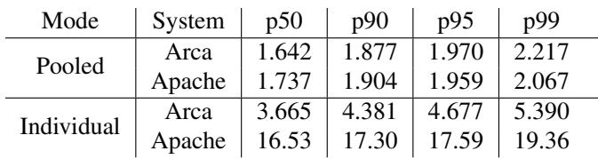

USENIX

THE ADVANCED COMPUTING SYSTEMS ASSOCIATION

# Continuation-Centric Computing with Arca

Akshay Srivatsan, Yuhan Deng, Katherine Mohr, Emma Sudo, Sebastian Ingino, Francis Chua, and Keith Winstein, Stanford University

https://www.usenix.org/conference/osdi26/presentation/srivatsan

# This paper is included in the Proceedings of the 20th USENIX Symposium on Operating Systems Design and Implementation.

July 13–15, 2026 • Seattle, WA, USA

ISBN 978-1-939133-55-7

Open access to the Proceedings of the 20th USENIX Symposium on Operating Systems Design and Implementation is sponsored by

# Continuation-Centric Computing with Arca

Akshay Srivatsan

Yuhan Deng

Katherine Mohr

Sebastian Ingino

Emma Sudo

Francis Chua Stanford University

Keith Winstein

## Abstract

This paper presents continuation-centric computing, an operating system design paradigm for “serverless”-style workloads: short-lived tasks that spend a substantial fraction of time waiting on dependencies and other services. Under this paradigm, a running function can capture its current continuation—a lightweight snapshot of its state—as a distinct function that can be paused, migrated, or copied as needed.

This paper evaluates the continuation-centric computing model using Arca, an operating system providing continuation capture as a core service. Arca supports a process abstraction that is broadly similar to Unix processes in guarantees and isolation, but additionally provides efficient capture and resumption of serializable, portable continuations.

## 1 Introduction

Many cloud-computing operators offer function-as-a-service (FaaS) products, commonly as part of “serverless computing.” These systems allow users to create functions to be invoked in response to external events, such as incoming HTTP requests or scheduled timers. The functions are run in providerprovisioned sandboxes with access to APIs for interacting with external services such as databases and object stores. In contrast to traditional cloud-computing products where a user must request and manage servers to run their functions, serverless providers manage the servers and only charge users based on the runtime of each function invocation. For appropriate workloads, this simplifies the developer experience and gives providers flexibility in scheduling and placing invocations.

To improve server utilization and reduce costs, commercial serverless systems break function invocations into slices as small as a few milliseconds [19] or 128 MiB of RAM [4]. Research has aimed to support even finer granularities in time and space [16,33,44,48], motivated partly by applications that use serverless systems for large-scale, highly parallel jobs, breaking up their workloads into fine-grained tasks with complex inter-task dependencies [20–22, 26, 28–30, 45, 55]. This has generally required software developers to break programs up ahead-of-time into subtasks, each a function of some identified input data. Doing so can expose available parallelism and let resource and data needs be matched more closely to the resources allocated and placed at runtime [16, 31, 43, 44].

  
Table 1: Performance of different isolation primitives (§2.2). Arca’s create/destroy and snapshot/resume overheads are several orders of magnitude lower than other isolation primitives. Create/destroy time was measured with 128 parallel processes on a 128-core machine. Full results are in Section 6.

Is it useful to help applications break themselves up into smaller pieces? This paper argues that operating systems could benefit applications by adopting continuation capture as a core service. Continuations allow a running program to capture “the rest of this program” as a new program. Capturing a continuation on every I/O operation can transform a monolithic program into a composition of pure functions with delineated I/O. Current operating systems now include ways to capture a program’s continuation by snapshotting running processes or VMs [9, 13]; however, these methods take hundreds of milliseconds (Table 1). By designing a new OS with continuations as a core primitive, we found it is possible to capture a continuation of a running process in a few microseconds. This makes it more feasible to execute programs as a sequence of pure functions with I/O in between.

To explore the continuation-centric computing approach, we designed and implemented Arca, an OS designed for continuation-centric workloads. Arca’s kernel provides continuation-capture as a syscall that processes may invoke; developers (or the compiler) do not need to explicitly express the state required by “the rest of the program from point x.” Arca processes are broadly similar to Unix-style processes in that the kernel isolates them via hardware memory protection, and they can do computations and return values. To perform an external side effect, which would traditionally involve system calls like read and write, an Arca process instead returns an “effect”: a description of the desired I/O and a callback function, which may be a continuation of the same process.

Arca is a research prototype with many limitations. We have adapted musl libc to implement part of the POSIX API in terms of Arca effects, but it supports only the most common POSIX calls for file I/O (open, close, read, write, . . . ) and networking (socket, connect, accept, . . . ). There is no support for mutable shared memory between threads of execution (mmap, shm\_open, clone). The most complicated program we’ve ported to run on Arca is FFmpeg (the video toolkit); most large applications would require considerable porting effort and a fuller libc. And Arca probably isn’t very beneficial for long-lived programs with consistent resource demands.

Some of these are engineering limitations that could be overcome with further effort, but others are more fundamental to continuation-centric computing. Many APIs increase the footprint of a process in ways that frustrate clean continuation capture. Berkeley sockets create dependencies on IP addresses and TCP connection state. Shared mutable memory introduces dependencies on the internal state of other processes. A continuation-centric computing system that supports interfaces like these loses some of the benefits, but one that doesn’t breaks compatibility.

What is Arca for? We designed Arca to fill a need we found we had ourselves. Many researchers, including us, have explored the use of serverless platforms for large jobs with complex inter-task dependencies: video processing [22], linear algebra [28,45], software compilation and testing [20], theorem proving [55], 3D rendering [21], ML training [26], data analysis [29, 31], etc. This literature led to a principle of “I/Ocompute separation” [15, 30] and several general frameworks for describing and orchestrating the I/O relationships between individual functions to be executed [16, 20, 22, 28, 31, 34]. (Three of these [16, 20, 22] are from our research group.)

In all of this, what we’ve found missing is a practical way to express everyday programs as a set of pure functions connected by a dependency graph. Consider an ordinary program, perhaps written in Rust or C++, that creates a 1,000-element vector and wants to perform a parallel map-reduce, and, once that’s complete, do more single-threaded computation with the result. At the places where the program transitions from 1-way to 1,000-way parallelism and back, Rust and C++ don’t provide a tool to capture the state of the program in a way that can be resumed as a new serverless function invocation.

In past work, we and other researchers manually transformed our programs into continuation-passing style (CPS); separating them into smaller programs and tracking the intervening state explicitly. Arca makes this a lot easier, by providing the CPS transform as a core OS service.

Summary of results. For programs that would benefit from capturing their futures in a serializable continuation— generally speaking, programs that mix computation and I/O or that vary their working set over time—Arca’s native continuation capture has lower overhead than some prior approaches. In a closed-loop test, Arca captured continuations five orders of magnitude faster than comparable existing systems (Fig. 3). Most of that benefit comes from Arca’s ability to produce “zero-copy” continuations of an in-memory process. In tests of throughput, Arca can serve an order of magnitude more requests than existing process-based techniques, and performs comparably to in-process isolation techniques (Table 4).

In an evaluation of continuation-centric computing on a serverless image thumbnailing workload, we found that a continuation-centric approach implemented using Arca is able to achieve a 50–60× speedup over a non-continuation-centric approach. The captured continuation is much smaller than the image to be thumbnailed, and so the ability to send the continuation over the network instead of the image allows Arca to utilize the CPU more effectively (Figure 6).

This paper proceeds as follows: we first discuss the motivation and design goals of continuation-centric computing (§ 2) and the practical developer experience (§ 3). In Section 4, we provide an overview of Arca’s design. We describe Arca’s implementation in Section 5, and provide an evaluation of its performance and compatibility (§ 6). We then survey related work in Section 7. Finally, we discuss limitations and future work (§§ 8, 9) before concluding (§ 10).

## 2 Motivation

Continuation-centric computing is motivated by trends in recent work in serverless computing. Besides performance, there are two major selective pressures influencing the evolution of serverless platforms: compatibility with existing software and granularity of scheduling.

## 2.1 Compatibility

Serverless systems adopted in industry share a common focus on maintaining compatibility with existing software. Many current serverless providers run off-the-shelf Linux applications via containers or MicroVM; for example, this is the approach taken by AWS Lambda [1, 4]. This approach maintains the widest compatibility. Some effort is still required to package an application for serverless execution—a developer must, for example, supply a wrapper that gathers necessary in puts from the provider’s datastore, runs the target application, and writes outputs back to the datastore—but for the most part existing software can run unmodified.

However, full compatibility with Linux comes at a cost: shipping a full Linux userspace with every application leads to worse granularity and performance. This has led some providers to innovate on their isolation mechanism; Cloudflare Workers [10] relies on software isolation techniques like WebAssembly [23]. Providers taking this approach often expose traditional operating system primitives, such as file descriptors, so that applications can be ported without many source-level changes; in WebAssembly, this takes the form of the WebAssembly System Interface (WASI) [11]. These platforms are not as widely compatible with existing applications: in the case of WebAssembly, applications must be recompiled for a different architecture and must therefore be configured not to use features that WebAssembly lacks. WASI generally supports the subset of POSIX related to file I/O, but omits features like networking and/or multithreading; applications reliant on these features must use provider APIs to access equivalents instead. However, these platforms have seen adoption despite these incompatibilities, as they enable finer granularity scheduling.

  
Figure 1: A logical function broken down into a sequence of funclets and I/O operations. Every shaded rectangular flow chart element is a separate funclet, while every unshaded trapezoid is an I/O operation.

## 2.2 Granularity

New serverless systems proposed in academia focus primarily on enabling fine-grained scheduling, with the goal of improving end-to-end performance. These works propose various approaches to decompose large monolithic applications into finer-grained functions [16, 31, 43, 44, 48]. While the details vary, all these systems have a notion of a small unit of pure computation (previously referred to as a “proclet”) and a larger unit of mixed computation and I/O composed of the small unit (a “logical process”). Across most of these systems, the developer writes the small unit of computation in a traditional language, like C or C++.

The exact method of composing the small unit into the larger unit varies. Dandelion uses an external domain-specific language (DSL) [31], requiring logical processes to be written specifically for Dandelion. Fix uses a custom API exposed through WebAssembly, essentially providing an embedded domain-specific language (eDSL) in the form of a C library [16]. σOS similarly exposes a library interface to its primitives, akin to a reduced version of the Linux system call interface [48]. Likewise, Quicksand exposes its data structures and control flow using an API resembling the C++ standard template library [43].

The premise behind these works is that, when applications can express their data dependencies and resource requirements at a fine granularity, a provider can make better scheduling decisions. Every time the provider learns new information about an application’s dependencies, they are able to use this information when scheduling the rest of the application. This same distinction appears in other contexts as well: xsyncfs uses this split to achieve the performance of asynchronous I/O while retaining the durability of synchronous I/O [37].

The situations where these systems are most useful share a common aspect: what developers logically think of as “one program” are actually sequences of smaller tasks with varied requirements. Nu [44] notes this by explicitly distinguishing larger “logical processes” from smaller “proclets.”

We propose a similar distinction for continuation-centric computing, but with modifications to factor in the I/Ocompute separation proposed by Fix [16] and Dandelion [31]. Logical functions are high-level programs which a developer would think of as one task; they are composed of I/O and computation. Funclets are the small computational steps that make up larger tasks; they run to completion and perform no I/O. Figure 1 shows how a logical function can be broken into funclets and I/O operations.

Existing systems essentially treat the granularity at which developers write functions as the granularity at which to schedule. In continuation-centric computing, these granularities are distinguished, so developers can write code in units natural for them, and the scheduler can schedule at finer granularities. When a logical function captures its continuation, it creates a new funclet that includes its current state. This new funclet is part of the same logical function, and control flow is not interrupted from the developer’s perspective.

To a first-order approximation, a continuation is essentially a snapshot of a logical function’s execution. In practice, however, capturing a snapshot of a container is incredibly expensive; in the best case it takes on the order of a millisecond, but in many cases is made slower than that by various kernel limitations [25]. Current JIT-based WebAssembly runtimes do not fully isolate the state of each sandbox from the state of the host and therefore do not generally support efficient snapshotting; while it’s possible to work around this, doing so interferes with optimizations and impacts runtime performance [56]. In our experiments (Table 1, § 6.1) we observed snapshot/restore systems taking hundreds of milliseconds to capture and restore a snapshot.

## 2.3 Design Goals

Currently, these two pressures are at odds; the existing systems we have observed tend to specialize in one of compatibility or granularity. We propose Continuation-Centric Computing, exemplified in our serverless system Arca, as a middle ground with these concrete design goals:

Compatibility. We strive to maintain compatibility at a level comparable to a production system. Specifically, we aim to match the compatibility model provided by Cloud flare Workers [10]: programs may have to be recompiled or reconfigured, but can generally run without any internal control-flow changes. We evaluate this compatibility claim by showing a mechanical translation from WebAssembly with WASI, the same interface supported by Cloudflare Workers, to Arca.

Granularity. We strive to provide granularity at a level comparable to existing research systems such as Dandelion, Fix, and Quicksand [16, 31, 43]. As “granularity” is subjective, we evaluate it via its quantitative effect on performance, by comparing function execution latency across the isolation mechanisms used by these systems. We additionally add the restriction that we try to ensure isolation and security equivalent to production systems—once again, comparing to Cloudflare Workers/WebAssembly—as in practice isolation is a necessary property for a system to be adopted.

## 3 Developer Experience

As “continuations” are a concept many software developers are unfamiliar with, a reasonable concern is that continuationcentric computing will be difficult for developers to use. We introduce our continuation-centric system, Arca, by describing how it compares to more familiar systems from a developer’s point of view. We also describe other factors relating to the developer experience, such as ease of debugging.

## 3.1 Existing WebAssembly Software

Serverless providers such as Cloudflare accept software in the form of WebAssembly binaries [10, 11, 23]. We ensure compatibility with existing WebAssembly binaries, as the restrictions imposed by WebAssembly are stricter than those imposed by Arca. Many existing software toolchains support compiling code to WebAssembly, using the WebAssembly System Interface (WASI) to provide side effects such as file I/O. Among other restrictions, software targeting Web-Assembly is limited to a single thread and can only access a sandboxed virtual file system. Despite these limitations, WASI ports of many popular applications, including Python [51] and FFmpeg [49], already exist.

  
Figure 2: Arca’s design allows programs written for traditional APIs, such as WASI, to be run in non-traditional environments with cloud-native APIs. A user provides their code in the form of a WebAssembly program using WASI; WASI I/O operations are translated into POSIX by musl libc, then propagated to the parent function as effects. A second userspace process translates the POSIX API into providerspecific effects. The kernel’s root effect handler receives these effects and dispatches them to the outside world using VirtIO; the compute provider then performs the actual I/O. In this diagram, the dashed lines mark the boundaries between userspace and the kernel; since Arca is paravirtualized, the kernel communicates with both its own userspace and the userspace of the host machine.

The process of converting a WebAssembly binary to run on Arca is entirely mechanical; we provide a toolchain built on wasm2c [53] that takes an arbitrary WebAssembly/WASI binary, converts it to POSIX C, and links it against a custom implementation of WASI based on musl libc [36]. Section 6.5 describes our qualitative experience developing the WebAssembly compatibility toolchain and porting an existing WebAssembly binary to run on Arca.

The Arca implementation of WASI captures a continuation whenever a WASI I/O function is called. It then exits, returning to its parent a description of the necessary I/O along with the captured continuation—in our parlance, an “effect.”

## 3.2 Effect Handlers

As described so far, however, there is still a missing piece: how does the I/O actually happen? If a WASI program returns an effect requesting a “read”, something must perform the relevant I/O. In Linux this would be the kernel; in Arca we generalize this to be an “effect handler.”

An effect handler is a piece of software that receives an ab stract I/O request and a callback function. In the simplest case the provider supports WASI directly; then the kernel acts as the effect handler and performs the I/O itself. However, Arca also supports the case where a provider does not directly sup port WASI but rather supports some other provider-specific API. In this case, the raw effects produced by the application instead go to an “API Adapter,” another userspace process which acts as the parent of the application. The API adapter parses the request, and reissues I/O effects in terms of the provider’s native APIs. Figure 2 shows the different layers involved in this case. An API adapter only needs to be written once per cloud provider; the same adapter can run any WASI program against that provider’s APIs.

We draw this distinction between the effect handler and the kernel because we have observed that developers tend to prefer familiar POSIX-like interfaces, but serverless systems provide higher-level abstractions. This is true across both the industrial and academic systems we have studied: for example, AWS Lambda uses S3 as long-term object storage rather than a traditional filesystem [4], and Dandelion exposes HTTP as a primitive communication operation [31]. By supporting userlevel effect handlers, it’s possible to implement a translation between WASI and a provider-native API.

## 3.3 Existing POSIX Software

Arca offers limited source-level compatibility with existing POSIX software. POSIX defines interfaces at the level of a C standard library (libc), to facilitate running the same application source code on different operating systems. We provide a basic implementation of a POSIX-compatible libc, based on musl [36]; this is the same libc we use for implementing WASI.

From a developer’s point of view, they can write a program that looks like ordinary C or POSIX code (as in Listing 1). All the code dealing with continuations is contained within the libc, so the developer does not have to interact with or reason about continuations. Furthermore, the developer does not have to manually split a logical function into its constituent functions. Since a continuation snapshots the “rest of the function,” capturing a continuation on every I/O boundary naturally breaks a logical function into funclets. When the continuation is resumed, control returns to the same point in the logical program; this allows the surrounding C code to remain unaware of the new control flow happening within libc.

```c
#include <stdio.h>
int main(int argc, char **argv) {
FILE *in = fopen("input.txt", "r");
fseek(in, 0L, SEEK_END);
long sz = ftell(in);
fclose(in);
FILE *out = fopen("output.txt", "w");
fprintf(out, "%ld\n", sz);
fclose(out);
}
```

Listing 1: A trivial I/O-heavy function which counts the number of bytes in the file “input.txt”, writing the result to “output.txt”. Although this is a single logical function (and a single C program), the compute provider executes every line of main as a separate funclet (eight in total).

Arca currently supports file I/O and network I/O effects in a style similar to POSIX. Table 2 summarizes some common POSIX library calls and the status of their implementation in Arca. While Arca does support low-level network I/O, applications which use it lose the ability to capture complete continuations and must be resumed on the same machine.

Looking more generally at continuation-centric computing, there are some fundamental limitations on what POSIX APIs can be implemented. File I/O can be emulated, so it can be handled even if the provider’s runtime doesn’t support it natively. Pipe-based inter-process communication, fork, and other similar system calls can also be implemented or emulated with continuations. Network I/O comes with a tradeoff: since socket state cannot be cleanly captured in a continuation, a provider that supports it loses some of the benefits of continuation-centric computing. Many granularity-focused serverless systems explicitly do not support arbitrary network I/O for this reason [16, 31, 48]. Shared mutable memory between processes is not supported in continuation-centric computing at all, similar to WebAssembly, since it would become impossible to capture a continuation of any of the processes mapping a shared memory region independently of the others.

## 3.4 New Arca Software

While porting existing software to Arca provides continuationcentric computing “for free,” it will nevertheless sometimes be necessary to write programs explicitly for Arca. One such case is when writing the aforementioned “API adapters”; these adapters must manipulate continuations directly using the Arca system call API (Table 3). Software which is cloudnative (i.e., new software written expressly to run on cloud platforms) may also use cloud-native APIs rather than POSIX abstractions. Developers who are already writing their applications against cloud-native APIs may be able to take advantage of this lower-level access to Arca primitives to achieve higher performance than the compatibility layers can provide.

  
Table 2: Overview of common POSIX library calls and the status of their support on Arca. A status of “<sup>✓</sup>” means that a library call is always supported; “<sup>✍</sup>” means that a library call requires explicit provider support due to its impact on continuation capture; and “<sup>✘</sup>” means that a library call is not supported due to the restrictions of Arca’s model. Our prototype implementation supports all the operations described as “<sup>✓</sup>” or “<sup>✍</sup>”.

Currently, such Arca-native code can be written as “freestanding” code in languages suitable for embedded or baremetal development like C or Rust. So far, we have qualitatively found it easier to work with the raw Arca API in languages that support functional programming paradigms, like Rust; however, we are still exploring ways to effectively wrap the API and ease development of these “bare-metal” Arca programs. So far, we have not prioritized developing ergonomic Arca API wrappers, as we believe that in the short term most developers would prefer to use the compatibility layers to port their existing software, and in the long term developers should use cloud-native APIs like those provided by Fix, Dandelion, σOS, Nu, and Quicksand [16, 31, 43, 44, 48].

## 3.5 Debugging and Profiling

Since development for Arca is currently similar to embedded development, the debugging experience is also similar. Debugging logical functions is straightforward: a parent function enables single-stepping by changing the CPU flags associated with a child function, and can then inspect its state after every instruction as with ptrace under Linux. It can also insert breakpoint instructions by modifying the pages associated with the child function. Basic profiling is also straightforward: a parent function profiles a child function by executing it with a timeout and observing the state after the timeout. More advanced profiling, using performance counters, is possible but not currently implemented.

Debugging compositions of logical functions is more difficult, as the Arca kernel does not maintain any long-lived notion of a “call stack.” However, since funclets are pure functions, it is generally possible to abstract logic into independent units to ease debugging.

## 4 Design

In this section, we describe the design of Arca, a continuationcentric operating system. We contrast the design of Arca with the design of traditional Unix-like operating systems such as Linux.

Unix is, at a high level, based on a model of processes communicating. Unix processes communicate using pipes or a shared filesystem; they perform computation in response to communication and communicate the results of their computation. Unix would therefore be classified as a message-oriented operating system [32]. As processes execute, they accumulate substantial implicit state, such as open file descriptors and socket buffers, which are difficult to capture, serialize, or restore elsewhere [25].

In order to enable continuation-centric computing, Arca is based on a model of functions consuming and producing data. Code executes in the form of short-lived funclets whose state consists primarily of their memory and registers, not ambient OS resources. Arca can therefore be classified as a procedureoriented operating system [32]. Functional code can return requests to do I/O or gain access to more resources, which are interpreted and executed by external effect handlers; the handlers, as in Dandelion [31], then invoke separate callback funclets with the results of the I/O. Each Arca process has a limited amount of local state, forming an atomic unit which can be snapshotted, serialized, or migrated.

The duality and equivalence of message-oriented and procedure-oriented operating systems has been observed and studied. It has been demonstrated that any program written for one can be rewritten for the other as long as the appropriate primitives are present [32]. It is also well-known that the CPS transform is capable of transforming an imperative program into a functional one [7, 42]. We argue that, since serverless computing is a procedure-oriented environment but developers prefer to write message-oriented programs, integrating continuation capture into the operating system is the natural way to unite the two models efficiently.

## 4.1 Continuations

We have informally described a continuation as “the rest of a logical function.” More concretely, a continuation in Arca is the snapshot of the execution state of an address space. This definition is consistent with prior work in distributed systems such as CIEL [34], except applied at the process level rather than the language level. Since Arca is procedure-oriented, this snapshot remains small and tightly-bounded even though the OS does not have insight into the internals of a process.

```rust
struct Process {
page_table: PageTable,
register_file: RegisterFile,
descriptors: Vec<Value>,
}
enum Value {
Null,
Word(u64),
Blob(Box<[u8]>),
Tuple(Vec<Value>),
Page(Page),
Table(PageTable),
Funclet(Funclet),
}
struct Funclet {
defn: Definition,
args: Vec<Value>,
}
enum Definition {
Symbolic(Box<Value>),
Procedural(Process),
}
```  
Listing 2: The struct Process defines an Arca process, corresponding to Linux’s task\_struct. The other types define the primitive datatypes which Arca processes can manipulate.

The actual in-memory representation of a continuation in Arca is described by the structures in Listing 2. The structure Process is similar to Linux’s task\_struct, representing the state of a newly-created or suspended process. The enumeration Value gives the core data types which Arca programs have access to; specific abstractions like files and directories are instead replaced with these more generic abstractions. While the most common funclets are defined by a machinecode function definition, it is also possible to define a function that is merely “symbolic”; when it is invoked execution traps to the nearest effect handler instead.

## 4.2 System Calls

Arca processes provide a procedure-oriented set of system calls instead of the file- and message-oriented system calls available under Unix. In addition to an address space and a register file, every Arca process has a value descriptor ta ble which replaces the Unix “file descriptor table.” Running funclets use indices into this table to reference these values when making system calls. Instead of referring to files on disk, the entries in the value descriptor table are handles to data in kernel memory. These values include byte arrays (blobs), collections (tuples), integers, machine pages, page tables, and other Arca functions (funclets). Most of the system calls manipulate these values directly—they can be created, read, written, and destroyed. Several system calls instead manipulate the currently running funclet itself; they allow funclets to receive arguments, produce return values, and manipulate their address spaces. A final category of system calls allows a funclet to explicitly capture its continuation. A summary of the available raw system calls is provided in Table 3.

  
Table 3: High-level summary of the system calls available within Arca. The first section describes system calls that manipulate values. The second section describes those that manipulate the current funclet. The third describes system calls that capture the logical function’s continuation.

The biggest addition over previous procedure-oriented sys tems is Arca’s call\_cc system call. Since this is an OS primitive, the system call can be embedded within a library. Developers do not have to explicitly reason about, or even be aware of, continuations or effects.

## 4.3 Security Model

Since serverless providers run untrusted user-provided programs, it is important that programs are sandboxed.

Arca provides a security model similar to Cloudflare Workers, but without the requirement of WebAssembly [10]. Programs within an Arca process are denied access to highprecision timers such as the x86\_64 timestamp counter. Since Arca processes have no shared-memory threads with which to emulate a timer and cannot perform I/O without going through the runtime, programs cannot perform timing side-channel attacks.

The Arca kernel does not share state between different processes, reducing the surface area for attacks and data leaks. It enables standard kernel security CPU features, such as Supervisor Mode Access Prevention and Supervisor Mode Execution Prevention, to further reduce the attack surface. Further, the kernel code uses the Rust type system and memory safety model as an extra check to protect against certain classes of bugs that could leak information or privileges to userspace.

Arca does not give programs the ability to perform side effects directly. This does put some burden on the provider to choose an acceptable level of security—for example, providing arbitrary network access could allow a malicious function to access a high-precision timer over the internet. It is up to the compute provider to choose a list of explicit side effects which they deem acceptable.

## 4.4 Non-Goals

As a substrate for computation, Arca comes with notable limitations. Most significantly, Arca’s model makes it impossible to represent parallel shared-memory threads. This restriction is imposed for both security and performance benefits on general programs, but may limit performance when porting programs that heavily rely on threads for parallelism. Programs which rely on threads only for concurrency, or which rely on processes for parallelism, can still operate as intended. We have experimented with adding support for monitors [24] as a limited form of shared state synchronization; our early results have been promising, but we have not fully fleshed out the design as it pertains to migrations and distributed state.

Arca also probably isn’t immediately useful for long-lived programs with consistent resource demands and persistent state (database servers, daemons, etc.). These programs are more suited for microservice-style runtimes than serverless ones, and benefit from a different set of optimizations than those Arca provides.

Despite these limitations of Arca, we envision Arca as a useful substrate for functions that include large numbers of fine-grained funclets with complex inter-dependencies, mixing I/O and computation.

## 5 Implementation

In this section we describe our implementation of Arca. Our implementation is written in Rust targeting x86\_64; however, we do not rely on architecture-specific features so porting to other architectures is dependent only on engineering effort.

## 5.1 Environment

The Arca kernel currently runs paravirtualized within Linux’s Kernel-based Virtual Machine (KVM). A Linux userspace program acts as a virtual machine monitor, servicing the Arca kernel’s requests for file and network I/O, and debug logging. The Arca kernel communicates with user-mode Linux programs, including but not limited to the monitor, using a VirtIO [50] Vsock device backed by the Linux kernel. Our kernel uses hypercalls to access the host’s TCP stack via the monitor, and uses the Plan 9 Filesystem Protocol (9P) [39] over a Vsock for filesystem access.

## 5.2 System Calls

Arca’s system call interface was previously described in Section 4.2; here, we focus on the kernel implementation thereof.

Values in Arca are conceptually immutable: it is not possible to modify a tuple, only to create a new tuple with changes. However, a literal implementation of immutability would require a prohibitive number of copies. We borrow the idea of “functional but in-place” programming from modern functional programming languages like Koka to resolve this issue [41]. System calls are linear by default, and consume their argument unless explicitly copied. System calls appear to mutate values; if a value is unique it is executed efficiently as a true mutation, and if a value is not unique it is executed as a less efficient copy-with-modified-contents.

A special case of “functional but in-place” which has proven to be performance-critical is the call\_cc system call. In almost every circumstance where a continuation is captured, the program intends to use it as a callback. By implementing this operation as a single system call, the kernel avoids unnecessarily making a copy of the continuation. This means the cost of capturing a continuation is constant in this case, regardless of the memory footprint of the function.

## 5.3 Inter-Process Communication

As a procedure-oriented operating system, Arca does not have traditional inter-process communication constructs like pipes or shared memory. Instead, processes communicate by calling child processes with arguments and returning values to their parents. Arca processes can be thought of as coroutines, which can return values and still be resumed later.

The most frequent case of inter-process communication is in the case of the “API adapters.” Instead of running “foreign” software directly, the Arca kernel runs the “native” API adapter within an Arca process and gives it the target function as an argument. The adapter does initial setup, then calls the target function in a second Arca process. The target function is then conceptually nested under the API adapter—when the target function produces an effect, the kernel sends that effect to the API adapter instead of handling it directly. The API adapter either emulates the I/O or translates it into providernative effects that the kernel knows how to handle; either way, it eventually calls the callback with the result of the I/O.

At an implementation level, this is not inherently different from processes reading from and writing to pipes. In either case, the child process sends a request to its parent, then waits for a response. The API adapter can be thought of as a proxy that translates requests from one protocol to another. Conceptually Arca’s approach closely resembles a call gate—the call system call allows one Arca process to invoke a function in another address space. Since sending messages on pipes and invoking functions are dual to one another, the underlying implementation remains similar despite the conceptual difference.

## 6 Evaluation

We test the feasibility of continuation-centric computing by evaluating the need for a new snapshotting technique, the practicality of Arca as an isolation mechanism, and the success of Arca in achieving the expected benefits of continuationcentric computing. We also discuss the process of converting existing code to run under continuation-centric computing.

## 6.1 Continuation Microbenchmark

The utility of continuation-centric computing is predicated on the assumption that it is possible to efficiently capture the continuation of a machine-code program. Furthermore, the need for continuations to be a core primitive depends on the relative performance of a continuation-centric approach when compared to existing snapshot/restore approaches. To evaluate the feasibility and necessity of continuation-centric computing, we compare Arca to two competitor systems.

This experiment was run on a machine with 2 AMD EPYC 7702 64-Core Processors (for a total of 128 physical cores and 256 hyperthreads) and 160 GiB of RAM, running Ubuntu 24.04.2 LTS (Linux 6.8.0-55-generic). Arca was run within a KVM virtual machine which was allocated 32 GiB of RAM; the other systems were run directly on Linux.

Arca (snapshot+resume) evaluates Arca in the case where a continuation is captured but not copied, e.g., when it is being used like a system call. Arca performs a functional-butin-place optimization to make this case efficient, by keeping the continuation resident in memory. For this experiment, we assume that the effect handler is another Arca process, requiring a full context switch.

Arca (snapshot+copy+resume) evaluates Arca in the less-common case where a continuation is captured and copied. This would happen if a serverless runtime decides to swap a continuation to disk, send it over the network to resume on another machine, or is explicitly requested to make a copy of a continuation.

Linux CRIU evaluates the Checkpoint/Restore In Userspace (CRIU) system on Linux. This system is able to produce an on-disk snapshot of a process’s state for later resumption. For our tests, we configure CRIU to write this snapshot to a tmpfs to avoid writing to disk.

  
Figure 3: Time to snapshot and resume a process in Arca, Linux, and Firecracker, as process memory size varies. Measurements were averaged across 10 ten-second trials. Arca’s ability to elide copies when a snapshot is resumed without migration gives it a significant advantage. Even when making a copy, Arca’s elimination of global state lets it take snapshots faster than comparable techniques.

Firecracker evaluates the snapshot/resume system of Amazon’s Firecracker MicroVM system. This system produces an on-disk snapshot of a MicroVM’s state, which can be resumed later on any machine with matching hardware. We configure Firecracker to write the snapshot to a tmpfs.

All the systems run a single-threaded loop, where a parent program repeatedly snapshots and resumes a child program. We ran this loop for one second as a warm-up and then measured the number of iterations completed in the following ten seconds. We varied the memory footprint of the target program across the possible range of sizes. Arca can represent address spaces as small as 12 KiB; a Linux process by default occupies 2.75 MiB of RAM; and Firecracker needs 64 MiB of RAM and 512 KiB of disk to boot Linux. We ran 10 trials of each configuration and report averaged results in Figure 3.

In the case where a continuation is resumed without requiring a copy, Arca (snapshot+resume)’s performance is constant at 2.55 µs. In the case where a copy of a continuation is required, Arca (snapshot+copy+resume) exhibits performance that linearly scales with the size of the continuation. Linux CRIU and Firecracker similarly exhibit linear scaling performance; however, both systems entail an order-of-magnitude slowdown relative to Arca (snapshot+copy+resume) and have a larger baseline footprint. From these results, we conclude that Arca is feasible for continuation-centric computing as long as continuations are generally captured and resumed without being copied.

## 6.2 Sandbox Performance

For continuation-centric computing to be practical, it must be possible to use continuation-based sandboxes in places where traditional sandboxes are currently used. We evaluate this by comparing Arca’s performance with other isolation systems.

• DKVM is a virtualization-based solution similar to Dandelion’s KVM backend [31]. Dandelion supports multiple isolation backends; KVM performs the best of the backends compatible with x86\_64. Dandelion’s approach to KVM uses an optimization similar to Groundhog [3]: rather than creating and destroying virtual machines for every function invocation, each VM’s state is reset in between function invocations.

• FCKVM is a virtualization-based solution similar to Firecracker [1]. FCKVM measures the overhead of creating a new virtual machine for every function invocation, similar to a cold start of Firecracker. To avoid the confounding factor of Linux boot times, we do not run Linux within the virtual machine, and instead run the workload bare-metal as a unikernel.

• PROC is an implementation of sandboxing using Linux processes. For every function invocation, a new process is forked to run the function (which is loaded from a shared object file). The function communicates its results with its parent by writing to a shared memory region. A true sandboxing system would additionally have to move the process to a new namespace.

• SHAREDOBJECT provides a baseline; it provides no isolation, and just calls a function from a shared object file. This represents the “ideal” performance if isolation had no overhead.

• WASMTIME uses the WebAssembly engine Wasmtime [2] to isolate WebAssembly functions. We configure Wasmtime to use its pooled allocation strategy to improve performance and parallelism. Functions transfer their inputs and outputs via WebAssembly memories.

• ARCA is our system, as described in the rest of this paper.

## 6.2.1 Sandbox Creation/Deletion

We first measured the raw sandbox creation/deletion times of the approaches, with a no-op workload. We ran this workload in a closed loop for 60 s, after providing 100 ms of warm up time, and measured the overall request rate as we varied parallelism. We then calculate the effective time taken per request.

This experiment was run on a machine with 2 AMD EPYC 7702 64-Core Processors (for a total of 128 physical cores and 256 hyperthreads) and 512 GiB of RAM, running Ubuntu 25.04 (Linux 6.14.0-29-generic). Arca was run within a KVM virtual machine which was allocated 4 GiB of RAM; the other systems were run directly on Linux.

  
Figure 4: Performance of sandbox creation/deletion on a noop workload. ARCA and WASMTIME are about an order of magnitude away from the theoretical limit (SHAREDOBJECT). In parallel settings, ARCA outperforms other isolation techniques.

The results of this experiment, averaged over 10 runs, are shown in Figure 4. SHAREDOBJECT provides a theoretical limit of about 100 ns per iteration, regardless of parallelism. In the single-threaded setting, WASMTIME follows at 1.5 µs per iteration, followed by ARCA at 5 µs per iteration. As parallelism increases, ARCA scales better than WASMTIME. At as low as 4-way parallelism, ARCA outperforms WASMTIME, and at 256-way parallelism, ARCA takes 30 µs per iteration (a slowdown of about 6x), while WASMTIME takes 200 µs per iteration (a slowdown of 133x). From our attempts to understand this, we believe that the slowdowns are due to contention on shared state internal to WASMTIME that effectively serializes its execution. DKVM trails about an order of magnitude behind ARCA when single-threaded, and actually scales inversely with increased parallelism—we believe this is because of allocator and page table contention within the kernel when changing the memory mappings of the VM. PROC operates on the order of 6 ms and FCKVM on the scale of 30 ms when single-threaded; both of these systems also scale poorly with added parallelism. We note that this microbenchmark is not a realistic measurement of the true scaling behavior under load, as longer-running functions reduce the amount of contention.

  
Figure 5: Request latency (95th percentile) of an open-loop 128 × 128 matrix-multiplication workload at various request rates. Vertical dotted lines indicate the highest request rate at which the system was able to reach a steady state. ARCA can sustain a higher request rate than other isolation methods, performing almost as well as no isolation (SHAREDOBJECT). FCKVM is omitted from this graph; it only reached 200 requests per second at a p95 latency of 42 ms.

## 6.2.2 Computational Workload

As a more realistic measure of the isolation mechanisms’ performance under load, we perform an open-loop experiment in which we run a 128 × 128 32-bit integer matrix multiplication workload. For this experiment, we ran each system for 120 s, with requests isochronously generated at a range of request rates, and we measured the latency of each request. For every run of each system, we measure the p95 latency in the 10 s windows starting at the 30 s and the 100 s marks. We averaged this change in latency over all five runs of each system to determine how much each system slowed down over the course of 60 s. We declared the system unstable for a particular request rate if the slowdown exceeded 10% of the median latency; this indicates that the system would, if run long enough, exhaust its resources and crash. We only report latencies at request rates where each system remained stable.

This experiment was run on a machine with an AMD Ryzen 9 7950X 16-Core Processor (32 hyperthreads) and 64 GiB of RAM, running Fedora 42 (Linux 6.17.5-200.fc42.x86\_64). Arca was run within a KVM virtual machine which was allocated 4 GiB of RAM; the other systems were run directly on Linux. All the systems were run with 32-way parallelism.

The results of this experiment are shown in Figure 5; solid lines indicate p95 latency, averaged across the five runs, and dotted lines indicate the maximum request rate for which the system remained stable. SHAREDOBJECT sets the theoretical maximum request rate for this workload at 18,000 requests per second. ARCA gets close to the theoretical limit, achieving 17,000 requests per second. WASMTIME achieves 15,000 requests per second; at most request rates, ARCA and WASMTIME have comparable response latencies. DKVM achieves 10,000 requests per second on this 32-hyperthread machine.<sup>1</sup> PROC trails behind, achieving 1,000 requests per second. While initially unintuitive that DKVM performs better than PROC, this is due to the implementation detail that DKVM does not actually create a new virtual machine for each request; it only has to reset the state of an already-created virtual machine. FCKVM, which does create a new virtual machine for each request, performs far worse than any of the other systems, sustaining only 200 requests per second with a p95 latency of 42 ms; we omit it from the graph.

Together, these benchmarks confirm that Arca is a viable isolation primitive for serverless computing. It slightly outperforms lightweight isolation through Wasmtime, and performs orders of magnitude better than heavyweight isolation like containers and MicroVMs: 2–3 orders of magnitude in computation-heavy tasks, and 4–5 orders of magnitude in sandbox creation/deletion. It is, however, more limited in the software it supports than the heavyweight isolation primitives.

## 6.3 Locality

To measure the benefits of continuation-centric computing on a serverless application, we ran an experiment on an image thumbnailing benchmark derived from SeBS [12]. For this experiment, we invoke the image thumbnailing function on one node, where the image data are located on a different node. The function takes a file path, gets the data, and then resizes the image. For this experiment, the image thumbnailing function invokes the “provider-native” API directly; we do not use POSIX compatibility helpers.

• CCC represents a continuation-centric computing approach to serverless, and implements get as a side effect. The effect handler captures, compresses, and then sends the continuation to the machine where the image data reside. The target machine decompresses and resumes the continuation.

• TRADITIONAL represents a status-quo serverless runtime where functions cannot be migrated once they have begun execution. Instead, get requests the image from the remote machine.

Both approaches use Arca as their isolation mechanism, but only CCC uses the continuation-capturing features of Arca.

This experiment was run on AWS c6a.metal instances running Ubuntu 24.04.3 LTS (Linux 6.14.0-1017-aws). Both CCC and TRADITIONAL were run within a KVM virtual machine which was allocated 32 GiB of RAM, with networking support implemented using hypercalls to the Linux-side monitor. Both systems run a single-threaded loop on one node that launches the function locally. In CCC, the other machine receives and resumes continuations. In TRADITIONAL, the other machine serves image data to the first machine. We ran this loop for one second as a warm-up and then measured the number of functions completed in the following 60 seconds; we also measured the breakdown of where time was spent during a single function invocation. The results of the experiment are summarized in Figure 6. In CCC, 61% of a function invocation’s runtime is spent resizing the image; on TRADITIONAL only 1% of the function’s runtime is spent resizing, while 98% of the time is spent transferring data.

  
Figure 6: Time breakdown of an image thumbnailing function invoked on a different node than its input image. TRADITIONAL spends most of its runtime—98%—waiting for the image, bottlenecked by the speed of the network. CCC collocates computation and data by capturing and sending the continuation of the function. CCC spends comparatively little of its time—only 9%—doing data transfers, and is bottlenecked by computation time. TRADITIONAL achieves a throughput of 9.42 requests per second, while CCC achieves a throughput of 557.3 requests per second.

CCC achieves 557.3 requests per second, bottlenecked by decompressing and resuming the continuation and resizing the image on the target machine. In comparison, TRADITIONAL achieves 9.42 requests per second, bottlenecked by the network’s speed in fetching the image. While this is an extreme case, these results confirm that continuation-centric computing can provide the benefits of collocating computation and data, similar to Fix [16], without make developers explicitly restructure programs in I/O-compute-separated style.

We also measured the throughput in the less extreme case where half of the functions can be completed with locally available data, while only half of the functions require data transfer to/from the other node. We still observe the benefit of continuation-centric computing in this case: CCC achieves 889.62 requests per second, while TRADITIONAL achieves 18.21 requests per second.

## 6.4 I/O Performance

We have described an automatic CPS transform based on capturing a continuation on every I/O operation. To measure the effects of this transformation on program performance, we evaluate an I/O-heavy application—a web server—implemented under Arca.

We implement this application two different ways: The first, which we call “pooled,” resembles a microservice: many instances of a web server process are spawned in parallel (one per core), each incoming request is handled by the next available process from the pool, and processes return to the pool when they are done handling a request. We compare this approach against version 2.4.66 of the Apache HTTP Server [6] serving a static file from the filesystem.

The second way, which we refer to as “individual,” more closely resembles serverless computing: every incoming request is handled by an invocation of a function, which runs to completion and terminates when it is done generating the response. We compare this against version 2.4.66 of the Apache HTTP Server using the Common Gateway Interface to launch a process on every request; our request handler is written in C to avoid the runtime startup penalties caused by managed languages like Python. While the request-per-function model approaches the ideal of serverless computing, it is not commonly used in practice due to performance concerns with spawning a process on every incoming request.

In all four cases, we generated load using ApacheBench, the Apache HTTP server benchmarking tool [5]. The four servers all returned the static string “hello, world” along with appropriate HTTP headers. This experiment was run on a machine with an AMD Ryzen 9 7950X 16-Core Processor (32 hyperthreads) and 64 GiB of RAM, running Fedora 43 (Linux 6.19.10-200.fc43.x86\_64). Arca was run within a KVM virtual machine which was allocated 16 GiB of RAM; Apache was run directly on Linux. ApacheBench was configured to generate 65,536 requests with 32-way concurrency. For each system, we ran ApacheBench once as a warmup run, then measured request latency across the next 10 runs of 65,536 requests each. ApacheBench computed the CDF of request latencies for each run, and we averaged across the 10 runs. The results of this experiment are shown in Table 4.

These results show that capturing a continuation on every

  
Table 4: Performance comparison of a web server implemented in Arca to the Apache HTTP Server; values are given in milliseconds. Both servers were measured under two modes of operation: in “Pooled” mode, the server spawns a thread/process for every core, each of which handles one request at a time; in “Individual” mode, the server spawns a new process for every request.

I/O operation does not noticeably affect the performance of a pooled web server; both Arca and Apache exhibit similar latencies. We believe the higher variance of Arca is due to a combination of performance tuning in Apache and the additional KVM entries and exits incurred by Arca. In a processper-request web server, Arca outperforms Apache with CGI on Linux by a factor of four. This is likely due to the lower startup overhead of an Arca process relative to a Linux process, as previously measured in Section 6.2.1. With non-trivial workloads, we believe that computation time would dominate the workload—even on this workload, we see that the difference is much smaller than the pure startup time difference measured in Figure 4—so this measurement serves as a lower bound on the latency of each system.

## 6.5 Compatibility

To verify that continuation-centric computing is capable of handling existing applications, we qualitatively evaluate Arca’s compatibility with existing software. We specifically consider the case described in Section 3.1, where we accept an unmodified WebAssembly binary using WASI and convert it into an Arca binary. For the purposes of this evaluation, we started with an off-the-shelf build of FFmpeg for WASI [49], based on a benchmark from SeBS [12]. This binary was compiled by a third party from the sources of FFmpeg version 5.1, using clang 14.0.4 from the official WASI SDK [52]. We first converted this binary to C code using wasm2c [53], a WebAssembly to C compiler. We then wrote a WASI shim, resolving WASI imports to equivalent calls into libc. Finally, we linked the converted C code, the WASI shim, and the Arca port of musl to produce a binary. We validated that the program successfully transcodes various audio files.

Developing the WASI shim layer to the level needed to support FFmpeg took one developer about two weeks of parttime effort. Since this work can be reused verbatim in the future, we expect that converting WASI programs to Arca will be fully automated. Providers can accept WASI programs and transparently run them under continuation-centric computing.

We see FFmpeg as a reasonable measure of the complexity of running unmodified WebAssembly applications: it uses a variety of WASI library functions which our conversion toolchain has to support. Since FFmpeg is compute-heavy, however, we don’t see it as a difficult case performance-wise.

## 7 Related Work

This paper’s primary contribution is providing continuationcentric computing, a new operating system design paradigm for serverless computing. This paradigm is realized in Arca, an operating system that provides lightweight hardwareisolated processes with efficient continuation capture. This section discusses prior work which relates to Arca and continuation-centric computing.

Low-Level OS Abstractions. Several prior systems provide new kernel abstractions in order to achieve better performance of userspace programs.

Exokernel [17] and Denali [54] provide abstractions that closely resemble the underlying hardware, and use a libOS to provide high-level abstractions. Spice [25] introduces new mechanisms to improve snapshot restoration time in existing OS designs. Similar to these works, Arca introduces new OS-level abstractions that more closely model the underlying serverless abstractions, using them to improve snapshot/restore performance. Lauer and Needham describe the duality between message-oriented operating systems and procedure-oriented operating systems [32]; while these prior systems fall into the former category, Arca falls into the latter.

Low-Latency Isolation. AWS Lambda is built on the Firecracker MicroVM system [1], which provides isolation using hardware virtualization. A lighter-weight approach is to use containers rather than full virtual machines; this is the approach adopted by σOS [48]. Containers share the host’s kernel, but provide a new isolated namespace for global state. Previous work has tailored namespace creation for serverless workloads to achieve faster startup [38]. FAASM [46] uses WebAssembly [23] to provide software fault isolation, which outperforms containerized solutions. Arca provides hardware isolation at a level comparable to processes or containers, but by eliminating ambient OS state achieves performance similar to software isolation techniques.

High-Density Isolation. Various systems have proposed OS-backed abstractions to isolate specific components of applications. Shreds [8] provides threads with the ability to create multiple hardware-backed memory protection domains. Orbits [27] allows applications to move auxiliary tasks into separate lightweight process-like structures. These abstractions are primarily message-oriented, and Arca processes can be seen as the procedure-oriented dual to these abstractions.

Granular Scheduling. Nu [44] and Quicksand [43] advocate for resource fungibility: the ability to reassign resources quickly, even across machines. This line of work divides logical processes into fine-grained proclets. Dandelion and Fix [16, 31] perform a similar transformation, separating programs into I/O and computation. These systems use DSLs and/or eDSLs to capture dependencies. Previous systems like ExCamera and gg [20, 22] break large tasks into highly granular components to achieve burst parallelism with serverless computing. Together, this category of work provides motivation for continuation-centric computing; Arca would be a good fit as a substrate on which to implement them.

Continuations. There is a wide body of work regarding the use of continuations in programming languages [14, 18, 47], and their potential for integration in systems like Web-Assembly [40]. Within distributed systems, CIEL [34, 35] explicitly uses continuations to execute programs with datadependent control flow. These works can be seen as earlier realizations of continuation-centric computing; our contribution is to reify continuations as an operating system concept.

## 8 Limitations

While continuation-centric computing can improve the performance of serverless-style run-to-completion functional workloads, it is not a good fit for all use cases. We identify several categories of application which would be difficult to run under continuation-centric computing.

Shared-Memory Thread Pools. Arca does not support shared-memory threads, as shared memory increases the footprint of a continuation. An application which internally relies on a thread pool for parallelism would be limited to single threaded performance in a direct port to Arca. Instead, a developer would need to modify the application to use a serverless provider’s primitives for parallelism. We believe this limitation is true of continuation-centric computing in general.

I/O-Heavy Workloads. Applications that heavily mix I/O and computation (e.g., using io\_uring) would be difficult to port to this model. Additionally, kernel bypass is incompatible with continuation-centric computing unless the hardware’s state can be efficiently snapshotted and restored.

Databases and Daemons. Long-lived programs with consistent performance characteristics and large amounts of persistent state are probably a poor fit for “function-as-a-service” platforms, including continuation-centric computing. While Arca can transform such programs into continuation-based funclets, migrating a daemon with a large amount of persistent state will rarely be beneficial, and is generally dominated by the time required to transfer it to disk or over the network.

## 9 Future Work

Arca serves as a proof-of-concept of continuation-centric computing. A full system will require a runtime that schedules and places functions, akin to Fix, Dandelion, or CIEL [16, 31, 34], along with the other trappings of a serverless (or any) computing environment: access control, UIs, debuggers, metrics and monitoring, resource-allocation policies, billing, etc.

We also believe that continuation-centric computing can be extended to support microservice-style workloads, with long-running daemon processes. A possible step in this direction would be developing a continuation-centric version of a hybrid serverless/microservice system such as σOS [48]; this would require further work to efficiently represent persistent network connections in a continuation-centric style.

As we developed Arca and tested it against alternative systems, we observed that the limiting factor on the performance of sandboxing systems is often memory allocation, especially in highly parallel settings. We believe it would be worthwhile to explore whether kernel-level knowledge of the expected workload can be used to improve allocation performance.

## 10 Conclusion

This paper presents continuation-centric computing, a new operating system design paradigm, and evaluates it with Arca, a research OS that provides continuation capture as a core service. By designing Arca around this primitive, we found it is possible to capture a continuation of a running process in a few microseconds. This makes it more practical to automate a continuation-passing style transform of everyday programs, running them as sequences of pure funclets with I/O in between. For the right programs, this can yield substantial benefits—but much work remains to build a usable computing system around these abstractions.

## Acknowledgments

We thank our shepherd Malte Schwarzkopf and our reviewers for their thoughtful feedback. We are grateful to M. Frans Kaashoek, Robert Morris, Dawson Engler, Ana Klimovic, Timothy Roscoe, Thea Rossman, Matthew Sotoudeh, Zachary Yedidia, Michael Paper, Haibib Kerim, Ariel Szekely, Hannah Gross, Benny Rubin, Ben Holmes, and Nicolaas Kaashoek for helpful conversations. This work was supported in part by NSF grant 2045714, DARPA contract HR001120C0107, a Sloan Research Fellowship, and by Google, Huawei, VMware, Dropbox, Amazon, and Meta Platforms.

## Availability

Arca is available under the GNU LGPL v2.1 or later at https://github.com/fix-project/arca.

## References

[1] Alexandru Agache, Marc Brooker, Andreea Florescu, Alexandra Iordache, Anthony Liguori, Rolf Neugebauer, Phil Piwonka, and Diana-Maria Popa. Firecracker: Lightweight virtualization for serverless applications. In 17th USENIX Symposium on Networked Systems Design and Implementation (NSDI 20), pages 419–434, Santa Clara, CA, February 2020. USENIX Association.

[2] Bytecode Alliance. Wasmtime. https://wasmtime.dev/.

[3] Mohamed Alzayat, Jonathan Mace, Peter Druschel, and Deepak Garg. Groundhog: Efficient request isolation in FaaS. In Proceedings of the Eighteenth European Conference on Computer Systems, EuroSys ’23, page 398–415, New York, NY, USA, 2023. Association for Computing Machinery.

[4] Amazon Web Services. AWS Lambda. https://aws. amazon.com/lambda/.

[5] Apache Software Foundation. ab - Apache HTTP server benchmarking tool. https://httpd.apache.org/docs/2.4/ programs/ab.html.

[6] Apache Software Foundation. The Apache HTTP server project. https://httpd.apache.org/.

[7] Andrew W. Appel. SSA is functional programming. SIGPLAN Not., 33(4):17–20, April 1998.

[8] Yaohui Chen, Sebassujeen Reymondjohnson, Zhichuang Sun, and Long Lu. Shreds: Fine-grained execution units with private memory. In 2016 IEEE Symposium on Security and Privacy (SP), pages 56–71. IEEE, may 2016.

[9] Christopher Clark, Keir Fraser, Steven Hand, Jacob Gorm Hansen, Eric Jul, Christian Limpach, Ian Pratt, and Andrew Warfield. Live migration of virtual machines. In 2nd Symposium on Networked Systems Design & Implementation (NSDI 05), pages 273–286, Boston, MA, May 2005. USENIX Association.

[10] Cloudflare. How Workers works: Cloudflare Workers docs. https://developers.cloudflare.com/workers/ reference/how-workers-works/, 2025.

[11] Cloudflare. WebAssembly (Wasm): Cloudflare Workers docs. https://developers.cloudflare.com/workers/ runtime-apis/webassembly/, 2025.

[12] Marcin Copik, Grzegorz Kwasniewski, Maciej Besta, Michal Podstawski, and Torsten Hoefler. SeBS: A serverless benchmark suite for function-as-a-service computing. In Proceedings of the 22nd International Middleware Conference, Middleware ’21, page 64–78,

New York, NY, USA, 2021. Association for Computing Machinery.

[13] CRIU Project. CRIU. https://criu.org/Main\_Page.

[14] Olivier Danvy and Andrzej Filinski. Abstracting control. In Proceedings of the 1990 ACM Conference on LISP and Functional Programming, LFP ’90, page 151–160, New York, NY, USA, 1990. Association for Computing Machinery.

[15] Yuhan Deng, Angela Montemayor, Amit Levy, and Keith Winstein. Computation-centric networking. In Proceedings of the 21st ACM Workshop on Hot Topics in Networks, HotNets ’22, page 167–173, New York, NY, USA, 2022. Association for Computing Machinery.

[16] Yuhan Deng, Akshay Srivatsan, Sebastian Ingino, Francis Chua, Yasmine Mitchell, Matthew Vilaysack, and Keith Winstein. Fix: externalizing network I/O in serverless computing. In Proceedings of the 21st European Conference on Computer Systems, EuroSys ’26, page 2260–2275, New York, NY, USA, 2026. Association for Computing Machinery.

[17] D. R. Engler, M. F. Kaashoek, and J. O’Toole. Exokernel: an operating system architecture for applicationlevel resource management. In Proceedings of the Fifteenth ACM Symposium on Operating Systems Principles, SOSP ’95, page 251–266, New York, NY, USA, 1995. Association for Computing Machinery.

[18] Matthias Felleisen. The theory and practice of first-class prompts. In Proceedings of the 15th ACM SIGPLAN-SIGACT Symposium on Principles of Programming Languages, POPL ’88, page 180–190, New York, NY, USA, 1988. Association for Computing Machinery.

[19] Aleksandr Filichkin. AWS Lambda battle 2021: performance comparison for all languages (cold and warm start). https://filia-aleks.medium.com/awslambda-battle-2021-performance-comparison-for-alllanguages-c1b441005fd1, September 2021.

[20] Sadjad Fouladi, Francisco Romero, Dan Iter, Qian Li, Shuvo Chatterjee, Christos Kozyrakis, Matei Zaharia, and Keith Winstein. From laptop to Lambda: Outsourcing everyday jobs to thousands of transient functional containers. In 2019 USENIX Annual Technical Conference (USENIX ATC 19), pages 475–488, Renton, WA, July 2019. USENIX Association.

[21] Sadjad Fouladi, Brennan Shacklett, Fait Poms, Arjun Arora, Alex Ozdemir, Deepti Raghavan, Pat Hanrahan, Kayvon Fatahalian, and Keith Winstein. R2E2: Lowlatency path tracing of terabyte-scale scenes using thousands of cloud CPUs. ACM Trans. Graph., 41(4):76:1– 76:12, July 2022.

[22] Sadjad Fouladi, Riad S. Wahby, Brennan Shacklett, Karthikeyan Vasuki Balasubramaniam, William Zeng, Rahul Bhalerao, Anirudh Sivaraman, George Porter, and Keith Winstein. Encoding, fast and slow: Low-latency video processing using thousands of tiny threads. In 14th USENIX Symposium on Networked Systems Design and Implementation (NSDI 17), pages 363–376, Boston, MA, March 2017. USENIX Association.

[23] Andreas Haas, Andreas Rossberg, Derek L. Schuff, Ben L. Titzer, Michael Holman, Dan Gohman, Luke Wagner, Alon Zakai, and JF Bastien. Bringing the Web up to speed with WebAssembly. SIGPLAN Not., 52(6):185–200, June 2017.

[24] C. A. R. Hoare. Monitors: an operating system structuring concept. Commun. ACM, 17(10):549–557, October 1974.

[25] Ben Holmes, Baltasar Dinis, Lana Honcharuk, Joshua Fried, and Adam Belay. Rethinking process snapshots for near-warm serverless cold starts. In 20th USENIX Symposium on Operating Systems Design and Implementation (OSDI 26), Seattle, WA, July 2026. USENIX Association.

[26] Jiawei Jiang, Shaoduo Gan, Yue Liu, Fanlin Wang, Gustavo Alonso, Ana Klimovic, Ankit Singla, Wentao Wu, and Ce Zhang. Towards demystifying serverless machine learning training. In Proceedings of the 2021 International Conference on Management of Data, SIG-MOD/PODS ’21, page 857–871, New York, NY, USA, 2021. Association for Computing Machinery.

[27] Yuzhuo Jing and Peng Huang. Operating system support for safe and efficient auxiliary execution. In 16th USENIX Symposium on Operating Systems Design and Implementation (OSDI 22), pages 633–648, Carlsbad, CA, July 2022. USENIX Association.

[28] Eric Jonas, Qifan Pu, Shivaram Venkataraman, Ion Stoica, and Benjamin Recht. Occupy the cloud: Distributed computing for the 99%. In Proceedings of the 2017 Symposium on Cloud Computing, SoCC ’17, page 445–451, New York, NY, USA, 2017. Association for Computing Machinery.

[29] Youngbin Kim and Jimmy Lin. Serverless data analytics with Flint. In 2018 IEEE 11th International Conference on Cloud Computing (CLOUD), pages 451–455. IEEE, jul 2018.

[30] Tom Kuchler, Michael Giardino, Timothy Roscoe, and Ana Klimovic. Function as a function. In Proceedings of the 2023 ACM Symposium on Cloud Computing, SoCC ’23, page 81–92, New York, NY, USA, 2023. Association for Computing Machinery.

[31] Tom Kuchler, Pinghe Li, Yazhuo Zhang, Lazar Cvetkovic, Boris Goranov, Tobias Stocker, Leon´ Thomm, Simone Kalbermatter, Tim Notter, Andrea Lattuada, and Ana Klimovic. Unlocking true elasticity for the cloud-native era with Dandelion. In Proceedings of the ACM SIGOPS 31st Symposium on Operating Systems Principles, SOSP ’25, page 944–961, New York, NY, USA, 2025. Association for Computing Machinery.

[32] Hugh C. Lauer and Roger M. Needham. On the duality of operating system structures. SIGOPS Oper. Syst. Rev., 13(2):3–19, April 1979.

[33] Yilong Li, Seo Jin Park, and John Ousterhout. MilliSort and MilliQuery: Large-scale data-intensive computing in milliseconds. In 18th USENIX Symposium on Networked Systems Design and Implementation (NSDI 21), pages 593–611. USENIX Association, April 2021.

[34] Derek G. Murray, Malte Schwarzkopf, Christopher Smowton, Steven Smith, Anil Madhavapeddy, and Steven Hand. CIEL: A universal execution engine for distributed data-flow computing. In 8th USENIX Symposium on Networked Systems Design and Implementation (NSDI 11), pages 113–126, Boston, MA, March 2011. USENIX Association.

[35] Derek Gordon Murray. A distributed execution engine supporting data-dependent control flow. PhD thesis, University of Cambridge, July 2011.

[36] musl libc. musl libc. https://musl.libc.org/.

[37] Edmund B. Nightingale, Kaushik Veeraraghavan, Peter M. Chen, and Jason Flinn. Rethink the sync. In 7th USENIX Symposium on Operating Systems Design and Implementation (OSDI 06), page 1–14, Seattle, WA, November 2006. USENIX Association.

[38] Edward Oakes, Leon Yang, Dennis Zhou, Kevin Houck, Tyler Harter, Andrea Arpaci-Dusseau, and Remzi Arpaci-Dusseau. SOCK: Rapid task provisioning with serverless-optimized containers. In 2018 USENIX Annual Technical Conference (USENIX ATC 18), pages 57–70, Boston, MA, July 2018. USENIX Association.

[39] Rob Pike, David L. Presotto, Sean M. Dorward, Bob Flandrena, Ken Thompson, Howard W. Trickey, and Phil Winterbottom. Plan 9 from Bell Labs. Computing Systems, 8(3):221–254, Summer 1995.

[40] Donald Pinckney, Arjun Guha, and Yuriy Brun. Wasm/k: delimited continuations for WebAssembly. In Proceedings of the 16th ACM SIGPLAN International Symposium on Dynamic Languages, SPLASH ’20, page 16–28, New York, NY, USA, 2020. Association for Computing Machinery.

[41] Alex Reinking, Ningning Xie, Leonardo de Moura, and Daan Leijen. Perceus: garbage free reference counting with reuse. In Proceedings of the 42nd ACM SIGPLAN International Conference on Programming Language Design and Implementation, PLDI ’21, page 96–111, New York, NY, USA, 2021. Association for Computing Machinery.

[42] John C. Reynolds. The discoveries of continuations. LISP and Symbolic Computation, 6(3–4):233–247, Nov 1993.

[43] Zhenyuan Ruan, Shihang Li, Kaiyan Fan, Seo Jin Park, Marcos K. Aguilera, Adam Belay, and Malte Schwarzkopf. Quicksand: Harnessing stranded datacenter resources with granular computing. In 22nd USENIX Symposium on Networked Systems Design and Implementation (NSDI 25), pages 147–165, Philadelphia, PA, April 2025. USENIX Association.

[44] Zhenyuan Ruan, Seo Jin Park, Marcos K. Aguilera, Adam Belay, and Malte Schwarzkopf. Nu: Achieving Microsecond-Scale resource fungibility with logical processes. In 20th USENIX Symposium on Networked Systems Design and Implementation (NSDI 23), pages 1409–1427, Boston, MA, April 2023. USENIX Associ ation.

[45] Vaishaal Shankar, Karl Krauth, Kailas Vodrahalli, Qifan Pu, Benjamin Recht, Ion Stoica, Jonathan Ragan-Kelley, Eric Jonas, and Shivaram Venkataraman. Serverless linear algebra. In Proceedings of the 11th ACM Symposium on Cloud Computing, SoCC ’20, pages 281–295, New York, NY, USA, 2020. Association for Computing Machinery.

[46] Simon Shillaker and Peter Pietzuch. Faasm: Lightweight isolation for efficient stateful serverless computing. In 2020 USENIX Annual Technical Conference (USENIX ATC 20), pages 419–433. USENIX Association, July 2020.

[47] Dorai Sitaram and Matthias Felleisen. Control delimiters and their hierarchies. LISP and Symbolic Computation, 3(1):67–99, Jan 1990.

[48] Ariel Szekely, Adam Belay, Robert Morris, and M. Frans Kaashoek. Unifying serverless and microservice workloads with SigmaOS. In Proceedings of the ACM SIGOPS 30th Symposium on Operating Systems Principles, SOSP ’24, page 385–402, New York, NY, USA, 2024. Association for Computing Machinery.

[49] Ben Taylor. I built a WASI playground and you can run FFmpeg in it, which is cool. https://runno.dev/articles/ ffmpeg/, 2022.

[50] Michael S. Tsirkin and Cornelia Huck. Virtual I/O device (VIRTIO) version 1.3. https://docs.oasis-open.org/ virtio/virtio/v1.3/csd01/virtio-v1.3-csd01.html, 2023.

[51] VMware Labs. Python for WASI. https: //github.com/vmware-labs/webassembly-languageruntimes/releases/tag/python/3.12.0%2B20231211- 040d5a6, 2023.

[52] WebAssembly. WASI SDK. https://github.com/ WebAssembly/wasi-sdk.

[53] WebAssembly Binary Toolkit. wasm2c (WebAssembly binary toolkit). https://github.com/WebAssembly/wabt/ tree/main/wasm2c, 2018.

[54] Andrew Whitaker, Marianne Shaw, and Steven D. Gribble. Scale and performance in the Denali isolation kernel. SIGOPS Oper. Syst. Rev., 36(SI):195–209, December 2002.

[55] Haoze Wu, Alex Ozdemir, Aleksandar Zeljic, Kyle Ju-´ lian, Ahmed Irfan, Divya Gopinath, Sadjad Fouladi, Guy Katz, Corina Pasareanu, and Clark Barrett. Parallelization techniques for verifying neural networks. In Proceedings of the 20th Conference on Formal Methods in Computer-Aided Design – FMCAD 2020, pages 128– 137, Wien, 2020. TU Wien Academic Press.

[56] Alon Zakai. Pause and resume WebAssembly with Binaryen’s Asyncify. https://kripken.github.io/blog/wasm/ 2019/07/16/asyncify.html, July 2019.