の

USENIX

THE ADVANCED COMPUTING SYSTEMS ASSOCIATION

# Nested SEV: Secure and Generic SEV Support for Nested Virtualization

Kazuki Takiguchi and Kenichi Kourai, Kyushu Institute of Technology https://www.usenix.org/conference/osdi26/presentation/takiguchi

# This paper is included in the Proceedings of the 20th USENIX Symposium on Operating Systems Design and Implementation.

July 13–15, 2026 • Seattle, WA, USA

ISBN 978-1-939133-55-7

Open access to the Proceedings of the 20th USENIX Symposium on Operating Systems Design and Implementation is sponsored by

# Nested SEV: Secure and Generic SEV Support for Nested Virtualization

Kazuki Takiguchi Kyushu Institute of Technology

Kenichi Kourai Kyushu Institute of Technology

## Abstract

In cloud environments, sensitive information in virtual machines (VMs) is exposed to insider threats. To protect VMs from malicious cloud insiders, modern clouds provide confidential VMs based on technologies such as AMD SEV, which transparently encrypts the memory of VMs and the state of CPU registers while ensuring their integrity. However, ex isting SEV support is not sufficient for nested virtualization, where a guest hypervisor (L1 hypervisor) runs inside a host VM (L1 VM) managed by the host hypervisor (L0 hypervisor) and creates guest VMs (L2 VMs). This paper proposes nested SEV to provide more secure and generic SEV support for nested virtualization. Nested SEV allows SEV-enabled L2 VMs to run inside an SEV-enabled L1 VM. It supports two trust models: (1) both the L0 and L1 hypervisors are untrusted, and (2) the L0 hypervisor is untrusted but the L1 hypervisor is trusted. For these trust models, nested SEV provides two mechanisms. SEV virtualization protects L2 VMs against both the L0 and L1 hypervisors. In contrast, SEV passthrough protects them against the L0 hypervisor but allows the L1 hypervisor to access the memory of L2 VMs by sharing the SEV context. These mechanisms rely on emulation-less multi plexing and SEV context decoupling. We implemented nested SEV in three different types of hypervisors and showed that the average performance degradation ranged from 0.9% to 30% across three SEV variants.

## 1 Introduction

As users deal with sensitive information in virtual machines (VMs) provided by clouds, the threat from cloud insiders is growing. To protect sensitive information in users’ VMs, modern clouds such as Amazon Web Services, Google Cloud, and Microsoft Azure offer confidential VMs [8, 19, 33] based on technologies such as AMD SEV [3]. SEV transparently encrypts the memory of VMs and allows its contents to be decrypted only inside the VMs. SEV-ES [1] extends SEV by protecting the state of CPU registers, while SEV-SNP [2] further enhances protection by ensuring memory integrity. Using these technologies, even cloud insiders cannot eavesdrop on or tamper with sensitive information in users’ VMs.

On the other hand, nested virtualization [10, 28] has been used for various purposes, including virtual clouds [14, 21, 30, 36, 47]. It enables a guest hypervisor (hereafter, the L1 hypervisor) to run inside a host VM (L1 VM) managed by the host hypervisor (L0 hypervisor) and to create guest VMs (L2 VMs). However, existing SEV support for nested virtualization is limited. For example, Microsoft’s patch [40] enables SEV-SNP for L2 VMs but cannot protect the underlying L1 VM with SEV. As a result, the L0 hypervisor can compromise the L1 hypervisor running inside the L1 VM. Hecate [16] and OpenHCL [37] enable SEV-SNP for both L1 and L2 VMs, but they support only a single L2 VM.

This paper proposes nested SEV to provide more secure and generic SEV support for nested virtualization. Nested SEV allows multiple SEV-enabled L2 VMs to run inside an SEV-enabled L1 VM. It supports two trust models: (1) both the L0 and L1 hypervisors are untrusted, and (2) the L0 hypervisor is untrusted but the L1 hypervisor is trusted. For these trust models, nested SEV provides two mechanisms: SEV virtualization and SEV passthrough. SEV virtualization applies virtual SEV to an L2 VM and protects its memory and register state using a different SEV context from that of the L1 VM, e.g., an encryption key. As a result, it protects L2 VMs against both the L0 and L1 hypervisors. In contrast, SEV passthrough partially virtualizes SEV and uses the same SEV context as the L1 VM. It protects L2 VMs against the L0 hypervisor but allows the L1 hypervisor to access the internal state of L2 VMs.

These mechanisms rely on two key techniques. The first technique, emulation-less multiplexing, securely manages sensitive SEV contexts for L2 VMs. Rather than emulating the AMD Secure Processor (AMD-SP) in an untrusted L0 hypervisor, it multiplexes SEV contexts for both L1 and L2 VMs on the physical AMD-SP. The second technique, SEV context decoupling, enables an L1 VM and its L2 VMs to share a single SEV context. It decouples the SEV context from the VM and allows each L2 VM to use the same SEV context as its L1

VM. We have implemented nested SEV using KVM [26] as the L0 hypervisor and KVM, BitVisor [41], and Xen (paravirtualization) [9] as L1 hypervisors. Nested SEV supports three SEV variants and allows users to balance security and performance. We analyzed the security of nested SEV and showed that the average performance degradation ranged from 0.9% to 30% across two mechanisms, three SEV variants, and three L1 hypervisors.

In summary, this paper makes the following contributions.

• We propose nested SEV, which enables the secure execution of an L1 hypervisor and multiple L2 VMs inside an SEV-enabled L1 VM under both trusted and untrusted L1 hypervisors.

• We design and implement SEV virtualization and SEV passthrough using two novel techniques and support three SEV variants, allowing users to balance security and performance.

• We evaluate nested SEV using three different types of L1 hypervisors and quantify its overhead under various workloads.

Nested SEV is open-sourced and publicly available at https://github.com/ksl-kyutech/nested-sev.

## 2 Background

## 2.1 AMD SEV

Secure Encrypted Virtualization (SEV). SEV [3] is a security feature that enables transparent memory encryption for VMs on AMD EPYC processors. The memory controller encrypts data in a VM when it is written to physical memory and decrypts it when it is read. The AMD Secure Processor (AMD-SP) generates a distinct encryption key for each VM and manages it as part of an SEV context. Therefore, the memory of a VM cannot be eavesdropped on by the hypervisor, devices, or other VMs. In an SEV-enabled VM, a memory page is encrypted when the guest operating system (OS) sets the C-bit of the corresponding page table entry (PTE). For memory regions shared with the hypervisor, e.g., DMA bounce buffers, the guest OS clears the C-bit to mark the corresponding page as unencrypted. In this paper, we refer to this baseline version as SEV0 to distinguish it from the generic term SEV, which collectively refers to SEV, SEV-ES, and SEV-SNP.

SEV Encrypted State (ES). SEV-ES [1] is an extension of SEV0, introduced in second-generation EPYC processors. It additionally encrypts the state of CPU registers on VM exits. Traditionally, the Secure Virtual Machine (SVM) extension in the AMD Virtualization (AMD-V) architecture stores the register state in a memory region called the VM Control Block (VMCB) when a VM exit occurs. In contrast, SEV-ES encrypts this state using the VM-specific key and stores it in a memory region called the VM save area (VMSA).

This mechanism can prevent information leakage from CPU registers. As a downside, the hypervisor cannot handle VM exits in a traditional manner because it needs access to the register state to emulate instructions.

In SEV-ES, a VMM communication exception (#VC) is raised in a VM when an event that would normally trigger a VM exit occurs. At this time, the #VC handler of the guest OS is invoked. It stores only the necessary register state for handling the event in a memory region shared with the hypervisor, called the Guest-Hypervisor Communication Block (GHCB) [6]. Then, it executes the VMGEXIT instruction to trigger a VM exit. The hypervisor reads the values stored in the GHCB, handles the event, and writes the results back to the GHCB. Note that several events, such as external interrupts, do not raise #VC exceptions but directly cause VM exits.

SEV Secure Nested Paging (SNP). SEV-SNP [3] is an extension introduced in third-generation EPYC processors. It prevents software-based integrity attacks such as data corruption, replay attacks, memory aliasing, and memory remapping. To enable this, it uses the Reverse Map Table (RMP), which has an entry for each host physical page and maintains ownership information for that page. A guest-owned page is a page assigned to a VM, while a hypervisor-owned page is a page that is shared with or not assigned to a VM. Since the hypervisor cannot write data to guest-owned pages, it cannot corrupt the memory of a VM or replace it with stale data.

The RMP is used to verify the page owner more rigorously. When a guest physical address (GPA) is translated into a host physical address (HPA), an RMP check fails if the address space identifier (ASID) of the current VM does not match that stored in the corresponding RMP entry. If the GPA does not match that in the RMP entry, the RMP check also fails. This prevents aliasing attacks, where the hypervisor maps a host physical page to multiple VMs. However, the hypervisor can alter the mapping by executing the RMPUPDATE instruction. To prevent such remapping attacks, the guest OS in a VM validates its memory pages by executing the PVALIDATE instruction. A page is changed to the invalid state when the hypervisor executes RMPUPDATE. Since a VM cannot access invalid pages, remapping attacks can be detected.

SEV-SNP also introduces VM Privilege Levels (VMPLs), which enable a VM to divide its GPA space into four levels. VMPL0 is the highest privilege level and is protected from lower VMPLs.

## 2.2 Nested Virtualization

Nested virtualization [10, 28] enables a guest hypervisor to run inside a host VM and create guest VMs on top of it. A system using nested virtualization consists of three levels. The host hypervisor runs at level 0 (L0) and is called the L0 hypervisor. A host VM managed by the L0 hypervisor runs at level 1 (L1) and is called an L1 VM. The guest hypervisor running inside an L1 VM is called the L1 hypervisor. A guest

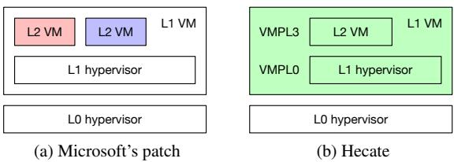  
Figure 1: Current SEV support for nested virtualization. Different colors indicate different SEV contexts.

VM created by the L1 hypervisor runs at level 2 (L2) and is called an L2 VM.

One application of nested virtualization is virtual clouds [14, 21, 30, 36, 47] constructed on existing clouds. Virtual cloud providers can run their custom cloud infrastructure using L1 VMs without preparing their own physical hosts. Cloud users can benefit from virtual clouds if such virtual clouds provide more attractive services than existing clouds, such as better instance types and lower prices. Since users in creasingly rely on SEV to protect their VMs in untrusted public clouds, it is natural to expect SEV protection for L2 VMs in virtual clouds. Likewise, virtual cloud providers would benefit from being able to protect the L1 VMs hosting their cloud infrastructure against the underlying public clouds.

However, SEV support for nested virtualization is still limited. Microsoft’s patch [40] enables SEV-SNP only for L2 VMs, as shown in Figure 1(a). Since it cannot apply SEV to the L1 VM running L2 VMs, the L1 hypervisor in the L1 VM is not protected against the L0 hypervisor. This means that the L1 hypervisor must trust the L0 hypervisor. This trust assumption is a fundamental limitation for virtual clouds running on untrusted public clouds. Even though L2 VMs are protected by SEV-SNP, they cannot be expected to operate correctly if the underlying L1 hypervisor has been compromised.

Hecate [16] and OpenHCL [37] can apply SEV-SNP not only to L2 VMs but also to L1 VMs, as shown in Figure 1(b). However, they can run only one L2 VM per L1 VM because they are implemented using VMPLs, which lack support for MMU virtualization. This limitation severely restricts the applicability of virtual clouds, which need to run many L2 VMs. In terms of security, Hecate and OpenHCL cannot protect the L2 VM from the L1 hypervisor. They divide the GPA space of the L1 VM using VMPLs and assign the portion that is not used by the L1 hypervisor running in VMPL0 to the L2 VM. Consequently, the L2 VM shares the SEV context with the L1 VM, and its memory is encrypted using the same key as the L1 VM. Although this allows the L2 VM to directly share encrypted memory with the L1 hypervisor, the L1 hypervi sor can freely access the internal state of the L2 VM, which runs at a lower privilege level. Therefore, the L2 VM must trust the L1 hypervisor. Since VMPLs are used to implement nested virtualization, neither L1 nor L2 VMs can use them for other purposes, such as vTPM [35]. Table 1 summarizes the characteristics of these existing approaches.

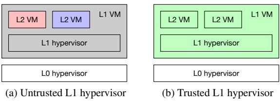  
Figure 2: Two trust models in nested SEV.

## 2.3 Threat Model

The threat model of this paper is similar to that of SEV. We assume that the processors and the AMD-SP are trusted. Since the L0 hypervisor is untrusted, it can mount attacks against both L1 and L2 VMs. Unlike the original threat model of SEV, we consider both untrusted and trusted L1 hypervisors. When the L1 hypervisor is untrusted, it can also mount attacks against L2 VMs.

As attack vectors, we consider attacks against the confidentiality and integrity of the memory and register states of L1 and L2 VMs. However, we do not consider control-flow manipulation attacks that change the handling of VM exits or modify the VMCB in the hypervisors. Therefore, we exclude attacks in which the L0 hypervisor bypasses the L1 hypervisor by not redirecting VM exits to it. Also, we do not consider side-channel attacks against L1 and L2 VMs. For example, the L0 hypervisor can observe control flows, e.g., interactions between the L1 hypervisor and L2 VMs, as well as memory access patterns, to infer the internal states of L2 VMs. These attacks are inherent limitations of SEV because the hypervisor must control SEV-enabled VMs. Furthermore, these limitations are not specific to SEV but are common to most trusted execution environments (TEEs). In addition, we do not consider collusion attacks between the L0 hypervisor and L2 VMs because L2 VMs do not trust the L0 hypervisor. Denial-of-service (DoS) attacks against L1 and L2 VMs are also out of scope.

## 3 Nested SEV

This paper proposes nested SEV to provide more secure and generic SEV support for nested virtualization. Nested SEV allows multiple SEV-enabled L2 VMs to run inside an SEVenabled L1 VM. It enables the L1 hypervisor to run in an SEVenabled L1 VM and applies SEV to L2 VMs running on top of the L1 hypervisor. Nested SEV supports two trust models, as illustrated in Figure 2. In both models, the L0 hypervisor is untrusted. When the L1 hypervisor is also untrusted, L2 VMs need to be protected not only against the L0 hypervisor but also against the L1 hypervisor. When the L1 hypervisor is trusted, L2 VMs do not need to be protected against the

Table 1: Comparison of previous systems and our two mechanisms for nested SEV  
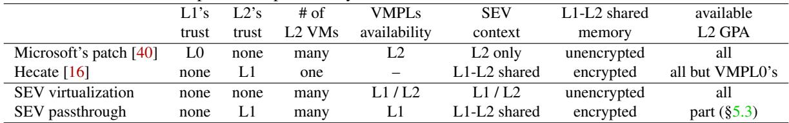

L1 hypervisor, but they still have to be protected against the L0 hypervisor. To achieve these two trust models, nested SEV provides two mechanisms: SEV virtualization and SEV passthrough. Table 1 compares these mechanisms with the previous systems.

SEV virtualization protects L2 VMs against an untrusted L1 hypervisor by using different SEV contexts, such as encryption keys and ASIDs, for L1 and L2 VMs. It provides virtual SEV to an L1 VM and enables the L1 hypervisor to apply virtual SEV to L2 VMs. To support virtual SEV, it virtualizes the AMD-SP and the RMP using a technique called emulationless multiplexing. For security, the L0 hypervisor does not emulate these hardware components. Specifically, SEV contexts for L2 VMs remain in the physical AMD-SP rather than being managed by a virtual AMD-SP. Similarly, RMP entries for L2 VMs are maintained by the physical processors and AMD-SP rather than by virtual CPUs and AMD-SP. This is achieved by multiplexing SEV contexts for both L1 and L2 VMs on the physical AMD-SP and accommodating memory mappings for both L1 and L2 VMs in the RMP, which is protected by hardware. SEV virtualization shares some similarities with Microsoft’s patch, but it additionally applies SEV to the L1 VM, thereby protecting the L1 hypervisor against the L0 hypervisor.

SEV virtualization can be used, for example, to construct virtual public clouds on top of untrusted public clouds. Public cloud providers run the L0 hypervisors, while virtual cloud providers build their own virtual public clouds using confidential VMs, i.e., SEV-enabled L1 VMs, as virtual hosts. Each virtual public cloud then provides users with SEV-enabled L2 VMs as confidential VMs. Similarly, such virtual public clouds can provide confidential containers [11], which are based on confidential VMs. Even without nested SEV, virtual cloud providers can run their custom cloud infrastructure on public bare-metal clouds. However, they cannot protect their cloud infrastructure, including hypervisors, because the underlying public clouds have direct access to the hardware. Although physical memory can be encrypted using AMD Secure Memory Encryption (SME) [4], SME does not provide memory integrity or attestation support.

On the other hand, SEV passthrough allows a trusted L1 hypervisor to access the memory and register states of L2 VMs by sharing the same SEV context between an L1 VM and its L2 VMs. To enable such a non-standard use of SEV contexts without VMPLs, it uses a technique called SEV con text decoupling. In traditional SEV and SEV virtualization, each VM has a unique SEV context in the AMD-SP and the processors. In SEV passthrough, in contrast, the SEV context is decoupled from the VM. As a result, an L1 VM and its L2 VMs can share a single SEV context. This is achieved by partially virtualizing SEV and running SEV-enabled L2 VMs without involving the AMD-SP. Since the AMD-SP does not recognize L2 VMs, SEV passthrough also supports L2 VMs that do not rely on SVM, such as paravirtualized VMs in Xen [9] and software-based L2 VMs in PVM [21]. It is similar to Hecate and OpenHCL in that it trusts the L1 hypervisor, but it enables the L1 hypervisor to run multiple L2 VMs. Hecate and OpenHCL can also use the same SEV context between an L1 VM and its L2 VM using VMPLs provided only by SEV-SNP, but SEV passthrough does not rely on VMPLs. Therefore, it allows L1 VMs to use VMPLs for their own purposes.

SEV passthrough can be used, for example, to construct virtual private clouds. As with virtual public clouds, virtual cloud providers can construct their own virtual private clouds using confidential VMs, i.e., SEV-enabled L1 VMs, provided by public clouds. Since both administrators and users belong to the same organization, virtual private clouds can provide users with non-confidential VMs, i.e., SEV-disabled L2 VMs. Note that L2 VMs are still protected against the L0 hypervisor by SEV-enabled L1 VMs. Even without nested SEV, existing clouds already provide virtual private clouds, such as Amazon Virtual Private Cloud (VPC) [7]. Using such services, virtual cloud providers can build their own private networks, but they cannot run custom hypervisors or protect their infrastructure. Another application of SEV passthrough is to monitor the internal states of L2 VMs using VM introspection [15]. Since the L1 hypervisor can access the memory and register states of L2 VMs, it can obtain system information inside L2 VMs.

Nested SEV allows users to apply any of the three SEV variants to both L1 and L2 VMs because security often comes at the expense of performance. The strongest security is not always the best solution. Specifically, SEV-SNP provides the strongest security but incurs the highest performance overhead due to the check of memory integrity. In contrast, SEV0 offers the highest performance by simply encrypting the memory of VMs, although it provides weaker security. SEV-ES lies between these two extremes. As a result, users can use the SEV variant that best matches their security and performance requirements.

## 4 SEV Virtualization

To run the L1 hypervisor in an SEV-enabled L1 VM, the L1 hypervisor needs to be modified to support SEV, as the L1 OS does. In addition, both the L1 and L0 hypervisors require additional SEV support to run L2 VMs in the L1 VM. Emulation-less multiplexing is used for RMP virtualization (§4.5) and AMD-SP virtualization (§4.6). Unless otherwise specified, this section focuses on SEV-SNP.

## 4.1 Unencrypted Memory Sharing for L2 VMs

In single-level virtualization with SEV, it is sufficient for the guest OS in a VM to mark memory as unencrypted to share it with the hypervisor, e.g., DMA bounce buffers. In nested virtualization, not only the L2 OS but also the L1 hypervisor needs to clear the C-bits of the corresponding PTEs in their page tables. This is because the L1 hypervisor cannot access memory encrypted with the key of the L2 VM. However, it is not easy for the L1 hypervisor to identify such pages because the L2 VM dynamically marks memory as unencrypted.

Therefore, the L1 hypervisor clears the C-bits of the PTEs corresponding to all the pages assigned to the L2 VM. If the L2 VM also clears the C-bit of its PTE, both the L2 VM and the L1 hypervisor can access the page without memory encryption. Note that the L1 hypervisor still cannot access the encrypted memory of the L2 VM unless the L2 OS explicitly clears the C-bits. As a result of this sharing mechanism, the L0 hypervisor can also access the memory shared between an L2 VM and the L1 hypervisor by clearing the C-bits. However, data in the shared memory is expected to be encrypted by the L2 VM because the L1 hypervisor is untrusted.

## 4.2 VMCB Virtualization

When the L1 hypervisor runs an L2 VM, it executes the VMRUN instruction. Since this instruction cannot be executed in an L1 VM, it causes a VM exit to the L0 hypervisor. Then, the L0 hypervisor executes the instruction on behalf of the L1 hypervisor. This instruction uses a VMCB, which is used to control the execution of an L2 VM and is stored in the memory of the L1 VM. This VMCB is called VMCB to distinguish it from the VMCB used for the L1 VM. Since VMCB is virtualized for the L1 hypervisor, the L0 hypervisor translates it into VMCB02, also known as a shadow VMCB.

Since the memory of the L1 VM is encrypted, the L0 hypervisor cannot access VMCB12 to generate the shadow VMCB. Therefore, the L1 hypervisor keeps VMCB12 unencrypted, as illustrated in Figure 3. This does not lower the security of L2 VMs because the VMCB is inherently under the control of an untrusted hypervisor. As a result, attacks on the VMCB are outside the threat model of SEV.

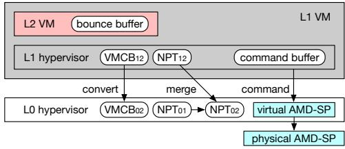  
Figure 3: Unencrypted memory regions.

## 4.3 NPT Virtualization

In nested virtualization, the L1 hypervisor creates Nested Page Tables (NPT) for each L2 VM to translate an L2 GPA into an L1 GPA. This NPT is called NPT12. Similarly, the L0 hypervisor creates NPT01 for each L1 VM to translate an L1 GPA into an L0 HPA. Since processors can use only one NPT during the translation of a guest virtual address (GVA) into an HPA, the L0 hypervisor merges these two NPTs and generates NPT02. This NPT, also known as a shadow NPT, can be used to directly translate an L2 GPA into an L0 HPA.

To generate the shadow NPT, the L0 hypervisor needs to read NPT12 from the memory of the L1 VM, but it cannot access that NPT because that memory is encrypted. Therefore, the L1 hypervisor keeps NPT unencrypted. Consequently, the L0 hypervisor can modify the NPT12, but this does not introduce additional security risks because the NPT is inherently managed by an untrusted hypervisor.

In general, the shadow NPT can be implemented using a synchronous or asynchronous method. However, the synchronous method cannot be used for SEV-enabled L1 VMs. Traditionally, the L0 hypervisor write-protects NPT12 in the L1 VM and configures the VMCB for the L1 VM so that a VM exit occurs when the L1 hypervisor attempts to update NPT12. When a VM exit occurs, the L0 hypervisor emulates the instruction used to update NPT12 and modifies both NPT12 and its shadow NPT, i.e., NPT02. To emulate the instruction, a #VC exception must be triggered by setting a reserved bit in NPT01 so that a reserved-bit error occurs on access. However, this significantly degrades the performance of NPT access because the #VC exception occurs even for read access.

Therefore, SEV virtualization uses the asynchronous method. This method also write-protects NPT12, as in the synchronous method, but it does not emulate the instruction on a VM exit. Instead, the L0 hypervisor removes write protection from the PTE to allow it to be updated and makes the L1 hypervisor resume execution at that instruction. As a result, NPT12 is updated, while its shadow NPT is not. Although NPT12 and the shadow NPT are temporarily out of sync, they are synchronized later upon a TLB flush, which is always performed by the L1 hypervisor after NPT updates. At that time, the L0 hypervisor updates the shadow NPT to synchronize it with NPT12 and write-protects the PTE of NPT12 again.

## 4.4 MMIO Virtualization

To virtualize memory-mapped I/O (MMIO) in an L2 VM, the L1 hypervisor writes invalid values to the PTEs corresponding to MMIO regions in NPT . As a result, a VM exit is caused to the L0 hypervisor when the L2 VM accesses the regions. To redirect it to the L1 hypervisor, the L0 hypervisor invokes the L1 VM by executing the VMRUN instruction. To emulate the instruction for accessing the MMIO region, the L1 hypervisor needs to decode the instruction stored in the memory of the L2 VM.

Unlike the VMCB and the NPT, however, the L2 VM cannot mark the code area as unencrypted because SEV requires the code area to remain encrypted. Therefore, the L1 hypervisor sets a reserved bit in the corresponding PTEs of NPT12 so that a #VC exception is raised when the L2 VM accesses the MMIO region. To virtualize the reserved bit, the L0 hy pervisor synchronizes the reserved bit in the shadow NPT with that in NPT . In the L2 VM, the #VC handler decodes the instruction and stores its bytes in the GHCB. In addition, it stores the L2 GPA of the accessed MMIO region in the GHCB. Then, it executes the VMGEXIT instruction to cause a VM exit to the L1 hypervisor via the L0 hypervisor.

When SEV0 is applied to an L2 VM, the L1 hypervisor cannot obtain the instruction used to access the MMIO region through a #VC exception. Therefore, the L1 hypervisor uses the Decode Assists feature in SVM, which stores the bytes of the instruction that causes a VM exit in the VMCB. Since the instruction bytes are stored in the shadow VMCB in nested virtualization, the L0 hypervisor synchronizes the correspond ing fields in VMCB12 with those in the shadow VMCB to virtualize Decode Assists.

Using PCI passthrough, an L2 VM can directly access the virtual devices provided by the L0 hypervisor rather than those provided by the L1 hypervisor [29]. To enable MMIO accesses to the L0 virtual devices, the L1 hypervisor maps the MMIO regions of the L0 virtual devices into the GPA space of the L2 VM. When the L2 VM accesses one of these MMIO regions, a VM exit occurs. To emulate the MMIO access, the L0 hypervisor needs the corresponding L1 GPA, but the GHCB or the shadow VMCB contains only the accessed L2 GPA. Therefore, the L0 hypervisor translates the L2 GPA into an L1 GPA using NPT12, which is kept unencrypted by the L1 hypervisor.

## 4.5 RMP Virtualization

The RMPUPDATE instruction for updating an RMP entry can be executed only by the L0 hypervisor. To virtualize this instruction, it is recommended to use the VIRT\_RMPUPDATE model-specific register (MSR) [5]. When the L1 hypervisor writes data to this MSR, a #VC exception is raised, as illustrated in Figure 4(a). After the #VC handler executes the VMGEXIT instruction, the L0 hypervisor translates the specified virtual ASID, which is assigned to the L2 VM by the L1 hypervisor, into the real ASID. It also translates the specified L1 GPA into an L0 HPA using NPT01. Then, it executes RMPUPDATE with the real ASID, the L0 HPA, and the specified L2 GPA. As such, the L0 hypervisor does not emulate the RMP. Instead, it leverages the existing RMP by translating L1 virtual mappings into their corresponding L0 mappings.

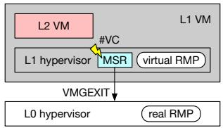  
(a) RMP for L2 VMs

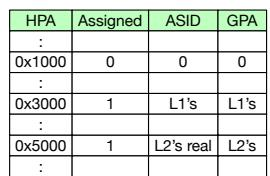  
(b) Real RMP  
Figure 4: Virtualizing the RMP.

Since the L1 hypervisor needs to read the RMP directly from memory, it creates its own virtual RMP. The virtual RMP is similar to the real RMP but maintains the virtual mapping from an L1 GPA to its owner. For a guest-owned page, the L1 hypervisor sets the Assigned field and stores the virtual ASID and GPA of an L2 VM in the RMP entry. For a hypervisor-owned page, it clears the Assigned field. The L1 hypervisor updates the virtual RMP when writing data to the VIRT\_RMPUPDATE MSR and synchronizes it with the real RMP, which is managed by the L0 hypervisor. Since the virtual RMP is just a cache, tampering with it does not affect the security of L2 VMs.

To virtualize the RMP, it is not sufficient to manage only the traditional two types of owners. Since a guest-owned page can be assigned to either an L1 or L2 VM, it is necessary to manage three types of owners. An L2-owned page is a guestowned page accessible only by an L2 VM. An L1-owned page is a guest-owned page that the L1 hypervisor does not assign to any L2 VMs in the L1 VM. An L0-owned page is a hypervisor-owned page that is either shared between the L0 and L1 hypervisors, shared between the L1 hypervisor and an L2 VM, or not assigned to any L1 VMs. Note that a shared page between the L1 hypervisor and an L2 VM is not an L1-owned page because it must be accessible to both the L1 and L2 VMs.

To accommodate these three types of owners in the real RMP, the L0 hypervisor constructs the real RMP as shown in Figure 4(b). It sets the Assigned field of the RMP entry for an L2-owned page and stores the real ASID and GPA of an L2 VM in the entry. For an L1-owned page, it also sets the Assigned field and stores the ASID and GPA of an L1 VM. For an L0-owned page, it clears the Assigned field. When the L1 hypervisor changes a page from L0-owned or L1-owned to L2-owned, it writes the virtual ASID of an L2 VM to the VIRT\_RMPUPDATE MSR. When changing a page to L1-owned, it writes -1, which represents the ASID of the L1 VM itself, to the MSR. In this case, the L0 hypervisor executes RMPUPDATE with the ASID of the L1 VM.

## 4.6 AMD-SP Virtualization

To boot an SEV-enabled VM, the hypervisor issues various commands for guest management to the AMD-SP. For example, it issues the SNP\_GCTX\_CREATE command to generate a memory encryption key and store it in the guest context page. Since the guest context page is protected by memory encryption and the RMP, the hypervisor cannot eavesdrop on or tamper with it. Then, it issues the SNP\_ACTIVATE command to install the key into the memory controller and bind the specified ASID to the VM. Next, the hypervisor issues the SNP\_LAUNCH\_UPDATE command to encrypt the specified memory regions in the VM, such as firmware, and the VM-SAs using the key. In addition, the AMD-SP marks the pages as guest-owned and validated by updating the RMP.

To boot an SEV-enabled L2 VM, the L0 hypervisor provides a virtual AMD-SP to an L1 VM. The L1 hypervisor issues a set of commands to the virtual AMD-SP. However, it would not be secure for the virtual AMD-SP itself to manage sensitive SEV contexts, e.g., encryption keys. Therefore, the L0 hypervisor does not emulate the AMD-SP. SEV contexts are securely managed only inside the physical AMD-SP, as in single-level virtualization. The guest context page is also protected against both the L0 and L1 hypervisors. When the virtual AMD-SP receives a command, it simply forwards that command to the physical AMD-SP. To allow both the virtual and physical AMD-SPs to access the command buffer, the L1 hypervisor keeps it unencrypted. If necessary, the virtual AMD-SP translates several parameters in the command buffer, e.g., the virtual ASID and the L1 GPA.

The AMD-SP provides a different set of commands for SEV0 and SEV-ES. The command set is similar to that of SEV-SNP, but it does not use the guest context page. Sensitive SEV contexts are stored only in the AMD-SP, instead of the guest context pages. Since the virtual AMD-SP does not store any sensitive data for SEV0 and SEV-ES, it does not introduce additional security risks.

## 4.7 Direct Context Switching with VMSAs

In single-level virtualization, when the hypervisor executes the VMRUN instruction to run an SEV-enabled VM, the processor saves the minimal state, such as the instruction pointer, to the host save area. Then, it loads the entire register state from the encrypted VMSA for the VM. In contrast, when a VM exit occurs, the processor encrypts the entire register state and saves it to the VMSA. Then, it loads the minimal state from the host save area.

In nested virtualization, when the L1 hypervisor executes VMRUN to run an SEV-enabled L2 VM, a #VC exception occurs, and the #VC handler invokes the L0 hypervisor using the

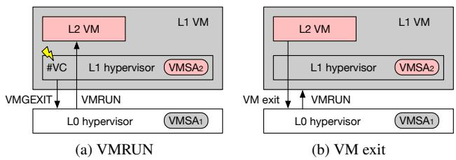  
Figure 5: Context switching between the L1 hypervisor and an L2 VM.

VMGEXIT instruction, as illustrated in Figure 5(a). To emulate VMRUN, the L0 hypervisor needs to save the state of the L1 VM to the host save area in the L1 VM. When a VM exit occurs in the L2 VM, the L0 hypervisor needs to load the state of the L1 VM from the host save area. However, it cannot access the register state or the host save area of the L1 VM because the memory and register state of the L1 VM are encrypted.

Therefore, the L0 hypervisor simply executes VMRUN to load the VMSA for the L2 VM. It does not explicitly save the state of the L1 VM because the state is implicitly saved to the VMSA by the processor on the VM exit caused by VMGEXIT. Similarly, when a VM exit occurs in an L2 VM, the L0 hypervisor is invoked and simply executes VMRUN to load the VMSA for the L1 VM, as in Figure 5(b). It does not explicitly load the state of the L1 VM from the host save area.

For optimization, the L1 hypervisor directly configures the GHCB and executes VMGEXIT, instead of executing VMRUN. It is wasteful to cause a #VC exception by executing that instruction. This optimization can eliminate the overhead of the #VC exception.

## 5 SEV Passthrough

In addition to SEV support for the L1 hypervisor, SEV passthrough requires mechanisms for RMP virtualization and direct context switches, as well as SEV support for VMCB virtualization and NPT virtualization. However, it does not require the remaining mechanisms used by SEV virtualization, namely unencrypted memory sharing, SEV support for MMIO virtualization, ASID virtualization, and AMD-SP virtualization.

## 5.1 SEV Context Decoupling

Unlike SEV virtualization, SEV passthrough does not virtualize the AMD-SP to enable L2 VMs to share the same SEV context with their L1 VM. The L1 hypervisor does not issue commands to the virtual AMD-SP to boot L2 VMs. Also, it does not assign virtual ASIDs to L2 VMs. Instead, it assigns the ASID of the L1 VM to all the L2 VMs running in the L1 VM, so that the L2 VMs can use the same encryption key as the L1 VM. This assignment is possible because SEV passthrough boots L2 VMs without involving the AMD-SP. Otherwise, the AMD-SP would bind a unique ASID to each L2 VM. In addition, not only the L2 OS but also the L1 hypervisor can validate the memory of the L2 VM. This does not introduce a security concern because the L1 hypervisor is trusted.

## 5.2 Encrypted Memory Sharing for L2 VMs

SEV passthrough enables an L2 VM to share encrypted memory with the L1 hypervisor. In SEV virtualization, shared memory needs to be kept unencrypted because the encryption keys differ between L1 and L2 VMs. Since the same ASID is assigned to both L1 and L2 VMs in SEV passthrough, the L1 hypervisor can directly access the encrypted memory of the L2 VM by using the encryption key associated with that ASID. Therefore, both the L2 OS and the L1 hypervisor can leave the corresponding C-bits set in their page tables. Consequently, the L0 hypervisor cannot eavesdrop on the shared memory between the L1 hypervisor and the L2 VM because the memory remains encrypted.

Furthermore, this can improve the I/O performance of the L2 VM. The L2 VM can perform DMA using encrypted buffers without copying data to and from unencrypted bounce buffers. In addition, the L1 hypervisor can decode instructions for MMIO virtualization by directly accessing the encrypted memory of the L2 VM. It can access the encrypted VMSAs of the L2 VM, which are stored in the memory of the L1 VM. Since a #VC exception is not necessary, the L1 hypervisor does not set the reserved bit in the PTEs of NPT12 corresponding to MMIO regions. This prevents a #VC exception from being raised. Instead, the L1 hypervisor writes invalid values to the PTEs. When the L2 VM accesses the MMIO region, a VM exit occurs directly to the L0 hypervisor. Then, the invoked L1 hypervisor emulates the instruction for accessing the region using the register values saved in the VMSA.

## 5.3 Exclusive GPA Assignment

In SEV-SNP, encrypted memory sharing between L1 and L2 VMs conflicts with RMP checks. When the L1 hypervisor accesses the memory of an L2 VM, the processor performs an RMP check. Although the ASID of the L1 VM matches that of the L2 VM, the L2 GPA registered in the entry of the real RMP generally differs from the corresponding L1 GPA. Therefore, the RMP check fails, as illustrated in Figure 6(a). As a result, the L1 hypervisor cannot access the memory of the L2 VM. Conversely, if different memory pages are assigned the same L1 or L2 GPA, the L0 hypervisor can swap those pages between L1 and L2 VMs or between L2 VMs. In this case, the RMP check still passes, leading to incomplete integrity protection.

To address these issues, the L1 hypervisor exclusively assigns memory pages to the GPA spaces of L2 VMs so that the L2 GPA of each page is identical to its L1 GPA, as illustrated in Figure 6(b). Since the L1 GPA matches the L2 GPA registered in the RMP entry, the RMP check passes when the L1 hypervisor accesses the memory of the L2 VM. In this assignment, GPAs are unique across all L2 VMs. Therefore, the RMP check fails even if the L0 hypervisor swaps memory pages because the GPAs assigned to these pages do not match those in the RMP entries. To simplify this memory assignment, the L1 hypervisor uses contiguous physical memory regions that are as large as possible for each L2 VM. Specifically, the L0 hypervisor allocates 1-GB huge pages for an L1 VM and assigns them to the GPA range above 4 GB in the L1 VM.

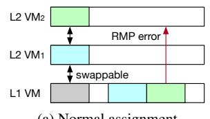  
(a) Normal assignmen

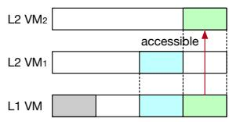  
(b) Exclusive assignment  
Figure 6: Memory assignment in the GPA spaces of an L1 VM and its L2 VMs.

To boot an L2 VM with arbitrary GPAs, SEV passthrough uses custom firmware for the L2 VM. Since the x86 architecture starts the execution of firmware at a fixed physical address, an L2 VM whose memory is allocated only in the GPA space above 4 GB cannot run existing firmware such as OVMF. The custom firmware is based on qboot [38], which is designed for booting the Linux kernel and supports execution at arbitrary GPAs. It starts execution from a specified address and loads the ACPI table. To support GPAs above 4 GB, the ACPI table uses the 64-bit extension.

To initialize application processors (APs) with arbitrary GPAs, SEV passthrough uses the Wakeup Mailbox added in ACPI 6.4 [45]. Traditionally, APs are initialized in real mode using the INIT-SIPI mechanism, which requires low memory below 1 MB. This mechanism cannot be used when the kernel is placed in higher GPA regions. With the Wakeup Mailbox, APs start execution in long mode when the kernel writes the Wakeup command and the wakeup address to a dedicated memory region. In addition, the L1 hypervisor adds information on the Wakeup Mailbox to the ACPI table and provides the corresponding MMIO region.

## 5.4 Paravirtualized L2 VMs

SEV passthrough can support paravirtualized L2 VMs, which are created without using SVM. Since such L2 VMs are not recognized as VMs by processors, they share the same SEV context as the L1 VM. Therefore, SEV seamlessly encrypts their memory as part of the memory of the L1 VM. Note that the L2 OS can still control memory encryption by setting the C-bits in its page tables. For paravirtualized L2 VMs, the L1 hypervisor does not use NPT and directly assigns L1 GPAs, e.g., via pseudo-physical addresses in Xen [9], which naturally achieves exclusive GPA assignment.

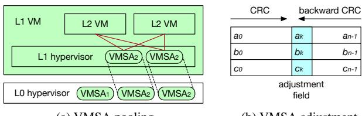  
(a) VMSA pooling  
(b) VMSA adjustment  
Figure 7: VMSA pooling and backward CRC computation.

When the L2 OS validates the memory of the L2 VM, it cannot execute the PVALIDATE instruction because this instruction is privileged. Its execution causes a general-protection exception (#GP), and the #GP handler in the L1 hypervisor executes that instruction on behalf of the L2 VM. Similarly, the L2 VM cannot use the VMGEXIT instruction to change the page owner because the L0 hypervisor cannot distinguish whether a VM exit originates from the L1 or L2 VM. Therefore, the L2 VM issues a new hypervisor call for changing the page owner to the L1 hypervisor.

## 5.5 VMSA Pooling for SEV-ES

Since SEV passthrough does not provide a virtual AMD-SP to an L1 VM, the L1 hypervisor cannot directly issue the LAUNCH\_UPDATE\_VMSA command to encrypt newly allocated VMSAs when booting ES-enabled L2 VMs. Therefore, the L0 hypervisor pre-allocates VMSAs for L2 VMs and issues the command to the physical AMD-SP when booting an L1 VM. The number of prepared VMSAs equals that of the virtual CPUs assigned to the L1 VM, but it can be smaller than the total number of virtual CPUs assigned to all L2 VMs. To support an arbitrary number of virtual CPUs, the L1 hypervisor does not statically assign the pre-allocated VMSAs to the virtual CPUs of L2 VMs. Instead, it pools VMSAs and dynamically assigns them to active virtual CPUs, as illustrated in Figure 7(a).

Since SEV passthrough shares the same SEV context between the L1 VM and its L2 VMs, the L1 hypervisor can directly initialize the register states in encrypted VMSAs when booting an L2 VM. When switching virtual CPUs, it can save the register state stored in the VMSA for the previously running virtual CPU to its memory and then load the saved register state of the next virtual CPU into the same VMSA. However, SEV-ES computes a checksum of a VMSA on each VM exit from an L2 VM to prevent rollback attacks. The checksum is securely stored in the Trusted Memory Region (TMR), which is inaccessible to software. If the L1 hypervisor modifies a VMSA, its checksum becomes inconsistent with the value stored in the TMR. This causes the failure of the

VMRUN instruction executed by the L1 hypervisor.

To address this issue, the L1 hypervisor preserves the checksum by adjusting fields in a VMSA. The L1 hypervisor computes the checksum of a VMSA before modifying it. After modification, the L1 hypervisor computes the adjustment required to restore the original checksum. The checksum algorithm in SEV-ES is undocumented, but we found that EPYC processors compute three CRC-32C values for each VMSA. To adjust these values, the L1 hypervisor uses three 32-bit fields that are only used when a VM exit occurs. These fields are unused when the L1 hypervisor executes VMRUN. Note that the L0 hypervisor cannot modify VMSAs or adjust their checksums using the same technique because it cannot access encrypted VMSAs.

Specifically, the L1 hypervisor computes the adjustment value using the backward CRC algorithm [42], as in Figure 7(b). For the k-bit data before the field ak used for the adjustment, it efficiently computes the CRC of a0 · · · ak−1 using the CRC32 instruction with the standard polynomial P(x). For the (n − k)-bit data after that field, it must compute the CRC of an−1 · · · ak using a non-standard polynomial x32 · P(−x). To efficiently compute this value, the L1 hypervisor uses Barrett reduction with the PCLMULQDQ instruction [24], which computes the CRC using multiplication over 128-bit SSE registers. It further accelerates this computation using the VPCLMULQDQ instruction with 256-bit AVX registers.

VMSA pooling and the backward CRC computation are necessary only for SEV-ES. In SEV-SNP, the L1 hypervisor can initialize VMSAs when booting an L2 VM. It can dynamically allocate a new VMSA by updating the VMSA field in the RMP entry using the RMPADJUST instruction. Since VM-SAs are protected from the L0 hypervisor by the RMP, their checksums are no longer stored in the TMR.

## 6 Security Analysis

In SEV virtualization, the L0 hypervisor can also access the memory shared between L2 VMs and the L1 hypervisor because such shared memory is kept unencrypted. However, L2 VMs can protect I/O data stored in shared memory against not only the L1 hypervisor but also the L0 hypervisor by using full disk encryption and end-to-end encryption. Even for data that is difficult to encrypt, the L0 hypervisor can mount only the same attacks as the L1 hypervisor. Note that it cannot access this shared memory in SEV passthrough because shared memory is encrypted.

Even in single-level virtualization, the hypervisor can alter the VMCB and the NPT used for VMs. In nested SEV, not only the L1 hypervisor but also the L0 hypervisor can alter unencrypted VMCB and NPT used for L2 VMs. More directly, the L0 hypervisor can alter the shadow VMCB and the shadow NPT. However, it can mount only the same class of attacks against L2 VMs as in single-level virtualization. Tampering with the NPT can be detected by RMP checks in SEV-SNP. In addition, such attacks do not directly affect the security of the L1 hypervisor because the VMCB and the NPT control only the behavior of L2 VMs. As another attack, the L1 hypervisor can keep the NPT12 out of sync with the shadow NPT by not flushing the TLB. This attack is equivalent to the case where the L0 hypervisor does not update the shadow NPT as expected. Therefore, both the L0 and L1 hypervisors can mount only the same class of attacks against L2 VMs as in single-level virtualization.

The L0 hypervisor can compromise the virtual AMD-SP, but no sensitive data is stored in it. SEV contexts for L2 VMs are stored only in the physical AMD-SP, which is protected against the L0 hypervisor. Since the L1 hypervisor needs to pass an unencrypted command buffer to the virtual AMD-SP, the L0 hypervisor can tamper with this buffer. This type of attack can be detected by command-specific countermeasures, e.g., remote attestation. Similarly, the L0 hypervisor can alter the initial code, data, and register state of an L2 VM. This is because the L1 hypervisor needs to prepare them in the memory regions that are not yet protected and issue the SNP\_LAUNCH\_UPDATE command to the virtual AMD-SP. However, the owner of the L2 VM can verify that these memory regions have not been tampered with by the L0 and L1 hypervisors using remote attestation.

Hardware-based attestation of L2 VMs is not supported in SEV passthrough because L2 VMs are not directly managed by the AMD-SP. However, the correct boot of the L2 VM is ensured under the assumption that the L1 hypervisor is trusted. The memory of the L1 hypervisor and the L2 VM is protected against the L0 hypervisor. If necessary, softwarebased attestation using vTPM can be used.

The L0 hypervisor could bypass the L1 hypervisor if it handles all VM exits from L2 VMs because VM exits are first delivered to the L0 hypervisor. While this attack is relatively difficult in SEV passthrough, it is easier in SEV virtualization. This is because SEV virtualization does not encrypt not only the VMCB and the NPT for L2 VMs but also the GHCB and the shared memory between L2 VMs and the L1 hypervisor. Our threat model excludes such control-flow manipulation attacks as in that of SEV. A possible mitigation is that the L2 VM encrypts the GHCB and the shared memory by itself using the key shared only with the L1 hypervisor. Since the L1 hypervisor should not collude with an untrusted L0 hypervisor, the L0 hypervisor cannot obtain the necessary information to handle VM exits.

Since L2 VMs are not fully hidden from the L0 hypervisor, they could suffer from some of the side-channel attacks that the hypervisor can mount against SEV-enabled VMs in single-level virtualization. For example, the L0 hypervisor could infer the internal states of L2 VMs by observing VM exits. Using SEV passthrough and paravirtualized L2 VMs, nested SEV can hide most interactions between the L1 hypervisor and L2 VMs because L2 VMs are not mediated by the L0 hypervisor. If fully virtualized L2 VMs are used, hardware support is needed to protect such interactions. For example, TD partitioning in Intel TDX [25] enables nested virtualization similar to Hecate. Unlike Hecate, the L0 hypervisor cannot observe VM exits caused by L2 VMs because control is transferred via the trusted TDX module to the L1 hypervisor. Note that side-channel attacks are outside the scope of SEV.

The L0 hypervisor can also observe the VM exits of L1 VMs. Unlike traditional VMs and L2 VMs, the L1 VM runs a hypervisor and causes different types of VM exits, for example, by executing the VMRUN instruction. Such VM exits may introduce a new attack surface for L1 VMs. This is an inherent limitation of SEV because the L0 hypervisor must control the L1 VM that runs the L1 hypervisor.

In SEV passthrough, the L0 hypervisor can abuse the NPT for an L1 VM as the shadow NPT for its L2 VM. Since the L2 GPA is identical to the L1 GPA due to exclusive GPA assignment, and the ASID is the same, this shadow NPT can be used without RMP violations. As a result, the L2 VM can potentially access the entire memory of the L1 VM, including the memory used by other L2 VMs. However, this attack requires the collusion between the L0 hypervisor and the L2 VM. Since the L2 VM does not trust the L0 hypervisor, such an attack falls outside the scope of our threat model. A possible solution is to verify the GPA range used by an L2 VM. When the L2 OS sets the page table base register, the L1 hypervisor can inspect the page tables and write-protect them to monitor subsequent updates.

## 7 Experiments

We conducted several experiments to examine the performance of L2 VMs in nested SEV. In these experiments, we used two mechanisms in nested SEV and three SEV variants. We ran modified Linux/KVM 6.11.0 with QEMU 9.1.0 as the L0 hypervisor. In an L1 VM, we ran either modified Linux/KVM 6.11.0 with QEMU 9.1.0, BitVisor, or Xen 4.16 as the L1 hypervisor. KVM and BitVisor support full virtualization, while Xen supports paravirtualization without SVM. BitVisor adopts a passthrough-based architecture and supports only a single VM. In an L2 VM, we ran either modified OVMF from edk2-stable201903 or custom firmware as UEFI BIOS, and Linux 6.11.0 as the guest OS. For Xen, we used paravirtualized Domain 0 and Domain U. In the experiment examining the impact of VMPLs, we used the COCONUT Secure VM Service Module (SVSM) [43] in both the L1 and L2 VMs. For comparison, we also examined the performance of SEV-disabled L2 VMs and that of L1 VMs in single-level virtualization using KVM.

We used a server with a fourth-generation AMD EPYC 9334 processor, 128 GB of DDR5-4800 RDIMM memory, a 1.6 TB SAS SSD, and a 10 GbE NIC. We assigned resources to the L1 and L2 VMs as summarized in Table 2. The VMs used virtio-net as the network interface, except for Xen’s Domain U, which used the xen-netfront driver. As a remote host, we used a server equipped with two Intel Xeon Silver 4110 processors, 256 GB of memory, and a 10 GbE NIC and ran Linux 5.4.189.

Table 2: Resource allocation for VMs  
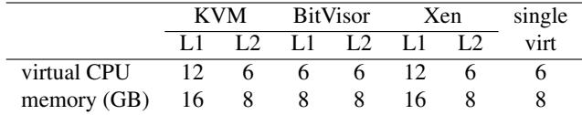

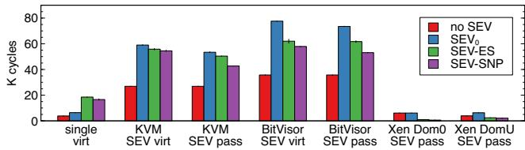  
Figure 8: Overhead of VM exits.

## 7.1 Overhead of VM Exits

To examine the overhead of a VM exit, we measured the number of CPU clock cycles required to execute the VMMCALL instruction. Figure 8 shows the results. Even in single-level virtualization, SEV degraded the performance of a VM exit by 41%. SEV-ES was 2.9x slower than SEV due to the #VC exception and the encryption of the register state. SEV-SNP was 12% faster than SEV-ES because CRC computation for VMSAs was not performed.

In nested virtualization, the performance of a VM exit significantly degraded. A VM exit in an L2 VM first invoked the L0 hypervisor, which executed the VMRUN instruction for the L1 VM. The L1 hypervisor then handled VMMCALL and executed VMRUN for the L2 VM. This instruction caused another VM exit to the L0 hypervisor, which executed VMRUN again to resume the L2 VM. As a result, SEV virtualization was twice as slow as nested virtualization without SEV. Surprisingly, SEV-ES virtualization was faster than SEV virtualization. This is because the L0 hypervisor could simply switch VM-SAs between the L1 and L2 VMs during context switches. SEV-SNP virtualization was also faster than SEV-ES virtualization because the backward CRC computation was not required. Consequently, the overhead of a VM exit decreased in the order of SEV , SEV-ES, and SEV-SNP virtualization.

SEV passthrough was 0.5–28% faster than SEV virtualization because SEV is partially virtualized. In Xen, the #VC handler in the L1 hypervisor was invoked in SEV-ES and SEV-SNP passthrough because the L2 VMs were paravirtualized. Therefore, the #VC handler did not need to execute VMGEXIT to handle VMMCALL.

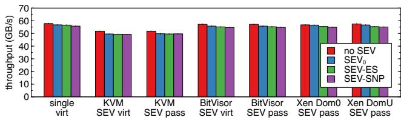

Figure 9: Performance of a memory-intensive workload.  
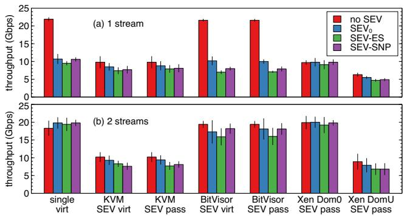  
Figure 10: TCP/IP performance.

## 7.2 Memory Performance

We measured the performance of a memory-intensive workload using the STREAM 1.3.4 benchmark [31]. We performed a 2-GB memory copy so that the copy size was sufficiently larger than the CPU cache size. As shown in Figure 9, the overhead of nested virtualization was 0.4–3.6% in BitVisor and Xen, regardless of whether SEV was enabled. The performance decreased in the order of SEV disabled, SEV , SEV-ES, and SEV-SNP. In contrast, the overhead of nested virtualization was 10–12% in KVM. Since it was 10% even for an SEV-disabled L2 VM, this performance degradation is attributable to KVM’s implementation rather than nested SEV.

## 7.3 Network Performance

We measured TCP/IP performance using the iperf 3.9 benchmark [12]. We ran the client in an L2 VM and connected it to the server running on the host. As shown in Figure 10(a), the throughput decreased by 51–53% due to SEV even in single-level virtualization. This is because the VM caused many VM exits and copied data between encrypted buffers and unencrypted bounce buffers to allow the hypervisor to access the data [27].

In nested virtualization with KVM, the throughput degraded significantly, even for an SEV-disabled L2 VM, due to the high overhead of VM exits. Enabling SEV further degraded performance, but the differences from the SEVdisabled L2 VM were relatively small. For BitVisor, the results were similar to those in single-level virtualization. The reason is that the L2 VM directly accessed the virtio-net device provided by the L0 hypervisor via PCI passthrough.

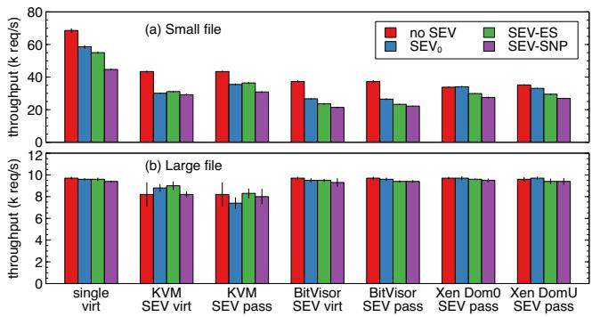  
Figure 11: Performance of the Web server.

Xen’s Domain 0 also used PCI passthrough, but the performance of the SEV-disabled L2 VM was much lower. The throughput of Xen’s Domain U was the lowest because of the split driver model.

Next, we ran two pairs of iperf3 clients and servers concurrently and measured their aggregate throughput. Figure 10(b) shows the total throughput of the two streams. The performance of the SEV-enabled VMs improved significantly in single-level virtualization, BitVisor, and Xen’s Domain 0. Compared with single-level virtualization, the throughput decreased by at most 18% in BitVisor and 1.0% in Xen’s Domain 0. This is because the overhead introduced by SEV was hidden by concurrent data transfers. In KVM, however, the performance improved only marginally. The throughput increased by only 12% in SEV-ES virtualization but decreased by 2.5% in SEV-ES passthrough. Although the throughput of Xen’s Domain U improved by 39–45%, it remained lower than that of KVM.

Surprisingly, the performance of SEV-SNP was higher than that of SEV-ES in nested SEV. One reason is that VM exits are faster in SEV-SNP, as shown in Section 7.1. Since many VM exits occur under I/O-intensive workloads, SEV-ES suffers more from the higher overhead of VM exits. Another possible reason is the immaturity of the implementation of nested SEV. For example, SEV-ES virtualization uses our custom memory manager for L2 VMs, while SEV-SNP virtualization uses the standard guest\_memfd provided by KVM. This could contribute to the relatively better performance of SEV-SNP virtualization with KVM.

## 7.4 Performance of the Web Server

We measured the performance of Apache HTTP Server 2.4.62 [44] using the bombardier 1.2.6 benchmark [13]. First, we repeatedly requested a small 45-byte HTML file from the remote host. Figure 11(a) shows the request processing rate with 200 concurrent connections. Even in single-level virtualization, SEV-SNP degraded performance by 35%. The overhead of nested virtualization was 31–58% with or without SEV. Unlike the iperf3 benchmark, the performance in BitVisor degraded significantly. This is because the transferred data was small, making the processing overhead relatively more significant than the I/O overhead. In contrast, the performance in Xen was 24–29% better than that in BitVisor when nested SEV was enabled. In KVM, the performance was up to 15% better with SEV passthrough than with SEV virtualization. One reason is that SEV passthrough eliminates the need for bounce buffers in the L2 VM.

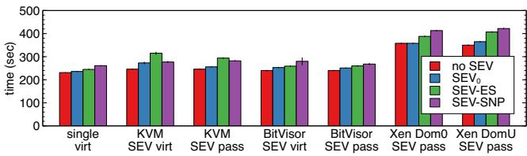  
Figure 12: Build time of the Linux kernel.

Next, we repeatedly requested a large HTML file of approximately 100 KB. As shown in Figure 11(b), the overhead of nested virtualization became much smaller with or without SEV. This is because the network bandwidth became a bottleneck. In BitVisor and Xen, the performance was almost identical to that of single-level virtualization. In KVM, however, the performance degraded by 6.3–23%. These results are similar to those of the iperf3 benchmark.

## 7.5 Performance of the Kernel Build

We measured the time required to build Linux kernel 6.1.0 with the default configuration. We used as many virtual CPUs as assigned to an L2 VM. As shown in Figure 12, SEV increased the build time by up to 12% even in single-level virtualization. In nested virtualization with KVM, the SEVdisabled L2 VM increased the build time by 6.1%, while the SEV-enabled L2 VMs increased it by 5.8–22%, compared with single-level virtualization. Notably, the slowdown was greatest in SEV-ES virtualization and smallest in SEV-SNP virtualization. The reasons are likely the same as those for the iperf3 benchmark because the kernel build generated intensive disk I/O. In BitVisor, the slowdown in nested SEV was only 2.6–6.8%. This is because the L2 VM directly accessed the virtual disk via PCI passthrough. In contrast, the build time was much longer in Xen. The slowdown was 34–40% in the SEV-enabled L2 VMs and 34–36% even in the SEV-disabled L2 VMs. Since building a large Linux kernel spawned many processes, the L2 VM needed to modify the page tables frequently. This overhead was higher because a paravirtualized L2 VM in Xen issued a hypercall whenever it modified a PTE.

## 7.6 Boot Performance

We measured the time required to boot an L2 VM. We defined the boot time as the interval between the creation of the L2 VM and the point at which the SSH server became available in the VM. In KVM, OVMF or the custom firmware executed GRUB2, which loaded the Linux kernel and the initial RAM disk. Note that, for BitVisor and Xen’s Domain 0, we included the boot time of the L1 VM. This is because the L2 VM was automatically booted immediately after the L1 hypervisor booted, making it difficult to isolate the boot time of the L2 VM.

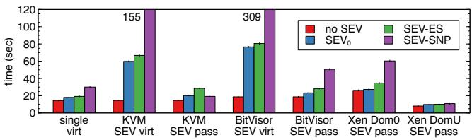  
Figure 13: Boot time of an L2 VM.

Figure 13 shows the boot time of an L2 VM. In KVM, SEV0 virtualization was 4.1x slower than nested virtualization without SEV. This is because the cost of NPT virtualization was high. Since the shadow NPT initially had no entries, a VM exit occurred whenever the L2 VM accessed a memory page for the first time. Then, the L0 hypervisor updated the shadow NPT through complex interactions with the L1 hypervisor, as described in Section 4.3. In the current implementation of SEV0 virtualization, the L1 hypervisor cannot assign huge pages to the L2 VM. As a result, the L2 VM generated a large number of NPT violations and VM exits during boot.

For BitVisor, in contrast, the overhead of NPT virtualization was smaller because BitVisor could assign 2-MB huge pages to the L2 VM. However, it encrypted a 10-MB Linux kernel image and a 100-MB initial RAM disk using the relatively slow AMD-SP. Therefore, the boot time was 4.1x longer in SEV0 virtualization. If BitVisor encrypts only the hash values of the kernel and the initial RAM disk using the AMD-SP and lets the firmware verify them, as implemented in KVM [34], this overhead could be reduced.

SEV-SNP slowed down the boot of the VM because the VM had to validate assigned memory using the PVALIDATE instruction. OVMF validated approximately 2 GB of memory in advance, while the Linux kernel validated the remaining memory on demand in 2-MB units. In this experiment, the kernel validated approximately 800 MB of memory. As a result, SEV-SNP virtualization significantly degraded boot performance. In particular, BitVisor exhibited the longest boot time. The reason is that BitVisor validated the entire memory of the L2 VM during boot. In addition, the custom firmware did not assign huge pages to the L2 VM, which further increased the overhead of NPT virtualization.

In contrast, SEV passthrough was comparable to singlelevel virtualization. In KVM, the boot time increased by only 12% and 49% for SEV0 and SEV-ES, respectively. This is because the L1 hypervisor could assign 2-MB huge pages to the L2 VM, thereby reducing the overhead of NPT virtualization.

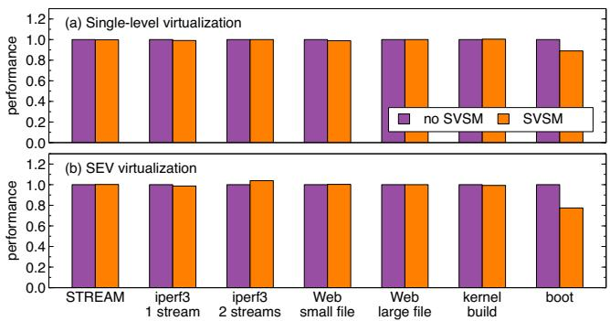  
Figure 14: Performance with SVSM enabled.

For SEV-SNP, the boot became 1.6x faster than in single-level virtualization. The reason is that the L1 hypervisor could use 1-GB huge pages, which further reduced the overhead of NPT virtualization.

## 7.7 Impact of SVSM

We conducted experiments on SNP-enabled VMs running SVSM under single-level virtualization and SEV virtualization with KVM. Figure 14 shows the relative performance in the five experiments described above, using performance without SVSM as the baseline. Except for the boot time, SVSM had little impact on performance. In contrast, the boot perfor mance degraded by 12% and 29% in single-level virtualization and SEV virtualization, respectively. The reason is that the guest OS needed to invoke SVSM to validate memory in VMPL0. The overhead was larger in nested virtualization because each SVSM call required a VM exit to the L0 hypervisor and the execution of VMRUN to enter the L1 VM.

## 7.8 Discussion

SEV virtualization assumes a stronger threat model in which neither the L0 nor the L1 hypervisor is trusted, while SEV passthrough assumes a weaker threat model in which only the L0 hypervisor is untrusted. SEV passthrough consistently performs better for VM exits and the boot time of L2 VMs. For the other workloads, however, a faster mechanism depends on the SEV variant and the L1 hypervisor. Note that SEV passthrough remains useful even when its performance is lower than that of SEV virtualization. This is because several features, such as VM introspection [15], are possible only with SEV passthrough.

For SEV variants, the threat model becomes stronger in the order of SEV0, SEV-ES, and SEV-SNP, but performance does not necessarily decrease in this order. Since a stronger threat model does not always result in lower performance, users need to select an appropriate SEV variant based on their workloads. For example, they may prefer SEV-SNP for network-intensive workloads. Although SEV-SNP generally outperformed SEV-

ES, the boot time was much longer in SEV-SNP virtualization. When users need to boot L2 VMs frequently, they may choose SEV-ES virtualization if its threat model is acceptable.

Hecate’s threat model is similar to that of SEV passthrough. Compared with the performance results reported in the literature [16], SEV passthrough incurs lower overhead for VM exits, while Hecate achieves better performance in network communication and Web access. Direct comparison is difficult because the experimental conditions differ, but Hecate could reduce overhead by supporting only a single L2 VM. The threat model of Microsoft’s patch is similar to that of SEV virtualization, except that the L1 hypervisor must trust the L0 hypervisor. Therefore, its threat model is weaker than that of SEV virtualization. The performance results for Microsoft’s patch have not been reported, but it is expected to outperform SEV virtualization because the L0 hypervisor can directly access the memory and register state of the L1 VM to virtualize the L1 hypervisor. However, the additional overhead in SEV virtualization is necessary to protect the L1 hypervisor and ensure the correct execution of L2 VMs.

## 8 Related Work

Microsoft’s patch [40] runs KVM as the L1 hypervisor on top of Hyper-V and enables only SEV-SNP for L2 VMs. Like SEV virtualization, the L0 hypervisor provides a virtual AMD-SP and a virtual RMP to the L1 VM. However, the patch cannot protect the L1 hypervisor against the L0 hypervisor because it cannot apply SEV-SNP to the L1 VM. Therefore, it assumes that the L0 hypervisor is trusted. Since the L0 hypervisor can directly access the memory of the L1 VM, support for SEV-enabled L2 VMs can be implemented more easily.

Hecate [16] also runs KVM as the L1 hypervisor on top of Hyper-V but enables SEV-SNP for both L1 and L2 VMs. Its purpose is to run a legacy guest OS without SEV-SNP support in an L2 VM. Unlike nested SEV, Hecate can support only SEV-SNP because it is implemented using VMPLs. In addition, it cannot run multiple L2 VMs in an L1 VM due to the lack of support for MMU virtualization in VMPLs. Since the L1 hypervisor runs at the highest privilege level, L2 VMs cannot be protected from the L1 hypervisor. This trust model is the same as that of SEV passthrough, but Hecate cannot support the stronger trust model assumed by SEV virtualization. OpenHCL [37] is similar to Hecate and offers various services, such as device emulation, via paravisor running in VMPL0. It supports not only SEV-SNP but also Intel TDX [25].

SGX virtualization [22] has been proposed to use Intel SGX [32] in VMs. SGX is another TEE and enables a process to securely execute code in a protection domain called an enclave. SGX virtualization exposes only a portion of the enclave page cache to a VM and emulates the CPUID instruction and MSRs. However, SGX cannot be used in confidential VMs protected by TDX. NestedSGX [46] enables applications to use SGX-compatible enclaves in confidential VMs protected by SEV-SNP. It securely runs enclaves in VMPL0 while running the untrusted parts of the application and the OS at a lower privilege level. vSGX [48] emulates SGX-compatible enclaves in a VM by leveraging another SEV-enabled VM.

Nested enclave [39] can run inner enclaves in an SGX enclave. An outer enclave cannot access its inner enclaves, while an inner enclave can access its outer enclave. Each inner enclave is isolated from other inner enclaves. For example, nested enclave can be used to protect an application from untrusted third-party libraries in an enclave. Unlike nested SEV, it requires extensions to SGX hardware.

Ryoan [23] creates an SGX enclave in clouds and constructs a sandbox inside it using Google NaCl [18]. NaCl verifies the code executed in the sandbox and performs runtime checks to securely run cloud services. Similarly, AccTEE [17] constructs a bi-directional sandbox inside an SGX enclave using WebAssembly [20]. Like NaCl, WebAssembly enables code to run inside the sandbox. In nested SEV, an SEV-enabled L2 VM can be used as a sandbox to isolate untrusted code.

## 9 Conclusion

This paper proposed nested SEV to provide secure and generic SEV support for nested virtualization. Nested SEV supports two trust models that differ in whether the L1 hypervisor is trusted. To support these trust models, it provides two mechanisms: SEV virtualization and SEV passthrough. These mechanisms rely on two techniques called emulation-less multiplexing and SEV context decoupling. Nested SEV supports three SEV variants and enables users to balance security and performance. We implemented nested SEV using KVM, BitVisor, and Xen (paravirtualization) as L1 hypervisors. We conducted experiments to evaluate the overhead of nested SEV and showed that the average performance degradation ranged from 0.9% to 30% across SEV variants and L1 hypervisors.

One direction for future work is to improve the performance of nested SEV, particularly its network performance. Another is to extend our approach to Intel TDX and validate the generality of the design of nested SEV.

## Acknowledgments

We would like to thank our shepherd and the anonymous reviewers for their valuable comments and suggestions, which helped improve this paper. This work was partially supported by JST, CREST Grant Number JPMJCR21M4, Japan.

## References

[1] Advanced Micro Devices, Inc. Protecting VM Register State with SEV-ES. White paper, AMD, 2017.

[2] Advanced Micro Devices, Inc. AMD SEV-SNP: Strengthening VM Isolation with Integrity Protection and More. White paper, AMD, 2020.

[3] Advanced Micro Devices, Inc. Secure Encrypted Virtualization API Version 0.24. White paper, AMD, 2020.

[4] Advanced Micro Devices, Inc. AMD Memory Encryption. White paper, AMD, 2021.

[5] Advanced Micro Devices, Inc. AMD64 Architecture Programmer’s Manual Revision 4.08, 2024.

[6] Advanced Micro Devices, Inc. SEV-ES Guest-Hypervisor Communication Block Standardization Revision 2.04, 2025.

[7] Amazon Web Services, Inc. Amazon Virtual Private Cloud. https://aws.amazon.com/vpc/.

[8] Amazon Web Services, Inc. AMD SEV-SNP for Amazon EC2 Instances. https://docs.aws.amazon.com/ AWSEC2/latest/UserGuide/sev-snp.html.

[9] P. Barham, B. Dragovic, K. Fraser, S. Hand, T. Harris, A. Ho, R. Neugebauer, I. Pratt, and A. Warfield. Xen and the Art of Virtualization. In Proceedings of the 19th ACM Symposium on Operating Systems Principles, pages 164–177, 2003.

[10] M. Ben-Yehuda, M. D. Day, Z. Dubitzky, M. Factor, N. Har’El, A. Gordon, A. Liguori, O. Wasserman, and B.-A. Yassour. The Turtles Project: Design and Implementation of Nested Virtualization. In Proceedings of the 9th USENIX Symposium on Operating Systems Design and Implementation, pages 423–436, 2010.

[11] Confidential Containers Contributors. Confidential Containers. https://confidentialcontainers.org/.

[12] ESnet. iperf3: A TCP, UDP, and SCTP Network Bandwidth Measurement Tool. https://github.com/ esnet/iperf.

[13] M. Fedoseev. bombardier. https://github.com/ codesenberg/bombardier.

[14] A. Fishman, M. Rapoport, E. Budilovsky, and I. Eidus. HVX: Virtualizing the Cloud. In Proceedings of the 5th USENIX Workshop on Hot Topics in Cloud Computing, 2013.

[15] T. Garfinkel and M. Rosenblum. A Virtual Machine Introspection Based Architecture for Intrusion Detection. In Proceedings of Network and Distributed System Security Symposium, pages 191–206, 2003.

[16] X. Ge, H. Kuo, and W. Cui. Hecate: Lifting and Shifting On-premises Workloads to an Untrusted Cloud. In Proceedings of the 2022 ACM SIGSAC Conference on Computer and Communications Security, pages 1231– 1242, 2022.

[17] D. Goltzsche, M. Nieke, T. Knauth, and R. Kapitza. AccTEE: A WebAssembly-based Two-way Sandbox for Trusted Resource Accounting. In Proceedings of the 20th International Middleware Conference, pages 123– 135, 2019.

[18] Google, Inc. Native Client. https://developer. chrome.com/docs/native-client/.

[19] Google LLC. Confidential Computing. https://cloud.google.com/security/products/ confidential-computing.

[20] A. Haas, A. Rossberg, D. Schuff, B. Titzer, M. Holman, D. Gohman, L. Wagner, A. Zakai, and J. Bastien. Bringing the Web Up to Speed with WebAssembly. In Proceedings of the 38th ACM SIGPLAN Conference on Programming Language Design and Implementation, pages 185–200, 2017.

[21] H. Huang, J. Lai, J. Rao, H. Lu, W. Hou, H. Su, Q. Xu, J. Zhong, J. Zeng, X. Wang, Z. He, W. Han, J. Liu, T. Ma, and S. Wu. PVM: Efficient Shadow Paging for Deploying Secure Containers in Cloud-native Environment. In Proceedings of the 29th Symposium on Operating Systems Principles, pages 515–530, 2023.

[22] K. Huang. Introduction to Intel SGX and SGX Virtualization. Xen Project Developer and Design Summit, 2017.

[23] T. Hunt, Z. Zhu, Y. Xu, S. Peter, and E. Witchel. A Distributed Sandbox for Untrusted Computation on Secret Data. In Proceedings of the 12th USENIX Symposium on Operating Systems Design and Implementation, pages 533–549, 2016.

[24] Intel Corporation. Fast CRC Computation for Generic Polynomials Using PCLMULQDQ Instruction. White paper, Intel, 2009.

[25] Intel Corporation. Intel Trust Domain Extension. White paper, Intel, 2023.

[26] A. Kivity, Y. Kamay, D. Laor, U. Lublin, and A. Liguori. kvm: the Linux Virtual Machine Monitor. In Proceedings of Ottawa Linux Symposium, pages 225–230, 2007.

[27] D. Li, Z. Mi, C. Ji, Y. Tan, B. Zang, H. Guan, and H. Chen. Bifrost: Analysis and Optimization of Network I/O Tax in Confidential Virtual Machines. In Proceedings of the 2023 USENIX Annual Technical Conference, pages 1–15, 2023.

[28] J. Lim, C. Dall, S. Li, J. Nieh, and M. Zyngier. NEVE: Nested Virtualization Extensions for ARM. In Proceedings of the 26th Symposium on Operating Systems Principles, pages 201–217, 2017.

[29] J. Lim and J. Nieh. Optimizing Nested Virtualization Performance Using Direct Virtual Hardware. In Proceedings of the 25th International Conference on Ar chitectural Support for Programming Languages and Operating Systems, page 557–574, 2020.

[30] C. Liu and Y. Mao. Inception: Towards a Nested Cloud Architecture. In Proceedings of the 5th USENIX Workshop on Hot Topics in Cloud Computing, 2013.

[31] J. McCalpin. Memory Bandwidth and Machine Balance in Current High Performance Computers. IEEE Computer Society Technical Committee on Computer Architecture Newsletter, pages 19–25, 1995.

[32] F. McKeen, I. Alexandrovich, A. Berenzon, C. Rozas, H. Shafi, V. Shanbhogue, and U. Savagaonkar. Innovative Instructions and Software Model for Isolated Execution. In Proceedings of the 2nd International Workshop on Hardware and Architectural Support for Security and Privacy, 2013.

[33] Microsoft Corporation. Azure Confidential Computing. https://learn.microsoft.com/en-us/azure/ confidential-computing/.

[34] D. Murik and H. Franke. Securing Linux VM Boot with AMD SEV Measurement. KVM Forum 2021, 2021.

[35] V. Narayanan, C. Carvalho, A. Ruocco, G. Almasi, J. Bottomley, M. Ye, T. Feldman-Fitzthum, D. Buono, H. Franke, and A. Burtsev. Remote Attestation of Confidential VMs Using Ephemeral vTPMs. In Proceedings of the 39th Annual Computer Security Applications Conference, pages 732–743, 2023.

[36] K. Negy, T. Nightingale, H. Weatherspoon, and Z. Shen. Towards Swap-Free, Continuous Ballooning for Fast, Cloud-Based Virtual Machine Migrations. In Proceedings of the 2024 ACM Symposium on Cloud Computing, pages 269–283, 2024.

[37] C. Oo. OpenHCL: A Linux based paravisor for Confidential VMs. Linux Plumbers Conference 2024, 2024.

[38] P. Bonzini. Minimal x86 Firmware for Booting Linux Kernels. https://github.com/bonzini/qboot.

[39] J. Park, N. Kang, T. Kim, Y. Kwon, and J. Huh. Nested Enclave: Supporting Fine-grained Hierarchical Isolation with SGX. In Proceedings of the 47th ACM/IEEE Annual International Symposium on Computer Architecture, pages 776–789, 2020.

[40] J. Piotrowski. Support Nested SNP KVM Guests on Hyper-V. https://lwn.net/Articles/923183/, 2023.

[41] T. Shinagawa, H. Eiraku, K. Tanimoto, K. Omote, S. Hasegawa, T. Horie, M. Hirano, K. Kourai, Y. Oyama, E. Kawai, K. Kono, S. Chiba, Y. Shinjo, and K. Kato. BitVisor: A Thin Hypervisor for Enforcing I/O Device Security. In Proceedings of the 2009 ACM SIG-PLAN/SIGOPS International Conference on Virtual Ex ecution Environments, pages 121–130, 2009.

[42] M. Stigge, H. Plötz, W. Müller, and J. Redlich. Reversing CRC – Theory and Practice. Technical Report SAR-PR-2006-05, Humboldt University Berlin, 2006.

[43] SUSE. COCONUT Secure VM Service Module. https: //github.com/coconut-svsm/svsm.

[44] The Apache Software Foundation. The Apache HTTP Server Project. https://httpd.apache.org/.

[45] UEFI Forum, Inc. Advanced Configuration and Power Interface (ACPI) Specification Version 6.4. https:// uefi.org/htmlspecs/ACPI\_Spec\_6\_4\_html/, 2021.

[46] W. Wang, L. Song, B. Mei, S. Liu, S. Zhao, S. Yan, X. Wang, D. Meng, and R. Hou. The Road to Trust: Building Enclaves within Confidential VMs. In Proceedings of Network and Distributed System Security Symposium 2025, 2025.

[47] D. Williams, H. Jamjoom, and H. Weatherspoon. The Xen-Blanket: Virtualize Once, Run Everywhere. In Proceedings of the 7th ACM European Conference on Computer Systems, pages 113–126, 2012.

[48] S. Zhao, M. Li, Y. Zhangyz, and Z. Lin. vSGX: Virtualizing SGX Enclaves on AMD SEV. In Proceedings of the 2022 IEEE Symposium on Security and Privacy, pages 321–336, 2022.