USENIX

THE ADVANCED COMPUTING SYSTEMS ASSOCIATION

## Jetpack: Consensus Made Generally Fast

Ze Tang, Zihao Zhang, and Weihai Shen, Stony Brook University; Jicheng Shi, DatenLord; Shuai Mu, Stony Brook University

https://www.usenix.org/conference/osdi26/presentation/tang

# This paper is included in the Proceedings of the 20th USENIX Symposium on Operating Systems Design and Implementation.

July 13–15, 2026 • Seattle, WA, USA

ISBN 978-1-939133-55-7

Open access to the Proceedings of the 20th USENIX Symposium on Operating Systems Design and Implementation is sponsored by

# Jetpack: Consensus Made Generally Fast

Ze Tang1, Zihao Zhang1,†, Weihai Shen1, Jicheng Shi2, Shuai Mu1

1Stony Brook University 2DatenLord

## Abstract

Classic consensus protocols such as Raft require 2 roundtrip times (RTTs) for a client to commit a command. Recent protocols reduce this latency to 1 RTT through a carefully designed fast path, but these fast paths are tightly coupled to their host protocols and cannot be retrofitted to existing systems. This paper presents Jetpack, a plugin framework that adds a 1-RTT fast path to existing consensus protocols with minimal modifications.

Jetpack issues commands concurrently to both a fast path and the original path, committing when the fast path succeeds while ensuring the original path honors the same decision. The key challenge is maintaining this guarantee across view changes: we identify the view change hazard, a subtle correct ness issue where promises made during stable operation can become invalid after leader elections. Jetpack captures this in two structural requirements and two design principles that a fast-path layer can apply across consensus environments, conditions that are easy to overlook when a fast-path idea is adapted to a new setting, as we illustrate with prior designs and a deployed system.

We evaluate Jetpack on six consensus systems across 10 AWS datacenters. Results show that Jetpack achieves 1-RTT latency, reducing average commit latency by as much as 60%, while preserving the original path’s performance and properties when the fast path is not used.

## 1 Introduction

State machine replication and consensus protocols are the backbone of highly reliable distributed systems [55, 23, 41, 27, 54, 39, 61, 38, 68, 67, 30]. These protocols maintain consistency and availability despite machine failures, but achieving low latency remains challenging because consensus fundamentally requires replica synchronization. Classic protocols like Viewstamped Replication [54], MultiPaxos [23, 26] and Raft [55] require 2 round-trip times (RTTs) to commit a command—one RTT from client to leader and back, another for the leader to replicate to followers. This latency is particularly costly in geo-replicated deployments.

To address this, recent consensus protocols offer a “fast path” that allows clients to replicate commands directly to all replicas, bypassing leader serialization and reducing latency to 1 RTT for common cases. Fast Paxos [42] established the theoretical foundation: correctness is maintained by in creasing the fast-path quorum size from a simple majority to a supermajority. Subsequent systems such as EPaxos [49], Tapir [65], and SwiftPaxos [59] realize this 1-RTT fast path in complete system designs.

However, the fast paths in these systems are tightly coupled to their protocol designs. They are neither intended nor designed to be generalized to other systems. One cannot extract the fast path from these protocols and apply it to existing systems without adopting the entire design. Yet replacing the consensus layer of a mature system is practically impossible. Even new systems tend to choose reliable, widely adopted protocols. For example, most recent consensus systems [38, 61, 68, 7, 2, 12] in industry are Raft-based.

Given this gap between state-of-the-art and practice, this paper asks: can we develop a universal fast-path framework applicable to a broad range of consensus protocols and systems? We answer this question with Jetpack, a plugin approach that layers fast-path optimization on top of existing protocols without requiring extensive protocol redesign or code modification.

Jetpack aims to achieve a transparent fast path, but a transparent fast path alone is not sufficient in practice. Consider a strawman: implement a Fast Paxos-like fast path as a “gateway” that all requests pass through before reaching the original path, or even skip the original path entirely. While this could apply to almost any consensus protocol, it is impractical: in production systems such as databases, such a gateway disables the original system’s optimizations and features (e.g., request batching and slow replica tolerance).

We therefore set three goals for Jetpack beyond achieving 1-RTT latency. First, the fast path and original path must coexist: clients can dynamically choose either path, regardless of other clients’ choices. Second, Jetpack must not add overhead to the original path—if all clients use the original path, performance should match the unmodified system. Third, Jetpack must not disable features of the original protocol. For example, Copilot [53] tolerates slow leaders. Copilot enhanced by Jetpack retains this property on its original path while also offering a 1-RTT fast path (which is not slow-tolerant).

To meet these goals, Jetpack runs the fast path and the original protocol path in parallel: each client request travels both paths simultaneously. The fast path exploits commutativity to commit in 1 RTT when concurrent commands do not conflict. The original path proceeds independently to handle conflicts and failures, preserving the original protocol’s properties. A client commits as soon as either path returns, and the two paths are designed to converge on the same outcome.

The key safety mechanism is a promise from the original path: when the fast path commits a command, the original path promises not to commit any conflicting command before eventually committing the same one. Enforcing this promise is straightforward during stable operation: the original path typically has one or a few leaders responsible for proposing commands, so only those leaders need to acknowledge the promise. However, this promise can become invalid after a view change (e.g., leader re-election due to failure). A new leader may not know about the promise, leading to potential safety violations. We identify this problem as the view change hazard, and capture it in two structural requirements that a fast-path layer must meet when paired with a consensus protocol. These requirements are easy to overlook when a fast-path idea is adapted from one environment to another. We illustrate this with three examples whose treatment of view changes leaves these requirements incompletely addressed: an appendix-level sketch in CURP [57] that extends its primarybackup fast path to Raft, a deployed system built on that sketch (Xline [11]), and Carousel [64]. In each case the gap is subtle, and Jetpack’s two design principles close it.

We implemented Jetpack on six consensus systems: Raft [55], the most widely used protocol; Mencius [48], a round-robin multi-leader protocol; Copilot [53], which provides fail-slow fault tolerance; MongoDB [68], a production database with customized consensus; etcd [2], a widely used Raft-based key-value store; and ZooKeeper [39], a coordi nation service built on Zab. All integrations are specified in TLA+ and model-checked with no safety violations across view changes [3]. We evaluated these systems on AWS EC2 across 10 datacenters. Results show that Jetpack achieves 1- RTT latency in common workloads, reducing average latency by as much as 60%. The enhanced systems match original performance when fast paths are not used (§6.4), demonstrating that Jetpack achieves its goals.

Limitation. Jetpack essentially trades throughput for latency: additional protocol overhead on the critical path reduces latency. This tradeoff is fundamental to any fast-path design. For Jetpack specifically, overhead scales with the number of leaders in the original protocol; we demonstrate this with multi-leader protocols like Mencius, which incur higher overhead. However, this is a theoretical bound rather than a design flaw. As a mitigation, we show that a simple adaptive strategy helps the system achieve the same maximum throughput as the original when saturated.

## 2 Background, Related Works, and Goals

Consensus. Consensus is a fundamental problem in distributed systems and the core building block for replicated state machines. A group of replicas, each with its own input value, must agree on the same output value. In state machine replication, this value is typically a command to execute; by running a sequence of consensus instances, the system ensures all replicas execute the same commands in the same order, maintaining identical state. We use “value” when discussing consensus abstractions and “command” when discussing practical state machine replication.

What makes consensus exceptionally challenging is that replicas must reach agreement by exchanging messages in an asynchronous environment where messages can be delayed arbitrarily. Replicas can crash, slow down, or become isolated by network partitions. No perfect failure detector can distinguish crashed replicas from slow or partitioned ones. The system must make progress as long as a majority of replicas remain responsive.

Intuitively, consensus proceeds by replicas voting on values; the value receiving a majority of votes (a quorum) becomes the output. This process is difficult given asynchrony and failures. Figure 1(a) shows a typical scenario. In one case, two replicas vote for A and one for B; A is chosen by majority. In another case, B is chosen. If Replica-3 then fails, the two cases become indistinguishable—one replica voted for A and one for B. Recovery faces a dilemma: either A or B could have been chosen before the failure, and without knowing the failed replica’s state, the system gets stuck.

Classic solutions. Three classic solutions are Viewstamped Replication [54], Paxos [40], and Raft [55]. Despite differing in details, they share the same key idea, illustrated in Figure 1(b). Votes are divided into rounds, where only one value can be proposed per round, and all future rounds must adopt any value already chosen. To enforce this, each round is divided into two phases. In the first phase, a replica (e.g., Replica-2) tries to recover any possibly chosen values from past rounds (e.g., B), and makes other replicas promise not to vote for previous rounds anymore. In the second phase, this replica, often serving as a leader, can propose its value, either a previously chosen value or a new one.

In practice, the first phase is usually performed collectively for many consensus instances by the leader, before any commands are ready to propose. When a command arrives, the leader directly enters phase-2 for the appropriate consensus instance. Hence, phase-1 is often called leader election, or a view change. This leader-based structure means only the leader can commit a command in 1 RTT; other replicas require 2 RTTs to commit: 0.5 RTT to forward the command, 1 RTT for the leader to complete phase-2, and 0.5 RTT for the leader to acknowledge the result, as shown in Figure 1(c).

From the client’s perspective, latency is higher since clients are not always co-located with replicas [17, 19, 27]. A client needs at least 2 RTTs to commit a request: 1 RTT to send to the leader and receive a reply, in between which the leader takes another RTT to reach consensus.

Reducing latency. The 2-RTT latency is a bottleneck, especially in geo-replicated systems. Some protocols reduce this without modifying the 2-phase structure. Mencius [48] shards consensus instances so each replica leads a subset, achieving amortized 1.5 RTT for co-located clients. However, remote clients still face 2.5 RTT.

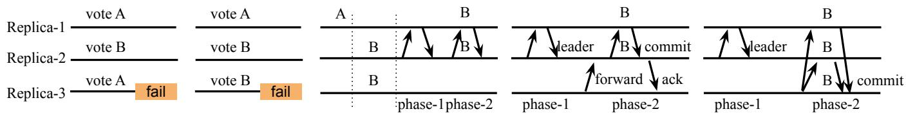  
(a) A challenging case in consensus  
(b) A common structure in classic consensus protocols  
(c) 2RTT, with follower forwarding to the leader  
(d) Fast path optimization with a super-quorum (>3/4)  
Figure 1: Literature review of consensus protocols. From left to right, the figures demonstrate a key challenge in consensus protocols, its common two-phase solution, the 2-RTT latency nature dictated by the solution, and the superquorum-based fast-path optimization. Figure (a) shows two cases illustrating the challenge of split votes in consensus. The two cases are indistinguishable after the failure, despite having achieved a majority vote on different values. Figure (b) shows the common solution in classic consensus protocols, dividing votes into rounds. Rounds are divided by the dotted line in the figure. Figure (c) shows the 2-RTT with follower to leader forwarding. Figure (d) shows the fast path with a superquorum. With 3 replicas, the quorum size is 3.

Further reducing latency is difficult within the 2-phase structure. Doing so requires allowing multiple clients to directly enter phase-2 without phase-1, which returns us to the problem in Figure 1(a): a decided value may be lost after failures. Lamport’s Fast Paxos [43] provides the theory to ad dress this problem. The key idea is to enlarge the quorum size to ∼3/4 of replicas for the “fast round,” allowing requests to be proposed directly without going through the leader. During recovery, a value that might have been chosen in the fast round dominates by count in the recovery phase of the next round. Figure 1(d) illustrates this: in phase-2, a value is proposed directly to all replicas rather than forwarded to the leader.

Fast Paxos inspired many subsequent works [42, 49, 65, 50, 18, 57, 59, 22, 58, 35, 44, 66] that adopt fast-path optimization to achieve 1 RTT for common workloads. EPaxos [49] and SwiftPaxos [59] use the fast path to reach consensus on command dependencies. CURP [57] uses the fast path to directly commit commands. Tapir [65] and Janus [50] use the fast path for transaction commit.

Question: can we make fast-path optimization universal? Despite these advances, all fast-path protocols are designed from scratch. What if one wants to add fast-path optimization to an existing system? Can we build on top of existing protocols rather than replacing them entirely?

From a research perspective, generalizing fast-path optimization would fill many gaps in the consensus design space. Many protocols have specialized goals: Copilot tolerates slow leaders; Mencius and MultiRaft [38] distribute load evenly among replicas; SAUCR [14] reduces disk write latency by leveraging the time between replica failures. A general fastpath framework could apply to these protocols directly, without redesign.

From a practical perspective, many systems use customized consensus protocols where drastic changes are not an option. For example, MongoDB uses heavily modified Raft [68] to fit its architecture. Even if adding a fast path were possible, it would require significant effort. A generalized approach would be valuable for such systems.

Our goal is to provide a universal fast-path framework applicable to existing consensus protocols, targeting geodistributed deployments where cross-datacenter round trips dominate commit latency. The framework should provide:

• 1-RTT fast path: A 1-RTT fast path for clients to commit requests in common cases.

• Low overhead for the original path: The framework must not impair the original protocol. This has two aspects: (i) if no requests use the fast path, performance (throughput and latency) should match the unmodified system; (ii) if the original protocol has special properties, like Copilot’s slowdown tolerance, the framework preserves them.

We also aim to minimize integration effort. The framework should not drastically change the original protocol. Some modifications are unavoidable, but they should remain minimal, localized, and not require additional correctness proofs. Critically, such changes must never alter the original protocol’s outcomes, such as turning a rejected command into an accepted one.

Non-goals. We do not target BFT protocols [33, 15, 63] such as PBFT [25]. We also assume every command is independent, i.e., we do not support interactive transactions, such as Tapir [65]. These are promising directions for future work.

## 3 Main Idea and Normal Operation

Although our goals may seem ambitious, the underlying rationale is straightforward. This section presents the core idea in the simplified setting of single-decree consensus (§3.1), extends it to multi-decree consensus (§3.2), and concludes with Jetpack’s normal-case workflow (§3.3).

## 3.1 Main idea with single-decree consensus

In single-decree consensus, the system reaches agreement on a single value. This abstraction has been widely used to illustrate the core principles of consensus, most notably in Paxos. Multi-decree protocols used in practice, such as Multi Paxos, can be viewed as repeated instances of single-decree consensus, each corresponding to a particular log index.

Specializing the framework goals from §2 (a 1-RTT fast path with no impact on the original path) to single-decree consensus, our goals are twofold: 1) The system can commit the fast-path value in 1 RTT. 2) The original path still operates independently from the fast path.

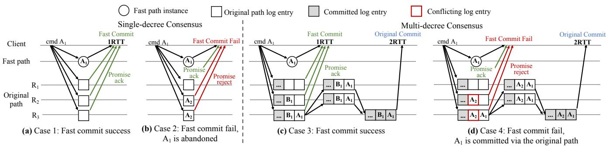  
Figure 2: Illustration of the core idea. Ai, Bi denote commands on data A and B. The client sends each command in parallel to the fast path and to three replicas R1, R2, R3 on the original path. The client accepts whichever path commits first (fast: 1 RTT; original: 2 RTT). For simplicity, we show the fast path only by its overall outcome (A is always chosen) and focus the per-replica state on the original path; the overall fast commit succeeds only if the original path also acks the promise. (a,b) show the single-decree setting, in which an original replica can ack the promise when it has not proposed or accepted a different command than A1. In (a), all instances are empty, and fast commit succeeds; in (b), R2, R3 hold a different command A2, so A1 is abandoned, since A has already been chosen by the original path for the single instance. (c,d) show the multi-decree setting, in which an original replica can ack the promise when its log has no uncommitted command conflicting with A . In (c), no replica has a conflict, and fast commit succeeds; in (d), R2,R3 have a conflicting command A2, so fast commit fails, R3 then proposes and commits A via the original path in 2 RTT.

Consider an arbitrary single-decree protocol serving as the original path, and Fast Paxos as the fast path. The two paths run in parallel: a client sends each command to both paths, and each path attempts to commit independently—neither waits for the other. The fast path uses a Fast Paxos-style superquorum to commit in 1 RTT when no conflict arises; the original path runs its own 2 RTT consensus. For correctness, the two paths must agree on the same committed value.

Since the fast path finishes earlier (1 RTT vs. 2 RTTs), for the fast-path commit to take effect while keeping the two paths in agreement on the same value, we require the original path to make a promise that constrains its future commit value. Only when the original path makes such a promise can the fast-path value be safely considered committed in 1 RTT. Concretely:

Definition 1 (Original Path Commit Promise, Single-decree). If the fast path commits a value v, the original path guarantees that it will not commit a different value w (w ̸= v).

This promise can be realized through a stronger, easier-toimplement variant:

Definition 2 (Original Path Proposal Promise, Single-decree). If the fast path commits a value v, the original path guarantees that it will not propose a different value w (w ̸= v).

As shown in Figure 2(a,b), whenever a value is proposed on the fast path, it is also sent to the original path to request a promise. If the original path has not chosen a different value, it can issue the promise, enabling the fast path to win (Case 1); otherwise, the promise is rejected, and fast commitment fails (Case 2).

This variant is easier to implement because it only requires modifying the proposal logic, which in most protocols is simple logic that sends a value in a message e.g., Accept in Paxos. A brute-force way to implement this promise is to forbid all original-path proposers from proposing any value other than the fast-path value, but this effectively disables the original path, so this does not fit our goals.

A more practical way to implement the promise and fit our goals is to involve only the original path’s initial proposer(s): the replicas designated to drive proposals in the system’s initial state. In most consensus protocols, these are the replicas that have completed phase-1 of the original protocol before the system begins serving client requests (see §2). Other replicas are not yet proposers; they may only propose after explicitly running phase-1 themselves. This restriction is what makes the promise tractable: only the small set of initial proposers needs to acknowledge it. Most consensus protocols already maintain this distinction, so adopting it adds no new machinery.

With this distinction in place, the protocol works as follows. An initial proposer may propose any value in the original path; if it commits, the value is considered committed for the entire system. This fulfills the goal of the original path still operating and being unaware of the fast path. To integrate with the fast path, we modify the Fast Paxos protocol as follows. When a client attempts to fast-commit a value, it sends the value to both the fast path and the initial proposers (i.e., the Fast Accept quorum includes all initial proposers in the original path). Each initial proposer checks whether it has already proposed any value; if not, it promises not to propose a different value in the future. The client considers the fast-path value committed only if all initial proposers make this promise; otherwise, the fast path fails.

If the system subsequently crashes, a newly elected leader runs a recovery step on the fast path before becoming a pro poser. If the fast path has committed a value, the recovery step restores that value and proposes it on the original path, honoring the promise that the original path will match the fast-path value. Otherwise, the recovery step commits a no-op on the fast path, closing it so that no later fast-path commit can occur for this consensus instance, and the system then honors whatever value the original path will commit.

## 3.2 From single-decree to multi-decree

The single-decree model in §3.1 captures the core insight, but practical systems require multi-decree consensus to build a replicated state machine. In multi-decree consensus, clients continuously send commands to replicas, and replicas agree on which commands to accept and in what order to execute them. A common realization is for replicas to maintain a log of commands, where each log position corresponds to a consensus instance. This is logically equivalent to running many single-decree consensus instances, one per log index. Replicas typically execute commands sequentially in log order to maintain consistent state.

This multi-decree model introduces a key challenge for fast commitment: how do instances in the two paths correspond? In the single-decree setting, the fast path and the original path naturally operate on the same (only) instance, yielding a one-to-one mapping as shown in Figure 2(a). In multi-decree consensus, however, the mapping is no longer naturally one-toone. The original path can have multiple concurrent consensus instances running, e.g., in Raft, a new leader may propose a new command while the previous command is still pending, and these commands could be modifying the same data item. The system must also allow multiple fast-path instances to run. Therefore, we are looking for a many-to-many mapping between the fast path and the original path.

To simplify the discussion, assume the system runs only one fast-path consensus instance at a time. This reduces the problem to a one-to-many mapping between the fast path and the original path, as illustrated in Figure 2(c,d): a single fast path command (e.g., A1) maps to a “window” of candidate instances on the original path (e.g., B1 and A1 in (c), A1 and A2 in (d)).

To make this one-to-many mapping work, we introduce a refinement:

Leveraging commutativity. In a replicated state machine, correctness (maintaining consistent states among replicas) depends only on the execution order of conflicting commands. Non-conflicting commands commute and may execute in any order without affecting the final state. This observation simplifies the problem: we need only ensure that conflicting commands appear in the same order across replicas; nonconflicting commands can be handled independently.

Conflict detection. Jetpack requires the application to provide a predicate Conflict(c1, c2) that returns true when the order of c1 and c2 can affect application state or response. For common workloads such as key-value stores, this is straightforward (e.g., two commands conflict if they access the same key and at least one is a write); we discuss application-specific considerations and our key-value implementation in §5.

Refining the original path promise. Following the idea from §3.1, we require the original path to make a promise. But the promise must be refined for the multi-decree setting:

Definition 3 (Original Path Proposal Promise, Multi-decree). If the fast path commits a command c, the original path guarantees that it will not propose any concurrent conflicting command before c in the log.

We first observe that most multi-decree consensus systems operate in views: stable periods during which the set of replicas authorized to propose is fixed. This stable-view proposer set plays the same role as the initial proposers in single-decree (§3.1): controlling its inputs constrains the command order in the log. From this point on, we use proposer to refer to a member of this stable-view proposer set. Concretely, when a client issues a fast-path command, it sends the request to both the fast path and the original path (which must include all proposers). Each replica receiving the fast-path request checks for conflicts with all uncommitted commands in its log. If the command is conflict-free, the replica promises not to propose any concurrent conflicting command before this command in the log.

If a superquorum of fast-path replicas acknowledge the command and all proposers make the promise, the command can be safely fast-committed. The command will still eventually commit on the original path as well, but the client need not wait for that. For example, in Figure 2(c), command A1 can obtain the promise, whereas A1 in (d) cannot because the original path already contains a conflicting command A2 ahead of it. As a result, A1 in (c) succeeds in fast commitment, while A1 in (d) fails and needs to be committed via the original path.

Note that the logic above is discussed in the context of a stable proposer set. View changes are subtle: promises made in the old view must survive into the new one, even though the newly elected proposer was not party to them. We defer this case to §4, where we identify the structural requirements every fast-path layer must meet, derive Jetpack’s two design principles, and present the recovery procedure. We first describe how Jetpack processes commands during stable operation.

## 3.3 Workflow without failures

Jetpack runs on 2 f + 1 replicas to tolerate f crash failures. Each replica serves both the original and fast path. A client library routes each command: fast-path commands are broadcast to all replicas while original-path commands are sent only to the original path. Clients can select the path explicitly or rely on an adaptive policy (§5). Both clients and replicas track the current original-path view, and every message carries the sender’s view so receivers can detect stale operations.

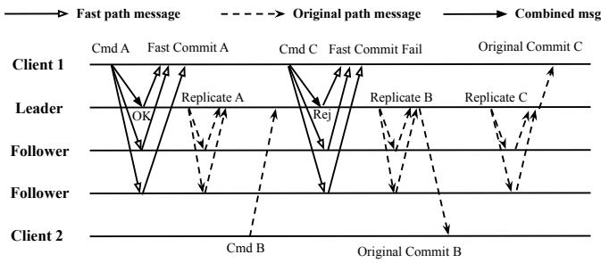  
Figure 3: Example workflow of Jetpack integrated with Raft.a c e fReplica 1

Fast-path processing. Upon receiving a fast-path command, a replica checks for conflicts with uncommitted commands, in both the fast path and the original path. If the command is conflict-free and its view matches the replica’s current view, the replica inserts the command into its fast-path log and returns a fast-path acknowledgment. If this replica is a proposer on the original path, it also proposes the command in the original path, regardless of conflicts.

Once the client collects acknowledgments from a superquorum which is at least ( f + ⌈ f /2⌉ + 1) replicas and includes all replicas that are original path proposers, the command is fast-committed.

Conflict handling. When conflicts occur, the client may be unable to collect sufficient acknowledgments and promises, causing fast commitment to fail. Jetpack resolves conflicts via the original path, relying on the underlying consensus protocol to order and commit conflicting commands. This design is sound: all commands, fast or not, are eventually handled by the original path. When a fast-path command conflicts with other commands, it can still proceed with the original path as a regular command. From the client’s perspective, when fast commitment fails, it waits for the command to commit through the original path.

Figure 3 shows Jetpack integrated with Raft. Commands A, B, and C are conflicting. Command A is fast-committed and also committed on the original path. Command B, intended for the original path only, is committed by the Raft leader without fast-path messages. Fast commitment of command C fails due to conflict with ongoing command B; the leader later commits C via the original path and notifies the client.

Execution correctness. The workflow above places every fast-committed command ahead of any concurrent conflicting commands in the original path log. To ensure the original path produces the same state as the speculative execution on the fast path, execution must respect this log ordering. We require the following prerequisite for the original path:

PR 1. For two conflicting commands A and B proposed by the same proposer, if A is proposed before B, then A precedes

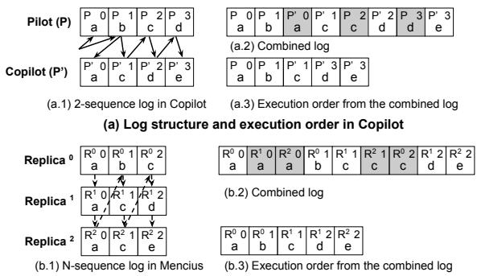  
(b) Log structure and execution order in Mencius

Figure 4: Command execution examples. Each box represents a log entry storing a command, with gray boxes indicating duplicate commands. In (a), the solid arrows show the dependency execution order in Copilot, while in (b), the dashed arrows illustrate the round-robin execution order in Mencius.

## B in the log and is guaranteed to execute before B.

Although this requirement may appear strict, it is commonly satisfied in practice. The proposer proposes commands by inserting them into its log sequence in an append-only manner, ensuring that any command proposed earlier will always precede those proposed later. Consensus protocols then typically enforce that commit and execution follow the same order as the log. For example, Raft commits and executes log entries strictly in log-index order, meeting this prerequisite. For protocols with multiple log sequences, such as Mencius (Figure 4(b)), a log entry commits only after all earlier entries across all sequences have committed. Copilot, which maintains two log sequences, enforces execution according to dependency order. As shown in Figure 4(a), as long as each proposer inserts command a before command b in its own sequence, the merged global execution order (Figure 4(a.3)) places a before b.

To demonstrate generality, we conducted a compatibility study across 16 consensus systems published in OSDI and SOSP since 2000, excluding BFT systems [36, 29, 52, 37] and transactional consensus systems [50, 65, 27]. Figure 5 shows the results. Of these, 6 already have a built-in fast path. Of the remaining 10, 9 satisfy this prerequisite. This indicates that PR 1 captures properties already common in modern consensus protocol design.

Only EPaxos [49] violates PR 1. EPaxos enforces execution according to dependency order, constructed from dependency graphs that may reorder commands through topological sort ing. Whether EPaxos can be adapted to work with Jetpack remains open; a promising direction is forcing the topological sort to respect command insertion order.

## 4 Handling View Changes

The workflow of §3.3 assumed a stable proposer set. We now turn to the harder case: failures and reconfigurations that change the proposer set. We first identify the structural requirements that any fast-path layer must meet across a view change (§4.1), then derive Jetpack’s two design principles from those requirements (§4.2) and describe the recovery procedure (§4.3). Finally, we use prior fast-path designs as evidence that the requirements are real and easy to miss (§4.4).

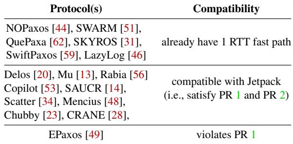  
Figure 5: Jetpack compatibility across consensus papers from OSDI/SOSP since 2000.

## 4.1 The view change hazard

Recall the promise from §3.2: when a fast-path command c is acknowledged, the original path’s proposers cannot commit a conflicting command before c. This promise was made by a specific set of proposers in a specific view. The promise itself is not durable state in the original protocol—it lives in the fast-path replicas’ acknowledgments and in the old proposer’s local state. After a view change, none of that is guaranteed to survive: fast-path replicas may have advanced their views, the old proposer may have crashed, and the new proposer was not party to the promise at all.

For the system to remain correct across view changes, the new proposer must do two things on behalf of the old one:

• (R1) Recover every fast-committed command from the previous view. A command that was fast-committed before the view change must remain visible—clients have already received acknowledgments based on it.

• (R2) Place each recovered command before any conflicting uncommitted command in the new view’s log. The fast-path promise was specifically about ordering: the recovered command must execute before any conflicting command the new proposer might propose.

We call the failure of either requirement the view change hazard. Both requirements are subtle:

• R1 is harder than it appears because the “previous view” is itself ambiguous. Different fast-path replicas may have advanced to different views, and acknowledgments for a single command may straddle multiple views. A naive implementation that simply collects logs from a quorum of survivors can miss commands the client believed were committed.

• R2 conflicts with standard view-change behavior in many consensus protocols. Many systems tend to let new proposers carry uncommitted entries forward from prior views (e.g., MongoDB). This is safe in the original proto col, since those entries carry no ordering promise, but it directly violates R2 once a fast path is added: a stale uncommitted entry from an old view can land before a recovered fast-committed command.

R1 and R2 are the structural requirements every fast-path layer must meet. We next derive two principles that together guarantee R1 and R2.

## 4.2 Design principles

As R1 suggests, each time the original path enters a new view, it must recover fast-committed commands and commit them on the original path. For recovery to be tractable, fast-path commands must be cleanly partitioned by view, with each recovery restoring only commands from the previous view. This partitioning requires the fast path to track its own view, separate from the original path’s: if a fast-path command’s view drifted whenever its co-located original-path replica advanced, the partition would blur and recovery could not identify which commands belong to which view.

Therefore, we propose Principle 1 to address R1:

Principle 1. The fast path maintains its own view, independent of the original path’s view. A command is fast-committed only when both paths are in the same view, and it then belongs to that view in the fast-path log.

Recoverability requires a fast-committed command to be acknowledged by a superquorum on the fast path, as in most fast-path protocols [42, 49, 65, 50, 57, 59]. But when two paths coexist, this is not sufficient: if acknowledgments come from different views, the recovery quorum for any specific view can be broken. A fast-path acknowledgment issued in an old view cannot contribute to the new view’s superquorum, and recovery may miss the fast-committed command. Principle 1 prevents this by requiring same-view acknowledgments, ensuring that any fast-committed value remains recoverable.

With Principle 1 addressing R1, we still need to address R2: every fast-committed command must appear before any conflicting uncommitted command in the new view’s log. We achieve this by giving fast-path recovery a higher priority than other commands. We capture this priority as Principle 2:

Principle 2. On entering a new view v, the new proposers must complete recovery of the previous view’s fast-committed commands before committing any other command in v.

Jetpack achieves this without intrusive changes to the original protocol’s recovery procedure: the new proposers commit all recovered fast-committed commands before they propose other commands. This entry serves as the stability marker for v: a log position that all future proposers must include and that future view changes use as the recovery boundary. The marker prevents stale uncommitted commands from older views from being committed in v before the recovered fastpath commands.

This priority is not naturally provided by some consensus protocols. Protocols without a fast path, such as MongoDB’s pull-based Raft, may commit uncommitted commands from older views during a view change. This is safe in the original protocol (which makes no ordering promise), but once a fast path is added without the stability marker, a stale uncommitted entry could land ahead of a recovered fast-committed command, violating the principle.

Together, these principles guarantee correctness: Principle 1 satisfies R1, ensuring fast-committed commands remain recoverable, while Principle 2 satisfies R2, ensuring consistent ordering of recovered commands across views. §4.3 turns these principles into a concrete recovery protocol. Readers interested in examples of the consequences of violating these principles may jump to §4.4.

## 4.3 Recovery procedure

Jetpack leverages the original protocol for failure detection and view changes, adding only the synchronization needed to preserve fast-path promises across views.

Two events trigger a view change: proposer reelection changes the proposer set, and membership reconfiguration changes the replica set. Jetpack handles both uniformly by tapping into an interface the original protocol already exposes: a Propose() entry point invoked once per command, and a view value carrying the current proposer set, membership, and a monotonic identifier.

The proposer maintains the view in which it last called Propose(). On each Propose() call, it compares the current view against this stored view; a mismatch triggers the Jetpack recovery procedure, which carries any fast-committed commands from the old view into the new one.

The entire recovery procedure has three phases:

Phase 1: Detect view change and pause. When a replica detects the view has changed to v, it probes the original path for the most recent committed recovery set (see Phase 3). That set belongs to vn, the last normal view: all views before vn have already been recovered, so the system could process commands normally in vn. The replica then acts as the recovery coordinator for v . The coordinator broadcasts BEGINRECOVERY to the replica set of vn, instructing them to stop processing client requests and enter recovery mode. It retries until a majority of replicas acknowledge.

Phase 2: Determine the recovery set. Jetpack runs a Paxoslike procedure to agree on the recovery set—the fast-path commands issued in vn. The coordinator broadcasts PRE-PARE(vn → v), requesting stored commands from the replica set of vn.

Each replica returns its previously accepted recovery set for v if it has one, otherwise returns its acknowledged commands in vn (which may be empty). If it already has the consensus result on v\_n’s recovery set, it can return that instead. By Principle 1, all fast-committed commands in vn appear on a superquorum and are therefore recoverable.

Once the coordinator collects replies from a majority, it builds the recovery set: if any reply carries an accepted set, it adopts that set; otherwise, it aggregates the returned commands—a command is included if it appears in at least ⌈ f /2⌉ + 1 replies, indicating possible fast commitment. Two conflicting commands may both reach ⌈ f /2⌉ + 1; in such cases, neither was fast committed, so recovering either is safe.

The coordinator broadcasts ACCEPT(vn → v) containing the recovery set. The set is finalized once at least f +1 replicas store and acknowledge it. If recovery fails, any replica that previously accepted a recovery set for a given view includes it in future PREPARE replies; the coordinator simply reuses the attached set. This guarantees all recoveries for the same view recover the same command set. The same mechanism extends to cascading failures across views: by Principle 2, a new view cannot become normal until recovery of the last normal view completes, so all coordinators in successive failed views target the same last normal view and converge to the same recovery set via the accepted-set carry-forward.

Phase 3: Resubmit and resume. The coordinator resubmits the recovery set to the original protocol by sending the set to the new proposer and waiting for it to commit. By committing the recovery set in the new view, the proposer enforces Principle 2. If the recovery set is empty, the coordinator resubmits a single no-op. This commit of the recovery set (or the no-op) serves as the marker that future recoveries use to identify the last normal view in Phase 1.

Once these entries commit, the coordinator broadcasts FIN-ISHRECOVERY with the new view v to the replica set of v. Each replica updates to the new view, switches back to normal mode, and begins accepting client commands.

Appendix B provides the full recovery algorithm and optimizations to reduce latency and communication cost.

## 4.4 The hazard in prior fast-path designs

R1 and R2 are easy to overlook when adapting a fast-path idea to a new consensus environment. To see where the hazard tends to appear in practice, we examine three fast-path designs whose treatment of view changes leaves R1 or R2 incompletely addressed: CURP’s sketched Raft extension, a production system that builds on this sketch, and Carousel.

CURP is the protocol most closely related to Jetpack. Both share the high-level idea of running a fast path alongside the original path, but they sit at different abstraction levels. CURP is principally a primary-backup fast-path design; its extension to Raft appears as a brief sketch in the paper’s appendix and is not the focus of CURP’s main contribution. Jetpack works at a different level: it tries to articulate the structural conditions a fast-path layer must satisfy when paired with a consensus protocol, so they can be reused across consensus environments rather than re-derived for each combination. The two cases below illustrate gaps in the appendix-level Raft sketch, not

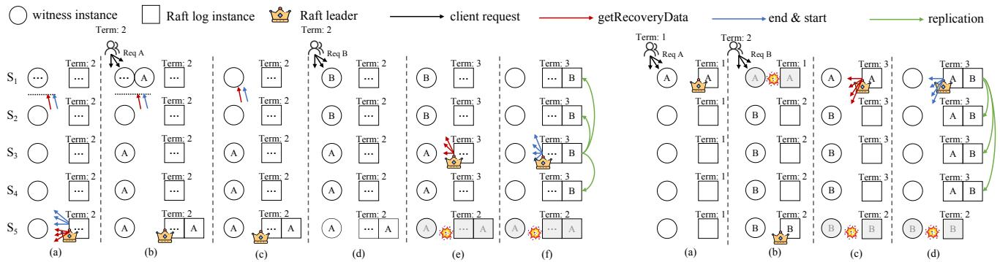  
Case 1: In (a), S becomes the new leader and all replicas advance to term 2. S sends getRecoveryData to freeze all witnesses, and then sends end & start messages to reset all witnesses after recovery, but S doesn’t receive them due to network delay. In (b), the client issues command A at term 2. S and four witnesses, including S ’s stale witness, ack the command. In (c), S later receives the delayed end & start messages and clears its witness state. In (d), the client issues command B at term 2, only two witnesses acknowledge it, so fast commitment fails. In (e), S5 crashes and S3 is elected as the leader. S3 collects commands from witnesses. In (f), S collects commands from a quorum of S , S , and S , and observes that B appears in a majority of 3 servers. S therefore recovers command B and commits it through Raft replication, causing the true fast‑committed command A to be lost permanently.  
Case 2: In (a), S is the leader when Client issues command A. Command A only gets ack from S , so fast commitment fails. In (b), S crashes and S becomes the leader. Command B receives acks from S and four witnesses, to be fast committed. In (c), S5 crashes, S1 recovers and is re‑elected. It retains uncommitted command A in its local log and collects fast‑committed commands. In (d), S1 recovers command B and appends it after A in its log, then commits both in that order. This violates the ordering guarantee made in previous term, where command B is committed without any conflicting before it.

## Figure 6: Time sequence illustrating two view-change scenarios in CURP+Raft with conflicting commands A and B.

flaws in CURP’s primary-backup design. They show why such structural conditions are useful: even careful sketches can leave subtle conditions unaddressed when extended to a new environment.

The CURP recovery procedure proceeds through four phases when a view change occurs: ➀ the consensus protocol elects a new leader; ➁ the new leader broadcasts getRecoveryData to all witnesses (the term CURP uses for fast-path replicas), stopping them and collecting stored commands; ➂ it determines the set of fast-committed commands and replicates them; ➃ it sends an end message to clear witness state, then start to resume normal processing.

Figure 6 illustrates two scenarios that this procedure does not fully cover, one for each of R1 and R2.

Case 1: a gap related to R1, where a fast-committed command can be silently lost. In Figure 6 Case 1(b), command A is fast-committed after being acknowledged by a superquorum of witnesses, including the witness at S1, which is still in the old term. Later, when S1 receives a delayed end message, it erases all stored commands, including A. As a result, A no longer has superquorum durable storage, and a subsequent leader failure can lose it.

The cause is subtle: in the appendix sketch, CURP uses the corresponding replica’s term as the witness term, so a witness lagging in term 1 can approve a command in term 2 based on stale view information. When S1 later clears its state during recovery, the fast-committed command is gone, and the new leader can insert a different command B where A should appear. This corresponds to the situation R1 calls out (acknowledgments straddling views), and Principle 1 closes the gap.

Case 2: a gap related to R2, where the promised order can be broken. In Figure 6 Case 2(b), command B is fastcommitted after S5 (the old leader) acknowledges that no conflicting command exists. However, when S is elected as the new leader, its log contains an earlier uncommitted command A. When the system recovers, command A appears before the recovered command B in the log. This corresponds to the situation R2 calls out (uncommitted entries from prior views landing ahead of recovered fast-committed commands), and Principle 2 (the stability marker) closes the gap.

Production system. To see how the gap manifests in deployed code, we examined a production system that implements CURP-on-Raft, namely Xline [11]. As a production system, Xline is engineered conservatively, with extensive safety checks: it pauses the entire system when a view change occurs and only resumes the fast path after the original path has committed many commands in the new view. This conservatism happens to cover Case 1, but Case 2 still occurs and can lead to data inconsistency. We reported the issue and filed a patch.

Our own implementation with MongoDB tells a similar story: integrating a CURP-style fast path directly into MongoDB ran into a similar gap, because MongoDB’s pull-based optimizations are correct under Raft alone but no longer satisfy R2 once a fast path is added (§6.6).

Carousel. A third example appears in Carousel [64], a transactional protocol whose new-leader procedure replicates uncommitted log entries before recovering fast-path transactions; this corresponds to the same R2 situation as Case 2. The full scenario is in Appendix A.

Takeaway. Across these three examples, the same gaps appear because each fast-path integration rediscovers the structural conditions for view changes. Spelling them out once at the framework level allows future fast-path integrations to avoid these gaps by construction.

## 5 Implementation: Jetpack as a shim layer

Directly extending the original consensus protocol with conflict checking and promise making would require intrusive modifications. To keep changes minimal, we implement Jetpack as a shim layer which we refer to as Jetpack replicas. A Jetpack replica is a process colocated with the originl replica and it sits between clients and the original path. All commands are first sent to Jetpack replicas. Upon receiving a command, each Jetpack replica: (i) forwards it to the paired original replica if this replica is a proposer, and (ii) inserts the command into Jetpack replica’s own log. For fast-path commands, a Jetpack replica checks for conflicts and, if conflictfree, issues a promise on behalf of its paired original replica.

A command is fast-committed once the client receives promises from a supermajority of Jetpack replicas, including all those paired with original proposers. If insufficient promises are collected (e.g., due to conflicts), the client waits for the original path to commit the command (§3.3).

Correctness requirement. This shim-layer design preserves correctness by ensuring proposers receive commands in an order consistent with the promise order made by Jetpack. However, this relies on a crucial assumption: the arrival order of commands at each proposer must match their insertion order in the log. Under this condition, a supermajority promise guarantees all proposers place a fast-committed command ahead of any uncommitted conflicting commands, enforcing the promise defined in §3.2. With PR 1 ensuring that the proposed order matches the log order, we also require the following prerequisite to guarantee that commands’ arrival order on the proposer matches their proposal order:

## PR 2. For any two commands A and B, if a proposer receives A before B, it will propose A before B.

Most consensus protocols naturally satisfy this property. However, protocols with additional buffering layers for performance may violate it. For example, Nezha [32] from VLDB employs two intermediate buffers where commands may reside before being appended to the log, breaking equivalence between arrival and log order. As shown in Figure 5, each consensus protocol we surveyed satisfies this prerequisite.

Fast paths beyond PR1 and PR2. When PR2 is violated, arrival order no longer matches proposal order, so the fast-path reply must wait until the command is proposed into the original log. When PR1 is violated (e.g., EPaxos), neither arrival nor proposal order matches execution order; the fast path has no latency advantage and Jetpack cannot meaningfully apply. Conflict detection. Jetpack replicas detect conflicts based on the key-value interface against in-flight commands stored in command pool, which is a hash map from keys to lists of in-flight commands; the replica reports a conflict on key k if either the new command or any in-flight command on k is a write. A Jetpack replica returns a fast-path acknowledgment only if no conflict is detected; otherwise, the command commits via the original path. All commands, both fast-path and original-path, are inserted into the list, ensuring future fast-path commands detect potential conflicts with all in-flight commands. Other applications can replace this data structure with one matching their detection needs, e.g., interval indexes for ranges or coarser table/namespace-level tracking.

Richer workloads (range queries, SQL predicates, aliased objects, etc.) would need support through the applicationprovided Conflict interface, e.g., with interval indexes for ranges or coarser scope-based detection (tables, namespaces) for opaque dependencies. Jetpack follows other fast-path protocols in delegating this conflict logic to the application [50, 57, 59, 49, 64].

Garbage collection. To avoid unnecessary promise rejections from stale entries in the command pool, Jetpack replicas must promptly remove completed commands. Once a command is finalized by the original protocol (committed and executed), the result is sent back to the client. Jetpack, as the shim layer, observes these replies and initiates garbage collection: (i) the Jetpack replica that receives the reply removes the command from its own command pool and forwards the result to the client; (ii) it notifies other Jetpack replicas to evict the command from their command pools.

Command execution. After commands commit on the original path, they are executed and applied to the state machine. Since Jetpack proposes fast-path commands to all proposers, multi-sequence protocols like Copilot and Mencius may insert the same command into multiple sequences, resulting in duplicates (e.g., commands a, c, and d in Figure 4).

Copilot naturally tolerates such duplication because a command can be proposed by both pilot and copilot. After merging the two sequences, Copilot executes each command only at its first position (Figure 4(a)). Protocols like Mencius can apply a similar strategy. After ordering log entries roundrobin, as shown in Figure 4(b.2), a replica skips duplicate commands (highlighted in gray) and executes only the first occurrence, yielding the final execution order in Figure 4(b.3). Adaptive path selection. Although the fast path reduces latency, it is not always beneficial. It sends each command to all proposers, increasing CPU load and lowering throughput under saturation. Server locality also matters: when a client is close to the original proposer, replicating to a majority may be faster than obtaining a superquorum for fast commitment.

Jetpack supports adaptive path selection to balance these trade-offs. When CPU load is low, latency dominates, so the fast path is preferred if it is faster; when the system is heavily loaded or the fast path offers no advantage, the client backs off to protect throughput. Each client monitors recent latencies and CPU usage and adjusts its fast-path attempt rate accordingly. Appendix C details the policy, which §6.4 shows preserves original-path performance.

## 6 Case Studies and Evaluation

We apply Jetpack to six representative systems: Raft, a widely deployed single-leader protocol; Copilot, a dual-leader protocol that tolerates fail-slow behavior; Mencius, a classic multileader protocol; and MongoDB, a production system with a customized Raft variant. Two additional production case studies on etcd and ZooKeeper appear in Appendix E. In addition to the empirical results below, we model-check each integration in TLA+ for view-change correctness; the specs and artifacts are available at [3].

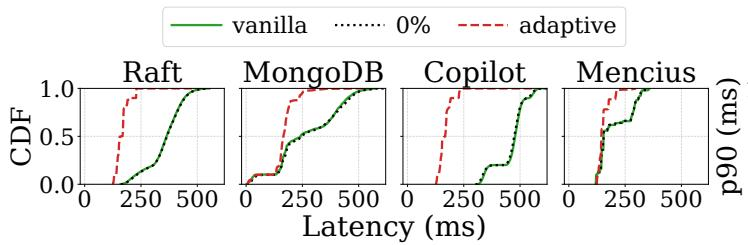

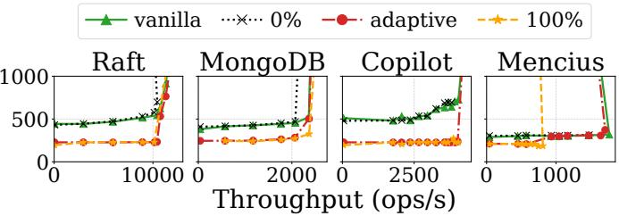  
Figure 7: Latency CDF (left) and throughput–latency (right) for Raft, MongoDB, Copilot, and Mencius under a uniform 50/50 read/write workload, comparing the vanilla protocol, Jetpack with fixed attempt rates, and Jetpack in adaptive mode.

## 6.1 Integration

Applying Jetpack requires only minimal modifications to the normal execution path, leaving core protocol logic unchanged. The primary effort lies in handling recovery and view changes through a few lightweight hooks.

On the client side, we assume the original protocol exposes a Submit(cmd) function. This function is invoked when the client receives either a combined message or an original-path message, and it may also be invoked to resubmit commands during Jetpack recovery.

On the server side, the assumptions and hooks are described in §4.3. The MongoDB integration required 60 lines of code on the original protocol server side; the etcd and ZooKeeper integrations required 68 and 52 lines, respectively.

To prevent Case 2 (§4.4), a new proposer must commit at least one log entry in the new view before acknowledging fast-path commands (§4.2). This requires no modification to the original protocol: Jetpack ensures it by resubmitting recovered commands during recovery. If the recovery set is empty, Jetpack resubmits a no-op and waits for it to commit.

## 6.2 Experimental setup

Implementation. We implemented Jetpack in C++. For Raft and Copilot, we built on DepFast [47]. For Mencius, we implemented it in the same codebase. For MongoDB, we built on the open-source 8.2.0 release.

Testbed. Experiments ran on AWS EC2 across 10 geodistributed datacenters (latencies in Appendix D): replicas in datacenters 0–4, clients in all 10. Each 8-vCPU / 16 GB-RAM instance places Raft, etcd, and ZooKeeper’s leader in datacenter 0, and Copilot’s pilot and copilot in datacenters 0 and 1.

Workload. We use a YCSB-inspired workload similar to CURP: 50% reads and 50% writes over 1M Zipfiandistributed keys by default; we sweep skew 0.5–1.0 and key range 100–1M to vary contention. 60 open-loop clients with multi-threaded request issuance drive load.

## 6.3 Raft

Integration with Raft follows the standard workflow in §6.1. In Raft, a newly elected leader may contain stale uncommitted entries, potentially triggering Case 2 (Figure 6). With Principle 2 enforced, replicas carrying stale commands are never eligible for election, preventing this case by construction.

Figure 7 shows the latency CDF for vanilla Raft and Jetpack-integrated Raft. With adaptive path selection, Jetpack reduces latency by 53.39% on average, achieving the first design goal (§2). When the fast-path attempt rate is zero—all commands use the original path—the Jetpack curve nearly overlaps with vanilla Raft (Figure 7), confirming no performance degradation when the fast path is unused.

Figure 7 shows behavior under varying load. At low concurrency, adaptive mode aggressively uses the fast path, yielding substantially lower latency. As load grows, the adaptive policy reduces the fast-path attempt rate, causing Jetpack to converge smoothly to vanilla Raft. This demonstrates that Jetpack captures fast-path benefits when available while preserving original performance under saturation. Past the knee, some curves bend back due to queuing at oversaturated replicas—an overload effect rather than a measurement artifact.

Figure 8 shows results under high contention (increased Zipfian skew, smaller key range). The latency benefit diminishes as contention grows due to more conflicts, yet Jetpack consistently outperforms vanilla Raft on both average and p99 latency across all contention levels.

During view changes, Jetpack must recover fast-path commands, introducing additional latency. Figure 9 shows this effect: we trigger a view change by shutting down the leader. After the 10-second timeout, both systems begin recovery. Vanilla Raft completes recovery almost immediately after electing a new leader (orange line). Raft+Jetpack incurs an additional ∼1 second, the time to recover fast-path commands.

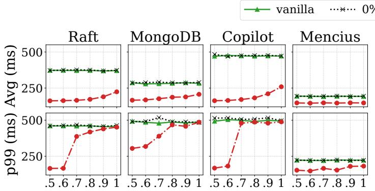  
Zipfian Skew Parameter (θ)

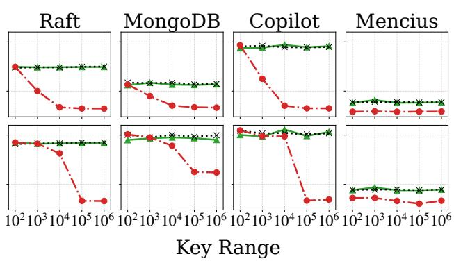

Figure 8: Average and p99 latency for Raft, MongoDB, Copilot, and Mencius under a 50% read / 50% write workload with varied contention.  
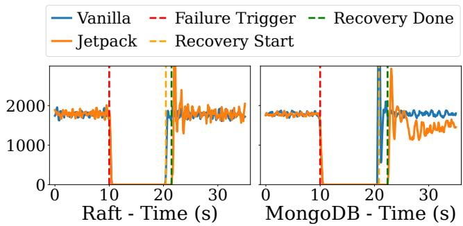  
Figure 9: Failure recovery of Raft and MongoDB.

## 6.3.1 Comparison with native fast-path protocols

We compare Jetpack-Raft against three protocols that achieve a 1-RTT critical path natively: CURP [57] (a witness-based fast path layered on Raft with the view-change hazard fixed), SwiftPaxos [59] (clients broadcast directly to all replicas), and EPaxos [49] (a leaderless protocol where any replica proposes). Vanilla Raft serves as the 2-RTT baseline. All five share a common codebase and run on the testbed of §6.2; for a fair comparison, each replica’s consensus thread is pinned to one core and we use a uniform 50/50 read/write workload over 1 M keys to isolate protocol overhead from contention.

Figure 10 shows the throughput–latency curves. At low load, the four 1-RTT protocols (Jetpack-Raft, CURP, Swift-Paxos, EPaxos) commit at 165–210 ms, while vanilla Raft commits at ∼355 ms. Jetpack’s plug-in fast path therefore matches the latency of native fast-path designs.

Throughput differentiates the five: Raft, Jetpack-Raft, and CURP saturate at 12 k; SwiftPaxos peaks at ∼19 k; EPaxos at ∼25 k. This gap reflects the tradeoff between generality and deep integration: SwiftPaxos integrates the fast-path broad cast into consensus so the leader skips replicating, and EPaxos makes every replica a command leader to distribute replication across replicas; Jetpack’s plug-in design keeps the original path unaware of the fast path and so inherits its throughput envelope, trading throughput for broad applicability.

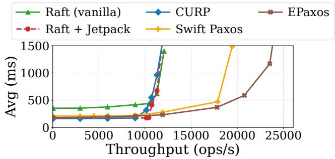  
Figure 10: Throughput-latency comparison across Raft, Jetpack, CURP, SwiftPaxos, and EPaxos.

## 6.3.2 Composing with production latency mitigations

We further examine whether Jetpack composes with latency mitigations already used in production. Modern geodistributed deployments often combine two latency mitigations: leader locality, which places the leader near the dominant client population, and lease-based local reads, which let the leader serve linearizable reads from local state under a quorum-anchored lease. A natural question is whether these techniques subsume Jetpack’s fast path, or whether Jetpack remains complementary.

We answer this with a 5-region AWS deployment driven by Facebook’s Akkio traces [16]. Akkio migrates each microshard of data toward its dominant access region but cannot perfectly co-locate every client with its shard’s leader; the residual steady-state access distribution is roughly 73/8/9/7/3% across the five regions, with 73% of requests accessing the local shard. We mirror this directly: each shard’s leader pins to one region, and clients access the five shards in this ratio. Other workload knobs follow Facebook production measurements: 50-byte keys from ZippyDB [24] (a primary Akkio workload), Zipfian skew θ = 0.8 from TAO [21], and a 50/50 read/write ratio from ViewState [45]. We compare five variants: a random-access baseline (Raft on a uniformly random workload); vanilla Raft (Raft on the Akkio distribution, achieving leader locality); Raft+Lease (adds a quorumanchored read lease on top); and the corresponding Jetpack-Raft and Jetpack-Raft+Lease that integrate Jetpack’s 1-RTT fast path.

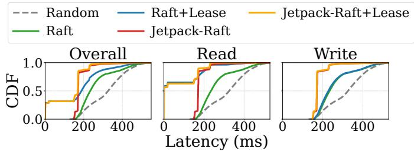  
Figure 11: End-to-end latency CDFs (overall, reads, writes) on an Akkio-style simulated workload, comparing random leader placement, vanilla Raft, Raft with read leases, Jetpackintegrated Raft, and Jetpack-integrated Raft with read leases.

Figure 11 plots the resulting latency CDFs, with reads and writes shown separately. Leader locality is already effective for the dominant 73% of requests, which reach the local leader within an intra-region hop; the remaining 27%, however, reach a remote shard’s leader, paying 2 RTTs. Adding a quorumanchored read lease lowers latency further, but only on the read side: lease reads complete sub-millisecond when served by the local leader, whereas writes still traverse the entire consensus path. Together, these two limits leave the upper half of Raft+Lease’s overall CDF above 300 ms. In contrast, Jetpack’s 1-RTT fast path is general, applying to reads and writes uniformly. Its advantage therefore emerges across the entire upper half of Raft+Lease’s overall CDF, dominated by writes that the read lease cannot accelerate.

Jetpack is also orthogonal to leader locality and the read lease, composing naturally with both. With locality alone, the 27% remote-shard requests pay 2 RTTs under vanilla Raft. Jetpack’s fast path absorbs this overhead, so Jetpack-Raft outperforms vanilla Raft. Adding the read lease on top yields the best regime in Figure 11: local reads complete sub millisecond through the lease, every write commits in 1 RTT through Jetpack’s fast path, and remote-shard reads complete in 1 RTT through either Jetpack’s fast path or the read lease. No single mechanism attains this regime in isolation.

## 6.4 Copilot

Copilot is a dual-leader protocol: a pilot and copilot commit commands independently in separate logs. This provides 1- slowdown tolerance—if one leader becomes slow, the other continues committing. After commitment, the two leaders reconcile logs by establishing cross-log dependencies; this dependency-based ordering preserves per-log order, so Copilot satisfies PR 1.

Despite having its own fast path, Copilot still takes 2 RTTs to commit. Applying Jetpack remains beneficial: Figure 7 shows Jetpack reduces Copilot’s latency by 63.90% on average because Copilot frequently fails its FastAccept phase in geo-distributed deployments and falls back to its 3-RTT slow path. Jetpack’s 1-RTT fast path yields large gains even under high contention (Figure 8).

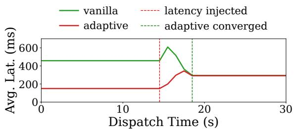  
Figure 12: Copilot slowdown tolerance preservation

The integration preserves Copilot’s slowdown tolerance (Figure 12). We compare vanilla Copilot against Jetpackintegrated Copilot under a simulated pilot slowdown, injecting 300 ms one-way latency using tc. The results unfold in three phases: (i) Baseline: Jetpack-integrated Copilot achieves lower latency via its fast path. (ii) Slowdown: when the pilot slows, latency rises for both systems. (iii) Adaptation: vanilla Copilot’s copilot performs a takeover; Jetpack’s adaptive mechanism detects the slower fast path and reduces its attempt rate, falling back to vanilla Copilot with nearly identical latency.

## 6.5 Mencius

Mencius is a multi-leader protocol with an N-sequence log for N replicas; each replica leads one dimension. A client normally takes 2.5 amortized RTTs to commit in Mencius.

Integration follows §6.1. With Jetpack, a client can commit in 1 RTT. However, as Figure 7 shows, the fastest 50% of requests show no improvement—vanilla Mencius and Jetpack nearly overlap. Clients co-located with a proposer (5 of 10) already pay only one cross-datacenter RTT; the intra-datacenter hop is negligible, so the fast path yields little benefit. Remote clients incur two cross-datacenter RTTs and see improvement, visible in the slower half of the distribution.

Because all replicas are leaders, each command must be broadcast to every replica, causing each command to be processed multiple times with substantial CPU overhead. As Figure 7 shows, at 100% fast-path rate, Jetpack-integrated Mencius saturates quickly. Adaptive mode mitigates this by dynamically choosing paths: under saturation, it backs off automatically, matching the original protocol’s throughput.

Overall, Jetpack’s benefit on Mencius is smaller than that in other case studies; moreover, the fast path becomes unavail able upon any replica failure, since fast commitment requires all leaders.

## 6.6 MongoDB

MongoDB uses a pull-based Raft variant: followers pull entries from a sync source rather than the leader actively replicating. During leader election, the new leader may pull uncommitted entries from other replicas, and such stale entries can be inserted ahead of fast-committed commands. We modified the catch-up procedure to skip those uncommitted entries (safe because they were either never acknowledged to clients or acknowledged under weak consistency without durability promises), preventing the case in §4.4.

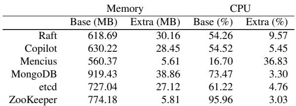  
Figure 13: Jetpack overhead

With Jetpack, MongoDB achieves 39.06% average latency reduction (Figure 7). Approximately 5% of requests show near-zero reduction because reads from clients co-located with the leader are served locally without replication. Under contention (Figure 8), the benefit decreases due to higher conflict rates, yet Jetpack consistently outperforms vanilla MongoDB.

Figure 9 shows recovery performance: once a new leader is elected, Jetpack incurs an additional 1.5 seconds compared to vanilla MongoDB, the time to recover fast-path commands.

## 6.7 Jetpack overhead

Jetpack reduces latency at the cost of additional resources. We measure CPU and memory overhead across all systems using a uniform workload with 50% reads and 50% writes, with adaptive mode enabled. Figure 13 summarizes baseline consumption and Jetpack’s additional overhead.

Across all systems, Jetpack introduces low CPU overhead and modest command pool memory overhead. Mencius is the exception, incurring substantially higher CPU overhead.

Mencius’s high CPU overhead explains its limited improvement (§6.5): the extra load saturates the system early, leaving little headroom for the fast path to translate into client-visible gains. This is structural rather than an implementation artifact: Theorem 4 (Appendix G) shows that non-intrusive integration of a client-side 1-RTT fast path with a multi-leader protocol incurs per-command CPU overhead that grows linearly with the number of leaders.

## 6.8 Discussion of Jetpack’s applicability

The empirical results above motivate where Jetpack fits in practice. Jetpack targets geo-distributed settings, where crossdatacenter round trips dominate commit latency. The benefit is largest in single-leader protocols, as remote clients pay a 2-RTT penalty. Production systems therefore commonly adopt multi-leader designs to spread leaders across regions for client-leader co-location. Jetpack still provides improvement on top of these designs, though the magnitude depends on the specific multi-leader pattern, as we discuss below.

One common multi-leader design is the sharded multileader pattern: data is sharded, each shard runs an independent consensus group with a single leader, and clients co-locate with the leader of the shard they access. Jetpack fits particularly well here. Production traces show that no sharding strategy is perfect [16, 60]: some clients inevitably access shards whose leaders are remote, reaching up to 53% in Facebook’s Akkio trace. Jetpack’s 1-RTT fast path delivers substantial latency reduction precisely on these remote-shard accesses with low overhead, as our Akkio results show (§6.3.2).

Another design is the shared-log multi-leader design (e.g., Mencius), where multiple leaders propose to a single log. Applying Jetpack here incurs structural per-command CPU overhead linear in the number of leaders. Although clients still see latency benefit, this overhead causes the system to saturate sooner, as our Mencius case study shows (§6.5).

A survey of the top 10 DB-Engines databases [1] confirms this: six support multi-shard deployment with leader-based per-shard replication [5, 10, 8, 6, 9, 4]; none use shared-log multi-leader. Mainstream geo-distributed NewSQL systems show the same pattern [38, 61, 12, 27]. Together, these show that the sharded multi-leader pattern is the common practice, where Jetpack naturally applies.

## 7 Conclusion

This paper presents Jetpack, a general approach for adding a 1-RTT fast path to existing consensus systems. The central technical insight is the view change hazard: promises made by the original path during stable operation can become invalid after a leader election, breaking the fast path’s safety guarantee. Jetpack captures the hazard in two structural requirements that a fast-path layer must meet when paired with a consensus protocol, and addresses them with two design principles. We integrated Jetpack with six representative consensus systems. Across these integrations, Jetpack reduces average commit latency by up to 60% on the fast path and matches the original system’s performance when the fast path is not used. We see Jetpack as a step toward making fast-path optimization a reusable layer across consensus systems.

## Acknowledgments

We are grateful to our shepherd, Manos Kapritsos, as well as the anonymous reviewers of OSDI ’25 and OSDI ’26 for their thorough and insightful feedback. We thank Ye Tian for his work in the early stage of the project, and Chenyu Wang for taking charge of running AWS experiments for the first submission. This project was supported in part by NSF awards CNS-2321725, CNS-2238768, and CNS-2130590.

## References

[1] DB-Engines ranking. https://db-engines.com/ en/ranking, 2026. Accessed: 10 May 2026.

[2] etcd. https://etcd.io/, 2026. Accessed: 10 May 2026.

[3] Jetpack tla+ specifications and model-checking artifacts. https://github.com/stonysystems/ jetpack/tree/jetpack/tla, 2026.

[4] Microsoft SQL Server. https://www.microsoft. com/en-us/sql-server/, 2026. Accessed: 10 May 2026.

[5] MongoDB. https://www.mongodb.com/, 2026. Accessed: 10 May 2026.

[6] MySQL. https://www.mysql.com/, 2026. Accessed: 10 May 2026.

[7] Neo4j. https://neo4j.com/, 2026. Accessed: 10 May 2026.

[8] Oracle Database. https://www.oracle.com/ database/, 2026. Accessed: 10 May 2026.

[9] PostgreSQL. https://www.postgresql.org/, 2026. Accessed: 10 May 2026.

[10] Redis. https://redis.io/, 2026. Accessed: 10 May 2026.

[11] Xline: a geo-distributed kv store for metadata management. https://github.com/xline-kv/Xline, 2026. Accessed: 7 May 2026.

[12] Yugabytedb. https://www.yugabyte.com/, 2026. Accessed: 10 May 2026.

[13] Marcos K. Aguilera, Naama Ben-David, Rachid Guerraoui, Virendra J. Marathe, Athanasios Xygkis, and Igor Zablotchi. Microsecond consensus for microsecond applications. In Proceedings of USENIX Symposium on Operating Systems Design and Implementation (OSDI), 2020.

[14] Ramnatthan Alagappan, Aishwarya Ganesan, Jing Liu, Andrea Arpaci-Dusseau, and Remzi Arpaci-Dusseau. Fault-Tolerance, fast and slow: Exploiting failure asynchrony in distributed systems. In Proceedings of USENIX Symposium on Operating Systems Design and Implementation (OSDI), 2018.

[15] Mohammad Javad Amiri, Chenyuan Wu, Divyakant Agrawal, Amr El Abbadi, Boon Thau Loo, and Mohammad Sadoghi. The bedrock of Byzantine fault tolerance:

A unified platform for BFT protocols analysis, implementation, and experimentation. In USENIX Symposium on Networked Systems Design and Implementation (NSDI), 2024.

[16] Muthukaruppan Annamalai, Kaushik Ravichandran, Harish Srinivas, Igor Zinkovsky, Luning Pan, Tony Savor, David Nagle, and Michael Stumm. Sharding the shards: Managing datastore locality at scale with Akkio. In Proceedings of USENIX Symposium on Operating Systems Design and Implementation (OSDI), 2018.

[17] Masoud Saeida Ardekani and Douglas B. Terry. A self-configurable geo-replicated cloud storage system. In Proceedings of USENIX Symposium on Operating Systems Design and Implementation (OSDI), 2014.

[18] Balaji Arun, Sebastiano Peluso, Roberto Palmieri, Giuliano Losa, and Binoy Ravindran. Speeding up consensus by chasing fast decisions. In Proceedings of IEEE/I-FIP International Conference on Dependable Systems and Networks (DSN), 2017.

[19] Jason Baker, Chris Bond, James Corbett, JJ Furman, Andrey Khorlin, James Larson, Jean-Michel Léon, Yawei Li, Alexander Lloyd, and Vadim Yushprakh. Megastore: providing scalable, highly available storage for interactive services. In Proceedings of Biennial Conference on Innovative Data Systems Research (CIDR), 2011.

[20] Mahesh Balakrishnan, Jason Flinn, Chen Shen, Mihir Dharamshi, Ahmed Jafri, Xiao Shi, Santosh Ghosh, Hazem Hassan, Aaryaman Sagar, Rhed Shi, Jingming Liu, Filip Gruszczynski, Xianan Zhang, Huy Hoang, Ahmed Yossef, Francois Richard, and Yee Jiun Song. Virtual consensus in Delos. In Proceedings of USENIX Symposium on Operating Systems Design and Implementation (OSDI), 2020.

[21] Nathan Bronson, Zachary Amsden, George Cabrera, Prasad Chakka, Peter Dimov, Hui Ding, Jack Ferris, Anthony Giardullo, Sachin Kulkarni, Harry Li, Mark Marchukov, Dmitri Petrov, Lovro Puzar, Yee Jiun Song, and Venkat Venkataramani. TAO: Facebook’s distributed data store for the social graph. In Proceedings of USENIX Annual Technical Conference (ATC), 2013.

[22] Matthew Burke, Audrey Cheng, and Wyatt Lloyd. Gryff: Unifying consensus and shared registers. In Proceedings of USENIX Conference on Networked Systems Design and Implementation (NSDI), 2020.

[23] Michael Burrows. The Chubby lock service for looselycoupled distributed systems. In Proceedings of USENIX Symposium on Operating Systems Design and Implementation (OSDI), 2006.

[24] Zhichao Cao, Siying Dong, Sagar Vemuri, and David H. C. Du. Characterizing, modeling, and benchmarking RocksDB key-value workloads at Facebook. In Proceedings of USENIX Conference on File and Storage Technologies (FAST), 2020.

[25] Miguel Castro and Barbara Liskov. Practical Byzantine fault tolerance. In Proceedings of USENIX Symposium on Operating Systems Design and Implementation (OSDI), 1999.

[26] Tushar Deepak Chandra, Robert Griesemer, and Joshua Redstone. Paxos made live: an engineering perspective. In Proceedings of ACM Symposium on Principles of Distributed Computing (PODC), 2007.

[27] James C. Corbett, Jeffrey Dean, Michael Epstein, Andrew Fikes, Christopher Frost, J. J. Furman, Sanjay Ghemawat, Andrey Gubarev, Christopher Heiser, Peter Hochschild, Wilson Hsieh, Sebastian Kanthak, Eu gene Kogan, Hongyi Li, Alexander Lloyd, Sergey Melnik, David Mwaura, David Nagle, Sean Quinlan, Rajesh Rao, Lindsay Rolig, Yasushi Saito, Michal Szymaniak, Christopher Taylor, Ruth Wang, and Dale Woodford. Spanner: Google’s globally distributed database. In Proceedings of USENIX Symposium on Operating Systems Design and Implementation (OSDI), 2012.

[28] Heming Cui, Rui Gu, Cheng Liu, Tianyu Chen, and Junfeng Yang. Paxos made transparent. In Proceedings of ACM Symposium on Operating Systems Principles (SOSP), 2015.

[29] Tobias Distler and Rudiger Kapitza. Increasing performance in Byzantine fault-tolerant systems with ondemand replica consistency. In Proceedings of ACM European Conference on Computer Systems (EuroSys), 2011.

[30] Mostafa Elhemali, Niall Gallagher, Nick Gordon, Joseph Idziorek, Richard Krog, Colin Lazier, Erben Mo, Akhilesh Mritunjai, Somasundaram Perianayagam, Tim Rath, Swami Sivasubramanian, James Christopher Sorenson III, Sroaj Sosothikul, Doug Terry, and Akshat Vig. Amazon DynamoDB: A scalable, predictably performant, and fully managed NoSQL database service. In Proceedings of USENIX Annual Technical Conference (ATC), 2022.

[31] Aishwarya Ganesan, Ramnatthan Alagappan, Andrea C. Arpaci-Dusseau, and Remzi H. Arpaci-Dusseau. Exploiting nil-externality for fast replicated storage. In Proceedings of ACM Symposium on Operating Systems Principles (SOSP), 2021.

[32] Jinkun Geng, Anirudh Sivaraman, Balaji Prabhakar, and Mendel Rosenblum. Nezha: Deployable and high

performance consensus using synchronized clocks. The Proceedings of the VLDB Endowment (PVLDB), 2022.

[33] Neil Giridharan, Florian Suri-Payer, Ittai Abraham, Lorenzo Alvisi, and Natacha Crooks. Autobahn: Seamless high speed BFT. In Proceedings of ACM Symposium on Operating Systems Principles (SOSP), 2024.

[34] Lisa Glendenning, Ivan Beschastnikh, Arvind Krishnamurthy, and Thomas Anderson. Scalable consistency in scatter. In Proceedings of ACM Symposium on Operating Systems Principles (SOSP), 2011.

[35] Rachid Guerraoui, Viktor Kuncak, and Giuliano Losa. Speculative linearizability. In Proceedings of ACM SIG-PLAN Conference on Programming Language Design and Implementation (PLDI), 2012.

[36] Suyash Gupta, Sajjad Rahnama, Shubham Pandey, Natacha Crooks, and Mohammad Sadoghi. Dissecting BFT consensus: In trusted components we trust! In Proceedings of ACM European Conference on Computer Systems (EuroSys), 2023.

[37] Ruomu Hou, Haifeng Yu, and Prateek Saxena. Using throughput-centric Byzantine broadcast to tolerate malicious majority in blockchains. In IEEE Symposium on Security and Privacy (S&P), 2022.

[38] Dongxu Huang, Qi Liu, Qiu Cui, Zhuhe Fang, Xiaoyu Ma, Fei Xu, Li Shen, Liu Tang, Yuxing Zhou, Menglong Huang, Wan Wei, Cong Liu, Jian Zhang, Jianjun Li, Xuelian Wu, Lingyu Song, Ruoxi Sun, Shuaipeng Yu, Lei Zhao, Nicholas Cameron, Liquan Pei, and Xin Tang. TiDB: a Raft-based HTAP database. The Proceedings of the VLDB Endowment (PVLDB), 2020.

[39] Patrick Hunt, Mahadev Konar, Flavio P Junqueira, and Benjamin Reed. ZooKeeper: wait-free coordination for internet-scale systems. In Proceedings of USENIX Annual Technical Conference (ATC), 2010.

[40] Leslie Lamport. The part-time parliament. ACM Transactions on Computer Systems (TOCS), 1998.

[41] Leslie Lamport. Paxos made simple. ACM SIGACT News, 2001.

[42] Leslie Lamport. Generalized consensus and Paxos. Technical Report MSR-TR-2005-33, Microsoft Research, 2005.

[43] Leslie Lamport. Fast Paxos. Distributed Computing (DC), 2006.

[44] Jialin Li, Ellis Michael, Naveen Kr. Sharma, Adriana Szekeres, and Dan R. K. Ports. Just say no to Paxos overhead: replacing consensus with network ordering.

In Proceedings of USENIX Symposium on Operating Systems Design and Implementation (OSDI), 2016.

[45] Haonan Lu, Kaushik Veeraraghavan, Philippe Ajoux, Jim Hunt, Yee Jiun Song, Wendy Tobagus, Sanjeev Kumar, and Wyatt Lloyd. Existential consistency: measuring and understanding consistency at Facebook. In Proceedings of ACM Symposium on Operating Systems Principles (SOSP), 2015.

[46] Xuhao Luo, Shreesha G Bhat, Jiyu Hu, Ramnatthan Alagappan, and Aishwarya Ganesan. LazyLog: A new shared log abstraction for low-latency applications. In Proceedings of ACM Symposium on Operating Systems Principles (SOSP), 2024.

[47] Xuhao Luo, Weihai Shen, Shuai Mu, and Tianyin Xu. Depfast: Orchestrating code of quorum systems. In Proceedings of USENIX Annual Technical Conference (ATC), 2022.

[48] Yanhua Mao, Flavio Paiva Junqueira, and Keith Marzullo. Mencius: building efficient replicated state machines for WANs. In Proceedings of USENIX Sympo sium on Operating Systems Design and Implementation (OSDI), 2008.

[49] Iulian Moraru, David G Andersen, and Michael Kaminsky. There is more consensus in egalitarian parliaments. In Proceedings of ACM Symposium on Operating Systems Principles (SOSP), 2013.

[50] Shuai Mu, Lamont Nelson, Wyatt Lloyd, and Jinyang Li. Consolidating concurrency control and consensus for commits under conflicts. In Proceedings of USENIX Symposium on Operating Systems Design and Implementation (OSDI), 2016.

[51] Antoine Murat, Clément Burgelin, Athanasios Xygkis, Igor Zablotchi, Marcos Kawazoe Aguilera, and Rachid Guerraoui. SWARM: Replicating shared disaggregatedmemory data in no time. In Proceedings of ACM Symposium on Operating Systems Principles (SOSP), 2024.

[52] Ray Neiheiser, Miguel Matos, and Luis Rodrigues. Kauri: Scalable BFT consensus with pipelined treebased dissemination and aggregation. In Proceedings of ACM Symposium on Operating Systems Principles (SOSP), 2021.

[53] Khiem Ngo, Siddhartha Sen, and Wyatt Lloyd. Tolerating slowdowns in replicated state machines using Copilots. In Proceedings of USENIX Symposium on Operating Systems Design and Implementation (OSDI), 2020.

[54] Brian M Oki and Barbara H Liskov. Viewstamped replication: A new primary copy method to support highly-available distributed systems. In Proceedings of ACM Symposium on Principles of Distributed Computing (PODC), 1988.

[55] Diego Ongaro and John K Ousterhout. In search of an understandable consensus algorithm. In Proceedings of USENIX Annual Technical Conference (ATC), 2014.

[56] Haochen Pan, Jesse Tuglu, Neo Zhou, Tianshu Wang, Yicheng Shen, Xiong Zheng, Joseph Tassarotti, Lewis Tseng, and Roberto Palmieri. Rabia: Simplifying statemachine replication through randomization. In Proceedings of ACM Symposium on Operating Systems Principles (SOSP), 2021.

[57] Seo Jin Park and John Ousterhout. Exploiting commutativity for practical fast replication. In Proceedings of USENIX Conference on Networked Systems Design and Implementation (NSDI), 2019.

[58] Dan RK Ports, Jialin Li, Vincent Liu, Naveen Kr Sharma, and Arvind Krishnamurthy. Designing distributed systems using approximate synchrony in data center networks. In 12th USENIX Symposium on Networked Systems Design and Implementation (NSDI), 2015.

[59] Fedor Ryabinin, Alexey Gotsman, and Pierre Sutra. SwiftPaxos: Fast geo-replicated state machines. In Proceedings of USENIX Conference on Networked Systems Design and Implementation (NSDI), 2024.

[60] Artyom Sharov, Alexander Shraer, Arif Merchant, and Murray Stokely. Take me to your leader!: online optimization of distributed storage configurations. The Proceedings of the VLDB Endowment (PVLDB), 8(12), 2015.

[61] Rebecca Taft, Irfan Sharif, Andrei Matei, Nathan Van-Benschoten, Jordan Lewis, Tobias Grieger, Kai Niemi, Andy Woods, Anne Birzin, Raphael Poss, Paul Bardea, Amruta Ranade, Ben Darnell, Bram Gruneir, Justin Jaffray, Lucy Zhang, and Peter Mattis. CockroachDB: The resilient geo-distributed SQL database. In Proceedings of ACM International Conference on Management of Data (SIGMOD), 2020.

[62] Pasindu Tennage, Cristina Basescu, Lefteris Kokoris-Kogias, Ewa Syta, Philipp Jovanovic, Vero Estrada-Galinanes, and Bryan Ford. QuePaxa: Escaping the tyranny of timeouts in consensus. In Proceedings of ACM Symposium on Operating Systems Principles (SOSP), 2023.

[63] Chenyuan Wu, Haoyun Qin, Mohammad Javad Amiri, Boon Thau Loo, Dahlia Malkhi, and Ryan Marcus. BFT-Brain: Adaptive BFT consensus with reinforcement

learning. In USENIX Symposium on Networked Systems Design and Implementation (NSDI), 2025.

[64] Xinan Yan, Linguan Yang, Hongbo Zhang, Xiayue Charles Lin, Bernard Wong, Kenneth Salem, and Tim Brecht. Carousel: low-latency transaction processing for globally-distributed data. In Proceedings of ACM International Conference on Management of Data (SIGMOD), 2018.

[65] Irene Zhang, Naveen Kr. Sharma, Adriana Szekeres, Arvind Krishnamurthy, and Dan R. K. Ports. Building consistent transactions with inconsistent replication. In Proceedings of ACM Symposium on Operating Systems Principles (SOSP), 2015.

[66] Zihao Zhang, Huiqi Hu, Xuan Zhou, and Jiang Wang. Starry: multi-master transaction processing on semileader architecture. The Proceedings of the VLDB Endowment (PVLDB), 2022.

[67] Jingyu Zhou, Meng Xu, Alexander Shraer, Bala Namasivayam, Alex Miller, Evan Tschannen, Steve Atherton, Andrew J Beamon, Rusty Sears, John Leach, et al. FoundationDB: A distributed unbundled transactional key value store. In Proceedings of ACM International Conference on Management of Data (SIGMOD), 2021.

[68] Siyuan Zhou and Shuai Mu. Fault-tolerant replication with pull-based consensus in MongoDB. In Proceedings of USENIX Conference on Networked Systems Design and Implementation (NSDI), 2021.

## A View change hazard in Carousel

Carousel [64] is a transactional protocol that integrates consensus with distributed transaction processing. Within each data shard, Carousel relies on Raft to replicate transaction results among replicas. To reduce replication latency, Carousel adds a fast-path optimization that exhibits the Case 2 hazard pattern (§4.4).

For clarity, we peel the cross-shard distributed transaction coordination from the complete Carousel protocol and focus on the replication within a single shard. To enable fast replication, each transaction is broadcast to all replicas. Upon receiving a transaction, a replica places it into a local pending list and checks whether it conflicts with any earlier transaction. If no conflict is found, the replica responds with PREPARED. Once a coordinator collects PREPARED responses from a superquorum of replicas in the same view, the transaction is considered PREPARED on that shard, and the coordinator replies to the client if all shards are PREPARED. The transaction still goes through the normal Raft replication to complete, but the coordinator does not need to wait for it.

When the leader fails, Carousel runs the standard Raft leader election procedure to elect a new leader. During the election, each replica includes its pending list in its vote, allowing the new leader to identify transactions that have succeeded on the fast path.

After a new leader is elected, however, the recovery procedure creates a subtle ordering issue. As specified in §4.3.3 of the Carousel paper [64], the new leader first completes replicating any uncommitted log entries in its log to followers, before recovering the fast-path transactions stored in pending lists. If the new leader’s log contains uncommitted entries from an earlier term, those entries will be replicated and committed before the recovered fast-path transactions.

This ordering does not preserve the fast-path promise from the previous term: once a transaction is fast-PREPARED as nonconflicting, no conflicting transaction should appear ahead of it in the committed order. Committing earlier-term entries ahead of recovered fast-path transactions can invalidate a previously fast-prepared transaction.

An example. Consider two transactions, tx and tx , issued by clients C1 and C2, respectively. Initially, both data items a and b are 0. Transaction tx1 writes a → 5. Transaction tx2 reads a (obtaining va) and then writes b → va + 5. Assume a and b reside on the same shard with five replicas R1–R , and R1 is the leader in term 1. Carousel processes two transactions in the following order:

1. C1 starts tx1.

2. C1 sends tx1’s Prepare message to all replicas. Due to a network partition, only R receives it.

3. R1 validates tx1 (conflict-free), marks it PREPARED, and appends tx1 to its log.

4. Before replicating tx1, R1 crashes.

5. The remaining replicas elect R3 as the leader for term 2.

6. C2 starts tx2, reads a on R3 obtaining va = 0, and writes b = 5.

7. C2 sends tx2’s Prepare message to all replicas.

8. R2, R3, R4, and R5 validate tx2 (conflict-free), insert it into their pending lists, and reply PREPARED to the coordinator.

9. As the leader, R3 adds tx2 into its log.

10. The coordinator collects PREPARED from four replicas, which form a superquorum, and therefore considers tx2 PREPARED and committed (since tx2 involves only one shard).

11. R1 recovers; then, before tx2 is replicated, R3 and R2 crash, leaving R1, R4, and R5 alive.

12. R is elected leader in term 3 (since R crashed before replicating tx2, the logs of R4 and R5 are empty, while R1’s log still carries tx1 from term 1, so R1’s log is more up-to-date). During the election, replicas R and R send their pending lists, both containing tx2.

13. R1 has an uncommitted tx1 in its log; it first replicates and commits tx .

14. R1 attempts to recover fast-path transactions from the pending lists and discovers tx2.

15. R1 validates tx2, detects a conflict with tx1. According to §4.3.3 step 4 of the Carousel paper, it considers that tx2 cannot succeed on the fast path and discards tx2.

As a result, tx2 is dropped during recovery and its fast-path completion guarantee is violated, even though the client has already been notified that tx2 is committed. This example is an instance of violating R2 (§4.1).

We would like to note that our analysis is based solely on the specification available in the paper. We appreciate the Carousel authors’ helpful clarification, through personal communication, that Carousel includes additional mechanisms that may address some of the issues discussed here.

## B Recovery and correctness

## B.1 Recovery protocol

This appendix provides the complete pseudocode (Figure 14) for the recovery procedure described in §4.3.

The recovery protocol proceeds in three phases.

Phase 1 (fast-path freeze). When a coordinator receives a new view from the original protocol’s proposer, it first broadcasts BEGINRECOVERY to all replicas in the old view, and instructs these replicas to freeze the fast path so that no fast path can succeed during recovery.

Phase 2 (recovery-set agreement via Paxos). The coordinator then runs a standard Paxos instance to agree on a recovery set. The Paxos value is this recovery set, which is computed from the logs returned by the old set and includes all commands that may have succeeded on the fast path.

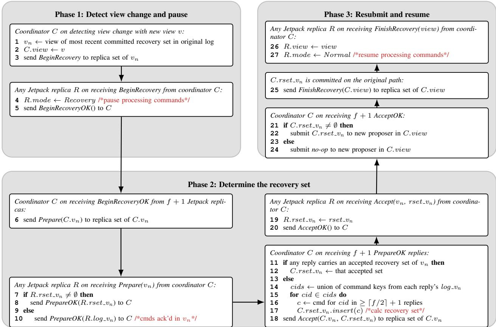  
Figure 14: The recovery protocol of Jetpack.

Phase 3 (resubmit and resume the fast path). Finally, the coordinator resubmits the agreed recovery set to the original protocol, or a no-op if the recovery set is empty. The commit of this entry serves as the stability marker that future recoveries use to identify the last normal view in Phase 1. After the entry commits, the coordinator broadcasts a FINISHRECOV-ERY message to the new replica set, enabling the fast path in the new view.

## B.2 Recovery optimizations

Naively, this protocol requires 3 RTT exchanges before any command can be resubmitted: BEGINRECOVERY, PREPARE, and ACCEPT. Moreover, two of these messages carry the entire recovery set or full logs, which can be very large.

We consider two potential optimizations. First, to avoid transmitting the full recovery set or logs, we try to transmit metadata when possible: (1) one RPC to pull log metadata from replicas and compute the recovery set; (2) one RPC to record the metadata and a recovery-set identifier; and (3) one RPC to fetch any command that the current coordinator does not already hold. This optimization replaces large, log-sized messages with smaller metadata messages plus on-demand fetching of missing commands.

However, this refinement increases the total number of RPCs to six. Our second optimization reduces downtime by merging independent steps and thereby reducing the number of round-trips. Concretely, we merge them into two RPCs: one RPC that performs BEGINRECOVERY, pulls log metadata, and executes PREPARE, and a second RPC that records the metadata and recovery-set identifier, pulls missing commands, and executes ACCEPT. The three operations combined in each RPC do not depend on one another, so they can be executed together without changing the protocol’s semantics while reducing the number of network round-trips from six to two.

## B.3 Correctness proof

We prove that Jetpack preserves correctness when integrated with any original consensus protocol. The proof is structured as follows: we first state our assumptions about the original protocol and define key concepts, then prove three properties— durability, execution consistency, and linearizability.

## B.3.1 Assumptions and definitions

We assume the original protocol satisfies the following properties; the in-order execution is also enforced in PR 1:

A1. Durability. Once a command is committed on the original path, it will not be lost across view changes.

A2. Consistent ordering. Once a command is committed on the original path at a log position, its position never changes.

A3. In-order execution. The original protocol executes and replies to commands in log order. A command at position j is not executed until all commands at positions i < j are committed.

A4. Linearizability. If command A is committed on the original path before command B is proposed, then B will be executed after A in the log.

In addition, Jetpack enforces the following design principles (from §4.2):

• Principle 1 (Same-view acknowledgment): A command is fast-committed only when all acknowledgments from both paths are in the same view.

• Principle 2 (Stability marker): Before activating command processing in a new view v, the new proposers must finish recovering the last normal view vn and commit at least one entry via the original path in v.

Definition 4 (Fast-path invariant). If a command A is fastcommitted in view v′, then during v′, no concurrent conflicting command can be committed on the original path at a position before A.

Justification. This is exactly the fast-path promise made by all original proposers. A fast-committed command A is stored on f + ⌈ f /2⌉ + 1 replicas, which includes all proposers. Since every proposer has already received A, any conflicting command B arriving later will be inserted after A in the original log (by PR 2).

We then prove three correctness properties. For each, Cases 1 and 2 (original-path and fast-path-fail commands) follow directly from the original protocol’s guarantees. The nontrivial case is always Case 3: a fast-committed command that has not yet been committed on the original path when a view change occurs.

## B.3.2 C1: Durability

Any command that has been replied to the client, whether through the fast path or the original path, will not be lost.

Case 1: Original-path command. The command is replied only after it is committed on the original path. Durability follows from A1..

Case 2: Fast-path command, fast commitment fails. The command is replied only after being committed through the original path. Durability follows from A1..

Case 3: Fast-path command, fast commitment succeeds. Once this command is eventually committed on the original path, durability follows from A1.. The nontrivial case is when a view change occurs before the command is committed on the original path.

Let v be the new view and vn be the last normal view. We show that any command fast-committed in vn is recovered in v.

The command has been stored on f + ⌈ f /2⌉ + 1 replicas in vn’s membership (by Principle 1), and by design, these replicas retain fast-path entries until the recovery of vn completes. Among any f + 1 replicas of vn’s membership participating in recovery, at least ⌈ f /2⌉ + 1 contain the command. Since recovery selects exactly the commands that appear in at least ⌈ f /2⌉ + 1 replies (lines 16–17 in Figure 14), the command is included in the recovery set and recommitted on the original path. Once recommitted, durability follows from A1..

Commands from older views. When entering view vn, the proposers of vn have already recovered and committed all fast-committed commands from the previous normal view v′′ (the normal view immediately before v ). By induction, every fast-committed command from any earlier view is already committed on the original path. Durability of these commands follows from A1..

## B.3.3 C2: Execution consistency

If a command is executed and replied to the client with result r, then in any subsequent execution (including after view changes), the command produces the same result r.

A command’s execution result is determined by its position relative to all conflicting commands in the log. Therefore, it suffices to show that a command’s position (relative to conflicting commands) never changes after it is replied.

Case 1: Original-path command. The command is executed only after being committed on the original path. By A2., its log position never changes. Therefore, its execution result is stable.

Case 2: Fast-path command, fast commitment fails. The command is executed only after being committed via the original path. Same as Case 1.

Case 3: Fast-path command, fast commitment succeeds. The command A is speculatively executed under the fast-path invariant (Definition 4): the proposer guarantees that no conflicting command will be committed before A on the original path. Once A is committed on the original path, its position is fixed by A2., and all future executions produce the same result.

The nontrivial case is when a view change occurs before A is committed on the original path. Let v be the new view and vn be the last normal view. We must show that after recovery, no conflicting command appears before A. We prove this in two steps.

Lemma 1 (Original-path recovery safety). During originalpath recovery in view v, no uncommitted conflicting command is recovered at a position before A.

The original path finishes its own recovery before the fastpath command recovery starts. By Principle 2, the new proposer in view v recovers only uncommitted commands belonging to vn and does not introduce uncommitted commands from other views.

All commands in vn were proposed by the proposers of vn, and by the fast-path invariant (Definition 4), they either:

1. do not conflict with A (recovery of these commands does not affect A’s execution result), or

2. conflict with A and appear after A in the original log (i.e., at index j > i where A is at index i).

For case (2), consider a conflicting command B at index j > i. By PR 1, A at index i will be replicated before B at index j, and therefore be recovered before B. Even in a protocol that allows out-of-order replication (where B could reach a major ity while A does not), the recovery may miss A and leave a log hole at index i. Since B at index j > i has not been executed or replied to the client (by A3., it cannot execute while position i is uncommitted), the new leader can safely discard all entries after a log hole. Therefore, original-path recovery never introduces an uncommitted conflicting command before A’s position.

Lemma 2 (Fast-path recovery completeness and safety). Every fast-committed command in vn is included in the recovery set, and no command in the recovery set conflicts with it.

Proof. Completeness. By the same quorum argument as C1 Case 3, a fast-committed command appears in at least ⌈ f /2⌉+ 1 of the f + 1 replies during view change, and is therefore included in the recovery set.

Safety. Any conflicting fast-path command C would have failed fast commitment, because A already occupies the superquorum: C cannot obtain a superquorum of conflict-free acknowledgments. Therefore, C cannot appear in ⌈ f /2⌉ + 1 fast-path logs, and is excluded from the recovery set. □

By Lemmas 1 and 2, after recovery in view v, the fast-path invariant still holds: no conflicting command appears before A. Therefore, A’s execution result remains consistent with its speculative execution.

## B.3.4 C3: Linearizability

For any two conflicting commands A and B, if B is issued after A is replied to the client, then A must always be executed before B.

Case 1: A is an original-path command. A is replied only after it is committed on the original path. Since A is committed before B is proposed, by A4., B will be placed and executed after A.

Case 2: A is a fast-path command, fast commitment fails. A is replied only after being committed through the original path. Same as Case 1.

Case 3: A is a fast-path command, fast commitment succeeds. Once A is committed on the original path, A is committed before B is proposed, and by A4., B will be placed and executed after A.

The nontrivial case is when A is fast-committed but not yet committed on the original path when B is issued.

Case 3a: B is issued in the same view as A. If B is a fast-path command, it will fail fast commitment: since A is stored on a superquorum, B cannot obtain conflict-free acknowledgments from a superquorum. Therefore, regardless of whether B is a fast-path or original-path command, B is handled by the proposers and inserted into the original log after A (by the fast-path invariant, Definition 4).

If no view change occurs, B is committed after A and executed after A. If a view change occurs, by Lemmas 1 and 2, A’s position is preserved and no conflicting command appears before A. Therefore, B is still executed after A.

Case 3b: B is issued in a higher view than A. A view change occurs before B is issued. By Principle 2, the recovery of vn (including A) must complete before the new view accepts client commands. Therefore, B can only be processed after A has been recovered and committed on the original path. At that point, A is committed, and by A4., B will be placed after A and executed after A.

## C Adaptive path selection strategy

This appendix presents the detailed strategy used by Jetpack to adjust its fast-path attempt rate. §5 introduced the intuition; here we specify the concrete mechanism.

Each client maintains a circular buffer of the most recent 100 requests, recording for each request: (i) whether the fast path was attempted, (ii) its end-to-end latency, and (iii) CPU utilization at issuance time. From this buffer, the client computes running averages: the fast-path latency L¯ fast, the originalpath latency L¯ orig, the recent attempt rate A¯, and the current CPU load.

Using these measurements, the client updates its future fast-path attempt rate according to the following rule:

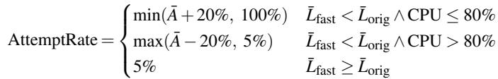

This rule captures three behaviors: (1) When the fast path is faster and CPU usage is modest, the attempt rate gradually increases. (2) When CPU load is high, even a faster fast path is throttled to protect throughput. (3) When the fast path is slower, it is effectively disabled except for a minimum 5% probing rate, which allows the system to detect future improvements.

During cold start, the client enables the fast path for the first 5 requests to gather baseline measurements; afterward, the adaptive rule takes control. This mechanism enables Jetpack to automatically exploit the fast path when beneficial, while avoiding performance degradation when system load or contention makes the fast path ineffective.

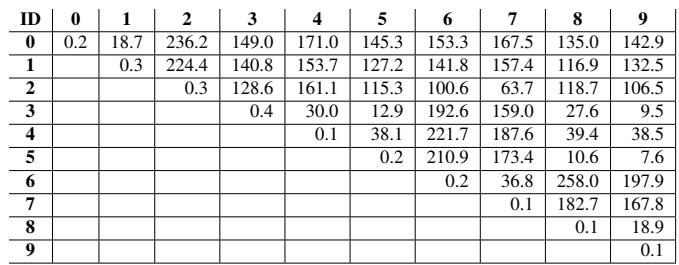  
Figure 15: Network latency between DCs.

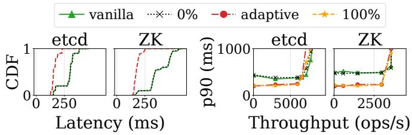  
Figure 16: Latency CDF (left) and throughput–latency (right) for etcd and ZooKeeper under a uniform 50% read / 50% write workload, comparing the vanilla protocol, Jetpack with fixed fast-path attempt rates, and Jetpack in adaptive mode.

## D Network latency between datacenters

We measured round-trip time (ms) between datacenters. These datacenters spanned North America (California, ID 0; Oregon, ID 1), Europe (Frankfurt, ID 3; Stockholm, ID 4; London, ID 5; Ireland, ID 8; Paris, ID 9), and Asia Pacific (Mumbai, ID 2; Hong Kong, ID 6; Singapore, ID 7).

## E Additional case studies: etcd and ZooKeeper

In addition to the systems evaluated in §6.6, we also integrated Jetpack with etcd and ZooKeeper. The integration methodology is identical to §6.1, so we report only the performance results here; the latency CDFs and throughput–latency curves appear in Figure 16, and the workload-axis sweeps appear in Figure 17.

etcd. We built on etcd 3.7.0-alpha.0, a widely deployed Raftbased key-value store using a standard Raft implementation. With Jetpack, etcd reduces average commit latency by 42.36% (Figure 16).

ZooKeeper. We built on ZooKeeper 3.9.4, which uses Zab (ZooKeeper Atomic Broadcast), a leader-based atomic broadcast in which a designated leader assigns a total order to write requests and replicates them to followers via a propose-ackcommit broadcast. Like Raft, Zab is leader-based and satisfies Jetpack’s prerequisites. With Jetpack, ZooKeeper reduces average commit latency by 52.59% (Figure 16).

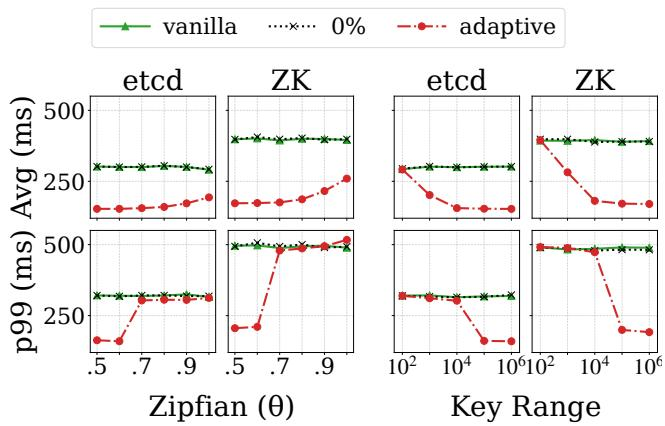  
Figure 17: Average and p99 latency for etcd and ZooKeeper under a 50% read / 50% write workload with varied contention (Zipfian skew and key-range size).

## F Benefit rate of fast path in Jetpack

In the adaptive mode, Jetpack’s effectiveness depends on three conditions being met for any given request: (1) the fast path must be attempted, (2) the attempt must succeed, and (3) the resulting latency must be lower than the original path’s latency. We define the fast-path benefit rate as the percentage of total requests that satisfy all three conditions. This metric quantifies the practical advantage delivered by Jetpack.

Figure 18 shows this benefit rate under two scenarios: a balanced (50% read / 50% write) and a read-intensive (95% read/5% write) workload, with varying Zipfian skewness (θ). In the balanced workload, the benefit rate for all four systems gradually decreases as θ increases. This is because a higher skew leads to greater data contention, which in turn increases the failure rate of fast-path attempts. In the read-intensive workload, Raft and Copilot integration exhibit higher true benefit rates than those in the read-write balanced workload, as read operations do not conflict in Jetpack’s fast path, increasing the likelihood of a successful fast path. MongoDB’s benefit rate is capped at 5%, since 95% of operations are reads that will complete in 1 RTT without replication.

To further analyze the true benefit rate, we examined a readwrite balanced workload (50% read / 50% write) with high contention (θ = 1). For Raft and Copilot, the benefit rates are 65.91% and 64.53%, respectively. In these systems, the fast path is faster than the original path in most datacenters, leading to a high attempt rate (90 − 100%). This, combined with a success rate of around 60% under high contention, yields the final benefit rate. The rate for Mencius (18.87%)

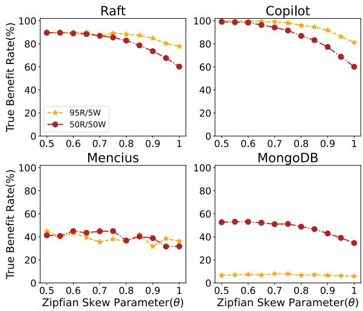  
Figure 18: Fast-path benefit rate in a geo-distributed environment

is roughly half of that, as clients co-located with a proposing replica do not gain a latency advantage from the fast path. Similarly, MongoDB’s benefit rate (34.66%) is also halved because 50% of its read requests are non-replicated and are already served in a single RTT, receiving no additional benefit from Jetpack.

Even under extreme contention (Zipfian θ = 1.0, 50% read / 50% write), Jetpack benefits between 18.87% and 65.91% of requests, demonstrating substantial fast-path gains across all systems.

## G Multi-leader fast-path overhead

This appendix formalizes the argument referenced in the main text: in multi-leader settings with rotating leaders, Jetpack’s per-command processing overhead is a structural consequence of its design goals, not an artifact of the particular integration.

## G.1 Model and design goals

We consider a shared-log multi-leader consensus protocol with M ≥ 2 leaders L = {l1, . . . , lM}, where multiple leaders concurrently propose to a single global log Λ and conflicting commands may be issued to different leaders. Each leader l maintains a log sequence Seq , and Λ is obtained as

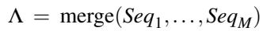

under a fixed deterministic merge rule (e.g., round-robin slot interleaving in Mencius). Replicas execute commands in Λ- order, deduplicating any command that appears in multiple Seq (executed only at its first occurrence in Λ). For any command c appearing in Λ, we write pc for the position of its first occurrence; this is the position that determines execution order.

We adopt the standard asynchronous distributed system model: leader progress depends on incoming commands and message delays, both of which can vary independently. As a consequence, no leader can be perpetually ahead of every other leader; over time, any leader can be transiently the slowest-progressing one.

Lemma 3 (Existence of a min-position leader). At any time T , the next available slots of the M leaders correspond to M distinct positions in Λ. Hence some leader has a strictly minimum next-slot position in Λ among all leaders.

Proof. Each leader owns a disjoint subset of Λ’s slot positions, so the next-slot Λ-positions of distinct leaders are distinct. The minimum of M distinct values exists. □

Jetpack’s three design goals are restated in this model as follows.

• G1 (Client-side 1-RTT fast path). For every fast-path command c, the client receives the commit acknowledgment within one round-trip of the request.

• G2 (Order consistency). For any fast-path-committed command c and any command d that conflicts with c and has not yet been committed at the time of c’s fast-path commit acknowledgment, whenever both c and d appear in Λ they satisfy pc < pd. That is, the order established by a fast-path commit must be honored by the original protocol’s eventual placement in Λ.

• G3 (Non-intrusive integration). Jetpack is layered atop the original protocol, whose logic remains unchanged. As a consequence, on any given replica the original protocol can not observe the fast-path acknowledgment order produced by Jetpack.

## G.2 Each command must be proposed by every leader

Theorem 4. Under G1, G2, and G3, every fast-pathcommitted command c must appear in every leader’s local sequence: c ∈ Seq for all i ∈ {1,..., M}.

Proof sketch. Suppose for contradiction that there exists an execution in which c is fast-path committed but c ∈/ Seq j for some leader l j.

Construction. Let T0 denote the time the client issues c. By Lemma 3 and the flexibility of the asynchronous model, choose an execution in which l j is the strictly min-position leader throughout [T , T ], with constant next-slot Λ-position p∗j, and c has not propagated to Seq j during this interval.

## Deriving the contradiction.

1. By G1, the client receives a fast-path commit acknowledgment for c at some Tc > T0.

2. At time Td > Tc, the client issues a command d conflicting with c and routes d to l . Since d is issued after c’s fast-path commit acknowledgment, the fast-path order is pc < pd.

3. By G3, l j’s decision of which slot in Seq to assign to d depends only on lj’s local log state. Since c ∈/ Seqj by construction, l j has no record of c and proposes d at p∗j .

4. Meanwhile, li proposes c on the original path at some time T ′ ∈ (T0, Td]. Since l j is strictly min throughout [T0, Td] (Lemma 3 + construction), li’s next-slot at T ′c exceeds p∗j , so pc > p∗j .

5. Combining steps 3 and 4: pd = p∗j < pc, contradicting the fast-path order pc < pd from step 2 and violating G2.

Therefore the supposition fails: c ∈ Seq j for every l j.

Corollary 5. Any integration satisfying G1, G2, and G3 with a multi-leader protocol incurs per-command processing cost Ω(M), where M is the number of leaders.

This corollary directly explains the empirical CPU overhead observed for Mencius+Jetpack in §6.5: with M = 5 leaders, each fast-path command is processed five times, matching the observed high CPU increase.