USENIX

THE ADVANCED COMPUTING SYSTEMS ASSOCIATION

# Inside Out: A Paradigm Shift In VM Introspection

Dufy Teguia, University Grenoble Alpes, CNRS, Inria, Grenoble INP, LIG, and Orange Research; Louis Duval, University Grenoble Alpes, CNRS, Inria, Grenoble INP, LIG; Teo Pisenti, IRIT, Université de Toulouse, CNRS, Toulouse INP, UT3 Toulouse; Kahina Lazri, Orange Research; Daniel Hagimont, IRIT, Université de Toulouse,   
CNRS, Toulouse INP, UT3 Toulouse; Thomas Pasquier, University of British Columbia; Renaud Lachaize and Alain Tchana, University Grenoble Alpes, CNRS, Inria, Grenoble INP, LIG

https://www.usenix.org/conference/osdi26/presentation/teguia

# This paper is included in the Proceedings of the 20th USENIX Symposium on Operating Systems Design and Implementation.

July 13–15, 2026 • Seattle, WA, USA

ISBN 978-1-939133-55-7

Open access to the Proceedings of the 20th USENIX Symposium on Operating Systems Design and Implementation is sponsored by

# Inside Out: A Paradigm Shift In Live VM Introspection

Dufy Teguia<sup>1,2</sup>, Louis Duval<sup>1</sup>, Teo Pisenti<sup>3</sup>, Kahina Lazri<sup>2</sup>, Daniel Hagimont<sup>3</sup>, Thomas Pasquier<sup>4</sup>, Renaud Lachaize<sup>1</sup>, Alain Tchana<sup>1</sup>

<sup>1</sup>Univ. Grenoble Alpes, CNRS, Inria, Grenoble INP, LIG, 38000 Grenoble, France

<sup>2</sup>Orange Research, France

<sup>3</sup>IRIT, Université de Toulouse, CNRS, Toulouse INP, UT3 Toulouse, France <sup>4</sup>University of British Columbia, Vancouver, British Columbia, Canada

## Abstract

We present GOODKIT, a new framework for live virtual machine introspection (LVMI) designed for performance, scalability, and safe integration in modern cloud environments. Unlike existing approaches—such as LibVMI—which rely on heavy VM pausing, GOODKIT executes observers as lightweight VMs colocated with the VMM, enabling nativespeed access to the target state while preserving strong isolation. GOODKIT introduces fine-grained, lock-aware memory–coherence mechanisms, a configurable probing subsystem for I/O and kernel-level events, and a mutualization layer that allows multiple observers to operate concurrently without degrading target performance. Across 21 real world use cases, including rootkit detection, ransomware monitoring, and scheduler introspection, GOODKIT delivers high performance (compared to LibVMI), strong isolation, and broad applicability.

## 1 Introduction

Virtual machines (VMs) are the basic abstraction for modern cloud computing. Tenants and providers must routinely leverage VM introspection (VMI) techniques to observe VM behavior, in order to detect attacks, maintain availability, and understand performance problems. A VM observer should perform the above tasks while remaining safe for the platform, and also (in many use cases) transparent to the guest. This requires three properties: low overhead to track frequent events, strong isolation from both the guest and the cloud provider, and the ability to bridge the semantic gap between low-level VM state and high-level system abstractions. Our goal is to design a live VMI (LVMI) framework that achieves all three properties in a multi-tenant (IaaS) cloud, and that can be leveraged by tenants without constraints imposed by the cloud provider.

Existing VMI systems place observers in three locations: in a separate VM, inside the hypervisor or VMM, or inside the target VM’s guest OS. Hypervisor-based systems [13, 22, 23, 25, 41, 48, 50, 52] such as LibVMI [8] run the observer in a separate VM and improve isolation from the guest, but they require hypervisor changes, often pause the VM for a consistent view, and incur extra kernel to userspace crossings. Observers embedded in the VMM [24, 41] have direct access to guest memory and VMM events, but they enlarge the trusted computing base (TCB). Besides, this approach does not provide isolation guarantees between the different observers (deployed by tenants and/or the cloud provider) attached to a target VM. In-guest observers [7, 18, 32] offer native performance and no semantic gap, but a compromised guest can disable or mislead them, and they share its fault domain. No existing design provides live introspection that is fast, strongly isolated from both guest and provider, and deployable without modifying the hypervisor.

We present GOODKIT, a LVMI framework that takes a different approach. It runs one or several observers as regular guest VMs under the same VMM process as their target VM and maps selected regions of the target’s memory into these observers under explicit policy. From an observer’s perspective, introspection looks like native memory access, while still benefiting from VM-level isolation and standard hypervisor accounting. All introspection mechanisms live in user space inside the VMM and in the observer VMs. Moreover, GOODKIT does not require modifying the hypervisor (enabling quick adoption by cloud providers) nor the target guest, and is agnostic to the observers’ guest OSes. To support mul tiple observers efficiently and safely, GOODKIT combines fine-grained access control with a mutualization layer that shares common introspection work and reduces contention on kernel data structures.

Our evaluation shows that GOODKIT retains the benefits of LibVMI-style introspection while avoiding its costs. On 14 Phoronix workloads, GOODKIT observers introduce at most a 1.06× slowdown on the target, whereas LibVMI induces slowdowns between 5.15× and 37.6× under comparable conditions. On micro-benchmarks, GOODKIT’s lock-based introspection is up to 17× faster than LibVMI’s pause/resume mechanism, and overall introspection latency improves by up to 110× for some policies. Across 21 real-world use cases, including rootkit detection, ransomware monitoring, liveness monitoring, and scheduler analysis, GOODKIT provides strong isolation, stable capture rates at high frequencies, and modest implementation effort; observer code is typically 3-6× shorter than equivalent LibVMI-based implementations. Overall, we make the following contributions:

• We identify requirements for live VMI in multi-tenant clouds: flexibility, isolation, consistency, low overhead, precise accounting, and easy deployment (§3.1).

• We present GOODKIT, an introspection framework that shares the same VMM between a target VM and its observer VM(s) and maps the target memory into each observer VM under explicit policy, without changing the hypervisor (§3.4.

• We design and implement mechanisms for lock-aware, consistent introspection, shared monitoring across observers, and VMM-side probing of VMM and hypervisor events (§4).

• We develop a GOODKIT prototype supporting Linux-based target and observer VMs on x86 machines. We evaluate GOODKIT on 21 real-world use cases and show low overhead, strong isolation, and broad applicability (§5).

• We release GOODKIT as an open-source project (Appendix A).

## 2 Background and Motivations

This section presents the necessary background on virtualization (§2.1), motivates the need for live VM introspection (§2.2), and discusses the limitations of state-of-the-art approaches (§2.3, §2.4).

## 2.1 Virtualization

Generalities. Several popular virtualization platforms (e.g., KVM [2] and Oracle VirtualBox [5]) follow a two-layer design with a hypervisor and a virtual machine monitor (VMM). Hereafter, we focus our concrete discussion on KVM-based platforms, as they underpin some of the main public (e.g., AWS, GCP) and private (e.g., OpenStack, Proxmox) cloud infrastructures. The hypervisor (KVM in our case) runs in the host kernel and provides core virtualization primitives: vCPU execution, EPT page-fault handling, and VM isolation. It exposes a userspace API (the KVM API) but does not encode any notion of a VMM instance. Because it is part of the kernel, modifying the hypervisor is undesirable.

The VMM (e.g., Firecracker [1, 12] or QEMU [6]) runs as a userspace process and builds full virtual machines using this API. It reserves part of its address space as guest “physical” memory (see below), configures virtual devices, loads the guest OS, and manages paravirtualized I/O during execution.

Since VMMs are regular userspace programs, they are the natural place to add mechanisms such as VMI support without touching the hypervisor.

Memory virtualization. It involves several coexisting address spaces, each interpreted at a different layer of the virtualization stack. The host virtual address (HVA) space corresponds to the virtual memory of the VMM process (e.g., QEMU or Firecracker). Processes inside the guest OS use the guest virtual address (GVA) space. The guest OS maps GVAs to guest physical addresses (GPAs) using its own page tables, which represent the physical memory abstraction exposed to the guest. Finally, host physical addresses (HPAs) denote the actual machine memory managed by the host kernel and used by the hypervisor.

When creating a VM, the VMM allocates one or more regions in its own virtual address space (HVA), typically via mmap(), to hold the guest’s RAM. These HVA regions do not need to be contiguous, but the VMM can present them to the guest (GPA) as a contiguous physical address space. It does so by configuring KVM’s memory slots, each mapping a range of HVAs to a corresponding range of GPAs. For example, an HVA region (hva1, size) in the VMM may be exposed to the guest as (gpa=0, size), creating the illusion of a contiguous physical memory layout for the guest regardless of how the VMM arranged the underlying HVAs.

KVM, in turn, maintains for each VM a second-level page table, the Extended Page Table (EPT) on x86, that translates GPAs to HPAs. Inside the guest, each process has its own page table maintained by the guest OS, which translates GVAs to GPAs. Thus, when the processor executes a memory access inside the guest, it performs a two-dimensional translation: a guest page walk (GVA to GPA), followed by an EPT walk (GPA to HPA). The resulting HPA identifies the actual physical page on the host. Notably, after memory slots are configured, HVAs play no role in guest execution (in the hardware translation performed on behalf of the guest). The HVA is involved only when the VMM itself accesses the guest’s memory (e.g., for snapshots, migrations, or to read VirtIO ring buffers).

## 2.2 Live VM Introspection

VM introspection (VMI) gives cloud tenants and providers visibility into the internal state of their virtual machines. It supports three main activities: (1) security operations, which ensure that a guest does not execute or prepare to execute malicious code (e.g., ransomware); (2) liveness monitoring, which detects crashes, deadlocks, or livelocks and triggers restart; and (3) forensic analysis, which examines a VM’s memory after a failure to identify root causes. The first two activities typically run on live systems and often precede forensic investigation. We focus on live VMI (LVMI). §5.2 presents several representative real-world LVMI use cases.

We call an introspection mechanism any component that can access the internal state of a VM. An introspection framework is a coherent stack of mechanisms, libraries, and runtimes that together provide efficient and convenient access to VM state. An observer is a system built on top of such a framework to implement high-level LVMI services (for example, liveness monitoring).

## 2.3 LibVMI-based Observers

LibVMI [8] underpins most industry [4, 9] and academic VMI systems [23,25,38,39,41,48,50]. We first review how it works and then explain why it is a poor fit in live-monitoring scenarios.

Description. LibVMI is a C library that builds on KVM-VMI (KVMI) [37], Bitdefender’s extension [15] of KVM for introspection. KVMI adds a kernel subsystem and a userspace library, libkvmi, that communicate over a UNIX socket. KVM then spawns a dedicated kernel thread that handles commands from the observer.

LibVMI offers three main classes of commands: (1) vCPU commands, to get/set registers, query cpuid/xsave, and pause or resume vCPUs; (2) memory commands, to read/write guest physical memory, adjust page permissions, and translate GVA to GPA; (3) configuration commands, to fetch VM/hypervisor metadata (e.g., memory size, KVM version), register events (e.g., CR3 traps), and configure monitoring at VM or vCPU level.

Impracticability for LVMI. LibVMI introduces two major costs for live monitoring:

(1) LibVMI-based tools typically pause the target VM to obtain a consistent snapshot of kernel data structures. These global pauses are extremely expensive in LVMI: prior work reports slowdowns up to 9x [31], and we observe similar behavior. The cost grows roughly linearly with the polling rate, which makes LibVMI unsuitable for use cases involving live VM monitoring, such as process scheduling analysis or memory overcommitment.

(2) LibVMI never accesses guest state directly. Every operation is routed through KVMI over a socket, causing extra user–kernel transitions and data copies. For example, writing a buffer to guest memory involves copying it from the observer to a KVMI kernel buffer, then again into guest memory.

LibVMI provides an optional cache in the observer to hide part of these costs, but caching trades freshness for speed. It is therefore unusable for most LVMI scenarios that require up-to-date state, such as the use cases in §2.2.

## 2.4 Limitations of Existing Designs

Existing VMI approaches adopt different placement strategies, each with distinct trade-offs in observability, isolation, performance, and deployability.

A first class of designs, often called out-of-VMM approaches [13, 22, 23, 25, 41, 48, 50, 52], runs the observer in a VM managed by a different VMM instance than the target. Most of these systems rely on LibVMI [8], which exposes a high-level API for inspecting guest state but requires hypervisor modifications. This placement provides strong isolation and clean per-VM accounting. Still, it incurs expensive cross-VMM interactions, frequent VM pauses, and high memory overhead, as each observer requires its own VMM process. Since the observer runs outside the target’s VMM, it also cannot see VMM-level events such as device I/O or VM exits. mmap()-based variants [21, 28, 30, 40, 60] reduce memoryaccess cost by mapping the target’s memory into the observer VMM, yet they retain key drawbacks: per-observer VMM bloat, dependence on hypervisor changes for memory sharing, and lack of visibility into VMM-level activity.

A second class of systems [24, 41] embeds the observer inside the VMM that hosts the target. The observer is compiled into the VMM process and thus has direct access to guest memory and VMM events. This yields high observability and low-latency introspection. However, it removes isolation: observer and VMM share privileges and address space, so a bug or compromise in the introspection code can bring down the entire VMM and all its guests. This design is also hard to modularize (e.g., to several, dynamically-attached observers) and prevents separate accounting of monitoring overhead.

A third class, in-target approaches [7, 18, 32], places the observer directly inside the target guest OS as an agent or kernel extension. This mitigates the semantic gap and gives very efficient access to guest state but completely forfeits isolation and trust, since compromising the target also compromises the monitor.

GOODKIT adopts a different design: an in-VMM, multiguest architecture in which observers run as independent guest OSes under the same VMM instance as the target. This preserves the modularity and isolation benefits of out-of-VMM observers while avoiding per-observer VMM overhead, and it still allows access to VMM-level events without compiling monitoring code into the VMM. By extending the VMM (rather than the hypervisor), GOODKIT enables controlled, direct mapping of the target’s memory into observer guests while keeping the hypervisor unchanged. As a result, it combines high-performance introspection with strong isolation, precise accounting, and compatibility with existing cloud deployments.

## 3 Overview

This section details the design requirements of GOOD KIT (§3.1), explains the threat model (§3.2), and presents an overview of GOODKIT (§3.4).

## 3.1 Requirements

We design GOODKIT to meet the following requirements simultaneously:

(R1) Flexibility: GOODKIT must support a wide range of monitoring use cases, potentially requiring events from the guest OS, the VMM, and the hypervisor. Achieving this goal is particularly challenging because we explicitly avoid modifying the hypervisor (see R6).

(R2) Isolation: Observers must be isolated from the target guest OS, the VMM, and the hypervisor. The system must provide (i) fault isolation (a misbehaving observer must not disrupt target services) and (ii) privilege isolation (untrusted tenant observation code must be isolated from the VMM).

(R3) Consistency: Observer data must be accurate and internally consistent. For example, traversing the process list must yield a coherent snapshot even if the target modifies the list concurrently.

(R4) Speed and Overhead: The system must observe the target in (near) real time, missing no relevant events while imposing low performance overhead on the target.

(R5) Resource Efficiency and Accountability: Each observer’s resource consumption must be small, accurately measurable, and attributable to the corresponding tenant for accounting and billing.

(R6) Adoption: The system must integrate seamlessly with ex isting cloud deployments and avoid hypervisor changes, since updating hypervisors at scale is a time-consuming, resourceintensive and security-sensitive endeavor.

Non-goals. There are several valuable directions that lie beyond the scope of GOODKIT. Although GOODKIT enables the development of introspection policies, our objective is not to propose new policies, for example, aimed at improving kernel-compromise detection. Similarly, enhancing detection accuracy through novel analysis algorithms is also outside the scope of this work.

## 3.2 Threat Model

The VMM and hypervisor are part of the Trusted Computing Base (TCB) and are assumed to be correct and uncompromised. The target guest VM may be fully compromised, for example by a rootkit or ransomware. Each observer guest is trusted by its tenant to perform legitimate introspection, but may still be faulty or malicious. A faulty or malicious observer can lie to its tenant, disrupt the services provided by the target or more generally, compromise the integrity of the (target) guest state due to the ability to modify locks or other memory regions. From the cloud provider’s perspective, an observer is untrusted: it is a regular VM with the same isolation guarantees as any other tenant VM. A faulty or malicious observer thus cannot compromise other VMs.

## 3.3 Design Trade-Offs

In GOODKIT’s design, an observer runs as an independent guest VM managed by the same VMM instance as the corresponding target VM. Compared to LibVMI, where the monitoring code executes outside of the VMM, the isolation layer is thinner but, in return, we do gain live access to the target VM memory (mapped into the observer), and also direct access to the target VM devices. Modifying the VMM rather than the hypervisor is preferable because the latter is a software layer with a complete set of privileges that must necessarily be under the control of the cloud provider, whereas the ownership of the VMM layer can be more easily offloaded to a cloud tenant. Indeed, unlike the hypervisor, the VMM runs in user mode on the host machine and there is one distinct VMM instance per (traditional) tenant VM. Besides, in real-world scenarios, modern virtualization stacks already make use of multiple sandboxing facilities as an additional level of protection against a potentially misbehaving (buggy or compromised) VMM, including limited (user) privileges and contained domains (built with features like namespaces, seccomp-bpf filters, and control groups) [12]. In our approach, such sandboxing facilities may also be leveraged for mitigating the impact of a misbehaving observer on the host and the other guests.

## 3.4 Architecture

We now describe how GOODKIT’s design (Fig. 1) satisfies the requirements introduced in §3.1. We begin by explaining how GOODKIT runs observers as guest OSes (R2), before detailing the programming model, including the introspection API and the mechanisms for controlling and deploying observers (R1). We then present our memory–mapping scheme, which provides isolation, accurate accounting, and consistent access to the target state (R2–R5). Finally, we show how shared introspection and a purely userspace implementation of GOODKIT reduces overhead and eases adoption in existing cloud environments (R4–R6).

Observer as guest OS, enabling isolation and precise accountability (R2 & R5). In GOODKIT, an observer ( A ) can run either as a unikernel [36] or a full Linux guest. In our current prototype, we opted for the latter, as it provides a more general and flexible execution environment. ( B ) GKBUILDER launches observers as separate guests using the same KVM interfaces as for the target ( 1 and 2 ). For each observer, it sets up memory slots in the VMM process that KVM uses to build the observer’s EPT ( C ): some slots map selected regions of the target’s memory, while others are private. The target itself is assigned its own independent EPT ( D ). From the hypervisor’s perspective, observers are ordinary guests with their own isolation and resource accounting, yet they retain controlled access to the target’s memory where needed. Introspection API, enabling flexibility (R1). GOODKIT pro vides a two-layer introspection API (§4.1) that supports a broad range of monitoring and analysis services (§5.2). In the observer VM, the low-level API is implemented in GKMOD-ULE ( E ) and is used by kernel-space code, while the highlevel API is provided by LIBGK ( F ) for userspace. Observation services can be implemented in the kernel, in userspace, or split across both. Userspace observers can integrate heavyweight analysis components, such as machine-learning models (§5.2, ransomware detection). Kernel-space observers, in contrast, have direct access to the target memory and to the full low-level API, including VMM communication primitives. Userspace observers interact with GOODKIT through the high-level API listed in Table 1, and can also issue requests to the VMM. This makes userspace suitable for complex code that depends on external libraries or convenient device APIs, while kernel space is better suited to low-level memory introspection. When a userspace observer needs information not exposed by the high-level API, it can delegate the low-level target-memory access to a kernel component and consume the resulting data in userspace.

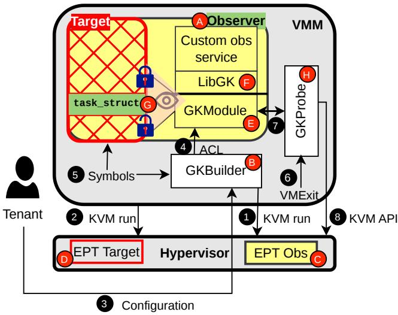  
Figure 1: GOODKIT Architecture. The gray boxes correspond to existing Hypervisor and VMM layers. The white boxes correspond to new VMM subcomponents introduced by GOOD-KIT. The yellow boxes denote the observer’s context. In this example, we use a single observer, whose purpose is to introspect a subset of the target VM’s internal state, such as the list of existing processes.

Controlled introspection, enabling flexibility (R1). Tenants specify, in a YAML manifest file ( 3 ), which operations each observer is allowed to perform (§4.2). GOODKIT enforces these permissions along four axes: memory protection, introspection-API function access, symbol-table access, and probe control. GKBUILDER applies the memory-protection rules at observer boot time, and ( 4 ) GKMODULE enforces function and symbol access at runtime. These act more as guidelines than strong isolation barriers and may help building sound observers. Depending on the use cases, observers may access the target with write accesses essentially limited to the locks protecting the monitored data structures (e.g., for a rootkit detector traversing the list of processes), or also require write accesses to additional parts of the target memory (e.g., for a synchronous/active VMI scenario that places breakpoints or hooks into the target [21, 34]).

Address translation, enabling consistency (R3). Each observer receives the target’s kernel symbol table ( 5 ) and uses it to locate kernel data structures. Because the target and observer use distinct page tables, these addresses must be translated. GOODKIT relies on the Linux kernel memory layout and implements seven dedicated translation functions, each covering a specific kernel memory region (§4.4). In our current implementation, the target and observer use the same kernel image so that the observer code can more easily interact with the target’s kernel data-structure layout during introspection. This is not a fundamental limitation of GOODKIT; the support of decoupled kernels is left for future work. Note that, in any case (i.e., using identical or distinct kernel images for the target and observer VMs), GOODKIT, like many other VMI approaches, relies on the assumption that the observation logic is aware of the precise memory layout and intricacies of the OS kernel running in the target. Therefore, for all these approaches (including GOODKIT), a cleverly-compromised guest might evade detection by an observer if it manages to bypass some of its assumptions.

Fine-grained suspension, enabling consistency and low overhead (R3 & R4). GOODKIT preserves consistency by locking the data structure being inspected ( G ), instead of suspending the whole VM as LibVMI-based systems do. It assumes the OS already protects shared structures with locks. With the target’s memory mapped, the observer acquires the same lock before accessing a structure, as if it were a thread within the target; concurrent updates then block on that lock. GOODKIT provides built-in support for lock acquisition (§4.5).

Shared monitoring, enabling low overhead and resource efficiency (R4 & R5). When several observers perform similar introspection tasks, such as scanning the process list, redundant work and lock contention increase overhead. GOODKIT introduces a mutualizer observer (§4.7) that centralizes these operations. Domain-specific observers register their requests with the mutualizer, which performs each operation once and distributes the results.

Only userspace components, enabling quick adoption (R6). GKBUILDER and GKPROBE ( H ) are implemented and run in the VMM process in userspace. GKPROBE (§4.6) monitors target-related VM exits, I/O, etc. ( 6 ) and runs providerdeveloped probes that can be enabled according to tenant needs, then forwards their outputs to observers ( 7 ). Providerdeveloped probes are capable of implementing arbitrary operations, including ( 8 ) invoking existing hypervisor API to capture hypervisor-level events. Its goal is to cover introspection operations that cannot be performed directly from inside observers. All changes are confined to the VMM and guest; the hypervisor remains unmodified.

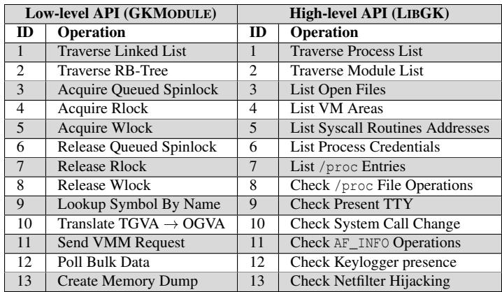  
Table 1: A subset of GOODKIT’s programming API: low-level (by GKMODULE) and high-level functions (by LIBGK).

## 4 Design and Implementation

This section presents the design and implementation of GOOD-KIT. While GOODKIT’s design is generic, this section is based on our implementation using Firecracker as the VMM and Intel x86-64 for the CPU architecture.

## 4.1 Programming API

GOODKIT exposes a two-layer introspection API split between GKMODULE and LIBGK. GKMODULE provides low-level primitives in the observer kernel, including address translation, lock-aware access to target data structures, and interfaces for issuing requests to GKPROBE. LIBGK builds on these primitives to offer a higher-level userspace API for common monitoring tasks. Together, they let developers implement observation services in kernel space, userspace, or both, without handling the underlying mapping and synchronization details. A sample in Appendix B illustrates how to use this API.

Low-level API (GKMODULE). The low-level API is implemented in GKMODULE and provides basic building blocks for introspection. Its functions fall into three categories. First, it offers helpers to traverse common kernel data structures such as linked lists (line 1, first column in Table 1) and red-black trees (line 2, first column). Second, it provides memory-access utilities for address translation (line 10, first column), memorycoherence control (lines 3–8, first column), and raw memory inspection (line 13, first column). Third, it exposes system wide control functions, including resolving kernel symbols by name (line 9, first column) and sending or receiving requests to or from GKPROBE (lines 11–12, first column).

High-level API (LIBGK). Building on the low-level functions, the high-level API implemented in LIBGK offers readyto-use implementations of common introspection tasks, drawn from prior work [29, 40, 48]. For example, listing operations (lines 1–7, second column in Table 1), such as traversing the process list or the kernel-module list, internally rely on the linked-list traversal primitive. Several high-level functions also help validate the integrity of the target kernel code (lines 8–13, second column). In particular, in Table 1, all functions whose description begins with the verb “Check” are designed to detect malicious hooks or other kernel tampering.

## 4.2 Policy Enforcement

GOODKIT enforces fine-grained policies that limit what each observer can see and do. Some controls are implemented in the VMM (GKBUILDER, GKPROBE) and cannot be bypassed by observer code. Others are enforced inside the observer by GKMODULE; when the observer comes from a third party, its requests can instead be routed through the mutualizer observer, which applies the same checks on its behalf.

Memory protection. The memory regions visible to an observer depend on its owner and use case. For example, a memory-overcommitment observer (e.g., running Wang et al.’s V-Probe algorithm [58]) deployed by the cloud provider needs to touch only the vmemmap region that holds struct page entries; it should not access other parts of the guest. The YAML manifest therefore lists allowed regions and their (read/write) permissions. GKBUILDER enforces these policies when configuring shared mappings for each observer.

Probe control. Probes (described in §4.6) expose VMMand hypervisor-level information about the target. GKPROBE treats each probe as a configurable unit: the manifest specifies which probes are enabled and, optionally, how far they may inspect guest state. For instance, blk\_probe can either collect disk I/O request types only or also inspect read/write buffers; its configuration can restrict it to pattern collection. Because probes run in the VMM, these limits hold even if the observer is compromised.

API–function access. GOODKIT maintains an access-control list of API functions that each observer may invoke. The YAML manifest contains the allowed GKMODULE/LIBGK functions; a GKMODULE macro checks at runtime whether the caller is authorized before executing the operation. For third-party observers, the same checks can be applied in the mutualizer, which filters their requests before they reach GK-MODULE.

Symbol-table access. Symbol resolution can be confined in a similar way. When needed, the manifest specifies a whitelist of kernel symbols. At runtime, the observer (or mutualizer) may resolve only these symbols; all other lookups fail with a Symbol Not Found error.

If no security policy is specified, GOODKIT falls back to a permissive configuration: the observer runs without restrictions, except that probes obey the default settings defined by the cloud provider.

## 4.3 Memory Mapping

GKBUILDER constructs the address spaces of the target and its observers and wires them together through shared memory. It allocates a contiguous region in the VMM process to back both target and observer memory, then configures KVM memory slots and EPT entries so that each observer sees its own guest-physical space with controlled mappings to the target. In this way, observers obtain direct access to target state while remaining isolated as separate VMs.

GKBUILDER first mmaps a large contiguous region in the VMM’s virtual address space to back both target and observer memory, laid out as observer<sub>1</sub> | observer<sub>2</sub> | ··· | target. For each observer, it then configures KVM memory slots that, together, form the guest-physical address space: some slots cover the observer’s own core memory (allocated by the tenant), others map selected regions of the target. For instance, with 2 GB for the observer and 10 GB for the target, the observer sees 12 GB of physical memory. The precise configuration of the target memory viewed by the observer depends on the aforementioned settings but also of architecturedependent constraints. For example, on x86, an MMIO hole typically appears near 3.25 GB, so mapping the target into the observer may require up to three slots, depending on how their ranges intersect this hole. We identify three distinct mapping scenarios, which we detail in Appendix C due to space limitations.

## 4.4 Address Translation

GKMODULE resolves target kernel pointers through a twostep translation: from a Target Guest Virtual Address (TGVA) to a Target Guest Physical Address (TGPA), and then to an Observer Guest Virtual Address (OGVA). Given an address in the target’s kernel space (a TGVA), it translates it to a TGPA based on the Linux kernel memory layout, and finally maps that TGPA into the observer’s own address space. This pipeline lets the observer access target kernel objects through regular in-guest pointers while preserving isolation.

TGVA → TGPA: Although one could continuously traverse the target kernel’s page tables to perform address translation, this would incur substantial overhead. Fortunately, for several Linux kernel memory regions, the layout is sufficiently structured to allow more efficient translations. The Linux kernel divides its virtual address space into seven major regions [3], each with its own data types and allocation policy. GOODKIT therefore chooses the TGVA → TGPA translation method based on the region in which the address lies. The boundaries of these regions are defined by the kernel’s memory layout.

(1) Text segment. This region is stored in a contiguous region in the TGPA space. Addresses in this region are translated by simple arithmetic: GKMODULE subtracts the fixed offset \_\_START\_KERNEL\_map from the TGVA.

(2) Direct mapping region. Here, a similar optimization can take place. GKMODULE subtracts the PAGE\_OFFSET constant from the TGVA. This region includes all contiguous allocations produced by functions such as kmalloc(), kzalloc(), kcalloc(), alloc\_pages(), and \_\_get\_free\_pages().

(3) Vmalloc region. Addresses in this region fall within VMALLOC\_START–VMALLOC\_END or MODULES\_VADDR– MODULES\_END. These ranges cover the kernel modules area, ioremap mappings, and memory allocated via the vmalloc\_\* family. For such addresses, GKMODULE performs a pagetable walk in the target kernel. It starts from the swapper<sup>2</sup> process’ page table, whose page global directory (PGD) base address is exported via the init\_top\_pgt symbol, walks down the page table levels to the page table entry (PTE), and returns the corresponding physical address.

(4) Vmemmap region. Addresses in this region lie within the VMEMMAP\_START–VMEMMAP\_END range, which stores the struct page array describing physical memory. As for the vmalloc area, translation requires a page-table walk starting from the page table of the target’s idle process. However, vmemmap is backed by huge pages, so the walk stops at the page middle directory (PMD) level instead of the PTE level. While vmalloc translation uses the PTE to obtain the physical frame, the PMD entry for vmemmap yields the base physical address of a memory section. The final struct page address (TGPA) is obtained by adding the offset of the target page within that section.

(5) Per-CPU region. These addresses correspond to per-CPU variables such as current (the currently executing task\_struct) and runqueues (per-CPU scheduler queues). Translation uses the \_\_per\_cpu\_offset array: GKMODULE adds the offset for the target CPU to the base address of the per-CPU variable to obtain the complete TGVA, and then translates it as in the direct mapping region.

(6) Fixmap region. This region contains statically mapped kernel addresses. Their translation uses a predefined lookup table that directly resolves virtual-to-physical mappings.

(7) Local Descriptor Table (LDT) regions. LDT-based addresses are process-specific and, in modern Linux kernels, rarely used. They can be treated as a legacy case and are typically ignored in practice.

TGPA → OGVA: At the start of the observer, the physical memory regions of the target are made available to the observer. GKBUILDER uses this information to reserve, in the observer’s address space, the ranges that correspond to the target. For each of the regions, the observer allocates an inmemory descriptor. Each descriptor records the region’s base address in the target (target\_base), the corresponding virtual base in the observer (virt\_start), and the region size.

TGPA translation to OGVA is then performed by locating the descriptor that covers the requested guest address and computing: OGVA = virt\_start + (TGPA − target\_base).

## 4.5 Fine-Grained Suspension

GKMODULE preserves memory coherence during introspection without the high cost of suspending the entire target VM, as in LibVMI. Instead of stopping the guest, it joins the target kernel’s locking protocol: for each data structure it inspects, GKMODULE acquires the lock that protects it, so concurrent updates serialize naturally with observer accesses. Read-only objects (for example, those marked \_\_ro\_after\_init or const) are accessed directly, while frequently updated structures are accessed only after taking the corresponding lock, as a regular kernel thread in the target would.

Basic idea. For any observer action that must appear as if it were performed inside the guest, the observer reuses an existing guest execution context whose participation does not affect normal execution. For example, when acquiring spinlocks, it impersonates the context of vCPU0 (more precisely, it impersonates the target’s idle task attached to vCPU0.) in the target and enters the same queuing and arbitration logic as a regular thread. This only adds one extra contender to the lock, while the locking protocol and scheduling behavior remain unchanged.

The Linux kernel provides two main classes of locking primitives [57]: spinning locks (spinlocks, bit spinlocks, rwlock\_t) and sleeping locks (mutex, rt\_mutex, semaphore, rw\_semaphore, ww\_mutex, percpu\_rw\_semaphore). We illustrate our approach with Spinlock, RWlock and Mutex by describing their implementations since they are the most widely used primitives in the kernel [35, 43, 54, 56].

Spinlocks. Our solution builds on the standard queued spinlock algorithm and reuses the per-CPU qnodes to place the observer in the lock queue. In Linux’s queued spinlock, each waiter is represented by an MCS node [45] taken from a per-CPU qnodes array. Each CPU has four such nodes, one for each context: Normal Task, Hardware Interrupt, Software Interrupt, and Non-Maskable Interrupt. Normally, a CPU runs only one of these contexts at a time, so at most a few qnodes are in use. It is extremely unlikely that all four contexts contend for the same lock simultaneously. If this happens, the last context simply spins until a qnode becomes free.

In our design, an observer thread behaves like one more nested context. It uses a qnode in the same way as an interrupt handler, joins the MCS queue, and eventually acquires the lock in turn. Appendix D illustrates our approach through a simple illustrative scenario.

RWLocks. RW locks follow the usual semantics: at most one writer may hold the lock, whereas multiple readers may hold it concurrently. A writer blocks all other holders; when readers hold the lock, a writer sets the write-pending bit and waits for exclusive access. In Linux, contending readers and writers spin on an internal spinlock embedded in rwlock\_t. Our observer simply uses the same queued spinlock algorithm: on contention, it joins the queue and participates in arbitration like any other entity, ensuring safe and consistent access to the protected kernel structure.

Mutexes. Mutexes are sleeping locks that can only be used in a preemptible task context. In the classic mutex algorithm, the contender is the current task. In GOODKIT, the observer instead impersonates the idle thread of the target’s CPU0 as the mutex owner, since manipulating the idle task cannot disrupt normal service.

Lock-free data structures. Besides these lock-based data structures, Linux also uses Read-Copy-Update (RCU) protected structures, which are common in recent kernel versions. GOODKIT does not currently support RCU-specific synchronization; we discuss possible extensions in §7.2.

## 4.6 External Event Probing

GKPROBE is a VMM-side helper that gives observers controlled visibility and actuation at the VMM/hypervisor boundary. It lets GOODKIT offer LibVMI-style capabilities (e.g., seeing I/O activity or triggering actions) without running code in the hypervisor or modifying it.

Because many relevant events occur outside the target’s memory, along the hypervisor–VMM path or inside the VMM itself, observers cannot access them directly. GKPROBE fills this gap: it runs entirely inside the VMM as a set of probes and actuators that only the cloud provider can configure. For operations already exposed by the KVM API, a probe or actuator often reduces to a simple ioctl() call; for events already visible in the VMM (such as VirtIO I/O operations), GKPROBE hooks into existing code paths and reports them to observers as introspection events.

Observer guests communicate with GKPROBE using VirtIO channels called virtqueues. An observer can produce one or several messages into a virtqueue and then trigger a hypercall, which allows notifying the corresponding VMMlevel probe/actuator for processing them. Symmetrically, a probe/actuator managed by GKPROBE within the VMM can also produce one or several messages into a virtqueue and send an interrupt request to trigger the execution of a VirtIO callback inside the observer (as a response to an observer request), registered by GKMODULE, which can forward the notification to a user-space agent. The precise interaction patterns between an observer and the VMM depends on the characteristics of a given introspection scenario and the chosen probe(s). In many use cases, it is possible to leverage asynchronous communications and message batching to reduce the occurrence of hypercalls. For example, in the case of a disk I/O probe used for ransomware detection (detailed in §5.2), hypercalls are only used sporadically by the observer and the VMM, respectively for submitting a set of buffers and for signaling when they are full.

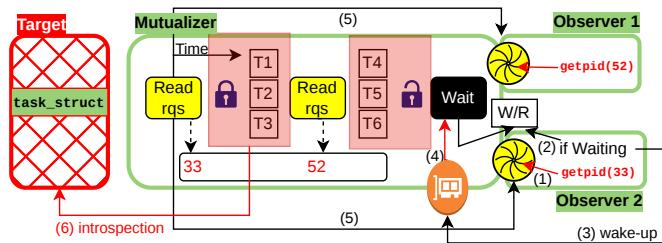  
Figure 2: Mutualized introspection.

## 4.7 Shared Monitoring

GOODKIT reduces redundant work and overhead on the target by delegating common introspection tasks to a dedicated observer, the mutualizer, illustrated in Fig. 2. Instead of having each observer traverse the same kernel data structures (such as list or trees of processes, VMAs, modules, etc.), client observers submit requests to the mutualizer. It checks each request against the configured policy, performs the traversal once, and shares the results, reducing CPU overhead, lock contention, and simplifying access control for third-party observers.

The mutualizer offers a configurable, iterator-based interface that treats different types of data structures uniformly. Each request specifies (i) the data structure to traverse (for example, process or module list) and (ii) the item to search for in that structure.

For communication, the mutualizer maintains a per-client ring buffer for requests and completions, and a small shared region that stores its state (Running or Waiting). When a client issues a request, it writes it into its ring buffer (1) and then checks the mutualizer state (2). If the state is Running, the client simply waits for the result. If the state is Waiting, it wakes the mutualizer by connecting to a sleeping socket via VirtIO (3). Checking the state avoids unnecessary VirtIO notifications and thus extra hypercalls and VM-Exits.

When woken, the mutualizer scans all ring buffers, groups pending requests by data structure type, and starts one worker thread per type. Each worker first acquires the corresponding lock in the target, then walks the list in fixed-size batches (6). A batch is a fixed number of structure elements (e.g., list nodes), configured at startup. After processing a batch, the worker briefly “spins and waits”: it re-examines the ring buffers for new requests of the same type, merges them into its work set, and then continues from the next batch. When a requested item is found, the worker writes the result into the completion ring buffer of the requesting observer (5).

A worker stops if it scans the data structure R consecutive times without seeing any new request. Between two iterations, the mutualizer sleeps for S µs to give the target a chance to acquire the same lock (experimentally, an approximate value of 20 µs provides the best balance between responsiveness and minimization of lock contention). Once all workers have stopped, the mutualizer’s main thread switches back to the Waiting state.

## 5 Evaluation

The implementation of GOODKIT consists of two parts: the VMM side and the observer side. The VMM side corresponds to 3,803 LoC (written in Rust) added to Firecracker (1,867 for GKBUILDER and 1,936 for GKPROBE), which represents 5.1% of its full code base. On the observer side, there are an additional 4,480 LoC for GKMODULE and 1,039 for LIBGK, all written in C.

Our evaluation of GOODKIT centers on the following main questions: (Q1) How effective and flexible is GOODKIT in a variety of use cases? (§5.2–§5.3) (Q2) How does GOODKIT perform compared to the state-of-the-art competitor, LibVMI (§5.4–§5.5)? (Q3) What overheads does GOODKIT impose on the target (§5.6)? and (Q4) How does the mutualizer observer improve scalability when multiple observers are running (§5.7)?

## 5.1 Experimental Setup

Testbed. Our experiments run on a 16-core Intel Xeon Silver 4215 at 2.50 GHz with 256 GB of RAM, running Ubuntu 20.04 and Linux 5.4.24+. All guests run Alpine Linux with a 5.10.198 kernel and the VMM is Firecracker 1.5. Unless otherwise specified, each target or observer VM is configured with 1 vCPU.

Baseline. §2.4 gave a qualitative comparison between GOOD-KIT and existing approaches. For the quantitative evaluation, we compare GOODKIT against LibVMI (with KVMI v7), following prior established methodology [40, 60]. State-of-theart VMI systems are broadly based on LibVMI. We were unable to reproduce the two in-VMM instrumentation approaches [24, 41] because their source code is not publicly available.

LibVMI targets QEMU and does not natively support Firecracker. We ported LibVMI to Firecracker by reusing its QEMU logic and verified that the resulting performance matches the QEMU-based implementation (§5.4). We publicly release this port (along with the GOODKIT source code) and we provide further details in Appendix E.

Workloads. We use two dimensions of workloads: where they run (inside the target vs. inside observers) and their granularity (micro vs. macro benchmarks). Target-side workloads measure the interference of GOODKIT on guest execution; observer-side workloads act as monitoring services.

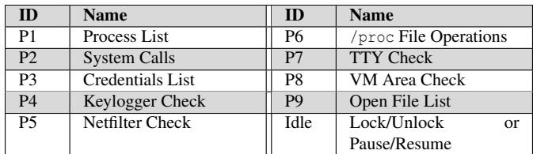  
(a) Micro-benchmarks for observers.

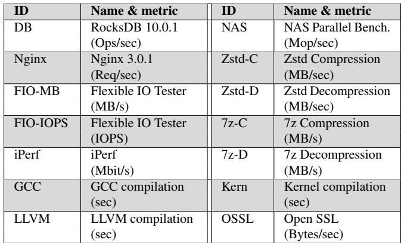  
(b) Phoronix applications used as macro-benchmarks for the target.

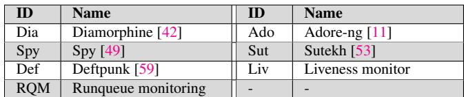  
(c) Macro-benchmarks for observers.  
Table 2: Workloads and benchmarks.

Micro-benchmarks are custom workloads that isolate specific GOODKIT features, inspired by prior work [40]. We introduce each target-side micro-benchmark when it first appears in the evaluation; observer-side micro-benchmarks are summarized in Table 2.a. Macro-benchmarks evaluate GOODKIT under realistic conditions. On the target side, we use fourteen applications from the Phoronix benchmark suite [47] (Table 2.b). On the observer side, we implement seven services (Table 2.c, §5.2).

## 5.2 Real-world Use Cases

We evaluate the effectiveness and flexibility of GOODKIT with realistic use cases. As discussed in §3.1, the novelty of GOODKIT does not lie in these use cases; they simply illustrate the range of applications it can support.

Rootkit detection. Using GOODKIT, we developed four observers to detect four open-source Linux rootkits: Diamor phine [42], Adore-ng [11], Spy [49], and Sutekh [53].

Diamorphine hooks three syscalls by overwriting their table entries with pointers to its own module. It hooks kill() (used to receive commands such as hide/unhide a process) and getdents() / getdents64() (used to hide processes from directory listings, including /proc). Sutekh also hooks syscalls, namely umask() and execve(), to grant root privileges to a designated process. Spy is a keylogger that attaches to the kernel keyboard notification chain by registering a struct notifier\_block. Adore-ng modifies function pointers in the file operations structure for the /proc directory to hide processes and files.

Detection focuses on the kernel objects that these rootkits modify: syscall table entries (Diamorphine, Sutekh), the struct atomic\_notifier\_head for keyboard notifications (Spy), and the /proc file-operations table (Adore-ng). The observer checks whether these pointers reference code outside the kernel text segment, which usually means module memory. It then traverses the module list to find the module whose address range contains the suspicious function. In our experiments, the observers correctly detected all four rootkits. Ransomware detection. Behavior-based ransomware detection either hooks filesystem syscalls in the guest [19] or inspects disk I/O at the VMM level [14, 27, 59]. We implement the second approach to showcase GKPROBE. Concretely, we reimplement DefPunk, a recent ML-based detector from Alibaba [59].

Our observer has two parts: a kernel module and a userspace process. The kernel module configures GKPROBE to capture disk I/O requests issued by the target. Using the probe’s configurability, the observer selects which fields to collect and at what frequency. GKPROBE forwards only raw VirtIO metadata (no payload) asynchronously to the observer, keeping the probe lightweight along the guest’s critical I/O path. The C structure of these records is shown below:

```c
1 struct __attribute__ (( packed )) virtio_blk_probe_response
{
uint32_t type ;// Request type (e.g., read , write)<sub>uint64_t</sub> <sub>sector</sub> <sub>;// Target disk sector</sub>
uint32_t size ;// Request size in bytes
uint32_t disk_id ;// Virtio block device id
6 };
```

From this stream, the kernel module derives higher-level metrics such as the total number of requests, reads, writes, write-after-read patterns (WAR), the fraction of WARs, and the number of distinct block addresses (working-set size) per time unit. Every 10 s, the userspace component classifies the target’s behavior using these metrics. Because the original DefPunk model is not available, we train a linear SVM on the RanSAP dataset [26], which includes benign traces (e.g., Firefox) and several ransomware families such as WannaCry [10].

The resulting model reaches an F1 score of 0.76, comparable to the original [59]. In our tests, it raises no alarms on benign workloads and triggers at least one alert for every ransomware sample.

Liveness Monitoring. The observer plays a role similar to mysql\_safe: it monitors the mysqld process inside the target. Periodically, it walks the target’s process list and searches for the task\_struct whose comm field matches the MySQL executable. If no such entry is found, the observer instructs GKPROBE to reboot the target.

CPU runqueue monitoring. The CPU runqueue (struct rq) holds the tasks about to run on a given

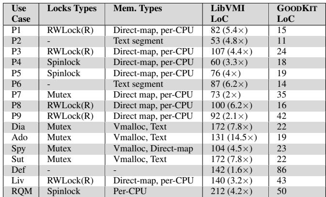  
Table 3: Summary of locks, memory translations, and implementation effort for each observer use case. The LoCs correspond to the introspection code without includes. An example of such a code can be seen in Appendix B.

CPU. Unlike the previous use cases on global kernel structures, this one shows that GOODKIT can also introspect per-CPU state. Inspecting it reveals CPU pressure and the currently running task. We use this observer to detect if a malicious or buggy process is monopolizing a CPU [55].

## 5.3 Internal Metrics

We analyze the observer code for our use cases to understand which kernel regions and synchronization primitives they exercise. All the GOODKIT basic operations consist of either accessing the target memory (which may involve address translation and lock acquisition steps) or sending requests to the VMM probes through a VM-exit as explained in §4.6. Across all policies, the most frequently translated regions are the direct-mapped and per-CPU areas, followed by the text segment and Vmalloc region. This indicates that most introspection tasks focus on kernel code and per-task metadata. For synchronization, mutexes and read-side RWLocks are the most common, each used in 5 of the 15 policies.

During the experiments presented above, we also measured the cost of address translation and lock acquisition operations. For the former, depending on the memory type, latencies range from 45 ns in the best case (direct mapping) to 85 ns in the worst case (vmalloc region). The acquisition of locks without contention incurs the same overhead as within the guest: acquiring a spinlock takes approximately 29 ns, while RWLocks and mutexes take respectively approximately 26 and 36 ns.

As Table 3 shows, the implementation effort also differs markedly between GOODKIT and LibVMI. Using GOODKIT reduces code size by 3-6× across all policies, since the framework provides low-level introspection primitives, addresstranslation helpers, and coherence mechanisms.

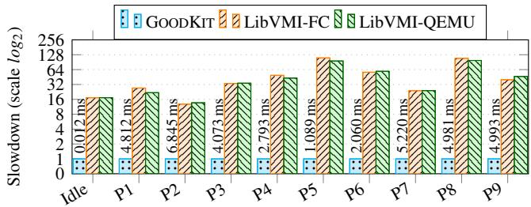  
Figure 3: Introspection Turnaround Time.

## 5.4 Introspection Turnaround Time

We measure how long GOODKIT takes to introspect the target and compare it to LibVMI. For both systems, we time the endto-end cost to (i) resolve target kernel addresses, (ii) apply the synchronization mechanism (lock/unlock in GOODKIT, pause/resume in LibVMI), (iii) collect the required information, and (iv) release the synchronization mechanism.

We use P1–P9 and the idle observers from Table 2.a. The idle observer isolates the raw cost of synchronization management. Both observer and target run with a single vCPU, and the target is idle.

Fig. 3 reports the speed up of GOODKIT relative to Lib-VMI (all GOODKIT values are normalized to 1). GOODKIT is faster in every case. The idle bar shows the cost of LibVMI’s pause/resume mechanism: acquiring and releasing a lock in GOODKIT is 17× faster than pausing and resuming the guest. Locking is not the only factor. Because GOODKIT observers are colocated with the VMM, they benefit from native-speed memory access (§5.4). This is visible in P2, where no synchronization is needed and both observers simply read the (stable) syscall table; LibVMI is still much slower. LibVMI’s slowdown reaches up to 110× for P5. This is because tied to its nested loop structure that multiplies the number of vmi-read requests of P5.

These experiments also validate our LibVMI port for Firecracker. The slowdowns for Firecracker and QEMU versions are nearly identical, confirming that our Firecracker integration preserves LibVMI’s performance characteristics.

## 5.5 Capture Rate

We evaluate the introspection speed of GOODKIT against Lib-VMI using the cat-and-mouse experiment of Hongyi Liu et al. [40]. In this scenario, a kernel rootkit repeatedly corrupts the credential structures of selected processes and quickly restores them. By varying the modification frequency, we measure how often the observer catches these transient incon sistencies.

Fig. 4 shows results for attack rates up to 500 modifications per second. Above 150 modifications per second, LibVMI’s capture rate drops to about 50%, and at 200 modifications per second it falls to 0.16%, showing that pause/resume cannot keep up with fast-changing kernel state. In contrast, GOODKIT maintains a capture rate of 99% across the same range, thanks to its low-latency, lock-based coherence mechanism. Even at 10 million modifications per second (not shown in Fig. 4), GOODKIT still achieves a capture rate of 80%.

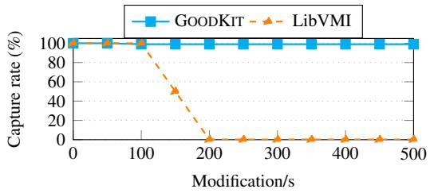  
Figure 4: Rootkit capture rate of GOODKIT and LibVMI in a cat-and-mouse scenario [40].

## 5.6 Introspection Overhead

We now evaluate the overhead GOODKIT imposes on the target, upon boot and during execution.

## 5.6.1 Boot Time

GOODKIT starts observers inside the same VMM as the target. This increases cold-start time, which is critical in settings such as serverless computing. We evaluate three scenarios: Parallel, where GKBUILDER launches the observer while the vanilla code builds the target; Before Target, where GKBUILDER launches the observer first; and After Target, where GKBUILDER launches the observer just after the target is created. In the Parallel configuration, we vary the number of observers from one to five.

With one observer in Parallel, the target boot time increases by about 1.08x-1.11x compared to the vanilla (no-observer) setup. This comes from doubling the number of ioctl() calls to KVM and the associated kernel-side synchronization. The overhead grows with the number of observers, reaching 1.57x for five observers; each additional observer adds roughly 1.13x-1.14x to the target build time. Thus, instantiating many observers in parallel can noticeably impact VM boot time.

In the After Target configuration, the target’s boot time increases only by about 1.02x-1.04x. This small cost is due to parsing both configuration files and allocating memory for both guests at initialization. Importantly, this overhead does not grow with the number of observers. In the Before Target configuration, the target’s boot time essentially doubles, since the observer is fully initialized before the target’s own boot begins.

Given this overhead, users should carefully choose how they instantiate observers so they meet their application needs while minimizing overhead.

## 5.6.2 Execution Time

We now measure the runtime overhead imposed on the target. The target uses 14 vCPUs, and each observer runs with a single vCPU. The target executes the 14 Phoronix applications listed in Table 2.b. The baseline, normalized to 1, corresponds to running the applications without any observation. We evaluate two configurations: (i) a single observer and (ii) multiple observers. For the first configuration, we consider two representative observers—P3 (memory introspection) and DefPunk (VMM-level I/O events)—and we vary their observation frequency. For the second configuration, we launch the target alongside four observers: DefPunk, a rootkit detector, a keylogger detector (P4), and a /proc file operations checker (P6).

Single observer (P3). The second bar in Fig. 5 reports the slowdown induced by P3 on the target. Across all workloads, the P3-GOODKIT observer introduces at most a 1.06× slowdown (observed on OpenSSL), which is negligible. In contrast, P3-LibVMI incurs slowdowns ranging from 5.15× to 37.6×. This substantial gap is primarily due to LibVMI’s use of the pause/resume mechanism to ensure memory coherence, whereas GOODKIT relies on lightweight, fine-grained locking.

Single observer (Deftpunk). For Deftpunk, we evaluate both the ransomware trace replayer from §5.2 and the FIO-IOPS benchmark. With GOODKIT, the replayer achieves 874 I/O requests per second, matching the vanilla throughput. Under LibVMI <sup>3</sup>, throughput drops to 747 I/O requests per second, corresponding to a 1.17× slowdown compared to GOOD-KIT. For FIO-IOPS, which is more I/O intensive than the ransomware trace, the slowdown under LibVMI is even higher, reaching 1.87×.

Heterogeneous observers and scalability. The third bar reports the slowdown observed on the target when running the four observers simultaneously. The slowdown is approximately 1.16x on average, which is comparable to the degradation observed with the single P3 observer earlier in §5.6.2. This experiment demonstrates that GOODKIT enables efficient multi-observer introspection without significantly increasing overhead on the target.

We did not conduct the same experiment with LibVMI because LibVMI does not support multiple independent observers. If observers run as distinct processes, a pause request issued by one observer may conflict with an unpause request from another, leading to inconsistent states. Achieving coordinated behavior would require colocating all observers in a single program or implementing an external synchronization mechanism, both of which prevent running legacy observers. In contrast, GOODKIT naturally supports multiple isolated observers without requiring any coordination or code modifications.

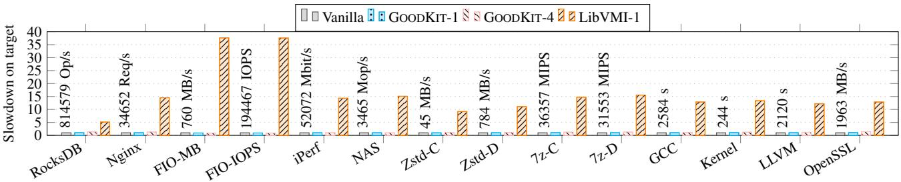  
Figure 5: Overhead of GOODKIT (using 1 and 4 observers) and LibVMI on the Phoronix benchmark suite.

## 5.7 Mutualizer Benefits

We evaluate the benefits of the mutualizer, which makes sense when several observers monitor the same data structures in the target. We consider both the target’s and the observers perspectives. The target runs a multi-threaded program that continuously creates POSIX threads using the pthread library. Each thread executes an empty function, and the main thread waits for it to terminate before creating the next one. This sustained thread creation keeps updating the kernel’s thread list. Each observer repeatedly searches for a given PID in the target’s thread list and performs this lookup N times.

Without the mutualizer, all observers complete their workload, but the target freezes as soon as more than one observer runs. Traversing the process list requires acquiring an RWLock in read mode, while the kernel needs the same lock in write mode to update the list when creating or terminating threads. Because observers traverse the list in a tight loop with no pause, at least one of them almost always holds the read-lock. RWLocks allow concurrent readers and do not enforce fairness between readers and writers, so the writer (the target) starves and never acquires the write-lock. The target can no longer update the thread list and eventually stalls.

With the mutualizer, this problem disappears. Only the mutualizer takes the read-lock, and it releases it after each traversal. Writers (running in the target) regularly obtain the write-lock, preventing starvation. Performance remains stable and independent of the number of observers: the target sustains approximately 35K thread creations per second, and each observer performs about 38K iterations per second. We observe the same performance when a single observer runs without the mutualizer. For comparison, a target without observers creates about 40k threads in our configuration.

## 6 Discussion

This section explains the position of an observer developer regarding the locks acquisition order. It also talks about how atomic variables are managed with GOODKIT mechanisms.

## 6.1 Target’s Locks Acquisition Order

The Linux kernel has a well-established locking discipline. When analyzing a complex kernel state, an observer must decide whether to follow the full locking protocol. Not following the target kernel’s lock discipline may leave the system in an inconsistent state. Observer developers must carefully consider the locking strategy based on the kernel data structures they inspect and their invariants.

## 6.2 Atomic Variables

Atomic variables are variables that are protected by the hardware while they are being modified. This means that the coherence between two VMs that are dealing with an atomic data item is not guaranteed by the operating system, but by the hardware; this makes GOODKIT-based introspection straightforward for these.

## 7 Limitations and Future Work

In this section, we consider some questions raised by our approach regarding the observers fault tolerance and RCUbased synchronization between an observer and its target VM.

## 7.1 Observers Fault Tolerance

Running observers may be malicious or faulty. While malicious observers are out of scope of this work, faulty observers should be handled to mitigate service disruption. Faulty observers can disrupt normal target execution if they acquire a target lock and then crash. To handle crashes, GOODKIT may record each lock operation in a buffer shared between the observer and Firecracker, allowing the VMM to track the locks currently held by each observer. When an observer crashes, the VMM would check this shared state. If the lock map is stable, the observer holds no target lock. Otherwise, the VMM will restart the observer in recovery mode. The recovery observer would release all locks held by the failed observer, ending the disruption on the target. After recovery, the observer can either resume normal execution or shut down. A watcher may also be implemented to monitor observers that hold locks for too long. This can be done by recording the timestamp alongside the lock map mentioned before, and have a pre defined time limit for locks holding. This has been planned as future work.

## 7.2 RCU-protected Data Structures

RCU (read-copy-update) [44] supports both read and write synchronization. For reads, a thread enters an RCUprotected section with rcu\_read\_lock(), obtains the current version of the object with rcu\_dereference(), and exits with rcu\_read\_unlock(). For writes, a thread initializes a new version of the object, publishes it with rcu\_assign\_pointer(), and waits for a grace period with synchronize\_rcu() (or call\_rcu() for the asynchronous variant) before reclaiming old versions.

GOODKIT’s current proof of concept does not implement RCU synchronization. When the observer needs to access data structures in read mode (which is likely the most dominant case), it can mimic a target reader by entering and leaving RCU reader-side sections. The main challenge comes when a reader observer needs to interact with the writer. According to the RCU protocol, a writer in the target waits until all CPUs that were executing between rcu\_read\_lock() and rcu\_read\_unlock() have left their critical sections before reclaiming old versions. An external observer is not naturally part of this protocol, so data stability is not guaranteed without additional mechanisms. Moreover, an observer performing writes cannot track the exact state of the target vCPUs in the target code execution, hindering the synchronization process.

## 8 Related Work

Note that we already discussed a portion of the related work in the motivation section (§2.4).

Most existing systems that address memory coherence during VMI rely on pause-based consistency mechanisms. Many tools depend on LibVMI [8] as their backend, and consequently adopt the strategy of pausing the target vCPUs before inspecting memory. Prior work [41] highlights several drawbacks of such techniques: latency-sensitive services may experience noticeable disruptions, and frequent pauses increase overall system jitter. Cosseron et al. [20] further demonstrated that pausing a VM induces a measurable drift between the VM’s internal clock and real time, a side effect that can be detected by malware and used as a trigger to conceal or disable malicious behavior.

A different perspective is offered by TxIntro [41], which leverages Intel’s Hardware Transactional Memory (HTM) [33]. TxIntro monitors the state of synchronization variables protecting kernel data structures and performs introspection within a hardware transaction. As long as the lock variables remain unchanged, the transaction proceeds, ensuring that the observed structure is read consistently; if a concurrent modification is detected, the transaction aborts and partial results are discarded. While this approach avoids explicit VM pauses, it has several limitations. First, it depends on HTM support, which is not always available or enabled on cloud platforms, e.g., due to mitigations against side-channel attacks. Second, it can only provide consistency guarantees when observing guest state that fits within the maximum read-/write set capacity of the HTM. Third, it requires hypervisor modifications, unlike GOODKIT.

Some studies, such as Virtuoso [23] and VM-Space Traveler [25], address the semantic gap by facilitating or automating the generation of introspection operations over guest kernel data structures. These efforts are orthogonal to GOODKIT and can enrich or automate its introspection API while preserving GOODKIT’s isolated and efficient execution model.

BlueGuard [46] targets both hypervisor-level and VM-level introspection, whereas GOODKIT focuses exclusively on introspecting guest VMs. To achieve this, BlueGuard isolates its observer on a dedicated accelerator (e.g., a SmartNIC) and relies on DMA to access memory. However, BlueGuard exhibits two main limitations. First, DMA-based access can lead to data-coherence issues, since memory may be concurrently modified by the CPU. Second, BlueGuard requires specialized hardware accelerators, which significantly restricts its deployability in real-world cloud environments.

## 9 Conclusion

In this work, we introduced GOODKIT, a new LVMI framework that enables efficient, scalable, and safe introspection without relying on intrusive hypercalls or VM pausing. By colocating observers with the VMM, enforcing lightweight coherence mechanisms, and supporting flexible, modular probes, GOODKIT significantly reduces overhead while improving responsiveness and accuracy. Our evaluation shows that GOOD-KIT outperforms LibVMI by large margins across all scenarios, offers strong scalability thanks to the mutualizer design, and supports a wide range of real-world use cases. Overall, GOODKIT bridges the gap between practicality and performance, enabling cloud providers and tenants to deploy LVMI at scale. The GOODKIT prototype is publicly available as described in Appendix A.

## Acknowledgments

We thank our anonymous shepherd and the anonymous reviewers for their insightful comments. This work was supported by the French Agence Nationale de la Recherche (ANR) under the DiVa project of “PEPR Cloud” (ANR-23- PECL-0004), by Inria “Défi OS”, and by the CNRS MLNS2 International Research Project (IRP). Finally, we thank Baptiste Lepers and André Freyssinet for their feedback.

## References

[1] Firecracker. https://firecracker-microvm.githu b.io/. Accessed June 8, 2026.

[2] Kernel Virtual Machine. https://linux-kvm.org/p age/Main\_Page. Accessed June 8, 2026.

[3] Linux kernel memory layout for x86. https://www.ke rnel.org/doc/Documentation/x86/x86\_64/mm.t xt. Accessed June 8, 2026.

[4] NoGap: New Security Monitoring Technology in the Cloud. https://hellofuture.orange.com/en/no gap-new-security-monitoring-technology-i n-the-cloud/. Accessed June 8, 2026.

[5] Oracle VirtualBox. https://www.virtualbox.org/. Accessed June 8, 2026.

[6] QEMU. https://www.qemu.org/. Accessed June 8, 2026.

[7] QEMU GuestAgent. https://wiki.qemu.org/Feat ures/GuestAgent. Accessed June 8, 2026.

[8] The LibVMI API. https://libvmi.com/api/. Accessed June 8, 2026.

[9] Volatility. https://github.com/volatilityfound ation/volatility. Accessed June 8, 2026.

[10] Wannacry. https://fr.wikipedia.org/wiki/Wann aCry. Accessed June 8, 2026.

[11] Adore-Ng Rootkit Sources. https://github.com/y aoyumeng/adore-ng. Accessed June 8, 2026.

[12] Alexandru Agache, Marc Brooker, Alexandra Iordache, Anthony Liguori, Rolf Neugebauer, Phil Piwonka, and Diana-Maria Popa. Firecracker: Lightweight Virtualization for Serverless Applications. In Symposium on Networked Systems Design and Implementation (NSDI’20). USENIX, 2020.

[13] Kurniadi Asrigo, Lionel Litty, and David Lie. Using VMM-Based Sensors to Monitor Honeypots. In International Conference on Virtual Execution Environments (VEE’06). ACM, 2006.

[14] SungHa Baek, Youngdon Jung, Aziz Mohaisen, Sungjin Lee, and DaeHun Nyang. SSD-Insider: Internal Defense of Solid-State Drive against Ransomware with Perfect Data Recovery. In International Conference on Distributed Computing Systems (ICDCS’18). IEEE, 2018.

[15] Bitdefender. Bitdefender Website. https://www.bitd efender.com/. Accessed June 8, 2026.

[16] Edouard Bugnion, Jason Nieh, and Dan Tsafrir. Hardware and Software Support for Virtualization. Morgan & Claypool Publishers, 2017.

[17] Jiahao Chen, Dingji Li, Zeyu Mi, Yuxuan Liu, Binyu Zang, Haibing Guan, and Haibo Chen. Security and Performance in the Delegated User-level Virtualization. In Symposium on Operating Systems Design and Implementation (OSDI’23). USENIX, 2023.

[18] Tzi-cker Chiueh, Matthew Conover, and Bruce Montague. Surreptitious Deployment and Execution of Kernel Agents in Windows Guests. In International Symposium on Cluster, Cloud and Grid Computing (CC-GRID’12). IEEE/ACM, 2012.

[19] Andrea Continella, Alessandro Guagnelli, Giovanni Zingaro, Giulio De Pasquale, Alessandro Barenghi, Stefano Zanero, and Federico Maggi. ShieldFS: A Self-Healing, Ransomware-Aware Filesystem. In Annual Conference on Computer Security Applications (ACASC’16). ACM, 2016.

[20] Léo Cosseron, Louis Rilling, Matthieu Simonin, and Martin Quinson. Simulating the Network Environment of Sandboxes to Hide Virtual Machine Introspection Pauses. In European Workshop on Systems Security (EuroSec’24). ACM, 2024.

[21] Thomas Dangl, Benjamin Taubmann, and Hans P Reiser. RapidVMI: Fast and Multi-core Aware Active Virtual Machine Introspection. In International Conference on Availability, Reliability and Security (ARES’21). ACM, 2021.

[22] Xuhua Ding. How to Resuscitate a Sick VM in the Cloud. In International Conference on Dependable Systems and Networks (DSN’23). IEEE/IFIP, 2023.

[23] Brendan Dolan-Gavitt, Tim Leek, Michael Zhivich, Jonathon Giffin, and Wenke Lee. Virtuoso: Narrowing the Semantic Gap in Virtual Machine Introspection. In Symposium on Security and Privacy (S&P’11). IEEE, 2011.

[24] Pavel Dovgalyuk, Natalia Fursova, Ivan Vasiliev, and Vladimir Makarov. QEMU-Based Framework for Non-Intrusive Virtual Machine Instrumentation and Introspection. In Joint Meeting on Foundations of Software Engineering (FSE’17). ACM, 2017.

[25] Yangchun Fu and Zhiqiang Lin. Bridging the Semantic Gap in Virtual Machine Introspection via Online Kernel Data Redirection. ACM Transactions on Information and System Security, 2013.

[26] Manabu Hirano, Ryo Hodota, and Ryotaro Kobayashi. RanSAP: An Open Dataset of Ransomware Storage Access Patterns for Training Machine Learning Models. Forensic Science International: Digital Investigation, 2022.

[27] Manabu Hirano and Ryotaro Kobayashi. Machine Learning Based Ransomware Detection Using Storage Access Patterns Obtained From Live-forensic Hypervisor. In International Conference on Internet of Things: Systems, Management and Security (IOTSMS’19). IEEE, 2019.

[28] Jennia Hizver and Tzi-cker Chiueh. Real-Time Deep Virtual Machine Introspection and Its Applications. In International Conference on Virtual Execution Environments (VEE’14). ACM, 2014.

[29] Owen S. Hofmann, Alan M. Dunn, Sangman Kim, Indrajit Roy, and Emmett Witchel. Ensuring Operating System Lernel Integrity with OSck. In International Conference on Architectural Support for Programming Languages and Operating Systems (ASPLOS’11). ACM, 2011.

[30] Jiaqi Hong and Xuhua Ding. A Novel Dynamic Analysis Infrastructure to Instrument Untrusted Execution Flow Across User-Kernel Spaces. In Symposium on Security and Privacy (S&P’21). IEEE, 2021.

[31] Guangyuan Hu, Tianwei Zhang, and Ruby B. Lee. Position Paper: Consider Hardware-enhanced Defenses for Rootkit Attacks. In International Workshop on Hard ware and Architectural Support for Security and Privacy (HASP’20). ACM, 2020.

[32] Amani S. Ibrahim, James Hamlyn-Harris, John Grundy, and Mohamed Almorsy. CloudSec: A Security Monitoring Appliance for Virtual Machines in the IaaS Cloud Model. In International Conference on Network and System Security (NSS’11). IEEE, 2011.

[33] Intel. Exploring Intel® Transactional Synchronization Extensions with Intel® Software Development Emulator. https://www.intel.com/content/www/us/e n/developer/articles/community/exploring-t sx-with-software-development-emulator.html. Accessed June 8, 2026.

[34] Bhushan Jain, Mirza Basim Baig, Dongli Zhang, Don ald E Porter, and Radu Sion. Sok: Introspections on Trust and the Semantic Gap. In 2014 IEEE symposium on security and privacy, pages 605–620. IEEE, 2014.

[35] Kernel Locking Techniques. https://dl.acm.org/d oi/fullHtml/10.5555/563953.563964. Accessed June 8, 2026.

[36] Simon Kuenzer, Vlad-Andrei Badoiu, Hugo Lefeuvre,˘ Sharan Santhanam, Alexander Jung, Gaulthier Gain, Cyril Soldani, Costin Lupu, ¸Stefan Teodorescu, Costi Raducanu, Cristian Banu, Laurent Mathy, R˘ azvan Dea-˘ conescu, Costin Raiciu, and Felipe Huici. Unikraft: Fast, Specialized Unikernels the Easy Way. In European Conference on Computer Systems (EuroSys’21). ACM, 2021.

[37] KVM-based Virtual Machine Introspection. https: //github.com/KVM-VMI/kvm-vmi. Accessed June 8, 2026.

[38] Tamas K. Lengyel, Steve Maresca, Bryan D. Payne, George D. Webster, Sebastian Vogl, and Aggelos Kiayias. Scalability, Fidelity and Stealth in the DRAKVUF Dynamic Malware Analysis System. In Annual Computer Security Applications Conference (ACSAC’14), 2014.

[39] Tamas K Lengyel, Justin Neumann, Steve Maresca, Bryan D Payne, and Aggelos Kiayias. Virtual Machine Introspection in a Hybrid Honeypot Architecture. In Workshop on Cyber Security Experimentation and Test (CSET’12). USENIX, 2012.

[40] Hongyi Liu, Jiarong Xing, Yibo Huang, Danyang Zhuo, Srinivas Devadas, and Ang Chen. Remote Direct Memory Introspection. In Security Symposium (USENIX Sec’23). USENIX, 2023.

[41] Yutao Liu, Yubin Xia, Haibing Guan, Binyu Zang, and Haibo Chen. Concurrent and Consistent Virtual Machine Introspection with Hardware Transactional Memory. In International Symposium on High Performance Computer Architecture (HPCA’14). IEEE, 2014.

[42] M0nad. Diamorphine Rootkit. https://github.com /m0nad/Diamorphine. Accessed June 8, 2026.

[43] John Madieu. Linux Device Drivers Development. Packt Publishing, 1st edition, October 2017.

[44] Paul E. McKenney. Is Parallel Programming Hard, And, If So, What Can You Do About It? https://mirrors. edge.kernel.org/pub/linux/kernel/people/pa ulmck/perfbook/perfbook-1c.2025.12.18a.pdf. Accessed June 8, 2026.

[45] MCS Locks and Qspinlocks. https://lwn.net/Arti cles/590243/. Accessed June 8, 2026.

[46] Meni Orenbach, Rami Ailabouni, Nael Masalha, Thanh Nguyen, Ahmad Saleh, Frank Block, Fritz Alder, Ofir Arkin, and Ahmad Atamli. BlueGuard: Accelerated Host and Guest Introspection Using DPUs. In Security Symposium (USENIX Sec’25). USENIX, 2025.

[47] Phoronix Benchmark Suite. https://github.com/p horonix-test-suite/phoronix-test-suite/blo b/master/documentation/phoronix-test-suite .md. Accessed June 8, 2026.

[48] Fabian Schwarz and Christian Rossow. 00SEVen – Reenabling Virtual Machine Forensics: Introspecting Confidential VMs Using Privileged in-VM Agents. In Security Symposium (USENIX Sec’24). USENIX, 2024.

[49] Spy Rootkit Sources. https://github.com/jarun/s py. Accessed June 8, 2026.

[50] Deepa Srinivasan, Zhi Wang, Xuxian Jiang, and Dongyan Xu. Process Out-Grafting: An Efficient “Outof-VM” Approach for Fine-Grained Process Execution Monitoring. In Conference on Computer and Communi cations Security (CCS’11). ACM, 2011.

[51] Udo Steinberg and Bernhard Kauer. NOVA: a Microhypervisor-Based Secure Virtualization Architecture. In European Conference on Computer Systems (EuroSys’10). ACM, 2010.

[52] Sahil Suneja, Canturk Isci, Vasanth Bala, Eyal de Lara, and Todd Mummert. Non-intrusive, Out-of-band and Out-of-the-box Systems Monitoring in the Cloud. In In ternational Conference on Measurement and Modeling of Computer Systems (SIGMETRICS’14). ACM, 2014.

[53] Sutekh Rootkit Sources. https://github.com/Pin kP4nther/Sutekh. Accessed June 8, 2026.

[54] The Linux Kernel Locking API and Shared Objects. https://medium.com/geekculture/the-linux-k ernel-locking-api-and-shared-objects-1169c 2ae88ff. Accessed June 8, 2026.

[55] Dan Tsafrir, Yoav Etsion, and Dror G. Feitelson. Secretly Monopolizing the CPU without Superuser Privileges. In Security Symposium (USENIX Sec’07). USENIX, 2007.

[56] Two Main Types of Kernel Locks: Spinlocks and Semaphores. https://www.kernel.org/pub/linux /kernel/people/rusty/kernel-locking/c93.htm l. Accessed June 8, 2026.

[57] Locks Types and Their Rules. https://docs.kerne l.org/locking/locktypes.html. Accessed June 8, 2026.

[58] Yaohui Wang, Ben Luo, and Yibin Shen. Efficient Memory Overcommitment for I/O Passthrough Enabled VMs via Fine-grained Page Meta-data Management. In An nual Technical Conference (ATC’23). USENIX.

[59] Zhongyu Wang, Yaheng Song, Erci Xu, Haonan Wu, Guangxun Tong, Shizhuo Sun, Haoran Li, Jincheng Liu, Lijun Ding, Rong Liu, Jiaji Zhu, and Jiesheng Wu. Ransom Access Memories: Achieving Practical Ransomware Protection in Cloud with DeftPunk. In Symposium on Operating Systems Design and Implementation (OSDI’24). USENIX, 2024.

[60] Siqi Zhao, Xuhua Ding, Wen Xu, and Dawu Gu. Seeing Through The Same Lens: Introspecting Guest Address Space At Native Speed. In Security Symposium (USENIX Sec’17). USENIX, 2017.

## A Artifact Appendix

## Abstract

This artifact is the prototype of GOODKIT. The code corresponds to the implemented mechanisms mentioned in the present paper. This concerns the Firecracker modification, GKMODULE and LIBGK. We also make available the Firecracker LibVMI port. This includes the Firecracker, LibVMI, LibKVMI and KVMI modifications.

## Scope

This prototype allows you to make observations on a target VM. To run existing use cases, and build new live VMI (LVMI) use cases based on the existing tools. It can also serve as a basis for extended research on live VMI.

## Contents

The repository contains the following:

• firecracker-main: A fork of Firecracker (written in Rust) with the framework’s VMM integration. It allows creating/starting observers, executing probes, and managing VM–VMM communication.

• images\_builder: Dockerfiles and scripts for building VM images, including those used in the evaluation.

• ioctl\_injector: Userspace LIBGK code (written in C) that implements the high-level API.

• libVMI: Firecracker’s LibVMI plugin, plus our KVMi patch adding VirtIO support for LibVMI.

• linux-5.10.198: Linux kernel sources (written in C) used to build the target and observer vmlinux images.

• usecase: Source code for the implemented use cases. The repository root also includes scripts to run experiments, a Makefile to build the project and images, and a flake.nix file for Nix-assisted reproducibility.

## Hosting

The public link for our artifact is https://doi.org/10.5 281/zenodo.20069006. It links to a Git repository.

## Requirements

This artifact requires an x86 machine with KVM support capable of running Firecracker microVMs, along with the standard toolchain required to configure and compile a Linux kernel. The prototype was primarily evaluated on an Ubuntu 20.04 host running Linux kernel 5.4.24+, but it is also compatible with Ubuntu 24.04 running kernel 6.8.0. Our experimental evaluation was conducted on a 16-core Intel Xeon Silver 4215 CPU, 2.50 GHz with 256 GB of RAM. However, a 2-core CPU is sufficient to run the prototype. Finally, reproducing the experiments detailed in §5.6.2 requires at least 90 GB of RAM and 60 GB of disk space.

## B Code Sample

Listing 1 is a snippet that depicts the observation of a process list. The introspection starts with a symbol lookup. The observer first gets the addresses related to the corresponding symbols (lines 2–4). Those are: the head of the tasks list init\_task, the qnodes that reside in the per-CPU area qnodes, the tasks list lock that protects tasks list modifications tasklist\_lock and the CPU areas offset array, which is subsequently used to resolved per-CPU addresses \_per\_cpu\_offset.

The observer then translates the addresses to OGVA, for direct access (lines 6–8). The observer then takes the read lock on the rwlock\_t (line 10). The for\_each\_process\_in\_target traverse the list of processes (lines 11–13) and translate the relevant addresses under the hood, and gives a pointer p on the current entry for usage. The observer then prints the process name (line 12) and releases the lock afterwards (line 14).

## C Memory Slots Scenarios

KVM slots are structures that describe the physical memory layout of the virtual machine. A slot contains a range of guest physical addresses, their corresponding host virtual addresses in the VMM, and region-specific flags. Slots are used to declare the complete VM’s physical memory layout to KVM. The number of KVM slots per observer depends on (i) architecture-specific physical layout constraints and (ii) the relative sizes of observer and target. On x86, an MMIO hole typically appears near 3.25 GB, so mapping the target into the observer may require up to three slots, depending on how their ranges intersect this hole. We identify three distinct mapping scenarios.

Listing 1: Process list traversal from an observer using GOOD-KIT’s API. The program resolves the symbol adresses using the symbol table, then grabs the protecting spinlock before walking through the list.

```c
1 void process_list (struct context * vo ){
2 rwlock_t * tasklock ; struct task_struct *p; unsigned
long * pcpu_off ; struct qnode * qnode0 ; struct
symbol_entry ** syms ; char * names [] = { "init_task",
"qnodes", " tasklist_lock ", " __per_cpu_offset " };
3 /* Lookup kernel symbols */
4 syms = symbols_multilookup ( names , ARRAY_SIZE ( names ));
5 /* resolve into Observer virtual address space */
6 pcpu_off = tgva_to_ogva ( syms [3] - > addr , vo );
7 qnode0 = tgva_to_ogva ( syms [1] - > st_addr + pcpu_off [0] ,
vo );
8 tasklock = tgva_to_ogva ( syms [2] - > st_addr , vo );
9 /* Lock , walk task list and unlock */
10 obs_read_lock (vo , tasklock , qnode0 );
11 for_each_process_in_target (p , syms [0] - > st_addr , vo ) {
12 pr_info ("Process name : %s",p -> comm )
13 }
14 obs_read_unlock (vo , tasklock );
15 }
```

Scenario 1. Either (i) the sum of target memory and observer core memory is below 3.25 GB, or (ii) the observer core memory alone is above 3.25 GB while the target memory remains below this threshold. In both cases, the target memory occupies a single contiguous region in the observer’s physical address space, so GKBUILDER creates one KVM memory slot for the target.

Scenario 2. Either (i) the observer core memory is below 3.25 GB and the combined observer+target size exceeds 3.25 GB, or (ii) both observer and target are individually larger than 3.25 GB. Here, adding the target crosses the MMIO hole and introduces a discontinuity in the observer’s physical address space. GKBUILDER therefore creates two KVM memory slots for the target.

Scenario 3. If the observer core memory is below 3.25 GB and the target memory itself spans beyond the MMIO hole, mapping the target into the observer creates two distinct holes: the observer’s MMIO hole and the target’s own MMIO hole. In this case, GKBUILDER creates three KVM memory slots for the target.

## D Illustration of Spinlock Acquisition by a GOODKIT Observer

Figure 6 shows how the observer thread W competes with two target threads, T1 and T2, for the same spinlock. (1) T2, on vCPU1, acquires the lock and enters the critical section. (2) T1, on vCPU0, tries to acquire the lock; because it is held, T1 spins and sets the pending bit. (3) T1 is added to the lock’s waiting list, stored in a per-CPU (vCPU0) variable. (4) The observer thread W also tries to take the lock. (5) W spins and is added to the same waiting list for vCPU0.

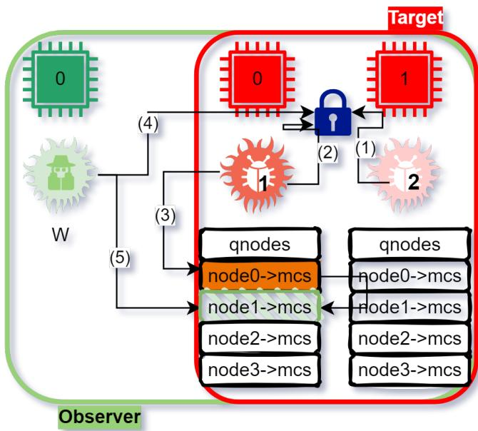  
Figure 6: Remote spinlock.

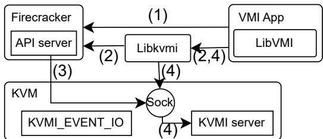  
Figure 7: LibVMI usage with Firecracker.

## E Porting LibVMI to Firecracker

LibVMI relies on the KVM-VMI project to provide generalpurpose introspection capabilities. KVM-VMI is an extension of KVM that enables fine-grained introspection mechanisms. To perform introspection, LibVMI communicates with KVM (over the KVMI extension) through a dedicated socket.

Figure 7 illustrates how we integrated LibVMI with Firecracker. When a VMI application starts, it invokes the Lib VMI initialization function, which connects to the VMM and requests the creation of an introspection socket ( 1 ). With QEMU, LibVMI relies on libvirt’s qemu driver for this step; however, to the best of our knowledge, no libvirt plugin exists for Firecracker. To overcome this limitation, we extended the Firecracker API to allow introspection-socket creation via HTTP requests. We also implemented a LibVMI Firecracker driver to handle (dis)connection with Firecracker.

Once the socket is created, LibVMI calls a libkvmi function to connect to the VMM introspection socket ( 2 ). The KVMI protocol performs a three-step handshake to establish the connection. After the handshake completes, the VMM issues an ioctl() to KVM ( 3 ) to pass the VM identifier and the socket file descriptor to KVMI. KVMI then spawns a kernel thread responsible for serving userspace KVMI requests.

From this point onward, the VMM is no longer involved in the introspection process: all communication occurs directly between LibVMI and KVM via the LibKVMI API ( 4 ). This design ensures fairness in our evaluation.

When introspection ends, the VMI application sends a message to the VMM to terminate the KVMI session through a final ioctl() call.

## F I/O Introspection with LibVMI

Concretely, we added a new command (KVMI\_EVENT\_IO) to KVMI, enabling a LibVMI-based observer to request that KVMI forward events corresponding to the page faults generated inside KVM when the guest attempts to access MMIO memory regions (i.e., reads or writes to memory-mapped I/O). When such an event occurs, KVMI returns to the observer the destination address. In the case of VirtIO-based devices, these addresses correspond to the in-guest VirtIO ring buffers. Using these addresses, the observer can rely on existing Lib-VMI memory read primitives to read and analyze the content of these buffers in order to identify the underlying disk read or write requests.