USENIX

THE ADVANCED COMPUTING SYSTEMS ASSOCIATION

# qTPU: Hybrid Tensor Networks for Quantum-Classical Acceleration

Nathaniel Tornow, Emmanouil Giortamis, Dennis Sprokholt, Christian Mendl, and Pramod Bhatotia, Technical University of Munich https://www.usenix.org/conference/osdi26/presentation/tornow

# This paper is included in the Proceedings of the 20th USENIX Symposium on Operating Systems Design and Implementation.

July 13–15, 2026 • Seattle, WA, USA

ISBN 978-1-939133-55-7

Open access to the Proceedings of the 20th USENIX Symposium on Operating Systems Design and Implementation is sponsored by

# qTPU: Hybrid Tensor Networks for Quantum-Classical Acceleration

Nathaniel Tornow Emmanouil Giortamis Dennis Sprokholt

Christian B. Mendl Pramod Bhatotia

Technical University of Munich

## Abstract

Classical accelerators (GPUs, TPUs) excel at highperformance computing but cannot eficiently represent problems that scale exponentially, such as highly entangled quantum states. Quantum processors (QPUs) address these intractable problems but are constrained by noise, high error rates, and low throughput. This necessitates hybrid quantum-classical execution: computationally complex kernels are ofloaded to QPUs, while scalable computation runs on classical accelerators.

Despite this clear need for hybrid systems, we currently lack a concise programming paradigm for expressing and optimizing them. Developers must manually partition and orchestrate applications across quantum and classical hardware through <sup>ad</sup> <sup>hoc</sup> approaches that produce fragmented, inflexible workflows. This prevents holistic optimization across the quantum-classical interface and limits scalability.

To this end, we introduce the hybrid tensor network (hTN) abstraction—a unified representation capturing quantumclassical computation—realized in <sup>qTPU</sup>, an end-to-end system comprising: the <sup>qTPU</sup> <sup>programming</sup> <sup>model</sup> for declarative hybrid computation specification; the <sup>qTPU</sup> <sup>compiler</sup> for holistic hTN optimization balancing classical cost against quantum error; and the <sup>qTPU</sup> <sup>runtime</sup> for scalable execution across heterogeneous QPUs and classical accelerators.

Our evaluation demonstrates that <sup>qTPU</sup> achieves 3–4 orders of magnitude lower classical overhead, up to 7.2× lower quantum error rates, up to 53× faster compilation, and over 20× end-to-end speedups across hybrid ML, circuit knitting, and quantum error mitigation.

## 1 Introduction

Data centers are increasingly relying on specialized accelerators, such as GPUs, TPUs, and FPGAs, to meet the demands of growing domain-specific compute workloads, <sup>e.g.,</sup> in machine learning and scientific computing [3, 44, 45, 68]. Through recent remarkable engineering eforts, quantum processors (QPUs) are becoming available as new domainspecific accelerators [2, 5, 30, 38]. When combined with classical computing, QPUs could help us address problems in materials science and chemistry that remain intractable on classical computers [40, 53, 66, 72, 78].

QPUs leverage quantum-mechanical properties such as superposition and entanglement to eficiently represent and manipulate exponentially large state spaces that cannot be encoded using classical memory [57]. This capability enables, <sup>e.g.,</sup> the simulation of strongly correlated quantum systems and the modeling of highly entangled or high-dimensional distributions in machine learning, and ofers the potential for exponential speedups for certain problems [36, 75, 81].

Although QPUs ofer unique advantages for specific classes of problems, they are subject to severe limitations: they are noisy, provide only limited computational resources in memory and availability of devices, and have throughput orders of magnitude lower than classical accelerators [41,67].

As a result, quantum advantages – where they exist – typically apply only to the complex core of a computational problem, where classical devices fail due to the exponential complexity of representing quantum states [12, 41]. Many important workloads, such as complex machine-learning models or scientific simulations for material sciences, fall into a regime where they are both <sup>(i)</sup> too ineficient or outright infeasible to execute solely on classical accelerators, and <sup>(ii)</sup> too complex and large-scale to run entirely on today’s QPU hardware [54, 66].

This motivates a <sup>hybrid</sup> quantum-classical execution paradigm. Instead of running a program entirely on classical hardware or entirely on a QPU, realistic applications distribute work across both: the quantum-inclined components are ofloaded to QPUs, while the remaining computation runs on better-suited classical accelerators [12, 34].

To program such hybrid applications, the current approach relies on a rigid host–kernel programming model. Programmers must manually isolate portions of the algorithm that could benefit from quantum or classical acceleration and implement them as separate kernels [8, 59].

Unfortunately, this existing form of quantum–classical hybrid computing is tedious, inflexible, and ineficient to use in cloud environments, sufering from three core limitations:

(1) Fragmented programming models: Developing hybrid applications requires reasoning across two distinct programming paradigms and manually implementing separate routines for classical devices and QPUs [19]. This fragmented model forces developers to explicitly manage low-level data movement, control flow, and upfront partitioning decisions, making the development of hybrid applications tedious and prone to ineficiencies.

(2) Lack of holistic compiler optimizations: Current programming models require developers to define a fixed boundary between quantum and classical kernels <sup>a</sup> <sup>pri-</sup> <sup>ori</sup> [8]. This rigid separation prevents compilers from reasoning across the quantum–classical interface, hindering holistic, end-to-end optimization. As a result, no dynamic execution decisions are possible; <sup>e.g.,</sup> even if parts of a quantum kernel could be executed more eficiently on a classical accelerator, they cannot be automatically ofloaded, locking the application into a potentially suboptimal execution path [88].

(3) Poor scalability and rigid runtime: Current hybrid workflows are ineficient and struggle to scale because they are manually orchestrated and executed as separate, sequential steps, lacking a unified program view [33]. This prevents dynamic execution decisions, <sup>e.g.,</sup> even if part of a quantum kernel would run more eficiently on a classical accelerator, the compiler cannot ofload it automatically.

We argue that these limitations fundamentally arise from the lack of a concise representation that seamlessly captures both quantum and classical computation, leading to our main research question:

## Research question

How can we design a concise and expressive hybrid computing paradigm that unifies quantum and classical computation while enabling eficient execution across heterogeneous accelerators?

Our key idea for addressing this challenge is the hybrid Tensor Network (hTN) abstraction, a necessary theoretical foundation to address the fragmentation in hybrid computing. In particular, we establish Tensor Networks (TNs) [61]—a core algebraic formalism for both quantum circuit simulation and accelerated classical computation—as a unifying computational substrate [52, 92]. The hTN extends this formalism by representing the complete hybrid workflow, including quantum components (quantum tensors) and classical components (classical tensors), as a single, connected graph. This unified expression bridges the classical-quantum gap, enabling holistic optimization and treatment of complex algorithms, such as hybrid machine learning models, as a single, coherent computational entity.

To realize hTNs in practice and to answer our posed research question, we present <sup>qTPU</sup>, an end-to-end systems approach for unified, flexible and scalable hybrid computing. <sup>(1)</sup> Our <sup>qTPU</sup> <sup>Programming</sup> <sup>Model</sup> formally defines the primitives built on hTNs, allowing programmers to specify only what <sub>to</sub> <sub>compute,</sub> not how<sub>;</sub> <sub>our</sub> (2) qTPU Compiler <sub>converts</sub> hTNs into executable hybrid code, which we holistically optimize for eficient computation across a set of QPUs and classical accelerators; and finally, <sup>(3)</sup> our <sup>qTPU</sup> <sup>Runtime</sup> dynamically adapts the hybrid computation to scalably execute across the available heterogeneous collection of classical and quantum accelerators.

Our evaluation shows that <sup>qTPU</sup> achieves substantial improvements across hybrid workloads: up to 53× faster compilation, 7.2× lower quantum error rate, 3,700× smaller generated code, and 10,000× lower classical overhead than stateof-the-art baselines. <sup>qTPU</sup> further scales to problem sizes that existing hybrid systems cannot handle, while enabling eficient utilization of heterogeneous QPU/GPU resources.

Contributions. We make the following contributions.

• We introduce the hybrid Tensor Network (hTN) abstraction, a unified representation that captures hybrid quantum-classical workflows as a single connected tensor graph, moving beyond existing host-kernel models (§ 3.2).

• We formally introduce the <sup>qTPU</sup> Programming Model, which realizes our hTN abstraction. We define its core primitives—including the iswitch (for specifying quantum tensors) and hEinsum (for hybrid contraction)—which enable the simple and declarative description of entire hybrid quantum-classical programs (§ 5).

• We introduce compiler transformations that jointly optimize across both modalities by balancing the classical cost of tensor contractions with the quantum execution error, ensuring optimal utilization of available quantum and classical compute paradigms. (§ 6).

• We design a scalable execution approach that distributes and dynamically adapts hybrid programs across a heterogeneous set of QPUs and classical accelerators. The <sup>qTPU</sup> runtime facilitates this through runtime code generation, tailoring device-specific kernels on demand to maximize parallel execution and eficient resource utilization based on available hardware. (§ 7).

## 2 Background and Motivation

## 2.1 Foundations of Quantum Computing

Quantum computing could accelerate tasks in many areas, including quantum physics, materials science, and machine learning [36, 40, 72, 81]. Although current QPUs remain in their early stages, recent experiments have demonstrated behavior that is increasingly dificult to reproduce classically, suggesting potential advantages for specific problem classes [4, 16, 17, 37, 83].

QPUs are typically programmed under the <sup>quantum</sup> <sup>kernel</sup> <sup>model</sup>, illustrated in Fig. 1. A quantum kernel is a classical function that produces a <sup>quantum</sup> <sup>circuit</sup>, which is then compiled and executed on a QPU [59].

The basic computational unit of a quantum circuit is the <sup>qubit</sup>, a two-level quantum system. An ??-qubit register corresponds to a complex-valued vector in a 2<sup>??</sup>-dimensional Hilbert space, enabling it to represent vectors that would require exponentially many parameters to store classically [57]. A quantum circuit generally <sup>(1)</sup> initializes qubits, <sup>(2)</sup> applies single- and multi-qubit quantum gates, and <sup>(3)</sup> measures a subset of the qubits in the computational basis. Measurement collapses each qubit to either 0 or 1 according to a distribution determined by the circuit; repeating the circuit for ?? <sup>shots</sup> yields bitstrings ??<sup>(??)</sup> ∈ {0, 1}<sup>??</sup>, ?? = 1, … , ??, over the ?? measured qubits.

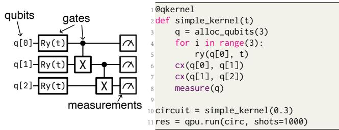  
Figure 1: Example of the quantum-kernel model.

## 2.2 Quantum-Classical Computing

Both quantum and classical accelerators can eficiently solve domain-specific problems; however, neither provides a onesize-fits-all solution.

On the one hand, modern <sup>classical</sup> <sup>accelerators</sup> (such as GPUs, TPUs) provide massive data and operation parallelism, large on-device memory, and extremely high throughput and low latency for, <sup>e.g.,</sup> dense numerical workloads. They are reliable, abundantly deployed, and scale to thousands of devices in distributed cloud environments. However, classical accelerators operate on data structures that cannot eficiently represent strongly correlated and entangled quantum systems, whose classical representations scale exponentially compared to their quantum representations [28, 31, 99].

On the other hand, <sup>quantum</sup> <sup>accelerators</sup> (QPUs) leverage unique quantum-mechanical efects to eficiently represent and manipulate highly correlated quantum states that classical systems cannot handle [41, 57]. This makes them attractive for tasks such as simulating highly correlated systems for material science or quantum chemistry. However, QPUs also have inherent limitations, since qubits are inherently noisy, and quantum operations are prone to errors, resulting in unreliable results at large circuit depths [64,74]. Achieving fault tolerance requires substantial overhead in both qubit resources and execution time, making logical qubits a scarce resource and significantly limiting QPU throughput and latency.

The need for hybrid acceleration. Classical and quantum accelerators have complementary strengths and limitations, making neither suitable for all tasks. Realistic workloads therefore require a tightly integrated hybrid approach: QPUs are used selectively where quantum capabilities ofer an advantage, while all other computation is handled by classical accelerators.

## 2.3 Blueprint of Hybrid Applications

Hybrid quantum-classical computing leverages the complementary strengths of classical accelerators and QPUs to solve problems that neither can eficiently address on its own.

1 @qkernel # QNN kernel (input x, weights W, output o)   
2 def quantum\_layer(x, W, o):   
q = alloc\_qubits(N)   
for i in range(N):   
ry(q[i], x[i]) # input encoding   
model(q, W) # apply some QNN-layer   
apply\_obs(q, o) # measure specific observable   
8 measure(q)   
@ckernel # a classical GPU/TPU kernel   
11 def classical\_layer(Z, V): # linear layer   
12 return matmul(V, Z) # matrix-matrix multiplication   
13   
14 def forward(X, W, V, O): # hybrid model evaluation   
15 # Stage 1: construct and run a family of circuits   
16 circuits = [quantum\_layer(x,W,o) for x in X for o in O]   
17 Z = qpu.run(circuits, shots=1000)   
18 # Stage 2: perform classical processing   
19 Y\_pred = classical\_layer(Z, V)   
20 return Y\_pred   
21   
22 def train(): # model training loop   
23 X,Y = dataset(); W,V = init\_weights(); O = observables()   
24 for epoch in range(E):   
25 Y\_pred = forward(X, W, V, O)   
26 update([W, V], loss(Y, Y\_pred))  
Listing 1: Fragmented quantum-classical ML example.

The <sup>core</sup> of virtually all hybrid quantum-classical algorithms and methods—including quantum simulation [56, 62, 97], circuit knitting [84, 90], error mitigation [50, 89], and quantum-enhanced machine learning (ML) [10, 14, 51]— shares a common computational blueprint, consisting of two tightly coupled stages. For example, Lst. 1 shows a quantumclassical approach to train a machine-learning kernel, implemented via the kernel’s forward-pass.

Stage 1: Evaluate families of quantum circuits. The workflow begins by executing a <sup>family</sup> of closely related quantum circuits derived from classical inputs or intermediate computation. These circuits typically share a structural backbone but difer in controlled ways, together exposing the necessary information required for the hybrid computation.

In our example (Lst. 1, Line 16-17), we produce and run a family of quantum circuits that encode the individual inputs of our training dataset and measure observables, whose results are later fed into the next layer. This family needs to be explicitly generated and run on a specific QPU to produce all the results required for the next stage.

Stage 2: Perform classical processing. The measurement outcomes from the circuit family are then combined with additional classical inputs and processed using classical computation. Across algorithmic classes, this postprocessing is governed almost entirely by <sup>linear-algebraic</sup> operations, which transform the quantum-generated data into the quantities of interest and feed back into the host-driven control loop that produces the next family of circuit evaluations.

In our example (Lst. 1, Line 19), we apply a simple linear layer—<sup>e.g.,</sup> on a GPU—to the quantum outputs and classical weights, producing the predicted results for the dataset.

Examples of hybrid applications. Beyond our example of hybrid machine learning, various other applications in quantum computing follow the same structure. In this work, we focus on three representative hybrid applications:

(i) Hybrid Machine Learning combines variational quantum circuits with classical layers to model functions or data distributions that cannot be eficiently captured by purely classical or purely quantum models [10], similar to our toy-example of Lst. 1;

(ii) Scalable hybrid computing uses circuit knitting tech niques [84,90] to execute circuits that exceed the qubit capacity of QPUs by decomposing a large circuit into families of smaller subcircuits, running them on small QPUs, and classically reconstructing the result; and

(iii) Quantum Error Mitigation (QEM) generates and executes families of circuit variations to estimate and suppress noise efects, combining the resulting measurements through classical postprocessing to approximate the noiseless output of the original circuit [26, 49, 89].

We evaluate our approach on these applications in § 8.

## 2.4 Limitations of the Current Practices

Using both quantum and classical resources leverages the full benefits of both worlds. Unfortunately, the current approach to writing quantum-classical programs follows a manual, adhoc workflow that is error-prone and complex due to several fundamental limitations, which we explain now.

Limitation #1: Fragmented programming model. In current hybrid workflows [8, 59], the quantum and classical parts of a program must be written in separate paradigms, as shown in Lst. 1. The programmer implements one kernel for the QPU and another for the GPU/TPU, and must manually coordinate them in the host code. In the example, the forward function builds a family of circuits, sends them to the QPU, waits for results, and then invokes a classical kernel. Thus, even though the programmer specifies <sup>what</sup> the computation should do, they must also express <sup>how</sup> the quantum and classical kernels interact, making hybrid programs unnecessarily complex.

Limitation #2: Inflexible compilation. The programmer must fix the quantum–classical boundary a priori, preventing holistic cross-paradigm optimization because the hybrid computation is not represented as a single unified object. In Lst. 1, the quantum and classical kernels are statically tied to their modalities—QPUs for quantum\_layer and GPUs/T PUs for classical\_layer. This rigidity blocks optimization of forward as a whole, since it consists of two separately compiled black-box kernels. As a result, tasks cannot be reassigned across paradigms, even when parts of quantum\_layer could run more eficiently on a classical accelerator.

Limitation #3: Rigid runtime. Current hybrid workflows are manually orchestrated and executed as separate, sequential steps, giving the runtime no unified view of the computation. In Lst. 1, the manual orchestration inside forward fixes the quantum and classical stages in order and binds them to their respective devices, preventing dynamic parallelism or resource-aware scheduling. Because the assignment of work is static, the runtime cannot adapt to the availability or load of heterogeneous QPUs and classical accelerators, which severely limits scalability for larger problems.

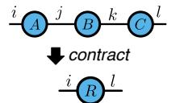  
(a) Tensor Network (TN)

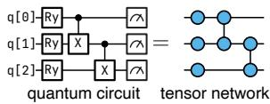  
(b) circuit-TN-equivalence  
Figure 2: Tensor Network background (§ 3.1).

## Problem statement

We require a solution that unifies quantum-classical applications in a common foundation, thus allowing holistic optimization across both fragments, while adapting its execution to available quantum-classical devices.

## 3 Hybrid Tensor Networks (hTNs)

We propose <sup>hybrid</sup> <sup>tensor</sup> <sup>networks</sup> (hTN), which address the above limitations by unifying quantum and classical computing in a common framework.

## 3.1 Tensor Networks (TNs)

Tensor networks compactly describe an output tensor as a function of input tensors. TNs emerged in condensed-matter physics as a compact representation of many-body quantum states that would otherwise require exponential resources to describe [60,91], and have since become the backbone of stateof-the-art classical simulators for quantum circuits [29, 58]. In parallel, the same einsum-based formalism is the standard language for specifying linear-algebraic computations in, <sup>e.g.,</sup> deep-learning frameworks [39, 63].

Intuitively, a tensor generalizes a vector or matrix to an array of arbitrary rank. A tensor network describes how such tensors are combined through <sup>contractions</sup>—pairwise summations over shared indices, of which matrix multiplication is the rank-two special case. Contracting a network composes its input tensors into a single output tensor by summing over all shared indices simultaneously.

Einsum expression. TNs specify pure linear-algebra expressions via the <sup>Einsum</sup> language. Formally, ??<sub>??</sub> = einsum(??<sub>1</sub>, … , ??<sub>??</sub> → ??; ??<sub>1</sub>, … , ??<sub>??</sub>) defines the output tensor ??<sub>??</sub> entry-wise as

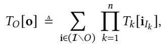

(1)

where ?? are tensors with index set ?? ; ?? is the output index set, of which ?? denotes an assignment; <sup></sup> = ⋃<sup>??</sup> ??<sub>??</sub> is the

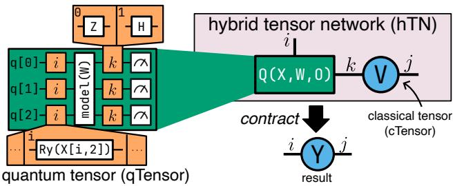  
Figure 3: Our hybrid tensor network (hTN) abstraction (§ 3.2).

union of all index sets; and ??<sub>??</sub> is the restriction of the global index assignment ?? to the indices of tensor ?? . For example,

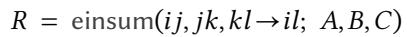

(2)

specifies the triple matrix product ?? = ?? ⋅ ?? ⋅ ??, <sup>i.e.,</sup> ??<sub>????</sub> = ∑<sub>?? ,??</sub> ??<sub>????</sub> ??<sub>?? ??</sub> ??<sub>????</sub> .

Tensor networks as graphs. An equivalent way to specify a TN is as an undirected graph, whose vertices represent tensors and the edges correspond to shared indices (<sup>i.e.,</sup> contractions). When two tensors are connected by an edge, the corresponding index is contracted (summed over), and dangling edges connected to only a single vertex specify the output indices. Fig. 2 (a) shows an example of such a TNgraph, equivalent to the einsum expression of Eq. 2.

Quantum computations as TNs. The connection between quantum and classical computation becomes explicit when we observe that any quantum circuit can be represented as a TN, as we show by example of Fig. 2 (b). Each ??-qubit gate is a unitary linear map, and thus a rank-2?? tensor whose indices correspond to its ?? input and ?? output wires [52,60]. A quantum circuit then becomes a TN in which adjacent gates share the wires they act on as contracted indices, so that executing the circuit (<sup>i.e.,</sup> applying gates in sequence) is the same operation as contracting the network. Thus, quantum circuits can be expressed using the einsum-based formalism introduced above, enabling a unified representation of both classical and quantum computations.

## 3.2 Key Idea: Hybrid Tensor Networks (hTNs)

We introduce the hybrid tensor network (hTN), an abstraction that extends the TN formalism to enable unified execution and flexible partitioning of computation across quantum and classical accelerators, yielding a simple and coherent abstraction for hybrid quantum-classical workloads.

Fig. 3 shows an hTN describing the computation of the hybrid forward function in Lst. 1. The program executes several circuits over a batch of input data ?? ∈ ℝ<sup>|??|×3</sup> containing |??| = ?? data points, each represented as a vector of dimension 3, and a set of observables ?? with |??| = 2. The qTensor on the left in Fig. 3 compactly describes this circuit’s entire family. The qTensor has two indices, ?? and ??, with sizes |??| = ??, |??| = 2. These indices are referenced by <sup>index-instructions</sup>, associating each with several operations. For instance, instantiating ??=1,??=0 replaces every index-instruction that depends on ?? with the second operation in its family, and every indexinstruction of ?? with the first operation in its family.

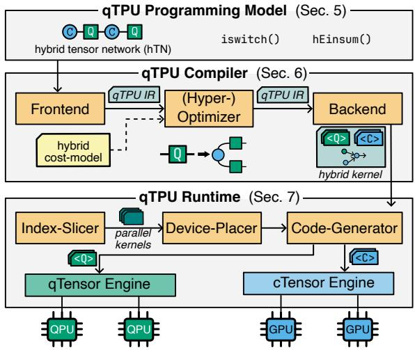  
Figure 4: System overview (§ 4).

The hTN on the right in Fig. 3 compactly describes the hybrid program with the qTensor and a cTensor ?? ∈ ℝ<sup>|??|×|??|</sup>. The index ?? contracts with the qTensor’s output index, while ?? denotes the dimension of the output vectors ?? ∈ ?? . Contracting this hTN yields the result tensor ?? ∈ ℝ<sup>|??|×|??|</sup>, corresponding to the output of the hybrid computation and containing the resulting ML-layer predictions for each input indexed by ??.

Semantics. Unlike classical TNs, an hTN first executes its qTensors to its results-cTensor, before contracting the hTN to a tensor with einsum. An hTN, consisting of classical tensors ?? <sup>??</sup><sub>1</sub> , … ,?? <sup>??</sup><sub>??</sub> , each with its own index set ?? <sup>??</sup><sub>??</sub> , and qTensors ?? <sup>??</sup><sub>1</sub> , … ,?? <sup>??</sup><sub>??</sub>, each with its own index set ?? <sup>??</sup><sub>??</sub> , we contract as follows:

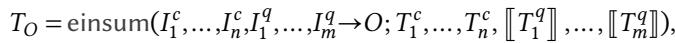

where ?? <sup>??</sup> denotes executing the qTensor for all its indices and transferring the results to a cTensor.

## 4 qTPU System Overview

To realize our hTN abstraction, we introduce <sup>qTPU</sup>, an endto-end system that enables programmable and scalable hybrid computations. Fig. 4 shows an overview of the system.

To express hybrid programs with the hTN abstraction, users program in the qTPU programming model, which provides a simple, declarative interface based on the two primitives iswitch and hEinsum, while hiding the complexity of coordinating quantum and classical computation.

To automatically co-optimize a hybrid program, the qTPU compiler optimizes it to fully use both quantum and classical computing. The compiler’s frontend first parses the program into the unified <sup>qTPU</sup> IR, after which the optimizer applies a hybrid quantum-classical cost model to identify Paretooptimal rewrites that reduce quantum errors from noise and classical costs of operations and memory usage. Finally, the backend produces an optimized hybrid kernel comprising device-agnostic quantum and classical kernels, along with a canonical operation schedule, ready for execution.

Finally, the qTPU runtime scalably executes the optimized hybrid program, adapting it to the available resources. To do so, its index slicer first partitions the hTN into smaller, independent, and parallelizable slices. The device placer then maps each concrete quantum and classical computation to an available device to maximize throughput, after which the code generator produces device-optimized kernel code for each computation. The hTN is then executed in a distributed pipeline, where the qTensor engine evaluates all qTensors on the available QPUs, and the cTensor engine contracts the resulting cTensors using the available classical accelerators.

## 5 qTPU Programming Model

We propose the <sup>qTPU</sup> programming model, which provides a unified abstraction for hybrid quantum-classical computation, enabling programmers to state hybrid computations <sup>declaratively</sup>, without their low-level execution details – such as manually stitching components into a single workflow.

Our <sup>qTPU</sup> model exposes two core constructs: (1) <sup>quan-</sup> <sup>tum</sup> <sup>tensors</sup>, created by annotating quantum programs with iswitch statements, and (2) a declarative multi-tensor contraction operator, hEinsum, which composes classical and quantum tensors into a single hybrid computation. These primitives are in addition to the classical tensor (cTensor) primitive, represented by a multi-dimensional array.

## 5.1 qTensor Primitives

A quantum tensor (qTensor) compactly represents a multi index family of quantum kernels. It is structured as a quantum program annotated with iswitch operations, each binding a symbolic index to a discrete set of circuits. We consider a simple language ??<sup>??</sup> of defining quantum circuits, consisting of gates and our novel iswitch operator:

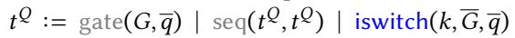

Here, ?? references a quantum gate, while ?? is a vector of gates, and seq refers to a sequence of instructions. ?? is a vector of unique qubit identifiers.

Materialization. Instead of executing the qTensor on a QPU, we could <sup>materialize</sup> it to a classical tensor, given an index set <sup></sup>. ??<sub>??</sub> is the unitary transformation of gate ??.

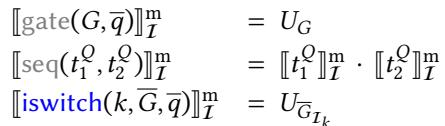

## 5.2 hEinsum: Hybrid Einsum Primitive

We consider another language ??<sup>??</sup> for tensor computations, embedding quantum computations (??<sup>??</sup>) and our novel hEinsum operator. hEinsum <sup>declaratively</sup> specifies a hybrid TN operation, thus relieving the programmer from managing execution details, while enabling the compiler and runtime to execute it eficiently on QPUs and classical accelerators.

```julia
@quantum_tensor
2 def quantum_layer(X, W, O):
3 q = alloc_qubits(N)
4 for i in range(N):
5 # batch-dimension index
iswitch("i", [ry(x[i]) for x in X], q[i])
model(q, W)
8 # hidden-dimension index
9 iswitch("k", [apply_obs(o) for o in O], q)
10 measure(q)
11
12 def forward(X, W, V, O): # hybrid computation (declarative)
13 return hEinsum("jk,ik->ij", V, quantum_layer(X, W, O))
```  
Listing 2: Unified Quantum-Classical ML example (cf. Lst. 1)

Operationally, hEinsum acts like a standard TN contraction over classical tensors, where qTensors are materialized first to cTensors. To formally state the semantics of our hEinsum term, we define our simple tensor language:

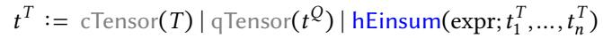

We can define the semantics of that language, in particular our hEinsum term, using the mathematical einsum operator (Sec. 3.2). Intuitively, we materialize any qTensor to its classical counterpart, over which we compute a classical einsum.

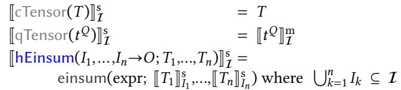

Summary. The <sup>qTPU</sup> programming model provides a simple, declarative framework for hybrid quantum-classical computation. QTensors introduce indexed quantum kernels via iswitch annotations, while hEinsum lifts classical einsum semantics to the hybrid setting. By deferring kernel specialization and execution until contraction time, the model separates logical specification from concrete realization, permitting the compiler and runtime to optimize placement and scheduling across QPUs and classical accelerators.

## 5.3 Example Continued

To demonstrate the versatility of the <sup>qTPU</sup> programming model, we revisit the hybrid ML task from Lst. 1, reimplemented in Lst. 2 (visualized in Fig. 3). The quantum\_layer function (Line 2) defines a two-dimensional qTensor encoding the required circuit family: index i iterates over dataset ?? to select the input encoding, while k selects the measurement observable.

The iswitch primitive instantiates operations based on i and k. For instance, i=1,k=0 maps to the second data point and first observable. This allows the programmer to declaratively specify the complete circuit family within the qTensor function, avoiding manual construction of individual circuits.

The quantum\_layer kernel in Lst. 2 makes the qTensor concrete: each iswitch annotation becomes one index of the qTensor, so the kernel itself specifies the entire iswitchindexed family. Executing the qTensor on a QPU yields a cTensor whose entries are the measurement outcomes for each index assignment.

Finally, the hybrid computation in the forward function is realized via hEinsum, which defines the contraction over quantum and classical tensors (cf. Fig. 3). In this model, the programmer specifies the computation solely through tensor structure, while details of circuit scheduling, data movement, and coordination remain entirely hidden.

The <sup>qTPU</sup> programming model serves a dual role: as a user-facing interface for applications such as hybrid ML (Lst. 2), and as a compilation target that upstream tools emit into. For example, our circuit-knitting and error-mitigation pipelines (§ 8.2) lower their output directly into concise hEinsum expressions, obtaining unified optimization and execution without managing hybrid orchestration themselves.

## 6 qTPU Compiler

The <sup>qTPU</sup> compiler lowers the high-level, declarative hEinsum-description (§ 5) into an optimized hybrid kernel.

Workflow. Fig. 5 shows the overall workflow of the <sup>qTPU</sup> compiler. At the frontend, we parse the hEinsum into the intermediate representation (<sup>qTPU</sup> IR). The optimizer rewrites the <sup>qTPU</sup> IR to balance quantum and classical costs, leveraging both resource modalities. Finally, the backend emits an optimized hybrid kernel.

## 6.1 Frontend and qTPU IR

The frontend of the compiler converts a given hEinsum program (§ 5.2) to the unified <sup>qTPU</sup> IR.

qTensor graphs. We convert each qTensor into a graph ??<sub>QT</sub> = (??<sub>QT</sub>, ??<sub>QT</sub>) mirroring the structure of the underlying quantum circuit’s TN (Fig. 2), allowing us to reason about which qTensor parts we can ofload to classical operations. Each vertex ?? ∈ ??<sub>QT</sub> is a tuple (op ,??<sub>??</sub>), denoting applying operation op on qubit ??<sub>??</sub>. Edges are defined as <sup>(</sup>i) a <sup>temporal</sup> edge <sub>(</sub>(op ,??<sub>??</sub>),(op ,??<sub>??</sub>)<sub>)</sub> ∈ ??<sub>QT</sub> if op immediately precedes op on qubit ??<sub>??</sub> , and <sup>(</sup>ii) a <sup>spatial</sup> edge <sub>(</sub>(op , ??<sub>??</sub> ), (op , ??<sub>??</sub>)<sub>)</sub> ∈ ??<sub>QT</sub> when op<sub>??</sub> acts jointly on qubits ??<sub>??</sub> and ??<sub>??</sub>.

Operation graph. The operation graph is a directed acyclic graph capturing the order among computations in the hEinsum. Its initial nodes represent qTensors and cTensors, while its middle nodes are hEinsums. After transformations, we obtain a graph where each operation has two operands, allow ing us to map each to an eficient classical implementation.

## 6.2 Hybrid Cost Model

The <sup>qTPU</sup> compiler optimizes an hEinsum under a dualobjective cost model that balances classical and quantum resources. It captures the classical contraction cost and the expected error of executing quantum circuits on noisy QPUs. Classical cost. For a contraction hEinsum(??<sub>1</sub>, … , ??<sub>??</sub> → ??; ??<sub>1</sub>, … , ??<sub>??</sub>), let <sup></sup> = ??<sub>1</sub> ∪ ⋯ ∪ ??<sub>??</sub>, and let |??| denote the size of index ??. The FLOP cost of this contraction is ??<sub>??</sub> = ∏  |??|, i.e., the product of the sizes of all summed-out indices. The total classical cost of the hTN is then ??<sub>classical</sub> = ∑ ??<sub>??</sub> , the sum of the costs of all nodes in the operation graph.

Quantum cost (error). For each qTensor, we estimate the error of its quantum computation from the structure of its underlying circuit. Let <sup></sup>(??) be the set of all quantum operations appearing in qTensor ??, and let ??(??) denote the error probability of operation ?? due to noise on the QPU’s. We define the per-qTensor error score as ??(??) = 1 − ∏<sub>??∈</sub><sub>(??)(</sub>1 − ??(??)<sub>)</sub>. This score approximates the probability that at least one error occurs during the execution of ??. The overall quantum error is the maximum error score over all qTensors.

Optimization goal. The compiler seeks a Pareto-optimal front of points in the joint quantum-classical cost space, balancing classical FLOPs and quantum error to produce the most performant hybrid program for the given hardware.

## 6.3 Optimization Primitives

We optimize hybrid programs using optimization primitives illustrated in Fig. 6.

Tensorization and decomposition. Tensorization captures a linear combination of related hEinsums as a single hEinsum. As shown in Fig. 6(a), any linear combination of hEinsums difering only by small structural changes can be represented as one hEinsum where coeficients ??<sub>??</sub> are collected into a classical tensor ??, and structural variations are encoded by a qTensor with iswitch operations.

When a qTensor contains separable subcircuits acting on disjoint qubit sets, it decomposes into an equivalent hEinsum of smaller qTensors, since subcircuit measurement outcomes are uncorrelated with the full result obtained by multiplying their individual outputs. This replaces one large quantum tensor with several smaller qTensors.

Spatial separation. Gate virtualization partitions circuits by cutting two-qubit gates into a linear combination of singlequbit operations, then recovers the original result by executing all variants and computing their weighted sum [90]. Spatial separation generalizes gate virtualization within our <sup>qTPU</sup> framework (Fig. 6(b)), replacing the original two-qubit operation with an equivalent hEinsum of one cTensor and one qTensor. When resulting subcircuits operate independently, tensor decomposition factorizes the qTensor into smaller, less noisy components.

Temporal separation. Temporal separation builds on wire cutting, which partitions circuits by cutting qubit wires at specific time steps [84]. The cut decomposes continuous qubit evolution into a linear combination of operations, splitting deep circuits into shallower fragments with reduced accumulated gate errors (Fig. 6 (c)). Applying tensorization and decomposition rewrites large quantum tensors into equivalent hEinsums with multiple shallower, less costly qTensors.

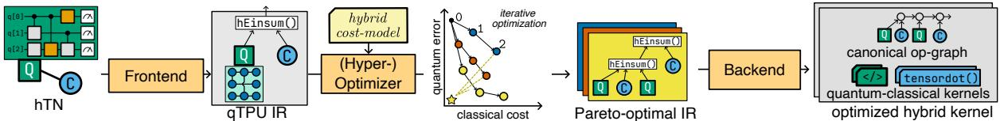  
<sub>Figure</sub> <sub>5:</sub> <sub>Compiler</sub> <sub>workflow</sub> <sub>(§ 6).</sub> The frontend parses hTNs defined with <sub>hEinsum</sub> to the qTPU <sub>IR</sub>, the optimizer uses iterative graph partitioning to find Pareto-optimal IR variants, and the backend lowers IR to optimized hybrid quantum-classical kernels.

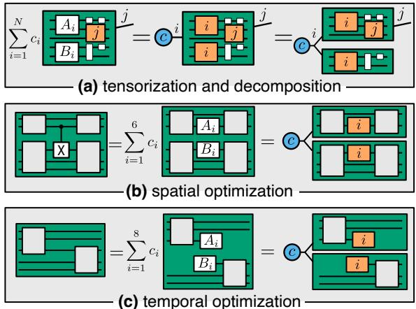  
Figure 6: Semantic-preserving qTensor to hEinsum rewrites.

## 6.4 Optimizer

The optimizer applies the optimization primitives to achieve a Pareto-optimal hybrid cost. It systematically rewrites each qTensor, transforming infeasible quantum workloads into a more balanced hybrid computation.

Optimization workflow. We illustrate the workflow optimizing one qTensor into a hEinsum expression in Fig. 7. We start with the qTensor graph treated as a single partition, and the operation graph containing one qTensor node. At this point, the quantum error is high and the classical cost is zero, as shown by the upper-left point in the graph of Fig. 5.

In each iteration, we partition the qTensor graph into ?? ≥ 2 balanced subgraphs to minimize cut edges. These boundary edges dictate the optimization primitive: temporal cuts trigger temporal optimization, and spatial cuts trigger spatial optimization (cf. Fig. 6). As shown in Fig. 7, each rewrite replaces the node with an equivalent subgraph of qTensors and cTensors. We greedily iterate by splitting the partition with the highest quantum cost.

The process continues until each rewrite decreases the distance to the Pareto-optimal point. This produces the cost trajectory shown in Fig. 8: each iteration reduces quantum cost (by shrinking qTensors) while increasing classical cost, thereby moving closer to the optimum. Once an iteration increases the distance to this optimum, we terminate.

Hyperparameter optimization. Because the efectiveness of each iteration depends on the chosen partitioning, we run the optimizer with multiple randomized hyperparameter configurations. These hyperparameters include the target partition count per iteration, ??, and the relative weight of partition balance versus minimizing inter-partition edges.

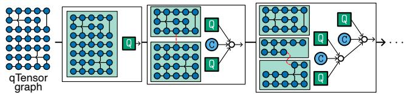  
Figure 7: Optimizing a qTensor by iteratively partitioning and recursively building an optimized operation-graph.

Each hyperparameter configuration yields a distinct cost trajectory; from these, we select the Pareto-optimal solution, <sup>i.e.,</sup> the one with final cost closest to the theoretical optimum.

Optimization Constraints. The optimizer is subject to three primary optional constraints: (1) the maximum number of qubits per qTensor in the optimized hEinsum, reflecting the available physical resources of the underlying QPUs; (2) an upper bound on the quantum error accumulated within each qTensor; and (3) a cap on the allowable classical postprocessing cost, measured in FLOPs. When such constraints are specified, we first restrict the solution space to Paretooptimal candidates that satisfy all constraints, and then select the remaining Pareto-optimal solution.

## 6.5 Backend

Finally, the <sup>qTPU</sup> compiler lowers the optimized <sup>qTPU</sup> IR into concrete hybrid kernels.

Contraction scheduling. The operation graph is canonicalized so that every node has exactly two operands, ensuring that each contraction corresponds to a single accelerator operation that can eficiently be implemented on a classical device. We do so while optimizing the contraction order.

Lowering qTensors. Each qTensor across all slices is lowered into a single parametric quantum kernel. For every symbolic index of the qTensor, the compiler introduces a parameter, and each iswitch annotation becomes a corresponding if–else block that selects the appropriate gates.

## 7 qTPU Runtime

The <sup>qTPU</sup> runtime enables adaptable, scalable, and highly parallel execution of optimized hEinsum programs across a heterogeneous set of quantum and classical accelerators.

Workflow. Fig. 8 illustrates the workflow of the <sup>qTPU</sup> runtime. The runtime receives the compiler-optimized hybrid kernel, and execution proceeds in two conceptual phases.

In the <sup>adaptation</sup> <sup>phase</sup> (Fig. 8 (a)), the runtime adapts and lowers the hEinsum expression to the currently available resources. The index slicer and device placer partition the expression into multiple independent slices to expose parallel work and assign each slice’s quantum and classical operations to specific QPUs or classical accelerators. After placement, the code generator compiles the mapped quantum and classical operations into device-specific kernel code.

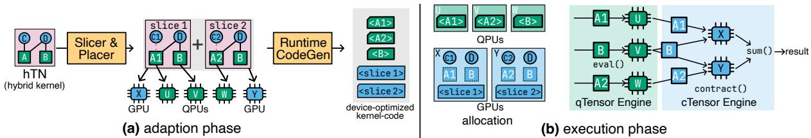  
<sub>Figure</sub> <sub>8:</sub> qTPU <sub>runtime</sub> <sub>(§ 7).</sub>(a) Adaptation phase: the slicer and placer partition the hTN into independent slices assigned to QPUs and GPUs, then the code generator compiles device-specific kernels. (b) Execution phase: the qTensor engine evaluates quantum circuits in parallel on QPUs, the cTensor engine contracts results on classical devices to produce the final result.

In the <sup>execution</sup> <sup>phase</sup> (Fig. 8 (b)), the runtime executes the sliced hEinsum across the distributed devices. The runtime first allocates all qTensors and cTensors and loads the generated kernels onto their assigned hardware. Execution proceeds in a map–reduce style: the qTensor engine evaluates all qTensors in parallel on QPUs, the cTensor engine contracts the resulting slices on classical accelerators, and the partial contractions are then combined into the result.

## 7.1 Index Slicing and Device Placement

During the adaptation phase (Fig. 8 (a)), the slicer and device placer prepare the optimized hEinsum for distributed execution across QPUs and classical accelerators, with the goal being to expose as much parallel quantum work as possible, as QPUs are typically the throughput bottleneck.

Let ?? be an index with domain {0, … , |??| − 1}. Slicing along ?? simply means creating one hEinsum for each value of ??, <sup>i.e.,</sup> a set of sub-expressions hEinsum(expr; ??<sub>1</sub>, … , ??<sub>??</sub>)<sup>|</sup><sub>|</sub> . Each of these subproblems can be evaluated independently, and the original result is recovered by summing their outputs:

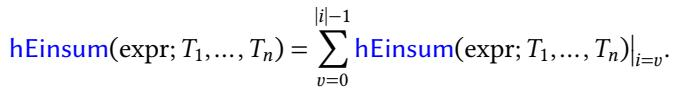

In the example of Fig. 8, we slice an index with |??| = 2 at qTensor A, giving us two distinct slices.

To generate suficient QPU parallelism, the slicer iteratively selects indices adjacent to each qTensor and slices along those that maximize the number of independent circuit instances, continuing until at least as many qTensor instances are produced as there are available QPUs.

This iterative procedure can be written compactly as:

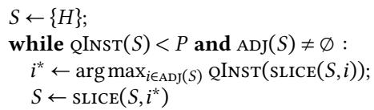

where ?? is the target QPU parallelism, <sup>adj</sup>(??) is the set of indices adjacent to any qTensor in some ?? ∈ ??, <sup>qInst</sup>(??) = ∑ <sup>qInst</sup>(?? ) counts qTensor instances across all slices, and <sup>slice</sup>(??, ??) = ⋃ <sup>slice</sup>(?? , ??) extends per-expression slicing to the slice set. In the example of Fig. 8 with two QPUs, the slicer picks the |??|=2 index at qTensor A in a single step, producing two independent slices.

After slicing, the device placer assigns each qTensor instance to a QPU with available capacity, using a loadbalanced assignment when the number of instances exceeds the devices. The remaining classical slice contractions are mapped to classical accelerators in a round-robin manner.

## 7.2 Runtime Code Generation

Following device placement, the runtime code generator compiles the hybrid kernel into device-specific executables: for every qTensor assigned to a QPU, it emits a quantum kernel using the native toolchain, while for classical slices, it compiles the shared operation graph into a single optimized kernel for the target accelerator using a tensor backend [15].

## 7.3 Tensor Engines

The tensor engines execute the sliced hEinsum across QPUs and classical accelerators.

The qTensor engine evaluates all qTensors on available QPUs. For each unique qTensor, it allocates quantum resources and the output bufer for its result cTensor entry, then loads the compiled quantum kernel onto the selected QPU. The compiled kernel is executed for each qTensor instance, returning results one by one into a result-cTensor.

The cTensor engine performs classical contractions for each slice. For every slice, it allocates slice-local cTensor bufers on the assigned classical accelerator and loads the compiled contraction kernel from the code generator. The engine waits asynchronously for cTensor inputs from the qTensor engine; once all required inputs arrive, it launches the slice’s contraction kernel. Each slice produces a partial result, which the cTensor engine reduces across the sliced indices to yield the final output.

## 7.4 Fault Tolerance

The runtime handles failures gracefully, since QPUs and classical devices may become unavailable during execution. The sliced hEinsum structure naturally supports fault tolerance, as each slice represents an independent unit of work.

QPU calibrations. Unlike classical accelerators, QPUs require regular calibration to maintain low noise, typically going ofline for about an hour daily [1]. The <sup>qTPU</sup> runtime models calibration as scheduled downtime: when a QPU enters calibration, the qTensor engine completes any in-flight circuit (usually seconds) and stops dispatching new qTensor instances to that device. Pending instances are reassigned to remaining QPUs using the same load-balanced policy.

Classical Cost [FLOPs]  
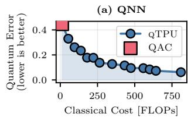

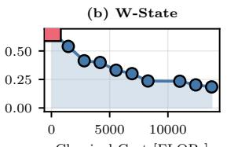

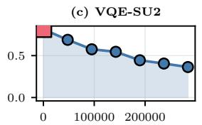

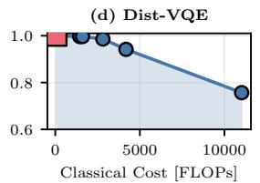

<sub>Figure</sub> <sub>9:</sub> <sub>Compiler</sub> <sub>tradeof</sub> <sub>(§</sub> <sub>8.4).</sub> QAC produces a single solution, while qTPU exposes a flexible Pareto frontier.  
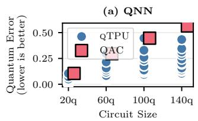

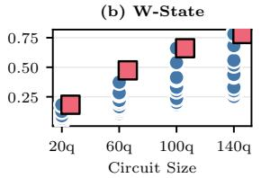

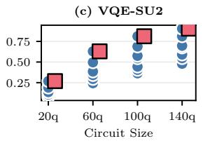

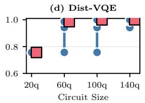  
<sub>Figure</sub> <sub>10:</sub> <sub>Compiler</sub> <sub>optimality</sub> <sub>analysis</sub> <sub>(§ 8.4).</sub> While QAC yields a single solution with error scaling linearly with circuit size, qTPU maintains consistent error reduction across scale.

Classical failures. If a classical accelerator fails during cTensor contraction, the cTensor engine re-executes only afected slice contractions. Since each slice depends solely on input cTensors (already in host memory), recovery requires no cross-slice coordination. Uncompleted contractions are reassigned to surviving accelerators.

## 8 Implementation and Evaluation

## 8.1 System Implementation

We implement an end-to-end <sup>qTPU</sup> prototype in Python.

Programming Model. We provide Python constructs for hEinsum and qTensors. To declare a qTensor, users annotate a <sup>Qiskit</sup> [71] quantum circuit with our custom iswitch operations. A hEinsum operation is then constructed with a einsum expression and corresponding qTensor objects and classical <sup>PyTorch</sup> [63] tensors.

Compiler. The compiler uses <sup>KaHyPar</sup> 1.3 [79] for graph partitioning at each recursive optimization level and explores the Pareto frontier of classical cost versus quantum error using randomized multi-start optimization. The backend returns a <sup>cotengra</sup> [35] operation graph and generates qTensors as <sup>CUDA-Q</sup> [18] kernels.

Runtime. The runtime leverages <sup>cotengra</sup> as an interface for contraction optimization and slicing, with <sup>PyTorch</sup> for tensor operations. Our code generator JIT-compiles qTensors into optimized QPU-native code using CUDA-Q, and classical operations into GPU kernels using the <sup>PyTorch</sup> toolchain.

## 8.2 Hybrid Application Implementation

To measure <sup>qTPU</sup>’s performance on real-world hybrid applications, we implement three real-world applications in the <sup>qTPU</sup> programming model, enabling case studies on each (§ 8.6–§ 8.8): (i) for hybrid ML, we implement the example from Lst. 2, (ii) for scalable hybrid computation, we implement circuit knitting by decomposing a quantum circuit using the state-of-the-art circuit knitting library – QAC [11] and parsing the cut circuit into an equivalent hEinsum, and (iii) for error mitigation, we adopt probabilistic error cancellation (PEC), Pauli twirling and Zero-Noise-Extrapolation from the state-of-the-art error-mitigation library <sup>Mitiq</sup> [49], and convert them into an hEinsum.

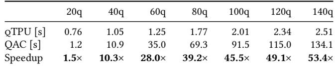  
Table 1: Compile time scaling for VQE-SU2 circuits. <sup>qTPU</sup>’s compile time is near-constant; <sup>QAC</sup> scales superlinearly.

## 8.3 Experimental Methodology

Experimental setup. We use a server with two AMD EPYC 9654 96-Core processors (384 cores with HT), 1.5 TB RAM, and an A40 GPU with 48GB HBM3 memory.

Baselines. We evaluate <sup>qTPU</sup> against Qiskit-Addon-Cutting (<sup>QAC</sup> ) [11], the current state-of-the-art framework for hybrid quantum-classical execution through circuit decomposi tion. <sup>QAC</sup> is inherently hybrid, enabling scalable execution of large quantum circuits by partitioning the circuit into smaller subcircuits, executing them on a QPU, and classically postprocessing to obtain the result of the original circuit. We compare our runtime against cuTensorNet [58], NVIDIA’s GPU-accelerated library for circuit simulation, to establish a classical-only baseline. For the error-mitigation case-study, we compare against <sup>Mitiq</sup> [49], the leading framework for quantum error mitigation. For our hybrid ML case-study, we compare against the <sup>Batch</sup> method (Lst. 1), which is commonly used in quantum frameworks [9, 71]. Each baseline is a dedicated, state-of-the-art tool for its respective workload.

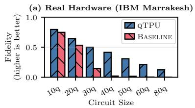

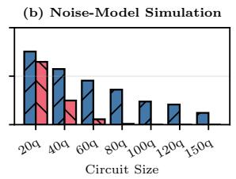

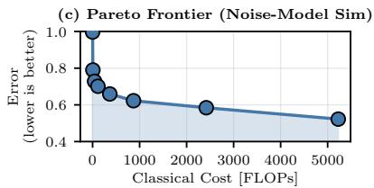

Figure 11: Hardware validation on real QPU (§ 8.4). <sup>(a)</sup> <sup>Fidelity</sup> ⟨??⟩ <sup>on</sup> <sup>IBM</sup> <sup>Marrakesh</sup> <sup>for</sup> ?? ∈ [10, 80] <sup>(higher</sup> <sup>is</sup> <sup>better;</sup> <sup>noiseless</sup> <sub>⟨??⟩=+1</sub>). (b) Pauli-depolarizing noise-model simulation (<sub>?? =10</sub>−2, <sub>?? =10</sub>−3) extending the fidelity sweep to 150 qubits. (c) Pareto frontier traversal at 80 qubits under the same noise model, plotting error (<sub>1−⟨?? ⟩</sub>) vs. classical cost.  
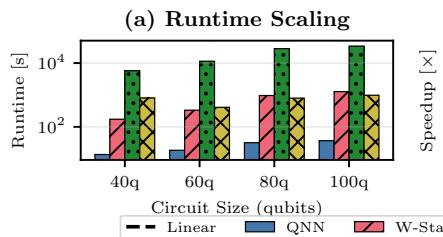

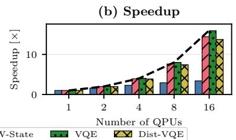

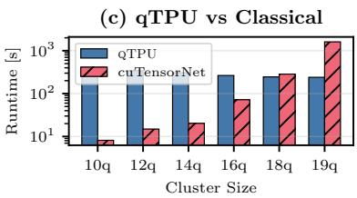  
<sub>Figure</sub> <sub>12:</sub> qTPU <sub>runtime</sub> <sub>analysis</sub> <sub>(§ 8.5).</sub> (a) Total runtime scales with circuit size across benchmarks. (b) Near-linear speedup with multiple QPUs (14.4<sub>×</sub> at 16 QPUs for W-State) due to embarrassingly parallel <sub>qTensor</sub> execution. (c) qTPU vs. cuTensorNet on 100q Dist-VQE: qTPU outperforms classical beyond 18-qubit clusters, achieving 6.7<sub>×</sub> speedup at 19-qubit clusters.

Benchmarks. We evaluate four quantum circuit families from MQT Bench [73], representative of hybrid quantumclassical applications: QNN, a quantum neural network for quantum machine learning [69]; W-State, preparing the ??-qubit linearly entangled W-state [25]; VQE-SU2, a Variational Quantum Eigensolver ansatz with eficient ???? (2) rotations for quantum chemistry [66, 70]; and Dist-VQE, a distributed VQE variant with clustered connectivity modeling natural circuit partitioning across multiple QPUs.

Metrics. We evaluate qTPU using the following metrics: (1) Quantum error: The estimated probability of at least one error occurring during circuit execution (§ 6.2). We assume a uniform error model with 10<sup>−3</sup> for single-qubit gates and 10<sup>−2</sup> for two-qubit gates [1]. This uniform model reflects typical gate error rates on current superconducting QPUs and serves as a device-agnostic baseline. (2) Classical cost: The number of floating-point operations (FLOPs) required for classical computation (§ 6.2). (3) Runtime: Wall-clock execution time in seconds, measured either for classical or quantum or end-to-end hybrid execution. (4) Code size: The number of lines of generated CUDA-Q quantum-kernel code. (5) QPU time: Estimated quantum hardware execution time, computed by transpiling circuits to IBM Marrakesh using Qiskit’s ASAP scheduling with optimization level 3 using 1000 shots [1, 71]. Per-shot execution time is deterministic, fixed by the scheduled gate sequence and devicelevel reset/readout overhead [71]. We validated this estimator against measured IBM Marrakesh job metadata: it matches monolithic QPU time within ±2% and is slightly conservative for cut variants, making <sup>qTPU</sup>’s reported QPU time an upper bound. (6) Fidelity: The retention of a weight-?? Clifford observable ?? under circuit execution, ⟨??⟩ ∈ [−1,1]. A noiseless execution gives ⟨??⟩ = +1; hardware noise drives it toward 0.

## 8.4 qTPU Compiler

<sub>RQ1</sub> <sub>(Compiler</sub> <sub>trade-of):</sub> Can the compiler trade quantum error for classical computation? <sub>We</sub> <sub>partition</sub> <sub>each</sub> <sub>100-qubit</sub> benchmark into 50-qubit subcircuits using both <sup>QAC</sup> and <sup>qTPU</sup>, with <sup>qTPU</sup> configured to run 50 hyperparameter trials, retaining only Pareto-optimal solutions.

Fig. 9 shows that while <sup>QAC</sup> produces a single fixed solution, <sup>qTPU</sup> ofers multiple configurations trading classical cost for quantum error. Mid-range solutions yield 1.5–3.4× error reduction, while maximum classical investment achieves 2.2–7.2× improvement across all benchmarks. At equal classical cost, both frameworks provide the same solution-quality. <sub>RQ2</sub> <sub>(Compiler</sub> <sub>scalability):</sub> Does the compiler scale to large qTensor<sup>s?</sup> We vary the circuit size from 20 to 140 qubits, cutting each circuit into subcircuits of 50% the original size.

Fig. 10 shows <sup>qTPU</sup> maintains stable error reduction across scales, ranging from 2–26× depending on the benchmark. While <sup>QAC</sup> error scales linearly with circuit growth, <sup>qTPU</sup>’s Pareto frontiers consistently trade FLOPs for reduced quantum error without diminishing returns.

Table 1 shows the compile time on VQE-SU2: <sup>QAC</sup> scales superlinearly (1.2s to 134s) due to exhaustive search, while <sup>qTPU</sup> maintains ∼1–3s (up to 53× speedup for 140 qubits). Although graph partitioning, a technique used throughout the compiler, is NP-hard in general, the structure of quantum circuits makes it tractable for <sup>KaHyPar</sup> ’s multi-level hypergraph algorithm [79].

Note that <sup>qTPU</sup>’s cost model (§ 6.2) accepts any usersupplied error model. The negligible compile time makes recompiling with an up-to-date model of current calibration data practical for obtaining the best possible Pareto front.

Batch Size  
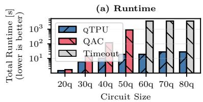

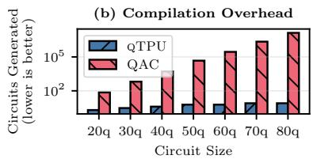

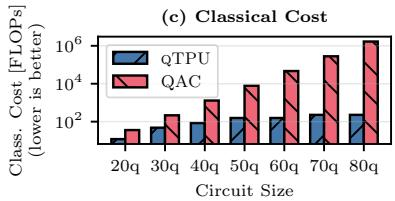  
Figure 13: Scalable hybrid computing for QNN on a 10-qubit QPU (§ 8.7). We partition QNN circuits (20–80 qubits) into 10-qubit <sub>subcircuits</sub> <sub>using</sub> qTPU <sub>and</sub> QAC<sub>.</sub> (a) qTPU scales to 80 qubits in <30s while QAC times out beyond 50 qubits. (b) qTPU generates 10–42<sub>×</sub> fewer subcircuits. (c) qTPU’s classical postprocessing requires <sub>10</sub>2–<sub>10</sub>3 FLOPs vs. QAC’s <sub>10</sub>6 FLOPs.

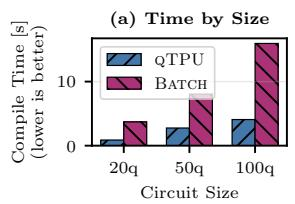

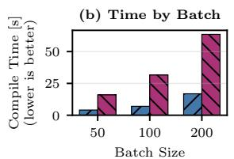

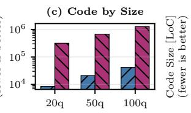

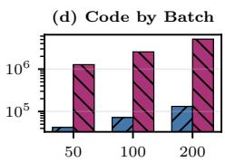  
Figure 14: Case study: hybrid machine learning with <sup>Batch</sup> execution (Lst. 1) vs. <sup>qTPU</sup> (Lst. 2) (§ 8.6). <sup>(a)</sup> <sup>Compilation</sup> <sup>time</sup> <sup>by</sup> circuit size, (b) compilation time by batch size, (c) generated code size by circuit size, (d) generated code size by batch size.

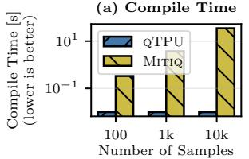

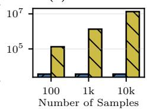  
Figure 15: Quantum error mitigation (QEM) vs <sup>Mitiq</sup> the 100-qubit QNN benchmark (§ 8.8). (a) <sup>qTPU is</sup> <sup>3,500</sup>× <sup>faster</sup> in compilation. <sub>(b)</sub> qTPU generates 3,700<sub>×</sub> fewer lines of code.

RQ3 (Hardware validation): Does qTPU’s error reduction hold on real quantum hardware? <sub>We</sub> <sub>run</sub> QNN <sub>circuits</sub> <sub>from</sub> 10 to 80 qubits on IBM Marrakesh with both <sup>qTPU</sup> and a monolithic <sup>Baseline</sup>, partitioning each circuit into 10-qubit subcircuits with <sup>qTPU</sup>.

Fig. 11 (a) shows fidelity on real hardware: <sup>Baseline</sup> collapses from 0.53 at 20q to 0.003 at 80q, while <sup>qTPU</sup> retains 0.12 at 80q—a 46× improvement. Fig. 11 (b) extends the sweep to ??=150 under a Pauli-depolarizing noise model (??<sub>cx</sub>=10<sup>−2</sup>, ??<sub>id</sub>=10<sup>−3</sup>), reproducing the same trend: <sup>Baseline</sup> reaches the noise floor by 100q, while <sup>qTPU</sup> maintains fidelity of 0.12.

Pareto frontier traversal. To test whether the compiler’s cost model translates into measurable error reduction along the full frontier, we enumerate the Pareto solutions of an 80-qubit <sup>QNN</sup> circuit and execute one point per partition size. Fig. 11 (c) plots error (1−fidelity) against classical cost: error drops monotonically from 0.997 at the zero-cost solution to 0.522 at the most aggressive optimization—a 0.48-unit reduction, confirming that higher classical investment purchases lower quantum error.

## 8.5 qTPU Runtime

<sub>RQ4</sub> <sub>(Runtime</sub> <sub>analysis):</sub> What is qTPU’s runtime perfor-<sup>mance</sup> <sup>and</sup> <sup>where</sup> <sup>is</sup> <sup>it</sup> <sup>spent?</sup> We measure total runtime, including compilation, classical postprocessing, and QPU execution, on a 15-qubit QPU, requiring the compiler to optimize qTensors to a circuit size of 15 qubits or fewer.

Fig. 12(a) shows runtime scaling with circuit size across benchmarks. For 100-qubit circuits, quantum execution dominates at 75-100% of total runtime, while classical contraction accounts for <0.01% and compilation takes 2-3s. Network and I/O overhead is negligible compared to quantum runtime; further, <sup>qTPU</sup>’s compact hTN representation transfers far less circuit data than approaches that enumerate variants. <sub>RQ5</sub> <sub>(Scalability):</sub> Can the runtime leverage multiple QPUs? Fig. 12(b) shows near-linear speedup as QPU count increases from 1 to 16, achieving 14.4× speedup with 16 QPUs (90% eficiency). The slicer produces embarrassingly parallel qTensor instances, thereby minimizing distribution overhead.

RQ6 (Comparison to classical simulation): <sup>How</sup> <sup>does</sup> qTPU perform against pure classical simulation? <sub>We</sub> <sub>evalu-</sub> ate 100-qubit Dist-VQE circuits with clustered connectivity. <sup>qTPU</sup> executes on 4 QPUs with 1,000 shots per subcircuit; cuTensorNet performs full simulation. <sup>qTPU</sup>’s reported runtime includes compilation, estimated QPU execution, and classical contraction. cuTensorNet’s runtime is total wallclock simulation time.

Fig. 12 (c) shows that as cluster size increases, <sup>qTPU</sup> runtime decreases (fewer qTensors and cTensors) while cuTensorNet runtime grows exponentially (larger clusters yield harder contractions). <sup>qTPU</sup> outperforms classical beyond 18-qubit clusters, achieving 6.7× speedup at 19-qubits.

## 8.6 Case-Study: Hybrid Machine Learning

We compare manual batching (Lst. 1) against <sup>qTPU</sup>’s unified model (Lst. 2) for evaluating hybrid quantum-classical ML. We use QNN quantum kernels of 20–100 qubits with ?? ∈ ℝ<sup>??×ℎ</sup>, ?? ∈ ℝ<sup>ℎ×??</sup> , batch sizes ?? ∈ {50, 100, 200}, hidden dimension ℎ = 20, and feature dimension ?? = 8. Manual batching (Lst. 1) is the standard practice in QML frameworks [9, 77].

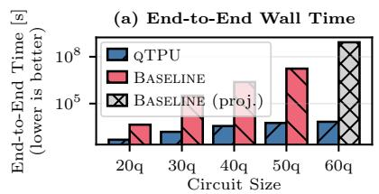

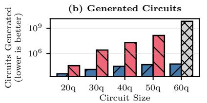

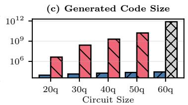  
Figure 16: End-to-end application: QNN with circuit cutting, ZNE, and hybrid ML combined in one pipeline (§ 8.9). <sup>(a)</sup> <sup>At</sup> <sup>50q,</sup> end-to-end time drops from <sub>∼1.7⋅10</sub>7s to <sub>∼5.8⋅10</sub>3s (<sub>∼3⋅10</sub>3<sub>×</sub>). (b) qTPU generates <sub>∼3⋅10</sub>3<sub>×</sub> fewer subcircuits at 50q (48k vs. 140M). (c) qTPU emits <sub>∼7⋅10</sub>5<sub>×</sub> less kernel code at 50q (23k vs. 16.7B lines).

RQ7 (Compilation Scalability): <sup>How</sup> <sup>does</sup> <sup>compilation</sup> <sup>time</sup> <sup>scale</sup> <sup>with</sup> <sup>problem</sup> <sup>size?</sup> Fig. 14 (a,b) shows compilation scaling with circuit and batch size. <sup>qTPU</sup> achieves 3.7× average speedup (up to 6×) over batch execution. Critically, <sup>qTPU</sup> scales sublinearly with batch size, whereas batch execution scales linearly by compiling each circuit independently. At 100 qubits, batch execution grows from 3.1s to 63.5s as batch size increases from 10 to 200, while <sup>qTPU</sup> grows only from 4.8s to 16.9s, a speedup of up to 4.5×.

RQ8 (Code Generation Overhead): <sup>What</sup> <sup>is</sup> <sup>the</sup> <sup>impact</sup> <sup>on</sup> <sup>generated</sup> <sup>code</sup> <sup>size?</sup> Fig. 14 (c,d) shows <sup>qTPU</sup>’s code generation eficiency. By compiling the quantum kernel once with parametric control flow rather than instantiating separate circuits, <sup>qTPU</sup> achieves an average reduction of 33× (up to 48×). At 100 qubits with batch size 200, <sup>qTPU</sup> generates 132k lines vs. batch execution’s 5.1M lines—a 38.7× reduction. This directly translates into faster compilation and a smaller memory footprint, with benefits that scale with batch size.

## 8.7 Case Study: Scalable Hybrid Computing

In this case study, we implement scalable hybrid computing using circuit knitting on resource-constrained hardware. We run <sup>QNN</sup> benchmarks on 20-80 qubits, targeting a 10-qubit QPU and enforcing aggressive circuit partitioning.

RQ9 (End-to-end runtime): <sup>What</sup> <sup>impact</sup> <sup>does qTPU have</sup> on the end-to-end runtime with increasing problem size? <sub>Fig. 13</sub> (a) shows total runtime: QAC scales exponentially and times out beyond 40 qubits (20-minute limit), while qTPU com pletes 80-qubit circuits in under 30 seconds. This dramatic diference stems from <sup>qTPU</sup>’s hTN representation, avoiding redundancies by compactly encoding the entire computation. RQ10 (Compilation overhead): <sup>How</sup> <sup>many</sup> <sup>circuits</sup> <sup>does</sup> qTPU generate with increasing problem size? <sub>Fig.</sub> <sub>13</sub> <sub>(b)</sub> <sub>re-</sub> veals the root cause of <sup>QAC</sup> ’s exponential scaling: circuit generation grows combinatorially (12 to 6,480 circuits from 20q to 50q), whereas <sup>qTPU</sup> produces 10–42× fewer subcircuit instances. The hTN abstraction eliminates this overhead by representing subcircuits declaratively as qTensors rather than enumerating explicit circuit variants.

RQ11 (Postprocessing overhead): <sup>What</sup> <sup>is</sup> <sup>the</sup> <sup>classical</sup> cost in FLOPs that qTPU incurs with increasing problem size? Fig. 13 (c) shows the classical postprocessing cost: <sup>qTPU</sup> maintains modest overhead (< 10<sup>3</sup> FLOPs) across all sizes, while <sup>QAC</sup> grows to 10<sup>6</sup> FLOPs exponentially. The hTN formulation performs only the minimum necessary tensor contractions by structure-aware optimization, whereas <sup>QAC</sup>’s explicit circuit enumeration incurs exponential classical reconstruction overhead proportional to the circuit size.

## 8.8 Case Study: Quantum Error Mitigation (QEM)

<sub>RQ12</sub> <sub>(QEM</sub> <sub>scalability):</sub> What impact does qTPU have on the compile time and code size requirements of a hybrid QEM <sup>workflow?</sup> We implement three major error mitigation strategies (§ 8.2) using both <sup>qTPU</sup> and Mitiq on quantum circuits with 200 single-qubit gates. For Mitiq, we vary the sample count from 100 to 10,000 circuits; <sup>qTPU</sup> represents the full task symbolically as a hEinsum, independent of sample count.

Fig. 15 compares compile-time overhead and code size. While Mitiq explicitly generates each circuit variant, <sup>qTPU</sup> represents the entire ensemble symbolically, encoding up to 4<sup>200</sup> ≈ 10<sup>120</sup> configurations (for combined PEC+Twirling applied to all gates) as a single qTensor. <sup>qTPU</sup> maintains constant ∼10ms overhead regardless of sample count, while Mitiq scales linearly from ∼335ms at 100 samples to 35s at 10,000 samples (∼3,550×). Similarly, <sup>qTPU</sup> generates only ∼3.7k lines of code, whereas Mitiq generates 13.5M (∼3,700×).

## 8.9 Case Study: End-to-End Application

In this case study, we combine all three use cases—circuit cutting, ZNE error mitigation, and batched hybrid ML—into one end-to-end workload. We run <sup>QNN</sup> circuits from 20– 60 qubits, partitioning into 10-qubit subcircuits, applying Richardson ZNE at three noise scales, and evaluating over a batch of 20 inputs. <sup>qTPU</sup> expresses the full pipeline as a single hEinsum; the <sup>Baseline</sup> composes <sup>QAC</sup>, <sup>Mitiq</sup>, and a manual <sup>Batch</sup> loop in a pipeline.

RQ13 (End-to-end runtime): <sup>How</sup> <sup>does</sup> <sup>the</sup> <sup>unified</sup> hEin-<sub>sum</sub> compare against pipeline composition? <sub>The</sub> Baseline <sub>cir-</sub> cuit generation-time exceeded our timeout at 60q. Fig. 16 (a) shows end-to-end wall time. At 50 qubits, time drops from ∼1.7⋅10<sup>7</sup>s to ∼5.8⋅10<sup>3</sup>s (∼3⋅10<sup>3</sup>×). QPU execution dominates (>99%). The core speedup from <sup>qTPU</sup> comes through the fact that it needs to enumerate fewer quantum circuit instantiations due to its compact hTN form.

RQ14 (Generation overhead): <sup>What</sup> <sup>is</sup> <sup>the</sup> <sup>cost</sup> <sup>of</sup> <sup>pipeline</sup> composition in circuits and code? <sub>Fig.</sub> <sub>16</sub> <sub>(b,c)</sub> <sub>shows</sub> <sub>the</sub> <sub>gener-</sub> ation cost: at 50q the baseline materializes 140M subcircuits vs. 48k for <sup>qTPU</sup> (∼3⋅10<sup>3</sup>× fewer), and emits 16.7B lines of kernel code vs. 23k (∼7⋅10<sup>5</sup>× less). Composition multiplies each library’s explicit enumeration, while <sup>qTPU</sup>’s qTensors collapse it into a single symbolic expression.

## 8.10 Developer Productivity

The <sup>qTPU</sup> programming model reduces the efort of writing hybrid workloads. The hybrid-ML case study (§ 8.6) makes the contrast concrete: the <sup>Batch</sup> formulation in Lst. 1 requires a two-stage forward pass that enumerates circuits, dispatches them, and threads the results into a classical layer, while the <sup>qTPU</sup> formulation in Lst. 2 collapses this into a single qTensor with two iswitch indices and one hEinsum. The same primitives carry over to the other studies: scalable hybrid execution (§ 8.7) treats <sup>QAC</sup> ’s cutting recipe as an hEinsum, and error mitigation (§ 8.8) expresses QEMroutines as hTNs rather than separate library calls. Each baseline is scoped to a single workload; composing them requires chaining tools, whereas <sup>qTPU</sup> expresses any work load, or arbitrary compositions, as one hTN (§ 8.9).

## 9 Related Work

Hybrid quantum-classical applications. A wide range of quantum applications inherently rely on hybrid programming and execution models. Variational algorithms [27, 66], quantum machine learning [10, 51], quantum error mitigation [13, 20–22, 26, 65, 85, 86, 89, 98], and hybrid runtime systems [33,34,84,88,90] all interleave quantum circuit execution with classical optimization and/or postprocessing.

However, current approaches remain constrained by fragmented programming models, a lack of holistic optimizations, and a lack of resource-adaptable execution. In contrast, <sup>qTPU</sup> provides a unifying abstraction based on hTNs that encode entire hybrid computations. This enables global optimization, hardware-aware compilation, and flexible execution across QPUs and classical accelerators.

Tensor networks (TNs) in quantum simulation. TNbased quantum circuit simulation represents quantum gates and states as tensors, where simulation is performed through systematic tensor contraction operations [7, 56, 62, 76, 96, 97]. Prior work has used hybrid tensor-network ansätze as problem-specific variational constructions for particular Hamiltonians with small QPUs encoding part of a target wavefunction [80, 95]. <sup>qTPU</sup> is the first system to formalize hybrid tensor networks as a programming model that can concisely capture arbitrary hybrid workloads. Beyond simulation, TN abstractions also underpin applications such as quantum error analysis [87], which <sup>qTPU</sup> could naturally accelerate by exploiting its hybrid quantum-classical execution model.

Tensor optimization in classical systems. Deep learning compilers optimize tensor operators through scheduling transformations, operator fusion, and hardware mapping to maximize throughput on classical accelerators [15, 23, 43, 55, 82, 93, 100–102]. Similarly, general tensor compilers focus on eficient contraction and algebraic manipulation of dense and sparse tensors, addressing memory layouts, parallelization, and sparsity exploitation for scientific computing and machine learning workloads [6, 24, 32, 42, 46–48, 94]. <sup>qTPU</sup> addresses fundamentally diferent challenges: rather than optimizing dataflow graphs of deterministic, fully materialized tensor operations, <sup>qTPU</sup> optimizes hybrid tensor <sup>network</sup> contractions that integrate quantum and classical processing, requiring the compiler to determine an optimal trade-of between the two compute paradigms.

## 10 Conclusion

We introduce the hybrid tensor network (hTN) abstraction, a unified framework that seamlessly integrates quantum and classical computation. hTNs address current hybrid computing limitations—programming fragmentation, static partitioning, and poor scalability—through holistic representation and optimization. Our system, <sup>qTPU</sup>, realizes hTNs through a declarative programming model, a compiler that balances quantum error with classical cost, and an adaptable runtime for heterogeneous hybrid quantum-classical resources.

Evaluation across hybrid ML, circuit knitting, and error mitigation demonstrates that <sup>qTPU</sup> achieves up to 53× faster compilation, 7.2× lower quantum error rate, 3,700× code reduction, and 10,000× lower classical overhead than state-ofthe-art baselines. Through its concise, flexible, and scalable abstraction for quantum-classical acceleration, <sup>qTPU</sup> enables automated and eficient heterogeneous resource utilization for next-generation quantum-enhanced applications.

Artifact. <sup>qTPU</sup> is publicly available at https://github.   
com/TUM-DSE/qtpu.

Acknowledgments. Supported by the Bavarian State Ministry of Science and the Arts, as part of the Munich Quantum Valley (MQV), grant number 6090181.

## References

[1] Ibm quantum. https://www.ibm.com/quantum. Accessed: 2025-12-05.

[2] Quantum error correction below the surface code threshold. <sup>Nature</sup>, 638(8052):920–926, 2025.

[3] Martín Abadi, Paul Barham, Jianmin Chen, Zhifeng Chen, Andy Davis, Jefrey Dean, Matthieu Devin, Sanjay Ghemawat, Geofrey Irving, Michael Isard, Manjunath Kudlur, Josh Levenberg, Rajat Monga, Sherry Moore, Derek G. Murray, Benoit Steiner, Paul Tucker, Vijay Vasudevan, Pete Warden, Martin Wicke, Yuan Yu, and Xiaoqiang Zheng. TensorFlow: A system for

Large-Scale machine learning. In <sup>12th</sup> <sup>USENIX</sup> <sup>Sympo-</sup> sium on Operating Systems Design and Implementation <sup>(OSDI</sup> <sup>16)</sup>, pages 265–283, Savannah, GA, November 2016. USENIX Association.

[4] Rajeev Acharya, Dmitry A. Abanin, Laleh Aghababaie Beni, Igor Aleiner, Trond I. Andersen, Markus Ans mann, Frank Arute, Kunal Arya, Abraham Asfaw, Nikita Astrakhantsev, Juan Atalaya, Ryan Babbush, Dave Bacon, Brian Ballard, Joseph C. Bardin, Jo hannes Bausch, Andreas Bengtsson, Alexander Bilmes, Sam Blackwell, Sergio Boixo, Gina Bortoli, Alexan dre Bourassa, Jenna Bovaird, Leon Brill, Michael Broughton, David A. Browne, Brett Buchea, Bob B. Buckley, David A. Buell, Tim Burger, Brian Burkett, Nicholas Bushnell, Anthony Cabrera, Juan Campero, Hung-Shen Chang, Yu Chen, Zijun Chen, Ben Chiaro Desmond Chik, Charina Chou, Jahan Claes, Ag netta Y. Cleland, Josh Cogan, Roberto Collins, Paul Conner, William Courtney, Alexander L. Crook, Ben Curtin, Sayan Das, Alex Davies, Laura De Lorenzo, Dripto M. Debroy, Sean Demura, Michel Devoret, Agustin Di Paolo, Paul Donohoe, Ilya Drozdov, Andrew Dunsworth, Clint Earle, Thomas Edlich, Alec Eick busch, Aviv Moshe Elbag, Mahmoud Elzouka, Cather ine Erickson, Lara Faoro, Edward Farhi, Vinicius S. Fer reira, Leslie Flores Burgos, Ebrahim Forati, Austin G. Fowler, Brooks Foxen, Suhas Ganjam, Gonzalo Gar cia, Robert Gasca, Élie Genois, William Giang, Craig Gidney, Dar Gilboa, Raja Gosula, Alejandro Grajales Dau, Dietrich Graumann, Alex Greene, Jonathan A. Gross, Steve Habegger, John Hall, Michael C. Hamil ton, Monica Hansen, Matthew P. Harrigan, Sean D. Harrington, Francisco J. H. Heras, Stephen Hes lin, Paula Heu, Oscar Higgott, Gordon Hill, Jeremy Hilton, George Holland, Sabrina Hong, Hsin-Yuan Huang, Ashley Huf, William J. Huggins, Lev B. Iofe Sergei V. Isakov, Justin Iveland, Evan Jefrey, Zhang Jiang, Cody Jones, Stephen Jordan, Chaitali Joshi, Pavol Juhas, Dvir Kafri, Hui Kang, Amir H. Karam lou, Kostyantyn Kechedzhi, Julian Kelly, Trupti Khaire Tanuj Khattar, Mostafa Khezri, Seon Kim, Paul V. Klimov, Andrey R. Klots, Bryce Kobrin, Pushmeet Kohli, Alexander N. Korotkov, Fedor Kostritsa, Robin Kothari, Borislav Kozlovskii, John Mark Kreikebaum Vladislav D. Kurilovich, Nathan Lacroix, David Land huis, Tiano Lange-Dei, Brandon W. Langley, Pavel Laptev, Kim-Ming Lau, Loïck Le Guevel, Justin Led ford, Joonho Lee, Kenny Lee, Yuri D. Lensky, Shan non Leon, Brian J. Lester, Wing Yan Li, Yin Li, Alexan der T. Lill, Wayne Liu, William P. Livingston, Aditya Locharla, Erik Lucero, Daniel Lundahl, Aaron Lunt, Sid Madhuk, Fionn D. Malone, Ashley Maloney, Sal vatore Mandrà, James Manyika, Leigh S. Martin,

Orion Martin, Steven Martin, Cameron Maxfield, Jarrod R. McClean, Matt McEwen, Seneca Meeks, Anthony Megrant, Xiao Mi, Kevin C. Miao, Amanda Mieszala, Reza Molavi, Sebastian Molina, Shirin Montazeri, Alexis Morvan, Ramis Movassagh, Wojciech Mruczkiewicz, Ofer Naaman, Matthew Neeley, Charles Neill, Ani Nersisyan, Hartmut Neven, Michael Newman, Jiun How Ng, Anthony Nguyen, Murray Nguyen, Chia-Hung Ni, Murphy Yuezhen Niu, Thomas E. O’Brien, William D. Oliver, Alex Opremcak, Kristofer Ottosson, Andre Petukhov, Alex Pizzuto, John Platt, Rebecca Potter, Orion Pritchard, Leonid P. Pryadko, Chris Quintana, Ganesh Ramachandran, Matthew J. Reagor, John Redding, David M. Rhodes, Gabrielle Roberts, Eliott Rosenberg, Emma Rosenfeld, Pedram Roushan, Nicholas C. Rubin, Negar Saei, Daniel Sank, Kannan Sankaragomathi, Kevin J. Satzinger, Henry F. Schurkus, Christopher Schuster, Andrew W. Senior, Michael J. Shearn, Aaron Shorter, Noah Shutty, Vladimir Shvarts, Shraddha Singh, Volodymyr Sivak, Jindra Skruzny, Spencer Small, Vadim Smelyanskiy, W. Clarke Smith, Rolando D. Somma, Sofia Springer, George Sterling, Doug Strain, Jordan Suchard, Aaron Szasz, Alex Sztein, Douglas Thor, Alfredo Torres, M. Mert Torunbalci, Abeer Vaishnav, Justin Vargas, Sergey Vdovichev, Guifre Vidal, Benjamin Villalonga, Catherine Vollgraf Heidweiller, Steven Waltman, Shannon X. Wang, Brayden Ware, Kate Weber, Travis Weidel, Theodore White, Kristi Wong, Bryan W. K. Woo, Cheng Xing, Z. Jamie Yao, Ping Yeh, Bicheng Ying, Juhwan Yoo, Noureldin Yosri, Grayson Young, Adam Zalcman, Yaxing Zhang, Ningfeng Zhu, Nicholas Zobrist, Google Quantum AI, and Collaborators. Quantum error correction below the surface code threshold. <sup>Nature</sup>, 638(8052):920–926, 2025.

[5] Frank Arute, Kunal Arya, Ryan Babbush, Dave Bacon, Joseph C Bardin, Rami Barends, Rupak Biswas, Sergio Boixo, Fernando GSL Brandao, David A Buell, et al. Quantum supremacy using a programmable superconducting processor. <sup>Nature</sup>, 574(7779):505–510, 2019.

[6] Manya Bansal, Olivia Hsu, Kunle Olukotun, and Fredrik Kjolstad. Mosaic: An interoperable compiler for tensor algebra. <sup>Proc.</sup> <sup>ACM</sup> <sup>Program.</sup> <sup>Lang.</sup>, 7(PLDI), June 2023.

[7] Aleksandr Berezutskii, Minzhao Liu, Atithi Acharya, Roman Ellerbrock, Johnnie Gray, Reza Haghshenas, Zichang He, Abid Khan, Viacheslav Kuzmin, Dmitry Lyakh, et al. Tensor networks for quantum computing. Nature Reviews Physics<sub>,</sub> <sub>pages</sub> <sub>1–13,</sub> <sub>2025.</sub>

[8] Ville Bergholm, Josh Izaac, Maria Schuld, Christian Gogolin, Shahnawaz Ahmed, Vishnu Ajith, M. Sohaib Alam, Guillermo Alonso-Linaje, B. AkashNarayanan,

Ali Asadi, Juan Miguel Arrazola, Utkarsh Azad, Sam Banning, Carsten Blank, Thomas R Bromley, Benjamin A. Cordier, Jack Ceroni, Alain Delgado, Olivia Di Matteo, Amintor Dusko, Tanya Garg, Diego Guala, Anthony Hayes, Ryan Hill, Aroosa Ijaz, Theodor Isacsson, David Ittah, Soran Jahangiri, Prateek Jain, Edward Jiang, Ankit Khandelwal, Korbinian Kottmann, Robert A. Lang, Christina Lee, Thomas Loke, Angus Lowe, Keri McKiernan, Johannes Jakob Meyer, J. A. Montañez-Barrera, Romain Moyard, Zeyue Niu, Lee James O’Riordan, Steven Oud, Ashish Panigrahi, Chae-Yeun Park, Daniel Polatajko, Nicolás Quesada, Chase Roberts, Nahum Sá, Isidor Schoch, Borun Shi, Shuli Shu, Sukin Sim, Arshpreet Singh, Ingrid Strandberg, Jay Soni, Antal Száva, Slimane Thabet, Rodrigo A. Vargas-Hernández, Trevor Vincent, Nicola Vitucci, Maurice Weber, David Wierichs, Roeland Wiersema, Moritz Willmann, Vincent Wong, Shaoming Zhang, and Nathan Killoran. Pennylane: Automatic diferentiation of hybrid quantum-classical computations, 2022.

[9] Ville Bergholm, Josh Izaac, Maria Schuld, Christian Gogolin, Shahnawaz Ahmed, Vishnu Ajith, M Sohaib Alam, Guillermo Alonso-Linaje, B AkashNarayanan, Ali Asadi, et al. Pennylane: Automatic diferentiation of hybrid quantum-classical computations. <sup>arXiv</sup> preprint arXiv:1811.04968<sub>,</sub> <sub>2018.</sub>

[10] Jacob Biamonte, Peter Wittek, Nicola Pancotti, Patrick Rebentrost, Nathan Wiebe, and Seth Lloyd. Quantum machine learning. <sup>Nature</sup>, 549(7671):195–202, 2017.

[11] Agata M. Brańczyk, Almudena Carrera Vazquez, Daniel J. Egger, Bryce Fuller, Julien Gacon, James R. Garrison, Jennifer R. Glick, Caleb Johnson, Saasha Joshi, Edwin Pednault, C. D. Pemmaraju, Pedro Rivero, Ibrahim Shehzad, and Stefan Woerner. Qiskit addon: circuit cutting. https://github.com/Qiskit/ qiskit-addon-cutting, 2024.

[12] Sergey Bravyi, Oliver Dial, Jay M. Gambetta, Darío Gil, and Zaira Nazario. The future of quantum computing with superconducting qubits. <sup>Journal</sup> <sup>of</sup> <sup>Applied</sup> <sup>Physics</sup>, 132(16):160902, 10 2022.

[13] Sergey Bravyi, Sarah Sheldon, Abhinav Kandala, David C. Mckay, and Jay M. Gambetta. Mitigating measurement errors in multiqubit experiments. <sup>Phys.</sup> <sup>Rev.</sup> <sup>A</sup>, 103:042605, Apr 2021.

[14] Matthias C Caro, Hsin-Yuan Huang, Marco Cerezo, Ku nal Sharma, Andrew Sornborger, Lukasz Cincio, and Patrick J Coles. Generalization in quantum machine learning from few training data. <sup>Nature</sup> <sup>communica-</sup> <sup>tions</sup>, 13(1):4919, 2022.

[15] Tianqi Chen, Thierry Moreau, Ziheng Jiang, Lianmin Zheng, Eddie Yan, Haichen Shen, Meghan Cowan, Leyuan Wang, Yuwei Hu, Luis Ceze, Carlos Guestrin, and Arvind Krishnamurthy. TVM: An automated Endto-End optimizing compiler for deep learning. In <sup>13th</sup> USENIX Symposium on Operating Systems Design and <sup>Implementation</sup> <sup>(OSDI</sup> <sup>18)</sup>, pages 578–594, Carlsbad, CA, October 2018. USENIX Association.

[16] Neng-Chun Chiu, Elias C. Trapp, Jinen Guo, Mohamed H. Abobeih, Luke M. Stewart, Simon Hollerith, Pavel L. Stroganov, Marcin Kalinowski, Alexandra A. Geim, Simon J. Evered, Sophie H. Li, Xingjian Lyu, Lisa M. Peters, Dolev Bluvstein, Tout T. Wang, Markus Greiner, Vladan Vuletić, and Mikhail D. Lukin. Continuous operation of a coherent 3,000-qubit system. <sup>Nature</sup>, 646:1075–1080, 2025.

[17] T. A. Cochran, B. Jobst, E. Rosenberg, Y. D. Lensky, G. Gyawali, N. Eassa, M. Will, A. Szasz, D. Abanin, R. Acharya, L. Aghababaie Beni, T. I. Andersen, M. Ansmann, F. Arute, K. Arya, A. Asfaw, J. Atalaya, R. Babbush, B. Ballard, J. C. Bardin, A. Bengtsson, A. Bilmes, A. Bourassa, J. Bovaird, M. Broughton, D. A. Browne, B. Buchea, B. B. Buckley, T. Burger, B. Burkett, N. Bushnell, A. Cabrera, J. Campero, H.- S. Chang, Z. Chen, B. Chiaro, J. Claes, A. Y. Cleland, J. Cogan, R. Collins, P. Conner, W. Courtney, A. L. Crook, B. Curtin, S. Das, S. Demura, L. De Lorenzo, A. Di Paolo, P. Donohoe, I. Drozdov, A. Dunsworth, A. Eickbusch, A. Moshe Elbag, M. Elzouka, C. Erickson, V. S. Ferreira, L. Flores Burgos, E. Forati, A. G. Fowler, B. Foxen, S. Ganjam, R. Gasca, É Genois, W. Giang, D. Gilboa, R. Gosula, A. Grajales Dau, D. Graumann, A. Greene, J. A. Gross, S. Habegger, M. Hansen, M. P. Harrigan, S. D. Harrington, P. Heu, O. Higgott, J. Hilton, H.-Y. Huang, A. Huf, W. Huggins, E. Jeffrey, Z. Jiang, C. Jones, C. Joshi, P. Juhas, D. Kafri, H. Kang, A. H. Karamlou, K. Kechedzhi, T. Khaire, T. Khattar, M. Khezri, S. Kim, P. Klimov, B. Kobrin, A. Korotkov, F. Kostritsa, J. Kreikebaum, V. Kurilovich, D. Landhuis, T. Lange-Dei, B. Langley, K.-M. Lau, J. Ledford, K. Lee, B. Lester, L. Le Guevel, W. Li, A. T. Lill, W. Livingston, A. Locharla, D. Lundahl, A. Lunt, S. Madhuk, A. Maloney, S. Mandrà, L. Martin, O. Martin, C. Maxfield, J. McClean, M. McEwen, S. Meeks, A. Megrant, K. Miao, R. Molavi, S. Molina, S. Montazeri, R. Movassagh, C. Neill, M. Newman, A. Nguyen, M. Nguyen, C.-H. Ni, K. Ottosson, A. Pizzuto, R. Potter, O. Pritchard, C. Quintana, G. Ramachandran, M. Reagor, D. Rhodes, G. Roberts, K. Sankarago mathi, K. Satzinger, H. Schurkus, M. Shearn, A. Shorter, N. Shutty, V. Shvarts, V. Sivak, S. Small, W. C. Smith, S. Springer, G. Sterling, J. Suchard, A. Sztein, D. Thor, M. Torunbalci, A. Vaishnav, J. Vargas, S. Vdovichev,

G. Vidal, C. Vollgraf Heidweiller, S. Waltman, S. X. Wang, B. Ware, T. White, K. Wong, B. W. K. Woo, C. Xing, Z. Jamie Yao, P. Yeh, B. Ying, J. Yoo, N. Yosri, G. Young, A. Zalcman, Y. Zhang, N. Zhu, N. Zobrist, S. Boixo, J. Kelly, E. Lucero, Y. Chen, V. Smelyanskiy, H. Neven, A. Gammon-Smith, F. Pollmann, M. Knap, and P. Roushan. Visualizing dynamics of charges and strings in (2 + 1)D lattice gauge theories. <sup>Nature</sup>, 642:315–320, 2025.

[18] NVIDIA Corporation. Cuda-q documentation. https: //nvidia.github.io/cuda-quantum/latest/. Accessed: 2025-12-05.

[19] Andrew Cross, Ali Javadi-Abhari, Thomas Alexander, Niel De Beaudrap, Lev S. Bishop, Steven Heidel, Colm A. Ryan, Prasahnt Sivarajah, John Smolin, Jay M. Gambetta, and Blake R. Johnson. Openqasm 3: A broader and deeper quantum assembly language. <sup>ACM</sup> Transactions on Quantum Computing<sub>,</sub> <sub>3(3),</sub> <sub>September</sub> 2022.

[20] Siddharth Dangwal, Gokul Subramanian Ravi, Poulami Das, Kaitlin N. Smith, Jonathan M. Baker, and Frederic T. Chong. Varsaw: Application-tailored measurement error mitigation for variational quantum algorithms, 2023.

[21] Poulami Das, Swamit Tannu, Siddharth Dangwal, and Moinuddin Qureshi. Adapt: Mitigating idling errors in qubits via adaptive dynamical decoupling. In <sup>MICRO-</sup> 54: 54th Annual IEEE/ACM International Symposium on <sup>Microarchitecture</sup>, MICRO ’21, page 950–962, New York, NY, USA, 2021. Association for Computing Machinery.

[22] Poulami Das, Swamit Tannu, and Moinuddin Qureshi. Jigsaw: Boosting fidelity of nisq programs via measure-<sub>ment</sub> <sub>subsetting.</sub> <sub>In</sub> MICRO-54: 54th Annual IEEE/ACM International Symposium on Microarchitecture<sub>,</sub> <sub>MICRO</sub> ’21, page 937–949, New York, NY, USA, 2021. Association for Computing Machinery.

[23] Chunhua Deng, Fangxuan Sun, Xuehai Qian, Jun Lin, Zhongfeng Wang, and Bo Yuan. Tie: energy-eficient tensor train-based inference engine for deep neural <sub>network.</sub> <sub>In</sub> Proceedings of the 46th International Symposium on Computer Architecture<sub>,</sub> <sub>ISCA</sub> <sub>’19,</sub> <sub>page</sub> 264–278, New York, NY, USA, 2019. Association for Computing Machinery.

[24] Adhitha Dias, Kirshanthan Sundararajah, Charitha Saumya, and Milind Kulkarni. Sparselnr: accelerating sparse tensor computations using loop nest restruc <sub>turing.</sub> <sub>In</sub> Proceedings of the 36th ACM International Conference on Supercomputing<sub>,</sub> <sub>ICS</sub> <sub>’22,</sub> <sub>New</sub> <sub>York,</sub> <sub>NY,</sub> USA, 2022. Association for Computing Machinery.

[25] W. Dür, G. Vidal, and J. I. Cirac. Three qubits can be entangled in two inequivalent ways. <sup>Phys.</sup> <sup>Rev.</sup> <sup>A</sup>, 62:062314, Nov 2000.

[26] Suguru Endo, Simon C. Benjamin, and Ying Li. Practical quantum error mitigation for near-future applications. <sup>Phys.</sup> <sup>Rev.</sup> <sup>X</sup>, 8:031027, Jul 2018.

[27] Edward Farhi, Jefrey Goldstone, and Sam Gutmann. A quantum approximate optimization algorithm. <sup>arXiv</sup> preprint arXiv:1411.4028<sub>,</sub> <sub>2014.</sub>

[28] Benedikt Fauseweh. Quantum many-body simulations on digital quantum computers: State-of-the-art and future challenges. <sup>Nature</sup> <sup>Communications</sup>, 15(1):2123, 2024.

[29] Matthew Fishman, Steven R White, and Edwin Miles Stoudenmire. The ITensor software library for tensor network calculations. <sup>SciPost</sup> <sup>Physics</sup> <sup>Codebases</sup>, page 004, 2022.

[30] Jay M Gambetta, Jerry M Chow, and Matthias Stefen. Building logical qubits in a superconducting quantum computing system. <sup>npj</sup> <sup>quantum</sup> <sup>information</sup>, 3(1):2, 2017.

[31] Hong Gao, Satoshi Imamura, Akihiko Kasagi, and Eiji Yoshida. Distributed implementation of full configuration interaction for one trillion determinants. <sup>Journal</sup> of Chemical Theory and Computation<sub>,</sub> <sub>20(3):1185–1192,</sub> 2024.

[32] Mahdi Ghorbani, Emilien Bauer, Tobias Grosser, and Amir Shaikhha. Compressed and parallelized struc-<sub>tured</sub> <sub>tensor</sub> <sub>algebra.</sub> Proc. ACM Program. Lang.<sub>,</sub> 9(OOPSLA1), April 2025.

[33] Emmanouil Giortamis, Francisco Romão, Nathaniel Tornow, and Pramod Bhatotia. Qos: quantum operat-<sub>ing</sub> <sub>system.</sub> <sub>In</sub> Proceedings of the 19th USENIX Conference on Operating Systems Design and Implementation<sub>,</sub> OSDI ’25, USA, 2025. USENIX Association.

[34] Emmanouil Giortamis, Francisco Romao, Nathaniel Tornow, Dmitry Lugovoy, and Pramod Bhatotia. Qonductor: A cloud orchestrator for quantum computing. <sub>In</sub> Proceedings of the International Conference for High Performance Computing, Networking, Storage and Anal-<sup>ysis</sup>, SC ’25, page 728–745, New York, NY, USA, 2025. Association for Computing Machinery.

[35] Johnnie Gray and Stefanos Kourtis. Hyper-optimized tensor network contraction. <sup>Quantum</sup>, 5:410, 2021.

[36] Lov K Grover. A fast quantum mechanical algorithm <sub>for</sub> <sub>database</sub> <sub>search.</sub> <sub>In</sub> Proceedings of the twenty-eighth annual ACM symposium on Theory of computing<sub>,</sub> <sub>pages</sub> 212–219, 1996.

[37] Flavien Gyger, Maximilian Ammenwerth, Renhao Tao, Hendrik Timme, Stepan Snigirev, Immanuel Bloch, and Johannes Zeiher. Continuous operation of large-scale atom arrays in optical lattices. <sup>Phys.</sup> <sup>Rev.</sup> <sup>Res.</sup>, 6:033104, 2024.

[38] David Hanneke, JP Home, John D Jost, Jason M Amini, Dietrich Leibfried, and David J Wineland. Realization of a programmable two-qubit quantum processor. <sup>Nature</sup> <sup>Physics</sup>, 6(1):13–16, 2010.

[39] Charles R Harris, K Jarrod Millman, Stéfan J van der Walt, Ralf Gommers, Pauli Virtanen, David Cour napeau, Eric Wieser, Julian Taylor, Sebastian Berg, Nathaniel J Smith, et al. Array programming with NumPy. <sup>Nature</sup>, 585(7825):357–362, 2020.

[40] Vojtěch Havlíček, Antonio D Córcoles, Kristan Temme, Aram W Harrow, Abhinav Kandala, Jerry M Chow, and Jay M Gambetta. Supervised learning with quantumenhanced feature spaces. <sup>Nature</sup>, 567(7747):209–212, 2019.

[41] Torsten Hoefler, Thomas Häner, and Matthias Troyer. Disentangling hype from practicality: On realistically achieving quantum advantage. <sup>Communications</sup> <sup>of</sup> <sup>the</sup> <sup>ACM</sup>, 66(5):82–87, 2023.

[42] Olivia Hsu, Maxwell Strange, Ritvik Sharma, Jaeyeon Won, Kunle Olukotun, Joel S. Emer, Mark A. Horowitz, and Fredrik Kjølstad. The sparse abstract machine. In Proceedings of the 28th ACM International Conference on Architectural Support for Programming Languages and Operating Systems, Volume 3<sub>,</sub> <sub>ASPLOS</sub> <sub>2023,</sub> <sub>page</sub> 710–726, New York, NY, USA, 2023. Association for Computing Machinery.

[43] Zhihao Jia, Oded Padon, James Thomas, Todd Warszawski, Matei Zaharia, and Alex Aiken. Taso: optimizing deep learning computation with automatic generation of graph substitutions. In Proceedings of the 27th ACM Symposium on Operating Systems Principles<sub>,</sub> <sub>SOSP</sub> <sub>’19,</sub> page 47–62, New York, NY, USA, 2019. Association for Computing Machinery.

[44] Yimin Jiang, Yibo Zhu, Chang Lan, Bairen Yi, Yong Cui, and Chuanxiong Guo. A unified architecture for accelerating distributed DNN training in heterogeneous <sub>GPU/CPU</sub> <sub>clusters.</sub> <sub>In</sub> 14th USENIX Symposium on Operating Systems Design and Implementation (OSDI <sup>20)</sup>, pages 463–479. USENIX Association, November 2020.

[45] Norman P. Jouppi, Clif Young, Nishant Patil, David Patterson, Gaurav Agrawal, Raminder Bajwa, Sarah Bates, Suresh Bhatia, Nan Boden, Al Borchers, Rick Boyle, Pierre-luc Cantin, Cliford Chao, Chris Clark,

Jeremy Coriell, Mike Daley, Matt Dau, Jefrey Dean, Ben Gelb, Tara Vazir Ghaemmaghami, Rajendra Gottipati, William Gulland, Robert Hagmann, C. Richard Ho, Doug Hogberg, John Hu, Robert Hundt, Dan Hurt, Julian Ibarz, Aaron Jafey, Alek Jaworski, Alexander Kaplan, Harshit Khaitan, Daniel Killebrew, Andy Koch, Naveen Kumar, Steve Lacy, James Laudon, James Law, Diemthu Le, Chris Leary, Zhuyuan Liu, Kyle Lucke, Alan Lundin, Gordon MacKean, Adriana Maggiore, Maire Mahony, Kieran Miller, Rahul Nagarajan, Ravi Narayanaswami, Ray Ni, Kathy Nix, Thomas Norrie, Mark Omernick, Narayana Penukonda, Andy Phelps, Jonathan Ross, Matt Ross, Amir Salek, Emad Samadiani, Chris Severn, Gregory Sizikov, Matthew Snelham, Jed Souter, Dan Steinberg, Andy Swing, Mercedes Tan, Gregory Thorson, Bo Tian, Horia Toma, Erick Tuttle, Vijay Vasudevan, Richard Walter, Walter Wang, Eric Wilcox, and Doe Hyun Yoon. In-datacenter performance analysis of a tensor processing unit. <sup>SIGARCH</sup> <sup>Comput.</sup> <sup>Archit.</sup> <sup>News</sup>, 45(2):1–12, June 2017.

[46] Jinsung Kim, Aravind Sukumaran-Rajam, Vineeth Thumma, Sriram Krishnamoorthy, Ajay Panyala, Louis-Noël Pouchet, Atanas Rountev, and P. Sadayappan. A code generator for high-performance tensor contractions on gpus. In <sup>2019</sup> <sup>IEEE/ACM</sup> <sup>Interna-</sup> tional Symposium on Code Generation and Optimiza-<sup>tion</sup> <sup>(CGO)</sup>, pages 85–95, Feb 2019.

[47] Fredrik Kjolstad, Shoaib Kamil, Stephen Chou, David Lugato, and Saman Amarasinghe. The tensor algebra compiler. <sup>Proc.</sup> <sup>ACM</sup> <sup>Program.</sup> <sup>Lang.</sup>, 1(OOPSLA), October 2017.

[48] Scott Kovach, Praneeth Kolichala, Tiancheng Gu, and Fredrik Kjolstad. Indexed streams: A formal intermediate representation for fused contraction programs. Proc. ACM Program. Lang.<sub>,</sub> <sub>7(PLDI),</sub> <sub>June</sub> <sub>2023.</sub>

[49] Ryan LaRose, Andrea Mari, Sarah Kaiser, Peter J. Karalekas, Andre A. Alves, Piotr Czarnik, Mohamed El Mandouh, Max H. Gordon, Yousef Hindy, Aaron Robertson, Purva Thakre, Misty Wahl, Danny Samuel, Rahul Mistri, Maxime Tremblay, Nick Gardner, Nathaniel T. Stemen, Nathan Shammah, and William J. Zeng. Mitiq: A software package for error mitigation on noisy quantum computers. <sup>Quantum</sup>, 6:774, Aug 2022.

[50] Ying Li and Simon C. Benjamin. Eficient variational quantum simulator incorporating active error minimization. <sup>Physical</sup> <sup>Review</sup> <sup>X</sup>, 7(2), June 2017.

[51] Changzhou Long, Meng Huang, Xiucai Ye, Yasunori Futamura, and Tetsuya Sakurai. Hybrid quantumclassical-quantum convolutional neural networks. <sup>Sci-</sup> <sup>entific</sup> <sup>Reports</sup>, 15(1):31780, 2025.

[52] Igor L. Markov and Yaoyun Shi. Simulating quantum computation by contracting tensor networks. <sup>SIAM</sup> <sup>Journal</sup> <sup>on</sup> <sup>Computing</sup>, 38(3):963–981, 2008.

[53] Sam McArdle, Suguru Endo, Alán Aspuru-Guzik, Simon C. Benjamin, and Xiao Yuan. Quantum computational chemistry. <sup>Rev.</sup> <sup>Mod.</sup> <sup>Phys.</sup>, 92:015003, Mar 2020.

[54] Jarrod R McClean, Jonathan Romero, Ryan Babbush, and Alán Aspuru-Guzik. The theory of variational hybrid quantum-classical algorithms. <sup>New</sup> <sup>Journal</sup> <sup>of</sup> <sup>Physics</sup>, 18(2):023023, feb 2016.

[55] Supun Nakandala, Karla Saur, Gyeong-In Yu, Konstantinos Karanasos, Carlo Curino, Markus Weimer, and Matteo Interlandi. A tensor compiler for unified machine learning prediction serving. In <sup>14th</sup> <sup>USENIX</sup> Symposium on Operating Systems Design and Imple-<sup>mentation</sup> <sup>(OSDI</sup> <sup>20)</sup>, pages 899–917. USENIX Association, November 2020.

[56] Thien Nguyen, Dmitry Lyakh, Eugene Dumitrescu, David Clark, Jef Larkin, and Alexander McCaskey. Tensor network quantum virtual machine for simulating quantum circuits at exascale. <sup>ACM</sup> <sup>Transactions</sup> on Quantum Computing, 4(1), October 2022.

[57] Michael A Nielsen and Isaac L Chuang. <sup>Quantum</sup> computation and quantum information<sub>.</sub> <sub>Cambridge</sub> university press, 2010.

<sub>[58] NVIDIA.</sub> cuTensorNet: A High-Performance Library for Tensor Network Computations<sub>,</sub> <sub>2024.</sub> <sub>Accessed:</sub> <sub>2024-</sub> 10-03.

[59] NVIDIA Corporation. NVIDIA CUDA-Q. https: //developer.nvidia.com/cuda-q, 2025. Accessed: 2025-11-26.

[60] Román Orús. A practical introduction to tensor networks: Matrix product states and projected entangled pair states. <sup>Annals</sup> <sup>of</sup> <sup>physics</sup>, 349:117–158, 2014.

[61] Román Orús. A practical introduction to tensor networks: Matrix product states and projected entangled pair states. <sup>Annals</sup> <sup>of</sup> <sup>Physics</sup>, 349:117–158, 2014.

[62] Feng Pan, Hanfeng Gu, Lvlin Kuang, Bing Liu, and Pan Zhang. Eficient quantum circuit simulation by tensor network methods on modern gpus. <sup>ACM</sup> <sup>Transactions</sup> <sup>on</sup> <sup>Quantum</sup> <sup>Computing</sup>, 5(4), November 2024.

[63] Adam Paszke, Sam Gross, Francisco Massa, Adam Lerer, James Bradbury, Gregory Chanan, Trevor Killeen, Zeming Lin, Natalia Gimelshein, Luca Antiga, et al. Pytorch: An imperative style, high-performance <sub>deep</sub> <sub>learning</sub> <sub>library.</sub> Advances in neural information processing systems<sub>,</sub> <sub>32,</sub> <sub>2019.</sub>

[64] Tirthak Patel, Abhay Potharaju, Baolin Li, Rohan Basu Roy, and Devesh Tiwari. Experimental evaluation of nisq quantum computers: Error measurement, characterization, and implications. In <sup>SC20:</sup> <sup>International</sup> Conference for High Performance Computing, Networking, Storage and Analysis<sub>,</sub> <sub>pages</sub> <sub>1–15,</sub> <sub>Nov</sub> <sub>2020.</sub>

[65] Tirthak Patel and Devesh Tiwari. Qraft: Reverse your quantum circuit and know the correct program output. <sub>In</sub> Proceedings of the 26th ACM International Conference on Architectural Support for Programming Languages <sup>and</sup> <sup>Operating</sup> <sup>Systems</sup>, ASPLOS ’21, page 443–455, New York, NY, USA, 2021. Association for Computing Machinery.

[66] Alberto Peruzzo, Jarrod McClean, Peter Shadbolt, Man-Hong Yung, Xiao-Qi Zhou, Peter J Love, Alán Aspuru-Guzik, and Jeremy L O’brien. A variational eigenvalue solver on a photonic quantum processor. <sup>Nature</sup> <sup>com-</sup> <sup>munications</sup>, 5(1):4213, 2014.

[67] John Preskill. Quantum Computing in the NISQ era and beyond. <sup>Quantum</sup>, 2:79, August 2018.

[68] Andrew Putnam, Adrian M. Caulfield, Eric S. Chung, Derek Chiou, Kypros Constantinides, John Demme, Hadi Esmaeilzadeh, Jeremy Fowers, Gopi Prashanth Gopal, Jan Gray, Michael Haselman, Scott Hauck, Stephen Heil, Amir Hormati, Joo-Young Kim, Sitaram Lanka, James Larus, Eric Peterson, Simon Pope, Aaron Smith, Jason Thong, Phillip Yi Xiao, and Doug Burger. A reconfigurable fabric for accelerating large-scale <sub>datacenter</sub> <sub>services.</sub> <sub>In</sub> Proceeding of the 41st Annual International Symposium on Computer Architecuture<sub>,</sub> ISCA ’14, page 13–24. IEEE Press, 2014.

[69] Qiskit Community. Quantum neural networks. https://qiskit-community.github. io/qiskit-machine-learning/tutorials/01\_ neural\_networks.html, 2024. Accessed: 2025-12-01.

[70] Qiskit Community. Vqe eficient su2 ansatz. https://quantum.cloud.ibm.com/docs/en/api/ qiskit/qiskit.circuit.library.EfficientSU2, 2024. Accessed: 2025-12-01.

[71] Qiskit contributors. Qiskit: An open-source framework for quantum computing, 2023.

[72] Google AI Quantum, Collaborators\*†, Frank Arute, Kunal Arya, Ryan Babbush, Dave Bacon, Joseph C. Bardin, Rami Barends, Sergio Boixo, Michael Broughton, Bob B. Buckley, David A. Buell, Brian Burkett, Nicholas Bushnell, Yu Chen, Zijun Chen, Benjamin Chiaro, Roberto Collins, William Courtney, Sean Demura, Andrew Dunsworth, Edward Farhi, Austin Fowler, Brooks Foxen, Craig Gidney, Marissa Giustina,

Rob Graf, Steve Habegger, Matthew P. Harrigan, Alan Ho, Sabrina Hong, Trent Huang, William J. Huggins, Lev Iofe, Sergei V. Isakov, Evan Jefrey, Zhang Jiang, Cody Jones, Dvir Kafri, Kostyantyn Kechedzhi, Julian Kelly, Seon Kim, Paul V. Klimov, Alexander Korotkov, Fedor Kostritsa, David Landhuis, Pavel Laptev, Mike Lindmark, Erik Lucero, Orion Martin, John M. Martinis, Jarrod R. McClean, Matt McEwen, Anthony Megrant, Xiao Mi, Masoud Mohseni, Wojciech Mruczkiewicz, Josh Mutus, Ofer Naaman, Matthew Neeley, Charles Neill, Hartmut Neven, Murphy Yuezhen Niu, Thomas E. O’Brien, Eric Ostby, Andre Petukhov, Harald Putterman, Chris Quintana, Pedram Roushan, Nicholas C. Rubin, Daniel Sank, Kevin J. Satzinger, Vadim Smelyanskiy, Doug Strain, Kevin J. Sung, Marco Szalay, Tyler Y. Takeshita, Amit Vainsencher, Theodore White, Nathan Wiebe, Z. Jamie Yao, Ping Yeh, and Adam Zalcman. Hartree-fock on a superconducting qubit quantum computer. <sup>Science</sup>, 369(6507):1084–1089, 2020.

[73] Nils Quetschlich, Lukas Burgholzer, and Robert Wille. MQT Bench: Benchmarking Software and Design Automation Tools for Quantum Computing. <sup>Quan-</sup> <sup>tum</sup>, 7:1062, 2023. MQT Bench is available at https: //mqt-bench.app/.

[74] Gokul Subramanian Ravi, Kaitlin N. Smith, Pranav Gokhale, and Frederic T. Chong. Quantum computing in the cloud: Analyzing job and machine characteris-<sub>tics.</sub> <sub>In</sub> 2021 IEEE International Symposium on Workload Characterization (IISWC)<sub>,</sub> <sub>pages</sub> <sub>39–50,</sub> <sub>2021.</sub>

[75] Diego Ristè, Marcus P Da Silva, Colm A Ryan, An drew W Cross, Antonio D Córcoles, John A Smolin, Jay M Gambetta, Jerry M Chow, and Blake R Johnson. Demonstration of quantum advantage in machine learning. <sup>npj</sup> <sup>Quantum</sup> <sup>Information</sup>, 3(1):16, 2017.

[76] Niall Robertson, Albert Akhriev, Jiri Vala, and Sergiy Zhuk. Approximate quantum compiling for quantum simulation: A tensor network based approach. <sup>ACM</sup> Transactions on Quantum Computing<sub>,</sub> <sub>6(3),</sub> <sub>May</sub> <sub>2025.</sub>

[77] M. Emre Sahin, Edoardo Altamura, Oscar Wallis, Stephen P. Wood, Anton Dekusar, Declan A. Millar, Takashi Imamichi, Atsushi Matsuo, and Stefano Mensa. Qiskit Machine Learning: an open-source library for quantum machine learning tasks at scale on quantum hardware and classical simulators. <sup>arXiv</sup> <sup>e-prints</sup>, page arXiv:2505.17756, May 2025.

[78] Rafaele Santagati, Alan Aspuru-Guzik, Ryan Babbush, Matthias Degroote, Leticia González, Elica Kyoseva, Nikolaj Moll, Markus Oppel, Robert M. Parrish, Nicholas C. Rubin, Michael Streif, Christofer S.

Tautermann, Horst Weiss, Nathan Wiebe, and Clemens Utschig-Utschig. Drug design on quantum computers. <sup>Nat.</sup> <sup>Phys.</sup>, 20(4):549–557, 2024.

[79] Sebastian Schlag, Tobias Heuer, Lars Gottesbüren, Yaroslav Akhremtsev, Christian Schulz, and Peter Sanders. High-quality hypergraph partitioning. <sup>ACM</sup> Journal of Experimental Algorithmics<sub>,</sub> <sub>27:1–39,</sub> <sub>2023.</sub>

[80] Julian Schuhmacher, Marco Ballarin, Alberto Baiardi, Giuseppe Magnifico, Francesco Tacchino, Simone Montangero, and Ivano Tavernelli. Hybrid tree tensor networks for quantum simulation. <sup>PRX</sup> <sup>Quantum</sup>, 6:010320, Jan 2025.

[81] Peter W. Shor. Polynomial-time algorithms for prime factorization and discrete logarithms on a quantum computer. <sup>SIAM</sup> <sup>Review</sup>, 41(2):303–332, 1999.

[82] Pedro F. Silvestre and Peter Pietzuch. Tempo: Compiled dynamic deep learning with symbolic depen-<sub>dence</sub> <sub>graphs.</sub> <sub>In</sub> Proceedings of the ACM SIGOPS 31st Symposium on Operating Systems Principles<sub>,</sub> <sub>SOSP</sub> <sub>’25,</sub> page 572–588, New York, NY, USA, 2025. Association for Computing Machinery.

[83] Cristian Tabares, Christian Kokail, Peter Zoller, Daniel González-Cuadra, and Alejandro González-Tudela. Programming optical-lattice Fermi-Hubbard quantum simulators. <sup>PRX</sup> <sup>Quantum</sup>, 6:030356, 2025.

[84] Wei Tang, Teague Tomesh, Martin Suchara, Jefrey Larson, and Margaret Martonosi. Cutqc: using small quantum computers for large quantum circuit evalu-<sub>ations.</sub> <sub>In</sub> Proceedings of the 26th ACM International conference on architectural support for programming languages and operating systems<sub>,</sub> <sub>pages</sub> <sub>473–486,</sub> <sub>2021.</sub>

[85] Swamit S. Tannu and Moinuddin Qureshi. Ensemble of diverse mappings: Improving reliability of quantum computers by orchestrating dissimilar mistakes. <sub>In</sub> Proceedings of the 52nd Annual IEEE/ACM International Symposium on Microarchitecture<sub>,</sub> <sub>MICRO</sub> <sub>’52,</sub> page 253–265, New York, NY, USA, 2019. Association for Computing Machinery.

[86] Swamit S. Tannu and Moinuddin K. Qureshi. Mitigating measurement errors in quantum computers by exploiting state-dependent bias. In <sup>Proceedings</sup> <sup>of</sup> the 52nd Annual IEEE/ACM International Symposium <sup>on</sup> <sup>Microarchitecture</sup>, MICRO ’52, page 279–290, New York, NY, USA, 2019. Association for Computing Machinery.

[87] Runzhou Tao, Yunong Shi, Jianan Yao, John Hui, Frederic T Chong, and Ronghui Gu. Gleipnir: Toward practical error analysis for quantum programs. In

Proceedings of the 42nd ACM SIGPLAN International Conference on Programming Language Design and Im-<sup>plementation</sup>, pages 48–64, 2021.

[88] Runzhou Tao, Hongzheng Zhu, Jason Nieh, Jianan Yao, and Ronghui Gu. Quantum virtual machines. In <sup>19th</sup> USENIX Symposium on Operating Systems Design and Implementation (OSDI 25)<sub>,</sub> <sub>pages</sub> <sub>411–428,</sub> <sub>2025.</sub>

[89] Kristan Temme, Sergey Bravyi, and Jay M Gambetta. Error mitigation for short-depth quantum circuits. Physical review letters, 119(18):180509, 2017.

[90] Nathaniel Tornow, Emmanouil Giortamis, and Pramod Bhatotia. Qvm: Quantum gate virtualization machine. Proc. ACM Program. Lang.<sub>,</sub> <sub>9(PLDI),</sub> <sub>June</sub> <sub>2025.</sub>

[91] Frank Verstraete, Valentin Murg, and J Ignacio Cirac. Matrix product states, projected entangled pair states, and variational renormalization group methods for quantum spin systems. <sup>Advances</sup> <sup>in</sup> <sup>Physics</sup>, 57(2):143– 224, 2008.

[92] Guifre Vidal. Eficient classical simulation of slightly entangled quantum computations. <sup>Physical</sup> <sup>Review</sup> <sup>Letters</sup>, 91(14):147902, October 2003. arXiv:quantph/0301063.

[93] Marcel Wagenländer, Guo Li, Bo Zhao, Luo Mai, and Peter Pietzuch. Tenplex: Dynamic parallelism for deep learning using parallelizable tensor collections. In Proceedings of the ACM SIGOPS 30th Symposium on Operating Systems Principles<sub>,</sub> <sub>SOSP</sub> <sub>’24,</sub> <sub>page</sub> <sub>195–210,</sub> New York, NY, USA, 2024. Association for Computing Machinery.

[94] Rohan Yadav, Alex Aiken, and Fredrik Kjolstad. Spdistal: compiling distributed sparse tensor computations. <sub>In</sub> Proceedings of the International Conference on High Performance Computing, Networking, Storage and Anal-<sup>ysis</sup>, SC ’22. IEEE Press, 2022.

[95] Xiao Yuan, Jinzhao Sun, Junyu Liu, Qi Zhao, and You Zhou. Quantum simulation with hybrid tensor networks. <sup>Physical</sup> <sup>Review</sup> <sup>Letters</sup>, 127(4):040501, 2021.

[96] Chen Zhang, Zeyu Song, Haojie Wang, Kaiyuan Rong, and Jidong Zhai. Hyquas: hybrid partitioner based quantum circuit simulation system on gpu. In <sup>Pro-</sup> ceedings of the 35th ACM International Conference on <sup>Supercomputing</sup>, ICS ’21, page 443–454, New York, NY, USA, 2021. Association for Computing Machinery.

[97] Chen Zhang, Haojie Wang, Zixuan Ma, Lei Xie, Zeyu Song, and Jidong Zhai. Uniq: A unified programming model for eficient quantum circuit simulation. In SC22: International Conference for High Performance Computing, Networking, Storage and Analysis<sub>,</sub> <sub>pages</sub> 1–16, Nov 2022.

[98] Shuaining Zhang, Yao Lu, Kuan Zhang, Wentao Chen, Ying Li, Jing-Ning Zhang, and Kihwan Kim. Errormitigated quantum gates exceeding physical fidelities in a trapped-ion system. <sup>Nature</sup> <sup>communications</sup>, 11(1):587, 2020.

[99] Qi Zhao, You Zhou, and Andrew M Childs. Entanglement accelerates quantum simulation. <sup>Nature</sup> <sup>Physics</sup>, 21(8):1338–1345, 2025.

[100] Lianmin Zheng, Chengfan Jia, Minmin Sun, Zhao Wu, Cody Hao Yu, Ameer Haj-Ali, Yida Wang, Jun Yang, Danyang Zhuo, Koushik Sen, Joseph E. Gonzalez, and Ion Stoica. Ansor: Generating High-Performance tensor programs for deep learning. In <sup>14th</sup> <sup>USENIX</sup> <sup>Sym-</sup> posium on Operating Systems Design and Implementa-<sup>tion</sup> <sup>(OSDI</sup> <sup>20)</sup>, pages 863–879. USENIX Association, November 2020.

[101] Ningxin Zheng, Bin Lin, Quanlu Zhang, Lingxiao Ma, Yuqing Yang, Fan Yang, Yang Wang, Mao Yang, and Lidong Zhou. SparTA: Deep-Learning model sparsity via Tensor-with-Sparsity-Attribute. In <sup>16th</sup> <sup>USENIX</sup> Symposium on Operating Systems Design and Imple-<sup>mentation</sup> <sup>(OSDI</sup> <sup>22)</sup>, pages 213–232, Carlsbad, CA, July 2022. USENIX Association.

[102] Hongyu Zhu, Ruofan Wu, Yijia Diao, Shanbin Ke, Haoyu Li, Chen Zhang, Jilong Xue, Lingxiao Ma, Yuqing Xia, Wei Cui, Fan Yang, Mao Yang, Lidong Zhou, Asaf Cidon, and Gennady Pekhimenko. ROLLER: Fast and eficient tensor compilation for deep <sub>learning.</sub> <sub>In</sub> 16th USENIX Symposium on Operating Systems Design and Implementation (OSDI 22)<sub>,</sub> <sub>pages</sub> 233–248, Carlsbad, CA, July 2022. USENIX Association.

## A Artifact Appendix

## Abstract

The <sup>qTPU</sup> artifact contains the source code of the <sup>qTPU</sup> compiler and runtime, the benchmarking scripts used to produce every figure and table in the evaluation (Sec. 8), and the pre-collected benchmark logs from which all plots are regenerated. The artifact ships as a Python package (Python 3.11–3.13) with a uv-managed lock file and an optional GPUenabled Docker image. All figures and tables can be regenerated from the included logs in seconds; all benchmarks except those running on real IBM Quantum hardware can be re-executed end-to-end on a single workstation.

## Scope

The artifact validates the central performance and scalability claims of the paper:

• Pareto-frontier exploration of the compiler vs. the fixed QAC baseline (Fig. 9, Fig. 10, Table 1).

• Hardware validation on IBM Marrakesh and Pauli-noise simulation up to 150 qubits (Fig. 11).

• Runtime scaling and multi-QPU speedup, including comparison against cuTensorNet on a 100-qubit Dist-VQE workload (Fig. 12).

• Scalable hybrid computing on a 10-qubit QPU (Fig. 13).

• Hybrid ML: compilation time and code-size reductions vs. batched execution (Fig. 14).

• Quantum error mitigation vs. Mitiq (Fig. 15).

• End-to-end composability (Fig. 16).

The artifact can additionally be used as a general-purpose library for expressing and executing hybrid tensor networks on user-defined circuits.

## Contents

The artifact is organized as follows:

• src/qtpu/ — the core library (compiler, runtime, transforms).

• evaluation/ — a run.py and plot.py per evaluation section (compiler/, runtime/, hardware/, use\_cases/{scale,hybrid\_ml, error\_mitigation,end\_to\_end}/).

• logs/ — pre-collected benchmark results in JSONL. Every line is a self-contained JSON record with parameters and measurements.

• examples/ — standalone usage examples.

• REPRODUCE.md — step-by-step instructions covering every figure and benchmark.

• Dockerfile, pyproject.toml, uv.lock — reproducible environment specifications.

## Hosting

The artifact is hosted on GitHub at https://github.com/ nathanieltornow/qtpu (branch main). The exact version evaluated by the AEC is tagged osdi26-ae. An archival snapshot with a citable DOI is mirrored on Zenodo.

## Requirements

Software. Python 3.11–3.13 and uv (recommended) or pip. The full dependency set is pinned in uv.lock and installable via uv sync. A GPU-enabled Docker image is provided for cuTensorNet comparisons (Fig. 12c).

Hardware. All non-hardware experiments run on a commodity x86\_64 Linux or macOS workstation; 16 GB of RAM is suficient for the log-based plot regeneration, and 64 GB is recommended to re-run the larger simulations from scratch. An NVIDIA GPU with a recent CUDA toolchain is required only to reproduce the cuTensorNet comparison in Fig. 12c. IBM Quantum access. Fig. 11a (IBM Marrakesh) requires an IBM Quantum account with access to the ibm\_ marrakesh backend; the credentials are supplied via the IBM\_TOKEN and IBM\_CRN environment variables. The pre-collected hardware logs are included so that Fig. 11a can be regenerated without IBM credentials.

## Reproducing the Results

After uv sync, every figure can be regenerated from the included logs in seconds, e.g.:

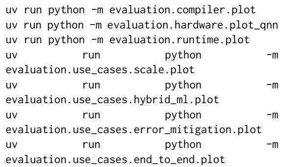

Each section additionally exposes a run.py that regenerates the underlying logs from scratch; expected wall-clock times range from ∼5 min (scale, error mitigation) to ∼30 min (runtime, end-to-end). The Pauli-noise sweep to 150 qubits takes ∼20 min and the 80-qubit Pareto sweep ∼60 min on a single workstation. Full instructions, including the IBM-hardware path, are documented in REPRODUCE.md.