USENIX

THE ADVANCED COMPUTING SYSTEMS ASSOCIATION

# The LogDrive: Composable Durability for Cloud-Based Shared Logs

Gardner Vickers, Lucas Bradstreet, Mahesh Balakrishnan, Prince Mahajan, David Mao, Xavier Léauté, Ismael Juma, Nikhil Bhatia, Jack Vanlightly, Prateek Jindal, Sumit Arrawatia, Andrew Grant, Dhruvil Shah, Dimitar Dimitrov, Gaurav Badoni, Shimiao Zhang, and Yang Yu, Confluent

https://www.usenix.org/conference/osdi26/presentation/vickers

# This paper is included in the Proceedings of the 20th USENIX Symposium on Operating Systems Design and Implementation.

July 13–15, 2026 • Seattle, WA, USA

ISBN 978-1-939133-55-7

Open access to the Proceedings of the 20th USENIX Symposium on Operating Systems Design and Implementation is sponsored by

# The LogDrive: Composable Durability for Cloud-Based Shared Logs

Gardner Vickers, Lucas Bradstreet, Mahesh Balakrishnan , Prince Mahajan, David Mao Xavier Léauté, Ismael Juma, Nikhil Bhatia, Jack Vanlightly, Prateek Jindal, Sumit Arrawatia Andrew Grant, Dhruvil Shah, Dimitar Dimitrov, Gaurav Badoni, Shimiao Zhang, Yang Yu Confluent

## Abstract

A growing class of systems leverages inexpensive cloud object storage as a disaggregated data plane, ofloading durability and scaling to the cloud. Storing the metadata for such systems in a cloud database is too expensive; while selfmanaged databases are complex and fragile. Conflux provides a third option by storing a shared log on cloud storage and using it to replicate state across VMs. A key innovation in Conflux is the separation of durability from sequencing. Durability is provided solely by the novel LogDrive abstraction: a simple, low-level substrate that can be layered above arbitrary cloud storage, striped for throughput, and – unlike shared logs – composed via quorum-based replication. Sequencing is provided by the AtomicLog, which implements a conventional shared log over any LogDrive. This design allows Conflux to replicate arbitrary state machines while using RAID-like compositions of cloud storage for durability. Conflux is deployed in production at Confluent as the metadata service for an S3-based publish-subscribe system called K2. We show that Conflux can run on diverse storage services (e.g., DynamoDB, S3, S3Express) with just a few hundred extra LOC per service; as well as augment the durability of these services (e.g., with synchronous cross-region replication). Conflux unlocks new cost vs. latency trade-ofs over cloud storage: for our representative workloads and latency SLAs (compared to using DynamoDB directly) Conflux-over-DynamoDB slashes metadata cost by 10X and overall cost by 3X.

## 1 Introduction

Cloud storage services such as S3 [8] ofer scalable, elastic, and fault-tolerant data storage at inexpensive prices. As a result, stateful distributed services with rich APIs – ranging from analytical databases to publish-subscribe systems – are increasingly designed as stateless / soft-state layers over disaggregated cloud storage. In such services, the data plane resides directly on cloud storage (e.g., S3), while metadata (e.g., an index) is stored on a separate metadata service; for example, Snowflake stores data on S3 and metadata in FoundationDB [45]. The resulting services have data planes that are cheaper and simpler to build and operate, which translates to cost savings and higher reliability for end-customers.

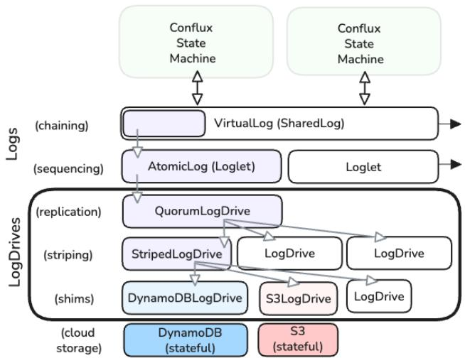  
Figure 1. LogDrives are easy to build as shims over cloud storage, and via RAID-like composition; they are useful for implementing shared logs (and SMR).

At Confluent, we set out to build a new publish-subscribe service called K2 directly over S3, leveraging its inexpensive large writes to enable a high-throughput, low-cost product (called Freight [11]) for customers storing bulk data (e.g., observability traces) at sub-second latencies. In the K2 design, data is written directly to S3 in large, batched blobs; and the unit of metadata is a fine-grained index (an ordered list of pointers for each pub-sub topic). To store this metadata, we needed a durable yet easy-to-operate database that could support small writes (and reads) at low cost (but not necessarily low latency); and expose a convenient API for storing per-topic indexes.

Unfortunately, we found our options limited:

• Operating a stateful distributed database to store metadata is complex and dificult, typically requiring a collection of individual machines (e.g., EC2 VMs deployed via K8s [5]) to ensure durability in the presence of failures. Existing options such as FoundationDB [45], KRaft [6], ZooKeeper [37], and etcd [4] are known to be dificult to operate in production [17,

28]. This complexity is exacerbated by the hybrid nature of the overall system, since the data and metadata planes can each fail in diferent ways; as well as the outsized impact of metadata loss on overall durability.

• Conversely, storing metadata in a cloud database (e.g., DynamoDB [32]) is simpler and safer, but prohibitively expensive for the small, frequent writes and reads found in metadata workloads. We estimated that a DynamoDB-based metadata layer would incur roughly 75% of K2’s overall cost. Further, new and cheaper options can emerge and prices can fluctuate (e.g., S3Express [9] launched in 2024 and changed pricing in 2025 [12]), necessitating dificult, risky migrations between storage services to optimize cost.

In this paper, we present a new metadata store called Conflux. Conflux uses cloud storage as a shared log for State Machine Replication [49]. We apply research on shared logs [2, 18, 19, 22, 31, 44, 52] to construct a replicated state machine over a total order of commands, which in turn is stored on a shared log implemented directly on cloud storage. In this design, the shared log is a consensus engine that delegates durability entirely to cloud storage; drives down write costs by batching log-structured writes; and lowers read cost via materialized local views. By storing the shared log on passive cloud storage, Conflux aims for the benefits of RAIDlike [47] composition over diferent storage services: striping for throughput; replication for higher availability and durability; chaining for dynamic switching of new writes; as well as tiering for migrating older writes.

However, we encountered an unexpected challenge in realizing our goal of delegating durability to arbitrary, diverse, and composable cloud storage. While shared logs can be composed via chaining and striping [18], they cannot be easily or eficiently composed via replication. The reason is the narrow, opinionated append interface, which allows each shared log to decide the timestamps of its new entries: when an entry is appended to multiple logs, each one can assign a diferent, potentially conflicting timestamp. As a result, we were unable to compose single-region DynamoDB logs into a multi-region log; or one-AZ S3Express logs into a multi-AZ or multi-region log. The absence of replication severely hobbles the value of composition (imagine RAID without mirroring!). Ironically, the property that makes shared logs compelling – the delegation of sequencing and durability to a single abstraction – also hinders their composition.

One solution is to separate sequencing from durability: we can introduce a low-level abstraction for durability (such as a shared address space) that is easy to compose via layering, striping, and replication; and layer the shared log above it as a shim, with a soft-state counter (as in Corfu [19]) for tracking the tail. We borrow this principle from other areas of systems: e.g., filesystems layered over block devices composed via RAID [47]. Unfortunately, this moves the burden to recovery:

if the shared log layer experiences failures (e.g., if the counter appears to fail), recovering its soft state – specifically, the linearizable tail – from an address space can be dificult and expensive, particularly in a distributed setting with partial failures and concurrent writes. Adding special APIs to the address space (e.g., to fence concurrent writes and return the first unwritten entry, as in Corfu’s custom storage servers) hinders its implementation over passive cloud storage and easy composition. Required is an abstraction for shared log durability that is composable, yet enables recovery.

Accordingly, we propose a new abstraction called the Log-Drive. Like a conventional address space, the LogDrive exposes a numbered, random-write address space of durable registers. However, the LogDrive expects to be written (almost) in sequence: accordingly, it provides an extra weakTail API. The LogDrive has unusually weak semantics: e.g., individual addresses are only linearizable as long as a single value can possibly be written to them, and hence weaker than Write-Once, Conditional, or Atomic Registers [16, 24]. In addition, the weakTail call (as its name implies) is not necessarily linearizable; instead, it is only required to correspond to a deterministic function over a non-atomic, unordered scan. The LogDrive abstraction is easy to implement: the compact API and its weak semantics allow layering over existing cloud storage APIs (even without write-once or conditionalwrite support); and composition via single-round quorums and striping.

At the same time, the LogDrive abstraction is powerful and useful. We describe a new shared log design called the AtomicLog that combines the LogDrive with a soft-state counter and a windowed write discipline. The result is a full-fledged, linearizable shared log, which in turn can be used for State Machine Replication. By composing LogDrives via replication, we can augment the existing intra-region durability of cloud stores with cross-region quorums. For example, we can run a single DynamoDBLogDrive per region; and then construct a QuorumLogDrive that writes to two out of three regions before responding.

Conflux breaks new ground in a number of ways. The LogDrive (in concert with the AtomicLog) is the first solution for composing shared logs via replication; prior work such as Delos [18] stopped at composition via striping and concatenation. Earlier systems [7, 18, 19, 31] have explored disaggregated shared logs implemented over collections of custom servers, whereas Conflux uses common-denominator cloud storage APIs. Prior work such as LazyLog [44] temporally separates ordering and durability within a shared log for performance, whereas Conflux spatially separates these concerns into diferent layers for composability. Scalog [31] separates sequencing from durability for performance, but its sequencing layer is a stateful SMR-based metadata layer in itself.

In this paper, we make the following contributions:

• We describe the design and implementation of Conflux, the metadata service for a new S3-based publish subscribe system called K2. Conflux uses cloud storage as a shared log, reducing the metadata cost by 10X compared to using DynamoDB directly, within a p99 write latency of 130ms; and the overall K2 cost by 3X.

• We propose a novel LogDrive abstraction that allows Conflux to easily run on diverse cloud stores (S3, DynamoDB, S3Express) and switch dynamically between them. New LogDrives are easy to build: for example, a single engineer was able to build a production-quality DynamoDBLogDrive in just a week.

• The LogDrive can be composed via replication (as well as striping): we show that this lets us construct multiregion quorums over DynamoDB, as well as multi-AZ quorums over S3Express.

## 2 Motivation

At Confluent, our goal was to build a Kafka [40] publishsubscribe (or pub-sub) implementation directly over cloud storage. Kafka is the de facto API for modern pub-sub systems, with thousands of production use cases. Applications can publish data to a topic and fetch data from it (in practice, Kafka refers to a topic as a partition and a bundle of partitions as a topic; but we match terminology with the pub-sub literature [33] by referring to a topic as a single total order). Existing implementations of Kafka are typically complex distributed systems that run directly on hardware for low latency workloads, with a resulting operational cost that is passed on to customers.

Our goal in building a new Kafka implementation was twofold. First, we wanted to exploit high-latency but low-cost cloud storage to ofer an inexpensive, bulk variant of Kafka to our customers (called Confluent Freight [11]). In particular, S3 provides cross-AZ durability for writes at a fixed cost regardless of payload size (in contrast to EC2 cross-AZ networking, which is charged per-byte), creating an opportunity to slash cost via big writes. Second, we hoped to get the ancillary benefits of running stateless logic above cloud storage, such as simpler operations and better reliability.

In this Kafka implementation (called K2), clients connect to stateless brokers (i.e., servers that implement the Kafka protocol). To publish data to a topic, a client sends it to a broker; once the broker has a large enough batch that typically spans writes to multiple topics, it issues a single write to S3 for the batch and then updates the metadata for all those topics. In this architecture, much of the heavy lifting is done by the metadata layer. Our default option for storing metadata was to build or buy a distributed database, deploy it on cloud VMs using K8s, and operate it with high reliability (e.g., matching Snowflake’s use of FoundationDB [45]). However, this option would require a massive investment in time and resources, and considerably delay our time to market. Could we do better by using cloud storage for metadata as well?

Why not store Metadata directly in a cloud DB? Cloud databases like DynamoDB are powerful, reliable, and capable of handling our metadata workload: each K2 topic’s metadata can simply be a key in DynamoDB. However, existing databases turned out to be prohibitively expensive: for example, our estimates suggested that we would spend 75% of our cloud cost just on metadata storage if we used DynamoDB. One reason for high cost is that the metadata workload consists of small writes to diferent keys (e.g., if an K2 broker combined data for 10 topics in a single S3 batch, we’d have to issue 10 separate writes to the metadata layer). A different concern relates to reads; metadata is often accessed repeatedly as clients and background processes replay the topic state. In the absence of (potentially complex) caching infrastructure, these accesses blow up read costs.

In addition, we needed fast reaction times to changes in cloud pricing and features. Unlike the data plane, which requires a minimal put/get interface from cloud storage, metadata can benefit from rich APIs for indexing. However, using such APIs would limit the portability of our code to other cloud providers, or to other storage options at the same provider if prices changed; in addition, adding new metadata APIs would require careful implementation on each backend.

Could we somehow obtain the benefits of storing metadata in cloud storage (i.e., delegating durability entirely to the cloud provider); while at the same time keep our cost low?

## 2.1 The Cloud is the Log!

In a shared log design, we execute multiple copies of a database on individual servers; and keep these copies synchronized via an external shared log. In principle, the log is the source of consistency as well as durability (storing the linearizable order of commands); the database is simply a materialized cache over the log. This clean, API-driven separation between the soft-state database and the durable shared log allows us to easily place the latter on cloud storage, entirely delegating durability to the cloud.

Using cloud storage as a shared log eliminates costly small writes: we can batch metadata updates for multiple topics and issue them in a single write to the shared log. Since each database server efectively has a full, strongly consistent copy of the database, we can serve reads with low cost (and low latency) without unnecessarily accessing cloud storage. In addition, we access cloud storage through a narrow API (the API of the shared log does not change over time even as we add new APIs to our database).

Unfortunately, we ran into a fundamental limitation of the shared log abstraction’s append interface: composition via replication. Consider the task of composing a replicated shared log ?? over two individual shared logs ?? and ??. Trivially, we could implement the append operation on ?? by forwarding it to both ?? and ??; however, there is no guarantee in the shared log API that we will obtain the same timestamp from both (such a guarantee would be dificult to obtain, given that the implementation could choose to embed internal protocol details such as membership epochs in its timestamps [7]). Further, if one of the two appends is delayed, retrying it incurs the risk of duplicate entries with diferent timestamps. In addition, concurrency poses a challenge: we have to issue the appends one-at-a-time, else they could arrive at the logs in diferent orders.

interface LogDrive {   
void write(long address, ByteBuf payload);   
ByteBuf read(long address);   
TailDesc weakTail(int K);   
struct TailDesc {   
long nonContiguousTail;   
Set<Long> holes;   
}   
}  
Figure 2. The LogDrive API

These issues can be solved if ?? entirely ignores the timestamps / ordering provided by ?? or ?? and instead embeds application-level timestamps into entry headers. However, playback now requires re-ordering of entries, negating the simplicity benefit of the shared log abstraction. In addition, the replicated log needs a source of these external timestamps; using an explicit sequencer turns composition into a complex, heavy-weight layer (in contrast to a light-weight, RAID-like shim that can be nested arbitrarily).

Why is composition via replication so important? Our use cases for K2 spanned the durability gamut: some applications were okay with data loss if a single AZ failed; others required multi-AZ durability within a single region; while some mission-critical use cases required zero data loss even if an entire region failed. These requirements compli cated our path to using existing services like S3, DynamoDB, or S3Express for storing metadata; since S3 and DynamoDB do not currently support synchronous cross-region replication; while S3Express does not support cross-AZ replication. The ability to compose shared logs via replication would allow us to leverage the existing machinery of these services within regions (in the case of DynamoDB or S3) and AZs (with S3Express) while augmenting it with cross-region or cross-AZ replication, respectively. Even if these systems provide synchronous cross-region replication as an option (e.g., DynamoDB enabled support in mid-2025), we would have more flexibility in a compositional layer (e.g., to use diferent policies or placements) and retain the ability to migrate between clouds or even span clouds.

## 3 The LogDrive Abstraction

The LogDrive is a novel abstraction that can be easily implemented on cloud storage and composed via replication and striping. We now describe the LogDrive API and its various implementations. In later Sections, we explain the utility of the LogDrive for State Machine Replication.

## 3.1 The LogDrive Abstraction

The LogDrive is an address space of registers with a random read/write interface (see Figure 2). Addresses are initialized to an unwritten state; a write switches them to a written state. In Figure 3, we show the anatomy of a LogDrive: the contiguous tail (T ) is the first unwritten address before which all addresses are written; the non-contiguous tail (N ) is the first unwritten address after which all addresses are unwritten; and in between is a “swiss cheese” area of intermixed written and unwritten addresses. We call the unwritten addresses less than N the hole-set (H ).

Two features distinguish the LogDrive from a conventional address space. The first is the weakTail API, which returns a tuple with (N , H ): the non-contiguous tail and the hole-set. Note that the caller can compute the contiguous tail T from the returned tuple: it is guaranteed to be the lowest address in H , or N if H is empty. Informally, we will refer to T as returned by weakTail even though it is a derived value. Importantly, the application provides a parameter ?? to weak-Tail, which is the maximum possible distance between T and N. The application typically knows and ensures this bound by using a windowing discipline to write to the LogDrive. As we see later, this bound is critical for implementing weakTail eficiently, giving the implementation license to ignore the prefix of the address space while determining H. As long as the ?? bound is correct, the weakTail response entirely characterizes the written/unwritten status of each address in the LogDrive. Note that |H | is bounded by ??: this API is only practical for small ??.

The second distinguishing characteristic of the LogDrive is the unusually weak semantics it provides, on two dimensions. First, individual addresses are single-value registers: i.e., they are only linearizable for write/read operations if a single value is written to them (though the same value can be written multiple times). We rely on the application to never write multiple values to an address. In this sense, they are similar to SWMR registers [41] or write-once registers [34] but with significantly weaker semantics. Second, the weakTail is not linearizable; instead, it is merely equivalent to a deterministic function over an unordered, non-atomic scan (e.g., executed via parallel point reads) on the address space. This guarantee has other parallels in the literature: e.g., non-atomic collects [15] on SWMR registers and intervallinearizability [27].

Lemma ([LD.1] Tail-Range Guarantee). Let a weakTail operation run over a linearization span [??start, ??stop], such that Tstart and Tstop denote the actual contiguous tail at those times. Then the value T returned by weakTail satisfies:

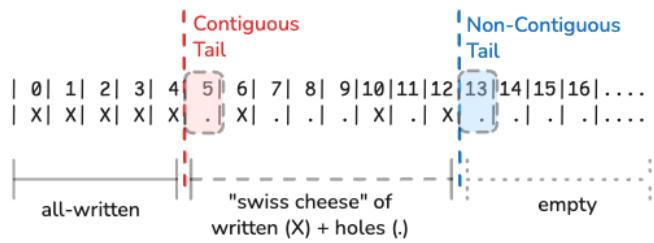  
Figure 3. The Anatomy of a LogDrive.

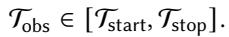

Proof sketch. Consider a weakTail implementation that literally scans for holes by issuing point reads in parallel to the entire address space. During the scan, diferent addresses are sampled at diferent times in [??start, ??stop]. Suppose Tobs < Tstart. Then the scan must have observed address Tobs unwritten at some time ?? ≥ ??start, which contradicts the definition of Tstart as the first unwritten slot at ??start. Similarly, if Tobs > Tstop, then the scan must have observed all addresses < Tobs as written strictly before ??stop. But then Tstop cannot be the first unwritten address at ??stop, a contradiction. Thus Tobs must lie within [Tstart, Tstop]. Full Proof in Appendix. □

However Tobs is not necessarily linearizable, since writes on the LogDrive can linearize out of address order: e.g., let us say we write to 1 and then 0 (causing the contiguous tail to jump from 0 to 2). A weakTail concurrent with both writes might return 1 if it first reads 1 as unwritten and then 0 as written. But this execution does not correspond to any total order of the two writes and the weakTail.

Lemma ([LD.2] Window Scan Property). To satisfy weak-Tail semantics, it is suficient for an implementation to first determine the non-contiguous tail linearizably; and then issue an unordered, non-atomic scan to the ??-sized window of preceding addresses. The value returned by this window scan is equal to the value returned by some unordered, non-atomic scan over the entire address space.

Proof sketch. Reading the non-contiguous tail N linearizably tells us that, at some instant ?? ∗ during the operation, all written addresses lie in [0, N ∗) and all addresses ≥ N ∗ are still unwritten. Under the ??-window discipline, there can be at most ?? holes before N ∗, so the hole-set at ??∗ must lie entirely inside [N∗ − ??, N∗], and every address < N∗ − ?? is definitely written. We can therefore construct an equivalent full, unordered, non-atomic scan by (i) using the issued window reads in [N ∗ − ??, N ∗], and (ii) using hypothetical reads issued at time ??∗ that returned written below the window and unwritten above it. The returned non-contiguous tail and hole-set from this hypothetical full scan exactly match those found by the window scan. Full Proof in Appendix. □

## 3.2 Primitive LogDrive Implementations

The compact API and weak semantics of the LogDrive simplify its implementation on existing cloud storage. Singlevalue registers are trivial to implement over any existing key-value store (even ones that do not provide conditional put operations, such as S3 prior to 2024) or even shared disks.

As a result, the only complexity in implementing a Log-Drive on an existing cloud store has to do with the weak-Tail call to find its contiguous tail. In practice, we find that existing cloud stores give us eficient ways of finding the non-contiguous tail; and can scan back ?? entries to find the contiguous tail, as we describe:

S3: Each LogDrive is assigned a particular prefix in an S3 bucket (the combination of bucket and prefix uniquely identifies the LogDrive). Within that prefix, we reverse-encode addresses as S3 keys (e.g., so that the 0th address is lexicographically last). S3 gives us the ability to list keys in lexicographic order. Accordingly, we can list the first ?? keys to obtain the last ?? written slots, which we then invert to return the list of holes in the last ?? slots. By Lemma LD.2 (Window Scan Property), this is suficient to return a correct weakTail response.

DynamoDB: We use composite keys to encode LogDrive entries: each LogDrive to a particular partition key, and each address is encoded as the sort key. Unlike S3, we don’t need to reverse-encode, since DynamoDB lets us query items in either lexicographical order. By Lemma LD.2 (Window Scan Property), this is suficient to return a correct weakTail response.

S3Express: This storage service is nearly identical to S3, except for its single-AZ durability and some diferences in API semantics. One diference is that we can no longer list keys in lexicographical order [10]. To get around this, we create a directory-like hierarchical structure on the S3Express key space. We then enumerate all entries at each level of this hierarchy to route to the non-contiguous tail; and then scan backwards ?? entries to find the contiguous tail. By Lemma LD.2 (Window Scan Property), this is suficient to return a correct weakTail response.

## 3.3 The StripedLogDrive

Striping the LogDrive is straightforward for writes and reads: we implement RAID-0-style striping to map from global addresses (on the StripedLogDrive’s address space) to local addresses on ?? individual stripes. Note that a stripe here is a LogDrive instance, implemented over a cloud store as described above.

To implement weakTail on the StripedLogDrive, we invoke it on all stripes in parallel and wait for all responses. We pass in ??/?? as the parameter to the per-stripe weakTail calls; we require ?? to be a multiple of ??. We convert all returned local addresses to global addresses; and then pick the maximum returned global non-contiguous tail, along with the union of all the returned hole-sets.

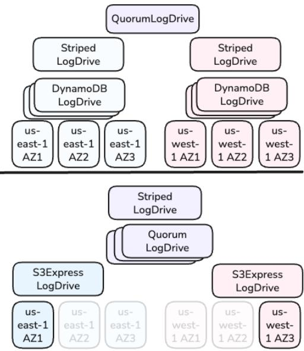  
Figure 4. Replication over Striping, similar to RAID-10 (Top); Striping over Replication, similar to RAID-01 (Bottom).

Theorem ([SLD.1] Striped LogDrive Preserves weakTail Semantics). The weakTail implementation of the StripedLog-Drive, described above, satisfies the LogDrive weakTail semantics: it is equivalent to the result of some unordered, non-atomic scan over the global address space within the linearization span.

Proof sketch: The weakTail call on each stripe is equivalent to an unordered, non-atomic scan on its own local address space (corresponding to a stripe of the global address space). We can construct an unordered, non-atomic scan on the global address space by combining these per-stripe scans, translating each local address to its global equivalent. Picking the maximum non-contiguous tail returned across all stripes is equivalent to choosing the non-contiguous tail from that global scan; the union of all the returned hole-sets is equal to the hole-set on the global address space. Full Proof in Appendix. □

## 3.4 The QuorumLogDrive

The QuorumLogDrive (or QuorumDrive for short) replicates data across a quorum of ?? LogDrive replicas. Note that a replica here is a LogDrive instance, implemented over a cloud store as described above. The QuorumDrive is configured with a write quorum size ????, which can range from [1, ?? ].

On a write, the QuorumDrive forwards the command to all replicas. As an optimization, we can also hedge [29] by sending to a specific ????-sized subset and contact more repli cas if responses are delayed. Once ???? nodes ack, we can ack the write; as a result, writes ack in one round-trip to a write quorum. Since only one value can possibly be written to a single-value register, we avoid a two-round protocol like ABD [16] for Atomic Registers.

The weakTail call needs a conventional read quorum to intersect with write quorums: ???? = ?? − ???? + 1. At the same time, it has to “repair” writes [16] to enforce a write quorum for any observed partial writes. Practically, the weakTail accesses a quorum of size ???? = ?????? (????, ???? ) to invoke weakTail locally on each one. However, determining the global state from the responses is more involved than in striping: just because we observe a local hole at a single replica does not mean that corresponding global address was a hole at any time during the weakTail’s linearization span. The replica could have merely missed that write by being temporarily inaccessible.

Accordingly, we examine each slot to determine if it is a global hole. For each slot in the address space, we can determine the global written / unwritten status as follows.

1. We see that the slot is unwritten on ???? of replicas. We mark it as globally unwritten.

2. We see that the slot is written on ???? of replicas. We mark it as globally written.

3. We cannot determine if the slot is globally written or unwritten (i.e., we do not see ???? written or ???? unwritten replicas). This happens if we can only access ???? replicas and we are unable to determine the slot’s global status without the inaccessible replicas. In this case, we repair the write by copying over the value to ???? replicas and mark the slot as globally written.

Based on our determination of the global status of each slot, we can then return a weakTail response.

Windowing discipline on the global address space has two implications for this algorithm. First, we can run the algorithm in ?? (???? ∗ ??): we start from the highest returned non-contiguous tail and examine only the ?? global addresses prior to it, since everything prior to that is guaranteed (by the application, via the weakTail parameter) to be lower than the global contiguous tail, and hence globally written. Second, relaying ?? to the per-replica weakTail calls instructs them (in their own weakTail implementations) to ignore anything prior to N-??: even though they may have local holes at these addresses, the application (in this case, the QuorumDrive) knows these to be globally written.

Theorem ([QLD.1] QuorumLogDrive preserves weakTail semantics). The weakTail implementation of the QuorumLog-Drive, described above, satisfies the LogDrive weakTail semantics: it is equivalent to the result of some unordered, non-atomic scan over the global address space within the linearization span.

Proof sketch: A weakTail call issues a weakTail to a quorum of replica LogDrives. By the weakTail spec, each replica responds with a full (unordered, non-atomic) characterization of its address space. In efect, we observe the status of every address in each responding LogDrive at some (diferent) instant within the linearization span. Any slot that we mark as globally unwritten must have been globally unwritten at the start of the linearization span. Any slot that we mark as globally written must be globally written by the end of the linearization span. As a result, we can construct a full (unordered, non-atomic) scan of the entire global address space with a linearization point for each individual written or unwritten entry within the linearization span. Full Proof in Appendix. □

interface Loglet {   
Pair<LogPos, SealStatus> checkTail();   
LogPos append(ByteBuf buf); //throws if sealed   
void seal();   
LogPos prefixTrim(LogPos trimPos);   
ByteBuf readNext(LogPos min, LogPos max);   
}   
Figure 5. The AtomicLog API (== Delos Loglet API [18]).

## 4 Implementing a Shared Log over the LogDrive: The AtomicLog

Thus far, we have established that the LogDrive abstraction is easy to implement and compose. We now show that the LogDrive is also a useful abstraction that can support a conventional shared log.

In particular, we implement the Loglet API from Delos [18] (see Figure 5) verbatim. The Loglet API supports linearizable append, checkTail, and readNext calls. It also provides a linearizable seal call, which ensures that subsequently linearized appends do not acknowledge successfully. The Loglet is required to be highly available for all calls except append. In particular, checkTail has to be highly available and linearizable with appends, efectively returning the first unwritten log position. As shown by Delos, this API can be layered under a virtualization layer that provides high availability for appends; and support eficient, safe, and highly available State Machine Replication in production systems. Accordingly, we start by describing the AtomicLog in this Section, which implements the Loglet API over a LogDrive; and then describe how we virtualize it for high availability.

The AtomicLog is a stateless client-side library that interacts with two components: the LogDrive and a shared, soft-state sequencer object. The sequencer supports a simple acquireSlot / completeSlot API. It does not see any data payloads and does not have to be durable or highly available. There can only be one sequencer in an AtomicLog instance; if it fails or reboots, the AtomicLog becomes permanently unavailable for appends. Accordingly, it can be implemented as an RPC service collocated on one of the AtomicLog clients.

To append, a client first calls acquireSlot on the sequencer to obtain the next slot; writes to the LogDrive; and then calls completeSlot; before acking the append. The state of the sequencer is a combination of a counter and a window of in-flight writes. If an incoming acquireSlot finds that the window is full — i.e., there are more than ?? slots between the contiguous tail and the non-contiguous tail – it blocks until the window opens up (i.e., a write completes that moves the contiguous tail moves forward). In turn, each completeSlot blocks until all prior slots are completed.

In practice, this protocol ensures that the AtomicLog writes to the LogDrive within a ??-sized sliding window. For example, in Figure 3, the AtomicLog (configured with ?? = 8) has to block before writing to address 13 since address 5 has not been written yet. As a result, it enforces a bound of ?? on the distance between the contiguous and non-contiguous tails of the LogDrive.

In this protocol, the linearization point of an append is determined by the completeSlot. In other words, appends linearize in strict address order: an append returning position 5 must linearize after an append that returns position 4 and after an append returning position 6. As per the Loglet contract, the append is not highly available (e.g., the sequencer can fail; or clients can crash after acquiring a slot); we discuss soon how unavailability is handled at a higher layer. However, the Loglet API does require a highly available, linearizable checkTail that returns the first unwritten log position.

Implementing checkTail is trivial: we simply invoke weakTail on the underlying LogDrive. Surprisingly, the returned contiguous tail gives us a linearizable checkTail for the AtomicLog, even though the LogDrive’s weakTail is not itself linearizable.

Theorem ([AL.1] checkTail Linearizability). The AtomicLog checkTail operation, implemented via a single weakTail on the underlying LogDrive, is linearizable with respect to append.

Proof sketch: Appends linearize in strict address order. A checkTail invoked over interval [??start, ??stop] returns Tobs ∈ [Tstart, Tstop] (since the enclosed weakTail satisfies these bounds, by Lemma LD.1). Placing the checkTail immediately after all appends to addresses < Tobs yields a total order consistent with real-time and with the returned value. Thus checkTail is linearizable wrt append. □

Intuitively, the LogDrive write / weakTail API is not linearizable since writes do not commit in address order, and hence it is not always possible to generate a candidate total order that satisfies returned values as well as a sequential specification; whereas append / checkTail is linearizable due to the blocking behavior of appends on prior unwritten slots.

Finally, we provide a highly available seal to satisfy the Loglet API. For this, the AtomicLog stores a seal bit in a designated location on cloud storage (e.g., as address 0 on a second LogDrive). Each append checks this bit after completeSlot and throws if the log is sealed, while checkTail checks it after the weakTail and returns the seal status. To seal the AtomicLog, we simply write to this location. As per Delos, the seal checks are not required to be atomic with the append or checkTail, though they must not be linearized before [35]. We omit describing readNext and prefixTrim for lack of space.

Optimizing checkTail: The protocol described above can be ineficient since weakTail requires accessing cloud storage. We can drastically reduce the common-case cost and latency of checkTail by using a fast-path checkTail that goes to the sequencer rather than the LogDrive. We only use the weakTail on the LogDrive as a slow-path once the log is sealed. If the sequencer is unavailable, we first seal the log; and then switch to the slow-path.

We do have to be careful in this case to avoid having two sources of truth for the tail. For example, a slow-path response might see a tail ?? on the LogDrive; but a subsequent, non-overlapping fast-path checkTail invocation can return ?? − 1 as the tail, resulting in a linearizability violation (for example, if the writer of entry ?? − 1 went to sleep after writing to the LogDrive but before calling completeSlot on the sequencer).

To avoid such linearizability violations, the checkTail uses the fast-path sequencer-based tail check before accessing the seal bit; if the seal bit is set, the client retries the tail check on the slow-path. As a result, once the seal bit is set, all subsequently linearized checkTail operations return values from the slow-path.

Handling Failures via Virtualization As in Delos, we layer a VirtualLog above the AtomicLog to convert our Loglet (which does not provide high availability for appends) into a highly available shared log that can drive State Machine Replication (see Figure 6 for the full stack). Our VirtualLog is not novel: it is identical to the Delos design and imple mentation, storing membership (i.e., the mapping from the VirtualLog’s address space to individual Loglets) in a conditional register on cloud storage. For each Loglet, we store the configuration of the corresponding AtomicLog instance (including the underlying LogDrive – or multiple layered LogDrives – as well as the endpoint of the sequencer). Above the VirtualLog, we use a conventional SMR layer similar to Delos, which stores durable snapshots in cloud storage; we describe this layer in the next section.

When the Loglet (i.e., the AtomicLog) becomes unresponsive for appends, we simply seal it; call checkTail to determine the switchover point; and then write a mapping to the conditional register so we can switch to a new Loglet (either another AtomicLog or an entirely diferent implementation) for new appends. Within the AtomicLog, there are two failure cases of interest. First, the sequencer can fail. Second, a client can fail after acquiring a slot (efectively making the sequencer unavailable, since acquireSlots can no longer complete). We treat both these cases identically; in both cases, the Loglet becomes unavailable for append calls. Our choices here are identical to those made in prior work (e.g., the Delos NativeLoglet).

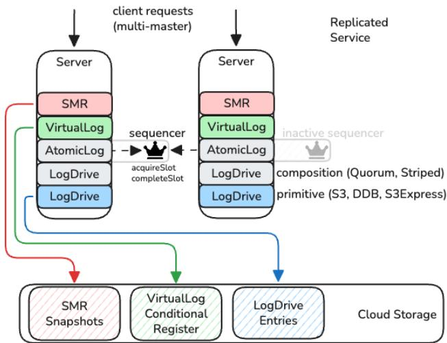  
Figure 6. SMR via LogDrives: each SMR-replicated server stores all its hard state in cloud storage. Servers do not interact via RPCs at any layer, with the exception of the soft-state sequencer in the AtomicLog.

## 4.1 Discussion

Test-Driven Design: We created an extensive simulation testing framework for our shared log implementations. In this framework, we spin up a range of concurrent workloads against the shared log API in Figure 5; execute the workloads against a given target implementation of the API (e.g., the VirtualLog on an AtomicLog on a QuorumLogDrive) with failure and delay injection; and then check whether the resulting execution is linearizable.

Interestingly, this simulation testing drove many of our design insights. For example, we had initially assumed that the LogDrive would have to provide a linearizable weakTail; it was only after a pagination-induced linearizability violation in our S3LogDrive went uncaught in the AtomicLog sim-test that we realized we did not need weakTail linearizability: the AtomicLog was linearizable even if LogDrive was not. As an aside, our simulator also independently discovered a seal check ordering bug in the VirtualLog protocol described subsequently by the Delos team [35].

Low-Latency AtomicLog: As described, the AtomicLog uses the LogDrive abstraction to extract, augment, and scale durability (e.g., via quorums and striping) from external cloud storage. In one extreme, we use a primitive LogDrive (e.g., S3LogDrive) directly under AtomicLog, without further stacking. In principle, Conflux should also be able to support the other extreme, where we rely entirely on stacked Log-Drives to provide durability over a non-durable primitive LogDrive.

To test this hypothesis, we implemented another primitive LogDrive: a simple, single-node LogServer that implements the LogDrive API via RPC, storing state on a local SSD without further replication or striping. We obtain replicated durability by layering a QuorumLogDrive on top (which writes to a quorum of LogServers); and scale throughput via a StripedLogDrive. This resulting AtomicLog deployment is equivalent to a conventional shared log implemented on servers, allowing us to trade of operational overhead for lower latency within the same codebase.

## 5 Conflux and K2

We now describe how we built a metadata store called Conflux over the AtomicLog / LogDrive abstractions; and how we used it to power K2, a new Kafka implementation that stores data in S3 and metadata in Conflux.

## 5.1 The Conflux Metadata Store

Conflux has a shared log design, nearly identical to Delos [18] and borrowing from other shared log systems from research and industry. A Conflux service consists of one or more servers, each of which stores a local, single-node database (in production we use RocksDB [26]); and a single Virtual Log that each server can append to and read from. Conflux implements State Machine Replication [49] over the VirtualLog (as shown in Figure 6): updates to the service can be sent to any server; which appends an entry describing the update to an external shared log; and then synchronizes its local state with the shared log by calling readNext and applying new updates (until it executes the one it just added). Read-only queries can be served by any server, which calls checkTail on the shared log to establish a linearization point; and then synchronizes its local state until that tail position; before serving the query from local state. This simple protocol results in a replicated, linearizable database where both ordering and durability are delegated entirely to the external shared log, which is essentially the linearizable or strictly serializable total order of updates to the service. In principle, we can reconstruct state by replaying the shared log from the beginning on a new server; in practice, we frequently checkpoint state to cloud storage and trim the shared log, so that only a small sufix of the log has to be replayed on recovery.

By default, Conflux is a multi-master database that stores input commands (prior to execution) in the shared log and executes them (deterministically) on playback; but also supports modes where servers execute commands and append speculative outputs to the log [21]; or a single server (elected via the log itself) acts as a primary and stores non-speculative outputs in the log. In multi-master mode, reads have to wait for at least one round-trip to check the tail of the shared log; we use a “bus-stand” optimization [17] to amortize the bandwidth cost of this check, with many reads queueing up behind a single “bus” that checks the tail periodically.

Above the shared log, Conflux uses a stack of SMR layers [20]. These layers include logic for time/size-based batching and observability. The top-most SMR layer is the applica tion, which can expose any arbitrary API. Later in the paper, we describe the specific API we implement on Conflux to support its primary use case as the K2 metadata store.

As described earlier, Conflux implements the VirtualLog abstraction from Delos, which separates reconfiguration from sequencing and durability (Figure 1 showed this separation of concerns earlier in the paper). The VirtualLog stitches together a number of Loglets into a single shared log. As a result, Conflux can switch from one Loglet to another without downtime, dynamically changing the underlying storage backend. The membership of the VirtualLog (i.e., the sequence of Loglets and the address ranges they cover) is stored in an external conditional register, which is the ultimate (and only) source of consensus in the system; in Conflux, this register is stored directly on DynamoDB (cost is not a concern since the state is small and only accessed on node reboots and reconfigurations).

## 5.2 The K2 Pub-Sub System

We now describe how we used Conflux to power K2, a new Kafka implementation that stores data in S3 and metadata in Conflux. K2 consists of a collection of servers called brokers (mirroring Kafka parlance) that implement the Kafka protocol. Clients can connect to brokers to publish data to a topic; and fetch data from the topic. As mentioned previously, Kafka uses the term ‘partition’ to refer to topics; but we use the classical definition of a topic as a single total order. Each broker collects incoming publish requests (across diferent topics) into a large batch to write to S3; and then updates metadata stored in Conflux. On a fetch request, the broker consults metadata in Conflux to retrieve the location of the requested data, and serves the data by reading S3.

Over time, brokers can access and rewrite state in S3: to switch it from the initial write-optimized format to a readoptimized one; to compact topics (i.e., remove overwritten updates to the same fine-grained key); or to build additional indexes over the topic for data lake formation. This background activity can be isolated on a separate pool of background brokers, or be collocated on the client-facing brokers.

In principle, any broker can respond to a publish or consume request for any topic. In practice, we shard the space of hashed topic IDs into ordered ranges [14], and assign diferent ranges to sets of brokers (typically one per AZ, to enable zone-aware routing from clients that minimizes inter-AZ data transfer costs). Afinitizing brokers to topics enables better locality within the initial write batches, which in turns results in more eficient background processing; and simplifies caching for reads. Brokers are not required to be durable – we can reconstruct the system entirely from S3 and Conflux – but do maintain soft-state caches of data.

interface K2MetaStore { long appendDataRef(TopicID id, DataRef newData); DataRef fetchDataRef(TopicID id, long address);   
}

Figure 7. Simplified subset of API exposed by Conflux to K2.

## 5.3 Conflux in K2

As noted earlier, Conflux is a general-purpose SMR system that can replicate any deterministic service with an arbitrary API. To support K2, we implement a particular service called the K2MetaStore. In the remainder of this discussion, we use Conflux interchangeably with K2MetaStore (until we introduce other APIs). Figure 7 shows the subset of this API used in the critical path of publish-subscribe requests.

For each topic, Conflux stores an ordered list of pointers called DataRefs. To a first approximation, a DataRef is a pointer to some external piece of data. Accordingly, when a broker stores data in S3, it creates an S3DataRef – a pointer to a portion of an S3 object – and then sends it to Conflux, which adds it to the ordered list.

Logs on Logs: Each ordered list in Conflux can be viewed as a fine-grained shared log within a state machine, which in turn is replicated over a coarse-grained shared log. We exploit this log-on-log structure by using a common API for both layers: the ordered list of DataRefs implements a read-only subset of the API in Figure 5, as does each individual DataRef. Using a common API at diferent layers has a number of practical implications. For example, we were able to augment our test coverage for Conflux by reusing our sim-test framework from Section 4.1 to run against a single topic, testing the entire stack end-to-end for linearizability. Practically, a common base API for both the fine-grained application-level construct and the coarse-grained replication log allowed us to reuse code: oncall tooling, wrappers for observability, composition, and interception; reusable benchmarking logic; etc. In making this choice, we were inspired by a familiar pattern in OS design: e.g., virtual disks and physical disks.

In addition, DataRefs are not necessarily just passive pointers to S3 blobs; as shared logs, they can be backed by complex systems. This allows Conflux to delegate indexing for a prefix of the topic: e.g., to a prior Kafka deployment (for migration) or to a data lake format on S3 (for tiering cold metadata).

Sharding in Conflux: In production, we compose multiple Conflux instances into a larger, sharded instance, for scaling throughput and capacity. We use an identical sharding scheme to the K2 brokers, to maximize locality between brokers and Conflux shards (to minimize the fan-out between a broker and the number of Conflux shards it interacts with).

Re-sharding is currently done via a conventional transaction protocol that locks and moves sub-ranges of hashed topic IDs from one shard to another. We are currently exploring ways to exploit the log-like nature of the state machine for faster moves: e.g., we can virtualize a topic’s index to span physical segments on diferent shards. This is similar to the shared log virtualization we use in the consensus layer, echoing Lampson’s principle of “use a good idea twice” [43].

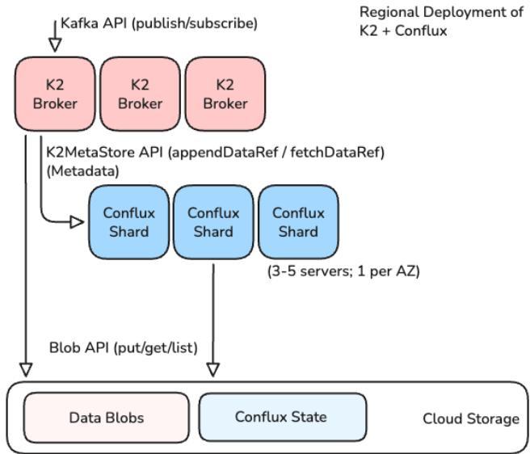  
Figure 8. K2 servers store data blobs in cloud storage and metadata in Conflux. (See Figure 6 for the structure of a single Conflux shard).

Other APIs: To support other parts of the Kafka protocol, we implemented two other separate APIs on Conflux in addition to the K2MetaStore. The first is a K2GroupService which implements the group coordinator abstraction in Kafka, responsible for managing groups of consumers fetching from a bundle of individual total orders (i.e., which Kafka calls a topic; or equivalently a bundle of conventional pub-sub topics), mapping consumers to total orders and tracking cursor ofsets. The second is a K2TxService, which implements a coordinator for implementing Kafka transactions.

In production, we deploy a single Conflux service for each of our three APIs within a region. Each such regional Conflux deployment consisting of multiple shards. Each shard is replicated across multiple Conflux servers (typically one per AZ, such that we have between 3 to 5 servers, depending on the AWS region).

## 6 Evaluation

We present an evaluation of Conflux using a combination of production and benchmarking data. All our deployments run on AWS EC2 instances deployed via K8s [5], using EBS drives for network-attached storage. In all experiments, we have production-grade logging and monitoring enabled via Datadog [3]. In our single-region tests, each Conflux deployment consists of one server per AZ (for example, in us-west-2 we run four servers), while clients are distributed across all AZs. Since Conflux servers store only soft state, the number of servers has no durability implications. In our multi-region tests, we continue to run our deployment entirely on uswest-2, but synchronously mirror data to two other regions: us-east-1 (∼60ms away) and eu-east-1 (∼120ms away).

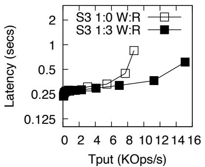

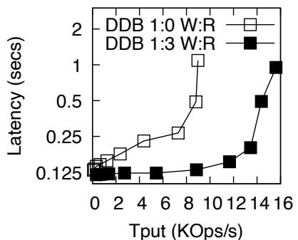

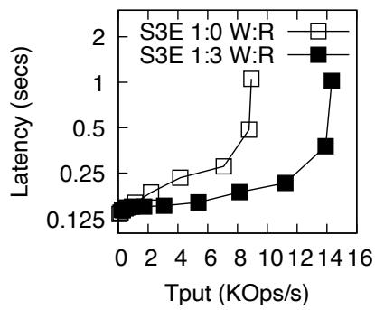  
Figure 9. Conflux can run on S3 (Left), DynamoDB with Striping (Middle), and S3Express with Quorums (Right).

In our cost and latency comparisons, we include a hy pothetical DynamoDB strawman for the Conflux API. We assume that each appendDataRef results in one write to DynamoDB; and each fetchDataRef is one read. In practice, implementing a production-ready shim on DynamoDB would require non-trivial engineering efort (e.g., concurrency control between competing appendDataRef calls); however, this simple model gives us a lower bound on achievable latency and cost.

In our production workloads, the average write size to Conflux is 165 bytes; and the write:read ratio is typically 1:3. In our benchmarking setup, we use m6g.xlarge EC2 instances; we omit details of our production servers. We use three cloud storage backends in our experiments. S3 and DynamoDB provide durability against AZ failures, while S3Express can lose data with one AZ failure.

In our setups, we vary the LogDrive used by Conflux, but use S3 to store snapshots every 10 minutes (so that the shared log does not have to be replayed from the beginning). By default, we set a batching timeout in Conflux to 100ms; and a size threshold to 60KB. The Conflux AtomicLog is configured with a windowsize of ?? = 16. All reported latencies are p99s.

## 6.1 Pluggability and Composability

Conflux can leverage the LogDrive abstraction to easily run on and extract durability from diferent cloud stores with minimal efort. Figure 9 shows the throughput-latency curve for diferent Conflux deployments, running over S3 (Left), DynamoDB (Middle), and S3Express (Right), respectively.

Interestingly, this graph also illustrates that the LogDrive can augment the durability of existing cloud storage: to provide an apples-to-apples comparison with S3Express (which is natively single-AZ), we layered a QuorumLogDrive over three S3ExpressLogDrives, each one in a diferent AZ.

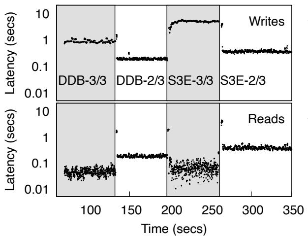  
Figure 10. Conflux reconfig: DynamoDB (3,3) quorum to DynamoDB (2,3); to S3Express (3,3); to S3Express (2,3). Replicas in us-west-2, us-east-1, eu-east-1; clients in us-west-2.

Conflux can switch its VirtualLog between diferent AtomicLogs which are backed by diferent LogDrives. In Figure 10, we start running Conflux on a QuorumLogDrive running on a (3,3) quorum of DynamoDBLogDrive instances running in us-west-2, us-east-1, and eu-east-1; writes have to wait for all regions, but reads are cheap. We then switch to a (2,3) quorum: writes and reads are now equally fast, since they both have to reach a majority. After that we switch to (3,3) quorum of S3Express single-AZ instances (one AZ per region); and finally we switch to a (2,3) quorum of S3Express. Finally, in Figure 11, we show this (2,3) quorum S3Express configuration seamlessly tolerate an S3Express outage in us-west-2 (emulated by disable access control). These graphs illustrates that Conflux can reconfigure without downtime between diferent backends; obtain diferent durability / latency profiles via quorum sizes; augment DynamoDB (one-region) and S3Express (one-AZ) to provide multi-region durability; and tolerate regional storage failures. Table 12 shows the LOC for the various LogDrive implementations involved.

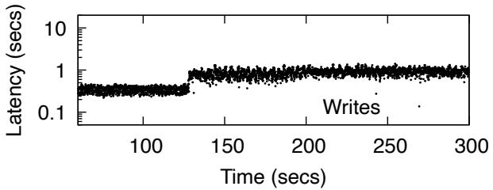

Figure 11. Conflux S3Express (2,3): S3Express fails in us-west-2.  
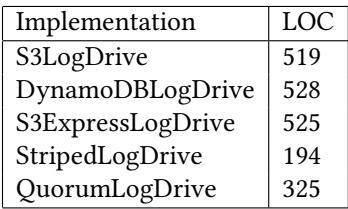

Figure 12. LOCs for LogDrive implementations.  
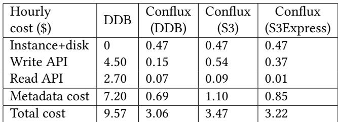  
Figure 13. Conflux-over-DDB is 10X cheaper than DDB for metadata and over 3X cheaper overall (data plane = \$2.37/hr).

## 6.2 Cost

We provide a detailed cost estimate of running Conflux over the DynamoDBLogDrive, compared with using DynamoDB directly. We pick a record size of 165 bytes, matching the average observed in our production workloads. For Conflux, we include the cost of 3 EC2 instances for the Conflux deployment and the associated EBS disk cost. Our modeled workload issues 2K writes/s and 6K reads/s. We use the latest available cost information from AWS: for DynamoDB, we used on-demand capacity pricing [1] in the us-west-2 region (\$0.625/M Write Request Units / WRUs, and \$0.125/M Read Request Units).

Table 13 shows that Conflux-over-DynamoDB is an order of magnitude cheaper than the direct-over-DynamoDB strawman. This cost diferential arises for a number of reasons. First, Conflux collects small writes in a batch and issues a single large write to DynamoDB (i.e., the append to the shared log). Since each write (regardless of size, up to 1KB) is charged independently as a WRU, batching lowers our cost significantly even though we are writing the same amount of data in both Conflux and the strawman design. Second, batching writes allows us to compress writes more eficiently (we model a factor of 5X, which is what we observe in our production workloads). Third, Conflux serves reads from a strongly consistent, full copy of the database (i.e., by playing the shared log), avoiding redundant reads to DynamoDB. We also include cost numbers for Conflux on S3 and S3Express (replicated over 3 AZs); both are more expensive than DynamoDB.

The Conflux setup we model here is identical to the one we evaluated earlier in Figure 9; accordingly, the corresponding p99 latency is roughly ∼130ms. As a result, our 10?? cost win comes with a 6.5?? write slowdown; but the resulting latency is acceptable for Conflux’s use case.

Separately, we validate that metadata is indeed a significant fraction of overall cost. To do so, we model the corresponding data plane cost assuming: (a) each data blob referenced by a metadata record is 128????; (b) data blobs are batched together into 5???? objects; (c) a 1 : 3 ratio of publish to fetch. Under these assumptions, we obtain a data plane cost of \$2.37 per hour. As a result, replacing a strawman DynamoDB in K2 cuts cost by more than 3?? (see Table 13).

## 6.3 K2 in Production

This section shares empirical data from a production K2 deployment that shows the performance and reconfigurability benefits of Conflux. This deployment spans three AZs in us-west-2 region and uses LogDrive-on-DynamoDB with a batching latency of 100ms. The deployment consists of 114 K2 brokers, of which 108 are serving requests. We use 20 Conflux instances as shards with three servers each.

Figure 14 shows a screenshot of our production dashboard for a run with 9????/?? produce and 27????/?? fetch. Latencies are reported over 1-min intervals from each K2 broker. Produce p99 latency is about 600ms whereas fetch p99 latency is about 300ms; the 500ms numbers are due to a blocking timeout on client fetches for empty topics. Figure 15 (Left) compares data plane and metadata latency on the production run (plotting the p99 across per-server p99s). The produce latency is dominated by the latency to batch and upload data to S3 and then to sequence it via an appendDataRef RPC to Conflux (which has a p99 of 130ms, in line with our microbenchmarks for Conflux-on-DynamoDB). Fetch latency is dominated by the latency to retrieve data from S3; sometimes serving a single client fetch might require reading a number of diferent S3 objects, which can aggravate the tail latency. In this run, the average metadata record size is around 165 bytes and we get an efective compression of around 6 − 7?? .

Finally, we show Conflux change backends mid-flight. Our initial deployment used S3LogDrive under Conflux. However, we discovered that S3LogDrive had suboptimal performance (as we showed in Section 6.1) as well as cost (as we saw in Section 6.2) compared to DynamoDBLogDrive. Accordingly, we decided to switch our early access service to use Conflux over DynamoDB. A single engineer implemented and deployed the DynamoDBLogDrive in about 1 week, leveraging existing simulation tests and observability wrappers. Early tests hit rate limits on DDB partition key accesses; the engineer was able to work around that by using the Striped LogDrive. Figure 15 (Right) shows a running Conflux service make the switch without downtime. Interestingly, we first switched to an incorrect table; switched immediately back to S3 (hence the spike); and then made the correct switch.

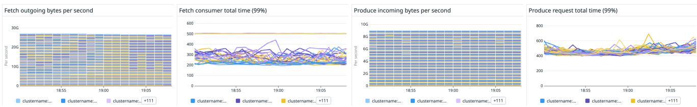  
Figure 14. Screenshot of the production dashboard for a K2 cluster serving 9GB/s produce and 27GB/s fetch throughput.

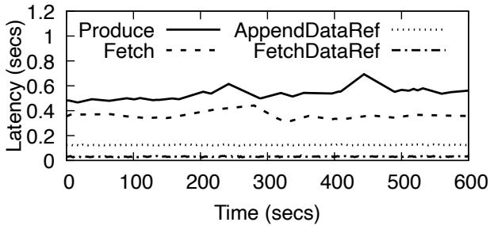

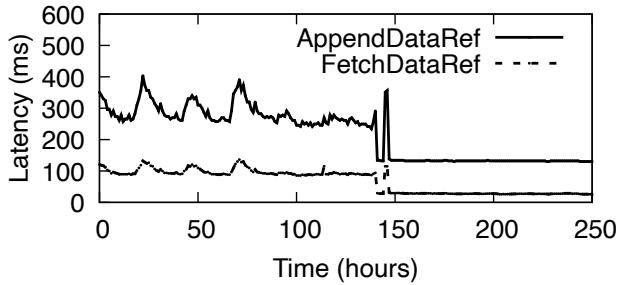  
Figure 15. (Left) Latency on K2 9GB/s produce / 27GB/s fetch production cluster (p99 across per-server p99s); (Right) switchover on an early production cluster from S3 to DynamoDB.

## 7 Related Work

As described, K2 implements large numbers of fine-grained shared logs over an S3-based data plane and the Conflux metadata layer; and Conflux is itself a database designed over a shared log. Accordingly, both K2 and Conflux are shared log designs which intersect with the literature in diferent ways.

Early group communication systems [23, 30, 51] provided flexible placement of sequencing and durability: e.g., sequencing could be out-of-band or in-band, fixed or moving, etc. While the theory of Paxos retained this flexibility [42, 50, 53], production-ready MultiPaxos systems [25] and later Raft [46] adopted inflexible leader-driven designs where a specific node acted as a sequencer, a storage acceptor, and a database learner.

Scalable shared logs: Initial shared logs like Corfu [19] reintroduced sequencing flexibility by separating the location of sequencing from durable storage, in a “sequence-first, write-later” design; in doing so, they scaled the throughput of a single log. Later shared log designs like Scalog [31] reversed this order to “write-first, sequence-later”, shifting the burden of storing the durable sequence to a stateful metadata layer. In the same timeline, industry systems such as Kafka [40] and BookKeeper [39] focused instead on scaling to large numbers of fine-grained leader-driven logs. Given this history, K2 can be viewed as a “write-first, sequencelater” system that scales to many fine-grained logs (with Conflux acting as the metadata layer storing the durable sequence for each log).

Shared logs for SMR: At the same time, shared logs have also played a diferent role by providing an API for consensus, simplifying SMR-based production databases that need extreme reliability, arbitrary APIs, composability, and zero-downtime upgrades, but not massive scale or low latency [2, 18]. Conflux extends this literature by enabling these properties over cloud storage at low cost. In addition, the AtomicLog / LogDrive can be used underneath any existing SMR-based database.

Shared logs have been recently extended to serverless functions [36, 38, 48] and stream processing [54]. The ideas in Conflux could potentially allow these systems to operate directly over cloud storage. In addition, the LazyLog [44] applies the same principle of separating sequencing from durability in a slightly diferent way. In a sense, the LazyLog changes when a timestamp is assigned to an appended entry, whereas in this work we focus on which layer assigns the timestamp.

Streaming on cloud storage: K2 fits into a trend towards constructing high-level APIs by combining cloud storage with a metadata layer. Snowflake’s database architecture [45] over S3 and FoundationDB is an early and significant example of this design pattern. Warpstream [13] is another example of a Kafka implementation that uses S3 as its durability layer. While K2 shares this design pattern, our primary contribution is the LogDrive abstraction and its use within Conflux to provide a simple, robust, and inexpensive metadata layer over cloud storage.

## 8 Conclusion

Commodity cloud storage has the potential to unlock innovation at higher layers by providing durability as a service. At the same time, existing cost structures make it prohibitively expensive to build metadata layers that require small, frequent accesses. In this paper, we proposed a new system called Conflux that uses cloud storage as a shared log for replicating updates, extracting durability while slashing cost. Conflux introduces a novel shared log design that separates sequencing (via the AtomicLog implementation) and durability (via the LogDrive abstraction). The LogDrive supports arbitrary RAID-like stacking, allowing us to combine and augment existing cloud durability in new ways. Conflux is deployed at Confluent as the metadata service for K2 (which in turn powers the Freight product), driving down metadata cost by 10X and overall system cost by 3X.

## 9 Acknowledgments

We would like to thank Chad Verbowski, Jun Rao, and Jay Kreps for funding the K2 project and shaping its goals. Anil Sharma and Kamal Gupta were responsible for managing early iterations of the team. Hakan Hacigumus significantly impacted the project in its later stages. We would also like to thank our anonymous OSDI shepherd. Finally, this paper would not have been written without CQ Tang’s advice and encouragement.

## References

[1] [n. d.]. Amazon DynamoDB Pricing for On-Demand Capacity. htps: //aws.amazon.com/dynamodb/pricing/on-demand/.

[2] [n. d.]. CorfuDB. htps://github.com/corfudb.

[3] [n. d.]. Datadog. htps://www.datadoghq.com/.

[4] [n. d.]. etcd. htps://etcd.io/.

[5] [n. d.]. K8s. htps://kubernetes.io/.

[6] [n. d.]. KRaft. htps://docs.confluent.io/platform/current/kafkametadata/kraft.html.

[7] [n. d.]. LogDevice. htps://logdevice.io/.

[8] [n. d.]. S3. htps://aws.amazon.com/s3/.

[9] [n. d.]. S3 Express. htps://aws.amazon.com/s3/storage-classes/ express-one-zone/.

[10] [n. d.]. S3Express API Diferences. htps://docs.aws.amazon.com/ AmazonS3/latest/userguide/s3-express-diferences.html.

[11] 2025. Confluent Freight. htps://www.confluent.io/blog/freightclusters-are-generally-available/.

[12] 2025. S3Express Price Reduction. htps://aws.amazon.com/blogs/aws/ up-to-85-price-reductions-for-amazon-s3-express-one-zone/.

[13] 2026. Warpstream. htps://www.warpstream.com

[14] Atul Adya, Daniel Myers, Jon Howell, Jeremy Elson, Colin Meek, Vishesh Khemani, Stefan Fulger, Pan Gu, Lakshminath Bhuvanagiri, Jason Hunter, et al. 2016. Slicer: Auto-Sharding for datacenter applications. In USENIX OSDI 2016.

[15] Yehuda Afek, Hagit Attiya, Danny Dolev, Eli Gafni, Michael Merritt, and Nir Shavit. 1993. Atomic snapshots of shared memory. Journal of the ACM (JACM) 40, 4 (1993), 873–890.

[16] Hagit Attiya, Amotz Bar-Noy, and Danny Dolev. 1995. Sharing Memory Robustly in Message-Passing Systems. Journal of the ACM (JACM) 42, 1 (1995), 124–142.

[17] Mahesh Balakrishnan. 2024. Taming Consensus in the Wild (with the Shared Log Abstraction). In ACM SIGOPS OSR 2024.

[18] Mahesh Balakrishnan, Jason Flinn, Chen Shen, Mihir Dharamshi, Ahmed Jafri, Xiao Shi, Santosh Ghosh, Hazem Hassan, Aaryaman Sagar, Rhed Shi, Jingming Liu, Filip Gruszczynski, Xianan Zhang, Huy Hoang, Ahmed Yossef, Francois Richard, and Yee Jiun Song. 2020. Virtual Consensus in Delos. In USENIX OSDI 2020.

[19] Mahesh Balakrishnan, Dahlia Malkhi, Vijayan Prabhakaran, Ted Wobber, Michael Wei, and John D. Davis. 2012. CORFU: A Shared Log Design for Flash Clusters. In USENIX NSDI 2012.

[20] Mahesh Balakrishnan, Chen Shen, Ahmed Jafri, Suyog Mapara, David Geraghty, Jason Flinn, Vidhya Venkat, Ivailo Nedelchev, Santosh Ghosh, Mihir Dharamshi, et al. 2021. Log-structured protocols in Delos. In ACM SOSP 2021.

[21] Philip A Bernstein, Sudipto Das, Bailu Ding, and Markus Pilman. 2015. Optimizing Optimistic Concurrency Control for Tree-Structured, Log-Structured Databases. In ACM SIGMOD 2015.

[22] Shreesha G Bhat, Tony Hong, Xuhao Luo, Jiyu Hu, Aishwarya Ganesan, and Ramnatthan Alagappan. 2025. Low End-to-End Latency atop a Speculative Shared Log with Fix-Ante Ordering. In USENIX OSDI 2025.

[23] Kenneth P Birman and Thomas A Joseph. 1987. Reliable Communication in the Presence of Failures. ACM Transactions on Computer Systems (TOCS) 5, 1 (1987), 47–76.

[24] Matthew Burke, Audrey Cheng, and Wyatt Lloyd. 2020. Gryf: Unify ing consensus and shared registers. In USENIX NSDI 2020.

[25] Mike Burrows. 2006. The Chubby lock service for loosely-coupled distributed systems. In USENIX OSDI 2006.

[26] Zhichao Cao, Siying Dong, Sagar Vemuri, and David HC Du. 2020. Characterizing, Modeling, and Benchmarking RocksDB Key-Value Workloads at Facebook. In USENIX FAST 2020.

[27] Armando Castañeda, Sergio Rajsbaum, and Michel Raynal. 2015. Specifying concurrent problems: beyond linearizability and up to tasks. In International Symposium on Distributed Computing. Springer, 420–435.

[28] Tushar D Chandra, Robert Griesemer, and Joshua Redstone. 2007. Paxos made live: an engineering perspective. In ACM PODC 2007.

[29] Jefrey Dean and Luiz André Barroso. 2013. The tail at scale. Commun. ACM 56, 2 (2013), 74–80.

[30] Xavier Défago, André Schiper, and Péter Urbán. 2004. Total order broadcast and multicast algorithms: Taxonomy and survey. ACM Computing Surveys (CSUR) 36, 4 (2004), 372–421.

[31] Cong Ding, David Chu, Evan Zhao, Xiang Li, Lorenzo Alvisi, and Robbert van Renesse. 2020. Scalog: Seamless Reconfiguration and Total Order in a Scalable Shared Log. In USENIX NSDI 2020.

[32] Mostafa Elhemali, Niall Gallagher, Bin Tang, Nick Gordon, Hao Huang, Haibo Chen, Joseph Idziorek, Mengtian Wang, Richard Krog, Zongpeng Zhu, et al. 2022. Amazon {DynamoDB}: A scalable, predictably performant, and fully managed {NoSQL} database service. In 2022 USENIX Annual Technical Conference (USENIX ATC 22). 1037–1048.

[33] Patrick Th Eugster, Pascal A Felber, Rachid Guerraoui, and Anne-Marie Kermarrec. 2003. The many faces of publish/subscribe. ACM computing surveys (CSUR) 35, 2 (2003), 114–131.

[34] Michael J Fischer, Nancy A Lynch, and Michael S Paterson. 1985. Impossibility of distributed consensus with one faulty process. Journal of the ACM (JACM) 32, 2 (1985), 374–382.

[35] David Geraghty, Mahesh Balakrishnan, Suyog Mapara, and David Devecsery. 2025. Erratum to “Virtual Consensus in Delos”. htps: //maheshba.bitbucket.io/papers/delos-erratum.pdf

[36] Dimitra Giantsidi, Emmanouil Giortamis, Nathaniel Tornow, Florin Dinu, and Pramod Bhatotia. 2023. Flexlog: A shared log for stateful serverless computing. In ACM HPDC 2023.

[37] Patrick Hunt, Mahadev Konar, Flavio Paiva Junqueira, and Benjamin Reed. 2010. ZooKeeper: Wait-free Coordination for Internet-scale Systems. In USENIX ATC 2010.

[38] Zhipeng Jia and Emmett Witchel. 2021. Boki: Stateful Serverless Computing with Shared Logs. In ACM SOSP 2021.

[39] Flavio P Junqueira, Ivan Kelly, and Benjamin Reed. 2013. Durability with bookkeeper. ACM SIGOPS OSR 47, 1 (2013), 9–15.

[40] Martin Kleppmann and Jay Kreps. 2015. Kafka, Samza and the Unix Philosophy of Distributed Data. IEEE Data Engineering Bulletin, 38 (4) (2015).

[41] Leslie Lamport. 1986. On interprocess communication: part I: basic formalism. Distributed computing 1, 2 (1986), 77–85.

[42] Leslie Lamport. 1998. The Part-Time Parliament. ACM Transactions on Computer Systems (TOCS) 16, 2 (1998), 133–169.

[43] Butler W Lampson. 1983. Hints for computer system design. In ACM SOSP 1983.

[44] Xuhao Luo, Shreesha G Bhat, Jiyu Hu, Ramnatthan Alagappan, and Aishwarya Ganesan. [n. d.]. LazyLog: A New Shared Log Abstraction for Low-Latency Applications. In ACM SOSP 2024.

[45] Ashish Motivala. 2018. How FoundationDB Powers Snowflake Metadata Forward. htps://www.snowflake.com/en/blog/howfoundationdb-powers-snowflake-metadata-forward/

[46] Diego Ongaro and John K Ousterhout. 2014. In Search of an Understandable Consensus Algorithm. In USENIX ATC 2014.

[47] David A Patterson, Garth Gibson, and Randy H Katz. 1988. A case for redundant arrays of inexpensive disks (RAID). In ACM SIGMOD 1988.

[48] Sheng Qi, Xuanzhe Liu, and Xin Jin. 2023. Halfmoon: Log-optimal fault-tolerant stateful serverless computing. In ACM SOSP 2023.

[49] Fred B Schneider. 1990. The state machine approach: A tutorial. In Fault-tolerant distributed computing. Springer, 18–41.

[50] Robbert Van Renesse and Deniz Altinbuken. 2015. Paxos made moderately complex. ACM Computing Surveys (CSUR) 47, 3 (2015), 42.

[51] Robbert Van Renesse, Kenneth P Birman, and Silvano Mafeis. 1996. Horus: A Flexible Group Communication System. Commun. ACM 39, 4 (1996), 76–83.

[52] Michael Wei, Amy Tai, Christopher J Rossbach, Ittai Abraham, Maithem Munshed, Medhavi Dhawan, Jim Stabile, Udi Wieder, Scott

Fritchie, Steven Swanson, et al. 2017. vCorfu: A Cloud-Scale Object Store on a Shared Log. In USENIX NSDI 2017.

[53] Michael Whittaker, Ailidani Ailijiang, Aleksey Charapko, Murat Demirbas, Neil Giridharan, Joseph M Hellerstein, Heidi Howard, Ion Stoica, and Adriana Szekeres. 2021. Scaling replicated state machines with compartmentalization. Proceedings of the VLDB Endowment 14, 11 (2021), 2203–2215.

[54] Zhiting Zhu, Zhipeng Jia, Newton Ni, Dixin Tang, and Emmett Witchel. 2025. Impeller: Stream Processing on Shared Logs. In EuroSys 2025.

## A LogDrive Proofs

## A.1 Specification of the LogDrive

A LogDrive is a bounded array of ?? + 1 registers, indexed by the integers ?? = {0, 1, . . . , ?? }. Each address ?? ∈ ?? holds either a payload from a value set V or the distinguished value ⊥ indicating unwritten. At time ??, the system state is

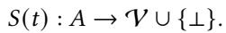

For simplicity, we use the ?? th register as a sentinel: ?? (??, ?? ) = ⊥ for all ?? . We assume that this sentinel register is never written to.

Read/write semantics. Operations write(??, ??) and read(??) are linearizable. That is, there exists a total order of all completed reads and writes, consistent with real-time precedence, such that:

• A write write(??, ??) takes efect at its linearization point, setting ?? (??, ??) = ?? .

• A read read(??) returns ?? (??, ??) at its linearization point.

• Write-once monotonicity:

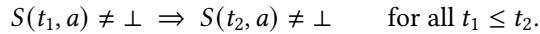

Once written, an address is never unwritten.

• Single-value assumption. If two writes to the same address propose diferent values, the behavior is unspecified. All correctness arguments assume that executions are well-formed: for each address ??, at most one value ?? is ever written to ??.

Contiguous tail. At any time ?? , the contiguous tail is:

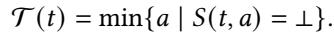

Non-contiguous tail and ??-window discipline. At time ??, define the non-contiguous tail as

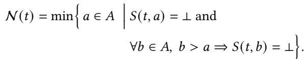

That is, N (?? ) is the first unwritten address after which all addresses are unwritten.

We say that an execution satisfies the ??-window discipline if, for all times ?? ,

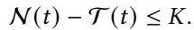

Thus at most ?? addresses in the prefix ??<N (?? ) are unwritten. Intuitively, this captures that the application never has more than ?? in-flight writes.

weakTail semantics. Let a weakTail(??) operation ?? execute during the real-time interval [??start (??), ??stop (??)]. During this interval, ?? determines (via direct reads or implicit deduction) the written/unwritten status of every address. Formally, for each ?? ∈ ??, let

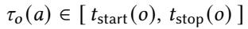

denote the time at which ?? observes the status of address ??. Define

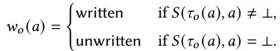

The return value of weakTail(??) is produced by a deterministic function

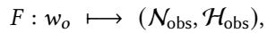

where:

• Nobs = min ?? ∈ ??  ???? (??) = unwriten and ∀?? ∈ ??, ?? > ?? ⇒ ???? (??) = unwriten

• H = { ?? ∈ ?? | ?? < N and ???? (??) = unwriten } is the observed hole set, i.e., the unwritten addresses between the contiguous and non-contiguous observed tails.

Further, the caller can derive the contiguous tail Tobs from the return value of weakTail. Given (Nobs, Hobs), the observed contiguous tail is

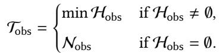

For brevity, in the remainder of the proof we will speak of weakTail as “returning” Tobs, with the understanding that this value is computed in the above manner.

Intuitively, weakTail corresponds to an unordered, nonatomic scan in which each address ?? is read at least once at some time ???? (??) within the operation interval, and the operation returns the first unwritten address beyond which all addresses are unwritten; as well as the list of holes prior to it.

## A.2 Derived Properties of LogDrive

Lemma ([LD.1] Tail-Range Guarantee). Let a weakTail(??) operation ?? execute during the real-time interval [??start, ??stop], and let

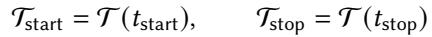

be the true contiguous tails at the start and end of ??. Let Tobs be the observed tail returned by ??, as defined in the weakTail semantics. Then

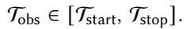

Proof. By the weakTail semantics, for each address ?? ∈ ?? there is an observation time

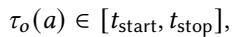

and ???? (??) is determined from the state at that time as written or unwritten.

Lower bound. Suppose, for contradiction, that Tobs < Tstart. By definition of Tstart, every address ?? < Tstart is written at time ??start, i.e. ?? (??start, ??) ≠ ⊥. By write-once monotonicity, once written an address never becomes unwritten, so for all ?? ≥ ??start we have ?? (??, ??) ≠ ⊥. In particular,

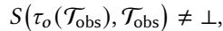

since ???? (Tobs) ∈ [??start, ??stop]. Hence ???? (Tobs) = writen, contradicting the assumption that Tobs is the smallest address with ???? (??) = unwriten. Therefore Tobs ≥ Tstart.

Upper bound. Suppose instead that Tobs > Tstop. By definition of T (??stop), Tstop is unwritten at time ??stop, i.e. ?? (??stop, Tstop) = ⊥. By write-once monotonicity, if a location is unwritten at some time, it must have been unwritten at all earlier times. Thus for all ?? ≤ ??stop,

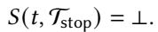

In particular, since ???? (Tstop) ∈ [??start, ??stop], we have

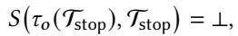

and hence ???? (Tstop) = unwriten. But this contradicts the fact that Tobs is the smallest address with ???? (??) = unwriten, since Tstop < Tobs. Therefore Tobs ≤ Tstop.

Combining the two bounds yields Tobs ∈ [Tstart, Tstop].

Lemma ([LD.2] Window-Scan Refinement). Assume the ??- window discipline holds, and that the storage layer provides a linearizable operation to read the non-contiguous tail N . Consider a weakTail operation with real-time interval [??start, ??stop] implemented as follows:

1. Read N once, yielding N ∗, with linearization point ?? ∗ ∈ [??start, ??stop].

2. Perform an unordered, non-atomic scan only over the window [?????? (0, N∗ − ??), N∗], reading each address in this window at least once at some time in [??start, ??stop], and return the set of holes in that window.

Then the pair (Nobs, Hobs) returned by the window scan is equal to the pair produced by some full unordered, non-atomic scan whose observations all lie within [??start, ??stop].

Proof. Let ?? ∗ be the linearization point of the read of N , so we observe N∗ = N (??∗). By the ??-window discipline at ?? ∗, the true contiguous tail T (?? ∗) lies in [N ∗ − ??, N ∗], all addresses < N ∗ − ?? are written at ??∗, and all addresses > N ∗ are unwritten at ?? ∗. If N ∗ < ??, we interpret the window [N∗ − ??, N∗] as [?????? (0, N∗ − ??), N∗], since addresses below 0 are outside the array.

Construct a hypothetical full unordered, non-atomic scan as follows: for each address in [N ∗ − ??, N ∗], use the actual read (time and result) performed by the window-scan implementation; for each address < N∗ − ??, imagine a read at time ??∗ returning “written”; and for each address > N ∗, imagine a read at time ??∗ returning “unwritten”. All these reads occur within [??start, ??stop] since ?? ∗ does, so this is a valid full unordered, non-atomic scan in the sense of our weakTail specification.

By construction, the non-contiguous tail in this hypothetical full scan is exactly the non-contiguous tail observed by the window-based implementation; and the set of holes observed in the full scan is also equal to that returned by the window-based implementation. Thus there exists a full unordered, non-atomic scan whose observations all lie within [??start, ??stop] and whose (Nobs, Hobs), as defined by the weak-Tail semantics, coincide exactly with those returned by the window-based implementation.

## A.3 StripedLogDrive Implementation

Let ?? ≥ 1 be the number of stripes. Each stripe ???? , for ?? ∈ {0, . . . , ?? −1}, is an independent LogDrive instance with local address set

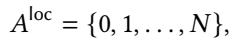

where the local address ?? is a sentinel that is never written (???? (??, ?? ) = ⊥ for all ?? ), and addresses 0, . . . , ?? − 1 are the real data slots. We write

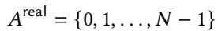

for the set of real local addresses.

The global address space of a striped LogDrive is the finite set

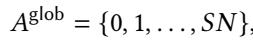

where addresses 0, . . . , ???? − 1 are striped across the ?? underlying instances and address ???? is a global sentinel that is never written.

For a global address ?? ∈ {0, . . . , ???? − 1} we define

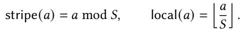

Then stripe(??) ∈ {0, . . . , ?? − 1} and local(??) ∈ ??real for all ?? < ?? ?? . At time ?? , the global state is

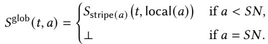

Read/write semantics. A striped LogDrive supports global operations write(??, ??) and read(??) only for ?? ∈ {0, . . . , ???? − 1}, by delegating to the corresponding stripe:

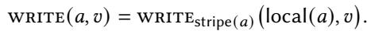

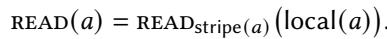

The global sentinel address ???? is never written and is never the target of a read.

Algorithm 1 StripedLogDrive Implementation   
1: procedure StripedWrite(??, ??) ⊲ 0 ≤ ?? < ????   
2: ?? ← ?? mod ??; ℓ ← ⌊??/??⌋   
???? .write(ℓ, ??)   
4: end procedure   
5: procedure StripedRead(??) ⊲ 0 ≤ ?? < ????   
6: ?? ← ?? mod ??; ℓ ← ⌊??/??⌋   
7: return ???? .read(ℓ)   
8: end procedure   
9: procedure StripedWeakTail(??)   
10: assert ?? mod ?? = 0   
11: ???? ← ⌊??/??⌋ for all ?? ∈ {0, . . . , ?? − 1}   
12: for all ?? ∈ {0, . . . , ?? − 1} in parallel do   
13: (N (?? ) , H (?? ) ) ← ????.weakTail(????)   
obs   
14: end for   
15: ??cand ← {???? }   
16: for ?? ← 0 to ?? − 1 do   
17: if N (?? ) < ?? then   
obs   
18: ??cand ← ??cand ∪ { ?? · N (??) + ?? }   
19: end if   
20: end for   
21: N glob obs ← min??cand   
22: H glob obs ← ∅   
23: for ?? ← 0 to ?? − 1 do   
24: for all ?? ∈ H (?? ) with ?? < ?? do   
25: H glob ← H glob ∪ { ?? · ?? + ?? }   
obs obs   
26: end for   
27: end for   
glob   
28: return (N ,   
obs   
29: end procedure

Disjointness Assumption. Each stripe ???? is an independent LogDrive instance with no shared state.

Lemma ([SLD.0] Linearizability of StripedLogDrive). Striped-LogDrive read/write operations are linearizable: there exists a total order of all completed operations, consistent with realtime precedence, whose behavior matches that of an abstract LogDrive.

Proof. By specification, each global read/write on address ?? is routed to a single stripe and stripes do not interfere. Since each stripe is a linearizable LogDrive, its operations admit a linearization order. Because the per-stripe histories are independent, these orders can be merged while preserving real-time precedence. The resulting total order satisfies the abstract LogDrive semantics, establishing linearizability. □

Theorem ([SLD.1] Striped LogDrive Refines the LogDrive Specification). Assume ?? is divisible by ??, and that each stripe ???? is a correct LogDrive satisfying the abstract specification of §A.1, including the weakTail(??/??) semantics. Then the striped LogDrive defined above:

1. provides linearizable read/write operations; and

2. provides a correct weakTail(??) implementation whose return value coincides with that of some unordered, nonatomic scan over ??glob in the sense of §A.1.

Thus the striped LogDrive is a correct implementation of the abstract LogDrive.

Proof. Linearizability of reads and writes follows from A.3.

Correctness of weakTail. Consider a striped weak-Tail(?? ) operation ?? with real-time interval [??start, ??stop]. By the StripedLogDrive implementation, for each stripe ?? ∈ {0, . . . , ?? − 1} the client invokes

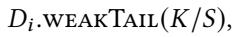

where ??/?? is an integer by assumption. Since ???? is a correct LogDrive, the abstract weakTail(??/??) specification guarantees that there exists a (hypothetical) local unordered, nonatomic scan ???? over the local address space ??loc = {0, . . . , ?? } whose per-address observations all occur within [??start, ??stop], and such that applying the unstriped weakTail semantics to ???? yields exactly the pair (N (?? ) , H (?? ) ) returned by ???? obs obs .weakTail(??/??).

We now construct a global unordered, non-atomic scan ??glob over the global address space ??glob = {0, 1, . . . , ???? }. For each stripe ?? ∈ {0, . . . , ?? − 1} and each real local address ?? ∈ ??real = {0, . . . , ?? − 1}, the scan ??glob performs a read of the global address ?? = ?? · ?? + ?? at the same time and with the same return value as in the local scan ???? for address ??. For the global sentinel address ???? , the scan ??glob performs a single read at any time in [??start, ??stop], returning ⊥. All per-address observations of ??glob thus lie within the interval [??start, ??stop] and are consistent with the striped LogDrive state, so ??glob is a valid global unordered, non-atomic scan in the sense of §A.1.

By construction, for every ?? and ?? ∈ ??real, the global address ?? = ?? · ?? + ?? is unwritten in ??glob if and only if the corresponding local address ?? is unwritten in the local scan ????. Applying the unstriped weakTail semantics globally to ??glob therefore yields:

• a global observed non-contiguous tail

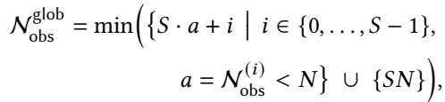

• and a global observed hole set

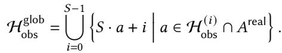

Algorithm 2 QuorumLogDrive Implementation: Write and   
Read   
1: procedure QuorumWrite(??, ??)   
2: for all ?? ∈ {0, . . . , ?? − 1} in parallel do   
3: send write(??, ??) to ????   
4: end for   
5: wait until ack received from at least ???? replicas   
6: return   
7: end procedure   
8: procedure QuorumRead(??)   
9: choose any set ???? ⊆ {0, . . . , ?? − 1} with |???? | = ????   
10: for all ?? ∈ ???? in parallel do   
11: ???? ← ???? .read(??)   
12: end for   
13: if some ???? ≠ ⊥ then   
14: pick any non-⊥ value ?? among {???? }?? ∈????   
15: send write(??, ??) to enough replicas to ensure at   
least ???? written   
16: return ??   
17: else   
18: return ⊥   
19: end if   
20: end procedure

These are exactly the values computed and returned by the StripedWeakTail algorithm. Hence for this striped weak-Tail(??) operation ??, there exists a global unordered, nonatomic scan ??glob whose observed non-contiguous tail and hole set coincide with the striped implementation’s return value (N glob, H glob).

Conclusion. The striped LogDrive provides linearizable read/write semantics and a correct weakTail(??) implementation, and therefore refines the abstract LogDrive specification. □

## A.4 QuorumLogDrive Implementation

## A.5 The QuorumLogDrive

We implement a replicated LogDrive over ?? independent LogDrive replicas ??0, . . . , ???? −1. For each replica ?? ?? we assume the abstract LogDrive specification of §A.1 holds, including linearizable read/write and weakTail(??) semantics. The QuorumLogDrive is configured with:

• a write quorum size ????, where 1 ≤ ???? ≤ ?? ;

• a read quorum size ???? = ?? − ???? + 1;

• a fault-tolerance quorum size ???? = max(????, ???? ).

Lemma ([QLD.0] Linearizability of QuorumLogDrive Reads / Writes). Under the assumptions of §A.5, the QuorumLog-Drive read/write operations are linearizable: there exists a total order of all completed operations, consistent with realtime precedence, whose behavior matches that of an abstract LogDrive.

Proof. Fix an address ??. Because replicas ??0, . . . , ???? −1 are in  
dependent LogDrive instances, each replica’s local read/write   
operations on ?? are linearizable with respect to its own state. A global write(??, ??) sends write(??, ??) to all ?? replicas   
and waits for acknowledgments from a write quorum of size   
????. We linearize this write at the real-time instant when the   
????-th replica durably stores ?? at address ??. After that instant,   
at least ???? replicas contain ?? at ?? and, by the single-valued   
assumption, no replica ever stores a diferent value at ??. A global read(??) selects a read quorum ???? of size ???? =   
?? − ???? + 1 and performs a local read(??) at each replica in   
???? , obtaining responses {?? ?? }?? ∈???? . There are two cases: • If all ???? = ⊥, then no completed write to ?? can exist: any completed write would have updated a write quorum of size ????, and since ???? + ???? > ?? , the read quorum ???? would intersect that write quorum at a replica returning ?? ≠ ⊥. Thus the abstract LogDrive state at ?? is ⊥ throughout the read’s interval, and we can linearize the read at any time within its interval, returning ⊥. • Otherwise, some ???? = ?? ≠ ⊥. Let write(??, ??) be the latest completed write to ?? in the write linearization order. At its linearization point, at least ???? replicas store ?? at ??, and by the single-valued assumption no later write stores a diferent value. Since ???? + ???? > ?? , the read quorum ???? intersects this write quorum at some replica that stores ??, so the read observes ??. The QuorumLogDrive picks some non-⊥ value ?? among the ???? and optionally performs a read-repair step that sends write(??, ??) to additional replicas until at least ???? replicas store ??. We linearize the read at any time between the linearization point of write(??, ??) and the time when it has collected its ???? responses. The subsequent read-repair writes occur after this linearization point and write the same value ??, so they do not change the value of ?? in the abstract LogDrive and do not afect correctness.

In both cases the read’s return value matches the value stored at ?? in the abstract LogDrive at its linearization point, and real-time precedence is preserved. Since operations on diferent addresses are independent and each replica is linearizable, we can take the union of these per-address linearizations to obtain a global linearization order over all read/write operations.

Thus the QuorumLogDrive provides linearizable writes and reads. □

Theorem ([QLD.1] QuorumLogDrive Refines the LogDrive Specification). Under the assumptions of §A.5, the Quorum-LogDrive provides linearizable read/write operations and a correct weakTail(??) implementation. Hence it refines the abstract LogDrive.

Algorithm 3 QuorumLogDrive Implementation: WeakTail   
procedure QuorumWeakTail(??)   
choose any set ???? ⊆ {0, . . . , ?? − 1} with |???? | = ?? ??   
for all ?? ∈ ???? in parallel do   
obs obs ← ????.weakTail(??)   
end for   
Nmax ← max?? ∈???? N ( ?? )   
?? ← max{0, Nmax − ??} ⊲ window: only ?? slots   
before Nmax   
⊲ Classify global written/unwritten status for slots in   
[??, Nmax)   
for ?? ← ?? to Nmax − 1 do   
cntWriten ← 0; cntUnwriten ← 0   
for all ?? ∈ ???? do   
if ?? ≥ N ( ?? ) obs or ?? ∈ H (??) then   
cntUnwriten ← cntUnwriten + 1   
else   
cntWriten ← cntWriten + 1   
end if   
end for   
if cntUnwriten ≥ ???? then   
globalStatus[??] ← unwriten   
else if cntWriten ≥ ???? then   
globalStatus[??] ← writen   
else ⊲ ambiguous: repair and treat as written   
pick any replica ??∗ ∈ ???? with local written at ??   
?? ← value of slot ?? at replica ??∗   
replicate ?? to enough replicas to ensure at least   
???? written   
(e.g., send write(??, ??) to further replicas)   
globalStatus[??] ← writen   
end if   
end for   
⊲ Derive global non-contiguous tail and hole set from   
globalStatus   
N glob ← min?? | ?? ≥ ??, ∀?? > ?? : globalStatus[??] =   
obs   
unwriten	   
glob obs ← { ?? | ?? ≤ ?? < N glob obs globalStatus[??] =   
unwriten }   
gl ob, H glob)   
return (N obs   
end procedure

Proof. Linearizability of read/write follows immediately from Lemma QLD.0. We prove correctness of weakTail(??).

Let operation ?? run during [??start, ??stop]. It queries a quorum ???? of size ???? and obtains from each replica ?? ∈ ???? a valid local weakTail(??) observation (N (?? ), H (?? ) ), each corresponding to some local unordered scan ?? ?? whose observations fall within ??’s interval.

obs and ?? = max{0, Nmax − ??}. By the global ??-window discipline, all ?? < ?? are globally written throughout ??.

For each ?? ∈ [??, Nmax), classify the status of ?? using the quorum rule:

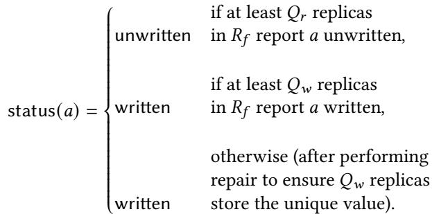

Because the address space is single-valued and ???? +???? > ?? , this classification is consistent with the linearizable writeonce semantics: a completed write to ?? implies at least ???? replicas store the value ??, so no read quorum can fail to observe ??; conversely, if a read quorum observes ?? as unwritten, then no write quorum has completed. Repair writes only propagate existing values and occur within ??’s interval, so they preserve linearizability.

Define a hypothetical global unordered scan ??glob by assigning each address ?? a written/unwritten observation consistent with status(??) at some time in [??start, ??stop]; this is possible since each case of status(??) corresponds to a quorum condition that holds at some time during ??. For ?? < ??, mark ?? written; for ?? ≥ Nmax, mark ?? unwritten, consistent with all local observations.

Applying the abstract weakTail semantics to ??glob yields exactly

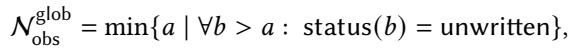

and

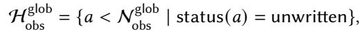

which coincide with the QuorumLogDrive output.

Thus the implementation refines the abstract weakTail(??) specification, completing the proof. □