USENIX

THE ADVANCED COMPUTING SYSTEMS ASSOCIATION

# jwmalloc: A Verified Memory Allocator for Mobile Devices

Jiawei Wang, Ming Fu, Ruixian Wang, and Chao Xu, Huawei Central Software Institute; Jonas Oberhauser, Huawei Central Software Institute and Huawei Hilbert Research Center; Haibo Chen, Huawei Central Software Institute and Shanghai Jiao Tong University

https://www.usenix.org/conference/osdi26/presentation/wang-jiawei

# This paper is included in the Proceedings of the 20th USENIX Symposium on Operating Systems Design and Implementation.

July 13–15, 2026 • Seattle, WA, USA

ISBN 978-1-939133-55-7

Open access to the Proceedings of the 20th USENIX Symposium on Operating Systems Design and Implementation is sponsored by

# jwmalloc: A Verified Memory Allocator for Mobile Devices

Jiawei Wang1, Ming Fu1,✉, Ruixian Wang1, Chao Xu1, Jonas Oberhauser1,2, Haibo Chen1,3

1Huawei Central Software Institute 2Huawei Hilbert Research Center 3Shanghai Jiao Tong University

## Abstract

Dynamic memory allocators provide memory allocation and release functionality to languages such as C, C++, and Rust. Existing allocators have been primarily optimized for performance and timely memory release. However, emerging mobile workloads also emphasize CPU, energy, and memory usage under soft real-time constraints.

We present jwmalloc, a novel memory allocator built from the ground up to address these mobile-specific challenges. It is based on three key innovations: a uniform slab size with pooling that enables immediate cross-size-class reuse of any emptied slab; the closed sibling tree, a new data structure for efficiently managing fragments; and a two-buffer lifetime tracker that categorizes short- and long-lived objects to guide memory reclamation. For timely response in soft real-time and oversubscription scenarios, all operations are non-blocking. We verified jwmalloc with a bounded model checker under weak memory models. Replacing jemalloc on a flagship smartphone running real-world workloads, jwmalloc reduces wholesystem instructions by 10% and cuts allocator-side instruction counts by 3.84×, while lowering CPU power consumption by 5–11%, all at a comparable memory footprint. jwmalloc has been deployed in production on 12 million commercial mobile devices, operating stably for over 30 billion user hours.

## 1 Introduction

Dynamic memory allocation is a cornerstone of modern operating systems, with a direct and profound impact on overall performance, from warehouse-scale datacenters to personal mobile devices [40–44, 63, 65, 66, 68–71, 76, 86]. For example, recent Google studies report that allocator activity consumes roughly 7% of all CPU cycles in datacenters, noting that “even a single percent CPU or memory improvement translates to significant savings in server costs” [53,87]. On mobile devices, the stakes are even higher: a few gigabytes of DRAM are intensely shared among dozens of applications and system services, making memory a constantly scarce resource [9, 15, 17]. Each component must minimize reserved memory, or the system resorts to aggressive paging and background app termination, visibly degrading user experience [26, 49]. Under this pressure, allocation activity is enormous: allocator instructions account for 8.2% and 12.4% of all executed instructions in real-world mobile workloads on Android and HarmonyOS, respectively (Fig. 1).

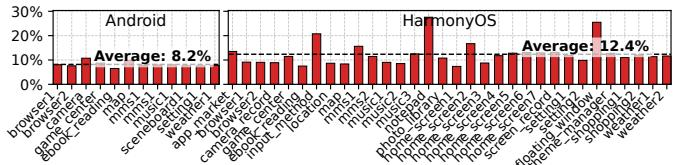  
Figure 1: Fraction of CPU instructions spent in dynamic memory allocation with jemalloc under real-world mobile workloads on Android [3] and HarmonyOS [22].

Additionally, mobile workloads have unique challenges, of which we identify four: to avoid reserving new memory, allocations must frequently reuse memory that had been formatted for the prior object size, causing reformatting 1 ; foreground and background phases [2], together with bursty user interactions and screen-off idle periods, induce large peak–trough memory swings 2 ; short-lived objects [52] causing fragmentation during aggressive memory reclamation 3 ; and heavy oversubscription 4 on a few cores creating potentially high latency with traditional lock-based synchronization [36, 46].

An effective mobile allocator must account for these challenges while achieving the following objectives: (i) low CPU and energy overhead to avoid stealing cycles from application logic or triggering thermal throttling [82]; (ii) bounded memory footprint to ensure the fluidity of foreground apps and the residency of background processes [23]; (iii) low tail latency to prevent visible stuttering on high-refresh-rate displays [39]; and (iv) correctness guarantees, ensuring the allocator neither causes crashes nor corrupts memory.

However, despite widespread use of mobile devices [30], existing allocator designs do not adequately address these mobile-specific challenges, compromising some of these objectives. Allocators typically employ a two-level architecture: a small-object slab frontend [45] and a backend that manages virtual-memory ranges obtained from the OS at page granularity (hereafter, ranges). We analyze several allocators, including jemalloc [47], a performance-oriented allocator (Sec. 2.2) widely adopted on mobile devices, as well as other mature industrial allocators such as tcmalloc [67] and mimalloc [64], and identify several systematic mismatches.

First, existing frontends mishandle the trade-off between CPU cost and memory footprint for slabs. For example, jemalloc uses heterogeneous slab sizes (i.e., different slab sizes for different size classes) to reduce per-slab tail memory waste. However, this incurs high CPU overhead, as the backend must repeatedly subdivide and coalesce ranges to satisfy slabs of varying sizes when demand shifts across size classes ( 1 ).

Second, existing backends contain intermediate ranges whose sizes do not match any slab size or large-object size class. These ranges cannot directly satisfy allocation requests but must first be subdivided or coalesced into usably-sized ranges, thereby increasing management and usage costs. In addition, the metadata used to manage ranges is effectively grow-only; under large peak–trough memory swings ( 2 ), it is sized to the historical peak, forcing the allocator to carry substantial dead metadata even at steady state.

Third, existing memory reclamation policies (i.e., returning unused pages to the OS) are not lifetime-aware, leading to suboptimal decisions during aggressive memory reclamation ( 3 ): neighbors of short-lived ranges may be reclaimed too early, missing opportunities to merge with soon-to-be-freed adjacent ranges, incurring extra overhead (e.g., system calls), while neighbors of long-lived ranges may be held too long, leaving memory unreclaimed with little benefit.

Finally, existing allocator data structures are commonly protected by coarse-grained locks, which leads to noticeable latency spikes under heavy oversubscription ( 4 ).

This paper introduces jwmalloc, a new allocator designed from the ground up for mobile devices that addresses these core challenges. Our contributions are as follows:

(i) Uniform and Pooled Slab Frontend (Sec. 3.1): All slabs have the same size, allowing immediate reformatting for any frontend size class. We pool empty slabs in the frontend, skipping expensive coalescing of heterogeneous slabs and greatly reducing CPU during frequent slab reformatting ( 1 ).

(ii) Size-Class-Exact Range Backend (Sec. 3.2): The set of maintained range sizes in the backend exactly matches the size-class set, eliminating inefficient intermediate ranges. This is realized with a closed sibling tree, a generalization of the buddy tree [54,75] in which each node can have more than two children, while maintaining the property that any contiguous subset of siblings can coalesce into a valid size class (hence “closed”). Additionally, we employ a size-friendly range subdivision and coalescing algorithm that tends to preserve large ranges, along with a metadata scheme that grows and shrinks with in-use ranges, keeping metadata overhead low during peak–trough memory swings ( 2 ).

(iii) Lifetime-Based Reclamation (Sec. 3.3): jwmalloc employs lifetime-based reclamation that allows making good decisions while aggressively reclaiming memory ( 3 ). This is realized with a two-buffer lifetime tracker emulating old and young generations in garbage collectors [52]. Short- and longlived ranges are predicted efficiently without costly per-range timestamps or range scans. Memory neighboring long-lived ranges is reclaimed first, giving short-lived ranges time to be freed and coalesced with their neighbors.

(iv) Non-Blocking Interface (Sec. 3.4): jwmalloc’s interface is designed to be non-blocking, avoiding high tail latency for operations under heavy thread oversubscription ( 4 ). This is achieved by converting rare but potentially catastrophic blocking into brief, far less harmful memory waste.

(v) Verification under WMMs (Sec. 5): We employed bounded formal verification of jwmalloc’s functional correctness (e.g., no memory corruption) and general properties (e.g., its memory safety, absence of data races, loop termination) under weak memory models (WMMs) [6,60] using the VSync toolchain [72].

We implemented jwmalloc as a drop-in replacement for state-of-the-art allocators and evaluated it extensively (Sec. 6). On microbenchmarks, jwmalloc improves performance by 74% over jemalloc on average and reduces allocator-side instruction counts by 82%. On a flagship smartphone running real-world workloads, jwmalloc keeps memory usage comparable to that of jemalloc, while reducing overall system instructions by 10% and cutting allocator-side instruction counts by 3.84×. In two representative workloads, it lowers CPU power consumption by roughly 5–11% across different core clusters. Finally, jwmalloc has been deployed in production and is in large-scale commercial use on 12 million mobile devices, including smartphones, tablets, and smartwatches, and has operated stably for more than 30 billion user hours.

## 2 Background

## 2.1 Dynamic Memory Allocators

Many modern memory allocators are organized into a frontend and a backend with distinct responsibilities [47, 64, 67]. The frontend is optimized for fast allocation and deallocation of small objects. It typically employs a slab-style allocator [45] and maintains per-thread structures to reduce contention in multithreaded workloads. The backend handles large allocations, manages the frontend’s memory supply, interacts with the operating system via page-granularity interfaces, and implements caching and reclamation policies for free pages (i.e., returning them to the OS). Allocators maintain a set of size classes: predefined standardized allocation sizes (e.g., 16B, 32B, 64B, 128B, ...) to which requests are rounded up to reduce fragmentation.

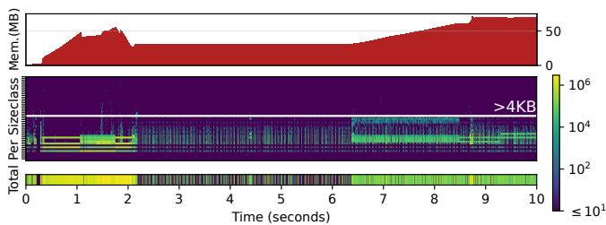

Figure 2: Allocation statistics for the system graphics service of a smartphone over a 10s interval. The first ∼2s correspond to service startup, and the last ∼3s to screen unlock and scrolling. Top: time series of allocator-managed memory in use. Middle: time–size heatmap of per-size-class alloca tion/free rates. Visually, size classes increase from 8B at the bottom to 16MB at the top; the white horizontal line marks 4KB, and each time slice is 1ms. Bottom: time–size heatmap of total allocation/free rates.  
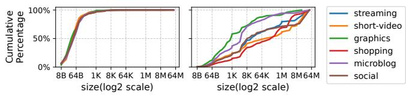  
Figure 3: Cumulative distributions by allocation size for services and applications. Left: allocation operations. Right: allocated bytes.

Consider a 100B allocation request. The slab frontend rounds this up to the corresponding size class (e.g., 128B) and serves it from a slab of that class (e.g., an 8KB slab). If no such slab is available, the frontend requests an 8KB range from the backend. If no such free range exists in the backend’s cached ranges, the backend instead obtains a larger cached range (e.g., 24KB), carves out 8KB for the slab, and leaves the remaining 16KB available to serve other requests. When all objects in a slab are freed, the slab is returned to the backend as a free range; if its adjacent range (e.g., the 16KB remainder) is also free, the backend coalesces them into a larger range.

## 2.2 Performance-Oriented Allocators

There is a long-standing trade-off between performance and memory safety in memory allocator design. Performanceoriented allocators such as jemalloc, tcmalloc, and mimalloc prioritize performance over memory safety, making them susceptible to memory-safety issues like use-after-free [7] when the memory user contains bugs. In response, hardened allocators [24, 29, 76] like Scudo and PartitionAlloc emerged, introducing mitigations such as checksums and quarantines. However, these hardening mechanisms come at a significant performance cost; for instance, Bionic’s tests show jemalloc performing up to 4× faster than Scudo [25]. Consequently, the most expensive hardening features, such as Scudo’s quarantine, are often disabled by default [29].

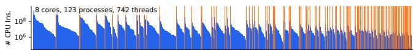  
Figure 4: Statistics of processes and threads on a smartphone during the app\_market benchmark. Each full-height vertical line (spanning the entire plot) marks a process boundary; within each region, the threads of that process are shown as vertical bars and ordered by executed CPU instruction count in descending order.

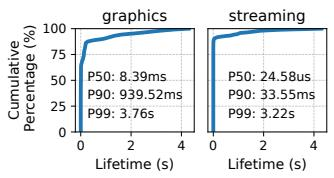

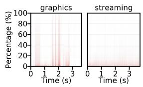  
Figure 5: Cumulative percentage of page-granularity allocation lifetimes for the system graphics service and the streaming app.  
Figure 6: Proportion of crossthread frees in the system graphics service and the streaming app over a ∼3s interval.

This landscape is now being reshaped by emerging technologies that address memory safety at the language and hardware levels. Newly written Android platform code is increasingly written in Rust as the next-generation solution for memory safety [28], and Google reports a 1000× reduction in memory-safety vulnerability density in Android’s Rust code compared to C/C++ [38]. In the meantime, ARM’s Memory Tagging Extension (MTE) [5] provides hardware-level memory safety checking with only ∼2% performance overhead [37].

Given these observations, as well as our own productiondeployment experience (e.g., using large-scale hardwareassisted address sanitizer (HWASAN) deployments [12, 13] to detect memory-safety issues), this paper focuses on the design of a performance-oriented allocator and compares it against other performance-oriented allocators. How to integrate our design with existing memory-safety mechanisms is orthogonal to this work and left out of scope.

## 2.3 Mobile Allocation Workloads

We profile dynamic allocations across several high-frequency smartphone workloads. Due to space constraints, we show a subset of services and apps; the remaining workloads behave similarly. In general, allocation rates are high in all scenarios, especially during bursty interactions. For example, the bottom panel of Fig. 2 reports that the system graphics service (graphics) [10] reaches a peak allocation rate of roughly 3 million ops/s across all threads. Below, we summarize our

detailed observations.

1 Frequent memory reformatting. The per-size-class panel (Fig. 2, middle) shows that activity is dominated by different size classes at different times, while total in-use memory (Fig. 2, top) remains roughly stable. Combined with the size distribution, where allocation counts are strongly skewed toward small sizes (Fig. 3, left) but the fraction of allocated bytes is much flatter (Fig. 3, right), this indicates frequent memory reformatting over time.

2 Large peak–trough memory swings. Mobile applications switch between foreground and background phases [2], with bursty user interactions and screen-off idle periods [34]. Consequently, memory usage often exhibits large peak–trough swings. For example, in our measurements of graphics, peak memory usage exceeds 5× the steady-state usage.

3 Aggressive Reclamation. Memory reclamation delays reach 5 to 15 seconds in server loads [19], but are often configured to 1 second or less in mobile [4]. Such short reclamation delays prevent page swapping, but may increase load if ranges are hastily reclaimed before they can be coalesced with neighboring ranges. Only memory near ranges that will anyways not be freed for a long time should be reclaimed immediately. The classical generational hypothesis [80] states that objects that survive for some time are likely to be long lived. We observe the same in mobile workloads, indicating that a page with old objects is unlikely to be freed in the near future. Fig. 5 reports page-granularity allocation lifetimes. Most pages are freed shortly after allocation: in streaming, 90% of pages become unused within 33.55ms. Beyond this knee point, a small fraction remains allocated for much longer; for example, over 1% of streaming pages live longer than 3.22s.

4 High Oversubscription. Fig. 4 illustrates an app-market installation scenario in which up to 742 threads are time-sliced on an 8-core device. In practice, big.LITTLE asymmetry [59] and power management can further reduce the number of effective cores [46], leading to high thread oversubscription and long delays between timeslices of the same thread. If the thread holds a lock, the delay is propagated to all threads contending on the lock. In existing allocators, this mostly affects cross-thread frees, where an object is allocated by one thread and freed by another. The free and further allocations on the same range contend on a lock protecting the range’s metadata. Unfortunately, cross-thread frees are frequent in mobile workloads. Fig. 6 reports, for each 1ms time slice, the fraction of cross-thread frees. In the streaming app, most slices remain below 20% cross-thread frees, though short bursts can reach up to 80%. In mobile-typical producer-consumer architectures like graphics [11, 83] and event-driven architectures [48, 79], some slices approach nearly 100% cross-thread deallocation.

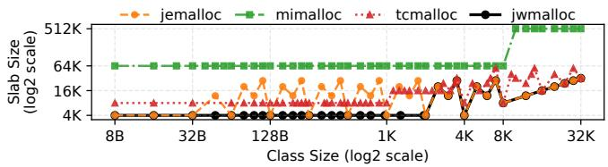  
Figure 7: Slab sizes selected for each object size class up to 32KB (default allocator configuration; 4KB OS pages).

## 3 Our Approaches

## 3.1 Uniform and Pooled Slab Frontend

Slab-based allocators pack many equal-sized objects into each slab, creating a trade-off: too few objects make in-slab allocations infrequent and reduce performance, while tail fragmentation grows due to unused space at the page-aligned slab end. Conversely, any in-use object pins its slab, preventing it from being freed; having many objects per slab amplifies partial-slab persistence, defying reclamation ( 3 ) and thereby inflating both peak and steady-state memory footprints in workloads with frequent memory reformatting and large peak– trough swings ( 1 and 2 ).

However, this trade-off is often ignored or mishandled by existing allocators. Fig. 7 shows each allocator’s slab size per size class. mimalloc uses only two large slabs (64KB and 512KB) for simplicity and performance, allowing many objects per slab (e.g., 8192 for an 8B object) and negligible tail fragmentation, but at the cost of a high footprint on mobile workloads (Sec. 6). tcmalloc balances slab sizes to avoid excessive pinning or low performance. jemalloc aggressively reduces footprint by setting a tail-fragmentation threshold and selecting, for each size class, the smallest OS-page-aligned slab size that meets it, yielding heterogeneous slab sizes. This reduces tail waste but increases backend churn when demand shifts across sizes ( 1 ), as more frequent subdivision and coalescing are required, raising CPU overhead (Sec. 6).

To maintain a memory footprint comparable to jemalloc while avoiding its drawbacks, we introduce two changes: (i) Uniform slab size: instead of fixing size classes and adjusting slab sizes for each to reduce tail fragmentation as in jemalloc, we fix the slab size and adjust the size classes to keep tail fragmentation below a target cap. In our setting, we use a uniform slab size of one OS page for all size classes of at most half a page. For example, for a 4KB slab containing 128B of metadata, a 512B size class leaves 384B wasted at the slab tail ((4096-128) mod 512 = 384), whereas tuning the size class to 560B reduces tail waste to 48B ((4096-128) mod 560 = 48). (ii) Slab pooling: freed slabs of this uniform size are cached as per-thread plain memory and can later be reinitialized as slabs for any frontend size class. Such pooling is impractical with heterogeneous slab sizes due to memoryfootprint constraints.

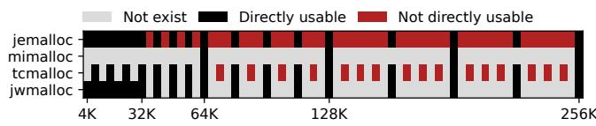  
Figure 8: Ranges managed by each allocator. Subdivided ranges are shown in non-gray; directly usable ranges appear in black, intermediate ranges in red.

Table 1: Examples of resolution-R size-class sets for R ∈ {1, 2, 3} with 8B object alignment. For each R, we list the first eight size classes along with their binary representations.  
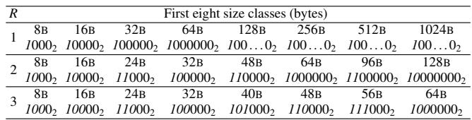

## 3.2 Size-Class-Exact Range Backend

## 3.2.1 Eager Subdivision and On-demand Coalescing

Allocator backends subdivide and coalesce memory ranges to supply slabs and large objects. mimalloc’s backend is slabstyle: each range is divided into equal-size subranges serving only a single size class. Memory of a range can be reformatted for another size class only once all its subranges are freed. By contrast, tcmalloc and jemalloc manage memory at finer granularity (8KB in tcmalloc; 4KB in jemalloc), allowing subranges to be reformatted independently. For example, a 40KB range can first serve a 16KB object and a 24KB object, and, after the latter is freed, its memory can be immediately reassigned to an 8KB object.

However, their range subdivision method introduces additional CPU overhead. On an allocation demand, they first search for a range of the requested size; if none exists, they select a larger range, split off the required portion, and manage the remainder for further requests. This process produces many intermediate ranges at multiples of the granularity that often do not match any size class (Fig. 8), which increases management and lookup costs. For example, tcmalloc main tains hundreds of size-indexed entries for such ranges. To serve a 224KB request, it probes sizes in ascending order: 224KB, 232KB, 240KB, and so on, leading to higher overhead.

Moreover, they use an eager range coalescing strategy that immediately merges adjacent free ranges, which can be in efficient if the merge produces an intermediate range. For instance, freeing a 224KB range that merges with an adjacent 24KB range yields 248KB. If no size class exists between 224KB and 256KB, the resulting 248KB range cannot be used directly; a subsequent 224KB request will subdivide it again, creating churn and wasting CPU cycles.

To address this, we adopt size-class-exact ranges and the following approach: (i) Eager subdivision: each range can be subdivided into multiple subranges, one matching the requested size class and the remaining subranges each matching some size class; (ii) On-demand coalescing: ranges are coalesced only when the merged size matches a size class. Consequently, the maintained range sizes exactly match the size-class set, greatly reducing these costs.

## 3.2.2 Closed Sibling Tree

The above policy requires a range-management scheme that maintains these size-class-exact ranges. Modern allocators carefully choose size classes to balance internal fragmentation and range reuse: if the size-class set is too sparse, rounding up causes large internal fragmentation (e.g., 9KB to 16KB); if it is too dense, allocations cannot effectively reuse freed ranges from nearby sizes (e.g., a 9KB request rounded up to 12KB cannot satisfy a subsequent 14KB request, but rounding it up to 16KB would work), which is particularly important under frequent memory reformatting ( 1 ). To balance this tradeoff, allocators usually use a fixed resolution-R size-class set, which bounds the worst-case roundup-induced internal fragmentation rate to at most 1/2R−1. An allocation request of size n rounds up to the smallest size class s ≥ n in which only the R most significant bits of s’s binary representation may be non-zero. For example, for n = 21 and R = 3, 101012 is rounded to 11000 , i.e., s = 24. Table 1 shows the first eight size classes for R ∈ {1,2,3} with 8-byte object alignment, along with their binary representations. Most modern allocators [47, 64, 67] use R = 3, which corresponds to a worst-case roundup-induced internal fragmentation of 25%.

However, existing range-management schemes cannot maintain a set of range sizes that exactly matches a resolution-R size-class set for arbitrary R. mimalloc’s backend manages only two range sizes (64KB and 512KB), while jemalloc’s and tcmalloc’s backends operate at fixed granularities of 4KB and 8KB, respectively. Classical buddy allocators [54, 75] manage ranges whose sizes are powers of two (2k), which corresponds to a resolution-1 size-class set. Weighted buddy [78], dual buddy [74], and tertiary buddy [85] extend this by also supporting sizes of the form 3 × 2k, and thus can realize a resolution-2 size-class set. Other buddy variants, such as Fibonacci buddy [51,55], produce range sizes that only partially overlap a given resolution-R size-class set.

We propose the closed sibling tree, whose range set can realize any resolution-R size-class set. Each node of the tree represents a range whose size is a size-class size. Subdivision creates two or more child nodes that partition the parent range; each child again has a size-class size. Any contiguous sequence of siblings coalesces into a range whose size is also a size-class size. A formal definition appears in Sec. 4.2.2. In practice, we use the tree to manage a resolution-3 size-class set, consistent with modern allocators. We also provide efficient subdivision and coalescing algorithms on this tree. For eager subdivision, we use a size-friendly scheme that tends to preserve large ranges. On-demand coalescing is straightforward: we coalesce adjacent siblings under the same parent.

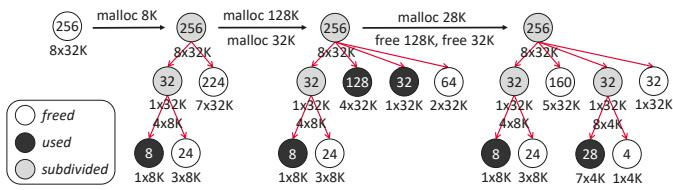  
Figure 9: Example of a closed sibling tree on a 256KB range.

As an example in Fig. 9, consider a closed sibling tree whose root represents a 256KB range. An 8KB allocation would split it into 8KB and 248KB, but 248KB is not a sizeclass size. Instead, our algorithm (Sec. 4.2) first carves out a 32KB child, leaving a 224KB child that is a size-class size, then subdivides the 32KB child to obtain the requested 8KB, with the remaining 24KB also being a size-class size. Subsequent 128KB and 32KB allocations are served by repeatedly subdividing the 224KB child, eventually leaving a 64KB child; all of these ranges are siblings under the 256KB parent. Later, a 28KB allocation cannot simply split the 64KB child into 28KB and 36KB, because 36KB is not a size-class size. Instead, the algorithm first splits 64KB into two 32KB children and then subdivides one 32KB child into 28KB and 4KB, both of which are size-class sizes. When the 128KB and 32KB children are subsequently freed, these two adjacent siblings coalesce into a single 160KB node, which is a size-class size.

## 3.2.3 Per-Granule Metadata with Metadata Shifting

Allocator backends face a challenge in balancing metadata lookup efficiency with memory overhead. mimalloc leverages a large range granularity (i.e., 64KB) to employ per granularity metadata, which enables fast address-to-metadata lookups via direct array indexing with minimal memory cost. In contrast, finer-granularity allocators such as jemalloc and tcmalloc cannot afford the overhead of per-granularity metadata and instead rely on per-range metadata managed by more complex structures like radix trees. This approach, however, suffers from a major limitation beyond its performance drawbacks: to support multi-threaded performance, metadata records are reused across ranges but are never freed. Consequently, during large peak–trough memory swings ( 2 ), metadata capacity grows with peak usage but fails to shrink at steady state, leading to substantial memory bloat.

To overcome this limitation, we compress the tree’s metadata significantly, enabling it to afford fast, per-granularity metadata (12B per 4KB granularity) that is fully reclaimable once its managed ranges are all freed. We adopt a novel metadata shifting approach, making the tree entirely pointerfree even with irregular node sizes: the conceptual twodimensional tree is mapped to a one-dimensional array; internal nodes are encoded into leaf nodes to eliminate parent pointers; and movement between siblings at the leaf level is based on address offsets between siblings, computed from range sizes and tree information (e.g., depth, sibling index) rather than explicit pointers. For example, in Fig. 9, a 256KB range contains 64 metadata nodes (256KB/ 4KB). When the 32KB node shown is freed, its left and right siblings have sibling indices 1 and 6, while the current node’s index is 5 (first sibling = 0). Each index corresponds to a distance of 8 nodes (32KB/ 4KB), so the left and right siblings are at offsets of (1 - 5) × 8 and (6 - 5) × 8 relative to the current node.

## 3.3 Lifetime-Based Reclamation

When memory ranges are freed, the allocator caches them temporarily to avoid repeated kernel allocation and deallocation, then eventually releases them to the OS if they are not reused. tcmalloc uses an asynchronous, rate-based reclamation policy: a background reclamation thread returns cached ranges to the OS at a rate that is tuned either by the user or based on recent allocation activity. However, it lacks timing guarantees for when these ranges will be reclaimed, which is undesirable for mobile workloads: during periods of high allocation and free rates, often coinciding with system-wide high load, tcmalloc may defer reclamation even while other components are competing for memory (Sec. 6.1.2).

mimalloc uses a synchronous, time-based reclamation policy: each freed range is cached for a fixed interval, after which it is returned to the OS. This policy interacts poorly with the foreground/background behavior [2] of mobile applications. Once an app moves to the background and its allocation and free rates drop sharply, reclamation is rarely triggered, allowing cached ranges to remain resident for a long time (Sec. 6.1.2). Moreover, it requires periodically scanning ranges to check for expiry, wasting CPU cycles.

jemalloc uses an asynchronous, time-based reclamation policy: it divides time into epochs and, at the start of each epoch, computes how much cached memory to reclaim and spreads this work across the epoch. If cached memory exceeds a threshold, it may run extra reclamation before the next epoch. This policy has been battle-tested on mobile devices, but it still has drawbacks. Although it imposes an approximate upper bound on reclamation time, it offers no lower bound. A range may be reclaimed shortly after being freed, even when its adjacent range is about to be freed as well. Waiting slightly longer could allow them to coalesce into a larger range that can satisfy future large requests, potentially avoiding an extra system call if these ranges are eventually returned to the OS.

However, blindly delaying reclamation only increases the memory footprint. Instead, we ask: given a fixed reclamation budget, which ranges should we reclaim first and which should we defer to maximize coalescing? Mobile workloads follow the generational hypothesis: once a range survives past the knee point, it is likely to remain live much longer, so we prefer to reclaim its adjacent range first. For example, consider five contiguous subranges (1–5). Suppose subranges 1, 3, and 5 are cached, subrange 2 is long-lived, and subrange 4 is short-lived; thus, we prefer to reclaim subrange 1 first.

To this end, we propose a lifetime-based reclamation policy. A range starts a countdown once it has no mergeable siblings. If, before the timer expires, one of its siblings is freed and coalesces with it, the countdown is reset; otherwise, the range becomes eligible for reclamation.

A naive implementation of this policy would mirror mimalloc’s approach and require scanning all cached ranges, which is expensive. Instead, we implement it using a two-buffer lifetime tracker, consisting of an active buffer and a standby buffer. Freed and coalesced ranges are always placed in the active buffer. Allocations first consult the active buffer; if empty, they consult the standby buffer. A reclamation thread repeatedly performs the following steps: (i) swap the roles of the two buffers, (ii) wait for an interval ∆, and (iii) reclaim all ranges in the standby buffer. This avoids per-range timestamps and full-range scans, significantly reducing CPU load.

Under normal conditions, reclamation is handled asynchronously by the reclamation thread. However, under heavy oversubscription ( 4 ), this thread may not be scheduled promptly, as we observed. To address this, we combine asynchronous and synchronous reclamation: when the number of cached ranges exceeds a watermark, newly freed ranges are immediately reclaimed by the freeing thread, and we trigger an early buffer swapping by waking the reclamation thread, thereby reducing ∆. This mixed reclamation scheme continues until the number of cached ranges drops below the watermark.

## 3.4 Non-blocking Interface

Allocators need to synchronize between threads accessing the same metadata, for example, during cross-thread frees. In mimalloc, this is synchronized via a concurrent bitmap that controls uniform-sized slabs in the backend; however, it pins ranges to their owning thread, preventing them from migrating to other threads until all subranges have been freed. In contrast, jemalloc and tcmalloc use backend structures shared across threads. These structures are more complex and therefore rely on locks for concurrency control. On heavily oversubscribed workloads ( 4 ), such locks can cause priority inversion [36]: a low-priority thread may hold an allocator lock and be preempted, while a high-priority thread (e.g., the UI rendering thread) waits for the lock, stalls on memory allocation, and causes visible stuttering. Although such events are much rarer than the common case, they are highly disruptive when they do occur.

We therefore design allocator interfaces (e.g., malloc and free) to be non-blocking [50]. Our key observation is that we can turn rare but catastrophic blocking into brief and far less harmful memory waste instead. For each allocation or free operation, the corresponding size class first consults a bounded concurrent bitmap as the primary path. When this bitmap is empty or full, it falls back to a locked, unbounded doubly linked list. If acquiring the lock fails, the operation still does not block: instead, an allocation tries to obtain a larger range from another size class and subdivides it, while a free pushes its range onto a concurrent singly linked list and returns; later operations complete the deferred free.

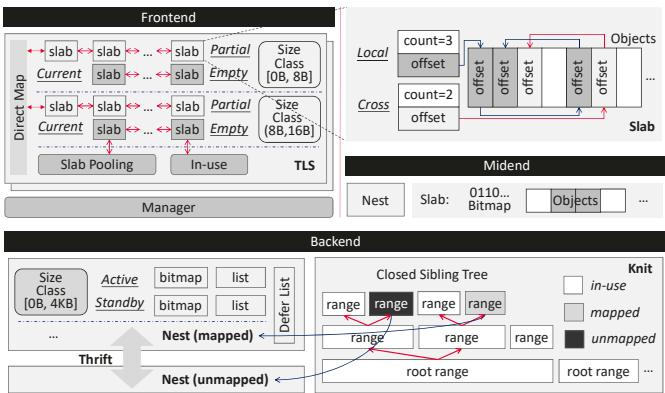  
Figure 10: The overall system architecture.

## 4 Design and Implementation

jwmalloc is organized into three tiers (Fig. 10): frontend, midend, and backend. The frontend is slab-style with a uniform slab size equal to the OS page size (4KB). It maintains thread-local storage (TLS) for each thread and a manager that creates and destroys TLS. The backend manages virtual memory at OS-page granularity with one instance per process. Allocations smaller than 2KB are served by the frontend (Sec. 4.1). Objects between 2KB and 16KB would incur excessive tail fragmentation if handled by either the frontend or backend (both operate at 4KB granularity), so we introduce a per-process, slab-style midend for these allocations (Sec. 4.3). The backend handles allocations from 16KB up to 4MB and supplies memory for slabs used by both frontend and midend (Sec. 4.2). Allocations larger than 4MB are obtained directly via system calls. These size boundaries are chosen based on observed mobile workloads and are tunable per system configuration.

## 4.1 Frontend

The TLS manages multiple size classes, each with two doubly linked lists: a partial list for slabs with some free objects and an empty list for fully free slabs. To accelerate allocation, it uses a direct map [64], an array of slab pointers indexed by allocation size (8-byte aligned), each pointing to the current slab, i.e., the head of the partial list for that size class. The

TLS also maintains a shared slab pool connecting empty slabs across all size classes. When a size class requires an empty slab, it first checks its empty list and falls back to the shared pool if needed. To bound the pool, a watermark proportional to the total slab count ensures that least-recently-used empty slabs are returned to the backend when exceeded. Finally, the TLS tracks all managed slabs in an in-use list, and when a thread is destroyed, its slabs are handed to the reclamation thread (Sec. 4.2) for draining and reuse.

Within each slab, slab metadata resides at the slab head, preceding the objects it manages. Per-object metadata is overlaid on the objects themselves, with freed objects having their memory reinitialized to store the metadata. Cross-thread frees follow mimalloc’s design, returning freed objects to the allocating thread. Each slab has an owner thread and two free lists: a local list for objects freed and reused by the owner, and a cross list for objects freed by other threads. The owner drains the cross list into the local list either periodically, to check slab reclaimability, or on demand, when allocating from a slab with an empty local list. However, unlike mimalloc’s draining, which traverses the entire cross list, we optimize with batched draining: each cross list maintains a slab-relative head offset and free-object count (Fig. 10), atomically updatable together. During periodic draining, only the count is consulted, leaving the list intact to avoid expensive singly-linked-list merges; during on-demand draining, both the head and count are moved to the empty local list with a single atomic write.

## 4.2 Backend

The backend comprises three logical components (Fig. 10): (i) Nest, which maintains the search structure used during allocation and deallocation, organizing ranges by size and using fetch() and place() to select suitable ranges for each request (Sec. 4.2.1); (ii) Knit, which manages contiguous virtual-memory ranges, providing split() and join() to subdivide and coalesce them (Sec. 4.2.2); and (iii) Thrift, which manages cache watermarks and invokes reclaim() to release cached memory when thresholds are exceeded (Sec. 4.2.4).

Figure 11, lines 1–15, illustrates the range fetch() and place() operations, as well as split() and join() during allocation or deallocation. For a fetch(), the backend first attempts to acquire a range (acq\_self). If the acquired range exactly matches the requested size, it is returned directly; otherwise, it is subdivided (split) and the remainder is released back (rel). Under eager subdivision (Sec. 3.2), this process may repeat. On a place(), the freed range is released directly if adjacent siblings cannot be acquired (acq\_sibling); otherwise, it coalesces with the acquired sibling (join) and repeats until no further adjacent siblings can be acquired. Range acquisition and release may be concurrently accessed by multiple threads, requiring concurrency control, which is implemented via ownership transfer [73, 81] (Sec. 4.2.3).

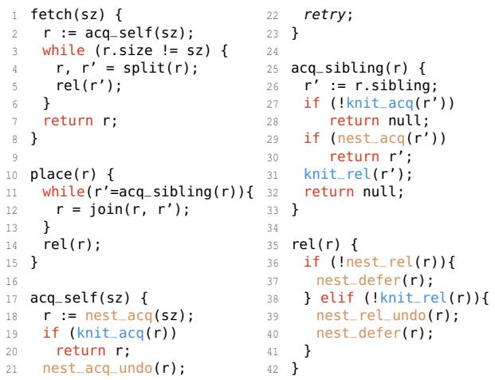  
Figure 11: Pseudocode of backend operations.

## 4.2.1 Mapped and Unmapped Ranges

We maintain two Nests: a mapped Nest for ranges with physical pages attached, and an unmapped Nest for ranges without physical pages. A range allocation request first searches the mapped Nest; if no sufficiently large range is found, it falls back to the unmapped Nest; if that also fails, a 4MB root range is requested from the OS. On range free, if synchronous reclamation is not triggered, ranges are first returned to the mapped Nest and later moved to the unmapped Nest by the asynchronous reclamation thread (Sec. 4.2.4) 1. If synchronous reclamation is triggered, ranges are inserted directly into the unmapped Nest. Before insertion, madvise [20] is called to discard the physical pages of the range.

Each Nest maintains multiple size classes. For each size class, the mapped Nest keeps two buffers of identical structure, an active buffer and a standby buffer, which together support the lifetime-based reclamation policy (Sec. 3.3). The unmapped Nest maintains only an active buffer. Each buffer contains a bounded bitmap and an unbounded linked list for additional ranges. fetch() and place() consult the bitmap first, falling back to the list if necessary. All size classes share a single deferred list to support non-blocking (Sec. 3.4).

## 4.2.2 Subdivision and Coalescing of Ranges

Knit manages multiple 4MB root ranges, each underlying a closed sibling tree. Range subdivision and coalescing operate on these trees. We formally define the size-class set and the closed sibling tree below. In our setting, a node’s weight represents the number of OS pages in the range.

Definition 1 (Resolution-R size-class set). The resolution-R

Algorithm 1: MULTI-STEP-SPLIT(X,Y )   
Input: a node v of weight X; target weight Y   
Precondition: X ∈ S(R), Y ∈ S(R), 0 < Y ≤ X   
Output: a subtree rooted at v   
Postcondition: the subtree is a resolution-R closed sibling   
tree; some node has weight Y   
Begin:   
write X = n1 × 2m1 with m1 ≥ 0 and n1 the largest integer   
such that 1 ≤ n ≤ 2R   
write Y = n × 2m2 with m ≥ 0 and n the smallest integer   
such that 1 ≤ n2 ≤ 2R   
if m1 ≤ m2 then   
if X ̸= Y then   
split v into nodes with weights Y and X −Y   
else   
Z ← Y /2m1 × 2m1   
split v into nodes with weights Z and X − Z   
MULTI-STEP-SPLIT(Z,Y )

size-class set S(R) is defined as

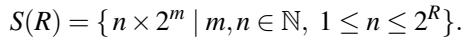

Definition 2 (Resolution-R closed sibling tree). A tree T is called a resolution-R closed sibling tree if:

• For every node v, its weight w(v) is in S(R).

• For any node v with children c1,..., cN, we have w(v) = ∑Ni=1 w(ci), and for all 1 ≤ p ≤ q ≤ N, ∑qi=p w(ci) ∈ S(R).

Coalescing merges contiguous siblings under the same parent. Once all children of a node have been coalesced, the parent becomes eligible to merge with its own siblings. For subdivision, we introduce the MULTI-STEP-SPLIT algorithm (Alg. 1), which executes the split steps shown in Fig. 11, lines 3–4.

We illustrate MULTI-STEP-SPLIT with an example. Suppose we want to subdivide a 6-page range from a 64-page range under a resolution-3 setting (i.e., R = 3, X = 64, and Y = 6). The max-n decomposition of 64 is 8 × 23, and the min-n decomposition of 6 is 3 × 21. Since m1 > m2, the recursive case applies: we compute Z = ⌈6/8⌉ × 8 = 8, split 64 into two children of weights 8 and 56, and recurse on the child of weight 8. For MULTI-STEP-SPLIT(8, 6), we have 8 = 8 × 20 and 6 = 3 × 21, so m1 ≤ m2 and X ̸= Y , which triggers the direct case, splitting 8 into 6 and 2. In this example, the construction obtains the 8-page subrange from the 64-page range in a single step, leaving a contiguous 56-page range available for other large requests. In contrast, a naive binary splitting scheme (e.g., 64 → 32 → 16 → 8) requires three steps to reach 8, and the intermediate nodes cannot serve the 56-page request.

## 4.2.3 Ownership Transfer of Ranges

Conceptually, a range allocation transfers ownership of a suitable range from the backend to the requester, while a free operation transfers ownership back to the backend. Within the backend, a range is co-owned by Nest and Knit: acq must obtain ownership from both components, and rel must release it to both. Since these two ownerships cannot be acquired or released atomically, inconsistent states can arise, in which one component succeeds while the other fails. For example, when a free operation attempts to acquire a range’s adjacent sibling in Knit to coalesce with it, a concurrent allocation may have already acquired that sibling range from Nest.

To handle this, ownership transfer follows a staged protocol with rollback (Fig. 11). acq\_self first locates a suitable range and acquires its Nest ownership (nest\_acq), then attempts to acquire its Knit ownership (knit\_acq). If the Knit acquisition fails, it rolls back the Nest acquire (nest\_acq\_undo) and retries a bounded number of times at the same size; if these retries fail, it falls back to a larger range, ensuring a non-blocking path. acq\_sibling first acquires the adjacent sibling in Knit, then in Nest; if the Nest acquisition fails, it releases the Knit ownership (knit\_rel) and returns null. rel first attempts to release Nest ownership. If this fails, the range is placed on the deferred list (nest\_defer) and the operation returns. Otherwise, it releases Knit ownership. If the Knit release fails, it rolls back the Nest release (nest\_rel\_undo), places the range on the deferred list, and returns. Deferred ranges are later drained either by the asynchronous reclamation thread (Sec. 4.2.4) or synchronously on demand when a nest\_acq fails to find a suitable range (e.g., at line 18 when r.size > sz); draining simply re-invokes place() on all deferred ranges.

Each range has three states: inuse (currently in use or on the deferred list), mapped (present in the mapped Nest), and unmapped (present in the unmapped Nest). In Knit, knit\_acq for a range r requires that r is not inuse, preventing it from being acquired twice. When releasing a range r to the mapped Nest, Knit must ensure that none of r’s adjacent siblings is already mapped; similarly, when releasing to the unmapped Nest, none of them is unmapped. This guarantees that free adjacent siblings can always be coalesced if they are in the same state. The states of all siblings under the same parent are packed into a single atomic variable. If any of these conditions fail, knit\_acq or knit\_rel returns false; otherwise, it atomically updates r’s state via compare-and-swap [50]. In Nest, nest\_acq and nest\_rel acquire and release ownership in the underlying generic structures, i.e., bitmaps and lists.

## 4.2.4 Asynchronous Reclamation

The reclamation thread repeatedly performs the following steps: (i) drain slabs handed off from TLS instances whose threads have been destroyed (Sec. 4.1); (ii) traverse the deferred list of each size class in both the mapped and unmapped Nests and call place() on each range to complete deferred releases (Sec. 4.2.3); (iii) swap the ready and standby buffers (Sec. 3.3); (iv) perform a futex wait [8] with a timeout (500ms in our setting), possibly being woken early by synchronous reclamation (Sec. 3.3); and (v) for each size class in the mapped Nest, apply madvise to all ranges in the standby buffer to discard their physical pages, then move those ranges to the corresponding size class in the unmapped Nest.

## 4.3 Midend

The midend uses a Nest similar to the backend’s mapped Nest, but with only the active buffer. It manages midend slabs, each containing multiple objects of size 2KB–16KB. An allocation selects a corresponding slab from the Nest; if this turns the slab from partial to full, it is removed from the Nest. On object free, if the object’s slab changes from full to partial, it is reinserted into the Nest; if it changes from partial to empty, it is returned to the backend as a free range. Each slab uses a bitmap with atomic bit operations to track its objects and implement these state transitions (Fig. 10). The midend shares metadata with the backend: when a range is initialized as a midend slab, the backend Nest’s fields for that range become unused, and the memory is repurposed to hold the midend Nest’s metadata, such as list links and the slab’s bitmap.

## 5 Verification under Weak Memory Models

jwmalloc is a complex allocator that lies on the critical path of virtually all system services and applications on the device. Any bug can cause severe failures, such as memory corruption that may only manifest far from the point where it actually occurs. In concurrent settings, especially under weak-memory models, such bugs are particularly difficult to reproduce and diagnose. To mitigate this risk, we employ bounded formal verification to increase confidence in jwmalloc’s correctness.

Traditional approaches based on manual, machine-checked proofs (e.g., large Coq developments [84]) are prohibitively labor-intensive for a production allocator of this complexity. More recent frameworks such as RefinedC [77] and Verus [61, 62] reduce the proof burden but reason only under sequential consistency, leaving executions arising from weak-memory behaviors, which are often more error-prone, unchecked. For mobile allocators, this limitation is particularly relevant, as mobile hardware is dominated by architectures like ARM that implement weak memory models.

To balance verification coverage against engineering effort, we adopt the VSync bounded model-checking approach [56–58] that automatically verifies a library (here: jwmalloc) against small multi-threaded test cases under weakmemory models. In this approach, like in testing, the test cases act as functional specifications of the library by means of assertions; unlike testing, all weak-memory executions of the library on the test cases are explored, and generic properties such as memory safety, absence of data races, and loop termination, are also verified on each execution. Therefore, verification is complete within the bounds set by the tests, while corner cases not covered by tests are not verified.

Note that the number of executions grows rapidly with the complexity of the test cases, such as the number of threads and library API calls. Since all these executions are explored, the test cases need to be engineered to achieve a good balance between verification time and coverage. We achieve this in the following ways:

First, we fully decouple jwmalloc’s components. The frontend, midend, and backend each provide a standard malloc/free-style interface and interact with other components only through these interfaces. During verification, each component is treated as a conventional C library rather than an allocator. For example, the frontend exports frontend\_malloc and, in production, obtains its slabs via backend\_malloc; during verification, it uses the system allocator’s standard malloc, treated by the verifier as a standard library with verification deliberately skipped. This modularity allows verification of components both in isolation and in combination.

Second, we partition the client program into multiple specialized clients, each targeting specific edge cases. For example, the frontend exposes concurrency scenarios such as cross-thread frees, on-demand draining, periodic draining, and thread creation and destruction. We construct multi-threaded clients where each thread invokes the relevant API operations a bounded number of times, triggering these scenarios while keeping verification time manageable.

Finally, we shrink jwmalloc’s configuration by scaling down certain constants, for example, reducing the backend bitmap from 64 to 2 entries, without changing the code logic.

With the mechanisms described above, we ensure that verification of each client completes within 10 minutes. This verification uncovered a previously unknown bug during the development of jwmalloc. The bug originates from the backend’s closed sibling tree, which employs a metadata-shifting design. For the root node, which has no siblings, this design mistakenly assumes a sibling exists and attempts to access its state along one code path, causing out-of-bounds reads in the data area and resulting in a crash only when the data area contains specific values. Using a client targeting the backend, the model checker can expose this bug in roughly ten seconds and reports an error due to accessing uninitialized memory.

## 6 Evaluation

We compare jwmalloc against widely-used industrial allocators, including mimalloc [21] v2.1.8, jemalloc [18] v5.3.0, and tcmalloc [33] from gperftools-2.16, across various workloads. All allocators were run with their default configurations and profiling disabled.

Hardware instruction counts. We first analyze hardware instruction and conditional-branch counts for in-slab operations in each allocator. As shown in Table 2, jwmalloc executes fewer instructions than the other allocators, particularly for cross-thread frees, where it reduces the instruction count by over 70% compared to jemalloc. This low instruction cost contributes to jwmalloc’s performance and load advantages.

Table 2: Instruction and branch counts on x86 for in-slab operations. Each cell reports “instructions & branches”.  
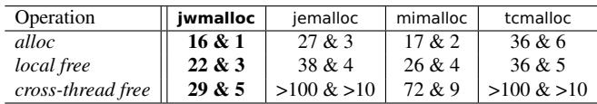

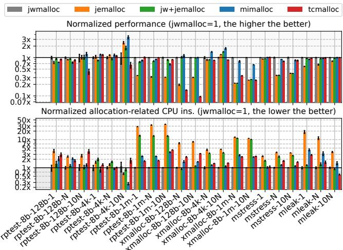  
Figure 12: Comparison of performance (top) and CPU instruction counts (bottom).

## 6.1 Micro-benchmarks

Admittedly, microbenchmarks cannot fully capture the complexity of real-world workloads, but they do reveal how allocators behave under simple synthetic workloads. We select four open-source benchmarks, namely rptest, xmalloc, mstress, and mleak, to exercise four scenarios: predominantly thread local allocate/free, cross-thread frees, diverse object lifetimes, and frequent thread creation and destruction [27, 31, 32]. To avoid noise from background services on smartphones, we run these benchmarks on a server [16] using 4 cores and different thread counts to emulate mobile behavior. We vary each benchmark’s allocation-size range while keeping its default size distribution. For example, rptest-8B-128B-10N denotes rptest with allocation sizes in [8B, 128B] and 10N threads, where N is the number of cores. To better isolate the effect of jwmalloc’s frontend, we also pair it with jemalloc’s backend; we denote this variant as jw+jemalloc.

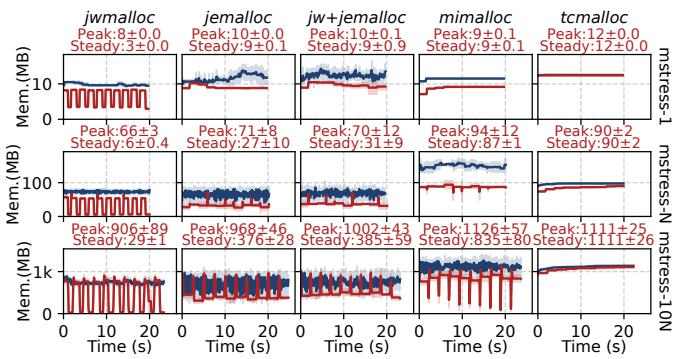  
Figure 13: Memory footprint comparison for the original (blue) and sleep-augmented (red) mstress workloads. Shading indicates the standard error.

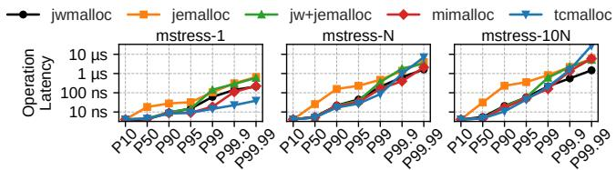  
Figure 14: Operation latency comparison (lower is better).

## 6.1.1 Overall Performance and CPU Overhead

As shown in Fig. 12, even with only the frontend, jwmalloc substantially outperforms jemalloc. For instance, jw+jemalloc is 24% and 4.1× faster than jemalloc on rptest-8B-128B-1 and xmalloc-8B-128B-N, respectively, highlighting the benefits of our frontend. With both frontend and backend enabled, jwmalloc leads the other allocators in nearly all workloads, especially in reducing instruction counts. On average, it improves performance by 74% over jemalloc and reduces allocator-side instructions by about 82%. On rptest-8B-128B-1, jwmalloc outperforms jemalloc, mimalloc, and tcmalloc by 25%, 24%, and 10%, respectively. On rptest-8B-1MB-N, allocator-side instruction counts for jemalloc, mimalloc, and tcmalloc are 32.8×, 2.55×, and 1.81× those of jwmalloc, underscoring the strength of our backend design.

There are a few scenarios where jwmalloc shows modest regressions in performance or load, notably the rptest and xmalloc workloads with the 8B-4KB-10N configuration. One reason is that a nontrivial fraction of the allocation-size distribution lies near 4KB; for these sizes, jwmalloc’s unified slab-size design deliberately trades some performance. Another reason is that 10N represents a heavy oversubscription in microbenchmarks; under such workloads, jwmalloc remains non-blocking but incurs additional work, resulting in some performance loss.

## 6.1.2 Memory Footprint

We use mstress to study allocator memory behavior. In each round, every thread allocates several objects, exchanges some with other threads, and frees a subset, closely resembling mobile workloads. We run both the original configuration and a modified version that inserts a 2-second sleep between rounds to emulate smartphone foreground and background behavior, recording peak and steady-state memory usage for the modified version.

As shown in Fig. 13, under the sleep-augmented workload (the red line), jwmalloc consistently uses less memory than the other allocators across all thread counts. For example, in mstress-10N, jwmalloc’s peak and steady-state footprints are 906MB and 29MB, whereas jemalloc’s are 968MB and 376MB. In addition, jw+jemalloc and jemalloc exhibit similar peak and steady-state footprints. This demonstrates the effectiveness of our backend for workloads with large peak-trough swings ( 2 ). In contrast, with its default settings, tcmalloc rarely triggers reclamation in this workload. We also observe that mimalloc’s reclamation mostly occurs after the sleep period ends rather than shortly after it begins, confirming the delayed effect of synchronous reclamation discussed in Sec. 3.3.

Under the original workload (the blue line), jw+jemalloc exhibits smaller memory fluctuations than jemalloc, especially when there is a larger number of threads, which indicates the effectiveness of slab pooling (Sec. 3.1). In contrast, mimalloc and tcmalloc show higher memory usage, due respectively to a partial inability to reformat memory and a lack of memory reclamation mechanisms.

Taken together across both workloads, we find that under continuous allocation demand (the original workload), jwmal loc exhibits smaller memory fluctuations than jemalloc and jw+jemalloc (the blue line). When demand drops during the inserted sleep, jwmalloc returns more memory to the OS (the red line). This demonstrates the effectiveness of our lifetimebased reclamation policy for workloads requiring aggressive reclamation ( 3 ): it reduces OS-side overhead from repeated allocation and deallocation while maintaining lower peak and steady-state memory footprints.

## 6.1.3 Operation Latency

We then measure allocator operation latency under the original mstress workload, as shown in Fig. 14. With a single thread, tcmalloc exhibits the lowest latency since it retains memory and rarely requests it from the OS. However, as the thread count increases, particularly under oversubscription, tcmalloc’s tail latency rises sharply due to its lock-based design. In contrast, jwmalloc’s non-blocking design maintains lower latency than the other allocators. For instance, in mstress-10N, jwmalloc’s P99.99 latency is 1.5µs, compared to 5.9µs for the best competing allocator. This demonstrates that jwmalloc ensures low-latency memory operations even under heavy oversubscription ( 4 ).

Table 3: Percentage energy-consumption reduction of jwmalloc relative to jemalloc under selected workloads. CPU\_B, CPU\_M, and CPU\_L denote the big, middle, and little CPU clusters, respectively, and LPDDR denotes DRAM power.  
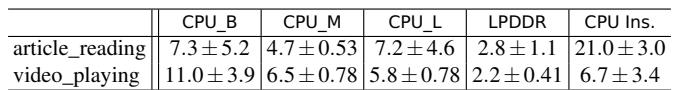

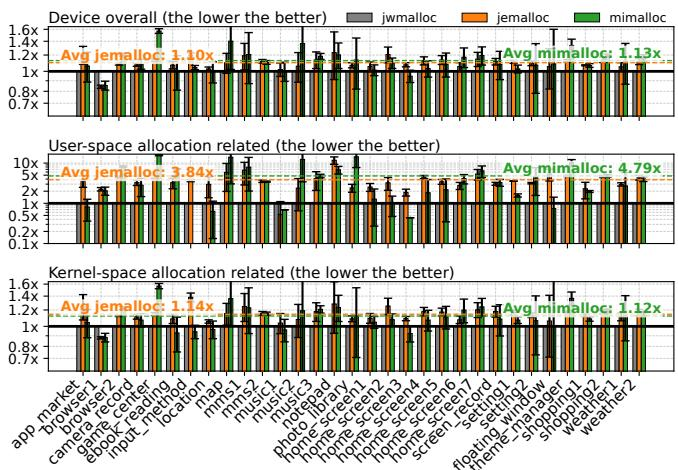

Figure 15: Normalized total CPU instruction counts and userand kernel-space allocation related instructions.  
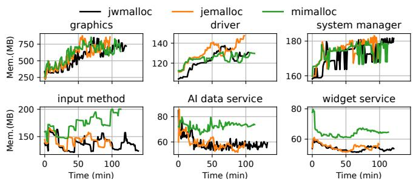  
Figure 16: Proportional set size (PSS) over time for the top memory-consuming system services.

A closer comparison with jw+jemalloc further reveals a division of responsibility within jwmalloc’s components. The frontend primarily determines non-tail latency, while the backend dominates tail latency. This highlights the effectiveness of the two components in jointly reducing operation latency.

## 6.2 Real-World Mobile Scenarios

We evaluate jwmalloc in a realistic mobile setting on a flagship smartphone, the Huawei Mate 70 Pro [14], running HarmonyOS 5.1 [22]. We replace the system’s default jemalloc with either jwmalloc or mimalloc. We omit tcmalloc, which is implemented in C++ and thus incompatible with the phone’s libc and toolchain [1, 35]. The device uses eight ARMv8-A

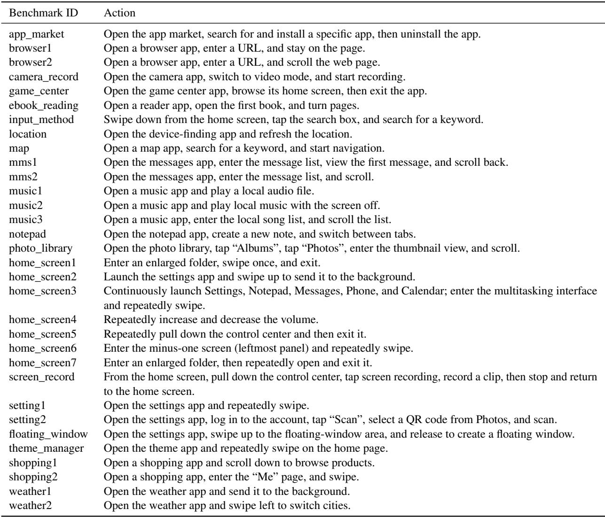  
Figure 17: Detailed description of actions in real-world mobile benchmarks.

CPU cores [6] and 12GB of RAM. We run a suite of common smartphone scenarios for approximately two hours, covering core system interactions (e.g., home-screen scrolling, volume adjustment) and high-frequency app workloads (e.g., map navigation, music playback); the scenarios are detailed in Fig. 17. Each benchmark was executed five times, and we report the mean and standard error.

Figure 15 presents normalized CPU instruction counts from three perspectives: overall device instructions, user-space allocation-related instructions, and kernel-space allocationrelated instructions. jwmalloc achieves substantial reductions across all three. On average, jemalloc and mimalloc execute 10% and 13% more overall instructions than jwmalloc, respectively. Broken down by source, in user space, their allocationrelated instruction counts are 3.84× and 4.79× those of jwmalloc; in kernel space, they are 14% and 12% higher. These results show that jwmalloc effectively reduces allocation over

head and overall system load.

To further analyze how instruction reduction translates into power savings, we focus on two representative and relatively power-stable benchmark steps: article reading and video playback. For each step, we measure both instruction counts and the power consumption of major hardware components. As shown in Table 3, compared with jemalloc, jwmalloc reduces instruction counts by 7%–21%, lowers CPU-cluster power by 5–11%, and reduces LPDDR power by 2–3%. The CPU power reduction mainly results from shifts to lower voltagefrequency points and the migration of threads from big cores to small cores.

During the benchmark, we sample each process’s proportional set size (PSS), including swapped-out pages, once per minute. We then select the top system services by memory usage and plot their memory footprints over time in Fig. 16. For most services, jwmalloc’s memory usage is comparable to or lower than that of jemalloc, whereas mimalloc often consumes more memory.

## 7 Conclusion and Future Work

We presented jwmalloc, a mobile-first memory allocator that significantly improves performance by addressing the mismatch between existing designs and mobile workloads. It has been successfully deployed on over 12 million devices. As future work, we plan to extend its core principles, such as the closed sibling tree, to server environments to enhance datacenter performance.

## Acknowledgments

We thank our shepherd and the anonymous reviewers for their insightful comments. We also thank our colleagues and interns at Huawei Fields Lab for their invaluable support in the commercial deployment of jwmalloc.

## References

[1] musl libc. https://wiki.musl-libc.org/.

[2] About the background execution sequence. https: //developer.apple.com/documentation/uikit/ about-the-background-execution-sequence.

[3] Android. https://www.android.com/.

[4] Android jemalloc wrapper. https://android.goog lesource.com/platform/bionic/+/refs/heads/ main/libc/bionic/jemalloc\_wrapper.cpp#89.

[5] Arm memory tagging extension. https://source.a ndroid.com/docs/security/test/memory-safet y/arm-mte.

[6] ARMv8-A Architecture Reference Manual. https: //archive.org/details/armv8-a-reference-m anual.

[7] CWE-416: Use After Free. https://cwe.mitre.or g/data/definitions/416.html.

[8] futex(2) — linux manual page. https://www.man7.o rg/linux/man-pages/man2/futex.2.html.

[9] Galaxy S25 Ultra. https://www.samsung.com/us/s martphones/galaxy-s25-ultra.

[10] Graphics. https://source.android.com/docs/co re/graphics.

[11] Graphics architecture. https://source.android.c om/docs/core/graphics/architecture.

[12] Hardware-assisted addresssanitizer. https://source .android.google.cn/docs/security/test/hwas an.

[13] Hardware-assisted addresssanitizer design. https:// clang.llvm.org/docs/HardwareAssistedAddres sSanitizerDesign.html.

[14] Huawei Mate 70 Series. https://en.wikipedia.org /wiki/Huawei\_Mate\_70.

[15] HUAWEI Mate XT. https://consumer.huawei.co m/en/phones/mate-xt-ultimate-design.

[16] Intel® Xeon® Platinum 8260 Processor. https://ww w.intel.com/content/www/us/en/products/sku /192474/intel-xeon-platinum-8260-processor -35-75m-cache-2-40-ghz/specifications.html.

[17] iphone-17. https://www.apple.com/iphone-17.

[18] jemalloc. https://github.com/jemalloc/jemall oc.

[19] Jemalloc Memory Analysis. https://doris.apache .org/docs/3.x/admin-manual/trouble-shootin g/memory-management/memory-analysis/jemall oc-memory-analysis#dirty-page-memory-too-l arge.

[20] madvise(2) — linux manual page. https://man7.org /linux/man-pages/man2/madvise.2.html.

[21] mimalloc. https://github.com/microsoft/mimal loc.

[22] OpenHarmony Project. https://docs.openharmony .cn/pages/v5.1/en/OpenHarmony-Overview.md.

[23] Overview of memory management. https://develo per.android.com/topic/performance/memory-o verview.

[24] PartitionAlloc Design. https://chromium.googles ource.com/chromium/src/%2B/master/base/all ocator/partition\_allocator/PartitionAlloc. md.

[25] Performance - ProtonAOSP. https://protonaosp.o rg/performance.

[26] Reducing terminations in your app. https://develo per.apple.com/documentation/uikit/about-t he-background-execution-sequence.

[27] rpmalloc-benchmark. https://github.com/mjans son/rpmalloc-benchmark.

[28] Rust in the Android platform. https://security.g oogleblog.com/2021/04/rust-in-android-pla tform.html.

[29] Scudo Hardened Allocator. https://llvm.org/doc s/ScudoHardenedAllocator.html.

[30] Smartphone Market. https://www.grandviewresea rch.com/industry-analysis/smart-phone-mar ket.

[31] Suite for benchmarking malloc implementations. http s://github.com/daanx/mimalloc-bench.

[32] SuperMalloc. https://github.com/kuszmaul/Su perMalloc.

[33] tcmalloc. https://github.com/google/tcmalloc.

[34] The activity lifecycle. https://developer.android. com/guide/components/activities/activity-l ifecycle.

[35] Third-party open-source software musl. https://gi thub.com/openharmony/third\_party\_musl.

[36] What really happened on Mars? https://www.cs.u nc.edu/\~anderson/teach/comp790/papers/mars\_ pathfinder\_long\_version.html.

[37] Retrofitting temporal memory safety on c++. https: //security.googleblog.com/2022/05/retrofit ting-temporal-memory-safety-on-c.html, May 2022.

[38] Rust in Android: move fast and fix things. https:// security.googleblog.com/2025/11/rust-in-a ndroid-move-fast-fix-things.html, November 2025.

[39] Tomas Akenine-Moller, Eric Haines, and Naty Hoffman. Real-time rendering. AK Peters/crc Press, 2019.

[40] Emery D Berger, Kathryn S McKinley, Robert D Blumofe, and Paul R Wilson. Hoard: A scalable memory allocator for multithreaded applications. ACM Sigplan Notices, 35(11):117–128, 2000.

[41] Emery D Berger, Benjamin G Zorn, and Kathryn S McKinley. Composing high-performance memory allocators. ACM SIGPLAN Notices, 36(5):114–124, 2001.

[42] Emery D Berger, Benjamin G Zorn, and Kathryn S McKinley. Reconsidering custom memory allocation. In Proceedings of the 17th ACM SIGPLAN conference on Object-oriented programming, systems, languages, and applications, pages 1–12, 2002.

[43] William Blair, William Robertson, and Manuel Egele. Mpkalloc: Efficient heap meta-data integrity through hardware memory protection keys. In International Conference on Detection of Intrusions and Malware, and Vulnerability Assessment, pages 136–155. Springer, 2022.

[44] Jeff Bonwick and Jonathan Adams. Magazines and vmem: Extending the slab allocator to many cpus and arbitrary resources. In USENIX Annual Technical Conference, General Track, pages 15–33, 2001.

[45] Jeff Bonwick et al. The slab allocator: An objectcaching kernel memory allocator. In USENIX summer, volume 16. Boston, MA, USA, 1994.

[46] Rohit Chandra. Parallel programming in OpenMP. Morgan kaufmann, 2001.

[47] Jason Evans. A scalable concurrent malloc (3) implementation for freebsd. In Proc. of the bsdcan conference, ottawa, canada, 2006.

[48] Umar Farooq, Zhijia Zhao, Manu Sridharan, and Iulian Neamtiu. Livedroid: Identifying and preserving mobile app state in volatile runtime environments. Proceedings of the ACM on Programming Languages, 4(OOPSLA):1–30, 2020.

[49] Mel Gorman. Understanding the Linux virtual memory manager, volume 352. Prentice Hall Upper Saddle River, 2004.

[50] Maurice Herlihy, Nir Shavit, Victor Luchangco, and Michael Spear. The art of multiprocessor programming. Newnes, 2020.

[51] Daniel S Hirschberg. A class of dynamic memory allocation algorithms. Communications of the ACM, 16(10):615–618, 1973.

[52] Richard Jones and Rafael Lins. Garbage collection: algorithms for automatic dynamic memory management. John Wiley & Sons, Inc., 1996.

[53] Svilen Kanev, Sam Likun Xi, Gu-Yeon Wei, and David Brooks. Mallacc: Accelerating memory allocation. ACM SIGPLAN Notices, 52(4):33–45, 2017.

[54] Kenneth C Knowlton. A fast storage allocator. Communications of the ACM, 8(10):623–624, 1965.

[55] Donald E Knuth. The Art of Computer Programming: Fundamental Algorithms, Volume 1. Addison-Wesley Professional, 1997.

[56] Michalis Kokologiannakis, Azalea Raad, and Viktor Vafeiadis. Effective lock handling in stateless model checking. Proceedings of the ACM on Programming Languages, 3(OOPSLA):1–26, 2019.

[57] Michalis Kokologiannakis, Azalea Raad, and Viktor Vafeiadis. Model checking for weakly consistent libraries. In Proceedings of the 40th ACM SIGPLAN Conference on Programming Language Design and Implementation, pages 96–110, 2019.

[58] Michalis Kokologiannakis and Viktor Vafeiadis. Genmc: A model checker for weak memory models. In International Conference on Computer Aided Verification, pages 427–440. Springer, 2021.

[59] Rakesh Kumar, Keith I Farkas, Norman P Jouppi, Parthasarathy Ranganathan, and Dean M Tullsen. Single-isa heterogeneous multi-core architectures: The potential for processor power reduction. In Proceedings. 36th Annual IEEE/ACM International Symposium on Microarchitecture, 2003. MICRO-36., pages 81–92. IEEE, 2003.

[60] Ori Lahav, Viktor Vafeiadis, Jeehoon Kang, Chung-Kil Hur, and Derek Dreyer. Repairing sequential consistency in c/c++ 11. ACM SIGPLAN Notices, 52(6):618–632, 2017.

[61] Andrea Lattuada, Travis Hance, Jay Bosamiya, Matthias Brun, Chanhee Cho, Hayley LeBlanc, Pranav Srinivasan, Reto Achermann, Tej Chajed, Chris Hawblitzel, et al. Verus: A practical foundation for systems verification. In Proceedings of the ACM SIGOPS 30th Symposium on Operating Systems Principles, pages 438–454, 2024.

[62] Andrea Lattuada, Travis Hance, Chanhee Cho, Matthias Brun, Isitha Subasinghe, Yi Zhou, Jon Howell, Bryan Parno, and Chris Hawblitzel. Verus: Verifying rust programs using linear ghost types. Proceedings of the ACM on Programming Languages, 7(OOPSLA1):286–315, 2023.

[63] Doug Lea and Wolfram Gloger. A memory allocator, 1996.

[64] Daan Leijen, Benjamin Zorn, and Leonardo De Moura. Mimalloc: Free list sharding in action. In Asian Symposium on Programming Languages and Systems, pages 244–265. Springer, 2019.

[65] Ruihao Li, Qinzhe Wu, Krishna Kavi, Gayatri Mehta, Neeraja J Yadwadkar, and Lizy K John. Nextgen-malloc: Giving memory allocator its own room in the house. In Proceedings of the 19th Workshop on Hot Topics in Operating Systems, pages 135–142, 2023.

[66] Beichen Liu, Pierre Olivier, and Binoy Ravindran. Slimguard: A secure and memory-efficient heap allocator. In Proceedings of the 20th International Middleware Conference, pages 1–13, 2019.

[67] Martin Maas, David G Andersen, Michael Isard, Mohammad Mahdi Javanmard, Kathryn S McKinley, and

Colin Raffel. Learning-based memory allocation for c++ server workloads. In Proceedings of the Twenty-Fifth International Conference on Architectural Support for Programming Languages and Operating Systems, pages 541–556, 2020.

[68] Martin Maas, Chris Kennelly, Khanh Nguyen, Darryl Gove, Kathryn S McKinley, and Paul Turner. Adaptive huge-page subrelease for non-moving memory allocators in warehouse-scale computers. In Proceedings of the 2021 ACM SIGPLAN International Symposium on Memory Management, pages 28–38, 2021.

[69] Martin Maas, Chris Kennelly, Khanh Nguyen, Darryl Gove, Kathryn S McKinley, and Paul Turner. Adaptive huge-page subrelease for non-moving memory allocators in warehouse-scale computers. In Proceedings of the 2021 ACM SIGPLAN International Symposium on Memory Management, pages 28–38, 2021.

[70] Maged M Michael. Scalable lock-free dynamic memory allocation. In Proceedings of the ACM SIGPLAN 2004 conference on Programming language design and implementation, pages 35–46, 2004.

[71] Michael D Moffitt. Minimalloc: A lightweight memory allocator for hardware-accelerated machine learning. In Proceedings of the 28th ACM International Conference on Architectural Support for Programming Languages and Operating Systems, Volume 4, pages 238–252, 2023.

[72] Jonas Oberhauser, Rafael Lourenco De Lima Chehab, Diogo Behrens, Ming Fu, Antonio Paolillo, Lilith Oberhauser, Koustubha Bhat, Yuzhong Wen, Haibo Chen, Jaeho Kim, et al. Vsync: push-button verification and optimization for synchronization primitives on weak memory models. In Proceedings of the 26th ACM International Conference on Architectural Support for Programming Languages and Operating Systems, pages 530–545, 2021.

[73] Peter W O’hearn. Resources, concurrency, and local reasoning. Theoretical computer science, 375(1-3):271– 307, 2007.

[74] Page and Hagins. Improving the performance of buddy systems. IEEE Transactions on Computers, 100(5):441– 447, 1986.

[75] James L Peterson and Theodore A Norman. Buddy systems. Communications of the ACM, 20(6):421–431, 1977.

[76] Antonin Reitz, Aymeric Fromherz, and Jonathan Protzenko. Starmalloc: verifying a modern, hardened memory allocator. Proceedings of the ACM on Programming Languages, 8(OOPSLA2):1757–1786, 2024.

[77] Michael Sammler, Rodolphe Lepigre, Robbert Krebbers, Kayvan Memarian, Derek Dreyer, and Deepak Garg. Refinedc: automating the foundational verification of c code with refined ownership types. In Proceedings of the 42nd ACM SIGPLAN International Conference on Programming Language Design and Implementation, pages 158–174, 2021.

[78] Kenneth K Shen and James L Peterson. A weighted buddy method for dynamic storage allocation. Communications of the ACM, 17(10):558–562, 1974.

[79] Ting Su, Lingling Fan, Sen Chen, Yang Liu, Lihua Xu, Geguang Pu, and Zhendong Su. Why my app crashes? understanding and benchmarking framework-specific exceptions of android apps. IEEE Transactions on Soft ware Engineering, 48(4):1115–1137, 2020.

[80] David Ungar. Generation scavenging: A non-disruptive high performance storage reclamation algorithm. ACM Sigplan notices, 19(5):157–167, 1984.

[81] Viktor Vafeiadis and Matthew Parkinson. A marriage of rely/guarantee and separation logic. In International Conference on Concurrency Theory, pages 256–271. Springer, 2007.

[82] Mark Weiser, Brent Welch, Alan Demers, and Scott Shenker. Scheduling for reduced cpu energy. In Mobile Computing, pages 449–471. Springer, 1994.

[83] Yuanpei Wu, Dong Du, Chao Xu, Yubin Xia, Ming Fu, Binyu Zang, and Haibo Chen. D-vsync: Decoupled

rendering and displaying for smartphone graphics. In Proceedings of the 30th ACM International Conference on Architectural Support for Programming Languages and Operating Systems, Volume 1, pages 326–341, 2025.

[84] Fengwei Xu, Ming Fu, Xinyu Feng, Xiaoran Zhang, Hui Zhang, and Zhaohui Li. A practical verification framework for preemptive os kernels. In International Conference on Computer Aided Verification, pages 59– 79. Springer, 2016.

[85] Divakar Yadav and AK Sharma. Tertiary buddy system for efficient dynamic memory allocation. In Conference: Proceeding SEPADS, volume 10, 2010.

[86] Hanmei Yang, Xin Zhao, Jin Zhou, Wei Wang, Sandip Kundu, Bo Wu, Hui Guan, and Tongping Liu. Numalloc: A faster numa memory allocator. In Proceedings of the 2023 ACM SIGPLAN International Symposium on Memory Management, pages 97–110, 2023.

[87] Zhuangzhuang Zhou, Vaibhav Gogte, Nilay Vaish, Chris Kennelly, Patrick Xia, Svilen Kanev, Tipp Moseley, Christina Delimitrou, and Parthasarathy Ranganathan. Characterizing a memory allocator at warehouse scale. In Proceedings of the 29th ACM International Conference on Architectural Support for Programming Languages and Operating Systems, Volume 3, page 192–206, La Jolla, CA, USA, 2024.