USENIX

THE ADVANCED COMPUTING SYSTEMS ASSOCIATION

# Drs.NAS: Ultra-Efficient Neural Architecture Search for Recommendation Systems

Ruixuan Wang and Xun Jiao, Villanova University https://www.usenix.org/conference/osdi26/presentation/wang-ruixuan

# This paper is included in the Proceedings of the 20th USENIX Symposium on Operating Systems Design and Implementation.

July 13–15, 2026 • Seattle, WA, USA

ISBN 978-1-939133-55-7

Open access to the Proceedings of the 20th USENIX Symposium on Operating Systems Design and Implementation is sponsored by

# Drs.NAS: Ultra-Efficient Neural Architecture Search for Recommendation Systems

Ruixuan Wang, Xun Jiao Villanova University

## Abstract

Deep learning-based recommendation systems (DRS) have become a dominant workload in hyperscale data centers. However, designing DRS architectures that balance high predictive performance with computational efficiency remains a major challenge due to ever-increasing model complexity and scale. Neural architecture search (NAS) has recently emerged as a promising automated design approach and is now adopted in production by major hyperscalers. Yet, existing NAS methods face two critical limitations: (i) prohibitive search costs— often requiring several GPU hours to days—which hinder rapid iteration, and (ii) the resulting architectures are typically computation- and memory-intensive, limiting practical deployment. In this paper, we propose Drs.NAS, an ultraefficient NAS framework for DRS. (i) Ultra-efficient search: We propose a novel metric, superproxy, which enables NAS without the costly training and validation required by existing NAS methods. Compared to SOTA NAS search times of 5 18 GPU-hours, Drs.NAS completes the search within two minutes on a commodity CPU. (ii) Ultra-efficient results: The models discovered by Drs.NAS drastically reduce resource demands—achieving on average 108.3 and 34.9 smaller model sizes, and 88.8 and 14.7 fewer FLOPs, compared to handcrafted and SOTA NAS results, respectively. Crucially, these gains come without sacrificing predictive quality: Drs.NAS delivers on par or even superior predictive performance, surpassing handcrafted and NAS baselines by 0.0123 and 0.0056 in average AUC across three representative benchmarks, respectively.

## 1 Introduction

Recommendation systems play a crucial role in delivering personalized content across diverse applications, includ ing e-commerce, advertising, social media, and search engines [Zhang et al.(2019), Song et al.(2020), Guo et al.(2017), Song et al.(2019), Zhang et al.(2023)]. With the advent of deep learning, their scale and complexity have grown by more than an order of magnitude since 2017, giving rise to deep learning-based recommendation systems (DRS). Today, DRS workloads have become dominant in hyperscale data centers; for instance, they account for over 70% of all AI inference cycles at Meta’s data centers [Gupta et al.(2020)].

While deep learning greatly improves predictive performance by capturing complex multi-modal feature interactions, it also introduces substantial computational demands. These demands strain data center resources and challenge quality-ofservice (QoS) requirements, such as tail latency and response time [Berger et al.(2018), Chen et al.(2024)]. Designing efficient architectures for DRS is further complicated by the reliance on manual, domain-expert-driven design, which involves costly and iterative exploration of large architectural design spaces—an approach that does not scale.

To overcome these challenges, neural architecture search (NAS) has emerged as a promising paradigm for automating DRS architecture design and has been adopted in production by several hyperscalers, e.g., Meta [Song et al.(2020), Zhang et al.(2023),Wen et al.(2024)]. NAS effectively explores large design spaces with heterogeneous operators and connection types. For example, AutoCTR [Song et al.(2020)] introduces a hierarchical search space with diverse feature interaction operators, while NASRec [Zhang et al.(2023)] expands the space further by incorporating heterogeneous operations and flexible connection patterns. By leveraging enriched search spaces and automation, NAS methods often achieve state-ofthe-art (SOTA) performance across benchmarks, while often reducing model complexity compared to manually designed DRS [Zhang et al.(2023), Song et al.(2020), Zhu et al.(2022)]. Main Challenges: Despite achieving SOTA predictive performance, existing NAS methods for DRS architecture search face two major challenges:

• Prohibitive search costs: Current NAS approaches for DRS [Zhang et al.(2023), Song et al.(2020), Zhu et al.(2022)] rely on iterative training and validation cycles to perform the search process. This results in substantial computational overhead, often requiring hours or even days on GPUs. Such costly procedures make NAS time-consuming, resource-intensive, and difficult to scale, thereby hindering the rapid iteration of model architecture design for ever-increasing application tasks.

Table 1: Performance comparison between the SOTA NAS approaches and Drs.NAS over three widely adopted recommendation system benchmarks. In this paper, the “performance” specifically denotes the model predictive performance, and Drs.NAS achieves the best or second-best Log Loss (lower is better) and AUC score (higher is better) among all NAS baselines, with significant search cost reduction (from GPU-hours to CPU-minutes) listed in this table and computational overhead reduction of NAS-discovered models as shown in Fig. 4(g) to Fig. 4(l).  
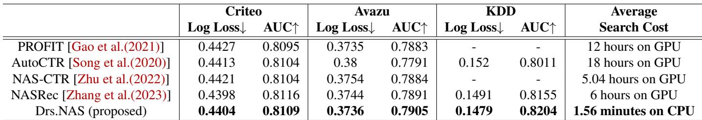

• Computation- and memory-heavy architectures: Existing NAS methods for DRS primarily optimize for predictive performance metrics such as Log Loss or AUC (area-under-curve), while neglecting the computation overhead of the searched architectures, including mem ory usage (i.e., the number of parameters) and computational cost (i.e., the number of FLOPs).

Our Solution: To overcome these limitations, we propose Drs.NAS, an ultra-efficient NAS framework for DRS architecture search. Unlike conventional NAS methods, Drs.NAS avoids the requirement for expensive training and validation of candidate architectures. The key idea is a novel composite metric, superproxy, which integrates seven different NAS proxy dimensions as a composite indicator for predictive performance and architectural efficiency. Building on the superproxy, we develop a composite loss function based on the superproxy that allows joint optimization of predictive performance and computational efficiency.

The performance comparison between Drs.NAS and SOTA NAS baselines is indicated in Tab. 1. To the best of our knowledge, Drs.NAS is the first zero-cost proxy-based NAS framework for DRS architecture search that simultaneously delivers three key advantages:

• Ultra-efficient search: By leveraging the superproxy, Drs.NAS eliminates the need for costly training and validation during architecture search. As a result, the entire search process completes in under two minutes on a commodity CPU, compared to 5 18 GPU-hours required by SOTA NAS baselines [Gao et al.(2021), Song et al.(2020), Zhu et al.(2022), Zhang et al.(2023)], yielding up to a 692 improvement in search time efficiency.

• On par or superior predictive performance: Despite the drastic architecture search efficiency gains,

Drs.NAS achieves comparable or better predictive performance. Specifically, Drs.NAS delivers on par or even superior predictive performance and surpasses NAS baselines by 0.0056 in the averaged AUC score.

• Ultra-efficient architectures: Drs.NAS enables cooptimization of both predictive performance and computational efficiency. Beyond marginal predictive performance gains, Drs.NAS reduces model size and FLOPs by averages of 34.9 and 14.7 , respectively, across three widely adopted recommendation system benchmarks compared to SOTA NAS baselines.

This paper makes the following contributions:

• We propose Drs.NAS, an ultra-efficient NAS framework for DRS. By introducing the superproxy as a composite performance/efficiency indicator, Drs.NAS removes the need for expensive training and validation during search, reducing search time from GPU-hours to CPU-minutes.

• We develop a composite loss function based on superproxies and formulate a multi-objective optimization problem that balances predictive performance and computational efficiency. We solve this optimization problem utilizing a gradient-based search strategy.

• We conduct comprehensive evaluations of both the Drs.NAS framework and the architectures it produces. Results show that Drs.NAS consistently achieves substantial efficiency improvements in computation and memory, while delivering on par or even superior predictive performance compared to handcrafted and NAS baselines on three representative recommendation system benchmarks.

## 2 Background and Related Work

## 2.1 Background of DRS Development

DRS are extensively developed and widely adopted in different fields [Guo et al.(2017), Song et al.(2019), Naumov et al.(2019)]. Specifically, DeepFM [Guo et al.(2017)] integrates factorization machines with neural networks to learn different feature interactions, demonstrating strong performance and efficiency. AutoInt [Song et al.(2019)] leverages the self-attention mechanism and residual connections to capture feature interactions more effectively, and the AutoInt+ [Song et al.(2019)] model further boosts the predictive performance by integrating implicit feature interactions. Moreover, the widely deployed Deep Learning Recommendation Model (DLRM) [Naumov et al.(2019)] employs both dense and sparse features, providing a scalable architecture with high performance.

Despite the mainstream DRS achieving strong performance, these models heavily rely on manual development, requiring substantial domain expertise and interventions. Such manually designed DRS not only increase development cost but also limit the architectural design space exploration, potentially leading to suboptimal performance and inefficient implementation.

## 2.2 Background of NAS

Weight-Sharing NAS: Weight-sharing NAS approaches [Cai et al.(2019), Zhang et al.(2023), Zhu et al.(2022), Gao et al.(2021)] mitigate the prohibitive computational costs of traditional NAS methods by training a single overparameterized supernet to represent the entire search space. A search algorithm, such as the evolutionary algorithm (EA), is then employed to select the best-performing subnet [Cai et al.(2019),Zhang et al.(2023)]. Despite being widely applied for DRS architecture search, training the supernet requires substantial computational resources, and each subnet often requires iterative validation and fine-tuning, both of which are time-consuming and computationally expensive.

Hardware-aware NAS: Hardware-aware NAS methods integrate execution latency into the search objective to discover computationally efficient and high-performance architectures on target devices [Wu et al.(2019), Cai et al.(2018), Gao et al.(2025)]. However, most existing approaches depend on latency profiling or auxiliary latency prediction models, which introduce additional measurement complexity and computational overhead. Moreover, conventional hardware-aware NAS methods still require training large supernets, resulting in substantial search costs.

Zero-cost proxy-based NAS: In parallel, to reduce search cost, the zero-cost proxy-based NAS strategy utilizes saliency metrics to estimate the performance of DNN models without any training [Li et al.(2023), Abdelfattah et al.(2021), Jiang et al.(2023)]. These proxies are computed on model weights, activations, or gradients using a single forward and backward propagation and aggregated across all model parameters to approximate predictive performance. While highly efficient, existing zero-cost proxies were primarily developed for CNN and Transformer architectures [Abdelfattah et al.(2021), Li et al.(2023), Mellor et al.(2021), Jiang et al.(2023), Zhou et al.(2024)], and their applicability to DRS architectures, characterized by dense/sparse operations and corresponding feature interactions, remains largely unexplored. In addition, prior methods mainly focus on model accuracy, with limited attention to jointly optimizing predictive performance and computational efficiency [Abdelfattah et al.(2021), Li et al.(2023), Jiang et al.(2023)]. Furthermore, recent studies show that no individual proxy generalizes reliably across tasks and benchmarks [Abdelfattah et al.(2021),Huang et al.(2024),Cortês et al.(2025)], inspiring the ensemble design that aggregates multiple proxies in the NAS methods for more robust performance estimation.

## 2.3 NAS for DRS

The NAS methods have emerged as a promising strategy for automating the development of DRS architectures, demonstrating strong performance on various recommendation system benchmarks. In particular, PROFIT [Gao et al.(2021)] proposes a progressive differentiable NAS algorithm to discover optimal feature-interaction layers in deep sparse networks, using a low-rank approximated search space. AutoCTR [Song et al.(2020)] utilizes evolutionary algorithms to automatically explore the effective feature interaction architectures in a graph-based search space. NAS-CTR [Zhu et al.(2022)] further integrates architecture optimization with parameter learning via a differentiable NAS method. More recently, NASRec [Zhang et al.(2023)] adopts the weightsharing NAS paradigm and substantially broadens the search space by incorporating heterogeneous operators such as sigmoid gating [Wang et al.(2021)] and transformer-based modules [Vaswani et al.(2017)], achieving promising performance on multiple benchmarks.

However, prior NAS approaches remain computationally intensive and time-consuming, often requiring substantial GPU resources for architecture search, while the discovered architectures can be resource-intensive and costly to deploy, making these NAS methods impractical for real-world deployment. Moreover, as observed in recent industrial studies [Wen et al.(2024)], NAS for DRS becomes an iterative execution in the recurring engineering cycle to continuously battle the dynamic baselines instead of a one-time investment per task. Therefore, reducing per-task search time and the inference cost of searched architectures is critical to making automated architecture optimization practically deployable.

To overcome these limitations, Drs.NAS introduces a superproxy that comprises seven zero-cost proxies as a performance/efficiency indicator to guide DRS architecture search, which can eliminate the requirement for supernet training or subnet fine-tuning and discover architectures with strong predictive performance and high computational efficiency. While individual zero-cost proxies have been explored in other domains, the strategic composition of the superproxy in NAS for DRS represents a significant and non-trivial advancement.

## 3 Proposed Approach: Drs.NAS

## 3.1 Drs.NAS Overview

Fig. 1 presents the overview of Drs.NAS framework, which is mainly composed of four major phases. In phase 1 (Sec. 3.2), we propose and formulate the superproxy metric, which maps each candidate operator to a seven-dimensional proxy representation. In phase 2 (Sec. 3.3), we construct a graph-based search space built on top of the computed superproxies, where vertices represent candidate layers and edges represent candidate dataflows. This search space eliminates the requirement of expensive training and validation of candidate architectures based on superproxies. In phase 3 (Sec. 3.4), we relax the discrete graph search space, using Gumbel-Softmax, to enable a differentiable NAS process. Finally, in phase 4 (Sec. 3.5), we formulate a multi-objective optimization problem over the relaxed space and develop a composite loss that balances predictive performance and computational efficiency. We utilize a gradient-based method to solve the optimization and discover the optimal model architecture.

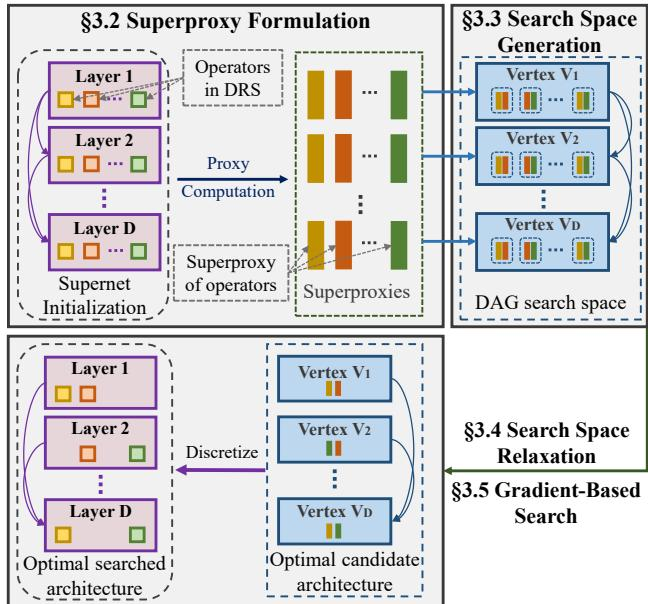  
Figure 1: The overview of Drs.NAS framework for the DRS architecture search, consisting of four sequential phases.

## 3.2 Superproxy Formulation

In Drs.NAS, we focus on two types of zero-cost proxies: the overhead-relevant proxy, which is correlated with the model size and computational overhead, and the overhead-irrelevant proxy, which reflects the model performance and trainability. We initialize a supernet following NASRec [Zhang et al.(2023)], and compute the corresponding proxies. By ensembling these proxies, the superproxy serves as the performance and efficiency indicator, guiding the optimization toward improved predictive performance while regularizing the stability of the gradient-based search process.

## 3.2.1 Overhead-relevant Proxy

First of all, we consider two standard proxies: the number of parameters (#Params) and FLOPs (#FLOPs). These proxies are generally highly connected with the model size and computational overhead, while the #Params and #FLOPs are also widely utilized proxies in prior NAS methods [Li et al.(2023), Jiang et al.(2023), Lin et al.(2020)] as model performance indicators. The #Params and #FLOPs for weight matrix ! are indicated in Eq. (1). Here, the Numel(!) indicates the total number of elements in the weight matrix !, and X is a subset of randomly selected training samples.

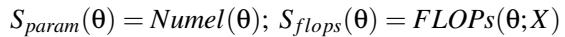

(1)

We also include the weight norm (wnorm) and the gradient norm (g ) proxies, defined as the Frobenius norm of the weight matrix ! and the corresponding gradients, respectively. These proxies are correlated with the parameter counts and are widely adopted for efficient NAS [Lukasik et al.(2025), Abdelfattah et al.(2021)]. The computation of the wnorm and gnorm proxies for the weight matrix ! is shown in Eq. (2).

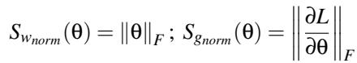

(2)

## 3.2.2 Overhead-irrelevant Proxy

Additionally, we incorporate the well-established zero-cost proxies that are leveraged to estimate the predictive performance and trainability of DNN models directly from the model initializations [Li et al.(2023),Jiang et al.(2023),Tanaka et al.(2020), Abdelfattah et al.(2021)]. These proxies are not strongly correlated with model size and computational overhead. Specifically, we leverage the zico [Li et al.(2023)], synflow [Tanaka et al.(2020)], and meco [Jiang et al.(2023)] proxies in Drs.NAS.

Zico captures the relationship between the gradient statistics of the weight matrix !, such as the mean and standard deviation of the corresponding gradient, and the trainability and generalization capacity of the DNN models. The zico proxy computation of ! is demonstrated in Eq. (3).

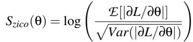

(3)

Synflow utilizes the Hadamard product of the model weight ! and the corresponding gradients to represent the contribution of each weight matrix ! within the computational flow of

the entire DNN model. The computation of the synflow proxy for ! is denoted as Eq. (4).

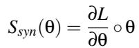

(4)

Meco computes the Pearson correlation matrix P( ) of feature maps F derived from the model weight matrix ! and relates the minimum eigenvalue of the correlation matrix to the model accuracy and trainability. The meco proxy computation for weight matrix ! is shown as Eq. (5), where #min( ) represents the minimum eigenvalue.

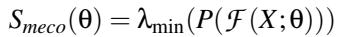

(5)

To construct the operator-level superproxy, we first compute the seven different proxies for each weight matrix ! within an operator, ranging from Sparam to Smeco. Then we sum the corresponding proxies across all weight matrices in that operator. For instance, the Sparam for operator o is computed as Sparam(o) = ∃ ! o Sparam(!). Finally, we concatenate these seven different operator-level proxies into a 7-dimensional tensor, defined as So R7 in Eq. (6), which represents the superproxy of operator o.

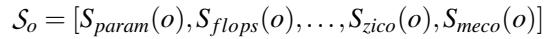

(6)

This superproxy integrates information from multiple proxies of the operator to estimate the performance of different candidate architectures and discover the optimal architectures within the search space, eliminating the need for supernet training and candidate architecture validation. Notably, we hypothesize that overhead-relevant proxies can serve as indicators of model capacity and expressive ability in the domain of DRS. Intuitively, we interpret that higher values of overhead-relevant proxies correlate with improved predictive performance, while potentially increasing the computational overhead of candidate architectures. To counterbalance this effect, we further incorporate the overhead-irrelevant proxies, which are weakly correlated with model size but remain informative of trainability and predictive performance, as regularizers within the composite loss function (detailed in Sec. 3.5) to stabilize the optimization process. By integrating these proxies, we enable joint optimization that balances both predictive performance and computational efficiency.

## 3.3 Search Space Generation

Drs.NAS constructs a directed acyclic graph (DAG) as the search space using the superproxy S computed from the super net initialization. Following the design in [Zhang et al.(2023)], in each layer of a candidate architecture, Drs.NAS selects one dense operator, one sparse operator, and the corresponding feature fusion operators from a heterogeneous operator set.

The search space additionally permits arbitrary connections between any pair of layers.

In particular, for dense operators, we include the fully connected (FC), sigmoid gating [Chen et al.(2019), Wang et al.(2021)], summation, and dot-product [Cheng et al.(2016), Zhang et al.(2024), Naumov et al.(2019)], while for sparse operators we utilize the Embedded FC and transformer [Song et al.(2019), Vaswani et al.(2017)] operators in Drs.NAS. Furthermore, Drs.NAS incorporates two feature fusion strategies, as adopted in prior work [Zhang et al.(2023)], to enhance the feature interaction between dense and sparse outputs. Drs.NAS leverages both dense-to-sparse and sparse-todense feature fusion. The dense-to-sparse feature fusion first transforms the dense tensor through FC and concatenates the resulting output with the sparse tensor, while the sparse-todense feature fusion projects the sparse tensor into the dense feature space based on Factorization Machine (FM) [Guo et al.(2017), Rendle(2010)] and sums the resulting output with the dense tensor. Together, these operators cover a wide range of computation modules in modern DRS.

Fig. 2(a) illustrates an example four-layer DAG search space. Formally, the DAG search space is defined as G = (V , E ). The vertex set V = [V1, . . . ,VD ] contains D vertices, corresponding to the D layers in supernet. Each vertex Vi includes p candidate layers at layer i, denoted as Vi = [v1, v2, . . . , vp], where each candidate layer vi denotes a specific combination of one dense operator, one sparse operator, and the associated feature fusion.

The superproxy of a candidate layer Sv is defined as the element-wise sum of the superproxies of all operators and feature interactions So within that candidate layer: Sv = ∃ o v So. The superproxy of the vertex SV is then represented as the concatenation of the superproxies of all candidate layers, denoted as SV = [Sv , Sv , . . . , Sv ], where SV Rp↑7.

In the meantime, the edge set E = [E1, . . . , ED ] represents the data flow connections within the supernet, where Ei denotes the set of all candidate incoming edges (in-edges) of the vertex at layer i. The superproxy Se for candidate in-edge e  Ei is computed by the element-wise sum of the superproxy of the source candidate layer vs Vj<i and the superproxy of the target candidate layer vt Vi in the DAG search space.

## 3.4 Search Space Relaxation

Based on the defined DAG search space, Drs.NAS formulates the architecture search problem as candidate architecture sampling over the DAG. The search objective is to discover an optimal candidate architecture by selecting one candidate layer per vertex and a subset of candidate in-edges from the search space. However, directly optimizing over the discrete DAG is non-trivial due to its non-differentiable nature. To address this challenge, Drs.NAS employs continuous relaxation over the DAG search space based on the Gumbel-Softmax [Jang et al.(2016), Maddison et al.(2016)], a strategy widely adopted in differentiable NAS methods [Chang et al.(2019), Xie et al.(2018)], to enable smooth architecture sampling from the discrete DAG.

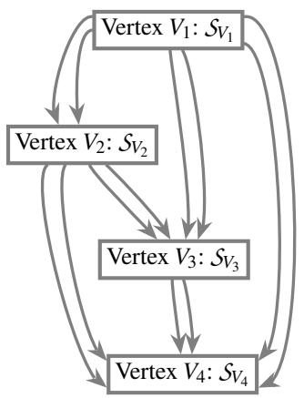  
(a) DAG Search Space constructed based on superproxies

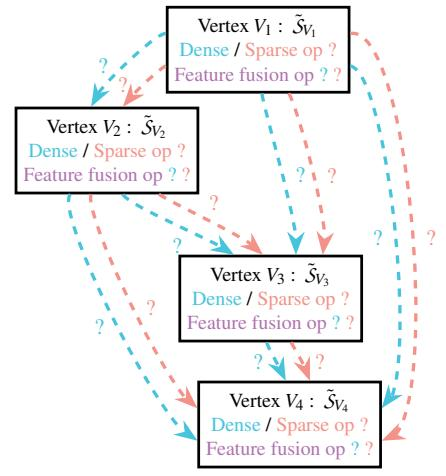  
(b) Relaxed DAG search space based on Gumbel-Softmax

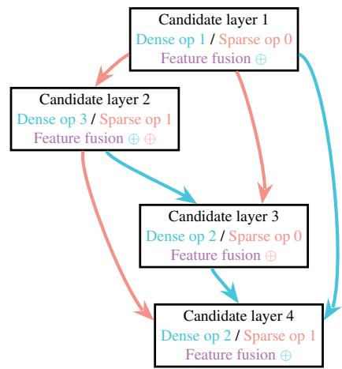  
(c) Discretized candidate architecture from relaxed DAG search space  
Figure 2: Illustration of the DAG search space construction, search space relaxation, and sampled candidate architecture in Drs.NAS, utilizing a four-layer architecture as an example

Formally, let V and E denote the set of candidate layers and candidate in-edges at layer i. Each candidate layer v V and candidate in-edge e E is assigned with a learnable weight parameter, defined as wv,we W . The smooth architecture sampling in Drs.NAS includes two components. Firstly, the edge sampling is performed over candidate in-edges Ei iteratively across each layer utilizing Gumbel-Softmax relaxation, as indicated in Eq. (7). Here, the g indicates the Gumbel noise g  Gumbel(0,1), and the % represents the temperature parameter controlling the smoothness of the sampling in the Gumbel-Softmax.

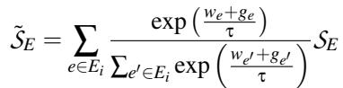

(7)

Secondly, a similar Gumbel-Softmax relaxation is deployed over candidate layers vi iteratively across each vertex, and the vertex sampling is performed as Eq. (8). The relaxed search space is illustrated in Fig. 2(b), enabling the joint sampling of the candidate layers and in-edges. Notably, the architecture sampling strategy mainly focuses on the selection of candidate layers and in-edges and ensures valid forward paths without requiring additional graph-level constraints.

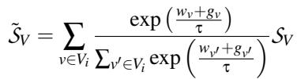

(8)

After the architecture sampling, the candidate architecture refers to G G. The discrete candidate architecture can be obtained through architecture discretization based on the weight parameters W , as illustrated in Fig. 2(c). For vertex discretization, Drs.NAS selects the optimal candidate layer S˜v with the highest candidate layer weight from each vertex Vi, i.e., argmaxv V (wv). For edge discretization, Drs.NAS sets a fixed threshold d to determine the optimal candidate in-edges and selects the edges with the top d candidate in-edge weights we from the candidate in-edges set Ei. Here, we define the threshold d = 50% to balance the trade-off between model complexity and computational efficiency.

## 3.5 Gradient-Based Search

To discover the optimal architecture with both predictive performance and computational efficiency, we develop a composite loss function based on the superproxy and define the architecture search loss L that jointly optimizes three objectives, as formulated in Eq. (9). Similar to prior research [Liu et al.(2018), Wu et al.(2019)], we adopt a gradient-based approach to solve this co-optimization problem.

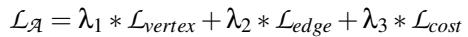

(9)

In Eq. (9), we define the three components in the composite loss function corresponding to the selection of candidate layers, the connection of candidate in-edges, and the computational cost of the candidate architecture, respectively. In particular, Lvertex encourages effective operators in each candidate layer to achieve high performance. Ledge regularizes the data flow of in-edges within the architecture. Lcost controls the computational overhead by penalizing architectures that introduce high computational overhead.

In Drs.NAS, within Lvertex and Ledge, we encourage the selection of architectures with high overhead-relevant proxies to maximize the overall predictive performance, motivated by the insight that overhead-relevant proxies are strongly correlated with predictive performance and trainability [Li et al.(2023)]. However, this strategy may induce increased memory and computational overhead. To counterbalance this effect, we incorporate the overhead-irrelevant proxies as the regularizer to stabilize the optimization process.

Formally, let VA and EA denote the set of all candidate layers and candidate in-edges within the candidate architecture. S˜ R and S˜ I represent subsets of superproxy S˜ , where S˜ R contains the overhead-relevant proxies indexed by R and S˜ I includes the overhead-irrelevant proxies indexed by I . The computation of Lvertex is indicated in Eq. (10). In Lvertex, we employ the parameter related overhead-relevant proxies Rv = {Sparam, Sgnorm , Swnorm }, while using all the overheadirrelevant proxies Iv = {Ssyn, Szico, Smeco} as regularizer.

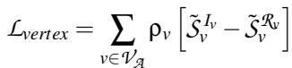

(10)

Additionally, we compute the Ledge based on the superproxies of the candidate in-edges. Here, we mainly focus on the data flow and gradient flow related proxies in Ledge, such as Re = {Sgnorm}, and overhead-irrelevant proxies Ie = Ssyn, Szico as the regularizer in this loss function to optimize the data and gradient propagation within the candidate architecture. The computation of Ledge is denoted as Eq. (11).

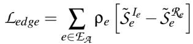

(11)

Last but not least, we define the loss function for the computational overhead, Lcost, which integrates both computational and memory usage. We define the Lcost as indicated in Eq. (12), incorporating the #FLOPs and #Params of the candidate architecture. The degree( ) is utilized as a layer-specific normalizer for distinguishing the contribution of different layers. Based on our definition, high #Params encourages the candidate architecture to have better predictive performance and trainability, while high #FLOPs are penalized to promote model computational efficiency. In Lcost, we assign equal weight to #FLOPs and #Params, enabling a balance between computational efficiency and predictive performance during the architecture search process.

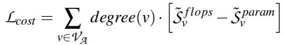

(12)

It is worth mentioning that the hyperparameters # = [#1,#2,#3] and & = {&v,&e} are trainable weighting parameters that dynamically balance the contribution of each component during optimization without manual fine-tuning. To avoid any single loss function from being disregarded, we normalize the learnable parameters # and & via softmax. In Drs.NAS, we utilize a gradient-based optimization strategy to minimize the LA , as illustrated in Algorithm 1, and discover the corresponding optimal architecture.

Algorithm 1 Gradient-based search in Drs.NAS   
Input: Given DAG search space G = (V , E)   
Input: Architecture Sampler Sampler(W , &, #)   
Output: Optimal candidate architecture GA = (VA , EA )   
1: L ∋   
2: W , &, #  Initialize(W , &, #)   
3: for iteration i = 1 to N do   
4: Sample a candidate architecture GA i:   
5: GA i ↙ Sampler(W , &, #)   
6: Compute the composite loss LA:   
7: Lvertex ↙ ∃v V &v )S˜ Ivv ↖ S˜ Rv v \*   
8: Ledge ↙ ∃e E &e )S˜ Iee ↖   
9: Lcost ∃ degree(v) )S˜ f lopsv S˜ paramv \*   
10: LA ↙ #1 ⇔ Lvertex + #2 ⇔ Ledge + #3 ⇔ Lcost   
11: if L < L then   
12: Lbest ↙ LA   
13: GA ↙ GAi   
14: end if   
15: Update Sampler(W , &, #) via gradient descent   
16: W ,&,#  Adam(W ,&,#,(LA)   
17: end for   
18: return GA

## 4 Experimental Setup

## 4.1 Evaluation Benchmarks and Metrics

Following prior work [Song et al.(2020), Zhang et al.(2023)], we evaluate Drs.NAS on three representative real-world recommendation system benchmarks, including Criteo [Tien et al.(2014)], Avazu [Wang and Cukierski(2014)], and KDD [Aden and Wang(2012)]. We select these benchmarks for two primary reasons: (1) they are standard public benchmarks for Click-Through Rate (CTR) prediction, widely adopted across both academia and industry research settings; and (2) they are consistently used in prior studies, enabling direct and fair comparisons with existing work. We adopt the standard preprocessing procedures from [Song et al.(2020), Zhang et al.(2023)] to ensure consistency across different models. The statistical information of the three benchmarks is summarized in Tab. 2.

Table 2: Statistics for three representative recommendation system benchmarks, detailing the number of dense and sparse features alongside the total number of samples.  
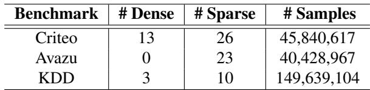

To systematically evaluate the performance and efficiency of Drs.NAS searched architectures, we leverage four widely adopted metrics. For the predictive performance, we evaluate Log Loss and AUC score. For memory and computational efficiency, we measure the model size #Params and computational costs #FLOPs. In general, better performance corresponds to lower Log Loss and higher AUC score, while better efficiency is indicated by lower #Params and #FLOPs.

Note that Drs.NAS focuses on neural architecture design, namely searching for effective backbone structures that determine how feature representations are combined and transformed to produce predictions, which is consistent with prior work [Zhang et al.(2023),Zhu et al.(2022)]; the embedding tables are fixed and not part of the search space. In fact, the size of embedding tables is determined by the dataset-specific configurations rather than architectural decisions, because they are used to encode categorical input features. In short, we measure model size and computational cost primarily based on the searched backbone architectures.

## 4.2 Drs.NAS Implementation

In this study, all experiments are implemented based on Py-Torch [Paszke et al.(2019)]. For superproxy computation, we randomly select 2,048 samples (one batch) from the training set and utilize the binary cross-entropy (BCE) loss function to compute the gradient-related proxies, such as Sg and Szico. Architecture #FLOPs are measured using DeepSpeed [Rasley et al.(2020)] and FvCore [Facebook Research(2022)]. To han dle the scale differences among proxies, we apply logarithmic transformations to #Params and #FLOPs and z-score normal ization to other proxies in the superproxy. Following previous differentiable NAS studies [Zhu et al.(2022),Liu et al.(2018)], we utilize the Adam optimizer [Kingma and Ba(2014)] with learning rate from {0.02, 0.05, 0.1, 0.2, 0.5}. Due to the ultraefficient search (minutes on CPU), early stopping is unnecessary, and we run all the architecture search experiments for N = 10000 iterations across all benchmarks.

To comprehensively evaluate the scalability of architectures searched by Drs.NAS, we consider different model depths D 5,6,7,8,9 . In contrast to conventional NAS approaches that typically rely on coarse-grained dimension sets [Song et al.(2020), Zhang et al.(2023), Zhu et al.(2022)], such as sparse integers in {16, 32, 64, 128}, we select hidden dimensions from a fine-grained set of consecutive integers ranging from 4 to 32, resulting in a significantly expanded but more flexible search space. The fine-grained architecture search space allows Drs.NAS to better balance the trade-off between model predictive performance and computational efficiency on different benchmarks.

Furthermore, we conduct the architecture search experiments based on two different search space configurations, following the definition in NASRec [Zhang et al.(2023)]. The “Search space - Small” includes two dense operators (FC and

Dot-Product) and one sparse operator (Embedded FC), while the full search space, indicated as “Search space - Full”, consists of all four dense operators and two sparse operators mentioned in Sec. 3.3. Both “Search space - Small” and “Search space - Full” search spaces include the dense-to-sparse and sparse-to-dense feature fusion operators.

All the Drs.NAS architecture search processes are conducted on an AMD Ryzen 5975WX CPU. After Drs.NAS produces the optimal DRS architectures, we evaluate these architectures on an NVIDIA A6000 GPU to validate the performance of the resulting models across different benchmark datasets and architecture search configurations.

## 5 Evaluation

Based on our experimental setup, we investigate the following key research questions (RQs). Specifically, we explore:

• RQ1: How much improvement does Drs.NAS provide in the search efficiency and search cost compared with the SOTA NAS baseline approaches [Gao et al.(2021), Song et al.(2020), Zhu et al.(2022), Zhang et al.(2023)]?

• RQ2: How much improvement in predictive performance do Drs.NAS searched architectures provide compared with handcrafted [Guo et al.(2017), Song et al.(2019), Naumov et al.(2019)] and NAS baselines across different benchmarks?

• RQ3: How much improvement in computational and memory efficiency do Drs.NAS searched architectures provide compared with handcrafted and NAS baselines across different benchmarks?

Furthermore, we investigate:

• RQ4: How consistent and robust are the Drs.NAS searched architectures under different search space configurations and hyperparameter selections, from both the performance and efficiency perspectives?

## 5.1 Search Efficiency Evaluation

Answering RQ1: Drs.NAS presents an ultra-efficient search procedure compared with SOTA NAS approaches by providing up to 692 faster NAS process, reducing search cost from GPU-hours to CPU-minutes.

As indicated in Tab. 1, Drs.NAS outperforms all the NAS baselines in the search efficiency. In particular, compared with SOTA NAS approaches including PROFIT [Gao et al.(2021)], AutoCTR [Song et al.(2020)], NAS-CTR [Zhu et al.(2022)], and NASRec [Zhang et al.(2023)], Drs.NAS achieves 461 , 692 , 193 and 230 search time reduction, averaged over three benchmark datasets.

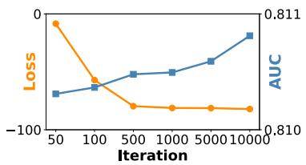  
(a) Criteo

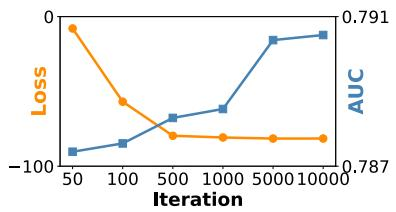  
(b) Avazu

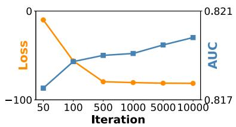  
(c) KDD  
Figure 3: The optimization curve of loss LA (✁) and the AUC score curve (✂) of corresponding candidate architecture during Drs.NAS architecture search process across three benchmarks.

Meanwhile, Drs.NAS requires substantially less computational resources for architecture search. Prior NAS approaches involved the supernet training and fine-tuning procedure of candidate architectures that required significant computation and GPU memory. For instance, NASRec [Zhang et al.(2023)] utilizes over 16 GB of GPU memory for the supernet training and more than 20 GB for the NAS process on the KDD benchmark. In contrast, Drs.NAS performs the NAS process on a commodity CPU only, without GPU acceleration, denoting a dramatic reduction in memory usage and computational cost.

According to our analysis, the improved efficiency of Drs.NAS can be attributed to the superproxy-based performance estimation, which eliminates the requirement for massive training of the supernet and iterative training and validation of candidate architectures [Zhang et al.(2023)]. As a result, Drs.NAS utilizes the superproxies as performance indicators to guide the selection of candidate architectures by minimizing the architecture search loss and significantly reducing the architecture search costs.

Furthermore, we visualize the optimization curve of architecture search loss in Drs.NAS and the corresponding performance of candidate architectures, as illustrated in Fig. 3(a) to Fig. 3(c). Here we select the learning rate of 0.02 and model depth D = 9 in this case study. Six milestone iterations 50,100,500,1000,5000,10000 are selected to evaluate both the architecture search loss L and the AUC score of the corresponding candidate architectures. Notably, at early iterations, the AUC scores remain low across different benchmarks, as the initial architectures are randomly sampled from the search space without optimization. As composite loss decreases across optimization steps, the validation AUC of candidate architectures exhibits monotonic improvement. These evaluation results provide potential support for the effectiveness of the gradient-based search in Drs.NAS.

## 5.2 Model Predictive Performance Evaluation

## Answering RQ2: Drs.NAS demonstrates on par or even superior predictive performance compared with the SOTA NAS baselines, across three widely adopted benchmarks.

The performance evaluation of various DRS is presented in Fig. 4(a) to Fig. 4(f). In our experiment, we compare the Log Loss and AUC score of Drs.NAS searched architectures with mainstream handcrafted and SOTA NAS approaches.

In CTR prediction tasks, a 0.001-level improvement in AUC or Log Loss can lead to a substantial impact on the overall performance [Zhu et al.(2022), Song et al.(2020)]. In particular, Drs.NAS searched architectures consistently achieve better predictive performance than the mainstream handcrafted baselines [Guo et al.(2017),Song et al.(2019),Naumov et al.(2019)] and achieve 0.0028, 0.0078, and 0.0046 of averaged Log Loss reduction on the Criteo, Avazu, and KDD benchmark datasets, respectively. Furthermore, across the SOTA NAS approaches [Gao et al.(2021), Song et al.(2020), Zhu et al.(2022), Zhang et al.(2023)], Drs.NAS achieves competitive Log Loss, with 0.0011, 0.0022, and 0.0026 averaged Log Loss reduction on the three benchmarks, respectively.

Meanwhile, regarding the AUC score, Drs.NAS achieves better predictive performance than all the mainstream handcrafted baselines by achieving 0.0022, 0.0137, and 0.0211 averaged AUC score improvements on the three benchmark datasets. Furthermore, Drs.NAS searched architectures achieve 0.0004, 0.0043, and 0.0121 of averaged AUC score improvements over the SOTA NAS baselines, on the three benchmarks, respectively. Our experimental results show the effectiveness of Drs.NAS in discovering the high-performing architectures for DRS.

## 5.3 Model Efficiency Evaluation

Answering RQ3: Drs.NAS searched architectures demonstrate substantial efficiency improvements in both computation and memory compared to SOTA NAS baselines, achieving, on average, 34.9 smaller model size and 14.7 fewer #FLOPs across three benchmarks.

The evaluation results of inference costs are illustrated in Fig. 4(g) to Fig. 4(l). In this section, we compare the #Params and #FLOPs of the optimal architectures with handcrafted and NAS baselines to comprehensively evaluate the memory and computational efficiency of Drs.NAS searched architectures.

Based on the experimental results, Drs.NAS consistently achieves better memory and computational efficiency than the baselines across all benchmarks. For the evaluation of model efficiency, we focus primarily on the DRS architectures and exclude the parameters in embedding tables for a fair comparison, following previous works [Song et al.(2020), Zhu et al.(2022), Zhang et al.(2023)]. On average, compared with handcrafted baselines [Guo et al.(2017), Song et al.(2019), Naumov et al.(2019)], Drs.NAS reduces the #Params by 131.6 , 80.5 , and 112.9 on the three benchmarks. Additionally, compared with the SOTA NAS baselines [Gao et al.(2021), Song et al.(2020), Zhu et al.(2022), Zhang et al.(2023)], Drs.NAS achieves 54.8 , 36.7 , and 13.3 averaged #Params reduction across all NAS baselines on Criteo, Avazu, and KDD benchmarks, respectively. In parallel, for computational efficiency, Drs.NAS provides 111.1 , 62.5 , and 92.8 averaged #FLOPs reduction across the handcrafted baselines, and 25.2 , 10.2 , and 8.7 averaged #FLOPs reduction across the NAS baselines, on the three benchmark datasets, respectively.

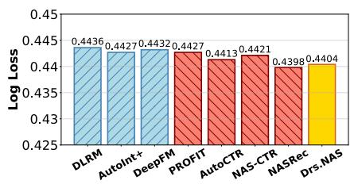  
(a) Log Loss@Criteo

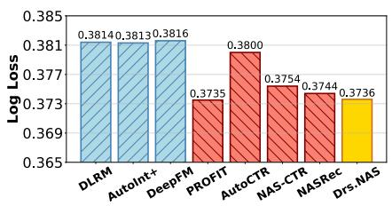  
(b) Log Loss@Avazu

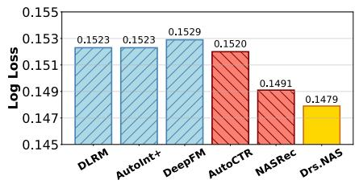  
(c) Log Loss@KDD

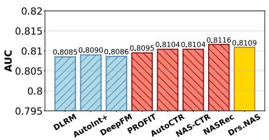  
(d) AUC@Criteo

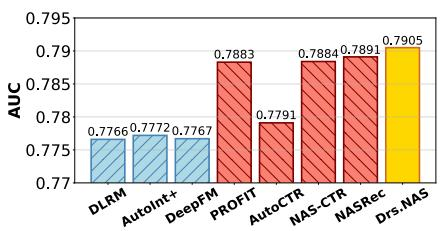  
(e) AUC@Avazu

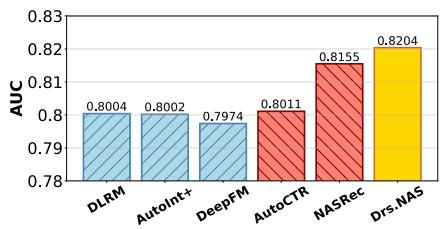  
(f) AUC@KDD

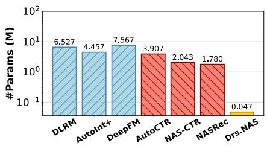  
(g) #Params@Criteo

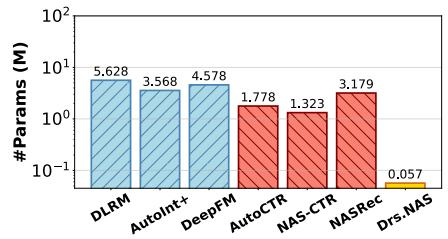  
(h) #Params@Avazu

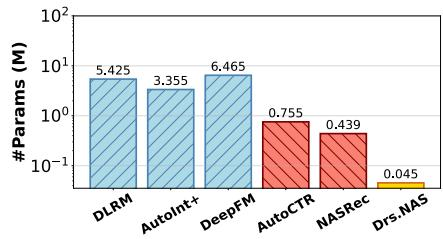  
(i) #Params@KDD

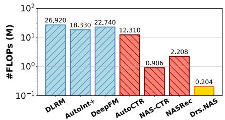  
(j) #FLOPs@Criteo

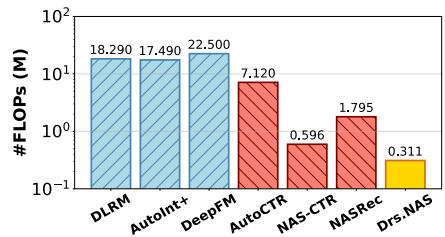  
(k) #FLOPs@Avazu

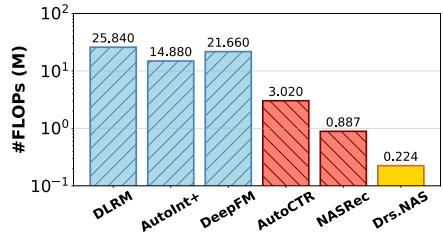  
(l) #FLOPs@KDD  
Figure 4: Evaluation of the optimal architecture searched by Drs.NAS against handcrafted and NAS baselines on three benchmarks, based on Log Loss ( ), AUC score ( ), #Params ( ), and #FLOPs ( ).

Our analysis attributes the significant improvement to the cooperation between the fine-grained search space design and the cost-aware optimization. Different from conventional NAS approaches [Song et al.(2020), Zhang et al.(2023)] that utilize coarse-grained hidden dimension configurations, Drs.NAS employs a low-value range but high-granularity definition based on consecutive integers, enabling an expanded search space with reduced hidden dimension and model size. In the meantime, we incorporate the computational overhead as part of the composite loss function, which allows Drs.NAS to discover optimal architectures with reduced computational overhead.

Table 3: Comparison of inference time (µs) for optimal architectures searched by Drs.NAS and SOTA approach NAS-Rec [Zhang et al.(2023)] across three benchmarks and two search space configurations.  
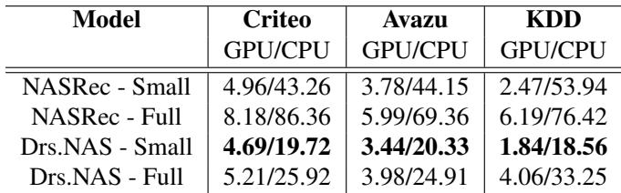

Additionally, we evaluate the inference time of DRS models using Drs.NAS searched architectures based on both GPU and CPU devices, compared with the SOTA NAS baseline [Zhang et al.(2023)]. We select the same model depth, D = 7, for a fair comparison. The inference time evaluation, reported in microseconds (µs), is presented in Tab. 3. We evaluate the inference time per sample, and each measurement is repeated three times to mitigate variance and experimental bias. On average, Drs.NAS searched architectures achieve 60.8% reduction in CPU inference time and 24% inference time reduction on GPU across three benchmarks and two different search space configurations. These results indicate that the decrease in #FLOPs obtained by Drs.NAS can consistently convert to lower inference latency for the DRS deployment on both hardware platforms.

## 5.4 Ablation Study

Answering RQ4: Drs.NAS demonstrates robustness across diverse architecture search configurations, consistently discovering high-performing and efficient architectures. Different configurations enable distinct design choices and performance-efficiency trade-offs.

To evaluate the configurable components in the Drs.NAS architecture search process, we conduct comprehensive ablation studies to explore the robustness of Drs.NAS, defined by the consistency of the performance and efficiency across different searched architectures. In our ablation study, we select different model depths, learning rates, and search space configurations to systematically investigate the robustness of Drs.NAS searched architectures. Meanwhile, we measure the coefficient of variation (CV) for different performance and efficiency metrics to evaluate the robustness of Drs.NAS.

Takeaway 1: Drs.NAS is robust to model depth and can consistently discover efficient architectures across various model complexities.

We investigate the impact of model depth D. Here we mainly focus on the AUC scores since the #FLOPs and #Params will naturally increase with greater model depth. The evaluation results are illustrated in Fig. 5(a) to Fig. 5(c). We compute the CV of the AUC scores across different model depths. The evaluation results indicate that Drs.NAS searched architectures exhibit the CV of 0.0002, 0.0006, and 0.0004 on various benchmarks, indicating significant robustness in model predictive performance across different model depths.

We can observe that optimal model depth varies across benchmarks. For instance, on the Avazu benchmark, the architecture searched by Drs.NAS achieves the highest averaged AUC at model depth D = 9, and on the Criteo and KDD benchmarks, the optimal depth is D = 7. Notably, even at model depth D = 9, the optimal architecture achieves superior efficiency compared to prior NAS baselines.

Takeaway 2: Lower learning rates during architecture search tend to yield architectures with improved predictive performance.

Meanwhile, we examine the impact of different learning rates within the gradient-based search process. The evaluation results are presented in Fig. 5(d) to Fig. 5(f). Specifically, we observe that the optimal architecture is searched with a lower learning rate, such as 0.02 and 0.05. In particular, we compare the averaged AUC scores of Drs.NAS searched architectures across all three benchmarks, and the lower learning rates (0.02 and 0.05) achieve 0.02%, 0.05%, and 0.03% higher averaged AUC scores than the higher learning rates (0.2 and 0.5).

We evaluate the CV on both #FLOPs and #Params of different optimal architectures, and the inference costs remain stable over varying learning rates. The averaged CVs of #FLOPs and #Params are 0.05 and 0.02 over three benchmarks, which denotes the robustness of Drs.NAS in architecture search. Additionally, we notice that the improvement in performance does not significantly influence the computational or memory efficiency. We hypothesize that higher learning rates may overshoot the sweet spot in the search space, resulting in suboptimal architectures. In contrast, lower learning rates enable a finer search process and discover architectures with improved performance, without introducing extra computational and memory overhead.

Takeaway 3: Different search space configurations induce trade-offs in Drs.NAS searched architectures between predictive performance and computational efficiency.

In addition, we evaluate and compare the computational efficiency of Drs.NAS searched architectures based on the “Search space - Small” and “Search space - Full” search space configurations, as discussed in Sec. 4.2. As indicated in Fig. 5(g) to Fig. 5(i), the experimental results show that Drs.NAS searched architectures demonstrate clear trade-offs between performance and efficiency depending on the search spaces. Specifically, the optimal architectures searched from “Search space - Small” achieve higher AUC scores, and models discovered from “Search space - Full” exhibit reduced #Params and #FLOPs.

In this ablation study, consistent with the NASRec approach, we fix the model depth D = 7 and utilize the lower learning rate in {0.02, 0.05}. According to our analysis, the architecture searched in “Search space - Small” achieves 0.17%, 0.33%, and 0.1% higher averaged AUC scores, while models from “Search space - Full” search space induce 56%, 58%, and 64% #Params reduction and 17%, 21%, and 14% #FLOPs reduction across the Criteo, Avazu, and KDD benchmarks, respectively. On average, the CVs of AUC scores, #FLOPs, and #Params are 0.0005, 0.05, and 0.02 across different search spaces and varying benchmarks, indicating noticeable robustness of Drs.NAS in architecture search.

We hypothesize that “Search space - Full” includes an expanded operator set, which allows Drs.NAS to bypass the computationally expensive operators, such as FC, leading to more efficient architectures. This high efficiency may trade off the predictive performance, because the overheadrelevant proxies, such as #Params and #FLOPs, are correlated with the model predictive performance [Li et al.(2023), Lin et al.(2020)]. This phenomenon can potentially support the effectiveness of Drs.NAS on balancing the performance and efficiency of candidate architectures.

Furthermore, the searched architectures with higher #Params or #FLOPs, when used as the sole selection criterion, do not consistently achieve better predictive performance across different model depths, learning rates, and search space configurations. This is consistent with prior findings [Huang et al.(2024), Cortês et al.(2025)] that individual proxies, such as #Params and #FLOPs, are insufficient to indicate model performance reliably. More importantly, this observation validates the superproxy rather than relying on a single proxy alone as the performance indicator. In particular, the consistent performance and efficiency of Drs.NAS searched architectures across all configurations indicate that the ensemble design of the superproxy captures more reliable optimization signals than individual proxies.

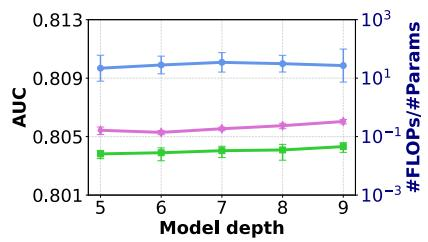  
(a) Criteo - Model depth

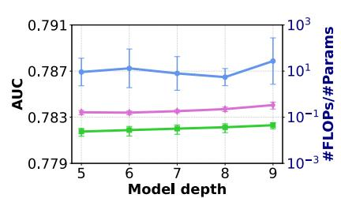  
(b) Avazu - Model depth

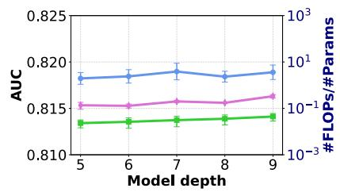  
(c) KDD - Model depth

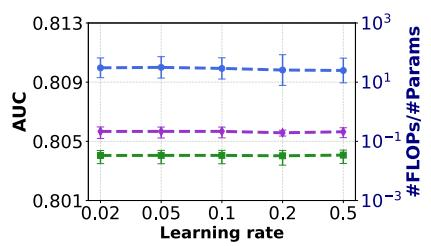  
(d) Criteo - Learning rate

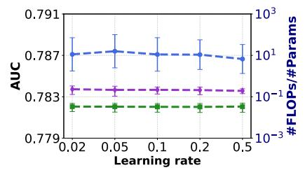  
(e) Avazu - Learning rate

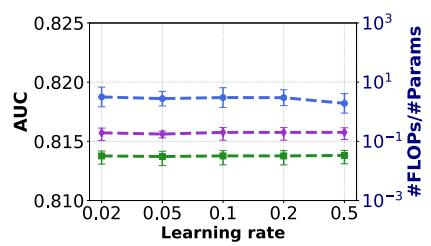  
(f) KDD - Learning rate

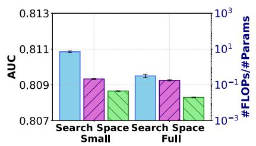  
(g) Criteo - Search space

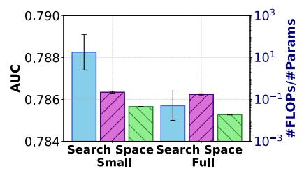  
(h) Avazu - Search space

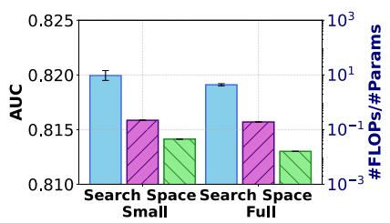  
(i) KDD - Search space  
Figure 5: Ablation study on the (1) model depth, (2) learning rate selection, and (3) search space configuration in Drs.NAS, based on averaged AUC score, #FLOPs, and #Params across different benchmarks.

## 6 Discussion

The key idea of Drs.NAS is the superproxy, which comprises seven zero-cost proxies and serves as a composite indicator for predictive performance and architectural efficiency. While extensively validated in the DRS context, it is unclear how the strategy scales to different model families and application domains (e.g., LLMs) [Abdelfattah et al.(2021), Yang et al.(2025),Cortês et al.(2025)]. An important direction of our future work is to systematically characterize the boundary conditions under which Drs.NAS remains reliable through evaluation across more diverse search spaces and cross-domain applications, enabling a comprehensive evaluation of the generalizability and robustness of Drs.NAS.

## 7 Conclusion

In this work, we presented Drs.NAS, an ultra-efficient NAS framework for DRS. Unlike conventional NAS approaches that rely on computationally expensive training and validation during search, Drs.NAS introduces the novel superproxy metric, enabling rapid architecture exploration within minutes on CPUs. By integrating superproxy into a composite loss function, Drs.NAS co-optimizes predictive performance and efficiency and produces architectures that are high-performing, computation- and memory-efficient. Extensive evaluations on widely used recommendation benchmarks demonstrate that Drs.NAS achieves drastic efficiency improvements—reducing search costs by nearly three orders of magnitude and lowering model size and FLOPs by averages of 34.9 and 14.7 , respectively, compared with SOTA NAS baselines—while delivering on par or superior predictive performance compared to SOTA NAS and mainstream handcrafted baselines.

## References

[Abdelfattah et al.(2021)] Mohamed S Abdelfattah, Abhinav Mehrotra, !ukasz Dudziak, and Nicholas D Lane. 2021. Zero-cost proxies for lightweight NAS. arXiv preprint arXiv:2101.08134 (2021).

[Aden and Wang(2012)] Aden and Yi Wang. 2012. KDD Cup 2012, Track 2. https://kaggle.com/ competitions/kddcup2012-track2. Kaggle.

[Berger et al.(2018)] Daniel S Berger, Benjamin Berg, Timothy Zhu, Siddhartha Sen, and Mor Harchol-Balter. 2018. RobinHood : Tail Latency Aware Caching–Dynamic Reallocation from Cache-Rich to Cache-Poor . In 13th USENIX Symposium on Operating Systems Design and Implementation (OSDI 18). 195–212.

[Cai et al.(2019)] Han Cai, Chuang Gan, Tianzhe Wang, Zhekai Zhang, and Song Han. 2019. Once-for-all: Train one network and specialize it for efficient deployment. arXiv preprint arXiv:1908.09791 (2019).

[Cai et al.(2018)] Han Cai, Ligeng Zhu, and Song Han. 2018. Proxylessnas: Direct neural architecture search on target task and hardware. arXiv preprint arXiv:1812.00332 (2018).

[Chang et al.(2019)] Jianlong Chang et al. 2019. Data: Differentiable architecture approximation. Advances in Neural Information Processing Systems 32 (2019).

[Chen et al.(2024)] Hao Chen, Yuanchen Bei, Qijie Shen, Yue Xu, Sheng Zhou, Wenbing Huang, Feiran Huang, Senzhang Wang, and Xiao Huang. 2024. Macro graph neural networks for online billion-scale recommender systems. In Proceedings of the ACM web conference 2024. 3598–3608.

[Chen et al.(2019)] Qiwei Chen, Huan Zhao, Wei Li, Pipei Huang, and Wenwu Ou. 2019. Behavior sequence transformer for e-commerce recommendation in alibaba. In Proceedings of the 1st international workshop on deep learning practice for high-dimensional sparse data. 1– 4.

[Cheng et al.(2016)] Heng-Tze Cheng, Levent Koc, Jeremiah Harmsen, Tal Shaked, Tushar Chandra, Hrishi Aradhye, Glen Anderson, Greg Corrado, Wei Chai, Mustafa Ispir, et al. 2016. Wide & deep learning for recommender systems. In Proceedings of the 1st workshop on deep learning for recommender systems. 7–10.

[Cortês et al.(2025)] Gabriel Cortês, Nuno Lourenço, Paolo Romano, and Penousal Machado. 2025. Greenfactory: Ensembling zero-cost proxies to estimate performance of neural networks. arXiv preprint arXiv:2505.09344 (2025).

[Facebook Research(2022)] Facebook Research. 2022. fvcore. https://github.com/facebookresearch/ fvcore. Accessed: 2025-06-28.

[Gao et al.(2021)] Chen Gao, Yinfeng Li, Quanming Yao, Depeng Jin, and Yong Li. 2021. Progressive feature interaction search for deep sparse network. Advances in Neural Information Processing Systems 34 (2021), 392–403.

[Gao et al.(2025)] Jianhua Gao, Zeming Liu, Yizhuo Wang, and Weixing Ji. 2025. RaNAS: Resource-aware neural architecture search for edge computing. ACM Transactions on Architecture and Code Optimization 22, 1 (2025), 1–18.

[Guo et al.(2017)] Huifeng Guo, Ruiming Tang, Yunming Ye, Zhenguo Li, and Xiuqiang He. 2017. DeepFM: a factorization-machine based neural network for CTR prediction. arXiv preprint arXiv:1703.04247 (2017).

[Gupta et al.(2020)] Udit Gupta, Carole-Jean Wu, Xiaodong Wang, Maxim Naumov, Brandon Reagen, David Brooks, Bradford Cottel, Kim Hazelwood, Mark Hempstead, Bill Jia, et al. 2020. The architectural implications of facebook’s dnn-based personalized recommendation. In 2020 IEEE International Symposium on High Performance Computer Architecture (HPCA). IEEE, 488–501.

[Huang et al.(2024)] Yi-Cheng Huang, Wei-Hua Li, Chih-Han Tsou, Jun-Cheng Chen, and Chu-Song Chen. 2024. UP-NAS: Unified Proxy for Neural Architecture Search. In Proceedings of the IEEE/CVF Conference on Com puter Vision and Pattern Recognition. 1675–1684.

[Jang et al.(2016)] Eric Jang, Shixiang Gu, and Ben Poole. 2016. Categorical reparameterization with gumbelsoftmax. arXiv preprint arXiv:1611.01144 (2016).

[Jiang et al.(2023)] Tangyu Jiang, Haodi Wang, and Rongfang Bie. 2023. Meco: zero-shot NAS with one data and single forward pass via minimum eigenvalue of correlation. Advances in Neural Information Processing Systems 36 (2023), 61020–61047.

[Kingma and Ba(2014)] Diederik P Kingma and Jimmy Ba. 2014. Adam: A method for stochastic optimization. arXiv preprint arXiv:1412.6980 (2014).

[Li et al.(2023)] Guihong Li, Yuedong Yang, Kartikeya Bhardwaj, and Radu Marculescu. 2023. Zico: Zeroshot nas via inverse coefficient of variation on gradients. arXiv preprint arXiv:2301.11300 (2023).

[Lin et al.(2020)] Ji Lin et al. 2020. Mcunet: Tiny deep learning on iot devices. Advances in neural information processing systems 33 (2020), 11711–11722.

[Liu et al.(2018)] Hanxiao Liu, Karen Simonyan, and Yiming Yang. 2018. Darts: Differentiable architecture search. arXiv preprint arXiv:1806.09055 (2018).

[Lukasik et al.(2025)] Jovita Lukasik, Michael Moeller, and Margret Keuper. 2025. An evaluation of zero-cost proxies-from neural architecture performance prediction to model robustness. International Journal of Computer Vision 133, 5 (2025), 2635–2652.

[Maddison et al.(2016)] Chris J Maddison, Andriy Mnih, and Yee Whye Teh. 2016. The concrete distribution: A continuous relaxation of discrete random variables. arXiv preprint arXiv:1611.00712 (2016).

[Mellor et al.(2021)] Joe Mellor, Jack Turner, Amos Storkey, and Elliot J Crowley. 2021. Neural architecture search without training. In International conference on machine learning. PMLR, 7588–7598.

[Naumov et al.(2019)] Maxim Naumov, Dheevatsa Mudigere, Hao-Jun Michael Shi, Jianyu Huang, Narayanan Sundaraman, Jongsoo Park, Xiaodong Wang, Udit Gupta, Carole-Jean Wu, Alisson G Azzolini, et al. 2019. Deep learning recommendation model for personalization and recommendation systems. arXiv preprint arXiv:1906.00091 (2019).

[Paszke et al.(2019)] Adam Paszke, Sam Gross, Francisco Massa, Adam Lerer, James Bradbury, Gregory Chanan, Trevor Killeen, Zeming Lin, Natalia Gimelshein, Luca Antiga, et al. 2019. Pytorch: An imperative style, highperformance deep learning library. Advances in neural information processing systems 32 (2019).

[Rasley et al.(2020)] Jeff Rasley, Samyam Rajbhandari, Olatunji Ruwase, and Yuxiong He. 2020. Deepspeed: System optimizations enable training deep learning models with over 100 billion parameters. In Proceedings of the 26th ACM SIGKDD international conference on knowledge discovery & data mining. 3505–3506.

[Rendle(2010)] Steffen Rendle. 2010. Factorization machines. In 2010 IEEE International conference on data mining. IEEE, 995–1000.

[Song et al.(2020)] Qingquan Song et al. 2020. Towards automated neural interaction discovery for click-through rate prediction. In Proceedings of the 26th ACM SIGKDD International Conference on Knowledge Discovery & Data Mining. 945–955.

[Song et al.(2019)] Weiping Song, Chence Shi, Zhiping Xiao, Zhijian Duan, Yewen Xu, Ming Zhang, and Jian Tang. 2019. Autoint: Automatic feature interaction learning via self-attentive neural networks. In Proceedings of the 28th ACM international conference on information and knowledge management. 1161–1170.

[Tanaka et al.(2020)] Hidenori Tanaka, Daniel Kunin, Daniel L Yamins, and Surya Ganguli. 2020. Pruning

neural networks without any data by iteratively conserving synaptic flow. Advances in neural information processing systems 33 (2020), 6377–6389.

[Tien et al.(2014)] Jean-Baptiste Tien, joycenv, and Olivier Chapelle. 2014. Display Advertising Challenge. https://kaggle.com/competitions/ criteo-display-ad-challenge. Kaggle.

[Vaswani et al.(2017)] Ashish Vaswani, Noam Shazeer, Niki Parmar, Jakob Uszkoreit, Llion Jones, Aidan N Gomez, !ukasz Kaiser, and Illia Polosukhin. 2017. Attention is all you need. Advances in neural information processing systems 30 (2017).

[Wang et al.(2021)] Ruoxi Wang, Rakesh Shivanna, Derek Cheng, Sagar Jain, Dong Lin, Lichan Hong, and Ed Chi. 2021. Dcn v2: Improved deep & cross network and practical lessons for web-scale learning to rank systems. In Proceedings of the web conference 2021. 1785–1797.

[Wang and Cukierski(2014)] Steve Wang and Will Cukierski. 2014. Click-Through Rate Prediction. https://kaggle.com/competitions/ avazu-ctr-prediction. Kaggle.

[Wen et al.(2024)] Wei Wen, Kuang-Hung Liu, Igor Fedorov, Xin Zhang, Hang Yin, Weiwei Chu, Kaveh Hassani, Mengying Sun, Jiang Liu, Xu Wang, et al. 2024. Rankitect: Ranking architecture search battling world-class engineers at meta scale. In Companion Proceedings of the ACM Web Conference 2024. 73–82.

[Wu et al.(2019)] Bichen Wu, Xiaoliang Dai, Peizhao Zhang, Yanghan Wang, Fei Sun, Yiming Wu, Yuandong Tian, Peter Vajda, Yangqing Jia, and Kurt Keutzer. 2019. Fbnet: Hardware-aware efficient convnet design via differentiable neural architecture search. In Proceedings of the IEEE/CVF conference on computer vision and pattern recognition. 10734–10742.

[Xie et al.(2018)] Sirui Xie, Hehui Zheng, Chunxiao Liu, and Liang Lin. 2018. SNAS: stochastic neural architecture search. arXiv preprint arXiv:1812.09926 (2018).

[Yang et al.(2025)] Yeming Yang, Qingling Zhu, Jianping Luo, Ka-Chun Wong, Qiuzhen Lin, and Jianqiang Li. 2025. Trnas: A training-free robust neural architecture search. In Proceedings of the IEEE/CVF International Conference on Computer Vision. 2336–2345.

[Zhang et al.(2019)] Shuai Zhang, Lina Yao, Aixin Sun, and Yi Tay. 2019. Deep learning based recommender system: A survey and new perspectives. ACM computing surveys (CSUR) 52, 1 (2019), 1–38.

[Zhang et al.(2023)] Tunhou Zhang, Dehua Cheng, Yuchen He, Zhengxing Chen, Xiaoliang Dai, Liang Xiong, Feng Yan, Hai Li, Yiran Chen, and Wei Wen. 2023. NAS-Rec: weight sharing neural architecture search for recommender systems. In Proceedings of the ACM Web Conference 2023. 1199–1207.

[Zhang et al.(2024)] Tunhou Zhang, Wei Wen, Igor Fedorov, Xi Liu, Buyun Zhang, Fangqiu Han, Wen-Yen Chen, Yiping Han, Feng Yan, Hai Li, et al. 2024. DistDNAS: Search Efficient Feature Interactions within 2 Hours. In 2024 IEEE International Conference on Big Data (BigData). IEEE, 1492–1499.

[Zhou et al.(2024)] Qinqin Zhou, Kekai Sheng, Xiawu Zheng, Ke Li, Yonghong Tian, Jie Chen, and Rongrong Ji. 2024. Training-free transformer architecture search with zero-cost proxy guided evolution. IEEE Transactions on Pattern Analysis and Machine Intelligence 46, 10 (2024), 6525–6541.

[Zhu et al.(2022)] Guanghui Zhu, Feng Cheng, Defu Lian, Chunfeng Yuan, and Yihua Huang. 2022. NAS-CTR: efficient neural architecture search for click-through rate prediction. In Proceedings of the 45th International ACM SIGIR Conference on Research and Development in Information Retrieval. 332–342.