USENIX

THE ADVANCED COMPUTING SYSTEMS ASSOCIATION

# DynaRL: Flexible and Dynamic Scheduling of Large-Scale Reinforcement Learning Training

Yuanqing Wang, Peking University and Infinigence AI; Hao Lin, Junhao Hu, Chunyang Zhu, Quanlu Zhang, and Zhen Guo, Infinigence AI; Yuchen Zhang,   
Institute of Computing Technology, Chinese Academy of Sciences and Infinigence AI; Xu Fu and Si Xu, Infinigence AI; Bo Dai, Beihang University and Infinigence AI;   
Zixiao Huang, Tsinghua University and Infinigence AI; Chao Yu, Tsinghua University; Boxun Li, Infinigence AI; Guohao Dai, Shanghai Jiao Tong University and Infinigence AI; Zhi Yang, Peking University; Yu Wang, Tsinghua University https://www.usenix.org/conference/osdi26/presentation/wang-yuanqing

# This paper is included in the Proceedings of the 20th USENIX Symposium on Operating Systems Design and Implementation.

July 13–15, 2026 • Seattle, WA, USA

ISBN 978-1-939133-55-7

Open access to the Proceedings of the 20th USENIX Symposium on Operating Systems Design and Implementation is sponsored by

# DynaRL: Flexible and Dynamic Scheduling of Large-Scale Reinforcement Learning Training

Yuanqing Wang<sup>1,2</sup>, Hao Lin<sup>2</sup>, Junhao Hu<sup>2</sup>, Chunyang Zhu<sup>2</sup>, Quanlu Zhang<sup>2</sup>, Zhen Guo<sup>2</sup>, Yuchen Zhang<sup>5,2</sup>, Xu Fu<sup>2</sup>, Si Xu<sup>2</sup>, Bo Dai<sup>6,2</sup>, Zixiao Huang<sup>3,2</sup>, Chao Yu<sup>3</sup>, Boxun Li<sup>2</sup>, Guohao Dai<sup>7,2</sup>, Zhi Yang<sup>1</sup>, Yu Wang<sup>3</sup>

<sup>1</sup>Peking University <sup>2</sup>Infinigence AI <sup>3</sup>Tsinghua University <sup>4</sup>Zhongguancun Academy

<sup>5</sup>Institute of Computing Technology, CAS <sup>6</sup>Beihang University <sup>7</sup>Shanghai Jiao Tong University

## Abstract

Modern reinforcement learning (RL) workloads, powering large language models, long-horizon reasoning, and agentic systems, exhibit extreme dynamicity due to heavy-tailed roll outs, irregular multi-turn tool interactions, and time-varying bottlenecks. Static resource allocations in today’s distributed RL systems leave large fractions of compute idle and prolong training. This paper presents DynaRL, the first RL system that dynamically reallocates computation, memory, and communication resources across heterogeneous RL components. DynaRL models the entire RL pipeline with a dynamic hy pergraph that serves as a centralized, continuously-evolving control surface. Supported by a unified resource migration interface and context-aware data routing, the scheduler reallocates GPUs from overprovisioned components to the current bottleneck via a combination of a multi-level scheduling algorithm and fine-grained resource migration. Comprehensive evaluation demonstrates that DynaRL improves end-to-end throughput on math-reasoning and agentic RL workloads by up to 1.98×, with negligible online scheduling overhead.

## 1 Introduction

Reinforcement Learning (RL) has rapidly expanded from traditional control and game-playing tasks [6, 7] to the foundation of modern reasoning and agentic systems [2, 15]. Today’s RL workloads power large language/vision models, long-horizon planning agents [1], and tool-augmented agentic systems. As these workloads grow in scale and complexity, training increasingly relies on distributed clusters of hundreds of GPUs. However, unlike conventional deep learning workloads, RL pipelines integrate heterogeneous components, e.g., rollout generation, inference, multi-step tool calls, environment interactions, and policy optimization training, that interact in highly irregular and time-varying patterns.

This heterogeneity introduces substantial dynamicity throughout the pipeline. Rollout generation involves autoregressive model inference [17] whose response lengths exhibit heavy-tailed distributions, causing long-tail stragglers and significant GPU underutilization. Agentic RL amplifies this effect. Models repeatedly invoke external tools such as search engines, Python interpreters, or theorem provers [10], producing unpredictable multi-turn interaction traces that vary in both length and latency. These irregular interactions disrupt scheduling and create bottlenecks that cascade across the training pipeline. As our characterization shows, such dynamicity can waste up to 60% of available compute and create large oscillations in effective throughput.

Unfortunately, existing RL systems are largely static. They allocate GPUs to each component ahead of time and maintain this allocation throughout RL training. This static partitioning fundamentally mismatches the time-varying demands of modern RL workloads. When long-tail rollouts dominate, the GPUs assigned to rollouts become increasingly underutilized; when multi-turn interactions inflate generation load, rollout workers become severely underprovisioned; and when tool calls bottleneck progress, KV caches in inference engines are repeatedly evicted and rebuilt. The result is unstable throughput, inefficient resource usage, and prolonged training time.

This paper argues that dynamic scheduling must become a first-class design principle for next-generation distributed RL systems. RL training is inherently multi-component and feedback-driven, i.e., progress in one stage depends on the outputs and timing of others. If a system can observe runtime signals, detect shifts in bottlenecks, and reallocate resources in real time, while respecting dependencies and preserving training state, it can significantly improve end-to-end training efficiency and stability. However, enabling such dynamic management is challenging. RL components differ widely in structure, statefulness, and communication patterns; migrations must occur safely without violating components’ execution semantics; and the training pipeline must remain efficient despite constantly shifting parallelism.

We present DynaRL, a unified runtime and scheduling system that dynamically reallocates computation, memory, and communication resources across heterogeneous RL components. At a high level, DynaRL captures the entire RL pipeline in a single, continuously evolving runtime object and exposes it to the scheduler as a dynamic hypergraph that encapsulates both static structure and time-varying execution signals. Alongside this global control surface, DynaRL provides a unified resource-migration interface that lets the scheduler safely resize the parallelism of diverse components at interruptible points, using statefulness-aware migration strategies. Finally, it embeds context-aware data routing to attach semantic affinity and multi-step metadata to dataflow edges, preserving KV-cache locality and enabling multi-turn-aware request scheduling.

Built on these mechanisms, DynaRL employs a multi-level dynamic scheduling algorithm that detects overprovisioned components from hypergraph signals and reallocates their GPUs to the current bottleneck stage, by jointly adjusting resource allocation across components, within each Worker-Group, and at the request data level, where it prioritizes short, late-stage tool calls to exploit KV-cache reuse and accelerate episode completion.

We implement DynaRL in around 7K lines of Python atop RLinf [22], an open-source general RL framework, integrating with existing inference engines (e.g., SGLang [32]) and training backends (e.g., Megatron-LM [20]). Our experiments on math-reasoning and multi-turn agentic RL workloads show that DynaRL consistently improves throughput over state-ofthe-art RL systems such as verl and RLinf by up to 1.98× while adding less than 1% overhead for online scheduling and migration. We plan to release the full codebase of DynaRL.

This paper makes the following contributions:

• We characterize the dynamicity of modern RL workloads, demonstrating substantial long-tail rollouts, irregular multiturn tool-use patterns, and resulting system inefficiencies across production-scale deployments.

• We design and implement DynaRL, the first system to realize dynamic scheduling for distributed RL pipelines via a unified control surface, safe migration mechanisms, and overprovision-driven scheduling.

• We comprehensively evaluate DynaRL on math-reasoning and multi-turn agentic RL workloads, showing significant throughput improvements over state-of-the-art RL systems.

## 2 Background and Motivation

## 2.1 Diverse RL Workloads

Distributed reinforcement learning. Reinforcement Learning (RL) has evolved from its early use in small-scale gameplaying and robotic control to a key technique for training large foundation models for reasoning and decision-making. These workloads increasingly run in distributed settings to meet the compute and data demands of large models. Modern RL pipelines exhibit substantial structural diversity, as shown in Figure 1. A typical workflow comprises generation (producing rollouts given prompts), inference (computing log probabilities), and training (updating model parameters). However, the composition and dependencies of these components vary widely across algorithms. For example, GRPO contains only three major components, whereas PPO-based RLHF requires a substantially more complex seven-component pipeline with more data and control dependencies. This variability complicates system design and resource scheduling.

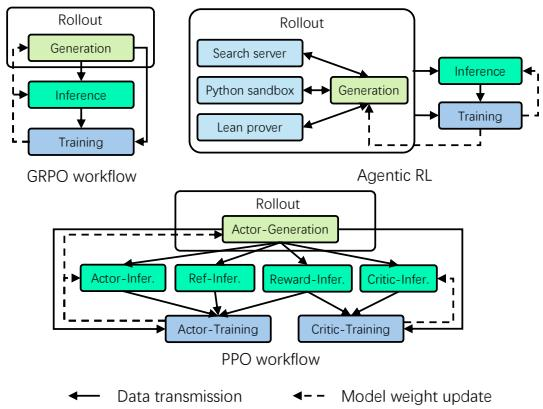  
Figure 1: Diverse RL workflows in various scenarios.

Agentic reinforcement learning. Recent agentic RL approaches further expand workflow complexity by integrating external tools into the rollout process. Systems such as DeepResearch combine LLM generation with search engines, databases, and iterative refinement loops; math-reasoning pipelines may involve Python interpreters or theorem provers such as Lean [10]. These tool-augmented rollouts introduce fine-grained and highly irregular dependencies between components. As a result, the training pipeline frequently stalls while waiting for upstream results, creating severe workload imbalance and resource underutilization.

## 2.2 The Dynamicity Challenge of RL

Dynamic behavior is inherent and pervasive in RL training. An RL pipeline repeatedly generates solutions for given tasks, e.g., responses to prompts or actions to perform, which can vary significantly due to differing response lengths, unpredictable numbers of reasoning steps, and on-demand tool usages. In this section, we quantitatively analyze such dynamicity in production RL workloads and pinpoint two major sources of dynamicity in RL training, namely long-tail model generation and irregular external interactions.

Dynamicity in long-tail generation. Rollout generation with model inference is highly unpredictable—generation response length can vary significantly across queries, which is positively related to the computation time due to the autoregressive nature of most modern foundation models. To deeply understand this, we studied the variation in generation response length in a typical math-reasoning RL task on a 1.5B-parameter language model using the GRPO algorithm, which involves a minimal number of components and no other interfering dynamicity like tool calls.

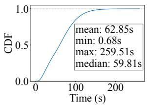  
Figure 2: Decode time in a math-reasoning RL task.

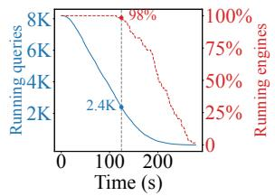  
Figure 3: Running query and inference engine variation in a math-reasoning RL task.

As shown in Figure 2, the decode time of math queries shows a skewed distribution. Only a small fraction of the queries reach near the maximum decode time (259.51s), while roughly 95% of the queries finish in under 150s (about 60% of that limit). Figure 3 further demonstrates the variation of running queries and running inference engine ratio (among 64 engines) during the rollout generation process.

Specifically, the blue curve tracks the number of active queries, while the red curve indicates the active engine ratio at the same time, which represents the percentage of engines still processing incomplete requests. As shown, at the middle of the generation, only less than 30% of queries remain unprocessed. The long-tail responses stall the entire rollout stage and introduce substantial computation waste. Moreover, because long-tail responses are evenly scattered across inference engine instances, many instances are highly underutilized, being stuck on the remaining one or two responses, and thus cannot be terminated to release resources. As in Figure 3, even when <30% of queries remain, almost all engines are still running. This idle time and underutilization can waste up to 60% of available computation, without considering KV-cache memory usage.

Dynamicity in irregular external interactions. Apart from generation dynamicity, emerging RL scenarios like agentic RL and embodied RL introduce another major source of dynamicity—irregular external interactions. Based on the generation results (in the form of commands or actions), the training pipeline needs to interact with external tools or environments like search engines, Python interpreters, program compilers, etc., to handle more complex tasks.

Such interactive workflows mostly follow the ReAct paradigm [28], where the model generates an intermediate output, optionally invokes tools, concatenates the tool results with prior context, and uses that as the next-turn input. Figure 4 shows the tool call time in a multi-turn agentic RL setting, which also yields a highly skewed distribution.

Worse still, the default scheduling policy in popular inference engines (e.g., SGLang and vLLM), i.e., First-In-First-Out, or FIFO, may further aggravate the resource waste problem. Engines such as SGLang mark a completed query’s KV cache as evictable and can only reuse it if the next-turn input is scheduled promptly before it is evicted. Under FIFO scheduling, however, the second turn of the first query is often delayed for an unpredictable amount of time as it waits for all the first-turn interactions of the remaining queries to finish, causing severe KV cache thrashing and re-prefilling of tokens. Figure 5 compares the number of prefilled tokens per query during the training of agentic RL with multi-turn interactions and math-reasoning RL without interactions using SGLang. Under the same KV cache memory threshold (100 GB), we can clearly observe that tool-call interactions induce considerable re-prefilling due to KV cache thrashing.

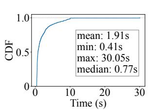  
Figure 4: Tool call time in an agentic RL task.

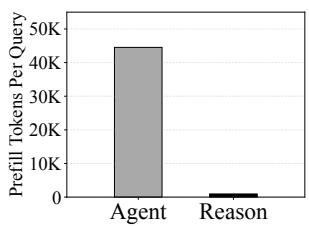  
Figure 5: Average prefill tokens in a typical agentic RL and single-turn math RL.

## 2.3 Dynamic Scheduling as the Core

The increasing dynamicity in modern RL workflows has presented serious challenges for existing RL systems, which mostly rely on static resource partitioning for resource allocation—computation resources like GPUs are either physically divided or temporally multiplexed among different components ahead of training. With foundation models beginning to interact more and more with the real world to solve complex tasks, the dynamicity challenge motivates us to rethink the design paradigm of distributed RL systems.

We recognize that the RL training process involves multiple heterogeneous components, including rollout generation, tool interactions, inference, and policy optimization, which interact in complex and time-varying ways.

While this multi-component structure complicates scheduling, it also presents a key opportunity: resources can be dynamically reallocated to match the workload demands, improving overall efficiency. For example, when rollout generation is bottlenecked by long-tail responses, resources can be shifted to accelerate training.

Consequently, we argue that to achieve high efficiency and stable convergence, a distributed RL system must be able to dynamically coordinate computation, memory, and communication resources across nodes and GPUs. This requires a runtime that can observe, predict, adapt to workload variations in real time, and balance resource usage without disrupting the delicate feedback loops in RL training, posing a unique and complex systems challenge that demands a joint understanding of both system-level performance and algorithmic stability. Therefore, beyond an optimization, we envision dynamic scheduling to be a core design principle and challenge for next-generation distributed RL systems.

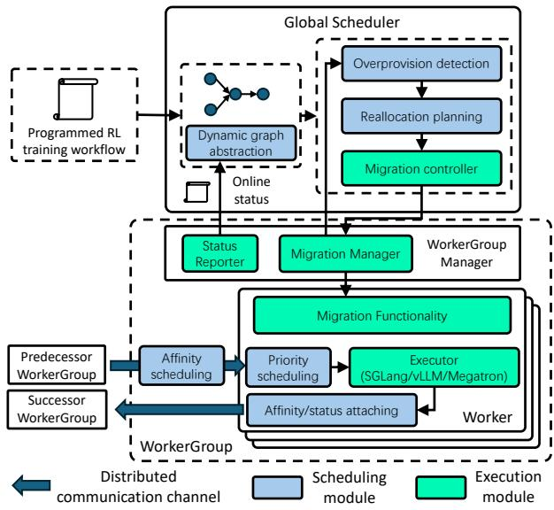  
Figure 6: The system architecture of DynaRL.

## 3 DynaRL Overview

DynaRL is a unified runtime and scheduling system designed to dynamically reallocate resources across heterogeneous RL components, with the goal of maximizing the end-to-end throughput of RL training pipelines whose components’ load shifts rapidly over time.

As shown in Figure 6, DynaRL runs as the scheduling plane of a general RL framework, e.g., verl [19] or RLinf [22], which provides the basic infrastructures for composing RL training pipelines and defining diverse components. In such a framework, an RL component (e.g., rollout, tool caller, trainer) is implemented as a group of distributed Workers (termed WorkerGroup), each of which is a process running on the allocated compute resources (e.g., GPUs). The framework handles the low-level details of assigning Workers to resources, establishing communication channels among Workers, and executing the distributed program, but assumes a static resource allocation throughout training.

DynaRL runs atop the framework also as a WorkerGroup like other components, which contains a Global Scheduler and multiple WorkerGroup Managers (one per WorkerGroup). Together, they form a feedback-driven control loop. Runtime signals collected from Workers are reported to the Global Scheduler by the WorkerGroup Managers; the Global Scheduler then computes new allocations based on these signals; and the WorkerGroup Managers enact the decisions with minimal disruption to the ongoing training. This design decouples scheduling from the specific implementation of diverse components, allowing DynaRL to continuously adapt to shifting rollout length distributions, changing inference workloads, and evolving training bottlenecks.

```python
class HyperNode:
2 # static node attributes
3 component_type # dynamic or static
4 interruptible # always, regular, or never
5 predecessors: HyperNode[]
6 successors: HyperNode[]
7 # dynamic node status
8 nodes: Node[] # list of homogeneous nodes
9 class Node:
10 allocated_resources: Resource[]
11 utilization: number
12 class HyperEdge: # dataflow between nodes
13 affinity: Node[] # the preferred nodes
14 progress # data processing progress
15 #dynamic schedule rollout/train_workers
16 dynamic_schedule(graph: HyperNode[], resource:
,→ Resource[])
```  
Figure 7: The definition of the dynamic graph.

In the following sections, we first present the system-level designs and mechanisms that enable dynamic scheduling in DynaRL (§4), and then describe the core scheduling algorithm that drives resource reallocation (§5).

## 4 DynaRL System Design

Fundamentally, dynamic scheduling can be viewed as online resource migration across components. A component experiencing resource underutilization can release part of its allocated resources (usually by scaling down) to other components that are bottlenecked (by scaling up).

However, the intricate dependencies and stateful nature of RL training pipelines pose systematic challenges to resource migration at abstraction, resource, and data levels: (1) Abstraction level, how to effectively capture both static structure and runtime variability of RL pipelines, enabling the scheduler to reason about component dependencies and performance dynamics? (2) Resource level, how to safely enact resource migration at runtime without disrupting training correctness, when delicate stateful components such as a distributed trainer with cumulated gradients and optimizer states are involved? (3) Data level, how to enable efficient data flows for dynamic and interactive components (e.g., multi-turn rollout) under complex dependencies and caching effects?

To address these, the key design of DynaRL is to transform complex, heterogeneous RL pipelines into a single, controllable runtime object that enables fine-grained, low-overhead rescaling and rebalancing:

• A dynamic hypergraph abstraction that captures both struc ture and runtime signals.

• Unified interfaces for safe online resource migration and context-aware data routing.

Together, they allow DynaRL to perform predictive, lowoverhead, and component-agnostic scheduling with minimal disruption to ongoing training.

## 4.1 The Dynamic HyperGraph Abstraction

To capture both static structure and runtime variability, DynaRL models the RL pipeline as a continuously-updated dynamic hypergraph, i.e., a special graph where a node (termed HyperNode) contains a set of homogeneous nodes, and an edge (termed HyperEdge) can connect multiple HyperNodes beyond the traditional one-to-one connection in common graphs. As shown in Figure 7, a HyperNode represents the WorkerGroup of a logical component (e.g., rollout, trainer) along with a set of homogeneous nodes that represent its active Worker instances. Each HyperNode maintains both static metadata (e.g., component type, interruptibility, dependency constraints) and runtime metrics collected from its corresponding WorkerGroup, including resource utilization, queue pressure, and per-worker throughput.

HyperEdges encode dataflow between Workers/nodes and their relevant context information, including a data processing task’s progress and affinity with Workers, i.e., which Workers it might prefer or require to run on. This allows tracking the readiness of dependent components and pipeline backpressure, enabling the scheduler to detect emerging bottlenecks and rebalance resources proactively. Also, the recorded context information can facilitate data redistribution after migration, allowing the scheduler to reason not only about component-level bottlenecks, but also about the structural and temporal dynamics of data processing task propagation.

The unified dynamic graph serves as a single, continuouslyupdated control surface between the scheduler and the runtime system. Downstream, it gathers fine-grained signals such as GPU load, rollout generation speed, and training throughput from each worker. Upstream, it exposes a consistent abstraction that allows the scheduling policy to reason over heterogeneous components without entanglement with componentspecific details. By decoupling policy from implementation, the dynamic graph provides the foundation for predictive, lowoverhead adaptations such as resizing component parallelism, reallocating GPUs, or throttling request generation, and a principled representation that captures both the structural and temporal dynamics needed for robust online scheduling.

```python
1 # The unified migration interface
2 class MigrationManager:
3 def migrate(dest_resources)
4 def interrupt()
5
6 # Migration strategy interfaces
7 class RebootMigration:
8 def shutdown()
9 def restart(dest_resources)
10 class WorkloadMigration:
11 def data_collect()
12 def data_distribute()
13 def suspend()
14 class p2pMigration:
15 def create()
16 def state_switch()
17 def suspend()
```

Figure 8: The unified interface of resource migration.  
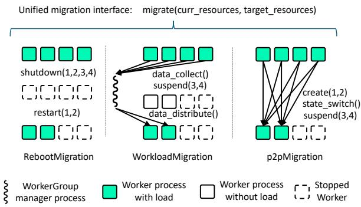  
Figure 9: Three types of migration with unified interface.

## 4.2 Resource Migration

Resource migration is the core mechanism that enables resource rebalancing among components. However, the diverse characteristics of RL components lead to widely varying migration procedures, particularly for stateful components that maintain inter-Worker states or have complex communication patterns. For example, inference engines such as SGLang and vLLM are mostly isolated instances that do not have shared states across Workers, allowing safe migration via process suspension. In contrast, training frameworks such as Megatron-LM maintain tightly coupled states across Workers, e.g., distributed model parameters and optimizer buffers that require synchronization points to be reached before migration.

To accommodate this diversity while maintaining a clean separation between scheduling policy and component-specific details, DynaRL defines a unified migration interface as in Figure 8 that abstracts the resource migration process. The key for safe migration is to identify interruptible points in the component’s execution flow where migration can occur without violating correctness. Thus, the interface follows an interrupt-schedule-migrate pattern akin to cooperative multitasking in operating systems: (1) The manager process of a WorkerGroup signals the scheduler when it reaches an interruptible point via interrupt(). (2) The scheduler determines if a rebalancing is required, (if required) checks for other interruptible components, computes a new resource allocation for all the interruptible components, and instructs the manager to execute migrate(dest\_resources) with the target resources. (3) The manager performs the migration based on its component-specific migration strategy.

Specifically, certain components (such as the inference engine) are designed to be always interruptible. The interruptible attribute in the HyperNode is then set to always, allowing the scheduler to trigger migration at any time rather than waiting for specific interruptible points.

Migration Strategy. We identify three fundamental migration strategies that cover a wide range of RL components based on the WorkerGroup statefulness and migration performance, as illustrated in Figure 9. The first is RebootMigration, which simply shuts down previous Workers on the source resources, preserves the necessary states, and restarts them on the target resources with the preserved states. This is a generic approach that can work for almost all components, albeit with potentially high overhead. Thus, it is more suitable for lightweight components with negligible restart overhead.

The second is WorkloadMigration, which suspends the Workers running on resources to be released, collects their pending and ongoing data processing tasks, and redistributes them to the remaining Workers on the retained resources. This approach is used by stateless components such as inference engines (e.g., SGLang, vLLM) with suspension capability that offload their occupied hardware resources on suspension, allowing safe migration without process restarts.

The third is p2pMigration, which launches new Workers on the target resources while keeping the old Workers active. State transfer (e.g., model parameters and optimizer buffers) is performed via planned peer-to-peer communication paths between old and new Workers, after which the old Workers are shut down or suspended. Stateful components such as Megatron-LM leverage this decentralized approach, enabling rapid migration within roughly one second for most cases.

The p2pMigration strategy follows a create-beforedestroy pattern to guarantee atomicity: new Workers are fully initialized and receive complete state transfers before old Workers are suspended or torn down. Specifically, a distributed barrier is enforced before state\_switch() is invoked. All new-rank Workers must acknowledge full receipt of model parameters, optimizer states, and gradient buffers before the system proceeds. If any transfer fails (e.g., due to a network partition or hardware fault on the destination), the migration is aborted: the newly created Workers are discarded, and the old Workers remain active with their original state intact, effectively rolling back to the previous allocation. This ensures there is no window in which both old and new Workers are partially active for training, and the global training state remains consistent throughout the migration. Only after all new ranks have confirmed readiness does the system atomically switch the active set, tear down the old Workers, and resume training on the new allocation.

```ruby
1 class DataRouter:
2 # HyperEdge
3 # affinity: required, preferred, noneed
4 def attach_affinity(output, affinity)
5 # status: steps, etc
6 def attach_status(output, status)
7 # requests scheduling
8 def distribute_data(data)
9 def priority_schedule(data)
```  
Figure 10: The interface of the local data router.

Additionally, to handle potential anomalies such as Worker hangs or infinite loops during execution, each Worker in DynaRL runs a background daemon that serves as a heartbeat monitor to receive scheduling commands. Once an anomaly is detected, the scheduler can invoke RebootMigration to forcefully shut down the unresponsive previous Workers and restart them on healthy resources.

DynaRL supports all three migration strategies through the unified interface, allowing each WorkerGroup to implement its own migration logic based on its component properties. The interface is shown in Figure 8. We implement the three migration strategies for common RL components including rollout, train, and tool caller as detailed in §6, demonstrating its versatility and generalizability.

## 4.3 Context-Aware Data Routing

RL training features tightly coupled interactions among components, modeled as HyperEdges in DynaRL. Each HyperEdge aggregates data flowing from one WorkerGroup to another. Efficiently routing these data across and within Workers is essential for end-to-end throughput. For example, in multi-turn rollout, requests belonging to the same episode of interactions may benefit from being processed on the same Worker to leverage the inference engine’s KV cache and reduce re-prefilling.

To this end, DynaRL introduces context-aware data routing to realize efficient data flows. The core enabler of this mechanism is a local data router that runs within each WorkerGroup (as a thread or a coroutine), which extracts Workerspecific context and attaches it to outgoing data. Before a Worker forwards data to its successor WorkerGroup, the local router annotates each data item with: (1) affinity information indicating where the data was last processed and whether it prefers, requires, or need not use the same Worker (attach\_affinity); and (2) status metadata, such as sequence IDs that track how many steps the data has progressed across Workers (attach\_status). The interface is extensible and allows additional metadata to be attached as needed.

With these annotations, the local router governs both inter-Worker data distribution and intra-Worker data ordering. As WorkerGroups communicate through distributed communication channels provided by RL frameworks, the router’s distribute\_data function intercepts outgoing queues to route data to appropriate destination Workers based on affinity constraints. On the receiving side, each Worker invokes priority\_schedule to decide the execution order of incoming data, enabling fine-grained control under dynamic workloads, particularly in rollout-heavy stages. For example, the SGLang Worker in DynaRL implements a custom priority scheduling policy through this interface to optimize multi-turn interactions (§5).

This context-aware data routing layer allows the system to adapt to the dynamic nature of RL training while preserving efficient data flow across distributed components.

## 5 DynaRL Scheduling

The goal of DynaRL’s scheduling algorithm is to maximize end-to-end RL throughput by dynamically reallocating resources among heterogeneous components, including rollout, inference, and model training, whose resource-performance characteristics diverge substantially over time.

The key idea behind our scheduling policy is to use resource overprovisioning as the primary scheduling signal. A component is considered overprovisioned when (1) allocating additional resources yields only marginal improvements in step-level or end-to-end throughput, and (2) removing a modest amount of resources does not noticeably degrade its performance. Once overprovisioning is detected, DynaRL safely reclaims these underutilized resources and migrates them to the component that currently limits the pipeline, thereby improving overall throughput.

To reason about where overprovision is likely to occur and where reclaimed resources can be most effectively used, DynaRL distinguishes between two types of components—static and dynamic components. Static components have throughput that scales positively with additional devices (e.g., actor or critic training with abundant input examples), so extra resources directly translate into higher throughput. In contrast, dynamic components exhibit a concave resource-performance curve whose marginal benefit naturally changes as the workload evolves (e.g., rollout whose active sequence count shrinks as trajectories complete), making them prone to entering an overprovisioned regime where additional resources provide little incremental gain.

This design naturally leads to a three-level scheduling framework: WorkerGroup-level scheduling on how much resource to allocate across components/WorkerGroups, Workerlevel scheduling that decides how to balance workload and scale up / down across Workers in one WorkerGroup, and data-level scheduling on the distribution and priority of request data for a specific component.

## 5.1 Online Migration Scheduling

Consider a system with a set of components C = C<sub>S</sub> ∪ C<sub>D</sub>, where C is the set of static components and C is the set of dynamic components. The system has a fixed pool of R<sub>total</sub> homogeneous resources (e.g., GPUs).

• Let R<sub>i</sub>(t) be the number of resources allocated to component C<sub>i</sub> at time t, with ∑<sub>C ∈C</sub> R<sub>i</sub>(t) ≤ R<sub>total</sub>.

• Each component C<sub>i</sub> has a throughput function T<sub>i</sub>(R<sub>i</sub>), which measures its ideal processing rate (e.g., samples per second) when allocated R resources.

• For a static component C<sub>S</sub> ∈ C<sub>S</sub>, T<sub>S</sub>(R<sub>S</sub>) is approximately linear: T<sub>S</sub>(R<sub>S</sub>) ≈ α<sub>S</sub>R<sub>S</sub>.

• For a dynamic component C<sub>D</sub> ∈ C<sub>D</sub>, T<sub>D</sub>(R<sub>D</sub>) is a concave function. It has an overprovision point R<sup>oa</sup> where the marginal throughput gain diminishes significantly: <sup>∂TD</sup><sub>∂RD</sub> ≪ α<sub>S</sub> for R<sub>D</sub> > R<sup>oa</sup><sub>D</sub> .

The goal of the scheduler is to find a resource allocation R = (R<sub>1</sub>, R<sub>2</sub>, ...) at any given time that maximizes the end-to-end throughput of the pipeline. Since the pipeline is synchronous, the overall throughput is the minimum of the throughputs of its constituent stages (if we ignore the small asynchrony in a pipeline). So the objective of the scheduling algorithm is:

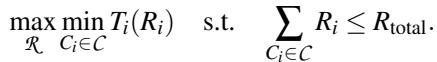

(1)

Algorithm 1 describes the procedure of inter- and intraworker-group resource scheduling. Our algorithm operates in a control loop, continuously monitoring the system and triggering a reallocation when inefficiencies are detected. It consists of two main phases: (1) Overprovision Detection, and (2) Reallocation Planning.

## 5.1.1 Phase 1: Overprovision Detection

The trigger for rescheduling is the detection of an overprovisioned dynamic component. We implement overprovision detection directly on top of the dynamic hypergraph: for each dynamic component/HyperNode C<sub>D</sub>, DynaRL aggregates the per-node utilization reported in its nodes field and computes a utilization signal. For rollout components, a practical metric is the average ratio of active Key-Value (KV) cache size to its maximum capacity across all its engines. Formally, for a component with R<sub>D</sub> engines,

```csv
Algorithm 1: Dynamic Resource Scheduler
Input: Component set C , total resources R<sub>total</sub>, thresholds
U<sub>low</sub>,T,θ
Output: Updated resource allocation R
1 Function MonitorLoop():
2 while true do
3 foreach Ci ∈ C do
4 (U<sub>i</sub>, metrics<sub>i</sub>) ← monitor(C<sub>i</sub>);
5 C<sub>opv</sub> ← DetectOverprovision(CD,U<sub>low</sub>,T,θ);
6 if C<sub>opv</sub> ̸= None then
7 R<sub>new</sub> ← PlanReallocation(Copv,R ,metrics);
8 migrate(R , R<sub>new</sub>);
9 Function DetectOverprovision(CD,U<sub>low</sub>,T,θ):
10 foreach C ∈ C do
11 low_count ← 0;
12 foreach worker ∈ C<sub>D</sub>.workers do
13 U ← avg_utilization(worker, T );
14 if U<sub>avg</sub> < U<sub>low</sub> then
15 low_count ← low_count + 1;
16 if low_count/|C<sub>D</sub>.workers| > θ then
17 return C<sub>D</sub>;
18 return None;
19 Function PlanReallocation(Copv,R ,metrics):
20 {∆R<sup>(1)</sup>, . . . , ∆R<sup>(K)</sup>} ←
GenerateCandidates(C<sub>opv</sub>, R , metrics);
21 best ← <sup>∅</sup>;
22 τ<sub>best</sub> ← −∞;
23 for k ← 1 to K do
24 R<sup>(k)</sup><sub>opv</sub> ← R [C<sub>opv</sub>] − ∆R<sup>(k)</sup>;
25 T<sub>op</sub> (k) <sub>v</sub> ← PredictThroughput(C<sub>opv</sub>, R<sub>opv</sub>, metrics); (k)
26 (alloc<sup>(k)</sup>, τ<sup>(k)</sup>) ←
SearchAllocation(∆R<sup>(k)</sup>,C<sub>opv</sub>, R<sup>(k)</sup><sub>opv</sub>, T <sup>(k)</sup><sub>opv</sub>, C , R , metrics);
27 if τ<sup>(k)</sup> > τ<sub>best</sub> then
28 τ<sub>best</sub> ← τ<sup>(k)</sup>;
29 best ← (R<sup>(k)</sup><sub>opv</sub>, alloc<sup>(k)</sup>);
30 R<sub>new</sub> ← R ;
31 R<sub>new</sub>[C<sub>opv</sub>] ← best.R<sub>opv</sub>;
32 foreach C<sub>j</sub> ∈ best.alloc do
33 R<sub>new</sub>[C j ] ← R [C j ] + best.alloc[C j ];
34 return Rnew;
```

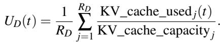

C<sub>D</sub> is considered overprovisioned if U<sub>D</sub>(t) < U<sub>low</sub> for a sustained period T . This indicates that most engines are underutilized. To avoid reacting to transient fluctuations, we employ a persistent condition: rescheduling is triggered only if the utilization of more than θ (e.g., 80%) of C<sub>D</sub>’s engines is below U<sub>low</sub> for a continuous duration of T seconds.

In practice, U can be derived as the p-th (e.g., 20th) percentile of historical utilization data for C<sub>D</sub>, while T and θ are hyperparameters that balance responsiveness and stability. Once C<sub>D</sub> satisfies this overprovision predicate, the scheduler marks it as a candidate donor in the dynamic graph and proceeds to Phase 2 to plan how many resources to reclaim and where to reallocate them.

## 5.1.2 Phase 2: Reallocation Planning

Once a dynamic component C<sub>D</sub> is identified as overprovisioned, the planner considers multiple resource-reduction candidates. For each candidate, the planner forecasts both the local impact on C<sub>D</sub> and the global throughput improvement achievable by reallocating the released resources. The scheduler then selects the candidate with the highest predicted performance improvement.

1. Generate candidate reductions. We construct a discrete (K) (line 20). They represent feasible and stable scaling levels suggested by recent utilization and throughput trends.

2. Predict component performance. For every allocation (k) using a lightweight, continuously updated performance model (line 25). This estimation provides a conservative bound on the potential performance degradation introduced by releasing ∆R<sup>(k)</sup>. Concretely, the throughput predictor is a statistical regression model. Before training begins, a short profiling stage measures per-component latency and throughput across representative batch sizes and sequence lengths, establishing an initial baseline model that avoids cold-start inaccuracy. During execution, the system continuously collects real-time runtime metrics (observed throughput, queue depth, batch composition) and uses them to dynamically recalibrate the model via online regression updates, ensuring predictions remain accurate as workload characteristics evolve over training.

3. Evaluate global reallocation benefit. For each candidate adjustment ∆R<sup>(k)</sup>, the planner estimates how the system would benefit from redistributing the freed resources. It allocates these resources based on each component’s observed throughput characteristics and request-queue dynamics, producing a predicted end-to-end throughput τ<sup>(k)</sup> for the candidate configuration (line 26).

4. Select optimal plan. Finally, the scheduler selects the candidate that offers the highest predicted system throughput (line 27 - 29):

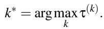

Using the migration interface, the dynamic component is migrated to the resulting new allocation set R<sup>′</sup><sub>D</sub> = R<sup>(k∗)</sup><sub>D</sub> , while the released resources are assigned to C<sub>S</sub>∗ .

This multi-candidate approach enables the scheduler to make informed trade-offs: aggressively reducing resources allocated to C<sub>D</sub> may free more resources for other components but risks making C<sub>D</sub> the new bottleneck. By evaluating multiple options, we ensure the reallocation maximizes throughput.

This design also keeps the reallocation behavior stable over time. Migrations are bound to interruptible points (§4.2) and thus occur at the natural batch-level divider of the RL pipeline rather than on every transient signal. Within each decision, the sustained-window predicate in Phase 1 smooths out shortlived queue spikes, and Phase 2 only commits to a new allocation when the continuously-recalibrated throughput predictor reports a strict improvement over the current one, so noiselevel imbalances do not flip the decision. The migration itself rebalances in-flight requests across the new worker set as part of the procedure (e.g., data\_collect/data\_distribute in WorkloadMigration), so the new allocation lands at its predicted operating point without a queue-pressure rebound. Our sensitivity study (§7.5) further confirms that this stability holds across a wide range of scheduling parameters, so the scheduler does not rely on subtle parameter tuning.

This PlanReallocation step maintains low overhead as the cluster scales. It evaluates O(K) candidate reductions (K is typically 3–10) across O(|C|) components (|C| is typically 3–7 in RL pipelines). The scheduling complexity is thus O(K × |C|), independent of the total GPU count. Furthermore, since per-Worker metrics are aggregated at the WorkerGroup Manager level, the global scheduler only processes O(|C|) summaries rather than O(N<sub>GPU</sub>) individual signals, allowing scheduling to complete within 200 ms even at 128 GPUs.

## 5.2 Request Data Scheduling

Algorithm 2: Priority-Aware Request Scheduler   
Input: Request queue Q , batch size limit B   
1 Function SelectBatch(Q ):   
2 S ← <sup>∅</sup>;   
3 foreach r ∈ Q do   
4 (k<sub>r</sub>, m<sub>r</sub>) ← extract\_priority(r);   
5 Q<sub>sorted</sub> ← sort(Q , key= (kr, mr));   
6 foreach r ∈ Q<sub>sorted</sub> do   
7 if |S| < B then   
8 S ← S ∪ {r};   
9 return S;

While request scheduling has been extensively studied in online serving systems, it remains largely overlooked in training pipelines. In agentic RL, a single high-level task unfolds into a multi-turn interaction between the model and external tools. Each request re-enters the rollout component multiple times, and the system must maintain and reuse state across these turns (e.g., KV cache). If the scheduler ignores this structure and simply treats each turn as an independent request, it can easily waste GPU cycles by repeatedly recomputing KV cache and inflate end-to-end episode latency by letting short, late-stage turns wait behind many first turns.

To understand how multi-turn structure affects workload characteristics, we examine the response-length distribution across tool-call rounds in a ReAct-style agent, and observe two clear patterns: (1) the first response (round 0) is substantially longer than subsequent ones, and (2) average token generation decreases monotonically as the request approaches completion. In other words, early turns are long and computeheavy, whereas later turns are short and relatively cheap.

These observations motivate a priority-based scheduling policy in which a request’s priority is its tool-call count, i.e., the number of completed tool invocations so far. Intuitively, always giving higher priority to requests with more completed tool calls has two key benefits. First, it increases the likelihood of KV-cache reuse: when a new turn arrives shortly after the previous one, prioritizing that request over fresh, long firstturn prompts prevents the cached state from being evicted and avoids expensive re-prefilling. Second, it accelerates the completion of late-stage episodes, significantly reducing mean job completion time by flushing short, near-finished turns out of the system instead of waiting behind long initial turns.

Furthermore, while longer early turns are not a universal rule for all LLM interactions, they are a strong characteristic driven by task designs and agentic frameworks (e.g., ReAct [28], Plan-and-Solve [24]) where the first turn handles a complex prompt and generates a full plan, making it the most compute-intensive. Later turns are typically short observation-evaluation steps. Even for workloads where later turns are not shorter, the priority scheduler degrades gracefully to near-FIFO behavior while still preserving KV-cache reuse benefits.

Algorithm 2 implements this idea. For each request r in the queue, the scheduler extracts a priority key (k<sub>r</sub>, m<sub>r</sub>), where k<sub>r</sub> is the number of completed tool calls (i.e., the current round index), and m<sub>r</sub> is the length of the prefix of this request in the prefix-tree-based KV cache commonly used in LLM inference engines. The latter serves as a tie-breaker: among requests in the same round, those with longer prefixes are more likely to reuse more cache and thus have higher priority. The scheduler then sorts the queue by this key and selects the top-B requests to form the next batch. Compared to FIFO, this multi-turn–aware, tool-call-count-based policy explicitly exploits the response-length skew across rounds to improve both KV-cache efficiency and end-to-end agentic RL performance.

## 6 Implementation

DynaRL is implemented in 7K lines of Python code atop RLinf [22], an open-source RL framework that is flexible enough to support various resource partitioning modes (it supports both physical partitioning and time-sharing). Among them, 2K lines are for the Global Scheduler, 4K lines for the migration manager and migration strategy implemented for different RL components (currently rollout, tool agent, trainer, inference, reward are supported), and an additional 1K lines for the HyperGraph extraction, data routing, and other auxiliary components.

HyperGraph Extraction. DynaRL automatically builds the HyperGraph from RLinf programs using lightweight static analysis plus minimal runtime hooks, without requiring manual annotations. On the static side, we parse the Python source of the training pipeline and components using the standard ast module that exposes the abstract syntax tree of the program. We identify component classes by their inheritance from RLinf’s WorkerGroup base and registration APIs (e.g., rollout, trainer, tool agent), and instantiate a corresponding HyperNode for each logical component. We then traverse all call sites to the framework’s inter-worker communication primitives (e.g., channel put/get). Each such call yields a HyperEdge between two HyperNodes, and we populate their predecessors and successors fields accordingly, forming the static skeleton of the hypergraph.

At runtime, WorkerGroup Managers register their concrete workers as Node entries under the corresponding HyperNode, and periodically update fields such as allocated\_resources and utilization from monitoring signals. Similarly, the framework’s communication hooks update the associated HyperEdge.progress and affinity metadata as dataflow events occur. This combination of Python AST analysis for structure and low-overhead runtime updates for state yields a continuously maintained HyperGraph that accurately reflects component interactions and is directly consumable by the global scheduler and data router.

Migration Strategy. DynaRL instantiates the three migration mechanisms in Figure 9 according to each component’s statefulness and performance sensitivity. For stateless or weakly stateful components such as rollout, tool agents, inference, and reward models, we adopt WorkloadMigration to redistribute the request data upon resource migration.

For distributed trainers like Megatron-LM, DynaRL implements p2pMigration to transfer two kinds of state: model parameters and optimizer states. Given the old and new parallelism configurations (e.g., data-, tensor-, and pipeline-parallel degrees), the migration manager computes a rank-mapping and resharding plan that determines which source ranks send which parameter and optimizer shards to which destination ranks. The new trainer processes are launched on the target GPUs and participate in a series of peer-to-peer transfers fol lowing this plan until all state is materialized under the new sharding. Afterward, DynaRL reconstructs all communication groups (e.g., NCCL process groups for data/tensor/pipeline parallelism) to match the new topology and only then tears down the old ranks. This design allows large, stateful training jobs to change their parallelism layout with sub-second to fewsecond pauses, making frequent elastic rescaling practical in multi-component RL pipelines.

All remaining components fall back to RebootMigration, which simply shuts down workers on the old resources and relaunches them on the new ones with reloaded states.

## 7 Evaluation

We evaluate DynaRL on comprehensive workloads including math-reasoning RL and multi-turn agentic RL with LLMs of different sizes ranging from 1.5B to 32B on real-world datasets. The experiment results are summarized below:

• For math-reasoning RL, DynaRL consistently outperforms state-of-the-art RL systems (e.g., verl, RLinf) by 1.27×– 1.98× on a variety of math-reasoning RL training configurations under different cluster scales.

• For agentic RL, DynaRL achieves 1.06×–1.53× higher throughput than RLinf. With priority-aware request scheduling for multi-turn interactions, DynaRL further improves performance to 1.27×–1.64×.

• The scheduling plan can be generated within 200 ms, and DynaRL applies each reallocation plan within 0.5–5 seconds, incurring less than 1% overhead.

## 7.1 Experiment Setup

Testbed. We deploy DynaRL on an H100 cluster with 16 nodes and 128 GPUs. Each node has 8 NVIDIA H100-80GB GPUs, and 2 Intel Xeon Platinum 8558@2.1 GHz CPUs with 48 cores and 2TB memory. Intra-node communication utilizes NVLink, while inter-node communication uses 8 Mellanox ConnectX-7 RDMA NICs per node, each providing 400 Gbps bandwidth with RoCEv2.

Baselines. For math-reasoning RL, we compare DynaRL against verl [19] v0.5 and RLinf [22], the state-of-the-art open-source RLHF systems. We choose SGLang [32] as their rollout engine and Megatron-LM [20] as their training backend. To further demonstrate the broader scheduling space of DynaRL, we also compare it against RLHFuse [33], which performs fusion in rollout and inference phases. Since RL-HFuse lacks a publicly available artifact, we implemented its core fusion logic within RLinf using the same rollout engine and training backend to ensure a fair comparison. For multi-turn agentic LLM, we compare with RLinf, as verl only supports FSDP [31] for this experiment, which is much slower than the Megatron-LM backend.

Metrics. For the end-to-end experiments, we use RLHF throughput (tokens/sec) as the performance metric following verl [19], which is defined as dividing the total number of tokens in prompts and responses in a global batch by one RLHF iteration time. For multi-turn agentic RL, we use number of processed requests per second (abbreviated as requests per second). All reported performance numbers are averaged over 10 training iterations after warm-up.

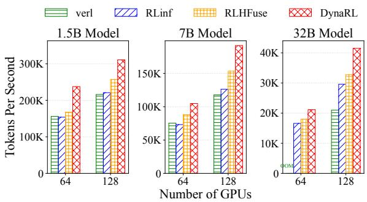  
Figure 11: End-to-end throughput of math reasoning RL under different cluster scale and model size settings.

Datasets. For math-reasoning RL, we use the AReaLboba-Data dataset [26]. This dataset integrates multiple standard datasets including DeepScaleR [12], Open-Reasoner-Zero [9], Light-R1 [25], DAPO [30], NuminaMath [14] (AoP-S/Olympiad subsets), and ZebraLogic [11]. Overly simple problems are filtered out to ensure dataset quality and effectiveness. For multi-turn agentic RL, we use the rstar2-agent dataset [18], which includes tasks from the DAPO training set, problems from the AoPS forums via OpenMathReasoning [13] and Project Euler [3].

Configuration. For both math-reasoning and multi-turn agentic RL experiments, we use a rollout batch size of 512, group size of 16, and sequence length of 28,672. The trainer tensor-parallel (TP) sizes are 2, 4, and 8 for the 1.5B, 7B, and 32B models, respectively; the corresponding rollout TP sizes are 1, 2 and 4. These configurations remain unchanged as we scale to larger GPU counts.

## 7.2 End-to-End Experiments

Math-reasoning RL. Math-reasoning RL comprises three stages, i.e., rollout, inference, and training. Existing systems such as verl and RLinf follow a static, sequential execution pattern, dedicating all resources to one stage at a time. Figure 11 compares throughput under baseline’s static scheduling and DynaRL ’s dynamic scheduling across three model sizes (1.5B, 7B, and 32B) and two GPU scales (64 and 128). As shown, DynaRL consistently improves throughput, with larger gains on larger models.

For the 64 GPU experiments, verl and RLinf exhibit similar performance for 1.5B and 7B models, while DynaRL yields 1.43×–1.55× speedups. Because with static scheduling, rollout eventually runs at low utilization, whereas DynaRL detects overprovisioned components and reallocates their unused capacity to other components. For the 32B model, verl fails due to OOM, and DynaRL achieves a moderate 1.27× speedup over RLinf. The speedup is smaller due to a more constrained scheduling space: with TP size 8, train parallelism can scale when at least 8 idle GPUs are available.

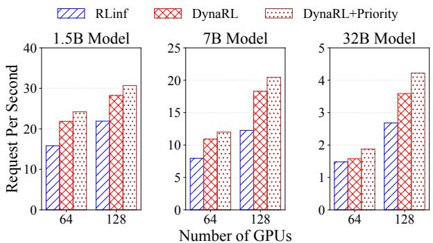  
Figure 12: End-to-end throughput of multi-turn agentic RL under different cluster scale and model size settings.

With 128 GPUs, improvements for 1.5B and 7B models stabilize around 1.40×–1.52×. The 32B model, however, benefits significantly more, reaching 1.98× over verl and 1.40× over RLinf, as the larger cluster provides greater flexibility and a wider scheduling space.

Compared to RLHFuse, DynaRL achieves 1.21×–1.42× higher throughput. RLHFuse fuses only the rollout and inference stages, but in practice inference is typically much less time-consuming than rollout, especially at long response lengths, leaving training resources idle as it cannot be fused with other stages. In contrast, DynaRL dynamically schedules resources across all three stages, rollout, inference, and training, jointly, enabling it to better handle diverse components with heterogeneous execution characteristics.

Multi-turn agentic RL. Figure 12 presents the results for multi-turn agentic RL. We compare RLinf with two variants of DynaRL: dynamic allocation alone and dynamic allocation combined with the priority-aware request scheduling policy.

On 64 GPUs, dynamic allocation alone yields 1.06×– 1.38× improvement, smaller than in single-turn math reasoning. This highlights the additional scheduling complexity introduced by multi-turn interactions, where rollout becomes more unpredictable. With priority-aware request scheduling, DynaRL achieves 1.51×–1.53× speedups on the 1.5B and 7B models over RLinf. The gains on the 32B model are also smaller (1.27×) due to constrained scheduling space.

When scaling from 64 to 128 GPUs, DynaRL with priorityaware scheduling is 1.40×, 1.64×, 1.58× faster than RLinf on 1.5B, 7B, 32B models, respectively. The benefit of priorityaware scheduling diminishes slightly for the 1.5B and 7B models (from 15% to 11% for 1.5B, and from 14% to 11% for 7B). In contrast, the 32B model experiences increased gains (from 21% to 24%). This divergence stems from KVcache sufficiency. That is, on 128 GPUs, smaller models can maintain more request prefixes in cache without eviction, reducing the marginal benefit of request-level prioritization.

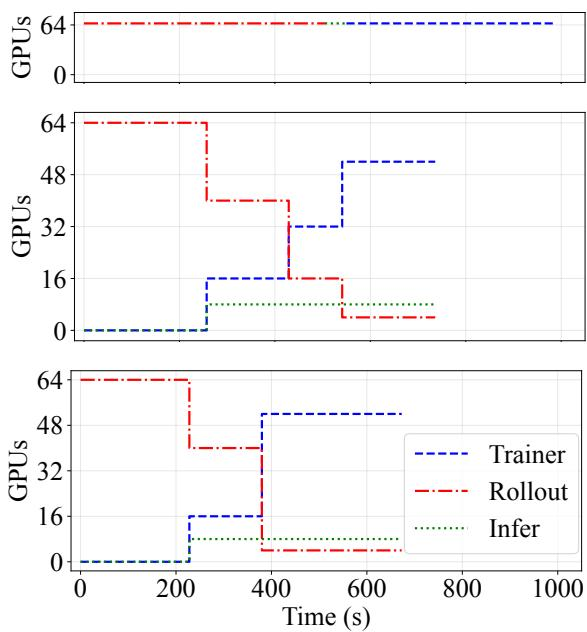  
Figure 13: GPU allocation timelines for the three execution modes. From top to bottom: (1) static mode, where all GPUs are assigned to one component at a time; (2) dynamic mode without priority-aware request scheduling, which reallocates resources reactively based on component utilization; and (3) dynamic mode with priority-aware request scheduling, which further prioritizes requests with more completed tool calls. Each plot shows how Trainer, Rollout, and Inference components acquire and release GPUs over time.

For the 32B model, however, KV-cache pressure remains high, and priority-aware scheduling continues to play a significant role, yielding larger improvements.

## 7.3 Breakdown of Online Scheduling

Figure 13 illustrates how DynaRL allocates 64 GPUs across rollout, inference, and trainer in the 7B math-reasoning RL experiment. In the top panel, the static configuration fully serializes the three phases, assigning the entire cluster to one component at a time.

The middle panel shows how dynamic allocation reshapes the execution timeline by reallocating GPUs at runtime. At the beginning of the iteration, neither inference nor trainer receives resources because no corresponding requests are yet available. As rollout proceeds, its effective parallelism naturally declines as fewer requests remain. The scheduler detects this underutilization and gradually reallocates GPUs to inference and trainer. This overlap shortens the critical path, i.e., downstream stages start earlier and run concurrently with the tail of rollout, eliminating large idle windows and exposing intra-iteration parallelism that static allocation cannot exploit. Inference is consistently assigned fewer GPUs than trainer because it performs only forward passes and maintains no external state (e.g., gradients or optimizer slots), thus requiring substantially less compute for the same number of tokens. Since inference scales adequately with a small GPU budget, DynaRL assigns it a stable initial allocation to avoid unnecessary reallocation overhead.

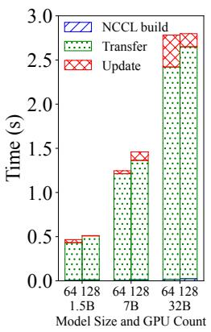  
(a) Trainer.

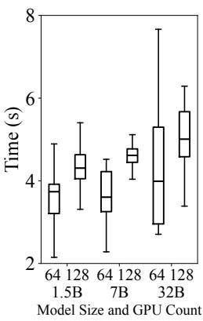  
(b) Rollout.  
Figure 14: Trainer and rollout migration cost.

The bottom panel shows that incorporating priority-aware request scheduling further accelerates resource transitions. By prioritizing rollout requests with more completed tool calls, the system reduces straggler effects and frees GPUs earlier. Consequently, both inference and trainer reach their target allocations sooner and at larger scale. For example, trainer scales to 32 GPUs around 420s under vanilla dynamic allocation, but reaches 52 GPUs by roughly 380s with priorityaware scheduling. Toward the end of the iteration, rollout and inference operate with minimal resources to process long-tail requests, while trainer receives most of the cluster to accelerate training. This demonstrates that fine-grained, request-level scheduling is essential for fully exploiting temporal variability in RL workloads.

## 7.4 Overhead Analysis

Trainer migration overhead. Figure 14a reports the trainer migration cost across different model sizes. The total migration time grows primarily with model scale, increasing from sub-millisecond ranges for 1.5B to several seconds for 32B, yet still contributes less than 0.5% to end-to-end latency even for the 32B model on 128 GPUs. In contrast, the GPU count has negligible impact. This behavior reflects the design of our trainer migration mechanism, i.e., model states are transferred through fully distributed peer-to-peer communication, allowing the migration cost to mainly scale with the size of the model. As a result, trainer replicas can be rebalanced even on large clusters without incurring significant coordination or communication group rebuild overheads.

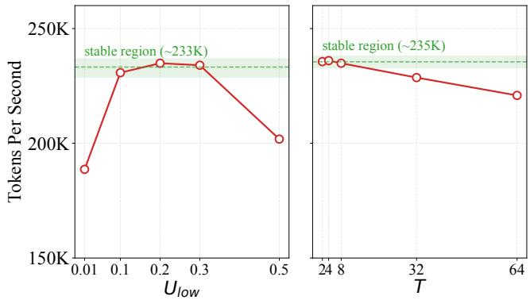  
Figure 15: Throughput stationarity of DynaRL under varying scheduling parameters U<sub>low</sub> (left) and T (right). Shaded bands mark the stable operating regions.

Rollout migration overhead. Figure 14b shows rollout migration costs across different model and cluster sizes, averaged over 10 training iterations. Unlike train migration, rollout migration exhibits sensitivity to both model scale and GPU count, as larger rollout groups require more workers to synchronize and transfer running states. Nonetheless, the overall variance remains modest. Migration consistently completes within a few seconds even for the 32B model on 128 GPUs. This small and predictable overhead ensures that migration decisions triggered by dynamic scheduling do not dominate the end-to-end training time. The results confirm that DynaRL ’s reallocation mechanism maintains low control-plane overheads and can support frequent, fine-grained resource adjustments during RL training.

Scheduling overhead. We measure the scheduling time during both the reasoning and agentic RL tasks. We find that all scheduling decisions can be made within 200 milliseconds, which is negligible compared to the end-to-end training time. During a training iteration, the total overhead of the scheduling is below 0.5%.

## 7.5 Parameter Sensitivity

We study the performance sensitivity of DynaRL with respect to its scheduling parameters: the rebalancing threshold U<sub>low</sub>, which controls how aggressively work is redistributed across stages, and the scheduling window T , which controls how frequently the scheduler reacts to load imbalance. We sweep U<sub>low</sub> ∈ {0.01, 0.1, 0.2, 0.3, 0.5} with T fixed, and T ∈ {2,4,8,32,64} with U<sub>low</sub> fixed, and measure end-toend token throughput on the 1.5B math-reasoning workload.

Figure 15 shows that DynaRL is largely insensitive to both parameters across more than an order of magnitude. For U<sub>low</sub>, throughput remains within ∼1.5% of its peak (233K tokens/s) over the whole interval U ∈ [0.1,0.3]. Performance only degrades at the extremes: an overly small U<sub>low</sub> = 0.01 triggers excessive rebalancing and drops throughput to 188.65K tokens/s (↓ 19.7%), while an overly large U<sub>low</sub> = 0.5 suppresses useful rebalancing and yields 201.82K tokens/s (↓ 14.1%). For T , throughput stays within 0.5% of peak over T ∈ [2,8] (mean 235.5K tokens/s) and degrades only mildly at T = 32 (↓ 3.1%) and T = 64 (↓ 6.4%), where the scheduler reacts too slowly to transient imbalance. These results indicate that the stable operating region for DynaRL spans a wide plateau in both dimensions, so practitioners can pick parameters from a broad range without precise per-workload tuning.

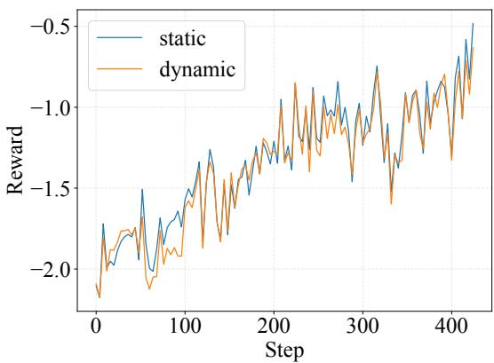  
Figure 16: Reward curve of static placement and dynamic scheduling.

## 7.6 Correctness Verification

Guaranteeing algorithm convergence is a fundamental requirement of DynaRL. To achieve this, all supported migrations strictly preserve the underlying RL semantics by leveraging the interruptible points defined in Section 4.2. During the rollout and inference phases, migrations are executed at the query level; this alters the physical GPU assignment but leaves the execution logic unaffected. During training phases, migrations meticulously preserve model parameters and optimizer states while holding RL hyperparameters (e.g., micro-batch and global batch sizes) constant. For instance, when adjusting the number of GPUs under data parallelism, DynaRL reconfigures how micro-batches are distributed across devices without altering the global batch size. This ensures that the training logic remains intact, providing strict mathematical consistency throughout the migration process.

To empirically validate this consistency, Figure 16 plots the step-wise reward curves for a 1.5B-parameter model on 64 GPUs on a mathematical reasoning task, corresponding to the experiment in Figure 11. As illustrated, DynaRL’s dynamic scheduling closely tracks the convergence trajectory of the static placement baseline. This confirms that our dynamic migrations introduce no adverse effects on the RL learning process.

## 8 Related Works

Reinforcement Learning Frameworks. Existing RL training frameworks for large-scale alignment generally follow static system designs, which can be categorized into taskcolocated (e.g., verl [19] and DeepSpeed-Chat [29]) and taskseparated (e.g., Slime [34] and OpenRLHF [8]) execution modes. More recently, frameworks with automated scheduling have been introduced. RLHFuse [33], for instance, performs fusion in rollout and inference phases, effectively mitigating long-tail generation bottlenecks and improving end-to-end throughput. Some recent works use async RL algorithms and co-design the infrastructure to alleviate the long-tail issue. AReal [4] introduces an asynchronous model update algorithm for task-separated systems to increase training throughput. Kimi-k1.5 [21] introduces partial rollouts to optimize the handling of complex reasoning trajectories. In contrast to these static or partially optimized designs, DynaRL enables joint dynamic scheduling across rollout, inference, and training phases, allowing the runtime to switch between colocated and separated execution modes based on live workload patterns. Furthermore, while prior systems focus primarily on single-turn reasoning RL pipelines, DynaRL extends dynamic scheduling to agentic RL, where multi-turn environment interaction worsens the impact of long-tail in rollout.

Cluster-Level Deep Learning Schedulers. Beyond RLspecific frameworks, a rich line of systems work has explored dynamic resource management for deep learning clusters. Optimus [16], Gandiva [27], and Tiresias [5] perform introspective GPU scheduling across many concurrent training jobs, adjusting placement and GPU allocations based on joblevel progress signals. Traditional cluster managers such as Borg [23], Kubernetes, and their autoscaling extensions similarly treat each training workload as a black box when reallocating resources. These systems operate primarily at the job or container granularity and lack visibility into the internal structure of RL pipelines. In contrast, DynaRL performs fine-grained, intra-job scheduling across rollout, inference, and training components using a dynamic hypergraph abstraction, enabling resource rebalancing that is aware of crosscomponent dependencies and multi-turn interaction structure inside a single RL workload.

## 9 Conclusion

Modern RL workloads for reasoning and agentic systems exhibit substantial dynamicity, making static resource allocations highly inefficient. This paper presented DynaRL, the first RL system that makes dynamic scheduling a first-class capability. DynaRL introduces a unified runtime and abstraction that can observe how different RL components behave over time and automatically shift resources to where they are most needed. We demonstrate that DynaRL consistently improves end-to-end throughput while maintaining low online schedul ing overhead across diverse RL workloads. In the future, we envision that dynamic resource management will become an essential component of RL systems, enabling more efficient and scalable training through complex interactions.

## Acknowledgments

We thank our anonymous reviewers and shepherd for their constructive feedback. Zhi Yang and Yu Wang are the corresponding authors. Quanlu Zhang is the project lead. We also express our sincere gratitude to the RLinf open-source community for their continuous support, feedback, and ecosystem contributions. This work was partially supported by National Natural Science Foundation of China under Grant No.92464301, 62406159, 62325405, Zhongguancun Academy Grant No. C20250301, Shenzhen Science and Technology Program No. AI2026016.

## References

[1] Lukas Beckenbauer, Johannes-Lucas Loewe, Ge Zheng, and Alexandra Brintrup. Orchestrator: Active inference for multi-agent systems in long-horizon tasks. arXiv preprint arXiv:2509.05651, 2025.

[2] DeepSeek-AI. Deepseek-r1: Incentivizing reasoning capability in llms via reinforcement learning, 2025.

[3] Project Euler. Project euler is a series of challenging mathematical/computer programming problems that will require more than just mathematical insights to solve. https://projecteuler.net/, 2025.

[4] Wei Fu, Jiaxuan Gao, Xujie Shen, Chen Zhu, Zhiyu Mei, Chuyi He, Shusheng Xu, Guo Wei, Jun Mei, Jiashu Wang, et al. Areal: A large-scale asynchronous reinforcement learning system for language reasoning. arXiv preprint arXiv:2505.24298, 2025.

[5] Juncheng Gu, Mosharaf Chowdhury, Kang G. Shin, Yibo Zhu, Myeongjae Jeon, Junjie Qian, Hongqiang Liu, and Chuanxiong Guo. Tiresias: A GPU cluster manager for distributed deep learning. In 16th USENIX Symposium on Networked Systems Design and Implementation (NSDI 19), pages 485–500, Boston, MA, February 2019. USENIX Association.

[6] Openai Gym. Gym is an open source python library for developing and comparing reinforcement learning algo rithms. https://github.com/openai/gym, 2025.

[7] Gymnasium. An api standard for reinforcement learning with a diverse collection of reference environments. https://gymnasium.farama.org/, 2025.

[8] Jian Hu, Xibin Wu, Zilin Zhu, Weixun Wang, Dehao Zhang, Yu Cao, et al. Openrlhf: An easy-to-use, scalable and high-performance rlhf framework. arXiv preprint arXiv:2405.11143, 2024.

[9] Jingcheng Hu, Yinmin Zhang, Qi Han, Daxin Jiang, Xiangyu Zhang, and Heung-Yeung Shum. Open-reasonerzero: An open source approach to scaling up reinforcement learning on the base model, 2025.

[10] Lean. Lean is an open-source programming lan guage and proof assistant that enables correct, maintainable, and formally verified code. https://lean-lang. org/, 2025.

[11] Bill Yuchen Lin, Ronan Le Bras, Kyle Richardson, Ashish Sabharwal, Radha Poovendran, Peter Clark, and Yejin Choi. Zebralogic: On the scaling limits of llms for logical reasoning, 2025.

[12] Michael Luo, Sijun Tan, Justin Wong, Xiaoxiang Shi, William Y. Tang, Manan Roongta, Colin Cai, Jeffrey Luo, Li Erran Li, Raluca Ada Popa, and Ion Stoica. Deepscaler: Surpassing o1-preview with a 1.5b model by scaling rl, 2025. Notion Blog.

[13] Ivan Moshkov, Darragh Hanley, Ivan Sorokin, Shubham Toshniwal, Christof Henkel, Benedikt Schifferer, Wei Du, and Igor Gitman. Aimo-2 winning solution: Building state-of-the-art mathematical reasoning models with openmathreasoning dataset, 2025.

[14] Project Numina. Project euler is a series of challenging mathematical/computer programming problems that will require more than just mathematical insights to solve. https://huggingface.co/collections/ AI-MO/numinamath, 2025.

[15] Long Ouyang, Jeffrey Wu, Xu Jiang, Diogo Almeida, Carroll Wainwright, Pamela Mishkin, Chong Zhang, Sandhini Agarwal, Katarina Slama, Alex Ray, John Schulman, Jacob Hilton, Fraser Kelton, Luke Miller, Maddie Simens, Amanda Askell, Peter Welinder, Paul F Christiano, Jan Leike, and Ryan Lowe. Training language models to follow instructions with human feedback. In S. Koyejo, S. Mohamed, A. Agarwal, D. Belgrave, K. Cho, and A. Oh, editors, Advances in Neural Information Processing Systems, volume 35, pages 27730–27744. Curran Associates, Inc., 2022.

[16] Yanghua Peng, Yixin Bao, Yangrui Chen, Chuan Wu, and Chuanxiong Guo. Optimus: an efficient dynamic resource scheduler for deep learning clusters. In Proceedings of the Thirteenth EuroSys Conference, EuroSys ’18, New York, NY, USA, 2018. Association for Computing Machinery.

[17] Alec Radford, Karthik Narasimhan, Tim Salimans, Ilya Sutskever, et al. Improving language understanding by generative pre-training. 2018.

[18] Ning Shang, Yifei Liu, Yi Zhu, Li Lyna Zhang, Weijiang Xu, Xinyu Guan, Buze Zhang, Bingcheng Dong, Xudong Zhou, Bowen Zhang, Ying Xin, Ziming Miao, Scarlett Li, Fan Yang, and Mao Yang. rstar2-agent: Agentic reasoning technical report, 2025.

[19] Guangming Sheng, Chi Zhang, Zilingfeng Ye, Xibin Wu, Wang Zhang, Ru Zhang, Yanghua Peng, Haibin Lin, and Chuan Wu. Hybridflow: A flexible and efficient rlhf framework. In Proceedings of the Twentieth European Conference on Computer Systems, pages 1279–1297, 2025.

[20] Mohammad Shoeybi, Mostofa Patwary, Raul Puri, Patrick LeGresley, Jared Casper, and Bryan Catanzaro. Megatron-lm: Training multi-billion parameter language models using model parallelism. arXiv preprint arXiv:1909.08053, 2019.

[21] Kimi Team, Angang Du, Bofei Gao, Bowei Xing, Changjiu Jiang, Cheng Chen, Cheng Li, Chenjun Xiao, Chenzhuang Du, Chonghua Liao, Chuning Tang, Congcong Wang, Dehao Zhang, Enming Yuan, Enzhe Lu, Fengxiang Tang, Flood Sung, Guangda Wei, Guokun Lai, Haiqing Guo, Han Zhu, Hao Ding, Hao Hu, Hao Yang, Hao Zhang, Haotian Yao, Haotian Zhao, Haoyu Lu, Haoze Li, Haozhen Yu, Hongcheng Gao, Huabin Zheng, Huan Yuan, Jia Chen, Jianhang Guo, Jianlin Su, Jianzhou Wang, Jie Zhao, Jin Zhang, Jingyuan Liu, Junjie Yan, Junyan Wu, Lidong Shi, Ling Ye, Longhui Yu, Mengnan Dong, Neo Zhang, Ningchen Ma, Qiwei Pan, Qucheng Gong, Shaowei Liu, Shengling Ma, Shupeng Wei, Sihan Cao, Siying Huang, Tao Jiang, Weihao Gao, Weimin Xiong, Weiran He, Weixiao Huang, Weixin Xu, Wenhao Wu, Wenyang He, Xianghui Wei, Xianqing Jia, Xingzhe Wu, Xinran Xu, Xinxing Zu, Xinyu Zhou, Xuehai Pan, Y. Charles, Yang Li, Yangyang Hu, Yangyang Liu, Yanru Chen, Yejie Wang, Yibo Liu, Yidao Qin, Yifeng Liu, Ying Yang, Yiping Bao, Yulun Du, Yuxin Wu, Yuzhi Wang, Zaida Zhou, Zhaoji Wang, Zhaowei Li, Zhen Zhu, Zheng Zhang, Zhexu Wang, Zhilin Yang, Zhiqi Huang, Zihao Huang, Ziyao Xu, Zonghan Yang, and Zongyu Lin. Kimi k1.5: Scaling reinforcement learning with llms, 2025.

[22] RLinf Team. Rlinf is a flexible and scalable opensource infrastructure designed for post-training foundation models (llms, vlms, vlas) via reinforcement learning. https://github.com/RLinf/RLinf, 2025.

[23] Abhishek Verma, Luis Pedrosa, Madhukar Korupolu, David Oppenheimer, Eric Tune, and John Wilkes. Large scale cluster management at google with borg. In

Proceedings of the Tenth European Conference on Computer Systems, EuroSys ’15, New York, NY, USA, 2015. Association for Computing Machinery.

[24] Lei Wang, Wanyu Xu, Yihuai Lan, Zhiqiang Hu, Yunshi Lan, Roy Ka-Wei Lee, and Ee-Peng Lim. Planand-solve prompting: Improving zero-shot chain-ofthought reasoning by large language models. In Anna Rogers, Jordan Boyd-Graber, and Naoaki Okazaki, editors, Proceedings of the 61st Annual Meeting of the Association for Computational Linguistics (Volume 1: Long Papers), pages 2609–2634, Toronto, Canada, July 2023. Association for Computational Linguistics.

[25] Liang Wen, Yunke Cai, Fenrui Xiao, Xin He, Qi An, Zhenyu Duan, Yimin Du, Junchen Liu, Lifu Tang, Xiaowei Lv, Haosheng Zou, Yongchao Deng, Shousheng Jia, and Xiangzheng Zhang. Light-r1: Curriculum sft, dpo and rl for long cot from scratch and beyond, 2025.

[26] Huggingface xDAN-datasets (xDAN Back). xdandatasets/areal-boba-data. https://huggingface. co/datasets/xDAN-datasets/AReaL-boba-Data, 2025.

[27] Wencong Xiao, Romil Bhardwaj, Ramachandran Ram jee, Muthian Sivathanu, Nipun Kwatra, Zhenhua Han, Pratyush Patel, Xuan Peng, Hanyu Zhao, Quanlu Zhang, Fan Yang, and Lidong Zhou. Gandiva: Introspective cluster scheduling for deep learning. In 13th USENIX Symposium on Operating Systems Design and Implementation (OSDI 18), pages 595–610, Carls bad, CA, October 2018. USENIX Association.

[28] Shunyu Yao, Jeffrey Zhao, Dian Yu, Nan Du, Izhak Shafran, Karthik Narasimhan, and Yuan Cao. React: Synergizing reasoning and acting in language models, 2023.

[29] Zhewei Yao, Reza Yazdani Aminabadi, Olatunji Ruwase, Samyam Rajbhandari, Xiaoxia Wu, Ammar Ahmad Awan, Jeff Rasley, Minjia Zhang, Conglong Li, Connor Holmes, et al. Deepspeed-chat: Easy, fast and affordable rlhf training of chatgpt-like models at all scales. arXiv preprint arXiv:2308.01320, 2023.

[30] Qiying Yu, Zheng Zhang, Ruofei Zhu, Yufeng Yuan, Xiaochen Zuo, Yu Yue, Weinan Dai, Tiantian Fan, Gaohong Liu, Lingjun Liu, et al. Dapo: An open-source llm reinforcement learning system at scale. arXiv preprint arXiv:2503.14476, 2025.

[31] Yanli Zhao, Andrew Gu, Rohan Varma, Liang Luo, Chien-Chin Huang, Min Xu, Less Wright, Hamid Shojanazeri, Myle Ott, Sam Shleifer, et al. Pytorch fsdp: experiences on scaling fully sharded data parallel. arXiv preprint arXiv:2304.11277, 2023.

[32] Lianmin Zheng, Liangsheng Yin, Zhiqiang Xie, Chuyue Sun, Jeff Huang, Cody Hao Yu, Shiyi Cao, Christos Kozyrakis, Ion Stoica, Joseph E. Gonzalez, Clark Barrett, and Ying Sheng. Sglang: Efficient execution of structured language model programs, 2024.

[33] Yinmin Zhong, Zili Zhang, Bingyang Wu, Shengyu Liu, Yukun Chen, Changyi Wan, Hanpeng Hu, Lei Xia, Ranchen Ming, Yibo Zhu, and Xin Jin. Optimizing rlhf training for large language models with stage fusion. In Proceedings of the 22nd USENIX Symposium on Networked Systems Design and Implementation, NSDI ’25, USA, 2025. USENIX Association.

[34] Zilin Zhu, Chengxing Xie, Xin Lv, and slime Contributors. slime: An llm post-training framework for rl scaling. https://github.com/THUDM/slime, 2025. GitHub repository. Corresponding author: Xin Lv.