USENIX

THE ADVANCED COMPUTING SYSTEMS ASSOCIATION

# What Are You (M)Waiting For: The Hidden Cost of Idle in the Hyperscale Cloud (Operational Systems)

Yun Wang, Shanghai Jiao Tong University; Xingguo Jia, Alibaba Cloud; Ben Luo and Kenan Liu, Alibaba Group; Shengdong Dai, Alibaba Cloud; Jingdong Han and Weihao Chen, Alibaba Group; Yicheng Gu and Xingzi Yu, Shanghai Jiao Tong University; Yibin Shen and Jiesheng Wu, Alibaba Cloud; Zhengwei Qi and Haibing Guan, Shanghai Jiao Tong University

https://www.usenix.org/conference/osdi26/presentation/wang-yun

# This paper is included in the Proceedings of the 20th USENIX Symposium on Operating Systems Design and Implementation.

July 13–15, 2026 • Seattle, WA, USA

ISBN 978-1-939133-55-7

Open access to the Proceedings of the 20th USENIX Symposium on Operating Systems Design and Implementation is sponsored by

# What Are You (M)Waiting For: The Hidden Cost of Idle in the Hyperscale Cloud (Operational Systems)

Yun Wang♠, Xingguo Jia♢, Ben Luo♢, Kenan Liu♢, Shengdong Dai♢, Jingdong Han♢, Weihao Chen♢, Yicheng Gu♠, Xingzi Yu♠, Yibin Shen♢, Jiesheng Wu♢, Zhengwei Qi♠∗, Haibing Guan♠

♠Shanghai Jiao Tong University ♢Alibaba Group

## Abstract

Oversubscription is central to large-scale clouds: multiplexing virtual CPUs (vCPUs) over fewer physical CPUs (pCPUs) improves utilization and sales density, but meeting strict latency Service Level Objectives (SLOs) requires precise control over idle behavior. In 1:1 settings, idle-passthrough—especially mwait-passthrough—works well: by allowing guests to initiate hardware idle transitions directly, it eliminates idleinduced Virtual Machine (VM) exits and achieves near–baremetal latency.

In production oversubscribed environments, however, passthrough breaks down. Because the hypervisor cannot observe mwait idleness, a vCPU never yields its pCPU, causing idle vCPU to monopolize cores and driving up contention, steal time ratios, live migrations, and SLO alarms across re gions. Controlled experiments reproduce these production symptoms: even an idle vCPU executing mwait can raise colocated tail latency by up to 3 .

We present mwait-sched, a virtualization-aware redesign of mwait handling that reconciles bare-metal-like idle latency with predictable pCPU multiplexing. mwait-sched integrates deterministic timer-based emulation, fine-grained idle-interval classification, and a scalable multi-address mwait-proxy that restores idle visibility without frequent VM exits. Across nine representative workloads, it reduces P99 (99th percentile) latency by 30–50% and reduces steal ratio by 30–40%. At hyperscale, across globally distributed production regions comprising 3.2M pCPUs, it reduces high-contention steal events by over 80%, cuts daily live migrations by 30–50%, and raises oversubscription ratio from 1.0% to 20.3%, effectively adding 600,000 vCPUs of sellable capacity.

## 1 Introduction

Oversubscription has become a common and effective strategy in large-scale cloud platforms, allowing providers to increase resource utilization and improve overall fleet efficiency [9,15,16,22,29,36,38,45,54]. By multiplexing virtual CPUs (vCPUs) over a smaller pool of physical CPUs (pC-PUs), Cloud Service Providers (CSPs) can significantly raise oversubscription ratios without impacting most workloads.

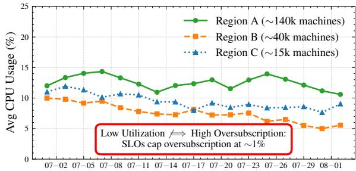

(a) Average CPU utilization across three production regions.  
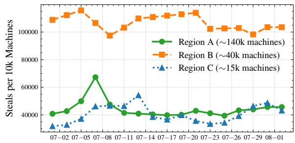  
(b) Steal events across the region, where a VM’s steal time ratio exceeds 5% in a 3-second sampling interval.  
Figure 1: Cluster-level traces from three production regions. Although utilization is low, oversubscription is capped at 1% because higher selling would trigger contention and violate latency SLOs.

At the same time, strict latency Service Level Objectives (SLOs) remain central to cloud service guarantees. For latency-sensitive applications, even small scheduling delays can translate into SLO violations [5, 32, 40, 51]. The x86 mwait instruction is the standard low-latency idle path on modern CPUs: paired with monitor, it places a core into a low-power C-state and wakes on a write to a monitored memory location, avoiding the IPI round-trip that interrupt-driven idle paths like hlt require. In non-oversubscribed (1:1) settings, mwait-passthrough offers an appealing solution (details in §3): by allowing the guest to directly drive hardware idle transitions, it eliminates Virtual Machine (VM) exits on idle instructions and substantially lowers idle-exit latency, thereby improving tail performance [24].

However, when applied to oversubscribed environments, this same mechanism introduces critical problems. Instead of enabling efficient multiplexing, mwait-passthrough disrupts pCPU sharing and leads to escalating contention signals across production regions.

To understand contention in our production environment, we analyzed three regions representing large, medium, and small deployments. Figure 1a shows VM-level CPU utilization across these clusters. Despite uniformly low utilization, oversubscription remains limited to only about 1%, because selling additional capacity would amplify contention and violate latency SLOs. At million-core scale, each additional percentage point of oversubscription yields roughly 10,000 vCPUs of additional sellable capacity.

To quantify contention, we use the steal-time ratio, the fraction of time a vCPU is ready to run but cannot obtain pCPU resources, and treat 5% as the operational threshold for noticeable interference [34].

Figure 1b shows that, even under similarly low utilization, regions differ by more than an order of magnitude in the fraction of VMs exceeding this threshold. Unlike utilization, rising steal-time ratios directly indicate performance degradation. This divergence demonstrates that utilization is decoupled from interference, making it an unreliable signal for safe vCPU placement.

A deeper investigation revealed the root cause. Despite its excellent latency characteristics, mwait-passthrough is fundamentally incompatible with pCPU sharing because its native semantics do not translate into virtualization. On bare metal, mwait is a true blocking primitive: the processor enters a deep C-state and relinquishes execution until a microarchitectural wake event occurs. In virtualization, however, this hardware-level blocking cannot be observed or mediated by the hypervisor. As a result, a passthrough vCPU never performs a schedulable yield. From the host scheduler’s viewpoint, it remains continuously runnable and is therefore accounted as 100% busy. This semantic gap—between hardware-defined idleness and software-visible runnabil ity—causes passthrough vCPUs to monopolize their pCPUs under oversubscription, amplifying contention, delaying colocated vCPUs, and destabilizing latency-sensitive workloads. This leaves us with a simple goal: keep mwait’s low wake-up latency, but make idle vCPUs visible to the host scheduler when pCPUs are shared. We introduce mwait-sched to meet this goal through three mechanisms:

1. Profile-guided timer-based mwait emulation. A hypervisor timer regains control from idle vCPUs at slice intervals tuned per workload from PMU counters (short slices of 20–50 µs for I/O-heavy services, longer for CPU-bound), restoring idle visibility to the host scheduler without per-instruction trap-and-emulate cost.

2. Bimodal-idle vCPU aggregation. mwait idle durations follow a bimodal distribution—transient (µs-scale spinlock backoff) versus stable (ms-scale quiescence); mwait-sched aggregates only stable-idle vCPUs onto shared pCPUs, raising density without making transientidle interference worse.

3. Multi-address mwait-proxy. A hypervisor-side linked list of monitored addresses, scanned on every hypervisor entry, replaces per-vCPU timers when several vCPUs share a pCPU; this variant scales beyond two-vCPU colocation and is deployed on the burst-instance fleet.

We deployed mwait-sched in the production fleet of a leading global cloud provider, covering  3.2M pCPU cores. In production, it reduces average daily alarms by 61.5%. In targeted workloads that match our main deployment scenarios, it reduces latency by 60% on average. To our knowledge, this is the first work to systematically study and optimize idle instructions in large-scale cloud environments.

## 2 Background

## 2.1 vCPU Scheduling

Colocation for Latency-intensive Workloads. Cloud workloads exhibit substantial variability in CPU demand, prompting cloud providers to increase pCPU utilization by multiplexing multiple vCPUs on fewer physical cores. Prior studies examine how to pack heterogeneous tasks while balancing contention, latency, and utilization [4, 9, 14, 21, 31]. A long line of work explores colocating latency-critical (LC) and best-effort tasks to increase aggregate efficiency [13, 17, 29, 33, 48]. In production, however, even colocating idle vC-PUs with LC workloads can violate SLOs: idle vCPUs create unpredictable wake-up interference that breaks LC latency. Consequently, CSPs adopt exclusive core allocation for LC workloads, avoiding any form of colocation.

A key mechanism enabling safe oversubscription is the use of idle instructions as cross-layer scheduling signals. Unlike bare-metal systems, where idle instructions serve solely as power-management hints, virtualized environments reinterpret them as opportunities for vCPU descheduling: the hypervisor treats a guest idle event as an explicit yield, reclaiming pCPU cycles for runnable vCPUs [5, 33, 54]. Thus, accurate idle detection is fundamental to high-density multiplexing.

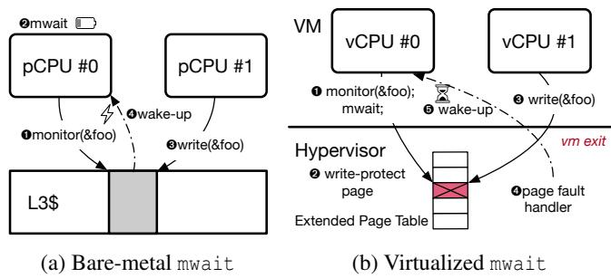  
Figure 2: Bare-metal vs. virtualized mwait. Hardware monitoring enables fast, cache-line–granular wake-up. Virtualization must use coarse, high-overhead mechanisms such as page-protected emulation.

## 2.2 Idle Instructions

Modern CPUs provide hlt and mwait to enter idle states with varying power and latency characteristics [41, 50]. hlt halts execution until an interrupt arrives, whereas mwait waits on monitored memory events and enables deeper C-states with lower exit latency [23, 55]. These properties make mwait an appealing candidate for latency-sensitive workloads.

However, mwait semantics fundamentally conflict with virtualization. The instruction depends on microarchitectural monitoring and cache-line–granularity wake-up signals that software-based hypervisors cannot observe or emulate [42]. Virtualized clouds rely on idle events to detect quiescent vC-PUs and reassign their pCPUs; hlt supports this by triggering a VM exit and allowing the hypervisor to suspend the vCPU. But these VM exits impose substantial overhead that inflates tail latency [6, 25, 28].

mwait creates even deeper challenges. Upstream KVM, lacking hardware visibility, treats intercepted monitor/mwait as no-ops, forcing the vCPU to spin and preventing the hypervisor from recognizing idleness [26, 27]. Passthrough allows the guest to execute native mwait and enter hardware C-states, but because the vCPU thread remains bound to the pCPU, guest idleness becomes host-level busywait, causing large and unpredictable delays for colocated vCPUs [47]. In short, both no-op emulation and passthrough destroy the scheduling semantics required for efficient pCPU sharing.

Virtualizing mwait: Monitoring vs. Software Simulation. Figure 2 illustrates the semantic gap. On bare metal, monitor tracks writes to a cache line and wakes the CPU through a microarchitectural event. In virtualization, issuing monitor/mwait causes a VM exit. The hypervisor must either poll the monitored address—wasting pCPU cycles—or rely on page-protected emulation, where writes trigger page faults or EPT (Extended Page Tables) violations [18]. This emulation incurs thousands of cycles and operates at page granularity, far coarser than mwait’s intended semantics.

Host vs. Guest Semantic Gap. Passthrough further exposes a scheduling mismatch: the guest expects mwait to place the CPU in a deep C-state, while the host scheduler expects runnable vCPU threads. When the pCPU enters deep idle, the host loses visibility into the vCPU’s status, preventing safe time-slice reallocation and introducing long wake latencies that affect other tenants [47]. These effects directly conflict with oversubscription and predictable tail-latency guarantees.

Security Considerations. Allowing unregulated passthrough of mwait in multi-tenant settings introduces denial-of-service and timing-side-channel risks [52]. A malicious VM could force pCPUs into deep C-states, delaying colocated workloads and amplifying latency variance.

Existing Mechanisms and Limitations. Prior mechanisms attempt to reconcile mwait with virtualization, but all introduce severe trade-offs:

1. NOP Simulation: Trap-and-resume converts guest idle loops into rapid VM exits, preserving wake-up latency but imposing high exit overhead.

2. mwait-Passthrough (non-oversubscribe): Allows native C-state transitions but prevents the hypervisor from detecting idleness, making oversubscription unsafe.

3. hlt-Passthrough: Avoids the trap on hlt itself, but every wake-up still arrives as an IPI that traps for emulation and injection, so the hypervisor pays an exit-and-reentry per idle-active transition.

4. Paravirtualization: Requires intrusive guest changes and is unsuitable for public clouds.

Across these methods, none preserve low-latency mwait semantics while enabling scalable, high-density vCPU aggregation. Existing approaches either abandon hardware behavior, incur prohibitive overheads, or break core-sharing safety.

Summary. Efficiently supporting mwait in productionscale virtualized environments remains a challenging and high-impact problem. The instruction’s reliance on microarchitectural memory events is fundamentally misaligned with software-based hypervisor control, and both existing emulation and passthrough fail to provide accurate idle detection or safe pCPU sharing. Overcoming this semantic conflict is essential for enabling low-latency workloads and high oversubscription in modern multi-tenant clouds.

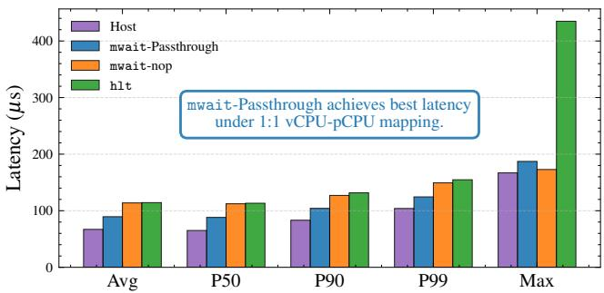  
Figure 3: YCSB request latency under four execution config urations (Redis). Among all VM setups, the VM with mwait passthrough achieves the lowest latency, while the hlt-based VM and the VM using trapped mwait both suffer higher latency due to the overhead of trap-and-emulation on idle instructions.

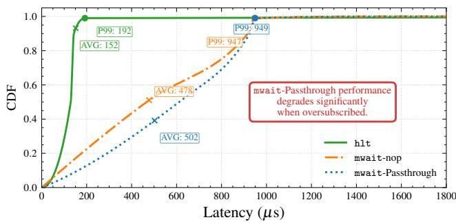  
Figure 4: YCSB latency CDF on a latency-critical VM colocated on the same pCPU with an otherwise-idle VM. Three curves vary the idle instruction the colocated VM uses: hlt, mwait-nop (KVM treats mwait as a no-op), and mwaitpassthrough. Both mwait variants degrade the latency-critical VM substantially relative to hlt, even though the colocated VM is doing no work, because under both the idle vCPU never yields the pCPU back to the latency-critical workload.

## 3 Characterization

## 3.1 Symptoms: Latency Benefits but Severe Colocation Interference

We conducted YCSB (Yahoo! Cloud Serving Benchmark [8]) experiments with four different configurations: (1) Baremetal, where the system runs directly on physical hardware without any virtualization; (2) VM with hlt, where the virtual machine (VM) uses the hlt instruction to enter an idle state; (3) VM with mwait, where the VM uses the mwait in struction to enter a low-power state; and (4) VM with mwait passthrough, where mwait is passed directly to the guest without any intervention. In configurations 2 and 3, both hlt and mwait are privileged instructions, so they trigger a trap and emulation process. As a result, both setups involve VM exits when the instructions are executed.

Table 1: Comparison of vm exits (exits/s)  
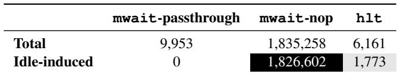

As shown in Figure 3, we observed the impact of different configurations on average read and write latencies, as well as P99 (99th percentile) latencies. The Bare-metal configuration, representing the host system, provides the highest performance and serves as the ideal performance for latency.

Among the virtualized configurations, the mwaitpassthrough VM delivers the lowest latency: its average read and write latencies are roughly 20% lower than those of both the hlt-based VM and the mwait-nop VM. The improvement also appears in the tail, where passthrough achieves lower P99 latency.

The key difference is that mwait-passthrough avoids all idle-induced exits, while mwait-nop triggers more than 1.8M and hlt incurs 1,773 (Table 1). By allowing the guest to change the hardware idle state without involving the hypervisor, passthrough eliminates the trap–and–resume cycles that dominate exit overhead. This directly accounts for both the roughly 20% reduction in average latency and the improvement in P99 latency.

While mwait-passthrough allows the guest to directly issue hardware mwait, it becomes problematic once the host CPU is shared. To quantify this effect, we colocate a latencycritical VM with an otherwise-idle VM on the same pCPU and vary the idle instruction the colocated VM uses: hlt (the standard, hypervisor-trapped path), mwait-nop (KVM’s current treatment of guest mwait), and mwait-passthrough. We then run a YCSB latency test on the loaded VM. As shown in Figure 4, both mwait variants cause substantial performance degradation relative to hlt, even though the second VM is completely idle. This result highlights a fundamental problem: once a vCPU executing mwait occupies a shared pCPU without yielding, any co-located vCPUs can experience severe and unpredictable latency inflation.

## 3.2 Root Cause: Missing Idle-Exit Signals under Passthrough

Although mwait-passthrough substantially reduces VM exits, it also prevents an idle vCPU from yielding control back to the hypervisor. This limitation becomes harmful under oversubscription—the common case in production—where multiple vCPUs share a single pCPU. In such settings, enabling mwait passthrough can unintentionally amplify contention and increase latency.

As shown in Figure 5, when there is no oversubscription and each vCPU is pinned to its own pCPU, mwaitpassthrough behaves benignly. Even if the guest enters an idle loop, no other vCPU competes for the core, and the vCPU will simply resume execution without incurring additional VM exits. This is why passthrough delivers the best latency in 1:1 vCPU–pCPU environments.

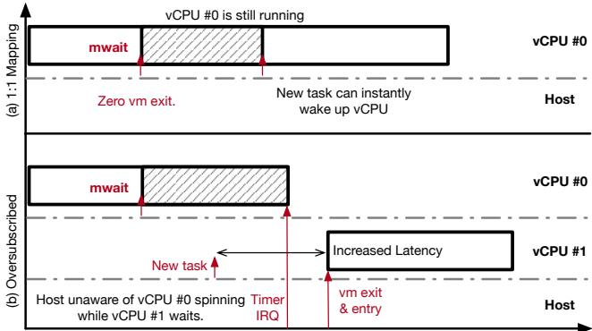  
Figure 5: Behavior of mwait under passthrough in nonoversubscribed (top) and oversubscribed (bottom) settings. Passthrough preserves low latency when each vCPU owns a dedicated pCPU, but prevents timely yielding under oversubscription, inflating latency for colocated vCPUs.

The behavior changes fundamentally under oversubscription. Consider the scenario in which vCPU 0 executes mwait intending to yield. Because passthrough treats mwait as a hardware instruction, the hypervisor receives no signal that the vCPU has become idle. Consequently, the pCPU continues to be “owned” by vCPU 0—even though it is idle—until an unrelated event such as a timer interrupt triggers a scheduling opportunity. Meanwhile, vCPU 1, which is runnable and waiting on the same pCPU, experiences inflated queuing delays. The resulting latency inflation is especially severe for latencycritical workloads colocated with a passthrough-mwait VM.

In contrast, if mwait is trapped, the hypervisor can immediately reassign the pCPU to vCPU 1, restoring expected scheduling behavior and significantly improving tail latency. This divergence in behavior makes it necessary to handle idle instructions differently depending on whether the system is oversubscribed. In short, while passthrough is ideal for 1:1 mappings, it is detrimental in shared-core settings where timely yielding is essential for maintaining low latency.

## 4 mwait-sched Design

mwait-sched is designed to make mwait usable in oversubscribed, multi-tenant cloud environments, where naïve passthrough causes uncontrolled contention and existing trapand-emulate approaches fail to preserve low-latency behavior. The scheduler must protect latency-sensitive workloads, support high consolidation to improve resource utilization, and mitigate interference under colocation. To meet these requirements, we design mwait-sched as a hypervisor-level mechanism that preserves the low-exit semantics of mwait while giving the hypervisor sufficient visibility to safely multiplex vCPUs on shared pCPUs. We have deployed mwait-sched across production regions, where it operates at cloud scale and serves diverse tenant workloads. The remainder of this section describes its core components: profile-guided mwait emulation, contention-aware wake-up, mwait-based vCPU aggregation, and a scalable multi-address mwait-proxy for high-density consolidation.

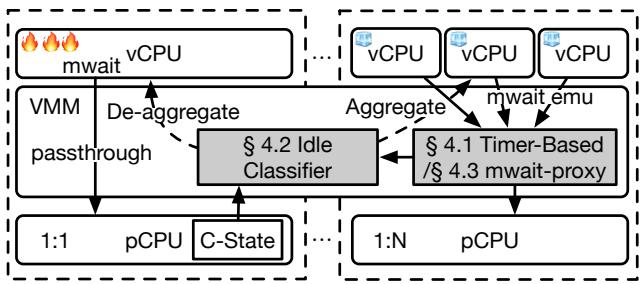  
Figure 6: Overview of mwait-sched. Active vCPUs run 1:1 with passthrough mwait (left); the §4.2 idle classifier aggregates stable-idle vCPUs onto a shared 1:N pCPU (right), where mwait is emulated by either the §4.1 hypervisor timer or the §4.3 multi-address linked-list proxy.

Figure 6 illustrates the core idea of mwait-sched. The hypervisor handles vCPUs in two modes based on how often they idle. Active vCPUs run 1:1 with passthrough mwait, which lets the core enter a hardware C-state directly and gives the lowest exit latency. Once a vCPU’s idle pattern is classified as stable by idle classifier in §4.2, it is aggregated onto a shared 1:N pCPU where mwait is emulated either by §4.1’s periodic hypervisor timer (used for low-density colocation, e.g., dedicated instances at 1:2) or by §4.3’s multi-address linked-list proxy (used at higher density on burst instances, typically 1:4). When a previously stable vCPU resumes activity, the classifier de-aggregates it back to a dedicated pCPU. Together these mechanisms close the visibility gap of mwait under virtualization without sacrificing the low-latency idle path for active workloads.

## 4.1 Profile-guided mwait emulation

As §3 shows, mwait passthrough works well only when a vCPU exclusively owns a pCPU, while enabling mwait exits is necessary under colocation to avoid uncontrolled contention. A natural first step is therefore to enable passthrough only for exclusive vCPUs. However, this immediately raises a key challenge: how to emulate mwait correctly when multiple vCPUs share a pCPU.

As discussed in §2.2, the special semantics of mwait make simple trap-and-simulate infeasible. The hypervisor cannot reliably observe the memory writes that should wake a sleeping vCPU, and therefore cannot emulate the hardware monitoring behavior. To address this, we introduce a periodic timer that forces control back to the vCPU at fixed intervals. At each timer tick, the vCPU checks whether its wake-up conditions are met, allowing us to provide deterministic mwait-like behavior even when vCPUs are colocated.

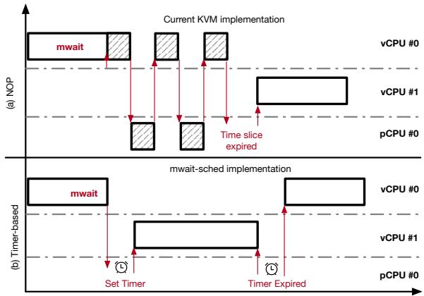  
Figure 7: Profile-Guided mwait emulation allows vCPUs to yield in a controlled interval, preventing pCPU monopolization and reducing contention under colocation.

Figure 7 illustrates the effect of KVM’s current no-op implementation. When mwait is treated as a NOP, a vCPU never yields and effectively monopolizes the pCPU time slice, causing severe interference for colocated vCPUs.

In mwait-sched, we replace the NOP with a timer-based emulation. The timer guarantees that a vCPU regains control within a bounded time window, while allowing the scheduler to allocate the pCPU to other vCPUs between ticks. The length of this window determines the tradeoff between latency and throughput: short slices allow latency-sensitive workloads to regain execution quickly, while overly short slices introduce excessive VM switching overhead and waste CPU cycles in context switching.

To balance this tradeoff, a number of approaches could in principle be adopted—ranging from offline profiling with per-VM tuning, to online machine-learning classifiers, to fine-grained instruction-level instrumentation. However, these techniques introduce nontrivial complexity, operational burden, or deployment risks at hyperscale. For production stability, we adopt a simple and robust solution: a profile-guided mwait emulation.

As shown in Figure 8, most latency-sensitive, I/O-heavy workloads (FS, MySQL, Redis, ZooKeeper, and PT) achieve their lowest P99 latency when the mwait-sched slice is short, typically in the 20–50 µs range: for example, Redis get/set improve by roughly 4–5 when moving from a 0 µs slice to 20 µs. In contrast, the CPU-intensive super-pi benchmark benefits from longer slices, with P99 latency steadily decreasing by about 2.5 as we extend the slice from 0 µs to 400 µs. The mechanism is direct: I/O- and synchronization-heavy workloads idle frequently and are sensitive to wake-up latency, so a shorter slice that resumes them quickly when the wake event arrives reduces queuing delay; super-pi rarely idles, so any short-slice timer overhead pays for nothing and just wastes cycles.

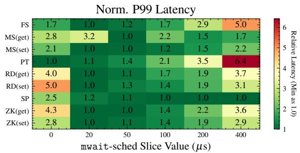  
Figure 8: Normalized P99 latency across nine representative workloads (definitions in Table 3) as we vary the mwait-sched slice length. Each row is normalized to the minimum P99 ob served for that workload (greener is better). All measurements were collected under a 2 vCPU : 1 pCPU colocation setting. Short slices (0–50 µs) favor I/O- and synchronization-heavy services, whereas CPU-bound compute prefers longer slices.

eBPF traces of representative vCPUs make this concrete: an I/O-bound vCPU enters mwait only 19 times/sec but stays idle 53 ms each time ( 96% of episodes longer than 1 ms), while a CPU-bound vCPU enters 6,900 times/sec with each idle averaging only 110 µs ( 95% under 200 µs). The I/O-bound vCPU spends most of its time idle waiting for a request, so each wake aligns with a real I/O or synchronization event and a short slice cuts directly into the request tail. The CPU-bound vCPU’s idles are short scheduler-sync gaps with no external wake to align with, so a short slice just adds a timer interrupt per gap without any latency upside.

Because we cannot inspect applications inside customer VMs, we infer workload type by sampling PMU (Performance Monitor Unit [20]) counters and using the ratio of IOPS (Input/Output Operations Per Second) to vCPU utilization as a simple, deployable indicator: high ratios correlate with latency-sensitive workloads, while low ratios correspond to CPU-intensive jobs. Based on this signal, mwait-sched dynamically steers such workloads toward shorter or longer slices, balancing latency and throughput across diverse tenants.

As shown in Figure 9, the guest-reported VM utilization stays nearly flat (around 6–9%) across all slice lengths, but the host CPU utilization jumps from about 8–10% at 400 µs to over 50–60% at 0–20 µs. These extra host cycles are spent on more frequent timer interrupts, VM exits, and rescheduling rather than useful work, effectively increasing the cost of idleness and capping the workload’s maximum sustainable throughput. Thus, blindly choosing the smallest slice is counterproductive: mwait-sched must trade off tail-latency gains against the additional host CPU consumption of overly

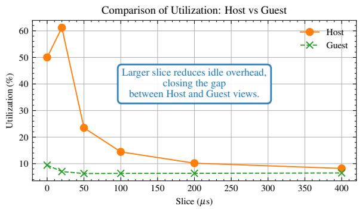  
Figure 9: Average host/guest CPU utilization of the nine representative workloads under different mwait-sched slice lengths (2 vCPU : 1 pCPU). Short slices inflate host usage due to timer and scheduling overhead, while guest-reported utilization remains almost unchanged.

fine-grained slices.

Avoiding Lock-Holder Preemption in mwait Emulation. A naïve implementation of profile-guided mwait emulation wakes only the vCPU that issued the simulated mwait exit. However, this approach suffers from the classic lock-holder preemption problem: the awakened vCPU often depends on another vCPU—typically the lock holder or a synchronization partner—that has been descheduled by the hypervisor. As a result, the awakened vCPU immediately stalls on the same contended memory location, wasting its entire time slice and amplifying tail latency. In oversubscribed environments, where such dependency chains are common, this can lead to severe head-of-line blocking and cascading delays across the VM.

To address this issue, we treat mwait-driven wake-ups as VM-local synchronization events and wake all runnable vC-PUs belonging to the same VM. When the periodic timer re-evaluates simulated mwait states and determines that a vCPU should be woken, we activate not only the vCPU that originally issued the simulated mwait but also other vCPUs in the same VM that may lie on its critical path. This optimization addresses the classic lock-holder preemption problem: by waking all runnable vCPUs that may participate in the upcoming synchronization step—including lock holders, I/O threads, and application threads likely to release or propagate the event—we ensure immediate forward progress and avoid pathological latency spikes under oversubscription.

The overhead of this design is low in practice: VMs typically have only a small number of runnable vCPUs near idle boundaries, and waking them merely marks the vCPUs as eligible for scheduling rather than forcing context switches. Figure 11 confirms this even in the worst case where all 48 vCPUs of a VM are woken at once. The hypervisor cost to mark all 48 runnable stays at 20 µs across oversubscription ratios R 1.0, 1.1, 1.2, 1.5 , since the work scales with the vCPU count, not the level of oversubscription. The time until every vCPU is actually on-CPU climbs to 240 µs at R=1.5, but that gap is just the queue waiting for a pCPU to free up; any wake mechanism inherits it under oversubscription. In contrast, the latency benefits are substantial. By aligning wake-up semantics with VM-level synchronization behavior, the scheduler ensures that lock holders and waiters are coscheduled, reducing wake-up jitter and improving end-to-end performance under oversubscription.

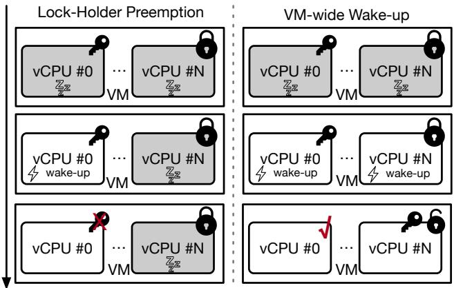  
Figure 10: Naïve mwait emulation wakes only the waiter, leaving the lock holder descheduled and causing lock-holder preemption. mwait-sched instead performs VM-wide wakeups, ensuring lock holders and waiters are co-scheduled to restore forward progress under oversubscription.

Figure 10 illustrates the difference between naïve singlevCPU wake-up and our VM-wide wake-up strategy. In the naïve case, the waiter is awakened while the lock holder remains descheduled, causing the waiter to spin unproductively until the next scheduling opportunity. In contrast, our approach wakes both the waiter and the lock holder, restoring forward progress immediately.

## 4.2 mwait-based vCPU Aggregation

A central insight of mwait-sched is that mwait provides a finegrained, guest-generated signal of short-term idleness that can be formalized and exploited for safe vCPU aggregation. To distinguish meaningful slack from brief synchronization stalls, mwait-sched maintains a lightweight profile of idle intervals. Let ∆t denote the duration of the i-th idle episode, measured as the time between two consecutive mwait entries or between mwait entry and the next activity-indicating timer tick. Empir ically, idle durations form a bimodal distribution: one cluster corresponding to microsecond-scale transient idle caused by spinlock backoff or retry loops, and another corresponding to millisecond-scale stable idle produced by genuine quiescence such as thread sleep or queue emptiness. Figure 12 confirms this on production hosts: in eBPF-sampled traces, 99.6% of mwait episodes on busy vCPUs finish within 200 µs, while

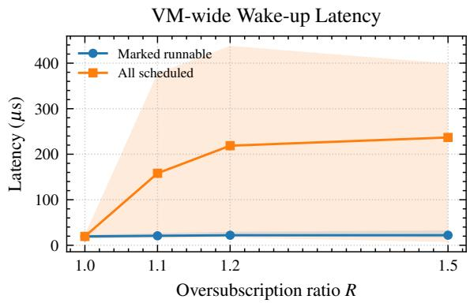  
Figure 11: VM-wide wake-up latency on a 48-vCPU VM at oversubscription ratio R (vCPUs per pCPU). Marked runnable is the hypervisor’s cost to mark all 48 vCPUs eligible to run; All scheduled is the time until every vCPU has been picked up by a pCPU. Shaded bands span per-trial min/max over a 30 s window; markers show the mean.

96.0% of episodes on idle vCPUs last beyond 1 ms. Almost nothing lands between 200 µs and 1 ms, so a single threshold cleanly separates the two populations.

We formalize this distinction using a classifier C(∆ti):

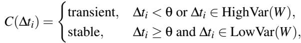

where θ is a latency-safe aggregation threshold, and Var(W ) measures the variance of idle intervals over a sliding window W = ∆ti k, . . . , ∆ti . Transient idle thus corresponds to short, bursty intervals with high variance, indicating imminent for ward progress and making aggregation unsafe. Stable idle corresponds to long, low-variance intervals, signaling that the vCPU is quiescent and eligible for aggregation.

Only vCPUs for which C(∆ti) = stable are considered for packing. When spare capacity is available, the scheduler aggregates these stable-idle vCPUs onto shared pCPUs, increasing consolidation density while avoiding interference with active workloads.

To preserve latency guarantees, aggregation is tightly coupled with deterministic de-aggregation. When a vCPU exhibits transient idleness, exiting mwait quickly, it is immediately separated from its siblings and restored to dedicated execution. This rapid de-aggregation prevents bursty workloads from incurring queuing delays while still allowing deep consolidation during idle phases.

Compared to traditional consolidation mechanisms that rely on coarse reactive signals such as CPU utilization or run-queue length, mwait-based aggregation is predictive: the guest explicitly informs the hypervisor of current idleness, enabling fine-grained packing opportunities without incurring unnecessary interference. This design improves consolidation density, supports higher oversubscription ratios, and reduces pCPU fragmentation while keeping tail latency close to the non-overcommitted baseline.

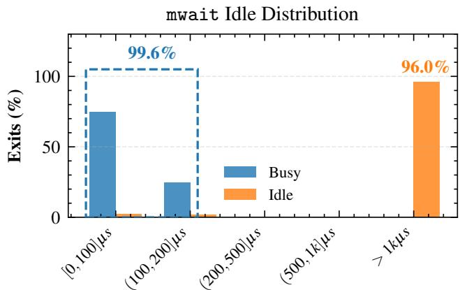  
Figure 12: Distribution of mwait idle durations sampled with eBPF on randomly chosen production hosts. 99.6% of episodes on busy vCPUs end within 200 µs; 96.0% of episodes on idle vCPUs last beyond 1 ms. The two populations are essentially disjoint, justifying the binary stable/transient classifier.

Architectural C-state reporting does not solve this visibility problem. Although x86 processors expose MWAIT-hintdriven C-state residency fields through power-management registers [19], these counters are too coarse and asynchronous for scheduling. They can show that a core spent time in an idle state, but they do not provide the timely per-vCPU yield signal needed to multiplex pCPUs safely.

## 4.3 Multi-Address mwait-Proxy

The profile-guided, timer-based approach works well when only two vCPUs share a pCPU, but it fails to scale as more vC-PUs are colocated. Assigning a dedicated timer to each vCPU triggers excessive VM switches, consuming substantial pCPU cycles in context switching. Moreover, for workloads such as database systems that rely heavily on bare-metal mwait on the NEED\_RESCHED flag to bypass IPIs [46], timer-based emulation becomes fundamentally inadequate: the guest must wait until the next timer tick, even when the NEED\_RESCHED flag is already set.

To support high vCPU aggregation while avoiding these delays, we introduce a multi-address, linked-list–based mwaitproxy design that tracks multiple watched locations and promptly boosts these workloads without relying on periodic timers. Each time a vCPU executes mwait and exits, we insert its monitored address into a shared linked list maintained by the hypervisor. Whenever control returns to the hypervisor, we scan this list and check all monitored addresses to determine whether any vCPU should be woken up. Unlike the timer-based approach, this method allows multiple vCPUs to share a pCPU efficiently without installing multiple periodic timers, eliminating unnecessary VM switches and reducing wasted cycles.

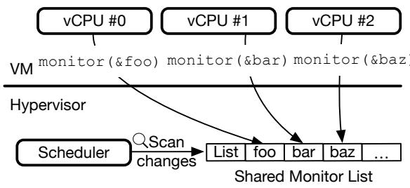  
Figure 13: mwait-proxy replaces per-vCPU timer polling with a shared multi-address monitor. By tracking all mwait addresses in the hypervisor, it supports many colocated vC-PUs without incurring excessive VM exits.

We believe this multi-address proxy is the most practical way to emulate multi-address mwait using today’s x86 hardware. Supporting true multi-address monitoring would likely require ISA support—such as a new vectorized monitor instruction—to allow the hardware to track multiple addresses natively.

Wake-up correctness. Native x86 mwait wakes on any store to the monitored address, not on a value change, so a same-value write or a write-then-revert can in principle defeat a value-comparison check. mwait-sched is unaffected: the timer just delays the vCPU between checks, and the wake check runs at every tick, so no event in the steady state goes unchecked. The question applies to mwait-proxy, which checks the monitored value (not the coherence event) when it scans the watch list. We accept this simplification because, in current Linux guests, only the idle path uses mwait, and its wake signal is the kernel’s need\_resched flag going from 0 to 1. Only the idle vCPU itself clears the flag, so a samevalue write by another vCPU does not occur in practice; even if it did, native mwait would just wake the vCPU, re-check, and re-enter mwait—indistinguishable from our skipping the spurious wake. No kernel logic we surveyed depends on observing every store as a discrete pulse: a software flag that is set and then cleared between observation points is already an inherently missable event, so guests do not build protocols around it. Moreover, KVM’s upstream mwait-nop has the same limitation: with mwait NOPed, the guest’s idle loop polls the wake flag itself, and a same-value write or writethen-revert between two polls is equally missed. mwait-proxy therefore introduces no regression relative to current production behavior.

Security. Pure mwait-passthrough lets an idle vCPU monopolize a shared pCPU, which §2.2 flagged as a denial-ofservice vector. Both mwait-sched and mwait-proxy close this gap: a malicious or buggy guest cannot withhold the pCPU beyond one timer slice (mwait-sched) or until the next hypervisor entry (mwait-proxy), so the worst-case interference one tenant can impose on its colocated neighbors is small and predictable. The hypervisor stays the trust boundary, and these paths use only state already available from VM exits, so they do not add any new attacker capability.

Table 2: Environment Configuration  
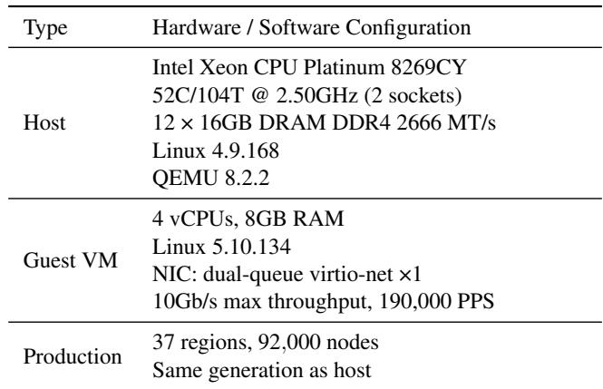

Table 3: Representative Workloads Used in the mwait-sched Evaluation  
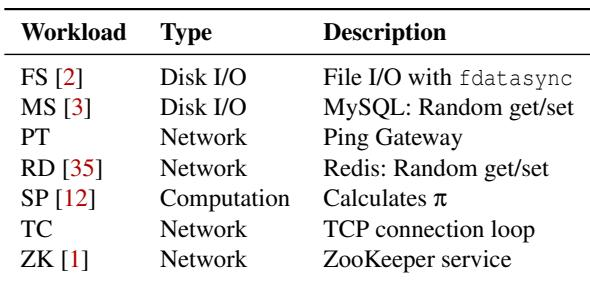

## 5 Evaluation

We evaluate mwait-sched through a comprehensive set of experiments. First, we examine end-to-end latency and preemption behavior across diverse workloads to characterize its scheduling impact. Second, we assess the effectiveness of mwait-proxy under high oversubscription ratios and quantify its ability to sustain performance at scale. Third, we analyze multi-region deployment data to demonstrate the improvements mwait-sched delivers in real production environments.

Experimental Setup. We evaluate mwait-sched through controlled experiments and production deployments. Our study compares four configurations:

• mwait-nop (Baseline): Upstream KVM implements mwait as a no-op, causing the vCPU to remain runnable and always accounted as 100% busy. This reflects the default behavior in today’s virtualized clouds.

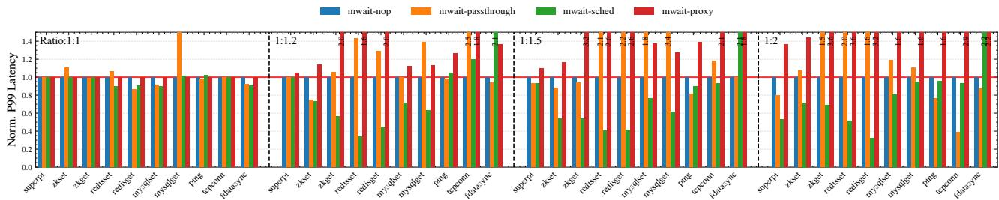

(a) Normalized P99 Latency (Lower is better). Values are normalized to the mwait-nop baseline at the same ratio. mwait-sched effectively mitigates tail latency degradation under high oversubscription (1:1.5/1:2), particularly for latency-sensitive workloads like Redis and ZooKeeper. mwait-proxy is benign at 1:1 and scales smoothly through the low-density regime, with the synchronization-heavy workloads (RD, ZK Get, TC) climbing fastest—consistent with the higher-density picture in Figure 15.  
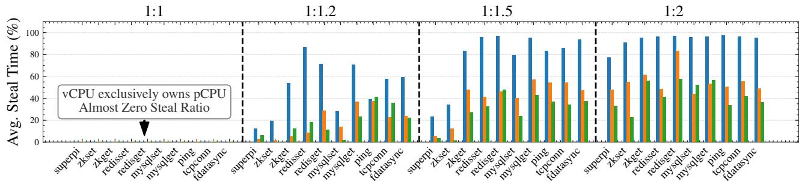  
(b) vCPU Steal Time Analysis (Lower is better). The breakdown of steal time across different oversubscription ratios. mwait-sched significantly suppresses steal time in oversubscribed scenarios (e.g., 1:2), explaining the latency improvements observed in (a). The 1:1 base case shows negligible contention.  
Figure 14: Performance and Interference Analysis. Comparison of mwait-nop, mwait-passthrough, and the proposed mwaitsched and mwait-proxy mechanisms. Simple benchmarks such as Ping remain stable, while mwait-sched reduces preemption overhead for synchronization-heavy workloads.

• mwait-passthrough: mwait executes directly without triggering VM exits, offering the lowest exit latency but preventing pCPU sharing because the vCPU never yields to the hypervisor.

• mwait-sched: Our timer-based emulation of mwait, which exposes idle signals to the hypervisor while avoiding the high overhead of trap-and-emulation. This enables predictable pCPU sharing under oversubscription.

• mwait-proxy: A linked-list–based multi-address monitor that extends mwait-sched to track many vCPUs concurrently, improving aggregation density under high oversubscription.

All configurations are shown in Table 2. Experiments constrain guest VMs to a single NUMA node to avoid cross-node interference. Our production evaluation spans multiple regions and heterogeneous workloads, enabling characterization across diverse usage patterns and deployment scales.

Workload. Due to privacy and isolation requirements, our microbenchmarks were conducted in a controlled testbed rather than on production VMs. The testbed evaluation spans 24 representative workload categories and 220 scenarios. A scenario pairs a workload category with a traffic profile, including request mix, rate, and key/payload distribution. These scenarios are derived from production traffic patterns, user reports, and performance incidents. Table 3 lists the subset we highlight in figures throughout this paper. In each experiment round, multiple VMs were randomly assigned scenarios and executed concurrently to capture contention, preemption behavior, and end-to-end latency under oversubscription.

## 5.1 Stand-Alone Classifier Evaluation

§4.1 uses the IOPS-to-utilization ratio from PMU counters to choose short or long timer slices. We test this classifier on PMU telemetry from 1,000 production VMs whose workload type is known from the VM image. The two classes are well separated: I/O-bound VMs have a median ratio of 840, while CPU-bound VMs have a median ratio of 20, a 42 gap. We set T = 100 between the two groups. This gives a 0.21% overall misclassification rate: 0.07% of I/O-bound VMs are classified as CPU-bound, and 0.36% of CPU-bound VMs are classified as I/O-bound. The harmful error is the first one because it can hurt tail latency; the second mainly wastes a few timer ticks. The result is not sensitive to the exact threshold: any T [50,150] keeps misclassification below 0.7%.

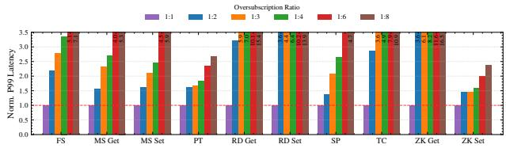  
Figure 15: Normalized P99 latency of mwait-proxy across ten workloads (FS, MS Get/Set, PT, RD Get/Set, SP, TC, ZK Get/Set) at oversubscription ratios from 1:1 to 1:8. The y-axis is capped at 3.5 ; bars over the cap show their value as a label. 1:4 is the burst tier’s typical production density and 1:6 its peak; 1:8 is included as a stress point beyond production.

## 5.2 End-to-End Tail Latency

Mitigating Contention. Figure 14a shows the impact of our mechanism on tail latency under different oversubscription ratios. When contention is low (1:1 mapping), all configurations behave similarly. As the oversubscription ratio increases, however, mwait-sched scales more effectively. At high oversubscription levels, it reduces the P99 latency of latency-sensitive workloads such as ZooKeeper and Redis by 30–50% compared to the mwait-nop baseline. This improvement aligns with the steal-time analysis in Figure 14b. Under mwait-nop, vCPUs suffer severe starvation—steal time exceeds 90% for synchronization-heavy workloads—indicating frequent lock-holder preemption. In contrast, mwait-sched leverages the semantic gap to convert unproductive spin-wait loops into cooperative yields, reducing steal time to below 60% and allowing critical sections to make forward progress even under heavy interference.

Two outliers need explanation. First, mwait-passthrough spikes for mysqlset at 1:1 because the pCPU enters deep Cstates between requests, and waking from them adds latency to each MySQL write. Second, fdatasync stays high under mwait-sched at every ratio because the timer can add up to one slice of delay per fsync, and fdatasync issues many fsyncs back-to-back.

## 5.3 mwait-Proxy

Figure 15 shows normalized P99 latency for ten representative workloads at oversubscription ratios 1:1, 1:2, 1:3, 1:4, 1:6, and 1:8. The 1:2–1:4 range covers the densities used in production, with 1:4 the burst tier’s typical density and 1:6 its peak; 1:8 is a stress point beyond production. At 1:2 most workloads stay within 2.2 (FS 2.2 , MS 1.6 , PT

1.6 , SP 1.4 ), and the synchronization-heavy ones (TC, RD Get/Set, ZK Get) sit at 2.9–3.7 . At 1:4 the workloads split further: CPU- and I/O-bound ones scale moderately (1.8– 3.4 ), while synchronization-heavy ones reach TC 4.9 , RD Set 6.4 , RD Get 7.0 , and ZK Get 8.2 . ZK Set, dominated by write batching rather than per-request synchronization, stays close to baseline (1.4–1.6 ). The 5–8 inflation on the synchronization-heavy group fits within the burst tier’s variance budget, which is what makes mwait-proxy a viable production scheme at this density.

Beyond 1:4 the proxy’s monitor-list traversal cost dominates: each entry into the hypervisor scans a longer list, and per-vCPU wake events compete for service. At 1:6 (burst peak) RD Get/Set and ZK Get reach 10–12 and TC reaches 7.9 , while CPU- and I/O-bound jobs sit at 2–5 . At 1:8 the worst cases land at 11–16 (TC 11 , RD Set 14 , RD Get 15 , ZK Get 16 ), exposing the scaling limit of software multi-address emulation and motivating the hardware-level vectorized monitor support discussed in §6.

## 5.4 Production Rollout

Our production fleet has two instance classes with different SLO requirements, and we pick mwait-sched vs. mwait-proxy by class at deployment rather than auto-switching per VM. Dedicated instances have strict latency SLOs and stay at 1:2 oversubscription, since putting more than two vCPUs on a pCPU easily causes SLO violations at this tier; this fleet runs mwait-sched, which is what we report below. Burst instances tolerate higher latency variance and typically run at 1:4 (peaking at 1:6), where mwait-proxy handles the longer monitor list. The numbers in this section therefore come from the dedicated fleet under mwait-sched.

We selected three representative regions with distinct machine scales and baseline contention levels to evaluate the cross-region effects of mwait-sched. Before deployment, the frequency of high-contention steal events (steal ratio > 5%) differed significantly across regions: Region B was under the most pressure (around 95,000–100,000 steals per 10k machines); Region A was moderate (rising from 45,000 to 65,000); and Region C was flatter (around 36,000–37,000).

As shown in Figure 16a, all three regions experience a substantial drop after the rollout of mwait-sched. Within about ten days, Region B drops by 97% (from a 100,000 peak to under 5,000), Region A by 85% (from a 65,000 peak to under 10,000), and Region C by 86% (from 37,000 to 5,000). Despite their disparate starting points, the postdeployment curves converge to a significantly lower and tightly clustered band, indicating that mwait-sched consistently suppresses oversubscription-induced contention across heterogeneous environments.

Hot migration activity provides an independent validation of this effect. When enough VMs exceed the 5% steal time threshold, the platform initiates VM hot migrations to avoid SLO violations. As shown in Figure 16b, all three regions exhibit a clear decline in daily hot migrations immediately following deployment. Since hot migrations are triggered primarily by severe CPU contention and imbalance, their consistent decline corroborates the steal-ratio reductions and highlights the improved runtime stability brought by mwaitsched.

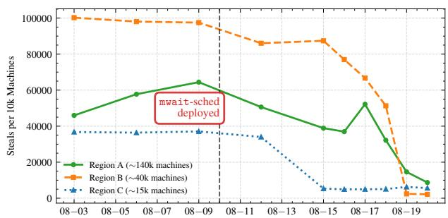  
(a) Normalized steal events.

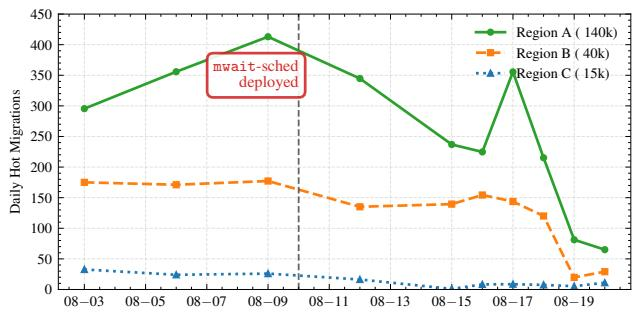  
(b) Daily live migrations.  
Figure 16: Cross-region production signals before and after mwait-sched rollout. (a) Steal events drop sharply and converge to a consistently low band across heterogeneous regions. (b) Hot migrations also decline immediately after deployment, independently confirming that reduced contention improves VM stability and mitigates scheduler-driven relocations.

Figure 17 shows the global effects of deploying mwaitsched across multiple production regions covering 3.2M physical CPU cores. After rollout, the oversubscription ratio increased from 1.0% to 20.3%, effectively adding roughly 600,000 vCPUs of sellable capacity. Despite this substantial increase in utilization, system reliability improved: the normalized daily alarm rate dropped from 512 to 197 per 10k machines across regions. These results demonstrate that precise idle-state handling allows the platform to safely operate at much higher density while simultaneously reducing QoS-related incidents at hyperscale.

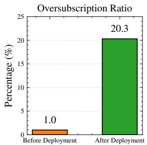

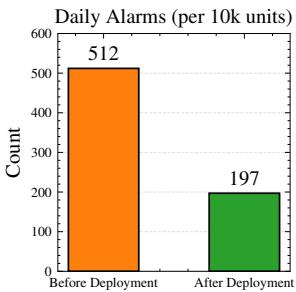  
Figure 17: Global deployment impact of mwait-sched across multiple regions covering 3.2M physical CPU cores. The rollout increased oversubscription ratio (1.0%→20.3%) while reducing daily alarms (512→197 per 10k machines), demonstrating higher utilization without compromising stability.

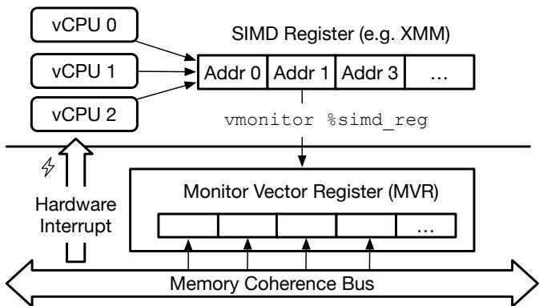  
Figure 18: Conceptual design of a vectorized vmonitor instruction. Software supplies a SIMD-packed list of addresses, which hardware loads into a Monitor Vector Register (MVR) and checks in parallel against coherence-bus writes.

## 6 Recommendations for Future Hardware

Based on our experience deploying mwait at scale in virtualized clusters, we believe future ISAs (including x86, Arm, and RISC-V) should treat idle instructions not merely as powermanagement hints, but as first-class scheduling primitives. Below we outline several directions for hardware designers; these proposals are conceptual and intended to guide future architectural support rather than describe implemented mechanisms.

Multi-address monitoring. Current monitor/mwait instructions bind a thread to a single watched location, yet virtualized workloads often need to observe the quiescent state of many vCPUs simultaneously (e.g., runnable flags or per-thread wake tokens). We recommend exploring vectorized forms of the instruction that accept a small array of virtual addresses and a validity mask, allowing software to arm or update a set of watchpoints with a single operation.

Conceptually, such an extension could take the form of a new vmonitor interface (Figure 18) in which software supplies a vector of addresses using SIMD registers. Hardware would load these addresses into a Monitor Vector Reg ister (MVR) and compare coherence-bus writes against all entries in parallel, triggering an interrupt whenever any monitored location changes. This generalizes mwait from a singleaddress primitive into a hardware-level multi-way event monitor—akin to providing select/epoll semantics within the CPU. While we do not implement this design, it illustrates a promising direction for reducing polling overhead, elim inating unnecessary context switches, and enabling a host thread to efficiently wait on many vCPU idle signals. Such support would make multi-address mwait semantics practical for virtualization and allow denser vCPU aggregation in oversubscribed cloud deployments.

Virtualization-aware semantics. Future ISAs should also define how idle instructions interact with hypervisors explicitly: which state transitions are visible to the guest, which are owned by the host, and which events must be delivered as exits. A “virtualizable wait” variant, for example, could guarantee that entering the wait state always notifies the hypervisor, while wakeups may be signaled either through a watched-memory write or via a host-injected event. Clear semantics of this kind would enable safe pCPU sharing while still providing the low exit latencies expected by modern guests.

## 7 Related Work

## 7.1 Idle in Virtualization

Idle instructions are a fundamental but often overlooked component of virtualized execution. Prior measurements show that idleness can dominate context-switch overhead: Liu et al. [28] observe that idle periods account for up to 66.7% of context-switch costs in GaaS (GPU as a Service) clouds, and similar effects appear in nested virtualization where idle loops amplify VM–VMM interaction overheads [25]. Most existing work identifies VM idleness via VM introspection [10,11,41], inferring quiescence by sampling guest states or events, but such approaches are infeasible at hyperscale due to overhead, isolation concerns, and operational complexity. To our knowledge, mwait-sched is the first production-scale system that directly leverages hardware idle instructions as a scheduling signal, avoiding introspection while enabling sub-microsecond reactivity.

## 7.2 Oversubscription Optimization

A large body of work aims to improve vCPU colocation under oversubscription [5, 37, 44, 48, 53, 54]. Hardware-assisted techniques isolate interference through cache partitioning or memory-bandwidth control [29], and in-hardware request schedulers prioritize latency-critical VMs [7, 39, 43, 49]. Coordination-based designs further reduce double scheduling (e.g., UFO [33]) or exploit fine-grained time windows to identify transient opportunities for packing (e.g., SmartHarvest [48]). A separate line of work targets high CPU efficiency for latency-sensitive workloads through user-space scheduling and core reallocation, most notably Shenango [30]. These designs deliver impressive efficiency on dedicated workloads but require application-level integration with their runtime, which is incompatible with our public-cloud setting where guests run unmodified images. However, two limitations per sist in public clouds: QoS signals are generally unavailable, and even nominally idle VMs can introduce interference because the hypervisor cannot estimate the stability of idle periods. mwait-sched addresses both challenges by exploiting the semantics of idle instructions: the guest-generated idle signal reveals short-term quiescence without application-level hints, allowing the hypervisor to dynamically adjust colocation decisions. By aggregating vCPUs with stable idle patterns and separating those exhibiting only transient waits, mwait-sched achieves a practical balance between reducing exit latency and improving CPU utilization.

## 8 Conclusion

mwait-passthrough provides low wake-up latency, but hides idle vCPUs from the host scheduler and prevents safe pCPU sharing. mwait-sched restores this visibility through timerbased emulation and idle-interval classification, while mwaitproxy supports denser colocation. This lets idle vCPUs yield their cores while preserving the low-latency behavior needed by guests. Across nine workloads, mwait-sched reduces P99 latency by 30–50% and steal ratio by 30–40%. Its deployment across 3.2M pCPUs reduced high-contention steal events by over 80% and raised the oversubscription ratio from 1.0% to 20.3%.

## Acknowledgments

We thank our shepherd and the anonymous reviewers for their insightful comments that improved the quality of this paper. We also thank our colleagues for their feedback during the design and deployment. Their engineering support was essential to the production rollout and large-scale evaluation. This work was partially supported by the Ministry of Industry and Information Technology 2024 Cloud Operating System Project, the National Natural Science Foundation of China (No. 62572307), the Shanghai Key Laboratory of Scalable Computing and Systems, and the Alibaba AIR program.

## References

[1] Apache ZooKeeper. https://zookeeper.apache. org, October 2024. [Online; accessed 11. Dec. 2025].

[2] fdatasync(2) — Arch manual pages. https://man. archlinux.org/man/fdatasync.2.en, August 2025. [Online; accessed 11. Dec. 2025].

[3] MySQL. https://www.mysql.com, August 2025. [Online; accessed 11. Dec. 2025].

[4] Omid Alipourfard, Hongqiang Harry Liu, Jianshu Chen, Shivaram Venkataraman, Minlan Yu, and Ming Zhang. Cherrypick: Adaptively unearthing the best cloud con figurations for big data analytics. In Aditya Akella and Jon Howell, editors, 14th USENIX Symposium on Networked Systems Design and Implementation, NSDI 2017, Boston, MA, USA, March 27-29, 2017, pages 469–482. USENIX Association, 2017.

[5] Pradeep Ambati, Iñigo Goiri, Felipe Vieira Frujeri, Alper Gun, Ke Wang, Brian Dolan, Brian Corell, Sekhar Pasupuleti, Thomas Moscibroda, Sameh Elnikety, Marcus Fontoura, and Ricardo Bianchini. Providing slos for resource-harvesting vms in cloud platforms. In 14th USENIX Symposium on Operating Systems Design and Implementation, OSDI 2020, Virtual Event, November 4-6, 2020, pages 735–751. USENIX Association, 2020.

[6] Adam Belay, George Prekas, Ana Klimovic, Samuel Grossman, Christos Kozyrakis, and Edouard Bugnion. IX: A protected dataplane operating system for high throughput and low latency. In Jason Flinn and Hank Levy, editors, 11th USENIX Symposium on Operating Systems Design and Implementation, OSDI ’14, Broomfield, CO, USA, October 6-8, 2014, pages 49–65. USENIX Association, 2014.

[7] Jongwook Chung, Yuhwan Ro, Joonsung Kim, Jaehyung Ahn, Jangwoo Kim, John Kim, Jae W. Lee, and Jung Ho Ahn. Enforcing last-level cache partitioning through memory virtual channels. In 28th International Conference on Parallel Architectures and Compilation Techniques, PACT 2019, Seattle, WA, USA, September 23-26, 2019, pages 97–109. IEEE, 2019.

[8] Brian F. Cooper, Adam Silberstein, Erwin Tam, Raghu Ramakrishnan, and Russell Sears. Benchmarking cloud serving systems with YCSB. In Joseph M. Hellerstein, Surajit Chaudhuri, and Mendel Rosenblum, editors, Proceedings of the 1st ACM Symposium on Cloud Computing, SoCC 2010, Indianapolis, Indiana, USA, June 10-11, 2010, pages 143–154. ACM, 2010.

[9] Eli Cortez, Anand Bonde, Alexandre Muzio, Mark Russinovich, Marcus Fontoura, and Ricardo Bianchini.

Resource central: Understanding and predicting workloads for improved resource management in large cloud platforms. In Proceedings of the 26th Symposium on Operating Systems Principles, Shanghai, China, October 28-31, 2017, pages 153–167. ACM, 2017.

[10] Thomas Dangl, Benjamin Taubmann, and Hans P. Reiser. Rapidvmi: Fast and multi-core aware active virtual machine introspection. In Delphine Reinhardt and Tilo Müller, editors, ARES 2021: The 16th International Conference on Availability, Reliability and Security, Vienna, Austria, August 17-20, 2021, pages 19:1–19:10. ACM, 2021.

[11] Brendan Dolan-Gavitt, Tim Leek, Michael Zhivich, Jonathon T. Giffin, and Wenke Lee. Virtuoso: Narrowing the semantic gap in virtual machine introspection. In 32nd IEEE Symposium on Security and Privacy, SP 2011, 22-25 May 2011, Berkeley, California, USA, pages 297–312. IEEE Computer Society, 2011.

[12] Fibonacci43. SuperPI. https://github.com/ Fibonacci43/SuperPI, August 2025. [Online; accessed 11. Dec. 2025].

[13] Alexander Fuerst, Stanko Novakovic, Iñigo Goiri, Gohar Irfan Chaudhry, Prateek Sharma, Kapil Arya, Kevin Broas, Eugene Bak, Mehmet Iyigun, and Ricardo Bianchini. Memory-harvesting vms in cloud platforms. In Babak Falsafi, Michael Ferdman, Shan Lu, and Thomas F. Wenisch, editors, ASPLOS ’22: 27th ACM International Conference on Architectural Support for Programming Languages and Operating Systems, Lausanne, Switzerland, 28 February 2022 - 4 March 2022, pages 583–594. ACM, 2022.

[14] Robert Grandl, Mosharaf Chowdhury, Aditya Akella, and Ganesh Ananthanarayanan. Altruistic scheduling in multi-resource clusters. In Kimberly Keeton and Timothy Roscoe, editors, 12th USENIX Symposium on Operating Systems Design and Implementation, OSDI 2016, Savannah, GA, USA, November 2-4, 2016, pages 65–80. USENIX Association, 2016.

[15] Jing Guo, Zihao Chang, Sa Wang, Haiyang Ding, Yihui Feng, Liang Mao, and Yungang Bao. Who limits the resource efficiency of my datacenter: an analysis of alibaba datacenter traces. In Proceedings of the International Symposium on Quality of Service, IWQoS 2019, Phoenix, AZ, USA, June 24-25, 2019, pages 39:1–39:10. ACM, 2019.

[16] Benjamin Hindman, Andy Konwinski, Matei Zaharia, Ali Ghodsi, Anthony D. Joseph, Randy H. Katz, Scott Shenker, and Ion Stoica. Mesos: A platform for finegrained resource sharing in the data center. In David G. Andersen and Sylvia Ratnasamy, editors, Proceedings

of the 8th USENIX Symposium on Networked Systems Design and Implementation, NSDI 2011, Boston, MA, USA, March 30 - April 1, 2011. USENIX Association, 2011.

[17] Jack Tigar Humphries, Neel Natu, Ashwin Chaugule, Ofir Weisse, Barret Rhoden, Josh Don, Luigi Rizzo, Oleg Rombakh, Paul Turner, and Christos Kozyrakis. ghost: Fast & flexible user-space delegation of linux scheduling. In Robbert van Renesse and Nickolai Zeldovich, editors, SOSP ’21: ACM SIGOPS 28th Symposium on Operating Systems Principles, Virtual Event / Koblenz, Germany, October 26-29, 2021, pages 588–604. ACM, 2021.

[18] Intel Corporation. 5-level paging and 5-level ept white paper. White Paper 335252-002, Revision 1.1, Intel Corporation, May 2017. Revised and published online May 24, 2018.

[19] Intel Corporation. Intel 64 and IA-32 Architectures Software Developer’s Manual, Volume 3A: System Programming Guide, 2024.

[20] Intel Corporation. Perfmon events. https:// perfmon-events.intel.com/, 2025. Performance monitoring events reference for Intel processors.

[21] Sangeetha Abdu Jyothi, Carlo Curino, Ishai Menache, Shravan Matthur Narayanamurthy, Alexey Tumanov, Jonathan Yaniv, Ruslan Mavlyutov, Iñigo Goiri, Subru Krishnan, Janardhan Kulkarni, and Sriram Rao. Morpheus: Towards automated slos for enterprise clusters. In Kimberly Keeton and Timothy Roscoe, editors, 12th USENIX Symposium on Operating Systems Design and Implementation, OSDI 2016, Savannah, GA, USA, November 2-4, 2016, pages 117–134. USENIX Association, 2016.

[22] Alok Gautam Kumbhare, Reza Azimi, Ioannis Manousakis, Anand Bonde, Felipe Vieira Frujeri, Nithish Mahalingam, Pulkit A. Misra, Seyyed Ahmad Javadi, Bianca Schroeder, Marcus Fontoura, and Ricardo Bianchini. Prediction-based power oversubscription in cloud platforms. In Irina Calciu and Geoff Kuenning, editors, Proceedings of the 2021 USENIX Annual Technical Conference, USENIX ATC 2021, July 14-16, 2021, pages 473–487. USENIX Association, 2021.

[23] Michael Larabel. Amd updates linux patches for lowering idle exit latency. Phoronix, May 2022. “AMD engineer began posting Linux kernel patches so the kernel prefers the MWAIT instruction over HALT”.

[24] Wanpeng Li. Towards a more scalable kvm hypervisor. In KVM Forum 2018, Edinburgh, Scotland, 2018.

The Linux Foundation. Presentation slides and PDF available online.

[25] Jin Tack Lim and Jason Nieh. Optimizing nested virtualization performance using direct virtual hardware. In James R. Larus, Luis Ceze, and Karin Strauss, editors, ASPLOS ’20: Architectural Support for Programming Languages and Operating Systems, Lausanne, Switzerland, March 16-20, 2020, pages 557–574. ACM, 2020.

[26] Linux Kernel Developers. KVM’s Default “MWAIT as NOP” Emulation Behavior. https://github.com/torvalds/linux/blob/ 416f99c3b16f582a3fc6d64a1f77f39d94b76de5/ arch/x86/kvm/x86.c.

[27] Linux Kernel Developers. Linux KVM x86 MONITOR/MWAIT Emulation using NOP. https://github.com/torvalds/linux/blob/ 416f99c3b16f582a3fc6d64a1f77f39d94b76de5/ arch/x86/kvm/x86.c#L2244. Linux kernel source code, commit 416f99c3b16f582a3fc6d64a1f77f39d94b76de5, accessed December 6, 2025.

[28] Ming Liu, Tao Li, Neo Jia, Andy Currid, and Vladimir Troy. Understanding the virtualization "tax" of scale-out pass-through gpus in gaas clouds: An empirical study. In 21st IEEE International Symposium on High Performance Computer Architecture, HPCA 2015, Burlingame, CA, USA, February 7-11, 2015, pages 259–270. IEEE Computer Society, 2015.

[29] David Lo, Liqun Cheng, Rama K. Govindaraju, Parthasarathy Ranganathan, and Christos Kozyrakis. Heracles: improving resource efficiency at scale. In Deborah T. Marr and David H. Albonesi, editors, Proceedings of the 42nd Annual International Symposium on Computer Architecture, Portland, OR, USA, June 13- 17, 2015, pages 450–462. ACM, 2015.

[30] Amy Ousterhout, Joshua Fried, Jonathan Behrens, Adam Belay, and Hari Balakrishnan. Shenango: Achieving high CPU efficiency for latency-sensitive datacenter workloads. In Jay R. Lorch and Minlan Yu, editors, 16th USENIX Symposium on Networked Systems Design and Implementation, NSDI 2019, Boston, MA, February 26-28, 2019, pages 361–378. USENIX Association, 2019.

[31] Kay Ousterhout, Patrick Wendell, Matei Zaharia, and Ion Stoica. Sparrow: distributed, low latency scheduling. In Michael Kaminsky and Mike Dahlin, editors, ACM SIGOPS 24th Symposium on Operating Systems Principles, SOSP ’13, Farmington, PA, USA, November 3-6, 2013, pages 69–84. ACM, 2013.

[32] Archit Patke, Dhemath Reddy, Saurabh Jha, Haoran Qiu, Christian Pinto, Chandra Narayanaswami, Zbigniew Kalbarczyk, and Ravishankar K. Iyer. Queue management for slo-oriented large language model serving. In Proceedings of the 2024 ACM Symposium on Cloud Computing, SoCC 2024, Redmond, WA, USA, November 20-22, 2024, pages 18–35. ACM, 2024.

[33] Yajuan Peng, Shuang Chen, Yi Zhao, and Zhibin Yu. UFO: the ultimate qos-aware core management for virtualized and oversubscribed public clouds. In Laurent Vanbever and Irene Zhang, editors, 21st USENIX Symposium on Networked Systems Design and Implementation, NSDI 2024, Santa Clara, CA, April 15-17, 2024. USENIX Association, 2024.

[34] Red Hat, Inc. Steal Time Accounting. Red Hat, Inc., 2015. In Red Hat Enterprise Linux 7 Virtualization Deployment and Administration Guide, Chapter 8.3.

[35] Redis. Redis - The Real-time Data Platform. Redis, August 2025. [Online; accessed 11. Dec. 2025].

[36] Benjamin Reidys, Pantea Zardoshti, Íñigo Goiri, Celine Irvene, Daniel S. Berger, Haoran Ma, Kapil Arya, Eli Cortez, Taylor Stark, Eugene Bak, Mehmet Iyigun, Stanko Novakovic, Lisa Hsu, Karel Trueba, Abhisek Pan, Chetan Bansal, Saravan Rajmohan, Jian Huang, and Ricardo Bianchini. Coach: Exploiting temporal patterns for all-resource oversubscription in cloud platforms. In Lieven Eeckhout, Georgios Smaragdakis, Kaitai Liang, Adrian Sampson, Martha A. Kim, and Christopher J. Rossbach, editors, Proceedings of the 30th ACM International Conference on Architectural Support for Programming Languages and Operating Systems, Volume 1, ASPLOS 2025, Rotterdam, The Netherlands, 30 March 2025 - 3 April 2025, pages 164–181. ACM, 2025.

[37] Ghazal Sadeghian, Mohamed Elsakhawy, Mohanna Shahrad, Joe Hattori, and Mohammad Shahrad. Unfaasener: Latency and cost aware offloading of functions from serverless platforms. In Julia Lawall and Dan Williams, editors, Proceedings of the 2023 USENIX Annual Technical Conference, USENIX ATC 2023, Boston, MA, USA, July 10-12, 2023, pages 879–896. USENIX Association, 2023.

[38] Varun Sakalkar, Vasileios Kontorinis, David Landhuis, Shaohong Li, Darren De Ronde, Thomas Blooming, Anand Ramesh, James Kennedy, Christopher Malone, Jimmy Clidaras, and Parthasarathy Ranganathan. Data center power oversubscription with a medium voltage power plane and priority-aware capping. In James R. Larus, Luis Ceze, and Karin Strauss, editors, ASPLOS ’20: Architectural Support for Programming Languages and Operating Systems, Lausanne, Switzerland, March 16-20, 2020, pages 497–511. ACM, 2020.

[39] Mohammad Shahrad, Sameh Elnikety, and Ricardo Bianchini. Provisioning differentiated last-level cache allocations to vms in public clouds. In Carlo Curino, Georgia Koutrika, and Ravi Netravali, editors, SoCC ’21: ACM Symposium on Cloud Computing, Seattle, WA, USA, November 1 - 4, 2021, pages 319–334. ACM, 2021.

[40] Sudipta Saha Shubha and Haiying Shen. Adainf: Data drift adaptive scheduling for accurate and slo-guaranteed multiple-model inference serving at edge servers. In Henning Schulzrinne, Vishal Misra, Eddie Kohler, and David A. Maltz, editors, Proceedings of the ACM SIG-COMM 2023 Conference, ACM SIGCOMM 2023, New York, NY, USA, 10-14 September 2023, pages 473–485. ACM, 2023.

[41] Rayman Preet Singh, Tim Brecht, and Srinivasan Keshav. Towards VM consolidation using a hierarchy of idle states. In Ada Gavrilovska, Angela Demke Brown, and Bjarne Steensgaard, editors, Proceedings of the 11th ACM SIGPLAN/SIGOPS International Conference on Virtual Execution Environments, Istanbul, Turkey, March 14-15, 2015, pages 107–119. ACM, 2015.

[42] Gabriel L. Somlo. Handling of guest-mode monitor and mwait. https://www.contrib.andrew.cmu. edu/\~somlo/OSXKVM/mwait.html, 2014. Last updated: Feb. 05, 2014.

[43] Jovan Stojkovic, Chunao Liu, Muhammad Shahbaz, and Josep Torrellas. Hardharvest: Hardware-supported core harvesting for microservices. In Proceedings of the 52nd Annual International Symposium on Computer Architecture, ISCA 2025, Tokyo, Japan, June 21-25, 2025, pages 708–722. ACM, 2025.

[44] Amoghavarsha Suresh and Anshul Gandhi. Servermore: Opportunistic execution of serverless functions in the cloud. In Carlo Curino, Georgia Koutrika, and Ravi Netravali, editors, SoCC ’21: ACM Symposium on Cloud Computing, Seattle, WA, USA, November 1 - 4, 2021, pages 570–584. ACM, 2021.

[45] Chunqiang Tang, Kenny Yu, Kaushik Veeraraghavan, Jonathan Kaldor, Scott Michelson, Thawan Kooburat, Aravind Anbudurai, Matthew Clark, Kabir Gogia, Long Cheng, Ben Christensen, Alex Gartrell, Maxim Khutornenko, Sachin Kulkarni, Marcin Pawlowski, Tuomas Pelkonen, Andre Rodrigues, Rounak Tibrewal, Vaishnavi Venkatesan, and Peter Zhang. Twine: A unified cluster management system for shared infrastructure. In 14th USENIX Symposium on Operating Systems Design and Implementation, OSDI 2020, Virtual Event, November 4-6, 2020, pages 787–803. USENIX Association, 2020.

[46] Marcelo Tosatti. [PATCH] sched: introduce configurable delay before entering idle. Linux Kernel Mail ing List (LKML), May 2019. Message posted on May 7, 2019. URL: https://lkml.org/lkml/2019/5/7/ 1080.

[47] Michael S. Tsirkin. Kvm: introduce flag to allow guest control of host cpu power state. QEMU-Devel Mailing List, June 2018.

[48] Yawen Wang, Kapil Arya, Marios Kogias, Manohar Vanga, Aditya Bhandari, Neeraja J. Yadwadkar, Siddhartha Sen, Sameh Elnikety, Christos Kozyrakis, and Ricardo Bianchini. Smartharvest: harvesting idle cpus safely and efficiently in the cloud. In Antonio Barbalace, Pramod Bhatotia, Lorenzo Alvisi, and Cristian Cadar, editors, EuroSys ’21: Sixteenth European Conference on Computer Systems, Online Event, United Kingdom, April 26-28, 2021, pages 1–16. ACM, 2021.

[49] Jifei Yi, Benchao Dong, Mingkai Dong, Ruizhe Tong, and Haibo Chen. Mtˆ2: Memory bandwidth regulation on hybrid NVM/DRAM platforms. In Dean Hildebrand and Donald E. Porter, editors, 20th USENIX Conference on File and Storage Technologies, FAST 2022, Santa Clara, CA, USA, February 22-24, 2022, pages 199–216. USENIX Association, 2022.

[50] Xin Zhan, Reza Azimi, Svilen Kanev, David M. Brooks, and Sherief Reda. CARB: A c-state power management arbiter for latency-critical workloads. IEEE Comput. Archit. Lett., 16(1):6–9, 2017.

[51] Chengliang Zhang, Minchen Yu, Wei Wang, and Feng Yan. Mark: Exploiting cloud services for cost-effective, slo-aware machine learning inference serving. In Dahlia Malkhi and Dan Tsafrir, editors, Proceedings of the 2019 USENIX Annual Technical Conference, USENIX ATC 2019, Renton, WA, USA, July 10-12, 2019, pages 1049– 1062. USENIX Association, 2019.

[52] Ruiyi Zhang, Taehyun Kim, Daniel Weber, and Michael Schwarz. (M)WAIT for it: Bridging the gap between microarchitectural and architectural side channels. In Joseph A. Calandrino and Carmela Troncoso, editors, 32nd USENIX Security Symposium, USENIX Security 2023, Anaheim, CA, USA, August 9-11, 2023, pages 7267–7284. USENIX Association, 2023.

[53] Yanqi Zhang, Iñigo Goiri, Gohar Irfan Chaudhry, Rodrigo Fonseca, Sameh Elnikety, Christina Delimitrou, and Ricardo Bianchini. Faster and cheaper serverless computing on harvested resources. In Robbert van Renesse and Nickolai Zeldovich, editors, SOSP ’21: ACM SIGOPS 28th Symposium on Operating Systems Principles, Virtual Event / Koblenz, Germany, October 26-29, 2021, pages 724–739. ACM, 2021.

[54] Yunqi Zhang, George Prekas, Giovanni Matteo Fumarola, Marcus Fontoura, Iñigo Goiri, and Ricardo Bianchini. History-based harvesting of spare cycles and storage in large-scale datacenters. In Kimberly Keeton and Timothy Roscoe, editors, 12th USENIX Symposium on Operating Systems Design and Implementation, OSDI 2016, Savannah, GA, USA, November 2-4, 2016, pages 755–770. USENIX Association, 2016.

[55] Hang Zhu, Kostis Kaffes, Zixu Chen, Zhenming Liu, Christos Kozyrakis, Ion Stoica, and Xin Jin. Racksched: A microsecond-scale scheduler for rack-scale computers. In 14th USENIX Symposium on Operating Systems Design and Implementation, OSDI 2020, Virtual Event, November 4-6, 2020, pages 1225–1240. USENIX Asso ciation, 2020.