USENIX

THE ADVANCED COMPUTING SYSTEMS ASSOCIATION

# StriaTrace: Efficient Tracing and Diagnosis for Online LLM Inference (Operational Systems)

Haonan Wu, Shanghai Jiao Tong University and Alibaba Group; Yanqing Chen, Kun Qian, Xue Li, and Jingbo Xu, Alibaba Group; Erci Xu, Shanghai Jiao Tong University; Ennan Zhai and Wenyuan Yu, Alibaba Group; Guangtao Xue, Shanghai Jiao Tong University and Shanghai Key Laboratory of Trusted Data Circulation and Governance and Web3; Jingren Zhou, Alibaba Group

https://www.usenix.org/conference/osdi26/presentation/wu-haonan

# This paper is included in the Proceedings of the 20th USENIX Symposium on Operating Systems Design and Implementation.

July 13–15, 2026 • Seattle, WA, USA

ISBN 978-1-939133-55-7

Open access to the Proceedings of the 20th USENIX Symposium on Operating Systems Design and Implementation is sponsored by

# StriaTrace: Efficient Tracing and Diagnosis for Online LLM Inference (Operational Systems)

Haonan Wu1,2 Yanqing Chen2 Kun Qian2 Xue Li2 Jingbo Xu2 Erci Xu1∗ Ennan Zhai2 Wenyuan Yu2 Guangtao Xue1,3 Jingren Zhou2

1Shanghai Jiao Tong University 2Alibaba Group

3Shanghai Key Laboratory of Trusted Data Circulation and Governance and Web3

## Abstract

Large Language Model (LLM) inference services in production operate under stringent, fine-grained Service Level Objectives (SLOs). Unlike throughput-oriented LLM training, even sporadic performance anomalies during inference can violate SLOs, underscoring the need for improved tracing and diagnosis solutions. However, existing solutions face two primary limitations: (1) existing tracing tools incur prohibitive overhead; (2) training-centric diagnosis tools are ill-suited for capturing sporadic inference anomalies.

To bridge these gaps, we propose StriaTrace, a novel tracing and diagnosis system tailored for online LLM inference. StriaTrace is built upon three principles distilled from production experience: (1) tracing key synchronization points, (2) tracing critical paths, and (3) detailed tracing only during abnormalities. StriaTrace further constructs a dynamic regression-based roofline model and correlation-based diagnosis to identify why each LLM inference abnormality happens. Evaluations show that StriaTrace reduces tracing overhead by 97.8% relative to alternatives. StriaTrace has been widely used in our development, testing, and production release cycles, and has successfully diagnosed hundreds of abnormalities spanning 19 distinct root causes.

## 1 Introduction

Large Language Models (LLMs) have emerged as a transformative technology, underpinning diverse applications such as chatbots, content generation, code completion, and scientific discovery. Different from classical Internet services (e.g., web search and e-commerce), running LLM inference focuses not only on satisfying the end-to-end request response time (i.e., Time To First Token, TTFT) but also on optimizing the performance of each generated token (i.e., Time Per Output Token, TPOT). To improve performance, modern LLM inference systems [17,28,40,46,52] employ sophisticated distributed architectures with advanced optimization techniques such as prefix caching, prefill/decode disaggregation [20,37,53], and various types of parallelism strategies [6, 15, 23, 24, 36, 38, 39, 41, 51].

However, high throughput does not guarantee high Quality of-Service (QoS). In production, the common Service Level Objective (SLO) of TTFT is 10s, and the SLO for TPOT is 100ms. Our field analysis on a 2K instance cluster shows that, while the majority of requests have a 3.06s TTFT and 24.83ms TPOT on average, the tails (i.e., 99th percentile) exhibit high variance and consistently exceed SLOs. Despite rigorous unit, sandbox, and end-to-end testing typical of large-scale systems, anomalies persist. We attribute these persistent anomalies to two fundamental factors. First, LLM inference is inherently streaming; it thus becomes extremely difficult to reproduce exact online workloads and execution environment in offline testing [11, 50]. Moreover, the series of optimizations (e.g., global prefix KV cache and prefill/decode disaggregation), while facilitating the performance of inference service, actually introduce extra complexity along the stack, requiring more effort for diagnosis.

This operational reality necessitates an end-to-end, detailed and continuous tracing system which can capture abnormal runtime events and expedite the diagnosis via automation. Unfortunately, all existing solutions fall short. General-purpose tracing tools from classical distributed systems primarily focus on CPU-related anomalies and lack the telemetry sources needed to capture GPU-centric performance issues. While specialized LLM profiling tools (e.g., TorchProfiler [35] and Nsight [27]) can capture fine-grained execution traces in LLM contexts, they typically introduce significant performance overhead (ranging from 10% to 20%), making them unsuitable for continuous runtime tracing in production under the demanding SLOs.

On the other hand, emerging LLM-specific diagnostic approaches (e.g., Aegis [9], Mycroft [8] and PerfTracker [13]) mainly target the LLM training scenario. They are also illsuited for inference workloads due to fundamental differences in workload characteristics. First, LLM training is throughputoriented while inference is latency-sensitive. In LLM training, only significant performance degradation (i.e., persisting stragglers) is fatal for overall throughput, and existing solutions are focusing on these issues. However, in LLM inference, sporadic abnormalities can be fatal, directly causing SLO violations and thus impacting end users’ experience [42]. The other key difference is that the LLM training workloads exhibit static execution patterns with fixed batch size and sequence length, and existing solutions rely on these characteristics to facilitate the diagnosis and alleviate overhead. However, in LLM inference scenarios, all requests are generated by end users, therefore these proposed diagnosis rules (e.g., fixed-threshold-based straggler diagnosis in Mycroft [8]) are not directly applicable to the dynamic inference workload.

This paper presents StriaTrace, a novel tracing and diagnosis system specifically designed for online LLM inference services. The primary challenge is low-overhead continuous tracing. To address this challenge, we identify the minimal set of information required to pinpoint root causes of various issues in the inference context and distill three key principles for efficient telemetry collection.

First, effective root-cause diagnosis always relies on observing all cross-machine and cross-process interaction points. Guided by this principle, we identify the essential synchronization locations in typical distributed inference workflows, reducing the number of CPU-side instrumentation points from O(1000) functions to O(10) critical sites, significantly lowering CPU tracing overhead (§5.2).

Second, our operational experience in diagnosing realworld inference issues suggests that, leveraging the deterministic sequential dependencies in inference execution, accurate tracing of the critical path alone suffices to infer anomalies in non-critical paths. The extensive use of parallelism strategies and overlapping mechanisms allows us to focus only on changes in the critical path. Leveraging this insight, we optimize GPU-side tracing collection to focus only on GPU kernel execution and memory copy, thereby significantly reducing GPU tracing overhead by up to 97.5% (§5.3).

Third, although traces are generated for all tokens from all requests, only traces captured during ephemeral abnormalities are critical. Therefore, we need localized real-time diagnosis and filtering to further reduce the transmission cost. Building an online real-time diagnosis fitting the inference scenario is another key challenge. To achieve this, we propose a step-level autoregressive roofline model for LLM inference. This roofline model delivers two key benefits: (1) it enables in-situ, distributed anomaly detection directly within the inference process; (2) it enables distributed filtering based on roofline deviations, reporting only anomalous segments to the global analyzer—dramatically reducing data transmission and backend analysis overhead. In the centralized analyzer, correlation analysis is conducted among different types of traces to pinpoint the primary suspects for each abnormality. We further pre-correlate and persistently store the collected raw traces according to inference semantics, thereby avoiding time-consuming repeated memory accesses and on-the-fly

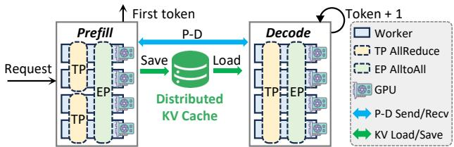  
Figure 1: A typical LLM inference workflow with (1) prefix cache, (2) prefill/decode disaggregation and (3) TP+EP.

correlation at scale (§5.4).

Our evaluation shows that StriaTrace consistently keeps the tracing overhead to less than 1%, which is 97.8% less compared to existing approaches. StriaTrace has been widely employed in our development, testing and release cycles. StriaTrace has successfully helped us diagnose 19 different root causes of abnormalities and diagnosed several issues that were intractable with conventional tools (§6 and §7). In production, StriaTrace has been running at scale for six months, instrumenting over 1,700 instances across two flagship LLM services and processing upwards of 180 million requests per day. It operates under both TP and DP configurations, and spans monolithic as well as PD-disaggregated deployments. We present the traces and diagnosis results in production in the appendix.

## 2 Background

Inference workflow. LLM inference follows a prefill-decode workflow. Upon receiving a request, the service initiates the prefill stage to process the input prompt. Then, the first output token is generated and this interval is measured as TTFT. Then, the service proceeds to the decode stage. In each step, the next token is generated based on the current sequence context. At this stage, we measure the TPOT, defined as the inter-token latency between generating tokeni and tokeni+1. In production, we typically enforce SLOs of approximately 5-10 s for TTFT and 50-100 ms for TPOT. To better meet the SLOs, we employ a combination of techniques illustrated in Figure 1 and discussed as follows.

Distributed prefix KV cache. The core idea is to reuse KV cache that shares the same prefix across multiple requests. Before prefill, each request attempts to load its matching prefix from a distributed KV cache, while newly generated KV cache during prefill is written back. This approach requires synchronization and data transfer across processes and machines, and substantially improves TTFT.

Prefill/decode disaggregation. This architecture partitions serving instances into distinct prefill and decode pools. After a request completes prefill, the resulting KV cache and the request are transferred to a decode instance. Since prefill is compute-bound while decode is memory-bound, separation enables independent resource allocation and scheduling for each phase.

Inference parallelism. Model parallelism, specifically Tensor Parallelism (TP) and Expert Parallelism (EP), is commonly used in practice. In TP, each Attention or Feed-Forward Network (FFN) layer is partitioned across workers; each worker executes a portion of the computation and synchronizes results with each other. In EP, each token’s computation is routed to a subset of experts, and the outputs are subsequently aggregated.

## 3 Motivation

## 3.1 Pervasive Performance Degradation

Despite the optimizations in §2, we observe that the average TTFT and TPOT remain within acceptable bounds but the tails of both can still experience severe SLO violations. Figure 2 shows the distribution of TTFT and TPOT from average to 99th percentile in a large-scale commercial LLM chatbot hosted on our platform. Specifically, this inference service contains more than 2K instances and processes 14M requests every day. There are 5.34% of requests violating the TTFT SLO and 1.18% of tokens violating the TPOT SLO.

In this paper, the tail latency is defined by system-induced, rather than the semantic variance. A long-tail therefore refers to a latency deviation when executing the same computational workload compared to its historical distribution. For instance, a prefix cache miss can drastically enlarge TTFT. However, from the inference engine’s perspective, a cache miss simply entails a larger number of tokens to be actually computed during prefill. The resulting TTFT elongation due to increased computation workload is not considered a long-tail. Once semantic variance is factored out, the remaining system-induced tail latency directly manifests as stalls in the TTFT and TPOT.

The criticality of mitigating tail latencies cannot be overstated. Most LLM inference services are human-interactive, e.g., chatbots, AI assistants and coding. Even occasional SLO violations are easily perceived by customers and lead to userexperience degradation. Such degradation severely impacts user retention, resulting in millions of dollars in revenue loss. However, taming tail latencies is non-trivial. First, Figure 2 shows that the tails of TTFT and TPOT exhibit high variance, i.e., slow tokens can be occasional or even one-off events. In addition, as an online service, the workload is intrinsically dynamic, rendering offline reproduction ineffective. Hence, diagnosing the culprits often requires an intensive manual effort. For example, engineers must hypothesize potential performance issues based on experience, add logging statements at suspected code locations, build and deploy a new release, and then repeat this cycle.

## 3.2 Limitations of Existing Solutions

Although both industry and academia have proposed numerous diagnostic tools, with some even directly targeting LLM scenarios (e.g., Neutrino [14], Mycroft [8] and Minder [7]), these solutions prove fundamentally ill-suited for production LLM inference.

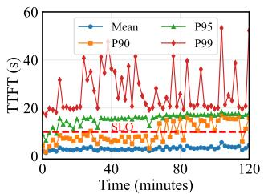  
(a) TTFT.

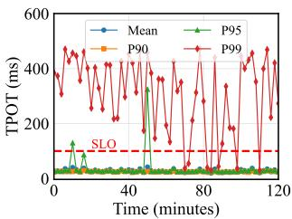  
(b) TPOT.  
Figure 2: TTFT/TPOT spikes are pervasive in production.

High overhead. As shown in Table 1, several tools [4, 10, 14, 27, 29, 34, 35] are tailored for fine-grained tracing. However, our preliminary attempts at integrating these tools proved unsuccessful. The primary impediment is their prohibitive overhead. For example, Neutrino [14] is the state-of-the-art GPU tracing tool, but it may introduce overhead such as \~5% throughput loss due to the intensive memory I/O. We observed comparable or higher overheads when evaluating TorchProfiler [35], Nsight [27] and PerfTracker [13]. Even single-digit overhead is consequential. Owing to the high CapEx and OpEx of running a GPU-based cluster and the scale of today’s LLM inference, a 5% loss can easily translate to a multimillion dollar cost increase. As a result, we restrict the usage of these tools on a subset of severe latency anomalies and facilitate certain offline debugging procedures.

Challenge 1: Achieving always-on tracing with negligible overhead.

Inapplicability to inference. A number of diagnostic approaches [7–9,13] specifically for LLM training have recently emerged, aiming to pinpoint the root causes through crosslayer information collection and correlation analysis. Nevertheless, these approaches fall short as well. First, training scenarios are throughput-oriented. Consequently, anomaly detection in training targets persistent stragglers rather than the transient latency spikes. This focus, however, makes it ill-suited for tracing inference workloads. For example, Mycroft [8] employs coarse-grained (second-level) thresholds to identify performance degradations, and Minder [7] even takes several minutes to identify abnormalities. Moreover, LLM training exhibits highly regular, repetitive execution patterns due to fixed batch size and static computational graphs, which can be leveraged to identify stragglers via peer comparison within a synchronous data-parallel group. Inference workloads exhibit significant variance in batch size and sequence length, thus precluding such direct comparisons.

Challenge 2: Accurate diagnosis tailored for dynamic and sporadic inference anomalies.

Table 1: Limitations of existing solutions  
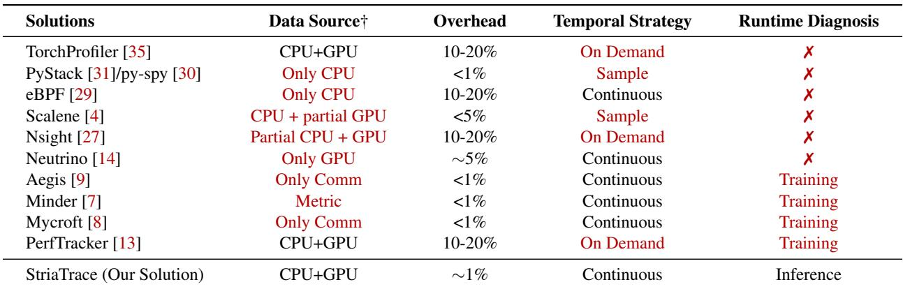  
† Complete GPU tracing data can cover Comm tracing data, since all collective communication is launched by GPU kernels.

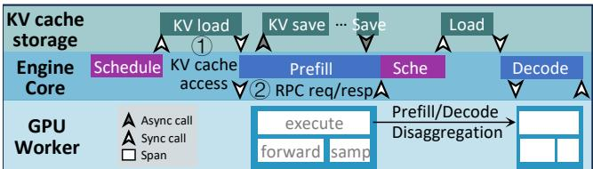  
Figure 3: Key synchronization points.

## 4 Exploring Design Space

To achieve low-overhead and continuous tracing of online inference services, we formulate three design principles grounded in production experience.

Principle 1: Instrument synchronization barriers rather than internal functions. An inference request can traverse complex stages from entry to response. In our profiling, there can be O(100) functions and O(10K) function calls in an inference step (more details in §5.2.1). Tracing each of them would introduce prohibitive overhead. Among these functions, a subset constitutes the key synchronization functions which can be categorized into two types. The first is interprocess RPC within the inference engine itself. For example, in vLLM [46], the EngineCore responsible for request scheduling and the GPUWorker responsible for actual computation interact through collective RPC calls (labeled 2 in Figure 3). The second is function calls between the inference engine and external components. For instance, the engine invokes metadata queries and I/O operations on external KV cache components, as labeled 1 in Figure 3. These synchronization points gate the progression of the request to the next stage. Consequently, a core design decision of our tracing system is to instrument at these synchronization boundaries rather than exhaustive profiling.

Principle 2: Prioritize critical path profiling over exhaustive tracing. Even when restricting instrumentation to only synchronization points, exhaustively tracing every event within a request’s lifecycle still incurs prohibitive overhead. The root cause lies in the internal concurrency of inference engines. For example, in vLLM, the EngineCore runs multiple concurrent threads: the main inference thread that orchestrates request execution, a dedicated thread for distributed KV cache access, and additional threads for monitoring and metrics collection, etc. Among these concurrent threads, only the main inference thread lies on the critical path that determines the request’s completion time. Consequently, our tracing design prioritizes the critical path while discarding detailed tracing for non-critical threads.

Principle 3: Employ anomaly-driven high-fidelity tracing. Approaches employing full persistence, e.g., Torch-Profiler [35] and Nsight [27], capture all tracing data and lead to a tremendous bandwidth cost (see more details in §6.2). Conversely, summarized/partial persistence, e.g., Perf-Tracker [13], Aegis [9] and Mycroft [8], sacrifices full-fidelity information to achieve lower transmission and storage overhead. However, they lack enough information to pinpoint the culprit in the inference scenario (as discussed in §3.2). Our field experience and statistics show that the vast majority of requests exhibit nominal behavior, and only a small fraction of requests are outliers. Therefore, we adopt selective persistence, i.e., only retaining fine-grained tracing data for slow requests.

## 5 Design

We introduce StriaTrace, a low-overhead tracing and diagnosis tool for LLM inference. We detail the instrumentation mechanisms for CPU and GPU in §5.2 and §5.3, respectively. Finally, §5.4 explains how StriaTrace leverages the collected traces to identify performance anomalies.

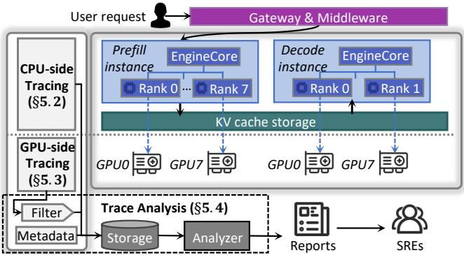  
Figure 4: Overview of StriaTrace.

Table 2: Host-side function invocation statistics and instrumentation scope in a single step.  
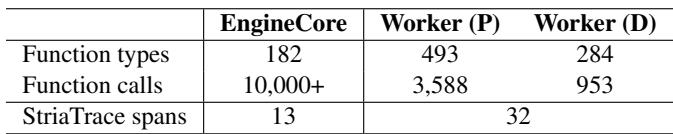

## 5.1 Overview

As shown in Figure 4, StriaTrace comprises two components: distributed trace collectors co-located with each serving instance, and a centralized backend for data persistence and analysis. In this paper, a serving instance refers to a vLLM process group on a multi-GPU node.

On the CPU side (§5.2), StriaTrace’s observability is confined to the vLLM serving instance. For each instance, StriaTrace focuses on the following components: (1) the EngineCore, which handles request scheduling and KV cache management; (2) the parallel ranks (i.e., GPUWorkers), each responsible for token computation on a dedicated GPU. As illustrated in Figure 3, a request’s processing flow involves the EngineCore resolving prefix cache and scheduling, followed by RPC dispatch to GPUWorkers for execution, with KV cache I/O interactions with external components. On the GPU side (§5.3), StriaTrace operates concurrently on each GPUWorker, capturing kernel executions and memory transfers.

Collectively, StriaTrace records three types of trace data: (1) CPU-side traces, which record the processing latency across system modules; (2) GPU-side traces, which capture hardware-level execution; and (3) essential metadata, including the request ID and the instance IDs traversed by the request to reconstruct the causal chain. These traces are streamed to a centralized analysis backend (§5.4). The backend correlates these heterogeneous streams to reconstruct the complete execution flow of each request. It then leverages a performance roofline model to detect outliers and automatically reports anomalies.

## 5.2 Host-side Tracing

## 5.2.1 Coarse-grained Instrumentation

Designed for production monitoring, StriaTrace eschews the exhaustive function-level profiling employed by tools like cProfile [32]. Applying such pervasive profiling to highthroughput engines can incur prohibitive overhead. To quantify the cost, we conduct pervasive profiling on a vLLM instance serving Qwen2.5-0.5B [43]. As shown in Table 2, vLLM’s EngineCore executes over 10,000 function calls in a single inference step, while the GPUWorker still triggers thousands of calls during prefill. Consequently, employing pervasive profiling would inflate the latency by tens of milliseconds, which is unacceptable for online inference serving. Following Principle 1, StriaTrace employs a hybrid instrumentation strategy to balance visibility and overhead:

Synchronization barrier instrumentation. First, we delineate the critical execution path of the inference engine. Modern inference engines (e.g., vLLM) generally operate on an event-loop mode: cyclically fetching incoming requests, allocating KV cache, and performing per-token inference. Based on this architecture, StriaTrace strategically places tracing hooks at cross-process synchronization boundaries along the main loop. Specifically, we categorize these barriers into two types: (1) Intra-engine cross-process RPCs: Within vLLM, communication channels among the frontend API server, the EngineCore, and the distributed GPU workers are inherently mediated via Remote Procedure Calls (RPCs). Instrumenting these RPC boundaries naturally covers the inter-process scheduling and orchestration. (2) Synchronous invocations with external processes: We also trace mandatory blocking calls to external processes on the main loop. A prime example is the KV cache connector—the dedicated interface class responsible for querying and synchronizing with the distributed KV cache. Targeting these communication boundaries, Stria-Trace strictly delimits execution stages and captures blocking latencies without exhaustive profiling.

Semantic span instrumentation. StriaTrace further subdivides the monolithic phases between synchronization barriers into semantic spans. Functionally, a semantic span delimits the execution of a specific logical routine along the inference critical path. In practice, the selection of semantic spans typically aligns with the top-level function invocations between two consecutive synchronization barriers. For instance, we partition the vLLM engine core’s execution flow into distinct spans: schedule (managing request queues and allocating KV cache), execute\_model (invoking the forward pass), and sample\_tokens (generating output tokens based on logits). Crucially, StriaTrace goes beyond mere latency tracking by enriching these semantic spans with runtime context. For example, alongside the schedule span, StriaTrace records the batch-level metadata, including the number of scheduled requests and their respective token status1. This context preservation is vital for correlating latency anomalies with workload dynamics. Details of these instrumentation points are provided in Appendix A.

Collectively, these two strategies comprise only dozens of instrumentation points—orders of magnitude fewer than the total function calls in each inference step. This design renders runtime overhead negligible while preserving structural visibility into the system’s behavior.

## 5.2.2 Fine-grained Context Profiling

Through the key instrumentation points in §5.2.1, StriaTrace establishes macro-level observability over the CPU execu tion. However, when a performance anomaly occurs, this coarse-grained telemetry lacks the fidelity to pinpoint the specific code paths or internal function calls responsible for the anomaly. To bridge this gap, StriaTrace leverages py-spy [30], a low-overhead sampling profiler, to capture fine-grained execution contexts. Specifically, StriaTrace operates py-spy in non-blocking mode to periodically snapshot the execution state—including thread stacks and Global Interpreter Lock (GIL) ownership—of the vLLM instance. By reading the target process’s memory, py-spy reconstructs the full Python stack trace without pausing execution or modifying the interpreter state. We configure the sampling interval to 10 ms, sufficient to capture sustained stalls.

A typical application of StriaTrace’s py-spy integration is detecting GIL contention. Figure 5 visually contrasts a healthy inference step with an anomalous one. In Rank 1 (top), the execution is healthy: the main thread (Thread 1) holds the GIL and executes the model\_forward logic without interruption, continuously launching GPU kernels (visualized as arrows triggering kernel execution). In contrast, Rank 2 (bottom) exhibits a severe performance degradation. The model\_forward span is significantly elongated, containing a large “Blocked” gap where no kernels are launched. Without py-spy, we can only see a slow model\_forward, misidentifying it as a computation bottleneck. However, py-spy can reveal the true culprit. A background thread (i.e., Thread 2) acquires the GIL, transitioning to the active+gil state. Consequently, Thread 1 is forced into an idle state, blocked from executing Python bytecode required for kernel launching. As a result, this correlation unambiguously attributes the stall to background thread interference.

## 5.2.3 Minimizing Runtime Overhead

Having identified the strategic instrumentation points, the subsequent challenge lies in efficiently exporting the telemetry data for further analysis. We initially evaluated vLLM’s built-in OpenTelemetry (OTel) [29]. As a widely adopted industry standard, OTel defines a unified trace data schema and provides mature middleware for data transmission.

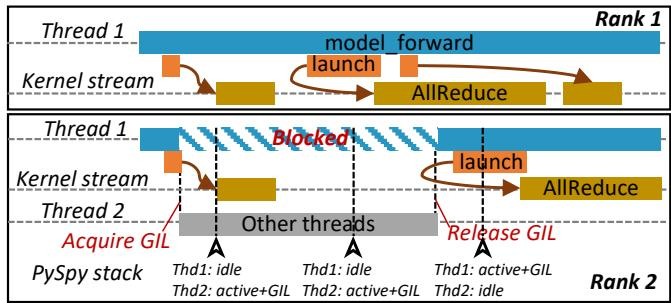  
Figure 5: GIL contention between a background thread and the main inference thread.

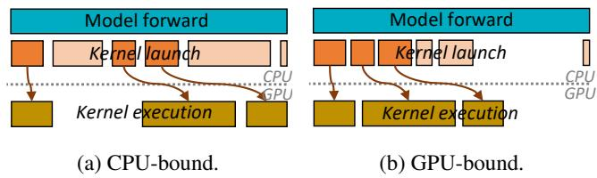  
Figure 6: Two canonical performance regimes.

However, practical deployment revealed that the standard OTel Python SDK introduces unacceptable latency jitter. The root cause stems from its asynchronous batch export mechanism. Specifically, OTel buffers trace data and spawns a background thread to export the batch via HTTP or gRPC once the buffer fills. Crucially, the serialization (e.g., Protobuf encoding) required for transmission is CPU-intensive and must hold the Python GIL. Consequently, when the background export triggers, it contends with the main inference thread, causing blocking stalls that can exceed 100 ms.

To eliminate this non-deterministic interference, StriaTrace abandons the background export model in favor of a deterministic I/O hiding strategy. Instead of passively waiting for a batch to fill, StriaTrace proactively flushes trace data at precise execution boundaries. Specifically, we exploit the inherent parallelism between the host and the GPU. In vLLM, after the GPU worker issues asynchronous kernel launches, the CPU typically waits for GPU execution to complete. Stria-Trace leverages this CPU idle window to perform data export. Hence, StriaTrace can effectively hide the tracing overhead behind the GPU execution shadow, ensuring negligible impact on the critical path.

## 5.3 Device-side Tracing

## 5.3.1 Hardware-Centric Instrumentation

Standard profiling solutions within the vLLM ecosystem include Nvidia Nsight Systems and PyTorch Profiler. However, neither is viable for always-on production monitoring due to prohibitive overhead. The fundamental issue stems from their indiscriminate subscription to the underlying CUPTI (CUDA Profiling Tools Interface) [26] events, the proprietary observability library provided by NVIDIA.

CUPTI provides visibility across the full GPU stack: from software-level CUDA Runtime and Driver APIs to hardwarelevel kernel execution. Existing tools typically subscribe to all these layers to ensure completeness. In vLLM, however, a single kernel execution is often preceded by a cascade of Runtime and Driver API calls (e.g., argument setup and launch configuration). Capturing this high-frequency API traffic introduces substantial overhead. For instance, TorchProfiler incurs a latency penalty of ∼192%, as it traces both the API calls and the hardware execution.

StriaTrace challenges this “trace-all” convention (following Principle 2). We observe that hardware-level information alone is sufficient to reconstruct the critical path of inference. Hence, StriaTrace eschews the tracing of software API calls, focusing on the start and end timestamps of GPU kernels and memory transfers. This design choice drastically reduces overhead while preserving the necessary fidelity for bottleneck analysis. As illustrated in Figure 6, the density of kernel events along the timeline acts as a proxy for the system’s bottleneck state: (1) Scenario 1: CPU-bound (sparse kernels). As shown in Figure 6a, when the host-side kernel launch is slower than GPU execution, the GPU remains mostly idle, resulting in sparse kernel events. In other words, the bubbles directly reflect host-side bottlenecks, rendering API tracing redundant. (2) Scenario 2: GPU-bound (packed kernels). Conversely, as shown in Figure 6b, when kernel execution is slower than the CPU launch, the timeline shows densely packed kernels. The inference engine ultimately stalls waiting for the GPU to complete. Here, the critical path is unambigu ously governed by the kernel execution.

In summary, by recording only hardware execution intervals, StriaTrace can unambiguously distinguish between CPU and GPU bottlenecks without paying the overhead of API interception.

## 5.3.2 Anomaly-Driven Data Retention

While the hardware-centric strategy (§5.3.1) can mitigate runtime interference, it introduces a new challenge. In the vLLM framework, a single inference step typically involves the launch of thousands of GPU kernels. Consequently, recording the complete trace of these events generates a massive telemetry footprint. To quantify this, we profile a vLLM instance serving Qwen3-Coder-30B-Instruct-FP8 [44]. Each GPU worker generates approximately 1,600 kernel records per inference step. With an average step latency of 12 ms, an 8-GPU node produces raw trace data at a rate of 3.54 GiB/min. Extending this to production clusters of 10,000 GPUs, the aggregate bandwidth demand can surge to 590 Gbps. Transmitting and storing this full-fidelity stream is operationally

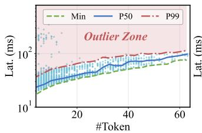

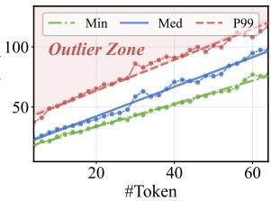  
(a) Latency distribution.  
(b) Roofline modeling.  
Figure 7: Construction of the StriaTrace roofline. (a) Latency distribution versus token count. (b) Modeling the P99 performance boundary via linear regression.

prohibitive.

To address this massive footprint, StriaTrace shifts from a “store-everything” to a “store-on-anomaly” paradigm (following Principle 3). For production monitoring, detailed GPU kernel traces are redundant for normal inference steps. Consequently, StriaTrace discards kernel traces for normal steps by default, retaining only aggregated metrics. Full-fidelity traces are persisted exclusively when the step is flagged as an outlier by the roofline model (details in §5.4). This anomalydriven retention strategy reduces the transmission volume to approximately 1.6% of the raw stream.

## 5.4 Trace Analysis

## 5.4.1 Adaptive Roofline for Anomaly Detection

To detect performance anomalies, StriaTrace must establish a reliable performance baseline. Simple approaches, such as fixed latency thresholds, fail in this context because the execution time of an inference step varies significantly with its workload (e.g., the number of tokens processed). Consequently, a fixed threshold cannot distinguish between a naturally heavy computation and a true performance degradation.

While theoretical roofline modeling [45, 47, 49] offers a dynamic baseline based on hardware and software configurations, applying it to production environments is operationally intractable. Modern deployments involve a combinatorial variety of model architectures, GPU specifications, parallelization strategies, and serving paradigms (e.g., prefill/decode disaggregation). As these innovations continuously evolve, pre-computing analytical models for every configuration permutation is infeasible.

Instead, StriaTrace employs a data-driven regression approach to construct empirical rooflines tailored to each serving instance. This design is grounded in a key empirical observation: Inference latency exhibits a strong positive correlation with the number of processed tokens2. This statistical relationship allows us to treat anomaly detection as a regression problem, learning a direct mapping from the token count to the expected tail latency. Based on this observation, Stria-Trace formulates the roofline construction as a data-driven process. The core objective is to determine a dynamic upperbound for the inference latency, i.e., the empirical roofline, by modeling the tail distribution of historical execution data. Figure 7 visualizes this modeling workflow using empirical data captured from a production instance.

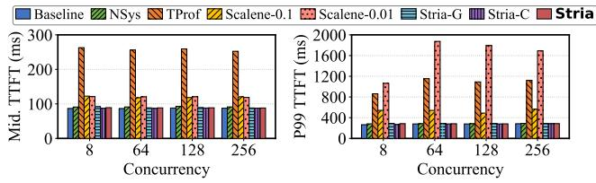  
Baseline NSys TProf Scalene-0.1 Scalene-0.01 Stria-G Stria-C Stria

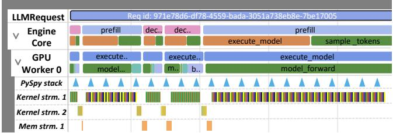  
Figure 8: End-to-end trace visualization in the Perfetto UI.

Figure 7a plots the distribution of step latency against the number of processed tokens. For each token count (x-axis), we calculate the minimum, median, and P99 latencies from historical data. Two key patterns emerge from Figure 7a. First, the minimum, median, and P99 latency exhibit a strong positive correlation with the token count (x-axis). Second, a subset of samples is distributed far beyond the P99 boundary. StriaTrace defines this high-latency region as the Outlier Zone, identifying these specific samples as performance anomalies.

Building on these insights, Figure 7b demonstrates the modeling process. We fit linear regression models to the statistical boundaries derived in Figure 7a. The results show that the P99 latency scales linearly with the token count, achieving an R2 score of 0.983. StriaTrace adopts this P99 regression line as the empirical roofline. This design allows us to instan tiate reliable anomaly detection thresholds using lightweight sampling and robust linear fitting (e.g., RANSAC [12]).

StriaTrace bootstraps the roofline model during the initial serving phase. It collects the token count and latency of each inference step until sufficient data points are accumulated for linear fitting. Subsequently, the system periodically retrains the model during runtime. Furthermore, the construction of the Prefill roofline follows this identical “collect-fit-update” paradigm shown in Figure 7.

## 5.4.2 Hierarchical Analysis and Reporting

Upon detecting a performance anomaly via the roofline model, StriaTrace automatically generates an anomaly report for the site reliability engineers (SREs). The anomaly report integrates two components to accelerate diagnosis: hierarchical telemetry data and primary bottleneck suspects. To facilitate drill-down analysis, StriaTrace organizes the execution context into three semantic layers, mapped to a unified timeline in the Perfetto UI as shown in Figure 8: (1) Request layer visualizes the end-to-end lifecycle, identifying queuing delays and overall latency violations; (2) Framework layer exposes vLLM internal behaviors, such as scheduler decisions, KV cache block allocation, and worker coordination events. (3) Kernel layer provides hardware execution details, visualizing individual GPU kernel executions (e.g., GEMM, Attention) and PCIe/NVLink transfers.

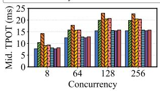

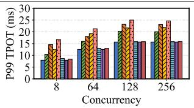  
(a) TPOT statistics collected from the decode instance.

(b) TTFT statistics collected from the prefill instance.  
Figure 9: Profiling overhead comparison.  
Table 3: Trace data generation rates (GiB/h).  
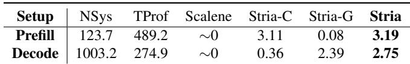

Beyond hierarchical telemetry, StriaTrace performs correlation analysis to highlight primary suspects. Specifically, Stria-Trace identifies the dominant span, i.e., the span contributing most to the latency, and correlates it with the py-spy trace to pinpoint the executed function, alongside the GIL status to reveal thread scheduling contention. It also flags outliers among GPU kernels. We further illustrate two representative cases in §7.

## 6 Evaluation

We evaluate StriaTrace to answer the following questions:

• Can StriaTrace operate with negligible performance impact on production vLLM serving, while minimizing the telemetry footprint?

• Is StriaTrace effective in detecting performance anomalies and pinpointing their root causes?

• What concrete impact has StriaTrace had on diagnosing performance anomalies in real-world production?

## 6.1 Setup

Testbed. Our experiments are conducted on a productiongrade node. The node is equipped with dual-socket Intel Xeon processors (160 cores total) and 1.3 TiB of DDR5 memory. The server hosts eight NVIDIA H20-3e GPUs (144 GiB mem ory per GPU) interconnected via NVLink. The system runs Ubuntu 24.04.1 LTS. Our software stack consists of Python 3.12.3, PyTorch 2.7.0, and CUDA 12.8, using vLLM as the inference engine.

Comparisons. We evaluate vanilla vLLM (Baseline) against six instrumentation configurations: (1) NVIDIA Nsight Systems (NSys): To control the overhead, we disable the CPU backtracing (see details in Appendix B.1); (2) PyTorch Profiler (TProf): We use the built-in TProf implementation embedded within vLLM (see Appendix B.2); (3) Scalene: We configure Scalene with two distinct CPU sampling intervals (i.e., 10 ms and 100 ms, see details in Appendix B.3); (4) Stria-C: StriaTrace with only CPU-side tracing enabled; (5) Stria-G: StriaTrace with only GPU-side profiling enabled; (6) Stria: The complete StriaTrace system with both CPU and GPU instrumentation active.

Model and workload. We evaluate StriaTrace using Qwen3- Coder-30B-Instruct-FP8 [44], a state-of-the-art Mixture-of-Experts (MoE) code generation model optimized with FP8 quantization. To strictly mirror our production environment, we deploy this model using a PD disaggregated architecture. We deploy two distinct instances with both instances config ured at a Tensor Parallelism degree of 8 (TP=8). These two instances are seamlessly interconnected via our custom distributed KV cache component. For workload generation, we utilize vLLM’s native benchmark tool [46] to issue requests with fixed input/output lengths, following a Poisson arrival process at specified rates.

## 6.2 Overhead Analysis

We evaluate the operational cost of StriaTrace along two dimensions: (1) the latency penalty to TPOT and TTFT, and (2) the telemetry footprint in terms of storage consumption.

Impact on inference latency. We configure the vLLM benchmark with a fixed request arrival rate of 8 req/s while sweeping the engine’s maximum concurrency from 8 to 256. To accurately reflect the performance of the disaggregated architecture, we report the Time-to-First-Token (TTFT) measured at the prefill instance, and the Time-Per-Output-Token (TPOT) measured at the decode instance.

Figure 9a details the TPOT results for the decoding instance. We make three key observations: (1) Existing tools are costly. At a low concurrency of 8, TProf incurs prohibitive penalties, inflating the Median and P99 TPOT by 83.6% and 84.1%, respectively. While NSys is lighter, it still imposes a non-negligible overhead of 34.3% (Median) and 32.0% (P99). Scalene-0.1 (default 10 ms sampling interval) also introduces substantial TPOT penalties for both Median (21.4%) and P99 (111.8%). Even when configured with a sparser 100 ms interval, the overhead remains at 18.7% (Median) and 56.9% (P99). (2) StriaTrace’s host-side tracing introduces negligible overhead. Stria-C introduces virtually no performance regression; the overhead for both Median and P99 TPOT remains strictly below 1% across all settings; (3) GPU overhead amortizes. The cost of full StriaTrace is primarily driven by GPU instrumentation, but this overhead scales inversely with throughput. As the concurrency increases from 8 to 256, the instrumentation cost is effectively amortized, causing the Median TPOT overhead to drop from 5.2% to 0.6%.

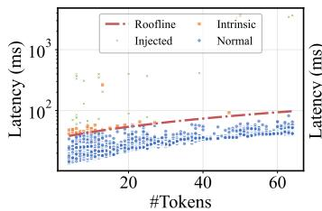  
(a) Host-side stall.

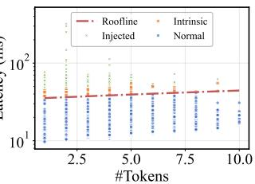  
(b) Device-side contention.  
Figure 10: Roofline visualization classifying Injected, Intrinsic, and Normal steps under (a) host-side stall and (b) deviceside contention scenarios.

Figure 9b depicts the impact on TTFT collected from the prefill instance. Similar to the TPOT results, we observe distinct overhead patterns: (1) TProf remains prohibitively heavy. It introduces substantial latency regression, increasing the Median and P99 TTFT by 3.0× and 3.2× over the baseline (at 8 concurrency). (2) NSys incurs moderate overhead. Although lighter than TProf, it still inflates the Median TTFT by 4.7% and the P99 by 6.3%. (3) StriaTrace demonstrates effective amortization. Consistent with its behavior on TPOT, StriaTrace’s overhead on TTFT diminishes as the workload increases. As the concurrency climbs from 8 to 256, the overhead is amortized, dropping from 2.7% to 0.8% (measured in Median).

Tracing data footprint. We measure the rate of tracing data generation (GiB/hour) under a fixed workload of 8 req/s across all instrumentation setups. Table 3 details the tracing throughput for both prefill and decode instances. The results clearly indicate that existing tools incur a substantial data tax. Specifically, for the decode instance, the consumed bandwidth of NSys and TProf exceeds that of StriaTrace by at least 38×. In contrast, StriaTrace maintains a modest data footprint, making it viable for continuous production tracing.

## 6.3 Effectiveness of Anomaly Detection

We next evaluate the efficacy of StriaTrace’s roofline model in detecting performance outliers. Specifically, we conduct a controlled fault injection campaign on a distributed vLLM cluster (TP=4). After allowing StriaTrace to construct a stable roofline under normal traffic, we introduce two types of synthetic anomalies to mimic production failures: (1) Hostside stall: We temporarily suspend the execution of a vLLM worker process using the SIGSTOP signal; (2) Device-side contention: We inject high-priority background kernels that aggressively saturate GPU Streaming Multiprocessors (SMs) using Numba [25]. For each injected fault, we randomize the target worker (or GPU) and fault duration.

Table 4: Abnormalities diagnosed by StriaTrace.  
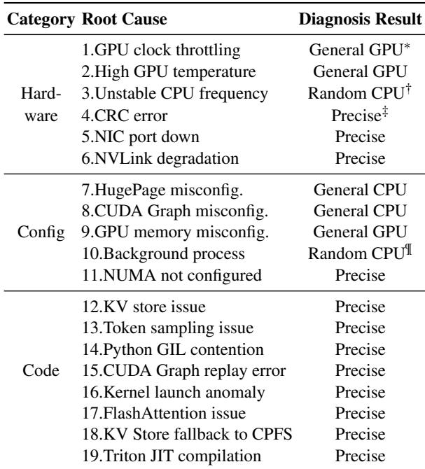  
∗ General GPU-side kernel execution slow.  
† General CPU-side function execution slow.  
‡ Precise location of culprit code.  
¶ Random CPU-side function execution slow.

Figure 10a and 10b illustrate StriaTrace’s roofline during the host-side stall and device-side contention experiments, respectively. Each point represents a single inference step, plotting step latency (y-axis) against token count (x-axis). Using the roofline model together with the injected-failure timestamps, we categorize each step into three classes: Injected (steps affected by our synthetic faults), Intrinsic (outliers stemming from inherent system variance), and Normal (healthy steps). We report the recall on injected faults as our primary metric for assessing detection efficacy. Across both fault types, StriaTrace achieves 100% recall on injected failures, indicating that all injected anomalies manifest as clear deviations from the learned roofline.

## 6.4 StriaTrace in Production

StriaTrace has been extensively used in the development and testing environments of our inference service, supporting multiple release cycles. Over a six-month deployment, StriaTrace monitors two of our flagship models, encompassing over 1,700 production instances and handling more than 180 million user requests daily. StriaTrace supports diverse parallelization strategies, including Tensor Parallelism (TP) and Data Parallelism (DP), and is deployed across both monolithic and PD-disaggregated architectures. StriaTrace has diagnosed hundreds of abnormalities in production, which can be categorized into three types: (1) hardware issues, (2) configuration issues, and (3) code issues. Crucially, we emphasize that StriaTrace is not designed as a fully automated, end-to-end rootcause oracle. Rather, it functions as a rapid triage mechanism. It is designed to provide Site Reliability Engineers (SREs) with rich, fine-grained execution context, thereby reducing the diagnostic search space.

As shown in Table 4, StriaTrace approaches these production issues through two operational paradigms. First, for long-tail latency (e.g., most code-related issues), the degradation explicitly triggers StriaTrace’s dynamic roofline model. In these scenarios, StriaTrace executes its complete diagnostic pipeline. By correlating the anomalous semantic span with fine-grained py-spy snapshots, the system successfully pinpoints the problematic rank, the specific execution phase (CPU vs. GPU), and the exact line of Python code or CUDA kernel. We detail this kind of case in §7.1.

Second, some anomalies manifest as sustained performance degradations that inherently do not trigger the dynamic roofline alerts. A prime example is when CUDA Graphs are inadvertently disabled (Case 8); this evades roofline detection entirely because the dynamic model constructs its baseline on an already degraded performance state. For such sustained issues, StriaTrace’s primary value lies in preserving the execution context. By providing high-fidelity historical traces, StriaTrace empowers SREs with the critical telemetry needed to manually cross-reference contexts and isolate configuration or hardware flaws. We explore this telemetry-accelerated localization in §7.2.

It is important to note that StriaTrace’s dynamic roofline model (§5.4.1) is not completely immune to false positives. In our production environment, approximately 7% of the flagged anomalies were eventually classified as natural workload variances rather than true system regressions. For instance, a typical false positive arises from extreme Expert Parallelism (EP) load imbalance. In MoE models, heavily skewed token routing can occasionally cause a specific GPU rank to severely straggle.

## 7 Case Study

This section details representative cases of diagnosing performance anomalies using StriaTrace. We categorize these cases into two paradigms: (1) End-to-end pipeline diagnosis (§7.1) for transient anomalies explicitly flagged by the dynamic roofline model; and (2) Telemetry-accelerated localization (§7.2) for broader performance issues where StriaTrace’s continuous lightweight observability significantly accelerates root-cause identification.

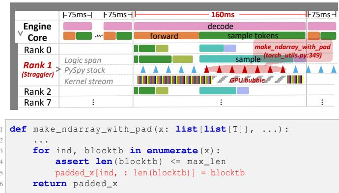  
Figure 11: StriaTrace for a 160 ms straggler step. (Top) The end-to-end trace identifies a critical stall on GPU rank 1. (Bottom) The isolated culprit code responsible for the anomaly.

## 7.1 End-to-End Pipeline Diagnosis

A typical class of performance issues diagnosed by Stria-Trace’s end-to-end pipeline involves CPU-side logic unexpectedly blocking GPU kernel launches. To resolve these issues, StriaTrace first identifies the macroscopic bottleneck via synchronization barriers and GPU timeline bubbles, and then correlates the anomalous span with py-spy stack traces to pinpoint the exact culprit code. These fine-grained contexts are handed over to SREs for final confirmation and mitigation. We illustrate this workflow using a representative production case below, i.e., Case 13 in Table 4.

During a routine production inspection, StriaTrace detected sporadic latency spikes in an 8-GPU decoding instance handling live traffic. As shown in Figure 11, during consecutive decode steps with a stable workload (i.e., no requests joining or finishing), the step latency would occasionally jump from a baseline of 75 ms to over 160 ms. StriaTrace revealed a distributed straggler effect: one of the eight ranks (i.e., Rank 1) was severely delayed, forcing the others into a synchronous stall. On Rank 1, the CPU-side Logic span timeline showed that the span named sample was abnormally prolonged, and a massive ∼80 ms bubble was observed on the Kernel stream. In vLLM, the sample is a standard routine that follows the model’s forward pass to convert the output logits into token IDs.

The PySpy stack of Rank 1 revealed that the vLLM main inference thread (responsible for dispatching GPU kernels) was active and holding the Python Global Interpreter Lock (GIL), implying that the thread was occupied by host-side computations. Furthermore, consecutive stack samples showed the execution was persistently stalled at the make\_ndarray\_with\_pad function (see Appendix C.1 for the full stack trace). This function resides in vLLM’s torch\_utils.py, a utility module designed to bridge standard Python data structures with PyTorch tensors.

Then, the SRE team uncovered a subtle memory management bottleneck. Within the token sampling phase, make\_ndarray\_with\_pad acts as a conditional branch triggered when users’ requests specify penalty constraints (e.g., frequency or length penalties [5]). Its primary function is to pad the historical token sequences of all requests to match the maximum sequence length4. The bottleneck originates at line 5 within this function. The for loop encompassing line 5 employs native Python list slicing. When operating under a large batch size and extended token lengths, this naive approach leads to two severe consequences: (1) it generates a massive number of temporary Python objects, elevating the risk of GC pauses; and (2) it continuously triggers NumPy’s underlying malloc and free.

To resolve this, the engineering team implemented a custom C++ operator and integrated it into vLLM via Torch JIT [33]. Leveraging direct C++ pointer access to preallocated contiguous memory, this custom operator iterates and pads the sequences entirely at the native C++ layer. This completely eliminates Python object creation and memory allocations. Following this patch, the P99 latency for the make\_ndarray\_with\_pad invocation plummeted from 110 ms to 43 ms.

Moreover, StriaTrace’s end-to-end pipeline has isolated other straggler effects. For instance, in Case 14, StriaTrace revealed that a background thread managing the KV cache mistakenly executed synchronous operations during block eviction. This implicitly acquired the Python GIL, blocking the main vLLM inference thread. Similarly, in Case 19, StriaTrace correlated an anomalous sample span and a massive GPU idle gap with unexpected Triton JIT compilation. The traces demonstrated that a user-defined sampling function, decorated with torch.compile, triggered synchronous compiler activities that consumed over 99% of the step’s duration.

## 7.2 Telemetry-accelerated Localization

Beyond the end-to-end diagnosis in §7.1, StriaTrace’s continuous observability accelerates the diagnosis of other sustained performance degradations. Below, we present a case illustrating how SREs leverage the fine-grained correlation between StriaTrace’s GPU kernel traces and the CPU-side traces to pinpoint the root cause, i.e., Case 17 in Table 4.

During a routine weekly regression test, we observed an unexpected drop in decode token throughput compared to the previous stable release. Since over 400 new commits had been merged that week5, isolating the root cause via traditional git bisect was practically prohibitive. The initial analysis revealed that, under an identical decode workload, the average decode step latency had inflated from roughly 5 ms to 7 ms. Drilling down into StriaTrace’s CPU-side traces, we found that the span named model\_forward was the sole contributor to this latency increase. In vLLM, this specific span encompasses the critical phase where the GPU worker utilizes CUDA graphs to dispatch kernels for the forward pass.

To pinpoint the exact cause, engineers examined Stria-Trace’s GPU kernel traces. The data revealed that the GPU execution time inflation was almost entirely attributed to a specific kernel, 16FlashAttnFwdSm90INS1. This is the critical FlashAttention kernel, invoked dozens of times per decode step to perform the attention forward pass. Crucially, Stria-Trace’s GPU tracing captures the mangled name of each executed kernel. This mangled name embeds not just the function signature, but its exact template instantiation parameters.

By directly comparing the mangled names across the two vLLM builds, a subtle but critical discrepancy emerged: the template arguments had shifted from (64,128,128) to (128,128,128) (see Appendix C.2 for the full mangled names). These parameters dictate the matrix multiplication tile size used by the GPU thread blocks. The engineering team verified via offline reproduction that on NVIDIA H20 GPUs, the smaller tile size is more optimal, executing in roughly 140 µs per invocation compared to 210 µs for the larger size (see Appendix C.2 for detailed settings). Since this kernel executes repeatedly in a decode step, this 70 µs penalty per invocation accumulated directly into the observed degradation. The fundamental root cause was eventually traced back to a faulty build script. The new vLLM version was shipped with a FlashAttention library compiled with missing template configurations. Consequently, the optimal kernel variant with the 64 tile size was never generated during the compilation. Without the optimal binary available, the FlashAttention runtime silently fell back to dispatching the sub-optimal 128 tile size variant.

Furthermore, StriaTrace’s CPU-side telemetry has proven instrumental in diagnosing obscure corner cases. For example, during a recent release rollout, the engineering team reported another unexpected drop in decode token throughput. Stria Trace revealed that the number of draft tokens proposed by the draft model was strictly less than the number of tokens actually submitted for verification in the subsequent step. This exposed the silent injection of “ghost tokens”, immediately bounding the anomaly to the speculative decoding workflow. Further investigation confirmed this was a secondary bug: a patch intended to resolve a specific EAGLE-3 [19] issue compromised the performance of the N-gram [48] algorithm (detailed analysis in Appendix C.3).

## 7.3 Experiences & Lessons

Necessity of continuous observability. The rapid development cycles of inference engines dictate that the CI/CD cannot anticipate all performance regressions. Production deployments of vLLM involve a massive combinatorial space of parameters, topologies, and distributed components. Coupled with continuous codebase updates, this sheer complexity makes exhaustive testing in CI/CD practically impossible. Consequently, continuous, in-vivo observability is a highly recommended capability for capturing dynamic, workloaddependent anomalies that inevitably emerge in production. Synergy of cross-layer telemetry. Diagnosing complex anomalies requires both CPU-side semantic context and GPUside hardware execution details. On the CPU-side, tracking CPU runtime metadata (e.g., dynamic user request parameters and control data) is valuable for isolating logic-level and scheduling bottlenecks. Complementarily, on the GPU-side, extracting mangled kernel names—which inherently encode critical compilation configurations—plays a pivotal role in diagnosing hardware-level anomalies. Correlating these independent dimensions creates a powerful cross-layer synergy that accelerates full-stack root-cause analysis.

Strict hot-path disciplines. In high-throughput inference engines like vLLM, the main inference thread serves as the critical hot path. Any CPU-side stall on this thread directly translates to GPU starvation. Consequently, we recommend that developers follow these guidelines: (1) Offloading memoryintensive operations to C/C++: Native Python memory management is inherently opaque. Operations that generate massive temporary objects, such as dynamic list slicing or sequence padding, are highly prone to unpredictable GC pauses. To guarantee latency stability, these logic blocks should be rigorously offloaded to native C/C++ implementations; (2) Minimizing synchronous interruptions: Synchronous operations should be introduced with extreme caution. Synchronous calls—such as querying a distributed KV cache, polling remote storage, or waiting on background threads—can inadvertently block the main event loop.

## 8 Discussion

Tracing coverage vs. overhead. StriaTrace does not blindly sacrifice tracing coverage for low overhead. We discuss this trade-off across the CPU and GPU domains. For CPU tracing, StriaTrace avoids pervasive instrumentation by a hybrid approach. First, it relies on static tracing points embedded in vLLM’s critical path. As shown in Table 2, these points cover less than 1% of the total functions. Second, to provide full-stack visibility, StriaTrace employs periodic sampling via py-spy. The full-stack sampler remains effective for our target anomalies, i.e.,, long-tail latency. Diagnosing sustained performance degradations (e.g., cases in §7.2) presents a more nuanced challenge, as low-frequency sampling might miss micro-stalls. However, since such sustained issues are highly reproducible, StriaTrace can serve as an initial triage anchor. By preserving the execution scene, StriaTrace narrows the search space, allowing SREs to iteratively inject instrumentation points offline to pinpoint the exact culprit.

On the GPU, StriaTrace is confined to kernel executions. Unlike exhaustive profilers such as NSys, we deliberately disable the tracing of CUDA driver and runtime APIs. This is a necessary and unavoidable compromise. Since GPU tracing heavily relies on the closed-source CUPTI [26], tracking highfrequency driver/runtime API calls introduces an untenable overhead. To compensate for this reduced coverage, Stria-Trace infers host-to-device interaction bottlenecks heuristically. By analyzing the idle “bubbles” between kernels, SREs can effectively deduce whether a latency anomaly stems from CPU-side CUDA driver overheads or actual GPU anomalies.

Architectural generality and porting effort. In StriaTrace’s design, both the CPU-side full-stack sampling via py-spy (§5.2.2) and the GPU-side hardware tracing (§5.3.1) are strictly framework-agnostic. These components are applicable to any Python-based inference engine (e.g., vLLM [46], SGLang [40]). The only framework-dependent component— and thus the primary source of engineering effort when porting to a new framework or maintaining across version upgrades—lies in the coarse-grained CPU-side instrumentation (§5.2.1). We emphasize that the manual effort is bounded and manageable. First, regarding cross-framework portability, StriaTrace’s instrumentation relies on identifying synchronization barriers along the engine’s critical path. Since these points have distinct signatures or structural patterns, they can be efficiently extracted through static code analysis facilitated by modern AI coding agents. Second, regarding temporal maintainability, the critical path of a mature inference engine is inherently stable. While minor feature updates are frequent, the core execution workflow rarely updates. During our six-month production deployment tracking upstream vLLM, the critical path experienced only one major shift, i.e., the transition from synchronous to asynchronous scheduling. Consequently, adapting StriaTrace to engine upgrades requires acceptable effort.

Cross-platform compatibility. Currently, StriaTrace relies on NVIDIA’s CUPTI for GPU observability, given that NVIDIA GPUs remain the dominant platform in productiongrade LLM serving. However, we acknowledge the growing adoption of alternative accelerators, such as AMD GPUs utilizing the ROCm stack. Porting StriaTrace to AMD GPUs is straightforward due to architectural symmetry. This is facilitated by the availability of ROCTracer [1], an AMD observability tool designed as a near-exact architectural mirror of CUPTI. First, it exposes a standard C library interface, allowing for seamless integration into StriaTrace’s GPU tracing module. Second, it reports kernel execution timestamps identical to those of CUPTI, ensuring that the downstream backend analysis logic remains unchanged.

## 9 Related Work

End-to-end inference profiling. Several frameworks have proposed end-to-end analysis systems for inference scenarios. LLM-Pilot [18] measures inference performance under varying hardware configurations and builds predictive models to estimate performance in new deployment settings. However, it only collects coarse-grained per-request execution time. The ALA framework [2] constructs an analytical model based on collected runtime metrics to perform theoretical analysis and anomaly detection for inference systems. Similarly, ALA relies solely on high-level system metrics.

Training-centric diagnosis. With the rapid evolution of LLMs, there have been numerous studies focusing on locating and diagnosing abnormalities during LLM training [3, 7–9, 16, 21, 22]. However, all these solutions rely on the static training patterns and are ill-suited for dynamic inference workloads. For example, these solutions leverage global barriers in Bulk Synchronous Parallel (BSP) training to distinguish abnormal iterations. In contrast, inference instances process requests independently and asynchronously.

## 10 Conclusion

In this paper, we present StriaTrace, a tracing and diagnosis system tailored for online LLM inference. StriaTrace employs three principles distilled from production experience to minimize the tracing overhead. Furthermore, StriaTrace introduces a step-level roofline and correlation-based diagnosis for LLM inference abnormalities. StriaTrace reduces tracing overhead by 97.8% compared to state-of-the-art alternatives, and has successfully diagnosed 19 types of issues in production.

## Acknowledgments

We sincerely thank our shepherd Hongqiang Harry Liu and the anonymous reviewers for helping us improve our paper significantly. We acknowledge all teams within Alibaba that contributed to the deployment of StriaTrace. This work is supported by Alibaba Group through Alibaba Innovative Research Program and Alibaba Research Intern Program, National Natural Science Foundation of China (NSFC) under Grant No. 62072306, and State Key Laboratory of Digital Finance (In Preparation).

## References

[1] AMD. Roctracer documentation, 2025. https://rocm .docs.amd.com/projects/roctracer/en/latest /.

[2] Anonymous. ALA: Analytical Latency Analysis Framework, 2025. Private communication.

[3] AWS. Machine Learning Service - Amazon SageMaker, 2024. https://aws.amazon.com/pm/sagemaker/?n c1=h\_ls.

[4] Emery D. Berger, Sam Stern, and Juan Altmayer Pizzorno. Triangulating python performance issues with SCALENE. In 17th USENIX Symposium on Operating Systems Design and Implementation (OSDI 23), pages 51–64, Boston, MA, July 2023. USENIX Association.

[5] Tom B. Brown, Benjamin Mann, Nick Ryder, Melanie Subbiah, Jared Kaplan, Prafulla Dhariwal, Arun Neelakantan, Pranav Shyam, Girish Sastry, Amanda Askell, et al. Language models are few-shot learners. NeurIPS, 2020.

[6] DeepSeek-AI, Aixin Liu, Bei Feng, Bing Xue, Bingx uan Wang, Bochao Wu, Chengda Lu, Chenggang Zhao, Chengqi Deng, Chenyu Zhang, et al. Deepseek-v3 technical report, 2025.

[7] Yangtao Deng, Xiang Shi, Zhuo Jiang, Xingjian Zhang, Lei Zhang, Zhang Zhang, Bo Li, Zuquan Song, Hang Zhu, Gaohong Liu, Fuliang Li, Shuguang Wang, Haibin Lin, Jianxi Ye, and Minlan Yu. Minder: Faulty machine detection for large-scale distributed model training. In 22nd USENIX Symposium on Networked Systems Design and Implementation (NSDI 25), pages 505–521, Philadelphia, PA, April 2025. USENIX Association.

[8] Yangtao Deng, Lei Zhang, Qinlong Wang, Xiaoyun Zhi, Xinlei Zhang, Zhuo Jiang, Haohan Xu, Lei Wang, Zuquan Song, Gaohong Liu, Yang Bai, Shuguang Wang, Wencong Xiao, Jianxi Ye, Minlan Yu, and Hong Xu. Mycroft: Tracing dependencies in collective communication towards reliable llm training. In Proceedings of the ACM SIGOPS 31st Symposium on Operating Systems Principles, SOSP ’25, page 254–269, New York, NY, USA, 2025. Association for Computing Machinery.

[9] Jianbo Dong, Kun Qian, Pengcheng Zhang, Zhilong Zheng, Liang Chen, Fei Feng, Yichi Xu, Yikai Zhu, Gang Lu, Xue Li, Zhihui Ren, Zhicheng Wang, Bin Luo, Peng Zhang, Yang Liu, Yanqing Chen, Yu Guan, Weicheng Wang, Chaojie Yang, Yang Zhang, Man Yuan, Hanyu Zhao, Yong Li, Zihan Zhao, Shan Li, Xianlong Zeng, Zhiping Yao, Binzhang Fu, Ennan Zhai, Wei Lin, Chao Wang, and Dennis Cai. Evolution of aegis: Fault

diagnosis for AI model training service in production. In 22nd USENIX Symposium on Networked Systems Design and Implementation (NSDI 25), pages 865–881, Philadelphia, PA, April 2025. USENIX Association.

[10] eBPF. Dynamically program the kernel for efficient networking, observability, tracing, and security, 2025. https://ebpf.io/.

[11] Xiaoning Feng, Xiaohong Han, Simin Chen, and Wei Yang. Llmeffichecker: Understanding and testing efficiency degradation of large language models. ACM Trans. Softw. Eng. Methodol., 33(7), August 2024.

[12] Martin A. Fischler and Robert C. Bolles. Random sample consensus: a paradigm for model fitting with applications to image analysis and automated cartography. Commun. ACM, 24(6):381–395, June 1981.

[13] Yu Guan, Zhiyu Yin, Haoyu Chen, Sheng Cheng, Chaojie Yang, Kun Qian, Tianyin Xu, Yang Zhang, Hanyu Zhao, Yong Li, Wei Lin, Dennis Cai, and Ennan Zhai. Perftracker: Online performance troubleshooting for large-scale model training in production, 2025.

[14] Songlin Huang and Chenshu Wu. Neutrino: fine-grained gpu kernel profiling via programmable probing. In Proceedings of the 19th USENIX Conference on Operating Systems Design and Implementation, OSDI ’25, USA, 2025. USENIX Association.

[15] Yanping Huang, Youlong Cheng, Ankur Bapna, Orhan Firat, Mia Xu Chen, Dehao Chen, HyoukJoong Lee, Jiquan Ngiam, Quoc V. Le, Yonghui Wu, and Zhifeng Chen. GPipe: efficient training of giant neural networks using pipeline parallelism. Curran Associates Inc., Red Hook, NY, USA, 2019.

[16] Ziheng Jiang, Haibin Lin, Yinmin Zhong, Qi Huang, Yangrui Chen, Zhi Zhang, Yanghua Peng, Xiang Li, Cong Xie, Shibiao Nong, Yulu Jia, Sun He, Hongmin Chen, Zhihao Bai, Qi Hou, Shipeng Yan, Ding Zhou, Yiyao Sheng, Zhuo Jiang, Haohan Xu, Haoran Wei, Zhang Zhang, Pengfei Nie, Leqi Zou, Sida Zhao, Liang Xiang, Zherui Liu, Zhe Li, Xiaoying Jia, Jianxi Ye, Xin Jin, and Xin Liu. MegaScale: Scaling large language model training to more than 10,000 GPUs. In 21st USENIX Symposium on Networked Systems Design and Implementation (NSDI 24), pages 745–760, Santa Clara, CA, April 2024. USENIX Association.

[17] Woosuk Kwon, Zhuohan Li, Siyuan Zhuang, Ying Sheng, Lianmin Zheng, Cody Hao Yu, Joseph Gonzalez, Hao Zhang, and Ion Stoica. Efficient memory management for large language model serving with pagedattention. In Proceedings of the 29th Symposium on Operating Systems Principles, SOSP ’23, page 611–626,

New York, NY, USA, 2023. Association for Computing Machinery.

[18] Malgorzata Lazuka, Andreea Anghel, and Thomas Parnell. Llm-pilot: Characterize and optimize performance of your llm inference services. In Proceedings of the International Conference for High Performance Computing, Networking, Storage, and Analysis, SC ’24. IEEE Press, 2024.

[19] Yuhui Li, Fangyun Wei, Chao Zhang, and Hongyang Zhang. Eagle-3: Scaling up inference acceleration of large language models via training-time test. arXiv preprint arXiv:2503.01840, 2025.

[20] Yuhan Liu, Yihua Cheng, Jiayi Yao, Yuwei An, Xiaokun Chen, Shaoting Feng, Yuyang Huang, Samuel Shen, Rui Zhang, Kuntai Du, and Junchen Jiang. Lmcache: An efficient kv cache layer for enterprise-scale llm inference, 2025.

[21] Meta. OPT-175 Logbook, 2023. https://github.c om/facebookresearch/metaseq/blob/main/proj ects/OPT/chronicles/OPT175B\_Logbook.pdf.

[22] Meta. Dynolog: a performance monitoring daemon for heterogeneous CPU-GPU systems, 2024. https: //github.com/facebookincubator/dynolog.

[23] Deepak Narayanan, Aaron Harlap, Amar Phanishayee, Vivek Seshadri, Nikhil R. Devanur, Gregory R. Ganger, Phillip B. Gibbons, and Matei Zaharia. Pipedream: generalized pipeline parallelism for dnn training. In Proceedings of the 27th ACM Symposium on Operating Systems Principles, SOSP ’19, page 1–15, New York, NY, USA, 2019. Association for Computing Machinery.

[24] Deepak Narayanan, Mohammad Shoeybi, Jared Casper, Patrick LeGresley, Mostofa Patwary, Vijay Korthikanti, Dmitri Vainbrand, Prethvi Kashinkunti, Julie Bernauer, Bryan Catanzaro, Amar Phanishayee, and Matei Zaharia. Efficient large-scale language model training on gpu clusters using megatron-lm. In Proceedings of the International Conference for High Performance Computing, Networking, Storage and Analysis, SC ’21, New York, NY, USA, 2021. Association for Computing Machinery.

[25] Numba. Numba: A High Performance Python Compiler., 2025. https://numba.pydata.org/.

[26] NVIDIA. NVIDIA CUDA Profiling Tools Interface (CUPTI) - CUDA Toolkit, 2025. https://developer. nvidia.com/cupti.

[27] NVIDIA. NVIDIA Nsight Systems, 2025. https: //developer.nvidia.com/nsight-systems.

[28] NVIDIA. TensorRT-LLM: TensorRT LLM provides users with an easy-to-use Python API to define Large Language Models (LLMs) and supports state-of-theart optimizations to perform inference efficiently on NVIDIA GPUs. TensorRT LLM also contains components to create Python and C++ runtimes that orchestrate the inference execution in a performant way., 2025. https://github.com/NVIDIA/TensorRT-LLM.

[29] OpenTelemetry. OpenTelemetry eBPF Instrumentation, 2025. https://opentelemetry.io/docs/zero-c ode/obi/.

[30] py spy. py-spy: Sampling profiler for Python programs, 2025. https://github.com/benfred/py-spy.

[31] PyStack. PyStack, 2025. https://bloomberg.gith ub.io/pystack/.

[32] Python. The Python Profilers., 2025. https://docs.p ython.org/3/library/profile.html.

[33] PyTorch. JIT, 2025. https://residentmario.gith ub.io/pytorch-training-performance-guide/j it.html.

[34] PyTorch. Kineto, 2025. https://github.com/pytor ch/kineto.

[35] PyTorch. torch.profiler, 2025. https://docs.pytor ch.org/docs/stable/profiler.html.

[36] Penghui Qi, Xinyi Wan, Guangxing Huang, and Min Lin. Zero bubble (almost) pipeline parallelism. In The Twelfth International Conference on Learning Representations, 2024.

[37] Ruoyu Qin, Zheming Li, Weiran He, Jialei Cui, Feng Ren, Mingxing Zhang, Yongwei Wu, Weimin Zheng, and Xinran Xu. Mooncake: Trading more storage for less computation — a KVCache-centric architecture for serving LLM chatbot. In 23rd USENIX Conference on File and Storage Technologies (FAST 25), pages 155–170, Santa Clara, CA, February 2025. USENIX Association.

[38] Samyam Rajbhandari, Conglong Li, Zhewei Yao, Minjia Zhang, Reza Yazdani Aminabadi, Ammar Ahmad Awan, Jeff Rasley, and Yuxiong He. Deepspeed-moe: Advancing mixture-of-experts inference and training to power next-generation ai scale, 2022.

[39] Samyam Rajbhandari, Jeff Rasley, Olatunji Ruwase, and Yuxiong He. Zero: memory optimizations toward training trillion parameter models. In Proceedings of the International Conference for High Performance Computing, Networking, Storage and Analysis, SC ’20. IEEE Press, 2020.

[40] sglang. SGLang, 2025. https://github.com/sgl-p roject/sglang.

[41] Mohammad Shoeybi, Mostofa Patwary, Raul Puri, Patrick LeGresley, Jared Casper, and Bryan Catanzaro. Megatron-lm: Training multi-billion parameter language models using model parallelism, 2020.

[42] Biao Sun, Ziming Huang, Hanyu Zhao, Wencong Xiao, Xinyi Zhang, Yong Li, and Wei Lin. Llumnix: dynamic scheduling for large language model serving. In Proceedings of the 18th USENIX Conference on Operating Systems Design and Implementation, OSDI’24, USA, 2024. USENIX Association.

[43] Qwen Team. Qwen2.5: A party of foundation models, September 2024.

[44] Qwen Team. Qwen3 technical report, 2025.

[45] Marian Verhelst, Luca Benini, and Naveen Verma. How to keep pushing ml accelerator performance? know your rooflines! IEEE Journal of Solid-State Circuits, 60(6):1888–1905, 2025.

[46] vLLM. Easy, fast, and cheap LLM serving for everyone, 2025. https://github.com/vllm-project/vllm.

[47] Yunsong Wang, Charlene Yang, Steven Farrell, Yan Zhang, Thorsten Kurth, and Samuel Williams. Timebased roofline for deep learning performance analysis. In 2020 IEEE/ACM Fourth Workshop on Deep Learning on Supercomputers (DLS), pages 10–19, 2020.

[48] Wikipedia. Word n-gram language model, 2026. https: //en.wikipedia.org/wiki/Word\_n-gram\_langua ge\_model.

[49] Zhihang Yuan, Yuzhang Shang, Yang Zhou, Zhen Dong, Zhe Zhou, Chenhao Xue, Bingzhe Wu, Zhikai Li, Qingyi Gu, Yong Jae Lee, Yan Yan, Beidi Chen, Guangyu Sun, and Kurt Keutzer. Llm inference unveiled: Survey and roofline model insights, 2024.

[50] Chen Zhang, Benyou Wang, and Dawei Song. On elastic language models. ACM Trans. Inf. Syst., 42(6), October 2024.

[51] Lianmin Zheng, Zhuohan Li, Hao Zhang, Yonghao Zhuang, Zhifeng Chen, Yanping Huang, Yida Wang, Yuanzhong Xu, Danyang Zhuo, Eric P. Xing, Joseph E. Gonzalez, and Ion Stoica. Alpa: Automating inter- and Intra-Operator parallelism for distributed deep learning. In 16th USENIX Symposium on Operating Systems Design and Implementation (OSDI 22), pages 559–578, Carlsbad, CA, July 2022. USENIX Association.

[52] Lianmin Zheng, Liangsheng Yin, Zhiqiang Xie, Chuyue Sun, Jeff Huang, Cody Hao Yu, Shiyi Cao, Christos Kozyrakis, Ion Stoica, Joseph E. Gonzalez, Clark Barrett, and Ying Sheng. Sglang: efficient execution of structured language model programs. In Proceedings of the 38th International Conference on Neural Information Processing Systems, NIPS ’24, Red Hook, NY, USA, 2024. Curran Associates Inc.

[53] Yinmin Zhong, Shengyu Liu, Junda Chen, Jianbo Hu, Yibo Zhu, Xuanzhe Liu, Xin Jin, and Hao Zhang. Distserve: disaggregating prefill and decoding for goodputoptimized large language model serving. In Proceedings of the 18th USENIX Conference on Operating Systems Design and Implementation, OSDI’24, USA, 2024. USENIX Association.

## APPENDIX

## A Host-Side Instrumentation Points

Table 5: Catalog of instrumented spans in StriaTrace.  
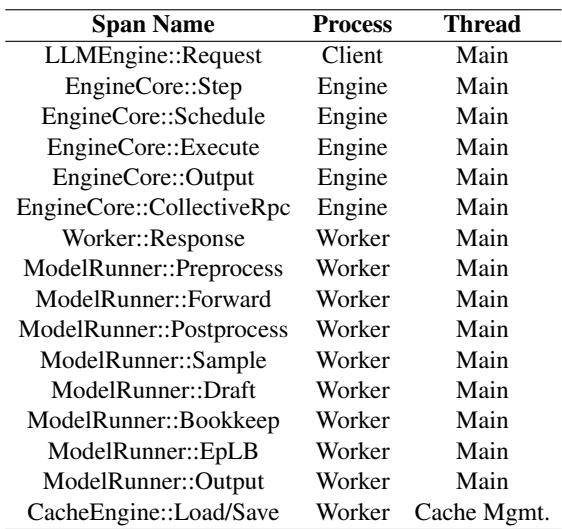

Table 5 provides a comprehensive catalog of the trace points instrumented within the vLLM serving stack. These spans are strategically selected to cover the end-to-end critical path of an inference request, capturing key state transitions from ingress to the model execution backend.

For each instrumentation point, the table specifies: (1) Span Name: The semantic identifier used in trace visualization (e.g., EngineCore::Step); (2) Process: The operating system process where the span originates, specifically distinguishing between the Engine Process (responsible for request scheduling and orchestration) and the Worker Process (responsible for distributed model execution); (3) Thread: The specific execution context, differentiating the compute-intensive Main Thread from asynchronous auxiliary threads such as the Cache Management Thread.

This mapping enables StriaTrace to reconstruct the causal chain of execution across process and thread boundaries.

## B Detailed Instrumentation Configurations

This appendix details the configuration parameters for the profiling tools used in our evaluation (§6.1): NVIDIA Nsight Systems (NSys), PyTorch Profiler (TProf) and Scalene.

## B.1 Config of NVIDIA Nsight System (NSys)

We execute NSys using the Command Line Interface (CLI) to capture system-wide execution traces. To strictly control profiling overhead while maintaining essential hardware observability, the key parameters are configured as follows:

• -trace=cuda,nvtx,osrt: Enables tracing of CUDA runtime/driver API calls, NVTX annotations (essential for correlating vLLM logical scopes), and OS runtime libraries.

• -cuda-graph-trace=node: Since vLLM heavily utilizes CUDA Graphs to reduce kernel launch overhead, this flag forces NSys to expose the internal structure and execution timing of individual nodes within the CUDA Graphs.

• -backtrace=none: Explicitly disables CPU call stack unwinding. As discussed in our baseline setup, collecting full backtraces introduces prohibitive runtime overhead, so we disable it to ensure a fair overhead comparison.

• -sample=process-tree: Configures CPU instruction sampling across the entire process tree, but strategically downsamples the frequency to a 16 ms period to further minimize host-side interference.

• -capture-range=cudaProfilerApi: Restricts the active trace capture strictly to programmatic triggers via the CUDA Profiler API, ensuring we only record stable inference phases and exclude initialization anomalies.

The complete command used to launch NSys in our evaluation is as follows:

1 nsys profile \   
2 --trace - fork - before -exec=true \   
3 -- trace = cuda , nvtx , osrt \   
4 -- sample = process - tree \   
5 --cuda - graph - trace = node \   
6 -- backtrace = none \   
7 -- capture - range = cudaProfilerApi \   
8 -- capture - range - end = stop \   
9 -- sampling - period =16000000 \   
10 -- delay 60 \   
11 -- duration 100000 \   
12 vllm serve ...

## B.2 Config of Torch Profiler (TProf)

We utilize the built-in PyTorch Profiler (TProf) natively provided by the vLLM engine. To capture application-level performance data, the profiler is initialized with the following key parameters:

• activities=[CPU, CUDA]: Configures the profiler to capture operations on both the host CPU and the GPU device, enabling the analysis of kernel launch latencies and hostdevice synchronization.

• with\_stack=True: Records the full Python call stack for every captured operator. This feature is essential for finegrained root-cause analysis but serves as the primary source of TProf’s memory and latency overhead.

The complete parameters used to launch TProf in our evaluation are as follows:

1 vllm serve ...   
2   
3 -- profiler - config ’{" profiler ": "torch", "   
torch\_profiler\_dir ": "\ path\to\save "}’ \   
4 -- profile - torch \   
5 -- profile - step - start 50 \   
6 -- profile - step - end 9999999 \   
7 -- profile - prefill -and - decode

## B.3 Config of Scalene

By default, vLLM’s EngineCore utilizes the spawn method to initialize distributed GPUWorker processes. However, as of our evaluation (April 2026), Scalene lacks native, comprehensive support for profiling spawned subprocesses. Consequently, launching vLLM via a standard Scalene command would exclusively profile the frontend API server process, leaving the critical GPU workers—where the actual inference hot paths reside—completely unobserved.

To overcome this architectural limitation, we implemented a custom hook within vLLM’s worker initialization phase. Specifically, when the EngineCore bootstraps a worker, we explicitly force the spawned process to execute a Scalene command, thereby successfully bringing the distributed workers into the profiling scope. The complete command used to launch the target processes with Scalene is as follows:

1 scalene run -- off \   
23 --cpu - only \   
--cpu - sampling - rate 0.1 \   
4 -o path / to / save \   
5 -m vllm . entrypoints . cli . main serve ...

The key parameters controlling the profiling behavior are configured as follows:

• -off: Starts the process with profiling initially disabled. This allows us to programmatically trigger the profiler only during the steady-state inference phase.

• -cpu-only: Explicitly restricts Scalene to CPU-side profiling. This minimizes instrumentation interference on deviceside operations, allowing us to evaluate the host-side overhead cleanly.

• -cpu-sampling-rate: Dictates the temporal resolution of CPU sampling. In this example, it is set to 0.1 seconds. As detailed in §6.1, we vary this parameter (e.g., 0.01 for 10 ms and 0.1 for 100 ms) to evaluate the trade-off between profiling fidelity and throughput degradation.

## C Details of Use Cases

In this section, we provide supplementary details for the production anomalies introduced in §7. For each highlighted case, we expand upon the initial triage by presenting the finegrained runtime context captured by StriaTrace, the methodology and results of our offline reproduction, and an in-depth root-cause analysis.

## C.1 Case 1: Latency spikes in token sampling

Figure 11 shows the culprit code and Table 6 presents the full Python call stack captured by py-spy on the straggler rank. The stack reveals that the vLLM main inference thread was persistently stalled at the make\_ndarray\_with\_pad function. From the call stack, we can trace the execution flow: the main worker loop dispatches the sampler, which applies penalty constraints to logits. When such constraints are specified, the make\_ndarray\_with\_pad function is triggered to pad historical token sequences.

Table 6: Python call stack on the straggler rank.  
Function (File:Line)   
make\_ndarray\_with\_pad (torch\_utils.py:349) ← Top   
make\_tensor\_with\_pad (torch\_utils.py:370)   
\_convert\_to\_tensors (penalties.py:54)   
apply\_all\_penalties (penalties.py:24)   
apply\_penalties (sampler.py:364)   
apply\_logits\_processors (sampler.py:351)   
forward (sampler.py:92)   
\_call\_impl (module.py:1762)   
\_wrapped\_call\_impl (module.py:1751)   
\_sample (gpu\_model\_runner.py:3412)   
sample\_tokens (gpu\_model\_runner.py:4434)   
sample\_tokens (gpu\_worker.py:653)   
worker\_busy\_loop (multiproc\_executor.py:858)   
worker\_main (multiproc\_executor.py:781)   
run (process.py:108)   
\_bootstrap (process.py:314)   
\_main (spawn.py:135)   
spawn\_main (spawn.py:122) ← Bottom

The implementation of make\_tensor\_with\_pad (the immediate caller) is shown below; line 349 in torch\_utils.py corresponds to line 21:

def make\_ndarray\_with\_pad (   
2 x: list[list[T]] ,   
3 pad : T ,   
4 dtype : npt . DTypeLike ,   
5 \*,   
6 max\_len : int | None = None ,   
7 ) -> npt . NDArray :   
8 " n n   
9 Make a padded array from 2D inputs.   
10   
11 The padding is applied to the end of each inner list   
until it reaches   
12 ‘max\_len ‘.   
13 Ⅱ " Ⅱ   
14 if max\_len is None :   
15 # Unlike for most functions , map is faster than a   
genexpr over ‘len ‘   
16 max\_len = max(map(len, x) , default =0)   
17   
18 padded\_x = np . full ((len(x) , max\_len ) , pad , dtype =   
dtype )   
19 for ind , blocktb in enumerate(x):   
20 assert len( blocktb ) <= max\_len   
21 padded\_x [ind , : len( blocktb )] = blocktb   
22   
23 return padded\_x

## C.2 Case 2: Silent performance degradation due to FlashAttention Miscompilation

## C.2.1 Full mangled name of the culprit FlashAttention kernel

Table 7 presents the full mangled names of the FlashAttention kernel captured by StriaTrace across two vLLM builds. The names are nearly identical except for a critical template argument difference highlighted in red. The template arguments encode the tile size configuration: the old build uses (64, 128, 128) which is optimal for NVIDIA H20 GPUs, whereas the new build uses (128,128,128) as a sub-optimal fallback. This discrepancy directly caused the observed latency regression.

Table 7: Mangled names of FlashAttention kernel across two vLLM builds.

Old Build (Optimal):   
\_ZN7cutlass13device\_kernelIN5flash20enable\_sm90\_or   
\_laterINS1\_16FlashAttnFwdSm90INS1\_25CollectiveMai   
nloopFwdSm90ILi2EN4cute5tupleIJNS5\_1CILi1EEES8\_S8   
\_EEENS6\_IJNS7\_ILi64EEENS7\_ILi128EEESB\_EEELi128ENS\_   
10bfloat16\_tEfNS\_4arch4Sm90ELb1ELb0ELb0ELb1ELb1EL   
b0ELb0ELb1ELb1ELb1   
New Build (Sub-optimal):   
\_ZN7cutlass13device\_kernelIN5flash20enable\_sm90\_or   
\_laterINS1\_16FlashAttnFwdSm90INS1\_25CollectiveMai   
nloopFwdSm90ILi2EN4cute5tupleIJNS5\_1CILi1EEES8\_S8   
\_EEENS6\_IJNS7\_ILi128EEESA\_SA\_EEELi128ENS\_10bfloat1   
6\_tEfNS\_4arch4Sm90ELb1ELb0ELb0ELb1ELb1ELb0ELb0ELb   
1ELb1ELb1

## C.2.2 Detailed settings of offline reproduction

To quantify the impact of the tile size discrepancy under production-like setting, we conducted an offline benchmark on the FlashAttention-3 (FA3) kernel. We utilized the sm\_margin parameter to explicitly govern the Streaming Multiprocessor (SM) allocation. For instance, setting sm\_margin to 70 restricts the kernel to utilize a maximum of 100 − 70 = 30% of the available SMs, simulating a high-concurrency scenario where SMs are heavily occupied by concurrent tasks. Our benchmark targets the flash\_attn\_with\_kvcache function, which internally invokes the kernel introduced in Appendix C.2.2.

As shown in Table 8, under full SM availability, Version 2 exhibited a slight latency regression compared to Version 1 (83.5 µs vs. 73.7 µs). However, under severe SM constraints (sm\_margin= 70), the performance gap drastically widened. Version 1 degraded to 147.7 µs (a 2.0× slowdown), whereas Version 2 suffered a latency spike to 216.8 µs (a 2.6× slowdown).

Table 8: FA-3 kernel latency under different SM availability.  
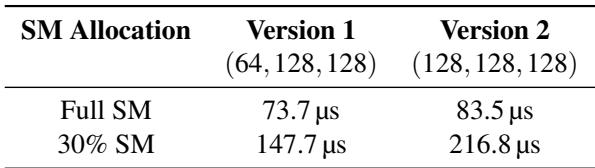

Root-cause analysis. The root cause lies in the intricate interplay between kernel compilation configurations and GPU hardware limits. The larger tile size (128, 128, 128) in Version 2 dictates higher per-block resource consumption (e.g., shared memory and registers). While the GPU can absorb this pressure when all SMs are idle, it leads to a severe drop in active block occupancy when SM resources are constrained. Consequently, fewer thread blocks can be scheduled concurrently. This case powerfully underscores the necessity of StriaTrace’s fine-grained kernel tracing, as such compilation-induced inefficiencies are entirely invisible to standard application-level monitoring.

## C.3 Case 3: Diagnosing “ghost tokens” in speculative decoding

As mentioned in §7.2, the engineering team reported a noticeable drop in the decode throughput. StriaTrace’s continuous tracing revealed that the median latency of a single decode step had inflated from 7 ms to 9 ms. To understand this 2 ms overhead, SREs delved into the fine-grained CPU-side metadata captured by StriaTrace, i.e., the per-batch scheduling contexts. The trace data exposed an algorithmic anomaly: during each decode step, the draft token acceptance rate had dropped to nearly zero. In a standard speculative decoding pipeline, the GPUWorker’s draft model proposes a sequence of draft tokens after a forward pass. These tokens are returned to the EngineCore for scheduling and subsequently passed to the target model for verification. However, StriaTrace revealed a critical quantitative mismatch: the number of draft tokens initially proposed by the worker was strictly less than the number of tokens eventually submitted for verification. This explicitly confirmed the silent injection of “ghost tokens” into the pipeline.

Finally, the SREs confirmed that this was a secondary bug. Previously, the engineering team had encountered an issue where generating JSON-structured outputs under the EAGLE-3 [19] algorithm occasionally produced NaN logits. To mitigate this, developers forcefully padded the sequence of draft tokens to a fixed length before returning it to the EngineCore. Unfortunately, this forceful padding logic lacked algorithmic isolation. It leaked into instances utilizing the N-gram [48] speculative algorithm. Consequently, the target model was forced to expend GPU compute cycles verifying these artificially injected, mathematically meaningless padding tokens. This wasted verification compute directly accounted for the inflated step latency and the drop in the token acceptance rate.