USENIX

THE ADVANCED COMPUTING SYSTEMS ASSOCIATION

# Weave: Efficient Co-Scheduling for Disaggregated RL Post-Training

Tianyuan Wu and Lunxi Cao, Hong Kong University of Science and Technology; Yining Wei, University of Illinois Urbana–Champaign; Wei Gao, Yuheng Zhao, and Dakai An, Hong Kong University of Science and Technology; Shaopan Xiong, Zhiqiang Lv, Ju Huang, Siran Yang, Yinghao Yu, Jiamang Wang, and Lin Qu, Alibaba Group; Wei Wang, Hong Kong University of Science and Technology https://www.usenix.org/conference/osdi26/presentation/wu-tianyuan

# This paper is included in the Proceedings of the 20th USENIX Symposium on Operating Systems Design and Implementation.

July 13–15, 2026 • Seattle, WA, USA

ISBN 978-1-939133-55-7

Open access to the Proceedings of the 20th USENIX Symposium on Operating Systems Design and Implementation is sponsored by

# WEAVE: Efficient Co-Scheduling for Disaggregated RL Post-Training

Tianyuan Wu†, Lunxi Cao†, Yining Wei‡, Wei Gao†, Yuheng Zhao†, Dakai An†, Shaopan Xiong§, Zhiqiang Lv§, Ju Huang§, Siran Yang§, Yinghao Yu§, Jiamang Wang§, Lin Qu§, Wei Wang† †Hong Kong University of Science and Technology, ‡UIUC, §Alibaba Group

## Abstract

Rollout–training disaggregation is emerging as the standard architecture for Reinforcement Learning (RL) post-training, where memory-bound rollout and compute-bound training are physically disaggregated onto purpose-built clusters to maximize hardware efficiency. However, the strict synchronization required by on-policy algorithms introduces severe dependency bubbles, forcing one cluster to idle while the dependent phase is running on the other. We present WEAVE, a cluster scheduling framework that reclaims these bubbles through cross-cluster orchestration. WEAVE is built on the insight that the structural idleness of one job can be effectively utilized by the active phase of another. To realize this, we introduce the co-execution group abstraction, which partitions the cluster into isolated locality domains. This abstraction enables a twotier scheduling architecture: an inter-group scheduler that optimizes job placement using conservative stochastic planning, and an intra-group scheduler that orchestrates a provably optimal round-robin schedule. The group abstraction also imposes a residency constraint, ensuring that massive model states remain cached in host memory to enable “warm-start” context switching. We evaluate WEAVE on a production-scale testbed with 328 H20 and 328 H800 GPUs. WEAVE improves cost efficiency by 1.84× over standard disaggregation and 1.38× over state-of-the-art co-located baselines, all while achieving 100% SLO attainment.

## 1 Introduction

The development of Large Language Model (LLM) is shifting from pre-training to Reinforcement Learning (RL) posttraining [1,3,7], which unlocks reasoning capabilities in complex domains such as mathematics [2], coding [33], and tool use [9, 54]. To achieve optimal performance and model stabil ity, production deployments have converged on synchronous, on-policy algorithms [7, 37, 41] that prescribe a strict, iterative learning loop through three phases, each with a distinct resource bottleneck: (1) rollout, a memory-bandwidth-bound inference stage that generates token trajectories; (2) training, a compute-intensive stage that updates parameters from rewards; and (3) synchronization, a network-bound stage that propagates updated weights back to inference workers.

This paper targets the deployment that production onpolicy RL post-training has converged on—a disaggregated architecture [11, 47, 52, 61] that splits rollout and training across two purpose-built clusters (Figure 1-top). The rollout pool consists of cost-effective, inference-optimized GPUs (e.g., NVIDIA H20), while the training pool uses highperformance, compute-optimized GPUs (e.g., NVIDIA H800). By matching hardware to phase characteristics, disaggregation resolves the resource mismatches that plague monolithic provisioning, achieving superior cost efficiency at comparable throughput despite the added cross-cluster synchronization.

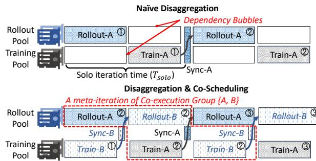  
Figure 1: Comparison between existing disaggregated RL architecture and WEAVE’s co-scheduling paradigm.

Disaggregation, however, introduces a fundamental efficiency challenge: dependency bubbles. The strict synchronization required by on-policy learning forces the training cluster to idle during rollout, and vice versa (Figure 1-top), wasting both pools. Existing systems such as AReaL [11], StreamRL [61], and AsyncFlow [18] eliminate these bubbles only by switching to asynchronous, off-policy algorithms, trading away the on-policy guarantee and admitting sample staleness that compromises model accuracy and convergence stability—an unacceptable trade for tasks that demand strict on-policy performance.

We present WEAVE, a cross-cluster scheduling framework for disaggregated RL post-training that mitigates dependency bubbles by lifting the optimization scope from the individual job to cluster-level orchestration. Our key insight is that the dependency bubbles inherent to one job can be filled by another job’s active phase. WEAVE groups multiple jobs into a co-execution group and tightly weaves their rollout and training phases across the two resource pools (Figure 1- bottom), time-multiplexing both pools to maximize utilization while preserving the synchronous dependencies required by on-policy learning.

However, realizing this benefit in production is non-trivial because of three challenges. (C1) Production RL jobs exhibit extreme workload heterogeneity across model sizes, response lengths, and interaction patterns (Figure 2), producing widely varying phase durations and resource demands. Naive timemultiplexing causes severe interference—for example, pairing two rollout-heavy jobs creates a bottleneck that substantially delays both (Figure 3). Finding an interference-free schedule across such heterogeneous workloads reduces to a Job-Shop Scheduling problem [25], which is NP-hard. (C2) Unlike standard deep-learning workloads with stable iteration times, RL rollouts are highly stochastic: LLM generation follows a long-tailed distribution [14, 19, 62] in which a few straggler requests unpredictably prolong phase durations, rendering static plans obsolete. (C3) Time-multiplexing is constrained by switching costs. RL post-training is inherently stateful, requiring each worker to manage hundreds of gigabytes of model weights and optimizer state per job (Table 2); reloading these states from disk or across the bandwidth-limited crosscluster network on every switch incurs cold-start latencies of up to 135 s (Figure 4)—enough to wipe out any gains from co-scheduling. This combination—stateful workers holding hundreds of gigabytes of resident state, a strict cross-phase synchronization barrier, and long-tailed phase durations—is what makes generic VM, container, or GPU multiplexing inadequate here and motivates an RL-specific scheduler.

WEAVE addresses these challenges via a holistic algorithm– system co-design built around a near-optimal scheduling algorithm. The objective is to minimize total resource provisioning cost—and thus dependency bubbles—while honoring per-job SLOs, defined as the acceptable slowdown relative to solo execution (Figure 1-top). Although the global problem is NP-hard (C1), WEAVE makes it tractable by decomposing it into two decisions: inter-group scheduling chooses the jobs that co-execute, and intra-group scheduling orchestrates their execution sequences within a co-execution group. When a new job arrives, the inter-group scheduler scans existing co-execution groups for a placement that violates no group member’s SLO; among SLO-compliant options, it picks the one with the minimum marginal provisioning cost, and otherwise provisions a new, isolated group. Within each group, the intra-group scheduler runs a round-robin schedule, which we prove is optimal for minimizing dependency bubbles in this context (§4.3).

To handle runtime stochasticity (C2), WEAVE pairs conservative admission control with long-tail migration. For intergroup placement, the scheduler assumes a worst case in which every response reaches the maximum token length, so SLO guarantees hold even under peak load (§4.2). At runtime, the intra-group scheduler adapts to the observed response distribution: it opportunistically migrates ongoing long-tail responses onto a small subset of GPU devices, freeing the bulk of the rollout pool so that the next job can begin pipelined execution immediately (§4.3).

To absorb switching overheads (C3), WEAVE introduces a warm-start mechanism that cuts switching latency by two orders of magnitude (Figure 4), making fine-grained timemultiplexing practical. WEAVE rightsizes each co-execution group so that the states of all member jobs—model weights, optimizer state, and execution context—fit in each worker’s host memory; on a switch, the worker loads the cached state from host DRAM to the GPU rather than fetching it across the slow inter-cluster link or from disk.

To make these schedules executable, WEAVE introduces two system mechanisms. A phase-centric control model treats each RL phase as a first-class schedulable entity, exposing the job’s internal dependency graph to the scheduler and transparently driving the state loads that warm-start requires (§5.1). A topology-aware model-synchronization scheme prevents the cross-cluster sync barrier from becoming a bubble multiplier (§5.2): it pipes a single model copy across the slow inter-cluster link via parallel point-to-point streams and then broadcasts within each cluster over the high-speed local fabric (e.g., NVLink, InfiniBand).

We implemented WEAVE atop ROLL [45] and evaluated it on a production-scale disaggregated testbed with a 328- GPU H20 rollout pool and a 328-GPU H800 training pool. Across micro-benchmarks at identical per-hour provisioning cost, WEAVE delivers 1.82–1.99× higher training throughput than disaggregation without co-scheduling (§6.2). On an end-to-end replay of a two-week production trace, WEAVE sustains the same workload at 1.38× lower provisioning cost than the state-of-the-art veRL [43] and 1.84× lower than naive disaggregation, while maintaining 100% SLO attainment (§6.4). Large-scale trace-driven simulations further show that WEAVE’s combined inter- and intra-group scheduling runs within 6% of the theoretical optimum found by brute-force search (§6.5). Finally, WEAVE is robust to workload drift—static placement stays within 1.11× of an optimal dynamic-regrouping baseline—and sustains job failures by re-admitting recovered jobs as new arrivals (§6.6).

## 2 Background and Motivation

RL Post-Training Workload Characterization. RL posttraining has become a cornerstone workload for modern AI infrastructure. In our production clusters, the volume of RL jobs nearly tripled within six months, growing from 5k monthly jobs in April to over 14k in September 2025, driven largely by the need to instill complex reasoning capabilities in LLMs [3, 7, 9, 41, 45]. Unlike LLM pre-training, which is a uniform stream of compute, the standard RL post-training workflow consists of repeated cycles over three phases, each with a distinct resource bottleneck. (1) Rollout: the actor LLM generates responses for a batch of input prompts, which are then evaluated to collect reward feedback. This phase exerts high memory-bandwidth pressure from KV-cache operations while having relatively low arithmetic intensity, so running it on high-end training GPUs severely underutilizes their compute [11, 19, 61]. (2) Training: the actor LLM’s parameters are optimized from the reward feedback. This phase is compute-intensive and demands both massive floating-point throughput and high-bandwidth interconnects (e.g., NVLink, InfiniBand) for gradient aggregation [44]. (3) Synchronization: updated parameters must be broadcast from the training workers to the rollout workers. Synchronization exists in any deployment, but disaggregating rollout and training across separate clusters forces the broadcast to traverse a comparatively slow inter-cluster link, turning this phase into a network-bound bottleneck.

The Case for Disaggregated RL. The divergent resource requirements of rollout and training create a fundamental inefficiency in traditional monolithic, co-located deployments [43], in which rollout and training are time-multiplexed on a single cluster of homogeneous, compute-optimized GPUs (e.g., NVIDIA H100/H800). This forces the memory-bandwidthbound rollout phase to run on expensive compute-optimized hardware, inflating the total cost of ownership (TCO) [52, 61].

Disaggregation addresses this mismatch by splitting the RL workload across two purpose-built resource pools (Figure 1-bottom) [11,47,52,61]: training runs on costly, computeoptimized GPUs (e.g., H100/H800), while rollout is offloaded to cost-effective, inference-optimized GPUs (e.g., H20) that offer high HBM capacity and bandwidth at a fraction of the cost (Table 1). By aligning hardware with phase characteris tics, disaggregation promises a superior TCO in theory.

Dependency Bubbles. While disaggregation addresses hardware mismatches, dependency bubbles undermine its efficiency in practice. State-of-the-art RL post-training relies on synchronous, on-policy algorithms to ensure training stability and model quality [7, 17, 37, 41]. This synchronization constraint enforces a strict phase dependency: the training pool sits idle while the rollout pool generates fresh experiences, and the rollout pool sits idle while the training pool updates parameters (Figure 1-top).

Existing systems such as AReaL [11, 52], StreamRL [61], and AsyncFlow [18] eliminate these bubbles by switching to asynchronous, off-policy algorithms. Decoupling rollout from training, however, introduces sample staleness that degrades model convergence and final accuracy, making these solutions unsuitable for tasks that demand strict on-policy performance. As a result, production deployments retain synchronous execution and absorb the resulting idleness.

Worse, this idleness can fully offset disaggregation’s hardware savings. Our end-to-end evaluation (§6.4) shows that a naive disaggregated deployment (Solo-D) incurs higher provisioning cost than a monolithic co-located baseline (veRL)— \$0.94k/h versus \$0.71k/h—despite using cheaper GPUs for rollout. Without a scheduling mechanism to reclaim this lost capacity, disaggregation’s theoretical TCO advantage is nullified by system-level inefficiencies.

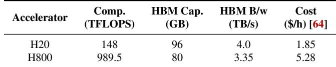  
Table 1: Performance specifications and cost-effectiveness of the GPUs used in our disaggregated clusters [61, 64].

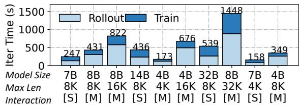  
Figure 2: Top 10 popular RL post-training workloads in our production cluster: jobs’ phase durations are highly diverse. [S], [M] refers to single/multi-turn interaction during rollout.

## 3 Scheduling Opportunities and Challenges

In this section, we identify a cluster-level opportunity for mitigating the dependency bubbles of disaggregated RL posttraining. We then examine the algorithmic and system challenges of realizing it.

## 3.1 The Co-Scheduling Opportunity

For a single job, the dependency bubbles described in §2 are unavoidable: eliminating them would violate the synchronization requirements of on-policy algorithms. In shared, multi-tenant clusters that run diverse RL workloads, however, these per-job inefficiencies are aggregate capacity that can be reclaimed through cluster-level scheduling.

Our key insight is that the idle resources in one job’s dependency bubbles can be utilized to execute the active phase of another. By orchestrating jobs into co-execution groups, the scheduler can tightly “weave” together their workflows, ensuring that the compute-intensive training phase of one job executes in parallel with the memory-bound rollout phase of another (Figure 1-bottom). This interleaved execution pattern effectively hides dependency bubbles, allowing the system to simultaneously saturate both the cost-effective rollout pool and the high-performance training pool, maximizing clusterwide efficiency without compromising the synchronization requirements of on-policy learning.

## 3.2 Challenges

However, realizing co-scheduling at production scale is nontrivial for three reasons: workload heterogeneity (C1), runtime stochasticity (C2), and context-switching cost under memoryresidency limits (C3).

C1: Workload Heterogeneity and Scheduling Intractability. First, production RL workloads are highly diverse, which complicates efficient co-scheduling. As shown in Figure 2, jobs in our cluster span a wide range of model sizes (3B–32B), response lengths (4k–32k tokens), and interaction modes (single- vs. multi-turn). This diversity translates into phase durations that range from 50s to over 900s and into pronounced phase skew: multi-turn agentic workloads, for instance, exhibit rollout phases 3×–4× longer than their training phases.

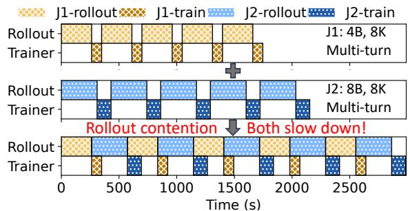  
Figure 3: A bad case of naive time-multiplexing: two rolloutheavy jobs compete for a rollout node and both slow down.

Naive time-multiplexing therefore often proves detrimental due to resource contention. Arbitrarily pairing two rolloutheavy jobs, for example, creates a bottleneck on the inference nodes, forcing both jobs to stall. As shown in Figure 3, such contention results in severe performance degradation, slowing down concurrent jobs by 1.40× and 1.64×, respectively. To avoid such interference, the scheduler must identify optimal packings that satisfy strict performance SLOs. However, mapping these heterogeneous, phase-skewed workloads to available resources reduces to a Job Shop Scheduling problem [15, 25], which is known to be NP-hard even under the simplifying assumption of deterministic phase durations.

C2: Stochastic Runtime and Skewness Bubbles. Second, RL workloads are inherently stochastic. Unlike pre-training, an RL rollout’s execution time depends on the generated response lengths, which follow a long-tail distribution (Fig ure 12). This creates two challenges. First, the workload is non-stationary: response-length distributions drift across iterations as the model updates, and a few “straggler” requests routinely hit the maximum token limit [14, 61, 62]. Because training cost scales linearly with the number of generated tokens, rollout variance propagates into the subsequent training phase and makes static orchestration plans obsolete.

Second, long-tail responses induce skewness bubbles within a rollout [61, 62]: early-finishing GPUs idle while waiting for stragglers, serializing batch completion. The scheduler therefore faces a dynamic variant of the Job Shop Scheduling problem, in which task durations are unpredictable and timevarying, and execution is subject to significant intra-phase fragmentation.

C3: Context Switching Overhead and Memory Residency. Third, the granularity of time-multiplexing is fundamentally constrained by context-switching cost. Unlike stateless LLM inference [12], RL post-training is stateful: it maintains a large working set of model weights, optimizer states, dataset pipelines, and environment states. Reconstructing this state on every switch—known as a cold start—incurs prohibitive overheads from both data- and control-plane re-initialization. As shown in Figure 4, a cold start of a rollout or training phase on an 8-GPU node (H20 for rollout, H800 for training) takes up to 135 seconds and degrades end-to-end RL training throughput by up to 45%.

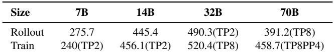  
Table 2: Memory footprint (GB) required for caching rollout or training actors on an 8-GPU node across model sizes.

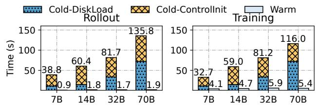  
Figure 4: Cold and warm start latency for rollout (left) and training (right) across model sizes on an 8-GPU node (H20 for rollout, H800 for training).

Unlike serverless systems that mitigate cold starts via high speed RDMA state transfers [12, 56, 58], disaggregated RL setups are bottlenecked by limited cross-cluster Ethernet bandwidth. The only viable alternative is a warm-start strategy that keeps job states cached in local host DRAM. This reduces switching latency by up to 71.5× (Figure 4), but at the cost of severe memory pressure. A single phase’s state consumes hundreds of gigabytes (Table 2), so even high-memory nodes (1–2 TB) admit only two to five resident jobs at a time. This per-node footprint is determined by the per-GPU state held on the node, not by the model’s total parameter count: larger models use higher tensor or pipeline parallelism to fit GPU HBM and therefore spread state across more GPUs, while smaller models more often replicate state per node via data parallelism. Table 2 confirms this: the 70B configuration (TP8PP4) fits in no more host DRAM than the 32B configuration, so scaling model size does not further tighten the residency budget. The scheduler therefore faces a tight residency constraint and must optimize utilization within a bounded memory budget.

## 4 The WEAVE Scheduling Design

We present WEAVE, a cluster scheduling framework that reclaims dependency bubbles for disaggregated RL posttraining through cross-cluster orchestration. WEAVE adopts a holistic algorithm-system co-design: we decouple the logical scheduling policy (§4) from the underlying system design (§5). This section details the core scheduling algorithms.

## 4.1 Co-Execution Group

WEAVE’s scheduling objective is to minimize provisioning cost by re-using dependency bubbles in already-paid-for capacity, while strictly adhering to job performance SLOs and node memory constraints. To achieve this, we introduce the co-execution group abstraction. A co-execution group is a set of jobs that share a specific pair of rollout and training resource pools via time-multiplexing. Within a group, all rollout phases execute on the group’s assigned rollout workers, and all training phases execute on the group’s training workers. By partitioning jobs into disjoint groups, WEAVE transforms the intractable global co-scheduling problem into a collection of independent, parallel sub-problems within groups. This decomposition keeps scheduling tractable at production scale (C1), and pinning jobs to specific group nodes keeps their working sets resident in host DRAM so that context switches are served by warm starts rather than slow disk or cross-cluster fetches (C3).

The co-execution group abstraction naturally leads to a twotier scheduling hierarchy: (1) inter-group scheduling (§4.2), which assigns arriving jobs to groups to minimize provisioning costs while satisfying memory and SLO constraints, and (2) intra-group scheduling (§4.3), which orchestrates the runtime execution order of job phases within a group to minimize dependency bubbles.

## 4.2 Inter-Group Scheduling

Problem Formulation. We model the cluster as a collection of disjoint co-execution groups. We define a co-execution group G as a tuple (JG, RG, TG, ΦG), where JG is the set of active RL jobs in the group, RG and TG denote the sets of rollout (e.g., H20) and training (e.g., H800) GPUs provisioned for the group, and ΦG = {Pj}j∈J is the set of resource placements, where Pj specifies the exact subset of rollout and training nodes job j is pinned to. This pinning Pj strictly determines where the job’s state is cached to enable its warm start.

The inter-group scheduler solves the following online placement problem: upon the arrival of a job j, it must assign j to a co-execution group—either an existing one or a newly created one—and allocates specific resource placement Pj. To make optimal placement, we define the provisioning cost of a group, Cost(G), as the aggregate hourly cost (Table 1) of all allocated GPUs in its rollout and training pools (RG and TG). The scheduler’s objective is to minimize the marginal provisioning cost ∆ incurred by admitting job j:

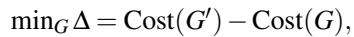

where G′ represents the group’s state after accommodating job j. This formulation naturally encourages “packing” jobs into existing dependency bubbles (where ∆ = 0) over provi sioning new hardware (where ∆ > 0). The placement decision is subject to two critical constraints:

1) Memory Residency. To guarantee warm starts (C3), the aggregate working set of all jobs pinned to a specific node must not exceed that node’s host memory capacity.

2) SLO Attainment. The placement must satisfy the performance SLOs of both the new job and all existing jobs. The SLO is defined by each job as the tolerance for co-execution slowdown (e.g., 1.1×) relative to solo execution.1 Formally, for every job k in the updated group G, we require:

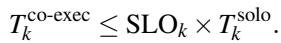

Here, T solok is the estimated iteration time when job k is running alone (Figure 1-top), which is simply the sum of its iteration time under co-execution, which is derived by simulating the intra-group schedule (§4.3).

Making Placement Decisions. Navigating the search space to find an optimal placement is non-trivial due to both workload heterogeneity (C1) and runtime stochasticity (C2). WEAVE addresses these complexities with three strategies.

1) Handling Stochasticity via Conservative Planning. To guarantee SLO compliance despite the volatile, unpredictable job execution time (C2), WEAVE decouples admission control from runtime optimization. The inter-group scheduler acts as a “gatekeeper” that makes placement decisions based on worst-case execution bounds. Specifically, for an arriving job j, we estimate its phase durations (T roll and T train) assuming that every generated response reaches the maximum token limit defined in the job configuration. By planning against this upper bound, we ensure that the chosen placement satisfies the SLO constraints even under the most adverse stochastic conditions. If the actual runtime durations are shorter, which is typical, the intra-group scheduler dynamically reclaims the resulting slack to improve utilization (§4.3).

2) Optimal Placement Search. With these conservative estimates, WEAVE performs a global search to minimize the marginal provisioning cost ∆. For each arriving job, the scheduler iterates through all candidate groups and evaluates three placement strategies:

• Direct Packing: Inserting the job into existing dependency bubbles within a group without provisioning new resources (Figure 5-top). This maximizes utilization of already-paid-for capacity.

• Rollout Scaling: If a group has available training capacity but is bottlenecked on inference, which is common with rollout-heavy agentic workloads, WEAVE scales up the group’s rollout pool by provisioning just enough rollout nodes to accommodate the new job (Figure 5-middle).

• Isolated Provisioning: As a fallback, WEAVE provisions a new, isolated group for the new job (Figure 5-bottom). The scheduler iterates through these strategies2, selecting the valid placement that minimizes the marginal cost ∆ while satisfying both the memory residency and SLO constraints.

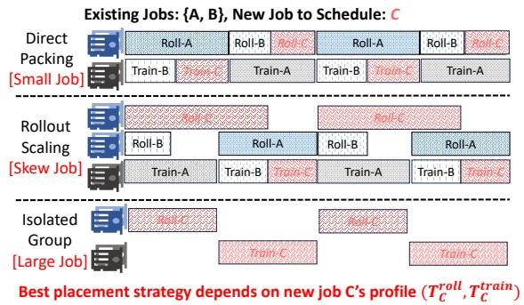  
Figure 5: Placement strategies of the inter-group scheduler.

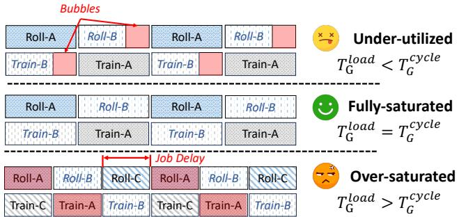  
Figure 6: Status of a co-execution group. WEAVE only places new jobs into under-utilized groups with unsaturated dependency bubbles and avoids creating over-saturated groups.

3) Pruning Saturated Groups. To ensure this search remains tractable at production scale (C1), WEAVE proactively prunes the search space. Before evaluating specific placements, the scheduler filters out groups that are already satu rated, where the aggregate job load saturates or exceeds the group’s bottleneck resource capacity, and adding more work to the group would lead to performance degradation.

Formally, for a group G, let T cycleG G = max j∈JG T soloj be the natural cycle iteration time dictated by the longest job in the group. We define the group’s bottleneck load T loadG as the total time required to process all phases on the bottleneck node. Since all training nodes have identical phases, while rollout nodes may differ3 (see Figure 5), we have

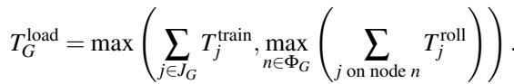

If T load ≥ cycle G , the group is saturated, containing no “slack” to absorb new work (Figure 6). Such groups are pruned immediately as any further addition would force delays.

Algorithm Summary. We integrate these strategies into a unified online scheduling logic detailed in Algorithm 1. The algorithm takes a new job j and the set of existing groups as input. To find the optimal placement, the algorithm first iterates through all existing groups (line 3), discarding those that are already saturated (line 4). For each remaining candidate group, it evaluates potential placement strategies—direct packing or rollout scaling—for the job (line 6); placements that would violate memory constraints (line 8) or SLO constraints (line 10) are discarded. The algorithm evaluates the marginal cost for each feasible placement (lines 6–12) and updates its records if the placement leads to a lower cost (lines 13–14). Finally, the algorithm compares its records against the baseline cost of provisioning a fresh, isolated group (lines 15–17) and returns the group and job placement that yield the lowest costs.

Algorithm 1 Inter-Group Scheduling Algorithm   
Require: Job to schedule j, all existing groups {Gi}ni=1.   
Ensure: Best group G∗, best placement P∗j .   
1: procedure SCHEDULE( j,{Gi}n )   
2: ∆∗ ← ∞, G∗ ← None, P∗ ← None ▷ Initialize best values   
3: for each group G in {Gi}ni=1 do ▷ Try all existing groups   
4: G then ▷ Skip saturated groups   
5: continue   
6: P ← GENERATEPLACEMENTS(G)   
7: for each resource placement Pj in P do   
8: if j.mem\_req ≥ minnode∈P (node.mem\_avail) then   
9: continue ▷ Per-node memory constraint violated   
10:   
11: continue ▷ SLO constraint violated   
12: ∆ ← Cost(G ∪ {( j, Pj)}) − Cost(G)   
13: if ∆ < ∆∗ then   
14: Update ∆∗ ← ∆, G∗ ← G, P∗ ← Pj   
15: ∆ ← Cost({ j}, {}) ▷ Try to place j in a new group   
16: if ∆ < ∆∗ then   
17: Update ∆∗ ← ∆, G∗ ← { j}, P∗j ← {}   
18: return G∗, P∗j

Running Example. Suppose the cluster currently hosts two active co-execution groups G and G , and a new job E arrives for scheduling. Group G1 is already saturated and gets pruned immediately. Group G2 still has slack, and contains jobs C and D: C is pinned to nodes (roll-1,train-1), while D is pinned to (roll-2,train-1). Thus, C and D use separate rollout nodes but share the same training node. For this group, GENERATEPLACEMENTS produces only a few candidates P . It first tries direct packing, e.g., placing E onto (roll-1,train-1) to share resources with C, or onto (roll-2, train-1) to share with D. It then tries rollout scaling, which keeps E on train-1 but allocates a new rollout node, e.g., (roll-3,train-1). Finally, the scheduler compares these feasible placements against isolated provisioning, which creates a new group containing only E. Any candidate that violates memory residency or any job’s SLO is discarded, and the scheduler chooses the lowest-cost feasible option.

The algorithm allows for highly efficient decision-making. Since |P | = O(|RG|) for each group and the SLO check on line 10 is a constant-cost simulation of one meta-iteration (§4.3, Theorem 1), the per-group work is O(|P | · |J |). Since individual groups are small in practice (|JG| typically below ten), the overall search complexity is effectively linear in the number of active groups. As empirically demonstrated in §6.5, this heuristic allows the scheduler to make optimal decisions in sub-seconds even in clusters with thousands of jobs.

## 4.3 Intra-Group Scheduling

Once the inter-group scheduler assigns a job to a group, the intra-group scheduler is responsible for orchestrating the runtime execution sequence. Its primary objective is to maximize resource utilization—and thereby minimize dependency bubbles—within the assigned resource pools.

The Round-Robin Policy. WEAVE employs a cyclic roundrobin schedule. Within a co-execution group, the scheduler defines a meta-iteration in which every active job executes exactly one rollout phase and one training phase (Figure 1). These phases are orchestrated sequentially on their assigned resource pools. For example, in a group with jobs {A, B}, the rollout pool executes RollA → RollB, while the training pool executes TrainA → TrainB.

While simple, this policy is optimal under the preconditions enforced by WEAVE. Recall that the inter-group scheduler (§4.2) proactively prunes any group where the aggregate load exceeds the natural cycle time (T loadG ≥ T cycleG ). For the remaining groups, their optimality is provable.

Theorem 1 (Utilization Optimality) For any unsaturated or full group G, a meta-iteration schedule that executes each job’s phases exactly once in a round-robin order maximizes the aggregate utilization of both rollout and training pools.

Proof Sketch. The optimality rests on the definition of an unsaturated (or full) group: the bottleneck node’s total work load T load is no more than the longest job’s standalone cycle time T cycleG . Intuitively, this implies that we can pack all other jobs’ corresponding phases (e.g., their rollouts) into the longest job’s dependency bubbles (e.g., its idle rollout nodes during training). This ensures a round-robin cycle that executes each job’s phases exactly once to complete in time T cycleG . We then show any deviation from this simple schedule is suboptimal. (1) Executing less is impossible: Omitting any job from the cycle leads to more bubbles and starvation, which is trivially non-optimal. (2) Executing more is inefficient: Repeating any job phase prolongs the cycle time as the added phase can only start after finishing the slowest job. However, this added duration is disproportionately larger than the useful work added, leading to a net decrease in utilization.

Therefore, the round-robin schedule, which executes all required work in the shortest possible cycle time, is utilizationoptimal. We provide a formal proof in Appendix 8.

Long-Tail Migration. While the round-robin schedule is optimal for deterministic workloads, production RL phases are highly stochastic (C2). Specifically, rollout durations follow a heavy-tailed distribution where the completion time of an input batch is dictated by a small number of “straggler” responses that reach maximum token limits [14,19,61,62]. This phenomenon creates significant intra-phase fragmentation: as the majority of responses finish early, most GPUs in the rollout pool idle wait for the few stragglers to complete, creating “skewness bubbles” (Figure 7-top).

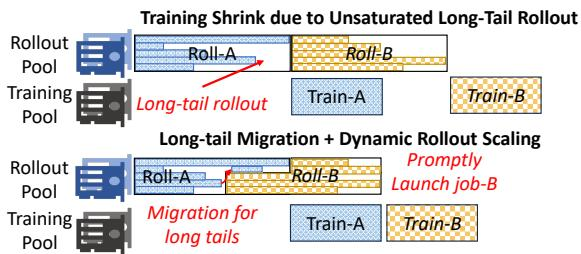  
Figure 7: Long-tail migration effectively handles dynamism.

To reclaim this fragmented capacity, WEAVE employs longtail migration to dynamically adapt the schedule at runtime. The intra-group scheduler continuously monitors the progress of active rollout phases. When a phase enters a tail-bound state, triggered when a threshold of responses (e.g., 80%) have completed, the system interrupts the execution, consolidates the remaining long-tail responses onto a small subset of work ers4, and immediately starts the next job’s rollout phase on the newly freed rollout GPUs (Figure 7-bottom). This mechanism effectively pipelines the tail of one job with the head of the next, ensuring high utilization and faster completion. It is also the runtime counterpart of the conservative admission in §4.2: worst-case planning reserves rollout capacity for stragglers that rarely materialize, and this mechanism converts the unused reservation into useful work for the next job in the round-robin order. We will show in §6.3 that long-tail migration is semantics-preserving: it changes where the tail finishes, not what the rollout produces, and does not alter the underlying RL learning signal or convergence.

## 5 The WEAVE System Design

Figure 8 shows WEAVE’s architecture. It is organized around three pieces: a control plane (the two-tier scheduler, a per-job phase shim, and runtime hooks), a data plane (the disaggregated rollout and training GPU pools, with each job’s working set cached in host DRAM for warm starts), and a cross-cluster sync channel that carries model updates from the training pool to the rollout pool. WEAVE is implemented in ∼5.2k lines of code atop ROLL5 [45], with controllers in Python and the placement search in C++.

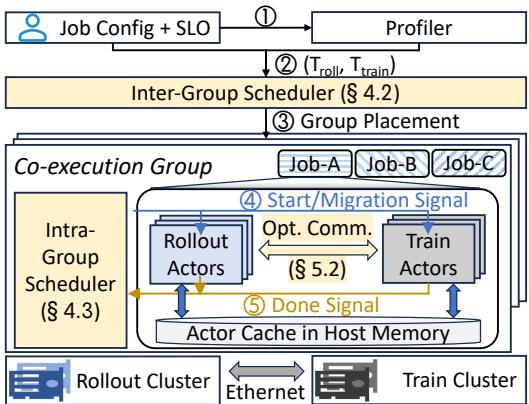  
Figure 8: WEAVE’s system architecture.

Workflow. The system operates as a closed loop (Figure 8). Upon job submission, WEAVE first launches a lightweight profiler (⃝1 )—a one-shot timing pass that runs the user’s rollout and training functions at the job’s configured maximum token limit—to generate worst-case duration estimates for the job’s rollout and training phases (⃝2 ). These estimates are fed into the inter-group scheduler (§4.2), which identifies the optimal co-execution group and resource placement to minimize marginal cost (⃝3 ). Once placed, the job comes under the control of the intra-group scheduler (§4.3). This runtime controller orchestrates the round-robin meta-iteration (⃝4 ), driving phase switches through the per-job phase shim and triggering long-tail migrations based on real-time feedback from its runtime hooks (§5.1). Once a phase completes, WEAVE offloads its state to the actor cache in host DRAM, releases GPU resources, and launches the next job’s waiting phase from the scheduler queue (⃝5 ). Model-update traffic between the Train and Rollout pools crosses a slow cross-cluster link; WEAVE routes it through a topology-aware scatter-then-broadcast (§5.2) so that sync does not itself become a new bubble.

## 5.1 Phase Control

Conventional cluster schedulers treat a job as the atomic unit of resource allocation, which is too coarse for interleaving distinct RL phases of different jobs on the same hardware. WEAVE instead schedules at the granularity of individual phases: each phase is a first-class schedulable entity with its own admission, state, and runtime controls.

Execution and Switching. We model each RL job as a dependency graph of phases. After a one-time initialization (Init) of the job states (e.g., models, datasets), the job enters a cyclic dependency loop: Rollout → Train → Sync. WEAVE exposes this internal structure to the scheduler via a declarative Python API. Users simply annotate their phase functions with a @weave.phase decorator, which injects a transparent runtime shim to manage the execution lifecycle.

When a phase is invoked, this shim first blocks execution until it acquires a run permit from the intra-group scheduler. Upon approval, it performs a warm start by loading the phase’s resident working set from host DRAM into GPU memory. Once the user function completes, the shim immediately offloads the updated state back to host memory and releases the occupied GPUs, making the hardware instantly available for the next phase in the group’s queue. Crucially, WEAVE optimizes this switching process by decoupling data plane state from control plane context. Naively terminating a process af ter a phase completes would force the system to tear down and rebuild expensive control plane (e.g., NCCL communicators, environment handles) upon every switch. Instead, WEAVE employs a lightweight suspension strategy: after offloading, the shim places the process into a sleep loop while retaining its control plane context without consuming GPU resources. On the next wake-up, resuming the phase only requires reloading its cached state onto the GPU, avoiding expensive cold starts from disk and control-plane re-initialization.

Runtime Hook. The system exposes a runtime hook interface @weave.runtime\_hook. This interface serves two critical roles. First, it drives the round-robin schedule: the intragroup scheduler maintains a FIFO queue for each worker node. When a job’s phase completes, the hook signals the scheduler to enqueue the job’s next phase onto the alternate resource pool’s queue (e.g., moving from rollout to training) and starts the next waiting phase on the now-idle devices. Second, it enables the long-tail migration (§4.3). By exposing internal token generation progress, the hook allows the scheduler to detect tail-bound states and externally trigger migration, dynamically reconfiguring resources in real-time.

## 5.2 Topology-Aware Model Synchronization

To mitigate the cross-cluster bandwidth bottleneck, WEAVE employs a topology-aware communication strategy to efficiently synchronize model parameters from the training cluster to the rollout cluster. State-of-the-art RL frameworks (e.g., veRL [43]) rely on flat collective operations like AllGather to propagate model updates. While efficient in monolithic clusters, this approach is pathological in disaggregated setups. It treats the slow cross-cluster Ethernet link and the fast intracluster InfiniBand/NVLink fabric as a single uniform network. Consequently, it forces every rollout worker to independently fetch a full copy of the model parameters over the slow crosscluster link (Figure 9-top), causing a severe bottleneck while leaving local high-speed fabrics idle.

Inspired by LLM auto-scaling and multi-casting systems [4, 13, 56, 58, 65], we exploit the heterogeneous bandwidth and redundant model copies, a unique characteristic of disaggregated RL post-training, to reduce synchronization cost. WEAVE replaces the flat collective with a hierarchical two-stage transfer. ⃝1 In the first stage (inter-cluster scatter), it partitions the updated model into N disjoint shards, where N is the number of training GPUs. Each training GPU transmits a unique shard to a corresponding rollout GPU via parallel point-to-point (P2P) streams. This ensures that exactly one full copy of the model traverses the slow cross-cluster link. ⃝2 In the second stage (intra-cluster broadcast), the receiving GPUs immediately disseminate their shards to all other rollout workers using the high-bandwidth InfiniBand/NVLink fabric. This two-stage pipeline effectively mitigates the slow cross-cluster bottleneck, minimizing overall synchronization time and fully utilizing network hierarchies.

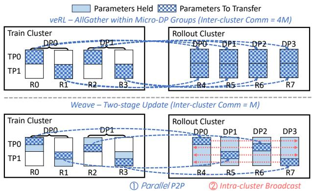  
Figure 9: A synchronization example from the training cluster (TP=2, DP=2) to the rollout cluster (DP=4), where WEAVE sends exactly one copy across the cross-cluster network. M denotes the number of total parameters.

## 5.3 Reliability and Robustness

Fault Isolation. To ensure production-grade reliability, WEAVE enforces strict fault isolation. Each job runs in a dedicated Ray [30] instance with an isolated runtime environment, and jobs communicate with the scheduler exclusively through a Redis [38] control channel; they never exchange messages directly. A crash in one job is therefore contained within its pod, preventing error propagation and keeping the other jobs in the same co-execution group unaffected. WEAVE treats a recovered job as a new arrival: upon resubmission, it re-runs admission and placement via Algorithm 1 and restores the last completed iteration from checkpoint, so the rest of the cluster does not need to halt or regroup. Figure 19 reports end-to-end behavior under an injected crash.

Robustness to Workload Drift. A job’s rollout and training profile can drift during its lifetime, e.g., as response length grows with training. WEAVE absorbs drift with its admissiontime placement rather than an online regrouping loop, for three reasons. First, global repartitioning at every drift event is NP-hard [25] and incurs substantial migration and restart overhead—nearly 9% of trace time in our experiments (§6.6). Second, the conservative admission policy of §4.2 reserves capacity against worst-case token lengths, so moderate drift only shifts which bubbles are consumed, without breaching the group’s saturation budget. Third, long-tail migration can also absorb the rollout drifts, keeping the round-robin cycle still near-optimal on the drifted workload (Theorem 1). If a

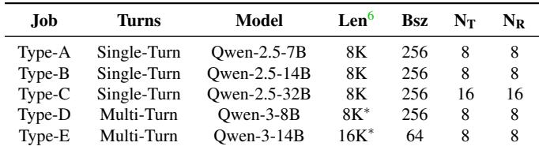  
Table 3: Experimental job configurations. NT and NR denote training and rollout GPUs.

T cycle, we simply stop and resubmit that job; Algorithm 1 re-places it through normal admission without disturbing the rest of the cluster. §6.6 shows static placement stays > 95% SLO attainment and within 1.11× the provisioning cost of an optimal yet unimplementable dynamic-regrouping baseline.

## 6 Evaluation

We evaluate WEAVE through five research questions. RQ1 (Co-Execution Mechanism): Can WEAVE co-execute job groups with diverse phase profiles (§6.2)? RQ2 (Performance Breakdown): How much do long-tail migration and topology-aware model sync each contribute to performance (§6.3)? RQ3 (Performance at Scale): What cluster utilization and provisioning cost does WEAVE achieve on a production workload trace (§6.4)? RQ4 (Scheduling Quality): How close to optimal is WEAVE’s scheduler (§6.5)? RQ5 (Robustness): How robust is WEAVE to phase profile drift and job failures (§6.6)?

## 6.1 Experimental Setup

Cluster Setup. Our testbed has two geo-distributed, heterogeneous clusters: the training cluster (Cluster-T) uses compute-optimized NVIDIA H800 GPUs, while the rollout cluster (Cluster-R) uses lower-cost H20 GPUs. Each cluster has a 400 Gbps InfiniBand fabric, but cross-cluster traffic traverses a bandwidth-constrained 20 Gbps Ethernet link. Table 1 lists hardware specifications and hourly costs; an H800 GPU is 2.85× more expensive than an H20 GPU.

Workloads. We construct workloads from production traces. For micro-benchmarks (§6.2–§6.3), we define a suite of five representative job types (Table 3) using Qwen [53] models (7B–32B) with varying batch sizes, sequence lengths, and rollout/training GPUs. They cover single-turn RLVR on DeepMath-103K [41] and multi-turn agentic reasoning on Math-Orz57K [23]. For at-scale evaluation (§6.4), we replay a two-week trace of 200 heterogeneous jobs with model sizes from 3B to 32B and datasets spanning mathematics [41], software engineering [33], games [8], and in-house tasks.

Baselines. We compare WEAVE against three baselines.

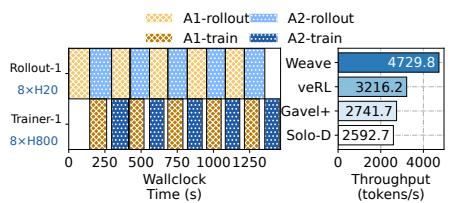  
(a) Temporal Mux (single-turn, Type-A×2).

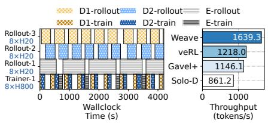  
(b) Train Mux (multi-turn, Type-D×2 + E).

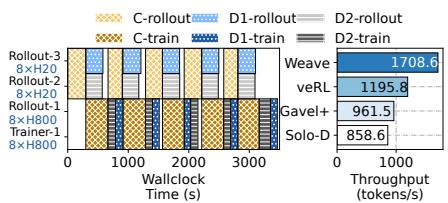  
(c) Spatial Mux (mixed, Type-C + D×2).  
Figure 10: Micro-benchmarking results. For each benchmark, the left panel is a Gantt chart showing the co-execution timeline; the right panel shows WEAVE achieves up to 1.99× higher training throughput under the same cluster provisioning cost.

• Solo Disaggregation (Solo-D): The standard disaggregation, where jobs run on dedicated rollout and training pools without time-multiplexing.

• Co-location (veRL [43]): The traditional monolithic approach, where all phases run on the high-performance training cluster (Cluster-T) using veRL. It avoids network bottlenecks but suffers from hardware mismatch.

• Gavel+ [31]: An enhanced version of the heterogeneityaware Gavel scheduler [31], modified to support RL posttraining. It optimizes resource allocation at the job level (calculating optimal GPU fractions) but lacks fine-grained control to interleave phase-level executions.

## 6.2 Micro-Benchmarks

We use three micro-benchmarks to show how WEAVE reclaims dependency bubbles (§4.3) and handles failures across multiplexing scenarios. Each benchmark compares training throughput against the baselines under the same per-hour cluster provisioning cost.

Temporal Multiplexing. First, we evaluate co-executing two jobs with similar structures (Type-A), an ideal case in which jobs are fully complementary. As shown in Figure 10a, WEAVE interleaves their execution and keeps both rollout and training clusters fully utilized. Consequently, WEAVE improves end-to-end training throughput by 1.82×, 1.73×, and 1.47× over Solo-D, Gavel+, and veRL, respectively, under the same cluster provisioning cost. Solo-D and Gavel+ leave one resource pool idle, while monolithic veRL underutilizes expensive H800 compute during memory-bound rollout.

Handling Rollout-Heavy Jobs. Next, we target rolloutheavy workloads by co-scheduling two Type-D jobs (T roll ≈ 2.5T trainD ) and one Type-E job (T rollE ≈ 6T trainE ). In this scenario, WEAVE scales the rollout pool to 24 H20 GPUs, dedicates one inference node to each rollout phase, and timemultiplexes a single H800 training node across training phases in round-robin order (Figure 10b). This schedule achieves 1.90×, 1.43×, and 1.35× higher throughput than Solo-D, Gavel+, and veRL under the same budgets. Solo-D performs poorly because prolonged rollouts leave expensive training nodes idle. WEAVE’s gains over Gavel+ and veRL are smaller than in (a) because the skewed rollout-heavy pattern leaves some bubbles unfilled (Figure 10b-left).

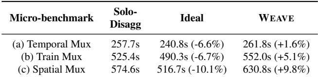  
Table 4: Micro-benchmark iteration time. WEAVE incurs at most 10% overhead over isolated execution; ‘Ideal’ is the performance ceiling when all phases run on H800 GPUs.

Spatial Multiplexing. Finally, we test heterogeneity by coscheduling one large Type-C job (requiring 16 × H20 + 16 × H800) with two smaller Type-D jobs (each requiring 8 × H20+16×H800). As shown in Figure 10c, WEAVE identifies idle resources created by the large job’s rollout phase and “packs” the two smaller jobs into these bubbles. This spatial packing maximizes aggregate utilization, delivering 1.99×, 1.78×, and 1.43× higher throughput than Solo-D, Gavel+, and veRL. Unlike the baselines, WEAVE can dynamically consolidate diverse jobs onto available capacity.

Interference Overhead. We quantify co-execution cost by measuring per-iteration slowdown from inter-job contention (Table 4). Because the inter-group scheduler prunes placements that would violate residency or SLOs (§4.2), WEAVE is only 1.6–9.8% overhead over solo execution. Even against an idealized co-location upper bound, where each job runs all phases on expensive H800 GPUs with zero network cost, WEAVE is only 8.0–18.1% slower. This confirms that our optimizations mask most context-switching and synchronization costs while excluding contention-prone placements.

## 6.3 Ablation Study

We next isolate the contribution of WEAVE’s runtime optimizations: long-tail migration and topology-aware model synchronization.

Long-Tail Migration. First, we evaluate whether request migration reclaims rollout bubbles without changing RL outcomes (§4.3). Figure 12-left shows that rollout generation lengths are heavy-tailed across model sizes and output lengths: a small fraction of straggler requests remains after most requests complete. Figure 12-right shows that migrating these tail requests to a small GPU subset reclaims the resulting “skewness bubbles.” WEAVE can then start the next job’s rollout on the freed GPUs, improving end-to-end throughput by 1.06×–1.28×. The gains are largest for longer output sequences (e.g., 14B-8k), where stragglers are more pronounced, and more modest when paired jobs have dissimilar phase durations (e.g., 7B-8k with 14B-8k), which already reduce contention on rollout nodes.

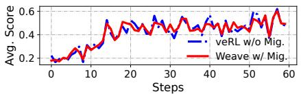  
(a) Qwen2.5-7B.

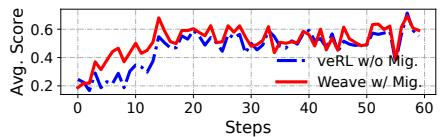  
(b) Qwen2.5-14B.

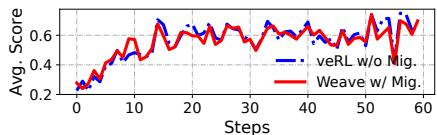  
(c) Qwen2.5-32B.  
Figure 11: Training reward scores for Qwen2.5-7B, 14B, and 32B under veRL without migration and WEAVE with migration.

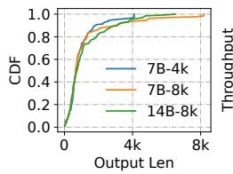

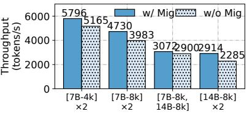  
Figure 12: Left: the long-tail distribution of LLM generation length in the rollout phase. Right: effectiveness of request migration in mitigating long-tail rollouts.

We also test whether migration changes the learning outcome. Figure 11 compares WEAVE with disaggregation and migration against a clean veRL baseline that runs on a monolithic H800 cluster without either mechanism, using Qwen-2.5 models at 7B, 14B, and 32B scales. For all three model sizes, WEAVE’s average per-step reward tracks veRL throughout training and stays within measurement noise. This is expected because WEAVE only migrates rollout requests between homogeneous GPUs (e.g., H20-to-H20), never across heterogeneous devices, avoiding hardware-induced variability. Thus, long-tail migration improves throughput without measurably degrading rollout reward or training convergence.

Topology-Aware Model Sync. Next, we evaluate topologyaware model synchronization in geo-disaggregated setups (§5.2). For a single-node update (8 H800s → 8 H20s), WEAVE is 7.87×–8.33× faster than veRL (Figure 13). The gain comes from sending one copy of the model parameters over the slow inter-cluster link and using local NVLink for the intra-cluster broadcast; veRL redundantly fetches independent copies for each rollout GPU. The benefit persists at multi-node scale: for 16 H800s → 16 H20s, WEAVE remains 2.62×–2.75× faster, showing that the protocol mitigates the bandwidth bottleneck introduced by disaggregation.

## 6.4 WEAVE at Scale

To evaluate WEAVE at production scale, we replay a two-week trace from one cluster tenant. The trace contains 200 heterogeneous RL post-training jobs using Qwen-family models, with both single- and multi-turn interactions across diverse datasets. Model sizes range from 3B to 32B, maximum response lengths range from 4k to 32k tokens (mean: 12.1k), and the mean job duration is 27.9 hours. We assign each job an SLO sampled uniformly from (1, 2) relative to its solo runtime, and compare WEAVE with industry-standard solo disaggregation (Solo-D), which uses 1:1 rollout and training GPUs, and the monolithic co-located baseline (veRL).

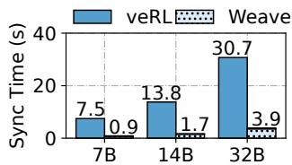  
8 → 8 GPUs

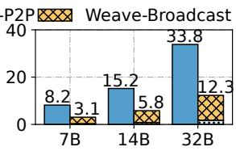  
16 → 16 GPUs  
Figure 13: Model synchronization time. Left: single-node transfer from 8 H800 to 8 H20 GPUs. Right: multi-node transfer from 16 H800 to 16 H20 GPUs. WEAVE’s topologyaware model sync is up to 8.33× faster than veRL [43].

WEAVE accommodates all jobs for \$510/hr (total: \$188.8k), reducing cluster provisioning cost by 1.84× over Solo-D and 1.38× over veRL while meeting all job SLOs (Figure 14a). The admission decisions also show where the savings come from: among the 200 job arrivals, 60.5% use direct packing to share both training and rollout resources with existing groups, 15% share training resources while scaling the rollout pool, and only 24.5% form new resource groups. Thus, Algorithm 1 usually absorbs arrivals into existing groups, minimizing the marginal provisioning cost of each job.

WEAVE improves resource efficiency by reducing dependency bubbles by 24.4% on the rollout cluster and 43.1% on the training cluster relative to solo disaggregation. The reduction is larger for training because production jobs are typically rollout-heavy, leaving more idle time on training GPUs (Figure 14b and Figure 14c). At peak, WEAVE uses only 152 H800 training GPUs, while both veRL and Solo-D requiring 328 H800s (2.16× more). For rollout, WEAVE uses 216 H20 GPUs at peak, a 1.52× reduction from the 328 H20s required by Solo-D. Although veRL avoids separate rollout GPUs, WEAVE remains 1.38× more cost-effective overall by offloading memory-bandwidth-bound rollouts to cheaper H20 GPUs and filling the resulting dependency bubbles through co-scheduling.

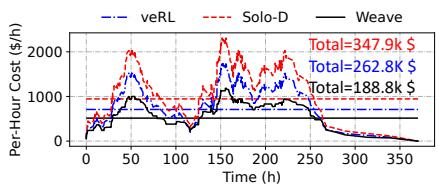  
(a) Cluster provisioning cost.

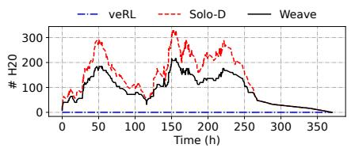  
(b) Number of rollout (H20) GPUs.

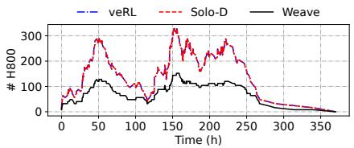  
(c) Number of training (H800) GPUs.

Figure 14: [Testbed] Cluster provisioning cost and GPU usage of WEAVE and baselines under real-world production workloads, where WEAVE reduces total provisioning cost by 1.38× and 1.84× compared to veRL and Solo-D, respectively.  
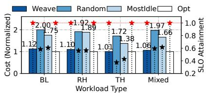  
(a) Sensitivity to workload types.

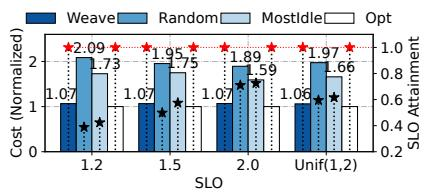  
(b) Sensitivity to job SLOs.

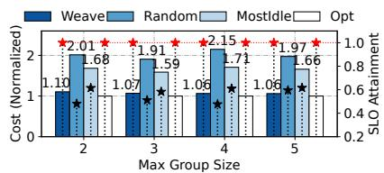  
(c) Sensitivity to group residency.  
Figure 15: [Simulation] Sensitivity analysis of WEAVE’s inter-group scheduler.

## 6.5 Scheduler Performance

We then evaluate the optimality and scalability of WEAVE’s inter-group scheduler (§4.2) via large-scale trace simulation.

Experimental Setup. We use job arrival patterns from a 300- job, 580-hour segment of the Microsoft Philly multi-tenant training cluster trace [26], the average job duration is 14.4 hours, and the longest is 142.9 hours. While the trace dictates arrival times and durations, we synthesize the job characteristics to model modern RL post-training workloads. As detailed in Table 6, we define three job profiles based on the ratio of rollout time (T ) to training time (T ). (1) Balanced (BL): Balanced Troll and Ttrain, representative of single-turn workloads like RLHF [32] or RLVR [41]; (2) Rollout-Heavy (RH): Troll ≫ Ttrain, modeling multi-turn workloads such as agentic reasoning [33]; and (3) Train-Heavy (TH): Ttrain ≫ Troll for evaluation completeness, but is rare in real-world RL training.

For each profile, we generate jobs of three sizes (Small, Medium, Large), resulting in nine distinct job configurations. We test each profile individually and also use a Mixed workload, which contains a uniform mix of all nine configurations, to simulate a realistic production environment.

Baselines. We compare WEAVE against following baselines: • Offline Optimal (Opt). Assigns arriving jobs to offline optimal placements found via a brute-force search over all possible groupings and placements–including job reordering and re-grouping that are infeasible in online deployments–and serves as a theoretical upper bound.

• Random. Assigns arriving jobs to a random group (or a new one) that can accommodate them. The job is placed on random rollout and train nodes within this group.

• Greedy (Most-Idle). Assigns arriving jobs to the group with the highest idle-time percentage. Within that group, it places the job on the most idle rollout and train nodes.

Sensitivity Analysis. To determine how sensitive the scheduler’s quality is to its key parameters, we vary a single parameter while all others are set to a default configuration7.

Impact of Workload Characteristics. Figure 15a shows that WEAVE’s near-optimal performance holds across all workload types. It consistently achieves 100% SLO attainment with a cost overhead of just 1.01×–1.12× relative to the optimal. In contrast, the baselines perform poorly across workloads, with Greedy slightly outperforming the Random strategy. The Random strategy’s cost is 1.72×–2.00× optimal with only 37–58% SLO attainment, while the Greedy scheduler is slightly better but still inadequate, reaching 1.38×–1.89× optimal cost for 42–61% SLO attainment.

Impact of Job SLOs. We vary the job SLO requirements, testing both uniform SLOs (all jobs set to 1.2, 1.5, or 2.0) and heterogeneous, job-specific SLOs drawn from Unif(1, 2). As shown in Figure 15b, WEAVE’s performance is highly stable against SLO tightness, always achieving 100% attainment with a consistent, near-optimal cost. Conversely, the baselines are highly sensitive to the SLO target and more expensive (1.59×–2.09× optimal). As the SLO target loosens from 1.2 to 2.0, the SLO attainment for Random and Greedy improves from 38%/43% to 71%/73%, respectively. This shows that while looser SLOs make it easier for naive heuristics to succeed by chance, they still fail to provide guarantees.

Impact of Group Residency. Since node memory capacity directly limits the group size, we evaluate its impact by varying the maximum allowed group size from 2 to 5. Figure 15c shows that performance is relatively insensitive to the maximum group size for all methods. Across all configurations, WEAVE consistently maintains the lowest cost and 100% SLO attainment, while the baselines remain significantly defective (only 48%–61% SLO attainment) and more expensive (1.59×–2.15× optimal). This suggests that even small group sizes (e.g., 2 or 3) provide sufficient packing flexibility for WEAVE to find efficient placements; larger groups do not bring improved performance or cost efficiency.

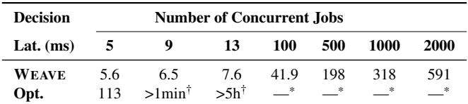  
† Represents latency exceeding 1 minute and 5 hours, respectively.

Scheduler Scalability and Latency. We evaluate WEAVE’s decision latency and scalability, with results presented in Table 5. WEAVE demonstrates near-linear scalability: its decision time is only 591 ms for 2,000 jobs, confirming that Algorithm 1 efficiently handles production-scale workloads. In stark contrast, the brute-force optimal solver exhibits exponential growth in latency, exceeding five hours for just 13 jobs–rendering it infeasible for any practical workload size.

## 6.6 Robustness to Drifts and Failures

We finally evaluate WEAVE’s robustness against workload drift, where a job’s rollout and training times change over its lifetime, and job failures.

Handling Workload Drift. We evaluate drift using the realworld trace from §6.4. To model long-term non-stationarity, we derive drift templates from production training traces across model sizes. Figure 16 shows representative 7B–32B examples; we omit the remaining model sizes for brevity. For each model family, we instantiate seven templates: no drift, increasing drift at 0.5×/1.0×/1.5×, and decreasing drift at 0.5×/1.0×/1.5×. The increasing 1.0× template is the observed training behavior; the other templates are scaled or mirrored versions of it. We evaluate three settings: Increasing, where each job samples from {no drift, increasing 0.5×, 1.0×, 1.5×}; Decreasing, defined analogously; and Mixed, where each job samples from all templates.

We compare WEAVE’s static placement against an optimal dynamic regrouping baseline that periodically recomputes placements for all active jobs. The baseline checks for global regrouping every hour and uses brute-force search to find the exact optimal grouping under the jobs’ current drifted profiles8. When regrouping changes a job’s placement, we charge the measured migration and restart cost, 197–419 s for 7B–32B jobs. We do not charge the solver time for brute-force regrouping, making the baseline stronger than any practical online implementation.

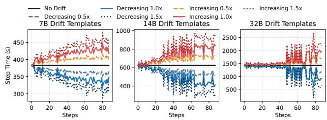  
Figure 16: Workload drift templates for 7/14/32B models.

Table 5: Decision latency (ms) vs. number of concurrent jobs. WEAVE scales well; Brute-force Opt’s latency grows exponentially and quickly becomes impractical.  
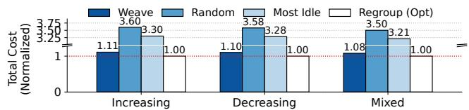  
Figure 17: Normalized cost under workload drifts.

Figure 17 shows that static WEAVE stays close to this optimal baseline. Relative to dynamic regrouping, static WEAVE incurs only 1.11×, 1.10×, and 1.08× higher provisioning cost under increasing, decreasing, and mixed drift, respectively, while maintaining 98.6%, 98.7%, and 95.6% SLO attainment. Drift-agnostic baselines perform much worse: Random incurs 3.50×–3.60× the regrouping cost, and Most-Idle incurs 3.21×–3.30×. Figure 18 explains why static placement is usually sufficient. Static WEAVE has only modestly lower rollout utilization than dynamic regrouping (at most 5.9%), but achieves higher training utilization in all settings: drift is driven mainly by rollout-length changes, so regrouping improves rollout-side balance while each restart pausing directly reduces training-side utilization.

These results clarify when WEAVE needs adjustment under drift. Online global regrouping is often unnecessary: in our 370.2-hour trace, it spends 32.9 hours on migration and restart alone, even before solving the regrouping problem. Each regrouping step also requires solving a global NP-hard repartitioning problem, making it difficult to deploy as a frequent online control loop. Dynamic regrouping is therefore useful only when drift is severe and persistent enough to amortize both restart and re-optimization costs. In practice, when one job drifts substantially, the simpler operational response is to stop and resubmit only that job with its updated profile; WEAVE then places it through normal admission without perturbing the rest of the cluster.

Handling Job Failures. Figure 19 shows failure handling in the Train Mux setting from Figure 10b. At t = 2180 s, we manually kill job E to emulate a failure. The other jobs in the group (D1 and D2) continue unaffected and keep their two-job interleaving pattern. At t = 4480 s, we recover and resubmit job E. WEAVE treats the recovered job as a new job: it reruns admission and placement, restores the last failed iteration from checkpoint, and resumes training. Depending on cluster state at recovery time, WEAVE may place the recovered job in a different co-execution group; in this run, it is placed back into the original group. After resubmission, the three jobs return to the original interleaving pattern and continue execution.

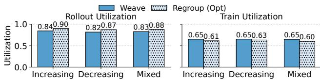  
Figure 18: Rollout and training cluster utilization for WEAVE and regrouping under workload drifts.

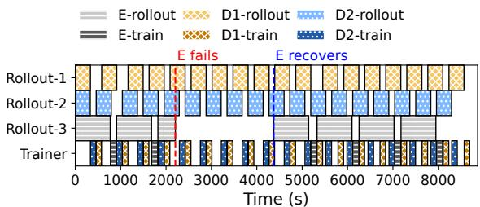  
Figure 19: WEAVE’s behavior under job failures.

## 7 Discussion and Related Work

Applicability. WEAVE applies to any RL training regime that exposes a structural dependency bubble between rollout and training, the idle window its inter-job scheduler is designed to reclaim. This condition holds for the standard on-policy algorithms, including PPO [39], GRPO [41], and DAPO [57]. It also holds for off-policy regimes that retain such a bubble, such as one-step off-policy training [61], where each training step still waits for a bounded rollout window to complete. The boundary of applicability is reached when this bubble disappears: fully asynchronous RL training (e.g., AReaL [11] and AsyncFlow [18]) overlaps rollout and training continuously, leaving no inter-job idle time for WEAVE to reclaim. Within its applicable regimes, WEAVE’s cluster-level orchestration is orthogonal to intra-job optimizations: parameter relocation [29], request-level tail batching [14], and speculative decoding [5,19,24,36] all act within a single job or phase and compose directly with WEAVE.

Deep Learning Workload Scheduling. Extensive research has focused on scheduling for general-purpose deep learning clusters. These works aim to improve fairness [16, 28, 50], GPU sharing efficiency [49, 51], heterogeneity awareness [31, 42], and job goodput [35, 59]. However, these systems universally treat the entire job as the atomic unit of scheduling and assume stable, predictable iteration times. WEAVE is the first phase-centric co-scheduling system for stochastic RL post-training jobs.

RL Post-Training Frameworks. Recent systems have focused on optimizing the performance of a single, individual RL post-training job. While early frameworks used static resource partitioning [22, 27, 55], subsequent work improved utilization via co-location [43], multi-controller designs [48], long-tail mitigation [14, 62], and asynchronous algorithms [11, 18, 61]. Different from these single-job optimizations, WEAVE addresses the complementary part by taking a global, cluster-level perspective, orchestrating multiple concurrent jobs via co-scheduling.

Disaggregated Systems. WEAVE builds on the principle of disaggregation, a concept explored in OS kernels [40] and serving systems [21, 34, 60]. The most direct parallel is the prefill-decode disaggregation in LLM inference [21, 34, 60]. Within this domain, recent serving systems have also explored efficient resource management, but all in a single-job scope [6, 10,20,63]. In contrast, WEAVE introduces the first scheduling framework specifically designed for multi-tenant clusters, a scenario not addressed by prior works.

## 8 Conclusion

This paper presents WEAVE, a multi-tenant cluster scheduler tailored for disaggregated RL post-training. WEAVE introduces a two-tier scheduling mechanism that near-optimally partitions RL jobs into co-execution groups and orchestrates their execution in a tightly-woven pattern. It effectively reduces dependency bubbles caused by disaggregation, thereby minimizing cluster provisioning costs. Extensive evaluation using real-world production traces demonstrates that WEAVE achieves up to 1.84× cost savings while maintaining 100% performance SLO attainment.

## Acknowledgment

We thank our shepherd and the anonymous reviewers for their invaluable comments that help improve the quality of this work. This work was supported in part by the HKUST-Alibaba Joint Laboratory on Big Data and AI, RGC CRF Grant (Ref. #C6015-23G), RGC GRF Grant (Ref. #16217124), and NS-FC/RGC CRS Grant (Ref. #CRS\_HKUST601/24).

## References

[1] Introducing openai o3 and o4-mini. https://openai. com/index/introducing-o3-and-o4-mini/, 2024.

[2] AIME 2024 Dataset, 2025.

[3] Qwq-32b: Embracing the power of reinforcement learning. https://qwenlm.github.io/blog/qwq-32b/, 2025.

[4] Jonathan Behrens, Sagar Jha, Ken Birman, and Edward Tremel. RDMC: A reliable RDMA multicast for large objects. In 48th Annual IEEE/IFIP International Conference on Dependable Systems and Networks, DSN 2018, Luxembourg City, Luxembourg, June 25-28, 2018, pages 71–82. IEEE Computer Society, 2018.

[5] Qiaoling Chen, Zijun Liu, Peng Sun, Shenggui Li, Guoteng Wang, Ziming Liu, Yonggang Wen, Siyuan Feng, and Tianwei Zhang. Respec: Towards optimizing speculative decoding in reinforcement learning systems. arXiv preprint arXiv:2510.26475, 2025.

[6] Weihao Cui, Yukang Chen, Han Zhao, Ziyi Xu, Quan Chen, Xusheng Chen, Yangjie Zhou, Shixuan Sun, and Minyi Guo. Optimizing slo-oriented llm serving with pd-multiplexing, 2025.

[7] DeepSeek-AI. Deepseek-r1: Incentivizing reasoning capability in llms via reinforcement learning. arXiv preprint arXiv:2501.12948, 2025.

[8] Farama Foundation. Gymnasium - frozenlake environment. https://gymnasium.farama.org/ environments/toy\_text/frozen\_lake/, 2024. Accessed: 2025-09.

[9] Jiazhan Feng, Shijue Huang, Xingwei Qu, Ge Zhang, Yujia Qin, Baoquan Zhong, Chengquan Jiang, Jinxin Chi, and Wanjun Zhong. Retool: Reinforcement learning for strategic tool use in llms. arXiv preprint arXiv:2504.11536, 2025.

[10] Jingqi Feng, Yukai Huang, Rui Zhang, Sicheng Liang, Ming Yan, and Jie Wu. Windserve: Efficient phasedisaggregated llm serving with stream-based dynamic scheduling. In Proceedings of the 52nd Annual International Symposium on Computer Architecture, pages 1283–1295, 2025.

[11] Wei Fu, Jiaxuan Gao, Xujie Shen, Chen Zhu, Zhiyu Mei, Chuyi He, Shusheng Xu, Guo Wei, Jun Mei, Jiashu Wang, et al. Areal: A large-scale asynchronous reinforcement learning system for language reasoning. arXiv preprint arXiv:2505.24298, 2025.

[12] Yao Fu, Leyang Xue, Yeqi Huang, Andrei-Octavian Brabete, Dmitrii Ustiugov, Yuvraj Patel, and Luo Mai. ServerlessLLM: Low-latency serverless inference for large language models. In USENIX OSDI), pages 135– 153, 2024.

[13] Prasanna Ganesan and Mukund Seshadri. On cooperative content distribution and the price of barter. In 25th International Conference on Distributed Computing Systems (ICDCS 2005), 6-10 June 2005, Columbus, OH, USA, pages 81–90. IEEE Computer Society, 2005.

[14] Wei Gao, Yuheng Zhao, Dakai An, Tianyuan Wu, Lunxi Cao, Shaopan Xiong, Ju Huang, Weixun Wang, Siran Yang, Wenbo Su, et al. Rollpacker: Mitigating long-tail rollouts for fast, synchronous rl post-training. arXiv preprint arXiv:2509.21009, 2025.

[15] Michael R Garey and David S Johnson. Computers and intractability, volume 29. wh freeman New York, 2002.

[16] Juncheng Gu, Mosharaf Chowdhury, Kang G Shin, Yibo Zhu, Myeongjae Jeon, Junjie Qian, Hongqiang Liu, and Chuanxiong Guo. Tiresias: A {GPU} cluster manager for distributed deep learning. In 16th USENIX Symposium on Networked Systems Design and Implementation (NSDI 19), pages 485–500, 2019.

[17] Shixiang Gu, Tim Lillicrap, Richard E. Turner, Zoubin Ghahramani, Bernhard Schölkopf, and Sergey Levine. Interpolated policy gradient: Merging on-policy and offpolicy gradient estimation for deep reinforcement learning. In Advances in Neural Information Processing Systems (NeurIPS), 2017.

[18] Zhenyu Han, Ansheng You, Haibo Wang, Kui Luo, Guang Yang, Wenqi Shi, Menglong Chen, Sicheng Zhang, Zeshun Lan, Chunshi Deng, et al. Asyncflow: An asynchronous streaming rl framework for efficient llm post-training. arXiv preprint arXiv:2507.01663, 2025.

[19] Jingkai He, Tianjian Li, Erhu Feng, Dong Du, Qian Liu, Tao Liu, Yubin Xia, and Haibo Chen. History rhymes: Accelerating llm reinforcement learning with rhymerl. arXiv preprint arXiv:2508.18588, 2025.

[20] Ke Hong, Lufang Chen, Zhong Wang, Xiuhong Li, Qiuli Mao, Jianping Ma, Chao Xiong, Guanyu Wu, Buhe Han, Guohao Dai, et al. semi-pd: Towards efficient llm serving via phase-wise disaggregated computation and unified storage. arXiv preprint arXiv:2504.19867, 2025.

[21] Cunchen Hu, Heyang Huang, Liangliang Xu, Xusheng Chen, Jiang Xu, Shuang Chen, Hao Feng, Chenxi Wang, Sa Wang, Yungang Bao, et al. Inference without interference: Disaggregate llm inference for mixed downstream workloads. arXiv preprint arXiv:2401.11181, 2024.

[22] Jian Hu, Xibin Wu, Wei Shen, Jason Klein Liu, Zilin Zhu, Weixun Wang, Songlin Jiang, Haoran Wang, Hao Chen, Bin Chen, et al. Openrlhf: An easy-to-use, scalable and high-performance rlhf framework. arXiv preprint arXiv:2405.11143, 2024.

[23] Jingcheng Hu, Yinmin Zhang, Qi Han, Daxin Jiang, Xiangyu Zhang, and Heung-Yeung Shum. Open-reasonerzero: An open source approach to scaling up reinforcement learning on the base model, 2025.

[24] Qinghao Hu, Shang Yang, Junxian Guo, Xiaozhe Yao, Yujun Lin, Yuxian Gu, Han Cai, Chuang Gan, Ana Klimovic, and Song Han. Taming the long-tail: Efficient reasoning rl training with adaptive drafter. arXiv preprint arXiv:2511.16665, 2025.

[25] Anant Singh Jain and Sheik Meeran. Deterministic job-shop scheduling: Past, present and future. European Journal of Operational Research, 113(2):390–434, 1999.

[26] Myeongjae Jeon, Shivaram Venkataraman, Amar Phanishayee, Junjie Qian, Wencong Xiao, and Fan Yang. Analysis of {Large-Scale}{Multi-Tenant}{GPU} clusters for {DNN} training workloads. In 2019 USENIX Annual Technical Conference (USENIX ATC 19), pages 947–960, 2019.

[27] Oleksii Kuchaiev, Jason Li, Huyen Nguyen, Oleksii Hrinchuk, Ryan Leary, Boris Ginsburg, Samuel Kriman, Stanislav Beliaev, Vitaly Lavrukhin, Jack Cook, et al. Nemo: a toolkit for building ai applications using neural modules. arXiv preprint arXiv:1909.09577, 2019.

[28] Kshiteej Mahajan, Arjun Balasubramanian, Arjun Singhvi, Shivaram Venkataraman, Aditya Akella, Amar Phanishayee, and Shuchi Chawla. Themis: Fair and efficient {GPU} cluster scheduling. In 17th USENIX Symposium on Networked Systems Design and Implementation (NSDI 20), pages 289–304, 2020.

[29] Zhiyu Mei, Wei Fu, Kaiwei Li, Guangju Wang, Huanchen Zhang, and Yi Wu. Real: Efficient rlhf training of large language models with parameter reallocation. arXiv preprint arXiv:2406.14088, 2024.

[30] Philipp Moritz, Robert Nishihara, Stephanie Wang, Alexey Tumanov, Richard Liaw, Eric Liang, Melih Elibol, Zongheng Yang, William Paul, Michael I Jordan, et al. Ray: A distributed framework for emerging {AI} applications. In 13th USENIX symposium on operating systems design and implementation (OSDI 18), pages 561–577, 2018.

[31] Deepak Narayanan, Keshav Santhanam, Fiodar Kazhamiaka, Amar Phanishayee, and Matei Zaharia. {Heterogeneity-Aware} cluster scheduling policies for deep learning workloads. In 14th USENIX Symposium on Operating Systems Design and Implementation (OSDI 20), pages 481–498, 2020.

[32] Long Ouyang, Jeffrey Wu, Xu Jiang, Diogo Almeida, Carroll Wainwright, Pamela Mishkin, Chong Zhang, Sandhini Agarwal, Katarina Slama, Alex Ray, et al. Training language models to follow instructions with human feedback. Advances in neural information processing systems, 35:27730–27744, 2022.

[33] Jiayi Pan, Xingyao Wang, Graham Neubig, Navdeep Jaitly, Heng Ji, Alane Suhr, and Yizhe Zhang. Training software engineering agents and verifiers with swe-gym, 2024.

[34] Pratyush Patel, Esha Choukse, Chaojie Zhang, Aashaka Shah, Íñigo Goiri, Saeed Maleki, and Ricardo Bianchini. Splitwise: Efficient generative llm inference using phase splitting. In 2024 ACM/IEEE 51st Annual International Symposium on Computer Architecture (ISCA), pages 118–132. IEEE, 2024.

[35] Aurick Qiao, Sang Keun Choe, Suhas Jayaram Subramanya, Willie Neiswanger, Qirong Ho, Hao Zhang, Gregory R Ganger, and Eric P Xing. Pollux: Co-adaptive cluster scheduling for goodput-optimized deep learning. In 15th {USENIX} Symposium on Operating Systems Design and Implementation ({OSDI} 21), 2021.

[36] Ruoyu Qin, Weiran He, Weixiao Huang, Yangkun Zhang, Yikai Zhao, Bo Pang, Xinran Xu, Yingdi Shan, Yongwei Wu, and Mingxing Zhang. Seer: Online context learning for fast synchronous llm reinforcement learning. arXiv preprint arXiv:2511.14617, 2025.

[37] Abhinav Rastogi, Albert Q Jiang, Andy Lo, Gabrielle Berrada, Guillaume Lample, Jason Rute, Joep Barmentlo, Karmesh Yadav, Kartik Khandelwal, Khyathi Raghavi Chandu, et al. Magistral. arXiv preprint arXiv:2506.10910, 2025.

[38] Salvatore Sanfilippo. Redis - the real-time data platform, 2009. Accessed: 2025-09-08.

[39] John Schulman, Filip Wolski, Prafulla Dhariwal, Alec Radford, and Oleg Klimov. Proximal policy optimization algorithms. arXiv preprint arXiv:1707.06347, 2017.

[40] Yizhou Shan, Yutong Huang, Yilun Chen, and Yiying Zhang. {LegoOS}: A disseminated, distributed {OS} for hardware resource disaggregation. In 13th USENIX Symposium on Operating Systems Design and Implementation (OSDI 18), pages 69–87, 2018.

[41] Zhihong Shao, Peiyi Wang, Qihao Zhu, Runxin Xu, Junxiao Song, Xiao Bi, Haowei Zhang, Mingchuan Zhang, YK Li, Yang Wu, et al. Deepseekmath: Pushing the limits of mathematical reasoning in open language models. arXiv preprint arXiv:2402.03300, 2024.

[42] Weihang Shen, Mingcong Han, Jialong Liu, Rong Chen, and Haibo Chen. {XSched}: Preemptive scheduling for diverse {XPUs}. In 19th USENIX Symposium on Operating Systems Design and Implementation (OSDI 25), pages 671–692, 2025.

[43] Guangming Sheng, Chi Zhang, Zilingfeng Ye, Xibin Wu, Wang Zhang, Ru Zhang, Yanghua Peng, Haibin Lin, and Chuan Wu. Hybridflow: A flexible and efficient rlhf framework. In Proceedings of the Twentieth European Conference on Computer Systems, pages 1279–1297, 2025.

[44] Mohammad Shoeybi, Mostofa Patwary, Raul Puri, Patrick LeGresley, Jared Casper, and Bryan Catanzaro. Megatron-lm: Training multi-billion parameter language models using model parallelism. arXiv preprint arXiv:1909.08053, 2019.

[45] ROLL Team. Reinforcement Learning Optimization for Large-Scale Learning: An Efficient and User-Friendly Scaling Library. arXiv preprint arXiv:2506.06122, 2025.

[46] Marcel Wagenländer, Guo Li, Bo Zhao, Luo Mai, and Peter Pietzuch. Tenplex: Dynamic parallelism for deep learning using parallelizable tensor collections. In Proceedings of the ACM SIGOPS 30th Symposium on Operating Systems Principles (SOSP ’24), 2024.

[47] Jinghui Wang, Shaojie Wang, Yinghan Cui, Xuxing Chen, Chao Wang, Xiaojiang Zhang, Minglei Zhang, Jiarong Zhang, Wenhao Zhuang, Yuchen Cao, et al. Seamlessflow: A trainer agent isolation rl framework achieving bubble-free pipelines via tag scheduling. arXiv preprint arXiv:2508.11553, 2025.

[48] Zhixin Wang, Tianyi Zhou, Liming Liu, Ao Li, Jiarui Hu, Dian Yang, Yinhui Lu, Jinlong Hou, Siyuan Feng, Yuan Cheng, et al. Distflow: A fully distributed rl framework for scalable and efficient llm post-training. arXiv preprint arXiv:2507.13833, 2025.

[49] Qizhen Weng, Lingyun Yang, Yinghao Yu, Wei Wang, Xiaochuan Tang, Guodong Yang, and Liping Zhang. Beware of fragmentation: Scheduling {GPU-Sharing} workloads with fragmentation gradient descent. In 2023 USENIX Annual Technical Conference (USENIX ATC 23), pages 995–1008, 2023.

[50] Wencong Xiao, Romil Bhardwaj, Ramachandran Ram jee, Muthian Sivathanu, Nipun Kwatra, Zhenhua Han, Pratyush Patel, Xuan Peng, Hanyu Zhao, Quanlu Zhang, et al. Gandiva: Introspective cluster scheduling for deep learning. In 13th USENIX Symposium on Operating Systems Design and Implementation (OSDI 18), pages 595–610, 2018.

[51] Wencong Xiao, Shiru Ren, Yong Li, Yang Zhang, Pengyang Hou, Zhi Li, Yihui Feng, Wei Lin, and Yangqing Jia. {AntMan}: Dynamic scaling on {GPU} clusters for deep learning. In 14th USENIX Sympo sium on Operating Systems Design and Implementation (OSDI 20), pages 533–548, 2020.

[52] Ran Yan, Youhe Jiang, Tianyuan Wu, Jiaxuan Gao, Zhiyu Mei, Wei Fu, Haohui Mai, Wei Wang, Yi Wu, and Binhang Yuan. AReaL-Hex: Accommodating asynchronous rl training over heterogeneous gpus. arXiv preprint arXiv:2511.00796, 2025.

[53] An Yang, Anfeng Li, Baosong Yang, Beichen Zhang, Binyuan Hui, Bo Zheng, Bowen Yu, Chang Gao, Chengen Huang, Chenxu Lv, Chujie Zheng, Dayiheng Liu, Fan Zhou, Fei Huang, Feng Hu, Hao Ge, Haoran Wei, Huan Lin, Jialong Tang, Jian Yang, Jianhong Tu, Jianwei Zhang, Jianxin Yang, Jiaxi Yang, Jing Zhou, Jingren Zhou, Junyang Lin, Kai Dang, Keqin Bao, Kexin Yang, Le Yu, Lianghao Deng, Mei Li, Mingfeng Xue, Mingze Li, Pei Zhang, Peng Wang, Qin Zhu, Rui Men, Ruize Gao, Shixuan Liu, Shuang Luo, Tianhao Li, Tianyi Tang, Wenbiao Yin, Xingzhang Ren, Xinyu Wang, Xinyu Zhang, Xuancheng Ren, Yang Fan, Yang Su, Yichang Zhang, Yinger Zhang, Yu Wan, Yuqiong Liu, Zekun Wang, Zeyu Cui, Zhenru Zhang, Zhipeng Zhou, and Zihan Qiu. Qwen3 technical report, 2025.

[54] Shunyu Yao, Howard Chen, John Yang, and Karthik Narasimhan. Webshop: Towards scalable real-world web interaction with grounded language agents. Advances in Neural Information Processing Systems, 35:20744–20757, 2022.

[55] Zhewei Yao, Reza Yazdani Aminabadi, Olatunji Ruwase, Samyam Rajbhandari, Xiaoxia Wu, Ammar Ahmad Awan, Jeff Rasley, Minjia Zhang, Conglong Li, Connor Holmes, et al. Deepspeed-chat: Easy, fast and affordable rlhf training of chatgpt-like models at all scales. arXiv preprint arXiv:2308.01320, 2023.

[56] Minchen Yu, Rui Yang, Chaobo Jia, Zhaoyuan Su, Sheng Yao, Tingfeng Lan, Yuchen Yang, Yue Cheng, Wei Wang, Ao Wang, et al. λScale: Enabling fast scaling for server less large language model inference. arXiv preprint arXiv:2502.09922, 2025.

[57] Qiying Yu, Zheng Zhang, Ruofei Zhu, Yufeng Yuan, Xiaochen Zuo, Yu Yue, Weinan Dai, Tiantian Fan, Gaohong Liu, Lingjun Liu, et al. Dapo: An open-source llm reinforcement learning system at scale. arXiv preprint arXiv:2503.14476, 2025.

[58] Dingyan Zhang, Haotian Wang, Yang Liu, Xingda Wei, Yizhou Shan, Rong Chen, and Haibo Chen. {BlitzScale}: Fast and live large model autoscaling with o (1) host caching. In 19th USENIX Symposium on Operating Systems Design and Implementation (OSDI 25), pages 275–293, 2025.

[59] Pengfei Zheng, Rui Pan, Tarannum Khan, Shivaram Venkataraman, and Aditya Akella. Shockwave: Fair and efficient cluster scheduling for dynamic adaptation in machine learning. In 20th USENIX Symposium on Networked Systems Design and Implementation (NSDI 23), pages 703–723, 2023.

[60] Yinmin Zhong, Shengyu Liu, Junda Chen, Jianbo Hu, Yibo Zhu, Xuanzhe Liu, Xin Jin, and Hao Zhang.

{DistServe}: Disaggregating prefill and decoding for goodput-optimized large language model serving. In 18th USENIX Symposium on Operating Systems Design and Implementation (OSDI 24), pages 193–210, 2024.

[61] Yinmin Zhong, Zili Zhang, Xiaoniu Song, Hanpeng Hu, Chao Jin, Bingyang Wu, Nuo Chen, Yukun Chen, Yu Zhou, Changyi Wan, et al. Streamrl: Scalable, heterogeneous, and elastic rl for llms with disaggregated stream generation. arXiv preprint arXiv:2504.15930, 2025.

[62] Yinmin Zhong, Zili Zhang, Bingyang Wu, Shengyu Liu, Yukun Chen, Changyi Wan, Hanpeng Hu, Lei Xia, Ranchen Ming, Yibo Zhu, et al. Optimizing rlhf training for large language models with stage fusion. arXiv preprint arXiv:2409.13221, 2024.

[63] Kan Zhu, Yufei Gao, Yilong Zhao, Liangyu Zhao, Gefei Zuo, Yile Gu, Dedong Xie, Tian Tang, Qinyu Xu, Zihao Ye, Keisuke Kamahori, Chien-Yu Lin, Ziren Wang, Stephanie Wang, Arvind Krishnamurthy, and Baris Kasikci. Nanoflow: Towards optimal large language model serving throughput, 2025.

[64] Ruidong Zhu, Ziheng Jiang, Chao Jin, Peng Wu, Cesar A. Stuardo, Dongyang Wang, Xinlei Zhang, Huaping Zhou, Haoran Wei, Yang Cheng, Jianzhe Xiao, Xinyi Zhang, Lingjun Liu, Haibin Lin, Li-Wen Chang, Jianxi Ye, Xiao Yu, Xuanzhe Liu, Xin Jin, and Xin Liu. Megascale-infer: Serving mixture-of-experts at scale with disaggregated expert parallelism, 2025.

[65] Yonghao Zhuang, Lianmin Zheng, Zhuohan Li, Eric Xing, Qirong Ho, Joseph Gonzalez, Ion Stoica, Hao Zhang, and Hexu Zhao. On optimizing the communication of model parallelism. Proceedings of Machine Learning and Systems, 5:526–540, 2023.

## Appendix

Proof of Meta-iteration Schedule’s Optimality. To show the utilization-optimality of the meta-iteration schedule for unsaturated groups, we first formally define the utilization of a group with meta-iteration time Tmeta, where its rollout (UR) and training utilization (UT ) are:

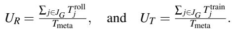

Since the meta-iteration schedule repeats, it suffices to analyze a single meta-iteration where every job’s rollout and training phase executes once. Recall that T cycle = maxj∈J T solo is the solo iteration time of the slowest job, and let j be the job attaining this maximum so that T cycleG = T rollj + T trainj . For simplicity, the following proof considers only one rollout node and one training node, while the optimality generalizes to multi-node settings. By the definition of a non-overloaded group, we have

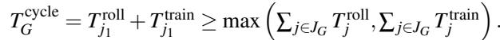

This directly implies that the total rollout work of all other jobs can fit within j1’s training phase, and vice-versa:

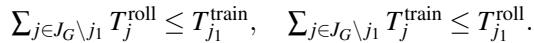

Consequently, job j ’s execution time decides the entire schedule’s cycle time, yielding the cycle time as T soloj .

Conversely, any schedule that repeats a job is sub-optimal for a non-overloaded group because it extends the metaiteration’s duration but adds proportionally less work, leading to a net decrease in resource utilization. We show this by trying to add a repetition of any job k to the meta-iteration schedule. Repeating job k adds work to both pools and necessarily prolongs the cycle time by at least T solok due to waiting for the longest j1, causing the new utilization U′ lower than the original U. We can bound the change in utilization, ∆U = U′ −U, as follows. The change for the rollout and the training pool, ∆UR and ∆UT , is bounded by:

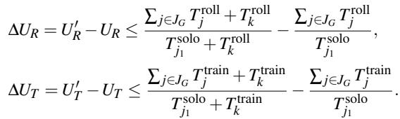

Therefore, the total change in utilization is

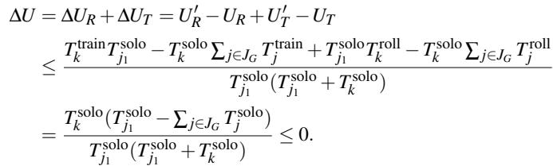

This proves that any repetition degrades overall utilization, making the round-robin schedule utilization-optimal for nonoverloaded groups.

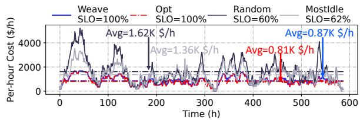  
Figure 20: [Simulation] Cost-effectiveness and SLO attainment under a realistic mixed workload. (Workload: mixed, SLO∼Unif(1,2), max group size=5).

Table 6: Job configurations used in the simulation. Each job is defined by its rollout time (T ) and train time (T ), which are drawn from different uniform distributions.  
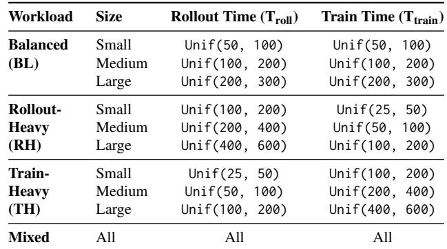

Workloads for Simulation. Table 6 details the job profiles used in § 6.5.

[Simulation] End-to-end Performance. This part reports the end-to-end performance of WEAVE’s scheduler under a realistic setting with Mixed workloads with heterogeneous job SLOs. As illustrated in Figure 20, WEAVE, achieves 100% SLO attainment by design, matching the theoretical Offline Optimal scheduler. In contrast, the heuristic-based baselines struggle significantly: the Random and Greedy (Most-Idle) schedulers meet the SLOs for only 60% and 62% of jobs, respectively. This is because WEAVE’s cost-based optimization (§ 4.3) explicitly prunes any placements that would violate a job’s SLO by assigning it an infinite cost.

In terms of resource efficiency, the average cost of WEAVE is at 0.87K \$/h, only 1.06× higher than the Offline Optimal. In contrast, the baselines are far more expensive. The Random and Greedy strategies incur average costs of 1.62K and 1.36K \$/h, respectively (1.97× and 1.66× of optimal). This high cost is driven by their sub-optimal group partitioning, where their costs spike to over 5K \$/h by scaling out to 1400 GPUs. WEAVE, however, manages load with a peak cost of only ∼1.8K \$/h, requiring at most 504 GPUs, demonstrating its effectiveness at identifying SLO-aware, cost-efficient placements in a complex, online setting.