USENIX

THE ADVANCED COMPUTING SYSTEMS ASSOCIATION

# Pluto: High-Performance, Memory-Efficient Distributed Graph Analytics Through Advanced Mirroring

Ying-Wei Wu, The University of Texas at Austin; Christopher J. Rossbach, The University of Texas at Austin and Microsoft; Mattan Erez, The University of Texas at Austin

https://www.usenix.org/conference/osdi26/presentation/wu-ying-wei

# This paper is included in the Proceedings of the 20th USENIX Symposium on Operating Systems Design and Implementation.

July 13–15, 2026 • Seattle, WA, USA

ISBN 978-1-939133-55-7

Open access to the Proceedings of the 20th USENIX Symposium on Operating Systems Design and Implementation is sponsored by

# Pluto: High-Performance, Memory-Efficient Distributed Graph Analytics Through Advanced Mirroring

Ying-Wei Wu University of Texas at Austin

Christopher J. Rossbach University of Texas at Austin Microsoft

Mattan Erez University of Texas at Austin

## Abstract

Inter-host communication poses a significant performance bottleneck in distributed graph analytics due to synchronization overheads. To mitigate this, state-of-the-art systems typically employ the full mirroring technique to replicate all potentially needed remote data and adopt a bulk-synchronous parallel execution model for coarse-grained communication. While effective for reducing network traffic, these approaches substantially increase memory footprint and constrain system parallelism. This paper introduces Pluto, a memory-efficient distributed graph analytics system based on two advanced mirroring designs: static partial mirroring and a mirror-free architecture. Nonproductive data duplication is avoided to reduce memory usage, while the work migration mechanism allows communication-computation overlap for performance improvement. For homogeneous graphs, Pluto achieves up to 3.8× speedup (harmonic mean 1.75×) compared to a full mirroring baseline and delivers up to 12× speedup (harmonic mean 1.75×) over existing open-source systems. For labeled property graphs, Pluto achieves up to 2.6× speedup (harmonic mean 1.37×) and lowers the minimum host requirement to 50%–90% of the baseline.

## 1 Introduction

The widespread adoption of social media and search engines has driven significant interest in graph-based analysis of social networks and web crawls. These datasets are massive, often ranging from terabytes to petabytes, making single-node storage and processing impractical. As a result, distributed frameworks are developed to partition graphs across clusters of nodes and execute in parallel.

A fundamental challenge in distributed systems is internode communication, which is frequently constrained by network latency and limited interconnect bandwidth. To mitigate communication costs, state-of-the-art systems [11, 14, 19, 20, 48] commonly combine the mirroring approach with bulksynchronous parallel (BSP) execution. Mirroring replicates remote data to reduce communication during execution, and the BSP model combines multiple updates for coarse-grained synchronization.

While mirroring reduces communication volume, it increases memory usage. Given historically abundant memory, the prevailing practice has been to replicate all potentially required remote data, an approach we call full mirroring. However, with the slowing of Moore’s law [33] and memory capacity scaling lagging behind data growth [6], optimizing solely for performance is no longer a sustainable solution as memory becomes the limiting resource. In our study, full mirroring incurs up to 4× memory overhead and can be even larger on highly connected graphs, questioning the long-term viability of this conventional dogma under emerging trends.

We address this challenge through two advanced mirroring designs: static partial mirroring and a mirror-free architecture. Static partial mirroring leverages mirror heterogeneity, the observation that not all data replication contribute productively to execution. By identifying and eliminating the nonproductive duplications, the memory usage is reduced while maintaining or even improving performance. The mirror-free architecture targets algorithmic variants that operate efficiently without any mirroring, and thus completely removes the memory overhead of data duplication. Together, the two designs cover a broad range of common graph applications.

Building on these ideas, we present Pluto, a memoryefficient distributed graph analytics system. By lowering memory requirements, Pluto enables the same applications to run on fewer nodes. In addition, Pluto migrates work to the nodes that hold the relevant data while continuing local computation, overlapping communication with computation to hide network latency and improve performance.

This work makes the following contributions:

• We identify mirror heterogeneity and propose a static partial mirroring approach that detects and avoids nonproductive data replication.

• We analyze algorithmic variants that operate efficiently without remote data replicas and design a mirror-free architecture to remove duplication overhead entirely.

• We introduce an on-demand work migration mechanism that initiates network transfers early and overlaps communication with computation, amortizing communication costs.

• We implement these techniques on top of D-Galois [14] to build Pluto, a high-performance and memory-efficient distributed graph analytics system. Across large-scale homogeneous graphs and standard benchmarks, Pluto outperforms state-of-the-art systems by up to 12× (harmonic mean 2.5×) and delivers 3.8× speedup (harmonic mean 1.75×) over our own full mirroring baseline. For labeled property graphs, Pluto achieves up to 2.6× speedup (harmonic mean 1.37×) while enabling the same graphs to be stored on only 50%–90% of the hosts required by existing systems.

## 2 Background

## 2.1 Graph Data

A basic graph is defined as G = (V,E), where V is a set of vertices and E is a set of edges. This topology-only representation, often called a plain or homogeneous graph, is widely used in academic research for algorithmic studies that focus on geometry.

The labeled property graph (LPG) [4], which is the most dominant data model in modern graph databases [1, 24, 31, 34, 42], augments G by associating labels and properties with both vertices and edges. Labels classify graph elements into meaningful categories, and properties attach attributes with arbitrary data structures to each element. This combination of flexibility and expressiveness allows the LPG model to represent real-world domains in a rich and intuitive manner.

## 2.2 Graph Analytics

This work focuses on graph analytics, a class of algorithms that analyzes the topology of graph-structured data to uncover patterns and insights.

## 2.2.1 Programming Models

Most graph analytics systems [11, 14, 19, 20, 28, 48] adopt a vertex-centric model: each vertex maintains a state, and each algorithm defines a local computational rule to update the vertex state with connecting edges and immediate (one hop) neighbor values. An alternative line of work [2, 7, 8, 32] operates on the adjacency matrix representation of graphs through linear algebra. Hochan et al. report that the vertexcentric paradigm outperforms the linear-algebra-based approach across a range of graph analytics workloads [26]. Accordingly, all five benchmarks in our evaluation are implemented using the vertex-centric model.

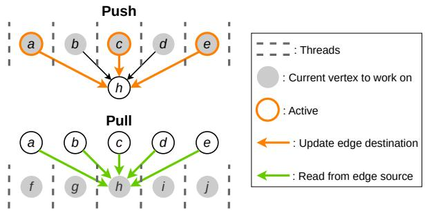  
Figure 1: The push and pull update models.

## 2.2.2 Update Models

Fig. 1 illustrates the two primary update models used in vertexcentric programs: push and pull. In the push model, a vertex becomes active when its own state satisfies conditions specified by the algorithm and then propagates updates along outgoing edges to destinations. In the pull model, a vertex collects values from all sources of incoming edges and jointly decides whether to update its own state. Execution proceeds iteratively according to the chosen model until the graph reaches a global quiescent state with no further updates.

The push model only touches outgoing edges of active vertices, but the pull model scans incoming neighbors of all vertices uniformly. In multithreaded execution, push requires atomic operations at edge destinations because multiple threads may concurrently update the same vertex, whereas pull aggregates incoming neighbor values for a vertex sequentially and applies the corresponding update within a single thread. Overall, push can reduce memory operations when the number of active vertices is small, while pull can avoid contention and benefit from contiguous reads when memory activity is dense. The optimal choice typically depends on the sparsity of active vertices.

Typical graph analytics systems employ a fixed update model for the duration of execution. Ligra [39] and Gemini [48] implement hybrid strategies that adaptively switch between push and pull based on the active vertex set size per round. However, a practical implication is the memory overhead: supporting both directions efficiently requires main taining outgoing and incoming edges simultaneously, which doubles the edge list storage.

## 2.3 Distributed Graph Processing

## 2.3.1 Graph Partitioning

The first step in distributed graph processing is to partition the graph across hosts. We follow conventions by using the term “host” to refer to each compute node and retain this terminology throughout the paper. A wealth of partitioning schemes has been proposed and are categorized into edgecuts [23,29,30,40,41,43], vertex-cuts [35,46], and 2D-cuts [5, 17, 18]. Evaluations in prior work [18, 21] show that no single scheme is universally optimal due to diverse graph topologies and application requirements. This paper thus focuses on the widely used outgoing edge-cut (OEC) policy.

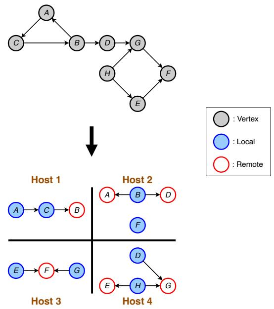  
Figure 2: Example of outgoing edge-cut partitioning.

In OEC, each vertex is first assigned to a host based on a predetermined mapping, often a simple hash function. All outgoing edges of a vertex are then co-located with it on the same host. As illustrated in Fig. 2, many local edges will naturally point to remote vertices. Unlike vertex-cuts or 2Dcuts, which may split a single vertex across multiple hosts, edge-cuts maintain single ownership per vertex. This avoids ambiguity for reads and writes to remote edge endpoints, providing reproducible behavior and consistent performance across independent runs.

## 2.3.2 Full Mirroring

Direct execution on partitioned graphs frequently incurs remote reads and writes, which are expensive under high network latency and limited interconnect bandwidth. Modern distributed graph analytics systems [11, 14, 19, 20, 48] miti gate this with the mirroring technique, which replaces remote communication with local memory accesses. Each host allocates memory to replicate the vertex properties of remote edge destinations, allowing edges to read and update locally. These local replicas are commonly known as mirrors or mirror nodes, while the originally designated vertices are called masters or master nodes. To maximize communication reduction, the dogma has been to replicate all potentially required remote vertex data. We refer to this approach as full mirroring, which is illustrated in Fig. 3a.

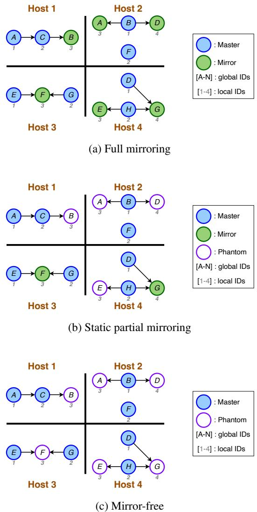  
Figure 3: Example of different mirroring techniques.

## 2.3.3 Bulk-Synchronous Parallel

As computation proceeds, replicated mirror properties may become stale and diverge from their true values. Synchronization between mirrors and masters is required, and therefore the bulk-synchronous parallel (BSP) model [44] is commonly employed with full mirroring. Program execution is organized into rounds, and the BSP model further divides each round into two distinct phases:

• Computation: each host operates on its local partition using potentially stale mirror values, while multiple updates targeting the same mirror are combined.

• Communication: the accumulated mirror updates are sent to masters for reduction, and then reduced values are broadcast back to mirrors, restoring consistency before the next round.

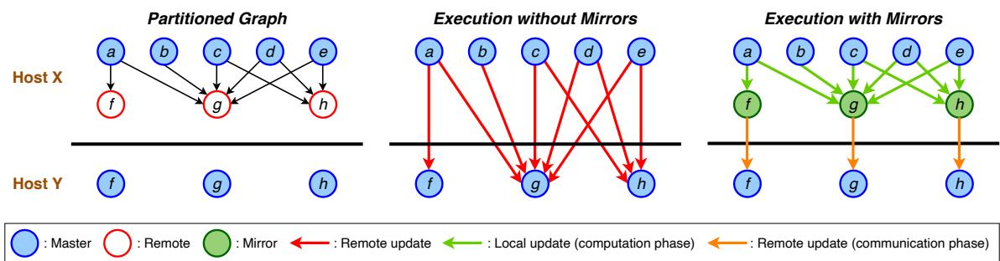  
Figure 4: Example of mirror heterogeneity.

This approach enables coarse-grained synchronization, minimizing network traffic while maintaining correctness.

## 2.3.4 Identifiers

Each vertex in the input graph is assigned a unique identifier to ensure distinction across the distributed system. These identifiers, referred to as global IDs, are recognized on all hosts and serve as the standard means of addressing vertices during inter-host communication. However, global IDs are often sparse, non-consecutive, and may require large data types due to their wide address space.

Under full mirroring, every master and mirror on a host maintains a piece of local memory. To optimize memory utilization, vertex data is laid out in a contiguous block using a compressed sparse row (CSR) representation. Within this structure, each vertex is assigned an offset into the local memory chunk, known as the local ID. Local IDs are host-specific and can be reused across hosts without conflict. Their com pact and dense nature enables more efficient indexing than sparse global IDs, making them well suited for use during the computation phase.

## 3 Advanced Mirroring Design

We present two advanced mirroring designs that reduce memory overhead while preserving high performance under OEC: static partial mirroring and mirror-free. This section details their rationale and the supporting Pluto mechanisms.

## 3.1 Push Model

## 3.1.1 Mirror Heterogeneity

In the push model, each outgoing edge represents a potential update to a destination vertex. A mirror replicates the remote destination’s properties so that updates along local edges are applied without immediate remote accesses during computation. A fixed synchronization cost is then paid during communication to propagate the accumulated local changes to the master. This reduces inter-host communication volume, alleviating network bottlenecks in distributed frameworks and thereby improving performance.

Fig. 4 illustrates the key insight of mirror heterogeneity: not all mirrors contribute equally to reducing remote communication. Each incoming edge to a mirrored destination corresponds to a potential conversion of a remote update into a local one, so the benefit generally increases with higher incoming degree. In practice, the access patterns also matter because workloads that activate only a limited subset of the graph may leave even high-degree destinations inactive. Critically, mirrors with only one incoming edge (e.g., mirror f ) replace one remote update with one local update plus one remote synchronization, adding local work without reducing network traffic. Since the number of updates increases without any communication saving, these mirrors are considered nonproductive. Fig. 5 quantifies the fraction of nonproductive mirrors across our datasets; the tall bars highlight the importance of addressing mirror heterogeneity in system design.

## 3.1.2 Static Partial Mirroring

Static partial mirroring leverages mirror heterogeneity by removing nonproductive mirrors. After partitioning, candidates with a single incoming edge are identified statically and no mirror storage is allocated for them. These remote destinations without local replicas are referred to as phantoms or phantom nodes. Fig. 3b illustrates this approach: on host 4, vertex G has two incoming edges and is mirrored, whereas vertex E has a single incoming edge and is treated as a phantom. By excluding phantoms from data replication, static partial mirroring reduces memory usage and avoids unnecessary overhead while retaining the performance benefits for productive mirrors.

## 3.2 Pull Model

## 3.2.1 Mirror-Free Architecture

In the pull model, each thread pivots on one vertex at a time and sequentially reads all incoming edges. Source values are combined in a temporary accumulator, and the pivot’s state is updated once with the accumulated result. If the pivot is a mirror, execution performs a local update during computation and later issues a remote update to the master during communication. Without the mirror, only a single remote update is issued, indicating that mirrors provide no benefit and introduce extra local work. Under OEC, outgoing edges reside with their masters on the same host, so all edge sources are masters and mirror values are never read in the pull scenario. As a result, removing mirrors completely eliminates local update overhead without increasing remote reads, which motivates the proposed mirror-free design (Fig. 3c).

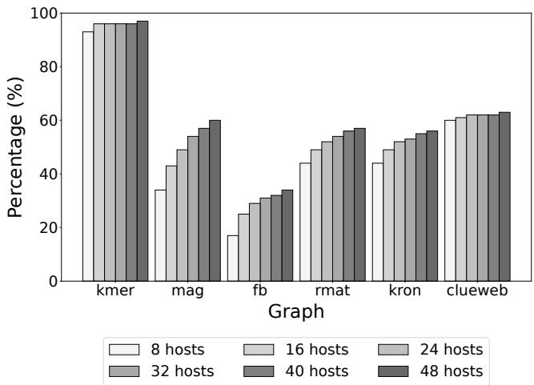  
Figure 5: Fraction of nonproductive mirrors.

## 3.2.2 Vertex Traversal Order

The mirror-free architecture enforces a fixed vertex traversal order that processes all masters before any phantoms in each round. This deterministic ordering allows each thread to implicitly detect the transition and switch modes exactly once: it writes updates locally while visiting masters, and then sends remote update requests while visiting phantoms. In contrast, static partial mirroring pushes updates to edge destinations that may be masters, mirrors, or phantoms. Because these destination types differ in how updates are applied, explicit vertex-type checks are required to select the appropriate interface, adding computational overhead.

## 3.3 Inter-Host Communication

## 3.3.1 Work Migration

Since phantoms do not maintain replicated data, any computation that involves a phantom requires a remote data fetch and may be followed by a remote update. This pattern substantially increases communication overhead because it introduces two-way traffic with request and response messages.

To mitigate this, we introduce a work migration mechanism in which computation associated with phantoms is relocated to the owner host where the data resides [37]. This design converts bidirectional request–response exchanges into unidirectional work messages, avoiding the performance penalties of conventional remote data fetches.

In both advanced mirroring designs, only a single update and thus a single work message is associated with each phantom. All phantoms have exactly one incoming edge in static partial mirroring, while local contributions are combined in temporary accumulators before being sent in the mirror-free architecture. As a result, work migration does not introduce additional payload, and the total communication volume remains unchanged compared to full mirroring.

## 3.3.2 Communication-Computation Overlap

Pluto dispatches work migration messages on demand, effectively shifting part of the communication activity into the computation phase. To preserve BSP semantics, updates originating from remote hosts can only become visible to local masters after the current computation round completes. Therefore, only the network transmission is overlapped with computation, while the migrated work itself is deferred until the subsequent communication phase. By initiating communication earlier and spreading it over a longer interval, Pluto reduces instantaneous pressure on the interconnect bandwidth. Otherwise idle network resources are used for message dispatch and reception during computation, shortening the communication phase without extending computation time. Overall, this overlap between communication and computation allows Pluto to deliver lower end-to-end execution time over fully mirrored systems.

## 3.3.3 Address Translation

Given that all participating hosts execute the same program in a distributed system, synchronizing between masters and mirrors requires only a vertex identifier and the corresponding update. To ensure consistent interpretation across hosts, the vertex ID must be globally unique. As such, the sender translates its local ID to a global ID before transmission, while the receiver performs a global-to-local ID lookup upon message arrival. These translations can introduce non-negligible overhead.

D-Galois [14] reduces this overhead via memoization of address translation. Under BSP, synchronization between masters and mirrors occurs only during the communication phase, and all updates from a given sender to a given receiver are aggregated into a single message to improve communication efficiency. The aggregation order is fixed for each host pair, and both sender and receiver maintain an array that records the corresponding local vertex IDs in this order. This arrange ment allows communication without attaching global vertex

IDs, since local IDs can be recovered by indexing the array sequentially, avoiding translation table lookups.

However, this technique does not apply to phantoms in Pluto because work migration messages are dispatched on demand during the computation phase, and their order can vary from round to round. To alleviate the high translation overhead, hosts exchange the local IDs corresponding to the masters of phantom nodes. The sender can then translate its local ID into the target host’s local ID before constructing the message, allowing the receiver to bypass the global-to-local lookup and use the local ID contained in the message directly.

## 3.4 Dirty Phantom Identification

Full mirroring systems synchronize only dirty mirrors to minimize network traffic and achieve high performance. When a mirror receives an update, the new value is compared with the stored value to decide whether the mirror should be modified and flagged as dirty. In advanced mirroring, phantoms do not maintain persistent states, so this comparison-based flagging cannot be applied directly. Although temporary accumulators are used during computation, their contents are discarded between rounds.

In the push model, this limitation is resolved naturally because only active masters propagate updates through outgoing edges. Under static partial mirroring, each phantom has exactly one incoming edge and derives its state entirely from that source. Whenever the source master changes value and pushes an update, the destination phantom is inherently dirty and immediately migrates the associated computation to the remote owner host. No additional state is required on the phantom to determine whether the migration is necessary.

The pull model is more challenging because phantom nodes in the mirror-free architecture may receive inputs from multiple masters and must combine them. Fig. 6 shows an example where a phantom computes the minimum among its incoming masters, as in algorithms like Connected Components or Breadth-First Search. If the resulting minimum remains unchanged across consecutive rounds, the ideal behavior is to synchronize it only once, since resending the same value does not advance the global reduction. However, the lack of a replicated value prevents a phantom from directly comparing the current minimum with the previous one.

To address this, Pluto introduces an alternative mechanism to identify dirty phantoms without storing full replicas. At the beginning of each communication phase, all vertices reset a dirty bit before any remote work is applied. These bits are then set whenever a vertex’s value changes, whether during the processing of migrated work or during the subsequent computation phase. A phantom transmits its temporary accumulator value for reduction only if the source vertex that currently determines this accumulated value is marked dirty. Since the update function is deterministic, unchanged inputs imply an unchanged output. By tracking which inputs have changed since the last round, Pluto can infer when a phantom’s output will change, regardless of the specific update operator (e.g., minimum, maximum, sum, logical operations). This design allows the identification of necessary synchronization targets while avoiding the storage overhead associated with maintaining replicated mirror states.

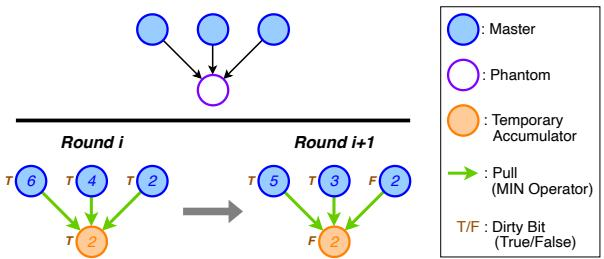  
Figure 6: Example of dirty phantom identification.

## 3.5 Backward Data Dependence

Most graph analytics applications perform only forward passes, where a destination vertex depends on the values of its sources along incoming edges. Some algorithms, most notably Betweenness Centrality, also require a backward pass, in which a source vertex is updated based on its outgoing edge destinations. In these cases, the absence of local state at phantom nodes becomes problematic because outgoing edges are co-located with their source vertices, but the computation depends on destination properties that are not replicated locally.

To support such workloads, Pluto falls back to full mirroring for the backward pass. In the current implementation, this transition is triggered on demand immediately before the backward phase begins. At that point, Pluto reinstates data replication for all phantom nodes by allocating the necessary memory and broadcasting the corresponding values from their masters. This mechanism allows Pluto to remain applicable to the full range of graph analytics benchmarks while still preserving the benefits of advanced mirroring on forward-only workloads. In our benchmarks, only Betweenness Centrality performs a backward pass and transitions exactly once from forward to backward, making this on-demand reinstatement of mirroring both practical and efficient.

## 3.6 Application Programming Interface (API)

Pluto follows the D-Galois parallel programming abstractions and supports a vertex-centric programming model. Fig. 7 shows push and pull implementations of Breadth-First Search using Pluto APIs.

During the computation phase, doAll distributes the specified node set across worker threads and invokes the given function on each node in parallel. In the push version, outgoing edges are traversed and isPhantom checks whether the destination is a phantom. Computation associated with phantoms is migrated to the owner host via sendWork, while masters and mirrors are updated atomically using atomicMin.

In the pull version, masters are processed first using the non-atomic min operation, and dirty bits in bitset\_dist are set to support dirty phantom identification. Phantoms then accumulate updates from incoming edges, track the source that determines the current value, and issue sendWork only when the contributing source is marked dirty.

After local computation finishes, the system enters the communication phase. Migrated work received from remote hosts is applied via applyRemoteWork, and syncMirror synchronizes remaining mirrors with their corresponding masters.

## 3.7 Memory Overhead

Prior work introduced the replication factor [14] to quantify the memory overhead of mirroring. Defined as the average number of mirrors per master, this metric captures vertex-level duplication but does not account for edges or metadata used during program execution. To directly reflect total memory usage, we propose the aggregated memory footprint (AMF). As shown in (1), AMF includes both graph storage MG and peak buffer usage Mbu f , providing a more comprehensive measure of memory impact across different mirroring strategies.

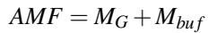

(1)

Pluto stores graphs in CSR format, which requires memory for vertex data MV \_data, edge data ME\_data, the edge list array ME\_dest , and the index array ME\_index. Outgoing edges of the same vertex are grouped together, with their destinations stored sequentially in the edge list array, while the index array records the position of the last outgoing edge for each vertex. These components are given in (2), where Dvertex and Dedge denote the property data size per vertex and edge in the LPG model, Dvertex\_id and Dindex are the sizes of the data types for vertex identifiers and edge list array indices, and Nmaster, Nmirror, and Nedge are the total numbers of masters, mirrors, and edges in the graph.

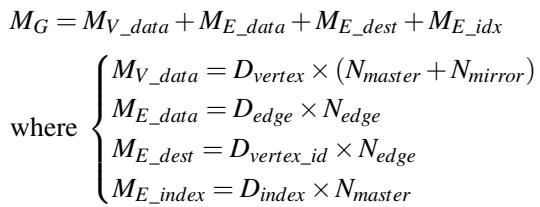

(2)

Peak buffer usage is further decomposed into buffers for mirror synchronization Msync\_bu f and buffers for work migration Mwork\_bu f . The size of Msync\_bu f is determined once the graph is partitioned, while Mwork\_bu f is obtained from runtime measurements:

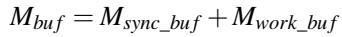

(3)

void BFS () {   
doAll ( active\_nodes , push );   
applyRemoteWork () ;   
syncMirror () ;   
}   
void push (Node src ) {   
NodeData& src\_dist = getData ( src );   
for (Edge edge : outEdges ( src )) {   
Node dst = getEdgeDst ( edge );   
if ( isPhantom ( dst )) {   
sendWork (dst , src\_dist +1) ;   
} else {   
NodeData& dst\_dist = getData ( dst );   
atomicMin ( dst\_dist , snode\_dist +1) ;   
}   
}   
(a) Push version   
void BFS () {   
doAll ( all\_masters , pullMaster );   
doAll ( all\_phantoms , pullPhantom );   
bitset\_dist . reset () ;   
applyRemoteWork () ;   
}   
void pullMaster (Node dst ) {   
NodeData& dst\_dist = getData ( dst );   
for (Edge edge : inEdges ( dst )) {   
Node src = getEdgeSrc ( edge );   
NodeData& src\_dist = getData ( src );   
bool update = min ( dst\_dist , src\_dist +1) ;   
if ( update ) {   
bitset\_dist . set ( dst );   
}   
}   
}   
void pullPhantom (Node dst ) {   
NodeData dst\_dist = UINT32\_MAX;   
bool send = false;   
for (auto edge : inEdges ( dst )) {   
Node src = getEdgeSrc ( edge );   
NodeData& src\_dist = getData ( src );   
if ( src\_dist +1 < dst\_dist ) {   
dst\_dist = src\_dist +1;   
send = bitset\_dist . test ( src );   
}   
}   
if ( send ) {   
sendWork (dst , dst\_dist );   
}  
Figure 7: Examples of Breadth-First Search in Pluto.

## 4 Implementation

Pluto is implemented on top of the D-Galois GitHub repository forked in May 2023 [13]. Implemented in C++, the integration of both advanced mirroring designs required approximately 4000 lines of code. Key implementation details are summarized below.

Communication Substrate. Inherited from D-Galois, Pluto leverages Gluon [14] as its communication substrate and uses MPI for message transport across the network. To ensure for ward progress, it utilizes asynchronous MPI primitives so that multiple outstanding requests can be in flight concurrently, and the MPI handles are reclaimed once the corresponding non-blocking operations complete. Additionally, Pluto limits the number of active MPI tags in each phase of execution to improve the efficiency of message probing and handling.

Communication Isolation. Each host employs a dedicated communication thread responsible for sending and receiving messages. This thread is pinned to the core physically closest to the NIC, as specified by the system architecture, to reduce latency and improve inter-host communication efficiency. All worker threads are likewise pinned to other individual cores, and Pluto enforces a hard limit on the total number of threads to avoid oversubscription and the associated context-switching overhead.

Message Aggregation. Given the heavy network traffic generated by work migration, effective message aggregation is critical for achieving coarse-grained communication and high performance. In Pluto, work messages are continuously aggregated into buffers during the computation phase. Each worker thread independently aggregates messages destined for the same host, and the partially aggregated buffers from all workers are further consolidated before transmission. The default setting of Pluto aggregates 215 messages per buffer.

Buffer Pool. Profiling reveals that frequent calls to malloc and free introduce significant overhead and can noticeably increase execution time. To address this inefficiency, Pluto preallocates a pool of fixed-size aggregation buffers that are reused throughout execution, eliminating most repeated memory allocations. When the available buffers are insufficient to meet runtime demand, the pool dynamically doubles in size to ensure scalability.

## 5 Experimental Setup

Configuration. Pluto is evaluated on the Skylake cluster of the Stampede3 system at the Texas Advanced Computing Center. Each compute node has an Intel Xeon Platinum 8160 processor with 48 cores running at 2.1 GHz and 192 GB of DDR4 RAM. Nodes are interconnected through an Intel Omni-Path network with a peak bandwidth of 100 Gb/s. The system runs Rocky Linux 9.5 with kernel version 5.14.0. All code is compiled with gcc 15.1.0 and the Intel MPI library 21.15.

Table 1: Graph datasets.  
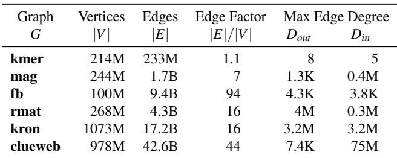

Datasets. Table 1 summarizes the large-scale plain graphs used in our evaluation. The kmer dataset is a protein k-mer graph from the Graph Challenge competition hosted by the IEEE HPEC conference. The mag dataset is sourced from the Open Graph Benchmark [22] and originates from the Microsoft Academic Graph [45]. The fb dataset is generated using the social network benchmark suite from the Linked Data Benchmark Council (LDBC) [15], designed to reflect structural properties of the Facebook web crawl. The rmat and kron datasets are synthetic graphs generated using randomized generators [9, 27], with weights configured according to the Graph500 benchmark specifications [12]. Finally, the clueweb [36] dataset is one of the largest publicly available real-world web crawls.

Benchmarks. We evaluate Pluto using five representative graph analytics applications: PageRank (PR), Connected Components (CC), Breadth-First Search (BFS), K-Core Extraction (KCore),1 and Betweenness Centrality (BC). PR runs for a fixed 50 iterations; the other applications run until convergence. Following prior work [14], the source vertex for BFS and BC is chosen as the highest-degree vertex to ensure comprehensive traversals, and the k value for KCore is set to the graph’s average degree. Based on active vertex set sizes, BFS and BC use the push model, while PR, CC, and KCore use the pull model to maximize performance on Pluto. Reported results are the median of nine independent runs.

Properties. Existing LPG datasets are too small to meaningfully stress distributed systems and are therefore unsuitable for our evaluation. To approximate LPG characteristics, we assign properties to vertices and edges in the large-scale plain graphs. Property data sizes are derived from the LDBC social network graph [3, 15], which annotates entities (vertices) and relations (edges) with multiple attributes to model a real social network. We record the label distribution of masters, mirrors, and edges independently when distributing this social network graph with the CuSP partitioner [21] employed by Pluto. The collected property layouts for each configuration are then applied to the plain graphs for evaluation. Fig. 8 shows the distribution of property data sizes for the 8-host configuration.

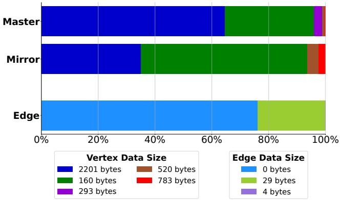  
Figure 8: Distribution of property data sizes in the LDBC social network graph for the 8-host configuration.

To further study system behavior when properties are accessed, we conduct a separate set of experiments in which the traversal algorithms are extended to include predicate checks on vertex and edge properties. These setups, including property assignment and benchmark extension, enable us to capture the impact of property storage on memory locality and evaluate the effectiveness of our advanced mirroring designs on LPGs.

Systems. Pluto is compared against three state-of-the-art distributed graph analytics systems: Graphite [32], D-Galois [14], and Gemini [48]. We follow each system’s recommended configuration and tune parameters to achieve the optimal performance. GraphScope [16] is excluded because it depends on Vineyard and Kubernetes for resource management, which are incompatible with the Slurm-based Stampede3 environment. We also enhanced D-Galois with the communication isolation optimization and present D-Galois+ as an additional full-mirroring comparison point.

## 6 Evaluation

## 6.1 Memory Overhead

## 6.1.1 Aggregated Memory Footprint

Fig. 9 shows the average aggregated memory footprint (AMF) per host for Pluto under the worst peak buffer usage observed across all benchmarks. Results are normalized to a full mirroring baseline, whose average per-host memory usage is shown above the dotted line for each data model. Most data points fall below 1, indicating lower memory requirements. As ex pected, the mirror-free architecture generally achieves larger savings than static partial mirroring because it removes all mirrors rather than only a subset. The few exceptions arise in benchmarks such as CC and KCore that converge in very few rounds, where most progress occurs early and work migration incurs relatively high buffer usage. For other algorithms, these trends hold consistently.

The memory benefits of Pluto are substantially greater under the LPG data model. As properties are added, MG grows sharply while Mbu f remains roughly constant, making Mbu f negligible in the AMF calculation in (1). The much larger vertex property sizes compared to edge properties reported in Fig. 8 cause reductions in the number of mirrors to contribute more heavily to MV\_data in (2). Conversely, graphs with larger edge factors in Table 1 (e.g., fb and clueweb) exhibit smaller savings because their M is dominated by edge-related terms (ME\_data and ME\_dest), weakening the impact of advanced mirroring that primarily reduces vertex storage. Finally, memory savings for static partial mirroring are strongly correlated with the number of removed mirrors (i.e., phantoms). As more hosts are added, the increasing fraction of phantoms in Fig. 5 aligns with the clear downward trend of normalized AMF in Fig. 9.

## 6.1.2 Minimum Number of Hosts

While AMF captures the total memory requirement, an important aspect of reduced memory usage in distributed processing is the ability to run on fewer hosts, which often translates to lower cluster cost. Average AMF per host (Fig. 9), however, does not reflect load imbalance due to imperfect graph partitioning. Under outgoing edge-cut, even if masters are evenly distributed, the number of co-located edges can vary significantly across hosts.

To obtain a more realistic view, we apply the LPG setup described in Section 5 to both Pluto and D-Galois+ before execution. We then sweep over a range of host counts and record the minimum number of hosts required to run all LPGextended benchmarks, as shown in Fig. 10. This procedure incorporates the load imbalance produced by the CuSP partitioner [21] and ensures that the host with the maximum memory requirement does not exceed node memory capacity and trigger out-of-memory errors. Note that the results in Fig. 9 are obtained analytically from (1), (2), and (3) without enforcing node memory capacity limits, whereas Fig. 10 reports actual feasibility on the Skylake cluster. Across our input graphs, Pluto requires only 50% to 90% of the hosts needed by a fully mirrored system.

## 6.2 Performance

The performance gains of Pluto shown in this section are attributed to the advanced mirroring design and its associated implementation features introduced in Sections 3 and 4. Pluto inherits optimizations from D-Galois because it is directly implemented on top of it, but does not apply optimizations from other existing systems otherwise.

## 6.2.1 Optimal Configuration

Table 2 reports the best end-to-end execution time achieved by each system across all inputs and applications. We evaluate each system on clusters of 8, 16, 24, 32, 40, and 48 hosts and select the configuration that yields the optimal result. Overall, Pluto outperforms all prior works and delivers a 2.5× harmonic-mean speedup.

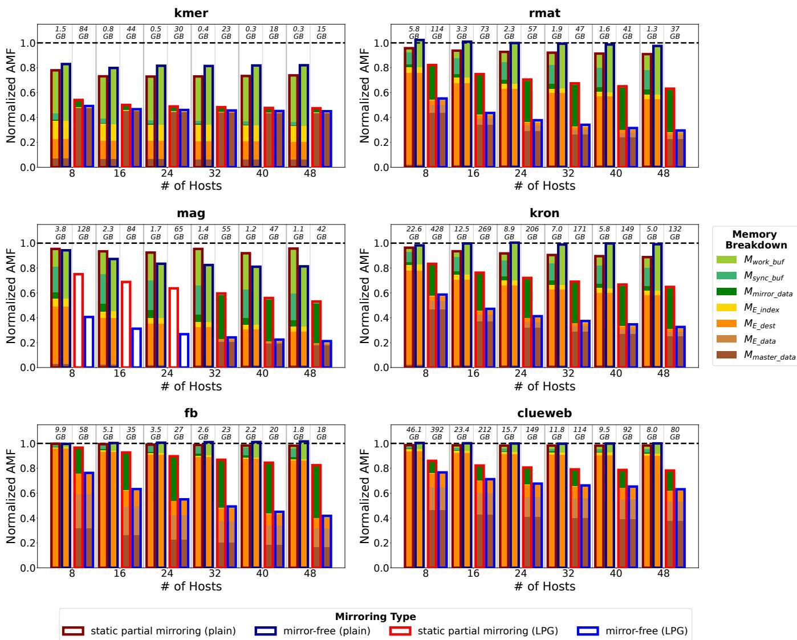  
Figure 9: Average memory usage per host for advanced mirroring under the worst peak buffer requirement. The aggregated memory footprint is normalized to a full-mirroring baseline, whose average per-host usage is shown above the dotted line.

Graphite exhibits roughly a 20× slowdown compared to Pluto mainly because the underlying linear-algebra-based programming model requires substantially more iterations to converge than our vertex-centric approach.2 Since D-Galois is our implementation baseline, Pluto consistently outperforms it as expected. Gemini is the fastest prior system due to its adaptive hybrid update models but still falls short of Pluto without advanced mirroring designs and the corresponding communication optimizations.

## 6.2.2 Strong Scaling

Since Gemini delivers the best performance among prior systems in most cases, we collect strong-scaling execution times for Pluto and Gemini to enable a direct comparison. Fig. 11 presents a subset of the results, omitting smaller graphs and some benchmarks due to space constraints. Overall, Gemini reaches peak performance at smaller cluster sizes, while Pluto exhibits better scalability as the number of hosts increases.

Gemini’s advantage at small scales stems from its dual update model, which allows adaptively switching between push and pull during runtime. Many graph analytics workloads favor pull-based processing in early iterations when active vertex sets are large, and benefit from push-style execution near convergence when the active set shrinks. Pluto is thus limited by its fixed update model throughout execution. Although Pluto could adopt a hybrid approach, doing so would sacrifice memory efficiency: supporting both push and pull requires maintaining outgoing and incoming adjacency structures simultaneously, effectively doubling edge list storage (ME\_dest and ME\_index). In addition, the memory benefit of removing mirrors entirely in the mirror-free architecture would no longer apply while supporting static partial mirroring.

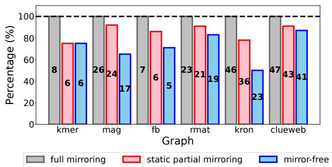  
Figure 10: Minimum number of hosts required for LPG workloads.

The high memory requirements of Gemini limit its applicability, leading to out-of-memory failures at smaller host counts for large graphs. Furthermore, Gemini exhibits weaker scalability primarily because its communication substrate is less optimized. As additional hosts are added and communication becomes the dominant cost, Gemini’s performance degrades and execution time increases. In contrast, Pluto scales efficiently and outperforms Gemini as cluster sizes grow.

## 6.3 Advanced Mirroring Impact

Comparisons across systems depend on many factors and should not be attributed to a single feature. To isolate the contributions of advanced mirroring, we compare Pluto against D-Galois+, a full mirroring baseline with communication isolation, for each graph data model.

## 6.3.1 Plain Graph

Under optimal configurations, Table 2 shows that advanced mirroring delivers a 1.75× harmonic-mean speedup over full mirroring across all inputs and benchmarks. Fig. 11 demon strates strong-scaling performance for Pluto and D-Galois+. The two versions converge at different rates and may reach their minimum execution time at different host counts. Fig. 12 summarizes the strong-scaling speedup of our advanced mirroring designs up to the smallest host count at which either version achieves its minimum execution time. Configurations beyond that point are excluded because adding more hosts degrades performance on one or both systems, making them neither a fair comparison nor a practical choice.

Table 2: Fastest execution time (sec) under optimal configuration. Minimum time across all systems is highlighted in yellow.  
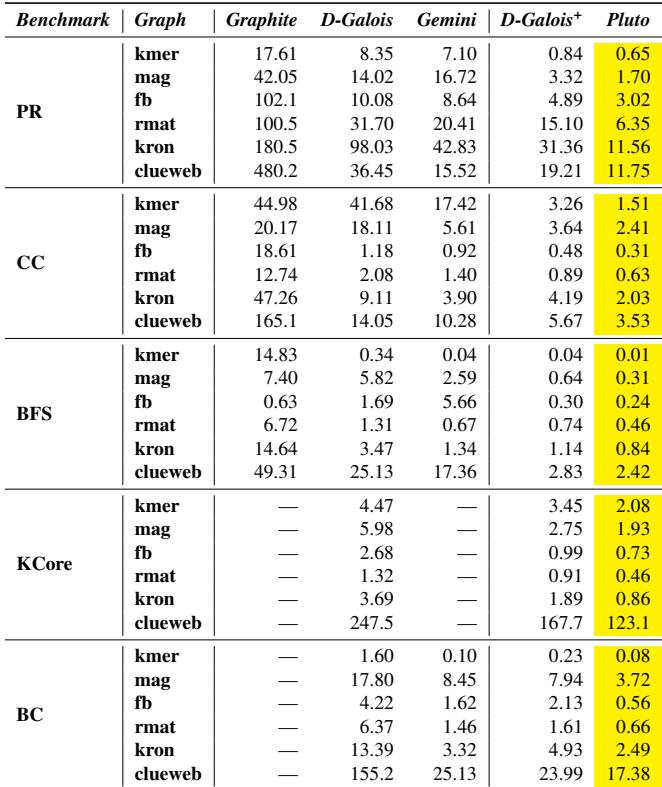  
∗— means the benchmark is not implemented by the original authors.

The speedup of both advanced mirroring designs follows a consistent concave-downward trend as the number of hosts increases. At small cluster sizes, computation phases are relatively long and provide ample time to cover the network traffic associated with work migration. The fraction of total execution time saved by shifting part of the communication workload into computation is therefore modest, and the speedup is limited. As additional hosts are introduced, increased parallelism shortens computation phases, improving communication–computation overlap and increasing speedup. This trend continues until an inflection point where the computation duration aligns optimally with the amount of communication that can be overlapped, yielding maximal speedup. Beyond this point, further scaling shortens computation phases to the extent that they can no longer fully hide remote work message transmission, causing spillover into the communication phase and reducing overall performance gains.

When the number of mirrors per host is small, the communication phase of full mirroring and static partial mirroring must still pay for dirty-mirror collection and the inherent network latency of inter-host synchronization. These fixed costs do not diminish with additional hosts and increasingly dominate communication time as total execution time approaches its minimum. In contrast, the mirror-free architecture can still realize slight improvements because work messages are sent during computation, allowing a portion of the communication latency to be hidden. This effect explains the slight uptick in mirror-free speedup at larger cluster sizes.

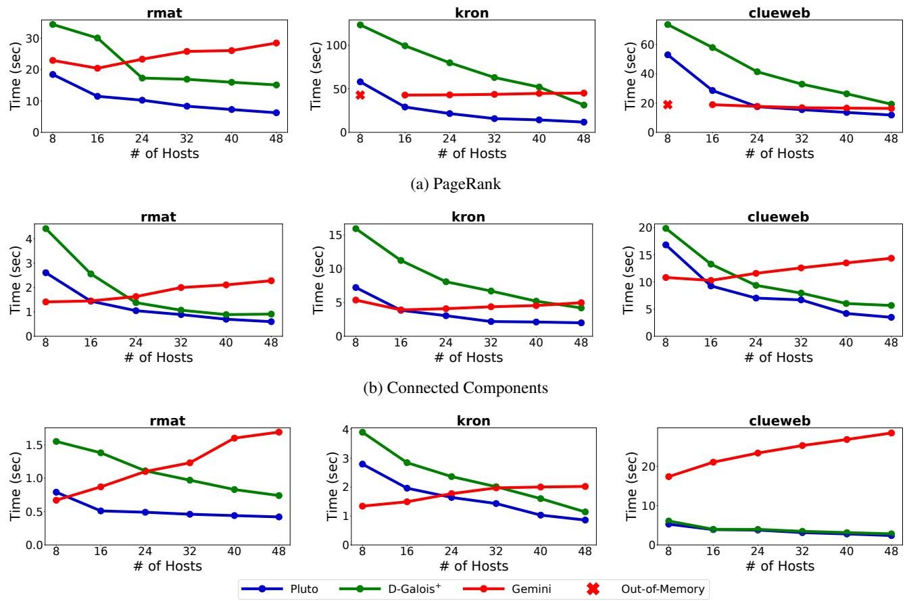  
(c) Breadth-First Search  
Figure 11: Strong-scaling execution time.

Overall, the mirror-free architecture achieves higher speedup than static partial mirroring, primarily due to reduced computation slowdown and more effective communica tion–computation overlap. Static partial mirroring incurs extra cost from explicit vertex-type checks, whereas the mirror-free architecture avoids this overhead via a fixed vertex traversal order. In addition, since work migration applies only to phantoms, removing mirrors entirely increases the fraction of communication that can be overlapped with computation. In the ideal case, the full communication workload can be executed in parallel with the computation phase.

## 6.3.2 Labeled Property Graph

Fig. 13 shows the speedup of our advanced mirroring designs for LPG workloads; missing data points indicate configurations where the graph does not fit in memory according to Fig. 10. The same concave-downward trend observed for plain graphs persists under strong scaling on LPGs, but the overall speedup shrinks.

The performance benefits of the advanced mirroring designs manifest differently for LPGs due to the changed compute–communication balance. Once property predicates are added to our workloads, as described in Section 5, most of our benchmarks spend a larger fraction of time in local computation, so the portion of execution time that any communication optimization (including work migration and mirroring) can affect is smaller. Consequently, the relative speedups shrink, even though the communication phase is still significantly shortened and the underlying mechanism remains effective. This phenomenon is particularly pronounced for PR, where nearly all vertices and edges are accessed in each round. Overall, the advanced mirroring designs still deliver speedups of up to 2.6× with a harmonic mean of 1.37×.

Only kmer and mag exhibit relatively larger LPG speedups for CC and KCore. These two graphs have smaller edge factors, and both benchmarks converge within a few rounds. Fast convergence makes most progress in early iterations when work migration volume is high and spillover is more likely, where remote work message transmission cannot be fully hidden by the computation phase and extends into the communication phase. At the same time, the lower edge factor keeps predicate-check overhead moderate. This balance allows the additional computation to compensate for spillover without dominating total execution time.

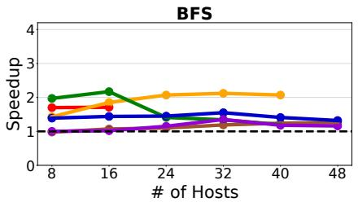

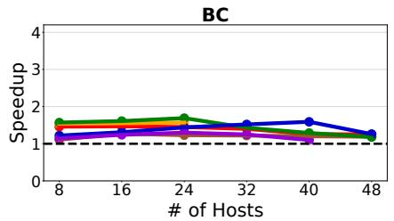  
Input Graph kmer mag fb rmat kron clueweb

(a) Static partial mirroring  
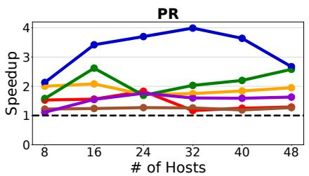

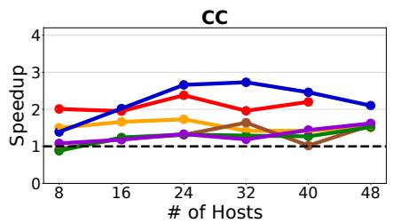  
(b) Mirror-free architecture

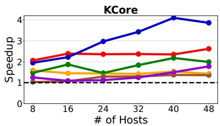

Figure 12: Speedup of advanced mirroring designs for plain graph.  
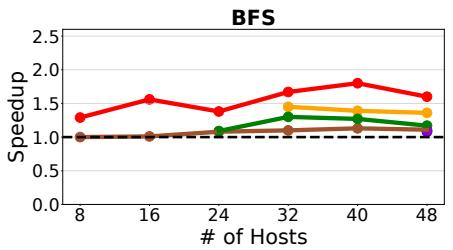

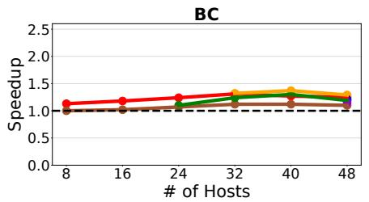  
Input Graph kmer mag fb rmat kron clueweb

(a) Static partial mirroring  
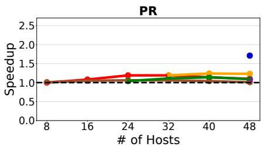

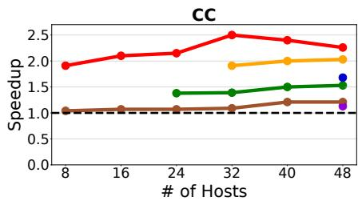  
(b) Mirror-free architecture

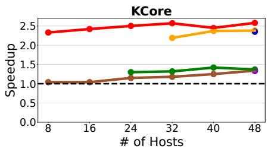  
Figure 13: Speedup of advanced mirroring designs for LPG workloads.

## 6.4 Design Features

The design features described in Sections 3 and 4 are necessary to support the high communication volume induced by advanced mirroring. Fig. 14 reports the execution time of Pluto with each feature selectively disabled (while all others remain enabled), illustrating its impact on performance. Execution times are normalized to Pluto with all features enabled, and results are reported as the harmonic mean across all inputs and benchmarks.

Buffer pools amortize memory allocation and deallocation costs by avoiding frequent malloc and free calls. Pluto benefits most from rounds with intensive work migration and continuous message aggregation, but the overall effect is diluted by near-convergence rounds with low compute intensity. The fixed vertex traversal order has limited impact because outgoing edges are sorted based on destination local IDs to form the order of masters first, mirrors next, and phantoms last. Modern branch predictors take advantage of it to make the additional vertex-type check relatively inexpensive even without this optimization.

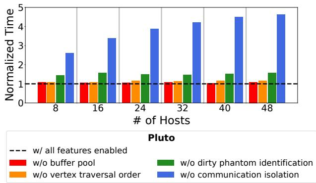  
Figure 14: Impact of different design features. Execution time is normalized to Pluto with all features enabled. Results are the harmonic mean across all inputs and benchmarks.

Since inter-host communication is the main bottleneck in distributed systems, communication-related features are the most critical for efficiency. Dirty phantom identification provides a moderate improvement by reducing the total communication volume. Disabling communication isolation causes substantial performance degradation because context switching overhead slows down the communication thread significantly, and it may be scheduled on a core farther from the NIC. Message aggregation has the largest impact on performance but is omitted from the figure: without aggregation, network traffic explodes and Pluto exceeds the 1000-second timeout limit on all experiments.

## 7 Related Work

## 7.1 Memory-Efficient Data Duplication

Pregel+ [47] also creates mirrors selectively based on vertex degree, but uses a threshold derived from a simplified cost model rather than a fixed threshold of one. Unlike Pluto, which overlaps communication and computation via work migration, Pregel+ defers all message handling (send, receive, and work processing) to the communication phase. Instead of aggregating messages on demand, it stores work messages in a large buffer during computation and scans this buffer later to identify aggregation opportunities. Because the cost model typically yields thresholds larger than one, multiple updates to the same vertex can accumulate in the buffer, leading to significant memory overhead. We also evaluated Pregel+ with our experimental setup, and Pregel+ is more than 100× slower than Pluto while sometimes fails to complete within a

1000-second timeout.

Khuzdul [10] incorporates a static data cache that selectively replicates remote data at runtime. The cache follows a first-accessed-first-cached-with-threshold policy and does not support eviction. Once the cache is full, subsequent requests do not incur replacement and no additional data can be duplicated. This design risks caching early-accessed vertices that may not be representative of the true hot set when the work set exceeds cache capacity. In addition, the threshold is empirically fixed at 64 without justification or sensitivity analysis. Unlike mirrors constructed deterministically after partitioning, the dynamic duplication of the data cache prevents it from undergoing the necessary preprocessing to index with compact local IDs. As a result, all vertices are referenced by their sparse global IDs in Khuzdul to avoid expensive ID translations.

## 7.2 Performance Optimizations Based on Vertex Degree

While static partial mirroring in Pluto targets low-degree mirrors, several prior systems apply optimizations that reduce the overheads associated with high-degree vertices to improve performance. These existing techniques are complementary to Pluto, but we do not incorporate and evaluate them due to differences in graph representations and underlying frameworks.

GPS [38] partitions adjacency lists of high-degree vertices across hosts to avoid repetitive messages and reduce communication volume. LUX [25] splits high-degree vertices across multiple hosts and uses edge partitioning primarily to balance load on multi-GPU systems. SympleGraph [49] extends Gemini with compiler-assisted enforcement of loop-carried dependencies, removing redundant computation and communication by propagating updates of high-degree mirrors in a host-to-host fashion until their masters are reached.

## 8 Conclusion

As real-world graph datasets continue to grow in scale, distributed graph processing systems face increasing challenges related to high memory requirements and performance ceilings. In this work, we propose static partial mirroring and the mirror-free architecture to reduce memory usage while also improving performance. Both designs are implemented in Pluto, our system which integrates a suite of optimization techniques to address the increased communication volume, preserving high scalability and throughput. Our comprehensive evaluation demonstrates that Pluto consistently outperforms state-of-the-art systems, offering a promising direction for the future of scalable distributed graph analytics.

## Acknowledgments

This research is partially supported by the NSF (CISE “Expedition" Grant Number 2326576 and SHF-2006943) and by the U.S. Department of Energy, National Nuclear Security Administration Award Number DE-NA0003969. The authors acknowledge the Texas Advanced Computing Center (TACC) at The University of Texas at Austin for providing computational resources that have contributed to the research results reported within this paper. URL: http://www.tacc.utexas.edu

## References

[1] Amazon Web Services. Amazon neptune: Graph database service. https://aws.amazon.com/ neptune, 2024.

[2] Michael J. Anderson, Narayanan Sundaram, Nadathur Satish, Md. Mostofa Ali Patwary, Theodore L. Willke, and Pradeep Dubey. Graphpad: Optimized graph primitives for parallel and distributed platforms. In 2016 IEEE International Parallel and Distributed Processing Symposium (IPDPS), pages 313–322, 2016.

[3] Renzo Angles, János Benjamin Antal, Alex Averbuch, Altan Birler, Peter Boncz, Márton Búr, Orri Erling, Andrey Gubichev, Vlad Haprian, Moritz Kaufmann, Josep Lluís Larriba Pey, Norbert Martínez, József Marton, Marcus Paradies, Minh-Duc Pham, Arnau Prat-Pérez, David Püroja, Mirko Spasic, Benjamin A. Steer, Dávid Sza-´ kállas, Gábor Szárnyas, Jack Waudby, Mingxi Wu, and Yuchen Zhang. The ldbc social network benchmark. https://arxiv.org/abs/2001.02299, 2024.

[4] Renzo Angles and Claudio Gutierrez. Survey of graph database models. ACM Comput. Surv., 40(1), February 2008.

[5] Erik G. Boman, Karen D. Devine, and Sivasankaran Rajamanickam. Scalable matrix computations on large scale-free graphs using 2d graph partitioning. In Proceedings of the International Conference on High Performance Computing, Networking, Storage and Analysis, SC ’13, New York, NY, USA, 2013. Association for Computing Machinery.

[6] Adrian Bridgwater. Why unstructured data is sorting itself out. https://www.forbes. com/sites/adrianbridgwater/2025/06/16/ why-unstructured-data-is-sorting-itself-out/ June 2025.

[7] Aydin Buluç, Tim Mattson, Scott McMillan, José Moreira, and Carl Yang. Design of the graphblas api for c. In 2017 IEEE International Parallel and Distributed Processing Symposium Workshops (IPDPSW), pages 643–652, 2017.

[8] Aydın Buluç and John R Gilbert. The combinatorial blas: design, implementation, and applications. The International Journal of High Performance Computing Applications, 25(4):496–509, 2011.

[9] Deepayan Chakrabarti, Yiping Zhan, and Christos Faloutsos. R-mat: A recursive model for graph mining. In Proceedings of the 2004 SIAM International Conference on Data Mining (SDM), pages 442–446. SIAM, 2004.

[10] Jingji Chen and Xuehai Qian. Khuzdul: Efficient and scalable distributed graph pattern mining engine. In Proceedings of the 28th ACM International Conference on Architectural Support for Programming Languages and Operating Systems, Volume 2, ASPLOS 2023, page 413–426, New York, NY, USA, 2023. Association for Computing Machinery.

[11] Rong Chen, Jiaxin Shi, Yanzhe Chen, Binyu Zang, Haibing Guan, and Haibo Chen. Powerlyra: Differentiated graph computation and partitioning on skewed graphs. ACM Trans. Parallel Comput., 5(3), January 2019.

[12] Graph500 Committee. Graph500 benchmarks. https: //graph500.org, 2010.

[13] D-Galois developers. D-galois github repository. https: //github.com/IntelligentSoftwareSystems/ Galois, 2018.

[14] Roshan Dathathri, Gurbinder Gill, Loc Hoang, Hoang-Vu Dang, Alex Brooks, Nikoli Dryden, Marc Snir, and Keshav Pingali. Gluon: a communication-optimizing substrate for distributed heterogeneous graph analytics. In Proceedings of the 39th ACM SIGPLAN Conference on Programming Language Design and Implementation, PLDI 2018, page 752–768, New York, NY, USA, 2018. Association for Computing Machinery.

[15] Orri Erling, Alex Averbuch, Josep Larriba-Pey, Hassan Chafi, Andrey Gubichev, Arnau Prat, Minh-Duc Pham, and Peter Boncz. The ldbc social network benchmark: Interactive workload. In Proceedings of the 2015 ACM SIGMOD International Conference on Management of Data, SIGMOD ’15, page 619–630, New York, NY, USA, 2015. Association for Computing Machinery.

[16] Wenfei Fan, Tao He, Longbin Lai, Xue Li, Yong Li, Zhao Li, Zhengping Qian, Chao Tian, Lei Wang, Jingbo Xu, Youyang Yao, Qiang Yin, Wenyuan Yu, Jingren Zhou, Diwen Zhu, and Rong Zhu. Graphscope: a unified engine for big graph processing. Proc. VLDB Endow., 14(12):2879–2892, July 2021.

[17] Gurbinder Gill, Roshan Dathathri, Loc Hoang, and Keshav Pingali. A study of partitioning policies for graph

analytics on large-scale distributed platforms. Proc. VLDB Endow., 12(4):321–334, December 2018.

[18] Gurbinder Gill, Roshan Dathathri, Loc Hoang, and Keshav Pingali. A study of partitioning policies for graph analytics on large-scale distributed platforms. Proc. VLDB Endow., 12(4):321–334, December 2018.

[19] Joseph E. Gonzalez, Yucheng Low, Haijie Gu, Danny Bickson, and Carlos Guestrin. Powergraph: distributed graph-parallel computation on natural graphs. In Proceedings of the 10th USENIX Conference on Operating Systems Design and Implementation, OSDI’12, page 17–30, USA, 2012. USENIX Association.

[20] Joseph E. Gonzalez, Reynold S. Xin, Ankur Dave, Daniel Crankshaw, Michael J. Franklin, and Ion Stoica. Graphx: graph processing in a distributed dataflow framework. In Proceedings of the 11th USENIX Conference on Operating Systems Design and Implementation, OSDI’14, page 599–613, USA, 2014. USENIX Association.

[21] Loc Hoang, Roshan Dathathri, Gurbinder Gill, and Keshav Pingali. Cusp: A customizable streaming edge partitioner for distributed graph analytics. In 2019 IEEE International Parallel and Distributed Processing Symposium (IPDPS), pages 439–450, 2019.

[22] Weihua Hu, Matthias Fey, Marinka Zitnik, Yuxiao Dong, Hongyu Ren, Bowen Liu, Michele Catasta, and Jure Leskovec. Open graph benchmark: datasets for machine learning on graphs. In Proceedings of the 34th International Conference on Neural Information Processing Systems, NIPS ’20, Red Hook, NY, USA, 2020. Curran Associates Inc.

[23] Jiewen Huang and Daniel J. Abadi. Leopard: lightweight edge-oriented partitioning and replication for dynamic graphs. Proc. VLDB Endow., 9(7):540–551, March 2016.

[24] JanusGraph Contributors. Janusgraph: an open-source, distributed graph database. https://janusgraph. org/, 2024. Version 1.1.0.

[25] Zhihao Jia, Yongkee Kwon, Galen Shipman, Pat Mc-Cormick, Mattan Erez, and Alex Aiken. A distributed multi-gpu system for fast graph processing. Proc. VLDB Endow., 11(3):297–310, November 2017.

[26] Hochan Lee, David Wong, Loc Hoang, Roshan Dathathri, Gurbinder Gill, Vishwesh Jatala, David Kuck, and Keshav Pingali. A study of apis for graph analytics workloads. In 2020 IEEE International Symposium on Workload Characterization (IISWC), pages 228–239, 2020.

[27] Jure Leskovec, Deepayan Chakrabarti, Jon Kleinberg, Christos Faloutsos, and Zoubin Ghahramani. Kronecker graphs: An approach to modeling networks. J. Mach. Learn. Res., 11:985–1042, March 2010.

[28] Grzegorz Malewicz, Matthew H. Austern, Aart J.C Bik, James C. Dehnert, Ilan Horn, Naty Leiser, and Grzegorz Czajkowski. Pregel: a system for large-scale graph processing. In Proceedings of the 2010 ACM SIGMOD International Conference on Management of Data, SIG MOD ’10, page 135–146, New York, NY, USA, 2010. Association for Computing Machinery.

[29] Claudio Martella, Dionysios Logothetis, Andreas Loukas, and Georgos Siganos. Spinner: Scalable graph partitioning in the cloud. In 2017 IEEE 33rd International Conference on Data Engineering (ICDE), pages 1083–1094, 2017.

[30] Christian Mayer, Ruben Mayer, Muhammad Adnan Tariq, Heiko Geppert, Larissa Laich, Lukas Rieger, and Kurt Rothermel. Adwise: Adaptive window-based streaming edge partitioning for high-speed graph processing. In 2018 IEEE 38th International Conference on Distributed Computing Systems (ICDCS), pages 685– 695, 2018.

[31] Memgraph Ltd. Memgraph: Real-time graph streaming platform. https://memgraph.com, 2024. Version 2.x.

[32] Mohammad Hasanzadeh Mofrad, Rami Melhem, Yousuf Ahmad, and Mohammad Hammoud. Graphite: a numa-aware hpc system for graph analytics based on a new mpi \* x parallelism model. Proc. VLDB Endow., 13(6):783–797, February 2020.

[33] Gordon E. Moore. Cramming more components onto integrated circuits, page 56–59. Morgan Kaufmann Publishers Inc., San Francisco, CA, USA, 2000.

[34] Neo4j, Inc. Neo4j graph database. https://neo4j. com, 2024. Version 5.x.

[35] Fabio Petroni, Leonardo Querzoni, Khuzaima Daudjee, Shahin Kamali, and Giorgio Iacoboni. Hdrf: Streambased partitioning for power-law graphs. In Proceedings of the 24th ACM International on Conference on Information and Knowledge Management, CIKM ’15, page 243–252, New York, NY, USA, 2015. Association for Computing Machinery.

[36] The Lemur Project. The clueweb12 dataset. https: //lemurproject.org/clueweb12/, 2013.

[37] A. Rogers and K. Pingali. Process decomposition through locality of reference. In Proceedings of the ACM SIGPLAN 1989 Conference on Programming Language Design and Implementation, PLDI ’89, page 69–80, New

York, NY, USA, 1989. Association for Computing Machinery.

[38] Semih Salihoglu and Jennifer Widom. Gps: a graph processing system. In Proceedings of the 25th International Conference on Scientific and Statistical Database Management, SSDBM ’13, New York, NY, USA, 2013. Association for Computing Machinery.

[39] Julian Shun and Guy E. Blelloch. Ligra: a lightweight graph processing framework for shared memory. In Proceedings of the 18th ACM SIGPLAN Symposium on Principles and Practice of Parallel Programming, PPoPP ’13, page 135–146, New York, NY, USA, 2013. Association for Computing Machinery.

[40] George M. Slota, Sivasankaran Rajamanickam, Karen Devine, and Kamesh Madduri. Partitioning trillion-edge graphs in minutes. In 2017 IEEE International Parallel and Distributed Processing Symposium (IPDPS), pages 646–655, 2017.

[41] Isabelle Stanton and Gabriel Kliot. Streaming graph partitioning for large distributed graphs. In Proceedings of the 18th ACM SIGKDD International Conference on Knowledge Discovery and Data Mining, KDD ’12, page 1222–1230, New York, NY, USA, 2012. Association for Computing Machinery.

[42] TigerGraph, Inc. Tigergraph: Scalable graph database for the enterprise. https://www.tigergraph.com, 2024. Version 3.x.

[43] Charalampos Tsourakakis, Christos Gkantsidis, Bozidar Radunovic, and Milan Vojnovic. Fennel: streaming graph partitioning for massive scale graphs. In Proceedings of the 7th ACM International Conference on Web Search and Data Mining, WSDM ’14, page 333–342, New York, NY, USA, 2014. Association for Computing Machinery.

[44] Leslie G. Valiant. A bridging model for parallel computation. Commun. ACM, 33(8):103–111, August 1990.

[45] Kuansan Wang, Zhihong Shen, Chiyuan Huang, Chieh Han Wu, Yuxiao Dong, and Anshul Kanakia. Microsoft academic graph: When experts are not enough. Quantitative Science Studies, 1(1):396–413, 02 2020.

[46] Cong Xie, Ling Yan, Wu-Jun Li, and Zhihua Zhang. Distributed power-law graph computing: theoretical and empirical analysis. In Proceedings of the 28th International Conference on Neural Information Processing Systems - Volume 1, NIPS’14, page 1673–1681, Cam bridge, MA, USA, 2014. MIT Press.

[47] Da Yan, James Cheng, Yi Lu, and Wilfred Ng. Effective techniques for message reduction and load balancing in distributed graph computation. In Proceedings of the 24th International Conference on World Wide Web, WWW ’15, page 1307–1317, Republic and Canton of Geneva, CHE, 2015. International World Wide Web Conferences Steering Committee.

[48] Xiaowei Zhu, Wenguang Chen, Weimin Zheng, and Xiaosong Ma. Gemini: a computation-centric distributed graph processing system. In Proceedings of the 12th USENIX Conference on Operating Systems Design and Implementation, OSDI’16, page 301–316, USA, 2016. USENIX Association.

[49] Youwei Zhuo, Jingji Chen, Qinyi Luo, Yanzhi Wang, Hailong Yang, Depei Qian, and Xuehai Qian. Symplegraph: distributed graph processing with precise loopcarried dependency guarantee. In Proceedings of the 41st ACM SIGPLAN Conference on Programming Language Design and Implementation, PLDI 2020, page 592–607, New York, NY, USA, 2020. Association for Computing Machinery.