USENIX

THE ADVANCED COMPUTING SYSTEMS ASSOCIATION

# Learning-Augmented Heuristics: Simple yet Smart, Robust and Interpretable Cache Eviction

Haocheng Xia, Harvard University and University of Illinois Urbana–Champaign; William Nixon, University of Chicago and Harvard University; Bintang Dwi Marthen, Harvard University and Institut Teknologi Bandung; Pranav Bhandari, Meta; Juncheng Yang, Harvard University

https://www.usenix.org/conference/osdi26/presentation/xia

# This paper is included in the Proceedings of the 20th USENIX Symposium on Operating Systems Design and Implementation.

July 13–15, 2026 • Seattle, WA, USA

ISBN 978-1-939133-55-7

Open access to the Proceedings of the 20th USENIX Symposium on Operating Systems Design and Implementation is sponsored by

# Learning-Augmented Heuristics: Simple, yet Smart, Robust and Interpretable Cache Eviction

Haocheng Xia Harvard University & UIUC

Bintang Dwi Marthen Harvard University & Institut Teknologi Bandung

William Nixon University of Chicago & Harvard University

Pranav Bhandari Meta

Juncheng Yang Harvard University

## Abstract

Caching is widely used across the system stack to improve performance and efficiency, with eviction algorithms at its core. Existing cache eviction policies fall into two broad categories: static heuristics (e.g., 2Q, S3-FIFO) and smart algorithms (e.g., ARC, LRB). Smart caches can adapt to workloads and have the potential to achieve higher efficiency and robustness than static heuristics. However, we find that existing smart caches suffer from objective mismatches and instability.

We introduce Learning-Augmented Heuristics (LAH), a framework that learns the cache-level parameters of static heuristics. By decoupling the data and control planes, LAH supports simple, high-speed data reads and writes on the data plane, while performing occasional asynchronous learning on the control plane using cache-level features.

We demonstrate the effectiveness of LAH through S4- FIFO, a Smart S3-FIFO cache eviction algorithm. We pretrain a single model on 4,140 production traces and embed it in S4-FIFO to learn optimal cache parameters. On 1,035 evaluation traces, S4-FIFO improves the mean efficiency by 26% compared to S3-FIFO and by 8% compared to 3L-Cache, the best state-of-the-art algorithm. S4-FIFO is also robust— increasing miss ratio over FIFO by 0.8% on the worst trace, whereas 3L-Cache increases FIFO’s miss ratio by 8.8%. Finally, S4-FIFO’s decisions are also interpretable: a language model can provide a rationale for why a particular configuration was chosen.

## 1 Introduction

Caching underpins performance across modern systems— from storage stacks [11, 64, 67, 75] and databases [35, 57] to large web services [7,9,12,14,25,27,47,50,54,61,69,72]— by absorbing repeated access and reducing backend load. At the heart of every cache is an eviction algorithm that decides which objects to retain under tight memory budgets. Today’s production systems overwhelmingly rely on static heuristics such as LRU, 2Q [35], S3-FIFO [74], and SIEVE [77] because they are simple, fast, and easy to deploy. In parallel, a growing body of work has proposed “smart” caches—adaptive and learned policies such as ARC [46], LeCaR [63], LRB [58], LHD [10], GL-Cache [70], and 3L-Cache [83]—that aim to tailor eviction decisions to each workload.

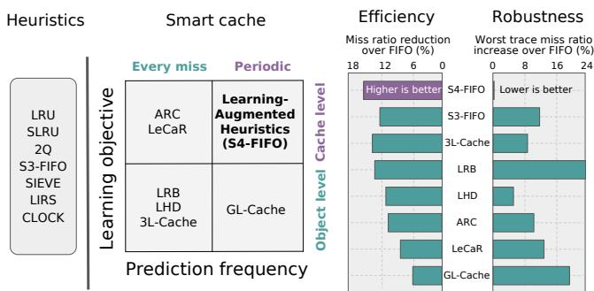  
Figure 1: A classification of eviction algorithms (Section 2.2) indicates that periodic cache-level learning is highly effective, yet it has not been explored. We bridge this gap with learning-augmented heuristics, exemplified by a new algorithm, S4-FIFO, which achieves both high efficiency and strong robustness.

In principle, smart caches should dominate hand-crafted heuristics. In practice, very few of them (if any) have been adopted. Many of the smart caches learn at the granularity of individual objects and make predictions on every miss, optimizing surrogate objectives such as reuse-distance regression loss or per-object utility scores rather than the cache’s true objective, the miss ratio. These object-level, per-miss learning schemes suffer from four recurring problems: (1) objective mismatch, where improvements in prediction metrics do not translate into fewer misses; (2) instability and noise sensitivity, as these schemes react to highly variable request-level signals; (3) overheads, due to per-object metadata, frequent inference on the critical path, and additional runtime complexity; and (4) limited robustness and interpretability, as eviction decisions are opaque, difficult to interpret, and may yield miss ratios higher than FIFO on some workloads.

At the same time, recent work shows that static heuristics can achieve surprisingly strong performance. S3-FIFO [74], for example, uses a small FIFO queue, a main FIFO queue, and a metadata-only ghost queue with simple promotion rules to filter one-hit wonders and retain popular objects. While it is strong on the mean and median trace, our analysis reveals that its static configuration leaves substantial headroom for the tail traces.

We classify smart eviction algorithms along two axes— learning granularity (object vs. cache level) and prediction frequency (per-miss vs. periodic)—and observe that existing approaches occupy three of the four quadrants (Figure 1). The remaining quadrant, periodic cache-level learning, remains unexplored, despite offering an appealing opportunity: directly learning cache parameters that optimize miss ratio.

This observation motivates a fundamentally different approach to incorporating learning into caching: instead of learning a new, complex eviction policy, we propose learning to configure a simple, expressive heuristic. We introduce Learning-Augmented Heuristics (LAH), a framework that cleanly separates the cache’s data and control planes. The data plane implements a deterministic heuristic with a small number of explicit knobs. The control plane runs asynchronously and infrequently, using cache-level features to select a configuration that directly targets miss-ratio reduction. A single model, pre-trained offline on a large corpus of traces, acts as a reusable “foundation model” for caches: it performs zero-shot prediction without per-deployment retraining.

We realize LAH in S4-FIFO, a “Smart S3-FIFO” eviction algorithm that augments S3-FIFO with an additional FIFO region and exposes its internal control knobs for learning. S4- FIFO discretizes the configuration space into a small set of representative parameter combinations and trains a gradient boosted decision tree [18, 28] to choose among them using a cost-sensitive objective that explicitly anchors robustness to FIFO. Trained once on 4,140 production traces spanning block, key–value, and CDN caches, this model is embedded into the algorithm as lightweight, dependency-free code. When evaluated on 1,035 held-out production traces, S4-FIFO improves mean miss-ratio reduction by 26% over S3-FIFO and by 8% over 3L-Cache, the best prior algorithm, while never exceeding FIFO’s miss ratio by more than 0.8% on the worst trace. For comparison, the next-best algorithm, 3L-Cache, increases FIFO’s miss ratio by 8.8% in the worst case. Because of the separation of the control and data planes, S4- FIFO achieves throughput on par with other heuristics, such as LRU and 2Q. Because both its inputs and outputs are cachelevel quantities with clear semantics, S4-FIFO’s decisions are also relatively interpretable: a language model can reason about the factors behind a particular configuration choice.

This paper makes the following contributions:

• We introduce a cache classification and demonstrate that periodic cache-level learning is the most effective approach.

• We propose learning-augmented heuristics (LAH), a framework that augments static heuristics with parameters and uses a foundation model to learn them.

• We design and implement S4-FIFO, an example of LAH.

We pre-train a gradient boosting tree model for S4-FIFO on 4,140 production traces and provide a dependency-free library for users 1.

• We evaluate S4-FIFO on 1,035 production traces and show that it is both more efficient and more robust than stateof-the-art algorithms, while matching the throughput of heuristics. Moreover, S4-FIFO’s decisions are interpretable.

## 2 Background and Motivations

## 2.1 Evolution of Cache Eviction Algorithms

A central component of cache performance is the eviction algorithm, deciding which object(s) to remove when space runs out. Over the years, researchers and practitioners have designed a wide spectrum of eviction strategies, from simple heuristics to learning-based policies.

## 2.1.1 Heuristics-Based Algorithms

Most (if not all) production systems use heuristics-based eviction algorithms today. Traditional heuristics, such as 2Q [35] and LIRS [33], and modern heuristics, such as S3-FIFO [74] and SIEVE [77], operate based on manually curated rules that exploit recency and frequency patterns in a workload. These heuristics are valued for their simplicity, high throughput, and ease of implementation. However, they often fall short in efficiency compared to adaptive algorithms.

## 2.1.2 Smart Cache Eviction Algorithms

Adaptive algorithms. For example, ARC [46] maintains four LRU queues: two for data and two for ghost. It dynamically resizes recency and frequency data queues based on observed hits on the corresponding ghost queues. Similarly, DLIRS [41] extends LIRS by introducing an adaptive partition between low-reuse (HIR) and high-reuse (LIR) regions, which is dynamically resized based on its reuse distance. Although adaptive cache eviction algorithms do not employ machine learning models, we classify them as smart cache eviction algorithms because they can adapt to workloads by observing dynamic features.

Learning-based algorithms. More recent work builds prediction models to guide eviction decisions. Algorithms such as LRB [58], 3L-Cache [83], and GL-Cache [70] use supervised learning at the object level to estimate reuse distance and then evict the object predicted to have the least future value. Other approaches like LHD [10] model eviction using conditional hit-density, while LeCaR [63] adaptively reweights LFU and LRU weights with regret minimization. Although these complex policies may outperform heuristics, deploying them adds practical challenges, mainly: (1) online model training and inference add overheads, reducing cache throughput, and (2) their decision-making logic is opaque, from their features to their outputs. As a result, it is hard to interpret, tune, or debug why they behaved the way they did.

Table 1: Classifying smart caches based on learning granularity and prediction frequency.  
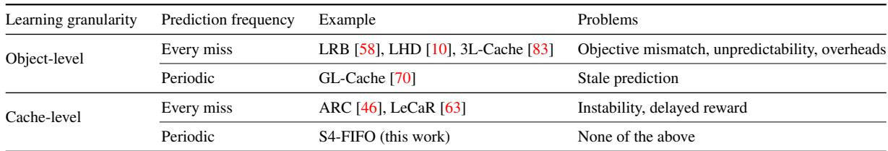

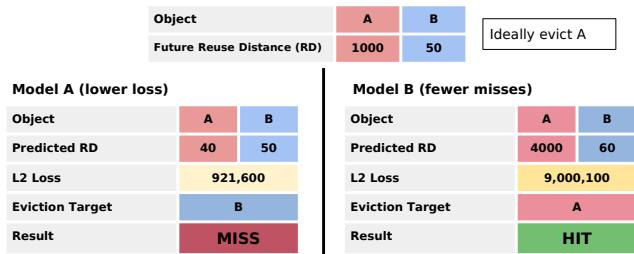  
Figure 2: Object-level learning has an objective mismatch issue. A smaller loss on object-level metrics, e.g., reuse distance, does not guarantee fewer cache misses.

## 2.2 Classifying Smart Eviction Algorithms

We classify existing smart cache eviction algorithms along two dimensions: the granularity of learning and the frequency of prediction or adaptation (Table 1).

Learning granularity. A smart cache eviction algorithm adapts to workloads by making predictions about the workload. These predictions can be either at the object level or the cache level. Object-level algorithms, such as 3L-Cache [83], LRB [58], and LHD [10] assign utility score or eviction probability to every individual object in the cache. For example, LRB and 3L-Cache learn the reuse distance for objects in the cache to predict the next access. Note that we also classify GL-Cache [70] as an object-level algorithm because it makes predictions for object groups similar to objects.

In contrast, cache-level algorithms learn by optimizing the internal cache parameters rather than evaluating indi vidual objects. A classic example is ARC [46], which dynamically tunes the target sizes of its recency and frequency queues based on workload patterns, without assigning scores to cached objects. Similarly, LeCaR [63] dynamically adjusts the expert weights based on hits on the ghost queues.

Prediction frequency. Besides granularity, the frequency at which an algorithm predicts or adapts is also critical. Most prior algorithms (e.g., LRB, ARC, LeCaR) make a prediction every miss. For example, LRB samples 64 objects and predicts their reuse distance at each eviction; ARC updates the queue sizes upon each hit on the ghost queue (cache miss).

GL-Cache is the only algorithm that makes predictions periodically by ranking all object groups and evicting the top 10%. It does not trigger another prediction before all the top 10% object groups are evicted.

## 2.3 Learning Granularity: Object vs Cache

## 2.3.1 Object-level Learning

Several recent approaches operate at the granularity of individual objects, typically by predicting reuse distance or popularity. While this formulation appears natural, objectlevel learning faces inherent challenges regarding objective alignment, predictability, and robustness and interpretability.

Objective mismatch. The first challenge with object-level learning is objective mismatch, a phenomenon akin to Good hart’s Law: when a proxy becomes the target, it ceases to be a good measure. Many learned caches optimize for object-level metrics (e.g., minimizing L2 loss on reuse distance) rather than the actual miss ratio objective. For example, Figure 2 shows an example where model A achieves a lower L2 loss than model B, yet it fails to evict the correct object.

Unpredictability. Object-level metrics often cannot be predicted accurately. First, metrics, such as object reuse distance, are not intrinsic to an object and are heavily influenced by the workload, such as burstiness. Furthermore, cache workloads often exhibit a large number of one-hit wonders [74], for which no information (e.g., past N reuse distance, frequency) is available for learning. Some object-level metrics, such as popularity, are intrinsic properties of an object; however, they change quickly over time and cannot be used directly for eviction.

Robustness and interpretability. As object-level learning is driven by the unpredictable metrics described above, it becomes highly sensitive. Variations in workload can produce wrong eviction decisions. This volatility directly translates into poor robustness; models may perform well on average yet fail badly on certain workloads. Moreover, the outputs of object-level learning are fundamentally opaque. The model assigns per-object scores with little to no operational semantics, leaving operators unable to explain when the miss ratio increases. This combination of unpredictable inputs and opaque outputs makes object-level learning risky to deploy at scale.

## 2.3.2 Cache-level Learning

Cache-level learning avoids the aforementioned problems by tuning a small set of global cache parameters. For example,

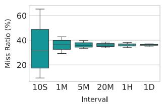

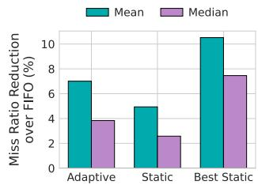  
Figure 3: (a) Cache metrics, such as miss ratio, exhibit greater variance at finer time granularity. (b) Choosing the correct parameters can outperform LeCaR’s per-miss adaptivity.

ARC [46] maintains two data queues and two ghost queues. Data queues store data, while ghost queues only keep metadata of recently evicted objects. ARC dynamically adjusts the queue size based on ghost hits. Intuitively, the more hits on the ghost queue, the more space is needed for the corresponding data queue. As another example, LeCaR [63] uses two eviction algorithms as experts and randomly chooses one expert to pick an eviction candidate based on its weight. The expert (algorithm) with a larger weight is more likely to be used for eviction. Similar to ARC, LeCaR adjusts experts weights based on ghost hits using reinforcement learning.

Direct optimization. Cache-level learning often directly optimizes for the miss ratio. For example, a ghost hit means that if the data queue is larger, it will be a cache hit, so increas ing the data queue size directly reduces misses. Similarly, if an expert has many ghost hits in LeCaR, indicating it is not suitable for the workloads, then reducing its weight would reduce the number of wrong evictions. Direct optimization not only helps reduce the miss ratio but also improves interpretability, enabling operators to reason about specific actions.

Magic parameters. Although cache-level learning is intuitive and avoids the objective-mismatch problem, it often has magic parameters. For example, how much and how often the parameters should be updated. Previous work has shown that the default move one slot per ghost hit approach in ARC has pathological failure cases [74].

## 2.4 Prediction Frequency: Per-miss vs Periodic

While the learning objective is critical for the effectiveness of a smart cache, how often a cache makes a prediction or adaptation is equally important.

## 2.4.1 Per-miss Prediction and Adaptation

Most algorithms make predictions at the request granularity, e.g., every miss. For example, LRB estimates object reuse distance on each cache miss, while ARC and LeCaR update queue sizes or weights on every hit to their ghost queues. Although such per-miss adaptation can appear highly responsive, it suffers from three key limitations: instability and noise overfitting, delayed reward, and inference overhead.

Instability and overfitting to noise. Observations on each request and object might not reflect the overall patterns in the workload. By reacting to every miss, the algorithms will instead “chase” this noise. We find that real-world workloads often exhibit significant variance at fine time granularity, and request-level signals are often very noisy. Figure 3 left shows the miss ratio measured at different time granularities on a CloudPhysics trace. We observe that at smaller time intervals, the miss ratio over time tends to have a very large variance.

We further measured the impact of per-miss adaptivity using 106 traces from the CloudPhysics dataset. Figure 3 right shows that, although per-miss adaptivity improves over using a single static parameter for all traces (static), it is significantly worse than choosing the best static parameter for each trace. This suggests that choosing the right parameter is much more important than per-miss adaptivity.

Delayed Reward for Cache-level Learning. Besides overfitting, per-miss learning also suffers from the delayed reward problem. Because a cache miss may happen long after an object is evicted, and parameter changes take time to become effective, we find that the change often lags behind the need. This lag makes the feedback signal slow and ambiguous.

Overheads for Object-level Learning. When pairing permiss prediction with object-level learning, another drawback is the overhead. Performing a model inference on each miss significantly reduces the throughput. Besides, object-level learning also incurs significant per-object metadata storage overhead. For example, LRB adds over 200 bytes of features to each object, which eats into DRAM capacity.

## 2.4.2 Periodic Prediction

To the best of our knowledge, GL-Cache [70] is the only cache eviction algorithm that uses periodic prediction. Similar to other object-level learned caches, GL-Cache predicts a score for each object group. However, instead of predicting on the critical path, GL-Cache makes one prediction periodically and reuses the scores until 10% of the object groups are evicted. However, because the usefulness of objects and groups changes over time, their predictions quickly become stale, and periodic prediction often leads to lower efficiency when used with object-level learning.

Our analysis of existing algorithms reveals a dichotomy in the design space. Object-level algorithms suffer from objective mismatch, unpredictability, and huge overheads. Moreover, per-miss learning algorithms are prone to instability and delayed rewards. Table 1 highlights a distinct gap in the design space—we need smart cache eviction algorithms that learn and adapt at the cache level, with the learning objective aligned with miss ratio reduction; meanwhile, we need periodic learning to avoid unnecessary overfitting to noise and magic parameters.

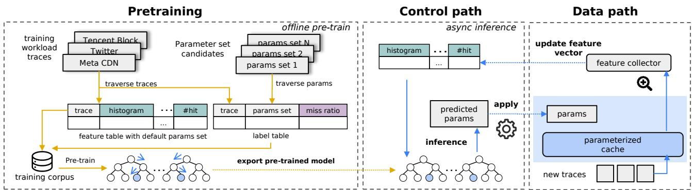  
Figure 4: Illustration of learning-augmented heuristics. (1) Offline pretraining (left): A foundation model is trained on a massive corpus of trace features and optimal parameter labels to learn universal caching rules. (2) Online operation (right): The system decouples the critical data path from the control path. The data path collects lightweight workload-level features, while the control path asynchronously queries the pre-trained model to adapt the cache parameters to the current workload trace.

## 3 Learning-Augmented Heuristics (LAH)

In this section, we introduce a learning-to-configure paradigm that fundamentally rethinks how machine learning interacts with caching systems. Instead of embedding complex learning logic (e.g., neural networks) directly into the critical path, we propose a clean separation of concerns: the cache data path executes a simple, parameterized heuristic, while the control plane utilizes a pre-trained “foundation model” to choose the heuristic’s parameters, an approach we call Learning-Augmented Heuristics (LAH).

Existing learning-based caches (e.g., GL-Cache, LeCaR) often treat learning as an online, instance-specific task and train from scratch for each new or even the same workload. This approach suffers from “catastrophic forgetting” and high retraining costs. In contrast, our approach builds upon the well-established insight that cache access patterns are governed by universal characteristics: phenomena like scanning, looping, and thrashing are structural behaviors that transcend specific datasets [21, 33]. By extracting content-oblivious features rather than tracking specific object IDs, we can train a single global model that generalizes across diverse workloads. This effectively builds a foundation model for caching: knowledge learned from thousands of offline traces is preserved and transferred to new, unseen environments. The model does not need to relearn but recognizes the pattern and applies the optimal configurations. This decoupled architecture offers five critical advantages over tightly coupled learned caches.

Simplicity. The data path logic remains simple and deterministic. It requires almost no metadata overhead (unlike LRB or 3L-Cache, which track extensive ghost histories per object) and avoids complex data structures. This “stateless” nature drastically reduces code complexity and bug surface area, making the system easier to verify and deploy in production.

Performance. By offloading the inference to an asynchronous control plane, the critical path for GET and PUT operations remains extremely lightweight, ensuring high throughput and low tail latency.

Efficiency. Simple static heuristics, such as 2Q, cannot achieve high efficiency compared to state-of-the-art algorithms. LAH can automatically optimize for different workloads. During the cache warm-up period, LAH identifies the “golden configurations” and updates its parameters to match the workload’s patterns.

Robustness. When evaluating state-of-the-art eviction algorithms on thousands of production workloads, we find that most of them exhibit poor robustness—some traces exhibit a miss ratio significantly higher than a simple baseline such as FIFO. This hinders adoption because users do not know whether these algorithms will work on their workloads. LAH learns the configuration from high-level workload features, which are less susceptible to perturbations and noise. Moreover, LAH selects parameters from a validated set of safe configurations. These enable LAH to achieve robustness.

Interpretability. LAH operates on aggregated metrics such as hit distributions, which align naturally with how operators already think about and understand cache behavior. These high-level signals are then mapped to a small set of heuristic parameters, so each prediction corresponds to a knob with a clear operational meaning and existing tuning intuition. Because both the inputs and outputs live in this shared, cachecentric space, the resulting configurations are much more interpretable than existing learned caches.

While LAH can be designed on top of different parameterized algorithms, we use S3-FIFO [74] as an example because it is simple, performant, and scalable. In the next section, we describe S4-FIFO, a new cache eviction algorithm that is Simple, Scalable, Smart, and only uses Static FIFO queues. S4-FIFO exposes and augments S3-FIFO’s internal parameters to our foundation model for learning, transforming a static heuristic into an efficient, robust, and interpretable learningaugmented heuristic.

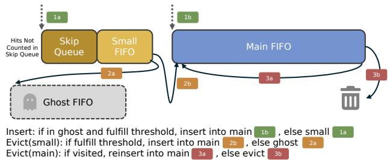  
Figure 5: An illustration of the data path in S4-FIFO.

## 4 S4-FIFO Design and Implementation

In this section, we describe the design of S4-FIFO, detailing the heuristic data path, feature engineering, configuration quantization, and model training.

## 4.1 Overview

We illustrate the high-level overview as shown in Figure 4.

Heuristic Augmentation. We first augment S3-FIFO with a burst-aware parameter that virtually partitions the small queue into an additional FIFO queue, giving the parameterized heuristic greater flexibility to minimize the miss ratio.

Dataset Preparation. We randomly split the 5,175 traces used in this study into training and test sets to avoid data leakage. Then we perform a grid search to determine the best parameters (labels for training) for each trace. Next, we collect cache and workload-level features by running S4-FIFO using the default parameter on each trace, yielding the samples used to train the model.

Model Pretraining. We use features and labels from the previous step to train a classification model that predicts the best parameters for an unseen workload.

## 4.2 Augmenting the Parameters

Parameter prediction and request serving. The previous steps only need to be performed once offline. Once the model is trained, it will be used in different settings without retraining. When a cache starts, S4-FIFO collects features online and then asynchronously makes a single prediction. Then S4- FIFO switches from the default parameters to the predicted parameters. Queue resizing is lazy: when the predicted configuration reduces a queue’s target size, S4-FIFO does not immediately move or evict objects. Instead, future evictions preferentially come from queues that exceed their new limits until the queue sizes converge. This allows parameter updates without pausing the cache or adding extra work to the request critical path. For simplicity, our evaluation makes a single prediction per trace. We found that substantial shifts requiring a new prediction are uncommon. In practice, S4-FIFO could be made to periodically re-predict its parameters if needed, for example on a weekly basis. We leave the choice of refresh policy and interval outside the scope of this work.

Table 2: Hyperparameters of the S4-FIFO.  
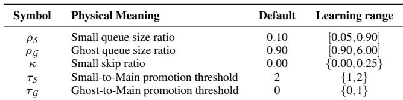

S3-FIFO maintains three FIFO queues. A small queue, occupying 10% of the cache, filters out one-hit wonders; a main queue retains popular objects via reinsertion; and a metadataonly ghost queue identifies moderately popular objects that were mistakenly evicted from the small queue. Each cached object is associated with a 2-bit saturated frequency counter that is incremented on every cache hit, and a threshold on this counter governs movement between the queues. S4-FIFO preserves the same three physical FIFO queues, but parameterizes their behavior, as shown in Figure 5. The parameters are shown in Table 2.

Queue size. While S3-FIFO sets the small queue at 10% of the cache, S4-FIFO treats the queue sizes as tunable parameters. This allows the system to select the optimal ratio between the small and protected regions based on workload characteristics. In addition, S4-FIFO also makes the ghost queue size tunable to collect more information about the workload.

Promotion threshold. S3-FIFO moves an object evicted from the small queue to the main queue if the object’s frequency is greater than 1. S4-FIFO makes the frequency threshold learnable, allowing control over how strictly the small queue filters new insertions. Similarly, to handle cyclic scan patterns [33, 51], S4-FIFO learns the frequency threshold for promoting an object from the ghost queue to the main queue.

Skip ratio. To mitigate correlated references (bursty “onehit wonders”) [35, 76], S4-FIFO does not increment the frequency counter for objects in the first κ fraction of the small queue. This creates a virtual probationary region inside the small queue, adding an extra filtering stage without introducing a fourth physical FIFO queue.

Parameter discretization. The parameter space of S4- FIFO is continuous and high-dimensional, and its exponentially growing combinations make it impossible to perform a grid search to find the best parameters. Therefore, we discretize the parameter ranges and choose a few values for each based on domain knowledge. Specifically, the small queue size can take up 5%, 10%, 20%, 30%, 50%, 70%, or 90% of cache capacity; the ghost queue can store the same number of objects, 3× or 6× that of the main queue; the small-to-main promotion threshold can be either 1 or 2; the ghost-to-main threshold can be either 0 or 1; and the skip ratio can be either 0 or 0.25.

Table 3: Features used by S4-FIFO.  
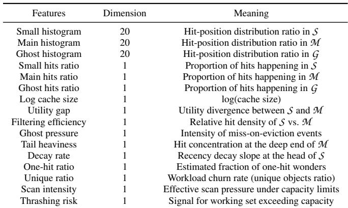

## 4.3 Learning the Parameters

## 4.3.1 Learning Objective

To enable efficient learning, we formulate the parameter learning as a probabilistic classification task over a finite set of candidate parameter configurations C . We learn a conditional probability distribution P(y = c j|x; φ) over these candidates cj ∈ C given the workload features x.

Standard classification objectives (e.g., cross-entropy) treat all misclassifications symmetrically. However, in caching, error costs are highly asymmetric and pairwise: mistaking a scan-heavy workload for a recency-friendly one causes catastrophic thrashing, whereas the reverse error often yields only marginal degradation. To capture these varying penalties, we employ a data-driven cost matrix L ∈ RK×K, where K is the number of candidate parameter configurations. Each entry Lk j quantifies the pairwise “regret” of selecting configuration ck when the true optimal is c j, normalized by the miss ratio of a baseline anchor Manchor,

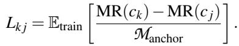

Choice of Anchor. While the anchor can theoretically be any baseline (e.g., LRU, FIFO), we select Manchor = MRFIFO. This choice is motivated by the structural nature of our system: (1) S4-FIFO is fundamentally built upon FIFO queues, therefore FIFO serves as the natural lower bound for robustness, and (2) normalizing by FIFO makes the cost metric invariant to the cacheability of the trace, allowing the model to learn effectively across workloads with vastly different miss ratios.

During inference, we minimize the expected risk,

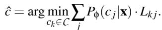

## 4.3.2 Features

To enable lightweight yet effective learning, we model the cache states and workload characteristics st using a compact feature vector (73 dimensions). The list of features used can be found in Table 3, where S , M , and G are the small queue, the main queue, and the ghost queue, respectively.

Cache metrics and workload characteristics. Cache size is critical for scale-invariant learning: the effectiveness of the small queue depends on its absolute capacity to absorb bursts, not just its relative share of the cache. For example, a 10% partition in a 100 GB cache provides ample buffer space, whereas 10% of a 100 MB cache may be insufficient for the same workload. Therefore, we track cache size using the log-transformed capacity. To capture the “shape” of local ity beyond simple scalar averages, we maintain lightweight histograms (20 equally-sized bins each) for the small, main, and ghost queues. These histograms capture the distribution of hit position within each queue. For instance, the first bin stores the number of hits in the first 5% of the queue. Intuitively, the histograms enable the cache to learn the queue usage. For example, many ghost hits suggest the small queue might be too small. Besides the histogram, we also include the number of hits per queue and the total number of requests.

Composite features. To avoid complex models, we use feature crossing to capture non-linear relationships between features, following common practice in traditional recommendation systems that rely on simple models [19, 52].

• Utility gap measures the utility divergence between the small and main queues and is defined as the absolute hit difference between them divided by total hits, Hmain−Hsmall . Htotal A positive gap indicates that the main queue is effectively retaining hotter items than the small queue.

• Filtering efficiency quantifies how well the small queue filters one-hit, computed as the ratio of hits in the small queue to those in the main queue, Hsmall Hmain

• Ghost pressure measures the fraction of hits served by the Hghost ghost queue, Hghost+Htotal . A high ghost pressure suggests that the small queue is undersized or that the promotion threshold is too conservative.

• Tail heaviness measures the dependence of the workload on long-term retention and is computed as the sum of hits in the last 10 bins of the main queue’s histogram, with larger values indicating that a substantial fraction of hits comes from long-resident objects.

• Decay rate measures how quickly items lose utility in the probationary small queue and is computed as the slope between the first two bins of the small queue’s histogram, where a steep negative slope indicates that most objects become cold quickly.

• Unique object ratio estimates cacheability and is computed # insertions to small as # requests

• One-hit ratio estimates the fraction of one-hit wonders in the workload and is computed as ρonehit = Nonehit , where Nunique Nonehit is the number of objects evicted from the small queue without reaching the promotion threshold, and Nunique is the number of unique objects observed during the window.

• Scan intensity and thrashing risk are derived by normalizing unique object ratio and one-hit ratio by the request rate, providing the model with explicit signals to distinguish between benign scans and destructive thrashing.

## 4.3.3 Model and learning

Inference Model. We employ a Gradient Boosting Decision Tree ensemble as the predictive model φ. It accepts the 73-dimensional feature vector x and outputs a probability distribution over the 18 classes. We choose GBDT over deep neural networks (DNNs) for two reasons. First, it can be easily packaged into a few portable headers for distribution, allowing users to use the pre-trained model in other programming languages without installing any new libraries. For example, our Cachelib [11] prototype employs the same model we trained using the libCacheSim [1] simulator. Second, GBDT excels at handling heterogeneous, nonlinear features (e.g., histograms mixed with scalar ratios) and needs no complex normalization.

Parameter search space reduction. Although we have discretized each parameter into a few options, the number of possible parameter combinations remains huge, which reduces learning effectiveness. We employ a clustering-based strategy to reduce the search space. We use the offline grid search results to identify the most common parameter combinations and identify 18 representative parameter sets out of 168 candidates via greedy set cover algorithm [55].

## 4.4 Implementation

We implement S4-FIFO in both libCacheSim for simulationbased evaluation and Meta Cachelib for prototype evaluation and production deployment. Both implementations extend S3-FIFO and employ the same pre-trained model, trained on features and labels collected in the simulator. In each system, a hash table is used for indexing, and linked lists are used to implement the queues.

## 4.4.1 Model implementation

We use LightGBM for our model implementation in the simulator. Because tree-based models can be compiled into sequences of conditional branches, we export the pretrained model into simple, dependency-free libraries using m2cgen [2], targeting several common programming languages, including C/C++, Go, Rust, Java, and JavaScript. This enables users to use our model directly without relying on LightGBM or other machine learning libraries. For example, our Cachelib implementation uses the C++ header files.

## 4.4.2 Feature collection

Most of the features are simple counters and straightforward to maintain, so we focus on the histogram features.

Small and Main FIFO queues. We use insertion time (i.e., the insertion index) to calculate the histogram bin for each object as ⌈ Tob j−Ttail ⌉ where T denotes the insertion time and w w is the bin width. For example, suppose the queue has a capacity of 1000, and we divide it into 20 bins, each with a width of 50. If the tail object was inserted at time Ttail = 20 and the current object at Tob j = 80, then the object should be incrementing the counter at the ⌈ 80−20 ⌉ = 2nd bin. 50

Ghost queue. Computing histogram bin indices in the ghost queue is more involved because a hit in the ghost queue removes the corresponding metadata entry and shifts all subsequent entries forward. As a result, using insertion time alone to determine the bin index yields incorrect positions. To compensate, we maintain an additional deletion-count histogram alongside the hit-position histogram for the ghost queue. Concretely, let i be the bin index obtained from the insertion-time-based formula. We sum the deletions recorded in bins 1 through i − 1, divide this sum by the bin width w to calculate the number of shifted bins s, and then correct the bin index as i′ = i − s. This adjusted index is used as the hit-position bin in the ghost-queue histogram. Even with the adjustment, the calculated bin is still approximate because we do not consider the deleted objects in bin i. However, the approximation has bounded error and is at most off by 1.

## 4.4.3 Overhead Analysis

We analyze the runtime complexity of S4-FIFO to demonstrate that it incurs almost no overhead compared to heuristics.

Inference. All cache operations, i.e., read, write (including eviction), are O(1). S4-FIFO adds two components. On the data path, it needs to collect features. However, many of the features it collects, such as the number of requests and hits, are already tracked in most production caches. The primary additional overhead introduced by S4-FIFO is the hit-position distribution histogram. This histogram is maintained as an array of counters, with exactly one counter incremented per access, yielding a strict O(1) time complexity. In Section 5.4, we show that the feature collection has a negligible impact on throughput. In deployments that are very sensitive to computational overhead, the feature collection can use sampled requests. On the control path, S4-FIFO performs inference, which has a time complexity of O(T · D), where T is the number of trees (20 in our model) and D is the maximum depth (9 in our model). Since the inference happens rarely and asynchronously, and each inference call takes less than 2 ms, there is no impact on request serving.

Training. The training cost of S4-FIFO is entirely offline and consists of two stages: label generation and model fitting. Label generation is the dominant cost. For each training trace and cache-size ratio, we run S4-FIFO over a fixed grid of candidate configurations and select the configuration with the lowest miss ratio as the label. Given N training traces, R cache-size ratios, G candidate configurations, and L requests per trace, label generation costs O(N · R · G · L). In our evaluation, G is a small constant determined by the parameter grid. Moreover, the grid search is embarrassingly parallel across traces, cache sizes, and configurations. Model fitting is substantially cheaper. Once the labels have been generated, we train a small GBDT using one compact feature vector per trace/cache-size pair. The model contains 20 trees with a maximum depth of 9 and predicts over 18 representative parameter sets. Thus, retraining is a one-time offline cost and does not affect the request-serving path. Deployments can directly use the pre-trained model. Retraining is only needed when operators want to incorporate additional training data. Further details can be found in Appendix Section A.1.

Storage. Unlike object-level learning, which requires maintaining feature vectors per object, S4-FIFO uses only 73 global features in total. Beyond the 2-bit counter inherited from S3-FIFO, no additional per-object metadata is needed. Including model parameters, the total storage overhead introduced by learning is on the order of only tens of kilobytes. The dominant storage overhead in S4-FIFO arises from the ghost queue. Each ghost entry requires 8 bytes to record the object ID (or fingerprint) and its insertion timestamp. For a cache holding 1 million objects, the ghost queue can therefore consume several megabytes of memory. Nonetheless, as long as objects are relatively large (e.g., larger than 200 bytes), this overhead remains small compared to the total data volume.

## 5 Evaluation

In this section, we use S4-FIFO as a case study to answer the following questions:

• Do augmented heuristics expose sufficient headroom for efficiency improvement?

• Can we accurately learn the optimal parameters of augmented heuristics to realize these efficiency gains?

• Do learning-augmented heuristics improve robustness?

• Do learning-augmented heuristics reduce throughput?

• Is a single pre-trained model sufficient across workloads, and why?

## 5.1 Methodology

Workloads. We evaluate S4-FIFO using 5,175 production traces collected from 14 sources (Table 4). We exclude very small traces with fewer than 100,000 objects, as these typically correspond to low-priority workloads (e.g., development traffic). Notably, many learned caches, such as LRB and 3L-Cache, perform extremely poorly on these short traces, which skews both average efficiency and robustness metrics. In contrast, S4-FIFO is insensitive to trace length because it relies on aggregated cache-level features. Consequently, including all traces would make S4-FIFO’s results even stronger.

Table 4: Summary of datasets used in our evaluation. We filtered out traces with fewer than 100,000 objects.  
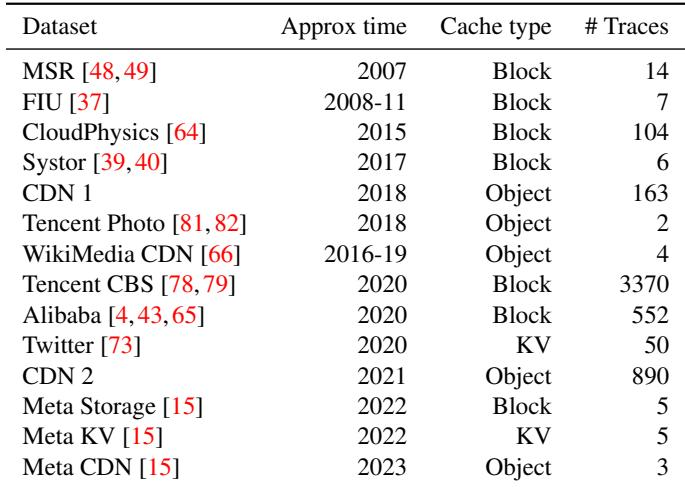

Experiment setup. We randomly split the traces into two sets: 4140 for training and 1035 for evaluation. For each trace in the training set, we run S4-FIFO with the default parameter combinations to collect training samples of (features, label) pairs. For each trace in the test set, we start the cache using S4-FIFO with the default parameter combinations, run for 20% of the trace to collect features, then make one prediction and apply the predicted parameters to the rest of the trace. To ensure a fair comparison with the offline optimum obtained via grid search, we restrict ourselves to one prediction per trace, since the offline optimum also uses a single parameter setting for the entire trace.

We compare S4-FIFO with S3-FIFO [74], LIRS [33], ARC [46], LRB [58], 3L-Cache [83], LHD [10], GL-Cache [70], and LeCaR [63]. Besides, we have also evaluated SIEVE [77], GDSF [20], and TinyLFU [24]; however, their results are worse than the ones in the figure. Due to space limits and for ease of plotting, we omit them in the figure. We evalu ate each algorithm at three cache sizes—0.1%, 1%, and 10% of the trace’s working-set size—but, for space reasons, we only present results for the smallest (0.1%) and largest (10%) caches. The results for the medium size (1%) consistently fall between these two.

All miss ratio results are from libCacheSim because most state-of-the-art eviction algorithms are not available in opensource caches such as Cachelib. Because our Cachelib implementation uses the same model as the simulator, S4-FIFO shows almost identical miss ratios in the simulator and prototype. We report throughput results by comparing S4-FIFO with highly optimized LRU, 2Q, S3-FIFO, and TinyLFU using CacheBench from Meta. The experiments were performed on a 20-node cluster with 32 cores and 192GB of memory. All experiments are repeated three times, and we report the mean result.

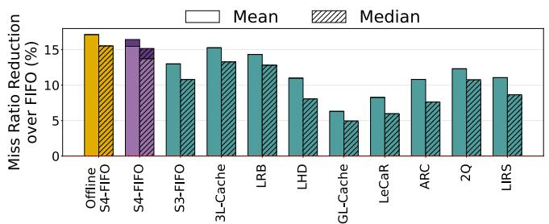  
(a) Large cache (10% of working set)

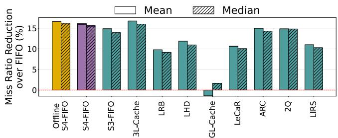  
(b) Small cache (0.1% of working set)  
Figure 6: Mean and median miss ratio reduction from FIFO of different algorithms using the large and small cache sizes. S4-FIFO is significantly better than all state-of-the-art algorithms at the large cache size, while on par with the best of all algorithms at the small cache size.

Metrics. We evaluate using the following metrics.

(i) Efficiency: Following prior work [74], we report the miss ratio reduction over FIFO, computed as MRFIFO−MRalgo MRFIFO present the mean reduction in miss ratio across the 1,035 traces in the test set.

(ii) Robustness: We report miss ratio reduction for the worstcase workload and for the 10th-percentile workload.

(iii) Overhead: We use Cachelib throughput as our primary overhead metric.

## 5.2 Efficiency

Efficiency is the primary performance metric for cache eviction. Figure 6 reports the mean and median miss-ratio reduction over FIFO for both small and large caches. Since S4-FIFO uses the first 20% of each trace to collect features before making a prediction, we evaluate two variants. In the online variant (v1, light purple), the first 20% of requests are served using the default parameters, and the remaining 80% are served using the predicted parameters. In the retrospective variant (v2, dark purple), the predicted parameters are applied to the entire trace; this isolates the quality of the learned configuration from the cost of the observation window. Across both cache sizes, v2 consistently outperforms v1, indicating that the predicted parameters improve efficiency and that the observation window accounts for the gap between the two variants.

Offline S4-FIFO. Unlike many learned caches, such as 3L-Cache, LRB, and LHD, which use sampling to select eviction candidates and can evict any object in the cache, learningaugmented heuristics like S4-FIFO are constrained by their underlying data structures: objects must pass through at least one queue before they can be evicted. Nevertheless, Figure 6 shows that offline S4-FIFO, which selects parameters via grid search, consistently achieves the highest efficiency. This suggests that the data structures used in S4-FIFO do not prevent it from attaining high efficiency. When comparing S4-FIFO with offline S4-FIFO, we find that the second variant, which runs the full trace using predicted parameters (same as offline S4-FIFO), achieves very similar miss ratio reduction as offline S4-FIFO with at most 0.2% difference in mean and median miss ratio reduction. This demonstrates the effectiveness of learning in S4-FIFO. In Section 5.5, we will show that S4- FIFO learns the best parameters most of the time, and even when it does not, the learned parameters are close to the best.

Comparison with state-of-the-art algorithms. S4-FIFO is built on top of S3-FIFO; compared to S3-FIFO, it achieves a 26% higher miss ratio reduction at the large cache size and an 8% higher reduction at the small cache size. Across all state-of-the-art algorithms, 3L-Cache consistently delivers the best performance. Relative to 3L-Cache, S4-FIFO attains slightly higher or comparable miss ratio reductions. For instance, at the large cache size, S4-FIFO achieves an 8% higher reduction. Compared with ARC, S4-FIFO nearly doubles ARC’s improvement over FIFO at the large cache size. Relative to the large-cache setting, S4-FIFO’s performance at the small cache size is less impressive: it is slightly worse than 3L-Cache, though still substantially better than the other state-of-the-art algorithms. For instance, S4-FIFO improves LRB’s mean reduction ratio from 9.8% to 16.2%. The slight advantage of 3L-Cache at small cache sizes stems from the fact that the cached objects are all highly popular, providing rich signals for object-level learning. However, object-level learning incurs high overhead and low throughput. In our simulator, 3L-Cache is 17.3× slower than S4-FIFO on average (max 274×). In summary, S4-FIFO achieves a high efficiency via its superior learning methods and the pre-trained model.

## 5.3 Robustness

Historically, work on designing new cache eviction algorithms has focused on reducing miss ratio on a small set of traces or improving average performance. Far less attention has been given to the robustness of these algorithms. Yet robustness is crucial, because an algorithm can severely degrade performance when the workload is out of distribution relative to its design assumptions. In this section, we evaluate the robustness of state-of-the-art algorithms using the worst trace and 10th-percentile trace. Note that we do not consider the competitive ratio because the arbitrary workload used in competitive-ratio analysis rarely occurs in the real world, so we focus on the worst-case production trace.

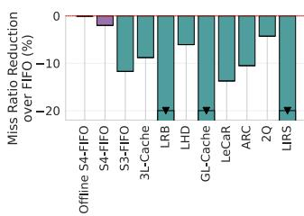  
(a) Worst case, large cache

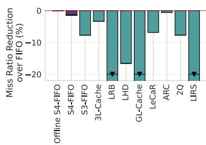  
(b) Worst case, small cache

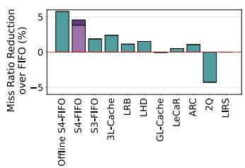  
(c) 10th-percentile, large cache

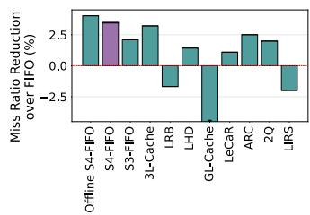  
(d) 10th-percentile, small cache

Figure 7: Efficiency on the worst case and 10th-percentile trace. A negative value indicates the algorithm has a miss ratio higher than FIFO. S4-FIFO is more robust than all state-of-the-art algorithms.  
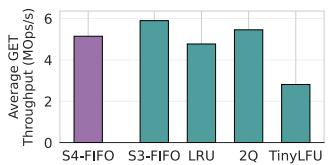

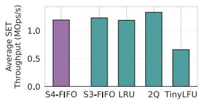  
Figure 8: Set and Get throughput evaluated in Cachelib.

Figure 7a and Figure 7b show the miss ratio change relative to FIFO on the worst trace for each algorithm. We observe that all state-of-the-art eviction algorithms incur a higher miss ratio than FIFO on their worst-case trace. In particular, LRB and LIRS perform substantially worse than the others, increasing FIFO’s miss ratio by 20% to 72%. In contrast, S4-FIFO increases FIFO’s miss ratio by only 0.8% and 0.2% at large and small cache sizes, respectively. For comparison, the nextbest algorithm at the large cache size is 2Q, which raises FIFO’s miss ratio by 4.3%.

Although the single worst-case trace may be unrepresentative, Figure 7c and Figure 7d show results on the 10thpercentile trace. On this metric, S4-FIFO widens its lead over state-of-the-art algorithms. While some schemes, such as LRB and LIRS, still exhibit miss ratios higher than FIFO, S4-FIFO reduces FIFO’s miss ratio by 4.2% and 3.6% at large and small cache sizes, respectively.

The robustness of S4-FIFO arises from three core design choices. First, S4-FIFO employs static FIFO queues and therefore avoids the pathological behaviors that can arise in adaptive algorithms [74]. Second, S4-FIFO leverages learning to select its parameters, enabling it to sidestep the adversarial workloads that often degrade the performance of fixed, heuristic-based schemes. Third, S4-FIFO’s learning objective uses FIFO as an anchor to directly optimize for robustness.

## 5.4 Throughput

To assess whether S4-FIFO preserves the high throughput of lightweight heuristic policies, we measure its throughput using CacheBench and compare it against highly optimized Cachelib implementations of S3-FIFO, LRU, LRU2Q (a modified 2Q without a ghost queue), and TinyLFU. In this experiment, S4-FIFO collects features continuously for every request throughout the benchmark. This deliberately conservative configuration provides an upper bound on the overhead of feature collection. In practice, periodic or sampled feature collection could further reduce this overhead; exploring these optimizations is left to future work. We use CacheBench’s CDN workload and four Graph Cache workloads, run each benchmark with 48 threads, and report the average throughput across all five workloads in Figure 8.

Even under this deliberately heavy configuration, S4-FIFO sustains throughput comparable to conventional heuristics, with only a modest slowdown from continuous feature extraction. Achieving heuristic-level throughput is challenging for typical learned caches, which often require critical-path inference or online training. S4-FIFO avoids these costs by collecting features outside the critical section and performing inference infrequently and asynchronously using an offline-trained model. As a result, its critical path remains lightweight, preserving throughput and simplifying deployment. By contrast, TinyLFU incurs additional overhead because its count-min sketch must be updated within the critical section to ensure correctness, resulting in significant throughput degradation.

## 5.5 Why does Learning Work?

As a simple algorithm with static queue sizes, S4-FIFO achieves both higher efficiency and robustness compared to state-of-the-art algorithms. This section deep dives into how learning helps S4-FIFO achieve this and why one pre-trained model is sufficient.

Miss ratio over time. Figure 12 illustrates the effect of how learned parameters affect miss ratio over time for a representative trace. The vertical dashed line marks the point at which S4-FIFO switches to the predicted parameters, which shrink the small-queue size to 5% of the cache and skip frequencycounter increments for 25% of the items at the front of the small queue. After this parameter change, S4-FIFO (solid line) quickly diverges from the baseline (dashed line): the interval miss ratio drops substantially and remains consistently lower for the remainder of the trace, and the cumulative miss ratio curve steadily widens its gap relative to the baseline. This example shows that although parameters remain static (i.e., not updated per-miss), learning a set of parameters for each workload can deliver a substantial reduction in miss ratio compared to using a fixed set of parameters.

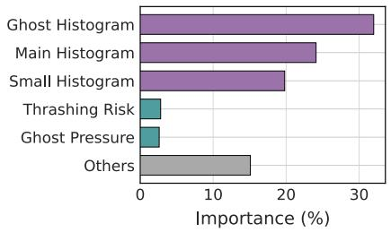  
Figure 9: Feature importance by category.

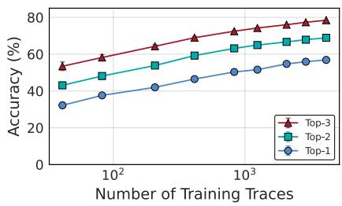  
Figure 10: Impact of training data size.

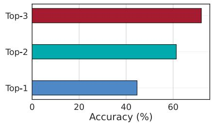  
Figure 11: Prediction accuracy on the Twitter dataset on model pretrained on CDN2.

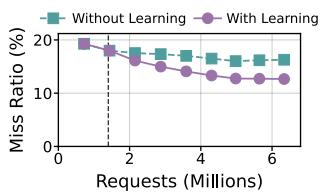  
(a) Cumulative miss ratio

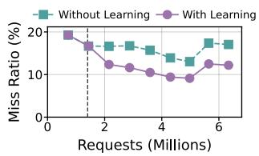  
(b) Interval miss ratio  
Figure 12: Miss ratio over time where the learned parameters significantly reduce the miss ratio.

Rank of predicted parameters. Figure 13 compares the grid-search rank distributions of the default S4-FIFO parameters (most are inherited from S3-FIFO) with the learned parameters, where a lower rank indicates better performance (rank 1 is the best). In both small and large cache sizes, the predicted parameters from S4-FIFO are consistently close to the best configuration across traces. In contrast, the default parameters have a substantially wider distribution that extends to much worse ranks, indicating that using the same parameters across traces leaves significant headroom for improvement.

Feature importance. We compute the feature-importance scores from the trained decision tree. As shown in Figure 9, the histograms of all three queues (ghost, main, and small) are the most important. Together, these histogram features account for 75% of the total importance, indicating that the shape of hit distributions within each queue (workload locality) is the strongest signal for predicting good configurations. The remaining composite features, such as thrashing risk (working set size estimate) and ghost pressure (hits found on the ghost), account for 25% of the importance.

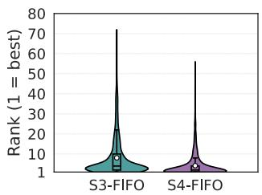  
(a) Large cache

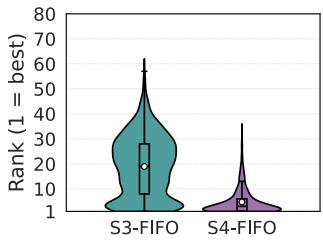  
(b) Small cache  
Figure 13: Rank distribution of the default (S3-FIFO) and predicted parameters (S4-FIFO) from optimal grid search configuration.

Training data size. To understand why a single pre-trained model works, we measure how prediction accuracy changes with the number of training traces. For each training dataset size, we pre-train a new model and evaluate on the same test dataset. We measure top-1, top-2, and top-3 accuracy, which are the fractions of traces in which the predicted parameters are ranked top-1, top-2, or top-3, respectively. Figure 10 shows that all three metrics monotonically increase with more training data. With several thousand traces, top-1 approaches 60%, top-2 approaches 70%, and top-3 approaches 80%. Although performance starts to plateau, increasing the training dataset size further is likely to make the pre-trained model increasingly accurate.

Cross-dataset generalization. The training and test traces we have been using so far are generated using a random split, without considering the dataset (source). This is acceptable because each dataset contains many diverse traces, and traces within a single dataset can be more diverse than those across datasets. To verify whether pre-trained models can generalize across datasets, we train a model on the CDN2 dataset (object cache) and evaluate on the Twitter dataset (key-value cache). Figure 11 shows that the model pre-trained on one dataset can be directly used on a different one, and the knowledge learned is generalizable as long as the training dataset is large and diverse enough.

Generality across eviction algorithms. The principles of LAH can be applied to other policies that expose a small set of configuration knobs. For example, CacheLib’s LRU exposes configurable behaviors such as node-promotion frequency, whether metadata is updated on reads, writes, or contention, and the insertion position of new objects in the LRU queue. 2Q [35] exposes the relative sizes of its hot and cold queues, ARC [46] exposes the balance between its recency and frequency regions, and LeCaR [63] exposes the weights assigned to its eviction experts. Extending LAH to these policies requires policy-specific feature engineering. For example, an LRU-based instantiation could additionally track hit positions in the queue and their reuse distances. These extensions are beyond the scope of this work.

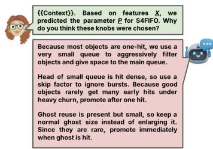

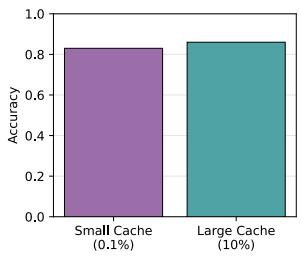  
(a) Explaining predicted parameters  
(b) Selecting suitable parameters  
Figure 14: LLM-based interpretability evaluation. S4-FIFO’s cachelevel features and semantic parameters allow an LLM to explain predicted configurations and distinguish suitable parameter choices.

## 5.6 Is the Learned Decision Interpretable?

S4-FIFO learns from high-level cache features and predicts high-level knobs. Because both the inputs and outputs operate at the cache level, the decisions it produces are far more interpretable than those of prior smart-cache designs. Unlike approaches that make opaque predictions (e.g., ranking objects or estimating reuse densities), S4-FIFO expresses its decisions using knobs that operators already understand, such as queue sizes and promotion thresholds. The features S4-FIFO used characterize workload, capturing burstiness, one-hit ratios, and reuse-distance patterns, making the mapping from features to knobs easier to interpret.

We use LLM-based evaluation as a proxy for semantic interpretability: if an external reasoning model can connect workload-level features to the selected cache knobs, then the learned decisions are likely expressed in a form that operators can reason about. We evaluate this with two language-model based experiments, shown in Figure 14. First, given workload features and a predicted S4-FIFO configuration, LLMs are able to explain why the selected knobs match the workload behavior. Second, we provide an LLM with the workload features and two configurations with distinctly different miss ratios and ask it to identify the better configuration. Across 100 traces for each cache size, the LLM performs substantially above chance, achieving 83% and 86% accuracy in the smallcache and large-cache setting. While these results do not establish the correctness of the learned policy, they suggest that S4-FIFO’s feature and parameter spaces are semantically meaningful enough to support external reasoning, making the selected configurations easier to explain, justify, and debug. We provide further details in Appendix Section A.2.

## 6 Related Work

Optimizing cache efficiency. Many studies have examined the design of eviction algorithms to improve efficiency. These include static heuristics such as S3-FIFO [74], SIEVE [77], QDLP [71], LIRS [33,80], clock variants [16,32,42], 2Q [35], S4LRU [31], LRFU [22], LFU variants [5, 6, 36], greedydual variants [20, 34], MQ [84], Clock2Q+ [76], Hyperbolic [13]; per-miss cache-level adaptive algorithms, such as ARC [46], CAR [8], SEQ [29], EELRU [56], Clock-Pro+ [42], LeCaR [63], CACHEUS [53], TinyLFU [24]; and objectlevel learning algorithms, such as LRB [58], 3L-Cache [83], LHD [10], PA-Cache [26], RL-Belady [68], Raven [30], HALP [59], Darwin [17]. Compared with these algorithms, to the best of our knowledge, this is the first work to propose learning-augmented heuristics that separate the control and data-serving planes to achieve both high efficiency and performance. S4-FIFO demonstrates this idea by using a pre-trained model to learn the parameters of S3-FIFO.

Machine learning for systems. Prior works integrate ML into systems at three distinct levels of the stack, ranging from replacing internal mechanisms to tuning external knobs. (1) Structural replacement: Works such as learned indexes [38, 60] and learned bloom filters [62] aim to replace data structures with neural networks. (2) Policy optimization: ML replaces specific heuristics (policies) while keeping the underlying mechanism intact. Examples include RL-based flash admission [75], and language-model-based C++ memory manager [44, 45]. (3) Black-box autotuning: Systems like OtterTune [3] treat the database as a black box, optimizing configuration knobs via Bayesian optimization. S4-FIFO occupies a distinct point in this design space: unlike structural replacement, it preserves the mechanism’s deterministic safety (the S4-FIFO data path); unlike per-instance policy optimization, it leverages a pre-trained foundation model to generalize to unseen workloads; and unlike black-box autotuning with slow iterative search, it performs zero-shot inference, quickly selecting an optimal configuration after a brief observation window and avoiding costly online exploration.

## 7 Conclusion

We introduce Learning-Augmented Heuristics (LAH), which keeps the data path simple while using a pre-trained model to configure a few semantic knobs. Our S4-FIFO instantiation extends S3-FIFO with tunable parameters and selects configurations based on cache-level features. Evaluated on 1,035 production traces, S4-FIFO achieves higher average miss-ratio reduction and stronger robustness than state-of-theart algorithms, while matching the throughput of heuristics. These results indicate that learning to configure expressive heuristics is an effective and interpretable way to bring ML into core caching systems.

## Acknowledgments

We thank the anonymous reviewers for their valuable feedback and our shepherd for the constructive suggestions. We also would like to thank the people and organizations that have open-sourced and shared production traces. We thank Cloudlab [23] for providing infrastructure support to run experiments.

## References

[1] libcachesim: A high-performance cache simulator. https://github.com/1a1a11a/libCacheSim. Accessed: 2025-12-01.

[2] M2cgen repository. https://github.com/ BayesWitnesses/m2cgen. Accessed: 2025-12- 10.

[3] Dana Van Aken, Andrew Pavlo, Geoffrey J. Gordon, and Bohan Zhang. Automatic database management system tuning through large-scale machine learning. In Semih Salihoglu, Wenchao Zhou, Rada Chirkova, Jun Yang, and Dan Suciu, editors, Proceedings of the 2017 ACM International Conference on Management of Data, SIGMOD Conference 2017, Chicago, IL, USA, May 14- 19, 2017, pages 1009–1024. ACM, 2017.

[4] Alibaba Group. Alibaba block traces. https: //github.com/alibaba/block-traces, 2020. Accessed: 2025-12-01.

[5] Martin Arlitt, Ludmila Cherkasova, John Dilley, Rich Friedrich, and Tai Jin. Evaluating content management techniques for Web proxy caches. ACM SIG-METRICS Performance Evaluation Review, 27(4):3–11, March 2000.

[6] Martin Arlitt, Rich Friedrich, and Tai Jin. Performance Evaluation of Web Proxy Cache Replacement Policies. In Perform. Eval., volume 39, pages 149–164, NLD, February 2000. Elsevier Science Publishers B. V.

[7] Nirav Atre, Justine Sherry, Weina Wang, and Daniel S. Berger. Caching with delayed hits. In Henning Schulzrinne and Vishal Misra, editors, SIGCOMM ’20: Proceedings of the 2020 Annual conference of the ACM Special Interest Group on Data Communication on the applications, technologies, architectures, and protocols for computer communication, Virtual Event, USA, August 10-14, 2020, pages 495–513. ACM, 2020.

[8] Sorav Bansal and Dharmendra S. Modha. CAR: Clock with Adaptive Replacement. In 3rd USENIX Conference on File and Storage Technologies, FAST’04, 2004.

[9] Soumya Basu, Aditya Sundarrajan, Javad Ghaderi, Sanjay Shakkottai, and Ramesh K. Sitaraman. Adaptive ttl-based caching for content delivery. In Bruce E. Hajek, Sewoong Oh, Augustin Chaintreau, Leana Golubchik, and Zhi-Li Zhang, editors, Proceedings of the 2017 ACM SIGMETRICS / International Conference on Measurement and Modeling of Computer Systems, Urbana-Champaign, IL, USA, June 05 - 09, 2017, pages 45–46. ACM, 2017.

[10] Nathan Beckmann, Haoxian Chen, and Asaf Cidon. LHD: improving cache hit rate by maximizing hit density. In Sujata Banerjee and Srinivasan Seshan, editors, 15th USENIX Symposium on Networked Systems Design and Implementation, NSDI 2018, Renton, WA, USA, April 9-11, 2018, pages 389–403. USENIX Association, 2018.

[11] Benjamin Berg, Daniel S. Berger, Sara McAllister, Isaac Grosof, Sathya Gunasekar, Jimmy Lu, Michael Uhlar, Jim Carrig, Nathan Beckmann, Mor Harchol-Balter, and Gregory R. Ganger. The CacheLib caching engine: Design and experiences at scale. In 14th USENIX symposium on operating systems design and implementation, OSDI’20, pages 753–768. USENIX Association, November 2020.

[12] Daniel S. Berger, Ramesh K. Sitaraman, and Mor Harchol-Balter. Adaptsize: Orchestrating the hot object memory cache in a content delivery network. In Aditya Akella and Jon Howell, editors, 14th USENIX Symposium on Networked Systems Design and Implementation, NSDI 2017, Boston, MA, USA, March 27-29, 2017, pages 483–498. USENIX Association, 2017.

[13] Aaron Blankstein, Siddhartha Sen, and Michael J. Freedman. Hyperbolic caching: Flexible caching for web applications. In 2017 USENIX annual technical conference, ATC’17, pages 499–511, Santa Clara, CA, July 2017. USENIX Association.

[14] John W. Byers, Jeffrey Considine, Michael Mitzenmacher, and Stanislav Rost. Informed content delivery across adaptive overlay networks. In Matthew Mathis, Peter Steenkiste, Hari Balakrishnan, and Vern Paxson, editors, Proceedings of the ACM SIGCOMM 2002 Conference on Applications, Technologies, Architectures, and Protocols for Computer Communication, August 19-23, 2002, Pittsburgh, PA, USA, pages 47–60. ACM, 2002.

[15] CacheLib. Evaluating SSD hardware for Facebook workloads: Running cachebench with the trace workload. https://cachelib.org/docs/Cache\_ Library\_User\_Guides/Cachebench\_FB\_HW\_eval, n.d. Accessed: 2025-12-01.

[16] Richard W. Carr and John L. Hennessy. WSCLOCK: a simple and effective algorithm for virtual memory management. In Proceedings of the eighth ACM symposium on Operating systems principles, SOSP’81, pages 87– 95, New York, NY, USA, December 1981. Association for Computing Machinery.

[17] Jiayi Chen, Nihal Sharma, Tarannum Khan, Shu Liu, Brian Chang, Aditya Akella, Sanjay Shakkottai, and Ramesh K Sitaraman. Darwin: Flexible Learning-based CDN Caching. In Proceedings of the ACM SIGCOMM 2023 Conference, SIGCOMM ’23, pages 981–999, New York, NY, USA, September 2023. Association for Computing Machinery.

[18] Tianqi Chen and Carlos Guestrin. Xgboost: A scalable tree boosting system. In Balaji Krishnapuram, Mohak Shah, Alexander J. Smola, Charu C. Aggarwal, Dou Shen, and Rajeev Rastogi, editors, Proceedings of the 22nd ACM SIGKDD International Conference on Knowledge Discovery and Data Mining, San Francisco, CA, USA, August 13-17, 2016, pages 785–794. ACM, 2016.

[19] Heng-Tze Cheng, Levent Koc, Jeremiah Harmsen, Tal Shaked, Tushar Chandra, Hrishi Aradhye, Glen Anderson, Greg Corrado, Wei Chai, Mustafa Ispir, Rohan Anil, Zakaria Haque, Lichan Hong, Vihan Jain, Xiaobing Liu, and Hemal Shah. Wide & deep learning for recommender systems. In Alexandros Karatzoglou, Balázs Hidasi, Domonkos Tikk, Oren Sar Shalom, Haggai Roitman, Bracha Shapira, and Lior Rokach, editors, Proceedings of the 1st Workshop on Deep Learning for Recommender Systems, DLRS@RecSys 2016, Boston, MA, USA, September 15, 2016, pages 7–10. ACM, 2016.

[20] Ludmila Cherkasova. Improving WWW proxies performance with greedy-dual-size-frequency caching policy. Citeseer, 1998.

[21] Peter J. Denning. The working set model for program behavior. In Proceedings of the First ACM Symposium on Operating System Principles, SOSP ’67, page 15.1–15.12, New York, NY, USA, 1967. Association for Computing Machinery.

[22] Donghee Lee, Jongmoo Choi, Jong-Hun Kim, S.H. Noh, Sang Lyul Min, Yookun Cho, and Chong Sang Kim. LRFU: a spectrum of policies that subsumes the least recently used and least frequently used policies. IEEE Transactions on Computers, 50(12):1352–1361, Decem ber 2001.

[23] Dmitry Duplyakin, Robert Ricci, Aleksander Maricq, Gary Wong, Jonathon Duerig, Eric Eide, Leigh Stoller, Mike Hibler, David Johnson, Kirk Webb, Aditya

Akella, Kuangching Wang, Glenn Ricart, Larry Landweber, Chip Elliott, Michael Zink, Emmanuel Cecchet, Snigdhaswin Kar, and Prabodh Mishra. The design and operation of CloudLab. In Proceedings of the USENIX Annual Technical Conference (ATC), pages 1–14, July 2019.

[24] Gil Einziger, Roy Friedman, and Ben Manes. Tinylfu: A highly efficient cache admission policy. ACM Trans. Storage, 13(4):35:1–35:31, 2017.

[25] Bin Fan, Hyeontaek Lim, David G. Andersen, and Michael Kaminsky. Small cache, big effect: provable load balancing for randomly partitioned cluster services. In Jeffrey S. Chase and Amr El Abbadi, editors, ACM Symposium on Cloud Computing in conjunction with SOSP 2011, SOCC ’11, Cascais, Portugal, October 26- 28, 2011, page 23. ACM, 2011.

[26] Qilin Fan, Xiuhua Li, Jian Li, Qiang He, Kai Wang, and Junhao Wen. PA-Cache: Evolving Learning-Based Popularity-Aware Content Caching in Edge Networks, December 2020.

[27] Qilin Fan, Xiuhua Li, Jian Li, Qiang He, Kai Wang, and Junhao Wen. Pa-cache: Evolving learning-based popularity- aware content caching in edge networks. IEEE Trans. Netw. Serv. Manag., 18(2):1746–1757, 2021.

[28] Jerome H Friedman. Greedy function approximation: a gradient boosting machine. Annals of statistics, pages 1189–1232, 2001.

[29] Gideon Glass and Pei Cao. Adaptive page replacement based on memory reference behavior. ACM SIGMET-RICS Performance Evaluation Review, 25(1):115–126, June 1997.

[30] Xinyue Hu, Eman Ramadan, Wei Ye, Feng Tian, and Zhi Li Zhang. Raven: belady-guided, predictive (deep) learning for in-memory and content caching. In Proceedings of the 18th International Conference on emerging Networking EXperiments and Technologies, CoNEXT’22, pages 72–90, New York, NY, USA, November 2022. Association for Computing Machinery.

[31] Qi Huang, Ken Birman, Robbert van Renesse, Wyatt Lloyd, Sanjeev Kumar, and Harry C. Li. An analysis of Facebook photo caching. In Proceedings of the Twenty-Fourth ACM Symposium on Operating Systems Principles, SOSP’13, pages 167–181, New York, NY, USA, November 2013. Association for Computing Machinery.

[32] Song Jiang, Feng Chen, and Xiaodong Zhang. CLOCK-Pro: an effective improvement of the CLOCK replacement. In Proceedings of the annual conference

on USENIX Annual Technical Conference, ATC’05, page 35, USA, April 2005. USENIX Association.

[33] Song Jiang and Xiaodong Zhang. LIRS: an efficient low inter-reference recency set replacement policy to improve buffer cache performance. In Richard R. Muntz, Margaret Martonosi, and Edmundo de Souza e Silva, editors, Proceedings of the International Conference on Measurements and Modeling of Computer Systems, SIGMETRICS 2002, June 15-19, 2002, Marina Del Rey, California, USA, pages 31–42. ACM, 2002.

[34] Shudong Jin and A. Bestavros. Popularity-aware greedy dual-size Web proxy caching algorithms. In Proceed ings 20th IEEE International Conference on Distributed Computing Systems, pages 254–261, 2000.

[35] Theodore Johnson and Dennis E. Shasha. 2q: A low overhead high performance buffer management replacement algorithm. In Jorge B. Bocca, Matthias Jarke, and Carlo Zaniolo, editors, VLDB’94, Proceedings of 20th International Conference on Very Large Data Bases, September 12-15, 1994, Santiago de Chile, Chile, pages 439–450. Morgan Kaufmann, 1994.

[36] George Karakostas and D Serpanos. Practical LFU implementation for web caching. Technical Report TR-622-00, 2000.

[37] Ricardo Koller and Raju Rangaswami. I/O deduplication: Utilizing content similarity to improve I/O performance. ACM Trans. Storage, 6(3):13:1–13:26, 2010.

[38] Tim Kraska, Alex Beutel, Ed H. Chi, Jeffrey Dean, and Neoklis Polyzotis. The case for learned index structures. In Gautam Das, Christopher M. Jermaine, and Philip A. Bernstein, editors, Proceedings of the 2018 International Conference on Management of Data, SIG-MOD Conference 2018, Houston, TX, USA, June 10-15, 2018, pages 489–504. ACM, 2018.

[39] Chunghan Lee, Tatsuo Kumano, Tatsuma Matsuki, Hiroshi Endo, Naoto Fukumoto, and Mariko Sugawara. Systor ’17 traces (SNIA IOTTA trace set 4931). In Geoff Kuenning, editor, SNIA IOTTA Trace Repository. Storage Networking Industry Association, February 2016.

[40] Chunghan Lee, Tatsuo Kumano, Tatsuma Matsuki, Hiroshi Endo, Naoto Fukumoto, and Mariko Sugawara. Understanding storage traffic characteristics on enterprise virtual desktop infrastructure. In Doron Chen, Peter Desnoyers, and Eyal de Lara, editors, Proceedings of the 10th ACM International Systems and Storage Conference, SYSTOR 2017, Haifa, Israel, May 22-24, 2017, pages 13:1–13:11. ACM, 2017.

[41] Cong Li. Dlirs: Improving low inter-reference recency set cache replacement policy with dynamics. In Proceedings of the 11th ACM International Systems and Storage Conference, pages 59–64, 2018.

[42] Cong Li. CLOCK-pro+: improving CLOCK-pro cache replacement with utility-driven adaptation. In Proceedings of the 12th ACM International Conference on Systems and Storage, SYSTOR’19, pages 1–7, New York, NY, USA, May 2019. Association for Computing Machinery.

[43] Jinhong Li, Qiuping Wang, Patrick P. C. Lee, and Chao Shi. An in-depth analysis of cloud block storage workloads in large-scale production. In IEEE International Symposium on Workload Characterization, IISWC 2020, Beijing, China, October 27-30, 2020, pages 37–47. IEEE, 2020.

[44] Martin Maas, David G. Andersen, Michael Isard, Mohammad Mahdi Javanmard, Kathryn S. McKinley, and Colin Raffel. Learning-based memory allocation for C++ server workloads. In James R. Larus, Luis Ceze, and Karin Strauss, editors, ASPLOS ’20: Architectural Support for Programming Languages and Operating Systems, Lausanne, Switzerland, March 16-20, 2020, pages 541–556. ACM, 2020.

[45] Martin Maas, David G. Andersen, Michael Isard, Mohammad Mahdi Javanmard, Kathryn S. McKinley, and Colin Raffel. Combining machine learning and lifetimebased resource management for memory allocation and beyond. Commun. ACM, 67(4):87–96, 2024.

[46] Nimrod Megiddo and Dharmendra S. Modha. ARC: A self-tuning, low overhead replacement cache. In Jeff Chase, editor, Proceedings of the FAST ’03 Conference on File and Storage Technologies, March 31 - April 2, 2003, Cathedral Hill Hotel, San Francisco, California, USA. USENIX, 2003.

[47] Kianoosh Mokhtarian and Hans-Arno Jacobsen. Caching in video cdns: building strong lines of defense. In Dick C. A. Bulterman, Herbert Bos, Antony I. T. Rowstron, and Peter Druschel, editors, Ninth Eurosys Conference 2014, EuroSys 2014, Amsterdam, The Netherlands, April 13-16, 2014, pages 13:1–13:13. ACM, 2014.

[48] Dushyanth Narayanan, Austin Donnelly, and Antony Rowstron. MSR Cambridge traces (SNIA IOTTA trace 386). In Geoff Kuenning, editor, SNIA IOTTA Trace Repository. Storage Networking Industry Association, March 2007.

[49] Dushyanth Narayanan, Austin Donnelly, and Antony I. T. Rowstron. Write off-loading: Practical power man-

agement for enterprise storage. ACM Trans. Storage, 4(3):10:1–10:23, 2008.

[50] Erik Nygren, Ramesh K. Sitaraman, and Jennifer Sun. The akamai network: a platform for high-performance internet applications. ACM SIGOPS Oper. Syst. Rev., 44(3):2–19, 2010.

[51] Elizabeth J. O’Neil, Patrick E. O’Neil, and Gerhard Weikum. The LRU-K page replacement algorithm for database disk buffering. In Peter Buneman and Sushil Jajodia, editors, Proceedings of the 1993 ACM SIG-MOD International Conference on Management of Data, Washington, DC, USA, May 26-28, 1993, pages 297–306. ACM Press, 1993.

[52] Steffen Rendle. Factorization machines with libfm. ACM Trans. Intell. Syst. Technol., 3(3):57:1–57:22, 2012.

[53] Liana V. Rodriguez, Farzana Yusuf, Steven Lyons, Eysler Paz, Raju Rangaswami, Jason Liu, Ming Zhao, and Giri Narasimhan. Learning Cache Replacement with CACHEUS. In 19th USENIX Conference on File and Storage Technologies, FAST’21, pages 341–354. USENIX Association, February 2021.

[54] Kyle Schomp, Onkar Bhardwaj, Eymen Kurdoglu, Mashooq Muhaimen, and Ramesh K. Sitaraman. Akamai DNS: providing authoritative answers to the world’s queries. In Henning Schulzrinne and Vishal Misra, editors, SIGCOMM ’20: Proceedings of the 2020 Annual conference of the ACM Special Interest Group on Data Communication on the applications, technologies, architectures, and protocols for computer communication, Virtual Event, USA, August 10-14, 2020, pages 465–478. ACM, 2020.

[55] Peter Slavík. A tight analysis of the greedy algorithm for set cover. J. Algorithms, 25(2):237–254, 1997.

[56] Yannis Smaragdakis, Scott Kaplan, and Paul Wilson. EELRU: simple and effective adaptive page replacement. ACM SIGMETRICS Performance Evaluation Review, 27(1):122–133, May 1999.

[57] Hyunsub Song, Shean Kim, J. Hyun Kim, Ethan J. H. Park, and Sam H. Noh. First responder: Persistent memory simultaneously as high performance buffer cache and storage. In Irina Calciu and Geoff Kuenning, editors, Proceedings of the 2021 USENIX Annual Technical Conference, USENIX ATC 2021, July 14-16, 2021, pages 839–853. USENIX Association, 2021.

[58] Zhenyu Song, Daniel S. Berger, Kai Li, and Wyatt Lloyd. Learning relaxed belady for content distribution network caching. In Ranjita Bhagwan and George Porter, editors,

17th USENIX Symposium on Networked Systems Design and Implementation, NSDI 2020, Santa Clara, CA, USA, February 25-27, 2020, pages 529–544. USENIX Association, 2020.

[59] Zhenyu Song, Kevin Chen, Nikhil Sarda, Deniz Altinbuken, Eugene Brevdo, Jimmy Coleman, Xiao Ju, Pawel Jurczyk, Richard Schooler, and Ramki Gummadi. HALP: Heuristic Aided Learned Preference Eviction Policy for YouTube Content Delivery Network. In 20th USENIX Symposium on Networked Systems Design and Implementation, NSDI’23, pages 1149–1163, 2023.

[60] Mihail Stoian, Andreas Kipf, Ryan Marcus, and Tim Kraska. PLEX: towards practical learned indexing. CoRR, abs/2108.05117, 2021.

[61] Aditya Sundarrajan, Mingdong Feng, Mangesh Kasbekar, and Ramesh K. Sitaraman. Footprint descriptors: Theory and practice of cache provisioning in a global CDN. In Proceedings of the 13th International Conference on emerging Networking EXperiments and Technologies, CoNEXT 2017, Incheon, Republic of Korea, December 12 - 15, 2017, pages 55–67. ACM, 2017.

[62] Kapil Vaidya, Eric Knorr, Michael Mitzenmacher, and Tim Kraska. Partitioned learned bloom filters. In 9th International Conference on Learning Representations, ICLR 2021, Virtual Event, Austria, May 3-7, 2021. Open-Review.net, 2021.

[63] Giuseppe Vietri, Liana V. Rodriguez, Wendy A. Martinez, Steven Lyons, Jason Liu, Raju Rangaswami, Ming Zhao, and Giri Narasimhan. Driving cache replacement with ml-based lecar. In Ashvin Goel and Nisha Talagala, editors, 10th USENIX Workshop on Hot Topics in Storage and File Systems, HotStorage 2018, Boston, MA, USA, July 9-10, 2018. USENIX Association, 2018.

[64] Carl A. Waldspurger, Nohhyun Park, Alexander Garthwaite, and Irfan Ahmad. Efficient mrc construction with shards. In Proceedings of the 13th USENIX Conference on File and Storage Technologies, FAST’15, page 95–110, USA, 2015. USENIX Association.

[65] Qiuping Wang, Jinhong Li, Patrick P. C. Lee, Tao Ouyang, Chao Shi, and Lilong Huang. Separating data via block invalidation time inference for write amplification reduction in log-structured storage. In Dean Hildebrand and Donald E. Porter, editors, 20th USENIX Conference on File and Storage Technologies, FAST 2022, Santa Clara, CA, USA, February 22-24, 2022, pages 429–444. USENIX Association, 2022.

[66] Wikimedia Foundation. Analytics/Data Lake/Traffic/Caching. https://wikitech. wikimedia.org/wiki/Analytics/Data\_Lake/ Traffic/Caching, n.d. Accessed: 2025-12-01.

[67] Kan Wu, Zhihan Guo, Guanzhou Hu, Kaiwei Tu, Ramnatthan Alagappan, Rathijit Sen, Kwanghyun Park, Andrea C. Arpaci-Dusseau, and Remzi H. Arpaci-Dusseau. The storage hierarchy is not a hierarchy: Optimizing caching on modern storage devices with orthus. In 19th USENIX conference on file and storage technologies, FAST’21, pages 307–323. USENIX Association, February 2021.

[68] Gang Yan and Jian Li. RL-Bélády: A Unified Learning Framework for Content Caching. In Proceedings of the 28th ACM International Conference on Multimedia, MM’20, pages 1009–1017, Seattle WA USA, October 2020. ACM.

[69] Gang Yan and Jian Li. Towards latency awareness for content delivery network caching. In Jiri Schindler and Noa Zilberman, editors, Proceedings of the 2022 USENIX Annual Technical Conference, USENIX ATC 2022, Carlsbad, CA, USA, July 11-13, 2022, pages 789– 804. USENIX Association, 2022.

[70] Juncheng Yang, Ziming Mao, Yao Yue, and K. V. Rashmi. Gl-cache: Group-level learning for efficient and high-performance caching. In Ashvin Goel and Dalit Naor, editors, 21st USENIX Conference on File and Storage Technologies, FAST 2023, Santa Clara, CA, USA, February 21-23, 2023, pages 115–134. USENIX Association, 2023.

[71] Juncheng Yang, Ziyue Qiu, Yazhuo Zhang, Yao Yue, and K. V. Rashmi. FIFO can be Better than LRU: the Power of Lazy Promotion and Quick Demotion. In Proceedings of the 19th Workshop on Hot Topics in Operating Systems, HOTOS’23, pages 70–79, New York, NY, USA, June 2023. Association for Computing Machinery.

[72] Juncheng Yang, Anirudh Sabnis, Daniel S. Berger, K. V. Rashmi, and Ramesh K. Sitaraman. C2DN: how to harness erasure codes at the edge for efficient content delivery. In Amar Phanishayee and Vyas Sekar, editors, 19th USENIX Symposium on Networked Systems Design and Implementation, NSDI 2022, Renton, WA, USA, April 4-6, 2022, pages 1159–1177. USENIX Association, 2022.

[73] Juncheng Yang, Yao Yue, and K. V. Rashmi. A large scale analysis of hundreds of in-memory cache clusters at twitter. In 14th USENIX Symposium on Operating Systems Design and Implementation, OSDI 2020, Virtual Event, November 4-6, 2020, pages 191–208. USENIX Association, 2020.

[74] Juncheng Yang, Yazhuo Zhang, Ziyue Qiu, Yao Yue, and Rashmi Vinayak. Fifo queues are all you need for cache eviction. In Proceedings of the 29th Symposium on Operating Systems Principles, SOSP ’23, page 130–149,

New York, NY, USA, 2023. Association for Computing Machinery.

[75] Tzu-Wei Yang, Seth Pollen, Mustafa Uysal, Arif Merchant, and Homer Wolfmeister. CacheSack: Admission optimization for google datacenter flash caches. In 2022 USENIX Annual Technical Conference (USENIX ATC 22), pages 1021–1036, Carlsbad, CA, July 2022. USENIX Association.

[76] Yiyan Zhai, Bintang Dwi Marthen, Sarath Balivada, Vamsi Sudhakar Bojji, Eric Knauft, Jitender Rohilla, Jiaqi Zuo, Quanxing Liu, Maxime Austruy, Wenguang Wang, and Juncheng Yang. Clock2Q+: A simple and efficient replacement algorithm for metadata cache in VMware vSAN, 2025.

[77] Yazhuo Zhang, Juncheng Yang, Yao Yue, Ymir Vigfusson, and K.V. Rashmi. SIEVE is simpler than LRU: an efficient Turn-Key eviction algorithm for web caches. In 21st USENIX Symposium on Networked Systems Design and Implementation (NSDI 24), pages 1229–1246, Santa Clara, CA, April 2024. USENIX Association.

[78] Yu Zhang, Ping Huang, Ke Zhou, Hua Wang, Jianying Hu, Yongguang Ji, and Bin Cheng. Tencent block storage traces (SNIA IOTTA trace 27920). In Geoff Kuenning, editor, SNIA IOTTA Trace Repository. Storage Networking Industry Association, September 2018.

[79] Yu Zhang, Ping Huang, Ke Zhou, Hua Wang, Jianying Hu, Yongguang Ji, and Bin Cheng. OSCA: an onlinemodel based cache allocation scheme in cloud block storage systems. In Ada Gavrilovska and Erez Zadok, editors, Proceedings of the 2020 USENIX Annual Technical Conference, USENIX ATC 2020, July 15-17, 2020, pages 785–798. USENIX Association, 2020.

[80] Chen Zhong, Xingsheng Zhao, and Song Jiang. LIRS2: an improved LIRS replacement algorithm. In Proceedings of the 14th ACM International Conference on Systems and Storage, SYSTOR’21, pages 1–12, Haifa Israel, June 2021. ACM.

[81] Ke Zhou, Si Sun, Hua Wang, Ping Huang, Xubin He, Rui Lan, Wenyan Li, Wenji Liu, and Tianming Yang. Tencent photo cache traces (SNIA IOTTA trace set 27479). In Geoff Kuenning, editor, SNIA IOTTA Trace Repository. Storage Networking Industry Association, February 2016.

[82] Ke Zhou, Si Sun, Hua Wang, Ping Huang, Xubin He, Rui Lan, Wenyan Li, Wenjie Liu, and Tianming Yang. Demystifying cache policies for photo stores at scale: A tencent case study. In Proceedings of the 32nd International Conference on Supercomputing, ICS 2018, Beijing, China, June 12-15, 2018, pages 284–294. ACM, 2018.

[83] Wenbin Zhou, Zhixiong Niu, Yongqiang Xiong, Juan Fang, and Qian Wang. 3l-cache: Low overhead and precise learning-based eviction policy for caches. In Haryadi S. Gunawi and Vasily Tarasov, editors, 23rd USENIX Conference on File and Storage Technologies, FAST 2025, Santa Clara, CA, February 25-27, 2025, pages 237–254. USENIX Association, 2025.

[84] Yuanyuan Zhou, James Philbin, and Kai Li. The multiqueue replacement algorithm for second level buffer caches. In Proceedings of the annual conference on USENIX Annual Technical Conference, ATC’01, pages 91–104, USA, 2001. USENIX Association.