USENIX

THE ADVANCED COMPUTING SYSTEMS ASSOCIATION

# Surviving the Impossible Trinity: Revisiting CPU Scheduling Problem on Modern COTS Mobile Devices (Operational Systems)

Jun Xiao, Qinhui Gu, Ligeng Chen, Lizhi Sun, Zicheng Wang, Yinggang Guo, and Lu Liu, Honor Device Co., Ltd.; Hao Wu, Nanjing University; Borui Li, Southeast University

https://www.usenix.org/conference/osdi26/presentation/xiao

# This paper is included in the Proceedings of the 20th USENIX Symposium on Operating Systems Design and Implementation.

July 13–15, 2026 • Seattle, WA, USA

ISBN 978-1-939133-55-7

Open access to the Proceedings of the 20th USENIX Symposium on Operating Systems Design and Implementation is sponsored by

# Surviving the Impossible Trinity: Revisiting CPU Scheduling Problem on Modern COTS Mobile Devices (Operational Systems)

Jun Xiao1,\*, Qinhui Gu1,\*, Ligeng Chen1, Lizhi Sun1, Zicheng Wang1, Yinggang Guo1, Lu Liu1, Hao Wu2,B, Borui Li3,B

1Honor Device Co., Ltd. 2Nanjing University 3Southeast University

## Abstract

CPU scheduling performance on mobile devices, especially under user interactions, is hindered by a fundamental semantic gap: the kernel scheduler lacks visibility into the user interaction context, treating latency-critical UI threads and background tasks equally. In this paper, we identify an impossible trinity, i.e., scarce prime cores, cross-process IPC dependencies, and tight latency deadlines, which exacerbate the mobile scheduling problem.

To survive the impossible trinity, we present MUSCHED, a semantic-aware scheduling framework for modern mobile devices that makes interaction capability a first-class scheduling objective. MUSCHED disentangles cross-process dependencies for critical threads along the interaction path and places these threads in a new VIP scheduling class between RT and CFS, allowing interaction-critical tasks to preempt normal background work without compromising system stability. Furthermore, MUSCHED proposes a scheduling policy plugand-play mechanism that facilitates on-demand policy update in the user space without kernel recompilation for COTS mobile devices. In laboratory evaluations, MUSCHED reduces average application cold-start time by 14.8%. Furthermore, MUSCHED has been deployed on more than 20 million mobile devices since 2024. The deployment results show that MUSCHED reduces real-world startup anomalies by more than 30.7%. This deployment underscores the pivotal role of semantic-aware scheduling in achieving optimal mobile Quality of Experience.

## 1 Introduction

Mobile devices have evolved into the primary computing platform for billions of users [3], supporting workloads that range from immersive gaming [16] to high-fidelity multimedia processing [19, 24]. Unlike server workloads that prioritize aggregate throughput or tail latency [7, 11, 13, 20], the defining metric for mobile systems is Quality of Experience (QoE), which is dictated by the responsiveness and smoothness of user interactions. Whether launching an application or scrolling through a feed, users expect instantaneous feedback. The operating system’s CPU scheduler acts as the critical arbiter in meeting these expectations, determining when and where tasks execute on the underlying hardware.

However, achieving optimal interactivity on modern mobile platforms remains difficult. Despite decades of optimization, mobile users still experience perceptible jitter, frame drops, and sluggish application launches [21, 25]. The root of this problem lies in a fundamental semantic gap: the kernel scheduler operates on low-level abstractions (threads and timeslices). It lacks high-level visibility into the user’s interaction context. It cannot distinguish a critical thread rendering a UI animation from a background thread performing a routine backup, often treating them with “fairness” that is detrimental to interactivity. Designing a scheduler that bridges this gap faces three unique challenges that distinguish mobile systems from desktop or server environments.

1. Resource heterogeneity and constraints. Mobile System-on-Chips (SoCs) operate under strict power budgets and thermal envelopes. Consequently, high-performance execution resources are scarce; a typical modern SoC features a heterogeneous architecture with only one or two “prime” cores alongside several performance and efficiency cores. Unlike server environments where compute can be overprovisioned, the mobile scheduler must make zero-sum decisions to allocate these precious cycles. Existing scheduling heuristics such as ARM energy-aware scheduling (EAS) [23] infer task importance mainly from historical CPU usage, mak ing them too slow and imprecise for short-lived interactive bursts under resource constraints.

2. Complex cross-layer dependency. Mobile applications are not monolithic; they rely on extensive system services. A single user touch event triggers a cascade of execution spanning the application process, the system server (e.g., InputManager), and the kernel. In Android, these interactions rely heavily on synchronous Inter-Process Communication (IPC) and lock-based synchronization. This creates deep and implicit dependency chains in which a high-priority UI thread may block while waiting for a lower-priority background service. This phenomenon is exacerbated by the scheduler’s inability to see this cross-layer dependency. A delay in any link of the dependency chain propagates to the display, stalling the entire interaction.

3. Unforgiving latency deadlines. The window for processing user input is vanishingly small on mobile devices. Modern displays with 120Hz refresh rates demand that a new frame be rendered every 8.3ms. Furthermore, interactive workloads are characterized by extreme “burstiness”: a touch event generates a sudden spike of short-lived, latencycritical threads (e.g., layout calculation, render commands) that must be serviced immediately. Neither CFS nor Real-Time (RT) classes can satisfy mobile latency deadlines safely. CFS prioritizes fairness over the immediate “unfair” preemption required by a touch event, leading to deadline misses during 120Hz rendering. Conversely, assigning static RT priorities is unsafe for the complex Android software stack; it cannot adapt to the rapidly changing context, where a thread is critical one moment and background noise the next, risking thermal throttling and system-wide starvation.

These three intertwined challenges are difficult to solve together, forming an impossible trinity (a.k.a., trilemma) for existing scheduling frameworks to navigate in this specific mobile landscape. Addressing this trilemma requires breaking the cross-layer fragmentation between application semantics and kernel scheduling, and moving beyond a one-size-fits-all policy toward adaptive scheduling decisions tailored to each application’s interaction context.

However, this shift is far from straightforward. On the one hand, the scheduler must capture the critical path of an interaction and disentangle its dependency chain across threads, locks, and IPC transactions, so that urgency can be propagated end-to-end rather than stopping at a single runnable thread. On the other hand, such adaptivity must remain practical for commercial off-the-shelf (COTS) devices: policies must be updated safely, react quickly to changing runtime scenarios, and preserve system stability at production scale.

To solve this, we present MUSCHED, a semantic-aware scheduling framework designed for modern mobile SoCs. The core insight of MUSCHED is that interaction capability should be a first-class citizen in scheduling. Hence, we introduce a new “VIP” scheduling class that sits between RT and CFS, ensuring critical interactive tasks preempt normal background work without risking system stability. MUSCHED bridges the semantic gap between low-level kernel scheduler and high-level user interaction through two key mechanisms: Scenario-Aware Annotation, which identifies critical threads (e.g., Render, UI) based on runtime hooks; and Priority Propagation, which dynamically boosts the priority of any thread (even in other processes) holding a lock or handling an IPC transaction required by a VIP task. This ensures that the entire dependency chain of an interaction executes with high urgency. Moreover, MUSCHED fundamentally rethinks the division of labor between user space and kernel space. Instead of hardcoding policies into the kernel, MUSCHED proposes an eBPF-based scheduling policy plug-and-play mechanism to adapt the scheduling policy on demand in user space to break the one-fits-all problem for COTS mobile devices. This user-space design is practical and deployable, requiring no kernel recompilation to update policies.

We implement and evaluate MUSCHED under both controlled laboratory conditions and on a commercial smartphone powered by a Snapdragon 8 Elite running Android 15, as well as in large-scale production deployments. In laboratory tests across 10 representative apps, MUSCHED reduces average cold-start time by 14.8%. In production, deployed on over 20 million devices since 2024, MUSCHED reduces cold-start anomalies by 30.7%, animation frame-drop anomalies by 24.9%, and swipe frame-drop anomalies by 35.7%, while maintaining system stability.

This paper makes the following contributions:

• We characterize the scheduling bottlenecks in mobile interactive workloads, identifying priority inversion and cross-process dependency as key sources of latency.

• We design MUSCHED, an extensible scheduler using eBPF that introduces a VIP priority class and a priority propagation mechanism for IPC and lock contention.

• We deploy MUSCHED on over 20 million commercial devices and show that user-space scheduling policies can be safely iterated on without kernel changes and deliver significant improvements across key interactive metrics.

## 2 Background and Preliminaries

This section details the unique characteristics of mobile interactive workloads, the heterogeneous hardware, and the current Linux scheduling policy used by Android. We highlight why existing mechanisms fail to bridge the semantic gap between high-level user expectations and low-level kernel schedulers.

## 2.1 Characteristics of Mobile Devices

Mobile Interactive Workloads. Unlike server workloads defined by aggregate throughput, mobile systems are driven by the user’s perception of fluidity. Human sensitivity to visual latency is acute; research indicates that users can perceive delays as low as 100ms in discrete interactions (e.g., application launch) and jitter in animations if frame times exhibit high variance [18]. To maintain the illusion of fluidity, modern mobile displays operate at high refresh rates (60Hz-120Hz), imposing a hard deadline for frame rendering (16.6ms or 8.3ms). The Android graphics pipeline enforces this via the vsync signal. Missing a vsync deadline results in a “jank” (i.e., frame drop), which directly degrades the QoE.

However, achieving this consistency is complicated by the workload’s extreme variability. Mobile execution is eventdriven and bursty: a period of idling can be instantly interrupted by a touch event, triggering a complex chain of computations. Furthermore, these workloads operate in a volatile environment, where network conditions (e.g., cellular handover) and background activities (e.g., notifications, updates) introduce unpredictable interference.

Heterogeneous SoCs and Power Constraints. Mobile System-on-Chips (SoCs) employ heterogeneous multiprocessing (HMP) architectures, such as ARM big.LITTLE or DynamIQ, to balance performance and battery life. A typi cal high-end SoC comprises three tiers of cores: (1) Prime Core: High frequency and out-of-order execution capacity for single-threaded bursts. (2) Performance Cores: Balanced cores for sustained heavy lifting. (3) Efficiency Cores: Lowpower in-order cores for background tasks. The scheduler’s placement decision is critical: placing a UI thread on an efficiency core causes jank, while running background tasks on the prime core wastes power. Moreover, these decisions are constrained by strict thermal envelopes. The system may cap frequencies or disable cores entirely to prevent overheating, thereby dynamically adjusting hardware capacity.

## 2.2 Status Quo Scheduler in Android

In this paper, we focus on the scheduling mechanism on Android, a widely adopted, open-source mobile operating system. Android relies on the Linux kernel’s scheduling framework, augmented with mobile-specific policies. The kernel manages tasks using priority-based scheduling classes.

Priority Hierarchy. Linux maintains a global priority scale ranging from 0 to 139, where lower values denote higher priority. On Android, this priority scale is divided into two primary classes:

1. Real-Time (RT) Class (0–99): Threads in this range preempt all non-RT tasks. To avoid starving the system, Android grants RT privileges sparingly, typically reserving them for strictly latency-sensitive pipelines such as audio processing and the display compositor (i.e., SurfaceFlinger).

2. Completely Fair Scheduler (CFS) Class (100–139): This is the default class for the vast majority of application threads, including the UI thread. Priorities in CFS are mapped to “nice” values ranging from -20 (priority 100) to +19 (priority 139). CFS aims to distribute CPU time fairly among tasks based on their weights (derived from nice values) using a Red-Black tree to track the virtual runtime (vruntime).

Energy Aware Scheduling (EAS). Android augments CFS with the EAS policy. EAS uses an energy model to estimate the power impact of assigning a task to a specific core cluster. It relies on task load-tracking mechanisms, primarily Per-Entity Load Tracking (PELT) or Window-Assisted Load Tracking (WALT), to predict future CPU demand using historical execution times.

Android User-Space Policy. To bridge the gap between application semantics and kernel scheduling mechanisms, the Android framework dynamically adjusts the priorities of application threads based on the app’s lifecycle state (e.g., Foreground, Background, Top-App). It employs two main knobs. (1) Cgroups (cpusets): Android segregates tasks into cgroups such as top-app (access to all cores), foreground (limited access), and background (restricted to efficiency cores). (2) Nice Values: The framework adjusts the nice values of threads. For instance, the UI thread of the currently focused app is typically assigned a favorable nice value (e.g., -10), while background threads are penalized (e.g., +10).

## 2.3 Limitations of the Status Quo

Despite these layered optimizations, the “battle of the schedulers” [5] continues on mobile devices because standard heuristics are fundamentally misaligned with interactive needs due to the following two reasons.

Reactive vs. Proactive. EAS and CFS are reactive; they rely on historical average observations through the PELT or WALT mechanism to ramp up frequency or migrate tasks. Such decisions are made from local signals, such as a task’s recent CPU utilization or the current load of a core, rather than from the end-to-end structure of a user interaction. However, a mobile interaction is a short causal chain spanning UI, rendering, system services, Binder calls, and locks. A critical thread may spend most of its time blocked on another task and therefore appear lightweight to utilization-based heuristics, while the remote-side delay is already consuming the same frame or launch deadline. Consequently, boosting frequency or migrating a task after its load has become visible cannot recover the waiting time already accumulated along the interaction path; by the time the scheduler reacts, the end-to-end deadline may have already been missed.

Lack of Cross-Process Visibility. Android applications are heavily componentized, relying on synchronous IPC to communicate with system services, e.g., the Binder mechanism in Android. While Android can adjust the priority of the calling thread, the kernel scheduler is unaware of the semantic dependency chain. Standard priority inheritance mechanisms, such as those for local mutexes, do not automatically extend to complex IPC transactions or to cross-cgroup boundaries. Consequently, a high-priority UI thread often blocks waiting for a service thread that is stuck in a restricted cgroup or running with a low CFS priority. Linux implements priority inheritance for local futex and rt\_mutex contention, but this mechanism does not extend to the Binder IPC path or across cgroup boundaries, leaving a common and consequential case of priority inversion unresolved in the stock kernel.

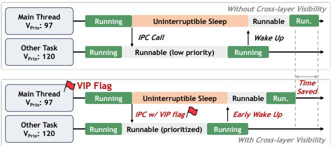  
Figure 1: Motivating example: a main thread hands off an IPC request to a lower-priority task. OS scheduler lacks visibility into this dependency, leading to excessive waiting time.

Figure 1 illustrates a common priority-inversion pattern in mobile interactions. Many latency-sensitive application tasks do not execute in isolation, but depend on cross-process communication with other system components. When the remoteside task of such an IPC path experiences a long scheduling delay, the caller thread is forced to wait as well, even if the caller itself has a much higher priority.

The example in Figure 1 shows this effect using a highpriority main thread (i.e., lower prio value) and a lowerpriority dependent task (i.e., higher prio value). Before op timization, the main thread runs, then enters uninterruptible sleep while waiting for the dependent task to finish. However, the dependent task remains in the runnable state for an extended period before obtaining CPU time. As a result, the main thread cannot be woken up promptly, and its end-to-end waiting time is amplified by the remote-side scheduling delay.

This problem is especially harmful to Android graphics critical paths. For example, when SurfaceFlinger or another graphics-related thread issues a Binder request, a delayed remote-side service thread slows down the return of the IPC, which in turn delays layer composition and increases the likelihood of frame drops and visible jank. After optimization, MUSCHED marks the waiting main thread as VIP and propa gates this urgency to the dependent task, thereby allowing the remote-side runnable interval to shrink and the main thread to wake up earlier.

## 3 System Overview of MUSCHED

Addressing the impossible trinity among scarce resources, cross-process dependencies, and tight deadlines requires the scheduler to understand each application’s interaction structure: which threads lie on the critical path of user-visible operations, when these threads should be prioritized, and which cross-process dependencies they rely on. MUSCHED follows a split architecture that separates semantic policy decisions from scheduling implementation, as shown in Figure 2. The user-space layer captures interaction semantics and updates policies, while the kernel-space layer enforces these decisions on the scheduler fast path. This separation allows MUSCHED to adapt policies for different applications and interaction scenarios without recompiling the kernel or shipping a full firmware update.

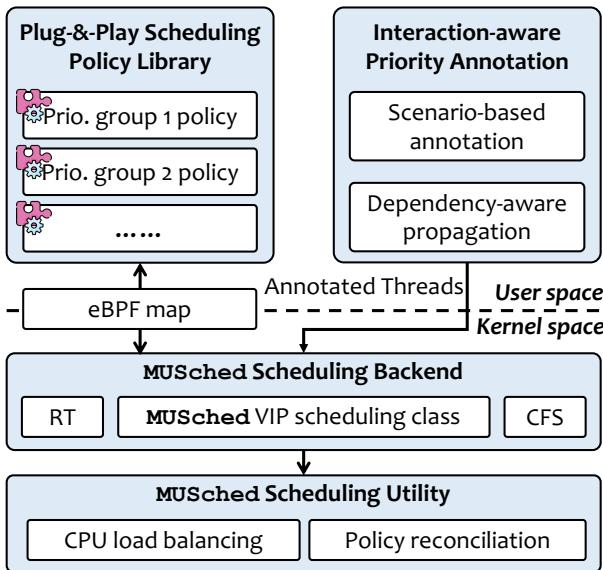  
Figure 2: System overview of MUSCHED.

In user space, a plug-and-play scheduling policy library stores scenario-specific policies, such as the task types to promote and the lifetime of each VIP promotion. These policies are loaded, unloaded, and updated through an eBPFbased gateway, which provides a narrow interface between policy management and kernel enforcement. VIP scheduling also relies on interaction-aware priority annotation: the user-space controller observes framework-level events, identifies key interactive threads, and marks them as candidates for MUSCHED’s VIP scheduling class. Threads that are not annotated continue to follow the original Linux scheduling path. To handle dependencies that are not visible from a single thread alone, MUSCHED further introduces dependencyaware propagation, which carries VIP urgency across Binder calls and lock dependencies when a critical thread is blocked by another task.

In kernel space, MUSCHED introduces a VIP scheduling class between the RT and CFS classes. This class is implemented with per-core VIP queues that host threads requiring temporary priority elevation during user-visible interactions. During scheduling, RT tasks retain the highest priority; VIP tasks are served before normal CFS tasks only when no RT task is runnable. To preserve system stability under contention, a load balancer prevents VIP and RT tasks from accumulating on a single CPU core, while a policy reconciliation agent resolves conflicts among user-space policies and bounds their impact on existing RT and CFS policies.

## 4 MUSCHED Design

In this section, we introduce the essential building blocks of MUSCHED.

## 4.1 Kernel-space Scheduling Backend

To support interaction-aware prioritization on COTS mobile devices, MUSCHED introduces a VIP scheduling class between the built-in RT and CFS classes. The actual scheduling policy is built on top of eBPF to facilitate on-demand modification in user space. To keep this VIP scheduling class compatible with existing classes, MUSCHED also proposes a policy reconciliation module and a CPU load-balancing module, which are combined to maximize CPU utilization and task throughput.

Non-intrusive scheduling class. As we noted in Section 2, on Android OS, RT scheduling is used for system-defined critical tasks such as sensor management and system UI rendering, while other user-space non-critical tasks use the CFS strategy for fairness. As Android applications grow more complex, with multi-threaded rendering pipelines and applicationspecific critical threads, the two existing scheduling classes prove insufficient. The RT class is reserved for system-critical tasks such as audio and SurfaceFlinger; placing application threads there would risk starving these system services. CFS, while safe, weights threads by their historical CPU utilization, which does not reflect interaction criticality: a UI thread that has been idle waiting for a Binder reply appears less CPU-intensive than a background computation thread, and is consequently assigned lower priority. We therefore need a scheduling class whose effective priority lies above CFS but below RT, and whose priority decisions are informed by interaction semantics.

Priority conflict reconciliation. To avoid unnecessary CPU resource contention between VIP and RT tasks, we first try to prevent RT and VIP tasks, as well as multiple VIP tasks, from being placed on the same core during CPU selection. When a task is woken up, the scheduler first determines which CPU it should be executed on. At this point, the scheduler attempts to find a suitable CPU using the following strategy. First, it tries to find a CPU core that is idle and places the task in that CPU’s local queue. If no CPU is currently idle, it tries to find a CPU whose task queue contains no RT or VIP tasks. If neither condition can be satisfied, the scheduler selects the CPU whose task queue contains no RT tasks and has the fewest VIP tasks.

CPU load balancing. Under heavy-load conditions, it is often unavoidable that multiple VIP and RT tasks are placed in the same CPU’s task queue. Given that the completion times of various tasks differ, we further design a CPU loadbalancing strategy, depicted in Figure 3, to fully utilize multiple CPU cores.

First, whenever a CPU enters the idle state, load balancing is triggered. The scheduler attempts to search for and pull tasks from other CPUs’ task queues based on the following rules. It traverses the task queues of other non-idle CPUs and first tries to select those that contain both RT and VIP tasks. If none are found, it then selects the queue with the largest number of VIP tasks. From the selected queue, it chooses the first VIP task eligible to run on the idle CPU and migrates it to that CPU.

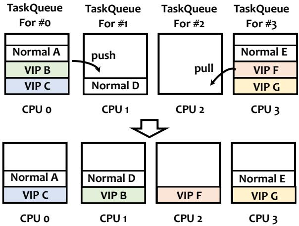  
Figure 3: CPU load balancing in MUSCHED that balances both normal and VIP tasks on mobile CPUs.

In addition, on every CPU tick, the scheduler proactively checks the execution status of VIP tasks in the task queue. If it detects a VIP task that has remained runnable for too long, it will also attempt to balance the workload. More specifically, if the currently running task is an RT task and there exists a VIP task that has been runnable for a long time, the scheduler will actively select a new CPU during the tick. A 4 ms threshold is used to determine whether a VIP task has remained runnable for too long. If such a task exists, load balancing is also triggered: the scheduler traverses the CPUs where the task can be executed and selects the target CPU with no RT tasks and minimal VIP tasks. We set the migration threshold to 4 ms, which is approximately half of the 8.3 ms frame budget at 120 Hz. If a VIP task has already remained runnable for more than half a frame interval, further delay on the current CPU materially increases the risk of a missed frame deadline. Conversely, thresholds below 2 ms trigger excessive migrations, because transient run-queue delay of 1-2 ms is common even under moderate load, and the migration cost itself becomes non-negligible. In practice, this parameter is also influenced by hardware capability and product goals. For flagship or performance-oriented devices, we use lower thresholds, whereas we set higher thresholds to reduce frequent migration overhead for thermally constrained or battery-oriented products.

## 4.2 Plug-and-Play Policies based on eBPF

Different applications and interaction scenarios, such as app start and window switch, require different VIP time limits and dynamic promotion of selected tasks to VIP status. Moreover, these policies must be updated as applications evolve. To implement VIP scheduling policies for each application, traditional approaches that modify the kernel scheduler require intrusive changes to the kernel. This intrusive design is impractical for production-ready mobile devices because modifying the kernel requires frequent reboots to apply the new scheduling policy. MUSCHED adopts a fine-grained scheduling policy for each application, which can be updated when the applications are updated. Moreover, due to the variety of mobile applications, it is necessary to decide the scheduling policies on the fly for unseen applications. Hence, it is not possible for a large-scale mobile device vendor to publish policy patches that frequently require a system reboot.

According to the above analysis, MUSCHED therefore adopts an eBPF-based design because eBPF uniquely combines safe in-kernel programmability, rich observability, and efficient user–kernel communication. Specifically, eBPF facilitates MUSCHED to dynamically update the scheduling policy without a system reboot, which is necessary for application updates and new application installations.

MUSCHED implements the VIP scheduling class on top of Linux sched\_ext. The kernel-side backend maintains percore VIP queues, while the user-space scheduler updates scenario-specific policies through BPF maps and dispatch queues.

During scheduling, each CPU first serves RT tasks. If no RT task is runnable, it selects tasks from the local VIP queue before falling back to CFS tasks, ensuring that interactioncritical threads receive bounded priority elevation.

To prevent starvation of certain tasks under high load, tasks in the VIP queue are scheduled in a first-in-first-out (FIFO) manner, and each VIP task in the queue is assigned a 3 ms time slice. For the cpu.share allocation in cgroups, MUSCHED by default inherits the kernel’s configuration. In addition, to prevent other normal tasks from starving when there are too many VIP tasks, a time limit is imposed on VIP tasks. For each VIP task, if it has used up its time slice but has not exceeded the limit time, it is reinserted into the back of the queue; if it runs out of both the slice time and the limit time, its VIP label is temporarily removed until the next enqueue. Since different types of VIP tasks have different computational requirements, we configure the time limit based on profiling of representative workloads: 20 ms for audio tasks, 10 ms for video tasks, 120 ms for webview tasks, and 20 ms for display tasks. These limit times reflect the computational profile of each interaction class and also serve as the main safeguard against starvation. Audio tasks use a 20 ms budget to match typical buffer-processing windows; video tasks use 10 ms to cover a decode-and-render cycle; WebView tasks use

Table 1: Annotated scenarios related to user interaction.  
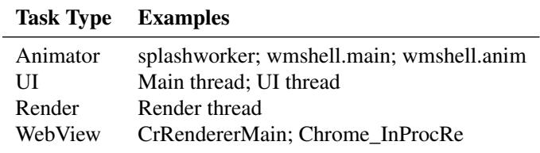

120 ms because page layout and script execution often span multiple frames; and display tasks use 20 ms to align with composition-critical work. Once a task exhausts its limit, it is demoted from VIP and returns to CFS until the next qualifying event, ensuring that priority boosting remains temporary and bounded rather than allowing indefinite VIP service.

## 4.3 Semantic-aware Mobile Scheduling

Another key problem we face is identifying critical tasks currently queued in the CFS scheduler. To address this, we first introduce scenario-aware annotation, which provides guidance for labeling critical tasks based on a predefined list. Furthermore, considering that VIP tasks may depend on the completion of some normal tasks, we design a priority propagation for inter-process interaction. It dynamically propagates VIP tags to the normal task that a VIP task depends on, accelerating its execution and preventing bottlenecks caused by such dependencies.

Scenario-aware Annotation. To identify which threads belong to the critical path of user interactions, MUSCHED combines three complementary sources of information. First, Android already exposes several thread roles that consistently lie on interaction-critical paths across applications, such as the main/UI thread, RenderThread, MotionThread, and Binder worker threads serving user-facing requests. These roles generalize well across applications and therefore form the default annotation candidates in MUSCHED.

Second, we refine this default set through offline profiling. For each target scenario, such as app launch, swipe, or animation, we repeatedly execute the application and collect multiple systrace traces. From these traces, we analyze wake-up relationships and per-thread CPU load to identify additional threads that repeatedly appear on the end-to-end critical path. This step captures application-specific critical threads as a dependency graph, which is not directly exposed as standard Android roles.

Third, we further use jank traces collected from beta users in the field to diagnose missed cases and augment the annotation set. These online traces help us cover rare or highly application-specific behaviors that may not appear in controlled offline runs. Together, these three sources provide broad practical coverage of critical threads while keeping the annotation process lightweight.

These analyses yield the thread categories shown in Table 1.

Some categories, such as render thread and Binder worker pools, generalize across applications, while others require perapplication identification of the concrete thread instances. At runtime, MUSCHED identifies these instances through framework hooks placed at SystemUI, Launcher animation transitions, app foreground/background switches, focus changes, and frame-rendering callbacks. When the framework detects that an application has entered a user-interactive state, it tags the corresponding threads with VIP labels so they can be scheduled with elevated priority.

Priority Propagation for Inter-Process Interaction. To optimize the waiting time of VIP tasks for locked resources, we design a VIP lock-waiting queue optimization strategy. In the native Linux mechanism, mutexes are awakened in a FIFO manner, while read–write locks are awakened in batches based on the top waiter type, also following a FIFO strategy. Since both regular tasks and VIP tasks may wait for the same lock resource, VIP tasks may experience long delays. To address this issue, we introduce a new wake-up strategy that allows VIP threads to bypass the strict FIFO sequence, enabling them to be inserted ahead of multiple non-critical threads and be awakened preferentially.

Considering that VIP tasks may depend on the completion of some normal tasks, we further design a call-chain priority propagation mechanism for inter-process interaction. When a VIP thread waits for a lock held by a normal thread, including futex, mutex, and rwsem, the VIP label can be propagated to that normal thread, elevating its priority to accelerate execution and shorten the VIP thread’s waiting time. The core idea is that when a thread is blocked while acquiring a lock, it passes the thread ID of the lock-holding thread to the kernel. The kernel identifies whether the blocked thread is a VIP thread; if so, the VIP priority is dynamically propagated to the lock holder to accelerate its execution. For each supported synchronization primitive, we place hooks on the lock-acquisition and release paths to record the current owner thread ID in kernel-visible state. When a waiter blocks, the hook retrieves the recorded owner, checks whether the blocked task is tagged VIP, and, if so, transiently propagates the VIP label to the lock holder. A thread that merely acquires a lock is not proactively marked VIP; propagation is triggered only when a VIP waiter appears and identifies that holder as the blocking dependency. We apply this mechanism to futex, mutex, and rwsem contention, and revoke the inherited label when the owner releases the lock, when the dependency disappears, or when the boost exceeds its bounded lifetime. Once the regular thread releases the lock, it wakes the VIP thread, and the inherited VIP label is removed, restoring it to a normal task and returning to the fair CFS scheduling policy.

Besides, in Android, inter-process communication is also very common. When a task initiates a synchronous Binder call, it enters the sleeping state and waits for the remote process to return the result. If the remote process is under heavy load or its priority is low, the server binder may remain in the

Runnable state for a long time, causing the caller task to be blocked. This issue becomes even more severe in scenarios such as layer composition in SurfaceFlinger.

We address this issue by monitoring the start of Binder transactions. When a VIP task communicates with another process through Binder, MUSCHED dynamically propagates the VIP label to the callee to accelerate its execution. Specifically, when a VIP thread initiates a synchronous Binder call, the scheduler immediately locates the corresponding service thread on the remote side and tags it as VIP. After the execution, the dynamically propagated label is cleared, and the task is restored to a normal task.

## 4.4 Case Study: Cold-start Acceleration

We take a cold-start acceleration scenario to demonstrate MUSCHED’s user-space scheduling capability. Cold start is the most demanding application launch state [1]. It occurs when an app starts from scratch, with no existing process in memory. The system must create the app process, initialize the runtime, and build the first Activity before any frame can be shown. This procedure often triggers more than 300 thread creations, large memory allocations from hundreds of MB to several GB, and intensive file and network I/O. During this phase, many launch-critical threads become active, including UI, rendering, animation, web loading, composition, and system service binder threads, creating a short but extremely con gested window of resource contention. Launch latency thus becomes a first-order performance objective, and standard startup metrics (e.g., TTID and TTFD) are highly sensitive to scheduling decisions. When cold-start time exceeds about one second, users typically perceive the app as sluggish. Traditional CFS schedulers prioritize fairness across tasks. Under heavy contention, this fairness causes critical-path threads on the launch pipeline to be preempted by less important work. Moreover, the kernel scheduler lacks semantic knowledge of the launch sequence and cannot distinguish threads on the cold-start critical path from best-effort background tasks.

Semantic-aware scheduling of MUSCHED addresses these limitations by injecting launch-specific knowledge into the scheduler. Sampling cold-start critical path offline [17], we annotate launch-critical tasks and add lightweight framework hooks to tag their threads as VIP. VIP threads receive elevated priority and are protected from preemption by non-critical work, directly mitigating CPU contention on the launch critical path. However, critical tasks frequently block on dependencies such as locks and binder IPCs. To handle this, semanticaware scheduling incorporates priority propagation. When a VIP task waits on a lock, its VIP tag is propagated to the lock holder, temporarily boosting that thread to accelerate lock release and prevent priority inversion. Similarly, when a VIP task issues a synchronous Binder call, the scheduler locates the serving thread in the remote process and dynamically elevates its priority. The boosted priority is revoked once the lock is released or the IPC completes, restoring normal fairness. By aligning priorities with cold-start semantics, MUSCHED reduces preemption and blocking delays and accelerates the launch pipeline, yielding significantly lower startup latency under load.

## 5 Implementation Details

Based on the MUSCHED design, we then describe how we facilitate these policies, with a focus on details specific to commodity Android devices.

Hooks and Maps based on sched\_ext. sched\_ext is an eBPF-based scheduler that allows users to implement scheduling classes using flexible BPF programs, thereby optimizing scheduling policies for specific workloads and scenarios. We implement the kernel scheduling behavior described in Sec tion 4 via the hooks in the sched\_ext\_ops structure, and construct VIP task queues using BPF maps.

The key hooks of MUSCHED include CPU selection, enqueue, dispatch, and polling. sched\_select\_cpu selects a CPU based on energy efficiency when a task is woken up. It iterates over the system’s performance cores, first preferring big cores in the idle state; if none are idle, it selects the least loaded big core, ensuring sufficient compute resources for VIP tasks. sched\_enqueue assigns a task to the VIP queue of the corresponding task CPU, and invokes scx\_bpf\_dispatch to directly dispatch it to the target CPU core’s high-priority dispatch queue (PRIO-DSQ). While sched\_dispatch consumes tasks from the queue by placing them into the local DSQ, i.e., it determines from which DSQ the CPU fetches the next task to run. To achieve the load balancing described in Section 4.1, MUSCHED performs priority-based polling. scx\_bpf\_consume(DSQ\_ID\_VIP) first attempts to run tasks from the local VIP queue; if the local queue is empty, it then tries to consume tasks from the neighboring core’s DSQ\_ID\_VIP, which we refer to as Steal.

MUSCHED creates a VIP task queue for each core via the scx\_bpf\_create\_dsq. We use a per-CPU array eBPF map, named cpu\_contexts, to store per-core state, including idle time, current load information, the number of enqueued tasks, CPU halt state, etc. We also use a task storage eBPF map, named task\_contexts, to store per-task information such as weight, current execution state, compute load, enqueue time, and dequeue time. Together, these two maps maintain the metadata required by the custom scheduler.

Deploying eBPF on Mobile Devices. Deploying eBPF on commodity Android devices faces constraints that differ significantly from those in the upstream kernel community. The Android eBPF compilation and loading pipeline is tightly coupled to specific system libraries and SELinux policies. The system only allows eBPF programs to be loaded during boot by a dedicated process, bpfloader, and prohibits loading any new programs after boot completion [2]. Besides, the eBPF libraries provided by Android differ from community-standard libraries in both interfaces and evolution pace. To ensure implementation consistency and portability, we abandon Android-specific eBPF libraries and instead develop with the community-standard eBPF libraries. However, the existing bpfloader does not support the BPF\_MAP\_TYPE\_STRUCT\_OPS type required by sched\_ext. To address this limitation, we extend bpfloader to recognize and load struct\_ops-related objects during the boot phase, thereby providing the necessary foundation for subsequently activating the scheduler.

Table 2: Applications used in the laboratory evaluation, selected from top-ranked applications in the application store.  
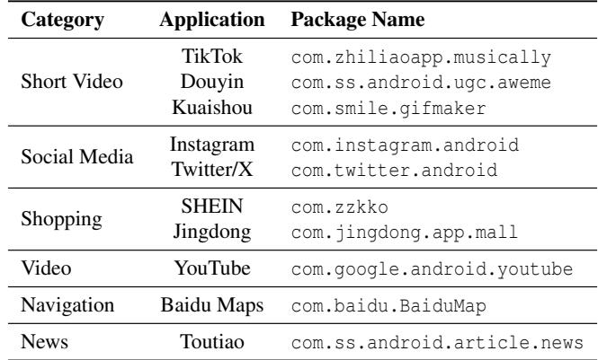

Enabling sched\_ext. sched\_ext leverages the eBPF struct\_ops mechanism, whose enabling method differs from traditional kprobe or tracepoint attachments. The scheduler is enabled by registering and updating a BPF map of type BPF\_MAP\_TYPE\_STRUCT\_OPS, rather than simply attaching a program to a specific hook. Given the stringent stability requirements of the scheduler, this struct\_ops map is restricted to a single update, and any modification requires destroying and recreating the map. The map also maintains an enum state with values INIT, INUSE, TOBEFREE, and READY to indicate the scheduler state, preventing transient intermediate states from causing system panics. In the Android environment, we do not unload the sched\_ext program itself; instead, we indirectly drive the above state transitions via BPF\_F\_LINK [4]. This design enables secure activation and reliable operation of the sched\_ext scheduler while adhering to the safety constraint that eBPF programs should be loaded only once during boot.

## 6 Evaluation

In this section, we first present the laboratory evaluation results of MUSCHED on commodity Android smartphones.

Evaluation Setup. We deploy the proposed approach on the Magic 7 smartphone, which equips the Snapdragon 8 Elite chipset featuring 2 super CPU cores (@4.32 GHz) and 6 performance CPU cores (@3.53 GHz). The software platform is MagicOS 9, which is based on Android 15 with a Linux kernel version of 6.6.

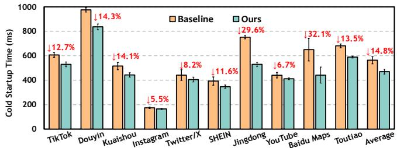  
Figure 4: Cold-start time of 10 Applications.

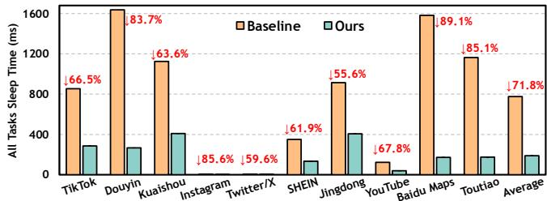  
Figure 5: Time in sleep state during cold-start.

Benchmarks. We choose 10 representative mobile applications, selected from the top-ranked applications in the application store, as test cases in our laboratory environment, as shown in Table 2. These applications cover commonly used categories such as short video, news, shopping, and navigation, etc. We use the native Android scheduling policy as the baseline, i.e., some predefined tasks are configured as RT task, while others are configured as normal tasks, and evaluate the cold-start performance of 10 applications. Each application is tested 100 times, and the average result is reported. To create reproducible yet realistic contention, we combine application-driven and synthetic background load. We emulate realistic concurrent usage by keeping representative background activities active while measuring the foreground app, e.g., short-video scrolling in the foreground together with navigation, music playback, or other common services in the background. we use tools such as stress-ng or rt-app to inject periodic per-core pressure. Unless otherwise stated, we fix the display mode, thermal state, battery mode, CPU governor, and cache-clearing procedure across runs so that the measured differences primarily reflect scheduling policy rather than platform drift.

End-to-end Performance. The cold-start performance of 10 applications is shown in Figure 4. Compared with the baseline, we reduce the average cold-start time by 14.8%, while also achieving more stable performance with the standard deviation decreasing by 24.25%. These improvements primarily stem from two aspects. First, we identify critical tasks during application startup and raise their scheduling priority, while preventing competition for CPU resources between VIP tasks and RT tasks. Second, our priority-propagation strategy temporarily boosts the priority of normal tasks that VIP tasks depend on, thereby reducing overall task completion time.

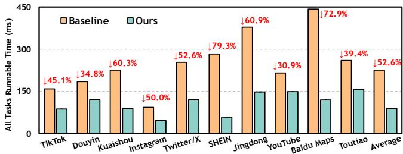  
Figure 6: Time in runnable state during cold-start.

Table 3: Measured latency (in ms) of a foreground application with a background picture-in-picture video call with and without MUSCHED.  
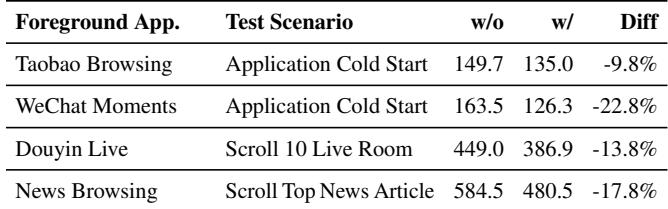

We further measure the total uninterruptible sleep time and waiting for scheduling time, i.e., in runnable state, of all VIP tasks during the startup process for the 10 applications. The results are shown in Figure 5 and 6, respectively. These results indicate that MUSCHED reduces both the resourcewaiting time and scheduling-waiting time of critical tasks during application startup. This result is consistent with our analysis of why application startup time decreases.

We further evaluate MUSCHED in edge scenarios where a background picture-in-picture (PiP) video call coexists with foreground user interactions. Table 3 summarizes four representative cases, including application cold start in Taobao and WeChat Moments, live-room interaction in Douyin, and article browsing in a news application. Across these scenarios, MUSCHED consistently reduces foreground response latency by 9.8%–22.8% in all cases, with the largest gain observed in WeChat Moments. Overall, these results suggest that MUSCHED remains effective under mixed foreground/background workloads, while also highlighting that semi-interactive scenarios with concurrent media activity still expose cases that require finer-grained policy reconciliation, as we designed in Section 4.1.

Overhead of MUSCHED. We further evaluate the runtime overhead introduced by the scheduling backend of MUSCHED and its dependency-tracking path. We measure the overhead in two widely adopted scenarios: short-video playback and mobile gaming.

In a steady-state short-video playback scenario, we compare the average latency of two scheduler-critical operations, context switching and pick-next-task selection, before and after enabling MUSCHED. As shown in Table 4, the average context-switch latency remains unchanged at 5 µs, while the average pick next task latency increases only slightly from 2 µs to 3 µs. These results indicate that the IPC and lock tracking hooks and the dependency-propagation logic add little overhead to the scheduler fast path in a representative interactive media workload. We also evaluate a mainstream mobile game at 120 FPS with default graphics settings to assess runtime cost under sustained high-refresh load. As shown in Table 4, the average frame rate is nearly unchanged, the worst dropped-frame count is slightly improved, and the normalized current is comparable. Together, these results suggest that MUSCHED does not introduce non-negligible overhead in practice.

Table 4: Runtime overhead and energy impact of MUSCHED under video and gaming scenarios.  
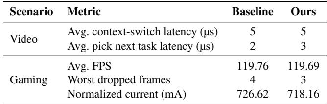

## 7 Experiences and Lessons Learned

In this section, we introduce the experiences and lessons learned during our development and deployment process of MUSCHED. We also present big data results on large-scale commercial smartphones, covering application cold-start performance, frame drop performance in UI animation, and user swipe scenarios.

## 7.1 Production Deployment of MUSCHED

Since its deployment in January 2024, the scheduling algorithm designed using MUSCHED has been deployed on over 20 million mobile devices from Honor. The deployment spans multiple product tiers, including flagship and mid-range device series, and covers both MediaTek and Qualcomm platforms. Targeted scenarios include application cold-start, web browsing, and touch-sliding interactions.

To illustrate how MUSCHED performs in real-world scenarios, we validate it using large-scale user data. We measure anomaly frequency across various real-world scenarios, including application cold start, animation, and swipe, that significantly impact users’ QoE. Specifically, for application cold-start, we define a cold-start time that exceeds 2 seconds as an anomaly; for animation and swipe scenarios, we define continuous frame drops lasting more than 50ms as an anomaly. We then measure the anomaly frequency in each scenario before and after deploying our approach. The anomaly counts reported here indicate how many times users encounter such failures per thousand hours of usage. These statistics are first collected on-device and then aggregated across the deployed user population for large-scale analysis.

Table 5: End-to-end QoE evaluation in large-scale production deployment. Values report anomaly frequencies per thousand hours of user activity before and after deploying MUSCHED.  
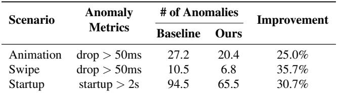

The results in Table 5 demonstrate that our approach consistently delivers stable and significant performance gains in the real world. As shown in Table 5, we observe clear reductions in anomaly rates across animation, swipe, and startup scenarios. Specifically, animation anomalies decrease by 25.0%, swipe anomalies by 35.7%, and startup anomalies by 30.7%.

These findings indicate that across diverse workloads and complex user-interaction scenarios, our scheduling strategy can effectively identify critical tasks, prevent stalls along the critical path, and maintain smooth interactions even amid heavy system-resource contention. It validates the generalization ability and robustness of our approach in large-scale real-world deployments, enabling continuous improvements to overall user QoE.

## 7.2 Lessons Learned

Over the course of developing MUSCHED, from initial research prototyping in 2021 to production deployment in January 2024, we have learned several lessons about the practical realities of user space scheduling on commercial mobile devices.

Lessons Learned ①: Practical gains in development efficiency. Adopting a user-space scheduling framework based on Linux sched\_ext delivers impactful practical benefits, addressing key challenges in deploying scheduling innovations on commercial mobile devices.

First, user-space design enables dynamic policy iteration without kernel recompilation: scheduling logic can be hotupdated, reducing iteration time from hours to minutes for scenario-specific policies (e.g., gaming, application coldstart). Combined with sched\_ext’s modularity, this decouples policy logic from core kernel components, mitigating stability risks by confining failures to user space.

Second, user-space scheduling facilitates fine-grained scenario adaptation and controlled experimentation. Dynamic conditional triggering aligns policies with context-aware demands—aggressive CPU provisioning for games, powerefficient scheduling for low-interaction phases, and lifecycleaware core scaling for application foreground transitions. Its isolated execution also enables safe A/B testing on production devices, supporting “small-batch” validation without potential global disruption.

Third, the approach lowers developer barriers via high-level abstractions (e.g., BCC, BPFtrace), enabling policy development in C or scripting languages without deep kernel expertise. It integrates seamlessly with Android’s system services (e.g., Activity Manager) and leverages widespread kernel support for user-space scheduling frameworks.

Lessons Learned ②: Future potentials of MUSCHED. First, on-demand activation via scenario recognition is nonnegotiable for commercial viability. A single user-space scheduling framework cannot optimize all mobile workloads (e.g., interactive apps, background services, optimized games). We should integrate it with a scenario recognizer to dynamically trigger policies in critical contexts (e.g., application launches, UI animations) and to auto-exit during idle/background phases, thereby avoiding unnecessary overhead and ensuring compatibility across diverse use cases.

Second, tight integration with SoC-specific hardware characteristics is essential. Modern mobile SoCs feature heterogeneous cores, dynamic idle states, and CPU affinity constraints. While kernel mechanisms partially address these, user-space schedulers leverage fine-grained hardware telemetry (e.g., per-core utilization, thermal headroom) to make informed core-selection decisions, ensuring consistency across chipset models and unlocking full performance potential.

Third, co-optimization of core selection and frequency scaling is imperative. These two mechanisms are inherently coupled: a high-performance core assignment fails if frequency is throttled, and aggressive scaling wastes power without intelligent core selection. Future user-space frameworks should unify these controls to balance latency and energy efficiency, e.g., triggering frequency boosts only for critical tasks on performance cores. These lessons highlight that the commercial success of user-space scheduling depends on adapting to real-world hardware diversity, workload variability, and intertwined resource management challenges.

Lessons Learned ③: No silver bullets for workloads. Our previous results show that the MUSCHED can significantly improve some interactive Android workloads. However, its performance benefits are limited for highly optimized games with simple, well-understood critical paths.

There are two main reasons. First, mobile games are flagship workloads that showcase the overall device capability. Major SoC and OEM vendors, therefore, invest heavily in this domain. For mainstream devices, the frame rate of popular titles already meets the target cap under most conditions. Second, compared with the heavily interactive workloads discussed earlier, the scheduling patterns of mobile games are relatively simple. The critical threads (e.g., UnityMain, UnityGfxDeviceW) exhibit stable and highly regular switching behavior. Consequently, the primary bottlenecks shift to power and thermal constraints, while SoC/OEM mechanisms such as CPU load estimation, power governors, and poweraware schedulers (e.g., PELT/WALT) dominate performance.

We evaluate a large MOBA game and find that with and without the MUSCHED, the average FPS remains stable, and frame-time variability shows no statistically significant difference. Even after applying optimizations such as core selection and enqueue policies, we observe only a minor decrease in CPU utilization, while the electric current and device shell temperature become slightly worse.

Lessons Learned ④: No free escape with eBPF. In the inkernel setting, eBPF is deliberately restricted and, in practice, not Turing-complete. For kernel safety, the verifier of eBPF enforces strict constraints: no direct modification of kernel data structures, no unbounded loops, a 512-byte stack limit, and no dynamic memory allocation. The verifier itself does not scale well to complex control-flow paths. When the code contains layered if-else conditions, the program can easily be rejected during verification.

In practice, we agree with these safety constraints, but fast prototyping and iteration often require us to escape the pure eBPF model. Our main strategy is to treat eBPF as a thin control plane and leave complexity back into the kernel (modules) via the kfunc mechanism. With simple annotations, selected kernel functions can be exposed as callable kfuncs to eBPF programs. To support updates to kernel data structures, we implement a memcpy-like BPF kfunc that performs the actual writes in kernel space. For existing complex scheduling algorithms, we encapsulate them as kfuncs rather than reimplementing them. To cope with stack and allocation limits, we store state and large data structures in global variables and BPF maps. To keep verifier complexity manageable, we avoid deep branching and, when necessary, split decision logic into multiple shallow control flows.

## 8 Related Work

MUSCHED builds on several pioneering works, including application-specific OS scheduling and eBPF-based userspace OS management. In this section, we introduce the works related to MUSCHED.

## 8.1 OS Scheduling Advancements

OS scheduling has been widely studied in the last few decades. Academia and industry introduce a spectrum of generalpurpose policies as well as many domain-specialized schedulers that target latency, throughput, or energy trade-offs. Widely adopted policies such as FIFO and the Linux Completely Fair Scheduler (CFS) provide simple yet effective performance across a wide range of workloads.

Beyond general-purpose schedulers, recent years have seen a proliferation of scheduling work tuned to specific workloads or application patterns. For example, for remote procedure calls (RPCs) in data centers, existing works such as Shinjuku [13], Shenango [20], and eRPC [15] push the envelope on tail latency and per-core efficiency. Work in this area often involves co-designing CPU scheduling with network transport, as RPCs typically encompass both networking and computing components. Another example is in the serverless computing domain, SFS [8] and Alps [9] focus on the peculiarities of short-lived, latency-sensitive function executions across highly bursty request arrivals. These designs explore techniques including lightweight isolation, fast placement, and resource reclamation to reduce cold-start and queuing delays and to improve utilization in multi-tenant environments.

Mobile systems introduce a different set of constraints where user experience and energy consumption are primary concerns. For example, SmartOS [10] leverages reinforcement learning to obtain the importance of each task on mobile devices and allocates resources according to user preference. Orthrus [22] proposes a framework that co-optimizes the pro cess scheduling and CPU frequency governing on mobile OS for both energy efficiency and quality of service. Targeting the slow UI responsiveness problem, TIHMM [25] reconstructs the process state model on Android with new “hogging” states to reduce the suboptimal resource allocation of the original Android process management.

Compared with the above works, MUSCHED not only focuses on specific scheduling problems during cold start or UI animation but also acts as a fundamental framework to solve the trinity problem of mobile scheduling.

## 8.2 User-space OS Management with eBPF

Extended Berkeley Packet Filter (eBPF) is a lightweight inkernel virtual machine that runs sandboxed programs at welldefined OS hook points. Programs interact with the kernel and user space via maps, enabling low-overhead telemetry, state sharing, and control. Because eBPF enforces safety and verification, it lets developers iterate on policy logic in user space while applying enforcement close to the kernel. This property makes eBPF a natural substrate for user-space OS management: user processes can define, tune, and deploy policies quickly, and eBPF provides fast, safe kernel mediation and observability. Prior work has explored both eBPF-based management and broader user-space delegation to make OS policies more reconfigurable.

A representative work is ghOst [12], which delegates CPU scheduling decisions to user-space agents. Its key idea is to keep the kernel responsible for safe enforcement and lowlevel task state management, while allowing developers to implement scheduling policies in user space and update them without redesigning the whole kernel scheduler. This design supports a variety of scheduling models, including centralized, sharded, and preemptive scheduling, and has demonstrated that user-space schedulers can provide both flexibility and low latency for datacenter workloads. Building on this direction, Syrup [14] extends user-space scheduling beyond CPU cores to jointly manage the networking stack and NIC, showing that policy delegation can coordinate multiple OS subsystems.

Beyond CPU scheduling, eBPF-based management has also been explored in the memory-management domain. CacheBPF [26] facilitates the modification of page-eviction policies without changing core kernel code. FetchBPF [6] uses eBPF to implement pluggable memory prefetch strategies. It highlights how introspective kernel probes enable workload-aware prefetching. Results show substantial throughput gains for memory-bound applications.

These prior systems either move selected OS functionality into user space or use eBPF to customize a single subsystem. In contrast, MUSCHED focuses on interaction-aware CPU scheduling for commercial mobile devices. It couples user-space policy adaptation with low-overhead kernel enforcement to support scenario-aware prioritization and crossprocess dependency handling without invasive and frequent kernel changes, which is impractical on COTS devices.

## 9 Conclusion

This paper presents MUSCHED, a semantic-aware scheduling framework for modern mobile SoCs. MUSCHED addresses the fundamental semantic gap between low-level kernel scheduling and high-level user interaction, which becomes especially problematic in the face of the mobile scheduling trilemma: scarce high-performance cores, complex crossprocess dependencies, and unforgiving latency deadlines. MUSCHED introduces a new VIP scheduling class between RT and CFS, identifies interaction-critical threads through scenario-aware annotation, propagates priority across Binder and lock dependencies, and supports user-space policy updates without kernel recompilation.

In laboratory experiments, MUSCHED reduces average application cold-start time by 14.8%. In large-scale production deployment on over 20 million commercial devices since 2024, MUSCHED reduces cold-start anomalies by 30.7%, animation anomalies by 24.9%, and swipe anomalies by 35.7%, while preserving system stability. These results demonstrate that semantic-aware, deployable user-space scheduling is a practical way to improve mobile QoE on commercial off-theshelf devices.

## Acknowledgement

We thank the anonymous reviewers for their constructive feedback and valuable suggestions. This work was supported in part by the National Natural Science Foundation of China under Grants 62302096, 62432004, 62302207, and U24B20152; the Natural Science Foundation of Jiangsu Province under Grant BK20230813; the Fundamental Research Funds for the Central Universities under Grants 2026300278 and ZZKT2026A31; and the “111 Center” under Grant No. B26023.

## References

[1] App startup time | App quality | Android Developers — developer.android.com. https: //developer.android.com/topic/performance/ vitals/launch-time. [Accessed 11-12-2025].

[2] Extend the kernel with eBPF | Android Open Source Project — source.android.com. https://source.android.com/docs/core/ architecture/kernel/bpf. [Accessed 08-12- 2025].

[3] Number of mobile devices worldwide 2020-2025. https://www.statista.com/statistics/245501/ multiple-mobile-device-ownership-worldwide. [Accessed 08-12-2025].

[4] Program Type ’BPF\_PROG\_TYPE\_STRUCT\_OPS - eBPF Docs — docs.ebpf.io. https://docs.ebpf. io/linux/program-type/BPF\_PROG\_TYPE\_STRUCT\_ OPS/. [Accessed 08-12-2025].

[5] Justinien Bouron, Sebastien Chevalley, Baptiste Lepers, Willy Zwaenepoel, Redha Gouicem, Julia Lawall, Gilles Muller, and Julien Sopena. The Battle of the Schedulers: {FreeBSD} {ULE} vs. Linux {CFS}. In Proc. of USENIX ATC, pages 85–96, 2018.

[6] Xuechun Cao, Shaurya Patel, Soo Yee Lim, Xueyuan Han, and Thomas Pasquier. {FetchBPF}: Customizable prefetching policies in linux with {eBPF}. In Proc. of USENIX ATC, pages 369–378, 2024.

[7] Inho Cho, Ahmed Saeed, Joshua Fried, Seo Jin Park, Mohammad Alizadeh, and Adam Belay. Overload Control for {µs-scale}{RPCs} with Breakwater. In Proc. of USENIX OSDI, pages 299–314, 2020.

[8] Yuqi Fu, Li Liu, Haoliang Wang, Yue Cheng, and Songqing Chen. SFS: Smart OS Scheduling for Serverless Functions. In SC22: International Conference for High Performance Computing, Networking, Storage and Analysis, pages 1–16, November 2022.

[9] Yuqi Fu, Ruizhe Shi, Haoliang Wang, Songqing Chen, and Yue Cheng. {ALPS}: An Adaptive Learning, Priority {OS} Scheduler for Serverless Functions. In Proc. of USENIX ATC, pages 19–36, 2024.

[10] Sepideh Goodarzy, Maziyar Nazari, Richard Han, Eric Keller, and Eric Rozner. Smartos: towards automated learning and user-adaptive resource allocation in operating systems. In Proc. of ACM APSys, pages 48–55, 2021.

[11] Mingcong Han, Hanze Zhang, Rong Chen, and Haibo Chen. Microsecond-scale Preemption for Concurrent {GPU-accelerated}{DNN} Inferences. In Proc. of USENIX OSDI, pages 539–558, 2022.

[12] Jack Tigar Humphries, Neel Natu, Ashwin Chaugule, Ofir Weisse, Barret Rhoden, Josh Don, Luigi Rizzo, Oleg Rombakh, Paul Turner, and Christos Kozyrakis. ghOSt: Fast & Flexible User-Space Delegation of Linux Scheduling. In Proc. of ACM SOSP, pages 588–604, 2021.

[13] Kostis Kaffes, Timothy Chong, Jack Tigar Humphries, Adam Belay, David Mazières, and Christos Kozyrakis. Shinjuku: Preemptive Scheduling for {µsecond-Scale} Tail Latency. In Proc. of USENIX NSDI, pages 345–360, 2019.

[14] Kostis Kaffes, Jack Tigar Humphries, David Mazières, and Christos Kozyrakis. Syrup: User-Defined Scheduling Across the Stack. In Proc. of ACM SOSP, pages 605–620, 2021.

[15] Anuj Kalia, Michael Kaminsky, and David Andersen. Datacenter {RPCs} can be General and Fast. In Proc. of USENIX NSDI, pages 1–16, 2019.

[16] Zhihui Ke, Xiaobo Zhou, Dadong Jiang, Hao Yan, and Tie Qiu. CollabVr: Reprojection-Based Edge-Client Collaborative Rendering for Real-Time High-Quality Mobile Virtual Reality. In Proc. of IEEE RTSS, pages 304–316, December 2023.

[17] James E. Kelley Jr and Morgan R. Walker. Critical-path planning and scheduling. In Papers Presented at the December 1–3, 1959, Eastern Joint IRE–AIEE–ACM Computer Conference, pages 160–173, 1959.

[18] Devi Klein, Josef Spjut, Ben Boudaoud, and Joohwan Kim. Variable frame timing affects perception of smoothness in first-person gaming. In 2024 IEEE Conference on Games (CoG), pages 1–8, 2024.

[19] Yu Liu, Puqi Zhou, Zejun Zhang, Anlan Zhang, Bo Han, Zhenhua Li, and Feng Qian. Muv2: scaling up multiuser mobile volumetric video streaming via content hybridization and sharing. In Proc. of ACM MobiCom, pages 327–341, 2024.

[20] Amy Ousterhout, Joshua Fried, Jonathan Behrens, Adam Belay, and Hari Balakrishnan. Shenango: Achieving high {CPU} efficiency for latency-sensitive datacenter workloads. In Proc. of USENIX NSDI, pages 361–378, 2019.

[21] Lenin Ravindranath, Jitendra Padhye, Sharad Agarwal, Ratul Mahajan, Ian Obermiller, and Shahin Shayandeh. {AppInsight}: Mobile App Performance Monitoring in

the Wild. In Proc. of USENIX OSDI, pages 107–120, 2012.

[22] Qianlong Sang, Jinqi Yan, Rui Xie, Chuang Hu, Kun Suo, and Dazhao Cheng. Qos-aware power management via scheduling and governing co-optimization on mobile devices. IEEE Transactions on Mobile Computing, 2024.

[23] The Linux Kernel documentation contributors. Energy aware scheduling. https://www.kernel.org/doc/ html/latest/scheduler/sched-energy.html, 2025. Accessed: 2026-06-03.

[24] Yizong Wang, Dong Zhao, Huanhuan Zhang, Teng Gao, Zixuan Guo, Chenghao Huang, and Huadong Ma. Bandwidth-efficient mobile volumetric video streaming by exploiting inter-frame correlation. IEEE Transactions on Mobile Computing, 23(10):9410–9423, 2024.

[25] Jianwei Zheng, Zhenhua Li, Feng Qian, Wei Liu, Hao Lin, Yunhao Liu, Tianyin Xu, Nan Zhang, Ju Wang, and Cang Zhang. Rethinking Process Management for Interactive Mobile Systems. In Proc. of ACM MobiCom, pages 215–229, New York, NY, USA, May 2024.

[26] Tal Zussman, Ioannis Zarkadas, Jeremy Carin, Andrew Cheng, Hubertus Franke, Jonas Pfefferle, and Asaf Cidon. Cache is king: Smart page eviction with ebpf. arXiv e-prints, pages arXiv–2502, 2025.